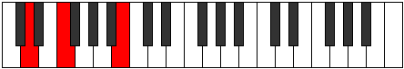
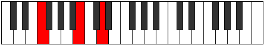

# BNaturalDiminished

## Links

- [Documentation](README.md)
- [Scales Index](Scales.md)
- [Modes Index](Modes.md)
- [Chords Index](Chords.md)

## Root

B

## Notes

| Position | Notes | Illustration |
|----------|------|--------------|
| RootPosition | B,D,F |  |
| FirstInversion | D,F,B |  |
| SecondInversion | F,B,D |  |
## Modes

| Number | Mode | Tonic | Notes | Illustration |
|--------|------|-------|-------|--------------|
| [293](https://ianring.com/musictheory/scales/293) | [Zoptic](ModeANaturalZoptic.md) | A | A, B, D, F, A |  |
| [295](https://ianring.com/musictheory/scales/295) | [Gyritonic](ModeANaturalGyritonic.md) | A | A, A#, B, D, F, A |  |
| [301](https://ianring.com/musictheory/scales/301) | [Zythitonic](ModeANaturalZythitonic.md) | A | A, B, C, D, F, A |  |
| [303](https://ianring.com/musictheory/scales/303) | [Golimic](ModeANaturalGolimic.md) | A | A, Bb, Cb, Dbb, Ebb, F, A |  |
| [309](https://ianring.com/musictheory/scales/309) | [Palitonic](ModeANaturalPalitonic.md) | A | A, B, C#, D, F, A |  |
| [311](https://ianring.com/musictheory/scales/311) | [Stagimic](ModeANaturalStagimic.md) | A | A, Bb, Cb, Db, Ebb, F, A |  |
| [317](https://ianring.com/musictheory/scales/317) | [Korimic](ModeANaturalKorimic.md) | A | A, B, C, Db, Ebb, F, A |  |
| [319](https://ianring.com/musictheory/scales/319) | [Epodian](ModeANaturalEpodian.md) | A | A, Bb, Cb, Dbb, Ebbb, Fbbb, Gbb, A |  |
| [329](https://ianring.com/musictheory/scales/329) | [Lonic](ModeBNaturalLonic.md) | B | B, D, F, G, B |  |
| [331](https://ianring.com/musictheory/scales/331) | [Byptitonic](ModeBNaturalByptitonic.md) | B | B, C, D, F, G, B |  |
| [333](https://ianring.com/musictheory/scales/333) | [Bogitonic](ModeBNaturalBogitonic.md) | B | B, C#, D, F, G, B |  |
| [335](https://ianring.com/musictheory/scales/335) | [Zanimic](ModeBNaturalZanimic.md) | B | B, C, Db, Ebb, F, G, B |  |
| [345](https://ianring.com/musictheory/scales/345) | [Gylitonic](ModeBNaturalGylitonic.md) | B | B, D, D#, F, G, B |  |
| [347](https://ianring.com/musictheory/scales/347) | [Barimic](ModeBNaturalBarimic.md) | B | B, C, D, Eb, F, G, B |  |
| [349](https://ianring.com/musictheory/scales/349) | [Borimic](ModeBNaturalBorimic.md) | B | B, C#, D, Eb, F, G, B |  |
| [351](https://ianring.com/musictheory/scales/351) | [Epanian](ModeBNaturalEpanian.md) | B | B, C, Db, Ebb, Fbb, Gbb, Abb, B |  |
| [357](https://ianring.com/musictheory/scales/357) | [Banitonic](ModeANaturalBanitonic.md) | A | A, B, D, D#, F, A |  |
| [359](https://ianring.com/musictheory/scales/359) | [Bothimic](ModeANaturalBothimic.md) | A | A, Bb, Cb, D, Eb, F, A |  |
| [361](https://ianring.com/musictheory/scales/361) | [Bocritonic](ModeBNaturalBocritonic.md) | B | B, D, E, F, G, B |  |
| [363](https://ianring.com/musictheory/scales/363) | [Soptimic](ModeBNaturalSoptimic.md) | B | B, C, D, E, F, G, B |  |
| [365](https://ianring.com/musictheory/scales/365) | [Marimic](ModeBNaturalMarimic.md) | B | B, C#, D, E, F, G, B |  |
| [365](https://ianring.com/musictheory/scales/365) | [Marimic](ModeANaturalMarimic.md) | A | A, B, C, D, Eb, F, A |  |
| [367](https://ianring.com/musictheory/scales/367) | [Aerodian](ModeBNaturalAerodian.md) | B | B, C, Db, Ebb, Fb, Gbb, Abb, B |  |
| [367](https://ianring.com/musictheory/scales/367) | [Aerodian](ModeANaturalAerodian.md) | A | A, Bb, Cb, Dbb, Ebb, Fbb, Gbb, A |  |
| [373](https://ianring.com/musictheory/scales/373) | [Epagimic](ModeANaturalEpagimic.md) | A | A, B, C#, D, Eb, F, A |  |
| [375](https://ianring.com/musictheory/scales/375) | [Sodian](ModeANaturalSodian.md) | A | A, Bb, Cb, Db, Ebb, Fbb, Gbb, A |  |
| [377](https://ianring.com/musictheory/scales/377) | [Kathimic](ModeBNaturalKathimic.md) | B | B, C##, D#, E, F, G, B |  |
| [379](https://ianring.com/musictheory/scales/379) | [Aeragian](ModeBNaturalAeragian.md) | B | B, C, D, Eb, Fb, Gbb, Abb, B |  |
| [381](https://ianring.com/musictheory/scales/381) | [Kogian](ModeBNaturalKogian.md) | B | B, C#, D, Eb, Fb, Gbb, Abb, B |  |
| [381](https://ianring.com/musictheory/scales/381) | [Kogian](ModeANaturalKogian.md) | A | A, B, C, Db, Ebb, Fbb, Gbb, A |  |
| [383](https://ianring.com/musictheory/scales/383) | [Logyllic](ModeBNaturalLogyllic.md) | B | B, C, C#, D, D#, E, F, G, B |  |
| [383](https://ianring.com/musictheory/scales/383) | [Logyllic](ModeANaturalLogyllic.md) | A | A, A#, B, C, C#, D, D#, F, A |  |
| [403](https://ianring.com/musictheory/scales/403) | [Daptitonic](ModeASharpDaptitonic.md) | A# | A#, B, D, F, F#, A# |  |
| [403](https://ianring.com/musictheory/scales/403) | [Daptitonic](ModeBFlatDaptitonic.md) | Bb | Bb, B, D, F, Gb, Bb |  |
| [407](https://ianring.com/musictheory/scales/407) | [Zylimic](ModeASharpZylimic.md) | A# | A#, B, C, D, E#, F#, A# |  |
| [407](https://ianring.com/musictheory/scales/407) | [Zylimic](ModeBFlatZylimic.md) | Bb | Bb, Cb, Dbb, Ebb, F, Gb, Bb |  |
| [411](https://ianring.com/musictheory/scales/411) | [Lygimic](ModeASharpLygimic.md) | A# | A#, B, C#, D, E#, F#, A# |  |
| [411](https://ianring.com/musictheory/scales/411) | [Lygimic](ModeBFlatLygimic.md) | Bb | Bb, Cb, Db, Ebb, F, Gb, Bb |  |
| [415](https://ianring.com/musictheory/scales/415) | [Aeoladian](ModeASharpAeoladian.md) | A# | A#, B, C, Db, Ebb, F, Gb, A# |  |
| [415](https://ianring.com/musictheory/scales/415) | [Aeoladian](ModeBFlatAeoladian.md) | Bb | Bb, Cb, Dbb, Ebbb, Fbbb, Gbb, Abbb, Bb |  |
| [421](https://ianring.com/musictheory/scales/421) | [Ionitonic](ModeANaturalIonitonic.md) | A | A, B, D, E, F, A |  |
| [423](https://ianring.com/musictheory/scales/423) | [Sogimic](ModeANaturalSogimic.md) | A | A, Bb, Cb, D, E, F, A |  |
| [429](https://ianring.com/musictheory/scales/429) | [Koptimic](ModeANaturalKoptimic.md) | A | A, B, C, D, E, F, A |  |
| [431](https://ianring.com/musictheory/scales/431) | [Epyrian](ModeANaturalEpyrian.md) | A | A, Bb, Cb, Dbb, Ebb, Fb, Gbb, A |  |
| [435](https://ianring.com/musictheory/scales/435) | [Ionolimic](ModeASharpIonolimic.md) | A# | A#, B, C##, D#, E#, F#, A# |  |
| [435](https://ianring.com/musictheory/scales/435) | [Ionolimic](ModeBFlatIonolimic.md) | Bb | Bb, Cb, D, Eb, F, Gb, Bb |  |
| [437](https://ianring.com/musictheory/scales/437) | [Ronimic](ModeANaturalRonimic.md) | A | A, B, C#, D, E, F, A |  |
| [439](https://ianring.com/musictheory/scales/439) | [Bythian](ModeASharpBythian.md) | A# | A#, B, C, D, Eb, F, Gb, A# |  |
| [439](https://ianring.com/musictheory/scales/439) | [Bythian](ModeBFlatBythian.md) | Bb | Bb, Cb, Dbb, Ebb, Fbb, Gbb, Abbb, Bb |  |
| [439](https://ianring.com/musictheory/scales/439) | [Bythian](ModeANaturalBythian.md) | A | A, Bb, Cb, Db, Ebb, Fb, Gbb, A |  |
| [443](https://ianring.com/musictheory/scales/443) | [Kothian](ModeASharpKothian.md) | A# | A#, B, C#, D, Eb, F, Gb, A# |  |
| [443](https://ianring.com/musictheory/scales/443) | [Kothian](ModeBFlatKothian.md) | Bb | Bb, Cb, Db, Ebb, Fbb, Gbb, Abbb, Bb |  |
| [445](https://ianring.com/musictheory/scales/445) | [Gocrian](ModeANaturalGocrian.md) | A | A, B, C, Db, Ebb, Fb, Gbb, A |  |
| [447](https://ianring.com/musictheory/scales/447) | [Thyphyllic](ModeASharpThyphyllic.md) | A# | A#, B, C, C#, D, D#, F, F#, A# |  |
| [447](https://ianring.com/musictheory/scales/447) | [Thyphyllic](ModeBFlatThyphyllic.md) | Bb | Bb, B, C, Db, D, Eb, F, Gb, Bb |  |
| [447](https://ianring.com/musictheory/scales/447) | [Thyphyllic](ModeANaturalThyphyllic.md) | A | A, A#, B, C, C#, D, E, F, A |  |
| [457](https://ianring.com/musictheory/scales/457) | [Staptitonic](ModeBNaturalStaptitonic.md) | B | B, D, F, F#, G, B |  |
| [459](https://ianring.com/musictheory/scales/459) | [Zaptimic](ModeBNaturalZaptimic.md) | B | B, C, D, E#, F#, G, B |  |
| [461](https://ianring.com/musictheory/scales/461) | [Madimic](ModeBNaturalMadimic.md) | B | B, C#, D, E#, F#, G, B |  |
| [463](https://ianring.com/musictheory/scales/463) | [Zythian](ModeBNaturalZythian.md) | B | B, C, Db, Ebb, F, Gb, Abb, B |  |
| [467](https://ianring.com/musictheory/scales/467) | [Phrogimic](ModeASharpPhrogimic.md) | A# | A#, B, C##, D##, E#, F#, A# |  |
| [467](https://ianring.com/musictheory/scales/467) | [Phrogimic](ModeBFlatPhrogimic.md) | Bb | Bb, Cb, D, E, F, Gb, Bb |  |
| [471](https://ianring.com/musictheory/scales/471) | [Dodian](ModeASharpDodian.md) | A# | A#, B, C, D, E, F, Gb, A# |  |
| [471](https://ianring.com/musictheory/scales/471) | [Dodian](ModeBFlatDodian.md) | Bb | Bb, Cb, Dbb, Ebb, Fb, Gbb, Abbb, Bb |  |
| [473](https://ianring.com/musictheory/scales/473) | [Aeralimic](ModeBNaturalAeralimic.md) | B | B, C##, D#, E#, F#, G, B |  |
| [475](https://ianring.com/musictheory/scales/475) | [Aeolygian](ModeBNaturalAeolygian.md) | B | B, C, D, Eb, F, Gb, Abb, B |  |
| [475](https://ianring.com/musictheory/scales/475) | [Aeolygian](ModeASharpAeolygian.md) | A# | A#, B, C#, D, E, F, Gb, A# |  |
| [475](https://ianring.com/musictheory/scales/475) | [Aeolygian](ModeBFlatAeolygian.md) | Bb | Bb, Cb, Db, Ebb, Fb, Gbb, Abbb, Bb |  |
| [477](https://ianring.com/musictheory/scales/477) | [Stacrian](ModeBNaturalStacrian.md) | B | B, C#, D, Eb, F, Gb, Abb, B |  |
| [479](https://ianring.com/musictheory/scales/479) | [Kocryllic](ModeBNaturalKocryllic.md) | B | B, C, C#, D, D#, F, F#, G, B |  |
| [479](https://ianring.com/musictheory/scales/479) | [Kocryllic](ModeASharpKocryllic.md) | A# | A#, B, C, C#, D, E, F, F#, A# |  |
| [479](https://ianring.com/musictheory/scales/479) | [Kocryllic](ModeBFlatKocryllic.md) | Bb | Bb, B, C, Db, D, E, F, Gb, Bb |  |
| [485](https://ianring.com/musictheory/scales/485) | [Stoptimic](ModeANaturalStoptimic.md) | A | A, B, C##, D#, E, F, A |  |
| [487](https://ianring.com/musictheory/scales/487) | [Dynian](ModeANaturalDynian.md) | A | A, Bb, Cb, D, Eb, Fb, Gbb, A |  |
| [489](https://ianring.com/musictheory/scales/489) | [Phrathimic](ModeBNaturalPhrathimic.md) | B | B, C##, D##, E#, F#, G, B |  |
| [491](https://ianring.com/musictheory/scales/491) | [Aeolyrian](ModeBNaturalAeolyrian.md) | B | B, C, D, E, F, Gb, Abb, B |  |
| [493](https://ianring.com/musictheory/scales/493) | [Rygian](ModeBNaturalRygian.md) | B | B, C#, D, E, F, Gb, Abb, B |  |
| [493](https://ianring.com/musictheory/scales/493) | [Rygian](ModeANaturalRygian.md) | A | A, B, C, D, Eb, Fb, Gbb, A |  |
| [495](https://ianring.com/musictheory/scales/495) | [Bocryllic](ModeBNaturalBocryllic.md) | B | B, C, C#, D, E, F, F#, G, B |  |
| [495](https://ianring.com/musictheory/scales/495) | [Bocryllic](ModeANaturalBocryllic.md) | A | A, A#, B, C, D, D#, E, F, A |  |
| [499](https://ianring.com/musictheory/scales/499) | [Ionaptian](ModeASharpIonaptian.md) | A# | A#, B, C##, D#, E, F, Gb, A# |  |
| [499](https://ianring.com/musictheory/scales/499) | [Ionaptian](ModeBFlatIonaptian.md) | Bb | Bb, Cb, D, Eb, Fb, Gbb, Abbb, Bb |  |
| [501](https://ianring.com/musictheory/scales/501) | [Katylian](ModeANaturalKatylian.md) | A | A, B, C#, D, Eb, Fb, Gbb, A |  |
| [503](https://ianring.com/musictheory/scales/503) | [Thoptyllic](ModeASharpThoptyllic.md) | A# | A#, B, C, D, D#, E, F, F#, A# |  |
| [503](https://ianring.com/musictheory/scales/503) | [Thoptyllic](ModeBFlatThoptyllic.md) | Bb | Bb, B, C, D, Eb, E, F, Gb, Bb |  |
| [503](https://ianring.com/musictheory/scales/503) | [Thoptyllic](ModeANaturalThoptyllic.md) | A | A, A#, B, C#, D, D#, E, F, A |  |
| [505](https://ianring.com/musictheory/scales/505) | [Sanian](ModeBNaturalSanian.md) | B | B, C##, D#, E, F, Gb, Abb, B |  |
| [507](https://ianring.com/musictheory/scales/507) | [Moryllic](ModeBNaturalMoryllic.md) | B | B, C, D, D#, E, F, F#, G, B |  |
| [507](https://ianring.com/musictheory/scales/507) | [Moryllic](ModeASharpMoryllic.md) | A# | A#, B, C#, D, D#, E, F, F#, A# |  |
| [507](https://ianring.com/musictheory/scales/507) | [Moryllic](ModeBFlatMoryllic.md) | Bb | Bb, B, Db, D, Eb, E, F, Gb, Bb |  |
| [509](https://ianring.com/musictheory/scales/509) | [Ionothyllic](ModeBNaturalIonothyllic.md) | B | B, C#, D, D#, E, F, F#, G, B |  |
| [509](https://ianring.com/musictheory/scales/509) | [Ionothyllic](ModeANaturalIonothyllic.md) | A | A, B, C, C#, D, D#, E, F, A |  |
| [511](https://ianring.com/musictheory/scales/511) | [Polygic](ModeBNaturalPolygic.md) | B | B, C, C#, D, D#, E, F, F#, G, B |  |
| [511](https://ianring.com/musictheory/scales/511) | [Polygic](ModeASharpPolygic.md) | A# | A#, B, C, C#, D, D#, E, F, F#, A# |  |
| [511](https://ianring.com/musictheory/scales/511) | [Polygic](ModeBFlatPolygic.md) | Bb | Bb, B, C, Db, D, Eb, E, F, Gb, Bb |  |
| [511](https://ianring.com/musictheory/scales/511) | [Polygic](ModeANaturalPolygic.md) | A | A, A#, B, C, C#, D, D#, E, F, A |  |
| [553](https://ianring.com/musictheory/scales/553) | [Phradic](ModeDNaturalPhradic.md) | D | D, F, G, B, D |  |
| [555](https://ianring.com/musictheory/scales/555) | [Aeolycritonic](ModeDNaturalAeolycritonic.md) | D | D, D#, F, G, B, D |  |
| [557](https://ianring.com/musictheory/scales/557) | [Gythitonic](ModeDNaturalGythitonic.md) | D | D, E, F, G, B, D |  |
| [559](https://ianring.com/musictheory/scales/559) | [Lylimic](ModeDNaturalLylimic.md) | D | D, Eb, Fb, Gbb, Abb, B, D |  |
| [569](https://ianring.com/musictheory/scales/569) | [Mothitonic](ModeDNaturalMothitonic.md) | D | D, F, F#, G, B, D |  |
| [571](https://ianring.com/musictheory/scales/571) | [Kynimic](ModeDNaturalKynimic.md) | D | D, Eb, F, Gb, Abb, B, D |  |
| [573](https://ianring.com/musictheory/scales/573) | [Saptimic](ModeDNaturalSaptimic.md) | D | D, E, F, Gb, Abb, B, D |  |
| [575](https://ianring.com/musictheory/scales/575) | [Ionydian](ModeDNaturalIonydian.md) | D | D, Eb, Fb, Gbb, Abbb, E###, Cb, D |  |
| [581](https://ianring.com/musictheory/scales/581) | [Bolic](ModeFNaturalBolic.md) | F | F, G, B, D, F |  |
| [583](https://ianring.com/musictheory/scales/583) | [Aeritonic](ModeFNaturalAeritonic.md) | F | F, F#, G, B, D, F |  |
| [585](https://ianring.com/musictheory/scales/585) | [Phrynic](ModeDNaturalPhrynic.md) | D | D, F, G#, B, D |  |
| [585](https://ianring.com/musictheory/scales/585) | [Phrynic](ModeFNaturalPhrynic.md) | F | F, G#, B, D, F |  |
| [585](https://ianring.com/musictheory/scales/585) | [Phrynic](ModeGSharpPhrynic.md) | G# | G#, B, D, F, G# |  |
| [585](https://ianring.com/musictheory/scales/585) | [Phrynic](ModeAFlatPhrynic.md) | Ab | Ab, B, D, F, Ab |  |
| [585](https://ianring.com/musictheory/scales/585) | [Phrynic](ModeBNaturalPhrynic.md) | B | B, D, F, G#, B |  |
| [587](https://ianring.com/musictheory/scales/587) | [Pathitonic](ModeBNaturalPathitonic.md) | B | B, C, D, F, G#, B |  |
| [587](https://ianring.com/musictheory/scales/587) | [Pathitonic](ModeDNaturalPathitonic.md) | D | D, D#, F, G#, B, D |  |
| [587](https://ianring.com/musictheory/scales/587) | [Pathitonic](ModeFNaturalPathitonic.md) | F | F, F#, G#, B, D, F |  |
| [587](https://ianring.com/musictheory/scales/587) | [Pathitonic](ModeGSharpPathitonic.md) | G# | G#, A, B, D, F, G# |  |
| [587](https://ianring.com/musictheory/scales/587) | [Pathitonic](ModeAFlatPathitonic.md) | Ab | Ab, A, B, D, F, Ab |  |
| [589](https://ianring.com/musictheory/scales/589) | [Ionalitonic](ModeBNaturalIonalitonic.md) | B | B, C#, D, F, G#, B |  |
| [589](https://ianring.com/musictheory/scales/589) | [Ionalitonic](ModeDNaturalIonalitonic.md) | D | D, E, F, G#, B, D |  |
| [589](https://ianring.com/musictheory/scales/589) | [Ionalitonic](ModeFNaturalIonalitonic.md) | F | F, G, G#, B, D, F |  |
| [589](https://ianring.com/musictheory/scales/589) | [Ionalitonic](ModeGSharpIonalitonic.md) | G# | G#, A#, B, D, F, G# |  |
| [589](https://ianring.com/musictheory/scales/589) | [Ionalitonic](ModeAFlatIonalitonic.md) | Ab | Ab, Bb, B, D, F, Ab |  |
| [591](https://ianring.com/musictheory/scales/591) | [Gaptimic](ModeBNaturalGaptimic.md) | B | B, C, Db, Ebb, F, G#, B |  |
| [591](https://ianring.com/musictheory/scales/591) | [Gaptimic](ModeDNaturalGaptimic.md) | D | D, Eb, Fb, Gbb, Ab, B, D |  |
| [591](https://ianring.com/musictheory/scales/591) | [Gaptimic](ModeFNaturalGaptimic.md) | F | F, Gb, Abb, Bbbb, Cb, D, F |  |
| [591](https://ianring.com/musictheory/scales/591) | [Gaptimic](ModeGSharpGaptimic.md) | G# | G#, A, Bb, Cb, D, E#, G# |  |
| [591](https://ianring.com/musictheory/scales/591) | [Gaptimic](ModeAFlatGaptimic.md) | Ab | Ab, Bbb, Cbb, Dbbb, Ebb, F, Ab |  |
| [593](https://ianring.com/musictheory/scales/593) | [Saric](ModeFNaturalSaric.md) | F | F, A, B, D, F |  |
| [595](https://ianring.com/musictheory/scales/595) | [Sogitonic](ModeFNaturalSogitonic.md) | F | F, F#, A, B, D, F |  |
| [597](https://ianring.com/musictheory/scales/597) | [Thonitonic](ModeFNaturalThonitonic.md) | F | F, G, A, B, D, F |  |
| [599](https://ianring.com/musictheory/scales/599) | [Thyrimic](ModeFNaturalThyrimic.md) | F | F, Gb, Abb, Bbb, Cb, D, F |  |
| [601](https://ianring.com/musictheory/scales/601) | [Bycritonic](ModeGSharpBycritonic.md) | G# | G#, B, C, D, F, G# |  |
| [601](https://ianring.com/musictheory/scales/601) | [Bycritonic](ModeAFlatBycritonic.md) | Ab | Ab, B, C, D, F, Ab |  |
| [601](https://ianring.com/musictheory/scales/601) | [Bycritonic](ModeBNaturalBycritonic.md) | B | B, D, D#, F, G#, B |  |
| [601](https://ianring.com/musictheory/scales/601) | [Bycritonic](ModeDNaturalBycritonic.md) | D | D, F, F#, G#, B, D |  |
| [601](https://ianring.com/musictheory/scales/601) | [Bycritonic](ModeFNaturalBycritonic.md) | F | F, G#, A, B, D, F |  |
| [603](https://ianring.com/musictheory/scales/603) | [Aeolygimic](ModeBNaturalAeolygimic.md) | B | B, C, D, Eb, F, G#, B |  |
| [603](https://ianring.com/musictheory/scales/603) | [Aeolygimic](ModeDNaturalAeolygimic.md) | D | D, Eb, F, Gb, Ab, B, D |  |
| [603](https://ianring.com/musictheory/scales/603) | [Aeolygimic](ModeGSharpAeolygimic.md) | G# | G#, A, B, C, D, E#, G# |  |
| [603](https://ianring.com/musictheory/scales/603) | [Aeolygimic](ModeAFlatAeolygimic.md) | Ab | Ab, Bbb, Cb, Dbb, Ebb, F, Ab |  |
| [603](https://ianring.com/musictheory/scales/603) | [Aeolygimic](ModeFNaturalAeolygimic.md) | F | F, Gb, Ab, Bbb, Cb, D, F |  |
| [605](https://ianring.com/musictheory/scales/605) | [Dycrimic](ModeBNaturalDycrimic.md) | B | B, C#, D, Eb, F, G#, B |  |
| [605](https://ianring.com/musictheory/scales/605) | [Dycrimic](ModeDNaturalDycrimic.md) | D | D, E, F, Gb, Ab, B, D |  |
| [605](https://ianring.com/musictheory/scales/605) | [Dycrimic](ModeFNaturalDycrimic.md) | F | F, G, Ab, Bbb, Cb, D, F |  |
| [605](https://ianring.com/musictheory/scales/605) | [Dycrimic](ModeGSharpDycrimic.md) | G# | G#, A#, B, C, D, E#, G# |  |
| [605](https://ianring.com/musictheory/scales/605) | [Dycrimic](ModeAFlatDycrimic.md) | Ab | Ab, Bb, Cb, Dbb, Ebb, F, Ab |  |
| [607](https://ianring.com/musictheory/scales/607) | [Kadian](ModeBNaturalKadian.md) | B | B, C, Db, Ebb, Fbb, Gbb, Ab, B |  |
| [607](https://ianring.com/musictheory/scales/607) | [Kadian](ModeDNaturalKadian.md) | D | D, Eb, Fb, Gbb, Abbb, Bbbb, Cb, D |  |
| [607](https://ianring.com/musictheory/scales/607) | [Kadian](ModeFNaturalKadian.md) | F | F, Gb, Abb, Bbbb, Cbbb, Dbbb, Ebb, F |  |
| [607](https://ianring.com/musictheory/scales/607) | [Kadian](ModeGSharpKadian.md) | G# | G#, A, Bb, Cb, Dbb, Ebb, F, G# |  |
| [607](https://ianring.com/musictheory/scales/607) | [Kadian](ModeAFlatKadian.md) | Ab | Ab, Bbb, Cbb, Dbbb, Dbb, Ebb, F, Ab |  |
| [611](https://ianring.com/musictheory/scales/611) | [Zynitonic](ModeFNaturalZynitonic.md) | F | F, F#, A#, B, D, F |  |
| [613](https://ianring.com/musictheory/scales/613) | [Phralitonic](ModeFNaturalPhralitonic.md) | F | F, G, A#, B, D, F |  |
| [615](https://ianring.com/musictheory/scales/615) | [Phrothimic](ModeFNaturalPhrothimic.md) | F | F, Gb, Abb, Bb, Cb, D, F |  |
| [617](https://ianring.com/musictheory/scales/617) | [Katycritonic](ModeGSharpKatycritonic.md) | G# | G#, B, C#, D, F, G# |  |
| [617](https://ianring.com/musictheory/scales/617) | [Katycritonic](ModeAFlatKatycritonic.md) | Ab | Ab, B, Db, D, F, Ab |  |
| [617](https://ianring.com/musictheory/scales/617) | [Katycritonic](ModeBNaturalKatycritonic.md) | B | B, D, E, F, G#, B |  |
| [617](https://ianring.com/musictheory/scales/617) | [Katycritonic](ModeDNaturalKatycritonic.md) | D | D, F, G, G#, B, D |  |
| [617](https://ianring.com/musictheory/scales/617) | [Katycritonic](ModeFNaturalKatycritonic.md) | F | F, G#, A#, B, D, F |  |
| [619](https://ianring.com/musictheory/scales/619) | [Parimic](ModeBNaturalParimic.md) | B | B, C, D, E, F, G#, B |  |
| [619](https://ianring.com/musictheory/scales/619) | [Parimic](ModeDNaturalParimic.md) | D | D, Eb, F, G, Ab, B, D |  |
| [619](https://ianring.com/musictheory/scales/619) | [Parimic](ModeGSharpParimic.md) | G# | G#, A, B, C#, D, E#, G# |  |
| [619](https://ianring.com/musictheory/scales/619) | [Parimic](ModeAFlatParimic.md) | Ab | Ab, Bbb, Cb, Db, Ebb, F, Ab |  |
| [619](https://ianring.com/musictheory/scales/619) | [Parimic](ModeFNaturalParimic.md) | F | F, Gb, Ab, Bb, Cb, D, F |  |
| [621](https://ianring.com/musictheory/scales/621) | [Kyrimic](ModeBNaturalKyrimic.md) | B | B, C#, D, E, F, G#, B |  |
| [621](https://ianring.com/musictheory/scales/621) | [Kyrimic](ModeDNaturalKyrimic.md) | D | D, E, F, G, Ab, B, D |  |
| [621](https://ianring.com/musictheory/scales/621) | [Kyrimic](ModeGSharpKyrimic.md) | G# | G#, A#, B, C#, D, E#, G# |  |
| [621](https://ianring.com/musictheory/scales/621) | [Kyrimic](ModeAFlatKyrimic.md) | Ab | Ab, Bb, Cb, Db, Ebb, F, Ab |  |
| [621](https://ianring.com/musictheory/scales/621) | [Kyrimic](ModeFNaturalKyrimic.md) | F | F, G, Ab, Bb, Cb, D, F |  |
| [623](https://ianring.com/musictheory/scales/623) | [Sycrian](ModeBNaturalSycrian.md) | B | B, C, Db, Ebb, Fb, Gbb, Ab, B |  |
| [623](https://ianring.com/musictheory/scales/623) | [Sycrian](ModeDNaturalSycrian.md) | D | D, Eb, Fb, Gbb, Abb, Bbbb, Cb, D |  |
| [623](https://ianring.com/musictheory/scales/623) | [Sycrian](ModeFNaturalSycrian.md) | F | F, Gb, Abb, Bbbb, Cbb, Dbbb, Ebb, F |  |
| [623](https://ianring.com/musictheory/scales/623) | [Sycrian](ModeGSharpSycrian.md) | G# | G#, A, Bb, Cb, Db, Ebb, F, G# |  |
| [623](https://ianring.com/musictheory/scales/623) | [Sycrian](ModeAFlatSycrian.md) | Ab | Ab, Bbb, Cbb, Dbbb, Ebbb, Fbbb, Gbb, Ab |  |
| [625](https://ianring.com/musictheory/scales/625) | [Ionyptitonic](ModeFNaturalIonyptitonic.md) | F | F, A, A#, B, D, F |  |
| [627](https://ianring.com/musictheory/scales/627) | [Mogimic](ModeFNaturalMogimic.md) | F | F, Gb, A, Bb, Cb, D, F |  |
| [629](https://ianring.com/musictheory/scales/629) | [Aeronimic](ModeFNaturalAeronimic.md) | F | F, G, A, Bb, Cb, D, F |  |
| [631](https://ianring.com/musictheory/scales/631) | [Zygian](ModeFNaturalZygian.md) | F | F, Gb, Abb, Bbb, Cbb, Dbbb, Ebb, F |  |
| [633](https://ianring.com/musictheory/scales/633) | [Kydimic](ModeGSharpKydimic.md) | G# | G#, A##, B#, C#, D, E#, G# |  |
| [633](https://ianring.com/musictheory/scales/633) | [Kydimic](ModeAFlatKydimic.md) | Ab | Ab, B, C, Db, Ebb, F, Ab |  |
| [633](https://ianring.com/musictheory/scales/633) | [Kydimic](ModeBNaturalKydimic.md) | B | B, C##, D#, E, F, G#, B |  |
| [633](https://ianring.com/musictheory/scales/633) | [Kydimic](ModeDNaturalKydimic.md) | D | D, E#, F#, G, Ab, B, D |  |
| [633](https://ianring.com/musictheory/scales/633) | [Kydimic](ModeFNaturalKydimic.md) | F | F, G#, A, Bb, Cb, D, F |  |
| [635](https://ianring.com/musictheory/scales/635) | [Epolian](ModeBNaturalEpolian.md) | B | B, C, D, Eb, Fb, Gbb, Ab, B |  |
| [635](https://ianring.com/musictheory/scales/635) | [Epolian](ModeDNaturalEpolian.md) | D | D, Eb, F, Gb, Abb, Bbbb, Cb, D |  |
| [635](https://ianring.com/musictheory/scales/635) | [Epolian](ModeGSharpEpolian.md) | G# | G#, A, B, C, Db, Ebb, F, G# |  |
| [635](https://ianring.com/musictheory/scales/635) | [Epolian](ModeAFlatEpolian.md) | Ab | Ab, Bbb, Cb, Dbb, Ebbb, Fbbb, Gbb, Ab |  |
| [635](https://ianring.com/musictheory/scales/635) | [Epolian](ModeFNaturalEpolian.md) | F | F, Gb, Ab, Bbb, Cbb, Dbbb, Ebb, F |  |
| [637](https://ianring.com/musictheory/scales/637) | [Katodian](ModeBNaturalKatodian.md) | B | B, C#, D, Eb, Fb, Gbb, Ab, B |  |
| [637](https://ianring.com/musictheory/scales/637) | [Katodian](ModeDNaturalKatodian.md) | D | D, E, F, Gb, Abb, Bbbb, Cb, D |  |
| [637](https://ianring.com/musictheory/scales/637) | [Katodian](ModeGSharpKatodian.md) | G# | G#, A#, B, C, Db, Ebb, F, G# |  |
| [637](https://ianring.com/musictheory/scales/637) | [Katodian](ModeAFlatKatodian.md) | Ab | Ab, Bb, Cb, Dbb, Ebbb, Fbbb, Gbb, Ab |  |
| [637](https://ianring.com/musictheory/scales/637) | [Katodian](ModeFNaturalKatodian.md) | F | F, G, Ab, Bbb, Cbb, Dbbb, Ebb, F |  |
| [639](https://ianring.com/musictheory/scales/639) | [Ionaryllic](ModeBNaturalIonaryllic.md) | B | B, C, C#, D, D#, E, F, G#, B |  |
| [639](https://ianring.com/musictheory/scales/639) | [Ionaryllic](ModeDNaturalIonaryllic.md) | D | D, D#, E, F, F#, G, G#, B, D |  |
| [639](https://ianring.com/musictheory/scales/639) | [Ionaryllic](ModeGSharpIonaryllic.md) | G# | G#, A, A#, B, C, C#, D, F, G# |  |
| [639](https://ianring.com/musictheory/scales/639) | [Ionaryllic](ModeAFlatIonaryllic.md) | Ab | Ab, A, Bb, B, C, Db, D, F, Ab |  |
| [639](https://ianring.com/musictheory/scales/639) | [Ionaryllic](ModeFNaturalIonaryllic.md) | F | F, F#, G, G#, A, A#, B, D, F |  |
| [649](https://ianring.com/musictheory/scales/649) | [Byptic](ModeDNaturalByptic.md) | D | D, F, A, B, D |  |
| [651](https://ianring.com/musictheory/scales/651) | [Golitonic](ModeDNaturalGolitonic.md) | D | D, D#, F, A, B, D |  |
| [653](https://ianring.com/musictheory/scales/653) | [Stathitonic](ModeDNaturalStathitonic.md) | D | D, E, F, A, B, D |  |
| [655](https://ianring.com/musictheory/scales/655) | [Kataptimic](ModeDNaturalKataptimic.md) | D | D, Eb, Fb, Gbb, A, B, D |  |
| [659](https://ianring.com/musictheory/scales/659) | [Soptitonic](ModeASharpSoptitonic.md) | A# | A#, B, D, F, G, A# |  |
| [659](https://ianring.com/musictheory/scales/659) | [Soptitonic](ModeBFlatSoptitonic.md) | Bb | Bb, B, D, F, G, Bb |  |
| [663](https://ianring.com/musictheory/scales/663) | [Phrynimic](ModeASharpPhrynimic.md) | A# | A#, B, C, D, E#, F##, A# |  |
| [663](https://ianring.com/musictheory/scales/663) | [Phrynimic](ModeBFlatPhrynimic.md) | Bb | Bb, Cb, Dbb, Ebb, F, G, Bb |  |
| [665](https://ianring.com/musictheory/scales/665) | [Mythitonic](ModeDNaturalMythitonic.md) | D | D, F, F#, A, B, D |  |
| [667](https://ianring.com/musictheory/scales/667) | [Rodimic](ModeDNaturalRodimic.md) | D | D, Eb, F, Gb, A, B, D |  |
| [667](https://ianring.com/musictheory/scales/667) | [Rodimic](ModeASharpRodimic.md) | A# | A#, B, C#, D, E#, F##, A# |  |
| [667](https://ianring.com/musictheory/scales/667) | [Rodimic](ModeBFlatRodimic.md) | Bb | Bb, Cb, Db, Ebb, F, G, Bb |  |
| [669](https://ianring.com/musictheory/scales/669) | [Gycrimic](ModeDNaturalGycrimic.md) | D | D, E, F, Gb, A, B, D |  |
| [671](https://ianring.com/musictheory/scales/671) | [Stycrian](ModeDNaturalStycrian.md) | D | D, Eb, Fb, Gbb, Abbb, Bbb, Cb, D |  |
| [671](https://ianring.com/musictheory/scales/671) | [Stycrian](ModeASharpStycrian.md) | A# | A#, B, C, Db, Ebb, F, G, A# |  |
| [671](https://ianring.com/musictheory/scales/671) | [Stycrian](ModeBFlatStycrian.md) | Bb | Bb, Cb, Dbb, Ebbb, Fbbb, Gbb, Abb, Bb |  |
| [681](https://ianring.com/musictheory/scales/681) | [Sylitonic](ModeDNaturalSylitonic.md) | D | D, F, G, A, B, D |  |
| [683](https://ianring.com/musictheory/scales/683) | [Stogimic](ModeDNaturalStogimic.md) | D | D, Eb, F, G, A, B, D |  |
| [685](https://ianring.com/musictheory/scales/685) | [Aerathimic](ModeDNaturalAerathimic.md) | D | D, E, F, G, A, B, D |  |
| [687](https://ianring.com/musictheory/scales/687) | [Aeolythian](ModeDNaturalAeolythian.md) | D | D, Eb, Fb, Gbb, Abb, Bbb, Cb, D |  |
| [691](https://ianring.com/musictheory/scales/691) | [Zydimic](ModeASharpZydimic.md) | A# | A#, B, C##, D#, E#, F##, A# |  |
| [691](https://ianring.com/musictheory/scales/691) | [Zydimic](ModeBFlatZydimic.md) | Bb | Bb, Cb, D, Eb, F, G, Bb |  |
| [695](https://ianring.com/musictheory/scales/695) | [Sarian](ModeASharpSarian.md) | A# | A#, B, C, D, Eb, F, G, A# |  |
| [695](https://ianring.com/musictheory/scales/695) | [Sarian](ModeBFlatSarian.md) | Bb | Bb, Cb, Dbb, Ebb, Fbb, Gbb, Abb, Bb |  |
| [697](https://ianring.com/musictheory/scales/697) | [Lagimic](ModeDNaturalLagimic.md) | D | D, E#, F#, G, A, B, D |  |
| [699](https://ianring.com/musictheory/scales/699) | [Aerothian](ModeDNaturalAerothian.md) | D | D, Eb, F, Gb, Abb, Bbb, Cb, D |  |
| [699](https://ianring.com/musictheory/scales/699) | [Aerothian](ModeASharpAerothian.md) | A# | A#, B, C#, D, Eb, F, G, A# |  |
| [699](https://ianring.com/musictheory/scales/699) | [Aerothian](ModeBFlatAerothian.md) | Bb | Bb, Cb, Db, Ebb, Fbb, Gbb, Abb, Bb |  |
| [701](https://ianring.com/musictheory/scales/701) | [Mixonyphian](ModeDNaturalMixonyphian.md) | D | D, E, F, Gb, Abb, Bbb, Cb, D |  |
| [703](https://ianring.com/musictheory/scales/703) | [Aerocryllic](ModeDNaturalAerocryllic.md) | D | D, D#, E, F, F#, G, A, B, D |  |
| [703](https://ianring.com/musictheory/scales/703) | [Aerocryllic](ModeASharpAerocryllic.md) | A# | A#, B, C, C#, D, D#, F, G, A# |  |
| [703](https://ianring.com/musictheory/scales/703) | [Aerocryllic](ModeBFlatAerocryllic.md) | Bb | Bb, B, C, Db, D, Eb, F, G, Bb |  |
| [709](https://ianring.com/musictheory/scales/709) | [Ionycritonic](ModeFNaturalIonycritonic.md) | F | F, G, B, C, D, F |  |
| [711](https://ianring.com/musictheory/scales/711) | [Epyrimic](ModeFNaturalEpyrimic.md) | F | F, Gb, Abb, B, C, D, F |  |
| [713](https://ianring.com/musictheory/scales/713) | [Thoptitonic](ModeFNaturalThoptitonic.md) | F | F, G#, B, C, D, F |  |
| [713](https://ianring.com/musictheory/scales/713) | [Thoptitonic](ModeGSharpThoptitonic.md) | G# | G#, B, D, D#, F, G# |  |
| [713](https://ianring.com/musictheory/scales/713) | [Thoptitonic](ModeAFlatThoptitonic.md) | Ab | Ab, B, D, Eb, F, Ab |  |
| [713](https://ianring.com/musictheory/scales/713) | [Thoptitonic](ModeBNaturalThoptitonic.md) | B | B, D, F, F#, G#, B |  |
| [713](https://ianring.com/musictheory/scales/713) | [Thoptitonic](ModeDNaturalThoptitonic.md) | D | D, F, G#, A, B, D |  |
| [715](https://ianring.com/musictheory/scales/715) | [Dodimic](ModeFNaturalDodimic.md) | F | F, Gb, Ab, B, C, D, F |  |
| [715](https://ianring.com/musictheory/scales/715) | [Dodimic](ModeBNaturalDodimic.md) | B | B, C, D, E#, F#, G#, B |  |
| [715](https://ianring.com/musictheory/scales/715) | [Dodimic](ModeDNaturalDodimic.md) | D | D, Eb, F, G#, A, B, D |  |
| [715](https://ianring.com/musictheory/scales/715) | [Dodimic](ModeGSharpDodimic.md) | G# | G#, A, B, C##, D#, E#, G# |  |
| [715](https://ianring.com/musictheory/scales/715) | [Dodimic](ModeAFlatDodimic.md) | Ab | Ab, Bbb, Cb, D, Eb, F, Ab |  |
| [717](https://ianring.com/musictheory/scales/717) | [Gythimic](ModeBNaturalGythimic.md) | B | B, C#, D, E#, F#, G#, B |  |
| [717](https://ianring.com/musictheory/scales/717) | [Gythimic](ModeFNaturalGythimic.md) | F | F, G, Ab, B, C, D, F |  |
| [717](https://ianring.com/musictheory/scales/717) | [Gythimic](ModeDNaturalGythimic.md) | D | D, E, F, G#, A, B, D |  |
| [717](https://ianring.com/musictheory/scales/717) | [Gythimic](ModeGSharpGythimic.md) | G# | G#, A#, B, C##, D#, E#, G# |  |
| [717](https://ianring.com/musictheory/scales/717) | [Gythimic](ModeAFlatGythimic.md) | Ab | Ab, Bb, Cb, D, Eb, F, Ab |  |
| [719](https://ianring.com/musictheory/scales/719) | [Kanian](ModeBNaturalKanian.md) | B | B, C, Db, Ebb, F, Gb, Ab, B |  |
| [719](https://ianring.com/musictheory/scales/719) | [Kanian](ModeFNaturalKanian.md) | F | F, Gb, Abb, Bbbb, Cb, Dbb, Ebb, F |  |
| [719](https://ianring.com/musictheory/scales/719) | [Kanian](ModeDNaturalKanian.md) | D | D, Eb, Fb, Gbb, Ab, Bbb, Cb, D |  |
| [719](https://ianring.com/musictheory/scales/719) | [Kanian](ModeGSharpKanian.md) | G# | G#, A, Bb, Cb, D, Eb, F, G# |  |
| [719](https://ianring.com/musictheory/scales/719) | [Kanian](ModeAFlatKanian.md) | Ab | Ab, Bbb, Cbb, Dbbb, Ebb, Fbb, Gbb, Ab |  |
| [721](https://ianring.com/musictheory/scales/721) | [Aeolacritonic](ModeFNaturalAeolacritonic.md) | F | F, A, B, C, D, F |  |
| [723](https://ianring.com/musictheory/scales/723) | [Ionadimic](ModeFNaturalIonadimic.md) | F | F, Gb, A, B, C, D, F |  |
| [723](https://ianring.com/musictheory/scales/723) | [Ionadimic](ModeASharpIonadimic.md) | A# | A#, B, C##, D##, E#, F##, A# |  |
| [723](https://ianring.com/musictheory/scales/723) | [Ionadimic](ModeBFlatIonadimic.md) | Bb | Bb, Cb, D, E, F, G, Bb |  |
| [725](https://ianring.com/musictheory/scales/725) | [Lonimic](ModeFNaturalLonimic.md) | F | F, G, A, B, C, D, F |  |
| [727](https://ianring.com/musictheory/scales/727) | [Phradian](ModeFNaturalPhradian.md) | F | F, Gb, Abb, Bbb, Cb, Dbb, Ebb, F |  |
| [727](https://ianring.com/musictheory/scales/727) | [Phradian](ModeASharpPhradian.md) | A# | A#, B, C, D, E, F, G, A# |  |
| [727](https://ianring.com/musictheory/scales/727) | [Phradian](ModeBFlatPhradian.md) | Bb | Bb, Cb, Dbb, Ebb, Fb, Gbb, Abb, Bb |  |
| [729](https://ianring.com/musictheory/scales/729) | [Stygimic](ModeGSharpStygimic.md) | G# | G#, A##, B#, C##, D#, E#, G# |  |
| [729](https://ianring.com/musictheory/scales/729) | [Stygimic](ModeAFlatStygimic.md) | Ab | Ab, B, C, D, Eb, F, Ab |  |
| [729](https://ianring.com/musictheory/scales/729) | [Stygimic](ModeBNaturalStygimic.md) | B | B, C##, D#, E#, F#, G#, B |  |
| [729](https://ianring.com/musictheory/scales/729) | [Stygimic](ModeFNaturalStygimic.md) | F | F, G#, A, B, C, D, F |  |
| [729](https://ianring.com/musictheory/scales/729) | [Stygimic](ModeDNaturalStygimic.md) | D | D, E#, F#, G#, A, B, D |  |
| [731](https://ianring.com/musictheory/scales/731) | [Ionorian](ModeBNaturalIonorian.md) | B | B, C, D, Eb, F, Gb, Ab, B |  |
| [731](https://ianring.com/musictheory/scales/731) | [Ionorian](ModeGSharpIonorian.md) | G# | G#, A, B, C, D, Eb, F, G# |  |
| [731](https://ianring.com/musictheory/scales/731) | [Ionorian](ModeAFlatIonorian.md) | Ab | Ab, Bbb, Cb, Dbb, Ebb, Fbb, Gbb, Ab |  |
| [731](https://ianring.com/musictheory/scales/731) | [Ionorian](ModeFNaturalIonorian.md) | F | F, Gb, Ab, Bbb, Cb, Dbb, Ebb, F |  |
| [731](https://ianring.com/musictheory/scales/731) | [Ionorian](ModeDNaturalIonorian.md) | D | D, Eb, F, Gb, Ab, Bbb, Cb, D |  |
| [731](https://ianring.com/musictheory/scales/731) | [Ionorian](ModeASharpIonorian.md) | A# | A#, B, C#, D, E, F, G, A# |  |
| [731](https://ianring.com/musictheory/scales/731) | [Ionorian](ModeBFlatIonorian.md) | Bb | Bb, Cb, Db, Ebb, Fb, Gbb, Abb, Bb |  |
| [733](https://ianring.com/musictheory/scales/733) | [Donian](ModeBNaturalDonian.md) | B | B, C#, D, Eb, F, Gb, Ab, B |  |
| [733](https://ianring.com/musictheory/scales/733) | [Donian](ModeDNaturalDonian.md) | D | D, E, F, Gb, Ab, Bbb, Cb, D |  |
| [733](https://ianring.com/musictheory/scales/733) | [Donian](ModeFNaturalDonian.md) | F | F, G, Ab, Bbb, Cb, Dbb, Ebb, F |  |
| [733](https://ianring.com/musictheory/scales/733) | [Donian](ModeGSharpDonian.md) | G# | G#, A#, B, C, D, Eb, F, G# |  |
| [733](https://ianring.com/musictheory/scales/733) | [Donian](ModeAFlatDonian.md) | Ab | Ab, Bb, Cb, Dbb, Ebb, Fbb, Gbb, Ab |  |
| [735](https://ianring.com/musictheory/scales/735) | [Sylyllic](ModeBNaturalSylyllic.md) | B | B, C, C#, D, D#, F, F#, G#, B |  |
| [735](https://ianring.com/musictheory/scales/735) | [Sylyllic](ModeDNaturalSylyllic.md) | D | D, D#, E, F, F#, G#, A, B, D |  |
| [735](https://ianring.com/musictheory/scales/735) | [Sylyllic](ModeFNaturalSylyllic.md) | F | F, F#, G, G#, A, B, C, D, F |  |
| [735](https://ianring.com/musictheory/scales/735) | [Sylyllic](ModeASharpSylyllic.md) | A# | A#, B, C, C#, D, E, F, G, A# |  |
| [735](https://ianring.com/musictheory/scales/735) | [Sylyllic](ModeBFlatSylyllic.md) | Bb | Bb, B, C, Db, D, E, F, G, Bb |  |
| [735](https://ianring.com/musictheory/scales/735) | [Sylyllic](ModeGSharpSylyllic.md) | G# | G#, A, A#, B, C, D, D#, F, G# |  |
| [735](https://ianring.com/musictheory/scales/735) | [Sylyllic](ModeAFlatSylyllic.md) | Ab | Ab, A, Bb, B, C, D, Eb, F, Ab |  |
| [739](https://ianring.com/musictheory/scales/739) | [Rorimic](ModeFNaturalRorimic.md) | F | F, Gb, A#, B, C, D, F |  |
| [741](https://ianring.com/musictheory/scales/741) | [Gathimic](ModeFNaturalGathimic.md) | F | F, G, A#, B, C, D, F |  |
| [743](https://ianring.com/musictheory/scales/743) | [Lanian](ModeFNaturalLanian.md) | F | F, Gb, Abb, Bb, Cb, Dbb, Ebb, F |  |
| [745](https://ianring.com/musictheory/scales/745) | [Kolimic](ModeGSharpKolimic.md) | G# | G#, A##, B##, C##, D#, E#, G# |  |
| [745](https://ianring.com/musictheory/scales/745) | [Kolimic](ModeAFlatKolimic.md) | Ab | Ab, B, C#, D, Eb, F, Ab |  |
| [745](https://ianring.com/musictheory/scales/745) | [Kolimic](ModeBNaturalKolimic.md) | B | B, C##, D##, E#, F#, G#, B |  |
| [745](https://ianring.com/musictheory/scales/745) | [Kolimic](ModeDNaturalKolimic.md) | D | D, E#, F##, G#, A, B, D |  |
| [745](https://ianring.com/musictheory/scales/745) | [Kolimic](ModeFNaturalKolimic.md) | F | F, G#, A#, B, C, D, F |  |
| [747](https://ianring.com/musictheory/scales/747) | [Lynian](ModeBNaturalLynian.md) | B | B, C, D, E, F, Gb, Ab, B |  |
| [747](https://ianring.com/musictheory/scales/747) | [Lynian](ModeGSharpLynian.md) | G# | G#, A, B, C#, D, Eb, F, G# |  |
| [747](https://ianring.com/musictheory/scales/747) | [Lynian](ModeAFlatLynian.md) | Ab | Ab, Bbb, Cb, Db, Ebb, Fbb, Gbb, Ab |  |
| [747](https://ianring.com/musictheory/scales/747) | [Lynian](ModeDNaturalLynian.md) | D | D, Eb, F, G, Ab, Bbb, Cb, D |  |
| [747](https://ianring.com/musictheory/scales/747) | [Lynian](ModeFNaturalLynian.md) | F | F, Gb, Ab, Bb, Cb, Dbb, Ebb, F |  |
| [749](https://ianring.com/musictheory/scales/749) | [Aeologian](ModeBNaturalAeologian.md) | B | B, C#, D, E, F, Gb, Ab, B |  |
| [749](https://ianring.com/musictheory/scales/749) | [Aeologian](ModeDNaturalAeologian.md) | D | D, E, F, G, Ab, Bbb, Cb, D |  |
| [749](https://ianring.com/musictheory/scales/749) | [Aeologian](ModeGSharpAeologian.md) | G# | G#, A#, B, C#, D, Eb, F, G# |  |
| [749](https://ianring.com/musictheory/scales/749) | [Aeologian](ModeAFlatAeologian.md) | Ab | Ab, Bb, Cb, Db, Ebb, Fbb, Gbb, Ab |  |
| [749](https://ianring.com/musictheory/scales/749) | [Aeologian](ModeFNaturalAeologian.md) | F | F, G, Ab, Bb, Cb, Dbb, Ebb, F |  |
| [751](https://ianring.com/musictheory/scales/751) | [Epacryllic](ModeBNaturalEpacryllic.md) | B | B, C, C#, D, E, F, F#, G#, B |  |
| [751](https://ianring.com/musictheory/scales/751) | [Epacryllic](ModeDNaturalEpacryllic.md) | D | D, D#, E, F, G, G#, A, B, D |  |
| [751](https://ianring.com/musictheory/scales/751) | [Epacryllic](ModeFNaturalEpacryllic.md) | F | F, F#, G, G#, A#, B, C, D, F |  |
| [751](https://ianring.com/musictheory/scales/751) | [Epacryllic](ModeGSharpEpacryllic.md) | G# | G#, A, A#, B, C#, D, D#, F, G# |  |
| [751](https://ianring.com/musictheory/scales/751) | [Epacryllic](ModeAFlatEpacryllic.md) | Ab | Ab, A, Bb, B, Db, D, Eb, F, Ab |  |
| [753](https://ianring.com/musictheory/scales/753) | [Kytrimic](ModeFNaturalKytrimic.md) | F | F, G##, A#, B, C, D, F |  |
| [755](https://ianring.com/musictheory/scales/755) | [Phrythian](ModeASharpPhrythian.md) | A# | A#, B, C##, D#, E, F, G, A# |  |
| [755](https://ianring.com/musictheory/scales/755) | [Phrythian](ModeBFlatPhrythian.md) | Bb | Bb, Cb, D, Eb, Fb, Gbb, Abb, Bb |  |
| [755](https://ianring.com/musictheory/scales/755) | [Phrythian](ModeFNaturalPhrythian.md) | F | F, Gb, A, Bb, Cb, Dbb, Ebb, F |  |
| [757](https://ianring.com/musictheory/scales/757) | [Ionyptian](ModeFNaturalIonyptian.md) | F | F, G, A, Bb, Cb, Dbb, Ebb, F |  |
| [759](https://ianring.com/musictheory/scales/759) | [Katalyllic](ModeASharpKatalyllic.md) | A# | A#, B, C, D, D#, E, F, G, A# |  |
| [759](https://ianring.com/musictheory/scales/759) | [Katalyllic](ModeBFlatKatalyllic.md) | Bb | Bb, B, C, D, Eb, E, F, G, Bb |  |
| [759](https://ianring.com/musictheory/scales/759) | [Katalyllic](ModeFNaturalKatalyllic.md) | F | F, F#, G, A, A#, B, C, D, F |  |
| [761](https://ianring.com/musictheory/scales/761) | [Ponian](ModeGSharpPonian.md) | G# | G#, A##, B#, C#, D, Eb, F, G# |  |
| [761](https://ianring.com/musictheory/scales/761) | [Ponian](ModeAFlatPonian.md) | Ab | Ab, B, C, Db, Ebb, Fbb, Gbb, Ab |  |
| [761](https://ianring.com/musictheory/scales/761) | [Ponian](ModeBNaturalPonian.md) | B | B, C##, D#, E, F, Gb, Ab, B |  |
| [761](https://ianring.com/musictheory/scales/761) | [Ponian](ModeDNaturalPonian.md) | D | D, E#, F#, G, Ab, Bbb, Cb, D |  |
| [761](https://ianring.com/musictheory/scales/761) | [Ponian](ModeFNaturalPonian.md) | F | F, G#, A, Bb, Cb, Dbb, Ebb, F |  |
| [763](https://ianring.com/musictheory/scales/763) | [Doryllic](ModeBNaturalDoryllic.md) | B | B, C, D, D#, E, F, F#, G#, B |  |
| [763](https://ianring.com/musictheory/scales/763) | [Doryllic](ModeGSharpDoryllic.md) | G# | G#, A, B, C, C#, D, D#, F, G# |  |
| [763](https://ianring.com/musictheory/scales/763) | [Doryllic](ModeAFlatDoryllic.md) | Ab | Ab, A, B, C, Db, D, Eb, F, Ab |  |
| [763](https://ianring.com/musictheory/scales/763) | [Doryllic](ModeDNaturalDoryllic.md) | D | D, D#, F, F#, G, G#, A, B, D |  |
| [763](https://ianring.com/musictheory/scales/763) | [Doryllic](ModeASharpDoryllic.md) | A# | A#, B, C#, D, D#, E, F, G, A# |  |
| [763](https://ianring.com/musictheory/scales/763) | [Doryllic](ModeBFlatDoryllic.md) | Bb | Bb, B, Db, D, Eb, E, F, G, Bb |  |
| [763](https://ianring.com/musictheory/scales/763) | [Doryllic](ModeFNaturalDoryllic.md) | F | F, F#, G#, A, A#, B, C, D, F |  |
| [765](https://ianring.com/musictheory/scales/765) | [Mixonyphyllic](ModeBNaturalMixonyphyllic.md) | B | B, C#, D, D#, E, F, F#, G#, B |  |
| [765](https://ianring.com/musictheory/scales/765) | [Mixonyphyllic](ModeDNaturalMixonyphyllic.md) | D | D, E, F, F#, G, G#, A, B, D |  |
| [765](https://ianring.com/musictheory/scales/765) | [Mixonyphyllic](ModeGSharpMixonyphyllic.md) | G# | G#, A#, B, C, C#, D, D#, F, G# |  |
| [765](https://ianring.com/musictheory/scales/765) | [Mixonyphyllic](ModeAFlatMixonyphyllic.md) | Ab | Ab, Bb, B, C, Db, D, Eb, F, Ab |  |
| [765](https://ianring.com/musictheory/scales/765) | [Mixonyphyllic](ModeFNaturalMixonyphyllic.md) | F | F, G, G#, A, A#, B, C, D, F |  |
| [767](https://ianring.com/musictheory/scales/767) | [Raptygic](ModeBNaturalRaptygic.md) | B | B, C, C#, D, D#, E, F, F#, G#, B |  |
| [767](https://ianring.com/musictheory/scales/767) | [Raptygic](ModeDNaturalRaptygic.md) | D | D, D#, E, F, F#, G, G#, A, B, D |  |
| [767](https://ianring.com/musictheory/scales/767) | [Raptygic](ModeASharpRaptygic.md) | A# | A#, B, C, C#, D, D#, E, F, G, A# |  |
| [767](https://ianring.com/musictheory/scales/767) | [Raptygic](ModeBFlatRaptygic.md) | Bb | Bb, B, C, Db, D, Eb, E, F, G, Bb |  |
| [767](https://ianring.com/musictheory/scales/767) | [Raptygic](ModeGSharpRaptygic.md) | G# | G#, A, A#, B, C, C#, D, D#, F, G# |  |
| [767](https://ianring.com/musictheory/scales/767) | [Raptygic](ModeAFlatRaptygic.md) | Ab | Ab, A, Bb, B, C, Db, D, Eb, F, Ab |  |
| [767](https://ianring.com/musictheory/scales/767) | [Raptygic](ModeFNaturalRaptygic.md) | F | F, F#, G, G#, A, A#, B, C, D, F |  |
| [793](https://ianring.com/musictheory/scales/793) | [Mocritonic](ModeDNaturalMocritonic.md) | D | D, F, F#, A#, B, D |  |
| [795](https://ianring.com/musictheory/scales/795) | [Aeologimic](ModeDNaturalAeologimic.md) | D | D, Eb, F, Gb, A#, B, D |  |
| [797](https://ianring.com/musictheory/scales/797) | [Katocrimic](ModeDNaturalKatocrimic.md) | D | D, E, F, Gb, A#, B, D |  |
| [799](https://ianring.com/musictheory/scales/799) | [Lolian](ModeDNaturalLolian.md) | D | D, Eb, Fb, Gbb, Abbb, Bb, Cb, D |  |
| [805](https://ianring.com/musictheory/scales/805) | [Rothitonic](ModeANaturalRothitonic.md) | A | A, B, D, F, F#, A |  |
| [807](https://ianring.com/musictheory/scales/807) | [Epadimic](ModeANaturalEpadimic.md) | A | A, Bb, Cb, D, E#, F#, A |  |
| [809](https://ianring.com/musictheory/scales/809) | [Dogitonic](ModeDNaturalDogitonic.md) | D | D, F, G, A#, B, D |  |
| [811](https://ianring.com/musictheory/scales/811) | [Radimic](ModeDNaturalRadimic.md) | D | D, Eb, F, G, A#, B, D |  |
| [813](https://ianring.com/musictheory/scales/813) | [Larimic](ModeANaturalLarimic.md) | A | A, B, C, D, E#, F#, A |  |
| [813](https://ianring.com/musictheory/scales/813) | [Larimic](ModeDNaturalLarimic.md) | D | D, E, F, G, A#, B, D |  |
| [815](https://ianring.com/musictheory/scales/815) | [Bolian](ModeDNaturalBolian.md) | D | D, Eb, Fb, Gbb, Abb, Bb, Cb, D |  |
| [815](https://ianring.com/musictheory/scales/815) | [Bolian](ModeANaturalBolian.md) | A | A, Bb, Cb, Dbb, Ebb, F, Gb, A |  |
| [821](https://ianring.com/musictheory/scales/821) | [Aeranimic](ModeANaturalAeranimic.md) | A | A, B, C#, D, E#, F#, A |  |
| [823](https://ianring.com/musictheory/scales/823) | [Stodian](ModeANaturalStodian.md) | A | A, Bb, Cb, Db, Ebb, F, Gb, A |  |
| [825](https://ianring.com/musictheory/scales/825) | [Thyptimic](ModeDNaturalThyptimic.md) | D | D, E#, F#, G, A#, B, D |  |
| [827](https://ianring.com/musictheory/scales/827) | [Mixolocrian](ModeDNaturalMixolocrian.md) | D | D, Eb, F, Gb, Abb, Bb, Cb, D |  |
| [829](https://ianring.com/musictheory/scales/829) | [Lygian](ModeANaturalLygian.md) | A | A, B, C, Db, Ebb, F, Gb, A |  |
| [829](https://ianring.com/musictheory/scales/829) | [Lygian](ModeDNaturalLygian.md) | D | D, E, F, Gb, Abb, Bb, Cb, D |  |
| [831](https://ianring.com/musictheory/scales/831) | [Rodyllic](ModeDNaturalRodyllic.md) | D | D, D#, E, F, F#, G, A#, B, D |  |
| [831](https://ianring.com/musictheory/scales/831) | [Rodyllic](ModeANaturalRodyllic.md) | A | A, A#, B, C, C#, D, F, F#, A |  |
| [837](https://ianring.com/musictheory/scales/837) | [Epaditonic](ModeFNaturalEpaditonic.md) | F | F, G, B, C#, D, F |  |
| [839](https://ianring.com/musictheory/scales/839) | [Ionathimic](ModeFNaturalIonathimic.md) | F | F, Gb, Abb, B, C#, D, F |  |
| [841](https://ianring.com/musictheory/scales/841) | [Phrothitonic](ModeFNaturalPhrothitonic.md) | F | F, G#, B, C#, D, F |  |
| [841](https://ianring.com/musictheory/scales/841) | [Phrothitonic](ModeGSharpPhrothitonic.md) | G# | G#, B, D, E, F, G# |  |
| [841](https://ianring.com/musictheory/scales/841) | [Phrothitonic](ModeAFlatPhrothitonic.md) | Ab | Ab, B, D, E, F, Ab |  |
| [841](https://ianring.com/musictheory/scales/841) | [Phrothitonic](ModeBNaturalPhrothitonic.md) | B | B, D, F, G, G#, B |  |
| [841](https://ianring.com/musictheory/scales/841) | [Phrothitonic](ModeDNaturalPhrothitonic.md) | D | D, F, G#, A#, B, D |  |
| [843](https://ianring.com/musictheory/scales/843) | [Molimic](ModeFNaturalMolimic.md) | F | F, Gb, Ab, B, C#, D, F |  |
| [843](https://ianring.com/musictheory/scales/843) | [Molimic](ModeBNaturalMolimic.md) | B | B, C, D, E#, F##, G#, B |  |
| [843](https://ianring.com/musictheory/scales/843) | [Molimic](ModeGSharpMolimic.md) | G# | G#, A, B, C##, D##, E#, G# |  |
| [843](https://ianring.com/musictheory/scales/843) | [Molimic](ModeAFlatMolimic.md) | Ab | Ab, Bbb, Cb, D, E, F, Ab |  |
| [843](https://ianring.com/musictheory/scales/843) | [Molimic](ModeDNaturalMolimic.md) | D | D, Eb, F, G#, A#, B, D |  |
| [845](https://ianring.com/musictheory/scales/845) | [Zyrimic](ModeFNaturalZyrimic.md) | F | F, G, Ab, B, C#, D, F |  |
| [845](https://ianring.com/musictheory/scales/845) | [Zyrimic](ModeBNaturalZyrimic.md) | B | B, C#, D, E#, F##, G#, B |  |
| [845](https://ianring.com/musictheory/scales/845) | [Zyrimic](ModeDNaturalZyrimic.md) | D | D, E, F, G#, A#, B, D |  |
| [845](https://ianring.com/musictheory/scales/845) | [Zyrimic](ModeGSharpZyrimic.md) | G# | G#, A#, B, C##, D##, E#, G# |  |
| [845](https://ianring.com/musictheory/scales/845) | [Zyrimic](ModeAFlatZyrimic.md) | Ab | Ab, Bb, Cb, D, E, F, Ab |  |
| [847](https://ianring.com/musictheory/scales/847) | [Ganian](ModeBNaturalGanian.md) | B | B, C, Db, Ebb, F, G, Ab, B |  |
| [847](https://ianring.com/musictheory/scales/847) | [Ganian](ModeFNaturalGanian.md) | F | F, Gb, Abb, Bbbb, Cb, Db, Ebb, F |  |
| [847](https://ianring.com/musictheory/scales/847) | [Ganian](ModeDNaturalGanian.md) | D | D, Eb, Fb, Gbb, Ab, Bb, Cb, D |  |
| [847](https://ianring.com/musictheory/scales/847) | [Ganian](ModeGSharpGanian.md) | G# | G#, A, Bb, Cb, D, E, F, G# |  |
| [847](https://ianring.com/musictheory/scales/847) | [Ganian](ModeAFlatGanian.md) | Ab | Ab, Bbb, Cbb, Dbbb, Ebb, Fb, Gbb, Ab |  |
| [849](https://ianring.com/musictheory/scales/849) | [Aerynitonic](ModeFNaturalAerynitonic.md) | F | F, A, B, C#, D, F |  |
| [851](https://ianring.com/musictheory/scales/851) | [Aerylimic](ModeFNaturalAerylimic.md) | F | F, Gb, A, B, C#, D, F |  |
| [853](https://ianring.com/musictheory/scales/853) | [Epothimic](ModeFNaturalEpothimic.md) | F | F, G, A, B, C#, D, F |  |
| [855](https://ianring.com/musictheory/scales/855) | [Porian](ModeFNaturalPorian.md) | F | F, Gb, Abb, Bbb, Cb, Db, Ebb, F |  |
| [857](https://ianring.com/musictheory/scales/857) | [Aeolydimic](ModeGSharpAeolydimic.md) | G# | G#, A##, B#, C##, D##, E#, G# |  |
| [857](https://ianring.com/musictheory/scales/857) | [Aeolydimic](ModeAFlatAeolydimic.md) | Ab | Ab, B, C, D, E, F, Ab |  |
| [857](https://ianring.com/musictheory/scales/857) | [Aeolydimic](ModeBNaturalAeolydimic.md) | B | B, C##, D#, E#, F##, G#, B |  |
| [857](https://ianring.com/musictheory/scales/857) | [Aeolydimic](ModeFNaturalAeolydimic.md) | F | F, G#, A, B, C#, D, F |  |
| [857](https://ianring.com/musictheory/scales/857) | [Aeolydimic](ModeDNaturalAeolydimic.md) | D | D, E#, F#, G#, A#, B, D |  |
| [859](https://ianring.com/musictheory/scales/859) | [Pathian](ModeBNaturalPathian.md) | B | B, C, D, Eb, F, G, Ab, B |  |
| [859](https://ianring.com/musictheory/scales/859) | [Pathian](ModeGSharpPathian.md) | G# | G#, A, B, C, D, E, F, G# |  |
| [859](https://ianring.com/musictheory/scales/859) | [Pathian](ModeAFlatPathian.md) | Ab | Ab, Bbb, Cb, Dbb, Ebb, Fb, Gbb, Ab |  |
| [859](https://ianring.com/musictheory/scales/859) | [Pathian](ModeFNaturalPathian.md) | F | F, Gb, Ab, Bbb, Cb, Db, Ebb, F |  |
| [859](https://ianring.com/musictheory/scales/859) | [Pathian](ModeDNaturalPathian.md) | D | D, Eb, F, Gb, Ab, Bb, Cb, D |  |
| [861](https://ianring.com/musictheory/scales/861) | [Rylian](ModeBNaturalRylian.md) | B | B, C#, D, Eb, F, G, Ab, B |  |
| [861](https://ianring.com/musictheory/scales/861) | [Rylian](ModeFNaturalRylian.md) | F | F, G, Ab, Bbb, Cb, Db, Ebb, F |  |
| [861](https://ianring.com/musictheory/scales/861) | [Rylian](ModeGSharpRylian.md) | G# | G#, A#, B, C, D, E, F, G# |  |
| [861](https://ianring.com/musictheory/scales/861) | [Rylian](ModeAFlatRylian.md) | Ab | Ab, Bb, Cb, Dbb, Ebb, Fb, Gbb, Ab |  |
| [861](https://ianring.com/musictheory/scales/861) | [Rylian](ModeDNaturalRylian.md) | D | D, E, F, Gb, Ab, Bb, Cb, D |  |
| [863](https://ianring.com/musictheory/scales/863) | [Pyryllic](ModeBNaturalPyryllic.md) | B | B, C, C#, D, D#, F, G, G#, B |  |
| [863](https://ianring.com/musictheory/scales/863) | [Pyryllic](ModeFNaturalPyryllic.md) | F | F, F#, G, G#, A, B, C#, D, F |  |
| [863](https://ianring.com/musictheory/scales/863) | [Pyryllic](ModeDNaturalPyryllic.md) | D | D, D#, E, F, F#, G#, A#, B, D |  |
| [863](https://ianring.com/musictheory/scales/863) | [Pyryllic](ModeGSharpPyryllic.md) | G# | G#, A, A#, B, C, D, E, F, G# |  |
| [863](https://ianring.com/musictheory/scales/863) | [Pyryllic](ModeAFlatPyryllic.md) | Ab | Ab, A, Bb, B, C, D, E, F, Ab |  |
| [867](https://ianring.com/musictheory/scales/867) | [Phrocrimic](ModeFNaturalPhrocrimic.md) | F | F, Gb, A#, B, C#, D, F |  |
| [869](https://ianring.com/musictheory/scales/869) | [Kothimic](ModeANaturalKothimic.md) | A | A, B, C##, D#, E#, F#, A |  |
| [869](https://ianring.com/musictheory/scales/869) | [Kothimic](ModeFNaturalKothimic.md) | F | F, G, A#, B, C#, D, F |  |
| [871](https://ianring.com/musictheory/scales/871) | [Epadian](ModeFNaturalEpadian.md) | F | F, Gb, Abb, Bb, Cb, Db, Ebb, F |  |
| [871](https://ianring.com/musictheory/scales/871) | [Epadian](ModeANaturalEpadian.md) | A | A, Bb, Cb, D, Eb, F, Gb, A |  |
| [873](https://ianring.com/musictheory/scales/873) | [Bagimic](ModeGSharpBagimic.md) | G# | G#, A##, B##, C##, D##, E#, G# |  |
| [873](https://ianring.com/musictheory/scales/873) | [Bagimic](ModeAFlatBagimic.md) | Ab | Ab, B, C#, D, E, F, Ab |  |
| [873](https://ianring.com/musictheory/scales/873) | [Bagimic](ModeBNaturalBagimic.md) | B | B, C##, D##, E#, F##, G#, B |  |
| [873](https://ianring.com/musictheory/scales/873) | [Bagimic](ModeFNaturalBagimic.md) | F | F, G#, A#, B, C#, D, F |  |
| [873](https://ianring.com/musictheory/scales/873) | [Bagimic](ModeDNaturalBagimic.md) | D | D, E#, F##, G#, A#, B, D |  |
| [875](https://ianring.com/musictheory/scales/875) | [Stothian](ModeBNaturalStothian.md) | B | B, C, D, E, F, G, Ab, B |  |
| [875](https://ianring.com/musictheory/scales/875) | [Stothian](ModeGSharpStothian.md) | G# | G#, A, B, C#, D, E, F, G# |  |
| [875](https://ianring.com/musictheory/scales/875) | [Stothian](ModeAFlatStothian.md) | Ab | Ab, Bbb, Cb, Db, Ebb, Fb, Gbb, Ab |  |
| [875](https://ianring.com/musictheory/scales/875) | [Stothian](ModeFNaturalStothian.md) | F | F, Gb, Ab, Bb, Cb, Db, Ebb, F |  |
| [875](https://ianring.com/musictheory/scales/875) | [Stothian](ModeDNaturalStothian.md) | D | D, Eb, F, G, Ab, Bb, Cb, D |  |
| [877](https://ianring.com/musictheory/scales/877) | [Aeraptian](ModeBNaturalAeraptian.md) | B | B, C#, D, E, F, G, Ab, B |  |
| [877](https://ianring.com/musictheory/scales/877) | [Aeraptian](ModeANaturalAeraptian.md) | A | A, B, C, D, Eb, F, Gb, A |  |
| [877](https://ianring.com/musictheory/scales/877) | [Aeraptian](ModeGSharpAeraptian.md) | G# | G#, A#, B, C#, D, E, F, G# |  |
| [877](https://ianring.com/musictheory/scales/877) | [Aeraptian](ModeAFlatAeraptian.md) | Ab | Ab, Bb, Cb, Db, Ebb, Fb, Gbb, Ab |  |
| [877](https://ianring.com/musictheory/scales/877) | [Aeraptian](ModeFNaturalAeraptian.md) | F | F, G, Ab, Bb, Cb, Db, Ebb, F |  |
| [877](https://ianring.com/musictheory/scales/877) | [Aeraptian](ModeDNaturalAeraptian.md) | D | D, E, F, G, Ab, Bb, Cb, D |  |
| [879](https://ianring.com/musictheory/scales/879) | [Aeolocryllic](ModeBNaturalAeolocryllic.md) | B | B, C, C#, D, E, F, G, G#, B |  |
| [879](https://ianring.com/musictheory/scales/879) | [Aeolocryllic](ModeDNaturalAeolocryllic.md) | D | D, D#, E, F, G, G#, A#, B, D |  |
| [879](https://ianring.com/musictheory/scales/879) | [Aeolocryllic](ModeFNaturalAeolocryllic.md) | F | F, F#, G, G#, A#, B, C#, D, F |  |
| [879](https://ianring.com/musictheory/scales/879) | [Aeolocryllic](ModeANaturalAeolocryllic.md) | A | A, A#, B, C, D, D#, F, F#, A |  |
| [879](https://ianring.com/musictheory/scales/879) | [Aeolocryllic](ModeGSharpAeolocryllic.md) | G# | G#, A, A#, B, C#, D, E, F, G# |  |
| [879](https://ianring.com/musictheory/scales/879) | [Aeolocryllic](ModeAFlatAeolocryllic.md) | Ab | Ab, A, Bb, B, Db, D, E, F, Ab |  |
| [881](https://ianring.com/musictheory/scales/881) | [Aerothimic](ModeFNaturalAerothimic.md) | F | F, G##, A#, B, C#, D, F |  |
| [883](https://ianring.com/musictheory/scales/883) | [Ralian](ModeFNaturalRalian.md) | F | F, Gb, A, Bb, Cb, Db, Ebb, F |  |
| [885](https://ianring.com/musictheory/scales/885) | [Sathian](ModeANaturalSathian.md) | A | A, B, C#, D, Eb, F, Gb, A |  |
| [885](https://ianring.com/musictheory/scales/885) | [Sathian](ModeFNaturalSathian.md) | F | F, G, A, Bb, Cb, Db, Ebb, F |  |
| [887](https://ianring.com/musictheory/scales/887) | [Sathyllic](ModeANaturalSathyllic.md) | A | A, A#, B, C#, D, D#, F, F#, A |  |
| [887](https://ianring.com/musictheory/scales/887) | [Sathyllic](ModeFNaturalSathyllic.md) | F | F, F#, G, A, A#, B, C#, D, F |  |
| [889](https://ianring.com/musictheory/scales/889) | [Borian](ModeGSharpBorian.md) | G# | G#, A##, B#, C#, D, E, F, G# |  |
| [889](https://ianring.com/musictheory/scales/889) | [Borian](ModeAFlatBorian.md) | Ab | Ab, B, C, Db, Ebb, Fb, Gbb, Ab |  |
| [889](https://ianring.com/musictheory/scales/889) | [Borian](ModeBNaturalBorian.md) | B | B, C##, D#, E, F, G, Ab, B |  |
| [889](https://ianring.com/musictheory/scales/889) | [Borian](ModeDNaturalBorian.md) | D | D, E#, F#, G, Ab, Bb, Cb, D |  |
| [889](https://ianring.com/musictheory/scales/889) | [Borian](ModeFNaturalBorian.md) | F | F, G#, A, Bb, Cb, Db, Ebb, F |  |
| [891](https://ianring.com/musictheory/scales/891) | [Ionilyllic](ModeBNaturalIonilyllic.md) | B | B, C, D, D#, E, F, G, G#, B |  |
| [891](https://ianring.com/musictheory/scales/891) | [Ionilyllic](ModeGSharpIonilyllic.md) | G# | G#, A, B, C, C#, D, E, F, G# |  |
| [891](https://ianring.com/musictheory/scales/891) | [Ionilyllic](ModeAFlatIonilyllic.md) | Ab | Ab, A, B, C, Db, D, E, F, Ab |  |
| [891](https://ianring.com/musictheory/scales/891) | [Ionilyllic](ModeDNaturalIonilyllic.md) | D | D, D#, F, F#, G, G#, A#, B, D |  |
| [891](https://ianring.com/musictheory/scales/891) | [Ionilyllic](ModeFNaturalIonilyllic.md) | F | F, F#, G#, A, A#, B, C#, D, F |  |
| [893](https://ianring.com/musictheory/scales/893) | [Pycryllic](ModeBNaturalPycryllic.md) | B | B, C#, D, D#, E, F, G, G#, B |  |
| [893](https://ianring.com/musictheory/scales/893) | [Pycryllic](ModeANaturalPycryllic.md) | A | A, B, C, C#, D, D#, F, F#, A |  |
| [893](https://ianring.com/musictheory/scales/893) | [Pycryllic](ModeGSharpPycryllic.md) | G# | G#, A#, B, C, C#, D, E, F, G# |  |
| [893](https://ianring.com/musictheory/scales/893) | [Pycryllic](ModeAFlatPycryllic.md) | Ab | Ab, Bb, B, C, Db, D, E, F, Ab |  |
| [893](https://ianring.com/musictheory/scales/893) | [Pycryllic](ModeDNaturalPycryllic.md) | D | D, E, F, F#, G, G#, A#, B, D |  |
| [893](https://ianring.com/musictheory/scales/893) | [Pycryllic](ModeFNaturalPycryllic.md) | F | F, G, G#, A, A#, B, C#, D, F |  |
| [895](https://ianring.com/musictheory/scales/895) | [Aeolathygic](ModeBNaturalAeolathygic.md) | B | B, C, C#, D, D#, E, F, G, G#, B |  |
| [895](https://ianring.com/musictheory/scales/895) | [Aeolathygic](ModeDNaturalAeolathygic.md) | D | D, D#, E, F, F#, G, G#, A#, B, D |  |
| [895](https://ianring.com/musictheory/scales/895) | [Aeolathygic](ModeANaturalAeolathygic.md) | A | A, A#, B, C, C#, D, D#, F, F#, A |  |
| [895](https://ianring.com/musictheory/scales/895) | [Aeolathygic](ModeGSharpAeolathygic.md) | G# | G#, A, A#, B, C, C#, D, E, F, G# |  |
| [895](https://ianring.com/musictheory/scales/895) | [Aeolathygic](ModeAFlatAeolathygic.md) | Ab | Ab, A, Bb, B, C, Db, D, E, F, Ab |  |
| [895](https://ianring.com/musictheory/scales/895) | [Aeolathygic](ModeFNaturalAeolathygic.md) | F | F, F#, G, G#, A, A#, B, C#, D, F |  |
| [905](https://ianring.com/musictheory/scales/905) | [Bylitonic](ModeDNaturalBylitonic.md) | D | D, F, A, A#, B, D |  |
| [907](https://ianring.com/musictheory/scales/907) | [Tholimic](ModeDNaturalTholimic.md) | D | D, Eb, F, G##, A#, B, D |  |
| [909](https://ianring.com/musictheory/scales/909) | [Katarimic](ModeDNaturalKatarimic.md) | D | D, E, F, G##, A#, B, D |  |
| [911](https://ianring.com/musictheory/scales/911) | [Radian](ModeDNaturalRadian.md) | D | D, Eb, Fb, Gbb, A, Bb, Cb, D |  |
| [915](https://ianring.com/musictheory/scales/915) | [Loptimic](ModeASharpLoptimic.md) | A# | A#, B, C##, D###, E##, F##, A# |  |
| [915](https://ianring.com/musictheory/scales/915) | [Loptimic](ModeBFlatLoptimic.md) | Bb | Bb, Cb, D, E#, F#, G, Bb |  |
| [919](https://ianring.com/musictheory/scales/919) | [Gathian](ModeASharpGathian.md) | A# | A#, B, C, D, E#, F#, G, A# |  |
| [919](https://ianring.com/musictheory/scales/919) | [Gathian](ModeBFlatGathian.md) | Bb | Bb, Cb, Dbb, Ebb, F, Gb, Abb, Bb |  |
| [921](https://ianring.com/musictheory/scales/921) | [Bogimic](ModeDNaturalBogimic.md) | D | D, E#, F#, G##, A#, B, D |  |
| [923](https://ianring.com/musictheory/scales/923) | [Ionodian](ModeASharpIonodian.md) | A# | A#, B, C#, D, E#, F#, G, A# |  |
| [923](https://ianring.com/musictheory/scales/923) | [Ionodian](ModeBFlatIonodian.md) | Bb | Bb, Cb, Db, Ebb, F, Gb, Abb, Bb |  |
| [923](https://ianring.com/musictheory/scales/923) | [Ionodian](ModeDNaturalIonodian.md) | D | D, Eb, F, Gb, A, Bb, Cb, D |  |
| [925](https://ianring.com/musictheory/scales/925) | [Mythian](ModeDNaturalMythian.md) | D | D, E, F, Gb, A, Bb, Cb, D |  |
| [927](https://ianring.com/musictheory/scales/927) | [Koptyllic](ModeASharpKoptyllic.md) | A# | A#, B, C, C#, D, F, F#, G, A# |  |
| [927](https://ianring.com/musictheory/scales/927) | [Koptyllic](ModeBFlatKoptyllic.md) | Bb | Bb, B, C, Db, D, F, Gb, G, Bb |  |
| [927](https://ianring.com/musictheory/scales/927) | [Koptyllic](ModeDNaturalKoptyllic.md) | D | D, D#, E, F, F#, A, A#, B, D |  |
| [933](https://ianring.com/musictheory/scales/933) | [Dadimic](ModeANaturalDadimic.md) | A | A, B, C##, D##, E#, F#, A |  |
| [935](https://ianring.com/musictheory/scales/935) | [Katarian](ModeANaturalKatarian.md) | A | A, Bb, Cb, D, E, F, Gb, A |  |
| [937](https://ianring.com/musictheory/scales/937) | [Stothimic](ModeDNaturalStothimic.md) | D | D, E#, F##, G##, A#, B, D |  |
| [939](https://ianring.com/musictheory/scales/939) | [Dyptian](ModeDNaturalDyptian.md) | D | D, Eb, F, G, A, Bb, Cb, D |  |
| [941](https://ianring.com/musictheory/scales/941) | [Phrorian](ModeANaturalPhrorian.md) | A | A, B, C, D, E, F, Gb, A |  |
| [941](https://ianring.com/musictheory/scales/941) | [Phrorian](ModeDNaturalPhrorian.md) | D | D, E, F, G, A, Bb, Cb, D |  |
| [943](https://ianring.com/musictheory/scales/943) | [Aerygyllic](ModeANaturalAerygyllic.md) | A | A, A#, B, C, D, E, F, F#, A |  |
| [943](https://ianring.com/musictheory/scales/943) | [Aerygyllic](ModeDNaturalAerygyllic.md) | D | D, D#, E, F, G, A, A#, B, D |  |
| [947](https://ianring.com/musictheory/scales/947) | [Modian](ModeASharpModian.md) | A# | A#, B, C##, D#, E#, F#, G, A# |  |
| [947](https://ianring.com/musictheory/scales/947) | [Modian](ModeBFlatModian.md) | Bb | Bb, Cb, D, Eb, F, Gb, Abb, Bb |  |
| [949](https://ianring.com/musictheory/scales/949) | [Ionagian](ModeANaturalIonagian.md) | A | A, B, C#, D, E, F, Gb, A |  |
| [951](https://ianring.com/musictheory/scales/951) | [Thogyllic](ModeASharpThogyllic.md) | A# | A#, B, C, D, D#, F, F#, G, A# |  |
| [951](https://ianring.com/musictheory/scales/951) | [Thogyllic](ModeBFlatThogyllic.md) | Bb | Bb, B, C, D, Eb, F, Gb, G, Bb |  |
| [951](https://ianring.com/musictheory/scales/951) | [Thogyllic](ModeANaturalThogyllic.md) | A | A, A#, B, C#, D, E, F, F#, A |  |
| [953](https://ianring.com/musictheory/scales/953) | [Stoptian](ModeDNaturalStoptian.md) | D | D, E#, F#, G, A, Bb, Cb, D |  |
| [955](https://ianring.com/musictheory/scales/955) | [Ionogyllic](ModeASharpIonogyllic.md) | A# | A#, B, C#, D, D#, F, F#, G, A# |  |
| [955](https://ianring.com/musictheory/scales/955) | [Ionogyllic](ModeBFlatIonogyllic.md) | Bb | Bb, B, Db, D, Eb, F, Gb, G, Bb |  |
| [955](https://ianring.com/musictheory/scales/955) | [Ionogyllic](ModeDNaturalIonogyllic.md) | D | D, D#, F, F#, G, A, A#, B, D |  |
| [957](https://ianring.com/musictheory/scales/957) | [Phronyllic](ModeANaturalPhronyllic.md) | A | A, B, C, C#, D, E, F, F#, A |  |
| [957](https://ianring.com/musictheory/scales/957) | [Phronyllic](ModeDNaturalPhronyllic.md) | D | D, E, F, F#, G, A, A#, B, D |  |
| [959](https://ianring.com/musictheory/scales/959) | [Katylygic](ModeASharpKatylygic.md) | A# | A#, B, C, C#, D, D#, F, F#, G, A# |  |
| [959](https://ianring.com/musictheory/scales/959) | [Katylygic](ModeBFlatKatylygic.md) | Bb | Bb, B, C, Db, D, Eb, F, Gb, G, Bb |  |
| [959](https://ianring.com/musictheory/scales/959) | [Katylygic](ModeANaturalKatylygic.md) | A | A, A#, B, C, C#, D, E, F, F#, A |  |
| [959](https://ianring.com/musictheory/scales/959) | [Katylygic](ModeDNaturalKatylygic.md) | D | D, D#, E, F, F#, G, A, A#, B, D |  |
| [965](https://ianring.com/musictheory/scales/965) | [Ionothimic](ModeFNaturalIonothimic.md) | F | F, G, A##, B#, C#, D, F |  |
| [967](https://ianring.com/musictheory/scales/967) | [Aeolanian](ModeFNaturalAeolanian.md) | F | F, Gb, Abb, B, C, Db, Ebb, F |  |
| [969](https://ianring.com/musictheory/scales/969) | [Ionogimic](ModeFNaturalIonogimic.md) | F | F, G#, A##, B#, C#, D, F |  |
| [969](https://ianring.com/musictheory/scales/969) | [Ionogimic](ModeGSharpIonogimic.md) | G# | G#, A##, B###, C###, D##, E#, G# |  |
| [969](https://ianring.com/musictheory/scales/969) | [Ionogimic](ModeAFlatIonogimic.md) | Ab | Ab, B, C##, D#, E, F, Ab |  |
| [969](https://ianring.com/musictheory/scales/969) | [Ionogimic](ModeBNaturalIonogimic.md) | B | B, C##, D###, E##, F##, G#, B |  |
| [969](https://ianring.com/musictheory/scales/969) | [Ionogimic](ModeDNaturalIonogimic.md) | D | D, E#, F###, G##, A#, B, D |  |
| [971](https://ianring.com/musictheory/scales/971) | [Ladian](ModeFNaturalLadian.md) | F | F, Gb, Ab, B, C, Db, Ebb, F |  |
| [971](https://ianring.com/musictheory/scales/971) | [Ladian](ModeBNaturalLadian.md) | B | B, C, D, E#, F#, G, Ab, B |  |
| [971](https://ianring.com/musictheory/scales/971) | [Ladian](ModeGSharpLadian.md) | G# | G#, A, B, C##, D#, E, F, G# |  |
| [971](https://ianring.com/musictheory/scales/971) | [Ladian](ModeAFlatLadian.md) | Ab | Ab, Bbb, Cb, D, Eb, Fb, Gbb, Ab |  |
| [971](https://ianring.com/musictheory/scales/971) | [Ladian](ModeDNaturalLadian.md) | D | D, Eb, F, G#, A, Bb, Cb, D |  |
| [973](https://ianring.com/musictheory/scales/973) | [Phryptian](ModeFNaturalPhryptian.md) | F | F, G, Ab, B, C, Db, Ebb, F |  |
| [973](https://ianring.com/musictheory/scales/973) | [Phryptian](ModeBNaturalPhryptian.md) | B | B, C#, D, E#, F#, G, Ab, B |  |
| [973](https://ianring.com/musictheory/scales/973) | [Phryptian](ModeGSharpPhryptian.md) | G# | G#, A#, B, C##, D#, E, F, G# |  |
| [973](https://ianring.com/musictheory/scales/973) | [Phryptian](ModeAFlatPhryptian.md) | Ab | Ab, Bb, Cb, D, Eb, Fb, Gbb, Ab |  |
| [973](https://ianring.com/musictheory/scales/973) | [Phryptian](ModeDNaturalPhryptian.md) | D | D, E, F, G#, A, Bb, Cb, D |  |
| [975](https://ianring.com/musictheory/scales/975) | [Katogyllic](ModeFNaturalKatogyllic.md) | F | F, F#, G, G#, B, C, C#, D, F |  |
| [975](https://ianring.com/musictheory/scales/975) | [Katogyllic](ModeBNaturalKatogyllic.md) | B | B, C, C#, D, F, F#, G, G#, B |  |
| [975](https://ianring.com/musictheory/scales/975) | [Katogyllic](ModeDNaturalKatogyllic.md) | D | D, D#, E, F, G#, A, A#, B, D |  |
| [975](https://ianring.com/musictheory/scales/975) | [Katogyllic](ModeGSharpKatogyllic.md) | G# | G#, A, A#, B, D, D#, E, F, G# |  |
| [975](https://ianring.com/musictheory/scales/975) | [Katogyllic](ModeAFlatKatogyllic.md) | Ab | Ab, A, Bb, B, D, Eb, E, F, Ab |  |
| [977](https://ianring.com/musictheory/scales/977) | [Kocrimic](ModeFNaturalKocrimic.md) | F | F, G##, A##, B#, C#, D, F |  |
| [979](https://ianring.com/musictheory/scales/979) | [Thogian](ModeFNaturalThogian.md) | F | F, Gb, A, B, C, Db, Ebb, F |  |
| [979](https://ianring.com/musictheory/scales/979) | [Thogian](ModeASharpThogian.md) | A# | A#, B, C##, D##, E#, F#, G, A# |  |
| [979](https://ianring.com/musictheory/scales/979) | [Thogian](ModeBFlatThogian.md) | Bb | Bb, Cb, D, E, F, Gb, Abb, Bb |  |
| [981](https://ianring.com/musictheory/scales/981) | [Bacrian](ModeFNaturalBacrian.md) | F | F, G, A, B, C, Db, Ebb, F |  |
| [983](https://ianring.com/musictheory/scales/983) | [Epygyllic](ModeFNaturalEpygyllic.md) | F | F, F#, G, A, B, C, C#, D, F |  |
| [983](https://ianring.com/musictheory/scales/983) | [Epygyllic](ModeASharpEpygyllic.md) | A# | A#, B, C, D, E, F, F#, G, A# |  |
| [983](https://ianring.com/musictheory/scales/983) | [Epygyllic](ModeBFlatEpygyllic.md) | Bb | Bb, B, C, D, E, F, Gb, G, Bb |  |
| [985](https://ianring.com/musictheory/scales/985) | [Raptian](ModeGSharpRaptian.md) | G# | G#, A##, B#, C##, D#, E, F, G# |  |
| [985](https://ianring.com/musictheory/scales/985) | [Raptian](ModeAFlatRaptian.md) | Ab | Ab, B, C, D, Eb, Fb, Gbb, Ab |  |
| [985](https://ianring.com/musictheory/scales/985) | [Raptian](ModeBNaturalRaptian.md) | B | B, C##, D#, E#, F#, G, Ab, B |  |
| [985](https://ianring.com/musictheory/scales/985) | [Raptian](ModeFNaturalRaptian.md) | F | F, G#, A, B, C, Db, Ebb, F |  |
| [985](https://ianring.com/musictheory/scales/985) | [Raptian](ModeDNaturalRaptian.md) | D | D, E#, F#, G#, A, Bb, Cb, D |  |
| [987](https://ianring.com/musictheory/scales/987) | [Aeraptyllic](ModeBNaturalAeraptyllic.md) | B | B, C, D, D#, F, F#, G, G#, B |  |
| [987](https://ianring.com/musictheory/scales/987) | [Aeraptyllic](ModeGSharpAeraptyllic.md) | G# | G#, A, B, C, D, D#, E, F, G# |  |
| [987](https://ianring.com/musictheory/scales/987) | [Aeraptyllic](ModeAFlatAeraptyllic.md) | Ab | Ab, A, B, C, D, Eb, E, F, Ab |  |
| [987](https://ianring.com/musictheory/scales/987) | [Aeraptyllic](ModeFNaturalAeraptyllic.md) | F | F, F#, G#, A, B, C, C#, D, F |  |
| [987](https://ianring.com/musictheory/scales/987) | [Aeraptyllic](ModeASharpAeraptyllic.md) | A# | A#, B, C#, D, E, F, F#, G, A# |  |
| [987](https://ianring.com/musictheory/scales/987) | [Aeraptyllic](ModeBFlatAeraptyllic.md) | Bb | Bb, B, Db, D, E, F, Gb, G, Bb |  |
| [987](https://ianring.com/musictheory/scales/987) | [Aeraptyllic](ModeDNaturalAeraptyllic.md) | D | D, D#, F, F#, G#, A, A#, B, D |  |
| [989](https://ianring.com/musictheory/scales/989) | [Phrolyllic](ModeBNaturalPhrolyllic.md) | B | B, C#, D, D#, F, F#, G, G#, B |  |
| [989](https://ianring.com/musictheory/scales/989) | [Phrolyllic](ModeFNaturalPhrolyllic.md) | F | F, G, G#, A, B, C, C#, D, F |  |
| [989](https://ianring.com/musictheory/scales/989) | [Phrolyllic](ModeGSharpPhrolyllic.md) | G# | G#, A#, B, C, D, D#, E, F, G# |  |
| [989](https://ianring.com/musictheory/scales/989) | [Phrolyllic](ModeAFlatPhrolyllic.md) | Ab | Ab, Bb, B, C, D, Eb, E, F, Ab |  |
| [989](https://ianring.com/musictheory/scales/989) | [Phrolyllic](ModeDNaturalPhrolyllic.md) | D | D, E, F, F#, G#, A, A#, B, D |  |
| [991](https://ianring.com/musictheory/scales/991) | [Aeolygic](ModeBNaturalAeolygic.md) | B | B, C, C#, D, D#, F, F#, G, G#, B |  |
| [991](https://ianring.com/musictheory/scales/991) | [Aeolygic](ModeFNaturalAeolygic.md) | F | F, F#, G, G#, A, B, C, C#, D, F |  |
| [991](https://ianring.com/musictheory/scales/991) | [Aeolygic](ModeASharpAeolygic.md) | A# | A#, B, C, C#, D, E, F, F#, G, A# |  |
| [991](https://ianring.com/musictheory/scales/991) | [Aeolygic](ModeBFlatAeolygic.md) | Bb | Bb, B, C, Db, D, E, F, Gb, G, Bb |  |
| [991](https://ianring.com/musictheory/scales/991) | [Aeolygic](ModeGSharpAeolygic.md) | G# | G#, A, A#, B, C, D, D#, E, F, G# |  |
| [991](https://ianring.com/musictheory/scales/991) | [Aeolygic](ModeAFlatAeolygic.md) | Ab | Ab, A, Bb, B, C, D, Eb, E, F, Ab |  |
| [991](https://ianring.com/musictheory/scales/991) | [Aeolygic](ModeDNaturalAeolygic.md) | D | D, D#, E, F, F#, G#, A, A#, B, D |  |
| [995](https://ianring.com/musictheory/scales/995) | [Phrathian](ModeFNaturalPhrathian.md) | F | F, Gb, A#, B, C, Db, Ebb, F |  |
| [997](https://ianring.com/musictheory/scales/997) | [Rycrian](ModeANaturalRycrian.md) | A | A, B, C##, D#, E, F, Gb, A |  |
| [997](https://ianring.com/musictheory/scales/997) | [Rycrian](ModeFNaturalRycrian.md) | F | F, G, A#, B, C, Db, Ebb, F |  |
| [999](https://ianring.com/musictheory/scales/999) | [Bylyllic](ModeFNaturalBylyllic.md) | F | F, F#, G, A#, B, C, C#, D, F |  |
| [999](https://ianring.com/musictheory/scales/999) | [Bylyllic](ModeANaturalBylyllic.md) | A | A, A#, B, D, D#, E, F, F#, A |  |
| [1001](https://ianring.com/musictheory/scales/1001) | [Badian](ModeGSharpBadian.md) | G# | G#, A##, B##, C##, D#, E, F, G# |  |
| [1001](https://ianring.com/musictheory/scales/1001) | [Badian](ModeAFlatBadian.md) | Ab | Ab, B, C#, D, Eb, Fb, Gbb, Ab |  |
| [1001](https://ianring.com/musictheory/scales/1001) | [Badian](ModeBNaturalBadian.md) | B | B, C##, D##, E#, F#, G, Ab, B |  |
| [1001](https://ianring.com/musictheory/scales/1001) | [Badian](ModeFNaturalBadian.md) | F | F, G#, A#, B, C, Db, Ebb, F |  |
| [1001](https://ianring.com/musictheory/scales/1001) | [Badian](ModeDNaturalBadian.md) | D | D, E#, F##, G#, A, Bb, Cb, D |  |
| [1003](https://ianring.com/musictheory/scales/1003) | [Ionyryllic](ModeBNaturalIonyryllic.md) | B | B, C, D, E, F, F#, G, G#, B |  |
| [1003](https://ianring.com/musictheory/scales/1003) | [Ionyryllic](ModeGSharpIonyryllic.md) | G# | G#, A, B, C#, D, D#, E, F, G# |  |
| [1003](https://ianring.com/musictheory/scales/1003) | [Ionyryllic](ModeAFlatIonyryllic.md) | Ab | Ab, A, B, Db, D, Eb, E, F, Ab |  |
| [1003](https://ianring.com/musictheory/scales/1003) | [Ionyryllic](ModeFNaturalIonyryllic.md) | F | F, F#, G#, A#, B, C, C#, D, F |  |
| [1003](https://ianring.com/musictheory/scales/1003) | [Ionyryllic](ModeDNaturalIonyryllic.md) | D | D, D#, F, G, G#, A, A#, B, D |  |
| [1005](https://ianring.com/musictheory/scales/1005) | [Radyllic](ModeBNaturalRadyllic.md) | B | B, C#, D, E, F, F#, G, G#, B |  |
| [1005](https://ianring.com/musictheory/scales/1005) | [Radyllic](ModeANaturalRadyllic.md) | A | A, B, C, D, D#, E, F, F#, A |  |
| [1005](https://ianring.com/musictheory/scales/1005) | [Radyllic](ModeGSharpRadyllic.md) | G# | G#, A#, B, C#, D, D#, E, F, G# |  |
| [1005](https://ianring.com/musictheory/scales/1005) | [Radyllic](ModeAFlatRadyllic.md) | Ab | Ab, Bb, B, Db, D, Eb, E, F, Ab |  |
| [1005](https://ianring.com/musictheory/scales/1005) | [Radyllic](ModeFNaturalRadyllic.md) | F | F, G, G#, A#, B, C, C#, D, F |  |
| [1005](https://ianring.com/musictheory/scales/1005) | [Radyllic](ModeDNaturalRadyllic.md) | D | D, E, F, G, G#, A, A#, B, D |  |
| [1007](https://ianring.com/musictheory/scales/1007) | [Ionycrygic](ModeBNaturalIonycrygic.md) | B | B, C, C#, D, E, F, F#, G, G#, B |  |
| [1007](https://ianring.com/musictheory/scales/1007) | [Ionycrygic](ModeFNaturalIonycrygic.md) | F | F, F#, G, G#, A#, B, C, C#, D, F |  |
| [1007](https://ianring.com/musictheory/scales/1007) | [Ionycrygic](ModeANaturalIonycrygic.md) | A | A, A#, B, C, D, D#, E, F, F#, A |  |
| [1007](https://ianring.com/musictheory/scales/1007) | [Ionycrygic](ModeGSharpIonycrygic.md) | G# | G#, A, A#, B, C#, D, D#, E, F, G# |  |
| [1007](https://ianring.com/musictheory/scales/1007) | [Ionycrygic](ModeAFlatIonycrygic.md) | Ab | Ab, A, Bb, B, Db, D, Eb, E, F, Ab |  |
| [1007](https://ianring.com/musictheory/scales/1007) | [Ionycrygic](ModeDNaturalIonycrygic.md) | D | D, D#, E, F, G, G#, A, A#, B, D |  |
| [1009](https://ianring.com/musictheory/scales/1009) | [Katyptian](ModeFNaturalKatyptian.md) | F | F, G##, A#, B, C, Db, Ebb, F |  |
| [1011](https://ianring.com/musictheory/scales/1011) | [Kycryllic](ModeASharpKycryllic.md) | A# | A#, B, D, D#, E, F, F#, G, A# |  |
| [1011](https://ianring.com/musictheory/scales/1011) | [Kycryllic](ModeBFlatKycryllic.md) | Bb | Bb, B, D, Eb, E, F, Gb, G, Bb |  |
| [1011](https://ianring.com/musictheory/scales/1011) | [Kycryllic](ModeFNaturalKycryllic.md) | F | F, F#, A, A#, B, C, C#, D, F |  |
| [1013](https://ianring.com/musictheory/scales/1013) | [Stydyllic](ModeANaturalStydyllic.md) | A | A, B, C#, D, D#, E, F, F#, A |  |
| [1013](https://ianring.com/musictheory/scales/1013) | [Stydyllic](ModeFNaturalStydyllic.md) | F | F, G, A, A#, B, C, C#, D, F |  |
| [1015](https://ianring.com/musictheory/scales/1015) | [Ionodygic](ModeASharpIonodygic.md) | A# | A#, B, C, D, D#, E, F, F#, G, A# |  |
| [1015](https://ianring.com/musictheory/scales/1015) | [Ionodygic](ModeBFlatIonodygic.md) | Bb | Bb, B, C, D, Eb, E, F, Gb, G, Bb |  |
| [1015](https://ianring.com/musictheory/scales/1015) | [Ionodygic](ModeANaturalIonodygic.md) | A | A, A#, B, C#, D, D#, E, F, F#, A |  |
| [1015](https://ianring.com/musictheory/scales/1015) | [Ionodygic](ModeFNaturalIonodygic.md) | F | F, F#, G, A, A#, B, C, C#, D, F |  |
| [1017](https://ianring.com/musictheory/scales/1017) | [Dythyllic](ModeGSharpDythyllic.md) | G# | G#, B, C, C#, D, D#, E, F, G# |  |
| [1017](https://ianring.com/musictheory/scales/1017) | [Dythyllic](ModeAFlatDythyllic.md) | Ab | Ab, B, C, Db, D, Eb, E, F, Ab |  |
| [1017](https://ianring.com/musictheory/scales/1017) | [Dythyllic](ModeBNaturalDythyllic.md) | B | B, D, D#, E, F, F#, G, G#, B |  |
| [1017](https://ianring.com/musictheory/scales/1017) | [Dythyllic](ModeFNaturalDythyllic.md) | F | F, G#, A, A#, B, C, C#, D, F |  |
| [1017](https://ianring.com/musictheory/scales/1017) | [Dythyllic](ModeDNaturalDythyllic.md) | D | D, F, F#, G, G#, A, A#, B, D |  |
| [1019](https://ianring.com/musictheory/scales/1019) | [Aeranygic](ModeBNaturalAeranygic.md) | B | B, C, D, D#, E, F, F#, G, G#, B |  |
| [1019](https://ianring.com/musictheory/scales/1019) | [Aeranygic](ModeGSharpAeranygic.md) | G# | G#, A, B, C, C#, D, D#, E, F, G# |  |
| [1019](https://ianring.com/musictheory/scales/1019) | [Aeranygic](ModeAFlatAeranygic.md) | Ab | Ab, A, B, C, Db, D, Eb, E, F, Ab |  |
| [1019](https://ianring.com/musictheory/scales/1019) | [Aeranygic](ModeASharpAeranygic.md) | A# | A#, B, C#, D, D#, E, F, F#, G, A# |  |
| [1019](https://ianring.com/musictheory/scales/1019) | [Aeranygic](ModeBFlatAeranygic.md) | Bb | Bb, B, Db, D, Eb, E, F, Gb, G, Bb |  |
| [1019](https://ianring.com/musictheory/scales/1019) | [Aeranygic](ModeFNaturalAeranygic.md) | F | F, F#, G#, A, A#, B, C, C#, D, F |  |
| [1019](https://ianring.com/musictheory/scales/1019) | [Aeranygic](ModeDNaturalAeranygic.md) | D | D, D#, F, F#, G, G#, A, A#, B, D |  |
| [1021](https://ianring.com/musictheory/scales/1021) | [Ladygic](ModeBNaturalLadygic.md) | B | B, C#, D, D#, E, F, F#, G, G#, B |  |
| [1021](https://ianring.com/musictheory/scales/1021) | [Ladygic](ModeANaturalLadygic.md) | A | A, B, C, C#, D, D#, E, F, F#, A |  |
| [1021](https://ianring.com/musictheory/scales/1021) | [Ladygic](ModeGSharpLadygic.md) | G# | G#, A#, B, C, C#, D, D#, E, F, G# |  |
| [1021](https://ianring.com/musictheory/scales/1021) | [Ladygic](ModeAFlatLadygic.md) | Ab | Ab, Bb, B, C, Db, D, Eb, E, F, Ab |  |
| [1021](https://ianring.com/musictheory/scales/1021) | [Ladygic](ModeFNaturalLadygic.md) | F | F, G, G#, A, A#, B, C, C#, D, F |  |
| [1021](https://ianring.com/musictheory/scales/1021) | [Ladygic](ModeDNaturalLadygic.md) | D | D, E, F, F#, G, G#, A, A#, B, D |  |
| [1023](https://ianring.com/musictheory/scales/1023) | [Dodyllian](ModeBNaturalDodyllian.md) | B | B, C, C#, D, D#, E, F, F#, G, G#, B |  |
| [1023](https://ianring.com/musictheory/scales/1023) | [Dodyllian](ModeASharpDodyllian.md) | A# | A#, B, C, C#, D, D#, E, F, F#, G, A# |  |
| [1023](https://ianring.com/musictheory/scales/1023) | [Dodyllian](ModeBFlatDodyllian.md) | Bb | Bb, B, C, Db, D, Eb, E, F, Gb, G, Bb |  |
| [1023](https://ianring.com/musictheory/scales/1023) | [Dodyllian](ModeANaturalDodyllian.md) | A | A, A#, B, C, C#, D, D#, E, F, F#, A |  |
| [1023](https://ianring.com/musictheory/scales/1023) | [Dodyllian](ModeGSharpDodyllian.md) | G# | G#, A, A#, B, C, C#, D, D#, E, F, G# |  |
| [1023](https://ianring.com/musictheory/scales/1023) | [Dodyllian](ModeAFlatDodyllian.md) | Ab | Ab, A, Bb, B, C, Db, D, Eb, E, F, Ab |  |
| [1023](https://ianring.com/musictheory/scales/1023) | [Dodyllian](ModeFNaturalDodyllian.md) | F | F, F#, G, G#, A, A#, B, C, C#, D, F |  |
| [1023](https://ianring.com/musictheory/scales/1023) | [Dodyllian](ModeDNaturalDodyllian.md) | D | D, D#, E, F, F#, G, G#, A, A#, B, D |  |
| [1097](https://ianring.com/musictheory/scales/1097) | [Aeraphic](ModeBNaturalAeraphic.md) | B | B, D, F, A, B |  |
| [1099](https://ianring.com/musictheory/scales/1099) | [Dyritonic](ModeBNaturalDyritonic.md) | B | B, C, D, F, A, B |  |
| [1101](https://ianring.com/musictheory/scales/1101) | [Stothitonic](ModeBNaturalStothitonic.md) | B | B, C#, D, F, A, B |  |
| [1103](https://ianring.com/musictheory/scales/1103) | [Lynimic](ModeBNaturalLynimic.md) | B | B, C, Db, Ebb, F, G##, B |  |
| [1107](https://ianring.com/musictheory/scales/1107) | [Mogitonic](ModeCSharpMogitonic.md) | C# | C#, D, F, G, B, C# |  |
| [1107](https://ianring.com/musictheory/scales/1107) | [Mogitonic](ModeDFlatMogitonic.md) | Db | Db, D, F, G, B, Db |  |
| [1111](https://ianring.com/musictheory/scales/1111) | [Sycrimic](ModeCSharpSycrimic.md) | C# | C#, D, Eb, F, G, A##, C# |  |
| [1111](https://ianring.com/musictheory/scales/1111) | [Sycrimic](ModeDFlatSycrimic.md) | Db | Db, Ebb, Fbb, Gbb, Abb, B, Db |  |
| [1113](https://ianring.com/musictheory/scales/1113) | [Aeronitonic](ModeBNaturalAeronitonic.md) | B | B, D, D#, F, A, B |  |
| [1115](https://ianring.com/musictheory/scales/1115) | [Locrimic](ModeCSharpLocrimic.md) | C# | C#, D, E, F, G, A##, C# |  |
| [1115](https://ianring.com/musictheory/scales/1115) | [Locrimic](ModeDFlatLocrimic.md) | Db | Db, Ebb, Fb, Gbb, Abb, B, Db |  |
| [1115](https://ianring.com/musictheory/scales/1115) | [Locrimic](ModeBNaturalLocrimic.md) | B | B, C, D, Eb, F, G##, B |  |
| [1117](https://ianring.com/musictheory/scales/1117) | [Raptimic](ModeBNaturalRaptimic.md) | B | B, C#, D, Eb, F, G##, B |  |
| [1119](https://ianring.com/musictheory/scales/1119) | [Rarian](ModeCSharpRarian.md) | C# | C#, D, Eb, Fb, Gbb, Abb, B, C# |  |
| [1119](https://ianring.com/musictheory/scales/1119) | [Rarian](ModeDFlatRarian.md) | Db | Db, Ebb, Fbb, Gbbb, D###, E###, Cb, Db |  |
| [1119](https://ianring.com/musictheory/scales/1119) | [Rarian](ModeBNaturalRarian.md) | B | B, C, Db, Ebb, Fbb, Gbb, A, B |  |
| [1129](https://ianring.com/musictheory/scales/1129) | [Phrynitonic](ModeBNaturalPhrynitonic.md) | B | B, D, E, F, A, B |  |
| [1131](https://ianring.com/musictheory/scales/1131) | [Thocrimic](ModeBNaturalThocrimic.md) | B | B, C, D, E, F, G##, B |  |
| [1133](https://ianring.com/musictheory/scales/1133) | [Stycrimic](ModeBNaturalStycrimic.md) | B | B, C#, D, E, F, G##, B |  |
| [1135](https://ianring.com/musictheory/scales/1135) | [Katolian](ModeBNaturalKatolian.md) | B | B, C, Db, Ebb, Fb, Gbb, A, B |  |
| [1139](https://ianring.com/musictheory/scales/1139) | [Aerygimic](ModeCSharpAerygimic.md) | C# | C#, D, E#, F#, G, A##, C# |  |
| [1139](https://ianring.com/musictheory/scales/1139) | [Aerygimic](ModeDFlatAerygimic.md) | Db | Db, Ebb, F, Gb, Abb, B, Db |  |
| [1143](https://ianring.com/musictheory/scales/1143) | [Styrian](ModeCSharpStyrian.md) | C# | C#, D, Eb, F, Gb, Abb, B, C# |  |
| [1143](https://ianring.com/musictheory/scales/1143) | [Styrian](ModeDFlatStyrian.md) | Db | Db, Ebb, Fbb, Gbb, Abbb, E###, Cb, Db |  |
| [1145](https://ianring.com/musictheory/scales/1145) | [Zygimic](ModeBNaturalZygimic.md) | B | B, C##, D#, E, F, G##, B |  |
| [1147](https://ianring.com/musictheory/scales/1147) | [Epynian](ModeCSharpEpynian.md) | C# | C#, D, E, F, Gb, Abb, B, C# |  |
| [1147](https://ianring.com/musictheory/scales/1147) | [Epynian](ModeDFlatEpynian.md) | Db | Db, Ebb, Fb, Gbb, Abbb, E###, Cb, Db |  |
| [1147](https://ianring.com/musictheory/scales/1147) | [Epynian](ModeBNaturalEpynian.md) | B | B, C, D, Eb, Fb, Gbb, A, B |  |
| [1149](https://ianring.com/musictheory/scales/1149) | [Bydian](ModeBNaturalBydian.md) | B | B, C#, D, Eb, Fb, Gbb, A, B |  |
| [1151](https://ianring.com/musictheory/scales/1151) | [Mythyllic](ModeCSharpMythyllic.md) | C# | C#, D, D#, E, F, F#, G, B, C# |  |
| [1151](https://ianring.com/musictheory/scales/1151) | [Mythyllic](ModeDFlatMythyllic.md) | Db | Db, D, Eb, E, F, Gb, G, B, Db |  |
| [1151](https://ianring.com/musictheory/scales/1151) | [Mythyllic](ModeBNaturalMythyllic.md) | B | B, C, C#, D, D#, E, F, A, B |  |
| [1163](https://ianring.com/musictheory/scales/1163) | [Pagitonic](ModeENaturalPagitonic.md) | E | E, F, G, B, D, E |  |
| [1167](https://ianring.com/musictheory/scales/1167) | [Aerodimic](ModeENaturalAerodimic.md) | E | E, F, Gb, Abb, B, C##, E |  |
| [1169](https://ianring.com/musictheory/scales/1169) | [Daric](ModeGNaturalDaric.md) | G | G, B, D, F, G |  |
| [1171](https://ianring.com/musictheory/scales/1171) | [Loptitonic](ModeCSharpLoptitonic.md) | C# | C#, D, F, G#, B, C# |  |
| [1171](https://ianring.com/musictheory/scales/1171) | [Loptitonic](ModeDFlatLoptitonic.md) | Db | Db, D, F, Ab, B, Db |  |
| [1171](https://ianring.com/musictheory/scales/1171) | [Loptitonic](ModeENaturalLoptitonic.md) | E | E, F, G#, B, D, E |  |
| [1171](https://ianring.com/musictheory/scales/1171) | [Loptitonic](ModeGNaturalLoptitonic.md) | G | G, G#, B, D, F, G |  |
| [1171](https://ianring.com/musictheory/scales/1171) | [Loptitonic](ModeASharpLoptitonic.md) | A# | A#, B, D, F, G#, A# |  |
| [1171](https://ianring.com/musictheory/scales/1171) | [Loptitonic](ModeBFlatLoptitonic.md) | Bb | Bb, B, D, F, Ab, Bb |  |
| [1173](https://ianring.com/musictheory/scales/1173) | [Phropitonic](ModeGNaturalPhropitonic.md) | G | G, A, B, D, F, G |  |
| [1175](https://ianring.com/musictheory/scales/1175) | [Epycrimic](ModeCSharpEpycrimic.md) | C# | C#, D, Eb, F, G#, A##, C# |  |
| [1175](https://ianring.com/musictheory/scales/1175) | [Epycrimic](ModeDFlatEpycrimic.md) | Db | Db, Ebb, Fbb, Gbb, Ab, B, Db |  |
| [1175](https://ianring.com/musictheory/scales/1175) | [Epycrimic](ModeENaturalEpycrimic.md) | E | E, F, Gb, Ab, B, C##, E |  |
| [1175](https://ianring.com/musictheory/scales/1175) | [Epycrimic](ModeGNaturalEpycrimic.md) | G | G, Ab, Bbb, Cb, D, E#, G |  |
| [1175](https://ianring.com/musictheory/scales/1175) | [Epycrimic](ModeASharpEpycrimic.md) | A# | A#, B, C, D, E#, F###, A# |  |
| [1175](https://ianring.com/musictheory/scales/1175) | [Epycrimic](ModeBFlatEpycrimic.md) | Bb | Bb, Cb, Dbb, Ebb, F, G#, Bb |  |
| [1177](https://ianring.com/musictheory/scales/1177) | [Garitonic](ModeGNaturalGaritonic.md) | G | G, A#, B, D, F, G |  |
| [1179](https://ianring.com/musictheory/scales/1179) | [Sonimic](ModeCSharpSonimic.md) | C# | C#, D, E, F, G#, A##, C# |  |
| [1179](https://ianring.com/musictheory/scales/1179) | [Sonimic](ModeDFlatSonimic.md) | Db | Db, Ebb, Fb, Gbb, Ab, B, Db |  |
| [1179](https://ianring.com/musictheory/scales/1179) | [Sonimic](ModeENaturalSonimic.md) | E | E, F, G, Ab, B, C##, E |  |
| [1179](https://ianring.com/musictheory/scales/1179) | [Sonimic](ModeASharpSonimic.md) | A# | A#, B, C#, D, E#, F###, A# |  |
| [1179](https://ianring.com/musictheory/scales/1179) | [Sonimic](ModeBFlatSonimic.md) | Bb | Bb, Cb, Db, Ebb, F, G#, Bb |  |
| [1179](https://ianring.com/musictheory/scales/1179) | [Sonimic](ModeGNaturalSonimic.md) | G | G, Ab, Bb, Cb, D, E#, G |  |
| [1181](https://ianring.com/musictheory/scales/1181) | [Katagimic](ModeGNaturalKatagimic.md) | G | G, A, Bb, Cb, D, E#, G |  |
| [1183](https://ianring.com/musictheory/scales/1183) | [Sadian](ModeCSharpSadian.md) | C# | C#, D, Eb, Fb, Gbb, Ab, B, C# |  |
| [1183](https://ianring.com/musictheory/scales/1183) | [Sadian](ModeDFlatSadian.md) | Db | Db, Ebb, Fbb, Gbbb, D###, F###, Cb, Db |  |
| [1183](https://ianring.com/musictheory/scales/1183) | [Sadian](ModeENaturalSadian.md) | E | E, F, Gb, Abb, Bbbb, Cb, D, E |  |
| [1183](https://ianring.com/musictheory/scales/1183) | [Sadian](ModeASharpSadian.md) | A# | A#, B, C, Db, Ebb, F, G#, A# |  |
| [1183](https://ianring.com/musictheory/scales/1183) | [Sadian](ModeBFlatSadian.md) | Bb | Bb, Cb, Dbb, Ebbb, Fbbb, Gbb, Ab, Bb |  |
| [1183](https://ianring.com/musictheory/scales/1183) | [Sadian](ModeGNaturalSadian.md) | G | G, Ab, Bbb, Cbb, Dbbb, Ebb, F, G |  |
| [1187](https://ianring.com/musictheory/scales/1187) | [Thalitonic](ModeENaturalThalitonic.md) | E | E, F, A, B, D, E |  |
| [1191](https://ianring.com/musictheory/scales/1191) | [Pyrimic](ModeENaturalPyrimic.md) | E | E, F, Gb, A, B, C##, E |  |
| [1195](https://ianring.com/musictheory/scales/1195) | [Sarimic](ModeENaturalSarimic.md) | E | E, F, G, A, B, C##, E |  |
| [1199](https://ianring.com/musictheory/scales/1199) | [Magian](ModeENaturalMagian.md) | E | E, F, Gb, Abb, Bbb, Cb, D, E |  |
| [1201](https://ianring.com/musictheory/scales/1201) | [Aeracritonic](ModeGNaturalAeracritonic.md) | G | G, B, C, D, F, G |  |
| [1203](https://ianring.com/musictheory/scales/1203) | [Pagimic](ModeCSharpPagimic.md) | C# | C#, D, E#, F#, G#, A##, C# |  |
| [1203](https://ianring.com/musictheory/scales/1203) | [Pagimic](ModeDFlatPagimic.md) | Db | Db, Ebb, F, Gb, Ab, B, Db |  |
| [1203](https://ianring.com/musictheory/scales/1203) | [Pagimic](ModeGNaturalPagimic.md) | G | G, Ab, B, C, D, E#, G |  |
| [1203](https://ianring.com/musictheory/scales/1203) | [Pagimic](ModeENaturalPagimic.md) | E | E, F, G#, A, B, C##, E |  |
| [1203](https://ianring.com/musictheory/scales/1203) | [Pagimic](ModeASharpPagimic.md) | A# | A#, B, C##, D#, E#, F###, A# |  |
| [1203](https://ianring.com/musictheory/scales/1203) | [Pagimic](ModeBFlatPagimic.md) | Bb | Bb, Cb, D, Eb, F, G#, Bb |  |
| [1205](https://ianring.com/musictheory/scales/1205) | [Ionycrimic](ModeGNaturalIonycrimic.md) | G | G, A, B, C, D, E#, G |  |
| [1207](https://ianring.com/musictheory/scales/1207) | [Aeoloptian](ModeCSharpAeoloptian.md) | C# | C#, D, Eb, F, Gb, Ab, B, C# |  |
| [1207](https://ianring.com/musictheory/scales/1207) | [Aeoloptian](ModeDFlatAeoloptian.md) | Db | Db, Ebb, Fbb, Gbb, Abbb, Bbbb, Cb, Db |  |
| [1207](https://ianring.com/musictheory/scales/1207) | [Aeoloptian](ModeENaturalAeoloptian.md) | E | E, F, Gb, Ab, Bbb, Cb, D, E |  |
| [1207](https://ianring.com/musictheory/scales/1207) | [Aeoloptian](ModeGNaturalAeoloptian.md) | G | G, Ab, Bbb, Cb, Dbb, Ebb, F, G |  |
| [1207](https://ianring.com/musictheory/scales/1207) | [Aeoloptian](ModeASharpAeoloptian.md) | A# | A#, B, C, D, Eb, F, G#, A# |  |
| [1207](https://ianring.com/musictheory/scales/1207) | [Aeoloptian](ModeBFlatAeoloptian.md) | Bb | Bb, Cb, Dbb, Ebb, Fbb, Gbb, Ab, Bb |  |
| [1209](https://ianring.com/musictheory/scales/1209) | [Ionynimic](ModeGNaturalIonynimic.md) | G | G, A#, B, C, D, E#, G |  |
| [1211](https://ianring.com/musictheory/scales/1211) | [Zadian](ModeCSharpZadian.md) | C# | C#, D, E, F, Gb, Ab, B, C# |  |
| [1211](https://ianring.com/musictheory/scales/1211) | [Zadian](ModeDFlatZadian.md) | Db | Db, Ebb, Fb, Gbb, Abbb, Bbbb, Cb, Db |  |
| [1211](https://ianring.com/musictheory/scales/1211) | [Zadian](ModeENaturalZadian.md) | E | E, F, G, Ab, Bbb, Cb, D, E |  |
| [1211](https://ianring.com/musictheory/scales/1211) | [Zadian](ModeASharpZadian.md) | A# | A#, B, C#, D, Eb, F, G#, A# |  |
| [1211](https://ianring.com/musictheory/scales/1211) | [Zadian](ModeBFlatZadian.md) | Bb | Bb, Cb, Db, Ebb, Fbb, Gbb, Ab, Bb |  |
| [1211](https://ianring.com/musictheory/scales/1211) | [Zadian](ModeGNaturalZadian.md) | G | G, Ab, Bb, Cb, Dbb, Ebb, F, G |  |
| [1213](https://ianring.com/musictheory/scales/1213) | [Gyrian](ModeGNaturalGyrian.md) | G | G, A, Bb, Cb, Dbb, Ebb, F, G |  |
| [1215](https://ianring.com/musictheory/scales/1215) | [Aeolanyllic](ModeCSharpAeolanyllic.md) | C# | C#, D, D#, E, F, F#, G#, B, C# |  |
| [1215](https://ianring.com/musictheory/scales/1215) | [Aeolanyllic](ModeDFlatAeolanyllic.md) | Db | Db, D, Eb, E, F, Gb, Ab, B, Db |  |
| [1215](https://ianring.com/musictheory/scales/1215) | [Aeolanyllic](ModeENaturalAeolanyllic.md) | E | E, F, F#, G, G#, A, B, D, E |  |
| [1215](https://ianring.com/musictheory/scales/1215) | [Aeolanyllic](ModeASharpAeolanyllic.md) | A# | A#, B, C, C#, D, D#, F, G#, A# |  |
| [1215](https://ianring.com/musictheory/scales/1215) | [Aeolanyllic](ModeBFlatAeolanyllic.md) | Bb | Bb, B, C, Db, D, Eb, F, Ab, Bb |  |
| [1215](https://ianring.com/musictheory/scales/1215) | [Aeolanyllic](ModeGNaturalAeolanyllic.md) | G | G, G#, A, A#, B, C, D, F, G |  |
| [1223](https://ianring.com/musictheory/scales/1223) | [Phryptimic](ModeENaturalPhryptimic.md) | E | E, F, Gb, A#, B, C##, E |  |
| [1225](https://ianring.com/musictheory/scales/1225) | [Lyditonic](ModeBNaturalLyditonic.md) | B | B, D, F, F#, A, B |  |
| [1227](https://ianring.com/musictheory/scales/1227) | [Thacrimic](ModeBNaturalThacrimic.md) | B | B, C, D, E#, F#, G##, B |  |
| [1227](https://ianring.com/musictheory/scales/1227) | [Thacrimic](ModeENaturalThacrimic.md) | E | E, F, G, A#, B, C##, E |  |
| [1229](https://ianring.com/musictheory/scales/1229) | [Ragimic](ModeBNaturalRagimic.md) | B | B, C#, D, E#, F#, G##, B |  |
| [1231](https://ianring.com/musictheory/scales/1231) | [Logian](ModeBNaturalLogian.md) | B | B, C, Db, Ebb, F, Gb, A, B |  |
| [1231](https://ianring.com/musictheory/scales/1231) | [Logian](ModeENaturalLogian.md) | E | E, F, Gb, Abb, Bb, Cb, D, E |  |
| [1233](https://ianring.com/musictheory/scales/1233) | [Ionoditonic](ModeGNaturalIonoditonic.md) | G | G, B, C#, D, F, G |  |
| [1235](https://ianring.com/musictheory/scales/1235) | [Stylimic](ModeCSharpStylimic.md) | C# | C#, D, E#, F##, G#, A##, C# |  |
| [1235](https://ianring.com/musictheory/scales/1235) | [Stylimic](ModeDFlatStylimic.md) | Db | Db, Ebb, F, G, Ab, B, Db |  |
| [1235](https://ianring.com/musictheory/scales/1235) | [Stylimic](ModeGNaturalStylimic.md) | G | G, Ab, B, C#, D, E#, G |  |
| [1235](https://ianring.com/musictheory/scales/1235) | [Stylimic](ModeENaturalStylimic.md) | E | E, F, G#, A#, B, C##, E |  |
| [1235](https://ianring.com/musictheory/scales/1235) | [Stylimic](ModeASharpStylimic.md) | A# | A#, B, C##, D##, E#, F###, A# |  |
| [1235](https://ianring.com/musictheory/scales/1235) | [Stylimic](ModeBFlatStylimic.md) | Bb | Bb, Cb, D, E, F, G#, Bb |  |
| [1237](https://ianring.com/musictheory/scales/1237) | [Salimic](ModeGNaturalSalimic.md) | G | G, A, B, C#, D, E#, G |  |
| [1239](https://ianring.com/musictheory/scales/1239) | [Epaptian](ModeCSharpEpaptian.md) | C# | C#, D, Eb, F, G, Ab, B, C# |  |
| [1239](https://ianring.com/musictheory/scales/1239) | [Epaptian](ModeDFlatEpaptian.md) | Db | Db, Ebb, Fbb, Gbb, Abb, Bbbb, Cb, Db |  |
| [1239](https://ianring.com/musictheory/scales/1239) | [Epaptian](ModeGNaturalEpaptian.md) | G | G, Ab, Bbb, Cb, Db, Ebb, F, G |  |
| [1239](https://ianring.com/musictheory/scales/1239) | [Epaptian](ModeASharpEpaptian.md) | A# | A#, B, C, D, E, F, G#, A# |  |
| [1239](https://ianring.com/musictheory/scales/1239) | [Epaptian](ModeBFlatEpaptian.md) | Bb | Bb, Cb, Dbb, Ebb, Fb, Gbb, Ab, Bb |  |
| [1239](https://ianring.com/musictheory/scales/1239) | [Epaptian](ModeENaturalEpaptian.md) | E | E, F, Gb, Ab, Bb, Cb, D, E |  |
| [1241](https://ianring.com/musictheory/scales/1241) | [Pygimic](ModeBNaturalPygimic.md) | B | B, C##, D#, E#, F#, G##, B |  |
| [1241](https://ianring.com/musictheory/scales/1241) | [Pygimic](ModeGNaturalPygimic.md) | G | G, A#, B, C#, D, E#, G |  |
| [1243](https://ianring.com/musictheory/scales/1243) | [Epylian](ModeCSharpEpylian.md) | C# | C#, D, E, F, G, Ab, B, C# |  |
| [1243](https://ianring.com/musictheory/scales/1243) | [Epylian](ModeDFlatEpylian.md) | Db | Db, Ebb, Fb, Gbb, Abb, Bbbb, Cb, Db |  |
| [1243](https://ianring.com/musictheory/scales/1243) | [Epylian](ModeBNaturalEpylian.md) | B | B, C, D, Eb, F, Gb, A, B |  |
| [1243](https://ianring.com/musictheory/scales/1243) | [Epylian](ModeASharpEpylian.md) | A# | A#, B, C#, D, E, F, G#, A# |  |
| [1243](https://ianring.com/musictheory/scales/1243) | [Epylian](ModeBFlatEpylian.md) | Bb | Bb, Cb, Db, Ebb, Fb, Gbb, Ab, Bb |  |
| [1243](https://ianring.com/musictheory/scales/1243) | [Epylian](ModeGNaturalEpylian.md) | G | G, Ab, Bb, Cb, Db, Ebb, F, G |  |
| [1243](https://ianring.com/musictheory/scales/1243) | [Epylian](ModeENaturalEpylian.md) | E | E, F, G, Ab, Bb, Cb, D, E |  |
| [1245](https://ianring.com/musictheory/scales/1245) | [Lathian](ModeBNaturalLathian.md) | B | B, C#, D, Eb, F, Gb, A, B |  |
| [1245](https://ianring.com/musictheory/scales/1245) | [Lathian](ModeGNaturalLathian.md) | G | G, A, Bb, Cb, Db, Ebb, F, G |  |
| [1247](https://ianring.com/musictheory/scales/1247) | [Mygyllic](ModeCSharpMygyllic.md) | C# | C#, D, D#, E, F, G, G#, B, C# |  |
| [1247](https://ianring.com/musictheory/scales/1247) | [Mygyllic](ModeDFlatMygyllic.md) | Db | Db, D, Eb, E, F, G, Ab, B, Db |  |
| [1247](https://ianring.com/musictheory/scales/1247) | [Mygyllic](ModeBNaturalMygyllic.md) | B | B, C, C#, D, D#, F, F#, A, B |  |
| [1247](https://ianring.com/musictheory/scales/1247) | [Mygyllic](ModeASharpMygyllic.md) | A# | A#, B, C, C#, D, E, F, G#, A# |  |
| [1247](https://ianring.com/musictheory/scales/1247) | [Mygyllic](ModeBFlatMygyllic.md) | Bb | Bb, B, C, Db, D, E, F, Ab, Bb |  |
| [1247](https://ianring.com/musictheory/scales/1247) | [Mygyllic](ModeENaturalMygyllic.md) | E | E, F, F#, G, G#, A#, B, D, E |  |
| [1247](https://ianring.com/musictheory/scales/1247) | [Mygyllic](ModeGNaturalMygyllic.md) | G | G, G#, A, A#, B, C#, D, F, G |  |
| [1251](https://ianring.com/musictheory/scales/1251) | [Sylimic](ModeENaturalSylimic.md) | E | E, F, G##, A#, B, C##, E |  |
| [1255](https://ianring.com/musictheory/scales/1255) | [Sogian](ModeENaturalSogian.md) | E | E, F, Gb, A, Bb, Cb, D, E |  |
| [1257](https://ianring.com/musictheory/scales/1257) | [Aeolyphimic](ModeBNaturalAeolyphimic.md) | B | B, C##, D##, E#, F#, G##, B |  |
| [1259](https://ianring.com/musictheory/scales/1259) | [Stadian](ModeBNaturalStadian.md) | B | B, C, D, E, F, Gb, A, B |  |
| [1259](https://ianring.com/musictheory/scales/1259) | [Stadian](ModeENaturalStadian.md) | E | E, F, G, A, Bb, Cb, D, E |  |
| [1261](https://ianring.com/musictheory/scales/1261) | [Aeodian](ModeBNaturalAeodian.md) | B | B, C#, D, E, F, Gb, A, B |  |
| [1263](https://ianring.com/musictheory/scales/1263) | [Stynyllic](ModeBNaturalStynyllic.md) | B | B, C, C#, D, E, F, F#, A, B |  |
| [1263](https://ianring.com/musictheory/scales/1263) | [Stynyllic](ModeENaturalStynyllic.md) | E | E, F, F#, G, A, A#, B, D, E |  |
| [1265](https://ianring.com/musictheory/scales/1265) | [Pynimic](ModeGNaturalPynimic.md) | G | G, A##, B#, C#, D, E#, G |  |
| [1267](https://ianring.com/musictheory/scales/1267) | [Katynian](ModeGNaturalKatynian.md) | G | G, Ab, B, C, Db, Ebb, F, G |  |
| [1267](https://ianring.com/musictheory/scales/1267) | [Katynian](ModeCSharpKatynian.md) | C# | C#, D, E#, F#, G, Ab, B, C# |  |
| [1267](https://ianring.com/musictheory/scales/1267) | [Katynian](ModeDFlatKatynian.md) | Db | Db, Ebb, F, Gb, Abb, Bbbb, Cb, Db |  |
| [1267](https://ianring.com/musictheory/scales/1267) | [Katynian](ModeASharpKatynian.md) | A# | A#, B, C##, D#, E, F, G#, A# |  |
| [1267](https://ianring.com/musictheory/scales/1267) | [Katynian](ModeBFlatKatynian.md) | Bb | Bb, Cb, D, Eb, Fb, Gbb, Ab, Bb |  |
| [1267](https://ianring.com/musictheory/scales/1267) | [Katynian](ModeENaturalKatynian.md) | E | E, F, G#, A, Bb, Cb, D, E |  |
| [1269](https://ianring.com/musictheory/scales/1269) | [Katythian](ModeGNaturalKatythian.md) | G | G, A, B, C, Db, Ebb, F, G |  |
| [1271](https://ianring.com/musictheory/scales/1271) | [Kolyllic](ModeCSharpKolyllic.md) | C# | C#, D, D#, F, F#, G, G#, B, C# |  |
| [1271](https://ianring.com/musictheory/scales/1271) | [Kolyllic](ModeDFlatKolyllic.md) | Db | Db, D, Eb, F, Gb, G, Ab, B, Db |  |
| [1271](https://ianring.com/musictheory/scales/1271) | [Kolyllic](ModeGNaturalKolyllic.md) | G | G, G#, A, B, C, C#, D, F, G |  |
| [1271](https://ianring.com/musictheory/scales/1271) | [Kolyllic](ModeASharpKolyllic.md) | A# | A#, B, C, D, D#, E, F, G#, A# |  |
| [1271](https://ianring.com/musictheory/scales/1271) | [Kolyllic](ModeBFlatKolyllic.md) | Bb | Bb, B, C, D, Eb, E, F, Ab, Bb |  |
| [1271](https://ianring.com/musictheory/scales/1271) | [Kolyllic](ModeENaturalKolyllic.md) | E | E, F, F#, G#, A, A#, B, D, E |  |
| [1273](https://ianring.com/musictheory/scales/1273) | [Ronian](ModeBNaturalRonian.md) | B | B, C##, D#, E, F, Gb, A, B |  |
| [1273](https://ianring.com/musictheory/scales/1273) | [Ronian](ModeGNaturalRonian.md) | G | G, A#, B, C, Db, Ebb, F, G |  |
| [1275](https://ianring.com/musictheory/scales/1275) | [Stagyllic](ModeCSharpStagyllic.md) | C# | C#, D, E, F, F#, G, G#, B, C# |  |
| [1275](https://ianring.com/musictheory/scales/1275) | [Stagyllic](ModeDFlatStagyllic.md) | Db | Db, D, E, F, Gb, G, Ab, B, Db |  |
| [1275](https://ianring.com/musictheory/scales/1275) | [Stagyllic](ModeBNaturalStagyllic.md) | B | B, C, D, D#, E, F, F#, A, B |  |
| [1275](https://ianring.com/musictheory/scales/1275) | [Stagyllic](ModeASharpStagyllic.md) | A# | A#, B, C#, D, D#, E, F, G#, A# |  |
| [1275](https://ianring.com/musictheory/scales/1275) | [Stagyllic](ModeBFlatStagyllic.md) | Bb | Bb, B, Db, D, Eb, E, F, Ab, Bb |  |
| [1275](https://ianring.com/musictheory/scales/1275) | [Stagyllic](ModeGNaturalStagyllic.md) | G | G, G#, A#, B, C, C#, D, F, G |  |
| [1275](https://ianring.com/musictheory/scales/1275) | [Stagyllic](ModeENaturalStagyllic.md) | E | E, F, G, G#, A, A#, B, D, E |  |
| [1277](https://ianring.com/musictheory/scales/1277) | [Zadyllic](ModeBNaturalZadyllic.md) | B | B, C#, D, D#, E, F, F#, A, B |  |
| [1277](https://ianring.com/musictheory/scales/1277) | [Zadyllic](ModeGNaturalZadyllic.md) | G | G, A, A#, B, C, C#, D, F, G |  |
| [1279](https://ianring.com/musictheory/scales/1279) | [Sarygic](ModeCSharpSarygic.md) | C# | C#, D, D#, E, F, F#, G, G#, B, C# |  |
| [1279](https://ianring.com/musictheory/scales/1279) | [Sarygic](ModeDFlatSarygic.md) | Db | Db, D, Eb, E, F, Gb, G, Ab, B, Db |  |
| [1279](https://ianring.com/musictheory/scales/1279) | [Sarygic](ModeBNaturalSarygic.md) | B | B, C, C#, D, D#, E, F, F#, A, B |  |
| [1279](https://ianring.com/musictheory/scales/1279) | [Sarygic](ModeASharpSarygic.md) | A# | A#, B, C, C#, D, D#, E, F, G#, A# |  |
| [1279](https://ianring.com/musictheory/scales/1279) | [Sarygic](ModeBFlatSarygic.md) | Bb | Bb, B, C, Db, D, Eb, E, F, Ab, Bb |  |
| [1279](https://ianring.com/musictheory/scales/1279) | [Sarygic](ModeGNaturalSarygic.md) | G | G, G#, A, A#, B, C, C#, D, F, G |  |
| [1279](https://ianring.com/musictheory/scales/1279) | [Sarygic](ModeENaturalSarygic.md) | E | E, F, F#, G, G#, A, A#, B, D, E |  |
| [1299](https://ianring.com/musictheory/scales/1299) | [Aerophitonic](ModeCSharpAerophitonic.md) | C# | C#, D, F, A, B, C# |  |
| [1299](https://ianring.com/musictheory/scales/1299) | [Aerophitonic](ModeDFlatAerophitonic.md) | Db | Db, D, F, A, B, Db |  |
| [1303](https://ianring.com/musictheory/scales/1303) | [Epolimic](ModeCSharpEpolimic.md) | C# | C#, D, Eb, F, G##, A##, C# |  |
| [1303](https://ianring.com/musictheory/scales/1303) | [Epolimic](ModeDFlatEpolimic.md) | Db | Db, Ebb, Fbb, Gbb, A, B, Db |  |
| [1307](https://ianring.com/musictheory/scales/1307) | [Katorimic](ModeCSharpKatorimic.md) | C# | C#, D, E, F, G##, A##, C# |  |
| [1307](https://ianring.com/musictheory/scales/1307) | [Katorimic](ModeDFlatKatorimic.md) | Db | Db, Ebb, Fb, Gbb, A, B, Db |  |
| [1311](https://ianring.com/musictheory/scales/1311) | [Bynian](ModeCSharpBynian.md) | C# | C#, D, Eb, Fb, Gbb, A, B, C# |  |
| [1311](https://ianring.com/musictheory/scales/1311) | [Bynian](ModeDFlatBynian.md) | Db | Db, Ebb, Fbb, Gbbb, D###, Cbbb, Dbbb, Db |  |
| [1317](https://ianring.com/musictheory/scales/1317) | [Staditonic](ModeANaturalStaditonic.md) | A | A, B, D, F, G, A |  |
| [1319](https://ianring.com/musictheory/scales/1319) | [Phronimic](ModeANaturalPhronimic.md) | A | A, Bb, Cb, D, E#, F##, A |  |
| [1325](https://ianring.com/musictheory/scales/1325) | [Phradimic](ModeANaturalPhradimic.md) | A | A, B, C, D, E#, F##, A |  |
| [1327](https://ianring.com/musictheory/scales/1327) | [Zalian](ModeANaturalZalian.md) | A | A, Bb, Cb, Dbb, Ebb, F, G, A |  |
| [1331](https://ianring.com/musictheory/scales/1331) | [Dolimic](ModeCSharpDolimic.md) | C# | C#, D, E#, F#, G##, A##, C# |  |
| [1331](https://ianring.com/musictheory/scales/1331) | [Dolimic](ModeDFlatDolimic.md) | Db | Db, Ebb, F, Gb, A, B, Db |  |
| [1333](https://ianring.com/musictheory/scales/1333) | [Lyptimic](ModeANaturalLyptimic.md) | A | A, B, C#, D, E#, F##, A |  |
| [1335](https://ianring.com/musictheory/scales/1335) | [Aeralian](ModeCSharpAeralian.md) | C# | C#, D, Eb, F, Gb, A, B, C# |  |
| [1335](https://ianring.com/musictheory/scales/1335) | [Aeralian](ModeDFlatAeralian.md) | Db | Db, Ebb, Fbb, Gbb, Abbb, Bbb, Cb, Db |  |
| [1335](https://ianring.com/musictheory/scales/1335) | [Aeralian](ModeANaturalAeralian.md) | A | A, Bb, Cb, Db, Ebb, F, G, A |  |
| [1339](https://ianring.com/musictheory/scales/1339) | [Kycrian](ModeCSharpKycrian.md) | C# | C#, D, E, F, Gb, A, B, C# |  |
| [1339](https://ianring.com/musictheory/scales/1339) | [Kycrian](ModeDFlatKycrian.md) | Db | Db, Ebb, Fb, Gbb, Abbb, Bbb, Cb, Db |  |
| [1341](https://ianring.com/musictheory/scales/1341) | [Madian](ModeANaturalMadian.md) | A | A, B, C, Db, Ebb, F, G, A |  |
| [1343](https://ianring.com/musictheory/scales/1343) | [Zalyllic](ModeCSharpZalyllic.md) | C# | C#, D, D#, E, F, F#, A, B, C# |  |
| [1343](https://ianring.com/musictheory/scales/1343) | [Zalyllic](ModeDFlatZalyllic.md) | Db | Db, D, Eb, E, F, Gb, A, B, Db |  |
| [1343](https://ianring.com/musictheory/scales/1343) | [Zalyllic](ModeANaturalZalyllic.md) | A | A, A#, B, C, C#, D, F, G, A |  |
| [1353](https://ianring.com/musictheory/scales/1353) | [Kataritonic](ModeBNaturalKataritonic.md) | B | B, D, F, G, A, B |  |
| [1355](https://ianring.com/musictheory/scales/1355) | [Aeolorimic](ModeBNaturalAeolorimic.md) | B | B, C, D, E#, F##, G##, B |  |
| [1357](https://ianring.com/musictheory/scales/1357) | [Katonimic](ModeBNaturalKatonimic.md) | B | B, C#, D, E#, F##, G##, B |  |
| [1359](https://ianring.com/musictheory/scales/1359) | [Aerygian](ModeBNaturalAerygian.md) | B | B, C, Db, Ebb, F, G, A, B |  |
| [1363](https://ianring.com/musictheory/scales/1363) | [Gygimic](ModeCSharpGygimic.md) | C# | C#, D, E#, F##, G##, A##, C# |  |
| [1363](https://ianring.com/musictheory/scales/1363) | [Gygimic](ModeDFlatGygimic.md) | Db | Db, Ebb, F, G, A, B, Db |  |
| [1367](https://ianring.com/musictheory/scales/1367) | [Pyptian](ModeCSharpPyptian.md) | C# | C#, D, Eb, F, G, A, B, C# |  |
| [1367](https://ianring.com/musictheory/scales/1367) | [Pyptian](ModeDFlatPyptian.md) | Db | Db, Ebb, Fbb, Gbb, Abb, Bbb, Cb, Db |  |
| [1369](https://ianring.com/musictheory/scales/1369) | [Boptimic](ModeBNaturalBoptimic.md) | B | B, C##, D#, E#, F##, G##, B |  |
| [1371](https://ianring.com/musictheory/scales/1371) | [Ionadian](ModeBNaturalIonadian.md) | B | B, C, D, Eb, F, G, A, B |  |
| [1371](https://ianring.com/musictheory/scales/1371) | [Ionadian](ModeCSharpIonadian.md) | C# | C#, D, E, F, G, A, B, C# |  |
| [1371](https://ianring.com/musictheory/scales/1371) | [Ionadian](ModeDFlatIonadian.md) | Db | Db, Ebb, Fb, Gbb, Abb, Bbb, Cb, Db |  |
| [1373](https://ianring.com/musictheory/scales/1373) | [Storian](ModeBNaturalStorian.md) | B | B, C#, D, Eb, F, G, A, B |  |
| [1375](https://ianring.com/musictheory/scales/1375) | [Bothyllic](ModeBNaturalBothyllic.md) | B | B, C, C#, D, D#, F, G, A, B |  |
| [1375](https://ianring.com/musictheory/scales/1375) | [Bothyllic](ModeCSharpBothyllic.md) | C# | C#, D, D#, E, F, G, A, B, C# |  |
| [1375](https://ianring.com/musictheory/scales/1375) | [Bothyllic](ModeDFlatBothyllic.md) | Db | Db, D, Eb, E, F, G, A, B, Db |  |
| [1381](https://ianring.com/musictheory/scales/1381) | [Padimic](ModeANaturalPadimic.md) | A | A, B, C##, D#, E#, F##, A |  |
| [1383](https://ianring.com/musictheory/scales/1383) | [Pynian](ModeANaturalPynian.md) | A | A, Bb, Cb, D, Eb, F, G, A |  |
| [1385](https://ianring.com/musictheory/scales/1385) | [Phracrimic](ModeBNaturalPhracrimic.md) | B | B, C##, D##, E#, F##, G##, B |  |
| [1387](https://ianring.com/musictheory/scales/1387) | [Locrian](ModeBNaturalLocrian.md) | B | B, C, D, E, F, G, A, B |  |
| [1389](https://ianring.com/musictheory/scales/1389) | [Lorian](ModeANaturalLorian.md) | A | A, B, C, D, Eb, F, G, A |  |
| [1389](https://ianring.com/musictheory/scales/1389) | [Lorian](ModeBNaturalLorian.md) | B | B, C#, D, E, F, G, A, B |  |
| [1391](https://ianring.com/musictheory/scales/1391) | [Aeradyllic](ModeBNaturalAeradyllic.md) | B | B, C, C#, D, E, F, G, A, B |  |
| [1391](https://ianring.com/musictheory/scales/1391) | [Aeradyllic](ModeANaturalAeradyllic.md) | A | A, A#, B, C, D, D#, F, G, A |  |
| [1395](https://ianring.com/musictheory/scales/1395) | [Mixonorian](ModeCSharpMixonorian.md) | C# | C#, D, E#, F#, G, A, B, C# |  |
| [1395](https://ianring.com/musictheory/scales/1395) | [Mixonorian](ModeDFlatMixonorian.md) | Db | Db, Ebb, F, Gb, Abb, Bbb, Cb, Db |  |
| [1397](https://ianring.com/musictheory/scales/1397) | [Gothian](ModeANaturalGothian.md) | A | A, B, C#, D, Eb, F, G, A |  |
| [1399](https://ianring.com/musictheory/scales/1399) | [Syryllic](ModeCSharpSyryllic.md) | C# | C#, D, D#, F, F#, G, A, B, C# |  |
| [1399](https://ianring.com/musictheory/scales/1399) | [Syryllic](ModeDFlatSyryllic.md) | Db | Db, D, Eb, F, Gb, G, A, B, Db |  |
| [1399](https://ianring.com/musictheory/scales/1399) | [Syryllic](ModeANaturalSyryllic.md) | A | A, A#, B, C#, D, D#, F, G, A |  |
| [1401](https://ianring.com/musictheory/scales/1401) | [Pagian](ModeBNaturalPagian.md) | B | B, C##, D#, E, F, G, A, B |  |
| [1403](https://ianring.com/musictheory/scales/1403) | [Epinyllic](ModeBNaturalEpinyllic.md) | B | B, C, D, D#, E, F, G, A, B |  |
| [1403](https://ianring.com/musictheory/scales/1403) | [Epinyllic](ModeCSharpEpinyllic.md) | C# | C#, D, E, F, F#, G, A, B, C# |  |
| [1403](https://ianring.com/musictheory/scales/1403) | [Epinyllic](ModeDFlatEpinyllic.md) | Db | Db, D, E, F, Gb, G, A, B, Db |  |
| [1405](https://ianring.com/musictheory/scales/1405) | [Goryllic](ModeANaturalGoryllic.md) | A | A, B, C, C#, D, D#, F, G, A |  |
| [1405](https://ianring.com/musictheory/scales/1405) | [Goryllic](ModeBNaturalGoryllic.md) | B | B, C#, D, D#, E, F, G, A, B |  |
| [1407](https://ianring.com/musictheory/scales/1407) | [Tharygic](ModeBNaturalTharygic.md) | B | B, C, C#, D, D#, E, F, G, A, B |  |
| [1407](https://ianring.com/musictheory/scales/1407) | [Tharygic](ModeCSharpTharygic.md) | C# | C#, D, D#, E, F, F#, G, A, B, C# |  |
| [1407](https://ianring.com/musictheory/scales/1407) | [Tharygic](ModeDFlatTharygic.md) | Db | Db, D, Eb, E, F, Gb, G, A, B, Db |  |
| [1407](https://ianring.com/musictheory/scales/1407) | [Tharygic](ModeANaturalTharygic.md) | A | A, A#, B, C, C#, D, D#, F, G, A |  |
| [1419](https://ianring.com/musictheory/scales/1419) | [Zalimic](ModeENaturalZalimic.md) | E | E, F, G, A##, B#, C##, E |  |
| [1423](https://ianring.com/musictheory/scales/1423) | [Doptian](ModeENaturalDoptian.md) | E | E, F, Gb, Abb, B, C, D, E |  |
| [1425](https://ianring.com/musictheory/scales/1425) | [Ryphitonic](ModeGNaturalRyphitonic.md) | G | G, B, D, D#, F, G |  |
| [1427](https://ianring.com/musictheory/scales/1427) | [Lolimic](ModeENaturalLolimic.md) | E | E, F, G#, A##, B#, C##, E |  |
| [1427](https://ianring.com/musictheory/scales/1427) | [Lolimic](ModeGNaturalLolimic.md) | G | G, Ab, B, C##, D#, E#, G |  |
| [1427](https://ianring.com/musictheory/scales/1427) | [Lolimic](ModeCSharpLolimic.md) | C# | C#, D, E#, F###, G##, A##, C# |  |
| [1427](https://ianring.com/musictheory/scales/1427) | [Lolimic](ModeDFlatLolimic.md) | Db | Db, Ebb, F, G#, A, B, Db |  |
| [1427](https://ianring.com/musictheory/scales/1427) | [Lolimic](ModeASharpLolimic.md) | A# | A#, B, C##, D###, E##, F###, A# |  |
| [1427](https://ianring.com/musictheory/scales/1427) | [Lolimic](ModeBFlatLolimic.md) | Bb | Bb, Cb, D, E#, F#, G#, Bb |  |
| [1429](https://ianring.com/musictheory/scales/1429) | [Bythimic](ModeGNaturalBythimic.md) | G | G, A, B, C##, D#, E#, G |  |
| [1431](https://ianring.com/musictheory/scales/1431) | [Phragian](ModeENaturalPhragian.md) | E | E, F, Gb, Ab, B, C, D, E |  |
| [1431](https://ianring.com/musictheory/scales/1431) | [Phragian](ModeCSharpPhragian.md) | C# | C#, D, Eb, F, G#, A, B, C# |  |
| [1431](https://ianring.com/musictheory/scales/1431) | [Phragian](ModeDFlatPhragian.md) | Db | Db, Ebb, Fbb, Gbb, Ab, Bbb, Cb, Db |  |
| [1431](https://ianring.com/musictheory/scales/1431) | [Phragian](ModeGNaturalPhragian.md) | G | G, Ab, Bbb, Cb, D, Eb, F, G |  |
| [1431](https://ianring.com/musictheory/scales/1431) | [Phragian](ModeASharpPhragian.md) | A# | A#, B, C, D, E#, F#, G#, A# |  |
| [1431](https://ianring.com/musictheory/scales/1431) | [Phragian](ModeBFlatPhragian.md) | Bb | Bb, Cb, Dbb, Ebb, F, Gb, Ab, Bb |  |
| [1433](https://ianring.com/musictheory/scales/1433) | [Dynimic](ModeGNaturalDynimic.md) | G | G, A#, B, C##, D#, E#, G |  |
| [1435](https://ianring.com/musictheory/scales/1435) | [Phronian](ModeENaturalPhronian.md) | E | E, F, G, Ab, B, C, D, E |  |
| [1435](https://ianring.com/musictheory/scales/1435) | [Phronian](ModeCSharpPhronian.md) | C# | C#, D, E, F, G#, A, B, C# |  |
| [1435](https://ianring.com/musictheory/scales/1435) | [Phronian](ModeDFlatPhronian.md) | Db | Db, Ebb, Fb, Gbb, Ab, Bbb, Cb, Db |  |
| [1435](https://ianring.com/musictheory/scales/1435) | [Phronian](ModeASharpPhronian.md) | A# | A#, B, C#, D, E#, F#, G#, A# |  |
| [1435](https://ianring.com/musictheory/scales/1435) | [Phronian](ModeBFlatPhronian.md) | Bb | Bb, Cb, Db, Ebb, F, Gb, Ab, Bb |  |
| [1435](https://ianring.com/musictheory/scales/1435) | [Phronian](ModeGNaturalPhronian.md) | G | G, Ab, Bb, Cb, D, Eb, F, G |  |
| [1437](https://ianring.com/musictheory/scales/1437) | [Aeolycrian](ModeGNaturalAeolycrian.md) | G | G, A, Bb, Cb, D, Eb, F, G |  |
| [1439](https://ianring.com/musictheory/scales/1439) | [Rolyllic](ModeENaturalRolyllic.md) | E | E, F, F#, G, G#, B, C, D, E |  |
| [1439](https://ianring.com/musictheory/scales/1439) | [Rolyllic](ModeCSharpRolyllic.md) | C# | C#, D, D#, E, F, G#, A, B, C# |  |
| [1439](https://ianring.com/musictheory/scales/1439) | [Rolyllic](ModeDFlatRolyllic.md) | Db | Db, D, Eb, E, F, Ab, A, B, Db |  |
| [1439](https://ianring.com/musictheory/scales/1439) | [Rolyllic](ModeASharpRolyllic.md) | A# | A#, B, C, C#, D, F, F#, G#, A# |  |
| [1439](https://ianring.com/musictheory/scales/1439) | [Rolyllic](ModeBFlatRolyllic.md) | Bb | Bb, B, C, Db, D, F, Gb, Ab, Bb |  |
| [1439](https://ianring.com/musictheory/scales/1439) | [Rolyllic](ModeGNaturalRolyllic.md) | G | G, G#, A, A#, B, D, D#, F, G |  |
| [1443](https://ianring.com/musictheory/scales/1443) | [Ionarimic](ModeENaturalIonarimic.md) | E | E, F, G##, A##, B#, C##, E |  |
| [1445](https://ianring.com/musictheory/scales/1445) | [Byptimic](ModeANaturalByptimic.md) | A | A, B, C##, D##, E#, F##, A |  |
| [1447](https://ianring.com/musictheory/scales/1447) | [Mixopyrian](ModeENaturalMixopyrian.md) | E | E, F, Gb, A, B, C, D, E |  |
| [1447](https://ianring.com/musictheory/scales/1447) | [Mixopyrian](ModeANaturalMixopyrian.md) | A | A, Bb, Cb, D, E, F, G, A |  |
| [1451](https://ianring.com/musictheory/scales/1451) | [Phrygian](ModeENaturalPhrygian.md) | E | E, F, G, A, B, C, D, E |  |
| [1453](https://ianring.com/musictheory/scales/1453) | [Aeolian](ModeANaturalAeolian.md) | A | A, B, C, D, E, F, G, A |  |
| [1455](https://ianring.com/musictheory/scales/1455) | [Soryllic](ModeENaturalSoryllic.md) | E | E, F, F#, G, A, B, C, D, E |  |
| [1455](https://ianring.com/musictheory/scales/1455) | [Soryllic](ModeANaturalSoryllic.md) | A | A, A#, B, C, D, E, F, G, A |  |
| [1457](https://ianring.com/musictheory/scales/1457) | [Modimic](ModeGNaturalModimic.md) | G | G, A##, B#, C##, D#, E#, G |  |
| [1459](https://ianring.com/musictheory/scales/1459) | [Ionalian](ModeGNaturalIonalian.md) | G | G, Ab, B, C, D, Eb, F, G |  |
| [1459](https://ianring.com/musictheory/scales/1459) | [Ionalian](ModeENaturalIonalian.md) | E | E, F, G#, A, B, C, D, E |  |
| [1459](https://ianring.com/musictheory/scales/1459) | [Ionalian](ModeCSharpIonalian.md) | C# | C#, D, E#, F#, G#, A, B, C# |  |
| [1459](https://ianring.com/musictheory/scales/1459) | [Ionalian](ModeDFlatIonalian.md) | Db | Db, Ebb, F, Gb, Ab, Bbb, Cb, Db |  |
| [1459](https://ianring.com/musictheory/scales/1459) | [Ionalian](ModeASharpIonalian.md) | A# | A#, B, C##, D#, E#, F#, G#, A# |  |
| [1459](https://ianring.com/musictheory/scales/1459) | [Ionalian](ModeBFlatIonalian.md) | Bb | Bb, Cb, D, Eb, F, Gb, Ab, Bb |  |
| [1461](https://ianring.com/musictheory/scales/1461) | [Stydian](ModeGNaturalStydian.md) | G | G, A, B, C, D, Eb, F, G |  |
| [1461](https://ianring.com/musictheory/scales/1461) | [Stydian](ModeANaturalStydian.md) | A | A, B, C#, D, E, F, G, A |  |
| [1463](https://ianring.com/musictheory/scales/1463) | [Zaptyllic](ModeCSharpZaptyllic.md) | C# | C#, D, D#, F, F#, G#, A, B, C# |  |
| [1463](https://ianring.com/musictheory/scales/1463) | [Zaptyllic](ModeDFlatZaptyllic.md) | Db | Db, D, Eb, F, Gb, Ab, A, B, Db |  |
| [1463](https://ianring.com/musictheory/scales/1463) | [Zaptyllic](ModeENaturalZaptyllic.md) | E | E, F, F#, G#, A, B, C, D, E |  |
| [1463](https://ianring.com/musictheory/scales/1463) | [Zaptyllic](ModeGNaturalZaptyllic.md) | G | G, G#, A, B, C, D, D#, F, G |  |
| [1463](https://ianring.com/musictheory/scales/1463) | [Zaptyllic](ModeASharpZaptyllic.md) | A# | A#, B, C, D, D#, F, F#, G#, A# |  |
| [1463](https://ianring.com/musictheory/scales/1463) | [Zaptyllic](ModeBFlatZaptyllic.md) | Bb | Bb, B, C, D, Eb, F, Gb, Ab, Bb |  |
| [1463](https://ianring.com/musictheory/scales/1463) | [Zaptyllic](ModeANaturalZaptyllic.md) | A | A, A#, B, C#, D, E, F, G, A |  |
| [1465](https://ianring.com/musictheory/scales/1465) | [Aerathian](ModeGNaturalAerathian.md) | G | G, A#, B, C, D, Eb, F, G |  |
| [1467](https://ianring.com/musictheory/scales/1467) | [Thydyllic](ModeCSharpThydyllic.md) | C# | C#, D, E, F, F#, G#, A, B, C# |  |
| [1467](https://ianring.com/musictheory/scales/1467) | [Thydyllic](ModeDFlatThydyllic.md) | Db | Db, D, E, F, Gb, Ab, A, B, Db |  |
| [1467](https://ianring.com/musictheory/scales/1467) | [Thydyllic](ModeENaturalThydyllic.md) | E | E, F, G, G#, A, B, C, D, E |  |
| [1467](https://ianring.com/musictheory/scales/1467) | [Thydyllic](ModeASharpThydyllic.md) | A# | A#, B, C#, D, D#, F, F#, G#, A# |  |
| [1467](https://ianring.com/musictheory/scales/1467) | [Thydyllic](ModeBFlatThydyllic.md) | Bb | Bb, B, Db, D, Eb, F, Gb, Ab, Bb |  |
| [1467](https://ianring.com/musictheory/scales/1467) | [Thydyllic](ModeGNaturalThydyllic.md) | G | G, G#, A#, B, C, D, D#, F, G |  |
| [1469](https://ianring.com/musictheory/scales/1469) | [Epiryllic](ModeANaturalEpiryllic.md) | A | A, B, C, C#, D, E, F, G, A |  |
| [1469](https://ianring.com/musictheory/scales/1469) | [Epiryllic](ModeGNaturalEpiryllic.md) | G | G, A, A#, B, C, D, D#, F, G |  |
| [1471](https://ianring.com/musictheory/scales/1471) | [Radygic](ModeCSharpRadygic.md) | C# | C#, D, D#, E, F, F#, G#, A, B, C# |  |
| [1471](https://ianring.com/musictheory/scales/1471) | [Radygic](ModeDFlatRadygic.md) | Db | Db, D, Eb, E, F, Gb, Ab, A, B, Db |  |
| [1471](https://ianring.com/musictheory/scales/1471) | [Radygic](ModeENaturalRadygic.md) | E | E, F, F#, G, G#, A, B, C, D, E |  |
| [1471](https://ianring.com/musictheory/scales/1471) | [Radygic](ModeASharpRadygic.md) | A# | A#, B, C, C#, D, D#, F, F#, G#, A# |  |
| [1471](https://ianring.com/musictheory/scales/1471) | [Radygic](ModeBFlatRadygic.md) | Bb | Bb, B, C, Db, D, Eb, F, Gb, Ab, Bb |  |
| [1471](https://ianring.com/musictheory/scales/1471) | [Radygic](ModeANaturalRadygic.md) | A | A, A#, B, C, C#, D, E, F, G, A |  |
| [1471](https://ianring.com/musictheory/scales/1471) | [Radygic](ModeGNaturalRadygic.md) | G | G, G#, A, A#, B, C, D, D#, F, G |  |
| [1479](https://ianring.com/musictheory/scales/1479) | [Aeolagian](ModeENaturalAeolagian.md) | E | E, F, Gb, A#, B, C, D, E |  |
| [1481](https://ianring.com/musictheory/scales/1481) | [Zagimic](ModeBNaturalZagimic.md) | B | B, C##, D###, E##, F##, G##, B |  |
| [1483](https://ianring.com/musictheory/scales/1483) | [Dygian](ModeBNaturalDygian.md) | B | B, C, D, E#, F#, G, A, B |  |
| [1483](https://ianring.com/musictheory/scales/1483) | [Dygian](ModeENaturalDygian.md) | E | E, F, G, A#, B, C, D, E |  |
| [1485](https://ianring.com/musictheory/scales/1485) | [Tyrian](ModeBNaturalTyrian.md) | B | B, C#, D, E#, F#, G, A, B |  |
| [1487](https://ianring.com/musictheory/scales/1487) | [Lycryllic](ModeBNaturalLycryllic.md) | B | B, C, C#, D, F, F#, G, A, B |  |
| [1487](https://ianring.com/musictheory/scales/1487) | [Lycryllic](ModeENaturalLycryllic.md) | E | E, F, F#, G, A#, B, C, D, E |  |
| [1489](https://ianring.com/musictheory/scales/1489) | [Gacrimic](ModeGNaturalGacrimic.md) | G | G, A##, B##, C##, D#, E#, G |  |
| [1491](https://ianring.com/musictheory/scales/1491) | [Rynian](ModeGNaturalRynian.md) | G | G, Ab, B, C#, D, Eb, F, G |  |
| [1491](https://ianring.com/musictheory/scales/1491) | [Rynian](ModeCSharpRynian.md) | C# | C#, D, E#, F##, G#, A, B, C# |  |
| [1491](https://ianring.com/musictheory/scales/1491) | [Rynian](ModeDFlatRynian.md) | Db | Db, Ebb, F, G, Ab, Bbb, Cb, Db |  |
| [1491](https://ianring.com/musictheory/scales/1491) | [Rynian](ModeENaturalRynian.md) | E | E, F, G#, A#, B, C, D, E |  |
| [1491](https://ianring.com/musictheory/scales/1491) | [Rynian](ModeASharpRynian.md) | A# | A#, B, C##, D##, E#, F#, G#, A# |  |
| [1491](https://ianring.com/musictheory/scales/1491) | [Rynian](ModeBFlatRynian.md) | Bb | Bb, Cb, D, E, F, Gb, Ab, Bb |  |
| [1493](https://ianring.com/musictheory/scales/1493) | [Phryrian](ModeGNaturalPhryrian.md) | G | G, A, B, C#, D, Eb, F, G |  |
| [1495](https://ianring.com/musictheory/scales/1495) | [Kaptyllic](ModeCSharpKaptyllic.md) | C# | C#, D, D#, F, G, G#, A, B, C# |  |
| [1495](https://ianring.com/musictheory/scales/1495) | [Kaptyllic](ModeDFlatKaptyllic.md) | Db | Db, D, Eb, F, G, Ab, A, B, Db |  |
| [1495](https://ianring.com/musictheory/scales/1495) | [Kaptyllic](ModeGNaturalKaptyllic.md) | G | G, G#, A, B, C#, D, D#, F, G |  |
| [1495](https://ianring.com/musictheory/scales/1495) | [Kaptyllic](ModeENaturalKaptyllic.md) | E | E, F, F#, G#, A#, B, C, D, E |  |
| [1495](https://ianring.com/musictheory/scales/1495) | [Kaptyllic](ModeASharpKaptyllic.md) | A# | A#, B, C, D, E, F, F#, G#, A# |  |
| [1495](https://ianring.com/musictheory/scales/1495) | [Kaptyllic](ModeBFlatKaptyllic.md) | Bb | Bb, B, C, D, E, F, Gb, Ab, Bb |  |
| [1497](https://ianring.com/musictheory/scales/1497) | [Ionanian](ModeBNaturalIonanian.md) | B | B, C##, D#, E#, F#, G, A, B |  |
| [1497](https://ianring.com/musictheory/scales/1497) | [Ionanian](ModeGNaturalIonanian.md) | G | G, A#, B, C#, D, Eb, F, G |  |
| [1499](https://ianring.com/musictheory/scales/1499) | [Stonyllic](ModeBNaturalStonyllic.md) | B | B, C, D, D#, F, F#, G, A, B |  |
| [1499](https://ianring.com/musictheory/scales/1499) | [Stonyllic](ModeCSharpStonyllic.md) | C# | C#, D, E, F, G, G#, A, B, C# |  |
| [1499](https://ianring.com/musictheory/scales/1499) | [Stonyllic](ModeDFlatStonyllic.md) | Db | Db, D, E, F, G, Ab, A, B, Db |  |
| [1499](https://ianring.com/musictheory/scales/1499) | [Stonyllic](ModeASharpStonyllic.md) | A# | A#, B, C#, D, E, F, F#, G#, A# |  |
| [1499](https://ianring.com/musictheory/scales/1499) | [Stonyllic](ModeBFlatStonyllic.md) | Bb | Bb, B, Db, D, E, F, Gb, Ab, Bb |  |
| [1499](https://ianring.com/musictheory/scales/1499) | [Stonyllic](ModeGNaturalStonyllic.md) | G | G, G#, A#, B, C#, D, D#, F, G |  |
| [1499](https://ianring.com/musictheory/scales/1499) | [Stonyllic](ModeENaturalStonyllic.md) | E | E, F, G, G#, A#, B, C, D, E |  |
| [1501](https://ianring.com/musictheory/scales/1501) | [Stygyllic](ModeBNaturalStygyllic.md) | B | B, C#, D, D#, F, F#, G, A, B |  |
| [1501](https://ianring.com/musictheory/scales/1501) | [Stygyllic](ModeGNaturalStygyllic.md) | G | G, A, A#, B, C#, D, D#, F, G |  |
| [1503](https://ianring.com/musictheory/scales/1503) | [Padygic](ModeBNaturalPadygic.md) | B | B, C, C#, D, D#, F, F#, G, A, B |  |
| [1503](https://ianring.com/musictheory/scales/1503) | [Padygic](ModeCSharpPadygic.md) | C# | C#, D, D#, E, F, G, G#, A, B, C# |  |
| [1503](https://ianring.com/musictheory/scales/1503) | [Padygic](ModeDFlatPadygic.md) | Db | Db, D, Eb, E, F, G, Ab, A, B, Db |  |
| [1503](https://ianring.com/musictheory/scales/1503) | [Padygic](ModeASharpPadygic.md) | A# | A#, B, C, C#, D, E, F, F#, G#, A# |  |
| [1503](https://ianring.com/musictheory/scales/1503) | [Padygic](ModeBFlatPadygic.md) | Bb | Bb, B, C, Db, D, E, F, Gb, Ab, Bb |  |
| [1503](https://ianring.com/musictheory/scales/1503) | [Padygic](ModeENaturalPadygic.md) | E | E, F, F#, G, G#, A#, B, C, D, E |  |
| [1503](https://ianring.com/musictheory/scales/1503) | [Padygic](ModeGNaturalPadygic.md) | G | G, G#, A, A#, B, C#, D, D#, F, G |  |
| [1507](https://ianring.com/musictheory/scales/1507) | [Zynian](ModeENaturalZynian.md) | E | E, F, G##, A#, B, C, D, E |  |
| [1509](https://ianring.com/musictheory/scales/1509) | [Ragian](ModeANaturalRagian.md) | A | A, B, C##, D#, E, F, G, A |  |
| [1511](https://ianring.com/musictheory/scales/1511) | [Styptyllic](ModeENaturalStyptyllic.md) | E | E, F, F#, A, A#, B, C, D, E |  |
| [1511](https://ianring.com/musictheory/scales/1511) | [Styptyllic](ModeANaturalStyptyllic.md) | A | A, A#, B, D, D#, E, F, G, A |  |
| [1513](https://ianring.com/musictheory/scales/1513) | [Stathian](ModeBNaturalStathian.md) | B | B, C##, D##, E#, F#, G, A, B |  |
| [1515](https://ianring.com/musictheory/scales/1515) | [Solyllic](ModeBNaturalSolyllic.md) | B | B, C, D, E, F, F#, G, A, B |  |
| [1515](https://ianring.com/musictheory/scales/1515) | [Solyllic](ModeENaturalSolyllic.md) | E | E, F, G, A, A#, B, C, D, E |  |
| [1517](https://ianring.com/musictheory/scales/1517) | [Sagyllic](ModeANaturalSagyllic.md) | A | A, B, C, D, D#, E, F, G, A |  |
| [1517](https://ianring.com/musictheory/scales/1517) | [Sagyllic](ModeBNaturalSagyllic.md) | B | B, C#, D, E, F, F#, G, A, B |  |
| [1519](https://ianring.com/musictheory/scales/1519) | [Solygic](ModeBNaturalSolygic.md) | B | B, C, C#, D, E, F, F#, G, A, B |  |
| [1519](https://ianring.com/musictheory/scales/1519) | [Solygic](ModeANaturalSolygic.md) | A | A, A#, B, C, D, D#, E, F, G, A |  |
| [1519](https://ianring.com/musictheory/scales/1519) | [Solygic](ModeENaturalSolygic.md) | E | E, F, F#, G, A, A#, B, C, D, E |  |
| [1521](https://ianring.com/musictheory/scales/1521) | [Stanian](ModeGNaturalStanian.md) | G | G, A##, B#, C#, D, Eb, F, G |  |
| [1523](https://ianring.com/musictheory/scales/1523) | [Zothyllic](ModeGNaturalZothyllic.md) | G | G, G#, B, C, C#, D, D#, F, G |  |
| [1523](https://ianring.com/musictheory/scales/1523) | [Zothyllic](ModeCSharpZothyllic.md) | C# | C#, D, F, F#, G, G#, A, B, C# |  |
| [1523](https://ianring.com/musictheory/scales/1523) | [Zothyllic](ModeDFlatZothyllic.md) | Db | Db, D, F, Gb, G, Ab, A, B, Db |  |
| [1523](https://ianring.com/musictheory/scales/1523) | [Zothyllic](ModeASharpZothyllic.md) | A# | A#, B, D, D#, E, F, F#, G#, A# |  |
| [1523](https://ianring.com/musictheory/scales/1523) | [Zothyllic](ModeBFlatZothyllic.md) | Bb | Bb, B, D, Eb, E, F, Gb, Ab, Bb |  |
| [1523](https://ianring.com/musictheory/scales/1523) | [Zothyllic](ModeENaturalZothyllic.md) | E | E, F, G#, A, A#, B, C, D, E |  |
| [1525](https://ianring.com/musictheory/scales/1525) | [Sodyllic](ModeGNaturalSodyllic.md) | G | G, A, B, C, C#, D, D#, F, G |  |
| [1525](https://ianring.com/musictheory/scales/1525) | [Sodyllic](ModeANaturalSodyllic.md) | A | A, B, C#, D, D#, E, F, G, A |  |
| [1527](https://ianring.com/musictheory/scales/1527) | [Aeolyrygic](ModeGNaturalAeolyrygic.md) | G | G, G#, A, B, C, C#, D, D#, F, G |  |
| [1527](https://ianring.com/musictheory/scales/1527) | [Aeolyrygic](ModeCSharpAeolyrygic.md) | C# | C#, D, D#, F, F#, G, G#, A, B, C# |  |
| [1527](https://ianring.com/musictheory/scales/1527) | [Aeolyrygic](ModeDFlatAeolyrygic.md) | Db | Db, D, Eb, F, Gb, G, Ab, A, B, Db |  |
| [1527](https://ianring.com/musictheory/scales/1527) | [Aeolyrygic](ModeASharpAeolyrygic.md) | A# | A#, B, C, D, D#, E, F, F#, G#, A# |  |
| [1527](https://ianring.com/musictheory/scales/1527) | [Aeolyrygic](ModeBFlatAeolyrygic.md) | Bb | Bb, B, C, D, Eb, E, F, Gb, Ab, Bb |  |
| [1527](https://ianring.com/musictheory/scales/1527) | [Aeolyrygic](ModeANaturalAeolyrygic.md) | A | A, A#, B, C#, D, D#, E, F, G, A |  |
| [1527](https://ianring.com/musictheory/scales/1527) | [Aeolyrygic](ModeENaturalAeolyrygic.md) | E | E, F, F#, G#, A, A#, B, C, D, E |  |
| [1529](https://ianring.com/musictheory/scales/1529) | [Kataryllic](ModeBNaturalKataryllic.md) | B | B, D, D#, E, F, F#, G, A, B |  |
| [1529](https://ianring.com/musictheory/scales/1529) | [Kataryllic](ModeGNaturalKataryllic.md) | G | G, A#, B, C, C#, D, D#, F, G |  |
| [1531](https://ianring.com/musictheory/scales/1531) | [Styptygic](ModeBNaturalStyptygic.md) | B | B, C, D, D#, E, F, F#, G, A, B |  |
| [1531](https://ianring.com/musictheory/scales/1531) | [Styptygic](ModeCSharpStyptygic.md) | C# | C#, D, E, F, F#, G, G#, A, B, C# |  |
| [1531](https://ianring.com/musictheory/scales/1531) | [Styptygic](ModeDFlatStyptygic.md) | Db | Db, D, E, F, Gb, G, Ab, A, B, Db |  |
| [1531](https://ianring.com/musictheory/scales/1531) | [Styptygic](ModeASharpStyptygic.md) | A# | A#, B, C#, D, D#, E, F, F#, G#, A# |  |
| [1531](https://ianring.com/musictheory/scales/1531) | [Styptygic](ModeBFlatStyptygic.md) | Bb | Bb, B, Db, D, Eb, E, F, Gb, Ab, Bb |  |
| [1531](https://ianring.com/musictheory/scales/1531) | [Styptygic](ModeGNaturalStyptygic.md) | G | G, G#, A#, B, C, C#, D, D#, F, G |  |
| [1531](https://ianring.com/musictheory/scales/1531) | [Styptygic](ModeENaturalStyptygic.md) | E | E, F, G, G#, A, A#, B, C, D, E |  |
| [1533](https://ianring.com/musictheory/scales/1533) | [Katycrygic](ModeANaturalKatycrygic.md) | A | A, B, C, C#, D, D#, E, F, G, A |  |
| [1533](https://ianring.com/musictheory/scales/1533) | [Katycrygic](ModeBNaturalKatycrygic.md) | B | B, C#, D, D#, E, F, F#, G, A, B |  |
| [1533](https://ianring.com/musictheory/scales/1533) | [Katycrygic](ModeGNaturalKatycrygic.md) | G | G, A, A#, B, C, C#, D, D#, F, G |  |
| [1535](https://ianring.com/musictheory/scales/1535) | [Mixodyllian](ModeBNaturalMixodyllian.md) | B | B, C, C#, D, D#, E, F, F#, G, A, B |  |
| [1535](https://ianring.com/musictheory/scales/1535) | [Mixodyllian](ModeCSharpMixodyllian.md) | C# | C#, D, D#, E, F, F#, G, G#, A, B, C# |  |
| [1535](https://ianring.com/musictheory/scales/1535) | [Mixodyllian](ModeDFlatMixodyllian.md) | Db | Db, D, Eb, E, F, Gb, G, Ab, A, B, Db |  |
| [1535](https://ianring.com/musictheory/scales/1535) | [Mixodyllian](ModeASharpMixodyllian.md) | A# | A#, B, C, C#, D, D#, E, F, F#, G#, A# |  |
| [1535](https://ianring.com/musictheory/scales/1535) | [Mixodyllian](ModeBFlatMixodyllian.md) | Bb | Bb, B, C, Db, D, Eb, E, F, Gb, Ab, Bb |  |
| [1535](https://ianring.com/musictheory/scales/1535) | [Mixodyllian](ModeANaturalMixodyllian.md) | A | A, A#, B, C, C#, D, D#, E, F, G, A |  |
| [1535](https://ianring.com/musictheory/scales/1535) | [Mixodyllian](ModeGNaturalMixodyllian.md) | G | G, G#, A, A#, B, C, C#, D, D#, F, G |  |
| [1535](https://ianring.com/musictheory/scales/1535) | [Mixodyllian](ModeENaturalMixodyllian.md) | E | E, F, F#, G, G#, A, A#, B, C, D, E |  |
| [1577](https://ianring.com/musictheory/scales/1577) | [Lonitonic](ModeDNaturalLonitonic.md) | D | D, F, G, B, C, D |  |
| [1579](https://ianring.com/musictheory/scales/1579) | [Sagimic](ModeDNaturalSagimic.md) | D | D, Eb, F, G, A##, B#, D |  |
| [1581](https://ianring.com/musictheory/scales/1581) | [Gyrimic](ModeDNaturalGyrimic.md) | D | D, E, F, G, A##, B#, D |  |
| [1583](https://ianring.com/musictheory/scales/1583) | [Salian](ModeDNaturalSalian.md) | D | D, Eb, Fb, Gbb, Abb, B, C, D |  |
| [1587](https://ianring.com/musictheory/scales/1587) | [Lalimic](ModeCSharpLalimic.md) | C# | C#, D, E#, F#, G###, A##, C# |  |
| [1587](https://ianring.com/musictheory/scales/1587) | [Lalimic](ModeDFlatLalimic.md) | Db | Db, Ebb, F, Gb, A#, B, Db |  |
| [1591](https://ianring.com/musictheory/scales/1591) | [Rodian](ModeCSharpRodian.md) | C# | C#, D, Eb, F, Gb, A#, B, C# |  |
| [1591](https://ianring.com/musictheory/scales/1591) | [Rodian](ModeDFlatRodian.md) | Db | Db, Ebb, Fbb, Gbb, Abbb, Bb, Cb, Db |  |
| [1593](https://ianring.com/musictheory/scales/1593) | [Zogimic](ModeDNaturalZogimic.md) | D | D, E#, F#, G, A##, B#, D |  |
| [1595](https://ianring.com/musictheory/scales/1595) | [Dacrian](ModeDNaturalDacrian.md) | D | D, Eb, F, Gb, Abb, B, C, D |  |
| [1595](https://ianring.com/musictheory/scales/1595) | [Dacrian](ModeCSharpDacrian.md) | C# | C#, D, E, F, Gb, A#, B, C# |  |
| [1595](https://ianring.com/musictheory/scales/1595) | [Dacrian](ModeDFlatDacrian.md) | Db | Db, Ebb, Fb, Gbb, Abbb, Bb, Cb, Db |  |
| [1597](https://ianring.com/musictheory/scales/1597) | [Aeolodian](ModeDNaturalAeolodian.md) | D | D, E, F, Gb, Abb, B, C, D |  |
| [1599](https://ianring.com/musictheory/scales/1599) | [Pocryllic](ModeDNaturalPocryllic.md) | D | D, D#, E, F, F#, G, B, C, D |  |
| [1599](https://ianring.com/musictheory/scales/1599) | [Pocryllic](ModeCSharpPocryllic.md) | C# | C#, D, D#, E, F, F#, A#, B, C# |  |
| [1599](https://ianring.com/musictheory/scales/1599) | [Pocryllic](ModeDFlatPocryllic.md) | Db | Db, D, Eb, E, F, Gb, Bb, B, Db |  |
| [1605](https://ianring.com/musictheory/scales/1605) | [Zanitonic](ModeFNaturalZanitonic.md) | F | F, G, B, D, D#, F |  |
| [1607](https://ianring.com/musictheory/scales/1607) | [Epytimic](ModeFNaturalEpytimic.md) | F | F, Gb, Abb, B, C##, D#, F |  |
| [1609](https://ianring.com/musictheory/scales/1609) | [Thyritonic](ModeDNaturalThyritonic.md) | D | D, F, G#, B, C, D |  |
| [1609](https://ianring.com/musictheory/scales/1609) | [Thyritonic](ModeFNaturalThyritonic.md) | F | F, G#, B, D, D#, F |  |
| [1609](https://ianring.com/musictheory/scales/1609) | [Thyritonic](ModeGSharpThyritonic.md) | G# | G#, B, D, F, F#, G# |  |
| [1609](https://ianring.com/musictheory/scales/1609) | [Thyritonic](ModeAFlatThyritonic.md) | Ab | Ab, B, D, F, Gb, Ab |  |
| [1609](https://ianring.com/musictheory/scales/1609) | [Thyritonic](ModeBNaturalThyritonic.md) | B | B, D, F, G#, A, B |  |
| [1611](https://ianring.com/musictheory/scales/1611) | [Dacrimic](ModeDNaturalDacrimic.md) | D | D, Eb, F, G#, A##, B#, D |  |
| [1611](https://ianring.com/musictheory/scales/1611) | [Dacrimic](ModeFNaturalDacrimic.md) | F | F, Gb, Ab, B, C##, D#, F |  |
| [1611](https://ianring.com/musictheory/scales/1611) | [Dacrimic](ModeBNaturalDacrimic.md) | B | B, C, D, E#, F###, G##, B |  |
| [1611](https://ianring.com/musictheory/scales/1611) | [Dacrimic](ModeGSharpDacrimic.md) | G# | G#, A, B, C##, D###, E##, G# |  |
| [1611](https://ianring.com/musictheory/scales/1611) | [Dacrimic](ModeAFlatDacrimic.md) | Ab | Ab, Bbb, Cb, D, E#, F#, Ab |  |
| [1613](https://ianring.com/musictheory/scales/1613) | [Thylimic](ModeDNaturalThylimic.md) | D | D, E, F, G#, A##, B#, D |  |
| [1613](https://ianring.com/musictheory/scales/1613) | [Thylimic](ModeFNaturalThylimic.md) | F | F, G, Ab, B, C##, D#, F |  |
| [1613](https://ianring.com/musictheory/scales/1613) | [Thylimic](ModeBNaturalThylimic.md) | B | B, C#, D, E#, F###, G##, B |  |
| [1613](https://ianring.com/musictheory/scales/1613) | [Thylimic](ModeGSharpThylimic.md) | G# | G#, A#, B, C##, D###, E##, G# |  |
| [1613](https://ianring.com/musictheory/scales/1613) | [Thylimic](ModeAFlatThylimic.md) | Ab | Ab, Bb, Cb, D, E#, F#, Ab |  |
| [1615](https://ianring.com/musictheory/scales/1615) | [Sydian](ModeDNaturalSydian.md) | D | D, Eb, Fb, Gbb, Ab, B, C, D |  |
| [1615](https://ianring.com/musictheory/scales/1615) | [Sydian](ModeFNaturalSydian.md) | F | F, Gb, Abb, Bbbb, Cb, D, Eb, F |  |
| [1615](https://ianring.com/musictheory/scales/1615) | [Sydian](ModeBNaturalSydian.md) | B | B, C, Db, Ebb, F, G#, A, B |  |
| [1615](https://ianring.com/musictheory/scales/1615) | [Sydian](ModeGSharpSydian.md) | G# | G#, A, Bb, Cb, D, E#, F#, G# |  |
| [1615](https://ianring.com/musictheory/scales/1615) | [Sydian](ModeAFlatSydian.md) | Ab | Ab, Bbb, Cbb, Dbbb, Ebb, F, Gb, Ab |  |
| [1617](https://ianring.com/musictheory/scales/1617) | [Phronitonic](ModeFNaturalPhronitonic.md) | F | F, A, B, D, D#, F |  |
| [1619](https://ianring.com/musictheory/scales/1619) | [Monimic](ModeFNaturalMonimic.md) | F | F, Gb, A, B, C##, D#, F |  |
| [1619](https://ianring.com/musictheory/scales/1619) | [Monimic](ModeCSharpMonimic.md) | C# | C#, D, E#, F##, G###, A##, C# |  |
| [1619](https://ianring.com/musictheory/scales/1619) | [Monimic](ModeDFlatMonimic.md) | Db | Db, Ebb, F, G, A#, B, Db |  |
| [1621](https://ianring.com/musictheory/scales/1621) | [Aeolathimic](ModeFNaturalAeolathimic.md) | F | F, G, A, B, C##, D#, F |  |
| [1623](https://ianring.com/musictheory/scales/1623) | [Lothian](ModeFNaturalLothian.md) | F | F, Gb, Abb, Bbb, Cb, D, Eb, F |  |
| [1623](https://ianring.com/musictheory/scales/1623) | [Lothian](ModeCSharpLothian.md) | C# | C#, D, Eb, F, G, A#, B, C# |  |
| [1623](https://ianring.com/musictheory/scales/1623) | [Lothian](ModeDFlatLothian.md) | Db | Db, Ebb, Fbb, Gbb, Abb, Bb, Cb, Db |  |
| [1625](https://ianring.com/musictheory/scales/1625) | [Lythimic](ModeDNaturalLythimic.md) | D | D, E#, F#, G#, A##, B#, D |  |
| [1625](https://ianring.com/musictheory/scales/1625) | [Lythimic](ModeGSharpLythimic.md) | G# | G#, A##, B#, C##, D###, E##, G# |  |
| [1625](https://ianring.com/musictheory/scales/1625) | [Lythimic](ModeAFlatLythimic.md) | Ab | Ab, B, C, D, E#, F#, Ab |  |
| [1625](https://ianring.com/musictheory/scales/1625) | [Lythimic](ModeFNaturalLythimic.md) | F | F, G#, A, B, C##, D#, F |  |
| [1625](https://ianring.com/musictheory/scales/1625) | [Lythimic](ModeBNaturalLythimic.md) | B | B, C##, D#, E#, F###, G##, B |  |
| [1627](https://ianring.com/musictheory/scales/1627) | [Zyptian](ModeDNaturalZyptian.md) | D | D, Eb, F, Gb, Ab, B, C, D |  |
| [1627](https://ianring.com/musictheory/scales/1627) | [Zyptian](ModeBNaturalZyptian.md) | B | B, C, D, Eb, F, G#, A, B |  |
| [1627](https://ianring.com/musictheory/scales/1627) | [Zyptian](ModeGSharpZyptian.md) | G# | G#, A, B, C, D, E#, F#, G# |  |
| [1627](https://ianring.com/musictheory/scales/1627) | [Zyptian](ModeAFlatZyptian.md) | Ab | Ab, Bbb, Cb, Dbb, Ebb, F, Gb, Ab |  |
| [1627](https://ianring.com/musictheory/scales/1627) | [Zyptian](ModeFNaturalZyptian.md) | F | F, Gb, Ab, Bbb, Cb, D, Eb, F |  |
| [1627](https://ianring.com/musictheory/scales/1627) | [Zyptian](ModeCSharpZyptian.md) | C# | C#, D, E, F, G, A#, B, C# |  |
| [1627](https://ianring.com/musictheory/scales/1627) | [Zyptian](ModeDFlatZyptian.md) | Db | Db, Ebb, Fb, Gbb, Abb, Bb, Cb, Db |  |
| [1629](https://ianring.com/musictheory/scales/1629) | [Synian](ModeDNaturalSynian.md) | D | D, E, F, Gb, Ab, B, C, D |  |
| [1629](https://ianring.com/musictheory/scales/1629) | [Synian](ModeBNaturalSynian.md) | B | B, C#, D, Eb, F, G#, A, B |  |
| [1629](https://ianring.com/musictheory/scales/1629) | [Synian](ModeFNaturalSynian.md) | F | F, G, Ab, Bbb, Cb, D, Eb, F |  |
| [1629](https://ianring.com/musictheory/scales/1629) | [Synian](ModeGSharpSynian.md) | G# | G#, A#, B, C, D, E#, F#, G# |  |
| [1629](https://ianring.com/musictheory/scales/1629) | [Synian](ModeAFlatSynian.md) | Ab | Ab, Bb, Cb, Dbb, Ebb, F, Gb, Ab |  |
| [1631](https://ianring.com/musictheory/scales/1631) | [Rynyllic](ModeDNaturalRynyllic.md) | D | D, D#, E, F, F#, G#, B, C, D |  |
| [1631](https://ianring.com/musictheory/scales/1631) | [Rynyllic](ModeBNaturalRynyllic.md) | B | B, C, C#, D, D#, F, G#, A, B |  |
| [1631](https://ianring.com/musictheory/scales/1631) | [Rynyllic](ModeFNaturalRynyllic.md) | F | F, F#, G, G#, A, B, D, D#, F |  |
| [1631](https://ianring.com/musictheory/scales/1631) | [Rynyllic](ModeCSharpRynyllic.md) | C# | C#, D, D#, E, F, G, A#, B, C# |  |
| [1631](https://ianring.com/musictheory/scales/1631) | [Rynyllic](ModeDFlatRynyllic.md) | Db | Db, D, Eb, E, F, G, Bb, B, Db |  |
| [1631](https://ianring.com/musictheory/scales/1631) | [Rynyllic](ModeGSharpRynyllic.md) | G# | G#, A, A#, B, C, D, F, F#, G# |  |
| [1631](https://ianring.com/musictheory/scales/1631) | [Rynyllic](ModeAFlatRynyllic.md) | Ab | Ab, A, Bb, B, C, D, F, Gb, Ab |  |
| [1635](https://ianring.com/musictheory/scales/1635) | [Sygimic](ModeFNaturalSygimic.md) | F | F, Gb, A#, B, C##, D#, F |  |
| [1637](https://ianring.com/musictheory/scales/1637) | [Syptimic](ModeFNaturalSyptimic.md) | F | F, G, A#, B, C##, D#, F |  |
| [1639](https://ianring.com/musictheory/scales/1639) | [Aeolothian](ModeFNaturalAeolothian.md) | F | F, Gb, Abb, Bb, Cb, D, Eb, F |  |
| [1641](https://ianring.com/musictheory/scales/1641) | [Bocrimic](ModeGSharpBocrimic.md) | G# | G#, A##, B##, C##, D###, E##, G# |  |
| [1641](https://ianring.com/musictheory/scales/1641) | [Bocrimic](ModeAFlatBocrimic.md) | Ab | Ab, B, C#, D, E#, F#, Ab |  |
| [1641](https://ianring.com/musictheory/scales/1641) | [Bocrimic](ModeDNaturalBocrimic.md) | D | D, E#, F##, G#, A##, B#, D |  |
| [1641](https://ianring.com/musictheory/scales/1641) | [Bocrimic](ModeBNaturalBocrimic.md) | B | B, C##, D##, E#, F###, G##, B |  |
| [1641](https://ianring.com/musictheory/scales/1641) | [Bocrimic](ModeFNaturalBocrimic.md) | F | F, G#, A#, B, C##, D#, F |  |
| [1643](https://ianring.com/musictheory/scales/1643) | [Thyptian](ModeDNaturalThyptian.md) | D | D, Eb, F, G, Ab, B, C, D |  |
| [1643](https://ianring.com/musictheory/scales/1643) | [Thyptian](ModeBNaturalThyptian.md) | B | B, C, D, E, F, G#, A, B |  |
| [1643](https://ianring.com/musictheory/scales/1643) | [Thyptian](ModeGSharpThyptian.md) | G# | G#, A, B, C#, D, E#, F#, G# |  |
| [1643](https://ianring.com/musictheory/scales/1643) | [Thyptian](ModeAFlatThyptian.md) | Ab | Ab, Bbb, Cb, Db, Ebb, F, Gb, Ab |  |
| [1643](https://ianring.com/musictheory/scales/1643) | [Thyptian](ModeFNaturalThyptian.md) | F | F, Gb, Ab, Bb, Cb, D, Eb, F |  |
| [1645](https://ianring.com/musictheory/scales/1645) | [Katagian](ModeDNaturalKatagian.md) | D | D, E, F, G, Ab, B, C, D |  |
| [1645](https://ianring.com/musictheory/scales/1645) | [Katagian](ModeBNaturalKatagian.md) | B | B, C#, D, E, F, G#, A, B |  |
| [1645](https://ianring.com/musictheory/scales/1645) | [Katagian](ModeGSharpKatagian.md) | G# | G#, A#, B, C#, D, E#, F#, G# |  |
| [1645](https://ianring.com/musictheory/scales/1645) | [Katagian](ModeAFlatKatagian.md) | Ab | Ab, Bb, Cb, Db, Ebb, F, Gb, Ab |  |
| [1645](https://ianring.com/musictheory/scales/1645) | [Katagian](ModeFNaturalKatagian.md) | F | F, G, Ab, Bb, Cb, D, Eb, F |  |
| [1647](https://ianring.com/musictheory/scales/1647) | [Polyllic](ModeDNaturalPolyllic.md) | D | D, D#, E, F, G, G#, B, C, D |  |
| [1647](https://ianring.com/musictheory/scales/1647) | [Polyllic](ModeBNaturalPolyllic.md) | B | B, C, C#, D, E, F, G#, A, B |  |
| [1647](https://ianring.com/musictheory/scales/1647) | [Polyllic](ModeFNaturalPolyllic.md) | F | F, F#, G, G#, A#, B, D, D#, F |  |
| [1647](https://ianring.com/musictheory/scales/1647) | [Polyllic](ModeGSharpPolyllic.md) | G# | G#, A, A#, B, C#, D, F, F#, G# |  |
| [1647](https://ianring.com/musictheory/scales/1647) | [Polyllic](ModeAFlatPolyllic.md) | Ab | Ab, A, Bb, B, Db, D, F, Gb, Ab |  |
| [1649](https://ianring.com/musictheory/scales/1649) | [Bolimic](ModeFNaturalBolimic.md) | F | F, G##, A#, B, C##, D#, F |  |
| [1651](https://ianring.com/musictheory/scales/1651) | [Mogian](ModeCSharpMogian.md) | C# | C#, D, E#, F#, G, A#, B, C# |  |
| [1651](https://ianring.com/musictheory/scales/1651) | [Mogian](ModeDFlatMogian.md) | Db | Db, Ebb, F, Gb, Abb, Bb, Cb, Db |  |
| [1651](https://ianring.com/musictheory/scales/1651) | [Mogian](ModeFNaturalMogian.md) | F | F, Gb, A, Bb, Cb, D, Eb, F |  |
| [1653](https://ianring.com/musictheory/scales/1653) | [Gylian](ModeFNaturalGylian.md) | F | F, G, A, Bb, Cb, D, Eb, F |  |
| [1655](https://ianring.com/musictheory/scales/1655) | [Katygyllic](ModeCSharpKatygyllic.md) | C# | C#, D, D#, F, F#, G, A#, B, C# |  |
| [1655](https://ianring.com/musictheory/scales/1655) | [Katygyllic](ModeDFlatKatygyllic.md) | Db | Db, D, Eb, F, Gb, G, Bb, B, Db |  |
| [1655](https://ianring.com/musictheory/scales/1655) | [Katygyllic](ModeFNaturalKatygyllic.md) | F | F, F#, G, A, A#, B, D, D#, F |  |
| [1657](https://ianring.com/musictheory/scales/1657) | [Ionothian](ModeGSharpIonothian.md) | G# | G#, A##, B#, C#, D, E#, F#, G# |  |
| [1657](https://ianring.com/musictheory/scales/1657) | [Ionothian](ModeAFlatIonothian.md) | Ab | Ab, B, C, Db, Ebb, F, Gb, Ab |  |
| [1657](https://ianring.com/musictheory/scales/1657) | [Ionothian](ModeDNaturalIonothian.md) | D | D, E#, F#, G, Ab, B, C, D |  |
| [1657](https://ianring.com/musictheory/scales/1657) | [Ionothian](ModeBNaturalIonothian.md) | B | B, C##, D#, E, F, G#, A, B |  |
| [1657](https://ianring.com/musictheory/scales/1657) | [Ionothian](ModeFNaturalIonothian.md) | F | F, G#, A, Bb, Cb, D, Eb, F |  |
| [1659](https://ianring.com/musictheory/scales/1659) | [Magyllic](ModeDNaturalMagyllic.md) | D | D, D#, F, F#, G, G#, B, C, D |  |
| [1659](https://ianring.com/musictheory/scales/1659) | [Magyllic](ModeBNaturalMagyllic.md) | B | B, C, D, D#, E, F, G#, A, B |  |
| [1659](https://ianring.com/musictheory/scales/1659) | [Magyllic](ModeGSharpMagyllic.md) | G# | G#, A, B, C, C#, D, F, F#, G# |  |
| [1659](https://ianring.com/musictheory/scales/1659) | [Magyllic](ModeAFlatMagyllic.md) | Ab | Ab, A, B, C, Db, D, F, Gb, Ab |  |
| [1659](https://ianring.com/musictheory/scales/1659) | [Magyllic](ModeCSharpMagyllic.md) | C# | C#, D, E, F, F#, G, A#, B, C# |  |
| [1659](https://ianring.com/musictheory/scales/1659) | [Magyllic](ModeDFlatMagyllic.md) | Db | Db, D, E, F, Gb, G, Bb, B, Db |  |
| [1659](https://ianring.com/musictheory/scales/1659) | [Magyllic](ModeFNaturalMagyllic.md) | F | F, F#, G#, A, A#, B, D, D#, F |  |
| [1661](https://ianring.com/musictheory/scales/1661) | [Gonyllic](ModeDNaturalGonyllic.md) | D | D, E, F, F#, G, G#, B, C, D |  |
| [1661](https://ianring.com/musictheory/scales/1661) | [Gonyllic](ModeBNaturalGonyllic.md) | B | B, C#, D, D#, E, F, G#, A, B |  |
| [1661](https://ianring.com/musictheory/scales/1661) | [Gonyllic](ModeGSharpGonyllic.md) | G# | G#, A#, B, C, C#, D, F, F#, G# |  |
| [1661](https://ianring.com/musictheory/scales/1661) | [Gonyllic](ModeAFlatGonyllic.md) | Ab | Ab, Bb, B, C, Db, D, F, Gb, Ab |  |
| [1661](https://ianring.com/musictheory/scales/1661) | [Gonyllic](ModeFNaturalGonyllic.md) | F | F, G, G#, A, A#, B, D, D#, F |  |
| [1663](https://ianring.com/musictheory/scales/1663) | [Lydygic](ModeDNaturalLydygic.md) | D | D, D#, E, F, F#, G, G#, B, C, D |  |
| [1663](https://ianring.com/musictheory/scales/1663) | [Lydygic](ModeBNaturalLydygic.md) | B | B, C, C#, D, D#, E, F, G#, A, B |  |
| [1663](https://ianring.com/musictheory/scales/1663) | [Lydygic](ModeCSharpLydygic.md) | C# | C#, D, D#, E, F, F#, G, A#, B, C# |  |
| [1663](https://ianring.com/musictheory/scales/1663) | [Lydygic](ModeDFlatLydygic.md) | Db | Db, D, Eb, E, F, Gb, G, Bb, B, Db |  |
| [1663](https://ianring.com/musictheory/scales/1663) | [Lydygic](ModeGSharpLydygic.md) | G# | G#, A, A#, B, C, C#, D, F, F#, G# |  |
| [1663](https://ianring.com/musictheory/scales/1663) | [Lydygic](ModeAFlatLydygic.md) | Ab | Ab, A, Bb, B, C, Db, D, F, Gb, Ab |  |
| [1663](https://ianring.com/musictheory/scales/1663) | [Lydygic](ModeFNaturalLydygic.md) | F | F, F#, G, G#, A, A#, B, D, D#, F |  |
| [1673](https://ianring.com/musictheory/scales/1673) | [Thocritonic](ModeDNaturalThocritonic.md) | D | D, F, A, B, C, D |  |
| [1675](https://ianring.com/musictheory/scales/1675) | [Epatimic](ModeENaturalEpatimic.md) | E | E, F, G, A##, B##, C##, E |  |
| [1675](https://ianring.com/musictheory/scales/1675) | [Epatimic](ModeDNaturalEpatimic.md) | D | D, Eb, F, G##, A##, B#, D |  |
| [1677](https://ianring.com/musictheory/scales/1677) | [Danimic](ModeDNaturalDanimic.md) | D | D, E, F, G##, A##, B#, D |  |
| [1679](https://ianring.com/musictheory/scales/1679) | [Kydian](ModeENaturalKydian.md) | E | E, F, Gb, Abb, B, C#, D, E |  |
| [1679](https://ianring.com/musictheory/scales/1679) | [Kydian](ModeDNaturalKydian.md) | D | D, Eb, Fb, Gbb, A, B, C, D |  |
| [1681](https://ianring.com/musictheory/scales/1681) | [Ionaditonic](ModeGNaturalIonaditonic.md) | G | G, B, D, E, F, G |  |
| [1683](https://ianring.com/musictheory/scales/1683) | [Rygimic](ModeENaturalRygimic.md) | E | E, F, G#, A##, B##, C##, E |  |
| [1683](https://ianring.com/musictheory/scales/1683) | [Rygimic](ModeGNaturalRygimic.md) | G | G, Ab, B, C##, D##, E#, G |  |
| [1683](https://ianring.com/musictheory/scales/1683) | [Rygimic](ModeCSharpRygimic.md) | C# | C#, D, E#, F###, G###, A##, C# |  |
| [1683](https://ianring.com/musictheory/scales/1683) | [Rygimic](ModeDFlatRygimic.md) | Db | Db, Ebb, F, G#, A#, B, Db |  |
| [1683](https://ianring.com/musictheory/scales/1683) | [Rygimic](ModeASharpRygimic.md) | A# | A#, B, C##, D###, E###, F###, A# |  |
| [1683](https://ianring.com/musictheory/scales/1683) | [Rygimic](ModeBFlatRygimic.md) | Bb | Bb, Cb, D, E#, F##, G#, Bb |  |
| [1685](https://ianring.com/musictheory/scales/1685) | [Zeracrimic](ModeGNaturalZeracrimic.md) | G | G, A, B, C##, D##, E#, G |  |
| [1687](https://ianring.com/musictheory/scales/1687) | [Phralian](ModeENaturalPhralian.md) | E | E, F, Gb, Ab, B, C#, D, E |  |
| [1687](https://ianring.com/musictheory/scales/1687) | [Phralian](ModeGNaturalPhralian.md) | G | G, Ab, Bbb, Cb, D, E, F, G |  |
| [1687](https://ianring.com/musictheory/scales/1687) | [Phralian](ModeCSharpPhralian.md) | C# | C#, D, Eb, F, G#, A#, B, C# |  |
| [1687](https://ianring.com/musictheory/scales/1687) | [Phralian](ModeDFlatPhralian.md) | Db | Db, Ebb, Fbb, Gbb, Ab, Bb, Cb, Db |  |
| [1687](https://ianring.com/musictheory/scales/1687) | [Phralian](ModeASharpPhralian.md) | A# | A#, B, C, D, E#, F##, G#, A# |  |
| [1687](https://ianring.com/musictheory/scales/1687) | [Phralian](ModeBFlatPhralian.md) | Bb | Bb, Cb, Dbb, Ebb, F, G, Ab, Bb |  |
| [1689](https://ianring.com/musictheory/scales/1689) | [Lorimic](ModeDNaturalLorimic.md) | D | D, E#, F#, G##, A##, B#, D |  |
| [1689](https://ianring.com/musictheory/scales/1689) | [Lorimic](ModeGNaturalLorimic.md) | G | G, A#, B, C##, D##, E#, G |  |
| [1691](https://ianring.com/musictheory/scales/1691) | [Kathian](ModeENaturalKathian.md) | E | E, F, G, Ab, B, C#, D, E |  |
| [1691](https://ianring.com/musictheory/scales/1691) | [Kathian](ModeDNaturalKathian.md) | D | D, Eb, F, Gb, A, B, C, D |  |
| [1691](https://ianring.com/musictheory/scales/1691) | [Kathian](ModeCSharpKathian.md) | C# | C#, D, E, F, G#, A#, B, C# |  |
| [1691](https://ianring.com/musictheory/scales/1691) | [Kathian](ModeDFlatKathian.md) | Db | Db, Ebb, Fb, Gbb, Ab, Bb, Cb, Db |  |
| [1691](https://ianring.com/musictheory/scales/1691) | [Kathian](ModeASharpKathian.md) | A# | A#, B, C#, D, E#, F##, G#, A# |  |
| [1691](https://ianring.com/musictheory/scales/1691) | [Kathian](ModeBFlatKathian.md) | Bb | Bb, Cb, Db, Ebb, F, G, Ab, Bb |  |
| [1691](https://ianring.com/musictheory/scales/1691) | [Kathian](ModeGNaturalKathian.md) | G | G, Ab, Bb, Cb, D, E, F, G |  |
| [1693](https://ianring.com/musictheory/scales/1693) | [Dogian](ModeDNaturalDogian.md) | D | D, E, F, Gb, A, B, C, D |  |
| [1693](https://ianring.com/musictheory/scales/1693) | [Dogian](ModeGNaturalDogian.md) | G | G, A, Bb, Cb, D, E, F, G |  |
| [1695](https://ianring.com/musictheory/scales/1695) | [Phrodyllic](ModeENaturalPhrodyllic.md) | E | E, F, F#, G, G#, B, C#, D, E |  |
| [1695](https://ianring.com/musictheory/scales/1695) | [Phrodyllic](ModeDNaturalPhrodyllic.md) | D | D, D#, E, F, F#, A, B, C, D |  |
| [1695](https://ianring.com/musictheory/scales/1695) | [Phrodyllic](ModeCSharpPhrodyllic.md) | C# | C#, D, D#, E, F, G#, A#, B, C# |  |
| [1695](https://ianring.com/musictheory/scales/1695) | [Phrodyllic](ModeDFlatPhrodyllic.md) | Db | Db, D, Eb, E, F, Ab, Bb, B, Db |  |
| [1695](https://ianring.com/musictheory/scales/1695) | [Phrodyllic](ModeASharpPhrodyllic.md) | A# | A#, B, C, C#, D, F, G, G#, A# |  |
| [1695](https://ianring.com/musictheory/scales/1695) | [Phrodyllic](ModeBFlatPhrodyllic.md) | Bb | Bb, B, C, Db, D, F, G, Ab, Bb |  |
| [1695](https://ianring.com/musictheory/scales/1695) | [Phrodyllic](ModeGNaturalPhrodyllic.md) | G | G, G#, A, A#, B, D, E, F, G |  |
| [1699](https://ianring.com/musictheory/scales/1699) | [Kaptimic](ModeENaturalKaptimic.md) | E | E, F, G##, A##, B##, C##, E |  |
| [1703](https://ianring.com/musictheory/scales/1703) | [Zaptian](ModeENaturalZaptian.md) | E | E, F, Gb, A, B, C#, D, E |  |
| [1705](https://ianring.com/musictheory/scales/1705) | [Darmic](ModeDNaturalDarmic.md) | D | D, E#, F##, G##, A##, B#, D |  |
| [1707](https://ianring.com/musictheory/scales/1707) | [Mixolythian](ModeDNaturalMixolythian.md) | D | D, Eb, F, G, A, B, C, D |  |
| [1707](https://ianring.com/musictheory/scales/1707) | [Mixolythian](ModeENaturalMixolythian.md) | E | E, F, G, A, B, C#, D, E |  |
| [1709](https://ianring.com/musictheory/scales/1709) | [Dorian](ModeDNaturalDorian.md) | D | D, E, F, G, A, B, C, D |  |
| [1711](https://ianring.com/musictheory/scales/1711) | [Ragyllic](ModeDNaturalRagyllic.md) | D | D, D#, E, F, G, A, B, C, D |  |
| [1711](https://ianring.com/musictheory/scales/1711) | [Ragyllic](ModeENaturalRagyllic.md) | E | E, F, F#, G, A, B, C#, D, E |  |
| [1713](https://ianring.com/musictheory/scales/1713) | [Garimic](ModeGNaturalGarimic.md) | G | G, A##, B#, C##, D##, E#, G |  |
| [1715](https://ianring.com/musictheory/scales/1715) | [Aeronian](ModeGNaturalAeronian.md) | G | G, Ab, B, C, D, E, F, G |  |
| [1715](https://ianring.com/musictheory/scales/1715) | [Aeronian](ModeENaturalAeronian.md) | E | E, F, G#, A, B, C#, D, E |  |
| [1715](https://ianring.com/musictheory/scales/1715) | [Aeronian](ModeCSharpAeronian.md) | C# | C#, D, E#, F#, G#, A#, B, C# |  |
| [1715](https://ianring.com/musictheory/scales/1715) | [Aeronian](ModeDFlatAeronian.md) | Db | Db, Ebb, F, Gb, Ab, Bb, Cb, Db |  |
| [1715](https://ianring.com/musictheory/scales/1715) | [Aeronian](ModeASharpAeronian.md) | A# | A#, B, C##, D#, E#, F##, G#, A# |  |
| [1715](https://ianring.com/musictheory/scales/1715) | [Aeronian](ModeBFlatAeronian.md) | Bb | Bb, Cb, D, Eb, F, G, Ab, Bb |  |
| [1717](https://ianring.com/musictheory/scales/1717) | [Mixolydian](ModeGNaturalMixolydian.md) | G | G, A, B, C, D, E, F, G |  |
| [1719](https://ianring.com/musictheory/scales/1719) | [Lyryllic](ModeENaturalLyryllic.md) | E | E, F, F#, G#, A, B, C#, D, E |  |
| [1719](https://ianring.com/musictheory/scales/1719) | [Lyryllic](ModeGNaturalLyryllic.md) | G | G, G#, A, B, C, D, E, F, G |  |
| [1719](https://ianring.com/musictheory/scales/1719) | [Lyryllic](ModeCSharpLyryllic.md) | C# | C#, D, D#, F, F#, G#, A#, B, C# |  |
| [1719](https://ianring.com/musictheory/scales/1719) | [Lyryllic](ModeDFlatLyryllic.md) | Db | Db, D, Eb, F, Gb, Ab, Bb, B, Db |  |
| [1719](https://ianring.com/musictheory/scales/1719) | [Lyryllic](ModeASharpLyryllic.md) | A# | A#, B, C, D, D#, F, G, G#, A# |  |
| [1719](https://ianring.com/musictheory/scales/1719) | [Lyryllic](ModeBFlatLyryllic.md) | Bb | Bb, B, C, D, Eb, F, G, Ab, Bb |  |
| [1721](https://ianring.com/musictheory/scales/1721) | [Ionycrian](ModeDNaturalIonycrian.md) | D | D, E#, F#, G, A, B, C, D |  |
| [1721](https://ianring.com/musictheory/scales/1721) | [Ionycrian](ModeGNaturalIonycrian.md) | G | G, A#, B, C, D, E, F, G |  |
| [1723](https://ianring.com/musictheory/scales/1723) | [Poryllic](ModeDNaturalPoryllic.md) | D | D, D#, F, F#, G, A, B, C, D |  |
| [1723](https://ianring.com/musictheory/scales/1723) | [Poryllic](ModeENaturalPoryllic.md) | E | E, F, G, G#, A, B, C#, D, E |  |
| [1723](https://ianring.com/musictheory/scales/1723) | [Poryllic](ModeCSharpPoryllic.md) | C# | C#, D, E, F, F#, G#, A#, B, C# |  |
| [1723](https://ianring.com/musictheory/scales/1723) | [Poryllic](ModeDFlatPoryllic.md) | Db | Db, D, E, F, Gb, Ab, Bb, B, Db |  |
| [1723](https://ianring.com/musictheory/scales/1723) | [Poryllic](ModeASharpPoryllic.md) | A# | A#, B, C#, D, D#, F, G, G#, A# |  |
| [1723](https://ianring.com/musictheory/scales/1723) | [Poryllic](ModeBFlatPoryllic.md) | Bb | Bb, B, Db, D, Eb, F, G, Ab, Bb |  |
| [1723](https://ianring.com/musictheory/scales/1723) | [Poryllic](ModeGNaturalPoryllic.md) | G | G, G#, A#, B, C, D, E, F, G |  |
| [1725](https://ianring.com/musictheory/scales/1725) | [Mixodyllic](ModeDNaturalMixodyllic.md) | D | D, E, F, F#, G, A, B, C, D |  |
| [1725](https://ianring.com/musictheory/scales/1725) | [Mixodyllic](ModeGNaturalMixodyllic.md) | G | G, A, A#, B, C, D, E, F, G |  |
| [1727](https://ianring.com/musictheory/scales/1727) | [Sydygic](ModeDNaturalSydygic.md) | D | D, D#, E, F, F#, G, A, B, C, D |  |
| [1727](https://ianring.com/musictheory/scales/1727) | [Sydygic](ModeENaturalSydygic.md) | E | E, F, F#, G, G#, A, B, C#, D, E |  |
| [1727](https://ianring.com/musictheory/scales/1727) | [Sydygic](ModeCSharpSydygic.md) | C# | C#, D, D#, E, F, F#, G#, A#, B, C# |  |
| [1727](https://ianring.com/musictheory/scales/1727) | [Sydygic](ModeDFlatSydygic.md) | Db | Db, D, Eb, E, F, Gb, Ab, Bb, B, Db |  |
| [1727](https://ianring.com/musictheory/scales/1727) | [Sydygic](ModeASharpSydygic.md) | A# | A#, B, C, C#, D, D#, F, G, G#, A# |  |
| [1727](https://ianring.com/musictheory/scales/1727) | [Sydygic](ModeBFlatSydygic.md) | Bb | Bb, B, C, Db, D, Eb, F, G, Ab, Bb |  |
| [1727](https://ianring.com/musictheory/scales/1727) | [Sydygic](ModeGNaturalSydygic.md) | G | G, G#, A, A#, B, C, D, E, F, G |  |
| [1733](https://ianring.com/musictheory/scales/1733) | [Socrimic](ModeFNaturalSocrimic.md) | F | F, G, A##, B#, C##, D#, F |  |
| [1735](https://ianring.com/musictheory/scales/1735) | [Dagian](ModeFNaturalDagian.md) | F | F, Gb, Abb, B, C, D, Eb, F |  |
| [1735](https://ianring.com/musictheory/scales/1735) | [Dagian](ModeENaturalDagian.md) | E | E, F, Gb, A#, B, C#, D, E |  |
| [1737](https://ianring.com/musictheory/scales/1737) | [Thalimic](ModeFNaturalThalimic.md) | F | F, G#, A##, B#, C##, D#, F |  |
| [1737](https://ianring.com/musictheory/scales/1737) | [Thalimic](ModeGSharpThalimic.md) | G# | G#, A##, B###, C###, D###, E##, G# |  |
| [1737](https://ianring.com/musictheory/scales/1737) | [Thalimic](ModeAFlatThalimic.md) | Ab | Ab, B, C##, D#, E#, F#, Ab |  |
| [1737](https://ianring.com/musictheory/scales/1737) | [Thalimic](ModeDNaturalThalimic.md) | D | D, E#, F###, G##, A##, B#, D |  |
| [1737](https://ianring.com/musictheory/scales/1737) | [Thalimic](ModeBNaturalThalimic.md) | B | B, C##, D###, E##, F###, G##, B |  |
| [1739](https://ianring.com/musictheory/scales/1739) | [Phrylian](ModeFNaturalPhrylian.md) | F | F, Gb, Ab, B, C, D, Eb, F |  |
| [1739](https://ianring.com/musictheory/scales/1739) | [Phrylian](ModeDNaturalPhrylian.md) | D | D, Eb, F, G#, A, B, C, D |  |
| [1739](https://ianring.com/musictheory/scales/1739) | [Phrylian](ModeBNaturalPhrylian.md) | B | B, C, D, E#, F#, G#, A, B |  |
| [1739](https://ianring.com/musictheory/scales/1739) | [Phrylian](ModeGSharpPhrylian.md) | G# | G#, A, B, C##, D#, E#, F#, G# |  |
| [1739](https://ianring.com/musictheory/scales/1739) | [Phrylian](ModeAFlatPhrylian.md) | Ab | Ab, Bbb, Cb, D, Eb, F, Gb, Ab |  |
| [1739](https://ianring.com/musictheory/scales/1739) | [Phrylian](ModeENaturalPhrylian.md) | E | E, F, G, A#, B, C#, D, E |  |
| [1741](https://ianring.com/musictheory/scales/1741) | [Katycrian](ModeFNaturalKatycrian.md) | F | F, G, Ab, B, C, D, Eb, F |  |
| [1741](https://ianring.com/musictheory/scales/1741) | [Katycrian](ModeDNaturalKatycrian.md) | D | D, E, F, G#, A, B, C, D |  |
| [1741](https://ianring.com/musictheory/scales/1741) | [Katycrian](ModeBNaturalKatycrian.md) | B | B, C#, D, E#, F#, G#, A, B |  |
| [1741](https://ianring.com/musictheory/scales/1741) | [Katycrian](ModeGSharpKatycrian.md) | G# | G#, A#, B, C##, D#, E#, F#, G# |  |
| [1741](https://ianring.com/musictheory/scales/1741) | [Katycrian](ModeAFlatKatycrian.md) | Ab | Ab, Bb, Cb, D, Eb, F, Gb, Ab |  |
| [1743](https://ianring.com/musictheory/scales/1743) | [Epigyllic](ModeFNaturalEpigyllic.md) | F | F, F#, G, G#, B, C, D, D#, F |  |
| [1743](https://ianring.com/musictheory/scales/1743) | [Epigyllic](ModeDNaturalEpigyllic.md) | D | D, D#, E, F, G#, A, B, C, D |  |
| [1743](https://ianring.com/musictheory/scales/1743) | [Epigyllic](ModeBNaturalEpigyllic.md) | B | B, C, C#, D, F, F#, G#, A, B |  |
| [1743](https://ianring.com/musictheory/scales/1743) | [Epigyllic](ModeENaturalEpigyllic.md) | E | E, F, F#, G, A#, B, C#, D, E |  |
| [1743](https://ianring.com/musictheory/scales/1743) | [Epigyllic](ModeGSharpEpigyllic.md) | G# | G#, A, A#, B, D, D#, F, F#, G# |  |
| [1743](https://ianring.com/musictheory/scales/1743) | [Epigyllic](ModeAFlatEpigyllic.md) | Ab | Ab, A, Bb, B, D, Eb, F, Gb, Ab |  |
| [1745](https://ianring.com/musictheory/scales/1745) | [Manimic](ModeGNaturalManimic.md) | G | G, A##, B##, C##, D##, E#, G |  |
| [1745](https://ianring.com/musictheory/scales/1745) | [Manimic](ModeFNaturalManimic.md) | F | F, G##, A##, B#, C##, D#, F |  |
| [1747](https://ianring.com/musictheory/scales/1747) | [Epalian](ModeGNaturalEpalian.md) | G | G, Ab, B, C#, D, E, F, G |  |
| [1747](https://ianring.com/musictheory/scales/1747) | [Epalian](ModeFNaturalEpalian.md) | F | F, Gb, A, B, C, D, Eb, F |  |
| [1747](https://ianring.com/musictheory/scales/1747) | [Epalian](ModeENaturalEpalian.md) | E | E, F, G#, A#, B, C#, D, E |  |
| [1747](https://ianring.com/musictheory/scales/1747) | [Epalian](ModeCSharpEpalian.md) | C# | C#, D, E#, F##, G#, A#, B, C# |  |
| [1747](https://ianring.com/musictheory/scales/1747) | [Epalian](ModeDFlatEpalian.md) | Db | Db, Ebb, F, G, Ab, Bb, Cb, Db |  |
| [1747](https://ianring.com/musictheory/scales/1747) | [Epalian](ModeASharpEpalian.md) | A# | A#, B, C##, D##, E#, F##, G#, A# |  |
| [1747](https://ianring.com/musictheory/scales/1747) | [Epalian](ModeBFlatEpalian.md) | Bb | Bb, Cb, D, E, F, G, Ab, Bb |  |
| [1749](https://ianring.com/musictheory/scales/1749) | [Lythian](ModeFNaturalLythian.md) | F | F, G, A, B, C, D, Eb, F |  |
| [1749](https://ianring.com/musictheory/scales/1749) | [Lythian](ModeGNaturalLythian.md) | G | G, A, B, C#, D, E, F, G |  |
| [1751](https://ianring.com/musictheory/scales/1751) | [Aeolyryllic](ModeFNaturalAeolyryllic.md) | F | F, F#, G, A, B, C, D, D#, F |  |
| [1751](https://ianring.com/musictheory/scales/1751) | [Aeolyryllic](ModeGNaturalAeolyryllic.md) | G | G, G#, A, B, C#, D, E, F, G |  |
| [1751](https://ianring.com/musictheory/scales/1751) | [Aeolyryllic](ModeENaturalAeolyryllic.md) | E | E, F, F#, G#, A#, B, C#, D, E |  |
| [1751](https://ianring.com/musictheory/scales/1751) | [Aeolyryllic](ModeCSharpAeolyryllic.md) | C# | C#, D, D#, F, G, G#, A#, B, C# |  |
| [1751](https://ianring.com/musictheory/scales/1751) | [Aeolyryllic](ModeDFlatAeolyryllic.md) | Db | Db, D, Eb, F, G, Ab, Bb, B, Db |  |
| [1751](https://ianring.com/musictheory/scales/1751) | [Aeolyryllic](ModeASharpAeolyryllic.md) | A# | A#, B, C, D, E, F, G, G#, A# |  |
| [1751](https://ianring.com/musictheory/scales/1751) | [Aeolyryllic](ModeBFlatAeolyryllic.md) | Bb | Bb, B, C, D, E, F, G, Ab, Bb |  |
| [1753](https://ianring.com/musictheory/scales/1753) | [Mycrian](ModeGSharpMycrian.md) | G# | G#, A##, B#, C##, D#, E#, F#, G# |  |
| [1753](https://ianring.com/musictheory/scales/1753) | [Mycrian](ModeAFlatMycrian.md) | Ab | Ab, B, C, D, Eb, F, Gb, Ab |  |
| [1753](https://ianring.com/musictheory/scales/1753) | [Mycrian](ModeFNaturalMycrian.md) | F | F, G#, A, B, C, D, Eb, F |  |
| [1753](https://ianring.com/musictheory/scales/1753) | [Mycrian](ModeDNaturalMycrian.md) | D | D, E#, F#, G#, A, B, C, D |  |
| [1753](https://ianring.com/musictheory/scales/1753) | [Mycrian](ModeBNaturalMycrian.md) | B | B, C##, D#, E#, F#, G#, A, B |  |
| [1753](https://ianring.com/musictheory/scales/1753) | [Mycrian](ModeGNaturalMycrian.md) | G | G, A#, B, C#, D, E, F, G |  |
| [1755](https://ianring.com/musictheory/scales/1755) | [MinorDiminished](ModeDNaturalMinorDiminished.md) | D | D, D#, F, F#, G#, A, B, C, D |  |
| [1755](https://ianring.com/musictheory/scales/1755) | [MinorDiminished](ModeFNaturalMinorDiminished.md) | F | F, F#, G#, A, B, C, D, D#, F |  |
| [1755](https://ianring.com/musictheory/scales/1755) | [MinorDiminished](ModeGSharpMinorDiminished.md) | G# | G#, A, B, C, D, D#, F, F#, G# |  |
| [1755](https://ianring.com/musictheory/scales/1755) | [MinorDiminished](ModeAFlatMinorDiminished.md) | Ab | Ab, A, B, C, D, Eb, F, Gb, Ab |  |
| [1755](https://ianring.com/musictheory/scales/1755) | [MinorDiminished](ModeBNaturalMinorDiminished.md) | B | B, C, D, D#, F, F#, G#, A, B |  |
| [1755](https://ianring.com/musictheory/scales/1755) | [MinorDiminished](ModeCSharpMinorDiminished.md) | C# | C#, D, E, F, G, G#, A#, B, C# |  |
| [1755](https://ianring.com/musictheory/scales/1755) | [MinorDiminished](ModeDFlatMinorDiminished.md) | Db | Db, D, E, F, G, Ab, Bb, B, Db |  |
| [1755](https://ianring.com/musictheory/scales/1755) | [MinorDiminished](ModeENaturalMinorDiminished.md) | E | E, F, G, G#, A#, B, C#, D, E |  |
| [1755](https://ianring.com/musictheory/scales/1755) | [MinorDiminished](ModeGNaturalMinorDiminished.md) | G | G, G#, A#, B, C#, D, E, F, G |  |
| [1755](https://ianring.com/musictheory/scales/1755) | [MinorDiminished](ModeASharpMinorDiminished.md) | A# | A#, B, C#, D, E, F, G, G#, A# |  |
| [1755](https://ianring.com/musictheory/scales/1755) | [MinorDiminished](ModeBFlatMinorDiminished.md) | Bb | Bb, B, Db, D, E, F, G, Ab, Bb |  |
| [1757](https://ianring.com/musictheory/scales/1757) | [Ionyphyllic](ModeBNaturalIonyphyllic.md) | B | B, C#, D, D#, F, F#, G#, A, B |  |
| [1757](https://ianring.com/musictheory/scales/1757) | [Ionyphyllic](ModeDNaturalIonyphyllic.md) | D | D, E, F, F#, G#, A, B, C, D |  |
| [1757](https://ianring.com/musictheory/scales/1757) | [Ionyphyllic](ModeFNaturalIonyphyllic.md) | F | F, G, G#, A, B, C, D, D#, F |  |
| [1757](https://ianring.com/musictheory/scales/1757) | [Ionyphyllic](ModeGSharpIonyphyllic.md) | G# | G#, A#, B, C, D, D#, F, F#, G# |  |
| [1757](https://ianring.com/musictheory/scales/1757) | [Ionyphyllic](ModeAFlatIonyphyllic.md) | Ab | Ab, Bb, B, C, D, Eb, F, Gb, Ab |  |
| [1757](https://ianring.com/musictheory/scales/1757) | [Ionyphyllic](ModeGNaturalIonyphyllic.md) | G | G, A, A#, B, C#, D, E, F, G |  |
| [1759](https://ianring.com/musictheory/scales/1759) | [Pylygic](ModeBNaturalPylygic.md) | B | B, C, C#, D, D#, F, F#, G#, A, B |  |
| [1759](https://ianring.com/musictheory/scales/1759) | [Pylygic](ModeDNaturalPylygic.md) | D | D, D#, E, F, F#, G#, A, B, C, D |  |
| [1759](https://ianring.com/musictheory/scales/1759) | [Pylygic](ModeFNaturalPylygic.md) | F | F, F#, G, G#, A, B, C, D, D#, F |  |
| [1759](https://ianring.com/musictheory/scales/1759) | [Pylygic](ModeASharpPylygic.md) | A# | A#, B, C, C#, D, E, F, G, G#, A# |  |
| [1759](https://ianring.com/musictheory/scales/1759) | [Pylygic](ModeBFlatPylygic.md) | Bb | Bb, B, C, Db, D, E, F, G, Ab, Bb |  |
| [1759](https://ianring.com/musictheory/scales/1759) | [Pylygic](ModeCSharpPylygic.md) | C# | C#, D, D#, E, F, G, G#, A#, B, C# |  |
| [1759](https://ianring.com/musictheory/scales/1759) | [Pylygic](ModeDFlatPylygic.md) | Db | Db, D, Eb, E, F, G, Ab, Bb, B, Db |  |
| [1759](https://ianring.com/musictheory/scales/1759) | [Pylygic](ModeENaturalPylygic.md) | E | E, F, F#, G, G#, A#, B, C#, D, E |  |
| [1759](https://ianring.com/musictheory/scales/1759) | [Pylygic](ModeGSharpPylygic.md) | G# | G#, A, A#, B, C, D, D#, F, F#, G# |  |
| [1759](https://ianring.com/musictheory/scales/1759) | [Pylygic](ModeAFlatPylygic.md) | Ab | Ab, A, Bb, B, C, D, Eb, F, Gb, Ab |  |
| [1759](https://ianring.com/musictheory/scales/1759) | [Pylygic](ModeGNaturalPylygic.md) | G | G, G#, A, A#, B, C#, D, E, F, G |  |
| [1763](https://ianring.com/musictheory/scales/1763) | [Katalian](ModeFNaturalKatalian.md) | F | F, Gb, A#, B, C, D, Eb, F |  |
| [1763](https://ianring.com/musictheory/scales/1763) | [Katalian](ModeENaturalKatalian.md) | E | E, F, G##, A#, B, C#, D, E |  |
| [1765](https://ianring.com/musictheory/scales/1765) | [Lonian](ModeFNaturalLonian.md) | F | F, G, A#, B, C, D, Eb, F |  |
| [1767](https://ianring.com/musictheory/scales/1767) | [Dyryllic](ModeFNaturalDyryllic.md) | F | F, F#, G, A#, B, C, D, D#, F |  |
| [1767](https://ianring.com/musictheory/scales/1767) | [Dyryllic](ModeENaturalDyryllic.md) | E | E, F, F#, A, A#, B, C#, D, E |  |
| [1769](https://ianring.com/musictheory/scales/1769) | [Rythian](ModeGSharpRythian.md) | G# | G#, A##, B##, C##, D#, E#, F#, G# |  |
| [1769](https://ianring.com/musictheory/scales/1769) | [Rythian](ModeAFlatRythian.md) | Ab | Ab, B, C#, D, Eb, F, Gb, Ab |  |
| [1769](https://ianring.com/musictheory/scales/1769) | [Rythian](ModeBNaturalRythian.md) | B | B, C##, D##, E#, F#, G#, A, B |  |
| [1769](https://ianring.com/musictheory/scales/1769) | [Rythian](ModeDNaturalRythian.md) | D | D, E#, F##, G#, A, B, C, D |  |
| [1769](https://ianring.com/musictheory/scales/1769) | [Rythian](ModeFNaturalRythian.md) | F | F, G#, A#, B, C, D, Eb, F |  |
| [1771](https://ianring.com/musictheory/scales/1771) | [Stylyllic](ModeGSharpStylyllic.md) | G# | G#, A, B, C#, D, D#, F, F#, G# |  |
| [1771](https://ianring.com/musictheory/scales/1771) | [Stylyllic](ModeAFlatStylyllic.md) | Ab | Ab, A, B, Db, D, Eb, F, Gb, Ab |  |
| [1771](https://ianring.com/musictheory/scales/1771) | [Stylyllic](ModeBNaturalStylyllic.md) | B | B, C, D, E, F, F#, G#, A, B |  |
| [1771](https://ianring.com/musictheory/scales/1771) | [Stylyllic](ModeDNaturalStylyllic.md) | D | D, D#, F, G, G#, A, B, C, D |  |
| [1771](https://ianring.com/musictheory/scales/1771) | [Stylyllic](ModeFNaturalStylyllic.md) | F | F, F#, G#, A#, B, C, D, D#, F |  |
| [1771](https://ianring.com/musictheory/scales/1771) | [Stylyllic](ModeENaturalStylyllic.md) | E | E, F, G, A, A#, B, C#, D, E |  |
| [1773](https://ianring.com/musictheory/scales/1773) | [Aeoloryllic](ModeBNaturalAeoloryllic.md) | B | B, C#, D, E, F, F#, G#, A, B |  |
| [1773](https://ianring.com/musictheory/scales/1773) | [Aeoloryllic](ModeDNaturalAeoloryllic.md) | D | D, E, F, G, G#, A, B, C, D |  |
| [1773](https://ianring.com/musictheory/scales/1773) | [Aeoloryllic](ModeGSharpAeoloryllic.md) | G# | G#, A#, B, C#, D, D#, F, F#, G# |  |
| [1773](https://ianring.com/musictheory/scales/1773) | [Aeoloryllic](ModeAFlatAeoloryllic.md) | Ab | Ab, Bb, B, Db, D, Eb, F, Gb, Ab |  |
| [1773](https://ianring.com/musictheory/scales/1773) | [Aeoloryllic](ModeFNaturalAeoloryllic.md) | F | F, G, G#, A#, B, C, D, D#, F |  |
| [1775](https://ianring.com/musictheory/scales/1775) | [Lyrygic](ModeBNaturalLyrygic.md) | B | B, C, C#, D, E, F, F#, G#, A, B |  |
| [1775](https://ianring.com/musictheory/scales/1775) | [Lyrygic](ModeDNaturalLyrygic.md) | D | D, D#, E, F, G, G#, A, B, C, D |  |
| [1775](https://ianring.com/musictheory/scales/1775) | [Lyrygic](ModeFNaturalLyrygic.md) | F | F, F#, G, G#, A#, B, C, D, D#, F |  |
| [1775](https://ianring.com/musictheory/scales/1775) | [Lyrygic](ModeENaturalLyrygic.md) | E | E, F, F#, G, A, A#, B, C#, D, E |  |
| [1775](https://ianring.com/musictheory/scales/1775) | [Lyrygic](ModeGSharpLyrygic.md) | G# | G#, A, A#, B, C#, D, D#, F, F#, G# |  |
| [1775](https://ianring.com/musictheory/scales/1775) | [Lyrygic](ModeAFlatLyrygic.md) | Ab | Ab, A, Bb, B, Db, D, Eb, F, Gb, Ab |  |
| [1777](https://ianring.com/musictheory/scales/1777) | [Saptian](ModeGNaturalSaptian.md) | G | G, A##, B#, C#, D, E, F, G |  |
| [1777](https://ianring.com/musictheory/scales/1777) | [Saptian](ModeFNaturalSaptian.md) | F | F, G##, A#, B, C, D, Eb, F |  |
| [1779](https://ianring.com/musictheory/scales/1779) | [Aerythyllic](ModeGNaturalAerythyllic.md) | G | G, G#, B, C, C#, D, E, F, G |  |
| [1779](https://ianring.com/musictheory/scales/1779) | [Aerythyllic](ModeASharpAerythyllic.md) | A# | A#, B, D, D#, E, F, G, G#, A# |  |
| [1779](https://ianring.com/musictheory/scales/1779) | [Aerythyllic](ModeBFlatAerythyllic.md) | Bb | Bb, B, D, Eb, E, F, G, Ab, Bb |  |
| [1779](https://ianring.com/musictheory/scales/1779) | [Aerythyllic](ModeCSharpAerythyllic.md) | C# | C#, D, F, F#, G, G#, A#, B, C# |  |
| [1779](https://ianring.com/musictheory/scales/1779) | [Aerythyllic](ModeDFlatAerythyllic.md) | Db | Db, D, F, Gb, G, Ab, Bb, B, Db |  |
| [1779](https://ianring.com/musictheory/scales/1779) | [Aerythyllic](ModeFNaturalAerythyllic.md) | F | F, F#, A, A#, B, C, D, D#, F |  |
| [1779](https://ianring.com/musictheory/scales/1779) | [Aerythyllic](ModeENaturalAerythyllic.md) | E | E, F, G#, A, A#, B, C#, D, E |  |
| [1781](https://ianring.com/musictheory/scales/1781) | [Gocryllic](ModeGNaturalGocryllic.md) | G | G, A, B, C, C#, D, E, F, G |  |
| [1781](https://ianring.com/musictheory/scales/1781) | [Gocryllic](ModeFNaturalGocryllic.md) | F | F, G, A, A#, B, C, D, D#, F |  |
| [1783](https://ianring.com/musictheory/scales/1783) | [Danygic](ModeGNaturalDanygic.md) | G | G, G#, A, B, C, C#, D, E, F, G |  |
| [1783](https://ianring.com/musictheory/scales/1783) | [Danygic](ModeASharpDanygic.md) | A# | A#, B, C, D, D#, E, F, G, G#, A# |  |
| [1783](https://ianring.com/musictheory/scales/1783) | [Danygic](ModeBFlatDanygic.md) | Bb | Bb, B, C, D, Eb, E, F, G, Ab, Bb |  |
| [1783](https://ianring.com/musictheory/scales/1783) | [Danygic](ModeCSharpDanygic.md) | C# | C#, D, D#, F, F#, G, G#, A#, B, C# |  |
| [1783](https://ianring.com/musictheory/scales/1783) | [Danygic](ModeDFlatDanygic.md) | Db | Db, D, Eb, F, Gb, G, Ab, Bb, B, Db |  |
| [1783](https://ianring.com/musictheory/scales/1783) | [Danygic](ModeFNaturalDanygic.md) | F | F, F#, G, A, A#, B, C, D, D#, F |  |
| [1783](https://ianring.com/musictheory/scales/1783) | [Danygic](ModeENaturalDanygic.md) | E | E, F, F#, G#, A, A#, B, C#, D, E |  |
| [1785](https://ianring.com/musictheory/scales/1785) | [Tharyllic](ModeGSharpTharyllic.md) | G# | G#, B, C, C#, D, D#, F, F#, G# |  |
| [1785](https://ianring.com/musictheory/scales/1785) | [Tharyllic](ModeAFlatTharyllic.md) | Ab | Ab, B, C, Db, D, Eb, F, Gb, Ab |  |
| [1785](https://ianring.com/musictheory/scales/1785) | [Tharyllic](ModeBNaturalTharyllic.md) | B | B, D, D#, E, F, F#, G#, A, B |  |
| [1785](https://ianring.com/musictheory/scales/1785) | [Tharyllic](ModeDNaturalTharyllic.md) | D | D, F, F#, G, G#, A, B, C, D |  |
| [1785](https://ianring.com/musictheory/scales/1785) | [Tharyllic](ModeGNaturalTharyllic.md) | G | G, A#, B, C, C#, D, E, F, G |  |
| [1785](https://ianring.com/musictheory/scales/1785) | [Tharyllic](ModeFNaturalTharyllic.md) | F | F, G#, A, A#, B, C, D, D#, F |  |
| [1787](https://ianring.com/musictheory/scales/1787) | [Mycrygic](ModeGSharpMycrygic.md) | G# | G#, A, B, C, C#, D, D#, F, F#, G# |  |
| [1787](https://ianring.com/musictheory/scales/1787) | [Mycrygic](ModeAFlatMycrygic.md) | Ab | Ab, A, B, C, Db, D, Eb, F, Gb, Ab |  |
| [1787](https://ianring.com/musictheory/scales/1787) | [Mycrygic](ModeBNaturalMycrygic.md) | B | B, C, D, D#, E, F, F#, G#, A, B |  |
| [1787](https://ianring.com/musictheory/scales/1787) | [Mycrygic](ModeDNaturalMycrygic.md) | D | D, D#, F, F#, G, G#, A, B, C, D |  |
| [1787](https://ianring.com/musictheory/scales/1787) | [Mycrygic](ModeGNaturalMycrygic.md) | G | G, G#, A#, B, C, C#, D, E, F, G |  |
| [1787](https://ianring.com/musictheory/scales/1787) | [Mycrygic](ModeASharpMycrygic.md) | A# | A#, B, C#, D, D#, E, F, G, G#, A# |  |
| [1787](https://ianring.com/musictheory/scales/1787) | [Mycrygic](ModeBFlatMycrygic.md) | Bb | Bb, B, Db, D, Eb, E, F, G, Ab, Bb |  |
| [1787](https://ianring.com/musictheory/scales/1787) | [Mycrygic](ModeCSharpMycrygic.md) | C# | C#, D, E, F, F#, G, G#, A#, B, C# |  |
| [1787](https://ianring.com/musictheory/scales/1787) | [Mycrygic](ModeDFlatMycrygic.md) | Db | Db, D, E, F, Gb, G, Ab, Bb, B, Db |  |
| [1787](https://ianring.com/musictheory/scales/1787) | [Mycrygic](ModeFNaturalMycrygic.md) | F | F, F#, G#, A, A#, B, C, D, D#, F |  |
| [1787](https://ianring.com/musictheory/scales/1787) | [Mycrygic](ModeENaturalMycrygic.md) | E | E, F, G, G#, A, A#, B, C#, D, E |  |
| [1789](https://ianring.com/musictheory/scales/1789) | [Katagygic](ModeBNaturalKatagygic.md) | B | B, C#, D, D#, E, F, F#, G#, A, B |  |
| [1789](https://ianring.com/musictheory/scales/1789) | [Katagygic](ModeDNaturalKatagygic.md) | D | D, E, F, F#, G, G#, A, B, C, D |  |
| [1789](https://ianring.com/musictheory/scales/1789) | [Katagygic](ModeGSharpKatagygic.md) | G# | G#, A#, B, C, C#, D, D#, F, F#, G# |  |
| [1789](https://ianring.com/musictheory/scales/1789) | [Katagygic](ModeAFlatKatagygic.md) | Ab | Ab, Bb, B, C, Db, D, Eb, F, Gb, Ab |  |
| [1789](https://ianring.com/musictheory/scales/1789) | [Katagygic](ModeGNaturalKatagygic.md) | G | G, A, A#, B, C, C#, D, E, F, G |  |
| [1789](https://ianring.com/musictheory/scales/1789) | [Katagygic](ModeFNaturalKatagygic.md) | F | F, G, G#, A, A#, B, C, D, D#, F |  |
| [1791](https://ianring.com/musictheory/scales/1791) | [Aerygyllian](ModeBNaturalAerygyllian.md) | B | B, C, C#, D, D#, E, F, F#, G#, A, B |  |
| [1791](https://ianring.com/musictheory/scales/1791) | [Aerygyllian](ModeDNaturalAerygyllian.md) | D | D, D#, E, F, F#, G, G#, A, B, C, D |  |
| [1791](https://ianring.com/musictheory/scales/1791) | [Aerygyllian](ModeASharpAerygyllian.md) | A# | A#, B, C, C#, D, D#, E, F, G, G#, A# |  |
| [1791](https://ianring.com/musictheory/scales/1791) | [Aerygyllian](ModeBFlatAerygyllian.md) | Bb | Bb, B, C, Db, D, Eb, E, F, G, Ab, Bb |  |
| [1791](https://ianring.com/musictheory/scales/1791) | [Aerygyllian](ModeCSharpAerygyllian.md) | C# | C#, D, D#, E, F, F#, G, G#, A#, B, C# |  |
| [1791](https://ianring.com/musictheory/scales/1791) | [Aerygyllian](ModeDFlatAerygyllian.md) | Db | Db, D, Eb, E, F, Gb, G, Ab, Bb, B, Db |  |
| [1791](https://ianring.com/musictheory/scales/1791) | [Aerygyllian](ModeGSharpAerygyllian.md) | G# | G#, A, A#, B, C, C#, D, D#, F, F#, G# |  |
| [1791](https://ianring.com/musictheory/scales/1791) | [Aerygyllian](ModeAFlatAerygyllian.md) | Ab | Ab, A, Bb, B, C, Db, D, Eb, F, Gb, Ab |  |
| [1791](https://ianring.com/musictheory/scales/1791) | [Aerygyllian](ModeGNaturalAerygyllian.md) | G | G, G#, A, A#, B, C, C#, D, E, F, G |  |
| [1791](https://ianring.com/musictheory/scales/1791) | [Aerygyllian](ModeFNaturalAerygyllian.md) | F | F, F#, G, G#, A, A#, B, C, D, D#, F |  |
| [1791](https://ianring.com/musictheory/scales/1791) | [Aerygyllian](ModeENaturalAerygyllian.md) | E | E, F, F#, G, G#, A, A#, B, C#, D, E |  |
| [1811](https://ianring.com/musictheory/scales/1811) | [Kyptimic](ModeCSharpKyptimic.md) | C# | C#, D, E#, Cbbb, Cbb, Dbbb, C# |  |
| [1811](https://ianring.com/musictheory/scales/1811) | [Kyptimic](ModeDFlatKyptimic.md) | Db | Db, Ebb, F, G##, A#, B, Db |  |
| [1815](https://ianring.com/musictheory/scales/1815) | [Godian](ModeCSharpGodian.md) | C# | C#, D, Eb, F, G##, A#, B, C# |  |
| [1815](https://ianring.com/musictheory/scales/1815) | [Godian](ModeDFlatGodian.md) | Db | Db, Ebb, Fbb, Gbb, A, Bb, Cb, Db |  |
| [1817](https://ianring.com/musictheory/scales/1817) | [Phrythimic](ModeDNaturalPhrythimic.md) | D | D, E#, F#, G###, A##, B#, D |  |
| [1819](https://ianring.com/musictheory/scales/1819) | [Pydian](ModeDNaturalPydian.md) | D | D, Eb, F, Gb, A#, B, C, D |  |
| [1819](https://ianring.com/musictheory/scales/1819) | [Pydian](ModeCSharpPydian.md) | C# | C#, D, E, F, G##, A#, B, C# |  |
| [1819](https://ianring.com/musictheory/scales/1819) | [Pydian](ModeDFlatPydian.md) | Db | Db, Ebb, Fb, Gbb, A, Bb, Cb, Db |  |
| [1821](https://ianring.com/musictheory/scales/1821) | [Aeradian](ModeDNaturalAeradian.md) | D | D, E, F, Gb, A#, B, C, D |  |
| [1823](https://ianring.com/musictheory/scales/1823) | [Phralyllic](ModeDNaturalPhralyllic.md) | D | D, D#, E, F, F#, A#, B, C, D |  |
| [1823](https://ianring.com/musictheory/scales/1823) | [Phralyllic](ModeCSharpPhralyllic.md) | C# | C#, D, D#, E, F, A, A#, B, C# |  |
| [1823](https://ianring.com/musictheory/scales/1823) | [Phralyllic](ModeDFlatPhralyllic.md) | Db | Db, D, Eb, E, F, A, Bb, B, Db |  |
| [1829](https://ianring.com/musictheory/scales/1829) | [Pathimic](ModeANaturalPathimic.md) | A | A, B, C##, D###, E##, F##, A |  |
| [1831](https://ianring.com/musictheory/scales/1831) | [Pothian](ModeANaturalPothian.md) | A | A, Bb, Cb, D, E#, F#, G, A |  |
| [1833](https://ianring.com/musictheory/scales/1833) | [Ionacrimic](ModeDNaturalIonacrimic.md) | D | D, E#, F##, G###, A##, B#, D |  |
| [1835](https://ianring.com/musictheory/scales/1835) | [Byptian](ModeDNaturalByptian.md) | D | D, Eb, F, G, A#, B, C, D |  |
| [1837](https://ianring.com/musictheory/scales/1837) | [Dalian](ModeANaturalDalian.md) | A | A, B, C, D, E#, F#, G, A |  |
| [1837](https://ianring.com/musictheory/scales/1837) | [Dalian](ModeDNaturalDalian.md) | D | D, E, F, G, A#, B, C, D |  |
| [1839](https://ianring.com/musictheory/scales/1839) | [Zogyllic](ModeDNaturalZogyllic.md) | D | D, D#, E, F, G, A#, B, C, D |  |
| [1839](https://ianring.com/musictheory/scales/1839) | [Zogyllic](ModeANaturalZogyllic.md) | A | A, A#, B, C, D, F, F#, G, A |  |
| [1843](https://ianring.com/musictheory/scales/1843) | [Ionygian](ModeCSharpIonygian.md) | C# | C#, D, E#, F#, G##, A#, B, C# |  |
| [1843](https://ianring.com/musictheory/scales/1843) | [Ionygian](ModeDFlatIonygian.md) | Db | Db, Ebb, F, Gb, A, Bb, Cb, Db |  |
| [1845](https://ianring.com/musictheory/scales/1845) | [Lagian](ModeANaturalLagian.md) | A | A, B, C#, D, E#, F#, G, A |  |
| [1847](https://ianring.com/musictheory/scales/1847) | [Thacryllic](ModeCSharpThacryllic.md) | C# | C#, D, D#, F, F#, A, A#, B, C# |  |
| [1847](https://ianring.com/musictheory/scales/1847) | [Thacryllic](ModeDFlatThacryllic.md) | Db | Db, D, Eb, F, Gb, A, Bb, B, Db |  |
| [1847](https://ianring.com/musictheory/scales/1847) | [Thacryllic](ModeANaturalThacryllic.md) | A | A, A#, B, C#, D, F, F#, G, A |  |
| [1849](https://ianring.com/musictheory/scales/1849) | [Epogian](ModeDNaturalEpogian.md) | D | D, E#, F#, G, A#, B, C, D |  |
| [1851](https://ianring.com/musictheory/scales/1851) | [Zacryllic](ModeDNaturalZacryllic.md) | D | D, D#, F, F#, G, A#, B, C, D |  |
| [1851](https://ianring.com/musictheory/scales/1851) | [Zacryllic](ModeCSharpZacryllic.md) | C# | C#, D, E, F, F#, A, A#, B, C# |  |
| [1851](https://ianring.com/musictheory/scales/1851) | [Zacryllic](ModeDFlatZacryllic.md) | Db | Db, D, E, F, Gb, A, Bb, B, Db |  |
| [1853](https://ianring.com/musictheory/scales/1853) | [Phrynyllic](ModeANaturalPhrynyllic.md) | A | A, B, C, C#, D, F, F#, G, A |  |
| [1853](https://ianring.com/musictheory/scales/1853) | [Phrynyllic](ModeDNaturalPhrynyllic.md) | D | D, E, F, F#, G, A#, B, C, D |  |
| [1855](https://ianring.com/musictheory/scales/1855) | [Marygic](ModeDNaturalMarygic.md) | D | D, D#, E, F, F#, G, A#, B, C, D |  |
| [1855](https://ianring.com/musictheory/scales/1855) | [Marygic](ModeCSharpMarygic.md) | C# | C#, D, D#, E, F, F#, A, A#, B, C# |  |
| [1855](https://ianring.com/musictheory/scales/1855) | [Marygic](ModeDFlatMarygic.md) | Db | Db, D, Eb, E, F, Gb, A, Bb, B, Db |  |
| [1855](https://ianring.com/musictheory/scales/1855) | [Marygic](ModeANaturalMarygic.md) | A | A, A#, B, C, C#, D, F, F#, G, A |  |
| [1861](https://ianring.com/musictheory/scales/1861) | [Phrygimic](ModeFNaturalPhrygimic.md) | F | F, G, A##, B##, C##, D#, F |  |
| [1863](https://ianring.com/musictheory/scales/1863) | [Pycrian](ModeFNaturalPycrian.md) | F | F, Gb, Abb, B, C#, D, Eb, F |  |
| [1865](https://ianring.com/musictheory/scales/1865) | [Thagimic](ModeFNaturalThagimic.md) | F | F, G#, A##, B##, C##, D#, F |  |
| [1865](https://ianring.com/musictheory/scales/1865) | [Thagimic](ModeGSharpThagimic.md) | G# | G#, A##, B###, D##, E#, F#, G# |  |
| [1865](https://ianring.com/musictheory/scales/1865) | [Thagimic](ModeAFlatThagimic.md) | Ab | Ab, B, C##, D##, E#, F#, Ab |  |
| [1865](https://ianring.com/musictheory/scales/1865) | [Thagimic](ModeBNaturalThagimic.md) | B | B, C##, D###, E###, F###, G##, B |  |
| [1865](https://ianring.com/musictheory/scales/1865) | [Thagimic](ModeDNaturalThagimic.md) | D | D, E#, F###, G###, A##, B#, D |  |
| [1867](https://ianring.com/musictheory/scales/1867) | [Solian](ModeFNaturalSolian.md) | F | F, Gb, Ab, B, C#, D, Eb, F |  |
| [1867](https://ianring.com/musictheory/scales/1867) | [Solian](ModeGSharpSolian.md) | G# | G#, A, B, C##, D##, E#, F#, G# |  |
| [1867](https://ianring.com/musictheory/scales/1867) | [Solian](ModeAFlatSolian.md) | Ab | Ab, Bbb, Cb, D, E, F, Gb, Ab |  |
| [1867](https://ianring.com/musictheory/scales/1867) | [Solian](ModeBNaturalSolian.md) | B | B, C, D, E#, F##, G#, A, B |  |
| [1867](https://ianring.com/musictheory/scales/1867) | [Solian](ModeDNaturalSolian.md) | D | D, Eb, F, G#, A#, B, C, D |  |
| [1869](https://ianring.com/musictheory/scales/1869) | [Katyrian](ModeFNaturalKatyrian.md) | F | F, G, Ab, B, C#, D, Eb, F |  |
| [1869](https://ianring.com/musictheory/scales/1869) | [Katyrian](ModeBNaturalKatyrian.md) | B | B, C#, D, E#, F##, G#, A, B |  |
| [1869](https://ianring.com/musictheory/scales/1869) | [Katyrian](ModeDNaturalKatyrian.md) | D | D, E, F, G#, A#, B, C, D |  |
| [1869](https://ianring.com/musictheory/scales/1869) | [Katyrian](ModeGSharpKatyrian.md) | G# | G#, A#, B, C##, D##, E#, F#, G# |  |
| [1869](https://ianring.com/musictheory/scales/1869) | [Katyrian](ModeAFlatKatyrian.md) | Ab | Ab, Bb, Cb, D, E, F, Gb, Ab |  |
| [1871](https://ianring.com/musictheory/scales/1871) | [Aeolyllic](ModeFNaturalAeolyllic.md) | F | F, F#, G, G#, B, C#, D, D#, F |  |
| [1871](https://ianring.com/musictheory/scales/1871) | [Aeolyllic](ModeBNaturalAeolyllic.md) | B | B, C, C#, D, F, G, G#, A, B |  |
| [1871](https://ianring.com/musictheory/scales/1871) | [Aeolyllic](ModeDNaturalAeolyllic.md) | D | D, D#, E, F, G#, A#, B, C, D |  |
| [1871](https://ianring.com/musictheory/scales/1871) | [Aeolyllic](ModeGSharpAeolyllic.md) | G# | G#, A, A#, B, D, E, F, F#, G# |  |
| [1871](https://ianring.com/musictheory/scales/1871) | [Aeolyllic](ModeAFlatAeolyllic.md) | Ab | Ab, A, Bb, B, D, E, F, Gb, Ab |  |
| [1873](https://ianring.com/musictheory/scales/1873) | [Dathimic](ModeFNaturalDathimic.md) | F | F, G##, A##, B##, C##, D#, F |  |
| [1875](https://ianring.com/musictheory/scales/1875) | [Epyphian](ModeFNaturalEpyphian.md) | F | F, Gb, A, B, C#, D, Eb, F |  |
| [1875](https://ianring.com/musictheory/scales/1875) | [Epyphian](ModeCSharpEpyphian.md) | C# | C#, D, E#, F##, G##, A#, B, C# |  |
| [1875](https://ianring.com/musictheory/scales/1875) | [Epyphian](ModeDFlatEpyphian.md) | Db | Db, Ebb, F, G, A, Bb, Cb, Db |  |
| [1877](https://ianring.com/musictheory/scales/1877) | [Aeroptian](ModeFNaturalAeroptian.md) | F | F, G, A, B, C#, D, Eb, F |  |
| [1879](https://ianring.com/musictheory/scales/1879) | [Mixoryllic](ModeFNaturalMixoryllic.md) | F | F, F#, G, A, B, C#, D, D#, F |  |
| [1879](https://ianring.com/musictheory/scales/1879) | [Mixoryllic](ModeCSharpMixoryllic.md) | C# | C#, D, D#, F, G, A, A#, B, C# |  |
| [1879](https://ianring.com/musictheory/scales/1879) | [Mixoryllic](ModeDFlatMixoryllic.md) | Db | Db, D, Eb, F, G, A, Bb, B, Db |  |
| [1881](https://ianring.com/musictheory/scales/1881) | [Korian](ModeGSharpKorian.md) | G# | G#, A##, B#, C##, D##, E#, F#, G# |  |
| [1881](https://ianring.com/musictheory/scales/1881) | [Korian](ModeAFlatKorian.md) | Ab | Ab, B, C, D, E, F, Gb, Ab |  |
| [1881](https://ianring.com/musictheory/scales/1881) | [Korian](ModeFNaturalKorian.md) | F | F, G#, A, B, C#, D, Eb, F |  |
| [1881](https://ianring.com/musictheory/scales/1881) | [Korian](ModeBNaturalKorian.md) | B | B, C##, D#, E#, F##, G#, A, B |  |
| [1881](https://ianring.com/musictheory/scales/1881) | [Korian](ModeDNaturalKorian.md) | D | D, E#, F#, G#, A#, B, C, D |  |
| [1883](https://ianring.com/musictheory/scales/1883) | [Mixopyryllic](ModeFNaturalMixopyryllic.md) | F | F, F#, G#, A, B, C#, D, D#, F |  |
| [1883](https://ianring.com/musictheory/scales/1883) | [Mixopyryllic](ModeGSharpMixopyryllic.md) | G# | G#, A, B, C, D, E, F, F#, G# |  |
| [1883](https://ianring.com/musictheory/scales/1883) | [Mixopyryllic](ModeAFlatMixopyryllic.md) | Ab | Ab, A, B, C, D, E, F, Gb, Ab |  |
| [1883](https://ianring.com/musictheory/scales/1883) | [Mixopyryllic](ModeBNaturalMixopyryllic.md) | B | B, C, D, D#, F, G, G#, A, B |  |
| [1883](https://ianring.com/musictheory/scales/1883) | [Mixopyryllic](ModeDNaturalMixopyryllic.md) | D | D, D#, F, F#, G#, A#, B, C, D |  |
| [1883](https://ianring.com/musictheory/scales/1883) | [Mixopyryllic](ModeCSharpMixopyryllic.md) | C# | C#, D, E, F, G, A, A#, B, C# |  |
| [1883](https://ianring.com/musictheory/scales/1883) | [Mixopyryllic](ModeDFlatMixopyryllic.md) | Db | Db, D, E, F, G, A, Bb, B, Db |  |
| [1885](https://ianring.com/musictheory/scales/1885) | [Epidyllic](ModeFNaturalEpidyllic.md) | F | F, G, G#, A, B, C#, D, D#, F |  |
| [1885](https://ianring.com/musictheory/scales/1885) | [Epidyllic](ModeBNaturalEpidyllic.md) | B | B, C#, D, D#, F, G, G#, A, B |  |
| [1885](https://ianring.com/musictheory/scales/1885) | [Epidyllic](ModeDNaturalEpidyllic.md) | D | D, E, F, F#, G#, A#, B, C, D |  |
| [1885](https://ianring.com/musictheory/scales/1885) | [Epidyllic](ModeGSharpEpidyllic.md) | G# | G#, A#, B, C, D, E, F, F#, G# |  |
| [1885](https://ianring.com/musictheory/scales/1885) | [Epidyllic](ModeAFlatEpidyllic.md) | Ab | Ab, Bb, B, C, D, E, F, Gb, Ab |  |
| [1887](https://ianring.com/musictheory/scales/1887) | [Aerocrygic](ModeBNaturalAerocrygic.md) | B | B, C, C#, D, D#, F, G, G#, A, B |  |
| [1887](https://ianring.com/musictheory/scales/1887) | [Aerocrygic](ModeFNaturalAerocrygic.md) | F | F, F#, G, G#, A, B, C#, D, D#, F |  |
| [1887](https://ianring.com/musictheory/scales/1887) | [Aerocrygic](ModeDNaturalAerocrygic.md) | D | D, D#, E, F, F#, G#, A#, B, C, D |  |
| [1887](https://ianring.com/musictheory/scales/1887) | [Aerocrygic](ModeCSharpAerocrygic.md) | C# | C#, D, D#, E, F, G, A, A#, B, C# |  |
| [1887](https://ianring.com/musictheory/scales/1887) | [Aerocrygic](ModeDFlatAerocrygic.md) | Db | Db, D, Eb, E, F, G, A, Bb, B, Db |  |
| [1887](https://ianring.com/musictheory/scales/1887) | [Aerocrygic](ModeGSharpAerocrygic.md) | G# | G#, A, A#, B, C, D, E, F, F#, G# |  |
| [1887](https://ianring.com/musictheory/scales/1887) | [Aerocrygic](ModeAFlatAerocrygic.md) | Ab | Ab, A, Bb, B, C, D, E, F, Gb, Ab |  |
| [1891](https://ianring.com/musictheory/scales/1891) | [Thalian](ModeFNaturalThalian.md) | F | F, Gb, A#, B, C#, D, Eb, F |  |
| [1893](https://ianring.com/musictheory/scales/1893) | [Ionylian](ModeANaturalIonylian.md) | A | A, B, C##, D#, E#, F#, G, A |  |
| [1893](https://ianring.com/musictheory/scales/1893) | [Ionylian](ModeFNaturalIonylian.md) | F | F, G, A#, B, C#, D, Eb, F |  |
| [1895](https://ianring.com/musictheory/scales/1895) | [Salyllic](ModeFNaturalSalyllic.md) | F | F, F#, G, A#, B, C#, D, D#, F |  |
| [1895](https://ianring.com/musictheory/scales/1895) | [Salyllic](ModeANaturalSalyllic.md) | A | A, A#, B, D, D#, F, F#, G, A |  |
| [1897](https://ianring.com/musictheory/scales/1897) | [Ionopian](ModeGSharpIonopian.md) | G# | G#, A##, B##, C##, D##, E#, F#, G# |  |
| [1897](https://ianring.com/musictheory/scales/1897) | [Ionopian](ModeAFlatIonopian.md) | Ab | Ab, B, C#, D, E, F, Gb, Ab |  |
| [1897](https://ianring.com/musictheory/scales/1897) | [Ionopian](ModeBNaturalIonopian.md) | B | B, C##, D##, E#, F##, G#, A, B |  |
| [1897](https://ianring.com/musictheory/scales/1897) | [Ionopian](ModeFNaturalIonopian.md) | F | F, G#, A#, B, C#, D, Eb, F |  |
| [1897](https://ianring.com/musictheory/scales/1897) | [Ionopian](ModeDNaturalIonopian.md) | D | D, E#, F##, G#, A#, B, C, D |  |
| [1899](https://ianring.com/musictheory/scales/1899) | [Moptyllic](ModeGSharpMoptyllic.md) | G# | G#, A, B, C#, D, E, F, F#, G# |  |
| [1899](https://ianring.com/musictheory/scales/1899) | [Moptyllic](ModeAFlatMoptyllic.md) | Ab | Ab, A, B, Db, D, E, F, Gb, Ab |  |
| [1899](https://ianring.com/musictheory/scales/1899) | [Moptyllic](ModeBNaturalMoptyllic.md) | B | B, C, D, E, F, G, G#, A, B |  |
| [1899](https://ianring.com/musictheory/scales/1899) | [Moptyllic](ModeFNaturalMoptyllic.md) | F | F, F#, G#, A#, B, C#, D, D#, F |  |
| [1899](https://ianring.com/musictheory/scales/1899) | [Moptyllic](ModeDNaturalMoptyllic.md) | D | D, D#, F, G, G#, A#, B, C, D |  |
| [1901](https://ianring.com/musictheory/scales/1901) | [Ionidyllic](ModeANaturalIonidyllic.md) | A | A, B, C, D, D#, F, F#, G, A |  |
| [1901](https://ianring.com/musictheory/scales/1901) | [Ionidyllic](ModeBNaturalIonidyllic.md) | B | B, C#, D, E, F, G, G#, A, B |  |
| [1901](https://ianring.com/musictheory/scales/1901) | [Ionidyllic](ModeGSharpIonidyllic.md) | G# | G#, A#, B, C#, D, E, F, F#, G# |  |
| [1901](https://ianring.com/musictheory/scales/1901) | [Ionidyllic](ModeAFlatIonidyllic.md) | Ab | Ab, Bb, B, Db, D, E, F, Gb, Ab |  |
| [1901](https://ianring.com/musictheory/scales/1901) | [Ionidyllic](ModeFNaturalIonidyllic.md) | F | F, G, G#, A#, B, C#, D, D#, F |  |
| [1901](https://ianring.com/musictheory/scales/1901) | [Ionidyllic](ModeDNaturalIonidyllic.md) | D | D, E, F, G, G#, A#, B, C, D |  |
| [1903](https://ianring.com/musictheory/scales/1903) | [Rocrygic](ModeBNaturalRocrygic.md) | B | B, C, C#, D, E, F, G, G#, A, B |  |
| [1903](https://ianring.com/musictheory/scales/1903) | [Rocrygic](ModeDNaturalRocrygic.md) | D | D, D#, E, F, G, G#, A#, B, C, D |  |
| [1903](https://ianring.com/musictheory/scales/1903) | [Rocrygic](ModeFNaturalRocrygic.md) | F | F, F#, G, G#, A#, B, C#, D, D#, F |  |
| [1903](https://ianring.com/musictheory/scales/1903) | [Rocrygic](ModeANaturalRocrygic.md) | A | A, A#, B, C, D, D#, F, F#, G, A |  |
| [1903](https://ianring.com/musictheory/scales/1903) | [Rocrygic](ModeGSharpRocrygic.md) | G# | G#, A, A#, B, C#, D, E, F, F#, G# |  |
| [1903](https://ianring.com/musictheory/scales/1903) | [Rocrygic](ModeAFlatRocrygic.md) | Ab | Ab, A, Bb, B, Db, D, E, F, Gb, Ab |  |
| [1905](https://ianring.com/musictheory/scales/1905) | [Katacrian](ModeFNaturalKatacrian.md) | F | F, G##, A#, B, C#, D, Eb, F |  |
| [1907](https://ianring.com/musictheory/scales/1907) | [Lynyllic](ModeFNaturalLynyllic.md) | F | F, F#, A, A#, B, C#, D, D#, F |  |
| [1907](https://ianring.com/musictheory/scales/1907) | [Lynyllic](ModeCSharpLynyllic.md) | C# | C#, D, F, F#, G, A, A#, B, C# |  |
| [1907](https://ianring.com/musictheory/scales/1907) | [Lynyllic](ModeDFlatLynyllic.md) | Db | Db, D, F, Gb, G, A, Bb, B, Db |  |
| [1909](https://ianring.com/musictheory/scales/1909) | [Epicryllic](ModeANaturalEpicryllic.md) | A | A, B, C#, D, D#, F, F#, G, A |  |
| [1909](https://ianring.com/musictheory/scales/1909) | [Epicryllic](ModeFNaturalEpicryllic.md) | F | F, G, A, A#, B, C#, D, D#, F |  |
| [1911](https://ianring.com/musictheory/scales/1911) | [Stynygic](ModeCSharpStynygic.md) | C# | C#, D, D#, F, F#, G, A, A#, B, C# |  |
| [1911](https://ianring.com/musictheory/scales/1911) | [Stynygic](ModeDFlatStynygic.md) | Db | Db, D, Eb, F, Gb, G, A, Bb, B, Db |  |
| [1911](https://ianring.com/musictheory/scales/1911) | [Stynygic](ModeFNaturalStynygic.md) | F | F, F#, G, A, A#, B, C#, D, D#, F |  |
| [1911](https://ianring.com/musictheory/scales/1911) | [Stynygic](ModeANaturalStynygic.md) | A | A, A#, B, C#, D, D#, F, F#, G, A |  |
| [1913](https://ianring.com/musictheory/scales/1913) | [Zagyllic](ModeGSharpZagyllic.md) | G# | G#, B, C, C#, D, E, F, F#, G# |  |
| [1913](https://ianring.com/musictheory/scales/1913) | [Zagyllic](ModeAFlatZagyllic.md) | Ab | Ab, B, C, Db, D, E, F, Gb, Ab |  |
| [1913](https://ianring.com/musictheory/scales/1913) | [Zagyllic](ModeBNaturalZagyllic.md) | B | B, D, D#, E, F, G, G#, A, B |  |
| [1913](https://ianring.com/musictheory/scales/1913) | [Zagyllic](ModeDNaturalZagyllic.md) | D | D, F, F#, G, G#, A#, B, C, D |  |
| [1913](https://ianring.com/musictheory/scales/1913) | [Zagyllic](ModeFNaturalZagyllic.md) | F | F, G#, A, A#, B, C#, D, D#, F |  |
| [1915](https://ianring.com/musictheory/scales/1915) | [Thydygic](ModeGSharpThydygic.md) | G# | G#, A, B, C, C#, D, E, F, F#, G# |  |
| [1915](https://ianring.com/musictheory/scales/1915) | [Thydygic](ModeAFlatThydygic.md) | Ab | Ab, A, B, C, Db, D, E, F, Gb, Ab |  |
| [1915](https://ianring.com/musictheory/scales/1915) | [Thydygic](ModeBNaturalThydygic.md) | B | B, C, D, D#, E, F, G, G#, A, B |  |
| [1915](https://ianring.com/musictheory/scales/1915) | [Thydygic](ModeDNaturalThydygic.md) | D | D, D#, F, F#, G, G#, A#, B, C, D |  |
| [1915](https://ianring.com/musictheory/scales/1915) | [Thydygic](ModeCSharpThydygic.md) | C# | C#, D, E, F, F#, G, A, A#, B, C# |  |
| [1915](https://ianring.com/musictheory/scales/1915) | [Thydygic](ModeDFlatThydygic.md) | Db | Db, D, E, F, Gb, G, A, Bb, B, Db |  |
| [1915](https://ianring.com/musictheory/scales/1915) | [Thydygic](ModeFNaturalThydygic.md) | F | F, F#, G#, A, A#, B, C#, D, D#, F |  |
| [1917](https://ianring.com/musictheory/scales/1917) | [Sacrygic](ModeANaturalSacrygic.md) | A | A, B, C, C#, D, D#, F, F#, G, A |  |
| [1917](https://ianring.com/musictheory/scales/1917) | [Sacrygic](ModeBNaturalSacrygic.md) | B | B, C#, D, D#, E, F, G, G#, A, B |  |
| [1917](https://ianring.com/musictheory/scales/1917) | [Sacrygic](ModeGSharpSacrygic.md) | G# | G#, A#, B, C, C#, D, E, F, F#, G# |  |
| [1917](https://ianring.com/musictheory/scales/1917) | [Sacrygic](ModeAFlatSacrygic.md) | Ab | Ab, Bb, B, C, Db, D, E, F, Gb, Ab |  |
| [1917](https://ianring.com/musictheory/scales/1917) | [Sacrygic](ModeDNaturalSacrygic.md) | D | D, E, F, F#, G, G#, A#, B, C, D |  |
| [1917](https://ianring.com/musictheory/scales/1917) | [Sacrygic](ModeFNaturalSacrygic.md) | F | F, G, G#, A, A#, B, C#, D, D#, F |  |
| [1919](https://ianring.com/musictheory/scales/1919) | [Rocryllian](ModeBNaturalRocryllian.md) | B | B, C, C#, D, D#, E, F, G, G#, A, B |  |
| [1919](https://ianring.com/musictheory/scales/1919) | [Rocryllian](ModeDNaturalRocryllian.md) | D | D, D#, E, F, F#, G, G#, A#, B, C, D |  |
| [1919](https://ianring.com/musictheory/scales/1919) | [Rocryllian](ModeANaturalRocryllian.md) | A | A, A#, B, C, C#, D, D#, F, F#, G, A |  |
| [1919](https://ianring.com/musictheory/scales/1919) | [Rocryllian](ModeCSharpRocryllian.md) | C# | C#, D, D#, E, F, F#, G, A, A#, B, C# |  |
| [1919](https://ianring.com/musictheory/scales/1919) | [Rocryllian](ModeDFlatRocryllian.md) | Db | Db, D, Eb, E, F, Gb, G, A, Bb, B, Db |  |
| [1919](https://ianring.com/musictheory/scales/1919) | [Rocryllian](ModeGSharpRocryllian.md) | G# | G#, A, A#, B, C, C#, D, E, F, F#, G# |  |
| [1919](https://ianring.com/musictheory/scales/1919) | [Rocryllian](ModeAFlatRocryllian.md) | Ab | Ab, A, Bb, B, C, Db, D, E, F, Gb, Ab |  |
| [1919](https://ianring.com/musictheory/scales/1919) | [Rocryllian](ModeFNaturalRocryllian.md) | F | F, F#, G, G#, A, A#, B, C#, D, D#, F |  |
| [1929](https://ianring.com/musictheory/scales/1929) | [Aeolycrimic](ModeDNaturalAeolycrimic.md) | D | D, E#, Cbbb, Cbb, Dbbb, Dbb, D |  |
| [1931](https://ianring.com/musictheory/scales/1931) | [Stogian](ModeENaturalStogian.md) | E | E, F, G, A##, B#, C#, D, E |  |
| [1931](https://ianring.com/musictheory/scales/1931) | [Stogian](ModeDNaturalStogian.md) | D | D, Eb, F, G##, A#, B, C, D |  |
| [1933](https://ianring.com/musictheory/scales/1933) | [Mocrian](ModeDNaturalMocrian.md) | D | D, E, F, G##, A#, B, C, D |  |
| [1935](https://ianring.com/musictheory/scales/1935) | [Mycryllic](ModeENaturalMycryllic.md) | E | E, F, F#, G, B, C, C#, D, E |  |
| [1935](https://ianring.com/musictheory/scales/1935) | [Mycryllic](ModeDNaturalMycryllic.md) | D | D, D#, E, F, A, A#, B, C, D |  |
| [1937](https://ianring.com/musictheory/scales/1937) | [Galimic](ModeGNaturalGalimic.md) | G | G, A##, B###, C###, D##, E#, G |  |
| [1939](https://ianring.com/musictheory/scales/1939) | [Dathian](ModeENaturalDathian.md) | E | E, F, G#, A##, B#, C#, D, E |  |
| [1939](https://ianring.com/musictheory/scales/1939) | [Dathian](ModeGNaturalDathian.md) | G | G, Ab, B, C##, D#, E, F, G |  |
| [1939](https://ianring.com/musictheory/scales/1939) | [Dathian](ModeASharpDathian.md) | A# | A#, B, C##, D###, E##, F##, G#, A# |  |
| [1939](https://ianring.com/musictheory/scales/1939) | [Dathian](ModeBFlatDathian.md) | Bb | Bb, Cb, D, E#, F#, G, Ab, Bb |  |
| [1939](https://ianring.com/musictheory/scales/1939) | [Dathian](ModeCSharpDathian.md) | C# | C#, D, E#, F###, G##, A#, B, C# |  |
| [1939](https://ianring.com/musictheory/scales/1939) | [Dathian](ModeDFlatDathian.md) | Db | Db, Ebb, F, G#, A, Bb, Cb, Db |  |
| [1941](https://ianring.com/musictheory/scales/1941) | [Aeranian](ModeGNaturalAeranian.md) | G | G, A, B, C##, D#, E, F, G |  |
| [1943](https://ianring.com/musictheory/scales/1943) | [Malyllic](ModeENaturalMalyllic.md) | E | E, F, F#, G#, B, C, C#, D, E |  |
| [1943](https://ianring.com/musictheory/scales/1943) | [Malyllic](ModeGNaturalMalyllic.md) | G | G, G#, A, B, D, D#, E, F, G |  |
| [1943](https://ianring.com/musictheory/scales/1943) | [Malyllic](ModeASharpMalyllic.md) | A# | A#, B, C, D, F, F#, G, G#, A# |  |
| [1943](https://ianring.com/musictheory/scales/1943) | [Malyllic](ModeBFlatMalyllic.md) | Bb | Bb, B, C, D, F, Gb, G, Ab, Bb |  |
| [1943](https://ianring.com/musictheory/scales/1943) | [Malyllic](ModeCSharpMalyllic.md) | C# | C#, D, D#, F, G#, A, A#, B, C# |  |
| [1943](https://ianring.com/musictheory/scales/1943) | [Malyllic](ModeDFlatMalyllic.md) | Db | Db, D, Eb, F, Ab, A, Bb, B, Db |  |
| [1945](https://ianring.com/musictheory/scales/1945) | [Zarian](ModeGNaturalZarian.md) | G | G, A#, B, C##, D#, E, F, G |  |
| [1945](https://ianring.com/musictheory/scales/1945) | [Zarian](ModeDNaturalZarian.md) | D | D, E#, F#, G##, A#, B, C, D |  |
| [1947](https://ianring.com/musictheory/scales/1947) | [Ionoyllic](ModeENaturalIonoyllic.md) | E | E, F, G, G#, B, C, C#, D, E |  |
| [1947](https://ianring.com/musictheory/scales/1947) | [Ionoyllic](ModeGNaturalIonoyllic.md) | G | G, G#, A#, B, D, D#, E, F, G |  |
| [1947](https://ianring.com/musictheory/scales/1947) | [Ionoyllic](ModeASharpIonoyllic.md) | A# | A#, B, C#, D, F, F#, G, G#, A# |  |
| [1947](https://ianring.com/musictheory/scales/1947) | [Ionoyllic](ModeBFlatIonoyllic.md) | Bb | Bb, B, Db, D, F, Gb, G, Ab, Bb |  |
| [1947](https://ianring.com/musictheory/scales/1947) | [Ionoyllic](ModeDNaturalIonoyllic.md) | D | D, D#, F, F#, A, A#, B, C, D |  |
| [1947](https://ianring.com/musictheory/scales/1947) | [Ionoyllic](ModeCSharpIonoyllic.md) | C# | C#, D, E, F, G#, A, A#, B, C# |  |
| [1947](https://ianring.com/musictheory/scales/1947) | [Ionoyllic](ModeDFlatIonoyllic.md) | Db | Db, D, E, F, Ab, A, Bb, B, Db |  |
| [1949](https://ianring.com/musictheory/scales/1949) | [Mathyllic](ModeDNaturalMathyllic.md) | D | D, E, F, F#, A, A#, B, C, D |  |
| [1949](https://ianring.com/musictheory/scales/1949) | [Mathyllic](ModeGNaturalMathyllic.md) | G | G, A, A#, B, D, D#, E, F, G |  |
| [1951](https://ianring.com/musictheory/scales/1951) | [Gonygic](ModeENaturalGonygic.md) | E | E, F, F#, G, G#, B, C, C#, D, E |  |
| [1951](https://ianring.com/musictheory/scales/1951) | [Gonygic](ModeASharpGonygic.md) | A# | A#, B, C, C#, D, F, F#, G, G#, A# |  |
| [1951](https://ianring.com/musictheory/scales/1951) | [Gonygic](ModeBFlatGonygic.md) | Bb | Bb, B, C, Db, D, F, Gb, G, Ab, Bb |  |
| [1951](https://ianring.com/musictheory/scales/1951) | [Gonygic](ModeDNaturalGonygic.md) | D | D, D#, E, F, F#, A, A#, B, C, D |  |
| [1951](https://ianring.com/musictheory/scales/1951) | [Gonygic](ModeCSharpGonygic.md) | C# | C#, D, D#, E, F, G#, A, A#, B, C# |  |
| [1951](https://ianring.com/musictheory/scales/1951) | [Gonygic](ModeDFlatGonygic.md) | Db | Db, D, Eb, E, F, Ab, A, Bb, B, Db |  |
| [1951](https://ianring.com/musictheory/scales/1951) | [Gonygic](ModeGNaturalGonygic.md) | G | G, G#, A, A#, B, D, D#, E, F, G |  |
| [1955](https://ianring.com/musictheory/scales/1955) | [Sonian](ModeENaturalSonian.md) | E | E, F, G##, A##, B#, C#, D, E |  |
| [1957](https://ianring.com/musictheory/scales/1957) | [Pyrian](ModeANaturalPyrian.md) | A | A, B, C##, D##, E#, F#, G, A |  |
| [1959](https://ianring.com/musictheory/scales/1959) | [Katolyllic](ModeENaturalKatolyllic.md) | E | E, F, F#, A, B, C, C#, D, E |  |
| [1959](https://ianring.com/musictheory/scales/1959) | [Katolyllic](ModeANaturalKatolyllic.md) | A | A, A#, B, D, E, F, F#, G, A |  |
| [1961](https://ianring.com/musictheory/scales/1961) | [Soptian](ModeDNaturalSoptian.md) | D | D, E#, F##, G##, A#, B, C, D |  |
| [1963](https://ianring.com/musictheory/scales/1963) | [Epocryllic](ModeENaturalEpocryllic.md) | E | E, F, G, A, B, C, C#, D, E |  |
| [1963](https://ianring.com/musictheory/scales/1963) | [Epocryllic](ModeDNaturalEpocryllic.md) | D | D, D#, F, G, A, A#, B, C, D |  |
| [1965](https://ianring.com/musictheory/scales/1965) | [Gadyllic](ModeANaturalGadyllic.md) | A | A, B, C, D, E, F, F#, G, A |  |
| [1965](https://ianring.com/musictheory/scales/1965) | [Gadyllic](ModeDNaturalGadyllic.md) | D | D, E, F, G, A, A#, B, C, D |  |
| [1967](https://ianring.com/musictheory/scales/1967) | [Godygic](ModeENaturalGodygic.md) | E | E, F, F#, G, A, B, C, C#, D, E |  |
| [1967](https://ianring.com/musictheory/scales/1967) | [Godygic](ModeDNaturalGodygic.md) | D | D, D#, E, F, G, A, A#, B, C, D |  |
| [1967](https://ianring.com/musictheory/scales/1967) | [Godygic](ModeANaturalGodygic.md) | A | A, A#, B, C, D, E, F, F#, G, A |  |
| [1969](https://ianring.com/musictheory/scales/1969) | [Zorian](ModeGNaturalZorian.md) | G | G, A##, B#, C##, D#, E, F, G |  |
| [1971](https://ianring.com/musictheory/scales/1971) | [Aerynyllic](ModeGNaturalAerynyllic.md) | G | G, G#, B, C, D, D#, E, F, G |  |
| [1971](https://ianring.com/musictheory/scales/1971) | [Aerynyllic](ModeENaturalAerynyllic.md) | E | E, F, G#, A, B, C, C#, D, E |  |
| [1971](https://ianring.com/musictheory/scales/1971) | [Aerynyllic](ModeASharpAerynyllic.md) | A# | A#, B, D, D#, F, F#, G, G#, A# |  |
| [1971](https://ianring.com/musictheory/scales/1971) | [Aerynyllic](ModeBFlatAerynyllic.md) | Bb | Bb, B, D, Eb, F, Gb, G, Ab, Bb |  |
| [1971](https://ianring.com/musictheory/scales/1971) | [Aerynyllic](ModeCSharpAerynyllic.md) | C# | C#, D, F, F#, G#, A, A#, B, C# |  |
| [1971](https://ianring.com/musictheory/scales/1971) | [Aerynyllic](ModeDFlatAerynyllic.md) | Db | Db, D, F, Gb, Ab, A, Bb, B, Db |  |
| [1973](https://ianring.com/musictheory/scales/1973) | [Zyryllic](ModeGNaturalZyryllic.md) | G | G, A, B, C, D, D#, E, F, G |  |
| [1973](https://ianring.com/musictheory/scales/1973) | [Zyryllic](ModeANaturalZyryllic.md) | A | A, B, C#, D, E, F, F#, G, A |  |
| [1975](https://ianring.com/musictheory/scales/1975) | [Ionocrygic](ModeENaturalIonocrygic.md) | E | E, F, F#, G#, A, B, C, C#, D, E |  |
| [1975](https://ianring.com/musictheory/scales/1975) | [Ionocrygic](ModeGNaturalIonocrygic.md) | G | G, G#, A, B, C, D, D#, E, F, G |  |
| [1975](https://ianring.com/musictheory/scales/1975) | [Ionocrygic](ModeASharpIonocrygic.md) | A# | A#, B, C, D, D#, F, F#, G, G#, A# |  |
| [1975](https://ianring.com/musictheory/scales/1975) | [Ionocrygic](ModeBFlatIonocrygic.md) | Bb | Bb, B, C, D, Eb, F, Gb, G, Ab, Bb |  |
| [1975](https://ianring.com/musictheory/scales/1975) | [Ionocrygic](ModeANaturalIonocrygic.md) | A | A, A#, B, C#, D, E, F, F#, G, A |  |
| [1975](https://ianring.com/musictheory/scales/1975) | [Ionocrygic](ModeCSharpIonocrygic.md) | C# | C#, D, D#, F, F#, G#, A, A#, B, C# |  |
| [1975](https://ianring.com/musictheory/scales/1975) | [Ionocrygic](ModeDFlatIonocrygic.md) | Db | Db, D, Eb, F, Gb, Ab, A, Bb, B, Db |  |
| [1977](https://ianring.com/musictheory/scales/1977) | [Dagyllic](ModeGNaturalDagyllic.md) | G | G, A#, B, C, D, D#, E, F, G |  |
| [1977](https://ianring.com/musictheory/scales/1977) | [Dagyllic](ModeDNaturalDagyllic.md) | D | D, F, F#, G, A, A#, B, C, D |  |
| [1979](https://ianring.com/musictheory/scales/1979) | [Aeradygic](ModeENaturalAeradygic.md) | E | E, F, G, G#, A, B, C, C#, D, E |  |
| [1979](https://ianring.com/musictheory/scales/1979) | [Aeradygic](ModeGNaturalAeradygic.md) | G | G, G#, A#, B, C, D, D#, E, F, G |  |
| [1979](https://ianring.com/musictheory/scales/1979) | [Aeradygic](ModeASharpAeradygic.md) | A# | A#, B, C#, D, D#, F, F#, G, G#, A# |  |
| [1979](https://ianring.com/musictheory/scales/1979) | [Aeradygic](ModeBFlatAeradygic.md) | Bb | Bb, B, Db, D, Eb, F, Gb, G, Ab, Bb |  |
| [1979](https://ianring.com/musictheory/scales/1979) | [Aeradygic](ModeDNaturalAeradygic.md) | D | D, D#, F, F#, G, A, A#, B, C, D |  |
| [1979](https://ianring.com/musictheory/scales/1979) | [Aeradygic](ModeCSharpAeradygic.md) | C# | C#, D, E, F, F#, G#, A, A#, B, C# |  |
| [1979](https://ianring.com/musictheory/scales/1979) | [Aeradygic](ModeDFlatAeradygic.md) | Db | Db, D, E, F, Gb, Ab, A, Bb, B, Db |  |
| [1981](https://ianring.com/musictheory/scales/1981) | [Gadygic](ModeANaturalGadygic.md) | A | A, B, C, C#, D, E, F, F#, G, A |  |
| [1981](https://ianring.com/musictheory/scales/1981) | [Gadygic](ModeGNaturalGadygic.md) | G | G, A, A#, B, C, D, D#, E, F, G |  |
| [1981](https://ianring.com/musictheory/scales/1981) | [Gadygic](ModeDNaturalGadygic.md) | D | D, E, F, F#, G, A, A#, B, C, D |  |
| [1983](https://ianring.com/musictheory/scales/1983) | [Soryllian](ModeENaturalSoryllian.md) | E | E, F, F#, G, G#, A, B, C, C#, D, E |  |
| [1983](https://ianring.com/musictheory/scales/1983) | [Soryllian](ModeASharpSoryllian.md) | A# | A#, B, C, C#, D, D#, F, F#, G, G#, A# |  |
| [1983](https://ianring.com/musictheory/scales/1983) | [Soryllian](ModeBFlatSoryllian.md) | Bb | Bb, B, C, Db, D, Eb, F, Gb, G, Ab, Bb |  |
| [1983](https://ianring.com/musictheory/scales/1983) | [Soryllian](ModeANaturalSoryllian.md) | A | A, A#, B, C, C#, D, E, F, F#, G, A |  |
| [1983](https://ianring.com/musictheory/scales/1983) | [Soryllian](ModeDNaturalSoryllian.md) | D | D, D#, E, F, F#, G, A, A#, B, C, D |  |
| [1983](https://ianring.com/musictheory/scales/1983) | [Soryllian](ModeCSharpSoryllian.md) | C# | C#, D, D#, E, F, F#, G#, A, A#, B, C# |  |
| [1983](https://ianring.com/musictheory/scales/1983) | [Soryllian](ModeDFlatSoryllian.md) | Db | Db, D, Eb, E, F, Gb, Ab, A, Bb, B, Db |  |
| [1983](https://ianring.com/musictheory/scales/1983) | [Soryllian](ModeGNaturalSoryllian.md) | G | G, G#, A, A#, B, C, D, D#, E, F, G |  |
| [1989](https://ianring.com/musictheory/scales/1989) | [Dydian](ModeFNaturalDydian.md) | F | F, G, A##, B#, C#, D, Eb, F |  |
| [1991](https://ianring.com/musictheory/scales/1991) | [Phryptyllic](ModeFNaturalPhryptyllic.md) | F | F, F#, G, B, C, C#, D, D#, F |  |
| [1991](https://ianring.com/musictheory/scales/1991) | [Phryptyllic](ModeENaturalPhryptyllic.md) | E | E, F, F#, A#, B, C, C#, D, E |  |
| [1993](https://ianring.com/musictheory/scales/1993) | [Katoptian](ModeFNaturalKatoptian.md) | F | F, G#, A##, B#, C#, D, Eb, F |  |
| [1993](https://ianring.com/musictheory/scales/1993) | [Katoptian](ModeGSharpKatoptian.md) | G# | G#, A##, B###, C###, D##, E#, F#, G# |  |
| [1993](https://ianring.com/musictheory/scales/1993) | [Katoptian](ModeAFlatKatoptian.md) | Ab | Ab, B, C##, D#, E, F, Gb, Ab |  |
| [1993](https://ianring.com/musictheory/scales/1993) | [Katoptian](ModeBNaturalKatoptian.md) | B | B, C##, D###, E##, F##, G#, A, B |  |
| [1993](https://ianring.com/musictheory/scales/1993) | [Katoptian](ModeDNaturalKatoptian.md) | D | D, E#, F###, G##, A#, B, C, D |  |
| [1995](https://ianring.com/musictheory/scales/1995) | [Aeolacryllic](ModeFNaturalAeolacryllic.md) | F | F, F#, G#, B, C, C#, D, D#, F |  |
| [1995](https://ianring.com/musictheory/scales/1995) | [Aeolacryllic](ModeGSharpAeolacryllic.md) | G# | G#, A, B, D, D#, E, F, F#, G# |  |
| [1995](https://ianring.com/musictheory/scales/1995) | [Aeolacryllic](ModeAFlatAeolacryllic.md) | Ab | Ab, A, B, D, Eb, E, F, Gb, Ab |  |
| [1995](https://ianring.com/musictheory/scales/1995) | [Aeolacryllic](ModeBNaturalAeolacryllic.md) | B | B, C, D, F, F#, G, G#, A, B |  |
| [1995](https://ianring.com/musictheory/scales/1995) | [Aeolacryllic](ModeENaturalAeolacryllic.md) | E | E, F, G, A#, B, C, C#, D, E |  |
| [1995](https://ianring.com/musictheory/scales/1995) | [Aeolacryllic](ModeDNaturalAeolacryllic.md) | D | D, D#, F, G#, A, A#, B, C, D |  |
| [1997](https://ianring.com/musictheory/scales/1997) | [Staryllic](ModeFNaturalStaryllic.md) | F | F, G, G#, B, C, C#, D, D#, F |  |
| [1997](https://ianring.com/musictheory/scales/1997) | [Staryllic](ModeBNaturalStaryllic.md) | B | B, C#, D, F, F#, G, G#, A, B |  |
| [1997](https://ianring.com/musictheory/scales/1997) | [Staryllic](ModeGSharpStaryllic.md) | G# | G#, A#, B, D, D#, E, F, F#, G# |  |
| [1997](https://ianring.com/musictheory/scales/1997) | [Staryllic](ModeAFlatStaryllic.md) | Ab | Ab, Bb, B, D, Eb, E, F, Gb, Ab |  |
| [1997](https://ianring.com/musictheory/scales/1997) | [Staryllic](ModeDNaturalStaryllic.md) | D | D, E, F, G#, A, A#, B, C, D |  |
| [1999](https://ianring.com/musictheory/scales/1999) | [Zacrygic](ModeFNaturalZacrygic.md) | F | F, F#, G, G#, B, C, C#, D, D#, F |  |
| [1999](https://ianring.com/musictheory/scales/1999) | [Zacrygic](ModeBNaturalZacrygic.md) | B | B, C, C#, D, F, F#, G, G#, A, B |  |
| [1999](https://ianring.com/musictheory/scales/1999) | [Zacrygic](ModeENaturalZacrygic.md) | E | E, F, F#, G, A#, B, C, C#, D, E |  |
| [1999](https://ianring.com/musictheory/scales/1999) | [Zacrygic](ModeDNaturalZacrygic.md) | D | D, D#, E, F, G#, A, A#, B, C, D |  |
| [1999](https://ianring.com/musictheory/scales/1999) | [Zacrygic](ModeGSharpZacrygic.md) | G# | G#, A, A#, B, D, D#, E, F, F#, G# |  |
| [1999](https://ianring.com/musictheory/scales/1999) | [Zacrygic](ModeAFlatZacrygic.md) | Ab | Ab, A, Bb, B, D, Eb, E, F, Gb, Ab |  |
| [2001](https://ianring.com/musictheory/scales/2001) | [Gydian](ModeGNaturalGydian.md) | G | G, A##, B##, C##, D#, E, F, G |  |
| [2001](https://ianring.com/musictheory/scales/2001) | [Gydian](ModeFNaturalGydian.md) | F | F, G##, A##, B#, C#, D, Eb, F |  |
| [2003](https://ianring.com/musictheory/scales/2003) | [Lolyllic](ModeGNaturalLolyllic.md) | G | G, G#, B, C#, D, D#, E, F, G |  |
| [2003](https://ianring.com/musictheory/scales/2003) | [Lolyllic](ModeFNaturalLolyllic.md) | F | F, F#, A, B, C, C#, D, D#, F |  |
| [2003](https://ianring.com/musictheory/scales/2003) | [Lolyllic](ModeENaturalLolyllic.md) | E | E, F, G#, A#, B, C, C#, D, E |  |
| [2003](https://ianring.com/musictheory/scales/2003) | [Lolyllic](ModeASharpLolyllic.md) | A# | A#, B, D, E, F, F#, G, G#, A# |  |
| [2003](https://ianring.com/musictheory/scales/2003) | [Lolyllic](ModeBFlatLolyllic.md) | Bb | Bb, B, D, E, F, Gb, G, Ab, Bb |  |
| [2003](https://ianring.com/musictheory/scales/2003) | [Lolyllic](ModeCSharpLolyllic.md) | C# | C#, D, F, G, G#, A, A#, B, C# |  |
| [2003](https://ianring.com/musictheory/scales/2003) | [Lolyllic](ModeDFlatLolyllic.md) | Db | Db, D, F, G, Ab, A, Bb, B, Db |  |
| [2005](https://ianring.com/musictheory/scales/2005) | [Gygyllic](ModeFNaturalGygyllic.md) | F | F, G, A, B, C, C#, D, D#, F |  |
| [2005](https://ianring.com/musictheory/scales/2005) | [Gygyllic](ModeGNaturalGygyllic.md) | G | G, A, B, C#, D, D#, E, F, G |  |
| [2007](https://ianring.com/musictheory/scales/2007) | [Stonygic](ModeFNaturalStonygic.md) | F | F, F#, G, A, B, C, C#, D, D#, F |  |
| [2007](https://ianring.com/musictheory/scales/2007) | [Stonygic](ModeGNaturalStonygic.md) | G | G, G#, A, B, C#, D, D#, E, F, G |  |
| [2007](https://ianring.com/musictheory/scales/2007) | [Stonygic](ModeENaturalStonygic.md) | E | E, F, F#, G#, A#, B, C, C#, D, E |  |
| [2007](https://ianring.com/musictheory/scales/2007) | [Stonygic](ModeASharpStonygic.md) | A# | A#, B, C, D, E, F, F#, G, G#, A# |  |
| [2007](https://ianring.com/musictheory/scales/2007) | [Stonygic](ModeBFlatStonygic.md) | Bb | Bb, B, C, D, E, F, Gb, G, Ab, Bb |  |
| [2007](https://ianring.com/musictheory/scales/2007) | [Stonygic](ModeCSharpStonygic.md) | C# | C#, D, D#, F, G, G#, A, A#, B, C# |  |
| [2007](https://ianring.com/musictheory/scales/2007) | [Stonygic](ModeDFlatStonygic.md) | Db | Db, D, Eb, F, G, Ab, A, Bb, B, Db |  |
| [2009](https://ianring.com/musictheory/scales/2009) | [Stacryllic](ModeGSharpStacryllic.md) | G# | G#, B, C, D, D#, E, F, F#, G# |  |
| [2009](https://ianring.com/musictheory/scales/2009) | [Stacryllic](ModeAFlatStacryllic.md) | Ab | Ab, B, C, D, Eb, E, F, Gb, Ab |  |
| [2009](https://ianring.com/musictheory/scales/2009) | [Stacryllic](ModeFNaturalStacryllic.md) | F | F, G#, A, B, C, C#, D, D#, F |  |
| [2009](https://ianring.com/musictheory/scales/2009) | [Stacryllic](ModeBNaturalStacryllic.md) | B | B, D, D#, F, F#, G, G#, A, B |  |
| [2009](https://ianring.com/musictheory/scales/2009) | [Stacryllic](ModeGNaturalStacryllic.md) | G | G, A#, B, C#, D, D#, E, F, G |  |
| [2009](https://ianring.com/musictheory/scales/2009) | [Stacryllic](ModeDNaturalStacryllic.md) | D | D, F, F#, G#, A, A#, B, C, D |  |
| [2011](https://ianring.com/musictheory/scales/2011) | [Raphygic](ModeFNaturalRaphygic.md) | F | F, F#, G#, A, B, C, C#, D, D#, F |  |
| [2011](https://ianring.com/musictheory/scales/2011) | [Raphygic](ModeGSharpRaphygic.md) | G# | G#, A, B, C, D, D#, E, F, F#, G# |  |
| [2011](https://ianring.com/musictheory/scales/2011) | [Raphygic](ModeAFlatRaphygic.md) | Ab | Ab, A, B, C, D, Eb, E, F, Gb, Ab |  |
| [2011](https://ianring.com/musictheory/scales/2011) | [Raphygic](ModeBNaturalRaphygic.md) | B | B, C, D, D#, F, F#, G, G#, A, B |  |
| [2011](https://ianring.com/musictheory/scales/2011) | [Raphygic](ModeENaturalRaphygic.md) | E | E, F, G, G#, A#, B, C, C#, D, E |  |
| [2011](https://ianring.com/musictheory/scales/2011) | [Raphygic](ModeGNaturalRaphygic.md) | G | G, G#, A#, B, C#, D, D#, E, F, G |  |
| [2011](https://ianring.com/musictheory/scales/2011) | [Raphygic](ModeASharpRaphygic.md) | A# | A#, B, C#, D, E, F, F#, G, G#, A# |  |
| [2011](https://ianring.com/musictheory/scales/2011) | [Raphygic](ModeBFlatRaphygic.md) | Bb | Bb, B, Db, D, E, F, Gb, G, Ab, Bb |  |
| [2011](https://ianring.com/musictheory/scales/2011) | [Raphygic](ModeDNaturalRaphygic.md) | D | D, D#, F, F#, G#, A, A#, B, C, D |  |
| [2011](https://ianring.com/musictheory/scales/2011) | [Raphygic](ModeCSharpRaphygic.md) | C# | C#, D, E, F, G, G#, A, A#, B, C# |  |
| [2011](https://ianring.com/musictheory/scales/2011) | [Raphygic](ModeDFlatRaphygic.md) | Db | Db, D, E, F, G, Ab, A, Bb, B, Db |  |
| [2013](https://ianring.com/musictheory/scales/2013) | [Mocrygic](ModeFNaturalMocrygic.md) | F | F, G, G#, A, B, C, C#, D, D#, F |  |
| [2013](https://ianring.com/musictheory/scales/2013) | [Mocrygic](ModeBNaturalMocrygic.md) | B | B, C#, D, D#, F, F#, G, G#, A, B |  |
| [2013](https://ianring.com/musictheory/scales/2013) | [Mocrygic](ModeGSharpMocrygic.md) | G# | G#, A#, B, C, D, D#, E, F, F#, G# |  |
| [2013](https://ianring.com/musictheory/scales/2013) | [Mocrygic](ModeAFlatMocrygic.md) | Ab | Ab, Bb, B, C, D, Eb, E, F, Gb, Ab |  |
| [2013](https://ianring.com/musictheory/scales/2013) | [Mocrygic](ModeGNaturalMocrygic.md) | G | G, A, A#, B, C#, D, D#, E, F, G |  |
| [2013](https://ianring.com/musictheory/scales/2013) | [Mocrygic](ModeDNaturalMocrygic.md) | D | D, E, F, F#, G#, A, A#, B, C, D |  |
| [2015](https://ianring.com/musictheory/scales/2015) | [Epiryllian](ModeFNaturalEpiryllian.md) | F | F, F#, G, G#, A, B, C, C#, D, D#, F |  |
| [2015](https://ianring.com/musictheory/scales/2015) | [Epiryllian](ModeBNaturalEpiryllian.md) | B | B, C, C#, D, D#, F, F#, G, G#, A, B |  |
| [2015](https://ianring.com/musictheory/scales/2015) | [Epiryllian](ModeENaturalEpiryllian.md) | E | E, F, F#, G, G#, A#, B, C, C#, D, E |  |
| [2015](https://ianring.com/musictheory/scales/2015) | [Epiryllian](ModeASharpEpiryllian.md) | A# | A#, B, C, C#, D, E, F, F#, G, G#, A# |  |
| [2015](https://ianring.com/musictheory/scales/2015) | [Epiryllian](ModeBFlatEpiryllian.md) | Bb | Bb, B, C, Db, D, E, F, Gb, G, Ab, Bb |  |
| [2015](https://ianring.com/musictheory/scales/2015) | [Epiryllian](ModeDNaturalEpiryllian.md) | D | D, D#, E, F, F#, G#, A, A#, B, C, D |  |
| [2015](https://ianring.com/musictheory/scales/2015) | [Epiryllian](ModeGSharpEpiryllian.md) | G# | G#, A, A#, B, C, D, D#, E, F, F#, G# |  |
| [2015](https://ianring.com/musictheory/scales/2015) | [Epiryllian](ModeAFlatEpiryllian.md) | Ab | Ab, A, Bb, B, C, D, Eb, E, F, Gb, Ab |  |
| [2015](https://ianring.com/musictheory/scales/2015) | [Epiryllian](ModeCSharpEpiryllian.md) | C# | C#, D, D#, E, F, G, G#, A, A#, B, C# |  |
| [2015](https://ianring.com/musictheory/scales/2015) | [Epiryllian](ModeDFlatEpiryllian.md) | Db | Db, D, Eb, E, F, G, Ab, A, Bb, B, Db |  |
| [2015](https://ianring.com/musictheory/scales/2015) | [Epiryllian](ModeGNaturalEpiryllian.md) | G | G, G#, A, A#, B, C#, D, D#, E, F, G |  |
| [2019](https://ianring.com/musictheory/scales/2019) | [Palyllic](ModeFNaturalPalyllic.md) | F | F, F#, A#, B, C, C#, D, D#, F |  |
| [2019](https://ianring.com/musictheory/scales/2019) | [Palyllic](ModeENaturalPalyllic.md) | E | E, F, A, A#, B, C, C#, D, E |  |
| [2021](https://ianring.com/musictheory/scales/2021) | [Katycryllic](ModeANaturalKatycryllic.md) | A | A, B, D, D#, E, F, F#, G, A |  |
| [2021](https://ianring.com/musictheory/scales/2021) | [Katycryllic](ModeFNaturalKatycryllic.md) | F | F, G, A#, B, C, C#, D, D#, F |  |
| [2023](https://ianring.com/musictheory/scales/2023) | [Zodygic](ModeFNaturalZodygic.md) | F | F, F#, G, A#, B, C, C#, D, D#, F |  |
| [2023](https://ianring.com/musictheory/scales/2023) | [Zodygic](ModeENaturalZodygic.md) | E | E, F, F#, A, A#, B, C, C#, D, E |  |
| [2023](https://ianring.com/musictheory/scales/2023) | [Zodygic](ModeANaturalZodygic.md) | A | A, A#, B, D, D#, E, F, F#, G, A |  |
| [2025](https://ianring.com/musictheory/scales/2025) | [Mixolydyllic](ModeGSharpMixolydyllic.md) | G# | G#, B, C#, D, D#, E, F, F#, G# |  |
| [2025](https://ianring.com/musictheory/scales/2025) | [Mixolydyllic](ModeAFlatMixolydyllic.md) | Ab | Ab, B, Db, D, Eb, E, F, Gb, Ab |  |
| [2025](https://ianring.com/musictheory/scales/2025) | [Mixolydyllic](ModeBNaturalMixolydyllic.md) | B | B, D, E, F, F#, G, G#, A, B |  |
| [2025](https://ianring.com/musictheory/scales/2025) | [Mixolydyllic](ModeFNaturalMixolydyllic.md) | F | F, G#, A#, B, C, C#, D, D#, F |  |
| [2025](https://ianring.com/musictheory/scales/2025) | [Mixolydyllic](ModeDNaturalMixolydyllic.md) | D | D, F, G, G#, A, A#, B, C, D |  |
| [2027](https://ianring.com/musictheory/scales/2027) | [Boptygic](ModeGSharpBoptygic.md) | G# | G#, A, B, C#, D, D#, E, F, F#, G# |  |
| [2027](https://ianring.com/musictheory/scales/2027) | [Boptygic](ModeAFlatBoptygic.md) | Ab | Ab, A, B, Db, D, Eb, E, F, Gb, Ab |  |
| [2027](https://ianring.com/musictheory/scales/2027) | [Boptygic](ModeBNaturalBoptygic.md) | B | B, C, D, E, F, F#, G, G#, A, B |  |
| [2027](https://ianring.com/musictheory/scales/2027) | [Boptygic](ModeFNaturalBoptygic.md) | F | F, F#, G#, A#, B, C, C#, D, D#, F |  |
| [2027](https://ianring.com/musictheory/scales/2027) | [Boptygic](ModeENaturalBoptygic.md) | E | E, F, G, A, A#, B, C, C#, D, E |  |
| [2027](https://ianring.com/musictheory/scales/2027) | [Boptygic](ModeDNaturalBoptygic.md) | D | D, D#, F, G, G#, A, A#, B, C, D |  |
| [2029](https://ianring.com/musictheory/scales/2029) | [Mathygic](ModeANaturalMathygic.md) | A | A, B, C, D, D#, E, F, F#, G, A |  |
| [2029](https://ianring.com/musictheory/scales/2029) | [Mathygic](ModeBNaturalMathygic.md) | B | B, C#, D, E, F, F#, G, G#, A, B |  |
| [2029](https://ianring.com/musictheory/scales/2029) | [Mathygic](ModeGSharpMathygic.md) | G# | G#, A#, B, C#, D, D#, E, F, F#, G# |  |
| [2029](https://ianring.com/musictheory/scales/2029) | [Mathygic](ModeAFlatMathygic.md) | Ab | Ab, Bb, B, Db, D, Eb, E, F, Gb, Ab |  |
| [2029](https://ianring.com/musictheory/scales/2029) | [Mathygic](ModeFNaturalMathygic.md) | F | F, G, G#, A#, B, C, C#, D, D#, F |  |
| [2029](https://ianring.com/musictheory/scales/2029) | [Mathygic](ModeDNaturalMathygic.md) | D | D, E, F, G, G#, A, A#, B, C, D |  |
| [2031](https://ianring.com/musictheory/scales/2031) | [Gadyllian](ModeBNaturalGadyllian.md) | B | B, C, C#, D, E, F, F#, G, G#, A, B |  |
| [2031](https://ianring.com/musictheory/scales/2031) | [Gadyllian](ModeFNaturalGadyllian.md) | F | F, F#, G, G#, A#, B, C, C#, D, D#, F |  |
| [2031](https://ianring.com/musictheory/scales/2031) | [Gadyllian](ModeENaturalGadyllian.md) | E | E, F, F#, G, A, A#, B, C, C#, D, E |  |
| [2031](https://ianring.com/musictheory/scales/2031) | [Gadyllian](ModeANaturalGadyllian.md) | A | A, A#, B, C, D, D#, E, F, F#, G, A |  |
| [2031](https://ianring.com/musictheory/scales/2031) | [Gadyllian](ModeGSharpGadyllian.md) | G# | G#, A, A#, B, C#, D, D#, E, F, F#, G# |  |
| [2031](https://ianring.com/musictheory/scales/2031) | [Gadyllian](ModeAFlatGadyllian.md) | Ab | Ab, A, Bb, B, Db, D, Eb, E, F, Gb, Ab |  |
| [2031](https://ianring.com/musictheory/scales/2031) | [Gadyllian](ModeDNaturalGadyllian.md) | D | D, D#, E, F, G, G#, A, A#, B, C, D |  |
| [2033](https://ianring.com/musictheory/scales/2033) | [Stolyllic](ModeGNaturalStolyllic.md) | G | G, B, C, C#, D, D#, E, F, G |  |
| [2033](https://ianring.com/musictheory/scales/2033) | [Stolyllic](ModeFNaturalStolyllic.md) | F | F, A, A#, B, C, C#, D, D#, F |  |
| [2035](https://ianring.com/musictheory/scales/2035) | [Aerythygic](ModeGNaturalAerythygic.md) | G | G, G#, B, C, C#, D, D#, E, F, G |  |
| [2035](https://ianring.com/musictheory/scales/2035) | [Aerythygic](ModeASharpAerythygic.md) | A# | A#, B, D, D#, E, F, F#, G, G#, A# |  |
| [2035](https://ianring.com/musictheory/scales/2035) | [Aerythygic](ModeBFlatAerythygic.md) | Bb | Bb, B, D, Eb, E, F, Gb, G, Ab, Bb |  |
| [2035](https://ianring.com/musictheory/scales/2035) | [Aerythygic](ModeFNaturalAerythygic.md) | F | F, F#, A, A#, B, C, C#, D, D#, F |  |
| [2035](https://ianring.com/musictheory/scales/2035) | [Aerythygic](ModeENaturalAerythygic.md) | E | E, F, G#, A, A#, B, C, C#, D, E |  |
| [2035](https://ianring.com/musictheory/scales/2035) | [Aerythygic](ModeCSharpAerythygic.md) | C# | C#, D, F, F#, G, G#, A, A#, B, C# |  |
| [2035](https://ianring.com/musictheory/scales/2035) | [Aerythygic](ModeDFlatAerythygic.md) | Db | Db, D, F, Gb, G, Ab, A, Bb, B, Db |  |
| [2037](https://ianring.com/musictheory/scales/2037) | [Sythygic](ModeGNaturalSythygic.md) | G | G, A, B, C, C#, D, D#, E, F, G |  |
| [2037](https://ianring.com/musictheory/scales/2037) | [Sythygic](ModeANaturalSythygic.md) | A | A, B, C#, D, D#, E, F, F#, G, A |  |
| [2037](https://ianring.com/musictheory/scales/2037) | [Sythygic](ModeFNaturalSythygic.md) | F | F, G, A, A#, B, C, C#, D, D#, F |  |
| [2039](https://ianring.com/musictheory/scales/2039) | [Danyllian](ModeGNaturalDanyllian.md) | G | G, G#, A, B, C, C#, D, D#, E, F, G |  |
| [2039](https://ianring.com/musictheory/scales/2039) | [Danyllian](ModeASharpDanyllian.md) | A# | A#, B, C, D, D#, E, F, F#, G, G#, A# |  |
| [2039](https://ianring.com/musictheory/scales/2039) | [Danyllian](ModeBFlatDanyllian.md) | Bb | Bb, B, C, D, Eb, E, F, Gb, G, Ab, Bb |  |
| [2039](https://ianring.com/musictheory/scales/2039) | [Danyllian](ModeFNaturalDanyllian.md) | F | F, F#, G, A, A#, B, C, C#, D, D#, F |  |
| [2039](https://ianring.com/musictheory/scales/2039) | [Danyllian](ModeANaturalDanyllian.md) | A | A, A#, B, C#, D, D#, E, F, F#, G, A |  |
| [2039](https://ianring.com/musictheory/scales/2039) | [Danyllian](ModeENaturalDanyllian.md) | E | E, F, F#, G#, A, A#, B, C, C#, D, E |  |
| [2039](https://ianring.com/musictheory/scales/2039) | [Danyllian](ModeCSharpDanyllian.md) | C# | C#, D, D#, F, F#, G, G#, A, A#, B, C# |  |
| [2039](https://ianring.com/musictheory/scales/2039) | [Danyllian](ModeDFlatDanyllian.md) | Db | Db, D, Eb, F, Gb, G, Ab, A, Bb, B, Db |  |
| [2041](https://ianring.com/musictheory/scales/2041) | [Aeolacrygic](ModeGSharpAeolacrygic.md) | G# | G#, B, C, C#, D, D#, E, F, F#, G# |  |
| [2041](https://ianring.com/musictheory/scales/2041) | [Aeolacrygic](ModeAFlatAeolacrygic.md) | Ab | Ab, B, C, Db, D, Eb, E, F, Gb, Ab |  |
| [2041](https://ianring.com/musictheory/scales/2041) | [Aeolacrygic](ModeBNaturalAeolacrygic.md) | B | B, D, D#, E, F, F#, G, G#, A, B |  |
| [2041](https://ianring.com/musictheory/scales/2041) | [Aeolacrygic](ModeGNaturalAeolacrygic.md) | G | G, A#, B, C, C#, D, D#, E, F, G |  |
| [2041](https://ianring.com/musictheory/scales/2041) | [Aeolacrygic](ModeFNaturalAeolacrygic.md) | F | F, G#, A, A#, B, C, C#, D, D#, F |  |
| [2041](https://ianring.com/musictheory/scales/2041) | [Aeolacrygic](ModeDNaturalAeolacrygic.md) | D | D, F, F#, G, G#, A, A#, B, C, D |  |
| [2043](https://ianring.com/musictheory/scales/2043) | [Lythyllian](ModeGSharpLythyllian.md) | G# | G#, A, B, C, C#, D, D#, E, F, F#, G# |  |
| [2043](https://ianring.com/musictheory/scales/2043) | [Lythyllian](ModeAFlatLythyllian.md) | Ab | Ab, A, B, C, Db, D, Eb, E, F, Gb, Ab |  |
| [2043](https://ianring.com/musictheory/scales/2043) | [Lythyllian](ModeBNaturalLythyllian.md) | B | B, C, D, D#, E, F, F#, G, G#, A, B |  |
| [2043](https://ianring.com/musictheory/scales/2043) | [Lythyllian](ModeGNaturalLythyllian.md) | G | G, G#, A#, B, C, C#, D, D#, E, F, G |  |
| [2043](https://ianring.com/musictheory/scales/2043) | [Lythyllian](ModeASharpLythyllian.md) | A# | A#, B, C#, D, D#, E, F, F#, G, G#, A# |  |
| [2043](https://ianring.com/musictheory/scales/2043) | [Lythyllian](ModeBFlatLythyllian.md) | Bb | Bb, B, Db, D, Eb, E, F, Gb, G, Ab, Bb |  |
| [2043](https://ianring.com/musictheory/scales/2043) | [Lythyllian](ModeFNaturalLythyllian.md) | F | F, F#, G#, A, A#, B, C, C#, D, D#, F |  |
| [2043](https://ianring.com/musictheory/scales/2043) | [Lythyllian](ModeENaturalLythyllian.md) | E | E, F, G, G#, A, A#, B, C, C#, D, E |  |
| [2043](https://ianring.com/musictheory/scales/2043) | [Lythyllian](ModeDNaturalLythyllian.md) | D | D, D#, F, F#, G, G#, A, A#, B, C, D |  |
| [2043](https://ianring.com/musictheory/scales/2043) | [Lythyllian](ModeCSharpLythyllian.md) | C# | C#, D, E, F, F#, G, G#, A, A#, B, C# |  |
| [2043](https://ianring.com/musictheory/scales/2043) | [Lythyllian](ModeDFlatLythyllian.md) | Db | Db, D, E, F, Gb, G, Ab, A, Bb, B, Db |  |
| [2045](https://ianring.com/musictheory/scales/2045) | [Katogyllian](ModeANaturalKatogyllian.md) | A | A, B, C, C#, D, D#, E, F, F#, G, A |  |
| [2045](https://ianring.com/musictheory/scales/2045) | [Katogyllian](ModeBNaturalKatogyllian.md) | B | B, C#, D, D#, E, F, F#, G, G#, A, B |  |
| [2045](https://ianring.com/musictheory/scales/2045) | [Katogyllian](ModeGSharpKatogyllian.md) | G# | G#, A#, B, C, C#, D, D#, E, F, F#, G# |  |
| [2045](https://ianring.com/musictheory/scales/2045) | [Katogyllian](ModeAFlatKatogyllian.md) | Ab | Ab, Bb, B, C, Db, D, Eb, E, F, Gb, Ab |  |
| [2045](https://ianring.com/musictheory/scales/2045) | [Katogyllian](ModeGNaturalKatogyllian.md) | G | G, A, A#, B, C, C#, D, D#, E, F, G |  |
| [2045](https://ianring.com/musictheory/scales/2045) | [Katogyllian](ModeFNaturalKatogyllian.md) | F | F, G, G#, A, A#, B, C, C#, D, D#, F |  |
| [2045](https://ianring.com/musictheory/scales/2045) | [Katogyllian](ModeDNaturalKatogyllian.md) | D | D, E, F, F#, G, G#, A, A#, B, C, D |  |
| [2047](https://ianring.com/musictheory/scales/2047) | [Monatic](ModeBNaturalMonatic.md) | B | B, C, C#, D, D#, E, F, F#, G, G#, A, B |  |
| [2047](https://ianring.com/musictheory/scales/2047) | [Monatic](ModeASharpMonatic.md) | A# | A#, B, C, C#, D, D#, E, F, F#, G, G#, A# |  |
| [2047](https://ianring.com/musictheory/scales/2047) | [Monatic](ModeBFlatMonatic.md) | Bb | Bb, B, C, Db, D, Eb, E, F, Gb, G, Ab, Bb |  |
| [2047](https://ianring.com/musictheory/scales/2047) | [Monatic](ModeANaturalMonatic.md) | A | A, A#, B, C, C#, D, D#, E, F, F#, G, A |  |
| [2047](https://ianring.com/musictheory/scales/2047) | [Monatic](ModeGSharpMonatic.md) | G# | G#, A, A#, B, C, C#, D, D#, E, F, F#, G# |  |
| [2047](https://ianring.com/musictheory/scales/2047) | [Monatic](ModeAFlatMonatic.md) | Ab | Ab, A, Bb, B, C, Db, D, Eb, E, F, Gb, Ab |  |
| [2047](https://ianring.com/musictheory/scales/2047) | [Monatic](ModeGNaturalMonatic.md) | G | G, G#, A, A#, B, C, C#, D, D#, E, F, G |  |
| [2047](https://ianring.com/musictheory/scales/2047) | [Monatic](ModeFNaturalMonatic.md) | F | F, F#, G, G#, A, A#, B, C, C#, D, D#, F |  |
| [2047](https://ianring.com/musictheory/scales/2047) | [Monatic](ModeENaturalMonatic.md) | E | E, F, F#, G, G#, A, A#, B, C, C#, D, E |  |
| [2047](https://ianring.com/musictheory/scales/2047) | [Monatic](ModeDNaturalMonatic.md) | D | D, D#, E, F, F#, G, G#, A, A#, B, C, D |  |
| [2047](https://ianring.com/musictheory/scales/2047) | [Monatic](ModeCSharpMonatic.md) | C# | C#, D, D#, E, F, F#, G, G#, A, A#, B, C# |  |
| [2047](https://ianring.com/musictheory/scales/2047) | [Monatic](ModeDFlatMonatic.md) | Db | Db, D, Eb, E, F, Gb, G, Ab, A, Bb, B, Db |  |
| [2195](https://ianring.com/musictheory/scales/2195) | [Zalitonic](ModeASharpZalitonic.md) | A# | A#, B, D, F, A, A# |  |
| [2195](https://ianring.com/musictheory/scales/2195) | [Zalitonic](ModeBFlatZalitonic.md) | Bb | Bb, B, D, F, A, Bb |  |
| [2199](https://ianring.com/musictheory/scales/2199) | [Dyptimic](ModeASharpDyptimic.md) | A# | A#, B, C, D, E#, Cbbb, A# |  |
| [2199](https://ianring.com/musictheory/scales/2199) | [Dyptimic](ModeBFlatDyptimic.md) | Bb | Bb, Cb, Dbb, Ebb, F, G##, Bb |  |
| [2203](https://ianring.com/musictheory/scales/2203) | [Dorimic](ModeASharpDorimic.md) | A# | A#, B, C#, D, E#, Cbbb, A# |  |
| [2203](https://ianring.com/musictheory/scales/2203) | [Dorimic](ModeBFlatDorimic.md) | Bb | Bb, Cb, Db, Ebb, F, G##, Bb |  |
| [2207](https://ianring.com/musictheory/scales/2207) | [Mygian](ModeASharpMygian.md) | A# | A#, B, C, Db, Ebb, F, G##, A# |  |
| [2207](https://ianring.com/musictheory/scales/2207) | [Mygian](ModeBFlatMygian.md) | Bb | Bb, Cb, Dbb, Ebbb, Fbbb, Gbb, A, Bb |  |
| [2213](https://ianring.com/musictheory/scales/2213) | [Daritonic](ModeCNaturalDaritonic.md) | C | C, D, F, G, B, C |  |
| [2215](https://ianring.com/musictheory/scales/2215) | [Ranimic](ModeCNaturalRanimic.md) | C | C, Db, Ebb, F, G, A##, C |  |
| [2221](https://ianring.com/musictheory/scales/2221) | [Poptimic](ModeCNaturalPoptimic.md) | C | C, D, Eb, F, G, A##, C |  |
| [2223](https://ianring.com/musictheory/scales/2223) | [Konian](ModeCNaturalKonian.md) | C | C, Db, Ebb, Fbb, Gbb, Abb, B, C |  |
| [2227](https://ianring.com/musictheory/scales/2227) | [Katadimic](ModeASharpKatadimic.md) | A# | A#, B, C##, D#, E#, Cbbb, A# |  |
| [2227](https://ianring.com/musictheory/scales/2227) | [Katadimic](ModeBFlatKatadimic.md) | Bb | Bb, Cb, D, Eb, F, G##, Bb |  |
| [2229](https://ianring.com/musictheory/scales/2229) | [Ionyptimic](ModeCNaturalIonyptimic.md) | C | C, D, E, F, G, A##, C |  |
| [2231](https://ianring.com/musictheory/scales/2231) | [Macrian](ModeCNaturalMacrian.md) | C | C, Db, Ebb, Fb, Gbb, Abb, B, C |  |
| [2231](https://ianring.com/musictheory/scales/2231) | [Macrian](ModeASharpMacrian.md) | A# | A#, B, C, D, Eb, F, G##, A# |  |
| [2231](https://ianring.com/musictheory/scales/2231) | [Macrian](ModeBFlatMacrian.md) | Bb | Bb, Cb, Dbb, Ebb, Fbb, Gbb, A, Bb |  |
| [2235](https://ianring.com/musictheory/scales/2235) | [Bathian](ModeASharpBathian.md) | A# | A#, B, C#, D, Eb, F, G##, A# |  |
| [2235](https://ianring.com/musictheory/scales/2235) | [Bathian](ModeBFlatBathian.md) | Bb | Bb, Cb, Db, Ebb, Fbb, Gbb, A, Bb |  |
| [2237](https://ianring.com/musictheory/scales/2237) | [Epothian](ModeCNaturalEpothian.md) | C | C, D, Eb, Fb, Gbb, Abb, B, C |  |
| [2239](https://ianring.com/musictheory/scales/2239) | [Dacryllic](ModeCNaturalDacryllic.md) | C | C, C#, D, D#, E, F, G, B, C |  |
| [2239](https://ianring.com/musictheory/scales/2239) | [Dacryllic](ModeASharpDacryllic.md) | A# | A#, B, C, C#, D, D#, F, A, A# |  |
| [2239](https://ianring.com/musictheory/scales/2239) | [Dacryllic](ModeBFlatDacryllic.md) | Bb | Bb, B, C, Db, D, Eb, F, A, Bb |  |
| [2249](https://ianring.com/musictheory/scales/2249) | [Kygitonic](ModeBNaturalKygitonic.md) | B | B, D, F, F#, A#, B |  |
| [2251](https://ianring.com/musictheory/scales/2251) | [Zodimic](ModeBNaturalZodimic.md) | B | B, C, D, E#, F#, G###, B |  |
| [2253](https://ianring.com/musictheory/scales/2253) | [Logimic](ModeBNaturalLogimic.md) | B | B, C#, D, E#, F#, G###, B |  |
| [2255](https://ianring.com/musictheory/scales/2255) | [Dylian](ModeBNaturalDylian.md) | B | B, C, Db, Ebb, F, Gb, A#, B |  |
| [2259](https://ianring.com/musictheory/scales/2259) | [Gogimic](ModeASharpGogimic.md) | A# | A#, B, C##, D##, E#, Cbbb, A# |  |
| [2259](https://ianring.com/musictheory/scales/2259) | [Gogimic](ModeBFlatGogimic.md) | Bb | Bb, Cb, D, E, F, G##, Bb |  |
| [2263](https://ianring.com/musictheory/scales/2263) | [Lycrian](ModeASharpLycrian.md) | A# | A#, B, C, D, E, F, G##, A# |  |
| [2263](https://ianring.com/musictheory/scales/2263) | [Lycrian](ModeBFlatLycrian.md) | Bb | Bb, Cb, Dbb, Ebb, Fb, Gbb, A, Bb |  |
| [2265](https://ianring.com/musictheory/scales/2265) | [Ionophimic](ModeBNaturalIonophimic.md) | B | B, C##, D#, E#, F#, G###, B |  |
| [2267](https://ianring.com/musictheory/scales/2267) | [Padian](ModeBNaturalPadian.md) | B | B, C, D, Eb, F, Gb, A#, B |  |
| [2267](https://ianring.com/musictheory/scales/2267) | [Padian](ModeASharpPadian.md) | A# | A#, B, C#, D, E, F, G##, A# |  |
| [2267](https://ianring.com/musictheory/scales/2267) | [Padian](ModeBFlatPadian.md) | Bb | Bb, Cb, Db, Ebb, Fb, Gbb, A, Bb |  |
| [2269](https://ianring.com/musictheory/scales/2269) | [Pygian](ModeBNaturalPygian.md) | B | B, C#, D, Eb, F, Gb, A#, B |  |
| [2271](https://ianring.com/musictheory/scales/2271) | [Poptyllic](ModeBNaturalPoptyllic.md) | B | B, C, C#, D, D#, F, F#, A#, B |  |
| [2271](https://ianring.com/musictheory/scales/2271) | [Poptyllic](ModeASharpPoptyllic.md) | A# | A#, B, C, C#, D, E, F, A, A# |  |
| [2271](https://ianring.com/musictheory/scales/2271) | [Poptyllic](ModeBFlatPoptyllic.md) | Bb | Bb, B, C, Db, D, E, F, A, Bb |  |
| [2277](https://ianring.com/musictheory/scales/2277) | [Kagimic](ModeCNaturalKagimic.md) | C | C, D, E#, F#, G, A##, C |  |
| [2279](https://ianring.com/musictheory/scales/2279) | [Dyrian](ModeCNaturalDyrian.md) | C | C, Db, Ebb, F, Gb, Abb, B, C |  |
| [2281](https://ianring.com/musictheory/scales/2281) | [Rathimic](ModeBNaturalRathimic.md) | B | B, C##, D##, E#, F#, G###, B |  |
| [2283](https://ianring.com/musictheory/scales/2283) | [Aeolyptian](ModeBNaturalAeolyptian.md) | B | B, C, D, E, F, Gb, A#, B |  |
| [2285](https://ianring.com/musictheory/scales/2285) | [Aerogian](ModeCNaturalAerogian.md) | C | C, D, Eb, F, Gb, Abb, B, C |  |
| [2285](https://ianring.com/musictheory/scales/2285) | [Aerogian](ModeBNaturalAerogian.md) | B | B, C#, D, E, F, Gb, A#, B |  |
| [2287](https://ianring.com/musictheory/scales/2287) | [Lodyllic](ModeCNaturalLodyllic.md) | C | C, C#, D, D#, F, F#, G, B, C |  |
| [2287](https://ianring.com/musictheory/scales/2287) | [Lodyllic](ModeBNaturalLodyllic.md) | B | B, C, C#, D, E, F, F#, A#, B |  |
| [2291](https://ianring.com/musictheory/scales/2291) | [Zydian](ModeASharpZydian.md) | A# | A#, B, C##, D#, E, F, G##, A# |  |
| [2291](https://ianring.com/musictheory/scales/2291) | [Zydian](ModeBFlatZydian.md) | Bb | Bb, Cb, D, Eb, Fb, Gbb, A, Bb |  |
| [2293](https://ianring.com/musictheory/scales/2293) | [Gorian](ModeCNaturalGorian.md) | C | C, D, E, F, Gb, Abb, B, C |  |
| [2295](https://ianring.com/musictheory/scales/2295) | [Kogyllic](ModeCNaturalKogyllic.md) | C | C, C#, D, E, F, F#, G, B, C |  |
| [2295](https://ianring.com/musictheory/scales/2295) | [Kogyllic](ModeASharpKogyllic.md) | A# | A#, B, C, D, D#, E, F, A, A# |  |
| [2295](https://ianring.com/musictheory/scales/2295) | [Kogyllic](ModeBFlatKogyllic.md) | Bb | Bb, B, C, D, Eb, E, F, A, Bb |  |
| [2297](https://ianring.com/musictheory/scales/2297) | [Thylian](ModeBNaturalThylian.md) | B | B, C##, D#, E, F, Gb, A#, B |  |
| [2299](https://ianring.com/musictheory/scales/2299) | [Phraptyllic](ModeBNaturalPhraptyllic.md) | B | B, C, D, D#, E, F, F#, A#, B |  |
| [2299](https://ianring.com/musictheory/scales/2299) | [Phraptyllic](ModeASharpPhraptyllic.md) | A# | A#, B, C#, D, D#, E, F, A, A# |  |
| [2299](https://ianring.com/musictheory/scales/2299) | [Phraptyllic](ModeBFlatPhraptyllic.md) | Bb | Bb, B, Db, D, Eb, E, F, A, Bb |  |
| [2301](https://ianring.com/musictheory/scales/2301) | [Bydyllic](ModeCNaturalBydyllic.md) | C | C, D, D#, E, F, F#, G, B, C |  |
| [2301](https://ianring.com/musictheory/scales/2301) | [Bydyllic](ModeBNaturalBydyllic.md) | B | B, C#, D, D#, E, F, F#, A#, B |  |
| [2303](https://ianring.com/musictheory/scales/2303) | [Stanygic](ModeCNaturalStanygic.md) | C | C, C#, D, D#, E, F, F#, G, B, C |  |
| [2303](https://ianring.com/musictheory/scales/2303) | [Stanygic](ModeBNaturalStanygic.md) | B | B, C, C#, D, D#, E, F, F#, A#, B |  |
| [2303](https://ianring.com/musictheory/scales/2303) | [Stanygic](ModeASharpStanygic.md) | A# | A#, B, C, C#, D, D#, E, F, A, A# |  |
| [2303](https://ianring.com/musictheory/scales/2303) | [Stanygic](ModeBFlatStanygic.md) | Bb | Bb, B, C, Db, D, Eb, E, F, A, Bb |  |
| [2325](https://ianring.com/musictheory/scales/2325) | [Pynitonic](ModeDSharpPynitonic.md) | D# | D#, F, G, B, D, D# |  |
| [2325](https://ianring.com/musictheory/scales/2325) | [Pynitonic](ModeEFlatPynitonic.md) | Eb | Eb, F, G, B, D, Eb |  |
| [2327](https://ianring.com/musictheory/scales/2327) | [Epalimic](ModeDSharpEpalimic.md) | D# | D#, E, F, G, A##, B###, D# |  |
| [2327](https://ianring.com/musictheory/scales/2327) | [Epalimic](ModeEFlatEpalimic.md) | Eb | Eb, Fb, Gbb, Abb, B, C##, Eb |  |
| [2333](https://ianring.com/musictheory/scales/2333) | [Stynimic](ModeDSharpStynimic.md) | D# | D#, E#, F#, G, A##, B###, D# |  |
| [2333](https://ianring.com/musictheory/scales/2333) | [Stynimic](ModeEFlatStynimic.md) | Eb | Eb, F, Gb, Abb, B, C##, Eb |  |
| [2335](https://ianring.com/musictheory/scales/2335) | [Epydian](ModeDSharpEpydian.md) | D# | D#, E, F, Gb, Abb, B, C##, D# |  |
| [2335](https://ianring.com/musictheory/scales/2335) | [Epydian](ModeEFlatEpydian.md) | Eb | Eb, Fb, Gbb, Abbb, E###, Cb, D, Eb |  |
| [2339](https://ianring.com/musictheory/scales/2339) | [Ragitonic](ModeFSharpRagitonic.md) | F# | F#, G, B, D, F, F# |  |
| [2339](https://ianring.com/musictheory/scales/2339) | [Ragitonic](ModeGFlatRagitonic.md) | Gb | Gb, G, B, D, F, Gb |  |
| [2341](https://ianring.com/musictheory/scales/2341) | [Myditonic](ModeCNaturalMyditonic.md) | C | C, D, F, G#, B, C |  |
| [2341](https://ianring.com/musictheory/scales/2341) | [Myditonic](ModeDSharpMyditonic.md) | D# | D#, F, G#, B, D, D# |  |
| [2341](https://ianring.com/musictheory/scales/2341) | [Myditonic](ModeEFlatMyditonic.md) | Eb | Eb, F, Ab, B, D, Eb |  |
| [2341](https://ianring.com/musictheory/scales/2341) | [Myditonic](ModeFSharpMyditonic.md) | F# | F#, G#, B, D, F, F# |  |
| [2341](https://ianring.com/musictheory/scales/2341) | [Myditonic](ModeGFlatMyditonic.md) | Gb | Gb, Ab, B, D, F, Gb |  |
| [2341](https://ianring.com/musictheory/scales/2341) | [Myditonic](ModeANaturalMyditonic.md) | A | A, B, D, F, G#, A |  |
| [2343](https://ianring.com/musictheory/scales/2343) | [Tharimic](ModeCNaturalTharimic.md) | C | C, Db, Ebb, F, G#, A##, C |  |
| [2343](https://ianring.com/musictheory/scales/2343) | [Tharimic](ModeDSharpTharimic.md) | D# | D#, E, F, G#, A##, B###, D# |  |
| [2343](https://ianring.com/musictheory/scales/2343) | [Tharimic](ModeEFlatTharimic.md) | Eb | Eb, Fb, Gbb, Ab, B, C##, Eb |  |
| [2343](https://ianring.com/musictheory/scales/2343) | [Tharimic](ModeFSharpTharimic.md) | F# | F#, G, Ab, B, C##, D###, F# |  |
| [2343](https://ianring.com/musictheory/scales/2343) | [Tharimic](ModeGFlatTharimic.md) | Gb | Gb, Abb, Bbbb, Cb, D, E#, Gb |  |
| [2343](https://ianring.com/musictheory/scales/2343) | [Tharimic](ModeANaturalTharimic.md) | A | A, Bb, Cb, D, E#, F###, A |  |
| [2345](https://ianring.com/musictheory/scales/2345) | [Gothitonic](ModeFSharpGothitonic.md) | F# | F#, A, B, D, F, F# |  |
| [2345](https://ianring.com/musictheory/scales/2345) | [Gothitonic](ModeGFlatGothitonic.md) | Gb | Gb, A, B, D, F, Gb |  |
| [2347](https://ianring.com/musictheory/scales/2347) | [Thothimic](ModeFSharpThothimic.md) | F# | F#, G, A, B, C##, D###, F# |  |
| [2347](https://ianring.com/musictheory/scales/2347) | [Thothimic](ModeGFlatThothimic.md) | Gb | Gb, Abb, Bbb, Cb, D, E#, Gb |  |
| [2349](https://ianring.com/musictheory/scales/2349) | [Aerogimic](ModeCNaturalAerogimic.md) | C | C, D, Eb, F, G#, A##, C |  |
| [2349](https://ianring.com/musictheory/scales/2349) | [Aerogimic](ModeDSharpAerogimic.md) | D# | D#, E#, F#, G#, A##, B###, D# |  |
| [2349](https://ianring.com/musictheory/scales/2349) | [Aerogimic](ModeEFlatAerogimic.md) | Eb | Eb, F, Gb, Ab, B, C##, Eb |  |
| [2349](https://ianring.com/musictheory/scales/2349) | [Aerogimic](ModeANaturalAerogimic.md) | A | A, B, C, D, E#, F###, A |  |
| [2349](https://ianring.com/musictheory/scales/2349) | [Aerogimic](ModeFSharpAerogimic.md) | F# | F#, G#, A, B, C##, D###, F# |  |
| [2349](https://ianring.com/musictheory/scales/2349) | [Aerogimic](ModeGFlatAerogimic.md) | Gb | Gb, Ab, Bbb, Cb, D, E#, Gb |  |
| [2351](https://ianring.com/musictheory/scales/2351) | [Gynian](ModeCNaturalGynian.md) | C | C, Db, Ebb, Fbb, Gbb, Ab, B, C |  |
| [2351](https://ianring.com/musictheory/scales/2351) | [Gynian](ModeDSharpGynian.md) | D# | D#, E, F, Gb, Ab, B, C##, D# |  |
| [2351](https://ianring.com/musictheory/scales/2351) | [Gynian](ModeEFlatGynian.md) | Eb | Eb, Fb, Gbb, Abbb, Bbbb, Cb, D, Eb |  |
| [2351](https://ianring.com/musictheory/scales/2351) | [Gynian](ModeFSharpGynian.md) | F# | F#, G, Ab, Bbb, Cb, D, E#, F# |  |
| [2351](https://ianring.com/musictheory/scales/2351) | [Gynian](ModeGFlatGynian.md) | Gb | Gb, Abb, Bbbb, Cbbb, Dbbb, Ebb, F, Gb |  |
| [2351](https://ianring.com/musictheory/scales/2351) | [Gynian](ModeANaturalGynian.md) | A | A, Bb, Cb, Dbb, Ebb, F, G#, A |  |
| [2353](https://ianring.com/musictheory/scales/2353) | [Lycritonic](ModeFSharpLycritonic.md) | F# | F#, A#, B, D, F, F# |  |
| [2353](https://ianring.com/musictheory/scales/2353) | [Lycritonic](ModeGFlatLycritonic.md) | Gb | Gb, Bb, B, D, F, Gb |  |
| [2355](https://ianring.com/musictheory/scales/2355) | [Katycrimic](ModeFSharpKatycrimic.md) | F# | F#, G, A#, B, C##, D###, F# |  |
| [2355](https://ianring.com/musictheory/scales/2355) | [Katycrimic](ModeGFlatKatycrimic.md) | Gb | Gb, Abb, Bb, Cb, D, E#, Gb |  |
| [2357](https://ianring.com/musictheory/scales/2357) | [Ionaptimic](ModeCNaturalIonaptimic.md) | C | C, D, E, F, G#, A##, C |  |
| [2357](https://ianring.com/musictheory/scales/2357) | [Ionaptimic](ModeDSharpIonaptimic.md) | D# | D#, E#, F##, G#, A##, B###, D# |  |
| [2357](https://ianring.com/musictheory/scales/2357) | [Ionaptimic](ModeEFlatIonaptimic.md) | Eb | Eb, F, G, Ab, B, C##, Eb |  |
| [2357](https://ianring.com/musictheory/scales/2357) | [Ionaptimic](ModeANaturalIonaptimic.md) | A | A, B, C#, D, E#, F###, A |  |
| [2357](https://ianring.com/musictheory/scales/2357) | [Ionaptimic](ModeFSharpIonaptimic.md) | F# | F#, G#, A#, B, C##, D###, F# |  |
| [2357](https://ianring.com/musictheory/scales/2357) | [Ionaptimic](ModeGFlatIonaptimic.md) | Gb | Gb, Ab, Bb, Cb, D, E#, Gb |  |
| [2359](https://ianring.com/musictheory/scales/2359) | [Gadian](ModeCNaturalGadian.md) | C | C, Db, Ebb, Fb, Gbb, Ab, B, C |  |
| [2359](https://ianring.com/musictheory/scales/2359) | [Gadian](ModeDSharpGadian.md) | D# | D#, E, F, G, Ab, B, C##, D# |  |
| [2359](https://ianring.com/musictheory/scales/2359) | [Gadian](ModeEFlatGadian.md) | Eb | Eb, Fb, Gbb, Abb, Bbbb, Cb, D, Eb |  |
| [2359](https://ianring.com/musictheory/scales/2359) | [Gadian](ModeFSharpGadian.md) | F# | F#, G, Ab, Bb, Cb, D, E#, F# |  |
| [2359](https://ianring.com/musictheory/scales/2359) | [Gadian](ModeGFlatGadian.md) | Gb | Gb, Abb, Bbbb, Cbb, Dbbb, Ebb, F, Gb |  |
| [2359](https://ianring.com/musictheory/scales/2359) | [Gadian](ModeANaturalGadian.md) | A | A, Bb, Cb, Db, Ebb, F, G#, A |  |
| [2361](https://ianring.com/musictheory/scales/2361) | [Docrimic](ModeFSharpDocrimic.md) | F# | F#, G##, A#, B, C##, D###, F# |  |
| [2361](https://ianring.com/musictheory/scales/2361) | [Docrimic](ModeGFlatDocrimic.md) | Gb | Gb, A, Bb, Cb, D, E#, Gb |  |
| [2363](https://ianring.com/musictheory/scales/2363) | [Kataptian](ModeFSharpKataptian.md) | F# | F#, G, A, Bb, Cb, D, E#, F# |  |
| [2363](https://ianring.com/musictheory/scales/2363) | [Kataptian](ModeGFlatKataptian.md) | Gb | Gb, Abb, Bbb, Cbb, Dbbb, Ebb, F, Gb |  |
| [2365](https://ianring.com/musictheory/scales/2365) | [Sythian](ModeCNaturalSythian.md) | C | C, D, Eb, Fb, Gbb, Ab, B, C |  |
| [2365](https://ianring.com/musictheory/scales/2365) | [Sythian](ModeDSharpSythian.md) | D# | D#, E#, F#, G, Ab, B, C##, D# |  |
| [2365](https://ianring.com/musictheory/scales/2365) | [Sythian](ModeEFlatSythian.md) | Eb | Eb, F, Gb, Abb, Bbbb, Cb, D, Eb |  |
| [2365](https://ianring.com/musictheory/scales/2365) | [Sythian](ModeANaturalSythian.md) | A | A, B, C, Db, Ebb, F, G#, A |  |
| [2365](https://ianring.com/musictheory/scales/2365) | [Sythian](ModeFSharpSythian.md) | F# | F#, G#, A, Bb, Cb, D, E#, F# |  |
| [2365](https://ianring.com/musictheory/scales/2365) | [Sythian](ModeGFlatSythian.md) | Gb | Gb, Ab, Bbb, Cbb, Dbbb, Ebb, F, Gb |  |
| [2367](https://ianring.com/musictheory/scales/2367) | [Laryllic](ModeCNaturalLaryllic.md) | C | C, C#, D, D#, E, F, G#, B, C |  |
| [2367](https://ianring.com/musictheory/scales/2367) | [Laryllic](ModeDSharpLaryllic.md) | D# | D#, E, F, F#, G, G#, B, D, D# |  |
| [2367](https://ianring.com/musictheory/scales/2367) | [Laryllic](ModeEFlatLaryllic.md) | Eb | Eb, E, F, Gb, G, Ab, B, D, Eb |  |
| [2367](https://ianring.com/musictheory/scales/2367) | [Laryllic](ModeANaturalLaryllic.md) | A | A, A#, B, C, C#, D, F, G#, A |  |
| [2367](https://ianring.com/musictheory/scales/2367) | [Laryllic](ModeFSharpLaryllic.md) | F# | F#, G, G#, A, A#, B, D, F, F# |  |
| [2367](https://ianring.com/musictheory/scales/2367) | [Laryllic](ModeGFlatLaryllic.md) | Gb | Gb, G, Ab, A, Bb, B, D, F, Gb |  |
| [2373](https://ianring.com/musictheory/scales/2373) | [Dyptitonic](ModeDSharpDyptitonic.md) | D# | D#, F, A, B, D, D# |  |
| [2373](https://ianring.com/musictheory/scales/2373) | [Dyptitonic](ModeEFlatDyptitonic.md) | Eb | Eb, F, A, B, D, Eb |  |
| [2375](https://ianring.com/musictheory/scales/2375) | [Aeolaptimic](ModeDSharpAeolaptimic.md) | D# | D#, E, F, G##, A##, B###, D# |  |
| [2375](https://ianring.com/musictheory/scales/2375) | [Aeolaptimic](ModeEFlatAeolaptimic.md) | Eb | Eb, Fb, Gbb, A, B, C##, Eb |  |
| [2377](https://ianring.com/musictheory/scales/2377) | [Thoditonic](ModeBNaturalThoditonic.md) | B | B, D, F, G, A#, B |  |
| [2379](https://ianring.com/musictheory/scales/2379) | [Stathimic](ModeBNaturalStathimic.md) | B | B, C, D, E#, F##, G###, B |  |
| [2381](https://ianring.com/musictheory/scales/2381) | [Sorimic](ModeDSharpSorimic.md) | D# | D#, E#, F#, G##, A##, B###, D# |  |
| [2381](https://ianring.com/musictheory/scales/2381) | [Sorimic](ModeEFlatSorimic.md) | Eb | Eb, F, Gb, A, B, C##, Eb |  |
| [2381](https://ianring.com/musictheory/scales/2381) | [Sorimic](ModeBNaturalSorimic.md) | B | B, C#, D, E#, F##, G###, B |  |
| [2383](https://ianring.com/musictheory/scales/2383) | [Katorian](ModeDSharpKatorian.md) | D# | D#, E, F, Gb, A, B, C##, D# |  |
| [2383](https://ianring.com/musictheory/scales/2383) | [Katorian](ModeEFlatKatorian.md) | Eb | Eb, Fb, Gbb, Abbb, Bbb, Cb, D, Eb |  |
| [2383](https://ianring.com/musictheory/scales/2383) | [Katorian](ModeBNaturalKatorian.md) | B | B, C, Db, Ebb, F, G, A#, B |  |
| [2389](https://ianring.com/musictheory/scales/2389) | [Thynimic](ModeDSharpThynimic.md) | D# | D#, E#, F##, G##, A##, B###, D# |  |
| [2389](https://ianring.com/musictheory/scales/2389) | [Thynimic](ModeEFlatThynimic.md) | Eb | Eb, F, G, A, B, C##, Eb |  |
| [2391](https://ianring.com/musictheory/scales/2391) | [Molian](ModeDSharpMolian.md) | D# | D#, E, F, G, A, B, C##, D# |  |
| [2391](https://ianring.com/musictheory/scales/2391) | [Molian](ModeEFlatMolian.md) | Eb | Eb, Fb, Gbb, Abb, Bbb, Cb, D, Eb |  |
| [2393](https://ianring.com/musictheory/scales/2393) | [Zathimic](ModeBNaturalZathimic.md) | B | B, C##, D#, E#, F##, G###, B |  |
| [2395](https://ianring.com/musictheory/scales/2395) | [Zoptian](ModeBNaturalZoptian.md) | B | B, C, D, Eb, F, G, A#, B |  |
| [2397](https://ianring.com/musictheory/scales/2397) | [Stagian](ModeDSharpStagian.md) | D# | D#, E#, F#, G, A, B, C##, D# |  |
| [2397](https://ianring.com/musictheory/scales/2397) | [Stagian](ModeEFlatStagian.md) | Eb | Eb, F, Gb, Abb, Bbb, Cb, D, Eb |  |
| [2397](https://ianring.com/musictheory/scales/2397) | [Stagian](ModeBNaturalStagian.md) | B | B, C#, D, Eb, F, G, A#, B |  |
| [2399](https://ianring.com/musictheory/scales/2399) | [Zanyllic](ModeDSharpZanyllic.md) | D# | D#, E, F, F#, G, A, B, D, D# |  |
| [2399](https://ianring.com/musictheory/scales/2399) | [Zanyllic](ModeEFlatZanyllic.md) | Eb | Eb, E, F, Gb, G, A, B, D, Eb |  |
| [2399](https://ianring.com/musictheory/scales/2399) | [Zanyllic](ModeBNaturalZanyllic.md) | B | B, C, C#, D, D#, F, G, A#, B |  |
| [2403](https://ianring.com/musictheory/scales/2403) | [Lycrimic](ModeFSharpLycrimic.md) | F# | F#, G, A##, B#, C##, D###, F# |  |
| [2403](https://ianring.com/musictheory/scales/2403) | [Lycrimic](ModeGFlatLycrimic.md) | Gb | Gb, Abb, B, C, D, E#, Gb |  |
| [2405](https://ianring.com/musictheory/scales/2405) | [Katalimic](ModeCNaturalKatalimic.md) | C | C, D, E#, F#, G#, A##, C |  |
| [2405](https://ianring.com/musictheory/scales/2405) | [Katalimic](ModeFSharpKatalimic.md) | F# | F#, G#, A##, B#, C##, D###, F# |  |
| [2405](https://ianring.com/musictheory/scales/2405) | [Katalimic](ModeGFlatKatalimic.md) | Gb | Gb, Ab, B, C, D, E#, Gb |  |
| [2405](https://ianring.com/musictheory/scales/2405) | [Katalimic](ModeDSharpKatalimic.md) | D# | D#, E#, F###, G##, A##, B###, D# |  |
| [2405](https://ianring.com/musictheory/scales/2405) | [Katalimic](ModeEFlatKatalimic.md) | Eb | Eb, F, G#, A, B, C##, Eb |  |
| [2405](https://ianring.com/musictheory/scales/2405) | [Katalimic](ModeANaturalKatalimic.md) | A | A, B, C##, D#, E#, F###, A |  |
| [2407](https://ianring.com/musictheory/scales/2407) | [Zylian](ModeCNaturalZylian.md) | C | C, Db, Ebb, F, Gb, Ab, B, C |  |
| [2407](https://ianring.com/musictheory/scales/2407) | [Zylian](ModeFSharpZylian.md) | F# | F#, G, Ab, B, C, D, E#, F# |  |
| [2407](https://ianring.com/musictheory/scales/2407) | [Zylian](ModeGFlatZylian.md) | Gb | Gb, Abb, Bbbb, Cb, Dbb, Ebb, F, Gb |  |
| [2407](https://ianring.com/musictheory/scales/2407) | [Zylian](ModeDSharpZylian.md) | D# | D#, E, F, G#, A, B, C##, D# |  |
| [2407](https://ianring.com/musictheory/scales/2407) | [Zylian](ModeEFlatZylian.md) | Eb | Eb, Fb, Gbb, Ab, Bbb, Cb, D, Eb |  |
| [2407](https://ianring.com/musictheory/scales/2407) | [Zylian](ModeANaturalZylian.md) | A | A, Bb, Cb, D, Eb, F, G#, A |  |
| [2409](https://ianring.com/musictheory/scales/2409) | [Zacrimic](ModeFSharpZacrimic.md) | F# | F#, G##, A##, B#, C##, D###, F# |  |
| [2409](https://ianring.com/musictheory/scales/2409) | [Zacrimic](ModeGFlatZacrimic.md) | Gb | Gb, A, B, C, D, E#, Gb |  |
| [2409](https://ianring.com/musictheory/scales/2409) | [Zacrimic](ModeBNaturalZacrimic.md) | B | B, C##, D##, E#, F##, G###, B |  |
| [2411](https://ianring.com/musictheory/scales/2411) | [Aeolorian](ModeFSharpAeolorian.md) | F# | F#, G, A, B, C, D, E#, F# |  |
| [2411](https://ianring.com/musictheory/scales/2411) | [Aeolorian](ModeGFlatAeolorian.md) | Gb | Gb, Abb, Bbb, Cb, Dbb, Ebb, F, Gb |  |
| [2411](https://ianring.com/musictheory/scales/2411) | [Aeolorian](ModeBNaturalAeolorian.md) | B | B, C, D, E, F, G, A#, B |  |
| [2413](https://ianring.com/musictheory/scales/2413) | [Phrydian](ModeCNaturalPhrydian.md) | C | C, D, Eb, F, Gb, Ab, B, C |  |
| [2413](https://ianring.com/musictheory/scales/2413) | [Phrydian](ModeANaturalPhrydian.md) | A | A, B, C, D, Eb, F, G#, A |  |
| [2413](https://ianring.com/musictheory/scales/2413) | [Phrydian](ModeFSharpPhrydian.md) | F# | F#, G#, A, B, C, D, E#, F# |  |
| [2413](https://ianring.com/musictheory/scales/2413) | [Phrydian](ModeGFlatPhrydian.md) | Gb | Gb, Ab, Bbb, Cb, Dbb, Ebb, F, Gb |  |
| [2413](https://ianring.com/musictheory/scales/2413) | [Phrydian](ModeDSharpPhrydian.md) | D# | D#, E#, F#, G#, A, B, C##, D# |  |
| [2413](https://ianring.com/musictheory/scales/2413) | [Phrydian](ModeEFlatPhrydian.md) | Eb | Eb, F, Gb, Ab, Bbb, Cb, D, Eb |  |
| [2413](https://ianring.com/musictheory/scales/2413) | [Phrydian](ModeBNaturalPhrydian.md) | B | B, C#, D, E, F, G, A#, B |  |
| [2415](https://ianring.com/musictheory/scales/2415) | [Lothyllic](ModeCNaturalLothyllic.md) | C | C, C#, D, D#, F, F#, G#, B, C |  |
| [2415](https://ianring.com/musictheory/scales/2415) | [Lothyllic](ModeDSharpLothyllic.md) | D# | D#, E, F, F#, G#, A, B, D, D# |  |
| [2415](https://ianring.com/musictheory/scales/2415) | [Lothyllic](ModeEFlatLothyllic.md) | Eb | Eb, E, F, Gb, Ab, A, B, D, Eb |  |
| [2415](https://ianring.com/musictheory/scales/2415) | [Lothyllic](ModeFSharpLothyllic.md) | F# | F#, G, G#, A, B, C, D, F, F# |  |
| [2415](https://ianring.com/musictheory/scales/2415) | [Lothyllic](ModeGFlatLothyllic.md) | Gb | Gb, G, Ab, A, B, C, D, F, Gb |  |
| [2415](https://ianring.com/musictheory/scales/2415) | [Lothyllic](ModeBNaturalLothyllic.md) | B | B, C, C#, D, E, F, G, A#, B |  |
| [2415](https://ianring.com/musictheory/scales/2415) | [Lothyllic](ModeANaturalLothyllic.md) | A | A, A#, B, C, D, D#, F, G#, A |  |
| [2417](https://ianring.com/musictheory/scales/2417) | [Kanimic](ModeFSharpKanimic.md) | F# | F#, G###, A##, B#, C##, D###, F# |  |
| [2417](https://ianring.com/musictheory/scales/2417) | [Kanimic](ModeGFlatKanimic.md) | Gb | Gb, A#, B, C, D, E#, Gb |  |
| [2419](https://ianring.com/musictheory/scales/2419) | [Paptian](ModeFSharpPaptian.md) | F# | F#, G, A#, B, C, D, E#, F# |  |
| [2419](https://ianring.com/musictheory/scales/2419) | [Paptian](ModeGFlatPaptian.md) | Gb | Gb, Abb, Bb, Cb, Dbb, Ebb, F, Gb |  |
| [2421](https://ianring.com/musictheory/scales/2421) | [Malian](ModeCNaturalMalian.md) | C | C, D, E, F, Gb, Ab, B, C |  |
| [2421](https://ianring.com/musictheory/scales/2421) | [Malian](ModeANaturalMalian.md) | A | A, B, C#, D, Eb, F, G#, A |  |
| [2421](https://ianring.com/musictheory/scales/2421) | [Malian](ModeDSharpMalian.md) | D# | D#, E#, F##, G#, A, B, C##, D# |  |
| [2421](https://ianring.com/musictheory/scales/2421) | [Malian](ModeEFlatMalian.md) | Eb | Eb, F, G, Ab, Bbb, Cb, D, Eb |  |
| [2421](https://ianring.com/musictheory/scales/2421) | [Malian](ModeFSharpMalian.md) | F# | F#, G#, A#, B, C, D, E#, F# |  |
| [2421](https://ianring.com/musictheory/scales/2421) | [Malian](ModeGFlatMalian.md) | Gb | Gb, Ab, Bb, Cb, Dbb, Ebb, F, Gb |  |
| [2423](https://ianring.com/musictheory/scales/2423) | [Thorcryllic](ModeCNaturalThorcryllic.md) | C | C, C#, D, E, F, F#, G#, B, C |  |
| [2423](https://ianring.com/musictheory/scales/2423) | [Thorcryllic](ModeDSharpThorcryllic.md) | D# | D#, E, F, G, G#, A, B, D, D# |  |
| [2423](https://ianring.com/musictheory/scales/2423) | [Thorcryllic](ModeEFlatThorcryllic.md) | Eb | Eb, E, F, G, Ab, A, B, D, Eb |  |
| [2423](https://ianring.com/musictheory/scales/2423) | [Thorcryllic](ModeFSharpThorcryllic.md) | F# | F#, G, G#, A#, B, C, D, F, F# |  |
| [2423](https://ianring.com/musictheory/scales/2423) | [Thorcryllic](ModeGFlatThorcryllic.md) | Gb | Gb, G, Ab, Bb, B, C, D, F, Gb |  |
| [2423](https://ianring.com/musictheory/scales/2423) | [Thorcryllic](ModeANaturalThorcryllic.md) | A | A, A#, B, C#, D, D#, F, G#, A |  |
| [2425](https://ianring.com/musictheory/scales/2425) | [Rorian](ModeBNaturalRorian.md) | B | B, C##, D#, E, F, G, A#, B |  |
| [2425](https://ianring.com/musictheory/scales/2425) | [Rorian](ModeFSharpRorian.md) | F# | F#, G##, A#, B, C, D, E#, F# |  |
| [2425](https://ianring.com/musictheory/scales/2425) | [Rorian](ModeGFlatRorian.md) | Gb | Gb, A, Bb, Cb, Dbb, Ebb, F, Gb |  |
| [2427](https://ianring.com/musictheory/scales/2427) | [Katoryllic](ModeBNaturalKatoryllic.md) | B | B, C, D, D#, E, F, G, A#, B |  |
| [2427](https://ianring.com/musictheory/scales/2427) | [Katoryllic](ModeFSharpKatoryllic.md) | F# | F#, G, A, A#, B, C, D, F, F# |  |
| [2427](https://ianring.com/musictheory/scales/2427) | [Katoryllic](ModeGFlatKatoryllic.md) | Gb | Gb, G, A, Bb, B, C, D, F, Gb |  |
| [2429](https://ianring.com/musictheory/scales/2429) | [Kadyllic](ModeCNaturalKadyllic.md) | C | C, D, D#, E, F, F#, G#, B, C |  |
| [2429](https://ianring.com/musictheory/scales/2429) | [Kadyllic](ModeANaturalKadyllic.md) | A | A, B, C, C#, D, D#, F, G#, A |  |
| [2429](https://ianring.com/musictheory/scales/2429) | [Kadyllic](ModeDSharpKadyllic.md) | D# | D#, F, F#, G, G#, A, B, D, D# |  |
| [2429](https://ianring.com/musictheory/scales/2429) | [Kadyllic](ModeEFlatKadyllic.md) | Eb | Eb, F, Gb, G, Ab, A, B, D, Eb |  |
| [2429](https://ianring.com/musictheory/scales/2429) | [Kadyllic](ModeBNaturalKadyllic.md) | B | B, C#, D, D#, E, F, G, A#, B |  |
| [2429](https://ianring.com/musictheory/scales/2429) | [Kadyllic](ModeFSharpKadyllic.md) | F# | F#, G#, A, A#, B, C, D, F, F# |  |
| [2429](https://ianring.com/musictheory/scales/2429) | [Kadyllic](ModeGFlatKadyllic.md) | Gb | Gb, Ab, A, Bb, B, C, D, F, Gb |  |
| [2431](https://ianring.com/musictheory/scales/2431) | [Gythygic](ModeCNaturalGythygic.md) | C | C, C#, D, D#, E, F, F#, G#, B, C |  |
| [2431](https://ianring.com/musictheory/scales/2431) | [Gythygic](ModeDSharpGythygic.md) | D# | D#, E, F, F#, G, G#, A, B, D, D# |  |
| [2431](https://ianring.com/musictheory/scales/2431) | [Gythygic](ModeEFlatGythygic.md) | Eb | Eb, E, F, Gb, G, Ab, A, B, D, Eb |  |
| [2431](https://ianring.com/musictheory/scales/2431) | [Gythygic](ModeBNaturalGythygic.md) | B | B, C, C#, D, D#, E, F, G, A#, B |  |
| [2431](https://ianring.com/musictheory/scales/2431) | [Gythygic](ModeANaturalGythygic.md) | A | A, A#, B, C, C#, D, D#, F, G#, A |  |
| [2431](https://ianring.com/musictheory/scales/2431) | [Gythygic](ModeFSharpGythygic.md) | F# | F#, G, G#, A, A#, B, C, D, F, F# |  |
| [2431](https://ianring.com/musictheory/scales/2431) | [Gythygic](ModeGFlatGythygic.md) | Gb | Gb, G, Ab, A, Bb, B, C, D, F, Gb |  |
| [2445](https://ianring.com/musictheory/scales/2445) | [Zadimic](ModeDSharpZadimic.md) | D# | D#, E#, F#, G###, A##, B###, D# |  |
| [2445](https://ianring.com/musictheory/scales/2445) | [Zadimic](ModeEFlatZadimic.md) | Eb | Eb, F, Gb, A#, B, C##, Eb |  |
| [2447](https://ianring.com/musictheory/scales/2447) | [Thagian](ModeDSharpThagian.md) | D# | D#, E, F, Gb, A#, B, C##, D# |  |
| [2447](https://ianring.com/musictheory/scales/2447) | [Thagian](ModeEFlatThagian.md) | Eb | Eb, Fb, Gbb, Abbb, Bb, Cb, D, Eb |  |
| [2451](https://ianring.com/musictheory/scales/2451) | [Aerynimic](ModeASharpAerynimic.md) | A# | A#, B, C##, D###, E##, Cbbb, A# |  |
| [2451](https://ianring.com/musictheory/scales/2451) | [Aerynimic](ModeBFlatAerynimic.md) | Bb | Bb, Cb, D, E#, F#, G##, Bb |  |
| [2453](https://ianring.com/musictheory/scales/2453) | [Stonimic](ModeDSharpStonimic.md) | D# | D#, E#, F##, G###, A##, B###, D# |  |
| [2453](https://ianring.com/musictheory/scales/2453) | [Stonimic](ModeEFlatStonimic.md) | Eb | Eb, F, G, A#, B, C##, Eb |  |
| [2455](https://ianring.com/musictheory/scales/2455) | [Bothian](ModeDSharpBothian.md) | D# | D#, E, F, G, A#, B, C##, D# |  |
| [2455](https://ianring.com/musictheory/scales/2455) | [Bothian](ModeEFlatBothian.md) | Eb | Eb, Fb, Gbb, Abb, Bb, Cb, D, Eb |  |
| [2455](https://ianring.com/musictheory/scales/2455) | [Bothian](ModeASharpBothian.md) | A# | A#, B, C, D, E#, F#, G##, A# |  |
| [2455](https://ianring.com/musictheory/scales/2455) | [Bothian](ModeBFlatBothian.md) | Bb | Bb, Cb, Dbb, Ebb, F, Gb, A, Bb |  |
| [2459](https://ianring.com/musictheory/scales/2459) | [Ionocrian](ModeASharpIonocrian.md) | A# | A#, B, C#, D, E#, F#, G##, A# |  |
| [2459](https://ianring.com/musictheory/scales/2459) | [Ionocrian](ModeBFlatIonocrian.md) | Bb | Bb, Cb, Db, Ebb, F, Gb, A, Bb |  |
| [2461](https://ianring.com/musictheory/scales/2461) | [Sagian](ModeDSharpSagian.md) | D# | D#, E#, F#, G, A#, B, C##, D# |  |
| [2461](https://ianring.com/musictheory/scales/2461) | [Sagian](ModeEFlatSagian.md) | Eb | Eb, F, Gb, Abb, Bb, Cb, D, Eb |  |
| [2463](https://ianring.com/musictheory/scales/2463) | [Ionathyllic](ModeDSharpIonathyllic.md) | D# | D#, E, F, F#, G, A#, B, D, D# |  |
| [2463](https://ianring.com/musictheory/scales/2463) | [Ionathyllic](ModeEFlatIonathyllic.md) | Eb | Eb, E, F, Gb, G, Bb, B, D, Eb |  |
| [2463](https://ianring.com/musictheory/scales/2463) | [Ionathyllic](ModeASharpIonathyllic.md) | A# | A#, B, C, C#, D, F, F#, A, A# |  |
| [2463](https://ianring.com/musictheory/scales/2463) | [Ionathyllic](ModeBFlatIonathyllic.md) | Bb | Bb, B, C, Db, D, F, Gb, A, Bb |  |
| [2467](https://ianring.com/musictheory/scales/2467) | [Morimic](ModeFSharpMorimic.md) | F# | F#, G, A##, B##, C##, D###, F# |  |
| [2467](https://ianring.com/musictheory/scales/2467) | [Morimic](ModeGFlatMorimic.md) | Gb | Gb, Abb, B, C#, D, E#, Gb |  |
| [2469](https://ianring.com/musictheory/scales/2469) | [Staptimic](ModeFSharpStaptimic.md) | F# | F#, G#, A##, B##, C##, D###, F# |  |
| [2469](https://ianring.com/musictheory/scales/2469) | [Staptimic](ModeGFlatStaptimic.md) | Gb | Gb, Ab, B, C#, D, E#, Gb |  |
| [2469](https://ianring.com/musictheory/scales/2469) | [Staptimic](ModeCNaturalStaptimic.md) | C | C, D, E#, F##, G#, A##, C |  |
| [2469](https://ianring.com/musictheory/scales/2469) | [Staptimic](ModeANaturalStaptimic.md) | A | A, B, C##, D##, E#, F###, A |  |
| [2469](https://ianring.com/musictheory/scales/2469) | [Staptimic](ModeDSharpStaptimic.md) | D# | D#, E#, F###, G###, A##, B###, D# |  |
| [2469](https://ianring.com/musictheory/scales/2469) | [Staptimic](ModeEFlatStaptimic.md) | Eb | Eb, F, G#, A#, B, C##, Eb |  |
| [2471](https://ianring.com/musictheory/scales/2471) | [Eparian](ModeCNaturalEparian.md) | C | C, Db, Ebb, F, G, Ab, B, C |  |
| [2471](https://ianring.com/musictheory/scales/2471) | [Eparian](ModeFSharpEparian.md) | F# | F#, G, Ab, B, C#, D, E#, F# |  |
| [2471](https://ianring.com/musictheory/scales/2471) | [Eparian](ModeGFlatEparian.md) | Gb | Gb, Abb, Bbbb, Cb, Db, Ebb, F, Gb |  |
| [2471](https://ianring.com/musictheory/scales/2471) | [Eparian](ModeDSharpEparian.md) | D# | D#, E, F, G#, A#, B, C##, D# |  |
| [2471](https://ianring.com/musictheory/scales/2471) | [Eparian](ModeEFlatEparian.md) | Eb | Eb, Fb, Gbb, Ab, Bb, Cb, D, Eb |  |
| [2471](https://ianring.com/musictheory/scales/2471) | [Eparian](ModeANaturalEparian.md) | A | A, Bb, Cb, D, E, F, G#, A |  |
| [2473](https://ianring.com/musictheory/scales/2473) | [Mothimic](ModeFSharpMothimic.md) | F# | F#, G##, A##, B##, C##, D###, F# |  |
| [2473](https://ianring.com/musictheory/scales/2473) | [Mothimic](ModeGFlatMothimic.md) | Gb | Gb, A, B, C#, D, E#, Gb |  |
| [2475](https://ianring.com/musictheory/scales/2475) | [Aerylian](ModeFSharpAerylian.md) | F# | F#, G, A, B, C#, D, E#, F# |  |
| [2475](https://ianring.com/musictheory/scales/2475) | [Aerylian](ModeGFlatAerylian.md) | Gb | Gb, Abb, Bbb, Cb, Db, Ebb, F, Gb |  |
| [2477](https://ianring.com/musictheory/scales/2477) | [Mydian](ModeCNaturalMydian.md) | C | C, D, Eb, F, G, Ab, B, C |  |
| [2477](https://ianring.com/musictheory/scales/2477) | [Mydian](ModeANaturalMydian.md) | A | A, B, C, D, E, F, G#, A |  |
| [2477](https://ianring.com/musictheory/scales/2477) | [Mydian](ModeFSharpMydian.md) | F# | F#, G#, A, B, C#, D, E#, F# |  |
| [2477](https://ianring.com/musictheory/scales/2477) | [Mydian](ModeGFlatMydian.md) | Gb | Gb, Ab, Bbb, Cb, Db, Ebb, F, Gb |  |
| [2477](https://ianring.com/musictheory/scales/2477) | [Mydian](ModeDSharpMydian.md) | D# | D#, E#, F#, G#, A#, B, C##, D# |  |
| [2477](https://ianring.com/musictheory/scales/2477) | [Mydian](ModeEFlatMydian.md) | Eb | Eb, F, Gb, Ab, Bb, Cb, D, Eb |  |
| [2479](https://ianring.com/musictheory/scales/2479) | [Rycryllic](ModeCNaturalRycryllic.md) | C | C, C#, D, D#, F, G, G#, B, C |  |
| [2479](https://ianring.com/musictheory/scales/2479) | [Rycryllic](ModeFSharpRycryllic.md) | F# | F#, G, G#, A, B, C#, D, F, F# |  |
| [2479](https://ianring.com/musictheory/scales/2479) | [Rycryllic](ModeGFlatRycryllic.md) | Gb | Gb, G, Ab, A, B, Db, D, F, Gb |  |
| [2479](https://ianring.com/musictheory/scales/2479) | [Rycryllic](ModeDSharpRycryllic.md) | D# | D#, E, F, F#, G#, A#, B, D, D# |  |
| [2479](https://ianring.com/musictheory/scales/2479) | [Rycryllic](ModeEFlatRycryllic.md) | Eb | Eb, E, F, Gb, Ab, Bb, B, D, Eb |  |
| [2479](https://ianring.com/musictheory/scales/2479) | [Rycryllic](ModeANaturalRycryllic.md) | A | A, A#, B, C, D, E, F, G#, A |  |
| [2481](https://ianring.com/musictheory/scales/2481) | [Laptimic](ModeFSharpLaptimic.md) | F# | F#, G###, A##, B##, C##, D###, F# |  |
| [2481](https://ianring.com/musictheory/scales/2481) | [Laptimic](ModeGFlatLaptimic.md) | Gb | Gb, A#, B, C#, D, E#, Gb |  |
| [2483](https://ianring.com/musictheory/scales/2483) | [Aerynian](ModeFSharpAerynian.md) | F# | F#, G, A#, B, C#, D, E#, F# |  |
| [2483](https://ianring.com/musictheory/scales/2483) | [Aerynian](ModeGFlatAerynian.md) | Gb | Gb, Abb, Bb, Cb, Db, Ebb, F, Gb |  |
| [2483](https://ianring.com/musictheory/scales/2483) | [Aerynian](ModeASharpAerynian.md) | A# | A#, B, C##, D#, E#, F#, G##, A# |  |
| [2483](https://ianring.com/musictheory/scales/2483) | [Aerynian](ModeBFlatAerynian.md) | Bb | Bb, Cb, D, Eb, F, Gb, A, Bb |  |
| [2485](https://ianring.com/musictheory/scales/2485) | [Aerorian](ModeCNaturalAerorian.md) | C | C, D, E, F, G, Ab, B, C |  |
| [2485](https://ianring.com/musictheory/scales/2485) | [Aerorian](ModeANaturalAerorian.md) | A | A, B, C#, D, E, F, G#, A |  |
| [2485](https://ianring.com/musictheory/scales/2485) | [Aerorian](ModeFSharpAerorian.md) | F# | F#, G#, A#, B, C#, D, E#, F# |  |
| [2485](https://ianring.com/musictheory/scales/2485) | [Aerorian](ModeGFlatAerorian.md) | Gb | Gb, Ab, Bb, Cb, Db, Ebb, F, Gb |  |
| [2485](https://ianring.com/musictheory/scales/2485) | [Aerorian](ModeDSharpAerorian.md) | D# | D#, E#, F##, G#, A#, B, C##, D# |  |
| [2485](https://ianring.com/musictheory/scales/2485) | [Aerorian](ModeEFlatAerorian.md) | Eb | Eb, F, G, Ab, Bb, Cb, D, Eb |  |
| [2487](https://ianring.com/musictheory/scales/2487) | [Phroptyllic](ModeCNaturalPhroptyllic.md) | C | C, C#, D, E, F, G, G#, B, C |  |
| [2487](https://ianring.com/musictheory/scales/2487) | [Phroptyllic](ModeDSharpPhroptyllic.md) | D# | D#, E, F, G, G#, A#, B, D, D# |  |
| [2487](https://ianring.com/musictheory/scales/2487) | [Phroptyllic](ModeEFlatPhroptyllic.md) | Eb | Eb, E, F, G, Ab, Bb, B, D, Eb |  |
| [2487](https://ianring.com/musictheory/scales/2487) | [Phroptyllic](ModeFSharpPhroptyllic.md) | F# | F#, G, G#, A#, B, C#, D, F, F# |  |
| [2487](https://ianring.com/musictheory/scales/2487) | [Phroptyllic](ModeGFlatPhroptyllic.md) | Gb | Gb, G, Ab, Bb, B, Db, D, F, Gb |  |
| [2487](https://ianring.com/musictheory/scales/2487) | [Phroptyllic](ModeASharpPhroptyllic.md) | A# | A#, B, C, D, D#, F, F#, A, A# |  |
| [2487](https://ianring.com/musictheory/scales/2487) | [Phroptyllic](ModeBFlatPhroptyllic.md) | Bb | Bb, B, C, D, Eb, F, Gb, A, Bb |  |
| [2487](https://ianring.com/musictheory/scales/2487) | [Phroptyllic](ModeANaturalPhroptyllic.md) | A | A, A#, B, C#, D, E, F, G#, A |  |
| [2489](https://ianring.com/musictheory/scales/2489) | [Syrian](ModeFSharpSyrian.md) | F# | F#, G##, A#, B, C#, D, E#, F# |  |
| [2489](https://ianring.com/musictheory/scales/2489) | [Syrian](ModeGFlatSyrian.md) | Gb | Gb, A, Bb, Cb, Db, Ebb, F, Gb |  |
| [2491](https://ianring.com/musictheory/scales/2491) | [Layllic](ModeASharpLayllic.md) | A# | A#, B, C#, D, D#, F, F#, A, A# |  |
| [2491](https://ianring.com/musictheory/scales/2491) | [Layllic](ModeBFlatLayllic.md) | Bb | Bb, B, Db, D, Eb, F, Gb, A, Bb |  |
| [2491](https://ianring.com/musictheory/scales/2491) | [Layllic](ModeFSharpLayllic.md) | F# | F#, G, A, A#, B, C#, D, F, F# |  |
| [2491](https://ianring.com/musictheory/scales/2491) | [Layllic](ModeGFlatLayllic.md) | Gb | Gb, G, A, Bb, B, Db, D, F, Gb |  |
| [2493](https://ianring.com/musictheory/scales/2493) | [Manyllic](ModeCNaturalManyllic.md) | C | C, D, D#, E, F, G, G#, B, C |  |
| [2493](https://ianring.com/musictheory/scales/2493) | [Manyllic](ModeANaturalManyllic.md) | A | A, B, C, C#, D, E, F, G#, A |  |
| [2493](https://ianring.com/musictheory/scales/2493) | [Manyllic](ModeDSharpManyllic.md) | D# | D#, F, F#, G, G#, A#, B, D, D# |  |
| [2493](https://ianring.com/musictheory/scales/2493) | [Manyllic](ModeEFlatManyllic.md) | Eb | Eb, F, Gb, G, Ab, Bb, B, D, Eb |  |
| [2493](https://ianring.com/musictheory/scales/2493) | [Manyllic](ModeFSharpManyllic.md) | F# | F#, G#, A, A#, B, C#, D, F, F# |  |
| [2493](https://ianring.com/musictheory/scales/2493) | [Manyllic](ModeGFlatManyllic.md) | Gb | Gb, Ab, A, Bb, B, Db, D, F, Gb |  |
| [2495](https://ianring.com/musictheory/scales/2495) | [Aeolocrygic](ModeCNaturalAeolocrygic.md) | C | C, C#, D, D#, E, F, G, G#, B, C |  |
| [2495](https://ianring.com/musictheory/scales/2495) | [Aeolocrygic](ModeDSharpAeolocrygic.md) | D# | D#, E, F, F#, G, G#, A#, B, D, D# |  |
| [2495](https://ianring.com/musictheory/scales/2495) | [Aeolocrygic](ModeEFlatAeolocrygic.md) | Eb | Eb, E, F, Gb, G, Ab, Bb, B, D, Eb |  |
| [2495](https://ianring.com/musictheory/scales/2495) | [Aeolocrygic](ModeASharpAeolocrygic.md) | A# | A#, B, C, C#, D, D#, F, F#, A, A# |  |
| [2495](https://ianring.com/musictheory/scales/2495) | [Aeolocrygic](ModeBFlatAeolocrygic.md) | Bb | Bb, B, C, Db, D, Eb, F, Gb, A, Bb |  |
| [2495](https://ianring.com/musictheory/scales/2495) | [Aeolocrygic](ModeANaturalAeolocrygic.md) | A | A, A#, B, C, C#, D, E, F, G#, A |  |
| [2495](https://ianring.com/musictheory/scales/2495) | [Aeolocrygic](ModeFSharpAeolocrygic.md) | F# | F#, G, G#, A, A#, B, C#, D, F, F# |  |
| [2495](https://ianring.com/musictheory/scales/2495) | [Aeolocrygic](ModeGFlatAeolocrygic.md) | Gb | Gb, G, Ab, A, Bb, B, Db, D, F, Gb |  |
| [2501](https://ianring.com/musictheory/scales/2501) | [Ralimic](ModeDSharpRalimic.md) | D# | D#, E#, Cbbb, Cbb, Dbbb, Ebb, D# |  |
| [2501](https://ianring.com/musictheory/scales/2501) | [Ralimic](ModeEFlatRalimic.md) | Eb | Eb, F, G##, A#, B, C##, Eb |  |
| [2503](https://ianring.com/musictheory/scales/2503) | [Stonian](ModeDSharpStonian.md) | D# | D#, E, F, G##, A#, B, C##, D# |  |
| [2503](https://ianring.com/musictheory/scales/2503) | [Stonian](ModeEFlatStonian.md) | Eb | Eb, Fb, Gbb, A, Bb, Cb, D, Eb |  |
| [2505](https://ianring.com/musictheory/scales/2505) | [Mydimic](ModeBNaturalMydimic.md) | B | B, C##, D###, E##, F##, G###, B |  |
| [2507](https://ianring.com/musictheory/scales/2507) | [Ionyphian](ModeBNaturalIonyphian.md) | B | B, C, D, E#, F#, G, A#, B |  |
| [2509](https://ianring.com/musictheory/scales/2509) | [Bogian](ModeBNaturalBogian.md) | B | B, C#, D, E#, F#, G, A#, B |  |
| [2509](https://ianring.com/musictheory/scales/2509) | [Bogian](ModeDSharpBogian.md) | D# | D#, E#, F#, G##, A#, B, C##, D# |  |
| [2509](https://ianring.com/musictheory/scales/2509) | [Bogian](ModeEFlatBogian.md) | Eb | Eb, F, Gb, A, Bb, Cb, D, Eb |  |
| [2511](https://ianring.com/musictheory/scales/2511) | [Epyryllic](ModeBNaturalEpyryllic.md) | B | B, C, C#, D, F, F#, G, A#, B |  |
| [2511](https://ianring.com/musictheory/scales/2511) | [Epyryllic](ModeDSharpEpyryllic.md) | D# | D#, E, F, F#, A, A#, B, D, D# |  |
| [2511](https://ianring.com/musictheory/scales/2511) | [Epyryllic](ModeEFlatEpyryllic.md) | Eb | Eb, E, F, Gb, A, Bb, B, D, Eb |  |
| [2515](https://ianring.com/musictheory/scales/2515) | [Stylian](ModeASharpStylian.md) | A# | A#, B, C##, D##, E#, F#, G##, A# |  |
| [2515](https://ianring.com/musictheory/scales/2515) | [Stylian](ModeBFlatStylian.md) | Bb | Bb, Cb, D, E, F, Gb, A, Bb |  |
| [2517](https://ianring.com/musictheory/scales/2517) | [Ryphian](ModeDSharpRyphian.md) | D# | D#, E#, F##, G##, A#, B, C##, D# |  |
| [2517](https://ianring.com/musictheory/scales/2517) | [Ryphian](ModeEFlatRyphian.md) | Eb | Eb, F, G, A, Bb, Cb, D, Eb |  |
| [2519](https://ianring.com/musictheory/scales/2519) | [Dathyllic](ModeASharpDathyllic.md) | A# | A#, B, C, D, E, F, F#, A, A# |  |
| [2519](https://ianring.com/musictheory/scales/2519) | [Dathyllic](ModeBFlatDathyllic.md) | Bb | Bb, B, C, D, E, F, Gb, A, Bb |  |
| [2519](https://ianring.com/musictheory/scales/2519) | [Dathyllic](ModeDSharpDathyllic.md) | D# | D#, E, F, G, A, A#, B, D, D# |  |
| [2519](https://ianring.com/musictheory/scales/2519) | [Dathyllic](ModeEFlatDathyllic.md) | Eb | Eb, E, F, G, A, Bb, B, D, Eb |  |
| [2521](https://ianring.com/musictheory/scales/2521) | [Barian](ModeBNaturalBarian.md) | B | B, C##, D#, E#, F#, G, A#, B |  |
| [2523](https://ianring.com/musictheory/scales/2523) | [Rygyllic](ModeBNaturalRygyllic.md) | B | B, C, D, D#, F, F#, G, A#, B |  |
| [2523](https://ianring.com/musictheory/scales/2523) | [Rygyllic](ModeASharpRygyllic.md) | A# | A#, B, C#, D, E, F, F#, A, A# |  |
| [2523](https://ianring.com/musictheory/scales/2523) | [Rygyllic](ModeBFlatRygyllic.md) | Bb | Bb, B, Db, D, E, F, Gb, A, Bb |  |
| [2525](https://ianring.com/musictheory/scales/2525) | [Aeolaryllic](ModeBNaturalAeolaryllic.md) | B | B, C#, D, D#, F, F#, G, A#, B |  |
| [2525](https://ianring.com/musictheory/scales/2525) | [Aeolaryllic](ModeDSharpAeolaryllic.md) | D# | D#, F, F#, G, A, A#, B, D, D# |  |
| [2525](https://ianring.com/musictheory/scales/2525) | [Aeolaryllic](ModeEFlatAeolaryllic.md) | Eb | Eb, F, Gb, G, A, Bb, B, D, Eb |  |
| [2527](https://ianring.com/musictheory/scales/2527) | [Phradygic](ModeBNaturalPhradygic.md) | B | B, C, C#, D, D#, F, F#, G, A#, B |  |
| [2527](https://ianring.com/musictheory/scales/2527) | [Phradygic](ModeASharpPhradygic.md) | A# | A#, B, C, C#, D, E, F, F#, A, A# |  |
| [2527](https://ianring.com/musictheory/scales/2527) | [Phradygic](ModeBFlatPhradygic.md) | Bb | Bb, B, C, Db, D, E, F, Gb, A, Bb |  |
| [2527](https://ianring.com/musictheory/scales/2527) | [Phradygic](ModeDSharpPhradygic.md) | D# | D#, E, F, F#, G, A, A#, B, D, D# |  |
| [2527](https://ianring.com/musictheory/scales/2527) | [Phradygic](ModeEFlatPhradygic.md) | Eb | Eb, E, F, Gb, G, A, Bb, B, D, Eb |  |
| [2531](https://ianring.com/musictheory/scales/2531) | [Danian](ModeFSharpDanian.md) | F# | F#, G, A##, B#, C#, D, E#, F# |  |
| [2531](https://ianring.com/musictheory/scales/2531) | [Danian](ModeGFlatDanian.md) | Gb | Gb, Abb, B, C, Db, Ebb, F, Gb |  |
| [2533](https://ianring.com/musictheory/scales/2533) | [Podian](ModeFSharpPodian.md) | F# | F#, G#, A##, B#, C#, D, E#, F# |  |
| [2533](https://ianring.com/musictheory/scales/2533) | [Podian](ModeGFlatPodian.md) | Gb | Gb, Ab, B, C, Db, Ebb, F, Gb |  |
| [2533](https://ianring.com/musictheory/scales/2533) | [Podian](ModeCNaturalPodian.md) | C | C, D, E#, F#, G, Ab, B, C |  |
| [2533](https://ianring.com/musictheory/scales/2533) | [Podian](ModeANaturalPodian.md) | A | A, B, C##, D#, E, F, G#, A |  |
| [2533](https://ianring.com/musictheory/scales/2533) | [Podian](ModeDSharpPodian.md) | D# | D#, E#, F###, G##, A#, B, C##, D# |  |
| [2533](https://ianring.com/musictheory/scales/2533) | [Podian](ModeEFlatPodian.md) | Eb | Eb, F, G#, A, Bb, Cb, D, Eb |  |
| [2535](https://ianring.com/musictheory/scales/2535) | [Zygyllic](ModeCNaturalZygyllic.md) | C | C, C#, D, F, F#, G, G#, B, C |  |
| [2535](https://ianring.com/musictheory/scales/2535) | [Zygyllic](ModeFSharpZygyllic.md) | F# | F#, G, G#, B, C, C#, D, F, F# |  |
| [2535](https://ianring.com/musictheory/scales/2535) | [Zygyllic](ModeGFlatZygyllic.md) | Gb | Gb, G, Ab, B, C, Db, D, F, Gb |  |
| [2535](https://ianring.com/musictheory/scales/2535) | [Zygyllic](ModeDSharpZygyllic.md) | D# | D#, E, F, G#, A, A#, B, D, D# |  |
| [2535](https://ianring.com/musictheory/scales/2535) | [Zygyllic](ModeEFlatZygyllic.md) | Eb | Eb, E, F, Ab, A, Bb, B, D, Eb |  |
| [2535](https://ianring.com/musictheory/scales/2535) | [Zygyllic](ModeANaturalZygyllic.md) | A | A, A#, B, D, D#, E, F, G#, A |  |
| [2537](https://ianring.com/musictheory/scales/2537) | [Laptian](ModeFSharpLaptian.md) | F# | F#, G##, A##, B#, C#, D, E#, F# |  |
| [2537](https://ianring.com/musictheory/scales/2537) | [Laptian](ModeGFlatLaptian.md) | Gb | Gb, A, B, C, Db, Ebb, F, Gb |  |
| [2537](https://ianring.com/musictheory/scales/2537) | [Laptian](ModeBNaturalLaptian.md) | B | B, C##, D##, E#, F#, G, A#, B |  |
| [2539](https://ianring.com/musictheory/scales/2539) | [Thonyllic](ModeFSharpThonyllic.md) | F# | F#, G, A, B, C, C#, D, F, F# |  |
| [2539](https://ianring.com/musictheory/scales/2539) | [Thonyllic](ModeGFlatThonyllic.md) | Gb | Gb, G, A, B, C, Db, D, F, Gb |  |
| [2539](https://ianring.com/musictheory/scales/2539) | [Thonyllic](ModeBNaturalThonyllic.md) | B | B, C, D, E, F, F#, G, A#, B |  |
| [2541](https://ianring.com/musictheory/scales/2541) | [Katadyllic](ModeCNaturalKatadyllic.md) | C | C, D, D#, F, F#, G, G#, B, C |  |
| [2541](https://ianring.com/musictheory/scales/2541) | [Katadyllic](ModeANaturalKatadyllic.md) | A | A, B, C, D, D#, E, F, G#, A |  |
| [2541](https://ianring.com/musictheory/scales/2541) | [Katadyllic](ModeFSharpKatadyllic.md) | F# | F#, G#, A, B, C, C#, D, F, F# |  |
| [2541](https://ianring.com/musictheory/scales/2541) | [Katadyllic](ModeGFlatKatadyllic.md) | Gb | Gb, Ab, A, B, C, Db, D, F, Gb |  |
| [2541](https://ianring.com/musictheory/scales/2541) | [Katadyllic](ModeBNaturalKatadyllic.md) | B | B, C#, D, E, F, F#, G, A#, B |  |
| [2541](https://ianring.com/musictheory/scales/2541) | [Katadyllic](ModeDSharpKatadyllic.md) | D# | D#, F, F#, G#, A, A#, B, D, D# |  |
| [2541](https://ianring.com/musictheory/scales/2541) | [Katadyllic](ModeEFlatKatadyllic.md) | Eb | Eb, F, Gb, Ab, A, Bb, B, D, Eb |  |
| [2543](https://ianring.com/musictheory/scales/2543) | [Dydygic](ModeCNaturalDydygic.md) | C | C, C#, D, D#, F, F#, G, G#, B, C |  |
| [2543](https://ianring.com/musictheory/scales/2543) | [Dydygic](ModeFSharpDydygic.md) | F# | F#, G, G#, A, B, C, C#, D, F, F# |  |
| [2543](https://ianring.com/musictheory/scales/2543) | [Dydygic](ModeGFlatDydygic.md) | Gb | Gb, G, Ab, A, B, C, Db, D, F, Gb |  |
| [2543](https://ianring.com/musictheory/scales/2543) | [Dydygic](ModeBNaturalDydygic.md) | B | B, C, C#, D, E, F, F#, G, A#, B |  |
| [2543](https://ianring.com/musictheory/scales/2543) | [Dydygic](ModeANaturalDydygic.md) | A | A, A#, B, C, D, D#, E, F, G#, A |  |
| [2543](https://ianring.com/musictheory/scales/2543) | [Dydygic](ModeDSharpDydygic.md) | D# | D#, E, F, F#, G#, A, A#, B, D, D# |  |
| [2543](https://ianring.com/musictheory/scales/2543) | [Dydygic](ModeEFlatDydygic.md) | Eb | Eb, E, F, Gb, Ab, A, Bb, B, D, Eb |  |
| [2545](https://ianring.com/musictheory/scales/2545) | [Thycrian](ModeFSharpThycrian.md) | F# | F#, G###, A##, B#, C#, D, E#, F# |  |
| [2545](https://ianring.com/musictheory/scales/2545) | [Thycrian](ModeGFlatThycrian.md) | Gb | Gb, A#, B, C, Db, Ebb, F, Gb |  |
| [2547](https://ianring.com/musictheory/scales/2547) | [Sogyllic](ModeFSharpSogyllic.md) | F# | F#, G, A#, B, C, C#, D, F, F# |  |
| [2547](https://ianring.com/musictheory/scales/2547) | [Sogyllic](ModeGFlatSogyllic.md) | Gb | Gb, G, Bb, B, C, Db, D, F, Gb |  |
| [2547](https://ianring.com/musictheory/scales/2547) | [Sogyllic](ModeASharpSogyllic.md) | A# | A#, B, D, D#, E, F, F#, A, A# |  |
| [2547](https://ianring.com/musictheory/scales/2547) | [Sogyllic](ModeBFlatSogyllic.md) | Bb | Bb, B, D, Eb, E, F, Gb, A, Bb |  |
| [2549](https://ianring.com/musictheory/scales/2549) | [Rydyllic](ModeCNaturalRydyllic.md) | C | C, D, E, F, F#, G, G#, B, C |  |
| [2549](https://ianring.com/musictheory/scales/2549) | [Rydyllic](ModeANaturalRydyllic.md) | A | A, B, C#, D, D#, E, F, G#, A |  |
| [2549](https://ianring.com/musictheory/scales/2549) | [Rydyllic](ModeFSharpRydyllic.md) | F# | F#, G#, A#, B, C, C#, D, F, F# |  |
| [2549](https://ianring.com/musictheory/scales/2549) | [Rydyllic](ModeGFlatRydyllic.md) | Gb | Gb, Ab, Bb, B, C, Db, D, F, Gb |  |
| [2549](https://ianring.com/musictheory/scales/2549) | [Rydyllic](ModeDSharpRydyllic.md) | D# | D#, F, G, G#, A, A#, B, D, D# |  |
| [2549](https://ianring.com/musictheory/scales/2549) | [Rydyllic](ModeEFlatRydyllic.md) | Eb | Eb, F, G, Ab, A, Bb, B, D, Eb |  |
| [2551](https://ianring.com/musictheory/scales/2551) | [Zoptygic](ModeCNaturalZoptygic.md) | C | C, C#, D, E, F, F#, G, G#, B, C |  |
| [2551](https://ianring.com/musictheory/scales/2551) | [Zoptygic](ModeFSharpZoptygic.md) | F# | F#, G, G#, A#, B, C, C#, D, F, F# |  |
| [2551](https://ianring.com/musictheory/scales/2551) | [Zoptygic](ModeGFlatZoptygic.md) | Gb | Gb, G, Ab, Bb, B, C, Db, D, F, Gb |  |
| [2551](https://ianring.com/musictheory/scales/2551) | [Zoptygic](ModeASharpZoptygic.md) | A# | A#, B, C, D, D#, E, F, F#, A, A# |  |
| [2551](https://ianring.com/musictheory/scales/2551) | [Zoptygic](ModeBFlatZoptygic.md) | Bb | Bb, B, C, D, Eb, E, F, Gb, A, Bb |  |
| [2551](https://ianring.com/musictheory/scales/2551) | [Zoptygic](ModeANaturalZoptygic.md) | A | A, A#, B, C#, D, D#, E, F, G#, A |  |
| [2551](https://ianring.com/musictheory/scales/2551) | [Zoptygic](ModeDSharpZoptygic.md) | D# | D#, E, F, G, G#, A, A#, B, D, D# |  |
| [2551](https://ianring.com/musictheory/scales/2551) | [Zoptygic](ModeEFlatZoptygic.md) | Eb | Eb, E, F, G, Ab, A, Bb, B, D, Eb |  |
| [2553](https://ianring.com/musictheory/scales/2553) | [Aeolaptyllic](ModeBNaturalAeolaptyllic.md) | B | B, D, D#, E, F, F#, G, A#, B |  |
| [2553](https://ianring.com/musictheory/scales/2553) | [Aeolaptyllic](ModeFSharpAeolaptyllic.md) | F# | F#, A, A#, B, C, C#, D, F, F# |  |
| [2553](https://ianring.com/musictheory/scales/2553) | [Aeolaptyllic](ModeGFlatAeolaptyllic.md) | Gb | Gb, A, Bb, B, C, Db, D, F, Gb |  |
| [2555](https://ianring.com/musictheory/scales/2555) | [Bythygic](ModeBNaturalBythygic.md) | B | B, C, D, D#, E, F, F#, G, A#, B |  |
| [2555](https://ianring.com/musictheory/scales/2555) | [Bythygic](ModeASharpBythygic.md) | A# | A#, B, C#, D, D#, E, F, F#, A, A# |  |
| [2555](https://ianring.com/musictheory/scales/2555) | [Bythygic](ModeBFlatBythygic.md) | Bb | Bb, B, Db, D, Eb, E, F, Gb, A, Bb |  |
| [2555](https://ianring.com/musictheory/scales/2555) | [Bythygic](ModeFSharpBythygic.md) | F# | F#, G, A, A#, B, C, C#, D, F, F# |  |
| [2555](https://ianring.com/musictheory/scales/2555) | [Bythygic](ModeGFlatBythygic.md) | Gb | Gb, G, A, Bb, B, C, Db, D, F, Gb |  |
| [2557](https://ianring.com/musictheory/scales/2557) | [Dothygic](ModeCNaturalDothygic.md) | C | C, D, D#, E, F, F#, G, G#, B, C |  |
| [2557](https://ianring.com/musictheory/scales/2557) | [Dothygic](ModeANaturalDothygic.md) | A | A, B, C, C#, D, D#, E, F, G#, A |  |
| [2557](https://ianring.com/musictheory/scales/2557) | [Dothygic](ModeBNaturalDothygic.md) | B | B, C#, D, D#, E, F, F#, G, A#, B |  |
| [2557](https://ianring.com/musictheory/scales/2557) | [Dothygic](ModeFSharpDothygic.md) | F# | F#, G#, A, A#, B, C, C#, D, F, F# |  |
| [2557](https://ianring.com/musictheory/scales/2557) | [Dothygic](ModeGFlatDothygic.md) | Gb | Gb, Ab, A, Bb, B, C, Db, D, F, Gb |  |
| [2557](https://ianring.com/musictheory/scales/2557) | [Dothygic](ModeDSharpDothygic.md) | D# | D#, F, F#, G, G#, A, A#, B, D, D# |  |
| [2557](https://ianring.com/musictheory/scales/2557) | [Dothygic](ModeEFlatDothygic.md) | Eb | Eb, F, Gb, G, Ab, A, Bb, B, D, Eb |  |
| [2559](https://ianring.com/musictheory/scales/2559) | [Zogyllian](ModeCNaturalZogyllian.md) | C | C, C#, D, D#, E, F, F#, G, G#, B, C |  |
| [2559](https://ianring.com/musictheory/scales/2559) | [Zogyllian](ModeBNaturalZogyllian.md) | B | B, C, C#, D, D#, E, F, F#, G, A#, B |  |
| [2559](https://ianring.com/musictheory/scales/2559) | [Zogyllian](ModeASharpZogyllian.md) | A# | A#, B, C, C#, D, D#, E, F, F#, A, A# |  |
| [2559](https://ianring.com/musictheory/scales/2559) | [Zogyllian](ModeBFlatZogyllian.md) | Bb | Bb, B, C, Db, D, Eb, E, F, Gb, A, Bb |  |
| [2559](https://ianring.com/musictheory/scales/2559) | [Zogyllian](ModeANaturalZogyllian.md) | A | A, A#, B, C, C#, D, D#, E, F, G#, A |  |
| [2559](https://ianring.com/musictheory/scales/2559) | [Zogyllian](ModeFSharpZogyllian.md) | F# | F#, G, G#, A, A#, B, C, C#, D, F, F# |  |
| [2559](https://ianring.com/musictheory/scales/2559) | [Zogyllian](ModeGFlatZogyllian.md) | Gb | Gb, G, Ab, A, Bb, B, C, Db, D, F, Gb |  |
| [2559](https://ianring.com/musictheory/scales/2559) | [Zogyllian](ModeDSharpZogyllian.md) | D# | D#, E, F, F#, G, G#, A, A#, B, D, D# |  |
| [2559](https://ianring.com/musictheory/scales/2559) | [Zogyllian](ModeEFlatZogyllian.md) | Eb | Eb, E, F, Gb, G, Ab, A, Bb, B, D, Eb |  |
| [2597](https://ianring.com/musictheory/scales/2597) | [Koptitonic](ModeCNaturalKoptitonic.md) | C | C, D, F, A, B, C |  |
| [2599](https://ianring.com/musictheory/scales/2599) | [Malimic](ModeCNaturalMalimic.md) | C | C, Db, Ebb, F, G##, A##, C |  |
| [2601](https://ianring.com/musictheory/scales/2601) | [Docritonic](ModeDNaturalDocritonic.md) | D | D, F, G, B, C#, D |  |
| [2603](https://ianring.com/musictheory/scales/2603) | [Gadimic](ModeDNaturalGadimic.md) | D | D, Eb, F, G, A##, B##, D |  |
| [2605](https://ianring.com/musictheory/scales/2605) | [Rylimic](ModeDNaturalRylimic.md) | D | D, E, F, G, A##, B##, D |  |
| [2605](https://ianring.com/musictheory/scales/2605) | [Rylimic](ModeCNaturalRylimic.md) | C | C, D, Eb, F, G##, A##, C |  |
| [2607](https://ianring.com/musictheory/scales/2607) | [Aerolian](ModeDNaturalAerolian.md) | D | D, Eb, Fb, Gbb, Abb, B, C#, D |  |
| [2607](https://ianring.com/musictheory/scales/2607) | [Aerolian](ModeCNaturalAerolian.md) | C | C, Db, Ebb, Fbb, Gbb, A, B, C |  |
| [2613](https://ianring.com/musictheory/scales/2613) | [Aeolanimic](ModeCNaturalAeolanimic.md) | C | C, D, E, F, G##, A##, C |  |
| [2615](https://ianring.com/musictheory/scales/2615) | [Thoptian](ModeCNaturalThoptian.md) | C | C, Db, Ebb, Fb, Gbb, A, B, C |  |
| [2617](https://ianring.com/musictheory/scales/2617) | [Pylimic](ModeDNaturalPylimic.md) | D | D, E#, F#, G, A##, B##, D |  |
| [2619](https://ianring.com/musictheory/scales/2619) | [Ionyrian](ModeDNaturalIonyrian.md) | D | D, Eb, F, Gb, Abb, B, C#, D |  |
| [2621](https://ianring.com/musictheory/scales/2621) | [Ionogian](ModeDNaturalIonogian.md) | D | D, E, F, Gb, Abb, B, C#, D |  |
| [2621](https://ianring.com/musictheory/scales/2621) | [Ionogian](ModeCNaturalIonogian.md) | C | C, D, Eb, Fb, Gbb, A, B, C |  |
| [2623](https://ianring.com/musictheory/scales/2623) | [Aerylyllic](ModeDNaturalAerylyllic.md) | D | D, D#, E, F, F#, G, B, C#, D |  |
| [2623](https://ianring.com/musictheory/scales/2623) | [Aerylyllic](ModeCNaturalAerylyllic.md) | C | C, C#, D, D#, E, F, A, B, C |  |
| [2629](https://ianring.com/musictheory/scales/2629) | [Aeolythitonic](ModeFNaturalAeolythitonic.md) | F | F, G, B, D, E, F |  |
| [2631](https://ianring.com/musictheory/scales/2631) | [Macrimic](ModeFNaturalMacrimic.md) | F | F, Gb, Abb, B, C##, D##, F |  |
| [2633](https://ianring.com/musictheory/scales/2633) | [Mixitonic](ModeDNaturalMixitonic.md) | D | D, F, G#, B, C#, D |  |
| [2633](https://ianring.com/musictheory/scales/2633) | [Mixitonic](ModeFNaturalMixitonic.md) | F | F, G#, B, D, E, F |  |
| [2633](https://ianring.com/musictheory/scales/2633) | [Mixitonic](ModeGSharpMixitonic.md) | G# | G#, B, D, F, G, G# |  |
| [2633](https://ianring.com/musictheory/scales/2633) | [Mixitonic](ModeAFlatMixitonic.md) | Ab | Ab, B, D, F, G, Ab |  |
| [2633](https://ianring.com/musictheory/scales/2633) | [Mixitonic](ModeBNaturalMixitonic.md) | B | B, D, F, G#, A#, B |  |
| [2635](https://ianring.com/musictheory/scales/2635) | [Gocrimic](ModeDNaturalGocrimic.md) | D | D, Eb, F, G#, A##, B##, D |  |
| [2635](https://ianring.com/musictheory/scales/2635) | [Gocrimic](ModeFNaturalGocrimic.md) | F | F, Gb, Ab, B, C##, D##, F |  |
| [2635](https://ianring.com/musictheory/scales/2635) | [Gocrimic](ModeGSharpGocrimic.md) | G# | G#, A, B, C##, D###, E###, G# |  |
| [2635](https://ianring.com/musictheory/scales/2635) | [Gocrimic](ModeAFlatGocrimic.md) | Ab | Ab, Bbb, Cb, D, E#, F##, Ab |  |
| [2635](https://ianring.com/musictheory/scales/2635) | [Gocrimic](ModeBNaturalGocrimic.md) | B | B, C, D, E#, F###, G###, B |  |
| [2637](https://ianring.com/musictheory/scales/2637) | [Aeolonimic](ModeDNaturalAeolonimic.md) | D | D, E, F, G#, A##, B##, D |  |
| [2637](https://ianring.com/musictheory/scales/2637) | [Aeolonimic](ModeFNaturalAeolonimic.md) | F | F, G, Ab, B, C##, D##, F |  |
| [2637](https://ianring.com/musictheory/scales/2637) | [Aeolonimic](ModeBNaturalAeolonimic.md) | B | B, C#, D, E#, F###, G###, B |  |
| [2637](https://ianring.com/musictheory/scales/2637) | [Aeolonimic](ModeGSharpAeolonimic.md) | G# | G#, A#, B, C##, D###, E###, G# |  |
| [2637](https://ianring.com/musictheory/scales/2637) | [Aeolonimic](ModeAFlatAeolonimic.md) | Ab | Ab, Bb, Cb, D, E#, F##, Ab |  |
| [2639](https://ianring.com/musictheory/scales/2639) | [Dothian](ModeDNaturalDothian.md) | D | D, Eb, Fb, Gbb, Ab, B, C#, D |  |
| [2639](https://ianring.com/musictheory/scales/2639) | [Dothian](ModeFNaturalDothian.md) | F | F, Gb, Abb, Bbbb, Cb, D, E, F |  |
| [2639](https://ianring.com/musictheory/scales/2639) | [Dothian](ModeBNaturalDothian.md) | B | B, C, Db, Ebb, F, G#, A#, B |  |
| [2639](https://ianring.com/musictheory/scales/2639) | [Dothian](ModeGSharpDothian.md) | G# | G#, A, Bb, Cb, D, E#, F##, G# |  |
| [2639](https://ianring.com/musictheory/scales/2639) | [Dothian](ModeAFlatDothian.md) | Ab | Ab, Bbb, Cbb, Dbbb, Ebb, F, G, Ab |  |
| [2641](https://ianring.com/musictheory/scales/2641) | [Gathitonic](ModeFNaturalGathitonic.md) | F | F, A, B, D, E, F |  |
| [2643](https://ianring.com/musictheory/scales/2643) | [Lydimic](ModeFNaturalLydimic.md) | F | F, Gb, A, B, C##, D##, F |  |
| [2645](https://ianring.com/musictheory/scales/2645) | [Zoptimic](ModeFNaturalZoptimic.md) | F | F, G, A, B, C##, D##, F |  |
| [2647](https://ianring.com/musictheory/scales/2647) | [Dadian](ModeFNaturalDadian.md) | F | F, Gb, Abb, Bbb, Cb, D, E, F |  |
| [2649](https://ianring.com/musictheory/scales/2649) | [Aeolythimic](ModeDNaturalAeolythimic.md) | D | D, E#, F#, G#, A##, B##, D |  |
| [2649](https://ianring.com/musictheory/scales/2649) | [Aeolythimic](ModeGSharpAeolythimic.md) | G# | G#, A##, B#, C##, D###, E###, G# |  |
| [2649](https://ianring.com/musictheory/scales/2649) | [Aeolythimic](ModeAFlatAeolythimic.md) | Ab | Ab, B, C, D, E#, F##, Ab |  |
| [2649](https://ianring.com/musictheory/scales/2649) | [Aeolythimic](ModeFNaturalAeolythimic.md) | F | F, G#, A, B, C##, D##, F |  |
| [2649](https://ianring.com/musictheory/scales/2649) | [Aeolythimic](ModeBNaturalAeolythimic.md) | B | B, C##, D#, E#, F###, G###, B |  |
| [2651](https://ianring.com/musictheory/scales/2651) | [Panian](ModeDNaturalPanian.md) | D | D, Eb, F, Gb, Ab, B, C#, D |  |
| [2651](https://ianring.com/musictheory/scales/2651) | [Panian](ModeFNaturalPanian.md) | F | F, Gb, Ab, Bbb, Cb, D, E, F |  |
| [2651](https://ianring.com/musictheory/scales/2651) | [Panian](ModeGSharpPanian.md) | G# | G#, A, B, C, D, E#, F##, G# |  |
| [2651](https://ianring.com/musictheory/scales/2651) | [Panian](ModeAFlatPanian.md) | Ab | Ab, Bbb, Cb, Dbb, Ebb, F, G, Ab |  |
| [2651](https://ianring.com/musictheory/scales/2651) | [Panian](ModeBNaturalPanian.md) | B | B, C, D, Eb, F, G#, A#, B |  |
| [2653](https://ianring.com/musictheory/scales/2653) | [Sygian](ModeDNaturalSygian.md) | D | D, E, F, Gb, Ab, B, C#, D |  |
| [2653](https://ianring.com/musictheory/scales/2653) | [Sygian](ModeFNaturalSygian.md) | F | F, G, Ab, Bbb, Cb, D, E, F |  |
| [2653](https://ianring.com/musictheory/scales/2653) | [Sygian](ModeBNaturalSygian.md) | B | B, C#, D, Eb, F, G#, A#, B |  |
| [2653](https://ianring.com/musictheory/scales/2653) | [Sygian](ModeGSharpSygian.md) | G# | G#, A#, B, C, D, E#, F##, G# |  |
| [2653](https://ianring.com/musictheory/scales/2653) | [Sygian](ModeAFlatSygian.md) | Ab | Ab, Bb, Cb, Dbb, Ebb, F, G, Ab |  |
| [2655](https://ianring.com/musictheory/scales/2655) | [Thocryllic](ModeDNaturalThocryllic.md) | D | D, D#, E, F, F#, G#, B, C#, D |  |
| [2655](https://ianring.com/musictheory/scales/2655) | [Thocryllic](ModeFNaturalThocryllic.md) | F | F, F#, G, G#, A, B, D, E, F |  |
| [2655](https://ianring.com/musictheory/scales/2655) | [Thocryllic](ModeBNaturalThocryllic.md) | B | B, C, C#, D, D#, F, G#, A#, B |  |
| [2655](https://ianring.com/musictheory/scales/2655) | [Thocryllic](ModeGSharpThocryllic.md) | G# | G#, A, A#, B, C, D, F, G, G# |  |
| [2655](https://ianring.com/musictheory/scales/2655) | [Thocryllic](ModeAFlatThocryllic.md) | Ab | Ab, A, Bb, B, C, D, F, G, Ab |  |
| [2659](https://ianring.com/musictheory/scales/2659) | [Katynimic](ModeFNaturalKatynimic.md) | F | F, Gb, A#, B, C##, D##, F |  |
| [2661](https://ianring.com/musictheory/scales/2661) | [Stydimic](ModeCNaturalStydimic.md) | C | C, D, E#, F#, G##, A##, C |  |
| [2661](https://ianring.com/musictheory/scales/2661) | [Stydimic](ModeFNaturalStydimic.md) | F | F, G, A#, B, C##, D##, F |  |
| [2663](https://ianring.com/musictheory/scales/2663) | [Lalian](ModeCNaturalLalian.md) | C | C, Db, Ebb, F, Gb, A, B, C |  |
| [2663](https://ianring.com/musictheory/scales/2663) | [Lalian](ModeFNaturalLalian.md) | F | F, Gb, Abb, Bb, Cb, D, E, F |  |
| [2665](https://ianring.com/musictheory/scales/2665) | [Aeradimic](ModeDNaturalAeradimic.md) | D | D, E#, F##, G#, A##, B##, D |  |
| [2665](https://ianring.com/musictheory/scales/2665) | [Aeradimic](ModeGSharpAeradimic.md) | G# | G#, A##, B##, C##, D###, E###, G# |  |
| [2665](https://ianring.com/musictheory/scales/2665) | [Aeradimic](ModeAFlatAeradimic.md) | Ab | Ab, B, C#, D, E#, F##, Ab |  |
| [2665](https://ianring.com/musictheory/scales/2665) | [Aeradimic](ModeFNaturalAeradimic.md) | F | F, G#, A#, B, C##, D##, F |  |
| [2665](https://ianring.com/musictheory/scales/2665) | [Aeradimic](ModeBNaturalAeradimic.md) | B | B, C##, D##, E#, F###, G###, B |  |
| [2667](https://ianring.com/musictheory/scales/2667) | [Byrian](ModeDNaturalByrian.md) | D | D, Eb, F, G, Ab, B, C#, D |  |
| [2667](https://ianring.com/musictheory/scales/2667) | [Byrian](ModeGSharpByrian.md) | G# | G#, A, B, C#, D, E#, F##, G# |  |
| [2667](https://ianring.com/musictheory/scales/2667) | [Byrian](ModeAFlatByrian.md) | Ab | Ab, Bbb, Cb, Db, Ebb, F, G, Ab |  |
| [2667](https://ianring.com/musictheory/scales/2667) | [Byrian](ModeBNaturalByrian.md) | B | B, C, D, E, F, G#, A#, B |  |
| [2667](https://ianring.com/musictheory/scales/2667) | [Byrian](ModeFNaturalByrian.md) | F | F, Gb, Ab, Bb, Cb, D, E, F |  |
| [2669](https://ianring.com/musictheory/scales/2669) | [Gamian](ModeDNaturalGamian.md) | D | D, E, F, G, Ab, B, C#, D |  |
| [2669](https://ianring.com/musictheory/scales/2669) | [Gamian](ModeCNaturalGamian.md) | C | C, D, Eb, F, Gb, A, B, C |  |
| [2669](https://ianring.com/musictheory/scales/2669) | [Gamian](ModeBNaturalGamian.md) | B | B, C#, D, E, F, G#, A#, B |  |
| [2669](https://ianring.com/musictheory/scales/2669) | [Gamian](ModeGSharpGamian.md) | G# | G#, A#, B, C#, D, E#, F##, G# |  |
| [2669](https://ianring.com/musictheory/scales/2669) | [Gamian](ModeAFlatGamian.md) | Ab | Ab, Bb, Cb, Db, Ebb, F, G, Ab |  |
| [2669](https://ianring.com/musictheory/scales/2669) | [Gamian](ModeFNaturalGamian.md) | F | F, G, Ab, Bb, Cb, D, E, F |  |
| [2671](https://ianring.com/musictheory/scales/2671) | [Lylyllic](ModeDNaturalLylyllic.md) | D | D, D#, E, F, G, G#, B, C#, D |  |
| [2671](https://ianring.com/musictheory/scales/2671) | [Lylyllic](ModeCNaturalLylyllic.md) | C | C, C#, D, D#, F, F#, A, B, C |  |
| [2671](https://ianring.com/musictheory/scales/2671) | [Lylyllic](ModeBNaturalLylyllic.md) | B | B, C, C#, D, E, F, G#, A#, B |  |
| [2671](https://ianring.com/musictheory/scales/2671) | [Lylyllic](ModeFNaturalLylyllic.md) | F | F, F#, G, G#, A#, B, D, E, F |  |
| [2671](https://ianring.com/musictheory/scales/2671) | [Lylyllic](ModeGSharpLylyllic.md) | G# | G#, A, A#, B, C#, D, F, G, G# |  |
| [2671](https://ianring.com/musictheory/scales/2671) | [Lylyllic](ModeAFlatLylyllic.md) | Ab | Ab, A, Bb, B, Db, D, F, G, Ab |  |
| [2673](https://ianring.com/musictheory/scales/2673) | [Mythimic](ModeFNaturalMythimic.md) | F | F, G##, A#, B, C##, D##, F |  |
| [2675](https://ianring.com/musictheory/scales/2675) | [Gogian](ModeFNaturalGogian.md) | F | F, Gb, A, Bb, Cb, D, E, F |  |
| [2677](https://ianring.com/musictheory/scales/2677) | [Thodian](ModeCNaturalThodian.md) | C | C, D, E, F, Gb, A, B, C |  |
| [2677](https://ianring.com/musictheory/scales/2677) | [Thodian](ModeFNaturalThodian.md) | F | F, G, A, Bb, Cb, D, E, F |  |
| [2679](https://ianring.com/musictheory/scales/2679) | [Rathyllic](ModeCNaturalRathyllic.md) | C | C, C#, D, E, F, F#, A, B, C |  |
| [2679](https://ianring.com/musictheory/scales/2679) | [Rathyllic](ModeFNaturalRathyllic.md) | F | F, F#, G, A, A#, B, D, E, F |  |
| [2681](https://ianring.com/musictheory/scales/2681) | [Aerycrian](ModeGSharpAerycrian.md) | G# | G#, A##, B#, C#, D, E#, F##, G# |  |
| [2681](https://ianring.com/musictheory/scales/2681) | [Aerycrian](ModeAFlatAerycrian.md) | Ab | Ab, B, C, Db, Ebb, F, G, Ab |  |
| [2681](https://ianring.com/musictheory/scales/2681) | [Aerycrian](ModeDNaturalAerycrian.md) | D | D, E#, F#, G, Ab, B, C#, D |  |
| [2681](https://ianring.com/musictheory/scales/2681) | [Aerycrian](ModeBNaturalAerycrian.md) | B | B, C##, D#, E, F, G#, A#, B |  |
| [2681](https://ianring.com/musictheory/scales/2681) | [Aerycrian](ModeFNaturalAerycrian.md) | F | F, G#, A, Bb, Cb, D, E, F |  |
| [2683](https://ianring.com/musictheory/scales/2683) | [Thodyllic](ModeDNaturalThodyllic.md) | D | D, D#, F, F#, G, G#, B, C#, D |  |
| [2683](https://ianring.com/musictheory/scales/2683) | [Thodyllic](ModeGSharpThodyllic.md) | G# | G#, A, B, C, C#, D, F, G, G# |  |
| [2683](https://ianring.com/musictheory/scales/2683) | [Thodyllic](ModeAFlatThodyllic.md) | Ab | Ab, A, B, C, Db, D, F, G, Ab |  |
| [2683](https://ianring.com/musictheory/scales/2683) | [Thodyllic](ModeBNaturalThodyllic.md) | B | B, C, D, D#, E, F, G#, A#, B |  |
| [2683](https://ianring.com/musictheory/scales/2683) | [Thodyllic](ModeFNaturalThodyllic.md) | F | F, F#, G#, A, A#, B, D, E, F |  |
| [2685](https://ianring.com/musictheory/scales/2685) | [Ionoryllic](ModeDNaturalIonoryllic.md) | D | D, E, F, F#, G, G#, B, C#, D |  |
| [2685](https://ianring.com/musictheory/scales/2685) | [Ionoryllic](ModeCNaturalIonoryllic.md) | C | C, D, D#, E, F, F#, A, B, C |  |
| [2685](https://ianring.com/musictheory/scales/2685) | [Ionoryllic](ModeBNaturalIonoryllic.md) | B | B, C#, D, D#, E, F, G#, A#, B |  |
| [2685](https://ianring.com/musictheory/scales/2685) | [Ionoryllic](ModeGSharpIonoryllic.md) | G# | G#, A#, B, C, C#, D, F, G, G# |  |
| [2685](https://ianring.com/musictheory/scales/2685) | [Ionoryllic](ModeAFlatIonoryllic.md) | Ab | Ab, Bb, B, C, Db, D, F, G, Ab |  |
| [2685](https://ianring.com/musictheory/scales/2685) | [Ionoryllic](ModeFNaturalIonoryllic.md) | F | F, G, G#, A, A#, B, D, E, F |  |
| [2687](https://ianring.com/musictheory/scales/2687) | [Thacrygic](ModeDNaturalThacrygic.md) | D | D, D#, E, F, F#, G, G#, B, C#, D |  |
| [2687](https://ianring.com/musictheory/scales/2687) | [Thacrygic](ModeCNaturalThacrygic.md) | C | C, C#, D, D#, E, F, F#, A, B, C |  |
| [2687](https://ianring.com/musictheory/scales/2687) | [Thacrygic](ModeBNaturalThacrygic.md) | B | B, C, C#, D, D#, E, F, G#, A#, B |  |
| [2687](https://ianring.com/musictheory/scales/2687) | [Thacrygic](ModeGSharpThacrygic.md) | G# | G#, A, A#, B, C, C#, D, F, G, G# |  |
| [2687](https://ianring.com/musictheory/scales/2687) | [Thacrygic](ModeAFlatThacrygic.md) | Ab | Ab, A, Bb, B, C, Db, D, F, G, Ab |  |
| [2687](https://ianring.com/musictheory/scales/2687) | [Thacrygic](ModeFNaturalThacrygic.md) | F | F, F#, G, G#, A, A#, B, D, E, F |  |
| [2697](https://ianring.com/musictheory/scales/2697) | [Katagitonic](ModeDNaturalKatagitonic.md) | D | D, F, A, B, C#, D |  |
| [2699](https://ianring.com/musictheory/scales/2699) | [Sythimic](ModeDNaturalSythimic.md) | D | D, Eb, F, G##, A##, B##, D |  |
| [2701](https://ianring.com/musictheory/scales/2701) | [Epythimic](ModeDNaturalEpythimic.md) | D | D, E, F, G##, A##, B##, D |  |
| [2703](https://ianring.com/musictheory/scales/2703) | [Galian](ModeDNaturalGalian.md) | D | D, Eb, Fb, Gbb, A, B, C#, D |  |
| [2707](https://ianring.com/musictheory/scales/2707) | [Banimic](ModeASharpBanimic.md) | A# | A#, B, C##, D###, E###, Cbbb, A# |  |
| [2707](https://ianring.com/musictheory/scales/2707) | [Banimic](ModeBFlatBanimic.md) | Bb | Bb, Cb, D, E#, F##, G##, Bb |  |
| [2711](https://ianring.com/musictheory/scales/2711) | [Stolian](ModeASharpStolian.md) | A# | A#, B, C, D, E#, F##, G##, A# |  |
| [2711](https://ianring.com/musictheory/scales/2711) | [Stolian](ModeBFlatStolian.md) | Bb | Bb, Cb, Dbb, Ebb, F, G, A, Bb |  |
| [2713](https://ianring.com/musictheory/scales/2713) | [Porimic](ModeDNaturalPorimic.md) | D | D, E#, F#, G##, A##, B##, D |  |
| [2715](https://ianring.com/musictheory/scales/2715) | [Kynian](ModeDNaturalKynian.md) | D | D, Eb, F, Gb, A, B, C#, D |  |
| [2715](https://ianring.com/musictheory/scales/2715) | [Kynian](ModeASharpKynian.md) | A# | A#, B, C#, D, E#, F##, G##, A# |  |
| [2715](https://ianring.com/musictheory/scales/2715) | [Kynian](ModeBFlatKynian.md) | Bb | Bb, Cb, Db, Ebb, F, G, A, Bb |  |
| [2717](https://ianring.com/musictheory/scales/2717) | [Epygian](ModeDNaturalEpygian.md) | D | D, E, F, Gb, A, B, C#, D |  |
| [2719](https://ianring.com/musictheory/scales/2719) | [Zocryllic](ModeDNaturalZocryllic.md) | D | D, D#, E, F, F#, A, B, C#, D |  |
| [2719](https://ianring.com/musictheory/scales/2719) | [Zocryllic](ModeASharpZocryllic.md) | A# | A#, B, C, C#, D, F, G, A, A# |  |
| [2719](https://ianring.com/musictheory/scales/2719) | [Zocryllic](ModeBFlatZocryllic.md) | Bb | Bb, B, C, Db, D, F, G, A, Bb |  |
| [2725](https://ianring.com/musictheory/scales/2725) | [Gonimic](ModeCNaturalGonimic.md) | C | C, D, E#, F##, G##, A##, C |  |
| [2727](https://ianring.com/musictheory/scales/2727) | [Pylian](ModeCNaturalPylian.md) | C | C, Db, Ebb, F, G, A, B, C |  |
| [2729](https://ianring.com/musictheory/scales/2729) | [Aeragimic](ModeDNaturalAeragimic.md) | D | D, E#, F##, G##, A##, B##, D |  |
| [2731](https://ianring.com/musictheory/scales/2731) | [Thydian](ModeDNaturalThydian.md) | D | D, Eb, F, G, A, B, C#, D |  |
| [2733](https://ianring.com/musictheory/scales/2733) | [Bocrian](ModeCNaturalBocrian.md) | C | C, D, Eb, F, G, A, B, C |  |
| [2733](https://ianring.com/musictheory/scales/2733) | [Bocrian](ModeDNaturalBocrian.md) | D | D, E, F, G, A, B, C#, D |  |
| [2735](https://ianring.com/musictheory/scales/2735) | [Gynyllic](ModeCNaturalGynyllic.md) | C | C, C#, D, D#, F, G, A, B, C |  |
| [2735](https://ianring.com/musictheory/scales/2735) | [Gynyllic](ModeDNaturalGynyllic.md) | D | D, D#, E, F, G, A, B, C#, D |  |
| [2739](https://ianring.com/musictheory/scales/2739) | [Zanian](ModeASharpZanian.md) | A# | A#, B, C##, D#, E#, F##, G##, A# |  |
| [2739](https://ianring.com/musictheory/scales/2739) | [Zanian](ModeBFlatZanian.md) | Bb | Bb, Cb, D, Eb, F, G, A, Bb |  |
| [2741](https://ianring.com/musictheory/scales/2741) | [Ionian](ModeCNaturalIonian.md) | C | C, D, E, F, G, A, B, C |  |
| [2743](https://ianring.com/musictheory/scales/2743) | [Staptyllic](ModeCNaturalStaptyllic.md) | C | C, C#, D, E, F, G, A, B, C |  |
| [2743](https://ianring.com/musictheory/scales/2743) | [Staptyllic](ModeASharpStaptyllic.md) | A# | A#, B, C, D, D#, F, G, A, A# |  |
| [2743](https://ianring.com/musictheory/scales/2743) | [Staptyllic](ModeBFlatStaptyllic.md) | Bb | Bb, B, C, D, Eb, F, G, A, Bb |  |
| [2745](https://ianring.com/musictheory/scales/2745) | [Dolian](ModeDNaturalDolian.md) | D | D, E#, F#, G, A, B, C#, D |  |
| [2747](https://ianring.com/musictheory/scales/2747) | [Stythyllic](ModeDNaturalStythyllic.md) | D | D, D#, F, F#, G, A, B, C#, D |  |
| [2747](https://ianring.com/musictheory/scales/2747) | [Stythyllic](ModeASharpStythyllic.md) | A# | A#, B, C#, D, D#, F, G, A, A# |  |
| [2747](https://ianring.com/musictheory/scales/2747) | [Stythyllic](ModeBFlatStythyllic.md) | Bb | Bb, B, Db, D, Eb, F, G, A, Bb |  |
| [2749](https://ianring.com/musictheory/scales/2749) | [Katagyllic](ModeCNaturalKatagyllic.md) | C | C, D, D#, E, F, G, A, B, C |  |
| [2749](https://ianring.com/musictheory/scales/2749) | [Katagyllic](ModeDNaturalKatagyllic.md) | D | D, E, F, F#, G, A, B, C#, D |  |
| [2751](https://ianring.com/musictheory/scales/2751) | [Sylygic](ModeCNaturalSylygic.md) | C | C, C#, D, D#, E, F, G, A, B, C |  |
| [2751](https://ianring.com/musictheory/scales/2751) | [Sylygic](ModeDNaturalSylygic.md) | D | D, D#, E, F, F#, G, A, B, C#, D |  |
| [2751](https://ianring.com/musictheory/scales/2751) | [Sylygic](ModeASharpSylygic.md) | A# | A#, B, C, C#, D, D#, F, G, A, A# |  |
| [2751](https://ianring.com/musictheory/scales/2751) | [Sylygic](ModeBFlatSylygic.md) | Bb | Bb, B, C, Db, D, Eb, F, G, A, Bb |  |
| [2757](https://ianring.com/musictheory/scales/2757) | [Stolimic](ModeFNaturalStolimic.md) | F | F, G, A##, B#, C##, D##, F |  |
| [2759](https://ianring.com/musictheory/scales/2759) | [Aeraphian](ModeFNaturalAeraphian.md) | F | F, Gb, Abb, B, C, D, E, F |  |
| [2761](https://ianring.com/musictheory/scales/2761) | [Dagimic](ModeFNaturalDagimic.md) | F | F, G#, A##, B#, C##, D##, F |  |
| [2761](https://ianring.com/musictheory/scales/2761) | [Dagimic](ModeGSharpDagimic.md) | G# | G#, A##, B###, C###, D###, E###, G# |  |
| [2761](https://ianring.com/musictheory/scales/2761) | [Dagimic](ModeAFlatDagimic.md) | Ab | Ab, B, C##, D#, E#, F##, Ab |  |
| [2761](https://ianring.com/musictheory/scales/2761) | [Dagimic](ModeDNaturalDagimic.md) | D | D, E#, F###, G##, A##, B##, D |  |
| [2761](https://ianring.com/musictheory/scales/2761) | [Dagimic](ModeBNaturalDagimic.md) | B | B, C##, D###, E##, F###, G###, B |  |
| [2763](https://ianring.com/musictheory/scales/2763) | [Manian](ModeFNaturalManian.md) | F | F, Gb, Ab, B, C, D, E, F |  |
| [2763](https://ianring.com/musictheory/scales/2763) | [Manian](ModeDNaturalManian.md) | D | D, Eb, F, G#, A, B, C#, D |  |
| [2763](https://ianring.com/musictheory/scales/2763) | [Manian](ModeGSharpManian.md) | G# | G#, A, B, C##, D#, E#, F##, G# |  |
| [2763](https://ianring.com/musictheory/scales/2763) | [Manian](ModeAFlatManian.md) | Ab | Ab, Bbb, Cb, D, Eb, F, G, Ab |  |
| [2763](https://ianring.com/musictheory/scales/2763) | [Manian](ModeBNaturalManian.md) | B | B, C, D, E#, F#, G#, A#, B |  |
| [2765](https://ianring.com/musictheory/scales/2765) | [Banian](ModeFNaturalBanian.md) | F | F, G, Ab, B, C, D, E, F |  |
| [2765](https://ianring.com/musictheory/scales/2765) | [Banian](ModeDNaturalBanian.md) | D | D, E, F, G#, A, B, C#, D |  |
| [2765](https://ianring.com/musictheory/scales/2765) | [Banian](ModeBNaturalBanian.md) | B | B, C#, D, E#, F#, G#, A#, B |  |
| [2765](https://ianring.com/musictheory/scales/2765) | [Banian](ModeGSharpBanian.md) | G# | G#, A#, B, C##, D#, E#, F##, G# |  |
| [2765](https://ianring.com/musictheory/scales/2765) | [Banian](ModeAFlatBanian.md) | Ab | Ab, Bb, Cb, D, Eb, F, G, Ab |  |
| [2767](https://ianring.com/musictheory/scales/2767) | [Katydyllic](ModeFNaturalKatydyllic.md) | F | F, F#, G, G#, B, C, D, E, F |  |
| [2767](https://ianring.com/musictheory/scales/2767) | [Katydyllic](ModeDNaturalKatydyllic.md) | D | D, D#, E, F, G#, A, B, C#, D |  |
| [2767](https://ianring.com/musictheory/scales/2767) | [Katydyllic](ModeBNaturalKatydyllic.md) | B | B, C, C#, D, F, F#, G#, A#, B |  |
| [2767](https://ianring.com/musictheory/scales/2767) | [Katydyllic](ModeGSharpKatydyllic.md) | G# | G#, A, A#, B, D, D#, F, G, G# |  |
| [2767](https://ianring.com/musictheory/scales/2767) | [Katydyllic](ModeAFlatKatydyllic.md) | Ab | Ab, A, Bb, B, D, Eb, F, G, Ab |  |
| [2769](https://ianring.com/musictheory/scales/2769) | [Dyrimic](ModeFNaturalDyrimic.md) | F | F, G##, A##, B#, C##, D##, F |  |
| [2771](https://ianring.com/musictheory/scales/2771) | [Garian](ModeFNaturalGarian.md) | F | F, Gb, A, B, C, D, E, F |  |
| [2771](https://ianring.com/musictheory/scales/2771) | [Garian](ModeASharpGarian.md) | A# | A#, B, C##, D##, E#, F##, G##, A# |  |
| [2771](https://ianring.com/musictheory/scales/2771) | [Garian](ModeBFlatGarian.md) | Bb | Bb, Cb, D, E, F, G, A, Bb |  |
| [2773](https://ianring.com/musictheory/scales/2773) | [Lydian](ModeFNaturalLydian.md) | F | F, G, A, B, C, D, E, F |  |
| [2775](https://ianring.com/musictheory/scales/2775) | [Godyllic](ModeFNaturalGodyllic.md) | F | F, F#, G, A, B, C, D, E, F |  |
| [2775](https://ianring.com/musictheory/scales/2775) | [Godyllic](ModeASharpGodyllic.md) | A# | A#, B, C, D, E, F, G, A, A# |  |
| [2775](https://ianring.com/musictheory/scales/2775) | [Godyllic](ModeBFlatGodyllic.md) | Bb | Bb, B, C, D, E, F, G, A, Bb |  |
| [2777](https://ianring.com/musictheory/scales/2777) | [Bycrian](ModeGSharpBycrian.md) | G# | G#, A##, B#, C##, D#, E#, F##, G# |  |
| [2777](https://ianring.com/musictheory/scales/2777) | [Bycrian](ModeAFlatBycrian.md) | Ab | Ab, B, C, D, Eb, F, G, Ab |  |
| [2777](https://ianring.com/musictheory/scales/2777) | [Bycrian](ModeFNaturalBycrian.md) | F | F, G#, A, B, C, D, E, F |  |
| [2777](https://ianring.com/musictheory/scales/2777) | [Bycrian](ModeDNaturalBycrian.md) | D | D, E#, F#, G#, A, B, C#, D |  |
| [2777](https://ianring.com/musictheory/scales/2777) | [Bycrian](ModeBNaturalBycrian.md) | B | B, C##, D#, E#, F#, G#, A#, B |  |
| [2779](https://ianring.com/musictheory/scales/2779) | [Garyllic](ModeDNaturalGaryllic.md) | D | D, D#, F, F#, G#, A, B, C#, D |  |
| [2779](https://ianring.com/musictheory/scales/2779) | [Garyllic](ModeFNaturalGaryllic.md) | F | F, F#, G#, A, B, C, D, E, F |  |
| [2779](https://ianring.com/musictheory/scales/2779) | [Garyllic](ModeGSharpGaryllic.md) | G# | G#, A, B, C, D, D#, F, G, G# |  |
| [2779](https://ianring.com/musictheory/scales/2779) | [Garyllic](ModeAFlatGaryllic.md) | Ab | Ab, A, B, C, D, Eb, F, G, Ab |  |
| [2779](https://ianring.com/musictheory/scales/2779) | [Garyllic](ModeBNaturalGaryllic.md) | B | B, C, D, D#, F, F#, G#, A#, B |  |
| [2779](https://ianring.com/musictheory/scales/2779) | [Garyllic](ModeASharpGaryllic.md) | A# | A#, B, C#, D, E, F, G, A, A# |  |
| [2779](https://ianring.com/musictheory/scales/2779) | [Garyllic](ModeBFlatGaryllic.md) | Bb | Bb, B, Db, D, E, F, G, A, Bb |  |
| [2781](https://ianring.com/musictheory/scales/2781) | [Gycryllic](ModeDNaturalGycryllic.md) | D | D, E, F, F#, G#, A, B, C#, D |  |
| [2781](https://ianring.com/musictheory/scales/2781) | [Gycryllic](ModeFNaturalGycryllic.md) | F | F, G, G#, A, B, C, D, E, F |  |
| [2781](https://ianring.com/musictheory/scales/2781) | [Gycryllic](ModeBNaturalGycryllic.md) | B | B, C#, D, D#, F, F#, G#, A#, B |  |
| [2781](https://ianring.com/musictheory/scales/2781) | [Gycryllic](ModeGSharpGycryllic.md) | G# | G#, A#, B, C, D, D#, F, G, G# |  |
| [2781](https://ianring.com/musictheory/scales/2781) | [Gycryllic](ModeAFlatGycryllic.md) | Ab | Ab, Bb, B, C, D, Eb, F, G, Ab |  |
| [2783](https://ianring.com/musictheory/scales/2783) | [Gothygic](ModeDNaturalGothygic.md) | D | D, D#, E, F, F#, G#, A, B, C#, D |  |
| [2783](https://ianring.com/musictheory/scales/2783) | [Gothygic](ModeFNaturalGothygic.md) | F | F, F#, G, G#, A, B, C, D, E, F |  |
| [2783](https://ianring.com/musictheory/scales/2783) | [Gothygic](ModeBNaturalGothygic.md) | B | B, C, C#, D, D#, F, F#, G#, A#, B |  |
| [2783](https://ianring.com/musictheory/scales/2783) | [Gothygic](ModeASharpGothygic.md) | A# | A#, B, C, C#, D, E, F, G, A, A# |  |
| [2783](https://ianring.com/musictheory/scales/2783) | [Gothygic](ModeBFlatGothygic.md) | Bb | Bb, B, C, Db, D, E, F, G, A, Bb |  |
| [2783](https://ianring.com/musictheory/scales/2783) | [Gothygic](ModeGSharpGothygic.md) | G# | G#, A, A#, B, C, D, D#, F, G, G# |  |
| [2783](https://ianring.com/musictheory/scales/2783) | [Gothygic](ModeAFlatGothygic.md) | Ab | Ab, A, Bb, B, C, D, Eb, F, G, Ab |  |
| [2787](https://ianring.com/musictheory/scales/2787) | [Zyrian](ModeFNaturalZyrian.md) | F | F, Gb, A#, B, C, D, E, F |  |
| [2789](https://ianring.com/musictheory/scales/2789) | [Zolian](ModeCNaturalZolian.md) | C | C, D, E#, F#, G, A, B, C |  |
| [2789](https://ianring.com/musictheory/scales/2789) | [Zolian](ModeFNaturalZolian.md) | F | F, G, A#, B, C, D, E, F |  |
| [2791](https://ianring.com/musictheory/scales/2791) | [Ionyptyllic](ModeCNaturalIonyptyllic.md) | C | C, C#, D, F, F#, G, A, B, C |  |
| [2791](https://ianring.com/musictheory/scales/2791) | [Ionyptyllic](ModeFNaturalIonyptyllic.md) | F | F, F#, G, A#, B, C, D, E, F |  |
| [2793](https://ianring.com/musictheory/scales/2793) | [Eporian](ModeGSharpEporian.md) | G# | G#, A##, B##, C##, D#, E#, F##, G# |  |
| [2793](https://ianring.com/musictheory/scales/2793) | [Eporian](ModeAFlatEporian.md) | Ab | Ab, B, C#, D, Eb, F, G, Ab |  |
| [2793](https://ianring.com/musictheory/scales/2793) | [Eporian](ModeDNaturalEporian.md) | D | D, E#, F##, G#, A, B, C#, D |  |
| [2793](https://ianring.com/musictheory/scales/2793) | [Eporian](ModeFNaturalEporian.md) | F | F, G#, A#, B, C, D, E, F |  |
| [2793](https://ianring.com/musictheory/scales/2793) | [Eporian](ModeBNaturalEporian.md) | B | B, C##, D##, E#, F#, G#, A#, B |  |
| [2797](https://ianring.com/musictheory/scales/2797) | [Stalyllic](ModeCNaturalStalyllic.md) | C | C, D, D#, F, F#, G, A, B, C |  |
| [2797](https://ianring.com/musictheory/scales/2797) | [Stalyllic](ModeDNaturalStalyllic.md) | D | D, E, F, G, G#, A, B, C#, D |  |
| [2797](https://ianring.com/musictheory/scales/2797) | [Stalyllic](ModeBNaturalStalyllic.md) | B | B, C#, D, E, F, F#, G#, A#, B |  |
| [2797](https://ianring.com/musictheory/scales/2797) | [Stalyllic](ModeGSharpStalyllic.md) | G# | G#, A#, B, C#, D, D#, F, G, G# |  |
| [2797](https://ianring.com/musictheory/scales/2797) | [Stalyllic](ModeAFlatStalyllic.md) | Ab | Ab, Bb, B, Db, D, Eb, F, G, Ab |  |
| [2797](https://ianring.com/musictheory/scales/2797) | [Stalyllic](ModeFNaturalStalyllic.md) | F | F, G, G#, A#, B, C, D, E, F |  |
| [2799](https://ianring.com/musictheory/scales/2799) | [Epilygic](ModeCNaturalEpilygic.md) | C | C, C#, D, D#, F, F#, G, A, B, C |  |
| [2799](https://ianring.com/musictheory/scales/2799) | [Epilygic](ModeDNaturalEpilygic.md) | D | D, D#, E, F, G, G#, A, B, C#, D |  |
| [2799](https://ianring.com/musictheory/scales/2799) | [Epilygic](ModeBNaturalEpilygic.md) | B | B, C, C#, D, E, F, F#, G#, A#, B |  |
| [2799](https://ianring.com/musictheory/scales/2799) | [Epilygic](ModeFNaturalEpilygic.md) | F | F, F#, G, G#, A#, B, C, D, E, F |  |
| [2799](https://ianring.com/musictheory/scales/2799) | [Epilygic](ModeGSharpEpilygic.md) | G# | G#, A, A#, B, C#, D, D#, F, G, G# |  |
| [2799](https://ianring.com/musictheory/scales/2799) | [Epilygic](ModeAFlatEpilygic.md) | Ab | Ab, A, Bb, B, Db, D, Eb, F, G, Ab |  |
| [2801](https://ianring.com/musictheory/scales/2801) | [Zogian](ModeFNaturalZogian.md) | F | F, G##, A#, B, C, D, E, F |  |
| [2803](https://ianring.com/musictheory/scales/2803) | [Zolyllic](ModeFNaturalZolyllic.md) | F | F, F#, A, A#, B, C, D, E, F |  |
| [2803](https://ianring.com/musictheory/scales/2803) | [Zolyllic](ModeASharpZolyllic.md) | A# | A#, B, D, D#, E, F, G, A, A# |  |
| [2803](https://ianring.com/musictheory/scales/2803) | [Zolyllic](ModeBFlatZolyllic.md) | Bb | Bb, B, D, Eb, E, F, G, A, Bb |  |
| [2805](https://ianring.com/musictheory/scales/2805) | [Zylyllic](ModeCNaturalZylyllic.md) | C | C, D, E, F, F#, G, A, B, C |  |
| [2805](https://ianring.com/musictheory/scales/2805) | [Zylyllic](ModeFNaturalZylyllic.md) | F | F, G, A, A#, B, C, D, E, F |  |
| [2807](https://ianring.com/musictheory/scales/2807) | [Zylygic](ModeCNaturalZylygic.md) | C | C, C#, D, E, F, F#, G, A, B, C |  |
| [2807](https://ianring.com/musictheory/scales/2807) | [Zylygic](ModeASharpZylygic.md) | A# | A#, B, C, D, D#, E, F, G, A, A# |  |
| [2807](https://ianring.com/musictheory/scales/2807) | [Zylygic](ModeBFlatZylygic.md) | Bb | Bb, B, C, D, Eb, E, F, G, A, Bb |  |
| [2807](https://ianring.com/musictheory/scales/2807) | [Zylygic](ModeFNaturalZylygic.md) | F | F, F#, G, A, A#, B, C, D, E, F |  |
| [2809](https://ianring.com/musictheory/scales/2809) | [Gythyllic](ModeGSharpGythyllic.md) | G# | G#, B, C, C#, D, D#, F, G, G# |  |
| [2809](https://ianring.com/musictheory/scales/2809) | [Gythyllic](ModeAFlatGythyllic.md) | Ab | Ab, B, C, Db, D, Eb, F, G, Ab |  |
| [2809](https://ianring.com/musictheory/scales/2809) | [Gythyllic](ModeDNaturalGythyllic.md) | D | D, F, F#, G, G#, A, B, C#, D |  |
| [2809](https://ianring.com/musictheory/scales/2809) | [Gythyllic](ModeBNaturalGythyllic.md) | B | B, D, D#, E, F, F#, G#, A#, B |  |
| [2809](https://ianring.com/musictheory/scales/2809) | [Gythyllic](ModeFNaturalGythyllic.md) | F | F, G#, A, A#, B, C, D, E, F |  |
| [2811](https://ianring.com/musictheory/scales/2811) | [Barygic](ModeGSharpBarygic.md) | G# | G#, A, B, C, C#, D, D#, F, G, G# |  |
| [2811](https://ianring.com/musictheory/scales/2811) | [Barygic](ModeAFlatBarygic.md) | Ab | Ab, A, B, C, Db, D, Eb, F, G, Ab |  |
| [2811](https://ianring.com/musictheory/scales/2811) | [Barygic](ModeDNaturalBarygic.md) | D | D, D#, F, F#, G, G#, A, B, C#, D |  |
| [2811](https://ianring.com/musictheory/scales/2811) | [Barygic](ModeBNaturalBarygic.md) | B | B, C, D, D#, E, F, F#, G#, A#, B |  |
| [2811](https://ianring.com/musictheory/scales/2811) | [Barygic](ModeASharpBarygic.md) | A# | A#, B, C#, D, D#, E, F, G, A, A# |  |
| [2811](https://ianring.com/musictheory/scales/2811) | [Barygic](ModeBFlatBarygic.md) | Bb | Bb, B, Db, D, Eb, E, F, G, A, Bb |  |
| [2811](https://ianring.com/musictheory/scales/2811) | [Barygic](ModeFNaturalBarygic.md) | F | F, F#, G#, A, A#, B, C, D, E, F |  |
| [2813](https://ianring.com/musictheory/scales/2813) | [Zolygic](ModeCNaturalZolygic.md) | C | C, D, D#, E, F, F#, G, A, B, C |  |
| [2813](https://ianring.com/musictheory/scales/2813) | [Zolygic](ModeDNaturalZolygic.md) | D | D, E, F, F#, G, G#, A, B, C#, D |  |
| [2813](https://ianring.com/musictheory/scales/2813) | [Zolygic](ModeBNaturalZolygic.md) | B | B, C#, D, D#, E, F, F#, G#, A#, B |  |
| [2813](https://ianring.com/musictheory/scales/2813) | [Zolygic](ModeGSharpZolygic.md) | G# | G#, A#, B, C, C#, D, D#, F, G, G# |  |
| [2813](https://ianring.com/musictheory/scales/2813) | [Zolygic](ModeAFlatZolygic.md) | Ab | Ab, Bb, B, C, Db, D, Eb, F, G, Ab |  |
| [2813](https://ianring.com/musictheory/scales/2813) | [Zolygic](ModeFNaturalZolygic.md) | F | F, G, G#, A, A#, B, C, D, E, F |  |
| [2815](https://ianring.com/musictheory/scales/2815) | [Aeradyllian](ModeCNaturalAeradyllian.md) | C | C, C#, D, D#, E, F, F#, G, A, B, C |  |
| [2815](https://ianring.com/musictheory/scales/2815) | [Aeradyllian](ModeDNaturalAeradyllian.md) | D | D, D#, E, F, F#, G, G#, A, B, C#, D |  |
| [2815](https://ianring.com/musictheory/scales/2815) | [Aeradyllian](ModeBNaturalAeradyllian.md) | B | B, C, C#, D, D#, E, F, F#, G#, A#, B |  |
| [2815](https://ianring.com/musictheory/scales/2815) | [Aeradyllian](ModeASharpAeradyllian.md) | A# | A#, B, C, C#, D, D#, E, F, G, A, A# |  |
| [2815](https://ianring.com/musictheory/scales/2815) | [Aeradyllian](ModeBFlatAeradyllian.md) | Bb | Bb, B, C, Db, D, Eb, E, F, G, A, Bb |  |
| [2815](https://ianring.com/musictheory/scales/2815) | [Aeradyllian](ModeGSharpAeradyllian.md) | G# | G#, A, A#, B, C, C#, D, D#, F, G, G# |  |
| [2815](https://ianring.com/musictheory/scales/2815) | [Aeradyllian](ModeAFlatAeradyllian.md) | Ab | Ab, A, Bb, B, C, Db, D, Eb, F, G, Ab |  |
| [2815](https://ianring.com/musictheory/scales/2815) | [Aeradyllian](ModeFNaturalAeradyllian.md) | F | F, F#, G, G#, A, A#, B, C, D, E, F |  |
| [2837](https://ianring.com/musictheory/scales/2837) | [Aelothimic](ModeDSharpAelothimic.md) | D# | D#, E#, F##, Cb, Dbb, Ebb, D# |  |
| [2837](https://ianring.com/musictheory/scales/2837) | [Aelothimic](ModeEFlatAelothimic.md) | Eb | Eb, F, G, A##, B#, C##, Eb |  |
| [2839](https://ianring.com/musictheory/scales/2839) | [Lyptian](ModeDSharpLyptian.md) | D# | D#, E, F, G, A##, B#, C##, D# |  |
| [2839](https://ianring.com/musictheory/scales/2839) | [Lyptian](ModeEFlatLyptian.md) | Eb | Eb, Fb, Gbb, Abb, B, C, D, Eb |  |
| [2841](https://ianring.com/musictheory/scales/2841) | [Sothimic](ModeDNaturalSothimic.md) | D | D, E#, F#, G###, A##, B##, D |  |
| [2843](https://ianring.com/musictheory/scales/2843) | [Sorian](ModeDNaturalSorian.md) | D | D, Eb, F, Gb, A#, B, C#, D |  |
| [2845](https://ianring.com/musictheory/scales/2845) | [Baptian](ModeDSharpBaptian.md) | D# | D#, E#, F#, G, A##, B#, C##, D# |  |
| [2845](https://ianring.com/musictheory/scales/2845) | [Baptian](ModeEFlatBaptian.md) | Eb | Eb, F, Gb, Abb, B, C, D, Eb |  |
| [2845](https://ianring.com/musictheory/scales/2845) | [Baptian](ModeDNaturalBaptian.md) | D | D, E, F, Gb, A#, B, C#, D |  |
| [2847](https://ianring.com/musictheory/scales/2847) | [Phracryllic](ModeDSharpPhracryllic.md) | D# | D#, E, F, F#, G, B, C, D, D# |  |
| [2847](https://ianring.com/musictheory/scales/2847) | [Phracryllic](ModeEFlatPhracryllic.md) | Eb | Eb, E, F, Gb, G, B, C, D, Eb |  |
| [2847](https://ianring.com/musictheory/scales/2847) | [Phracryllic](ModeDNaturalPhracryllic.md) | D | D, D#, E, F, F#, A#, B, C#, D |  |
| [2851](https://ianring.com/musictheory/scales/2851) | [Katoptimic](ModeFSharpKatoptimic.md) | F# | F#, G, A##, B###, C###, D###, F# |  |
| [2851](https://ianring.com/musictheory/scales/2851) | [Katoptimic](ModeGFlatKatoptimic.md) | Gb | Gb, Abb, B, C##, D#, E#, Gb |  |
| [2853](https://ianring.com/musictheory/scales/2853) | [Baptimic](ModeDSharpBaptimic.md) | D# | D#, E#, F###, Cb, Dbb, Ebb, D# |  |
| [2853](https://ianring.com/musictheory/scales/2853) | [Baptimic](ModeEFlatBaptimic.md) | Eb | Eb, F, G#, A##, B#, C##, Eb |  |
| [2853](https://ianring.com/musictheory/scales/2853) | [Baptimic](ModeFSharpBaptimic.md) | F# | F#, G#, A##, B###, C###, D###, F# |  |
| [2853](https://ianring.com/musictheory/scales/2853) | [Baptimic](ModeGFlatBaptimic.md) | Gb | Gb, Ab, B, C##, D#, E#, Gb |  |
| [2853](https://ianring.com/musictheory/scales/2853) | [Baptimic](ModeCNaturalBaptimic.md) | C | C, D, E#, F###, G##, A##, C |  |
| [2853](https://ianring.com/musictheory/scales/2853) | [Baptimic](ModeANaturalBaptimic.md) | A | A, B, C##, D###, E##, F###, A |  |
| [2855](https://ianring.com/musictheory/scales/2855) | [Epocrian](ModeDSharpEpocrian.md) | D# | D#, E, F, G#, A##, B#, C##, D# |  |
| [2855](https://ianring.com/musictheory/scales/2855) | [Epocrian](ModeEFlatEpocrian.md) | Eb | Eb, Fb, Gbb, Ab, B, C, D, Eb |  |
| [2855](https://ianring.com/musictheory/scales/2855) | [Epocrian](ModeFSharpEpocrian.md) | F# | F#, G, Ab, B, C##, D#, E#, F# |  |
| [2855](https://ianring.com/musictheory/scales/2855) | [Epocrian](ModeGFlatEpocrian.md) | Gb | Gb, Abb, Bbbb, Cb, D, Eb, F, Gb |  |
| [2855](https://ianring.com/musictheory/scales/2855) | [Epocrian](ModeCNaturalEpocrian.md) | C | C, Db, Ebb, F, G#, A, B, C |  |
| [2855](https://ianring.com/musictheory/scales/2855) | [Epocrian](ModeANaturalEpocrian.md) | A | A, Bb, Cb, D, E#, F#, G#, A |  |
| [2857](https://ianring.com/musictheory/scales/2857) | [Stythimic](ModeFSharpStythimic.md) | F# | F#, G##, A##, B###, C###, D###, F# |  |
| [2857](https://ianring.com/musictheory/scales/2857) | [Stythimic](ModeGFlatStythimic.md) | Gb | Gb, A, B, C##, D#, E#, Gb |  |
| [2857](https://ianring.com/musictheory/scales/2857) | [Stythimic](ModeDNaturalStythimic.md) | D | D, E#, F##, G###, A##, B##, D |  |
| [2859](https://ianring.com/musictheory/scales/2859) | [Phrycrian](ModeFSharpPhrycrian.md) | F# | F#, G, A, B, C##, D#, E#, F# |  |
| [2859](https://ianring.com/musictheory/scales/2859) | [Phrycrian](ModeGFlatPhrycrian.md) | Gb | Gb, Abb, Bbb, Cb, D, Eb, F, Gb |  |
| [2859](https://ianring.com/musictheory/scales/2859) | [Phrycrian](ModeDNaturalPhrycrian.md) | D | D, Eb, F, G, A#, B, C#, D |  |
| [2861](https://ianring.com/musictheory/scales/2861) | [Katothian](ModeDSharpKatothian.md) | D# | D#, E#, F#, G#, A##, B#, C##, D# |  |
| [2861](https://ianring.com/musictheory/scales/2861) | [Katothian](ModeEFlatKatothian.md) | Eb | Eb, F, Gb, Ab, B, C, D, Eb |  |
| [2861](https://ianring.com/musictheory/scales/2861) | [Katothian](ModeCNaturalKatothian.md) | C | C, D, Eb, F, G#, A, B, C |  |
| [2861](https://ianring.com/musictheory/scales/2861) | [Katothian](ModeANaturalKatothian.md) | A | A, B, C, D, E#, F#, G#, A |  |
| [2861](https://ianring.com/musictheory/scales/2861) | [Katothian](ModeFSharpKatothian.md) | F# | F#, G#, A, B, C##, D#, E#, F# |  |
| [2861](https://ianring.com/musictheory/scales/2861) | [Katothian](ModeGFlatKatothian.md) | Gb | Gb, Ab, Bbb, Cb, D, Eb, F, Gb |  |
| [2861](https://ianring.com/musictheory/scales/2861) | [Katothian](ModeDNaturalKatothian.md) | D | D, E, F, G, A#, B, C#, D |  |
| [2863](https://ianring.com/musictheory/scales/2863) | [Aerogyllic](ModeDSharpAerogyllic.md) | D# | D#, E, F, F#, G#, B, C, D, D# |  |
| [2863](https://ianring.com/musictheory/scales/2863) | [Aerogyllic](ModeEFlatAerogyllic.md) | Eb | Eb, E, F, Gb, Ab, B, C, D, Eb |  |
| [2863](https://ianring.com/musictheory/scales/2863) | [Aerogyllic](ModeCNaturalAerogyllic.md) | C | C, C#, D, D#, F, G#, A, B, C |  |
| [2863](https://ianring.com/musictheory/scales/2863) | [Aerogyllic](ModeFSharpAerogyllic.md) | F# | F#, G, G#, A, B, D, D#, F, F# |  |
| [2863](https://ianring.com/musictheory/scales/2863) | [Aerogyllic](ModeGFlatAerogyllic.md) | Gb | Gb, G, Ab, A, B, D, Eb, F, Gb |  |
| [2863](https://ianring.com/musictheory/scales/2863) | [Aerogyllic](ModeDNaturalAerogyllic.md) | D | D, D#, E, F, G, A#, B, C#, D |  |
| [2863](https://ianring.com/musictheory/scales/2863) | [Aerogyllic](ModeANaturalAerogyllic.md) | A | A, A#, B, C, D, F, F#, G#, A |  |
| [2865](https://ianring.com/musictheory/scales/2865) | [Solimic](ModeFSharpSolimic.md) | F# | F#, G###, A##, B###, C###, D###, F# |  |
| [2865](https://ianring.com/musictheory/scales/2865) | [Solimic](ModeGFlatSolimic.md) | Gb | Gb, A#, B, C##, D#, E#, Gb |  |
| [2867](https://ianring.com/musictheory/scales/2867) | [Socrian](ModeFSharpSocrian.md) | F# | F#, G, A#, B, C##, D#, E#, F# |  |
| [2867](https://ianring.com/musictheory/scales/2867) | [Socrian](ModeGFlatSocrian.md) | Gb | Gb, Abb, Bb, Cb, D, Eb, F, Gb |  |
| [2869](https://ianring.com/musictheory/scales/2869) | [Phrothian](ModeDSharpPhrothian.md) | D# | D#, E#, F##, G#, A##, B#, C##, D# |  |
| [2869](https://ianring.com/musictheory/scales/2869) | [Phrothian](ModeEFlatPhrothian.md) | Eb | Eb, F, G, Ab, B, C, D, Eb |  |
| [2869](https://ianring.com/musictheory/scales/2869) | [Phrothian](ModeCNaturalPhrothian.md) | C | C, D, E, F, G#, A, B, C |  |
| [2869](https://ianring.com/musictheory/scales/2869) | [Phrothian](ModeANaturalPhrothian.md) | A | A, B, C#, D, E#, F#, G#, A |  |
| [2869](https://ianring.com/musictheory/scales/2869) | [Phrothian](ModeFSharpPhrothian.md) | F# | F#, G#, A#, B, C##, D#, E#, F# |  |
| [2869](https://ianring.com/musictheory/scales/2869) | [Phrothian](ModeGFlatPhrothian.md) | Gb | Gb, Ab, Bb, Cb, D, Eb, F, Gb |  |
| [2871](https://ianring.com/musictheory/scales/2871) | [Stanyllic](ModeDSharpStanyllic.md) | D# | D#, E, F, G, G#, B, C, D, D# |  |
| [2871](https://ianring.com/musictheory/scales/2871) | [Stanyllic](ModeEFlatStanyllic.md) | Eb | Eb, E, F, G, Ab, B, C, D, Eb |  |
| [2871](https://ianring.com/musictheory/scales/2871) | [Stanyllic](ModeCNaturalStanyllic.md) | C | C, C#, D, E, F, G#, A, B, C |  |
| [2871](https://ianring.com/musictheory/scales/2871) | [Stanyllic](ModeFSharpStanyllic.md) | F# | F#, G, G#, A#, B, D, D#, F, F# |  |
| [2871](https://ianring.com/musictheory/scales/2871) | [Stanyllic](ModeGFlatStanyllic.md) | Gb | Gb, G, Ab, Bb, B, D, Eb, F, Gb |  |
| [2871](https://ianring.com/musictheory/scales/2871) | [Stanyllic](ModeANaturalStanyllic.md) | A | A, A#, B, C#, D, F, F#, G#, A |  |
| [2873](https://ianring.com/musictheory/scales/2873) | [Docrian](ModeDNaturalDocrian.md) | D | D, E#, F#, G, A#, B, C#, D |  |
| [2873](https://ianring.com/musictheory/scales/2873) | [Docrian](ModeFSharpDocrian.md) | F# | F#, G##, A#, B, C##, D#, E#, F# |  |
| [2873](https://ianring.com/musictheory/scales/2873) | [Docrian](ModeGFlatDocrian.md) | Gb | Gb, A, Bb, Cb, D, Eb, F, Gb |  |
| [2875](https://ianring.com/musictheory/scales/2875) | [Ganyllic](ModeDNaturalGanyllic.md) | D | D, D#, F, F#, G, A#, B, C#, D |  |
| [2875](https://ianring.com/musictheory/scales/2875) | [Ganyllic](ModeFSharpGanyllic.md) | F# | F#, G, A, A#, B, D, D#, F, F# |  |
| [2875](https://ianring.com/musictheory/scales/2875) | [Ganyllic](ModeGFlatGanyllic.md) | Gb | Gb, G, A, Bb, B, D, Eb, F, Gb |  |
| [2877](https://ianring.com/musictheory/scales/2877) | [Phrylyllic](ModeDSharpPhrylyllic.md) | D# | D#, F, F#, G, G#, B, C, D, D# |  |
| [2877](https://ianring.com/musictheory/scales/2877) | [Phrylyllic](ModeEFlatPhrylyllic.md) | Eb | Eb, F, Gb, G, Ab, B, C, D, Eb |  |
| [2877](https://ianring.com/musictheory/scales/2877) | [Phrylyllic](ModeCNaturalPhrylyllic.md) | C | C, D, D#, E, F, G#, A, B, C |  |
| [2877](https://ianring.com/musictheory/scales/2877) | [Phrylyllic](ModeANaturalPhrylyllic.md) | A | A, B, C, C#, D, F, F#, G#, A |  |
| [2877](https://ianring.com/musictheory/scales/2877) | [Phrylyllic](ModeDNaturalPhrylyllic.md) | D | D, E, F, F#, G, A#, B, C#, D |  |
| [2877](https://ianring.com/musictheory/scales/2877) | [Phrylyllic](ModeFSharpPhrylyllic.md) | F# | F#, G#, A, A#, B, D, D#, F, F# |  |
| [2877](https://ianring.com/musictheory/scales/2877) | [Phrylyllic](ModeGFlatPhrylyllic.md) | Gb | Gb, Ab, A, Bb, B, D, Eb, F, Gb |  |
| [2879](https://ianring.com/musictheory/scales/2879) | [Stadygic](ModeDSharpStadygic.md) | D# | D#, E, F, F#, G, G#, B, C, D, D# |  |
| [2879](https://ianring.com/musictheory/scales/2879) | [Stadygic](ModeEFlatStadygic.md) | Eb | Eb, E, F, Gb, G, Ab, B, C, D, Eb |  |
| [2879](https://ianring.com/musictheory/scales/2879) | [Stadygic](ModeCNaturalStadygic.md) | C | C, C#, D, D#, E, F, G#, A, B, C |  |
| [2879](https://ianring.com/musictheory/scales/2879) | [Stadygic](ModeDNaturalStadygic.md) | D | D, D#, E, F, F#, G, A#, B, C#, D |  |
| [2879](https://ianring.com/musictheory/scales/2879) | [Stadygic](ModeANaturalStadygic.md) | A | A, A#, B, C, C#, D, F, F#, G#, A |  |
| [2879](https://ianring.com/musictheory/scales/2879) | [Stadygic](ModeFSharpStadygic.md) | F# | F#, G, G#, A, A#, B, D, D#, F, F# |  |
| [2879](https://ianring.com/musictheory/scales/2879) | [Stadygic](ModeGFlatStadygic.md) | Gb | Gb, G, Ab, A, Bb, B, D, Eb, F, Gb |  |
| [2885](https://ianring.com/musictheory/scales/2885) | [Byrimic](ModeFNaturalByrimic.md) | F | F, G, A##, B##, C##, D##, F |  |
| [2885](https://ianring.com/musictheory/scales/2885) | [Byrimic](ModeDSharpByrimic.md) | D# | D#, E#, Cbbb, Dbbb, Dbb, Ebb, D# |  |
| [2885](https://ianring.com/musictheory/scales/2885) | [Byrimic](ModeEFlatByrimic.md) | Eb | Eb, F, G##, A##, B#, C##, Eb |  |
| [2887](https://ianring.com/musictheory/scales/2887) | [Gaptian](ModeFNaturalGaptian.md) | F | F, Gb, Abb, B, C#, D, E, F |  |
| [2887](https://ianring.com/musictheory/scales/2887) | [Gaptian](ModeDSharpGaptian.md) | D# | D#, E, F, G##, A##, B#, C##, D# |  |
| [2887](https://ianring.com/musictheory/scales/2887) | [Gaptian](ModeEFlatGaptian.md) | Eb | Eb, Fb, Gbb, A, B, C, D, Eb |  |
| [2889](https://ianring.com/musictheory/scales/2889) | [Thoptimic](ModeFNaturalThoptimic.md) | F | F, G#, A##, B##, C##, D##, F |  |
| [2889](https://ianring.com/musictheory/scales/2889) | [Thoptimic](ModeGSharpThoptimic.md) | G# | G#, A##, B###, D##, E#, F##, G# |  |
| [2889](https://ianring.com/musictheory/scales/2889) | [Thoptimic](ModeAFlatThoptimic.md) | Ab | Ab, B, C##, D##, E#, F##, Ab |  |
| [2889](https://ianring.com/musictheory/scales/2889) | [Thoptimic](ModeDNaturalThoptimic.md) | D | D, E#, F###, G###, A##, B##, D |  |
| [2889](https://ianring.com/musictheory/scales/2889) | [Thoptimic](ModeBNaturalThoptimic.md) | B | B, C##, D###, E###, F###, G###, B |  |
| [2891](https://ianring.com/musictheory/scales/2891) | [Phrogian](ModeFNaturalPhrogian.md) | F | F, Gb, Ab, B, C#, D, E, F |  |
| [2891](https://ianring.com/musictheory/scales/2891) | [Phrogian](ModeGSharpPhrogian.md) | G# | G#, A, B, C##, D##, E#, F##, G# |  |
| [2891](https://ianring.com/musictheory/scales/2891) | [Phrogian](ModeAFlatPhrogian.md) | Ab | Ab, Bbb, Cb, D, E, F, G, Ab |  |
| [2891](https://ianring.com/musictheory/scales/2891) | [Phrogian](ModeDNaturalPhrogian.md) | D | D, Eb, F, G#, A#, B, C#, D |  |
| [2891](https://ianring.com/musictheory/scales/2891) | [Phrogian](ModeBNaturalPhrogian.md) | B | B, C, D, E#, F##, G#, A#, B |  |
| [2893](https://ianring.com/musictheory/scales/2893) | [Lylian](ModeFNaturalLylian.md) | F | F, G, Ab, B, C#, D, E, F |  |
| [2893](https://ianring.com/musictheory/scales/2893) | [Lylian](ModeDSharpLylian.md) | D# | D#, E#, F#, G##, A##, B#, C##, D# |  |
| [2893](https://ianring.com/musictheory/scales/2893) | [Lylian](ModeEFlatLylian.md) | Eb | Eb, F, Gb, A, B, C, D, Eb |  |
| [2893](https://ianring.com/musictheory/scales/2893) | [Lylian](ModeDNaturalLylian.md) | D | D, E, F, G#, A#, B, C#, D |  |
| [2893](https://ianring.com/musictheory/scales/2893) | [Lylian](ModeBNaturalLylian.md) | B | B, C#, D, E#, F##, G#, A#, B |  |
| [2893](https://ianring.com/musictheory/scales/2893) | [Lylian](ModeGSharpLylian.md) | G# | G#, A#, B, C##, D##, E#, F##, G# |  |
| [2893](https://ianring.com/musictheory/scales/2893) | [Lylian](ModeAFlatLylian.md) | Ab | Ab, Bb, Cb, D, E, F, G, Ab |  |
| [2895](https://ianring.com/musictheory/scales/2895) | [Aeragyllic](ModeFNaturalAeragyllic.md) | F | F, F#, G, G#, B, C#, D, E, F |  |
| [2895](https://ianring.com/musictheory/scales/2895) | [Aeragyllic](ModeDSharpAeragyllic.md) | D# | D#, E, F, F#, A, B, C, D, D# |  |
| [2895](https://ianring.com/musictheory/scales/2895) | [Aeragyllic](ModeEFlatAeragyllic.md) | Eb | Eb, E, F, Gb, A, B, C, D, Eb |  |
| [2895](https://ianring.com/musictheory/scales/2895) | [Aeragyllic](ModeDNaturalAeragyllic.md) | D | D, D#, E, F, G#, A#, B, C#, D |  |
| [2895](https://ianring.com/musictheory/scales/2895) | [Aeragyllic](ModeBNaturalAeragyllic.md) | B | B, C, C#, D, F, G, G#, A#, B |  |
| [2895](https://ianring.com/musictheory/scales/2895) | [Aeragyllic](ModeGSharpAeragyllic.md) | G# | G#, A, A#, B, D, E, F, G, G# |  |
| [2895](https://ianring.com/musictheory/scales/2895) | [Aeragyllic](ModeAFlatAeragyllic.md) | Ab | Ab, A, Bb, B, D, E, F, G, Ab |  |
| [2897](https://ianring.com/musictheory/scales/2897) | [Rycrimic](ModeFNaturalRycrimic.md) | F | F, G##, A##, B##, C##, D##, F |  |
| [2899](https://ianring.com/musictheory/scales/2899) | [Kagian](ModeFNaturalKagian.md) | F | F, Gb, A, B, C#, D, E, F |  |
| [2901](https://ianring.com/musictheory/scales/2901) | [Larian](ModeDSharpLarian.md) | D# | D#, E#, F##, G##, A##, B#, C##, D# |  |
| [2901](https://ianring.com/musictheory/scales/2901) | [Larian](ModeEFlatLarian.md) | Eb | Eb, F, G, A, B, C, D, Eb |  |
| [2901](https://ianring.com/musictheory/scales/2901) | [Larian](ModeFNaturalLarian.md) | F | F, G, A, B, C#, D, E, F |  |
| [2903](https://ianring.com/musictheory/scales/2903) | [Gothyllic](ModeDSharpGothyllic.md) | D# | D#, E, F, G, A, B, C, D, D# |  |
| [2903](https://ianring.com/musictheory/scales/2903) | [Gothyllic](ModeEFlatGothyllic.md) | Eb | Eb, E, F, G, A, B, C, D, Eb |  |
| [2903](https://ianring.com/musictheory/scales/2903) | [Gothyllic](ModeFNaturalGothyllic.md) | F | F, F#, G, A, B, C#, D, E, F |  |
| [2905](https://ianring.com/musictheory/scales/2905) | [Palian](ModeGSharpPalian.md) | G# | G#, A##, B#, C##, D##, E#, F##, G# |  |
| [2905](https://ianring.com/musictheory/scales/2905) | [Palian](ModeAFlatPalian.md) | Ab | Ab, B, C, D, E, F, G, Ab |  |
| [2905](https://ianring.com/musictheory/scales/2905) | [Palian](ModeFNaturalPalian.md) | F | F, G#, A, B, C#, D, E, F |  |
| [2905](https://ianring.com/musictheory/scales/2905) | [Palian](ModeDNaturalPalian.md) | D | D, E#, F#, G#, A#, B, C#, D |  |
| [2905](https://ianring.com/musictheory/scales/2905) | [Palian](ModeBNaturalPalian.md) | B | B, C##, D#, E#, F##, G#, A#, B |  |
| [2907](https://ianring.com/musictheory/scales/2907) | [Mogyllic](ModeFNaturalMogyllic.md) | F | F, F#, G#, A, B, C#, D, E, F |  |
| [2907](https://ianring.com/musictheory/scales/2907) | [Mogyllic](ModeGSharpMogyllic.md) | G# | G#, A, B, C, D, E, F, G, G# |  |
| [2907](https://ianring.com/musictheory/scales/2907) | [Mogyllic](ModeAFlatMogyllic.md) | Ab | Ab, A, B, C, D, E, F, G, Ab |  |
| [2907](https://ianring.com/musictheory/scales/2907) | [Mogyllic](ModeDNaturalMogyllic.md) | D | D, D#, F, F#, G#, A#, B, C#, D |  |
| [2907](https://ianring.com/musictheory/scales/2907) | [Mogyllic](ModeBNaturalMogyllic.md) | B | B, C, D, D#, F, G, G#, A#, B |  |
| [2909](https://ianring.com/musictheory/scales/2909) | [Mocryllic](ModeDSharpMocryllic.md) | D# | D#, F, F#, G, A, B, C, D, D# |  |
| [2909](https://ianring.com/musictheory/scales/2909) | [Mocryllic](ModeEFlatMocryllic.md) | Eb | Eb, F, Gb, G, A, B, C, D, Eb |  |
| [2909](https://ianring.com/musictheory/scales/2909) | [Mocryllic](ModeFNaturalMocryllic.md) | F | F, G, G#, A, B, C#, D, E, F |  |
| [2909](https://ianring.com/musictheory/scales/2909) | [Mocryllic](ModeDNaturalMocryllic.md) | D | D, E, F, F#, G#, A#, B, C#, D |  |
| [2909](https://ianring.com/musictheory/scales/2909) | [Mocryllic](ModeBNaturalMocryllic.md) | B | B, C#, D, D#, F, G, G#, A#, B |  |
| [2909](https://ianring.com/musictheory/scales/2909) | [Mocryllic](ModeGSharpMocryllic.md) | G# | G#, A#, B, C, D, E, F, G, G# |  |
| [2909](https://ianring.com/musictheory/scales/2909) | [Mocryllic](ModeAFlatMocryllic.md) | Ab | Ab, Bb, B, C, D, E, F, G, Ab |  |
| [2911](https://ianring.com/musictheory/scales/2911) | [Katygic](ModeDSharpKatygic.md) | D# | D#, E, F, F#, G, A, B, C, D, D# |  |
| [2911](https://ianring.com/musictheory/scales/2911) | [Katygic](ModeEFlatKatygic.md) | Eb | Eb, E, F, Gb, G, A, B, C, D, Eb |  |
| [2911](https://ianring.com/musictheory/scales/2911) | [Katygic](ModeFNaturalKatygic.md) | F | F, F#, G, G#, A, B, C#, D, E, F |  |
| [2911](https://ianring.com/musictheory/scales/2911) | [Katygic](ModeDNaturalKatygic.md) | D | D, D#, E, F, F#, G#, A#, B, C#, D |  |
| [2911](https://ianring.com/musictheory/scales/2911) | [Katygic](ModeBNaturalKatygic.md) | B | B, C, C#, D, D#, F, G, G#, A#, B |  |
| [2911](https://ianring.com/musictheory/scales/2911) | [Katygic](ModeGSharpKatygic.md) | G# | G#, A, A#, B, C, D, E, F, G, G# |  |
| [2911](https://ianring.com/musictheory/scales/2911) | [Katygic](ModeAFlatKatygic.md) | Ab | Ab, A, Bb, B, C, D, E, F, G, Ab |  |
| [2915](https://ianring.com/musictheory/scales/2915) | [Aeolydian](ModeFSharpAeolydian.md) | F# | F#, G, A##, B#, C##, D#, E#, F# |  |
| [2915](https://ianring.com/musictheory/scales/2915) | [Aeolydian](ModeGFlatAeolydian.md) | Gb | Gb, Abb, B, C, D, Eb, F, Gb |  |
| [2915](https://ianring.com/musictheory/scales/2915) | [Aeolydian](ModeFNaturalAeolydian.md) | F | F, Gb, A#, B, C#, D, E, F |  |
| [2917](https://ianring.com/musictheory/scales/2917) | [Kocrian](ModeFSharpKocrian.md) | F# | F#, G#, A##, B#, C##, D#, E#, F# |  |
| [2917](https://ianring.com/musictheory/scales/2917) | [Kocrian](ModeGFlatKocrian.md) | Gb | Gb, Ab, B, C, D, Eb, F, Gb |  |
| [2917](https://ianring.com/musictheory/scales/2917) | [Kocrian](ModeDSharpKocrian.md) | D# | D#, E#, F###, G##, A##, B#, C##, D# |  |
| [2917](https://ianring.com/musictheory/scales/2917) | [Kocrian](ModeEFlatKocrian.md) | Eb | Eb, F, G#, A, B, C, D, Eb |  |
| [2917](https://ianring.com/musictheory/scales/2917) | [Kocrian](ModeCNaturalKocrian.md) | C | C, D, E#, F#, G#, A, B, C |  |
| [2917](https://ianring.com/musictheory/scales/2917) | [Kocrian](ModeANaturalKocrian.md) | A | A, B, C##, D#, E#, F#, G#, A |  |
| [2917](https://ianring.com/musictheory/scales/2917) | [Kocrian](ModeFNaturalKocrian.md) | F | F, G, A#, B, C#, D, E, F |  |
| [2919](https://ianring.com/musictheory/scales/2919) | [Molyllic](ModeFSharpMolyllic.md) | F# | F#, G, G#, B, C, D, D#, F, F# |  |
| [2919](https://ianring.com/musictheory/scales/2919) | [Molyllic](ModeGFlatMolyllic.md) | Gb | Gb, G, Ab, B, C, D, Eb, F, Gb |  |
| [2919](https://ianring.com/musictheory/scales/2919) | [Molyllic](ModeDSharpMolyllic.md) | D# | D#, E, F, G#, A, B, C, D, D# |  |
| [2919](https://ianring.com/musictheory/scales/2919) | [Molyllic](ModeEFlatMolyllic.md) | Eb | Eb, E, F, Ab, A, B, C, D, Eb |  |
| [2919](https://ianring.com/musictheory/scales/2919) | [Molyllic](ModeCNaturalMolyllic.md) | C | C, C#, D, F, F#, G#, A, B, C |  |
| [2919](https://ianring.com/musictheory/scales/2919) | [Molyllic](ModeFNaturalMolyllic.md) | F | F, F#, G, A#, B, C#, D, E, F |  |
| [2919](https://ianring.com/musictheory/scales/2919) | [Molyllic](ModeANaturalMolyllic.md) | A | A, A#, B, D, D#, F, F#, G#, A |  |
| [2921](https://ianring.com/musictheory/scales/2921) | [Pogian](ModeGSharpPogian.md) | G# | G#, A##, B##, C##, D##, E#, F##, G# |  |
| [2921](https://ianring.com/musictheory/scales/2921) | [Pogian](ModeAFlatPogian.md) | Ab | Ab, B, C#, D, E, F, G, Ab |  |
| [2921](https://ianring.com/musictheory/scales/2921) | [Pogian](ModeFSharpPogian.md) | F# | F#, G##, A##, B#, C##, D#, E#, F# |  |
| [2921](https://ianring.com/musictheory/scales/2921) | [Pogian](ModeGFlatPogian.md) | Gb | Gb, A, B, C, D, Eb, F, Gb |  |
| [2921](https://ianring.com/musictheory/scales/2921) | [Pogian](ModeFNaturalPogian.md) | F | F, G#, A#, B, C#, D, E, F |  |
| [2921](https://ianring.com/musictheory/scales/2921) | [Pogian](ModeDNaturalPogian.md) | D | D, E#, F##, G#, A#, B, C#, D |  |
| [2921](https://ianring.com/musictheory/scales/2921) | [Pogian](ModeBNaturalPogian.md) | B | B, C##, D##, E#, F##, G#, A#, B |  |
| [2923](https://ianring.com/musictheory/scales/2923) | [Baryllic](ModeFSharpBaryllic.md) | F# | F#, G, A, B, C, D, D#, F, F# |  |
| [2923](https://ianring.com/musictheory/scales/2923) | [Baryllic](ModeGFlatBaryllic.md) | Gb | Gb, G, A, B, C, D, Eb, F, Gb |  |
| [2923](https://ianring.com/musictheory/scales/2923) | [Baryllic](ModeGSharpBaryllic.md) | G# | G#, A, B, C#, D, E, F, G, G# |  |
| [2923](https://ianring.com/musictheory/scales/2923) | [Baryllic](ModeAFlatBaryllic.md) | Ab | Ab, A, B, Db, D, E, F, G, Ab |  |
| [2923](https://ianring.com/musictheory/scales/2923) | [Baryllic](ModeFNaturalBaryllic.md) | F | F, F#, G#, A#, B, C#, D, E, F |  |
| [2923](https://ianring.com/musictheory/scales/2923) | [Baryllic](ModeDNaturalBaryllic.md) | D | D, D#, F, G, G#, A#, B, C#, D |  |
| [2923](https://ianring.com/musictheory/scales/2923) | [Baryllic](ModeBNaturalBaryllic.md) | B | B, C, D, E, F, G, G#, A#, B |  |
| [2925](https://ianring.com/musictheory/scales/2925) | [MajorDiminished](ModeCNaturalMajorDiminished.md) | C | C, D, D#, F, F#, G#, A, B, C |  |
| [2925](https://ianring.com/musictheory/scales/2925) | [MajorDiminished](ModeDSharpMajorDiminished.md) | D# | D#, F, F#, G#, A, B, C, D, D# |  |
| [2925](https://ianring.com/musictheory/scales/2925) | [MajorDiminished](ModeEFlatMajorDiminished.md) | Eb | Eb, F, Gb, Ab, A, B, C, D, Eb |  |
| [2925](https://ianring.com/musictheory/scales/2925) | [MajorDiminished](ModeFSharpMajorDiminished.md) | F# | F#, G#, A, B, C, D, D#, F, F# |  |
| [2925](https://ianring.com/musictheory/scales/2925) | [MajorDiminished](ModeGFlatMajorDiminished.md) | Gb | Gb, Ab, A, B, C, D, Eb, F, Gb |  |
| [2925](https://ianring.com/musictheory/scales/2925) | [MajorDiminished](ModeANaturalMajorDiminished.md) | A | A, B, C, D, D#, F, F#, G#, A |  |
| [2925](https://ianring.com/musictheory/scales/2925) | [MajorDiminished](ModeDNaturalMajorDiminished.md) | D | D, E, F, G, G#, A#, B, C#, D |  |
| [2925](https://ianring.com/musictheory/scales/2925) | [MajorDiminished](ModeFNaturalMajorDiminished.md) | F | F, G, G#, A#, B, C#, D, E, F |  |
| [2925](https://ianring.com/musictheory/scales/2925) | [MajorDiminished](ModeGSharpMajorDiminished.md) | G# | G#, A#, B, C#, D, E, F, G, G# |  |
| [2925](https://ianring.com/musictheory/scales/2925) | [MajorDiminished](ModeAFlatMajorDiminished.md) | Ab | Ab, Bb, B, Db, D, E, F, G, Ab |  |
| [2925](https://ianring.com/musictheory/scales/2925) | [MajorDiminished](ModeBNaturalMajorDiminished.md) | B | B, C#, D, E, F, G, G#, A#, B |  |
| [2927](https://ianring.com/musictheory/scales/2927) | [Rodygic](ModeCNaturalRodygic.md) | C | C, C#, D, D#, F, F#, G#, A, B, C |  |
| [2927](https://ianring.com/musictheory/scales/2927) | [Rodygic](ModeDSharpRodygic.md) | D# | D#, E, F, F#, G#, A, B, C, D, D# |  |
| [2927](https://ianring.com/musictheory/scales/2927) | [Rodygic](ModeEFlatRodygic.md) | Eb | Eb, E, F, Gb, Ab, A, B, C, D, Eb |  |
| [2927](https://ianring.com/musictheory/scales/2927) | [Rodygic](ModeFSharpRodygic.md) | F# | F#, G, G#, A, B, C, D, D#, F, F# |  |
| [2927](https://ianring.com/musictheory/scales/2927) | [Rodygic](ModeGFlatRodygic.md) | Gb | Gb, G, Ab, A, B, C, D, Eb, F, Gb |  |
| [2927](https://ianring.com/musictheory/scales/2927) | [Rodygic](ModeBNaturalRodygic.md) | B | B, C, C#, D, E, F, G, G#, A#, B |  |
| [2927](https://ianring.com/musictheory/scales/2927) | [Rodygic](ModeDNaturalRodygic.md) | D | D, D#, E, F, G, G#, A#, B, C#, D |  |
| [2927](https://ianring.com/musictheory/scales/2927) | [Rodygic](ModeFNaturalRodygic.md) | F | F, F#, G, G#, A#, B, C#, D, E, F |  |
| [2927](https://ianring.com/musictheory/scales/2927) | [Rodygic](ModeANaturalRodygic.md) | A | A, A#, B, C, D, D#, F, F#, G#, A |  |
| [2927](https://ianring.com/musictheory/scales/2927) | [Rodygic](ModeGSharpRodygic.md) | G# | G#, A, A#, B, C#, D, E, F, G, G# |  |
| [2927](https://ianring.com/musictheory/scales/2927) | [Rodygic](ModeAFlatRodygic.md) | Ab | Ab, A, Bb, B, Db, D, E, F, G, Ab |  |
| [2929](https://ianring.com/musictheory/scales/2929) | [Aeolathian](ModeFSharpAeolathian.md) | F# | F#, G###, A##, B#, C##, D#, E#, F# |  |
| [2929](https://ianring.com/musictheory/scales/2929) | [Aeolathian](ModeGFlatAeolathian.md) | Gb | Gb, A#, B, C, D, Eb, F, Gb |  |
| [2929](https://ianring.com/musictheory/scales/2929) | [Aeolathian](ModeFNaturalAeolathian.md) | F | F, G##, A#, B, C#, D, E, F |  |
| [2931](https://ianring.com/musictheory/scales/2931) | [Zathyllic](ModeFSharpZathyllic.md) | F# | F#, G, A#, B, C, D, D#, F, F# |  |
| [2931](https://ianring.com/musictheory/scales/2931) | [Zathyllic](ModeGFlatZathyllic.md) | Gb | Gb, G, Bb, B, C, D, Eb, F, Gb |  |
| [2931](https://ianring.com/musictheory/scales/2931) | [Zathyllic](ModeFNaturalZathyllic.md) | F | F, F#, A, A#, B, C#, D, E, F |  |
| [2933](https://ianring.com/musictheory/scales/2933) | [Dalyllic](ModeANaturalDalyllic.md) | A | A, B, C#, D, D#, F, F#, G#, A |  |
| [2933](https://ianring.com/musictheory/scales/2933) | [Dalyllic](ModeCNaturalDalyllic.md) | C | C, D, E, F, F#, G#, A, B, C |  |
| [2933](https://ianring.com/musictheory/scales/2933) | [Dalyllic](ModeDSharpDalyllic.md) | D# | D#, F, G, G#, A, B, C, D, D# |  |
| [2933](https://ianring.com/musictheory/scales/2933) | [Dalyllic](ModeEFlatDalyllic.md) | Eb | Eb, F, G, Ab, A, B, C, D, Eb |  |
| [2933](https://ianring.com/musictheory/scales/2933) | [Dalyllic](ModeFSharpDalyllic.md) | F# | F#, G#, A#, B, C, D, D#, F, F# |  |
| [2933](https://ianring.com/musictheory/scales/2933) | [Dalyllic](ModeGFlatDalyllic.md) | Gb | Gb, Ab, Bb, B, C, D, Eb, F, Gb |  |
| [2933](https://ianring.com/musictheory/scales/2933) | [Dalyllic](ModeFNaturalDalyllic.md) | F | F, G, A, A#, B, C#, D, E, F |  |
| [2935](https://ianring.com/musictheory/scales/2935) | [Modygic](ModeCNaturalModygic.md) | C | C, C#, D, E, F, F#, G#, A, B, C |  |
| [2935](https://ianring.com/musictheory/scales/2935) | [Modygic](ModeDSharpModygic.md) | D# | D#, E, F, G, G#, A, B, C, D, D# |  |
| [2935](https://ianring.com/musictheory/scales/2935) | [Modygic](ModeEFlatModygic.md) | Eb | Eb, E, F, G, Ab, A, B, C, D, Eb |  |
| [2935](https://ianring.com/musictheory/scales/2935) | [Modygic](ModeFSharpModygic.md) | F# | F#, G, G#, A#, B, C, D, D#, F, F# |  |
| [2935](https://ianring.com/musictheory/scales/2935) | [Modygic](ModeGFlatModygic.md) | Gb | Gb, G, Ab, Bb, B, C, D, Eb, F, Gb |  |
| [2935](https://ianring.com/musictheory/scales/2935) | [Modygic](ModeFNaturalModygic.md) | F | F, F#, G, A, A#, B, C#, D, E, F |  |
| [2935](https://ianring.com/musictheory/scales/2935) | [Modygic](ModeANaturalModygic.md) | A | A, A#, B, C#, D, D#, F, F#, G#, A |  |
| [2937](https://ianring.com/musictheory/scales/2937) | [Aeolathyllic](ModeGSharpAeolathyllic.md) | G# | G#, B, C, C#, D, E, F, G, G# |  |
| [2937](https://ianring.com/musictheory/scales/2937) | [Aeolathyllic](ModeAFlatAeolathyllic.md) | Ab | Ab, B, C, Db, D, E, F, G, Ab |  |
| [2937](https://ianring.com/musictheory/scales/2937) | [Aeolathyllic](ModeBNaturalAeolathyllic.md) | B | B, D, D#, E, F, G, G#, A#, B |  |
| [2937](https://ianring.com/musictheory/scales/2937) | [Aeolathyllic](ModeDNaturalAeolathyllic.md) | D | D, F, F#, G, G#, A#, B, C#, D |  |
| [2937](https://ianring.com/musictheory/scales/2937) | [Aeolathyllic](ModeFSharpAeolathyllic.md) | F# | F#, A, A#, B, C, D, D#, F, F# |  |
| [2937](https://ianring.com/musictheory/scales/2937) | [Aeolathyllic](ModeGFlatAeolathyllic.md) | Gb | Gb, A, Bb, B, C, D, Eb, F, Gb |  |
| [2937](https://ianring.com/musictheory/scales/2937) | [Aeolathyllic](ModeFNaturalAeolathyllic.md) | F | F, G#, A, A#, B, C#, D, E, F |  |
| [2939](https://ianring.com/musictheory/scales/2939) | [Goptygic](ModeGSharpGoptygic.md) | G# | G#, A, B, C, C#, D, E, F, G, G# |  |
| [2939](https://ianring.com/musictheory/scales/2939) | [Goptygic](ModeAFlatGoptygic.md) | Ab | Ab, A, B, C, Db, D, E, F, G, Ab |  |
| [2939](https://ianring.com/musictheory/scales/2939) | [Goptygic](ModeBNaturalGoptygic.md) | B | B, C, D, D#, E, F, G, G#, A#, B |  |
| [2939](https://ianring.com/musictheory/scales/2939) | [Goptygic](ModeDNaturalGoptygic.md) | D | D, D#, F, F#, G, G#, A#, B, C#, D |  |
| [2939](https://ianring.com/musictheory/scales/2939) | [Goptygic](ModeFSharpGoptygic.md) | F# | F#, G, A, A#, B, C, D, D#, F, F# |  |
| [2939](https://ianring.com/musictheory/scales/2939) | [Goptygic](ModeGFlatGoptygic.md) | Gb | Gb, G, A, Bb, B, C, D, Eb, F, Gb |  |
| [2939](https://ianring.com/musictheory/scales/2939) | [Goptygic](ModeFNaturalGoptygic.md) | F | F, F#, G#, A, A#, B, C#, D, E, F |  |
| [2941](https://ianring.com/musictheory/scales/2941) | [Laptygic](ModeANaturalLaptygic.md) | A | A, B, C, C#, D, D#, F, F#, G#, A |  |
| [2941](https://ianring.com/musictheory/scales/2941) | [Laptygic](ModeCNaturalLaptygic.md) | C | C, D, D#, E, F, F#, G#, A, B, C |  |
| [2941](https://ianring.com/musictheory/scales/2941) | [Laptygic](ModeDSharpLaptygic.md) | D# | D#, F, F#, G, G#, A, B, C, D, D# |  |
| [2941](https://ianring.com/musictheory/scales/2941) | [Laptygic](ModeEFlatLaptygic.md) | Eb | Eb, F, Gb, G, Ab, A, B, C, D, Eb |  |
| [2941](https://ianring.com/musictheory/scales/2941) | [Laptygic](ModeGSharpLaptygic.md) | G# | G#, A#, B, C, C#, D, E, F, G, G# |  |
| [2941](https://ianring.com/musictheory/scales/2941) | [Laptygic](ModeAFlatLaptygic.md) | Ab | Ab, Bb, B, C, Db, D, E, F, G, Ab |  |
| [2941](https://ianring.com/musictheory/scales/2941) | [Laptygic](ModeBNaturalLaptygic.md) | B | B, C#, D, D#, E, F, G, G#, A#, B |  |
| [2941](https://ianring.com/musictheory/scales/2941) | [Laptygic](ModeDNaturalLaptygic.md) | D | D, E, F, F#, G, G#, A#, B, C#, D |  |
| [2941](https://ianring.com/musictheory/scales/2941) | [Laptygic](ModeFSharpLaptygic.md) | F# | F#, G#, A, A#, B, C, D, D#, F, F# |  |
| [2941](https://ianring.com/musictheory/scales/2941) | [Laptygic](ModeGFlatLaptygic.md) | Gb | Gb, Ab, A, Bb, B, C, D, Eb, F, Gb |  |
| [2941](https://ianring.com/musictheory/scales/2941) | [Laptygic](ModeFNaturalLaptygic.md) | F | F, G, G#, A, A#, B, C#, D, E, F |  |
| [2943](https://ianring.com/musictheory/scales/2943) | [Dathyllian](ModeCNaturalDathyllian.md) | C | C, C#, D, D#, E, F, F#, G#, A, B, C |  |
| [2943](https://ianring.com/musictheory/scales/2943) | [Dathyllian](ModeDSharpDathyllian.md) | D# | D#, E, F, F#, G, G#, A, B, C, D, D# |  |
| [2943](https://ianring.com/musictheory/scales/2943) | [Dathyllian](ModeEFlatDathyllian.md) | Eb | Eb, E, F, Gb, G, Ab, A, B, C, D, Eb |  |
| [2943](https://ianring.com/musictheory/scales/2943) | [Dathyllian](ModeBNaturalDathyllian.md) | B | B, C, C#, D, D#, E, F, G, G#, A#, B |  |
| [2943](https://ianring.com/musictheory/scales/2943) | [Dathyllian](ModeDNaturalDathyllian.md) | D | D, D#, E, F, F#, G, G#, A#, B, C#, D |  |
| [2943](https://ianring.com/musictheory/scales/2943) | [Dathyllian](ModeANaturalDathyllian.md) | A | A, A#, B, C, C#, D, D#, F, F#, G#, A |  |
| [2943](https://ianring.com/musictheory/scales/2943) | [Dathyllian](ModeGSharpDathyllian.md) | G# | G#, A, A#, B, C, C#, D, E, F, G, G# |  |
| [2943](https://ianring.com/musictheory/scales/2943) | [Dathyllian](ModeAFlatDathyllian.md) | Ab | Ab, A, Bb, B, C, Db, D, E, F, G, Ab |  |
| [2943](https://ianring.com/musictheory/scales/2943) | [Dathyllian](ModeFSharpDathyllian.md) | F# | F#, G, G#, A, A#, B, C, D, D#, F, F# |  |
| [2943](https://ianring.com/musictheory/scales/2943) | [Dathyllian](ModeGFlatDathyllian.md) | Gb | Gb, G, Ab, A, Bb, B, C, D, Eb, F, Gb |  |
| [2943](https://ianring.com/musictheory/scales/2943) | [Dathyllian](ModeFNaturalDathyllian.md) | F | F, F#, G, G#, A, A#, B, C#, D, E, F |  |
| [2953](https://ianring.com/musictheory/scales/2953) | [Ionylimic](ModeDNaturalIonylimic.md) | D | D, E#, Cbbb, Cbb, Dbbb, Ebbb, D |  |
| [2955](https://ianring.com/musictheory/scales/2955) | [Thorian](ModeDNaturalThorian.md) | D | D, Eb, F, G##, A#, B, C#, D |  |
| [2957](https://ianring.com/musictheory/scales/2957) | [Thygian](ModeDSharpThygian.md) | D# | D#, E#, F#, G###, A##, B#, C##, D# |  |
| [2957](https://ianring.com/musictheory/scales/2957) | [Thygian](ModeEFlatThygian.md) | Eb | Eb, F, Gb, A#, B, C, D, Eb |  |
| [2957](https://ianring.com/musictheory/scales/2957) | [Thygian](ModeDNaturalThygian.md) | D | D, E, F, G##, A#, B, C#, D |  |
| [2959](https://ianring.com/musictheory/scales/2959) | [Dygyllic](ModeDSharpDygyllic.md) | D# | D#, E, F, F#, A#, B, C, D, D# |  |
| [2959](https://ianring.com/musictheory/scales/2959) | [Dygyllic](ModeEFlatDygyllic.md) | Eb | Eb, E, F, Gb, Bb, B, C, D, Eb |  |
| [2959](https://ianring.com/musictheory/scales/2959) | [Dygyllic](ModeDNaturalDygyllic.md) | D | D, D#, E, F, A, A#, B, C#, D |  |
| [2963](https://ianring.com/musictheory/scales/2963) | [Bygian](ModeASharpBygian.md) | A# | A#, B, C##, D###, E##, F##, G##, A# |  |
| [2963](https://ianring.com/musictheory/scales/2963) | [Bygian](ModeBFlatBygian.md) | Bb | Bb, Cb, D, E#, F#, G, A, Bb |  |
| [2965](https://ianring.com/musictheory/scales/2965) | [Darian](ModeDSharpDarian.md) | D# | D#, E#, F##, G###, A##, B#, C##, D# |  |
| [2965](https://ianring.com/musictheory/scales/2965) | [Darian](ModeEFlatDarian.md) | Eb | Eb, F, G, A#, B, C, D, Eb |  |
| [2967](https://ianring.com/musictheory/scales/2967) | [Madyllic](ModeDSharpMadyllic.md) | D# | D#, E, F, G, A#, B, C, D, D# |  |
| [2967](https://ianring.com/musictheory/scales/2967) | [Madyllic](ModeEFlatMadyllic.md) | Eb | Eb, E, F, G, Bb, B, C, D, Eb |  |
| [2967](https://ianring.com/musictheory/scales/2967) | [Madyllic](ModeASharpMadyllic.md) | A# | A#, B, C, D, F, F#, G, A, A# |  |
| [2967](https://ianring.com/musictheory/scales/2967) | [Madyllic](ModeBFlatMadyllic.md) | Bb | Bb, B, C, D, F, Gb, G, A, Bb |  |
| [2969](https://ianring.com/musictheory/scales/2969) | [Tholian](ModeDNaturalTholian.md) | D | D, E#, F#, G##, A#, B, C#, D |  |
| [2971](https://ianring.com/musictheory/scales/2971) | [Aeolynyllic](ModeDNaturalAeolynyllic.md) | D | D, D#, F, F#, A, A#, B, C#, D |  |
| [2971](https://ianring.com/musictheory/scales/2971) | [Aeolynyllic](ModeASharpAeolynyllic.md) | A# | A#, B, C#, D, F, F#, G, A, A# |  |
| [2971](https://ianring.com/musictheory/scales/2971) | [Aeolynyllic](ModeBFlatAeolynyllic.md) | Bb | Bb, B, Db, D, F, Gb, G, A, Bb |  |
| [2973](https://ianring.com/musictheory/scales/2973) | [Panyllic](ModeDSharpPanyllic.md) | D# | D#, F, F#, G, A#, B, C, D, D# |  |
| [2973](https://ianring.com/musictheory/scales/2973) | [Panyllic](ModeEFlatPanyllic.md) | Eb | Eb, F, Gb, G, Bb, B, C, D, Eb |  |
| [2973](https://ianring.com/musictheory/scales/2973) | [Panyllic](ModeDNaturalPanyllic.md) | D | D, E, F, F#, A, A#, B, C#, D |  |
| [2975](https://ianring.com/musictheory/scales/2975) | [Gaptygic](ModeDSharpGaptygic.md) | D# | D#, E, F, F#, G, A#, B, C, D, D# |  |
| [2975](https://ianring.com/musictheory/scales/2975) | [Gaptygic](ModeEFlatGaptygic.md) | Eb | Eb, E, F, Gb, G, Bb, B, C, D, Eb |  |
| [2975](https://ianring.com/musictheory/scales/2975) | [Gaptygic](ModeDNaturalGaptygic.md) | D | D, D#, E, F, F#, A, A#, B, C#, D |  |
| [2975](https://ianring.com/musictheory/scales/2975) | [Gaptygic](ModeASharpGaptygic.md) | A# | A#, B, C, C#, D, F, F#, G, A, A# |  |
| [2975](https://ianring.com/musictheory/scales/2975) | [Gaptygic](ModeBFlatGaptygic.md) | Bb | Bb, B, C, Db, D, F, Gb, G, A, Bb |  |
| [2979](https://ianring.com/musictheory/scales/2979) | [Gyptian](ModeFSharpGyptian.md) | F# | F#, G, A##, B##, C##, D#, E#, F# |  |
| [2979](https://ianring.com/musictheory/scales/2979) | [Gyptian](ModeGFlatGyptian.md) | Gb | Gb, Abb, B, C#, D, Eb, F, Gb |  |
| [2981](https://ianring.com/musictheory/scales/2981) | [Ionolian](ModeFSharpIonolian.md) | F# | F#, G#, A##, B##, C##, D#, E#, F# |  |
| [2981](https://ianring.com/musictheory/scales/2981) | [Ionolian](ModeGFlatIonolian.md) | Gb | Gb, Ab, B, C#, D, Eb, F, Gb |  |
| [2981](https://ianring.com/musictheory/scales/2981) | [Ionolian](ModeANaturalIonolian.md) | A | A, B, C##, D##, E#, F#, G#, A |  |
| [2981](https://ianring.com/musictheory/scales/2981) | [Ionolian](ModeCNaturalIonolian.md) | C | C, D, E#, F##, G#, A, B, C |  |
| [2981](https://ianring.com/musictheory/scales/2981) | [Ionolian](ModeDSharpIonolian.md) | D# | D#, E#, F###, G###, A##, B#, C##, D# |  |
| [2981](https://ianring.com/musictheory/scales/2981) | [Ionolian](ModeEFlatIonolian.md) | Eb | Eb, F, G#, A#, B, C, D, Eb |  |
| [2983](https://ianring.com/musictheory/scales/2983) | [Zythyllic](ModeFSharpZythyllic.md) | F# | F#, G, G#, B, C#, D, D#, F, F# |  |
| [2983](https://ianring.com/musictheory/scales/2983) | [Zythyllic](ModeGFlatZythyllic.md) | Gb | Gb, G, Ab, B, Db, D, Eb, F, Gb |  |
| [2983](https://ianring.com/musictheory/scales/2983) | [Zythyllic](ModeCNaturalZythyllic.md) | C | C, C#, D, F, G, G#, A, B, C |  |
| [2983](https://ianring.com/musictheory/scales/2983) | [Zythyllic](ModeDSharpZythyllic.md) | D# | D#, E, F, G#, A#, B, C, D, D# |  |
| [2983](https://ianring.com/musictheory/scales/2983) | [Zythyllic](ModeEFlatZythyllic.md) | Eb | Eb, E, F, Ab, Bb, B, C, D, Eb |  |
| [2983](https://ianring.com/musictheory/scales/2983) | [Zythyllic](ModeANaturalZythyllic.md) | A | A, A#, B, D, E, F, F#, G#, A |  |
| [2985](https://ianring.com/musictheory/scales/2985) | [Epacrian](ModeFSharpEpacrian.md) | F# | F#, G##, A##, B##, C##, D#, E#, F# |  |
| [2985](https://ianring.com/musictheory/scales/2985) | [Epacrian](ModeGFlatEpacrian.md) | Gb | Gb, A, B, C#, D, Eb, F, Gb |  |
| [2985](https://ianring.com/musictheory/scales/2985) | [Epacrian](ModeDNaturalEpacrian.md) | D | D, E#, F##, G##, A#, B, C#, D |  |
| [2987](https://ianring.com/musictheory/scales/2987) | [Thanyllic](ModeFSharpThanyllic.md) | F# | F#, G, A, B, C#, D, D#, F, F# |  |
| [2987](https://ianring.com/musictheory/scales/2987) | [Thanyllic](ModeGFlatThanyllic.md) | Gb | Gb, G, A, B, Db, D, Eb, F, Gb |  |
| [2987](https://ianring.com/musictheory/scales/2987) | [Thanyllic](ModeDNaturalThanyllic.md) | D | D, D#, F, G, A, A#, B, C#, D |  |
| [2989](https://ianring.com/musictheory/scales/2989) | [Ionacryllic](ModeFSharpIonacryllic.md) | F# | F#, G#, A, B, C#, D, D#, F, F# |  |
| [2989](https://ianring.com/musictheory/scales/2989) | [Ionacryllic](ModeGFlatIonacryllic.md) | Gb | Gb, Ab, A, B, Db, D, Eb, F, Gb |  |
| [2989](https://ianring.com/musictheory/scales/2989) | [Ionacryllic](ModeANaturalIonacryllic.md) | A | A, B, C, D, E, F, F#, G#, A |  |
| [2989](https://ianring.com/musictheory/scales/2989) | [Ionacryllic](ModeCNaturalIonacryllic.md) | C | C, D, D#, F, G, G#, A, B, C |  |
| [2989](https://ianring.com/musictheory/scales/2989) | [Ionacryllic](ModeDSharpIonacryllic.md) | D# | D#, F, F#, G#, A#, B, C, D, D# |  |
| [2989](https://ianring.com/musictheory/scales/2989) | [Ionacryllic](ModeEFlatIonacryllic.md) | Eb | Eb, F, Gb, Ab, Bb, B, C, D, Eb |  |
| [2989](https://ianring.com/musictheory/scales/2989) | [Ionacryllic](ModeDNaturalIonacryllic.md) | D | D, E, F, G, A, A#, B, C#, D |  |
| [2991](https://ianring.com/musictheory/scales/2991) | [Zanygic](ModeCNaturalZanygic.md) | C | C, C#, D, D#, F, G, G#, A, B, C |  |
| [2991](https://ianring.com/musictheory/scales/2991) | [Zanygic](ModeFSharpZanygic.md) | F# | F#, G, G#, A, B, C#, D, D#, F, F# |  |
| [2991](https://ianring.com/musictheory/scales/2991) | [Zanygic](ModeGFlatZanygic.md) | Gb | Gb, G, Ab, A, B, Db, D, Eb, F, Gb |  |
| [2991](https://ianring.com/musictheory/scales/2991) | [Zanygic](ModeDSharpZanygic.md) | D# | D#, E, F, F#, G#, A#, B, C, D, D# |  |
| [2991](https://ianring.com/musictheory/scales/2991) | [Zanygic](ModeEFlatZanygic.md) | Eb | Eb, E, F, Gb, Ab, Bb, B, C, D, Eb |  |
| [2991](https://ianring.com/musictheory/scales/2991) | [Zanygic](ModeDNaturalZanygic.md) | D | D, D#, E, F, G, A, A#, B, C#, D |  |
| [2991](https://ianring.com/musictheory/scales/2991) | [Zanygic](ModeANaturalZanygic.md) | A | A, A#, B, C, D, E, F, F#, G#, A |  |
| [2993](https://ianring.com/musictheory/scales/2993) | [Stythian](ModeFSharpStythian.md) | F# | F#, G###, A##, B##, C##, D#, E#, F# |  |
| [2993](https://ianring.com/musictheory/scales/2993) | [Stythian](ModeGFlatStythian.md) | Gb | Gb, A#, B, C#, D, Eb, F, Gb |  |
| [2995](https://ianring.com/musictheory/scales/2995) | [Sanyllic](ModeFSharpSanyllic.md) | F# | F#, G, A#, B, C#, D, D#, F, F# |  |
| [2995](https://ianring.com/musictheory/scales/2995) | [Sanyllic](ModeGFlatSanyllic.md) | Gb | Gb, G, Bb, B, Db, D, Eb, F, Gb |  |
| [2995](https://ianring.com/musictheory/scales/2995) | [Sanyllic](ModeASharpSanyllic.md) | A# | A#, B, D, D#, F, F#, G, A, A# |  |
| [2995](https://ianring.com/musictheory/scales/2995) | [Sanyllic](ModeBFlatSanyllic.md) | Bb | Bb, B, D, Eb, F, Gb, G, A, Bb |  |
| [2997](https://ianring.com/musictheory/scales/2997) | [Ionoptyllic](ModeANaturalIonoptyllic.md) | A | A, B, C#, D, E, F, F#, G#, A |  |
| [2997](https://ianring.com/musictheory/scales/2997) | [Ionoptyllic](ModeCNaturalIonoptyllic.md) | C | C, D, E, F, G, G#, A, B, C |  |
| [2997](https://ianring.com/musictheory/scales/2997) | [Ionoptyllic](ModeFSharpIonoptyllic.md) | F# | F#, G#, A#, B, C#, D, D#, F, F# |  |
| [2997](https://ianring.com/musictheory/scales/2997) | [Ionoptyllic](ModeGFlatIonoptyllic.md) | Gb | Gb, Ab, Bb, B, Db, D, Eb, F, Gb |  |
| [2997](https://ianring.com/musictheory/scales/2997) | [Ionoptyllic](ModeDSharpIonoptyllic.md) | D# | D#, F, G, G#, A#, B, C, D, D# |  |
| [2997](https://ianring.com/musictheory/scales/2997) | [Ionoptyllic](ModeEFlatIonoptyllic.md) | Eb | Eb, F, G, Ab, Bb, B, C, D, Eb |  |
| [2999](https://ianring.com/musictheory/scales/2999) | [Zyrygic](ModeCNaturalZyrygic.md) | C | C, C#, D, E, F, G, G#, A, B, C |  |
| [2999](https://ianring.com/musictheory/scales/2999) | [Zyrygic](ModeDSharpZyrygic.md) | D# | D#, E, F, G, G#, A#, B, C, D, D# |  |
| [2999](https://ianring.com/musictheory/scales/2999) | [Zyrygic](ModeEFlatZyrygic.md) | Eb | Eb, E, F, G, Ab, Bb, B, C, D, Eb |  |
| [2999](https://ianring.com/musictheory/scales/2999) | [Zyrygic](ModeFSharpZyrygic.md) | F# | F#, G, G#, A#, B, C#, D, D#, F, F# |  |
| [2999](https://ianring.com/musictheory/scales/2999) | [Zyrygic](ModeGFlatZyrygic.md) | Gb | Gb, G, Ab, Bb, B, Db, D, Eb, F, Gb |  |
| [2999](https://ianring.com/musictheory/scales/2999) | [Zyrygic](ModeASharpZyrygic.md) | A# | A#, B, C, D, D#, F, F#, G, A, A# |  |
| [2999](https://ianring.com/musictheory/scales/2999) | [Zyrygic](ModeBFlatZyrygic.md) | Bb | Bb, B, C, D, Eb, F, Gb, G, A, Bb |  |
| [2999](https://ianring.com/musictheory/scales/2999) | [Zyrygic](ModeANaturalZyrygic.md) | A | A, A#, B, C#, D, E, F, F#, G#, A |  |
| [3001](https://ianring.com/musictheory/scales/3001) | [Lonyllic](ModeFSharpLonyllic.md) | F# | F#, A, A#, B, C#, D, D#, F, F# |  |
| [3001](https://ianring.com/musictheory/scales/3001) | [Lonyllic](ModeGFlatLonyllic.md) | Gb | Gb, A, Bb, B, Db, D, Eb, F, Gb |  |
| [3001](https://ianring.com/musictheory/scales/3001) | [Lonyllic](ModeDNaturalLonyllic.md) | D | D, F, F#, G, A, A#, B, C#, D |  |
| [3003](https://ianring.com/musictheory/scales/3003) | [Zydygic](ModeDNaturalZydygic.md) | D | D, D#, F, F#, G, A, A#, B, C#, D |  |
| [3003](https://ianring.com/musictheory/scales/3003) | [Zydygic](ModeFSharpZydygic.md) | F# | F#, G, A, A#, B, C#, D, D#, F, F# |  |
| [3003](https://ianring.com/musictheory/scales/3003) | [Zydygic](ModeGFlatZydygic.md) | Gb | Gb, G, A, Bb, B, Db, D, Eb, F, Gb |  |
| [3003](https://ianring.com/musictheory/scales/3003) | [Zydygic](ModeASharpZydygic.md) | A# | A#, B, C#, D, D#, F, F#, G, A, A# |  |
| [3003](https://ianring.com/musictheory/scales/3003) | [Zydygic](ModeBFlatZydygic.md) | Bb | Bb, B, Db, D, Eb, F, Gb, G, A, Bb |  |
| [3005](https://ianring.com/musictheory/scales/3005) | [Gycrygic](ModeANaturalGycrygic.md) | A | A, B, C, C#, D, E, F, F#, G#, A |  |
| [3005](https://ianring.com/musictheory/scales/3005) | [Gycrygic](ModeCNaturalGycrygic.md) | C | C, D, D#, E, F, G, G#, A, B, C |  |
| [3005](https://ianring.com/musictheory/scales/3005) | [Gycrygic](ModeDSharpGycrygic.md) | D# | D#, F, F#, G, G#, A#, B, C, D, D# |  |
| [3005](https://ianring.com/musictheory/scales/3005) | [Gycrygic](ModeEFlatGycrygic.md) | Eb | Eb, F, Gb, G, Ab, Bb, B, C, D, Eb |  |
| [3005](https://ianring.com/musictheory/scales/3005) | [Gycrygic](ModeDNaturalGycrygic.md) | D | D, E, F, F#, G, A, A#, B, C#, D |  |
| [3005](https://ianring.com/musictheory/scales/3005) | [Gycrygic](ModeFSharpGycrygic.md) | F# | F#, G#, A, A#, B, C#, D, D#, F, F# |  |
| [3005](https://ianring.com/musictheory/scales/3005) | [Gycrygic](ModeGFlatGycrygic.md) | Gb | Gb, Ab, A, Bb, B, Db, D, Eb, F, Gb |  |
| [3007](https://ianring.com/musictheory/scales/3007) | [Zyryllian](ModeCNaturalZyryllian.md) | C | C, C#, D, D#, E, F, G, G#, A, B, C |  |
| [3007](https://ianring.com/musictheory/scales/3007) | [Zyryllian](ModeDSharpZyryllian.md) | D# | D#, E, F, F#, G, G#, A#, B, C, D, D# |  |
| [3007](https://ianring.com/musictheory/scales/3007) | [Zyryllian](ModeEFlatZyryllian.md) | Eb | Eb, E, F, Gb, G, Ab, Bb, B, C, D, Eb |  |
| [3007](https://ianring.com/musictheory/scales/3007) | [Zyryllian](ModeASharpZyryllian.md) | A# | A#, B, C, C#, D, D#, F, F#, G, A, A# |  |
| [3007](https://ianring.com/musictheory/scales/3007) | [Zyryllian](ModeBFlatZyryllian.md) | Bb | Bb, B, C, Db, D, Eb, F, Gb, G, A, Bb |  |
| [3007](https://ianring.com/musictheory/scales/3007) | [Zyryllian](ModeDNaturalZyryllian.md) | D | D, D#, E, F, F#, G, A, A#, B, C#, D |  |
| [3007](https://ianring.com/musictheory/scales/3007) | [Zyryllian](ModeANaturalZyryllian.md) | A | A, A#, B, C, C#, D, E, F, F#, G#, A |  |
| [3007](https://ianring.com/musictheory/scales/3007) | [Zyryllian](ModeFSharpZyryllian.md) | F# | F#, G, G#, A, A#, B, C#, D, D#, F, F# |  |
| [3007](https://ianring.com/musictheory/scales/3007) | [Zyryllian](ModeGFlatZyryllian.md) | Gb | Gb, G, Ab, A, Bb, B, Db, D, Eb, F, Gb |  |
| [3013](https://ianring.com/musictheory/scales/3013) | [Thynian](ModeFNaturalThynian.md) | F | F, G, A##, B#, C#, D, E, F |  |
| [3013](https://ianring.com/musictheory/scales/3013) | [Thynian](ModeDSharpThynian.md) | D# | D#, E#, Cbbb, Cbb, Dbbb, Dbb, Ebb, D# |  |
| [3013](https://ianring.com/musictheory/scales/3013) | [Thynian](ModeEFlatThynian.md) | Eb | Eb, F, G##, A#, B, C, D, Eb |  |
| [3015](https://ianring.com/musictheory/scales/3015) | [Laptyllic](ModeFNaturalLaptyllic.md) | F | F, F#, G, B, C, C#, D, E, F |  |
| [3015](https://ianring.com/musictheory/scales/3015) | [Laptyllic](ModeDSharpLaptyllic.md) | D# | D#, E, F, A, A#, B, C, D, D# |  |
| [3015](https://ianring.com/musictheory/scales/3015) | [Laptyllic](ModeEFlatLaptyllic.md) | Eb | Eb, E, F, A, Bb, B, C, D, Eb |  |
| [3017](https://ianring.com/musictheory/scales/3017) | [Gacrian](ModeFNaturalGacrian.md) | F | F, G#, A##, B#, C#, D, E, F |  |
| [3017](https://ianring.com/musictheory/scales/3017) | [Gacrian](ModeGSharpGacrian.md) | G# | G#, A##, B###, C###, D##, E#, F##, G# |  |
| [3017](https://ianring.com/musictheory/scales/3017) | [Gacrian](ModeAFlatGacrian.md) | Ab | Ab, B, C##, D#, E, F, G, Ab |  |
| [3017](https://ianring.com/musictheory/scales/3017) | [Gacrian](ModeBNaturalGacrian.md) | B | B, C##, D###, E##, F##, G#, A#, B |  |
| [3017](https://ianring.com/musictheory/scales/3017) | [Gacrian](ModeDNaturalGacrian.md) | D | D, E#, F###, G##, A#, B, C#, D |  |
| [3019](https://ianring.com/musictheory/scales/3019) | [Mydyllic](ModeFNaturalMydyllic.md) | F | F, F#, G#, B, C, C#, D, E, F |  |
| [3019](https://ianring.com/musictheory/scales/3019) | [Mydyllic](ModeGSharpMydyllic.md) | G# | G#, A, B, D, D#, E, F, G, G# |  |
| [3019](https://ianring.com/musictheory/scales/3019) | [Mydyllic](ModeAFlatMydyllic.md) | Ab | Ab, A, B, D, Eb, E, F, G, Ab |  |
| [3019](https://ianring.com/musictheory/scales/3019) | [Mydyllic](ModeBNaturalMydyllic.md) | B | B, C, D, F, F#, G, G#, A#, B |  |
| [3019](https://ianring.com/musictheory/scales/3019) | [Mydyllic](ModeDNaturalMydyllic.md) | D | D, D#, F, G#, A, A#, B, C#, D |  |
| [3021](https://ianring.com/musictheory/scales/3021) | [Gyptyllic](ModeFNaturalGyptyllic.md) | F | F, G, G#, B, C, C#, D, E, F |  |
| [3021](https://ianring.com/musictheory/scales/3021) | [Gyptyllic](ModeGSharpGyptyllic.md) | G# | G#, A#, B, D, D#, E, F, G, G# |  |
| [3021](https://ianring.com/musictheory/scales/3021) | [Gyptyllic](ModeAFlatGyptyllic.md) | Ab | Ab, Bb, B, D, Eb, E, F, G, Ab |  |
| [3021](https://ianring.com/musictheory/scales/3021) | [Gyptyllic](ModeBNaturalGyptyllic.md) | B | B, C#, D, F, F#, G, G#, A#, B |  |
| [3021](https://ianring.com/musictheory/scales/3021) | [Gyptyllic](ModeDSharpGyptyllic.md) | D# | D#, F, F#, A, A#, B, C, D, D# |  |
| [3021](https://ianring.com/musictheory/scales/3021) | [Gyptyllic](ModeEFlatGyptyllic.md) | Eb | Eb, F, Gb, A, Bb, B, C, D, Eb |  |
| [3021](https://ianring.com/musictheory/scales/3021) | [Gyptyllic](ModeDNaturalGyptyllic.md) | D | D, E, F, G#, A, A#, B, C#, D |  |
| [3023](https://ianring.com/musictheory/scales/3023) | [Aeracrygic](ModeFNaturalAeracrygic.md) | F | F, F#, G, G#, B, C, C#, D, E, F |  |
| [3023](https://ianring.com/musictheory/scales/3023) | [Aeracrygic](ModeBNaturalAeracrygic.md) | B | B, C, C#, D, F, F#, G, G#, A#, B |  |
| [3023](https://ianring.com/musictheory/scales/3023) | [Aeracrygic](ModeDSharpAeracrygic.md) | D# | D#, E, F, F#, A, A#, B, C, D, D# |  |
| [3023](https://ianring.com/musictheory/scales/3023) | [Aeracrygic](ModeEFlatAeracrygic.md) | Eb | Eb, E, F, Gb, A, Bb, B, C, D, Eb |  |
| [3023](https://ianring.com/musictheory/scales/3023) | [Aeracrygic](ModeDNaturalAeracrygic.md) | D | D, D#, E, F, G#, A, A#, B, C#, D |  |
| [3023](https://ianring.com/musictheory/scales/3023) | [Aeracrygic](ModeGSharpAeracrygic.md) | G# | G#, A, A#, B, D, D#, E, F, G, G# |  |
| [3023](https://ianring.com/musictheory/scales/3023) | [Aeracrygic](ModeAFlatAeracrygic.md) | Ab | Ab, A, Bb, B, D, Eb, E, F, G, Ab |  |
| [3025](https://ianring.com/musictheory/scales/3025) | [Epycrian](ModeFNaturalEpycrian.md) | F | F, G##, A##, B#, C#, D, E, F |  |
| [3027](https://ianring.com/musictheory/scales/3027) | [Rythyllic](ModeFNaturalRythyllic.md) | F | F, F#, A, B, C, C#, D, E, F |  |
| [3027](https://ianring.com/musictheory/scales/3027) | [Rythyllic](ModeASharpRythyllic.md) | A# | A#, B, D, E, F, F#, G, A, A# |  |
| [3027](https://ianring.com/musictheory/scales/3027) | [Rythyllic](ModeBFlatRythyllic.md) | Bb | Bb, B, D, E, F, Gb, G, A, Bb |  |
| [3029](https://ianring.com/musictheory/scales/3029) | [Ionocryllic](ModeFNaturalIonocryllic.md) | F | F, G, A, B, C, C#, D, E, F |  |
| [3029](https://ianring.com/musictheory/scales/3029) | [Ionocryllic](ModeDSharpIonocryllic.md) | D# | D#, F, G, A, A#, B, C, D, D# |  |
| [3029](https://ianring.com/musictheory/scales/3029) | [Ionocryllic](ModeEFlatIonocryllic.md) | Eb | Eb, F, G, A, Bb, B, C, D, Eb |  |
| [3031](https://ianring.com/musictheory/scales/3031) | [Epithygic](ModeFNaturalEpithygic.md) | F | F, F#, G, A, B, C, C#, D, E, F |  |
| [3031](https://ianring.com/musictheory/scales/3031) | [Epithygic](ModeDSharpEpithygic.md) | D# | D#, E, F, G, A, A#, B, C, D, D# |  |
| [3031](https://ianring.com/musictheory/scales/3031) | [Epithygic](ModeEFlatEpithygic.md) | Eb | Eb, E, F, G, A, Bb, B, C, D, Eb |  |
| [3031](https://ianring.com/musictheory/scales/3031) | [Epithygic](ModeASharpEpithygic.md) | A# | A#, B, C, D, E, F, F#, G, A, A# |  |
| [3031](https://ianring.com/musictheory/scales/3031) | [Epithygic](ModeBFlatEpithygic.md) | Bb | Bb, B, C, D, E, F, Gb, G, A, Bb |  |
| [3033](https://ianring.com/musictheory/scales/3033) | [Doptyllic](ModeGSharpDoptyllic.md) | G# | G#, B, C, D, D#, E, F, G, G# |  |
| [3033](https://ianring.com/musictheory/scales/3033) | [Doptyllic](ModeAFlatDoptyllic.md) | Ab | Ab, B, C, D, Eb, E, F, G, Ab |  |
| [3033](https://ianring.com/musictheory/scales/3033) | [Doptyllic](ModeFNaturalDoptyllic.md) | F | F, G#, A, B, C, C#, D, E, F |  |
| [3033](https://ianring.com/musictheory/scales/3033) | [Doptyllic](ModeBNaturalDoptyllic.md) | B | B, D, D#, F, F#, G, G#, A#, B |  |
| [3033](https://ianring.com/musictheory/scales/3033) | [Doptyllic](ModeDNaturalDoptyllic.md) | D | D, F, F#, G#, A, A#, B, C#, D |  |
| [3035](https://ianring.com/musictheory/scales/3035) | [Gocrygic](ModeFNaturalGocrygic.md) | F | F, F#, G#, A, B, C, C#, D, E, F |  |
| [3035](https://ianring.com/musictheory/scales/3035) | [Gocrygic](ModeGSharpGocrygic.md) | G# | G#, A, B, C, D, D#, E, F, G, G# |  |
| [3035](https://ianring.com/musictheory/scales/3035) | [Gocrygic](ModeAFlatGocrygic.md) | Ab | Ab, A, B, C, D, Eb, E, F, G, Ab |  |
| [3035](https://ianring.com/musictheory/scales/3035) | [Gocrygic](ModeBNaturalGocrygic.md) | B | B, C, D, D#, F, F#, G, G#, A#, B |  |
| [3035](https://ianring.com/musictheory/scales/3035) | [Gocrygic](ModeASharpGocrygic.md) | A# | A#, B, C#, D, E, F, F#, G, A, A# |  |
| [3035](https://ianring.com/musictheory/scales/3035) | [Gocrygic](ModeBFlatGocrygic.md) | Bb | Bb, B, Db, D, E, F, Gb, G, A, Bb |  |
| [3035](https://ianring.com/musictheory/scales/3035) | [Gocrygic](ModeDNaturalGocrygic.md) | D | D, D#, F, F#, G#, A, A#, B, C#, D |  |
| [3037](https://ianring.com/musictheory/scales/3037) | [Staptygic](ModeFNaturalStaptygic.md) | F | F, G, G#, A, B, C, C#, D, E, F |  |
| [3037](https://ianring.com/musictheory/scales/3037) | [Staptygic](ModeGSharpStaptygic.md) | G# | G#, A#, B, C, D, D#, E, F, G, G# |  |
| [3037](https://ianring.com/musictheory/scales/3037) | [Staptygic](ModeAFlatStaptygic.md) | Ab | Ab, Bb, B, C, D, Eb, E, F, G, Ab |  |
| [3037](https://ianring.com/musictheory/scales/3037) | [Staptygic](ModeBNaturalStaptygic.md) | B | B, C#, D, D#, F, F#, G, G#, A#, B |  |
| [3037](https://ianring.com/musictheory/scales/3037) | [Staptygic](ModeDSharpStaptygic.md) | D# | D#, F, F#, G, A, A#, B, C, D, D# |  |
| [3037](https://ianring.com/musictheory/scales/3037) | [Staptygic](ModeEFlatStaptygic.md) | Eb | Eb, F, Gb, G, A, Bb, B, C, D, Eb |  |
| [3037](https://ianring.com/musictheory/scales/3037) | [Staptygic](ModeDNaturalStaptygic.md) | D | D, E, F, F#, G#, A, A#, B, C#, D |  |
| [3039](https://ianring.com/musictheory/scales/3039) | [Godyllian](ModeFNaturalGodyllian.md) | F | F, F#, G, G#, A, B, C, C#, D, E, F |  |
| [3039](https://ianring.com/musictheory/scales/3039) | [Godyllian](ModeBNaturalGodyllian.md) | B | B, C, C#, D, D#, F, F#, G, G#, A#, B |  |
| [3039](https://ianring.com/musictheory/scales/3039) | [Godyllian](ModeASharpGodyllian.md) | A# | A#, B, C, C#, D, E, F, F#, G, A, A# |  |
| [3039](https://ianring.com/musictheory/scales/3039) | [Godyllian](ModeBFlatGodyllian.md) | Bb | Bb, B, C, Db, D, E, F, Gb, G, A, Bb |  |
| [3039](https://ianring.com/musictheory/scales/3039) | [Godyllian](ModeDSharpGodyllian.md) | D# | D#, E, F, F#, G, A, A#, B, C, D, D# |  |
| [3039](https://ianring.com/musictheory/scales/3039) | [Godyllian](ModeEFlatGodyllian.md) | Eb | Eb, E, F, Gb, G, A, Bb, B, C, D, Eb |  |
| [3039](https://ianring.com/musictheory/scales/3039) | [Godyllian](ModeDNaturalGodyllian.md) | D | D, D#, E, F, F#, G#, A, A#, B, C#, D |  |
| [3039](https://ianring.com/musictheory/scales/3039) | [Godyllian](ModeGSharpGodyllian.md) | G# | G#, A, A#, B, C, D, D#, E, F, G, G# |  |
| [3039](https://ianring.com/musictheory/scales/3039) | [Godyllian](ModeAFlatGodyllian.md) | Ab | Ab, A, Bb, B, C, D, Eb, E, F, G, Ab |  |
| [3043](https://ianring.com/musictheory/scales/3043) | [Ionayllic](ModeFSharpIonayllic.md) | F# | F#, G, B, C, C#, D, D#, F, F# |  |
| [3043](https://ianring.com/musictheory/scales/3043) | [Ionayllic](ModeGFlatIonayllic.md) | Gb | Gb, G, B, C, Db, D, Eb, F, Gb |  |
| [3043](https://ianring.com/musictheory/scales/3043) | [Ionayllic](ModeFNaturalIonayllic.md) | F | F, F#, A#, B, C, C#, D, E, F |  |
| [3045](https://ianring.com/musictheory/scales/3045) | [Raptyllic](ModeFSharpRaptyllic.md) | F# | F#, G#, B, C, C#, D, D#, F, F# |  |
| [3045](https://ianring.com/musictheory/scales/3045) | [Raptyllic](ModeGFlatRaptyllic.md) | Gb | Gb, Ab, B, C, Db, D, Eb, F, Gb |  |
| [3045](https://ianring.com/musictheory/scales/3045) | [Raptyllic](ModeANaturalRaptyllic.md) | A | A, B, D, D#, E, F, F#, G#, A |  |
| [3045](https://ianring.com/musictheory/scales/3045) | [Raptyllic](ModeCNaturalRaptyllic.md) | C | C, D, F, F#, G, G#, A, B, C |  |
| [3045](https://ianring.com/musictheory/scales/3045) | [Raptyllic](ModeFNaturalRaptyllic.md) | F | F, G, A#, B, C, C#, D, E, F |  |
| [3045](https://ianring.com/musictheory/scales/3045) | [Raptyllic](ModeDSharpRaptyllic.md) | D# | D#, F, G#, A, A#, B, C, D, D# |  |
| [3045](https://ianring.com/musictheory/scales/3045) | [Raptyllic](ModeEFlatRaptyllic.md) | Eb | Eb, F, Ab, A, Bb, B, C, D, Eb |  |
| [3047](https://ianring.com/musictheory/scales/3047) | [Panygic](ModeFSharpPanygic.md) | F# | F#, G, G#, B, C, C#, D, D#, F, F# |  |
| [3047](https://ianring.com/musictheory/scales/3047) | [Panygic](ModeGFlatPanygic.md) | Gb | Gb, G, Ab, B, C, Db, D, Eb, F, Gb |  |
| [3047](https://ianring.com/musictheory/scales/3047) | [Panygic](ModeCNaturalPanygic.md) | C | C, C#, D, F, F#, G, G#, A, B, C |  |
| [3047](https://ianring.com/musictheory/scales/3047) | [Panygic](ModeFNaturalPanygic.md) | F | F, F#, G, A#, B, C, C#, D, E, F |  |
| [3047](https://ianring.com/musictheory/scales/3047) | [Panygic](ModeDSharpPanygic.md) | D# | D#, E, F, G#, A, A#, B, C, D, D# |  |
| [3047](https://ianring.com/musictheory/scales/3047) | [Panygic](ModeEFlatPanygic.md) | Eb | Eb, E, F, Ab, A, Bb, B, C, D, Eb |  |
| [3047](https://ianring.com/musictheory/scales/3047) | [Panygic](ModeANaturalPanygic.md) | A | A, A#, B, D, D#, E, F, F#, G#, A |  |
| [3049](https://ianring.com/musictheory/scales/3049) | [Aeronyllic](ModeGSharpAeronyllic.md) | G# | G#, B, C#, D, D#, E, F, G, G# |  |
| [3049](https://ianring.com/musictheory/scales/3049) | [Aeronyllic](ModeAFlatAeronyllic.md) | Ab | Ab, B, Db, D, Eb, E, F, G, Ab |  |
| [3049](https://ianring.com/musictheory/scales/3049) | [Aeronyllic](ModeFSharpAeronyllic.md) | F# | F#, A, B, C, C#, D, D#, F, F# |  |
| [3049](https://ianring.com/musictheory/scales/3049) | [Aeronyllic](ModeGFlatAeronyllic.md) | Gb | Gb, A, B, C, Db, D, Eb, F, Gb |  |
| [3049](https://ianring.com/musictheory/scales/3049) | [Aeronyllic](ModeFNaturalAeronyllic.md) | F | F, G#, A#, B, C, C#, D, E, F |  |
| [3049](https://ianring.com/musictheory/scales/3049) | [Aeronyllic](ModeBNaturalAeronyllic.md) | B | B, D, E, F, F#, G, G#, A#, B |  |
| [3049](https://ianring.com/musictheory/scales/3049) | [Aeronyllic](ModeDNaturalAeronyllic.md) | D | D, F, G, G#, A, A#, B, C#, D |  |
| [3051](https://ianring.com/musictheory/scales/3051) | [Stalygic](ModeFSharpStalygic.md) | F# | F#, G, A, B, C, C#, D, D#, F, F# |  |
| [3051](https://ianring.com/musictheory/scales/3051) | [Stalygic](ModeGFlatStalygic.md) | Gb | Gb, G, A, B, C, Db, D, Eb, F, Gb |  |
| [3051](https://ianring.com/musictheory/scales/3051) | [Stalygic](ModeGSharpStalygic.md) | G# | G#, A, B, C#, D, D#, E, F, G, G# |  |
| [3051](https://ianring.com/musictheory/scales/3051) | [Stalygic](ModeAFlatStalygic.md) | Ab | Ab, A, B, Db, D, Eb, E, F, G, Ab |  |
| [3051](https://ianring.com/musictheory/scales/3051) | [Stalygic](ModeFNaturalStalygic.md) | F | F, F#, G#, A#, B, C, C#, D, E, F |  |
| [3051](https://ianring.com/musictheory/scales/3051) | [Stalygic](ModeBNaturalStalygic.md) | B | B, C, D, E, F, F#, G, G#, A#, B |  |
| [3051](https://ianring.com/musictheory/scales/3051) | [Stalygic](ModeDNaturalStalygic.md) | D | D, D#, F, G, G#, A, A#, B, C#, D |  |
| [3053](https://ianring.com/musictheory/scales/3053) | [Zycrygic](ModeFSharpZycrygic.md) | F# | F#, G#, A, B, C, C#, D, D#, F, F# |  |
| [3053](https://ianring.com/musictheory/scales/3053) | [Zycrygic](ModeGFlatZycrygic.md) | Gb | Gb, Ab, A, B, C, Db, D, Eb, F, Gb |  |
| [3053](https://ianring.com/musictheory/scales/3053) | [Zycrygic](ModeANaturalZycrygic.md) | A | A, B, C, D, D#, E, F, F#, G#, A |  |
| [3053](https://ianring.com/musictheory/scales/3053) | [Zycrygic](ModeCNaturalZycrygic.md) | C | C, D, D#, F, F#, G, G#, A, B, C |  |
| [3053](https://ianring.com/musictheory/scales/3053) | [Zycrygic](ModeFNaturalZycrygic.md) | F | F, G, G#, A#, B, C, C#, D, E, F |  |
| [3053](https://ianring.com/musictheory/scales/3053) | [Zycrygic](ModeGSharpZycrygic.md) | G# | G#, A#, B, C#, D, D#, E, F, G, G# |  |
| [3053](https://ianring.com/musictheory/scales/3053) | [Zycrygic](ModeAFlatZycrygic.md) | Ab | Ab, Bb, B, Db, D, Eb, E, F, G, Ab |  |
| [3053](https://ianring.com/musictheory/scales/3053) | [Zycrygic](ModeBNaturalZycrygic.md) | B | B, C#, D, E, F, F#, G, G#, A#, B |  |
| [3053](https://ianring.com/musictheory/scales/3053) | [Zycrygic](ModeDSharpZycrygic.md) | D# | D#, F, F#, G#, A, A#, B, C, D, D# |  |
| [3053](https://ianring.com/musictheory/scales/3053) | [Zycrygic](ModeEFlatZycrygic.md) | Eb | Eb, F, Gb, Ab, A, Bb, B, C, D, Eb |  |
| [3053](https://ianring.com/musictheory/scales/3053) | [Zycrygic](ModeDNaturalZycrygic.md) | D | D, E, F, G, G#, A, A#, B, C#, D |  |
| [3055](https://ianring.com/musictheory/scales/3055) | [Lyryllian](ModeCNaturalLyryllian.md) | C | C, C#, D, D#, F, F#, G, G#, A, B, C |  |
| [3055](https://ianring.com/musictheory/scales/3055) | [Lyryllian](ModeFSharpLyryllian.md) | F# | F#, G, G#, A, B, C, C#, D, D#, F, F# |  |
| [3055](https://ianring.com/musictheory/scales/3055) | [Lyryllian](ModeGFlatLyryllian.md) | Gb | Gb, G, Ab, A, B, C, Db, D, Eb, F, Gb |  |
| [3055](https://ianring.com/musictheory/scales/3055) | [Lyryllian](ModeFNaturalLyryllian.md) | F | F, F#, G, G#, A#, B, C, C#, D, E, F |  |
| [3055](https://ianring.com/musictheory/scales/3055) | [Lyryllian](ModeBNaturalLyryllian.md) | B | B, C, C#, D, E, F, F#, G, G#, A#, B |  |
| [3055](https://ianring.com/musictheory/scales/3055) | [Lyryllian](ModeDSharpLyryllian.md) | D# | D#, E, F, F#, G#, A, A#, B, C, D, D# |  |
| [3055](https://ianring.com/musictheory/scales/3055) | [Lyryllian](ModeEFlatLyryllian.md) | Eb | Eb, E, F, Gb, Ab, A, Bb, B, C, D, Eb |  |
| [3055](https://ianring.com/musictheory/scales/3055) | [Lyryllian](ModeANaturalLyryllian.md) | A | A, A#, B, C, D, D#, E, F, F#, G#, A |  |
| [3055](https://ianring.com/musictheory/scales/3055) | [Lyryllian](ModeDNaturalLyryllian.md) | D | D, D#, E, F, G, G#, A, A#, B, C#, D |  |
| [3055](https://ianring.com/musictheory/scales/3055) | [Lyryllian](ModeGSharpLyryllian.md) | G# | G#, A, A#, B, C#, D, D#, E, F, G, G# |  |
| [3055](https://ianring.com/musictheory/scales/3055) | [Lyryllian](ModeAFlatLyryllian.md) | Ab | Ab, A, Bb, B, Db, D, Eb, E, F, G, Ab |  |
| [3057](https://ianring.com/musictheory/scales/3057) | [Phroryllic](ModeFSharpPhroryllic.md) | F# | F#, A#, B, C, C#, D, D#, F, F# |  |
| [3057](https://ianring.com/musictheory/scales/3057) | [Phroryllic](ModeGFlatPhroryllic.md) | Gb | Gb, Bb, B, C, Db, D, Eb, F, Gb |  |
| [3057](https://ianring.com/musictheory/scales/3057) | [Phroryllic](ModeFNaturalPhroryllic.md) | F | F, A, A#, B, C, C#, D, E, F |  |
| [3059](https://ianring.com/musictheory/scales/3059) | [Madygic](ModeFSharpMadygic.md) | F# | F#, G, A#, B, C, C#, D, D#, F, F# |  |
| [3059](https://ianring.com/musictheory/scales/3059) | [Madygic](ModeGFlatMadygic.md) | Gb | Gb, G, Bb, B, C, Db, D, Eb, F, Gb |  |
| [3059](https://ianring.com/musictheory/scales/3059) | [Madygic](ModeFNaturalMadygic.md) | F | F, F#, A, A#, B, C, C#, D, E, F |  |
| [3059](https://ianring.com/musictheory/scales/3059) | [Madygic](ModeASharpMadygic.md) | A# | A#, B, D, D#, E, F, F#, G, A, A# |  |
| [3059](https://ianring.com/musictheory/scales/3059) | [Madygic](ModeBFlatMadygic.md) | Bb | Bb, B, D, Eb, E, F, Gb, G, A, Bb |  |
| [3061](https://ianring.com/musictheory/scales/3061) | [Apinygic](ModeANaturalApinygic.md) | A | A, B, C#, D, D#, E, F, F#, G#, A |  |
| [3061](https://ianring.com/musictheory/scales/3061) | [Apinygic](ModeCNaturalApinygic.md) | C | C, D, E, F, F#, G, G#, A, B, C |  |
| [3061](https://ianring.com/musictheory/scales/3061) | [Apinygic](ModeFSharpApinygic.md) | F# | F#, G#, A#, B, C, C#, D, D#, F, F# |  |
| [3061](https://ianring.com/musictheory/scales/3061) | [Apinygic](ModeGFlatApinygic.md) | Gb | Gb, Ab, Bb, B, C, Db, D, Eb, F, Gb |  |
| [3061](https://ianring.com/musictheory/scales/3061) | [Apinygic](ModeFNaturalApinygic.md) | F | F, G, A, A#, B, C, C#, D, E, F |  |
| [3061](https://ianring.com/musictheory/scales/3061) | [Apinygic](ModeDSharpApinygic.md) | D# | D#, F, G, G#, A, A#, B, C, D, D# |  |
| [3061](https://ianring.com/musictheory/scales/3061) | [Apinygic](ModeEFlatApinygic.md) | Eb | Eb, F, G, Ab, A, Bb, B, C, D, Eb |  |
| [3063](https://ianring.com/musictheory/scales/3063) | [Solyllian](ModeCNaturalSolyllian.md) | C | C, C#, D, E, F, F#, G, G#, A, B, C |  |
| [3063](https://ianring.com/musictheory/scales/3063) | [Solyllian](ModeFSharpSolyllian.md) | F# | F#, G, G#, A#, B, C, C#, D, D#, F, F# |  |
| [3063](https://ianring.com/musictheory/scales/3063) | [Solyllian](ModeGFlatSolyllian.md) | Gb | Gb, G, Ab, Bb, B, C, Db, D, Eb, F, Gb |  |
| [3063](https://ianring.com/musictheory/scales/3063) | [Solyllian](ModeFNaturalSolyllian.md) | F | F, F#, G, A, A#, B, C, C#, D, E, F |  |
| [3063](https://ianring.com/musictheory/scales/3063) | [Solyllian](ModeASharpSolyllian.md) | A# | A#, B, C, D, D#, E, F, F#, G, A, A# |  |
| [3063](https://ianring.com/musictheory/scales/3063) | [Solyllian](ModeBFlatSolyllian.md) | Bb | Bb, B, C, D, Eb, E, F, Gb, G, A, Bb |  |
| [3063](https://ianring.com/musictheory/scales/3063) | [Solyllian](ModeANaturalSolyllian.md) | A | A, A#, B, C#, D, D#, E, F, F#, G#, A |  |
| [3063](https://ianring.com/musictheory/scales/3063) | [Solyllian](ModeDSharpSolyllian.md) | D# | D#, E, F, G, G#, A, A#, B, C, D, D# |  |
| [3063](https://ianring.com/musictheory/scales/3063) | [Solyllian](ModeEFlatSolyllian.md) | Eb | Eb, E, F, G, Ab, A, Bb, B, C, D, Eb |  |
| [3065](https://ianring.com/musictheory/scales/3065) | [Zothygic](ModeGSharpZothygic.md) | G# | G#, B, C, C#, D, D#, E, F, G, G# |  |
| [3065](https://ianring.com/musictheory/scales/3065) | [Zothygic](ModeAFlatZothygic.md) | Ab | Ab, B, C, Db, D, Eb, E, F, G, Ab |  |
| [3065](https://ianring.com/musictheory/scales/3065) | [Zothygic](ModeBNaturalZothygic.md) | B | B, D, D#, E, F, F#, G, G#, A#, B |  |
| [3065](https://ianring.com/musictheory/scales/3065) | [Zothygic](ModeFSharpZothygic.md) | F# | F#, A, A#, B, C, C#, D, D#, F, F# |  |
| [3065](https://ianring.com/musictheory/scales/3065) | [Zothygic](ModeGFlatZothygic.md) | Gb | Gb, A, Bb, B, C, Db, D, Eb, F, Gb |  |
| [3065](https://ianring.com/musictheory/scales/3065) | [Zothygic](ModeFNaturalZothygic.md) | F | F, G#, A, A#, B, C, C#, D, E, F |  |
| [3065](https://ianring.com/musictheory/scales/3065) | [Zothygic](ModeDNaturalZothygic.md) | D | D, F, F#, G, G#, A, A#, B, C#, D |  |
| [3067](https://ianring.com/musictheory/scales/3067) | [Goptyllian](ModeGSharpGoptyllian.md) | G# | G#, A, B, C, C#, D, D#, E, F, G, G# |  |
| [3067](https://ianring.com/musictheory/scales/3067) | [Goptyllian](ModeAFlatGoptyllian.md) | Ab | Ab, A, B, C, Db, D, Eb, E, F, G, Ab |  |
| [3067](https://ianring.com/musictheory/scales/3067) | [Goptyllian](ModeBNaturalGoptyllian.md) | B | B, C, D, D#, E, F, F#, G, G#, A#, B |  |
| [3067](https://ianring.com/musictheory/scales/3067) | [Goptyllian](ModeFSharpGoptyllian.md) | F# | F#, G, A, A#, B, C, C#, D, D#, F, F# |  |
| [3067](https://ianring.com/musictheory/scales/3067) | [Goptyllian](ModeGFlatGoptyllian.md) | Gb | Gb, G, A, Bb, B, C, Db, D, Eb, F, Gb |  |
| [3067](https://ianring.com/musictheory/scales/3067) | [Goptyllian](ModeASharpGoptyllian.md) | A# | A#, B, C#, D, D#, E, F, F#, G, A, A# |  |
| [3067](https://ianring.com/musictheory/scales/3067) | [Goptyllian](ModeBFlatGoptyllian.md) | Bb | Bb, B, Db, D, Eb, E, F, Gb, G, A, Bb |  |
| [3067](https://ianring.com/musictheory/scales/3067) | [Goptyllian](ModeFNaturalGoptyllian.md) | F | F, F#, G#, A, A#, B, C, C#, D, E, F |  |
| [3067](https://ianring.com/musictheory/scales/3067) | [Goptyllian](ModeDNaturalGoptyllian.md) | D | D, D#, F, F#, G, G#, A, A#, B, C#, D |  |
| [3069](https://ianring.com/musictheory/scales/3069) | [Bacryllian](ModeANaturalBacryllian.md) | A | A, B, C, C#, D, D#, E, F, F#, G#, A |  |
| [3069](https://ianring.com/musictheory/scales/3069) | [Bacryllian](ModeCNaturalBacryllian.md) | C | C, D, D#, E, F, F#, G, G#, A, B, C |  |
| [3069](https://ianring.com/musictheory/scales/3069) | [Bacryllian](ModeGSharpBacryllian.md) | G# | G#, A#, B, C, C#, D, D#, E, F, G, G# |  |
| [3069](https://ianring.com/musictheory/scales/3069) | [Bacryllian](ModeAFlatBacryllian.md) | Ab | Ab, Bb, B, C, Db, D, Eb, E, F, G, Ab |  |
| [3069](https://ianring.com/musictheory/scales/3069) | [Bacryllian](ModeBNaturalBacryllian.md) | B | B, C#, D, D#, E, F, F#, G, G#, A#, B |  |
| [3069](https://ianring.com/musictheory/scales/3069) | [Bacryllian](ModeFSharpBacryllian.md) | F# | F#, G#, A, A#, B, C, C#, D, D#, F, F# |  |
| [3069](https://ianring.com/musictheory/scales/3069) | [Bacryllian](ModeGFlatBacryllian.md) | Gb | Gb, Ab, A, Bb, B, C, Db, D, Eb, F, Gb |  |
| [3069](https://ianring.com/musictheory/scales/3069) | [Bacryllian](ModeFNaturalBacryllian.md) | F | F, G, G#, A, A#, B, C, C#, D, E, F |  |
| [3069](https://ianring.com/musictheory/scales/3069) | [Bacryllian](ModeDSharpBacryllian.md) | D# | D#, F, F#, G, G#, A, A#, B, C, D, D# |  |
| [3069](https://ianring.com/musictheory/scales/3069) | [Bacryllian](ModeEFlatBacryllian.md) | Eb | Eb, F, Gb, G, Ab, A, Bb, B, C, D, Eb |  |
| [3069](https://ianring.com/musictheory/scales/3069) | [Bacryllian](ModeDNaturalBacryllian.md) | D | D, E, F, F#, G, G#, A, A#, B, C#, D |  |
| [3071](https://ianring.com/musictheory/scales/3071) | [Solatic](ModeCNaturalSolatic.md) | C | C, C#, D, D#, E, F, F#, G, G#, A, B, C |  |
| [3071](https://ianring.com/musictheory/scales/3071) | [Solatic](ModeBNaturalSolatic.md) | B | B, C, C#, D, D#, E, F, F#, G, G#, A#, B |  |
| [3071](https://ianring.com/musictheory/scales/3071) | [Solatic](ModeASharpSolatic.md) | A# | A#, B, C, C#, D, D#, E, F, F#, G, A, A# |  |
| [3071](https://ianring.com/musictheory/scales/3071) | [Solatic](ModeBFlatSolatic.md) | Bb | Bb, B, C, Db, D, Eb, E, F, Gb, G, A, Bb |  |
| [3071](https://ianring.com/musictheory/scales/3071) | [Solatic](ModeANaturalSolatic.md) | A | A, A#, B, C, C#, D, D#, E, F, F#, G#, A |  |
| [3071](https://ianring.com/musictheory/scales/3071) | [Solatic](ModeGSharpSolatic.md) | G# | G#, A, A#, B, C, C#, D, D#, E, F, G, G# |  |
| [3071](https://ianring.com/musictheory/scales/3071) | [Solatic](ModeAFlatSolatic.md) | Ab | Ab, A, Bb, B, C, Db, D, Eb, E, F, G, Ab |  |
| [3071](https://ianring.com/musictheory/scales/3071) | [Solatic](ModeFSharpSolatic.md) | F# | F#, G, G#, A, A#, B, C, C#, D, D#, F, F# |  |
| [3071](https://ianring.com/musictheory/scales/3071) | [Solatic](ModeGFlatSolatic.md) | Gb | Gb, G, Ab, A, Bb, B, C, Db, D, Eb, F, Gb |  |
| [3071](https://ianring.com/musictheory/scales/3071) | [Solatic](ModeFNaturalSolatic.md) | F | F, F#, G, G#, A, A#, B, C, C#, D, E, F |  |
| [3071](https://ianring.com/musictheory/scales/3071) | [Solatic](ModeDSharpSolatic.md) | D# | D#, E, F, F#, G, G#, A, A#, B, C, D, D# |  |
| [3071](https://ianring.com/musictheory/scales/3071) | [Solatic](ModeEFlatSolatic.md) | Eb | Eb, E, F, Gb, G, Ab, A, Bb, B, C, D, Eb |  |
| [3071](https://ianring.com/musictheory/scales/3071) | [Solatic](ModeDNaturalSolatic.md) | D | D, D#, E, F, F#, G, G#, A, A#, B, C#, D |  |
| [3145](https://ianring.com/musictheory/scales/3145) | [Stolitonic](ModeBNaturalStolitonic.md) | B | B, D, F, A, A#, B |  |
| [3147](https://ianring.com/musictheory/scales/3147) | [Ryrimic](ModeBNaturalRyrimic.md) | B | B, C, D, E#, Cbbb, Cbb, B |  |
| [3149](https://ianring.com/musictheory/scales/3149) | [Phrycrimic](ModeBNaturalPhrycrimic.md) | B | B, C#, D, E#, Cbbb, Cbb, B |  |
| [3151](https://ianring.com/musictheory/scales/3151) | [Pacrian](ModeBNaturalPacrian.md) | B | B, C, Db, Ebb, F, G##, A#, B |  |
| [3155](https://ianring.com/musictheory/scales/3155) | [Ladimic](ModeCSharpLadimic.md) | C# | C#, D, E#, F##, Cb, Dbb, C# |  |
| [3155](https://ianring.com/musictheory/scales/3155) | [Ladimic](ModeDFlatLadimic.md) | Db | Db, Ebb, F, G, A##, B#, Db |  |
| [3159](https://ianring.com/musictheory/scales/3159) | [Stocrian](ModeCSharpStocrian.md) | C# | C#, D, Eb, F, G, A##, B#, C# |  |
| [3159](https://ianring.com/musictheory/scales/3159) | [Stocrian](ModeDFlatStocrian.md) | Db | Db, Ebb, Fbb, Gbb, Abb, B, C, Db |  |
| [3161](https://ianring.com/musictheory/scales/3161) | [Kodimic](ModeBNaturalKodimic.md) | B | B, C##, D#, E#, Cbbb, Cbb, B |  |
| [3163](https://ianring.com/musictheory/scales/3163) | [Rogian](ModeCSharpRogian.md) | C# | C#, D, E, F, G, A##, B#, C# |  |
| [3163](https://ianring.com/musictheory/scales/3163) | [Rogian](ModeDFlatRogian.md) | Db | Db, Ebb, Fb, Gbb, Abb, B, C, Db |  |
| [3163](https://ianring.com/musictheory/scales/3163) | [Rogian](ModeBNaturalRogian.md) | B | B, C, D, Eb, F, G##, A#, B |  |
| [3165](https://ianring.com/musictheory/scales/3165) | [Mylian](ModeBNaturalMylian.md) | B | B, C#, D, Eb, F, G##, A#, B |  |
| [3167](https://ianring.com/musictheory/scales/3167) | [Thynyllic](ModeCSharpThynyllic.md) | C# | C#, D, D#, E, F, G, B, C, C# |  |
| [3167](https://ianring.com/musictheory/scales/3167) | [Thynyllic](ModeDFlatThynyllic.md) | Db | Db, D, Eb, E, F, G, B, C, Db |  |
| [3167](https://ianring.com/musictheory/scales/3167) | [Thynyllic](ModeBNaturalThynyllic.md) | B | B, C, C#, D, D#, F, A, A#, B |  |
| [3173](https://ianring.com/musictheory/scales/3173) | [Zarimic](ModeCNaturalZarimic.md) | C | C, D, E#, F#, G###, A##, C |  |
| [3175](https://ianring.com/musictheory/scales/3175) | [Eponian](ModeCNaturalEponian.md) | C | C, Db, Ebb, F, Gb, A#, B, C |  |
| [3177](https://ianring.com/musictheory/scales/3177) | [Rothimic](ModeBNaturalRothimic.md) | B | B, C##, D##, E#, Cbbb, Cbb, B |  |
| [3179](https://ianring.com/musictheory/scales/3179) | [Daptian](ModeBNaturalDaptian.md) | B | B, C, D, E, F, G##, A#, B |  |
| [3181](https://ianring.com/musictheory/scales/3181) | [Rolian](ModeCNaturalRolian.md) | C | C, D, Eb, F, Gb, A#, B, C |  |
| [3181](https://ianring.com/musictheory/scales/3181) | [Rolian](ModeBNaturalRolian.md) | B | B, C#, D, E, F, G##, A#, B |  |
| [3183](https://ianring.com/musictheory/scales/3183) | [Mixonyllic](ModeCNaturalMixonyllic.md) | C | C, C#, D, D#, F, F#, A#, B, C |  |
| [3183](https://ianring.com/musictheory/scales/3183) | [Mixonyllic](ModeBNaturalMixonyllic.md) | B | B, C, C#, D, E, F, A, A#, B |  |
| [3187](https://ianring.com/musictheory/scales/3187) | [Koptian](ModeCSharpKoptian.md) | C# | C#, D, E#, F#, G, A##, B#, C# |  |
| [3187](https://ianring.com/musictheory/scales/3187) | [Koptian](ModeDFlatKoptian.md) | Db | Db, Ebb, F, Gb, Abb, B, C, Db |  |
| [3189](https://ianring.com/musictheory/scales/3189) | [Aeolonian](ModeCNaturalAeolonian.md) | C | C, D, E, F, Gb, A#, B, C |  |
| [3191](https://ianring.com/musictheory/scales/3191) | [Bynyllic](ModeCSharpBynyllic.md) | C# | C#, D, D#, F, F#, G, B, C, C# |  |
| [3191](https://ianring.com/musictheory/scales/3191) | [Bynyllic](ModeDFlatBynyllic.md) | Db | Db, D, Eb, F, Gb, G, B, C, Db |  |
| [3191](https://ianring.com/musictheory/scales/3191) | [Bynyllic](ModeCNaturalBynyllic.md) | C | C, C#, D, E, F, F#, A#, B, C |  |
| [3193](https://ianring.com/musictheory/scales/3193) | [Zathian](ModeBNaturalZathian.md) | B | B, C##, D#, E, F, G##, A#, B |  |
| [3195](https://ianring.com/musictheory/scales/3195) | [Raryllic](ModeCSharpRaryllic.md) | C# | C#, D, E, F, F#, G, B, C, C# |  |
| [3195](https://ianring.com/musictheory/scales/3195) | [Raryllic](ModeDFlatRaryllic.md) | Db | Db, D, E, F, Gb, G, B, C, Db |  |
| [3195](https://ianring.com/musictheory/scales/3195) | [Raryllic](ModeBNaturalRaryllic.md) | B | B, C, D, D#, E, F, A, A#, B |  |
| [3197](https://ianring.com/musictheory/scales/3197) | [Gylyllic](ModeCNaturalGylyllic.md) | C | C, D, D#, E, F, F#, A#, B, C |  |
| [3197](https://ianring.com/musictheory/scales/3197) | [Gylyllic](ModeBNaturalGylyllic.md) | B | B, C#, D, D#, E, F, A, A#, B |  |
| [3199](https://ianring.com/musictheory/scales/3199) | [Thaptygic](ModeCSharpThaptygic.md) | C# | C#, D, D#, E, F, F#, G, B, C, C# |  |
| [3199](https://ianring.com/musictheory/scales/3199) | [Thaptygic](ModeDFlatThaptygic.md) | Db | Db, D, Eb, E, F, Gb, G, B, C, Db |  |
| [3199](https://ianring.com/musictheory/scales/3199) | [Thaptygic](ModeCNaturalThaptygic.md) | C | C, C#, D, D#, E, F, F#, A#, B, C |  |
| [3199](https://ianring.com/musictheory/scales/3199) | [Thaptygic](ModeBNaturalThaptygic.md) | B | B, C, C#, D, D#, E, F, A, A#, B |  |
| [3211](https://ianring.com/musictheory/scales/3211) | [Epacrimic](ModeENaturalEpacrimic.md) | E | E, F, G, A##, B###, C###, E |  |
| [3215](https://ianring.com/musictheory/scales/3215) | [Katydian](ModeENaturalKatydian.md) | E | E, F, Gb, Abb, B, C##, D#, E |  |
| [3217](https://ianring.com/musictheory/scales/3217) | [Molitonic](ModeGNaturalMolitonic.md) | G | G, B, D, F, F#, G |  |
| [3219](https://ianring.com/musictheory/scales/3219) | [Ionaphimic](ModeCSharpIonaphimic.md) | C# | C#, D, E#, F###, Cb, Dbb, C# |  |
| [3219](https://ianring.com/musictheory/scales/3219) | [Ionaphimic](ModeDFlatIonaphimic.md) | Db | Db, Ebb, F, G#, A##, B#, Db |  |
| [3219](https://ianring.com/musictheory/scales/3219) | [Ionaphimic](ModeENaturalIonaphimic.md) | E | E, F, G#, A##, B###, C###, E |  |
| [3219](https://ianring.com/musictheory/scales/3219) | [Ionaphimic](ModeGNaturalIonaphimic.md) | G | G, Ab, B, C##, D###, E##, G |  |
| [3219](https://ianring.com/musictheory/scales/3219) | [Ionaphimic](ModeASharpIonaphimic.md) | A# | A#, B, C##, D###, F###, G##, A# |  |
| [3219](https://ianring.com/musictheory/scales/3219) | [Ionaphimic](ModeBFlatIonaphimic.md) | Bb | Bb, Cb, D, E#, F###, G##, Bb |  |
| [3221](https://ianring.com/musictheory/scales/3221) | [Bycrimic](ModeGNaturalBycrimic.md) | G | G, A, B, C##, D###, E##, G |  |
| [3223](https://ianring.com/musictheory/scales/3223) | [Thyphian](ModeCSharpThyphian.md) | C# | C#, D, Eb, F, G#, A##, B#, C# |  |
| [3223](https://ianring.com/musictheory/scales/3223) | [Thyphian](ModeDFlatThyphian.md) | Db | Db, Ebb, Fbb, Gbb, Ab, B, C, Db |  |
| [3223](https://ianring.com/musictheory/scales/3223) | [Thyphian](ModeENaturalThyphian.md) | E | E, F, Gb, Ab, B, C##, D#, E |  |
| [3223](https://ianring.com/musictheory/scales/3223) | [Thyphian](ModeGNaturalThyphian.md) | G | G, Ab, Bbb, Cb, D, E#, F#, G |  |
| [3223](https://ianring.com/musictheory/scales/3223) | [Thyphian](ModeASharpThyphian.md) | A# | A#, B, C, D, E#, F###, G##, A# |  |
| [3223](https://ianring.com/musictheory/scales/3223) | [Thyphian](ModeBFlatThyphian.md) | Bb | Bb, Cb, Dbb, Ebb, F, G#, A, Bb |  |
| [3225](https://ianring.com/musictheory/scales/3225) | [Ionalimic](ModeGNaturalIonalimic.md) | G | G, A#, B, C##, D###, E##, G |  |
| [3227](https://ianring.com/musictheory/scales/3227) | [Aeolocrian](ModeCSharpAeolocrian.md) | C# | C#, D, E, F, G#, A##, B#, C# |  |
| [3227](https://ianring.com/musictheory/scales/3227) | [Aeolocrian](ModeDFlatAeolocrian.md) | Db | Db, Ebb, Fb, Gbb, Ab, B, C, Db |  |
| [3227](https://ianring.com/musictheory/scales/3227) | [Aeolocrian](ModeENaturalAeolocrian.md) | E | E, F, G, Ab, B, C##, D#, E |  |
| [3227](https://ianring.com/musictheory/scales/3227) | [Aeolocrian](ModeGNaturalAeolocrian.md) | G | G, Ab, Bb, Cb, D, E#, F#, G |  |
| [3227](https://ianring.com/musictheory/scales/3227) | [Aeolocrian](ModeASharpAeolocrian.md) | A# | A#, B, C#, D, E#, F###, G##, A# |  |
| [3227](https://ianring.com/musictheory/scales/3227) | [Aeolocrian](ModeBFlatAeolocrian.md) | Bb | Bb, Cb, Db, Ebb, F, G#, A, Bb |  |
| [3229](https://ianring.com/musictheory/scales/3229) | [Aeolaptian](ModeGNaturalAeolaptian.md) | G | G, A, Bb, Cb, D, E#, F#, G |  |
| [3231](https://ianring.com/musictheory/scales/3231) | [Kataptyllic](ModeCSharpKataptyllic.md) | C# | C#, D, D#, E, F, G#, B, C, C# |  |
| [3231](https://ianring.com/musictheory/scales/3231) | [Kataptyllic](ModeDFlatKataptyllic.md) | Db | Db, D, Eb, E, F, Ab, B, C, Db |  |
| [3231](https://ianring.com/musictheory/scales/3231) | [Kataptyllic](ModeENaturalKataptyllic.md) | E | E, F, F#, G, G#, B, D, D#, E |  |
| [3231](https://ianring.com/musictheory/scales/3231) | [Kataptyllic](ModeASharpKataptyllic.md) | A# | A#, B, C, C#, D, F, G#, A, A# |  |
| [3231](https://ianring.com/musictheory/scales/3231) | [Kataptyllic](ModeBFlatKataptyllic.md) | Bb | Bb, B, C, Db, D, F, Ab, A, Bb |  |
| [3231](https://ianring.com/musictheory/scales/3231) | [Kataptyllic](ModeGNaturalKataptyllic.md) | G | G, G#, A, A#, B, D, F, F#, G |  |
| [3235](https://ianring.com/musictheory/scales/3235) | [Pothimic](ModeENaturalPothimic.md) | E | E, F, G##, A##, B###, C###, E |  |
| [3237](https://ianring.com/musictheory/scales/3237) | [Thatimic](ModeCNaturalThatimic.md) | C | C, D, E#, F##, G###, A##, C |  |
| [3239](https://ianring.com/musictheory/scales/3239) | [Epythian](ModeENaturalEpythian.md) | E | E, F, Gb, A, B, C##, D#, E |  |
| [3239](https://ianring.com/musictheory/scales/3239) | [Epythian](ModeCNaturalEpythian.md) | C | C, Db, Ebb, F, G, A#, B, C |  |
| [3243](https://ianring.com/musictheory/scales/3243) | [Staptian](ModeENaturalStaptian.md) | E | E, F, G, A, B, C##, D#, E |  |
| [3245](https://ianring.com/musictheory/scales/3245) | [Aeracrian](ModeCNaturalAeracrian.md) | C | C, D, Eb, F, G, A#, B, C |  |
| [3247](https://ianring.com/musictheory/scales/3247) | [Aeolonyllic](ModeENaturalAeolonyllic.md) | E | E, F, F#, G, A, B, D, D#, E |  |
| [3247](https://ianring.com/musictheory/scales/3247) | [Aeolonyllic](ModeCNaturalAeolonyllic.md) | C | C, C#, D, D#, F, G, A#, B, C |  |
| [3249](https://ianring.com/musictheory/scales/3249) | [Epygimic](ModeGNaturalEpygimic.md) | G | G, A##, B#, C##, D###, E##, G |  |
| [3251](https://ianring.com/musictheory/scales/3251) | [Zodian](ModeCSharpZodian.md) | C# | C#, D, E#, F#, G#, A##, B#, C# |  |
| [3251](https://ianring.com/musictheory/scales/3251) | [Zodian](ModeDFlatZodian.md) | Db | Db, Ebb, F, Gb, Ab, B, C, Db |  |
| [3251](https://ianring.com/musictheory/scales/3251) | [Zodian](ModeGNaturalZodian.md) | G | G, Ab, B, C, D, E#, F#, G |  |
| [3251](https://ianring.com/musictheory/scales/3251) | [Zodian](ModeENaturalZodian.md) | E | E, F, G#, A, B, C##, D#, E |  |
| [3251](https://ianring.com/musictheory/scales/3251) | [Zodian](ModeASharpZodian.md) | A# | A#, B, C##, D#, E#, F###, G##, A# |  |
| [3251](https://ianring.com/musictheory/scales/3251) | [Zodian](ModeBFlatZodian.md) | Bb | Bb, Cb, D, Eb, F, G#, A, Bb |  |
| [3253](https://ianring.com/musictheory/scales/3253) | [Gonian](ModeGNaturalGonian.md) | G | G, A, B, C, D, E#, F#, G |  |
| [3253](https://ianring.com/musictheory/scales/3253) | [Gonian](ModeCNaturalGonian.md) | C | C, D, E, F, G, A#, B, C |  |
| [3255](https://ianring.com/musictheory/scales/3255) | [Daryllic](ModeCSharpDaryllic.md) | C# | C#, D, D#, F, F#, G#, B, C, C# |  |
| [3255](https://ianring.com/musictheory/scales/3255) | [Daryllic](ModeDFlatDaryllic.md) | Db | Db, D, Eb, F, Gb, Ab, B, C, Db |  |
| [3255](https://ianring.com/musictheory/scales/3255) | [Daryllic](ModeENaturalDaryllic.md) | E | E, F, F#, G#, A, B, D, D#, E |  |
| [3255](https://ianring.com/musictheory/scales/3255) | [Daryllic](ModeGNaturalDaryllic.md) | G | G, G#, A, B, C, D, F, F#, G |  |
| [3255](https://ianring.com/musictheory/scales/3255) | [Daryllic](ModeCNaturalDaryllic.md) | C | C, C#, D, E, F, G, A#, B, C |  |
| [3255](https://ianring.com/musictheory/scales/3255) | [Daryllic](ModeASharpDaryllic.md) | A# | A#, B, C, D, D#, F, G#, A, A# |  |
| [3255](https://ianring.com/musictheory/scales/3255) | [Daryllic](ModeBFlatDaryllic.md) | Bb | Bb, B, C, D, Eb, F, Ab, A, Bb |  |
| [3257](https://ianring.com/musictheory/scales/3257) | [Ionacrian](ModeGNaturalIonacrian.md) | G | G, A#, B, C, D, E#, F#, G |  |
| [3259](https://ianring.com/musictheory/scales/3259) | [Loptyllic](ModeCSharpLoptyllic.md) | C# | C#, D, E, F, F#, G#, B, C, C# |  |
| [3259](https://ianring.com/musictheory/scales/3259) | [Loptyllic](ModeDFlatLoptyllic.md) | Db | Db, D, E, F, Gb, Ab, B, C, Db |  |
| [3259](https://ianring.com/musictheory/scales/3259) | [Loptyllic](ModeENaturalLoptyllic.md) | E | E, F, G, G#, A, B, D, D#, E |  |
| [3259](https://ianring.com/musictheory/scales/3259) | [Loptyllic](ModeGNaturalLoptyllic.md) | G | G, G#, A#, B, C, D, F, F#, G |  |
| [3259](https://ianring.com/musictheory/scales/3259) | [Loptyllic](ModeASharpLoptyllic.md) | A# | A#, B, C#, D, D#, F, G#, A, A# |  |
| [3259](https://ianring.com/musictheory/scales/3259) | [Loptyllic](ModeBFlatLoptyllic.md) | Bb | Bb, B, Db, D, Eb, F, Ab, A, Bb |  |
| [3261](https://ianring.com/musictheory/scales/3261) | [Dodyllic](ModeCNaturalDodyllic.md) | C | C, D, D#, E, F, G, A#, B, C |  |
| [3261](https://ianring.com/musictheory/scales/3261) | [Dodyllic](ModeGNaturalDodyllic.md) | G | G, A, A#, B, C, D, F, F#, G |  |
| [3263](https://ianring.com/musictheory/scales/3263) | [Pyrygic](ModeCSharpPyrygic.md) | C# | C#, D, D#, E, F, F#, G#, B, C, C# |  |
| [3263](https://ianring.com/musictheory/scales/3263) | [Pyrygic](ModeDFlatPyrygic.md) | Db | Db, D, Eb, E, F, Gb, Ab, B, C, Db |  |
| [3263](https://ianring.com/musictheory/scales/3263) | [Pyrygic](ModeENaturalPyrygic.md) | E | E, F, F#, G, G#, A, B, D, D#, E |  |
| [3263](https://ianring.com/musictheory/scales/3263) | [Pyrygic](ModeCNaturalPyrygic.md) | C | C, C#, D, D#, E, F, G, A#, B, C |  |
| [3263](https://ianring.com/musictheory/scales/3263) | [Pyrygic](ModeASharpPyrygic.md) | A# | A#, B, C, C#, D, D#, F, G#, A, A# |  |
| [3263](https://ianring.com/musictheory/scales/3263) | [Pyrygic](ModeBFlatPyrygic.md) | Bb | Bb, B, C, Db, D, Eb, F, Ab, A, Bb |  |
| [3263](https://ianring.com/musictheory/scales/3263) | [Pyrygic](ModeGNaturalPyrygic.md) | G | G, G#, A, A#, B, C, D, F, F#, G |  |
| [3271](https://ianring.com/musictheory/scales/3271) | [Kolian](ModeENaturalKolian.md) | E | E, F, Gb, A#, B, C##, D#, E |  |
| [3273](https://ianring.com/musictheory/scales/3273) | [Ionodimic](ModeBNaturalIonodimic.md) | B | B, C##, D###, E##, Cbbb, Cbb, B |  |
| [3275](https://ianring.com/musictheory/scales/3275) | [Katadian](ModeENaturalKatadian.md) | E | E, F, G, A#, B, C##, D#, E |  |
| [3275](https://ianring.com/musictheory/scales/3275) | [Katadian](ModeBNaturalKatadian.md) | B | B, C, D, E#, F#, G##, A#, B |  |
| [3277](https://ianring.com/musictheory/scales/3277) | [Zycrian](ModeBNaturalZycrian.md) | B | B, C#, D, E#, F#, G##, A#, B |  |
| [3279](https://ianring.com/musictheory/scales/3279) | [Pythyllic](ModeENaturalPythyllic.md) | E | E, F, F#, G, A#, B, D, D#, E |  |
| [3279](https://ianring.com/musictheory/scales/3279) | [Pythyllic](ModeBNaturalPythyllic.md) | B | B, C, C#, D, F, F#, A, A#, B |  |
| [3281](https://ianring.com/musictheory/scales/3281) | [Katythimic](ModeGNaturalKatythimic.md) | G | G, A##, B##, C##, D###, E##, G |  |
| [3283](https://ianring.com/musictheory/scales/3283) | [Lyrian](ModeCSharpLyrian.md) | C# | C#, D, E#, F##, G#, A##, B#, C# |  |
| [3283](https://ianring.com/musictheory/scales/3283) | [Lyrian](ModeDFlatLyrian.md) | Db | Db, Ebb, F, G, Ab, B, C, Db |  |
| [3283](https://ianring.com/musictheory/scales/3283) | [Lyrian](ModeGNaturalLyrian.md) | G | G, Ab, B, C#, D, E#, F#, G |  |
| [3283](https://ianring.com/musictheory/scales/3283) | [Lyrian](ModeENaturalLyrian.md) | E | E, F, G#, A#, B, C##, D#, E |  |
| [3283](https://ianring.com/musictheory/scales/3283) | [Lyrian](ModeASharpLyrian.md) | A# | A#, B, C##, D##, E#, F###, G##, A# |  |
| [3283](https://ianring.com/musictheory/scales/3283) | [Lyrian](ModeBFlatLyrian.md) | Bb | Bb, Cb, D, E, F, G#, A, Bb |  |
| [3285](https://ianring.com/musictheory/scales/3285) | [Zagian](ModeGNaturalZagian.md) | G | G, A, B, C#, D, E#, F#, G |  |
| [3287](https://ianring.com/musictheory/scales/3287) | [Phrathyllic](ModeCSharpPhrathyllic.md) | C# | C#, D, D#, F, G, G#, B, C, C# |  |
| [3287](https://ianring.com/musictheory/scales/3287) | [Phrathyllic](ModeDFlatPhrathyllic.md) | Db | Db, D, Eb, F, G, Ab, B, C, Db |  |
| [3287](https://ianring.com/musictheory/scales/3287) | [Phrathyllic](ModeGNaturalPhrathyllic.md) | G | G, G#, A, B, C#, D, F, F#, G |  |
| [3287](https://ianring.com/musictheory/scales/3287) | [Phrathyllic](ModeENaturalPhrathyllic.md) | E | E, F, F#, G#, A#, B, D, D#, E |  |
| [3287](https://ianring.com/musictheory/scales/3287) | [Phrathyllic](ModeASharpPhrathyllic.md) | A# | A#, B, C, D, E, F, G#, A, A# |  |
| [3287](https://ianring.com/musictheory/scales/3287) | [Phrathyllic](ModeBFlatPhrathyllic.md) | Bb | Bb, B, C, D, E, F, Ab, A, Bb |  |
| [3289](https://ianring.com/musictheory/scales/3289) | [Loptian](ModeGNaturalLoptian.md) | G | G, A#, B, C#, D, E#, F#, G |  |
| [3289](https://ianring.com/musictheory/scales/3289) | [Loptian](ModeBNaturalLoptian.md) | B | B, C##, D#, E#, F#, G##, A#, B |  |
| [3291](https://ianring.com/musictheory/scales/3291) | [Kodyllic](ModeCSharpKodyllic.md) | C# | C#, D, E, F, G, G#, B, C, C# |  |
| [3291](https://ianring.com/musictheory/scales/3291) | [Kodyllic](ModeDFlatKodyllic.md) | Db | Db, D, E, F, G, Ab, B, C, Db |  |
| [3291](https://ianring.com/musictheory/scales/3291) | [Kodyllic](ModeENaturalKodyllic.md) | E | E, F, G, G#, A#, B, D, D#, E |  |
| [3291](https://ianring.com/musictheory/scales/3291) | [Kodyllic](ModeGNaturalKodyllic.md) | G | G, G#, A#, B, C#, D, F, F#, G |  |
| [3291](https://ianring.com/musictheory/scales/3291) | [Kodyllic](ModeBNaturalKodyllic.md) | B | B, C, D, D#, F, F#, A, A#, B |  |
| [3291](https://ianring.com/musictheory/scales/3291) | [Kodyllic](ModeASharpKodyllic.md) | A# | A#, B, C#, D, E, F, G#, A, A# |  |
| [3291](https://ianring.com/musictheory/scales/3291) | [Kodyllic](ModeBFlatKodyllic.md) | Bb | Bb, B, Db, D, E, F, Ab, A, Bb |  |
| [3293](https://ianring.com/musictheory/scales/3293) | [Saryllic](ModeBNaturalSaryllic.md) | B | B, C#, D, D#, F, F#, A, A#, B |  |
| [3293](https://ianring.com/musictheory/scales/3293) | [Saryllic](ModeGNaturalSaryllic.md) | G | G, A, A#, B, C#, D, F, F#, G |  |
| [3295](https://ianring.com/musictheory/scales/3295) | [Phroptygic](ModeCSharpPhroptygic.md) | C# | C#, D, D#, E, F, G, G#, B, C, C# |  |
| [3295](https://ianring.com/musictheory/scales/3295) | [Phroptygic](ModeDFlatPhroptygic.md) | Db | Db, D, Eb, E, F, G, Ab, B, C, Db |  |
| [3295](https://ianring.com/musictheory/scales/3295) | [Phroptygic](ModeENaturalPhroptygic.md) | E | E, F, F#, G, G#, A#, B, D, D#, E |  |
| [3295](https://ianring.com/musictheory/scales/3295) | [Phroptygic](ModeBNaturalPhroptygic.md) | B | B, C, C#, D, D#, F, F#, A, A#, B |  |
| [3295](https://ianring.com/musictheory/scales/3295) | [Phroptygic](ModeASharpPhroptygic.md) | A# | A#, B, C, C#, D, E, F, G#, A, A# |  |
| [3295](https://ianring.com/musictheory/scales/3295) | [Phroptygic](ModeBFlatPhroptygic.md) | Bb | Bb, B, C, Db, D, E, F, Ab, A, Bb |  |
| [3295](https://ianring.com/musictheory/scales/3295) | [Phroptygic](ModeGNaturalPhroptygic.md) | G | G, G#, A, A#, B, C#, D, F, F#, G |  |
| [3299](https://ianring.com/musictheory/scales/3299) | [Syptian](ModeENaturalSyptian.md) | E | E, F, G##, A#, B, C##, D#, E |  |
| [3301](https://ianring.com/musictheory/scales/3301) | [Phrynian](ModeCNaturalPhrynian.md) | C | C, D, E#, F#, G, A#, B, C |  |
| [3303](https://ianring.com/musictheory/scales/3303) | [Soptyllic](ModeCNaturalSoptyllic.md) | C | C, C#, D, F, F#, G, A#, B, C |  |
| [3303](https://ianring.com/musictheory/scales/3303) | [Soptyllic](ModeENaturalSoptyllic.md) | E | E, F, F#, A, A#, B, D, D#, E |  |
| [3305](https://ianring.com/musictheory/scales/3305) | [Epathian](ModeBNaturalEpathian.md) | B | B, C##, D##, E#, F#, G##, A#, B |  |
| [3307](https://ianring.com/musictheory/scales/3307) | [Boptyllic](ModeBNaturalBoptyllic.md) | B | B, C, D, E, F, F#, A, A#, B |  |
| [3307](https://ianring.com/musictheory/scales/3307) | [Boptyllic](ModeENaturalBoptyllic.md) | E | E, F, G, A, A#, B, D, D#, E |  |
| [3309](https://ianring.com/musictheory/scales/3309) | [Bycryllic](ModeCNaturalBycryllic.md) | C | C, D, D#, F, F#, G, A#, B, C |  |
| [3309](https://ianring.com/musictheory/scales/3309) | [Bycryllic](ModeBNaturalBycryllic.md) | B | B, C#, D, E, F, F#, A, A#, B |  |
| [3311](https://ianring.com/musictheory/scales/3311) | [Mixodygic](ModeCNaturalMixodygic.md) | C | C, C#, D, D#, F, F#, G, A#, B, C |  |
| [3311](https://ianring.com/musictheory/scales/3311) | [Mixodygic](ModeBNaturalMixodygic.md) | B | B, C, C#, D, E, F, F#, A, A#, B |  |
| [3311](https://ianring.com/musictheory/scales/3311) | [Mixodygic](ModeENaturalMixodygic.md) | E | E, F, F#, G, A, A#, B, D, D#, E |  |
| [3313](https://ianring.com/musictheory/scales/3313) | [Aeolacrian](ModeGNaturalAeolacrian.md) | G | G, A##, B#, C#, D, E#, F#, G |  |
| [3315](https://ianring.com/musictheory/scales/3315) | [Aeralyllic](ModeCSharpAeralyllic.md) | C# | C#, D, F, F#, G, G#, B, C, C# |  |
| [3315](https://ianring.com/musictheory/scales/3315) | [Aeralyllic](ModeDFlatAeralyllic.md) | Db | Db, D, F, Gb, G, Ab, B, C, Db |  |
| [3315](https://ianring.com/musictheory/scales/3315) | [Aeralyllic](ModeGNaturalAeralyllic.md) | G | G, G#, B, C, C#, D, F, F#, G |  |
| [3315](https://ianring.com/musictheory/scales/3315) | [Aeralyllic](ModeENaturalAeralyllic.md) | E | E, F, G#, A, A#, B, D, D#, E |  |
| [3315](https://ianring.com/musictheory/scales/3315) | [Aeralyllic](ModeASharpAeralyllic.md) | A# | A#, B, D, D#, E, F, G#, A, A# |  |
| [3315](https://ianring.com/musictheory/scales/3315) | [Aeralyllic](ModeBFlatAeralyllic.md) | Bb | Bb, B, D, Eb, E, F, Ab, A, Bb |  |
| [3317](https://ianring.com/musictheory/scales/3317) | [Lanyllic](ModeGNaturalLanyllic.md) | G | G, A, B, C, C#, D, F, F#, G |  |
| [3317](https://ianring.com/musictheory/scales/3317) | [Lanyllic](ModeCNaturalLanyllic.md) | C | C, D, E, F, F#, G, A#, B, C |  |
| [3319](https://ianring.com/musictheory/scales/3319) | [Tholygic](ModeCSharpTholygic.md) | C# | C#, D, D#, F, F#, G, G#, B, C, C# |  |
| [3319](https://ianring.com/musictheory/scales/3319) | [Tholygic](ModeDFlatTholygic.md) | Db | Db, D, Eb, F, Gb, G, Ab, B, C, Db |  |
| [3319](https://ianring.com/musictheory/scales/3319) | [Tholygic](ModeGNaturalTholygic.md) | G | G, G#, A, B, C, C#, D, F, F#, G |  |
| [3319](https://ianring.com/musictheory/scales/3319) | [Tholygic](ModeCNaturalTholygic.md) | C | C, C#, D, E, F, F#, G, A#, B, C |  |
| [3319](https://ianring.com/musictheory/scales/3319) | [Tholygic](ModeASharpTholygic.md) | A# | A#, B, C, D, D#, E, F, G#, A, A# |  |
| [3319](https://ianring.com/musictheory/scales/3319) | [Tholygic](ModeBFlatTholygic.md) | Bb | Bb, B, C, D, Eb, E, F, Ab, A, Bb |  |
| [3319](https://ianring.com/musictheory/scales/3319) | [Tholygic](ModeENaturalTholygic.md) | E | E, F, F#, G#, A, A#, B, D, D#, E |  |
| [3321](https://ianring.com/musictheory/scales/3321) | [Ionycryllic](ModeGNaturalIonycryllic.md) | G | G, A#, B, C, C#, D, F, F#, G |  |
| [3321](https://ianring.com/musictheory/scales/3321) | [Ionycryllic](ModeBNaturalIonycryllic.md) | B | B, D, D#, E, F, F#, A, A#, B |  |
| [3323](https://ianring.com/musictheory/scales/3323) | [Phrygygic](ModeCSharpPhrygygic.md) | C# | C#, D, E, F, F#, G, G#, B, C, C# |  |
| [3323](https://ianring.com/musictheory/scales/3323) | [Phrygygic](ModeDFlatPhrygygic.md) | Db | Db, D, E, F, Gb, G, Ab, B, C, Db |  |
| [3323](https://ianring.com/musictheory/scales/3323) | [Phrygygic](ModeGNaturalPhrygygic.md) | G | G, G#, A#, B, C, C#, D, F, F#, G |  |
| [3323](https://ianring.com/musictheory/scales/3323) | [Phrygygic](ModeBNaturalPhrygygic.md) | B | B, C, D, D#, E, F, F#, A, A#, B |  |
| [3323](https://ianring.com/musictheory/scales/3323) | [Phrygygic](ModeASharpPhrygygic.md) | A# | A#, B, C#, D, D#, E, F, G#, A, A# |  |
| [3323](https://ianring.com/musictheory/scales/3323) | [Phrygygic](ModeBFlatPhrygygic.md) | Bb | Bb, B, Db, D, Eb, E, F, Ab, A, Bb |  |
| [3323](https://ianring.com/musictheory/scales/3323) | [Phrygygic](ModeENaturalPhrygygic.md) | E | E, F, G, G#, A, A#, B, D, D#, E |  |
| [3325](https://ianring.com/musictheory/scales/3325) | [Epygic](ModeCNaturalEpygic.md) | C | C, D, D#, E, F, F#, G, A#, B, C |  |
| [3325](https://ianring.com/musictheory/scales/3325) | [Epygic](ModeBNaturalEpygic.md) | B | B, C#, D, D#, E, F, F#, A, A#, B |  |
| [3325](https://ianring.com/musictheory/scales/3325) | [Epygic](ModeGNaturalEpygic.md) | G | G, A, A#, B, C, C#, D, F, F#, G |  |
| [3327](https://ianring.com/musictheory/scales/3327) | [Madyllian](ModeCSharpMadyllian.md) | C# | C#, D, D#, E, F, F#, G, G#, B, C, C# |  |
| [3327](https://ianring.com/musictheory/scales/3327) | [Madyllian](ModeDFlatMadyllian.md) | Db | Db, D, Eb, E, F, Gb, G, Ab, B, C, Db |  |
| [3327](https://ianring.com/musictheory/scales/3327) | [Madyllian](ModeCNaturalMadyllian.md) | C | C, C#, D, D#, E, F, F#, G, A#, B, C |  |
| [3327](https://ianring.com/musictheory/scales/3327) | [Madyllian](ModeBNaturalMadyllian.md) | B | B, C, C#, D, D#, E, F, F#, A, A#, B |  |
| [3327](https://ianring.com/musictheory/scales/3327) | [Madyllian](ModeASharpMadyllian.md) | A# | A#, B, C, C#, D, D#, E, F, G#, A, A# |  |
| [3327](https://ianring.com/musictheory/scales/3327) | [Madyllian](ModeBFlatMadyllian.md) | Bb | Bb, B, C, Db, D, Eb, E, F, Ab, A, Bb |  |
| [3327](https://ianring.com/musictheory/scales/3327) | [Madyllian](ModeGNaturalMadyllian.md) | G | G, G#, A, A#, B, C, C#, D, F, F#, G |  |
| [3327](https://ianring.com/musictheory/scales/3327) | [Madyllian](ModeENaturalMadyllian.md) | E | E, F, F#, G, G#, A, A#, B, D, D#, E |  |
| [3347](https://ianring.com/musictheory/scales/3347) | [Synimic](ModeCSharpSynimic.md) | C# | C#, D, E#, Cbbb, Dbbb, Dbb, C# |  |
| [3347](https://ianring.com/musictheory/scales/3347) | [Synimic](ModeDFlatSynimic.md) | Db | Db, Ebb, F, G##, A##, B#, Db |  |
| [3349](https://ianring.com/musictheory/scales/3349) | [Aeolocrimic](ModeDSharpAeolocrimic.md) | D# | D#, E#, F##, Cb, Db, Ebb, D# |  |
| [3349](https://ianring.com/musictheory/scales/3349) | [Aeolocrimic](ModeEFlatAeolocrimic.md) | Eb | Eb, F, G, A##, B##, C##, Eb |  |
| [3351](https://ianring.com/musictheory/scales/3351) | [Karian](ModeDSharpKarian.md) | D# | D#, E, F, G, A##, B##, C##, D# |  |
| [3351](https://ianring.com/musictheory/scales/3351) | [Karian](ModeEFlatKarian.md) | Eb | Eb, Fb, Gbb, Abb, B, C#, D, Eb |  |
| [3351](https://ianring.com/musictheory/scales/3351) | [Karian](ModeCSharpKarian.md) | C# | C#, D, Eb, F, G##, A##, B#, C# |  |
| [3351](https://ianring.com/musictheory/scales/3351) | [Karian](ModeDFlatKarian.md) | Db | Db, Ebb, Fbb, Gbb, A, B, C, Db |  |
| [3355](https://ianring.com/musictheory/scales/3355) | [Bagian](ModeCSharpBagian.md) | C# | C#, D, E, F, G##, A##, B#, C# |  |
| [3355](https://ianring.com/musictheory/scales/3355) | [Bagian](ModeDFlatBagian.md) | Db | Db, Ebb, Fb, Gbb, A, B, C, Db |  |
| [3357](https://ianring.com/musictheory/scales/3357) | [Phrodian](ModeDSharpPhrodian.md) | D# | D#, E#, F#, G, A##, B##, C##, D# |  |
| [3357](https://ianring.com/musictheory/scales/3357) | [Phrodian](ModeEFlatPhrodian.md) | Eb | Eb, F, Gb, Abb, B, C#, D, Eb |  |
| [3359](https://ianring.com/musictheory/scales/3359) | [Bonyllic](ModeDSharpBonyllic.md) | D# | D#, E, F, F#, G, B, C#, D, D# |  |
| [3359](https://ianring.com/musictheory/scales/3359) | [Bonyllic](ModeEFlatBonyllic.md) | Eb | Eb, E, F, Gb, G, B, Db, D, Eb |  |
| [3359](https://ianring.com/musictheory/scales/3359) | [Bonyllic](ModeCSharpBonyllic.md) | C# | C#, D, D#, E, F, A, B, C, C# |  |
| [3359](https://ianring.com/musictheory/scales/3359) | [Bonyllic](ModeDFlatBonyllic.md) | Db | Db, D, Eb, E, F, A, B, C, Db |  |
| [3363](https://ianring.com/musictheory/scales/3363) | [Rogimic](ModeFSharpRogimic.md) | F# | F#, G, A##, B###, D##, E#, F# |  |
| [3363](https://ianring.com/musictheory/scales/3363) | [Rogimic](ModeGFlatRogimic.md) | Gb | Gb, Abb, B, C##, D##, E#, Gb |  |
| [3365](https://ianring.com/musictheory/scales/3365) | [Katolimic](ModeDSharpKatolimic.md) | D# | D#, E#, F###, Cb, Db, Ebb, D# |  |
| [3365](https://ianring.com/musictheory/scales/3365) | [Katolimic](ModeEFlatKatolimic.md) | Eb | Eb, F, G#, A##, B##, C##, Eb |  |
| [3365](https://ianring.com/musictheory/scales/3365) | [Katolimic](ModeFSharpKatolimic.md) | F# | F#, G#, A##, B###, D##, E#, F# |  |
| [3365](https://ianring.com/musictheory/scales/3365) | [Katolimic](ModeGFlatKatolimic.md) | Gb | Gb, Ab, B, C##, D##, E#, Gb |  |
| [3365](https://ianring.com/musictheory/scales/3365) | [Katolimic](ModeANaturalKatolimic.md) | A | A, B, C##, D###, E###, F###, A |  |
| [3365](https://ianring.com/musictheory/scales/3365) | [Katolimic](ModeCNaturalKatolimic.md) | C | C, D, E#, F###, G###, A##, C |  |
| [3367](https://ianring.com/musictheory/scales/3367) | [Moptian](ModeDSharpMoptian.md) | D# | D#, E, F, G#, A##, B##, C##, D# |  |
| [3367](https://ianring.com/musictheory/scales/3367) | [Moptian](ModeEFlatMoptian.md) | Eb | Eb, Fb, Gbb, Ab, B, C#, D, Eb |  |
| [3367](https://ianring.com/musictheory/scales/3367) | [Moptian](ModeFSharpMoptian.md) | F# | F#, G, Ab, B, C##, D##, E#, F# |  |
| [3367](https://ianring.com/musictheory/scales/3367) | [Moptian](ModeGFlatMoptian.md) | Gb | Gb, Abb, Bbbb, Cb, D, E, F, Gb |  |
| [3367](https://ianring.com/musictheory/scales/3367) | [Moptian](ModeCNaturalMoptian.md) | C | C, Db, Ebb, F, G#, A#, B, C |  |
| [3367](https://ianring.com/musictheory/scales/3367) | [Moptian](ModeANaturalMoptian.md) | A | A, Bb, Cb, D, E#, F##, G#, A |  |
| [3369](https://ianring.com/musictheory/scales/3369) | [Mixolimic](ModeFSharpMixolimic.md) | F# | F#, G##, A##, B###, D##, E#, F# |  |
| [3369](https://ianring.com/musictheory/scales/3369) | [Mixolimic](ModeGFlatMixolimic.md) | Gb | Gb, A, B, C##, D##, E#, Gb |  |
| [3371](https://ianring.com/musictheory/scales/3371) | [Aeolylian](ModeFSharpAeolylian.md) | F# | F#, G, A, B, C##, D##, E#, F# |  |
| [3371](https://ianring.com/musictheory/scales/3371) | [Aeolylian](ModeGFlatAeolylian.md) | Gb | Gb, Abb, Bbb, Cb, D, E, F, Gb |  |
| [3373](https://ianring.com/musictheory/scales/3373) | [Lodian](ModeDSharpLodian.md) | D# | D#, E#, F#, G#, A##, B##, C##, D# |  |
| [3373](https://ianring.com/musictheory/scales/3373) | [Lodian](ModeEFlatLodian.md) | Eb | Eb, F, Gb, Ab, B, C#, D, Eb |  |
| [3373](https://ianring.com/musictheory/scales/3373) | [Lodian](ModeFSharpLodian.md) | F# | F#, G#, A, B, C##, D##, E#, F# |  |
| [3373](https://ianring.com/musictheory/scales/3373) | [Lodian](ModeGFlatLodian.md) | Gb | Gb, Ab, Bbb, Cb, D, E, F, Gb |  |
| [3373](https://ianring.com/musictheory/scales/3373) | [Lodian](ModeANaturalLodian.md) | A | A, B, C, D, E#, F##, G#, A |  |
| [3373](https://ianring.com/musictheory/scales/3373) | [Lodian](ModeCNaturalLodian.md) | C | C, D, Eb, F, G#, A#, B, C |  |
| [3375](https://ianring.com/musictheory/scales/3375) | [Kygyllic](ModeDSharpKygyllic.md) | D# | D#, E, F, F#, G#, B, C#, D, D# |  |
| [3375](https://ianring.com/musictheory/scales/3375) | [Kygyllic](ModeEFlatKygyllic.md) | Eb | Eb, E, F, Gb, Ab, B, Db, D, Eb |  |
| [3375](https://ianring.com/musictheory/scales/3375) | [Kygyllic](ModeFSharpKygyllic.md) | F# | F#, G, G#, A, B, D, E, F, F# |  |
| [3375](https://ianring.com/musictheory/scales/3375) | [Kygyllic](ModeGFlatKygyllic.md) | Gb | Gb, G, Ab, A, B, D, E, F, Gb |  |
| [3375](https://ianring.com/musictheory/scales/3375) | [Kygyllic](ModeCNaturalKygyllic.md) | C | C, C#, D, D#, F, G#, A#, B, C |  |
| [3375](https://ianring.com/musictheory/scales/3375) | [Kygyllic](ModeANaturalKygyllic.md) | A | A, A#, B, C, D, F, G, G#, A |  |
| [3377](https://ianring.com/musictheory/scales/3377) | [Phralimic](ModeFSharpPhralimic.md) | F# | F#, G###, A##, B###, D##, E#, F# |  |
| [3377](https://ianring.com/musictheory/scales/3377) | [Phralimic](ModeGFlatPhralimic.md) | Gb | Gb, A#, B, C##, D##, E#, Gb |  |
| [3379](https://ianring.com/musictheory/scales/3379) | [Sothian](ModeCSharpSothian.md) | C# | C#, D, E#, F#, G##, A##, B#, C# |  |
| [3379](https://ianring.com/musictheory/scales/3379) | [Sothian](ModeDFlatSothian.md) | Db | Db, Ebb, F, Gb, A, B, C, Db |  |
| [3379](https://ianring.com/musictheory/scales/3379) | [Sothian](ModeFSharpSothian.md) | F# | F#, G, A#, B, C##, D##, E#, F# |  |
| [3379](https://ianring.com/musictheory/scales/3379) | [Sothian](ModeGFlatSothian.md) | Gb | Gb, Abb, Bb, Cb, D, E, F, Gb |  |
| [3381](https://ianring.com/musictheory/scales/3381) | [Katanian](ModeDSharpKatanian.md) | D# | D#, E#, F##, G#, A##, B##, C##, D# |  |
| [3381](https://ianring.com/musictheory/scales/3381) | [Katanian](ModeEFlatKatanian.md) | Eb | Eb, F, G, Ab, B, C#, D, Eb |  |
| [3381](https://ianring.com/musictheory/scales/3381) | [Katanian](ModeANaturalKatanian.md) | A | A, B, C#, D, E#, F##, G#, A |  |
| [3381](https://ianring.com/musictheory/scales/3381) | [Katanian](ModeCNaturalKatanian.md) | C | C, D, E, F, G#, A#, B, C |  |
| [3381](https://ianring.com/musictheory/scales/3381) | [Katanian](ModeFSharpKatanian.md) | F# | F#, G#, A#, B, C##, D##, E#, F# |  |
| [3381](https://ianring.com/musictheory/scales/3381) | [Katanian](ModeGFlatKatanian.md) | Gb | Gb, Ab, Bb, Cb, D, E, F, Gb |  |
| [3383](https://ianring.com/musictheory/scales/3383) | [Daptyllic](ModeDSharpDaptyllic.md) | D# | D#, E, F, G, G#, B, C#, D, D# |  |
| [3383](https://ianring.com/musictheory/scales/3383) | [Daptyllic](ModeEFlatDaptyllic.md) | Eb | Eb, E, F, G, Ab, B, Db, D, Eb |  |
| [3383](https://ianring.com/musictheory/scales/3383) | [Daptyllic](ModeCSharpDaptyllic.md) | C# | C#, D, D#, F, F#, A, B, C, C# |  |
| [3383](https://ianring.com/musictheory/scales/3383) | [Daptyllic](ModeDFlatDaptyllic.md) | Db | Db, D, Eb, F, Gb, A, B, C, Db |  |
| [3383](https://ianring.com/musictheory/scales/3383) | [Daptyllic](ModeCNaturalDaptyllic.md) | C | C, C#, D, E, F, G#, A#, B, C |  |
| [3383](https://ianring.com/musictheory/scales/3383) | [Daptyllic](ModeFSharpDaptyllic.md) | F# | F#, G, G#, A#, B, D, E, F, F# |  |
| [3383](https://ianring.com/musictheory/scales/3383) | [Daptyllic](ModeGFlatDaptyllic.md) | Gb | Gb, G, Ab, Bb, B, D, E, F, Gb |  |
| [3383](https://ianring.com/musictheory/scales/3383) | [Daptyllic](ModeANaturalDaptyllic.md) | A | A, A#, B, C#, D, F, G, G#, A |  |
| [3385](https://ianring.com/musictheory/scales/3385) | [Rothian](ModeFSharpRothian.md) | F# | F#, G##, A#, B, C##, D##, E#, F# |  |
| [3385](https://ianring.com/musictheory/scales/3385) | [Rothian](ModeGFlatRothian.md) | Gb | Gb, A, Bb, Cb, D, E, F, Gb |  |
| [3387](https://ianring.com/musictheory/scales/3387) | [Aeryptyllic](ModeCSharpAeryptyllic.md) | C# | C#, D, E, F, F#, A, B, C, C# |  |
| [3387](https://ianring.com/musictheory/scales/3387) | [Aeryptyllic](ModeDFlatAeryptyllic.md) | Db | Db, D, E, F, Gb, A, B, C, Db |  |
| [3387](https://ianring.com/musictheory/scales/3387) | [Aeryptyllic](ModeFSharpAeryptyllic.md) | F# | F#, G, A, A#, B, D, E, F, F# |  |
| [3387](https://ianring.com/musictheory/scales/3387) | [Aeryptyllic](ModeGFlatAeryptyllic.md) | Gb | Gb, G, A, Bb, B, D, E, F, Gb |  |
| [3389](https://ianring.com/musictheory/scales/3389) | [Socryllic](ModeDSharpSocryllic.md) | D# | D#, F, F#, G, G#, B, C#, D, D# |  |
| [3389](https://ianring.com/musictheory/scales/3389) | [Socryllic](ModeEFlatSocryllic.md) | Eb | Eb, F, Gb, G, Ab, B, Db, D, Eb |  |
| [3389](https://ianring.com/musictheory/scales/3389) | [Socryllic](ModeANaturalSocryllic.md) | A | A, B, C, C#, D, F, G, G#, A |  |
| [3389](https://ianring.com/musictheory/scales/3389) | [Socryllic](ModeCNaturalSocryllic.md) | C | C, D, D#, E, F, G#, A#, B, C |  |
| [3389](https://ianring.com/musictheory/scales/3389) | [Socryllic](ModeFSharpSocryllic.md) | F# | F#, G#, A, A#, B, D, E, F, F# |  |
| [3389](https://ianring.com/musictheory/scales/3389) | [Socryllic](ModeGFlatSocryllic.md) | Gb | Gb, Ab, A, Bb, B, D, E, F, Gb |  |
| [3391](https://ianring.com/musictheory/scales/3391) | [Aeolynygic](ModeDSharpAeolynygic.md) | D# | D#, E, F, F#, G, G#, B, C#, D, D# |  |
| [3391](https://ianring.com/musictheory/scales/3391) | [Aeolynygic](ModeEFlatAeolynygic.md) | Eb | Eb, E, F, Gb, G, Ab, B, Db, D, Eb |  |
| [3391](https://ianring.com/musictheory/scales/3391) | [Aeolynygic](ModeCSharpAeolynygic.md) | C# | C#, D, D#, E, F, F#, A, B, C, C# |  |
| [3391](https://ianring.com/musictheory/scales/3391) | [Aeolynygic](ModeDFlatAeolynygic.md) | Db | Db, D, Eb, E, F, Gb, A, B, C, Db |  |
| [3391](https://ianring.com/musictheory/scales/3391) | [Aeolynygic](ModeCNaturalAeolynygic.md) | C | C, C#, D, D#, E, F, G#, A#, B, C |  |
| [3391](https://ianring.com/musictheory/scales/3391) | [Aeolynygic](ModeANaturalAeolynygic.md) | A | A, A#, B, C, C#, D, F, G, G#, A |  |
| [3391](https://ianring.com/musictheory/scales/3391) | [Aeolynygic](ModeFSharpAeolynygic.md) | F# | F#, G, G#, A, A#, B, D, E, F, F# |  |
| [3391](https://ianring.com/musictheory/scales/3391) | [Aeolynygic](ModeGFlatAeolynygic.md) | Gb | Gb, G, Ab, A, Bb, B, D, E, F, Gb |  |
| [3397](https://ianring.com/musictheory/scales/3397) | [Sydimic](ModeDSharpSydimic.md) | D# | D#, E#, Cbbb, Dbbb, Ebbb, Fbbb, D# |  |
| [3397](https://ianring.com/musictheory/scales/3397) | [Sydimic](ModeEFlatSydimic.md) | Eb | Eb, F, G##, A##, B##, C##, Eb |  |
| [3399](https://ianring.com/musictheory/scales/3399) | [Zonian](ModeDSharpZonian.md) | D# | D#, E, F, G##, A##, B##, C##, D# |  |
| [3399](https://ianring.com/musictheory/scales/3399) | [Zonian](ModeEFlatZonian.md) | Eb | Eb, Fb, Gbb, A, B, C#, D, Eb |  |
| [3401](https://ianring.com/musictheory/scales/3401) | [Palimic](ModeBNaturalPalimic.md) | B | B, C##, D###, E###, Cbbb, Cbb, B |  |
| [3403](https://ianring.com/musictheory/scales/3403) | [Bylian](ModeBNaturalBylian.md) | B | B, C, D, E#, F##, G##, A#, B |  |
| [3405](https://ianring.com/musictheory/scales/3405) | [Stynian](ModeDSharpStynian.md) | D# | D#, E#, F#, G##, A##, B##, C##, D# |  |
| [3405](https://ianring.com/musictheory/scales/3405) | [Stynian](ModeEFlatStynian.md) | Eb | Eb, F, Gb, A, B, C#, D, Eb |  |
| [3405](https://ianring.com/musictheory/scales/3405) | [Stynian](ModeBNaturalStynian.md) | B | B, C#, D, E#, F##, G##, A#, B |  |
| [3407](https://ianring.com/musictheory/scales/3407) | [Katocryllic](ModeDSharpKatocryllic.md) | D# | D#, E, F, F#, A, B, C#, D, D# |  |
| [3407](https://ianring.com/musictheory/scales/3407) | [Katocryllic](ModeEFlatKatocryllic.md) | Eb | Eb, E, F, Gb, A, B, Db, D, Eb |  |
| [3407](https://ianring.com/musictheory/scales/3407) | [Katocryllic](ModeBNaturalKatocryllic.md) | B | B, C, C#, D, F, G, A, A#, B |  |
| [3411](https://ianring.com/musictheory/scales/3411) | [Ionathian](ModeCSharpIonathian.md) | C# | C#, D, E#, F##, G##, A##, B#, C# |  |
| [3411](https://ianring.com/musictheory/scales/3411) | [Ionathian](ModeDFlatIonathian.md) | Db | Db, Ebb, F, G, A, B, C, Db |  |
| [3413](https://ianring.com/musictheory/scales/3413) | [Aeolynian](ModeDSharpAeolynian.md) | D# | D#, E#, F##, G##, A##, B##, C##, D# |  |
| [3413](https://ianring.com/musictheory/scales/3413) | [Aeolynian](ModeEFlatAeolynian.md) | Eb | Eb, F, G, A, B, C#, D, Eb |  |
| [3415](https://ianring.com/musictheory/scales/3415) | [Ionaptyllic](ModeCSharpIonaptyllic.md) | C# | C#, D, D#, F, G, A, B, C, C# |  |
| [3415](https://ianring.com/musictheory/scales/3415) | [Ionaptyllic](ModeDFlatIonaptyllic.md) | Db | Db, D, Eb, F, G, A, B, C, Db |  |
| [3415](https://ianring.com/musictheory/scales/3415) | [Ionaptyllic](ModeDSharpIonaptyllic.md) | D# | D#, E, F, G, A, B, C#, D, D# |  |
| [3415](https://ianring.com/musictheory/scales/3415) | [Ionaptyllic](ModeEFlatIonaptyllic.md) | Eb | Eb, E, F, G, A, B, Db, D, Eb |  |
| [3417](https://ianring.com/musictheory/scales/3417) | [Golian](ModeBNaturalGolian.md) | B | B, C##, D#, E#, F##, G##, A#, B |  |
| [3419](https://ianring.com/musictheory/scales/3419) | [Danyllic](ModeCSharpDanyllic.md) | C# | C#, D, E, F, G, A, B, C, C# |  |
| [3419](https://ianring.com/musictheory/scales/3419) | [Danyllic](ModeDFlatDanyllic.md) | Db | Db, D, E, F, G, A, B, C, Db |  |
| [3419](https://ianring.com/musictheory/scales/3419) | [Danyllic](ModeBNaturalDanyllic.md) | B | B, C, D, D#, F, G, A, A#, B |  |
| [3421](https://ianring.com/musictheory/scales/3421) | [Aerothyllic](ModeDSharpAerothyllic.md) | D# | D#, F, F#, G, A, B, C#, D, D# |  |
| [3421](https://ianring.com/musictheory/scales/3421) | [Aerothyllic](ModeEFlatAerothyllic.md) | Eb | Eb, F, Gb, G, A, B, Db, D, Eb |  |
| [3421](https://ianring.com/musictheory/scales/3421) | [Aerothyllic](ModeBNaturalAerothyllic.md) | B | B, C#, D, D#, F, G, A, A#, B |  |
| [3423](https://ianring.com/musictheory/scales/3423) | [Lothygic](ModeCSharpLothygic.md) | C# | C#, D, D#, E, F, G, A, B, C, C# |  |
| [3423](https://ianring.com/musictheory/scales/3423) | [Lothygic](ModeDFlatLothygic.md) | Db | Db, D, Eb, E, F, G, A, B, C, Db |  |
| [3423](https://ianring.com/musictheory/scales/3423) | [Lothygic](ModeDSharpLothygic.md) | D# | D#, E, F, F#, G, A, B, C#, D, D# |  |
| [3423](https://ianring.com/musictheory/scales/3423) | [Lothygic](ModeEFlatLothygic.md) | Eb | Eb, E, F, Gb, G, A, B, Db, D, Eb |  |
| [3423](https://ianring.com/musictheory/scales/3423) | [Lothygic](ModeBNaturalLothygic.md) | B | B, C, C#, D, D#, F, G, A, A#, B |  |
| [3427](https://ianring.com/musictheory/scales/3427) | [Zacrian](ModeFSharpZacrian.md) | F# | F#, G, A##, B#, C##, D##, E#, F# |  |
| [3427](https://ianring.com/musictheory/scales/3427) | [Zacrian](ModeGFlatZacrian.md) | Gb | Gb, Abb, B, C, D, E, F, Gb |  |
| [3429](https://ianring.com/musictheory/scales/3429) | [Marian](ModeFSharpMarian.md) | F# | F#, G#, A##, B#, C##, D##, E#, F# |  |
| [3429](https://ianring.com/musictheory/scales/3429) | [Marian](ModeGFlatMarian.md) | Gb | Gb, Ab, B, C, D, E, F, Gb |  |
| [3429](https://ianring.com/musictheory/scales/3429) | [Marian](ModeDSharpMarian.md) | D# | D#, E#, F###, G##, A##, B##, C##, D# |  |
| [3429](https://ianring.com/musictheory/scales/3429) | [Marian](ModeEFlatMarian.md) | Eb | Eb, F, G#, A, B, C#, D, Eb |  |
| [3429](https://ianring.com/musictheory/scales/3429) | [Marian](ModeANaturalMarian.md) | A | A, B, C##, D#, E#, F##, G#, A |  |
| [3429](https://ianring.com/musictheory/scales/3429) | [Marian](ModeCNaturalMarian.md) | C | C, D, E#, F#, G#, A#, B, C |  |
| [3431](https://ianring.com/musictheory/scales/3431) | [Zyptyllic](ModeFSharpZyptyllic.md) | F# | F#, G, G#, B, C, D, E, F, F# |  |
| [3431](https://ianring.com/musictheory/scales/3431) | [Zyptyllic](ModeGFlatZyptyllic.md) | Gb | Gb, G, Ab, B, C, D, E, F, Gb |  |
| [3431](https://ianring.com/musictheory/scales/3431) | [Zyptyllic](ModeDSharpZyptyllic.md) | D# | D#, E, F, G#, A, B, C#, D, D# |  |
| [3431](https://ianring.com/musictheory/scales/3431) | [Zyptyllic](ModeEFlatZyptyllic.md) | Eb | Eb, E, F, Ab, A, B, Db, D, Eb |  |
| [3431](https://ianring.com/musictheory/scales/3431) | [Zyptyllic](ModeCNaturalZyptyllic.md) | C | C, C#, D, F, F#, G#, A#, B, C |  |
| [3431](https://ianring.com/musictheory/scales/3431) | [Zyptyllic](ModeANaturalZyptyllic.md) | A | A, A#, B, D, D#, F, G, G#, A |  |
| [3433](https://ianring.com/musictheory/scales/3433) | [Thonian](ModeFSharpThonian.md) | F# | F#, G##, A##, B#, C##, D##, E#, F# |  |
| [3433](https://ianring.com/musictheory/scales/3433) | [Thonian](ModeGFlatThonian.md) | Gb | Gb, A, B, C, D, E, F, Gb |  |
| [3433](https://ianring.com/musictheory/scales/3433) | [Thonian](ModeBNaturalThonian.md) | B | B, C##, D##, E#, F##, G##, A#, B |  |
| [3435](https://ianring.com/musictheory/scales/3435) | [Epiphyllic](ModeFSharpEpiphyllic.md) | F# | F#, G, A, B, C, D, E, F, F# |  |
| [3435](https://ianring.com/musictheory/scales/3435) | [Epiphyllic](ModeGFlatEpiphyllic.md) | Gb | Gb, G, A, B, C, D, E, F, Gb |  |
| [3435](https://ianring.com/musictheory/scales/3435) | [Epiphyllic](ModeBNaturalEpiphyllic.md) | B | B, C, D, E, F, G, A, A#, B |  |
| [3437](https://ianring.com/musictheory/scales/3437) | [Gathyllic](ModeDSharpGathyllic.md) | D# | D#, F, F#, G#, A, B, C#, D, D# |  |
| [3437](https://ianring.com/musictheory/scales/3437) | [Gathyllic](ModeEFlatGathyllic.md) | Eb | Eb, F, Gb, Ab, A, B, Db, D, Eb |  |
| [3437](https://ianring.com/musictheory/scales/3437) | [Gathyllic](ModeFSharpGathyllic.md) | F# | F#, G#, A, B, C, D, E, F, F# |  |
| [3437](https://ianring.com/musictheory/scales/3437) | [Gathyllic](ModeGFlatGathyllic.md) | Gb | Gb, Ab, A, B, C, D, E, F, Gb |  |
| [3437](https://ianring.com/musictheory/scales/3437) | [Gathyllic](ModeANaturalGathyllic.md) | A | A, B, C, D, D#, F, G, G#, A |  |
| [3437](https://ianring.com/musictheory/scales/3437) | [Gathyllic](ModeCNaturalGathyllic.md) | C | C, D, D#, F, F#, G#, A#, B, C |  |
| [3437](https://ianring.com/musictheory/scales/3437) | [Gathyllic](ModeBNaturalGathyllic.md) | B | B, C#, D, E, F, G, A, A#, B |  |
| [3439](https://ianring.com/musictheory/scales/3439) | [Lythygic](ModeDSharpLythygic.md) | D# | D#, E, F, F#, G#, A, B, C#, D, D# |  |
| [3439](https://ianring.com/musictheory/scales/3439) | [Lythygic](ModeEFlatLythygic.md) | Eb | Eb, E, F, Gb, Ab, A, B, Db, D, Eb |  |
| [3439](https://ianring.com/musictheory/scales/3439) | [Lythygic](ModeFSharpLythygic.md) | F# | F#, G, G#, A, B, C, D, E, F, F# |  |
| [3439](https://ianring.com/musictheory/scales/3439) | [Lythygic](ModeGFlatLythygic.md) | Gb | Gb, G, Ab, A, B, C, D, E, F, Gb |  |
| [3439](https://ianring.com/musictheory/scales/3439) | [Lythygic](ModeCNaturalLythygic.md) | C | C, C#, D, D#, F, F#, G#, A#, B, C |  |
| [3439](https://ianring.com/musictheory/scales/3439) | [Lythygic](ModeBNaturalLythygic.md) | B | B, C, C#, D, E, F, G, A, A#, B |  |
| [3439](https://ianring.com/musictheory/scales/3439) | [Lythygic](ModeANaturalLythygic.md) | A | A, A#, B, C, D, D#, F, G, G#, A |  |
| [3441](https://ianring.com/musictheory/scales/3441) | [Thacrian](ModeFSharpThacrian.md) | F# | F#, G###, A##, B#, C##, D##, E#, F# |  |
| [3441](https://ianring.com/musictheory/scales/3441) | [Thacrian](ModeGFlatThacrian.md) | Gb | Gb, A#, B, C, D, E, F, Gb |  |
| [3443](https://ianring.com/musictheory/scales/3443) | [Epathyllic](ModeCSharpEpathyllic.md) | C# | C#, D, F, F#, G, A, B, C, C# |  |
| [3443](https://ianring.com/musictheory/scales/3443) | [Epathyllic](ModeDFlatEpathyllic.md) | Db | Db, D, F, Gb, G, A, B, C, Db |  |
| [3443](https://ianring.com/musictheory/scales/3443) | [Epathyllic](ModeFSharpEpathyllic.md) | F# | F#, G, A#, B, C, D, E, F, F# |  |
| [3443](https://ianring.com/musictheory/scales/3443) | [Epathyllic](ModeGFlatEpathyllic.md) | Gb | Gb, G, Bb, B, C, D, E, F, Gb |  |
| [3445](https://ianring.com/musictheory/scales/3445) | [Epotyllic](ModeDSharpEpotyllic.md) | D# | D#, F, G, G#, A, B, C#, D, D# |  |
| [3445](https://ianring.com/musictheory/scales/3445) | [Epotyllic](ModeEFlatEpotyllic.md) | Eb | Eb, F, G, Ab, A, B, Db, D, Eb |  |
| [3445](https://ianring.com/musictheory/scales/3445) | [Epotyllic](ModeANaturalEpotyllic.md) | A | A, B, C#, D, D#, F, G, G#, A |  |
| [3445](https://ianring.com/musictheory/scales/3445) | [Epotyllic](ModeCNaturalEpotyllic.md) | C | C, D, E, F, F#, G#, A#, B, C |  |
| [3445](https://ianring.com/musictheory/scales/3445) | [Epotyllic](ModeFSharpEpotyllic.md) | F# | F#, G#, A#, B, C, D, E, F, F# |  |
| [3445](https://ianring.com/musictheory/scales/3445) | [Epotyllic](ModeGFlatEpotyllic.md) | Gb | Gb, Ab, Bb, B, C, D, E, F, Gb |  |
| [3447](https://ianring.com/musictheory/scales/3447) | [Kynygic](ModeCSharpKynygic.md) | C# | C#, D, D#, F, F#, G, A, B, C, C# |  |
| [3447](https://ianring.com/musictheory/scales/3447) | [Kynygic](ModeDFlatKynygic.md) | Db | Db, D, Eb, F, Gb, G, A, B, C, Db |  |
| [3447](https://ianring.com/musictheory/scales/3447) | [Kynygic](ModeDSharpKynygic.md) | D# | D#, E, F, G, G#, A, B, C#, D, D# |  |
| [3447](https://ianring.com/musictheory/scales/3447) | [Kynygic](ModeEFlatKynygic.md) | Eb | Eb, E, F, G, Ab, A, B, Db, D, Eb |  |
| [3447](https://ianring.com/musictheory/scales/3447) | [Kynygic](ModeCNaturalKynygic.md) | C | C, C#, D, E, F, F#, G#, A#, B, C |  |
| [3447](https://ianring.com/musictheory/scales/3447) | [Kynygic](ModeFSharpKynygic.md) | F# | F#, G, G#, A#, B, C, D, E, F, F# |  |
| [3447](https://ianring.com/musictheory/scales/3447) | [Kynygic](ModeGFlatKynygic.md) | Gb | Gb, G, Ab, Bb, B, C, D, E, F, Gb |  |
| [3447](https://ianring.com/musictheory/scales/3447) | [Kynygic](ModeANaturalKynygic.md) | A | A, A#, B, C#, D, D#, F, G, G#, A |  |
| [3449](https://ianring.com/musictheory/scales/3449) | [Bacryllic](ModeFSharpBacryllic.md) | F# | F#, A, A#, B, C, D, E, F, F# |  |
| [3449](https://ianring.com/musictheory/scales/3449) | [Bacryllic](ModeGFlatBacryllic.md) | Gb | Gb, A, Bb, B, C, D, E, F, Gb |  |
| [3449](https://ianring.com/musictheory/scales/3449) | [Bacryllic](ModeBNaturalBacryllic.md) | B | B, D, D#, E, F, G, A, A#, B |  |
| [3451](https://ianring.com/musictheory/scales/3451) | [Garygic](ModeCSharpGarygic.md) | C# | C#, D, E, F, F#, G, A, B, C, C# |  |
| [3451](https://ianring.com/musictheory/scales/3451) | [Garygic](ModeDFlatGarygic.md) | Db | Db, D, E, F, Gb, G, A, B, C, Db |  |
| [3451](https://ianring.com/musictheory/scales/3451) | [Garygic](ModeBNaturalGarygic.md) | B | B, C, D, D#, E, F, G, A, A#, B |  |
| [3451](https://ianring.com/musictheory/scales/3451) | [Garygic](ModeFSharpGarygic.md) | F# | F#, G, A, A#, B, C, D, E, F, F# |  |
| [3451](https://ianring.com/musictheory/scales/3451) | [Garygic](ModeGFlatGarygic.md) | Gb | Gb, G, A, Bb, B, C, D, E, F, Gb |  |
| [3453](https://ianring.com/musictheory/scales/3453) | [Katarygic](ModeANaturalKatarygic.md) | A | A, B, C, C#, D, D#, F, G, G#, A |  |
| [3453](https://ianring.com/musictheory/scales/3453) | [Katarygic](ModeDSharpKatarygic.md) | D# | D#, F, F#, G, G#, A, B, C#, D, D# |  |
| [3453](https://ianring.com/musictheory/scales/3453) | [Katarygic](ModeEFlatKatarygic.md) | Eb | Eb, F, Gb, G, Ab, A, B, Db, D, Eb |  |
| [3453](https://ianring.com/musictheory/scales/3453) | [Katarygic](ModeCNaturalKatarygic.md) | C | C, D, D#, E, F, F#, G#, A#, B, C |  |
| [3453](https://ianring.com/musictheory/scales/3453) | [Katarygic](ModeBNaturalKatarygic.md) | B | B, C#, D, D#, E, F, G, A, A#, B |  |
| [3453](https://ianring.com/musictheory/scales/3453) | [Katarygic](ModeFSharpKatarygic.md) | F# | F#, G#, A, A#, B, C, D, E, F, F# |  |
| [3453](https://ianring.com/musictheory/scales/3453) | [Katarygic](ModeGFlatKatarygic.md) | Gb | Gb, Ab, A, Bb, B, C, D, E, F, Gb |  |
| [3455](https://ianring.com/musictheory/scales/3455) | [Ryptyllian](ModeCSharpRyptyllian.md) | C# | C#, D, D#, E, F, F#, G, A, B, C, C# |  |
| [3455](https://ianring.com/musictheory/scales/3455) | [Ryptyllian](ModeDFlatRyptyllian.md) | Db | Db, D, Eb, E, F, Gb, G, A, B, C, Db |  |
| [3455](https://ianring.com/musictheory/scales/3455) | [Ryptyllian](ModeDSharpRyptyllian.md) | D# | D#, E, F, F#, G, G#, A, B, C#, D, D# |  |
| [3455](https://ianring.com/musictheory/scales/3455) | [Ryptyllian](ModeEFlatRyptyllian.md) | Eb | Eb, E, F, Gb, G, Ab, A, B, Db, D, Eb |  |
| [3455](https://ianring.com/musictheory/scales/3455) | [Ryptyllian](ModeCNaturalRyptyllian.md) | C | C, C#, D, D#, E, F, F#, G#, A#, B, C |  |
| [3455](https://ianring.com/musictheory/scales/3455) | [Ryptyllian](ModeBNaturalRyptyllian.md) | B | B, C, C#, D, D#, E, F, G, A, A#, B |  |
| [3455](https://ianring.com/musictheory/scales/3455) | [Ryptyllian](ModeANaturalRyptyllian.md) | A | A, A#, B, C, C#, D, D#, F, G, G#, A |  |
| [3455](https://ianring.com/musictheory/scales/3455) | [Ryptyllian](ModeFSharpRyptyllian.md) | F# | F#, G, G#, A, A#, B, C, D, E, F, F# |  |
| [3455](https://ianring.com/musictheory/scales/3455) | [Ryptyllian](ModeGFlatRyptyllian.md) | Gb | Gb, G, Ab, A, Bb, B, C, D, E, F, Gb |  |
| [3467](https://ianring.com/musictheory/scales/3467) | [Katonian](ModeENaturalKatonian.md) | E | E, F, G, A##, B#, C##, D#, E |  |
| [3469](https://ianring.com/musictheory/scales/3469) | [Monian](ModeDSharpMonian.md) | D# | D#, E#, F#, G###, A##, B##, C##, D# |  |
| [3469](https://ianring.com/musictheory/scales/3469) | [Monian](ModeEFlatMonian.md) | Eb | Eb, F, Gb, A#, B, C#, D, Eb |  |
| [3471](https://ianring.com/musictheory/scales/3471) | [Gyryllic](ModeENaturalGyryllic.md) | E | E, F, F#, G, B, C, D, D#, E |  |
| [3471](https://ianring.com/musictheory/scales/3471) | [Gyryllic](ModeDSharpGyryllic.md) | D# | D#, E, F, F#, A#, B, C#, D, D# |  |
| [3471](https://ianring.com/musictheory/scales/3471) | [Gyryllic](ModeEFlatGyryllic.md) | Eb | Eb, E, F, Gb, Bb, B, Db, D, Eb |  |
| [3473](https://ianring.com/musictheory/scales/3473) | [Lathimic](ModeGNaturalLathimic.md) | G | G, A##, B###, C###, D###, E##, G |  |
| [3475](https://ianring.com/musictheory/scales/3475) | [Kylian](ModeENaturalKylian.md) | E | E, F, G#, A##, B#, C##, D#, E |  |
| [3475](https://ianring.com/musictheory/scales/3475) | [Kylian](ModeGNaturalKylian.md) | G | G, Ab, B, C##, D#, E#, F#, G |  |
| [3475](https://ianring.com/musictheory/scales/3475) | [Kylian](ModeCSharpKylian.md) | C# | C#, D, E#, F###, G##, A##, B#, C# |  |
| [3475](https://ianring.com/musictheory/scales/3475) | [Kylian](ModeDFlatKylian.md) | Db | Db, Ebb, F, G#, A, B, C, Db |  |
| [3475](https://ianring.com/musictheory/scales/3475) | [Kylian](ModeASharpKylian.md) | A# | A#, B, C##, D###, E##, F###, G##, A# |  |
| [3475](https://ianring.com/musictheory/scales/3475) | [Kylian](ModeBFlatKylian.md) | Bb | Bb, Cb, D, E#, F#, G#, A, Bb |  |
| [3477](https://ianring.com/musictheory/scales/3477) | [Kyptian](ModeGNaturalKyptian.md) | G | G, A, B, C##, D#, E#, F#, G |  |
| [3477](https://ianring.com/musictheory/scales/3477) | [Kyptian](ModeDSharpKyptian.md) | D# | D#, E#, F##, G###, A##, B##, C##, D# |  |
| [3477](https://ianring.com/musictheory/scales/3477) | [Kyptian](ModeEFlatKyptian.md) | Eb | Eb, F, G, A#, B, C#, D, Eb |  |
| [3479](https://ianring.com/musictheory/scales/3479) | [Rothyllic](ModeENaturalRothyllic.md) | E | E, F, F#, G#, B, C, D, D#, E |  |
| [3479](https://ianring.com/musictheory/scales/3479) | [Rothyllic](ModeCSharpRothyllic.md) | C# | C#, D, D#, F, G#, A, B, C, C# |  |
| [3479](https://ianring.com/musictheory/scales/3479) | [Rothyllic](ModeDFlatRothyllic.md) | Db | Db, D, Eb, F, Ab, A, B, C, Db |  |
| [3479](https://ianring.com/musictheory/scales/3479) | [Rothyllic](ModeGNaturalRothyllic.md) | G | G, G#, A, B, D, D#, F, F#, G |  |
| [3479](https://ianring.com/musictheory/scales/3479) | [Rothyllic](ModeDSharpRothyllic.md) | D# | D#, E, F, G, A#, B, C#, D, D# |  |
| [3479](https://ianring.com/musictheory/scales/3479) | [Rothyllic](ModeEFlatRothyllic.md) | Eb | Eb, E, F, G, Bb, B, Db, D, Eb |  |
| [3479](https://ianring.com/musictheory/scales/3479) | [Rothyllic](ModeASharpRothyllic.md) | A# | A#, B, C, D, F, F#, G#, A, A# |  |
| [3479](https://ianring.com/musictheory/scales/3479) | [Rothyllic](ModeBFlatRothyllic.md) | Bb | Bb, B, C, D, F, Gb, Ab, A, Bb |  |
| [3481](https://ianring.com/musictheory/scales/3481) | [Katathian](ModeGNaturalKatathian.md) | G | G, A#, B, C##, D#, E#, F#, G |  |
| [3483](https://ianring.com/musictheory/scales/3483) | [Mixotharyllic](ModeENaturalMixotharyllic.md) | E | E, F, G, G#, B, C, D, D#, E |  |
| [3483](https://ianring.com/musictheory/scales/3483) | [Mixotharyllic](ModeCSharpMixotharyllic.md) | C# | C#, D, E, F, G#, A, B, C, C# |  |
| [3483](https://ianring.com/musictheory/scales/3483) | [Mixotharyllic](ModeDFlatMixotharyllic.md) | Db | Db, D, E, F, Ab, A, B, C, Db |  |
| [3483](https://ianring.com/musictheory/scales/3483) | [Mixotharyllic](ModeGNaturalMixotharyllic.md) | G | G, G#, A#, B, D, D#, F, F#, G |  |
| [3483](https://ianring.com/musictheory/scales/3483) | [Mixotharyllic](ModeASharpMixotharyllic.md) | A# | A#, B, C#, D, F, F#, G#, A, A# |  |
| [3483](https://ianring.com/musictheory/scales/3483) | [Mixotharyllic](ModeBFlatMixotharyllic.md) | Bb | Bb, B, Db, D, F, Gb, Ab, A, Bb |  |
| [3485](https://ianring.com/musictheory/scales/3485) | [Kyptyllic](ModeDSharpKyptyllic.md) | D# | D#, F, F#, G, A#, B, C#, D, D# |  |
| [3485](https://ianring.com/musictheory/scales/3485) | [Kyptyllic](ModeEFlatKyptyllic.md) | Eb | Eb, F, Gb, G, Bb, B, Db, D, Eb |  |
| [3485](https://ianring.com/musictheory/scales/3485) | [Kyptyllic](ModeGNaturalKyptyllic.md) | G | G, A, A#, B, D, D#, F, F#, G |  |
| [3487](https://ianring.com/musictheory/scales/3487) | [Byptygic](ModeENaturalByptygic.md) | E | E, F, F#, G, G#, B, C, D, D#, E |  |
| [3487](https://ianring.com/musictheory/scales/3487) | [Byptygic](ModeCSharpByptygic.md) | C# | C#, D, D#, E, F, G#, A, B, C, C# |  |
| [3487](https://ianring.com/musictheory/scales/3487) | [Byptygic](ModeDFlatByptygic.md) | Db | Db, D, Eb, E, F, Ab, A, B, C, Db |  |
| [3487](https://ianring.com/musictheory/scales/3487) | [Byptygic](ModeDSharpByptygic.md) | D# | D#, E, F, F#, G, A#, B, C#, D, D# |  |
| [3487](https://ianring.com/musictheory/scales/3487) | [Byptygic](ModeEFlatByptygic.md) | Eb | Eb, E, F, Gb, G, Bb, B, Db, D, Eb |  |
| [3487](https://ianring.com/musictheory/scales/3487) | [Byptygic](ModeASharpByptygic.md) | A# | A#, B, C, C#, D, F, F#, G#, A, A# |  |
| [3487](https://ianring.com/musictheory/scales/3487) | [Byptygic](ModeBFlatByptygic.md) | Bb | Bb, B, C, Db, D, F, Gb, Ab, A, Bb |  |
| [3487](https://ianring.com/musictheory/scales/3487) | [Byptygic](ModeGNaturalByptygic.md) | G | G, G#, A, A#, B, D, D#, F, F#, G |  |
| [3491](https://ianring.com/musictheory/scales/3491) | [Tharian](ModeFSharpTharian.md) | F# | F#, G, A##, B##, C##, D##, E#, F# |  |
| [3491](https://ianring.com/musictheory/scales/3491) | [Tharian](ModeGFlatTharian.md) | Gb | Gb, Abb, B, C#, D, E, F, Gb |  |
| [3491](https://ianring.com/musictheory/scales/3491) | [Tharian](ModeENaturalTharian.md) | E | E, F, G##, A##, B#, C##, D#, E |  |
| [3493](https://ianring.com/musictheory/scales/3493) | [Rathian](ModeFSharpRathian.md) | F# | F#, G#, A##, B##, C##, D##, E#, F# |  |
| [3493](https://ianring.com/musictheory/scales/3493) | [Rathian](ModeGFlatRathian.md) | Gb | Gb, Ab, B, C#, D, E, F, Gb |  |
| [3493](https://ianring.com/musictheory/scales/3493) | [Rathian](ModeANaturalRathian.md) | A | A, B, C##, D##, E#, F##, G#, A |  |
| [3493](https://ianring.com/musictheory/scales/3493) | [Rathian](ModeDSharpRathian.md) | D# | D#, E#, F###, G###, A##, B##, C##, D# |  |
| [3493](https://ianring.com/musictheory/scales/3493) | [Rathian](ModeEFlatRathian.md) | Eb | Eb, F, G#, A#, B, C#, D, Eb |  |
| [3493](https://ianring.com/musictheory/scales/3493) | [Rathian](ModeCNaturalRathian.md) | C | C, D, E#, F##, G#, A#, B, C |  |
| [3495](https://ianring.com/musictheory/scales/3495) | [Banyllic](ModeFSharpBanyllic.md) | F# | F#, G, G#, B, C#, D, E, F, F# |  |
| [3495](https://ianring.com/musictheory/scales/3495) | [Banyllic](ModeGFlatBanyllic.md) | Gb | Gb, G, Ab, B, Db, D, E, F, Gb |  |
| [3495](https://ianring.com/musictheory/scales/3495) | [Banyllic](ModeENaturalBanyllic.md) | E | E, F, F#, A, B, C, D, D#, E |  |
| [3495](https://ianring.com/musictheory/scales/3495) | [Banyllic](ModeDSharpBanyllic.md) | D# | D#, E, F, G#, A#, B, C#, D, D# |  |
| [3495](https://ianring.com/musictheory/scales/3495) | [Banyllic](ModeEFlatBanyllic.md) | Eb | Eb, E, F, Ab, Bb, B, Db, D, Eb |  |
| [3495](https://ianring.com/musictheory/scales/3495) | [Banyllic](ModeCNaturalBanyllic.md) | C | C, C#, D, F, G, G#, A#, B, C |  |
| [3495](https://ianring.com/musictheory/scales/3495) | [Banyllic](ModeANaturalBanyllic.md) | A | A, A#, B, D, E, F, G, G#, A |  |
| [3497](https://ianring.com/musictheory/scales/3497) | [Phrolian](ModeFSharpPhrolian.md) | F# | F#, G##, A##, B##, C##, D##, E#, F# |  |
| [3497](https://ianring.com/musictheory/scales/3497) | [Phrolian](ModeGFlatPhrolian.md) | Gb | Gb, A, B, C#, D, E, F, Gb |  |
| [3499](https://ianring.com/musictheory/scales/3499) | [Lythyllic](ModeENaturalLythyllic.md) | E | E, F, G, A, B, C, D, D#, E |  |
| [3499](https://ianring.com/musictheory/scales/3499) | [Lythyllic](ModeFSharpLythyllic.md) | F# | F#, G, A, B, C#, D, E, F, F# |  |
| [3499](https://ianring.com/musictheory/scales/3499) | [Lythyllic](ModeGFlatLythyllic.md) | Gb | Gb, G, A, B, Db, D, E, F, Gb |  |
| [3501](https://ianring.com/musictheory/scales/3501) | [Katodyllic](ModeFSharpKatodyllic.md) | F# | F#, G#, A, B, C#, D, E, F, F# |  |
| [3501](https://ianring.com/musictheory/scales/3501) | [Katodyllic](ModeGFlatKatodyllic.md) | Gb | Gb, Ab, A, B, Db, D, E, F, Gb |  |
| [3501](https://ianring.com/musictheory/scales/3501) | [Katodyllic](ModeANaturalKatodyllic.md) | A | A, B, C, D, E, F, G, G#, A |  |
| [3501](https://ianring.com/musictheory/scales/3501) | [Katodyllic](ModeDSharpKatodyllic.md) | D# | D#, F, F#, G#, A#, B, C#, D, D# |  |
| [3501](https://ianring.com/musictheory/scales/3501) | [Katodyllic](ModeEFlatKatodyllic.md) | Eb | Eb, F, Gb, Ab, Bb, B, Db, D, Eb |  |
| [3501](https://ianring.com/musictheory/scales/3501) | [Katodyllic](ModeCNaturalKatodyllic.md) | C | C, D, D#, F, G, G#, A#, B, C |  |
| [3503](https://ianring.com/musictheory/scales/3503) | [Zyphygic](ModeENaturalZyphygic.md) | E | E, F, F#, G, A, B, C, D, D#, E |  |
| [3503](https://ianring.com/musictheory/scales/3503) | [Zyphygic](ModeFSharpZyphygic.md) | F# | F#, G, G#, A, B, C#, D, E, F, F# |  |
| [3503](https://ianring.com/musictheory/scales/3503) | [Zyphygic](ModeGFlatZyphygic.md) | Gb | Gb, G, Ab, A, B, Db, D, E, F, Gb |  |
| [3503](https://ianring.com/musictheory/scales/3503) | [Zyphygic](ModeDSharpZyphygic.md) | D# | D#, E, F, F#, G#, A#, B, C#, D, D# |  |
| [3503](https://ianring.com/musictheory/scales/3503) | [Zyphygic](ModeEFlatZyphygic.md) | Eb | Eb, E, F, Gb, Ab, Bb, B, Db, D, Eb |  |
| [3503](https://ianring.com/musictheory/scales/3503) | [Zyphygic](ModeCNaturalZyphygic.md) | C | C, C#, D, D#, F, G, G#, A#, B, C |  |
| [3503](https://ianring.com/musictheory/scales/3503) | [Zyphygic](ModeANaturalZyphygic.md) | A | A, A#, B, C, D, E, F, G, G#, A |  |
| [3505](https://ianring.com/musictheory/scales/3505) | [Stygian](ModeGNaturalStygian.md) | G | G, A##, B#, C##, D#, E#, F#, G |  |
| [3505](https://ianring.com/musictheory/scales/3505) | [Stygian](ModeFSharpStygian.md) | F# | F#, G###, A##, B##, C##, D##, E#, F# |  |
| [3505](https://ianring.com/musictheory/scales/3505) | [Stygian](ModeGFlatStygian.md) | Gb | Gb, A#, B, C#, D, E, F, Gb |  |
| [3507](https://ianring.com/musictheory/scales/3507) | [Ponyllic](ModeGNaturalPonyllic.md) | G | G, G#, B, C, D, D#, F, F#, G |  |
| [3507](https://ianring.com/musictheory/scales/3507) | [Ponyllic](ModeENaturalPonyllic.md) | E | E, F, G#, A, B, C, D, D#, E |  |
| [3507](https://ianring.com/musictheory/scales/3507) | [Ponyllic](ModeCSharpPonyllic.md) | C# | C#, D, F, F#, G#, A, B, C, C# |  |
| [3507](https://ianring.com/musictheory/scales/3507) | [Ponyllic](ModeDFlatPonyllic.md) | Db | Db, D, F, Gb, Ab, A, B, C, Db |  |
| [3507](https://ianring.com/musictheory/scales/3507) | [Ponyllic](ModeFSharpPonyllic.md) | F# | F#, G, A#, B, C#, D, E, F, F# |  |
| [3507](https://ianring.com/musictheory/scales/3507) | [Ponyllic](ModeGFlatPonyllic.md) | Gb | Gb, G, Bb, B, Db, D, E, F, Gb |  |
| [3507](https://ianring.com/musictheory/scales/3507) | [Ponyllic](ModeASharpPonyllic.md) | A# | A#, B, D, D#, F, F#, G#, A, A# |  |
| [3507](https://ianring.com/musictheory/scales/3507) | [Ponyllic](ModeBFlatPonyllic.md) | Bb | Bb, B, D, Eb, F, Gb, Ab, A, Bb |  |
| [3509](https://ianring.com/musictheory/scales/3509) | [Stogyllic](ModeGNaturalStogyllic.md) | G | G, A, B, C, D, D#, F, F#, G |  |
| [3509](https://ianring.com/musictheory/scales/3509) | [Stogyllic](ModeANaturalStogyllic.md) | A | A, B, C#, D, E, F, G, G#, A |  |
| [3509](https://ianring.com/musictheory/scales/3509) | [Stogyllic](ModeFSharpStogyllic.md) | F# | F#, G#, A#, B, C#, D, E, F, F# |  |
| [3509](https://ianring.com/musictheory/scales/3509) | [Stogyllic](ModeGFlatStogyllic.md) | Gb | Gb, Ab, Bb, B, Db, D, E, F, Gb |  |
| [3509](https://ianring.com/musictheory/scales/3509) | [Stogyllic](ModeDSharpStogyllic.md) | D# | D#, F, G, G#, A#, B, C#, D, D# |  |
| [3509](https://ianring.com/musictheory/scales/3509) | [Stogyllic](ModeEFlatStogyllic.md) | Eb | Eb, F, G, Ab, Bb, B, Db, D, Eb |  |
| [3509](https://ianring.com/musictheory/scales/3509) | [Stogyllic](ModeCNaturalStogyllic.md) | C | C, D, E, F, G, G#, A#, B, C |  |
| [3511](https://ianring.com/musictheory/scales/3511) | [Epolygic](ModeCSharpEpolygic.md) | C# | C#, D, D#, F, F#, G#, A, B, C, C# |  |
| [3511](https://ianring.com/musictheory/scales/3511) | [Epolygic](ModeDFlatEpolygic.md) | Db | Db, D, Eb, F, Gb, Ab, A, B, C, Db |  |
| [3511](https://ianring.com/musictheory/scales/3511) | [Epolygic](ModeENaturalEpolygic.md) | E | E, F, F#, G#, A, B, C, D, D#, E |  |
| [3511](https://ianring.com/musictheory/scales/3511) | [Epolygic](ModeGNaturalEpolygic.md) | G | G, G#, A, B, C, D, D#, F, F#, G |  |
| [3511](https://ianring.com/musictheory/scales/3511) | [Epolygic](ModeCNaturalEpolygic.md) | C | C, C#, D, E, F, G, G#, A#, B, C |  |
| [3511](https://ianring.com/musictheory/scales/3511) | [Epolygic](ModeDSharpEpolygic.md) | D# | D#, E, F, G, G#, A#, B, C#, D, D# |  |
| [3511](https://ianring.com/musictheory/scales/3511) | [Epolygic](ModeEFlatEpolygic.md) | Eb | Eb, E, F, G, Ab, Bb, B, Db, D, Eb |  |
| [3511](https://ianring.com/musictheory/scales/3511) | [Epolygic](ModeFSharpEpolygic.md) | F# | F#, G, G#, A#, B, C#, D, E, F, F# |  |
| [3511](https://ianring.com/musictheory/scales/3511) | [Epolygic](ModeGFlatEpolygic.md) | Gb | Gb, G, Ab, Bb, B, Db, D, E, F, Gb |  |
| [3511](https://ianring.com/musictheory/scales/3511) | [Epolygic](ModeASharpEpolygic.md) | A# | A#, B, C, D, D#, F, F#, G#, A, A# |  |
| [3511](https://ianring.com/musictheory/scales/3511) | [Epolygic](ModeBFlatEpolygic.md) | Bb | Bb, B, C, D, Eb, F, Gb, Ab, A, Bb |  |
| [3511](https://ianring.com/musictheory/scales/3511) | [Epolygic](ModeANaturalEpolygic.md) | A | A, A#, B, C#, D, E, F, G, G#, A |  |
| [3513](https://ianring.com/musictheory/scales/3513) | [Dydyllic](ModeGNaturalDydyllic.md) | G | G, A#, B, C, D, D#, F, F#, G |  |
| [3513](https://ianring.com/musictheory/scales/3513) | [Dydyllic](ModeFSharpDydyllic.md) | F# | F#, A, A#, B, C#, D, E, F, F# |  |
| [3513](https://ianring.com/musictheory/scales/3513) | [Dydyllic](ModeGFlatDydyllic.md) | Gb | Gb, A, Bb, B, Db, D, E, F, Gb |  |
| [3515](https://ianring.com/musictheory/scales/3515) | [Katodygic](ModeCSharpKatodygic.md) | C# | C#, D, E, F, F#, G#, A, B, C, C# |  |
| [3515](https://ianring.com/musictheory/scales/3515) | [Katodygic](ModeDFlatKatodygic.md) | Db | Db, D, E, F, Gb, Ab, A, B, C, Db |  |
| [3515](https://ianring.com/musictheory/scales/3515) | [Katodygic](ModeENaturalKatodygic.md) | E | E, F, G, G#, A, B, C, D, D#, E |  |
| [3515](https://ianring.com/musictheory/scales/3515) | [Katodygic](ModeGNaturalKatodygic.md) | G | G, G#, A#, B, C, D, D#, F, F#, G |  |
| [3515](https://ianring.com/musictheory/scales/3515) | [Katodygic](ModeFSharpKatodygic.md) | F# | F#, G, A, A#, B, C#, D, E, F, F# |  |
| [3515](https://ianring.com/musictheory/scales/3515) | [Katodygic](ModeGFlatKatodygic.md) | Gb | Gb, G, A, Bb, B, Db, D, E, F, Gb |  |
| [3515](https://ianring.com/musictheory/scales/3515) | [Katodygic](ModeASharpKatodygic.md) | A# | A#, B, C#, D, D#, F, F#, G#, A, A# |  |
| [3515](https://ianring.com/musictheory/scales/3515) | [Katodygic](ModeBFlatKatodygic.md) | Bb | Bb, B, Db, D, Eb, F, Gb, Ab, A, Bb |  |
| [3517](https://ianring.com/musictheory/scales/3517) | [Epocrygic](ModeANaturalEpocrygic.md) | A | A, B, C, C#, D, E, F, G, G#, A |  |
| [3517](https://ianring.com/musictheory/scales/3517) | [Epocrygic](ModeCNaturalEpocrygic.md) | C | C, D, D#, E, F, G, G#, A#, B, C |  |
| [3517](https://ianring.com/musictheory/scales/3517) | [Epocrygic](ModeDSharpEpocrygic.md) | D# | D#, F, F#, G, G#, A#, B, C#, D, D# |  |
| [3517](https://ianring.com/musictheory/scales/3517) | [Epocrygic](ModeEFlatEpocrygic.md) | Eb | Eb, F, Gb, G, Ab, Bb, B, Db, D, Eb |  |
| [3517](https://ianring.com/musictheory/scales/3517) | [Epocrygic](ModeGNaturalEpocrygic.md) | G | G, A, A#, B, C, D, D#, F, F#, G |  |
| [3517](https://ianring.com/musictheory/scales/3517) | [Epocrygic](ModeFSharpEpocrygic.md) | F# | F#, G#, A, A#, B, C#, D, E, F, F# |  |
| [3517](https://ianring.com/musictheory/scales/3517) | [Epocrygic](ModeGFlatEpocrygic.md) | Gb | Gb, Ab, A, Bb, B, Db, D, E, F, Gb |  |
| [3519](https://ianring.com/musictheory/scales/3519) | [Boptyllian](ModeCSharpBoptyllian.md) | C# | C#, D, D#, E, F, F#, G#, A, B, C, C# |  |
| [3519](https://ianring.com/musictheory/scales/3519) | [Boptyllian](ModeDFlatBoptyllian.md) | Db | Db, D, Eb, E, F, Gb, Ab, A, B, C, Db |  |
| [3519](https://ianring.com/musictheory/scales/3519) | [Boptyllian](ModeENaturalBoptyllian.md) | E | E, F, F#, G, G#, A, B, C, D, D#, E |  |
| [3519](https://ianring.com/musictheory/scales/3519) | [Boptyllian](ModeCNaturalBoptyllian.md) | C | C, C#, D, D#, E, F, G, G#, A#, B, C |  |
| [3519](https://ianring.com/musictheory/scales/3519) | [Boptyllian](ModeDSharpBoptyllian.md) | D# | D#, E, F, F#, G, G#, A#, B, C#, D, D# |  |
| [3519](https://ianring.com/musictheory/scales/3519) | [Boptyllian](ModeEFlatBoptyllian.md) | Eb | Eb, E, F, Gb, G, Ab, Bb, B, Db, D, Eb |  |
| [3519](https://ianring.com/musictheory/scales/3519) | [Boptyllian](ModeASharpBoptyllian.md) | A# | A#, B, C, C#, D, D#, F, F#, G#, A, A# |  |
| [3519](https://ianring.com/musictheory/scales/3519) | [Boptyllian](ModeBFlatBoptyllian.md) | Bb | Bb, B, C, Db, D, Eb, F, Gb, Ab, A, Bb |  |
| [3519](https://ianring.com/musictheory/scales/3519) | [Boptyllian](ModeANaturalBoptyllian.md) | A | A, A#, B, C, C#, D, E, F, G, G#, A |  |
| [3519](https://ianring.com/musictheory/scales/3519) | [Boptyllian](ModeGNaturalBoptyllian.md) | G | G, G#, A, A#, B, C, D, D#, F, F#, G |  |
| [3519](https://ianring.com/musictheory/scales/3519) | [Boptyllian](ModeFSharpBoptyllian.md) | F# | F#, G, G#, A, A#, B, C#, D, E, F, F# |  |
| [3519](https://ianring.com/musictheory/scales/3519) | [Boptyllian](ModeGFlatBoptyllian.md) | Gb | Gb, G, Ab, A, Bb, B, Db, D, E, F, Gb |  |
| [3525](https://ianring.com/musictheory/scales/3525) | [Zocrian](ModeDSharpZocrian.md) | D# | D#, E#, Cbbb, Cbb, Dbbb, Ebbb, Fbbb, D# |  |
| [3525](https://ianring.com/musictheory/scales/3525) | [Zocrian](ModeEFlatZocrian.md) | Eb | Eb, F, G##, A#, B, C#, D, Eb |  |
| [3527](https://ianring.com/musictheory/scales/3527) | [Ronyllic](ModeENaturalRonyllic.md) | E | E, F, F#, A#, B, C, D, D#, E |  |
| [3527](https://ianring.com/musictheory/scales/3527) | [Ronyllic](ModeDSharpRonyllic.md) | D# | D#, E, F, A, A#, B, C#, D, D# |  |
| [3527](https://ianring.com/musictheory/scales/3527) | [Ronyllic](ModeEFlatRonyllic.md) | Eb | Eb, E, F, A, Bb, B, Db, D, Eb |  |
| [3529](https://ianring.com/musictheory/scales/3529) | [Stalian](ModeBNaturalStalian.md) | B | B, C##, D###, E##, F##, G##, A#, B |  |
| [3531](https://ianring.com/musictheory/scales/3531) | [Dycryllic](ModeENaturalDycryllic.md) | E | E, F, G, A#, B, C, D, D#, E |  |
| [3531](https://ianring.com/musictheory/scales/3531) | [Dycryllic](ModeBNaturalDycryllic.md) | B | B, C, D, F, F#, G, A, A#, B |  |
| [3533](https://ianring.com/musictheory/scales/3533) | [Thadyllic](ModeDSharpThadyllic.md) | D# | D#, F, F#, A, A#, B, C#, D, D# |  |
| [3533](https://ianring.com/musictheory/scales/3533) | [Thadyllic](ModeEFlatThadyllic.md) | Eb | Eb, F, Gb, A, Bb, B, Db, D, Eb |  |
| [3533](https://ianring.com/musictheory/scales/3533) | [Thadyllic](ModeBNaturalThadyllic.md) | B | B, C#, D, F, F#, G, A, A#, B |  |
| [3535](https://ianring.com/musictheory/scales/3535) | [Aeroptygic](ModeENaturalAeroptygic.md) | E | E, F, F#, G, A#, B, C, D, D#, E |  |
| [3535](https://ianring.com/musictheory/scales/3535) | [Aeroptygic](ModeDSharpAeroptygic.md) | D# | D#, E, F, F#, A, A#, B, C#, D, D# |  |
| [3535](https://ianring.com/musictheory/scales/3535) | [Aeroptygic](ModeEFlatAeroptygic.md) | Eb | Eb, E, F, Gb, A, Bb, B, Db, D, Eb |  |
| [3535](https://ianring.com/musictheory/scales/3535) | [Aeroptygic](ModeBNaturalAeroptygic.md) | B | B, C, C#, D, F, F#, G, A, A#, B |  |
| [3537](https://ianring.com/musictheory/scales/3537) | [Katogian](ModeGNaturalKatogian.md) | G | G, A##, B##, C##, D#, E#, F#, G |  |
| [3539](https://ianring.com/musictheory/scales/3539) | [Aeoryllic](ModeGNaturalAeoryllic.md) | G | G, G#, B, C#, D, D#, F, F#, G |  |
| [3539](https://ianring.com/musictheory/scales/3539) | [Aeoryllic](ModeCSharpAeoryllic.md) | C# | C#, D, F, G, G#, A, B, C, C# |  |
| [3539](https://ianring.com/musictheory/scales/3539) | [Aeoryllic](ModeDFlatAeoryllic.md) | Db | Db, D, F, G, Ab, A, B, C, Db |  |
| [3539](https://ianring.com/musictheory/scales/3539) | [Aeoryllic](ModeENaturalAeoryllic.md) | E | E, F, G#, A#, B, C, D, D#, E |  |
| [3539](https://ianring.com/musictheory/scales/3539) | [Aeoryllic](ModeASharpAeoryllic.md) | A# | A#, B, D, E, F, F#, G#, A, A# |  |
| [3539](https://ianring.com/musictheory/scales/3539) | [Aeoryllic](ModeBFlatAeoryllic.md) | Bb | Bb, B, D, E, F, Gb, Ab, A, Bb |  |
| [3541](https://ianring.com/musictheory/scales/3541) | [Racryllic](ModeGNaturalRacryllic.md) | G | G, A, B, C#, D, D#, F, F#, G |  |
| [3541](https://ianring.com/musictheory/scales/3541) | [Racryllic](ModeDSharpRacryllic.md) | D# | D#, F, G, A, A#, B, C#, D, D# |  |
| [3541](https://ianring.com/musictheory/scales/3541) | [Racryllic](ModeEFlatRacryllic.md) | Eb | Eb, F, G, A, Bb, B, Db, D, Eb |  |
| [3543](https://ianring.com/musictheory/scales/3543) | [Aeolonygic](ModeCSharpAeolonygic.md) | C# | C#, D, D#, F, G, G#, A, B, C, C# |  |
| [3543](https://ianring.com/musictheory/scales/3543) | [Aeolonygic](ModeDFlatAeolonygic.md) | Db | Db, D, Eb, F, G, Ab, A, B, C, Db |  |
| [3543](https://ianring.com/musictheory/scales/3543) | [Aeolonygic](ModeGNaturalAeolonygic.md) | G | G, G#, A, B, C#, D, D#, F, F#, G |  |
| [3543](https://ianring.com/musictheory/scales/3543) | [Aeolonygic](ModeENaturalAeolonygic.md) | E | E, F, F#, G#, A#, B, C, D, D#, E |  |
| [3543](https://ianring.com/musictheory/scales/3543) | [Aeolonygic](ModeDSharpAeolonygic.md) | D# | D#, E, F, G, A, A#, B, C#, D, D# |  |
| [3543](https://ianring.com/musictheory/scales/3543) | [Aeolonygic](ModeEFlatAeolonygic.md) | Eb | Eb, E, F, G, A, Bb, B, Db, D, Eb |  |
| [3543](https://ianring.com/musictheory/scales/3543) | [Aeolonygic](ModeASharpAeolonygic.md) | A# | A#, B, C, D, E, F, F#, G#, A, A# |  |
| [3543](https://ianring.com/musictheory/scales/3543) | [Aeolonygic](ModeBFlatAeolonygic.md) | Bb | Bb, B, C, D, E, F, Gb, Ab, A, Bb |  |
| [3545](https://ianring.com/musictheory/scales/3545) | [Thyptyllic](ModeGNaturalThyptyllic.md) | G | G, A#, B, C#, D, D#, F, F#, G |  |
| [3545](https://ianring.com/musictheory/scales/3545) | [Thyptyllic](ModeBNaturalThyptyllic.md) | B | B, D, D#, F, F#, G, A, A#, B |  |
| [3547](https://ianring.com/musictheory/scales/3547) | [Sadygic](ModeCSharpSadygic.md) | C# | C#, D, E, F, G, G#, A, B, C, C# |  |
| [3547](https://ianring.com/musictheory/scales/3547) | [Sadygic](ModeDFlatSadygic.md) | Db | Db, D, E, F, G, Ab, A, B, C, Db |  |
| [3547](https://ianring.com/musictheory/scales/3547) | [Sadygic](ModeENaturalSadygic.md) | E | E, F, G, G#, A#, B, C, D, D#, E |  |
| [3547](https://ianring.com/musictheory/scales/3547) | [Sadygic](ModeGNaturalSadygic.md) | G | G, G#, A#, B, C#, D, D#, F, F#, G |  |
| [3547](https://ianring.com/musictheory/scales/3547) | [Sadygic](ModeBNaturalSadygic.md) | B | B, C, D, D#, F, F#, G, A, A#, B |  |
| [3547](https://ianring.com/musictheory/scales/3547) | [Sadygic](ModeASharpSadygic.md) | A# | A#, B, C#, D, E, F, F#, G#, A, A# |  |
| [3547](https://ianring.com/musictheory/scales/3547) | [Sadygic](ModeBFlatSadygic.md) | Bb | Bb, B, Db, D, E, F, Gb, Ab, A, Bb |  |
| [3549](https://ianring.com/musictheory/scales/3549) | [Phronygic](ModeDSharpPhronygic.md) | D# | D#, F, F#, G, A, A#, B, C#, D, D# |  |
| [3549](https://ianring.com/musictheory/scales/3549) | [Phronygic](ModeEFlatPhronygic.md) | Eb | Eb, F, Gb, G, A, Bb, B, Db, D, Eb |  |
| [3549](https://ianring.com/musictheory/scales/3549) | [Phronygic](ModeGNaturalPhronygic.md) | G | G, A, A#, B, C#, D, D#, F, F#, G |  |
| [3549](https://ianring.com/musictheory/scales/3549) | [Phronygic](ModeBNaturalPhronygic.md) | B | B, C#, D, D#, F, F#, G, A, A#, B |  |
| [3551](https://ianring.com/musictheory/scales/3551) | [Sagyllian](ModeCSharpSagyllian.md) | C# | C#, D, D#, E, F, G, G#, A, B, C, C# |  |
| [3551](https://ianring.com/musictheory/scales/3551) | [Sagyllian](ModeDFlatSagyllian.md) | Db | Db, D, Eb, E, F, G, Ab, A, B, C, Db |  |
| [3551](https://ianring.com/musictheory/scales/3551) | [Sagyllian](ModeENaturalSagyllian.md) | E | E, F, F#, G, G#, A#, B, C, D, D#, E |  |
| [3551](https://ianring.com/musictheory/scales/3551) | [Sagyllian](ModeBNaturalSagyllian.md) | B | B, C, C#, D, D#, F, F#, G, A, A#, B |  |
| [3551](https://ianring.com/musictheory/scales/3551) | [Sagyllian](ModeDSharpSagyllian.md) | D# | D#, E, F, F#, G, A, A#, B, C#, D, D# |  |
| [3551](https://ianring.com/musictheory/scales/3551) | [Sagyllian](ModeEFlatSagyllian.md) | Eb | Eb, E, F, Gb, G, A, Bb, B, Db, D, Eb |  |
| [3551](https://ianring.com/musictheory/scales/3551) | [Sagyllian](ModeASharpSagyllian.md) | A# | A#, B, C, C#, D, E, F, F#, G#, A, A# |  |
| [3551](https://ianring.com/musictheory/scales/3551) | [Sagyllian](ModeBFlatSagyllian.md) | Bb | Bb, B, C, Db, D, E, F, Gb, Ab, A, Bb |  |
| [3551](https://ianring.com/musictheory/scales/3551) | [Sagyllian](ModeGNaturalSagyllian.md) | G | G, G#, A, A#, B, C#, D, D#, F, F#, G |  |
| [3555](https://ianring.com/musictheory/scales/3555) | [Pylyllic](ModeFSharpPylyllic.md) | F# | F#, G, B, C, C#, D, E, F, F# |  |
| [3555](https://ianring.com/musictheory/scales/3555) | [Pylyllic](ModeGFlatPylyllic.md) | Gb | Gb, G, B, C, Db, D, E, F, Gb |  |
| [3555](https://ianring.com/musictheory/scales/3555) | [Pylyllic](ModeENaturalPylyllic.md) | E | E, F, A, A#, B, C, D, D#, E |  |
| [3557](https://ianring.com/musictheory/scales/3557) | [Thycryllic](ModeFSharpThycryllic.md) | F# | F#, G#, B, C, C#, D, E, F, F# |  |
| [3557](https://ianring.com/musictheory/scales/3557) | [Thycryllic](ModeGFlatThycryllic.md) | Gb | Gb, Ab, B, C, Db, D, E, F, Gb |  |
| [3557](https://ianring.com/musictheory/scales/3557) | [Thycryllic](ModeANaturalThycryllic.md) | A | A, B, D, D#, E, F, G, G#, A |  |
| [3557](https://ianring.com/musictheory/scales/3557) | [Thycryllic](ModeCNaturalThycryllic.md) | C | C, D, F, F#, G, G#, A#, B, C |  |
| [3557](https://ianring.com/musictheory/scales/3557) | [Thycryllic](ModeDSharpThycryllic.md) | D# | D#, F, G#, A, A#, B, C#, D, D# |  |
| [3557](https://ianring.com/musictheory/scales/3557) | [Thycryllic](ModeEFlatThycryllic.md) | Eb | Eb, F, Ab, A, Bb, B, Db, D, Eb |  |
| [3559](https://ianring.com/musictheory/scales/3559) | [Aerathygic](ModeFSharpAerathygic.md) | F# | F#, G, G#, B, C, C#, D, E, F, F# |  |
| [3559](https://ianring.com/musictheory/scales/3559) | [Aerathygic](ModeGFlatAerathygic.md) | Gb | Gb, G, Ab, B, C, Db, D, E, F, Gb |  |
| [3559](https://ianring.com/musictheory/scales/3559) | [Aerathygic](ModeCNaturalAerathygic.md) | C | C, C#, D, F, F#, G, G#, A#, B, C |  |
| [3559](https://ianring.com/musictheory/scales/3559) | [Aerathygic](ModeENaturalAerathygic.md) | E | E, F, F#, A, A#, B, C, D, D#, E |  |
| [3559](https://ianring.com/musictheory/scales/3559) | [Aerathygic](ModeDSharpAerathygic.md) | D# | D#, E, F, G#, A, A#, B, C#, D, D# |  |
| [3559](https://ianring.com/musictheory/scales/3559) | [Aerathygic](ModeEFlatAerathygic.md) | Eb | Eb, E, F, Ab, A, Bb, B, Db, D, Eb |  |
| [3559](https://ianring.com/musictheory/scales/3559) | [Aerathygic](ModeANaturalAerathygic.md) | A | A, A#, B, D, D#, E, F, G, G#, A |  |
| [3561](https://ianring.com/musictheory/scales/3561) | [Pothyllic](ModeFSharpPothyllic.md) | F# | F#, A, B, C, C#, D, E, F, F# |  |
| [3561](https://ianring.com/musictheory/scales/3561) | [Pothyllic](ModeGFlatPothyllic.md) | Gb | Gb, A, B, C, Db, D, E, F, Gb |  |
| [3561](https://ianring.com/musictheory/scales/3561) | [Pothyllic](ModeBNaturalPothyllic.md) | B | B, D, E, F, F#, G, A, A#, B |  |
| [3563](https://ianring.com/musictheory/scales/3563) | [Ionoptygic](ModeFSharpIonoptygic.md) | F# | F#, G, A, B, C, C#, D, E, F, F# |  |
| [3563](https://ianring.com/musictheory/scales/3563) | [Ionoptygic](ModeGFlatIonoptygic.md) | Gb | Gb, G, A, B, C, Db, D, E, F, Gb |  |
| [3563](https://ianring.com/musictheory/scales/3563) | [Ionoptygic](ModeENaturalIonoptygic.md) | E | E, F, G, A, A#, B, C, D, D#, E |  |
| [3563](https://ianring.com/musictheory/scales/3563) | [Ionoptygic](ModeBNaturalIonoptygic.md) | B | B, C, D, E, F, F#, G, A, A#, B |  |
| [3565](https://ianring.com/musictheory/scales/3565) | [Aeolorygic](ModeFSharpAeolorygic.md) | F# | F#, G#, A, B, C, C#, D, E, F, F# |  |
| [3565](https://ianring.com/musictheory/scales/3565) | [Aeolorygic](ModeGFlatAeolorygic.md) | Gb | Gb, Ab, A, B, C, Db, D, E, F, Gb |  |
| [3565](https://ianring.com/musictheory/scales/3565) | [Aeolorygic](ModeANaturalAeolorygic.md) | A | A, B, C, D, D#, E, F, G, G#, A |  |
| [3565](https://ianring.com/musictheory/scales/3565) | [Aeolorygic](ModeCNaturalAeolorygic.md) | C | C, D, D#, F, F#, G, G#, A#, B, C |  |
| [3565](https://ianring.com/musictheory/scales/3565) | [Aeolorygic](ModeBNaturalAeolorygic.md) | B | B, C#, D, E, F, F#, G, A, A#, B |  |
| [3565](https://ianring.com/musictheory/scales/3565) | [Aeolorygic](ModeDSharpAeolorygic.md) | D# | D#, F, F#, G#, A, A#, B, C#, D, D# |  |
| [3565](https://ianring.com/musictheory/scales/3565) | [Aeolorygic](ModeEFlatAeolorygic.md) | Eb | Eb, F, Gb, Ab, A, Bb, B, Db, D, Eb |  |
| [3567](https://ianring.com/musictheory/scales/3567) | [Epityllian](ModeFSharpEpityllian.md) | F# | F#, G, G#, A, B, C, C#, D, E, F, F# |  |
| [3567](https://ianring.com/musictheory/scales/3567) | [Epityllian](ModeGFlatEpityllian.md) | Gb | Gb, G, Ab, A, B, C, Db, D, E, F, Gb |  |
| [3567](https://ianring.com/musictheory/scales/3567) | [Epityllian](ModeCNaturalEpityllian.md) | C | C, C#, D, D#, F, F#, G, G#, A#, B, C |  |
| [3567](https://ianring.com/musictheory/scales/3567) | [Epityllian](ModeBNaturalEpityllian.md) | B | B, C, C#, D, E, F, F#, G, A, A#, B |  |
| [3567](https://ianring.com/musictheory/scales/3567) | [Epityllian](ModeENaturalEpityllian.md) | E | E, F, F#, G, A, A#, B, C, D, D#, E |  |
| [3567](https://ianring.com/musictheory/scales/3567) | [Epityllian](ModeDSharpEpityllian.md) | D# | D#, E, F, F#, G#, A, A#, B, C#, D, D# |  |
| [3567](https://ianring.com/musictheory/scales/3567) | [Epityllian](ModeEFlatEpityllian.md) | Eb | Eb, E, F, Gb, Ab, A, Bb, B, Db, D, Eb |  |
| [3567](https://ianring.com/musictheory/scales/3567) | [Epityllian](ModeANaturalEpityllian.md) | A | A, A#, B, C, D, D#, E, F, G, G#, A |  |
| [3569](https://ianring.com/musictheory/scales/3569) | [Aeoladyllic](ModeGNaturalAeoladyllic.md) | G | G, B, C, C#, D, D#, F, F#, G |  |
| [3569](https://ianring.com/musictheory/scales/3569) | [Aeoladyllic](ModeFSharpAeoladyllic.md) | F# | F#, A#, B, C, C#, D, E, F, F# |  |
| [3569](https://ianring.com/musictheory/scales/3569) | [Aeoladyllic](ModeGFlatAeoladyllic.md) | Gb | Gb, Bb, B, C, Db, D, E, F, Gb |  |
| [3571](https://ianring.com/musictheory/scales/3571) | [Dyrygic](ModeGNaturalDyrygic.md) | G | G, G#, B, C, C#, D, D#, F, F#, G |  |
| [3571](https://ianring.com/musictheory/scales/3571) | [Dyrygic](ModeCSharpDyrygic.md) | C# | C#, D, F, F#, G, G#, A, B, C, C# |  |
| [3571](https://ianring.com/musictheory/scales/3571) | [Dyrygic](ModeDFlatDyrygic.md) | Db | Db, D, F, Gb, G, Ab, A, B, C, Db |  |
| [3571](https://ianring.com/musictheory/scales/3571) | [Dyrygic](ModeFSharpDyrygic.md) | F# | F#, G, A#, B, C, C#, D, E, F, F# |  |
| [3571](https://ianring.com/musictheory/scales/3571) | [Dyrygic](ModeGFlatDyrygic.md) | Gb | Gb, G, Bb, B, C, Db, D, E, F, Gb |  |
| [3571](https://ianring.com/musictheory/scales/3571) | [Dyrygic](ModeENaturalDyrygic.md) | E | E, F, G#, A, A#, B, C, D, D#, E |  |
| [3571](https://ianring.com/musictheory/scales/3571) | [Dyrygic](ModeASharpDyrygic.md) | A# | A#, B, D, D#, E, F, F#, G#, A, A# |  |
| [3571](https://ianring.com/musictheory/scales/3571) | [Dyrygic](ModeBFlatDyrygic.md) | Bb | Bb, B, D, Eb, E, F, Gb, Ab, A, Bb |  |
| [3573](https://ianring.com/musictheory/scales/3573) | [Kaptygic](ModeGNaturalKaptygic.md) | G | G, A, B, C, C#, D, D#, F, F#, G |  |
| [3573](https://ianring.com/musictheory/scales/3573) | [Kaptygic](ModeANaturalKaptygic.md) | A | A, B, C#, D, D#, E, F, G, G#, A |  |
| [3573](https://ianring.com/musictheory/scales/3573) | [Kaptygic](ModeFSharpKaptygic.md) | F# | F#, G#, A#, B, C, C#, D, E, F, F# |  |
| [3573](https://ianring.com/musictheory/scales/3573) | [Kaptygic](ModeGFlatKaptygic.md) | Gb | Gb, Ab, Bb, B, C, Db, D, E, F, Gb |  |
| [3573](https://ianring.com/musictheory/scales/3573) | [Kaptygic](ModeCNaturalKaptygic.md) | C | C, D, E, F, F#, G, G#, A#, B, C |  |
| [3573](https://ianring.com/musictheory/scales/3573) | [Kaptygic](ModeDSharpKaptygic.md) | D# | D#, F, G, G#, A, A#, B, C#, D, D# |  |
| [3573](https://ianring.com/musictheory/scales/3573) | [Kaptygic](ModeEFlatKaptygic.md) | Eb | Eb, F, G, Ab, A, Bb, B, Db, D, Eb |  |
| [3575](https://ianring.com/musictheory/scales/3575) | [Mogyllian](ModeCSharpMogyllian.md) | C# | C#, D, D#, F, F#, G, G#, A, B, C, C# |  |
| [3575](https://ianring.com/musictheory/scales/3575) | [Mogyllian](ModeDFlatMogyllian.md) | Db | Db, D, Eb, F, Gb, G, Ab, A, B, C, Db |  |
| [3575](https://ianring.com/musictheory/scales/3575) | [Mogyllian](ModeGNaturalMogyllian.md) | G | G, G#, A, B, C, C#, D, D#, F, F#, G |  |
| [3575](https://ianring.com/musictheory/scales/3575) | [Mogyllian](ModeCNaturalMogyllian.md) | C | C, C#, D, E, F, F#, G, G#, A#, B, C |  |
| [3575](https://ianring.com/musictheory/scales/3575) | [Mogyllian](ModeFSharpMogyllian.md) | F# | F#, G, G#, A#, B, C, C#, D, E, F, F# |  |
| [3575](https://ianring.com/musictheory/scales/3575) | [Mogyllian](ModeGFlatMogyllian.md) | Gb | Gb, G, Ab, Bb, B, C, Db, D, E, F, Gb |  |
| [3575](https://ianring.com/musictheory/scales/3575) | [Mogyllian](ModeENaturalMogyllian.md) | E | E, F, F#, G#, A, A#, B, C, D, D#, E |  |
| [3575](https://ianring.com/musictheory/scales/3575) | [Mogyllian](ModeASharpMogyllian.md) | A# | A#, B, C, D, D#, E, F, F#, G#, A, A# |  |
| [3575](https://ianring.com/musictheory/scales/3575) | [Mogyllian](ModeBFlatMogyllian.md) | Bb | Bb, B, C, D, Eb, E, F, Gb, Ab, A, Bb |  |
| [3575](https://ianring.com/musictheory/scales/3575) | [Mogyllian](ModeDSharpMogyllian.md) | D# | D#, E, F, G, G#, A, A#, B, C#, D, D# |  |
| [3575](https://ianring.com/musictheory/scales/3575) | [Mogyllian](ModeEFlatMogyllian.md) | Eb | Eb, E, F, G, Ab, A, Bb, B, Db, D, Eb |  |
| [3575](https://ianring.com/musictheory/scales/3575) | [Mogyllian](ModeANaturalMogyllian.md) | A | A, A#, B, C#, D, D#, E, F, G, G#, A |  |
| [3577](https://ianring.com/musictheory/scales/3577) | [Loptygic](ModeGNaturalLoptygic.md) | G | G, A#, B, C, C#, D, D#, F, F#, G |  |
| [3577](https://ianring.com/musictheory/scales/3577) | [Loptygic](ModeFSharpLoptygic.md) | F# | F#, A, A#, B, C, C#, D, E, F, F# |  |
| [3577](https://ianring.com/musictheory/scales/3577) | [Loptygic](ModeGFlatLoptygic.md) | Gb | Gb, A, Bb, B, C, Db, D, E, F, Gb |  |
| [3577](https://ianring.com/musictheory/scales/3577) | [Loptygic](ModeBNaturalLoptygic.md) | B | B, D, D#, E, F, F#, G, A, A#, B |  |
| [3579](https://ianring.com/musictheory/scales/3579) | [Zyphyllian](ModeCSharpZyphyllian.md) | C# | C#, D, E, F, F#, G, G#, A, B, C, C# |  |
| [3579](https://ianring.com/musictheory/scales/3579) | [Zyphyllian](ModeDFlatZyphyllian.md) | Db | Db, D, E, F, Gb, G, Ab, A, B, C, Db |  |
| [3579](https://ianring.com/musictheory/scales/3579) | [Zyphyllian](ModeGNaturalZyphyllian.md) | G | G, G#, A#, B, C, C#, D, D#, F, F#, G |  |
| [3579](https://ianring.com/musictheory/scales/3579) | [Zyphyllian](ModeFSharpZyphyllian.md) | F# | F#, G, A, A#, B, C, C#, D, E, F, F# |  |
| [3579](https://ianring.com/musictheory/scales/3579) | [Zyphyllian](ModeGFlatZyphyllian.md) | Gb | Gb, G, A, Bb, B, C, Db, D, E, F, Gb |  |
| [3579](https://ianring.com/musictheory/scales/3579) | [Zyphyllian](ModeBNaturalZyphyllian.md) | B | B, C, D, D#, E, F, F#, G, A, A#, B |  |
| [3579](https://ianring.com/musictheory/scales/3579) | [Zyphyllian](ModeASharpZyphyllian.md) | A# | A#, B, C#, D, D#, E, F, F#, G#, A, A# |  |
| [3579](https://ianring.com/musictheory/scales/3579) | [Zyphyllian](ModeBFlatZyphyllian.md) | Bb | Bb, B, Db, D, Eb, E, F, Gb, Ab, A, Bb |  |
| [3579](https://ianring.com/musictheory/scales/3579) | [Zyphyllian](ModeENaturalZyphyllian.md) | E | E, F, G, G#, A, A#, B, C, D, D#, E |  |
| [3581](https://ianring.com/musictheory/scales/3581) | [Epocryllian](ModeANaturalEpocryllian.md) | A | A, B, C, C#, D, D#, E, F, G, G#, A |  |
| [3581](https://ianring.com/musictheory/scales/3581) | [Epocryllian](ModeCNaturalEpocryllian.md) | C | C, D, D#, E, F, F#, G, G#, A#, B, C |  |
| [3581](https://ianring.com/musictheory/scales/3581) | [Epocryllian](ModeGNaturalEpocryllian.md) | G | G, A, A#, B, C, C#, D, D#, F, F#, G |  |
| [3581](https://ianring.com/musictheory/scales/3581) | [Epocryllian](ModeBNaturalEpocryllian.md) | B | B, C#, D, D#, E, F, F#, G, A, A#, B |  |
| [3581](https://ianring.com/musictheory/scales/3581) | [Epocryllian](ModeFSharpEpocryllian.md) | F# | F#, G#, A, A#, B, C, C#, D, E, F, F# |  |
| [3581](https://ianring.com/musictheory/scales/3581) | [Epocryllian](ModeGFlatEpocryllian.md) | Gb | Gb, Ab, A, Bb, B, C, Db, D, E, F, Gb |  |
| [3581](https://ianring.com/musictheory/scales/3581) | [Epocryllian](ModeDSharpEpocryllian.md) | D# | D#, F, F#, G, G#, A, A#, B, C#, D, D# |  |
| [3581](https://ianring.com/musictheory/scales/3581) | [Epocryllian](ModeEFlatEpocryllian.md) | Eb | Eb, F, Gb, G, Ab, A, Bb, B, Db, D, Eb |  |
| [3583](https://ianring.com/musictheory/scales/3583) | [Zylatic](ModeCSharpZylatic.md) | C# | C#, D, D#, E, F, F#, G, G#, A, B, C, C# |  |
| [3583](https://ianring.com/musictheory/scales/3583) | [Zylatic](ModeDFlatZylatic.md) | Db | Db, D, Eb, E, F, Gb, G, Ab, A, B, C, Db |  |
| [3583](https://ianring.com/musictheory/scales/3583) | [Zylatic](ModeCNaturalZylatic.md) | C | C, C#, D, D#, E, F, F#, G, G#, A#, B, C |  |
| [3583](https://ianring.com/musictheory/scales/3583) | [Zylatic](ModeBNaturalZylatic.md) | B | B, C, C#, D, D#, E, F, F#, G, A, A#, B |  |
| [3583](https://ianring.com/musictheory/scales/3583) | [Zylatic](ModeASharpZylatic.md) | A# | A#, B, C, C#, D, D#, E, F, F#, G#, A, A# |  |
| [3583](https://ianring.com/musictheory/scales/3583) | [Zylatic](ModeBFlatZylatic.md) | Bb | Bb, B, C, Db, D, Eb, E, F, Gb, Ab, A, Bb |  |
| [3583](https://ianring.com/musictheory/scales/3583) | [Zylatic](ModeANaturalZylatic.md) | A | A, A#, B, C, C#, D, D#, E, F, G, G#, A |  |
| [3583](https://ianring.com/musictheory/scales/3583) | [Zylatic](ModeGNaturalZylatic.md) | G | G, G#, A, A#, B, C, C#, D, D#, F, F#, G |  |
| [3583](https://ianring.com/musictheory/scales/3583) | [Zylatic](ModeFSharpZylatic.md) | F# | F#, G, G#, A, A#, B, C, C#, D, E, F, F# |  |
| [3583](https://ianring.com/musictheory/scales/3583) | [Zylatic](ModeGFlatZylatic.md) | Gb | Gb, G, Ab, A, Bb, B, C, Db, D, E, F, Gb |  |
| [3583](https://ianring.com/musictheory/scales/3583) | [Zylatic](ModeENaturalZylatic.md) | E | E, F, F#, G, G#, A, A#, B, C, D, D#, E |  |
| [3583](https://ianring.com/musictheory/scales/3583) | [Zylatic](ModeDSharpZylatic.md) | D# | D#, E, F, F#, G, G#, A, A#, B, C#, D, D# |  |
| [3583](https://ianring.com/musictheory/scales/3583) | [Zylatic](ModeEFlatZylatic.md) | Eb | Eb, E, F, Gb, G, Ab, A, Bb, B, Db, D, Eb |  |
| [3621](https://ianring.com/musictheory/scales/3621) | [Gylimic](ModeCNaturalGylimic.md) | C | C, D, E#, Cbbb, Cbb, Dbbb, C |  |
| [3623](https://ianring.com/musictheory/scales/3623) | [Aerocrian](ModeCNaturalAerocrian.md) | C | C, Db, Ebb, F, G##, A#, B, C |  |
| [3625](https://ianring.com/musictheory/scales/3625) | [Podimic](ModeDNaturalPodimic.md) | D | D, E#, F##, Cb, Dbb, Ebbb, D |  |
| [3627](https://ianring.com/musictheory/scales/3627) | [Kalian](ModeDNaturalKalian.md) | D | D, Eb, F, G, A##, B#, C#, D |  |
| [3629](https://ianring.com/musictheory/scales/3629) | [Boptian](ModeDNaturalBoptian.md) | D | D, E, F, G, A##, B#, C#, D |  |
| [3629](https://ianring.com/musictheory/scales/3629) | [Boptian](ModeCNaturalBoptian.md) | C | C, D, Eb, F, G##, A#, B, C |  |
| [3631](https://ianring.com/musictheory/scales/3631) | [Gydyllic](ModeDNaturalGydyllic.md) | D | D, D#, E, F, G, B, C, C#, D |  |
| [3631](https://ianring.com/musictheory/scales/3631) | [Gydyllic](ModeCNaturalGydyllic.md) | C | C, C#, D, D#, F, A, A#, B, C |  |
| [3635](https://ianring.com/musictheory/scales/3635) | [Katygian](ModeCSharpKatygian.md) | C# | C#, D, E#, F#, G###, A##, B#, C# |  |
| [3635](https://ianring.com/musictheory/scales/3635) | [Katygian](ModeDFlatKatygian.md) | Db | Db, Ebb, F, Gb, A#, B, C, Db |  |
| [3637](https://ianring.com/musictheory/scales/3637) | [Kygian](ModeCNaturalKygian.md) | C | C, D, E, F, G##, A#, B, C |  |
| [3639](https://ianring.com/musictheory/scales/3639) | [Paptyllic](ModeCSharpPaptyllic.md) | C# | C#, D, D#, F, F#, A#, B, C, C# |  |
| [3639](https://ianring.com/musictheory/scales/3639) | [Paptyllic](ModeDFlatPaptyllic.md) | Db | Db, D, Eb, F, Gb, Bb, B, C, Db |  |
| [3639](https://ianring.com/musictheory/scales/3639) | [Paptyllic](ModeCNaturalPaptyllic.md) | C | C, C#, D, E, F, A, A#, B, C |  |
| [3641](https://ianring.com/musictheory/scales/3641) | [Thocrian](ModeDNaturalThocrian.md) | D | D, E#, F#, G, A##, B#, C#, D |  |
| [3643](https://ianring.com/musictheory/scales/3643) | [Kydyllic](ModeDNaturalKydyllic.md) | D | D, D#, F, F#, G, B, C, C#, D |  |
| [3643](https://ianring.com/musictheory/scales/3643) | [Kydyllic](ModeCSharpKydyllic.md) | C# | C#, D, E, F, F#, A#, B, C, C# |  |
| [3643](https://ianring.com/musictheory/scales/3643) | [Kydyllic](ModeDFlatKydyllic.md) | Db | Db, D, E, F, Gb, Bb, B, C, Db |  |
| [3645](https://ianring.com/musictheory/scales/3645) | [Zycryllic](ModeDNaturalZycryllic.md) | D | D, E, F, F#, G, B, C, C#, D |  |
| [3645](https://ianring.com/musictheory/scales/3645) | [Zycryllic](ModeCNaturalZycryllic.md) | C | C, D, D#, E, F, A, A#, B, C |  |
| [3647](https://ianring.com/musictheory/scales/3647) | [Eporygic](ModeDNaturalEporygic.md) | D | D, D#, E, F, F#, G, B, C, C#, D |  |
| [3647](https://ianring.com/musictheory/scales/3647) | [Eporygic](ModeCSharpEporygic.md) | C# | C#, D, D#, E, F, F#, A#, B, C, C# |  |
| [3647](https://ianring.com/musictheory/scales/3647) | [Eporygic](ModeDFlatEporygic.md) | Db | Db, D, Eb, E, F, Gb, Bb, B, C, Db |  |
| [3647](https://ianring.com/musictheory/scales/3647) | [Eporygic](ModeCNaturalEporygic.md) | C | C, C#, D, D#, E, F, A, A#, B, C |  |
| [3653](https://ianring.com/musictheory/scales/3653) | [Sathimic](ModeFNaturalSathimic.md) | F | F, G, A##, B###, C###, D##, F |  |
| [3655](https://ianring.com/musictheory/scales/3655) | [Mathian](ModeFNaturalMathian.md) | F | F, Gb, Abb, B, C##, D#, E, F |  |
| [3657](https://ianring.com/musictheory/scales/3657) | [Epynimic](ModeDNaturalEpynimic.md) | D | D, E#, F###, Cb, Dbb, Ebbb, D |  |
| [3657](https://ianring.com/musictheory/scales/3657) | [Epynimic](ModeFNaturalEpynimic.md) | F | F, G#, A##, B###, C###, D##, F |  |
| [3657](https://ianring.com/musictheory/scales/3657) | [Epynimic](ModeGSharpEpynimic.md) | G# | G#, A##, B###, D###, E##, F##, G# |  |
| [3657](https://ianring.com/musictheory/scales/3657) | [Epynimic](ModeAFlatEpynimic.md) | Ab | Ab, B, C##, D###, E##, F##, Ab |  |
| [3657](https://ianring.com/musictheory/scales/3657) | [Epynimic](ModeBNaturalEpynimic.md) | B | B, C##, D###, F###, G##, A#, B |  |
| [3659](https://ianring.com/musictheory/scales/3659) | [Polian](ModeDNaturalPolian.md) | D | D, Eb, F, G#, A##, B#, C#, D |  |
| [3659](https://ianring.com/musictheory/scales/3659) | [Polian](ModeFNaturalPolian.md) | F | F, Gb, Ab, B, C##, D#, E, F |  |
| [3659](https://ianring.com/musictheory/scales/3659) | [Polian](ModeGSharpPolian.md) | G# | G#, A, B, C##, D###, E##, F##, G# |  |
| [3659](https://ianring.com/musictheory/scales/3659) | [Polian](ModeAFlatPolian.md) | Ab | Ab, Bbb, Cb, D, E#, F#, G, Ab |  |
| [3659](https://ianring.com/musictheory/scales/3659) | [Polian](ModeBNaturalPolian.md) | B | B, C, D, E#, F###, G##, A#, B |  |
| [3661](https://ianring.com/musictheory/scales/3661) | [Mixodorian](ModeDNaturalMixodorian.md) | D | D, E, F, G#, A##, B#, C#, D |  |
| [3661](https://ianring.com/musictheory/scales/3661) | [Mixodorian](ModeFNaturalMixodorian.md) | F | F, G, Ab, B, C##, D#, E, F |  |
| [3661](https://ianring.com/musictheory/scales/3661) | [Mixodorian](ModeGSharpMixodorian.md) | G# | G#, A#, B, C##, D###, E##, F##, G# |  |
| [3661](https://ianring.com/musictheory/scales/3661) | [Mixodorian](ModeAFlatMixodorian.md) | Ab | Ab, Bb, Cb, D, E#, F#, G, Ab |  |
| [3661](https://ianring.com/musictheory/scales/3661) | [Mixodorian](ModeBNaturalMixodorian.md) | B | B, C#, D, E#, F###, G##, A#, B |  |
| [3663](https://ianring.com/musictheory/scales/3663) | [Sonyllic](ModeDNaturalSonyllic.md) | D | D, D#, E, F, G#, B, C, C#, D |  |
| [3663](https://ianring.com/musictheory/scales/3663) | [Sonyllic](ModeFNaturalSonyllic.md) | F | F, F#, G, G#, B, D, D#, E, F |  |
| [3663](https://ianring.com/musictheory/scales/3663) | [Sonyllic](ModeBNaturalSonyllic.md) | B | B, C, C#, D, F, G#, A, A#, B |  |
| [3663](https://ianring.com/musictheory/scales/3663) | [Sonyllic](ModeGSharpSonyllic.md) | G# | G#, A, A#, B, D, F, F#, G, G# |  |
| [3663](https://ianring.com/musictheory/scales/3663) | [Sonyllic](ModeAFlatSonyllic.md) | Ab | Ab, A, Bb, B, D, F, Gb, G, Ab |  |
| [3665](https://ianring.com/musictheory/scales/3665) | [Stalimic](ModeFNaturalStalimic.md) | F | F, G##, A##, B###, C###, D##, F |  |
| [3667](https://ianring.com/musictheory/scales/3667) | [Kaptian](ModeFNaturalKaptian.md) | F | F, Gb, A, B, C##, D#, E, F |  |
| [3667](https://ianring.com/musictheory/scales/3667) | [Kaptian](ModeCSharpKaptian.md) | C# | C#, D, E#, F##, G###, A##, B#, C# |  |
| [3667](https://ianring.com/musictheory/scales/3667) | [Kaptian](ModeDFlatKaptian.md) | Db | Db, Ebb, F, G, A#, B, C, Db |  |
| [3669](https://ianring.com/musictheory/scales/3669) | [Mothian](ModeFNaturalMothian.md) | F | F, G, A, B, C##, D#, E, F |  |
| [3671](https://ianring.com/musictheory/scales/3671) | [Aeonyllic](ModeFNaturalAeonyllic.md) | F | F, F#, G, A, B, D, D#, E, F |  |
| [3671](https://ianring.com/musictheory/scales/3671) | [Aeonyllic](ModeCSharpAeonyllic.md) | C# | C#, D, D#, F, G, A#, B, C, C# |  |
| [3671](https://ianring.com/musictheory/scales/3671) | [Aeonyllic](ModeDFlatAeonyllic.md) | Db | Db, D, Eb, F, G, Bb, B, C, Db |  |
| [3673](https://ianring.com/musictheory/scales/3673) | [Ranian](ModeDNaturalRanian.md) | D | D, E#, F#, G#, A##, B#, C#, D |  |
| [3673](https://ianring.com/musictheory/scales/3673) | [Ranian](ModeGSharpRanian.md) | G# | G#, A##, B#, C##, D###, E##, F##, G# |  |
| [3673](https://ianring.com/musictheory/scales/3673) | [Ranian](ModeAFlatRanian.md) | Ab | Ab, B, C, D, E#, F#, G, Ab |  |
| [3673](https://ianring.com/musictheory/scales/3673) | [Ranian](ModeFNaturalRanian.md) | F | F, G#, A, B, C##, D#, E, F |  |
| [3673](https://ianring.com/musictheory/scales/3673) | [Ranian](ModeBNaturalRanian.md) | B | B, C##, D#, E#, F###, G##, A#, B |  |
| [3675](https://ianring.com/musictheory/scales/3675) | [Monyllic](ModeDNaturalMonyllic.md) | D | D, D#, F, F#, G#, B, C, C#, D |  |
| [3675](https://ianring.com/musictheory/scales/3675) | [Monyllic](ModeFNaturalMonyllic.md) | F | F, F#, G#, A, B, D, D#, E, F |  |
| [3675](https://ianring.com/musictheory/scales/3675) | [Monyllic](ModeGSharpMonyllic.md) | G# | G#, A, B, C, D, F, F#, G, G# |  |
| [3675](https://ianring.com/musictheory/scales/3675) | [Monyllic](ModeAFlatMonyllic.md) | Ab | Ab, A, B, C, D, F, Gb, G, Ab |  |
| [3675](https://ianring.com/musictheory/scales/3675) | [Monyllic](ModeCSharpMonyllic.md) | C# | C#, D, E, F, G, A#, B, C, C# |  |
| [3675](https://ianring.com/musictheory/scales/3675) | [Monyllic](ModeDFlatMonyllic.md) | Db | Db, D, E, F, G, Bb, B, C, Db |  |
| [3675](https://ianring.com/musictheory/scales/3675) | [Monyllic](ModeBNaturalMonyllic.md) | B | B, C, D, D#, F, G#, A, A#, B |  |
| [3677](https://ianring.com/musictheory/scales/3677) | [Katylyllic](ModeDNaturalKatylyllic.md) | D | D, E, F, F#, G#, B, C, C#, D |  |
| [3677](https://ianring.com/musictheory/scales/3677) | [Katylyllic](ModeFNaturalKatylyllic.md) | F | F, G, G#, A, B, D, D#, E, F |  |
| [3677](https://ianring.com/musictheory/scales/3677) | [Katylyllic](ModeGSharpKatylyllic.md) | G# | G#, A#, B, C, D, F, F#, G, G# |  |
| [3677](https://ianring.com/musictheory/scales/3677) | [Katylyllic](ModeAFlatKatylyllic.md) | Ab | Ab, Bb, B, C, D, F, Gb, G, Ab |  |
| [3677](https://ianring.com/musictheory/scales/3677) | [Katylyllic](ModeBNaturalKatylyllic.md) | B | B, C#, D, D#, F, G#, A, A#, B |  |
| [3679](https://ianring.com/musictheory/scales/3679) | [Rycrygic](ModeDNaturalRycrygic.md) | D | D, D#, E, F, F#, G#, B, C, C#, D |  |
| [3679](https://ianring.com/musictheory/scales/3679) | [Rycrygic](ModeFNaturalRycrygic.md) | F | F, F#, G, G#, A, B, D, D#, E, F |  |
| [3679](https://ianring.com/musictheory/scales/3679) | [Rycrygic](ModeCSharpRycrygic.md) | C# | C#, D, D#, E, F, G, A#, B, C, C# |  |
| [3679](https://ianring.com/musictheory/scales/3679) | [Rycrygic](ModeDFlatRycrygic.md) | Db | Db, D, Eb, E, F, G, Bb, B, C, Db |  |
| [3679](https://ianring.com/musictheory/scales/3679) | [Rycrygic](ModeBNaturalRycrygic.md) | B | B, C, C#, D, D#, F, G#, A, A#, B |  |
| [3679](https://ianring.com/musictheory/scales/3679) | [Rycrygic](ModeGSharpRycrygic.md) | G# | G#, A, A#, B, C, D, F, F#, G, G# |  |
| [3679](https://ianring.com/musictheory/scales/3679) | [Rycrygic](ModeAFlatRycrygic.md) | Ab | Ab, A, Bb, B, C, D, F, Gb, G, Ab |  |
| [3683](https://ianring.com/musictheory/scales/3683) | [Dycrian](ModeFNaturalDycrian.md) | F | F, Gb, A#, B, C##, D#, E, F |  |
| [3685](https://ianring.com/musictheory/scales/3685) | [Kodian](ModeFNaturalKodian.md) | F | F, G, A#, B, C##, D#, E, F |  |
| [3685](https://ianring.com/musictheory/scales/3685) | [Kodian](ModeCNaturalKodian.md) | C | C, D, E#, F#, G##, A#, B, C |  |
| [3687](https://ianring.com/musictheory/scales/3687) | [Zonyllic](ModeFNaturalZonyllic.md) | F | F, F#, G, A#, B, D, D#, E, F |  |
| [3687](https://ianring.com/musictheory/scales/3687) | [Zonyllic](ModeCNaturalZonyllic.md) | C | C, C#, D, F, F#, A, A#, B, C |  |
| [3689](https://ianring.com/musictheory/scales/3689) | [Katocrian](ModeDNaturalKatocrian.md) | D | D, E#, F##, G#, A##, B#, C#, D |  |
| [3689](https://ianring.com/musictheory/scales/3689) | [Katocrian](ModeGSharpKatocrian.md) | G# | G#, A##, B##, C##, D###, E##, F##, G# |  |
| [3689](https://ianring.com/musictheory/scales/3689) | [Katocrian](ModeAFlatKatocrian.md) | Ab | Ab, B, C#, D, E#, F#, G, Ab |  |
| [3689](https://ianring.com/musictheory/scales/3689) | [Katocrian](ModeFNaturalKatocrian.md) | F | F, G#, A#, B, C##, D#, E, F |  |
| [3689](https://ianring.com/musictheory/scales/3689) | [Katocrian](ModeBNaturalKatocrian.md) | B | B, C##, D##, E#, F###, G##, A#, B |  |
| [3691](https://ianring.com/musictheory/scales/3691) | [Badyllic](ModeDNaturalBadyllic.md) | D | D, D#, F, G, G#, B, C, C#, D |  |
| [3691](https://ianring.com/musictheory/scales/3691) | [Badyllic](ModeGSharpBadyllic.md) | G# | G#, A, B, C#, D, F, F#, G, G# |  |
| [3691](https://ianring.com/musictheory/scales/3691) | [Badyllic](ModeAFlatBadyllic.md) | Ab | Ab, A, B, Db, D, F, Gb, G, Ab |  |
| [3691](https://ianring.com/musictheory/scales/3691) | [Badyllic](ModeFNaturalBadyllic.md) | F | F, F#, G#, A#, B, D, D#, E, F |  |
| [3691](https://ianring.com/musictheory/scales/3691) | [Badyllic](ModeBNaturalBadyllic.md) | B | B, C, D, E, F, G#, A, A#, B |  |
| [3693](https://ianring.com/musictheory/scales/3693) | [Epaptyllic](ModeDNaturalEpaptyllic.md) | D | D, E, F, G, G#, B, C, C#, D |  |
| [3693](https://ianring.com/musictheory/scales/3693) | [Epaptyllic](ModeFNaturalEpaptyllic.md) | F | F, G, G#, A#, B, D, D#, E, F |  |
| [3693](https://ianring.com/musictheory/scales/3693) | [Epaptyllic](ModeGSharpEpaptyllic.md) | G# | G#, A#, B, C#, D, F, F#, G, G# |  |
| [3693](https://ianring.com/musictheory/scales/3693) | [Epaptyllic](ModeAFlatEpaptyllic.md) | Ab | Ab, Bb, B, Db, D, F, Gb, G, Ab |  |
| [3693](https://ianring.com/musictheory/scales/3693) | [Epaptyllic](ModeCNaturalEpaptyllic.md) | C | C, D, D#, F, F#, A, A#, B, C |  |
| [3693](https://ianring.com/musictheory/scales/3693) | [Epaptyllic](ModeBNaturalEpaptyllic.md) | B | B, C#, D, E, F, G#, A, A#, B |  |
| [3695](https://ianring.com/musictheory/scales/3695) | [Kodygic](ModeDNaturalKodygic.md) | D | D, D#, E, F, G, G#, B, C, C#, D |  |
| [3695](https://ianring.com/musictheory/scales/3695) | [Kodygic](ModeFNaturalKodygic.md) | F | F, F#, G, G#, A#, B, D, D#, E, F |  |
| [3695](https://ianring.com/musictheory/scales/3695) | [Kodygic](ModeCNaturalKodygic.md) | C | C, C#, D, D#, F, F#, A, A#, B, C |  |
| [3695](https://ianring.com/musictheory/scales/3695) | [Kodygic](ModeBNaturalKodygic.md) | B | B, C, C#, D, E, F, G#, A, A#, B |  |
| [3695](https://ianring.com/musictheory/scales/3695) | [Kodygic](ModeGSharpKodygic.md) | G# | G#, A, A#, B, C#, D, F, F#, G, G# |  |
| [3695](https://ianring.com/musictheory/scales/3695) | [Kodygic](ModeAFlatKodygic.md) | Ab | Ab, A, Bb, B, Db, D, F, Gb, G, Ab |  |
| [3697](https://ianring.com/musictheory/scales/3697) | [Ionarian](ModeFNaturalIonarian.md) | F | F, G##, A#, B, C##, D#, E, F |  |
| [3699](https://ianring.com/musictheory/scales/3699) | [Aeolylyllic](ModeCSharpAeolylyllic.md) | C# | C#, D, F, F#, G, A#, B, C, C# |  |
| [3699](https://ianring.com/musictheory/scales/3699) | [Aeolylyllic](ModeDFlatAeolylyllic.md) | Db | Db, D, F, Gb, G, Bb, B, C, Db |  |
| [3699](https://ianring.com/musictheory/scales/3699) | [Aeolylyllic](ModeFNaturalAeolylyllic.md) | F | F, F#, A, A#, B, D, D#, E, F |  |
| [3701](https://ianring.com/musictheory/scales/3701) | [Bagyllic](ModeCNaturalBagyllic.md) | C | C, D, E, F, F#, A, A#, B, C |  |
| [3701](https://ianring.com/musictheory/scales/3701) | [Bagyllic](ModeFNaturalBagyllic.md) | F | F, G, A, A#, B, D, D#, E, F |  |
| [3703](https://ianring.com/musictheory/scales/3703) | [Katalygic](ModeCSharpKatalygic.md) | C# | C#, D, D#, F, F#, G, A#, B, C, C# |  |
| [3703](https://ianring.com/musictheory/scales/3703) | [Katalygic](ModeDFlatKatalygic.md) | Db | Db, D, Eb, F, Gb, G, Bb, B, C, Db |  |
| [3703](https://ianring.com/musictheory/scales/3703) | [Katalygic](ModeCNaturalKatalygic.md) | C | C, C#, D, E, F, F#, A, A#, B, C |  |
| [3703](https://ianring.com/musictheory/scales/3703) | [Katalygic](ModeFNaturalKatalygic.md) | F | F, F#, G, A, A#, B, D, D#, E, F |  |
| [3705](https://ianring.com/musictheory/scales/3705) | [Sydyllic](ModeDNaturalSydyllic.md) | D | D, F, F#, G, G#, B, C, C#, D |  |
| [3705](https://ianring.com/musictheory/scales/3705) | [Sydyllic](ModeGSharpSydyllic.md) | G# | G#, B, C, C#, D, F, F#, G, G# |  |
| [3705](https://ianring.com/musictheory/scales/3705) | [Sydyllic](ModeAFlatSydyllic.md) | Ab | Ab, B, C, Db, D, F, Gb, G, Ab |  |
| [3705](https://ianring.com/musictheory/scales/3705) | [Sydyllic](ModeFNaturalSydyllic.md) | F | F, G#, A, A#, B, D, D#, E, F |  |
| [3705](https://ianring.com/musictheory/scales/3705) | [Sydyllic](ModeBNaturalSydyllic.md) | B | B, D, D#, E, F, G#, A, A#, B |  |
| [3707](https://ianring.com/musictheory/scales/3707) | [Rynygic](ModeDNaturalRynygic.md) | D | D, D#, F, F#, G, G#, B, C, C#, D |  |
| [3707](https://ianring.com/musictheory/scales/3707) | [Rynygic](ModeGSharpRynygic.md) | G# | G#, A, B, C, C#, D, F, F#, G, G# |  |
| [3707](https://ianring.com/musictheory/scales/3707) | [Rynygic](ModeAFlatRynygic.md) | Ab | Ab, A, B, C, Db, D, F, Gb, G, Ab |  |
| [3707](https://ianring.com/musictheory/scales/3707) | [Rynygic](ModeCSharpRynygic.md) | C# | C#, D, E, F, F#, G, A#, B, C, C# |  |
| [3707](https://ianring.com/musictheory/scales/3707) | [Rynygic](ModeDFlatRynygic.md) | Db | Db, D, E, F, Gb, G, Bb, B, C, Db |  |
| [3707](https://ianring.com/musictheory/scales/3707) | [Rynygic](ModeBNaturalRynygic.md) | B | B, C, D, D#, E, F, G#, A, A#, B |  |
| [3707](https://ianring.com/musictheory/scales/3707) | [Rynygic](ModeFNaturalRynygic.md) | F | F, F#, G#, A, A#, B, D, D#, E, F |  |
| [3709](https://ianring.com/musictheory/scales/3709) | [Locrygic](ModeDNaturalLocrygic.md) | D | D, E, F, F#, G, G#, B, C, C#, D |  |
| [3709](https://ianring.com/musictheory/scales/3709) | [Locrygic](ModeGSharpLocrygic.md) | G# | G#, A#, B, C, C#, D, F, F#, G, G# |  |
| [3709](https://ianring.com/musictheory/scales/3709) | [Locrygic](ModeAFlatLocrygic.md) | Ab | Ab, Bb, B, C, Db, D, F, Gb, G, Ab |  |
| [3709](https://ianring.com/musictheory/scales/3709) | [Locrygic](ModeCNaturalLocrygic.md) | C | C, D, D#, E, F, F#, A, A#, B, C |  |
| [3709](https://ianring.com/musictheory/scales/3709) | [Locrygic](ModeBNaturalLocrygic.md) | B | B, C#, D, D#, E, F, G#, A, A#, B |  |
| [3709](https://ianring.com/musictheory/scales/3709) | [Locrygic](ModeFNaturalLocrygic.md) | F | F, G, G#, A, A#, B, D, D#, E, F |  |
| [3711](https://ianring.com/musictheory/scales/3711) | [Dycryllian](ModeDNaturalDycryllian.md) | D | D, D#, E, F, F#, G, G#, B, C, C#, D |  |
| [3711](https://ianring.com/musictheory/scales/3711) | [Dycryllian](ModeCSharpDycryllian.md) | C# | C#, D, D#, E, F, F#, G, A#, B, C, C# |  |
| [3711](https://ianring.com/musictheory/scales/3711) | [Dycryllian](ModeDFlatDycryllian.md) | Db | Db, D, Eb, E, F, Gb, G, Bb, B, C, Db |  |
| [3711](https://ianring.com/musictheory/scales/3711) | [Dycryllian](ModeCNaturalDycryllian.md) | C | C, C#, D, D#, E, F, F#, A, A#, B, C |  |
| [3711](https://ianring.com/musictheory/scales/3711) | [Dycryllian](ModeBNaturalDycryllian.md) | B | B, C, C#, D, D#, E, F, G#, A, A#, B |  |
| [3711](https://ianring.com/musictheory/scales/3711) | [Dycryllian](ModeGSharpDycryllian.md) | G# | G#, A, A#, B, C, C#, D, F, F#, G, G# |  |
| [3711](https://ianring.com/musictheory/scales/3711) | [Dycryllian](ModeAFlatDycryllian.md) | Ab | Ab, A, Bb, B, C, Db, D, F, Gb, G, Ab |  |
| [3711](https://ianring.com/musictheory/scales/3711) | [Dycryllian](ModeFNaturalDycryllian.md) | F | F, F#, G, G#, A, A#, B, D, D#, E, F |  |
| [3721](https://ianring.com/musictheory/scales/3721) | [Phragimic](ModeDNaturalPhragimic.md) | D | D, E#, Cbbb, Dbbb, Dbb, Ebbb, D |  |
| [3723](https://ianring.com/musictheory/scales/3723) | [Myptian](ModeENaturalMyptian.md) | E | E, F, G, A##, B##, C##, D#, E |  |
| [3723](https://ianring.com/musictheory/scales/3723) | [Myptian](ModeDNaturalMyptian.md) | D | D, Eb, F, G##, A##, B#, C#, D |  |
| [3725](https://ianring.com/musictheory/scales/3725) | [Kyrian](ModeDNaturalKyrian.md) | D | D, E, F, G##, A##, B#, C#, D |  |
| [3727](https://ianring.com/musictheory/scales/3727) | [Tholyllic](ModeENaturalTholyllic.md) | E | E, F, F#, G, B, C#, D, D#, E |  |
| [3727](https://ianring.com/musictheory/scales/3727) | [Tholyllic](ModeDNaturalTholyllic.md) | D | D, D#, E, F, A, B, C, C#, D |  |
| [3729](https://ianring.com/musictheory/scales/3729) | [Starimic](ModeGNaturalStarimic.md) | G | G, A##, B###, D##, E#, F#, G |  |
| [3731](https://ianring.com/musictheory/scales/3731) | [Aeryrian](ModeENaturalAeryrian.md) | E | E, F, G#, A##, B##, C##, D#, E |  |
| [3731](https://ianring.com/musictheory/scales/3731) | [Aeryrian](ModeGNaturalAeryrian.md) | G | G, Ab, B, C##, D##, E#, F#, G |  |
| [3731](https://ianring.com/musictheory/scales/3731) | [Aeryrian](ModeCSharpAeryrian.md) | C# | C#, D, E#, F###, G###, A##, B#, C# |  |
| [3731](https://ianring.com/musictheory/scales/3731) | [Aeryrian](ModeDFlatAeryrian.md) | Db | Db, Ebb, F, G#, A#, B, C, Db |  |
| [3731](https://ianring.com/musictheory/scales/3731) | [Aeryrian](ModeASharpAeryrian.md) | A# | A#, B, C##, D###, E###, F###, G##, A# |  |
| [3731](https://ianring.com/musictheory/scales/3731) | [Aeryrian](ModeBFlatAeryrian.md) | Bb | Bb, Cb, D, E#, F##, G#, A, Bb |  |
| [3733](https://ianring.com/musictheory/scales/3733) | [Gycrian](ModeGNaturalGycrian.md) | G | G, A, B, C##, D##, E#, F#, G |  |
| [3735](https://ianring.com/musictheory/scales/3735) | [Ionagyllic](ModeENaturalIonagyllic.md) | E | E, F, F#, G#, B, C#, D, D#, E |  |
| [3735](https://ianring.com/musictheory/scales/3735) | [Ionagyllic](ModeGNaturalIonagyllic.md) | G | G, G#, A, B, D, E, F, F#, G |  |
| [3735](https://ianring.com/musictheory/scales/3735) | [Ionagyllic](ModeCSharpIonagyllic.md) | C# | C#, D, D#, F, G#, A#, B, C, C# |  |
| [3735](https://ianring.com/musictheory/scales/3735) | [Ionagyllic](ModeDFlatIonagyllic.md) | Db | Db, D, Eb, F, Ab, Bb, B, C, Db |  |
| [3735](https://ianring.com/musictheory/scales/3735) | [Ionagyllic](ModeASharpIonagyllic.md) | A# | A#, B, C, D, F, G, G#, A, A# |  |
| [3735](https://ianring.com/musictheory/scales/3735) | [Ionagyllic](ModeBFlatIonagyllic.md) | Bb | Bb, B, C, D, F, G, Ab, A, Bb |  |
| [3737](https://ianring.com/musictheory/scales/3737) | [Phrocrian](ModeDNaturalPhrocrian.md) | D | D, E#, F#, G##, A##, B#, C#, D |  |
| [3737](https://ianring.com/musictheory/scales/3737) | [Phrocrian](ModeGNaturalPhrocrian.md) | G | G, A#, B, C##, D##, E#, F#, G |  |
| [3739](https://ianring.com/musictheory/scales/3739) | [Ioninyllic](ModeENaturalIoninyllic.md) | E | E, F, G, G#, B, C#, D, D#, E |  |
| [3739](https://ianring.com/musictheory/scales/3739) | [Ioninyllic](ModeDNaturalIoninyllic.md) | D | D, D#, F, F#, A, B, C, C#, D |  |
| [3739](https://ianring.com/musictheory/scales/3739) | [Ioninyllic](ModeCSharpIoninyllic.md) | C# | C#, D, E, F, G#, A#, B, C, C# |  |
| [3739](https://ianring.com/musictheory/scales/3739) | [Ioninyllic](ModeDFlatIoninyllic.md) | Db | Db, D, E, F, Ab, Bb, B, C, Db |  |
| [3739](https://ianring.com/musictheory/scales/3739) | [Ioninyllic](ModeGNaturalIoninyllic.md) | G | G, G#, A#, B, D, E, F, F#, G |  |
| [3739](https://ianring.com/musictheory/scales/3739) | [Ioninyllic](ModeASharpIoninyllic.md) | A# | A#, B, C#, D, F, G, G#, A, A# |  |
| [3739](https://ianring.com/musictheory/scales/3739) | [Ioninyllic](ModeBFlatIoninyllic.md) | Bb | Bb, B, Db, D, F, G, Ab, A, Bb |  |
| [3741](https://ianring.com/musictheory/scales/3741) | [Zydyllic](ModeDNaturalZydyllic.md) | D | D, E, F, F#, A, B, C, C#, D |  |
| [3741](https://ianring.com/musictheory/scales/3741) | [Zydyllic](ModeGNaturalZydyllic.md) | G | G, A, A#, B, D, E, F, F#, G |  |
| [3743](https://ianring.com/musictheory/scales/3743) | [Thadygic](ModeENaturalThadygic.md) | E | E, F, F#, G, G#, B, C#, D, D#, E |  |
| [3743](https://ianring.com/musictheory/scales/3743) | [Thadygic](ModeDNaturalThadygic.md) | D | D, D#, E, F, F#, A, B, C, C#, D |  |
| [3743](https://ianring.com/musictheory/scales/3743) | [Thadygic](ModeCSharpThadygic.md) | C# | C#, D, D#, E, F, G#, A#, B, C, C# |  |
| [3743](https://ianring.com/musictheory/scales/3743) | [Thadygic](ModeDFlatThadygic.md) | Db | Db, D, Eb, E, F, Ab, Bb, B, C, Db |  |
| [3743](https://ianring.com/musictheory/scales/3743) | [Thadygic](ModeASharpThadygic.md) | A# | A#, B, C, C#, D, F, G, G#, A, A# |  |
| [3743](https://ianring.com/musictheory/scales/3743) | [Thadygic](ModeBFlatThadygic.md) | Bb | Bb, B, C, Db, D, F, G, Ab, A, Bb |  |
| [3743](https://ianring.com/musictheory/scales/3743) | [Thadygic](ModeGNaturalThadygic.md) | G | G, G#, A, A#, B, D, E, F, F#, G |  |
| [3747](https://ianring.com/musictheory/scales/3747) | [Myrian](ModeENaturalMyrian.md) | E | E, F, G##, A##, B##, C##, D#, E |  |
| [3749](https://ianring.com/musictheory/scales/3749) | [Zothian](ModeCNaturalZothian.md) | C | C, D, E#, F##, G##, A#, B, C |  |
| [3751](https://ianring.com/musictheory/scales/3751) | [Aerathyllic](ModeENaturalAerathyllic.md) | E | E, F, F#, A, B, C#, D, D#, E |  |
| [3751](https://ianring.com/musictheory/scales/3751) | [Aerathyllic](ModeCNaturalAerathyllic.md) | C | C, C#, D, F, G, A, A#, B, C |  |
| [3753](https://ianring.com/musictheory/scales/3753) | [Phraptian](ModeDNaturalPhraptian.md) | D | D, E#, F##, G##, A##, B#, C#, D |  |
| [3755](https://ianring.com/musictheory/scales/3755) | [Phryryllic](ModeDNaturalPhryryllic.md) | D | D, D#, F, G, A, B, C, C#, D |  |
| [3755](https://ianring.com/musictheory/scales/3755) | [Phryryllic](ModeENaturalPhryryllic.md) | E | E, F, G, A, B, C#, D, D#, E |  |
| [3757](https://ianring.com/musictheory/scales/3757) | [Goptyllic](ModeDNaturalGoptyllic.md) | D | D, E, F, G, A, B, C, C#, D |  |
| [3757](https://ianring.com/musictheory/scales/3757) | [Goptyllic](ModeCNaturalGoptyllic.md) | C | C, D, D#, F, G, A, A#, B, C |  |
| [3759](https://ianring.com/musictheory/scales/3759) | [Darygic](ModeDNaturalDarygic.md) | D | D, D#, E, F, G, A, B, C, C#, D |  |
| [3759](https://ianring.com/musictheory/scales/3759) | [Darygic](ModeENaturalDarygic.md) | E | E, F, F#, G, A, B, C#, D, D#, E |  |
| [3759](https://ianring.com/musictheory/scales/3759) | [Darygic](ModeCNaturalDarygic.md) | C | C, C#, D, D#, F, G, A, A#, B, C |  |
| [3761](https://ianring.com/musictheory/scales/3761) | [Ionythian](ModeGNaturalIonythian.md) | G | G, A##, B#, C##, D##, E#, F#, G |  |
| [3763](https://ianring.com/musictheory/scales/3763) | [Modyllic](ModeGNaturalModyllic.md) | G | G, G#, B, C, D, E, F, F#, G |  |
| [3763](https://ianring.com/musictheory/scales/3763) | [Modyllic](ModeENaturalModyllic.md) | E | E, F, G#, A, B, C#, D, D#, E |  |
| [3763](https://ianring.com/musictheory/scales/3763) | [Modyllic](ModeCSharpModyllic.md) | C# | C#, D, F, F#, G#, A#, B, C, C# |  |
| [3763](https://ianring.com/musictheory/scales/3763) | [Modyllic](ModeDFlatModyllic.md) | Db | Db, D, F, Gb, Ab, Bb, B, C, Db |  |
| [3763](https://ianring.com/musictheory/scales/3763) | [Modyllic](ModeASharpModyllic.md) | A# | A#, B, D, D#, F, G, G#, A, A# |  |
| [3763](https://ianring.com/musictheory/scales/3763) | [Modyllic](ModeBFlatModyllic.md) | Bb | Bb, B, D, Eb, F, G, Ab, A, Bb |  |
| [3765](https://ianring.com/musictheory/scales/3765) | [Aerycryllic](ModeGNaturalAerycryllic.md) | G | G, A, B, C, D, E, F, F#, G |  |
| [3765](https://ianring.com/musictheory/scales/3765) | [Aerycryllic](ModeCNaturalAerycryllic.md) | C | C, D, E, F, G, A, A#, B, C |  |
| [3767](https://ianring.com/musictheory/scales/3767) | [Bacrygic](ModeENaturalBacrygic.md) | E | E, F, F#, G#, A, B, C#, D, D#, E |  |
| [3767](https://ianring.com/musictheory/scales/3767) | [Bacrygic](ModeGNaturalBacrygic.md) | G | G, G#, A, B, C, D, E, F, F#, G |  |
| [3767](https://ianring.com/musictheory/scales/3767) | [Bacrygic](ModeCSharpBacrygic.md) | C# | C#, D, D#, F, F#, G#, A#, B, C, C# |  |
| [3767](https://ianring.com/musictheory/scales/3767) | [Bacrygic](ModeDFlatBacrygic.md) | Db | Db, D, Eb, F, Gb, Ab, Bb, B, C, Db |  |
| [3767](https://ianring.com/musictheory/scales/3767) | [Bacrygic](ModeCNaturalBacrygic.md) | C | C, C#, D, E, F, G, A, A#, B, C |  |
| [3767](https://ianring.com/musictheory/scales/3767) | [Bacrygic](ModeASharpBacrygic.md) | A# | A#, B, C, D, D#, F, G, G#, A, A# |  |
| [3767](https://ianring.com/musictheory/scales/3767) | [Bacrygic](ModeBFlatBacrygic.md) | Bb | Bb, B, C, D, Eb, F, G, Ab, A, Bb |  |
| [3769](https://ianring.com/musictheory/scales/3769) | [Aeracryllic](ModeDNaturalAeracryllic.md) | D | D, F, F#, G, A, B, C, C#, D |  |
| [3769](https://ianring.com/musictheory/scales/3769) | [Aeracryllic](ModeGNaturalAeracryllic.md) | G | G, A#, B, C, D, E, F, F#, G |  |
| [3771](https://ianring.com/musictheory/scales/3771) | [Stophygic](ModeDNaturalStophygic.md) | D | D, D#, F, F#, G, A, B, C, C#, D |  |
| [3771](https://ianring.com/musictheory/scales/3771) | [Stophygic](ModeENaturalStophygic.md) | E | E, F, G, G#, A, B, C#, D, D#, E |  |
| [3771](https://ianring.com/musictheory/scales/3771) | [Stophygic](ModeCSharpStophygic.md) | C# | C#, D, E, F, F#, G#, A#, B, C, C# |  |
| [3771](https://ianring.com/musictheory/scales/3771) | [Stophygic](ModeDFlatStophygic.md) | Db | Db, D, E, F, Gb, Ab, Bb, B, C, Db |  |
| [3771](https://ianring.com/musictheory/scales/3771) | [Stophygic](ModeGNaturalStophygic.md) | G | G, G#, A#, B, C, D, E, F, F#, G |  |
| [3771](https://ianring.com/musictheory/scales/3771) | [Stophygic](ModeASharpStophygic.md) | A# | A#, B, C#, D, D#, F, G, G#, A, A# |  |
| [3771](https://ianring.com/musictheory/scales/3771) | [Stophygic](ModeBFlatStophygic.md) | Bb | Bb, B, Db, D, Eb, F, G, Ab, A, Bb |  |
| [3773](https://ianring.com/musictheory/scales/3773) | [Sorygic](ModeDNaturalSorygic.md) | D | D, E, F, F#, G, A, B, C, C#, D |  |
| [3773](https://ianring.com/musictheory/scales/3773) | [Sorygic](ModeCNaturalSorygic.md) | C | C, D, D#, E, F, G, A, A#, B, C |  |
| [3773](https://ianring.com/musictheory/scales/3773) | [Sorygic](ModeGNaturalSorygic.md) | G | G, A, A#, B, C, D, E, F, F#, G |  |
| [3775](https://ianring.com/musictheory/scales/3775) | [Loptyllian](ModeDNaturalLoptyllian.md) | D | D, D#, E, F, F#, G, A, B, C, C#, D |  |
| [3775](https://ianring.com/musictheory/scales/3775) | [Loptyllian](ModeENaturalLoptyllian.md) | E | E, F, F#, G, G#, A, B, C#, D, D#, E |  |
| [3775](https://ianring.com/musictheory/scales/3775) | [Loptyllian](ModeCSharpLoptyllian.md) | C# | C#, D, D#, E, F, F#, G#, A#, B, C, C# |  |
| [3775](https://ianring.com/musictheory/scales/3775) | [Loptyllian](ModeDFlatLoptyllian.md) | Db | Db, D, Eb, E, F, Gb, Ab, Bb, B, C, Db |  |
| [3775](https://ianring.com/musictheory/scales/3775) | [Loptyllian](ModeCNaturalLoptyllian.md) | C | C, C#, D, D#, E, F, G, A, A#, B, C |  |
| [3775](https://ianring.com/musictheory/scales/3775) | [Loptyllian](ModeASharpLoptyllian.md) | A# | A#, B, C, C#, D, D#, F, G, G#, A, A# |  |
| [3775](https://ianring.com/musictheory/scales/3775) | [Loptyllian](ModeBFlatLoptyllian.md) | Bb | Bb, B, C, Db, D, Eb, F, G, Ab, A, Bb |  |
| [3775](https://ianring.com/musictheory/scales/3775) | [Loptyllian](ModeGNaturalLoptyllian.md) | G | G, G#, A, A#, B, C, D, E, F, F#, G |  |
| [3781](https://ianring.com/musictheory/scales/3781) | [Gyphian](ModeFNaturalGyphian.md) | F | F, G, A##, B#, C##, D#, E, F |  |
| [3783](https://ianring.com/musictheory/scales/3783) | [Phrygyllic](ModeFNaturalPhrygyllic.md) | F | F, F#, G, B, C, D, D#, E, F |  |
| [3783](https://ianring.com/musictheory/scales/3783) | [Phrygyllic](ModeENaturalPhrygyllic.md) | E | E, F, F#, A#, B, C#, D, D#, E |  |
| [3785](https://ianring.com/musictheory/scales/3785) | [Epagian](ModeFNaturalEpagian.md) | F | F, G#, A##, B#, C##, D#, E, F |  |
| [3785](https://ianring.com/musictheory/scales/3785) | [Epagian](ModeGSharpEpagian.md) | G# | G#, A##, B###, C###, D###, E##, F##, G# |  |
| [3785](https://ianring.com/musictheory/scales/3785) | [Epagian](ModeAFlatEpagian.md) | Ab | Ab, B, C##, D#, E#, F#, G, Ab |  |
| [3785](https://ianring.com/musictheory/scales/3785) | [Epagian](ModeDNaturalEpagian.md) | D | D, E#, F###, G##, A##, B#, C#, D |  |
| [3785](https://ianring.com/musictheory/scales/3785) | [Epagian](ModeBNaturalEpagian.md) | B | B, C##, D###, E##, F###, G##, A#, B |  |
| [3787](https://ianring.com/musictheory/scales/3787) | [Kagyllic](ModeFNaturalKagyllic.md) | F | F, F#, G#, B, C, D, D#, E, F |  |
| [3787](https://ianring.com/musictheory/scales/3787) | [Kagyllic](ModeDNaturalKagyllic.md) | D | D, D#, F, G#, A, B, C, C#, D |  |
| [3787](https://ianring.com/musictheory/scales/3787) | [Kagyllic](ModeGSharpKagyllic.md) | G# | G#, A, B, D, D#, F, F#, G, G# |  |
| [3787](https://ianring.com/musictheory/scales/3787) | [Kagyllic](ModeAFlatKagyllic.md) | Ab | Ab, A, B, D, Eb, F, Gb, G, Ab |  |
| [3787](https://ianring.com/musictheory/scales/3787) | [Kagyllic](ModeENaturalKagyllic.md) | E | E, F, G, A#, B, C#, D, D#, E |  |
| [3787](https://ianring.com/musictheory/scales/3787) | [Kagyllic](ModeBNaturalKagyllic.md) | B | B, C, D, F, F#, G#, A, A#, B |  |
| [3789](https://ianring.com/musictheory/scales/3789) | [Eporyllic](ModeFNaturalEporyllic.md) | F | F, G, G#, B, C, D, D#, E, F |  |
| [3789](https://ianring.com/musictheory/scales/3789) | [Eporyllic](ModeDNaturalEporyllic.md) | D | D, E, F, G#, A, B, C, C#, D |  |
| [3789](https://ianring.com/musictheory/scales/3789) | [Eporyllic](ModeGSharpEporyllic.md) | G# | G#, A#, B, D, D#, F, F#, G, G# |  |
| [3789](https://ianring.com/musictheory/scales/3789) | [Eporyllic](ModeAFlatEporyllic.md) | Ab | Ab, Bb, B, D, Eb, F, Gb, G, Ab |  |
| [3789](https://ianring.com/musictheory/scales/3789) | [Eporyllic](ModeBNaturalEporyllic.md) | B | B, C#, D, F, F#, G#, A, A#, B |  |
| [3791](https://ianring.com/musictheory/scales/3791) | [Stodygic](ModeFNaturalStodygic.md) | F | F, F#, G, G#, B, C, D, D#, E, F |  |
| [3791](https://ianring.com/musictheory/scales/3791) | [Stodygic](ModeDNaturalStodygic.md) | D | D, D#, E, F, G#, A, B, C, C#, D |  |
| [3791](https://ianring.com/musictheory/scales/3791) | [Stodygic](ModeENaturalStodygic.md) | E | E, F, F#, G, A#, B, C#, D, D#, E |  |
| [3791](https://ianring.com/musictheory/scales/3791) | [Stodygic](ModeBNaturalStodygic.md) | B | B, C, C#, D, F, F#, G#, A, A#, B |  |
| [3791](https://ianring.com/musictheory/scales/3791) | [Stodygic](ModeGSharpStodygic.md) | G# | G#, A, A#, B, D, D#, F, F#, G, G# |  |
| [3791](https://ianring.com/musictheory/scales/3791) | [Stodygic](ModeAFlatStodygic.md) | Ab | Ab, A, Bb, B, D, Eb, F, Gb, G, Ab |  |
| [3793](https://ianring.com/musictheory/scales/3793) | [Aeopian](ModeGNaturalAeopian.md) | G | G, A##, B##, C##, D##, E#, F#, G |  |
| [3793](https://ianring.com/musictheory/scales/3793) | [Aeopian](ModeFNaturalAeopian.md) | F | F, G##, A##, B#, C##, D#, E, F |  |
| [3795](https://ianring.com/musictheory/scales/3795) | [Epothyllic](ModeGNaturalEpothyllic.md) | G | G, G#, B, C#, D, E, F, F#, G |  |
| [3795](https://ianring.com/musictheory/scales/3795) | [Epothyllic](ModeFNaturalEpothyllic.md) | F | F, F#, A, B, C, D, D#, E, F |  |
| [3795](https://ianring.com/musictheory/scales/3795) | [Epothyllic](ModeENaturalEpothyllic.md) | E | E, F, G#, A#, B, C#, D, D#, E |  |
| [3795](https://ianring.com/musictheory/scales/3795) | [Epothyllic](ModeCSharpEpothyllic.md) | C# | C#, D, F, G, G#, A#, B, C, C# |  |
| [3795](https://ianring.com/musictheory/scales/3795) | [Epothyllic](ModeDFlatEpothyllic.md) | Db | Db, D, F, G, Ab, Bb, B, C, Db |  |
| [3795](https://ianring.com/musictheory/scales/3795) | [Epothyllic](ModeASharpEpothyllic.md) | A# | A#, B, D, E, F, G, G#, A, A# |  |
| [3795](https://ianring.com/musictheory/scales/3795) | [Epothyllic](ModeBFlatEpothyllic.md) | Bb | Bb, B, D, E, F, G, Ab, A, Bb |  |
| [3797](https://ianring.com/musictheory/scales/3797) | [Rocryllic](ModeFNaturalRocryllic.md) | F | F, G, A, B, C, D, D#, E, F |  |
| [3797](https://ianring.com/musictheory/scales/3797) | [Rocryllic](ModeGNaturalRocryllic.md) | G | G, A, B, C#, D, E, F, F#, G |  |
| [3799](https://ianring.com/musictheory/scales/3799) | [Aeralygic](ModeFNaturalAeralygic.md) | F | F, F#, G, A, B, C, D, D#, E, F |  |
| [3799](https://ianring.com/musictheory/scales/3799) | [Aeralygic](ModeGNaturalAeralygic.md) | G | G, G#, A, B, C#, D, E, F, F#, G |  |
| [3799](https://ianring.com/musictheory/scales/3799) | [Aeralygic](ModeENaturalAeralygic.md) | E | E, F, F#, G#, A#, B, C#, D, D#, E |  |
| [3799](https://ianring.com/musictheory/scales/3799) | [Aeralygic](ModeCSharpAeralygic.md) | C# | C#, D, D#, F, G, G#, A#, B, C, C# |  |
| [3799](https://ianring.com/musictheory/scales/3799) | [Aeralygic](ModeDFlatAeralygic.md) | Db | Db, D, Eb, F, G, Ab, Bb, B, C, Db |  |
| [3799](https://ianring.com/musictheory/scales/3799) | [Aeralygic](ModeASharpAeralygic.md) | A# | A#, B, C, D, E, F, G, G#, A, A# |  |
| [3799](https://ianring.com/musictheory/scales/3799) | [Aeralygic](ModeBFlatAeralygic.md) | Bb | Bb, B, C, D, E, F, G, Ab, A, Bb |  |
| [3801](https://ianring.com/musictheory/scales/3801) | [Maptyllic](ModeGSharpMaptyllic.md) | G# | G#, B, C, D, D#, F, F#, G, G# |  |
| [3801](https://ianring.com/musictheory/scales/3801) | [Maptyllic](ModeAFlatMaptyllic.md) | Ab | Ab, B, C, D, Eb, F, Gb, G, Ab |  |
| [3801](https://ianring.com/musictheory/scales/3801) | [Maptyllic](ModeFNaturalMaptyllic.md) | F | F, G#, A, B, C, D, D#, E, F |  |
| [3801](https://ianring.com/musictheory/scales/3801) | [Maptyllic](ModeDNaturalMaptyllic.md) | D | D, F, F#, G#, A, B, C, C#, D |  |
| [3801](https://ianring.com/musictheory/scales/3801) | [Maptyllic](ModeGNaturalMaptyllic.md) | G | G, A#, B, C#, D, E, F, F#, G |  |
| [3801](https://ianring.com/musictheory/scales/3801) | [Maptyllic](ModeBNaturalMaptyllic.md) | B | B, D, D#, F, F#, G#, A, A#, B |  |
| [3803](https://ianring.com/musictheory/scales/3803) | [Epidygic](ModeDNaturalEpidygic.md) | D | D, D#, F, F#, G#, A, B, C, C#, D |  |
| [3803](https://ianring.com/musictheory/scales/3803) | [Epidygic](ModeFNaturalEpidygic.md) | F | F, F#, G#, A, B, C, D, D#, E, F |  |
| [3803](https://ianring.com/musictheory/scales/3803) | [Epidygic](ModeGSharpEpidygic.md) | G# | G#, A, B, C, D, D#, F, F#, G, G# |  |
| [3803](https://ianring.com/musictheory/scales/3803) | [Epidygic](ModeAFlatEpidygic.md) | Ab | Ab, A, B, C, D, Eb, F, Gb, G, Ab |  |
| [3803](https://ianring.com/musictheory/scales/3803) | [Epidygic](ModeCSharpEpidygic.md) | C# | C#, D, E, F, G, G#, A#, B, C, C# |  |
| [3803](https://ianring.com/musictheory/scales/3803) | [Epidygic](ModeDFlatEpidygic.md) | Db | Db, D, E, F, G, Ab, Bb, B, C, Db |  |
| [3803](https://ianring.com/musictheory/scales/3803) | [Epidygic](ModeENaturalEpidygic.md) | E | E, F, G, G#, A#, B, C#, D, D#, E |  |
| [3803](https://ianring.com/musictheory/scales/3803) | [Epidygic](ModeGNaturalEpidygic.md) | G | G, G#, A#, B, C#, D, E, F, F#, G |  |
| [3803](https://ianring.com/musictheory/scales/3803) | [Epidygic](ModeBNaturalEpidygic.md) | B | B, C, D, D#, F, F#, G#, A, A#, B |  |
| [3803](https://ianring.com/musictheory/scales/3803) | [Epidygic](ModeASharpEpidygic.md) | A# | A#, B, C#, D, E, F, G, G#, A, A# |  |
| [3803](https://ianring.com/musictheory/scales/3803) | [Epidygic](ModeBFlatEpidygic.md) | Bb | Bb, B, Db, D, E, F, G, Ab, A, Bb |  |
| [3805](https://ianring.com/musictheory/scales/3805) | [Moptygic](ModeDNaturalMoptygic.md) | D | D, E, F, F#, G#, A, B, C, C#, D |  |
| [3805](https://ianring.com/musictheory/scales/3805) | [Moptygic](ModeFNaturalMoptygic.md) | F | F, G, G#, A, B, C, D, D#, E, F |  |
| [3805](https://ianring.com/musictheory/scales/3805) | [Moptygic](ModeGSharpMoptygic.md) | G# | G#, A#, B, C, D, D#, F, F#, G, G# |  |
| [3805](https://ianring.com/musictheory/scales/3805) | [Moptygic](ModeAFlatMoptygic.md) | Ab | Ab, Bb, B, C, D, Eb, F, Gb, G, Ab |  |
| [3805](https://ianring.com/musictheory/scales/3805) | [Moptygic](ModeGNaturalMoptygic.md) | G | G, A, A#, B, C#, D, E, F, F#, G |  |
| [3805](https://ianring.com/musictheory/scales/3805) | [Moptygic](ModeBNaturalMoptygic.md) | B | B, C#, D, D#, F, F#, G#, A, A#, B |  |
| [3807](https://ianring.com/musictheory/scales/3807) | [Bagyllian](ModeDNaturalBagyllian.md) | D | D, D#, E, F, F#, G#, A, B, C, C#, D |  |
| [3807](https://ianring.com/musictheory/scales/3807) | [Bagyllian](ModeFNaturalBagyllian.md) | F | F, F#, G, G#, A, B, C, D, D#, E, F |  |
| [3807](https://ianring.com/musictheory/scales/3807) | [Bagyllian](ModeCSharpBagyllian.md) | C# | C#, D, D#, E, F, G, G#, A#, B, C, C# |  |
| [3807](https://ianring.com/musictheory/scales/3807) | [Bagyllian](ModeDFlatBagyllian.md) | Db | Db, D, Eb, E, F, G, Ab, Bb, B, C, Db |  |
| [3807](https://ianring.com/musictheory/scales/3807) | [Bagyllian](ModeENaturalBagyllian.md) | E | E, F, F#, G, G#, A#, B, C#, D, D#, E |  |
| [3807](https://ianring.com/musictheory/scales/3807) | [Bagyllian](ModeBNaturalBagyllian.md) | B | B, C, C#, D, D#, F, F#, G#, A, A#, B |  |
| [3807](https://ianring.com/musictheory/scales/3807) | [Bagyllian](ModeASharpBagyllian.md) | A# | A#, B, C, C#, D, E, F, G, G#, A, A# |  |
| [3807](https://ianring.com/musictheory/scales/3807) | [Bagyllian](ModeBFlatBagyllian.md) | Bb | Bb, B, C, Db, D, E, F, G, Ab, A, Bb |  |
| [3807](https://ianring.com/musictheory/scales/3807) | [Bagyllian](ModeGSharpBagyllian.md) | G# | G#, A, A#, B, C, D, D#, F, F#, G, G# |  |
| [3807](https://ianring.com/musictheory/scales/3807) | [Bagyllian](ModeAFlatBagyllian.md) | Ab | Ab, A, Bb, B, C, D, Eb, F, Gb, G, Ab |  |
| [3807](https://ianring.com/musictheory/scales/3807) | [Bagyllian](ModeGNaturalBagyllian.md) | G | G, G#, A, A#, B, C#, D, E, F, F#, G |  |
| [3811](https://ianring.com/musictheory/scales/3811) | [Epogyllic](ModeFNaturalEpogyllic.md) | F | F, F#, A#, B, C, D, D#, E, F |  |
| [3811](https://ianring.com/musictheory/scales/3811) | [Epogyllic](ModeENaturalEpogyllic.md) | E | E, F, A, A#, B, C#, D, D#, E |  |
| [3813](https://ianring.com/musictheory/scales/3813) | [Aeologyllic](ModeFNaturalAeologyllic.md) | F | F, G, A#, B, C, D, D#, E, F |  |
| [3813](https://ianring.com/musictheory/scales/3813) | [Aeologyllic](ModeCNaturalAeologyllic.md) | C | C, D, F, F#, G, A, A#, B, C |  |
| [3815](https://ianring.com/musictheory/scales/3815) | [Mylygic](ModeFNaturalMylygic.md) | F | F, F#, G, A#, B, C, D, D#, E, F |  |
| [3815](https://ianring.com/musictheory/scales/3815) | [Mylygic](ModeENaturalMylygic.md) | E | E, F, F#, A, A#, B, C#, D, D#, E |  |
| [3815](https://ianring.com/musictheory/scales/3815) | [Mylygic](ModeCNaturalMylygic.md) | C | C, C#, D, F, F#, G, A, A#, B, C |  |
| [3817](https://ianring.com/musictheory/scales/3817) | [Zoryllic](ModeGSharpZoryllic.md) | G# | G#, B, C#, D, D#, F, F#, G, G# |  |
| [3817](https://ianring.com/musictheory/scales/3817) | [Zoryllic](ModeAFlatZoryllic.md) | Ab | Ab, B, Db, D, Eb, F, Gb, G, Ab |  |
| [3817](https://ianring.com/musictheory/scales/3817) | [Zoryllic](ModeDNaturalZoryllic.md) | D | D, F, G, G#, A, B, C, C#, D |  |
| [3817](https://ianring.com/musictheory/scales/3817) | [Zoryllic](ModeFNaturalZoryllic.md) | F | F, G#, A#, B, C, D, D#, E, F |  |
| [3817](https://ianring.com/musictheory/scales/3817) | [Zoryllic](ModeBNaturalZoryllic.md) | B | B, D, E, F, F#, G#, A, A#, B |  |
| [3819](https://ianring.com/musictheory/scales/3819) | [Aeolanygic](ModeDNaturalAeolanygic.md) | D | D, D#, F, G, G#, A, B, C, C#, D |  |
| [3819](https://ianring.com/musictheory/scales/3819) | [Aeolanygic](ModeGSharpAeolanygic.md) | G# | G#, A, B, C#, D, D#, F, F#, G, G# |  |
| [3819](https://ianring.com/musictheory/scales/3819) | [Aeolanygic](ModeAFlatAeolanygic.md) | Ab | Ab, A, B, Db, D, Eb, F, Gb, G, Ab |  |
| [3819](https://ianring.com/musictheory/scales/3819) | [Aeolanygic](ModeFNaturalAeolanygic.md) | F | F, F#, G#, A#, B, C, D, D#, E, F |  |
| [3819](https://ianring.com/musictheory/scales/3819) | [Aeolanygic](ModeENaturalAeolanygic.md) | E | E, F, G, A, A#, B, C#, D, D#, E |  |
| [3819](https://ianring.com/musictheory/scales/3819) | [Aeolanygic](ModeBNaturalAeolanygic.md) | B | B, C, D, E, F, F#, G#, A, A#, B |  |
| [3821](https://ianring.com/musictheory/scales/3821) | [Epyrygic](ModeDNaturalEpyrygic.md) | D | D, E, F, G, G#, A, B, C, C#, D |  |
| [3821](https://ianring.com/musictheory/scales/3821) | [Epyrygic](ModeFNaturalEpyrygic.md) | F | F, G, G#, A#, B, C, D, D#, E, F |  |
| [3821](https://ianring.com/musictheory/scales/3821) | [Epyrygic](ModeGSharpEpyrygic.md) | G# | G#, A#, B, C#, D, D#, F, F#, G, G# |  |
| [3821](https://ianring.com/musictheory/scales/3821) | [Epyrygic](ModeAFlatEpyrygic.md) | Ab | Ab, Bb, B, Db, D, Eb, F, Gb, G, Ab |  |
| [3821](https://ianring.com/musictheory/scales/3821) | [Epyrygic](ModeCNaturalEpyrygic.md) | C | C, D, D#, F, F#, G, A, A#, B, C |  |
| [3821](https://ianring.com/musictheory/scales/3821) | [Epyrygic](ModeBNaturalEpyrygic.md) | B | B, C#, D, E, F, F#, G#, A, A#, B |  |
| [3823](https://ianring.com/musictheory/scales/3823) | [Epinyllian](ModeDNaturalEpinyllian.md) | D | D, D#, E, F, G, G#, A, B, C, C#, D |  |
| [3823](https://ianring.com/musictheory/scales/3823) | [Epinyllian](ModeFNaturalEpinyllian.md) | F | F, F#, G, G#, A#, B, C, D, D#, E, F |  |
| [3823](https://ianring.com/musictheory/scales/3823) | [Epinyllian](ModeCNaturalEpinyllian.md) | C | C, C#, D, D#, F, F#, G, A, A#, B, C |  |
| [3823](https://ianring.com/musictheory/scales/3823) | [Epinyllian](ModeENaturalEpinyllian.md) | E | E, F, F#, G, A, A#, B, C#, D, D#, E |  |
| [3823](https://ianring.com/musictheory/scales/3823) | [Epinyllian](ModeBNaturalEpinyllian.md) | B | B, C, C#, D, E, F, F#, G#, A, A#, B |  |
| [3823](https://ianring.com/musictheory/scales/3823) | [Epinyllian](ModeGSharpEpinyllian.md) | G# | G#, A, A#, B, C#, D, D#, F, F#, G, G# |  |
| [3823](https://ianring.com/musictheory/scales/3823) | [Epinyllian](ModeAFlatEpinyllian.md) | Ab | Ab, A, Bb, B, Db, D, Eb, F, Gb, G, Ab |  |
| [3825](https://ianring.com/musictheory/scales/3825) | [Pynyllic](ModeGNaturalPynyllic.md) | G | G, B, C, C#, D, E, F, F#, G |  |
| [3825](https://ianring.com/musictheory/scales/3825) | [Pynyllic](ModeFNaturalPynyllic.md) | F | F, A, A#, B, C, D, D#, E, F |  |
| [3827](https://ianring.com/musictheory/scales/3827) | [Dorygic](ModeGNaturalDorygic.md) | G | G, G#, B, C, C#, D, E, F, F#, G |  |
| [3827](https://ianring.com/musictheory/scales/3827) | [Dorygic](ModeCSharpDorygic.md) | C# | C#, D, F, F#, G, G#, A#, B, C, C# |  |
| [3827](https://ianring.com/musictheory/scales/3827) | [Dorygic](ModeDFlatDorygic.md) | Db | Db, D, F, Gb, G, Ab, Bb, B, C, Db |  |
| [3827](https://ianring.com/musictheory/scales/3827) | [Dorygic](ModeFNaturalDorygic.md) | F | F, F#, A, A#, B, C, D, D#, E, F |  |
| [3827](https://ianring.com/musictheory/scales/3827) | [Dorygic](ModeENaturalDorygic.md) | E | E, F, G#, A, A#, B, C#, D, D#, E |  |
| [3827](https://ianring.com/musictheory/scales/3827) | [Dorygic](ModeASharpDorygic.md) | A# | A#, B, D, D#, E, F, G, G#, A, A# |  |
| [3827](https://ianring.com/musictheory/scales/3827) | [Dorygic](ModeBFlatDorygic.md) | Bb | Bb, B, D, Eb, E, F, G, Ab, A, Bb |  |
| [3829](https://ianring.com/musictheory/scales/3829) | [Aerycrygic](ModeGNaturalAerycrygic.md) | G | G, A, B, C, C#, D, E, F, F#, G |  |
| [3829](https://ianring.com/musictheory/scales/3829) | [Aerycrygic](ModeFNaturalAerycrygic.md) | F | F, G, A, A#, B, C, D, D#, E, F |  |
| [3829](https://ianring.com/musictheory/scales/3829) | [Aerycrygic](ModeCNaturalAerycrygic.md) | C | C, D, E, F, F#, G, A, A#, B, C |  |
| [3831](https://ianring.com/musictheory/scales/3831) | [Ionyllian](ModeGNaturalIonyllian.md) | G | G, G#, A, B, C, C#, D, E, F, F#, G |  |
| [3831](https://ianring.com/musictheory/scales/3831) | [Ionyllian](ModeCSharpIonyllian.md) | C# | C#, D, D#, F, F#, G, G#, A#, B, C, C# |  |
| [3831](https://ianring.com/musictheory/scales/3831) | [Ionyllian](ModeDFlatIonyllian.md) | Db | Db, D, Eb, F, Gb, G, Ab, Bb, B, C, Db |  |
| [3831](https://ianring.com/musictheory/scales/3831) | [Ionyllian](ModeCNaturalIonyllian.md) | C | C, C#, D, E, F, F#, G, A, A#, B, C |  |
| [3831](https://ianring.com/musictheory/scales/3831) | [Ionyllian](ModeFNaturalIonyllian.md) | F | F, F#, G, A, A#, B, C, D, D#, E, F |  |
| [3831](https://ianring.com/musictheory/scales/3831) | [Ionyllian](ModeENaturalIonyllian.md) | E | E, F, F#, G#, A, A#, B, C#, D, D#, E |  |
| [3831](https://ianring.com/musictheory/scales/3831) | [Ionyllian](ModeASharpIonyllian.md) | A# | A#, B, C, D, D#, E, F, G, G#, A, A# |  |
| [3831](https://ianring.com/musictheory/scales/3831) | [Ionyllian](ModeBFlatIonyllian.md) | Bb | Bb, B, C, D, Eb, E, F, G, Ab, A, Bb |  |
| [3833](https://ianring.com/musictheory/scales/3833) | [Dycrygic](ModeGSharpDycrygic.md) | G# | G#, B, C, C#, D, D#, F, F#, G, G# |  |
| [3833](https://ianring.com/musictheory/scales/3833) | [Dycrygic](ModeAFlatDycrygic.md) | Ab | Ab, B, C, Db, D, Eb, F, Gb, G, Ab |  |
| [3833](https://ianring.com/musictheory/scales/3833) | [Dycrygic](ModeDNaturalDycrygic.md) | D | D, F, F#, G, G#, A, B, C, C#, D |  |
| [3833](https://ianring.com/musictheory/scales/3833) | [Dycrygic](ModeGNaturalDycrygic.md) | G | G, A#, B, C, C#, D, E, F, F#, G |  |
| [3833](https://ianring.com/musictheory/scales/3833) | [Dycrygic](ModeFNaturalDycrygic.md) | F | F, G#, A, A#, B, C, D, D#, E, F |  |
| [3833](https://ianring.com/musictheory/scales/3833) | [Dycrygic](ModeBNaturalDycrygic.md) | B | B, D, D#, E, F, F#, G#, A, A#, B |  |
| [3835](https://ianring.com/musictheory/scales/3835) | [Katodyllian](ModeDNaturalKatodyllian.md) | D | D, D#, F, F#, G, G#, A, B, C, C#, D |  |
| [3835](https://ianring.com/musictheory/scales/3835) | [Katodyllian](ModeGSharpKatodyllian.md) | G# | G#, A, B, C, C#, D, D#, F, F#, G, G# |  |
| [3835](https://ianring.com/musictheory/scales/3835) | [Katodyllian](ModeAFlatKatodyllian.md) | Ab | Ab, A, B, C, Db, D, Eb, F, Gb, G, Ab |  |
| [3835](https://ianring.com/musictheory/scales/3835) | [Katodyllian](ModeCSharpKatodyllian.md) | C# | C#, D, E, F, F#, G, G#, A#, B, C, C# |  |
| [3835](https://ianring.com/musictheory/scales/3835) | [Katodyllian](ModeDFlatKatodyllian.md) | Db | Db, D, E, F, Gb, G, Ab, Bb, B, C, Db |  |
| [3835](https://ianring.com/musictheory/scales/3835) | [Katodyllian](ModeGNaturalKatodyllian.md) | G | G, G#, A#, B, C, C#, D, E, F, F#, G |  |
| [3835](https://ianring.com/musictheory/scales/3835) | [Katodyllian](ModeFNaturalKatodyllian.md) | F | F, F#, G#, A, A#, B, C, D, D#, E, F |  |
| [3835](https://ianring.com/musictheory/scales/3835) | [Katodyllian](ModeBNaturalKatodyllian.md) | B | B, C, D, D#, E, F, F#, G#, A, A#, B |  |
| [3835](https://ianring.com/musictheory/scales/3835) | [Katodyllian](ModeENaturalKatodyllian.md) | E | E, F, G, G#, A, A#, B, C#, D, D#, E |  |
| [3835](https://ianring.com/musictheory/scales/3835) | [Katodyllian](ModeASharpKatodyllian.md) | A# | A#, B, C#, D, D#, E, F, G, G#, A, A# |  |
| [3835](https://ianring.com/musictheory/scales/3835) | [Katodyllian](ModeBFlatKatodyllian.md) | Bb | Bb, B, Db, D, Eb, E, F, G, Ab, A, Bb |  |
| [3837](https://ianring.com/musictheory/scales/3837) | [Garyllian](ModeDNaturalGaryllian.md) | D | D, E, F, F#, G, G#, A, B, C, C#, D |  |
| [3837](https://ianring.com/musictheory/scales/3837) | [Garyllian](ModeGSharpGaryllian.md) | G# | G#, A#, B, C, C#, D, D#, F, F#, G, G# |  |
| [3837](https://ianring.com/musictheory/scales/3837) | [Garyllian](ModeAFlatGaryllian.md) | Ab | Ab, Bb, B, C, Db, D, Eb, F, Gb, G, Ab |  |
| [3837](https://ianring.com/musictheory/scales/3837) | [Garyllian](ModeGNaturalGaryllian.md) | G | G, A, A#, B, C, C#, D, E, F, F#, G |  |
| [3837](https://ianring.com/musictheory/scales/3837) | [Garyllian](ModeCNaturalGaryllian.md) | C | C, D, D#, E, F, F#, G, A, A#, B, C |  |
| [3837](https://ianring.com/musictheory/scales/3837) | [Garyllian](ModeBNaturalGaryllian.md) | B | B, C#, D, D#, E, F, F#, G#, A, A#, B |  |
| [3837](https://ianring.com/musictheory/scales/3837) | [Garyllian](ModeFNaturalGaryllian.md) | F | F, G, G#, A, A#, B, C, D, D#, E, F |  |
| [3839](https://ianring.com/musictheory/scales/3839) | [Mixolatic](ModeDNaturalMixolatic.md) | D | D, D#, E, F, F#, G, G#, A, B, C, C#, D |  |
| [3839](https://ianring.com/musictheory/scales/3839) | [Mixolatic](ModeCSharpMixolatic.md) | C# | C#, D, D#, E, F, F#, G, G#, A#, B, C, C# |  |
| [3839](https://ianring.com/musictheory/scales/3839) | [Mixolatic](ModeDFlatMixolatic.md) | Db | Db, D, Eb, E, F, Gb, G, Ab, Bb, B, C, Db |  |
| [3839](https://ianring.com/musictheory/scales/3839) | [Mixolatic](ModeCNaturalMixolatic.md) | C | C, C#, D, D#, E, F, F#, G, A, A#, B, C |  |
| [3839](https://ianring.com/musictheory/scales/3839) | [Mixolatic](ModeBNaturalMixolatic.md) | B | B, C, C#, D, D#, E, F, F#, G#, A, A#, B |  |
| [3839](https://ianring.com/musictheory/scales/3839) | [Mixolatic](ModeASharpMixolatic.md) | A# | A#, B, C, C#, D, D#, E, F, G, G#, A, A# |  |
| [3839](https://ianring.com/musictheory/scales/3839) | [Mixolatic](ModeBFlatMixolatic.md) | Bb | Bb, B, C, Db, D, Eb, E, F, G, Ab, A, Bb |  |
| [3839](https://ianring.com/musictheory/scales/3839) | [Mixolatic](ModeGSharpMixolatic.md) | G# | G#, A, A#, B, C, C#, D, D#, F, F#, G, G# |  |
| [3839](https://ianring.com/musictheory/scales/3839) | [Mixolatic](ModeAFlatMixolatic.md) | Ab | Ab, A, Bb, B, C, Db, D, Eb, F, Gb, G, Ab |  |
| [3839](https://ianring.com/musictheory/scales/3839) | [Mixolatic](ModeGNaturalMixolatic.md) | G | G, G#, A, A#, B, C, C#, D, E, F, F#, G |  |
| [3839](https://ianring.com/musictheory/scales/3839) | [Mixolatic](ModeFNaturalMixolatic.md) | F | F, F#, G, G#, A, A#, B, C, D, D#, E, F |  |
| [3839](https://ianring.com/musictheory/scales/3839) | [Mixolatic](ModeENaturalMixolatic.md) | E | E, F, F#, G, G#, A, A#, B, C#, D, D#, E |  |
| [3859](https://ianring.com/musictheory/scales/3859) | [Aeolarian](ModeCSharpAeolarian.md) | C# | C#, D, E#, Cbbb, Cbb, Dbbb, Dbb, C# |  |
| [3859](https://ianring.com/musictheory/scales/3859) | [Aeolarian](ModeDFlatAeolarian.md) | Db | Db, Ebb, F, G##, A#, B, C, Db |  |
| [3861](https://ianring.com/musictheory/scales/3861) | [Phroptian](ModeDSharpPhroptian.md) | D# | D#, E#, F##, Cb, Dbb, Ebbb, Fbbb, D# |  |
| [3861](https://ianring.com/musictheory/scales/3861) | [Phroptian](ModeEFlatPhroptian.md) | Eb | Eb, F, G, A##, B#, C#, D, Eb |  |
| [3863](https://ianring.com/musictheory/scales/3863) | [Eparyllic](ModeDSharpEparyllic.md) | D# | D#, E, F, G, B, C, C#, D, D# |  |
| [3863](https://ianring.com/musictheory/scales/3863) | [Eparyllic](ModeEFlatEparyllic.md) | Eb | Eb, E, F, G, B, C, Db, D, Eb |  |
| [3863](https://ianring.com/musictheory/scales/3863) | [Eparyllic](ModeCSharpEparyllic.md) | C# | C#, D, D#, F, A, A#, B, C, C# |  |
| [3863](https://ianring.com/musictheory/scales/3863) | [Eparyllic](ModeDFlatEparyllic.md) | Db | Db, D, Eb, F, A, Bb, B, C, Db |  |
| [3865](https://ianring.com/musictheory/scales/3865) | [Starian](ModeDNaturalStarian.md) | D | D, E#, F#, G###, A##, B#, C#, D |  |
| [3867](https://ianring.com/musictheory/scales/3867) | [Storyllic](ModeDNaturalStoryllic.md) | D | D, D#, F, F#, A#, B, C, C#, D |  |
| [3867](https://ianring.com/musictheory/scales/3867) | [Storyllic](ModeCSharpStoryllic.md) | C# | C#, D, E, F, A, A#, B, C, C# |  |
| [3867](https://ianring.com/musictheory/scales/3867) | [Storyllic](ModeDFlatStoryllic.md) | Db | Db, D, E, F, A, Bb, B, C, Db |  |
| [3869](https://ianring.com/musictheory/scales/3869) | [Bygyllic](ModeDSharpBygyllic.md) | D# | D#, F, F#, G, B, C, C#, D, D# |  |
| [3869](https://ianring.com/musictheory/scales/3869) | [Bygyllic](ModeEFlatBygyllic.md) | Eb | Eb, F, Gb, G, B, C, Db, D, Eb |  |
| [3869](https://ianring.com/musictheory/scales/3869) | [Bygyllic](ModeDNaturalBygyllic.md) | D | D, E, F, F#, A#, B, C, C#, D |  |
| [3871](https://ianring.com/musictheory/scales/3871) | [Aerynygic](ModeDSharpAerynygic.md) | D# | D#, E, F, F#, G, B, C, C#, D, D# |  |
| [3871](https://ianring.com/musictheory/scales/3871) | [Aerynygic](ModeEFlatAerynygic.md) | Eb | Eb, E, F, Gb, G, B, C, Db, D, Eb |  |
| [3871](https://ianring.com/musictheory/scales/3871) | [Aerynygic](ModeDNaturalAerynygic.md) | D | D, D#, E, F, F#, A#, B, C, C#, D |  |
| [3871](https://ianring.com/musictheory/scales/3871) | [Aerynygic](ModeCSharpAerynygic.md) | C# | C#, D, D#, E, F, A, A#, B, C, C# |  |
| [3871](https://ianring.com/musictheory/scales/3871) | [Aerynygic](ModeDFlatAerynygic.md) | Db | Db, D, Eb, E, F, A, Bb, B, C, Db |  |
| [3875](https://ianring.com/musictheory/scales/3875) | [Aeryptian](ModeFSharpAeryptian.md) | F# | F#, G, A##, B###, C###, D##, E#, F# |  |
| [3875](https://ianring.com/musictheory/scales/3875) | [Aeryptian](ModeGFlatAeryptian.md) | Gb | Gb, Abb, B, C##, D#, E, F, Gb |  |
| [3877](https://ianring.com/musictheory/scales/3877) | [Thanian](ModeDSharpThanian.md) | D# | D#, E#, F###, Cb, Dbb, Ebbb, Fbbb, D# |  |
| [3877](https://ianring.com/musictheory/scales/3877) | [Thanian](ModeEFlatThanian.md) | Eb | Eb, F, G#, A##, B#, C#, D, Eb |  |
| [3877](https://ianring.com/musictheory/scales/3877) | [Thanian](ModeFSharpThanian.md) | F# | F#, G#, A##, B###, C###, D##, E#, F# |  |
| [3877](https://ianring.com/musictheory/scales/3877) | [Thanian](ModeGFlatThanian.md) | Gb | Gb, Ab, B, C##, D#, E, F, Gb |  |
| [3877](https://ianring.com/musictheory/scales/3877) | [Thanian](ModeANaturalThanian.md) | A | A, B, C##, D###, E##, F##, G#, A |  |
| [3877](https://ianring.com/musictheory/scales/3877) | [Thanian](ModeCNaturalThanian.md) | C | C, D, E#, F###, G##, A#, B, C |  |
| [3879](https://ianring.com/musictheory/scales/3879) | [Pathyllic](ModeDSharpPathyllic.md) | D# | D#, E, F, G#, B, C, C#, D, D# |  |
| [3879](https://ianring.com/musictheory/scales/3879) | [Pathyllic](ModeEFlatPathyllic.md) | Eb | Eb, E, F, Ab, B, C, Db, D, Eb |  |
| [3879](https://ianring.com/musictheory/scales/3879) | [Pathyllic](ModeFSharpPathyllic.md) | F# | F#, G, G#, B, D, D#, E, F, F# |  |
| [3879](https://ianring.com/musictheory/scales/3879) | [Pathyllic](ModeGFlatPathyllic.md) | Gb | Gb, G, Ab, B, D, Eb, E, F, Gb |  |
| [3879](https://ianring.com/musictheory/scales/3879) | [Pathyllic](ModeCNaturalPathyllic.md) | C | C, C#, D, F, G#, A, A#, B, C |  |
| [3879](https://ianring.com/musictheory/scales/3879) | [Pathyllic](ModeANaturalPathyllic.md) | A | A, A#, B, D, F, F#, G, G#, A |  |
| [3881](https://ianring.com/musictheory/scales/3881) | [Morian](ModeFSharpMorian.md) | F# | F#, G##, A##, B###, C###, D##, E#, F# |  |
| [3881](https://ianring.com/musictheory/scales/3881) | [Morian](ModeGFlatMorian.md) | Gb | Gb, A, B, C##, D#, E, F, Gb |  |
| [3881](https://ianring.com/musictheory/scales/3881) | [Morian](ModeDNaturalMorian.md) | D | D, E#, F##, G###, A##, B#, C#, D |  |
| [3883](https://ianring.com/musictheory/scales/3883) | [Kyryllic](ModeFSharpKyryllic.md) | F# | F#, G, A, B, D, D#, E, F, F# |  |
| [3883](https://ianring.com/musictheory/scales/3883) | [Kyryllic](ModeGFlatKyryllic.md) | Gb | Gb, G, A, B, D, Eb, E, F, Gb |  |
| [3883](https://ianring.com/musictheory/scales/3883) | [Kyryllic](ModeDNaturalKyryllic.md) | D | D, D#, F, G, A#, B, C, C#, D |  |
| [3885](https://ianring.com/musictheory/scales/3885) | [Styryllic](ModeDSharpStyryllic.md) | D# | D#, F, F#, G#, B, C, C#, D, D# |  |
| [3885](https://ianring.com/musictheory/scales/3885) | [Styryllic](ModeEFlatStyryllic.md) | Eb | Eb, F, Gb, Ab, B, C, Db, D, Eb |  |
| [3885](https://ianring.com/musictheory/scales/3885) | [Styryllic](ModeFSharpStyryllic.md) | F# | F#, G#, A, B, D, D#, E, F, F# |  |
| [3885](https://ianring.com/musictheory/scales/3885) | [Styryllic](ModeGFlatStyryllic.md) | Gb | Gb, Ab, A, B, D, Eb, E, F, Gb |  |
| [3885](https://ianring.com/musictheory/scales/3885) | [Styryllic](ModeANaturalStyryllic.md) | A | A, B, C, D, F, F#, G, G#, A |  |
| [3885](https://ianring.com/musictheory/scales/3885) | [Styryllic](ModeDNaturalStyryllic.md) | D | D, E, F, G, A#, B, C, C#, D |  |
| [3885](https://ianring.com/musictheory/scales/3885) | [Styryllic](ModeCNaturalStyryllic.md) | C | C, D, D#, F, G#, A, A#, B, C |  |
| [3887](https://ianring.com/musictheory/scales/3887) | [Phrathygic](ModeDSharpPhrathygic.md) | D# | D#, E, F, F#, G#, B, C, C#, D, D# |  |
| [3887](https://ianring.com/musictheory/scales/3887) | [Phrathygic](ModeEFlatPhrathygic.md) | Eb | Eb, E, F, Gb, Ab, B, C, Db, D, Eb |  |
| [3887](https://ianring.com/musictheory/scales/3887) | [Phrathygic](ModeFSharpPhrathygic.md) | F# | F#, G, G#, A, B, D, D#, E, F, F# |  |
| [3887](https://ianring.com/musictheory/scales/3887) | [Phrathygic](ModeGFlatPhrathygic.md) | Gb | Gb, G, Ab, A, B, D, Eb, E, F, Gb |  |
| [3887](https://ianring.com/musictheory/scales/3887) | [Phrathygic](ModeDNaturalPhrathygic.md) | D | D, D#, E, F, G, A#, B, C, C#, D |  |
| [3887](https://ianring.com/musictheory/scales/3887) | [Phrathygic](ModeCNaturalPhrathygic.md) | C | C, C#, D, D#, F, G#, A, A#, B, C |  |
| [3887](https://ianring.com/musictheory/scales/3887) | [Phrathygic](ModeANaturalPhrathygic.md) | A | A, A#, B, C, D, F, F#, G, G#, A |  |
| [3889](https://ianring.com/musictheory/scales/3889) | [Parian](ModeFSharpParian.md) | F# | F#, G###, A##, B###, C###, D##, E#, F# |  |
| [3889](https://ianring.com/musictheory/scales/3889) | [Parian](ModeGFlatParian.md) | Gb | Gb, A#, B, C##, D#, E, F, Gb |  |
| [3891](https://ianring.com/musictheory/scales/3891) | [Ryryllic](ModeFSharpRyryllic.md) | F# | F#, G, A#, B, D, D#, E, F, F# |  |
| [3891](https://ianring.com/musictheory/scales/3891) | [Ryryllic](ModeGFlatRyryllic.md) | Gb | Gb, G, Bb, B, D, Eb, E, F, Gb |  |
| [3891](https://ianring.com/musictheory/scales/3891) | [Ryryllic](ModeCSharpRyryllic.md) | C# | C#, D, F, F#, A, A#, B, C, C# |  |
| [3891](https://ianring.com/musictheory/scales/3891) | [Ryryllic](ModeDFlatRyryllic.md) | Db | Db, D, F, Gb, A, Bb, B, C, Db |  |
| [3893](https://ianring.com/musictheory/scales/3893) | [Phrocryllic](ModeDSharpPhrocryllic.md) | D# | D#, F, G, G#, B, C, C#, D, D# |  |
| [3893](https://ianring.com/musictheory/scales/3893) | [Phrocryllic](ModeEFlatPhrocryllic.md) | Eb | Eb, F, G, Ab, B, C, Db, D, Eb |  |
| [3893](https://ianring.com/musictheory/scales/3893) | [Phrocryllic](ModeANaturalPhrocryllic.md) | A | A, B, C#, D, F, F#, G, G#, A |  |
| [3893](https://ianring.com/musictheory/scales/3893) | [Phrocryllic](ModeFSharpPhrocryllic.md) | F# | F#, G#, A#, B, D, D#, E, F, F# |  |
| [3893](https://ianring.com/musictheory/scales/3893) | [Phrocryllic](ModeGFlatPhrocryllic.md) | Gb | Gb, Ab, Bb, B, D, Eb, E, F, Gb |  |
| [3893](https://ianring.com/musictheory/scales/3893) | [Phrocryllic](ModeCNaturalPhrocryllic.md) | C | C, D, E, F, G#, A, A#, B, C |  |
| [3895](https://ianring.com/musictheory/scales/3895) | [Eparygic](ModeDSharpEparygic.md) | D# | D#, E, F, G, G#, B, C, C#, D, D# |  |
| [3895](https://ianring.com/musictheory/scales/3895) | [Eparygic](ModeEFlatEparygic.md) | Eb | Eb, E, F, G, Ab, B, C, Db, D, Eb |  |
| [3895](https://ianring.com/musictheory/scales/3895) | [Eparygic](ModeFSharpEparygic.md) | F# | F#, G, G#, A#, B, D, D#, E, F, F# |  |
| [3895](https://ianring.com/musictheory/scales/3895) | [Eparygic](ModeGFlatEparygic.md) | Gb | Gb, G, Ab, Bb, B, D, Eb, E, F, Gb |  |
| [3895](https://ianring.com/musictheory/scales/3895) | [Eparygic](ModeCSharpEparygic.md) | C# | C#, D, D#, F, F#, A, A#, B, C, C# |  |
| [3895](https://ianring.com/musictheory/scales/3895) | [Eparygic](ModeDFlatEparygic.md) | Db | Db, D, Eb, F, Gb, A, Bb, B, C, Db |  |
| [3895](https://ianring.com/musictheory/scales/3895) | [Eparygic](ModeCNaturalEparygic.md) | C | C, C#, D, E, F, G#, A, A#, B, C |  |
| [3895](https://ianring.com/musictheory/scales/3895) | [Eparygic](ModeANaturalEparygic.md) | A | A, A#, B, C#, D, F, F#, G, G#, A |  |
| [3897](https://ianring.com/musictheory/scales/3897) | [Locryllic](ModeDNaturalLocryllic.md) | D | D, F, F#, G, A#, B, C, C#, D |  |
| [3897](https://ianring.com/musictheory/scales/3897) | [Locryllic](ModeFSharpLocryllic.md) | F# | F#, A, A#, B, D, D#, E, F, F# |  |
| [3897](https://ianring.com/musictheory/scales/3897) | [Locryllic](ModeGFlatLocryllic.md) | Gb | Gb, A, Bb, B, D, Eb, E, F, Gb |  |
| [3899](https://ianring.com/musictheory/scales/3899) | [Katorygic](ModeDNaturalKatorygic.md) | D | D, D#, F, F#, G, A#, B, C, C#, D |  |
| [3899](https://ianring.com/musictheory/scales/3899) | [Katorygic](ModeCSharpKatorygic.md) | C# | C#, D, E, F, F#, A, A#, B, C, C# |  |
| [3899](https://ianring.com/musictheory/scales/3899) | [Katorygic](ModeDFlatKatorygic.md) | Db | Db, D, E, F, Gb, A, Bb, B, C, Db |  |
| [3899](https://ianring.com/musictheory/scales/3899) | [Katorygic](ModeFSharpKatorygic.md) | F# | F#, G, A, A#, B, D, D#, E, F, F# |  |
| [3899](https://ianring.com/musictheory/scales/3899) | [Katorygic](ModeGFlatKatorygic.md) | Gb | Gb, G, A, Bb, B, D, Eb, E, F, Gb |  |
| [3901](https://ianring.com/musictheory/scales/3901) | [Bycrygic](ModeDSharpBycrygic.md) | D# | D#, F, F#, G, G#, B, C, C#, D, D# |  |
| [3901](https://ianring.com/musictheory/scales/3901) | [Bycrygic](ModeEFlatBycrygic.md) | Eb | Eb, F, Gb, G, Ab, B, C, Db, D, Eb |  |
| [3901](https://ianring.com/musictheory/scales/3901) | [Bycrygic](ModeANaturalBycrygic.md) | A | A, B, C, C#, D, F, F#, G, G#, A |  |
| [3901](https://ianring.com/musictheory/scales/3901) | [Bycrygic](ModeDNaturalBycrygic.md) | D | D, E, F, F#, G, A#, B, C, C#, D |  |
| [3901](https://ianring.com/musictheory/scales/3901) | [Bycrygic](ModeCNaturalBycrygic.md) | C | C, D, D#, E, F, G#, A, A#, B, C |  |
| [3901](https://ianring.com/musictheory/scales/3901) | [Bycrygic](ModeFSharpBycrygic.md) | F# | F#, G#, A, A#, B, D, D#, E, F, F# |  |
| [3901](https://ianring.com/musictheory/scales/3901) | [Bycrygic](ModeGFlatBycrygic.md) | Gb | Gb, Ab, A, Bb, B, D, Eb, E, F, Gb |  |
| [3903](https://ianring.com/musictheory/scales/3903) | [Aeogyllian](ModeDSharpAeogyllian.md) | D# | D#, E, F, F#, G, G#, B, C, C#, D, D# |  |
| [3903](https://ianring.com/musictheory/scales/3903) | [Aeogyllian](ModeEFlatAeogyllian.md) | Eb | Eb, E, F, Gb, G, Ab, B, C, Db, D, Eb |  |
| [3903](https://ianring.com/musictheory/scales/3903) | [Aeogyllian](ModeDNaturalAeogyllian.md) | D | D, D#, E, F, F#, G, A#, B, C, C#, D |  |
| [3903](https://ianring.com/musictheory/scales/3903) | [Aeogyllian](ModeCSharpAeogyllian.md) | C# | C#, D, D#, E, F, F#, A, A#, B, C, C# |  |
| [3903](https://ianring.com/musictheory/scales/3903) | [Aeogyllian](ModeDFlatAeogyllian.md) | Db | Db, D, Eb, E, F, Gb, A, Bb, B, C, Db |  |
| [3903](https://ianring.com/musictheory/scales/3903) | [Aeogyllian](ModeCNaturalAeogyllian.md) | C | C, C#, D, D#, E, F, G#, A, A#, B, C |  |
| [3903](https://ianring.com/musictheory/scales/3903) | [Aeogyllian](ModeANaturalAeogyllian.md) | A | A, A#, B, C, C#, D, F, F#, G, G#, A |  |
| [3903](https://ianring.com/musictheory/scales/3903) | [Aeogyllian](ModeFSharpAeogyllian.md) | F# | F#, G, G#, A, A#, B, D, D#, E, F, F# |  |
| [3903](https://ianring.com/musictheory/scales/3903) | [Aeogyllian](ModeGFlatAeogyllian.md) | Gb | Gb, G, Ab, A, Bb, B, D, Eb, E, F, Gb |  |
| [3909](https://ianring.com/musictheory/scales/3909) | [Rydian](ModeFNaturalRydian.md) | F | F, G, A##, B##, C##, D#, E, F |  |
| [3909](https://ianring.com/musictheory/scales/3909) | [Rydian](ModeDSharpRydian.md) | D# | D#, E#, Cbbb, Dbbb, Dbb, Ebbb, Fbbb, D# |  |
| [3909](https://ianring.com/musictheory/scales/3909) | [Rydian](ModeEFlatRydian.md) | Eb | Eb, F, G##, A##, B#, C#, D, Eb |  |
| [3911](https://ianring.com/musictheory/scales/3911) | [Katyryllic](ModeFNaturalKatyryllic.md) | F | F, F#, G, B, C#, D, D#, E, F |  |
| [3911](https://ianring.com/musictheory/scales/3911) | [Katyryllic](ModeDSharpKatyryllic.md) | D# | D#, E, F, A, B, C, C#, D, D# |  |
| [3911](https://ianring.com/musictheory/scales/3911) | [Katyryllic](ModeEFlatKatyryllic.md) | Eb | Eb, E, F, A, B, C, Db, D, Eb |  |
| [3913](https://ianring.com/musictheory/scales/3913) | [Bonian](ModeFNaturalBonian.md) | F | F, G#, A##, B##, C##, D#, E, F |  |
| [3913](https://ianring.com/musictheory/scales/3913) | [Bonian](ModeGSharpBonian.md) | G# | G#, A##, B###, D##, E#, F#, G, G# |  |
| [3913](https://ianring.com/musictheory/scales/3913) | [Bonian](ModeAFlatBonian.md) | Ab | Ab, B, C##, D##, E#, F#, G, Ab |  |
| [3913](https://ianring.com/musictheory/scales/3913) | [Bonian](ModeDNaturalBonian.md) | D | D, E#, F###, G###, A##, B#, C#, D |  |
| [3913](https://ianring.com/musictheory/scales/3913) | [Bonian](ModeBNaturalBonian.md) | B | B, C##, D###, E###, F###, G##, A#, B |  |
| [3915](https://ianring.com/musictheory/scales/3915) | [Gogyllic](ModeFNaturalGogyllic.md) | F | F, F#, G#, B, C#, D, D#, E, F |  |
| [3915](https://ianring.com/musictheory/scales/3915) | [Gogyllic](ModeGSharpGogyllic.md) | G# | G#, A, B, D, E, F, F#, G, G# |  |
| [3915](https://ianring.com/musictheory/scales/3915) | [Gogyllic](ModeAFlatGogyllic.md) | Ab | Ab, A, B, D, E, F, Gb, G, Ab |  |
| [3915](https://ianring.com/musictheory/scales/3915) | [Gogyllic](ModeDNaturalGogyllic.md) | D | D, D#, F, G#, A#, B, C, C#, D |  |
| [3915](https://ianring.com/musictheory/scales/3915) | [Gogyllic](ModeBNaturalGogyllic.md) | B | B, C, D, F, G, G#, A, A#, B |  |
| [3917](https://ianring.com/musictheory/scales/3917) | [Epaphyllic](ModeFNaturalEpaphyllic.md) | F | F, G, G#, B, C#, D, D#, E, F |  |
| [3917](https://ianring.com/musictheory/scales/3917) | [Epaphyllic](ModeDSharpEpaphyllic.md) | D# | D#, F, F#, A, B, C, C#, D, D# |  |
| [3917](https://ianring.com/musictheory/scales/3917) | [Epaphyllic](ModeEFlatEpaphyllic.md) | Eb | Eb, F, Gb, A, B, C, Db, D, Eb |  |
| [3917](https://ianring.com/musictheory/scales/3917) | [Epaphyllic](ModeDNaturalEpaphyllic.md) | D | D, E, F, G#, A#, B, C, C#, D |  |
| [3917](https://ianring.com/musictheory/scales/3917) | [Epaphyllic](ModeGSharpEpaphyllic.md) | G# | G#, A#, B, D, E, F, F#, G, G# |  |
| [3917](https://ianring.com/musictheory/scales/3917) | [Epaphyllic](ModeAFlatEpaphyllic.md) | Ab | Ab, Bb, B, D, E, F, Gb, G, Ab |  |
| [3917](https://ianring.com/musictheory/scales/3917) | [Epaphyllic](ModeBNaturalEpaphyllic.md) | B | B, C#, D, F, G, G#, A, A#, B |  |
| [3919](https://ianring.com/musictheory/scales/3919) | [Lynygic](ModeFNaturalLynygic.md) | F | F, F#, G, G#, B, C#, D, D#, E, F |  |
| [3919](https://ianring.com/musictheory/scales/3919) | [Lynygic](ModeDSharpLynygic.md) | D# | D#, E, F, F#, A, B, C, C#, D, D# |  |
| [3919](https://ianring.com/musictheory/scales/3919) | [Lynygic](ModeEFlatLynygic.md) | Eb | Eb, E, F, Gb, A, B, C, Db, D, Eb |  |
| [3919](https://ianring.com/musictheory/scales/3919) | [Lynygic](ModeDNaturalLynygic.md) | D | D, D#, E, F, G#, A#, B, C, C#, D |  |
| [3919](https://ianring.com/musictheory/scales/3919) | [Lynygic](ModeBNaturalLynygic.md) | B | B, C, C#, D, F, G, G#, A, A#, B |  |
| [3919](https://ianring.com/musictheory/scales/3919) | [Lynygic](ModeGSharpLynygic.md) | G# | G#, A, A#, B, D, E, F, F#, G, G# |  |
| [3919](https://ianring.com/musictheory/scales/3919) | [Lynygic](ModeAFlatLynygic.md) | Ab | Ab, A, Bb, B, D, E, F, Gb, G, Ab |  |
| [3921](https://ianring.com/musictheory/scales/3921) | [Pythian](ModeFNaturalPythian.md) | F | F, G##, A##, B##, C##, D#, E, F |  |
| [3923](https://ianring.com/musictheory/scales/3923) | [Stoptyllic](ModeFNaturalStoptyllic.md) | F | F, F#, A, B, C#, D, D#, E, F |  |
| [3923](https://ianring.com/musictheory/scales/3923) | [Stoptyllic](ModeCSharpStoptyllic.md) | C# | C#, D, F, G, A, A#, B, C, C# |  |
| [3923](https://ianring.com/musictheory/scales/3923) | [Stoptyllic](ModeDFlatStoptyllic.md) | Db | Db, D, F, G, A, Bb, B, C, Db |  |
| [3925](https://ianring.com/musictheory/scales/3925) | [Thyryllic](ModeDSharpThyryllic.md) | D# | D#, F, G, A, B, C, C#, D, D# |  |
| [3925](https://ianring.com/musictheory/scales/3925) | [Thyryllic](ModeEFlatThyryllic.md) | Eb | Eb, F, G, A, B, C, Db, D, Eb |  |
| [3925](https://ianring.com/musictheory/scales/3925) | [Thyryllic](ModeFNaturalThyryllic.md) | F | F, G, A, B, C#, D, D#, E, F |  |
| [3927](https://ianring.com/musictheory/scales/3927) | [Monygic](ModeDSharpMonygic.md) | D# | D#, E, F, G, A, B, C, C#, D, D# |  |
| [3927](https://ianring.com/musictheory/scales/3927) | [Monygic](ModeEFlatMonygic.md) | Eb | Eb, E, F, G, A, B, C, Db, D, Eb |  |
| [3927](https://ianring.com/musictheory/scales/3927) | [Monygic](ModeFNaturalMonygic.md) | F | F, F#, G, A, B, C#, D, D#, E, F |  |
| [3927](https://ianring.com/musictheory/scales/3927) | [Monygic](ModeCSharpMonygic.md) | C# | C#, D, D#, F, G, A, A#, B, C, C# |  |
| [3927](https://ianring.com/musictheory/scales/3927) | [Monygic](ModeDFlatMonygic.md) | Db | Db, D, Eb, F, G, A, Bb, B, C, Db |  |
| [3929](https://ianring.com/musictheory/scales/3929) | [Aeolothyllic](ModeGSharpAeolothyllic.md) | G# | G#, B, C, D, E, F, F#, G, G# |  |
| [3929](https://ianring.com/musictheory/scales/3929) | [Aeolothyllic](ModeAFlatAeolothyllic.md) | Ab | Ab, B, C, D, E, F, Gb, G, Ab |  |
| [3929](https://ianring.com/musictheory/scales/3929) | [Aeolothyllic](ModeFNaturalAeolothyllic.md) | F | F, G#, A, B, C#, D, D#, E, F |  |
| [3929](https://ianring.com/musictheory/scales/3929) | [Aeolothyllic](ModeDNaturalAeolothyllic.md) | D | D, F, F#, G#, A#, B, C, C#, D |  |
| [3929](https://ianring.com/musictheory/scales/3929) | [Aeolothyllic](ModeBNaturalAeolothyllic.md) | B | B, D, D#, F, G, G#, A, A#, B |  |
| [3931](https://ianring.com/musictheory/scales/3931) | [Aerygic](ModeFNaturalAerygic.md) | F | F, F#, G#, A, B, C#, D, D#, E, F |  |
| [3931](https://ianring.com/musictheory/scales/3931) | [Aerygic](ModeGSharpAerygic.md) | G# | G#, A, B, C, D, E, F, F#, G, G# |  |
| [3931](https://ianring.com/musictheory/scales/3931) | [Aerygic](ModeAFlatAerygic.md) | Ab | Ab, A, B, C, D, E, F, Gb, G, Ab |  |
| [3931](https://ianring.com/musictheory/scales/3931) | [Aerygic](ModeDNaturalAerygic.md) | D | D, D#, F, F#, G#, A#, B, C, C#, D |  |
| [3931](https://ianring.com/musictheory/scales/3931) | [Aerygic](ModeCSharpAerygic.md) | C# | C#, D, E, F, G, A, A#, B, C, C# |  |
| [3931](https://ianring.com/musictheory/scales/3931) | [Aerygic](ModeDFlatAerygic.md) | Db | Db, D, E, F, G, A, Bb, B, C, Db |  |
| [3931](https://ianring.com/musictheory/scales/3931) | [Aerygic](ModeBNaturalAerygic.md) | B | B, C, D, D#, F, G, G#, A, A#, B |  |
| [3933](https://ianring.com/musictheory/scales/3933) | [Ionidygic](ModeDSharpIonidygic.md) | D# | D#, F, F#, G, A, B, C, C#, D, D# |  |
| [3933](https://ianring.com/musictheory/scales/3933) | [Ionidygic](ModeEFlatIonidygic.md) | Eb | Eb, F, Gb, G, A, B, C, Db, D, Eb |  |
| [3933](https://ianring.com/musictheory/scales/3933) | [Ionidygic](ModeFNaturalIonidygic.md) | F | F, G, G#, A, B, C#, D, D#, E, F |  |
| [3933](https://ianring.com/musictheory/scales/3933) | [Ionidygic](ModeDNaturalIonidygic.md) | D | D, E, F, F#, G#, A#, B, C, C#, D |  |
| [3933](https://ianring.com/musictheory/scales/3933) | [Ionidygic](ModeGSharpIonidygic.md) | G# | G#, A#, B, C, D, E, F, F#, G, G# |  |
| [3933](https://ianring.com/musictheory/scales/3933) | [Ionidygic](ModeAFlatIonidygic.md) | Ab | Ab, Bb, B, C, D, E, F, Gb, G, Ab |  |
| [3933](https://ianring.com/musictheory/scales/3933) | [Ionidygic](ModeBNaturalIonidygic.md) | B | B, C#, D, D#, F, G, G#, A, A#, B |  |
| [3935](https://ianring.com/musictheory/scales/3935) | [Kataphyllian](ModeDSharpKataphyllian.md) | D# | D#, E, F, F#, G, A, B, C, C#, D, D# |  |
| [3935](https://ianring.com/musictheory/scales/3935) | [Kataphyllian](ModeEFlatKataphyllian.md) | Eb | Eb, E, F, Gb, G, A, B, C, Db, D, Eb |  |
| [3935](https://ianring.com/musictheory/scales/3935) | [Kataphyllian](ModeFNaturalKataphyllian.md) | F | F, F#, G, G#, A, B, C#, D, D#, E, F |  |
| [3935](https://ianring.com/musictheory/scales/3935) | [Kataphyllian](ModeDNaturalKataphyllian.md) | D | D, D#, E, F, F#, G#, A#, B, C, C#, D |  |
| [3935](https://ianring.com/musictheory/scales/3935) | [Kataphyllian](ModeCSharpKataphyllian.md) | C# | C#, D, D#, E, F, G, A, A#, B, C, C# |  |
| [3935](https://ianring.com/musictheory/scales/3935) | [Kataphyllian](ModeDFlatKataphyllian.md) | Db | Db, D, Eb, E, F, G, A, Bb, B, C, Db |  |
| [3935](https://ianring.com/musictheory/scales/3935) | [Kataphyllian](ModeBNaturalKataphyllian.md) | B | B, C, C#, D, D#, F, G, G#, A, A#, B |  |
| [3935](https://ianring.com/musictheory/scales/3935) | [Kataphyllian](ModeGSharpKataphyllian.md) | G# | G#, A, A#, B, C, D, E, F, F#, G, G# |  |
| [3935](https://ianring.com/musictheory/scales/3935) | [Kataphyllian](ModeAFlatKataphyllian.md) | Ab | Ab, A, Bb, B, C, D, E, F, Gb, G, Ab |  |
| [3939](https://ianring.com/musictheory/scales/3939) | [Dogyllic](ModeFSharpDogyllic.md) | F# | F#, G, B, C, D, D#, E, F, F# |  |
| [3939](https://ianring.com/musictheory/scales/3939) | [Dogyllic](ModeGFlatDogyllic.md) | Gb | Gb, G, B, C, D, Eb, E, F, Gb |  |
| [3939](https://ianring.com/musictheory/scales/3939) | [Dogyllic](ModeFNaturalDogyllic.md) | F | F, F#, A#, B, C#, D, D#, E, F |  |
| [3941](https://ianring.com/musictheory/scales/3941) | [Stathyllic](ModeFSharpStathyllic.md) | F# | F#, G#, B, C, D, D#, E, F, F# |  |
| [3941](https://ianring.com/musictheory/scales/3941) | [Stathyllic](ModeGFlatStathyllic.md) | Gb | Gb, Ab, B, C, D, Eb, E, F, Gb |  |
| [3941](https://ianring.com/musictheory/scales/3941) | [Stathyllic](ModeDSharpStathyllic.md) | D# | D#, F, G#, A, B, C, C#, D, D# |  |
| [3941](https://ianring.com/musictheory/scales/3941) | [Stathyllic](ModeEFlatStathyllic.md) | Eb | Eb, F, Ab, A, B, C, Db, D, Eb |  |
| [3941](https://ianring.com/musictheory/scales/3941) | [Stathyllic](ModeANaturalStathyllic.md) | A | A, B, D, D#, F, F#, G, G#, A |  |
| [3941](https://ianring.com/musictheory/scales/3941) | [Stathyllic](ModeFNaturalStathyllic.md) | F | F, G, A#, B, C#, D, D#, E, F |  |
| [3941](https://ianring.com/musictheory/scales/3941) | [Stathyllic](ModeCNaturalStathyllic.md) | C | C, D, F, F#, G#, A, A#, B, C |  |
| [3943](https://ianring.com/musictheory/scales/3943) | [Zynygic](ModeFSharpZynygic.md) | F# | F#, G, G#, B, C, D, D#, E, F, F# |  |
| [3943](https://ianring.com/musictheory/scales/3943) | [Zynygic](ModeGFlatZynygic.md) | Gb | Gb, G, Ab, B, C, D, Eb, E, F, Gb |  |
| [3943](https://ianring.com/musictheory/scales/3943) | [Zynygic](ModeDSharpZynygic.md) | D# | D#, E, F, G#, A, B, C, C#, D, D# |  |
| [3943](https://ianring.com/musictheory/scales/3943) | [Zynygic](ModeEFlatZynygic.md) | Eb | Eb, E, F, Ab, A, B, C, Db, D, Eb |  |
| [3943](https://ianring.com/musictheory/scales/3943) | [Zynygic](ModeFNaturalZynygic.md) | F | F, F#, G, A#, B, C#, D, D#, E, F |  |
| [3943](https://ianring.com/musictheory/scales/3943) | [Zynygic](ModeCNaturalZynygic.md) | C | C, C#, D, F, F#, G#, A, A#, B, C |  |
| [3943](https://ianring.com/musictheory/scales/3943) | [Zynygic](ModeANaturalZynygic.md) | A | A, A#, B, D, D#, F, F#, G, G#, A |  |
| [3945](https://ianring.com/musictheory/scales/3945) | [Lydyllic](ModeGSharpLydyllic.md) | G# | G#, B, C#, D, E, F, F#, G, G# |  |
| [3945](https://ianring.com/musictheory/scales/3945) | [Lydyllic](ModeAFlatLydyllic.md) | Ab | Ab, B, Db, D, E, F, Gb, G, Ab |  |
| [3945](https://ianring.com/musictheory/scales/3945) | [Lydyllic](ModeFSharpLydyllic.md) | F# | F#, A, B, C, D, D#, E, F, F# |  |
| [3945](https://ianring.com/musictheory/scales/3945) | [Lydyllic](ModeGFlatLydyllic.md) | Gb | Gb, A, B, C, D, Eb, E, F, Gb |  |
| [3945](https://ianring.com/musictheory/scales/3945) | [Lydyllic](ModeFNaturalLydyllic.md) | F | F, G#, A#, B, C#, D, D#, E, F |  |
| [3945](https://ianring.com/musictheory/scales/3945) | [Lydyllic](ModeDNaturalLydyllic.md) | D | D, F, G, G#, A#, B, C, C#, D |  |
| [3945](https://ianring.com/musictheory/scales/3945) | [Lydyllic](ModeBNaturalLydyllic.md) | B | B, D, E, F, G, G#, A, A#, B |  |
| [3947](https://ianring.com/musictheory/scales/3947) | [Ryptygic](ModeFSharpRyptygic.md) | F# | F#, G, A, B, C, D, D#, E, F, F# |  |
| [3947](https://ianring.com/musictheory/scales/3947) | [Ryptygic](ModeGFlatRyptygic.md) | Gb | Gb, G, A, B, C, D, Eb, E, F, Gb |  |
| [3947](https://ianring.com/musictheory/scales/3947) | [Ryptygic](ModeGSharpRyptygic.md) | G# | G#, A, B, C#, D, E, F, F#, G, G# |  |
| [3947](https://ianring.com/musictheory/scales/3947) | [Ryptygic](ModeAFlatRyptygic.md) | Ab | Ab, A, B, Db, D, E, F, Gb, G, Ab |  |
| [3947](https://ianring.com/musictheory/scales/3947) | [Ryptygic](ModeFNaturalRyptygic.md) | F | F, F#, G#, A#, B, C#, D, D#, E, F |  |
| [3947](https://ianring.com/musictheory/scales/3947) | [Ryptygic](ModeDNaturalRyptygic.md) | D | D, D#, F, G, G#, A#, B, C, C#, D |  |
| [3947](https://ianring.com/musictheory/scales/3947) | [Ryptygic](ModeBNaturalRyptygic.md) | B | B, C, D, E, F, G, G#, A, A#, B |  |
| [3949](https://ianring.com/musictheory/scales/3949) | [Koptygic](ModeDSharpKoptygic.md) | D# | D#, F, F#, G#, A, B, C, C#, D, D# |  |
| [3949](https://ianring.com/musictheory/scales/3949) | [Koptygic](ModeEFlatKoptygic.md) | Eb | Eb, F, Gb, Ab, A, B, C, Db, D, Eb |  |
| [3949](https://ianring.com/musictheory/scales/3949) | [Koptygic](ModeFSharpKoptygic.md) | F# | F#, G#, A, B, C, D, D#, E, F, F# |  |
| [3949](https://ianring.com/musictheory/scales/3949) | [Koptygic](ModeGFlatKoptygic.md) | Gb | Gb, Ab, A, B, C, D, Eb, E, F, Gb |  |
| [3949](https://ianring.com/musictheory/scales/3949) | [Koptygic](ModeANaturalKoptygic.md) | A | A, B, C, D, D#, F, F#, G, G#, A |  |
| [3949](https://ianring.com/musictheory/scales/3949) | [Koptygic](ModeDNaturalKoptygic.md) | D | D, E, F, G, G#, A#, B, C, C#, D |  |
| [3949](https://ianring.com/musictheory/scales/3949) | [Koptygic](ModeFNaturalKoptygic.md) | F | F, G, G#, A#, B, C#, D, D#, E, F |  |
| [3949](https://ianring.com/musictheory/scales/3949) | [Koptygic](ModeGSharpKoptygic.md) | G# | G#, A#, B, C#, D, E, F, F#, G, G# |  |
| [3949](https://ianring.com/musictheory/scales/3949) | [Koptygic](ModeAFlatKoptygic.md) | Ab | Ab, Bb, B, Db, D, E, F, Gb, G, Ab |  |
| [3949](https://ianring.com/musictheory/scales/3949) | [Koptygic](ModeCNaturalKoptygic.md) | C | C, D, D#, F, F#, G#, A, A#, B, C |  |
| [3949](https://ianring.com/musictheory/scales/3949) | [Koptygic](ModeBNaturalKoptygic.md) | B | B, C#, D, E, F, G, G#, A, A#, B |  |
| [3951](https://ianring.com/musictheory/scales/3951) | [Mathyllian](ModeDSharpMathyllian.md) | D# | D#, E, F, F#, G#, A, B, C, C#, D, D# |  |
| [3951](https://ianring.com/musictheory/scales/3951) | [Mathyllian](ModeEFlatMathyllian.md) | Eb | Eb, E, F, Gb, Ab, A, B, C, Db, D, Eb |  |
| [3951](https://ianring.com/musictheory/scales/3951) | [Mathyllian](ModeFSharpMathyllian.md) | F# | F#, G, G#, A, B, C, D, D#, E, F, F# |  |
| [3951](https://ianring.com/musictheory/scales/3951) | [Mathyllian](ModeGFlatMathyllian.md) | Gb | Gb, G, Ab, A, B, C, D, Eb, E, F, Gb |  |
| [3951](https://ianring.com/musictheory/scales/3951) | [Mathyllian](ModeDNaturalMathyllian.md) | D | D, D#, E, F, G, G#, A#, B, C, C#, D |  |
| [3951](https://ianring.com/musictheory/scales/3951) | [Mathyllian](ModeFNaturalMathyllian.md) | F | F, F#, G, G#, A#, B, C#, D, D#, E, F |  |
| [3951](https://ianring.com/musictheory/scales/3951) | [Mathyllian](ModeCNaturalMathyllian.md) | C | C, C#, D, D#, F, F#, G#, A, A#, B, C |  |
| [3951](https://ianring.com/musictheory/scales/3951) | [Mathyllian](ModeBNaturalMathyllian.md) | B | B, C, C#, D, E, F, G, G#, A, A#, B |  |
| [3951](https://ianring.com/musictheory/scales/3951) | [Mathyllian](ModeANaturalMathyllian.md) | A | A, A#, B, C, D, D#, F, F#, G, G#, A |  |
| [3951](https://ianring.com/musictheory/scales/3951) | [Mathyllian](ModeGSharpMathyllian.md) | G# | G#, A, A#, B, C#, D, E, F, F#, G, G# |  |
| [3951](https://ianring.com/musictheory/scales/3951) | [Mathyllian](ModeAFlatMathyllian.md) | Ab | Ab, A, Bb, B, Db, D, E, F, Gb, G, Ab |  |
| [3953](https://ianring.com/musictheory/scales/3953) | [Thagyllic](ModeFSharpThagyllic.md) | F# | F#, A#, B, C, D, D#, E, F, F# |  |
| [3953](https://ianring.com/musictheory/scales/3953) | [Thagyllic](ModeGFlatThagyllic.md) | Gb | Gb, Bb, B, C, D, Eb, E, F, Gb |  |
| [3953](https://ianring.com/musictheory/scales/3953) | [Thagyllic](ModeFNaturalThagyllic.md) | F | F, A, A#, B, C#, D, D#, E, F |  |
| [3955](https://ianring.com/musictheory/scales/3955) | [Galygic](ModeFSharpGalygic.md) | F# | F#, G, A#, B, C, D, D#, E, F, F# |  |
| [3955](https://ianring.com/musictheory/scales/3955) | [Galygic](ModeGFlatGalygic.md) | Gb | Gb, G, Bb, B, C, D, Eb, E, F, Gb |  |
| [3955](https://ianring.com/musictheory/scales/3955) | [Galygic](ModeFNaturalGalygic.md) | F | F, F#, A, A#, B, C#, D, D#, E, F |  |
| [3955](https://ianring.com/musictheory/scales/3955) | [Galygic](ModeCSharpGalygic.md) | C# | C#, D, F, F#, G, A, A#, B, C, C# |  |
| [3955](https://ianring.com/musictheory/scales/3955) | [Galygic](ModeDFlatGalygic.md) | Db | Db, D, F, Gb, G, A, Bb, B, C, Db |  |
| [3957](https://ianring.com/musictheory/scales/3957) | [Porygic](ModeDSharpPorygic.md) | D# | D#, F, G, G#, A, B, C, C#, D, D# |  |
| [3957](https://ianring.com/musictheory/scales/3957) | [Porygic](ModeEFlatPorygic.md) | Eb | Eb, F, G, Ab, A, B, C, Db, D, Eb |  |
| [3957](https://ianring.com/musictheory/scales/3957) | [Porygic](ModeANaturalPorygic.md) | A | A, B, C#, D, D#, F, F#, G, G#, A |  |
| [3957](https://ianring.com/musictheory/scales/3957) | [Porygic](ModeFSharpPorygic.md) | F# | F#, G#, A#, B, C, D, D#, E, F, F# |  |
| [3957](https://ianring.com/musictheory/scales/3957) | [Porygic](ModeGFlatPorygic.md) | Gb | Gb, Ab, Bb, B, C, D, Eb, E, F, Gb |  |
| [3957](https://ianring.com/musictheory/scales/3957) | [Porygic](ModeFNaturalPorygic.md) | F | F, G, A, A#, B, C#, D, D#, E, F |  |
| [3957](https://ianring.com/musictheory/scales/3957) | [Porygic](ModeCNaturalPorygic.md) | C | C, D, E, F, F#, G#, A, A#, B, C |  |
| [3959](https://ianring.com/musictheory/scales/3959) | [Katagyllian](ModeDSharpKatagyllian.md) | D# | D#, E, F, G, G#, A, B, C, C#, D, D# |  |
| [3959](https://ianring.com/musictheory/scales/3959) | [Katagyllian](ModeEFlatKatagyllian.md) | Eb | Eb, E, F, G, Ab, A, B, C, Db, D, Eb |  |
| [3959](https://ianring.com/musictheory/scales/3959) | [Katagyllian](ModeFSharpKatagyllian.md) | F# | F#, G, G#, A#, B, C, D, D#, E, F, F# |  |
| [3959](https://ianring.com/musictheory/scales/3959) | [Katagyllian](ModeGFlatKatagyllian.md) | Gb | Gb, G, Ab, Bb, B, C, D, Eb, E, F, Gb |  |
| [3959](https://ianring.com/musictheory/scales/3959) | [Katagyllian](ModeCSharpKatagyllian.md) | C# | C#, D, D#, F, F#, G, A, A#, B, C, C# |  |
| [3959](https://ianring.com/musictheory/scales/3959) | [Katagyllian](ModeDFlatKatagyllian.md) | Db | Db, D, Eb, F, Gb, G, A, Bb, B, C, Db |  |
| [3959](https://ianring.com/musictheory/scales/3959) | [Katagyllian](ModeFNaturalKatagyllian.md) | F | F, F#, G, A, A#, B, C#, D, D#, E, F |  |
| [3959](https://ianring.com/musictheory/scales/3959) | [Katagyllian](ModeCNaturalKatagyllian.md) | C | C, C#, D, E, F, F#, G#, A, A#, B, C |  |
| [3959](https://ianring.com/musictheory/scales/3959) | [Katagyllian](ModeANaturalKatagyllian.md) | A | A, A#, B, C#, D, D#, F, F#, G, G#, A |  |
| [3961](https://ianring.com/musictheory/scales/3961) | [Mixolydygic](ModeGSharpMixolydygic.md) | G# | G#, B, C, C#, D, E, F, F#, G, G# |  |
| [3961](https://ianring.com/musictheory/scales/3961) | [Mixolydygic](ModeAFlatMixolydygic.md) | Ab | Ab, B, C, Db, D, E, F, Gb, G, Ab |  |
| [3961](https://ianring.com/musictheory/scales/3961) | [Mixolydygic](ModeDNaturalMixolydygic.md) | D | D, F, F#, G, G#, A#, B, C, C#, D |  |
| [3961](https://ianring.com/musictheory/scales/3961) | [Mixolydygic](ModeFSharpMixolydygic.md) | F# | F#, A, A#, B, C, D, D#, E, F, F# |  |
| [3961](https://ianring.com/musictheory/scales/3961) | [Mixolydygic](ModeGFlatMixolydygic.md) | Gb | Gb, A, Bb, B, C, D, Eb, E, F, Gb |  |
| [3961](https://ianring.com/musictheory/scales/3961) | [Mixolydygic](ModeFNaturalMixolydygic.md) | F | F, G#, A, A#, B, C#, D, D#, E, F |  |
| [3961](https://ianring.com/musictheory/scales/3961) | [Mixolydygic](ModeBNaturalMixolydygic.md) | B | B, D, D#, E, F, G, G#, A, A#, B |  |
| [3963](https://ianring.com/musictheory/scales/3963) | [Aeoryllian](ModeGSharpAeoryllian.md) | G# | G#, A, B, C, C#, D, E, F, F#, G, G# |  |
| [3963](https://ianring.com/musictheory/scales/3963) | [Aeoryllian](ModeAFlatAeoryllian.md) | Ab | Ab, A, B, C, Db, D, E, F, Gb, G, Ab |  |
| [3963](https://ianring.com/musictheory/scales/3963) | [Aeoryllian](ModeDNaturalAeoryllian.md) | D | D, D#, F, F#, G, G#, A#, B, C, C#, D |  |
| [3963](https://ianring.com/musictheory/scales/3963) | [Aeoryllian](ModeCSharpAeoryllian.md) | C# | C#, D, E, F, F#, G, A, A#, B, C, C# |  |
| [3963](https://ianring.com/musictheory/scales/3963) | [Aeoryllian](ModeDFlatAeoryllian.md) | Db | Db, D, E, F, Gb, G, A, Bb, B, C, Db |  |
| [3963](https://ianring.com/musictheory/scales/3963) | [Aeoryllian](ModeFSharpAeoryllian.md) | F# | F#, G, A, A#, B, C, D, D#, E, F, F# |  |
| [3963](https://ianring.com/musictheory/scales/3963) | [Aeoryllian](ModeGFlatAeoryllian.md) | Gb | Gb, G, A, Bb, B, C, D, Eb, E, F, Gb |  |
| [3963](https://ianring.com/musictheory/scales/3963) | [Aeoryllian](ModeFNaturalAeoryllian.md) | F | F, F#, G#, A, A#, B, C#, D, D#, E, F |  |
| [3963](https://ianring.com/musictheory/scales/3963) | [Aeoryllian](ModeBNaturalAeoryllian.md) | B | B, C, D, D#, E, F, G, G#, A, A#, B |  |
| [3965](https://ianring.com/musictheory/scales/3965) | [Thydyllian](ModeDSharpThydyllian.md) | D# | D#, F, F#, G, G#, A, B, C, C#, D, D# |  |
| [3965](https://ianring.com/musictheory/scales/3965) | [Thydyllian](ModeEFlatThydyllian.md) | Eb | Eb, F, Gb, G, Ab, A, B, C, Db, D, Eb |  |
| [3965](https://ianring.com/musictheory/scales/3965) | [Thydyllian](ModeANaturalThydyllian.md) | A | A, B, C, C#, D, D#, F, F#, G, G#, A |  |
| [3965](https://ianring.com/musictheory/scales/3965) | [Thydyllian](ModeDNaturalThydyllian.md) | D | D, E, F, F#, G, G#, A#, B, C, C#, D |  |
| [3965](https://ianring.com/musictheory/scales/3965) | [Thydyllian](ModeGSharpThydyllian.md) | G# | G#, A#, B, C, C#, D, E, F, F#, G, G# |  |
| [3965](https://ianring.com/musictheory/scales/3965) | [Thydyllian](ModeAFlatThydyllian.md) | Ab | Ab, Bb, B, C, Db, D, E, F, Gb, G, Ab |  |
| [3965](https://ianring.com/musictheory/scales/3965) | [Thydyllian](ModeCNaturalThydyllian.md) | C | C, D, D#, E, F, F#, G#, A, A#, B, C |  |
| [3965](https://ianring.com/musictheory/scales/3965) | [Thydyllian](ModeFSharpThydyllian.md) | F# | F#, G#, A, A#, B, C, D, D#, E, F, F# |  |
| [3965](https://ianring.com/musictheory/scales/3965) | [Thydyllian](ModeGFlatThydyllian.md) | Gb | Gb, Ab, A, Bb, B, C, D, Eb, E, F, Gb |  |
| [3965](https://ianring.com/musictheory/scales/3965) | [Thydyllian](ModeFNaturalThydyllian.md) | F | F, G, G#, A, A#, B, C#, D, D#, E, F |  |
| [3965](https://ianring.com/musictheory/scales/3965) | [Thydyllian](ModeBNaturalThydyllian.md) | B | B, C#, D, D#, E, F, G, G#, A, A#, B |  |
| [3967](https://ianring.com/musictheory/scales/3967) | [Soratic](ModeDSharpSoratic.md) | D# | D#, E, F, F#, G, G#, A, B, C, C#, D, D# |  |
| [3967](https://ianring.com/musictheory/scales/3967) | [Soratic](ModeEFlatSoratic.md) | Eb | Eb, E, F, Gb, G, Ab, A, B, C, Db, D, Eb |  |
| [3967](https://ianring.com/musictheory/scales/3967) | [Soratic](ModeDNaturalSoratic.md) | D | D, D#, E, F, F#, G, G#, A#, B, C, C#, D |  |
| [3967](https://ianring.com/musictheory/scales/3967) | [Soratic](ModeCSharpSoratic.md) | C# | C#, D, D#, E, F, F#, G, A, A#, B, C, C# |  |
| [3967](https://ianring.com/musictheory/scales/3967) | [Soratic](ModeDFlatSoratic.md) | Db | Db, D, Eb, E, F, Gb, G, A, Bb, B, C, Db |  |
| [3967](https://ianring.com/musictheory/scales/3967) | [Soratic](ModeCNaturalSoratic.md) | C | C, C#, D, D#, E, F, F#, G#, A, A#, B, C |  |
| [3967](https://ianring.com/musictheory/scales/3967) | [Soratic](ModeBNaturalSoratic.md) | B | B, C, C#, D, D#, E, F, G, G#, A, A#, B |  |
| [3967](https://ianring.com/musictheory/scales/3967) | [Soratic](ModeANaturalSoratic.md) | A | A, A#, B, C, C#, D, D#, F, F#, G, G#, A |  |
| [3967](https://ianring.com/musictheory/scales/3967) | [Soratic](ModeGSharpSoratic.md) | G# | G#, A, A#, B, C, C#, D, E, F, F#, G, G# |  |
| [3967](https://ianring.com/musictheory/scales/3967) | [Soratic](ModeAFlatSoratic.md) | Ab | Ab, A, Bb, B, C, Db, D, E, F, Gb, G, Ab |  |
| [3967](https://ianring.com/musictheory/scales/3967) | [Soratic](ModeFSharpSoratic.md) | F# | F#, G, G#, A, A#, B, C, D, D#, E, F, F# |  |
| [3967](https://ianring.com/musictheory/scales/3967) | [Soratic](ModeGFlatSoratic.md) | Gb | Gb, G, Ab, A, Bb, B, C, D, Eb, E, F, Gb |  |
| [3967](https://ianring.com/musictheory/scales/3967) | [Soratic](ModeFNaturalSoratic.md) | F | F, F#, G, G#, A, A#, B, C#, D, D#, E, F |  |
| [3977](https://ianring.com/musictheory/scales/3977) | [Kythian](ModeDNaturalKythian.md) | D | D, E#, Cbbb, Cbb, Dbbb, Dbb, Ebbb, D |  |
| [3979](https://ianring.com/musictheory/scales/3979) | [Dynyllic](ModeENaturalDynyllic.md) | E | E, F, G, B, C, C#, D, D#, E |  |
| [3979](https://ianring.com/musictheory/scales/3979) | [Dynyllic](ModeDNaturalDynyllic.md) | D | D, D#, F, A, A#, B, C, C#, D |  |
| [3981](https://ianring.com/musictheory/scales/3981) | [Phrycryllic](ModeDSharpPhrycryllic.md) | D# | D#, F, F#, A#, B, C, C#, D, D# |  |
| [3981](https://ianring.com/musictheory/scales/3981) | [Phrycryllic](ModeEFlatPhrycryllic.md) | Eb | Eb, F, Gb, Bb, B, C, Db, D, Eb |  |
| [3981](https://ianring.com/musictheory/scales/3981) | [Phrycryllic](ModeDNaturalPhrycryllic.md) | D | D, E, F, A, A#, B, C, C#, D |  |
| [3983](https://ianring.com/musictheory/scales/3983) | [Thyptygic](ModeENaturalThyptygic.md) | E | E, F, F#, G, B, C, C#, D, D#, E |  |
| [3983](https://ianring.com/musictheory/scales/3983) | [Thyptygic](ModeDSharpThyptygic.md) | D# | D#, E, F, F#, A#, B, C, C#, D, D# |  |
| [3983](https://ianring.com/musictheory/scales/3983) | [Thyptygic](ModeEFlatThyptygic.md) | Eb | Eb, E, F, Gb, Bb, B, C, Db, D, Eb |  |
| [3983](https://ianring.com/musictheory/scales/3983) | [Thyptygic](ModeDNaturalThyptygic.md) | D | D, D#, E, F, A, A#, B, C, C#, D |  |
| [3985](https://ianring.com/musictheory/scales/3985) | [Thadian](ModeGNaturalThadian.md) | G | G, A##, B###, C###, D##, E#, F#, G |  |
| [3987](https://ianring.com/musictheory/scales/3987) | [Loryllic](ModeENaturalLoryllic.md) | E | E, F, G#, B, C, C#, D, D#, E |  |
| [3987](https://ianring.com/musictheory/scales/3987) | [Loryllic](ModeGNaturalLoryllic.md) | G | G, G#, B, D, D#, E, F, F#, G |  |
| [3987](https://ianring.com/musictheory/scales/3987) | [Loryllic](ModeCSharpLoryllic.md) | C# | C#, D, F, G#, A, A#, B, C, C# |  |
| [3987](https://ianring.com/musictheory/scales/3987) | [Loryllic](ModeDFlatLoryllic.md) | Db | Db, D, F, Ab, A, Bb, B, C, Db |  |
| [3987](https://ianring.com/musictheory/scales/3987) | [Loryllic](ModeASharpLoryllic.md) | A# | A#, B, D, F, F#, G, G#, A, A# |  |
| [3987](https://ianring.com/musictheory/scales/3987) | [Loryllic](ModeBFlatLoryllic.md) | Bb | Bb, B, D, F, Gb, G, Ab, A, Bb |  |
| [3989](https://ianring.com/musictheory/scales/3989) | [Sythyllic](ModeGNaturalSythyllic.md) | G | G, A, B, D, D#, E, F, F#, G |  |
| [3989](https://ianring.com/musictheory/scales/3989) | [Sythyllic](ModeDSharpSythyllic.md) | D# | D#, F, G, A#, B, C, C#, D, D# |  |
| [3989](https://ianring.com/musictheory/scales/3989) | [Sythyllic](ModeEFlatSythyllic.md) | Eb | Eb, F, G, Bb, B, C, Db, D, Eb |  |
| [3991](https://ianring.com/musictheory/scales/3991) | [Badygic](ModeENaturalBadygic.md) | E | E, F, F#, G#, B, C, C#, D, D#, E |  |
| [3991](https://ianring.com/musictheory/scales/3991) | [Badygic](ModeGNaturalBadygic.md) | G | G, G#, A, B, D, D#, E, F, F#, G |  |
| [3991](https://ianring.com/musictheory/scales/3991) | [Badygic](ModeDSharpBadygic.md) | D# | D#, E, F, G, A#, B, C, C#, D, D# |  |
| [3991](https://ianring.com/musictheory/scales/3991) | [Badygic](ModeEFlatBadygic.md) | Eb | Eb, E, F, G, Bb, B, C, Db, D, Eb |  |
| [3991](https://ianring.com/musictheory/scales/3991) | [Badygic](ModeCSharpBadygic.md) | C# | C#, D, D#, F, G#, A, A#, B, C, C# |  |
| [3991](https://ianring.com/musictheory/scales/3991) | [Badygic](ModeDFlatBadygic.md) | Db | Db, D, Eb, F, Ab, A, Bb, B, C, Db |  |
| [3991](https://ianring.com/musictheory/scales/3991) | [Badygic](ModeASharpBadygic.md) | A# | A#, B, C, D, F, F#, G, G#, A, A# |  |
| [3991](https://ianring.com/musictheory/scales/3991) | [Badygic](ModeBFlatBadygic.md) | Bb | Bb, B, C, D, F, Gb, G, Ab, A, Bb |  |
| [3993](https://ianring.com/musictheory/scales/3993) | [Ioniptyllic](ModeGNaturalIoniptyllic.md) | G | G, A#, B, D, D#, E, F, F#, G |  |
| [3993](https://ianring.com/musictheory/scales/3993) | [Ioniptyllic](ModeDNaturalIoniptyllic.md) | D | D, F, F#, A, A#, B, C, C#, D |  |
| [3995](https://ianring.com/musictheory/scales/3995) | [Ionygic](ModeENaturalIonygic.md) | E | E, F, G, G#, B, C, C#, D, D#, E |  |
| [3995](https://ianring.com/musictheory/scales/3995) | [Ionygic](ModeGNaturalIonygic.md) | G | G, G#, A#, B, D, D#, E, F, F#, G |  |
| [3995](https://ianring.com/musictheory/scales/3995) | [Ionygic](ModeDNaturalIonygic.md) | D | D, D#, F, F#, A, A#, B, C, C#, D |  |
| [3995](https://ianring.com/musictheory/scales/3995) | [Ionygic](ModeCSharpIonygic.md) | C# | C#, D, E, F, G#, A, A#, B, C, C# |  |
| [3995](https://ianring.com/musictheory/scales/3995) | [Ionygic](ModeDFlatIonygic.md) | Db | Db, D, E, F, Ab, A, Bb, B, C, Db |  |
| [3995](https://ianring.com/musictheory/scales/3995) | [Ionygic](ModeASharpIonygic.md) | A# | A#, B, C#, D, F, F#, G, G#, A, A# |  |
| [3995](https://ianring.com/musictheory/scales/3995) | [Ionygic](ModeBFlatIonygic.md) | Bb | Bb, B, Db, D, F, Gb, G, Ab, A, Bb |  |
| [3997](https://ianring.com/musictheory/scales/3997) | [Dogygic](ModeDSharpDogygic.md) | D# | D#, F, F#, G, A#, B, C, C#, D, D# |  |
| [3997](https://ianring.com/musictheory/scales/3997) | [Dogygic](ModeEFlatDogygic.md) | Eb | Eb, F, Gb, G, Bb, B, C, Db, D, Eb |  |
| [3997](https://ianring.com/musictheory/scales/3997) | [Dogygic](ModeDNaturalDogygic.md) | D | D, E, F, F#, A, A#, B, C, C#, D |  |
| [3997](https://ianring.com/musictheory/scales/3997) | [Dogygic](ModeGNaturalDogygic.md) | G | G, A, A#, B, D, D#, E, F, F#, G |  |
| [3999](https://ianring.com/musictheory/scales/3999) | [Dydyllian](ModeENaturalDydyllian.md) | E | E, F, F#, G, G#, B, C, C#, D, D#, E |  |
| [3999](https://ianring.com/musictheory/scales/3999) | [Dydyllian](ModeDSharpDydyllian.md) | D# | D#, E, F, F#, G, A#, B, C, C#, D, D# |  |
| [3999](https://ianring.com/musictheory/scales/3999) | [Dydyllian](ModeEFlatDydyllian.md) | Eb | Eb, E, F, Gb, G, Bb, B, C, Db, D, Eb |  |
| [3999](https://ianring.com/musictheory/scales/3999) | [Dydyllian](ModeDNaturalDydyllian.md) | D | D, D#, E, F, F#, A, A#, B, C, C#, D |  |
| [3999](https://ianring.com/musictheory/scales/3999) | [Dydyllian](ModeCSharpDydyllian.md) | C# | C#, D, D#, E, F, G#, A, A#, B, C, C# |  |
| [3999](https://ianring.com/musictheory/scales/3999) | [Dydyllian](ModeDFlatDydyllian.md) | Db | Db, D, Eb, E, F, Ab, A, Bb, B, C, Db |  |
| [3999](https://ianring.com/musictheory/scales/3999) | [Dydyllian](ModeASharpDydyllian.md) | A# | A#, B, C, C#, D, F, F#, G, G#, A, A# |  |
| [3999](https://ianring.com/musictheory/scales/3999) | [Dydyllian](ModeBFlatDydyllian.md) | Bb | Bb, B, C, Db, D, F, Gb, G, Ab, A, Bb |  |
| [3999](https://ianring.com/musictheory/scales/3999) | [Dydyllian](ModeGNaturalDydyllian.md) | G | G, G#, A, A#, B, D, D#, E, F, F#, G |  |
| [4003](https://ianring.com/musictheory/scales/4003) | [Sadyllic](ModeFSharpSadyllic.md) | F# | F#, G, B, C#, D, D#, E, F, F# |  |
| [4003](https://ianring.com/musictheory/scales/4003) | [Sadyllic](ModeGFlatSadyllic.md) | Gb | Gb, G, B, Db, D, Eb, E, F, Gb |  |
| [4003](https://ianring.com/musictheory/scales/4003) | [Sadyllic](ModeENaturalSadyllic.md) | E | E, F, A, B, C, C#, D, D#, E |  |
| [4005](https://ianring.com/musictheory/scales/4005) | [Phradyllic](ModeFSharpPhradyllic.md) | F# | F#, G#, B, C#, D, D#, E, F, F# |  |
| [4005](https://ianring.com/musictheory/scales/4005) | [Phradyllic](ModeGFlatPhradyllic.md) | Gb | Gb, Ab, B, Db, D, Eb, E, F, Gb |  |
| [4005](https://ianring.com/musictheory/scales/4005) | [Phradyllic](ModeANaturalPhradyllic.md) | A | A, B, D, E, F, F#, G, G#, A |  |
| [4005](https://ianring.com/musictheory/scales/4005) | [Phradyllic](ModeDSharpPhradyllic.md) | D# | D#, F, G#, A#, B, C, C#, D, D# |  |
| [4005](https://ianring.com/musictheory/scales/4005) | [Phradyllic](ModeEFlatPhradyllic.md) | Eb | Eb, F, Ab, Bb, B, C, Db, D, Eb |  |
| [4005](https://ianring.com/musictheory/scales/4005) | [Phradyllic](ModeCNaturalPhradyllic.md) | C | C, D, F, G, G#, A, A#, B, C |  |
| [4007](https://ianring.com/musictheory/scales/4007) | [Doptygic](ModeFSharpDoptygic.md) | F# | F#, G, G#, B, C#, D, D#, E, F, F# |  |
| [4007](https://ianring.com/musictheory/scales/4007) | [Doptygic](ModeGFlatDoptygic.md) | Gb | Gb, G, Ab, B, Db, D, Eb, E, F, Gb |  |
| [4007](https://ianring.com/musictheory/scales/4007) | [Doptygic](ModeENaturalDoptygic.md) | E | E, F, F#, A, B, C, C#, D, D#, E |  |
| [4007](https://ianring.com/musictheory/scales/4007) | [Doptygic](ModeDSharpDoptygic.md) | D# | D#, E, F, G#, A#, B, C, C#, D, D# |  |
| [4007](https://ianring.com/musictheory/scales/4007) | [Doptygic](ModeEFlatDoptygic.md) | Eb | Eb, E, F, Ab, Bb, B, C, Db, D, Eb |  |
| [4007](https://ianring.com/musictheory/scales/4007) | [Doptygic](ModeCNaturalDoptygic.md) | C | C, C#, D, F, G, G#, A, A#, B, C |  |
| [4007](https://ianring.com/musictheory/scales/4007) | [Doptygic](ModeANaturalDoptygic.md) | A | A, A#, B, D, E, F, F#, G, G#, A |  |
| [4009](https://ianring.com/musictheory/scales/4009) | [Phranyllic](ModeFSharpPhranyllic.md) | F# | F#, A, B, C#, D, D#, E, F, F# |  |
| [4009](https://ianring.com/musictheory/scales/4009) | [Phranyllic](ModeGFlatPhranyllic.md) | Gb | Gb, A, B, Db, D, Eb, E, F, Gb |  |
| [4009](https://ianring.com/musictheory/scales/4009) | [Phranyllic](ModeDNaturalPhranyllic.md) | D | D, F, G, A, A#, B, C, C#, D |  |
| [4011](https://ianring.com/musictheory/scales/4011) | [Styrygic](ModeENaturalStyrygic.md) | E | E, F, G, A, B, C, C#, D, D#, E |  |
| [4011](https://ianring.com/musictheory/scales/4011) | [Styrygic](ModeFSharpStyrygic.md) | F# | F#, G, A, B, C#, D, D#, E, F, F# |  |
| [4011](https://ianring.com/musictheory/scales/4011) | [Styrygic](ModeGFlatStyrygic.md) | Gb | Gb, G, A, B, Db, D, Eb, E, F, Gb |  |
| [4011](https://ianring.com/musictheory/scales/4011) | [Styrygic](ModeDNaturalStyrygic.md) | D | D, D#, F, G, A, A#, B, C, C#, D |  |
| [4013](https://ianring.com/musictheory/scales/4013) | [Dathygic](ModeFSharpDathygic.md) | F# | F#, G#, A, B, C#, D, D#, E, F, F# |  |
| [4013](https://ianring.com/musictheory/scales/4013) | [Dathygic](ModeGFlatDathygic.md) | Gb | Gb, Ab, A, B, Db, D, Eb, E, F, Gb |  |
| [4013](https://ianring.com/musictheory/scales/4013) | [Dathygic](ModeANaturalDathygic.md) | A | A, B, C, D, E, F, F#, G, G#, A |  |
| [4013](https://ianring.com/musictheory/scales/4013) | [Dathygic](ModeDSharpDathygic.md) | D# | D#, F, F#, G#, A#, B, C, C#, D, D# |  |
| [4013](https://ianring.com/musictheory/scales/4013) | [Dathygic](ModeEFlatDathygic.md) | Eb | Eb, F, Gb, Ab, Bb, B, C, Db, D, Eb |  |
| [4013](https://ianring.com/musictheory/scales/4013) | [Dathygic](ModeDNaturalDathygic.md) | D | D, E, F, G, A, A#, B, C, C#, D |  |
| [4013](https://ianring.com/musictheory/scales/4013) | [Dathygic](ModeCNaturalDathygic.md) | C | C, D, D#, F, G, G#, A, A#, B, C |  |
| [4015](https://ianring.com/musictheory/scales/4015) | [Phradyllian](ModeENaturalPhradyllian.md) | E | E, F, F#, G, A, B, C, C#, D, D#, E |  |
| [4015](https://ianring.com/musictheory/scales/4015) | [Phradyllian](ModeFSharpPhradyllian.md) | F# | F#, G, G#, A, B, C#, D, D#, E, F, F# |  |
| [4015](https://ianring.com/musictheory/scales/4015) | [Phradyllian](ModeGFlatPhradyllian.md) | Gb | Gb, G, Ab, A, B, Db, D, Eb, E, F, Gb |  |
| [4015](https://ianring.com/musictheory/scales/4015) | [Phradyllian](ModeDSharpPhradyllian.md) | D# | D#, E, F, F#, G#, A#, B, C, C#, D, D# |  |
| [4015](https://ianring.com/musictheory/scales/4015) | [Phradyllian](ModeEFlatPhradyllian.md) | Eb | Eb, E, F, Gb, Ab, Bb, B, C, Db, D, Eb |  |
| [4015](https://ianring.com/musictheory/scales/4015) | [Phradyllian](ModeDNaturalPhradyllian.md) | D | D, D#, E, F, G, A, A#, B, C, C#, D |  |
| [4015](https://ianring.com/musictheory/scales/4015) | [Phradyllian](ModeCNaturalPhradyllian.md) | C | C, C#, D, D#, F, G, G#, A, A#, B, C |  |
| [4015](https://ianring.com/musictheory/scales/4015) | [Phradyllian](ModeANaturalPhradyllian.md) | A | A, A#, B, C, D, E, F, F#, G, G#, A |  |
| [4017](https://ianring.com/musictheory/scales/4017) | [Dolyllic](ModeGNaturalDolyllic.md) | G | G, B, C, D, D#, E, F, F#, G |  |
| [4017](https://ianring.com/musictheory/scales/4017) | [Dolyllic](ModeFSharpDolyllic.md) | F# | F#, A#, B, C#, D, D#, E, F, F# |  |
| [4017](https://ianring.com/musictheory/scales/4017) | [Dolyllic](ModeGFlatDolyllic.md) | Gb | Gb, Bb, B, Db, D, Eb, E, F, Gb |  |
| [4019](https://ianring.com/musictheory/scales/4019) | [Lonygic](ModeGNaturalLonygic.md) | G | G, G#, B, C, D, D#, E, F, F#, G |  |
| [4019](https://ianring.com/musictheory/scales/4019) | [Lonygic](ModeENaturalLonygic.md) | E | E, F, G#, A, B, C, C#, D, D#, E |  |
| [4019](https://ianring.com/musictheory/scales/4019) | [Lonygic](ModeFSharpLonygic.md) | F# | F#, G, A#, B, C#, D, D#, E, F, F# |  |
| [4019](https://ianring.com/musictheory/scales/4019) | [Lonygic](ModeGFlatLonygic.md) | Gb | Gb, G, Bb, B, Db, D, Eb, E, F, Gb |  |
| [4019](https://ianring.com/musictheory/scales/4019) | [Lonygic](ModeCSharpLonygic.md) | C# | C#, D, F, F#, G#, A, A#, B, C, C# |  |
| [4019](https://ianring.com/musictheory/scales/4019) | [Lonygic](ModeDFlatLonygic.md) | Db | Db, D, F, Gb, Ab, A, Bb, B, C, Db |  |
| [4019](https://ianring.com/musictheory/scales/4019) | [Lonygic](ModeASharpLonygic.md) | A# | A#, B, D, D#, F, F#, G, G#, A, A# |  |
| [4019](https://ianring.com/musictheory/scales/4019) | [Lonygic](ModeBFlatLonygic.md) | Bb | Bb, B, D, Eb, F, Gb, G, Ab, A, Bb |  |
| [4021](https://ianring.com/musictheory/scales/4021) | [Bagygic](ModeGNaturalBagygic.md) | G | G, A, B, C, D, D#, E, F, F#, G |  |
| [4021](https://ianring.com/musictheory/scales/4021) | [Bagygic](ModeANaturalBagygic.md) | A | A, B, C#, D, E, F, F#, G, G#, A |  |
| [4021](https://ianring.com/musictheory/scales/4021) | [Bagygic](ModeFSharpBagygic.md) | F# | F#, G#, A#, B, C#, D, D#, E, F, F# |  |
| [4021](https://ianring.com/musictheory/scales/4021) | [Bagygic](ModeGFlatBagygic.md) | Gb | Gb, Ab, Bb, B, Db, D, Eb, E, F, Gb |  |
| [4021](https://ianring.com/musictheory/scales/4021) | [Bagygic](ModeDSharpBagygic.md) | D# | D#, F, G, G#, A#, B, C, C#, D, D# |  |
| [4021](https://ianring.com/musictheory/scales/4021) | [Bagygic](ModeEFlatBagygic.md) | Eb | Eb, F, G, Ab, Bb, B, C, Db, D, Eb |  |
| [4021](https://ianring.com/musictheory/scales/4021) | [Bagygic](ModeCNaturalBagygic.md) | C | C, D, E, F, G, G#, A, A#, B, C |  |
| [4023](https://ianring.com/musictheory/scales/4023) | [Styptyllian](ModeENaturalStyptyllian.md) | E | E, F, F#, G#, A, B, C, C#, D, D#, E |  |
| [4023](https://ianring.com/musictheory/scales/4023) | [Styptyllian](ModeGNaturalStyptyllian.md) | G | G, G#, A, B, C, D, D#, E, F, F#, G |  |
| [4023](https://ianring.com/musictheory/scales/4023) | [Styptyllian](ModeDSharpStyptyllian.md) | D# | D#, E, F, G, G#, A#, B, C, C#, D, D# |  |
| [4023](https://ianring.com/musictheory/scales/4023) | [Styptyllian](ModeEFlatStyptyllian.md) | Eb | Eb, E, F, G, Ab, Bb, B, C, Db, D, Eb |  |
| [4023](https://ianring.com/musictheory/scales/4023) | [Styptyllian](ModeFSharpStyptyllian.md) | F# | F#, G, G#, A#, B, C#, D, D#, E, F, F# |  |
| [4023](https://ianring.com/musictheory/scales/4023) | [Styptyllian](ModeGFlatStyptyllian.md) | Gb | Gb, G, Ab, Bb, B, Db, D, Eb, E, F, Gb |  |
| [4023](https://ianring.com/musictheory/scales/4023) | [Styptyllian](ModeCSharpStyptyllian.md) | C# | C#, D, D#, F, F#, G#, A, A#, B, C, C# |  |
| [4023](https://ianring.com/musictheory/scales/4023) | [Styptyllian](ModeDFlatStyptyllian.md) | Db | Db, D, Eb, F, Gb, Ab, A, Bb, B, C, Db |  |
| [4023](https://ianring.com/musictheory/scales/4023) | [Styptyllian](ModeCNaturalStyptyllian.md) | C | C, C#, D, E, F, G, G#, A, A#, B, C |  |
| [4023](https://ianring.com/musictheory/scales/4023) | [Styptyllian](ModeASharpStyptyllian.md) | A# | A#, B, C, D, D#, F, F#, G, G#, A, A# |  |
| [4023](https://ianring.com/musictheory/scales/4023) | [Styptyllian](ModeBFlatStyptyllian.md) | Bb | Bb, B, C, D, Eb, F, Gb, G, Ab, A, Bb |  |
| [4023](https://ianring.com/musictheory/scales/4023) | [Styptyllian](ModeANaturalStyptyllian.md) | A | A, A#, B, C#, D, E, F, F#, G, G#, A |  |
| [4025](https://ianring.com/musictheory/scales/4025) | [Kalygic](ModeGNaturalKalygic.md) | G | G, A#, B, C, D, D#, E, F, F#, G |  |
| [4025](https://ianring.com/musictheory/scales/4025) | [Kalygic](ModeFSharpKalygic.md) | F# | F#, A, A#, B, C#, D, D#, E, F, F# |  |
| [4025](https://ianring.com/musictheory/scales/4025) | [Kalygic](ModeGFlatKalygic.md) | Gb | Gb, A, Bb, B, Db, D, Eb, E, F, Gb |  |
| [4025](https://ianring.com/musictheory/scales/4025) | [Kalygic](ModeDNaturalKalygic.md) | D | D, F, F#, G, A, A#, B, C, C#, D |  |
| [4027](https://ianring.com/musictheory/scales/4027) | [Ragyllian](ModeENaturalRagyllian.md) | E | E, F, G, G#, A, B, C, C#, D, D#, E |  |
| [4027](https://ianring.com/musictheory/scales/4027) | [Ragyllian](ModeGNaturalRagyllian.md) | G | G, G#, A#, B, C, D, D#, E, F, F#, G |  |
| [4027](https://ianring.com/musictheory/scales/4027) | [Ragyllian](ModeDNaturalRagyllian.md) | D | D, D#, F, F#, G, A, A#, B, C, C#, D |  |
| [4027](https://ianring.com/musictheory/scales/4027) | [Ragyllian](ModeFSharpRagyllian.md) | F# | F#, G, A, A#, B, C#, D, D#, E, F, F# |  |
| [4027](https://ianring.com/musictheory/scales/4027) | [Ragyllian](ModeGFlatRagyllian.md) | Gb | Gb, G, A, Bb, B, Db, D, Eb, E, F, Gb |  |
| [4027](https://ianring.com/musictheory/scales/4027) | [Ragyllian](ModeCSharpRagyllian.md) | C# | C#, D, E, F, F#, G#, A, A#, B, C, C# |  |
| [4027](https://ianring.com/musictheory/scales/4027) | [Ragyllian](ModeDFlatRagyllian.md) | Db | Db, D, E, F, Gb, Ab, A, Bb, B, C, Db |  |
| [4027](https://ianring.com/musictheory/scales/4027) | [Ragyllian](ModeASharpRagyllian.md) | A# | A#, B, C#, D, D#, F, F#, G, G#, A, A# |  |
| [4027](https://ianring.com/musictheory/scales/4027) | [Ragyllian](ModeBFlatRagyllian.md) | Bb | Bb, B, Db, D, Eb, F, Gb, G, Ab, A, Bb |  |
| [4029](https://ianring.com/musictheory/scales/4029) | [Aerycryllian](ModeANaturalAerycryllian.md) | A | A, B, C, C#, D, E, F, F#, G, G#, A |  |
| [4029](https://ianring.com/musictheory/scales/4029) | [Aerycryllian](ModeDSharpAerycryllian.md) | D# | D#, F, F#, G, G#, A#, B, C, C#, D, D# |  |
| [4029](https://ianring.com/musictheory/scales/4029) | [Aerycryllian](ModeEFlatAerycryllian.md) | Eb | Eb, F, Gb, G, Ab, Bb, B, C, Db, D, Eb |  |
| [4029](https://ianring.com/musictheory/scales/4029) | [Aerycryllian](ModeDNaturalAerycryllian.md) | D | D, E, F, F#, G, A, A#, B, C, C#, D |  |
| [4029](https://ianring.com/musictheory/scales/4029) | [Aerycryllian](ModeGNaturalAerycryllian.md) | G | G, A, A#, B, C, D, D#, E, F, F#, G |  |
| [4029](https://ianring.com/musictheory/scales/4029) | [Aerycryllian](ModeFSharpAerycryllian.md) | F# | F#, G#, A, A#, B, C#, D, D#, E, F, F# |  |
| [4029](https://ianring.com/musictheory/scales/4029) | [Aerycryllian](ModeGFlatAerycryllian.md) | Gb | Gb, Ab, A, Bb, B, Db, D, Eb, E, F, Gb |  |
| [4029](https://ianring.com/musictheory/scales/4029) | [Aerycryllian](ModeCNaturalAerycryllian.md) | C | C, D, D#, E, F, G, G#, A, A#, B, C |  |
| [4031](https://ianring.com/musictheory/scales/4031) | [Godatic](ModeENaturalGodatic.md) | E | E, F, F#, G, G#, A, B, C, C#, D, D#, E |  |
| [4031](https://ianring.com/musictheory/scales/4031) | [Godatic](ModeDSharpGodatic.md) | D# | D#, E, F, F#, G, G#, A#, B, C, C#, D, D# |  |
| [4031](https://ianring.com/musictheory/scales/4031) | [Godatic](ModeEFlatGodatic.md) | Eb | Eb, E, F, Gb, G, Ab, Bb, B, C, Db, D, Eb |  |
| [4031](https://ianring.com/musictheory/scales/4031) | [Godatic](ModeDNaturalGodatic.md) | D | D, D#, E, F, F#, G, A, A#, B, C, C#, D |  |
| [4031](https://ianring.com/musictheory/scales/4031) | [Godatic](ModeCSharpGodatic.md) | C# | C#, D, D#, E, F, F#, G#, A, A#, B, C, C# |  |
| [4031](https://ianring.com/musictheory/scales/4031) | [Godatic](ModeDFlatGodatic.md) | Db | Db, D, Eb, E, F, Gb, Ab, A, Bb, B, C, Db |  |
| [4031](https://ianring.com/musictheory/scales/4031) | [Godatic](ModeCNaturalGodatic.md) | C | C, C#, D, D#, E, F, G, G#, A, A#, B, C |  |
| [4031](https://ianring.com/musictheory/scales/4031) | [Godatic](ModeASharpGodatic.md) | A# | A#, B, C, C#, D, D#, F, F#, G, G#, A, A# |  |
| [4031](https://ianring.com/musictheory/scales/4031) | [Godatic](ModeBFlatGodatic.md) | Bb | Bb, B, C, Db, D, Eb, F, Gb, G, Ab, A, Bb |  |
| [4031](https://ianring.com/musictheory/scales/4031) | [Godatic](ModeANaturalGodatic.md) | A | A, A#, B, C, C#, D, E, F, F#, G, G#, A |  |
| [4031](https://ianring.com/musictheory/scales/4031) | [Godatic](ModeGNaturalGodatic.md) | G | G, G#, A, A#, B, C, D, D#, E, F, F#, G |  |
| [4031](https://ianring.com/musictheory/scales/4031) | [Godatic](ModeFSharpGodatic.md) | F# | F#, G, G#, A, A#, B, C#, D, D#, E, F, F# |  |
| [4031](https://ianring.com/musictheory/scales/4031) | [Godatic](ModeGFlatGodatic.md) | Gb | Gb, G, Ab, A, Bb, B, Db, D, Eb, E, F, Gb |  |
| [4037](https://ianring.com/musictheory/scales/4037) | [Ionyllic](ModeFNaturalIonyllic.md) | F | F, G, B, C, C#, D, D#, E, F |  |
| [4037](https://ianring.com/musictheory/scales/4037) | [Ionyllic](ModeDSharpIonyllic.md) | D# | D#, F, A, A#, B, C, C#, D, D# |  |
| [4037](https://ianring.com/musictheory/scales/4037) | [Ionyllic](ModeEFlatIonyllic.md) | Eb | Eb, F, A, Bb, B, C, Db, D, Eb |  |
| [4039](https://ianring.com/musictheory/scales/4039) | [Ionogygic](ModeFNaturalIonogygic.md) | F | F, F#, G, B, C, C#, D, D#, E, F |  |
| [4039](https://ianring.com/musictheory/scales/4039) | [Ionogygic](ModeENaturalIonogygic.md) | E | E, F, F#, A#, B, C, C#, D, D#, E |  |
| [4039](https://ianring.com/musictheory/scales/4039) | [Ionogygic](ModeDSharpIonogygic.md) | D# | D#, E, F, A, A#, B, C, C#, D, D# |  |
| [4039](https://ianring.com/musictheory/scales/4039) | [Ionogygic](ModeEFlatIonogygic.md) | Eb | Eb, E, F, A, Bb, B, C, Db, D, Eb |  |
| [4041](https://ianring.com/musictheory/scales/4041) | [Zaryllic](ModeFNaturalZaryllic.md) | F | F, G#, B, C, C#, D, D#, E, F |  |
| [4041](https://ianring.com/musictheory/scales/4041) | [Zaryllic](ModeGSharpZaryllic.md) | G# | G#, B, D, D#, E, F, F#, G, G# |  |
| [4041](https://ianring.com/musictheory/scales/4041) | [Zaryllic](ModeAFlatZaryllic.md) | Ab | Ab, B, D, Eb, E, F, Gb, G, Ab |  |
| [4041](https://ianring.com/musictheory/scales/4041) | [Zaryllic](ModeDNaturalZaryllic.md) | D | D, F, G#, A, A#, B, C, C#, D |  |
| [4041](https://ianring.com/musictheory/scales/4041) | [Zaryllic](ModeBNaturalZaryllic.md) | B | B, D, F, F#, G, G#, A, A#, B |  |
| [4043](https://ianring.com/musictheory/scales/4043) | [Phrocrygic](ModeFNaturalPhrocrygic.md) | F | F, F#, G#, B, C, C#, D, D#, E, F |  |
| [4043](https://ianring.com/musictheory/scales/4043) | [Phrocrygic](ModeGSharpPhrocrygic.md) | G# | G#, A, B, D, D#, E, F, F#, G, G# |  |
| [4043](https://ianring.com/musictheory/scales/4043) | [Phrocrygic](ModeAFlatPhrocrygic.md) | Ab | Ab, A, B, D, Eb, E, F, Gb, G, Ab |  |
| [4043](https://ianring.com/musictheory/scales/4043) | [Phrocrygic](ModeENaturalPhrocrygic.md) | E | E, F, G, A#, B, C, C#, D, D#, E |  |
| [4043](https://ianring.com/musictheory/scales/4043) | [Phrocrygic](ModeDNaturalPhrocrygic.md) | D | D, D#, F, G#, A, A#, B, C, C#, D |  |
| [4043](https://ianring.com/musictheory/scales/4043) | [Phrocrygic](ModeBNaturalPhrocrygic.md) | B | B, C, D, F, F#, G, G#, A, A#, B |  |
| [4045](https://ianring.com/musictheory/scales/4045) | [Gyptygic](ModeFNaturalGyptygic.md) | F | F, G, G#, B, C, C#, D, D#, E, F |  |
| [4045](https://ianring.com/musictheory/scales/4045) | [Gyptygic](ModeGSharpGyptygic.md) | G# | G#, A#, B, D, D#, E, F, F#, G, G# |  |
| [4045](https://ianring.com/musictheory/scales/4045) | [Gyptygic](ModeAFlatGyptygic.md) | Ab | Ab, Bb, B, D, Eb, E, F, Gb, G, Ab |  |
| [4045](https://ianring.com/musictheory/scales/4045) | [Gyptygic](ModeDSharpGyptygic.md) | D# | D#, F, F#, A, A#, B, C, C#, D, D# |  |
| [4045](https://ianring.com/musictheory/scales/4045) | [Gyptygic](ModeEFlatGyptygic.md) | Eb | Eb, F, Gb, A, Bb, B, C, Db, D, Eb |  |
| [4045](https://ianring.com/musictheory/scales/4045) | [Gyptygic](ModeDNaturalGyptygic.md) | D | D, E, F, G#, A, A#, B, C, C#, D |  |
| [4045](https://ianring.com/musictheory/scales/4045) | [Gyptygic](ModeBNaturalGyptygic.md) | B | B, C#, D, F, F#, G, G#, A, A#, B |  |
| [4047](https://ianring.com/musictheory/scales/4047) | [Thogyllian](ModeFNaturalThogyllian.md) | F | F, F#, G, G#, B, C, C#, D, D#, E, F |  |
| [4047](https://ianring.com/musictheory/scales/4047) | [Thogyllian](ModeENaturalThogyllian.md) | E | E, F, F#, G, A#, B, C, C#, D, D#, E |  |
| [4047](https://ianring.com/musictheory/scales/4047) | [Thogyllian](ModeDSharpThogyllian.md) | D# | D#, E, F, F#, A, A#, B, C, C#, D, D# |  |
| [4047](https://ianring.com/musictheory/scales/4047) | [Thogyllian](ModeEFlatThogyllian.md) | Eb | Eb, E, F, Gb, A, Bb, B, C, Db, D, Eb |  |
| [4047](https://ianring.com/musictheory/scales/4047) | [Thogyllian](ModeDNaturalThogyllian.md) | D | D, D#, E, F, G#, A, A#, B, C, C#, D |  |
| [4047](https://ianring.com/musictheory/scales/4047) | [Thogyllian](ModeBNaturalThogyllian.md) | B | B, C, C#, D, F, F#, G, G#, A, A#, B |  |
| [4047](https://ianring.com/musictheory/scales/4047) | [Thogyllian](ModeGSharpThogyllian.md) | G# | G#, A, A#, B, D, D#, E, F, F#, G, G# |  |
| [4047](https://ianring.com/musictheory/scales/4047) | [Thogyllian](ModeAFlatThogyllian.md) | Ab | Ab, A, Bb, B, D, Eb, E, F, Gb, G, Ab |  |
| [4049](https://ianring.com/musictheory/scales/4049) | [Stycryllic](ModeGNaturalStycryllic.md) | G | G, B, C#, D, D#, E, F, F#, G |  |
| [4049](https://ianring.com/musictheory/scales/4049) | [Stycryllic](ModeFNaturalStycryllic.md) | F | F, A, B, C, C#, D, D#, E, F |  |
| [4051](https://ianring.com/musictheory/scales/4051) | [Ionilygic](ModeGNaturalIonilygic.md) | G | G, G#, B, C#, D, D#, E, F, F#, G |  |
| [4051](https://ianring.com/musictheory/scales/4051) | [Ionilygic](ModeFNaturalIonilygic.md) | F | F, F#, A, B, C, C#, D, D#, E, F |  |
| [4051](https://ianring.com/musictheory/scales/4051) | [Ionilygic](ModeENaturalIonilygic.md) | E | E, F, G#, A#, B, C, C#, D, D#, E |  |
| [4051](https://ianring.com/musictheory/scales/4051) | [Ionilygic](ModeCSharpIonilygic.md) | C# | C#, D, F, G, G#, A, A#, B, C, C# |  |
| [4051](https://ianring.com/musictheory/scales/4051) | [Ionilygic](ModeDFlatIonilygic.md) | Db | Db, D, F, G, Ab, A, Bb, B, C, Db |  |
| [4051](https://ianring.com/musictheory/scales/4051) | [Ionilygic](ModeASharpIonilygic.md) | A# | A#, B, D, E, F, F#, G, G#, A, A# |  |
| [4051](https://ianring.com/musictheory/scales/4051) | [Ionilygic](ModeBFlatIonilygic.md) | Bb | Bb, B, D, E, F, Gb, G, Ab, A, Bb |  |
| [4053](https://ianring.com/musictheory/scales/4053) | [Kyrygic](ModeFNaturalKyrygic.md) | F | F, G, A, B, C, C#, D, D#, E, F |  |
| [4053](https://ianring.com/musictheory/scales/4053) | [Kyrygic](ModeGNaturalKyrygic.md) | G | G, A, B, C#, D, D#, E, F, F#, G |  |
| [4053](https://ianring.com/musictheory/scales/4053) | [Kyrygic](ModeDSharpKyrygic.md) | D# | D#, F, G, A, A#, B, C, C#, D, D# |  |
| [4053](https://ianring.com/musictheory/scales/4053) | [Kyrygic](ModeEFlatKyrygic.md) | Eb | Eb, F, G, A, Bb, B, C, Db, D, Eb |  |
| [4055](https://ianring.com/musictheory/scales/4055) | [Dagyllian](ModeFNaturalDagyllian.md) | F | F, F#, G, A, B, C, C#, D, D#, E, F |  |
| [4055](https://ianring.com/musictheory/scales/4055) | [Dagyllian](ModeGNaturalDagyllian.md) | G | G, G#, A, B, C#, D, D#, E, F, F#, G |  |
| [4055](https://ianring.com/musictheory/scales/4055) | [Dagyllian](ModeENaturalDagyllian.md) | E | E, F, F#, G#, A#, B, C, C#, D, D#, E |  |
| [4055](https://ianring.com/musictheory/scales/4055) | [Dagyllian](ModeDSharpDagyllian.md) | D# | D#, E, F, G, A, A#, B, C, C#, D, D# |  |
| [4055](https://ianring.com/musictheory/scales/4055) | [Dagyllian](ModeEFlatDagyllian.md) | Eb | Eb, E, F, G, A, Bb, B, C, Db, D, Eb |  |
| [4055](https://ianring.com/musictheory/scales/4055) | [Dagyllian](ModeCSharpDagyllian.md) | C# | C#, D, D#, F, G, G#, A, A#, B, C, C# |  |
| [4055](https://ianring.com/musictheory/scales/4055) | [Dagyllian](ModeDFlatDagyllian.md) | Db | Db, D, Eb, F, G, Ab, A, Bb, B, C, Db |  |
| [4055](https://ianring.com/musictheory/scales/4055) | [Dagyllian](ModeASharpDagyllian.md) | A# | A#, B, C, D, E, F, F#, G, G#, A, A# |  |
| [4055](https://ianring.com/musictheory/scales/4055) | [Dagyllian](ModeBFlatDagyllian.md) | Bb | Bb, B, C, D, E, F, Gb, G, Ab, A, Bb |  |
| [4057](https://ianring.com/musictheory/scales/4057) | [Phrygic](ModeGSharpPhrygic.md) | G# | G#, B, C, D, D#, E, F, F#, G, G# |  |
| [4057](https://ianring.com/musictheory/scales/4057) | [Phrygic](ModeAFlatPhrygic.md) | Ab | Ab, B, C, D, Eb, E, F, Gb, G, Ab |  |
| [4057](https://ianring.com/musictheory/scales/4057) | [Phrygic](ModeFNaturalPhrygic.md) | F | F, G#, A, B, C, C#, D, D#, E, F |  |
| [4057](https://ianring.com/musictheory/scales/4057) | [Phrygic](ModeGNaturalPhrygic.md) | G | G, A#, B, C#, D, D#, E, F, F#, G |  |
| [4057](https://ianring.com/musictheory/scales/4057) | [Phrygic](ModeDNaturalPhrygic.md) | D | D, F, F#, G#, A, A#, B, C, C#, D |  |
| [4057](https://ianring.com/musictheory/scales/4057) | [Phrygic](ModeBNaturalPhrygic.md) | B | B, D, D#, F, F#, G, G#, A, A#, B |  |
| [4059](https://ianring.com/musictheory/scales/4059) | [Zolyllian](ModeFNaturalZolyllian.md) | F | F, F#, G#, A, B, C, C#, D, D#, E, F |  |
| [4059](https://ianring.com/musictheory/scales/4059) | [Zolyllian](ModeGSharpZolyllian.md) | G# | G#, A, B, C, D, D#, E, F, F#, G, G# |  |
| [4059](https://ianring.com/musictheory/scales/4059) | [Zolyllian](ModeAFlatZolyllian.md) | Ab | Ab, A, B, C, D, Eb, E, F, Gb, G, Ab |  |
| [4059](https://ianring.com/musictheory/scales/4059) | [Zolyllian](ModeENaturalZolyllian.md) | E | E, F, G, G#, A#, B, C, C#, D, D#, E |  |
| [4059](https://ianring.com/musictheory/scales/4059) | [Zolyllian](ModeGNaturalZolyllian.md) | G | G, G#, A#, B, C#, D, D#, E, F, F#, G |  |
| [4059](https://ianring.com/musictheory/scales/4059) | [Zolyllian](ModeDNaturalZolyllian.md) | D | D, D#, F, F#, G#, A, A#, B, C, C#, D |  |
| [4059](https://ianring.com/musictheory/scales/4059) | [Zolyllian](ModeCSharpZolyllian.md) | C# | C#, D, E, F, G, G#, A, A#, B, C, C# |  |
| [4059](https://ianring.com/musictheory/scales/4059) | [Zolyllian](ModeDFlatZolyllian.md) | Db | Db, D, E, F, G, Ab, A, Bb, B, C, Db |  |
| [4059](https://ianring.com/musictheory/scales/4059) | [Zolyllian](ModeBNaturalZolyllian.md) | B | B, C, D, D#, F, F#, G, G#, A, A#, B |  |
| [4059](https://ianring.com/musictheory/scales/4059) | [Zolyllian](ModeASharpZolyllian.md) | A# | A#, B, C#, D, E, F, F#, G, G#, A, A# |  |
| [4059](https://ianring.com/musictheory/scales/4059) | [Zolyllian](ModeBFlatZolyllian.md) | Bb | Bb, B, Db, D, E, F, Gb, G, Ab, A, Bb |  |
| [4061](https://ianring.com/musictheory/scales/4061) | [Staptyllian](ModeFNaturalStaptyllian.md) | F | F, G, G#, A, B, C, C#, D, D#, E, F |  |
| [4061](https://ianring.com/musictheory/scales/4061) | [Staptyllian](ModeGSharpStaptyllian.md) | G# | G#, A#, B, C, D, D#, E, F, F#, G, G# |  |
| [4061](https://ianring.com/musictheory/scales/4061) | [Staptyllian](ModeAFlatStaptyllian.md) | Ab | Ab, Bb, B, C, D, Eb, E, F, Gb, G, Ab |  |
| [4061](https://ianring.com/musictheory/scales/4061) | [Staptyllian](ModeDSharpStaptyllian.md) | D# | D#, F, F#, G, A, A#, B, C, C#, D, D# |  |
| [4061](https://ianring.com/musictheory/scales/4061) | [Staptyllian](ModeEFlatStaptyllian.md) | Eb | Eb, F, Gb, G, A, Bb, B, C, Db, D, Eb |  |
| [4061](https://ianring.com/musictheory/scales/4061) | [Staptyllian](ModeGNaturalStaptyllian.md) | G | G, A, A#, B, C#, D, D#, E, F, F#, G |  |
| [4061](https://ianring.com/musictheory/scales/4061) | [Staptyllian](ModeDNaturalStaptyllian.md) | D | D, E, F, F#, G#, A, A#, B, C, C#, D |  |
| [4061](https://ianring.com/musictheory/scales/4061) | [Staptyllian](ModeBNaturalStaptyllian.md) | B | B, C#, D, D#, F, F#, G, G#, A, A#, B |  |
| [4063](https://ianring.com/musictheory/scales/4063) | [Eptatic](ModeFNaturalEptatic.md) | F | F, F#, G, G#, A, B, C, C#, D, D#, E, F |  |
| [4063](https://ianring.com/musictheory/scales/4063) | [Eptatic](ModeENaturalEptatic.md) | E | E, F, F#, G, G#, A#, B, C, C#, D, D#, E |  |
| [4063](https://ianring.com/musictheory/scales/4063) | [Eptatic](ModeDSharpEptatic.md) | D# | D#, E, F, F#, G, A, A#, B, C, C#, D, D# |  |
| [4063](https://ianring.com/musictheory/scales/4063) | [Eptatic](ModeEFlatEptatic.md) | Eb | Eb, E, F, Gb, G, A, Bb, B, C, Db, D, Eb |  |
| [4063](https://ianring.com/musictheory/scales/4063) | [Eptatic](ModeDNaturalEptatic.md) | D | D, D#, E, F, F#, G#, A, A#, B, C, C#, D |  |
| [4063](https://ianring.com/musictheory/scales/4063) | [Eptatic](ModeCSharpEptatic.md) | C# | C#, D, D#, E, F, G, G#, A, A#, B, C, C# |  |
| [4063](https://ianring.com/musictheory/scales/4063) | [Eptatic](ModeDFlatEptatic.md) | Db | Db, D, Eb, E, F, G, Ab, A, Bb, B, C, Db |  |
| [4063](https://ianring.com/musictheory/scales/4063) | [Eptatic](ModeBNaturalEptatic.md) | B | B, C, C#, D, D#, F, F#, G, G#, A, A#, B |  |
| [4063](https://ianring.com/musictheory/scales/4063) | [Eptatic](ModeASharpEptatic.md) | A# | A#, B, C, C#, D, E, F, F#, G, G#, A, A# |  |
| [4063](https://ianring.com/musictheory/scales/4063) | [Eptatic](ModeBFlatEptatic.md) | Bb | Bb, B, C, Db, D, E, F, Gb, G, Ab, A, Bb |  |
| [4063](https://ianring.com/musictheory/scales/4063) | [Eptatic](ModeGSharpEptatic.md) | G# | G#, A, A#, B, C, D, D#, E, F, F#, G, G# |  |
| [4063](https://ianring.com/musictheory/scales/4063) | [Eptatic](ModeAFlatEptatic.md) | Ab | Ab, A, Bb, B, C, D, Eb, E, F, Gb, G, Ab |  |
| [4063](https://ianring.com/musictheory/scales/4063) | [Eptatic](ModeGNaturalEptatic.md) | G | G, G#, A, A#, B, C#, D, D#, E, F, F#, G |  |
| [4067](https://ianring.com/musictheory/scales/4067) | [Aeolarygic](ModeFSharpAeolarygic.md) | F# | F#, G, B, C, C#, D, D#, E, F, F# |  |
| [4067](https://ianring.com/musictheory/scales/4067) | [Aeolarygic](ModeGFlatAeolarygic.md) | Gb | Gb, G, B, C, Db, D, Eb, E, F, Gb |  |
| [4067](https://ianring.com/musictheory/scales/4067) | [Aeolarygic](ModeFNaturalAeolarygic.md) | F | F, F#, A#, B, C, C#, D, D#, E, F |  |
| [4067](https://ianring.com/musictheory/scales/4067) | [Aeolarygic](ModeENaturalAeolarygic.md) | E | E, F, A, A#, B, C, C#, D, D#, E |  |
| [4069](https://ianring.com/musictheory/scales/4069) | [Starygic](ModeFSharpStarygic.md) | F# | F#, G#, B, C, C#, D, D#, E, F, F# |  |
| [4069](https://ianring.com/musictheory/scales/4069) | [Starygic](ModeGFlatStarygic.md) | Gb | Gb, Ab, B, C, Db, D, Eb, E, F, Gb |  |
| [4069](https://ianring.com/musictheory/scales/4069) | [Starygic](ModeANaturalStarygic.md) | A | A, B, D, D#, E, F, F#, G, G#, A |  |
| [4069](https://ianring.com/musictheory/scales/4069) | [Starygic](ModeFNaturalStarygic.md) | F | F, G, A#, B, C, C#, D, D#, E, F |  |
| [4069](https://ianring.com/musictheory/scales/4069) | [Starygic](ModeDSharpStarygic.md) | D# | D#, F, G#, A, A#, B, C, C#, D, D# |  |
| [4069](https://ianring.com/musictheory/scales/4069) | [Starygic](ModeEFlatStarygic.md) | Eb | Eb, F, Ab, A, Bb, B, C, Db, D, Eb |  |
| [4069](https://ianring.com/musictheory/scales/4069) | [Starygic](ModeCNaturalStarygic.md) | C | C, D, F, F#, G, G#, A, A#, B, C |  |
| [4071](https://ianring.com/musictheory/scales/4071) | [Rygyllian](ModeFSharpRygyllian.md) | F# | F#, G, G#, B, C, C#, D, D#, E, F, F# |  |
| [4071](https://ianring.com/musictheory/scales/4071) | [Rygyllian](ModeGFlatRygyllian.md) | Gb | Gb, G, Ab, B, C, Db, D, Eb, E, F, Gb |  |
| [4071](https://ianring.com/musictheory/scales/4071) | [Rygyllian](ModeFNaturalRygyllian.md) | F | F, F#, G, A#, B, C, C#, D, D#, E, F |  |
| [4071](https://ianring.com/musictheory/scales/4071) | [Rygyllian](ModeENaturalRygyllian.md) | E | E, F, F#, A, A#, B, C, C#, D, D#, E |  |
| [4071](https://ianring.com/musictheory/scales/4071) | [Rygyllian](ModeDSharpRygyllian.md) | D# | D#, E, F, G#, A, A#, B, C, C#, D, D# |  |
| [4071](https://ianring.com/musictheory/scales/4071) | [Rygyllian](ModeEFlatRygyllian.md) | Eb | Eb, E, F, Ab, A, Bb, B, C, Db, D, Eb |  |
| [4071](https://ianring.com/musictheory/scales/4071) | [Rygyllian](ModeCNaturalRygyllian.md) | C | C, C#, D, F, F#, G, G#, A, A#, B, C |  |
| [4071](https://ianring.com/musictheory/scales/4071) | [Rygyllian](ModeANaturalRygyllian.md) | A | A, A#, B, D, D#, E, F, F#, G, G#, A |  |
| [4073](https://ianring.com/musictheory/scales/4073) | [Sathygic](ModeGSharpSathygic.md) | G# | G#, B, C#, D, D#, E, F, F#, G, G# |  |
| [4073](https://ianring.com/musictheory/scales/4073) | [Sathygic](ModeAFlatSathygic.md) | Ab | Ab, B, Db, D, Eb, E, F, Gb, G, Ab |  |
| [4073](https://ianring.com/musictheory/scales/4073) | [Sathygic](ModeFSharpSathygic.md) | F# | F#, A, B, C, C#, D, D#, E, F, F# |  |
| [4073](https://ianring.com/musictheory/scales/4073) | [Sathygic](ModeGFlatSathygic.md) | Gb | Gb, A, B, C, Db, D, Eb, E, F, Gb |  |
| [4073](https://ianring.com/musictheory/scales/4073) | [Sathygic](ModeFNaturalSathygic.md) | F | F, G#, A#, B, C, C#, D, D#, E, F |  |
| [4073](https://ianring.com/musictheory/scales/4073) | [Sathygic](ModeDNaturalSathygic.md) | D | D, F, G, G#, A, A#, B, C, C#, D |  |
| [4073](https://ianring.com/musictheory/scales/4073) | [Sathygic](ModeBNaturalSathygic.md) | B | B, D, E, F, F#, G, G#, A, A#, B |  |
| [4075](https://ianring.com/musictheory/scales/4075) | [Katyllian](ModeFSharpKatyllian.md) | F# | F#, G, A, B, C, C#, D, D#, E, F, F# |  |
| [4075](https://ianring.com/musictheory/scales/4075) | [Katyllian](ModeGFlatKatyllian.md) | Gb | Gb, G, A, B, C, Db, D, Eb, E, F, Gb |  |
| [4075](https://ianring.com/musictheory/scales/4075) | [Katyllian](ModeGSharpKatyllian.md) | G# | G#, A, B, C#, D, D#, E, F, F#, G, G# |  |
| [4075](https://ianring.com/musictheory/scales/4075) | [Katyllian](ModeAFlatKatyllian.md) | Ab | Ab, A, B, Db, D, Eb, E, F, Gb, G, Ab |  |
| [4075](https://ianring.com/musictheory/scales/4075) | [Katyllian](ModeFNaturalKatyllian.md) | F | F, F#, G#, A#, B, C, C#, D, D#, E, F |  |
| [4075](https://ianring.com/musictheory/scales/4075) | [Katyllian](ModeENaturalKatyllian.md) | E | E, F, G, A, A#, B, C, C#, D, D#, E |  |
| [4075](https://ianring.com/musictheory/scales/4075) | [Katyllian](ModeDNaturalKatyllian.md) | D | D, D#, F, G, G#, A, A#, B, C, C#, D |  |
| [4075](https://ianring.com/musictheory/scales/4075) | [Katyllian](ModeBNaturalKatyllian.md) | B | B, C, D, E, F, F#, G, G#, A, A#, B |  |
| [4077](https://ianring.com/musictheory/scales/4077) | [Gothyllian](ModeFSharpGothyllian.md) | F# | F#, G#, A, B, C, C#, D, D#, E, F, F# |  |
| [4077](https://ianring.com/musictheory/scales/4077) | [Gothyllian](ModeGFlatGothyllian.md) | Gb | Gb, Ab, A, B, C, Db, D, Eb, E, F, Gb |  |
| [4077](https://ianring.com/musictheory/scales/4077) | [Gothyllian](ModeANaturalGothyllian.md) | A | A, B, C, D, D#, E, F, F#, G, G#, A |  |
| [4077](https://ianring.com/musictheory/scales/4077) | [Gothyllian](ModeFNaturalGothyllian.md) | F | F, G, G#, A#, B, C, C#, D, D#, E, F |  |
| [4077](https://ianring.com/musictheory/scales/4077) | [Gothyllian](ModeGSharpGothyllian.md) | G# | G#, A#, B, C#, D, D#, E, F, F#, G, G# |  |
| [4077](https://ianring.com/musictheory/scales/4077) | [Gothyllian](ModeAFlatGothyllian.md) | Ab | Ab, Bb, B, Db, D, Eb, E, F, Gb, G, Ab |  |
| [4077](https://ianring.com/musictheory/scales/4077) | [Gothyllian](ModeDSharpGothyllian.md) | D# | D#, F, F#, G#, A, A#, B, C, C#, D, D# |  |
| [4077](https://ianring.com/musictheory/scales/4077) | [Gothyllian](ModeEFlatGothyllian.md) | Eb | Eb, F, Gb, Ab, A, Bb, B, C, Db, D, Eb |  |
| [4077](https://ianring.com/musictheory/scales/4077) | [Gothyllian](ModeDNaturalGothyllian.md) | D | D, E, F, G, G#, A, A#, B, C, C#, D |  |
| [4077](https://ianring.com/musictheory/scales/4077) | [Gothyllian](ModeCNaturalGothyllian.md) | C | C, D, D#, F, F#, G, G#, A, A#, B, C |  |
| [4077](https://ianring.com/musictheory/scales/4077) | [Gothyllian](ModeBNaturalGothyllian.md) | B | B, C#, D, E, F, F#, G, G#, A, A#, B |  |
| [4079](https://ianring.com/musictheory/scales/4079) | [Ionatic](ModeFSharpIonatic.md) | F# | F#, G, G#, A, B, C, C#, D, D#, E, F, F# |  |
| [4079](https://ianring.com/musictheory/scales/4079) | [Ionatic](ModeGFlatIonatic.md) | Gb | Gb, G, Ab, A, B, C, Db, D, Eb, E, F, Gb |  |
| [4079](https://ianring.com/musictheory/scales/4079) | [Ionatic](ModeFNaturalIonatic.md) | F | F, F#, G, G#, A#, B, C, C#, D, D#, E, F |  |
| [4079](https://ianring.com/musictheory/scales/4079) | [Ionatic](ModeENaturalIonatic.md) | E | E, F, F#, G, A, A#, B, C, C#, D, D#, E |  |
| [4079](https://ianring.com/musictheory/scales/4079) | [Ionatic](ModeDSharpIonatic.md) | D# | D#, E, F, F#, G#, A, A#, B, C, C#, D, D# |  |
| [4079](https://ianring.com/musictheory/scales/4079) | [Ionatic](ModeEFlatIonatic.md) | Eb | Eb, E, F, Gb, Ab, A, Bb, B, C, Db, D, Eb |  |
| [4079](https://ianring.com/musictheory/scales/4079) | [Ionatic](ModeDNaturalIonatic.md) | D | D, D#, E, F, G, G#, A, A#, B, C, C#, D |  |
| [4079](https://ianring.com/musictheory/scales/4079) | [Ionatic](ModeCNaturalIonatic.md) | C | C, C#, D, D#, F, F#, G, G#, A, A#, B, C |  |
| [4079](https://ianring.com/musictheory/scales/4079) | [Ionatic](ModeBNaturalIonatic.md) | B | B, C, C#, D, E, F, F#, G, G#, A, A#, B |  |
| [4079](https://ianring.com/musictheory/scales/4079) | [Ionatic](ModeANaturalIonatic.md) | A | A, A#, B, C, D, D#, E, F, F#, G, G#, A |  |
| [4079](https://ianring.com/musictheory/scales/4079) | [Ionatic](ModeGSharpIonatic.md) | G# | G#, A, A#, B, C#, D, D#, E, F, F#, G, G# |  |
| [4079](https://ianring.com/musictheory/scales/4079) | [Ionatic](ModeAFlatIonatic.md) | Ab | Ab, A, Bb, B, Db, D, Eb, E, F, Gb, G, Ab |  |
| [4081](https://ianring.com/musictheory/scales/4081) | [Manygic](ModeGNaturalManygic.md) | G | G, B, C, C#, D, D#, E, F, F#, G |  |
| [4081](https://ianring.com/musictheory/scales/4081) | [Manygic](ModeFSharpManygic.md) | F# | F#, A#, B, C, C#, D, D#, E, F, F# |  |
| [4081](https://ianring.com/musictheory/scales/4081) | [Manygic](ModeGFlatManygic.md) | Gb | Gb, Bb, B, C, Db, D, Eb, E, F, Gb |  |
| [4081](https://ianring.com/musictheory/scales/4081) | [Manygic](ModeFNaturalManygic.md) | F | F, A, A#, B, C, C#, D, D#, E, F |  |
| [4083](https://ianring.com/musictheory/scales/4083) | [Bathyllian](ModeGNaturalBathyllian.md) | G | G, G#, B, C, C#, D, D#, E, F, F#, G |  |
| [4083](https://ianring.com/musictheory/scales/4083) | [Bathyllian](ModeFSharpBathyllian.md) | F# | F#, G, A#, B, C, C#, D, D#, E, F, F# |  |
| [4083](https://ianring.com/musictheory/scales/4083) | [Bathyllian](ModeGFlatBathyllian.md) | Gb | Gb, G, Bb, B, C, Db, D, Eb, E, F, Gb |  |
| [4083](https://ianring.com/musictheory/scales/4083) | [Bathyllian](ModeFNaturalBathyllian.md) | F | F, F#, A, A#, B, C, C#, D, D#, E, F |  |
| [4083](https://ianring.com/musictheory/scales/4083) | [Bathyllian](ModeENaturalBathyllian.md) | E | E, F, G#, A, A#, B, C, C#, D, D#, E |  |
| [4083](https://ianring.com/musictheory/scales/4083) | [Bathyllian](ModeCSharpBathyllian.md) | C# | C#, D, F, F#, G, G#, A, A#, B, C, C# |  |
| [4083](https://ianring.com/musictheory/scales/4083) | [Bathyllian](ModeDFlatBathyllian.md) | Db | Db, D, F, Gb, G, Ab, A, Bb, B, C, Db |  |
| [4083](https://ianring.com/musictheory/scales/4083) | [Bathyllian](ModeASharpBathyllian.md) | A# | A#, B, D, D#, E, F, F#, G, G#, A, A# |  |
| [4083](https://ianring.com/musictheory/scales/4083) | [Bathyllian](ModeBFlatBathyllian.md) | Bb | Bb, B, D, Eb, E, F, Gb, G, Ab, A, Bb |  |
| [4085](https://ianring.com/musictheory/scales/4085) | [Sydyllian](ModeGNaturalSydyllian.md) | G | G, A, B, C, C#, D, D#, E, F, F#, G |  |
| [4085](https://ianring.com/musictheory/scales/4085) | [Sydyllian](ModeANaturalSydyllian.md) | A | A, B, C#, D, D#, E, F, F#, G, G#, A |  |
| [4085](https://ianring.com/musictheory/scales/4085) | [Sydyllian](ModeFSharpSydyllian.md) | F# | F#, G#, A#, B, C, C#, D, D#, E, F, F# |  |
| [4085](https://ianring.com/musictheory/scales/4085) | [Sydyllian](ModeGFlatSydyllian.md) | Gb | Gb, Ab, Bb, B, C, Db, D, Eb, E, F, Gb |  |
| [4085](https://ianring.com/musictheory/scales/4085) | [Sydyllian](ModeFNaturalSydyllian.md) | F | F, G, A, A#, B, C, C#, D, D#, E, F |  |
| [4085](https://ianring.com/musictheory/scales/4085) | [Sydyllian](ModeDSharpSydyllian.md) | D# | D#, F, G, G#, A, A#, B, C, C#, D, D# |  |
| [4085](https://ianring.com/musictheory/scales/4085) | [Sydyllian](ModeEFlatSydyllian.md) | Eb | Eb, F, G, Ab, A, Bb, B, C, Db, D, Eb |  |
| [4085](https://ianring.com/musictheory/scales/4085) | [Sydyllian](ModeCNaturalSydyllian.md) | C | C, D, E, F, F#, G, G#, A, A#, B, C |  |
| [4087](https://ianring.com/musictheory/scales/4087) | [Aeolatic](ModeGNaturalAeolatic.md) | G | G, G#, A, B, C, C#, D, D#, E, F, F#, G |  |
| [4087](https://ianring.com/musictheory/scales/4087) | [Aeolatic](ModeFSharpAeolatic.md) | F# | F#, G, G#, A#, B, C, C#, D, D#, E, F, F# |  |
| [4087](https://ianring.com/musictheory/scales/4087) | [Aeolatic](ModeGFlatAeolatic.md) | Gb | Gb, G, Ab, Bb, B, C, Db, D, Eb, E, F, Gb |  |
| [4087](https://ianring.com/musictheory/scales/4087) | [Aeolatic](ModeFNaturalAeolatic.md) | F | F, F#, G, A, A#, B, C, C#, D, D#, E, F |  |
| [4087](https://ianring.com/musictheory/scales/4087) | [Aeolatic](ModeENaturalAeolatic.md) | E | E, F, F#, G#, A, A#, B, C, C#, D, D#, E |  |
| [4087](https://ianring.com/musictheory/scales/4087) | [Aeolatic](ModeDSharpAeolatic.md) | D# | D#, E, F, G, G#, A, A#, B, C, C#, D, D# |  |
| [4087](https://ianring.com/musictheory/scales/4087) | [Aeolatic](ModeEFlatAeolatic.md) | Eb | Eb, E, F, G, Ab, A, Bb, B, C, Db, D, Eb |  |
| [4087](https://ianring.com/musictheory/scales/4087) | [Aeolatic](ModeCSharpAeolatic.md) | C# | C#, D, D#, F, F#, G, G#, A, A#, B, C, C# |  |
| [4087](https://ianring.com/musictheory/scales/4087) | [Aeolatic](ModeDFlatAeolatic.md) | Db | Db, D, Eb, F, Gb, G, Ab, A, Bb, B, C, Db |  |
| [4087](https://ianring.com/musictheory/scales/4087) | [Aeolatic](ModeCNaturalAeolatic.md) | C | C, C#, D, E, F, F#, G, G#, A, A#, B, C |  |
| [4087](https://ianring.com/musictheory/scales/4087) | [Aeolatic](ModeASharpAeolatic.md) | A# | A#, B, C, D, D#, E, F, F#, G, G#, A, A# |  |
| [4087](https://ianring.com/musictheory/scales/4087) | [Aeolatic](ModeBFlatAeolatic.md) | Bb | Bb, B, C, D, Eb, E, F, Gb, G, Ab, A, Bb |  |
| [4087](https://ianring.com/musictheory/scales/4087) | [Aeolatic](ModeANaturalAeolatic.md) | A | A, A#, B, C#, D, D#, E, F, F#, G, G#, A |  |
| [4089](https://ianring.com/musictheory/scales/4089) | [Katoryllian](ModeGSharpKatoryllian.md) | G# | G#, B, C, C#, D, D#, E, F, F#, G, G# |  |
| [4089](https://ianring.com/musictheory/scales/4089) | [Katoryllian](ModeAFlatKatoryllian.md) | Ab | Ab, B, C, Db, D, Eb, E, F, Gb, G, Ab |  |
| [4089](https://ianring.com/musictheory/scales/4089) | [Katoryllian](ModeGNaturalKatoryllian.md) | G | G, A#, B, C, C#, D, D#, E, F, F#, G |  |
| [4089](https://ianring.com/musictheory/scales/4089) | [Katoryllian](ModeFSharpKatoryllian.md) | F# | F#, A, A#, B, C, C#, D, D#, E, F, F# |  |
| [4089](https://ianring.com/musictheory/scales/4089) | [Katoryllian](ModeGFlatKatoryllian.md) | Gb | Gb, A, Bb, B, C, Db, D, Eb, E, F, Gb |  |
| [4089](https://ianring.com/musictheory/scales/4089) | [Katoryllian](ModeFNaturalKatoryllian.md) | F | F, G#, A, A#, B, C, C#, D, D#, E, F |  |
| [4089](https://ianring.com/musictheory/scales/4089) | [Katoryllian](ModeDNaturalKatoryllian.md) | D | D, F, F#, G, G#, A, A#, B, C, C#, D |  |
| [4089](https://ianring.com/musictheory/scales/4089) | [Katoryllian](ModeBNaturalKatoryllian.md) | B | B, D, D#, E, F, F#, G, G#, A, A#, B |  |
| [4091](https://ianring.com/musictheory/scales/4091) | [Thydatic](ModeGSharpThydatic.md) | G# | G#, A, B, C, C#, D, D#, E, F, F#, G, G# |  |
| [4091](https://ianring.com/musictheory/scales/4091) | [Thydatic](ModeAFlatThydatic.md) | Ab | Ab, A, B, C, Db, D, Eb, E, F, Gb, G, Ab |  |
| [4091](https://ianring.com/musictheory/scales/4091) | [Thydatic](ModeGNaturalThydatic.md) | G | G, G#, A#, B, C, C#, D, D#, E, F, F#, G |  |
| [4091](https://ianring.com/musictheory/scales/4091) | [Thydatic](ModeFSharpThydatic.md) | F# | F#, G, A, A#, B, C, C#, D, D#, E, F, F# |  |
| [4091](https://ianring.com/musictheory/scales/4091) | [Thydatic](ModeGFlatThydatic.md) | Gb | Gb, G, A, Bb, B, C, Db, D, Eb, E, F, Gb |  |
| [4091](https://ianring.com/musictheory/scales/4091) | [Thydatic](ModeFNaturalThydatic.md) | F | F, F#, G#, A, A#, B, C, C#, D, D#, E, F |  |
| [4091](https://ianring.com/musictheory/scales/4091) | [Thydatic](ModeENaturalThydatic.md) | E | E, F, G, G#, A, A#, B, C, C#, D, D#, E |  |
| [4091](https://ianring.com/musictheory/scales/4091) | [Thydatic](ModeDNaturalThydatic.md) | D | D, D#, F, F#, G, G#, A, A#, B, C, C#, D |  |
| [4091](https://ianring.com/musictheory/scales/4091) | [Thydatic](ModeCSharpThydatic.md) | C# | C#, D, E, F, F#, G, G#, A, A#, B, C, C# |  |
| [4091](https://ianring.com/musictheory/scales/4091) | [Thydatic](ModeDFlatThydatic.md) | Db | Db, D, E, F, Gb, G, Ab, A, Bb, B, C, Db |  |
| [4091](https://ianring.com/musictheory/scales/4091) | [Thydatic](ModeBNaturalThydatic.md) | B | B, C, D, D#, E, F, F#, G, G#, A, A#, B |  |
| [4091](https://ianring.com/musictheory/scales/4091) | [Thydatic](ModeASharpThydatic.md) | A# | A#, B, C#, D, D#, E, F, F#, G, G#, A, A# |  |
| [4091](https://ianring.com/musictheory/scales/4091) | [Thydatic](ModeBFlatThydatic.md) | Bb | Bb, B, Db, D, Eb, E, F, Gb, G, Ab, A, Bb |  |
| [4093](https://ianring.com/musictheory/scales/4093) | [Aerycratic](ModeANaturalAerycratic.md) | A | A, B, C, C#, D, D#, E, F, F#, G, G#, A |  |
| [4093](https://ianring.com/musictheory/scales/4093) | [Aerycratic](ModeGSharpAerycratic.md) | G# | G#, A#, B, C, C#, D, D#, E, F, F#, G, G# |  |
| [4093](https://ianring.com/musictheory/scales/4093) | [Aerycratic](ModeAFlatAerycratic.md) | Ab | Ab, Bb, B, C, Db, D, Eb, E, F, Gb, G, Ab |  |
| [4093](https://ianring.com/musictheory/scales/4093) | [Aerycratic](ModeGNaturalAerycratic.md) | G | G, A, A#, B, C, C#, D, D#, E, F, F#, G |  |
| [4093](https://ianring.com/musictheory/scales/4093) | [Aerycratic](ModeFSharpAerycratic.md) | F# | F#, G#, A, A#, B, C, C#, D, D#, E, F, F# |  |
| [4093](https://ianring.com/musictheory/scales/4093) | [Aerycratic](ModeGFlatAerycratic.md) | Gb | Gb, Ab, A, Bb, B, C, Db, D, Eb, E, F, Gb |  |
| [4093](https://ianring.com/musictheory/scales/4093) | [Aerycratic](ModeFNaturalAerycratic.md) | F | F, G, G#, A, A#, B, C, C#, D, D#, E, F |  |
| [4093](https://ianring.com/musictheory/scales/4093) | [Aerycratic](ModeDSharpAerycratic.md) | D# | D#, F, F#, G, G#, A, A#, B, C, C#, D, D# |  |
| [4093](https://ianring.com/musictheory/scales/4093) | [Aerycratic](ModeEFlatAerycratic.md) | Eb | Eb, F, Gb, G, Ab, A, Bb, B, C, Db, D, Eb |  |
| [4093](https://ianring.com/musictheory/scales/4093) | [Aerycratic](ModeDNaturalAerycratic.md) | D | D, E, F, F#, G, G#, A, A#, B, C, C#, D |  |
| [4093](https://ianring.com/musictheory/scales/4093) | [Aerycratic](ModeCNaturalAerycratic.md) | C | C, D, D#, E, F, F#, G, G#, A, A#, B, C |  |
| [4093](https://ianring.com/musictheory/scales/4093) | [Aerycratic](ModeBNaturalAerycratic.md) | B | B, C#, D, D#, E, F, F#, G, G#, A, A#, B |  |
| [4095](https://ianring.com/musictheory/scales/4095) | [Chromatic](ModeCNaturalChromatic.md) | C | C, C#, D, D#, E, F, F#, G, G#, A, A#, B, C |  |
| [4095](https://ianring.com/musictheory/scales/4095) | [Chromatic](ModeCSharpChromatic.md) | C# | C#, D, D#, E, F, F#, G, G#, A, A#, B, C, C# |  |
| [4095](https://ianring.com/musictheory/scales/4095) | [Chromatic](ModeDFlatChromatic.md) | Db | Db, D, Eb, E, F, Gb, G, Ab, A, Bb, B, C, Db |  |
| [4095](https://ianring.com/musictheory/scales/4095) | [Chromatic](ModeDNaturalChromatic.md) | D | D, D#, E, F, F#, G, G#, A, A#, B, C, C#, D |  |
| [4095](https://ianring.com/musictheory/scales/4095) | [Chromatic](ModeDSharpChromatic.md) | D# | D#, E, F, F#, G, G#, A, A#, B, C, C#, D, D# |  |
| [4095](https://ianring.com/musictheory/scales/4095) | [Chromatic](ModeEFlatChromatic.md) | Eb | Eb, E, F, Gb, G, Ab, A, Bb, B, C, Db, D, Eb |  |
| [4095](https://ianring.com/musictheory/scales/4095) | [Chromatic](ModeENaturalChromatic.md) | E | E, F, F#, G, G#, A, A#, B, C, C#, D, D#, E |  |
| [4095](https://ianring.com/musictheory/scales/4095) | [Chromatic](ModeFNaturalChromatic.md) | F | F, F#, G, G#, A, A#, B, C, C#, D, D#, E, F |  |
| [4095](https://ianring.com/musictheory/scales/4095) | [Chromatic](ModeFSharpChromatic.md) | F# | F#, G, G#, A, A#, B, C, C#, D, D#, E, F, F# |  |
| [4095](https://ianring.com/musictheory/scales/4095) | [Chromatic](ModeGFlatChromatic.md) | Gb | Gb, G, Ab, A, Bb, B, C, Db, D, Eb, E, F, Gb |  |
| [4095](https://ianring.com/musictheory/scales/4095) | [Chromatic](ModeGNaturalChromatic.md) | G | G, G#, A, A#, B, C, C#, D, D#, E, F, F#, G |  |
| [4095](https://ianring.com/musictheory/scales/4095) | [Chromatic](ModeGSharpChromatic.md) | G# | G#, A, A#, B, C, C#, D, D#, E, F, F#, G, G# |  |
| [4095](https://ianring.com/musictheory/scales/4095) | [Chromatic](ModeAFlatChromatic.md) | Ab | Ab, A, Bb, B, C, Db, D, Eb, E, F, Gb, G, Ab |  |
| [4095](https://ianring.com/musictheory/scales/4095) | [Chromatic](ModeANaturalChromatic.md) | A | A, A#, B, C, C#, D, D#, E, F, F#, G, G#, A |  |
| [4095](https://ianring.com/musictheory/scales/4095) | [Chromatic](ModeASharpChromatic.md) | A# | A#, B, C, C#, D, D#, E, F, F#, G, G#, A, A# |  |
| [4095](https://ianring.com/musictheory/scales/4095) | [Chromatic](ModeBFlatChromatic.md) | Bb | Bb, B, C, Db, D, Eb, E, F, Gb, G, Ab, A, Bb |  |
| [4095](https://ianring.com/musictheory/scales/4095) | [Chromatic](ModeBNaturalChromatic.md) | B | B, C, C#, D, D#, E, F, F#, G, G#, A, A#, B |  |
