# BNaturalMajorSixthSuspendedFourth

## Links

- [Documentation](index.md)
- [Scales Index](Scales.md)
- [Modes Index](Modes.md)
- [Chords Index](Chords.md)

## Root

B

## Notes

| Position | Notes | Illustration |
|----------|------|--------------|
| RootPosition | B,E,F#,G# |  |
| FirstInversion | E,F#,G#,B | 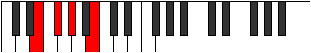 |
| SecondInversion | F#,G#,B,E | 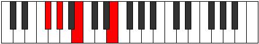 |
| ThirdInversion | G#,B,E,F# |  |
## Modes

| Number | Mode | Tonic | Notes | Illustration |
|--------|------|-------|-------|--------------|
| [299](https://ianring.com/musictheory/scales/299) | [Phratonic](ModeDSharpPhratonic.md) | D# | D#, E, F#, G#, B, D# |  |
| [299](https://ianring.com/musictheory/scales/299) | [Phratonic](ModeEFlatPhratonic.md) | Eb | Eb, E, Gb, Ab, B, Eb |  |
| [303](https://ianring.com/musictheory/scales/303) | [Golimic](ModeDSharpGolimic.md) | D# | D#, E, F, Gb, Ab, B, D# |  |
| [315](https://ianring.com/musictheory/scales/315) | [Stodimic](ModeDSharpStodimic.md) | D# | D#, E, F#, G, Ab, B, D# |  |
| [319](https://ianring.com/musictheory/scales/319) | [Epodian](ModeDSharpEpodian.md) | D# | D#, E, F, Gb, Abb, Bbbb, Cb, D# |  |
| [363](https://ianring.com/musictheory/scales/363) | [Soptimic](ModeDSharpSoptimic.md) | D# | D#, E, F#, G#, A, B, D# |  |
| [363](https://ianring.com/musictheory/scales/363) | [Soptimic](ModeEFlatSoptimic.md) | Eb | Eb, Fb, Gb, Ab, Bbb, Cb, Eb |  |
| [367](https://ianring.com/musictheory/scales/367) | [Aerodian](ModeDSharpAerodian.md) | D# | D#, E, F, Gb, Ab, Bbb, Cb, D# |  |
| [379](https://ianring.com/musictheory/scales/379) | [Aeragian](ModeDSharpAeragian.md) | D# | D#, E, F#, G, Ab, Bbb, Cb, D# |  |
| [383](https://ianring.com/musictheory/scales/383) | [Logyllic](ModeDSharpLogyllic.md) | D# | D#, E, F, F#, G, G#, A, B, D# |  |
| [383](https://ianring.com/musictheory/scales/383) | [Logyllic](ModeEFlatLogyllic.md) | Eb | Eb, E, F, Gb, G, Ab, A, B, Eb |  |
| [405](https://ianring.com/musictheory/scales/405) | [Danitonic](ModeENaturalDanitonic.md) | E | E, F#, G#, B, C, E |  |
| [407](https://ianring.com/musictheory/scales/407) | [Zylimic](ModeENaturalZylimic.md) | E | E, F, Gb, Ab, B, C, E |  |
| [413](https://ianring.com/musictheory/scales/413) | [Ganimic](ModeENaturalGanimic.md) | E | E, F#, G, Ab, B, C, E |  |
| [415](https://ianring.com/musictheory/scales/415) | [Aeoladian](ModeENaturalAeoladian.md) | E | E, F, Gb, Abb, Bbbb, Cb, Dbb, E |  |
| [427](https://ianring.com/musictheory/scales/427) | [Zothimic](ModeDSharpZothimic.md) | D# | D#, E, F#, G#, A#, B, D# |  |
| [427](https://ianring.com/musictheory/scales/427) | [Zothimic](ModeEFlatZothimic.md) | Eb | Eb, Fb, Gb, Ab, Bb, Cb, Eb |  |
| [431](https://ianring.com/musictheory/scales/431) | [Epyrian](ModeDSharpEpyrian.md) | D# | D#, E, F, Gb, Ab, Bb, Cb, D# |  |
| [437](https://ianring.com/musictheory/scales/437) | [Ronimic](ModeENaturalRonimic.md) | E | E, F#, G#, A, B, C, E |  |
| [439](https://ianring.com/musictheory/scales/439) | [Bythian](ModeENaturalBythian.md) | E | E, F, Gb, Ab, Bbb, Cb, Dbb, E |  |
| [443](https://ianring.com/musictheory/scales/443) | [Kothian](ModeDSharpKothian.md) | D# | D#, E, F#, G, Ab, Bb, Cb, D# |  |
| [445](https://ianring.com/musictheory/scales/445) | [Gocrian](ModeENaturalGocrian.md) | E | E, F#, G, Ab, Bbb, Cb, Dbb, E |  |
| [447](https://ianring.com/musictheory/scales/447) | [Thyphyllic](ModeENaturalThyphyllic.md) | E | E, F, F#, G, G#, A, B, C, E |  |
| [447](https://ianring.com/musictheory/scales/447) | [Thyphyllic](ModeDSharpThyphyllic.md) | D# | D#, E, F, F#, G, G#, A#, B, D# |  |
| [447](https://ianring.com/musictheory/scales/447) | [Thyphyllic](ModeEFlatThyphyllic.md) | Eb | Eb, E, F, Gb, G, Ab, Bb, B, Eb |  |
| [469](https://ianring.com/musictheory/scales/469) | [Katyrimic](ModeENaturalKatyrimic.md) | E | E, F#, G#, A#, B, C, E |  |
| [471](https://ianring.com/musictheory/scales/471) | [Dodian](ModeENaturalDodian.md) | E | E, F, Gb, Ab, Bb, Cb, Dbb, E |  |
| [477](https://ianring.com/musictheory/scales/477) | [Stacrian](ModeENaturalStacrian.md) | E | E, F#, G, Ab, Bb, Cb, Dbb, E |  |
| [479](https://ianring.com/musictheory/scales/479) | [Kocryllic](ModeENaturalKocryllic.md) | E | E, F, F#, G, G#, A#, B, C, E |  |
| [491](https://ianring.com/musictheory/scales/491) | [Aeolyrian](ModeDSharpAeolyrian.md) | D# | D#, E, F#, G#, A, Bb, Cb, D# |  |
| [491](https://ianring.com/musictheory/scales/491) | [Aeolyrian](ModeEFlatAeolyrian.md) | Eb | Eb, Fb, Gb, Ab, Bbb, Cbb, Dbbb, Eb |  |
| [495](https://ianring.com/musictheory/scales/495) | [Bocryllic](ModeDSharpBocryllic.md) | D# | D#, E, F, F#, G#, A, A#, B, D# |  |
| [495](https://ianring.com/musictheory/scales/495) | [Bocryllic](ModeEFlatBocryllic.md) | Eb | Eb, E, F, Gb, Ab, A, Bb, B, Eb |  |
| [501](https://ianring.com/musictheory/scales/501) | [Katylian](ModeENaturalKatylian.md) | E | E, F#, G#, A, Bb, Cb, Dbb, E |  |
| [503](https://ianring.com/musictheory/scales/503) | [Thoptyllic](ModeENaturalThoptyllic.md) | E | E, F, F#, G#, A, A#, B, C, E |  |
| [507](https://ianring.com/musictheory/scales/507) | [Moryllic](ModeDSharpMoryllic.md) | D# | D#, E, F#, G, G#, A, A#, B, D# | 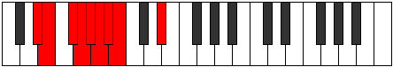 |
| [507](https://ianring.com/musictheory/scales/507) | [Moryllic](ModeEFlatMoryllic.md) | Eb | Eb, E, Gb, G, Ab, A, Bb, B, Eb |  |
| [509](https://ianring.com/musictheory/scales/509) | [Ionothyllic](ModeENaturalIonothyllic.md) | E | E, F#, G, G#, A, A#, B, C, E |  |
| [511](https://ianring.com/musictheory/scales/511) | [Polygic](ModeENaturalPolygic.md) | E | E, F, F#, G, G#, A, A#, B, C, E |  |
| [511](https://ianring.com/musictheory/scales/511) | [Polygic](ModeDSharpPolygic.md) | D# | D#, E, F, F#, G, G#, A, A#, B, D# |  |
| [511](https://ianring.com/musictheory/scales/511) | [Polygic](ModeEFlatPolygic.md) | Eb | Eb, E, F, Gb, G, Ab, A, Bb, B, Eb |  |
| [597](https://ianring.com/musictheory/scales/597) | [Thonitonic](ModeDNaturalThonitonic.md) | D | D, E, F#, G#, B, D |  |
| [599](https://ianring.com/musictheory/scales/599) | [Thyrimic](ModeDNaturalThyrimic.md) | D | D, Eb, Fb, Gb, Ab, B, D |  |
| [605](https://ianring.com/musictheory/scales/605) | [Dycrimic](ModeDNaturalDycrimic.md) | D | D, E, F, Gb, Ab, B, D | 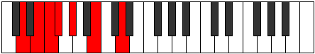 |
| [629](https://ianring.com/musictheory/scales/629) | [Aeronimic](ModeDNaturalAeronimic.md) | D | D, E, F#, G, Ab, B, D |  |
| [637](https://ianring.com/musictheory/scales/637) | [Katodian](ModeDNaturalKatodian.md) | D | D, E, F, Gb, Abb, Bbbb, Cb, D |  |
| [639](https://ianring.com/musictheory/scales/639) | [Ionaryllic](ModeDNaturalIonaryllic.md) | D | D, D#, E, F, F#, G, G#, B, D |  |
| [661](https://ianring.com/musictheory/scales/661) | [Pentatonic](ModeENaturalPentatonic.md) | E | E, F#, G#, B, C#, E |  |
| [663](https://ianring.com/musictheory/scales/663) | [Phrynimic](ModeENaturalPhrynimic.md) | E | E, F, Gb, Ab, B, C#, E |  |
| [669](https://ianring.com/musictheory/scales/669) | [Gycrimic](ModeENaturalGycrimic.md) | E | E, F#, G, Ab, B, C#, E |  |
| [671](https://ianring.com/musictheory/scales/671) | [Stycrian](ModeENaturalStycrian.md) | E | E, F, Gb, Abb, Bbbb, Cb, Db, E |  |
| [675](https://ianring.com/musictheory/scales/675) | [Zyditonic](ModeBNaturalZyditonic.md) | B | B, C, E, F#, G#, B | 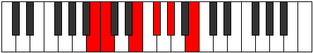 |
| [677](https://ianring.com/musictheory/scales/677) | [Mynitonic](ModeBNaturalMynitonic.md) | B | B, C#, E, F#, G#, B |  |
| [679](https://ianring.com/musictheory/scales/679) | [Lanimic](ModeBNaturalLanimic.md) | B | B, C, Db, E, F#, G#, B |  |
| [681](https://ianring.com/musictheory/scales/681) | [Sylitonic](ModeBNaturalSylitonic.md) | B | B, D, E, F#, G#, B |  |
| [683](https://ianring.com/musictheory/scales/683) | [Stogimic](ModeBNaturalStogimic.md) | B | B, C, D, E, F#, G#, B | 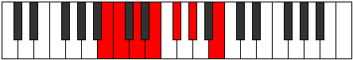 |
| [685](https://ianring.com/musictheory/scales/685) | [Aerathimic](ModeBNaturalAerathimic.md) | B | B, C#, D, E, F#, G#, B |  |
| [687](https://ianring.com/musictheory/scales/687) | [Aeolythian](ModeBNaturalAeolythian.md) | B | B, C, Db, Ebb, Fb, Gb, Ab, B |  |
| [689](https://ianring.com/musictheory/scales/689) | [Lothitonic](ModeBNaturalLothitonic.md) | B | B, D#, E, F#, G#, B |  |
| [691](https://ianring.com/musictheory/scales/691) | [Zydimic](ModeBNaturalZydimic.md) | B | B, C, D#, E, F#, G#, B |  |
| [693](https://ianring.com/musictheory/scales/693) | [Mynimic](ModeBNaturalMynimic.md) | B | B, C#, D#, E, F#, G#, B |  |
| [693](https://ianring.com/musictheory/scales/693) | [Mynimic](ModeENaturalMynimic.md) | E | E, F#, G#, A, B, C#, E |  |
| [695](https://ianring.com/musictheory/scales/695) | [Sarian](ModeBNaturalSarian.md) | B | B, C, Db, Eb, Fb, Gb, Ab, B |  |
| [695](https://ianring.com/musictheory/scales/695) | [Sarian](ModeENaturalSarian.md) | E | E, F, Gb, Ab, Bbb, Cb, Db, E |  |
| [697](https://ianring.com/musictheory/scales/697) | [Lagimic](ModeBNaturalLagimic.md) | B | B, C##, D#, E, F#, G#, B |  |
| [699](https://ianring.com/musictheory/scales/699) | [Aerothian](ModeBNaturalAerothian.md) | B | B, C, D, Eb, Fb, Gb, Ab, B |  |
| [701](https://ianring.com/musictheory/scales/701) | [Mixonyphian](ModeBNaturalMixonyphian.md) | B | B, C#, D, Eb, Fb, Gb, Ab, B |  |
| [701](https://ianring.com/musictheory/scales/701) | [Mixonyphian](ModeENaturalMixonyphian.md) | E | E, F#, G, Ab, Bbb, Cb, Db, E |  |
| [703](https://ianring.com/musictheory/scales/703) | [Aerocryllic](ModeBNaturalAerocryllic.md) | B | B, C, C#, D, D#, E, F#, G#, B |  |
| [703](https://ianring.com/musictheory/scales/703) | [Aerocryllic](ModeENaturalAerocryllic.md) | E | E, F, F#, G, G#, A, B, C#, E |  |
| [725](https://ianring.com/musictheory/scales/725) | [Lonimic](ModeDNaturalLonimic.md) | D | D, E, F#, G#, A, B, D |  |
| [725](https://ianring.com/musictheory/scales/725) | [Lonimic](ModeENaturalLonimic.md) | E | E, F#, G#, A#, B, C#, E |  |
| [727](https://ianring.com/musictheory/scales/727) | [Phradian](ModeDNaturalPhradian.md) | D | D, Eb, Fb, Gb, Ab, Bbb, Cb, D |  |
| [727](https://ianring.com/musictheory/scales/727) | [Phradian](ModeENaturalPhradian.md) | E | E, F, Gb, Ab, Bb, Cb, Db, E |  |
| [733](https://ianring.com/musictheory/scales/733) | [Donian](ModeDNaturalDonian.md) | D | D, E, F, Gb, Ab, Bbb, Cb, D |  |
| [733](https://ianring.com/musictheory/scales/733) | [Donian](ModeENaturalDonian.md) | E | E, F#, G, Ab, Bb, Cb, Db, E |  |
| [735](https://ianring.com/musictheory/scales/735) | [Sylyllic](ModeDNaturalSylyllic.md) | D | D, D#, E, F, F#, G#, A, B, D |  |
| [735](https://ianring.com/musictheory/scales/735) | [Sylyllic](ModeENaturalSylyllic.md) | E | E, F, F#, G, G#, A#, B, C#, E |  |
| [739](https://ianring.com/musictheory/scales/739) | [Rorimic](ModeBNaturalRorimic.md) | B | B, C, D##, E#, F#, G#, B |  |
| [741](https://ianring.com/musictheory/scales/741) | [Gathimic](ModeBNaturalGathimic.md) | B | B, C#, D##, E#, F#, G#, B |  |
| [743](https://ianring.com/musictheory/scales/743) | [Lanian](ModeBNaturalLanian.md) | B | B, C, Db, E, F, Gb, Ab, B |  |
| [745](https://ianring.com/musictheory/scales/745) | [Kolimic](ModeBNaturalKolimic.md) | B | B, C##, D##, E#, F#, G#, B |  |
| [747](https://ianring.com/musictheory/scales/747) | [Lynian](ModeBNaturalLynian.md) | B | B, C, D, E, F, Gb, Ab, B |  |
| [749](https://ianring.com/musictheory/scales/749) | [Aeologian](ModeBNaturalAeologian.md) | B | B, C#, D, E, F, Gb, Ab, B |  |
| [751](https://ianring.com/musictheory/scales/751) | [Epacryllic](ModeBNaturalEpacryllic.md) | B | B, C, C#, D, E, F, F#, G#, B |  |
| [753](https://ianring.com/musictheory/scales/753) | [Kytrimic](ModeBNaturalKytrimic.md) | B | B, C###, D##, E#, F#, G#, B |  |
| [755](https://ianring.com/musictheory/scales/755) | [Phrythian](ModeBNaturalPhrythian.md) | B | B, C, D#, E, F, Gb, Ab, B |  |
| [757](https://ianring.com/musictheory/scales/757) | [Ionyptian](ModeBNaturalIonyptian.md) | B | B, C#, D#, E, F, Gb, Ab, B |  |
| [757](https://ianring.com/musictheory/scales/757) | [Ionyptian](ModeDNaturalIonyptian.md) | D | D, E, F#, G, Ab, Bbb, Cb, D |  |
| [757](https://ianring.com/musictheory/scales/757) | [Ionyptian](ModeENaturalIonyptian.md) | E | E, F#, G#, A, Bb, Cb, Db, E |  |
| [759](https://ianring.com/musictheory/scales/759) | [Katalyllic](ModeBNaturalKatalyllic.md) | B | B, C, C#, D#, E, F, F#, G#, B |  |
| [759](https://ianring.com/musictheory/scales/759) | [Katalyllic](ModeDNaturalKatalyllic.md) | D | D, D#, E, F#, G, G#, A, B, D |  |
| [759](https://ianring.com/musictheory/scales/759) | [Katalyllic](ModeENaturalKatalyllic.md) | E | E, F, F#, G#, A, A#, B, C#, E |  |
| [761](https://ianring.com/musictheory/scales/761) | [Ponian](ModeBNaturalPonian.md) | B | B, C##, D#, E, F, Gb, Ab, B |  |
| [763](https://ianring.com/musictheory/scales/763) | [Doryllic](ModeBNaturalDoryllic.md) | B | B, C, D, D#, E, F, F#, G#, B |  |
| [765](https://ianring.com/musictheory/scales/765) | [Mixonyphyllic](ModeBNaturalMixonyphyllic.md) | B | B, C#, D, D#, E, F, F#, G#, B |  |
| [765](https://ianring.com/musictheory/scales/765) | [Mixonyphyllic](ModeDNaturalMixonyphyllic.md) | D | D, E, F, F#, G, G#, A, B, D |  |
| [765](https://ianring.com/musictheory/scales/765) | [Mixonyphyllic](ModeENaturalMixonyphyllic.md) | E | E, F#, G, G#, A, A#, B, C#, E |  |
| [767](https://ianring.com/musictheory/scales/767) | [Raptygic](ModeBNaturalRaptygic.md) | B | B, C, C#, D, D#, E, F, F#, G#, B |  |
| [767](https://ianring.com/musictheory/scales/767) | [Raptygic](ModeDNaturalRaptygic.md) | D | D, D#, E, F, F#, G, G#, A, B, D |  |
| [767](https://ianring.com/musictheory/scales/767) | [Raptygic](ModeENaturalRaptygic.md) | E | E, F, F#, G, G#, A, A#, B, C#, E |  |
| [811](https://ianring.com/musictheory/scales/811) | [Radimic](ModeDSharpRadimic.md) | D# | D#, E, F#, G#, A##, B#, D# |  |
| [811](https://ianring.com/musictheory/scales/811) | [Radimic](ModeEFlatRadimic.md) | Eb | Eb, Fb, Gb, Ab, B, C, Eb |  |
| [815](https://ianring.com/musictheory/scales/815) | [Bolian](ModeDSharpBolian.md) | D# | D#, E, F, Gb, Ab, B, C, D# |  |
| [827](https://ianring.com/musictheory/scales/827) | [Mixolocrian](ModeDSharpMixolocrian.md) | D# | D#, E, F#, G, Ab, B, C, D# |  |
| [831](https://ianring.com/musictheory/scales/831) | [Rodyllic](ModeDSharpRodyllic.md) | D# | D#, E, F, F#, G, G#, B, C, D# |  |
| [831](https://ianring.com/musictheory/scales/831) | [Rodyllic](ModeEFlatRodyllic.md) | Eb | Eb, E, F, Gb, G, Ab, B, C, Eb |  |
| [853](https://ianring.com/musictheory/scales/853) | [Epothimic](ModeDNaturalEpothimic.md) | D | D, E, F#, G#, A#, B, D |  |
| [855](https://ianring.com/musictheory/scales/855) | [Porian](ModeDNaturalPorian.md) | D | D, Eb, Fb, Gb, Ab, Bb, Cb, D |  |
| [861](https://ianring.com/musictheory/scales/861) | [Rylian](ModeDNaturalRylian.md) | D | D, E, F, Gb, Ab, Bb, Cb, D |  |
| [863](https://ianring.com/musictheory/scales/863) | [Pyryllic](ModeDNaturalPyryllic.md) | D | D, D#, E, F, F#, G#, A#, B, D |  |
| [875](https://ianring.com/musictheory/scales/875) | [Stothian](ModeDSharpStothian.md) | D# | D#, E, F#, G#, A, B, C, D# |  |
| [875](https://ianring.com/musictheory/scales/875) | [Stothian](ModeEFlatStothian.md) | Eb | Eb, Fb, Gb, Ab, Bbb, Cb, Dbb, Eb |  |
| [879](https://ianring.com/musictheory/scales/879) | [Aeolocryllic](ModeDSharpAeolocryllic.md) | D# | D#, E, F, F#, G#, A, B, C, D# |  |
| [879](https://ianring.com/musictheory/scales/879) | [Aeolocryllic](ModeEFlatAeolocryllic.md) | Eb | Eb, E, F, Gb, Ab, A, B, C, Eb |  |
| [885](https://ianring.com/musictheory/scales/885) | [Sathian](ModeDNaturalSathian.md) | D | D, E, F#, G, Ab, Bb, Cb, D |  |
| [887](https://ianring.com/musictheory/scales/887) | [Sathyllic](ModeDNaturalSathyllic.md) | D | D, D#, E, F#, G, G#, A#, B, D |  |
| [891](https://ianring.com/musictheory/scales/891) | [Ionilyllic](ModeDSharpIonilyllic.md) | D# | D#, E, F#, G, G#, A, B, C, D# |  |
| [891](https://ianring.com/musictheory/scales/891) | [Ionilyllic](ModeEFlatIonilyllic.md) | Eb | Eb, E, Gb, G, Ab, A, B, C, Eb |  |
| [893](https://ianring.com/musictheory/scales/893) | [Pycryllic](ModeDNaturalPycryllic.md) | D | D, E, F, F#, G, G#, A#, B, D |  |
| [895](https://ianring.com/musictheory/scales/895) | [Aeolathygic](ModeDSharpAeolathygic.md) | D# | D#, E, F, F#, G, G#, A, B, C, D# |  |
| [895](https://ianring.com/musictheory/scales/895) | [Aeolathygic](ModeEFlatAeolathygic.md) | Eb | Eb, E, F, Gb, G, Ab, A, B, C, Eb |  |
| [895](https://ianring.com/musictheory/scales/895) | [Aeolathygic](ModeDNaturalAeolathygic.md) | D | D, D#, E, F, F#, G, G#, A#, B, D |  |
| [917](https://ianring.com/musictheory/scales/917) | [Dygimic](ModeENaturalDygimic.md) | E | E, F#, G#, A##, B#, C#, E |  |
| [919](https://ianring.com/musictheory/scales/919) | [Gathian](ModeENaturalGathian.md) | E | E, F, Gb, Ab, B, C, Db, E |  |
| [925](https://ianring.com/musictheory/scales/925) | [Mythian](ModeENaturalMythian.md) | E | E, F#, G, Ab, B, C, Db, E |  |
| [927](https://ianring.com/musictheory/scales/927) | [Koptyllic](ModeENaturalKoptyllic.md) | E | E, F, F#, G, G#, B, C, C#, E |  |
| [931](https://ianring.com/musictheory/scales/931) | [Bacrimic](ModeBNaturalBacrimic.md) | B | B, C, D##, E##, F##, G#, B |  |
| [933](https://ianring.com/musictheory/scales/933) | [Dadimic](ModeBNaturalDadimic.md) | B | B, C#, D##, E##, F##, G#, B |  |
| [935](https://ianring.com/musictheory/scales/935) | [Katarian](ModeBNaturalKatarian.md) | B | B, C, Db, E, F#, G, Ab, B |  |
| [937](https://ianring.com/musictheory/scales/937) | [Stothimic](ModeBNaturalStothimic.md) | B | B, C##, D##, E##, F##, G#, B |  |
| [939](https://ianring.com/musictheory/scales/939) | [Dyptian](ModeBNaturalDyptian.md) | B | B, C, D, E, F#, G, Ab, B |  |
| [939](https://ianring.com/musictheory/scales/939) | [Dyptian](ModeDSharpDyptian.md) | D# | D#, E, F#, G#, A#, B, C, D# |  |
| [939](https://ianring.com/musictheory/scales/939) | [Dyptian](ModeEFlatDyptian.md) | Eb | Eb, Fb, Gb, Ab, Bb, Cb, Dbb, Eb |  |
| [941](https://ianring.com/musictheory/scales/941) | [Phrorian](ModeBNaturalPhrorian.md) | B | B, C#, D, E, F#, G, Ab, B |  |
| [943](https://ianring.com/musictheory/scales/943) | [Aerygyllic](ModeBNaturalAerygyllic.md) | B | B, C, C#, D, E, F#, G, G#, B |  |
| [943](https://ianring.com/musictheory/scales/943) | [Aerygyllic](ModeDSharpAerygyllic.md) | D# | D#, E, F, F#, G#, A#, B, C, D# |  |
| [943](https://ianring.com/musictheory/scales/943) | [Aerygyllic](ModeEFlatAerygyllic.md) | Eb | Eb, E, F, Gb, Ab, Bb, B, C, Eb |  |
| [945](https://ianring.com/musictheory/scales/945) | [Syrimic](ModeBNaturalSyrimic.md) | B | B, C###, D##, E##, F##, G#, B |  |
| [947](https://ianring.com/musictheory/scales/947) | [Modian](ModeBNaturalModian.md) | B | B, C, D#, E, F#, G, Ab, B |  |
| [949](https://ianring.com/musictheory/scales/949) | [Ionagian](ModeBNaturalIonagian.md) | B | B, C#, D#, E, F#, G, Ab, B | 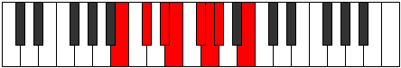 |
| [949](https://ianring.com/musictheory/scales/949) | [Ionagian](ModeENaturalIonagian.md) | E | E, F#, G#, A, B, C, Db, E |  |
| [951](https://ianring.com/musictheory/scales/951) | [Thogyllic](ModeBNaturalThogyllic.md) | B | B, C, C#, D#, E, F#, G, G#, B |  |
| [951](https://ianring.com/musictheory/scales/951) | [Thogyllic](ModeENaturalThogyllic.md) | E | E, F, F#, G#, A, B, C, C#, E |  |
| [953](https://ianring.com/musictheory/scales/953) | [Stoptian](ModeBNaturalStoptian.md) | B | B, C##, D#, E, F#, G, Ab, B |  |
| [955](https://ianring.com/musictheory/scales/955) | [Ionogyllic](ModeBNaturalIonogyllic.md) | B | B, C, D, D#, E, F#, G, G#, B |  |
| [955](https://ianring.com/musictheory/scales/955) | [Ionogyllic](ModeDSharpIonogyllic.md) | D# | D#, E, F#, G, G#, A#, B, C, D# |  |
| [955](https://ianring.com/musictheory/scales/955) | [Ionogyllic](ModeEFlatIonogyllic.md) | Eb | Eb, E, Gb, G, Ab, Bb, B, C, Eb |  |
| [957](https://ianring.com/musictheory/scales/957) | [Phronyllic](ModeBNaturalPhronyllic.md) | B | B, C#, D, D#, E, F#, G, G#, B |  |
| [957](https://ianring.com/musictheory/scales/957) | [Phronyllic](ModeENaturalPhronyllic.md) | E | E, F#, G, G#, A, B, C, C#, E |  |
| [959](https://ianring.com/musictheory/scales/959) | [Katylygic](ModeBNaturalKatylygic.md) | B | B, C, C#, D, D#, E, F#, G, G#, B |  |
| [959](https://ianring.com/musictheory/scales/959) | [Katylygic](ModeENaturalKatylygic.md) | E | E, F, F#, G, G#, A, B, C, C#, E |  |
| [959](https://ianring.com/musictheory/scales/959) | [Katylygic](ModeDSharpKatylygic.md) | D# | D#, E, F, F#, G, G#, A#, B, C, D# |  |
| [959](https://ianring.com/musictheory/scales/959) | [Katylygic](ModeEFlatKatylygic.md) | Eb | Eb, E, F, Gb, G, Ab, Bb, B, C, Eb |  |
| [981](https://ianring.com/musictheory/scales/981) | [Bacrian](ModeENaturalBacrian.md) | E | E, F#, G#, A#, B, C, Db, E | 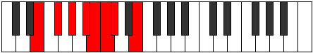 |
| [981](https://ianring.com/musictheory/scales/981) | [Bacrian](ModeDNaturalBacrian.md) | D | D, E, F#, G#, A, Bb, Cb, D |  |
| [983](https://ianring.com/musictheory/scales/983) | [Epygyllic](ModeENaturalEpygyllic.md) | E | E, F, F#, G#, A#, B, C, C#, E |  |
| [983](https://ianring.com/musictheory/scales/983) | [Epygyllic](ModeDNaturalEpygyllic.md) | D | D, D#, E, F#, G#, A, A#, B, D |  |
| [989](https://ianring.com/musictheory/scales/989) | [Phrolyllic](ModeENaturalPhrolyllic.md) | E | E, F#, G, G#, A#, B, C, C#, E |  |
| [989](https://ianring.com/musictheory/scales/989) | [Phrolyllic](ModeDNaturalPhrolyllic.md) | D | D, E, F, F#, G#, A, A#, B, D |  |
| [991](https://ianring.com/musictheory/scales/991) | [Aeolygic](ModeENaturalAeolygic.md) | E | E, F, F#, G, G#, A#, B, C, C#, E |  |
| [991](https://ianring.com/musictheory/scales/991) | [Aeolygic](ModeDNaturalAeolygic.md) | D | D, D#, E, F, F#, G#, A, A#, B, D |  |
| [995](https://ianring.com/musictheory/scales/995) | [Phrathian](ModeBNaturalPhrathian.md) | B | B, C, D##, E#, F#, G, Ab, B |  |
| [997](https://ianring.com/musictheory/scales/997) | [Rycrian](ModeBNaturalRycrian.md) | B | B, C#, D##, E#, F#, G, Ab, B |  |
| [999](https://ianring.com/musictheory/scales/999) | [Bylyllic](ModeBNaturalBylyllic.md) | B | B, C, C#, E, F, F#, G, G#, B |  |
| [1001](https://ianring.com/musictheory/scales/1001) | [Badian](ModeBNaturalBadian.md) | B | B, C##, D##, E#, F#, G, Ab, B |  |
| [1003](https://ianring.com/musictheory/scales/1003) | [Ionyryllic](ModeBNaturalIonyryllic.md) | B | B, C, D, E, F, F#, G, G#, B |  |
| [1003](https://ianring.com/musictheory/scales/1003) | [Ionyryllic](ModeDSharpIonyryllic.md) | D# | D#, E, F#, G#, A, A#, B, C, D# |  |
| [1003](https://ianring.com/musictheory/scales/1003) | [Ionyryllic](ModeEFlatIonyryllic.md) | Eb | Eb, E, Gb, Ab, A, Bb, B, C, Eb |  |
| [1005](https://ianring.com/musictheory/scales/1005) | [Radyllic](ModeBNaturalRadyllic.md) | B | B, C#, D, E, F, F#, G, G#, B |  |
| [1007](https://ianring.com/musictheory/scales/1007) | [Ionycrygic](ModeBNaturalIonycrygic.md) | B | B, C, C#, D, E, F, F#, G, G#, B |  |
| [1007](https://ianring.com/musictheory/scales/1007) | [Ionycrygic](ModeDSharpIonycrygic.md) | D# | D#, E, F, F#, G#, A, A#, B, C, D# |  |
| [1007](https://ianring.com/musictheory/scales/1007) | [Ionycrygic](ModeEFlatIonycrygic.md) | Eb | Eb, E, F, Gb, Ab, A, Bb, B, C, Eb |  |
| [1009](https://ianring.com/musictheory/scales/1009) | [Katyptian](ModeBNaturalKatyptian.md) | B | B, C###, D##, E#, F#, G, Ab, B | 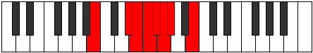 |
| [1011](https://ianring.com/musictheory/scales/1011) | [Kycryllic](ModeBNaturalKycryllic.md) | B | B, C, D#, E, F, F#, G, G#, B |  |
| [1013](https://ianring.com/musictheory/scales/1013) | [Stydyllic](ModeBNaturalStydyllic.md) | B | B, C#, D#, E, F, F#, G, G#, B |  |
| [1013](https://ianring.com/musictheory/scales/1013) | [Stydyllic](ModeENaturalStydyllic.md) | E | E, F#, G#, A, A#, B, C, C#, E |  |
| [1013](https://ianring.com/musictheory/scales/1013) | [Stydyllic](ModeDNaturalStydyllic.md) | D | D, E, F#, G, G#, A, A#, B, D |  |
| [1015](https://ianring.com/musictheory/scales/1015) | [Ionodygic](ModeBNaturalIonodygic.md) | B | B, C, C#, D#, E, F, F#, G, G#, B |  |
| [1015](https://ianring.com/musictheory/scales/1015) | [Ionodygic](ModeENaturalIonodygic.md) | E | E, F, F#, G#, A, A#, B, C, C#, E |  |
| [1015](https://ianring.com/musictheory/scales/1015) | [Ionodygic](ModeDNaturalIonodygic.md) | D | D, D#, E, F#, G, G#, A, A#, B, D |  |
| [1017](https://ianring.com/musictheory/scales/1017) | [Dythyllic](ModeBNaturalDythyllic.md) | B | B, D, D#, E, F, F#, G, G#, B |  |
| [1019](https://ianring.com/musictheory/scales/1019) | [Aeranygic](ModeBNaturalAeranygic.md) | B | B, C, D, D#, E, F, F#, G, G#, B |  |
| [1019](https://ianring.com/musictheory/scales/1019) | [Aeranygic](ModeDSharpAeranygic.md) | D# | D#, E, F#, G, G#, A, A#, B, C, D# |  |
| [1019](https://ianring.com/musictheory/scales/1019) | [Aeranygic](ModeEFlatAeranygic.md) | Eb | Eb, E, Gb, G, Ab, A, Bb, B, C, Eb |  |
| [1021](https://ianring.com/musictheory/scales/1021) | [Ladygic](ModeBNaturalLadygic.md) | B | B, C#, D, D#, E, F, F#, G, G#, B |  |
| [1021](https://ianring.com/musictheory/scales/1021) | [Ladygic](ModeENaturalLadygic.md) | E | E, F#, G, G#, A, A#, B, C, C#, E |  |
| [1021](https://ianring.com/musictheory/scales/1021) | [Ladygic](ModeDNaturalLadygic.md) | D | D, E, F, F#, G, G#, A, A#, B, D |  |
| [1023](https://ianring.com/musictheory/scales/1023) | [Dodyllian](ModeBNaturalDodyllian.md) | B | B, C, C#, D, D#, E, F, F#, G, G#, B |  |
| [1023](https://ianring.com/musictheory/scales/1023) | [Dodyllian](ModeENaturalDodyllian.md) | E | E, F, F#, G, G#, A, A#, B, C, C#, E |  |
| [1023](https://ianring.com/musictheory/scales/1023) | [Dodyllian](ModeDSharpDodyllian.md) | D# | D#, E, F, F#, G, G#, A, A#, B, C, D# |  |
| [1023](https://ianring.com/musictheory/scales/1023) | [Dodyllian](ModeEFlatDodyllian.md) | Eb | Eb, E, F, Gb, G, Ab, A, Bb, B, C, Eb |  |
| [1023](https://ianring.com/musictheory/scales/1023) | [Dodyllian](ModeDNaturalDodyllian.md) | D | D, D#, E, F, F#, G, G#, A, A#, B, D |  |
| [1125](https://ianring.com/musictheory/scales/1125) | [Ionaritonic](ModeFSharpIonaritonic.md) | F# | F#, G#, B, C, E, F# |  |
| [1125](https://ianring.com/musictheory/scales/1125) | [Ionaritonic](ModeGFlatIonaritonic.md) | Gb | Gb, Ab, B, C, E, Gb |  |
| [1127](https://ianring.com/musictheory/scales/1127) | [Eparimic](ModeFSharpEparimic.md) | F# | F#, G, Ab, B, C, D##, F# |  |
| [1127](https://ianring.com/musictheory/scales/1127) | [Eparimic](ModeGFlatEparimic.md) | Gb | Gb, Abb, Bbbb, Cb, Dbb, E, Gb |  |
| [1133](https://ianring.com/musictheory/scales/1133) | [Stycrimic](ModeFSharpStycrimic.md) | F# | F#, G#, A, B, C, D##, F# |  |
| [1133](https://ianring.com/musictheory/scales/1133) | [Stycrimic](ModeGFlatStycrimic.md) | Gb | Gb, Ab, Bbb, Cb, Dbb, E, Gb |  |
| [1135](https://ianring.com/musictheory/scales/1135) | [Katolian](ModeFSharpKatolian.md) | F# | F#, G, Ab, Bbb, Cb, Dbb, E, F# |  |
| [1135](https://ianring.com/musictheory/scales/1135) | [Katolian](ModeGFlatKatolian.md) | Gb | Gb, Abb, Bbbb, Cbbb, Dbbb, Dbb, E, Gb |  |
| [1141](https://ianring.com/musictheory/scales/1141) | [Rynimic](ModeFSharpRynimic.md) | F# | F#, G#, A#, B, C, D##, F# |  |
| [1141](https://ianring.com/musictheory/scales/1141) | [Rynimic](ModeGFlatRynimic.md) | Gb | Gb, Ab, Bb, Cb, Dbb, E, Gb |  |
| [1143](https://ianring.com/musictheory/scales/1143) | [Styrian](ModeFSharpStyrian.md) | F# | F#, G, Ab, Bb, Cb, Dbb, E, F# |  |
| [1143](https://ianring.com/musictheory/scales/1143) | [Styrian](ModeGFlatStyrian.md) | Gb | Gb, Abb, Bbbb, Cbb, Dbbb, Dbb, E, Gb |  |
| [1149](https://ianring.com/musictheory/scales/1149) | [Bydian](ModeFSharpBydian.md) | F# | F#, G#, A, Bb, Cb, Dbb, E, F# |  |
| [1149](https://ianring.com/musictheory/scales/1149) | [Bydian](ModeGFlatBydian.md) | Gb | Gb, Ab, Bbb, Cbb, Dbbb, Dbb, E, Gb |  |
| [1151](https://ianring.com/musictheory/scales/1151) | [Mythyllic](ModeFSharpMythyllic.md) | F# | F#, G, G#, A, A#, B, C, E, F# |  |
| [1151](https://ianring.com/musictheory/scales/1151) | [Mythyllic](ModeGFlatMythyllic.md) | Gb | Gb, G, Ab, A, Bb, B, C, E, Gb |  |
| [1173](https://ianring.com/musictheory/scales/1173) | [Phropitonic](ModeENaturalPhropitonic.md) | E | E, F#, G#, B, D, E |  |
| [1175](https://ianring.com/musictheory/scales/1175) | [Epycrimic](ModeENaturalEpycrimic.md) | E | E, F, Gb, Ab, B, C##, E |  |
| [1181](https://ianring.com/musictheory/scales/1181) | [Katagimic](ModeENaturalKatagimic.md) | E | E, F#, G, Ab, B, C##, E |  |
| [1183](https://ianring.com/musictheory/scales/1183) | [Sadian](ModeENaturalSadian.md) | E | E, F, Gb, Abb, Bbbb, Cb, D, E |  |
| [1189](https://ianring.com/musictheory/scales/1189) | [Thaptitonic](ModeFSharpThaptitonic.md) | F# | F#, G#, B, C#, E, F# | 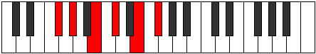 |
| [1189](https://ianring.com/musictheory/scales/1189) | [Thaptitonic](ModeGFlatThaptitonic.md) | Gb | Gb, Ab, B, Db, E, Gb |  |
| [1191](https://ianring.com/musictheory/scales/1191) | [Pyrimic](ModeFSharpPyrimic.md) | F# | F#, G, Ab, B, C#, D##, F# |  |
| [1191](https://ianring.com/musictheory/scales/1191) | [Pyrimic](ModeGFlatPyrimic.md) | Gb | Gb, Abb, Bbbb, Cb, Db, E, Gb |  |
| [1193](https://ianring.com/musictheory/scales/1193) | [Rocritonic](ModeCSharpRocritonic.md) | C# | C#, E, F#, G#, B, C# |  |
| [1193](https://ianring.com/musictheory/scales/1193) | [Rocritonic](ModeDFlatRocritonic.md) | Db | Db, E, Gb, Ab, B, Db |  |
| [1195](https://ianring.com/musictheory/scales/1195) | [Sarimic](ModeCSharpSarimic.md) | C# | C#, D, E, F#, G#, A##, C# |  |
| [1195](https://ianring.com/musictheory/scales/1195) | [Sarimic](ModeDFlatSarimic.md) | Db | Db, Ebb, Fb, Gb, Ab, B, Db |  |
| [1197](https://ianring.com/musictheory/scales/1197) | [Rocrimic](ModeCSharpRocrimic.md) | C# | C#, D#, E, F#, G#, A##, C# |  |
| [1197](https://ianring.com/musictheory/scales/1197) | [Rocrimic](ModeDFlatRocrimic.md) | Db | Db, Eb, Fb, Gb, Ab, B, Db |  |
| [1197](https://ianring.com/musictheory/scales/1197) | [Rocrimic](ModeFSharpRocrimic.md) | F# | F#, G#, A, B, C#, D##, F# |  |
| [1197](https://ianring.com/musictheory/scales/1197) | [Rocrimic](ModeGFlatRocrimic.md) | Gb | Gb, Ab, Bbb, Cb, Db, E, Gb |  |
| [1199](https://ianring.com/musictheory/scales/1199) | [Magian](ModeCSharpMagian.md) | C# | C#, D, Eb, Fb, Gb, Ab, B, C# |  |
| [1199](https://ianring.com/musictheory/scales/1199) | [Magian](ModeFSharpMagian.md) | F# | F#, G, Ab, Bbb, Cb, Db, E, F# |  |
| [1205](https://ianring.com/musictheory/scales/1205) | [Ionycrimic](ModeENaturalIonycrimic.md) | E | E, F#, G#, A, B, C##, E |  |
| [1205](https://ianring.com/musictheory/scales/1205) | [Ionycrimic](ModeFSharpIonycrimic.md) | F# | F#, G#, A#, B, C#, D##, F# |  |
| [1205](https://ianring.com/musictheory/scales/1205) | [Ionycrimic](ModeGFlatIonycrimic.md) | Gb | Gb, Ab, Bb, Cb, Db, E, Gb |  |
| [1207](https://ianring.com/musictheory/scales/1207) | [Aeoloptian](ModeENaturalAeoloptian.md) | E | E, F, Gb, Ab, Bbb, Cb, D, E |  |
| [1207](https://ianring.com/musictheory/scales/1207) | [Aeoloptian](ModeFSharpAeoloptian.md) | F# | F#, G, Ab, Bb, Cb, Db, E, F# |  |
| [1209](https://ianring.com/musictheory/scales/1209) | [Ionynimic](ModeCSharpIonynimic.md) | C# | C#, D##, E#, F#, G#, A##, C# |  |
| [1209](https://ianring.com/musictheory/scales/1209) | [Ionynimic](ModeDFlatIonynimic.md) | Db | Db, E, F, Gb, Ab, B, Db |  |
| [1211](https://ianring.com/musictheory/scales/1211) | [Zadian](ModeCSharpZadian.md) | C# | C#, D, E, F, Gb, Ab, B, C# |  |
| [1213](https://ianring.com/musictheory/scales/1213) | [Gyrian](ModeCSharpGyrian.md) | C# | C#, D#, E, F, Gb, Ab, B, C# |  |
| [1213](https://ianring.com/musictheory/scales/1213) | [Gyrian](ModeENaturalGyrian.md) | E | E, F#, G, Ab, Bbb, Cb, D, E |  |
| [1213](https://ianring.com/musictheory/scales/1213) | [Gyrian](ModeFSharpGyrian.md) | F# | F#, G#, A, Bb, Cb, Db, E, F# |  |
| [1213](https://ianring.com/musictheory/scales/1213) | [Gyrian](ModeGFlatGyrian.md) | Gb | Gb, Ab, Bbb, Cbb, Dbbb, Ebbb, Fb, Gb |  |
| [1215](https://ianring.com/musictheory/scales/1215) | [Aeolanyllic](ModeCSharpAeolanyllic.md) | C# | C#, D, D#, E, F, F#, G#, B, C# |  |
| [1215](https://ianring.com/musictheory/scales/1215) | [Aeolanyllic](ModeDFlatAeolanyllic.md) | Db | Db, D, Eb, E, F, Gb, Ab, B, Db |  |
| [1215](https://ianring.com/musictheory/scales/1215) | [Aeolanyllic](ModeENaturalAeolanyllic.md) | E | E, F, F#, G, G#, A, B, D, E |  |
| [1215](https://ianring.com/musictheory/scales/1215) | [Aeolanyllic](ModeFSharpAeolanyllic.md) | F# | F#, G, G#, A, A#, B, C#, E, F# |  |
| [1215](https://ianring.com/musictheory/scales/1215) | [Aeolanyllic](ModeGFlatAeolanyllic.md) | Gb | Gb, G, Ab, A, Bb, B, Db, E, Gb |  |
| [1237](https://ianring.com/musictheory/scales/1237) | [Salimic](ModeENaturalSalimic.md) | E | E, F#, G#, A#, B, C##, E |  |
| [1239](https://ianring.com/musictheory/scales/1239) | [Epaptian](ModeENaturalEpaptian.md) | E | E, F, Gb, Ab, Bb, Cb, D, E |  |
| [1245](https://ianring.com/musictheory/scales/1245) | [Lathian](ModeENaturalLathian.md) | E | E, F#, G, Ab, Bb, Cb, D, E |  |
| [1247](https://ianring.com/musictheory/scales/1247) | [Mygyllic](ModeENaturalMygyllic.md) | E | E, F, F#, G, G#, A#, B, D, E |  |
| [1253](https://ianring.com/musictheory/scales/1253) | [Zolimic](ModeFSharpZolimic.md) | F# | F#, G#, A##, B#, C#, D##, F# |  |
| [1253](https://ianring.com/musictheory/scales/1253) | [Zolimic](ModeGFlatZolimic.md) | Gb | Gb, Ab, B, C, Db, E, Gb |  |
| [1255](https://ianring.com/musictheory/scales/1255) | [Sogian](ModeFSharpSogian.md) | F# | F#, G, Ab, B, C, Db, E, F# |  |
| [1257](https://ianring.com/musictheory/scales/1257) | [Aeolyphimic](ModeCSharpAeolyphimic.md) | C# | C#, D##, E##, F##, G#, A##, C# |  |
| [1257](https://ianring.com/musictheory/scales/1257) | [Aeolyphimic](ModeDFlatAeolyphimic.md) | Db | Db, E, F#, G, Ab, B, Db |  |
| [1259](https://ianring.com/musictheory/scales/1259) | [Stadian](ModeCSharpStadian.md) | C# | C#, D, E, F#, G, Ab, B, C# |  |
| [1261](https://ianring.com/musictheory/scales/1261) | [Aeodian](ModeCSharpAeodian.md) | C# | C#, D#, E, F#, G, Ab, B, C# |  |
| [1261](https://ianring.com/musictheory/scales/1261) | [Aeodian](ModeFSharpAeodian.md) | F# | F#, G#, A, B, C, Db, E, F# |  |
| [1261](https://ianring.com/musictheory/scales/1261) | [Aeodian](ModeGFlatAeodian.md) | Gb | Gb, Ab, Bbb, Cb, Dbb, Ebbb, Fb, Gb |  |
| [1263](https://ianring.com/musictheory/scales/1263) | [Stynyllic](ModeCSharpStynyllic.md) | C# | C#, D, D#, E, F#, G, G#, B, C# |  |
| [1263](https://ianring.com/musictheory/scales/1263) | [Stynyllic](ModeDFlatStynyllic.md) | Db | Db, D, Eb, E, Gb, G, Ab, B, Db |  |
| [1263](https://ianring.com/musictheory/scales/1263) | [Stynyllic](ModeFSharpStynyllic.md) | F# | F#, G, G#, A, B, C, C#, E, F# |  |
| [1263](https://ianring.com/musictheory/scales/1263) | [Stynyllic](ModeGFlatStynyllic.md) | Gb | Gb, G, Ab, A, B, C, Db, E, Gb |  |
| [1269](https://ianring.com/musictheory/scales/1269) | [Katythian](ModeFSharpKatythian.md) | F# | F#, G#, A#, B, C, Db, E, F# |  |
| [1269](https://ianring.com/musictheory/scales/1269) | [Katythian](ModeGFlatKatythian.md) | Gb | Gb, Ab, Bb, Cb, Dbb, Ebbb, Fb, Gb |  |
| [1269](https://ianring.com/musictheory/scales/1269) | [Katythian](ModeENaturalKatythian.md) | E | E, F#, G#, A, Bb, Cb, D, E |  |
| [1271](https://ianring.com/musictheory/scales/1271) | [Kolyllic](ModeFSharpKolyllic.md) | F# | F#, G, G#, A#, B, C, C#, E, F# |  |
| [1271](https://ianring.com/musictheory/scales/1271) | [Kolyllic](ModeGFlatKolyllic.md) | Gb | Gb, G, Ab, Bb, B, C, Db, E, Gb |  |
| [1271](https://ianring.com/musictheory/scales/1271) | [Kolyllic](ModeENaturalKolyllic.md) | E | E, F, F#, G#, A, A#, B, D, E |  |
| [1273](https://ianring.com/musictheory/scales/1273) | [Ronian](ModeCSharpRonian.md) | C# | C#, D##, E#, F#, G, Ab, B, C# |  |
| [1273](https://ianring.com/musictheory/scales/1273) | [Ronian](ModeDFlatRonian.md) | Db | Db, E, F, Gb, Abb, Bbbb, Cb, Db |  |
| [1275](https://ianring.com/musictheory/scales/1275) | [Stagyllic](ModeCSharpStagyllic.md) | C# | C#, D, E, F, F#, G, G#, B, C# |  |
| [1275](https://ianring.com/musictheory/scales/1275) | [Stagyllic](ModeDFlatStagyllic.md) | Db | Db, D, E, F, Gb, G, Ab, B, Db |  |
| [1277](https://ianring.com/musictheory/scales/1277) | [Zadyllic](ModeCSharpZadyllic.md) | C# | C#, D#, E, F, F#, G, G#, B, C# |  |
| [1277](https://ianring.com/musictheory/scales/1277) | [Zadyllic](ModeDFlatZadyllic.md) | Db | Db, Eb, E, F, Gb, G, Ab, B, Db |  |
| [1277](https://ianring.com/musictheory/scales/1277) | [Zadyllic](ModeFSharpZadyllic.md) | F# | F#, G#, A, A#, B, C, C#, E, F# |  |
| [1277](https://ianring.com/musictheory/scales/1277) | [Zadyllic](ModeGFlatZadyllic.md) | Gb | Gb, Ab, A, Bb, B, C, Db, E, Gb |  |
| [1277](https://ianring.com/musictheory/scales/1277) | [Zadyllic](ModeENaturalZadyllic.md) | E | E, F#, G, G#, A, A#, B, D, E |  |
| [1279](https://ianring.com/musictheory/scales/1279) | [Sarygic](ModeCSharpSarygic.md) | C# | C#, D, D#, E, F, F#, G, G#, B, C# |  |
| [1279](https://ianring.com/musictheory/scales/1279) | [Sarygic](ModeDFlatSarygic.md) | Db | Db, D, Eb, E, F, Gb, G, Ab, B, Db |  |
| [1279](https://ianring.com/musictheory/scales/1279) | [Sarygic](ModeFSharpSarygic.md) | F# | F#, G, G#, A, A#, B, C, C#, E, F# |  |
| [1279](https://ianring.com/musictheory/scales/1279) | [Sarygic](ModeGFlatSarygic.md) | Gb | Gb, G, Ab, A, Bb, B, C, Db, E, Gb |  |
| [1279](https://ianring.com/musictheory/scales/1279) | [Sarygic](ModeENaturalSarygic.md) | E | E, F, F#, G, G#, A, A#, B, D, E |  |
| [1305](https://ianring.com/musictheory/scales/1305) | [Dynitonic](ModeGSharpDynitonic.md) | G# | G#, B, C, E, F#, G# |  |
| [1305](https://ianring.com/musictheory/scales/1305) | [Dynitonic](ModeAFlatDynitonic.md) | Ab | Ab, B, C, E, Gb, Ab |  |
| [1307](https://ianring.com/musictheory/scales/1307) | [Katorimic](ModeGSharpKatorimic.md) | G# | G#, A, B, C, D##, E##, G# |  |
| [1307](https://ianring.com/musictheory/scales/1307) | [Katorimic](ModeAFlatKatorimic.md) | Ab | Ab, Bbb, Cb, Dbb, E, F#, Ab |  |
| [1309](https://ianring.com/musictheory/scales/1309) | [Pogimic](ModeGSharpPogimic.md) | G# | G#, A#, B, C, D##, E##, G# |  |
| [1309](https://ianring.com/musictheory/scales/1309) | [Pogimic](ModeAFlatPogimic.md) | Ab | Ab, Bb, Cb, Dbb, E, F#, Ab |  |
| [1311](https://ianring.com/musictheory/scales/1311) | [Bynian](ModeGSharpBynian.md) | G# | G#, A, Bb, Cb, Dbb, E, F#, G# |  |
| [1311](https://ianring.com/musictheory/scales/1311) | [Bynian](ModeAFlatBynian.md) | Ab | Ab, Bbb, Cbb, Dbbb, Dbb, E, F#, Ab |  |
| [1317](https://ianring.com/musictheory/scales/1317) | [Staditonic](ModeFSharpStaditonic.md) | F# | F#, G#, B, D, E, F# |  |
| [1317](https://ianring.com/musictheory/scales/1317) | [Staditonic](ModeGFlatStaditonic.md) | Gb | Gb, Ab, B, D, E, Gb |  |
| [1319](https://ianring.com/musictheory/scales/1319) | [Phronimic](ModeFSharpPhronimic.md) | F# | F#, G, Ab, B, C##, D##, F# |  |
| [1319](https://ianring.com/musictheory/scales/1319) | [Phronimic](ModeGFlatPhronimic.md) | Gb | Gb, Abb, Bbbb, Cb, D, E, Gb |  |
| [1321](https://ianring.com/musictheory/scales/1321) | [Epathitonic](ModeGSharpEpathitonic.md) | G# | G#, B, C#, E, F#, G# |  |
| [1321](https://ianring.com/musictheory/scales/1321) | [Epathitonic](ModeAFlatEpathitonic.md) | Ab | Ab, B, Db, E, Gb, Ab |  |
| [1323](https://ianring.com/musictheory/scales/1323) | [Eporimic](ModeDSharpEporimic.md) | D# | D#, E, F#, G#, A##, B##, D# |  |
| [1323](https://ianring.com/musictheory/scales/1323) | [Eporimic](ModeEFlatEporimic.md) | Eb | Eb, Fb, Gb, Ab, B, C#, Eb |  |
| [1323](https://ianring.com/musictheory/scales/1323) | [Eporimic](ModeGSharpEporimic.md) | G# | G#, A, B, C#, D##, E##, G# |  |
| [1323](https://ianring.com/musictheory/scales/1323) | [Eporimic](ModeAFlatEporimic.md) | Ab | Ab, Bbb, Cb, Db, E, F#, Ab |  |
| [1325](https://ianring.com/musictheory/scales/1325) | [Phradimic](ModeFSharpPhradimic.md) | F# | F#, G#, A, B, C##, D##, F# |  |
| [1325](https://ianring.com/musictheory/scales/1325) | [Phradimic](ModeGFlatPhradimic.md) | Gb | Gb, Ab, Bbb, Cb, D, E, Gb |  |
| [1325](https://ianring.com/musictheory/scales/1325) | [Phradimic](ModeGSharpPhradimic.md) | G# | G#, A#, B, C#, D##, E##, G# |  |
| [1325](https://ianring.com/musictheory/scales/1325) | [Phradimic](ModeAFlatPhradimic.md) | Ab | Ab, Bb, Cb, Db, E, F#, Ab |  |
| [1327](https://ianring.com/musictheory/scales/1327) | [Zalian](ModeDSharpZalian.md) | D# | D#, E, F, Gb, Ab, B, C#, D# |  |
| [1327](https://ianring.com/musictheory/scales/1327) | [Zalian](ModeFSharpZalian.md) | F# | F#, G, Ab, Bbb, Cb, D, E, F# |  |
| [1327](https://ianring.com/musictheory/scales/1327) | [Zalian](ModeGSharpZalian.md) | G# | G#, A, Bb, Cb, Db, E, F#, G# |  |
| [1327](https://ianring.com/musictheory/scales/1327) | [Zalian](ModeAFlatZalian.md) | Ab | Ab, Bbb, Cbb, Dbbb, Ebbb, Fb, Gb, Ab |  |
| [1333](https://ianring.com/musictheory/scales/1333) | [Lyptimic](ModeFSharpLyptimic.md) | F# | F#, G#, A#, B, C##, D##, F# |  |
| [1333](https://ianring.com/musictheory/scales/1333) | [Lyptimic](ModeGFlatLyptimic.md) | Gb | Gb, Ab, Bb, Cb, D, E, Gb |  |
| [1335](https://ianring.com/musictheory/scales/1335) | [Aeralian](ModeFSharpAeralian.md) | F# | F#, G, Ab, Bb, Cb, D, E, F# |  |
| [1337](https://ianring.com/musictheory/scales/1337) | [Epogimic](ModeGSharpEpogimic.md) | G# | G#, A##, B#, C#, D##, E##, G# |  |
| [1337](https://ianring.com/musictheory/scales/1337) | [Epogimic](ModeAFlatEpogimic.md) | Ab | Ab, B, C, Db, E, F#, Ab |  |
| [1339](https://ianring.com/musictheory/scales/1339) | [Kycrian](ModeDSharpKycrian.md) | D# | D#, E, F#, G, Ab, B, C#, D# |  |
| [1339](https://ianring.com/musictheory/scales/1339) | [Kycrian](ModeGSharpKycrian.md) | G# | G#, A, B, C, Db, E, F#, G# |  |
| [1339](https://ianring.com/musictheory/scales/1339) | [Kycrian](ModeAFlatKycrian.md) | Ab | Ab, Bbb, Cb, Dbb, Ebbb, Fb, Gb, Ab |  |
| [1341](https://ianring.com/musictheory/scales/1341) | [Madian](ModeGSharpMadian.md) | G# | G#, A#, B, C, Db, E, F#, G# |  |
| [1341](https://ianring.com/musictheory/scales/1341) | [Madian](ModeAFlatMadian.md) | Ab | Ab, Bb, Cb, Dbb, Ebbb, Fb, Gb, Ab |  |
| [1341](https://ianring.com/musictheory/scales/1341) | [Madian](ModeFSharpMadian.md) | F# | F#, G#, A, Bb, Cb, D, E, F# |  |
| [1341](https://ianring.com/musictheory/scales/1341) | [Madian](ModeGFlatMadian.md) | Gb | Gb, Ab, Bbb, Cbb, Dbbb, Ebb, Fb, Gb |  |
| [1343](https://ianring.com/musictheory/scales/1343) | [Zalyllic](ModeDSharpZalyllic.md) | D# | D#, E, F, F#, G, G#, B, C#, D# |  |
| [1343](https://ianring.com/musictheory/scales/1343) | [Zalyllic](ModeEFlatZalyllic.md) | Eb | Eb, E, F, Gb, G, Ab, B, Db, Eb |  |
| [1343](https://ianring.com/musictheory/scales/1343) | [Zalyllic](ModeGSharpZalyllic.md) | G# | G#, A, A#, B, C, C#, E, F#, G# |  |
| [1343](https://ianring.com/musictheory/scales/1343) | [Zalyllic](ModeAFlatZalyllic.md) | Ab | Ab, A, Bb, B, C, Db, E, Gb, Ab |  |
| [1343](https://ianring.com/musictheory/scales/1343) | [Zalyllic](ModeFSharpZalyllic.md) | F# | F#, G, G#, A, A#, B, D, E, F# |  |
| [1343](https://ianring.com/musictheory/scales/1343) | [Zalyllic](ModeGFlatZalyllic.md) | Gb | Gb, G, Ab, A, Bb, B, D, E, Gb |  |
| [1351](https://ianring.com/musictheory/scales/1351) | [Aeraptimic](ModeASharpAeraptimic.md) | A# | A#, B, C, D##, E##, F###, A# |  |
| [1351](https://ianring.com/musictheory/scales/1351) | [Aeraptimic](ModeBFlatAeraptimic.md) | Bb | Bb, Cb, Dbb, E, F#, G#, Bb |  |
| [1353](https://ianring.com/musictheory/scales/1353) | [Kataritonic](ModeGSharpKataritonic.md) | G# | G#, B, D, E, F#, G# |  |
| [1353](https://ianring.com/musictheory/scales/1353) | [Kataritonic](ModeAFlatKataritonic.md) | Ab | Ab, B, D, E, Gb, Ab |  |
| [1355](https://ianring.com/musictheory/scales/1355) | [Aeolorimic](ModeGSharpAeolorimic.md) | G# | G#, A, B, C##, D##, E##, G# |  |
| [1355](https://ianring.com/musictheory/scales/1355) | [Aeolorimic](ModeAFlatAeolorimic.md) | Ab | Ab, Bbb, Cb, D, E, F#, Ab |  |
| [1355](https://ianring.com/musictheory/scales/1355) | [Aeolorimic](ModeASharpAeolorimic.md) | A# | A#, B, C#, D##, E##, F###, A# |  |
| [1355](https://ianring.com/musictheory/scales/1355) | [Aeolorimic](ModeBFlatAeolorimic.md) | Bb | Bb, Cb, Db, E, F#, G#, Bb |  |
| [1357](https://ianring.com/musictheory/scales/1357) | [Katonimic](ModeGSharpKatonimic.md) | G# | G#, A#, B, C##, D##, E##, G# |  |
| [1357](https://ianring.com/musictheory/scales/1357) | [Katonimic](ModeAFlatKatonimic.md) | Ab | Ab, Bb, Cb, D, E, F#, Ab |  |
| [1359](https://ianring.com/musictheory/scales/1359) | [Aerygian](ModeASharpAerygian.md) | A# | A#, B, C, Db, E, F#, G#, A# |  |
| [1359](https://ianring.com/musictheory/scales/1359) | [Aerygian](ModeBFlatAerygian.md) | Bb | Bb, Cb, Dbb, Ebbb, Fb, Gb, Ab, Bb |  |
| [1359](https://ianring.com/musictheory/scales/1359) | [Aerygian](ModeGSharpAerygian.md) | G# | G#, A, Bb, Cb, D, E, F#, G# |  |
| [1359](https://ianring.com/musictheory/scales/1359) | [Aerygian](ModeAFlatAerygian.md) | Ab | Ab, Bbb, Cbb, Dbbb, Ebb, Fb, Gb, Ab |  |
| [1363](https://ianring.com/musictheory/scales/1363) | [Gygimic](ModeASharpGygimic.md) | A# | A#, B, C##, D##, E##, F###, A# |  |
| [1363](https://ianring.com/musictheory/scales/1363) | [Gygimic](ModeBFlatGygimic.md) | Bb | Bb, Cb, D, E, F#, G#, Bb |  |
| [1367](https://ianring.com/musictheory/scales/1367) | [Pyptian](ModeASharpPyptian.md) | A# | A#, B, C, D, E, F#, G#, A# |  |
| [1367](https://ianring.com/musictheory/scales/1367) | [Pyptian](ModeBFlatPyptian.md) | Bb | Bb, Cb, Dbb, Ebb, Fb, Gb, Ab, Bb |  |
| [1369](https://ianring.com/musictheory/scales/1369) | [Boptimic](ModeGSharpBoptimic.md) | G# | G#, A##, B#, C##, D##, E##, G# |  |
| [1369](https://ianring.com/musictheory/scales/1369) | [Boptimic](ModeAFlatBoptimic.md) | Ab | Ab, B, C, D, E, F#, Ab |  |
| [1371](https://ianring.com/musictheory/scales/1371) | [Ionadian](ModeGSharpIonadian.md) | G# | G#, A, B, C, D, E, F#, G# |  |
| [1371](https://ianring.com/musictheory/scales/1371) | [Ionadian](ModeAFlatIonadian.md) | Ab | Ab, Bbb, Cb, Dbb, Ebb, Fb, Gb, Ab |  |
| [1371](https://ianring.com/musictheory/scales/1371) | [Ionadian](ModeASharpIonadian.md) | A# | A#, B, C#, D, E, F#, G#, A# |  |
| [1371](https://ianring.com/musictheory/scales/1371) | [Ionadian](ModeBFlatIonadian.md) | Bb | Bb, Cb, Db, Ebb, Fb, Gb, Ab, Bb |  |
| [1373](https://ianring.com/musictheory/scales/1373) | [Storian](ModeGSharpStorian.md) | G# | G#, A#, B, C, D, E, F#, G# |  |
| [1373](https://ianring.com/musictheory/scales/1373) | [Storian](ModeAFlatStorian.md) | Ab | Ab, Bb, Cb, Dbb, Ebb, Fb, Gb, Ab |  |
| [1375](https://ianring.com/musictheory/scales/1375) | [Bothyllic](ModeASharpBothyllic.md) | A# | A#, B, C, C#, D, E, F#, G#, A# |  |
| [1375](https://ianring.com/musictheory/scales/1375) | [Bothyllic](ModeBFlatBothyllic.md) | Bb | Bb, B, C, Db, D, E, Gb, Ab, Bb |  |
| [1375](https://ianring.com/musictheory/scales/1375) | [Bothyllic](ModeGSharpBothyllic.md) | G# | G#, A, A#, B, C, D, E, F#, G# |  |
| [1375](https://ianring.com/musictheory/scales/1375) | [Bothyllic](ModeAFlatBothyllic.md) | Ab | Ab, A, Bb, B, C, D, E, Gb, Ab |  |
| [1379](https://ianring.com/musictheory/scales/1379) | [Kycrimic](ModeASharpKycrimic.md) | A# | A#, B, C###, D##, E##, F###, A# |  |
| [1379](https://ianring.com/musictheory/scales/1379) | [Kycrimic](ModeBFlatKycrimic.md) | Bb | Bb, Cb, D#, E, F#, G#, Bb |  |
| [1381](https://ianring.com/musictheory/scales/1381) | [Padimic](ModeFSharpPadimic.md) | F# | F#, G#, A##, B#, C##, D##, F# |  |
| [1381](https://ianring.com/musictheory/scales/1381) | [Padimic](ModeGFlatPadimic.md) | Gb | Gb, Ab, B, C, D, E, Gb |  |
| [1383](https://ianring.com/musictheory/scales/1383) | [Pynian](ModeFSharpPynian.md) | F# | F#, G, Ab, B, C, D, E, F# |  |
| [1383](https://ianring.com/musictheory/scales/1383) | [Pynian](ModeASharpPynian.md) | A# | A#, B, C, D#, E, F#, G#, A# |  |
| [1383](https://ianring.com/musictheory/scales/1383) | [Pynian](ModeBFlatPynian.md) | Bb | Bb, Cb, Dbb, Eb, Fb, Gb, Ab, Bb |  |
| [1385](https://ianring.com/musictheory/scales/1385) | [Phracrimic](ModeGSharpPhracrimic.md) | G# | G#, A##, B##, C##, D##, E##, G# |  |
| [1385](https://ianring.com/musictheory/scales/1385) | [Phracrimic](ModeAFlatPhracrimic.md) | Ab | Ab, B, C#, D, E, F#, Ab |  |
| [1387](https://ianring.com/musictheory/scales/1387) | [Locrian](ModeGSharpLocrian.md) | G# | G#, A, B, C#, D, E, F#, G# |  |
| [1387](https://ianring.com/musictheory/scales/1387) | [Locrian](ModeAFlatLocrian.md) | Ab | Ab, Bbb, Cb, Db, Ebb, Fb, Gb, Ab |  |
| [1387](https://ianring.com/musictheory/scales/1387) | [Locrian](ModeDSharpLocrian.md) | D# | D#, E, F#, G#, A, B, C#, D# |  |
| [1387](https://ianring.com/musictheory/scales/1387) | [Locrian](ModeEFlatLocrian.md) | Eb | Eb, Fb, Gb, Ab, Bbb, Cb, Db, Eb |  |
| [1387](https://ianring.com/musictheory/scales/1387) | [Locrian](ModeASharpLocrian.md) | A# | A#, B, C#, D#, E, F#, G#, A# |  |
| [1387](https://ianring.com/musictheory/scales/1387) | [Locrian](ModeBFlatLocrian.md) | Bb | Bb, Cb, Db, Eb, Fb, Gb, Ab, Bb |  |
| [1389](https://ianring.com/musictheory/scales/1389) | [Lorian](ModeFSharpLorian.md) | F# | F#, G#, A, B, C, D, E, F# |  |
| [1389](https://ianring.com/musictheory/scales/1389) | [Lorian](ModeGFlatLorian.md) | Gb | Gb, Ab, Bbb, Cb, Dbb, Ebb, Fb, Gb |  |
| [1389](https://ianring.com/musictheory/scales/1389) | [Lorian](ModeGSharpLorian.md) | G# | G#, A#, B, C#, D, E, F#, G# |  |
| [1389](https://ianring.com/musictheory/scales/1389) | [Lorian](ModeAFlatLorian.md) | Ab | Ab, Bb, Cb, Db, Ebb, Fb, Gb, Ab |  |
| [1391](https://ianring.com/musictheory/scales/1391) | [Aeradyllic](ModeDSharpAeradyllic.md) | D# | D#, E, F, F#, G#, A, B, C#, D# | 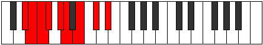 |
| [1391](https://ianring.com/musictheory/scales/1391) | [Aeradyllic](ModeEFlatAeradyllic.md) | Eb | Eb, E, F, Gb, Ab, A, B, Db, Eb |  |
| [1391](https://ianring.com/musictheory/scales/1391) | [Aeradyllic](ModeFSharpAeradyllic.md) | F# | F#, G, G#, A, B, C, D, E, F# |  |
| [1391](https://ianring.com/musictheory/scales/1391) | [Aeradyllic](ModeGFlatAeradyllic.md) | Gb | Gb, G, Ab, A, B, C, D, E, Gb |  |
| [1391](https://ianring.com/musictheory/scales/1391) | [Aeradyllic](ModeASharpAeradyllic.md) | A# | A#, B, C, C#, D#, E, F#, G#, A# |  |
| [1391](https://ianring.com/musictheory/scales/1391) | [Aeradyllic](ModeBFlatAeradyllic.md) | Bb | Bb, B, C, Db, Eb, E, Gb, Ab, Bb |  |
| [1391](https://ianring.com/musictheory/scales/1391) | [Aeradyllic](ModeGSharpAeradyllic.md) | G# | G#, A, A#, B, C#, D, E, F#, G# |  |
| [1391](https://ianring.com/musictheory/scales/1391) | [Aeradyllic](ModeAFlatAeradyllic.md) | Ab | Ab, A, Bb, B, Db, D, E, Gb, Ab |  |
| [1395](https://ianring.com/musictheory/scales/1395) | [Mixonorian](ModeASharpMixonorian.md) | A# | A#, B, C##, D#, E, F#, G#, A# |  |
| [1395](https://ianring.com/musictheory/scales/1395) | [Mixonorian](ModeBFlatMixonorian.md) | Bb | Bb, Cb, D, Eb, Fb, Gb, Ab, Bb |  |
| [1397](https://ianring.com/musictheory/scales/1397) | [Gothian](ModeFSharpGothian.md) | F# | F#, G#, A#, B, C, D, E, F# |  |
| [1397](https://ianring.com/musictheory/scales/1397) | [Gothian](ModeGFlatGothian.md) | Gb | Gb, Ab, Bb, Cb, Dbb, Ebb, Fb, Gb |  |
| [1399](https://ianring.com/musictheory/scales/1399) | [Syryllic](ModeASharpSyryllic.md) | A# | A#, B, C, D, D#, E, F#, G#, A# |  |
| [1399](https://ianring.com/musictheory/scales/1399) | [Syryllic](ModeBFlatSyryllic.md) | Bb | Bb, B, C, D, Eb, E, Gb, Ab, Bb |  |
| [1399](https://ianring.com/musictheory/scales/1399) | [Syryllic](ModeFSharpSyryllic.md) | F# | F#, G, G#, A#, B, C, D, E, F# |  |
| [1399](https://ianring.com/musictheory/scales/1399) | [Syryllic](ModeGFlatSyryllic.md) | Gb | Gb, G, Ab, Bb, B, C, D, E, Gb |  |
| [1401](https://ianring.com/musictheory/scales/1401) | [Pagian](ModeGSharpPagian.md) | G# | G#, A##, B#, C#, D, E, F#, G# |  |
| [1401](https://ianring.com/musictheory/scales/1401) | [Pagian](ModeAFlatPagian.md) | Ab | Ab, B, C, Db, Ebb, Fb, Gb, Ab |  |
| [1403](https://ianring.com/musictheory/scales/1403) | [Epinyllic](ModeGSharpEpinyllic.md) | G# | G#, A, B, C, C#, D, E, F#, G# |  |
| [1403](https://ianring.com/musictheory/scales/1403) | [Epinyllic](ModeAFlatEpinyllic.md) | Ab | Ab, A, B, C, Db, D, E, Gb, Ab |  |
| [1403](https://ianring.com/musictheory/scales/1403) | [Epinyllic](ModeDSharpEpinyllic.md) | D# | D#, E, F#, G, G#, A, B, C#, D# |  |
| [1403](https://ianring.com/musictheory/scales/1403) | [Epinyllic](ModeEFlatEpinyllic.md) | Eb | Eb, E, Gb, G, Ab, A, B, Db, Eb |  |
| [1403](https://ianring.com/musictheory/scales/1403) | [Epinyllic](ModeASharpEpinyllic.md) | A# | A#, B, C#, D, D#, E, F#, G#, A# |  |
| [1403](https://ianring.com/musictheory/scales/1403) | [Epinyllic](ModeBFlatEpinyllic.md) | Bb | Bb, B, Db, D, Eb, E, Gb, Ab, Bb |  |
| [1405](https://ianring.com/musictheory/scales/1405) | [Goryllic](ModeGSharpGoryllic.md) | G# | G#, A#, B, C, C#, D, E, F#, G# |  |
| [1405](https://ianring.com/musictheory/scales/1405) | [Goryllic](ModeAFlatGoryllic.md) | Ab | Ab, Bb, B, C, Db, D, E, Gb, Ab |  |
| [1405](https://ianring.com/musictheory/scales/1405) | [Goryllic](ModeFSharpGoryllic.md) | F# | F#, G#, A, A#, B, C, D, E, F# |  |
| [1405](https://ianring.com/musictheory/scales/1405) | [Goryllic](ModeGFlatGoryllic.md) | Gb | Gb, Ab, A, Bb, B, C, D, E, Gb |  |
| [1407](https://ianring.com/musictheory/scales/1407) | [Tharygic](ModeDSharpTharygic.md) | D# | D#, E, F, F#, G, G#, A, B, C#, D# |  |
| [1407](https://ianring.com/musictheory/scales/1407) | [Tharygic](ModeEFlatTharygic.md) | Eb | Eb, E, F, Gb, G, Ab, A, B, Db, Eb |  |
| [1407](https://ianring.com/musictheory/scales/1407) | [Tharygic](ModeASharpTharygic.md) | A# | A#, B, C, C#, D, D#, E, F#, G#, A# |  |
| [1407](https://ianring.com/musictheory/scales/1407) | [Tharygic](ModeBFlatTharygic.md) | Bb | Bb, B, C, Db, D, Eb, E, Gb, Ab, Bb |  |
| [1407](https://ianring.com/musictheory/scales/1407) | [Tharygic](ModeGSharpTharygic.md) | G# | G#, A, A#, B, C, C#, D, E, F#, G# |  |
| [1407](https://ianring.com/musictheory/scales/1407) | [Tharygic](ModeAFlatTharygic.md) | Ab | Ab, A, Bb, B, C, Db, D, E, Gb, Ab |  |
| [1407](https://ianring.com/musictheory/scales/1407) | [Tharygic](ModeFSharpTharygic.md) | F# | F#, G, G#, A, A#, B, C, D, E, F# |  |
| [1407](https://ianring.com/musictheory/scales/1407) | [Tharygic](ModeGFlatTharygic.md) | Gb | Gb, G, Ab, A, Bb, B, C, D, E, Gb |  |
| [1417](https://ianring.com/musictheory/scales/1417) | [Zoptitonic](ModeGSharpZoptitonic.md) | G# | G#, B, D#, E, F#, G# | 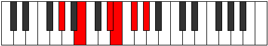 |
| [1417](https://ianring.com/musictheory/scales/1417) | [Zoptitonic](ModeAFlatZoptitonic.md) | Ab | Ab, B, Eb, E, Gb, Ab |  |
| [1419](https://ianring.com/musictheory/scales/1419) | [Zalimic](ModeGSharpZalimic.md) | G# | G#, A, B, C###, D##, E##, G# |  |
| [1419](https://ianring.com/musictheory/scales/1419) | [Zalimic](ModeAFlatZalimic.md) | Ab | Ab, Bbb, Cb, D#, E, F#, Ab |  |
| [1421](https://ianring.com/musictheory/scales/1421) | [Aeolaphimic](ModeGSharpAeolaphimic.md) | G# | G#, A#, B, C###, D##, E##, G# |  |
| [1421](https://ianring.com/musictheory/scales/1421) | [Aeolaphimic](ModeAFlatAeolaphimic.md) | Ab | Ab, Bb, Cb, D#, E, F#, Ab |  |
| [1423](https://ianring.com/musictheory/scales/1423) | [Doptian](ModeGSharpDoptian.md) | G# | G#, A, Bb, Cb, D#, E, F#, G# |  |
| [1423](https://ianring.com/musictheory/scales/1423) | [Doptian](ModeAFlatDoptian.md) | Ab | Ab, Bbb, Cbb, Dbbb, Eb, Fb, Gb, Ab |  |
| [1429](https://ianring.com/musictheory/scales/1429) | [Bythimic](ModeENaturalBythimic.md) | E | E, F#, G#, A##, B#, C##, E |  |
| [1431](https://ianring.com/musictheory/scales/1431) | [Phragian](ModeENaturalPhragian.md) | E | E, F, Gb, Ab, B, C, D, E |  |
| [1433](https://ianring.com/musictheory/scales/1433) | [Dynimic](ModeGSharpDynimic.md) | G# | G#, A##, B#, C###, D##, E##, G# |  |
| [1433](https://ianring.com/musictheory/scales/1433) | [Dynimic](ModeAFlatDynimic.md) | Ab | Ab, B, C, D#, E, F#, Ab |  |
| [1435](https://ianring.com/musictheory/scales/1435) | [Phronian](ModeGSharpPhronian.md) | G# | G#, A, B, C, D#, E, F#, G# |  |
| [1435](https://ianring.com/musictheory/scales/1435) | [Phronian](ModeAFlatPhronian.md) | Ab | Ab, Bbb, Cb, Dbb, Eb, Fb, Gb, Ab |  |
| [1437](https://ianring.com/musictheory/scales/1437) | [Aeolycrian](ModeENaturalAeolycrian.md) | E | E, F#, G, Ab, B, C, D, E |  |
| [1437](https://ianring.com/musictheory/scales/1437) | [Aeolycrian](ModeGSharpAeolycrian.md) | G# | G#, A#, B, C, D#, E, F#, G# |  |
| [1437](https://ianring.com/musictheory/scales/1437) | [Aeolycrian](ModeAFlatAeolycrian.md) | Ab | Ab, Bb, Cb, Dbb, Eb, Fb, Gb, Ab |  |
| [1439](https://ianring.com/musictheory/scales/1439) | [Rolyllic](ModeENaturalRolyllic.md) | E | E, F, F#, G, G#, B, C, D, E |  |
| [1439](https://ianring.com/musictheory/scales/1439) | [Rolyllic](ModeGSharpRolyllic.md) | G# | G#, A, A#, B, C, D#, E, F#, G# |  |
| [1439](https://ianring.com/musictheory/scales/1439) | [Rolyllic](ModeAFlatRolyllic.md) | Ab | Ab, A, Bb, B, C, Eb, E, Gb, Ab |  |
| [1445](https://ianring.com/musictheory/scales/1445) | [Byptimic](ModeFSharpByptimic.md) | F# | F#, G#, A##, B##, C##, D##, F# |  |
| [1445](https://ianring.com/musictheory/scales/1445) | [Byptimic](ModeGFlatByptimic.md) | Gb | Gb, Ab, B, C#, D, E, Gb |  |
| [1447](https://ianring.com/musictheory/scales/1447) | [Mixopyrian](ModeFSharpMixopyrian.md) | F# | F#, G, Ab, B, C#, D, E, F# |  |
| [1449](https://ianring.com/musictheory/scales/1449) | [Epathimic](ModeGSharpEpathimic.md) | G# | G#, A##, B##, C###, D##, E##, G# |  |
| [1449](https://ianring.com/musictheory/scales/1449) | [Epathimic](ModeAFlatEpathimic.md) | Ab | Ab, B, C#, D#, E, F#, Ab |  |
| [1449](https://ianring.com/musictheory/scales/1449) | [Epathimic](ModeDFlatEpathimic.md) | Db | Db, E, F#, G#, A, B, Db |  |
| [1451](https://ianring.com/musictheory/scales/1451) | [Phrygian](ModeCSharpPhrygian.md) | C# | C#, D, E, F#, G#, A, B, C# |  |
| [1451](https://ianring.com/musictheory/scales/1451) | [Phrygian](ModeDFlatPhrygian.md) | Db | Db, Ebb, Fb, Gb, Ab, Bbb, Cb, Db |  |
| [1451](https://ianring.com/musictheory/scales/1451) | [Phrygian](ModeGSharpPhrygian.md) | G# | G#, A, B, C#, D#, E, F#, G# |  |
| [1451](https://ianring.com/musictheory/scales/1451) | [Phrygian](ModeAFlatPhrygian.md) | Ab | Ab, Bbb, Cb, Db, Eb, Fb, Gb, Ab |  |
| [1451](https://ianring.com/musictheory/scales/1451) | [Phrygian](ModeDSharpPhrygian.md) | D# | D#, E, F#, G#, A#, B, C#, D# |  |
| [1451](https://ianring.com/musictheory/scales/1451) | [Phrygian](ModeEFlatPhrygian.md) | Eb | Eb, Fb, Gb, Ab, Bb, Cb, Db, Eb |  |
| [1453](https://ianring.com/musictheory/scales/1453) | [Aeolian](ModeFSharpAeolian.md) | F# | F#, G#, A, B, C#, D, E, F# |  |
| [1453](https://ianring.com/musictheory/scales/1453) | [Aeolian](ModeGFlatAeolian.md) | Gb | Gb, Ab, Bbb, Cb, Db, Ebb, Fb, Gb |  |
| [1453](https://ianring.com/musictheory/scales/1453) | [Aeolian](ModeCSharpAeolian.md) | C# | C#, D#, E, F#, G#, A, B, C# |  |
| [1453](https://ianring.com/musictheory/scales/1453) | [Aeolian](ModeDFlatAeolian.md) | Db | Db, Eb, Fb, Gb, Ab, Bbb, Cb, Db |  |
| [1453](https://ianring.com/musictheory/scales/1453) | [Aeolian](ModeGSharpAeolian.md) | G# | G#, A#, B, C#, D#, E, F#, G# |  |
| [1453](https://ianring.com/musictheory/scales/1453) | [Aeolian](ModeAFlatAeolian.md) | Ab | Ab, Bb, Cb, Db, Eb, Fb, Gb, Ab |  |
| [1455](https://ianring.com/musictheory/scales/1455) | [Soryllic](ModeCSharpSoryllic.md) | C# | C#, D, D#, E, F#, G#, A, B, C# |  |
| [1455](https://ianring.com/musictheory/scales/1455) | [Soryllic](ModeDFlatSoryllic.md) | Db | Db, D, Eb, E, Gb, Ab, A, B, Db |  |
| [1455](https://ianring.com/musictheory/scales/1455) | [Soryllic](ModeFSharpSoryllic.md) | F# | F#, G, G#, A, B, C#, D, E, F# |  |
| [1455](https://ianring.com/musictheory/scales/1455) | [Soryllic](ModeGFlatSoryllic.md) | Gb | Gb, G, Ab, A, B, Db, D, E, Gb |  |
| [1455](https://ianring.com/musictheory/scales/1455) | [Soryllic](ModeDSharpSoryllic.md) | D# | D#, E, F, F#, G#, A#, B, C#, D# |  |
| [1455](https://ianring.com/musictheory/scales/1455) | [Soryllic](ModeEFlatSoryllic.md) | Eb | Eb, E, F, Gb, Ab, Bb, B, Db, Eb |  |
| [1455](https://ianring.com/musictheory/scales/1455) | [Soryllic](ModeGSharpSoryllic.md) | G# | G#, A, A#, B, C#, D#, E, F#, G# |  |
| [1455](https://ianring.com/musictheory/scales/1455) | [Soryllic](ModeAFlatSoryllic.md) | Ab | Ab, A, Bb, B, Db, Eb, E, Gb, Ab |  |
| [1461](https://ianring.com/musictheory/scales/1461) | [Stydian](ModeENaturalStydian.md) | E | E, F#, G#, A, B, C, D, E |  |
| [1461](https://ianring.com/musictheory/scales/1461) | [Stydian](ModeFSharpStydian.md) | F# | F#, G#, A#, B, C#, D, E, F# |  |
| [1461](https://ianring.com/musictheory/scales/1461) | [Stydian](ModeGFlatStydian.md) | Gb | Gb, Ab, Bb, Cb, Db, Ebb, Fb, Gb |  |
| [1463](https://ianring.com/musictheory/scales/1463) | [Zaptyllic](ModeENaturalZaptyllic.md) | E | E, F, F#, G#, A, B, C, D, E |  |
| [1463](https://ianring.com/musictheory/scales/1463) | [Zaptyllic](ModeFSharpZaptyllic.md) | F# | F#, G, G#, A#, B, C#, D, E, F# |  |
| [1463](https://ianring.com/musictheory/scales/1463) | [Zaptyllic](ModeGFlatZaptyllic.md) | Gb | Gb, G, Ab, Bb, B, Db, D, E, Gb |  |
| [1465](https://ianring.com/musictheory/scales/1465) | [Aerathian](ModeGSharpAerathian.md) | G# | G#, A##, B#, C#, D#, E, F#, G# |  |
| [1465](https://ianring.com/musictheory/scales/1465) | [Aerathian](ModeAFlatAerathian.md) | Ab | Ab, B, C, Db, Eb, Fb, Gb, Ab |  |
| [1465](https://ianring.com/musictheory/scales/1465) | [Aerathian](ModeCSharpAerathian.md) | C# | C#, D##, E#, F#, G#, A, B, C# |  |
| [1465](https://ianring.com/musictheory/scales/1465) | [Aerathian](ModeDFlatAerathian.md) | Db | Db, E, F, Gb, Ab, Bbb, Cb, Db |  |
| [1467](https://ianring.com/musictheory/scales/1467) | [Thydyllic](ModeGSharpThydyllic.md) | G# | G#, A, B, C, C#, D#, E, F#, G# |  |
| [1467](https://ianring.com/musictheory/scales/1467) | [Thydyllic](ModeAFlatThydyllic.md) | Ab | Ab, A, B, C, Db, Eb, E, Gb, Ab |  |
| [1467](https://ianring.com/musictheory/scales/1467) | [Thydyllic](ModeCSharpThydyllic.md) | C# | C#, D, E, F, F#, G#, A, B, C# |  |
| [1467](https://ianring.com/musictheory/scales/1467) | [Thydyllic](ModeDFlatThydyllic.md) | Db | Db, D, E, F, Gb, Ab, A, B, Db |  |
| [1467](https://ianring.com/musictheory/scales/1467) | [Thydyllic](ModeDSharpThydyllic.md) | D# | D#, E, F#, G, G#, A#, B, C#, D# |  |
| [1467](https://ianring.com/musictheory/scales/1467) | [Thydyllic](ModeEFlatThydyllic.md) | Eb | Eb, E, Gb, G, Ab, Bb, B, Db, Eb |  |
| [1469](https://ianring.com/musictheory/scales/1469) | [Epiryllic](ModeCSharpEpiryllic.md) | C# | C#, D#, E, F, F#, G#, A, B, C# |  |
| [1469](https://ianring.com/musictheory/scales/1469) | [Epiryllic](ModeDFlatEpiryllic.md) | Db | Db, Eb, E, F, Gb, Ab, A, B, Db |  |
| [1469](https://ianring.com/musictheory/scales/1469) | [Epiryllic](ModeENaturalEpiryllic.md) | E | E, F#, G, G#, A, B, C, D, E |  |
| [1469](https://ianring.com/musictheory/scales/1469) | [Epiryllic](ModeGSharpEpiryllic.md) | G# | G#, A#, B, C, C#, D#, E, F#, G# |  |
| [1469](https://ianring.com/musictheory/scales/1469) | [Epiryllic](ModeAFlatEpiryllic.md) | Ab | Ab, Bb, B, C, Db, Eb, E, Gb, Ab |  |
| [1469](https://ianring.com/musictheory/scales/1469) | [Epiryllic](ModeFSharpEpiryllic.md) | F# | F#, G#, A, A#, B, C#, D, E, F# |  |
| [1469](https://ianring.com/musictheory/scales/1469) | [Epiryllic](ModeGFlatEpiryllic.md) | Gb | Gb, Ab, A, Bb, B, Db, D, E, Gb |  |
| [1471](https://ianring.com/musictheory/scales/1471) | [Radygic](ModeCSharpRadygic.md) | C# | C#, D, D#, E, F, F#, G#, A, B, C# |  |
| [1471](https://ianring.com/musictheory/scales/1471) | [Radygic](ModeDFlatRadygic.md) | Db | Db, D, Eb, E, F, Gb, Ab, A, B, Db |  |
| [1471](https://ianring.com/musictheory/scales/1471) | [Radygic](ModeENaturalRadygic.md) | E | E, F, F#, G, G#, A, B, C, D, E |  |
| [1471](https://ianring.com/musictheory/scales/1471) | [Radygic](ModeDSharpRadygic.md) | D# | D#, E, F, F#, G, G#, A#, B, C#, D# |  |
| [1471](https://ianring.com/musictheory/scales/1471) | [Radygic](ModeEFlatRadygic.md) | Eb | Eb, E, F, Gb, G, Ab, Bb, B, Db, Eb |  |
| [1471](https://ianring.com/musictheory/scales/1471) | [Radygic](ModeGSharpRadygic.md) | G# | G#, A, A#, B, C, C#, D#, E, F#, G# |  |
| [1471](https://ianring.com/musictheory/scales/1471) | [Radygic](ModeAFlatRadygic.md) | Ab | Ab, A, Bb, B, C, Db, Eb, E, Gb, Ab |  |
| [1471](https://ianring.com/musictheory/scales/1471) | [Radygic](ModeFSharpRadygic.md) | F# | F#, G, G#, A, A#, B, C#, D, E, F# |  |
| [1471](https://ianring.com/musictheory/scales/1471) | [Radygic](ModeGFlatRadygic.md) | Gb | Gb, G, Ab, A, Bb, B, Db, D, E, Gb |  |
| [1479](https://ianring.com/musictheory/scales/1479) | [Aeolagian](ModeASharpAeolagian.md) | A# | A#, B, C, D##, E#, F#, G#, A# |  |
| [1479](https://ianring.com/musictheory/scales/1479) | [Aeolagian](ModeBFlatAeolagian.md) | Bb | Bb, Cb, Dbb, E, F, Gb, Ab, Bb |  |
| [1481](https://ianring.com/musictheory/scales/1481) | [Zagimic](ModeGSharpZagimic.md) | G# | G#, A##, B###, C###, D##, E##, G# |  |
| [1481](https://ianring.com/musictheory/scales/1481) | [Zagimic](ModeAFlatZagimic.md) | Ab | Ab, B, C##, D#, E, F#, Ab |  |
| [1483](https://ianring.com/musictheory/scales/1483) | [Dygian](ModeGSharpDygian.md) | G# | G#, A, B, C##, D#, E, F#, G# |  |
| [1483](https://ianring.com/musictheory/scales/1483) | [Dygian](ModeAFlatDygian.md) | Ab | Ab, Bbb, Cb, D, Eb, Fb, Gb, Ab |  |
| [1483](https://ianring.com/musictheory/scales/1483) | [Dygian](ModeASharpDygian.md) | A# | A#, B, C#, D##, E#, F#, G#, A# |  |
| [1483](https://ianring.com/musictheory/scales/1483) | [Dygian](ModeBFlatDygian.md) | Bb | Bb, Cb, Db, E, F, Gb, Ab, Bb |  |
| [1485](https://ianring.com/musictheory/scales/1485) | [Tyrian](ModeGSharpTyrian.md) | G# | G#, A#, B, C##, D#, E, F#, G# |  |
| [1485](https://ianring.com/musictheory/scales/1485) | [Tyrian](ModeAFlatTyrian.md) | Ab | Ab, Bb, Cb, D, Eb, Fb, Gb, Ab | 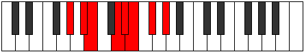 |
| [1487](https://ianring.com/musictheory/scales/1487) | [Lycryllic](ModeASharpLycryllic.md) | A# | A#, B, C, C#, E, F, F#, G#, A# |  |
| [1487](https://ianring.com/musictheory/scales/1487) | [Lycryllic](ModeBFlatLycryllic.md) | Bb | Bb, B, C, Db, E, F, Gb, Ab, Bb |  |
| [1487](https://ianring.com/musictheory/scales/1487) | [Lycryllic](ModeGSharpLycryllic.md) | G# | G#, A, A#, B, D, D#, E, F#, G# |  |
| [1487](https://ianring.com/musictheory/scales/1487) | [Lycryllic](ModeAFlatLycryllic.md) | Ab | Ab, A, Bb, B, D, Eb, E, Gb, Ab |  |
| [1491](https://ianring.com/musictheory/scales/1491) | [Rynian](ModeASharpRynian.md) | A# | A#, B, C##, D##, E#, F#, G#, A# |  |
| [1491](https://ianring.com/musictheory/scales/1491) | [Rynian](ModeBFlatRynian.md) | Bb | Bb, Cb, D, E, F, Gb, Ab, Bb |  |
| [1493](https://ianring.com/musictheory/scales/1493) | [Phryrian](ModeENaturalPhryrian.md) | E | E, F#, G#, A#, B, C, D, E |  |
| [1495](https://ianring.com/musictheory/scales/1495) | [Kaptyllic](ModeENaturalKaptyllic.md) | E | E, F, F#, G#, A#, B, C, D, E |  |
| [1495](https://ianring.com/musictheory/scales/1495) | [Kaptyllic](ModeASharpKaptyllic.md) | A# | A#, B, C, D, E, F, F#, G#, A# |  |
| [1495](https://ianring.com/musictheory/scales/1495) | [Kaptyllic](ModeBFlatKaptyllic.md) | Bb | Bb, B, C, D, E, F, Gb, Ab, Bb |  |
| [1497](https://ianring.com/musictheory/scales/1497) | [Ionanian](ModeGSharpIonanian.md) | G# | G#, A##, B#, C##, D#, E, F#, G# |  |
| [1497](https://ianring.com/musictheory/scales/1497) | [Ionanian](ModeAFlatIonanian.md) | Ab | Ab, B, C, D, Eb, Fb, Gb, Ab |  |
| [1499](https://ianring.com/musictheory/scales/1499) | [Stonyllic](ModeGSharpStonyllic.md) | G# | G#, A, B, C, D, D#, E, F#, G# |  |
| [1499](https://ianring.com/musictheory/scales/1499) | [Stonyllic](ModeAFlatStonyllic.md) | Ab | Ab, A, B, C, D, Eb, E, Gb, Ab |  |
| [1499](https://ianring.com/musictheory/scales/1499) | [Stonyllic](ModeASharpStonyllic.md) | A# | A#, B, C#, D, E, F, F#, G#, A# |  |
| [1499](https://ianring.com/musictheory/scales/1499) | [Stonyllic](ModeBFlatStonyllic.md) | Bb | Bb, B, Db, D, E, F, Gb, Ab, Bb |  |
| [1501](https://ianring.com/musictheory/scales/1501) | [Stygyllic](ModeGSharpStygyllic.md) | G# | G#, A#, B, C, D, D#, E, F#, G# |  |
| [1501](https://ianring.com/musictheory/scales/1501) | [Stygyllic](ModeAFlatStygyllic.md) | Ab | Ab, Bb, B, C, D, Eb, E, Gb, Ab |  |
| [1501](https://ianring.com/musictheory/scales/1501) | [Stygyllic](ModeENaturalStygyllic.md) | E | E, F#, G, G#, A#, B, C, D, E |  |
| [1503](https://ianring.com/musictheory/scales/1503) | [Padygic](ModeASharpPadygic.md) | A# | A#, B, C, C#, D, E, F, F#, G#, A# |  |
| [1503](https://ianring.com/musictheory/scales/1503) | [Padygic](ModeBFlatPadygic.md) | Bb | Bb, B, C, Db, D, E, F, Gb, Ab, Bb |  |
| [1503](https://ianring.com/musictheory/scales/1503) | [Padygic](ModeENaturalPadygic.md) | E | E, F, F#, G, G#, A#, B, C, D, E |  |
| [1503](https://ianring.com/musictheory/scales/1503) | [Padygic](ModeGSharpPadygic.md) | G# | G#, A, A#, B, C, D, D#, E, F#, G# |  |
| [1503](https://ianring.com/musictheory/scales/1503) | [Padygic](ModeAFlatPadygic.md) | Ab | Ab, A, Bb, B, C, D, Eb, E, Gb, Ab |  |
| [1507](https://ianring.com/musictheory/scales/1507) | [Zynian](ModeASharpZynian.md) | A# | A#, B, C###, D##, E#, F#, G#, A# |  |
| [1507](https://ianring.com/musictheory/scales/1507) | [Zynian](ModeBFlatZynian.md) | Bb | Bb, Cb, D#, E, F, Gb, Ab, Bb |  |
| [1509](https://ianring.com/musictheory/scales/1509) | [Ragian](ModeFSharpRagian.md) | F# | F#, G#, A##, B#, C#, D, E, F# |  |
| [1509](https://ianring.com/musictheory/scales/1509) | [Ragian](ModeGFlatRagian.md) | Gb | Gb, Ab, B, C, Db, Ebb, Fb, Gb |  |
| [1511](https://ianring.com/musictheory/scales/1511) | [Styptyllic](ModeFSharpStyptyllic.md) | F# | F#, G, G#, B, C, C#, D, E, F# |  |
| [1511](https://ianring.com/musictheory/scales/1511) | [Styptyllic](ModeGFlatStyptyllic.md) | Gb | Gb, G, Ab, B, C, Db, D, E, Gb |  |
| [1511](https://ianring.com/musictheory/scales/1511) | [Styptyllic](ModeASharpStyptyllic.md) | A# | A#, B, C, D#, E, F, F#, G#, A# |  |
| [1511](https://ianring.com/musictheory/scales/1511) | [Styptyllic](ModeBFlatStyptyllic.md) | Bb | Bb, B, C, Eb, E, F, Gb, Ab, Bb |  |
| [1513](https://ianring.com/musictheory/scales/1513) | [Stathian](ModeGSharpStathian.md) | G# | G#, A##, B##, C##, D#, E, F#, G# |  |
| [1513](https://ianring.com/musictheory/scales/1513) | [Stathian](ModeAFlatStathian.md) | Ab | Ab, B, C#, D, Eb, Fb, Gb, Ab |  |
| [1513](https://ianring.com/musictheory/scales/1513) | [Stathian](ModeCSharpStathian.md) | C# | C#, D##, E##, F##, G#, A, B, C# |  |
| [1513](https://ianring.com/musictheory/scales/1513) | [Stathian](ModeDFlatStathian.md) | Db | Db, E, F#, G, Ab, Bbb, Cb, Db |  |
| [1515](https://ianring.com/musictheory/scales/1515) | [Solyllic](ModeGSharpSolyllic.md) | G# | G#, A, B, C#, D, D#, E, F#, G# |  |
| [1515](https://ianring.com/musictheory/scales/1515) | [Solyllic](ModeAFlatSolyllic.md) | Ab | Ab, A, B, Db, D, Eb, E, Gb, Ab |  |
| [1515](https://ianring.com/musictheory/scales/1515) | [Solyllic](ModeCSharpSolyllic.md) | C# | C#, D, E, F#, G, G#, A, B, C# |  |
| [1515](https://ianring.com/musictheory/scales/1515) | [Solyllic](ModeDFlatSolyllic.md) | Db | Db, D, E, Gb, G, Ab, A, B, Db |  |
| [1515](https://ianring.com/musictheory/scales/1515) | [Solyllic](ModeASharpSolyllic.md) | A# | A#, B, C#, D#, E, F, F#, G#, A# |  |
| [1515](https://ianring.com/musictheory/scales/1515) | [Solyllic](ModeBFlatSolyllic.md) | Bb | Bb, B, Db, Eb, E, F, Gb, Ab, Bb |  |
| [1515](https://ianring.com/musictheory/scales/1515) | [Solyllic](ModeDSharpSolyllic.md) | D# | D#, E, F#, G#, A, A#, B, C#, D# | 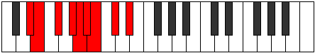 |
| [1515](https://ianring.com/musictheory/scales/1515) | [Solyllic](ModeEFlatSolyllic.md) | Eb | Eb, E, Gb, Ab, A, Bb, B, Db, Eb |  |
| [1517](https://ianring.com/musictheory/scales/1517) | [Sagyllic](ModeFSharpSagyllic.md) | F# | F#, G#, A, B, C, C#, D, E, F# |  |
| [1517](https://ianring.com/musictheory/scales/1517) | [Sagyllic](ModeGFlatSagyllic.md) | Gb | Gb, Ab, A, B, C, Db, D, E, Gb |  |
| [1517](https://ianring.com/musictheory/scales/1517) | [Sagyllic](ModeCSharpSagyllic.md) | C# | C#, D#, E, F#, G, G#, A, B, C# |  |
| [1517](https://ianring.com/musictheory/scales/1517) | [Sagyllic](ModeDFlatSagyllic.md) | Db | Db, Eb, E, Gb, G, Ab, A, B, Db |  |
| [1517](https://ianring.com/musictheory/scales/1517) | [Sagyllic](ModeGSharpSagyllic.md) | G# | G#, A#, B, C#, D, D#, E, F#, G# |  |
| [1517](https://ianring.com/musictheory/scales/1517) | [Sagyllic](ModeAFlatSagyllic.md) | Ab | Ab, Bb, B, Db, D, Eb, E, Gb, Ab |  |
| [1519](https://ianring.com/musictheory/scales/1519) | [Solygic](ModeFSharpSolygic.md) | F# | F#, G, G#, A, B, C, C#, D, E, F# |  |
| [1519](https://ianring.com/musictheory/scales/1519) | [Solygic](ModeGFlatSolygic.md) | Gb | Gb, G, Ab, A, B, C, Db, D, E, Gb |  |
| [1519](https://ianring.com/musictheory/scales/1519) | [Solygic](ModeCSharpSolygic.md) | C# | C#, D, D#, E, F#, G, G#, A, B, C# |  |
| [1519](https://ianring.com/musictheory/scales/1519) | [Solygic](ModeDFlatSolygic.md) | Db | Db, D, Eb, E, Gb, G, Ab, A, B, Db |  |
| [1519](https://ianring.com/musictheory/scales/1519) | [Solygic](ModeASharpSolygic.md) | A# | A#, B, C, C#, D#, E, F, F#, G#, A# |  |
| [1519](https://ianring.com/musictheory/scales/1519) | [Solygic](ModeBFlatSolygic.md) | Bb | Bb, B, C, Db, Eb, E, F, Gb, Ab, Bb |  |
| [1519](https://ianring.com/musictheory/scales/1519) | [Solygic](ModeGSharpSolygic.md) | G# | G#, A, A#, B, C#, D, D#, E, F#, G# |  |
| [1519](https://ianring.com/musictheory/scales/1519) | [Solygic](ModeAFlatSolygic.md) | Ab | Ab, A, Bb, B, Db, D, Eb, E, Gb, Ab |  |
| [1519](https://ianring.com/musictheory/scales/1519) | [Solygic](ModeDSharpSolygic.md) | D# | D#, E, F, F#, G#, A, A#, B, C#, D# |  |
| [1519](https://ianring.com/musictheory/scales/1519) | [Solygic](ModeEFlatSolygic.md) | Eb | Eb, E, F, Gb, Ab, A, Bb, B, Db, Eb |  |
| [1523](https://ianring.com/musictheory/scales/1523) | [Zothyllic](ModeASharpZothyllic.md) | A# | A#, B, D, D#, E, F, F#, G#, A# |  |
| [1523](https://ianring.com/musictheory/scales/1523) | [Zothyllic](ModeBFlatZothyllic.md) | Bb | Bb, B, D, Eb, E, F, Gb, Ab, Bb |  |
| [1525](https://ianring.com/musictheory/scales/1525) | [Sodyllic](ModeFSharpSodyllic.md) | F# | F#, G#, A#, B, C, C#, D, E, F# |  |
| [1525](https://ianring.com/musictheory/scales/1525) | [Sodyllic](ModeGFlatSodyllic.md) | Gb | Gb, Ab, Bb, B, C, Db, D, E, Gb |  |
| [1525](https://ianring.com/musictheory/scales/1525) | [Sodyllic](ModeENaturalSodyllic.md) | E | E, F#, G#, A, A#, B, C, D, E |  |
| [1527](https://ianring.com/musictheory/scales/1527) | [Aeolyrygic](ModeASharpAeolyrygic.md) | A# | A#, B, C, D, D#, E, F, F#, G#, A# |  |
| [1527](https://ianring.com/musictheory/scales/1527) | [Aeolyrygic](ModeBFlatAeolyrygic.md) | Bb | Bb, B, C, D, Eb, E, F, Gb, Ab, Bb |  |
| [1527](https://ianring.com/musictheory/scales/1527) | [Aeolyrygic](ModeFSharpAeolyrygic.md) | F# | F#, G, G#, A#, B, C, C#, D, E, F# |  |
| [1527](https://ianring.com/musictheory/scales/1527) | [Aeolyrygic](ModeGFlatAeolyrygic.md) | Gb | Gb, G, Ab, Bb, B, C, Db, D, E, Gb |  |
| [1527](https://ianring.com/musictheory/scales/1527) | [Aeolyrygic](ModeENaturalAeolyrygic.md) | E | E, F, F#, G#, A, A#, B, C, D, E |  |
| [1529](https://ianring.com/musictheory/scales/1529) | [Kataryllic](ModeGSharpKataryllic.md) | G# | G#, B, C, C#, D, D#, E, F#, G# |  |
| [1529](https://ianring.com/musictheory/scales/1529) | [Kataryllic](ModeAFlatKataryllic.md) | Ab | Ab, B, C, Db, D, Eb, E, Gb, Ab |  |
| [1529](https://ianring.com/musictheory/scales/1529) | [Kataryllic](ModeCSharpKataryllic.md) | C# | C#, E, F, F#, G, G#, A, B, C# |  |
| [1529](https://ianring.com/musictheory/scales/1529) | [Kataryllic](ModeDFlatKataryllic.md) | Db | Db, E, F, Gb, G, Ab, A, B, Db |  |
| [1531](https://ianring.com/musictheory/scales/1531) | [Styptygic](ModeGSharpStyptygic.md) | G# | G#, A, B, C, C#, D, D#, E, F#, G# |  |
| [1531](https://ianring.com/musictheory/scales/1531) | [Styptygic](ModeAFlatStyptygic.md) | Ab | Ab, A, B, C, Db, D, Eb, E, Gb, Ab |  |
| [1531](https://ianring.com/musictheory/scales/1531) | [Styptygic](ModeCSharpStyptygic.md) | C# | C#, D, E, F, F#, G, G#, A, B, C# |  |
| [1531](https://ianring.com/musictheory/scales/1531) | [Styptygic](ModeDFlatStyptygic.md) | Db | Db, D, E, F, Gb, G, Ab, A, B, Db |  |
| [1531](https://ianring.com/musictheory/scales/1531) | [Styptygic](ModeASharpStyptygic.md) | A# | A#, B, C#, D, D#, E, F, F#, G#, A# |  |
| [1531](https://ianring.com/musictheory/scales/1531) | [Styptygic](ModeBFlatStyptygic.md) | Bb | Bb, B, Db, D, Eb, E, F, Gb, Ab, Bb |  |
| [1531](https://ianring.com/musictheory/scales/1531) | [Styptygic](ModeDSharpStyptygic.md) | D# | D#, E, F#, G, G#, A, A#, B, C#, D# |  |
| [1531](https://ianring.com/musictheory/scales/1531) | [Styptygic](ModeEFlatStyptygic.md) | Eb | Eb, E, Gb, G, Ab, A, Bb, B, Db, Eb |  |
| [1533](https://ianring.com/musictheory/scales/1533) | [Katycrygic](ModeCSharpKatycrygic.md) | C# | C#, D#, E, F, F#, G, G#, A, B, C# |  |
| [1533](https://ianring.com/musictheory/scales/1533) | [Katycrygic](ModeDFlatKatycrygic.md) | Db | Db, Eb, E, F, Gb, G, Ab, A, B, Db |  |
| [1533](https://ianring.com/musictheory/scales/1533) | [Katycrygic](ModeGSharpKatycrygic.md) | G# | G#, A#, B, C, C#, D, D#, E, F#, G# |  |
| [1533](https://ianring.com/musictheory/scales/1533) | [Katycrygic](ModeAFlatKatycrygic.md) | Ab | Ab, Bb, B, C, Db, D, Eb, E, Gb, Ab |  |
| [1533](https://ianring.com/musictheory/scales/1533) | [Katycrygic](ModeFSharpKatycrygic.md) | F# | F#, G#, A, A#, B, C, C#, D, E, F# |  |
| [1533](https://ianring.com/musictheory/scales/1533) | [Katycrygic](ModeGFlatKatycrygic.md) | Gb | Gb, Ab, A, Bb, B, C, Db, D, E, Gb |  |
| [1533](https://ianring.com/musictheory/scales/1533) | [Katycrygic](ModeENaturalKatycrygic.md) | E | E, F#, G, G#, A, A#, B, C, D, E |  |
| [1535](https://ianring.com/musictheory/scales/1535) | [Mixodyllian](ModeCSharpMixodyllian.md) | C# | C#, D, D#, E, F, F#, G, G#, A, B, C# |  |
| [1535](https://ianring.com/musictheory/scales/1535) | [Mixodyllian](ModeDFlatMixodyllian.md) | Db | Db, D, Eb, E, F, Gb, G, Ab, A, B, Db |  |
| [1535](https://ianring.com/musictheory/scales/1535) | [Mixodyllian](ModeASharpMixodyllian.md) | A# | A#, B, C, C#, D, D#, E, F, F#, G#, A# |  |
| [1535](https://ianring.com/musictheory/scales/1535) | [Mixodyllian](ModeBFlatMixodyllian.md) | Bb | Bb, B, C, Db, D, Eb, E, F, Gb, Ab, Bb |  |
| [1535](https://ianring.com/musictheory/scales/1535) | [Mixodyllian](ModeGSharpMixodyllian.md) | G# | G#, A, A#, B, C, C#, D, D#, E, F#, G# |  |
| [1535](https://ianring.com/musictheory/scales/1535) | [Mixodyllian](ModeAFlatMixodyllian.md) | Ab | Ab, A, Bb, B, C, Db, D, Eb, E, Gb, Ab |  |
| [1535](https://ianring.com/musictheory/scales/1535) | [Mixodyllian](ModeFSharpMixodyllian.md) | F# | F#, G, G#, A, A#, B, C, C#, D, E, F# |  |
| [1535](https://ianring.com/musictheory/scales/1535) | [Mixodyllian](ModeGFlatMixodyllian.md) | Gb | Gb, G, Ab, A, Bb, B, C, Db, D, E, Gb |  |
| [1535](https://ianring.com/musictheory/scales/1535) | [Mixodyllian](ModeENaturalMixodyllian.md) | E | E, F, F#, G, G#, A, A#, B, C, D, E |  |
| [1535](https://ianring.com/musictheory/scales/1535) | [Mixodyllian](ModeDSharpMixodyllian.md) | D# | D#, E, F, F#, G, G#, A, A#, B, C#, D# |  |
| [1535](https://ianring.com/musictheory/scales/1535) | [Mixodyllian](ModeEFlatMixodyllian.md) | Eb | Eb, E, F, Gb, G, Ab, A, Bb, B, Db, Eb |  |
| [1573](https://ianring.com/musictheory/scales/1573) | [Saritonic](ModeFSharpSaritonic.md) | F# | F#, G#, B, D#, E, F# |  |
| [1573](https://ianring.com/musictheory/scales/1573) | [Saritonic](ModeGFlatSaritonic.md) | Gb | Gb, Ab, B, Eb, E, Gb |  |
| [1575](https://ianring.com/musictheory/scales/1575) | [Zycrimic](ModeFSharpZycrimic.md) | F# | F#, G, Ab, B, C###, D##, F# |  |
| [1575](https://ianring.com/musictheory/scales/1575) | [Zycrimic](ModeGFlatZycrimic.md) | Gb | Gb, Abb, Bbbb, Cb, D#, E, Gb |  |
| [1581](https://ianring.com/musictheory/scales/1581) | [Gyrimic](ModeFSharpGyrimic.md) | F# | F#, G#, A, B, C###, D##, F# |  |
| [1581](https://ianring.com/musictheory/scales/1581) | [Gyrimic](ModeGFlatGyrimic.md) | Gb | Gb, Ab, Bbb, Cb, D#, E, Gb |  |
| [1583](https://ianring.com/musictheory/scales/1583) | [Salian](ModeFSharpSalian.md) | F# | F#, G, Ab, Bbb, Cb, D#, E, F# |  |
| [1589](https://ianring.com/musictheory/scales/1589) | [Ionagimic](ModeFSharpIonagimic.md) | F# | F#, G#, A#, B, C###, D##, F# |  |
| [1589](https://ianring.com/musictheory/scales/1589) | [Ionagimic](ModeGFlatIonagimic.md) | Gb | Gb, Ab, Bb, Cb, D#, E, Gb |  |
| [1591](https://ianring.com/musictheory/scales/1591) | [Rodian](ModeFSharpRodian.md) | F# | F#, G, Ab, Bb, Cb, D#, E, F# |  |
| [1597](https://ianring.com/musictheory/scales/1597) | [Aeolodian](ModeFSharpAeolodian.md) | F# | F#, G#, A, Bb, Cb, D#, E, F# |  |
| [1597](https://ianring.com/musictheory/scales/1597) | [Aeolodian](ModeGFlatAeolodian.md) | Gb | Gb, Ab, Bbb, Cbb, Dbbb, Eb, Fb, Gb |  |
| [1599](https://ianring.com/musictheory/scales/1599) | [Pocryllic](ModeFSharpPocryllic.md) | F# | F#, G, G#, A, A#, B, D#, E, F# |  |
| [1599](https://ianring.com/musictheory/scales/1599) | [Pocryllic](ModeGFlatPocryllic.md) | Gb | Gb, G, Ab, A, Bb, B, Eb, E, Gb | 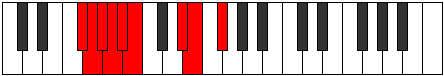 |
| [1621](https://ianring.com/musictheory/scales/1621) | [Aeolathimic](ModeDNaturalAeolathimic.md) | D | D, E, F#, G#, A##, B#, D |  |
| [1623](https://ianring.com/musictheory/scales/1623) | [Lothian](ModeDNaturalLothian.md) | D | D, Eb, Fb, Gb, Ab, B, C, D |  |
| [1629](https://ianring.com/musictheory/scales/1629) | [Synian](ModeDNaturalSynian.md) | D | D, E, F, Gb, Ab, B, C, D |  |
| [1631](https://ianring.com/musictheory/scales/1631) | [Rynyllic](ModeDNaturalRynyllic.md) | D | D, D#, E, F, F#, G#, B, C, D |  |
| [1637](https://ianring.com/musictheory/scales/1637) | [Syptimic](ModeFSharpSyptimic.md) | F# | F#, G#, A##, B#, C###, D##, F# | 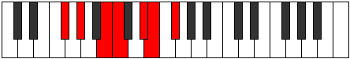 |
| [1637](https://ianring.com/musictheory/scales/1637) | [Syptimic](ModeGFlatSyptimic.md) | Gb | Gb, Ab, B, C, D#, E, Gb |  |
| [1639](https://ianring.com/musictheory/scales/1639) | [Aeolothian](ModeFSharpAeolothian.md) | F# | F#, G, Ab, B, C, D#, E, F# |  |
| [1645](https://ianring.com/musictheory/scales/1645) | [Katagian](ModeFSharpKatagian.md) | F# | F#, G#, A, B, C, D#, E, F# |  |
| [1645](https://ianring.com/musictheory/scales/1645) | [Katagian](ModeGFlatKatagian.md) | Gb | Gb, Ab, Bbb, Cb, Dbb, Eb, Fb, Gb |  |
| [1647](https://ianring.com/musictheory/scales/1647) | [Polyllic](ModeFSharpPolyllic.md) | F# | F#, G, G#, A, B, C, D#, E, F# |  |
| [1647](https://ianring.com/musictheory/scales/1647) | [Polyllic](ModeGFlatPolyllic.md) | Gb | Gb, G, Ab, A, B, C, Eb, E, Gb |  |
| [1653](https://ianring.com/musictheory/scales/1653) | [Gylian](ModeDNaturalGylian.md) | D | D, E, F#, G, Ab, B, C, D |  |
| [1653](https://ianring.com/musictheory/scales/1653) | [Gylian](ModeFSharpGylian.md) | F# | F#, G#, A#, B, C, D#, E, F# |  |
| [1653](https://ianring.com/musictheory/scales/1653) | [Gylian](ModeGFlatGylian.md) | Gb | Gb, Ab, Bb, Cb, Dbb, Eb, Fb, Gb |  |
| [1655](https://ianring.com/musictheory/scales/1655) | [Katygyllic](ModeDNaturalKatygyllic.md) | D | D, D#, E, F#, G, G#, B, C, D |  |
| [1655](https://ianring.com/musictheory/scales/1655) | [Katygyllic](ModeFSharpKatygyllic.md) | F# | F#, G, G#, A#, B, C, D#, E, F# |  |
| [1655](https://ianring.com/musictheory/scales/1655) | [Katygyllic](ModeGFlatKatygyllic.md) | Gb | Gb, G, Ab, Bb, B, C, Eb, E, Gb |  |
| [1661](https://ianring.com/musictheory/scales/1661) | [Gonyllic](ModeDNaturalGonyllic.md) | D | D, E, F, F#, G, G#, B, C, D |  |
| [1661](https://ianring.com/musictheory/scales/1661) | [Gonyllic](ModeFSharpGonyllic.md) | F# | F#, G#, A, A#, B, C, D#, E, F# |  |
| [1661](https://ianring.com/musictheory/scales/1661) | [Gonyllic](ModeGFlatGonyllic.md) | Gb | Gb, Ab, A, Bb, B, C, Eb, E, Gb |  |
| [1663](https://ianring.com/musictheory/scales/1663) | [Lydygic](ModeDNaturalLydygic.md) | D | D, D#, E, F, F#, G, G#, B, C, D |  |
| [1663](https://ianring.com/musictheory/scales/1663) | [Lydygic](ModeFSharpLydygic.md) | F# | F#, G, G#, A, A#, B, C, D#, E, F# |  |
| [1663](https://ianring.com/musictheory/scales/1663) | [Lydygic](ModeGFlatLydygic.md) | Gb | Gb, G, Ab, A, Bb, B, C, Eb, E, Gb |  |
| [1685](https://ianring.com/musictheory/scales/1685) | [Zeracrimic](ModeENaturalZeracrimic.md) | E | E, F#, G#, A##, B##, C##, E |  |
| [1687](https://ianring.com/musictheory/scales/1687) | [Phralian](ModeENaturalPhralian.md) | E | E, F, Gb, Ab, B, C#, D, E |  |
| [1693](https://ianring.com/musictheory/scales/1693) | [Dogian](ModeENaturalDogian.md) | E | E, F#, G, Ab, B, C#, D, E |  |
| [1695](https://ianring.com/musictheory/scales/1695) | [Phrodyllic](ModeENaturalPhrodyllic.md) | E | E, F, F#, G, G#, B, C#, D, E |  |
| [1699](https://ianring.com/musictheory/scales/1699) | [Kaptimic](ModeBNaturalKaptimic.md) | B | B, C, D##, E##, F###, G##, B |  |
| [1701](https://ianring.com/musictheory/scales/1701) | [Lothimic](ModeFSharpLothimic.md) | F# | F#, G#, A##, B##, C###, D##, F# |  |
| [1701](https://ianring.com/musictheory/scales/1701) | [Lothimic](ModeGFlatLothimic.md) | Gb | Gb, Ab, B, C#, D#, E, Gb |  |
| [1701](https://ianring.com/musictheory/scales/1701) | [Lothimic](ModeBNaturalLothimic.md) | B | B, C#, D##, E##, F###, G##, B |  |
| [1703](https://ianring.com/musictheory/scales/1703) | [Zaptian](ModeFSharpZaptian.md) | F# | F#, G, Ab, B, C#, D#, E, F# |  |
| [1703](https://ianring.com/musictheory/scales/1703) | [Zaptian](ModeBNaturalZaptian.md) | B | B, C, Db, E, F#, G#, A, B |  |
| [1705](https://ianring.com/musictheory/scales/1705) | [Darmic](ModeBNaturalDarmic.md) | B | B, C##, D##, E##, F###, G##, B |  |
| [1705](https://ianring.com/musictheory/scales/1705) | [Darmic](ModeDFlatDarmic.md) | Db | Db, E, F#, G#, A#, B, Db |  |
| [1707](https://ianring.com/musictheory/scales/1707) | [Mixolythian](ModeBNaturalMixolythian.md) | B | B, C, D, E, F#, G#, A, B |  |
| [1707](https://ianring.com/musictheory/scales/1707) | [Mixolythian](ModeCSharpMixolythian.md) | C# | C#, D, E, F#, G#, A#, B, C# |  |
| [1707](https://ianring.com/musictheory/scales/1707) | [Mixolythian](ModeDFlatMixolythian.md) | Db | Db, Ebb, Fb, Gb, Ab, Bb, Cb, Db |  |
| [1709](https://ianring.com/musictheory/scales/1709) | [Dorian](ModeBNaturalDorian.md) | B | B, C#, D, E, F#, G#, A, B |  |
| [1709](https://ianring.com/musictheory/scales/1709) | [Dorian](ModeFSharpDorian.md) | F# | F#, G#, A, B, C#, D#, E, F# |  |
| [1709](https://ianring.com/musictheory/scales/1709) | [Dorian](ModeGFlatDorian.md) | Gb | Gb, Ab, Bbb, Cb, Db, Eb, Fb, Gb |  |
| [1709](https://ianring.com/musictheory/scales/1709) | [Dorian](ModeCSharpDorian.md) | C# | C#, D#, E, F#, G#, A#, B, C# |  |
| [1709](https://ianring.com/musictheory/scales/1709) | [Dorian](ModeDFlatDorian.md) | Db | Db, Eb, Fb, Gb, Ab, Bb, Cb, Db |  |
| [1711](https://ianring.com/musictheory/scales/1711) | [Ragyllic](ModeBNaturalRagyllic.md) | B | B, C, C#, D, E, F#, G#, A, B |  |
| [1711](https://ianring.com/musictheory/scales/1711) | [Ragyllic](ModeFSharpRagyllic.md) | F# | F#, G, G#, A, B, C#, D#, E, F# |  |
| [1711](https://ianring.com/musictheory/scales/1711) | [Ragyllic](ModeGFlatRagyllic.md) | Gb | Gb, G, Ab, A, B, Db, Eb, E, Gb |  |
| [1711](https://ianring.com/musictheory/scales/1711) | [Ragyllic](ModeCSharpRagyllic.md) | C# | C#, D, D#, E, F#, G#, A#, B, C# |  |
| [1711](https://ianring.com/musictheory/scales/1711) | [Ragyllic](ModeDFlatRagyllic.md) | Db | Db, D, Eb, E, Gb, Ab, Bb, B, Db |  |
| [1713](https://ianring.com/musictheory/scales/1713) | [Garimic](ModeBNaturalGarimic.md) | B | B, C###, D##, E##, F###, G##, B |  |
| [1715](https://ianring.com/musictheory/scales/1715) | [Aeronian](ModeBNaturalAeronian.md) | B | B, C, D#, E, F#, G#, A, B |  |
| [1717](https://ianring.com/musictheory/scales/1717) | [Mixolydian](ModeENaturalMixolydian.md) | E | E, F#, G#, A, B, C#, D, E |  |
| [1717](https://ianring.com/musictheory/scales/1717) | [Mixolydian](ModeBNaturalMixolydian.md) | B | B, C#, D#, E, F#, G#, A, B |  |
| [1717](https://ianring.com/musictheory/scales/1717) | [Mixolydian](ModeFSharpMixolydian.md) | F# | F#, G#, A#, B, C#, D#, E, F# |  |
| [1717](https://ianring.com/musictheory/scales/1717) | [Mixolydian](ModeGFlatMixolydian.md) | Gb | Gb, Ab, Bb, Cb, Db, Eb, Fb, Gb |  |
| [1719](https://ianring.com/musictheory/scales/1719) | [Lyryllic](ModeBNaturalLyryllic.md) | B | B, C, C#, D#, E, F#, G#, A, B |  |
| [1719](https://ianring.com/musictheory/scales/1719) | [Lyryllic](ModeENaturalLyryllic.md) | E | E, F, F#, G#, A, B, C#, D, E |  |
| [1719](https://ianring.com/musictheory/scales/1719) | [Lyryllic](ModeFSharpLyryllic.md) | F# | F#, G, G#, A#, B, C#, D#, E, F# |  |
| [1719](https://ianring.com/musictheory/scales/1719) | [Lyryllic](ModeGFlatLyryllic.md) | Gb | Gb, G, Ab, Bb, B, Db, Eb, E, Gb |  |
| [1721](https://ianring.com/musictheory/scales/1721) | [Ionycrian](ModeBNaturalIonycrian.md) | B | B, C##, D#, E, F#, G#, A, B |  |
| [1721](https://ianring.com/musictheory/scales/1721) | [Ionycrian](ModeCSharpIonycrian.md) | C# | C#, D##, E#, F#, G#, A#, B, C# |  |
| [1721](https://ianring.com/musictheory/scales/1721) | [Ionycrian](ModeDFlatIonycrian.md) | Db | Db, E, F, Gb, Ab, Bb, Cb, Db |  |
| [1723](https://ianring.com/musictheory/scales/1723) | [Poryllic](ModeBNaturalPoryllic.md) | B | B, C, D, D#, E, F#, G#, A, B |  |
| [1723](https://ianring.com/musictheory/scales/1723) | [Poryllic](ModeCSharpPoryllic.md) | C# | C#, D, E, F, F#, G#, A#, B, C# |  |
| [1723](https://ianring.com/musictheory/scales/1723) | [Poryllic](ModeDFlatPoryllic.md) | Db | Db, D, E, F, Gb, Ab, Bb, B, Db |  |
| [1725](https://ianring.com/musictheory/scales/1725) | [Mixodyllic](ModeBNaturalMixodyllic.md) | B | B, C#, D, D#, E, F#, G#, A, B |  |
| [1725](https://ianring.com/musictheory/scales/1725) | [Mixodyllic](ModeENaturalMixodyllic.md) | E | E, F#, G, G#, A, B, C#, D, E | 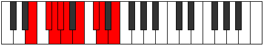 |
| [1725](https://ianring.com/musictheory/scales/1725) | [Mixodyllic](ModeCSharpMixodyllic.md) | C# | C#, D#, E, F, F#, G#, A#, B, C# |  |
| [1725](https://ianring.com/musictheory/scales/1725) | [Mixodyllic](ModeDFlatMixodyllic.md) | Db | Db, Eb, E, F, Gb, Ab, Bb, B, Db |  |
| [1725](https://ianring.com/musictheory/scales/1725) | [Mixodyllic](ModeFSharpMixodyllic.md) | F# | F#, G#, A, A#, B, C#, D#, E, F# |  |
| [1725](https://ianring.com/musictheory/scales/1725) | [Mixodyllic](ModeGFlatMixodyllic.md) | Gb | Gb, Ab, A, Bb, B, Db, Eb, E, Gb |  |
| [1727](https://ianring.com/musictheory/scales/1727) | [Sydygic](ModeBNaturalSydygic.md) | B | B, C, C#, D, D#, E, F#, G#, A, B |  |
| [1727](https://ianring.com/musictheory/scales/1727) | [Sydygic](ModeENaturalSydygic.md) | E | E, F, F#, G, G#, A, B, C#, D, E |  |
| [1727](https://ianring.com/musictheory/scales/1727) | [Sydygic](ModeCSharpSydygic.md) | C# | C#, D, D#, E, F, F#, G#, A#, B, C# |  |
| [1727](https://ianring.com/musictheory/scales/1727) | [Sydygic](ModeDFlatSydygic.md) | Db | Db, D, Eb, E, F, Gb, Ab, Bb, B, Db |  |
| [1727](https://ianring.com/musictheory/scales/1727) | [Sydygic](ModeFSharpSydygic.md) | F# | F#, G, G#, A, A#, B, C#, D#, E, F# |  |
| [1727](https://ianring.com/musictheory/scales/1727) | [Sydygic](ModeGFlatSydygic.md) | Gb | Gb, G, Ab, A, Bb, B, Db, Eb, E, Gb |  |
| [1749](https://ianring.com/musictheory/scales/1749) | [Lythian](ModeDNaturalLythian.md) | D | D, E, F#, G#, A, B, C, D |  |
| [1749](https://ianring.com/musictheory/scales/1749) | [Lythian](ModeENaturalLythian.md) | E | E, F#, G#, A#, B, C#, D, E |  |
| [1751](https://ianring.com/musictheory/scales/1751) | [Aeolyryllic](ModeDNaturalAeolyryllic.md) | D | D, D#, E, F#, G#, A, B, C, D |  |
| [1751](https://ianring.com/musictheory/scales/1751) | [Aeolyryllic](ModeENaturalAeolyryllic.md) | E | E, F, F#, G#, A#, B, C#, D, E |  |
| [1757](https://ianring.com/musictheory/scales/1757) | [Ionyphyllic](ModeDNaturalIonyphyllic.md) | D | D, E, F, F#, G#, A, B, C, D |  |
| [1757](https://ianring.com/musictheory/scales/1757) | [Ionyphyllic](ModeENaturalIonyphyllic.md) | E | E, F#, G, G#, A#, B, C#, D, E |  |
| [1759](https://ianring.com/musictheory/scales/1759) | [Pylygic](ModeDNaturalPylygic.md) | D | D, D#, E, F, F#, G#, A, B, C, D |  |
| [1759](https://ianring.com/musictheory/scales/1759) | [Pylygic](ModeENaturalPylygic.md) | E | E, F, F#, G, G#, A#, B, C#, D, E |  |
| [1763](https://ianring.com/musictheory/scales/1763) | [Katalian](ModeBNaturalKatalian.md) | B | B, C, D##, E#, F#, G#, A, B |  |
| [1765](https://ianring.com/musictheory/scales/1765) | [Lonian](ModeFSharpLonian.md) | F# | F#, G#, A##, B#, C#, D#, E, F# |  |
| [1765](https://ianring.com/musictheory/scales/1765) | [Lonian](ModeGFlatLonian.md) | Gb | Gb, Ab, B, C, Db, Eb, Fb, Gb |  |
| [1765](https://ianring.com/musictheory/scales/1765) | [Lonian](ModeBNaturalLonian.md) | B | B, C#, D##, E#, F#, G#, A, B |  |
| [1767](https://ianring.com/musictheory/scales/1767) | [Dyryllic](ModeFSharpDyryllic.md) | F# | F#, G, G#, B, C, C#, D#, E, F# |  |
| [1767](https://ianring.com/musictheory/scales/1767) | [Dyryllic](ModeGFlatDyryllic.md) | Gb | Gb, G, Ab, B, C, Db, Eb, E, Gb |  |
| [1767](https://ianring.com/musictheory/scales/1767) | [Dyryllic](ModeBNaturalDyryllic.md) | B | B, C, C#, E, F, F#, G#, A, B |  |
| [1769](https://ianring.com/musictheory/scales/1769) | [Rythian](ModeBNaturalRythian.md) | B | B, C##, D##, E#, F#, G#, A, B |  |
| [1769](https://ianring.com/musictheory/scales/1769) | [Rythian](ModeCSharpRythian.md) | C# | C#, D##, E##, F##, G#, A#, B, C# |  |
| [1769](https://ianring.com/musictheory/scales/1769) | [Rythian](ModeDFlatRythian.md) | Db | Db, E, F#, G, Ab, Bb, Cb, Db |  |
| [1771](https://ianring.com/musictheory/scales/1771) | [Stylyllic](ModeBNaturalStylyllic.md) | B | B, C, D, E, F, F#, G#, A, B |  |
| [1771](https://ianring.com/musictheory/scales/1771) | [Stylyllic](ModeCSharpStylyllic.md) | C# | C#, D, E, F#, G, G#, A#, B, C# |  |
| [1771](https://ianring.com/musictheory/scales/1771) | [Stylyllic](ModeDFlatStylyllic.md) | Db | Db, D, E, Gb, G, Ab, Bb, B, Db |  |
| [1773](https://ianring.com/musictheory/scales/1773) | [Aeoloryllic](ModeFSharpAeoloryllic.md) | F# | F#, G#, A, B, C, C#, D#, E, F# |  |
| [1773](https://ianring.com/musictheory/scales/1773) | [Aeoloryllic](ModeGFlatAeoloryllic.md) | Gb | Gb, Ab, A, B, C, Db, Eb, E, Gb |  |
| [1773](https://ianring.com/musictheory/scales/1773) | [Aeoloryllic](ModeBNaturalAeoloryllic.md) | B | B, C#, D, E, F, F#, G#, A, B |  |
| [1773](https://ianring.com/musictheory/scales/1773) | [Aeoloryllic](ModeCSharpAeoloryllic.md) | C# | C#, D#, E, F#, G, G#, A#, B, C# |  |
| [1773](https://ianring.com/musictheory/scales/1773) | [Aeoloryllic](ModeDFlatAeoloryllic.md) | Db | Db, Eb, E, Gb, G, Ab, Bb, B, Db |  |
| [1775](https://ianring.com/musictheory/scales/1775) | [Lyrygic](ModeBNaturalLyrygic.md) | B | B, C, C#, D, E, F, F#, G#, A, B |  |
| [1775](https://ianring.com/musictheory/scales/1775) | [Lyrygic](ModeFSharpLyrygic.md) | F# | F#, G, G#, A, B, C, C#, D#, E, F# |  |
| [1775](https://ianring.com/musictheory/scales/1775) | [Lyrygic](ModeGFlatLyrygic.md) | Gb | Gb, G, Ab, A, B, C, Db, Eb, E, Gb |  |
| [1775](https://ianring.com/musictheory/scales/1775) | [Lyrygic](ModeCSharpLyrygic.md) | C# | C#, D, D#, E, F#, G, G#, A#, B, C# |  |
| [1775](https://ianring.com/musictheory/scales/1775) | [Lyrygic](ModeDFlatLyrygic.md) | Db | Db, D, Eb, E, Gb, G, Ab, Bb, B, Db |  |
| [1777](https://ianring.com/musictheory/scales/1777) | [Saptian](ModeBNaturalSaptian.md) | B | B, C###, D##, E#, F#, G#, A, B |  |
| [1779](https://ianring.com/musictheory/scales/1779) | [Aerythyllic](ModeBNaturalAerythyllic.md) | B | B, C, D#, E, F, F#, G#, A, B |  |
| [1781](https://ianring.com/musictheory/scales/1781) | [Gocryllic](ModeBNaturalGocryllic.md) | B | B, C#, D#, E, F, F#, G#, A, B |  |
| [1781](https://ianring.com/musictheory/scales/1781) | [Gocryllic](ModeDNaturalGocryllic.md) | D | D, E, F#, G, G#, A, B, C, D |  |
| [1781](https://ianring.com/musictheory/scales/1781) | [Gocryllic](ModeFSharpGocryllic.md) | F# | F#, G#, A#, B, C, C#, D#, E, F# |  |
| [1781](https://ianring.com/musictheory/scales/1781) | [Gocryllic](ModeGFlatGocryllic.md) | Gb | Gb, Ab, Bb, B, C, Db, Eb, E, Gb |  |
| [1781](https://ianring.com/musictheory/scales/1781) | [Gocryllic](ModeENaturalGocryllic.md) | E | E, F#, G#, A, A#, B, C#, D, E |  |
| [1783](https://ianring.com/musictheory/scales/1783) | [Danygic](ModeBNaturalDanygic.md) | B | B, C, C#, D#, E, F, F#, G#, A, B |  |
| [1783](https://ianring.com/musictheory/scales/1783) | [Danygic](ModeDNaturalDanygic.md) | D | D, D#, E, F#, G, G#, A, B, C, D |  |
| [1783](https://ianring.com/musictheory/scales/1783) | [Danygic](ModeFSharpDanygic.md) | F# | F#, G, G#, A#, B, C, C#, D#, E, F# |  |
| [1783](https://ianring.com/musictheory/scales/1783) | [Danygic](ModeGFlatDanygic.md) | Gb | Gb, G, Ab, Bb, B, C, Db, Eb, E, Gb |  |
| [1783](https://ianring.com/musictheory/scales/1783) | [Danygic](ModeENaturalDanygic.md) | E | E, F, F#, G#, A, A#, B, C#, D, E |  |
| [1785](https://ianring.com/musictheory/scales/1785) | [Tharyllic](ModeBNaturalTharyllic.md) | B | B, D, D#, E, F, F#, G#, A, B |  |
| [1785](https://ianring.com/musictheory/scales/1785) | [Tharyllic](ModeCSharpTharyllic.md) | C# | C#, E, F, F#, G, G#, A#, B, C# |  |
| [1785](https://ianring.com/musictheory/scales/1785) | [Tharyllic](ModeDFlatTharyllic.md) | Db | Db, E, F, Gb, G, Ab, Bb, B, Db |  |
| [1787](https://ianring.com/musictheory/scales/1787) | [Mycrygic](ModeBNaturalMycrygic.md) | B | B, C, D, D#, E, F, F#, G#, A, B |  |
| [1787](https://ianring.com/musictheory/scales/1787) | [Mycrygic](ModeCSharpMycrygic.md) | C# | C#, D, E, F, F#, G, G#, A#, B, C# |  |
| [1787](https://ianring.com/musictheory/scales/1787) | [Mycrygic](ModeDFlatMycrygic.md) | Db | Db, D, E, F, Gb, G, Ab, Bb, B, Db |  |
| [1789](https://ianring.com/musictheory/scales/1789) | [Katagygic](ModeBNaturalKatagygic.md) | B | B, C#, D, D#, E, F, F#, G#, A, B |  |
| [1789](https://ianring.com/musictheory/scales/1789) | [Katagygic](ModeDNaturalKatagygic.md) | D | D, E, F, F#, G, G#, A, B, C, D |  |
| [1789](https://ianring.com/musictheory/scales/1789) | [Katagygic](ModeCSharpKatagygic.md) | C# | C#, D#, E, F, F#, G, G#, A#, B, C# |  |
| [1789](https://ianring.com/musictheory/scales/1789) | [Katagygic](ModeDFlatKatagygic.md) | Db | Db, Eb, E, F, Gb, G, Ab, Bb, B, Db |  |
| [1789](https://ianring.com/musictheory/scales/1789) | [Katagygic](ModeFSharpKatagygic.md) | F# | F#, G#, A, A#, B, C, C#, D#, E, F# |  |
| [1789](https://ianring.com/musictheory/scales/1789) | [Katagygic](ModeGFlatKatagygic.md) | Gb | Gb, Ab, A, Bb, B, C, Db, Eb, E, Gb |  |
| [1789](https://ianring.com/musictheory/scales/1789) | [Katagygic](ModeENaturalKatagygic.md) | E | E, F#, G, G#, A, A#, B, C#, D, E |  |
| [1791](https://ianring.com/musictheory/scales/1791) | [Aerygyllian](ModeBNaturalAerygyllian.md) | B | B, C, C#, D, D#, E, F, F#, G#, A, B |  |
| [1791](https://ianring.com/musictheory/scales/1791) | [Aerygyllian](ModeDNaturalAerygyllian.md) | D | D, D#, E, F, F#, G, G#, A, B, C, D |  |
| [1791](https://ianring.com/musictheory/scales/1791) | [Aerygyllian](ModeCSharpAerygyllian.md) | C# | C#, D, D#, E, F, F#, G, G#, A#, B, C# |  |
| [1791](https://ianring.com/musictheory/scales/1791) | [Aerygyllian](ModeDFlatAerygyllian.md) | Db | Db, D, Eb, E, F, Gb, G, Ab, Bb, B, Db |  |
| [1791](https://ianring.com/musictheory/scales/1791) | [Aerygyllian](ModeFSharpAerygyllian.md) | F# | F#, G, G#, A, A#, B, C, C#, D#, E, F# |  |
| [1791](https://ianring.com/musictheory/scales/1791) | [Aerygyllian](ModeGFlatAerygyllian.md) | Gb | Gb, G, Ab, A, Bb, B, C, Db, Eb, E, Gb |  |
| [1791](https://ianring.com/musictheory/scales/1791) | [Aerygyllian](ModeENaturalAerygyllian.md) | E | E, F, F#, G, G#, A, A#, B, C#, D, E |  |
| [1817](https://ianring.com/musictheory/scales/1817) | [Phrythimic](ModeGSharpPhrythimic.md) | G# | G#, A##, B#, D##, E#, F#, G# |  |
| [1817](https://ianring.com/musictheory/scales/1817) | [Phrythimic](ModeAFlatPhrythimic.md) | Ab | Ab, B, C, D##, E#, F#, Ab | 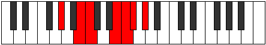 |
| [1819](https://ianring.com/musictheory/scales/1819) | [Pydian](ModeGSharpPydian.md) | G# | G#, A, B, C, D##, E#, F#, G# |  |
| [1819](https://ianring.com/musictheory/scales/1819) | [Pydian](ModeAFlatPydian.md) | Ab | Ab, Bbb, Cb, Dbb, E, F, Gb, Ab |  |
| [1821](https://ianring.com/musictheory/scales/1821) | [Aeradian](ModeGSharpAeradian.md) | G# | G#, A#, B, C, D##, E#, F#, G# |  |
| [1821](https://ianring.com/musictheory/scales/1821) | [Aeradian](ModeAFlatAeradian.md) | Ab | Ab, Bb, Cb, Dbb, E, F, Gb, Ab |  |
| [1823](https://ianring.com/musictheory/scales/1823) | [Phralyllic](ModeGSharpPhralyllic.md) | G# | G#, A, A#, B, C, E, F, F#, G# |  |
| [1823](https://ianring.com/musictheory/scales/1823) | [Phralyllic](ModeAFlatPhralyllic.md) | Ab | Ab, A, Bb, B, C, E, F, Gb, Ab |  |
| [1829](https://ianring.com/musictheory/scales/1829) | [Pathimic](ModeFSharpPathimic.md) | F# | F#, G#, A##, B###, C###, D##, F# |  |
| [1829](https://ianring.com/musictheory/scales/1829) | [Pathimic](ModeGFlatPathimic.md) | Gb | Gb, Ab, B, C##, D#, E, Gb |  |
| [1831](https://ianring.com/musictheory/scales/1831) | [Pothian](ModeFSharpPothian.md) | F# | F#, G, Ab, B, C##, D#, E, F# |  |
| [1833](https://ianring.com/musictheory/scales/1833) | [Ionacrimic](ModeGSharpIonacrimic.md) | G# | G#, A##, B##, D##, E#, F#, G# |  |
| [1833](https://ianring.com/musictheory/scales/1833) | [Ionacrimic](ModeAFlatIonacrimic.md) | Ab | Ab, B, C#, D##, E#, F#, Ab |  |
| [1835](https://ianring.com/musictheory/scales/1835) | [Byptian](ModeDSharpByptian.md) | D# | D#, E, F#, G#, A##, B#, C#, D# |  |
| [1835](https://ianring.com/musictheory/scales/1835) | [Byptian](ModeEFlatByptian.md) | Eb | Eb, Fb, Gb, Ab, B, C, Db, Eb |  |
| [1835](https://ianring.com/musictheory/scales/1835) | [Byptian](ModeGSharpByptian.md) | G# | G#, A, B, C#, D##, E#, F#, G# |  |
| [1835](https://ianring.com/musictheory/scales/1835) | [Byptian](ModeAFlatByptian.md) | Ab | Ab, Bbb, Cb, Db, E, F, Gb, Ab |  |
| [1837](https://ianring.com/musictheory/scales/1837) | [Dalian](ModeFSharpDalian.md) | F# | F#, G#, A, B, C##, D#, E, F# |  |
| [1837](https://ianring.com/musictheory/scales/1837) | [Dalian](ModeGFlatDalian.md) | Gb | Gb, Ab, Bbb, Cb, D, Eb, Fb, Gb |  |
| [1837](https://ianring.com/musictheory/scales/1837) | [Dalian](ModeGSharpDalian.md) | G# | G#, A#, B, C#, D##, E#, F#, G# |  |
| [1837](https://ianring.com/musictheory/scales/1837) | [Dalian](ModeAFlatDalian.md) | Ab | Ab, Bb, Cb, Db, E, F, Gb, Ab |  |
| [1839](https://ianring.com/musictheory/scales/1839) | [Zogyllic](ModeDSharpZogyllic.md) | D# | D#, E, F, F#, G#, B, C, C#, D# |  |
| [1839](https://ianring.com/musictheory/scales/1839) | [Zogyllic](ModeEFlatZogyllic.md) | Eb | Eb, E, F, Gb, Ab, B, C, Db, Eb |  |
| [1839](https://ianring.com/musictheory/scales/1839) | [Zogyllic](ModeFSharpZogyllic.md) | F# | F#, G, G#, A, B, D, D#, E, F# |  |
| [1839](https://ianring.com/musictheory/scales/1839) | [Zogyllic](ModeGFlatZogyllic.md) | Gb | Gb, G, Ab, A, B, D, Eb, E, Gb |  |
| [1839](https://ianring.com/musictheory/scales/1839) | [Zogyllic](ModeGSharpZogyllic.md) | G# | G#, A, A#, B, C#, E, F, F#, G# |  |
| [1839](https://ianring.com/musictheory/scales/1839) | [Zogyllic](ModeAFlatZogyllic.md) | Ab | Ab, A, Bb, B, Db, E, F, Gb, Ab |  |
| [1845](https://ianring.com/musictheory/scales/1845) | [Lagian](ModeFSharpLagian.md) | F# | F#, G#, A#, B, C##, D#, E, F# |  |
| [1845](https://ianring.com/musictheory/scales/1845) | [Lagian](ModeGFlatLagian.md) | Gb | Gb, Ab, Bb, Cb, D, Eb, Fb, Gb |  |
| [1847](https://ianring.com/musictheory/scales/1847) | [Thacryllic](ModeFSharpThacryllic.md) | F# | F#, G, G#, A#, B, D, D#, E, F# |  |
| [1847](https://ianring.com/musictheory/scales/1847) | [Thacryllic](ModeGFlatThacryllic.md) | Gb | Gb, G, Ab, Bb, B, D, Eb, E, Gb |  |
| [1849](https://ianring.com/musictheory/scales/1849) | [Epogian](ModeGSharpEpogian.md) | G# | G#, A##, B#, C#, D##, E#, F#, G# |  |
| [1849](https://ianring.com/musictheory/scales/1849) | [Epogian](ModeAFlatEpogian.md) | Ab | Ab, B, C, Db, E, F, Gb, Ab |  |
| [1851](https://ianring.com/musictheory/scales/1851) | [Zacryllic](ModeDSharpZacryllic.md) | D# | D#, E, F#, G, G#, B, C, C#, D# |  |
| [1851](https://ianring.com/musictheory/scales/1851) | [Zacryllic](ModeEFlatZacryllic.md) | Eb | Eb, E, Gb, G, Ab, B, C, Db, Eb |  |
| [1851](https://ianring.com/musictheory/scales/1851) | [Zacryllic](ModeGSharpZacryllic.md) | G# | G#, A, B, C, C#, E, F, F#, G# |  |
| [1851](https://ianring.com/musictheory/scales/1851) | [Zacryllic](ModeAFlatZacryllic.md) | Ab | Ab, A, B, C, Db, E, F, Gb, Ab |  |
| [1853](https://ianring.com/musictheory/scales/1853) | [Phrynyllic](ModeGSharpPhrynyllic.md) | G# | G#, A#, B, C, C#, E, F, F#, G# |  |
| [1853](https://ianring.com/musictheory/scales/1853) | [Phrynyllic](ModeAFlatPhrynyllic.md) | Ab | Ab, Bb, B, C, Db, E, F, Gb, Ab |  |
| [1853](https://ianring.com/musictheory/scales/1853) | [Phrynyllic](ModeFSharpPhrynyllic.md) | F# | F#, G#, A, A#, B, D, D#, E, F# |  |
| [1853](https://ianring.com/musictheory/scales/1853) | [Phrynyllic](ModeGFlatPhrynyllic.md) | Gb | Gb, Ab, A, Bb, B, D, Eb, E, Gb |  |
| [1855](https://ianring.com/musictheory/scales/1855) | [Marygic](ModeDSharpMarygic.md) | D# | D#, E, F, F#, G, G#, B, C, C#, D# |  |
| [1855](https://ianring.com/musictheory/scales/1855) | [Marygic](ModeEFlatMarygic.md) | Eb | Eb, E, F, Gb, G, Ab, B, C, Db, Eb |  |
| [1855](https://ianring.com/musictheory/scales/1855) | [Marygic](ModeGSharpMarygic.md) | G# | G#, A, A#, B, C, C#, E, F, F#, G# |  |
| [1855](https://ianring.com/musictheory/scales/1855) | [Marygic](ModeAFlatMarygic.md) | Ab | Ab, A, Bb, B, C, Db, E, F, Gb, Ab |  |
| [1855](https://ianring.com/musictheory/scales/1855) | [Marygic](ModeFSharpMarygic.md) | F# | F#, G, G#, A, A#, B, D, D#, E, F# |  |
| [1855](https://ianring.com/musictheory/scales/1855) | [Marygic](ModeGFlatMarygic.md) | Gb | Gb, G, Ab, A, Bb, B, D, Eb, E, Gb |  |
| [1863](https://ianring.com/musictheory/scales/1863) | [Pycrian](ModeASharpPycrian.md) | A# | A#, B, C, D##, E##, F##, G#, A# |  |
| [1863](https://ianring.com/musictheory/scales/1863) | [Pycrian](ModeBFlatPycrian.md) | Bb | Bb, Cb, Dbb, E, F#, G, Ab, Bb |  |
| [1865](https://ianring.com/musictheory/scales/1865) | [Thagimic](ModeGSharpThagimic.md) | G# | G#, A##, B###, D##, E#, F#, G# |  |
| [1865](https://ianring.com/musictheory/scales/1865) | [Thagimic](ModeAFlatThagimic.md) | Ab | Ab, B, C##, D##, E#, F#, Ab |  |
| [1867](https://ianring.com/musictheory/scales/1867) | [Solian](ModeGSharpSolian.md) | G# | G#, A, B, C##, D##, E#, F#, G# |  |
| [1867](https://ianring.com/musictheory/scales/1867) | [Solian](ModeAFlatSolian.md) | Ab | Ab, Bbb, Cb, D, E, F, Gb, Ab |  |
| [1867](https://ianring.com/musictheory/scales/1867) | [Solian](ModeASharpSolian.md) | A# | A#, B, C#, D##, E##, F##, G#, A# |  |
| [1867](https://ianring.com/musictheory/scales/1867) | [Solian](ModeBFlatSolian.md) | Bb | Bb, Cb, Db, E, F#, G, Ab, Bb |  |
| [1869](https://ianring.com/musictheory/scales/1869) | [Katyrian](ModeGSharpKatyrian.md) | G# | G#, A#, B, C##, D##, E#, F#, G# |  |
| [1869](https://ianring.com/musictheory/scales/1869) | [Katyrian](ModeAFlatKatyrian.md) | Ab | Ab, Bb, Cb, D, E, F, Gb, Ab |  |
| [1871](https://ianring.com/musictheory/scales/1871) | [Aeolyllic](ModeASharpAeolyllic.md) | A# | A#, B, C, C#, E, F#, G, G#, A# | 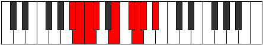 |
| [1871](https://ianring.com/musictheory/scales/1871) | [Aeolyllic](ModeBFlatAeolyllic.md) | Bb | Bb, B, C, Db, E, Gb, G, Ab, Bb |  |
| [1871](https://ianring.com/musictheory/scales/1871) | [Aeolyllic](ModeGSharpAeolyllic.md) | G# | G#, A, A#, B, D, E, F, F#, G# |  |
| [1871](https://ianring.com/musictheory/scales/1871) | [Aeolyllic](ModeAFlatAeolyllic.md) | Ab | Ab, A, Bb, B, D, E, F, Gb, Ab |  |
| [1875](https://ianring.com/musictheory/scales/1875) | [Epyphian](ModeASharpEpyphian.md) | A# | A#, B, C##, D##, E##, F##, G#, A# |  |
| [1875](https://ianring.com/musictheory/scales/1875) | [Epyphian](ModeBFlatEpyphian.md) | Bb | Bb, Cb, D, E, F#, G, Ab, Bb |  |
| [1877](https://ianring.com/musictheory/scales/1877) | [Aeroptian](ModeDNaturalAeroptian.md) | D | D, E, F#, G#, A#, B, C, D |  |
| [1879](https://ianring.com/musictheory/scales/1879) | [Mixoryllic](ModeDNaturalMixoryllic.md) | D | D, D#, E, F#, G#, A#, B, C, D |  |
| [1879](https://ianring.com/musictheory/scales/1879) | [Mixoryllic](ModeASharpMixoryllic.md) | A# | A#, B, C, D, E, F#, G, G#, A# |  |
| [1879](https://ianring.com/musictheory/scales/1879) | [Mixoryllic](ModeBFlatMixoryllic.md) | Bb | Bb, B, C, D, E, Gb, G, Ab, Bb |  |
| [1881](https://ianring.com/musictheory/scales/1881) | [Korian](ModeGSharpKorian.md) | G# | G#, A##, B#, C##, D##, E#, F#, G# |  |
| [1881](https://ianring.com/musictheory/scales/1881) | [Korian](ModeAFlatKorian.md) | Ab | Ab, B, C, D, E, F, Gb, Ab |  |
| [1883](https://ianring.com/musictheory/scales/1883) | [Mixopyryllic](ModeGSharpMixopyryllic.md) | G# | G#, A, B, C, D, E, F, F#, G# |  |
| [1883](https://ianring.com/musictheory/scales/1883) | [Mixopyryllic](ModeAFlatMixopyryllic.md) | Ab | Ab, A, B, C, D, E, F, Gb, Ab |  |
| [1883](https://ianring.com/musictheory/scales/1883) | [Mixopyryllic](ModeASharpMixopyryllic.md) | A# | A#, B, C#, D, E, F#, G, G#, A# |  |
| [1883](https://ianring.com/musictheory/scales/1883) | [Mixopyryllic](ModeBFlatMixopyryllic.md) | Bb | Bb, B, Db, D, E, Gb, G, Ab, Bb |  |
| [1885](https://ianring.com/musictheory/scales/1885) | [Epidyllic](ModeDNaturalEpidyllic.md) | D | D, E, F, F#, G#, A#, B, C, D |  |
| [1885](https://ianring.com/musictheory/scales/1885) | [Epidyllic](ModeGSharpEpidyllic.md) | G# | G#, A#, B, C, D, E, F, F#, G# |  |
| [1885](https://ianring.com/musictheory/scales/1885) | [Epidyllic](ModeAFlatEpidyllic.md) | Ab | Ab, Bb, B, C, D, E, F, Gb, Ab |  |
| [1887](https://ianring.com/musictheory/scales/1887) | [Aerocrygic](ModeDNaturalAerocrygic.md) | D | D, D#, E, F, F#, G#, A#, B, C, D | 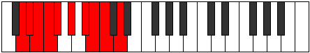 |
| [1887](https://ianring.com/musictheory/scales/1887) | [Aerocrygic](ModeASharpAerocrygic.md) | A# | A#, B, C, C#, D, E, F#, G, G#, A# |  |
| [1887](https://ianring.com/musictheory/scales/1887) | [Aerocrygic](ModeBFlatAerocrygic.md) | Bb | Bb, B, C, Db, D, E, Gb, G, Ab, Bb |  |
| [1887](https://ianring.com/musictheory/scales/1887) | [Aerocrygic](ModeGSharpAerocrygic.md) | G# | G#, A, A#, B, C, D, E, F, F#, G# |  |
| [1887](https://ianring.com/musictheory/scales/1887) | [Aerocrygic](ModeAFlatAerocrygic.md) | Ab | Ab, A, Bb, B, C, D, E, F, Gb, Ab |  |
| [1891](https://ianring.com/musictheory/scales/1891) | [Thalian](ModeASharpThalian.md) | A# | A#, B, C###, D##, E##, F##, G#, A# |  |
| [1891](https://ianring.com/musictheory/scales/1891) | [Thalian](ModeBFlatThalian.md) | Bb | Bb, Cb, D#, E, F#, G, Ab, Bb |  |
| [1893](https://ianring.com/musictheory/scales/1893) | [Ionylian](ModeFSharpIonylian.md) | F# | F#, G#, A##, B#, C##, D#, E, F# |  |
| [1893](https://ianring.com/musictheory/scales/1893) | [Ionylian](ModeGFlatIonylian.md) | Gb | Gb, Ab, B, C, D, Eb, Fb, Gb |  |
| [1895](https://ianring.com/musictheory/scales/1895) | [Salyllic](ModeFSharpSalyllic.md) | F# | F#, G, G#, B, C, D, D#, E, F# |  |
| [1895](https://ianring.com/musictheory/scales/1895) | [Salyllic](ModeGFlatSalyllic.md) | Gb | Gb, G, Ab, B, C, D, Eb, E, Gb |  |
| [1895](https://ianring.com/musictheory/scales/1895) | [Salyllic](ModeASharpSalyllic.md) | A# | A#, B, C, D#, E, F#, G, G#, A# |  |
| [1895](https://ianring.com/musictheory/scales/1895) | [Salyllic](ModeBFlatSalyllic.md) | Bb | Bb, B, C, Eb, E, Gb, G, Ab, Bb |  |
| [1897](https://ianring.com/musictheory/scales/1897) | [Ionopian](ModeGSharpIonopian.md) | G# | G#, A##, B##, C##, D##, E#, F#, G# |  |
| [1897](https://ianring.com/musictheory/scales/1897) | [Ionopian](ModeAFlatIonopian.md) | Ab | Ab, B, C#, D, E, F, Gb, Ab |  |
| [1899](https://ianring.com/musictheory/scales/1899) | [Moptyllic](ModeDSharpMoptyllic.md) | D# | D#, E, F#, G#, A, B, C, C#, D# |  |
| [1899](https://ianring.com/musictheory/scales/1899) | [Moptyllic](ModeEFlatMoptyllic.md) | Eb | Eb, E, Gb, Ab, A, B, C, Db, Eb |  |
| [1899](https://ianring.com/musictheory/scales/1899) | [Moptyllic](ModeGSharpMoptyllic.md) | G# | G#, A, B, C#, D, E, F, F#, G# |  |
| [1899](https://ianring.com/musictheory/scales/1899) | [Moptyllic](ModeAFlatMoptyllic.md) | Ab | Ab, A, B, Db, D, E, F, Gb, Ab |  |
| [1899](https://ianring.com/musictheory/scales/1899) | [Moptyllic](ModeASharpMoptyllic.md) | A# | A#, B, C#, D#, E, F#, G, G#, A# |  |
| [1899](https://ianring.com/musictheory/scales/1899) | [Moptyllic](ModeBFlatMoptyllic.md) | Bb | Bb, B, Db, Eb, E, Gb, G, Ab, Bb |  |
| [1901](https://ianring.com/musictheory/scales/1901) | [Ionidyllic](ModeFSharpIonidyllic.md) | F# | F#, G#, A, B, C, D, D#, E, F# |  |
| [1901](https://ianring.com/musictheory/scales/1901) | [Ionidyllic](ModeGFlatIonidyllic.md) | Gb | Gb, Ab, A, B, C, D, Eb, E, Gb |  |
| [1901](https://ianring.com/musictheory/scales/1901) | [Ionidyllic](ModeGSharpIonidyllic.md) | G# | G#, A#, B, C#, D, E, F, F#, G# |  |
| [1901](https://ianring.com/musictheory/scales/1901) | [Ionidyllic](ModeAFlatIonidyllic.md) | Ab | Ab, Bb, B, Db, D, E, F, Gb, Ab |  |
| [1903](https://ianring.com/musictheory/scales/1903) | [Rocrygic](ModeDSharpRocrygic.md) | D# | D#, E, F, F#, G#, A, B, C, C#, D# |  |
| [1903](https://ianring.com/musictheory/scales/1903) | [Rocrygic](ModeEFlatRocrygic.md) | Eb | Eb, E, F, Gb, Ab, A, B, C, Db, Eb |  |
| [1903](https://ianring.com/musictheory/scales/1903) | [Rocrygic](ModeFSharpRocrygic.md) | F# | F#, G, G#, A, B, C, D, D#, E, F# |  |
| [1903](https://ianring.com/musictheory/scales/1903) | [Rocrygic](ModeGFlatRocrygic.md) | Gb | Gb, G, Ab, A, B, C, D, Eb, E, Gb |  |
| [1903](https://ianring.com/musictheory/scales/1903) | [Rocrygic](ModeASharpRocrygic.md) | A# | A#, B, C, C#, D#, E, F#, G, G#, A# |  |
| [1903](https://ianring.com/musictheory/scales/1903) | [Rocrygic](ModeBFlatRocrygic.md) | Bb | Bb, B, C, Db, Eb, E, Gb, G, Ab, Bb |  |
| [1903](https://ianring.com/musictheory/scales/1903) | [Rocrygic](ModeGSharpRocrygic.md) | G# | G#, A, A#, B, C#, D, E, F, F#, G# |  |
| [1903](https://ianring.com/musictheory/scales/1903) | [Rocrygic](ModeAFlatRocrygic.md) | Ab | Ab, A, Bb, B, Db, D, E, F, Gb, Ab |  |
| [1907](https://ianring.com/musictheory/scales/1907) | [Lynyllic](ModeASharpLynyllic.md) | A# | A#, B, D, D#, E, F#, G, G#, A# |  |
| [1907](https://ianring.com/musictheory/scales/1907) | [Lynyllic](ModeBFlatLynyllic.md) | Bb | Bb, B, D, Eb, E, Gb, G, Ab, Bb |  |
| [1909](https://ianring.com/musictheory/scales/1909) | [Epicryllic](ModeFSharpEpicryllic.md) | F# | F#, G#, A#, B, C, D, D#, E, F# |  |
| [1909](https://ianring.com/musictheory/scales/1909) | [Epicryllic](ModeGFlatEpicryllic.md) | Gb | Gb, Ab, Bb, B, C, D, Eb, E, Gb |  |
| [1909](https://ianring.com/musictheory/scales/1909) | [Epicryllic](ModeDNaturalEpicryllic.md) | D | D, E, F#, G, G#, A#, B, C, D |  |
| [1911](https://ianring.com/musictheory/scales/1911) | [Stynygic](ModeDNaturalStynygic.md) | D | D, D#, E, F#, G, G#, A#, B, C, D |  |
| [1911](https://ianring.com/musictheory/scales/1911) | [Stynygic](ModeFSharpStynygic.md) | F# | F#, G, G#, A#, B, C, D, D#, E, F# |  |
| [1911](https://ianring.com/musictheory/scales/1911) | [Stynygic](ModeGFlatStynygic.md) | Gb | Gb, G, Ab, Bb, B, C, D, Eb, E, Gb |  |
| [1911](https://ianring.com/musictheory/scales/1911) | [Stynygic](ModeASharpStynygic.md) | A# | A#, B, C, D, D#, E, F#, G, G#, A# |  |
| [1911](https://ianring.com/musictheory/scales/1911) | [Stynygic](ModeBFlatStynygic.md) | Bb | Bb, B, C, D, Eb, E, Gb, G, Ab, Bb |  |
| [1913](https://ianring.com/musictheory/scales/1913) | [Zagyllic](ModeGSharpZagyllic.md) | G# | G#, B, C, C#, D, E, F, F#, G# |  |
| [1913](https://ianring.com/musictheory/scales/1913) | [Zagyllic](ModeAFlatZagyllic.md) | Ab | Ab, B, C, Db, D, E, F, Gb, Ab |  |
| [1915](https://ianring.com/musictheory/scales/1915) | [Thydygic](ModeGSharpThydygic.md) | G# | G#, A, B, C, C#, D, E, F, F#, G# |  |
| [1915](https://ianring.com/musictheory/scales/1915) | [Thydygic](ModeAFlatThydygic.md) | Ab | Ab, A, B, C, Db, D, E, F, Gb, Ab |  |
| [1915](https://ianring.com/musictheory/scales/1915) | [Thydygic](ModeDSharpThydygic.md) | D# | D#, E, F#, G, G#, A, B, C, C#, D# |  |
| [1915](https://ianring.com/musictheory/scales/1915) | [Thydygic](ModeEFlatThydygic.md) | Eb | Eb, E, Gb, G, Ab, A, B, C, Db, Eb |  |
| [1915](https://ianring.com/musictheory/scales/1915) | [Thydygic](ModeASharpThydygic.md) | A# | A#, B, C#, D, D#, E, F#, G, G#, A# |  |
| [1915](https://ianring.com/musictheory/scales/1915) | [Thydygic](ModeBFlatThydygic.md) | Bb | Bb, B, Db, D, Eb, E, Gb, G, Ab, Bb |  |
| [1917](https://ianring.com/musictheory/scales/1917) | [Sacrygic](ModeGSharpSacrygic.md) | G# | G#, A#, B, C, C#, D, E, F, F#, G# |  |
| [1917](https://ianring.com/musictheory/scales/1917) | [Sacrygic](ModeAFlatSacrygic.md) | Ab | Ab, Bb, B, C, Db, D, E, F, Gb, Ab |  |
| [1917](https://ianring.com/musictheory/scales/1917) | [Sacrygic](ModeDNaturalSacrygic.md) | D | D, E, F, F#, G, G#, A#, B, C, D |  |
| [1917](https://ianring.com/musictheory/scales/1917) | [Sacrygic](ModeFSharpSacrygic.md) | F# | F#, G#, A, A#, B, C, D, D#, E, F# |  |
| [1917](https://ianring.com/musictheory/scales/1917) | [Sacrygic](ModeGFlatSacrygic.md) | Gb | Gb, Ab, A, Bb, B, C, D, Eb, E, Gb |  |
| [1919](https://ianring.com/musictheory/scales/1919) | [Rocryllian](ModeDSharpRocryllian.md) | D# | D#, E, F, F#, G, G#, A, B, C, C#, D# |  |
| [1919](https://ianring.com/musictheory/scales/1919) | [Rocryllian](ModeEFlatRocryllian.md) | Eb | Eb, E, F, Gb, G, Ab, A, B, C, Db, Eb |  |
| [1919](https://ianring.com/musictheory/scales/1919) | [Rocryllian](ModeASharpRocryllian.md) | A# | A#, B, C, C#, D, D#, E, F#, G, G#, A# |  |
| [1919](https://ianring.com/musictheory/scales/1919) | [Rocryllian](ModeBFlatRocryllian.md) | Bb | Bb, B, C, Db, D, Eb, E, Gb, G, Ab, Bb |  |
| [1919](https://ianring.com/musictheory/scales/1919) | [Rocryllian](ModeDNaturalRocryllian.md) | D | D, D#, E, F, F#, G, G#, A#, B, C, D |  |
| [1919](https://ianring.com/musictheory/scales/1919) | [Rocryllian](ModeGSharpRocryllian.md) | G# | G#, A, A#, B, C, C#, D, E, F, F#, G# |  |
| [1919](https://ianring.com/musictheory/scales/1919) | [Rocryllian](ModeAFlatRocryllian.md) | Ab | Ab, A, Bb, B, C, Db, D, E, F, Gb, Ab |  |
| [1919](https://ianring.com/musictheory/scales/1919) | [Rocryllian](ModeFSharpRocryllian.md) | F# | F#, G, G#, A, A#, B, C, D, D#, E, F# |  |
| [1919](https://ianring.com/musictheory/scales/1919) | [Rocryllian](ModeGFlatRocryllian.md) | Gb | Gb, G, Ab, A, Bb, B, C, D, Eb, E, Gb |  |
| [1929](https://ianring.com/musictheory/scales/1929) | [Aeolycrimic](ModeGSharpAeolycrimic.md) | G# | G#, A##, C###, D##, E#, F#, G# |  |
| [1929](https://ianring.com/musictheory/scales/1929) | [Aeolycrimic](ModeAFlatAeolycrimic.md) | Ab | Ab, B, C###, D##, E#, F#, Ab |  |
| [1931](https://ianring.com/musictheory/scales/1931) | [Stogian](ModeGSharpStogian.md) | G# | G#, A, B, C###, D##, E#, F#, G# |  |
| [1931](https://ianring.com/musictheory/scales/1931) | [Stogian](ModeAFlatStogian.md) | Ab | Ab, Bbb, Cb, D#, E, F, Gb, Ab |  |
| [1933](https://ianring.com/musictheory/scales/1933) | [Mocrian](ModeGSharpMocrian.md) | G# | G#, A#, B, C###, D##, E#, F#, G# |  |
| [1933](https://ianring.com/musictheory/scales/1933) | [Mocrian](ModeAFlatMocrian.md) | Ab | Ab, Bb, Cb, D#, E, F, Gb, Ab |  |
| [1935](https://ianring.com/musictheory/scales/1935) | [Mycryllic](ModeGSharpMycryllic.md) | G# | G#, A, A#, B, D#, E, F, F#, G# |  |
| [1935](https://ianring.com/musictheory/scales/1935) | [Mycryllic](ModeAFlatMycryllic.md) | Ab | Ab, A, Bb, B, Eb, E, F, Gb, Ab |  |
| [1941](https://ianring.com/musictheory/scales/1941) | [Aeranian](ModeENaturalAeranian.md) | E | E, F#, G#, A##, B#, C#, D, E |  |
| [1943](https://ianring.com/musictheory/scales/1943) | [Malyllic](ModeENaturalMalyllic.md) | E | E, F, F#, G#, B, C, C#, D, E |  |
| [1945](https://ianring.com/musictheory/scales/1945) | [Zarian](ModeGSharpZarian.md) | G# | G#, A##, B#, C###, D##, E#, F#, G# |  |
| [1945](https://ianring.com/musictheory/scales/1945) | [Zarian](ModeAFlatZarian.md) | Ab | Ab, B, C, D#, E, F, Gb, Ab |  |
| [1947](https://ianring.com/musictheory/scales/1947) | [Ionoyllic](ModeGSharpIonoyllic.md) | G# | G#, A, B, C, D#, E, F, F#, G# |  |
| [1947](https://ianring.com/musictheory/scales/1947) | [Ionoyllic](ModeAFlatIonoyllic.md) | Ab | Ab, A, B, C, Eb, E, F, Gb, Ab |  |
| [1949](https://ianring.com/musictheory/scales/1949) | [Mathyllic](ModeENaturalMathyllic.md) | E | E, F#, G, G#, B, C, C#, D, E |  |
| [1949](https://ianring.com/musictheory/scales/1949) | [Mathyllic](ModeGSharpMathyllic.md) | G# | G#, A#, B, C, D#, E, F, F#, G# |  |
| [1949](https://ianring.com/musictheory/scales/1949) | [Mathyllic](ModeAFlatMathyllic.md) | Ab | Ab, Bb, B, C, Eb, E, F, Gb, Ab |  |
| [1951](https://ianring.com/musictheory/scales/1951) | [Gonygic](ModeENaturalGonygic.md) | E | E, F, F#, G, G#, B, C, C#, D, E |  |
| [1951](https://ianring.com/musictheory/scales/1951) | [Gonygic](ModeGSharpGonygic.md) | G# | G#, A, A#, B, C, D#, E, F, F#, G# |  |
| [1951](https://ianring.com/musictheory/scales/1951) | [Gonygic](ModeAFlatGonygic.md) | Ab | Ab, A, Bb, B, C, Eb, E, F, Gb, Ab |  |
| [1955](https://ianring.com/musictheory/scales/1955) | [Sonian](ModeBNaturalSonian.md) | B | B, C, D##, E##, F##, G#, A, B |  |
| [1957](https://ianring.com/musictheory/scales/1957) | [Pyrian](ModeFSharpPyrian.md) | F# | F#, G#, A##, B##, C##, D#, E, F# |  |
| [1957](https://ianring.com/musictheory/scales/1957) | [Pyrian](ModeGFlatPyrian.md) | Gb | Gb, Ab, B, C#, D, Eb, Fb, Gb |  |
| [1957](https://ianring.com/musictheory/scales/1957) | [Pyrian](ModeBNaturalPyrian.md) | B | B, C#, D##, E##, F##, G#, A, B |  |
| [1959](https://ianring.com/musictheory/scales/1959) | [Katolyllic](ModeFSharpKatolyllic.md) | F# | F#, G, G#, B, C#, D, D#, E, F# |  |
| [1959](https://ianring.com/musictheory/scales/1959) | [Katolyllic](ModeGFlatKatolyllic.md) | Gb | Gb, G, Ab, B, Db, D, Eb, E, Gb |  |
| [1959](https://ianring.com/musictheory/scales/1959) | [Katolyllic](ModeBNaturalKatolyllic.md) | B | B, C, C#, E, F#, G, G#, A, B |  |
| [1961](https://ianring.com/musictheory/scales/1961) | [Soptian](ModeGSharpSoptian.md) | G# | G#, A##, B##, C###, D##, E#, F#, G# |  |
| [1961](https://ianring.com/musictheory/scales/1961) | [Soptian](ModeAFlatSoptian.md) | Ab | Ab, B, C#, D#, E, F, Gb, Ab |  |
| [1961](https://ianring.com/musictheory/scales/1961) | [Soptian](ModeBNaturalSoptian.md) | B | B, C##, D##, E##, F##, G#, A, B |  |
| [1961](https://ianring.com/musictheory/scales/1961) | [Soptian](ModeCSharpSoptian.md) | C# | C#, D##, E##, F###, G##, A#, B, C# |  |
| [1961](https://ianring.com/musictheory/scales/1961) | [Soptian](ModeDFlatSoptian.md) | Db | Db, E, F#, G#, A, Bb, Cb, Db |  |
| [1963](https://ianring.com/musictheory/scales/1963) | [Epocryllic](ModeGSharpEpocryllic.md) | G# | G#, A, B, C#, D#, E, F, F#, G# |  |
| [1963](https://ianring.com/musictheory/scales/1963) | [Epocryllic](ModeAFlatEpocryllic.md) | Ab | Ab, A, B, Db, Eb, E, F, Gb, Ab |  |
| [1963](https://ianring.com/musictheory/scales/1963) | [Epocryllic](ModeBNaturalEpocryllic.md) | B | B, C, D, E, F#, G, G#, A, B |  |
| [1963](https://ianring.com/musictheory/scales/1963) | [Epocryllic](ModeDSharpEpocryllic.md) | D# | D#, E, F#, G#, A#, B, C, C#, D# |  |
| [1963](https://ianring.com/musictheory/scales/1963) | [Epocryllic](ModeEFlatEpocryllic.md) | Eb | Eb, E, Gb, Ab, Bb, B, C, Db, Eb |  |
| [1963](https://ianring.com/musictheory/scales/1963) | [Epocryllic](ModeCSharpEpocryllic.md) | C# | C#, D, E, F#, G#, A, A#, B, C# |  |
| [1963](https://ianring.com/musictheory/scales/1963) | [Epocryllic](ModeDFlatEpocryllic.md) | Db | Db, D, E, Gb, Ab, A, Bb, B, Db |  |
| [1965](https://ianring.com/musictheory/scales/1965) | [Gadyllic](ModeFSharpGadyllic.md) | F# | F#, G#, A, B, C#, D, D#, E, F# |  |
| [1965](https://ianring.com/musictheory/scales/1965) | [Gadyllic](ModeGFlatGadyllic.md) | Gb | Gb, Ab, A, B, Db, D, Eb, E, Gb |  |
| [1965](https://ianring.com/musictheory/scales/1965) | [Gadyllic](ModeBNaturalGadyllic.md) | B | B, C#, D, E, F#, G, G#, A, B |  |
| [1965](https://ianring.com/musictheory/scales/1965) | [Gadyllic](ModeGSharpGadyllic.md) | G# | G#, A#, B, C#, D#, E, F, F#, G# |  |
| [1965](https://ianring.com/musictheory/scales/1965) | [Gadyllic](ModeAFlatGadyllic.md) | Ab | Ab, Bb, B, Db, Eb, E, F, Gb, Ab |  |
| [1965](https://ianring.com/musictheory/scales/1965) | [Gadyllic](ModeCSharpGadyllic.md) | C# | C#, D#, E, F#, G#, A, A#, B, C# |  |
| [1965](https://ianring.com/musictheory/scales/1965) | [Gadyllic](ModeDFlatGadyllic.md) | Db | Db, Eb, E, Gb, Ab, A, Bb, B, Db |  |
| [1967](https://ianring.com/musictheory/scales/1967) | [Godygic](ModeBNaturalGodygic.md) | B | B, C, C#, D, E, F#, G, G#, A, B |  |
| [1967](https://ianring.com/musictheory/scales/1967) | [Godygic](ModeFSharpGodygic.md) | F# | F#, G, G#, A, B, C#, D, D#, E, F# |  |
| [1967](https://ianring.com/musictheory/scales/1967) | [Godygic](ModeGFlatGodygic.md) | Gb | Gb, G, Ab, A, B, Db, D, Eb, E, Gb |  |
| [1967](https://ianring.com/musictheory/scales/1967) | [Godygic](ModeDSharpGodygic.md) | D# | D#, E, F, F#, G#, A#, B, C, C#, D# |  |
| [1967](https://ianring.com/musictheory/scales/1967) | [Godygic](ModeEFlatGodygic.md) | Eb | Eb, E, F, Gb, Ab, Bb, B, C, Db, Eb |  |
| [1967](https://ianring.com/musictheory/scales/1967) | [Godygic](ModeCSharpGodygic.md) | C# | C#, D, D#, E, F#, G#, A, A#, B, C# |  |
| [1967](https://ianring.com/musictheory/scales/1967) | [Godygic](ModeDFlatGodygic.md) | Db | Db, D, Eb, E, Gb, Ab, A, Bb, B, Db |  |
| [1967](https://ianring.com/musictheory/scales/1967) | [Godygic](ModeGSharpGodygic.md) | G# | G#, A, A#, B, C#, D#, E, F, F#, G# |  |
| [1967](https://ianring.com/musictheory/scales/1967) | [Godygic](ModeAFlatGodygic.md) | Ab | Ab, A, Bb, B, Db, Eb, E, F, Gb, Ab |  |
| [1969](https://ianring.com/musictheory/scales/1969) | [Zorian](ModeBNaturalZorian.md) | B | B, C###, D##, E##, F##, G#, A, B |  |
| [1971](https://ianring.com/musictheory/scales/1971) | [Aerynyllic](ModeBNaturalAerynyllic.md) | B | B, C, D#, E, F#, G, G#, A, B |  |
| [1973](https://ianring.com/musictheory/scales/1973) | [Zyryllic](ModeENaturalZyryllic.md) | E | E, F#, G#, A, B, C, C#, D, E |  |
| [1973](https://ianring.com/musictheory/scales/1973) | [Zyryllic](ModeBNaturalZyryllic.md) | B | B, C#, D#, E, F#, G, G#, A, B |  |
| [1973](https://ianring.com/musictheory/scales/1973) | [Zyryllic](ModeFSharpZyryllic.md) | F# | F#, G#, A#, B, C#, D, D#, E, F# |  |
| [1973](https://ianring.com/musictheory/scales/1973) | [Zyryllic](ModeGFlatZyryllic.md) | Gb | Gb, Ab, Bb, B, Db, D, Eb, E, Gb |  |
| [1975](https://ianring.com/musictheory/scales/1975) | [Ionocrygic](ModeENaturalIonocrygic.md) | E | E, F, F#, G#, A, B, C, C#, D, E |  |
| [1975](https://ianring.com/musictheory/scales/1975) | [Ionocrygic](ModeBNaturalIonocrygic.md) | B | B, C, C#, D#, E, F#, G, G#, A, B |  |
| [1975](https://ianring.com/musictheory/scales/1975) | [Ionocrygic](ModeFSharpIonocrygic.md) | F# | F#, G, G#, A#, B, C#, D, D#, E, F# |  |
| [1975](https://ianring.com/musictheory/scales/1975) | [Ionocrygic](ModeGFlatIonocrygic.md) | Gb | Gb, G, Ab, Bb, B, Db, D, Eb, E, Gb |  |
| [1977](https://ianring.com/musictheory/scales/1977) | [Dagyllic](ModeGSharpDagyllic.md) | G# | G#, B, C, C#, D#, E, F, F#, G# |  |
| [1977](https://ianring.com/musictheory/scales/1977) | [Dagyllic](ModeAFlatDagyllic.md) | Ab | Ab, B, C, Db, Eb, E, F, Gb, Ab |  |
| [1977](https://ianring.com/musictheory/scales/1977) | [Dagyllic](ModeBNaturalDagyllic.md) | B | B, D, D#, E, F#, G, G#, A, B |  |
| [1977](https://ianring.com/musictheory/scales/1977) | [Dagyllic](ModeCSharpDagyllic.md) | C# | C#, E, F, F#, G#, A, A#, B, C# |  |
| [1977](https://ianring.com/musictheory/scales/1977) | [Dagyllic](ModeDFlatDagyllic.md) | Db | Db, E, F, Gb, Ab, A, Bb, B, Db |  |
| [1979](https://ianring.com/musictheory/scales/1979) | [Aeradygic](ModeGSharpAeradygic.md) | G# | G#, A, B, C, C#, D#, E, F, F#, G# |  |
| [1979](https://ianring.com/musictheory/scales/1979) | [Aeradygic](ModeAFlatAeradygic.md) | Ab | Ab, A, B, C, Db, Eb, E, F, Gb, Ab |  |
| [1979](https://ianring.com/musictheory/scales/1979) | [Aeradygic](ModeBNaturalAeradygic.md) | B | B, C, D, D#, E, F#, G, G#, A, B |  |
| [1979](https://ianring.com/musictheory/scales/1979) | [Aeradygic](ModeDSharpAeradygic.md) | D# | D#, E, F#, G, G#, A#, B, C, C#, D# |  |
| [1979](https://ianring.com/musictheory/scales/1979) | [Aeradygic](ModeEFlatAeradygic.md) | Eb | Eb, E, Gb, G, Ab, Bb, B, C, Db, Eb |  |
| [1979](https://ianring.com/musictheory/scales/1979) | [Aeradygic](ModeCSharpAeradygic.md) | C# | C#, D, E, F, F#, G#, A, A#, B, C# |  |
| [1979](https://ianring.com/musictheory/scales/1979) | [Aeradygic](ModeDFlatAeradygic.md) | Db | Db, D, E, F, Gb, Ab, A, Bb, B, Db |  |
| [1981](https://ianring.com/musictheory/scales/1981) | [Gadygic](ModeENaturalGadygic.md) | E | E, F#, G, G#, A, B, C, C#, D, E |  |
| [1981](https://ianring.com/musictheory/scales/1981) | [Gadygic](ModeBNaturalGadygic.md) | B | B, C#, D, D#, E, F#, G, G#, A, B |  |
| [1981](https://ianring.com/musictheory/scales/1981) | [Gadygic](ModeGSharpGadygic.md) | G# | G#, A#, B, C, C#, D#, E, F, F#, G# |  |
| [1981](https://ianring.com/musictheory/scales/1981) | [Gadygic](ModeAFlatGadygic.md) | Ab | Ab, Bb, B, C, Db, Eb, E, F, Gb, Ab |  |
| [1981](https://ianring.com/musictheory/scales/1981) | [Gadygic](ModeFSharpGadygic.md) | F# | F#, G#, A, A#, B, C#, D, D#, E, F# |  |
| [1981](https://ianring.com/musictheory/scales/1981) | [Gadygic](ModeGFlatGadygic.md) | Gb | Gb, Ab, A, Bb, B, Db, D, Eb, E, Gb |  |
| [1981](https://ianring.com/musictheory/scales/1981) | [Gadygic](ModeCSharpGadygic.md) | C# | C#, D#, E, F, F#, G#, A, A#, B, C# |  |
| [1981](https://ianring.com/musictheory/scales/1981) | [Gadygic](ModeDFlatGadygic.md) | Db | Db, Eb, E, F, Gb, Ab, A, Bb, B, Db |  |
| [1983](https://ianring.com/musictheory/scales/1983) | [Soryllian](ModeBNaturalSoryllian.md) | B | B, C, C#, D, D#, E, F#, G, G#, A, B |  |
| [1983](https://ianring.com/musictheory/scales/1983) | [Soryllian](ModeENaturalSoryllian.md) | E | E, F, F#, G, G#, A, B, C, C#, D, E |  |
| [1983](https://ianring.com/musictheory/scales/1983) | [Soryllian](ModeDSharpSoryllian.md) | D# | D#, E, F, F#, G, G#, A#, B, C, C#, D# |  |
| [1983](https://ianring.com/musictheory/scales/1983) | [Soryllian](ModeEFlatSoryllian.md) | Eb | Eb, E, F, Gb, G, Ab, Bb, B, C, Db, Eb |  |
| [1983](https://ianring.com/musictheory/scales/1983) | [Soryllian](ModeGSharpSoryllian.md) | G# | G#, A, A#, B, C, C#, D#, E, F, F#, G# |  |
| [1983](https://ianring.com/musictheory/scales/1983) | [Soryllian](ModeAFlatSoryllian.md) | Ab | Ab, A, Bb, B, C, Db, Eb, E, F, Gb, Ab |  |
| [1983](https://ianring.com/musictheory/scales/1983) | [Soryllian](ModeCSharpSoryllian.md) | C# | C#, D, D#, E, F, F#, G#, A, A#, B, C# |  |
| [1983](https://ianring.com/musictheory/scales/1983) | [Soryllian](ModeDFlatSoryllian.md) | Db | Db, D, Eb, E, F, Gb, Ab, A, Bb, B, Db |  |
| [1983](https://ianring.com/musictheory/scales/1983) | [Soryllian](ModeFSharpSoryllian.md) | F# | F#, G, G#, A, A#, B, C#, D, D#, E, F# |  |
| [1983](https://ianring.com/musictheory/scales/1983) | [Soryllian](ModeGFlatSoryllian.md) | Gb | Gb, G, Ab, A, Bb, B, Db, D, Eb, E, Gb |  |
| [1991](https://ianring.com/musictheory/scales/1991) | [Phryptyllic](ModeASharpPhryptyllic.md) | A# | A#, B, C, E, F, F#, G, G#, A# |  |
| [1991](https://ianring.com/musictheory/scales/1991) | [Phryptyllic](ModeBFlatPhryptyllic.md) | Bb | Bb, B, C, E, F, Gb, G, Ab, Bb |  |
| [1993](https://ianring.com/musictheory/scales/1993) | [Katoptian](ModeGSharpKatoptian.md) | G# | G#, A##, B###, C###, D##, E#, F#, G# |  |
| [1993](https://ianring.com/musictheory/scales/1993) | [Katoptian](ModeAFlatKatoptian.md) | Ab | Ab, B, C##, D#, E, F, Gb, Ab |  |
| [1995](https://ianring.com/musictheory/scales/1995) | [Aeolacryllic](ModeGSharpAeolacryllic.md) | G# | G#, A, B, D, D#, E, F, F#, G# |  |
| [1995](https://ianring.com/musictheory/scales/1995) | [Aeolacryllic](ModeAFlatAeolacryllic.md) | Ab | Ab, A, B, D, Eb, E, F, Gb, Ab | 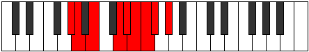 |
| [1995](https://ianring.com/musictheory/scales/1995) | [Aeolacryllic](ModeASharpAeolacryllic.md) | A# | A#, B, C#, E, F, F#, G, G#, A# |  |
| [1995](https://ianring.com/musictheory/scales/1995) | [Aeolacryllic](ModeBFlatAeolacryllic.md) | Bb | Bb, B, Db, E, F, Gb, G, Ab, Bb |  |
| [1997](https://ianring.com/musictheory/scales/1997) | [Staryllic](ModeGSharpStaryllic.md) | G# | G#, A#, B, D, D#, E, F, F#, G# |  |
| [1997](https://ianring.com/musictheory/scales/1997) | [Staryllic](ModeAFlatStaryllic.md) | Ab | Ab, Bb, B, D, Eb, E, F, Gb, Ab |  |
| [1999](https://ianring.com/musictheory/scales/1999) | [Zacrygic](ModeASharpZacrygic.md) | A# | A#, B, C, C#, E, F, F#, G, G#, A# |  |
| [1999](https://ianring.com/musictheory/scales/1999) | [Zacrygic](ModeBFlatZacrygic.md) | Bb | Bb, B, C, Db, E, F, Gb, G, Ab, Bb |  |
| [1999](https://ianring.com/musictheory/scales/1999) | [Zacrygic](ModeGSharpZacrygic.md) | G# | G#, A, A#, B, D, D#, E, F, F#, G# |  |
| [1999](https://ianring.com/musictheory/scales/1999) | [Zacrygic](ModeAFlatZacrygic.md) | Ab | Ab, A, Bb, B, D, Eb, E, F, Gb, Ab |  |
| [2003](https://ianring.com/musictheory/scales/2003) | [Lolyllic](ModeASharpLolyllic.md) | A# | A#, B, D, E, F, F#, G, G#, A# |  |
| [2003](https://ianring.com/musictheory/scales/2003) | [Lolyllic](ModeBFlatLolyllic.md) | Bb | Bb, B, D, E, F, Gb, G, Ab, Bb |  |
| [2005](https://ianring.com/musictheory/scales/2005) | [Gygyllic](ModeENaturalGygyllic.md) | E | E, F#, G#, A#, B, C, C#, D, E |  |
| [2005](https://ianring.com/musictheory/scales/2005) | [Gygyllic](ModeDNaturalGygyllic.md) | D | D, E, F#, G#, A, A#, B, C, D |  |
| [2007](https://ianring.com/musictheory/scales/2007) | [Stonygic](ModeENaturalStonygic.md) | E | E, F, F#, G#, A#, B, C, C#, D, E |  |
| [2007](https://ianring.com/musictheory/scales/2007) | [Stonygic](ModeASharpStonygic.md) | A# | A#, B, C, D, E, F, F#, G, G#, A# |  |
| [2007](https://ianring.com/musictheory/scales/2007) | [Stonygic](ModeBFlatStonygic.md) | Bb | Bb, B, C, D, E, F, Gb, G, Ab, Bb |  |
| [2007](https://ianring.com/musictheory/scales/2007) | [Stonygic](ModeDNaturalStonygic.md) | D | D, D#, E, F#, G#, A, A#, B, C, D |  |
| [2009](https://ianring.com/musictheory/scales/2009) | [Stacryllic](ModeGSharpStacryllic.md) | G# | G#, B, C, D, D#, E, F, F#, G# |  |
| [2009](https://ianring.com/musictheory/scales/2009) | [Stacryllic](ModeAFlatStacryllic.md) | Ab | Ab, B, C, D, Eb, E, F, Gb, Ab |  |
| [2011](https://ianring.com/musictheory/scales/2011) | [Raphygic](ModeGSharpRaphygic.md) | G# | G#, A, B, C, D, D#, E, F, F#, G# |  |
| [2011](https://ianring.com/musictheory/scales/2011) | [Raphygic](ModeAFlatRaphygic.md) | Ab | Ab, A, B, C, D, Eb, E, F, Gb, Ab |  |
| [2011](https://ianring.com/musictheory/scales/2011) | [Raphygic](ModeASharpRaphygic.md) | A# | A#, B, C#, D, E, F, F#, G, G#, A# |  |
| [2011](https://ianring.com/musictheory/scales/2011) | [Raphygic](ModeBFlatRaphygic.md) | Bb | Bb, B, Db, D, E, F, Gb, G, Ab, Bb |  |
| [2013](https://ianring.com/musictheory/scales/2013) | [Mocrygic](ModeGSharpMocrygic.md) | G# | G#, A#, B, C, D, D#, E, F, F#, G# |  |
| [2013](https://ianring.com/musictheory/scales/2013) | [Mocrygic](ModeAFlatMocrygic.md) | Ab | Ab, Bb, B, C, D, Eb, E, F, Gb, Ab |  |
| [2013](https://ianring.com/musictheory/scales/2013) | [Mocrygic](ModeENaturalMocrygic.md) | E | E, F#, G, G#, A#, B, C, C#, D, E |  |
| [2013](https://ianring.com/musictheory/scales/2013) | [Mocrygic](ModeDNaturalMocrygic.md) | D | D, E, F, F#, G#, A, A#, B, C, D |  |
| [2015](https://ianring.com/musictheory/scales/2015) | [Epiryllian](ModeENaturalEpiryllian.md) | E | E, F, F#, G, G#, A#, B, C, C#, D, E |  |
| [2015](https://ianring.com/musictheory/scales/2015) | [Epiryllian](ModeASharpEpiryllian.md) | A# | A#, B, C, C#, D, E, F, F#, G, G#, A# |  |
| [2015](https://ianring.com/musictheory/scales/2015) | [Epiryllian](ModeBFlatEpiryllian.md) | Bb | Bb, B, C, Db, D, E, F, Gb, G, Ab, Bb |  |
| [2015](https://ianring.com/musictheory/scales/2015) | [Epiryllian](ModeDNaturalEpiryllian.md) | D | D, D#, E, F, F#, G#, A, A#, B, C, D |  |
| [2015](https://ianring.com/musictheory/scales/2015) | [Epiryllian](ModeGSharpEpiryllian.md) | G# | G#, A, A#, B, C, D, D#, E, F, F#, G# |  |
| [2015](https://ianring.com/musictheory/scales/2015) | [Epiryllian](ModeAFlatEpiryllian.md) | Ab | Ab, A, Bb, B, C, D, Eb, E, F, Gb, Ab |  |
| [2019](https://ianring.com/musictheory/scales/2019) | [Palyllic](ModeBNaturalPalyllic.md) | B | B, C, E, F, F#, G, G#, A, B |  |
| [2019](https://ianring.com/musictheory/scales/2019) | [Palyllic](ModeASharpPalyllic.md) | A# | A#, B, D#, E, F, F#, G, G#, A# |  |
| [2019](https://ianring.com/musictheory/scales/2019) | [Palyllic](ModeBFlatPalyllic.md) | Bb | Bb, B, Eb, E, F, Gb, G, Ab, Bb |  |
| [2021](https://ianring.com/musictheory/scales/2021) | [Katycryllic](ModeFSharpKatycryllic.md) | F# | F#, G#, B, C, C#, D, D#, E, F# |  |
| [2021](https://ianring.com/musictheory/scales/2021) | [Katycryllic](ModeGFlatKatycryllic.md) | Gb | Gb, Ab, B, C, Db, D, Eb, E, Gb |  |
| [2021](https://ianring.com/musictheory/scales/2021) | [Katycryllic](ModeBNaturalKatycryllic.md) | B | B, C#, E, F, F#, G, G#, A, B |  |
| [2023](https://ianring.com/musictheory/scales/2023) | [Zodygic](ModeFSharpZodygic.md) | F# | F#, G, G#, B, C, C#, D, D#, E, F# |  |
| [2023](https://ianring.com/musictheory/scales/2023) | [Zodygic](ModeGFlatZodygic.md) | Gb | Gb, G, Ab, B, C, Db, D, Eb, E, Gb |  |
| [2023](https://ianring.com/musictheory/scales/2023) | [Zodygic](ModeBNaturalZodygic.md) | B | B, C, C#, E, F, F#, G, G#, A, B |  |
| [2023](https://ianring.com/musictheory/scales/2023) | [Zodygic](ModeASharpZodygic.md) | A# | A#, B, C, D#, E, F, F#, G, G#, A# |  |
| [2023](https://ianring.com/musictheory/scales/2023) | [Zodygic](ModeBFlatZodygic.md) | Bb | Bb, B, C, Eb, E, F, Gb, G, Ab, Bb |  |
| [2025](https://ianring.com/musictheory/scales/2025) | [Mixolydyllic](ModeGSharpMixolydyllic.md) | G# | G#, B, C#, D, D#, E, F, F#, G# |  |
| [2025](https://ianring.com/musictheory/scales/2025) | [Mixolydyllic](ModeAFlatMixolydyllic.md) | Ab | Ab, B, Db, D, Eb, E, F, Gb, Ab |  |
| [2025](https://ianring.com/musictheory/scales/2025) | [Mixolydyllic](ModeBNaturalMixolydyllic.md) | B | B, D, E, F, F#, G, G#, A, B |  |
| [2025](https://ianring.com/musictheory/scales/2025) | [Mixolydyllic](ModeCSharpMixolydyllic.md) | C# | C#, E, F#, G, G#, A, A#, B, C# |  |
| [2025](https://ianring.com/musictheory/scales/2025) | [Mixolydyllic](ModeDFlatMixolydyllic.md) | Db | Db, E, Gb, G, Ab, A, Bb, B, Db |  |
| [2027](https://ianring.com/musictheory/scales/2027) | [Boptygic](ModeGSharpBoptygic.md) | G# | G#, A, B, C#, D, D#, E, F, F#, G# |  |
| [2027](https://ianring.com/musictheory/scales/2027) | [Boptygic](ModeAFlatBoptygic.md) | Ab | Ab, A, B, Db, D, Eb, E, F, Gb, Ab |  |
| [2027](https://ianring.com/musictheory/scales/2027) | [Boptygic](ModeBNaturalBoptygic.md) | B | B, C, D, E, F, F#, G, G#, A, B |  |
| [2027](https://ianring.com/musictheory/scales/2027) | [Boptygic](ModeASharpBoptygic.md) | A# | A#, B, C#, D#, E, F, F#, G, G#, A# |  |
| [2027](https://ianring.com/musictheory/scales/2027) | [Boptygic](ModeBFlatBoptygic.md) | Bb | Bb, B, Db, Eb, E, F, Gb, G, Ab, Bb |  |
| [2027](https://ianring.com/musictheory/scales/2027) | [Boptygic](ModeDSharpBoptygic.md) | D# | D#, E, F#, G#, A, A#, B, C, C#, D# |  |
| [2027](https://ianring.com/musictheory/scales/2027) | [Boptygic](ModeEFlatBoptygic.md) | Eb | Eb, E, Gb, Ab, A, Bb, B, C, Db, Eb |  |
| [2027](https://ianring.com/musictheory/scales/2027) | [Boptygic](ModeCSharpBoptygic.md) | C# | C#, D, E, F#, G, G#, A, A#, B, C# |  |
| [2027](https://ianring.com/musictheory/scales/2027) | [Boptygic](ModeDFlatBoptygic.md) | Db | Db, D, E, Gb, G, Ab, A, Bb, B, Db |  |
| [2029](https://ianring.com/musictheory/scales/2029) | [Mathygic](ModeFSharpMathygic.md) | F# | F#, G#, A, B, C, C#, D, D#, E, F# |  |
| [2029](https://ianring.com/musictheory/scales/2029) | [Mathygic](ModeGFlatMathygic.md) | Gb | Gb, Ab, A, B, C, Db, D, Eb, E, Gb |  |
| [2029](https://ianring.com/musictheory/scales/2029) | [Mathygic](ModeBNaturalMathygic.md) | B | B, C#, D, E, F, F#, G, G#, A, B |  |
| [2029](https://ianring.com/musictheory/scales/2029) | [Mathygic](ModeGSharpMathygic.md) | G# | G#, A#, B, C#, D, D#, E, F, F#, G# |  |
| [2029](https://ianring.com/musictheory/scales/2029) | [Mathygic](ModeAFlatMathygic.md) | Ab | Ab, Bb, B, Db, D, Eb, E, F, Gb, Ab |  |
| [2029](https://ianring.com/musictheory/scales/2029) | [Mathygic](ModeCSharpMathygic.md) | C# | C#, D#, E, F#, G, G#, A, A#, B, C# |  |
| [2029](https://ianring.com/musictheory/scales/2029) | [Mathygic](ModeDFlatMathygic.md) | Db | Db, Eb, E, Gb, G, Ab, A, Bb, B, Db |  |
| [2031](https://ianring.com/musictheory/scales/2031) | [Gadyllian](ModeFSharpGadyllian.md) | F# | F#, G, G#, A, B, C, C#, D, D#, E, F# |  |
| [2031](https://ianring.com/musictheory/scales/2031) | [Gadyllian](ModeGFlatGadyllian.md) | Gb | Gb, G, Ab, A, B, C, Db, D, Eb, E, Gb |  |
| [2031](https://ianring.com/musictheory/scales/2031) | [Gadyllian](ModeBNaturalGadyllian.md) | B | B, C, C#, D, E, F, F#, G, G#, A, B |  |
| [2031](https://ianring.com/musictheory/scales/2031) | [Gadyllian](ModeASharpGadyllian.md) | A# | A#, B, C, C#, D#, E, F, F#, G, G#, A# |  |
| [2031](https://ianring.com/musictheory/scales/2031) | [Gadyllian](ModeBFlatGadyllian.md) | Bb | Bb, B, C, Db, Eb, E, F, Gb, G, Ab, Bb |  |
| [2031](https://ianring.com/musictheory/scales/2031) | [Gadyllian](ModeDSharpGadyllian.md) | D# | D#, E, F, F#, G#, A, A#, B, C, C#, D# |  |
| [2031](https://ianring.com/musictheory/scales/2031) | [Gadyllian](ModeEFlatGadyllian.md) | Eb | Eb, E, F, Gb, Ab, A, Bb, B, C, Db, Eb |  |
| [2031](https://ianring.com/musictheory/scales/2031) | [Gadyllian](ModeGSharpGadyllian.md) | G# | G#, A, A#, B, C#, D, D#, E, F, F#, G# |  |
| [2031](https://ianring.com/musictheory/scales/2031) | [Gadyllian](ModeAFlatGadyllian.md) | Ab | Ab, A, Bb, B, Db, D, Eb, E, F, Gb, Ab |  |
| [2031](https://ianring.com/musictheory/scales/2031) | [Gadyllian](ModeCSharpGadyllian.md) | C# | C#, D, D#, E, F#, G, G#, A, A#, B, C# |  |
| [2031](https://ianring.com/musictheory/scales/2031) | [Gadyllian](ModeDFlatGadyllian.md) | Db | Db, D, Eb, E, Gb, G, Ab, A, Bb, B, Db |  |
| [2033](https://ianring.com/musictheory/scales/2033) | [Stolyllic](ModeBNaturalStolyllic.md) | B | B, D#, E, F, F#, G, G#, A, B |  |
| [2035](https://ianring.com/musictheory/scales/2035) | [Aerythygic](ModeBNaturalAerythygic.md) | B | B, C, D#, E, F, F#, G, G#, A, B |  |
| [2035](https://ianring.com/musictheory/scales/2035) | [Aerythygic](ModeASharpAerythygic.md) | A# | A#, B, D, D#, E, F, F#, G, G#, A# |  |
| [2035](https://ianring.com/musictheory/scales/2035) | [Aerythygic](ModeBFlatAerythygic.md) | Bb | Bb, B, D, Eb, E, F, Gb, G, Ab, Bb |  |
| [2037](https://ianring.com/musictheory/scales/2037) | [Sythygic](ModeBNaturalSythygic.md) | B | B, C#, D#, E, F, F#, G, G#, A, B |  |
| [2037](https://ianring.com/musictheory/scales/2037) | [Sythygic](ModeFSharpSythygic.md) | F# | F#, G#, A#, B, C, C#, D, D#, E, F# |  |
| [2037](https://ianring.com/musictheory/scales/2037) | [Sythygic](ModeGFlatSythygic.md) | Gb | Gb, Ab, Bb, B, C, Db, D, Eb, E, Gb |  |
| [2037](https://ianring.com/musictheory/scales/2037) | [Sythygic](ModeENaturalSythygic.md) | E | E, F#, G#, A, A#, B, C, C#, D, E |  |
| [2037](https://ianring.com/musictheory/scales/2037) | [Sythygic](ModeDNaturalSythygic.md) | D | D, E, F#, G, G#, A, A#, B, C, D |  |
| [2039](https://ianring.com/musictheory/scales/2039) | [Danyllian](ModeBNaturalDanyllian.md) | B | B, C, C#, D#, E, F, F#, G, G#, A, B |  |
| [2039](https://ianring.com/musictheory/scales/2039) | [Danyllian](ModeFSharpDanyllian.md) | F# | F#, G, G#, A#, B, C, C#, D, D#, E, F# |  |
| [2039](https://ianring.com/musictheory/scales/2039) | [Danyllian](ModeGFlatDanyllian.md) | Gb | Gb, G, Ab, Bb, B, C, Db, D, Eb, E, Gb |  |
| [2039](https://ianring.com/musictheory/scales/2039) | [Danyllian](ModeASharpDanyllian.md) | A# | A#, B, C, D, D#, E, F, F#, G, G#, A# |  |
| [2039](https://ianring.com/musictheory/scales/2039) | [Danyllian](ModeBFlatDanyllian.md) | Bb | Bb, B, C, D, Eb, E, F, Gb, G, Ab, Bb |  |
| [2039](https://ianring.com/musictheory/scales/2039) | [Danyllian](ModeENaturalDanyllian.md) | E | E, F, F#, G#, A, A#, B, C, C#, D, E |  |
| [2039](https://ianring.com/musictheory/scales/2039) | [Danyllian](ModeDNaturalDanyllian.md) | D | D, D#, E, F#, G, G#, A, A#, B, C, D |  |
| [2041](https://ianring.com/musictheory/scales/2041) | [Aeolacrygic](ModeGSharpAeolacrygic.md) | G# | G#, B, C, C#, D, D#, E, F, F#, G# |  |
| [2041](https://ianring.com/musictheory/scales/2041) | [Aeolacrygic](ModeAFlatAeolacrygic.md) | Ab | Ab, B, C, Db, D, Eb, E, F, Gb, Ab |  |
| [2041](https://ianring.com/musictheory/scales/2041) | [Aeolacrygic](ModeBNaturalAeolacrygic.md) | B | B, D, D#, E, F, F#, G, G#, A, B |  |
| [2041](https://ianring.com/musictheory/scales/2041) | [Aeolacrygic](ModeCSharpAeolacrygic.md) | C# | C#, E, F, F#, G, G#, A, A#, B, C# |  |
| [2041](https://ianring.com/musictheory/scales/2041) | [Aeolacrygic](ModeDFlatAeolacrygic.md) | Db | Db, E, F, Gb, G, Ab, A, Bb, B, Db |  |
| [2043](https://ianring.com/musictheory/scales/2043) | [Lythyllian](ModeGSharpLythyllian.md) | G# | G#, A, B, C, C#, D, D#, E, F, F#, G# |  |
| [2043](https://ianring.com/musictheory/scales/2043) | [Lythyllian](ModeAFlatLythyllian.md) | Ab | Ab, A, B, C, Db, D, Eb, E, F, Gb, Ab |  |
| [2043](https://ianring.com/musictheory/scales/2043) | [Lythyllian](ModeBNaturalLythyllian.md) | B | B, C, D, D#, E, F, F#, G, G#, A, B |  |
| [2043](https://ianring.com/musictheory/scales/2043) | [Lythyllian](ModeASharpLythyllian.md) | A# | A#, B, C#, D, D#, E, F, F#, G, G#, A# |  |
| [2043](https://ianring.com/musictheory/scales/2043) | [Lythyllian](ModeBFlatLythyllian.md) | Bb | Bb, B, Db, D, Eb, E, F, Gb, G, Ab, Bb |  |
| [2043](https://ianring.com/musictheory/scales/2043) | [Lythyllian](ModeDSharpLythyllian.md) | D# | D#, E, F#, G, G#, A, A#, B, C, C#, D# |  |
| [2043](https://ianring.com/musictheory/scales/2043) | [Lythyllian](ModeEFlatLythyllian.md) | Eb | Eb, E, Gb, G, Ab, A, Bb, B, C, Db, Eb |  |
| [2043](https://ianring.com/musictheory/scales/2043) | [Lythyllian](ModeCSharpLythyllian.md) | C# | C#, D, E, F, F#, G, G#, A, A#, B, C# |  |
| [2043](https://ianring.com/musictheory/scales/2043) | [Lythyllian](ModeDFlatLythyllian.md) | Db | Db, D, E, F, Gb, G, Ab, A, Bb, B, Db |  |
| [2045](https://ianring.com/musictheory/scales/2045) | [Katogyllian](ModeBNaturalKatogyllian.md) | B | B, C#, D, D#, E, F, F#, G, G#, A, B |  |
| [2045](https://ianring.com/musictheory/scales/2045) | [Katogyllian](ModeGSharpKatogyllian.md) | G# | G#, A#, B, C, C#, D, D#, E, F, F#, G# |  |
| [2045](https://ianring.com/musictheory/scales/2045) | [Katogyllian](ModeAFlatKatogyllian.md) | Ab | Ab, Bb, B, C, Db, D, Eb, E, F, Gb, Ab |  |
| [2045](https://ianring.com/musictheory/scales/2045) | [Katogyllian](ModeFSharpKatogyllian.md) | F# | F#, G#, A, A#, B, C, C#, D, D#, E, F# |  |
| [2045](https://ianring.com/musictheory/scales/2045) | [Katogyllian](ModeGFlatKatogyllian.md) | Gb | Gb, Ab, A, Bb, B, C, Db, D, Eb, E, Gb |  |
| [2045](https://ianring.com/musictheory/scales/2045) | [Katogyllian](ModeENaturalKatogyllian.md) | E | E, F#, G, G#, A, A#, B, C, C#, D, E |  |
| [2045](https://ianring.com/musictheory/scales/2045) | [Katogyllian](ModeDNaturalKatogyllian.md) | D | D, E, F, F#, G, G#, A, A#, B, C, D |  |
| [2045](https://ianring.com/musictheory/scales/2045) | [Katogyllian](ModeCSharpKatogyllian.md) | C# | C#, D#, E, F, F#, G, G#, A, A#, B, C# |  |
| [2045](https://ianring.com/musictheory/scales/2045) | [Katogyllian](ModeDFlatKatogyllian.md) | Db | Db, Eb, E, F, Gb, G, Ab, A, Bb, B, Db |  |
| [2047](https://ianring.com/musictheory/scales/2047) | [Monatic](ModeBNaturalMonatic.md) | B | B, C, C#, D, D#, E, F, F#, G, G#, A, B |  |
| [2047](https://ianring.com/musictheory/scales/2047) | [Monatic](ModeASharpMonatic.md) | A# | A#, B, C, C#, D, D#, E, F, F#, G, G#, A# |  |
| [2047](https://ianring.com/musictheory/scales/2047) | [Monatic](ModeBFlatMonatic.md) | Bb | Bb, B, C, Db, D, Eb, E, F, Gb, G, Ab, Bb |  |
| [2047](https://ianring.com/musictheory/scales/2047) | [Monatic](ModeGSharpMonatic.md) | G# | G#, A, A#, B, C, C#, D, D#, E, F, F#, G# |  |
| [2047](https://ianring.com/musictheory/scales/2047) | [Monatic](ModeAFlatMonatic.md) | Ab | Ab, A, Bb, B, C, Db, D, Eb, E, F, Gb, Ab |  |
| [2047](https://ianring.com/musictheory/scales/2047) | [Monatic](ModeFSharpMonatic.md) | F# | F#, G, G#, A, A#, B, C, C#, D, D#, E, F# |  |
| [2047](https://ianring.com/musictheory/scales/2047) | [Monatic](ModeGFlatMonatic.md) | Gb | Gb, G, Ab, A, Bb, B, C, Db, D, Eb, E, Gb |  |
| [2047](https://ianring.com/musictheory/scales/2047) | [Monatic](ModeENaturalMonatic.md) | E | E, F, F#, G, G#, A, A#, B, C, C#, D, E |  |
| [2047](https://ianring.com/musictheory/scales/2047) | [Monatic](ModeDSharpMonatic.md) | D# | D#, E, F, F#, G, G#, A, A#, B, C, C#, D# |  |
| [2047](https://ianring.com/musictheory/scales/2047) | [Monatic](ModeEFlatMonatic.md) | Eb | Eb, E, F, Gb, G, Ab, A, Bb, B, C, Db, Eb |  |
| [2047](https://ianring.com/musictheory/scales/2047) | [Monatic](ModeDNaturalMonatic.md) | D | D, D#, E, F, F#, G, G#, A, A#, B, C, D |  |
| [2047](https://ianring.com/musictheory/scales/2047) | [Monatic](ModeCSharpMonatic.md) | C# | C#, D, D#, E, F, F#, G, G#, A, A#, B, C# |  |
| [2047](https://ianring.com/musictheory/scales/2047) | [Monatic](ModeDFlatMonatic.md) | Db | Db, D, Eb, E, F, Gb, G, Ab, A, Bb, B, Db |  |
| [2197](https://ianring.com/musictheory/scales/2197) | [Aerathitonic](ModeENaturalAerathitonic.md) | E | E, F#, G#, B, D#, E |  |
| [2199](https://ianring.com/musictheory/scales/2199) | [Dyptimic](ModeENaturalDyptimic.md) | E | E, F, Gb, Ab, B, C###, E |  |
| [2205](https://ianring.com/musictheory/scales/2205) | [Ionocrimic](ModeENaturalIonocrimic.md) | E | E, F#, G, Ab, B, C###, E | 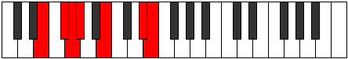 |
| [2207](https://ianring.com/musictheory/scales/2207) | [Mygian](ModeENaturalMygian.md) | E | E, F, Gb, Abb, Bbbb, Cb, D#, E |  |
| [2229](https://ianring.com/musictheory/scales/2229) | [Ionyptimic](ModeENaturalIonyptimic.md) | E | E, F#, G#, A, B, C###, E |  |
| [2231](https://ianring.com/musictheory/scales/2231) | [Macrian](ModeENaturalMacrian.md) | E | E, F, Gb, Ab, Bbb, Cb, D#, E |  |
| [2237](https://ianring.com/musictheory/scales/2237) | [Epothian](ModeENaturalEpothian.md) | E | E, F#, G, Ab, Bbb, Cb, D#, E |  |
| [2239](https://ianring.com/musictheory/scales/2239) | [Dacryllic](ModeENaturalDacryllic.md) | E | E, F, F#, G, G#, A, B, D#, E | 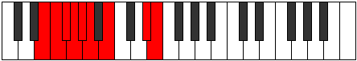 |
| [2251](https://ianring.com/musictheory/scales/2251) | [Zodimic](ModeFNaturalZodimic.md) | F | F, Gb, Ab, B, C, D##, F |  |
| [2255](https://ianring.com/musictheory/scales/2255) | [Dylian](ModeFNaturalDylian.md) | F | F, Gb, Abb, Bbbb, Cb, Dbb, E, F |  |
| [2261](https://ianring.com/musictheory/scales/2261) | [Phrolimic](ModeENaturalPhrolimic.md) | E | E, F#, G#, A#, B, C###, E |  |
| [2263](https://ianring.com/musictheory/scales/2263) | [Lycrian](ModeENaturalLycrian.md) | E | E, F, Gb, Ab, Bb, Cb, D#, E |  |
| [2267](https://ianring.com/musictheory/scales/2267) | [Padian](ModeFNaturalPadian.md) | F | F, Gb, Ab, Bbb, Cb, Dbb, E, F |  |
| [2269](https://ianring.com/musictheory/scales/2269) | [Pygian](ModeENaturalPygian.md) | E | E, F#, G, Ab, Bb, Cb, D#, E |  |
| [2271](https://ianring.com/musictheory/scales/2271) | [Poptyllic](ModeFNaturalPoptyllic.md) | F | F, F#, G, G#, A, B, C, E, F |  |
| [2271](https://ianring.com/musictheory/scales/2271) | [Poptyllic](ModeENaturalPoptyllic.md) | E | E, F, F#, G, G#, A#, B, D#, E |  |
| [2283](https://ianring.com/musictheory/scales/2283) | [Aeolyptian](ModeFNaturalAeolyptian.md) | F | F, Gb, Ab, Bb, Cb, Dbb, E, F | 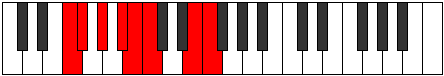 |
| [2287](https://ianring.com/musictheory/scales/2287) | [Lodyllic](ModeFNaturalLodyllic.md) | F | F, F#, G, G#, A#, B, C, E, F |  |
| [2293](https://ianring.com/musictheory/scales/2293) | [Gorian](ModeENaturalGorian.md) | E | E, F#, G#, A, Bb, Cb, D#, E |  |
| [2295](https://ianring.com/musictheory/scales/2295) | [Kogyllic](ModeENaturalKogyllic.md) | E | E, F, F#, G#, A, A#, B, D#, E |  |
| [2299](https://ianring.com/musictheory/scales/2299) | [Phraptyllic](ModeFNaturalPhraptyllic.md) | F | F, F#, G#, A, A#, B, C, E, F |  |
| [2301](https://ianring.com/musictheory/scales/2301) | [Bydyllic](ModeENaturalBydyllic.md) | E | E, F#, G, G#, A, A#, B, D#, E |  |
| [2303](https://ianring.com/musictheory/scales/2303) | [Stanygic](ModeFNaturalStanygic.md) | F | F, F#, G, G#, A, A#, B, C, E, F |  |
| [2303](https://ianring.com/musictheory/scales/2303) | [Stanygic](ModeENaturalStanygic.md) | E | E, F, F#, G, G#, A, A#, B, D#, E |  |
| [2347](https://ianring.com/musictheory/scales/2347) | [Thothimic](ModeDSharpThothimic.md) | D# | D#, E, F#, G#, A##, B###, D# |  |
| [2347](https://ianring.com/musictheory/scales/2347) | [Thothimic](ModeEFlatThothimic.md) | Eb | Eb, Fb, Gb, Ab, B, C##, Eb |  |
| [2351](https://ianring.com/musictheory/scales/2351) | [Gynian](ModeDSharpGynian.md) | D# | D#, E, F, Gb, Ab, B, C##, D# |  |
| [2363](https://ianring.com/musictheory/scales/2363) | [Kataptian](ModeDSharpKataptian.md) | D# | D#, E, F#, G, Ab, B, C##, D# |  |
| [2367](https://ianring.com/musictheory/scales/2367) | [Laryllic](ModeDSharpLaryllic.md) | D# | D#, E, F, F#, G, G#, B, D, D# |  |
| [2367](https://ianring.com/musictheory/scales/2367) | [Laryllic](ModeEFlatLaryllic.md) | Eb | Eb, E, F, Gb, G, Ab, B, D, Eb |  |
| [2379](https://ianring.com/musictheory/scales/2379) | [Stathimic](ModeFNaturalStathimic.md) | F | F, Gb, Ab, B, C#, D##, F |  |
| [2383](https://ianring.com/musictheory/scales/2383) | [Katorian](ModeFNaturalKatorian.md) | F | F, Gb, Abb, Bbbb, Cb, Db, E, F |  |
| [2385](https://ianring.com/musictheory/scales/2385) | [Aeolanitonic](ModeCNaturalAeolanitonic.md) | C | C, E, F#, G#, B, C |  |
| [2387](https://ianring.com/musictheory/scales/2387) | [Paptimic](ModeCNaturalPaptimic.md) | C | C, Db, E, F#, G#, A##, C |  |
| [2389](https://ianring.com/musictheory/scales/2389) | [Thynimic](ModeCNaturalThynimic.md) | C | C, D, E, F#, G#, A##, C |  |
| [2391](https://ianring.com/musictheory/scales/2391) | [Molian](ModeCNaturalMolian.md) | C | C, Db, Ebb, Fb, Gb, Ab, B, C |  |
| [2393](https://ianring.com/musictheory/scales/2393) | [Zathimic](ModeCNaturalZathimic.md) | C | C, D#, E, F#, G#, A##, C |  |
| [2395](https://ianring.com/musictheory/scales/2395) | [Zoptian](ModeCNaturalZoptian.md) | C | C, Db, Eb, Fb, Gb, Ab, B, C |  |
| [2395](https://ianring.com/musictheory/scales/2395) | [Zoptian](ModeFNaturalZoptian.md) | F | F, Gb, Ab, Bbb, Cb, Db, E, F |  |
| [2397](https://ianring.com/musictheory/scales/2397) | [Stagian](ModeCNaturalStagian.md) | C | C, D, Eb, Fb, Gb, Ab, B, C |  |
| [2399](https://ianring.com/musictheory/scales/2399) | [Zanyllic](ModeCNaturalZanyllic.md) | C | C, C#, D, D#, E, F#, G#, B, C |  |
| [2399](https://ianring.com/musictheory/scales/2399) | [Zanyllic](ModeFNaturalZanyllic.md) | F | F, F#, G, G#, A, B, C#, E, F |  |
| [2411](https://ianring.com/musictheory/scales/2411) | [Aeolorian](ModeDSharpAeolorian.md) | D# | D#, E, F#, G#, A, B, C##, D# |  |
| [2411](https://ianring.com/musictheory/scales/2411) | [Aeolorian](ModeEFlatAeolorian.md) | Eb | Eb, Fb, Gb, Ab, Bbb, Cb, D, Eb |  |
| [2411](https://ianring.com/musictheory/scales/2411) | [Aeolorian](ModeFNaturalAeolorian.md) | F | F, Gb, Ab, Bb, Cb, Db, E, F |  |
| [2415](https://ianring.com/musictheory/scales/2415) | [Lothyllic](ModeDSharpLothyllic.md) | D# | D#, E, F, F#, G#, A, B, D, D# | 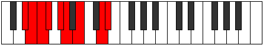 |
| [2415](https://ianring.com/musictheory/scales/2415) | [Lothyllic](ModeEFlatLothyllic.md) | Eb | Eb, E, F, Gb, Ab, A, B, D, Eb |  |
| [2415](https://ianring.com/musictheory/scales/2415) | [Lothyllic](ModeFNaturalLothyllic.md) | F | F, F#, G, G#, A#, B, C#, E, F | 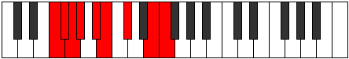 |
| [2417](https://ianring.com/musictheory/scales/2417) | [Kanimic](ModeCNaturalKanimic.md) | C | C, D##, E#, F#, G#, A##, C |  |
| [2419](https://ianring.com/musictheory/scales/2419) | [Paptian](ModeCNaturalPaptian.md) | C | C, Db, E, F, Gb, Ab, B, C |  |
| [2421](https://ianring.com/musictheory/scales/2421) | [Malian](ModeCNaturalMalian.md) | C | C, D, E, F, Gb, Ab, B, C |  |
| [2423](https://ianring.com/musictheory/scales/2423) | [Thorcryllic](ModeCNaturalThorcryllic.md) | C | C, C#, D, E, F, F#, G#, B, C |  |
| [2425](https://ianring.com/musictheory/scales/2425) | [Rorian](ModeCNaturalRorian.md) | C | C, D#, E, F, Gb, Ab, B, C |  |
| [2427](https://ianring.com/musictheory/scales/2427) | [Katoryllic](ModeCNaturalKatoryllic.md) | C | C, C#, D#, E, F, F#, G#, B, C |  |
| [2427](https://ianring.com/musictheory/scales/2427) | [Katoryllic](ModeDSharpKatoryllic.md) | D# | D#, E, F#, G, G#, A, B, D, D# |  |
| [2427](https://ianring.com/musictheory/scales/2427) | [Katoryllic](ModeEFlatKatoryllic.md) | Eb | Eb, E, Gb, G, Ab, A, B, D, Eb |  |
| [2427](https://ianring.com/musictheory/scales/2427) | [Katoryllic](ModeFNaturalKatoryllic.md) | F | F, F#, G#, A, A#, B, C#, E, F |  |
| [2429](https://ianring.com/musictheory/scales/2429) | [Kadyllic](ModeCNaturalKadyllic.md) | C | C, D, D#, E, F, F#, G#, B, C |  |
| [2431](https://ianring.com/musictheory/scales/2431) | [Gythygic](ModeCNaturalGythygic.md) | C | C, C#, D, D#, E, F, F#, G#, B, C |  |
| [2431](https://ianring.com/musictheory/scales/2431) | [Gythygic](ModeDSharpGythygic.md) | D# | D#, E, F, F#, G, G#, A, B, D, D# |  |
| [2431](https://ianring.com/musictheory/scales/2431) | [Gythygic](ModeEFlatGythygic.md) | Eb | Eb, E, F, Gb, G, Ab, A, B, D, Eb |  |
| [2431](https://ianring.com/musictheory/scales/2431) | [Gythygic](ModeFNaturalGythygic.md) | F | F, F#, G, G#, A, A#, B, C#, E, F |  |
| [2453](https://ianring.com/musictheory/scales/2453) | [Stonimic](ModeENaturalStonimic.md) | E | E, F#, G#, A##, B#, C###, E |  |
| [2455](https://ianring.com/musictheory/scales/2455) | [Bothian](ModeENaturalBothian.md) | E | E, F, Gb, Ab, B, C, D#, E |  |
| [2461](https://ianring.com/musictheory/scales/2461) | [Sagian](ModeENaturalSagian.md) | E | E, F#, G, Ab, B, C, D#, E |  |
| [2463](https://ianring.com/musictheory/scales/2463) | [Ionathyllic](ModeENaturalIonathyllic.md) | E | E, F, F#, G, G#, B, C, D#, E |  |
| [2475](https://ianring.com/musictheory/scales/2475) | [Aerylian](ModeDSharpAerylian.md) | D# | D#, E, F#, G#, A#, B, C##, D# |  |
| [2475](https://ianring.com/musictheory/scales/2475) | [Aerylian](ModeEFlatAerylian.md) | Eb | Eb, Fb, Gb, Ab, Bb, Cb, D, Eb |  |
| [2479](https://ianring.com/musictheory/scales/2479) | [Rycryllic](ModeDSharpRycryllic.md) | D# | D#, E, F, F#, G#, A#, B, D, D# |  |
| [2479](https://ianring.com/musictheory/scales/2479) | [Rycryllic](ModeEFlatRycryllic.md) | Eb | Eb, E, F, Gb, Ab, Bb, B, D, Eb |  |
| [2485](https://ianring.com/musictheory/scales/2485) | [Aerorian](ModeENaturalAerorian.md) | E | E, F#, G#, A, B, C, D#, E |  |
| [2487](https://ianring.com/musictheory/scales/2487) | [Phroptyllic](ModeENaturalPhroptyllic.md) | E | E, F, F#, G#, A, B, C, D#, E |  |
| [2491](https://ianring.com/musictheory/scales/2491) | [Layllic](ModeDSharpLayllic.md) | D# | D#, E, F#, G, G#, A#, B, D, D# |  |
| [2491](https://ianring.com/musictheory/scales/2491) | [Layllic](ModeEFlatLayllic.md) | Eb | Eb, E, Gb, G, Ab, Bb, B, D, Eb |  |
| [2493](https://ianring.com/musictheory/scales/2493) | [Manyllic](ModeENaturalManyllic.md) | E | E, F#, G, G#, A, B, C, D#, E |  |
| [2495](https://ianring.com/musictheory/scales/2495) | [Aeolocrygic](ModeENaturalAeolocrygic.md) | E | E, F, F#, G, G#, A, B, C, D#, E |  |
| [2495](https://ianring.com/musictheory/scales/2495) | [Aeolocrygic](ModeDSharpAeolocrygic.md) | D# | D#, E, F, F#, G, G#, A#, B, D, D# |  |
| [2495](https://ianring.com/musictheory/scales/2495) | [Aeolocrygic](ModeEFlatAeolocrygic.md) | Eb | Eb, E, F, Gb, G, Ab, Bb, B, D, Eb |  |
| [2507](https://ianring.com/musictheory/scales/2507) | [Ionyphian](ModeFNaturalIonyphian.md) | F | F, Gb, Ab, B, C, Db, E, F |  |
| [2511](https://ianring.com/musictheory/scales/2511) | [Epyryllic](ModeFNaturalEpyryllic.md) | F | F, F#, G, G#, B, C, C#, E, F |  |
| [2513](https://ianring.com/musictheory/scales/2513) | [Aerycrimic](ModeCNaturalAerycrimic.md) | C | C, D##, E##, F##, G#, A##, C |  |
| [2515](https://ianring.com/musictheory/scales/2515) | [Stylian](ModeCNaturalStylian.md) | C | C, Db, E, F#, G, Ab, B, C |  |
| [2517](https://ianring.com/musictheory/scales/2517) | [Ryphian](ModeCNaturalRyphian.md) | C | C, D, E, F#, G, Ab, B, C |  |
| [2517](https://ianring.com/musictheory/scales/2517) | [Ryphian](ModeENaturalRyphian.md) | E | E, F#, G#, A#, B, C, D#, E |  |
| [2519](https://ianring.com/musictheory/scales/2519) | [Dathyllic](ModeCNaturalDathyllic.md) | C | C, C#, D, E, F#, G, G#, B, C |  |
| [2519](https://ianring.com/musictheory/scales/2519) | [Dathyllic](ModeENaturalDathyllic.md) | E | E, F, F#, G#, A#, B, C, D#, E |  |
| [2521](https://ianring.com/musictheory/scales/2521) | [Barian](ModeCNaturalBarian.md) | C | C, D#, E, F#, G, Ab, B, C |  |
| [2523](https://ianring.com/musictheory/scales/2523) | [Rygyllic](ModeCNaturalRygyllic.md) | C | C, C#, D#, E, F#, G, G#, B, C |  |
| [2523](https://ianring.com/musictheory/scales/2523) | [Rygyllic](ModeFNaturalRygyllic.md) | F | F, F#, G#, A, B, C, C#, E, F |  |
| [2525](https://ianring.com/musictheory/scales/2525) | [Aeolaryllic](ModeCNaturalAeolaryllic.md) | C | C, D, D#, E, F#, G, G#, B, C |  |
| [2525](https://ianring.com/musictheory/scales/2525) | [Aeolaryllic](ModeENaturalAeolaryllic.md) | E | E, F#, G, G#, A#, B, C, D#, E |  |
| [2527](https://ianring.com/musictheory/scales/2527) | [Phradygic](ModeCNaturalPhradygic.md) | C | C, C#, D, D#, E, F#, G, G#, B, C | 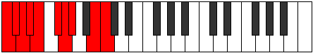 |
| [2527](https://ianring.com/musictheory/scales/2527) | [Phradygic](ModeFNaturalPhradygic.md) | F | F, F#, G, G#, A, B, C, C#, E, F |  |
| [2527](https://ianring.com/musictheory/scales/2527) | [Phradygic](ModeENaturalPhradygic.md) | E | E, F, F#, G, G#, A#, B, C, D#, E |  |
| [2539](https://ianring.com/musictheory/scales/2539) | [Thonyllic](ModeFNaturalThonyllic.md) | F | F, F#, G#, A#, B, C, C#, E, F |  |
| [2539](https://ianring.com/musictheory/scales/2539) | [Thonyllic](ModeDSharpThonyllic.md) | D# | D#, E, F#, G#, A, A#, B, D, D# |  |
| [2539](https://ianring.com/musictheory/scales/2539) | [Thonyllic](ModeEFlatThonyllic.md) | Eb | Eb, E, Gb, Ab, A, Bb, B, D, Eb |  |
| [2543](https://ianring.com/musictheory/scales/2543) | [Dydygic](ModeFNaturalDydygic.md) | F | F, F#, G, G#, A#, B, C, C#, E, F |  |
| [2543](https://ianring.com/musictheory/scales/2543) | [Dydygic](ModeDSharpDydygic.md) | D# | D#, E, F, F#, G#, A, A#, B, D, D# |  |
| [2543](https://ianring.com/musictheory/scales/2543) | [Dydygic](ModeEFlatDydygic.md) | Eb | Eb, E, F, Gb, Ab, A, Bb, B, D, Eb |  |
| [2545](https://ianring.com/musictheory/scales/2545) | [Thycrian](ModeCNaturalThycrian.md) | C | C, D##, E#, F#, G, Ab, B, C |  |
| [2547](https://ianring.com/musictheory/scales/2547) | [Sogyllic](ModeCNaturalSogyllic.md) | C | C, C#, E, F, F#, G, G#, B, C |  |
| [2549](https://ianring.com/musictheory/scales/2549) | [Rydyllic](ModeCNaturalRydyllic.md) | C | C, D, E, F, F#, G, G#, B, C |  |
| [2549](https://ianring.com/musictheory/scales/2549) | [Rydyllic](ModeENaturalRydyllic.md) | E | E, F#, G#, A, A#, B, C, D#, E |  |
| [2551](https://ianring.com/musictheory/scales/2551) | [Zoptygic](ModeCNaturalZoptygic.md) | C | C, C#, D, E, F, F#, G, G#, B, C |  |
| [2551](https://ianring.com/musictheory/scales/2551) | [Zoptygic](ModeENaturalZoptygic.md) | E | E, F, F#, G#, A, A#, B, C, D#, E |  |
| [2553](https://ianring.com/musictheory/scales/2553) | [Aeolaptyllic](ModeCNaturalAeolaptyllic.md) | C | C, D#, E, F, F#, G, G#, B, C |  |
| [2555](https://ianring.com/musictheory/scales/2555) | [Bythygic](ModeCNaturalBythygic.md) | C | C, C#, D#, E, F, F#, G, G#, B, C |  |
| [2555](https://ianring.com/musictheory/scales/2555) | [Bythygic](ModeFNaturalBythygic.md) | F | F, F#, G#, A, A#, B, C, C#, E, F |  |
| [2555](https://ianring.com/musictheory/scales/2555) | [Bythygic](ModeDSharpBythygic.md) | D# | D#, E, F#, G, G#, A, A#, B, D, D# |  |
| [2555](https://ianring.com/musictheory/scales/2555) | [Bythygic](ModeEFlatBythygic.md) | Eb | Eb, E, Gb, G, Ab, A, Bb, B, D, Eb |  |
| [2557](https://ianring.com/musictheory/scales/2557) | [Dothygic](ModeCNaturalDothygic.md) | C | C, D, D#, E, F, F#, G, G#, B, C |  |
| [2557](https://ianring.com/musictheory/scales/2557) | [Dothygic](ModeENaturalDothygic.md) | E | E, F#, G, G#, A, A#, B, C, D#, E |  |
| [2559](https://ianring.com/musictheory/scales/2559) | [Zogyllian](ModeCNaturalZogyllian.md) | C | C, C#, D, D#, E, F, F#, G, G#, B, C |  |
| [2559](https://ianring.com/musictheory/scales/2559) | [Zogyllian](ModeFNaturalZogyllian.md) | F | F, F#, G, G#, A, A#, B, C, C#, E, F |  |
| [2559](https://ianring.com/musictheory/scales/2559) | [Zogyllian](ModeENaturalZogyllian.md) | E | E, F, F#, G, G#, A, A#, B, C, D#, E |  |
| [2559](https://ianring.com/musictheory/scales/2559) | [Zogyllian](ModeDSharpZogyllian.md) | D# | D#, E, F, F#, G, G#, A, A#, B, D, D# |  |
| [2559](https://ianring.com/musictheory/scales/2559) | [Zogyllian](ModeEFlatZogyllian.md) | Eb | Eb, E, F, Gb, G, Ab, A, Bb, B, D, Eb |  |
| [2611](https://ianring.com/musictheory/scales/2611) | [Lyrimic](ModeGNaturalLyrimic.md) | G | G, Ab, B, C, D##, E##, G |  |
| [2615](https://ianring.com/musictheory/scales/2615) | [Thoptian](ModeGNaturalThoptian.md) | G | G, Ab, Bbb, Cb, Dbb, E, F#, G |  |
| [2619](https://ianring.com/musictheory/scales/2619) | [Ionyrian](ModeGNaturalIonyrian.md) | G | G, Ab, Bb, Cb, Dbb, E, F#, G |  |
| [2623](https://ianring.com/musictheory/scales/2623) | [Aerylyllic](ModeGNaturalAerylyllic.md) | G | G, G#, A, A#, B, C, E, F#, G |  |
| [2635](https://ianring.com/musictheory/scales/2635) | [Gocrimic](ModeFNaturalGocrimic.md) | F | F, Gb, Ab, B, C##, D##, F |  |
| [2639](https://ianring.com/musictheory/scales/2639) | [Dothian](ModeFNaturalDothian.md) | F | F, Gb, Abb, Bbbb, Cb, D, E, F |  |
| [2643](https://ianring.com/musictheory/scales/2643) | [Lydimic](ModeGNaturalLydimic.md) | G | G, Ab, B, C#, D##, E##, G |  |
| [2645](https://ianring.com/musictheory/scales/2645) | [Zoptimic](ModeDNaturalZoptimic.md) | D | D, E, F#, G#, A##, B##, D |  |
| [2647](https://ianring.com/musictheory/scales/2647) | [Dadian](ModeDNaturalDadian.md) | D | D, Eb, Fb, Gb, Ab, B, C#, D |  |
| [2647](https://ianring.com/musictheory/scales/2647) | [Dadian](ModeGNaturalDadian.md) | G | G, Ab, Bbb, Cb, Db, E, F#, G |  |
| [2651](https://ianring.com/musictheory/scales/2651) | [Panian](ModeFNaturalPanian.md) | F | F, Gb, Ab, Bbb, Cb, D, E, F |  |
| [2651](https://ianring.com/musictheory/scales/2651) | [Panian](ModeGNaturalPanian.md) | G | G, Ab, Bb, Cb, Db, E, F#, G |  |
| [2653](https://ianring.com/musictheory/scales/2653) | [Sygian](ModeDNaturalSygian.md) | D | D, E, F, Gb, Ab, B, C#, D |  |
| [2655](https://ianring.com/musictheory/scales/2655) | [Thocryllic](ModeDNaturalThocryllic.md) | D | D, D#, E, F, F#, G#, B, C#, D |  |
| [2655](https://ianring.com/musictheory/scales/2655) | [Thocryllic](ModeFNaturalThocryllic.md) | F | F, F#, G, G#, A, B, D, E, F |  |
| [2655](https://ianring.com/musictheory/scales/2655) | [Thocryllic](ModeGNaturalThocryllic.md) | G | G, G#, A, A#, B, C#, E, F#, G |  |
| [2667](https://ianring.com/musictheory/scales/2667) | [Byrian](ModeFNaturalByrian.md) | F | F, Gb, Ab, Bb, Cb, D, E, F |  |
| [2671](https://ianring.com/musictheory/scales/2671) | [Lylyllic](ModeFNaturalLylyllic.md) | F | F, F#, G, G#, A#, B, D, E, F |  |
| [2675](https://ianring.com/musictheory/scales/2675) | [Gogian](ModeGNaturalGogian.md) | G | G, Ab, B, C, Db, E, F#, G |  |
| [2677](https://ianring.com/musictheory/scales/2677) | [Thodian](ModeDNaturalThodian.md) | D | D, E, F#, G, Ab, B, C#, D |  |
| [2679](https://ianring.com/musictheory/scales/2679) | [Rathyllic](ModeDNaturalRathyllic.md) | D | D, D#, E, F#, G, G#, B, C#, D |  |
| [2679](https://ianring.com/musictheory/scales/2679) | [Rathyllic](ModeGNaturalRathyllic.md) | G | G, G#, A, B, C, C#, E, F#, G |  |
| [2683](https://ianring.com/musictheory/scales/2683) | [Thodyllic](ModeGNaturalThodyllic.md) | G | G, G#, A#, B, C, C#, E, F#, G |  |
| [2683](https://ianring.com/musictheory/scales/2683) | [Thodyllic](ModeFNaturalThodyllic.md) | F | F, F#, G#, A, A#, B, D, E, F |  |
| [2685](https://ianring.com/musictheory/scales/2685) | [Ionoryllic](ModeDNaturalIonoryllic.md) | D | D, E, F, F#, G, G#, B, C#, D |  |
| [2687](https://ianring.com/musictheory/scales/2687) | [Thacrygic](ModeDNaturalThacrygic.md) | D | D, D#, E, F, F#, G, G#, B, C#, D |  |
| [2687](https://ianring.com/musictheory/scales/2687) | [Thacrygic](ModeGNaturalThacrygic.md) | G | G, G#, A, A#, B, C, C#, E, F#, G |  |
| [2687](https://ianring.com/musictheory/scales/2687) | [Thacrygic](ModeFNaturalThacrygic.md) | F | F, F#, G, G#, A, A#, B, D, E, F |  |
| [2701](https://ianring.com/musictheory/scales/2701) | [Epythimic](ModeANaturalEpythimic.md) | A | A, B, C, D##, E##, F###, A |  |
| [2703](https://ianring.com/musictheory/scales/2703) | [Galian](ModeANaturalGalian.md) | A | A, Bb, Cb, Dbb, E, F#, G#, A |  |
| [2707](https://ianring.com/musictheory/scales/2707) | [Banimic](ModeGNaturalBanimic.md) | G | G, Ab, B, C##, D##, E##, G |  |
| [2709](https://ianring.com/musictheory/scales/2709) | [Thaptimic](ModeENaturalThaptimic.md) | E | E, F#, G#, A##, B##, C###, E |  |
| [2709](https://ianring.com/musictheory/scales/2709) | [Thaptimic](ModeANaturalThaptimic.md) | A | A, B, C#, D##, E##, F###, A |  |
| [2711](https://ianring.com/musictheory/scales/2711) | [Stolian](ModeENaturalStolian.md) | E | E, F, Gb, Ab, B, C#, D#, E |  |
| [2711](https://ianring.com/musictheory/scales/2711) | [Stolian](ModeGNaturalStolian.md) | G | G, Ab, Bbb, Cb, D, E, F#, G |  |
| [2711](https://ianring.com/musictheory/scales/2711) | [Stolian](ModeANaturalStolian.md) | A | A, Bb, Cb, Db, E, F#, G#, A |  |
| [2715](https://ianring.com/musictheory/scales/2715) | [Kynian](ModeGNaturalKynian.md) | G | G, Ab, Bb, Cb, D, E, F#, G |  |
| [2717](https://ianring.com/musictheory/scales/2717) | [Epygian](ModeENaturalEpygian.md) | E | E, F#, G, Ab, B, C#, D#, E |  |
| [2717](https://ianring.com/musictheory/scales/2717) | [Epygian](ModeANaturalEpygian.md) | A | A, B, C, Db, E, F#, G#, A |  |
| [2719](https://ianring.com/musictheory/scales/2719) | [Zocryllic](ModeENaturalZocryllic.md) | E | E, F, F#, G, G#, B, C#, D#, E |  |
| [2719](https://ianring.com/musictheory/scales/2719) | [Zocryllic](ModeANaturalZocryllic.md) | A | A, A#, B, C, C#, E, F#, G#, A | 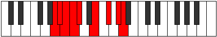 |
| [2719](https://ianring.com/musictheory/scales/2719) | [Zocryllic](ModeGNaturalZocryllic.md) | G | G, G#, A, A#, B, D, E, F#, G |  |
| [2723](https://ianring.com/musictheory/scales/2723) | [Epylimic](ModeBNaturalEpylimic.md) | B | B, C, D##, E##, F###, G###, B |  |
| [2725](https://ianring.com/musictheory/scales/2725) | [Gonimic](ModeANaturalGonimic.md) | A | A, B, C##, D##, E##, F###, A |  |
| [2725](https://ianring.com/musictheory/scales/2725) | [Gonimic](ModeBNaturalGonimic.md) | B | B, C#, D##, E##, F###, G###, B |  |
| [2727](https://ianring.com/musictheory/scales/2727) | [Pylian](ModeBNaturalPylian.md) | B | B, C, Db, E, F#, G#, A#, B |  |
| [2727](https://ianring.com/musictheory/scales/2727) | [Pylian](ModeANaturalPylian.md) | A | A, Bb, Cb, D, E, F#, G#, A |  |
| [2729](https://ianring.com/musictheory/scales/2729) | [Aeragimic](ModeBNaturalAeragimic.md) | B | B, C##, D##, E##, F###, G###, B |  |
| [2731](https://ianring.com/musictheory/scales/2731) | [Thydian](ModeBNaturalThydian.md) | B | B, C, D, E, F#, G#, A#, B |  |
| [2733](https://ianring.com/musictheory/scales/2733) | [Bocrian](ModeANaturalBocrian.md) | A | A, B, C, D, E, F#, G#, A |  |
| [2733](https://ianring.com/musictheory/scales/2733) | [Bocrian](ModeBNaturalBocrian.md) | B | B, C#, D, E, F#, G#, A#, B |  |
| [2735](https://ianring.com/musictheory/scales/2735) | [Gynyllic](ModeBNaturalGynyllic.md) | B | B, C, C#, D, E, F#, G#, A#, B |  |
| [2735](https://ianring.com/musictheory/scales/2735) | [Gynyllic](ModeANaturalGynyllic.md) | A | A, A#, B, C, D, E, F#, G#, A |  |
| [2737](https://ianring.com/musictheory/scales/2737) | [Bylimic](ModeBNaturalBylimic.md) | B | B, C###, D##, E##, F###, G###, B |  |
| [2739](https://ianring.com/musictheory/scales/2739) | [Zanian](ModeGNaturalZanian.md) | G | G, Ab, B, C, D, E, F#, G |  |
| [2739](https://ianring.com/musictheory/scales/2739) | [Zanian](ModeBNaturalZanian.md) | B | B, C, D#, E, F#, G#, A#, B |  |
| [2741](https://ianring.com/musictheory/scales/2741) | [Ionian](ModeANaturalIonian.md) | A | A, B, C#, D, E, F#, G#, A |  |
| [2741](https://ianring.com/musictheory/scales/2741) | [Ionian](ModeENaturalIonian.md) | E | E, F#, G#, A, B, C#, D#, E | 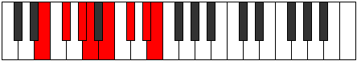 |
| [2741](https://ianring.com/musictheory/scales/2741) | [Ionian](ModeBNaturalIonian.md) | B | B, C#, D#, E, F#, G#, A#, B |  |
| [2743](https://ianring.com/musictheory/scales/2743) | [Staptyllic](ModeENaturalStaptyllic.md) | E | E, F, F#, G#, A, B, C#, D#, E |  |
| [2743](https://ianring.com/musictheory/scales/2743) | [Staptyllic](ModeGNaturalStaptyllic.md) | G | G, G#, A, B, C, D, E, F#, G |  |
| [2743](https://ianring.com/musictheory/scales/2743) | [Staptyllic](ModeBNaturalStaptyllic.md) | B | B, C, C#, D#, E, F#, G#, A#, B |  |
| [2743](https://ianring.com/musictheory/scales/2743) | [Staptyllic](ModeANaturalStaptyllic.md) | A | A, A#, B, C#, D, E, F#, G#, A |  |
| [2745](https://ianring.com/musictheory/scales/2745) | [Dolian](ModeBNaturalDolian.md) | B | B, C##, D#, E, F#, G#, A#, B |  |
| [2747](https://ianring.com/musictheory/scales/2747) | [Stythyllic](ModeBNaturalStythyllic.md) | B | B, C, D, D#, E, F#, G#, A#, B |  |
| [2747](https://ianring.com/musictheory/scales/2747) | [Stythyllic](ModeGNaturalStythyllic.md) | G | G, G#, A#, B, C, D, E, F#, G |  |
| [2749](https://ianring.com/musictheory/scales/2749) | [Katagyllic](ModeANaturalKatagyllic.md) | A | A, B, C, C#, D, E, F#, G#, A |  |
| [2749](https://ianring.com/musictheory/scales/2749) | [Katagyllic](ModeENaturalKatagyllic.md) | E | E, F#, G, G#, A, B, C#, D#, E |  |
| [2749](https://ianring.com/musictheory/scales/2749) | [Katagyllic](ModeBNaturalKatagyllic.md) | B | B, C#, D, D#, E, F#, G#, A#, B |  |
| [2751](https://ianring.com/musictheory/scales/2751) | [Sylygic](ModeENaturalSylygic.md) | E | E, F, F#, G, G#, A, B, C#, D#, E |  |
| [2751](https://ianring.com/musictheory/scales/2751) | [Sylygic](ModeBNaturalSylygic.md) | B | B, C, C#, D, D#, E, F#, G#, A#, B |  |
| [2751](https://ianring.com/musictheory/scales/2751) | [Sylygic](ModeANaturalSylygic.md) | A | A, A#, B, C, C#, D, E, F#, G#, A |  |
| [2751](https://ianring.com/musictheory/scales/2751) | [Sylygic](ModeGNaturalSylygic.md) | G | G, G#, A, A#, B, C, D, E, F#, G |  |
| [2757](https://ianring.com/musictheory/scales/2757) | [Stolimic](ModeANaturalStolimic.md) | A | A, B, C###, D##, E##, F###, A |  |
| [2759](https://ianring.com/musictheory/scales/2759) | [Aeraphian](ModeANaturalAeraphian.md) | A | A, Bb, Cb, D#, E, F#, G#, A |  |
| [2763](https://ianring.com/musictheory/scales/2763) | [Manian](ModeFNaturalManian.md) | F | F, Gb, Ab, B, C, D, E, F |  |
| [2765](https://ianring.com/musictheory/scales/2765) | [Banian](ModeANaturalBanian.md) | A | A, B, C, D#, E, F#, G#, A |  |
| [2767](https://ianring.com/musictheory/scales/2767) | [Katydyllic](ModeFNaturalKatydyllic.md) | F | F, F#, G, G#, B, C, D, E, F |  |
| [2767](https://ianring.com/musictheory/scales/2767) | [Katydyllic](ModeANaturalKatydyllic.md) | A | A, A#, B, C, D#, E, F#, G#, A |  |
| [2771](https://ianring.com/musictheory/scales/2771) | [Garian](ModeGNaturalGarian.md) | G | G, Ab, B, C#, D, E, F#, G |  |
| [2773](https://ianring.com/musictheory/scales/2773) | [Lydian](ModeDNaturalLydian.md) | D | D, E, F#, G#, A, B, C#, D |  |
| [2773](https://ianring.com/musictheory/scales/2773) | [Lydian](ModeANaturalLydian.md) | A | A, B, C#, D#, E, F#, G#, A |  |
| [2773](https://ianring.com/musictheory/scales/2773) | [Lydian](ModeENaturalLydian.md) | E | E, F#, G#, A#, B, C#, D#, E |  |
| [2775](https://ianring.com/musictheory/scales/2775) | [Godyllic](ModeDNaturalGodyllic.md) | D | D, D#, E, F#, G#, A, B, C#, D |  |
| [2775](https://ianring.com/musictheory/scales/2775) | [Godyllic](ModeGNaturalGodyllic.md) | G | G, G#, A, B, C#, D, E, F#, G |  |
| [2775](https://ianring.com/musictheory/scales/2775) | [Godyllic](ModeENaturalGodyllic.md) | E | E, F, F#, G#, A#, B, C#, D#, E |  |
| [2775](https://ianring.com/musictheory/scales/2775) | [Godyllic](ModeANaturalGodyllic.md) | A | A, A#, B, C#, D#, E, F#, G#, A |  |
| [2779](https://ianring.com/musictheory/scales/2779) | [Garyllic](ModeFNaturalGaryllic.md) | F | F, F#, G#, A, B, C, D, E, F |  |
| [2779](https://ianring.com/musictheory/scales/2779) | [Garyllic](ModeGNaturalGaryllic.md) | G | G, G#, A#, B, C#, D, E, F#, G |  |
| [2781](https://ianring.com/musictheory/scales/2781) | [Gycryllic](ModeANaturalGycryllic.md) | A | A, B, C, C#, D#, E, F#, G#, A |  |
| [2781](https://ianring.com/musictheory/scales/2781) | [Gycryllic](ModeDNaturalGycryllic.md) | D | D, E, F, F#, G#, A, B, C#, D |  |
| [2781](https://ianring.com/musictheory/scales/2781) | [Gycryllic](ModeENaturalGycryllic.md) | E | E, F#, G, G#, A#, B, C#, D#, E |  |
| [2783](https://ianring.com/musictheory/scales/2783) | [Gothygic](ModeDNaturalGothygic.md) | D | D, D#, E, F, F#, G#, A, B, C#, D |  |
| [2783](https://ianring.com/musictheory/scales/2783) | [Gothygic](ModeFNaturalGothygic.md) | F | F, F#, G, G#, A, B, C, D, E, F |  |
| [2783](https://ianring.com/musictheory/scales/2783) | [Gothygic](ModeENaturalGothygic.md) | E | E, F, F#, G, G#, A#, B, C#, D#, E |  |
| [2783](https://ianring.com/musictheory/scales/2783) | [Gothygic](ModeANaturalGothygic.md) | A | A, A#, B, C, C#, D#, E, F#, G#, A |  |
| [2783](https://ianring.com/musictheory/scales/2783) | [Gothygic](ModeGNaturalGothygic.md) | G | G, G#, A, A#, B, C#, D, E, F#, G |  |
| [2787](https://ianring.com/musictheory/scales/2787) | [Zyrian](ModeBNaturalZyrian.md) | B | B, C, D##, E#, F#, G#, A#, B |  |
| [2789](https://ianring.com/musictheory/scales/2789) | [Zolian](ModeANaturalZolian.md) | A | A, B, C##, D#, E, F#, G#, A |  |
| [2789](https://ianring.com/musictheory/scales/2789) | [Zolian](ModeBNaturalZolian.md) | B | B, C#, D##, E#, F#, G#, A#, B | 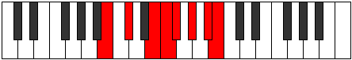 |
| [2791](https://ianring.com/musictheory/scales/2791) | [Ionyptyllic](ModeBNaturalIonyptyllic.md) | B | B, C, C#, E, F, F#, G#, A#, B |  |
| [2791](https://ianring.com/musictheory/scales/2791) | [Ionyptyllic](ModeANaturalIonyptyllic.md) | A | A, A#, B, D, D#, E, F#, G#, A |  |
| [2793](https://ianring.com/musictheory/scales/2793) | [Eporian](ModeBNaturalEporian.md) | B | B, C##, D##, E#, F#, G#, A#, B |  |
| [2797](https://ianring.com/musictheory/scales/2797) | [Stalyllic](ModeANaturalStalyllic.md) | A | A, B, C, D, D#, E, F#, G#, A |  |
| [2797](https://ianring.com/musictheory/scales/2797) | [Stalyllic](ModeBNaturalStalyllic.md) | B | B, C#, D, E, F, F#, G#, A#, B |  |
| [2799](https://ianring.com/musictheory/scales/2799) | [Epilygic](ModeBNaturalEpilygic.md) | B | B, C, C#, D, E, F, F#, G#, A#, B |  |
| [2799](https://ianring.com/musictheory/scales/2799) | [Epilygic](ModeFNaturalEpilygic.md) | F | F, F#, G, G#, A#, B, C, D, E, F |  |
| [2799](https://ianring.com/musictheory/scales/2799) | [Epilygic](ModeANaturalEpilygic.md) | A | A, A#, B, C, D, D#, E, F#, G#, A |  |
| [2801](https://ianring.com/musictheory/scales/2801) | [Zogian](ModeBNaturalZogian.md) | B | B, C###, D##, E#, F#, G#, A#, B |  |
| [2803](https://ianring.com/musictheory/scales/2803) | [Zolyllic](ModeGNaturalZolyllic.md) | G | G, G#, B, C, C#, D, E, F#, G |  |
| [2803](https://ianring.com/musictheory/scales/2803) | [Zolyllic](ModeBNaturalZolyllic.md) | B | B, C, D#, E, F, F#, G#, A#, B |  |
| [2805](https://ianring.com/musictheory/scales/2805) | [Zylyllic](ModeANaturalZylyllic.md) | A | A, B, C#, D, D#, E, F#, G#, A |  |
| [2805](https://ianring.com/musictheory/scales/2805) | [Zylyllic](ModeDNaturalZylyllic.md) | D | D, E, F#, G, G#, A, B, C#, D |  |
| [2805](https://ianring.com/musictheory/scales/2805) | [Zylyllic](ModeBNaturalZylyllic.md) | B | B, C#, D#, E, F, F#, G#, A#, B |  |
| [2805](https://ianring.com/musictheory/scales/2805) | [Zylyllic](ModeENaturalZylyllic.md) | E | E, F#, G#, A, A#, B, C#, D#, E |  |
| [2807](https://ianring.com/musictheory/scales/2807) | [Zylygic](ModeGNaturalZylygic.md) | G | G, G#, A, B, C, C#, D, E, F#, G |  |
| [2807](https://ianring.com/musictheory/scales/2807) | [Zylygic](ModeDNaturalZylygic.md) | D | D, D#, E, F#, G, G#, A, B, C#, D |  |
| [2807](https://ianring.com/musictheory/scales/2807) | [Zylygic](ModeBNaturalZylygic.md) | B | B, C, C#, D#, E, F, F#, G#, A#, B |  |
| [2807](https://ianring.com/musictheory/scales/2807) | [Zylygic](ModeANaturalZylygic.md) | A | A, A#, B, C#, D, D#, E, F#, G#, A |  |
| [2807](https://ianring.com/musictheory/scales/2807) | [Zylygic](ModeENaturalZylygic.md) | E | E, F, F#, G#, A, A#, B, C#, D#, E |  |
| [2809](https://ianring.com/musictheory/scales/2809) | [Gythyllic](ModeBNaturalGythyllic.md) | B | B, D, D#, E, F, F#, G#, A#, B |  |
| [2811](https://ianring.com/musictheory/scales/2811) | [Barygic](ModeBNaturalBarygic.md) | B | B, C, D, D#, E, F, F#, G#, A#, B |  |
| [2811](https://ianring.com/musictheory/scales/2811) | [Barygic](ModeGNaturalBarygic.md) | G | G, G#, A#, B, C, C#, D, E, F#, G |  |
| [2811](https://ianring.com/musictheory/scales/2811) | [Barygic](ModeFNaturalBarygic.md) | F | F, F#, G#, A, A#, B, C, D, E, F |  |
| [2813](https://ianring.com/musictheory/scales/2813) | [Zolygic](ModeANaturalZolygic.md) | A | A, B, C, C#, D, D#, E, F#, G#, A |  |
| [2813](https://ianring.com/musictheory/scales/2813) | [Zolygic](ModeDNaturalZolygic.md) | D | D, E, F, F#, G, G#, A, B, C#, D |  |
| [2813](https://ianring.com/musictheory/scales/2813) | [Zolygic](ModeBNaturalZolygic.md) | B | B, C#, D, D#, E, F, F#, G#, A#, B |  |
| [2813](https://ianring.com/musictheory/scales/2813) | [Zolygic](ModeENaturalZolygic.md) | E | E, F#, G, G#, A, A#, B, C#, D#, E |  |
| [2815](https://ianring.com/musictheory/scales/2815) | [Aeradyllian](ModeDNaturalAeradyllian.md) | D | D, D#, E, F, F#, G, G#, A, B, C#, D |  |
| [2815](https://ianring.com/musictheory/scales/2815) | [Aeradyllian](ModeBNaturalAeradyllian.md) | B | B, C, C#, D, D#, E, F, F#, G#, A#, B |  |
| [2815](https://ianring.com/musictheory/scales/2815) | [Aeradyllian](ModeANaturalAeradyllian.md) | A | A, A#, B, C, C#, D, D#, E, F#, G#, A |  |
| [2815](https://ianring.com/musictheory/scales/2815) | [Aeradyllian](ModeGNaturalAeradyllian.md) | G | G, G#, A, A#, B, C, C#, D, E, F#, G |  |
| [2815](https://ianring.com/musictheory/scales/2815) | [Aeradyllian](ModeFNaturalAeradyllian.md) | F | F, F#, G, G#, A, A#, B, C, D, E, F |  |
| [2815](https://ianring.com/musictheory/scales/2815) | [Aeradyllian](ModeENaturalAeradyllian.md) | E | E, F, F#, G, G#, A, A#, B, C#, D#, E |  |
| [2835](https://ianring.com/musictheory/scales/2835) | [Ionygimic](ModeGNaturalIonygimic.md) | G | G, Ab, B, C###, D##, E##, G |  |
| [2839](https://ianring.com/musictheory/scales/2839) | [Lyptian](ModeGNaturalLyptian.md) | G | G, Ab, Bbb, Cb, D#, E, F#, G |  |
| [2843](https://ianring.com/musictheory/scales/2843) | [Sorian](ModeGNaturalSorian.md) | G | G, Ab, Bb, Cb, D#, E, F#, G |  |
| [2847](https://ianring.com/musictheory/scales/2847) | [Phracryllic](ModeGNaturalPhracryllic.md) | G | G, G#, A, A#, B, D#, E, F#, G |  |
| [2859](https://ianring.com/musictheory/scales/2859) | [Phrycrian](ModeDSharpPhrycrian.md) | D# | D#, E, F#, G#, A##, B#, C##, D# | 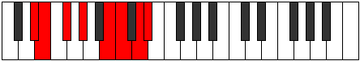 |
| [2859](https://ianring.com/musictheory/scales/2859) | [Phrycrian](ModeEFlatPhrycrian.md) | Eb | Eb, Fb, Gb, Ab, B, C, D, Eb |  |
| [2863](https://ianring.com/musictheory/scales/2863) | [Aerogyllic](ModeDSharpAerogyllic.md) | D# | D#, E, F, F#, G#, B, C, D, D# |  |
| [2863](https://ianring.com/musictheory/scales/2863) | [Aerogyllic](ModeEFlatAerogyllic.md) | Eb | Eb, E, F, Gb, Ab, B, C, D, Eb |  |
| [2867](https://ianring.com/musictheory/scales/2867) | [Socrian](ModeGNaturalSocrian.md) | G | G, Ab, B, C, D#, E, F#, G |  |
| [2871](https://ianring.com/musictheory/scales/2871) | [Stanyllic](ModeGNaturalStanyllic.md) | G | G, G#, A, B, C, D#, E, F#, G |  |
| [2875](https://ianring.com/musictheory/scales/2875) | [Ganyllic](ModeDSharpGanyllic.md) | D# | D#, E, F#, G, G#, B, C, D, D# |  |
| [2875](https://ianring.com/musictheory/scales/2875) | [Ganyllic](ModeEFlatGanyllic.md) | Eb | Eb, E, Gb, G, Ab, B, C, D, Eb |  |
| [2875](https://ianring.com/musictheory/scales/2875) | [Ganyllic](ModeGNaturalGanyllic.md) | G | G, G#, A#, B, C, D#, E, F#, G |  |
| [2879](https://ianring.com/musictheory/scales/2879) | [Stadygic](ModeDSharpStadygic.md) | D# | D#, E, F, F#, G, G#, B, C, D, D# |  |
| [2879](https://ianring.com/musictheory/scales/2879) | [Stadygic](ModeEFlatStadygic.md) | Eb | Eb, E, F, Gb, G, Ab, B, C, D, Eb |  |
| [2879](https://ianring.com/musictheory/scales/2879) | [Stadygic](ModeGNaturalStadygic.md) | G | G, G#, A, A#, B, C, D#, E, F#, G |  |
| [2891](https://ianring.com/musictheory/scales/2891) | [Phrogian](ModeFNaturalPhrogian.md) | F | F, Gb, Ab, B, C#, D, E, F |  |
| [2895](https://ianring.com/musictheory/scales/2895) | [Aeragyllic](ModeFNaturalAeragyllic.md) | F | F, F#, G, G#, B, C#, D, E, F |  |
| [2899](https://ianring.com/musictheory/scales/2899) | [Kagian](ModeGNaturalKagian.md) | G | G, Ab, B, C#, D#, E, F#, G |  |
| [2899](https://ianring.com/musictheory/scales/2899) | [Kagian](ModeCNaturalKagian.md) | C | C, Db, E, F#, G#, A, B, C |  |
| [2901](https://ianring.com/musictheory/scales/2901) | [Larian](ModeCNaturalLarian.md) | C | C, D, E, F#, G#, A, B, C |  |
| [2901](https://ianring.com/musictheory/scales/2901) | [Larian](ModeDNaturalLarian.md) | D | D, E, F#, G#, A#, B, C#, D |  |
| [2903](https://ianring.com/musictheory/scales/2903) | [Gothyllic](ModeCNaturalGothyllic.md) | C | C, C#, D, E, F#, G#, A, B, C |  |
| [2903](https://ianring.com/musictheory/scales/2903) | [Gothyllic](ModeGNaturalGothyllic.md) | G | G, G#, A, B, C#, D#, E, F#, G |  |
| [2903](https://ianring.com/musictheory/scales/2903) | [Gothyllic](ModeDNaturalGothyllic.md) | D | D, D#, E, F#, G#, A#, B, C#, D |  |
| [2905](https://ianring.com/musictheory/scales/2905) | [Palian](ModeCNaturalPalian.md) | C | C, D#, E, F#, G#, A, B, C |  |
| [2907](https://ianring.com/musictheory/scales/2907) | [Mogyllic](ModeCNaturalMogyllic.md) | C | C, C#, D#, E, F#, G#, A, B, C |  |
| [2907](https://ianring.com/musictheory/scales/2907) | [Mogyllic](ModeFNaturalMogyllic.md) | F | F, F#, G#, A, B, C#, D, E, F |  |
| [2907](https://ianring.com/musictheory/scales/2907) | [Mogyllic](ModeGNaturalMogyllic.md) | G | G, G#, A#, B, C#, D#, E, F#, G |  |
| [2909](https://ianring.com/musictheory/scales/2909) | [Mocryllic](ModeCNaturalMocryllic.md) | C | C, D, D#, E, F#, G#, A, B, C |  |
| [2909](https://ianring.com/musictheory/scales/2909) | [Mocryllic](ModeDNaturalMocryllic.md) | D | D, E, F, F#, G#, A#, B, C#, D |  |
| [2911](https://ianring.com/musictheory/scales/2911) | [Katygic](ModeCNaturalKatygic.md) | C | C, C#, D, D#, E, F#, G#, A, B, C |  |
| [2911](https://ianring.com/musictheory/scales/2911) | [Katygic](ModeFNaturalKatygic.md) | F | F, F#, G, G#, A, B, C#, D, E, F |  |
| [2911](https://ianring.com/musictheory/scales/2911) | [Katygic](ModeDNaturalKatygic.md) | D | D, D#, E, F, F#, G#, A#, B, C#, D |  |
| [2911](https://ianring.com/musictheory/scales/2911) | [Katygic](ModeGNaturalKatygic.md) | G | G, G#, A, A#, B, C#, D#, E, F#, G |  |
| [2923](https://ianring.com/musictheory/scales/2923) | [Baryllic](ModeDSharpBaryllic.md) | D# | D#, E, F#, G#, A, B, C, D, D# |  |
| [2923](https://ianring.com/musictheory/scales/2923) | [Baryllic](ModeEFlatBaryllic.md) | Eb | Eb, E, Gb, Ab, A, B, C, D, Eb |  |
| [2923](https://ianring.com/musictheory/scales/2923) | [Baryllic](ModeFNaturalBaryllic.md) | F | F, F#, G#, A#, B, C#, D, E, F |  |
| [2927](https://ianring.com/musictheory/scales/2927) | [Rodygic](ModeDSharpRodygic.md) | D# | D#, E, F, F#, G#, A, B, C, D, D# |  |
| [2927](https://ianring.com/musictheory/scales/2927) | [Rodygic](ModeEFlatRodygic.md) | Eb | Eb, E, F, Gb, Ab, A, B, C, D, Eb |  |
| [2927](https://ianring.com/musictheory/scales/2927) | [Rodygic](ModeFNaturalRodygic.md) | F | F, F#, G, G#, A#, B, C#, D, E, F |  |
| [2929](https://ianring.com/musictheory/scales/2929) | [Aeolathian](ModeCNaturalAeolathian.md) | C | C, D##, E#, F#, G#, A, B, C |  |
| [2931](https://ianring.com/musictheory/scales/2931) | [Zathyllic](ModeGNaturalZathyllic.md) | G | G, G#, B, C, C#, D#, E, F#, G |  |
| [2931](https://ianring.com/musictheory/scales/2931) | [Zathyllic](ModeCNaturalZathyllic.md) | C | C, C#, E, F, F#, G#, A, B, C | 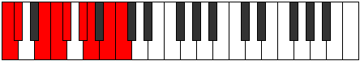 |
| [2933](https://ianring.com/musictheory/scales/2933) | [Dalyllic](ModeCNaturalDalyllic.md) | C | C, D, E, F, F#, G#, A, B, C |  |
| [2933](https://ianring.com/musictheory/scales/2933) | [Dalyllic](ModeDNaturalDalyllic.md) | D | D, E, F#, G, G#, A#, B, C#, D |  |
| [2935](https://ianring.com/musictheory/scales/2935) | [Modygic](ModeCNaturalModygic.md) | C | C, C#, D, E, F, F#, G#, A, B, C |  |
| [2935](https://ianring.com/musictheory/scales/2935) | [Modygic](ModeGNaturalModygic.md) | G | G, G#, A, B, C, C#, D#, E, F#, G |  |
| [2935](https://ianring.com/musictheory/scales/2935) | [Modygic](ModeDNaturalModygic.md) | D | D, D#, E, F#, G, G#, A#, B, C#, D |  |
| [2937](https://ianring.com/musictheory/scales/2937) | [Aeolathyllic](ModeCNaturalAeolathyllic.md) | C | C, D#, E, F, F#, G#, A, B, C |  |
| [2939](https://ianring.com/musictheory/scales/2939) | [Goptygic](ModeCNaturalGoptygic.md) | C | C, C#, D#, E, F, F#, G#, A, B, C |  |
| [2939](https://ianring.com/musictheory/scales/2939) | [Goptygic](ModeDSharpGoptygic.md) | D# | D#, E, F#, G, G#, A, B, C, D, D# |  |
| [2939](https://ianring.com/musictheory/scales/2939) | [Goptygic](ModeEFlatGoptygic.md) | Eb | Eb, E, Gb, G, Ab, A, B, C, D, Eb |  |
| [2939](https://ianring.com/musictheory/scales/2939) | [Goptygic](ModeGNaturalGoptygic.md) | G | G, G#, A#, B, C, C#, D#, E, F#, G |  |
| [2939](https://ianring.com/musictheory/scales/2939) | [Goptygic](ModeFNaturalGoptygic.md) | F | F, F#, G#, A, A#, B, C#, D, E, F |  |
| [2941](https://ianring.com/musictheory/scales/2941) | [Laptygic](ModeCNaturalLaptygic.md) | C | C, D, D#, E, F, F#, G#, A, B, C |  |
| [2941](https://ianring.com/musictheory/scales/2941) | [Laptygic](ModeDNaturalLaptygic.md) | D | D, E, F, F#, G, G#, A#, B, C#, D |  |
| [2943](https://ianring.com/musictheory/scales/2943) | [Dathyllian](ModeCNaturalDathyllian.md) | C | C, C#, D, D#, E, F, F#, G#, A, B, C |  |
| [2943](https://ianring.com/musictheory/scales/2943) | [Dathyllian](ModeDSharpDathyllian.md) | D# | D#, E, F, F#, G, G#, A, B, C, D, D# |  |
| [2943](https://ianring.com/musictheory/scales/2943) | [Dathyllian](ModeEFlatDathyllian.md) | Eb | Eb, E, F, Gb, G, Ab, A, B, C, D, Eb |  |
| [2943](https://ianring.com/musictheory/scales/2943) | [Dathyllian](ModeDNaturalDathyllian.md) | D | D, D#, E, F, F#, G, G#, A#, B, C#, D |  |
| [2943](https://ianring.com/musictheory/scales/2943) | [Dathyllian](ModeGNaturalDathyllian.md) | G | G, G#, A, A#, B, C, C#, D#, E, F#, G |  |
| [2943](https://ianring.com/musictheory/scales/2943) | [Dathyllian](ModeFNaturalDathyllian.md) | F | F, F#, G, G#, A, A#, B, C#, D, E, F |  |
| [2957](https://ianring.com/musictheory/scales/2957) | [Thygian](ModeANaturalThygian.md) | A | A, B, C, D##, E#, F#, G#, A |  |
| [2959](https://ianring.com/musictheory/scales/2959) | [Dygyllic](ModeANaturalDygyllic.md) | A | A, A#, B, C, E, F, F#, G#, A |  |
| [2963](https://ianring.com/musictheory/scales/2963) | [Bygian](ModeGNaturalBygian.md) | G | G, Ab, B, C##, D#, E, F#, G |  |
| [2965](https://ianring.com/musictheory/scales/2965) | [Darian](ModeENaturalDarian.md) | E | E, F#, G#, A##, B#, C#, D#, E |  |
| [2965](https://ianring.com/musictheory/scales/2965) | [Darian](ModeANaturalDarian.md) | A | A, B, C#, D##, E#, F#, G#, A |  |
| [2967](https://ianring.com/musictheory/scales/2967) | [Madyllic](ModeENaturalMadyllic.md) | E | E, F, F#, G#, B, C, C#, D#, E |  |
| [2967](https://ianring.com/musictheory/scales/2967) | [Madyllic](ModeGNaturalMadyllic.md) | G | G, G#, A, B, D, D#, E, F#, G |  |
| [2967](https://ianring.com/musictheory/scales/2967) | [Madyllic](ModeANaturalMadyllic.md) | A | A, A#, B, C#, E, F, F#, G#, A |  |
| [2971](https://ianring.com/musictheory/scales/2971) | [Aeolynyllic](ModeGNaturalAeolynyllic.md) | G | G, G#, A#, B, D, D#, E, F#, G |  |
| [2973](https://ianring.com/musictheory/scales/2973) | [Panyllic](ModeENaturalPanyllic.md) | E | E, F#, G, G#, B, C, C#, D#, E |  |
| [2973](https://ianring.com/musictheory/scales/2973) | [Panyllic](ModeANaturalPanyllic.md) | A | A, B, C, C#, E, F, F#, G#, A |  |
| [2975](https://ianring.com/musictheory/scales/2975) | [Gaptygic](ModeENaturalGaptygic.md) | E | E, F, F#, G, G#, B, C, C#, D#, E |  |
| [2975](https://ianring.com/musictheory/scales/2975) | [Gaptygic](ModeANaturalGaptygic.md) | A | A, A#, B, C, C#, E, F, F#, G#, A |  |
| [2975](https://ianring.com/musictheory/scales/2975) | [Gaptygic](ModeGNaturalGaptygic.md) | G | G, G#, A, A#, B, D, D#, E, F#, G |  |
| [2979](https://ianring.com/musictheory/scales/2979) | [Gyptian](ModeBNaturalGyptian.md) | B | B, C, D##, E##, F##, G#, A#, B |  |
| [2981](https://ianring.com/musictheory/scales/2981) | [Ionolian](ModeANaturalIonolian.md) | A | A, B, C##, D##, E#, F#, G#, A |  |
| [2981](https://ianring.com/musictheory/scales/2981) | [Ionolian](ModeBNaturalIonolian.md) | B | B, C#, D##, E##, F##, G#, A#, B | 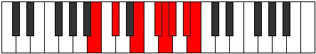 |
| [2983](https://ianring.com/musictheory/scales/2983) | [Zythyllic](ModeBNaturalZythyllic.md) | B | B, C, C#, E, F#, G, G#, A#, B |  |
| [2983](https://ianring.com/musictheory/scales/2983) | [Zythyllic](ModeANaturalZythyllic.md) | A | A, A#, B, D, E, F, F#, G#, A |  |
| [2985](https://ianring.com/musictheory/scales/2985) | [Epacrian](ModeBNaturalEpacrian.md) | B | B, C##, D##, E##, F##, G#, A#, B |  |
| [2987](https://ianring.com/musictheory/scales/2987) | [Thanyllic](ModeDSharpThanyllic.md) | D# | D#, E, F#, G#, A#, B, C, D, D# |  |
| [2987](https://ianring.com/musictheory/scales/2987) | [Thanyllic](ModeEFlatThanyllic.md) | Eb | Eb, E, Gb, Ab, Bb, B, C, D, Eb |  |
| [2987](https://ianring.com/musictheory/scales/2987) | [Thanyllic](ModeBNaturalThanyllic.md) | B | B, C, D, E, F#, G, G#, A#, B |  |
| [2989](https://ianring.com/musictheory/scales/2989) | [Ionacryllic](ModeANaturalIonacryllic.md) | A | A, B, C, D, E, F, F#, G#, A |  |
| [2989](https://ianring.com/musictheory/scales/2989) | [Ionacryllic](ModeBNaturalIonacryllic.md) | B | B, C#, D, E, F#, G, G#, A#, B |  |
| [2991](https://ianring.com/musictheory/scales/2991) | [Zanygic](ModeDSharpZanygic.md) | D# | D#, E, F, F#, G#, A#, B, C, D, D# |  |
| [2991](https://ianring.com/musictheory/scales/2991) | [Zanygic](ModeEFlatZanygic.md) | Eb | Eb, E, F, Gb, Ab, Bb, B, C, D, Eb |  |
| [2991](https://ianring.com/musictheory/scales/2991) | [Zanygic](ModeBNaturalZanygic.md) | B | B, C, C#, D, E, F#, G, G#, A#, B |  |
| [2991](https://ianring.com/musictheory/scales/2991) | [Zanygic](ModeANaturalZanygic.md) | A | A, A#, B, C, D, E, F, F#, G#, A |  |
| [2993](https://ianring.com/musictheory/scales/2993) | [Stythian](ModeBNaturalStythian.md) | B | B, C###, D##, E##, F##, G#, A#, B |  |
| [2995](https://ianring.com/musictheory/scales/2995) | [Sanyllic](ModeGNaturalSanyllic.md) | G | G, G#, B, C, D, D#, E, F#, G |  |
| [2995](https://ianring.com/musictheory/scales/2995) | [Sanyllic](ModeBNaturalSanyllic.md) | B | B, C, D#, E, F#, G, G#, A#, B |  |
| [2997](https://ianring.com/musictheory/scales/2997) | [Ionoptyllic](ModeENaturalIonoptyllic.md) | E | E, F#, G#, A, B, C, C#, D#, E |  |
| [2997](https://ianring.com/musictheory/scales/2997) | [Ionoptyllic](ModeANaturalIonoptyllic.md) | A | A, B, C#, D, E, F, F#, G#, A |  |
| [2997](https://ianring.com/musictheory/scales/2997) | [Ionoptyllic](ModeBNaturalIonoptyllic.md) | B | B, C#, D#, E, F#, G, G#, A#, B |  |
| [2999](https://ianring.com/musictheory/scales/2999) | [Zyrygic](ModeENaturalZyrygic.md) | E | E, F, F#, G#, A, B, C, C#, D#, E |  |
| [2999](https://ianring.com/musictheory/scales/2999) | [Zyrygic](ModeGNaturalZyrygic.md) | G | G, G#, A, B, C, D, D#, E, F#, G |  |
| [2999](https://ianring.com/musictheory/scales/2999) | [Zyrygic](ModeBNaturalZyrygic.md) | B | B, C, C#, D#, E, F#, G, G#, A#, B |  |
| [2999](https://ianring.com/musictheory/scales/2999) | [Zyrygic](ModeANaturalZyrygic.md) | A | A, A#, B, C#, D, E, F, F#, G#, A |  |
| [3001](https://ianring.com/musictheory/scales/3001) | [Lonyllic](ModeBNaturalLonyllic.md) | B | B, D, D#, E, F#, G, G#, A#, B |  |
| [3003](https://ianring.com/musictheory/scales/3003) | [Zydygic](ModeDSharpZydygic.md) | D# | D#, E, F#, G, G#, A#, B, C, D, D# |  |
| [3003](https://ianring.com/musictheory/scales/3003) | [Zydygic](ModeEFlatZydygic.md) | Eb | Eb, E, Gb, G, Ab, Bb, B, C, D, Eb |  |
| [3003](https://ianring.com/musictheory/scales/3003) | [Zydygic](ModeGNaturalZydygic.md) | G | G, G#, A#, B, C, D, D#, E, F#, G |  |
| [3003](https://ianring.com/musictheory/scales/3003) | [Zydygic](ModeBNaturalZydygic.md) | B | B, C, D, D#, E, F#, G, G#, A#, B |  |
| [3005](https://ianring.com/musictheory/scales/3005) | [Gycrygic](ModeANaturalGycrygic.md) | A | A, B, C, C#, D, E, F, F#, G#, A |  |
| [3005](https://ianring.com/musictheory/scales/3005) | [Gycrygic](ModeENaturalGycrygic.md) | E | E, F#, G, G#, A, B, C, C#, D#, E |  |
| [3005](https://ianring.com/musictheory/scales/3005) | [Gycrygic](ModeBNaturalGycrygic.md) | B | B, C#, D, D#, E, F#, G, G#, A#, B |  |
| [3007](https://ianring.com/musictheory/scales/3007) | [Zyryllian](ModeENaturalZyryllian.md) | E | E, F, F#, G, G#, A, B, C, C#, D#, E |  |
| [3007](https://ianring.com/musictheory/scales/3007) | [Zyryllian](ModeBNaturalZyryllian.md) | B | B, C, C#, D, D#, E, F#, G, G#, A#, B |  |
| [3007](https://ianring.com/musictheory/scales/3007) | [Zyryllian](ModeDSharpZyryllian.md) | D# | D#, E, F, F#, G, G#, A#, B, C, D, D# |  |
| [3007](https://ianring.com/musictheory/scales/3007) | [Zyryllian](ModeEFlatZyryllian.md) | Eb | Eb, E, F, Gb, G, Ab, Bb, B, C, D, Eb |  |
| [3007](https://ianring.com/musictheory/scales/3007) | [Zyryllian](ModeANaturalZyryllian.md) | A | A, A#, B, C, C#, D, E, F, F#, G#, A |  |
| [3007](https://ianring.com/musictheory/scales/3007) | [Zyryllian](ModeGNaturalZyryllian.md) | G | G, G#, A, A#, B, C, D, D#, E, F#, G |  |
| [3013](https://ianring.com/musictheory/scales/3013) | [Thynian](ModeANaturalThynian.md) | A | A, B, C###, D##, E#, F#, G#, A |  |
| [3015](https://ianring.com/musictheory/scales/3015) | [Laptyllic](ModeANaturalLaptyllic.md) | A | A, A#, B, D#, E, F, F#, G#, A |  |
| [3019](https://ianring.com/musictheory/scales/3019) | [Mydyllic](ModeFNaturalMydyllic.md) | F | F, F#, G#, B, C, C#, D, E, F |  |
| [3021](https://ianring.com/musictheory/scales/3021) | [Gyptyllic](ModeANaturalGyptyllic.md) | A | A, B, C, D#, E, F, F#, G#, A |  |
| [3023](https://ianring.com/musictheory/scales/3023) | [Aeracrygic](ModeFNaturalAeracrygic.md) | F | F, F#, G, G#, B, C, C#, D, E, F |  |
| [3023](https://ianring.com/musictheory/scales/3023) | [Aeracrygic](ModeANaturalAeracrygic.md) | A | A, A#, B, C, D#, E, F, F#, G#, A |  |
| [3025](https://ianring.com/musictheory/scales/3025) | [Epycrian](ModeCNaturalEpycrian.md) | C | C, D##, E##, F##, G#, A, B, C |  |
| [3027](https://ianring.com/musictheory/scales/3027) | [Rythyllic](ModeGNaturalRythyllic.md) | G | G, G#, B, C#, D, D#, E, F#, G |  |
| [3027](https://ianring.com/musictheory/scales/3027) | [Rythyllic](ModeCNaturalRythyllic.md) | C | C, C#, E, F#, G, G#, A, B, C |  |
| [3029](https://ianring.com/musictheory/scales/3029) | [Ionocryllic](ModeANaturalIonocryllic.md) | A | A, B, C#, D#, E, F, F#, G#, A |  |
| [3029](https://ianring.com/musictheory/scales/3029) | [Ionocryllic](ModeCNaturalIonocryllic.md) | C | C, D, E, F#, G, G#, A, B, C |  |
| [3029](https://ianring.com/musictheory/scales/3029) | [Ionocryllic](ModeENaturalIonocryllic.md) | E | E, F#, G#, A#, B, C, C#, D#, E |  |
| [3029](https://ianring.com/musictheory/scales/3029) | [Ionocryllic](ModeDNaturalIonocryllic.md) | D | D, E, F#, G#, A, A#, B, C#, D |  |
| [3031](https://ianring.com/musictheory/scales/3031) | [Epithygic](ModeCNaturalEpithygic.md) | C | C, C#, D, E, F#, G, G#, A, B, C |  |
| [3031](https://ianring.com/musictheory/scales/3031) | [Epithygic](ModeGNaturalEpithygic.md) | G | G, G#, A, B, C#, D, D#, E, F#, G |  |
| [3031](https://ianring.com/musictheory/scales/3031) | [Epithygic](ModeENaturalEpithygic.md) | E | E, F, F#, G#, A#, B, C, C#, D#, E |  |
| [3031](https://ianring.com/musictheory/scales/3031) | [Epithygic](ModeDNaturalEpithygic.md) | D | D, D#, E, F#, G#, A, A#, B, C#, D |  |
| [3031](https://ianring.com/musictheory/scales/3031) | [Epithygic](ModeANaturalEpithygic.md) | A | A, A#, B, C#, D#, E, F, F#, G#, A |  |
| [3033](https://ianring.com/musictheory/scales/3033) | [Doptyllic](ModeCNaturalDoptyllic.md) | C | C, D#, E, F#, G, G#, A, B, C |  |
| [3035](https://ianring.com/musictheory/scales/3035) | [Gocrygic](ModeFNaturalGocrygic.md) | F | F, F#, G#, A, B, C, C#, D, E, F |  |
| [3035](https://ianring.com/musictheory/scales/3035) | [Gocrygic](ModeCNaturalGocrygic.md) | C | C, C#, D#, E, F#, G, G#, A, B, C |  |
| [3035](https://ianring.com/musictheory/scales/3035) | [Gocrygic](ModeGNaturalGocrygic.md) | G | G, G#, A#, B, C#, D, D#, E, F#, G |  |
| [3037](https://ianring.com/musictheory/scales/3037) | [Staptygic](ModeANaturalStaptygic.md) | A | A, B, C, C#, D#, E, F, F#, G#, A |  |
| [3037](https://ianring.com/musictheory/scales/3037) | [Staptygic](ModeCNaturalStaptygic.md) | C | C, D, D#, E, F#, G, G#, A, B, C |  |
| [3037](https://ianring.com/musictheory/scales/3037) | [Staptygic](ModeENaturalStaptygic.md) | E | E, F#, G, G#, A#, B, C, C#, D#, E |  |
| [3037](https://ianring.com/musictheory/scales/3037) | [Staptygic](ModeDNaturalStaptygic.md) | D | D, E, F, F#, G#, A, A#, B, C#, D |  |
| [3039](https://ianring.com/musictheory/scales/3039) | [Godyllian](ModeCNaturalGodyllian.md) | C | C, C#, D, D#, E, F#, G, G#, A, B, C |  |
| [3039](https://ianring.com/musictheory/scales/3039) | [Godyllian](ModeFNaturalGodyllian.md) | F | F, F#, G, G#, A, B, C, C#, D, E, F |  |
| [3039](https://ianring.com/musictheory/scales/3039) | [Godyllian](ModeENaturalGodyllian.md) | E | E, F, F#, G, G#, A#, B, C, C#, D#, E |  |
| [3039](https://ianring.com/musictheory/scales/3039) | [Godyllian](ModeANaturalGodyllian.md) | A | A, A#, B, C, C#, D#, E, F, F#, G#, A |  |
| [3039](https://ianring.com/musictheory/scales/3039) | [Godyllian](ModeDNaturalGodyllian.md) | D | D, D#, E, F, F#, G#, A, A#, B, C#, D |  |
| [3039](https://ianring.com/musictheory/scales/3039) | [Godyllian](ModeGNaturalGodyllian.md) | G | G, G#, A, A#, B, C#, D, D#, E, F#, G |  |
| [3043](https://ianring.com/musictheory/scales/3043) | [Ionayllic](ModeBNaturalIonayllic.md) | B | B, C, E, F, F#, G, G#, A#, B |  |
| [3045](https://ianring.com/musictheory/scales/3045) | [Raptyllic](ModeANaturalRaptyllic.md) | A | A, B, D, D#, E, F, F#, G#, A |  |
| [3045](https://ianring.com/musictheory/scales/3045) | [Raptyllic](ModeBNaturalRaptyllic.md) | B | B, C#, E, F, F#, G, G#, A#, B |  |
| [3047](https://ianring.com/musictheory/scales/3047) | [Panygic](ModeBNaturalPanygic.md) | B | B, C, C#, E, F, F#, G, G#, A#, B |  |
| [3047](https://ianring.com/musictheory/scales/3047) | [Panygic](ModeANaturalPanygic.md) | A | A, A#, B, D, D#, E, F, F#, G#, A |  |
| [3049](https://ianring.com/musictheory/scales/3049) | [Aeronyllic](ModeBNaturalAeronyllic.md) | B | B, D, E, F, F#, G, G#, A#, B |  |
| [3051](https://ianring.com/musictheory/scales/3051) | [Stalygic](ModeFNaturalStalygic.md) | F | F, F#, G#, A#, B, C, C#, D, E, F |  |
| [3051](https://ianring.com/musictheory/scales/3051) | [Stalygic](ModeBNaturalStalygic.md) | B | B, C, D, E, F, F#, G, G#, A#, B |  |
| [3051](https://ianring.com/musictheory/scales/3051) | [Stalygic](ModeDSharpStalygic.md) | D# | D#, E, F#, G#, A, A#, B, C, D, D# |  |
| [3051](https://ianring.com/musictheory/scales/3051) | [Stalygic](ModeEFlatStalygic.md) | Eb | Eb, E, Gb, Ab, A, Bb, B, C, D, Eb |  |
| [3053](https://ianring.com/musictheory/scales/3053) | [Zycrygic](ModeANaturalZycrygic.md) | A | A, B, C, D, D#, E, F, F#, G#, A |  |
| [3053](https://ianring.com/musictheory/scales/3053) | [Zycrygic](ModeBNaturalZycrygic.md) | B | B, C#, D, E, F, F#, G, G#, A#, B | 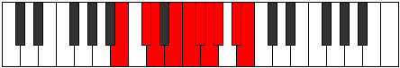 |
| [3055](https://ianring.com/musictheory/scales/3055) | [Lyryllian](ModeFNaturalLyryllian.md) | F | F, F#, G, G#, A#, B, C, C#, D, E, F |  |
| [3055](https://ianring.com/musictheory/scales/3055) | [Lyryllian](ModeBNaturalLyryllian.md) | B | B, C, C#, D, E, F, F#, G, G#, A#, B |  |
| [3055](https://ianring.com/musictheory/scales/3055) | [Lyryllian](ModeDSharpLyryllian.md) | D# | D#, E, F, F#, G#, A, A#, B, C, D, D# |  |
| [3055](https://ianring.com/musictheory/scales/3055) | [Lyryllian](ModeEFlatLyryllian.md) | Eb | Eb, E, F, Gb, Ab, A, Bb, B, C, D, Eb |  |
| [3055](https://ianring.com/musictheory/scales/3055) | [Lyryllian](ModeANaturalLyryllian.md) | A | A, A#, B, C, D, D#, E, F, F#, G#, A |  |
| [3057](https://ianring.com/musictheory/scales/3057) | [Phroryllic](ModeCNaturalPhroryllic.md) | C | C, E, F, F#, G, G#, A, B, C |  |
| [3057](https://ianring.com/musictheory/scales/3057) | [Phroryllic](ModeBNaturalPhroryllic.md) | B | B, D#, E, F, F#, G, G#, A#, B |  |
| [3059](https://ianring.com/musictheory/scales/3059) | [Madygic](ModeGNaturalMadygic.md) | G | G, G#, B, C, C#, D, D#, E, F#, G |  |
| [3059](https://ianring.com/musictheory/scales/3059) | [Madygic](ModeCNaturalMadygic.md) | C | C, C#, E, F, F#, G, G#, A, B, C |  |
| [3059](https://ianring.com/musictheory/scales/3059) | [Madygic](ModeBNaturalMadygic.md) | B | B, C, D#, E, F, F#, G, G#, A#, B |  |
| [3061](https://ianring.com/musictheory/scales/3061) | [Apinygic](ModeANaturalApinygic.md) | A | A, B, C#, D, D#, E, F, F#, G#, A |  |
| [3061](https://ianring.com/musictheory/scales/3061) | [Apinygic](ModeCNaturalApinygic.md) | C | C, D, E, F, F#, G, G#, A, B, C |  |
| [3061](https://ianring.com/musictheory/scales/3061) | [Apinygic](ModeBNaturalApinygic.md) | B | B, C#, D#, E, F, F#, G, G#, A#, B |  |
| [3061](https://ianring.com/musictheory/scales/3061) | [Apinygic](ModeENaturalApinygic.md) | E | E, F#, G#, A, A#, B, C, C#, D#, E |  |
| [3061](https://ianring.com/musictheory/scales/3061) | [Apinygic](ModeDNaturalApinygic.md) | D | D, E, F#, G, G#, A, A#, B, C#, D |  |
| [3063](https://ianring.com/musictheory/scales/3063) | [Solyllian](ModeGNaturalSolyllian.md) | G | G, G#, A, B, C, C#, D, D#, E, F#, G |  |
| [3063](https://ianring.com/musictheory/scales/3063) | [Solyllian](ModeCNaturalSolyllian.md) | C | C, C#, D, E, F, F#, G, G#, A, B, C |  |
| [3063](https://ianring.com/musictheory/scales/3063) | [Solyllian](ModeBNaturalSolyllian.md) | B | B, C, C#, D#, E, F, F#, G, G#, A#, B |  |
| [3063](https://ianring.com/musictheory/scales/3063) | [Solyllian](ModeENaturalSolyllian.md) | E | E, F, F#, G#, A, A#, B, C, C#, D#, E |  |
| [3063](https://ianring.com/musictheory/scales/3063) | [Solyllian](ModeANaturalSolyllian.md) | A | A, A#, B, C#, D, D#, E, F, F#, G#, A |  |
| [3063](https://ianring.com/musictheory/scales/3063) | [Solyllian](ModeDNaturalSolyllian.md) | D | D, D#, E, F#, G, G#, A, A#, B, C#, D |  |
| [3065](https://ianring.com/musictheory/scales/3065) | [Zothygic](ModeCNaturalZothygic.md) | C | C, D#, E, F, F#, G, G#, A, B, C |  |
| [3065](https://ianring.com/musictheory/scales/3065) | [Zothygic](ModeBNaturalZothygic.md) | B | B, D, D#, E, F, F#, G, G#, A#, B |  |
| [3067](https://ianring.com/musictheory/scales/3067) | [Goptyllian](ModeCNaturalGoptyllian.md) | C | C, C#, D#, E, F, F#, G, G#, A, B, C |  |
| [3067](https://ianring.com/musictheory/scales/3067) | [Goptyllian](ModeGNaturalGoptyllian.md) | G | G, G#, A#, B, C, C#, D, D#, E, F#, G |  |
| [3067](https://ianring.com/musictheory/scales/3067) | [Goptyllian](ModeBNaturalGoptyllian.md) | B | B, C, D, D#, E, F, F#, G, G#, A#, B |  |
| [3067](https://ianring.com/musictheory/scales/3067) | [Goptyllian](ModeFNaturalGoptyllian.md) | F | F, F#, G#, A, A#, B, C, C#, D, E, F |  |
| [3067](https://ianring.com/musictheory/scales/3067) | [Goptyllian](ModeDSharpGoptyllian.md) | D# | D#, E, F#, G, G#, A, A#, B, C, D, D# |  |
| [3067](https://ianring.com/musictheory/scales/3067) | [Goptyllian](ModeEFlatGoptyllian.md) | Eb | Eb, E, Gb, G, Ab, A, Bb, B, C, D, Eb |  |
| [3069](https://ianring.com/musictheory/scales/3069) | [Bacryllian](ModeANaturalBacryllian.md) | A | A, B, C, C#, D, D#, E, F, F#, G#, A |  |
| [3069](https://ianring.com/musictheory/scales/3069) | [Bacryllian](ModeCNaturalBacryllian.md) | C | C, D, D#, E, F, F#, G, G#, A, B, C |  |
| [3069](https://ianring.com/musictheory/scales/3069) | [Bacryllian](ModeBNaturalBacryllian.md) | B | B, C#, D, D#, E, F, F#, G, G#, A#, B |  |
| [3069](https://ianring.com/musictheory/scales/3069) | [Bacryllian](ModeENaturalBacryllian.md) | E | E, F#, G, G#, A, A#, B, C, C#, D#, E |  |
| [3069](https://ianring.com/musictheory/scales/3069) | [Bacryllian](ModeDNaturalBacryllian.md) | D | D, E, F, F#, G, G#, A, A#, B, C#, D |  |
| [3071](https://ianring.com/musictheory/scales/3071) | [Solatic](ModeCNaturalSolatic.md) | C | C, C#, D, D#, E, F, F#, G, G#, A, B, C |  |
| [3071](https://ianring.com/musictheory/scales/3071) | [Solatic](ModeBNaturalSolatic.md) | B | B, C, C#, D, D#, E, F, F#, G, G#, A#, B |  |
| [3071](https://ianring.com/musictheory/scales/3071) | [Solatic](ModeANaturalSolatic.md) | A | A, A#, B, C, C#, D, D#, E, F, F#, G#, A |  |
| [3071](https://ianring.com/musictheory/scales/3071) | [Solatic](ModeGNaturalSolatic.md) | G | G, G#, A, A#, B, C, C#, D, D#, E, F#, G |  |
| [3071](https://ianring.com/musictheory/scales/3071) | [Solatic](ModeFNaturalSolatic.md) | F | F, F#, G, G#, A, A#, B, C, C#, D, E, F |  |
| [3071](https://ianring.com/musictheory/scales/3071) | [Solatic](ModeENaturalSolatic.md) | E | E, F, F#, G, G#, A, A#, B, C, C#, D#, E |  |
| [3071](https://ianring.com/musictheory/scales/3071) | [Solatic](ModeDSharpSolatic.md) | D# | D#, E, F, F#, G, G#, A, A#, B, C, D, D# |  |
| [3071](https://ianring.com/musictheory/scales/3071) | [Solatic](ModeEFlatSolatic.md) | Eb | Eb, E, F, Gb, G, Ab, A, Bb, B, C, D, Eb |  |
| [3071](https://ianring.com/musictheory/scales/3071) | [Solatic](ModeDNaturalSolatic.md) | D | D, D#, E, F, F#, G, G#, A, A#, B, C#, D |  |
| [3147](https://ianring.com/musictheory/scales/3147) | [Ryrimic](ModeFNaturalRyrimic.md) | F | F, Gb, Ab, B, C###, D##, F |  |
| [3151](https://ianring.com/musictheory/scales/3151) | [Pacrian](ModeFNaturalPacrian.md) | F | F, Gb, Abb, Bbbb, Cb, D#, E, F |  |
| [3163](https://ianring.com/musictheory/scales/3163) | [Rogian](ModeFNaturalRogian.md) | F | F, Gb, Ab, Bbb, Cb, D#, E, F |  |
| [3167](https://ianring.com/musictheory/scales/3167) | [Thynyllic](ModeFNaturalThynyllic.md) | F | F, F#, G, G#, A, B, D#, E, F |  |
| [3173](https://ianring.com/musictheory/scales/3173) | [Zarimic](ModeFSharpZarimic.md) | F# | F#, G#, A##, B#, D##, E#, F# |  |
| [3173](https://ianring.com/musictheory/scales/3173) | [Zarimic](ModeGFlatZarimic.md) | Gb | Gb, Ab, B, C, D##, E#, Gb |  |
| [3175](https://ianring.com/musictheory/scales/3175) | [Eponian](ModeFSharpEponian.md) | F# | F#, G, Ab, B, C, D##, E#, F# |  |
| [3175](https://ianring.com/musictheory/scales/3175) | [Eponian](ModeGFlatEponian.md) | Gb | Gb, Abb, Bbbb, Cb, Dbb, E, F, Gb |  |
| [3179](https://ianring.com/musictheory/scales/3179) | [Daptian](ModeFNaturalDaptian.md) | F | F, Gb, Ab, Bb, Cb, D#, E, F |  |
| [3181](https://ianring.com/musictheory/scales/3181) | [Rolian](ModeFSharpRolian.md) | F# | F#, G#, A, B, C, D##, E#, F# |  |
| [3181](https://ianring.com/musictheory/scales/3181) | [Rolian](ModeGFlatRolian.md) | Gb | Gb, Ab, Bbb, Cb, Dbb, E, F, Gb |  |
| [3183](https://ianring.com/musictheory/scales/3183) | [Mixonyllic](ModeFSharpMixonyllic.md) | F# | F#, G, G#, A, B, C, E, F, F# |  |
| [3183](https://ianring.com/musictheory/scales/3183) | [Mixonyllic](ModeGFlatMixonyllic.md) | Gb | Gb, G, Ab, A, B, C, E, F, Gb |  |
| [3183](https://ianring.com/musictheory/scales/3183) | [Mixonyllic](ModeFNaturalMixonyllic.md) | F | F, F#, G, G#, A#, B, D#, E, F | 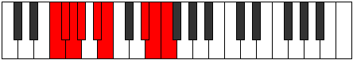 |
| [3189](https://ianring.com/musictheory/scales/3189) | [Aeolonian](ModeFSharpAeolonian.md) | F# | F#, G#, A#, B, C, D##, E#, F# | 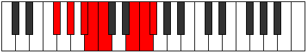 |
| [3189](https://ianring.com/musictheory/scales/3189) | [Aeolonian](ModeGFlatAeolonian.md) | Gb | Gb, Ab, Bb, Cb, Dbb, E, F, Gb |  |
| [3191](https://ianring.com/musictheory/scales/3191) | [Bynyllic](ModeFSharpBynyllic.md) | F# | F#, G, G#, A#, B, C, E, F, F# |  |
| [3191](https://ianring.com/musictheory/scales/3191) | [Bynyllic](ModeGFlatBynyllic.md) | Gb | Gb, G, Ab, Bb, B, C, E, F, Gb |  |
| [3195](https://ianring.com/musictheory/scales/3195) | [Raryllic](ModeFNaturalRaryllic.md) | F | F, F#, G#, A, A#, B, D#, E, F |  |
| [3197](https://ianring.com/musictheory/scales/3197) | [Gylyllic](ModeFSharpGylyllic.md) | F# | F#, G#, A, A#, B, C, E, F, F# |  |
| [3197](https://ianring.com/musictheory/scales/3197) | [Gylyllic](ModeGFlatGylyllic.md) | Gb | Gb, Ab, A, Bb, B, C, E, F, Gb |  |
| [3199](https://ianring.com/musictheory/scales/3199) | [Thaptygic](ModeFSharpThaptygic.md) | F# | F#, G, G#, A, A#, B, C, E, F, F# |  |
| [3199](https://ianring.com/musictheory/scales/3199) | [Thaptygic](ModeGFlatThaptygic.md) | Gb | Gb, G, Ab, A, Bb, B, C, E, F, Gb |  |
| [3199](https://ianring.com/musictheory/scales/3199) | [Thaptygic](ModeFNaturalThaptygic.md) | F | F, F#, G, G#, A, A#, B, D#, E, F |  |
| [3221](https://ianring.com/musictheory/scales/3221) | [Bycrimic](ModeENaturalBycrimic.md) | E | E, F#, G#, A##, B###, C###, E |  |
| [3223](https://ianring.com/musictheory/scales/3223) | [Thyphian](ModeENaturalThyphian.md) | E | E, F, Gb, Ab, B, C##, D#, E |  |
| [3229](https://ianring.com/musictheory/scales/3229) | [Aeolaptian](ModeENaturalAeolaptian.md) | E | E, F#, G, Ab, B, C##, D#, E | 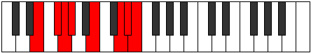 |
| [3231](https://ianring.com/musictheory/scales/3231) | [Kataptyllic](ModeENaturalKataptyllic.md) | E | E, F, F#, G, G#, B, D, D#, E |  |
| [3237](https://ianring.com/musictheory/scales/3237) | [Thatimic](ModeFSharpThatimic.md) | F# | F#, G#, A##, B##, D##, E#, F# |  |
| [3237](https://ianring.com/musictheory/scales/3237) | [Thatimic](ModeGFlatThatimic.md) | Gb | Gb, Ab, B, C#, D##, E#, Gb |  |
| [3239](https://ianring.com/musictheory/scales/3239) | [Epythian](ModeFSharpEpythian.md) | F# | F#, G, Ab, B, C#, D##, E#, F# |  |
| [3239](https://ianring.com/musictheory/scales/3239) | [Epythian](ModeGFlatEpythian.md) | Gb | Gb, Abb, Bbbb, Cb, Db, E, F, Gb |  |
| [3241](https://ianring.com/musictheory/scales/3241) | [Dalimic](ModeDFlatDalimic.md) | Db | Db, E, F#, G#, A##, B#, Db |  |
| [3243](https://ianring.com/musictheory/scales/3243) | [Staptian](ModeCSharpStaptian.md) | C# | C#, D, E, F#, G#, A##, B#, C# |  |
| [3243](https://ianring.com/musictheory/scales/3243) | [Staptian](ModeDFlatStaptian.md) | Db | Db, Ebb, Fb, Gb, Ab, B, C, Db |  |
| [3245](https://ianring.com/musictheory/scales/3245) | [Aeracrian](ModeCSharpAeracrian.md) | C# | C#, D#, E, F#, G#, A##, B#, C# |  |
| [3245](https://ianring.com/musictheory/scales/3245) | [Aeracrian](ModeDFlatAeracrian.md) | Db | Db, Eb, Fb, Gb, Ab, B, C, Db |  |
| [3245](https://ianring.com/musictheory/scales/3245) | [Aeracrian](ModeFSharpAeracrian.md) | F# | F#, G#, A, B, C#, D##, E#, F# |  |
| [3245](https://ianring.com/musictheory/scales/3245) | [Aeracrian](ModeGFlatAeracrian.md) | Gb | Gb, Ab, Bbb, Cb, Db, E, F, Gb |  |
| [3247](https://ianring.com/musictheory/scales/3247) | [Aeolonyllic](ModeCSharpAeolonyllic.md) | C# | C#, D, D#, E, F#, G#, B, C, C# |  |
| [3247](https://ianring.com/musictheory/scales/3247) | [Aeolonyllic](ModeDFlatAeolonyllic.md) | Db | Db, D, Eb, E, Gb, Ab, B, C, Db |  |
| [3247](https://ianring.com/musictheory/scales/3247) | [Aeolonyllic](ModeFSharpAeolonyllic.md) | F# | F#, G, G#, A, B, C#, E, F, F# |  |
| [3247](https://ianring.com/musictheory/scales/3247) | [Aeolonyllic](ModeGFlatAeolonyllic.md) | Gb | Gb, G, Ab, A, B, Db, E, F, Gb |  |
| [3253](https://ianring.com/musictheory/scales/3253) | [Gonian](ModeENaturalGonian.md) | E | E, F#, G#, A, B, C##, D#, E |  |
| [3253](https://ianring.com/musictheory/scales/3253) | [Gonian](ModeFSharpGonian.md) | F# | F#, G#, A#, B, C#, D##, E#, F# |  |
| [3253](https://ianring.com/musictheory/scales/3253) | [Gonian](ModeGFlatGonian.md) | Gb | Gb, Ab, Bb, Cb, Db, E, F, Gb |  |
| [3255](https://ianring.com/musictheory/scales/3255) | [Daryllic](ModeENaturalDaryllic.md) | E | E, F, F#, G#, A, B, D, D#, E |  |
| [3255](https://ianring.com/musictheory/scales/3255) | [Daryllic](ModeFSharpDaryllic.md) | F# | F#, G, G#, A#, B, C#, E, F, F# |  |
| [3255](https://ianring.com/musictheory/scales/3255) | [Daryllic](ModeGFlatDaryllic.md) | Gb | Gb, G, Ab, Bb, B, Db, E, F, Gb |  |
| [3257](https://ianring.com/musictheory/scales/3257) | [Ionacrian](ModeCSharpIonacrian.md) | C# | C#, D##, E#, F#, G#, A##, B#, C# |  |
| [3257](https://ianring.com/musictheory/scales/3257) | [Ionacrian](ModeDFlatIonacrian.md) | Db | Db, E, F, Gb, Ab, B, C, Db |  |
| [3259](https://ianring.com/musictheory/scales/3259) | [Loptyllic](ModeCSharpLoptyllic.md) | C# | C#, D, E, F, F#, G#, B, C, C# |  |
| [3259](https://ianring.com/musictheory/scales/3259) | [Loptyllic](ModeDFlatLoptyllic.md) | Db | Db, D, E, F, Gb, Ab, B, C, Db |  |
| [3261](https://ianring.com/musictheory/scales/3261) | [Dodyllic](ModeCSharpDodyllic.md) | C# | C#, D#, E, F, F#, G#, B, C, C# |  |
| [3261](https://ianring.com/musictheory/scales/3261) | [Dodyllic](ModeDFlatDodyllic.md) | Db | Db, Eb, E, F, Gb, Ab, B, C, Db |  |
| [3261](https://ianring.com/musictheory/scales/3261) | [Dodyllic](ModeENaturalDodyllic.md) | E | E, F#, G, G#, A, B, D, D#, E |  |
| [3261](https://ianring.com/musictheory/scales/3261) | [Dodyllic](ModeFSharpDodyllic.md) | F# | F#, G#, A, A#, B, C#, E, F, F# |  |
| [3261](https://ianring.com/musictheory/scales/3261) | [Dodyllic](ModeGFlatDodyllic.md) | Gb | Gb, Ab, A, Bb, B, Db, E, F, Gb |  |
| [3263](https://ianring.com/musictheory/scales/3263) | [Pyrygic](ModeCSharpPyrygic.md) | C# | C#, D, D#, E, F, F#, G#, B, C, C# |  |
| [3263](https://ianring.com/musictheory/scales/3263) | [Pyrygic](ModeDFlatPyrygic.md) | Db | Db, D, Eb, E, F, Gb, Ab, B, C, Db |  |
| [3263](https://ianring.com/musictheory/scales/3263) | [Pyrygic](ModeENaturalPyrygic.md) | E | E, F, F#, G, G#, A, B, D, D#, E |  |
| [3263](https://ianring.com/musictheory/scales/3263) | [Pyrygic](ModeFSharpPyrygic.md) | F# | F#, G, G#, A, A#, B, C#, E, F, F# |  |
| [3263](https://ianring.com/musictheory/scales/3263) | [Pyrygic](ModeGFlatPyrygic.md) | Gb | Gb, G, Ab, A, Bb, B, Db, E, F, Gb |  |
| [3275](https://ianring.com/musictheory/scales/3275) | [Katadian](ModeFNaturalKatadian.md) | F | F, Gb, Ab, B, C, D#, E, F |  |
| [3279](https://ianring.com/musictheory/scales/3279) | [Pythyllic](ModeFNaturalPythyllic.md) | F | F, F#, G, G#, B, C, D#, E, F |  |
| [3285](https://ianring.com/musictheory/scales/3285) | [Zagian](ModeENaturalZagian.md) | E | E, F#, G#, A#, B, C##, D#, E |  |
| [3287](https://ianring.com/musictheory/scales/3287) | [Phrathyllic](ModeENaturalPhrathyllic.md) | E | E, F, F#, G#, A#, B, D, D#, E |  |
| [3291](https://ianring.com/musictheory/scales/3291) | [Kodyllic](ModeFNaturalKodyllic.md) | F | F, F#, G#, A, B, C, D#, E, F |  |
| [3293](https://ianring.com/musictheory/scales/3293) | [Saryllic](ModeENaturalSaryllic.md) | E | E, F#, G, G#, A#, B, D, D#, E |  |
| [3295](https://ianring.com/musictheory/scales/3295) | [Phroptygic](ModeFNaturalPhroptygic.md) | F | F, F#, G, G#, A, B, C, D#, E, F |  |
| [3295](https://ianring.com/musictheory/scales/3295) | [Phroptygic](ModeENaturalPhroptygic.md) | E | E, F, F#, G, G#, A#, B, D, D#, E |  |
| [3301](https://ianring.com/musictheory/scales/3301) | [Phrynian](ModeFSharpPhrynian.md) | F# | F#, G#, A##, B#, C#, D##, E#, F# |  |
| [3301](https://ianring.com/musictheory/scales/3301) | [Phrynian](ModeGFlatPhrynian.md) | Gb | Gb, Ab, B, C, Db, E, F, Gb |  |
| [3303](https://ianring.com/musictheory/scales/3303) | [Soptyllic](ModeFSharpSoptyllic.md) | F# | F#, G, G#, B, C, C#, E, F, F# |  |
| [3303](https://ianring.com/musictheory/scales/3303) | [Soptyllic](ModeGFlatSoptyllic.md) | Gb | Gb, G, Ab, B, C, Db, E, F, Gb |  |
| [3305](https://ianring.com/musictheory/scales/3305) | [Epathian](ModeCSharpEpathian.md) | C# | C#, D##, E##, F##, G#, A##, B#, C# |  |
| [3305](https://ianring.com/musictheory/scales/3305) | [Epathian](ModeDFlatEpathian.md) | Db | Db, E, F#, G, Ab, B, C, Db |  |
| [3307](https://ianring.com/musictheory/scales/3307) | [Boptyllic](ModeCSharpBoptyllic.md) | C# | C#, D, E, F#, G, G#, B, C, C# |  |
| [3307](https://ianring.com/musictheory/scales/3307) | [Boptyllic](ModeDFlatBoptyllic.md) | Db | Db, D, E, Gb, G, Ab, B, C, Db |  |
| [3307](https://ianring.com/musictheory/scales/3307) | [Boptyllic](ModeFNaturalBoptyllic.md) | F | F, F#, G#, A#, B, C, D#, E, F |  |
| [3309](https://ianring.com/musictheory/scales/3309) | [Bycryllic](ModeCSharpBycryllic.md) | C# | C#, D#, E, F#, G, G#, B, C, C# |  |
| [3309](https://ianring.com/musictheory/scales/3309) | [Bycryllic](ModeDFlatBycryllic.md) | Db | Db, Eb, E, Gb, G, Ab, B, C, Db |  |
| [3309](https://ianring.com/musictheory/scales/3309) | [Bycryllic](ModeFSharpBycryllic.md) | F# | F#, G#, A, B, C, C#, E, F, F# |  |
| [3309](https://ianring.com/musictheory/scales/3309) | [Bycryllic](ModeGFlatBycryllic.md) | Gb | Gb, Ab, A, B, C, Db, E, F, Gb |  |
| [3311](https://ianring.com/musictheory/scales/3311) | [Mixodygic](ModeCSharpMixodygic.md) | C# | C#, D, D#, E, F#, G, G#, B, C, C# |  |
| [3311](https://ianring.com/musictheory/scales/3311) | [Mixodygic](ModeDFlatMixodygic.md) | Db | Db, D, Eb, E, Gb, G, Ab, B, C, Db |  |
| [3311](https://ianring.com/musictheory/scales/3311) | [Mixodygic](ModeFSharpMixodygic.md) | F# | F#, G, G#, A, B, C, C#, E, F, F# |  |
| [3311](https://ianring.com/musictheory/scales/3311) | [Mixodygic](ModeGFlatMixodygic.md) | Gb | Gb, G, Ab, A, B, C, Db, E, F, Gb |  |
| [3311](https://ianring.com/musictheory/scales/3311) | [Mixodygic](ModeFNaturalMixodygic.md) | F | F, F#, G, G#, A#, B, C, D#, E, F |  |
| [3317](https://ianring.com/musictheory/scales/3317) | [Lanyllic](ModeFSharpLanyllic.md) | F# | F#, G#, A#, B, C, C#, E, F, F# |  |
| [3317](https://ianring.com/musictheory/scales/3317) | [Lanyllic](ModeGFlatLanyllic.md) | Gb | Gb, Ab, Bb, B, C, Db, E, F, Gb |  |
| [3317](https://ianring.com/musictheory/scales/3317) | [Lanyllic](ModeENaturalLanyllic.md) | E | E, F#, G#, A, A#, B, D, D#, E |  |
| [3319](https://ianring.com/musictheory/scales/3319) | [Tholygic](ModeFSharpTholygic.md) | F# | F#, G, G#, A#, B, C, C#, E, F, F# |  |
| [3319](https://ianring.com/musictheory/scales/3319) | [Tholygic](ModeGFlatTholygic.md) | Gb | Gb, G, Ab, Bb, B, C, Db, E, F, Gb |  |
| [3319](https://ianring.com/musictheory/scales/3319) | [Tholygic](ModeENaturalTholygic.md) | E | E, F, F#, G#, A, A#, B, D, D#, E |  |
| [3321](https://ianring.com/musictheory/scales/3321) | [Ionycryllic](ModeCSharpIonycryllic.md) | C# | C#, E, F, F#, G, G#, B, C, C# |  |
| [3321](https://ianring.com/musictheory/scales/3321) | [Ionycryllic](ModeDFlatIonycryllic.md) | Db | Db, E, F, Gb, G, Ab, B, C, Db |  |
| [3323](https://ianring.com/musictheory/scales/3323) | [Phrygygic](ModeCSharpPhrygygic.md) | C# | C#, D, E, F, F#, G, G#, B, C, C# |  |
| [3323](https://ianring.com/musictheory/scales/3323) | [Phrygygic](ModeDFlatPhrygygic.md) | Db | Db, D, E, F, Gb, G, Ab, B, C, Db |  |
| [3323](https://ianring.com/musictheory/scales/3323) | [Phrygygic](ModeFNaturalPhrygygic.md) | F | F, F#, G#, A, A#, B, C, D#, E, F |  |
| [3325](https://ianring.com/musictheory/scales/3325) | [Epygic](ModeCSharpEpygic.md) | C# | C#, D#, E, F, F#, G, G#, B, C, C# |  |
| [3325](https://ianring.com/musictheory/scales/3325) | [Epygic](ModeDFlatEpygic.md) | Db | Db, Eb, E, F, Gb, G, Ab, B, C, Db |  |
| [3325](https://ianring.com/musictheory/scales/3325) | [Epygic](ModeFSharpEpygic.md) | F# | F#, G#, A, A#, B, C, C#, E, F, F# |  |
| [3325](https://ianring.com/musictheory/scales/3325) | [Epygic](ModeGFlatEpygic.md) | Gb | Gb, Ab, A, Bb, B, C, Db, E, F, Gb |  |
| [3325](https://ianring.com/musictheory/scales/3325) | [Epygic](ModeENaturalEpygic.md) | E | E, F#, G, G#, A, A#, B, D, D#, E |  |
| [3327](https://ianring.com/musictheory/scales/3327) | [Madyllian](ModeCSharpMadyllian.md) | C# | C#, D, D#, E, F, F#, G, G#, B, C, C# |  |
| [3327](https://ianring.com/musictheory/scales/3327) | [Madyllian](ModeDFlatMadyllian.md) | Db | Db, D, Eb, E, F, Gb, G, Ab, B, C, Db |  |
| [3327](https://ianring.com/musictheory/scales/3327) | [Madyllian](ModeFSharpMadyllian.md) | F# | F#, G, G#, A, A#, B, C, C#, E, F, F# |  |
| [3327](https://ianring.com/musictheory/scales/3327) | [Madyllian](ModeGFlatMadyllian.md) | Gb | Gb, G, Ab, A, Bb, B, C, Db, E, F, Gb |  |
| [3327](https://ianring.com/musictheory/scales/3327) | [Madyllian](ModeFNaturalMadyllian.md) | F | F, F#, G, G#, A, A#, B, C, D#, E, F |  |
| [3327](https://ianring.com/musictheory/scales/3327) | [Madyllian](ModeENaturalMadyllian.md) | E | E, F, F#, G, G#, A, A#, B, D, D#, E |  |
| [3353](https://ianring.com/musictheory/scales/3353) | [Phraptimic](ModeGSharpPhraptimic.md) | G# | G#, A##, B#, D##, E##, F##, G# |  |
| [3353](https://ianring.com/musictheory/scales/3353) | [Phraptimic](ModeAFlatPhraptimic.md) | Ab | Ab, B, C, D##, E##, F##, Ab |  |
| [3355](https://ianring.com/musictheory/scales/3355) | [Bagian](ModeGSharpBagian.md) | G# | G#, A, B, C, D##, E##, F##, G# |  |
| [3355](https://ianring.com/musictheory/scales/3355) | [Bagian](ModeAFlatBagian.md) | Ab | Ab, Bbb, Cb, Dbb, E, F#, G, Ab |  |
| [3357](https://ianring.com/musictheory/scales/3357) | [Phrodian](ModeGSharpPhrodian.md) | G# | G#, A#, B, C, D##, E##, F##, G# | 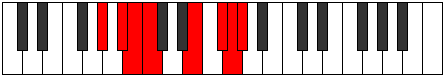 |
| [3357](https://ianring.com/musictheory/scales/3357) | [Phrodian](ModeAFlatPhrodian.md) | Ab | Ab, Bb, Cb, Dbb, E, F#, G, Ab |  |
| [3359](https://ianring.com/musictheory/scales/3359) | [Bonyllic](ModeGSharpBonyllic.md) | G# | G#, A, A#, B, C, E, F#, G, G# |  |
| [3359](https://ianring.com/musictheory/scales/3359) | [Bonyllic](ModeAFlatBonyllic.md) | Ab | Ab, A, Bb, B, C, E, Gb, G, Ab |  |
| [3365](https://ianring.com/musictheory/scales/3365) | [Katolimic](ModeFSharpKatolimic.md) | F# | F#, G#, A##, B###, D##, E#, F# |  |
| [3365](https://ianring.com/musictheory/scales/3365) | [Katolimic](ModeGFlatKatolimic.md) | Gb | Gb, Ab, B, C##, D##, E#, Gb |  |
| [3367](https://ianring.com/musictheory/scales/3367) | [Moptian](ModeFSharpMoptian.md) | F# | F#, G, Ab, B, C##, D##, E#, F# |  |
| [3367](https://ianring.com/musictheory/scales/3367) | [Moptian](ModeGFlatMoptian.md) | Gb | Gb, Abb, Bbbb, Cb, D, E, F, Gb |  |
| [3369](https://ianring.com/musictheory/scales/3369) | [Mixolimic](ModeGSharpMixolimic.md) | G# | G#, A##, B##, D##, E##, F##, G# |  |
| [3369](https://ianring.com/musictheory/scales/3369) | [Mixolimic](ModeAFlatMixolimic.md) | Ab | Ab, B, C#, D##, E##, F##, Ab |  |
| [3371](https://ianring.com/musictheory/scales/3371) | [Aeolylian](ModeDSharpAeolylian.md) | D# | D#, E, F#, G#, A##, B##, C##, D# |  |
| [3371](https://ianring.com/musictheory/scales/3371) | [Aeolylian](ModeEFlatAeolylian.md) | Eb | Eb, Fb, Gb, Ab, B, C#, D, Eb |  |
| [3371](https://ianring.com/musictheory/scales/3371) | [Aeolylian](ModeGSharpAeolylian.md) | G# | G#, A, B, C#, D##, E##, F##, G# |  |
| [3371](https://ianring.com/musictheory/scales/3371) | [Aeolylian](ModeAFlatAeolylian.md) | Ab | Ab, Bbb, Cb, Db, E, F#, G, Ab |  |
| [3373](https://ianring.com/musictheory/scales/3373) | [Lodian](ModeFSharpLodian.md) | F# | F#, G#, A, B, C##, D##, E#, F# |  |
| [3373](https://ianring.com/musictheory/scales/3373) | [Lodian](ModeGFlatLodian.md) | Gb | Gb, Ab, Bbb, Cb, D, E, F, Gb |  |
| [3373](https://ianring.com/musictheory/scales/3373) | [Lodian](ModeGSharpLodian.md) | G# | G#, A#, B, C#, D##, E##, F##, G# |  |
| [3373](https://ianring.com/musictheory/scales/3373) | [Lodian](ModeAFlatLodian.md) | Ab | Ab, Bb, Cb, Db, E, F#, G, Ab |  |
| [3375](https://ianring.com/musictheory/scales/3375) | [Kygyllic](ModeDSharpKygyllic.md) | D# | D#, E, F, F#, G#, B, C#, D, D# |  |
| [3375](https://ianring.com/musictheory/scales/3375) | [Kygyllic](ModeEFlatKygyllic.md) | Eb | Eb, E, F, Gb, Ab, B, Db, D, Eb |  |
| [3375](https://ianring.com/musictheory/scales/3375) | [Kygyllic](ModeFSharpKygyllic.md) | F# | F#, G, G#, A, B, D, E, F, F# |  |
| [3375](https://ianring.com/musictheory/scales/3375) | [Kygyllic](ModeGFlatKygyllic.md) | Gb | Gb, G, Ab, A, B, D, E, F, Gb |  |
| [3375](https://ianring.com/musictheory/scales/3375) | [Kygyllic](ModeGSharpKygyllic.md) | G# | G#, A, A#, B, C#, E, F#, G, G# |  |
| [3375](https://ianring.com/musictheory/scales/3375) | [Kygyllic](ModeAFlatKygyllic.md) | Ab | Ab, A, Bb, B, Db, E, Gb, G, Ab |  |
| [3381](https://ianring.com/musictheory/scales/3381) | [Katanian](ModeFSharpKatanian.md) | F# | F#, G#, A#, B, C##, D##, E#, F# |  |
| [3381](https://ianring.com/musictheory/scales/3381) | [Katanian](ModeGFlatKatanian.md) | Gb | Gb, Ab, Bb, Cb, D, E, F, Gb |  |
| [3383](https://ianring.com/musictheory/scales/3383) | [Daptyllic](ModeFSharpDaptyllic.md) | F# | F#, G, G#, A#, B, D, E, F, F# |  |
| [3383](https://ianring.com/musictheory/scales/3383) | [Daptyllic](ModeGFlatDaptyllic.md) | Gb | Gb, G, Ab, Bb, B, D, E, F, Gb |  |
| [3385](https://ianring.com/musictheory/scales/3385) | [Rothian](ModeGSharpRothian.md) | G# | G#, A##, B#, C#, D##, E##, F##, G# |  |
| [3385](https://ianring.com/musictheory/scales/3385) | [Rothian](ModeAFlatRothian.md) | Ab | Ab, B, C, Db, E, F#, G, Ab |  |
| [3387](https://ianring.com/musictheory/scales/3387) | [Aeryptyllic](ModeDSharpAeryptyllic.md) | D# | D#, E, F#, G, G#, B, C#, D, D# |  |
| [3387](https://ianring.com/musictheory/scales/3387) | [Aeryptyllic](ModeEFlatAeryptyllic.md) | Eb | Eb, E, Gb, G, Ab, B, Db, D, Eb |  |
| [3387](https://ianring.com/musictheory/scales/3387) | [Aeryptyllic](ModeGSharpAeryptyllic.md) | G# | G#, A, B, C, C#, E, F#, G, G# |  |
| [3387](https://ianring.com/musictheory/scales/3387) | [Aeryptyllic](ModeAFlatAeryptyllic.md) | Ab | Ab, A, B, C, Db, E, Gb, G, Ab |  |
| [3389](https://ianring.com/musictheory/scales/3389) | [Socryllic](ModeGSharpSocryllic.md) | G# | G#, A#, B, C, C#, E, F#, G, G# |  |
| [3389](https://ianring.com/musictheory/scales/3389) | [Socryllic](ModeAFlatSocryllic.md) | Ab | Ab, Bb, B, C, Db, E, Gb, G, Ab |  |
| [3389](https://ianring.com/musictheory/scales/3389) | [Socryllic](ModeFSharpSocryllic.md) | F# | F#, G#, A, A#, B, D, E, F, F# |  |
| [3389](https://ianring.com/musictheory/scales/3389) | [Socryllic](ModeGFlatSocryllic.md) | Gb | Gb, Ab, A, Bb, B, D, E, F, Gb |  |
| [3391](https://ianring.com/musictheory/scales/3391) | [Aeolynygic](ModeDSharpAeolynygic.md) | D# | D#, E, F, F#, G, G#, B, C#, D, D# |  |
| [3391](https://ianring.com/musictheory/scales/3391) | [Aeolynygic](ModeEFlatAeolynygic.md) | Eb | Eb, E, F, Gb, G, Ab, B, Db, D, Eb |  |
| [3391](https://ianring.com/musictheory/scales/3391) | [Aeolynygic](ModeGSharpAeolynygic.md) | G# | G#, A, A#, B, C, C#, E, F#, G, G# |  |
| [3391](https://ianring.com/musictheory/scales/3391) | [Aeolynygic](ModeAFlatAeolynygic.md) | Ab | Ab, A, Bb, B, C, Db, E, Gb, G, Ab |  |
| [3391](https://ianring.com/musictheory/scales/3391) | [Aeolynygic](ModeFSharpAeolynygic.md) | F# | F#, G, G#, A, A#, B, D, E, F, F# | 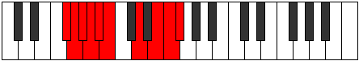 |
| [3391](https://ianring.com/musictheory/scales/3391) | [Aeolynygic](ModeGFlatAeolynygic.md) | Gb | Gb, G, Ab, A, Bb, B, D, E, F, Gb |  |
| [3399](https://ianring.com/musictheory/scales/3399) | [Zonian](ModeASharpZonian.md) | A# | A#, B, C, D##, E##, F###, G##, A# |  |
| [3399](https://ianring.com/musictheory/scales/3399) | [Zonian](ModeBFlatZonian.md) | Bb | Bb, Cb, Dbb, E, F#, G#, A, Bb |  |
| [3401](https://ianring.com/musictheory/scales/3401) | [Palimic](ModeGSharpPalimic.md) | G# | G#, A##, B###, D##, E##, F##, G# |  |
| [3401](https://ianring.com/musictheory/scales/3401) | [Palimic](ModeAFlatPalimic.md) | Ab | Ab, B, C##, D##, E##, F##, Ab |  |
| [3403](https://ianring.com/musictheory/scales/3403) | [Bylian](ModeFNaturalBylian.md) | F | F, Gb, Ab, B, C#, D#, E, F |  |
| [3403](https://ianring.com/musictheory/scales/3403) | [Bylian](ModeGSharpBylian.md) | G# | G#, A, B, C##, D##, E##, F##, G# |  |
| [3403](https://ianring.com/musictheory/scales/3403) | [Bylian](ModeAFlatBylian.md) | Ab | Ab, Bbb, Cb, D, E, F#, G, Ab |  |
| [3403](https://ianring.com/musictheory/scales/3403) | [Bylian](ModeASharpBylian.md) | A# | A#, B, C#, D##, E##, F###, G##, A# |  |
| [3403](https://ianring.com/musictheory/scales/3403) | [Bylian](ModeBFlatBylian.md) | Bb | Bb, Cb, Db, E, F#, G#, A, Bb |  |
| [3405](https://ianring.com/musictheory/scales/3405) | [Stynian](ModeGSharpStynian.md) | G# | G#, A#, B, C##, D##, E##, F##, G# |  |
| [3405](https://ianring.com/musictheory/scales/3405) | [Stynian](ModeAFlatStynian.md) | Ab | Ab, Bb, Cb, D, E, F#, G, Ab | 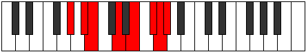 |
| [3407](https://ianring.com/musictheory/scales/3407) | [Katocryllic](ModeFNaturalKatocryllic.md) | F | F, F#, G, G#, B, C#, D#, E, F |  |
| [3407](https://ianring.com/musictheory/scales/3407) | [Katocryllic](ModeASharpKatocryllic.md) | A# | A#, B, C, C#, E, F#, G#, A, A# |  |
| [3407](https://ianring.com/musictheory/scales/3407) | [Katocryllic](ModeBFlatKatocryllic.md) | Bb | Bb, B, C, Db, E, Gb, Ab, A, Bb |  |
| [3407](https://ianring.com/musictheory/scales/3407) | [Katocryllic](ModeGSharpKatocryllic.md) | G# | G#, A, A#, B, D, E, F#, G, G# |  |
| [3407](https://ianring.com/musictheory/scales/3407) | [Katocryllic](ModeAFlatKatocryllic.md) | Ab | Ab, A, Bb, B, D, E, Gb, G, Ab |  |
| [3411](https://ianring.com/musictheory/scales/3411) | [Ionathian](ModeCNaturalIonathian.md) | C | C, Db, E, F#, G#, A#, B, C |  |
| [3411](https://ianring.com/musictheory/scales/3411) | [Ionathian](ModeASharpIonathian.md) | A# | A#, B, C##, D##, E##, F###, G##, A# |  |
| [3411](https://ianring.com/musictheory/scales/3411) | [Ionathian](ModeBFlatIonathian.md) | Bb | Bb, Cb, D, E, F#, G#, A, Bb |  |
| [3413](https://ianring.com/musictheory/scales/3413) | [Aeolynian](ModeCNaturalAeolynian.md) | C | C, D, E, F#, G#, A#, B, C |  |
| [3415](https://ianring.com/musictheory/scales/3415) | [Ionaptyllic](ModeCNaturalIonaptyllic.md) | C | C, C#, D, E, F#, G#, A#, B, C |  |
| [3415](https://ianring.com/musictheory/scales/3415) | [Ionaptyllic](ModeASharpIonaptyllic.md) | A# | A#, B, C, D, E, F#, G#, A, A# | 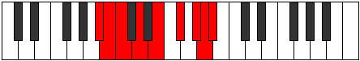 |
| [3415](https://ianring.com/musictheory/scales/3415) | [Ionaptyllic](ModeBFlatIonaptyllic.md) | Bb | Bb, B, C, D, E, Gb, Ab, A, Bb |  |
| [3417](https://ianring.com/musictheory/scales/3417) | [Golian](ModeGSharpGolian.md) | G# | G#, A##, B#, C##, D##, E##, F##, G# |  |
| [3417](https://ianring.com/musictheory/scales/3417) | [Golian](ModeAFlatGolian.md) | Ab | Ab, B, C, D, E, F#, G, Ab |  |
| [3417](https://ianring.com/musictheory/scales/3417) | [Golian](ModeCNaturalGolian.md) | C | C, D#, E, F#, G#, A#, B, C | 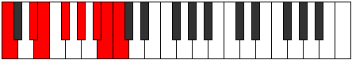 |
| [3419](https://ianring.com/musictheory/scales/3419) | [Danyllic](ModeFNaturalDanyllic.md) | F | F, F#, G#, A, B, C#, D#, E, F | 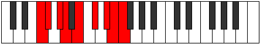 |
| [3419](https://ianring.com/musictheory/scales/3419) | [Danyllic](ModeGSharpDanyllic.md) | G# | G#, A, B, C, D, E, F#, G, G# |  |
| [3419](https://ianring.com/musictheory/scales/3419) | [Danyllic](ModeAFlatDanyllic.md) | Ab | Ab, A, B, C, D, E, Gb, G, Ab |  |
| [3419](https://ianring.com/musictheory/scales/3419) | [Danyllic](ModeCNaturalDanyllic.md) | C | C, C#, D#, E, F#, G#, A#, B, C | 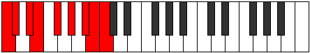 |
| [3419](https://ianring.com/musictheory/scales/3419) | [Danyllic](ModeASharpDanyllic.md) | A# | A#, B, C#, D, E, F#, G#, A, A# |  |
| [3419](https://ianring.com/musictheory/scales/3419) | [Danyllic](ModeBFlatDanyllic.md) | Bb | Bb, B, Db, D, E, Gb, Ab, A, Bb |  |
| [3421](https://ianring.com/musictheory/scales/3421) | [Aerothyllic](ModeCNaturalAerothyllic.md) | C | C, D, D#, E, F#, G#, A#, B, C |  |
| [3421](https://ianring.com/musictheory/scales/3421) | [Aerothyllic](ModeGSharpAerothyllic.md) | G# | G#, A#, B, C, D, E, F#, G, G# |  |
| [3421](https://ianring.com/musictheory/scales/3421) | [Aerothyllic](ModeAFlatAerothyllic.md) | Ab | Ab, Bb, B, C, D, E, Gb, G, Ab |  |
| [3423](https://ianring.com/musictheory/scales/3423) | [Lothygic](ModeFNaturalLothygic.md) | F | F, F#, G, G#, A, B, C#, D#, E, F |  |
| [3423](https://ianring.com/musictheory/scales/3423) | [Lothygic](ModeCNaturalLothygic.md) | C | C, C#, D, D#, E, F#, G#, A#, B, C |  |
| [3423](https://ianring.com/musictheory/scales/3423) | [Lothygic](ModeASharpLothygic.md) | A# | A#, B, C, C#, D, E, F#, G#, A, A# |  |
| [3423](https://ianring.com/musictheory/scales/3423) | [Lothygic](ModeBFlatLothygic.md) | Bb | Bb, B, C, Db, D, E, Gb, Ab, A, Bb |  |
| [3423](https://ianring.com/musictheory/scales/3423) | [Lothygic](ModeGSharpLothygic.md) | G# | G#, A, A#, B, C, D, E, F#, G, G# |  |
| [3423](https://ianring.com/musictheory/scales/3423) | [Lothygic](ModeAFlatLothygic.md) | Ab | Ab, A, Bb, B, C, D, E, Gb, G, Ab |  |
| [3427](https://ianring.com/musictheory/scales/3427) | [Zacrian](ModeASharpZacrian.md) | A# | A#, B, C###, D##, E##, F###, G##, A# |  |
| [3427](https://ianring.com/musictheory/scales/3427) | [Zacrian](ModeBFlatZacrian.md) | Bb | Bb, Cb, D#, E, F#, G#, A, Bb |  |
| [3429](https://ianring.com/musictheory/scales/3429) | [Marian](ModeFSharpMarian.md) | F# | F#, G#, A##, B#, C##, D##, E#, F# |  |
| [3429](https://ianring.com/musictheory/scales/3429) | [Marian](ModeGFlatMarian.md) | Gb | Gb, Ab, B, C, D, E, F, Gb |  |
| [3431](https://ianring.com/musictheory/scales/3431) | [Zyptyllic](ModeFSharpZyptyllic.md) | F# | F#, G, G#, B, C, D, E, F, F# |  |
| [3431](https://ianring.com/musictheory/scales/3431) | [Zyptyllic](ModeGFlatZyptyllic.md) | Gb | Gb, G, Ab, B, C, D, E, F, Gb |  |
| [3431](https://ianring.com/musictheory/scales/3431) | [Zyptyllic](ModeASharpZyptyllic.md) | A# | A#, B, C, D#, E, F#, G#, A, A# |  |
| [3431](https://ianring.com/musictheory/scales/3431) | [Zyptyllic](ModeBFlatZyptyllic.md) | Bb | Bb, B, C, Eb, E, Gb, Ab, A, Bb |  |
| [3433](https://ianring.com/musictheory/scales/3433) | [Thonian](ModeGSharpThonian.md) | G# | G#, A##, B##, C##, D##, E##, F##, G# |  |
| [3433](https://ianring.com/musictheory/scales/3433) | [Thonian](ModeAFlatThonian.md) | Ab | Ab, B, C#, D, E, F#, G, Ab |  |
| [3435](https://ianring.com/musictheory/scales/3435) | [Epiphyllic](ModeDSharpEpiphyllic.md) | D# | D#, E, F#, G#, A, B, C#, D, D# |  |
| [3435](https://ianring.com/musictheory/scales/3435) | [Epiphyllic](ModeEFlatEpiphyllic.md) | Eb | Eb, E, Gb, Ab, A, B, Db, D, Eb |  |
| [3435](https://ianring.com/musictheory/scales/3435) | [Epiphyllic](ModeGSharpEpiphyllic.md) | G# | G#, A, B, C#, D, E, F#, G, G# |  |
| [3435](https://ianring.com/musictheory/scales/3435) | [Epiphyllic](ModeAFlatEpiphyllic.md) | Ab | Ab, A, B, Db, D, E, Gb, G, Ab |  |
| [3435](https://ianring.com/musictheory/scales/3435) | [Epiphyllic](ModeFNaturalEpiphyllic.md) | F | F, F#, G#, A#, B, C#, D#, E, F |  |
| [3435](https://ianring.com/musictheory/scales/3435) | [Epiphyllic](ModeASharpEpiphyllic.md) | A# | A#, B, C#, D#, E, F#, G#, A, A# |  |
| [3435](https://ianring.com/musictheory/scales/3435) | [Epiphyllic](ModeBFlatEpiphyllic.md) | Bb | Bb, B, Db, Eb, E, Gb, Ab, A, Bb |  |
| [3437](https://ianring.com/musictheory/scales/3437) | [Gathyllic](ModeFSharpGathyllic.md) | F# | F#, G#, A, B, C, D, E, F, F# |  |
| [3437](https://ianring.com/musictheory/scales/3437) | [Gathyllic](ModeGFlatGathyllic.md) | Gb | Gb, Ab, A, B, C, D, E, F, Gb |  |
| [3437](https://ianring.com/musictheory/scales/3437) | [Gathyllic](ModeGSharpGathyllic.md) | G# | G#, A#, B, C#, D, E, F#, G, G# |  |
| [3437](https://ianring.com/musictheory/scales/3437) | [Gathyllic](ModeAFlatGathyllic.md) | Ab | Ab, Bb, B, Db, D, E, Gb, G, Ab |  |
| [3439](https://ianring.com/musictheory/scales/3439) | [Lythygic](ModeDSharpLythygic.md) | D# | D#, E, F, F#, G#, A, B, C#, D, D# |  |
| [3439](https://ianring.com/musictheory/scales/3439) | [Lythygic](ModeEFlatLythygic.md) | Eb | Eb, E, F, Gb, Ab, A, B, Db, D, Eb |  |
| [3439](https://ianring.com/musictheory/scales/3439) | [Lythygic](ModeFSharpLythygic.md) | F# | F#, G, G#, A, B, C, D, E, F, F# |  |
| [3439](https://ianring.com/musictheory/scales/3439) | [Lythygic](ModeGFlatLythygic.md) | Gb | Gb, G, Ab, A, B, C, D, E, F, Gb |  |
| [3439](https://ianring.com/musictheory/scales/3439) | [Lythygic](ModeFNaturalLythygic.md) | F | F, F#, G, G#, A#, B, C#, D#, E, F |  |
| [3439](https://ianring.com/musictheory/scales/3439) | [Lythygic](ModeASharpLythygic.md) | A# | A#, B, C, C#, D#, E, F#, G#, A, A# |  |
| [3439](https://ianring.com/musictheory/scales/3439) | [Lythygic](ModeBFlatLythygic.md) | Bb | Bb, B, C, Db, Eb, E, Gb, Ab, A, Bb |  |
| [3439](https://ianring.com/musictheory/scales/3439) | [Lythygic](ModeGSharpLythygic.md) | G# | G#, A, A#, B, C#, D, E, F#, G, G# |  |
| [3439](https://ianring.com/musictheory/scales/3439) | [Lythygic](ModeAFlatLythygic.md) | Ab | Ab, A, Bb, B, Db, D, E, Gb, G, Ab |  |
| [3441](https://ianring.com/musictheory/scales/3441) | [Thacrian](ModeCNaturalThacrian.md) | C | C, D##, E#, F#, G#, A#, B, C |  |
| [3443](https://ianring.com/musictheory/scales/3443) | [Epathyllic](ModeCNaturalEpathyllic.md) | C | C, C#, E, F, F#, G#, A#, B, C |  |
| [3443](https://ianring.com/musictheory/scales/3443) | [Epathyllic](ModeASharpEpathyllic.md) | A# | A#, B, D, D#, E, F#, G#, A, A# |  |
| [3443](https://ianring.com/musictheory/scales/3443) | [Epathyllic](ModeBFlatEpathyllic.md) | Bb | Bb, B, D, Eb, E, Gb, Ab, A, Bb |  |
| [3445](https://ianring.com/musictheory/scales/3445) | [Epotyllic](ModeCNaturalEpotyllic.md) | C | C, D, E, F, F#, G#, A#, B, C |  |
| [3445](https://ianring.com/musictheory/scales/3445) | [Epotyllic](ModeFSharpEpotyllic.md) | F# | F#, G#, A#, B, C, D, E, F, F# |  |
| [3445](https://ianring.com/musictheory/scales/3445) | [Epotyllic](ModeGFlatEpotyllic.md) | Gb | Gb, Ab, Bb, B, C, D, E, F, Gb |  |
| [3447](https://ianring.com/musictheory/scales/3447) | [Kynygic](ModeCNaturalKynygic.md) | C | C, C#, D, E, F, F#, G#, A#, B, C |  |
| [3447](https://ianring.com/musictheory/scales/3447) | [Kynygic](ModeFSharpKynygic.md) | F# | F#, G, G#, A#, B, C, D, E, F, F# |  |
| [3447](https://ianring.com/musictheory/scales/3447) | [Kynygic](ModeGFlatKynygic.md) | Gb | Gb, G, Ab, Bb, B, C, D, E, F, Gb |  |
| [3447](https://ianring.com/musictheory/scales/3447) | [Kynygic](ModeASharpKynygic.md) | A# | A#, B, C, D, D#, E, F#, G#, A, A# |  |
| [3447](https://ianring.com/musictheory/scales/3447) | [Kynygic](ModeBFlatKynygic.md) | Bb | Bb, B, C, D, Eb, E, Gb, Ab, A, Bb |  |
| [3449](https://ianring.com/musictheory/scales/3449) | [Bacryllic](ModeGSharpBacryllic.md) | G# | G#, B, C, C#, D, E, F#, G, G# |  |
| [3449](https://ianring.com/musictheory/scales/3449) | [Bacryllic](ModeAFlatBacryllic.md) | Ab | Ab, B, C, Db, D, E, Gb, G, Ab |  |
| [3449](https://ianring.com/musictheory/scales/3449) | [Bacryllic](ModeCNaturalBacryllic.md) | C | C, D#, E, F, F#, G#, A#, B, C |  |
| [3451](https://ianring.com/musictheory/scales/3451) | [Garygic](ModeGSharpGarygic.md) | G# | G#, A, B, C, C#, D, E, F#, G, G# |  |
| [3451](https://ianring.com/musictheory/scales/3451) | [Garygic](ModeAFlatGarygic.md) | Ab | Ab, A, B, C, Db, D, E, Gb, G, Ab |  |
| [3451](https://ianring.com/musictheory/scales/3451) | [Garygic](ModeDSharpGarygic.md) | D# | D#, E, F#, G, G#, A, B, C#, D, D# |  |
| [3451](https://ianring.com/musictheory/scales/3451) | [Garygic](ModeEFlatGarygic.md) | Eb | Eb, E, Gb, G, Ab, A, B, Db, D, Eb |  |
| [3451](https://ianring.com/musictheory/scales/3451) | [Garygic](ModeCNaturalGarygic.md) | C | C, C#, D#, E, F, F#, G#, A#, B, C |  |
| [3451](https://ianring.com/musictheory/scales/3451) | [Garygic](ModeASharpGarygic.md) | A# | A#, B, C#, D, D#, E, F#, G#, A, A# |  |
| [3451](https://ianring.com/musictheory/scales/3451) | [Garygic](ModeBFlatGarygic.md) | Bb | Bb, B, Db, D, Eb, E, Gb, Ab, A, Bb |  |
| [3451](https://ianring.com/musictheory/scales/3451) | [Garygic](ModeFNaturalGarygic.md) | F | F, F#, G#, A, A#, B, C#, D#, E, F |  |
| [3453](https://ianring.com/musictheory/scales/3453) | [Katarygic](ModeCNaturalKatarygic.md) | C | C, D, D#, E, F, F#, G#, A#, B, C |  |
| [3453](https://ianring.com/musictheory/scales/3453) | [Katarygic](ModeGSharpKatarygic.md) | G# | G#, A#, B, C, C#, D, E, F#, G, G# |  |
| [3453](https://ianring.com/musictheory/scales/3453) | [Katarygic](ModeAFlatKatarygic.md) | Ab | Ab, Bb, B, C, Db, D, E, Gb, G, Ab |  |
| [3453](https://ianring.com/musictheory/scales/3453) | [Katarygic](ModeFSharpKatarygic.md) | F# | F#, G#, A, A#, B, C, D, E, F, F# |  |
| [3453](https://ianring.com/musictheory/scales/3453) | [Katarygic](ModeGFlatKatarygic.md) | Gb | Gb, Ab, A, Bb, B, C, D, E, F, Gb |  |
| [3455](https://ianring.com/musictheory/scales/3455) | [Ryptyllian](ModeDSharpRyptyllian.md) | D# | D#, E, F, F#, G, G#, A, B, C#, D, D# |  |
| [3455](https://ianring.com/musictheory/scales/3455) | [Ryptyllian](ModeEFlatRyptyllian.md) | Eb | Eb, E, F, Gb, G, Ab, A, B, Db, D, Eb |  |
| [3455](https://ianring.com/musictheory/scales/3455) | [Ryptyllian](ModeCNaturalRyptyllian.md) | C | C, C#, D, D#, E, F, F#, G#, A#, B, C |  |
| [3455](https://ianring.com/musictheory/scales/3455) | [Ryptyllian](ModeASharpRyptyllian.md) | A# | A#, B, C, C#, D, D#, E, F#, G#, A, A# |  |
| [3455](https://ianring.com/musictheory/scales/3455) | [Ryptyllian](ModeBFlatRyptyllian.md) | Bb | Bb, B, C, Db, D, Eb, E, Gb, Ab, A, Bb |  |
| [3455](https://ianring.com/musictheory/scales/3455) | [Ryptyllian](ModeGSharpRyptyllian.md) | G# | G#, A, A#, B, C, C#, D, E, F#, G, G# |  |
| [3455](https://ianring.com/musictheory/scales/3455) | [Ryptyllian](ModeAFlatRyptyllian.md) | Ab | Ab, A, Bb, B, C, Db, D, E, Gb, G, Ab |  |
| [3455](https://ianring.com/musictheory/scales/3455) | [Ryptyllian](ModeFSharpRyptyllian.md) | F# | F#, G, G#, A, A#, B, C, D, E, F, F# |  |
| [3455](https://ianring.com/musictheory/scales/3455) | [Ryptyllian](ModeGFlatRyptyllian.md) | Gb | Gb, G, Ab, A, Bb, B, C, D, E, F, Gb |  |
| [3455](https://ianring.com/musictheory/scales/3455) | [Ryptyllian](ModeFNaturalRyptyllian.md) | F | F, F#, G, G#, A, A#, B, C#, D#, E, F |  |
| [3465](https://ianring.com/musictheory/scales/3465) | [Katathimic](ModeGSharpKatathimic.md) | G# | G#, A##, C###, D##, E##, F##, G# |  |
| [3465](https://ianring.com/musictheory/scales/3465) | [Katathimic](ModeAFlatKatathimic.md) | Ab | Ab, B, C###, D##, E##, F##, Ab |  |
| [3467](https://ianring.com/musictheory/scales/3467) | [Katonian](ModeGSharpKatonian.md) | G# | G#, A, B, C###, D##, E##, F##, G# |  |
| [3467](https://ianring.com/musictheory/scales/3467) | [Katonian](ModeAFlatKatonian.md) | Ab | Ab, Bbb, Cb, D#, E, F#, G, Ab |  |
| [3469](https://ianring.com/musictheory/scales/3469) | [Monian](ModeGSharpMonian.md) | G# | G#, A#, B, C###, D##, E##, F##, G# |  |
| [3469](https://ianring.com/musictheory/scales/3469) | [Monian](ModeAFlatMonian.md) | Ab | Ab, Bb, Cb, D#, E, F#, G, Ab |  |
| [3471](https://ianring.com/musictheory/scales/3471) | [Gyryllic](ModeGSharpGyryllic.md) | G# | G#, A, A#, B, D#, E, F#, G, G# |  |
| [3471](https://ianring.com/musictheory/scales/3471) | [Gyryllic](ModeAFlatGyryllic.md) | Ab | Ab, A, Bb, B, Eb, E, Gb, G, Ab |  |
| [3477](https://ianring.com/musictheory/scales/3477) | [Kyptian](ModeENaturalKyptian.md) | E | E, F#, G#, A##, B#, C##, D#, E |  |
| [3479](https://ianring.com/musictheory/scales/3479) | [Rothyllic](ModeENaturalRothyllic.md) | E | E, F, F#, G#, B, C, D, D#, E |  |
| [3481](https://ianring.com/musictheory/scales/3481) | [Katathian](ModeGSharpKatathian.md) | G# | G#, A##, B#, C###, D##, E##, F##, G# |  |
| [3481](https://ianring.com/musictheory/scales/3481) | [Katathian](ModeAFlatKatathian.md) | Ab | Ab, B, C, D#, E, F#, G, Ab |  |
| [3483](https://ianring.com/musictheory/scales/3483) | [Mixotharyllic](ModeGSharpMixotharyllic.md) | G# | G#, A, B, C, D#, E, F#, G, G# |  |
| [3483](https://ianring.com/musictheory/scales/3483) | [Mixotharyllic](ModeAFlatMixotharyllic.md) | Ab | Ab, A, B, C, Eb, E, Gb, G, Ab |  |
| [3485](https://ianring.com/musictheory/scales/3485) | [Kyptyllic](ModeENaturalKyptyllic.md) | E | E, F#, G, G#, B, C, D, D#, E |  |
| [3485](https://ianring.com/musictheory/scales/3485) | [Kyptyllic](ModeGSharpKyptyllic.md) | G# | G#, A#, B, C, D#, E, F#, G, G# |  |
| [3485](https://ianring.com/musictheory/scales/3485) | [Kyptyllic](ModeAFlatKyptyllic.md) | Ab | Ab, Bb, B, C, Eb, E, Gb, G, Ab |  |
| [3487](https://ianring.com/musictheory/scales/3487) | [Byptygic](ModeENaturalByptygic.md) | E | E, F, F#, G, G#, B, C, D, D#, E |  |
| [3487](https://ianring.com/musictheory/scales/3487) | [Byptygic](ModeGSharpByptygic.md) | G# | G#, A, A#, B, C, D#, E, F#, G, G# |  |
| [3487](https://ianring.com/musictheory/scales/3487) | [Byptygic](ModeAFlatByptygic.md) | Ab | Ab, A, Bb, B, C, Eb, E, Gb, G, Ab |  |
| [3493](https://ianring.com/musictheory/scales/3493) | [Rathian](ModeFSharpRathian.md) | F# | F#, G#, A##, B##, C##, D##, E#, F# |  |
| [3493](https://ianring.com/musictheory/scales/3493) | [Rathian](ModeGFlatRathian.md) | Gb | Gb, Ab, B, C#, D, E, F, Gb |  |
| [3495](https://ianring.com/musictheory/scales/3495) | [Banyllic](ModeFSharpBanyllic.md) | F# | F#, G, G#, B, C#, D, E, F, F# |  |
| [3495](https://ianring.com/musictheory/scales/3495) | [Banyllic](ModeGFlatBanyllic.md) | Gb | Gb, G, Ab, B, Db, D, E, F, Gb |  |
| [3497](https://ianring.com/musictheory/scales/3497) | [Phrolian](ModeGSharpPhrolian.md) | G# | G#, A##, B##, C###, D##, E##, F##, G# |  |
| [3497](https://ianring.com/musictheory/scales/3497) | [Phrolian](ModeAFlatPhrolian.md) | Ab | Ab, B, C#, D#, E, F#, G, Ab |  |
| [3497](https://ianring.com/musictheory/scales/3497) | [Phrolian](ModeDFlatPhrolian.md) | Db | Db, E, F#, G#, A, B, C, Db |  |
| [3499](https://ianring.com/musictheory/scales/3499) | [Lythyllic](ModeCSharpLythyllic.md) | C# | C#, D, E, F#, G#, A, B, C, C# |  |
| [3499](https://ianring.com/musictheory/scales/3499) | [Lythyllic](ModeDFlatLythyllic.md) | Db | Db, D, E, Gb, Ab, A, B, C, Db |  |
| [3499](https://ianring.com/musictheory/scales/3499) | [Lythyllic](ModeGSharpLythyllic.md) | G# | G#, A, B, C#, D#, E, F#, G, G# |  |
| [3499](https://ianring.com/musictheory/scales/3499) | [Lythyllic](ModeAFlatLythyllic.md) | Ab | Ab, A, B, Db, Eb, E, Gb, G, Ab |  |
| [3499](https://ianring.com/musictheory/scales/3499) | [Lythyllic](ModeDSharpLythyllic.md) | D# | D#, E, F#, G#, A#, B, C#, D, D# |  |
| [3499](https://ianring.com/musictheory/scales/3499) | [Lythyllic](ModeEFlatLythyllic.md) | Eb | Eb, E, Gb, Ab, Bb, B, Db, D, Eb |  |
| [3501](https://ianring.com/musictheory/scales/3501) | [Katodyllic](ModeCSharpKatodyllic.md) | C# | C#, D#, E, F#, G#, A, B, C, C# |  |
| [3501](https://ianring.com/musictheory/scales/3501) | [Katodyllic](ModeDFlatKatodyllic.md) | Db | Db, Eb, E, Gb, Ab, A, B, C, Db |  |
| [3501](https://ianring.com/musictheory/scales/3501) | [Katodyllic](ModeFSharpKatodyllic.md) | F# | F#, G#, A, B, C#, D, E, F, F# |  |
| [3501](https://ianring.com/musictheory/scales/3501) | [Katodyllic](ModeGFlatKatodyllic.md) | Gb | Gb, Ab, A, B, Db, D, E, F, Gb |  |
| [3501](https://ianring.com/musictheory/scales/3501) | [Katodyllic](ModeGSharpKatodyllic.md) | G# | G#, A#, B, C#, D#, E, F#, G, G# |  |
| [3501](https://ianring.com/musictheory/scales/3501) | [Katodyllic](ModeAFlatKatodyllic.md) | Ab | Ab, Bb, B, Db, Eb, E, Gb, G, Ab |  |
| [3503](https://ianring.com/musictheory/scales/3503) | [Zyphygic](ModeCSharpZyphygic.md) | C# | C#, D, D#, E, F#, G#, A, B, C, C# |  |
| [3503](https://ianring.com/musictheory/scales/3503) | [Zyphygic](ModeDFlatZyphygic.md) | Db | Db, D, Eb, E, Gb, Ab, A, B, C, Db |  |
| [3503](https://ianring.com/musictheory/scales/3503) | [Zyphygic](ModeFSharpZyphygic.md) | F# | F#, G, G#, A, B, C#, D, E, F, F# |  |
| [3503](https://ianring.com/musictheory/scales/3503) | [Zyphygic](ModeGFlatZyphygic.md) | Gb | Gb, G, Ab, A, B, Db, D, E, F, Gb |  |
| [3503](https://ianring.com/musictheory/scales/3503) | [Zyphygic](ModeDSharpZyphygic.md) | D# | D#, E, F, F#, G#, A#, B, C#, D, D# |  |
| [3503](https://ianring.com/musictheory/scales/3503) | [Zyphygic](ModeEFlatZyphygic.md) | Eb | Eb, E, F, Gb, Ab, Bb, B, Db, D, Eb |  |
| [3503](https://ianring.com/musictheory/scales/3503) | [Zyphygic](ModeGSharpZyphygic.md) | G# | G#, A, A#, B, C#, D#, E, F#, G, G# |  |
| [3503](https://ianring.com/musictheory/scales/3503) | [Zyphygic](ModeAFlatZyphygic.md) | Ab | Ab, A, Bb, B, Db, Eb, E, Gb, G, Ab |  |
| [3509](https://ianring.com/musictheory/scales/3509) | [Stogyllic](ModeENaturalStogyllic.md) | E | E, F#, G#, A, B, C, D, D#, E |  |
| [3509](https://ianring.com/musictheory/scales/3509) | [Stogyllic](ModeFSharpStogyllic.md) | F# | F#, G#, A#, B, C#, D, E, F, F# |  |
| [3509](https://ianring.com/musictheory/scales/3509) | [Stogyllic](ModeGFlatStogyllic.md) | Gb | Gb, Ab, Bb, B, Db, D, E, F, Gb |  |
| [3511](https://ianring.com/musictheory/scales/3511) | [Epolygic](ModeENaturalEpolygic.md) | E | E, F, F#, G#, A, B, C, D, D#, E |  |
| [3511](https://ianring.com/musictheory/scales/3511) | [Epolygic](ModeFSharpEpolygic.md) | F# | F#, G, G#, A#, B, C#, D, E, F, F# |  |
| [3511](https://ianring.com/musictheory/scales/3511) | [Epolygic](ModeGFlatEpolygic.md) | Gb | Gb, G, Ab, Bb, B, Db, D, E, F, Gb |  |
| [3513](https://ianring.com/musictheory/scales/3513) | [Dydyllic](ModeGSharpDydyllic.md) | G# | G#, B, C, C#, D#, E, F#, G, G# |  |
| [3513](https://ianring.com/musictheory/scales/3513) | [Dydyllic](ModeAFlatDydyllic.md) | Ab | Ab, B, C, Db, Eb, E, Gb, G, Ab |  |
| [3513](https://ianring.com/musictheory/scales/3513) | [Dydyllic](ModeCSharpDydyllic.md) | C# | C#, E, F, F#, G#, A, B, C, C# |  |
| [3513](https://ianring.com/musictheory/scales/3513) | [Dydyllic](ModeDFlatDydyllic.md) | Db | Db, E, F, Gb, Ab, A, B, C, Db |  |
| [3515](https://ianring.com/musictheory/scales/3515) | [Katodygic](ModeCSharpKatodygic.md) | C# | C#, D, E, F, F#, G#, A, B, C, C# |  |
| [3515](https://ianring.com/musictheory/scales/3515) | [Katodygic](ModeDFlatKatodygic.md) | Db | Db, D, E, F, Gb, Ab, A, B, C, Db |  |
| [3515](https://ianring.com/musictheory/scales/3515) | [Katodygic](ModeGSharpKatodygic.md) | G# | G#, A, B, C, C#, D#, E, F#, G, G# |  |
| [3515](https://ianring.com/musictheory/scales/3515) | [Katodygic](ModeAFlatKatodygic.md) | Ab | Ab, A, B, C, Db, Eb, E, Gb, G, Ab |  |
| [3515](https://ianring.com/musictheory/scales/3515) | [Katodygic](ModeDSharpKatodygic.md) | D# | D#, E, F#, G, G#, A#, B, C#, D, D# |  |
| [3515](https://ianring.com/musictheory/scales/3515) | [Katodygic](ModeEFlatKatodygic.md) | Eb | Eb, E, Gb, G, Ab, Bb, B, Db, D, Eb |  |
| [3517](https://ianring.com/musictheory/scales/3517) | [Epocrygic](ModeCSharpEpocrygic.md) | C# | C#, D#, E, F, F#, G#, A, B, C, C# |  |
| [3517](https://ianring.com/musictheory/scales/3517) | [Epocrygic](ModeDFlatEpocrygic.md) | Db | Db, Eb, E, F, Gb, Ab, A, B, C, Db |  |
| [3517](https://ianring.com/musictheory/scales/3517) | [Epocrygic](ModeENaturalEpocrygic.md) | E | E, F#, G, G#, A, B, C, D, D#, E |  |
| [3517](https://ianring.com/musictheory/scales/3517) | [Epocrygic](ModeGSharpEpocrygic.md) | G# | G#, A#, B, C, C#, D#, E, F#, G, G# |  |
| [3517](https://ianring.com/musictheory/scales/3517) | [Epocrygic](ModeAFlatEpocrygic.md) | Ab | Ab, Bb, B, C, Db, Eb, E, Gb, G, Ab |  |
| [3517](https://ianring.com/musictheory/scales/3517) | [Epocrygic](ModeFSharpEpocrygic.md) | F# | F#, G#, A, A#, B, C#, D, E, F, F# |  |
| [3517](https://ianring.com/musictheory/scales/3517) | [Epocrygic](ModeGFlatEpocrygic.md) | Gb | Gb, Ab, A, Bb, B, Db, D, E, F, Gb |  |
| [3519](https://ianring.com/musictheory/scales/3519) | [Boptyllian](ModeCSharpBoptyllian.md) | C# | C#, D, D#, E, F, F#, G#, A, B, C, C# |  |
| [3519](https://ianring.com/musictheory/scales/3519) | [Boptyllian](ModeDFlatBoptyllian.md) | Db | Db, D, Eb, E, F, Gb, Ab, A, B, C, Db |  |
| [3519](https://ianring.com/musictheory/scales/3519) | [Boptyllian](ModeENaturalBoptyllian.md) | E | E, F, F#, G, G#, A, B, C, D, D#, E |  |
| [3519](https://ianring.com/musictheory/scales/3519) | [Boptyllian](ModeDSharpBoptyllian.md) | D# | D#, E, F, F#, G, G#, A#, B, C#, D, D# |  |
| [3519](https://ianring.com/musictheory/scales/3519) | [Boptyllian](ModeEFlatBoptyllian.md) | Eb | Eb, E, F, Gb, G, Ab, Bb, B, Db, D, Eb |  |
| [3519](https://ianring.com/musictheory/scales/3519) | [Boptyllian](ModeGSharpBoptyllian.md) | G# | G#, A, A#, B, C, C#, D#, E, F#, G, G# |  |
| [3519](https://ianring.com/musictheory/scales/3519) | [Boptyllian](ModeAFlatBoptyllian.md) | Ab | Ab, A, Bb, B, C, Db, Eb, E, Gb, G, Ab |  |
| [3519](https://ianring.com/musictheory/scales/3519) | [Boptyllian](ModeFSharpBoptyllian.md) | F# | F#, G, G#, A, A#, B, C#, D, E, F, F# |  |
| [3519](https://ianring.com/musictheory/scales/3519) | [Boptyllian](ModeGFlatBoptyllian.md) | Gb | Gb, G, Ab, A, Bb, B, Db, D, E, F, Gb |  |
| [3527](https://ianring.com/musictheory/scales/3527) | [Ronyllic](ModeASharpRonyllic.md) | A# | A#, B, C, E, F, F#, G#, A, A# |  |
| [3527](https://ianring.com/musictheory/scales/3527) | [Ronyllic](ModeBFlatRonyllic.md) | Bb | Bb, B, C, E, F, Gb, Ab, A, Bb |  |
| [3529](https://ianring.com/musictheory/scales/3529) | [Stalian](ModeGSharpStalian.md) | G# | G#, A##, B###, C###, D##, E##, F##, G# |  |
| [3529](https://ianring.com/musictheory/scales/3529) | [Stalian](ModeAFlatStalian.md) | Ab | Ab, B, C##, D#, E, F#, G, Ab |  |
| [3531](https://ianring.com/musictheory/scales/3531) | [Dycryllic](ModeFNaturalDycryllic.md) | F | F, F#, G#, B, C, C#, D#, E, F |  |
| [3531](https://ianring.com/musictheory/scales/3531) | [Dycryllic](ModeGSharpDycryllic.md) | G# | G#, A, B, D, D#, E, F#, G, G# |  |
| [3531](https://ianring.com/musictheory/scales/3531) | [Dycryllic](ModeAFlatDycryllic.md) | Ab | Ab, A, B, D, Eb, E, Gb, G, Ab |  |
| [3531](https://ianring.com/musictheory/scales/3531) | [Dycryllic](ModeASharpDycryllic.md) | A# | A#, B, C#, E, F, F#, G#, A, A# |  |
| [3531](https://ianring.com/musictheory/scales/3531) | [Dycryllic](ModeBFlatDycryllic.md) | Bb | Bb, B, Db, E, F, Gb, Ab, A, Bb |  |
| [3533](https://ianring.com/musictheory/scales/3533) | [Thadyllic](ModeGSharpThadyllic.md) | G# | G#, A#, B, D, D#, E, F#, G, G# |  |
| [3533](https://ianring.com/musictheory/scales/3533) | [Thadyllic](ModeAFlatThadyllic.md) | Ab | Ab, Bb, B, D, Eb, E, Gb, G, Ab |  |
| [3535](https://ianring.com/musictheory/scales/3535) | [Aeroptygic](ModeFNaturalAeroptygic.md) | F | F, F#, G, G#, B, C, C#, D#, E, F |  |
| [3535](https://ianring.com/musictheory/scales/3535) | [Aeroptygic](ModeASharpAeroptygic.md) | A# | A#, B, C, C#, E, F, F#, G#, A, A# |  |
| [3535](https://ianring.com/musictheory/scales/3535) | [Aeroptygic](ModeBFlatAeroptygic.md) | Bb | Bb, B, C, Db, E, F, Gb, Ab, A, Bb |  |
| [3535](https://ianring.com/musictheory/scales/3535) | [Aeroptygic](ModeGSharpAeroptygic.md) | G# | G#, A, A#, B, D, D#, E, F#, G, G# |  |
| [3535](https://ianring.com/musictheory/scales/3535) | [Aeroptygic](ModeAFlatAeroptygic.md) | Ab | Ab, A, Bb, B, D, Eb, E, Gb, G, Ab |  |
| [3537](https://ianring.com/musictheory/scales/3537) | [Katogian](ModeCNaturalKatogian.md) | C | C, D##, E##, F##, G#, A#, B, C |  |
| [3539](https://ianring.com/musictheory/scales/3539) | [Aeoryllic](ModeCNaturalAeoryllic.md) | C | C, C#, E, F#, G, G#, A#, B, C |  |
| [3539](https://ianring.com/musictheory/scales/3539) | [Aeoryllic](ModeASharpAeoryllic.md) | A# | A#, B, D, E, F, F#, G#, A, A# |  |
| [3539](https://ianring.com/musictheory/scales/3539) | [Aeoryllic](ModeBFlatAeoryllic.md) | Bb | Bb, B, D, E, F, Gb, Ab, A, Bb |  |
| [3541](https://ianring.com/musictheory/scales/3541) | [Racryllic](ModeENaturalRacryllic.md) | E | E, F#, G#, A#, B, C, D, D#, E |  |
| [3541](https://ianring.com/musictheory/scales/3541) | [Racryllic](ModeCNaturalRacryllic.md) | C | C, D, E, F#, G, G#, A#, B, C |  |
| [3543](https://ianring.com/musictheory/scales/3543) | [Aeolonygic](ModeENaturalAeolonygic.md) | E | E, F, F#, G#, A#, B, C, D, D#, E |  |
| [3543](https://ianring.com/musictheory/scales/3543) | [Aeolonygic](ModeCNaturalAeolonygic.md) | C | C, C#, D, E, F#, G, G#, A#, B, C |  |
| [3543](https://ianring.com/musictheory/scales/3543) | [Aeolonygic](ModeASharpAeolonygic.md) | A# | A#, B, C, D, E, F, F#, G#, A, A# |  |
| [3543](https://ianring.com/musictheory/scales/3543) | [Aeolonygic](ModeBFlatAeolonygic.md) | Bb | Bb, B, C, D, E, F, Gb, Ab, A, Bb |  |
| [3545](https://ianring.com/musictheory/scales/3545) | [Thyptyllic](ModeGSharpThyptyllic.md) | G# | G#, B, C, D, D#, E, F#, G, G# |  |
| [3545](https://ianring.com/musictheory/scales/3545) | [Thyptyllic](ModeAFlatThyptyllic.md) | Ab | Ab, B, C, D, Eb, E, Gb, G, Ab |  |
| [3545](https://ianring.com/musictheory/scales/3545) | [Thyptyllic](ModeCNaturalThyptyllic.md) | C | C, D#, E, F#, G, G#, A#, B, C |  |
| [3547](https://ianring.com/musictheory/scales/3547) | [Sadygic](ModeFNaturalSadygic.md) | F | F, F#, G#, A, B, C, C#, D#, E, F |  |
| [3547](https://ianring.com/musictheory/scales/3547) | [Sadygic](ModeGSharpSadygic.md) | G# | G#, A, B, C, D, D#, E, F#, G, G# |  |
| [3547](https://ianring.com/musictheory/scales/3547) | [Sadygic](ModeAFlatSadygic.md) | Ab | Ab, A, B, C, D, Eb, E, Gb, G, Ab |  |
| [3547](https://ianring.com/musictheory/scales/3547) | [Sadygic](ModeCNaturalSadygic.md) | C | C, C#, D#, E, F#, G, G#, A#, B, C |  |
| [3547](https://ianring.com/musictheory/scales/3547) | [Sadygic](ModeASharpSadygic.md) | A# | A#, B, C#, D, E, F, F#, G#, A, A# |  |
| [3547](https://ianring.com/musictheory/scales/3547) | [Sadygic](ModeBFlatSadygic.md) | Bb | Bb, B, Db, D, E, F, Gb, Ab, A, Bb |  |
| [3549](https://ianring.com/musictheory/scales/3549) | [Phronygic](ModeCNaturalPhronygic.md) | C | C, D, D#, E, F#, G, G#, A#, B, C |  |
| [3549](https://ianring.com/musictheory/scales/3549) | [Phronygic](ModeENaturalPhronygic.md) | E | E, F#, G, G#, A#, B, C, D, D#, E |  |
| [3549](https://ianring.com/musictheory/scales/3549) | [Phronygic](ModeGSharpPhronygic.md) | G# | G#, A#, B, C, D, D#, E, F#, G, G# |  |
| [3549](https://ianring.com/musictheory/scales/3549) | [Phronygic](ModeAFlatPhronygic.md) | Ab | Ab, Bb, B, C, D, Eb, E, Gb, G, Ab |  |
| [3551](https://ianring.com/musictheory/scales/3551) | [Sagyllian](ModeFNaturalSagyllian.md) | F | F, F#, G, G#, A, B, C, C#, D#, E, F |  |
| [3551](https://ianring.com/musictheory/scales/3551) | [Sagyllian](ModeCNaturalSagyllian.md) | C | C, C#, D, D#, E, F#, G, G#, A#, B, C |  |
| [3551](https://ianring.com/musictheory/scales/3551) | [Sagyllian](ModeENaturalSagyllian.md) | E | E, F, F#, G, G#, A#, B, C, D, D#, E |  |
| [3551](https://ianring.com/musictheory/scales/3551) | [Sagyllian](ModeASharpSagyllian.md) | A# | A#, B, C, C#, D, E, F, F#, G#, A, A# |  |
| [3551](https://ianring.com/musictheory/scales/3551) | [Sagyllian](ModeBFlatSagyllian.md) | Bb | Bb, B, C, Db, D, E, F, Gb, Ab, A, Bb |  |
| [3551](https://ianring.com/musictheory/scales/3551) | [Sagyllian](ModeGSharpSagyllian.md) | G# | G#, A, A#, B, C, D, D#, E, F#, G, G# |  |
| [3551](https://ianring.com/musictheory/scales/3551) | [Sagyllian](ModeAFlatSagyllian.md) | Ab | Ab, A, Bb, B, C, D, Eb, E, Gb, G, Ab |  |
| [3555](https://ianring.com/musictheory/scales/3555) | [Pylyllic](ModeASharpPylyllic.md) | A# | A#, B, D#, E, F, F#, G#, A, A# |  |
| [3555](https://ianring.com/musictheory/scales/3555) | [Pylyllic](ModeBFlatPylyllic.md) | Bb | Bb, B, Eb, E, F, Gb, Ab, A, Bb |  |
| [3557](https://ianring.com/musictheory/scales/3557) | [Thycryllic](ModeFSharpThycryllic.md) | F# | F#, G#, B, C, C#, D, E, F, F# |  |
| [3557](https://ianring.com/musictheory/scales/3557) | [Thycryllic](ModeGFlatThycryllic.md) | Gb | Gb, Ab, B, C, Db, D, E, F, Gb |  |
| [3559](https://ianring.com/musictheory/scales/3559) | [Aerathygic](ModeFSharpAerathygic.md) | F# | F#, G, G#, B, C, C#, D, E, F, F# |  |
| [3559](https://ianring.com/musictheory/scales/3559) | [Aerathygic](ModeGFlatAerathygic.md) | Gb | Gb, G, Ab, B, C, Db, D, E, F, Gb |  |
| [3559](https://ianring.com/musictheory/scales/3559) | [Aerathygic](ModeASharpAerathygic.md) | A# | A#, B, C, D#, E, F, F#, G#, A, A# |  |
| [3559](https://ianring.com/musictheory/scales/3559) | [Aerathygic](ModeBFlatAerathygic.md) | Bb | Bb, B, C, Eb, E, F, Gb, Ab, A, Bb |  |
| [3561](https://ianring.com/musictheory/scales/3561) | [Pothyllic](ModeGSharpPothyllic.md) | G# | G#, B, C#, D, D#, E, F#, G, G# |  |
| [3561](https://ianring.com/musictheory/scales/3561) | [Pothyllic](ModeAFlatPothyllic.md) | Ab | Ab, B, Db, D, Eb, E, Gb, G, Ab |  |
| [3561](https://ianring.com/musictheory/scales/3561) | [Pothyllic](ModeCSharpPothyllic.md) | C# | C#, E, F#, G, G#, A, B, C, C# |  |
| [3561](https://ianring.com/musictheory/scales/3561) | [Pothyllic](ModeDFlatPothyllic.md) | Db | Db, E, Gb, G, Ab, A, B, C, Db |  |
| [3563](https://ianring.com/musictheory/scales/3563) | [Ionoptygic](ModeCSharpIonoptygic.md) | C# | C#, D, E, F#, G, G#, A, B, C, C# |  |
| [3563](https://ianring.com/musictheory/scales/3563) | [Ionoptygic](ModeDFlatIonoptygic.md) | Db | Db, D, E, Gb, G, Ab, A, B, C, Db |  |
| [3563](https://ianring.com/musictheory/scales/3563) | [Ionoptygic](ModeGSharpIonoptygic.md) | G# | G#, A, B, C#, D, D#, E, F#, G, G# |  |
| [3563](https://ianring.com/musictheory/scales/3563) | [Ionoptygic](ModeAFlatIonoptygic.md) | Ab | Ab, A, B, Db, D, Eb, E, Gb, G, Ab |  |
| [3563](https://ianring.com/musictheory/scales/3563) | [Ionoptygic](ModeFNaturalIonoptygic.md) | F | F, F#, G#, A#, B, C, C#, D#, E, F |  |
| [3563](https://ianring.com/musictheory/scales/3563) | [Ionoptygic](ModeDSharpIonoptygic.md) | D# | D#, E, F#, G#, A, A#, B, C#, D, D# |  |
| [3563](https://ianring.com/musictheory/scales/3563) | [Ionoptygic](ModeEFlatIonoptygic.md) | Eb | Eb, E, Gb, Ab, A, Bb, B, Db, D, Eb |  |
| [3563](https://ianring.com/musictheory/scales/3563) | [Ionoptygic](ModeASharpIonoptygic.md) | A# | A#, B, C#, D#, E, F, F#, G#, A, A# |  |
| [3563](https://ianring.com/musictheory/scales/3563) | [Ionoptygic](ModeBFlatIonoptygic.md) | Bb | Bb, B, Db, Eb, E, F, Gb, Ab, A, Bb |  |
| [3565](https://ianring.com/musictheory/scales/3565) | [Aeolorygic](ModeFSharpAeolorygic.md) | F# | F#, G#, A, B, C, C#, D, E, F, F# |  |
| [3565](https://ianring.com/musictheory/scales/3565) | [Aeolorygic](ModeGFlatAeolorygic.md) | Gb | Gb, Ab, A, B, C, Db, D, E, F, Gb |  |
| [3565](https://ianring.com/musictheory/scales/3565) | [Aeolorygic](ModeCSharpAeolorygic.md) | C# | C#, D#, E, F#, G, G#, A, B, C, C# |  |
| [3565](https://ianring.com/musictheory/scales/3565) | [Aeolorygic](ModeDFlatAeolorygic.md) | Db | Db, Eb, E, Gb, G, Ab, A, B, C, Db |  |
| [3565](https://ianring.com/musictheory/scales/3565) | [Aeolorygic](ModeGSharpAeolorygic.md) | G# | G#, A#, B, C#, D, D#, E, F#, G, G# |  |
| [3565](https://ianring.com/musictheory/scales/3565) | [Aeolorygic](ModeAFlatAeolorygic.md) | Ab | Ab, Bb, B, Db, D, Eb, E, Gb, G, Ab |  |
| [3567](https://ianring.com/musictheory/scales/3567) | [Epityllian](ModeCSharpEpityllian.md) | C# | C#, D, D#, E, F#, G, G#, A, B, C, C# |  |
| [3567](https://ianring.com/musictheory/scales/3567) | [Epityllian](ModeDFlatEpityllian.md) | Db | Db, D, Eb, E, Gb, G, Ab, A, B, C, Db |  |
| [3567](https://ianring.com/musictheory/scales/3567) | [Epityllian](ModeFSharpEpityllian.md) | F# | F#, G, G#, A, B, C, C#, D, E, F, F# |  |
| [3567](https://ianring.com/musictheory/scales/3567) | [Epityllian](ModeGFlatEpityllian.md) | Gb | Gb, G, Ab, A, B, C, Db, D, E, F, Gb |  |
| [3567](https://ianring.com/musictheory/scales/3567) | [Epityllian](ModeFNaturalEpityllian.md) | F | F, F#, G, G#, A#, B, C, C#, D#, E, F |  |
| [3567](https://ianring.com/musictheory/scales/3567) | [Epityllian](ModeASharpEpityllian.md) | A# | A#, B, C, C#, D#, E, F, F#, G#, A, A# |  |
| [3567](https://ianring.com/musictheory/scales/3567) | [Epityllian](ModeBFlatEpityllian.md) | Bb | Bb, B, C, Db, Eb, E, F, Gb, Ab, A, Bb |  |
| [3567](https://ianring.com/musictheory/scales/3567) | [Epityllian](ModeDSharpEpityllian.md) | D# | D#, E, F, F#, G#, A, A#, B, C#, D, D# |  |
| [3567](https://ianring.com/musictheory/scales/3567) | [Epityllian](ModeEFlatEpityllian.md) | Eb | Eb, E, F, Gb, Ab, A, Bb, B, Db, D, Eb |  |
| [3567](https://ianring.com/musictheory/scales/3567) | [Epityllian](ModeGSharpEpityllian.md) | G# | G#, A, A#, B, C#, D, D#, E, F#, G, G# |  |
| [3567](https://ianring.com/musictheory/scales/3567) | [Epityllian](ModeAFlatEpityllian.md) | Ab | Ab, A, Bb, B, Db, D, Eb, E, Gb, G, Ab |  |
| [3569](https://ianring.com/musictheory/scales/3569) | [Aeoladyllic](ModeCNaturalAeoladyllic.md) | C | C, E, F, F#, G, G#, A#, B, C |  |
| [3571](https://ianring.com/musictheory/scales/3571) | [Dyrygic](ModeCNaturalDyrygic.md) | C | C, C#, E, F, F#, G, G#, A#, B, C |  |
| [3571](https://ianring.com/musictheory/scales/3571) | [Dyrygic](ModeASharpDyrygic.md) | A# | A#, B, D, D#, E, F, F#, G#, A, A# |  |
| [3571](https://ianring.com/musictheory/scales/3571) | [Dyrygic](ModeBFlatDyrygic.md) | Bb | Bb, B, D, Eb, E, F, Gb, Ab, A, Bb |  |
| [3573](https://ianring.com/musictheory/scales/3573) | [Kaptygic](ModeFSharpKaptygic.md) | F# | F#, G#, A#, B, C, C#, D, E, F, F# |  |
| [3573](https://ianring.com/musictheory/scales/3573) | [Kaptygic](ModeGFlatKaptygic.md) | Gb | Gb, Ab, Bb, B, C, Db, D, E, F, Gb |  |
| [3573](https://ianring.com/musictheory/scales/3573) | [Kaptygic](ModeCNaturalKaptygic.md) | C | C, D, E, F, F#, G, G#, A#, B, C |  |
| [3573](https://ianring.com/musictheory/scales/3573) | [Kaptygic](ModeENaturalKaptygic.md) | E | E, F#, G#, A, A#, B, C, D, D#, E |  |
| [3575](https://ianring.com/musictheory/scales/3575) | [Mogyllian](ModeCNaturalMogyllian.md) | C | C, C#, D, E, F, F#, G, G#, A#, B, C |  |
| [3575](https://ianring.com/musictheory/scales/3575) | [Mogyllian](ModeFSharpMogyllian.md) | F# | F#, G, G#, A#, B, C, C#, D, E, F, F# |  |
| [3575](https://ianring.com/musictheory/scales/3575) | [Mogyllian](ModeGFlatMogyllian.md) | Gb | Gb, G, Ab, Bb, B, C, Db, D, E, F, Gb |  |
| [3575](https://ianring.com/musictheory/scales/3575) | [Mogyllian](ModeENaturalMogyllian.md) | E | E, F, F#, G#, A, A#, B, C, D, D#, E |  |
| [3575](https://ianring.com/musictheory/scales/3575) | [Mogyllian](ModeASharpMogyllian.md) | A# | A#, B, C, D, D#, E, F, F#, G#, A, A# |  |
| [3575](https://ianring.com/musictheory/scales/3575) | [Mogyllian](ModeBFlatMogyllian.md) | Bb | Bb, B, C, D, Eb, E, F, Gb, Ab, A, Bb |  |
| [3577](https://ianring.com/musictheory/scales/3577) | [Loptygic](ModeGSharpLoptygic.md) | G# | G#, B, C, C#, D, D#, E, F#, G, G# |  |
| [3577](https://ianring.com/musictheory/scales/3577) | [Loptygic](ModeAFlatLoptygic.md) | Ab | Ab, B, C, Db, D, Eb, E, Gb, G, Ab |  |
| [3577](https://ianring.com/musictheory/scales/3577) | [Loptygic](ModeCSharpLoptygic.md) | C# | C#, E, F, F#, G, G#, A, B, C, C# |  |
| [3577](https://ianring.com/musictheory/scales/3577) | [Loptygic](ModeDFlatLoptygic.md) | Db | Db, E, F, Gb, G, Ab, A, B, C, Db |  |
| [3577](https://ianring.com/musictheory/scales/3577) | [Loptygic](ModeCNaturalLoptygic.md) | C | C, D#, E, F, F#, G, G#, A#, B, C |  |
| [3579](https://ianring.com/musictheory/scales/3579) | [Zyphyllian](ModeGSharpZyphyllian.md) | G# | G#, A, B, C, C#, D, D#, E, F#, G, G# |  |
| [3579](https://ianring.com/musictheory/scales/3579) | [Zyphyllian](ModeAFlatZyphyllian.md) | Ab | Ab, A, B, C, Db, D, Eb, E, Gb, G, Ab |  |
| [3579](https://ianring.com/musictheory/scales/3579) | [Zyphyllian](ModeCSharpZyphyllian.md) | C# | C#, D, E, F, F#, G, G#, A, B, C, C# |  |
| [3579](https://ianring.com/musictheory/scales/3579) | [Zyphyllian](ModeDFlatZyphyllian.md) | Db | Db, D, E, F, Gb, G, Ab, A, B, C, Db |  |
| [3579](https://ianring.com/musictheory/scales/3579) | [Zyphyllian](ModeCNaturalZyphyllian.md) | C | C, C#, D#, E, F, F#, G, G#, A#, B, C |  |
| [3579](https://ianring.com/musictheory/scales/3579) | [Zyphyllian](ModeFNaturalZyphyllian.md) | F | F, F#, G#, A, A#, B, C, C#, D#, E, F |  |
| [3579](https://ianring.com/musictheory/scales/3579) | [Zyphyllian](ModeASharpZyphyllian.md) | A# | A#, B, C#, D, D#, E, F, F#, G#, A, A# |  |
| [3579](https://ianring.com/musictheory/scales/3579) | [Zyphyllian](ModeBFlatZyphyllian.md) | Bb | Bb, B, Db, D, Eb, E, F, Gb, Ab, A, Bb |  |
| [3579](https://ianring.com/musictheory/scales/3579) | [Zyphyllian](ModeDSharpZyphyllian.md) | D# | D#, E, F#, G, G#, A, A#, B, C#, D, D# |  |
| [3579](https://ianring.com/musictheory/scales/3579) | [Zyphyllian](ModeEFlatZyphyllian.md) | Eb | Eb, E, Gb, G, Ab, A, Bb, B, Db, D, Eb |  |
| [3581](https://ianring.com/musictheory/scales/3581) | [Epocryllian](ModeCSharpEpocryllian.md) | C# | C#, D#, E, F, F#, G, G#, A, B, C, C# |  |
| [3581](https://ianring.com/musictheory/scales/3581) | [Epocryllian](ModeDFlatEpocryllian.md) | Db | Db, Eb, E, F, Gb, G, Ab, A, B, C, Db |  |
| [3581](https://ianring.com/musictheory/scales/3581) | [Epocryllian](ModeGSharpEpocryllian.md) | G# | G#, A#, B, C, C#, D, D#, E, F#, G, G# |  |
| [3581](https://ianring.com/musictheory/scales/3581) | [Epocryllian](ModeAFlatEpocryllian.md) | Ab | Ab, Bb, B, C, Db, D, Eb, E, Gb, G, Ab |  |
| [3581](https://ianring.com/musictheory/scales/3581) | [Epocryllian](ModeCNaturalEpocryllian.md) | C | C, D, D#, E, F, F#, G, G#, A#, B, C |  |
| [3581](https://ianring.com/musictheory/scales/3581) | [Epocryllian](ModeFSharpEpocryllian.md) | F# | F#, G#, A, A#, B, C, C#, D, E, F, F# |  |
| [3581](https://ianring.com/musictheory/scales/3581) | [Epocryllian](ModeGFlatEpocryllian.md) | Gb | Gb, Ab, A, Bb, B, C, Db, D, E, F, Gb |  |
| [3581](https://ianring.com/musictheory/scales/3581) | [Epocryllian](ModeENaturalEpocryllian.md) | E | E, F#, G, G#, A, A#, B, C, D, D#, E |  |
| [3583](https://ianring.com/musictheory/scales/3583) | [Zylatic](ModeCSharpZylatic.md) | C# | C#, D, D#, E, F, F#, G, G#, A, B, C, C# |  |
| [3583](https://ianring.com/musictheory/scales/3583) | [Zylatic](ModeDFlatZylatic.md) | Db | Db, D, Eb, E, F, Gb, G, Ab, A, B, C, Db |  |
| [3583](https://ianring.com/musictheory/scales/3583) | [Zylatic](ModeCNaturalZylatic.md) | C | C, C#, D, D#, E, F, F#, G, G#, A#, B, C |  |
| [3583](https://ianring.com/musictheory/scales/3583) | [Zylatic](ModeASharpZylatic.md) | A# | A#, B, C, C#, D, D#, E, F, F#, G#, A, A# |  |
| [3583](https://ianring.com/musictheory/scales/3583) | [Zylatic](ModeBFlatZylatic.md) | Bb | Bb, B, C, Db, D, Eb, E, F, Gb, Ab, A, Bb |  |
| [3583](https://ianring.com/musictheory/scales/3583) | [Zylatic](ModeGSharpZylatic.md) | G# | G#, A, A#, B, C, C#, D, D#, E, F#, G, G# |  |
| [3583](https://ianring.com/musictheory/scales/3583) | [Zylatic](ModeAFlatZylatic.md) | Ab | Ab, A, Bb, B, C, Db, D, Eb, E, Gb, G, Ab |  |
| [3583](https://ianring.com/musictheory/scales/3583) | [Zylatic](ModeFSharpZylatic.md) | F# | F#, G, G#, A, A#, B, C, C#, D, E, F, F# |  |
| [3583](https://ianring.com/musictheory/scales/3583) | [Zylatic](ModeGFlatZylatic.md) | Gb | Gb, G, Ab, A, Bb, B, C, Db, D, E, F, Gb |  |
| [3583](https://ianring.com/musictheory/scales/3583) | [Zylatic](ModeFNaturalZylatic.md) | F | F, F#, G, G#, A, A#, B, C, C#, D#, E, F |  |
| [3583](https://ianring.com/musictheory/scales/3583) | [Zylatic](ModeENaturalZylatic.md) | E | E, F, F#, G, G#, A, A#, B, C, D, D#, E |  |
| [3583](https://ianring.com/musictheory/scales/3583) | [Zylatic](ModeDSharpZylatic.md) | D# | D#, E, F, F#, G, G#, A, A#, B, C#, D, D# |  |
| [3583](https://ianring.com/musictheory/scales/3583) | [Zylatic](ModeEFlatZylatic.md) | Eb | Eb, E, F, Gb, G, Ab, A, Bb, B, Db, D, Eb |  |
| [3621](https://ianring.com/musictheory/scales/3621) | [Gylimic](ModeFSharpGylimic.md) | F# | F#, G#, A##, C###, D##, E#, F# |  |
| [3621](https://ianring.com/musictheory/scales/3621) | [Gylimic](ModeGFlatGylimic.md) | Gb | Gb, Ab, B, C###, D##, E#, Gb |  |
| [3623](https://ianring.com/musictheory/scales/3623) | [Aerocrian](ModeFSharpAerocrian.md) | F# | F#, G, Ab, B, C###, D##, E#, F# |  |
| [3623](https://ianring.com/musictheory/scales/3623) | [Aerocrian](ModeGFlatAerocrian.md) | Gb | Gb, Abb, Bbbb, Cb, D#, E, F, Gb |  |
| [3629](https://ianring.com/musictheory/scales/3629) | [Boptian](ModeFSharpBoptian.md) | F# | F#, G#, A, B, C###, D##, E#, F# |  |
| [3629](https://ianring.com/musictheory/scales/3629) | [Boptian](ModeGFlatBoptian.md) | Gb | Gb, Ab, Bbb, Cb, D#, E, F, Gb |  |
| [3631](https://ianring.com/musictheory/scales/3631) | [Gydyllic](ModeFSharpGydyllic.md) | F# | F#, G, G#, A, B, D#, E, F, F# |  |
| [3631](https://ianring.com/musictheory/scales/3631) | [Gydyllic](ModeGFlatGydyllic.md) | Gb | Gb, G, Ab, A, B, Eb, E, F, Gb |  |
| [3635](https://ianring.com/musictheory/scales/3635) | [Katygian](ModeGNaturalKatygian.md) | G | G, Ab, B, C, D##, E#, F#, G | 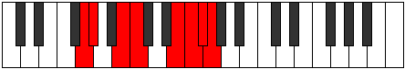 |
| [3637](https://ianring.com/musictheory/scales/3637) | [Kygian](ModeFSharpKygian.md) | F# | F#, G#, A#, B, C###, D##, E#, F# |  |
| [3637](https://ianring.com/musictheory/scales/3637) | [Kygian](ModeGFlatKygian.md) | Gb | Gb, Ab, Bb, Cb, D#, E, F, Gb |  |
| [3639](https://ianring.com/musictheory/scales/3639) | [Paptyllic](ModeGNaturalPaptyllic.md) | G | G, G#, A, B, C, E, F, F#, G |  |
| [3639](https://ianring.com/musictheory/scales/3639) | [Paptyllic](ModeFSharpPaptyllic.md) | F# | F#, G, G#, A#, B, D#, E, F, F# |  |
| [3639](https://ianring.com/musictheory/scales/3639) | [Paptyllic](ModeGFlatPaptyllic.md) | Gb | Gb, G, Ab, Bb, B, Eb, E, F, Gb |  |
| [3643](https://ianring.com/musictheory/scales/3643) | [Kydyllic](ModeGNaturalKydyllic.md) | G | G, G#, A#, B, C, E, F, F#, G |  |
| [3645](https://ianring.com/musictheory/scales/3645) | [Zycryllic](ModeFSharpZycryllic.md) | F# | F#, G#, A, A#, B, D#, E, F, F# |  |
| [3645](https://ianring.com/musictheory/scales/3645) | [Zycryllic](ModeGFlatZycryllic.md) | Gb | Gb, Ab, A, Bb, B, Eb, E, F, Gb |  |
| [3647](https://ianring.com/musictheory/scales/3647) | [Eporygic](ModeGNaturalEporygic.md) | G | G, G#, A, A#, B, C, E, F, F#, G |  |
| [3647](https://ianring.com/musictheory/scales/3647) | [Eporygic](ModeFSharpEporygic.md) | F# | F#, G, G#, A, A#, B, D#, E, F, F# | 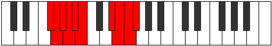 |
| [3647](https://ianring.com/musictheory/scales/3647) | [Eporygic](ModeGFlatEporygic.md) | Gb | Gb, G, Ab, A, Bb, B, Eb, E, F, Gb |  |
| [3659](https://ianring.com/musictheory/scales/3659) | [Polian](ModeFNaturalPolian.md) | F | F, Gb, Ab, B, C##, D#, E, F |  |
| [3663](https://ianring.com/musictheory/scales/3663) | [Sonyllic](ModeFNaturalSonyllic.md) | F | F, F#, G, G#, B, D, D#, E, F |  |
| [3667](https://ianring.com/musictheory/scales/3667) | [Kaptian](ModeGNaturalKaptian.md) | G | G, Ab, B, C#, D##, E#, F#, G |  |
| [3669](https://ianring.com/musictheory/scales/3669) | [Mothian](ModeDNaturalMothian.md) | D | D, E, F#, G#, A##, B#, C#, D |  |
| [3671](https://ianring.com/musictheory/scales/3671) | [Aeonyllic](ModeDNaturalAeonyllic.md) | D | D, D#, E, F#, G#, B, C, C#, D |  |
| [3671](https://ianring.com/musictheory/scales/3671) | [Aeonyllic](ModeGNaturalAeonyllic.md) | G | G, G#, A, B, C#, E, F, F#, G |  |
| [3675](https://ianring.com/musictheory/scales/3675) | [Monyllic](ModeFNaturalMonyllic.md) | F | F, F#, G#, A, B, D, D#, E, F |  |
| [3675](https://ianring.com/musictheory/scales/3675) | [Monyllic](ModeGNaturalMonyllic.md) | G | G, G#, A#, B, C#, E, F, F#, G |  |
| [3677](https://ianring.com/musictheory/scales/3677) | [Katylyllic](ModeDNaturalKatylyllic.md) | D | D, E, F, F#, G#, B, C, C#, D |  |
| [3679](https://ianring.com/musictheory/scales/3679) | [Rycrygic](ModeDNaturalRycrygic.md) | D | D, D#, E, F, F#, G#, B, C, C#, D |  |
| [3679](https://ianring.com/musictheory/scales/3679) | [Rycrygic](ModeFNaturalRycrygic.md) | F | F, F#, G, G#, A, B, D, D#, E, F |  |
| [3679](https://ianring.com/musictheory/scales/3679) | [Rycrygic](ModeGNaturalRycrygic.md) | G | G, G#, A, A#, B, C#, E, F, F#, G |  |
| [3685](https://ianring.com/musictheory/scales/3685) | [Kodian](ModeFSharpKodian.md) | F# | F#, G#, A##, B#, C###, D##, E#, F# |  |
| [3685](https://ianring.com/musictheory/scales/3685) | [Kodian](ModeGFlatKodian.md) | Gb | Gb, Ab, B, C, D#, E, F, Gb |  |
| [3687](https://ianring.com/musictheory/scales/3687) | [Zonyllic](ModeFSharpZonyllic.md) | F# | F#, G, G#, B, C, D#, E, F, F# |  |
| [3687](https://ianring.com/musictheory/scales/3687) | [Zonyllic](ModeGFlatZonyllic.md) | Gb | Gb, G, Ab, B, C, Eb, E, F, Gb |  |
| [3691](https://ianring.com/musictheory/scales/3691) | [Badyllic](ModeFNaturalBadyllic.md) | F | F, F#, G#, A#, B, D, D#, E, F |  |
| [3693](https://ianring.com/musictheory/scales/3693) | [Epaptyllic](ModeFSharpEpaptyllic.md) | F# | F#, G#, A, B, C, D#, E, F, F# |  |
| [3693](https://ianring.com/musictheory/scales/3693) | [Epaptyllic](ModeGFlatEpaptyllic.md) | Gb | Gb, Ab, A, B, C, Eb, E, F, Gb |  |
| [3695](https://ianring.com/musictheory/scales/3695) | [Kodygic](ModeFSharpKodygic.md) | F# | F#, G, G#, A, B, C, D#, E, F, F# |  |
| [3695](https://ianring.com/musictheory/scales/3695) | [Kodygic](ModeGFlatKodygic.md) | Gb | Gb, G, Ab, A, B, C, Eb, E, F, Gb |  |
| [3695](https://ianring.com/musictheory/scales/3695) | [Kodygic](ModeFNaturalKodygic.md) | F | F, F#, G, G#, A#, B, D, D#, E, F |  |
| [3699](https://ianring.com/musictheory/scales/3699) | [Aeolylyllic](ModeGNaturalAeolylyllic.md) | G | G, G#, B, C, C#, E, F, F#, G |  |
| [3701](https://ianring.com/musictheory/scales/3701) | [Bagyllic](ModeDNaturalBagyllic.md) | D | D, E, F#, G, G#, B, C, C#, D |  |
| [3701](https://ianring.com/musictheory/scales/3701) | [Bagyllic](ModeFSharpBagyllic.md) | F# | F#, G#, A#, B, C, D#, E, F, F# |  |
| [3701](https://ianring.com/musictheory/scales/3701) | [Bagyllic](ModeGFlatBagyllic.md) | Gb | Gb, Ab, Bb, B, C, Eb, E, F, Gb |  |
| [3703](https://ianring.com/musictheory/scales/3703) | [Katalygic](ModeDNaturalKatalygic.md) | D | D, D#, E, F#, G, G#, B, C, C#, D |  |
| [3703](https://ianring.com/musictheory/scales/3703) | [Katalygic](ModeGNaturalKatalygic.md) | G | G, G#, A, B, C, C#, E, F, F#, G |  |
| [3703](https://ianring.com/musictheory/scales/3703) | [Katalygic](ModeFSharpKatalygic.md) | F# | F#, G, G#, A#, B, C, D#, E, F, F# |  |
| [3703](https://ianring.com/musictheory/scales/3703) | [Katalygic](ModeGFlatKatalygic.md) | Gb | Gb, G, Ab, Bb, B, C, Eb, E, F, Gb |  |
| [3707](https://ianring.com/musictheory/scales/3707) | [Rynygic](ModeGNaturalRynygic.md) | G | G, G#, A#, B, C, C#, E, F, F#, G |  |
| [3707](https://ianring.com/musictheory/scales/3707) | [Rynygic](ModeFNaturalRynygic.md) | F | F, F#, G#, A, A#, B, D, D#, E, F |  |
| [3709](https://ianring.com/musictheory/scales/3709) | [Locrygic](ModeDNaturalLocrygic.md) | D | D, E, F, F#, G, G#, B, C, C#, D |  |
| [3709](https://ianring.com/musictheory/scales/3709) | [Locrygic](ModeFSharpLocrygic.md) | F# | F#, G#, A, A#, B, C, D#, E, F, F# |  |
| [3709](https://ianring.com/musictheory/scales/3709) | [Locrygic](ModeGFlatLocrygic.md) | Gb | Gb, Ab, A, Bb, B, C, Eb, E, F, Gb |  |
| [3711](https://ianring.com/musictheory/scales/3711) | [Dycryllian](ModeDNaturalDycryllian.md) | D | D, D#, E, F, F#, G, G#, B, C, C#, D |  |
| [3711](https://ianring.com/musictheory/scales/3711) | [Dycryllian](ModeGNaturalDycryllian.md) | G | G, G#, A, A#, B, C, C#, E, F, F#, G |  |
| [3711](https://ianring.com/musictheory/scales/3711) | [Dycryllian](ModeFSharpDycryllian.md) | F# | F#, G, G#, A, A#, B, C, D#, E, F, F# |  |
| [3711](https://ianring.com/musictheory/scales/3711) | [Dycryllian](ModeGFlatDycryllian.md) | Gb | Gb, G, Ab, A, Bb, B, C, Eb, E, F, Gb |  |
| [3711](https://ianring.com/musictheory/scales/3711) | [Dycryllian](ModeFNaturalDycryllian.md) | F | F, F#, G, G#, A, A#, B, D, D#, E, F |  |
| [3725](https://ianring.com/musictheory/scales/3725) | [Kyrian](ModeANaturalKyrian.md) | A | A, B, C, D##, E##, F##, G#, A |  |
| [3727](https://ianring.com/musictheory/scales/3727) | [Tholyllic](ModeANaturalTholyllic.md) | A | A, A#, B, C, E, F#, G, G#, A |  |
| [3731](https://ianring.com/musictheory/scales/3731) | [Aeryrian](ModeGNaturalAeryrian.md) | G | G, Ab, B, C##, D##, E#, F#, G |  |
| [3733](https://ianring.com/musictheory/scales/3733) | [Gycrian](ModeENaturalGycrian.md) | E | E, F#, G#, A##, B##, C##, D#, E |  |
| [3733](https://ianring.com/musictheory/scales/3733) | [Gycrian](ModeANaturalGycrian.md) | A | A, B, C#, D##, E##, F##, G#, A |  |
| [3735](https://ianring.com/musictheory/scales/3735) | [Ionagyllic](ModeENaturalIonagyllic.md) | E | E, F, F#, G#, B, C#, D, D#, E |  |
| [3735](https://ianring.com/musictheory/scales/3735) | [Ionagyllic](ModeGNaturalIonagyllic.md) | G | G, G#, A, B, D, E, F, F#, G |  |
| [3735](https://ianring.com/musictheory/scales/3735) | [Ionagyllic](ModeANaturalIonagyllic.md) | A | A, A#, B, C#, E, F#, G, G#, A |  |
| [3739](https://ianring.com/musictheory/scales/3739) | [Ioninyllic](ModeGNaturalIoninyllic.md) | G | G, G#, A#, B, D, E, F, F#, G |  |
| [3741](https://ianring.com/musictheory/scales/3741) | [Zydyllic](ModeENaturalZydyllic.md) | E | E, F#, G, G#, B, C#, D, D#, E |  |
| [3741](https://ianring.com/musictheory/scales/3741) | [Zydyllic](ModeANaturalZydyllic.md) | A | A, B, C, C#, E, F#, G, G#, A |  |
| [3743](https://ianring.com/musictheory/scales/3743) | [Thadygic](ModeENaturalThadygic.md) | E | E, F, F#, G, G#, B, C#, D, D#, E |  |
| [3743](https://ianring.com/musictheory/scales/3743) | [Thadygic](ModeANaturalThadygic.md) | A | A, A#, B, C, C#, E, F#, G, G#, A |  |
| [3743](https://ianring.com/musictheory/scales/3743) | [Thadygic](ModeGNaturalThadygic.md) | G | G, G#, A, A#, B, D, E, F, F#, G |  |
| [3747](https://ianring.com/musictheory/scales/3747) | [Myrian](ModeBNaturalMyrian.md) | B | B, C, D##, E##, F###, G##, A#, B |  |
| [3749](https://ianring.com/musictheory/scales/3749) | [Zothian](ModeFSharpZothian.md) | F# | F#, G#, A##, B##, C###, D##, E#, F# |  |
| [3749](https://ianring.com/musictheory/scales/3749) | [Zothian](ModeGFlatZothian.md) | Gb | Gb, Ab, B, C#, D#, E, F, Gb |  |
| [3749](https://ianring.com/musictheory/scales/3749) | [Zothian](ModeANaturalZothian.md) | A | A, B, C##, D##, E##, F##, G#, A |  |
| [3749](https://ianring.com/musictheory/scales/3749) | [Zothian](ModeBNaturalZothian.md) | B | B, C#, D##, E##, F###, G##, A#, B |  |
| [3751](https://ianring.com/musictheory/scales/3751) | [Aerathyllic](ModeFSharpAerathyllic.md) | F# | F#, G, G#, B, C#, D#, E, F, F# |  |
| [3751](https://ianring.com/musictheory/scales/3751) | [Aerathyllic](ModeGFlatAerathyllic.md) | Gb | Gb, G, Ab, B, Db, Eb, E, F, Gb |  |
| [3751](https://ianring.com/musictheory/scales/3751) | [Aerathyllic](ModeBNaturalAerathyllic.md) | B | B, C, C#, E, F#, G#, A, A#, B |  |
| [3751](https://ianring.com/musictheory/scales/3751) | [Aerathyllic](ModeANaturalAerathyllic.md) | A | A, A#, B, D, E, F#, G, G#, A |  |
| [3753](https://ianring.com/musictheory/scales/3753) | [Phraptian](ModeDFlatPhraptian.md) | Db | Db, E, F#, G#, A#, B, C, Db |  |
| [3753](https://ianring.com/musictheory/scales/3753) | [Phraptian](ModeBNaturalPhraptian.md) | B | B, C##, D##, E##, F###, G##, A#, B |  |
| [3755](https://ianring.com/musictheory/scales/3755) | [Phryryllic](ModeCSharpPhryryllic.md) | C# | C#, D, E, F#, G#, A#, B, C, C# |  |
| [3755](https://ianring.com/musictheory/scales/3755) | [Phryryllic](ModeDFlatPhryryllic.md) | Db | Db, D, E, Gb, Ab, Bb, B, C, Db |  |
| [3755](https://ianring.com/musictheory/scales/3755) | [Phryryllic](ModeBNaturalPhryryllic.md) | B | B, C, D, E, F#, G#, A, A#, B |  |
| [3757](https://ianring.com/musictheory/scales/3757) | [Goptyllic](ModeFSharpGoptyllic.md) | F# | F#, G#, A, B, C#, D#, E, F, F# |  |
| [3757](https://ianring.com/musictheory/scales/3757) | [Goptyllic](ModeGFlatGoptyllic.md) | Gb | Gb, Ab, A, B, Db, Eb, E, F, Gb |  |
| [3757](https://ianring.com/musictheory/scales/3757) | [Goptyllic](ModeANaturalGoptyllic.md) | A | A, B, C, D, E, F#, G, G#, A |  |
| [3757](https://ianring.com/musictheory/scales/3757) | [Goptyllic](ModeCSharpGoptyllic.md) | C# | C#, D#, E, F#, G#, A#, B, C, C# |  |
| [3757](https://ianring.com/musictheory/scales/3757) | [Goptyllic](ModeDFlatGoptyllic.md) | Db | Db, Eb, E, Gb, Ab, Bb, B, C, Db |  |
| [3757](https://ianring.com/musictheory/scales/3757) | [Goptyllic](ModeBNaturalGoptyllic.md) | B | B, C#, D, E, F#, G#, A, A#, B |  |
| [3759](https://ianring.com/musictheory/scales/3759) | [Darygic](ModeFSharpDarygic.md) | F# | F#, G, G#, A, B, C#, D#, E, F, F# |  |
| [3759](https://ianring.com/musictheory/scales/3759) | [Darygic](ModeGFlatDarygic.md) | Gb | Gb, G, Ab, A, B, Db, Eb, E, F, Gb |  |
| [3759](https://ianring.com/musictheory/scales/3759) | [Darygic](ModeCSharpDarygic.md) | C# | C#, D, D#, E, F#, G#, A#, B, C, C# |  |
| [3759](https://ianring.com/musictheory/scales/3759) | [Darygic](ModeDFlatDarygic.md) | Db | Db, D, Eb, E, Gb, Ab, Bb, B, C, Db |  |
| [3759](https://ianring.com/musictheory/scales/3759) | [Darygic](ModeBNaturalDarygic.md) | B | B, C, C#, D, E, F#, G#, A, A#, B |  |
| [3759](https://ianring.com/musictheory/scales/3759) | [Darygic](ModeANaturalDarygic.md) | A | A, A#, B, C, D, E, F#, G, G#, A |  |
| [3761](https://ianring.com/musictheory/scales/3761) | [Ionythian](ModeBNaturalIonythian.md) | B | B, C###, D##, E##, F###, G##, A#, B |  |
| [3763](https://ianring.com/musictheory/scales/3763) | [Modyllic](ModeGNaturalModyllic.md) | G | G, G#, B, C, D, E, F, F#, G |  |
| [3763](https://ianring.com/musictheory/scales/3763) | [Modyllic](ModeBNaturalModyllic.md) | B | B, C, D#, E, F#, G#, A, A#, B |  |
| [3765](https://ianring.com/musictheory/scales/3765) | [Aerycryllic](ModeENaturalAerycryllic.md) | E | E, F#, G#, A, B, C#, D, D#, E |  |
| [3765](https://ianring.com/musictheory/scales/3765) | [Aerycryllic](ModeANaturalAerycryllic.md) | A | A, B, C#, D, E, F#, G, G#, A |  |
| [3765](https://ianring.com/musictheory/scales/3765) | [Aerycryllic](ModeFSharpAerycryllic.md) | F# | F#, G#, A#, B, C#, D#, E, F, F# |  |
| [3765](https://ianring.com/musictheory/scales/3765) | [Aerycryllic](ModeGFlatAerycryllic.md) | Gb | Gb, Ab, Bb, B, Db, Eb, E, F, Gb |  |
| [3765](https://ianring.com/musictheory/scales/3765) | [Aerycryllic](ModeBNaturalAerycryllic.md) | B | B, C#, D#, E, F#, G#, A, A#, B |  |
| [3767](https://ianring.com/musictheory/scales/3767) | [Bacrygic](ModeENaturalBacrygic.md) | E | E, F, F#, G#, A, B, C#, D, D#, E |  |
| [3767](https://ianring.com/musictheory/scales/3767) | [Bacrygic](ModeGNaturalBacrygic.md) | G | G, G#, A, B, C, D, E, F, F#, G |  |
| [3767](https://ianring.com/musictheory/scales/3767) | [Bacrygic](ModeFSharpBacrygic.md) | F# | F#, G, G#, A#, B, C#, D#, E, F, F# |  |
| [3767](https://ianring.com/musictheory/scales/3767) | [Bacrygic](ModeGFlatBacrygic.md) | Gb | Gb, G, Ab, Bb, B, Db, Eb, E, F, Gb |  |
| [3767](https://ianring.com/musictheory/scales/3767) | [Bacrygic](ModeBNaturalBacrygic.md) | B | B, C, C#, D#, E, F#, G#, A, A#, B |  |
| [3767](https://ianring.com/musictheory/scales/3767) | [Bacrygic](ModeANaturalBacrygic.md) | A | A, A#, B, C#, D, E, F#, G, G#, A |  |
| [3769](https://ianring.com/musictheory/scales/3769) | [Aeracryllic](ModeCSharpAeracryllic.md) | C# | C#, E, F, F#, G#, A#, B, C, C# |  |
| [3769](https://ianring.com/musictheory/scales/3769) | [Aeracryllic](ModeDFlatAeracryllic.md) | Db | Db, E, F, Gb, Ab, Bb, B, C, Db |  |
| [3769](https://ianring.com/musictheory/scales/3769) | [Aeracryllic](ModeBNaturalAeracryllic.md) | B | B, D, D#, E, F#, G#, A, A#, B |  |
| [3771](https://ianring.com/musictheory/scales/3771) | [Stophygic](ModeCSharpStophygic.md) | C# | C#, D, E, F, F#, G#, A#, B, C, C# |  |
| [3771](https://ianring.com/musictheory/scales/3771) | [Stophygic](ModeDFlatStophygic.md) | Db | Db, D, E, F, Gb, Ab, Bb, B, C, Db |  |
| [3771](https://ianring.com/musictheory/scales/3771) | [Stophygic](ModeGNaturalStophygic.md) | G | G, G#, A#, B, C, D, E, F, F#, G |  |
| [3771](https://ianring.com/musictheory/scales/3771) | [Stophygic](ModeBNaturalStophygic.md) | B | B, C, D, D#, E, F#, G#, A, A#, B |  |
| [3773](https://ianring.com/musictheory/scales/3773) | [Sorygic](ModeANaturalSorygic.md) | A | A, B, C, C#, D, E, F#, G, G#, A |  |
| [3773](https://ianring.com/musictheory/scales/3773) | [Sorygic](ModeENaturalSorygic.md) | E | E, F#, G, G#, A, B, C#, D, D#, E |  |
| [3773](https://ianring.com/musictheory/scales/3773) | [Sorygic](ModeCSharpSorygic.md) | C# | C#, D#, E, F, F#, G#, A#, B, C, C# |  |
| [3773](https://ianring.com/musictheory/scales/3773) | [Sorygic](ModeDFlatSorygic.md) | Db | Db, Eb, E, F, Gb, Ab, Bb, B, C, Db |  |
| [3773](https://ianring.com/musictheory/scales/3773) | [Sorygic](ModeBNaturalSorygic.md) | B | B, C#, D, D#, E, F#, G#, A, A#, B |  |
| [3773](https://ianring.com/musictheory/scales/3773) | [Sorygic](ModeFSharpSorygic.md) | F# | F#, G#, A, A#, B, C#, D#, E, F, F# |  |
| [3773](https://ianring.com/musictheory/scales/3773) | [Sorygic](ModeGFlatSorygic.md) | Gb | Gb, Ab, A, Bb, B, Db, Eb, E, F, Gb |  |
| [3775](https://ianring.com/musictheory/scales/3775) | [Loptyllian](ModeENaturalLoptyllian.md) | E | E, F, F#, G, G#, A, B, C#, D, D#, E |  |
| [3775](https://ianring.com/musictheory/scales/3775) | [Loptyllian](ModeCSharpLoptyllian.md) | C# | C#, D, D#, E, F, F#, G#, A#, B, C, C# |  |
| [3775](https://ianring.com/musictheory/scales/3775) | [Loptyllian](ModeDFlatLoptyllian.md) | Db | Db, D, Eb, E, F, Gb, Ab, Bb, B, C, Db |  |
| [3775](https://ianring.com/musictheory/scales/3775) | [Loptyllian](ModeBNaturalLoptyllian.md) | B | B, C, C#, D, D#, E, F#, G#, A, A#, B |  |
| [3775](https://ianring.com/musictheory/scales/3775) | [Loptyllian](ModeANaturalLoptyllian.md) | A | A, A#, B, C, C#, D, E, F#, G, G#, A |  |
| [3775](https://ianring.com/musictheory/scales/3775) | [Loptyllian](ModeGNaturalLoptyllian.md) | G | G, G#, A, A#, B, C, D, E, F, F#, G |  |
| [3775](https://ianring.com/musictheory/scales/3775) | [Loptyllian](ModeFSharpLoptyllian.md) | F# | F#, G, G#, A, A#, B, C#, D#, E, F, F# |  |
| [3775](https://ianring.com/musictheory/scales/3775) | [Loptyllian](ModeGFlatLoptyllian.md) | Gb | Gb, G, Ab, A, Bb, B, Db, Eb, E, F, Gb |  |
| [3781](https://ianring.com/musictheory/scales/3781) | [Gyphian](ModeANaturalGyphian.md) | A | A, B, C###, D##, E##, F##, G#, A |  |
| [3783](https://ianring.com/musictheory/scales/3783) | [Phrygyllic](ModeANaturalPhrygyllic.md) | A | A, A#, B, D#, E, F#, G, G#, A |  |
| [3787](https://ianring.com/musictheory/scales/3787) | [Kagyllic](ModeFNaturalKagyllic.md) | F | F, F#, G#, B, C, D, D#, E, F |  |
| [3789](https://ianring.com/musictheory/scales/3789) | [Eporyllic](ModeANaturalEporyllic.md) | A | A, B, C, D#, E, F#, G, G#, A |  |
| [3791](https://ianring.com/musictheory/scales/3791) | [Stodygic](ModeFNaturalStodygic.md) | F | F, F#, G, G#, B, C, D, D#, E, F |  |
| [3791](https://ianring.com/musictheory/scales/3791) | [Stodygic](ModeANaturalStodygic.md) | A | A, A#, B, C, D#, E, F#, G, G#, A |  |
| [3795](https://ianring.com/musictheory/scales/3795) | [Epothyllic](ModeGNaturalEpothyllic.md) | G | G, G#, B, C#, D, E, F, F#, G |  |
| [3797](https://ianring.com/musictheory/scales/3797) | [Rocryllic](ModeDNaturalRocryllic.md) | D | D, E, F#, G#, A, B, C, C#, D |  |
| [3797](https://ianring.com/musictheory/scales/3797) | [Rocryllic](ModeANaturalRocryllic.md) | A | A, B, C#, D#, E, F#, G, G#, A |  |
| [3797](https://ianring.com/musictheory/scales/3797) | [Rocryllic](ModeENaturalRocryllic.md) | E | E, F#, G#, A#, B, C#, D, D#, E |  |
| [3799](https://ianring.com/musictheory/scales/3799) | [Aeralygic](ModeDNaturalAeralygic.md) | D | D, D#, E, F#, G#, A, B, C, C#, D |  |
| [3799](https://ianring.com/musictheory/scales/3799) | [Aeralygic](ModeGNaturalAeralygic.md) | G | G, G#, A, B, C#, D, E, F, F#, G |  |
| [3799](https://ianring.com/musictheory/scales/3799) | [Aeralygic](ModeENaturalAeralygic.md) | E | E, F, F#, G#, A#, B, C#, D, D#, E |  |
| [3799](https://ianring.com/musictheory/scales/3799) | [Aeralygic](ModeANaturalAeralygic.md) | A | A, A#, B, C#, D#, E, F#, G, G#, A |  |
| [3803](https://ianring.com/musictheory/scales/3803) | [Epidygic](ModeFNaturalEpidygic.md) | F | F, F#, G#, A, B, C, D, D#, E, F |  |
| [3803](https://ianring.com/musictheory/scales/3803) | [Epidygic](ModeGNaturalEpidygic.md) | G | G, G#, A#, B, C#, D, E, F, F#, G |  |
| [3805](https://ianring.com/musictheory/scales/3805) | [Moptygic](ModeDNaturalMoptygic.md) | D | D, E, F, F#, G#, A, B, C, C#, D |  |
| [3805](https://ianring.com/musictheory/scales/3805) | [Moptygic](ModeANaturalMoptygic.md) | A | A, B, C, C#, D#, E, F#, G, G#, A |  |
| [3805](https://ianring.com/musictheory/scales/3805) | [Moptygic](ModeENaturalMoptygic.md) | E | E, F#, G, G#, A#, B, C#, D, D#, E |  |
| [3807](https://ianring.com/musictheory/scales/3807) | [Bagyllian](ModeDNaturalBagyllian.md) | D | D, D#, E, F, F#, G#, A, B, C, C#, D |  |
| [3807](https://ianring.com/musictheory/scales/3807) | [Bagyllian](ModeFNaturalBagyllian.md) | F | F, F#, G, G#, A, B, C, D, D#, E, F |  |
| [3807](https://ianring.com/musictheory/scales/3807) | [Bagyllian](ModeENaturalBagyllian.md) | E | E, F, F#, G, G#, A#, B, C#, D, D#, E |  |
| [3807](https://ianring.com/musictheory/scales/3807) | [Bagyllian](ModeANaturalBagyllian.md) | A | A, A#, B, C, C#, D#, E, F#, G, G#, A |  |
| [3807](https://ianring.com/musictheory/scales/3807) | [Bagyllian](ModeGNaturalBagyllian.md) | G | G, G#, A, A#, B, C#, D, E, F, F#, G |  |
| [3811](https://ianring.com/musictheory/scales/3811) | [Epogyllic](ModeBNaturalEpogyllic.md) | B | B, C, E, F, F#, G#, A, A#, B |  |
| [3813](https://ianring.com/musictheory/scales/3813) | [Aeologyllic](ModeFSharpAeologyllic.md) | F# | F#, G#, B, C, C#, D#, E, F, F# |  |
| [3813](https://ianring.com/musictheory/scales/3813) | [Aeologyllic](ModeGFlatAeologyllic.md) | Gb | Gb, Ab, B, C, Db, Eb, E, F, Gb |  |
| [3813](https://ianring.com/musictheory/scales/3813) | [Aeologyllic](ModeANaturalAeologyllic.md) | A | A, B, D, D#, E, F#, G, G#, A |  |
| [3813](https://ianring.com/musictheory/scales/3813) | [Aeologyllic](ModeBNaturalAeologyllic.md) | B | B, C#, E, F, F#, G#, A, A#, B |  |
| [3815](https://ianring.com/musictheory/scales/3815) | [Mylygic](ModeFSharpMylygic.md) | F# | F#, G, G#, B, C, C#, D#, E, F, F# |  |
| [3815](https://ianring.com/musictheory/scales/3815) | [Mylygic](ModeGFlatMylygic.md) | Gb | Gb, G, Ab, B, C, Db, Eb, E, F, Gb |  |
| [3815](https://ianring.com/musictheory/scales/3815) | [Mylygic](ModeBNaturalMylygic.md) | B | B, C, C#, E, F, F#, G#, A, A#, B |  |
| [3815](https://ianring.com/musictheory/scales/3815) | [Mylygic](ModeANaturalMylygic.md) | A | A, A#, B, D, D#, E, F#, G, G#, A |  |
| [3817](https://ianring.com/musictheory/scales/3817) | [Zoryllic](ModeCSharpZoryllic.md) | C# | C#, E, F#, G, G#, A#, B, C, C# |  |
| [3817](https://ianring.com/musictheory/scales/3817) | [Zoryllic](ModeDFlatZoryllic.md) | Db | Db, E, Gb, G, Ab, Bb, B, C, Db |  |
| [3817](https://ianring.com/musictheory/scales/3817) | [Zoryllic](ModeBNaturalZoryllic.md) | B | B, D, E, F, F#, G#, A, A#, B |  |
| [3819](https://ianring.com/musictheory/scales/3819) | [Aeolanygic](ModeFNaturalAeolanygic.md) | F | F, F#, G#, A#, B, C, D, D#, E, F |  |
| [3819](https://ianring.com/musictheory/scales/3819) | [Aeolanygic](ModeCSharpAeolanygic.md) | C# | C#, D, E, F#, G, G#, A#, B, C, C# |  |
| [3819](https://ianring.com/musictheory/scales/3819) | [Aeolanygic](ModeDFlatAeolanygic.md) | Db | Db, D, E, Gb, G, Ab, Bb, B, C, Db |  |
| [3819](https://ianring.com/musictheory/scales/3819) | [Aeolanygic](ModeBNaturalAeolanygic.md) | B | B, C, D, E, F, F#, G#, A, A#, B |  |
| [3821](https://ianring.com/musictheory/scales/3821) | [Epyrygic](ModeFSharpEpyrygic.md) | F# | F#, G#, A, B, C, C#, D#, E, F, F# |  |
| [3821](https://ianring.com/musictheory/scales/3821) | [Epyrygic](ModeGFlatEpyrygic.md) | Gb | Gb, Ab, A, B, C, Db, Eb, E, F, Gb |  |
| [3821](https://ianring.com/musictheory/scales/3821) | [Epyrygic](ModeANaturalEpyrygic.md) | A | A, B, C, D, D#, E, F#, G, G#, A |  |
| [3821](https://ianring.com/musictheory/scales/3821) | [Epyrygic](ModeCSharpEpyrygic.md) | C# | C#, D#, E, F#, G, G#, A#, B, C, C# |  |
| [3821](https://ianring.com/musictheory/scales/3821) | [Epyrygic](ModeDFlatEpyrygic.md) | Db | Db, Eb, E, Gb, G, Ab, Bb, B, C, Db |  |
| [3821](https://ianring.com/musictheory/scales/3821) | [Epyrygic](ModeBNaturalEpyrygic.md) | B | B, C#, D, E, F, F#, G#, A, A#, B |  |
| [3823](https://ianring.com/musictheory/scales/3823) | [Epinyllian](ModeFSharpEpinyllian.md) | F# | F#, G, G#, A, B, C, C#, D#, E, F, F# |  |
| [3823](https://ianring.com/musictheory/scales/3823) | [Epinyllian](ModeGFlatEpinyllian.md) | Gb | Gb, G, Ab, A, B, C, Db, Eb, E, F, Gb |  |
| [3823](https://ianring.com/musictheory/scales/3823) | [Epinyllian](ModeCSharpEpinyllian.md) | C# | C#, D, D#, E, F#, G, G#, A#, B, C, C# |  |
| [3823](https://ianring.com/musictheory/scales/3823) | [Epinyllian](ModeDFlatEpinyllian.md) | Db | Db, D, Eb, E, Gb, G, Ab, Bb, B, C, Db |  |
| [3823](https://ianring.com/musictheory/scales/3823) | [Epinyllian](ModeFNaturalEpinyllian.md) | F | F, F#, G, G#, A#, B, C, D, D#, E, F |  |
| [3823](https://ianring.com/musictheory/scales/3823) | [Epinyllian](ModeBNaturalEpinyllian.md) | B | B, C, C#, D, E, F, F#, G#, A, A#, B |  |
| [3823](https://ianring.com/musictheory/scales/3823) | [Epinyllian](ModeANaturalEpinyllian.md) | A | A, A#, B, C, D, D#, E, F#, G, G#, A |  |
| [3825](https://ianring.com/musictheory/scales/3825) | [Pynyllic](ModeBNaturalPynyllic.md) | B | B, D#, E, F, F#, G#, A, A#, B |  |
| [3827](https://ianring.com/musictheory/scales/3827) | [Dorygic](ModeGNaturalDorygic.md) | G | G, G#, B, C, C#, D, E, F, F#, G |  |
| [3827](https://ianring.com/musictheory/scales/3827) | [Dorygic](ModeBNaturalDorygic.md) | B | B, C, D#, E, F, F#, G#, A, A#, B |  |
| [3829](https://ianring.com/musictheory/scales/3829) | [Aerycrygic](ModeDNaturalAerycrygic.md) | D | D, E, F#, G, G#, A, B, C, C#, D |  |
| [3829](https://ianring.com/musictheory/scales/3829) | [Aerycrygic](ModeANaturalAerycrygic.md) | A | A, B, C#, D, D#, E, F#, G, G#, A |  |
| [3829](https://ianring.com/musictheory/scales/3829) | [Aerycrygic](ModeFSharpAerycrygic.md) | F# | F#, G#, A#, B, C, C#, D#, E, F, F# |  |
| [3829](https://ianring.com/musictheory/scales/3829) | [Aerycrygic](ModeGFlatAerycrygic.md) | Gb | Gb, Ab, Bb, B, C, Db, Eb, E, F, Gb |  |
| [3829](https://ianring.com/musictheory/scales/3829) | [Aerycrygic](ModeENaturalAerycrygic.md) | E | E, F#, G#, A, A#, B, C#, D, D#, E |  |
| [3829](https://ianring.com/musictheory/scales/3829) | [Aerycrygic](ModeBNaturalAerycrygic.md) | B | B, C#, D#, E, F, F#, G#, A, A#, B |  |
| [3831](https://ianring.com/musictheory/scales/3831) | [Ionyllian](ModeDNaturalIonyllian.md) | D | D, D#, E, F#, G, G#, A, B, C, C#, D |  |
| [3831](https://ianring.com/musictheory/scales/3831) | [Ionyllian](ModeGNaturalIonyllian.md) | G | G, G#, A, B, C, C#, D, E, F, F#, G |  |
| [3831](https://ianring.com/musictheory/scales/3831) | [Ionyllian](ModeFSharpIonyllian.md) | F# | F#, G, G#, A#, B, C, C#, D#, E, F, F# |  |
| [3831](https://ianring.com/musictheory/scales/3831) | [Ionyllian](ModeGFlatIonyllian.md) | Gb | Gb, G, Ab, Bb, B, C, Db, Eb, E, F, Gb |  |
| [3831](https://ianring.com/musictheory/scales/3831) | [Ionyllian](ModeBNaturalIonyllian.md) | B | B, C, C#, D#, E, F, F#, G#, A, A#, B |  |
| [3831](https://ianring.com/musictheory/scales/3831) | [Ionyllian](ModeENaturalIonyllian.md) | E | E, F, F#, G#, A, A#, B, C#, D, D#, E |  |
| [3831](https://ianring.com/musictheory/scales/3831) | [Ionyllian](ModeANaturalIonyllian.md) | A | A, A#, B, C#, D, D#, E, F#, G, G#, A |  |
| [3833](https://ianring.com/musictheory/scales/3833) | [Dycrygic](ModeCSharpDycrygic.md) | C# | C#, E, F, F#, G, G#, A#, B, C, C# |  |
| [3833](https://ianring.com/musictheory/scales/3833) | [Dycrygic](ModeDFlatDycrygic.md) | Db | Db, E, F, Gb, G, Ab, Bb, B, C, Db |  |
| [3833](https://ianring.com/musictheory/scales/3833) | [Dycrygic](ModeBNaturalDycrygic.md) | B | B, D, D#, E, F, F#, G#, A, A#, B |  |
| [3835](https://ianring.com/musictheory/scales/3835) | [Katodyllian](ModeCSharpKatodyllian.md) | C# | C#, D, E, F, F#, G, G#, A#, B, C, C# |  |
| [3835](https://ianring.com/musictheory/scales/3835) | [Katodyllian](ModeDFlatKatodyllian.md) | Db | Db, D, E, F, Gb, G, Ab, Bb, B, C, Db |  |
| [3835](https://ianring.com/musictheory/scales/3835) | [Katodyllian](ModeGNaturalKatodyllian.md) | G | G, G#, A#, B, C, C#, D, E, F, F#, G |  |
| [3835](https://ianring.com/musictheory/scales/3835) | [Katodyllian](ModeFNaturalKatodyllian.md) | F | F, F#, G#, A, A#, B, C, D, D#, E, F |  |
| [3835](https://ianring.com/musictheory/scales/3835) | [Katodyllian](ModeBNaturalKatodyllian.md) | B | B, C, D, D#, E, F, F#, G#, A, A#, B |  |
| [3837](https://ianring.com/musictheory/scales/3837) | [Garyllian](ModeANaturalGaryllian.md) | A | A, B, C, C#, D, D#, E, F#, G, G#, A |  |
| [3837](https://ianring.com/musictheory/scales/3837) | [Garyllian](ModeDNaturalGaryllian.md) | D | D, E, F, F#, G, G#, A, B, C, C#, D |  |
| [3837](https://ianring.com/musictheory/scales/3837) | [Garyllian](ModeCSharpGaryllian.md) | C# | C#, D#, E, F, F#, G, G#, A#, B, C, C# |  |
| [3837](https://ianring.com/musictheory/scales/3837) | [Garyllian](ModeDFlatGaryllian.md) | Db | Db, Eb, E, F, Gb, G, Ab, Bb, B, C, Db |  |
| [3837](https://ianring.com/musictheory/scales/3837) | [Garyllian](ModeFSharpGaryllian.md) | F# | F#, G#, A, A#, B, C, C#, D#, E, F, F# |  |
| [3837](https://ianring.com/musictheory/scales/3837) | [Garyllian](ModeGFlatGaryllian.md) | Gb | Gb, Ab, A, Bb, B, C, Db, Eb, E, F, Gb |  |
| [3837](https://ianring.com/musictheory/scales/3837) | [Garyllian](ModeBNaturalGaryllian.md) | B | B, C#, D, D#, E, F, F#, G#, A, A#, B |  |
| [3837](https://ianring.com/musictheory/scales/3837) | [Garyllian](ModeENaturalGaryllian.md) | E | E, F#, G, G#, A, A#, B, C#, D, D#, E |  |
| [3839](https://ianring.com/musictheory/scales/3839) | [Mixolatic](ModeDNaturalMixolatic.md) | D | D, D#, E, F, F#, G, G#, A, B, C, C#, D |  |
| [3839](https://ianring.com/musictheory/scales/3839) | [Mixolatic](ModeCSharpMixolatic.md) | C# | C#, D, D#, E, F, F#, G, G#, A#, B, C, C# |  |
| [3839](https://ianring.com/musictheory/scales/3839) | [Mixolatic](ModeDFlatMixolatic.md) | Db | Db, D, Eb, E, F, Gb, G, Ab, Bb, B, C, Db |  |
| [3839](https://ianring.com/musictheory/scales/3839) | [Mixolatic](ModeBNaturalMixolatic.md) | B | B, C, C#, D, D#, E, F, F#, G#, A, A#, B |  |
| [3839](https://ianring.com/musictheory/scales/3839) | [Mixolatic](ModeANaturalMixolatic.md) | A | A, A#, B, C, C#, D, D#, E, F#, G, G#, A |  |
| [3839](https://ianring.com/musictheory/scales/3839) | [Mixolatic](ModeGNaturalMixolatic.md) | G | G, G#, A, A#, B, C, C#, D, E, F, F#, G |  |
| [3839](https://ianring.com/musictheory/scales/3839) | [Mixolatic](ModeFSharpMixolatic.md) | F# | F#, G, G#, A, A#, B, C, C#, D#, E, F, F# |  |
| [3839](https://ianring.com/musictheory/scales/3839) | [Mixolatic](ModeGFlatMixolatic.md) | Gb | Gb, G, Ab, A, Bb, B, C, Db, Eb, E, F, Gb |  |
| [3839](https://ianring.com/musictheory/scales/3839) | [Mixolatic](ModeFNaturalMixolatic.md) | F | F, F#, G, G#, A, A#, B, C, D, D#, E, F |  |
| [3839](https://ianring.com/musictheory/scales/3839) | [Mixolatic](ModeENaturalMixolatic.md) | E | E, F, F#, G, G#, A, A#, B, C#, D, D#, E |  |
| [3859](https://ianring.com/musictheory/scales/3859) | [Aeolarian](ModeGNaturalAeolarian.md) | G | G, Ab, B, C###, D##, E#, F#, G |  |
| [3863](https://ianring.com/musictheory/scales/3863) | [Eparyllic](ModeGNaturalEparyllic.md) | G | G, G#, A, B, D#, E, F, F#, G |  |
| [3865](https://ianring.com/musictheory/scales/3865) | [Starian](ModeGSharpStarian.md) | G# | G#, A##, B#, D##, E#, F#, G, G# |  |
| [3865](https://ianring.com/musictheory/scales/3865) | [Starian](ModeAFlatStarian.md) | Ab | Ab, B, C, D##, E#, F#, G, Ab |  |
| [3867](https://ianring.com/musictheory/scales/3867) | [Storyllic](ModeGSharpStoryllic.md) | G# | G#, A, B, C, E, F, F#, G, G# |  |
| [3867](https://ianring.com/musictheory/scales/3867) | [Storyllic](ModeAFlatStoryllic.md) | Ab | Ab, A, B, C, E, F, Gb, G, Ab |  |
| [3867](https://ianring.com/musictheory/scales/3867) | [Storyllic](ModeGNaturalStoryllic.md) | G | G, G#, A#, B, D#, E, F, F#, G |  |
| [3869](https://ianring.com/musictheory/scales/3869) | [Bygyllic](ModeGSharpBygyllic.md) | G# | G#, A#, B, C, E, F, F#, G, G# |  |
| [3869](https://ianring.com/musictheory/scales/3869) | [Bygyllic](ModeAFlatBygyllic.md) | Ab | Ab, Bb, B, C, E, F, Gb, G, Ab |  |
| [3871](https://ianring.com/musictheory/scales/3871) | [Aerynygic](ModeGSharpAerynygic.md) | G# | G#, A, A#, B, C, E, F, F#, G, G# |  |
| [3871](https://ianring.com/musictheory/scales/3871) | [Aerynygic](ModeAFlatAerynygic.md) | Ab | Ab, A, Bb, B, C, E, F, Gb, G, Ab |  |
| [3871](https://ianring.com/musictheory/scales/3871) | [Aerynygic](ModeGNaturalAerynygic.md) | G | G, G#, A, A#, B, D#, E, F, F#, G |  |
| [3877](https://ianring.com/musictheory/scales/3877) | [Thanian](ModeFSharpThanian.md) | F# | F#, G#, A##, B###, C###, D##, E#, F# |  |
| [3877](https://ianring.com/musictheory/scales/3877) | [Thanian](ModeGFlatThanian.md) | Gb | Gb, Ab, B, C##, D#, E, F, Gb |  |
| [3879](https://ianring.com/musictheory/scales/3879) | [Pathyllic](ModeFSharpPathyllic.md) | F# | F#, G, G#, B, D, D#, E, F, F# |  |
| [3879](https://ianring.com/musictheory/scales/3879) | [Pathyllic](ModeGFlatPathyllic.md) | Gb | Gb, G, Ab, B, D, Eb, E, F, Gb |  |
| [3881](https://ianring.com/musictheory/scales/3881) | [Morian](ModeGSharpMorian.md) | G# | G#, A##, B##, D##, E#, F#, G, G# |  |
| [3881](https://ianring.com/musictheory/scales/3881) | [Morian](ModeAFlatMorian.md) | Ab | Ab, B, C#, D##, E#, F#, G, Ab |  |
| [3883](https://ianring.com/musictheory/scales/3883) | [Kyryllic](ModeDSharpKyryllic.md) | D# | D#, E, F#, G#, B, C, C#, D, D# |  |
| [3883](https://ianring.com/musictheory/scales/3883) | [Kyryllic](ModeEFlatKyryllic.md) | Eb | Eb, E, Gb, Ab, B, C, Db, D, Eb |  |
| [3883](https://ianring.com/musictheory/scales/3883) | [Kyryllic](ModeGSharpKyryllic.md) | G# | G#, A, B, C#, E, F, F#, G, G# |  |
| [3883](https://ianring.com/musictheory/scales/3883) | [Kyryllic](ModeAFlatKyryllic.md) | Ab | Ab, A, B, Db, E, F, Gb, G, Ab |  |
| [3885](https://ianring.com/musictheory/scales/3885) | [Styryllic](ModeFSharpStyryllic.md) | F# | F#, G#, A, B, D, D#, E, F, F# |  |
| [3885](https://ianring.com/musictheory/scales/3885) | [Styryllic](ModeGFlatStyryllic.md) | Gb | Gb, Ab, A, B, D, Eb, E, F, Gb |  |
| [3885](https://ianring.com/musictheory/scales/3885) | [Styryllic](ModeGSharpStyryllic.md) | G# | G#, A#, B, C#, E, F, F#, G, G# |  |
| [3885](https://ianring.com/musictheory/scales/3885) | [Styryllic](ModeAFlatStyryllic.md) | Ab | Ab, Bb, B, Db, E, F, Gb, G, Ab |  |
| [3887](https://ianring.com/musictheory/scales/3887) | [Phrathygic](ModeDSharpPhrathygic.md) | D# | D#, E, F, F#, G#, B, C, C#, D, D# |  |
| [3887](https://ianring.com/musictheory/scales/3887) | [Phrathygic](ModeEFlatPhrathygic.md) | Eb | Eb, E, F, Gb, Ab, B, C, Db, D, Eb |  |
| [3887](https://ianring.com/musictheory/scales/3887) | [Phrathygic](ModeFSharpPhrathygic.md) | F# | F#, G, G#, A, B, D, D#, E, F, F# |  |
| [3887](https://ianring.com/musictheory/scales/3887) | [Phrathygic](ModeGFlatPhrathygic.md) | Gb | Gb, G, Ab, A, B, D, Eb, E, F, Gb |  |
| [3887](https://ianring.com/musictheory/scales/3887) | [Phrathygic](ModeGSharpPhrathygic.md) | G# | G#, A, A#, B, C#, E, F, F#, G, G# |  |
| [3887](https://ianring.com/musictheory/scales/3887) | [Phrathygic](ModeAFlatPhrathygic.md) | Ab | Ab, A, Bb, B, Db, E, F, Gb, G, Ab |  |
| [3891](https://ianring.com/musictheory/scales/3891) | [Ryryllic](ModeGNaturalRyryllic.md) | G | G, G#, B, C, D#, E, F, F#, G |  |
| [3893](https://ianring.com/musictheory/scales/3893) | [Phrocryllic](ModeFSharpPhrocryllic.md) | F# | F#, G#, A#, B, D, D#, E, F, F# |  |
| [3893](https://ianring.com/musictheory/scales/3893) | [Phrocryllic](ModeGFlatPhrocryllic.md) | Gb | Gb, Ab, Bb, B, D, Eb, E, F, Gb |  |
| [3895](https://ianring.com/musictheory/scales/3895) | [Eparygic](ModeGNaturalEparygic.md) | G | G, G#, A, B, C, D#, E, F, F#, G |  |
| [3895](https://ianring.com/musictheory/scales/3895) | [Eparygic](ModeFSharpEparygic.md) | F# | F#, G, G#, A#, B, D, D#, E, F, F# |  |
| [3895](https://ianring.com/musictheory/scales/3895) | [Eparygic](ModeGFlatEparygic.md) | Gb | Gb, G, Ab, Bb, B, D, Eb, E, F, Gb |  |
| [3897](https://ianring.com/musictheory/scales/3897) | [Locryllic](ModeGSharpLocryllic.md) | G# | G#, B, C, C#, E, F, F#, G, G# |  |
| [3897](https://ianring.com/musictheory/scales/3897) | [Locryllic](ModeAFlatLocryllic.md) | Ab | Ab, B, C, Db, E, F, Gb, G, Ab |  |
| [3899](https://ianring.com/musictheory/scales/3899) | [Katorygic](ModeDSharpKatorygic.md) | D# | D#, E, F#, G, G#, B, C, C#, D, D# |  |
| [3899](https://ianring.com/musictheory/scales/3899) | [Katorygic](ModeEFlatKatorygic.md) | Eb | Eb, E, Gb, G, Ab, B, C, Db, D, Eb |  |
| [3899](https://ianring.com/musictheory/scales/3899) | [Katorygic](ModeGSharpKatorygic.md) | G# | G#, A, B, C, C#, E, F, F#, G, G# |  |
| [3899](https://ianring.com/musictheory/scales/3899) | [Katorygic](ModeAFlatKatorygic.md) | Ab | Ab, A, B, C, Db, E, F, Gb, G, Ab |  |
| [3899](https://ianring.com/musictheory/scales/3899) | [Katorygic](ModeGNaturalKatorygic.md) | G | G, G#, A#, B, C, D#, E, F, F#, G |  |
| [3901](https://ianring.com/musictheory/scales/3901) | [Bycrygic](ModeGSharpBycrygic.md) | G# | G#, A#, B, C, C#, E, F, F#, G, G# |  |
| [3901](https://ianring.com/musictheory/scales/3901) | [Bycrygic](ModeAFlatBycrygic.md) | Ab | Ab, Bb, B, C, Db, E, F, Gb, G, Ab |  |
| [3901](https://ianring.com/musictheory/scales/3901) | [Bycrygic](ModeFSharpBycrygic.md) | F# | F#, G#, A, A#, B, D, D#, E, F, F# | 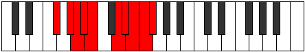 |
| [3901](https://ianring.com/musictheory/scales/3901) | [Bycrygic](ModeGFlatBycrygic.md) | Gb | Gb, Ab, A, Bb, B, D, Eb, E, F, Gb |  |
| [3903](https://ianring.com/musictheory/scales/3903) | [Aeogyllian](ModeDSharpAeogyllian.md) | D# | D#, E, F, F#, G, G#, B, C, C#, D, D# |  |
| [3903](https://ianring.com/musictheory/scales/3903) | [Aeogyllian](ModeEFlatAeogyllian.md) | Eb | Eb, E, F, Gb, G, Ab, B, C, Db, D, Eb |  |
| [3903](https://ianring.com/musictheory/scales/3903) | [Aeogyllian](ModeGSharpAeogyllian.md) | G# | G#, A, A#, B, C, C#, E, F, F#, G, G# |  |
| [3903](https://ianring.com/musictheory/scales/3903) | [Aeogyllian](ModeAFlatAeogyllian.md) | Ab | Ab, A, Bb, B, C, Db, E, F, Gb, G, Ab |  |
| [3903](https://ianring.com/musictheory/scales/3903) | [Aeogyllian](ModeGNaturalAeogyllian.md) | G | G, G#, A, A#, B, C, D#, E, F, F#, G |  |
| [3903](https://ianring.com/musictheory/scales/3903) | [Aeogyllian](ModeFSharpAeogyllian.md) | F# | F#, G, G#, A, A#, B, D, D#, E, F, F# |  |
| [3903](https://ianring.com/musictheory/scales/3903) | [Aeogyllian](ModeGFlatAeogyllian.md) | Gb | Gb, G, Ab, A, Bb, B, D, Eb, E, F, Gb |  |
| [3911](https://ianring.com/musictheory/scales/3911) | [Katyryllic](ModeASharpKatyryllic.md) | A# | A#, B, C, E, F#, G, G#, A, A# |  |
| [3911](https://ianring.com/musictheory/scales/3911) | [Katyryllic](ModeBFlatKatyryllic.md) | Bb | Bb, B, C, E, Gb, G, Ab, A, Bb |  |
| [3913](https://ianring.com/musictheory/scales/3913) | [Bonian](ModeGSharpBonian.md) | G# | G#, A##, B###, D##, E#, F#, G, G# |  |
| [3913](https://ianring.com/musictheory/scales/3913) | [Bonian](ModeAFlatBonian.md) | Ab | Ab, B, C##, D##, E#, F#, G, Ab |  |
| [3915](https://ianring.com/musictheory/scales/3915) | [Gogyllic](ModeFNaturalGogyllic.md) | F | F, F#, G#, B, C#, D, D#, E, F |  |
| [3915](https://ianring.com/musictheory/scales/3915) | [Gogyllic](ModeGSharpGogyllic.md) | G# | G#, A, B, D, E, F, F#, G, G# |  |
| [3915](https://ianring.com/musictheory/scales/3915) | [Gogyllic](ModeAFlatGogyllic.md) | Ab | Ab, A, B, D, E, F, Gb, G, Ab |  |
| [3915](https://ianring.com/musictheory/scales/3915) | [Gogyllic](ModeASharpGogyllic.md) | A# | A#, B, C#, E, F#, G, G#, A, A# |  |
| [3915](https://ianring.com/musictheory/scales/3915) | [Gogyllic](ModeBFlatGogyllic.md) | Bb | Bb, B, Db, E, Gb, G, Ab, A, Bb |  |
| [3917](https://ianring.com/musictheory/scales/3917) | [Epaphyllic](ModeGSharpEpaphyllic.md) | G# | G#, A#, B, D, E, F, F#, G, G# |  |
| [3917](https://ianring.com/musictheory/scales/3917) | [Epaphyllic](ModeAFlatEpaphyllic.md) | Ab | Ab, Bb, B, D, E, F, Gb, G, Ab |  |
| [3919](https://ianring.com/musictheory/scales/3919) | [Lynygic](ModeFNaturalLynygic.md) | F | F, F#, G, G#, B, C#, D, D#, E, F |  |
| [3919](https://ianring.com/musictheory/scales/3919) | [Lynygic](ModeASharpLynygic.md) | A# | A#, B, C, C#, E, F#, G, G#, A, A# |  |
| [3919](https://ianring.com/musictheory/scales/3919) | [Lynygic](ModeBFlatLynygic.md) | Bb | Bb, B, C, Db, E, Gb, G, Ab, A, Bb |  |
| [3919](https://ianring.com/musictheory/scales/3919) | [Lynygic](ModeGSharpLynygic.md) | G# | G#, A, A#, B, D, E, F, F#, G, G# |  |
| [3919](https://ianring.com/musictheory/scales/3919) | [Lynygic](ModeAFlatLynygic.md) | Ab | Ab, A, Bb, B, D, E, F, Gb, G, Ab |  |
| [3921](https://ianring.com/musictheory/scales/3921) | [Pythian](ModeCNaturalPythian.md) | C | C, D##, E##, F###, G##, A#, B, C |  |
| [3923](https://ianring.com/musictheory/scales/3923) | [Stoptyllic](ModeGNaturalStoptyllic.md) | G | G, G#, B, C#, D#, E, F, F#, G |  |
| [3923](https://ianring.com/musictheory/scales/3923) | [Stoptyllic](ModeCNaturalStoptyllic.md) | C | C, C#, E, F#, G#, A, A#, B, C |  |
| [3923](https://ianring.com/musictheory/scales/3923) | [Stoptyllic](ModeASharpStoptyllic.md) | A# | A#, B, D, E, F#, G, G#, A, A# |  |
| [3923](https://ianring.com/musictheory/scales/3923) | [Stoptyllic](ModeBFlatStoptyllic.md) | Bb | Bb, B, D, E, Gb, G, Ab, A, Bb |  |
| [3925](https://ianring.com/musictheory/scales/3925) | [Thyryllic](ModeDNaturalThyryllic.md) | D | D, E, F#, G#, A#, B, C, C#, D |  |
| [3925](https://ianring.com/musictheory/scales/3925) | [Thyryllic](ModeCNaturalThyryllic.md) | C | C, D, E, F#, G#, A, A#, B, C |  |
| [3927](https://ianring.com/musictheory/scales/3927) | [Monygic](ModeGNaturalMonygic.md) | G | G, G#, A, B, C#, D#, E, F, F#, G |  |
| [3927](https://ianring.com/musictheory/scales/3927) | [Monygic](ModeDNaturalMonygic.md) | D | D, D#, E, F#, G#, A#, B, C, C#, D |  |
| [3927](https://ianring.com/musictheory/scales/3927) | [Monygic](ModeCNaturalMonygic.md) | C | C, C#, D, E, F#, G#, A, A#, B, C |  |
| [3927](https://ianring.com/musictheory/scales/3927) | [Monygic](ModeASharpMonygic.md) | A# | A#, B, C, D, E, F#, G, G#, A, A# |  |
| [3927](https://ianring.com/musictheory/scales/3927) | [Monygic](ModeBFlatMonygic.md) | Bb | Bb, B, C, D, E, Gb, G, Ab, A, Bb |  |
| [3929](https://ianring.com/musictheory/scales/3929) | [Aeolothyllic](ModeGSharpAeolothyllic.md) | G# | G#, B, C, D, E, F, F#, G, G# | 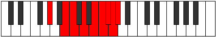 |
| [3929](https://ianring.com/musictheory/scales/3929) | [Aeolothyllic](ModeAFlatAeolothyllic.md) | Ab | Ab, B, C, D, E, F, Gb, G, Ab |  |
| [3929](https://ianring.com/musictheory/scales/3929) | [Aeolothyllic](ModeCNaturalAeolothyllic.md) | C | C, D#, E, F#, G#, A, A#, B, C |  |
| [3931](https://ianring.com/musictheory/scales/3931) | [Aerygic](ModeFNaturalAerygic.md) | F | F, F#, G#, A, B, C#, D, D#, E, F |  |
| [3931](https://ianring.com/musictheory/scales/3931) | [Aerygic](ModeGSharpAerygic.md) | G# | G#, A, B, C, D, E, F, F#, G, G# |  |
| [3931](https://ianring.com/musictheory/scales/3931) | [Aerygic](ModeAFlatAerygic.md) | Ab | Ab, A, B, C, D, E, F, Gb, G, Ab |  |
| [3931](https://ianring.com/musictheory/scales/3931) | [Aerygic](ModeGNaturalAerygic.md) | G | G, G#, A#, B, C#, D#, E, F, F#, G |  |
| [3931](https://ianring.com/musictheory/scales/3931) | [Aerygic](ModeCNaturalAerygic.md) | C | C, C#, D#, E, F#, G#, A, A#, B, C |  |
| [3931](https://ianring.com/musictheory/scales/3931) | [Aerygic](ModeASharpAerygic.md) | A# | A#, B, C#, D, E, F#, G, G#, A, A# |  |
| [3931](https://ianring.com/musictheory/scales/3931) | [Aerygic](ModeBFlatAerygic.md) | Bb | Bb, B, Db, D, E, Gb, G, Ab, A, Bb |  |
| [3933](https://ianring.com/musictheory/scales/3933) | [Ionidygic](ModeDNaturalIonidygic.md) | D | D, E, F, F#, G#, A#, B, C, C#, D |  |
| [3933](https://ianring.com/musictheory/scales/3933) | [Ionidygic](ModeGSharpIonidygic.md) | G# | G#, A#, B, C, D, E, F, F#, G, G# |  |
| [3933](https://ianring.com/musictheory/scales/3933) | [Ionidygic](ModeAFlatIonidygic.md) | Ab | Ab, Bb, B, C, D, E, F, Gb, G, Ab |  |
| [3933](https://ianring.com/musictheory/scales/3933) | [Ionidygic](ModeCNaturalIonidygic.md) | C | C, D, D#, E, F#, G#, A, A#, B, C |  |
| [3935](https://ianring.com/musictheory/scales/3935) | [Kataphyllian](ModeFNaturalKataphyllian.md) | F | F, F#, G, G#, A, B, C#, D, D#, E, F |  |
| [3935](https://ianring.com/musictheory/scales/3935) | [Kataphyllian](ModeDNaturalKataphyllian.md) | D | D, D#, E, F, F#, G#, A#, B, C, C#, D |  |
| [3935](https://ianring.com/musictheory/scales/3935) | [Kataphyllian](ModeCNaturalKataphyllian.md) | C | C, C#, D, D#, E, F#, G#, A, A#, B, C |  |
| [3935](https://ianring.com/musictheory/scales/3935) | [Kataphyllian](ModeASharpKataphyllian.md) | A# | A#, B, C, C#, D, E, F#, G, G#, A, A# |  |
| [3935](https://ianring.com/musictheory/scales/3935) | [Kataphyllian](ModeBFlatKataphyllian.md) | Bb | Bb, B, C, Db, D, E, Gb, G, Ab, A, Bb |  |
| [3935](https://ianring.com/musictheory/scales/3935) | [Kataphyllian](ModeGSharpKataphyllian.md) | G# | G#, A, A#, B, C, D, E, F, F#, G, G# |  |
| [3935](https://ianring.com/musictheory/scales/3935) | [Kataphyllian](ModeAFlatKataphyllian.md) | Ab | Ab, A, Bb, B, C, D, E, F, Gb, G, Ab |  |
| [3935](https://ianring.com/musictheory/scales/3935) | [Kataphyllian](ModeGNaturalKataphyllian.md) | G | G, G#, A, A#, B, C#, D#, E, F, F#, G |  |
| [3939](https://ianring.com/musictheory/scales/3939) | [Dogyllic](ModeASharpDogyllic.md) | A# | A#, B, D#, E, F#, G, G#, A, A# |  |
| [3939](https://ianring.com/musictheory/scales/3939) | [Dogyllic](ModeBFlatDogyllic.md) | Bb | Bb, B, Eb, E, Gb, G, Ab, A, Bb |  |
| [3941](https://ianring.com/musictheory/scales/3941) | [Stathyllic](ModeFSharpStathyllic.md) | F# | F#, G#, B, C, D, D#, E, F, F# |  |
| [3941](https://ianring.com/musictheory/scales/3941) | [Stathyllic](ModeGFlatStathyllic.md) | Gb | Gb, Ab, B, C, D, Eb, E, F, Gb |  |
| [3943](https://ianring.com/musictheory/scales/3943) | [Zynygic](ModeFSharpZynygic.md) | F# | F#, G, G#, B, C, D, D#, E, F, F# |  |
| [3943](https://ianring.com/musictheory/scales/3943) | [Zynygic](ModeGFlatZynygic.md) | Gb | Gb, G, Ab, B, C, D, Eb, E, F, Gb |  |
| [3943](https://ianring.com/musictheory/scales/3943) | [Zynygic](ModeASharpZynygic.md) | A# | A#, B, C, D#, E, F#, G, G#, A, A# |  |
| [3943](https://ianring.com/musictheory/scales/3943) | [Zynygic](ModeBFlatZynygic.md) | Bb | Bb, B, C, Eb, E, Gb, G, Ab, A, Bb |  |
| [3945](https://ianring.com/musictheory/scales/3945) | [Lydyllic](ModeGSharpLydyllic.md) | G# | G#, B, C#, D, E, F, F#, G, G# |  |
| [3945](https://ianring.com/musictheory/scales/3945) | [Lydyllic](ModeAFlatLydyllic.md) | Ab | Ab, B, Db, D, E, F, Gb, G, Ab |  |
| [3947](https://ianring.com/musictheory/scales/3947) | [Ryptygic](ModeDSharpRyptygic.md) | D# | D#, E, F#, G#, A, B, C, C#, D, D# |  |
| [3947](https://ianring.com/musictheory/scales/3947) | [Ryptygic](ModeEFlatRyptygic.md) | Eb | Eb, E, Gb, Ab, A, B, C, Db, D, Eb |  |
| [3947](https://ianring.com/musictheory/scales/3947) | [Ryptygic](ModeGSharpRyptygic.md) | G# | G#, A, B, C#, D, E, F, F#, G, G# |  |
| [3947](https://ianring.com/musictheory/scales/3947) | [Ryptygic](ModeAFlatRyptygic.md) | Ab | Ab, A, B, Db, D, E, F, Gb, G, Ab |  |
| [3947](https://ianring.com/musictheory/scales/3947) | [Ryptygic](ModeFNaturalRyptygic.md) | F | F, F#, G#, A#, B, C#, D, D#, E, F |  |
| [3947](https://ianring.com/musictheory/scales/3947) | [Ryptygic](ModeASharpRyptygic.md) | A# | A#, B, C#, D#, E, F#, G, G#, A, A# |  |
| [3947](https://ianring.com/musictheory/scales/3947) | [Ryptygic](ModeBFlatRyptygic.md) | Bb | Bb, B, Db, Eb, E, Gb, G, Ab, A, Bb |  |
| [3949](https://ianring.com/musictheory/scales/3949) | [Koptygic](ModeFSharpKoptygic.md) | F# | F#, G#, A, B, C, D, D#, E, F, F# |  |
| [3949](https://ianring.com/musictheory/scales/3949) | [Koptygic](ModeGFlatKoptygic.md) | Gb | Gb, Ab, A, B, C, D, Eb, E, F, Gb |  |
| [3949](https://ianring.com/musictheory/scales/3949) | [Koptygic](ModeGSharpKoptygic.md) | G# | G#, A#, B, C#, D, E, F, F#, G, G# |  |
| [3949](https://ianring.com/musictheory/scales/3949) | [Koptygic](ModeAFlatKoptygic.md) | Ab | Ab, Bb, B, Db, D, E, F, Gb, G, Ab |  |
| [3951](https://ianring.com/musictheory/scales/3951) | [Mathyllian](ModeDSharpMathyllian.md) | D# | D#, E, F, F#, G#, A, B, C, C#, D, D# |  |
| [3951](https://ianring.com/musictheory/scales/3951) | [Mathyllian](ModeEFlatMathyllian.md) | Eb | Eb, E, F, Gb, Ab, A, B, C, Db, D, Eb |  |
| [3951](https://ianring.com/musictheory/scales/3951) | [Mathyllian](ModeFSharpMathyllian.md) | F# | F#, G, G#, A, B, C, D, D#, E, F, F# |  |
| [3951](https://ianring.com/musictheory/scales/3951) | [Mathyllian](ModeGFlatMathyllian.md) | Gb | Gb, G, Ab, A, B, C, D, Eb, E, F, Gb |  |
| [3951](https://ianring.com/musictheory/scales/3951) | [Mathyllian](ModeFNaturalMathyllian.md) | F | F, F#, G, G#, A#, B, C#, D, D#, E, F |  |
| [3951](https://ianring.com/musictheory/scales/3951) | [Mathyllian](ModeASharpMathyllian.md) | A# | A#, B, C, C#, D#, E, F#, G, G#, A, A# |  |
| [3951](https://ianring.com/musictheory/scales/3951) | [Mathyllian](ModeBFlatMathyllian.md) | Bb | Bb, B, C, Db, Eb, E, Gb, G, Ab, A, Bb |  |
| [3951](https://ianring.com/musictheory/scales/3951) | [Mathyllian](ModeGSharpMathyllian.md) | G# | G#, A, A#, B, C#, D, E, F, F#, G, G# |  |
| [3951](https://ianring.com/musictheory/scales/3951) | [Mathyllian](ModeAFlatMathyllian.md) | Ab | Ab, A, Bb, B, Db, D, E, F, Gb, G, Ab |  |
| [3953](https://ianring.com/musictheory/scales/3953) | [Thagyllic](ModeCNaturalThagyllic.md) | C | C, E, F, F#, G#, A, A#, B, C |  |
| [3955](https://ianring.com/musictheory/scales/3955) | [Galygic](ModeGNaturalGalygic.md) | G | G, G#, B, C, C#, D#, E, F, F#, G |  |
| [3955](https://ianring.com/musictheory/scales/3955) | [Galygic](ModeCNaturalGalygic.md) | C | C, C#, E, F, F#, G#, A, A#, B, C |  |
| [3955](https://ianring.com/musictheory/scales/3955) | [Galygic](ModeASharpGalygic.md) | A# | A#, B, D, D#, E, F#, G, G#, A, A# |  |
| [3955](https://ianring.com/musictheory/scales/3955) | [Galygic](ModeBFlatGalygic.md) | Bb | Bb, B, D, Eb, E, Gb, G, Ab, A, Bb |  |
| [3957](https://ianring.com/musictheory/scales/3957) | [Porygic](ModeFSharpPorygic.md) | F# | F#, G#, A#, B, C, D, D#, E, F, F# |  |
| [3957](https://ianring.com/musictheory/scales/3957) | [Porygic](ModeGFlatPorygic.md) | Gb | Gb, Ab, Bb, B, C, D, Eb, E, F, Gb |  |
| [3957](https://ianring.com/musictheory/scales/3957) | [Porygic](ModeDNaturalPorygic.md) | D | D, E, F#, G, G#, A#, B, C, C#, D | 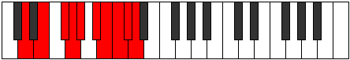 |
| [3957](https://ianring.com/musictheory/scales/3957) | [Porygic](ModeCNaturalPorygic.md) | C | C, D, E, F, F#, G#, A, A#, B, C |  |
| [3959](https://ianring.com/musictheory/scales/3959) | [Katagyllian](ModeGNaturalKatagyllian.md) | G | G, G#, A, B, C, C#, D#, E, F, F#, G |  |
| [3959](https://ianring.com/musictheory/scales/3959) | [Katagyllian](ModeDNaturalKatagyllian.md) | D | D, D#, E, F#, G, G#, A#, B, C, C#, D |  |
| [3959](https://ianring.com/musictheory/scales/3959) | [Katagyllian](ModeFSharpKatagyllian.md) | F# | F#, G, G#, A#, B, C, D, D#, E, F, F# |  |
| [3959](https://ianring.com/musictheory/scales/3959) | [Katagyllian](ModeGFlatKatagyllian.md) | Gb | Gb, G, Ab, Bb, B, C, D, Eb, E, F, Gb |  |
| [3959](https://ianring.com/musictheory/scales/3959) | [Katagyllian](ModeCNaturalKatagyllian.md) | C | C, C#, D, E, F, F#, G#, A, A#, B, C |  |
| [3959](https://ianring.com/musictheory/scales/3959) | [Katagyllian](ModeASharpKatagyllian.md) | A# | A#, B, C, D, D#, E, F#, G, G#, A, A# |  |
| [3959](https://ianring.com/musictheory/scales/3959) | [Katagyllian](ModeBFlatKatagyllian.md) | Bb | Bb, B, C, D, Eb, E, Gb, G, Ab, A, Bb |  |
| [3961](https://ianring.com/musictheory/scales/3961) | [Mixolydygic](ModeGSharpMixolydygic.md) | G# | G#, B, C, C#, D, E, F, F#, G, G# |  |
| [3961](https://ianring.com/musictheory/scales/3961) | [Mixolydygic](ModeAFlatMixolydygic.md) | Ab | Ab, B, C, Db, D, E, F, Gb, G, Ab |  |
| [3961](https://ianring.com/musictheory/scales/3961) | [Mixolydygic](ModeCNaturalMixolydygic.md) | C | C, D#, E, F, F#, G#, A, A#, B, C |  |
| [3963](https://ianring.com/musictheory/scales/3963) | [Aeoryllian](ModeDSharpAeoryllian.md) | D# | D#, E, F#, G, G#, A, B, C, C#, D, D# |  |
| [3963](https://ianring.com/musictheory/scales/3963) | [Aeoryllian](ModeEFlatAeoryllian.md) | Eb | Eb, E, Gb, G, Ab, A, B, C, Db, D, Eb |  |
| [3963](https://ianring.com/musictheory/scales/3963) | [Aeoryllian](ModeGSharpAeoryllian.md) | G# | G#, A, B, C, C#, D, E, F, F#, G, G# |  |
| [3963](https://ianring.com/musictheory/scales/3963) | [Aeoryllian](ModeAFlatAeoryllian.md) | Ab | Ab, A, B, C, Db, D, E, F, Gb, G, Ab |  |
| [3963](https://ianring.com/musictheory/scales/3963) | [Aeoryllian](ModeGNaturalAeoryllian.md) | G | G, G#, A#, B, C, C#, D#, E, F, F#, G |  |
| [3963](https://ianring.com/musictheory/scales/3963) | [Aeoryllian](ModeCNaturalAeoryllian.md) | C | C, C#, D#, E, F, F#, G#, A, A#, B, C |  |
| [3963](https://ianring.com/musictheory/scales/3963) | [Aeoryllian](ModeFNaturalAeoryllian.md) | F | F, F#, G#, A, A#, B, C#, D, D#, E, F |  |
| [3963](https://ianring.com/musictheory/scales/3963) | [Aeoryllian](ModeASharpAeoryllian.md) | A# | A#, B, C#, D, D#, E, F#, G, G#, A, A# |  |
| [3963](https://ianring.com/musictheory/scales/3963) | [Aeoryllian](ModeBFlatAeoryllian.md) | Bb | Bb, B, Db, D, Eb, E, Gb, G, Ab, A, Bb |  |
| [3965](https://ianring.com/musictheory/scales/3965) | [Thydyllian](ModeDNaturalThydyllian.md) | D | D, E, F, F#, G, G#, A#, B, C, C#, D | 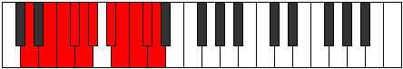 |
| [3965](https://ianring.com/musictheory/scales/3965) | [Thydyllian](ModeGSharpThydyllian.md) | G# | G#, A#, B, C, C#, D, E, F, F#, G, G# |  |
| [3965](https://ianring.com/musictheory/scales/3965) | [Thydyllian](ModeAFlatThydyllian.md) | Ab | Ab, Bb, B, C, Db, D, E, F, Gb, G, Ab |  |
| [3965](https://ianring.com/musictheory/scales/3965) | [Thydyllian](ModeCNaturalThydyllian.md) | C | C, D, D#, E, F, F#, G#, A, A#, B, C |  |
| [3965](https://ianring.com/musictheory/scales/3965) | [Thydyllian](ModeFSharpThydyllian.md) | F# | F#, G#, A, A#, B, C, D, D#, E, F, F# |  |
| [3965](https://ianring.com/musictheory/scales/3965) | [Thydyllian](ModeGFlatThydyllian.md) | Gb | Gb, Ab, A, Bb, B, C, D, Eb, E, F, Gb |  |
| [3967](https://ianring.com/musictheory/scales/3967) | [Soratic](ModeDSharpSoratic.md) | D# | D#, E, F, F#, G, G#, A, B, C, C#, D, D# |  |
| [3967](https://ianring.com/musictheory/scales/3967) | [Soratic](ModeEFlatSoratic.md) | Eb | Eb, E, F, Gb, G, Ab, A, B, C, Db, D, Eb |  |
| [3967](https://ianring.com/musictheory/scales/3967) | [Soratic](ModeDNaturalSoratic.md) | D | D, D#, E, F, F#, G, G#, A#, B, C, C#, D |  |
| [3967](https://ianring.com/musictheory/scales/3967) | [Soratic](ModeCNaturalSoratic.md) | C | C, C#, D, D#, E, F, F#, G#, A, A#, B, C |  |
| [3967](https://ianring.com/musictheory/scales/3967) | [Soratic](ModeASharpSoratic.md) | A# | A#, B, C, C#, D, D#, E, F#, G, G#, A, A# |  |
| [3967](https://ianring.com/musictheory/scales/3967) | [Soratic](ModeBFlatSoratic.md) | Bb | Bb, B, C, Db, D, Eb, E, Gb, G, Ab, A, Bb |  |
| [3967](https://ianring.com/musictheory/scales/3967) | [Soratic](ModeGSharpSoratic.md) | G# | G#, A, A#, B, C, C#, D, E, F, F#, G, G# |  |
| [3967](https://ianring.com/musictheory/scales/3967) | [Soratic](ModeAFlatSoratic.md) | Ab | Ab, A, Bb, B, C, Db, D, E, F, Gb, G, Ab |  |
| [3967](https://ianring.com/musictheory/scales/3967) | [Soratic](ModeGNaturalSoratic.md) | G | G, G#, A, A#, B, C, C#, D#, E, F, F#, G |  |
| [3967](https://ianring.com/musictheory/scales/3967) | [Soratic](ModeFSharpSoratic.md) | F# | F#, G, G#, A, A#, B, C, D, D#, E, F, F# |  |
| [3967](https://ianring.com/musictheory/scales/3967) | [Soratic](ModeGFlatSoratic.md) | Gb | Gb, G, Ab, A, Bb, B, C, D, Eb, E, F, Gb |  |
| [3967](https://ianring.com/musictheory/scales/3967) | [Soratic](ModeFNaturalSoratic.md) | F | F, F#, G, G#, A, A#, B, C#, D, D#, E, F |  |
| [3977](https://ianring.com/musictheory/scales/3977) | [Kythian](ModeGSharpKythian.md) | G# | G#, A##, C###, D##, E#, F#, G, G# |  |
| [3977](https://ianring.com/musictheory/scales/3977) | [Kythian](ModeAFlatKythian.md) | Ab | Ab, B, C###, D##, E#, F#, G, Ab |  |
| [3979](https://ianring.com/musictheory/scales/3979) | [Dynyllic](ModeGSharpDynyllic.md) | G# | G#, A, B, D#, E, F, F#, G, G# |  |
| [3979](https://ianring.com/musictheory/scales/3979) | [Dynyllic](ModeAFlatDynyllic.md) | Ab | Ab, A, B, Eb, E, F, Gb, G, Ab |  |
| [3981](https://ianring.com/musictheory/scales/3981) | [Phrycryllic](ModeANaturalPhrycryllic.md) | A | A, B, C, E, F, F#, G, G#, A |  |
| [3981](https://ianring.com/musictheory/scales/3981) | [Phrycryllic](ModeGSharpPhrycryllic.md) | G# | G#, A#, B, D#, E, F, F#, G, G# |  |
| [3981](https://ianring.com/musictheory/scales/3981) | [Phrycryllic](ModeAFlatPhrycryllic.md) | Ab | Ab, Bb, B, Eb, E, F, Gb, G, Ab |  |
| [3983](https://ianring.com/musictheory/scales/3983) | [Thyptygic](ModeANaturalThyptygic.md) | A | A, A#, B, C, E, F, F#, G, G#, A |  |
| [3983](https://ianring.com/musictheory/scales/3983) | [Thyptygic](ModeGSharpThyptygic.md) | G# | G#, A, A#, B, D#, E, F, F#, G, G# |  |
| [3983](https://ianring.com/musictheory/scales/3983) | [Thyptygic](ModeAFlatThyptygic.md) | Ab | Ab, A, Bb, B, Eb, E, F, Gb, G, Ab |  |
| [3987](https://ianring.com/musictheory/scales/3987) | [Loryllic](ModeGNaturalLoryllic.md) | G | G, G#, B, D, D#, E, F, F#, G |  |
| [3989](https://ianring.com/musictheory/scales/3989) | [Sythyllic](ModeENaturalSythyllic.md) | E | E, F#, G#, B, C, C#, D, D#, E |  |
| [3989](https://ianring.com/musictheory/scales/3989) | [Sythyllic](ModeANaturalSythyllic.md) | A | A, B, C#, E, F, F#, G, G#, A |  |
| [3991](https://ianring.com/musictheory/scales/3991) | [Badygic](ModeENaturalBadygic.md) | E | E, F, F#, G#, B, C, C#, D, D#, E |  |
| [3991](https://ianring.com/musictheory/scales/3991) | [Badygic](ModeGNaturalBadygic.md) | G | G, G#, A, B, D, D#, E, F, F#, G |  |
| [3991](https://ianring.com/musictheory/scales/3991) | [Badygic](ModeANaturalBadygic.md) | A | A, A#, B, C#, E, F, F#, G, G#, A |  |
| [3993](https://ianring.com/musictheory/scales/3993) | [Ioniptyllic](ModeGSharpIoniptyllic.md) | G# | G#, B, C, D#, E, F, F#, G, G# |  |
| [3993](https://ianring.com/musictheory/scales/3993) | [Ioniptyllic](ModeAFlatIoniptyllic.md) | Ab | Ab, B, C, Eb, E, F, Gb, G, Ab |  |
| [3995](https://ianring.com/musictheory/scales/3995) | [Ionygic](ModeGSharpIonygic.md) | G# | G#, A, B, C, D#, E, F, F#, G, G# |  |
| [3995](https://ianring.com/musictheory/scales/3995) | [Ionygic](ModeAFlatIonygic.md) | Ab | Ab, A, B, C, Eb, E, F, Gb, G, Ab |  |
| [3995](https://ianring.com/musictheory/scales/3995) | [Ionygic](ModeGNaturalIonygic.md) | G | G, G#, A#, B, D, D#, E, F, F#, G |  |
| [3997](https://ianring.com/musictheory/scales/3997) | [Dogygic](ModeENaturalDogygic.md) | E | E, F#, G, G#, B, C, C#, D, D#, E |  |
| [3997](https://ianring.com/musictheory/scales/3997) | [Dogygic](ModeANaturalDogygic.md) | A | A, B, C, C#, E, F, F#, G, G#, A |  |
| [3997](https://ianring.com/musictheory/scales/3997) | [Dogygic](ModeGSharpDogygic.md) | G# | G#, A#, B, C, D#, E, F, F#, G, G# |  |
| [3997](https://ianring.com/musictheory/scales/3997) | [Dogygic](ModeAFlatDogygic.md) | Ab | Ab, Bb, B, C, Eb, E, F, Gb, G, Ab |  |
| [3999](https://ianring.com/musictheory/scales/3999) | [Dydyllian](ModeENaturalDydyllian.md) | E | E, F, F#, G, G#, B, C, C#, D, D#, E |  |
| [3999](https://ianring.com/musictheory/scales/3999) | [Dydyllian](ModeANaturalDydyllian.md) | A | A, A#, B, C, C#, E, F, F#, G, G#, A |  |
| [3999](https://ianring.com/musictheory/scales/3999) | [Dydyllian](ModeGSharpDydyllian.md) | G# | G#, A, A#, B, C, D#, E, F, F#, G, G# |  |
| [3999](https://ianring.com/musictheory/scales/3999) | [Dydyllian](ModeAFlatDydyllian.md) | Ab | Ab, A, Bb, B, C, Eb, E, F, Gb, G, Ab |  |
| [3999](https://ianring.com/musictheory/scales/3999) | [Dydyllian](ModeGNaturalDydyllian.md) | G | G, G#, A, A#, B, D, D#, E, F, F#, G |  |
| [4003](https://ianring.com/musictheory/scales/4003) | [Sadyllic](ModeBNaturalSadyllic.md) | B | B, C, E, F#, G, G#, A, A#, B |  |
| [4005](https://ianring.com/musictheory/scales/4005) | [Phradyllic](ModeFSharpPhradyllic.md) | F# | F#, G#, B, C#, D, D#, E, F, F# |  |
| [4005](https://ianring.com/musictheory/scales/4005) | [Phradyllic](ModeGFlatPhradyllic.md) | Gb | Gb, Ab, B, Db, D, Eb, E, F, Gb |  |
| [4005](https://ianring.com/musictheory/scales/4005) | [Phradyllic](ModeANaturalPhradyllic.md) | A | A, B, D, E, F, F#, G, G#, A |  |
| [4005](https://ianring.com/musictheory/scales/4005) | [Phradyllic](ModeBNaturalPhradyllic.md) | B | B, C#, E, F#, G, G#, A, A#, B |  |
| [4007](https://ianring.com/musictheory/scales/4007) | [Doptygic](ModeFSharpDoptygic.md) | F# | F#, G, G#, B, C#, D, D#, E, F, F# |  |
| [4007](https://ianring.com/musictheory/scales/4007) | [Doptygic](ModeGFlatDoptygic.md) | Gb | Gb, G, Ab, B, Db, D, Eb, E, F, Gb |  |
| [4007](https://ianring.com/musictheory/scales/4007) | [Doptygic](ModeBNaturalDoptygic.md) | B | B, C, C#, E, F#, G, G#, A, A#, B |  |
| [4007](https://ianring.com/musictheory/scales/4007) | [Doptygic](ModeANaturalDoptygic.md) | A | A, A#, B, D, E, F, F#, G, G#, A |  |
| [4009](https://ianring.com/musictheory/scales/4009) | [Phranyllic](ModeGSharpPhranyllic.md) | G# | G#, B, C#, D#, E, F, F#, G, G# |  |
| [4009](https://ianring.com/musictheory/scales/4009) | [Phranyllic](ModeAFlatPhranyllic.md) | Ab | Ab, B, Db, Eb, E, F, Gb, G, Ab |  |
| [4009](https://ianring.com/musictheory/scales/4009) | [Phranyllic](ModeCSharpPhranyllic.md) | C# | C#, E, F#, G#, A, A#, B, C, C# |  |
| [4009](https://ianring.com/musictheory/scales/4009) | [Phranyllic](ModeDFlatPhranyllic.md) | Db | Db, E, Gb, Ab, A, Bb, B, C, Db |  |
| [4009](https://ianring.com/musictheory/scales/4009) | [Phranyllic](ModeBNaturalPhranyllic.md) | B | B, D, E, F#, G, G#, A, A#, B |  |
| [4011](https://ianring.com/musictheory/scales/4011) | [Styrygic](ModeGSharpStyrygic.md) | G# | G#, A, B, C#, D#, E, F, F#, G, G# |  |
| [4011](https://ianring.com/musictheory/scales/4011) | [Styrygic](ModeAFlatStyrygic.md) | Ab | Ab, A, B, Db, Eb, E, F, Gb, G, Ab |  |
| [4011](https://ianring.com/musictheory/scales/4011) | [Styrygic](ModeDSharpStyrygic.md) | D# | D#, E, F#, G#, A#, B, C, C#, D, D# |  |
| [4011](https://ianring.com/musictheory/scales/4011) | [Styrygic](ModeEFlatStyrygic.md) | Eb | Eb, E, Gb, Ab, Bb, B, C, Db, D, Eb |  |
| [4011](https://ianring.com/musictheory/scales/4011) | [Styrygic](ModeCSharpStyrygic.md) | C# | C#, D, E, F#, G#, A, A#, B, C, C# |  |
| [4011](https://ianring.com/musictheory/scales/4011) | [Styrygic](ModeDFlatStyrygic.md) | Db | Db, D, E, Gb, Ab, A, Bb, B, C, Db |  |
| [4011](https://ianring.com/musictheory/scales/4011) | [Styrygic](ModeBNaturalStyrygic.md) | B | B, C, D, E, F#, G, G#, A, A#, B |  |
| [4013](https://ianring.com/musictheory/scales/4013) | [Dathygic](ModeFSharpDathygic.md) | F# | F#, G#, A, B, C#, D, D#, E, F, F# |  |
| [4013](https://ianring.com/musictheory/scales/4013) | [Dathygic](ModeGFlatDathygic.md) | Gb | Gb, Ab, A, B, Db, D, Eb, E, F, Gb |  |
| [4013](https://ianring.com/musictheory/scales/4013) | [Dathygic](ModeANaturalDathygic.md) | A | A, B, C, D, E, F, F#, G, G#, A |  |
| [4013](https://ianring.com/musictheory/scales/4013) | [Dathygic](ModeGSharpDathygic.md) | G# | G#, A#, B, C#, D#, E, F, F#, G, G# |  |
| [4013](https://ianring.com/musictheory/scales/4013) | [Dathygic](ModeAFlatDathygic.md) | Ab | Ab, Bb, B, Db, Eb, E, F, Gb, G, Ab |  |
| [4013](https://ianring.com/musictheory/scales/4013) | [Dathygic](ModeCSharpDathygic.md) | C# | C#, D#, E, F#, G#, A, A#, B, C, C# |  |
| [4013](https://ianring.com/musictheory/scales/4013) | [Dathygic](ModeDFlatDathygic.md) | Db | Db, Eb, E, Gb, Ab, A, Bb, B, C, Db |  |
| [4013](https://ianring.com/musictheory/scales/4013) | [Dathygic](ModeBNaturalDathygic.md) | B | B, C#, D, E, F#, G, G#, A, A#, B |  |
| [4015](https://ianring.com/musictheory/scales/4015) | [Phradyllian](ModeFSharpPhradyllian.md) | F# | F#, G, G#, A, B, C#, D, D#, E, F, F# |  |
| [4015](https://ianring.com/musictheory/scales/4015) | [Phradyllian](ModeGFlatPhradyllian.md) | Gb | Gb, G, Ab, A, B, Db, D, Eb, E, F, Gb |  |
| [4015](https://ianring.com/musictheory/scales/4015) | [Phradyllian](ModeDSharpPhradyllian.md) | D# | D#, E, F, F#, G#, A#, B, C, C#, D, D# |  |
| [4015](https://ianring.com/musictheory/scales/4015) | [Phradyllian](ModeEFlatPhradyllian.md) | Eb | Eb, E, F, Gb, Ab, Bb, B, C, Db, D, Eb |  |
| [4015](https://ianring.com/musictheory/scales/4015) | [Phradyllian](ModeCSharpPhradyllian.md) | C# | C#, D, D#, E, F#, G#, A, A#, B, C, C# |  |
| [4015](https://ianring.com/musictheory/scales/4015) | [Phradyllian](ModeDFlatPhradyllian.md) | Db | Db, D, Eb, E, Gb, Ab, A, Bb, B, C, Db |  |
| [4015](https://ianring.com/musictheory/scales/4015) | [Phradyllian](ModeBNaturalPhradyllian.md) | B | B, C, C#, D, E, F#, G, G#, A, A#, B |  |
| [4015](https://ianring.com/musictheory/scales/4015) | [Phradyllian](ModeANaturalPhradyllian.md) | A | A, A#, B, C, D, E, F, F#, G, G#, A |  |
| [4015](https://ianring.com/musictheory/scales/4015) | [Phradyllian](ModeGSharpPhradyllian.md) | G# | G#, A, A#, B, C#, D#, E, F, F#, G, G# |  |
| [4015](https://ianring.com/musictheory/scales/4015) | [Phradyllian](ModeAFlatPhradyllian.md) | Ab | Ab, A, Bb, B, Db, Eb, E, F, Gb, G, Ab |  |
| [4017](https://ianring.com/musictheory/scales/4017) | [Dolyllic](ModeBNaturalDolyllic.md) | B | B, D#, E, F#, G, G#, A, A#, B |  |
| [4019](https://ianring.com/musictheory/scales/4019) | [Lonygic](ModeGNaturalLonygic.md) | G | G, G#, B, C, D, D#, E, F, F#, G |  |
| [4019](https://ianring.com/musictheory/scales/4019) | [Lonygic](ModeBNaturalLonygic.md) | B | B, C, D#, E, F#, G, G#, A, A#, B |  |
| [4021](https://ianring.com/musictheory/scales/4021) | [Bagygic](ModeENaturalBagygic.md) | E | E, F#, G#, A, B, C, C#, D, D#, E |  |
| [4021](https://ianring.com/musictheory/scales/4021) | [Bagygic](ModeANaturalBagygic.md) | A | A, B, C#, D, E, F, F#, G, G#, A |  |
| [4021](https://ianring.com/musictheory/scales/4021) | [Bagygic](ModeFSharpBagygic.md) | F# | F#, G#, A#, B, C#, D, D#, E, F, F# |  |
| [4021](https://ianring.com/musictheory/scales/4021) | [Bagygic](ModeGFlatBagygic.md) | Gb | Gb, Ab, Bb, B, Db, D, Eb, E, F, Gb |  |
| [4021](https://ianring.com/musictheory/scales/4021) | [Bagygic](ModeBNaturalBagygic.md) | B | B, C#, D#, E, F#, G, G#, A, A#, B |  |
| [4023](https://ianring.com/musictheory/scales/4023) | [Styptyllian](ModeENaturalStyptyllian.md) | E | E, F, F#, G#, A, B, C, C#, D, D#, E |  |
| [4023](https://ianring.com/musictheory/scales/4023) | [Styptyllian](ModeGNaturalStyptyllian.md) | G | G, G#, A, B, C, D, D#, E, F, F#, G |  |
| [4023](https://ianring.com/musictheory/scales/4023) | [Styptyllian](ModeFSharpStyptyllian.md) | F# | F#, G, G#, A#, B, C#, D, D#, E, F, F# |  |
| [4023](https://ianring.com/musictheory/scales/4023) | [Styptyllian](ModeGFlatStyptyllian.md) | Gb | Gb, G, Ab, Bb, B, Db, D, Eb, E, F, Gb |  |
| [4023](https://ianring.com/musictheory/scales/4023) | [Styptyllian](ModeBNaturalStyptyllian.md) | B | B, C, C#, D#, E, F#, G, G#, A, A#, B |  |
| [4023](https://ianring.com/musictheory/scales/4023) | [Styptyllian](ModeANaturalStyptyllian.md) | A | A, A#, B, C#, D, E, F, F#, G, G#, A |  |
| [4025](https://ianring.com/musictheory/scales/4025) | [Kalygic](ModeGSharpKalygic.md) | G# | G#, B, C, C#, D#, E, F, F#, G, G# |  |
| [4025](https://ianring.com/musictheory/scales/4025) | [Kalygic](ModeAFlatKalygic.md) | Ab | Ab, B, C, Db, Eb, E, F, Gb, G, Ab |  |
| [4025](https://ianring.com/musictheory/scales/4025) | [Kalygic](ModeCSharpKalygic.md) | C# | C#, E, F, F#, G#, A, A#, B, C, C# |  |
| [4025](https://ianring.com/musictheory/scales/4025) | [Kalygic](ModeDFlatKalygic.md) | Db | Db, E, F, Gb, Ab, A, Bb, B, C, Db |  |
| [4025](https://ianring.com/musictheory/scales/4025) | [Kalygic](ModeBNaturalKalygic.md) | B | B, D, D#, E, F#, G, G#, A, A#, B |  |
| [4027](https://ianring.com/musictheory/scales/4027) | [Ragyllian](ModeGSharpRagyllian.md) | G# | G#, A, B, C, C#, D#, E, F, F#, G, G# |  |
| [4027](https://ianring.com/musictheory/scales/4027) | [Ragyllian](ModeAFlatRagyllian.md) | Ab | Ab, A, B, C, Db, Eb, E, F, Gb, G, Ab |  |
| [4027](https://ianring.com/musictheory/scales/4027) | [Ragyllian](ModeDSharpRagyllian.md) | D# | D#, E, F#, G, G#, A#, B, C, C#, D, D# |  |
| [4027](https://ianring.com/musictheory/scales/4027) | [Ragyllian](ModeEFlatRagyllian.md) | Eb | Eb, E, Gb, G, Ab, Bb, B, C, Db, D, Eb |  |
| [4027](https://ianring.com/musictheory/scales/4027) | [Ragyllian](ModeGNaturalRagyllian.md) | G | G, G#, A#, B, C, D, D#, E, F, F#, G |  |
| [4027](https://ianring.com/musictheory/scales/4027) | [Ragyllian](ModeCSharpRagyllian.md) | C# | C#, D, E, F, F#, G#, A, A#, B, C, C# |  |
| [4027](https://ianring.com/musictheory/scales/4027) | [Ragyllian](ModeDFlatRagyllian.md) | Db | Db, D, E, F, Gb, Ab, A, Bb, B, C, Db |  |
| [4027](https://ianring.com/musictheory/scales/4027) | [Ragyllian](ModeBNaturalRagyllian.md) | B | B, C, D, D#, E, F#, G, G#, A, A#, B |  |
| [4029](https://ianring.com/musictheory/scales/4029) | [Aerycryllian](ModeENaturalAerycryllian.md) | E | E, F#, G, G#, A, B, C, C#, D, D#, E |  |
| [4029](https://ianring.com/musictheory/scales/4029) | [Aerycryllian](ModeANaturalAerycryllian.md) | A | A, B, C, C#, D, E, F, F#, G, G#, A |  |
| [4029](https://ianring.com/musictheory/scales/4029) | [Aerycryllian](ModeGSharpAerycryllian.md) | G# | G#, A#, B, C, C#, D#, E, F, F#, G, G# |  |
| [4029](https://ianring.com/musictheory/scales/4029) | [Aerycryllian](ModeAFlatAerycryllian.md) | Ab | Ab, Bb, B, C, Db, Eb, E, F, Gb, G, Ab |  |
| [4029](https://ianring.com/musictheory/scales/4029) | [Aerycryllian](ModeCSharpAerycryllian.md) | C# | C#, D#, E, F, F#, G#, A, A#, B, C, C# |  |
| [4029](https://ianring.com/musictheory/scales/4029) | [Aerycryllian](ModeDFlatAerycryllian.md) | Db | Db, Eb, E, F, Gb, Ab, A, Bb, B, C, Db |  |
| [4029](https://ianring.com/musictheory/scales/4029) | [Aerycryllian](ModeFSharpAerycryllian.md) | F# | F#, G#, A, A#, B, C#, D, D#, E, F, F# |  |
| [4029](https://ianring.com/musictheory/scales/4029) | [Aerycryllian](ModeGFlatAerycryllian.md) | Gb | Gb, Ab, A, Bb, B, Db, D, Eb, E, F, Gb |  |
| [4029](https://ianring.com/musictheory/scales/4029) | [Aerycryllian](ModeBNaturalAerycryllian.md) | B | B, C#, D, D#, E, F#, G, G#, A, A#, B |  |
| [4031](https://ianring.com/musictheory/scales/4031) | [Godatic](ModeENaturalGodatic.md) | E | E, F, F#, G, G#, A, B, C, C#, D, D#, E |  |
| [4031](https://ianring.com/musictheory/scales/4031) | [Godatic](ModeDSharpGodatic.md) | D# | D#, E, F, F#, G, G#, A#, B, C, C#, D, D# |  |
| [4031](https://ianring.com/musictheory/scales/4031) | [Godatic](ModeEFlatGodatic.md) | Eb | Eb, E, F, Gb, G, Ab, Bb, B, C, Db, D, Eb |  |
| [4031](https://ianring.com/musictheory/scales/4031) | [Godatic](ModeCSharpGodatic.md) | C# | C#, D, D#, E, F, F#, G#, A, A#, B, C, C# |  |
| [4031](https://ianring.com/musictheory/scales/4031) | [Godatic](ModeDFlatGodatic.md) | Db | Db, D, Eb, E, F, Gb, Ab, A, Bb, B, C, Db |  |
| [4031](https://ianring.com/musictheory/scales/4031) | [Godatic](ModeBNaturalGodatic.md) | B | B, C, C#, D, D#, E, F#, G, G#, A, A#, B |  |
| [4031](https://ianring.com/musictheory/scales/4031) | [Godatic](ModeANaturalGodatic.md) | A | A, A#, B, C, C#, D, E, F, F#, G, G#, A |  |
| [4031](https://ianring.com/musictheory/scales/4031) | [Godatic](ModeGSharpGodatic.md) | G# | G#, A, A#, B, C, C#, D#, E, F, F#, G, G# |  |
| [4031](https://ianring.com/musictheory/scales/4031) | [Godatic](ModeAFlatGodatic.md) | Ab | Ab, A, Bb, B, C, Db, Eb, E, F, Gb, G, Ab |  |
| [4031](https://ianring.com/musictheory/scales/4031) | [Godatic](ModeGNaturalGodatic.md) | G | G, G#, A, A#, B, C, D, D#, E, F, F#, G |  |
| [4031](https://ianring.com/musictheory/scales/4031) | [Godatic](ModeFSharpGodatic.md) | F# | F#, G, G#, A, A#, B, C#, D, D#, E, F, F# |  |
| [4031](https://ianring.com/musictheory/scales/4031) | [Godatic](ModeGFlatGodatic.md) | Gb | Gb, G, Ab, A, Bb, B, Db, D, Eb, E, F, Gb |  |
| [4037](https://ianring.com/musictheory/scales/4037) | [Ionyllic](ModeANaturalIonyllic.md) | A | A, B, D#, E, F, F#, G, G#, A |  |
| [4039](https://ianring.com/musictheory/scales/4039) | [Ionogygic](ModeASharpIonogygic.md) | A# | A#, B, C, E, F, F#, G, G#, A, A# |  |
| [4039](https://ianring.com/musictheory/scales/4039) | [Ionogygic](ModeBFlatIonogygic.md) | Bb | Bb, B, C, E, F, Gb, G, Ab, A, Bb |  |
| [4039](https://ianring.com/musictheory/scales/4039) | [Ionogygic](ModeANaturalIonogygic.md) | A | A, A#, B, D#, E, F, F#, G, G#, A |  |
| [4041](https://ianring.com/musictheory/scales/4041) | [Zaryllic](ModeGSharpZaryllic.md) | G# | G#, B, D, D#, E, F, F#, G, G# |  |
| [4041](https://ianring.com/musictheory/scales/4041) | [Zaryllic](ModeAFlatZaryllic.md) | Ab | Ab, B, D, Eb, E, F, Gb, G, Ab |  |
| [4043](https://ianring.com/musictheory/scales/4043) | [Phrocrygic](ModeFNaturalPhrocrygic.md) | F | F, F#, G#, B, C, C#, D, D#, E, F |  |
| [4043](https://ianring.com/musictheory/scales/4043) | [Phrocrygic](ModeGSharpPhrocrygic.md) | G# | G#, A, B, D, D#, E, F, F#, G, G# |  |
| [4043](https://ianring.com/musictheory/scales/4043) | [Phrocrygic](ModeAFlatPhrocrygic.md) | Ab | Ab, A, B, D, Eb, E, F, Gb, G, Ab |  |
| [4043](https://ianring.com/musictheory/scales/4043) | [Phrocrygic](ModeASharpPhrocrygic.md) | A# | A#, B, C#, E, F, F#, G, G#, A, A# |  |
| [4043](https://ianring.com/musictheory/scales/4043) | [Phrocrygic](ModeBFlatPhrocrygic.md) | Bb | Bb, B, Db, E, F, Gb, G, Ab, A, Bb |  |
| [4045](https://ianring.com/musictheory/scales/4045) | [Gyptygic](ModeANaturalGyptygic.md) | A | A, B, C, D#, E, F, F#, G, G#, A |  |
| [4045](https://ianring.com/musictheory/scales/4045) | [Gyptygic](ModeGSharpGyptygic.md) | G# | G#, A#, B, D, D#, E, F, F#, G, G# |  |
| [4045](https://ianring.com/musictheory/scales/4045) | [Gyptygic](ModeAFlatGyptygic.md) | Ab | Ab, Bb, B, D, Eb, E, F, Gb, G, Ab |  |
| [4047](https://ianring.com/musictheory/scales/4047) | [Thogyllian](ModeFNaturalThogyllian.md) | F | F, F#, G, G#, B, C, C#, D, D#, E, F |  |
| [4047](https://ianring.com/musictheory/scales/4047) | [Thogyllian](ModeASharpThogyllian.md) | A# | A#, B, C, C#, E, F, F#, G, G#, A, A# |  |
| [4047](https://ianring.com/musictheory/scales/4047) | [Thogyllian](ModeBFlatThogyllian.md) | Bb | Bb, B, C, Db, E, F, Gb, G, Ab, A, Bb |  |
| [4047](https://ianring.com/musictheory/scales/4047) | [Thogyllian](ModeANaturalThogyllian.md) | A | A, A#, B, C, D#, E, F, F#, G, G#, A |  |
| [4047](https://ianring.com/musictheory/scales/4047) | [Thogyllian](ModeGSharpThogyllian.md) | G# | G#, A, A#, B, D, D#, E, F, F#, G, G# |  |
| [4047](https://ianring.com/musictheory/scales/4047) | [Thogyllian](ModeAFlatThogyllian.md) | Ab | Ab, A, Bb, B, D, Eb, E, F, Gb, G, Ab |  |
| [4049](https://ianring.com/musictheory/scales/4049) | [Stycryllic](ModeCNaturalStycryllic.md) | C | C, E, F#, G, G#, A, A#, B, C |  |
| [4051](https://ianring.com/musictheory/scales/4051) | [Ionilygic](ModeGNaturalIonilygic.md) | G | G, G#, B, C#, D, D#, E, F, F#, G |  |
| [4051](https://ianring.com/musictheory/scales/4051) | [Ionilygic](ModeCNaturalIonilygic.md) | C | C, C#, E, F#, G, G#, A, A#, B, C |  |
| [4051](https://ianring.com/musictheory/scales/4051) | [Ionilygic](ModeASharpIonilygic.md) | A# | A#, B, D, E, F, F#, G, G#, A, A# |  |
| [4051](https://ianring.com/musictheory/scales/4051) | [Ionilygic](ModeBFlatIonilygic.md) | Bb | Bb, B, D, E, F, Gb, G, Ab, A, Bb |  |
| [4053](https://ianring.com/musictheory/scales/4053) | [Kyrygic](ModeANaturalKyrygic.md) | A | A, B, C#, D#, E, F, F#, G, G#, A |  |
| [4053](https://ianring.com/musictheory/scales/4053) | [Kyrygic](ModeENaturalKyrygic.md) | E | E, F#, G#, A#, B, C, C#, D, D#, E |  |
| [4053](https://ianring.com/musictheory/scales/4053) | [Kyrygic](ModeDNaturalKyrygic.md) | D | D, E, F#, G#, A, A#, B, C, C#, D |  |
| [4053](https://ianring.com/musictheory/scales/4053) | [Kyrygic](ModeCNaturalKyrygic.md) | C | C, D, E, F#, G, G#, A, A#, B, C |  |
| [4055](https://ianring.com/musictheory/scales/4055) | [Dagyllian](ModeGNaturalDagyllian.md) | G | G, G#, A, B, C#, D, D#, E, F, F#, G |  |
| [4055](https://ianring.com/musictheory/scales/4055) | [Dagyllian](ModeENaturalDagyllian.md) | E | E, F, F#, G#, A#, B, C, C#, D, D#, E |  |
| [4055](https://ianring.com/musictheory/scales/4055) | [Dagyllian](ModeDNaturalDagyllian.md) | D | D, D#, E, F#, G#, A, A#, B, C, C#, D |  |
| [4055](https://ianring.com/musictheory/scales/4055) | [Dagyllian](ModeCNaturalDagyllian.md) | C | C, C#, D, E, F#, G, G#, A, A#, B, C |  |
| [4055](https://ianring.com/musictheory/scales/4055) | [Dagyllian](ModeASharpDagyllian.md) | A# | A#, B, C, D, E, F, F#, G, G#, A, A# |  |
| [4055](https://ianring.com/musictheory/scales/4055) | [Dagyllian](ModeBFlatDagyllian.md) | Bb | Bb, B, C, D, E, F, Gb, G, Ab, A, Bb |  |
| [4055](https://ianring.com/musictheory/scales/4055) | [Dagyllian](ModeANaturalDagyllian.md) | A | A, A#, B, C#, D#, E, F, F#, G, G#, A |  |
| [4057](https://ianring.com/musictheory/scales/4057) | [Phrygic](ModeGSharpPhrygic.md) | G# | G#, B, C, D, D#, E, F, F#, G, G# |  |
| [4057](https://ianring.com/musictheory/scales/4057) | [Phrygic](ModeAFlatPhrygic.md) | Ab | Ab, B, C, D, Eb, E, F, Gb, G, Ab |  |
| [4057](https://ianring.com/musictheory/scales/4057) | [Phrygic](ModeCNaturalPhrygic.md) | C | C, D#, E, F#, G, G#, A, A#, B, C |  |
| [4059](https://ianring.com/musictheory/scales/4059) | [Zolyllian](ModeFNaturalZolyllian.md) | F | F, F#, G#, A, B, C, C#, D, D#, E, F |  |
| [4059](https://ianring.com/musictheory/scales/4059) | [Zolyllian](ModeGSharpZolyllian.md) | G# | G#, A, B, C, D, D#, E, F, F#, G, G# |  |
| [4059](https://ianring.com/musictheory/scales/4059) | [Zolyllian](ModeAFlatZolyllian.md) | Ab | Ab, A, B, C, D, Eb, E, F, Gb, G, Ab |  |
| [4059](https://ianring.com/musictheory/scales/4059) | [Zolyllian](ModeGNaturalZolyllian.md) | G | G, G#, A#, B, C#, D, D#, E, F, F#, G |  |
| [4059](https://ianring.com/musictheory/scales/4059) | [Zolyllian](ModeCNaturalZolyllian.md) | C | C, C#, D#, E, F#, G, G#, A, A#, B, C |  |
| [4059](https://ianring.com/musictheory/scales/4059) | [Zolyllian](ModeASharpZolyllian.md) | A# | A#, B, C#, D, E, F, F#, G, G#, A, A# |  |
| [4059](https://ianring.com/musictheory/scales/4059) | [Zolyllian](ModeBFlatZolyllian.md) | Bb | Bb, B, Db, D, E, F, Gb, G, Ab, A, Bb |  |
| [4061](https://ianring.com/musictheory/scales/4061) | [Staptyllian](ModeANaturalStaptyllian.md) | A | A, B, C, C#, D#, E, F, F#, G, G#, A |  |
| [4061](https://ianring.com/musictheory/scales/4061) | [Staptyllian](ModeENaturalStaptyllian.md) | E | E, F#, G, G#, A#, B, C, C#, D, D#, E |  |
| [4061](https://ianring.com/musictheory/scales/4061) | [Staptyllian](ModeGSharpStaptyllian.md) | G# | G#, A#, B, C, D, D#, E, F, F#, G, G# |  |
| [4061](https://ianring.com/musictheory/scales/4061) | [Staptyllian](ModeAFlatStaptyllian.md) | Ab | Ab, Bb, B, C, D, Eb, E, F, Gb, G, Ab |  |
| [4061](https://ianring.com/musictheory/scales/4061) | [Staptyllian](ModeDNaturalStaptyllian.md) | D | D, E, F, F#, G#, A, A#, B, C, C#, D |  |
| [4061](https://ianring.com/musictheory/scales/4061) | [Staptyllian](ModeCNaturalStaptyllian.md) | C | C, D, D#, E, F#, G, G#, A, A#, B, C |  |
| [4063](https://ianring.com/musictheory/scales/4063) | [Eptatic](ModeFNaturalEptatic.md) | F | F, F#, G, G#, A, B, C, C#, D, D#, E, F |  |
| [4063](https://ianring.com/musictheory/scales/4063) | [Eptatic](ModeENaturalEptatic.md) | E | E, F, F#, G, G#, A#, B, C, C#, D, D#, E |  |
| [4063](https://ianring.com/musictheory/scales/4063) | [Eptatic](ModeDNaturalEptatic.md) | D | D, D#, E, F, F#, G#, A, A#, B, C, C#, D |  |
| [4063](https://ianring.com/musictheory/scales/4063) | [Eptatic](ModeCNaturalEptatic.md) | C | C, C#, D, D#, E, F#, G, G#, A, A#, B, C |  |
| [4063](https://ianring.com/musictheory/scales/4063) | [Eptatic](ModeASharpEptatic.md) | A# | A#, B, C, C#, D, E, F, F#, G, G#, A, A# |  |
| [4063](https://ianring.com/musictheory/scales/4063) | [Eptatic](ModeBFlatEptatic.md) | Bb | Bb, B, C, Db, D, E, F, Gb, G, Ab, A, Bb |  |
| [4063](https://ianring.com/musictheory/scales/4063) | [Eptatic](ModeANaturalEptatic.md) | A | A, A#, B, C, C#, D#, E, F, F#, G, G#, A |  |
| [4063](https://ianring.com/musictheory/scales/4063) | [Eptatic](ModeGSharpEptatic.md) | G# | G#, A, A#, B, C, D, D#, E, F, F#, G, G# |  |
| [4063](https://ianring.com/musictheory/scales/4063) | [Eptatic](ModeAFlatEptatic.md) | Ab | Ab, A, Bb, B, C, D, Eb, E, F, Gb, G, Ab |  |
| [4063](https://ianring.com/musictheory/scales/4063) | [Eptatic](ModeGNaturalEptatic.md) | G | G, G#, A, A#, B, C#, D, D#, E, F, F#, G |  |
| [4067](https://ianring.com/musictheory/scales/4067) | [Aeolarygic](ModeBNaturalAeolarygic.md) | B | B, C, E, F, F#, G, G#, A, A#, B |  |
| [4067](https://ianring.com/musictheory/scales/4067) | [Aeolarygic](ModeASharpAeolarygic.md) | A# | A#, B, D#, E, F, F#, G, G#, A, A# |  |
| [4067](https://ianring.com/musictheory/scales/4067) | [Aeolarygic](ModeBFlatAeolarygic.md) | Bb | Bb, B, Eb, E, F, Gb, G, Ab, A, Bb |  |
| [4069](https://ianring.com/musictheory/scales/4069) | [Starygic](ModeFSharpStarygic.md) | F# | F#, G#, B, C, C#, D, D#, E, F, F# |  |
| [4069](https://ianring.com/musictheory/scales/4069) | [Starygic](ModeGFlatStarygic.md) | Gb | Gb, Ab, B, C, Db, D, Eb, E, F, Gb |  |
| [4069](https://ianring.com/musictheory/scales/4069) | [Starygic](ModeANaturalStarygic.md) | A | A, B, D, D#, E, F, F#, G, G#, A |  |
| [4069](https://ianring.com/musictheory/scales/4069) | [Starygic](ModeBNaturalStarygic.md) | B | B, C#, E, F, F#, G, G#, A, A#, B |  |
| [4071](https://ianring.com/musictheory/scales/4071) | [Rygyllian](ModeFSharpRygyllian.md) | F# | F#, G, G#, B, C, C#, D, D#, E, F, F# |  |
| [4071](https://ianring.com/musictheory/scales/4071) | [Rygyllian](ModeGFlatRygyllian.md) | Gb | Gb, G, Ab, B, C, Db, D, Eb, E, F, Gb |  |
| [4071](https://ianring.com/musictheory/scales/4071) | [Rygyllian](ModeBNaturalRygyllian.md) | B | B, C, C#, E, F, F#, G, G#, A, A#, B |  |
| [4071](https://ianring.com/musictheory/scales/4071) | [Rygyllian](ModeASharpRygyllian.md) | A# | A#, B, C, D#, E, F, F#, G, G#, A, A# |  |
| [4071](https://ianring.com/musictheory/scales/4071) | [Rygyllian](ModeBFlatRygyllian.md) | Bb | Bb, B, C, Eb, E, F, Gb, G, Ab, A, Bb |  |
| [4071](https://ianring.com/musictheory/scales/4071) | [Rygyllian](ModeANaturalRygyllian.md) | A | A, A#, B, D, D#, E, F, F#, G, G#, A |  |
| [4073](https://ianring.com/musictheory/scales/4073) | [Sathygic](ModeGSharpSathygic.md) | G# | G#, B, C#, D, D#, E, F, F#, G, G# |  |
| [4073](https://ianring.com/musictheory/scales/4073) | [Sathygic](ModeAFlatSathygic.md) | Ab | Ab, B, Db, D, Eb, E, F, Gb, G, Ab |  |
| [4073](https://ianring.com/musictheory/scales/4073) | [Sathygic](ModeCSharpSathygic.md) | C# | C#, E, F#, G, G#, A, A#, B, C, C# |  |
| [4073](https://ianring.com/musictheory/scales/4073) | [Sathygic](ModeDFlatSathygic.md) | Db | Db, E, Gb, G, Ab, A, Bb, B, C, Db |  |
| [4073](https://ianring.com/musictheory/scales/4073) | [Sathygic](ModeBNaturalSathygic.md) | B | B, D, E, F, F#, G, G#, A, A#, B |  |
| [4075](https://ianring.com/musictheory/scales/4075) | [Katyllian](ModeGSharpKatyllian.md) | G# | G#, A, B, C#, D, D#, E, F, F#, G, G# |  |
| [4075](https://ianring.com/musictheory/scales/4075) | [Katyllian](ModeAFlatKatyllian.md) | Ab | Ab, A, B, Db, D, Eb, E, F, Gb, G, Ab |  |
| [4075](https://ianring.com/musictheory/scales/4075) | [Katyllian](ModeFNaturalKatyllian.md) | F | F, F#, G#, A#, B, C, C#, D, D#, E, F |  |
| [4075](https://ianring.com/musictheory/scales/4075) | [Katyllian](ModeDSharpKatyllian.md) | D# | D#, E, F#, G#, A, A#, B, C, C#, D, D# |  |
| [4075](https://ianring.com/musictheory/scales/4075) | [Katyllian](ModeEFlatKatyllian.md) | Eb | Eb, E, Gb, Ab, A, Bb, B, C, Db, D, Eb |  |
| [4075](https://ianring.com/musictheory/scales/4075) | [Katyllian](ModeCSharpKatyllian.md) | C# | C#, D, E, F#, G, G#, A, A#, B, C, C# |  |
| [4075](https://ianring.com/musictheory/scales/4075) | [Katyllian](ModeDFlatKatyllian.md) | Db | Db, D, E, Gb, G, Ab, A, Bb, B, C, Db |  |
| [4075](https://ianring.com/musictheory/scales/4075) | [Katyllian](ModeBNaturalKatyllian.md) | B | B, C, D, E, F, F#, G, G#, A, A#, B |  |
| [4075](https://ianring.com/musictheory/scales/4075) | [Katyllian](ModeASharpKatyllian.md) | A# | A#, B, C#, D#, E, F, F#, G, G#, A, A# |  |
| [4075](https://ianring.com/musictheory/scales/4075) | [Katyllian](ModeBFlatKatyllian.md) | Bb | Bb, B, Db, Eb, E, F, Gb, G, Ab, A, Bb |  |
| [4077](https://ianring.com/musictheory/scales/4077) | [Gothyllian](ModeFSharpGothyllian.md) | F# | F#, G#, A, B, C, C#, D, D#, E, F, F# |  |
| [4077](https://ianring.com/musictheory/scales/4077) | [Gothyllian](ModeGFlatGothyllian.md) | Gb | Gb, Ab, A, B, C, Db, D, Eb, E, F, Gb |  |
| [4077](https://ianring.com/musictheory/scales/4077) | [Gothyllian](ModeANaturalGothyllian.md) | A | A, B, C, D, D#, E, F, F#, G, G#, A |  |
| [4077](https://ianring.com/musictheory/scales/4077) | [Gothyllian](ModeGSharpGothyllian.md) | G# | G#, A#, B, C#, D, D#, E, F, F#, G, G# |  |
| [4077](https://ianring.com/musictheory/scales/4077) | [Gothyllian](ModeAFlatGothyllian.md) | Ab | Ab, Bb, B, Db, D, Eb, E, F, Gb, G, Ab |  |
| [4077](https://ianring.com/musictheory/scales/4077) | [Gothyllian](ModeCSharpGothyllian.md) | C# | C#, D#, E, F#, G, G#, A, A#, B, C, C# |  |
| [4077](https://ianring.com/musictheory/scales/4077) | [Gothyllian](ModeDFlatGothyllian.md) | Db | Db, Eb, E, Gb, G, Ab, A, Bb, B, C, Db |  |
| [4077](https://ianring.com/musictheory/scales/4077) | [Gothyllian](ModeBNaturalGothyllian.md) | B | B, C#, D, E, F, F#, G, G#, A, A#, B |  |
| [4079](https://ianring.com/musictheory/scales/4079) | [Ionatic](ModeFSharpIonatic.md) | F# | F#, G, G#, A, B, C, C#, D, D#, E, F, F# |  |
| [4079](https://ianring.com/musictheory/scales/4079) | [Ionatic](ModeGFlatIonatic.md) | Gb | Gb, G, Ab, A, B, C, Db, D, Eb, E, F, Gb |  |
| [4079](https://ianring.com/musictheory/scales/4079) | [Ionatic](ModeFNaturalIonatic.md) | F | F, F#, G, G#, A#, B, C, C#, D, D#, E, F |  |
| [4079](https://ianring.com/musictheory/scales/4079) | [Ionatic](ModeDSharpIonatic.md) | D# | D#, E, F, F#, G#, A, A#, B, C, C#, D, D# |  |
| [4079](https://ianring.com/musictheory/scales/4079) | [Ionatic](ModeEFlatIonatic.md) | Eb | Eb, E, F, Gb, Ab, A, Bb, B, C, Db, D, Eb |  |
| [4079](https://ianring.com/musictheory/scales/4079) | [Ionatic](ModeCSharpIonatic.md) | C# | C#, D, D#, E, F#, G, G#, A, A#, B, C, C# |  |
| [4079](https://ianring.com/musictheory/scales/4079) | [Ionatic](ModeDFlatIonatic.md) | Db | Db, D, Eb, E, Gb, G, Ab, A, Bb, B, C, Db |  |
| [4079](https://ianring.com/musictheory/scales/4079) | [Ionatic](ModeBNaturalIonatic.md) | B | B, C, C#, D, E, F, F#, G, G#, A, A#, B |  |
| [4079](https://ianring.com/musictheory/scales/4079) | [Ionatic](ModeASharpIonatic.md) | A# | A#, B, C, C#, D#, E, F, F#, G, G#, A, A# |  |
| [4079](https://ianring.com/musictheory/scales/4079) | [Ionatic](ModeBFlatIonatic.md) | Bb | Bb, B, C, Db, Eb, E, F, Gb, G, Ab, A, Bb |  |
| [4079](https://ianring.com/musictheory/scales/4079) | [Ionatic](ModeANaturalIonatic.md) | A | A, A#, B, C, D, D#, E, F, F#, G, G#, A |  |
| [4079](https://ianring.com/musictheory/scales/4079) | [Ionatic](ModeGSharpIonatic.md) | G# | G#, A, A#, B, C#, D, D#, E, F, F#, G, G# |  |
| [4079](https://ianring.com/musictheory/scales/4079) | [Ionatic](ModeAFlatIonatic.md) | Ab | Ab, A, Bb, B, Db, D, Eb, E, F, Gb, G, Ab |  |
| [4081](https://ianring.com/musictheory/scales/4081) | [Manygic](ModeCNaturalManygic.md) | C | C, E, F, F#, G, G#, A, A#, B, C |  |
| [4081](https://ianring.com/musictheory/scales/4081) | [Manygic](ModeBNaturalManygic.md) | B | B, D#, E, F, F#, G, G#, A, A#, B |  |
| [4083](https://ianring.com/musictheory/scales/4083) | [Bathyllian](ModeGNaturalBathyllian.md) | G | G, G#, B, C, C#, D, D#, E, F, F#, G |  |
| [4083](https://ianring.com/musictheory/scales/4083) | [Bathyllian](ModeCNaturalBathyllian.md) | C | C, C#, E, F, F#, G, G#, A, A#, B, C |  |
| [4083](https://ianring.com/musictheory/scales/4083) | [Bathyllian](ModeBNaturalBathyllian.md) | B | B, C, D#, E, F, F#, G, G#, A, A#, B |  |
| [4083](https://ianring.com/musictheory/scales/4083) | [Bathyllian](ModeASharpBathyllian.md) | A# | A#, B, D, D#, E, F, F#, G, G#, A, A# |  |
| [4083](https://ianring.com/musictheory/scales/4083) | [Bathyllian](ModeBFlatBathyllian.md) | Bb | Bb, B, D, Eb, E, F, Gb, G, Ab, A, Bb |  |
| [4085](https://ianring.com/musictheory/scales/4085) | [Sydyllian](ModeANaturalSydyllian.md) | A | A, B, C#, D, D#, E, F, F#, G, G#, A |  |
| [4085](https://ianring.com/musictheory/scales/4085) | [Sydyllian](ModeFSharpSydyllian.md) | F# | F#, G#, A#, B, C, C#, D, D#, E, F, F# |  |
| [4085](https://ianring.com/musictheory/scales/4085) | [Sydyllian](ModeGFlatSydyllian.md) | Gb | Gb, Ab, Bb, B, C, Db, D, Eb, E, F, Gb |  |
| [4085](https://ianring.com/musictheory/scales/4085) | [Sydyllian](ModeENaturalSydyllian.md) | E | E, F#, G#, A, A#, B, C, C#, D, D#, E |  |
| [4085](https://ianring.com/musictheory/scales/4085) | [Sydyllian](ModeDNaturalSydyllian.md) | D | D, E, F#, G, G#, A, A#, B, C, C#, D |  |
| [4085](https://ianring.com/musictheory/scales/4085) | [Sydyllian](ModeCNaturalSydyllian.md) | C | C, D, E, F, F#, G, G#, A, A#, B, C |  |
| [4085](https://ianring.com/musictheory/scales/4085) | [Sydyllian](ModeBNaturalSydyllian.md) | B | B, C#, D#, E, F, F#, G, G#, A, A#, B |  |
| [4087](https://ianring.com/musictheory/scales/4087) | [Aeolatic](ModeGNaturalAeolatic.md) | G | G, G#, A, B, C, C#, D, D#, E, F, F#, G |  |
| [4087](https://ianring.com/musictheory/scales/4087) | [Aeolatic](ModeFSharpAeolatic.md) | F# | F#, G, G#, A#, B, C, C#, D, D#, E, F, F# |  |
| [4087](https://ianring.com/musictheory/scales/4087) | [Aeolatic](ModeGFlatAeolatic.md) | Gb | Gb, G, Ab, Bb, B, C, Db, D, Eb, E, F, Gb |  |
| [4087](https://ianring.com/musictheory/scales/4087) | [Aeolatic](ModeENaturalAeolatic.md) | E | E, F, F#, G#, A, A#, B, C, C#, D, D#, E |  |
| [4087](https://ianring.com/musictheory/scales/4087) | [Aeolatic](ModeDNaturalAeolatic.md) | D | D, D#, E, F#, G, G#, A, A#, B, C, C#, D |  |
| [4087](https://ianring.com/musictheory/scales/4087) | [Aeolatic](ModeCNaturalAeolatic.md) | C | C, C#, D, E, F, F#, G, G#, A, A#, B, C |  |
| [4087](https://ianring.com/musictheory/scales/4087) | [Aeolatic](ModeBNaturalAeolatic.md) | B | B, C, C#, D#, E, F, F#, G, G#, A, A#, B |  |
| [4087](https://ianring.com/musictheory/scales/4087) | [Aeolatic](ModeASharpAeolatic.md) | A# | A#, B, C, D, D#, E, F, F#, G, G#, A, A# |  |
| [4087](https://ianring.com/musictheory/scales/4087) | [Aeolatic](ModeBFlatAeolatic.md) | Bb | Bb, B, C, D, Eb, E, F, Gb, G, Ab, A, Bb |  |
| [4087](https://ianring.com/musictheory/scales/4087) | [Aeolatic](ModeANaturalAeolatic.md) | A | A, A#, B, C#, D, D#, E, F, F#, G, G#, A |  |
| [4089](https://ianring.com/musictheory/scales/4089) | [Katoryllian](ModeGSharpKatoryllian.md) | G# | G#, B, C, C#, D, D#, E, F, F#, G, G# |  |
| [4089](https://ianring.com/musictheory/scales/4089) | [Katoryllian](ModeAFlatKatoryllian.md) | Ab | Ab, B, C, Db, D, Eb, E, F, Gb, G, Ab |  |
| [4089](https://ianring.com/musictheory/scales/4089) | [Katoryllian](ModeCSharpKatoryllian.md) | C# | C#, E, F, F#, G, G#, A, A#, B, C, C# |  |
| [4089](https://ianring.com/musictheory/scales/4089) | [Katoryllian](ModeDFlatKatoryllian.md) | Db | Db, E, F, Gb, G, Ab, A, Bb, B, C, Db |  |
| [4089](https://ianring.com/musictheory/scales/4089) | [Katoryllian](ModeCNaturalKatoryllian.md) | C | C, D#, E, F, F#, G, G#, A, A#, B, C |  |
| [4089](https://ianring.com/musictheory/scales/4089) | [Katoryllian](ModeBNaturalKatoryllian.md) | B | B, D, D#, E, F, F#, G, G#, A, A#, B |  |
| [4091](https://ianring.com/musictheory/scales/4091) | [Thydatic](ModeGSharpThydatic.md) | G# | G#, A, B, C, C#, D, D#, E, F, F#, G, G# |  |
| [4091](https://ianring.com/musictheory/scales/4091) | [Thydatic](ModeAFlatThydatic.md) | Ab | Ab, A, B, C, Db, D, Eb, E, F, Gb, G, Ab |  |
| [4091](https://ianring.com/musictheory/scales/4091) | [Thydatic](ModeGNaturalThydatic.md) | G | G, G#, A#, B, C, C#, D, D#, E, F, F#, G |  |
| [4091](https://ianring.com/musictheory/scales/4091) | [Thydatic](ModeFNaturalThydatic.md) | F | F, F#, G#, A, A#, B, C, C#, D, D#, E, F |  |
| [4091](https://ianring.com/musictheory/scales/4091) | [Thydatic](ModeDSharpThydatic.md) | D# | D#, E, F#, G, G#, A, A#, B, C, C#, D, D# |  |
| [4091](https://ianring.com/musictheory/scales/4091) | [Thydatic](ModeEFlatThydatic.md) | Eb | Eb, E, Gb, G, Ab, A, Bb, B, C, Db, D, Eb |  |
| [4091](https://ianring.com/musictheory/scales/4091) | [Thydatic](ModeCSharpThydatic.md) | C# | C#, D, E, F, F#, G, G#, A, A#, B, C, C# |  |
| [4091](https://ianring.com/musictheory/scales/4091) | [Thydatic](ModeDFlatThydatic.md) | Db | Db, D, E, F, Gb, G, Ab, A, Bb, B, C, Db |  |
| [4091](https://ianring.com/musictheory/scales/4091) | [Thydatic](ModeCNaturalThydatic.md) | C | C, C#, D#, E, F, F#, G, G#, A, A#, B, C |  |
| [4091](https://ianring.com/musictheory/scales/4091) | [Thydatic](ModeBNaturalThydatic.md) | B | B, C, D, D#, E, F, F#, G, G#, A, A#, B |  |
| [4091](https://ianring.com/musictheory/scales/4091) | [Thydatic](ModeASharpThydatic.md) | A# | A#, B, C#, D, D#, E, F, F#, G, G#, A, A# |  |
| [4091](https://ianring.com/musictheory/scales/4091) | [Thydatic](ModeBFlatThydatic.md) | Bb | Bb, B, Db, D, Eb, E, F, Gb, G, Ab, A, Bb |  |
| [4093](https://ianring.com/musictheory/scales/4093) | [Aerycratic](ModeANaturalAerycratic.md) | A | A, B, C, C#, D, D#, E, F, F#, G, G#, A |  |
| [4093](https://ianring.com/musictheory/scales/4093) | [Aerycratic](ModeGSharpAerycratic.md) | G# | G#, A#, B, C, C#, D, D#, E, F, F#, G, G# |  |
| [4093](https://ianring.com/musictheory/scales/4093) | [Aerycratic](ModeAFlatAerycratic.md) | Ab | Ab, Bb, B, C, Db, D, Eb, E, F, Gb, G, Ab |  |
| [4093](https://ianring.com/musictheory/scales/4093) | [Aerycratic](ModeFSharpAerycratic.md) | F# | F#, G#, A, A#, B, C, C#, D, D#, E, F, F# |  |
| [4093](https://ianring.com/musictheory/scales/4093) | [Aerycratic](ModeGFlatAerycratic.md) | Gb | Gb, Ab, A, Bb, B, C, Db, D, Eb, E, F, Gb |  |
| [4093](https://ianring.com/musictheory/scales/4093) | [Aerycratic](ModeENaturalAerycratic.md) | E | E, F#, G, G#, A, A#, B, C, C#, D, D#, E |  |
| [4093](https://ianring.com/musictheory/scales/4093) | [Aerycratic](ModeDNaturalAerycratic.md) | D | D, E, F, F#, G, G#, A, A#, B, C, C#, D |  |
| [4093](https://ianring.com/musictheory/scales/4093) | [Aerycratic](ModeCSharpAerycratic.md) | C# | C#, D#, E, F, F#, G, G#, A, A#, B, C, C# |  |
| [4093](https://ianring.com/musictheory/scales/4093) | [Aerycratic](ModeDFlatAerycratic.md) | Db | Db, Eb, E, F, Gb, G, Ab, A, Bb, B, C, Db |  |
| [4093](https://ianring.com/musictheory/scales/4093) | [Aerycratic](ModeCNaturalAerycratic.md) | C | C, D, D#, E, F, F#, G, G#, A, A#, B, C |  |
| [4093](https://ianring.com/musictheory/scales/4093) | [Aerycratic](ModeBNaturalAerycratic.md) | B | B, C#, D, D#, E, F, F#, G, G#, A, A#, B |  |
| [4095](https://ianring.com/musictheory/scales/4095) | [Chromatic](ModeCNaturalChromatic.md) | C | C, C#, D, D#, E, F, F#, G, G#, A, A#, B, C |  |
| [4095](https://ianring.com/musictheory/scales/4095) | [Chromatic](ModeCSharpChromatic.md) | C# | C#, D, D#, E, F, F#, G, G#, A, A#, B, C, C# |  |
| [4095](https://ianring.com/musictheory/scales/4095) | [Chromatic](ModeDFlatChromatic.md) | Db | Db, D, Eb, E, F, Gb, G, Ab, A, Bb, B, C, Db |  |
| [4095](https://ianring.com/musictheory/scales/4095) | [Chromatic](ModeDNaturalChromatic.md) | D | D, D#, E, F, F#, G, G#, A, A#, B, C, C#, D |  |
| [4095](https://ianring.com/musictheory/scales/4095) | [Chromatic](ModeDSharpChromatic.md) | D# | D#, E, F, F#, G, G#, A, A#, B, C, C#, D, D# |  |
| [4095](https://ianring.com/musictheory/scales/4095) | [Chromatic](ModeEFlatChromatic.md) | Eb | Eb, E, F, Gb, G, Ab, A, Bb, B, C, Db, D, Eb |  |
| [4095](https://ianring.com/musictheory/scales/4095) | [Chromatic](ModeENaturalChromatic.md) | E | E, F, F#, G, G#, A, A#, B, C, C#, D, D#, E |  |
| [4095](https://ianring.com/musictheory/scales/4095) | [Chromatic](ModeFNaturalChromatic.md) | F | F, F#, G, G#, A, A#, B, C, C#, D, D#, E, F |  |
| [4095](https://ianring.com/musictheory/scales/4095) | [Chromatic](ModeFSharpChromatic.md) | F# | F#, G, G#, A, A#, B, C, C#, D, D#, E, F, F# |  |
| [4095](https://ianring.com/musictheory/scales/4095) | [Chromatic](ModeGFlatChromatic.md) | Gb | Gb, G, Ab, A, Bb, B, C, Db, D, Eb, E, F, Gb |  |
| [4095](https://ianring.com/musictheory/scales/4095) | [Chromatic](ModeGNaturalChromatic.md) | G | G, G#, A, A#, B, C, C#, D, D#, E, F, F#, G |  |
| [4095](https://ianring.com/musictheory/scales/4095) | [Chromatic](ModeGSharpChromatic.md) | G# | G#, A, A#, B, C, C#, D, D#, E, F, F#, G, G# |  |
| [4095](https://ianring.com/musictheory/scales/4095) | [Chromatic](ModeAFlatChromatic.md) | Ab | Ab, A, Bb, B, C, Db, D, Eb, E, F, Gb, G, Ab |  |
| [4095](https://ianring.com/musictheory/scales/4095) | [Chromatic](ModeANaturalChromatic.md) | A | A, A#, B, C, C#, D, D#, E, F, F#, G, G#, A |  |
| [4095](https://ianring.com/musictheory/scales/4095) | [Chromatic](ModeASharpChromatic.md) | A# | A#, B, C, C#, D, D#, E, F, F#, G, G#, A, A# |  |
| [4095](https://ianring.com/musictheory/scales/4095) | [Chromatic](ModeBFlatChromatic.md) | Bb | Bb, B, C, Db, D, Eb, E, F, Gb, G, Ab, A, Bb |  |
| [4095](https://ianring.com/musictheory/scales/4095) | [Chromatic](ModeBNaturalChromatic.md) | B | B, C, C#, D, D#, E, F, F#, G, G#, A, A#, B |  |
