# BNaturalPowerChord

## Links

- [Documentation](README.md)
- [Scales Index](Scales.md)
- [Modes Index](Modes.md)
- [Chords Index](Chords.md)

## Root

B

## Diagram

## Notes

| Position | Notes | Illustration |
|----------|------|--------------|
| RootPosition | B,F# |  |
| FirstInversion | F#,B | 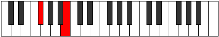 |
## Modes

| Number | Mode | Tonic | Notes | Illustration |
|--------|------|-------|-------|--------------|
| [275](https://ianring.com/musictheory/scales/275) | [Dalic](ModeASharpDalic.md) | A# | A#, B, D, F#, A# |  |
| [275](https://ianring.com/musictheory/scales/275) | [Dalic](ModeBFlatDalic.md) | Bb | Bb, B, D, Gb, Bb |  |
| [279](https://ianring.com/musictheory/scales/279) | [Poditonic](ModeASharpPoditonic.md) | A# | A#, B, C, D, F#, A# |  |
| [279](https://ianring.com/musictheory/scales/279) | [Poditonic](ModeBFlatPoditonic.md) | Bb | Bb, B, C, D, Gb, Bb |  |
| [281](https://ianring.com/musictheory/scales/281) | [Lanic](ModeDSharpLanic.md) | D# | D#, F#, G, B, D# |  |
| [281](https://ianring.com/musictheory/scales/281) | [Lanic](ModeEFlatLanic.md) | Eb | Eb, Gb, G, B, Eb |  |
| [283](https://ianring.com/musictheory/scales/283) | [Aerylitonic](ModeDSharpAerylitonic.md) | D# | D#, E, F#, G, B, D# |  |
| [283](https://ianring.com/musictheory/scales/283) | [Aerylitonic](ModeEFlatAerylitonic.md) | Eb | Eb, E, Gb, G, B, Eb |  |
| [283](https://ianring.com/musictheory/scales/283) | [Aerylitonic](ModeASharpAerylitonic.md) | A# | A#, B, C#, D, F#, A# |  |
| [283](https://ianring.com/musictheory/scales/283) | [Aerylitonic](ModeBFlatAerylitonic.md) | Bb | Bb, B, Db, D, Gb, Bb | 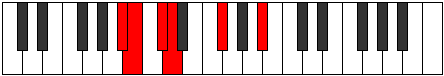 |
| [285](https://ianring.com/musictheory/scales/285) | [Zaritonic](ModeDSharpZaritonic.md) | D# | D#, F, F#, G, B, D# |  |
| [285](https://ianring.com/musictheory/scales/285) | [Zaritonic](ModeEFlatZaritonic.md) | Eb | Eb, F, Gb, G, B, Eb |  |
| [287](https://ianring.com/musictheory/scales/287) | [Gynimic](ModeDSharpGynimic.md) | D# | D#, E, F, Gb, Abb, B, D# |  |
| [287](https://ianring.com/musictheory/scales/287) | [Gynimic](ModeEFlatGynimic.md) | Eb | Eb, Fb, Gbb, Abbb, E###, Cb, Eb |  |
| [287](https://ianring.com/musictheory/scales/287) | [Gynimic](ModeASharpGynimic.md) | A# | A#, B, C, Db, Ebb, F#, A# |  |
| [287](https://ianring.com/musictheory/scales/287) | [Gynimic](ModeBFlatGynimic.md) | Bb | Bb, Cb, Dbb, Ebbb, Fbbb, Gb, Bb |  |
| [291](https://ianring.com/musictheory/scales/291) | [Aerathic](ModeFSharpAerathic.md) | F# | F#, G, B, D, F# |  |
| [291](https://ianring.com/musictheory/scales/291) | [Aerathic](ModeGFlatAerathic.md) | Gb | Gb, G, B, D, Gb |  |
| [291](https://ianring.com/musictheory/scales/291) | [Aerathic](ModeASharpAerathic.md) | A# | A#, B, D#, F#, A# |  |
| [291](https://ianring.com/musictheory/scales/291) | [Aerathic](ModeBFlatAerathic.md) | Bb | Bb, B, Eb, Gb, Bb |  |
| [293](https://ianring.com/musictheory/scales/293) | [Zoptic](ModeFSharpZoptic.md) | F# | F#, G#, B, D, F# |  |
| [293](https://ianring.com/musictheory/scales/293) | [Zoptic](ModeGFlatZoptic.md) | Gb | Gb, Ab, B, D, Gb |  |
| [295](https://ianring.com/musictheory/scales/295) | [Gyritonic](ModeFSharpGyritonic.md) | F# | F#, G, G#, B, D, F# |  |
| [295](https://ianring.com/musictheory/scales/295) | [Gyritonic](ModeGFlatGyritonic.md) | Gb | Gb, G, Ab, B, D, Gb |  |
| [295](https://ianring.com/musictheory/scales/295) | [Gyritonic](ModeASharpGyritonic.md) | A# | A#, B, C, D#, F#, A# |  |
| [295](https://ianring.com/musictheory/scales/295) | [Gyritonic](ModeBFlatGyritonic.md) | Bb | Bb, B, C, Eb, Gb, Bb |  |
| [297](https://ianring.com/musictheory/scales/297) | [Mynic](ModeDSharpMynic.md) | D# | D#, F#, G#, B, D# |  |
| [297](https://ianring.com/musictheory/scales/297) | [Mynic](ModeEFlatMynic.md) | Eb | Eb, Gb, Ab, B, Eb |  |
| [297](https://ianring.com/musictheory/scales/297) | [Mynic](ModeFSharpMynic.md) | F# | F#, A, B, D, F# |  |
| [297](https://ianring.com/musictheory/scales/297) | [Mynic](ModeGFlatMynic.md) | Gb | Gb, A, B, D, Gb |  |
| [299](https://ianring.com/musictheory/scales/299) | [Phratonic](ModeDSharpPhratonic.md) | D# | D#, E, F#, G#, B, D# |  |
| [299](https://ianring.com/musictheory/scales/299) | [Phratonic](ModeEFlatPhratonic.md) | Eb | Eb, E, Gb, Ab, B, Eb |  |
| [299](https://ianring.com/musictheory/scales/299) | [Phratonic](ModeFSharpPhratonic.md) | F# | F#, G, A, B, D, F# |  |
| [299](https://ianring.com/musictheory/scales/299) | [Phratonic](ModeGFlatPhratonic.md) | Gb | Gb, G, A, B, D, Gb |  |
| [299](https://ianring.com/musictheory/scales/299) | [Phratonic](ModeASharpPhratonic.md) | A# | A#, B, C#, D#, F#, A# |  |
| [299](https://ianring.com/musictheory/scales/299) | [Phratonic](ModeBFlatPhratonic.md) | Bb | Bb, B, Db, Eb, Gb, Bb |  |
| [301](https://ianring.com/musictheory/scales/301) | [Zythitonic](ModeDSharpZythitonic.md) | D# | D#, F, F#, G#, B, D# |  |
| [301](https://ianring.com/musictheory/scales/301) | [Zythitonic](ModeEFlatZythitonic.md) | Eb | Eb, F, Gb, Ab, B, Eb |  |
| [301](https://ianring.com/musictheory/scales/301) | [Zythitonic](ModeFSharpZythitonic.md) | F# | F#, G#, A, B, D, F# |  |
| [301](https://ianring.com/musictheory/scales/301) | [Zythitonic](ModeGFlatZythitonic.md) | Gb | Gb, Ab, A, B, D, Gb |  |
| [303](https://ianring.com/musictheory/scales/303) | [Golimic](ModeDSharpGolimic.md) | D# | D#, E, F, Gb, Ab, B, D# |  |
| [303](https://ianring.com/musictheory/scales/303) | [Golimic](ModeEFlatGolimic.md) | Eb | Eb, Fb, Gbb, Abbb, Bbbb, Cb, Eb |  |
| [303](https://ianring.com/musictheory/scales/303) | [Golimic](ModeFSharpGolimic.md) | F# | F#, G, Ab, Bbb, Cb, D, F# |  |
| [303](https://ianring.com/musictheory/scales/303) | [Golimic](ModeGFlatGolimic.md) | Gb | Gb, Abb, Bbbb, Cbbb, Dbbb, Ebb, Gb |  |
| [303](https://ianring.com/musictheory/scales/303) | [Golimic](ModeASharpGolimic.md) | A# | A#, B, C, Db, Eb, F#, A# |  |
| [303](https://ianring.com/musictheory/scales/303) | [Golimic](ModeBFlatGolimic.md) | Bb | Bb, Cb, Dbb, Ebbb, Fbb, Gb, Bb |  |
| [305](https://ianring.com/musictheory/scales/305) | [Gonic](ModeFSharpGonic.md) | F# | F#, A#, B, D, F# |  |
| [305](https://ianring.com/musictheory/scales/305) | [Gonic](ModeGFlatGonic.md) | Gb | Gb, Bb, B, D, Gb |  |
| [307](https://ianring.com/musictheory/scales/307) | [Phrolitonic](ModeASharpPhrolitonic.md) | A# | A#, B, D, D#, F#, A# |  |
| [307](https://ianring.com/musictheory/scales/307) | [Phrolitonic](ModeBFlatPhrolitonic.md) | Bb | Bb, B, D, Eb, Gb, Bb |  |
| [307](https://ianring.com/musictheory/scales/307) | [Phrolitonic](ModeFSharpPhrolitonic.md) | F# | F#, G, A#, B, D, F# |  |
| [307](https://ianring.com/musictheory/scales/307) | [Phrolitonic](ModeGFlatPhrolitonic.md) | Gb | Gb, G, Bb, B, D, Gb |  |
| [309](https://ianring.com/musictheory/scales/309) | [Palitonic](ModeFSharpPalitonic.md) | F# | F#, G#, A#, B, D, F# |  |
| [309](https://ianring.com/musictheory/scales/309) | [Palitonic](ModeGFlatPalitonic.md) | Gb | Gb, Ab, Bb, B, D, Gb |  |
| [311](https://ianring.com/musictheory/scales/311) | [Stagimic](ModeASharpStagimic.md) | A# | A#, B, C, D, Eb, F#, A# |  |
| [311](https://ianring.com/musictheory/scales/311) | [Stagimic](ModeBFlatStagimic.md) | Bb | Bb, Cb, Dbb, Ebb, Fbb, Gb, Bb |  |
| [311](https://ianring.com/musictheory/scales/311) | [Stagimic](ModeFSharpStagimic.md) | F# | F#, G, Ab, Bb, Cb, D, F# | 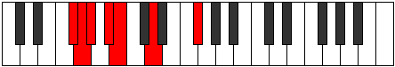 |
| [311](https://ianring.com/musictheory/scales/311) | [Stagimic](ModeGFlatStagimic.md) | Gb | Gb, Abb, Bbbb, Cbb, Dbbb, Ebb, Gb |  |
| [313](https://ianring.com/musictheory/scales/313) | [Goritonic](ModeDSharpGoritonic.md) | D# | D#, F#, G, G#, B, D# |  |
| [313](https://ianring.com/musictheory/scales/313) | [Goritonic](ModeEFlatGoritonic.md) | Eb | Eb, Gb, G, Ab, B, Eb |  |
| [313](https://ianring.com/musictheory/scales/313) | [Goritonic](ModeFSharpGoritonic.md) | F# | F#, A, A#, B, D, F# |  |
| [313](https://ianring.com/musictheory/scales/313) | [Goritonic](ModeGFlatGoritonic.md) | Gb | Gb, A, Bb, B, D, Gb |  |
| [315](https://ianring.com/musictheory/scales/315) | [Stodimic](ModeDSharpStodimic.md) | D# | D#, E, F#, G, Ab, B, D# |  |
| [315](https://ianring.com/musictheory/scales/315) | [Stodimic](ModeEFlatStodimic.md) | Eb | Eb, Fb, Gb, Abb, Bbbb, Cb, Eb |  |
| [315](https://ianring.com/musictheory/scales/315) | [Stodimic](ModeASharpStodimic.md) | A# | A#, B, C#, D, Eb, F#, A# |  |
| [315](https://ianring.com/musictheory/scales/315) | [Stodimic](ModeBFlatStodimic.md) | Bb | Bb, Cb, Db, Ebb, Fbb, Gb, Bb |  |
| [315](https://ianring.com/musictheory/scales/315) | [Stodimic](ModeFSharpStodimic.md) | F# | F#, G, A, Bb, Cb, D, F# |  |
| [315](https://ianring.com/musictheory/scales/315) | [Stodimic](ModeGFlatStodimic.md) | Gb | Gb, Abb, Bbb, Cbb, Dbbb, Ebb, Gb |  |
| [317](https://ianring.com/musictheory/scales/317) | [Korimic](ModeDSharpKorimic.md) | D# | D#, E#, F#, G, Ab, B, D# |  |
| [317](https://ianring.com/musictheory/scales/317) | [Korimic](ModeEFlatKorimic.md) | Eb | Eb, F, Gb, Abb, Bbbb, Cb, Eb |  |
| [317](https://ianring.com/musictheory/scales/317) | [Korimic](ModeFSharpKorimic.md) | F# | F#, G#, A, Bb, Cb, D, F# |  |
| [317](https://ianring.com/musictheory/scales/317) | [Korimic](ModeGFlatKorimic.md) | Gb | Gb, Ab, Bbb, Cbb, Dbbb, Ebb, Gb | 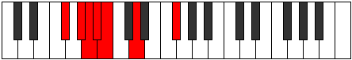 |
| [319](https://ianring.com/musictheory/scales/319) | [Epodian](ModeDSharpEpodian.md) | D# | D#, E, F, Gb, Abb, Bbbb, Cb, D# |  |
| [319](https://ianring.com/musictheory/scales/319) | [Epodian](ModeEFlatEpodian.md) | Eb | Eb, Fb, Gbb, Abbb, E###, F###, Cb, Eb |  |
| [319](https://ianring.com/musictheory/scales/319) | [Epodian](ModeASharpEpodian.md) | A# | A#, B, C, Db, Ebb, Fbb, Gb, A# |  |
| [319](https://ianring.com/musictheory/scales/319) | [Epodian](ModeBFlatEpodian.md) | Bb | Bb, Cb, Dbb, Ebbb, Fbbb, C###, E##, Bb |  |
| [319](https://ianring.com/musictheory/scales/319) | [Epodian](ModeFSharpEpodian.md) | F# | F#, G, Ab, Bbb, Cbb, Dbbb, Ebb, F# |  |
| [319](https://ianring.com/musictheory/scales/319) | [Epodian](ModeGFlatEpodian.md) | Gb | Gb, Abb, Bbbb, Cbbb, Cbb, Dbbb, Ebb, Gb |  |
| [327](https://ianring.com/musictheory/scales/327) | [Syptitonic](ModeFNaturalSyptitonic.md) | F | F, F#, G, B, C#, F |  |
| [327](https://ianring.com/musictheory/scales/327) | [Syptitonic](ModeASharpSyptitonic.md) | A# | A#, B, C, E, F#, A# |  |
| [327](https://ianring.com/musictheory/scales/327) | [Syptitonic](ModeBFlatSyptitonic.md) | Bb | Bb, B, C, E, Gb, Bb |  |
| [329](https://ianring.com/musictheory/scales/329) | [Lonic](ModeDSharpLonic.md) | D# | D#, F#, A, B, D# |  |
| [329](https://ianring.com/musictheory/scales/329) | [Lonic](ModeEFlatLonic.md) | Eb | Eb, Gb, A, B, Eb |  |
| [331](https://ianring.com/musictheory/scales/331) | [Byptitonic](ModeFNaturalByptitonic.md) | F | F, F#, G#, B, C#, F |  |
| [331](https://ianring.com/musictheory/scales/331) | [Byptitonic](ModeDSharpByptitonic.md) | D# | D#, E, F#, A, B, D# |  |
| [331](https://ianring.com/musictheory/scales/331) | [Byptitonic](ModeEFlatByptitonic.md) | Eb | Eb, E, Gb, A, B, Eb |  |
| [331](https://ianring.com/musictheory/scales/331) | [Byptitonic](ModeASharpByptitonic.md) | A# | A#, B, C#, E, F#, A# |  |
| [331](https://ianring.com/musictheory/scales/331) | [Byptitonic](ModeBFlatByptitonic.md) | Bb | Bb, B, Db, E, Gb, Bb |  |
| [333](https://ianring.com/musictheory/scales/333) | [Bogitonic](ModeDSharpBogitonic.md) | D# | D#, F, F#, A, B, D# |  |
| [333](https://ianring.com/musictheory/scales/333) | [Bogitonic](ModeEFlatBogitonic.md) | Eb | Eb, F, Gb, A, B, Eb |  |
| [335](https://ianring.com/musictheory/scales/335) | [Zanimic](ModeFNaturalZanimic.md) | F | F, Gb, Abb, Bbbb, Cb, Db, F |  |
| [335](https://ianring.com/musictheory/scales/335) | [Zanimic](ModeDSharpZanimic.md) | D# | D#, E, F, Gb, A, B, D# |  |
| [335](https://ianring.com/musictheory/scales/335) | [Zanimic](ModeEFlatZanimic.md) | Eb | Eb, Fb, Gbb, Abbb, Bbb, Cb, Eb |  |
| [335](https://ianring.com/musictheory/scales/335) | [Zanimic](ModeASharpZanimic.md) | A# | A#, B, C, Db, E, F#, A# |  |
| [335](https://ianring.com/musictheory/scales/335) | [Zanimic](ModeBFlatZanimic.md) | Bb | Bb, Cb, Dbb, Ebbb, Fb, Gb, Bb |  |
| [339](https://ianring.com/musictheory/scales/339) | [Zaptitonic](ModeFNaturalZaptitonic.md) | F | F, F#, A, B, C#, F |  |
| [339](https://ianring.com/musictheory/scales/339) | [Zaptitonic](ModeASharpZaptitonic.md) | A# | A#, B, D, E, F#, A# |  |
| [339](https://ianring.com/musictheory/scales/339) | [Zaptitonic](ModeBFlatZaptitonic.md) | Bb | Bb, B, D, E, Gb, Bb |  |
| [343](https://ianring.com/musictheory/scales/343) | [Ionorimic](ModeFNaturalIonorimic.md) | F | F, Gb, Abb, Bbb, Cb, Db, F |  |
| [343](https://ianring.com/musictheory/scales/343) | [Ionorimic](ModeASharpIonorimic.md) | A# | A#, B, C, D, E, F#, A# |  |
| [343](https://ianring.com/musictheory/scales/343) | [Ionorimic](ModeBFlatIonorimic.md) | Bb | Bb, Cb, Dbb, Ebb, Fb, Gb, Bb |  |
| [345](https://ianring.com/musictheory/scales/345) | [Gylitonic](ModeDSharpGylitonic.md) | D# | D#, F#, G, A, B, D# |  |
| [345](https://ianring.com/musictheory/scales/345) | [Gylitonic](ModeEFlatGylitonic.md) | Eb | Eb, Gb, G, A, B, Eb |  |
| [347](https://ianring.com/musictheory/scales/347) | [Barimic](ModeDSharpBarimic.md) | D# | D#, E, F#, G, A, B, D# |  |
| [347](https://ianring.com/musictheory/scales/347) | [Barimic](ModeEFlatBarimic.md) | Eb | Eb, Fb, Gb, Abb, Bbb, Cb, Eb |  |
| [347](https://ianring.com/musictheory/scales/347) | [Barimic](ModeFNaturalBarimic.md) | F | F, Gb, Ab, Bbb, Cb, Db, F |  |
| [347](https://ianring.com/musictheory/scales/347) | [Barimic](ModeASharpBarimic.md) | A# | A#, B, C#, D, E, F#, A# |  |
| [347](https://ianring.com/musictheory/scales/347) | [Barimic](ModeBFlatBarimic.md) | Bb | Bb, Cb, Db, Ebb, Fb, Gb, Bb |  |
| [349](https://ianring.com/musictheory/scales/349) | [Borimic](ModeDSharpBorimic.md) | D# | D#, E#, F#, G, A, B, D# |  |
| [349](https://ianring.com/musictheory/scales/349) | [Borimic](ModeEFlatBorimic.md) | Eb | Eb, F, Gb, Abb, Bbb, Cb, Eb |  |
| [351](https://ianring.com/musictheory/scales/351) | [Epanian](ModeDSharpEpanian.md) | D# | D#, E, F, Gb, Abb, Bbb, Cb, D# |  |
| [351](https://ianring.com/musictheory/scales/351) | [Epanian](ModeEFlatEpanian.md) | Eb | Eb, Fb, Gbb, Abbb, E###, Cbbb, Dbbb, Eb |  |
| [351](https://ianring.com/musictheory/scales/351) | [Epanian](ModeFNaturalEpanian.md) | F | F, Gb, Abb, Bbbb, Cbbb, Dbbb, Ebbb, F |  |
| [351](https://ianring.com/musictheory/scales/351) | [Epanian](ModeASharpEpanian.md) | A# | A#, B, C, Db, Ebb, Fb, Gb, A# |  |
| [351](https://ianring.com/musictheory/scales/351) | [Epanian](ModeBFlatEpanian.md) | Bb | Bb, Cb, Dbb, Ebbb, Fbbb, Gbbb, Abbb, Bb |  |
| [355](https://ianring.com/musictheory/scales/355) | [Aeoloritonic](ModeFSharpAeoloritonic.md) | F# | F#, G, B, C, D, F# |  |
| [355](https://ianring.com/musictheory/scales/355) | [Aeoloritonic](ModeGFlatAeoloritonic.md) | Gb | Gb, G, B, C, D, Gb |  |
| [355](https://ianring.com/musictheory/scales/355) | [Aeoloritonic](ModeASharpAeoloritonic.md) | A# | A#, B, D#, E, F#, A# |  |
| [355](https://ianring.com/musictheory/scales/355) | [Aeoloritonic](ModeBFlatAeoloritonic.md) | Bb | Bb, B, Eb, E, Gb, Bb |  |
| [355](https://ianring.com/musictheory/scales/355) | [Aeoloritonic](ModeFNaturalAeoloritonic.md) | F | F, F#, A#, B, C#, F |  |
| [357](https://ianring.com/musictheory/scales/357) | [Banitonic](ModeFSharpBanitonic.md) | F# | F#, G#, B, C, D, F# |  |
| [357](https://ianring.com/musictheory/scales/357) | [Banitonic](ModeGFlatBanitonic.md) | Gb | Gb, Ab, B, C, D, Gb |  |
| [359](https://ianring.com/musictheory/scales/359) | [Bothimic](ModeFSharpBothimic.md) | F# | F#, G, Ab, B, C, D, F# |  |
| [359](https://ianring.com/musictheory/scales/359) | [Bothimic](ModeGFlatBothimic.md) | Gb | Gb, Abb, Bbbb, Cb, Dbb, Ebb, Gb |  |
| [359](https://ianring.com/musictheory/scales/359) | [Bothimic](ModeASharpBothimic.md) | A# | A#, B, C, D#, E, F#, A# |  |
| [359](https://ianring.com/musictheory/scales/359) | [Bothimic](ModeBFlatBothimic.md) | Bb | Bb, Cb, Dbb, Eb, Fb, Gb, Bb |  |
| [359](https://ianring.com/musictheory/scales/359) | [Bothimic](ModeFNaturalBothimic.md) | F | F, Gb, Abb, Bb, Cb, Db, F |  |
| [361](https://ianring.com/musictheory/scales/361) | [Bocritonic](ModeFSharpBocritonic.md) | F# | F#, A, B, C, D, F# |  |
| [361](https://ianring.com/musictheory/scales/361) | [Bocritonic](ModeGFlatBocritonic.md) | Gb | Gb, A, B, C, D, Gb |  |
| [361](https://ianring.com/musictheory/scales/361) | [Bocritonic](ModeDSharpBocritonic.md) | D# | D#, F#, G#, A, B, D# |  |
| [361](https://ianring.com/musictheory/scales/361) | [Bocritonic](ModeEFlatBocritonic.md) | Eb | Eb, Gb, Ab, A, B, Eb |  |
| [363](https://ianring.com/musictheory/scales/363) | [Soptimic](ModeFSharpSoptimic.md) | F# | F#, G, A, B, C, D, F# |  |
| [363](https://ianring.com/musictheory/scales/363) | [Soptimic](ModeGFlatSoptimic.md) | Gb | Gb, Abb, Bbb, Cb, Dbb, Ebb, Gb |  |
| [363](https://ianring.com/musictheory/scales/363) | [Soptimic](ModeDSharpSoptimic.md) | D# | D#, E, F#, G#, A, B, D# |  |
| [363](https://ianring.com/musictheory/scales/363) | [Soptimic](ModeEFlatSoptimic.md) | Eb | Eb, Fb, Gb, Ab, Bbb, Cb, Eb |  |
| [363](https://ianring.com/musictheory/scales/363) | [Soptimic](ModeASharpSoptimic.md) | A# | A#, B, C#, D#, E, F#, A# |  |
| [363](https://ianring.com/musictheory/scales/363) | [Soptimic](ModeBFlatSoptimic.md) | Bb | Bb, Cb, Db, Eb, Fb, Gb, Bb |  |
| [363](https://ianring.com/musictheory/scales/363) | [Soptimic](ModeFNaturalSoptimic.md) | F | F, Gb, Ab, Bb, Cb, Db, F |  |
| [365](https://ianring.com/musictheory/scales/365) | [Marimic](ModeFSharpMarimic.md) | F# | F#, G#, A, B, C, D, F# |  |
| [365](https://ianring.com/musictheory/scales/365) | [Marimic](ModeGFlatMarimic.md) | Gb | Gb, Ab, Bbb, Cb, Dbb, Ebb, Gb | 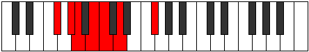 |
| [365](https://ianring.com/musictheory/scales/365) | [Marimic](ModeDSharpMarimic.md) | D# | D#, E#, F#, G#, A, B, D# |  |
| [365](https://ianring.com/musictheory/scales/365) | [Marimic](ModeEFlatMarimic.md) | Eb | Eb, F, Gb, Ab, Bbb, Cb, Eb |  |
| [367](https://ianring.com/musictheory/scales/367) | [Aerodian](ModeDSharpAerodian.md) | D# | D#, E, F, Gb, Ab, Bbb, Cb, D# |  |
| [367](https://ianring.com/musictheory/scales/367) | [Aerodian](ModeEFlatAerodian.md) | Eb | Eb, Fb, Gbb, Abbb, Bbbb, Cbbb, Dbbb, Eb |  |
| [367](https://ianring.com/musictheory/scales/367) | [Aerodian](ModeFSharpAerodian.md) | F# | F#, G, Ab, Bbb, Cb, Dbb, Ebb, F# |  |
| [367](https://ianring.com/musictheory/scales/367) | [Aerodian](ModeGFlatAerodian.md) | Gb | Gb, Abb, Bbbb, Cbbb, Dbbb, Dbb, Ebb, Gb |  |
| [367](https://ianring.com/musictheory/scales/367) | [Aerodian](ModeASharpAerodian.md) | A# | A#, B, C, Db, Eb, Fb, Gb, A# |  |
| [367](https://ianring.com/musictheory/scales/367) | [Aerodian](ModeBFlatAerodian.md) | Bb | Bb, Cb, Dbb, Ebbb, Fbb, Gbbb, Abbb, Bb |  |
| [367](https://ianring.com/musictheory/scales/367) | [Aerodian](ModeFNaturalAerodian.md) | F | F, Gb, Abb, Bbbb, Cbb, Dbbb, Ebbb, F |  |
| [369](https://ianring.com/musictheory/scales/369) | [Laditonic](ModeFSharpLaditonic.md) | F# | F#, A#, B, C, D, F# |  |
| [369](https://ianring.com/musictheory/scales/369) | [Laditonic](ModeGFlatLaditonic.md) | Gb | Gb, Bb, B, C, D, Gb |  |
| [371](https://ianring.com/musictheory/scales/371) | [Rythimic](ModeASharpRythimic.md) | A# | A#, B, C##, D#, E, F#, A# |  |
| [371](https://ianring.com/musictheory/scales/371) | [Rythimic](ModeBFlatRythimic.md) | Bb | Bb, Cb, D, Eb, Fb, Gb, Bb |  |
| [371](https://ianring.com/musictheory/scales/371) | [Rythimic](ModeFSharpRythimic.md) | F# | F#, G, A#, B, C, D, F# |  |
| [371](https://ianring.com/musictheory/scales/371) | [Rythimic](ModeGFlatRythimic.md) | Gb | Gb, Abb, Bb, Cb, Dbb, Ebb, Gb |  |
| [371](https://ianring.com/musictheory/scales/371) | [Rythimic](ModeFNaturalRythimic.md) | F | F, Gb, A, Bb, Cb, Db, F |  |
| [373](https://ianring.com/musictheory/scales/373) | [Epagimic](ModeFSharpEpagimic.md) | F# | F#, G#, A#, B, C, D, F# |  |
| [373](https://ianring.com/musictheory/scales/373) | [Epagimic](ModeGFlatEpagimic.md) | Gb | Gb, Ab, Bb, Cb, Dbb, Ebb, Gb |  |
| [375](https://ianring.com/musictheory/scales/375) | [Sodian](ModeASharpSodian.md) | A# | A#, B, C, D, Eb, Fb, Gb, A# |  |
| [375](https://ianring.com/musictheory/scales/375) | [Sodian](ModeBFlatSodian.md) | Bb | Bb, Cb, Dbb, Ebb, Fbb, Gbbb, Abbb, Bb |  |
| [375](https://ianring.com/musictheory/scales/375) | [Sodian](ModeFSharpSodian.md) | F# | F#, G, Ab, Bb, Cb, Dbb, Ebb, F# |  |
| [375](https://ianring.com/musictheory/scales/375) | [Sodian](ModeGFlatSodian.md) | Gb | Gb, Abb, Bbbb, Cbb, Dbbb, Dbb, Ebb, Gb |  |
| [375](https://ianring.com/musictheory/scales/375) | [Sodian](ModeFNaturalSodian.md) | F | F, Gb, Abb, Bbb, Cbb, Dbbb, Ebbb, F |  |
| [377](https://ianring.com/musictheory/scales/377) | [Kathimic](ModeDSharpKathimic.md) | D# | D#, E##, F##, G#, A, B, D# |  |
| [377](https://ianring.com/musictheory/scales/377) | [Kathimic](ModeEFlatKathimic.md) | Eb | Eb, F#, G, Ab, Bbb, Cb, Eb |  |
| [377](https://ianring.com/musictheory/scales/377) | [Kathimic](ModeFSharpKathimic.md) | F# | F#, G##, A#, B, C, D, F# |  |
| [377](https://ianring.com/musictheory/scales/377) | [Kathimic](ModeGFlatKathimic.md) | Gb | Gb, A, Bb, Cb, Dbb, Ebb, Gb |  |
| [379](https://ianring.com/musictheory/scales/379) | [Aeragian](ModeDSharpAeragian.md) | D# | D#, E, F#, G, Ab, Bbb, Cb, D# |  |
| [379](https://ianring.com/musictheory/scales/379) | [Aeragian](ModeEFlatAeragian.md) | Eb | Eb, Fb, Gb, Abb, Bbbb, Cbbb, Dbbb, Eb |  |
| [379](https://ianring.com/musictheory/scales/379) | [Aeragian](ModeASharpAeragian.md) | A# | A#, B, C#, D, Eb, Fb, Gb, A# |  |
| [379](https://ianring.com/musictheory/scales/379) | [Aeragian](ModeBFlatAeragian.md) | Bb | Bb, Cb, Db, Ebb, Fbb, Gbbb, Abbb, Bb |  |
| [379](https://ianring.com/musictheory/scales/379) | [Aeragian](ModeFSharpAeragian.md) | F# | F#, G, A, Bb, Cb, Dbb, Ebb, F# |  |
| [379](https://ianring.com/musictheory/scales/379) | [Aeragian](ModeGFlatAeragian.md) | Gb | Gb, Abb, Bbb, Cbb, Dbbb, Dbb, Ebb, Gb |  |
| [379](https://ianring.com/musictheory/scales/379) | [Aeragian](ModeFNaturalAeragian.md) | F | F, Gb, Ab, Bbb, Cbb, Dbbb, Ebbb, F |  |
| [381](https://ianring.com/musictheory/scales/381) | [Kogian](ModeDSharpKogian.md) | D# | D#, E#, F#, G, Ab, Bbb, Cb, D# |  |
| [381](https://ianring.com/musictheory/scales/381) | [Kogian](ModeEFlatKogian.md) | Eb | Eb, F, Gb, Abb, Bbbb, Cbbb, Dbbb, Eb |  |
| [381](https://ianring.com/musictheory/scales/381) | [Kogian](ModeFSharpKogian.md) | F# | F#, G#, A, Bb, Cb, Dbb, Ebb, F# |  |
| [381](https://ianring.com/musictheory/scales/381) | [Kogian](ModeGFlatKogian.md) | Gb | Gb, Ab, Bbb, Cbb, Dbbb, Dbb, Ebb, Gb |  |
| [383](https://ianring.com/musictheory/scales/383) | [Logyllic](ModeDSharpLogyllic.md) | D# | D#, E, F, F#, G, G#, A, B, D# |  |
| [383](https://ianring.com/musictheory/scales/383) | [Logyllic](ModeEFlatLogyllic.md) | Eb | Eb, E, F, Gb, G, Ab, A, B, Eb |  |
| [383](https://ianring.com/musictheory/scales/383) | [Logyllic](ModeASharpLogyllic.md) | A# | A#, B, C, C#, D, D#, E, F#, A# |  |
| [383](https://ianring.com/musictheory/scales/383) | [Logyllic](ModeBFlatLogyllic.md) | Bb | Bb, B, C, Db, D, Eb, E, Gb, Bb |  |
| [383](https://ianring.com/musictheory/scales/383) | [Logyllic](ModeFSharpLogyllic.md) | F# | F#, G, G#, A, A#, B, C, D, F# |  |
| [383](https://ianring.com/musictheory/scales/383) | [Logyllic](ModeGFlatLogyllic.md) | Gb | Gb, G, Ab, A, Bb, B, C, D, Gb |  |
| [383](https://ianring.com/musictheory/scales/383) | [Logyllic](ModeFNaturalLogyllic.md) | F | F, F#, G, G#, A, A#, B, C#, F |  |
| [393](https://ianring.com/musictheory/scales/393) | [Lothic](ModeBNaturalLothic.md) | B | B, D, F#, G, B | 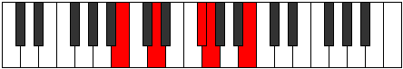 |
| [393](https://ianring.com/musictheory/scales/393) | [Lothic](ModeDSharpLothic.md) | D# | D#, F#, A#, B, D# |  |
| [393](https://ianring.com/musictheory/scales/393) | [Lothic](ModeEFlatLothic.md) | Eb | Eb, Gb, Bb, B, Eb |  |
| [395](https://ianring.com/musictheory/scales/395) | [Dalitonic](ModeBNaturalDalitonic.md) | B | B, C, D, F#, G, B |  |
| [395](https://ianring.com/musictheory/scales/395) | [Dalitonic](ModeDSharpDalitonic.md) | D# | D#, E, F#, A#, B, D# |  |
| [395](https://ianring.com/musictheory/scales/395) | [Dalitonic](ModeEFlatDalitonic.md) | Eb | Eb, E, Gb, Bb, B, Eb |  |
| [395](https://ianring.com/musictheory/scales/395) | [Dalitonic](ModeASharpDalitonic.md) | A# | A#, B, C#, F, F#, A# |  |
| [395](https://ianring.com/musictheory/scales/395) | [Dalitonic](ModeBFlatDalitonic.md) | Bb | Bb, B, Db, F, Gb, Bb |  |
| [397](https://ianring.com/musictheory/scales/397) | [Epogitonic](ModeBNaturalEpogitonic.md) | B | B, C#, D, F#, G, B |  |
| [397](https://ianring.com/musictheory/scales/397) | [Epogitonic](ModeENaturalEpogitonic.md) | E | E, F#, G, B, C, E |  |
| [397](https://ianring.com/musictheory/scales/397) | [Epogitonic](ModeDSharpEpogitonic.md) | D# | D#, F, F#, A#, B, D# |  |
| [397](https://ianring.com/musictheory/scales/397) | [Epogitonic](ModeEFlatEpogitonic.md) | Eb | Eb, F, Gb, Bb, B, Eb |  |
| [399](https://ianring.com/musictheory/scales/399) | [Zynimic](ModeBNaturalZynimic.md) | B | B, C, Db, Ebb, F#, G, B |  |
| [399](https://ianring.com/musictheory/scales/399) | [Zynimic](ModeENaturalZynimic.md) | E | E, F, Gb, Abb, B, C, E |  |
| [399](https://ianring.com/musictheory/scales/399) | [Zynimic](ModeASharpZynimic.md) | A# | A#, B, C, Db, E#, F#, A# |  |
| [399](https://ianring.com/musictheory/scales/399) | [Zynimic](ModeBFlatZynimic.md) | Bb | Bb, Cb, Dbb, Ebbb, F, Gb, Bb |  |
| [399](https://ianring.com/musictheory/scales/399) | [Zynimic](ModeDSharpZynimic.md) | D# | D#, E, F, Gb, A#, B, D# |  |
| [399](https://ianring.com/musictheory/scales/399) | [Zynimic](ModeEFlatZynimic.md) | Eb | Eb, Fb, Gbb, Abbb, Bb, Cb, Eb |  |
| [401](https://ianring.com/musictheory/scales/401) | [Epogic](ModeBNaturalEpogic.md) | B | B, D#, F#, G, B |  |
| [403](https://ianring.com/musictheory/scales/403) | [Daptitonic](ModeBNaturalDaptitonic.md) | B | B, C, D#, F#, G, B |  |
| [403](https://ianring.com/musictheory/scales/403) | [Daptitonic](ModeASharpDaptitonic.md) | A# | A#, B, D, F, F#, A# |  |
| [403](https://ianring.com/musictheory/scales/403) | [Daptitonic](ModeBFlatDaptitonic.md) | Bb | Bb, B, D, F, Gb, Bb |  |
| [405](https://ianring.com/musictheory/scales/405) | [Danitonic](ModeBNaturalDanitonic.md) | B | B, C#, D#, F#, G, B |  |
| [405](https://ianring.com/musictheory/scales/405) | [Danitonic](ModeENaturalDanitonic.md) | E | E, F#, G#, B, C, E |  |
| [407](https://ianring.com/musictheory/scales/407) | [Zylimic](ModeBNaturalZylimic.md) | B | B, C, Db, Eb, F#, G, B | 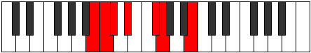 |
| [407](https://ianring.com/musictheory/scales/407) | [Zylimic](ModeENaturalZylimic.md) | E | E, F, Gb, Ab, B, C, E |  |
| [407](https://ianring.com/musictheory/scales/407) | [Zylimic](ModeASharpZylimic.md) | A# | A#, B, C, D, E#, F#, A# |  |
| [407](https://ianring.com/musictheory/scales/407) | [Zylimic](ModeBFlatZylimic.md) | Bb | Bb, Cb, Dbb, Ebb, F, Gb, Bb |  |
| [409](https://ianring.com/musictheory/scales/409) | [Laritonic](ModeBNaturalLaritonic.md) | B | B, D, D#, F#, G, B |  |
| [409](https://ianring.com/musictheory/scales/409) | [Laritonic](ModeDSharpLaritonic.md) | D# | D#, F#, G, A#, B, D# |  |
| [409](https://ianring.com/musictheory/scales/409) | [Laritonic](ModeEFlatLaritonic.md) | Eb | Eb, Gb, G, Bb, B, Eb |  |
| [411](https://ianring.com/musictheory/scales/411) | [Lygimic](ModeBNaturalLygimic.md) | B | B, C, D, Eb, F#, G, B |  |
| [411](https://ianring.com/musictheory/scales/411) | [Lygimic](ModeASharpLygimic.md) | A# | A#, B, C#, D, E#, F#, A# |  |
| [411](https://ianring.com/musictheory/scales/411) | [Lygimic](ModeBFlatLygimic.md) | Bb | Bb, Cb, Db, Ebb, F, Gb, Bb |  |
| [411](https://ianring.com/musictheory/scales/411) | [Lygimic](ModeDSharpLygimic.md) | D# | D#, E, F#, G, A#, B, D# |  |
| [411](https://ianring.com/musictheory/scales/411) | [Lygimic](ModeEFlatLygimic.md) | Eb | Eb, Fb, Gb, Abb, Bb, Cb, Eb |  |
| [413](https://ianring.com/musictheory/scales/413) | [Ganimic](ModeBNaturalGanimic.md) | B | B, C#, D, Eb, F#, G, B |  |
| [413](https://ianring.com/musictheory/scales/413) | [Ganimic](ModeENaturalGanimic.md) | E | E, F#, G, Ab, B, C, E |  |
| [413](https://ianring.com/musictheory/scales/413) | [Ganimic](ModeDSharpGanimic.md) | D# | D#, E#, F#, G, A#, B, D# |  |
| [413](https://ianring.com/musictheory/scales/413) | [Ganimic](ModeEFlatGanimic.md) | Eb | Eb, F, Gb, Abb, Bb, Cb, Eb |  |
| [415](https://ianring.com/musictheory/scales/415) | [Aeoladian](ModeBNaturalAeoladian.md) | B | B, C, Db, Ebb, Fbb, Gb, Abb, B |  |
| [415](https://ianring.com/musictheory/scales/415) | [Aeoladian](ModeENaturalAeoladian.md) | E | E, F, Gb, Abb, Bbbb, Cb, Dbb, E |  |
| [415](https://ianring.com/musictheory/scales/415) | [Aeoladian](ModeASharpAeoladian.md) | A# | A#, B, C, Db, Ebb, F, Gb, A# |  |
| [415](https://ianring.com/musictheory/scales/415) | [Aeoladian](ModeBFlatAeoladian.md) | Bb | Bb, Cb, Dbb, Ebbb, Fbbb, Gbb, Abbb, Bb |  |
| [415](https://ianring.com/musictheory/scales/415) | [Aeoladian](ModeDSharpAeoladian.md) | D# | D#, E, F, Gb, Abb, Bb, Cb, D# |  |
| [415](https://ianring.com/musictheory/scales/415) | [Aeoladian](ModeEFlatAeoladian.md) | Eb | Eb, Fb, Gbb, Abbb, E###, Cbb, Dbbb, Eb |  |
| [419](https://ianring.com/musictheory/scales/419) | [Ionacritonic](ModeFSharpIonacritonic.md) | F# | F#, G, B, C#, D, F# |  |
| [419](https://ianring.com/musictheory/scales/419) | [Ionacritonic](ModeGFlatIonacritonic.md) | Gb | Gb, G, B, Db, D, Gb |  |
| [419](https://ianring.com/musictheory/scales/419) | [Ionacritonic](ModeBNaturalIonacritonic.md) | B | B, C, E, F#, G, B |  |
| [419](https://ianring.com/musictheory/scales/419) | [Ionacritonic](ModeASharpIonacritonic.md) | A# | A#, B, D#, F, F#, A# |  |
| [419](https://ianring.com/musictheory/scales/419) | [Ionacritonic](ModeBFlatIonacritonic.md) | Bb | Bb, B, Eb, F, Gb, Bb |  |
| [421](https://ianring.com/musictheory/scales/421) | [Ionitonic](ModeBNaturalIonitonic.md) | B | B, C#, E, F#, G, B | 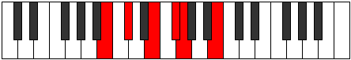 |
| [421](https://ianring.com/musictheory/scales/421) | [Ionitonic](ModeFSharpIonitonic.md) | F# | F#, G#, B, C#, D, F# |  |
| [421](https://ianring.com/musictheory/scales/421) | [Ionitonic](ModeGFlatIonitonic.md) | Gb | Gb, Ab, B, Db, D, Gb |  |
| [421](https://ianring.com/musictheory/scales/421) | [Ionitonic](ModeENaturalIonitonic.md) | E | E, F#, A, B, C, E |  |
| [423](https://ianring.com/musictheory/scales/423) | [Sogimic](ModeBNaturalSogimic.md) | B | B, C, Db, E, F#, G, B |  |
| [423](https://ianring.com/musictheory/scales/423) | [Sogimic](ModeFSharpSogimic.md) | F# | F#, G, Ab, B, C#, D, F# |  |
| [423](https://ianring.com/musictheory/scales/423) | [Sogimic](ModeGFlatSogimic.md) | Gb | Gb, Abb, Bbbb, Cb, Db, Ebb, Gb |  |
| [423](https://ianring.com/musictheory/scales/423) | [Sogimic](ModeENaturalSogimic.md) | E | E, F, Gb, A, B, C, E |  |
| [423](https://ianring.com/musictheory/scales/423) | [Sogimic](ModeASharpSogimic.md) | A# | A#, B, C, D#, E#, F#, A# | 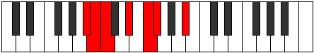 |
| [423](https://ianring.com/musictheory/scales/423) | [Sogimic](ModeBFlatSogimic.md) | Bb | Bb, Cb, Dbb, Eb, F, Gb, Bb |  |
| [425](https://ianring.com/musictheory/scales/425) | [Daditonic](ModeBNaturalDaditonic.md) | B | B, D, E, F#, G, B |  |
| [425](https://ianring.com/musictheory/scales/425) | [Daditonic](ModeFSharpDaditonic.md) | F# | F#, A, B, C#, D, F# | 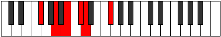 |
| [425](https://ianring.com/musictheory/scales/425) | [Daditonic](ModeGFlatDaditonic.md) | Gb | Gb, A, B, Db, D, Gb |  |
| [425](https://ianring.com/musictheory/scales/425) | [Daditonic](ModeDSharpDaditonic.md) | D# | D#, F#, G#, A#, B, D# |  |
| [425](https://ianring.com/musictheory/scales/425) | [Daditonic](ModeEFlatDaditonic.md) | Eb | Eb, Gb, Ab, Bb, B, Eb |  |
| [427](https://ianring.com/musictheory/scales/427) | [Zothimic](ModeBNaturalZothimic.md) | B | B, C, D, E, F#, G, B |  |
| [427](https://ianring.com/musictheory/scales/427) | [Zothimic](ModeFSharpZothimic.md) | F# | F#, G, A, B, C#, D, F# |  |
| [427](https://ianring.com/musictheory/scales/427) | [Zothimic](ModeGFlatZothimic.md) | Gb | Gb, Abb, Bbb, Cb, Db, Ebb, Gb |  |
| [427](https://ianring.com/musictheory/scales/427) | [Zothimic](ModeASharpZothimic.md) | A# | A#, B, C#, D#, E#, F#, A# |  |
| [427](https://ianring.com/musictheory/scales/427) | [Zothimic](ModeBFlatZothimic.md) | Bb | Bb, Cb, Db, Eb, F, Gb, Bb |  |
| [427](https://ianring.com/musictheory/scales/427) | [Zothimic](ModeDSharpZothimic.md) | D# | D#, E, F#, G#, A#, B, D# |  |
| [427](https://ianring.com/musictheory/scales/427) | [Zothimic](ModeEFlatZothimic.md) | Eb | Eb, Fb, Gb, Ab, Bb, Cb, Eb |  |
| [429](https://ianring.com/musictheory/scales/429) | [Koptimic](ModeBNaturalKoptimic.md) | B | B, C#, D, E, F#, G, B |  |
| [429](https://ianring.com/musictheory/scales/429) | [Koptimic](ModeENaturalKoptimic.md) | E | E, F#, G, A, B, C, E |  |
| [429](https://ianring.com/musictheory/scales/429) | [Koptimic](ModeFSharpKoptimic.md) | F# | F#, G#, A, B, C#, D, F# |  |
| [429](https://ianring.com/musictheory/scales/429) | [Koptimic](ModeGFlatKoptimic.md) | Gb | Gb, Ab, Bbb, Cb, Db, Ebb, Gb |  |
| [429](https://ianring.com/musictheory/scales/429) | [Koptimic](ModeDSharpKoptimic.md) | D# | D#, E#, F#, G#, A#, B, D# |  |
| [429](https://ianring.com/musictheory/scales/429) | [Koptimic](ModeEFlatKoptimic.md) | Eb | Eb, F, Gb, Ab, Bb, Cb, Eb |  |
| [431](https://ianring.com/musictheory/scales/431) | [Epyrian](ModeBNaturalEpyrian.md) | B | B, C, Db, Ebb, Fb, Gb, Abb, B |  |
| [431](https://ianring.com/musictheory/scales/431) | [Epyrian](ModeENaturalEpyrian.md) | E | E, F, Gb, Abb, Bbb, Cb, Dbb, E |  |
| [431](https://ianring.com/musictheory/scales/431) | [Epyrian](ModeFSharpEpyrian.md) | F# | F#, G, Ab, Bbb, Cb, Db, Ebb, F# |  |
| [431](https://ianring.com/musictheory/scales/431) | [Epyrian](ModeGFlatEpyrian.md) | Gb | Gb, Abb, Bbbb, Cbbb, Dbbb, Ebbb, Fbbb, Gb |  |
| [431](https://ianring.com/musictheory/scales/431) | [Epyrian](ModeASharpEpyrian.md) | A# | A#, B, C, Db, Eb, F, Gb, A# |  |
| [431](https://ianring.com/musictheory/scales/431) | [Epyrian](ModeBFlatEpyrian.md) | Bb | Bb, Cb, Dbb, Ebbb, Fbb, Gbb, Abbb, Bb |  |
| [431](https://ianring.com/musictheory/scales/431) | [Epyrian](ModeDSharpEpyrian.md) | D# | D#, E, F, Gb, Ab, Bb, Cb, D# |  |
| [431](https://ianring.com/musictheory/scales/431) | [Epyrian](ModeEFlatEpyrian.md) | Eb | Eb, Fb, Gbb, Abbb, Bbbb, Cbb, Dbbb, Eb |  |
| [433](https://ianring.com/musictheory/scales/433) | [Poritonic](ModeBNaturalPoritonic.md) | B | B, D#, E, F#, G, B |  |
| [433](https://ianring.com/musictheory/scales/433) | [Poritonic](ModeFSharpPoritonic.md) | F# | F#, A#, B, C#, D, F# |  |
| [433](https://ianring.com/musictheory/scales/433) | [Poritonic](ModeGFlatPoritonic.md) | Gb | Gb, Bb, B, Db, D, Gb |  |
| [435](https://ianring.com/musictheory/scales/435) | [Ionolimic](ModeBNaturalIonolimic.md) | B | B, C, D#, E, F#, G, B |  |
| [435](https://ianring.com/musictheory/scales/435) | [Ionolimic](ModeASharpIonolimic.md) | A# | A#, B, C##, D#, E#, F#, A# |  |
| [435](https://ianring.com/musictheory/scales/435) | [Ionolimic](ModeBFlatIonolimic.md) | Bb | Bb, Cb, D, Eb, F, Gb, Bb |  |
| [435](https://ianring.com/musictheory/scales/435) | [Ionolimic](ModeFSharpIonolimic.md) | F# | F#, G, A#, B, C#, D, F# |  |
| [435](https://ianring.com/musictheory/scales/435) | [Ionolimic](ModeGFlatIonolimic.md) | Gb | Gb, Abb, Bb, Cb, Db, Ebb, Gb |  |
| [437](https://ianring.com/musictheory/scales/437) | [Ronimic](ModeBNaturalRonimic.md) | B | B, C#, D#, E, F#, G, B |  |
| [437](https://ianring.com/musictheory/scales/437) | [Ronimic](ModeENaturalRonimic.md) | E | E, F#, G#, A, B, C, E | 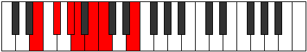 |
| [437](https://ianring.com/musictheory/scales/437) | [Ronimic](ModeFSharpRonimic.md) | F# | F#, G#, A#, B, C#, D, F# |  |
| [437](https://ianring.com/musictheory/scales/437) | [Ronimic](ModeGFlatRonimic.md) | Gb | Gb, Ab, Bb, Cb, Db, Ebb, Gb |  |
| [439](https://ianring.com/musictheory/scales/439) | [Bythian](ModeBNaturalBythian.md) | B | B, C, Db, Eb, Fb, Gb, Abb, B |  |
| [439](https://ianring.com/musictheory/scales/439) | [Bythian](ModeENaturalBythian.md) | E | E, F, Gb, Ab, Bbb, Cb, Dbb, E |  |
| [439](https://ianring.com/musictheory/scales/439) | [Bythian](ModeASharpBythian.md) | A# | A#, B, C, D, Eb, F, Gb, A# |  |
| [439](https://ianring.com/musictheory/scales/439) | [Bythian](ModeBFlatBythian.md) | Bb | Bb, Cb, Dbb, Ebb, Fbb, Gbb, Abbb, Bb |  |
| [439](https://ianring.com/musictheory/scales/439) | [Bythian](ModeFSharpBythian.md) | F# | F#, G, Ab, Bb, Cb, Db, Ebb, F# |  |
| [439](https://ianring.com/musictheory/scales/439) | [Bythian](ModeGFlatBythian.md) | Gb | Gb, Abb, Bbbb, Cbb, Dbbb, Ebbb, Fbbb, Gb |  |
| [441](https://ianring.com/musictheory/scales/441) | [Thycrimic](ModeBNaturalThycrimic.md) | B | B, C##, D#, E, F#, G, B |  |
| [441](https://ianring.com/musictheory/scales/441) | [Thycrimic](ModeDSharpThycrimic.md) | D# | D#, E##, F##, G#, A#, B, D# |  |
| [441](https://ianring.com/musictheory/scales/441) | [Thycrimic](ModeEFlatThycrimic.md) | Eb | Eb, F#, G, Ab, Bb, Cb, Eb |  |
| [441](https://ianring.com/musictheory/scales/441) | [Thycrimic](ModeFSharpThycrimic.md) | F# | F#, G##, A#, B, C#, D, F# |  |
| [441](https://ianring.com/musictheory/scales/441) | [Thycrimic](ModeGFlatThycrimic.md) | Gb | Gb, A, Bb, Cb, Db, Ebb, Gb | 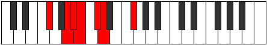 |
| [443](https://ianring.com/musictheory/scales/443) | [Kothian](ModeBNaturalKothian.md) | B | B, C, D, Eb, Fb, Gb, Abb, B |  |
| [443](https://ianring.com/musictheory/scales/443) | [Kothian](ModeASharpKothian.md) | A# | A#, B, C#, D, Eb, F, Gb, A# |  |
| [443](https://ianring.com/musictheory/scales/443) | [Kothian](ModeBFlatKothian.md) | Bb | Bb, Cb, Db, Ebb, Fbb, Gbb, Abbb, Bb |  |
| [443](https://ianring.com/musictheory/scales/443) | [Kothian](ModeDSharpKothian.md) | D# | D#, E, F#, G, Ab, Bb, Cb, D# |  |
| [443](https://ianring.com/musictheory/scales/443) | [Kothian](ModeEFlatKothian.md) | Eb | Eb, Fb, Gb, Abb, Bbbb, Cbb, Dbbb, Eb |  |
| [443](https://ianring.com/musictheory/scales/443) | [Kothian](ModeFSharpKothian.md) | F# | F#, G, A, Bb, Cb, Db, Ebb, F# |  |
| [443](https://ianring.com/musictheory/scales/443) | [Kothian](ModeGFlatKothian.md) | Gb | Gb, Abb, Bbb, Cbb, Dbbb, Ebbb, Fbbb, Gb |  |
| [445](https://ianring.com/musictheory/scales/445) | [Gocrian](ModeBNaturalGocrian.md) | B | B, C#, D, Eb, Fb, Gb, Abb, B | 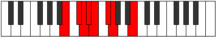 |
| [445](https://ianring.com/musictheory/scales/445) | [Gocrian](ModeENaturalGocrian.md) | E | E, F#, G, Ab, Bbb, Cb, Dbb, E |  |
| [445](https://ianring.com/musictheory/scales/445) | [Gocrian](ModeDSharpGocrian.md) | D# | D#, E#, F#, G, Ab, Bb, Cb, D# |  |
| [445](https://ianring.com/musictheory/scales/445) | [Gocrian](ModeEFlatGocrian.md) | Eb | Eb, F, Gb, Abb, Bbbb, Cbb, Dbbb, Eb |  |
| [445](https://ianring.com/musictheory/scales/445) | [Gocrian](ModeFSharpGocrian.md) | F# | F#, G#, A, Bb, Cb, Db, Ebb, F# |  |
| [445](https://ianring.com/musictheory/scales/445) | [Gocrian](ModeGFlatGocrian.md) | Gb | Gb, Ab, Bbb, Cbb, Dbbb, Ebbb, Fbbb, Gb |  |
| [447](https://ianring.com/musictheory/scales/447) | [Thyphyllic](ModeBNaturalThyphyllic.md) | B | B, C, C#, D, D#, E, F#, G, B |  |
| [447](https://ianring.com/musictheory/scales/447) | [Thyphyllic](ModeENaturalThyphyllic.md) | E | E, F, F#, G, G#, A, B, C, E |  |
| [447](https://ianring.com/musictheory/scales/447) | [Thyphyllic](ModeASharpThyphyllic.md) | A# | A#, B, C, C#, D, D#, F, F#, A# |  |
| [447](https://ianring.com/musictheory/scales/447) | [Thyphyllic](ModeBFlatThyphyllic.md) | Bb | Bb, B, C, Db, D, Eb, F, Gb, Bb |  |
| [447](https://ianring.com/musictheory/scales/447) | [Thyphyllic](ModeDSharpThyphyllic.md) | D# | D#, E, F, F#, G, G#, A#, B, D# |  |
| [447](https://ianring.com/musictheory/scales/447) | [Thyphyllic](ModeEFlatThyphyllic.md) | Eb | Eb, E, F, Gb, G, Ab, Bb, B, Eb |  |
| [447](https://ianring.com/musictheory/scales/447) | [Thyphyllic](ModeFSharpThyphyllic.md) | F# | F#, G, G#, A, A#, B, C#, D, F# |  |
| [447](https://ianring.com/musictheory/scales/447) | [Thyphyllic](ModeGFlatThyphyllic.md) | Gb | Gb, G, Ab, A, Bb, B, Db, D, Gb |  |
| [453](https://ianring.com/musictheory/scales/453) | [Raditonic](ModeBNaturalRaditonic.md) | B | B, C#, F, F#, G, B |  |
| [453](https://ianring.com/musictheory/scales/453) | [Raditonic](ModeENaturalRaditonic.md) | E | E, F#, A#, B, C, E |  |
| [455](https://ianring.com/musictheory/scales/455) | [Stadimic](ModeFNaturalStadimic.md) | F | F, Gb, Abb, B, C, Db, F |  |
| [455](https://ianring.com/musictheory/scales/455) | [Stadimic](ModeBNaturalStadimic.md) | B | B, C, Db, E#, F#, G, B |  |
| [455](https://ianring.com/musictheory/scales/455) | [Stadimic](ModeENaturalStadimic.md) | E | E, F, Gb, A#, B, C, E |  |
| [455](https://ianring.com/musictheory/scales/455) | [Stadimic](ModeASharpStadimic.md) | A# | A#, B, C, D##, E#, F#, A# |  |
| [455](https://ianring.com/musictheory/scales/455) | [Stadimic](ModeBFlatStadimic.md) | Bb | Bb, Cb, Dbb, E, F, Gb, Bb |  |
| [457](https://ianring.com/musictheory/scales/457) | [Staptitonic](ModeBNaturalStaptitonic.md) | B | B, D, F, F#, G, B |  |
| [457](https://ianring.com/musictheory/scales/457) | [Staptitonic](ModeDSharpStaptitonic.md) | D# | D#, F#, A, A#, B, D# |  |
| [457](https://ianring.com/musictheory/scales/457) | [Staptitonic](ModeEFlatStaptitonic.md) | Eb | Eb, Gb, A, Bb, B, Eb |  |
| [459](https://ianring.com/musictheory/scales/459) | [Zaptimic](ModeBNaturalZaptimic.md) | B | B, C, D, E#, F#, G, B | 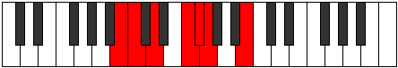 |
| [459](https://ianring.com/musictheory/scales/459) | [Zaptimic](ModeFNaturalZaptimic.md) | F | F, Gb, Ab, B, C, Db, F |  |
| [459](https://ianring.com/musictheory/scales/459) | [Zaptimic](ModeASharpZaptimic.md) | A# | A#, B, C#, D##, E#, F#, A# |  |
| [459](https://ianring.com/musictheory/scales/459) | [Zaptimic](ModeBFlatZaptimic.md) | Bb | Bb, Cb, Db, E, F, Gb, Bb |  |
| [459](https://ianring.com/musictheory/scales/459) | [Zaptimic](ModeDSharpZaptimic.md) | D# | D#, E, F#, G##, A#, B, D# |  |
| [459](https://ianring.com/musictheory/scales/459) | [Zaptimic](ModeEFlatZaptimic.md) | Eb | Eb, Fb, Gb, A, Bb, Cb, Eb |  |
| [461](https://ianring.com/musictheory/scales/461) | [Madimic](ModeBNaturalMadimic.md) | B | B, C#, D, E#, F#, G, B |  |
| [461](https://ianring.com/musictheory/scales/461) | [Madimic](ModeENaturalMadimic.md) | E | E, F#, G, A#, B, C, E |  |
| [461](https://ianring.com/musictheory/scales/461) | [Madimic](ModeDSharpMadimic.md) | D# | D#, E#, F#, G##, A#, B, D# |  |
| [461](https://ianring.com/musictheory/scales/461) | [Madimic](ModeEFlatMadimic.md) | Eb | Eb, F, Gb, A, Bb, Cb, Eb |  |
| [463](https://ianring.com/musictheory/scales/463) | [Zythian](ModeBNaturalZythian.md) | B | B, C, Db, Ebb, F, Gb, Abb, B | 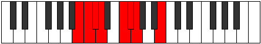 |
| [463](https://ianring.com/musictheory/scales/463) | [Zythian](ModeFNaturalZythian.md) | F | F, Gb, Abb, Bbbb, Cb, Dbb, Ebbb, F |  |
| [463](https://ianring.com/musictheory/scales/463) | [Zythian](ModeASharpZythian.md) | A# | A#, B, C, Db, E, F, Gb, A# |  |
| [463](https://ianring.com/musictheory/scales/463) | [Zythian](ModeBFlatZythian.md) | Bb | Bb, Cb, Dbb, Ebbb, Fb, Gbb, Abbb, Bb |  |
| [463](https://ianring.com/musictheory/scales/463) | [Zythian](ModeENaturalZythian.md) | E | E, F, Gb, Abb, Bb, Cb, Dbb, E |  |
| [463](https://ianring.com/musictheory/scales/463) | [Zythian](ModeDSharpZythian.md) | D# | D#, E, F, Gb, A, Bb, Cb, D# |  |
| [463](https://ianring.com/musictheory/scales/463) | [Zythian](ModeEFlatZythian.md) | Eb | Eb, Fb, Gbb, Abbb, Bbb, Cbb, Dbbb, Eb |  |
| [465](https://ianring.com/musictheory/scales/465) | [Zoditonic](ModeBNaturalZoditonic.md) | B | B, D#, F, F#, G, B |  |
| [467](https://ianring.com/musictheory/scales/467) | [Phrogimic](ModeBNaturalPhrogimic.md) | B | B, C, D#, E#, F#, G, B |  |
| [467](https://ianring.com/musictheory/scales/467) | [Phrogimic](ModeFNaturalPhrogimic.md) | F | F, Gb, A, B, C, Db, F |  |
| [467](https://ianring.com/musictheory/scales/467) | [Phrogimic](ModeASharpPhrogimic.md) | A# | A#, B, C##, D##, E#, F#, A# |  |
| [467](https://ianring.com/musictheory/scales/467) | [Phrogimic](ModeBFlatPhrogimic.md) | Bb | Bb, Cb, D, E, F, Gb, Bb |  |
| [469](https://ianring.com/musictheory/scales/469) | [Katyrimic](ModeBNaturalKatyrimic.md) | B | B, C#, D#, E#, F#, G, B |  |
| [469](https://ianring.com/musictheory/scales/469) | [Katyrimic](ModeENaturalKatyrimic.md) | E | E, F#, G#, A#, B, C, E |  |
| [471](https://ianring.com/musictheory/scales/471) | [Dodian](ModeBNaturalDodian.md) | B | B, C, Db, Eb, F, Gb, Abb, B |  |
| [471](https://ianring.com/musictheory/scales/471) | [Dodian](ModeFNaturalDodian.md) | F | F, Gb, Abb, Bbb, Cb, Dbb, Ebbb, F |  |
| [471](https://ianring.com/musictheory/scales/471) | [Dodian](ModeASharpDodian.md) | A# | A#, B, C, D, E, F, Gb, A# |  |
| [471](https://ianring.com/musictheory/scales/471) | [Dodian](ModeBFlatDodian.md) | Bb | Bb, Cb, Dbb, Ebb, Fb, Gbb, Abbb, Bb |  |
| [471](https://ianring.com/musictheory/scales/471) | [Dodian](ModeENaturalDodian.md) | E | E, F, Gb, Ab, Bb, Cb, Dbb, E |  |
| [473](https://ianring.com/musictheory/scales/473) | [Aeralimic](ModeBNaturalAeralimic.md) | B | B, C##, D#, E#, F#, G, B |  |
| [473](https://ianring.com/musictheory/scales/473) | [Aeralimic](ModeDSharpAeralimic.md) | D# | D#, E##, F##, G##, A#, B, D# |  |
| [473](https://ianring.com/musictheory/scales/473) | [Aeralimic](ModeEFlatAeralimic.md) | Eb | Eb, F#, G, A, Bb, Cb, Eb |  |
| [475](https://ianring.com/musictheory/scales/475) | [Aeolygian](ModeBNaturalAeolygian.md) | B | B, C, D, Eb, F, Gb, Abb, B |  |
| [475](https://ianring.com/musictheory/scales/475) | [Aeolygian](ModeFNaturalAeolygian.md) | F | F, Gb, Ab, Bbb, Cb, Dbb, Ebbb, F |  |
| [475](https://ianring.com/musictheory/scales/475) | [Aeolygian](ModeASharpAeolygian.md) | A# | A#, B, C#, D, E, F, Gb, A# |  |
| [475](https://ianring.com/musictheory/scales/475) | [Aeolygian](ModeBFlatAeolygian.md) | Bb | Bb, Cb, Db, Ebb, Fb, Gbb, Abbb, Bb |  |
| [475](https://ianring.com/musictheory/scales/475) | [Aeolygian](ModeDSharpAeolygian.md) | D# | D#, E, F#, G, A, Bb, Cb, D# |  |
| [475](https://ianring.com/musictheory/scales/475) | [Aeolygian](ModeEFlatAeolygian.md) | Eb | Eb, Fb, Gb, Abb, Bbb, Cbb, Dbbb, Eb |  |
| [477](https://ianring.com/musictheory/scales/477) | [Stacrian](ModeBNaturalStacrian.md) | B | B, C#, D, Eb, F, Gb, Abb, B |  |
| [477](https://ianring.com/musictheory/scales/477) | [Stacrian](ModeENaturalStacrian.md) | E | E, F#, G, Ab, Bb, Cb, Dbb, E |  |
| [477](https://ianring.com/musictheory/scales/477) | [Stacrian](ModeDSharpStacrian.md) | D# | D#, E#, F#, G, A, Bb, Cb, D# |  |
| [477](https://ianring.com/musictheory/scales/477) | [Stacrian](ModeEFlatStacrian.md) | Eb | Eb, F, Gb, Abb, Bbb, Cbb, Dbbb, Eb |  |
| [479](https://ianring.com/musictheory/scales/479) | [Kocryllic](ModeBNaturalKocryllic.md) | B | B, C, C#, D, D#, F, F#, G, B |  |
| [479](https://ianring.com/musictheory/scales/479) | [Kocryllic](ModeFNaturalKocryllic.md) | F | F, F#, G, G#, A, B, C, C#, F |  |
| [479](https://ianring.com/musictheory/scales/479) | [Kocryllic](ModeASharpKocryllic.md) | A# | A#, B, C, C#, D, E, F, F#, A# |  |
| [479](https://ianring.com/musictheory/scales/479) | [Kocryllic](ModeBFlatKocryllic.md) | Bb | Bb, B, C, Db, D, E, F, Gb, Bb |  |
| [479](https://ianring.com/musictheory/scales/479) | [Kocryllic](ModeENaturalKocryllic.md) | E | E, F, F#, G, G#, A#, B, C, E |  |
| [479](https://ianring.com/musictheory/scales/479) | [Kocryllic](ModeDSharpKocryllic.md) | D# | D#, E, F, F#, G, A, A#, B, D# |  |
| [479](https://ianring.com/musictheory/scales/479) | [Kocryllic](ModeEFlatKocryllic.md) | Eb | Eb, E, F, Gb, G, A, Bb, B, Eb | 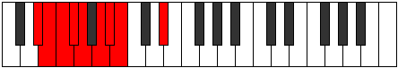 |
| [483](https://ianring.com/musictheory/scales/483) | [Kygimic](ModeFSharpKygimic.md) | F# | F#, G, A##, B#, C#, D, F# |  |
| [483](https://ianring.com/musictheory/scales/483) | [Kygimic](ModeGFlatKygimic.md) | Gb | Gb, Abb, B, C, Db, Ebb, Gb |  |
| [483](https://ianring.com/musictheory/scales/483) | [Kygimic](ModeBNaturalKygimic.md) | B | B, C, D##, E#, F#, G, B |  |
| [483](https://ianring.com/musictheory/scales/483) | [Kygimic](ModeFNaturalKygimic.md) | F | F, Gb, A#, B, C, Db, F |  |
| [483](https://ianring.com/musictheory/scales/483) | [Kygimic](ModeASharpKygimic.md) | A# | A#, B, C###, D##, E#, F#, A# |  |
| [483](https://ianring.com/musictheory/scales/483) | [Kygimic](ModeBFlatKygimic.md) | Bb | Bb, Cb, D#, E, F, Gb, Bb |  |
| [485](https://ianring.com/musictheory/scales/485) | [Stoptimic](ModeBNaturalStoptimic.md) | B | B, C#, D##, E#, F#, G, B |  |
| [485](https://ianring.com/musictheory/scales/485) | [Stoptimic](ModeFSharpStoptimic.md) | F# | F#, G#, A##, B#, C#, D, F# |  |
| [485](https://ianring.com/musictheory/scales/485) | [Stoptimic](ModeGFlatStoptimic.md) | Gb | Gb, Ab, B, C, Db, Ebb, Gb |  |
| [485](https://ianring.com/musictheory/scales/485) | [Stoptimic](ModeENaturalStoptimic.md) | E | E, F#, G##, A#, B, C, E |  |
| [487](https://ianring.com/musictheory/scales/487) | [Dynian](ModeBNaturalDynian.md) | B | B, C, Db, E, F, Gb, Abb, B |  |
| [487](https://ianring.com/musictheory/scales/487) | [Dynian](ModeFSharpDynian.md) | F# | F#, G, Ab, B, C, Db, Ebb, F# |  |
| [487](https://ianring.com/musictheory/scales/487) | [Dynian](ModeGFlatDynian.md) | Gb | Gb, Abb, Bbbb, Cb, Dbb, Ebbb, Fbbb, Gb |  |
| [487](https://ianring.com/musictheory/scales/487) | [Dynian](ModeASharpDynian.md) | A# | A#, B, C, D#, E, F, Gb, A# |  |
| [487](https://ianring.com/musictheory/scales/487) | [Dynian](ModeBFlatDynian.md) | Bb | Bb, Cb, Dbb, Eb, Fb, Gbb, Abbb, Bb |  |
| [487](https://ianring.com/musictheory/scales/487) | [Dynian](ModeFNaturalDynian.md) | F | F, Gb, Abb, Bb, Cb, Dbb, Ebbb, F |  |
| [487](https://ianring.com/musictheory/scales/487) | [Dynian](ModeENaturalDynian.md) | E | E, F, Gb, A, Bb, Cb, Dbb, E |  |
| [489](https://ianring.com/musictheory/scales/489) | [Phrathimic](ModeBNaturalPhrathimic.md) | B | B, C##, D##, E#, F#, G, B |  |
| [489](https://ianring.com/musictheory/scales/489) | [Phrathimic](ModeFSharpPhrathimic.md) | F# | F#, G##, A##, B#, C#, D, F# |  |
| [489](https://ianring.com/musictheory/scales/489) | [Phrathimic](ModeGFlatPhrathimic.md) | Gb | Gb, A, B, C, Db, Ebb, Gb |  |
| [489](https://ianring.com/musictheory/scales/489) | [Phrathimic](ModeDSharpPhrathimic.md) | D# | D#, E##, F###, G##, A#, B, D# |  |
| [489](https://ianring.com/musictheory/scales/489) | [Phrathimic](ModeEFlatPhrathimic.md) | Eb | Eb, F#, G#, A, Bb, Cb, Eb |  |
| [491](https://ianring.com/musictheory/scales/491) | [Aeolyrian](ModeBNaturalAeolyrian.md) | B | B, C, D, E, F, Gb, Abb, B |  |
| [491](https://ianring.com/musictheory/scales/491) | [Aeolyrian](ModeFSharpAeolyrian.md) | F# | F#, G, A, B, C, Db, Ebb, F# |  |
| [491](https://ianring.com/musictheory/scales/491) | [Aeolyrian](ModeGFlatAeolyrian.md) | Gb | Gb, Abb, Bbb, Cb, Dbb, Ebbb, Fbbb, Gb |  |
| [491](https://ianring.com/musictheory/scales/491) | [Aeolyrian](ModeASharpAeolyrian.md) | A# | A#, B, C#, D#, E, F, Gb, A# |  |
| [491](https://ianring.com/musictheory/scales/491) | [Aeolyrian](ModeBFlatAeolyrian.md) | Bb | Bb, Cb, Db, Eb, Fb, Gbb, Abbb, Bb |  |
| [491](https://ianring.com/musictheory/scales/491) | [Aeolyrian](ModeFNaturalAeolyrian.md) | F | F, Gb, Ab, Bb, Cb, Dbb, Ebbb, F |  |
| [491](https://ianring.com/musictheory/scales/491) | [Aeolyrian](ModeDSharpAeolyrian.md) | D# | D#, E, F#, G#, A, Bb, Cb, D# |  |
| [491](https://ianring.com/musictheory/scales/491) | [Aeolyrian](ModeEFlatAeolyrian.md) | Eb | Eb, Fb, Gb, Ab, Bbb, Cbb, Dbbb, Eb |  |
| [493](https://ianring.com/musictheory/scales/493) | [Rygian](ModeBNaturalRygian.md) | B | B, C#, D, E, F, Gb, Abb, B |  |
| [493](https://ianring.com/musictheory/scales/493) | [Rygian](ModeFSharpRygian.md) | F# | F#, G#, A, B, C, Db, Ebb, F# |  |
| [493](https://ianring.com/musictheory/scales/493) | [Rygian](ModeGFlatRygian.md) | Gb | Gb, Ab, Bbb, Cb, Dbb, Ebbb, Fbbb, Gb |  |
| [493](https://ianring.com/musictheory/scales/493) | [Rygian](ModeENaturalRygian.md) | E | E, F#, G, A, Bb, Cb, Dbb, E |  |
| [493](https://ianring.com/musictheory/scales/493) | [Rygian](ModeDSharpRygian.md) | D# | D#, E#, F#, G#, A, Bb, Cb, D# |  |
| [493](https://ianring.com/musictheory/scales/493) | [Rygian](ModeEFlatRygian.md) | Eb | Eb, F, Gb, Ab, Bbb, Cbb, Dbbb, Eb |  |
| [495](https://ianring.com/musictheory/scales/495) | [Bocryllic](ModeBNaturalBocryllic.md) | B | B, C, C#, D, E, F, F#, G, B |  |
| [495](https://ianring.com/musictheory/scales/495) | [Bocryllic](ModeFSharpBocryllic.md) | F# | F#, G, G#, A, B, C, C#, D, F# |  |
| [495](https://ianring.com/musictheory/scales/495) | [Bocryllic](ModeGFlatBocryllic.md) | Gb | Gb, G, Ab, A, B, C, Db, D, Gb |  |
| [495](https://ianring.com/musictheory/scales/495) | [Bocryllic](ModeASharpBocryllic.md) | A# | A#, B, C, C#, D#, E, F, F#, A# |  |
| [495](https://ianring.com/musictheory/scales/495) | [Bocryllic](ModeBFlatBocryllic.md) | Bb | Bb, B, C, Db, Eb, E, F, Gb, Bb |  |
| [495](https://ianring.com/musictheory/scales/495) | [Bocryllic](ModeFNaturalBocryllic.md) | F | F, F#, G, G#, A#, B, C, C#, F |  |
| [495](https://ianring.com/musictheory/scales/495) | [Bocryllic](ModeENaturalBocryllic.md) | E | E, F, F#, G, A, A#, B, C, E |  |
| [495](https://ianring.com/musictheory/scales/495) | [Bocryllic](ModeDSharpBocryllic.md) | D# | D#, E, F, F#, G#, A, A#, B, D# |  |
| [495](https://ianring.com/musictheory/scales/495) | [Bocryllic](ModeEFlatBocryllic.md) | Eb | Eb, E, F, Gb, Ab, A, Bb, B, Eb |  |
| [497](https://ianring.com/musictheory/scales/497) | [Kadimic](ModeBNaturalKadimic.md) | B | B, C###, D##, E#, F#, G, B |  |
| [497](https://ianring.com/musictheory/scales/497) | [Kadimic](ModeFSharpKadimic.md) | F# | F#, G###, A##, B#, C#, D, F# |  |
| [497](https://ianring.com/musictheory/scales/497) | [Kadimic](ModeGFlatKadimic.md) | Gb | Gb, A#, B, C, Db, Ebb, Gb |  |
| [499](https://ianring.com/musictheory/scales/499) | [Ionaptian](ModeBNaturalIonaptian.md) | B | B, C, D#, E, F, Gb, Abb, B |  |
| [499](https://ianring.com/musictheory/scales/499) | [Ionaptian](ModeASharpIonaptian.md) | A# | A#, B, C##, D#, E, F, Gb, A# |  |
| [499](https://ianring.com/musictheory/scales/499) | [Ionaptian](ModeBFlatIonaptian.md) | Bb | Bb, Cb, D, Eb, Fb, Gbb, Abbb, Bb |  |
| [499](https://ianring.com/musictheory/scales/499) | [Ionaptian](ModeFSharpIonaptian.md) | F# | F#, G, A#, B, C, Db, Ebb, F# |  |
| [499](https://ianring.com/musictheory/scales/499) | [Ionaptian](ModeGFlatIonaptian.md) | Gb | Gb, Abb, Bb, Cb, Dbb, Ebbb, Fbbb, Gb |  |
| [499](https://ianring.com/musictheory/scales/499) | [Ionaptian](ModeFNaturalIonaptian.md) | F | F, Gb, A, Bb, Cb, Dbb, Ebbb, F |  |
| [501](https://ianring.com/musictheory/scales/501) | [Katylian](ModeBNaturalKatylian.md) | B | B, C#, D#, E, F, Gb, Abb, B |  |
| [501](https://ianring.com/musictheory/scales/501) | [Katylian](ModeFSharpKatylian.md) | F# | F#, G#, A#, B, C, Db, Ebb, F# |  |
| [501](https://ianring.com/musictheory/scales/501) | [Katylian](ModeGFlatKatylian.md) | Gb | Gb, Ab, Bb, Cb, Dbb, Ebbb, Fbbb, Gb |  |
| [501](https://ianring.com/musictheory/scales/501) | [Katylian](ModeENaturalKatylian.md) | E | E, F#, G#, A, Bb, Cb, Dbb, E |  |
| [503](https://ianring.com/musictheory/scales/503) | [Thoptyllic](ModeBNaturalThoptyllic.md) | B | B, C, C#, D#, E, F, F#, G, B |  |
| [503](https://ianring.com/musictheory/scales/503) | [Thoptyllic](ModeASharpThoptyllic.md) | A# | A#, B, C, D, D#, E, F, F#, A# |  |
| [503](https://ianring.com/musictheory/scales/503) | [Thoptyllic](ModeBFlatThoptyllic.md) | Bb | Bb, B, C, D, Eb, E, F, Gb, Bb |  |
| [503](https://ianring.com/musictheory/scales/503) | [Thoptyllic](ModeFSharpThoptyllic.md) | F# | F#, G, G#, A#, B, C, C#, D, F# |  |
| [503](https://ianring.com/musictheory/scales/503) | [Thoptyllic](ModeGFlatThoptyllic.md) | Gb | Gb, G, Ab, Bb, B, C, Db, D, Gb | 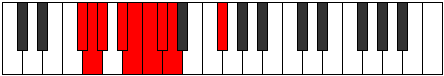 |
| [503](https://ianring.com/musictheory/scales/503) | [Thoptyllic](ModeFNaturalThoptyllic.md) | F | F, F#, G, A, A#, B, C, C#, F |  |
| [503](https://ianring.com/musictheory/scales/503) | [Thoptyllic](ModeENaturalThoptyllic.md) | E | E, F, F#, G#, A, A#, B, C, E |  |
| [505](https://ianring.com/musictheory/scales/505) | [Sanian](ModeBNaturalSanian.md) | B | B, C##, D#, E, F, Gb, Abb, B |  |
| [505](https://ianring.com/musictheory/scales/505) | [Sanian](ModeFSharpSanian.md) | F# | F#, G##, A#, B, C, Db, Ebb, F# |  |
| [505](https://ianring.com/musictheory/scales/505) | [Sanian](ModeGFlatSanian.md) | Gb | Gb, A, Bb, Cb, Dbb, Ebbb, Fbbb, Gb |  |
| [505](https://ianring.com/musictheory/scales/505) | [Sanian](ModeDSharpSanian.md) | D# | D#, E##, F##, G#, A, Bb, Cb, D# |  |
| [505](https://ianring.com/musictheory/scales/505) | [Sanian](ModeEFlatSanian.md) | Eb | Eb, F#, G, Ab, Bbb, Cbb, Dbbb, Eb |  |
| [507](https://ianring.com/musictheory/scales/507) | [Moryllic](ModeBNaturalMoryllic.md) | B | B, C, D, D#, E, F, F#, G, B |  |
| [507](https://ianring.com/musictheory/scales/507) | [Moryllic](ModeASharpMoryllic.md) | A# | A#, B, C#, D, D#, E, F, F#, A# |  |
| [507](https://ianring.com/musictheory/scales/507) | [Moryllic](ModeBFlatMoryllic.md) | Bb | Bb, B, Db, D, Eb, E, F, Gb, Bb |  |
| [507](https://ianring.com/musictheory/scales/507) | [Moryllic](ModeFSharpMoryllic.md) | F# | F#, G, A, A#, B, C, C#, D, F# |  |
| [507](https://ianring.com/musictheory/scales/507) | [Moryllic](ModeGFlatMoryllic.md) | Gb | Gb, G, A, Bb, B, C, Db, D, Gb |  |
| [507](https://ianring.com/musictheory/scales/507) | [Moryllic](ModeFNaturalMoryllic.md) | F | F, F#, G#, A, A#, B, C, C#, F |  |
| [507](https://ianring.com/musictheory/scales/507) | [Moryllic](ModeDSharpMoryllic.md) | D# | D#, E, F#, G, G#, A, A#, B, D# |  |
| [507](https://ianring.com/musictheory/scales/507) | [Moryllic](ModeEFlatMoryllic.md) | Eb | Eb, E, Gb, G, Ab, A, Bb, B, Eb |  |
| [509](https://ianring.com/musictheory/scales/509) | [Ionothyllic](ModeBNaturalIonothyllic.md) | B | B, C#, D, D#, E, F, F#, G, B |  |
| [509](https://ianring.com/musictheory/scales/509) | [Ionothyllic](ModeFSharpIonothyllic.md) | F# | F#, G#, A, A#, B, C, C#, D, F# |  |
| [509](https://ianring.com/musictheory/scales/509) | [Ionothyllic](ModeGFlatIonothyllic.md) | Gb | Gb, Ab, A, Bb, B, C, Db, D, Gb |  |
| [509](https://ianring.com/musictheory/scales/509) | [Ionothyllic](ModeENaturalIonothyllic.md) | E | E, F#, G, G#, A, A#, B, C, E |  |
| [509](https://ianring.com/musictheory/scales/509) | [Ionothyllic](ModeDSharpIonothyllic.md) | D# | D#, F, F#, G, G#, A, A#, B, D# |  |
| [509](https://ianring.com/musictheory/scales/509) | [Ionothyllic](ModeEFlatIonothyllic.md) | Eb | Eb, F, Gb, G, Ab, A, Bb, B, Eb |  |
| [511](https://ianring.com/musictheory/scales/511) | [Polygic](ModeBNaturalPolygic.md) | B | B, C, C#, D, D#, E, F, F#, G, B |  |
| [511](https://ianring.com/musictheory/scales/511) | [Polygic](ModeASharpPolygic.md) | A# | A#, B, C, C#, D, D#, E, F, F#, A# |  |
| [511](https://ianring.com/musictheory/scales/511) | [Polygic](ModeBFlatPolygic.md) | Bb | Bb, B, C, Db, D, Eb, E, F, Gb, Bb |  |
| [511](https://ianring.com/musictheory/scales/511) | [Polygic](ModeFSharpPolygic.md) | F# | F#, G, G#, A, A#, B, C, C#, D, F# |  |
| [511](https://ianring.com/musictheory/scales/511) | [Polygic](ModeGFlatPolygic.md) | Gb | Gb, G, Ab, A, Bb, B, C, Db, D, Gb |  |
| [511](https://ianring.com/musictheory/scales/511) | [Polygic](ModeFNaturalPolygic.md) | F | F, F#, G, G#, A, A#, B, C, C#, F |  |
| [511](https://ianring.com/musictheory/scales/511) | [Polygic](ModeENaturalPolygic.md) | E | E, F, F#, G, G#, A, A#, B, C, E |  |
| [511](https://ianring.com/musictheory/scales/511) | [Polygic](ModeDSharpPolygic.md) | D# | D#, E, F, F#, G, G#, A, A#, B, D# |  |
| [511](https://ianring.com/musictheory/scales/511) | [Polygic](ModeEFlatPolygic.md) | Eb | Eb, E, F, Gb, G, Ab, A, Bb, B, Eb |  |
| [547](https://ianring.com/musictheory/scales/547) | [Pyrric](ModeFSharpPyrric.md) | F# | F#, G, B, D#, F# |  |
| [547](https://ianring.com/musictheory/scales/547) | [Pyrric](ModeGFlatPyrric.md) | Gb | Gb, G, B, Eb, Gb |  |
| [549](https://ianring.com/musictheory/scales/549) | [Rothic](ModeFSharpRothic.md) | F# | F#, G#, B, D#, F# |  |
| [549](https://ianring.com/musictheory/scales/549) | [Rothic](ModeGFlatRothic.md) | Gb | Gb, Ab, B, Eb, Gb |  |
| [549](https://ianring.com/musictheory/scales/549) | [Rothic](ModeANaturalRothic.md) | A | A, B, D, F#, A |  |
| [551](https://ianring.com/musictheory/scales/551) | [Aeoloditonic](ModeFSharpAeoloditonic.md) | F# | F#, G, G#, B, D#, F# |  |
| [551](https://ianring.com/musictheory/scales/551) | [Aeoloditonic](ModeGFlatAeoloditonic.md) | Gb | Gb, G, Ab, B, Eb, Gb |  |
| [551](https://ianring.com/musictheory/scales/551) | [Aeoloditonic](ModeANaturalAeoloditonic.md) | A | A, A#, B, D, F#, A |  |
| [553](https://ianring.com/musictheory/scales/553) | [Phradic](ModeFSharpPhradic.md) | F# | F#, A, B, D#, F# |  |
| [553](https://ianring.com/musictheory/scales/553) | [Phradic](ModeGFlatPhradic.md) | Gb | Gb, A, B, Eb, Gb |  |
| [555](https://ianring.com/musictheory/scales/555) | [Aeolycritonic](ModeFSharpAeolycritonic.md) | F# | F#, G, A, B, D#, F# |  |
| [555](https://ianring.com/musictheory/scales/555) | [Aeolycritonic](ModeGFlatAeolycritonic.md) | Gb | Gb, G, A, B, Eb, Gb |  |
| [557](https://ianring.com/musictheory/scales/557) | [Gythitonic](ModeANaturalGythitonic.md) | A | A, B, C, D, F#, A |  |
| [557](https://ianring.com/musictheory/scales/557) | [Gythitonic](ModeFSharpGythitonic.md) | F# | F#, G#, A, B, D#, F# |  |
| [557](https://ianring.com/musictheory/scales/557) | [Gythitonic](ModeGFlatGythitonic.md) | Gb | Gb, Ab, A, B, Eb, Gb |  |
| [559](https://ianring.com/musictheory/scales/559) | [Lylimic](ModeFSharpLylimic.md) | F# | F#, G, Ab, Bbb, Cb, D#, F# |  |
| [559](https://ianring.com/musictheory/scales/559) | [Lylimic](ModeGFlatLylimic.md) | Gb | Gb, Abb, Bbbb, Cbbb, Dbbb, Eb, Gb |  |
| [559](https://ianring.com/musictheory/scales/559) | [Lylimic](ModeANaturalLylimic.md) | A | A, Bb, Cb, Dbb, Ebb, F#, A | 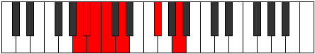 |
| [561](https://ianring.com/musictheory/scales/561) | [Phratic](ModeDNaturalPhratic.md) | D | D, F#, G, B, D | 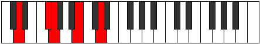 |
| [561](https://ianring.com/musictheory/scales/561) | [Phratic](ModeFSharpPhratic.md) | F# | F#, A#, B, D#, F# |  |
| [561](https://ianring.com/musictheory/scales/561) | [Phratic](ModeGFlatPhratic.md) | Gb | Gb, Bb, B, Eb, Gb |  |
| [563](https://ianring.com/musictheory/scales/563) | [Thacritonic](ModeDNaturalThacritonic.md) | D | D, D#, F#, G, B, D | 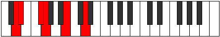 |
| [563](https://ianring.com/musictheory/scales/563) | [Thacritonic](ModeFSharpThacritonic.md) | F# | F#, G, A#, B, D#, F# |  |
| [563](https://ianring.com/musictheory/scales/563) | [Thacritonic](ModeGFlatThacritonic.md) | Gb | Gb, G, Bb, B, Eb, Gb |  |
| [565](https://ianring.com/musictheory/scales/565) | [Aeolyphritonic](ModeDNaturalAeolyphritonic.md) | D | D, E, F#, G, B, D |  |
| [565](https://ianring.com/musictheory/scales/565) | [Aeolyphritonic](ModeANaturalAeolyphritonic.md) | A | A, B, C#, D, F#, A |  |
| [565](https://ianring.com/musictheory/scales/565) | [Aeolyphritonic](ModeFSharpAeolyphritonic.md) | F# | F#, G#, A#, B, D#, F# |  |
| [565](https://ianring.com/musictheory/scales/565) | [Aeolyphritonic](ModeGFlatAeolyphritonic.md) | Gb | Gb, Ab, Bb, B, Eb, Gb |  |
| [567](https://ianring.com/musictheory/scales/567) | [Aeoladimic](ModeDNaturalAeoladimic.md) | D | D, Eb, Fb, Gb, Abb, B, D |  |
| [567](https://ianring.com/musictheory/scales/567) | [Aeoladimic](ModeFSharpAeoladimic.md) | F# | F#, G, Ab, Bb, Cb, D#, F# |  |
| [567](https://ianring.com/musictheory/scales/567) | [Aeoladimic](ModeGFlatAeoladimic.md) | Gb | Gb, Abb, Bbbb, Cbb, Dbbb, Eb, Gb |  |
| [567](https://ianring.com/musictheory/scales/567) | [Aeoladimic](ModeANaturalAeoladimic.md) | A | A, Bb, Cb, Db, Ebb, F#, A |  |
| [569](https://ianring.com/musictheory/scales/569) | [Mothitonic](ModeDNaturalMothitonic.md) | D | D, F, F#, G, B, D |  |
| [569](https://ianring.com/musictheory/scales/569) | [Mothitonic](ModeFSharpMothitonic.md) | F# | F#, A, A#, B, D#, F# |  |
| [569](https://ianring.com/musictheory/scales/569) | [Mothitonic](ModeGFlatMothitonic.md) | Gb | Gb, A, Bb, B, Eb, Gb |  |
| [571](https://ianring.com/musictheory/scales/571) | [Kynimic](ModeDNaturalKynimic.md) | D | D, Eb, F, Gb, Abb, B, D | 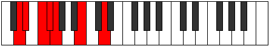 |
| [571](https://ianring.com/musictheory/scales/571) | [Kynimic](ModeFSharpKynimic.md) | F# | F#, G, A, Bb, Cb, D#, F# |  |
| [571](https://ianring.com/musictheory/scales/571) | [Kynimic](ModeGFlatKynimic.md) | Gb | Gb, Abb, Bbb, Cbb, Dbbb, Eb, Gb |  |
| [573](https://ianring.com/musictheory/scales/573) | [Saptimic](ModeDNaturalSaptimic.md) | D | D, E, F, Gb, Abb, B, D |  |
| [573](https://ianring.com/musictheory/scales/573) | [Saptimic](ModeANaturalSaptimic.md) | A | A, B, C, Db, Ebb, F#, A |  |
| [573](https://ianring.com/musictheory/scales/573) | [Saptimic](ModeFSharpSaptimic.md) | F# | F#, G#, A, Bb, Cb, D#, F# |  |
| [573](https://ianring.com/musictheory/scales/573) | [Saptimic](ModeGFlatSaptimic.md) | Gb | Gb, Ab, Bbb, Cbb, Dbbb, Eb, Gb |  |
| [575](https://ianring.com/musictheory/scales/575) | [Ionydian](ModeDNaturalIonydian.md) | D | D, Eb, Fb, Gbb, Abbb, E###, Cb, D |  |
| [575](https://ianring.com/musictheory/scales/575) | [Ionydian](ModeANaturalIonydian.md) | A | A, Bb, Cb, Dbb, Ebbb, Fbbb, Gb, A |  |
| [575](https://ianring.com/musictheory/scales/575) | [Ionydian](ModeFSharpIonydian.md) | F# | F#, G, Ab, Bbb, Cbb, Dbbb, Eb, F# |  |
| [575](https://ianring.com/musictheory/scales/575) | [Ionydian](ModeGFlatIonydian.md) | Gb | Gb, Abb, Bbbb, Cbbb, Cbb, Dbbb, Eb, Gb |  |
| [581](https://ianring.com/musictheory/scales/581) | [Bolic](ModeANaturalBolic.md) | A | A, B, D#, F#, A |  |
| [583](https://ianring.com/musictheory/scales/583) | [Aeritonic](ModeFNaturalAeritonic.md) | F | F, F#, G, B, D, F |  |
| [583](https://ianring.com/musictheory/scales/583) | [Aeritonic](ModeANaturalAeritonic.md) | A | A, A#, B, D#, F#, A |  |
| [587](https://ianring.com/musictheory/scales/587) | [Pathitonic](ModeFNaturalPathitonic.md) | F | F, F#, G#, B, D, F |  |
| [589](https://ianring.com/musictheory/scales/589) | [Ionalitonic](ModeANaturalIonalitonic.md) | A | A, B, C, D#, F#, A |  |
| [591](https://ianring.com/musictheory/scales/591) | [Gaptimic](ModeFNaturalGaptimic.md) | F | F, Gb, Abb, Bbbb, Cb, D, F |  |
| [591](https://ianring.com/musictheory/scales/591) | [Gaptimic](ModeANaturalGaptimic.md) | A | A, Bb, Cb, Dbb, Eb, F#, A | 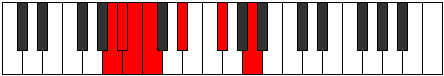 |
| [593](https://ianring.com/musictheory/scales/593) | [Saric](ModeDNaturalSaric.md) | D | D, F#, G#, B, D |  |
| [595](https://ianring.com/musictheory/scales/595) | [Sogitonic](ModeDNaturalSogitonic.md) | D | D, D#, F#, G#, B, D |  |
| [595](https://ianring.com/musictheory/scales/595) | [Sogitonic](ModeFNaturalSogitonic.md) | F | F, F#, A, B, D, F | 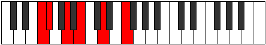 |
| [597](https://ianring.com/musictheory/scales/597) | [Thonitonic](ModeDNaturalThonitonic.md) | D | D, E, F#, G#, B, D |  |
| [597](https://ianring.com/musictheory/scales/597) | [Thonitonic](ModeANaturalThonitonic.md) | A | A, B, C#, D#, F#, A |  |
| [599](https://ianring.com/musictheory/scales/599) | [Thyrimic](ModeDNaturalThyrimic.md) | D | D, Eb, Fb, Gb, Ab, B, D |  |
| [599](https://ianring.com/musictheory/scales/599) | [Thyrimic](ModeFNaturalThyrimic.md) | F | F, Gb, Abb, Bbb, Cb, D, F |  |
| [599](https://ianring.com/musictheory/scales/599) | [Thyrimic](ModeANaturalThyrimic.md) | A | A, Bb, Cb, Db, Eb, F#, A |  |
| [601](https://ianring.com/musictheory/scales/601) | [Bycritonic](ModeDNaturalBycritonic.md) | D | D, F, F#, G#, B, D |  |
| [603](https://ianring.com/musictheory/scales/603) | [Aeolygimic](ModeDNaturalAeolygimic.md) | D | D, Eb, F, Gb, Ab, B, D |  |
| [603](https://ianring.com/musictheory/scales/603) | [Aeolygimic](ModeFNaturalAeolygimic.md) | F | F, Gb, Ab, Bbb, Cb, D, F |  |
| [605](https://ianring.com/musictheory/scales/605) | [Dycrimic](ModeDNaturalDycrimic.md) | D | D, E, F, Gb, Ab, B, D |  |
| [605](https://ianring.com/musictheory/scales/605) | [Dycrimic](ModeANaturalDycrimic.md) | A | A, B, C, Db, Eb, F#, A |  |
| [607](https://ianring.com/musictheory/scales/607) | [Kadian](ModeDNaturalKadian.md) | D | D, Eb, Fb, Gbb, Abbb, Bbbb, Cb, D |  |
| [607](https://ianring.com/musictheory/scales/607) | [Kadian](ModeFNaturalKadian.md) | F | F, Gb, Abb, Bbbb, Cbbb, Dbbb, Ebb, F |  |
| [607](https://ianring.com/musictheory/scales/607) | [Kadian](ModeANaturalKadian.md) | A | A, Bb, Cb, Dbb, Ebbb, Fbb, Gb, A |  |
| [611](https://ianring.com/musictheory/scales/611) | [Zynitonic](ModeFSharpZynitonic.md) | F# | F#, G, B, C, D#, F# |  |
| [611](https://ianring.com/musictheory/scales/611) | [Zynitonic](ModeGFlatZynitonic.md) | Gb | Gb, G, B, C, Eb, Gb |  |
| [611](https://ianring.com/musictheory/scales/611) | [Zynitonic](ModeFNaturalZynitonic.md) | F | F, F#, A#, B, D, F |  |
| [613](https://ianring.com/musictheory/scales/613) | [Phralitonic](ModeFSharpPhralitonic.md) | F# | F#, G#, B, C, D#, F# |  |
| [613](https://ianring.com/musictheory/scales/613) | [Phralitonic](ModeGFlatPhralitonic.md) | Gb | Gb, Ab, B, C, Eb, Gb |  |
| [613](https://ianring.com/musictheory/scales/613) | [Phralitonic](ModeANaturalPhralitonic.md) | A | A, B, D, D#, F#, A |  |
| [615](https://ianring.com/musictheory/scales/615) | [Phrothimic](ModeFSharpPhrothimic.md) | F# | F#, G, Ab, B, C, D#, F# |  |
| [615](https://ianring.com/musictheory/scales/615) | [Phrothimic](ModeGFlatPhrothimic.md) | Gb | Gb, Abb, Bbbb, Cb, Dbb, Eb, Gb |  |
| [615](https://ianring.com/musictheory/scales/615) | [Phrothimic](ModeFNaturalPhrothimic.md) | F | F, Gb, Abb, Bb, Cb, D, F |  |
| [615](https://ianring.com/musictheory/scales/615) | [Phrothimic](ModeANaturalPhrothimic.md) | A | A, Bb, Cb, D, Eb, F#, A |  |
| [617](https://ianring.com/musictheory/scales/617) | [Katycritonic](ModeFSharpKatycritonic.md) | F# | F#, A, B, C, D#, F# |  |
| [617](https://ianring.com/musictheory/scales/617) | [Katycritonic](ModeGFlatKatycritonic.md) | Gb | Gb, A, B, C, Eb, Gb |  |
| [619](https://ianring.com/musictheory/scales/619) | [Parimic](ModeFSharpParimic.md) | F# | F#, G, A, B, C, D#, F# |  |
| [619](https://ianring.com/musictheory/scales/619) | [Parimic](ModeGFlatParimic.md) | Gb | Gb, Abb, Bbb, Cb, Dbb, Eb, Gb | 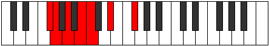 |
| [619](https://ianring.com/musictheory/scales/619) | [Parimic](ModeFNaturalParimic.md) | F | F, Gb, Ab, Bb, Cb, D, F |  |
| [621](https://ianring.com/musictheory/scales/621) | [Kyrimic](ModeANaturalKyrimic.md) | A | A, B, C, D, Eb, F#, A |  |
| [621](https://ianring.com/musictheory/scales/621) | [Kyrimic](ModeFSharpKyrimic.md) | F# | F#, G#, A, B, C, D#, F# |  |
| [621](https://ianring.com/musictheory/scales/621) | [Kyrimic](ModeGFlatKyrimic.md) | Gb | Gb, Ab, Bbb, Cb, Dbb, Eb, Gb |  |
| [623](https://ianring.com/musictheory/scales/623) | [Sycrian](ModeFSharpSycrian.md) | F# | F#, G, Ab, Bbb, Cb, Dbb, Eb, F# |  |
| [623](https://ianring.com/musictheory/scales/623) | [Sycrian](ModeGFlatSycrian.md) | Gb | Gb, Abb, Bbbb, Cbbb, Dbbb, Dbb, Eb, Gb | 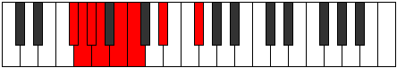 |
| [623](https://ianring.com/musictheory/scales/623) | [Sycrian](ModeFNaturalSycrian.md) | F | F, Gb, Abb, Bbbb, Cbb, Dbbb, Ebb, F |  |
| [623](https://ianring.com/musictheory/scales/623) | [Sycrian](ModeANaturalSycrian.md) | A | A, Bb, Cb, Dbb, Ebb, Fbb, Gb, A |  |
| [625](https://ianring.com/musictheory/scales/625) | [Ionyptitonic](ModeDNaturalIonyptitonic.md) | D | D, F#, G, G#, B, D |  |
| [625](https://ianring.com/musictheory/scales/625) | [Ionyptitonic](ModeFSharpIonyptitonic.md) | F# | F#, A#, B, C, D#, F# |  |
| [625](https://ianring.com/musictheory/scales/625) | [Ionyptitonic](ModeGFlatIonyptitonic.md) | Gb | Gb, Bb, B, C, Eb, Gb |  |
| [627](https://ianring.com/musictheory/scales/627) | [Mogimic](ModeDNaturalMogimic.md) | D | D, Eb, F#, G, Ab, B, D |  |
| [627](https://ianring.com/musictheory/scales/627) | [Mogimic](ModeFSharpMogimic.md) | F# | F#, G, A#, B, C, D#, F# |  |
| [627](https://ianring.com/musictheory/scales/627) | [Mogimic](ModeGFlatMogimic.md) | Gb | Gb, Abb, Bb, Cb, Dbb, Eb, Gb |  |
| [627](https://ianring.com/musictheory/scales/627) | [Mogimic](ModeFNaturalMogimic.md) | F | F, Gb, A, Bb, Cb, D, F |  |
| [629](https://ianring.com/musictheory/scales/629) | [Aeronimic](ModeDNaturalAeronimic.md) | D | D, E, F#, G, Ab, B, D | 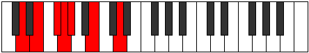 |
| [629](https://ianring.com/musictheory/scales/629) | [Aeronimic](ModeANaturalAeronimic.md) | A | A, B, C#, D, Eb, F#, A |  |
| [629](https://ianring.com/musictheory/scales/629) | [Aeronimic](ModeFSharpAeronimic.md) | F# | F#, G#, A#, B, C, D#, F# |  |
| [629](https://ianring.com/musictheory/scales/629) | [Aeronimic](ModeGFlatAeronimic.md) | Gb | Gb, Ab, Bb, Cb, Dbb, Eb, Gb |  |
| [631](https://ianring.com/musictheory/scales/631) | [Zygian](ModeDNaturalZygian.md) | D | D, Eb, Fb, Gb, Abb, Bbbb, Cb, D |  |
| [631](https://ianring.com/musictheory/scales/631) | [Zygian](ModeFSharpZygian.md) | F# | F#, G, Ab, Bb, Cb, Dbb, Eb, F# |  |
| [631](https://ianring.com/musictheory/scales/631) | [Zygian](ModeGFlatZygian.md) | Gb | Gb, Abb, Bbbb, Cbb, Dbbb, Dbb, Eb, Gb |  |
| [631](https://ianring.com/musictheory/scales/631) | [Zygian](ModeANaturalZygian.md) | A | A, Bb, Cb, Db, Ebb, Fbb, Gb, A |  |
| [631](https://ianring.com/musictheory/scales/631) | [Zygian](ModeFNaturalZygian.md) | F | F, Gb, Abb, Bbb, Cbb, Dbbb, Ebb, F |  |
| [633](https://ianring.com/musictheory/scales/633) | [Kydimic](ModeDNaturalKydimic.md) | D | D, E#, F#, G, Ab, B, D | 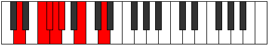 |
| [633](https://ianring.com/musictheory/scales/633) | [Kydimic](ModeFSharpKydimic.md) | F# | F#, G##, A#, B, C, D#, F# |  |
| [633](https://ianring.com/musictheory/scales/633) | [Kydimic](ModeGFlatKydimic.md) | Gb | Gb, A, Bb, Cb, Dbb, Eb, Gb |  |
| [635](https://ianring.com/musictheory/scales/635) | [Epolian](ModeDNaturalEpolian.md) | D | D, Eb, F, Gb, Abb, Bbbb, Cb, D |  |
| [635](https://ianring.com/musictheory/scales/635) | [Epolian](ModeFSharpEpolian.md) | F# | F#, G, A, Bb, Cb, Dbb, Eb, F# |  |
| [635](https://ianring.com/musictheory/scales/635) | [Epolian](ModeGFlatEpolian.md) | Gb | Gb, Abb, Bbb, Cbb, Dbbb, Dbb, Eb, Gb |  |
| [635](https://ianring.com/musictheory/scales/635) | [Epolian](ModeFNaturalEpolian.md) | F | F, Gb, Ab, Bbb, Cbb, Dbbb, Ebb, F |  |
| [637](https://ianring.com/musictheory/scales/637) | [Katodian](ModeDNaturalKatodian.md) | D | D, E, F, Gb, Abb, Bbbb, Cb, D |  |
| [637](https://ianring.com/musictheory/scales/637) | [Katodian](ModeANaturalKatodian.md) | A | A, B, C, Db, Ebb, Fbb, Gb, A |  |
| [637](https://ianring.com/musictheory/scales/637) | [Katodian](ModeFSharpKatodian.md) | F# | F#, G#, A, Bb, Cb, Dbb, Eb, F# |  |
| [637](https://ianring.com/musictheory/scales/637) | [Katodian](ModeGFlatKatodian.md) | Gb | Gb, Ab, Bbb, Cbb, Dbbb, Dbb, Eb, Gb |  |
| [639](https://ianring.com/musictheory/scales/639) | [Ionaryllic](ModeDNaturalIonaryllic.md) | D | D, D#, E, F, F#, G, G#, B, D |  |
| [639](https://ianring.com/musictheory/scales/639) | [Ionaryllic](ModeANaturalIonaryllic.md) | A | A, A#, B, C, C#, D, D#, F#, A |  |
| [639](https://ianring.com/musictheory/scales/639) | [Ionaryllic](ModeFSharpIonaryllic.md) | F# | F#, G, G#, A, A#, B, C, D#, F# |  |
| [639](https://ianring.com/musictheory/scales/639) | [Ionaryllic](ModeGFlatIonaryllic.md) | Gb | Gb, G, Ab, A, Bb, B, C, Eb, Gb |  |
| [639](https://ianring.com/musictheory/scales/639) | [Ionaryllic](ModeFNaturalIonaryllic.md) | F | F, F#, G, G#, A, A#, B, D, F |  |
| [649](https://ianring.com/musictheory/scales/649) | [Byptic](ModeBNaturalByptic.md) | B | B, D, F#, G#, B |  |
| [651](https://ianring.com/musictheory/scales/651) | [Golitonic](ModeBNaturalGolitonic.md) | B | B, C, D, F#, G#, B |  |
| [653](https://ianring.com/musictheory/scales/653) | [Stathitonic](ModeENaturalStathitonic.md) | E | E, F#, G, B, C#, E |  |
| [653](https://ianring.com/musictheory/scales/653) | [Stathitonic](ModeBNaturalStathitonic.md) | B | B, C#, D, F#, G#, B |  |
| [653](https://ianring.com/musictheory/scales/653) | [Stathitonic](ModeANaturalStathitonic.md) | A | A, B, C, E, F#, A |  |
| [655](https://ianring.com/musictheory/scales/655) | [Kataptimic](ModeENaturalKataptimic.md) | E | E, F, Gb, Abb, B, C#, E |  |
| [655](https://ianring.com/musictheory/scales/655) | [Kataptimic](ModeBNaturalKataptimic.md) | B | B, C, Db, Ebb, F#, G#, B |  |
| [655](https://ianring.com/musictheory/scales/655) | [Kataptimic](ModeANaturalKataptimic.md) | A | A, Bb, Cb, Dbb, E, F#, A |  |
| [657](https://ianring.com/musictheory/scales/657) | [Epathic](ModeBNaturalEpathic.md) | B | B, D#, F#, G#, B |  |
| [657](https://ianring.com/musictheory/scales/657) | [Epathic](ModeDNaturalEpathic.md) | D | D, F#, A, B, D |  |
| [659](https://ianring.com/musictheory/scales/659) | [Soptitonic](ModeBNaturalSoptitonic.md) | B | B, C, D#, F#, G#, B |  |
| [659](https://ianring.com/musictheory/scales/659) | [Soptitonic](ModeDNaturalSoptitonic.md) | D | D, D#, F#, A, B, D |  |
| [661](https://ianring.com/musictheory/scales/661) | [Pentatonic](ModeBNaturalPentatonic.md) | B | B, C#, D#, F#, G#, B |  |
| [661](https://ianring.com/musictheory/scales/661) | [Pentatonic](ModeENaturalPentatonic.md) | E | E, F#, G#, B, C#, E |  |
| [661](https://ianring.com/musictheory/scales/661) | [Pentatonic](ModeANaturalPentatonic.md) | A | A, B, C#, E, F#, A |  |
| [661](https://ianring.com/musictheory/scales/661) | [Pentatonic](ModeDNaturalPentatonic.md) | D | D, E, F#, A, B, D |  |
| [663](https://ianring.com/musictheory/scales/663) | [Phrynimic](ModeBNaturalPhrynimic.md) | B | B, C, Db, Eb, F#, G#, B |  |
| [663](https://ianring.com/musictheory/scales/663) | [Phrynimic](ModeENaturalPhrynimic.md) | E | E, F, Gb, Ab, B, C#, E |  |
| [663](https://ianring.com/musictheory/scales/663) | [Phrynimic](ModeDNaturalPhrynimic.md) | D | D, Eb, Fb, Gb, A, B, D |  |
| [663](https://ianring.com/musictheory/scales/663) | [Phrynimic](ModeANaturalPhrynimic.md) | A | A, Bb, Cb, Db, E, F#, A |  |
| [665](https://ianring.com/musictheory/scales/665) | [Mythitonic](ModeBNaturalMythitonic.md) | B | B, D, D#, F#, G#, B | 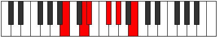 |
| [665](https://ianring.com/musictheory/scales/665) | [Mythitonic](ModeDNaturalMythitonic.md) | D | D, F, F#, A, B, D |  |
| [667](https://ianring.com/musictheory/scales/667) | [Rodimic](ModeBNaturalRodimic.md) | B | B, C, D, Eb, F#, G#, B |  |
| [667](https://ianring.com/musictheory/scales/667) | [Rodimic](ModeDNaturalRodimic.md) | D | D, Eb, F, Gb, A, B, D |  |
| [669](https://ianring.com/musictheory/scales/669) | [Gycrimic](ModeBNaturalGycrimic.md) | B | B, C#, D, Eb, F#, G#, B |  |
| [669](https://ianring.com/musictheory/scales/669) | [Gycrimic](ModeENaturalGycrimic.md) | E | E, F#, G, Ab, B, C#, E |  |
| [669](https://ianring.com/musictheory/scales/669) | [Gycrimic](ModeANaturalGycrimic.md) | A | A, B, C, Db, E, F#, A |  |
| [669](https://ianring.com/musictheory/scales/669) | [Gycrimic](ModeDNaturalGycrimic.md) | D | D, E, F, Gb, A, B, D |  |
| [671](https://ianring.com/musictheory/scales/671) | [Stycrian](ModeBNaturalStycrian.md) | B | B, C, Db, Ebb, Fbb, Gb, Ab, B |  |
| [671](https://ianring.com/musictheory/scales/671) | [Stycrian](ModeENaturalStycrian.md) | E | E, F, Gb, Abb, Bbbb, Cb, Db, E |  |
| [671](https://ianring.com/musictheory/scales/671) | [Stycrian](ModeDNaturalStycrian.md) | D | D, Eb, Fb, Gbb, Abbb, Bbb, Cb, D |  |
| [671](https://ianring.com/musictheory/scales/671) | [Stycrian](ModeANaturalStycrian.md) | A | A, Bb, Cb, Dbb, Ebbb, Fb, Gb, A |  |
| [675](https://ianring.com/musictheory/scales/675) | [Zyditonic](ModeFSharpZyditonic.md) | F# | F#, G, B, C#, D#, F# |  |
| [675](https://ianring.com/musictheory/scales/675) | [Zyditonic](ModeGFlatZyditonic.md) | Gb | Gb, G, B, Db, Eb, Gb |  |
| [675](https://ianring.com/musictheory/scales/675) | [Zyditonic](ModeBNaturalZyditonic.md) | B | B, C, E, F#, G#, B |  |
| [677](https://ianring.com/musictheory/scales/677) | [Mynitonic](ModeFSharpMynitonic.md) | F# | F#, G#, B, C#, D#, F# | 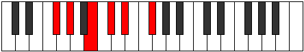 |
| [677](https://ianring.com/musictheory/scales/677) | [Mynitonic](ModeGFlatMynitonic.md) | Gb | Gb, Ab, B, Db, Eb, Gb |  |
| [677](https://ianring.com/musictheory/scales/677) | [Mynitonic](ModeBNaturalMynitonic.md) | B | B, C#, E, F#, G#, B |  |
| [677](https://ianring.com/musictheory/scales/677) | [Mynitonic](ModeENaturalMynitonic.md) | E | E, F#, A, B, C#, E |  |
| [677](https://ianring.com/musictheory/scales/677) | [Mynitonic](ModeANaturalMynitonic.md) | A | A, B, D, E, F#, A | 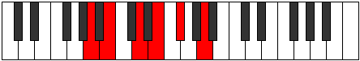 |
| [679](https://ianring.com/musictheory/scales/679) | [Lanimic](ModeBNaturalLanimic.md) | B | B, C, Db, E, F#, G#, B |  |
| [679](https://ianring.com/musictheory/scales/679) | [Lanimic](ModeFSharpLanimic.md) | F# | F#, G, Ab, B, C#, D#, F# |  |
| [679](https://ianring.com/musictheory/scales/679) | [Lanimic](ModeGFlatLanimic.md) | Gb | Gb, Abb, Bbbb, Cb, Db, Eb, Gb |  |
| [679](https://ianring.com/musictheory/scales/679) | [Lanimic](ModeENaturalLanimic.md) | E | E, F, Gb, A, B, C#, E |  |
| [679](https://ianring.com/musictheory/scales/679) | [Lanimic](ModeANaturalLanimic.md) | A | A, Bb, Cb, D, E, F#, A | 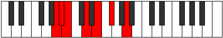 |
| [681](https://ianring.com/musictheory/scales/681) | [Sylitonic](ModeBNaturalSylitonic.md) | B | B, D, E, F#, G#, B |  |
| [681](https://ianring.com/musictheory/scales/681) | [Sylitonic](ModeFSharpSylitonic.md) | F# | F#, A, B, C#, D#, F# |  |
| [681](https://ianring.com/musictheory/scales/681) | [Sylitonic](ModeGFlatSylitonic.md) | Gb | Gb, A, B, Db, Eb, Gb |  |
| [683](https://ianring.com/musictheory/scales/683) | [Stogimic](ModeBNaturalStogimic.md) | B | B, C, D, E, F#, G#, B |  |
| [683](https://ianring.com/musictheory/scales/683) | [Stogimic](ModeFSharpStogimic.md) | F# | F#, G, A, B, C#, D#, F# |  |
| [683](https://ianring.com/musictheory/scales/683) | [Stogimic](ModeGFlatStogimic.md) | Gb | Gb, Abb, Bbb, Cb, Db, Eb, Gb |  |
| [685](https://ianring.com/musictheory/scales/685) | [Aerathimic](ModeBNaturalAerathimic.md) | B | B, C#, D, E, F#, G#, B |  |
| [685](https://ianring.com/musictheory/scales/685) | [Aerathimic](ModeANaturalAerathimic.md) | A | A, B, C, D, E, F#, A |  |
| [685](https://ianring.com/musictheory/scales/685) | [Aerathimic](ModeENaturalAerathimic.md) | E | E, F#, G, A, B, C#, E |  |
| [685](https://ianring.com/musictheory/scales/685) | [Aerathimic](ModeFSharpAerathimic.md) | F# | F#, G#, A, B, C#, D#, F# |  |
| [685](https://ianring.com/musictheory/scales/685) | [Aerathimic](ModeGFlatAerathimic.md) | Gb | Gb, Ab, Bbb, Cb, Db, Eb, Gb |  |
| [687](https://ianring.com/musictheory/scales/687) | [Aeolythian](ModeBNaturalAeolythian.md) | B | B, C, Db, Ebb, Fb, Gb, Ab, B |  |
| [687](https://ianring.com/musictheory/scales/687) | [Aeolythian](ModeENaturalAeolythian.md) | E | E, F, Gb, Abb, Bbb, Cb, Db, E |  |
| [687](https://ianring.com/musictheory/scales/687) | [Aeolythian](ModeFSharpAeolythian.md) | F# | F#, G, Ab, Bbb, Cb, Db, Eb, F# |  |
| [687](https://ianring.com/musictheory/scales/687) | [Aeolythian](ModeGFlatAeolythian.md) | Gb | Gb, Abb, Bbbb, Cbbb, Dbbb, Ebbb, Fbb, Gb |  |
| [687](https://ianring.com/musictheory/scales/687) | [Aeolythian](ModeANaturalAeolythian.md) | A | A, Bb, Cb, Dbb, Ebb, Fb, Gb, A |  |
| [689](https://ianring.com/musictheory/scales/689) | [Lothitonic](ModeBNaturalLothitonic.md) | B | B, D#, E, F#, G#, B |  |
| [689](https://ianring.com/musictheory/scales/689) | [Lothitonic](ModeDNaturalLothitonic.md) | D | D, F#, G, A, B, D |  |
| [689](https://ianring.com/musictheory/scales/689) | [Lothitonic](ModeFSharpLothitonic.md) | F# | F#, A#, B, C#, D#, F# |  |
| [689](https://ianring.com/musictheory/scales/689) | [Lothitonic](ModeGFlatLothitonic.md) | Gb | Gb, Bb, B, Db, Eb, Gb |  |
| [691](https://ianring.com/musictheory/scales/691) | [Zydimic](ModeBNaturalZydimic.md) | B | B, C, D#, E, F#, G#, B |  |
| [691](https://ianring.com/musictheory/scales/691) | [Zydimic](ModeDNaturalZydimic.md) | D | D, Eb, F#, G, A, B, D |  |
| [691](https://ianring.com/musictheory/scales/691) | [Zydimic](ModeFSharpZydimic.md) | F# | F#, G, A#, B, C#, D#, F# |  |
| [691](https://ianring.com/musictheory/scales/691) | [Zydimic](ModeGFlatZydimic.md) | Gb | Gb, Abb, Bb, Cb, Db, Eb, Gb |  |
| [693](https://ianring.com/musictheory/scales/693) | [Mynimic](ModeBNaturalMynimic.md) | B | B, C#, D#, E, F#, G#, B |  |
| [693](https://ianring.com/musictheory/scales/693) | [Mynimic](ModeANaturalMynimic.md) | A | A, B, C#, D, E, F#, A |  |
| [693](https://ianring.com/musictheory/scales/693) | [Mynimic](ModeDNaturalMynimic.md) | D | D, E, F#, G, A, B, D |  |
| [693](https://ianring.com/musictheory/scales/693) | [Mynimic](ModeENaturalMynimic.md) | E | E, F#, G#, A, B, C#, E |  |
| [693](https://ianring.com/musictheory/scales/693) | [Mynimic](ModeFSharpMynimic.md) | F# | F#, G#, A#, B, C#, D#, F# |  |
| [693](https://ianring.com/musictheory/scales/693) | [Mynimic](ModeGFlatMynimic.md) | Gb | Gb, Ab, Bb, Cb, Db, Eb, Gb |  |
| [695](https://ianring.com/musictheory/scales/695) | [Sarian](ModeBNaturalSarian.md) | B | B, C, Db, Eb, Fb, Gb, Ab, B |  |
| [695](https://ianring.com/musictheory/scales/695) | [Sarian](ModeDNaturalSarian.md) | D | D, Eb, Fb, Gb, Abb, Bbb, Cb, D |  |
| [695](https://ianring.com/musictheory/scales/695) | [Sarian](ModeENaturalSarian.md) | E | E, F, Gb, Ab, Bbb, Cb, Db, E |  |
| [695](https://ianring.com/musictheory/scales/695) | [Sarian](ModeFSharpSarian.md) | F# | F#, G, Ab, Bb, Cb, Db, Eb, F# |  |
| [695](https://ianring.com/musictheory/scales/695) | [Sarian](ModeGFlatSarian.md) | Gb | Gb, Abb, Bbbb, Cbb, Dbbb, Ebbb, Fbb, Gb |  |
| [695](https://ianring.com/musictheory/scales/695) | [Sarian](ModeANaturalSarian.md) | A | A, Bb, Cb, Db, Ebb, Fb, Gb, A |  |
| [697](https://ianring.com/musictheory/scales/697) | [Lagimic](ModeBNaturalLagimic.md) | B | B, C##, D#, E, F#, G#, B |  |
| [697](https://ianring.com/musictheory/scales/697) | [Lagimic](ModeDNaturalLagimic.md) | D | D, E#, F#, G, A, B, D |  |
| [697](https://ianring.com/musictheory/scales/697) | [Lagimic](ModeFSharpLagimic.md) | F# | F#, G##, A#, B, C#, D#, F# |  |
| [697](https://ianring.com/musictheory/scales/697) | [Lagimic](ModeGFlatLagimic.md) | Gb | Gb, A, Bb, Cb, Db, Eb, Gb |  |
| [699](https://ianring.com/musictheory/scales/699) | [Aerothian](ModeBNaturalAerothian.md) | B | B, C, D, Eb, Fb, Gb, Ab, B |  |
| [699](https://ianring.com/musictheory/scales/699) | [Aerothian](ModeDNaturalAerothian.md) | D | D, Eb, F, Gb, Abb, Bbb, Cb, D |  |
| [699](https://ianring.com/musictheory/scales/699) | [Aerothian](ModeFSharpAerothian.md) | F# | F#, G, A, Bb, Cb, Db, Eb, F# |  |
| [699](https://ianring.com/musictheory/scales/699) | [Aerothian](ModeGFlatAerothian.md) | Gb | Gb, Abb, Bbb, Cbb, Dbbb, Ebbb, Fbb, Gb |  |
| [701](https://ianring.com/musictheory/scales/701) | [Mixonyphian](ModeBNaturalMixonyphian.md) | B | B, C#, D, Eb, Fb, Gb, Ab, B |  |
| [701](https://ianring.com/musictheory/scales/701) | [Mixonyphian](ModeANaturalMixonyphian.md) | A | A, B, C, Db, Ebb, Fb, Gb, A |  |
| [701](https://ianring.com/musictheory/scales/701) | [Mixonyphian](ModeDNaturalMixonyphian.md) | D | D, E, F, Gb, Abb, Bbb, Cb, D |  |
| [701](https://ianring.com/musictheory/scales/701) | [Mixonyphian](ModeENaturalMixonyphian.md) | E | E, F#, G, Ab, Bbb, Cb, Db, E | 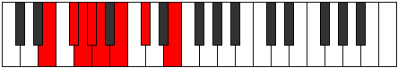 |
| [701](https://ianring.com/musictheory/scales/701) | [Mixonyphian](ModeFSharpMixonyphian.md) | F# | F#, G#, A, Bb, Cb, Db, Eb, F# |  |
| [701](https://ianring.com/musictheory/scales/701) | [Mixonyphian](ModeGFlatMixonyphian.md) | Gb | Gb, Ab, Bbb, Cbb, Dbbb, Ebbb, Fbb, Gb |  |
| [703](https://ianring.com/musictheory/scales/703) | [Aerocryllic](ModeBNaturalAerocryllic.md) | B | B, C, C#, D, D#, E, F#, G#, B |  |
| [703](https://ianring.com/musictheory/scales/703) | [Aerocryllic](ModeDNaturalAerocryllic.md) | D | D, D#, E, F, F#, G, A, B, D |  |
| [703](https://ianring.com/musictheory/scales/703) | [Aerocryllic](ModeENaturalAerocryllic.md) | E | E, F, F#, G, G#, A, B, C#, E |  |
| [703](https://ianring.com/musictheory/scales/703) | [Aerocryllic](ModeANaturalAerocryllic.md) | A | A, A#, B, C, C#, D, E, F#, A |  |
| [703](https://ianring.com/musictheory/scales/703) | [Aerocryllic](ModeFSharpAerocryllic.md) | F# | F#, G, G#, A, A#, B, C#, D#, F# |  |
| [703](https://ianring.com/musictheory/scales/703) | [Aerocryllic](ModeGFlatAerocryllic.md) | Gb | Gb, G, Ab, A, Bb, B, Db, Eb, Gb |  |
| [709](https://ianring.com/musictheory/scales/709) | [Ionycritonic](ModeBNaturalIonycritonic.md) | B | B, C#, F, F#, G#, B |  |
| [709](https://ianring.com/musictheory/scales/709) | [Ionycritonic](ModeANaturalIonycritonic.md) | A | A, B, D#, E, F#, A |  |
| [709](https://ianring.com/musictheory/scales/709) | [Ionycritonic](ModeENaturalIonycritonic.md) | E | E, F#, A#, B, C#, E |  |
| [711](https://ianring.com/musictheory/scales/711) | [Epyrimic](ModeFNaturalEpyrimic.md) | F | F, Gb, Abb, B, C, D, F |  |
| [711](https://ianring.com/musictheory/scales/711) | [Epyrimic](ModeBNaturalEpyrimic.md) | B | B, C, Db, E#, F#, G#, B |  |
| [711](https://ianring.com/musictheory/scales/711) | [Epyrimic](ModeENaturalEpyrimic.md) | E | E, F, Gb, A#, B, C#, E |  |
| [711](https://ianring.com/musictheory/scales/711) | [Epyrimic](ModeANaturalEpyrimic.md) | A | A, Bb, Cb, D#, E, F#, A |  |
| [713](https://ianring.com/musictheory/scales/713) | [Thoptitonic](ModeBNaturalThoptitonic.md) | B | B, D, F, F#, G#, B |  |
| [715](https://ianring.com/musictheory/scales/715) | [Dodimic](ModeFNaturalDodimic.md) | F | F, Gb, Ab, B, C, D, F |  |
| [715](https://ianring.com/musictheory/scales/715) | [Dodimic](ModeBNaturalDodimic.md) | B | B, C, D, E#, F#, G#, B | 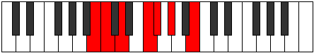 |
| [717](https://ianring.com/musictheory/scales/717) | [Gythimic](ModeBNaturalGythimic.md) | B | B, C#, D, E#, F#, G#, B |  |
| [717](https://ianring.com/musictheory/scales/717) | [Gythimic](ModeANaturalGythimic.md) | A | A, B, C, D#, E, F#, A |  |
| [717](https://ianring.com/musictheory/scales/717) | [Gythimic](ModeENaturalGythimic.md) | E | E, F#, G, A#, B, C#, E |  |
| [719](https://ianring.com/musictheory/scales/719) | [Kanian](ModeBNaturalKanian.md) | B | B, C, Db, Ebb, F, Gb, Ab, B |  |
| [719](https://ianring.com/musictheory/scales/719) | [Kanian](ModeFNaturalKanian.md) | F | F, Gb, Abb, Bbbb, Cb, Dbb, Ebb, F |  |
| [719](https://ianring.com/musictheory/scales/719) | [Kanian](ModeENaturalKanian.md) | E | E, F, Gb, Abb, Bb, Cb, Db, E |  |
| [719](https://ianring.com/musictheory/scales/719) | [Kanian](ModeANaturalKanian.md) | A | A, Bb, Cb, Dbb, Eb, Fb, Gb, A |  |
| [721](https://ianring.com/musictheory/scales/721) | [Aeolacritonic](ModeBNaturalAeolacritonic.md) | B | B, D#, F, F#, G#, B |  |
| [721](https://ianring.com/musictheory/scales/721) | [Aeolacritonic](ModeDNaturalAeolacritonic.md) | D | D, F#, G#, A, B, D |  |
| [723](https://ianring.com/musictheory/scales/723) | [Ionadimic](ModeBNaturalIonadimic.md) | B | B, C, D#, E#, F#, G#, B |  |
| [723](https://ianring.com/musictheory/scales/723) | [Ionadimic](ModeFNaturalIonadimic.md) | F | F, Gb, A, B, C, D, F |  |
| [723](https://ianring.com/musictheory/scales/723) | [Ionadimic](ModeDNaturalIonadimic.md) | D | D, Eb, F#, G#, A, B, D |  |
| [725](https://ianring.com/musictheory/scales/725) | [Lonimic](ModeBNaturalLonimic.md) | B | B, C#, D#, E#, F#, G#, B |  |
| [725](https://ianring.com/musictheory/scales/725) | [Lonimic](ModeANaturalLonimic.md) | A | A, B, C#, D#, E, F#, A |  |
| [725](https://ianring.com/musictheory/scales/725) | [Lonimic](ModeDNaturalLonimic.md) | D | D, E, F#, G#, A, B, D |  |
| [725](https://ianring.com/musictheory/scales/725) | [Lonimic](ModeENaturalLonimic.md) | E | E, F#, G#, A#, B, C#, E |  |
| [727](https://ianring.com/musictheory/scales/727) | [Phradian](ModeBNaturalPhradian.md) | B | B, C, Db, Eb, F, Gb, Ab, B |  |
| [727](https://ianring.com/musictheory/scales/727) | [Phradian](ModeFNaturalPhradian.md) | F | F, Gb, Abb, Bbb, Cb, Dbb, Ebb, F |  |
| [727](https://ianring.com/musictheory/scales/727) | [Phradian](ModeDNaturalPhradian.md) | D | D, Eb, Fb, Gb, Ab, Bbb, Cb, D |  |
| [727](https://ianring.com/musictheory/scales/727) | [Phradian](ModeENaturalPhradian.md) | E | E, F, Gb, Ab, Bb, Cb, Db, E |  |
| [727](https://ianring.com/musictheory/scales/727) | [Phradian](ModeANaturalPhradian.md) | A | A, Bb, Cb, Db, Eb, Fb, Gb, A |  |
| [729](https://ianring.com/musictheory/scales/729) | [Stygimic](ModeBNaturalStygimic.md) | B | B, C##, D#, E#, F#, G#, B |  |
| [729](https://ianring.com/musictheory/scales/729) | [Stygimic](ModeDNaturalStygimic.md) | D | D, E#, F#, G#, A, B, D |  |
| [731](https://ianring.com/musictheory/scales/731) | [Ionorian](ModeBNaturalIonorian.md) | B | B, C, D, Eb, F, Gb, Ab, B |  |
| [731](https://ianring.com/musictheory/scales/731) | [Ionorian](ModeFNaturalIonorian.md) | F | F, Gb, Ab, Bbb, Cb, Dbb, Ebb, F |  |
| [731](https://ianring.com/musictheory/scales/731) | [Ionorian](ModeDNaturalIonorian.md) | D | D, Eb, F, Gb, Ab, Bbb, Cb, D | 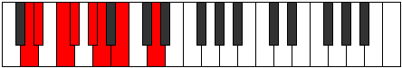 |
| [733](https://ianring.com/musictheory/scales/733) | [Donian](ModeBNaturalDonian.md) | B | B, C#, D, Eb, F, Gb, Ab, B |  |
| [733](https://ianring.com/musictheory/scales/733) | [Donian](ModeANaturalDonian.md) | A | A, B, C, Db, Eb, Fb, Gb, A |  |
| [733](https://ianring.com/musictheory/scales/733) | [Donian](ModeDNaturalDonian.md) | D | D, E, F, Gb, Ab, Bbb, Cb, D |  |
| [733](https://ianring.com/musictheory/scales/733) | [Donian](ModeENaturalDonian.md) | E | E, F#, G, Ab, Bb, Cb, Db, E |  |
| [735](https://ianring.com/musictheory/scales/735) | [Sylyllic](ModeBNaturalSylyllic.md) | B | B, C, C#, D, D#, F, F#, G#, B |  |
| [735](https://ianring.com/musictheory/scales/735) | [Sylyllic](ModeDNaturalSylyllic.md) | D | D, D#, E, F, F#, G#, A, B, D |  |
| [735](https://ianring.com/musictheory/scales/735) | [Sylyllic](ModeFNaturalSylyllic.md) | F | F, F#, G, G#, A, B, C, D, F |  |
| [735](https://ianring.com/musictheory/scales/735) | [Sylyllic](ModeENaturalSylyllic.md) | E | E, F, F#, G, G#, A#, B, C#, E | 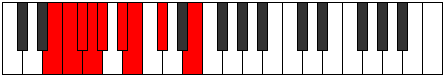 |
| [735](https://ianring.com/musictheory/scales/735) | [Sylyllic](ModeANaturalSylyllic.md) | A | A, A#, B, C, C#, D#, E, F#, A |  |
| [739](https://ianring.com/musictheory/scales/739) | [Rorimic](ModeFSharpRorimic.md) | F# | F#, G, A##, B#, C#, D#, F# |  |
| [739](https://ianring.com/musictheory/scales/739) | [Rorimic](ModeGFlatRorimic.md) | Gb | Gb, Abb, B, C, Db, Eb, Gb |  |
| [739](https://ianring.com/musictheory/scales/739) | [Rorimic](ModeBNaturalRorimic.md) | B | B, C, D##, E#, F#, G#, B | 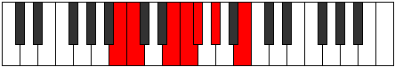 |
| [739](https://ianring.com/musictheory/scales/739) | [Rorimic](ModeFNaturalRorimic.md) | F | F, Gb, A#, B, C, D, F |  |
| [741](https://ianring.com/musictheory/scales/741) | [Gathimic](ModeFSharpGathimic.md) | F# | F#, G#, A##, B#, C#, D#, F# |  |
| [741](https://ianring.com/musictheory/scales/741) | [Gathimic](ModeGFlatGathimic.md) | Gb | Gb, Ab, B, C, Db, Eb, Gb |  |
| [741](https://ianring.com/musictheory/scales/741) | [Gathimic](ModeBNaturalGathimic.md) | B | B, C#, D##, E#, F#, G#, B |  |
| [741](https://ianring.com/musictheory/scales/741) | [Gathimic](ModeANaturalGathimic.md) | A | A, B, C##, D#, E, F#, A |  |
| [741](https://ianring.com/musictheory/scales/741) | [Gathimic](ModeENaturalGathimic.md) | E | E, F#, G##, A#, B, C#, E |  |
| [743](https://ianring.com/musictheory/scales/743) | [Lanian](ModeBNaturalLanian.md) | B | B, C, Db, E, F, Gb, Ab, B |  |
| [743](https://ianring.com/musictheory/scales/743) | [Lanian](ModeFSharpLanian.md) | F# | F#, G, Ab, B, C, Db, Eb, F# |  |
| [743](https://ianring.com/musictheory/scales/743) | [Lanian](ModeGFlatLanian.md) | Gb | Gb, Abb, Bbbb, Cb, Dbb, Ebbb, Fbb, Gb |  |
| [743](https://ianring.com/musictheory/scales/743) | [Lanian](ModeFNaturalLanian.md) | F | F, Gb, Abb, Bb, Cb, Dbb, Ebb, F |  |
| [743](https://ianring.com/musictheory/scales/743) | [Lanian](ModeANaturalLanian.md) | A | A, Bb, Cb, D, Eb, Fb, Gb, A |  |
| [743](https://ianring.com/musictheory/scales/743) | [Lanian](ModeENaturalLanian.md) | E | E, F, Gb, A, Bb, Cb, Db, E |  |
| [745](https://ianring.com/musictheory/scales/745) | [Kolimic](ModeBNaturalKolimic.md) | B | B, C##, D##, E#, F#, G#, B |  |
| [745](https://ianring.com/musictheory/scales/745) | [Kolimic](ModeFSharpKolimic.md) | F# | F#, G##, A##, B#, C#, D#, F# |  |
| [745](https://ianring.com/musictheory/scales/745) | [Kolimic](ModeGFlatKolimic.md) | Gb | Gb, A, B, C, Db, Eb, Gb |  |
| [747](https://ianring.com/musictheory/scales/747) | [Lynian](ModeBNaturalLynian.md) | B | B, C, D, E, F, Gb, Ab, B |  |
| [747](https://ianring.com/musictheory/scales/747) | [Lynian](ModeFSharpLynian.md) | F# | F#, G, A, B, C, Db, Eb, F# |  |
| [747](https://ianring.com/musictheory/scales/747) | [Lynian](ModeGFlatLynian.md) | Gb | Gb, Abb, Bbb, Cb, Dbb, Ebbb, Fbb, Gb |  |
| [747](https://ianring.com/musictheory/scales/747) | [Lynian](ModeFNaturalLynian.md) | F | F, Gb, Ab, Bb, Cb, Dbb, Ebb, F |  |
| [749](https://ianring.com/musictheory/scales/749) | [Aeologian](ModeBNaturalAeologian.md) | B | B, C#, D, E, F, Gb, Ab, B |  |
| [749](https://ianring.com/musictheory/scales/749) | [Aeologian](ModeANaturalAeologian.md) | A | A, B, C, D, Eb, Fb, Gb, A |  |
| [749](https://ianring.com/musictheory/scales/749) | [Aeologian](ModeFSharpAeologian.md) | F# | F#, G#, A, B, C, Db, Eb, F# |  |
| [749](https://ianring.com/musictheory/scales/749) | [Aeologian](ModeGFlatAeologian.md) | Gb | Gb, Ab, Bbb, Cb, Dbb, Ebbb, Fbb, Gb |  |
| [749](https://ianring.com/musictheory/scales/749) | [Aeologian](ModeENaturalAeologian.md) | E | E, F#, G, A, Bb, Cb, Db, E |  |
| [751](https://ianring.com/musictheory/scales/751) | [Epacryllic](ModeBNaturalEpacryllic.md) | B | B, C, C#, D, E, F, F#, G#, B |  |
| [751](https://ianring.com/musictheory/scales/751) | [Epacryllic](ModeFSharpEpacryllic.md) | F# | F#, G, G#, A, B, C, C#, D#, F# |  |
| [751](https://ianring.com/musictheory/scales/751) | [Epacryllic](ModeGFlatEpacryllic.md) | Gb | Gb, G, Ab, A, B, C, Db, Eb, Gb |  |
| [751](https://ianring.com/musictheory/scales/751) | [Epacryllic](ModeFNaturalEpacryllic.md) | F | F, F#, G, G#, A#, B, C, D, F |  |
| [751](https://ianring.com/musictheory/scales/751) | [Epacryllic](ModeANaturalEpacryllic.md) | A | A, A#, B, C, D, D#, E, F#, A |  |
| [751](https://ianring.com/musictheory/scales/751) | [Epacryllic](ModeENaturalEpacryllic.md) | E | E, F, F#, G, A, A#, B, C#, E |  |
| [753](https://ianring.com/musictheory/scales/753) | [Kytrimic](ModeBNaturalKytrimic.md) | B | B, C###, D##, E#, F#, G#, B |  |
| [753](https://ianring.com/musictheory/scales/753) | [Kytrimic](ModeDNaturalKytrimic.md) | D | D, E##, F##, G#, A, B, D |  |
| [753](https://ianring.com/musictheory/scales/753) | [Kytrimic](ModeFSharpKytrimic.md) | F# | F#, G###, A##, B#, C#, D#, F# |  |
| [753](https://ianring.com/musictheory/scales/753) | [Kytrimic](ModeGFlatKytrimic.md) | Gb | Gb, A#, B, C, Db, Eb, Gb |  |
| [755](https://ianring.com/musictheory/scales/755) | [Phrythian](ModeBNaturalPhrythian.md) | B | B, C, D#, E, F, Gb, Ab, B |  |
| [755](https://ianring.com/musictheory/scales/755) | [Phrythian](ModeDNaturalPhrythian.md) | D | D, Eb, F#, G, Ab, Bbb, Cb, D |  |
| [755](https://ianring.com/musictheory/scales/755) | [Phrythian](ModeFSharpPhrythian.md) | F# | F#, G, A#, B, C, Db, Eb, F# |  |
| [755](https://ianring.com/musictheory/scales/755) | [Phrythian](ModeGFlatPhrythian.md) | Gb | Gb, Abb, Bb, Cb, Dbb, Ebbb, Fbb, Gb |  |
| [755](https://ianring.com/musictheory/scales/755) | [Phrythian](ModeFNaturalPhrythian.md) | F | F, Gb, A, Bb, Cb, Dbb, Ebb, F |  |
| [757](https://ianring.com/musictheory/scales/757) | [Ionyptian](ModeBNaturalIonyptian.md) | B | B, C#, D#, E, F, Gb, Ab, B |  |
| [757](https://ianring.com/musictheory/scales/757) | [Ionyptian](ModeANaturalIonyptian.md) | A | A, B, C#, D, Eb, Fb, Gb, A |  |
| [757](https://ianring.com/musictheory/scales/757) | [Ionyptian](ModeDNaturalIonyptian.md) | D | D, E, F#, G, Ab, Bbb, Cb, D |  |
| [757](https://ianring.com/musictheory/scales/757) | [Ionyptian](ModeFSharpIonyptian.md) | F# | F#, G#, A#, B, C, Db, Eb, F# |  |
| [757](https://ianring.com/musictheory/scales/757) | [Ionyptian](ModeGFlatIonyptian.md) | Gb | Gb, Ab, Bb, Cb, Dbb, Ebbb, Fbb, Gb |  |
| [757](https://ianring.com/musictheory/scales/757) | [Ionyptian](ModeENaturalIonyptian.md) | E | E, F#, G#, A, Bb, Cb, Db, E |  |
| [759](https://ianring.com/musictheory/scales/759) | [Katalyllic](ModeBNaturalKatalyllic.md) | B | B, C, C#, D#, E, F, F#, G#, B |  |
| [759](https://ianring.com/musictheory/scales/759) | [Katalyllic](ModeDNaturalKatalyllic.md) | D | D, D#, E, F#, G, G#, A, B, D |  |
| [759](https://ianring.com/musictheory/scales/759) | [Katalyllic](ModeFSharpKatalyllic.md) | F# | F#, G, G#, A#, B, C, C#, D#, F# |  |
| [759](https://ianring.com/musictheory/scales/759) | [Katalyllic](ModeGFlatKatalyllic.md) | Gb | Gb, G, Ab, Bb, B, C, Db, Eb, Gb |  |
| [759](https://ianring.com/musictheory/scales/759) | [Katalyllic](ModeANaturalKatalyllic.md) | A | A, A#, B, C#, D, D#, E, F#, A |  |
| [759](https://ianring.com/musictheory/scales/759) | [Katalyllic](ModeFNaturalKatalyllic.md) | F | F, F#, G, A, A#, B, C, D, F |  |
| [759](https://ianring.com/musictheory/scales/759) | [Katalyllic](ModeENaturalKatalyllic.md) | E | E, F, F#, G#, A, A#, B, C#, E |  |
| [761](https://ianring.com/musictheory/scales/761) | [Ponian](ModeBNaturalPonian.md) | B | B, C##, D#, E, F, Gb, Ab, B |  |
| [761](https://ianring.com/musictheory/scales/761) | [Ponian](ModeDNaturalPonian.md) | D | D, E#, F#, G, Ab, Bbb, Cb, D |  |
| [761](https://ianring.com/musictheory/scales/761) | [Ponian](ModeFSharpPonian.md) | F# | F#, G##, A#, B, C, Db, Eb, F# |  |
| [761](https://ianring.com/musictheory/scales/761) | [Ponian](ModeGFlatPonian.md) | Gb | Gb, A, Bb, Cb, Dbb, Ebbb, Fbb, Gb |  |
| [763](https://ianring.com/musictheory/scales/763) | [Doryllic](ModeBNaturalDoryllic.md) | B | B, C, D, D#, E, F, F#, G#, B |  |
| [763](https://ianring.com/musictheory/scales/763) | [Doryllic](ModeDNaturalDoryllic.md) | D | D, D#, F, F#, G, G#, A, B, D |  |
| [763](https://ianring.com/musictheory/scales/763) | [Doryllic](ModeFSharpDoryllic.md) | F# | F#, G, A, A#, B, C, C#, D#, F# |  |
| [763](https://ianring.com/musictheory/scales/763) | [Doryllic](ModeGFlatDoryllic.md) | Gb | Gb, G, A, Bb, B, C, Db, Eb, Gb |  |
| [763](https://ianring.com/musictheory/scales/763) | [Doryllic](ModeFNaturalDoryllic.md) | F | F, F#, G#, A, A#, B, C, D, F |  |
| [765](https://ianring.com/musictheory/scales/765) | [Mixonyphyllic](ModeBNaturalMixonyphyllic.md) | B | B, C#, D, D#, E, F, F#, G#, B |  |
| [765](https://ianring.com/musictheory/scales/765) | [Mixonyphyllic](ModeANaturalMixonyphyllic.md) | A | A, B, C, C#, D, D#, E, F#, A | 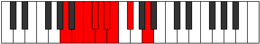 |
| [765](https://ianring.com/musictheory/scales/765) | [Mixonyphyllic](ModeDNaturalMixonyphyllic.md) | D | D, E, F, F#, G, G#, A, B, D |  |
| [765](https://ianring.com/musictheory/scales/765) | [Mixonyphyllic](ModeFSharpMixonyphyllic.md) | F# | F#, G#, A, A#, B, C, C#, D#, F# |  |
| [765](https://ianring.com/musictheory/scales/765) | [Mixonyphyllic](ModeGFlatMixonyphyllic.md) | Gb | Gb, Ab, A, Bb, B, C, Db, Eb, Gb |  |
| [765](https://ianring.com/musictheory/scales/765) | [Mixonyphyllic](ModeENaturalMixonyphyllic.md) | E | E, F#, G, G#, A, A#, B, C#, E |  |
| [767](https://ianring.com/musictheory/scales/767) | [Raptygic](ModeBNaturalRaptygic.md) | B | B, C, C#, D, D#, E, F, F#, G#, B |  |
| [767](https://ianring.com/musictheory/scales/767) | [Raptygic](ModeDNaturalRaptygic.md) | D | D, D#, E, F, F#, G, G#, A, B, D |  |
| [767](https://ianring.com/musictheory/scales/767) | [Raptygic](ModeANaturalRaptygic.md) | A | A, A#, B, C, C#, D, D#, E, F#, A |  |
| [767](https://ianring.com/musictheory/scales/767) | [Raptygic](ModeFSharpRaptygic.md) | F# | F#, G, G#, A, A#, B, C, C#, D#, F# |  |
| [767](https://ianring.com/musictheory/scales/767) | [Raptygic](ModeGFlatRaptygic.md) | Gb | Gb, G, Ab, A, Bb, B, C, Db, Eb, Gb |  |
| [767](https://ianring.com/musictheory/scales/767) | [Raptygic](ModeFNaturalRaptygic.md) | F | F, F#, G, G#, A, A#, B, C, D, F |  |
| [767](https://ianring.com/musictheory/scales/767) | [Raptygic](ModeENaturalRaptygic.md) | E | E, F, F#, G, G#, A, A#, B, C#, E |  |
| [785](https://ianring.com/musictheory/scales/785) | [Aeoloric](ModeDNaturalAeoloric.md) | D | D, F#, A#, B, D |  |
| [787](https://ianring.com/musictheory/scales/787) | [Aeolapritonic](ModeDNaturalAeolapritonic.md) | D | D, D#, F#, A#, B, D |  |
| [787](https://ianring.com/musictheory/scales/787) | [Aeolapritonic](ModeASharpAeolapritonic.md) | A# | A#, B, D, F#, G, A# |  |
| [787](https://ianring.com/musictheory/scales/787) | [Aeolapritonic](ModeBFlatAeolapritonic.md) | Bb | Bb, B, D, Gb, G, Bb |  |
| [789](https://ianring.com/musictheory/scales/789) | [Zogitonic](ModeANaturalZogitonic.md) | A | A, B, C#, F, F#, A |  |
| [789](https://ianring.com/musictheory/scales/789) | [Zogitonic](ModeDNaturalZogitonic.md) | D | D, E, F#, A#, B, D |  |
| [791](https://ianring.com/musictheory/scales/791) | [Aeoloptimic](ModeDNaturalAeoloptimic.md) | D | D, Eb, Fb, Gb, A#, B, D |  |
| [791](https://ianring.com/musictheory/scales/791) | [Aeoloptimic](ModeASharpAeoloptimic.md) | A# | A#, B, C, D, E##, F##, A# |  |
| [791](https://ianring.com/musictheory/scales/791) | [Aeoloptimic](ModeBFlatAeoloptimic.md) | Bb | Bb, Cb, Dbb, Ebb, F#, G, Bb |  |
| [791](https://ianring.com/musictheory/scales/791) | [Aeoloptimic](ModeANaturalAeoloptimic.md) | A | A, Bb, Cb, Db, E#, F#, A |  |
| [793](https://ianring.com/musictheory/scales/793) | [Mocritonic](ModeDSharpMocritonic.md) | D# | D#, F#, G, B, C, D# |  |
| [793](https://ianring.com/musictheory/scales/793) | [Mocritonic](ModeEFlatMocritonic.md) | Eb | Eb, Gb, G, B, C, Eb |  |
| [793](https://ianring.com/musictheory/scales/793) | [Mocritonic](ModeDNaturalMocritonic.md) | D | D, F, F#, A#, B, D |  |
| [795](https://ianring.com/musictheory/scales/795) | [Aeologimic](ModeDSharpAeologimic.md) | D# | D#, E, F#, G, A##, B#, D# |  |
| [795](https://ianring.com/musictheory/scales/795) | [Aeologimic](ModeEFlatAeologimic.md) | Eb | Eb, Fb, Gb, Abb, B, C, Eb |  |
| [795](https://ianring.com/musictheory/scales/795) | [Aeologimic](ModeDNaturalAeologimic.md) | D | D, Eb, F, Gb, A#, B, D |  |
| [795](https://ianring.com/musictheory/scales/795) | [Aeologimic](ModeASharpAeologimic.md) | A# | A#, B, C#, D, E##, F##, A# |  |
| [795](https://ianring.com/musictheory/scales/795) | [Aeologimic](ModeBFlatAeologimic.md) | Bb | Bb, Cb, Db, Ebb, F#, G, Bb |  |
| [797](https://ianring.com/musictheory/scales/797) | [Katocrimic](ModeDSharpKatocrimic.md) | D# | D#, E#, F#, G, A##, B#, D# |  |
| [797](https://ianring.com/musictheory/scales/797) | [Katocrimic](ModeEFlatKatocrimic.md) | Eb | Eb, F, Gb, Abb, B, C, Eb |  |
| [797](https://ianring.com/musictheory/scales/797) | [Katocrimic](ModeANaturalKatocrimic.md) | A | A, B, C, Db, E#, F#, A |  |
| [797](https://ianring.com/musictheory/scales/797) | [Katocrimic](ModeDNaturalKatocrimic.md) | D | D, E, F, Gb, A#, B, D |  |
| [799](https://ianring.com/musictheory/scales/799) | [Lolian](ModeDSharpLolian.md) | D# | D#, E, F, Gb, Abb, B, C, D# | 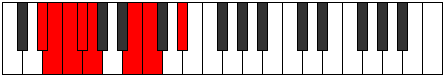 |
| [799](https://ianring.com/musictheory/scales/799) | [Lolian](ModeEFlatLolian.md) | Eb | Eb, Fb, Gbb, Abbb, E###, Cb, Dbb, Eb |  |
| [799](https://ianring.com/musictheory/scales/799) | [Lolian](ModeDNaturalLolian.md) | D | D, Eb, Fb, Gbb, Abbb, Bb, Cb, D |  |
| [799](https://ianring.com/musictheory/scales/799) | [Lolian](ModeASharpLolian.md) | A# | A#, B, C, Db, Ebb, F#, G, A# |  |
| [799](https://ianring.com/musictheory/scales/799) | [Lolian](ModeBFlatLolian.md) | Bb | Bb, Cb, Dbb, Ebbb, Fbbb, Gb, Abb, Bb |  |
| [799](https://ianring.com/musictheory/scales/799) | [Lolian](ModeANaturalLolian.md) | A | A, Bb, Cb, Dbb, Ebbb, F, Gb, A |  |
| [803](https://ianring.com/musictheory/scales/803) | [Loritonic](ModeFSharpLoritonic.md) | F# | F#, G, B, D, D#, F# |  |
| [803](https://ianring.com/musictheory/scales/803) | [Loritonic](ModeGFlatLoritonic.md) | Gb | Gb, G, B, D, Eb, Gb |  |
| [803](https://ianring.com/musictheory/scales/803) | [Loritonic](ModeASharpLoritonic.md) | A# | A#, B, D#, F#, G, A# |  |
| [803](https://ianring.com/musictheory/scales/803) | [Loritonic](ModeBFlatLoritonic.md) | Bb | Bb, B, Eb, Gb, G, Bb |  |
| [805](https://ianring.com/musictheory/scales/805) | [Rothitonic](ModeFSharpRothitonic.md) | F# | F#, G#, B, D, D#, F# |  |
| [805](https://ianring.com/musictheory/scales/805) | [Rothitonic](ModeGFlatRothitonic.md) | Gb | Gb, Ab, B, D, Eb, Gb |  |
| [805](https://ianring.com/musictheory/scales/805) | [Rothitonic](ModeANaturalRothitonic.md) | A | A, B, D, F, F#, A |  |
| [807](https://ianring.com/musictheory/scales/807) | [Epadimic](ModeFSharpEpadimic.md) | F# | F#, G, Ab, B, C##, D#, F# |  |
| [807](https://ianring.com/musictheory/scales/807) | [Epadimic](ModeGFlatEpadimic.md) | Gb | Gb, Abb, Bbbb, Cb, D, Eb, Gb |  |
| [807](https://ianring.com/musictheory/scales/807) | [Epadimic](ModeASharpEpadimic.md) | A# | A#, B, C, D#, E##, F##, A# |  |
| [807](https://ianring.com/musictheory/scales/807) | [Epadimic](ModeBFlatEpadimic.md) | Bb | Bb, Cb, Dbb, Eb, F#, G, Bb |  |
| [807](https://ianring.com/musictheory/scales/807) | [Epadimic](ModeANaturalEpadimic.md) | A | A, Bb, Cb, D, E#, F#, A |  |
| [809](https://ianring.com/musictheory/scales/809) | [Dogitonic](ModeDSharpDogitonic.md) | D# | D#, F#, G#, B, C, D# |  |
| [809](https://ianring.com/musictheory/scales/809) | [Dogitonic](ModeEFlatDogitonic.md) | Eb | Eb, Gb, Ab, B, C, Eb |  |
| [809](https://ianring.com/musictheory/scales/809) | [Dogitonic](ModeFSharpDogitonic.md) | F# | F#, A, B, D, D#, F# |  |
| [809](https://ianring.com/musictheory/scales/809) | [Dogitonic](ModeGFlatDogitonic.md) | Gb | Gb, A, B, D, Eb, Gb | 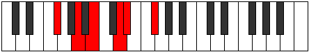 |
| [811](https://ianring.com/musictheory/scales/811) | [Radimic](ModeDSharpRadimic.md) | D# | D#, E, F#, G#, A##, B#, D# |  |
| [811](https://ianring.com/musictheory/scales/811) | [Radimic](ModeEFlatRadimic.md) | Eb | Eb, Fb, Gb, Ab, B, C, Eb |  |
| [811](https://ianring.com/musictheory/scales/811) | [Radimic](ModeFSharpRadimic.md) | F# | F#, G, A, B, C##, D#, F# |  |
| [811](https://ianring.com/musictheory/scales/811) | [Radimic](ModeGFlatRadimic.md) | Gb | Gb, Abb, Bbb, Cb, D, Eb, Gb |  |
| [811](https://ianring.com/musictheory/scales/811) | [Radimic](ModeASharpRadimic.md) | A# | A#, B, C#, D#, E##, F##, A# |  |
| [811](https://ianring.com/musictheory/scales/811) | [Radimic](ModeBFlatRadimic.md) | Bb | Bb, Cb, Db, Eb, F#, G, Bb |  |
| [813](https://ianring.com/musictheory/scales/813) | [Larimic](ModeDSharpLarimic.md) | D# | D#, E#, F#, G#, A##, B#, D# |  |
| [813](https://ianring.com/musictheory/scales/813) | [Larimic](ModeEFlatLarimic.md) | Eb | Eb, F, Gb, Ab, B, C, Eb |  |
| [813](https://ianring.com/musictheory/scales/813) | [Larimic](ModeANaturalLarimic.md) | A | A, B, C, D, E#, F#, A |  |
| [813](https://ianring.com/musictheory/scales/813) | [Larimic](ModeFSharpLarimic.md) | F# | F#, G#, A, B, C##, D#, F# |  |
| [813](https://ianring.com/musictheory/scales/813) | [Larimic](ModeGFlatLarimic.md) | Gb | Gb, Ab, Bbb, Cb, D, Eb, Gb |  |
| [815](https://ianring.com/musictheory/scales/815) | [Bolian](ModeDSharpBolian.md) | D# | D#, E, F, Gb, Ab, B, C, D# |  |
| [815](https://ianring.com/musictheory/scales/815) | [Bolian](ModeEFlatBolian.md) | Eb | Eb, Fb, Gbb, Abbb, Bbbb, Cb, Dbb, Eb |  |
| [815](https://ianring.com/musictheory/scales/815) | [Bolian](ModeFSharpBolian.md) | F# | F#, G, Ab, Bbb, Cb, D, Eb, F# |  |
| [815](https://ianring.com/musictheory/scales/815) | [Bolian](ModeGFlatBolian.md) | Gb | Gb, Abb, Bbbb, Cbbb, Dbbb, Ebb, Fbb, Gb |  |
| [815](https://ianring.com/musictheory/scales/815) | [Bolian](ModeASharpBolian.md) | A# | A#, B, C, Db, Eb, F#, G, A# |  |
| [815](https://ianring.com/musictheory/scales/815) | [Bolian](ModeBFlatBolian.md) | Bb | Bb, Cb, Dbb, Ebbb, Fbb, Gb, Abb, Bb |  |
| [815](https://ianring.com/musictheory/scales/815) | [Bolian](ModeANaturalBolian.md) | A | A, Bb, Cb, Dbb, Ebb, F, Gb, A |  |
| [817](https://ianring.com/musictheory/scales/817) | [Zothitonic](ModeFSharpZothitonic.md) | F# | F#, A#, B, D, D#, F# | 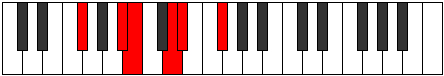 |
| [817](https://ianring.com/musictheory/scales/817) | [Zothitonic](ModeGFlatZothitonic.md) | Gb | Gb, Bb, B, D, Eb, Gb |  |
| [817](https://ianring.com/musictheory/scales/817) | [Zothitonic](ModeDNaturalZothitonic.md) | D | D, F#, G, A#, B, D |  |
| [819](https://ianring.com/musictheory/scales/819) | [Aerythimic](ModeDNaturalAerythimic.md) | D | D, Eb, F#, G, A#, B, D |  |
| [819](https://ianring.com/musictheory/scales/819) | [Aerythimic](ModeFSharpAerythimic.md) | F# | F#, G, A#, B, C##, D#, F# |  |
| [819](https://ianring.com/musictheory/scales/819) | [Aerythimic](ModeGFlatAerythimic.md) | Gb | Gb, Abb, Bb, Cb, D, Eb, Gb |  |
| [819](https://ianring.com/musictheory/scales/819) | [Aerythimic](ModeASharpAerythimic.md) | A# | A#, B, C##, D#, E##, F##, A# |  |
| [819](https://ianring.com/musictheory/scales/819) | [Aerythimic](ModeBFlatAerythimic.md) | Bb | Bb, Cb, D, Eb, F#, G, Bb |  |
| [821](https://ianring.com/musictheory/scales/821) | [Aeranimic](ModeANaturalAeranimic.md) | A | A, B, C#, D, E#, F#, A |  |
| [821](https://ianring.com/musictheory/scales/821) | [Aeranimic](ModeDNaturalAeranimic.md) | D | D, E, F#, G, A#, B, D |  |
| [821](https://ianring.com/musictheory/scales/821) | [Aeranimic](ModeFSharpAeranimic.md) | F# | F#, G#, A#, B, C##, D#, F# | 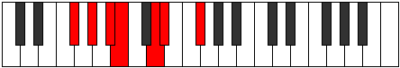 |
| [821](https://ianring.com/musictheory/scales/821) | [Aeranimic](ModeGFlatAeranimic.md) | Gb | Gb, Ab, Bb, Cb, D, Eb, Gb |  |
| [823](https://ianring.com/musictheory/scales/823) | [Stodian](ModeASharpStodian.md) | A# | A#, B, C, D, Eb, F#, G, A# |  |
| [823](https://ianring.com/musictheory/scales/823) | [Stodian](ModeBFlatStodian.md) | Bb | Bb, Cb, Dbb, Ebb, Fbb, Gb, Abb, Bb |  |
| [823](https://ianring.com/musictheory/scales/823) | [Stodian](ModeDNaturalStodian.md) | D | D, Eb, Fb, Gb, Abb, Bb, Cb, D |  |
| [823](https://ianring.com/musictheory/scales/823) | [Stodian](ModeFSharpStodian.md) | F# | F#, G, Ab, Bb, Cb, D, Eb, F# |  |
| [823](https://ianring.com/musictheory/scales/823) | [Stodian](ModeGFlatStodian.md) | Gb | Gb, Abb, Bbbb, Cbb, Dbbb, Ebb, Fbb, Gb |  |
| [823](https://ianring.com/musictheory/scales/823) | [Stodian](ModeANaturalStodian.md) | A | A, Bb, Cb, Db, Ebb, F, Gb, A |  |
| [825](https://ianring.com/musictheory/scales/825) | [Thyptimic](ModeDSharpThyptimic.md) | D# | D#, E##, F##, G#, A##, B#, D# |  |
| [825](https://ianring.com/musictheory/scales/825) | [Thyptimic](ModeEFlatThyptimic.md) | Eb | Eb, F#, G, Ab, B, C, Eb | 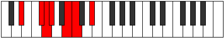 |
| [825](https://ianring.com/musictheory/scales/825) | [Thyptimic](ModeDNaturalThyptimic.md) | D | D, E#, F#, G, A#, B, D |  |
| [825](https://ianring.com/musictheory/scales/825) | [Thyptimic](ModeFSharpThyptimic.md) | F# | F#, G##, A#, B, C##, D#, F# |  |
| [825](https://ianring.com/musictheory/scales/825) | [Thyptimic](ModeGFlatThyptimic.md) | Gb | Gb, A, Bb, Cb, D, Eb, Gb |  |
| [827](https://ianring.com/musictheory/scales/827) | [Mixolocrian](ModeDSharpMixolocrian.md) | D# | D#, E, F#, G, Ab, B, C, D# |  |
| [827](https://ianring.com/musictheory/scales/827) | [Mixolocrian](ModeEFlatMixolocrian.md) | Eb | Eb, Fb, Gb, Abb, Bbbb, Cb, Dbb, Eb |  |
| [827](https://ianring.com/musictheory/scales/827) | [Mixolocrian](ModeASharpMixolocrian.md) | A# | A#, B, C#, D, Eb, F#, G, A# |  |
| [827](https://ianring.com/musictheory/scales/827) | [Mixolocrian](ModeBFlatMixolocrian.md) | Bb | Bb, Cb, Db, Ebb, Fbb, Gb, Abb, Bb |  |
| [827](https://ianring.com/musictheory/scales/827) | [Mixolocrian](ModeDNaturalMixolocrian.md) | D | D, Eb, F, Gb, Abb, Bb, Cb, D |  |
| [827](https://ianring.com/musictheory/scales/827) | [Mixolocrian](ModeFSharpMixolocrian.md) | F# | F#, G, A, Bb, Cb, D, Eb, F# |  |
| [827](https://ianring.com/musictheory/scales/827) | [Mixolocrian](ModeGFlatMixolocrian.md) | Gb | Gb, Abb, Bbb, Cbb, Dbbb, Ebb, Fbb, Gb |  |
| [829](https://ianring.com/musictheory/scales/829) | [Lygian](ModeDSharpLygian.md) | D# | D#, E#, F#, G, Ab, B, C, D# |  |
| [829](https://ianring.com/musictheory/scales/829) | [Lygian](ModeEFlatLygian.md) | Eb | Eb, F, Gb, Abb, Bbbb, Cb, Dbb, Eb |  |
| [829](https://ianring.com/musictheory/scales/829) | [Lygian](ModeANaturalLygian.md) | A | A, B, C, Db, Ebb, F, Gb, A |  |
| [829](https://ianring.com/musictheory/scales/829) | [Lygian](ModeDNaturalLygian.md) | D | D, E, F, Gb, Abb, Bb, Cb, D |  |
| [829](https://ianring.com/musictheory/scales/829) | [Lygian](ModeFSharpLygian.md) | F# | F#, G#, A, Bb, Cb, D, Eb, F# |  |
| [829](https://ianring.com/musictheory/scales/829) | [Lygian](ModeGFlatLygian.md) | Gb | Gb, Ab, Bbb, Cbb, Dbbb, Ebb, Fbb, Gb |  |
| [831](https://ianring.com/musictheory/scales/831) | [Rodyllic](ModeDSharpRodyllic.md) | D# | D#, E, F, F#, G, G#, B, C, D# |  |
| [831](https://ianring.com/musictheory/scales/831) | [Rodyllic](ModeEFlatRodyllic.md) | Eb | Eb, E, F, Gb, G, Ab, B, C, Eb |  |
| [831](https://ianring.com/musictheory/scales/831) | [Rodyllic](ModeASharpRodyllic.md) | A# | A#, B, C, C#, D, D#, F#, G, A# |  |
| [831](https://ianring.com/musictheory/scales/831) | [Rodyllic](ModeBFlatRodyllic.md) | Bb | Bb, B, C, Db, D, Eb, Gb, G, Bb |  |
| [831](https://ianring.com/musictheory/scales/831) | [Rodyllic](ModeDNaturalRodyllic.md) | D | D, D#, E, F, F#, G, A#, B, D |  |
| [831](https://ianring.com/musictheory/scales/831) | [Rodyllic](ModeANaturalRodyllic.md) | A | A, A#, B, C, C#, D, F, F#, A |  |
| [831](https://ianring.com/musictheory/scales/831) | [Rodyllic](ModeFSharpRodyllic.md) | F# | F#, G, G#, A, A#, B, D, D#, F# |  |
| [831](https://ianring.com/musictheory/scales/831) | [Rodyllic](ModeGFlatRodyllic.md) | Gb | Gb, G, Ab, A, Bb, B, D, Eb, Gb |  |
| [837](https://ianring.com/musictheory/scales/837) | [Epaditonic](ModeANaturalEpaditonic.md) | A | A, B, D#, F, F#, A |  |
| [839](https://ianring.com/musictheory/scales/839) | [Ionathimic](ModeFNaturalIonathimic.md) | F | F, Gb, Abb, B, C#, D, F |  |
| [839](https://ianring.com/musictheory/scales/839) | [Ionathimic](ModeASharpIonathimic.md) | A# | A#, B, C, D##, E##, F##, A# |  |
| [839](https://ianring.com/musictheory/scales/839) | [Ionathimic](ModeBFlatIonathimic.md) | Bb | Bb, Cb, Dbb, E, F#, G, Bb |  |
| [839](https://ianring.com/musictheory/scales/839) | [Ionathimic](ModeANaturalIonathimic.md) | A | A, Bb, Cb, D#, E#, F#, A |  |
| [841](https://ianring.com/musictheory/scales/841) | [Phrothitonic](ModeDSharpPhrothitonic.md) | D# | D#, F#, A, B, C, D# |  |
| [841](https://ianring.com/musictheory/scales/841) | [Phrothitonic](ModeEFlatPhrothitonic.md) | Eb | Eb, Gb, A, B, C, Eb |  |
| [843](https://ianring.com/musictheory/scales/843) | [Molimic](ModeFNaturalMolimic.md) | F | F, Gb, Ab, B, C#, D, F |  |
| [843](https://ianring.com/musictheory/scales/843) | [Molimic](ModeDSharpMolimic.md) | D# | D#, E, F#, G##, A##, B#, D# |  |
| [843](https://ianring.com/musictheory/scales/843) | [Molimic](ModeEFlatMolimic.md) | Eb | Eb, Fb, Gb, A, B, C, Eb |  |
| [843](https://ianring.com/musictheory/scales/843) | [Molimic](ModeASharpMolimic.md) | A# | A#, B, C#, D##, E##, F##, A# |  |
| [843](https://ianring.com/musictheory/scales/843) | [Molimic](ModeBFlatMolimic.md) | Bb | Bb, Cb, Db, E, F#, G, Bb |  |
| [845](https://ianring.com/musictheory/scales/845) | [Zyrimic](ModeDSharpZyrimic.md) | D# | D#, E#, F#, G##, A##, B#, D# |  |
| [845](https://ianring.com/musictheory/scales/845) | [Zyrimic](ModeEFlatZyrimic.md) | Eb | Eb, F, Gb, A, B, C, Eb |  |
| [845](https://ianring.com/musictheory/scales/845) | [Zyrimic](ModeANaturalZyrimic.md) | A | A, B, C, D#, E#, F#, A | 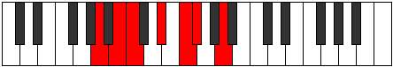 |
| [847](https://ianring.com/musictheory/scales/847) | [Ganian](ModeFNaturalGanian.md) | F | F, Gb, Abb, Bbbb, Cb, Db, Ebb, F |  |
| [847](https://ianring.com/musictheory/scales/847) | [Ganian](ModeDSharpGanian.md) | D# | D#, E, F, Gb, A, B, C, D# |  |
| [847](https://ianring.com/musictheory/scales/847) | [Ganian](ModeEFlatGanian.md) | Eb | Eb, Fb, Gbb, Abbb, Bbb, Cb, Dbb, Eb |  |
| [847](https://ianring.com/musictheory/scales/847) | [Ganian](ModeASharpGanian.md) | A# | A#, B, C, Db, E, F#, G, A# |  |
| [847](https://ianring.com/musictheory/scales/847) | [Ganian](ModeBFlatGanian.md) | Bb | Bb, Cb, Dbb, Ebbb, Fb, Gb, Abb, Bb |  |
| [847](https://ianring.com/musictheory/scales/847) | [Ganian](ModeANaturalGanian.md) | A | A, Bb, Cb, Dbb, Eb, F, Gb, A |  |
| [849](https://ianring.com/musictheory/scales/849) | [Aerynitonic](ModeDNaturalAerynitonic.md) | D | D, F#, G#, A#, B, D |  |
| [851](https://ianring.com/musictheory/scales/851) | [Aerylimic](ModeFNaturalAerylimic.md) | F | F, Gb, A, B, C#, D, F |  |
| [851](https://ianring.com/musictheory/scales/851) | [Aerylimic](ModeASharpAerylimic.md) | A# | A#, B, C##, D##, E##, F##, A# |  |
| [851](https://ianring.com/musictheory/scales/851) | [Aerylimic](ModeBFlatAerylimic.md) | Bb | Bb, Cb, D, E, F#, G, Bb | 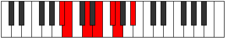 |
| [851](https://ianring.com/musictheory/scales/851) | [Aerylimic](ModeDNaturalAerylimic.md) | D | D, Eb, F#, G#, A#, B, D |  |
| [853](https://ianring.com/musictheory/scales/853) | [Epothimic](ModeANaturalEpothimic.md) | A | A, B, C#, D#, E#, F#, A |  |
| [853](https://ianring.com/musictheory/scales/853) | [Epothimic](ModeDNaturalEpothimic.md) | D | D, E, F#, G#, A#, B, D |  |
| [855](https://ianring.com/musictheory/scales/855) | [Porian](ModeFNaturalPorian.md) | F | F, Gb, Abb, Bbb, Cb, Db, Ebb, F | 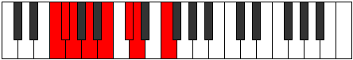 |
| [855](https://ianring.com/musictheory/scales/855) | [Porian](ModeASharpPorian.md) | A# | A#, B, C, D, E, F#, G, A# |  |
| [855](https://ianring.com/musictheory/scales/855) | [Porian](ModeBFlatPorian.md) | Bb | Bb, Cb, Dbb, Ebb, Fb, Gb, Abb, Bb |  |
| [855](https://ianring.com/musictheory/scales/855) | [Porian](ModeDNaturalPorian.md) | D | D, Eb, Fb, Gb, Ab, Bb, Cb, D | 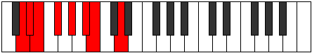 |
| [855](https://ianring.com/musictheory/scales/855) | [Porian](ModeANaturalPorian.md) | A | A, Bb, Cb, Db, Eb, F, Gb, A |  |
| [857](https://ianring.com/musictheory/scales/857) | [Aeolydimic](ModeDSharpAeolydimic.md) | D# | D#, E##, F##, G##, A##, B#, D# |  |
| [857](https://ianring.com/musictheory/scales/857) | [Aeolydimic](ModeEFlatAeolydimic.md) | Eb | Eb, F#, G, A, B, C, Eb |  |
| [857](https://ianring.com/musictheory/scales/857) | [Aeolydimic](ModeDNaturalAeolydimic.md) | D | D, E#, F#, G#, A#, B, D |  |
| [859](https://ianring.com/musictheory/scales/859) | [Pathian](ModeDSharpPathian.md) | D# | D#, E, F#, G, A, B, C, D# |  |
| [859](https://ianring.com/musictheory/scales/859) | [Pathian](ModeEFlatPathian.md) | Eb | Eb, Fb, Gb, Abb, Bbb, Cb, Dbb, Eb |  |
| [859](https://ianring.com/musictheory/scales/859) | [Pathian](ModeFNaturalPathian.md) | F | F, Gb, Ab, Bbb, Cb, Db, Ebb, F |  |
| [859](https://ianring.com/musictheory/scales/859) | [Pathian](ModeASharpPathian.md) | A# | A#, B, C#, D, E, F#, G, A# |  |
| [859](https://ianring.com/musictheory/scales/859) | [Pathian](ModeBFlatPathian.md) | Bb | Bb, Cb, Db, Ebb, Fb, Gb, Abb, Bb |  |
| [859](https://ianring.com/musictheory/scales/859) | [Pathian](ModeDNaturalPathian.md) | D | D, Eb, F, Gb, Ab, Bb, Cb, D |  |
| [861](https://ianring.com/musictheory/scales/861) | [Rylian](ModeANaturalRylian.md) | A | A, B, C, Db, Eb, F, Gb, A |  |
| [861](https://ianring.com/musictheory/scales/861) | [Rylian](ModeDSharpRylian.md) | D# | D#, E#, F#, G, A, B, C, D# |  |
| [861](https://ianring.com/musictheory/scales/861) | [Rylian](ModeEFlatRylian.md) | Eb | Eb, F, Gb, Abb, Bbb, Cb, Dbb, Eb |  |
| [861](https://ianring.com/musictheory/scales/861) | [Rylian](ModeDNaturalRylian.md) | D | D, E, F, Gb, Ab, Bb, Cb, D |  |
| [863](https://ianring.com/musictheory/scales/863) | [Pyryllic](ModeDSharpPyryllic.md) | D# | D#, E, F, F#, G, A, B, C, D# |  |
| [863](https://ianring.com/musictheory/scales/863) | [Pyryllic](ModeEFlatPyryllic.md) | Eb | Eb, E, F, Gb, G, A, B, C, Eb |  |
| [863](https://ianring.com/musictheory/scales/863) | [Pyryllic](ModeFNaturalPyryllic.md) | F | F, F#, G, G#, A, B, C#, D, F |  |
| [863](https://ianring.com/musictheory/scales/863) | [Pyryllic](ModeASharpPyryllic.md) | A# | A#, B, C, C#, D, E, F#, G, A# |  |
| [863](https://ianring.com/musictheory/scales/863) | [Pyryllic](ModeBFlatPyryllic.md) | Bb | Bb, B, C, Db, D, E, Gb, G, Bb |  |
| [863](https://ianring.com/musictheory/scales/863) | [Pyryllic](ModeDNaturalPyryllic.md) | D | D, D#, E, F, F#, G#, A#, B, D |  |
| [863](https://ianring.com/musictheory/scales/863) | [Pyryllic](ModeANaturalPyryllic.md) | A | A, A#, B, C, C#, D#, F, F#, A |  |
| [867](https://ianring.com/musictheory/scales/867) | [Phrocrimic](ModeFSharpPhrocrimic.md) | F# | F#, G, A##, B#, C##, D#, F# | 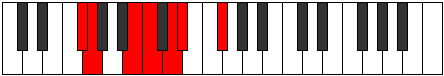 |
| [867](https://ianring.com/musictheory/scales/867) | [Phrocrimic](ModeGFlatPhrocrimic.md) | Gb | Gb, Abb, B, C, D, Eb, Gb |  |
| [867](https://ianring.com/musictheory/scales/867) | [Phrocrimic](ModeFNaturalPhrocrimic.md) | F | F, Gb, A#, B, C#, D, F |  |
| [867](https://ianring.com/musictheory/scales/867) | [Phrocrimic](ModeASharpPhrocrimic.md) | A# | A#, B, C###, D##, E##, F##, A# |  |
| [867](https://ianring.com/musictheory/scales/867) | [Phrocrimic](ModeBFlatPhrocrimic.md) | Bb | Bb, Cb, D#, E, F#, G, Bb |  |
| [869](https://ianring.com/musictheory/scales/869) | [Kothimic](ModeFSharpKothimic.md) | F# | F#, G#, A##, B#, C##, D#, F# |  |
| [869](https://ianring.com/musictheory/scales/869) | [Kothimic](ModeGFlatKothimic.md) | Gb | Gb, Ab, B, C, D, Eb, Gb |  |
| [869](https://ianring.com/musictheory/scales/869) | [Kothimic](ModeANaturalKothimic.md) | A | A, B, C##, D#, E#, F#, A |  |
| [871](https://ianring.com/musictheory/scales/871) | [Epadian](ModeFSharpEpadian.md) | F# | F#, G, Ab, B, C, D, Eb, F# |  |
| [871](https://ianring.com/musictheory/scales/871) | [Epadian](ModeGFlatEpadian.md) | Gb | Gb, Abb, Bbbb, Cb, Dbb, Ebb, Fbb, Gb |  |
| [871](https://ianring.com/musictheory/scales/871) | [Epadian](ModeASharpEpadian.md) | A# | A#, B, C, D#, E, F#, G, A# |  |
| [871](https://ianring.com/musictheory/scales/871) | [Epadian](ModeBFlatEpadian.md) | Bb | Bb, Cb, Dbb, Eb, Fb, Gb, Abb, Bb |  |
| [871](https://ianring.com/musictheory/scales/871) | [Epadian](ModeFNaturalEpadian.md) | F | F, Gb, Abb, Bb, Cb, Db, Ebb, F |  |
| [871](https://ianring.com/musictheory/scales/871) | [Epadian](ModeANaturalEpadian.md) | A | A, Bb, Cb, D, Eb, F, Gb, A |  |
| [873](https://ianring.com/musictheory/scales/873) | [Bagimic](ModeFSharpBagimic.md) | F# | F#, G##, A##, B#, C##, D#, F# |  |
| [873](https://ianring.com/musictheory/scales/873) | [Bagimic](ModeGFlatBagimic.md) | Gb | Gb, A, B, C, D, Eb, Gb |  |
| [873](https://ianring.com/musictheory/scales/873) | [Bagimic](ModeDSharpBagimic.md) | D# | D#, E##, F###, G##, A##, B#, D# |  |
| [873](https://ianring.com/musictheory/scales/873) | [Bagimic](ModeEFlatBagimic.md) | Eb | Eb, F#, G#, A, B, C, Eb |  |
| [875](https://ianring.com/musictheory/scales/875) | [Stothian](ModeFSharpStothian.md) | F# | F#, G, A, B, C, D, Eb, F# |  |
| [875](https://ianring.com/musictheory/scales/875) | [Stothian](ModeGFlatStothian.md) | Gb | Gb, Abb, Bbb, Cb, Dbb, Ebb, Fbb, Gb | 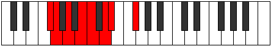 |
| [875](https://ianring.com/musictheory/scales/875) | [Stothian](ModeDSharpStothian.md) | D# | D#, E, F#, G#, A, B, C, D# |  |
| [875](https://ianring.com/musictheory/scales/875) | [Stothian](ModeEFlatStothian.md) | Eb | Eb, Fb, Gb, Ab, Bbb, Cb, Dbb, Eb |  |
| [875](https://ianring.com/musictheory/scales/875) | [Stothian](ModeASharpStothian.md) | A# | A#, B, C#, D#, E, F#, G, A# |  |
| [875](https://ianring.com/musictheory/scales/875) | [Stothian](ModeBFlatStothian.md) | Bb | Bb, Cb, Db, Eb, Fb, Gb, Abb, Bb |  |
| [875](https://ianring.com/musictheory/scales/875) | [Stothian](ModeFNaturalStothian.md) | F | F, Gb, Ab, Bb, Cb, Db, Ebb, F |  |
| [877](https://ianring.com/musictheory/scales/877) | [Aeraptian](ModeANaturalAeraptian.md) | A | A, B, C, D, Eb, F, Gb, A |  |
| [877](https://ianring.com/musictheory/scales/877) | [Aeraptian](ModeFSharpAeraptian.md) | F# | F#, G#, A, B, C, D, Eb, F# |  |
| [877](https://ianring.com/musictheory/scales/877) | [Aeraptian](ModeGFlatAeraptian.md) | Gb | Gb, Ab, Bbb, Cb, Dbb, Ebb, Fbb, Gb |  |
| [877](https://ianring.com/musictheory/scales/877) | [Aeraptian](ModeDSharpAeraptian.md) | D# | D#, E#, F#, G#, A, B, C, D# |  |
| [877](https://ianring.com/musictheory/scales/877) | [Aeraptian](ModeEFlatAeraptian.md) | Eb | Eb, F, Gb, Ab, Bbb, Cb, Dbb, Eb |  |
| [879](https://ianring.com/musictheory/scales/879) | [Aeolocryllic](ModeDSharpAeolocryllic.md) | D# | D#, E, F, F#, G#, A, B, C, D# |  |
| [879](https://ianring.com/musictheory/scales/879) | [Aeolocryllic](ModeEFlatAeolocryllic.md) | Eb | Eb, E, F, Gb, Ab, A, B, C, Eb |  |
| [879](https://ianring.com/musictheory/scales/879) | [Aeolocryllic](ModeFSharpAeolocryllic.md) | F# | F#, G, G#, A, B, C, D, D#, F# |  |
| [879](https://ianring.com/musictheory/scales/879) | [Aeolocryllic](ModeGFlatAeolocryllic.md) | Gb | Gb, G, Ab, A, B, C, D, Eb, Gb |  |
| [879](https://ianring.com/musictheory/scales/879) | [Aeolocryllic](ModeASharpAeolocryllic.md) | A# | A#, B, C, C#, D#, E, F#, G, A# |  |
| [879](https://ianring.com/musictheory/scales/879) | [Aeolocryllic](ModeBFlatAeolocryllic.md) | Bb | Bb, B, C, Db, Eb, E, Gb, G, Bb |  |
| [879](https://ianring.com/musictheory/scales/879) | [Aeolocryllic](ModeFNaturalAeolocryllic.md) | F | F, F#, G, G#, A#, B, C#, D, F |  |
| [879](https://ianring.com/musictheory/scales/879) | [Aeolocryllic](ModeANaturalAeolocryllic.md) | A | A, A#, B, C, D, D#, F, F#, A |  |
| [881](https://ianring.com/musictheory/scales/881) | [Aerothimic](ModeFSharpAerothimic.md) | F# | F#, G###, A##, B#, C##, D#, F# |  |
| [881](https://ianring.com/musictheory/scales/881) | [Aerothimic](ModeGFlatAerothimic.md) | Gb | Gb, A#, B, C, D, Eb, Gb |  |
| [881](https://ianring.com/musictheory/scales/881) | [Aerothimic](ModeDNaturalAerothimic.md) | D | D, E##, F##, G#, A#, B, D |  |
| [883](https://ianring.com/musictheory/scales/883) | [Ralian](ModeFSharpRalian.md) | F# | F#, G, A#, B, C, D, Eb, F# |  |
| [883](https://ianring.com/musictheory/scales/883) | [Ralian](ModeGFlatRalian.md) | Gb | Gb, Abb, Bb, Cb, Dbb, Ebb, Fbb, Gb |  |
| [883](https://ianring.com/musictheory/scales/883) | [Ralian](ModeASharpRalian.md) | A# | A#, B, C##, D#, E, F#, G, A# |  |
| [883](https://ianring.com/musictheory/scales/883) | [Ralian](ModeBFlatRalian.md) | Bb | Bb, Cb, D, Eb, Fb, Gb, Abb, Bb |  |
| [883](https://ianring.com/musictheory/scales/883) | [Ralian](ModeDNaturalRalian.md) | D | D, Eb, F#, G, Ab, Bb, Cb, D |  |
| [883](https://ianring.com/musictheory/scales/883) | [Ralian](ModeFNaturalRalian.md) | F | F, Gb, A, Bb, Cb, Db, Ebb, F |  |
| [885](https://ianring.com/musictheory/scales/885) | [Sathian](ModeANaturalSathian.md) | A | A, B, C#, D, Eb, F, Gb, A |  |
| [885](https://ianring.com/musictheory/scales/885) | [Sathian](ModeFSharpSathian.md) | F# | F#, G#, A#, B, C, D, Eb, F# |  |
| [885](https://ianring.com/musictheory/scales/885) | [Sathian](ModeGFlatSathian.md) | Gb | Gb, Ab, Bb, Cb, Dbb, Ebb, Fbb, Gb |  |
| [885](https://ianring.com/musictheory/scales/885) | [Sathian](ModeDNaturalSathian.md) | D | D, E, F#, G, Ab, Bb, Cb, D |  |
| [887](https://ianring.com/musictheory/scales/887) | [Sathyllic](ModeASharpSathyllic.md) | A# | A#, B, C, D, D#, E, F#, G, A# |  |
| [887](https://ianring.com/musictheory/scales/887) | [Sathyllic](ModeBFlatSathyllic.md) | Bb | Bb, B, C, D, Eb, E, Gb, G, Bb |  |
| [887](https://ianring.com/musictheory/scales/887) | [Sathyllic](ModeFSharpSathyllic.md) | F# | F#, G, G#, A#, B, C, D, D#, F# |  |
| [887](https://ianring.com/musictheory/scales/887) | [Sathyllic](ModeGFlatSathyllic.md) | Gb | Gb, G, Ab, Bb, B, C, D, Eb, Gb |  |
| [887](https://ianring.com/musictheory/scales/887) | [Sathyllic](ModeDNaturalSathyllic.md) | D | D, D#, E, F#, G, G#, A#, B, D |  |
| [887](https://ianring.com/musictheory/scales/887) | [Sathyllic](ModeANaturalSathyllic.md) | A | A, A#, B, C#, D, D#, F, F#, A |  |
| [887](https://ianring.com/musictheory/scales/887) | [Sathyllic](ModeFNaturalSathyllic.md) | F | F, F#, G, A, A#, B, C#, D, F |  |
| [889](https://ianring.com/musictheory/scales/889) | [Borian](ModeDSharpBorian.md) | D# | D#, E##, F##, G#, A, B, C, D# |  |
| [889](https://ianring.com/musictheory/scales/889) | [Borian](ModeEFlatBorian.md) | Eb | Eb, F#, G, Ab, Bbb, Cb, Dbb, Eb |  |
| [889](https://ianring.com/musictheory/scales/889) | [Borian](ModeDNaturalBorian.md) | D | D, E#, F#, G, Ab, Bb, Cb, D |  |
| [889](https://ianring.com/musictheory/scales/889) | [Borian](ModeFSharpBorian.md) | F# | F#, G##, A#, B, C, D, Eb, F# |  |
| [889](https://ianring.com/musictheory/scales/889) | [Borian](ModeGFlatBorian.md) | Gb | Gb, A, Bb, Cb, Dbb, Ebb, Fbb, Gb |  |
| [891](https://ianring.com/musictheory/scales/891) | [Ionilyllic](ModeDSharpIonilyllic.md) | D# | D#, E, F#, G, G#, A, B, C, D# |  |
| [891](https://ianring.com/musictheory/scales/891) | [Ionilyllic](ModeEFlatIonilyllic.md) | Eb | Eb, E, Gb, G, Ab, A, B, C, Eb |  |
| [891](https://ianring.com/musictheory/scales/891) | [Ionilyllic](ModeASharpIonilyllic.md) | A# | A#, B, C#, D, D#, E, F#, G, A# |  |
| [891](https://ianring.com/musictheory/scales/891) | [Ionilyllic](ModeBFlatIonilyllic.md) | Bb | Bb, B, Db, D, Eb, E, Gb, G, Bb |  |
| [891](https://ianring.com/musictheory/scales/891) | [Ionilyllic](ModeDNaturalIonilyllic.md) | D | D, D#, F, F#, G, G#, A#, B, D |  |
| [891](https://ianring.com/musictheory/scales/891) | [Ionilyllic](ModeFSharpIonilyllic.md) | F# | F#, G, A, A#, B, C, D, D#, F# |  |
| [891](https://ianring.com/musictheory/scales/891) | [Ionilyllic](ModeGFlatIonilyllic.md) | Gb | Gb, G, A, Bb, B, C, D, Eb, Gb |  |
| [891](https://ianring.com/musictheory/scales/891) | [Ionilyllic](ModeFNaturalIonilyllic.md) | F | F, F#, G#, A, A#, B, C#, D, F |  |
| [893](https://ianring.com/musictheory/scales/893) | [Pycryllic](ModeANaturalPycryllic.md) | A | A, B, C, C#, D, D#, F, F#, A |  |
| [893](https://ianring.com/musictheory/scales/893) | [Pycryllic](ModeDSharpPycryllic.md) | D# | D#, F, F#, G, G#, A, B, C, D# |  |
| [893](https://ianring.com/musictheory/scales/893) | [Pycryllic](ModeEFlatPycryllic.md) | Eb | Eb, F, Gb, G, Ab, A, B, C, Eb |  |
| [893](https://ianring.com/musictheory/scales/893) | [Pycryllic](ModeDNaturalPycryllic.md) | D | D, E, F, F#, G, G#, A#, B, D |  |
| [893](https://ianring.com/musictheory/scales/893) | [Pycryllic](ModeFSharpPycryllic.md) | F# | F#, G#, A, A#, B, C, D, D#, F# |  |
| [893](https://ianring.com/musictheory/scales/893) | [Pycryllic](ModeGFlatPycryllic.md) | Gb | Gb, Ab, A, Bb, B, C, D, Eb, Gb |  |
| [895](https://ianring.com/musictheory/scales/895) | [Aeolathygic](ModeDSharpAeolathygic.md) | D# | D#, E, F, F#, G, G#, A, B, C, D# |  |
| [895](https://ianring.com/musictheory/scales/895) | [Aeolathygic](ModeEFlatAeolathygic.md) | Eb | Eb, E, F, Gb, G, Ab, A, B, C, Eb |  |
| [895](https://ianring.com/musictheory/scales/895) | [Aeolathygic](ModeASharpAeolathygic.md) | A# | A#, B, C, C#, D, D#, E, F#, G, A# |  |
| [895](https://ianring.com/musictheory/scales/895) | [Aeolathygic](ModeBFlatAeolathygic.md) | Bb | Bb, B, C, Db, D, Eb, E, Gb, G, Bb |  |
| [895](https://ianring.com/musictheory/scales/895) | [Aeolathygic](ModeDNaturalAeolathygic.md) | D | D, D#, E, F, F#, G, G#, A#, B, D |  |
| [895](https://ianring.com/musictheory/scales/895) | [Aeolathygic](ModeANaturalAeolathygic.md) | A | A, A#, B, C, C#, D, D#, F, F#, A |  |
| [895](https://ianring.com/musictheory/scales/895) | [Aeolathygic](ModeFSharpAeolathygic.md) | F# | F#, G, G#, A, A#, B, C, D, D#, F# |  |
| [895](https://ianring.com/musictheory/scales/895) | [Aeolathygic](ModeGFlatAeolathygic.md) | Gb | Gb, G, Ab, A, Bb, B, C, D, Eb, Gb |  |
| [895](https://ianring.com/musictheory/scales/895) | [Aeolathygic](ModeFNaturalAeolathygic.md) | F | F, F#, G, G#, A, A#, B, C#, D, F |  |
| [905](https://ianring.com/musictheory/scales/905) | [Bylitonic](ModeBNaturalBylitonic.md) | B | B, D, F#, G, G#, B |  |
| [905](https://ianring.com/musictheory/scales/905) | [Bylitonic](ModeDSharpBylitonic.md) | D# | D#, F#, A#, B, C, D# |  |
| [905](https://ianring.com/musictheory/scales/905) | [Bylitonic](ModeEFlatBylitonic.md) | Eb | Eb, Gb, Bb, B, C, Eb |  |
| [907](https://ianring.com/musictheory/scales/907) | [Tholimic](ModeBNaturalTholimic.md) | B | B, C, D, E##, F##, G#, B |  |
| [907](https://ianring.com/musictheory/scales/907) | [Tholimic](ModeDSharpTholimic.md) | D# | D#, E, F#, G###, A##, B#, D# |  |
| [907](https://ianring.com/musictheory/scales/907) | [Tholimic](ModeEFlatTholimic.md) | Eb | Eb, Fb, Gb, A#, B, C, Eb |  |
| [907](https://ianring.com/musictheory/scales/907) | [Tholimic](ModeASharpTholimic.md) | A# | A#, B, C#, D###, E##, F##, A# |  |
| [907](https://ianring.com/musictheory/scales/907) | [Tholimic](ModeBFlatTholimic.md) | Bb | Bb, Cb, Db, E#, F#, G, Bb |  |
| [909](https://ianring.com/musictheory/scales/909) | [Katarimic](ModeENaturalKatarimic.md) | E | E, F#, G, A##, B#, C#, E |  |
| [909](https://ianring.com/musictheory/scales/909) | [Katarimic](ModeBNaturalKatarimic.md) | B | B, C#, D, E##, F##, G#, B |  |
| [909](https://ianring.com/musictheory/scales/909) | [Katarimic](ModeANaturalKatarimic.md) | A | A, B, C, D##, E#, F#, A |  |
| [909](https://ianring.com/musictheory/scales/909) | [Katarimic](ModeDSharpKatarimic.md) | D# | D#, E#, F#, G###, A##, B#, D# |  |
| [909](https://ianring.com/musictheory/scales/909) | [Katarimic](ModeEFlatKatarimic.md) | Eb | Eb, F, Gb, A#, B, C, Eb |  |
| [911](https://ianring.com/musictheory/scales/911) | [Radian](ModeENaturalRadian.md) | E | E, F, Gb, Abb, B, C, Db, E |  |
| [911](https://ianring.com/musictheory/scales/911) | [Radian](ModeBNaturalRadian.md) | B | B, C, Db, Ebb, F#, G, Ab, B |  |
| [911](https://ianring.com/musictheory/scales/911) | [Radian](ModeDSharpRadian.md) | D# | D#, E, F, Gb, A#, B, C, D# |  |
| [911](https://ianring.com/musictheory/scales/911) | [Radian](ModeEFlatRadian.md) | Eb | Eb, Fb, Gbb, Abbb, Bb, Cb, Dbb, Eb |  |
| [911](https://ianring.com/musictheory/scales/911) | [Radian](ModeASharpRadian.md) | A# | A#, B, C, Db, E#, F#, G, A# |  |
| [911](https://ianring.com/musictheory/scales/911) | [Radian](ModeBFlatRadian.md) | Bb | Bb, Cb, Dbb, Ebbb, F, Gb, Abb, Bb |  |
| [911](https://ianring.com/musictheory/scales/911) | [Radian](ModeANaturalRadian.md) | A | A, Bb, Cb, Dbb, E, F, Gb, A |  |
| [913](https://ianring.com/musictheory/scales/913) | [Aeolyritonic](ModeBNaturalAeolyritonic.md) | B | B, D#, F#, G, G#, B |  |
| [913](https://ianring.com/musictheory/scales/913) | [Aeolyritonic](ModeDNaturalAeolyritonic.md) | D | D, F#, A, A#, B, D |  |
| [915](https://ianring.com/musictheory/scales/915) | [Loptimic](ModeBNaturalLoptimic.md) | B | B, C, D#, E##, F##, G#, B |  |
| [915](https://ianring.com/musictheory/scales/915) | [Loptimic](ModeASharpLoptimic.md) | A# | A#, B, C##, D###, E##, F##, A# |  |
| [915](https://ianring.com/musictheory/scales/915) | [Loptimic](ModeBFlatLoptimic.md) | Bb | Bb, Cb, D, E#, F#, G, Bb |  |
| [915](https://ianring.com/musictheory/scales/915) | [Loptimic](ModeDNaturalLoptimic.md) | D | D, Eb, F#, G##, A#, B, D |  |
| [917](https://ianring.com/musictheory/scales/917) | [Dygimic](ModeENaturalDygimic.md) | E | E, F#, G#, A##, B#, C#, E |  |
| [917](https://ianring.com/musictheory/scales/917) | [Dygimic](ModeBNaturalDygimic.md) | B | B, C#, D#, E##, F##, G#, B |  |
| [917](https://ianring.com/musictheory/scales/917) | [Dygimic](ModeANaturalDygimic.md) | A | A, B, C#, D##, E#, F#, A | 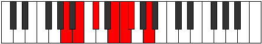 |
| [917](https://ianring.com/musictheory/scales/917) | [Dygimic](ModeDNaturalDygimic.md) | D | D, E, F#, G##, A#, B, D |  |
| [919](https://ianring.com/musictheory/scales/919) | [Gathian](ModeENaturalGathian.md) | E | E, F, Gb, Ab, B, C, Db, E |  |
| [919](https://ianring.com/musictheory/scales/919) | [Gathian](ModeBNaturalGathian.md) | B | B, C, Db, Eb, F#, G, Ab, B |  |
| [919](https://ianring.com/musictheory/scales/919) | [Gathian](ModeASharpGathian.md) | A# | A#, B, C, D, E#, F#, G, A# |  |
| [919](https://ianring.com/musictheory/scales/919) | [Gathian](ModeBFlatGathian.md) | Bb | Bb, Cb, Dbb, Ebb, F, Gb, Abb, Bb |  |
| [919](https://ianring.com/musictheory/scales/919) | [Gathian](ModeDNaturalGathian.md) | D | D, Eb, Fb, Gb, A, Bb, Cb, D |  |
| [919](https://ianring.com/musictheory/scales/919) | [Gathian](ModeANaturalGathian.md) | A | A, Bb, Cb, Db, E, F, Gb, A |  |
| [921](https://ianring.com/musictheory/scales/921) | [Bogimic](ModeBNaturalBogimic.md) | B | B, C##, D#, E##, F##, G#, B |  |
| [921](https://ianring.com/musictheory/scales/921) | [Bogimic](ModeDSharpBogimic.md) | D# | D#, E##, F##, G###, A##, B#, D# |  |
| [921](https://ianring.com/musictheory/scales/921) | [Bogimic](ModeEFlatBogimic.md) | Eb | Eb, F#, G, A#, B, C, Eb |  |
| [921](https://ianring.com/musictheory/scales/921) | [Bogimic](ModeDNaturalBogimic.md) | D | D, E#, F#, G##, A#, B, D |  |
| [923](https://ianring.com/musictheory/scales/923) | [Ionodian](ModeBNaturalIonodian.md) | B | B, C, D, Eb, F#, G, Ab, B |  |
| [923](https://ianring.com/musictheory/scales/923) | [Ionodian](ModeDSharpIonodian.md) | D# | D#, E, F#, G, A#, B, C, D# |  |
| [923](https://ianring.com/musictheory/scales/923) | [Ionodian](ModeEFlatIonodian.md) | Eb | Eb, Fb, Gb, Abb, Bb, Cb, Dbb, Eb |  |
| [923](https://ianring.com/musictheory/scales/923) | [Ionodian](ModeASharpIonodian.md) | A# | A#, B, C#, D, E#, F#, G, A# |  |
| [923](https://ianring.com/musictheory/scales/923) | [Ionodian](ModeBFlatIonodian.md) | Bb | Bb, Cb, Db, Ebb, F, Gb, Abb, Bb |  |
| [923](https://ianring.com/musictheory/scales/923) | [Ionodian](ModeDNaturalIonodian.md) | D | D, Eb, F, Gb, A, Bb, Cb, D |  |
| [925](https://ianring.com/musictheory/scales/925) | [Mythian](ModeBNaturalMythian.md) | B | B, C#, D, Eb, F#, G, Ab, B |  |
| [925](https://ianring.com/musictheory/scales/925) | [Mythian](ModeENaturalMythian.md) | E | E, F#, G, Ab, B, C, Db, E |  |
| [925](https://ianring.com/musictheory/scales/925) | [Mythian](ModeANaturalMythian.md) | A | A, B, C, Db, E, F, Gb, A |  |
| [925](https://ianring.com/musictheory/scales/925) | [Mythian](ModeDSharpMythian.md) | D# | D#, E#, F#, G, A#, B, C, D# |  |
| [925](https://ianring.com/musictheory/scales/925) | [Mythian](ModeEFlatMythian.md) | Eb | Eb, F, Gb, Abb, Bb, Cb, Dbb, Eb |  |
| [925](https://ianring.com/musictheory/scales/925) | [Mythian](ModeDNaturalMythian.md) | D | D, E, F, Gb, A, Bb, Cb, D |  |
| [927](https://ianring.com/musictheory/scales/927) | [Koptyllic](ModeBNaturalKoptyllic.md) | B | B, C, C#, D, D#, F#, G, G#, B |  |
| [927](https://ianring.com/musictheory/scales/927) | [Koptyllic](ModeENaturalKoptyllic.md) | E | E, F, F#, G, G#, B, C, C#, E |  |
| [927](https://ianring.com/musictheory/scales/927) | [Koptyllic](ModeASharpKoptyllic.md) | A# | A#, B, C, C#, D, F, F#, G, A# |  |
| [927](https://ianring.com/musictheory/scales/927) | [Koptyllic](ModeBFlatKoptyllic.md) | Bb | Bb, B, C, Db, D, F, Gb, G, Bb |  |
| [927](https://ianring.com/musictheory/scales/927) | [Koptyllic](ModeDSharpKoptyllic.md) | D# | D#, E, F, F#, G, A#, B, C, D# |  |
| [927](https://ianring.com/musictheory/scales/927) | [Koptyllic](ModeEFlatKoptyllic.md) | Eb | Eb, E, F, Gb, G, Bb, B, C, Eb |  |
| [927](https://ianring.com/musictheory/scales/927) | [Koptyllic](ModeANaturalKoptyllic.md) | A | A, A#, B, C, C#, E, F, F#, A |  |
| [927](https://ianring.com/musictheory/scales/927) | [Koptyllic](ModeDNaturalKoptyllic.md) | D | D, D#, E, F, F#, A, A#, B, D |  |
| [931](https://ianring.com/musictheory/scales/931) | [Bacrimic](ModeFSharpBacrimic.md) | F# | F#, G, A##, B##, C##, D#, F# |  |
| [931](https://ianring.com/musictheory/scales/931) | [Bacrimic](ModeGFlatBacrimic.md) | Gb | Gb, Abb, B, C#, D, Eb, Gb |  |
| [931](https://ianring.com/musictheory/scales/931) | [Bacrimic](ModeBNaturalBacrimic.md) | B | B, C, D##, E##, F##, G#, B |  |
| [931](https://ianring.com/musictheory/scales/931) | [Bacrimic](ModeASharpBacrimic.md) | A# | A#, B, C###, D###, E##, F##, A# |  |
| [931](https://ianring.com/musictheory/scales/931) | [Bacrimic](ModeBFlatBacrimic.md) | Bb | Bb, Cb, D#, E#, F#, G, Bb |  |
| [933](https://ianring.com/musictheory/scales/933) | [Dadimic](ModeFSharpDadimic.md) | F# | F#, G#, A##, B##, C##, D#, F# |  |
| [933](https://ianring.com/musictheory/scales/933) | [Dadimic](ModeGFlatDadimic.md) | Gb | Gb, Ab, B, C#, D, Eb, Gb |  |
| [933](https://ianring.com/musictheory/scales/933) | [Dadimic](ModeBNaturalDadimic.md) | B | B, C#, D##, E##, F##, G#, B |  |
| [933](https://ianring.com/musictheory/scales/933) | [Dadimic](ModeENaturalDadimic.md) | E | E, F#, G##, A##, B#, C#, E |  |
| [933](https://ianring.com/musictheory/scales/933) | [Dadimic](ModeANaturalDadimic.md) | A | A, B, C##, D##, E#, F#, A |  |
| [935](https://ianring.com/musictheory/scales/935) | [Katarian](ModeFSharpKatarian.md) | F# | F#, G, Ab, B, C#, D, Eb, F# |  |
| [935](https://ianring.com/musictheory/scales/935) | [Katarian](ModeGFlatKatarian.md) | Gb | Gb, Abb, Bbbb, Cb, Db, Ebb, Fbb, Gb |  |
| [935](https://ianring.com/musictheory/scales/935) | [Katarian](ModeBNaturalKatarian.md) | B | B, C, Db, E, F#, G, Ab, B |  |
| [935](https://ianring.com/musictheory/scales/935) | [Katarian](ModeENaturalKatarian.md) | E | E, F, Gb, A, B, C, Db, E |  |
| [935](https://ianring.com/musictheory/scales/935) | [Katarian](ModeASharpKatarian.md) | A# | A#, B, C, D#, E#, F#, G, A# |  |
| [935](https://ianring.com/musictheory/scales/935) | [Katarian](ModeBFlatKatarian.md) | Bb | Bb, Cb, Dbb, Eb, F, Gb, Abb, Bb |  |
| [935](https://ianring.com/musictheory/scales/935) | [Katarian](ModeANaturalKatarian.md) | A | A, Bb, Cb, D, E, F, Gb, A |  |
| [937](https://ianring.com/musictheory/scales/937) | [Stothimic](ModeBNaturalStothimic.md) | B | B, C##, D##, E##, F##, G#, B |  |
| [937](https://ianring.com/musictheory/scales/937) | [Stothimic](ModeFSharpStothimic.md) | F# | F#, G##, A##, B##, C##, D#, F# |  |
| [937](https://ianring.com/musictheory/scales/937) | [Stothimic](ModeGFlatStothimic.md) | Gb | Gb, A, B, C#, D, Eb, Gb |  |
| [937](https://ianring.com/musictheory/scales/937) | [Stothimic](ModeDSharpStothimic.md) | D# | D#, E##, F###, G###, A##, B#, D# |  |
| [937](https://ianring.com/musictheory/scales/937) | [Stothimic](ModeEFlatStothimic.md) | Eb | Eb, F#, G#, A#, B, C, Eb |  |
| [939](https://ianring.com/musictheory/scales/939) | [Dyptian](ModeBNaturalDyptian.md) | B | B, C, D, E, F#, G, Ab, B |  |
| [939](https://ianring.com/musictheory/scales/939) | [Dyptian](ModeFSharpDyptian.md) | F# | F#, G, A, B, C#, D, Eb, F# |  |
| [939](https://ianring.com/musictheory/scales/939) | [Dyptian](ModeGFlatDyptian.md) | Gb | Gb, Abb, Bbb, Cb, Db, Ebb, Fbb, Gb |  |
| [939](https://ianring.com/musictheory/scales/939) | [Dyptian](ModeASharpDyptian.md) | A# | A#, B, C#, D#, E#, F#, G, A# |  |
| [939](https://ianring.com/musictheory/scales/939) | [Dyptian](ModeBFlatDyptian.md) | Bb | Bb, Cb, Db, Eb, F, Gb, Abb, Bb |  |
| [939](https://ianring.com/musictheory/scales/939) | [Dyptian](ModeDSharpDyptian.md) | D# | D#, E, F#, G#, A#, B, C, D# |  |
| [939](https://ianring.com/musictheory/scales/939) | [Dyptian](ModeEFlatDyptian.md) | Eb | Eb, Fb, Gb, Ab, Bb, Cb, Dbb, Eb |  |
| [941](https://ianring.com/musictheory/scales/941) | [Phrorian](ModeBNaturalPhrorian.md) | B | B, C#, D, E, F#, G, Ab, B |  |
| [941](https://ianring.com/musictheory/scales/941) | [Phrorian](ModeANaturalPhrorian.md) | A | A, B, C, D, E, F, Gb, A |  |
| [941](https://ianring.com/musictheory/scales/941) | [Phrorian](ModeENaturalPhrorian.md) | E | E, F#, G, A, B, C, Db, E |  |
| [941](https://ianring.com/musictheory/scales/941) | [Phrorian](ModeFSharpPhrorian.md) | F# | F#, G#, A, B, C#, D, Eb, F# |  |
| [941](https://ianring.com/musictheory/scales/941) | [Phrorian](ModeGFlatPhrorian.md) | Gb | Gb, Ab, Bbb, Cb, Db, Ebb, Fbb, Gb |  |
| [941](https://ianring.com/musictheory/scales/941) | [Phrorian](ModeDSharpPhrorian.md) | D# | D#, E#, F#, G#, A#, B, C, D# |  |
| [941](https://ianring.com/musictheory/scales/941) | [Phrorian](ModeEFlatPhrorian.md) | Eb | Eb, F, Gb, Ab, Bb, Cb, Dbb, Eb |  |
| [943](https://ianring.com/musictheory/scales/943) | [Aerygyllic](ModeBNaturalAerygyllic.md) | B | B, C, C#, D, E, F#, G, G#, B |  |
| [943](https://ianring.com/musictheory/scales/943) | [Aerygyllic](ModeENaturalAerygyllic.md) | E | E, F, F#, G, A, B, C, C#, E |  |
| [943](https://ianring.com/musictheory/scales/943) | [Aerygyllic](ModeFSharpAerygyllic.md) | F# | F#, G, G#, A, B, C#, D, D#, F# |  |
| [943](https://ianring.com/musictheory/scales/943) | [Aerygyllic](ModeGFlatAerygyllic.md) | Gb | Gb, G, Ab, A, B, Db, D, Eb, Gb |  |
| [943](https://ianring.com/musictheory/scales/943) | [Aerygyllic](ModeASharpAerygyllic.md) | A# | A#, B, C, C#, D#, F, F#, G, A# |  |
| [943](https://ianring.com/musictheory/scales/943) | [Aerygyllic](ModeBFlatAerygyllic.md) | Bb | Bb, B, C, Db, Eb, F, Gb, G, Bb |  |
| [943](https://ianring.com/musictheory/scales/943) | [Aerygyllic](ModeDSharpAerygyllic.md) | D# | D#, E, F, F#, G#, A#, B, C, D# |  |
| [943](https://ianring.com/musictheory/scales/943) | [Aerygyllic](ModeEFlatAerygyllic.md) | Eb | Eb, E, F, Gb, Ab, Bb, B, C, Eb |  |
| [943](https://ianring.com/musictheory/scales/943) | [Aerygyllic](ModeANaturalAerygyllic.md) | A | A, A#, B, C, D, E, F, F#, A |  |
| [945](https://ianring.com/musictheory/scales/945) | [Syrimic](ModeBNaturalSyrimic.md) | B | B, C###, D##, E##, F##, G#, B |  |
| [945](https://ianring.com/musictheory/scales/945) | [Syrimic](ModeFSharpSyrimic.md) | F# | F#, G###, A##, B##, C##, D#, F# |  |
| [945](https://ianring.com/musictheory/scales/945) | [Syrimic](ModeGFlatSyrimic.md) | Gb | Gb, A#, B, C#, D, Eb, Gb |  |
| [945](https://ianring.com/musictheory/scales/945) | [Syrimic](ModeDNaturalSyrimic.md) | D | D, E##, F##, G##, A#, B, D |  |
| [947](https://ianring.com/musictheory/scales/947) | [Modian](ModeBNaturalModian.md) | B | B, C, D#, E, F#, G, Ab, B |  |
| [947](https://ianring.com/musictheory/scales/947) | [Modian](ModeFSharpModian.md) | F# | F#, G, A#, B, C#, D, Eb, F# |  |
| [947](https://ianring.com/musictheory/scales/947) | [Modian](ModeGFlatModian.md) | Gb | Gb, Abb, Bb, Cb, Db, Ebb, Fbb, Gb |  |
| [947](https://ianring.com/musictheory/scales/947) | [Modian](ModeASharpModian.md) | A# | A#, B, C##, D#, E#, F#, G, A# |  |
| [947](https://ianring.com/musictheory/scales/947) | [Modian](ModeBFlatModian.md) | Bb | Bb, Cb, D, Eb, F, Gb, Abb, Bb |  |
| [947](https://ianring.com/musictheory/scales/947) | [Modian](ModeDNaturalModian.md) | D | D, Eb, F#, G, A, Bb, Cb, D |  |
| [949](https://ianring.com/musictheory/scales/949) | [Ionagian](ModeBNaturalIonagian.md) | B | B, C#, D#, E, F#, G, Ab, B |  |
| [949](https://ianring.com/musictheory/scales/949) | [Ionagian](ModeANaturalIonagian.md) | A | A, B, C#, D, E, F, Gb, A |  |
| [949](https://ianring.com/musictheory/scales/949) | [Ionagian](ModeENaturalIonagian.md) | E | E, F#, G#, A, B, C, Db, E |  |
| [949](https://ianring.com/musictheory/scales/949) | [Ionagian](ModeFSharpIonagian.md) | F# | F#, G#, A#, B, C#, D, Eb, F# |  |
| [949](https://ianring.com/musictheory/scales/949) | [Ionagian](ModeGFlatIonagian.md) | Gb | Gb, Ab, Bb, Cb, Db, Ebb, Fbb, Gb |  |
| [949](https://ianring.com/musictheory/scales/949) | [Ionagian](ModeDNaturalIonagian.md) | D | D, E, F#, G, A, Bb, Cb, D |  |
| [951](https://ianring.com/musictheory/scales/951) | [Thogyllic](ModeBNaturalThogyllic.md) | B | B, C, C#, D#, E, F#, G, G#, B |  |
| [951](https://ianring.com/musictheory/scales/951) | [Thogyllic](ModeENaturalThogyllic.md) | E | E, F, F#, G#, A, B, C, C#, E |  |
| [951](https://ianring.com/musictheory/scales/951) | [Thogyllic](ModeASharpThogyllic.md) | A# | A#, B, C, D, D#, F, F#, G, A# |  |
| [951](https://ianring.com/musictheory/scales/951) | [Thogyllic](ModeBFlatThogyllic.md) | Bb | Bb, B, C, D, Eb, F, Gb, G, Bb |  |
| [951](https://ianring.com/musictheory/scales/951) | [Thogyllic](ModeFSharpThogyllic.md) | F# | F#, G, G#, A#, B, C#, D, D#, F# |  |
| [951](https://ianring.com/musictheory/scales/951) | [Thogyllic](ModeGFlatThogyllic.md) | Gb | Gb, G, Ab, Bb, B, Db, D, Eb, Gb |  |
| [951](https://ianring.com/musictheory/scales/951) | [Thogyllic](ModeANaturalThogyllic.md) | A | A, A#, B, C#, D, E, F, F#, A |  |
| [951](https://ianring.com/musictheory/scales/951) | [Thogyllic](ModeDNaturalThogyllic.md) | D | D, D#, E, F#, G, A, A#, B, D |  |
| [953](https://ianring.com/musictheory/scales/953) | [Stoptian](ModeBNaturalStoptian.md) | B | B, C##, D#, E, F#, G, Ab, B |  |
| [953](https://ianring.com/musictheory/scales/953) | [Stoptian](ModeDSharpStoptian.md) | D# | D#, E##, F##, G#, A#, B, C, D# |  |
| [953](https://ianring.com/musictheory/scales/953) | [Stoptian](ModeEFlatStoptian.md) | Eb | Eb, F#, G, Ab, Bb, Cb, Dbb, Eb |  |
| [953](https://ianring.com/musictheory/scales/953) | [Stoptian](ModeFSharpStoptian.md) | F# | F#, G##, A#, B, C#, D, Eb, F# |  |
| [953](https://ianring.com/musictheory/scales/953) | [Stoptian](ModeGFlatStoptian.md) | Gb | Gb, A, Bb, Cb, Db, Ebb, Fbb, Gb |  |
| [953](https://ianring.com/musictheory/scales/953) | [Stoptian](ModeDNaturalStoptian.md) | D | D, E#, F#, G, A, Bb, Cb, D |  |
| [955](https://ianring.com/musictheory/scales/955) | [Ionogyllic](ModeBNaturalIonogyllic.md) | B | B, C, D, D#, E, F#, G, G#, B |  |
| [955](https://ianring.com/musictheory/scales/955) | [Ionogyllic](ModeASharpIonogyllic.md) | A# | A#, B, C#, D, D#, F, F#, G, A# |  |
| [955](https://ianring.com/musictheory/scales/955) | [Ionogyllic](ModeBFlatIonogyllic.md) | Bb | Bb, B, Db, D, Eb, F, Gb, G, Bb |  |
| [955](https://ianring.com/musictheory/scales/955) | [Ionogyllic](ModeDSharpIonogyllic.md) | D# | D#, E, F#, G, G#, A#, B, C, D# |  |
| [955](https://ianring.com/musictheory/scales/955) | [Ionogyllic](ModeEFlatIonogyllic.md) | Eb | Eb, E, Gb, G, Ab, Bb, B, C, Eb |  |
| [955](https://ianring.com/musictheory/scales/955) | [Ionogyllic](ModeFSharpIonogyllic.md) | F# | F#, G, A, A#, B, C#, D, D#, F# |  |
| [955](https://ianring.com/musictheory/scales/955) | [Ionogyllic](ModeGFlatIonogyllic.md) | Gb | Gb, G, A, Bb, B, Db, D, Eb, Gb |  |
| [955](https://ianring.com/musictheory/scales/955) | [Ionogyllic](ModeDNaturalIonogyllic.md) | D | D, D#, F, F#, G, A, A#, B, D |  |
| [957](https://ianring.com/musictheory/scales/957) | [Phronyllic](ModeBNaturalPhronyllic.md) | B | B, C#, D, D#, E, F#, G, G#, B |  |
| [957](https://ianring.com/musictheory/scales/957) | [Phronyllic](ModeANaturalPhronyllic.md) | A | A, B, C, C#, D, E, F, F#, A | 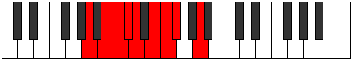 |
| [957](https://ianring.com/musictheory/scales/957) | [Phronyllic](ModeENaturalPhronyllic.md) | E | E, F#, G, G#, A, B, C, C#, E |  |
| [957](https://ianring.com/musictheory/scales/957) | [Phronyllic](ModeDSharpPhronyllic.md) | D# | D#, F, F#, G, G#, A#, B, C, D# |  |
| [957](https://ianring.com/musictheory/scales/957) | [Phronyllic](ModeEFlatPhronyllic.md) | Eb | Eb, F, Gb, G, Ab, Bb, B, C, Eb |  |
| [957](https://ianring.com/musictheory/scales/957) | [Phronyllic](ModeDNaturalPhronyllic.md) | D | D, E, F, F#, G, A, A#, B, D |  |
| [957](https://ianring.com/musictheory/scales/957) | [Phronyllic](ModeFSharpPhronyllic.md) | F# | F#, G#, A, A#, B, C#, D, D#, F# |  |
| [957](https://ianring.com/musictheory/scales/957) | [Phronyllic](ModeGFlatPhronyllic.md) | Gb | Gb, Ab, A, Bb, B, Db, D, Eb, Gb |  |
| [959](https://ianring.com/musictheory/scales/959) | [Katylygic](ModeBNaturalKatylygic.md) | B | B, C, C#, D, D#, E, F#, G, G#, B |  |
| [959](https://ianring.com/musictheory/scales/959) | [Katylygic](ModeENaturalKatylygic.md) | E | E, F, F#, G, G#, A, B, C, C#, E |  |
| [959](https://ianring.com/musictheory/scales/959) | [Katylygic](ModeASharpKatylygic.md) | A# | A#, B, C, C#, D, D#, F, F#, G, A# |  |
| [959](https://ianring.com/musictheory/scales/959) | [Katylygic](ModeBFlatKatylygic.md) | Bb | Bb, B, C, Db, D, Eb, F, Gb, G, Bb |  |
| [959](https://ianring.com/musictheory/scales/959) | [Katylygic](ModeDSharpKatylygic.md) | D# | D#, E, F, F#, G, G#, A#, B, C, D# |  |
| [959](https://ianring.com/musictheory/scales/959) | [Katylygic](ModeEFlatKatylygic.md) | Eb | Eb, E, F, Gb, G, Ab, Bb, B, C, Eb |  |
| [959](https://ianring.com/musictheory/scales/959) | [Katylygic](ModeANaturalKatylygic.md) | A | A, A#, B, C, C#, D, E, F, F#, A |  |
| [959](https://ianring.com/musictheory/scales/959) | [Katylygic](ModeDNaturalKatylygic.md) | D | D, D#, E, F, F#, G, A, A#, B, D |  |
| [959](https://ianring.com/musictheory/scales/959) | [Katylygic](ModeFSharpKatylygic.md) | F# | F#, G, G#, A, A#, B, C#, D, D#, F# |  |
| [959](https://ianring.com/musictheory/scales/959) | [Katylygic](ModeGFlatKatylygic.md) | Gb | Gb, G, Ab, A, Bb, B, Db, D, Eb, Gb |  |
| [965](https://ianring.com/musictheory/scales/965) | [Ionothimic](ModeBNaturalIonothimic.md) | B | B, C#, D###, E##, F##, G#, B |  |
| [965](https://ianring.com/musictheory/scales/965) | [Ionothimic](ModeANaturalIonothimic.md) | A | A, B, C###, D##, E#, F#, A |  |
| [965](https://ianring.com/musictheory/scales/965) | [Ionothimic](ModeENaturalIonothimic.md) | E | E, F#, G###, A##, B#, C#, E |  |
| [967](https://ianring.com/musictheory/scales/967) | [Aeolanian](ModeFNaturalAeolanian.md) | F | F, Gb, Abb, B, C, Db, Ebb, F |  |
| [967](https://ianring.com/musictheory/scales/967) | [Aeolanian](ModeBNaturalAeolanian.md) | B | B, C, Db, E#, F#, G, Ab, B |  |
| [967](https://ianring.com/musictheory/scales/967) | [Aeolanian](ModeENaturalAeolanian.md) | E | E, F, Gb, A#, B, C, Db, E |  |
| [967](https://ianring.com/musictheory/scales/967) | [Aeolanian](ModeASharpAeolanian.md) | A# | A#, B, C, D##, E#, F#, G, A# |  |
| [967](https://ianring.com/musictheory/scales/967) | [Aeolanian](ModeBFlatAeolanian.md) | Bb | Bb, Cb, Dbb, E, F, Gb, Abb, Bb |  |
| [967](https://ianring.com/musictheory/scales/967) | [Aeolanian](ModeANaturalAeolanian.md) | A | A, Bb, Cb, D#, E, F, Gb, A |  |
| [969](https://ianring.com/musictheory/scales/969) | [Ionogimic](ModeBNaturalIonogimic.md) | B | B, C##, D###, E##, F##, G#, B |  |
| [969](https://ianring.com/musictheory/scales/969) | [Ionogimic](ModeDSharpIonogimic.md) | D# | D#, E##, Cbbb, Cbb, Dbbb, Dbb, D# |  |
| [969](https://ianring.com/musictheory/scales/969) | [Ionogimic](ModeEFlatIonogimic.md) | Eb | Eb, F#, G##, A#, B, C, Eb |  |
| [971](https://ianring.com/musictheory/scales/971) | [Ladian](ModeFNaturalLadian.md) | F | F, Gb, Ab, B, C, Db, Ebb, F |  |
| [971](https://ianring.com/musictheory/scales/971) | [Ladian](ModeBNaturalLadian.md) | B | B, C, D, E#, F#, G, Ab, B |  |
| [971](https://ianring.com/musictheory/scales/971) | [Ladian](ModeASharpLadian.md) | A# | A#, B, C#, D##, E#, F#, G, A# |  |
| [971](https://ianring.com/musictheory/scales/971) | [Ladian](ModeBFlatLadian.md) | Bb | Bb, Cb, Db, E, F, Gb, Abb, Bb |  |
| [971](https://ianring.com/musictheory/scales/971) | [Ladian](ModeDSharpLadian.md) | D# | D#, E, F#, G##, A#, B, C, D# |  |
| [971](https://ianring.com/musictheory/scales/971) | [Ladian](ModeEFlatLadian.md) | Eb | Eb, Fb, Gb, A, Bb, Cb, Dbb, Eb |  |
| [973](https://ianring.com/musictheory/scales/973) | [Phryptian](ModeBNaturalPhryptian.md) | B | B, C#, D, E#, F#, G, Ab, B |  |
| [973](https://ianring.com/musictheory/scales/973) | [Phryptian](ModeANaturalPhryptian.md) | A | A, B, C, D#, E, F, Gb, A |  |
| [973](https://ianring.com/musictheory/scales/973) | [Phryptian](ModeENaturalPhryptian.md) | E | E, F#, G, A#, B, C, Db, E |  |
| [973](https://ianring.com/musictheory/scales/973) | [Phryptian](ModeDSharpPhryptian.md) | D# | D#, E#, F#, G##, A#, B, C, D# |  |
| [973](https://ianring.com/musictheory/scales/973) | [Phryptian](ModeEFlatPhryptian.md) | Eb | Eb, F, Gb, A, Bb, Cb, Dbb, Eb |  |
| [975](https://ianring.com/musictheory/scales/975) | [Katogyllic](ModeFNaturalKatogyllic.md) | F | F, F#, G, G#, B, C, C#, D, F |  |
| [975](https://ianring.com/musictheory/scales/975) | [Katogyllic](ModeBNaturalKatogyllic.md) | B | B, C, C#, D, F, F#, G, G#, B |  |
| [975](https://ianring.com/musictheory/scales/975) | [Katogyllic](ModeENaturalKatogyllic.md) | E | E, F, F#, G, A#, B, C, C#, E |  |
| [975](https://ianring.com/musictheory/scales/975) | [Katogyllic](ModeASharpKatogyllic.md) | A# | A#, B, C, C#, E, F, F#, G, A# |  |
| [975](https://ianring.com/musictheory/scales/975) | [Katogyllic](ModeBFlatKatogyllic.md) | Bb | Bb, B, C, Db, E, F, Gb, G, Bb |  |
| [975](https://ianring.com/musictheory/scales/975) | [Katogyllic](ModeDSharpKatogyllic.md) | D# | D#, E, F, F#, A, A#, B, C, D# |  |
| [975](https://ianring.com/musictheory/scales/975) | [Katogyllic](ModeEFlatKatogyllic.md) | Eb | Eb, E, F, Gb, A, Bb, B, C, Eb |  |
| [975](https://ianring.com/musictheory/scales/975) | [Katogyllic](ModeANaturalKatogyllic.md) | A | A, A#, B, C, D#, E, F, F#, A |  |
| [977](https://ianring.com/musictheory/scales/977) | [Kocrimic](ModeBNaturalKocrimic.md) | B | B, C###, D###, E##, F##, G#, B |  |
| [977](https://ianring.com/musictheory/scales/977) | [Kocrimic](ModeDNaturalKocrimic.md) | D | D, E##, F###, G##, A#, B, D |  |
| [979](https://ianring.com/musictheory/scales/979) | [Thogian](ModeBNaturalThogian.md) | B | B, C, D#, E#, F#, G, Ab, B |  |
| [979](https://ianring.com/musictheory/scales/979) | [Thogian](ModeFNaturalThogian.md) | F | F, Gb, A, B, C, Db, Ebb, F |  |
| [979](https://ianring.com/musictheory/scales/979) | [Thogian](ModeASharpThogian.md) | A# | A#, B, C##, D##, E#, F#, G, A# |  |
| [979](https://ianring.com/musictheory/scales/979) | [Thogian](ModeBFlatThogian.md) | Bb | Bb, Cb, D, E, F, Gb, Abb, Bb |  |
| [979](https://ianring.com/musictheory/scales/979) | [Thogian](ModeDNaturalThogian.md) | D | D, Eb, F#, G#, A, Bb, Cb, D |  |
| [981](https://ianring.com/musictheory/scales/981) | [Bacrian](ModeBNaturalBacrian.md) | B | B, C#, D#, E#, F#, G, Ab, B |  |
| [981](https://ianring.com/musictheory/scales/981) | [Bacrian](ModeANaturalBacrian.md) | A | A, B, C#, D#, E, F, Gb, A |  |
| [981](https://ianring.com/musictheory/scales/981) | [Bacrian](ModeENaturalBacrian.md) | E | E, F#, G#, A#, B, C, Db, E |  |
| [981](https://ianring.com/musictheory/scales/981) | [Bacrian](ModeDNaturalBacrian.md) | D | D, E, F#, G#, A, Bb, Cb, D |  |
| [983](https://ianring.com/musictheory/scales/983) | [Epygyllic](ModeBNaturalEpygyllic.md) | B | B, C, C#, D#, F, F#, G, G#, B |  |
| [983](https://ianring.com/musictheory/scales/983) | [Epygyllic](ModeFNaturalEpygyllic.md) | F | F, F#, G, A, B, C, C#, D, F |  |
| [983](https://ianring.com/musictheory/scales/983) | [Epygyllic](ModeASharpEpygyllic.md) | A# | A#, B, C, D, E, F, F#, G, A# |  |
| [983](https://ianring.com/musictheory/scales/983) | [Epygyllic](ModeBFlatEpygyllic.md) | Bb | Bb, B, C, D, E, F, Gb, G, Bb |  |
| [983](https://ianring.com/musictheory/scales/983) | [Epygyllic](ModeENaturalEpygyllic.md) | E | E, F, F#, G#, A#, B, C, C#, E |  |
| [983](https://ianring.com/musictheory/scales/983) | [Epygyllic](ModeANaturalEpygyllic.md) | A | A, A#, B, C#, D#, E, F, F#, A |  |
| [983](https://ianring.com/musictheory/scales/983) | [Epygyllic](ModeDNaturalEpygyllic.md) | D | D, D#, E, F#, G#, A, A#, B, D |  |
| [985](https://ianring.com/musictheory/scales/985) | [Raptian](ModeBNaturalRaptian.md) | B | B, C##, D#, E#, F#, G, Ab, B |  |
| [985](https://ianring.com/musictheory/scales/985) | [Raptian](ModeDSharpRaptian.md) | D# | D#, E##, F##, G##, A#, B, C, D# |  |
| [985](https://ianring.com/musictheory/scales/985) | [Raptian](ModeEFlatRaptian.md) | Eb | Eb, F#, G, A, Bb, Cb, Dbb, Eb |  |
| [985](https://ianring.com/musictheory/scales/985) | [Raptian](ModeDNaturalRaptian.md) | D | D, E#, F#, G#, A, Bb, Cb, D |  |
| [987](https://ianring.com/musictheory/scales/987) | [Aeraptyllic](ModeBNaturalAeraptyllic.md) | B | B, C, D, D#, F, F#, G, G#, B |  |
| [987](https://ianring.com/musictheory/scales/987) | [Aeraptyllic](ModeFNaturalAeraptyllic.md) | F | F, F#, G#, A, B, C, C#, D, F |  |
| [987](https://ianring.com/musictheory/scales/987) | [Aeraptyllic](ModeASharpAeraptyllic.md) | A# | A#, B, C#, D, E, F, F#, G, A# |  |
| [987](https://ianring.com/musictheory/scales/987) | [Aeraptyllic](ModeBFlatAeraptyllic.md) | Bb | Bb, B, Db, D, E, F, Gb, G, Bb |  |
| [987](https://ianring.com/musictheory/scales/987) | [Aeraptyllic](ModeDSharpAeraptyllic.md) | D# | D#, E, F#, G, A, A#, B, C, D# |  |
| [987](https://ianring.com/musictheory/scales/987) | [Aeraptyllic](ModeEFlatAeraptyllic.md) | Eb | Eb, E, Gb, G, A, Bb, B, C, Eb |  |
| [987](https://ianring.com/musictheory/scales/987) | [Aeraptyllic](ModeDNaturalAeraptyllic.md) | D | D, D#, F, F#, G#, A, A#, B, D |  |
| [989](https://ianring.com/musictheory/scales/989) | [Phrolyllic](ModeBNaturalPhrolyllic.md) | B | B, C#, D, D#, F, F#, G, G#, B |  |
| [989](https://ianring.com/musictheory/scales/989) | [Phrolyllic](ModeANaturalPhrolyllic.md) | A | A, B, C, C#, D#, E, F, F#, A |  |
| [989](https://ianring.com/musictheory/scales/989) | [Phrolyllic](ModeENaturalPhrolyllic.md) | E | E, F#, G, G#, A#, B, C, C#, E |  |
| [989](https://ianring.com/musictheory/scales/989) | [Phrolyllic](ModeDSharpPhrolyllic.md) | D# | D#, F, F#, G, A, A#, B, C, D# |  |
| [989](https://ianring.com/musictheory/scales/989) | [Phrolyllic](ModeEFlatPhrolyllic.md) | Eb | Eb, F, Gb, G, A, Bb, B, C, Eb |  |
| [989](https://ianring.com/musictheory/scales/989) | [Phrolyllic](ModeDNaturalPhrolyllic.md) | D | D, E, F, F#, G#, A, A#, B, D |  |
| [991](https://ianring.com/musictheory/scales/991) | [Aeolygic](ModeBNaturalAeolygic.md) | B | B, C, C#, D, D#, F, F#, G, G#, B |  |
| [991](https://ianring.com/musictheory/scales/991) | [Aeolygic](ModeFNaturalAeolygic.md) | F | F, F#, G, G#, A, B, C, C#, D, F |  |
| [991](https://ianring.com/musictheory/scales/991) | [Aeolygic](ModeASharpAeolygic.md) | A# | A#, B, C, C#, D, E, F, F#, G, A# |  |
| [991](https://ianring.com/musictheory/scales/991) | [Aeolygic](ModeBFlatAeolygic.md) | Bb | Bb, B, C, Db, D, E, F, Gb, G, Bb |  |
| [991](https://ianring.com/musictheory/scales/991) | [Aeolygic](ModeENaturalAeolygic.md) | E | E, F, F#, G, G#, A#, B, C, C#, E |  |
| [991](https://ianring.com/musictheory/scales/991) | [Aeolygic](ModeANaturalAeolygic.md) | A | A, A#, B, C, C#, D#, E, F, F#, A |  |
| [991](https://ianring.com/musictheory/scales/991) | [Aeolygic](ModeDSharpAeolygic.md) | D# | D#, E, F, F#, G, A, A#, B, C, D# |  |
| [991](https://ianring.com/musictheory/scales/991) | [Aeolygic](ModeEFlatAeolygic.md) | Eb | Eb, E, F, Gb, G, A, Bb, B, C, Eb |  |
| [991](https://ianring.com/musictheory/scales/991) | [Aeolygic](ModeDNaturalAeolygic.md) | D | D, D#, E, F, F#, G#, A, A#, B, D |  |
| [995](https://ianring.com/musictheory/scales/995) | [Phrathian](ModeFSharpPhrathian.md) | F# | F#, G, A##, B#, C#, D, Eb, F# |  |
| [995](https://ianring.com/musictheory/scales/995) | [Phrathian](ModeGFlatPhrathian.md) | Gb | Gb, Abb, B, C, Db, Ebb, Fbb, Gb |  |
| [995](https://ianring.com/musictheory/scales/995) | [Phrathian](ModeBNaturalPhrathian.md) | B | B, C, D##, E#, F#, G, Ab, B |  |
| [995](https://ianring.com/musictheory/scales/995) | [Phrathian](ModeFNaturalPhrathian.md) | F | F, Gb, A#, B, C, Db, Ebb, F |  |
| [995](https://ianring.com/musictheory/scales/995) | [Phrathian](ModeASharpPhrathian.md) | A# | A#, B, C###, D##, E#, F#, G, A# |  |
| [995](https://ianring.com/musictheory/scales/995) | [Phrathian](ModeBFlatPhrathian.md) | Bb | Bb, Cb, D#, E, F, Gb, Abb, Bb |  |
| [997](https://ianring.com/musictheory/scales/997) | [Rycrian](ModeFSharpRycrian.md) | F# | F#, G#, A##, B#, C#, D, Eb, F# |  |
| [997](https://ianring.com/musictheory/scales/997) | [Rycrian](ModeGFlatRycrian.md) | Gb | Gb, Ab, B, C, Db, Ebb, Fbb, Gb |  |
| [997](https://ianring.com/musictheory/scales/997) | [Rycrian](ModeBNaturalRycrian.md) | B | B, C#, D##, E#, F#, G, Ab, B |  |
| [997](https://ianring.com/musictheory/scales/997) | [Rycrian](ModeANaturalRycrian.md) | A | A, B, C##, D#, E, F, Gb, A |  |
| [997](https://ianring.com/musictheory/scales/997) | [Rycrian](ModeENaturalRycrian.md) | E | E, F#, G##, A#, B, C, Db, E |  |
| [999](https://ianring.com/musictheory/scales/999) | [Bylyllic](ModeFSharpBylyllic.md) | F# | F#, G, G#, B, C, C#, D, D#, F# |  |
| [999](https://ianring.com/musictheory/scales/999) | [Bylyllic](ModeGFlatBylyllic.md) | Gb | Gb, G, Ab, B, C, Db, D, Eb, Gb |  |
| [999](https://ianring.com/musictheory/scales/999) | [Bylyllic](ModeBNaturalBylyllic.md) | B | B, C, C#, E, F, F#, G, G#, B |  |
| [999](https://ianring.com/musictheory/scales/999) | [Bylyllic](ModeFNaturalBylyllic.md) | F | F, F#, G, A#, B, C, C#, D, F |  |
| [999](https://ianring.com/musictheory/scales/999) | [Bylyllic](ModeASharpBylyllic.md) | A# | A#, B, C, D#, E, F, F#, G, A# |  |
| [999](https://ianring.com/musictheory/scales/999) | [Bylyllic](ModeBFlatBylyllic.md) | Bb | Bb, B, C, Eb, E, F, Gb, G, Bb |  |
| [999](https://ianring.com/musictheory/scales/999) | [Bylyllic](ModeENaturalBylyllic.md) | E | E, F, F#, A, A#, B, C, C#, E |  |
| [999](https://ianring.com/musictheory/scales/999) | [Bylyllic](ModeANaturalBylyllic.md) | A | A, A#, B, D, D#, E, F, F#, A |  |
| [1001](https://ianring.com/musictheory/scales/1001) | [Badian](ModeBNaturalBadian.md) | B | B, C##, D##, E#, F#, G, Ab, B |  |
| [1001](https://ianring.com/musictheory/scales/1001) | [Badian](ModeFSharpBadian.md) | F# | F#, G##, A##, B#, C#, D, Eb, F# |  |
| [1001](https://ianring.com/musictheory/scales/1001) | [Badian](ModeGFlatBadian.md) | Gb | Gb, A, B, C, Db, Ebb, Fbb, Gb |  |
| [1001](https://ianring.com/musictheory/scales/1001) | [Badian](ModeDSharpBadian.md) | D# | D#, E##, F###, G##, A#, B, C, D# |  |
| [1001](https://ianring.com/musictheory/scales/1001) | [Badian](ModeEFlatBadian.md) | Eb | Eb, F#, G#, A, Bb, Cb, Dbb, Eb |  |
| [1003](https://ianring.com/musictheory/scales/1003) | [Ionyryllic](ModeBNaturalIonyryllic.md) | B | B, C, D, E, F, F#, G, G#, B |  |
| [1003](https://ianring.com/musictheory/scales/1003) | [Ionyryllic](ModeFSharpIonyryllic.md) | F# | F#, G, A, B, C, C#, D, D#, F# |  |
| [1003](https://ianring.com/musictheory/scales/1003) | [Ionyryllic](ModeGFlatIonyryllic.md) | Gb | Gb, G, A, B, C, Db, D, Eb, Gb |  |
| [1003](https://ianring.com/musictheory/scales/1003) | [Ionyryllic](ModeASharpIonyryllic.md) | A# | A#, B, C#, D#, E, F, F#, G, A# |  |
| [1003](https://ianring.com/musictheory/scales/1003) | [Ionyryllic](ModeBFlatIonyryllic.md) | Bb | Bb, B, Db, Eb, E, F, Gb, G, Bb |  |
| [1003](https://ianring.com/musictheory/scales/1003) | [Ionyryllic](ModeFNaturalIonyryllic.md) | F | F, F#, G#, A#, B, C, C#, D, F |  |
| [1003](https://ianring.com/musictheory/scales/1003) | [Ionyryllic](ModeDSharpIonyryllic.md) | D# | D#, E, F#, G#, A, A#, B, C, D# |  |
| [1003](https://ianring.com/musictheory/scales/1003) | [Ionyryllic](ModeEFlatIonyryllic.md) | Eb | Eb, E, Gb, Ab, A, Bb, B, C, Eb |  |
| [1005](https://ianring.com/musictheory/scales/1005) | [Radyllic](ModeBNaturalRadyllic.md) | B | B, C#, D, E, F, F#, G, G#, B |  |
| [1005](https://ianring.com/musictheory/scales/1005) | [Radyllic](ModeANaturalRadyllic.md) | A | A, B, C, D, D#, E, F, F#, A |  |
| [1005](https://ianring.com/musictheory/scales/1005) | [Radyllic](ModeFSharpRadyllic.md) | F# | F#, G#, A, B, C, C#, D, D#, F# |  |
| [1005](https://ianring.com/musictheory/scales/1005) | [Radyllic](ModeGFlatRadyllic.md) | Gb | Gb, Ab, A, B, C, Db, D, Eb, Gb |  |
| [1005](https://ianring.com/musictheory/scales/1005) | [Radyllic](ModeENaturalRadyllic.md) | E | E, F#, G, A, A#, B, C, C#, E |  |
| [1005](https://ianring.com/musictheory/scales/1005) | [Radyllic](ModeDSharpRadyllic.md) | D# | D#, F, F#, G#, A, A#, B, C, D# |  |
| [1005](https://ianring.com/musictheory/scales/1005) | [Radyllic](ModeEFlatRadyllic.md) | Eb | Eb, F, Gb, Ab, A, Bb, B, C, Eb |  |
| [1007](https://ianring.com/musictheory/scales/1007) | [Ionycrygic](ModeBNaturalIonycrygic.md) | B | B, C, C#, D, E, F, F#, G, G#, B |  |
| [1007](https://ianring.com/musictheory/scales/1007) | [Ionycrygic](ModeFSharpIonycrygic.md) | F# | F#, G, G#, A, B, C, C#, D, D#, F# |  |
| [1007](https://ianring.com/musictheory/scales/1007) | [Ionycrygic](ModeGFlatIonycrygic.md) | Gb | Gb, G, Ab, A, B, C, Db, D, Eb, Gb |  |
| [1007](https://ianring.com/musictheory/scales/1007) | [Ionycrygic](ModeASharpIonycrygic.md) | A# | A#, B, C, C#, D#, E, F, F#, G, A# |  |
| [1007](https://ianring.com/musictheory/scales/1007) | [Ionycrygic](ModeBFlatIonycrygic.md) | Bb | Bb, B, C, Db, Eb, E, F, Gb, G, Bb |  |
| [1007](https://ianring.com/musictheory/scales/1007) | [Ionycrygic](ModeFNaturalIonycrygic.md) | F | F, F#, G, G#, A#, B, C, C#, D, F |  |
| [1007](https://ianring.com/musictheory/scales/1007) | [Ionycrygic](ModeANaturalIonycrygic.md) | A | A, A#, B, C, D, D#, E, F, F#, A |  |
| [1007](https://ianring.com/musictheory/scales/1007) | [Ionycrygic](ModeENaturalIonycrygic.md) | E | E, F, F#, G, A, A#, B, C, C#, E |  |
| [1007](https://ianring.com/musictheory/scales/1007) | [Ionycrygic](ModeDSharpIonycrygic.md) | D# | D#, E, F, F#, G#, A, A#, B, C, D# |  |
| [1007](https://ianring.com/musictheory/scales/1007) | [Ionycrygic](ModeEFlatIonycrygic.md) | Eb | Eb, E, F, Gb, Ab, A, Bb, B, C, Eb |  |
| [1009](https://ianring.com/musictheory/scales/1009) | [Katyptian](ModeBNaturalKatyptian.md) | B | B, C###, D##, E#, F#, G, Ab, B |  |
| [1009](https://ianring.com/musictheory/scales/1009) | [Katyptian](ModeFSharpKatyptian.md) | F# | F#, G###, A##, B#, C#, D, Eb, F# |  |
| [1009](https://ianring.com/musictheory/scales/1009) | [Katyptian](ModeGFlatKatyptian.md) | Gb | Gb, A#, B, C, Db, Ebb, Fbb, Gb |  |
| [1009](https://ianring.com/musictheory/scales/1009) | [Katyptian](ModeDNaturalKatyptian.md) | D | D, E##, F##, G#, A, Bb, Cb, D |  |
| [1011](https://ianring.com/musictheory/scales/1011) | [Kycryllic](ModeBNaturalKycryllic.md) | B | B, C, D#, E, F, F#, G, G#, B |  |
| [1011](https://ianring.com/musictheory/scales/1011) | [Kycryllic](ModeFSharpKycryllic.md) | F# | F#, G, A#, B, C, C#, D, D#, F# |  |
| [1011](https://ianring.com/musictheory/scales/1011) | [Kycryllic](ModeGFlatKycryllic.md) | Gb | Gb, G, Bb, B, C, Db, D, Eb, Gb |  |
| [1011](https://ianring.com/musictheory/scales/1011) | [Kycryllic](ModeASharpKycryllic.md) | A# | A#, B, D, D#, E, F, F#, G, A# |  |
| [1011](https://ianring.com/musictheory/scales/1011) | [Kycryllic](ModeBFlatKycryllic.md) | Bb | Bb, B, D, Eb, E, F, Gb, G, Bb |  |
| [1011](https://ianring.com/musictheory/scales/1011) | [Kycryllic](ModeFNaturalKycryllic.md) | F | F, F#, A, A#, B, C, C#, D, F |  |
| [1011](https://ianring.com/musictheory/scales/1011) | [Kycryllic](ModeDNaturalKycryllic.md) | D | D, D#, F#, G, G#, A, A#, B, D |  |
| [1013](https://ianring.com/musictheory/scales/1013) | [Stydyllic](ModeBNaturalStydyllic.md) | B | B, C#, D#, E, F, F#, G, G#, B |  |
| [1013](https://ianring.com/musictheory/scales/1013) | [Stydyllic](ModeANaturalStydyllic.md) | A | A, B, C#, D, D#, E, F, F#, A |  |
| [1013](https://ianring.com/musictheory/scales/1013) | [Stydyllic](ModeFSharpStydyllic.md) | F# | F#, G#, A#, B, C, C#, D, D#, F# |  |
| [1013](https://ianring.com/musictheory/scales/1013) | [Stydyllic](ModeGFlatStydyllic.md) | Gb | Gb, Ab, Bb, B, C, Db, D, Eb, Gb |  |
| [1013](https://ianring.com/musictheory/scales/1013) | [Stydyllic](ModeENaturalStydyllic.md) | E | E, F#, G#, A, A#, B, C, C#, E |  |
| [1013](https://ianring.com/musictheory/scales/1013) | [Stydyllic](ModeDNaturalStydyllic.md) | D | D, E, F#, G, G#, A, A#, B, D |  |
| [1015](https://ianring.com/musictheory/scales/1015) | [Ionodygic](ModeBNaturalIonodygic.md) | B | B, C, C#, D#, E, F, F#, G, G#, B |  |
| [1015](https://ianring.com/musictheory/scales/1015) | [Ionodygic](ModeASharpIonodygic.md) | A# | A#, B, C, D, D#, E, F, F#, G, A# |  |
| [1015](https://ianring.com/musictheory/scales/1015) | [Ionodygic](ModeBFlatIonodygic.md) | Bb | Bb, B, C, D, Eb, E, F, Gb, G, Bb |  |
| [1015](https://ianring.com/musictheory/scales/1015) | [Ionodygic](ModeFSharpIonodygic.md) | F# | F#, G, G#, A#, B, C, C#, D, D#, F# |  |
| [1015](https://ianring.com/musictheory/scales/1015) | [Ionodygic](ModeGFlatIonodygic.md) | Gb | Gb, G, Ab, Bb, B, C, Db, D, Eb, Gb |  |
| [1015](https://ianring.com/musictheory/scales/1015) | [Ionodygic](ModeANaturalIonodygic.md) | A | A, A#, B, C#, D, D#, E, F, F#, A |  |
| [1015](https://ianring.com/musictheory/scales/1015) | [Ionodygic](ModeFNaturalIonodygic.md) | F | F, F#, G, A, A#, B, C, C#, D, F |  |
| [1015](https://ianring.com/musictheory/scales/1015) | [Ionodygic](ModeENaturalIonodygic.md) | E | E, F, F#, G#, A, A#, B, C, C#, E |  |
| [1015](https://ianring.com/musictheory/scales/1015) | [Ionodygic](ModeDNaturalIonodygic.md) | D | D, D#, E, F#, G, G#, A, A#, B, D |  |
| [1017](https://ianring.com/musictheory/scales/1017) | [Dythyllic](ModeBNaturalDythyllic.md) | B | B, D, D#, E, F, F#, G, G#, B |  |
| [1017](https://ianring.com/musictheory/scales/1017) | [Dythyllic](ModeFSharpDythyllic.md) | F# | F#, A, A#, B, C, C#, D, D#, F# |  |
| [1017](https://ianring.com/musictheory/scales/1017) | [Dythyllic](ModeGFlatDythyllic.md) | Gb | Gb, A, Bb, B, C, Db, D, Eb, Gb |  |
| [1017](https://ianring.com/musictheory/scales/1017) | [Dythyllic](ModeDSharpDythyllic.md) | D# | D#, F#, G, G#, A, A#, B, C, D# |  |
| [1017](https://ianring.com/musictheory/scales/1017) | [Dythyllic](ModeEFlatDythyllic.md) | Eb | Eb, Gb, G, Ab, A, Bb, B, C, Eb |  |
| [1017](https://ianring.com/musictheory/scales/1017) | [Dythyllic](ModeDNaturalDythyllic.md) | D | D, F, F#, G, G#, A, A#, B, D |  |
| [1019](https://ianring.com/musictheory/scales/1019) | [Aeranygic](ModeBNaturalAeranygic.md) | B | B, C, D, D#, E, F, F#, G, G#, B |  |
| [1019](https://ianring.com/musictheory/scales/1019) | [Aeranygic](ModeASharpAeranygic.md) | A# | A#, B, C#, D, D#, E, F, F#, G, A# |  |
| [1019](https://ianring.com/musictheory/scales/1019) | [Aeranygic](ModeBFlatAeranygic.md) | Bb | Bb, B, Db, D, Eb, E, F, Gb, G, Bb |  |
| [1019](https://ianring.com/musictheory/scales/1019) | [Aeranygic](ModeFSharpAeranygic.md) | F# | F#, G, A, A#, B, C, C#, D, D#, F# |  |
| [1019](https://ianring.com/musictheory/scales/1019) | [Aeranygic](ModeGFlatAeranygic.md) | Gb | Gb, G, A, Bb, B, C, Db, D, Eb, Gb |  |
| [1019](https://ianring.com/musictheory/scales/1019) | [Aeranygic](ModeFNaturalAeranygic.md) | F | F, F#, G#, A, A#, B, C, C#, D, F |  |
| [1019](https://ianring.com/musictheory/scales/1019) | [Aeranygic](ModeDSharpAeranygic.md) | D# | D#, E, F#, G, G#, A, A#, B, C, D# |  |
| [1019](https://ianring.com/musictheory/scales/1019) | [Aeranygic](ModeEFlatAeranygic.md) | Eb | Eb, E, Gb, G, Ab, A, Bb, B, C, Eb |  |
| [1019](https://ianring.com/musictheory/scales/1019) | [Aeranygic](ModeDNaturalAeranygic.md) | D | D, D#, F, F#, G, G#, A, A#, B, D |  |
| [1021](https://ianring.com/musictheory/scales/1021) | [Ladygic](ModeBNaturalLadygic.md) | B | B, C#, D, D#, E, F, F#, G, G#, B |  |
| [1021](https://ianring.com/musictheory/scales/1021) | [Ladygic](ModeANaturalLadygic.md) | A | A, B, C, C#, D, D#, E, F, F#, A |  |
| [1021](https://ianring.com/musictheory/scales/1021) | [Ladygic](ModeFSharpLadygic.md) | F# | F#, G#, A, A#, B, C, C#, D, D#, F# |  |
| [1021](https://ianring.com/musictheory/scales/1021) | [Ladygic](ModeGFlatLadygic.md) | Gb | Gb, Ab, A, Bb, B, C, Db, D, Eb, Gb |  |
| [1021](https://ianring.com/musictheory/scales/1021) | [Ladygic](ModeENaturalLadygic.md) | E | E, F#, G, G#, A, A#, B, C, C#, E |  |
| [1021](https://ianring.com/musictheory/scales/1021) | [Ladygic](ModeDSharpLadygic.md) | D# | D#, F, F#, G, G#, A, A#, B, C, D# |  |
| [1021](https://ianring.com/musictheory/scales/1021) | [Ladygic](ModeEFlatLadygic.md) | Eb | Eb, F, Gb, G, Ab, A, Bb, B, C, Eb |  |
| [1021](https://ianring.com/musictheory/scales/1021) | [Ladygic](ModeDNaturalLadygic.md) | D | D, E, F, F#, G, G#, A, A#, B, D |  |
| [1023](https://ianring.com/musictheory/scales/1023) | [Dodyllian](ModeBNaturalDodyllian.md) | B | B, C, C#, D, D#, E, F, F#, G, G#, B |  |
| [1023](https://ianring.com/musictheory/scales/1023) | [Dodyllian](ModeASharpDodyllian.md) | A# | A#, B, C, C#, D, D#, E, F, F#, G, A# |  |
| [1023](https://ianring.com/musictheory/scales/1023) | [Dodyllian](ModeBFlatDodyllian.md) | Bb | Bb, B, C, Db, D, Eb, E, F, Gb, G, Bb |  |
| [1023](https://ianring.com/musictheory/scales/1023) | [Dodyllian](ModeANaturalDodyllian.md) | A | A, A#, B, C, C#, D, D#, E, F, F#, A |  |
| [1023](https://ianring.com/musictheory/scales/1023) | [Dodyllian](ModeFSharpDodyllian.md) | F# | F#, G, G#, A, A#, B, C, C#, D, D#, F# |  |
| [1023](https://ianring.com/musictheory/scales/1023) | [Dodyllian](ModeGFlatDodyllian.md) | Gb | Gb, G, Ab, A, Bb, B, C, Db, D, Eb, Gb |  |
| [1023](https://ianring.com/musictheory/scales/1023) | [Dodyllian](ModeFNaturalDodyllian.md) | F | F, F#, G, G#, A, A#, B, C, C#, D, F |  |
| [1023](https://ianring.com/musictheory/scales/1023) | [Dodyllian](ModeENaturalDodyllian.md) | E | E, F, F#, G, G#, A, A#, B, C, C#, E |  |
| [1023](https://ianring.com/musictheory/scales/1023) | [Dodyllian](ModeDSharpDodyllian.md) | D# | D#, E, F, F#, G, G#, A, A#, B, C, D# |  |
| [1023](https://ianring.com/musictheory/scales/1023) | [Dodyllian](ModeEFlatDodyllian.md) | Eb | Eb, E, F, Gb, G, Ab, A, Bb, B, C, Eb |  |
| [1023](https://ianring.com/musictheory/scales/1023) | [Dodyllian](ModeDNaturalDodyllian.md) | D | D, D#, E, F, F#, G, G#, A, A#, B, D |  |
| [1095](https://ianring.com/musictheory/scales/1095) | [Phrythitonic](ModeFNaturalPhrythitonic.md) | F | F, F#, G, B, D#, F |  |
| [1097](https://ianring.com/musictheory/scales/1097) | [Aeraphic](ModeGSharpAeraphic.md) | G# | G#, B, D, F#, G# |  |
| [1097](https://ianring.com/musictheory/scales/1097) | [Aeraphic](ModeAFlatAeraphic.md) | Ab | Ab, B, D, Gb, Ab |  |
| [1099](https://ianring.com/musictheory/scales/1099) | [Dyritonic](ModeFNaturalDyritonic.md) | F | F, F#, G#, B, D#, F |  |
| [1099](https://ianring.com/musictheory/scales/1099) | [Dyritonic](ModeGSharpDyritonic.md) | G# | G#, A, B, D, F#, G# |  |
| [1099](https://ianring.com/musictheory/scales/1099) | [Dyritonic](ModeAFlatDyritonic.md) | Ab | Ab, A, B, D, Gb, Ab |  |
| [1101](https://ianring.com/musictheory/scales/1101) | [Stothitonic](ModeGSharpStothitonic.md) | G# | G#, A#, B, D, F#, G# |  |
| [1101](https://ianring.com/musictheory/scales/1101) | [Stothitonic](ModeAFlatStothitonic.md) | Ab | Ab, Bb, B, D, Gb, Ab |  |
| [1103](https://ianring.com/musictheory/scales/1103) | [Lynimic](ModeFNaturalLynimic.md) | F | F, Gb, Abb, Bbbb, Cb, D#, F |  |
| [1103](https://ianring.com/musictheory/scales/1103) | [Lynimic](ModeGSharpLynimic.md) | G# | G#, A, Bb, Cb, D, E##, G# |  |
| [1103](https://ianring.com/musictheory/scales/1103) | [Lynimic](ModeAFlatLynimic.md) | Ab | Ab, Bbb, Cbb, Dbbb, Ebb, F#, Ab |  |
| [1107](https://ianring.com/musictheory/scales/1107) | [Mogitonic](ModeFNaturalMogitonic.md) | F | F, F#, A, B, D#, F |  |
| [1111](https://ianring.com/musictheory/scales/1111) | [Sycrimic](ModeFNaturalSycrimic.md) | F | F, Gb, Abb, Bbb, Cb, D#, F |  |
| [1113](https://ianring.com/musictheory/scales/1113) | [Aeronitonic](ModeGSharpAeronitonic.md) | G# | G#, B, C, D, F#, G# |  |
| [1113](https://ianring.com/musictheory/scales/1113) | [Aeronitonic](ModeAFlatAeronitonic.md) | Ab | Ab, B, C, D, Gb, Ab |  |
| [1115](https://ianring.com/musictheory/scales/1115) | [Locrimic](ModeGSharpLocrimic.md) | G# | G#, A, B, C, D, E##, G# |  |
| [1115](https://ianring.com/musictheory/scales/1115) | [Locrimic](ModeAFlatLocrimic.md) | Ab | Ab, Bbb, Cb, Dbb, Ebb, F#, Ab |  |
| [1115](https://ianring.com/musictheory/scales/1115) | [Locrimic](ModeFNaturalLocrimic.md) | F | F, Gb, Ab, Bbb, Cb, D#, F |  |
| [1117](https://ianring.com/musictheory/scales/1117) | [Raptimic](ModeGSharpRaptimic.md) | G# | G#, A#, B, C, D, E##, G# |  |
| [1117](https://ianring.com/musictheory/scales/1117) | [Raptimic](ModeAFlatRaptimic.md) | Ab | Ab, Bb, Cb, Dbb, Ebb, F#, Ab |  |
| [1119](https://ianring.com/musictheory/scales/1119) | [Rarian](ModeFNaturalRarian.md) | F | F, Gb, Abb, Bbbb, Cbbb, Dbbb, Eb, F |  |
| [1119](https://ianring.com/musictheory/scales/1119) | [Rarian](ModeGSharpRarian.md) | G# | G#, A, Bb, Cb, Dbb, Ebb, F#, G# |  |
| [1119](https://ianring.com/musictheory/scales/1119) | [Rarian](ModeAFlatRarian.md) | Ab | Ab, Bbb, Cbb, Dbbb, Dbb, Ebb, F#, Ab |  |
| [1123](https://ianring.com/musictheory/scales/1123) | [Lanitonic](ModeCSharpLanitonic.md) | C# | C#, D, F#, G, B, C# |  |
| [1123](https://ianring.com/musictheory/scales/1123) | [Lanitonic](ModeDFlatLanitonic.md) | Db | Db, D, Gb, G, B, Db |  |
| [1123](https://ianring.com/musictheory/scales/1123) | [Lanitonic](ModeFSharpLanitonic.md) | F# | F#, G, B, C, E, F# |  |
| [1123](https://ianring.com/musictheory/scales/1123) | [Lanitonic](ModeGFlatLanitonic.md) | Gb | Gb, G, B, C, E, Gb |  |
| [1123](https://ianring.com/musictheory/scales/1123) | [Lanitonic](ModeFNaturalLanitonic.md) | F | F, F#, A#, B, D#, F |  |
| [1125](https://ianring.com/musictheory/scales/1125) | [Ionaritonic](ModeCSharpIonaritonic.md) | C# | C#, D#, F#, G, B, C# |  |
| [1125](https://ianring.com/musictheory/scales/1125) | [Ionaritonic](ModeDFlatIonaritonic.md) | Db | Db, Eb, Gb, G, B, Db |  |
| [1125](https://ianring.com/musictheory/scales/1125) | [Ionaritonic](ModeFSharpIonaritonic.md) | F# | F#, G#, B, C, E, F# |  |
| [1125](https://ianring.com/musictheory/scales/1125) | [Ionaritonic](ModeGFlatIonaritonic.md) | Gb | Gb, Ab, B, C, E, Gb |  |
| [1127](https://ianring.com/musictheory/scales/1127) | [Eparimic](ModeCSharpEparimic.md) | C# | C#, D, Eb, F#, G, A##, C# |  |
| [1127](https://ianring.com/musictheory/scales/1127) | [Eparimic](ModeDFlatEparimic.md) | Db | Db, Ebb, Fbb, Gb, Abb, B, Db |  |
| [1127](https://ianring.com/musictheory/scales/1127) | [Eparimic](ModeFSharpEparimic.md) | F# | F#, G, Ab, B, C, D##, F# |  |
| [1127](https://ianring.com/musictheory/scales/1127) | [Eparimic](ModeGFlatEparimic.md) | Gb | Gb, Abb, Bbbb, Cb, Dbb, E, Gb |  |
| [1127](https://ianring.com/musictheory/scales/1127) | [Eparimic](ModeFNaturalEparimic.md) | F | F, Gb, Abb, Bb, Cb, D#, F |  |
| [1129](https://ianring.com/musictheory/scales/1129) | [Phrynitonic](ModeCSharpPhrynitonic.md) | C# | C#, E, F#, G, B, C# |  |
| [1129](https://ianring.com/musictheory/scales/1129) | [Phrynitonic](ModeDFlatPhrynitonic.md) | Db | Db, E, Gb, G, B, Db |  |
| [1129](https://ianring.com/musictheory/scales/1129) | [Phrynitonic](ModeGSharpPhrynitonic.md) | G# | G#, B, C#, D, F#, G# |  |
| [1129](https://ianring.com/musictheory/scales/1129) | [Phrynitonic](ModeAFlatPhrynitonic.md) | Ab | Ab, B, Db, D, Gb, Ab |  |
| [1129](https://ianring.com/musictheory/scales/1129) | [Phrynitonic](ModeFSharpPhrynitonic.md) | F# | F#, A, B, C, E, F# |  |
| [1129](https://ianring.com/musictheory/scales/1129) | [Phrynitonic](ModeGFlatPhrynitonic.md) | Gb | Gb, A, B, C, E, Gb |  |
| [1131](https://ianring.com/musictheory/scales/1131) | [Thocrimic](ModeCSharpThocrimic.md) | C# | C#, D, E, F#, G, A##, C# |  |
| [1131](https://ianring.com/musictheory/scales/1131) | [Thocrimic](ModeDFlatThocrimic.md) | Db | Db, Ebb, Fb, Gb, Abb, B, Db |  |
| [1131](https://ianring.com/musictheory/scales/1131) | [Thocrimic](ModeFSharpThocrimic.md) | F# | F#, G, A, B, C, D##, F# |  |
| [1131](https://ianring.com/musictheory/scales/1131) | [Thocrimic](ModeGFlatThocrimic.md) | Gb | Gb, Abb, Bbb, Cb, Dbb, E, Gb |  |
| [1131](https://ianring.com/musictheory/scales/1131) | [Thocrimic](ModeGSharpThocrimic.md) | G# | G#, A, B, C#, D, E##, G# |  |
| [1131](https://ianring.com/musictheory/scales/1131) | [Thocrimic](ModeAFlatThocrimic.md) | Ab | Ab, Bbb, Cb, Db, Ebb, F#, Ab |  |
| [1131](https://ianring.com/musictheory/scales/1131) | [Thocrimic](ModeFNaturalThocrimic.md) | F | F, Gb, Ab, Bb, Cb, D#, F |  |
| [1133](https://ianring.com/musictheory/scales/1133) | [Stycrimic](ModeCSharpStycrimic.md) | C# | C#, D#, E, F#, G, A##, C# |  |
| [1133](https://ianring.com/musictheory/scales/1133) | [Stycrimic](ModeDFlatStycrimic.md) | Db | Db, Eb, Fb, Gb, Abb, B, Db |  |
| [1133](https://ianring.com/musictheory/scales/1133) | [Stycrimic](ModeFSharpStycrimic.md) | F# | F#, G#, A, B, C, D##, F# |  |
| [1133](https://ianring.com/musictheory/scales/1133) | [Stycrimic](ModeGFlatStycrimic.md) | Gb | Gb, Ab, Bbb, Cb, Dbb, E, Gb |  |
| [1133](https://ianring.com/musictheory/scales/1133) | [Stycrimic](ModeGSharpStycrimic.md) | G# | G#, A#, B, C#, D, E##, G# |  |
| [1133](https://ianring.com/musictheory/scales/1133) | [Stycrimic](ModeAFlatStycrimic.md) | Ab | Ab, Bb, Cb, Db, Ebb, F#, Ab |  |
| [1135](https://ianring.com/musictheory/scales/1135) | [Katolian](ModeCSharpKatolian.md) | C# | C#, D, Eb, Fb, Gb, Abb, B, C# |  |
| [1135](https://ianring.com/musictheory/scales/1135) | [Katolian](ModeDFlatKatolian.md) | Db | Db, Ebb, Fbb, Gbbb, Abbb, E###, Cb, Db |  |
| [1135](https://ianring.com/musictheory/scales/1135) | [Katolian](ModeFSharpKatolian.md) | F# | F#, G, Ab, Bbb, Cb, Dbb, E, F# |  |
| [1135](https://ianring.com/musictheory/scales/1135) | [Katolian](ModeGFlatKatolian.md) | Gb | Gb, Abb, Bbbb, Cbbb, Dbbb, Dbb, E, Gb |  |
| [1135](https://ianring.com/musictheory/scales/1135) | [Katolian](ModeFNaturalKatolian.md) | F | F, Gb, Abb, Bbbb, Cbb, Dbbb, Eb, F |  |
| [1135](https://ianring.com/musictheory/scales/1135) | [Katolian](ModeGSharpKatolian.md) | G# | G#, A, Bb, Cb, Db, Ebb, F#, G# |  |
| [1135](https://ianring.com/musictheory/scales/1135) | [Katolian](ModeAFlatKatolian.md) | Ab | Ab, Bbb, Cbb, Dbbb, Ebbb, Fbbb, Gb, Ab |  |
| [1137](https://ianring.com/musictheory/scales/1137) | [Stonitonic](ModeCSharpStonitonic.md) | C# | C#, F, F#, G, B, C# |  |
| [1137](https://ianring.com/musictheory/scales/1137) | [Stonitonic](ModeDFlatStonitonic.md) | Db | Db, F, Gb, G, B, Db |  |
| [1137](https://ianring.com/musictheory/scales/1137) | [Stonitonic](ModeFSharpStonitonic.md) | F# | F#, A#, B, C, E, F# |  |
| [1137](https://ianring.com/musictheory/scales/1137) | [Stonitonic](ModeGFlatStonitonic.md) | Gb | Gb, Bb, B, C, E, Gb |  |
| [1139](https://ianring.com/musictheory/scales/1139) | [Aerygimic](ModeCSharpAerygimic.md) | C# | C#, D, E#, F#, G, A##, C# |  |
| [1139](https://ianring.com/musictheory/scales/1139) | [Aerygimic](ModeDFlatAerygimic.md) | Db | Db, Ebb, F, Gb, Abb, B, Db |  |
| [1139](https://ianring.com/musictheory/scales/1139) | [Aerygimic](ModeFSharpAerygimic.md) | F# | F#, G, A#, B, C, D##, F# |  |
| [1139](https://ianring.com/musictheory/scales/1139) | [Aerygimic](ModeGFlatAerygimic.md) | Gb | Gb, Abb, Bb, Cb, Dbb, E, Gb |  |
| [1139](https://ianring.com/musictheory/scales/1139) | [Aerygimic](ModeFNaturalAerygimic.md) | F | F, Gb, A, Bb, Cb, D#, F |  |
| [1141](https://ianring.com/musictheory/scales/1141) | [Rynimic](ModeCSharpRynimic.md) | C# | C#, D#, E#, F#, G, A##, C# |  |
| [1141](https://ianring.com/musictheory/scales/1141) | [Rynimic](ModeDFlatRynimic.md) | Db | Db, Eb, F, Gb, Abb, B, Db |  |
| [1141](https://ianring.com/musictheory/scales/1141) | [Rynimic](ModeFSharpRynimic.md) | F# | F#, G#, A#, B, C, D##, F# |  |
| [1141](https://ianring.com/musictheory/scales/1141) | [Rynimic](ModeGFlatRynimic.md) | Gb | Gb, Ab, Bb, Cb, Dbb, E, Gb |  |
| [1143](https://ianring.com/musictheory/scales/1143) | [Styrian](ModeCSharpStyrian.md) | C# | C#, D, Eb, F, Gb, Abb, B, C# |  |
| [1143](https://ianring.com/musictheory/scales/1143) | [Styrian](ModeDFlatStyrian.md) | Db | Db, Ebb, Fbb, Gbb, Abbb, E###, Cb, Db |  |
| [1143](https://ianring.com/musictheory/scales/1143) | [Styrian](ModeFSharpStyrian.md) | F# | F#, G, Ab, Bb, Cb, Dbb, E, F# |  |
| [1143](https://ianring.com/musictheory/scales/1143) | [Styrian](ModeGFlatStyrian.md) | Gb | Gb, Abb, Bbbb, Cbb, Dbbb, Dbb, E, Gb |  |
| [1143](https://ianring.com/musictheory/scales/1143) | [Styrian](ModeFNaturalStyrian.md) | F | F, Gb, Abb, Bbb, Cbb, Dbbb, Eb, F |  |
| [1145](https://ianring.com/musictheory/scales/1145) | [Zygimic](ModeCSharpZygimic.md) | C# | C#, D##, E#, F#, G, A##, C# |  |
| [1145](https://ianring.com/musictheory/scales/1145) | [Zygimic](ModeDFlatZygimic.md) | Db | Db, E, F, Gb, Abb, B, Db |  |
| [1145](https://ianring.com/musictheory/scales/1145) | [Zygimic](ModeGSharpZygimic.md) | G# | G#, A##, B#, C#, D, E##, G# |  |
| [1145](https://ianring.com/musictheory/scales/1145) | [Zygimic](ModeAFlatZygimic.md) | Ab | Ab, B, C, Db, Ebb, F#, Ab |  |
| [1145](https://ianring.com/musictheory/scales/1145) | [Zygimic](ModeFSharpZygimic.md) | F# | F#, G##, A#, B, C, D##, F# |  |
| [1145](https://ianring.com/musictheory/scales/1145) | [Zygimic](ModeGFlatZygimic.md) | Gb | Gb, A, Bb, Cb, Dbb, E, Gb |  |
| [1147](https://ianring.com/musictheory/scales/1147) | [Epynian](ModeCSharpEpynian.md) | C# | C#, D, E, F, Gb, Abb, B, C# |  |
| [1147](https://ianring.com/musictheory/scales/1147) | [Epynian](ModeDFlatEpynian.md) | Db | Db, Ebb, Fb, Gbb, Abbb, E###, Cb, Db |  |
| [1147](https://ianring.com/musictheory/scales/1147) | [Epynian](ModeGSharpEpynian.md) | G# | G#, A, B, C, Db, Ebb, F#, G# |  |
| [1147](https://ianring.com/musictheory/scales/1147) | [Epynian](ModeAFlatEpynian.md) | Ab | Ab, Bbb, Cb, Dbb, Ebbb, Fbbb, Gb, Ab |  |
| [1147](https://ianring.com/musictheory/scales/1147) | [Epynian](ModeFSharpEpynian.md) | F# | F#, G, A, Bb, Cb, Dbb, E, F# |  |
| [1147](https://ianring.com/musictheory/scales/1147) | [Epynian](ModeGFlatEpynian.md) | Gb | Gb, Abb, Bbb, Cbb, Dbbb, Dbb, E, Gb |  |
| [1147](https://ianring.com/musictheory/scales/1147) | [Epynian](ModeFNaturalEpynian.md) | F | F, Gb, Ab, Bbb, Cbb, Dbbb, Eb, F |  |
| [1149](https://ianring.com/musictheory/scales/1149) | [Bydian](ModeCSharpBydian.md) | C# | C#, D#, E, F, Gb, Abb, B, C# |  |
| [1149](https://ianring.com/musictheory/scales/1149) | [Bydian](ModeDFlatBydian.md) | Db | Db, Eb, Fb, Gbb, Abbb, E###, Cb, Db |  |
| [1149](https://ianring.com/musictheory/scales/1149) | [Bydian](ModeGSharpBydian.md) | G# | G#, A#, B, C, Db, Ebb, F#, G# |  |
| [1149](https://ianring.com/musictheory/scales/1149) | [Bydian](ModeAFlatBydian.md) | Ab | Ab, Bb, Cb, Dbb, Ebbb, Fbbb, Gb, Ab |  |
| [1149](https://ianring.com/musictheory/scales/1149) | [Bydian](ModeFSharpBydian.md) | F# | F#, G#, A, Bb, Cb, Dbb, E, F# |  |
| [1149](https://ianring.com/musictheory/scales/1149) | [Bydian](ModeGFlatBydian.md) | Gb | Gb, Ab, Bbb, Cbb, Dbbb, Dbb, E, Gb |  |
| [1151](https://ianring.com/musictheory/scales/1151) | [Mythyllic](ModeCSharpMythyllic.md) | C# | C#, D, D#, E, F, F#, G, B, C# |  |
| [1151](https://ianring.com/musictheory/scales/1151) | [Mythyllic](ModeDFlatMythyllic.md) | Db | Db, D, Eb, E, F, Gb, G, B, Db |  |
| [1151](https://ianring.com/musictheory/scales/1151) | [Mythyllic](ModeGSharpMythyllic.md) | G# | G#, A, A#, B, C, C#, D, F#, G# |  |
| [1151](https://ianring.com/musictheory/scales/1151) | [Mythyllic](ModeAFlatMythyllic.md) | Ab | Ab, A, Bb, B, C, Db, D, Gb, Ab |  |
| [1151](https://ianring.com/musictheory/scales/1151) | [Mythyllic](ModeFSharpMythyllic.md) | F# | F#, G, G#, A, A#, B, C, E, F# |  |
| [1151](https://ianring.com/musictheory/scales/1151) | [Mythyllic](ModeGFlatMythyllic.md) | Gb | Gb, G, Ab, A, Bb, B, C, E, Gb |  |
| [1151](https://ianring.com/musictheory/scales/1151) | [Mythyllic](ModeFNaturalMythyllic.md) | F | F, F#, G, G#, A, A#, B, D#, F |  |
| [1161](https://ianring.com/musictheory/scales/1161) | [Eporic](ModeGSharpEporic.md) | G# | G#, B, D#, F#, G# |  |
| [1161](https://ianring.com/musictheory/scales/1161) | [Eporic](ModeAFlatEporic.md) | Ab | Ab, B, Eb, Gb, Ab |  |
| [1161](https://ianring.com/musictheory/scales/1161) | [Eporic](ModeBNaturalEporic.md) | B | B, D, F#, A, B |  |
| [1163](https://ianring.com/musictheory/scales/1163) | [Pagitonic](ModeBNaturalPagitonic.md) | B | B, C, D, F#, A, B |  |
| [1163](https://ianring.com/musictheory/scales/1163) | [Pagitonic](ModeGSharpPagitonic.md) | G# | G#, A, B, D#, F#, G# |  |
| [1163](https://ianring.com/musictheory/scales/1163) | [Pagitonic](ModeAFlatPagitonic.md) | Ab | Ab, A, B, Eb, Gb, Ab |  |
| [1165](https://ianring.com/musictheory/scales/1165) | [Gycritonic](ModeENaturalGycritonic.md) | E | E, F#, G, B, D, E |  |
| [1165](https://ianring.com/musictheory/scales/1165) | [Gycritonic](ModeBNaturalGycritonic.md) | B | B, C#, D, F#, A, B |  |
| [1165](https://ianring.com/musictheory/scales/1165) | [Gycritonic](ModeGSharpGycritonic.md) | G# | G#, A#, B, D#, F#, G# |  |
| [1165](https://ianring.com/musictheory/scales/1165) | [Gycritonic](ModeAFlatGycritonic.md) | Ab | Ab, Bb, B, Eb, Gb, Ab |  |
| [1167](https://ianring.com/musictheory/scales/1167) | [Aerodimic](ModeENaturalAerodimic.md) | E | E, F, Gb, Abb, B, C##, E |  |
| [1167](https://ianring.com/musictheory/scales/1167) | [Aerodimic](ModeBNaturalAerodimic.md) | B | B, C, Db, Ebb, F#, G##, B |  |
| [1167](https://ianring.com/musictheory/scales/1167) | [Aerodimic](ModeGSharpAerodimic.md) | G# | G#, A, Bb, Cb, D#, E##, G# |  |
| [1167](https://ianring.com/musictheory/scales/1167) | [Aerodimic](ModeAFlatAerodimic.md) | Ab | Ab, Bbb, Cbb, Dbbb, Eb, F#, Ab |  |
| [1169](https://ianring.com/musictheory/scales/1169) | [Daric](ModeBNaturalDaric.md) | B | B, D#, F#, A, B |  |
| [1171](https://ianring.com/musictheory/scales/1171) | [Loptitonic](ModeBNaturalLoptitonic.md) | B | B, C, D#, F#, A, B |  |
| [1173](https://ianring.com/musictheory/scales/1173) | [Phropitonic](ModeENaturalPhropitonic.md) | E | E, F#, G#, B, D, E |  |
| [1173](https://ianring.com/musictheory/scales/1173) | [Phropitonic](ModeBNaturalPhropitonic.md) | B | B, C#, D#, F#, A, B |  |
| [1175](https://ianring.com/musictheory/scales/1175) | [Epycrimic](ModeENaturalEpycrimic.md) | E | E, F, Gb, Ab, B, C##, E |  |
| [1175](https://ianring.com/musictheory/scales/1175) | [Epycrimic](ModeBNaturalEpycrimic.md) | B | B, C, Db, Eb, F#, G##, B |  |
| [1177](https://ianring.com/musictheory/scales/1177) | [Garitonic](ModeGSharpGaritonic.md) | G# | G#, B, C, D#, F#, G# |  |
| [1177](https://ianring.com/musictheory/scales/1177) | [Garitonic](ModeAFlatGaritonic.md) | Ab | Ab, B, C, Eb, Gb, Ab |  |
| [1177](https://ianring.com/musictheory/scales/1177) | [Garitonic](ModeBNaturalGaritonic.md) | B | B, D, D#, F#, A, B |  |
| [1179](https://ianring.com/musictheory/scales/1179) | [Sonimic](ModeBNaturalSonimic.md) | B | B, C, D, Eb, F#, G##, B |  |
| [1179](https://ianring.com/musictheory/scales/1179) | [Sonimic](ModeGSharpSonimic.md) | G# | G#, A, B, C, D#, E##, G# |  |
| [1179](https://ianring.com/musictheory/scales/1179) | [Sonimic](ModeAFlatSonimic.md) | Ab | Ab, Bbb, Cb, Dbb, Eb, F#, Ab |  |
| [1181](https://ianring.com/musictheory/scales/1181) | [Katagimic](ModeENaturalKatagimic.md) | E | E, F#, G, Ab, B, C##, E |  |
| [1181](https://ianring.com/musictheory/scales/1181) | [Katagimic](ModeBNaturalKatagimic.md) | B | B, C#, D, Eb, F#, G##, B |  |
| [1181](https://ianring.com/musictheory/scales/1181) | [Katagimic](ModeGSharpKatagimic.md) | G# | G#, A#, B, C, D#, E##, G# |  |
| [1181](https://ianring.com/musictheory/scales/1181) | [Katagimic](ModeAFlatKatagimic.md) | Ab | Ab, Bb, Cb, Dbb, Eb, F#, Ab |  |
| [1183](https://ianring.com/musictheory/scales/1183) | [Sadian](ModeENaturalSadian.md) | E | E, F, Gb, Abb, Bbbb, Cb, D, E |  |
| [1183](https://ianring.com/musictheory/scales/1183) | [Sadian](ModeBNaturalSadian.md) | B | B, C, Db, Ebb, Fbb, Gb, A, B |  |
| [1183](https://ianring.com/musictheory/scales/1183) | [Sadian](ModeGSharpSadian.md) | G# | G#, A, Bb, Cb, Dbb, Eb, F#, G# |  |
| [1183](https://ianring.com/musictheory/scales/1183) | [Sadian](ModeAFlatSadian.md) | Ab | Ab, Bbb, Cbb, Dbbb, Dbb, Eb, F#, Ab |  |
| [1187](https://ianring.com/musictheory/scales/1187) | [Thalitonic](ModeFSharpThalitonic.md) | F# | F#, G, B, C#, E, F# |  |
| [1187](https://ianring.com/musictheory/scales/1187) | [Thalitonic](ModeGFlatThalitonic.md) | Gb | Gb, G, B, Db, E, Gb |  |
| [1187](https://ianring.com/musictheory/scales/1187) | [Thalitonic](ModeCSharpThalitonic.md) | C# | C#, D, F#, G#, B, C# |  |
| [1187](https://ianring.com/musictheory/scales/1187) | [Thalitonic](ModeDFlatThalitonic.md) | Db | Db, D, Gb, Ab, B, Db |  |
| [1187](https://ianring.com/musictheory/scales/1187) | [Thalitonic](ModeBNaturalThalitonic.md) | B | B, C, E, F#, A, B |  |
| [1189](https://ianring.com/musictheory/scales/1189) | [Thaptitonic](ModeCSharpThaptitonic.md) | C# | C#, D#, F#, G#, B, C# |  |
| [1189](https://ianring.com/musictheory/scales/1189) | [Thaptitonic](ModeDFlatThaptitonic.md) | Db | Db, Eb, Gb, Ab, B, Db |  |
| [1189](https://ianring.com/musictheory/scales/1189) | [Thaptitonic](ModeFSharpThaptitonic.md) | F# | F#, G#, B, C#, E, F# |  |
| [1189](https://ianring.com/musictheory/scales/1189) | [Thaptitonic](ModeGFlatThaptitonic.md) | Gb | Gb, Ab, B, Db, E, Gb |  |
| [1189](https://ianring.com/musictheory/scales/1189) | [Thaptitonic](ModeBNaturalThaptitonic.md) | B | B, C#, E, F#, A, B |  |
| [1189](https://ianring.com/musictheory/scales/1189) | [Thaptitonic](ModeENaturalThaptitonic.md) | E | E, F#, A, B, D, E |  |
| [1191](https://ianring.com/musictheory/scales/1191) | [Pyrimic](ModeCSharpPyrimic.md) | C# | C#, D, Eb, F#, G#, A##, C# |  |
| [1191](https://ianring.com/musictheory/scales/1191) | [Pyrimic](ModeDFlatPyrimic.md) | Db | Db, Ebb, Fbb, Gb, Ab, B, Db |  |
| [1191](https://ianring.com/musictheory/scales/1191) | [Pyrimic](ModeFSharpPyrimic.md) | F# | F#, G, Ab, B, C#, D##, F# |  |
| [1191](https://ianring.com/musictheory/scales/1191) | [Pyrimic](ModeGFlatPyrimic.md) | Gb | Gb, Abb, Bbbb, Cb, Db, E, Gb |  |
| [1191](https://ianring.com/musictheory/scales/1191) | [Pyrimic](ModeBNaturalPyrimic.md) | B | B, C, Db, E, F#, G##, B |  |
| [1191](https://ianring.com/musictheory/scales/1191) | [Pyrimic](ModeENaturalPyrimic.md) | E | E, F, Gb, A, B, C##, E |  |
| [1193](https://ianring.com/musictheory/scales/1193) | [Rocritonic](ModeGSharpRocritonic.md) | G# | G#, B, C#, D#, F#, G# |  |
| [1193](https://ianring.com/musictheory/scales/1193) | [Rocritonic](ModeAFlatRocritonic.md) | Ab | Ab, B, Db, Eb, Gb, Ab |  |
| [1193](https://ianring.com/musictheory/scales/1193) | [Rocritonic](ModeCSharpRocritonic.md) | C# | C#, E, F#, G#, B, C# |  |
| [1193](https://ianring.com/musictheory/scales/1193) | [Rocritonic](ModeDFlatRocritonic.md) | Db | Db, E, Gb, Ab, B, Db |  |
| [1193](https://ianring.com/musictheory/scales/1193) | [Rocritonic](ModeFSharpRocritonic.md) | F# | F#, A, B, C#, E, F# |  |
| [1193](https://ianring.com/musictheory/scales/1193) | [Rocritonic](ModeGFlatRocritonic.md) | Gb | Gb, A, B, Db, E, Gb |  |
| [1193](https://ianring.com/musictheory/scales/1193) | [Rocritonic](ModeBNaturalRocritonic.md) | B | B, D, E, F#, A, B |  |
| [1195](https://ianring.com/musictheory/scales/1195) | [Sarimic](ModeCSharpSarimic.md) | C# | C#, D, E, F#, G#, A##, C# |  |
| [1195](https://ianring.com/musictheory/scales/1195) | [Sarimic](ModeDFlatSarimic.md) | Db | Db, Ebb, Fb, Gb, Ab, B, Db |  |
| [1195](https://ianring.com/musictheory/scales/1195) | [Sarimic](ModeBNaturalSarimic.md) | B | B, C, D, E, F#, G##, B |  |
| [1195](https://ianring.com/musictheory/scales/1195) | [Sarimic](ModeFSharpSarimic.md) | F# | F#, G, A, B, C#, D##, F# |  |
| [1195](https://ianring.com/musictheory/scales/1195) | [Sarimic](ModeGFlatSarimic.md) | Gb | Gb, Abb, Bbb, Cb, Db, E, Gb |  |
| [1195](https://ianring.com/musictheory/scales/1195) | [Sarimic](ModeGSharpSarimic.md) | G# | G#, A, B, C#, D#, E##, G# |  |
| [1195](https://ianring.com/musictheory/scales/1195) | [Sarimic](ModeAFlatSarimic.md) | Ab | Ab, Bbb, Cb, Db, Eb, F#, Ab |  |
| [1197](https://ianring.com/musictheory/scales/1197) | [Rocrimic](ModeCSharpRocrimic.md) | C# | C#, D#, E, F#, G#, A##, C# |  |
| [1197](https://ianring.com/musictheory/scales/1197) | [Rocrimic](ModeDFlatRocrimic.md) | Db | Db, Eb, Fb, Gb, Ab, B, Db |  |
| [1197](https://ianring.com/musictheory/scales/1197) | [Rocrimic](ModeBNaturalRocrimic.md) | B | B, C#, D, E, F#, G##, B |  |
| [1197](https://ianring.com/musictheory/scales/1197) | [Rocrimic](ModeENaturalRocrimic.md) | E | E, F#, G, A, B, C##, E |  |
| [1197](https://ianring.com/musictheory/scales/1197) | [Rocrimic](ModeFSharpRocrimic.md) | F# | F#, G#, A, B, C#, D##, F# |  |
| [1197](https://ianring.com/musictheory/scales/1197) | [Rocrimic](ModeGFlatRocrimic.md) | Gb | Gb, Ab, Bbb, Cb, Db, E, Gb |  |
| [1197](https://ianring.com/musictheory/scales/1197) | [Rocrimic](ModeGSharpRocrimic.md) | G# | G#, A#, B, C#, D#, E##, G# |  |
| [1197](https://ianring.com/musictheory/scales/1197) | [Rocrimic](ModeAFlatRocrimic.md) | Ab | Ab, Bb, Cb, Db, Eb, F#, Ab |  |
| [1199](https://ianring.com/musictheory/scales/1199) | [Magian](ModeCSharpMagian.md) | C# | C#, D, Eb, Fb, Gb, Ab, B, C# |  |
| [1199](https://ianring.com/musictheory/scales/1199) | [Magian](ModeDFlatMagian.md) | Db | Db, Ebb, Fbb, Gbbb, Abbb, Bbbb, Cb, Db |  |
| [1199](https://ianring.com/musictheory/scales/1199) | [Magian](ModeBNaturalMagian.md) | B | B, C, Db, Ebb, Fb, Gb, A, B |  |
| [1199](https://ianring.com/musictheory/scales/1199) | [Magian](ModeENaturalMagian.md) | E | E, F, Gb, Abb, Bbb, Cb, D, E |  |
| [1199](https://ianring.com/musictheory/scales/1199) | [Magian](ModeFSharpMagian.md) | F# | F#, G, Ab, Bbb, Cb, Db, E, F# |  |
| [1199](https://ianring.com/musictheory/scales/1199) | [Magian](ModeGFlatMagian.md) | Gb | Gb, Abb, Bbbb, Cbbb, Dbbb, Ebbb, Fb, Gb |  |
| [1199](https://ianring.com/musictheory/scales/1199) | [Magian](ModeGSharpMagian.md) | G# | G#, A, Bb, Cb, Db, Eb, F#, G# |  |
| [1199](https://ianring.com/musictheory/scales/1199) | [Magian](ModeAFlatMagian.md) | Ab | Ab, Bbb, Cbb, Dbbb, Ebbb, Fbb, Gb, Ab |  |
| [1201](https://ianring.com/musictheory/scales/1201) | [Aeracritonic](ModeCSharpAeracritonic.md) | C# | C#, F, F#, G#, B, C# |  |
| [1201](https://ianring.com/musictheory/scales/1201) | [Aeracritonic](ModeDFlatAeracritonic.md) | Db | Db, F, Gb, Ab, B, Db |  |
| [1201](https://ianring.com/musictheory/scales/1201) | [Aeracritonic](ModeBNaturalAeracritonic.md) | B | B, D#, E, F#, A, B |  |
| [1201](https://ianring.com/musictheory/scales/1201) | [Aeracritonic](ModeFSharpAeracritonic.md) | F# | F#, A#, B, C#, E, F# |  |
| [1201](https://ianring.com/musictheory/scales/1201) | [Aeracritonic](ModeGFlatAeracritonic.md) | Gb | Gb, Bb, B, Db, E, Gb |  |
| [1203](https://ianring.com/musictheory/scales/1203) | [Pagimic](ModeCSharpPagimic.md) | C# | C#, D, E#, F#, G#, A##, C# |  |
| [1203](https://ianring.com/musictheory/scales/1203) | [Pagimic](ModeDFlatPagimic.md) | Db | Db, Ebb, F, Gb, Ab, B, Db |  |
| [1203](https://ianring.com/musictheory/scales/1203) | [Pagimic](ModeBNaturalPagimic.md) | B | B, C, D#, E, F#, G##, B |  |
| [1203](https://ianring.com/musictheory/scales/1203) | [Pagimic](ModeFSharpPagimic.md) | F# | F#, G, A#, B, C#, D##, F# |  |
| [1203](https://ianring.com/musictheory/scales/1203) | [Pagimic](ModeGFlatPagimic.md) | Gb | Gb, Abb, Bb, Cb, Db, E, Gb |  |
| [1205](https://ianring.com/musictheory/scales/1205) | [Ionycrimic](ModeCSharpIonycrimic.md) | C# | C#, D#, E#, F#, G#, A##, C# |  |
| [1205](https://ianring.com/musictheory/scales/1205) | [Ionycrimic](ModeDFlatIonycrimic.md) | Db | Db, Eb, F, Gb, Ab, B, Db |  |
| [1205](https://ianring.com/musictheory/scales/1205) | [Ionycrimic](ModeBNaturalIonycrimic.md) | B | B, C#, D#, E, F#, G##, B |  |
| [1205](https://ianring.com/musictheory/scales/1205) | [Ionycrimic](ModeENaturalIonycrimic.md) | E | E, F#, G#, A, B, C##, E |  |
| [1205](https://ianring.com/musictheory/scales/1205) | [Ionycrimic](ModeFSharpIonycrimic.md) | F# | F#, G#, A#, B, C#, D##, F# |  |
| [1205](https://ianring.com/musictheory/scales/1205) | [Ionycrimic](ModeGFlatIonycrimic.md) | Gb | Gb, Ab, Bb, Cb, Db, E, Gb |  |
| [1207](https://ianring.com/musictheory/scales/1207) | [Aeoloptian](ModeCSharpAeoloptian.md) | C# | C#, D, Eb, F, Gb, Ab, B, C# |  |
| [1207](https://ianring.com/musictheory/scales/1207) | [Aeoloptian](ModeDFlatAeoloptian.md) | Db | Db, Ebb, Fbb, Gbb, Abbb, Bbbb, Cb, Db |  |
| [1207](https://ianring.com/musictheory/scales/1207) | [Aeoloptian](ModeBNaturalAeoloptian.md) | B | B, C, Db, Eb, Fb, Gb, A, B |  |
| [1207](https://ianring.com/musictheory/scales/1207) | [Aeoloptian](ModeENaturalAeoloptian.md) | E | E, F, Gb, Ab, Bbb, Cb, D, E |  |
| [1207](https://ianring.com/musictheory/scales/1207) | [Aeoloptian](ModeFSharpAeoloptian.md) | F# | F#, G, Ab, Bb, Cb, Db, E, F# |  |
| [1207](https://ianring.com/musictheory/scales/1207) | [Aeoloptian](ModeGFlatAeoloptian.md) | Gb | Gb, Abb, Bbbb, Cbb, Dbbb, Ebbb, Fb, Gb |  |
| [1209](https://ianring.com/musictheory/scales/1209) | [Ionynimic](ModeGSharpIonynimic.md) | G# | G#, A##, B#, C#, D#, E##, G# |  |
| [1209](https://ianring.com/musictheory/scales/1209) | [Ionynimic](ModeAFlatIonynimic.md) | Ab | Ab, B, C, Db, Eb, F#, Ab |  |
| [1209](https://ianring.com/musictheory/scales/1209) | [Ionynimic](ModeCSharpIonynimic.md) | C# | C#, D##, E#, F#, G#, A##, C# |  |
| [1209](https://ianring.com/musictheory/scales/1209) | [Ionynimic](ModeDFlatIonynimic.md) | Db | Db, E, F, Gb, Ab, B, Db |  |
| [1209](https://ianring.com/musictheory/scales/1209) | [Ionynimic](ModeBNaturalIonynimic.md) | B | B, C##, D#, E, F#, G##, B |  |
| [1209](https://ianring.com/musictheory/scales/1209) | [Ionynimic](ModeFSharpIonynimic.md) | F# | F#, G##, A#, B, C#, D##, F# |  |
| [1209](https://ianring.com/musictheory/scales/1209) | [Ionynimic](ModeGFlatIonynimic.md) | Gb | Gb, A, Bb, Cb, Db, E, Gb |  |
| [1211](https://ianring.com/musictheory/scales/1211) | [Zadian](ModeCSharpZadian.md) | C# | C#, D, E, F, Gb, Ab, B, C# |  |
| [1211](https://ianring.com/musictheory/scales/1211) | [Zadian](ModeDFlatZadian.md) | Db | Db, Ebb, Fb, Gbb, Abbb, Bbbb, Cb, Db |  |
| [1211](https://ianring.com/musictheory/scales/1211) | [Zadian](ModeBNaturalZadian.md) | B | B, C, D, Eb, Fb, Gb, A, B |  |
| [1211](https://ianring.com/musictheory/scales/1211) | [Zadian](ModeGSharpZadian.md) | G# | G#, A, B, C, Db, Eb, F#, G# |  |
| [1211](https://ianring.com/musictheory/scales/1211) | [Zadian](ModeAFlatZadian.md) | Ab | Ab, Bbb, Cb, Dbb, Ebbb, Fbb, Gb, Ab |  |
| [1211](https://ianring.com/musictheory/scales/1211) | [Zadian](ModeFSharpZadian.md) | F# | F#, G, A, Bb, Cb, Db, E, F# |  |
| [1211](https://ianring.com/musictheory/scales/1211) | [Zadian](ModeGFlatZadian.md) | Gb | Gb, Abb, Bbb, Cbb, Dbbb, Ebbb, Fb, Gb |  |
| [1213](https://ianring.com/musictheory/scales/1213) | [Gyrian](ModeCSharpGyrian.md) | C# | C#, D#, E, F, Gb, Ab, B, C# |  |
| [1213](https://ianring.com/musictheory/scales/1213) | [Gyrian](ModeDFlatGyrian.md) | Db | Db, Eb, Fb, Gbb, Abbb, Bbbb, Cb, Db |  |
| [1213](https://ianring.com/musictheory/scales/1213) | [Gyrian](ModeBNaturalGyrian.md) | B | B, C#, D, Eb, Fb, Gb, A, B |  |
| [1213](https://ianring.com/musictheory/scales/1213) | [Gyrian](ModeENaturalGyrian.md) | E | E, F#, G, Ab, Bbb, Cb, D, E |  |
| [1213](https://ianring.com/musictheory/scales/1213) | [Gyrian](ModeGSharpGyrian.md) | G# | G#, A#, B, C, Db, Eb, F#, G# |  |
| [1213](https://ianring.com/musictheory/scales/1213) | [Gyrian](ModeAFlatGyrian.md) | Ab | Ab, Bb, Cb, Dbb, Ebbb, Fbb, Gb, Ab |  |
| [1213](https://ianring.com/musictheory/scales/1213) | [Gyrian](ModeFSharpGyrian.md) | F# | F#, G#, A, Bb, Cb, Db, E, F# |  |
| [1213](https://ianring.com/musictheory/scales/1213) | [Gyrian](ModeGFlatGyrian.md) | Gb | Gb, Ab, Bbb, Cbb, Dbbb, Ebbb, Fb, Gb |  |
| [1215](https://ianring.com/musictheory/scales/1215) | [Aeolanyllic](ModeCSharpAeolanyllic.md) | C# | C#, D, D#, E, F, F#, G#, B, C# |  |
| [1215](https://ianring.com/musictheory/scales/1215) | [Aeolanyllic](ModeDFlatAeolanyllic.md) | Db | Db, D, Eb, E, F, Gb, Ab, B, Db |  |
| [1215](https://ianring.com/musictheory/scales/1215) | [Aeolanyllic](ModeBNaturalAeolanyllic.md) | B | B, C, C#, D, D#, E, F#, A, B |  |
| [1215](https://ianring.com/musictheory/scales/1215) | [Aeolanyllic](ModeENaturalAeolanyllic.md) | E | E, F, F#, G, G#, A, B, D, E |  |
| [1215](https://ianring.com/musictheory/scales/1215) | [Aeolanyllic](ModeGSharpAeolanyllic.md) | G# | G#, A, A#, B, C, C#, D#, F#, G# |  |
| [1215](https://ianring.com/musictheory/scales/1215) | [Aeolanyllic](ModeAFlatAeolanyllic.md) | Ab | Ab, A, Bb, B, C, Db, Eb, Gb, Ab |  |
| [1215](https://ianring.com/musictheory/scales/1215) | [Aeolanyllic](ModeFSharpAeolanyllic.md) | F# | F#, G, G#, A, A#, B, C#, E, F# |  |
| [1215](https://ianring.com/musictheory/scales/1215) | [Aeolanyllic](ModeGFlatAeolanyllic.md) | Gb | Gb, G, Ab, A, Bb, B, Db, E, Gb |  |
| [1221](https://ianring.com/musictheory/scales/1221) | [Epyritonic](ModeBNaturalEpyritonic.md) | B | B, C#, F, F#, A, B |  |
| [1221](https://ianring.com/musictheory/scales/1221) | [Epyritonic](ModeENaturalEpyritonic.md) | E | E, F#, A#, B, D, E |  |
| [1223](https://ianring.com/musictheory/scales/1223) | [Phryptimic](ModeFNaturalPhryptimic.md) | F | F, Gb, Abb, B, C, D#, F |  |
| [1223](https://ianring.com/musictheory/scales/1223) | [Phryptimic](ModeBNaturalPhryptimic.md) | B | B, C, Db, E#, F#, G##, B |  |
| [1223](https://ianring.com/musictheory/scales/1223) | [Phryptimic](ModeENaturalPhryptimic.md) | E | E, F, Gb, A#, B, C##, E |  |
| [1225](https://ianring.com/musictheory/scales/1225) | [Lyditonic](ModeGSharpLyditonic.md) | G# | G#, B, D, D#, F#, G# |  |
| [1225](https://ianring.com/musictheory/scales/1225) | [Lyditonic](ModeAFlatLyditonic.md) | Ab | Ab, B, D, Eb, Gb, Ab |  |
| [1225](https://ianring.com/musictheory/scales/1225) | [Lyditonic](ModeBNaturalLyditonic.md) | B | B, D, F, F#, A, B |  |
| [1227](https://ianring.com/musictheory/scales/1227) | [Thacrimic](ModeFNaturalThacrimic.md) | F | F, Gb, Ab, B, C, D#, F |  |
| [1227](https://ianring.com/musictheory/scales/1227) | [Thacrimic](ModeBNaturalThacrimic.md) | B | B, C, D, E#, F#, G##, B |  |
| [1227](https://ianring.com/musictheory/scales/1227) | [Thacrimic](ModeGSharpThacrimic.md) | G# | G#, A, B, C##, D#, E##, G# |  |
| [1227](https://ianring.com/musictheory/scales/1227) | [Thacrimic](ModeAFlatThacrimic.md) | Ab | Ab, Bbb, Cb, D, Eb, F#, Ab |  |
| [1229](https://ianring.com/musictheory/scales/1229) | [Ragimic](ModeBNaturalRagimic.md) | B | B, C#, D, E#, F#, G##, B |  |
| [1229](https://ianring.com/musictheory/scales/1229) | [Ragimic](ModeENaturalRagimic.md) | E | E, F#, G, A#, B, C##, E |  |
| [1229](https://ianring.com/musictheory/scales/1229) | [Ragimic](ModeGSharpRagimic.md) | G# | G#, A#, B, C##, D#, E##, G# |  |
| [1229](https://ianring.com/musictheory/scales/1229) | [Ragimic](ModeAFlatRagimic.md) | Ab | Ab, Bb, Cb, D, Eb, F#, Ab |  |
| [1231](https://ianring.com/musictheory/scales/1231) | [Logian](ModeFNaturalLogian.md) | F | F, Gb, Abb, Bbbb, Cb, Dbb, Eb, F |  |
| [1231](https://ianring.com/musictheory/scales/1231) | [Logian](ModeBNaturalLogian.md) | B | B, C, Db, Ebb, F, Gb, A, B |  |
| [1231](https://ianring.com/musictheory/scales/1231) | [Logian](ModeENaturalLogian.md) | E | E, F, Gb, Abb, Bb, Cb, D, E |  |
| [1231](https://ianring.com/musictheory/scales/1231) | [Logian](ModeGSharpLogian.md) | G# | G#, A, Bb, Cb, D, Eb, F#, G# |  |
| [1231](https://ianring.com/musictheory/scales/1231) | [Logian](ModeAFlatLogian.md) | Ab | Ab, Bbb, Cbb, Dbbb, Ebb, Fbb, Gb, Ab |  |
| [1233](https://ianring.com/musictheory/scales/1233) | [Ionoditonic](ModeBNaturalIonoditonic.md) | B | B, D#, F, F#, A, B |  |
| [1235](https://ianring.com/musictheory/scales/1235) | [Stylimic](ModeFNaturalStylimic.md) | F | F, Gb, A, B, C, D#, F |  |
| [1235](https://ianring.com/musictheory/scales/1235) | [Stylimic](ModeBNaturalStylimic.md) | B | B, C, D#, E#, F#, G##, B |  |
| [1237](https://ianring.com/musictheory/scales/1237) | [Salimic](ModeBNaturalSalimic.md) | B | B, C#, D#, E#, F#, G##, B |  |
| [1237](https://ianring.com/musictheory/scales/1237) | [Salimic](ModeENaturalSalimic.md) | E | E, F#, G#, A#, B, C##, E |  |
| [1239](https://ianring.com/musictheory/scales/1239) | [Epaptian](ModeBNaturalEpaptian.md) | B | B, C, Db, Eb, F, Gb, A, B |  |
| [1239](https://ianring.com/musictheory/scales/1239) | [Epaptian](ModeFNaturalEpaptian.md) | F | F, Gb, Abb, Bbb, Cb, Dbb, Eb, F |  |
| [1239](https://ianring.com/musictheory/scales/1239) | [Epaptian](ModeENaturalEpaptian.md) | E | E, F, Gb, Ab, Bb, Cb, D, E |  |
| [1241](https://ianring.com/musictheory/scales/1241) | [Pygimic](ModeGSharpPygimic.md) | G# | G#, A##, B#, C##, D#, E##, G# |  |
| [1241](https://ianring.com/musictheory/scales/1241) | [Pygimic](ModeAFlatPygimic.md) | Ab | Ab, B, C, D, Eb, F#, Ab |  |
| [1241](https://ianring.com/musictheory/scales/1241) | [Pygimic](ModeBNaturalPygimic.md) | B | B, C##, D#, E#, F#, G##, B |  |
| [1243](https://ianring.com/musictheory/scales/1243) | [Epylian](ModeBNaturalEpylian.md) | B | B, C, D, Eb, F, Gb, A, B |  |
| [1243](https://ianring.com/musictheory/scales/1243) | [Epylian](ModeGSharpEpylian.md) | G# | G#, A, B, C, D, Eb, F#, G# |  |
| [1243](https://ianring.com/musictheory/scales/1243) | [Epylian](ModeAFlatEpylian.md) | Ab | Ab, Bbb, Cb, Dbb, Ebb, Fbb, Gb, Ab |  |
| [1243](https://ianring.com/musictheory/scales/1243) | [Epylian](ModeFNaturalEpylian.md) | F | F, Gb, Ab, Bbb, Cb, Dbb, Eb, F |  |
| [1245](https://ianring.com/musictheory/scales/1245) | [Lathian](ModeBNaturalLathian.md) | B | B, C#, D, Eb, F, Gb, A, B |  |
| [1245](https://ianring.com/musictheory/scales/1245) | [Lathian](ModeGSharpLathian.md) | G# | G#, A#, B, C, D, Eb, F#, G# |  |
| [1245](https://ianring.com/musictheory/scales/1245) | [Lathian](ModeAFlatLathian.md) | Ab | Ab, Bb, Cb, Dbb, Ebb, Fbb, Gb, Ab |  |
| [1245](https://ianring.com/musictheory/scales/1245) | [Lathian](ModeENaturalLathian.md) | E | E, F#, G, Ab, Bb, Cb, D, E |  |
| [1247](https://ianring.com/musictheory/scales/1247) | [Mygyllic](ModeBNaturalMygyllic.md) | B | B, C, C#, D, D#, F, F#, A, B |  |
| [1247](https://ianring.com/musictheory/scales/1247) | [Mygyllic](ModeFNaturalMygyllic.md) | F | F, F#, G, G#, A, B, C, D#, F |  |
| [1247](https://ianring.com/musictheory/scales/1247) | [Mygyllic](ModeENaturalMygyllic.md) | E | E, F, F#, G, G#, A#, B, D, E |  |
| [1247](https://ianring.com/musictheory/scales/1247) | [Mygyllic](ModeGSharpMygyllic.md) | G# | G#, A, A#, B, C, D, D#, F#, G# |  |
| [1247](https://ianring.com/musictheory/scales/1247) | [Mygyllic](ModeAFlatMygyllic.md) | Ab | Ab, A, Bb, B, C, D, Eb, Gb, Ab |  |
| [1251](https://ianring.com/musictheory/scales/1251) | [Sylimic](ModeFSharpSylimic.md) | F# | F#, G, A##, B#, C#, D##, F# |  |
| [1251](https://ianring.com/musictheory/scales/1251) | [Sylimic](ModeGFlatSylimic.md) | Gb | Gb, Abb, B, C, Db, E, Gb |  |
| [1251](https://ianring.com/musictheory/scales/1251) | [Sylimic](ModeCSharpSylimic.md) | C# | C#, D, E##, F##, G#, A##, C# |  |
| [1251](https://ianring.com/musictheory/scales/1251) | [Sylimic](ModeDFlatSylimic.md) | Db | Db, Ebb, F#, G, Ab, B, Db |  |
| [1251](https://ianring.com/musictheory/scales/1251) | [Sylimic](ModeBNaturalSylimic.md) | B | B, C, D##, E#, F#, G##, B |  |
| [1251](https://ianring.com/musictheory/scales/1251) | [Sylimic](ModeFNaturalSylimic.md) | F | F, Gb, A#, B, C, D#, F |  |
| [1253](https://ianring.com/musictheory/scales/1253) | [Zolimic](ModeFSharpZolimic.md) | F# | F#, G#, A##, B#, C#, D##, F# |  |
| [1253](https://ianring.com/musictheory/scales/1253) | [Zolimic](ModeGFlatZolimic.md) | Gb | Gb, Ab, B, C, Db, E, Gb |  |
| [1253](https://ianring.com/musictheory/scales/1253) | [Zolimic](ModeCSharpZolimic.md) | C# | C#, D#, E##, F##, G#, A##, C# |  |
| [1253](https://ianring.com/musictheory/scales/1253) | [Zolimic](ModeDFlatZolimic.md) | Db | Db, Eb, F#, G, Ab, B, Db |  |
| [1253](https://ianring.com/musictheory/scales/1253) | [Zolimic](ModeBNaturalZolimic.md) | B | B, C#, D##, E#, F#, G##, B |  |
| [1253](https://ianring.com/musictheory/scales/1253) | [Zolimic](ModeENaturalZolimic.md) | E | E, F#, G##, A#, B, C##, E |  |
| [1255](https://ianring.com/musictheory/scales/1255) | [Sogian](ModeCSharpSogian.md) | C# | C#, D, Eb, F#, G, Ab, B, C# |  |
| [1255](https://ianring.com/musictheory/scales/1255) | [Sogian](ModeDFlatSogian.md) | Db | Db, Ebb, Fbb, Gb, Abb, Bbbb, Cb, Db |  |
| [1255](https://ianring.com/musictheory/scales/1255) | [Sogian](ModeFSharpSogian.md) | F# | F#, G, Ab, B, C, Db, E, F# |  |
| [1255](https://ianring.com/musictheory/scales/1255) | [Sogian](ModeGFlatSogian.md) | Gb | Gb, Abb, Bbbb, Cb, Dbb, Ebbb, Fb, Gb |  |
| [1255](https://ianring.com/musictheory/scales/1255) | [Sogian](ModeBNaturalSogian.md) | B | B, C, Db, E, F, Gb, A, B |  |
| [1255](https://ianring.com/musictheory/scales/1255) | [Sogian](ModeFNaturalSogian.md) | F | F, Gb, Abb, Bb, Cb, Dbb, Eb, F |  |
| [1255](https://ianring.com/musictheory/scales/1255) | [Sogian](ModeENaturalSogian.md) | E | E, F, Gb, A, Bb, Cb, D, E |  |
| [1257](https://ianring.com/musictheory/scales/1257) | [Aeolyphimic](ModeGSharpAeolyphimic.md) | G# | G#, A##, B##, C##, D#, E##, G# |  |
| [1257](https://ianring.com/musictheory/scales/1257) | [Aeolyphimic](ModeAFlatAeolyphimic.md) | Ab | Ab, B, C#, D, Eb, F#, Ab |  |
| [1257](https://ianring.com/musictheory/scales/1257) | [Aeolyphimic](ModeCSharpAeolyphimic.md) | C# | C#, D##, E##, F##, G#, A##, C# |  |
| [1257](https://ianring.com/musictheory/scales/1257) | [Aeolyphimic](ModeDFlatAeolyphimic.md) | Db | Db, E, F#, G, Ab, B, Db |  |
| [1257](https://ianring.com/musictheory/scales/1257) | [Aeolyphimic](ModeFSharpAeolyphimic.md) | F# | F#, G##, A##, B#, C#, D##, F# |  |
| [1257](https://ianring.com/musictheory/scales/1257) | [Aeolyphimic](ModeGFlatAeolyphimic.md) | Gb | Gb, A, B, C, Db, E, Gb |  |
| [1257](https://ianring.com/musictheory/scales/1257) | [Aeolyphimic](ModeBNaturalAeolyphimic.md) | B | B, C##, D##, E#, F#, G##, B |  |
| [1259](https://ianring.com/musictheory/scales/1259) | [Stadian](ModeCSharpStadian.md) | C# | C#, D, E, F#, G, Ab, B, C# |  |
| [1259](https://ianring.com/musictheory/scales/1259) | [Stadian](ModeDFlatStadian.md) | Db | Db, Ebb, Fb, Gb, Abb, Bbbb, Cb, Db |  |
| [1259](https://ianring.com/musictheory/scales/1259) | [Stadian](ModeBNaturalStadian.md) | B | B, C, D, E, F, Gb, A, B |  |
| [1259](https://ianring.com/musictheory/scales/1259) | [Stadian](ModeFSharpStadian.md) | F# | F#, G, A, B, C, Db, E, F# |  |
| [1259](https://ianring.com/musictheory/scales/1259) | [Stadian](ModeGFlatStadian.md) | Gb | Gb, Abb, Bbb, Cb, Dbb, Ebbb, Fb, Gb |  |
| [1259](https://ianring.com/musictheory/scales/1259) | [Stadian](ModeGSharpStadian.md) | G# | G#, A, B, C#, D, Eb, F#, G# |  |
| [1259](https://ianring.com/musictheory/scales/1259) | [Stadian](ModeAFlatStadian.md) | Ab | Ab, Bbb, Cb, Db, Ebb, Fbb, Gb, Ab |  |
| [1259](https://ianring.com/musictheory/scales/1259) | [Stadian](ModeFNaturalStadian.md) | F | F, Gb, Ab, Bb, Cb, Dbb, Eb, F |  |
| [1261](https://ianring.com/musictheory/scales/1261) | [Aeodian](ModeCSharpAeodian.md) | C# | C#, D#, E, F#, G, Ab, B, C# |  |
| [1261](https://ianring.com/musictheory/scales/1261) | [Aeodian](ModeDFlatAeodian.md) | Db | Db, Eb, Fb, Gb, Abb, Bbbb, Cb, Db |  |
| [1261](https://ianring.com/musictheory/scales/1261) | [Aeodian](ModeBNaturalAeodian.md) | B | B, C#, D, E, F, Gb, A, B |  |
| [1261](https://ianring.com/musictheory/scales/1261) | [Aeodian](ModeFSharpAeodian.md) | F# | F#, G#, A, B, C, Db, E, F# |  |
| [1261](https://ianring.com/musictheory/scales/1261) | [Aeodian](ModeGFlatAeodian.md) | Gb | Gb, Ab, Bbb, Cb, Dbb, Ebbb, Fb, Gb |  |
| [1261](https://ianring.com/musictheory/scales/1261) | [Aeodian](ModeGSharpAeodian.md) | G# | G#, A#, B, C#, D, Eb, F#, G# |  |
| [1261](https://ianring.com/musictheory/scales/1261) | [Aeodian](ModeAFlatAeodian.md) | Ab | Ab, Bb, Cb, Db, Ebb, Fbb, Gb, Ab |  |
| [1261](https://ianring.com/musictheory/scales/1261) | [Aeodian](ModeENaturalAeodian.md) | E | E, F#, G, A, Bb, Cb, D, E |  |
| [1263](https://ianring.com/musictheory/scales/1263) | [Stynyllic](ModeCSharpStynyllic.md) | C# | C#, D, D#, E, F#, G, G#, B, C# |  |
| [1263](https://ianring.com/musictheory/scales/1263) | [Stynyllic](ModeDFlatStynyllic.md) | Db | Db, D, Eb, E, Gb, G, Ab, B, Db |  |
| [1263](https://ianring.com/musictheory/scales/1263) | [Stynyllic](ModeBNaturalStynyllic.md) | B | B, C, C#, D, E, F, F#, A, B |  |
| [1263](https://ianring.com/musictheory/scales/1263) | [Stynyllic](ModeFSharpStynyllic.md) | F# | F#, G, G#, A, B, C, C#, E, F# |  |
| [1263](https://ianring.com/musictheory/scales/1263) | [Stynyllic](ModeGFlatStynyllic.md) | Gb | Gb, G, Ab, A, B, C, Db, E, Gb |  |
| [1263](https://ianring.com/musictheory/scales/1263) | [Stynyllic](ModeFNaturalStynyllic.md) | F | F, F#, G, G#, A#, B, C, D#, F |  |
| [1263](https://ianring.com/musictheory/scales/1263) | [Stynyllic](ModeENaturalStynyllic.md) | E | E, F, F#, G, A, A#, B, D, E |  |
| [1263](https://ianring.com/musictheory/scales/1263) | [Stynyllic](ModeGSharpStynyllic.md) | G# | G#, A, A#, B, C#, D, D#, F#, G# |  |
| [1263](https://ianring.com/musictheory/scales/1263) | [Stynyllic](ModeAFlatStynyllic.md) | Ab | Ab, A, Bb, B, Db, D, Eb, Gb, Ab |  |
| [1265](https://ianring.com/musictheory/scales/1265) | [Pynimic](ModeCSharpPynimic.md) | C# | C#, D###, E##, F##, G#, A##, C# |  |
| [1265](https://ianring.com/musictheory/scales/1265) | [Pynimic](ModeDFlatPynimic.md) | Db | Db, E#, F#, G, Ab, B, Db |  |
| [1265](https://ianring.com/musictheory/scales/1265) | [Pynimic](ModeBNaturalPynimic.md) | B | B, C###, D##, E#, F#, G##, B |  |
| [1265](https://ianring.com/musictheory/scales/1265) | [Pynimic](ModeFSharpPynimic.md) | F# | F#, G###, A##, B#, C#, D##, F# |  |
| [1265](https://ianring.com/musictheory/scales/1265) | [Pynimic](ModeGFlatPynimic.md) | Gb | Gb, A#, B, C, Db, E, Gb |  |
| [1267](https://ianring.com/musictheory/scales/1267) | [Katynian](ModeCSharpKatynian.md) | C# | C#, D, E#, F#, G, Ab, B, C# |  |
| [1267](https://ianring.com/musictheory/scales/1267) | [Katynian](ModeDFlatKatynian.md) | Db | Db, Ebb, F, Gb, Abb, Bbbb, Cb, Db |  |
| [1267](https://ianring.com/musictheory/scales/1267) | [Katynian](ModeBNaturalKatynian.md) | B | B, C, D#, E, F, Gb, A, B |  |
| [1267](https://ianring.com/musictheory/scales/1267) | [Katynian](ModeFSharpKatynian.md) | F# | F#, G, A#, B, C, Db, E, F# |  |
| [1267](https://ianring.com/musictheory/scales/1267) | [Katynian](ModeGFlatKatynian.md) | Gb | Gb, Abb, Bb, Cb, Dbb, Ebbb, Fb, Gb |  |
| [1267](https://ianring.com/musictheory/scales/1267) | [Katynian](ModeFNaturalKatynian.md) | F | F, Gb, A, Bb, Cb, Dbb, Eb, F |  |
| [1269](https://ianring.com/musictheory/scales/1269) | [Katythian](ModeCSharpKatythian.md) | C# | C#, D#, E#, F#, G, Ab, B, C# |  |
| [1269](https://ianring.com/musictheory/scales/1269) | [Katythian](ModeDFlatKatythian.md) | Db | Db, Eb, F, Gb, Abb, Bbbb, Cb, Db |  |
| [1269](https://ianring.com/musictheory/scales/1269) | [Katythian](ModeBNaturalKatythian.md) | B | B, C#, D#, E, F, Gb, A, B |  |
| [1269](https://ianring.com/musictheory/scales/1269) | [Katythian](ModeFSharpKatythian.md) | F# | F#, G#, A#, B, C, Db, E, F# |  |
| [1269](https://ianring.com/musictheory/scales/1269) | [Katythian](ModeGFlatKatythian.md) | Gb | Gb, Ab, Bb, Cb, Dbb, Ebbb, Fb, Gb |  |
| [1269](https://ianring.com/musictheory/scales/1269) | [Katythian](ModeENaturalKatythian.md) | E | E, F#, G#, A, Bb, Cb, D, E |  |
| [1271](https://ianring.com/musictheory/scales/1271) | [Kolyllic](ModeCSharpKolyllic.md) | C# | C#, D, D#, F, F#, G, G#, B, C# |  |
| [1271](https://ianring.com/musictheory/scales/1271) | [Kolyllic](ModeDFlatKolyllic.md) | Db | Db, D, Eb, F, Gb, G, Ab, B, Db |  |
| [1271](https://ianring.com/musictheory/scales/1271) | [Kolyllic](ModeBNaturalKolyllic.md) | B | B, C, C#, D#, E, F, F#, A, B |  |
| [1271](https://ianring.com/musictheory/scales/1271) | [Kolyllic](ModeFSharpKolyllic.md) | F# | F#, G, G#, A#, B, C, C#, E, F# |  |
| [1271](https://ianring.com/musictheory/scales/1271) | [Kolyllic](ModeGFlatKolyllic.md) | Gb | Gb, G, Ab, Bb, B, C, Db, E, Gb |  |
| [1271](https://ianring.com/musictheory/scales/1271) | [Kolyllic](ModeFNaturalKolyllic.md) | F | F, F#, G, A, A#, B, C, D#, F |  |
| [1271](https://ianring.com/musictheory/scales/1271) | [Kolyllic](ModeENaturalKolyllic.md) | E | E, F, F#, G#, A, A#, B, D, E |  |
| [1273](https://ianring.com/musictheory/scales/1273) | [Ronian](ModeGSharpRonian.md) | G# | G#, A##, B#, C#, D, Eb, F#, G# |  |
| [1273](https://ianring.com/musictheory/scales/1273) | [Ronian](ModeAFlatRonian.md) | Ab | Ab, B, C, Db, Ebb, Fbb, Gb, Ab |  |
| [1273](https://ianring.com/musictheory/scales/1273) | [Ronian](ModeCSharpRonian.md) | C# | C#, D##, E#, F#, G, Ab, B, C# |  |
| [1273](https://ianring.com/musictheory/scales/1273) | [Ronian](ModeDFlatRonian.md) | Db | Db, E, F, Gb, Abb, Bbbb, Cb, Db |  |
| [1273](https://ianring.com/musictheory/scales/1273) | [Ronian](ModeBNaturalRonian.md) | B | B, C##, D#, E, F, Gb, A, B |  |
| [1273](https://ianring.com/musictheory/scales/1273) | [Ronian](ModeFSharpRonian.md) | F# | F#, G##, A#, B, C, Db, E, F# |  |
| [1273](https://ianring.com/musictheory/scales/1273) | [Ronian](ModeGFlatRonian.md) | Gb | Gb, A, Bb, Cb, Dbb, Ebbb, Fb, Gb |  |
| [1275](https://ianring.com/musictheory/scales/1275) | [Stagyllic](ModeCSharpStagyllic.md) | C# | C#, D, E, F, F#, G, G#, B, C# |  |
| [1275](https://ianring.com/musictheory/scales/1275) | [Stagyllic](ModeDFlatStagyllic.md) | Db | Db, D, E, F, Gb, G, Ab, B, Db |  |
| [1275](https://ianring.com/musictheory/scales/1275) | [Stagyllic](ModeBNaturalStagyllic.md) | B | B, C, D, D#, E, F, F#, A, B |  |
| [1275](https://ianring.com/musictheory/scales/1275) | [Stagyllic](ModeGSharpStagyllic.md) | G# | G#, A, B, C, C#, D, D#, F#, G# |  |
| [1275](https://ianring.com/musictheory/scales/1275) | [Stagyllic](ModeAFlatStagyllic.md) | Ab | Ab, A, B, C, Db, D, Eb, Gb, Ab |  |
| [1275](https://ianring.com/musictheory/scales/1275) | [Stagyllic](ModeFSharpStagyllic.md) | F# | F#, G, A, A#, B, C, C#, E, F# |  |
| [1275](https://ianring.com/musictheory/scales/1275) | [Stagyllic](ModeGFlatStagyllic.md) | Gb | Gb, G, A, Bb, B, C, Db, E, Gb |  |
| [1275](https://ianring.com/musictheory/scales/1275) | [Stagyllic](ModeFNaturalStagyllic.md) | F | F, F#, G#, A, A#, B, C, D#, F |  |
| [1277](https://ianring.com/musictheory/scales/1277) | [Zadyllic](ModeCSharpZadyllic.md) | C# | C#, D#, E, F, F#, G, G#, B, C# |  |
| [1277](https://ianring.com/musictheory/scales/1277) | [Zadyllic](ModeDFlatZadyllic.md) | Db | Db, Eb, E, F, Gb, G, Ab, B, Db |  |
| [1277](https://ianring.com/musictheory/scales/1277) | [Zadyllic](ModeBNaturalZadyllic.md) | B | B, C#, D, D#, E, F, F#, A, B |  |
| [1277](https://ianring.com/musictheory/scales/1277) | [Zadyllic](ModeGSharpZadyllic.md) | G# | G#, A#, B, C, C#, D, D#, F#, G# |  |
| [1277](https://ianring.com/musictheory/scales/1277) | [Zadyllic](ModeAFlatZadyllic.md) | Ab | Ab, Bb, B, C, Db, D, Eb, Gb, Ab |  |
| [1277](https://ianring.com/musictheory/scales/1277) | [Zadyllic](ModeFSharpZadyllic.md) | F# | F#, G#, A, A#, B, C, C#, E, F# |  |
| [1277](https://ianring.com/musictheory/scales/1277) | [Zadyllic](ModeGFlatZadyllic.md) | Gb | Gb, Ab, A, Bb, B, C, Db, E, Gb |  |
| [1277](https://ianring.com/musictheory/scales/1277) | [Zadyllic](ModeENaturalZadyllic.md) | E | E, F#, G, G#, A, A#, B, D, E |  |
| [1279](https://ianring.com/musictheory/scales/1279) | [Sarygic](ModeCSharpSarygic.md) | C# | C#, D, D#, E, F, F#, G, G#, B, C# |  |
| [1279](https://ianring.com/musictheory/scales/1279) | [Sarygic](ModeDFlatSarygic.md) | Db | Db, D, Eb, E, F, Gb, G, Ab, B, Db |  |
| [1279](https://ianring.com/musictheory/scales/1279) | [Sarygic](ModeBNaturalSarygic.md) | B | B, C, C#, D, D#, E, F, F#, A, B |  |
| [1279](https://ianring.com/musictheory/scales/1279) | [Sarygic](ModeGSharpSarygic.md) | G# | G#, A, A#, B, C, C#, D, D#, F#, G# |  |
| [1279](https://ianring.com/musictheory/scales/1279) | [Sarygic](ModeAFlatSarygic.md) | Ab | Ab, A, Bb, B, C, Db, D, Eb, Gb, Ab |  |
| [1279](https://ianring.com/musictheory/scales/1279) | [Sarygic](ModeFSharpSarygic.md) | F# | F#, G, G#, A, A#, B, C, C#, E, F# |  |
| [1279](https://ianring.com/musictheory/scales/1279) | [Sarygic](ModeGFlatSarygic.md) | Gb | Gb, G, Ab, A, Bb, B, C, Db, E, Gb |  |
| [1279](https://ianring.com/musictheory/scales/1279) | [Sarygic](ModeFNaturalSarygic.md) | F | F, F#, G, G#, A, A#, B, C, D#, F |  |
| [1279](https://ianring.com/musictheory/scales/1279) | [Sarygic](ModeENaturalSarygic.md) | E | E, F, F#, G, G#, A, A#, B, D, E |  |
| [1299](https://ianring.com/musictheory/scales/1299) | [Aerophitonic](ModeASharpAerophitonic.md) | A# | A#, B, D, F#, G#, A# |  |
| [1299](https://ianring.com/musictheory/scales/1299) | [Aerophitonic](ModeBFlatAerophitonic.md) | Bb | Bb, B, D, Gb, Ab, Bb |  |
| [1303](https://ianring.com/musictheory/scales/1303) | [Epolimic](ModeASharpEpolimic.md) | A# | A#, B, C, D, E##, F###, A# |  |
| [1303](https://ianring.com/musictheory/scales/1303) | [Epolimic](ModeBFlatEpolimic.md) | Bb | Bb, Cb, Dbb, Ebb, F#, G#, Bb |  |
| [1305](https://ianring.com/musictheory/scales/1305) | [Dynitonic](ModeDSharpDynitonic.md) | D# | D#, F#, G, B, C#, D# |  |
| [1305](https://ianring.com/musictheory/scales/1305) | [Dynitonic](ModeEFlatDynitonic.md) | Eb | Eb, Gb, G, B, Db, Eb |  |
| [1305](https://ianring.com/musictheory/scales/1305) | [Dynitonic](ModeGSharpDynitonic.md) | G# | G#, B, C, E, F#, G# |  |
| [1305](https://ianring.com/musictheory/scales/1305) | [Dynitonic](ModeAFlatDynitonic.md) | Ab | Ab, B, C, E, Gb, Ab |  |
| [1307](https://ianring.com/musictheory/scales/1307) | [Katorimic](ModeDSharpKatorimic.md) | D# | D#, E, F#, G, A##, B##, D# |  |
| [1307](https://ianring.com/musictheory/scales/1307) | [Katorimic](ModeEFlatKatorimic.md) | Eb | Eb, Fb, Gb, Abb, B, C#, Eb |  |
| [1307](https://ianring.com/musictheory/scales/1307) | [Katorimic](ModeGSharpKatorimic.md) | G# | G#, A, B, C, D##, E##, G# |  |
| [1307](https://ianring.com/musictheory/scales/1307) | [Katorimic](ModeAFlatKatorimic.md) | Ab | Ab, Bbb, Cb, Dbb, E, F#, Ab |  |
| [1307](https://ianring.com/musictheory/scales/1307) | [Katorimic](ModeASharpKatorimic.md) | A# | A#, B, C#, D, E##, F###, A# |  |
| [1307](https://ianring.com/musictheory/scales/1307) | [Katorimic](ModeBFlatKatorimic.md) | Bb | Bb, Cb, Db, Ebb, F#, G#, Bb |  |
| [1309](https://ianring.com/musictheory/scales/1309) | [Pogimic](ModeDSharpPogimic.md) | D# | D#, E#, F#, G, A##, B##, D# |  |
| [1309](https://ianring.com/musictheory/scales/1309) | [Pogimic](ModeEFlatPogimic.md) | Eb | Eb, F, Gb, Abb, B, C#, Eb |  |
| [1309](https://ianring.com/musictheory/scales/1309) | [Pogimic](ModeGSharpPogimic.md) | G# | G#, A#, B, C, D##, E##, G# |  |
| [1309](https://ianring.com/musictheory/scales/1309) | [Pogimic](ModeAFlatPogimic.md) | Ab | Ab, Bb, Cb, Dbb, E, F#, Ab |  |
| [1311](https://ianring.com/musictheory/scales/1311) | [Bynian](ModeDSharpBynian.md) | D# | D#, E, F, Gb, Abb, B, C#, D# |  |
| [1311](https://ianring.com/musictheory/scales/1311) | [Bynian](ModeEFlatBynian.md) | Eb | Eb, Fb, Gbb, Abbb, E###, Cb, Db, Eb |  |
| [1311](https://ianring.com/musictheory/scales/1311) | [Bynian](ModeASharpBynian.md) | A# | A#, B, C, Db, Ebb, F#, G#, A# |  |
| [1311](https://ianring.com/musictheory/scales/1311) | [Bynian](ModeBFlatBynian.md) | Bb | Bb, Cb, Dbb, Ebbb, Fbbb, Gb, Ab, Bb |  |
| [1311](https://ianring.com/musictheory/scales/1311) | [Bynian](ModeGSharpBynian.md) | G# | G#, A, Bb, Cb, Dbb, E, F#, G# |  |
| [1311](https://ianring.com/musictheory/scales/1311) | [Bynian](ModeAFlatBynian.md) | Ab | Ab, Bbb, Cbb, Dbbb, Dbb, E, F#, Ab |  |
| [1315](https://ianring.com/musictheory/scales/1315) | [Pyritonic](ModeFSharpPyritonic.md) | F# | F#, G, B, D, E, F# |  |
| [1315](https://ianring.com/musictheory/scales/1315) | [Pyritonic](ModeGFlatPyritonic.md) | Gb | Gb, G, B, D, E, Gb |  |
| [1315](https://ianring.com/musictheory/scales/1315) | [Pyritonic](ModeCSharpPyritonic.md) | C# | C#, D, F#, A, B, C# |  |
| [1315](https://ianring.com/musictheory/scales/1315) | [Pyritonic](ModeDFlatPyritonic.md) | Db | Db, D, Gb, A, B, Db |  |
| [1315](https://ianring.com/musictheory/scales/1315) | [Pyritonic](ModeASharpPyritonic.md) | A# | A#, B, D#, F#, G#, A# |  |
| [1315](https://ianring.com/musictheory/scales/1315) | [Pyritonic](ModeBFlatPyritonic.md) | Bb | Bb, B, Eb, Gb, Ab, Bb |  |
| [1317](https://ianring.com/musictheory/scales/1317) | [Staditonic](ModeFSharpStaditonic.md) | F# | F#, G#, B, D, E, F# |  |
| [1317](https://ianring.com/musictheory/scales/1317) | [Staditonic](ModeGFlatStaditonic.md) | Gb | Gb, Ab, B, D, E, Gb |  |
| [1317](https://ianring.com/musictheory/scales/1317) | [Staditonic](ModeCSharpStaditonic.md) | C# | C#, D#, F#, A, B, C# |  |
| [1317](https://ianring.com/musictheory/scales/1317) | [Staditonic](ModeDFlatStaditonic.md) | Db | Db, Eb, Gb, A, B, Db |  |
| [1319](https://ianring.com/musictheory/scales/1319) | [Phronimic](ModeFSharpPhronimic.md) | F# | F#, G, Ab, B, C##, D##, F# |  |
| [1319](https://ianring.com/musictheory/scales/1319) | [Phronimic](ModeGFlatPhronimic.md) | Gb | Gb, Abb, Bbbb, Cb, D, E, Gb |  |
| [1319](https://ianring.com/musictheory/scales/1319) | [Phronimic](ModeCSharpPhronimic.md) | C# | C#, D, Eb, F#, G##, A##, C# |  |
| [1319](https://ianring.com/musictheory/scales/1319) | [Phronimic](ModeDFlatPhronimic.md) | Db | Db, Ebb, Fbb, Gb, A, B, Db |  |
| [1319](https://ianring.com/musictheory/scales/1319) | [Phronimic](ModeASharpPhronimic.md) | A# | A#, B, C, D#, E##, F###, A# |  |
| [1319](https://ianring.com/musictheory/scales/1319) | [Phronimic](ModeBFlatPhronimic.md) | Bb | Bb, Cb, Dbb, Eb, F#, G#, Bb |  |
| [1321](https://ianring.com/musictheory/scales/1321) | [Epathitonic](ModeDSharpEpathitonic.md) | D# | D#, F#, G#, B, C#, D# |  |
| [1321](https://ianring.com/musictheory/scales/1321) | [Epathitonic](ModeEFlatEpathitonic.md) | Eb | Eb, Gb, Ab, B, Db, Eb |  |
| [1321](https://ianring.com/musictheory/scales/1321) | [Epathitonic](ModeGSharpEpathitonic.md) | G# | G#, B, C#, E, F#, G# |  |
| [1321](https://ianring.com/musictheory/scales/1321) | [Epathitonic](ModeAFlatEpathitonic.md) | Ab | Ab, B, Db, E, Gb, Ab |  |
| [1321](https://ianring.com/musictheory/scales/1321) | [Epathitonic](ModeCSharpEpathitonic.md) | C# | C#, E, F#, A, B, C# |  |
| [1321](https://ianring.com/musictheory/scales/1321) | [Epathitonic](ModeDFlatEpathitonic.md) | Db | Db, E, Gb, A, B, Db |  |
| [1321](https://ianring.com/musictheory/scales/1321) | [Epathitonic](ModeFSharpEpathitonic.md) | F# | F#, A, B, D, E, F# |  |
| [1321](https://ianring.com/musictheory/scales/1321) | [Epathitonic](ModeGFlatEpathitonic.md) | Gb | Gb, A, B, D, E, Gb |  |
| [1323](https://ianring.com/musictheory/scales/1323) | [Eporimic](ModeDSharpEporimic.md) | D# | D#, E, F#, G#, A##, B##, D# |  |
| [1323](https://ianring.com/musictheory/scales/1323) | [Eporimic](ModeEFlatEporimic.md) | Eb | Eb, Fb, Gb, Ab, B, C#, Eb |  |
| [1323](https://ianring.com/musictheory/scales/1323) | [Eporimic](ModeCSharpEporimic.md) | C# | C#, D, E, F#, G##, A##, C# |  |
| [1323](https://ianring.com/musictheory/scales/1323) | [Eporimic](ModeDFlatEporimic.md) | Db | Db, Ebb, Fb, Gb, A, B, Db |  |
| [1323](https://ianring.com/musictheory/scales/1323) | [Eporimic](ModeFSharpEporimic.md) | F# | F#, G, A, B, C##, D##, F# |  |
| [1323](https://ianring.com/musictheory/scales/1323) | [Eporimic](ModeGFlatEporimic.md) | Gb | Gb, Abb, Bbb, Cb, D, E, Gb |  |
| [1323](https://ianring.com/musictheory/scales/1323) | [Eporimic](ModeGSharpEporimic.md) | G# | G#, A, B, C#, D##, E##, G# |  |
| [1323](https://ianring.com/musictheory/scales/1323) | [Eporimic](ModeAFlatEporimic.md) | Ab | Ab, Bbb, Cb, Db, E, F#, Ab |  |
| [1323](https://ianring.com/musictheory/scales/1323) | [Eporimic](ModeASharpEporimic.md) | A# | A#, B, C#, D#, E##, F###, A# |  |
| [1323](https://ianring.com/musictheory/scales/1323) | [Eporimic](ModeBFlatEporimic.md) | Bb | Bb, Cb, Db, Eb, F#, G#, Bb |  |
| [1325](https://ianring.com/musictheory/scales/1325) | [Phradimic](ModeDSharpPhradimic.md) | D# | D#, E#, F#, G#, A##, B##, D# |  |
| [1325](https://ianring.com/musictheory/scales/1325) | [Phradimic](ModeEFlatPhradimic.md) | Eb | Eb, F, Gb, Ab, B, C#, Eb |  |
| [1325](https://ianring.com/musictheory/scales/1325) | [Phradimic](ModeCSharpPhradimic.md) | C# | C#, D#, E, F#, G##, A##, C# |  |
| [1325](https://ianring.com/musictheory/scales/1325) | [Phradimic](ModeDFlatPhradimic.md) | Db | Db, Eb, Fb, Gb, A, B, Db |  |
| [1325](https://ianring.com/musictheory/scales/1325) | [Phradimic](ModeFSharpPhradimic.md) | F# | F#, G#, A, B, C##, D##, F# |  |
| [1325](https://ianring.com/musictheory/scales/1325) | [Phradimic](ModeGFlatPhradimic.md) | Gb | Gb, Ab, Bbb, Cb, D, E, Gb |  |
| [1325](https://ianring.com/musictheory/scales/1325) | [Phradimic](ModeGSharpPhradimic.md) | G# | G#, A#, B, C#, D##, E##, G# |  |
| [1325](https://ianring.com/musictheory/scales/1325) | [Phradimic](ModeAFlatPhradimic.md) | Ab | Ab, Bb, Cb, Db, E, F#, Ab |  |
| [1327](https://ianring.com/musictheory/scales/1327) | [Zalian](ModeDSharpZalian.md) | D# | D#, E, F, Gb, Ab, B, C#, D# |  |
| [1327](https://ianring.com/musictheory/scales/1327) | [Zalian](ModeEFlatZalian.md) | Eb | Eb, Fb, Gbb, Abbb, Bbbb, Cb, Db, Eb |  |
| [1327](https://ianring.com/musictheory/scales/1327) | [Zalian](ModeCSharpZalian.md) | C# | C#, D, Eb, Fb, Gb, A, B, C# |  |
| [1327](https://ianring.com/musictheory/scales/1327) | [Zalian](ModeDFlatZalian.md) | Db | Db, Ebb, Fbb, Gbbb, Abbb, Bbb, Cb, Db |  |
| [1327](https://ianring.com/musictheory/scales/1327) | [Zalian](ModeFSharpZalian.md) | F# | F#, G, Ab, Bbb, Cb, D, E, F# |  |
| [1327](https://ianring.com/musictheory/scales/1327) | [Zalian](ModeGFlatZalian.md) | Gb | Gb, Abb, Bbbb, Cbbb, Dbbb, Ebb, Fb, Gb |  |
| [1327](https://ianring.com/musictheory/scales/1327) | [Zalian](ModeASharpZalian.md) | A# | A#, B, C, Db, Eb, F#, G#, A# |  |
| [1327](https://ianring.com/musictheory/scales/1327) | [Zalian](ModeBFlatZalian.md) | Bb | Bb, Cb, Dbb, Ebbb, Fbb, Gb, Ab, Bb |  |
| [1327](https://ianring.com/musictheory/scales/1327) | [Zalian](ModeGSharpZalian.md) | G# | G#, A, Bb, Cb, Db, E, F#, G# |  |
| [1327](https://ianring.com/musictheory/scales/1327) | [Zalian](ModeAFlatZalian.md) | Ab | Ab, Bbb, Cbb, Dbbb, Ebbb, Fb, Gb, Ab |  |
| [1329](https://ianring.com/musictheory/scales/1329) | [Epygitonic](ModeCSharpEpygitonic.md) | C# | C#, F, F#, A, B, C# |  |
| [1329](https://ianring.com/musictheory/scales/1329) | [Epygitonic](ModeDFlatEpygitonic.md) | Db | Db, F, Gb, A, B, Db |  |
| [1329](https://ianring.com/musictheory/scales/1329) | [Epygitonic](ModeFSharpEpygitonic.md) | F# | F#, A#, B, D, E, F# |  |
| [1329](https://ianring.com/musictheory/scales/1329) | [Epygitonic](ModeGFlatEpygitonic.md) | Gb | Gb, Bb, B, D, E, Gb |  |
| [1331](https://ianring.com/musictheory/scales/1331) | [Dolimic](ModeCSharpDolimic.md) | C# | C#, D, E#, F#, G##, A##, C# |  |
| [1331](https://ianring.com/musictheory/scales/1331) | [Dolimic](ModeDFlatDolimic.md) | Db | Db, Ebb, F, Gb, A, B, Db |  |
| [1331](https://ianring.com/musictheory/scales/1331) | [Dolimic](ModeFSharpDolimic.md) | F# | F#, G, A#, B, C##, D##, F# |  |
| [1331](https://ianring.com/musictheory/scales/1331) | [Dolimic](ModeGFlatDolimic.md) | Gb | Gb, Abb, Bb, Cb, D, E, Gb |  |
| [1331](https://ianring.com/musictheory/scales/1331) | [Dolimic](ModeASharpDolimic.md) | A# | A#, B, C##, D#, E##, F###, A# |  |
| [1331](https://ianring.com/musictheory/scales/1331) | [Dolimic](ModeBFlatDolimic.md) | Bb | Bb, Cb, D, Eb, F#, G#, Bb |  |
| [1333](https://ianring.com/musictheory/scales/1333) | [Lyptimic](ModeCSharpLyptimic.md) | C# | C#, D#, E#, F#, G##, A##, C# |  |
| [1333](https://ianring.com/musictheory/scales/1333) | [Lyptimic](ModeDFlatLyptimic.md) | Db | Db, Eb, F, Gb, A, B, Db |  |
| [1333](https://ianring.com/musictheory/scales/1333) | [Lyptimic](ModeFSharpLyptimic.md) | F# | F#, G#, A#, B, C##, D##, F# |  |
| [1333](https://ianring.com/musictheory/scales/1333) | [Lyptimic](ModeGFlatLyptimic.md) | Gb | Gb, Ab, Bb, Cb, D, E, Gb |  |
| [1335](https://ianring.com/musictheory/scales/1335) | [Aeralian](ModeCSharpAeralian.md) | C# | C#, D, Eb, F, Gb, A, B, C# |  |
| [1335](https://ianring.com/musictheory/scales/1335) | [Aeralian](ModeDFlatAeralian.md) | Db | Db, Ebb, Fbb, Gbb, Abbb, Bbb, Cb, Db |  |
| [1335](https://ianring.com/musictheory/scales/1335) | [Aeralian](ModeASharpAeralian.md) | A# | A#, B, C, D, Eb, F#, G#, A# |  |
| [1335](https://ianring.com/musictheory/scales/1335) | [Aeralian](ModeBFlatAeralian.md) | Bb | Bb, Cb, Dbb, Ebb, Fbb, Gb, Ab, Bb |  |
| [1335](https://ianring.com/musictheory/scales/1335) | [Aeralian](ModeFSharpAeralian.md) | F# | F#, G, Ab, Bb, Cb, D, E, F# |  |
| [1335](https://ianring.com/musictheory/scales/1335) | [Aeralian](ModeGFlatAeralian.md) | Gb | Gb, Abb, Bbbb, Cbb, Dbbb, Ebb, Fb, Gb |  |
| [1337](https://ianring.com/musictheory/scales/1337) | [Epogimic](ModeGSharpEpogimic.md) | G# | G#, A##, B#, C#, D##, E##, G# |  |
| [1337](https://ianring.com/musictheory/scales/1337) | [Epogimic](ModeAFlatEpogimic.md) | Ab | Ab, B, C, Db, E, F#, Ab |  |
| [1337](https://ianring.com/musictheory/scales/1337) | [Epogimic](ModeDSharpEpogimic.md) | D# | D#, E##, F##, G#, A##, B##, D# |  |
| [1337](https://ianring.com/musictheory/scales/1337) | [Epogimic](ModeEFlatEpogimic.md) | Eb | Eb, F#, G, Ab, B, C#, Eb |  |
| [1337](https://ianring.com/musictheory/scales/1337) | [Epogimic](ModeCSharpEpogimic.md) | C# | C#, D##, E#, F#, G##, A##, C# |  |
| [1337](https://ianring.com/musictheory/scales/1337) | [Epogimic](ModeDFlatEpogimic.md) | Db | Db, E, F, Gb, A, B, Db |  |
| [1337](https://ianring.com/musictheory/scales/1337) | [Epogimic](ModeFSharpEpogimic.md) | F# | F#, G##, A#, B, C##, D##, F# |  |
| [1337](https://ianring.com/musictheory/scales/1337) | [Epogimic](ModeGFlatEpogimic.md) | Gb | Gb, A, Bb, Cb, D, E, Gb |  |
| [1339](https://ianring.com/musictheory/scales/1339) | [Kycrian](ModeDSharpKycrian.md) | D# | D#, E, F#, G, Ab, B, C#, D# |  |
| [1339](https://ianring.com/musictheory/scales/1339) | [Kycrian](ModeEFlatKycrian.md) | Eb | Eb, Fb, Gb, Abb, Bbbb, Cb, Db, Eb |  |
| [1339](https://ianring.com/musictheory/scales/1339) | [Kycrian](ModeCSharpKycrian.md) | C# | C#, D, E, F, Gb, A, B, C# |  |
| [1339](https://ianring.com/musictheory/scales/1339) | [Kycrian](ModeDFlatKycrian.md) | Db | Db, Ebb, Fb, Gbb, Abbb, Bbb, Cb, Db |  |
| [1339](https://ianring.com/musictheory/scales/1339) | [Kycrian](ModeGSharpKycrian.md) | G# | G#, A, B, C, Db, E, F#, G# |  |
| [1339](https://ianring.com/musictheory/scales/1339) | [Kycrian](ModeAFlatKycrian.md) | Ab | Ab, Bbb, Cb, Dbb, Ebbb, Fb, Gb, Ab |  |
| [1339](https://ianring.com/musictheory/scales/1339) | [Kycrian](ModeASharpKycrian.md) | A# | A#, B, C#, D, Eb, F#, G#, A# |  |
| [1339](https://ianring.com/musictheory/scales/1339) | [Kycrian](ModeBFlatKycrian.md) | Bb | Bb, Cb, Db, Ebb, Fbb, Gb, Ab, Bb |  |
| [1339](https://ianring.com/musictheory/scales/1339) | [Kycrian](ModeFSharpKycrian.md) | F# | F#, G, A, Bb, Cb, D, E, F# |  |
| [1339](https://ianring.com/musictheory/scales/1339) | [Kycrian](ModeGFlatKycrian.md) | Gb | Gb, Abb, Bbb, Cbb, Dbbb, Ebb, Fb, Gb |  |
| [1341](https://ianring.com/musictheory/scales/1341) | [Madian](ModeDSharpMadian.md) | D# | D#, E#, F#, G, Ab, B, C#, D# |  |
| [1341](https://ianring.com/musictheory/scales/1341) | [Madian](ModeEFlatMadian.md) | Eb | Eb, F, Gb, Abb, Bbbb, Cb, Db, Eb |  |
| [1341](https://ianring.com/musictheory/scales/1341) | [Madian](ModeCSharpMadian.md) | C# | C#, D#, E, F, Gb, A, B, C# |  |
| [1341](https://ianring.com/musictheory/scales/1341) | [Madian](ModeDFlatMadian.md) | Db | Db, Eb, Fb, Gbb, Abbb, Bbb, Cb, Db |  |
| [1341](https://ianring.com/musictheory/scales/1341) | [Madian](ModeGSharpMadian.md) | G# | G#, A#, B, C, Db, E, F#, G# |  |
| [1341](https://ianring.com/musictheory/scales/1341) | [Madian](ModeAFlatMadian.md) | Ab | Ab, Bb, Cb, Dbb, Ebbb, Fb, Gb, Ab |  |
| [1341](https://ianring.com/musictheory/scales/1341) | [Madian](ModeFSharpMadian.md) | F# | F#, G#, A, Bb, Cb, D, E, F# |  |
| [1341](https://ianring.com/musictheory/scales/1341) | [Madian](ModeGFlatMadian.md) | Gb | Gb, Ab, Bbb, Cbb, Dbbb, Ebb, Fb, Gb |  |
| [1343](https://ianring.com/musictheory/scales/1343) | [Zalyllic](ModeDSharpZalyllic.md) | D# | D#, E, F, F#, G, G#, B, C#, D# |  |
| [1343](https://ianring.com/musictheory/scales/1343) | [Zalyllic](ModeEFlatZalyllic.md) | Eb | Eb, E, F, Gb, G, Ab, B, Db, Eb |  |
| [1343](https://ianring.com/musictheory/scales/1343) | [Zalyllic](ModeCSharpZalyllic.md) | C# | C#, D, D#, E, F, F#, A, B, C# |  |
| [1343](https://ianring.com/musictheory/scales/1343) | [Zalyllic](ModeDFlatZalyllic.md) | Db | Db, D, Eb, E, F, Gb, A, B, Db |  |
| [1343](https://ianring.com/musictheory/scales/1343) | [Zalyllic](ModeASharpZalyllic.md) | A# | A#, B, C, C#, D, D#, F#, G#, A# |  |
| [1343](https://ianring.com/musictheory/scales/1343) | [Zalyllic](ModeBFlatZalyllic.md) | Bb | Bb, B, C, Db, D, Eb, Gb, Ab, Bb |  |
| [1343](https://ianring.com/musictheory/scales/1343) | [Zalyllic](ModeGSharpZalyllic.md) | G# | G#, A, A#, B, C, C#, E, F#, G# |  |
| [1343](https://ianring.com/musictheory/scales/1343) | [Zalyllic](ModeAFlatZalyllic.md) | Ab | Ab, A, Bb, B, C, Db, E, Gb, Ab |  |
| [1343](https://ianring.com/musictheory/scales/1343) | [Zalyllic](ModeFSharpZalyllic.md) | F# | F#, G, G#, A, A#, B, D, E, F# |  |
| [1343](https://ianring.com/musictheory/scales/1343) | [Zalyllic](ModeGFlatZalyllic.md) | Gb | Gb, G, Ab, A, Bb, B, D, E, Gb |  |
| [1351](https://ianring.com/musictheory/scales/1351) | [Aeraptimic](ModeFNaturalAeraptimic.md) | F | F, Gb, Abb, B, C#, D#, F |  |
| [1351](https://ianring.com/musictheory/scales/1351) | [Aeraptimic](ModeASharpAeraptimic.md) | A# | A#, B, C, D##, E##, F###, A# |  |
| [1351](https://ianring.com/musictheory/scales/1351) | [Aeraptimic](ModeBFlatAeraptimic.md) | Bb | Bb, Cb, Dbb, E, F#, G#, Bb |  |
| [1353](https://ianring.com/musictheory/scales/1353) | [Kataritonic](ModeGSharpKataritonic.md) | G# | G#, B, D, E, F#, G# |  |
| [1353](https://ianring.com/musictheory/scales/1353) | [Kataritonic](ModeAFlatKataritonic.md) | Ab | Ab, B, D, E, Gb, Ab |  |
| [1353](https://ianring.com/musictheory/scales/1353) | [Kataritonic](ModeDSharpKataritonic.md) | D# | D#, F#, A, B, C#, D# |  |
| [1353](https://ianring.com/musictheory/scales/1353) | [Kataritonic](ModeEFlatKataritonic.md) | Eb | Eb, Gb, A, B, Db, Eb |  |
| [1355](https://ianring.com/musictheory/scales/1355) | [Aeolorimic](ModeFNaturalAeolorimic.md) | F | F, Gb, Ab, B, C#, D#, F |  |
| [1355](https://ianring.com/musictheory/scales/1355) | [Aeolorimic](ModeDSharpAeolorimic.md) | D# | D#, E, F#, G##, A##, B##, D# |  |
| [1355](https://ianring.com/musictheory/scales/1355) | [Aeolorimic](ModeEFlatAeolorimic.md) | Eb | Eb, Fb, Gb, A, B, C#, Eb |  |
| [1355](https://ianring.com/musictheory/scales/1355) | [Aeolorimic](ModeGSharpAeolorimic.md) | G# | G#, A, B, C##, D##, E##, G# |  |
| [1355](https://ianring.com/musictheory/scales/1355) | [Aeolorimic](ModeAFlatAeolorimic.md) | Ab | Ab, Bbb, Cb, D, E, F#, Ab |  |
| [1355](https://ianring.com/musictheory/scales/1355) | [Aeolorimic](ModeASharpAeolorimic.md) | A# | A#, B, C#, D##, E##, F###, A# |  |
| [1355](https://ianring.com/musictheory/scales/1355) | [Aeolorimic](ModeBFlatAeolorimic.md) | Bb | Bb, Cb, Db, E, F#, G#, Bb |  |
| [1357](https://ianring.com/musictheory/scales/1357) | [Katonimic](ModeDSharpKatonimic.md) | D# | D#, E#, F#, G##, A##, B##, D# |  |
| [1357](https://ianring.com/musictheory/scales/1357) | [Katonimic](ModeEFlatKatonimic.md) | Eb | Eb, F, Gb, A, B, C#, Eb |  |
| [1357](https://ianring.com/musictheory/scales/1357) | [Katonimic](ModeGSharpKatonimic.md) | G# | G#, A#, B, C##, D##, E##, G# |  |
| [1357](https://ianring.com/musictheory/scales/1357) | [Katonimic](ModeAFlatKatonimic.md) | Ab | Ab, Bb, Cb, D, E, F#, Ab |  |
| [1359](https://ianring.com/musictheory/scales/1359) | [Aerygian](ModeFNaturalAerygian.md) | F | F, Gb, Abb, Bbbb, Cb, Db, Eb, F |  |
| [1359](https://ianring.com/musictheory/scales/1359) | [Aerygian](ModeDSharpAerygian.md) | D# | D#, E, F, Gb, A, B, C#, D# |  |
| [1359](https://ianring.com/musictheory/scales/1359) | [Aerygian](ModeEFlatAerygian.md) | Eb | Eb, Fb, Gbb, Abbb, Bbb, Cb, Db, Eb |  |
| [1359](https://ianring.com/musictheory/scales/1359) | [Aerygian](ModeASharpAerygian.md) | A# | A#, B, C, Db, E, F#, G#, A# |  |
| [1359](https://ianring.com/musictheory/scales/1359) | [Aerygian](ModeBFlatAerygian.md) | Bb | Bb, Cb, Dbb, Ebbb, Fb, Gb, Ab, Bb |  |
| [1359](https://ianring.com/musictheory/scales/1359) | [Aerygian](ModeGSharpAerygian.md) | G# | G#, A, Bb, Cb, D, E, F#, G# |  |
| [1359](https://ianring.com/musictheory/scales/1359) | [Aerygian](ModeAFlatAerygian.md) | Ab | Ab, Bbb, Cbb, Dbbb, Ebb, Fb, Gb, Ab |  |
| [1363](https://ianring.com/musictheory/scales/1363) | [Gygimic](ModeFNaturalGygimic.md) | F | F, Gb, A, B, C#, D#, F |  |
| [1363](https://ianring.com/musictheory/scales/1363) | [Gygimic](ModeASharpGygimic.md) | A# | A#, B, C##, D##, E##, F###, A# |  |
| [1363](https://ianring.com/musictheory/scales/1363) | [Gygimic](ModeBFlatGygimic.md) | Bb | Bb, Cb, D, E, F#, G#, Bb |  |
| [1367](https://ianring.com/musictheory/scales/1367) | [Pyptian](ModeFNaturalPyptian.md) | F | F, Gb, Abb, Bbb, Cb, Db, Eb, F |  |
| [1367](https://ianring.com/musictheory/scales/1367) | [Pyptian](ModeASharpPyptian.md) | A# | A#, B, C, D, E, F#, G#, A# |  |
| [1367](https://ianring.com/musictheory/scales/1367) | [Pyptian](ModeBFlatPyptian.md) | Bb | Bb, Cb, Dbb, Ebb, Fb, Gb, Ab, Bb |  |
| [1369](https://ianring.com/musictheory/scales/1369) | [Boptimic](ModeGSharpBoptimic.md) | G# | G#, A##, B#, C##, D##, E##, G# |  |
| [1369](https://ianring.com/musictheory/scales/1369) | [Boptimic](ModeAFlatBoptimic.md) | Ab | Ab, B, C, D, E, F#, Ab |  |
| [1369](https://ianring.com/musictheory/scales/1369) | [Boptimic](ModeDSharpBoptimic.md) | D# | D#, E##, F##, G##, A##, B##, D# |  |
| [1369](https://ianring.com/musictheory/scales/1369) | [Boptimic](ModeEFlatBoptimic.md) | Eb | Eb, F#, G, A, B, C#, Eb |  |
| [1371](https://ianring.com/musictheory/scales/1371) | [Ionadian](ModeDSharpIonadian.md) | D# | D#, E, F#, G, A, B, C#, D# |  |
| [1371](https://ianring.com/musictheory/scales/1371) | [Ionadian](ModeEFlatIonadian.md) | Eb | Eb, Fb, Gb, Abb, Bbb, Cb, Db, Eb |  |
| [1371](https://ianring.com/musictheory/scales/1371) | [Ionadian](ModeGSharpIonadian.md) | G# | G#, A, B, C, D, E, F#, G# |  |
| [1371](https://ianring.com/musictheory/scales/1371) | [Ionadian](ModeAFlatIonadian.md) | Ab | Ab, Bbb, Cb, Dbb, Ebb, Fb, Gb, Ab |  |
| [1371](https://ianring.com/musictheory/scales/1371) | [Ionadian](ModeFNaturalIonadian.md) | F | F, Gb, Ab, Bbb, Cb, Db, Eb, F |  |
| [1371](https://ianring.com/musictheory/scales/1371) | [Ionadian](ModeASharpIonadian.md) | A# | A#, B, C#, D, E, F#, G#, A# |  |
| [1371](https://ianring.com/musictheory/scales/1371) | [Ionadian](ModeBFlatIonadian.md) | Bb | Bb, Cb, Db, Ebb, Fb, Gb, Ab, Bb |  |
| [1373](https://ianring.com/musictheory/scales/1373) | [Storian](ModeDSharpStorian.md) | D# | D#, E#, F#, G, A, B, C#, D# |  |
| [1373](https://ianring.com/musictheory/scales/1373) | [Storian](ModeEFlatStorian.md) | Eb | Eb, F, Gb, Abb, Bbb, Cb, Db, Eb |  |
| [1373](https://ianring.com/musictheory/scales/1373) | [Storian](ModeGSharpStorian.md) | G# | G#, A#, B, C, D, E, F#, G# |  |
| [1373](https://ianring.com/musictheory/scales/1373) | [Storian](ModeAFlatStorian.md) | Ab | Ab, Bb, Cb, Dbb, Ebb, Fb, Gb, Ab |  |
| [1375](https://ianring.com/musictheory/scales/1375) | [Bothyllic](ModeDSharpBothyllic.md) | D# | D#, E, F, F#, G, A, B, C#, D# |  |
| [1375](https://ianring.com/musictheory/scales/1375) | [Bothyllic](ModeEFlatBothyllic.md) | Eb | Eb, E, F, Gb, G, A, B, Db, Eb |  |
| [1375](https://ianring.com/musictheory/scales/1375) | [Bothyllic](ModeFNaturalBothyllic.md) | F | F, F#, G, G#, A, B, C#, D#, F |  |
| [1375](https://ianring.com/musictheory/scales/1375) | [Bothyllic](ModeASharpBothyllic.md) | A# | A#, B, C, C#, D, E, F#, G#, A# |  |
| [1375](https://ianring.com/musictheory/scales/1375) | [Bothyllic](ModeBFlatBothyllic.md) | Bb | Bb, B, C, Db, D, E, Gb, Ab, Bb |  |
| [1375](https://ianring.com/musictheory/scales/1375) | [Bothyllic](ModeGSharpBothyllic.md) | G# | G#, A, A#, B, C, D, E, F#, G# |  |
| [1375](https://ianring.com/musictheory/scales/1375) | [Bothyllic](ModeAFlatBothyllic.md) | Ab | Ab, A, Bb, B, C, D, E, Gb, Ab |  |
| [1379](https://ianring.com/musictheory/scales/1379) | [Kycrimic](ModeFSharpKycrimic.md) | F# | F#, G, A##, B#, C##, D##, F# |  |
| [1379](https://ianring.com/musictheory/scales/1379) | [Kycrimic](ModeGFlatKycrimic.md) | Gb | Gb, Abb, B, C, D, E, Gb |  |
| [1379](https://ianring.com/musictheory/scales/1379) | [Kycrimic](ModeCSharpKycrimic.md) | C# | C#, D, E##, F##, G##, A##, C# |  |
| [1379](https://ianring.com/musictheory/scales/1379) | [Kycrimic](ModeDFlatKycrimic.md) | Db | Db, Ebb, F#, G, A, B, Db |  |
| [1379](https://ianring.com/musictheory/scales/1379) | [Kycrimic](ModeFNaturalKycrimic.md) | F | F, Gb, A#, B, C#, D#, F |  |
| [1379](https://ianring.com/musictheory/scales/1379) | [Kycrimic](ModeASharpKycrimic.md) | A# | A#, B, C###, D##, E##, F###, A# |  |
| [1379](https://ianring.com/musictheory/scales/1379) | [Kycrimic](ModeBFlatKycrimic.md) | Bb | Bb, Cb, D#, E, F#, G#, Bb |  |
| [1381](https://ianring.com/musictheory/scales/1381) | [Padimic](ModeFSharpPadimic.md) | F# | F#, G#, A##, B#, C##, D##, F# |  |
| [1381](https://ianring.com/musictheory/scales/1381) | [Padimic](ModeGFlatPadimic.md) | Gb | Gb, Ab, B, C, D, E, Gb |  |
| [1381](https://ianring.com/musictheory/scales/1381) | [Padimic](ModeCSharpPadimic.md) | C# | C#, D#, E##, F##, G##, A##, C# |  |
| [1381](https://ianring.com/musictheory/scales/1381) | [Padimic](ModeDFlatPadimic.md) | Db | Db, Eb, F#, G, A, B, Db |  |
| [1383](https://ianring.com/musictheory/scales/1383) | [Pynian](ModeFSharpPynian.md) | F# | F#, G, Ab, B, C, D, E, F# |  |
| [1383](https://ianring.com/musictheory/scales/1383) | [Pynian](ModeGFlatPynian.md) | Gb | Gb, Abb, Bbbb, Cb, Dbb, Ebb, Fb, Gb |  |
| [1383](https://ianring.com/musictheory/scales/1383) | [Pynian](ModeCSharpPynian.md) | C# | C#, D, Eb, F#, G, A, B, C# |  |
| [1383](https://ianring.com/musictheory/scales/1383) | [Pynian](ModeDFlatPynian.md) | Db | Db, Ebb, Fbb, Gb, Abb, Bbb, Cb, Db |  |
| [1383](https://ianring.com/musictheory/scales/1383) | [Pynian](ModeFNaturalPynian.md) | F | F, Gb, Abb, Bb, Cb, Db, Eb, F |  |
| [1383](https://ianring.com/musictheory/scales/1383) | [Pynian](ModeASharpPynian.md) | A# | A#, B, C, D#, E, F#, G#, A# |  |
| [1383](https://ianring.com/musictheory/scales/1383) | [Pynian](ModeBFlatPynian.md) | Bb | Bb, Cb, Dbb, Eb, Fb, Gb, Ab, Bb |  |
| [1385](https://ianring.com/musictheory/scales/1385) | [Phracrimic](ModeGSharpPhracrimic.md) | G# | G#, A##, B##, C##, D##, E##, G# |  |
| [1385](https://ianring.com/musictheory/scales/1385) | [Phracrimic](ModeAFlatPhracrimic.md) | Ab | Ab, B, C#, D, E, F#, Ab |  |
| [1385](https://ianring.com/musictheory/scales/1385) | [Phracrimic](ModeFSharpPhracrimic.md) | F# | F#, G##, A##, B#, C##, D##, F# |  |
| [1385](https://ianring.com/musictheory/scales/1385) | [Phracrimic](ModeGFlatPhracrimic.md) | Gb | Gb, A, B, C, D, E, Gb |  |
| [1385](https://ianring.com/musictheory/scales/1385) | [Phracrimic](ModeCSharpPhracrimic.md) | C# | C#, D##, E##, F##, G##, A##, C# |  |
| [1385](https://ianring.com/musictheory/scales/1385) | [Phracrimic](ModeDFlatPhracrimic.md) | Db | Db, E, F#, G, A, B, Db |  |
| [1385](https://ianring.com/musictheory/scales/1385) | [Phracrimic](ModeDSharpPhracrimic.md) | D# | D#, E##, F###, G##, A##, B##, D# |  |
| [1385](https://ianring.com/musictheory/scales/1385) | [Phracrimic](ModeEFlatPhracrimic.md) | Eb | Eb, F#, G#, A, B, C#, Eb |  |
| [1387](https://ianring.com/musictheory/scales/1387) | [Locrian](ModeFSharpLocrian.md) | F# | F#, G, A, B, C, D, E, F# |  |
| [1387](https://ianring.com/musictheory/scales/1387) | [Locrian](ModeGFlatLocrian.md) | Gb | Gb, Abb, Bbb, Cb, Dbb, Ebb, Fb, Gb |  |
| [1387](https://ianring.com/musictheory/scales/1387) | [Locrian](ModeCSharpLocrian.md) | C# | C#, D, E, F#, G, A, B, C# |  |
| [1387](https://ianring.com/musictheory/scales/1387) | [Locrian](ModeDFlatLocrian.md) | Db | Db, Ebb, Fb, Gb, Abb, Bbb, Cb, Db |  |
| [1387](https://ianring.com/musictheory/scales/1387) | [Locrian](ModeGSharpLocrian.md) | G# | G#, A, B, C#, D, E, F#, G# |  |
| [1387](https://ianring.com/musictheory/scales/1387) | [Locrian](ModeAFlatLocrian.md) | Ab | Ab, Bbb, Cb, Db, Ebb, Fb, Gb, Ab |  |
| [1387](https://ianring.com/musictheory/scales/1387) | [Locrian](ModeDSharpLocrian.md) | D# | D#, E, F#, G#, A, B, C#, D# |  |
| [1387](https://ianring.com/musictheory/scales/1387) | [Locrian](ModeEFlatLocrian.md) | Eb | Eb, Fb, Gb, Ab, Bbb, Cb, Db, Eb |  |
| [1387](https://ianring.com/musictheory/scales/1387) | [Locrian](ModeASharpLocrian.md) | A# | A#, B, C#, D#, E, F#, G#, A# |  |
| [1387](https://ianring.com/musictheory/scales/1387) | [Locrian](ModeBFlatLocrian.md) | Bb | Bb, Cb, Db, Eb, Fb, Gb, Ab, Bb |  |
| [1387](https://ianring.com/musictheory/scales/1387) | [Locrian](ModeFNaturalLocrian.md) | F | F, Gb, Ab, Bb, Cb, Db, Eb, F |  |
| [1389](https://ianring.com/musictheory/scales/1389) | [Lorian](ModeCSharpLorian.md) | C# | C#, D#, E, F#, G, A, B, C# |  |
| [1389](https://ianring.com/musictheory/scales/1389) | [Lorian](ModeDFlatLorian.md) | Db | Db, Eb, Fb, Gb, Abb, Bbb, Cb, Db |  |
| [1389](https://ianring.com/musictheory/scales/1389) | [Lorian](ModeFSharpLorian.md) | F# | F#, G#, A, B, C, D, E, F# |  |
| [1389](https://ianring.com/musictheory/scales/1389) | [Lorian](ModeGFlatLorian.md) | Gb | Gb, Ab, Bbb, Cb, Dbb, Ebb, Fb, Gb |  |
| [1389](https://ianring.com/musictheory/scales/1389) | [Lorian](ModeDSharpLorian.md) | D# | D#, E#, F#, G#, A, B, C#, D# |  |
| [1389](https://ianring.com/musictheory/scales/1389) | [Lorian](ModeEFlatLorian.md) | Eb | Eb, F, Gb, Ab, Bbb, Cb, Db, Eb |  |
| [1389](https://ianring.com/musictheory/scales/1389) | [Lorian](ModeGSharpLorian.md) | G# | G#, A#, B, C#, D, E, F#, G# |  |
| [1389](https://ianring.com/musictheory/scales/1389) | [Lorian](ModeAFlatLorian.md) | Ab | Ab, Bb, Cb, Db, Ebb, Fb, Gb, Ab |  |
| [1391](https://ianring.com/musictheory/scales/1391) | [Aeradyllic](ModeCSharpAeradyllic.md) | C# | C#, D, D#, E, F#, G, A, B, C# |  |
| [1391](https://ianring.com/musictheory/scales/1391) | [Aeradyllic](ModeDFlatAeradyllic.md) | Db | Db, D, Eb, E, Gb, G, A, B, Db |  |
| [1391](https://ianring.com/musictheory/scales/1391) | [Aeradyllic](ModeDSharpAeradyllic.md) | D# | D#, E, F, F#, G#, A, B, C#, D# |  |
| [1391](https://ianring.com/musictheory/scales/1391) | [Aeradyllic](ModeEFlatAeradyllic.md) | Eb | Eb, E, F, Gb, Ab, A, B, Db, Eb |  |
| [1391](https://ianring.com/musictheory/scales/1391) | [Aeradyllic](ModeFSharpAeradyllic.md) | F# | F#, G, G#, A, B, C, D, E, F# |  |
| [1391](https://ianring.com/musictheory/scales/1391) | [Aeradyllic](ModeGFlatAeradyllic.md) | Gb | Gb, G, Ab, A, B, C, D, E, Gb |  |
| [1391](https://ianring.com/musictheory/scales/1391) | [Aeradyllic](ModeASharpAeradyllic.md) | A# | A#, B, C, C#, D#, E, F#, G#, A# |  |
| [1391](https://ianring.com/musictheory/scales/1391) | [Aeradyllic](ModeBFlatAeradyllic.md) | Bb | Bb, B, C, Db, Eb, E, Gb, Ab, Bb |  |
| [1391](https://ianring.com/musictheory/scales/1391) | [Aeradyllic](ModeFNaturalAeradyllic.md) | F | F, F#, G, G#, A#, B, C#, D#, F |  |
| [1391](https://ianring.com/musictheory/scales/1391) | [Aeradyllic](ModeGSharpAeradyllic.md) | G# | G#, A, A#, B, C#, D, E, F#, G# |  |
| [1391](https://ianring.com/musictheory/scales/1391) | [Aeradyllic](ModeAFlatAeradyllic.md) | Ab | Ab, A, Bb, B, Db, D, E, Gb, Ab |  |
| [1393](https://ianring.com/musictheory/scales/1393) | [Mycrimic](ModeCSharpMycrimic.md) | C# | C#, D###, E##, F##, G##, A##, C# |  |
| [1393](https://ianring.com/musictheory/scales/1393) | [Mycrimic](ModeDFlatMycrimic.md) | Db | Db, E#, F#, G, A, B, Db |  |
| [1393](https://ianring.com/musictheory/scales/1393) | [Mycrimic](ModeFSharpMycrimic.md) | F# | F#, G###, A##, B#, C##, D##, F# |  |
| [1393](https://ianring.com/musictheory/scales/1393) | [Mycrimic](ModeGFlatMycrimic.md) | Gb | Gb, A#, B, C, D, E, Gb |  |
| [1395](https://ianring.com/musictheory/scales/1395) | [Mixonorian](ModeCSharpMixonorian.md) | C# | C#, D, E#, F#, G, A, B, C# |  |
| [1395](https://ianring.com/musictheory/scales/1395) | [Mixonorian](ModeDFlatMixonorian.md) | Db | Db, Ebb, F, Gb, Abb, Bbb, Cb, Db |  |
| [1395](https://ianring.com/musictheory/scales/1395) | [Mixonorian](ModeFSharpMixonorian.md) | F# | F#, G, A#, B, C, D, E, F# |  |
| [1395](https://ianring.com/musictheory/scales/1395) | [Mixonorian](ModeGFlatMixonorian.md) | Gb | Gb, Abb, Bb, Cb, Dbb, Ebb, Fb, Gb |  |
| [1395](https://ianring.com/musictheory/scales/1395) | [Mixonorian](ModeASharpMixonorian.md) | A# | A#, B, C##, D#, E, F#, G#, A# |  |
| [1395](https://ianring.com/musictheory/scales/1395) | [Mixonorian](ModeBFlatMixonorian.md) | Bb | Bb, Cb, D, Eb, Fb, Gb, Ab, Bb |  |
| [1395](https://ianring.com/musictheory/scales/1395) | [Mixonorian](ModeFNaturalMixonorian.md) | F | F, Gb, A, Bb, Cb, Db, Eb, F |  |
| [1397](https://ianring.com/musictheory/scales/1397) | [Gothian](ModeCSharpGothian.md) | C# | C#, D#, E#, F#, G, A, B, C# |  |
| [1397](https://ianring.com/musictheory/scales/1397) | [Gothian](ModeDFlatGothian.md) | Db | Db, Eb, F, Gb, Abb, Bbb, Cb, Db |  |
| [1397](https://ianring.com/musictheory/scales/1397) | [Gothian](ModeFSharpGothian.md) | F# | F#, G#, A#, B, C, D, E, F# |  |
| [1397](https://ianring.com/musictheory/scales/1397) | [Gothian](ModeGFlatGothian.md) | Gb | Gb, Ab, Bb, Cb, Dbb, Ebb, Fb, Gb |  |
| [1399](https://ianring.com/musictheory/scales/1399) | [Syryllic](ModeCSharpSyryllic.md) | C# | C#, D, D#, F, F#, G, A, B, C# |  |
| [1399](https://ianring.com/musictheory/scales/1399) | [Syryllic](ModeDFlatSyryllic.md) | Db | Db, D, Eb, F, Gb, G, A, B, Db |  |
| [1399](https://ianring.com/musictheory/scales/1399) | [Syryllic](ModeASharpSyryllic.md) | A# | A#, B, C, D, D#, E, F#, G#, A# |  |
| [1399](https://ianring.com/musictheory/scales/1399) | [Syryllic](ModeBFlatSyryllic.md) | Bb | Bb, B, C, D, Eb, E, Gb, Ab, Bb |  |
| [1399](https://ianring.com/musictheory/scales/1399) | [Syryllic](ModeFSharpSyryllic.md) | F# | F#, G, G#, A#, B, C, D, E, F# |  |
| [1399](https://ianring.com/musictheory/scales/1399) | [Syryllic](ModeGFlatSyryllic.md) | Gb | Gb, G, Ab, Bb, B, C, D, E, Gb |  |
| [1399](https://ianring.com/musictheory/scales/1399) | [Syryllic](ModeFNaturalSyryllic.md) | F | F, F#, G, A, A#, B, C#, D#, F |  |
| [1401](https://ianring.com/musictheory/scales/1401) | [Pagian](ModeGSharpPagian.md) | G# | G#, A##, B#, C#, D, E, F#, G# |  |
| [1401](https://ianring.com/musictheory/scales/1401) | [Pagian](ModeAFlatPagian.md) | Ab | Ab, B, C, Db, Ebb, Fb, Gb, Ab |  |
| [1401](https://ianring.com/musictheory/scales/1401) | [Pagian](ModeCSharpPagian.md) | C# | C#, D##, E#, F#, G, A, B, C# |  |
| [1401](https://ianring.com/musictheory/scales/1401) | [Pagian](ModeDFlatPagian.md) | Db | Db, E, F, Gb, Abb, Bbb, Cb, Db |  |
| [1401](https://ianring.com/musictheory/scales/1401) | [Pagian](ModeDSharpPagian.md) | D# | D#, E##, F##, G#, A, B, C#, D# |  |
| [1401](https://ianring.com/musictheory/scales/1401) | [Pagian](ModeEFlatPagian.md) | Eb | Eb, F#, G, Ab, Bbb, Cb, Db, Eb |  |
| [1401](https://ianring.com/musictheory/scales/1401) | [Pagian](ModeFSharpPagian.md) | F# | F#, G##, A#, B, C, D, E, F# |  |
| [1401](https://ianring.com/musictheory/scales/1401) | [Pagian](ModeGFlatPagian.md) | Gb | Gb, A, Bb, Cb, Dbb, Ebb, Fb, Gb |  |
| [1403](https://ianring.com/musictheory/scales/1403) | [Epinyllic](ModeCSharpEpinyllic.md) | C# | C#, D, E, F, F#, G, A, B, C# |  |
| [1403](https://ianring.com/musictheory/scales/1403) | [Epinyllic](ModeDFlatEpinyllic.md) | Db | Db, D, E, F, Gb, G, A, B, Db |  |
| [1403](https://ianring.com/musictheory/scales/1403) | [Epinyllic](ModeGSharpEpinyllic.md) | G# | G#, A, B, C, C#, D, E, F#, G# |  |
| [1403](https://ianring.com/musictheory/scales/1403) | [Epinyllic](ModeAFlatEpinyllic.md) | Ab | Ab, A, B, C, Db, D, E, Gb, Ab |  |
| [1403](https://ianring.com/musictheory/scales/1403) | [Epinyllic](ModeDSharpEpinyllic.md) | D# | D#, E, F#, G, G#, A, B, C#, D# |  |
| [1403](https://ianring.com/musictheory/scales/1403) | [Epinyllic](ModeEFlatEpinyllic.md) | Eb | Eb, E, Gb, G, Ab, A, B, Db, Eb |  |
| [1403](https://ianring.com/musictheory/scales/1403) | [Epinyllic](ModeASharpEpinyllic.md) | A# | A#, B, C#, D, D#, E, F#, G#, A# |  |
| [1403](https://ianring.com/musictheory/scales/1403) | [Epinyllic](ModeBFlatEpinyllic.md) | Bb | Bb, B, Db, D, Eb, E, Gb, Ab, Bb |  |
| [1403](https://ianring.com/musictheory/scales/1403) | [Epinyllic](ModeFSharpEpinyllic.md) | F# | F#, G, A, A#, B, C, D, E, F# |  |
| [1403](https://ianring.com/musictheory/scales/1403) | [Epinyllic](ModeGFlatEpinyllic.md) | Gb | Gb, G, A, Bb, B, C, D, E, Gb |  |
| [1403](https://ianring.com/musictheory/scales/1403) | [Epinyllic](ModeFNaturalEpinyllic.md) | F | F, F#, G#, A, A#, B, C#, D#, F |  |
| [1405](https://ianring.com/musictheory/scales/1405) | [Goryllic](ModeCSharpGoryllic.md) | C# | C#, D#, E, F, F#, G, A, B, C# |  |
| [1405](https://ianring.com/musictheory/scales/1405) | [Goryllic](ModeDFlatGoryllic.md) | Db | Db, Eb, E, F, Gb, G, A, B, Db |  |
| [1405](https://ianring.com/musictheory/scales/1405) | [Goryllic](ModeDSharpGoryllic.md) | D# | D#, F, F#, G, G#, A, B, C#, D# |  |
| [1405](https://ianring.com/musictheory/scales/1405) | [Goryllic](ModeEFlatGoryllic.md) | Eb | Eb, F, Gb, G, Ab, A, B, Db, Eb |  |
| [1405](https://ianring.com/musictheory/scales/1405) | [Goryllic](ModeGSharpGoryllic.md) | G# | G#, A#, B, C, C#, D, E, F#, G# |  |
| [1405](https://ianring.com/musictheory/scales/1405) | [Goryllic](ModeAFlatGoryllic.md) | Ab | Ab, Bb, B, C, Db, D, E, Gb, Ab |  |
| [1405](https://ianring.com/musictheory/scales/1405) | [Goryllic](ModeFSharpGoryllic.md) | F# | F#, G#, A, A#, B, C, D, E, F# |  |
| [1405](https://ianring.com/musictheory/scales/1405) | [Goryllic](ModeGFlatGoryllic.md) | Gb | Gb, Ab, A, Bb, B, C, D, E, Gb |  |
| [1407](https://ianring.com/musictheory/scales/1407) | [Tharygic](ModeCSharpTharygic.md) | C# | C#, D, D#, E, F, F#, G, A, B, C# |  |
| [1407](https://ianring.com/musictheory/scales/1407) | [Tharygic](ModeDFlatTharygic.md) | Db | Db, D, Eb, E, F, Gb, G, A, B, Db |  |
| [1407](https://ianring.com/musictheory/scales/1407) | [Tharygic](ModeDSharpTharygic.md) | D# | D#, E, F, F#, G, G#, A, B, C#, D# |  |
| [1407](https://ianring.com/musictheory/scales/1407) | [Tharygic](ModeEFlatTharygic.md) | Eb | Eb, E, F, Gb, G, Ab, A, B, Db, Eb |  |
| [1407](https://ianring.com/musictheory/scales/1407) | [Tharygic](ModeASharpTharygic.md) | A# | A#, B, C, C#, D, D#, E, F#, G#, A# |  |
| [1407](https://ianring.com/musictheory/scales/1407) | [Tharygic](ModeBFlatTharygic.md) | Bb | Bb, B, C, Db, D, Eb, E, Gb, Ab, Bb |  |
| [1407](https://ianring.com/musictheory/scales/1407) | [Tharygic](ModeGSharpTharygic.md) | G# | G#, A, A#, B, C, C#, D, E, F#, G# |  |
| [1407](https://ianring.com/musictheory/scales/1407) | [Tharygic](ModeAFlatTharygic.md) | Ab | Ab, A, Bb, B, C, Db, D, E, Gb, Ab |  |
| [1407](https://ianring.com/musictheory/scales/1407) | [Tharygic](ModeFSharpTharygic.md) | F# | F#, G, G#, A, A#, B, C, D, E, F# |  |
| [1407](https://ianring.com/musictheory/scales/1407) | [Tharygic](ModeGFlatTharygic.md) | Gb | Gb, G, Ab, A, Bb, B, C, D, E, Gb |  |
| [1407](https://ianring.com/musictheory/scales/1407) | [Tharygic](ModeFNaturalTharygic.md) | F | F, F#, G, G#, A, A#, B, C#, D#, F |  |
| [1417](https://ianring.com/musictheory/scales/1417) | [Zoptitonic](ModeGSharpZoptitonic.md) | G# | G#, B, D#, E, F#, G# |  |
| [1417](https://ianring.com/musictheory/scales/1417) | [Zoptitonic](ModeAFlatZoptitonic.md) | Ab | Ab, B, Eb, E, Gb, Ab |  |
| [1417](https://ianring.com/musictheory/scales/1417) | [Zoptitonic](ModeBNaturalZoptitonic.md) | B | B, D, F#, G, A, B |  |
| [1417](https://ianring.com/musictheory/scales/1417) | [Zoptitonic](ModeDSharpZoptitonic.md) | D# | D#, F#, A#, B, C#, D# |  |
| [1417](https://ianring.com/musictheory/scales/1417) | [Zoptitonic](ModeEFlatZoptitonic.md) | Eb | Eb, Gb, Bb, B, Db, Eb |  |
| [1419](https://ianring.com/musictheory/scales/1419) | [Zalimic](ModeBNaturalZalimic.md) | B | B, C, D, E##, F##, G##, B |  |
| [1419](https://ianring.com/musictheory/scales/1419) | [Zalimic](ModeGSharpZalimic.md) | G# | G#, A, B, C###, D##, E##, G# |  |
| [1419](https://ianring.com/musictheory/scales/1419) | [Zalimic](ModeAFlatZalimic.md) | Ab | Ab, Bbb, Cb, D#, E, F#, Ab |  |
| [1419](https://ianring.com/musictheory/scales/1419) | [Zalimic](ModeDSharpZalimic.md) | D# | D#, E, F#, G###, A##, B##, D# |  |
| [1419](https://ianring.com/musictheory/scales/1419) | [Zalimic](ModeEFlatZalimic.md) | Eb | Eb, Fb, Gb, A#, B, C#, Eb |  |
| [1419](https://ianring.com/musictheory/scales/1419) | [Zalimic](ModeASharpZalimic.md) | A# | A#, B, C#, D###, E##, F###, A# |  |
| [1419](https://ianring.com/musictheory/scales/1419) | [Zalimic](ModeBFlatZalimic.md) | Bb | Bb, Cb, Db, E#, F#, G#, Bb |  |
| [1421](https://ianring.com/musictheory/scales/1421) | [Aeolaphimic](ModeENaturalAeolaphimic.md) | E | E, F#, G, A##, B#, C##, E |  |
| [1421](https://ianring.com/musictheory/scales/1421) | [Aeolaphimic](ModeBNaturalAeolaphimic.md) | B | B, C#, D, E##, F##, G##, B |  |
| [1421](https://ianring.com/musictheory/scales/1421) | [Aeolaphimic](ModeDSharpAeolaphimic.md) | D# | D#, E#, F#, G###, A##, B##, D# |  |
| [1421](https://ianring.com/musictheory/scales/1421) | [Aeolaphimic](ModeEFlatAeolaphimic.md) | Eb | Eb, F, Gb, A#, B, C#, Eb |  |
| [1421](https://ianring.com/musictheory/scales/1421) | [Aeolaphimic](ModeGSharpAeolaphimic.md) | G# | G#, A#, B, C###, D##, E##, G# |  |
| [1421](https://ianring.com/musictheory/scales/1421) | [Aeolaphimic](ModeAFlatAeolaphimic.md) | Ab | Ab, Bb, Cb, D#, E, F#, Ab |  |
| [1423](https://ianring.com/musictheory/scales/1423) | [Doptian](ModeENaturalDoptian.md) | E | E, F, Gb, Abb, B, C, D, E |  |
| [1423](https://ianring.com/musictheory/scales/1423) | [Doptian](ModeBNaturalDoptian.md) | B | B, C, Db, Ebb, F#, G, A, B |  |
| [1423](https://ianring.com/musictheory/scales/1423) | [Doptian](ModeDSharpDoptian.md) | D# | D#, E, F, Gb, A#, B, C#, D# |  |
| [1423](https://ianring.com/musictheory/scales/1423) | [Doptian](ModeEFlatDoptian.md) | Eb | Eb, Fb, Gbb, Abbb, Bb, Cb, Db, Eb |  |
| [1423](https://ianring.com/musictheory/scales/1423) | [Doptian](ModeASharpDoptian.md) | A# | A#, B, C, Db, E#, F#, G#, A# |  |
| [1423](https://ianring.com/musictheory/scales/1423) | [Doptian](ModeBFlatDoptian.md) | Bb | Bb, Cb, Dbb, Ebbb, F, Gb, Ab, Bb |  |
| [1423](https://ianring.com/musictheory/scales/1423) | [Doptian](ModeGSharpDoptian.md) | G# | G#, A, Bb, Cb, D#, E, F#, G# |  |
| [1423](https://ianring.com/musictheory/scales/1423) | [Doptian](ModeAFlatDoptian.md) | Ab | Ab, Bbb, Cbb, Dbbb, Eb, Fb, Gb, Ab |  |
| [1425](https://ianring.com/musictheory/scales/1425) | [Ryphitonic](ModeBNaturalRyphitonic.md) | B | B, D#, F#, G, A, B |  |
| [1427](https://ianring.com/musictheory/scales/1427) | [Lolimic](ModeBNaturalLolimic.md) | B | B, C, D#, E##, F##, G##, B |  |
| [1427](https://ianring.com/musictheory/scales/1427) | [Lolimic](ModeASharpLolimic.md) | A# | A#, B, C##, D###, E##, F###, A# |  |
| [1427](https://ianring.com/musictheory/scales/1427) | [Lolimic](ModeBFlatLolimic.md) | Bb | Bb, Cb, D, E#, F#, G#, Bb |  |
| [1429](https://ianring.com/musictheory/scales/1429) | [Bythimic](ModeENaturalBythimic.md) | E | E, F#, G#, A##, B#, C##, E |  |
| [1429](https://ianring.com/musictheory/scales/1429) | [Bythimic](ModeBNaturalBythimic.md) | B | B, C#, D#, E##, F##, G##, B |  |
| [1431](https://ianring.com/musictheory/scales/1431) | [Phragian](ModeENaturalPhragian.md) | E | E, F, Gb, Ab, B, C, D, E |  |
| [1431](https://ianring.com/musictheory/scales/1431) | [Phragian](ModeBNaturalPhragian.md) | B | B, C, Db, Eb, F#, G, A, B |  |
| [1431](https://ianring.com/musictheory/scales/1431) | [Phragian](ModeASharpPhragian.md) | A# | A#, B, C, D, E#, F#, G#, A# |  |
| [1431](https://ianring.com/musictheory/scales/1431) | [Phragian](ModeBFlatPhragian.md) | Bb | Bb, Cb, Dbb, Ebb, F, Gb, Ab, Bb |  |
| [1433](https://ianring.com/musictheory/scales/1433) | [Dynimic](ModeGSharpDynimic.md) | G# | G#, A##, B#, C###, D##, E##, G# |  |
| [1433](https://ianring.com/musictheory/scales/1433) | [Dynimic](ModeAFlatDynimic.md) | Ab | Ab, B, C, D#, E, F#, Ab |  |
| [1433](https://ianring.com/musictheory/scales/1433) | [Dynimic](ModeBNaturalDynimic.md) | B | B, C##, D#, E##, F##, G##, B |  |
| [1433](https://ianring.com/musictheory/scales/1433) | [Dynimic](ModeDSharpDynimic.md) | D# | D#, E##, F##, G###, A##, B##, D# |  |
| [1433](https://ianring.com/musictheory/scales/1433) | [Dynimic](ModeEFlatDynimic.md) | Eb | Eb, F#, G, A#, B, C#, Eb |  |
| [1435](https://ianring.com/musictheory/scales/1435) | [Phronian](ModeBNaturalPhronian.md) | B | B, C, D, Eb, F#, G, A, B |  |
| [1435](https://ianring.com/musictheory/scales/1435) | [Phronian](ModeGSharpPhronian.md) | G# | G#, A, B, C, D#, E, F#, G# |  |
| [1435](https://ianring.com/musictheory/scales/1435) | [Phronian](ModeAFlatPhronian.md) | Ab | Ab, Bbb, Cb, Dbb, Eb, Fb, Gb, Ab |  |
| [1435](https://ianring.com/musictheory/scales/1435) | [Phronian](ModeDSharpPhronian.md) | D# | D#, E, F#, G, A#, B, C#, D# |  |
| [1435](https://ianring.com/musictheory/scales/1435) | [Phronian](ModeEFlatPhronian.md) | Eb | Eb, Fb, Gb, Abb, Bb, Cb, Db, Eb |  |
| [1435](https://ianring.com/musictheory/scales/1435) | [Phronian](ModeASharpPhronian.md) | A# | A#, B, C#, D, E#, F#, G#, A# |  |
| [1435](https://ianring.com/musictheory/scales/1435) | [Phronian](ModeBFlatPhronian.md) | Bb | Bb, Cb, Db, Ebb, F, Gb, Ab, Bb |  |
| [1437](https://ianring.com/musictheory/scales/1437) | [Aeolycrian](ModeENaturalAeolycrian.md) | E | E, F#, G, Ab, B, C, D, E |  |
| [1437](https://ianring.com/musictheory/scales/1437) | [Aeolycrian](ModeBNaturalAeolycrian.md) | B | B, C#, D, Eb, F#, G, A, B |  |
| [1437](https://ianring.com/musictheory/scales/1437) | [Aeolycrian](ModeDSharpAeolycrian.md) | D# | D#, E#, F#, G, A#, B, C#, D# |  |
| [1437](https://ianring.com/musictheory/scales/1437) | [Aeolycrian](ModeEFlatAeolycrian.md) | Eb | Eb, F, Gb, Abb, Bb, Cb, Db, Eb |  |
| [1437](https://ianring.com/musictheory/scales/1437) | [Aeolycrian](ModeGSharpAeolycrian.md) | G# | G#, A#, B, C, D#, E, F#, G# |  |
| [1437](https://ianring.com/musictheory/scales/1437) | [Aeolycrian](ModeAFlatAeolycrian.md) | Ab | Ab, Bb, Cb, Dbb, Eb, Fb, Gb, Ab |  |
| [1439](https://ianring.com/musictheory/scales/1439) | [Rolyllic](ModeENaturalRolyllic.md) | E | E, F, F#, G, G#, B, C, D, E |  |
| [1439](https://ianring.com/musictheory/scales/1439) | [Rolyllic](ModeBNaturalRolyllic.md) | B | B, C, C#, D, D#, F#, G, A, B |  |
| [1439](https://ianring.com/musictheory/scales/1439) | [Rolyllic](ModeDSharpRolyllic.md) | D# | D#, E, F, F#, G, A#, B, C#, D# |  |
| [1439](https://ianring.com/musictheory/scales/1439) | [Rolyllic](ModeEFlatRolyllic.md) | Eb | Eb, E, F, Gb, G, Bb, B, Db, Eb |  |
| [1439](https://ianring.com/musictheory/scales/1439) | [Rolyllic](ModeASharpRolyllic.md) | A# | A#, B, C, C#, D, F, F#, G#, A# |  |
| [1439](https://ianring.com/musictheory/scales/1439) | [Rolyllic](ModeBFlatRolyllic.md) | Bb | Bb, B, C, Db, D, F, Gb, Ab, Bb |  |
| [1439](https://ianring.com/musictheory/scales/1439) | [Rolyllic](ModeGSharpRolyllic.md) | G# | G#, A, A#, B, C, D#, E, F#, G# |  |
| [1439](https://ianring.com/musictheory/scales/1439) | [Rolyllic](ModeAFlatRolyllic.md) | Ab | Ab, A, Bb, B, C, Eb, E, Gb, Ab |  |
| [1443](https://ianring.com/musictheory/scales/1443) | [Ionarimic](ModeFSharpIonarimic.md) | F# | F#, G, A##, B##, C##, D##, F# |  |
| [1443](https://ianring.com/musictheory/scales/1443) | [Ionarimic](ModeGFlatIonarimic.md) | Gb | Gb, Abb, B, C#, D, E, Gb |  |
| [1443](https://ianring.com/musictheory/scales/1443) | [Ionarimic](ModeBNaturalIonarimic.md) | B | B, C, D##, E##, F##, G##, B |  |
| [1443](https://ianring.com/musictheory/scales/1443) | [Ionarimic](ModeCSharpIonarimic.md) | C# | C#, D, E##, F###, G##, A##, C# |  |
| [1443](https://ianring.com/musictheory/scales/1443) | [Ionarimic](ModeDFlatIonarimic.md) | Db | Db, Ebb, F#, G#, A, B, Db |  |
| [1443](https://ianring.com/musictheory/scales/1443) | [Ionarimic](ModeASharpIonarimic.md) | A# | A#, B, C###, D###, E##, F###, A# |  |
| [1443](https://ianring.com/musictheory/scales/1443) | [Ionarimic](ModeBFlatIonarimic.md) | Bb | Bb, Cb, D#, E#, F#, G#, Bb |  |
| [1445](https://ianring.com/musictheory/scales/1445) | [Byptimic](ModeFSharpByptimic.md) | F# | F#, G#, A##, B##, C##, D##, F# |  |
| [1445](https://ianring.com/musictheory/scales/1445) | [Byptimic](ModeGFlatByptimic.md) | Gb | Gb, Ab, B, C#, D, E, Gb |  |
| [1445](https://ianring.com/musictheory/scales/1445) | [Byptimic](ModeENaturalByptimic.md) | E | E, F#, G##, A##, B#, C##, E |  |
| [1445](https://ianring.com/musictheory/scales/1445) | [Byptimic](ModeBNaturalByptimic.md) | B | B, C#, D##, E##, F##, G##, B |  |
| [1445](https://ianring.com/musictheory/scales/1445) | [Byptimic](ModeCSharpByptimic.md) | C# | C#, D#, E##, F###, G##, A##, C# |  |
| [1445](https://ianring.com/musictheory/scales/1445) | [Byptimic](ModeDFlatByptimic.md) | Db | Db, Eb, F#, G#, A, B, Db |  |
| [1447](https://ianring.com/musictheory/scales/1447) | [Mixopyrian](ModeFSharpMixopyrian.md) | F# | F#, G, Ab, B, C#, D, E, F# |  |
| [1447](https://ianring.com/musictheory/scales/1447) | [Mixopyrian](ModeGFlatMixopyrian.md) | Gb | Gb, Abb, Bbbb, Cb, Db, Ebb, Fb, Gb |  |
| [1447](https://ianring.com/musictheory/scales/1447) | [Mixopyrian](ModeENaturalMixopyrian.md) | E | E, F, Gb, A, B, C, D, E |  |
| [1447](https://ianring.com/musictheory/scales/1447) | [Mixopyrian](ModeBNaturalMixopyrian.md) | B | B, C, Db, E, F#, G, A, B |  |
| [1447](https://ianring.com/musictheory/scales/1447) | [Mixopyrian](ModeCSharpMixopyrian.md) | C# | C#, D, Eb, F#, G#, A, B, C# |  |
| [1447](https://ianring.com/musictheory/scales/1447) | [Mixopyrian](ModeDFlatMixopyrian.md) | Db | Db, Ebb, Fbb, Gb, Ab, Bbb, Cb, Db |  |
| [1447](https://ianring.com/musictheory/scales/1447) | [Mixopyrian](ModeASharpMixopyrian.md) | A# | A#, B, C, D#, E#, F#, G#, A# |  |
| [1447](https://ianring.com/musictheory/scales/1447) | [Mixopyrian](ModeBFlatMixopyrian.md) | Bb | Bb, Cb, Dbb, Eb, F, Gb, Ab, Bb |  |
| [1449](https://ianring.com/musictheory/scales/1449) | [Epathimic](ModeGSharpEpathimic.md) | G# | G#, A##, B##, C###, D##, E##, G# |  |
| [1449](https://ianring.com/musictheory/scales/1449) | [Epathimic](ModeAFlatEpathimic.md) | Ab | Ab, B, C#, D#, E, F#, Ab |  |
| [1449](https://ianring.com/musictheory/scales/1449) | [Epathimic](ModeFSharpEpathimic.md) | F# | F#, G##, A##, B##, C##, D##, F# |  |
| [1449](https://ianring.com/musictheory/scales/1449) | [Epathimic](ModeGFlatEpathimic.md) | Gb | Gb, A, B, C#, D, E, Gb |  |
| [1449](https://ianring.com/musictheory/scales/1449) | [Epathimic](ModeBNaturalEpathimic.md) | B | B, C##, D##, E##, F##, G##, B |  |
| [1449](https://ianring.com/musictheory/scales/1449) | [Epathimic](ModeCSharpEpathimic.md) | C# | C#, D##, E##, F###, G##, A##, C# |  |
| [1449](https://ianring.com/musictheory/scales/1449) | [Epathimic](ModeDFlatEpathimic.md) | Db | Db, E, F#, G#, A, B, Db |  |
| [1449](https://ianring.com/musictheory/scales/1449) | [Epathimic](ModeDSharpEpathimic.md) | D# | D#, E##, F###, G###, A##, B##, D# |  |
| [1449](https://ianring.com/musictheory/scales/1449) | [Epathimic](ModeEFlatEpathimic.md) | Eb | Eb, F#, G#, A#, B, C#, Eb |  |
| [1451](https://ianring.com/musictheory/scales/1451) | [Phrygian](ModeBNaturalPhrygian.md) | B | B, C, D, E, F#, G, A, B |  |
| [1451](https://ianring.com/musictheory/scales/1451) | [Phrygian](ModeFSharpPhrygian.md) | F# | F#, G, A, B, C#, D, E, F# |  |
| [1451](https://ianring.com/musictheory/scales/1451) | [Phrygian](ModeGFlatPhrygian.md) | Gb | Gb, Abb, Bbb, Cb, Db, Ebb, Fb, Gb |  |
| [1451](https://ianring.com/musictheory/scales/1451) | [Phrygian](ModeCSharpPhrygian.md) | C# | C#, D, E, F#, G#, A, B, C# |  |
| [1451](https://ianring.com/musictheory/scales/1451) | [Phrygian](ModeDFlatPhrygian.md) | Db | Db, Ebb, Fb, Gb, Ab, Bbb, Cb, Db |  |
| [1451](https://ianring.com/musictheory/scales/1451) | [Phrygian](ModeGSharpPhrygian.md) | G# | G#, A, B, C#, D#, E, F#, G# |  |
| [1451](https://ianring.com/musictheory/scales/1451) | [Phrygian](ModeAFlatPhrygian.md) | Ab | Ab, Bbb, Cb, Db, Eb, Fb, Gb, Ab |  |
| [1451](https://ianring.com/musictheory/scales/1451) | [Phrygian](ModeDSharpPhrygian.md) | D# | D#, E, F#, G#, A#, B, C#, D# |  |
| [1451](https://ianring.com/musictheory/scales/1451) | [Phrygian](ModeEFlatPhrygian.md) | Eb | Eb, Fb, Gb, Ab, Bb, Cb, Db, Eb |  |
| [1451](https://ianring.com/musictheory/scales/1451) | [Phrygian](ModeASharpPhrygian.md) | A# | A#, B, C#, D#, E#, F#, G#, A# |  |
| [1451](https://ianring.com/musictheory/scales/1451) | [Phrygian](ModeBFlatPhrygian.md) | Bb | Bb, Cb, Db, Eb, F, Gb, Ab, Bb |  |
| [1453](https://ianring.com/musictheory/scales/1453) | [Aeolian](ModeENaturalAeolian.md) | E | E, F#, G, A, B, C, D, E |  |
| [1453](https://ianring.com/musictheory/scales/1453) | [Aeolian](ModeBNaturalAeolian.md) | B | B, C#, D, E, F#, G, A, B |  |
| [1453](https://ianring.com/musictheory/scales/1453) | [Aeolian](ModeFSharpAeolian.md) | F# | F#, G#, A, B, C#, D, E, F# |  |
| [1453](https://ianring.com/musictheory/scales/1453) | [Aeolian](ModeGFlatAeolian.md) | Gb | Gb, Ab, Bbb, Cb, Db, Ebb, Fb, Gb |  |
| [1453](https://ianring.com/musictheory/scales/1453) | [Aeolian](ModeCSharpAeolian.md) | C# | C#, D#, E, F#, G#, A, B, C# |  |
| [1453](https://ianring.com/musictheory/scales/1453) | [Aeolian](ModeDFlatAeolian.md) | Db | Db, Eb, Fb, Gb, Ab, Bbb, Cb, Db |  |
| [1453](https://ianring.com/musictheory/scales/1453) | [Aeolian](ModeGSharpAeolian.md) | G# | G#, A#, B, C#, D#, E, F#, G# |  |
| [1453](https://ianring.com/musictheory/scales/1453) | [Aeolian](ModeAFlatAeolian.md) | Ab | Ab, Bb, Cb, Db, Eb, Fb, Gb, Ab |  |
| [1453](https://ianring.com/musictheory/scales/1453) | [Aeolian](ModeDSharpAeolian.md) | D# | D#, E#, F#, G#, A#, B, C#, D# |  |
| [1453](https://ianring.com/musictheory/scales/1453) | [Aeolian](ModeEFlatAeolian.md) | Eb | Eb, F, Gb, Ab, Bb, Cb, Db, Eb |  |
| [1455](https://ianring.com/musictheory/scales/1455) | [Soryllic](ModeBNaturalSoryllic.md) | B | B, C, C#, D, E, F#, G, A, B |  |
| [1455](https://ianring.com/musictheory/scales/1455) | [Soryllic](ModeENaturalSoryllic.md) | E | E, F, F#, G, A, B, C, D, E |  |
| [1455](https://ianring.com/musictheory/scales/1455) | [Soryllic](ModeCSharpSoryllic.md) | C# | C#, D, D#, E, F#, G#, A, B, C# |  |
| [1455](https://ianring.com/musictheory/scales/1455) | [Soryllic](ModeDFlatSoryllic.md) | Db | Db, D, Eb, E, Gb, Ab, A, B, Db |  |
| [1455](https://ianring.com/musictheory/scales/1455) | [Soryllic](ModeFSharpSoryllic.md) | F# | F#, G, G#, A, B, C#, D, E, F# |  |
| [1455](https://ianring.com/musictheory/scales/1455) | [Soryllic](ModeGFlatSoryllic.md) | Gb | Gb, G, Ab, A, B, Db, D, E, Gb |  |
| [1455](https://ianring.com/musictheory/scales/1455) | [Soryllic](ModeASharpSoryllic.md) | A# | A#, B, C, C#, D#, F, F#, G#, A# |  |
| [1455](https://ianring.com/musictheory/scales/1455) | [Soryllic](ModeBFlatSoryllic.md) | Bb | Bb, B, C, Db, Eb, F, Gb, Ab, Bb |  |
| [1455](https://ianring.com/musictheory/scales/1455) | [Soryllic](ModeDSharpSoryllic.md) | D# | D#, E, F, F#, G#, A#, B, C#, D# |  |
| [1455](https://ianring.com/musictheory/scales/1455) | [Soryllic](ModeEFlatSoryllic.md) | Eb | Eb, E, F, Gb, Ab, Bb, B, Db, Eb |  |
| [1455](https://ianring.com/musictheory/scales/1455) | [Soryllic](ModeGSharpSoryllic.md) | G# | G#, A, A#, B, C#, D#, E, F#, G# |  |
| [1455](https://ianring.com/musictheory/scales/1455) | [Soryllic](ModeAFlatSoryllic.md) | Ab | Ab, A, Bb, B, Db, Eb, E, Gb, Ab |  |
| [1457](https://ianring.com/musictheory/scales/1457) | [Modimic](ModeBNaturalModimic.md) | B | B, C###, D##, E##, F##, G##, B |  |
| [1457](https://ianring.com/musictheory/scales/1457) | [Modimic](ModeCSharpModimic.md) | C# | C#, D###, E##, F###, G##, A##, C# |  |
| [1457](https://ianring.com/musictheory/scales/1457) | [Modimic](ModeDFlatModimic.md) | Db | Db, E#, F#, G#, A, B, Db |  |
| [1457](https://ianring.com/musictheory/scales/1457) | [Modimic](ModeFSharpModimic.md) | F# | F#, G###, A##, B##, C##, D##, F# |  |
| [1457](https://ianring.com/musictheory/scales/1457) | [Modimic](ModeGFlatModimic.md) | Gb | Gb, A#, B, C#, D, E, Gb |  |
| [1459](https://ianring.com/musictheory/scales/1459) | [Ionalian](ModeBNaturalIonalian.md) | B | B, C, D#, E, F#, G, A, B |  |
| [1459](https://ianring.com/musictheory/scales/1459) | [Ionalian](ModeCSharpIonalian.md) | C# | C#, D, E#, F#, G#, A, B, C# |  |
| [1459](https://ianring.com/musictheory/scales/1459) | [Ionalian](ModeDFlatIonalian.md) | Db | Db, Ebb, F, Gb, Ab, Bbb, Cb, Db |  |
| [1459](https://ianring.com/musictheory/scales/1459) | [Ionalian](ModeFSharpIonalian.md) | F# | F#, G, A#, B, C#, D, E, F# |  |
| [1459](https://ianring.com/musictheory/scales/1459) | [Ionalian](ModeGFlatIonalian.md) | Gb | Gb, Abb, Bb, Cb, Db, Ebb, Fb, Gb |  |
| [1459](https://ianring.com/musictheory/scales/1459) | [Ionalian](ModeASharpIonalian.md) | A# | A#, B, C##, D#, E#, F#, G#, A# |  |
| [1459](https://ianring.com/musictheory/scales/1459) | [Ionalian](ModeBFlatIonalian.md) | Bb | Bb, Cb, D, Eb, F, Gb, Ab, Bb |  |
| [1461](https://ianring.com/musictheory/scales/1461) | [Stydian](ModeBNaturalStydian.md) | B | B, C#, D#, E, F#, G, A, B |  |
| [1461](https://ianring.com/musictheory/scales/1461) | [Stydian](ModeENaturalStydian.md) | E | E, F#, G#, A, B, C, D, E |  |
| [1461](https://ianring.com/musictheory/scales/1461) | [Stydian](ModeCSharpStydian.md) | C# | C#, D#, E#, F#, G#, A, B, C# |  |
| [1461](https://ianring.com/musictheory/scales/1461) | [Stydian](ModeDFlatStydian.md) | Db | Db, Eb, F, Gb, Ab, Bbb, Cb, Db |  |
| [1461](https://ianring.com/musictheory/scales/1461) | [Stydian](ModeFSharpStydian.md) | F# | F#, G#, A#, B, C#, D, E, F# |  |
| [1461](https://ianring.com/musictheory/scales/1461) | [Stydian](ModeGFlatStydian.md) | Gb | Gb, Ab, Bb, Cb, Db, Ebb, Fb, Gb |  |
| [1463](https://ianring.com/musictheory/scales/1463) | [Zaptyllic](ModeBNaturalZaptyllic.md) | B | B, C, C#, D#, E, F#, G, A, B |  |
| [1463](https://ianring.com/musictheory/scales/1463) | [Zaptyllic](ModeCSharpZaptyllic.md) | C# | C#, D, D#, F, F#, G#, A, B, C# |  |
| [1463](https://ianring.com/musictheory/scales/1463) | [Zaptyllic](ModeDFlatZaptyllic.md) | Db | Db, D, Eb, F, Gb, Ab, A, B, Db |  |
| [1463](https://ianring.com/musictheory/scales/1463) | [Zaptyllic](ModeENaturalZaptyllic.md) | E | E, F, F#, G#, A, B, C, D, E |  |
| [1463](https://ianring.com/musictheory/scales/1463) | [Zaptyllic](ModeASharpZaptyllic.md) | A# | A#, B, C, D, D#, F, F#, G#, A# |  |
| [1463](https://ianring.com/musictheory/scales/1463) | [Zaptyllic](ModeBFlatZaptyllic.md) | Bb | Bb, B, C, D, Eb, F, Gb, Ab, Bb |  |
| [1463](https://ianring.com/musictheory/scales/1463) | [Zaptyllic](ModeFSharpZaptyllic.md) | F# | F#, G, G#, A#, B, C#, D, E, F# |  |
| [1463](https://ianring.com/musictheory/scales/1463) | [Zaptyllic](ModeGFlatZaptyllic.md) | Gb | Gb, G, Ab, Bb, B, Db, D, E, Gb |  |
| [1465](https://ianring.com/musictheory/scales/1465) | [Aerathian](ModeGSharpAerathian.md) | G# | G#, A##, B#, C#, D#, E, F#, G# |  |
| [1465](https://ianring.com/musictheory/scales/1465) | [Aerathian](ModeAFlatAerathian.md) | Ab | Ab, B, C, Db, Eb, Fb, Gb, Ab |  |
| [1465](https://ianring.com/musictheory/scales/1465) | [Aerathian](ModeBNaturalAerathian.md) | B | B, C##, D#, E, F#, G, A, B |  |
| [1465](https://ianring.com/musictheory/scales/1465) | [Aerathian](ModeCSharpAerathian.md) | C# | C#, D##, E#, F#, G#, A, B, C# |  |
| [1465](https://ianring.com/musictheory/scales/1465) | [Aerathian](ModeDFlatAerathian.md) | Db | Db, E, F, Gb, Ab, Bbb, Cb, Db |  |
| [1465](https://ianring.com/musictheory/scales/1465) | [Aerathian](ModeDSharpAerathian.md) | D# | D#, E##, F##, G#, A#, B, C#, D# |  |
| [1465](https://ianring.com/musictheory/scales/1465) | [Aerathian](ModeEFlatAerathian.md) | Eb | Eb, F#, G, Ab, Bb, Cb, Db, Eb |  |
| [1465](https://ianring.com/musictheory/scales/1465) | [Aerathian](ModeFSharpAerathian.md) | F# | F#, G##, A#, B, C#, D, E, F# |  |
| [1465](https://ianring.com/musictheory/scales/1465) | [Aerathian](ModeGFlatAerathian.md) | Gb | Gb, A, Bb, Cb, Db, Ebb, Fb, Gb |  |
| [1467](https://ianring.com/musictheory/scales/1467) | [Thydyllic](ModeBNaturalThydyllic.md) | B | B, C, D, D#, E, F#, G, A, B |  |
| [1467](https://ianring.com/musictheory/scales/1467) | [Thydyllic](ModeGSharpThydyllic.md) | G# | G#, A, B, C, C#, D#, E, F#, G# |  |
| [1467](https://ianring.com/musictheory/scales/1467) | [Thydyllic](ModeAFlatThydyllic.md) | Ab | Ab, A, B, C, Db, Eb, E, Gb, Ab |  |
| [1467](https://ianring.com/musictheory/scales/1467) | [Thydyllic](ModeCSharpThydyllic.md) | C# | C#, D, E, F, F#, G#, A, B, C# |  |
| [1467](https://ianring.com/musictheory/scales/1467) | [Thydyllic](ModeDFlatThydyllic.md) | Db | Db, D, E, F, Gb, Ab, A, B, Db |  |
| [1467](https://ianring.com/musictheory/scales/1467) | [Thydyllic](ModeASharpThydyllic.md) | A# | A#, B, C#, D, D#, F, F#, G#, A# |  |
| [1467](https://ianring.com/musictheory/scales/1467) | [Thydyllic](ModeBFlatThydyllic.md) | Bb | Bb, B, Db, D, Eb, F, Gb, Ab, Bb |  |
| [1467](https://ianring.com/musictheory/scales/1467) | [Thydyllic](ModeDSharpThydyllic.md) | D# | D#, E, F#, G, G#, A#, B, C#, D# |  |
| [1467](https://ianring.com/musictheory/scales/1467) | [Thydyllic](ModeEFlatThydyllic.md) | Eb | Eb, E, Gb, G, Ab, Bb, B, Db, Eb |  |
| [1467](https://ianring.com/musictheory/scales/1467) | [Thydyllic](ModeFSharpThydyllic.md) | F# | F#, G, A, A#, B, C#, D, E, F# |  |
| [1467](https://ianring.com/musictheory/scales/1467) | [Thydyllic](ModeGFlatThydyllic.md) | Gb | Gb, G, A, Bb, B, Db, D, E, Gb |  |
| [1469](https://ianring.com/musictheory/scales/1469) | [Epiryllic](ModeBNaturalEpiryllic.md) | B | B, C#, D, D#, E, F#, G, A, B |  |
| [1469](https://ianring.com/musictheory/scales/1469) | [Epiryllic](ModeCSharpEpiryllic.md) | C# | C#, D#, E, F, F#, G#, A, B, C# |  |
| [1469](https://ianring.com/musictheory/scales/1469) | [Epiryllic](ModeDFlatEpiryllic.md) | Db | Db, Eb, E, F, Gb, Ab, A, B, Db |  |
| [1469](https://ianring.com/musictheory/scales/1469) | [Epiryllic](ModeENaturalEpiryllic.md) | E | E, F#, G, G#, A, B, C, D, E |  |
| [1469](https://ianring.com/musictheory/scales/1469) | [Epiryllic](ModeGSharpEpiryllic.md) | G# | G#, A#, B, C, C#, D#, E, F#, G# |  |
| [1469](https://ianring.com/musictheory/scales/1469) | [Epiryllic](ModeAFlatEpiryllic.md) | Ab | Ab, Bb, B, C, Db, Eb, E, Gb, Ab |  |
| [1469](https://ianring.com/musictheory/scales/1469) | [Epiryllic](ModeDSharpEpiryllic.md) | D# | D#, F, F#, G, G#, A#, B, C#, D# |  |
| [1469](https://ianring.com/musictheory/scales/1469) | [Epiryllic](ModeEFlatEpiryllic.md) | Eb | Eb, F, Gb, G, Ab, Bb, B, Db, Eb |  |
| [1469](https://ianring.com/musictheory/scales/1469) | [Epiryllic](ModeFSharpEpiryllic.md) | F# | F#, G#, A, A#, B, C#, D, E, F# |  |
| [1469](https://ianring.com/musictheory/scales/1469) | [Epiryllic](ModeGFlatEpiryllic.md) | Gb | Gb, Ab, A, Bb, B, Db, D, E, Gb |  |
| [1471](https://ianring.com/musictheory/scales/1471) | [Radygic](ModeBNaturalRadygic.md) | B | B, C, C#, D, D#, E, F#, G, A, B |  |
| [1471](https://ianring.com/musictheory/scales/1471) | [Radygic](ModeCSharpRadygic.md) | C# | C#, D, D#, E, F, F#, G#, A, B, C# |  |
| [1471](https://ianring.com/musictheory/scales/1471) | [Radygic](ModeDFlatRadygic.md) | Db | Db, D, Eb, E, F, Gb, Ab, A, B, Db |  |
| [1471](https://ianring.com/musictheory/scales/1471) | [Radygic](ModeENaturalRadygic.md) | E | E, F, F#, G, G#, A, B, C, D, E |  |
| [1471](https://ianring.com/musictheory/scales/1471) | [Radygic](ModeASharpRadygic.md) | A# | A#, B, C, C#, D, D#, F, F#, G#, A# |  |
| [1471](https://ianring.com/musictheory/scales/1471) | [Radygic](ModeBFlatRadygic.md) | Bb | Bb, B, C, Db, D, Eb, F, Gb, Ab, Bb |  |
| [1471](https://ianring.com/musictheory/scales/1471) | [Radygic](ModeDSharpRadygic.md) | D# | D#, E, F, F#, G, G#, A#, B, C#, D# |  |
| [1471](https://ianring.com/musictheory/scales/1471) | [Radygic](ModeEFlatRadygic.md) | Eb | Eb, E, F, Gb, G, Ab, Bb, B, Db, Eb |  |
| [1471](https://ianring.com/musictheory/scales/1471) | [Radygic](ModeGSharpRadygic.md) | G# | G#, A, A#, B, C, C#, D#, E, F#, G# |  |
| [1471](https://ianring.com/musictheory/scales/1471) | [Radygic](ModeAFlatRadygic.md) | Ab | Ab, A, Bb, B, C, Db, Eb, E, Gb, Ab |  |
| [1471](https://ianring.com/musictheory/scales/1471) | [Radygic](ModeFSharpRadygic.md) | F# | F#, G, G#, A, A#, B, C#, D, E, F# |  |
| [1471](https://ianring.com/musictheory/scales/1471) | [Radygic](ModeGFlatRadygic.md) | Gb | Gb, G, Ab, A, Bb, B, Db, D, E, Gb |  |
| [1477](https://ianring.com/musictheory/scales/1477) | [Phrylimic](ModeBNaturalPhrylimic.md) | B | B, C#, D###, E##, F##, G##, B |  |
| [1477](https://ianring.com/musictheory/scales/1477) | [Phrylimic](ModeENaturalPhrylimic.md) | E | E, F#, G###, A##, B#, C##, E |  |
| [1479](https://ianring.com/musictheory/scales/1479) | [Aeolagian](ModeFNaturalAeolagian.md) | F | F, Gb, Abb, B, C, Db, Eb, F |  |
| [1479](https://ianring.com/musictheory/scales/1479) | [Aeolagian](ModeBNaturalAeolagian.md) | B | B, C, Db, E#, F#, G, A, B |  |
| [1479](https://ianring.com/musictheory/scales/1479) | [Aeolagian](ModeENaturalAeolagian.md) | E | E, F, Gb, A#, B, C, D, E |  |
| [1479](https://ianring.com/musictheory/scales/1479) | [Aeolagian](ModeASharpAeolagian.md) | A# | A#, B, C, D##, E#, F#, G#, A# |  |
| [1479](https://ianring.com/musictheory/scales/1479) | [Aeolagian](ModeBFlatAeolagian.md) | Bb | Bb, Cb, Dbb, E, F, Gb, Ab, Bb |  |
| [1481](https://ianring.com/musictheory/scales/1481) | [Zagimic](ModeGSharpZagimic.md) | G# | G#, A##, B###, C###, D##, E##, G# |  |
| [1481](https://ianring.com/musictheory/scales/1481) | [Zagimic](ModeAFlatZagimic.md) | Ab | Ab, B, C##, D#, E, F#, Ab |  |
| [1481](https://ianring.com/musictheory/scales/1481) | [Zagimic](ModeBNaturalZagimic.md) | B | B, C##, D###, E##, F##, G##, B |  |
| [1481](https://ianring.com/musictheory/scales/1481) | [Zagimic](ModeDSharpZagimic.md) | D# | D#, E##, Cbbb, Cbb, Dbbb, Ebbb, D# |  |
| [1481](https://ianring.com/musictheory/scales/1481) | [Zagimic](ModeEFlatZagimic.md) | Eb | Eb, F#, G##, A#, B, C#, Eb |  |
| [1483](https://ianring.com/musictheory/scales/1483) | [Dygian](ModeFNaturalDygian.md) | F | F, Gb, Ab, B, C, Db, Eb, F |  |
| [1483](https://ianring.com/musictheory/scales/1483) | [Dygian](ModeBNaturalDygian.md) | B | B, C, D, E#, F#, G, A, B |  |
| [1483](https://ianring.com/musictheory/scales/1483) | [Dygian](ModeGSharpDygian.md) | G# | G#, A, B, C##, D#, E, F#, G# |  |
| [1483](https://ianring.com/musictheory/scales/1483) | [Dygian](ModeAFlatDygian.md) | Ab | Ab, Bbb, Cb, D, Eb, Fb, Gb, Ab |  |
| [1483](https://ianring.com/musictheory/scales/1483) | [Dygian](ModeASharpDygian.md) | A# | A#, B, C#, D##, E#, F#, G#, A# |  |
| [1483](https://ianring.com/musictheory/scales/1483) | [Dygian](ModeBFlatDygian.md) | Bb | Bb, Cb, Db, E, F, Gb, Ab, Bb |  |
| [1483](https://ianring.com/musictheory/scales/1483) | [Dygian](ModeDSharpDygian.md) | D# | D#, E, F#, G##, A#, B, C#, D# |  |
| [1483](https://ianring.com/musictheory/scales/1483) | [Dygian](ModeEFlatDygian.md) | Eb | Eb, Fb, Gb, A, Bb, Cb, Db, Eb |  |
| [1485](https://ianring.com/musictheory/scales/1485) | [Tyrian](ModeBNaturalTyrian.md) | B | B, C#, D, E#, F#, G, A, B |  |
| [1485](https://ianring.com/musictheory/scales/1485) | [Tyrian](ModeENaturalTyrian.md) | E | E, F#, G, A#, B, C, D, E |  |
| [1485](https://ianring.com/musictheory/scales/1485) | [Tyrian](ModeGSharpTyrian.md) | G# | G#, A#, B, C##, D#, E, F#, G# |  |
| [1485](https://ianring.com/musictheory/scales/1485) | [Tyrian](ModeAFlatTyrian.md) | Ab | Ab, Bb, Cb, D, Eb, Fb, Gb, Ab |  |
| [1485](https://ianring.com/musictheory/scales/1485) | [Tyrian](ModeDSharpTyrian.md) | D# | D#, E#, F#, G##, A#, B, C#, D# |  |
| [1485](https://ianring.com/musictheory/scales/1485) | [Tyrian](ModeEFlatTyrian.md) | Eb | Eb, F, Gb, A, Bb, Cb, Db, Eb |  |
| [1487](https://ianring.com/musictheory/scales/1487) | [Lycryllic](ModeFNaturalLycryllic.md) | F | F, F#, G, G#, B, C, C#, D#, F |  |
| [1487](https://ianring.com/musictheory/scales/1487) | [Lycryllic](ModeBNaturalLycryllic.md) | B | B, C, C#, D, F, F#, G, A, B |  |
| [1487](https://ianring.com/musictheory/scales/1487) | [Lycryllic](ModeENaturalLycryllic.md) | E | E, F, F#, G, A#, B, C, D, E |  |
| [1487](https://ianring.com/musictheory/scales/1487) | [Lycryllic](ModeASharpLycryllic.md) | A# | A#, B, C, C#, E, F, F#, G#, A# |  |
| [1487](https://ianring.com/musictheory/scales/1487) | [Lycryllic](ModeBFlatLycryllic.md) | Bb | Bb, B, C, Db, E, F, Gb, Ab, Bb |  |
| [1487](https://ianring.com/musictheory/scales/1487) | [Lycryllic](ModeDSharpLycryllic.md) | D# | D#, E, F, F#, A, A#, B, C#, D# |  |
| [1487](https://ianring.com/musictheory/scales/1487) | [Lycryllic](ModeEFlatLycryllic.md) | Eb | Eb, E, F, Gb, A, Bb, B, Db, Eb |  |
| [1487](https://ianring.com/musictheory/scales/1487) | [Lycryllic](ModeGSharpLycryllic.md) | G# | G#, A, A#, B, D, D#, E, F#, G# |  |
| [1487](https://ianring.com/musictheory/scales/1487) | [Lycryllic](ModeAFlatLycryllic.md) | Ab | Ab, A, Bb, B, D, Eb, E, Gb, Ab |  |
| [1489](https://ianring.com/musictheory/scales/1489) | [Gacrimic](ModeBNaturalGacrimic.md) | B | B, C###, D###, E##, F##, G##, B |  |
| [1491](https://ianring.com/musictheory/scales/1491) | [Rynian](ModeFNaturalRynian.md) | F | F, Gb, A, B, C, Db, Eb, F |  |
| [1491](https://ianring.com/musictheory/scales/1491) | [Rynian](ModeBNaturalRynian.md) | B | B, C, D#, E#, F#, G, A, B |  |
| [1491](https://ianring.com/musictheory/scales/1491) | [Rynian](ModeASharpRynian.md) | A# | A#, B, C##, D##, E#, F#, G#, A# |  |
| [1491](https://ianring.com/musictheory/scales/1491) | [Rynian](ModeBFlatRynian.md) | Bb | Bb, Cb, D, E, F, Gb, Ab, Bb |  |
| [1493](https://ianring.com/musictheory/scales/1493) | [Phryrian](ModeBNaturalPhryrian.md) | B | B, C#, D#, E#, F#, G, A, B |  |
| [1493](https://ianring.com/musictheory/scales/1493) | [Phryrian](ModeENaturalPhryrian.md) | E | E, F#, G#, A#, B, C, D, E |  |
| [1495](https://ianring.com/musictheory/scales/1495) | [Kaptyllic](ModeFNaturalKaptyllic.md) | F | F, F#, G, A, B, C, C#, D#, F |  |
| [1495](https://ianring.com/musictheory/scales/1495) | [Kaptyllic](ModeBNaturalKaptyllic.md) | B | B, C, C#, D#, F, F#, G, A, B |  |
| [1495](https://ianring.com/musictheory/scales/1495) | [Kaptyllic](ModeENaturalKaptyllic.md) | E | E, F, F#, G#, A#, B, C, D, E |  |
| [1495](https://ianring.com/musictheory/scales/1495) | [Kaptyllic](ModeASharpKaptyllic.md) | A# | A#, B, C, D, E, F, F#, G#, A# |  |
| [1495](https://ianring.com/musictheory/scales/1495) | [Kaptyllic](ModeBFlatKaptyllic.md) | Bb | Bb, B, C, D, E, F, Gb, Ab, Bb |  |
| [1497](https://ianring.com/musictheory/scales/1497) | [Ionanian](ModeGSharpIonanian.md) | G# | G#, A##, B#, C##, D#, E, F#, G# |  |
| [1497](https://ianring.com/musictheory/scales/1497) | [Ionanian](ModeAFlatIonanian.md) | Ab | Ab, B, C, D, Eb, Fb, Gb, Ab |  |
| [1497](https://ianring.com/musictheory/scales/1497) | [Ionanian](ModeBNaturalIonanian.md) | B | B, C##, D#, E#, F#, G, A, B |  |
| [1497](https://ianring.com/musictheory/scales/1497) | [Ionanian](ModeDSharpIonanian.md) | D# | D#, E##, F##, G##, A#, B, C#, D# |  |
| [1497](https://ianring.com/musictheory/scales/1497) | [Ionanian](ModeEFlatIonanian.md) | Eb | Eb, F#, G, A, Bb, Cb, Db, Eb |  |
| [1499](https://ianring.com/musictheory/scales/1499) | [Stonyllic](ModeBNaturalStonyllic.md) | B | B, C, D, D#, F, F#, G, A, B |  |
| [1499](https://ianring.com/musictheory/scales/1499) | [Stonyllic](ModeGSharpStonyllic.md) | G# | G#, A, B, C, D, D#, E, F#, G# |  |
| [1499](https://ianring.com/musictheory/scales/1499) | [Stonyllic](ModeAFlatStonyllic.md) | Ab | Ab, A, B, C, D, Eb, E, Gb, Ab |  |
| [1499](https://ianring.com/musictheory/scales/1499) | [Stonyllic](ModeFNaturalStonyllic.md) | F | F, F#, G#, A, B, C, C#, D#, F |  |
| [1499](https://ianring.com/musictheory/scales/1499) | [Stonyllic](ModeASharpStonyllic.md) | A# | A#, B, C#, D, E, F, F#, G#, A# |  |
| [1499](https://ianring.com/musictheory/scales/1499) | [Stonyllic](ModeBFlatStonyllic.md) | Bb | Bb, B, Db, D, E, F, Gb, Ab, Bb |  |
| [1499](https://ianring.com/musictheory/scales/1499) | [Stonyllic](ModeDSharpStonyllic.md) | D# | D#, E, F#, G, A, A#, B, C#, D# |  |
| [1499](https://ianring.com/musictheory/scales/1499) | [Stonyllic](ModeEFlatStonyllic.md) | Eb | Eb, E, Gb, G, A, Bb, B, Db, Eb |  |
| [1501](https://ianring.com/musictheory/scales/1501) | [Stygyllic](ModeBNaturalStygyllic.md) | B | B, C#, D, D#, F, F#, G, A, B |  |
| [1501](https://ianring.com/musictheory/scales/1501) | [Stygyllic](ModeGSharpStygyllic.md) | G# | G#, A#, B, C, D, D#, E, F#, G# |  |
| [1501](https://ianring.com/musictheory/scales/1501) | [Stygyllic](ModeAFlatStygyllic.md) | Ab | Ab, Bb, B, C, D, Eb, E, Gb, Ab |  |
| [1501](https://ianring.com/musictheory/scales/1501) | [Stygyllic](ModeENaturalStygyllic.md) | E | E, F#, G, G#, A#, B, C, D, E |  |
| [1501](https://ianring.com/musictheory/scales/1501) | [Stygyllic](ModeDSharpStygyllic.md) | D# | D#, F, F#, G, A, A#, B, C#, D# |  |
| [1501](https://ianring.com/musictheory/scales/1501) | [Stygyllic](ModeEFlatStygyllic.md) | Eb | Eb, F, Gb, G, A, Bb, B, Db, Eb |  |
| [1503](https://ianring.com/musictheory/scales/1503) | [Padygic](ModeBNaturalPadygic.md) | B | B, C, C#, D, D#, F, F#, G, A, B |  |
| [1503](https://ianring.com/musictheory/scales/1503) | [Padygic](ModeFNaturalPadygic.md) | F | F, F#, G, G#, A, B, C, C#, D#, F |  |
| [1503](https://ianring.com/musictheory/scales/1503) | [Padygic](ModeASharpPadygic.md) | A# | A#, B, C, C#, D, E, F, F#, G#, A# |  |
| [1503](https://ianring.com/musictheory/scales/1503) | [Padygic](ModeBFlatPadygic.md) | Bb | Bb, B, C, Db, D, E, F, Gb, Ab, Bb |  |
| [1503](https://ianring.com/musictheory/scales/1503) | [Padygic](ModeENaturalPadygic.md) | E | E, F, F#, G, G#, A#, B, C, D, E |  |
| [1503](https://ianring.com/musictheory/scales/1503) | [Padygic](ModeDSharpPadygic.md) | D# | D#, E, F, F#, G, A, A#, B, C#, D# |  |
| [1503](https://ianring.com/musictheory/scales/1503) | [Padygic](ModeEFlatPadygic.md) | Eb | Eb, E, F, Gb, G, A, Bb, B, Db, Eb |  |
| [1503](https://ianring.com/musictheory/scales/1503) | [Padygic](ModeGSharpPadygic.md) | G# | G#, A, A#, B, C, D, D#, E, F#, G# |  |
| [1503](https://ianring.com/musictheory/scales/1503) | [Padygic](ModeAFlatPadygic.md) | Ab | Ab, A, Bb, B, C, D, Eb, E, Gb, Ab |  |
| [1507](https://ianring.com/musictheory/scales/1507) | [Zynian](ModeFSharpZynian.md) | F# | F#, G, A##, B#, C#, D, E, F# |  |
| [1507](https://ianring.com/musictheory/scales/1507) | [Zynian](ModeGFlatZynian.md) | Gb | Gb, Abb, B, C, Db, Ebb, Fb, Gb |  |
| [1507](https://ianring.com/musictheory/scales/1507) | [Zynian](ModeBNaturalZynian.md) | B | B, C, D##, E#, F#, G, A, B |  |
| [1507](https://ianring.com/musictheory/scales/1507) | [Zynian](ModeCSharpZynian.md) | C# | C#, D, E##, F##, G#, A, B, C# |  |
| [1507](https://ianring.com/musictheory/scales/1507) | [Zynian](ModeDFlatZynian.md) | Db | Db, Ebb, F#, G, Ab, Bbb, Cb, Db |  |
| [1507](https://ianring.com/musictheory/scales/1507) | [Zynian](ModeFNaturalZynian.md) | F | F, Gb, A#, B, C, Db, Eb, F |  |
| [1507](https://ianring.com/musictheory/scales/1507) | [Zynian](ModeASharpZynian.md) | A# | A#, B, C###, D##, E#, F#, G#, A# |  |
| [1507](https://ianring.com/musictheory/scales/1507) | [Zynian](ModeBFlatZynian.md) | Bb | Bb, Cb, D#, E, F, Gb, Ab, Bb |  |
| [1509](https://ianring.com/musictheory/scales/1509) | [Ragian](ModeFSharpRagian.md) | F# | F#, G#, A##, B#, C#, D, E, F# |  |
| [1509](https://ianring.com/musictheory/scales/1509) | [Ragian](ModeGFlatRagian.md) | Gb | Gb, Ab, B, C, Db, Ebb, Fb, Gb |  |
| [1509](https://ianring.com/musictheory/scales/1509) | [Ragian](ModeBNaturalRagian.md) | B | B, C#, D##, E#, F#, G, A, B |  |
| [1509](https://ianring.com/musictheory/scales/1509) | [Ragian](ModeCSharpRagian.md) | C# | C#, D#, E##, F##, G#, A, B, C# |  |
| [1509](https://ianring.com/musictheory/scales/1509) | [Ragian](ModeDFlatRagian.md) | Db | Db, Eb, F#, G, Ab, Bbb, Cb, Db |  |
| [1509](https://ianring.com/musictheory/scales/1509) | [Ragian](ModeENaturalRagian.md) | E | E, F#, G##, A#, B, C, D, E |  |
| [1511](https://ianring.com/musictheory/scales/1511) | [Styptyllic](ModeFSharpStyptyllic.md) | F# | F#, G, G#, B, C, C#, D, E, F# |  |
| [1511](https://ianring.com/musictheory/scales/1511) | [Styptyllic](ModeGFlatStyptyllic.md) | Gb | Gb, G, Ab, B, C, Db, D, E, Gb |  |
| [1511](https://ianring.com/musictheory/scales/1511) | [Styptyllic](ModeBNaturalStyptyllic.md) | B | B, C, C#, E, F, F#, G, A, B |  |
| [1511](https://ianring.com/musictheory/scales/1511) | [Styptyllic](ModeCSharpStyptyllic.md) | C# | C#, D, D#, F#, G, G#, A, B, C# |  |
| [1511](https://ianring.com/musictheory/scales/1511) | [Styptyllic](ModeDFlatStyptyllic.md) | Db | Db, D, Eb, Gb, G, Ab, A, B, Db |  |
| [1511](https://ianring.com/musictheory/scales/1511) | [Styptyllic](ModeFNaturalStyptyllic.md) | F | F, F#, G, A#, B, C, C#, D#, F |  |
| [1511](https://ianring.com/musictheory/scales/1511) | [Styptyllic](ModeASharpStyptyllic.md) | A# | A#, B, C, D#, E, F, F#, G#, A# |  |
| [1511](https://ianring.com/musictheory/scales/1511) | [Styptyllic](ModeBFlatStyptyllic.md) | Bb | Bb, B, C, Eb, E, F, Gb, Ab, Bb |  |
| [1511](https://ianring.com/musictheory/scales/1511) | [Styptyllic](ModeENaturalStyptyllic.md) | E | E, F, F#, A, A#, B, C, D, E |  |
| [1513](https://ianring.com/musictheory/scales/1513) | [Stathian](ModeGSharpStathian.md) | G# | G#, A##, B##, C##, D#, E, F#, G# |  |
| [1513](https://ianring.com/musictheory/scales/1513) | [Stathian](ModeAFlatStathian.md) | Ab | Ab, B, C#, D, Eb, Fb, Gb, Ab |  |
| [1513](https://ianring.com/musictheory/scales/1513) | [Stathian](ModeFSharpStathian.md) | F# | F#, G##, A##, B#, C#, D, E, F# |  |
| [1513](https://ianring.com/musictheory/scales/1513) | [Stathian](ModeGFlatStathian.md) | Gb | Gb, A, B, C, Db, Ebb, Fb, Gb |  |
| [1513](https://ianring.com/musictheory/scales/1513) | [Stathian](ModeBNaturalStathian.md) | B | B, C##, D##, E#, F#, G, A, B |  |
| [1513](https://ianring.com/musictheory/scales/1513) | [Stathian](ModeCSharpStathian.md) | C# | C#, D##, E##, F##, G#, A, B, C# |  |
| [1513](https://ianring.com/musictheory/scales/1513) | [Stathian](ModeDFlatStathian.md) | Db | Db, E, F#, G, Ab, Bbb, Cb, Db |  |
| [1513](https://ianring.com/musictheory/scales/1513) | [Stathian](ModeDSharpStathian.md) | D# | D#, E##, F###, G##, A#, B, C#, D# |  |
| [1513](https://ianring.com/musictheory/scales/1513) | [Stathian](ModeEFlatStathian.md) | Eb | Eb, F#, G#, A, Bb, Cb, Db, Eb |  |
| [1515](https://ianring.com/musictheory/scales/1515) | [Solyllic](ModeFSharpSolyllic.md) | F# | F#, G, A, B, C, C#, D, E, F# |  |
| [1515](https://ianring.com/musictheory/scales/1515) | [Solyllic](ModeGFlatSolyllic.md) | Gb | Gb, G, A, B, C, Db, D, E, Gb |  |
| [1515](https://ianring.com/musictheory/scales/1515) | [Solyllic](ModeBNaturalSolyllic.md) | B | B, C, D, E, F, F#, G, A, B |  |
| [1515](https://ianring.com/musictheory/scales/1515) | [Solyllic](ModeGSharpSolyllic.md) | G# | G#, A, B, C#, D, D#, E, F#, G# |  |
| [1515](https://ianring.com/musictheory/scales/1515) | [Solyllic](ModeAFlatSolyllic.md) | Ab | Ab, A, B, Db, D, Eb, E, Gb, Ab |  |
| [1515](https://ianring.com/musictheory/scales/1515) | [Solyllic](ModeCSharpSolyllic.md) | C# | C#, D, E, F#, G, G#, A, B, C# |  |
| [1515](https://ianring.com/musictheory/scales/1515) | [Solyllic](ModeDFlatSolyllic.md) | Db | Db, D, E, Gb, G, Ab, A, B, Db |  |
| [1515](https://ianring.com/musictheory/scales/1515) | [Solyllic](ModeFNaturalSolyllic.md) | F | F, F#, G#, A#, B, C, C#, D#, F |  |
| [1515](https://ianring.com/musictheory/scales/1515) | [Solyllic](ModeASharpSolyllic.md) | A# | A#, B, C#, D#, E, F, F#, G#, A# |  |
| [1515](https://ianring.com/musictheory/scales/1515) | [Solyllic](ModeBFlatSolyllic.md) | Bb | Bb, B, Db, Eb, E, F, Gb, Ab, Bb |  |
| [1515](https://ianring.com/musictheory/scales/1515) | [Solyllic](ModeDSharpSolyllic.md) | D# | D#, E, F#, G#, A, A#, B, C#, D# |  |
| [1515](https://ianring.com/musictheory/scales/1515) | [Solyllic](ModeEFlatSolyllic.md) | Eb | Eb, E, Gb, Ab, A, Bb, B, Db, Eb |  |
| [1517](https://ianring.com/musictheory/scales/1517) | [Sagyllic](ModeBNaturalSagyllic.md) | B | B, C#, D, E, F, F#, G, A, B |  |
| [1517](https://ianring.com/musictheory/scales/1517) | [Sagyllic](ModeFSharpSagyllic.md) | F# | F#, G#, A, B, C, C#, D, E, F# |  |
| [1517](https://ianring.com/musictheory/scales/1517) | [Sagyllic](ModeGFlatSagyllic.md) | Gb | Gb, Ab, A, B, C, Db, D, E, Gb |  |
| [1517](https://ianring.com/musictheory/scales/1517) | [Sagyllic](ModeCSharpSagyllic.md) | C# | C#, D#, E, F#, G, G#, A, B, C# |  |
| [1517](https://ianring.com/musictheory/scales/1517) | [Sagyllic](ModeDFlatSagyllic.md) | Db | Db, Eb, E, Gb, G, Ab, A, B, Db |  |
| [1517](https://ianring.com/musictheory/scales/1517) | [Sagyllic](ModeGSharpSagyllic.md) | G# | G#, A#, B, C#, D, D#, E, F#, G# |  |
| [1517](https://ianring.com/musictheory/scales/1517) | [Sagyllic](ModeAFlatSagyllic.md) | Ab | Ab, Bb, B, Db, D, Eb, E, Gb, Ab |  |
| [1517](https://ianring.com/musictheory/scales/1517) | [Sagyllic](ModeENaturalSagyllic.md) | E | E, F#, G, A, A#, B, C, D, E |  |
| [1517](https://ianring.com/musictheory/scales/1517) | [Sagyllic](ModeDSharpSagyllic.md) | D# | D#, F, F#, G#, A, A#, B, C#, D# |  |
| [1517](https://ianring.com/musictheory/scales/1517) | [Sagyllic](ModeEFlatSagyllic.md) | Eb | Eb, F, Gb, Ab, A, Bb, B, Db, Eb |  |
| [1519](https://ianring.com/musictheory/scales/1519) | [Solygic](ModeBNaturalSolygic.md) | B | B, C, C#, D, E, F, F#, G, A, B |  |
| [1519](https://ianring.com/musictheory/scales/1519) | [Solygic](ModeFSharpSolygic.md) | F# | F#, G, G#, A, B, C, C#, D, E, F# |  |
| [1519](https://ianring.com/musictheory/scales/1519) | [Solygic](ModeGFlatSolygic.md) | Gb | Gb, G, Ab, A, B, C, Db, D, E, Gb |  |
| [1519](https://ianring.com/musictheory/scales/1519) | [Solygic](ModeCSharpSolygic.md) | C# | C#, D, D#, E, F#, G, G#, A, B, C# |  |
| [1519](https://ianring.com/musictheory/scales/1519) | [Solygic](ModeDFlatSolygic.md) | Db | Db, D, Eb, E, Gb, G, Ab, A, B, Db |  |
| [1519](https://ianring.com/musictheory/scales/1519) | [Solygic](ModeASharpSolygic.md) | A# | A#, B, C, C#, D#, E, F, F#, G#, A# |  |
| [1519](https://ianring.com/musictheory/scales/1519) | [Solygic](ModeBFlatSolygic.md) | Bb | Bb, B, C, Db, Eb, E, F, Gb, Ab, Bb |  |
| [1519](https://ianring.com/musictheory/scales/1519) | [Solygic](ModeFNaturalSolygic.md) | F | F, F#, G, G#, A#, B, C, C#, D#, F |  |
| [1519](https://ianring.com/musictheory/scales/1519) | [Solygic](ModeENaturalSolygic.md) | E | E, F, F#, G, A, A#, B, C, D, E |  |
| [1519](https://ianring.com/musictheory/scales/1519) | [Solygic](ModeGSharpSolygic.md) | G# | G#, A, A#, B, C#, D, D#, E, F#, G# |  |
| [1519](https://ianring.com/musictheory/scales/1519) | [Solygic](ModeAFlatSolygic.md) | Ab | Ab, A, Bb, B, Db, D, Eb, E, Gb, Ab |  |
| [1519](https://ianring.com/musictheory/scales/1519) | [Solygic](ModeDSharpSolygic.md) | D# | D#, E, F, F#, G#, A, A#, B, C#, D# |  |
| [1519](https://ianring.com/musictheory/scales/1519) | [Solygic](ModeEFlatSolygic.md) | Eb | Eb, E, F, Gb, Ab, A, Bb, B, Db, Eb |  |
| [1521](https://ianring.com/musictheory/scales/1521) | [Stanian](ModeBNaturalStanian.md) | B | B, C###, D##, E#, F#, G, A, B |  |
| [1521](https://ianring.com/musictheory/scales/1521) | [Stanian](ModeCSharpStanian.md) | C# | C#, D###, E##, F##, G#, A, B, C# |  |
| [1521](https://ianring.com/musictheory/scales/1521) | [Stanian](ModeDFlatStanian.md) | Db | Db, E#, F#, G, Ab, Bbb, Cb, Db |  |
| [1521](https://ianring.com/musictheory/scales/1521) | [Stanian](ModeFSharpStanian.md) | F# | F#, G###, A##, B#, C#, D, E, F# |  |
| [1521](https://ianring.com/musictheory/scales/1521) | [Stanian](ModeGFlatStanian.md) | Gb | Gb, A#, B, C, Db, Ebb, Fb, Gb |  |
| [1523](https://ianring.com/musictheory/scales/1523) | [Zothyllic](ModeBNaturalZothyllic.md) | B | B, C, D#, E, F, F#, G, A, B |  |
| [1523](https://ianring.com/musictheory/scales/1523) | [Zothyllic](ModeCSharpZothyllic.md) | C# | C#, D, F, F#, G, G#, A, B, C# |  |
| [1523](https://ianring.com/musictheory/scales/1523) | [Zothyllic](ModeDFlatZothyllic.md) | Db | Db, D, F, Gb, G, Ab, A, B, Db |  |
| [1523](https://ianring.com/musictheory/scales/1523) | [Zothyllic](ModeFSharpZothyllic.md) | F# | F#, G, A#, B, C, C#, D, E, F# |  |
| [1523](https://ianring.com/musictheory/scales/1523) | [Zothyllic](ModeGFlatZothyllic.md) | Gb | Gb, G, Bb, B, C, Db, D, E, Gb |  |
| [1523](https://ianring.com/musictheory/scales/1523) | [Zothyllic](ModeASharpZothyllic.md) | A# | A#, B, D, D#, E, F, F#, G#, A# |  |
| [1523](https://ianring.com/musictheory/scales/1523) | [Zothyllic](ModeBFlatZothyllic.md) | Bb | Bb, B, D, Eb, E, F, Gb, Ab, Bb |  |
| [1523](https://ianring.com/musictheory/scales/1523) | [Zothyllic](ModeFNaturalZothyllic.md) | F | F, F#, A, A#, B, C, C#, D#, F |  |
| [1525](https://ianring.com/musictheory/scales/1525) | [Sodyllic](ModeBNaturalSodyllic.md) | B | B, C#, D#, E, F, F#, G, A, B |  |
| [1525](https://ianring.com/musictheory/scales/1525) | [Sodyllic](ModeCSharpSodyllic.md) | C# | C#, D#, F, F#, G, G#, A, B, C# |  |
| [1525](https://ianring.com/musictheory/scales/1525) | [Sodyllic](ModeDFlatSodyllic.md) | Db | Db, Eb, F, Gb, G, Ab, A, B, Db |  |
| [1525](https://ianring.com/musictheory/scales/1525) | [Sodyllic](ModeFSharpSodyllic.md) | F# | F#, G#, A#, B, C, C#, D, E, F# |  |
| [1525](https://ianring.com/musictheory/scales/1525) | [Sodyllic](ModeGFlatSodyllic.md) | Gb | Gb, Ab, Bb, B, C, Db, D, E, Gb |  |
| [1525](https://ianring.com/musictheory/scales/1525) | [Sodyllic](ModeENaturalSodyllic.md) | E | E, F#, G#, A, A#, B, C, D, E |  |
| [1527](https://ianring.com/musictheory/scales/1527) | [Aeolyrygic](ModeBNaturalAeolyrygic.md) | B | B, C, C#, D#, E, F, F#, G, A, B |  |
| [1527](https://ianring.com/musictheory/scales/1527) | [Aeolyrygic](ModeCSharpAeolyrygic.md) | C# | C#, D, D#, F, F#, G, G#, A, B, C# |  |
| [1527](https://ianring.com/musictheory/scales/1527) | [Aeolyrygic](ModeDFlatAeolyrygic.md) | Db | Db, D, Eb, F, Gb, G, Ab, A, B, Db |  |
| [1527](https://ianring.com/musictheory/scales/1527) | [Aeolyrygic](ModeASharpAeolyrygic.md) | A# | A#, B, C, D, D#, E, F, F#, G#, A# |  |
| [1527](https://ianring.com/musictheory/scales/1527) | [Aeolyrygic](ModeBFlatAeolyrygic.md) | Bb | Bb, B, C, D, Eb, E, F, Gb, Ab, Bb |  |
| [1527](https://ianring.com/musictheory/scales/1527) | [Aeolyrygic](ModeFSharpAeolyrygic.md) | F# | F#, G, G#, A#, B, C, C#, D, E, F# |  |
| [1527](https://ianring.com/musictheory/scales/1527) | [Aeolyrygic](ModeGFlatAeolyrygic.md) | Gb | Gb, G, Ab, Bb, B, C, Db, D, E, Gb |  |
| [1527](https://ianring.com/musictheory/scales/1527) | [Aeolyrygic](ModeFNaturalAeolyrygic.md) | F | F, F#, G, A, A#, B, C, C#, D#, F |  |
| [1527](https://ianring.com/musictheory/scales/1527) | [Aeolyrygic](ModeENaturalAeolyrygic.md) | E | E, F, F#, G#, A, A#, B, C, D, E |  |
| [1529](https://ianring.com/musictheory/scales/1529) | [Kataryllic](ModeGSharpKataryllic.md) | G# | G#, B, C, C#, D, D#, E, F#, G# |  |
| [1529](https://ianring.com/musictheory/scales/1529) | [Kataryllic](ModeAFlatKataryllic.md) | Ab | Ab, B, C, Db, D, Eb, E, Gb, Ab |  |
| [1529](https://ianring.com/musictheory/scales/1529) | [Kataryllic](ModeBNaturalKataryllic.md) | B | B, D, D#, E, F, F#, G, A, B |  |
| [1529](https://ianring.com/musictheory/scales/1529) | [Kataryllic](ModeCSharpKataryllic.md) | C# | C#, E, F, F#, G, G#, A, B, C# |  |
| [1529](https://ianring.com/musictheory/scales/1529) | [Kataryllic](ModeDFlatKataryllic.md) | Db | Db, E, F, Gb, G, Ab, A, B, Db |  |
| [1529](https://ianring.com/musictheory/scales/1529) | [Kataryllic](ModeFSharpKataryllic.md) | F# | F#, A, A#, B, C, C#, D, E, F# |  |
| [1529](https://ianring.com/musictheory/scales/1529) | [Kataryllic](ModeGFlatKataryllic.md) | Gb | Gb, A, Bb, B, C, Db, D, E, Gb |  |
| [1529](https://ianring.com/musictheory/scales/1529) | [Kataryllic](ModeDSharpKataryllic.md) | D# | D#, F#, G, G#, A, A#, B, C#, D# |  |
| [1529](https://ianring.com/musictheory/scales/1529) | [Kataryllic](ModeEFlatKataryllic.md) | Eb | Eb, Gb, G, Ab, A, Bb, B, Db, Eb |  |
| [1531](https://ianring.com/musictheory/scales/1531) | [Styptygic](ModeBNaturalStyptygic.md) | B | B, C, D, D#, E, F, F#, G, A, B |  |
| [1531](https://ianring.com/musictheory/scales/1531) | [Styptygic](ModeGSharpStyptygic.md) | G# | G#, A, B, C, C#, D, D#, E, F#, G# |  |
| [1531](https://ianring.com/musictheory/scales/1531) | [Styptygic](ModeAFlatStyptygic.md) | Ab | Ab, A, B, C, Db, D, Eb, E, Gb, Ab |  |
| [1531](https://ianring.com/musictheory/scales/1531) | [Styptygic](ModeCSharpStyptygic.md) | C# | C#, D, E, F, F#, G, G#, A, B, C# |  |
| [1531](https://ianring.com/musictheory/scales/1531) | [Styptygic](ModeDFlatStyptygic.md) | Db | Db, D, E, F, Gb, G, Ab, A, B, Db |  |
| [1531](https://ianring.com/musictheory/scales/1531) | [Styptygic](ModeASharpStyptygic.md) | A# | A#, B, C#, D, D#, E, F, F#, G#, A# |  |
| [1531](https://ianring.com/musictheory/scales/1531) | [Styptygic](ModeBFlatStyptygic.md) | Bb | Bb, B, Db, D, Eb, E, F, Gb, Ab, Bb |  |
| [1531](https://ianring.com/musictheory/scales/1531) | [Styptygic](ModeFSharpStyptygic.md) | F# | F#, G, A, A#, B, C, C#, D, E, F# |  |
| [1531](https://ianring.com/musictheory/scales/1531) | [Styptygic](ModeGFlatStyptygic.md) | Gb | Gb, G, A, Bb, B, C, Db, D, E, Gb |  |
| [1531](https://ianring.com/musictheory/scales/1531) | [Styptygic](ModeFNaturalStyptygic.md) | F | F, F#, G#, A, A#, B, C, C#, D#, F |  |
| [1531](https://ianring.com/musictheory/scales/1531) | [Styptygic](ModeDSharpStyptygic.md) | D# | D#, E, F#, G, G#, A, A#, B, C#, D# |  |
| [1531](https://ianring.com/musictheory/scales/1531) | [Styptygic](ModeEFlatStyptygic.md) | Eb | Eb, E, Gb, G, Ab, A, Bb, B, Db, Eb |  |
| [1533](https://ianring.com/musictheory/scales/1533) | [Katycrygic](ModeBNaturalKatycrygic.md) | B | B, C#, D, D#, E, F, F#, G, A, B |  |
| [1533](https://ianring.com/musictheory/scales/1533) | [Katycrygic](ModeCSharpKatycrygic.md) | C# | C#, D#, E, F, F#, G, G#, A, B, C# |  |
| [1533](https://ianring.com/musictheory/scales/1533) | [Katycrygic](ModeDFlatKatycrygic.md) | Db | Db, Eb, E, F, Gb, G, Ab, A, B, Db |  |
| [1533](https://ianring.com/musictheory/scales/1533) | [Katycrygic](ModeGSharpKatycrygic.md) | G# | G#, A#, B, C, C#, D, D#, E, F#, G# |  |
| [1533](https://ianring.com/musictheory/scales/1533) | [Katycrygic](ModeAFlatKatycrygic.md) | Ab | Ab, Bb, B, C, Db, D, Eb, E, Gb, Ab |  |
| [1533](https://ianring.com/musictheory/scales/1533) | [Katycrygic](ModeFSharpKatycrygic.md) | F# | F#, G#, A, A#, B, C, C#, D, E, F# |  |
| [1533](https://ianring.com/musictheory/scales/1533) | [Katycrygic](ModeGFlatKatycrygic.md) | Gb | Gb, Ab, A, Bb, B, C, Db, D, E, Gb |  |
| [1533](https://ianring.com/musictheory/scales/1533) | [Katycrygic](ModeENaturalKatycrygic.md) | E | E, F#, G, G#, A, A#, B, C, D, E |  |
| [1533](https://ianring.com/musictheory/scales/1533) | [Katycrygic](ModeDSharpKatycrygic.md) | D# | D#, F, F#, G, G#, A, A#, B, C#, D# |  |
| [1533](https://ianring.com/musictheory/scales/1533) | [Katycrygic](ModeEFlatKatycrygic.md) | Eb | Eb, F, Gb, G, Ab, A, Bb, B, Db, Eb |  |
| [1535](https://ianring.com/musictheory/scales/1535) | [Mixodyllian](ModeBNaturalMixodyllian.md) | B | B, C, C#, D, D#, E, F, F#, G, A, B |  |
| [1535](https://ianring.com/musictheory/scales/1535) | [Mixodyllian](ModeCSharpMixodyllian.md) | C# | C#, D, D#, E, F, F#, G, G#, A, B, C# |  |
| [1535](https://ianring.com/musictheory/scales/1535) | [Mixodyllian](ModeDFlatMixodyllian.md) | Db | Db, D, Eb, E, F, Gb, G, Ab, A, B, Db |  |
| [1535](https://ianring.com/musictheory/scales/1535) | [Mixodyllian](ModeASharpMixodyllian.md) | A# | A#, B, C, C#, D, D#, E, F, F#, G#, A# |  |
| [1535](https://ianring.com/musictheory/scales/1535) | [Mixodyllian](ModeBFlatMixodyllian.md) | Bb | Bb, B, C, Db, D, Eb, E, F, Gb, Ab, Bb |  |
| [1535](https://ianring.com/musictheory/scales/1535) | [Mixodyllian](ModeGSharpMixodyllian.md) | G# | G#, A, A#, B, C, C#, D, D#, E, F#, G# |  |
| [1535](https://ianring.com/musictheory/scales/1535) | [Mixodyllian](ModeAFlatMixodyllian.md) | Ab | Ab, A, Bb, B, C, Db, D, Eb, E, Gb, Ab |  |
| [1535](https://ianring.com/musictheory/scales/1535) | [Mixodyllian](ModeFSharpMixodyllian.md) | F# | F#, G, G#, A, A#, B, C, C#, D, E, F# |  |
| [1535](https://ianring.com/musictheory/scales/1535) | [Mixodyllian](ModeGFlatMixodyllian.md) | Gb | Gb, G, Ab, A, Bb, B, C, Db, D, E, Gb |  |
| [1535](https://ianring.com/musictheory/scales/1535) | [Mixodyllian](ModeFNaturalMixodyllian.md) | F | F, F#, G, G#, A, A#, B, C, C#, D#, F |  |
| [1535](https://ianring.com/musictheory/scales/1535) | [Mixodyllian](ModeENaturalMixodyllian.md) | E | E, F, F#, G, G#, A, A#, B, C, D, E |  |
| [1535](https://ianring.com/musictheory/scales/1535) | [Mixodyllian](ModeDSharpMixodyllian.md) | D# | D#, E, F, F#, G, G#, A, A#, B, C#, D# |  |
| [1535](https://ianring.com/musictheory/scales/1535) | [Mixodyllian](ModeEFlatMixodyllian.md) | Eb | Eb, E, F, Gb, G, Ab, A, Bb, B, Db, Eb |  |
| [1571](https://ianring.com/musictheory/scales/1571) | [Lagitonic](ModeFSharpLagitonic.md) | F# | F#, G, B, D#, E, F# |  |
| [1571](https://ianring.com/musictheory/scales/1571) | [Lagitonic](ModeGFlatLagitonic.md) | Gb | Gb, G, B, Eb, E, Gb |  |
| [1571](https://ianring.com/musictheory/scales/1571) | [Lagitonic](ModeCSharpLagitonic.md) | C# | C#, D, F#, A#, B, C# |  |
| [1571](https://ianring.com/musictheory/scales/1571) | [Lagitonic](ModeDFlatLagitonic.md) | Db | Db, D, Gb, Bb, B, Db |  |
| [1573](https://ianring.com/musictheory/scales/1573) | [Saritonic](ModeFSharpSaritonic.md) | F# | F#, G#, B, D#, E, F# |  |
| [1573](https://ianring.com/musictheory/scales/1573) | [Saritonic](ModeGFlatSaritonic.md) | Gb | Gb, Ab, B, Eb, E, Gb |  |
| [1573](https://ianring.com/musictheory/scales/1573) | [Saritonic](ModeANaturalSaritonic.md) | A | A, B, D, F#, G, A |  |
| [1573](https://ianring.com/musictheory/scales/1573) | [Saritonic](ModeCSharpSaritonic.md) | C# | C#, D#, F#, A#, B, C# |  |
| [1573](https://ianring.com/musictheory/scales/1573) | [Saritonic](ModeDFlatSaritonic.md) | Db | Db, Eb, Gb, Bb, B, Db |  |
| [1575](https://ianring.com/musictheory/scales/1575) | [Zycrimic](ModeFSharpZycrimic.md) | F# | F#, G, Ab, B, C###, D##, F# |  |
| [1575](https://ianring.com/musictheory/scales/1575) | [Zycrimic](ModeGFlatZycrimic.md) | Gb | Gb, Abb, Bbbb, Cb, D#, E, Gb |  |
| [1575](https://ianring.com/musictheory/scales/1575) | [Zycrimic](ModeCSharpZycrimic.md) | C# | C#, D, Eb, F#, G###, A##, C# |  |
| [1575](https://ianring.com/musictheory/scales/1575) | [Zycrimic](ModeDFlatZycrimic.md) | Db | Db, Ebb, Fbb, Gb, A#, B, Db |  |
| [1575](https://ianring.com/musictheory/scales/1575) | [Zycrimic](ModeANaturalZycrimic.md) | A | A, Bb, Cb, D, E##, F##, A |  |
| [1577](https://ianring.com/musictheory/scales/1577) | [Lonitonic](ModeGSharpLonitonic.md) | G# | G#, B, C#, F, F#, G# |  |
| [1577](https://ianring.com/musictheory/scales/1577) | [Lonitonic](ModeAFlatLonitonic.md) | Ab | Ab, B, Db, F, Gb, Ab |  |
| [1577](https://ianring.com/musictheory/scales/1577) | [Lonitonic](ModeFSharpLonitonic.md) | F# | F#, A, B, D#, E, F# |  |
| [1577](https://ianring.com/musictheory/scales/1577) | [Lonitonic](ModeGFlatLonitonic.md) | Gb | Gb, A, B, Eb, E, Gb |  |
| [1577](https://ianring.com/musictheory/scales/1577) | [Lonitonic](ModeCSharpLonitonic.md) | C# | C#, E, F#, A#, B, C# |  |
| [1577](https://ianring.com/musictheory/scales/1577) | [Lonitonic](ModeDFlatLonitonic.md) | Db | Db, E, Gb, Bb, B, Db |  |
| [1579](https://ianring.com/musictheory/scales/1579) | [Sagimic](ModeFSharpSagimic.md) | F# | F#, G, A, B, C###, D##, F# |  |
| [1579](https://ianring.com/musictheory/scales/1579) | [Sagimic](ModeGFlatSagimic.md) | Gb | Gb, Abb, Bbb, Cb, D#, E, Gb |  |
| [1579](https://ianring.com/musictheory/scales/1579) | [Sagimic](ModeGSharpSagimic.md) | G# | G#, A, B, C#, D###, E##, G# |  |
| [1579](https://ianring.com/musictheory/scales/1579) | [Sagimic](ModeAFlatSagimic.md) | Ab | Ab, Bbb, Cb, Db, E#, F#, Ab |  |
| [1579](https://ianring.com/musictheory/scales/1579) | [Sagimic](ModeCSharpSagimic.md) | C# | C#, D, E, F#, G###, A##, C# |  |
| [1579](https://ianring.com/musictheory/scales/1579) | [Sagimic](ModeDFlatSagimic.md) | Db | Db, Ebb, Fb, Gb, A#, B, Db |  |
| [1581](https://ianring.com/musictheory/scales/1581) | [Gyrimic](ModeANaturalGyrimic.md) | A | A, B, C, D, E##, F##, A |  |
| [1581](https://ianring.com/musictheory/scales/1581) | [Gyrimic](ModeFSharpGyrimic.md) | F# | F#, G#, A, B, C###, D##, F# |  |
| [1581](https://ianring.com/musictheory/scales/1581) | [Gyrimic](ModeGFlatGyrimic.md) | Gb | Gb, Ab, Bbb, Cb, D#, E, Gb |  |
| [1581](https://ianring.com/musictheory/scales/1581) | [Gyrimic](ModeCSharpGyrimic.md) | C# | C#, D#, E, F#, G###, A##, C# |  |
| [1581](https://ianring.com/musictheory/scales/1581) | [Gyrimic](ModeDFlatGyrimic.md) | Db | Db, Eb, Fb, Gb, A#, B, Db |  |
| [1581](https://ianring.com/musictheory/scales/1581) | [Gyrimic](ModeGSharpGyrimic.md) | G# | G#, A#, B, C#, D###, E##, G# |  |
| [1581](https://ianring.com/musictheory/scales/1581) | [Gyrimic](ModeAFlatGyrimic.md) | Ab | Ab, Bb, Cb, Db, E#, F#, Ab |  |
| [1583](https://ianring.com/musictheory/scales/1583) | [Salian](ModeFSharpSalian.md) | F# | F#, G, Ab, Bbb, Cb, D#, E, F# |  |
| [1583](https://ianring.com/musictheory/scales/1583) | [Salian](ModeGFlatSalian.md) | Gb | Gb, Abb, Bbbb, Cbbb, Dbbb, Eb, Fb, Gb |  |
| [1583](https://ianring.com/musictheory/scales/1583) | [Salian](ModeCSharpSalian.md) | C# | C#, D, Eb, Fb, Gb, A#, B, C# |  |
| [1583](https://ianring.com/musictheory/scales/1583) | [Salian](ModeDFlatSalian.md) | Db | Db, Ebb, Fbb, Gbbb, Abbb, Bb, Cb, Db |  |
| [1583](https://ianring.com/musictheory/scales/1583) | [Salian](ModeANaturalSalian.md) | A | A, Bb, Cb, Dbb, Ebb, F#, G, A |  |
| [1583](https://ianring.com/musictheory/scales/1583) | [Salian](ModeGSharpSalian.md) | G# | G#, A, Bb, Cb, Db, E#, F#, G# |  |
| [1583](https://ianring.com/musictheory/scales/1583) | [Salian](ModeAFlatSalian.md) | Ab | Ab, Bbb, Cbb, Dbbb, Ebbb, F, Gb, Ab |  |
| [1585](https://ianring.com/musictheory/scales/1585) | [Phraditonic](ModeDNaturalPhraditonic.md) | D | D, F#, G, B, C, D |  |
| [1585](https://ianring.com/musictheory/scales/1585) | [Phraditonic](ModeFSharpPhraditonic.md) | F# | F#, A#, B, D#, E, F# |  |
| [1585](https://ianring.com/musictheory/scales/1585) | [Phraditonic](ModeGFlatPhraditonic.md) | Gb | Gb, Bb, B, Eb, E, Gb |  |
| [1585](https://ianring.com/musictheory/scales/1585) | [Phraditonic](ModeCSharpPhraditonic.md) | C# | C#, F, F#, A#, B, C# |  |
| [1585](https://ianring.com/musictheory/scales/1585) | [Phraditonic](ModeDFlatPhraditonic.md) | Db | Db, F, Gb, Bb, B, Db |  |
| [1587](https://ianring.com/musictheory/scales/1587) | [Lalimic](ModeDNaturalLalimic.md) | D | D, Eb, F#, G, A##, B#, D |  |
| [1587](https://ianring.com/musictheory/scales/1587) | [Lalimic](ModeCSharpLalimic.md) | C# | C#, D, E#, F#, G###, A##, C# |  |
| [1587](https://ianring.com/musictheory/scales/1587) | [Lalimic](ModeDFlatLalimic.md) | Db | Db, Ebb, F, Gb, A#, B, Db |  |
| [1587](https://ianring.com/musictheory/scales/1587) | [Lalimic](ModeFSharpLalimic.md) | F# | F#, G, A#, B, C###, D##, F# |  |
| [1587](https://ianring.com/musictheory/scales/1587) | [Lalimic](ModeGFlatLalimic.md) | Gb | Gb, Abb, Bb, Cb, D#, E, Gb |  |
| [1589](https://ianring.com/musictheory/scales/1589) | [Ionagimic](ModeDNaturalIonagimic.md) | D | D, E, F#, G, A##, B#, D |  |
| [1589](https://ianring.com/musictheory/scales/1589) | [Ionagimic](ModeANaturalIonagimic.md) | A | A, B, C#, D, E##, F##, A |  |
| [1589](https://ianring.com/musictheory/scales/1589) | [Ionagimic](ModeCSharpIonagimic.md) | C# | C#, D#, E#, F#, G###, A##, C# |  |
| [1589](https://ianring.com/musictheory/scales/1589) | [Ionagimic](ModeDFlatIonagimic.md) | Db | Db, Eb, F, Gb, A#, B, Db |  |
| [1589](https://ianring.com/musictheory/scales/1589) | [Ionagimic](ModeFSharpIonagimic.md) | F# | F#, G#, A#, B, C###, D##, F# |  |
| [1589](https://ianring.com/musictheory/scales/1589) | [Ionagimic](ModeGFlatIonagimic.md) | Gb | Gb, Ab, Bb, Cb, D#, E, Gb |  |
| [1591](https://ianring.com/musictheory/scales/1591) | [Rodian](ModeDNaturalRodian.md) | D | D, Eb, Fb, Gb, Abb, B, C, D |  |
| [1591](https://ianring.com/musictheory/scales/1591) | [Rodian](ModeCSharpRodian.md) | C# | C#, D, Eb, F, Gb, A#, B, C# |  |
| [1591](https://ianring.com/musictheory/scales/1591) | [Rodian](ModeDFlatRodian.md) | Db | Db, Ebb, Fbb, Gbb, Abbb, Bb, Cb, Db |  |
| [1591](https://ianring.com/musictheory/scales/1591) | [Rodian](ModeFSharpRodian.md) | F# | F#, G, Ab, Bb, Cb, D#, E, F# |  |
| [1591](https://ianring.com/musictheory/scales/1591) | [Rodian](ModeGFlatRodian.md) | Gb | Gb, Abb, Bbbb, Cbb, Dbbb, Eb, Fb, Gb |  |
| [1591](https://ianring.com/musictheory/scales/1591) | [Rodian](ModeANaturalRodian.md) | A | A, Bb, Cb, Db, Ebb, F#, G, A |  |
| [1593](https://ianring.com/musictheory/scales/1593) | [Zogimic](ModeDNaturalZogimic.md) | D | D, E#, F#, G, A##, B#, D |  |
| [1593](https://ianring.com/musictheory/scales/1593) | [Zogimic](ModeGSharpZogimic.md) | G# | G#, A##, B#, C#, D###, E##, G# |  |
| [1593](https://ianring.com/musictheory/scales/1593) | [Zogimic](ModeAFlatZogimic.md) | Ab | Ab, B, C, Db, E#, F#, Ab |  |
| [1593](https://ianring.com/musictheory/scales/1593) | [Zogimic](ModeCSharpZogimic.md) | C# | C#, D##, E#, F#, G###, A##, C# |  |
| [1593](https://ianring.com/musictheory/scales/1593) | [Zogimic](ModeDFlatZogimic.md) | Db | Db, E, F, Gb, A#, B, Db |  |
| [1593](https://ianring.com/musictheory/scales/1593) | [Zogimic](ModeFSharpZogimic.md) | F# | F#, G##, A#, B, C###, D##, F# |  |
| [1593](https://ianring.com/musictheory/scales/1593) | [Zogimic](ModeGFlatZogimic.md) | Gb | Gb, A, Bb, Cb, D#, E, Gb |  |
| [1595](https://ianring.com/musictheory/scales/1595) | [Dacrian](ModeDNaturalDacrian.md) | D | D, Eb, F, Gb, Abb, B, C, D |  |
| [1595](https://ianring.com/musictheory/scales/1595) | [Dacrian](ModeGSharpDacrian.md) | G# | G#, A, B, C, Db, E#, F#, G# |  |
| [1595](https://ianring.com/musictheory/scales/1595) | [Dacrian](ModeAFlatDacrian.md) | Ab | Ab, Bbb, Cb, Dbb, Ebbb, F, Gb, Ab |  |
| [1595](https://ianring.com/musictheory/scales/1595) | [Dacrian](ModeCSharpDacrian.md) | C# | C#, D, E, F, Gb, A#, B, C# |  |
| [1595](https://ianring.com/musictheory/scales/1595) | [Dacrian](ModeDFlatDacrian.md) | Db | Db, Ebb, Fb, Gbb, Abbb, Bb, Cb, Db |  |
| [1595](https://ianring.com/musictheory/scales/1595) | [Dacrian](ModeFSharpDacrian.md) | F# | F#, G, A, Bb, Cb, D#, E, F# |  |
| [1595](https://ianring.com/musictheory/scales/1595) | [Dacrian](ModeGFlatDacrian.md) | Gb | Gb, Abb, Bbb, Cbb, Dbbb, Eb, Fb, Gb |  |
| [1597](https://ianring.com/musictheory/scales/1597) | [Aeolodian](ModeDNaturalAeolodian.md) | D | D, E, F, Gb, Abb, B, C, D |  |
| [1597](https://ianring.com/musictheory/scales/1597) | [Aeolodian](ModeANaturalAeolodian.md) | A | A, B, C, Db, Ebb, F#, G, A |  |
| [1597](https://ianring.com/musictheory/scales/1597) | [Aeolodian](ModeCSharpAeolodian.md) | C# | C#, D#, E, F, Gb, A#, B, C# |  |
| [1597](https://ianring.com/musictheory/scales/1597) | [Aeolodian](ModeDFlatAeolodian.md) | Db | Db, Eb, Fb, Gbb, Abbb, Bb, Cb, Db |  |
| [1597](https://ianring.com/musictheory/scales/1597) | [Aeolodian](ModeGSharpAeolodian.md) | G# | G#, A#, B, C, Db, E#, F#, G# |  |
| [1597](https://ianring.com/musictheory/scales/1597) | [Aeolodian](ModeAFlatAeolodian.md) | Ab | Ab, Bb, Cb, Dbb, Ebbb, F, Gb, Ab |  |
| [1597](https://ianring.com/musictheory/scales/1597) | [Aeolodian](ModeFSharpAeolodian.md) | F# | F#, G#, A, Bb, Cb, D#, E, F# |  |
| [1597](https://ianring.com/musictheory/scales/1597) | [Aeolodian](ModeGFlatAeolodian.md) | Gb | Gb, Ab, Bbb, Cbb, Dbbb, Eb, Fb, Gb |  |
| [1599](https://ianring.com/musictheory/scales/1599) | [Pocryllic](ModeDNaturalPocryllic.md) | D | D, D#, E, F, F#, G, B, C, D |  |
| [1599](https://ianring.com/musictheory/scales/1599) | [Pocryllic](ModeCSharpPocryllic.md) | C# | C#, D, D#, E, F, F#, A#, B, C# |  |
| [1599](https://ianring.com/musictheory/scales/1599) | [Pocryllic](ModeDFlatPocryllic.md) | Db | Db, D, Eb, E, F, Gb, Bb, B, Db |  |
| [1599](https://ianring.com/musictheory/scales/1599) | [Pocryllic](ModeANaturalPocryllic.md) | A | A, A#, B, C, C#, D, F#, G, A |  |
| [1599](https://ianring.com/musictheory/scales/1599) | [Pocryllic](ModeGSharpPocryllic.md) | G# | G#, A, A#, B, C, C#, F, F#, G# |  |
| [1599](https://ianring.com/musictheory/scales/1599) | [Pocryllic](ModeAFlatPocryllic.md) | Ab | Ab, A, Bb, B, C, Db, F, Gb, Ab |  |
| [1599](https://ianring.com/musictheory/scales/1599) | [Pocryllic](ModeFSharpPocryllic.md) | F# | F#, G, G#, A, A#, B, D#, E, F# |  |
| [1599](https://ianring.com/musictheory/scales/1599) | [Pocryllic](ModeGFlatPocryllic.md) | Gb | Gb, G, Ab, A, Bb, B, Eb, E, Gb |  |
| [1605](https://ianring.com/musictheory/scales/1605) | [Zanitonic](ModeANaturalZanitonic.md) | A | A, B, D#, F#, G, A |  |
| [1607](https://ianring.com/musictheory/scales/1607) | [Epytimic](ModeFNaturalEpytimic.md) | F | F, Gb, Abb, B, C##, D#, F |  |
| [1607](https://ianring.com/musictheory/scales/1607) | [Epytimic](ModeANaturalEpytimic.md) | A | A, Bb, Cb, D#, E##, F##, A |  |
| [1609](https://ianring.com/musictheory/scales/1609) | [Thyritonic](ModeGSharpThyritonic.md) | G# | G#, B, D, F, F#, G# |  |
| [1609](https://ianring.com/musictheory/scales/1609) | [Thyritonic](ModeAFlatThyritonic.md) | Ab | Ab, B, D, F, Gb, Ab |  |
| [1611](https://ianring.com/musictheory/scales/1611) | [Dacrimic](ModeFNaturalDacrimic.md) | F | F, Gb, Ab, B, C##, D#, F |  |
| [1611](https://ianring.com/musictheory/scales/1611) | [Dacrimic](ModeGSharpDacrimic.md) | G# | G#, A, B, C##, D###, E##, G# |  |
| [1611](https://ianring.com/musictheory/scales/1611) | [Dacrimic](ModeAFlatDacrimic.md) | Ab | Ab, Bbb, Cb, D, E#, F#, Ab |  |
| [1613](https://ianring.com/musictheory/scales/1613) | [Thylimic](ModeANaturalThylimic.md) | A | A, B, C, D#, E##, F##, A |  |
| [1613](https://ianring.com/musictheory/scales/1613) | [Thylimic](ModeGSharpThylimic.md) | G# | G#, A#, B, C##, D###, E##, G# |  |
| [1613](https://ianring.com/musictheory/scales/1613) | [Thylimic](ModeAFlatThylimic.md) | Ab | Ab, Bb, Cb, D, E#, F#, Ab |  |
| [1615](https://ianring.com/musictheory/scales/1615) | [Sydian](ModeFNaturalSydian.md) | F | F, Gb, Abb, Bbbb, Cb, D, Eb, F |  |
| [1615](https://ianring.com/musictheory/scales/1615) | [Sydian](ModeANaturalSydian.md) | A | A, Bb, Cb, Dbb, Eb, F#, G, A |  |
| [1615](https://ianring.com/musictheory/scales/1615) | [Sydian](ModeGSharpSydian.md) | G# | G#, A, Bb, Cb, D, E#, F#, G# |  |
| [1615](https://ianring.com/musictheory/scales/1615) | [Sydian](ModeAFlatSydian.md) | Ab | Ab, Bbb, Cbb, Dbbb, Ebb, F, Gb, Ab |  |
| [1617](https://ianring.com/musictheory/scales/1617) | [Phronitonic](ModeDNaturalPhronitonic.md) | D | D, F#, G#, B, C, D |  |
| [1619](https://ianring.com/musictheory/scales/1619) | [Monimic](ModeDNaturalMonimic.md) | D | D, Eb, F#, G#, A##, B#, D |  |
| [1619](https://ianring.com/musictheory/scales/1619) | [Monimic](ModeFNaturalMonimic.md) | F | F, Gb, A, B, C##, D#, F |  |
| [1621](https://ianring.com/musictheory/scales/1621) | [Aeolathimic](ModeDNaturalAeolathimic.md) | D | D, E, F#, G#, A##, B#, D |  |
| [1621](https://ianring.com/musictheory/scales/1621) | [Aeolathimic](ModeANaturalAeolathimic.md) | A | A, B, C#, D#, E##, F##, A |  |
| [1623](https://ianring.com/musictheory/scales/1623) | [Lothian](ModeDNaturalLothian.md) | D | D, Eb, Fb, Gb, Ab, B, C, D |  |
| [1623](https://ianring.com/musictheory/scales/1623) | [Lothian](ModeFNaturalLothian.md) | F | F, Gb, Abb, Bbb, Cb, D, Eb, F |  |
| [1623](https://ianring.com/musictheory/scales/1623) | [Lothian](ModeANaturalLothian.md) | A | A, Bb, Cb, Db, Eb, F#, G, A |  |
| [1625](https://ianring.com/musictheory/scales/1625) | [Lythimic](ModeDNaturalLythimic.md) | D | D, E#, F#, G#, A##, B#, D |  |
| [1625](https://ianring.com/musictheory/scales/1625) | [Lythimic](ModeGSharpLythimic.md) | G# | G#, A##, B#, C##, D###, E##, G# |  |
| [1625](https://ianring.com/musictheory/scales/1625) | [Lythimic](ModeAFlatLythimic.md) | Ab | Ab, B, C, D, E#, F#, Ab |  |
| [1627](https://ianring.com/musictheory/scales/1627) | [Zyptian](ModeDNaturalZyptian.md) | D | D, Eb, F, Gb, Ab, B, C, D |  |
| [1627](https://ianring.com/musictheory/scales/1627) | [Zyptian](ModeGSharpZyptian.md) | G# | G#, A, B, C, D, E#, F#, G# |  |
| [1627](https://ianring.com/musictheory/scales/1627) | [Zyptian](ModeAFlatZyptian.md) | Ab | Ab, Bbb, Cb, Dbb, Ebb, F, Gb, Ab |  |
| [1627](https://ianring.com/musictheory/scales/1627) | [Zyptian](ModeFNaturalZyptian.md) | F | F, Gb, Ab, Bbb, Cb, D, Eb, F |  |
| [1629](https://ianring.com/musictheory/scales/1629) | [Synian](ModeDNaturalSynian.md) | D | D, E, F, Gb, Ab, B, C, D |  |
| [1629](https://ianring.com/musictheory/scales/1629) | [Synian](ModeANaturalSynian.md) | A | A, B, C, Db, Eb, F#, G, A |  |
| [1629](https://ianring.com/musictheory/scales/1629) | [Synian](ModeGSharpSynian.md) | G# | G#, A#, B, C, D, E#, F#, G# |  |
| [1629](https://ianring.com/musictheory/scales/1629) | [Synian](ModeAFlatSynian.md) | Ab | Ab, Bb, Cb, Dbb, Ebb, F, Gb, Ab |  |
| [1631](https://ianring.com/musictheory/scales/1631) | [Rynyllic](ModeDNaturalRynyllic.md) | D | D, D#, E, F, F#, G#, B, C, D |  |
| [1631](https://ianring.com/musictheory/scales/1631) | [Rynyllic](ModeFNaturalRynyllic.md) | F | F, F#, G, G#, A, B, D, D#, F |  |
| [1631](https://ianring.com/musictheory/scales/1631) | [Rynyllic](ModeANaturalRynyllic.md) | A | A, A#, B, C, C#, D#, F#, G, A |  |
| [1631](https://ianring.com/musictheory/scales/1631) | [Rynyllic](ModeGSharpRynyllic.md) | G# | G#, A, A#, B, C, D, F, F#, G# |  |
| [1631](https://ianring.com/musictheory/scales/1631) | [Rynyllic](ModeAFlatRynyllic.md) | Ab | Ab, A, Bb, B, C, D, F, Gb, Ab |  |
| [1635](https://ianring.com/musictheory/scales/1635) | [Sygimic](ModeFSharpSygimic.md) | F# | F#, G, A##, B#, C###, D##, F# |  |
| [1635](https://ianring.com/musictheory/scales/1635) | [Sygimic](ModeGFlatSygimic.md) | Gb | Gb, Abb, B, C, D#, E, Gb |  |
| [1635](https://ianring.com/musictheory/scales/1635) | [Sygimic](ModeFNaturalSygimic.md) | F | F, Gb, A#, B, C##, D#, F |  |
| [1635](https://ianring.com/musictheory/scales/1635) | [Sygimic](ModeCSharpSygimic.md) | C# | C#, D, E##, F##, G###, A##, C# |  |
| [1635](https://ianring.com/musictheory/scales/1635) | [Sygimic](ModeDFlatSygimic.md) | Db | Db, Ebb, F#, G, A#, B, Db |  |
| [1637](https://ianring.com/musictheory/scales/1637) | [Syptimic](ModeFSharpSyptimic.md) | F# | F#, G#, A##, B#, C###, D##, F# |  |
| [1637](https://ianring.com/musictheory/scales/1637) | [Syptimic](ModeGFlatSyptimic.md) | Gb | Gb, Ab, B, C, D#, E, Gb |  |
| [1637](https://ianring.com/musictheory/scales/1637) | [Syptimic](ModeANaturalSyptimic.md) | A | A, B, C##, D#, E##, F##, A |  |
| [1637](https://ianring.com/musictheory/scales/1637) | [Syptimic](ModeCSharpSyptimic.md) | C# | C#, D#, E##, F##, G###, A##, C# |  |
| [1637](https://ianring.com/musictheory/scales/1637) | [Syptimic](ModeDFlatSyptimic.md) | Db | Db, Eb, F#, G, A#, B, Db |  |
| [1639](https://ianring.com/musictheory/scales/1639) | [Aeolothian](ModeFSharpAeolothian.md) | F# | F#, G, Ab, B, C, D#, E, F# |  |
| [1639](https://ianring.com/musictheory/scales/1639) | [Aeolothian](ModeGFlatAeolothian.md) | Gb | Gb, Abb, Bbbb, Cb, Dbb, Eb, Fb, Gb |  |
| [1639](https://ianring.com/musictheory/scales/1639) | [Aeolothian](ModeCSharpAeolothian.md) | C# | C#, D, Eb, F#, G, A#, B, C# |  |
| [1639](https://ianring.com/musictheory/scales/1639) | [Aeolothian](ModeDFlatAeolothian.md) | Db | Db, Ebb, Fbb, Gb, Abb, Bb, Cb, Db |  |
| [1639](https://ianring.com/musictheory/scales/1639) | [Aeolothian](ModeFNaturalAeolothian.md) | F | F, Gb, Abb, Bb, Cb, D, Eb, F |  |
| [1639](https://ianring.com/musictheory/scales/1639) | [Aeolothian](ModeANaturalAeolothian.md) | A | A, Bb, Cb, D, Eb, F#, G, A |  |
| [1641](https://ianring.com/musictheory/scales/1641) | [Bocrimic](ModeGSharpBocrimic.md) | G# | G#, A##, B##, C##, D###, E##, G# |  |
| [1641](https://ianring.com/musictheory/scales/1641) | [Bocrimic](ModeAFlatBocrimic.md) | Ab | Ab, B, C#, D, E#, F#, Ab |  |
| [1641](https://ianring.com/musictheory/scales/1641) | [Bocrimic](ModeFSharpBocrimic.md) | F# | F#, G##, A##, B#, C###, D##, F# |  |
| [1641](https://ianring.com/musictheory/scales/1641) | [Bocrimic](ModeGFlatBocrimic.md) | Gb | Gb, A, B, C, D#, E, Gb |  |
| [1641](https://ianring.com/musictheory/scales/1641) | [Bocrimic](ModeCSharpBocrimic.md) | C# | C#, D##, E##, F##, G###, A##, C# |  |
| [1641](https://ianring.com/musictheory/scales/1641) | [Bocrimic](ModeDFlatBocrimic.md) | Db | Db, E, F#, G, A#, B, Db |  |
| [1643](https://ianring.com/musictheory/scales/1643) | [Thyptian](ModeFSharpThyptian.md) | F# | F#, G, A, B, C, D#, E, F# |  |
| [1643](https://ianring.com/musictheory/scales/1643) | [Thyptian](ModeGFlatThyptian.md) | Gb | Gb, Abb, Bbb, Cb, Dbb, Eb, Fb, Gb |  |
| [1643](https://ianring.com/musictheory/scales/1643) | [Thyptian](ModeGSharpThyptian.md) | G# | G#, A, B, C#, D, E#, F#, G# |  |
| [1643](https://ianring.com/musictheory/scales/1643) | [Thyptian](ModeAFlatThyptian.md) | Ab | Ab, Bbb, Cb, Db, Ebb, F, Gb, Ab |  |
| [1643](https://ianring.com/musictheory/scales/1643) | [Thyptian](ModeCSharpThyptian.md) | C# | C#, D, E, F#, G, A#, B, C# |  |
| [1643](https://ianring.com/musictheory/scales/1643) | [Thyptian](ModeDFlatThyptian.md) | Db | Db, Ebb, Fb, Gb, Abb, Bb, Cb, Db |  |
| [1643](https://ianring.com/musictheory/scales/1643) | [Thyptian](ModeFNaturalThyptian.md) | F | F, Gb, Ab, Bb, Cb, D, Eb, F |  |
| [1645](https://ianring.com/musictheory/scales/1645) | [Katagian](ModeANaturalKatagian.md) | A | A, B, C, D, Eb, F#, G, A |  |
| [1645](https://ianring.com/musictheory/scales/1645) | [Katagian](ModeFSharpKatagian.md) | F# | F#, G#, A, B, C, D#, E, F# |  |
| [1645](https://ianring.com/musictheory/scales/1645) | [Katagian](ModeGFlatKatagian.md) | Gb | Gb, Ab, Bbb, Cb, Dbb, Eb, Fb, Gb |  |
| [1645](https://ianring.com/musictheory/scales/1645) | [Katagian](ModeCSharpKatagian.md) | C# | C#, D#, E, F#, G, A#, B, C# |  |
| [1645](https://ianring.com/musictheory/scales/1645) | [Katagian](ModeDFlatKatagian.md) | Db | Db, Eb, Fb, Gb, Abb, Bb, Cb, Db |  |
| [1645](https://ianring.com/musictheory/scales/1645) | [Katagian](ModeGSharpKatagian.md) | G# | G#, A#, B, C#, D, E#, F#, G# |  |
| [1645](https://ianring.com/musictheory/scales/1645) | [Katagian](ModeAFlatKatagian.md) | Ab | Ab, Bb, Cb, Db, Ebb, F, Gb, Ab |  |
| [1647](https://ianring.com/musictheory/scales/1647) | [Polyllic](ModeFSharpPolyllic.md) | F# | F#, G, G#, A, B, C, D#, E, F# |  |
| [1647](https://ianring.com/musictheory/scales/1647) | [Polyllic](ModeGFlatPolyllic.md) | Gb | Gb, G, Ab, A, B, C, Eb, E, Gb |  |
| [1647](https://ianring.com/musictheory/scales/1647) | [Polyllic](ModeCSharpPolyllic.md) | C# | C#, D, D#, E, F#, G, A#, B, C# |  |
| [1647](https://ianring.com/musictheory/scales/1647) | [Polyllic](ModeDFlatPolyllic.md) | Db | Db, D, Eb, E, Gb, G, Bb, B, Db |  |
| [1647](https://ianring.com/musictheory/scales/1647) | [Polyllic](ModeFNaturalPolyllic.md) | F | F, F#, G, G#, A#, B, D, D#, F |  |
| [1647](https://ianring.com/musictheory/scales/1647) | [Polyllic](ModeANaturalPolyllic.md) | A | A, A#, B, C, D, D#, F#, G, A |  |
| [1647](https://ianring.com/musictheory/scales/1647) | [Polyllic](ModeGSharpPolyllic.md) | G# | G#, A, A#, B, C#, D, F, F#, G# |  |
| [1647](https://ianring.com/musictheory/scales/1647) | [Polyllic](ModeAFlatPolyllic.md) | Ab | Ab, A, Bb, B, Db, D, F, Gb, Ab |  |
| [1649](https://ianring.com/musictheory/scales/1649) | [Bolimic](ModeDNaturalBolimic.md) | D | D, E##, F##, G#, A##, B#, D |  |
| [1649](https://ianring.com/musictheory/scales/1649) | [Bolimic](ModeFSharpBolimic.md) | F# | F#, G###, A##, B#, C###, D##, F# |  |
| [1649](https://ianring.com/musictheory/scales/1649) | [Bolimic](ModeGFlatBolimic.md) | Gb | Gb, A#, B, C, D#, E, Gb |  |
| [1649](https://ianring.com/musictheory/scales/1649) | [Bolimic](ModeCSharpBolimic.md) | C# | C#, D###, E##, F##, G###, A##, C# |  |
| [1649](https://ianring.com/musictheory/scales/1649) | [Bolimic](ModeDFlatBolimic.md) | Db | Db, E#, F#, G, A#, B, Db |  |
| [1651](https://ianring.com/musictheory/scales/1651) | [Mogian](ModeDNaturalMogian.md) | D | D, Eb, F#, G, Ab, B, C, D |  |
| [1651](https://ianring.com/musictheory/scales/1651) | [Mogian](ModeFSharpMogian.md) | F# | F#, G, A#, B, C, D#, E, F# |  |
| [1651](https://ianring.com/musictheory/scales/1651) | [Mogian](ModeGFlatMogian.md) | Gb | Gb, Abb, Bb, Cb, Dbb, Eb, Fb, Gb |  |
| [1651](https://ianring.com/musictheory/scales/1651) | [Mogian](ModeCSharpMogian.md) | C# | C#, D, E#, F#, G, A#, B, C# |  |
| [1651](https://ianring.com/musictheory/scales/1651) | [Mogian](ModeDFlatMogian.md) | Db | Db, Ebb, F, Gb, Abb, Bb, Cb, Db |  |
| [1651](https://ianring.com/musictheory/scales/1651) | [Mogian](ModeFNaturalMogian.md) | F | F, Gb, A, Bb, Cb, D, Eb, F |  |
| [1653](https://ianring.com/musictheory/scales/1653) | [Gylian](ModeDNaturalGylian.md) | D | D, E, F#, G, Ab, B, C, D |  |
| [1653](https://ianring.com/musictheory/scales/1653) | [Gylian](ModeANaturalGylian.md) | A | A, B, C#, D, Eb, F#, G, A |  |
| [1653](https://ianring.com/musictheory/scales/1653) | [Gylian](ModeCSharpGylian.md) | C# | C#, D#, E#, F#, G, A#, B, C# |  |
| [1653](https://ianring.com/musictheory/scales/1653) | [Gylian](ModeDFlatGylian.md) | Db | Db, Eb, F, Gb, Abb, Bb, Cb, Db |  |
| [1653](https://ianring.com/musictheory/scales/1653) | [Gylian](ModeFSharpGylian.md) | F# | F#, G#, A#, B, C, D#, E, F# |  |
| [1653](https://ianring.com/musictheory/scales/1653) | [Gylian](ModeGFlatGylian.md) | Gb | Gb, Ab, Bb, Cb, Dbb, Eb, Fb, Gb |  |
| [1655](https://ianring.com/musictheory/scales/1655) | [Katygyllic](ModeDNaturalKatygyllic.md) | D | D, D#, E, F#, G, G#, B, C, D |  |
| [1655](https://ianring.com/musictheory/scales/1655) | [Katygyllic](ModeCSharpKatygyllic.md) | C# | C#, D, D#, F, F#, G, A#, B, C# |  |
| [1655](https://ianring.com/musictheory/scales/1655) | [Katygyllic](ModeDFlatKatygyllic.md) | Db | Db, D, Eb, F, Gb, G, Bb, B, Db |  |
| [1655](https://ianring.com/musictheory/scales/1655) | [Katygyllic](ModeFSharpKatygyllic.md) | F# | F#, G, G#, A#, B, C, D#, E, F# |  |
| [1655](https://ianring.com/musictheory/scales/1655) | [Katygyllic](ModeGFlatKatygyllic.md) | Gb | Gb, G, Ab, Bb, B, C, Eb, E, Gb |  |
| [1655](https://ianring.com/musictheory/scales/1655) | [Katygyllic](ModeANaturalKatygyllic.md) | A | A, A#, B, C#, D, D#, F#, G, A |  |
| [1655](https://ianring.com/musictheory/scales/1655) | [Katygyllic](ModeFNaturalKatygyllic.md) | F | F, F#, G, A, A#, B, D, D#, F |  |
| [1657](https://ianring.com/musictheory/scales/1657) | [Ionothian](ModeGSharpIonothian.md) | G# | G#, A##, B#, C#, D, E#, F#, G# |  |
| [1657](https://ianring.com/musictheory/scales/1657) | [Ionothian](ModeAFlatIonothian.md) | Ab | Ab, B, C, Db, Ebb, F, Gb, Ab |  |
| [1657](https://ianring.com/musictheory/scales/1657) | [Ionothian](ModeDNaturalIonothian.md) | D | D, E#, F#, G, Ab, B, C, D |  |
| [1657](https://ianring.com/musictheory/scales/1657) | [Ionothian](ModeCSharpIonothian.md) | C# | C#, D##, E#, F#, G, A#, B, C# |  |
| [1657](https://ianring.com/musictheory/scales/1657) | [Ionothian](ModeDFlatIonothian.md) | Db | Db, E, F, Gb, Abb, Bb, Cb, Db |  |
| [1657](https://ianring.com/musictheory/scales/1657) | [Ionothian](ModeFSharpIonothian.md) | F# | F#, G##, A#, B, C, D#, E, F# |  |
| [1657](https://ianring.com/musictheory/scales/1657) | [Ionothian](ModeGFlatIonothian.md) | Gb | Gb, A, Bb, Cb, Dbb, Eb, Fb, Gb |  |
| [1659](https://ianring.com/musictheory/scales/1659) | [Magyllic](ModeDNaturalMagyllic.md) | D | D, D#, F, F#, G, G#, B, C, D |  |
| [1659](https://ianring.com/musictheory/scales/1659) | [Magyllic](ModeGSharpMagyllic.md) | G# | G#, A, B, C, C#, D, F, F#, G# |  |
| [1659](https://ianring.com/musictheory/scales/1659) | [Magyllic](ModeAFlatMagyllic.md) | Ab | Ab, A, B, C, Db, D, F, Gb, Ab |  |
| [1659](https://ianring.com/musictheory/scales/1659) | [Magyllic](ModeCSharpMagyllic.md) | C# | C#, D, E, F, F#, G, A#, B, C# |  |
| [1659](https://ianring.com/musictheory/scales/1659) | [Magyllic](ModeDFlatMagyllic.md) | Db | Db, D, E, F, Gb, G, Bb, B, Db |  |
| [1659](https://ianring.com/musictheory/scales/1659) | [Magyllic](ModeFSharpMagyllic.md) | F# | F#, G, A, A#, B, C, D#, E, F# |  |
| [1659](https://ianring.com/musictheory/scales/1659) | [Magyllic](ModeGFlatMagyllic.md) | Gb | Gb, G, A, Bb, B, C, Eb, E, Gb |  |
| [1659](https://ianring.com/musictheory/scales/1659) | [Magyllic](ModeFNaturalMagyllic.md) | F | F, F#, G#, A, A#, B, D, D#, F |  |
| [1661](https://ianring.com/musictheory/scales/1661) | [Gonyllic](ModeDNaturalGonyllic.md) | D | D, E, F, F#, G, G#, B, C, D |  |
| [1661](https://ianring.com/musictheory/scales/1661) | [Gonyllic](ModeANaturalGonyllic.md) | A | A, B, C, C#, D, D#, F#, G, A |  |
| [1661](https://ianring.com/musictheory/scales/1661) | [Gonyllic](ModeCSharpGonyllic.md) | C# | C#, D#, E, F, F#, G, A#, B, C# |  |
| [1661](https://ianring.com/musictheory/scales/1661) | [Gonyllic](ModeDFlatGonyllic.md) | Db | Db, Eb, E, F, Gb, G, Bb, B, Db |  |
| [1661](https://ianring.com/musictheory/scales/1661) | [Gonyllic](ModeGSharpGonyllic.md) | G# | G#, A#, B, C, C#, D, F, F#, G# |  |
| [1661](https://ianring.com/musictheory/scales/1661) | [Gonyllic](ModeAFlatGonyllic.md) | Ab | Ab, Bb, B, C, Db, D, F, Gb, Ab |  |
| [1661](https://ianring.com/musictheory/scales/1661) | [Gonyllic](ModeFSharpGonyllic.md) | F# | F#, G#, A, A#, B, C, D#, E, F# |  |
| [1661](https://ianring.com/musictheory/scales/1661) | [Gonyllic](ModeGFlatGonyllic.md) | Gb | Gb, Ab, A, Bb, B, C, Eb, E, Gb |  |
| [1663](https://ianring.com/musictheory/scales/1663) | [Lydygic](ModeDNaturalLydygic.md) | D | D, D#, E, F, F#, G, G#, B, C, D |  |
| [1663](https://ianring.com/musictheory/scales/1663) | [Lydygic](ModeCSharpLydygic.md) | C# | C#, D, D#, E, F, F#, G, A#, B, C# |  |
| [1663](https://ianring.com/musictheory/scales/1663) | [Lydygic](ModeDFlatLydygic.md) | Db | Db, D, Eb, E, F, Gb, G, Bb, B, Db |  |
| [1663](https://ianring.com/musictheory/scales/1663) | [Lydygic](ModeANaturalLydygic.md) | A | A, A#, B, C, C#, D, D#, F#, G, A |  |
| [1663](https://ianring.com/musictheory/scales/1663) | [Lydygic](ModeGSharpLydygic.md) | G# | G#, A, A#, B, C, C#, D, F, F#, G# |  |
| [1663](https://ianring.com/musictheory/scales/1663) | [Lydygic](ModeAFlatLydygic.md) | Ab | Ab, A, Bb, B, C, Db, D, F, Gb, Ab |  |
| [1663](https://ianring.com/musictheory/scales/1663) | [Lydygic](ModeFSharpLydygic.md) | F# | F#, G, G#, A, A#, B, C, D#, E, F# |  |
| [1663](https://ianring.com/musictheory/scales/1663) | [Lydygic](ModeGFlatLydygic.md) | Gb | Gb, G, Ab, A, Bb, B, C, Eb, E, Gb |  |
| [1663](https://ianring.com/musictheory/scales/1663) | [Lydygic](ModeFNaturalLydygic.md) | F | F, F#, G, G#, A, A#, B, D, D#, F |  |
| [1673](https://ianring.com/musictheory/scales/1673) | [Thocritonic](ModeGSharpThocritonic.md) | G# | G#, B, D#, F, F#, G# |  |
| [1673](https://ianring.com/musictheory/scales/1673) | [Thocritonic](ModeAFlatThocritonic.md) | Ab | Ab, B, Eb, F, Gb, Ab |  |
| [1673](https://ianring.com/musictheory/scales/1673) | [Thocritonic](ModeBNaturalThocritonic.md) | B | B, D, F#, G#, A, B |  |
| [1675](https://ianring.com/musictheory/scales/1675) | [Epatimic](ModeBNaturalEpatimic.md) | B | B, C, D, E##, F###, G##, B |  |
| [1675](https://ianring.com/musictheory/scales/1675) | [Epatimic](ModeGSharpEpatimic.md) | G# | G#, A, B, C###, D###, E##, G# |  |
| [1675](https://ianring.com/musictheory/scales/1675) | [Epatimic](ModeAFlatEpatimic.md) | Ab | Ab, Bbb, Cb, D#, E#, F#, Ab |  |
| [1677](https://ianring.com/musictheory/scales/1677) | [Danimic](ModeENaturalDanimic.md) | E | E, F#, G, A##, B##, C##, E |  |
| [1677](https://ianring.com/musictheory/scales/1677) | [Danimic](ModeANaturalDanimic.md) | A | A, B, C, D##, E##, F##, A |  |
| [1677](https://ianring.com/musictheory/scales/1677) | [Danimic](ModeBNaturalDanimic.md) | B | B, C#, D, E##, F###, G##, B |  |
| [1677](https://ianring.com/musictheory/scales/1677) | [Danimic](ModeGSharpDanimic.md) | G# | G#, A#, B, C###, D###, E##, G# |  |
| [1677](https://ianring.com/musictheory/scales/1677) | [Danimic](ModeAFlatDanimic.md) | Ab | Ab, Bb, Cb, D#, E#, F#, Ab |  |
| [1679](https://ianring.com/musictheory/scales/1679) | [Kydian](ModeENaturalKydian.md) | E | E, F, Gb, Abb, B, C#, D, E |  |
| [1679](https://ianring.com/musictheory/scales/1679) | [Kydian](ModeBNaturalKydian.md) | B | B, C, Db, Ebb, F#, G#, A, B |  |
| [1679](https://ianring.com/musictheory/scales/1679) | [Kydian](ModeANaturalKydian.md) | A | A, Bb, Cb, Dbb, E, F#, G, A |  |
| [1679](https://ianring.com/musictheory/scales/1679) | [Kydian](ModeGSharpKydian.md) | G# | G#, A, Bb, Cb, D#, E#, F#, G# |  |
| [1679](https://ianring.com/musictheory/scales/1679) | [Kydian](ModeAFlatKydian.md) | Ab | Ab, Bbb, Cbb, Dbbb, Eb, F, Gb, Ab |  |
| [1681](https://ianring.com/musictheory/scales/1681) | [Ionaditonic](ModeDNaturalIonaditonic.md) | D | D, F#, A, B, C, D |  |
| [1681](https://ianring.com/musictheory/scales/1681) | [Ionaditonic](ModeBNaturalIonaditonic.md) | B | B, D#, F#, G#, A, B |  |
| [1683](https://ianring.com/musictheory/scales/1683) | [Rygimic](ModeDNaturalRygimic.md) | D | D, Eb, F#, G##, A##, B#, D |  |
| [1683](https://ianring.com/musictheory/scales/1683) | [Rygimic](ModeBNaturalRygimic.md) | B | B, C, D#, E##, F###, G##, B |  |
| [1685](https://ianring.com/musictheory/scales/1685) | [Zeracrimic](ModeENaturalZeracrimic.md) | E | E, F#, G#, A##, B##, C##, E |  |
| [1685](https://ianring.com/musictheory/scales/1685) | [Zeracrimic](ModeDNaturalZeracrimic.md) | D | D, E, F#, G##, A##, B#, D |  |
| [1685](https://ianring.com/musictheory/scales/1685) | [Zeracrimic](ModeANaturalZeracrimic.md) | A | A, B, C#, D##, E##, F##, A |  |
| [1685](https://ianring.com/musictheory/scales/1685) | [Zeracrimic](ModeBNaturalZeracrimic.md) | B | B, C#, D#, E##, F###, G##, B |  |
| [1687](https://ianring.com/musictheory/scales/1687) | [Phralian](ModeENaturalPhralian.md) | E | E, F, Gb, Ab, B, C#, D, E |  |
| [1687](https://ianring.com/musictheory/scales/1687) | [Phralian](ModeDNaturalPhralian.md) | D | D, Eb, Fb, Gb, A, B, C, D |  |
| [1687](https://ianring.com/musictheory/scales/1687) | [Phralian](ModeBNaturalPhralian.md) | B | B, C, Db, Eb, F#, G#, A, B |  |
| [1687](https://ianring.com/musictheory/scales/1687) | [Phralian](ModeANaturalPhralian.md) | A | A, Bb, Cb, Db, E, F#, G, A |  |
| [1689](https://ianring.com/musictheory/scales/1689) | [Lorimic](ModeGSharpLorimic.md) | G# | G#, A##, B#, C###, D###, E##, G# |  |
| [1689](https://ianring.com/musictheory/scales/1689) | [Lorimic](ModeAFlatLorimic.md) | Ab | Ab, B, C, D#, E#, F#, Ab |  |
| [1689](https://ianring.com/musictheory/scales/1689) | [Lorimic](ModeDNaturalLorimic.md) | D | D, E#, F#, G##, A##, B#, D |  |
| [1689](https://ianring.com/musictheory/scales/1689) | [Lorimic](ModeBNaturalLorimic.md) | B | B, C##, D#, E##, F###, G##, B |  |
| [1691](https://ianring.com/musictheory/scales/1691) | [Kathian](ModeDNaturalKathian.md) | D | D, Eb, F, Gb, A, B, C, D |  |
| [1691](https://ianring.com/musictheory/scales/1691) | [Kathian](ModeBNaturalKathian.md) | B | B, C, D, Eb, F#, G#, A, B |  |
| [1691](https://ianring.com/musictheory/scales/1691) | [Kathian](ModeGSharpKathian.md) | G# | G#, A, B, C, D#, E#, F#, G# |  |
| [1691](https://ianring.com/musictheory/scales/1691) | [Kathian](ModeAFlatKathian.md) | Ab | Ab, Bbb, Cb, Dbb, Eb, F, Gb, Ab |  |
| [1693](https://ianring.com/musictheory/scales/1693) | [Dogian](ModeENaturalDogian.md) | E | E, F#, G, Ab, B, C#, D, E |  |
| [1693](https://ianring.com/musictheory/scales/1693) | [Dogian](ModeDNaturalDogian.md) | D | D, E, F, Gb, A, B, C, D |  |
| [1693](https://ianring.com/musictheory/scales/1693) | [Dogian](ModeANaturalDogian.md) | A | A, B, C, Db, E, F#, G, A |  |
| [1693](https://ianring.com/musictheory/scales/1693) | [Dogian](ModeBNaturalDogian.md) | B | B, C#, D, Eb, F#, G#, A, B |  |
| [1693](https://ianring.com/musictheory/scales/1693) | [Dogian](ModeGSharpDogian.md) | G# | G#, A#, B, C, D#, E#, F#, G# |  |
| [1693](https://ianring.com/musictheory/scales/1693) | [Dogian](ModeAFlatDogian.md) | Ab | Ab, Bb, Cb, Dbb, Eb, F, Gb, Ab |  |
| [1695](https://ianring.com/musictheory/scales/1695) | [Phrodyllic](ModeENaturalPhrodyllic.md) | E | E, F, F#, G, G#, B, C#, D, E |  |
| [1695](https://ianring.com/musictheory/scales/1695) | [Phrodyllic](ModeDNaturalPhrodyllic.md) | D | D, D#, E, F, F#, A, B, C, D |  |
| [1695](https://ianring.com/musictheory/scales/1695) | [Phrodyllic](ModeBNaturalPhrodyllic.md) | B | B, C, C#, D, D#, F#, G#, A, B |  |
| [1695](https://ianring.com/musictheory/scales/1695) | [Phrodyllic](ModeANaturalPhrodyllic.md) | A | A, A#, B, C, C#, E, F#, G, A |  |
| [1695](https://ianring.com/musictheory/scales/1695) | [Phrodyllic](ModeGSharpPhrodyllic.md) | G# | G#, A, A#, B, C, D#, F, F#, G# |  |
| [1695](https://ianring.com/musictheory/scales/1695) | [Phrodyllic](ModeAFlatPhrodyllic.md) | Ab | Ab, A, Bb, B, C, Eb, F, Gb, Ab |  |
| [1699](https://ianring.com/musictheory/scales/1699) | [Kaptimic](ModeFSharpKaptimic.md) | F# | F#, G, A##, B##, C###, D##, F# |  |
| [1699](https://ianring.com/musictheory/scales/1699) | [Kaptimic](ModeGFlatKaptimic.md) | Gb | Gb, Abb, B, C#, D#, E, Gb |  |
| [1699](https://ianring.com/musictheory/scales/1699) | [Kaptimic](ModeBNaturalKaptimic.md) | B | B, C, D##, E##, F###, G##, B |  |
| [1699](https://ianring.com/musictheory/scales/1699) | [Kaptimic](ModeCSharpKaptimic.md) | C# | C#, D, E##, F###, G###, A##, C# |  |
| [1699](https://ianring.com/musictheory/scales/1699) | [Kaptimic](ModeDFlatKaptimic.md) | Db | Db, Ebb, F#, G#, A#, B, Db |  |
| [1701](https://ianring.com/musictheory/scales/1701) | [Lothimic](ModeFSharpLothimic.md) | F# | F#, G#, A##, B##, C###, D##, F# |  |
| [1701](https://ianring.com/musictheory/scales/1701) | [Lothimic](ModeGFlatLothimic.md) | Gb | Gb, Ab, B, C#, D#, E, Gb |  |
| [1701](https://ianring.com/musictheory/scales/1701) | [Lothimic](ModeENaturalLothimic.md) | E | E, F#, G##, A##, B##, C##, E |  |
| [1701](https://ianring.com/musictheory/scales/1701) | [Lothimic](ModeANaturalLothimic.md) | A | A, B, C##, D##, E##, F##, A |  |
| [1701](https://ianring.com/musictheory/scales/1701) | [Lothimic](ModeBNaturalLothimic.md) | B | B, C#, D##, E##, F###, G##, B |  |
| [1701](https://ianring.com/musictheory/scales/1701) | [Lothimic](ModeCSharpLothimic.md) | C# | C#, D#, E##, F###, G###, A##, C# |  |
| [1701](https://ianring.com/musictheory/scales/1701) | [Lothimic](ModeDFlatLothimic.md) | Db | Db, Eb, F#, G#, A#, B, Db |  |
| [1703](https://ianring.com/musictheory/scales/1703) | [Zaptian](ModeFSharpZaptian.md) | F# | F#, G, Ab, B, C#, D#, E, F# |  |
| [1703](https://ianring.com/musictheory/scales/1703) | [Zaptian](ModeGFlatZaptian.md) | Gb | Gb, Abb, Bbbb, Cb, Db, Eb, Fb, Gb |  |
| [1703](https://ianring.com/musictheory/scales/1703) | [Zaptian](ModeENaturalZaptian.md) | E | E, F, Gb, A, B, C#, D, E |  |
| [1703](https://ianring.com/musictheory/scales/1703) | [Zaptian](ModeBNaturalZaptian.md) | B | B, C, Db, E, F#, G#, A, B |  |
| [1703](https://ianring.com/musictheory/scales/1703) | [Zaptian](ModeCSharpZaptian.md) | C# | C#, D, Eb, F#, G#, A#, B, C# |  |
| [1703](https://ianring.com/musictheory/scales/1703) | [Zaptian](ModeDFlatZaptian.md) | Db | Db, Ebb, Fbb, Gb, Ab, Bb, Cb, Db |  |
| [1703](https://ianring.com/musictheory/scales/1703) | [Zaptian](ModeANaturalZaptian.md) | A | A, Bb, Cb, D, E, F#, G, A |  |
| [1705](https://ianring.com/musictheory/scales/1705) | [Darmic](ModeGSharpDarmic.md) | G# | G#, A##, B##, C###, D###, E##, G# |  |
| [1705](https://ianring.com/musictheory/scales/1705) | [Darmic](ModeAFlatDarmic.md) | Ab | Ab, B, C#, D#, E#, F#, Ab |  |
| [1705](https://ianring.com/musictheory/scales/1705) | [Darmic](ModeFSharpDarmic.md) | F# | F#, G##, A##, B##, C###, D##, F# |  |
| [1705](https://ianring.com/musictheory/scales/1705) | [Darmic](ModeGFlatDarmic.md) | Gb | Gb, A, B, C#, D#, E, Gb |  |
| [1705](https://ianring.com/musictheory/scales/1705) | [Darmic](ModeBNaturalDarmic.md) | B | B, C##, D##, E##, F###, G##, B |  |
| [1705](https://ianring.com/musictheory/scales/1705) | [Darmic](ModeCSharpDarmic.md) | C# | C#, D##, E##, F###, G###, A##, C# |  |
| [1705](https://ianring.com/musictheory/scales/1705) | [Darmic](ModeDFlatDarmic.md) | Db | Db, E, F#, G#, A#, B, Db |  |
| [1707](https://ianring.com/musictheory/scales/1707) | [Mixolythian](ModeFSharpMixolythian.md) | F# | F#, G, A, B, C#, D#, E, F# |  |
| [1707](https://ianring.com/musictheory/scales/1707) | [Mixolythian](ModeGFlatMixolythian.md) | Gb | Gb, Abb, Bbb, Cb, Db, Eb, Fb, Gb |  |
| [1707](https://ianring.com/musictheory/scales/1707) | [Mixolythian](ModeBNaturalMixolythian.md) | B | B, C, D, E, F#, G#, A, B |  |
| [1707](https://ianring.com/musictheory/scales/1707) | [Mixolythian](ModeGSharpMixolythian.md) | G# | G#, A, B, C#, D#, E#, F#, G# |  |
| [1707](https://ianring.com/musictheory/scales/1707) | [Mixolythian](ModeAFlatMixolythian.md) | Ab | Ab, Bbb, Cb, Db, Eb, F, Gb, Ab |  |
| [1707](https://ianring.com/musictheory/scales/1707) | [Mixolythian](ModeCSharpMixolythian.md) | C# | C#, D, E, F#, G#, A#, B, C# |  |
| [1707](https://ianring.com/musictheory/scales/1707) | [Mixolythian](ModeDFlatMixolythian.md) | Db | Db, Ebb, Fb, Gb, Ab, Bb, Cb, Db |  |
| [1709](https://ianring.com/musictheory/scales/1709) | [Dorian](ModeANaturalDorian.md) | A | A, B, C, D, E, F#, G, A |  |
| [1709](https://ianring.com/musictheory/scales/1709) | [Dorian](ModeENaturalDorian.md) | E | E, F#, G, A, B, C#, D, E |  |
| [1709](https://ianring.com/musictheory/scales/1709) | [Dorian](ModeBNaturalDorian.md) | B | B, C#, D, E, F#, G#, A, B |  |
| [1709](https://ianring.com/musictheory/scales/1709) | [Dorian](ModeFSharpDorian.md) | F# | F#, G#, A, B, C#, D#, E, F# |  |
| [1709](https://ianring.com/musictheory/scales/1709) | [Dorian](ModeGFlatDorian.md) | Gb | Gb, Ab, Bbb, Cb, Db, Eb, Fb, Gb |  |
| [1709](https://ianring.com/musictheory/scales/1709) | [Dorian](ModeCSharpDorian.md) | C# | C#, D#, E, F#, G#, A#, B, C# |  |
| [1709](https://ianring.com/musictheory/scales/1709) | [Dorian](ModeDFlatDorian.md) | Db | Db, Eb, Fb, Gb, Ab, Bb, Cb, Db |  |
| [1709](https://ianring.com/musictheory/scales/1709) | [Dorian](ModeGSharpDorian.md) | G# | G#, A#, B, C#, D#, E#, F#, G# |  |
| [1709](https://ianring.com/musictheory/scales/1709) | [Dorian](ModeAFlatDorian.md) | Ab | Ab, Bb, Cb, Db, Eb, F, Gb, Ab |  |
| [1711](https://ianring.com/musictheory/scales/1711) | [Ragyllic](ModeENaturalRagyllic.md) | E | E, F, F#, G, A, B, C#, D, E |  |
| [1711](https://ianring.com/musictheory/scales/1711) | [Ragyllic](ModeBNaturalRagyllic.md) | B | B, C, C#, D, E, F#, G#, A, B |  |
| [1711](https://ianring.com/musictheory/scales/1711) | [Ragyllic](ModeFSharpRagyllic.md) | F# | F#, G, G#, A, B, C#, D#, E, F# |  |
| [1711](https://ianring.com/musictheory/scales/1711) | [Ragyllic](ModeGFlatRagyllic.md) | Gb | Gb, G, Ab, A, B, Db, Eb, E, Gb |  |
| [1711](https://ianring.com/musictheory/scales/1711) | [Ragyllic](ModeCSharpRagyllic.md) | C# | C#, D, D#, E, F#, G#, A#, B, C# |  |
| [1711](https://ianring.com/musictheory/scales/1711) | [Ragyllic](ModeDFlatRagyllic.md) | Db | Db, D, Eb, E, Gb, Ab, Bb, B, Db |  |
| [1711](https://ianring.com/musictheory/scales/1711) | [Ragyllic](ModeANaturalRagyllic.md) | A | A, A#, B, C, D, E, F#, G, A |  |
| [1711](https://ianring.com/musictheory/scales/1711) | [Ragyllic](ModeGSharpRagyllic.md) | G# | G#, A, A#, B, C#, D#, F, F#, G# |  |
| [1711](https://ianring.com/musictheory/scales/1711) | [Ragyllic](ModeAFlatRagyllic.md) | Ab | Ab, A, Bb, B, Db, Eb, F, Gb, Ab |  |
| [1713](https://ianring.com/musictheory/scales/1713) | [Garimic](ModeDNaturalGarimic.md) | D | D, E##, F##, G##, A##, B#, D |  |
| [1713](https://ianring.com/musictheory/scales/1713) | [Garimic](ModeBNaturalGarimic.md) | B | B, C###, D##, E##, F###, G##, B |  |
| [1713](https://ianring.com/musictheory/scales/1713) | [Garimic](ModeFSharpGarimic.md) | F# | F#, G###, A##, B##, C###, D##, F# |  |
| [1713](https://ianring.com/musictheory/scales/1713) | [Garimic](ModeGFlatGarimic.md) | Gb | Gb, A#, B, C#, D#, E, Gb |  |
| [1713](https://ianring.com/musictheory/scales/1713) | [Garimic](ModeCSharpGarimic.md) | C# | C#, D###, E##, F###, G###, A##, C# |  |
| [1713](https://ianring.com/musictheory/scales/1713) | [Garimic](ModeDFlatGarimic.md) | Db | Db, E#, F#, G#, A#, B, Db |  |
| [1715](https://ianring.com/musictheory/scales/1715) | [Aeronian](ModeDNaturalAeronian.md) | D | D, Eb, F#, G, A, B, C, D |  |
| [1715](https://ianring.com/musictheory/scales/1715) | [Aeronian](ModeBNaturalAeronian.md) | B | B, C, D#, E, F#, G#, A, B |  |
| [1715](https://ianring.com/musictheory/scales/1715) | [Aeronian](ModeFSharpAeronian.md) | F# | F#, G, A#, B, C#, D#, E, F# |  |
| [1715](https://ianring.com/musictheory/scales/1715) | [Aeronian](ModeGFlatAeronian.md) | Gb | Gb, Abb, Bb, Cb, Db, Eb, Fb, Gb |  |
| [1715](https://ianring.com/musictheory/scales/1715) | [Aeronian](ModeCSharpAeronian.md) | C# | C#, D, E#, F#, G#, A#, B, C# |  |
| [1715](https://ianring.com/musictheory/scales/1715) | [Aeronian](ModeDFlatAeronian.md) | Db | Db, Ebb, F, Gb, Ab, Bb, Cb, Db |  |
| [1717](https://ianring.com/musictheory/scales/1717) | [Mixolydian](ModeDNaturalMixolydian.md) | D | D, E, F#, G, A, B, C, D |  |
| [1717](https://ianring.com/musictheory/scales/1717) | [Mixolydian](ModeANaturalMixolydian.md) | A | A, B, C#, D, E, F#, G, A |  |
| [1717](https://ianring.com/musictheory/scales/1717) | [Mixolydian](ModeENaturalMixolydian.md) | E | E, F#, G#, A, B, C#, D, E |  |
| [1717](https://ianring.com/musictheory/scales/1717) | [Mixolydian](ModeBNaturalMixolydian.md) | B | B, C#, D#, E, F#, G#, A, B |  |
| [1717](https://ianring.com/musictheory/scales/1717) | [Mixolydian](ModeFSharpMixolydian.md) | F# | F#, G#, A#, B, C#, D#, E, F# |  |
| [1717](https://ianring.com/musictheory/scales/1717) | [Mixolydian](ModeGFlatMixolydian.md) | Gb | Gb, Ab, Bb, Cb, Db, Eb, Fb, Gb |  |
| [1717](https://ianring.com/musictheory/scales/1717) | [Mixolydian](ModeCSharpMixolydian.md) | C# | C#, D#, E#, F#, G#, A#, B, C# |  |
| [1717](https://ianring.com/musictheory/scales/1717) | [Mixolydian](ModeDFlatMixolydian.md) | Db | Db, Eb, F, Gb, Ab, Bb, Cb, Db |  |
| [1719](https://ianring.com/musictheory/scales/1719) | [Lyryllic](ModeDNaturalLyryllic.md) | D | D, D#, E, F#, G, A, B, C, D |  |
| [1719](https://ianring.com/musictheory/scales/1719) | [Lyryllic](ModeBNaturalLyryllic.md) | B | B, C, C#, D#, E, F#, G#, A, B |  |
| [1719](https://ianring.com/musictheory/scales/1719) | [Lyryllic](ModeENaturalLyryllic.md) | E | E, F, F#, G#, A, B, C#, D, E |  |
| [1719](https://ianring.com/musictheory/scales/1719) | [Lyryllic](ModeCSharpLyryllic.md) | C# | C#, D, D#, F, F#, G#, A#, B, C# |  |
| [1719](https://ianring.com/musictheory/scales/1719) | [Lyryllic](ModeDFlatLyryllic.md) | Db | Db, D, Eb, F, Gb, Ab, Bb, B, Db |  |
| [1719](https://ianring.com/musictheory/scales/1719) | [Lyryllic](ModeFSharpLyryllic.md) | F# | F#, G, G#, A#, B, C#, D#, E, F# |  |
| [1719](https://ianring.com/musictheory/scales/1719) | [Lyryllic](ModeGFlatLyryllic.md) | Gb | Gb, G, Ab, Bb, B, Db, Eb, E, Gb |  |
| [1719](https://ianring.com/musictheory/scales/1719) | [Lyryllic](ModeANaturalLyryllic.md) | A | A, A#, B, C#, D, E, F#, G, A |  |
| [1721](https://ianring.com/musictheory/scales/1721) | [Ionycrian](ModeGSharpIonycrian.md) | G# | G#, A##, B#, C#, D#, E#, F#, G# |  |
| [1721](https://ianring.com/musictheory/scales/1721) | [Ionycrian](ModeAFlatIonycrian.md) | Ab | Ab, B, C, Db, Eb, F, Gb, Ab |  |
| [1721](https://ianring.com/musictheory/scales/1721) | [Ionycrian](ModeDNaturalIonycrian.md) | D | D, E#, F#, G, A, B, C, D |  |
| [1721](https://ianring.com/musictheory/scales/1721) | [Ionycrian](ModeBNaturalIonycrian.md) | B | B, C##, D#, E, F#, G#, A, B |  |
| [1721](https://ianring.com/musictheory/scales/1721) | [Ionycrian](ModeCSharpIonycrian.md) | C# | C#, D##, E#, F#, G#, A#, B, C# |  |
| [1721](https://ianring.com/musictheory/scales/1721) | [Ionycrian](ModeDFlatIonycrian.md) | Db | Db, E, F, Gb, Ab, Bb, Cb, Db |  |
| [1721](https://ianring.com/musictheory/scales/1721) | [Ionycrian](ModeFSharpIonycrian.md) | F# | F#, G##, A#, B, C#, D#, E, F# |  |
| [1721](https://ianring.com/musictheory/scales/1721) | [Ionycrian](ModeGFlatIonycrian.md) | Gb | Gb, A, Bb, Cb, Db, Eb, Fb, Gb |  |
| [1723](https://ianring.com/musictheory/scales/1723) | [Poryllic](ModeDNaturalPoryllic.md) | D | D, D#, F, F#, G, A, B, C, D |  |
| [1723](https://ianring.com/musictheory/scales/1723) | [Poryllic](ModeBNaturalPoryllic.md) | B | B, C, D, D#, E, F#, G#, A, B |  |
| [1723](https://ianring.com/musictheory/scales/1723) | [Poryllic](ModeGSharpPoryllic.md) | G# | G#, A, B, C, C#, D#, F, F#, G# |  |
| [1723](https://ianring.com/musictheory/scales/1723) | [Poryllic](ModeAFlatPoryllic.md) | Ab | Ab, A, B, C, Db, Eb, F, Gb, Ab |  |
| [1723](https://ianring.com/musictheory/scales/1723) | [Poryllic](ModeCSharpPoryllic.md) | C# | C#, D, E, F, F#, G#, A#, B, C# |  |
| [1723](https://ianring.com/musictheory/scales/1723) | [Poryllic](ModeDFlatPoryllic.md) | Db | Db, D, E, F, Gb, Ab, Bb, B, Db |  |
| [1723](https://ianring.com/musictheory/scales/1723) | [Poryllic](ModeFSharpPoryllic.md) | F# | F#, G, A, A#, B, C#, D#, E, F# |  |
| [1723](https://ianring.com/musictheory/scales/1723) | [Poryllic](ModeGFlatPoryllic.md) | Gb | Gb, G, A, Bb, B, Db, Eb, E, Gb |  |
| [1725](https://ianring.com/musictheory/scales/1725) | [Mixodyllic](ModeANaturalMixodyllic.md) | A | A, B, C, C#, D, E, F#, G, A |  |
| [1725](https://ianring.com/musictheory/scales/1725) | [Mixodyllic](ModeDNaturalMixodyllic.md) | D | D, E, F, F#, G, A, B, C, D |  |
| [1725](https://ianring.com/musictheory/scales/1725) | [Mixodyllic](ModeBNaturalMixodyllic.md) | B | B, C#, D, D#, E, F#, G#, A, B |  |
| [1725](https://ianring.com/musictheory/scales/1725) | [Mixodyllic](ModeENaturalMixodyllic.md) | E | E, F#, G, G#, A, B, C#, D, E |  |
| [1725](https://ianring.com/musictheory/scales/1725) | [Mixodyllic](ModeGSharpMixodyllic.md) | G# | G#, A#, B, C, C#, D#, F, F#, G# |  |
| [1725](https://ianring.com/musictheory/scales/1725) | [Mixodyllic](ModeAFlatMixodyllic.md) | Ab | Ab, Bb, B, C, Db, Eb, F, Gb, Ab |  |
| [1725](https://ianring.com/musictheory/scales/1725) | [Mixodyllic](ModeCSharpMixodyllic.md) | C# | C#, D#, E, F, F#, G#, A#, B, C# |  |
| [1725](https://ianring.com/musictheory/scales/1725) | [Mixodyllic](ModeDFlatMixodyllic.md) | Db | Db, Eb, E, F, Gb, Ab, Bb, B, Db |  |
| [1725](https://ianring.com/musictheory/scales/1725) | [Mixodyllic](ModeFSharpMixodyllic.md) | F# | F#, G#, A, A#, B, C#, D#, E, F# |  |
| [1725](https://ianring.com/musictheory/scales/1725) | [Mixodyllic](ModeGFlatMixodyllic.md) | Gb | Gb, Ab, A, Bb, B, Db, Eb, E, Gb |  |
| [1727](https://ianring.com/musictheory/scales/1727) | [Sydygic](ModeDNaturalSydygic.md) | D | D, D#, E, F, F#, G, A, B, C, D |  |
| [1727](https://ianring.com/musictheory/scales/1727) | [Sydygic](ModeBNaturalSydygic.md) | B | B, C, C#, D, D#, E, F#, G#, A, B |  |
| [1727](https://ianring.com/musictheory/scales/1727) | [Sydygic](ModeENaturalSydygic.md) | E | E, F, F#, G, G#, A, B, C#, D, E |  |
| [1727](https://ianring.com/musictheory/scales/1727) | [Sydygic](ModeCSharpSydygic.md) | C# | C#, D, D#, E, F, F#, G#, A#, B, C# |  |
| [1727](https://ianring.com/musictheory/scales/1727) | [Sydygic](ModeDFlatSydygic.md) | Db | Db, D, Eb, E, F, Gb, Ab, Bb, B, Db |  |
| [1727](https://ianring.com/musictheory/scales/1727) | [Sydygic](ModeANaturalSydygic.md) | A | A, A#, B, C, C#, D, E, F#, G, A |  |
| [1727](https://ianring.com/musictheory/scales/1727) | [Sydygic](ModeGSharpSydygic.md) | G# | G#, A, A#, B, C, C#, D#, F, F#, G# |  |
| [1727](https://ianring.com/musictheory/scales/1727) | [Sydygic](ModeAFlatSydygic.md) | Ab | Ab, A, Bb, B, C, Db, Eb, F, Gb, Ab |  |
| [1727](https://ianring.com/musictheory/scales/1727) | [Sydygic](ModeFSharpSydygic.md) | F# | F#, G, G#, A, A#, B, C#, D#, E, F# |  |
| [1727](https://ianring.com/musictheory/scales/1727) | [Sydygic](ModeGFlatSydygic.md) | Gb | Gb, G, Ab, A, Bb, B, Db, Eb, E, Gb |  |
| [1733](https://ianring.com/musictheory/scales/1733) | [Socrimic](ModeANaturalSocrimic.md) | A | A, B, C###, D##, E##, F##, A |  |
| [1733](https://ianring.com/musictheory/scales/1733) | [Socrimic](ModeBNaturalSocrimic.md) | B | B, C#, D###, E##, F###, G##, B |  |
| [1733](https://ianring.com/musictheory/scales/1733) | [Socrimic](ModeENaturalSocrimic.md) | E | E, F#, G###, A##, B##, C##, E |  |
| [1735](https://ianring.com/musictheory/scales/1735) | [Dagian](ModeFNaturalDagian.md) | F | F, Gb, Abb, B, C, D, Eb, F |  |
| [1735](https://ianring.com/musictheory/scales/1735) | [Dagian](ModeBNaturalDagian.md) | B | B, C, Db, E#, F#, G#, A, B |  |
| [1735](https://ianring.com/musictheory/scales/1735) | [Dagian](ModeENaturalDagian.md) | E | E, F, Gb, A#, B, C#, D, E |  |
| [1735](https://ianring.com/musictheory/scales/1735) | [Dagian](ModeANaturalDagian.md) | A | A, Bb, Cb, D#, E, F#, G, A |  |
| [1737](https://ianring.com/musictheory/scales/1737) | [Thalimic](ModeGSharpThalimic.md) | G# | G#, A##, B###, C###, D###, E##, G# |  |
| [1737](https://ianring.com/musictheory/scales/1737) | [Thalimic](ModeAFlatThalimic.md) | Ab | Ab, B, C##, D#, E#, F#, Ab |  |
| [1737](https://ianring.com/musictheory/scales/1737) | [Thalimic](ModeBNaturalThalimic.md) | B | B, C##, D###, E##, F###, G##, B |  |
| [1739](https://ianring.com/musictheory/scales/1739) | [Phrylian](ModeFNaturalPhrylian.md) | F | F, Gb, Ab, B, C, D, Eb, F |  |
| [1739](https://ianring.com/musictheory/scales/1739) | [Phrylian](ModeBNaturalPhrylian.md) | B | B, C, D, E#, F#, G#, A, B |  |
| [1739](https://ianring.com/musictheory/scales/1739) | [Phrylian](ModeGSharpPhrylian.md) | G# | G#, A, B, C##, D#, E#, F#, G# |  |
| [1739](https://ianring.com/musictheory/scales/1739) | [Phrylian](ModeAFlatPhrylian.md) | Ab | Ab, Bbb, Cb, D, Eb, F, Gb, Ab |  |
| [1741](https://ianring.com/musictheory/scales/1741) | [Katycrian](ModeANaturalKatycrian.md) | A | A, B, C, D#, E, F#, G, A |  |
| [1741](https://ianring.com/musictheory/scales/1741) | [Katycrian](ModeBNaturalKatycrian.md) | B | B, C#, D, E#, F#, G#, A, B |  |
| [1741](https://ianring.com/musictheory/scales/1741) | [Katycrian](ModeENaturalKatycrian.md) | E | E, F#, G, A#, B, C#, D, E |  |
| [1741](https://ianring.com/musictheory/scales/1741) | [Katycrian](ModeGSharpKatycrian.md) | G# | G#, A#, B, C##, D#, E#, F#, G# |  |
| [1741](https://ianring.com/musictheory/scales/1741) | [Katycrian](ModeAFlatKatycrian.md) | Ab | Ab, Bb, Cb, D, Eb, F, Gb, Ab |  |
| [1743](https://ianring.com/musictheory/scales/1743) | [Epigyllic](ModeFNaturalEpigyllic.md) | F | F, F#, G, G#, B, C, D, D#, F |  |
| [1743](https://ianring.com/musictheory/scales/1743) | [Epigyllic](ModeBNaturalEpigyllic.md) | B | B, C, C#, D, F, F#, G#, A, B |  |
| [1743](https://ianring.com/musictheory/scales/1743) | [Epigyllic](ModeENaturalEpigyllic.md) | E | E, F, F#, G, A#, B, C#, D, E |  |
| [1743](https://ianring.com/musictheory/scales/1743) | [Epigyllic](ModeANaturalEpigyllic.md) | A | A, A#, B, C, D#, E, F#, G, A |  |
| [1743](https://ianring.com/musictheory/scales/1743) | [Epigyllic](ModeGSharpEpigyllic.md) | G# | G#, A, A#, B, D, D#, F, F#, G# |  |
| [1743](https://ianring.com/musictheory/scales/1743) | [Epigyllic](ModeAFlatEpigyllic.md) | Ab | Ab, A, Bb, B, D, Eb, F, Gb, Ab |  |
| [1745](https://ianring.com/musictheory/scales/1745) | [Manimic](ModeDNaturalManimic.md) | D | D, E##, F###, G##, A##, B#, D |  |
| [1745](https://ianring.com/musictheory/scales/1745) | [Manimic](ModeBNaturalManimic.md) | B | B, C###, D###, E##, F###, G##, B |  |
| [1747](https://ianring.com/musictheory/scales/1747) | [Epalian](ModeFNaturalEpalian.md) | F | F, Gb, A, B, C, D, Eb, F |  |
| [1747](https://ianring.com/musictheory/scales/1747) | [Epalian](ModeDNaturalEpalian.md) | D | D, Eb, F#, G#, A, B, C, D |  |
| [1747](https://ianring.com/musictheory/scales/1747) | [Epalian](ModeBNaturalEpalian.md) | B | B, C, D#, E#, F#, G#, A, B |  |
| [1749](https://ianring.com/musictheory/scales/1749) | [Lythian](ModeANaturalLythian.md) | A | A, B, C#, D#, E, F#, G, A |  |
| [1749](https://ianring.com/musictheory/scales/1749) | [Lythian](ModeDNaturalLythian.md) | D | D, E, F#, G#, A, B, C, D |  |
| [1749](https://ianring.com/musictheory/scales/1749) | [Lythian](ModeBNaturalLythian.md) | B | B, C#, D#, E#, F#, G#, A, B |  |
| [1749](https://ianring.com/musictheory/scales/1749) | [Lythian](ModeENaturalLythian.md) | E | E, F#, G#, A#, B, C#, D, E |  |
| [1751](https://ianring.com/musictheory/scales/1751) | [Aeolyryllic](ModeFNaturalAeolyryllic.md) | F | F, F#, G, A, B, C, D, D#, F |  |
| [1751](https://ianring.com/musictheory/scales/1751) | [Aeolyryllic](ModeDNaturalAeolyryllic.md) | D | D, D#, E, F#, G#, A, B, C, D |  |
| [1751](https://ianring.com/musictheory/scales/1751) | [Aeolyryllic](ModeBNaturalAeolyryllic.md) | B | B, C, C#, D#, F, F#, G#, A, B |  |
| [1751](https://ianring.com/musictheory/scales/1751) | [Aeolyryllic](ModeENaturalAeolyryllic.md) | E | E, F, F#, G#, A#, B, C#, D, E |  |
| [1751](https://ianring.com/musictheory/scales/1751) | [Aeolyryllic](ModeANaturalAeolyryllic.md) | A | A, A#, B, C#, D#, E, F#, G, A |  |
| [1753](https://ianring.com/musictheory/scales/1753) | [Mycrian](ModeGSharpMycrian.md) | G# | G#, A##, B#, C##, D#, E#, F#, G# |  |
| [1753](https://ianring.com/musictheory/scales/1753) | [Mycrian](ModeAFlatMycrian.md) | Ab | Ab, B, C, D, Eb, F, Gb, Ab |  |
| [1753](https://ianring.com/musictheory/scales/1753) | [Mycrian](ModeDNaturalMycrian.md) | D | D, E#, F#, G#, A, B, C, D |  |
| [1753](https://ianring.com/musictheory/scales/1753) | [Mycrian](ModeBNaturalMycrian.md) | B | B, C##, D#, E#, F#, G#, A, B |  |
| [1755](https://ianring.com/musictheory/scales/1755) | [MinorDiminished](ModeDNaturalMinorDiminished.md) | D | D, D#, F, F#, G#, A, B, C, D |  |
| [1755](https://ianring.com/musictheory/scales/1755) | [MinorDiminished](ModeFNaturalMinorDiminished.md) | F | F, F#, G#, A, B, C, D, D#, F |  |
| [1755](https://ianring.com/musictheory/scales/1755) | [MinorDiminished](ModeGSharpMinorDiminished.md) | G# | G#, A, B, C, D, D#, F, F#, G# |  |
| [1755](https://ianring.com/musictheory/scales/1755) | [MinorDiminished](ModeAFlatMinorDiminished.md) | Ab | Ab, A, B, C, D, Eb, F, Gb, Ab |  |
| [1755](https://ianring.com/musictheory/scales/1755) | [MinorDiminished](ModeBNaturalMinorDiminished.md) | B | B, C, D, D#, F, F#, G#, A, B |  |
| [1757](https://ianring.com/musictheory/scales/1757) | [Ionyphyllic](ModeANaturalIonyphyllic.md) | A | A, B, C, C#, D#, E, F#, G, A |  |
| [1757](https://ianring.com/musictheory/scales/1757) | [Ionyphyllic](ModeBNaturalIonyphyllic.md) | B | B, C#, D, D#, F, F#, G#, A, B |  |
| [1757](https://ianring.com/musictheory/scales/1757) | [Ionyphyllic](ModeDNaturalIonyphyllic.md) | D | D, E, F, F#, G#, A, B, C, D |  |
| [1757](https://ianring.com/musictheory/scales/1757) | [Ionyphyllic](ModeGSharpIonyphyllic.md) | G# | G#, A#, B, C, D, D#, F, F#, G# |  |
| [1757](https://ianring.com/musictheory/scales/1757) | [Ionyphyllic](ModeAFlatIonyphyllic.md) | Ab | Ab, Bb, B, C, D, Eb, F, Gb, Ab |  |
| [1757](https://ianring.com/musictheory/scales/1757) | [Ionyphyllic](ModeENaturalIonyphyllic.md) | E | E, F#, G, G#, A#, B, C#, D, E |  |
| [1759](https://ianring.com/musictheory/scales/1759) | [Pylygic](ModeBNaturalPylygic.md) | B | B, C, C#, D, D#, F, F#, G#, A, B |  |
| [1759](https://ianring.com/musictheory/scales/1759) | [Pylygic](ModeDNaturalPylygic.md) | D | D, D#, E, F, F#, G#, A, B, C, D |  |
| [1759](https://ianring.com/musictheory/scales/1759) | [Pylygic](ModeFNaturalPylygic.md) | F | F, F#, G, G#, A, B, C, D, D#, F |  |
| [1759](https://ianring.com/musictheory/scales/1759) | [Pylygic](ModeENaturalPylygic.md) | E | E, F, F#, G, G#, A#, B, C#, D, E |  |
| [1759](https://ianring.com/musictheory/scales/1759) | [Pylygic](ModeANaturalPylygic.md) | A | A, A#, B, C, C#, D#, E, F#, G, A |  |
| [1759](https://ianring.com/musictheory/scales/1759) | [Pylygic](ModeGSharpPylygic.md) | G# | G#, A, A#, B, C, D, D#, F, F#, G# |  |
| [1759](https://ianring.com/musictheory/scales/1759) | [Pylygic](ModeAFlatPylygic.md) | Ab | Ab, A, Bb, B, C, D, Eb, F, Gb, Ab |  |
| [1763](https://ianring.com/musictheory/scales/1763) | [Katalian](ModeFSharpKatalian.md) | F# | F#, G, A##, B#, C#, D#, E, F# |  |
| [1763](https://ianring.com/musictheory/scales/1763) | [Katalian](ModeGFlatKatalian.md) | Gb | Gb, Abb, B, C, Db, Eb, Fb, Gb |  |
| [1763](https://ianring.com/musictheory/scales/1763) | [Katalian](ModeBNaturalKatalian.md) | B | B, C, D##, E#, F#, G#, A, B |  |
| [1763](https://ianring.com/musictheory/scales/1763) | [Katalian](ModeFNaturalKatalian.md) | F | F, Gb, A#, B, C, D, Eb, F |  |
| [1763](https://ianring.com/musictheory/scales/1763) | [Katalian](ModeCSharpKatalian.md) | C# | C#, D, E##, F##, G#, A#, B, C# |  |
| [1763](https://ianring.com/musictheory/scales/1763) | [Katalian](ModeDFlatKatalian.md) | Db | Db, Ebb, F#, G, Ab, Bb, Cb, Db |  |
| [1765](https://ianring.com/musictheory/scales/1765) | [Lonian](ModeFSharpLonian.md) | F# | F#, G#, A##, B#, C#, D#, E, F# |  |
| [1765](https://ianring.com/musictheory/scales/1765) | [Lonian](ModeGFlatLonian.md) | Gb | Gb, Ab, B, C, Db, Eb, Fb, Gb |  |
| [1765](https://ianring.com/musictheory/scales/1765) | [Lonian](ModeANaturalLonian.md) | A | A, B, C##, D#, E, F#, G, A |  |
| [1765](https://ianring.com/musictheory/scales/1765) | [Lonian](ModeBNaturalLonian.md) | B | B, C#, D##, E#, F#, G#, A, B |  |
| [1765](https://ianring.com/musictheory/scales/1765) | [Lonian](ModeCSharpLonian.md) | C# | C#, D#, E##, F##, G#, A#, B, C# |  |
| [1765](https://ianring.com/musictheory/scales/1765) | [Lonian](ModeDFlatLonian.md) | Db | Db, Eb, F#, G, Ab, Bb, Cb, Db |  |
| [1765](https://ianring.com/musictheory/scales/1765) | [Lonian](ModeENaturalLonian.md) | E | E, F#, G##, A#, B, C#, D, E |  |
| [1767](https://ianring.com/musictheory/scales/1767) | [Dyryllic](ModeFSharpDyryllic.md) | F# | F#, G, G#, B, C, C#, D#, E, F# |  |
| [1767](https://ianring.com/musictheory/scales/1767) | [Dyryllic](ModeGFlatDyryllic.md) | Gb | Gb, G, Ab, B, C, Db, Eb, E, Gb |  |
| [1767](https://ianring.com/musictheory/scales/1767) | [Dyryllic](ModeBNaturalDyryllic.md) | B | B, C, C#, E, F, F#, G#, A, B |  |
| [1767](https://ianring.com/musictheory/scales/1767) | [Dyryllic](ModeFNaturalDyryllic.md) | F | F, F#, G, A#, B, C, D, D#, F |  |
| [1767](https://ianring.com/musictheory/scales/1767) | [Dyryllic](ModeCSharpDyryllic.md) | C# | C#, D, D#, F#, G, G#, A#, B, C# |  |
| [1767](https://ianring.com/musictheory/scales/1767) | [Dyryllic](ModeDFlatDyryllic.md) | Db | Db, D, Eb, Gb, G, Ab, Bb, B, Db |  |
| [1767](https://ianring.com/musictheory/scales/1767) | [Dyryllic](ModeENaturalDyryllic.md) | E | E, F, F#, A, A#, B, C#, D, E |  |
| [1767](https://ianring.com/musictheory/scales/1767) | [Dyryllic](ModeANaturalDyryllic.md) | A | A, A#, B, D, D#, E, F#, G, A |  |
| [1769](https://ianring.com/musictheory/scales/1769) | [Rythian](ModeGSharpRythian.md) | G# | G#, A##, B##, C##, D#, E#, F#, G# |  |
| [1769](https://ianring.com/musictheory/scales/1769) | [Rythian](ModeAFlatRythian.md) | Ab | Ab, B, C#, D, Eb, F, Gb, Ab |  |
| [1769](https://ianring.com/musictheory/scales/1769) | [Rythian](ModeFSharpRythian.md) | F# | F#, G##, A##, B#, C#, D#, E, F# |  |
| [1769](https://ianring.com/musictheory/scales/1769) | [Rythian](ModeGFlatRythian.md) | Gb | Gb, A, B, C, Db, Eb, Fb, Gb |  |
| [1769](https://ianring.com/musictheory/scales/1769) | [Rythian](ModeBNaturalRythian.md) | B | B, C##, D##, E#, F#, G#, A, B |  |
| [1769](https://ianring.com/musictheory/scales/1769) | [Rythian](ModeCSharpRythian.md) | C# | C#, D##, E##, F##, G#, A#, B, C# |  |
| [1769](https://ianring.com/musictheory/scales/1769) | [Rythian](ModeDFlatRythian.md) | Db | Db, E, F#, G, Ab, Bb, Cb, Db |  |
| [1771](https://ianring.com/musictheory/scales/1771) | [Stylyllic](ModeFSharpStylyllic.md) | F# | F#, G, A, B, C, C#, D#, E, F# |  |
| [1771](https://ianring.com/musictheory/scales/1771) | [Stylyllic](ModeGFlatStylyllic.md) | Gb | Gb, G, A, B, C, Db, Eb, E, Gb |  |
| [1771](https://ianring.com/musictheory/scales/1771) | [Stylyllic](ModeGSharpStylyllic.md) | G# | G#, A, B, C#, D, D#, F, F#, G# |  |
| [1771](https://ianring.com/musictheory/scales/1771) | [Stylyllic](ModeAFlatStylyllic.md) | Ab | Ab, A, B, Db, D, Eb, F, Gb, Ab |  |
| [1771](https://ianring.com/musictheory/scales/1771) | [Stylyllic](ModeBNaturalStylyllic.md) | B | B, C, D, E, F, F#, G#, A, B |  |
| [1771](https://ianring.com/musictheory/scales/1771) | [Stylyllic](ModeFNaturalStylyllic.md) | F | F, F#, G#, A#, B, C, D, D#, F |  |
| [1771](https://ianring.com/musictheory/scales/1771) | [Stylyllic](ModeCSharpStylyllic.md) | C# | C#, D, E, F#, G, G#, A#, B, C# |  |
| [1771](https://ianring.com/musictheory/scales/1771) | [Stylyllic](ModeDFlatStylyllic.md) | Db | Db, D, E, Gb, G, Ab, Bb, B, Db |  |
| [1773](https://ianring.com/musictheory/scales/1773) | [Aeoloryllic](ModeANaturalAeoloryllic.md) | A | A, B, C, D, D#, E, F#, G, A |  |
| [1773](https://ianring.com/musictheory/scales/1773) | [Aeoloryllic](ModeFSharpAeoloryllic.md) | F# | F#, G#, A, B, C, C#, D#, E, F# |  |
| [1773](https://ianring.com/musictheory/scales/1773) | [Aeoloryllic](ModeGFlatAeoloryllic.md) | Gb | Gb, Ab, A, B, C, Db, Eb, E, Gb |  |
| [1773](https://ianring.com/musictheory/scales/1773) | [Aeoloryllic](ModeBNaturalAeoloryllic.md) | B | B, C#, D, E, F, F#, G#, A, B |  |
| [1773](https://ianring.com/musictheory/scales/1773) | [Aeoloryllic](ModeGSharpAeoloryllic.md) | G# | G#, A#, B, C#, D, D#, F, F#, G# |  |
| [1773](https://ianring.com/musictheory/scales/1773) | [Aeoloryllic](ModeAFlatAeoloryllic.md) | Ab | Ab, Bb, B, Db, D, Eb, F, Gb, Ab |  |
| [1773](https://ianring.com/musictheory/scales/1773) | [Aeoloryllic](ModeCSharpAeoloryllic.md) | C# | C#, D#, E, F#, G, G#, A#, B, C# |  |
| [1773](https://ianring.com/musictheory/scales/1773) | [Aeoloryllic](ModeDFlatAeoloryllic.md) | Db | Db, Eb, E, Gb, G, Ab, Bb, B, Db |  |
| [1773](https://ianring.com/musictheory/scales/1773) | [Aeoloryllic](ModeENaturalAeoloryllic.md) | E | E, F#, G, A, A#, B, C#, D, E |  |
| [1775](https://ianring.com/musictheory/scales/1775) | [Lyrygic](ModeBNaturalLyrygic.md) | B | B, C, C#, D, E, F, F#, G#, A, B |  |
| [1775](https://ianring.com/musictheory/scales/1775) | [Lyrygic](ModeFSharpLyrygic.md) | F# | F#, G, G#, A, B, C, C#, D#, E, F# |  |
| [1775](https://ianring.com/musictheory/scales/1775) | [Lyrygic](ModeGFlatLyrygic.md) | Gb | Gb, G, Ab, A, B, C, Db, Eb, E, Gb |  |
| [1775](https://ianring.com/musictheory/scales/1775) | [Lyrygic](ModeCSharpLyrygic.md) | C# | C#, D, D#, E, F#, G, G#, A#, B, C# |  |
| [1775](https://ianring.com/musictheory/scales/1775) | [Lyrygic](ModeDFlatLyrygic.md) | Db | Db, D, Eb, E, Gb, G, Ab, Bb, B, Db |  |
| [1775](https://ianring.com/musictheory/scales/1775) | [Lyrygic](ModeFNaturalLyrygic.md) | F | F, F#, G, G#, A#, B, C, D, D#, F |  |
| [1775](https://ianring.com/musictheory/scales/1775) | [Lyrygic](ModeANaturalLyrygic.md) | A | A, A#, B, C, D, D#, E, F#, G, A |  |
| [1775](https://ianring.com/musictheory/scales/1775) | [Lyrygic](ModeENaturalLyrygic.md) | E | E, F, F#, G, A, A#, B, C#, D, E |  |
| [1775](https://ianring.com/musictheory/scales/1775) | [Lyrygic](ModeGSharpLyrygic.md) | G# | G#, A, A#, B, C#, D, D#, F, F#, G# |  |
| [1775](https://ianring.com/musictheory/scales/1775) | [Lyrygic](ModeAFlatLyrygic.md) | Ab | Ab, A, Bb, B, Db, D, Eb, F, Gb, Ab |  |
| [1777](https://ianring.com/musictheory/scales/1777) | [Saptian](ModeBNaturalSaptian.md) | B | B, C###, D##, E#, F#, G#, A, B |  |
| [1777](https://ianring.com/musictheory/scales/1777) | [Saptian](ModeDNaturalSaptian.md) | D | D, E##, F##, G#, A, B, C, D |  |
| [1777](https://ianring.com/musictheory/scales/1777) | [Saptian](ModeFSharpSaptian.md) | F# | F#, G###, A##, B#, C#, D#, E, F# |  |
| [1777](https://ianring.com/musictheory/scales/1777) | [Saptian](ModeGFlatSaptian.md) | Gb | Gb, A#, B, C, Db, Eb, Fb, Gb |  |
| [1777](https://ianring.com/musictheory/scales/1777) | [Saptian](ModeCSharpSaptian.md) | C# | C#, D###, E##, F##, G#, A#, B, C# |  |
| [1777](https://ianring.com/musictheory/scales/1777) | [Saptian](ModeDFlatSaptian.md) | Db | Db, E#, F#, G, Ab, Bb, Cb, Db |  |
| [1779](https://ianring.com/musictheory/scales/1779) | [Aerythyllic](ModeBNaturalAerythyllic.md) | B | B, C, D#, E, F, F#, G#, A, B |  |
| [1779](https://ianring.com/musictheory/scales/1779) | [Aerythyllic](ModeDNaturalAerythyllic.md) | D | D, D#, F#, G, G#, A, B, C, D |  |
| [1779](https://ianring.com/musictheory/scales/1779) | [Aerythyllic](ModeFSharpAerythyllic.md) | F# | F#, G, A#, B, C, C#, D#, E, F# |  |
| [1779](https://ianring.com/musictheory/scales/1779) | [Aerythyllic](ModeGFlatAerythyllic.md) | Gb | Gb, G, Bb, B, C, Db, Eb, E, Gb |  |
| [1779](https://ianring.com/musictheory/scales/1779) | [Aerythyllic](ModeCSharpAerythyllic.md) | C# | C#, D, F, F#, G, G#, A#, B, C# |  |
| [1779](https://ianring.com/musictheory/scales/1779) | [Aerythyllic](ModeDFlatAerythyllic.md) | Db | Db, D, F, Gb, G, Ab, Bb, B, Db |  |
| [1779](https://ianring.com/musictheory/scales/1779) | [Aerythyllic](ModeFNaturalAerythyllic.md) | F | F, F#, A, A#, B, C, D, D#, F |  |
| [1781](https://ianring.com/musictheory/scales/1781) | [Gocryllic](ModeANaturalGocryllic.md) | A | A, B, C#, D, D#, E, F#, G, A |  |
| [1781](https://ianring.com/musictheory/scales/1781) | [Gocryllic](ModeBNaturalGocryllic.md) | B | B, C#, D#, E, F, F#, G#, A, B |  |
| [1781](https://ianring.com/musictheory/scales/1781) | [Gocryllic](ModeDNaturalGocryllic.md) | D | D, E, F#, G, G#, A, B, C, D |  |
| [1781](https://ianring.com/musictheory/scales/1781) | [Gocryllic](ModeFSharpGocryllic.md) | F# | F#, G#, A#, B, C, C#, D#, E, F# |  |
| [1781](https://ianring.com/musictheory/scales/1781) | [Gocryllic](ModeGFlatGocryllic.md) | Gb | Gb, Ab, Bb, B, C, Db, Eb, E, Gb |  |
| [1781](https://ianring.com/musictheory/scales/1781) | [Gocryllic](ModeCSharpGocryllic.md) | C# | C#, D#, F, F#, G, G#, A#, B, C# |  |
| [1781](https://ianring.com/musictheory/scales/1781) | [Gocryllic](ModeDFlatGocryllic.md) | Db | Db, Eb, F, Gb, G, Ab, Bb, B, Db |  |
| [1781](https://ianring.com/musictheory/scales/1781) | [Gocryllic](ModeENaturalGocryllic.md) | E | E, F#, G#, A, A#, B, C#, D, E |  |
| [1783](https://ianring.com/musictheory/scales/1783) | [Danygic](ModeBNaturalDanygic.md) | B | B, C, C#, D#, E, F, F#, G#, A, B |  |
| [1783](https://ianring.com/musictheory/scales/1783) | [Danygic](ModeDNaturalDanygic.md) | D | D, D#, E, F#, G, G#, A, B, C, D |  |
| [1783](https://ianring.com/musictheory/scales/1783) | [Danygic](ModeFSharpDanygic.md) | F# | F#, G, G#, A#, B, C, C#, D#, E, F# |  |
| [1783](https://ianring.com/musictheory/scales/1783) | [Danygic](ModeGFlatDanygic.md) | Gb | Gb, G, Ab, Bb, B, C, Db, Eb, E, Gb |  |
| [1783](https://ianring.com/musictheory/scales/1783) | [Danygic](ModeCSharpDanygic.md) | C# | C#, D, D#, F, F#, G, G#, A#, B, C# |  |
| [1783](https://ianring.com/musictheory/scales/1783) | [Danygic](ModeDFlatDanygic.md) | Db | Db, D, Eb, F, Gb, G, Ab, Bb, B, Db |  |
| [1783](https://ianring.com/musictheory/scales/1783) | [Danygic](ModeANaturalDanygic.md) | A | A, A#, B, C#, D, D#, E, F#, G, A |  |
| [1783](https://ianring.com/musictheory/scales/1783) | [Danygic](ModeFNaturalDanygic.md) | F | F, F#, G, A, A#, B, C, D, D#, F |  |
| [1783](https://ianring.com/musictheory/scales/1783) | [Danygic](ModeENaturalDanygic.md) | E | E, F, F#, G#, A, A#, B, C#, D, E |  |
| [1785](https://ianring.com/musictheory/scales/1785) | [Tharyllic](ModeGSharpTharyllic.md) | G# | G#, B, C, C#, D, D#, F, F#, G# |  |
| [1785](https://ianring.com/musictheory/scales/1785) | [Tharyllic](ModeAFlatTharyllic.md) | Ab | Ab, B, C, Db, D, Eb, F, Gb, Ab |  |
| [1785](https://ianring.com/musictheory/scales/1785) | [Tharyllic](ModeBNaturalTharyllic.md) | B | B, D, D#, E, F, F#, G#, A, B |  |
| [1785](https://ianring.com/musictheory/scales/1785) | [Tharyllic](ModeDNaturalTharyllic.md) | D | D, F, F#, G, G#, A, B, C, D |  |
| [1785](https://ianring.com/musictheory/scales/1785) | [Tharyllic](ModeCSharpTharyllic.md) | C# | C#, E, F, F#, G, G#, A#, B, C# |  |
| [1785](https://ianring.com/musictheory/scales/1785) | [Tharyllic](ModeDFlatTharyllic.md) | Db | Db, E, F, Gb, G, Ab, Bb, B, Db |  |
| [1785](https://ianring.com/musictheory/scales/1785) | [Tharyllic](ModeFSharpTharyllic.md) | F# | F#, A, A#, B, C, C#, D#, E, F# |  |
| [1785](https://ianring.com/musictheory/scales/1785) | [Tharyllic](ModeGFlatTharyllic.md) | Gb | Gb, A, Bb, B, C, Db, Eb, E, Gb |  |
| [1787](https://ianring.com/musictheory/scales/1787) | [Mycrygic](ModeGSharpMycrygic.md) | G# | G#, A, B, C, C#, D, D#, F, F#, G# |  |
| [1787](https://ianring.com/musictheory/scales/1787) | [Mycrygic](ModeAFlatMycrygic.md) | Ab | Ab, A, B, C, Db, D, Eb, F, Gb, Ab |  |
| [1787](https://ianring.com/musictheory/scales/1787) | [Mycrygic](ModeBNaturalMycrygic.md) | B | B, C, D, D#, E, F, F#, G#, A, B |  |
| [1787](https://ianring.com/musictheory/scales/1787) | [Mycrygic](ModeDNaturalMycrygic.md) | D | D, D#, F, F#, G, G#, A, B, C, D |  |
| [1787](https://ianring.com/musictheory/scales/1787) | [Mycrygic](ModeCSharpMycrygic.md) | C# | C#, D, E, F, F#, G, G#, A#, B, C# |  |
| [1787](https://ianring.com/musictheory/scales/1787) | [Mycrygic](ModeDFlatMycrygic.md) | Db | Db, D, E, F, Gb, G, Ab, Bb, B, Db |  |
| [1787](https://ianring.com/musictheory/scales/1787) | [Mycrygic](ModeFSharpMycrygic.md) | F# | F#, G, A, A#, B, C, C#, D#, E, F# |  |
| [1787](https://ianring.com/musictheory/scales/1787) | [Mycrygic](ModeGFlatMycrygic.md) | Gb | Gb, G, A, Bb, B, C, Db, Eb, E, Gb |  |
| [1787](https://ianring.com/musictheory/scales/1787) | [Mycrygic](ModeFNaturalMycrygic.md) | F | F, F#, G#, A, A#, B, C, D, D#, F |  |
| [1789](https://ianring.com/musictheory/scales/1789) | [Katagygic](ModeANaturalKatagygic.md) | A | A, B, C, C#, D, D#, E, F#, G, A |  |
| [1789](https://ianring.com/musictheory/scales/1789) | [Katagygic](ModeBNaturalKatagygic.md) | B | B, C#, D, D#, E, F, F#, G#, A, B |  |
| [1789](https://ianring.com/musictheory/scales/1789) | [Katagygic](ModeDNaturalKatagygic.md) | D | D, E, F, F#, G, G#, A, B, C, D |  |
| [1789](https://ianring.com/musictheory/scales/1789) | [Katagygic](ModeGSharpKatagygic.md) | G# | G#, A#, B, C, C#, D, D#, F, F#, G# |  |
| [1789](https://ianring.com/musictheory/scales/1789) | [Katagygic](ModeAFlatKatagygic.md) | Ab | Ab, Bb, B, C, Db, D, Eb, F, Gb, Ab |  |
| [1789](https://ianring.com/musictheory/scales/1789) | [Katagygic](ModeCSharpKatagygic.md) | C# | C#, D#, E, F, F#, G, G#, A#, B, C# |  |
| [1789](https://ianring.com/musictheory/scales/1789) | [Katagygic](ModeDFlatKatagygic.md) | Db | Db, Eb, E, F, Gb, G, Ab, Bb, B, Db |  |
| [1789](https://ianring.com/musictheory/scales/1789) | [Katagygic](ModeFSharpKatagygic.md) | F# | F#, G#, A, A#, B, C, C#, D#, E, F# |  |
| [1789](https://ianring.com/musictheory/scales/1789) | [Katagygic](ModeGFlatKatagygic.md) | Gb | Gb, Ab, A, Bb, B, C, Db, Eb, E, Gb |  |
| [1789](https://ianring.com/musictheory/scales/1789) | [Katagygic](ModeENaturalKatagygic.md) | E | E, F#, G, G#, A, A#, B, C#, D, E |  |
| [1791](https://ianring.com/musictheory/scales/1791) | [Aerygyllian](ModeBNaturalAerygyllian.md) | B | B, C, C#, D, D#, E, F, F#, G#, A, B |  |
| [1791](https://ianring.com/musictheory/scales/1791) | [Aerygyllian](ModeDNaturalAerygyllian.md) | D | D, D#, E, F, F#, G, G#, A, B, C, D |  |
| [1791](https://ianring.com/musictheory/scales/1791) | [Aerygyllian](ModeCSharpAerygyllian.md) | C# | C#, D, D#, E, F, F#, G, G#, A#, B, C# |  |
| [1791](https://ianring.com/musictheory/scales/1791) | [Aerygyllian](ModeDFlatAerygyllian.md) | Db | Db, D, Eb, E, F, Gb, G, Ab, Bb, B, Db |  |
| [1791](https://ianring.com/musictheory/scales/1791) | [Aerygyllian](ModeANaturalAerygyllian.md) | A | A, A#, B, C, C#, D, D#, E, F#, G, A |  |
| [1791](https://ianring.com/musictheory/scales/1791) | [Aerygyllian](ModeGSharpAerygyllian.md) | G# | G#, A, A#, B, C, C#, D, D#, F, F#, G# |  |
| [1791](https://ianring.com/musictheory/scales/1791) | [Aerygyllian](ModeAFlatAerygyllian.md) | Ab | Ab, A, Bb, B, C, Db, D, Eb, F, Gb, Ab |  |
| [1791](https://ianring.com/musictheory/scales/1791) | [Aerygyllian](ModeFSharpAerygyllian.md) | F# | F#, G, G#, A, A#, B, C, C#, D#, E, F# |  |
| [1791](https://ianring.com/musictheory/scales/1791) | [Aerygyllian](ModeGFlatAerygyllian.md) | Gb | Gb, G, Ab, A, Bb, B, C, Db, Eb, E, Gb |  |
| [1791](https://ianring.com/musictheory/scales/1791) | [Aerygyllian](ModeFNaturalAerygyllian.md) | F | F, F#, G, G#, A, A#, B, C, D, D#, F |  |
| [1791](https://ianring.com/musictheory/scales/1791) | [Aerygyllian](ModeENaturalAerygyllian.md) | E | E, F, F#, G, G#, A, A#, B, C#, D, E |  |
| [1809](https://ianring.com/musictheory/scales/1809) | [Ranitonic](ModeDNaturalRanitonic.md) | D | D, F#, A#, B, C, D |  |
| [1811](https://ianring.com/musictheory/scales/1811) | [Kyptimic](ModeDNaturalKyptimic.md) | D | D, Eb, F#, G###, A##, B#, D |  |
| [1811](https://ianring.com/musictheory/scales/1811) | [Kyptimic](ModeASharpKyptimic.md) | A# | A#, B, C##, E##, F##, G#, A# |  |
| [1811](https://ianring.com/musictheory/scales/1811) | [Kyptimic](ModeBFlatKyptimic.md) | Bb | Bb, Cb, D, E##, F##, G#, Bb |  |
| [1813](https://ianring.com/musictheory/scales/1813) | [Katothimic](ModeANaturalKatothimic.md) | A | A, B, C#, D###, E##, F##, A |  |
| [1813](https://ianring.com/musictheory/scales/1813) | [Katothimic](ModeDNaturalKatothimic.md) | D | D, E, F#, G###, A##, B#, D |  |
| [1815](https://ianring.com/musictheory/scales/1815) | [Godian](ModeDNaturalGodian.md) | D | D, Eb, Fb, Gb, A#, B, C, D |  |
| [1815](https://ianring.com/musictheory/scales/1815) | [Godian](ModeASharpGodian.md) | A# | A#, B, C, D, E##, F##, G#, A# |  |
| [1815](https://ianring.com/musictheory/scales/1815) | [Godian](ModeBFlatGodian.md) | Bb | Bb, Cb, Dbb, Ebb, F#, G, Ab, Bb |  |
| [1815](https://ianring.com/musictheory/scales/1815) | [Godian](ModeANaturalGodian.md) | A | A, Bb, Cb, Db, E#, F#, G, A |  |
| [1817](https://ianring.com/musictheory/scales/1817) | [Phrythimic](ModeDSharpPhrythimic.md) | D# | D#, E##, F##, Cb, Dbb, Ebbb, D# |  |
| [1817](https://ianring.com/musictheory/scales/1817) | [Phrythimic](ModeEFlatPhrythimic.md) | Eb | Eb, F#, G, A##, B#, C#, Eb |  |
| [1817](https://ianring.com/musictheory/scales/1817) | [Phrythimic](ModeGSharpPhrythimic.md) | G# | G#, A##, B#, D##, E#, F#, G# |  |
| [1817](https://ianring.com/musictheory/scales/1817) | [Phrythimic](ModeAFlatPhrythimic.md) | Ab | Ab, B, C, D##, E#, F#, Ab |  |
| [1817](https://ianring.com/musictheory/scales/1817) | [Phrythimic](ModeDNaturalPhrythimic.md) | D | D, E#, F#, G###, A##, B#, D |  |
| [1819](https://ianring.com/musictheory/scales/1819) | [Pydian](ModeDSharpPydian.md) | D# | D#, E, F#, G, A##, B#, C#, D# |  |
| [1819](https://ianring.com/musictheory/scales/1819) | [Pydian](ModeEFlatPydian.md) | Eb | Eb, Fb, Gb, Abb, B, C, Db, Eb |  |
| [1819](https://ianring.com/musictheory/scales/1819) | [Pydian](ModeGSharpPydian.md) | G# | G#, A, B, C, D##, E#, F#, G# |  |
| [1819](https://ianring.com/musictheory/scales/1819) | [Pydian](ModeAFlatPydian.md) | Ab | Ab, Bbb, Cb, Dbb, E, F, Gb, Ab |  |
| [1819](https://ianring.com/musictheory/scales/1819) | [Pydian](ModeDNaturalPydian.md) | D | D, Eb, F, Gb, A#, B, C, D |  |
| [1819](https://ianring.com/musictheory/scales/1819) | [Pydian](ModeASharpPydian.md) | A# | A#, B, C#, D, E##, F##, G#, A# |  |
| [1819](https://ianring.com/musictheory/scales/1819) | [Pydian](ModeBFlatPydian.md) | Bb | Bb, Cb, Db, Ebb, F#, G, Ab, Bb |  |
| [1821](https://ianring.com/musictheory/scales/1821) | [Aeradian](ModeDSharpAeradian.md) | D# | D#, E#, F#, G, A##, B#, C#, D# |  |
| [1821](https://ianring.com/musictheory/scales/1821) | [Aeradian](ModeEFlatAeradian.md) | Eb | Eb, F, Gb, Abb, B, C, Db, Eb |  |
| [1821](https://ianring.com/musictheory/scales/1821) | [Aeradian](ModeANaturalAeradian.md) | A | A, B, C, Db, E#, F#, G, A |  |
| [1821](https://ianring.com/musictheory/scales/1821) | [Aeradian](ModeDNaturalAeradian.md) | D | D, E, F, Gb, A#, B, C, D |  |
| [1821](https://ianring.com/musictheory/scales/1821) | [Aeradian](ModeGSharpAeradian.md) | G# | G#, A#, B, C, D##, E#, F#, G# |  |
| [1821](https://ianring.com/musictheory/scales/1821) | [Aeradian](ModeAFlatAeradian.md) | Ab | Ab, Bb, Cb, Dbb, E, F, Gb, Ab |  |
| [1823](https://ianring.com/musictheory/scales/1823) | [Phralyllic](ModeDSharpPhralyllic.md) | D# | D#, E, F, F#, G, B, C, C#, D# |  |
| [1823](https://ianring.com/musictheory/scales/1823) | [Phralyllic](ModeEFlatPhralyllic.md) | Eb | Eb, E, F, Gb, G, B, C, Db, Eb |  |
| [1823](https://ianring.com/musictheory/scales/1823) | [Phralyllic](ModeDNaturalPhralyllic.md) | D | D, D#, E, F, F#, A#, B, C, D |  |
| [1823](https://ianring.com/musictheory/scales/1823) | [Phralyllic](ModeASharpPhralyllic.md) | A# | A#, B, C, C#, D, F#, G, G#, A# |  |
| [1823](https://ianring.com/musictheory/scales/1823) | [Phralyllic](ModeBFlatPhralyllic.md) | Bb | Bb, B, C, Db, D, Gb, G, Ab, Bb |  |
| [1823](https://ianring.com/musictheory/scales/1823) | [Phralyllic](ModeANaturalPhralyllic.md) | A | A, A#, B, C, C#, F, F#, G, A |  |
| [1823](https://ianring.com/musictheory/scales/1823) | [Phralyllic](ModeGSharpPhralyllic.md) | G# | G#, A, A#, B, C, E, F, F#, G# |  |
| [1823](https://ianring.com/musictheory/scales/1823) | [Phralyllic](ModeAFlatPhralyllic.md) | Ab | Ab, A, Bb, B, C, E, F, Gb, Ab |  |
| [1827](https://ianring.com/musictheory/scales/1827) | [Katygimic](ModeFSharpKatygimic.md) | F# | F#, G, A##, B###, C###, D##, F# |  |
| [1827](https://ianring.com/musictheory/scales/1827) | [Katygimic](ModeGFlatKatygimic.md) | Gb | Gb, Abb, B, C##, D#, E, Gb |  |
| [1827](https://ianring.com/musictheory/scales/1827) | [Katygimic](ModeASharpKatygimic.md) | A# | A#, B, C###, E##, F##, G#, A# |  |
| [1827](https://ianring.com/musictheory/scales/1827) | [Katygimic](ModeBFlatKatygimic.md) | Bb | Bb, Cb, D#, E##, F##, G#, Bb |  |
| [1827](https://ianring.com/musictheory/scales/1827) | [Katygimic](ModeCSharpKatygimic.md) | C# | C#, D, E##, Cbbb, Cbb, Dbbb, C# |  |
| [1827](https://ianring.com/musictheory/scales/1827) | [Katygimic](ModeDFlatKatygimic.md) | Db | Db, Ebb, F#, G##, A#, B, Db |  |
| [1829](https://ianring.com/musictheory/scales/1829) | [Pathimic](ModeFSharpPathimic.md) | F# | F#, G#, A##, B###, C###, D##, F# |  |
| [1829](https://ianring.com/musictheory/scales/1829) | [Pathimic](ModeGFlatPathimic.md) | Gb | Gb, Ab, B, C##, D#, E, Gb |  |
| [1829](https://ianring.com/musictheory/scales/1829) | [Pathimic](ModeANaturalPathimic.md) | A | A, B, C##, D###, E##, F##, A |  |
| [1829](https://ianring.com/musictheory/scales/1829) | [Pathimic](ModeCSharpPathimic.md) | C# | C#, D#, E##, Cbbb, Cbb, Dbbb, C# |  |
| [1829](https://ianring.com/musictheory/scales/1829) | [Pathimic](ModeDFlatPathimic.md) | Db | Db, Eb, F#, G##, A#, B, Db |  |
| [1831](https://ianring.com/musictheory/scales/1831) | [Pothian](ModeFSharpPothian.md) | F# | F#, G, Ab, B, C##, D#, E, F# |  |
| [1831](https://ianring.com/musictheory/scales/1831) | [Pothian](ModeGFlatPothian.md) | Gb | Gb, Abb, Bbbb, Cb, D, Eb, Fb, Gb |  |
| [1831](https://ianring.com/musictheory/scales/1831) | [Pothian](ModeASharpPothian.md) | A# | A#, B, C, D#, E##, F##, G#, A# |  |
| [1831](https://ianring.com/musictheory/scales/1831) | [Pothian](ModeBFlatPothian.md) | Bb | Bb, Cb, Dbb, Eb, F#, G, Ab, Bb |  |
| [1831](https://ianring.com/musictheory/scales/1831) | [Pothian](ModeCSharpPothian.md) | C# | C#, D, Eb, F#, G##, A#, B, C# |  |
| [1831](https://ianring.com/musictheory/scales/1831) | [Pothian](ModeDFlatPothian.md) | Db | Db, Ebb, Fbb, Gb, A, Bb, Cb, Db |  |
| [1831](https://ianring.com/musictheory/scales/1831) | [Pothian](ModeANaturalPothian.md) | A | A, Bb, Cb, D, E#, F#, G, A |  |
| [1833](https://ianring.com/musictheory/scales/1833) | [Ionacrimic](ModeDSharpIonacrimic.md) | D# | D#, E##, F###, Cb, Dbb, Ebbb, D# |  |
| [1833](https://ianring.com/musictheory/scales/1833) | [Ionacrimic](ModeEFlatIonacrimic.md) | Eb | Eb, F#, G#, A##, B#, C#, Eb |  |
| [1833](https://ianring.com/musictheory/scales/1833) | [Ionacrimic](ModeGSharpIonacrimic.md) | G# | G#, A##, B##, D##, E#, F#, G# |  |
| [1833](https://ianring.com/musictheory/scales/1833) | [Ionacrimic](ModeAFlatIonacrimic.md) | Ab | Ab, B, C#, D##, E#, F#, Ab |  |
| [1833](https://ianring.com/musictheory/scales/1833) | [Ionacrimic](ModeFSharpIonacrimic.md) | F# | F#, G##, A##, B###, C###, D##, F# |  |
| [1833](https://ianring.com/musictheory/scales/1833) | [Ionacrimic](ModeGFlatIonacrimic.md) | Gb | Gb, A, B, C##, D#, E, Gb |  |
| [1833](https://ianring.com/musictheory/scales/1833) | [Ionacrimic](ModeCSharpIonacrimic.md) | C# | C#, D##, E##, Cbbb, Cbb, Dbbb, C# |  |
| [1833](https://ianring.com/musictheory/scales/1833) | [Ionacrimic](ModeDFlatIonacrimic.md) | Db | Db, E, F#, G##, A#, B, Db |  |
| [1835](https://ianring.com/musictheory/scales/1835) | [Byptian](ModeDSharpByptian.md) | D# | D#, E, F#, G#, A##, B#, C#, D# |  |
| [1835](https://ianring.com/musictheory/scales/1835) | [Byptian](ModeEFlatByptian.md) | Eb | Eb, Fb, Gb, Ab, B, C, Db, Eb |  |
| [1835](https://ianring.com/musictheory/scales/1835) | [Byptian](ModeFSharpByptian.md) | F# | F#, G, A, B, C##, D#, E, F# |  |
| [1835](https://ianring.com/musictheory/scales/1835) | [Byptian](ModeGFlatByptian.md) | Gb | Gb, Abb, Bbb, Cb, D, Eb, Fb, Gb |  |
| [1835](https://ianring.com/musictheory/scales/1835) | [Byptian](ModeGSharpByptian.md) | G# | G#, A, B, C#, D##, E#, F#, G# |  |
| [1835](https://ianring.com/musictheory/scales/1835) | [Byptian](ModeAFlatByptian.md) | Ab | Ab, Bbb, Cb, Db, E, F, Gb, Ab |  |
| [1835](https://ianring.com/musictheory/scales/1835) | [Byptian](ModeASharpByptian.md) | A# | A#, B, C#, D#, E##, F##, G#, A# |  |
| [1835](https://ianring.com/musictheory/scales/1835) | [Byptian](ModeBFlatByptian.md) | Bb | Bb, Cb, Db, Eb, F#, G, Ab, Bb |  |
| [1835](https://ianring.com/musictheory/scales/1835) | [Byptian](ModeCSharpByptian.md) | C# | C#, D, E, F#, G##, A#, B, C# |  |
| [1835](https://ianring.com/musictheory/scales/1835) | [Byptian](ModeDFlatByptian.md) | Db | Db, Ebb, Fb, Gb, A, Bb, Cb, Db |  |
| [1837](https://ianring.com/musictheory/scales/1837) | [Dalian](ModeDSharpDalian.md) | D# | D#, E#, F#, G#, A##, B#, C#, D# |  |
| [1837](https://ianring.com/musictheory/scales/1837) | [Dalian](ModeEFlatDalian.md) | Eb | Eb, F, Gb, Ab, B, C, Db, Eb |  |
| [1837](https://ianring.com/musictheory/scales/1837) | [Dalian](ModeANaturalDalian.md) | A | A, B, C, D, E#, F#, G, A |  |
| [1837](https://ianring.com/musictheory/scales/1837) | [Dalian](ModeFSharpDalian.md) | F# | F#, G#, A, B, C##, D#, E, F# |  |
| [1837](https://ianring.com/musictheory/scales/1837) | [Dalian](ModeGFlatDalian.md) | Gb | Gb, Ab, Bbb, Cb, D, Eb, Fb, Gb |  |
| [1837](https://ianring.com/musictheory/scales/1837) | [Dalian](ModeGSharpDalian.md) | G# | G#, A#, B, C#, D##, E#, F#, G# |  |
| [1837](https://ianring.com/musictheory/scales/1837) | [Dalian](ModeAFlatDalian.md) | Ab | Ab, Bb, Cb, Db, E, F, Gb, Ab |  |
| [1837](https://ianring.com/musictheory/scales/1837) | [Dalian](ModeCSharpDalian.md) | C# | C#, D#, E, F#, G##, A#, B, C# |  |
| [1837](https://ianring.com/musictheory/scales/1837) | [Dalian](ModeDFlatDalian.md) | Db | Db, Eb, Fb, Gb, A, Bb, Cb, Db |  |
| [1839](https://ianring.com/musictheory/scales/1839) | [Zogyllic](ModeDSharpZogyllic.md) | D# | D#, E, F, F#, G#, B, C, C#, D# |  |
| [1839](https://ianring.com/musictheory/scales/1839) | [Zogyllic](ModeEFlatZogyllic.md) | Eb | Eb, E, F, Gb, Ab, B, C, Db, Eb |  |
| [1839](https://ianring.com/musictheory/scales/1839) | [Zogyllic](ModeFSharpZogyllic.md) | F# | F#, G, G#, A, B, D, D#, E, F# |  |
| [1839](https://ianring.com/musictheory/scales/1839) | [Zogyllic](ModeGFlatZogyllic.md) | Gb | Gb, G, Ab, A, B, D, Eb, E, Gb |  |
| [1839](https://ianring.com/musictheory/scales/1839) | [Zogyllic](ModeASharpZogyllic.md) | A# | A#, B, C, C#, D#, F#, G, G#, A# |  |
| [1839](https://ianring.com/musictheory/scales/1839) | [Zogyllic](ModeBFlatZogyllic.md) | Bb | Bb, B, C, Db, Eb, Gb, G, Ab, Bb |  |
| [1839](https://ianring.com/musictheory/scales/1839) | [Zogyllic](ModeCSharpZogyllic.md) | C# | C#, D, D#, E, F#, A, A#, B, C# |  |
| [1839](https://ianring.com/musictheory/scales/1839) | [Zogyllic](ModeDFlatZogyllic.md) | Db | Db, D, Eb, E, Gb, A, Bb, B, Db |  |
| [1839](https://ianring.com/musictheory/scales/1839) | [Zogyllic](ModeANaturalZogyllic.md) | A | A, A#, B, C, D, F, F#, G, A |  |
| [1839](https://ianring.com/musictheory/scales/1839) | [Zogyllic](ModeGSharpZogyllic.md) | G# | G#, A, A#, B, C#, E, F, F#, G# |  |
| [1839](https://ianring.com/musictheory/scales/1839) | [Zogyllic](ModeAFlatZogyllic.md) | Ab | Ab, A, Bb, B, Db, E, F, Gb, Ab |  |
| [1841](https://ianring.com/musictheory/scales/1841) | [Thogimic](ModeFSharpThogimic.md) | F# | F#, G###, A##, B###, C###, D##, F# |  |
| [1841](https://ianring.com/musictheory/scales/1841) | [Thogimic](ModeGFlatThogimic.md) | Gb | Gb, A#, B, C##, D#, E, Gb |  |
| [1841](https://ianring.com/musictheory/scales/1841) | [Thogimic](ModeDNaturalThogimic.md) | D | D, E##, F##, G###, A##, B#, D |  |
| [1841](https://ianring.com/musictheory/scales/1841) | [Thogimic](ModeCSharpThogimic.md) | C# | C#, D###, E##, Cbbb, Cbb, Dbbb, C# |  |
| [1841](https://ianring.com/musictheory/scales/1841) | [Thogimic](ModeDFlatThogimic.md) | Db | Db, E#, F#, G##, A#, B, Db |  |
| [1843](https://ianring.com/musictheory/scales/1843) | [Ionygian](ModeDNaturalIonygian.md) | D | D, Eb, F#, G, A#, B, C, D |  |
| [1843](https://ianring.com/musictheory/scales/1843) | [Ionygian](ModeFSharpIonygian.md) | F# | F#, G, A#, B, C##, D#, E, F# |  |
| [1843](https://ianring.com/musictheory/scales/1843) | [Ionygian](ModeGFlatIonygian.md) | Gb | Gb, Abb, Bb, Cb, D, Eb, Fb, Gb |  |
| [1843](https://ianring.com/musictheory/scales/1843) | [Ionygian](ModeASharpIonygian.md) | A# | A#, B, C##, D#, E##, F##, G#, A# |  |
| [1843](https://ianring.com/musictheory/scales/1843) | [Ionygian](ModeBFlatIonygian.md) | Bb | Bb, Cb, D, Eb, F#, G, Ab, Bb |  |
| [1843](https://ianring.com/musictheory/scales/1843) | [Ionygian](ModeCSharpIonygian.md) | C# | C#, D, E#, F#, G##, A#, B, C# |  |
| [1843](https://ianring.com/musictheory/scales/1843) | [Ionygian](ModeDFlatIonygian.md) | Db | Db, Ebb, F, Gb, A, Bb, Cb, Db |  |
| [1845](https://ianring.com/musictheory/scales/1845) | [Lagian](ModeANaturalLagian.md) | A | A, B, C#, D, E#, F#, G, A |  |
| [1845](https://ianring.com/musictheory/scales/1845) | [Lagian](ModeDNaturalLagian.md) | D | D, E, F#, G, A#, B, C, D |  |
| [1845](https://ianring.com/musictheory/scales/1845) | [Lagian](ModeFSharpLagian.md) | F# | F#, G#, A#, B, C##, D#, E, F# |  |
| [1845](https://ianring.com/musictheory/scales/1845) | [Lagian](ModeGFlatLagian.md) | Gb | Gb, Ab, Bb, Cb, D, Eb, Fb, Gb |  |
| [1845](https://ianring.com/musictheory/scales/1845) | [Lagian](ModeCSharpLagian.md) | C# | C#, D#, E#, F#, G##, A#, B, C# |  |
| [1845](https://ianring.com/musictheory/scales/1845) | [Lagian](ModeDFlatLagian.md) | Db | Db, Eb, F, Gb, A, Bb, Cb, Db |  |
| [1847](https://ianring.com/musictheory/scales/1847) | [Thacryllic](ModeDNaturalThacryllic.md) | D | D, D#, E, F#, G, A#, B, C, D |  |
| [1847](https://ianring.com/musictheory/scales/1847) | [Thacryllic](ModeASharpThacryllic.md) | A# | A#, B, C, D, D#, F#, G, G#, A# |  |
| [1847](https://ianring.com/musictheory/scales/1847) | [Thacryllic](ModeBFlatThacryllic.md) | Bb | Bb, B, C, D, Eb, Gb, G, Ab, Bb |  |
| [1847](https://ianring.com/musictheory/scales/1847) | [Thacryllic](ModeFSharpThacryllic.md) | F# | F#, G, G#, A#, B, D, D#, E, F# |  |
| [1847](https://ianring.com/musictheory/scales/1847) | [Thacryllic](ModeGFlatThacryllic.md) | Gb | Gb, G, Ab, Bb, B, D, Eb, E, Gb |  |
| [1847](https://ianring.com/musictheory/scales/1847) | [Thacryllic](ModeCSharpThacryllic.md) | C# | C#, D, D#, F, F#, A, A#, B, C# |  |
| [1847](https://ianring.com/musictheory/scales/1847) | [Thacryllic](ModeDFlatThacryllic.md) | Db | Db, D, Eb, F, Gb, A, Bb, B, Db |  |
| [1847](https://ianring.com/musictheory/scales/1847) | [Thacryllic](ModeANaturalThacryllic.md) | A | A, A#, B, C#, D, F, F#, G, A |  |
| [1849](https://ianring.com/musictheory/scales/1849) | [Epogian](ModeGSharpEpogian.md) | G# | G#, A##, B#, C#, D##, E#, F#, G# |  |
| [1849](https://ianring.com/musictheory/scales/1849) | [Epogian](ModeAFlatEpogian.md) | Ab | Ab, B, C, Db, E, F, Gb, Ab |  |
| [1849](https://ianring.com/musictheory/scales/1849) | [Epogian](ModeDSharpEpogian.md) | D# | D#, E##, F##, G#, A##, B#, C#, D# |  |
| [1849](https://ianring.com/musictheory/scales/1849) | [Epogian](ModeEFlatEpogian.md) | Eb | Eb, F#, G, Ab, B, C, Db, Eb |  |
| [1849](https://ianring.com/musictheory/scales/1849) | [Epogian](ModeDNaturalEpogian.md) | D | D, E#, F#, G, A#, B, C, D |  |
| [1849](https://ianring.com/musictheory/scales/1849) | [Epogian](ModeFSharpEpogian.md) | F# | F#, G##, A#, B, C##, D#, E, F# |  |
| [1849](https://ianring.com/musictheory/scales/1849) | [Epogian](ModeGFlatEpogian.md) | Gb | Gb, A, Bb, Cb, D, Eb, Fb, Gb |  |
| [1849](https://ianring.com/musictheory/scales/1849) | [Epogian](ModeCSharpEpogian.md) | C# | C#, D##, E#, F#, G##, A#, B, C# |  |
| [1849](https://ianring.com/musictheory/scales/1849) | [Epogian](ModeDFlatEpogian.md) | Db | Db, E, F, Gb, A, Bb, Cb, Db |  |
| [1851](https://ianring.com/musictheory/scales/1851) | [Zacryllic](ModeDSharpZacryllic.md) | D# | D#, E, F#, G, G#, B, C, C#, D# |  |
| [1851](https://ianring.com/musictheory/scales/1851) | [Zacryllic](ModeEFlatZacryllic.md) | Eb | Eb, E, Gb, G, Ab, B, C, Db, Eb |  |
| [1851](https://ianring.com/musictheory/scales/1851) | [Zacryllic](ModeGSharpZacryllic.md) | G# | G#, A, B, C, C#, E, F, F#, G# |  |
| [1851](https://ianring.com/musictheory/scales/1851) | [Zacryllic](ModeAFlatZacryllic.md) | Ab | Ab, A, B, C, Db, E, F, Gb, Ab |  |
| [1851](https://ianring.com/musictheory/scales/1851) | [Zacryllic](ModeDNaturalZacryllic.md) | D | D, D#, F, F#, G, A#, B, C, D |  |
| [1851](https://ianring.com/musictheory/scales/1851) | [Zacryllic](ModeASharpZacryllic.md) | A# | A#, B, C#, D, D#, F#, G, G#, A# |  |
| [1851](https://ianring.com/musictheory/scales/1851) | [Zacryllic](ModeBFlatZacryllic.md) | Bb | Bb, B, Db, D, Eb, Gb, G, Ab, Bb |  |
| [1851](https://ianring.com/musictheory/scales/1851) | [Zacryllic](ModeCSharpZacryllic.md) | C# | C#, D, E, F, F#, A, A#, B, C# |  |
| [1851](https://ianring.com/musictheory/scales/1851) | [Zacryllic](ModeDFlatZacryllic.md) | Db | Db, D, E, F, Gb, A, Bb, B, Db |  |
| [1851](https://ianring.com/musictheory/scales/1851) | [Zacryllic](ModeFSharpZacryllic.md) | F# | F#, G, A, A#, B, D, D#, E, F# |  |
| [1851](https://ianring.com/musictheory/scales/1851) | [Zacryllic](ModeGFlatZacryllic.md) | Gb | Gb, G, A, Bb, B, D, Eb, E, Gb |  |
| [1853](https://ianring.com/musictheory/scales/1853) | [Phrynyllic](ModeDSharpPhrynyllic.md) | D# | D#, F, F#, G, G#, B, C, C#, D# |  |
| [1853](https://ianring.com/musictheory/scales/1853) | [Phrynyllic](ModeEFlatPhrynyllic.md) | Eb | Eb, F, Gb, G, Ab, B, C, Db, Eb |  |
| [1853](https://ianring.com/musictheory/scales/1853) | [Phrynyllic](ModeANaturalPhrynyllic.md) | A | A, B, C, C#, D, F, F#, G, A |  |
| [1853](https://ianring.com/musictheory/scales/1853) | [Phrynyllic](ModeDNaturalPhrynyllic.md) | D | D, E, F, F#, G, A#, B, C, D |  |
| [1853](https://ianring.com/musictheory/scales/1853) | [Phrynyllic](ModeGSharpPhrynyllic.md) | G# | G#, A#, B, C, C#, E, F, F#, G# |  |
| [1853](https://ianring.com/musictheory/scales/1853) | [Phrynyllic](ModeAFlatPhrynyllic.md) | Ab | Ab, Bb, B, C, Db, E, F, Gb, Ab |  |
| [1853](https://ianring.com/musictheory/scales/1853) | [Phrynyllic](ModeCSharpPhrynyllic.md) | C# | C#, D#, E, F, F#, A, A#, B, C# |  |
| [1853](https://ianring.com/musictheory/scales/1853) | [Phrynyllic](ModeDFlatPhrynyllic.md) | Db | Db, Eb, E, F, Gb, A, Bb, B, Db |  |
| [1853](https://ianring.com/musictheory/scales/1853) | [Phrynyllic](ModeFSharpPhrynyllic.md) | F# | F#, G#, A, A#, B, D, D#, E, F# |  |
| [1853](https://ianring.com/musictheory/scales/1853) | [Phrynyllic](ModeGFlatPhrynyllic.md) | Gb | Gb, Ab, A, Bb, B, D, Eb, E, Gb |  |
| [1855](https://ianring.com/musictheory/scales/1855) | [Marygic](ModeDSharpMarygic.md) | D# | D#, E, F, F#, G, G#, B, C, C#, D# |  |
| [1855](https://ianring.com/musictheory/scales/1855) | [Marygic](ModeEFlatMarygic.md) | Eb | Eb, E, F, Gb, G, Ab, B, C, Db, Eb |  |
| [1855](https://ianring.com/musictheory/scales/1855) | [Marygic](ModeDNaturalMarygic.md) | D | D, D#, E, F, F#, G, A#, B, C, D |  |
| [1855](https://ianring.com/musictheory/scales/1855) | [Marygic](ModeASharpMarygic.md) | A# | A#, B, C, C#, D, D#, F#, G, G#, A# |  |
| [1855](https://ianring.com/musictheory/scales/1855) | [Marygic](ModeBFlatMarygic.md) | Bb | Bb, B, C, Db, D, Eb, Gb, G, Ab, Bb |  |
| [1855](https://ianring.com/musictheory/scales/1855) | [Marygic](ModeCSharpMarygic.md) | C# | C#, D, D#, E, F, F#, A, A#, B, C# |  |
| [1855](https://ianring.com/musictheory/scales/1855) | [Marygic](ModeDFlatMarygic.md) | Db | Db, D, Eb, E, F, Gb, A, Bb, B, Db |  |
| [1855](https://ianring.com/musictheory/scales/1855) | [Marygic](ModeANaturalMarygic.md) | A | A, A#, B, C, C#, D, F, F#, G, A |  |
| [1855](https://ianring.com/musictheory/scales/1855) | [Marygic](ModeGSharpMarygic.md) | G# | G#, A, A#, B, C, C#, E, F, F#, G# |  |
| [1855](https://ianring.com/musictheory/scales/1855) | [Marygic](ModeAFlatMarygic.md) | Ab | Ab, A, Bb, B, C, Db, E, F, Gb, Ab |  |
| [1855](https://ianring.com/musictheory/scales/1855) | [Marygic](ModeFSharpMarygic.md) | F# | F#, G, G#, A, A#, B, D, D#, E, F# |  |
| [1855](https://ianring.com/musictheory/scales/1855) | [Marygic](ModeGFlatMarygic.md) | Gb | Gb, G, Ab, A, Bb, B, D, Eb, E, Gb |  |
| [1861](https://ianring.com/musictheory/scales/1861) | [Phrygimic](ModeANaturalPhrygimic.md) | A | A, B, C###, D###, E##, F##, A |  |
| [1863](https://ianring.com/musictheory/scales/1863) | [Pycrian](ModeFNaturalPycrian.md) | F | F, Gb, Abb, B, C#, D, Eb, F |  |
| [1863](https://ianring.com/musictheory/scales/1863) | [Pycrian](ModeASharpPycrian.md) | A# | A#, B, C, D##, E##, F##, G#, A# |  |
| [1863](https://ianring.com/musictheory/scales/1863) | [Pycrian](ModeBFlatPycrian.md) | Bb | Bb, Cb, Dbb, E, F#, G, Ab, Bb |  |
| [1863](https://ianring.com/musictheory/scales/1863) | [Pycrian](ModeANaturalPycrian.md) | A | A, Bb, Cb, D#, E#, F#, G, A |  |
| [1865](https://ianring.com/musictheory/scales/1865) | [Thagimic](ModeGSharpThagimic.md) | G# | G#, A##, B###, D##, E#, F#, G# |  |
| [1865](https://ianring.com/musictheory/scales/1865) | [Thagimic](ModeAFlatThagimic.md) | Ab | Ab, B, C##, D##, E#, F#, Ab |  |
| [1865](https://ianring.com/musictheory/scales/1865) | [Thagimic](ModeDSharpThagimic.md) | D# | D#, E##, Cbbb, Dbbb, Dbb, Ebbb, D# |  |
| [1865](https://ianring.com/musictheory/scales/1865) | [Thagimic](ModeEFlatThagimic.md) | Eb | Eb, F#, G##, A##, B#, C#, Eb |  |
| [1867](https://ianring.com/musictheory/scales/1867) | [Solian](ModeFNaturalSolian.md) | F | F, Gb, Ab, B, C#, D, Eb, F |  |
| [1867](https://ianring.com/musictheory/scales/1867) | [Solian](ModeDSharpSolian.md) | D# | D#, E, F#, G##, A##, B#, C#, D# |  |
| [1867](https://ianring.com/musictheory/scales/1867) | [Solian](ModeEFlatSolian.md) | Eb | Eb, Fb, Gb, A, B, C, Db, Eb |  |
| [1867](https://ianring.com/musictheory/scales/1867) | [Solian](ModeGSharpSolian.md) | G# | G#, A, B, C##, D##, E#, F#, G# |  |
| [1867](https://ianring.com/musictheory/scales/1867) | [Solian](ModeAFlatSolian.md) | Ab | Ab, Bbb, Cb, D, E, F, Gb, Ab |  |
| [1867](https://ianring.com/musictheory/scales/1867) | [Solian](ModeASharpSolian.md) | A# | A#, B, C#, D##, E##, F##, G#, A# |  |
| [1867](https://ianring.com/musictheory/scales/1867) | [Solian](ModeBFlatSolian.md) | Bb | Bb, Cb, Db, E, F#, G, Ab, Bb |  |
| [1869](https://ianring.com/musictheory/scales/1869) | [Katyrian](ModeDSharpKatyrian.md) | D# | D#, E#, F#, G##, A##, B#, C#, D# |  |
| [1869](https://ianring.com/musictheory/scales/1869) | [Katyrian](ModeEFlatKatyrian.md) | Eb | Eb, F, Gb, A, B, C, Db, Eb |  |
| [1869](https://ianring.com/musictheory/scales/1869) | [Katyrian](ModeANaturalKatyrian.md) | A | A, B, C, D#, E#, F#, G, A |  |
| [1869](https://ianring.com/musictheory/scales/1869) | [Katyrian](ModeGSharpKatyrian.md) | G# | G#, A#, B, C##, D##, E#, F#, G# |  |
| [1869](https://ianring.com/musictheory/scales/1869) | [Katyrian](ModeAFlatKatyrian.md) | Ab | Ab, Bb, Cb, D, E, F, Gb, Ab |  |
| [1871](https://ianring.com/musictheory/scales/1871) | [Aeolyllic](ModeFNaturalAeolyllic.md) | F | F, F#, G, G#, B, C#, D, D#, F |  |
| [1871](https://ianring.com/musictheory/scales/1871) | [Aeolyllic](ModeDSharpAeolyllic.md) | D# | D#, E, F, F#, A, B, C, C#, D# |  |
| [1871](https://ianring.com/musictheory/scales/1871) | [Aeolyllic](ModeEFlatAeolyllic.md) | Eb | Eb, E, F, Gb, A, B, C, Db, Eb |  |
| [1871](https://ianring.com/musictheory/scales/1871) | [Aeolyllic](ModeASharpAeolyllic.md) | A# | A#, B, C, C#, E, F#, G, G#, A# |  |
| [1871](https://ianring.com/musictheory/scales/1871) | [Aeolyllic](ModeBFlatAeolyllic.md) | Bb | Bb, B, C, Db, E, Gb, G, Ab, Bb |  |
| [1871](https://ianring.com/musictheory/scales/1871) | [Aeolyllic](ModeANaturalAeolyllic.md) | A | A, A#, B, C, D#, F, F#, G, A |  |
| [1871](https://ianring.com/musictheory/scales/1871) | [Aeolyllic](ModeGSharpAeolyllic.md) | G# | G#, A, A#, B, D, E, F, F#, G# |  |
| [1871](https://ianring.com/musictheory/scales/1871) | [Aeolyllic](ModeAFlatAeolyllic.md) | Ab | Ab, A, Bb, B, D, E, F, Gb, Ab |  |
| [1873](https://ianring.com/musictheory/scales/1873) | [Dathimic](ModeDNaturalDathimic.md) | D | D, E##, F###, G###, A##, B#, D |  |
| [1875](https://ianring.com/musictheory/scales/1875) | [Epyphian](ModeFNaturalEpyphian.md) | F | F, Gb, A, B, C#, D, Eb, F |  |
| [1875](https://ianring.com/musictheory/scales/1875) | [Epyphian](ModeDNaturalEpyphian.md) | D | D, Eb, F#, G#, A#, B, C, D |  |
| [1875](https://ianring.com/musictheory/scales/1875) | [Epyphian](ModeASharpEpyphian.md) | A# | A#, B, C##, D##, E##, F##, G#, A# |  |
| [1875](https://ianring.com/musictheory/scales/1875) | [Epyphian](ModeBFlatEpyphian.md) | Bb | Bb, Cb, D, E, F#, G, Ab, Bb |  |
| [1877](https://ianring.com/musictheory/scales/1877) | [Aeroptian](ModeANaturalAeroptian.md) | A | A, B, C#, D#, E#, F#, G, A |  |
| [1877](https://ianring.com/musictheory/scales/1877) | [Aeroptian](ModeDNaturalAeroptian.md) | D | D, E, F#, G#, A#, B, C, D |  |
| [1879](https://ianring.com/musictheory/scales/1879) | [Mixoryllic](ModeFNaturalMixoryllic.md) | F | F, F#, G, A, B, C#, D, D#, F |  |
| [1879](https://ianring.com/musictheory/scales/1879) | [Mixoryllic](ModeDNaturalMixoryllic.md) | D | D, D#, E, F#, G#, A#, B, C, D |  |
| [1879](https://ianring.com/musictheory/scales/1879) | [Mixoryllic](ModeASharpMixoryllic.md) | A# | A#, B, C, D, E, F#, G, G#, A# |  |
| [1879](https://ianring.com/musictheory/scales/1879) | [Mixoryllic](ModeBFlatMixoryllic.md) | Bb | Bb, B, C, D, E, Gb, G, Ab, Bb |  |
| [1879](https://ianring.com/musictheory/scales/1879) | [Mixoryllic](ModeANaturalMixoryllic.md) | A | A, A#, B, C#, D#, F, F#, G, A |  |
| [1881](https://ianring.com/musictheory/scales/1881) | [Korian](ModeGSharpKorian.md) | G# | G#, A##, B#, C##, D##, E#, F#, G# |  |
| [1881](https://ianring.com/musictheory/scales/1881) | [Korian](ModeAFlatKorian.md) | Ab | Ab, B, C, D, E, F, Gb, Ab |  |
| [1881](https://ianring.com/musictheory/scales/1881) | [Korian](ModeDSharpKorian.md) | D# | D#, E##, F##, G##, A##, B#, C#, D# |  |
| [1881](https://ianring.com/musictheory/scales/1881) | [Korian](ModeEFlatKorian.md) | Eb | Eb, F#, G, A, B, C, Db, Eb |  |
| [1881](https://ianring.com/musictheory/scales/1881) | [Korian](ModeDNaturalKorian.md) | D | D, E#, F#, G#, A#, B, C, D |  |
| [1883](https://ianring.com/musictheory/scales/1883) | [Mixopyryllic](ModeDSharpMixopyryllic.md) | D# | D#, E, F#, G, A, B, C, C#, D# |  |
| [1883](https://ianring.com/musictheory/scales/1883) | [Mixopyryllic](ModeEFlatMixopyryllic.md) | Eb | Eb, E, Gb, G, A, B, C, Db, Eb |  |
| [1883](https://ianring.com/musictheory/scales/1883) | [Mixopyryllic](ModeFNaturalMixopyryllic.md) | F | F, F#, G#, A, B, C#, D, D#, F |  |
| [1883](https://ianring.com/musictheory/scales/1883) | [Mixopyryllic](ModeGSharpMixopyryllic.md) | G# | G#, A, B, C, D, E, F, F#, G# |  |
| [1883](https://ianring.com/musictheory/scales/1883) | [Mixopyryllic](ModeAFlatMixopyryllic.md) | Ab | Ab, A, B, C, D, E, F, Gb, Ab |  |
| [1883](https://ianring.com/musictheory/scales/1883) | [Mixopyryllic](ModeDNaturalMixopyryllic.md) | D | D, D#, F, F#, G#, A#, B, C, D |  |
| [1883](https://ianring.com/musictheory/scales/1883) | [Mixopyryllic](ModeASharpMixopyryllic.md) | A# | A#, B, C#, D, E, F#, G, G#, A# |  |
| [1883](https://ianring.com/musictheory/scales/1883) | [Mixopyryllic](ModeBFlatMixopyryllic.md) | Bb | Bb, B, Db, D, E, Gb, G, Ab, Bb |  |
| [1885](https://ianring.com/musictheory/scales/1885) | [Epidyllic](ModeDSharpEpidyllic.md) | D# | D#, F, F#, G, A, B, C, C#, D# |  |
| [1885](https://ianring.com/musictheory/scales/1885) | [Epidyllic](ModeEFlatEpidyllic.md) | Eb | Eb, F, Gb, G, A, B, C, Db, Eb |  |
| [1885](https://ianring.com/musictheory/scales/1885) | [Epidyllic](ModeANaturalEpidyllic.md) | A | A, B, C, C#, D#, F, F#, G, A |  |
| [1885](https://ianring.com/musictheory/scales/1885) | [Epidyllic](ModeDNaturalEpidyllic.md) | D | D, E, F, F#, G#, A#, B, C, D |  |
| [1885](https://ianring.com/musictheory/scales/1885) | [Epidyllic](ModeGSharpEpidyllic.md) | G# | G#, A#, B, C, D, E, F, F#, G# |  |
| [1885](https://ianring.com/musictheory/scales/1885) | [Epidyllic](ModeAFlatEpidyllic.md) | Ab | Ab, Bb, B, C, D, E, F, Gb, Ab |  |
| [1887](https://ianring.com/musictheory/scales/1887) | [Aerocrygic](ModeDSharpAerocrygic.md) | D# | D#, E, F, F#, G, A, B, C, C#, D# |  |
| [1887](https://ianring.com/musictheory/scales/1887) | [Aerocrygic](ModeEFlatAerocrygic.md) | Eb | Eb, E, F, Gb, G, A, B, C, Db, Eb |  |
| [1887](https://ianring.com/musictheory/scales/1887) | [Aerocrygic](ModeFNaturalAerocrygic.md) | F | F, F#, G, G#, A, B, C#, D, D#, F |  |
| [1887](https://ianring.com/musictheory/scales/1887) | [Aerocrygic](ModeDNaturalAerocrygic.md) | D | D, D#, E, F, F#, G#, A#, B, C, D |  |
| [1887](https://ianring.com/musictheory/scales/1887) | [Aerocrygic](ModeASharpAerocrygic.md) | A# | A#, B, C, C#, D, E, F#, G, G#, A# |  |
| [1887](https://ianring.com/musictheory/scales/1887) | [Aerocrygic](ModeBFlatAerocrygic.md) | Bb | Bb, B, C, Db, D, E, Gb, G, Ab, Bb |  |
| [1887](https://ianring.com/musictheory/scales/1887) | [Aerocrygic](ModeANaturalAerocrygic.md) | A | A, A#, B, C, C#, D#, F, F#, G, A |  |
| [1887](https://ianring.com/musictheory/scales/1887) | [Aerocrygic](ModeGSharpAerocrygic.md) | G# | G#, A, A#, B, C, D, E, F, F#, G# |  |
| [1887](https://ianring.com/musictheory/scales/1887) | [Aerocrygic](ModeAFlatAerocrygic.md) | Ab | Ab, A, Bb, B, C, D, E, F, Gb, Ab |  |
| [1891](https://ianring.com/musictheory/scales/1891) | [Thalian](ModeFSharpThalian.md) | F# | F#, G, A##, B#, C##, D#, E, F# |  |
| [1891](https://ianring.com/musictheory/scales/1891) | [Thalian](ModeGFlatThalian.md) | Gb | Gb, Abb, B, C, D, Eb, Fb, Gb |  |
| [1891](https://ianring.com/musictheory/scales/1891) | [Thalian](ModeFNaturalThalian.md) | F | F, Gb, A#, B, C#, D, Eb, F |  |
| [1891](https://ianring.com/musictheory/scales/1891) | [Thalian](ModeASharpThalian.md) | A# | A#, B, C###, D##, E##, F##, G#, A# |  |
| [1891](https://ianring.com/musictheory/scales/1891) | [Thalian](ModeBFlatThalian.md) | Bb | Bb, Cb, D#, E, F#, G, Ab, Bb |  |
| [1891](https://ianring.com/musictheory/scales/1891) | [Thalian](ModeCSharpThalian.md) | C# | C#, D, E##, F##, G##, A#, B, C# |  |
| [1891](https://ianring.com/musictheory/scales/1891) | [Thalian](ModeDFlatThalian.md) | Db | Db, Ebb, F#, G, A, Bb, Cb, Db |  |
| [1893](https://ianring.com/musictheory/scales/1893) | [Ionylian](ModeFSharpIonylian.md) | F# | F#, G#, A##, B#, C##, D#, E, F# |  |
| [1893](https://ianring.com/musictheory/scales/1893) | [Ionylian](ModeGFlatIonylian.md) | Gb | Gb, Ab, B, C, D, Eb, Fb, Gb |  |
| [1893](https://ianring.com/musictheory/scales/1893) | [Ionylian](ModeANaturalIonylian.md) | A | A, B, C##, D#, E#, F#, G, A |  |
| [1893](https://ianring.com/musictheory/scales/1893) | [Ionylian](ModeCSharpIonylian.md) | C# | C#, D#, E##, F##, G##, A#, B, C# |  |
| [1893](https://ianring.com/musictheory/scales/1893) | [Ionylian](ModeDFlatIonylian.md) | Db | Db, Eb, F#, G, A, Bb, Cb, Db |  |
| [1895](https://ianring.com/musictheory/scales/1895) | [Salyllic](ModeFSharpSalyllic.md) | F# | F#, G, G#, B, C, D, D#, E, F# |  |
| [1895](https://ianring.com/musictheory/scales/1895) | [Salyllic](ModeGFlatSalyllic.md) | Gb | Gb, G, Ab, B, C, D, Eb, E, Gb |  |
| [1895](https://ianring.com/musictheory/scales/1895) | [Salyllic](ModeFNaturalSalyllic.md) | F | F, F#, G, A#, B, C#, D, D#, F |  |
| [1895](https://ianring.com/musictheory/scales/1895) | [Salyllic](ModeASharpSalyllic.md) | A# | A#, B, C, D#, E, F#, G, G#, A# |  |
| [1895](https://ianring.com/musictheory/scales/1895) | [Salyllic](ModeBFlatSalyllic.md) | Bb | Bb, B, C, Eb, E, Gb, G, Ab, Bb |  |
| [1895](https://ianring.com/musictheory/scales/1895) | [Salyllic](ModeCSharpSalyllic.md) | C# | C#, D, D#, F#, G, A, A#, B, C# |  |
| [1895](https://ianring.com/musictheory/scales/1895) | [Salyllic](ModeDFlatSalyllic.md) | Db | Db, D, Eb, Gb, G, A, Bb, B, Db |  |
| [1895](https://ianring.com/musictheory/scales/1895) | [Salyllic](ModeANaturalSalyllic.md) | A | A, A#, B, D, D#, F, F#, G, A |  |
| [1897](https://ianring.com/musictheory/scales/1897) | [Ionopian](ModeGSharpIonopian.md) | G# | G#, A##, B##, C##, D##, E#, F#, G# |  |
| [1897](https://ianring.com/musictheory/scales/1897) | [Ionopian](ModeAFlatIonopian.md) | Ab | Ab, B, C#, D, E, F, Gb, Ab |  |
| [1897](https://ianring.com/musictheory/scales/1897) | [Ionopian](ModeFSharpIonopian.md) | F# | F#, G##, A##, B#, C##, D#, E, F# |  |
| [1897](https://ianring.com/musictheory/scales/1897) | [Ionopian](ModeGFlatIonopian.md) | Gb | Gb, A, B, C, D, Eb, Fb, Gb |  |
| [1897](https://ianring.com/musictheory/scales/1897) | [Ionopian](ModeDSharpIonopian.md) | D# | D#, E##, F###, G##, A##, B#, C#, D# |  |
| [1897](https://ianring.com/musictheory/scales/1897) | [Ionopian](ModeEFlatIonopian.md) | Eb | Eb, F#, G#, A, B, C, Db, Eb |  |
| [1897](https://ianring.com/musictheory/scales/1897) | [Ionopian](ModeCSharpIonopian.md) | C# | C#, D##, E##, F##, G##, A#, B, C# |  |
| [1897](https://ianring.com/musictheory/scales/1897) | [Ionopian](ModeDFlatIonopian.md) | Db | Db, E, F#, G, A, Bb, Cb, Db |  |
| [1899](https://ianring.com/musictheory/scales/1899) | [Moptyllic](ModeFSharpMoptyllic.md) | F# | F#, G, A, B, C, D, D#, E, F# |  |
| [1899](https://ianring.com/musictheory/scales/1899) | [Moptyllic](ModeGFlatMoptyllic.md) | Gb | Gb, G, A, B, C, D, Eb, E, Gb |  |
| [1899](https://ianring.com/musictheory/scales/1899) | [Moptyllic](ModeDSharpMoptyllic.md) | D# | D#, E, F#, G#, A, B, C, C#, D# |  |
| [1899](https://ianring.com/musictheory/scales/1899) | [Moptyllic](ModeEFlatMoptyllic.md) | Eb | Eb, E, Gb, Ab, A, B, C, Db, Eb |  |
| [1899](https://ianring.com/musictheory/scales/1899) | [Moptyllic](ModeGSharpMoptyllic.md) | G# | G#, A, B, C#, D, E, F, F#, G# |  |
| [1899](https://ianring.com/musictheory/scales/1899) | [Moptyllic](ModeAFlatMoptyllic.md) | Ab | Ab, A, B, Db, D, E, F, Gb, Ab |  |
| [1899](https://ianring.com/musictheory/scales/1899) | [Moptyllic](ModeFNaturalMoptyllic.md) | F | F, F#, G#, A#, B, C#, D, D#, F |  |
| [1899](https://ianring.com/musictheory/scales/1899) | [Moptyllic](ModeASharpMoptyllic.md) | A# | A#, B, C#, D#, E, F#, G, G#, A# |  |
| [1899](https://ianring.com/musictheory/scales/1899) | [Moptyllic](ModeBFlatMoptyllic.md) | Bb | Bb, B, Db, Eb, E, Gb, G, Ab, Bb |  |
| [1899](https://ianring.com/musictheory/scales/1899) | [Moptyllic](ModeCSharpMoptyllic.md) | C# | C#, D, E, F#, G, A, A#, B, C# |  |
| [1899](https://ianring.com/musictheory/scales/1899) | [Moptyllic](ModeDFlatMoptyllic.md) | Db | Db, D, E, Gb, G, A, Bb, B, Db |  |
| [1901](https://ianring.com/musictheory/scales/1901) | [Ionidyllic](ModeANaturalIonidyllic.md) | A | A, B, C, D, D#, F, F#, G, A |  |
| [1901](https://ianring.com/musictheory/scales/1901) | [Ionidyllic](ModeFSharpIonidyllic.md) | F# | F#, G#, A, B, C, D, D#, E, F# |  |
| [1901](https://ianring.com/musictheory/scales/1901) | [Ionidyllic](ModeGFlatIonidyllic.md) | Gb | Gb, Ab, A, B, C, D, Eb, E, Gb |  |
| [1901](https://ianring.com/musictheory/scales/1901) | [Ionidyllic](ModeDSharpIonidyllic.md) | D# | D#, F, F#, G#, A, B, C, C#, D# |  |
| [1901](https://ianring.com/musictheory/scales/1901) | [Ionidyllic](ModeEFlatIonidyllic.md) | Eb | Eb, F, Gb, Ab, A, B, C, Db, Eb |  |
| [1901](https://ianring.com/musictheory/scales/1901) | [Ionidyllic](ModeGSharpIonidyllic.md) | G# | G#, A#, B, C#, D, E, F, F#, G# |  |
| [1901](https://ianring.com/musictheory/scales/1901) | [Ionidyllic](ModeAFlatIonidyllic.md) | Ab | Ab, Bb, B, Db, D, E, F, Gb, Ab |  |
| [1901](https://ianring.com/musictheory/scales/1901) | [Ionidyllic](ModeCSharpIonidyllic.md) | C# | C#, D#, E, F#, G, A, A#, B, C# |  |
| [1901](https://ianring.com/musictheory/scales/1901) | [Ionidyllic](ModeDFlatIonidyllic.md) | Db | Db, Eb, E, Gb, G, A, Bb, B, Db |  |
| [1903](https://ianring.com/musictheory/scales/1903) | [Rocrygic](ModeDSharpRocrygic.md) | D# | D#, E, F, F#, G#, A, B, C, C#, D# |  |
| [1903](https://ianring.com/musictheory/scales/1903) | [Rocrygic](ModeEFlatRocrygic.md) | Eb | Eb, E, F, Gb, Ab, A, B, C, Db, Eb |  |
| [1903](https://ianring.com/musictheory/scales/1903) | [Rocrygic](ModeFSharpRocrygic.md) | F# | F#, G, G#, A, B, C, D, D#, E, F# |  |
| [1903](https://ianring.com/musictheory/scales/1903) | [Rocrygic](ModeGFlatRocrygic.md) | Gb | Gb, G, Ab, A, B, C, D, Eb, E, Gb |  |
| [1903](https://ianring.com/musictheory/scales/1903) | [Rocrygic](ModeASharpRocrygic.md) | A# | A#, B, C, C#, D#, E, F#, G, G#, A# |  |
| [1903](https://ianring.com/musictheory/scales/1903) | [Rocrygic](ModeBFlatRocrygic.md) | Bb | Bb, B, C, Db, Eb, E, Gb, G, Ab, Bb |  |
| [1903](https://ianring.com/musictheory/scales/1903) | [Rocrygic](ModeFNaturalRocrygic.md) | F | F, F#, G, G#, A#, B, C#, D, D#, F |  |
| [1903](https://ianring.com/musictheory/scales/1903) | [Rocrygic](ModeCSharpRocrygic.md) | C# | C#, D, D#, E, F#, G, A, A#, B, C# |  |
| [1903](https://ianring.com/musictheory/scales/1903) | [Rocrygic](ModeDFlatRocrygic.md) | Db | Db, D, Eb, E, Gb, G, A, Bb, B, Db |  |
| [1903](https://ianring.com/musictheory/scales/1903) | [Rocrygic](ModeANaturalRocrygic.md) | A | A, A#, B, C, D, D#, F, F#, G, A |  |
| [1903](https://ianring.com/musictheory/scales/1903) | [Rocrygic](ModeGSharpRocrygic.md) | G# | G#, A, A#, B, C#, D, E, F, F#, G# |  |
| [1903](https://ianring.com/musictheory/scales/1903) | [Rocrygic](ModeAFlatRocrygic.md) | Ab | Ab, A, Bb, B, Db, D, E, F, Gb, Ab |  |
| [1905](https://ianring.com/musictheory/scales/1905) | [Katacrian](ModeFSharpKatacrian.md) | F# | F#, G###, A##, B#, C##, D#, E, F# |  |
| [1905](https://ianring.com/musictheory/scales/1905) | [Katacrian](ModeGFlatKatacrian.md) | Gb | Gb, A#, B, C, D, Eb, Fb, Gb |  |
| [1905](https://ianring.com/musictheory/scales/1905) | [Katacrian](ModeDNaturalKatacrian.md) | D | D, E##, F##, G#, A#, B, C, D |  |
| [1905](https://ianring.com/musictheory/scales/1905) | [Katacrian](ModeCSharpKatacrian.md) | C# | C#, D###, E##, F##, G##, A#, B, C# |  |
| [1905](https://ianring.com/musictheory/scales/1905) | [Katacrian](ModeDFlatKatacrian.md) | Db | Db, E#, F#, G, A, Bb, Cb, Db |  |
| [1907](https://ianring.com/musictheory/scales/1907) | [Lynyllic](ModeFSharpLynyllic.md) | F# | F#, G, A#, B, C, D, D#, E, F# |  |
| [1907](https://ianring.com/musictheory/scales/1907) | [Lynyllic](ModeGFlatLynyllic.md) | Gb | Gb, G, Bb, B, C, D, Eb, E, Gb |  |
| [1907](https://ianring.com/musictheory/scales/1907) | [Lynyllic](ModeDNaturalLynyllic.md) | D | D, D#, F#, G, G#, A#, B, C, D |  |
| [1907](https://ianring.com/musictheory/scales/1907) | [Lynyllic](ModeASharpLynyllic.md) | A# | A#, B, D, D#, E, F#, G, G#, A# |  |
| [1907](https://ianring.com/musictheory/scales/1907) | [Lynyllic](ModeBFlatLynyllic.md) | Bb | Bb, B, D, Eb, E, Gb, G, Ab, Bb |  |
| [1907](https://ianring.com/musictheory/scales/1907) | [Lynyllic](ModeFNaturalLynyllic.md) | F | F, F#, A, A#, B, C#, D, D#, F |  |
| [1907](https://ianring.com/musictheory/scales/1907) | [Lynyllic](ModeCSharpLynyllic.md) | C# | C#, D, F, F#, G, A, A#, B, C# |  |
| [1907](https://ianring.com/musictheory/scales/1907) | [Lynyllic](ModeDFlatLynyllic.md) | Db | Db, D, F, Gb, G, A, Bb, B, Db |  |
| [1909](https://ianring.com/musictheory/scales/1909) | [Epicryllic](ModeANaturalEpicryllic.md) | A | A, B, C#, D, D#, F, F#, G, A |  |
| [1909](https://ianring.com/musictheory/scales/1909) | [Epicryllic](ModeFSharpEpicryllic.md) | F# | F#, G#, A#, B, C, D, D#, E, F# |  |
| [1909](https://ianring.com/musictheory/scales/1909) | [Epicryllic](ModeGFlatEpicryllic.md) | Gb | Gb, Ab, Bb, B, C, D, Eb, E, Gb |  |
| [1909](https://ianring.com/musictheory/scales/1909) | [Epicryllic](ModeDNaturalEpicryllic.md) | D | D, E, F#, G, G#, A#, B, C, D |  |
| [1909](https://ianring.com/musictheory/scales/1909) | [Epicryllic](ModeCSharpEpicryllic.md) | C# | C#, D#, F, F#, G, A, A#, B, C# |  |
| [1909](https://ianring.com/musictheory/scales/1909) | [Epicryllic](ModeDFlatEpicryllic.md) | Db | Db, Eb, F, Gb, G, A, Bb, B, Db |  |
| [1911](https://ianring.com/musictheory/scales/1911) | [Stynygic](ModeDNaturalStynygic.md) | D | D, D#, E, F#, G, G#, A#, B, C, D |  |
| [1911](https://ianring.com/musictheory/scales/1911) | [Stynygic](ModeFSharpStynygic.md) | F# | F#, G, G#, A#, B, C, D, D#, E, F# |  |
| [1911](https://ianring.com/musictheory/scales/1911) | [Stynygic](ModeGFlatStynygic.md) | Gb | Gb, G, Ab, Bb, B, C, D, Eb, E, Gb |  |
| [1911](https://ianring.com/musictheory/scales/1911) | [Stynygic](ModeASharpStynygic.md) | A# | A#, B, C, D, D#, E, F#, G, G#, A# |  |
| [1911](https://ianring.com/musictheory/scales/1911) | [Stynygic](ModeBFlatStynygic.md) | Bb | Bb, B, C, D, Eb, E, Gb, G, Ab, Bb |  |
| [1911](https://ianring.com/musictheory/scales/1911) | [Stynygic](ModeCSharpStynygic.md) | C# | C#, D, D#, F, F#, G, A, A#, B, C# |  |
| [1911](https://ianring.com/musictheory/scales/1911) | [Stynygic](ModeDFlatStynygic.md) | Db | Db, D, Eb, F, Gb, G, A, Bb, B, Db |  |
| [1911](https://ianring.com/musictheory/scales/1911) | [Stynygic](ModeFNaturalStynygic.md) | F | F, F#, G, A, A#, B, C#, D, D#, F |  |
| [1911](https://ianring.com/musictheory/scales/1911) | [Stynygic](ModeANaturalStynygic.md) | A | A, A#, B, C#, D, D#, F, F#, G, A |  |
| [1913](https://ianring.com/musictheory/scales/1913) | [Zagyllic](ModeGSharpZagyllic.md) | G# | G#, B, C, C#, D, E, F, F#, G# |  |
| [1913](https://ianring.com/musictheory/scales/1913) | [Zagyllic](ModeAFlatZagyllic.md) | Ab | Ab, B, C, Db, D, E, F, Gb, Ab |  |
| [1913](https://ianring.com/musictheory/scales/1913) | [Zagyllic](ModeDSharpZagyllic.md) | D# | D#, F#, G, G#, A, B, C, C#, D# |  |
| [1913](https://ianring.com/musictheory/scales/1913) | [Zagyllic](ModeEFlatZagyllic.md) | Eb | Eb, Gb, G, Ab, A, B, C, Db, Eb |  |
| [1913](https://ianring.com/musictheory/scales/1913) | [Zagyllic](ModeDNaturalZagyllic.md) | D | D, F, F#, G, G#, A#, B, C, D |  |
| [1913](https://ianring.com/musictheory/scales/1913) | [Zagyllic](ModeFSharpZagyllic.md) | F# | F#, A, A#, B, C, D, D#, E, F# |  |
| [1913](https://ianring.com/musictheory/scales/1913) | [Zagyllic](ModeGFlatZagyllic.md) | Gb | Gb, A, Bb, B, C, D, Eb, E, Gb |  |
| [1913](https://ianring.com/musictheory/scales/1913) | [Zagyllic](ModeCSharpZagyllic.md) | C# | C#, E, F, F#, G, A, A#, B, C# |  |
| [1913](https://ianring.com/musictheory/scales/1913) | [Zagyllic](ModeDFlatZagyllic.md) | Db | Db, E, F, Gb, G, A, Bb, B, Db |  |
| [1915](https://ianring.com/musictheory/scales/1915) | [Thydygic](ModeGSharpThydygic.md) | G# | G#, A, B, C, C#, D, E, F, F#, G# |  |
| [1915](https://ianring.com/musictheory/scales/1915) | [Thydygic](ModeAFlatThydygic.md) | Ab | Ab, A, B, C, Db, D, E, F, Gb, Ab |  |
| [1915](https://ianring.com/musictheory/scales/1915) | [Thydygic](ModeDSharpThydygic.md) | D# | D#, E, F#, G, G#, A, B, C, C#, D# |  |
| [1915](https://ianring.com/musictheory/scales/1915) | [Thydygic](ModeEFlatThydygic.md) | Eb | Eb, E, Gb, G, Ab, A, B, C, Db, Eb |  |
| [1915](https://ianring.com/musictheory/scales/1915) | [Thydygic](ModeASharpThydygic.md) | A# | A#, B, C#, D, D#, E, F#, G, G#, A# |  |
| [1915](https://ianring.com/musictheory/scales/1915) | [Thydygic](ModeBFlatThydygic.md) | Bb | Bb, B, Db, D, Eb, E, Gb, G, Ab, Bb |  |
| [1915](https://ianring.com/musictheory/scales/1915) | [Thydygic](ModeDNaturalThydygic.md) | D | D, D#, F, F#, G, G#, A#, B, C, D |  |
| [1915](https://ianring.com/musictheory/scales/1915) | [Thydygic](ModeFSharpThydygic.md) | F# | F#, G, A, A#, B, C, D, D#, E, F# |  |
| [1915](https://ianring.com/musictheory/scales/1915) | [Thydygic](ModeGFlatThydygic.md) | Gb | Gb, G, A, Bb, B, C, D, Eb, E, Gb |  |
| [1915](https://ianring.com/musictheory/scales/1915) | [Thydygic](ModeCSharpThydygic.md) | C# | C#, D, E, F, F#, G, A, A#, B, C# |  |
| [1915](https://ianring.com/musictheory/scales/1915) | [Thydygic](ModeDFlatThydygic.md) | Db | Db, D, E, F, Gb, G, A, Bb, B, Db |  |
| [1915](https://ianring.com/musictheory/scales/1915) | [Thydygic](ModeFNaturalThydygic.md) | F | F, F#, G#, A, A#, B, C#, D, D#, F |  |
| [1917](https://ianring.com/musictheory/scales/1917) | [Sacrygic](ModeANaturalSacrygic.md) | A | A, B, C, C#, D, D#, F, F#, G, A |  |
| [1917](https://ianring.com/musictheory/scales/1917) | [Sacrygic](ModeDSharpSacrygic.md) | D# | D#, F, F#, G, G#, A, B, C, C#, D# |  |
| [1917](https://ianring.com/musictheory/scales/1917) | [Sacrygic](ModeEFlatSacrygic.md) | Eb | Eb, F, Gb, G, Ab, A, B, C, Db, Eb |  |
| [1917](https://ianring.com/musictheory/scales/1917) | [Sacrygic](ModeGSharpSacrygic.md) | G# | G#, A#, B, C, C#, D, E, F, F#, G# |  |
| [1917](https://ianring.com/musictheory/scales/1917) | [Sacrygic](ModeAFlatSacrygic.md) | Ab | Ab, Bb, B, C, Db, D, E, F, Gb, Ab |  |
| [1917](https://ianring.com/musictheory/scales/1917) | [Sacrygic](ModeDNaturalSacrygic.md) | D | D, E, F, F#, G, G#, A#, B, C, D |  |
| [1917](https://ianring.com/musictheory/scales/1917) | [Sacrygic](ModeCSharpSacrygic.md) | C# | C#, D#, E, F, F#, G, A, A#, B, C# |  |
| [1917](https://ianring.com/musictheory/scales/1917) | [Sacrygic](ModeDFlatSacrygic.md) | Db | Db, Eb, E, F, Gb, G, A, Bb, B, Db |  |
| [1917](https://ianring.com/musictheory/scales/1917) | [Sacrygic](ModeFSharpSacrygic.md) | F# | F#, G#, A, A#, B, C, D, D#, E, F# |  |
| [1917](https://ianring.com/musictheory/scales/1917) | [Sacrygic](ModeGFlatSacrygic.md) | Gb | Gb, Ab, A, Bb, B, C, D, Eb, E, Gb |  |
| [1919](https://ianring.com/musictheory/scales/1919) | [Rocryllian](ModeDSharpRocryllian.md) | D# | D#, E, F, F#, G, G#, A, B, C, C#, D# |  |
| [1919](https://ianring.com/musictheory/scales/1919) | [Rocryllian](ModeEFlatRocryllian.md) | Eb | Eb, E, F, Gb, G, Ab, A, B, C, Db, Eb |  |
| [1919](https://ianring.com/musictheory/scales/1919) | [Rocryllian](ModeASharpRocryllian.md) | A# | A#, B, C, C#, D, D#, E, F#, G, G#, A# |  |
| [1919](https://ianring.com/musictheory/scales/1919) | [Rocryllian](ModeBFlatRocryllian.md) | Bb | Bb, B, C, Db, D, Eb, E, Gb, G, Ab, Bb |  |
| [1919](https://ianring.com/musictheory/scales/1919) | [Rocryllian](ModeDNaturalRocryllian.md) | D | D, D#, E, F, F#, G, G#, A#, B, C, D |  |
| [1919](https://ianring.com/musictheory/scales/1919) | [Rocryllian](ModeANaturalRocryllian.md) | A | A, A#, B, C, C#, D, D#, F, F#, G, A |  |
| [1919](https://ianring.com/musictheory/scales/1919) | [Rocryllian](ModeCSharpRocryllian.md) | C# | C#, D, D#, E, F, F#, G, A, A#, B, C# |  |
| [1919](https://ianring.com/musictheory/scales/1919) | [Rocryllian](ModeDFlatRocryllian.md) | Db | Db, D, Eb, E, F, Gb, G, A, Bb, B, Db |  |
| [1919](https://ianring.com/musictheory/scales/1919) | [Rocryllian](ModeGSharpRocryllian.md) | G# | G#, A, A#, B, C, C#, D, E, F, F#, G# |  |
| [1919](https://ianring.com/musictheory/scales/1919) | [Rocryllian](ModeAFlatRocryllian.md) | Ab | Ab, A, Bb, B, C, Db, D, E, F, Gb, Ab |  |
| [1919](https://ianring.com/musictheory/scales/1919) | [Rocryllian](ModeFSharpRocryllian.md) | F# | F#, G, G#, A, A#, B, C, D, D#, E, F# |  |
| [1919](https://ianring.com/musictheory/scales/1919) | [Rocryllian](ModeGFlatRocryllian.md) | Gb | Gb, G, Ab, A, Bb, B, C, D, Eb, E, Gb |  |
| [1919](https://ianring.com/musictheory/scales/1919) | [Rocryllian](ModeFNaturalRocryllian.md) | F | F, F#, G, G#, A, A#, B, C#, D, D#, F |  |
| [1929](https://ianring.com/musictheory/scales/1929) | [Aeolycrimic](ModeGSharpAeolycrimic.md) | G# | G#, A##, C###, D##, E#, F#, G# |  |
| [1929](https://ianring.com/musictheory/scales/1929) | [Aeolycrimic](ModeAFlatAeolycrimic.md) | Ab | Ab, B, C###, D##, E#, F#, Ab |  |
| [1929](https://ianring.com/musictheory/scales/1929) | [Aeolycrimic](ModeBNaturalAeolycrimic.md) | B | B, C##, E##, F##, G#, A, B |  |
| [1929](https://ianring.com/musictheory/scales/1929) | [Aeolycrimic](ModeDSharpAeolycrimic.md) | D# | D#, E##, Cbb, Dbbb, Dbb, Ebbb, D# |  |
| [1929](https://ianring.com/musictheory/scales/1929) | [Aeolycrimic](ModeEFlatAeolycrimic.md) | Eb | Eb, F#, G###, A##, B#, C#, Eb |  |
| [1931](https://ianring.com/musictheory/scales/1931) | [Stogian](ModeGSharpStogian.md) | G# | G#, A, B, C###, D##, E#, F#, G# |  |
| [1931](https://ianring.com/musictheory/scales/1931) | [Stogian](ModeAFlatStogian.md) | Ab | Ab, Bbb, Cb, D#, E, F, Gb, Ab |  |
| [1931](https://ianring.com/musictheory/scales/1931) | [Stogian](ModeBNaturalStogian.md) | B | B, C, D, E##, F##, G#, A, B |  |
| [1931](https://ianring.com/musictheory/scales/1931) | [Stogian](ModeDSharpStogian.md) | D# | D#, E, F#, G###, A##, B#, C#, D# |  |
| [1931](https://ianring.com/musictheory/scales/1931) | [Stogian](ModeEFlatStogian.md) | Eb | Eb, Fb, Gb, A#, B, C, Db, Eb |  |
| [1931](https://ianring.com/musictheory/scales/1931) | [Stogian](ModeASharpStogian.md) | A# | A#, B, C#, D###, E##, F##, G#, A# |  |
| [1931](https://ianring.com/musictheory/scales/1931) | [Stogian](ModeBFlatStogian.md) | Bb | Bb, Cb, Db, E#, F#, G, Ab, Bb |  |
| [1933](https://ianring.com/musictheory/scales/1933) | [Mocrian](ModeENaturalMocrian.md) | E | E, F#, G, A##, B#, C#, D, E |  |
| [1933](https://ianring.com/musictheory/scales/1933) | [Mocrian](ModeANaturalMocrian.md) | A | A, B, C, D##, E#, F#, G, A |  |
| [1933](https://ianring.com/musictheory/scales/1933) | [Mocrian](ModeBNaturalMocrian.md) | B | B, C#, D, E##, F##, G#, A, B |  |
| [1933](https://ianring.com/musictheory/scales/1933) | [Mocrian](ModeDSharpMocrian.md) | D# | D#, E#, F#, G###, A##, B#, C#, D# |  |
| [1933](https://ianring.com/musictheory/scales/1933) | [Mocrian](ModeEFlatMocrian.md) | Eb | Eb, F, Gb, A#, B, C, Db, Eb |  |
| [1933](https://ianring.com/musictheory/scales/1933) | [Mocrian](ModeGSharpMocrian.md) | G# | G#, A#, B, C###, D##, E#, F#, G# |  |
| [1933](https://ianring.com/musictheory/scales/1933) | [Mocrian](ModeAFlatMocrian.md) | Ab | Ab, Bb, Cb, D#, E, F, Gb, Ab |  |
| [1935](https://ianring.com/musictheory/scales/1935) | [Mycryllic](ModeENaturalMycryllic.md) | E | E, F, F#, G, B, C, C#, D, E |  |
| [1935](https://ianring.com/musictheory/scales/1935) | [Mycryllic](ModeBNaturalMycryllic.md) | B | B, C, C#, D, F#, G, G#, A, B |  |
| [1935](https://ianring.com/musictheory/scales/1935) | [Mycryllic](ModeDSharpMycryllic.md) | D# | D#, E, F, F#, A#, B, C, C#, D# |  |
| [1935](https://ianring.com/musictheory/scales/1935) | [Mycryllic](ModeEFlatMycryllic.md) | Eb | Eb, E, F, Gb, Bb, B, C, Db, Eb |  |
| [1935](https://ianring.com/musictheory/scales/1935) | [Mycryllic](ModeASharpMycryllic.md) | A# | A#, B, C, C#, F, F#, G, G#, A# |  |
| [1935](https://ianring.com/musictheory/scales/1935) | [Mycryllic](ModeBFlatMycryllic.md) | Bb | Bb, B, C, Db, F, Gb, G, Ab, Bb |  |
| [1935](https://ianring.com/musictheory/scales/1935) | [Mycryllic](ModeANaturalMycryllic.md) | A | A, A#, B, C, E, F, F#, G, A |  |
| [1935](https://ianring.com/musictheory/scales/1935) | [Mycryllic](ModeGSharpMycryllic.md) | G# | G#, A, A#, B, D#, E, F, F#, G# |  |
| [1935](https://ianring.com/musictheory/scales/1935) | [Mycryllic](ModeAFlatMycryllic.md) | Ab | Ab, A, Bb, B, Eb, E, F, Gb, Ab |  |
| [1937](https://ianring.com/musictheory/scales/1937) | [Galimic](ModeBNaturalGalimic.md) | B | B, C###, E##, F##, G#, A, B |  |
| [1937](https://ianring.com/musictheory/scales/1937) | [Galimic](ModeDNaturalGalimic.md) | D | D, E##, Cbbb, Cbb, Dbbb, Dbb, D |  |
| [1939](https://ianring.com/musictheory/scales/1939) | [Dathian](ModeBNaturalDathian.md) | B | B, C, D#, E##, F##, G#, A, B |  |
| [1939](https://ianring.com/musictheory/scales/1939) | [Dathian](ModeASharpDathian.md) | A# | A#, B, C##, D###, E##, F##, G#, A# |  |
| [1939](https://ianring.com/musictheory/scales/1939) | [Dathian](ModeBFlatDathian.md) | Bb | Bb, Cb, D, E#, F#, G, Ab, Bb |  |
| [1939](https://ianring.com/musictheory/scales/1939) | [Dathian](ModeDNaturalDathian.md) | D | D, Eb, F#, G##, A#, B, C, D |  |
| [1941](https://ianring.com/musictheory/scales/1941) | [Aeranian](ModeENaturalAeranian.md) | E | E, F#, G#, A##, B#, C#, D, E |  |
| [1941](https://ianring.com/musictheory/scales/1941) | [Aeranian](ModeANaturalAeranian.md) | A | A, B, C#, D##, E#, F#, G, A |  |
| [1941](https://ianring.com/musictheory/scales/1941) | [Aeranian](ModeBNaturalAeranian.md) | B | B, C#, D#, E##, F##, G#, A, B |  |
| [1941](https://ianring.com/musictheory/scales/1941) | [Aeranian](ModeDNaturalAeranian.md) | D | D, E, F#, G##, A#, B, C, D |  |
| [1943](https://ianring.com/musictheory/scales/1943) | [Malyllic](ModeENaturalMalyllic.md) | E | E, F, F#, G#, B, C, C#, D, E |  |
| [1943](https://ianring.com/musictheory/scales/1943) | [Malyllic](ModeBNaturalMalyllic.md) | B | B, C, C#, D#, F#, G, G#, A, B |  |
| [1943](https://ianring.com/musictheory/scales/1943) | [Malyllic](ModeASharpMalyllic.md) | A# | A#, B, C, D, F, F#, G, G#, A# |  |
| [1943](https://ianring.com/musictheory/scales/1943) | [Malyllic](ModeBFlatMalyllic.md) | Bb | Bb, B, C, D, F, Gb, G, Ab, Bb |  |
| [1943](https://ianring.com/musictheory/scales/1943) | [Malyllic](ModeDNaturalMalyllic.md) | D | D, D#, E, F#, A, A#, B, C, D |  |
| [1943](https://ianring.com/musictheory/scales/1943) | [Malyllic](ModeANaturalMalyllic.md) | A | A, A#, B, C#, E, F, F#, G, A |  |
| [1945](https://ianring.com/musictheory/scales/1945) | [Zarian](ModeGSharpZarian.md) | G# | G#, A##, B#, C###, D##, E#, F#, G# |  |
| [1945](https://ianring.com/musictheory/scales/1945) | [Zarian](ModeAFlatZarian.md) | Ab | Ab, B, C, D#, E, F, Gb, Ab |  |
| [1945](https://ianring.com/musictheory/scales/1945) | [Zarian](ModeBNaturalZarian.md) | B | B, C##, D#, E##, F##, G#, A, B |  |
| [1945](https://ianring.com/musictheory/scales/1945) | [Zarian](ModeDSharpZarian.md) | D# | D#, E##, F##, G###, A##, B#, C#, D# |  |
| [1945](https://ianring.com/musictheory/scales/1945) | [Zarian](ModeEFlatZarian.md) | Eb | Eb, F#, G, A#, B, C, Db, Eb |  |
| [1945](https://ianring.com/musictheory/scales/1945) | [Zarian](ModeDNaturalZarian.md) | D | D, E#, F#, G##, A#, B, C, D |  |
| [1947](https://ianring.com/musictheory/scales/1947) | [Ionoyllic](ModeGSharpIonoyllic.md) | G# | G#, A, B, C, D#, E, F, F#, G# |  |
| [1947](https://ianring.com/musictheory/scales/1947) | [Ionoyllic](ModeAFlatIonoyllic.md) | Ab | Ab, A, B, C, Eb, E, F, Gb, Ab |  |
| [1947](https://ianring.com/musictheory/scales/1947) | [Ionoyllic](ModeBNaturalIonoyllic.md) | B | B, C, D, D#, F#, G, G#, A, B |  |
| [1947](https://ianring.com/musictheory/scales/1947) | [Ionoyllic](ModeDSharpIonoyllic.md) | D# | D#, E, F#, G, A#, B, C, C#, D# |  |
| [1947](https://ianring.com/musictheory/scales/1947) | [Ionoyllic](ModeEFlatIonoyllic.md) | Eb | Eb, E, Gb, G, Bb, B, C, Db, Eb |  |
| [1947](https://ianring.com/musictheory/scales/1947) | [Ionoyllic](ModeASharpIonoyllic.md) | A# | A#, B, C#, D, F, F#, G, G#, A# |  |
| [1947](https://ianring.com/musictheory/scales/1947) | [Ionoyllic](ModeBFlatIonoyllic.md) | Bb | Bb, B, Db, D, F, Gb, G, Ab, Bb |  |
| [1947](https://ianring.com/musictheory/scales/1947) | [Ionoyllic](ModeDNaturalIonoyllic.md) | D | D, D#, F, F#, A, A#, B, C, D |  |
| [1949](https://ianring.com/musictheory/scales/1949) | [Mathyllic](ModeENaturalMathyllic.md) | E | E, F#, G, G#, B, C, C#, D, E |  |
| [1949](https://ianring.com/musictheory/scales/1949) | [Mathyllic](ModeANaturalMathyllic.md) | A | A, B, C, C#, E, F, F#, G, A |  |
| [1949](https://ianring.com/musictheory/scales/1949) | [Mathyllic](ModeBNaturalMathyllic.md) | B | B, C#, D, D#, F#, G, G#, A, B |  |
| [1949](https://ianring.com/musictheory/scales/1949) | [Mathyllic](ModeDSharpMathyllic.md) | D# | D#, F, F#, G, A#, B, C, C#, D# |  |
| [1949](https://ianring.com/musictheory/scales/1949) | [Mathyllic](ModeEFlatMathyllic.md) | Eb | Eb, F, Gb, G, Bb, B, C, Db, Eb |  |
| [1949](https://ianring.com/musictheory/scales/1949) | [Mathyllic](ModeGSharpMathyllic.md) | G# | G#, A#, B, C, D#, E, F, F#, G# |  |
| [1949](https://ianring.com/musictheory/scales/1949) | [Mathyllic](ModeAFlatMathyllic.md) | Ab | Ab, Bb, B, C, Eb, E, F, Gb, Ab |  |
| [1949](https://ianring.com/musictheory/scales/1949) | [Mathyllic](ModeDNaturalMathyllic.md) | D | D, E, F, F#, A, A#, B, C, D |  |
| [1951](https://ianring.com/musictheory/scales/1951) | [Gonygic](ModeENaturalGonygic.md) | E | E, F, F#, G, G#, B, C, C#, D, E |  |
| [1951](https://ianring.com/musictheory/scales/1951) | [Gonygic](ModeBNaturalGonygic.md) | B | B, C, C#, D, D#, F#, G, G#, A, B |  |
| [1951](https://ianring.com/musictheory/scales/1951) | [Gonygic](ModeDSharpGonygic.md) | D# | D#, E, F, F#, G, A#, B, C, C#, D# |  |
| [1951](https://ianring.com/musictheory/scales/1951) | [Gonygic](ModeEFlatGonygic.md) | Eb | Eb, E, F, Gb, G, Bb, B, C, Db, Eb |  |
| [1951](https://ianring.com/musictheory/scales/1951) | [Gonygic](ModeASharpGonygic.md) | A# | A#, B, C, C#, D, F, F#, G, G#, A# |  |
| [1951](https://ianring.com/musictheory/scales/1951) | [Gonygic](ModeBFlatGonygic.md) | Bb | Bb, B, C, Db, D, F, Gb, G, Ab, Bb |  |
| [1951](https://ianring.com/musictheory/scales/1951) | [Gonygic](ModeDNaturalGonygic.md) | D | D, D#, E, F, F#, A, A#, B, C, D |  |
| [1951](https://ianring.com/musictheory/scales/1951) | [Gonygic](ModeANaturalGonygic.md) | A | A, A#, B, C, C#, E, F, F#, G, A |  |
| [1951](https://ianring.com/musictheory/scales/1951) | [Gonygic](ModeGSharpGonygic.md) | G# | G#, A, A#, B, C, D#, E, F, F#, G# |  |
| [1951](https://ianring.com/musictheory/scales/1951) | [Gonygic](ModeAFlatGonygic.md) | Ab | Ab, A, Bb, B, C, Eb, E, F, Gb, Ab |  |
| [1955](https://ianring.com/musictheory/scales/1955) | [Sonian](ModeFSharpSonian.md) | F# | F#, G, A##, B##, C##, D#, E, F# |  |
| [1955](https://ianring.com/musictheory/scales/1955) | [Sonian](ModeGFlatSonian.md) | Gb | Gb, Abb, B, C#, D, Eb, Fb, Gb |  |
| [1955](https://ianring.com/musictheory/scales/1955) | [Sonian](ModeBNaturalSonian.md) | B | B, C, D##, E##, F##, G#, A, B |  |
| [1955](https://ianring.com/musictheory/scales/1955) | [Sonian](ModeASharpSonian.md) | A# | A#, B, C###, D###, E##, F##, G#, A# |  |
| [1955](https://ianring.com/musictheory/scales/1955) | [Sonian](ModeBFlatSonian.md) | Bb | Bb, Cb, D#, E#, F#, G, Ab, Bb |  |
| [1955](https://ianring.com/musictheory/scales/1955) | [Sonian](ModeCSharpSonian.md) | C# | C#, D, E##, F###, G##, A#, B, C# |  |
| [1955](https://ianring.com/musictheory/scales/1955) | [Sonian](ModeDFlatSonian.md) | Db | Db, Ebb, F#, G#, A, Bb, Cb, Db |  |
| [1957](https://ianring.com/musictheory/scales/1957) | [Pyrian](ModeFSharpPyrian.md) | F# | F#, G#, A##, B##, C##, D#, E, F# |  |
| [1957](https://ianring.com/musictheory/scales/1957) | [Pyrian](ModeGFlatPyrian.md) | Gb | Gb, Ab, B, C#, D, Eb, Fb, Gb |  |
| [1957](https://ianring.com/musictheory/scales/1957) | [Pyrian](ModeENaturalPyrian.md) | E | E, F#, G##, A##, B#, C#, D, E |  |
| [1957](https://ianring.com/musictheory/scales/1957) | [Pyrian](ModeANaturalPyrian.md) | A | A, B, C##, D##, E#, F#, G, A |  |
| [1957](https://ianring.com/musictheory/scales/1957) | [Pyrian](ModeBNaturalPyrian.md) | B | B, C#, D##, E##, F##, G#, A, B |  |
| [1957](https://ianring.com/musictheory/scales/1957) | [Pyrian](ModeCSharpPyrian.md) | C# | C#, D#, E##, F###, G##, A#, B, C# |  |
| [1957](https://ianring.com/musictheory/scales/1957) | [Pyrian](ModeDFlatPyrian.md) | Db | Db, Eb, F#, G#, A, Bb, Cb, Db |  |
| [1959](https://ianring.com/musictheory/scales/1959) | [Katolyllic](ModeFSharpKatolyllic.md) | F# | F#, G, G#, B, C#, D, D#, E, F# |  |
| [1959](https://ianring.com/musictheory/scales/1959) | [Katolyllic](ModeGFlatKatolyllic.md) | Gb | Gb, G, Ab, B, Db, D, Eb, E, Gb |  |
| [1959](https://ianring.com/musictheory/scales/1959) | [Katolyllic](ModeENaturalKatolyllic.md) | E | E, F, F#, A, B, C, C#, D, E |  |
| [1959](https://ianring.com/musictheory/scales/1959) | [Katolyllic](ModeBNaturalKatolyllic.md) | B | B, C, C#, E, F#, G, G#, A, B |  |
| [1959](https://ianring.com/musictheory/scales/1959) | [Katolyllic](ModeASharpKatolyllic.md) | A# | A#, B, C, D#, F, F#, G, G#, A# |  |
| [1959](https://ianring.com/musictheory/scales/1959) | [Katolyllic](ModeBFlatKatolyllic.md) | Bb | Bb, B, C, Eb, F, Gb, G, Ab, Bb |  |
| [1959](https://ianring.com/musictheory/scales/1959) | [Katolyllic](ModeANaturalKatolyllic.md) | A | A, A#, B, D, E, F, F#, G, A |  |
| [1959](https://ianring.com/musictheory/scales/1959) | [Katolyllic](ModeCSharpKatolyllic.md) | C# | C#, D, D#, F#, G#, A, A#, B, C# |  |
| [1959](https://ianring.com/musictheory/scales/1959) | [Katolyllic](ModeDFlatKatolyllic.md) | Db | Db, D, Eb, Gb, Ab, A, Bb, B, Db |  |
| [1961](https://ianring.com/musictheory/scales/1961) | [Soptian](ModeGSharpSoptian.md) | G# | G#, A##, B##, C###, D##, E#, F#, G# |  |
| [1961](https://ianring.com/musictheory/scales/1961) | [Soptian](ModeAFlatSoptian.md) | Ab | Ab, B, C#, D#, E, F, Gb, Ab |  |
| [1961](https://ianring.com/musictheory/scales/1961) | [Soptian](ModeFSharpSoptian.md) | F# | F#, G##, A##, B##, C##, D#, E, F# |  |
| [1961](https://ianring.com/musictheory/scales/1961) | [Soptian](ModeGFlatSoptian.md) | Gb | Gb, A, B, C#, D, Eb, Fb, Gb |  |
| [1961](https://ianring.com/musictheory/scales/1961) | [Soptian](ModeBNaturalSoptian.md) | B | B, C##, D##, E##, F##, G#, A, B |  |
| [1961](https://ianring.com/musictheory/scales/1961) | [Soptian](ModeDSharpSoptian.md) | D# | D#, E##, F###, G###, A##, B#, C#, D# |  |
| [1961](https://ianring.com/musictheory/scales/1961) | [Soptian](ModeEFlatSoptian.md) | Eb | Eb, F#, G#, A#, B, C, Db, Eb |  |
| [1961](https://ianring.com/musictheory/scales/1961) | [Soptian](ModeCSharpSoptian.md) | C# | C#, D##, E##, F###, G##, A#, B, C# |  |
| [1961](https://ianring.com/musictheory/scales/1961) | [Soptian](ModeDFlatSoptian.md) | Db | Db, E, F#, G#, A, Bb, Cb, Db |  |
| [1963](https://ianring.com/musictheory/scales/1963) | [Epocryllic](ModeFSharpEpocryllic.md) | F# | F#, G, A, B, C#, D, D#, E, F# |  |
| [1963](https://ianring.com/musictheory/scales/1963) | [Epocryllic](ModeGFlatEpocryllic.md) | Gb | Gb, G, A, B, Db, D, Eb, E, Gb |  |
| [1963](https://ianring.com/musictheory/scales/1963) | [Epocryllic](ModeGSharpEpocryllic.md) | G# | G#, A, B, C#, D#, E, F, F#, G# |  |
| [1963](https://ianring.com/musictheory/scales/1963) | [Epocryllic](ModeAFlatEpocryllic.md) | Ab | Ab, A, B, Db, Eb, E, F, Gb, Ab |  |
| [1963](https://ianring.com/musictheory/scales/1963) | [Epocryllic](ModeBNaturalEpocryllic.md) | B | B, C, D, E, F#, G, G#, A, B |  |
| [1963](https://ianring.com/musictheory/scales/1963) | [Epocryllic](ModeDSharpEpocryllic.md) | D# | D#, E, F#, G#, A#, B, C, C#, D# |  |
| [1963](https://ianring.com/musictheory/scales/1963) | [Epocryllic](ModeEFlatEpocryllic.md) | Eb | Eb, E, Gb, Ab, Bb, B, C, Db, Eb |  |
| [1963](https://ianring.com/musictheory/scales/1963) | [Epocryllic](ModeASharpEpocryllic.md) | A# | A#, B, C#, D#, F, F#, G, G#, A# |  |
| [1963](https://ianring.com/musictheory/scales/1963) | [Epocryllic](ModeBFlatEpocryllic.md) | Bb | Bb, B, Db, Eb, F, Gb, G, Ab, Bb |  |
| [1963](https://ianring.com/musictheory/scales/1963) | [Epocryllic](ModeCSharpEpocryllic.md) | C# | C#, D, E, F#, G#, A, A#, B, C# |  |
| [1963](https://ianring.com/musictheory/scales/1963) | [Epocryllic](ModeDFlatEpocryllic.md) | Db | Db, D, E, Gb, Ab, A, Bb, B, Db |  |
| [1965](https://ianring.com/musictheory/scales/1965) | [Gadyllic](ModeENaturalGadyllic.md) | E | E, F#, G, A, B, C, C#, D, E |  |
| [1965](https://ianring.com/musictheory/scales/1965) | [Gadyllic](ModeANaturalGadyllic.md) | A | A, B, C, D, E, F, F#, G, A |  |
| [1965](https://ianring.com/musictheory/scales/1965) | [Gadyllic](ModeFSharpGadyllic.md) | F# | F#, G#, A, B, C#, D, D#, E, F# |  |
| [1965](https://ianring.com/musictheory/scales/1965) | [Gadyllic](ModeGFlatGadyllic.md) | Gb | Gb, Ab, A, B, Db, D, Eb, E, Gb |  |
| [1965](https://ianring.com/musictheory/scales/1965) | [Gadyllic](ModeBNaturalGadyllic.md) | B | B, C#, D, E, F#, G, G#, A, B |  |
| [1965](https://ianring.com/musictheory/scales/1965) | [Gadyllic](ModeDSharpGadyllic.md) | D# | D#, F, F#, G#, A#, B, C, C#, D# |  |
| [1965](https://ianring.com/musictheory/scales/1965) | [Gadyllic](ModeEFlatGadyllic.md) | Eb | Eb, F, Gb, Ab, Bb, B, C, Db, Eb |  |
| [1965](https://ianring.com/musictheory/scales/1965) | [Gadyllic](ModeGSharpGadyllic.md) | G# | G#, A#, B, C#, D#, E, F, F#, G# |  |
| [1965](https://ianring.com/musictheory/scales/1965) | [Gadyllic](ModeAFlatGadyllic.md) | Ab | Ab, Bb, B, Db, Eb, E, F, Gb, Ab |  |
| [1965](https://ianring.com/musictheory/scales/1965) | [Gadyllic](ModeCSharpGadyllic.md) | C# | C#, D#, E, F#, G#, A, A#, B, C# |  |
| [1965](https://ianring.com/musictheory/scales/1965) | [Gadyllic](ModeDFlatGadyllic.md) | Db | Db, Eb, E, Gb, Ab, A, Bb, B, Db |  |
| [1967](https://ianring.com/musictheory/scales/1967) | [Godygic](ModeENaturalGodygic.md) | E | E, F, F#, G, A, B, C, C#, D, E |  |
| [1967](https://ianring.com/musictheory/scales/1967) | [Godygic](ModeBNaturalGodygic.md) | B | B, C, C#, D, E, F#, G, G#, A, B |  |
| [1967](https://ianring.com/musictheory/scales/1967) | [Godygic](ModeFSharpGodygic.md) | F# | F#, G, G#, A, B, C#, D, D#, E, F# |  |
| [1967](https://ianring.com/musictheory/scales/1967) | [Godygic](ModeGFlatGodygic.md) | Gb | Gb, G, Ab, A, B, Db, D, Eb, E, Gb |  |
| [1967](https://ianring.com/musictheory/scales/1967) | [Godygic](ModeDSharpGodygic.md) | D# | D#, E, F, F#, G#, A#, B, C, C#, D# |  |
| [1967](https://ianring.com/musictheory/scales/1967) | [Godygic](ModeEFlatGodygic.md) | Eb | Eb, E, F, Gb, Ab, Bb, B, C, Db, Eb |  |
| [1967](https://ianring.com/musictheory/scales/1967) | [Godygic](ModeASharpGodygic.md) | A# | A#, B, C, C#, D#, F, F#, G, G#, A# |  |
| [1967](https://ianring.com/musictheory/scales/1967) | [Godygic](ModeBFlatGodygic.md) | Bb | Bb, B, C, Db, Eb, F, Gb, G, Ab, Bb |  |
| [1967](https://ianring.com/musictheory/scales/1967) | [Godygic](ModeANaturalGodygic.md) | A | A, A#, B, C, D, E, F, F#, G, A |  |
| [1967](https://ianring.com/musictheory/scales/1967) | [Godygic](ModeCSharpGodygic.md) | C# | C#, D, D#, E, F#, G#, A, A#, B, C# |  |
| [1967](https://ianring.com/musictheory/scales/1967) | [Godygic](ModeDFlatGodygic.md) | Db | Db, D, Eb, E, Gb, Ab, A, Bb, B, Db |  |
| [1967](https://ianring.com/musictheory/scales/1967) | [Godygic](ModeGSharpGodygic.md) | G# | G#, A, A#, B, C#, D#, E, F, F#, G# |  |
| [1967](https://ianring.com/musictheory/scales/1967) | [Godygic](ModeAFlatGodygic.md) | Ab | Ab, A, Bb, B, Db, Eb, E, F, Gb, Ab |  |
| [1969](https://ianring.com/musictheory/scales/1969) | [Zorian](ModeBNaturalZorian.md) | B | B, C###, D##, E##, F##, G#, A, B |  |
| [1969](https://ianring.com/musictheory/scales/1969) | [Zorian](ModeFSharpZorian.md) | F# | F#, G###, A##, B##, C##, D#, E, F# |  |
| [1969](https://ianring.com/musictheory/scales/1969) | [Zorian](ModeGFlatZorian.md) | Gb | Gb, A#, B, C#, D, Eb, Fb, Gb |  |
| [1969](https://ianring.com/musictheory/scales/1969) | [Zorian](ModeDNaturalZorian.md) | D | D, E##, F##, G##, A#, B, C, D |  |
| [1969](https://ianring.com/musictheory/scales/1969) | [Zorian](ModeCSharpZorian.md) | C# | C#, D###, E##, F###, G##, A#, B, C# |  |
| [1969](https://ianring.com/musictheory/scales/1969) | [Zorian](ModeDFlatZorian.md) | Db | Db, E#, F#, G#, A, Bb, Cb, Db |  |
| [1971](https://ianring.com/musictheory/scales/1971) | [Aerynyllic](ModeBNaturalAerynyllic.md) | B | B, C, D#, E, F#, G, G#, A, B |  |
| [1971](https://ianring.com/musictheory/scales/1971) | [Aerynyllic](ModeFSharpAerynyllic.md) | F# | F#, G, A#, B, C#, D, D#, E, F# |  |
| [1971](https://ianring.com/musictheory/scales/1971) | [Aerynyllic](ModeGFlatAerynyllic.md) | Gb | Gb, G, Bb, B, Db, D, Eb, E, Gb |  |
| [1971](https://ianring.com/musictheory/scales/1971) | [Aerynyllic](ModeASharpAerynyllic.md) | A# | A#, B, D, D#, F, F#, G, G#, A# |  |
| [1971](https://ianring.com/musictheory/scales/1971) | [Aerynyllic](ModeBFlatAerynyllic.md) | Bb | Bb, B, D, Eb, F, Gb, G, Ab, Bb |  |
| [1971](https://ianring.com/musictheory/scales/1971) | [Aerynyllic](ModeDNaturalAerynyllic.md) | D | D, D#, F#, G, A, A#, B, C, D |  |
| [1971](https://ianring.com/musictheory/scales/1971) | [Aerynyllic](ModeCSharpAerynyllic.md) | C# | C#, D, F, F#, G#, A, A#, B, C# |  |
| [1971](https://ianring.com/musictheory/scales/1971) | [Aerynyllic](ModeDFlatAerynyllic.md) | Db | Db, D, F, Gb, Ab, A, Bb, B, Db |  |
| [1973](https://ianring.com/musictheory/scales/1973) | [Zyryllic](ModeANaturalZyryllic.md) | A | A, B, C#, D, E, F, F#, G, A |  |
| [1973](https://ianring.com/musictheory/scales/1973) | [Zyryllic](ModeENaturalZyryllic.md) | E | E, F#, G#, A, B, C, C#, D, E |  |
| [1973](https://ianring.com/musictheory/scales/1973) | [Zyryllic](ModeBNaturalZyryllic.md) | B | B, C#, D#, E, F#, G, G#, A, B |  |
| [1973](https://ianring.com/musictheory/scales/1973) | [Zyryllic](ModeFSharpZyryllic.md) | F# | F#, G#, A#, B, C#, D, D#, E, F# |  |
| [1973](https://ianring.com/musictheory/scales/1973) | [Zyryllic](ModeGFlatZyryllic.md) | Gb | Gb, Ab, Bb, B, Db, D, Eb, E, Gb |  |
| [1973](https://ianring.com/musictheory/scales/1973) | [Zyryllic](ModeDNaturalZyryllic.md) | D | D, E, F#, G, A, A#, B, C, D |  |
| [1973](https://ianring.com/musictheory/scales/1973) | [Zyryllic](ModeCSharpZyryllic.md) | C# | C#, D#, F, F#, G#, A, A#, B, C# |  |
| [1973](https://ianring.com/musictheory/scales/1973) | [Zyryllic](ModeDFlatZyryllic.md) | Db | Db, Eb, F, Gb, Ab, A, Bb, B, Db |  |
| [1975](https://ianring.com/musictheory/scales/1975) | [Ionocrygic](ModeENaturalIonocrygic.md) | E | E, F, F#, G#, A, B, C, C#, D, E |  |
| [1975](https://ianring.com/musictheory/scales/1975) | [Ionocrygic](ModeBNaturalIonocrygic.md) | B | B, C, C#, D#, E, F#, G, G#, A, B |  |
| [1975](https://ianring.com/musictheory/scales/1975) | [Ionocrygic](ModeFSharpIonocrygic.md) | F# | F#, G, G#, A#, B, C#, D, D#, E, F# |  |
| [1975](https://ianring.com/musictheory/scales/1975) | [Ionocrygic](ModeGFlatIonocrygic.md) | Gb | Gb, G, Ab, Bb, B, Db, D, Eb, E, Gb |  |
| [1975](https://ianring.com/musictheory/scales/1975) | [Ionocrygic](ModeASharpIonocrygic.md) | A# | A#, B, C, D, D#, F, F#, G, G#, A# |  |
| [1975](https://ianring.com/musictheory/scales/1975) | [Ionocrygic](ModeBFlatIonocrygic.md) | Bb | Bb, B, C, D, Eb, F, Gb, G, Ab, Bb |  |
| [1975](https://ianring.com/musictheory/scales/1975) | [Ionocrygic](ModeDNaturalIonocrygic.md) | D | D, D#, E, F#, G, A, A#, B, C, D |  |
| [1975](https://ianring.com/musictheory/scales/1975) | [Ionocrygic](ModeANaturalIonocrygic.md) | A | A, A#, B, C#, D, E, F, F#, G, A |  |
| [1975](https://ianring.com/musictheory/scales/1975) | [Ionocrygic](ModeCSharpIonocrygic.md) | C# | C#, D, D#, F, F#, G#, A, A#, B, C# |  |
| [1975](https://ianring.com/musictheory/scales/1975) | [Ionocrygic](ModeDFlatIonocrygic.md) | Db | Db, D, Eb, F, Gb, Ab, A, Bb, B, Db |  |
| [1977](https://ianring.com/musictheory/scales/1977) | [Dagyllic](ModeGSharpDagyllic.md) | G# | G#, B, C, C#, D#, E, F, F#, G# |  |
| [1977](https://ianring.com/musictheory/scales/1977) | [Dagyllic](ModeAFlatDagyllic.md) | Ab | Ab, B, C, Db, Eb, E, F, Gb, Ab |  |
| [1977](https://ianring.com/musictheory/scales/1977) | [Dagyllic](ModeBNaturalDagyllic.md) | B | B, D, D#, E, F#, G, G#, A, B |  |
| [1977](https://ianring.com/musictheory/scales/1977) | [Dagyllic](ModeDSharpDagyllic.md) | D# | D#, F#, G, G#, A#, B, C, C#, D# |  |
| [1977](https://ianring.com/musictheory/scales/1977) | [Dagyllic](ModeEFlatDagyllic.md) | Eb | Eb, Gb, G, Ab, Bb, B, C, Db, Eb |  |
| [1977](https://ianring.com/musictheory/scales/1977) | [Dagyllic](ModeFSharpDagyllic.md) | F# | F#, A, A#, B, C#, D, D#, E, F# |  |
| [1977](https://ianring.com/musictheory/scales/1977) | [Dagyllic](ModeGFlatDagyllic.md) | Gb | Gb, A, Bb, B, Db, D, Eb, E, Gb |  |
| [1977](https://ianring.com/musictheory/scales/1977) | [Dagyllic](ModeDNaturalDagyllic.md) | D | D, F, F#, G, A, A#, B, C, D |  |
| [1977](https://ianring.com/musictheory/scales/1977) | [Dagyllic](ModeCSharpDagyllic.md) | C# | C#, E, F, F#, G#, A, A#, B, C# |  |
| [1977](https://ianring.com/musictheory/scales/1977) | [Dagyllic](ModeDFlatDagyllic.md) | Db | Db, E, F, Gb, Ab, A, Bb, B, Db |  |
| [1979](https://ianring.com/musictheory/scales/1979) | [Aeradygic](ModeGSharpAeradygic.md) | G# | G#, A, B, C, C#, D#, E, F, F#, G# |  |
| [1979](https://ianring.com/musictheory/scales/1979) | [Aeradygic](ModeAFlatAeradygic.md) | Ab | Ab, A, B, C, Db, Eb, E, F, Gb, Ab |  |
| [1979](https://ianring.com/musictheory/scales/1979) | [Aeradygic](ModeBNaturalAeradygic.md) | B | B, C, D, D#, E, F#, G, G#, A, B |  |
| [1979](https://ianring.com/musictheory/scales/1979) | [Aeradygic](ModeDSharpAeradygic.md) | D# | D#, E, F#, G, G#, A#, B, C, C#, D# |  |
| [1979](https://ianring.com/musictheory/scales/1979) | [Aeradygic](ModeEFlatAeradygic.md) | Eb | Eb, E, Gb, G, Ab, Bb, B, C, Db, Eb |  |
| [1979](https://ianring.com/musictheory/scales/1979) | [Aeradygic](ModeASharpAeradygic.md) | A# | A#, B, C#, D, D#, F, F#, G, G#, A# |  |
| [1979](https://ianring.com/musictheory/scales/1979) | [Aeradygic](ModeBFlatAeradygic.md) | Bb | Bb, B, Db, D, Eb, F, Gb, G, Ab, Bb |  |
| [1979](https://ianring.com/musictheory/scales/1979) | [Aeradygic](ModeFSharpAeradygic.md) | F# | F#, G, A, A#, B, C#, D, D#, E, F# |  |
| [1979](https://ianring.com/musictheory/scales/1979) | [Aeradygic](ModeGFlatAeradygic.md) | Gb | Gb, G, A, Bb, B, Db, D, Eb, E, Gb |  |
| [1979](https://ianring.com/musictheory/scales/1979) | [Aeradygic](ModeDNaturalAeradygic.md) | D | D, D#, F, F#, G, A, A#, B, C, D |  |
| [1979](https://ianring.com/musictheory/scales/1979) | [Aeradygic](ModeCSharpAeradygic.md) | C# | C#, D, E, F, F#, G#, A, A#, B, C# |  |
| [1979](https://ianring.com/musictheory/scales/1979) | [Aeradygic](ModeDFlatAeradygic.md) | Db | Db, D, E, F, Gb, Ab, A, Bb, B, Db |  |
| [1981](https://ianring.com/musictheory/scales/1981) | [Gadygic](ModeANaturalGadygic.md) | A | A, B, C, C#, D, E, F, F#, G, A |  |
| [1981](https://ianring.com/musictheory/scales/1981) | [Gadygic](ModeENaturalGadygic.md) | E | E, F#, G, G#, A, B, C, C#, D, E |  |
| [1981](https://ianring.com/musictheory/scales/1981) | [Gadygic](ModeBNaturalGadygic.md) | B | B, C#, D, D#, E, F#, G, G#, A, B |  |
| [1981](https://ianring.com/musictheory/scales/1981) | [Gadygic](ModeGSharpGadygic.md) | G# | G#, A#, B, C, C#, D#, E, F, F#, G# |  |
| [1981](https://ianring.com/musictheory/scales/1981) | [Gadygic](ModeAFlatGadygic.md) | Ab | Ab, Bb, B, C, Db, Eb, E, F, Gb, Ab |  |
| [1981](https://ianring.com/musictheory/scales/1981) | [Gadygic](ModeDSharpGadygic.md) | D# | D#, F, F#, G, G#, A#, B, C, C#, D# |  |
| [1981](https://ianring.com/musictheory/scales/1981) | [Gadygic](ModeEFlatGadygic.md) | Eb | Eb, F, Gb, G, Ab, Bb, B, C, Db, Eb |  |
| [1981](https://ianring.com/musictheory/scales/1981) | [Gadygic](ModeDNaturalGadygic.md) | D | D, E, F, F#, G, A, A#, B, C, D |  |
| [1981](https://ianring.com/musictheory/scales/1981) | [Gadygic](ModeFSharpGadygic.md) | F# | F#, G#, A, A#, B, C#, D, D#, E, F# |  |
| [1981](https://ianring.com/musictheory/scales/1981) | [Gadygic](ModeGFlatGadygic.md) | Gb | Gb, Ab, A, Bb, B, Db, D, Eb, E, Gb |  |
| [1981](https://ianring.com/musictheory/scales/1981) | [Gadygic](ModeCSharpGadygic.md) | C# | C#, D#, E, F, F#, G#, A, A#, B, C# |  |
| [1981](https://ianring.com/musictheory/scales/1981) | [Gadygic](ModeDFlatGadygic.md) | Db | Db, Eb, E, F, Gb, Ab, A, Bb, B, Db |  |
| [1983](https://ianring.com/musictheory/scales/1983) | [Soryllian](ModeBNaturalSoryllian.md) | B | B, C, C#, D, D#, E, F#, G, G#, A, B |  |
| [1983](https://ianring.com/musictheory/scales/1983) | [Soryllian](ModeENaturalSoryllian.md) | E | E, F, F#, G, G#, A, B, C, C#, D, E |  |
| [1983](https://ianring.com/musictheory/scales/1983) | [Soryllian](ModeASharpSoryllian.md) | A# | A#, B, C, C#, D, D#, F, F#, G, G#, A# |  |
| [1983](https://ianring.com/musictheory/scales/1983) | [Soryllian](ModeBFlatSoryllian.md) | Bb | Bb, B, C, Db, D, Eb, F, Gb, G, Ab, Bb |  |
| [1983](https://ianring.com/musictheory/scales/1983) | [Soryllian](ModeDSharpSoryllian.md) | D# | D#, E, F, F#, G, G#, A#, B, C, C#, D# |  |
| [1983](https://ianring.com/musictheory/scales/1983) | [Soryllian](ModeEFlatSoryllian.md) | Eb | Eb, E, F, Gb, G, Ab, Bb, B, C, Db, Eb |  |
| [1983](https://ianring.com/musictheory/scales/1983) | [Soryllian](ModeANaturalSoryllian.md) | A | A, A#, B, C, C#, D, E, F, F#, G, A |  |
| [1983](https://ianring.com/musictheory/scales/1983) | [Soryllian](ModeDNaturalSoryllian.md) | D | D, D#, E, F, F#, G, A, A#, B, C, D |  |
| [1983](https://ianring.com/musictheory/scales/1983) | [Soryllian](ModeGSharpSoryllian.md) | G# | G#, A, A#, B, C, C#, D#, E, F, F#, G# |  |
| [1983](https://ianring.com/musictheory/scales/1983) | [Soryllian](ModeAFlatSoryllian.md) | Ab | Ab, A, Bb, B, C, Db, Eb, E, F, Gb, Ab |  |
| [1983](https://ianring.com/musictheory/scales/1983) | [Soryllian](ModeCSharpSoryllian.md) | C# | C#, D, D#, E, F, F#, G#, A, A#, B, C# |  |
| [1983](https://ianring.com/musictheory/scales/1983) | [Soryllian](ModeDFlatSoryllian.md) | Db | Db, D, Eb, E, F, Gb, Ab, A, Bb, B, Db |  |
| [1983](https://ianring.com/musictheory/scales/1983) | [Soryllian](ModeFSharpSoryllian.md) | F# | F#, G, G#, A, A#, B, C#, D, D#, E, F# |  |
| [1983](https://ianring.com/musictheory/scales/1983) | [Soryllian](ModeGFlatSoryllian.md) | Gb | Gb, G, Ab, A, Bb, B, Db, D, Eb, E, Gb |  |
| [1989](https://ianring.com/musictheory/scales/1989) | [Dydian](ModeANaturalDydian.md) | A | A, B, C###, D##, E#, F#, G, A |  |
| [1989](https://ianring.com/musictheory/scales/1989) | [Dydian](ModeBNaturalDydian.md) | B | B, C#, D###, E##, F##, G#, A, B |  |
| [1989](https://ianring.com/musictheory/scales/1989) | [Dydian](ModeENaturalDydian.md) | E | E, F#, G###, A##, B#, C#, D, E |  |
| [1991](https://ianring.com/musictheory/scales/1991) | [Phryptyllic](ModeFNaturalPhryptyllic.md) | F | F, F#, G, B, C, C#, D, D#, F |  |
| [1991](https://ianring.com/musictheory/scales/1991) | [Phryptyllic](ModeBNaturalPhryptyllic.md) | B | B, C, C#, F, F#, G, G#, A, B |  |
| [1991](https://ianring.com/musictheory/scales/1991) | [Phryptyllic](ModeENaturalPhryptyllic.md) | E | E, F, F#, A#, B, C, C#, D, E |  |
| [1991](https://ianring.com/musictheory/scales/1991) | [Phryptyllic](ModeASharpPhryptyllic.md) | A# | A#, B, C, E, F, F#, G, G#, A# |  |
| [1991](https://ianring.com/musictheory/scales/1991) | [Phryptyllic](ModeBFlatPhryptyllic.md) | Bb | Bb, B, C, E, F, Gb, G, Ab, Bb |  |
| [1991](https://ianring.com/musictheory/scales/1991) | [Phryptyllic](ModeANaturalPhryptyllic.md) | A | A, A#, B, D#, E, F, F#, G, A |  |
| [1993](https://ianring.com/musictheory/scales/1993) | [Katoptian](ModeGSharpKatoptian.md) | G# | G#, A##, B###, C###, D##, E#, F#, G# |  |
| [1993](https://ianring.com/musictheory/scales/1993) | [Katoptian](ModeAFlatKatoptian.md) | Ab | Ab, B, C##, D#, E, F, Gb, Ab |  |
| [1993](https://ianring.com/musictheory/scales/1993) | [Katoptian](ModeBNaturalKatoptian.md) | B | B, C##, D###, E##, F##, G#, A, B |  |
| [1993](https://ianring.com/musictheory/scales/1993) | [Katoptian](ModeDSharpKatoptian.md) | D# | D#, E##, Cbbb, Cbb, Dbbb, Dbb, Ebbb, D# |  |
| [1993](https://ianring.com/musictheory/scales/1993) | [Katoptian](ModeEFlatKatoptian.md) | Eb | Eb, F#, G##, A#, B, C, Db, Eb |  |
| [1995](https://ianring.com/musictheory/scales/1995) | [Aeolacryllic](ModeFNaturalAeolacryllic.md) | F | F, F#, G#, B, C, C#, D, D#, F |  |
| [1995](https://ianring.com/musictheory/scales/1995) | [Aeolacryllic](ModeGSharpAeolacryllic.md) | G# | G#, A, B, D, D#, E, F, F#, G# |  |
| [1995](https://ianring.com/musictheory/scales/1995) | [Aeolacryllic](ModeAFlatAeolacryllic.md) | Ab | Ab, A, B, D, Eb, E, F, Gb, Ab |  |
| [1995](https://ianring.com/musictheory/scales/1995) | [Aeolacryllic](ModeBNaturalAeolacryllic.md) | B | B, C, D, F, F#, G, G#, A, B |  |
| [1995](https://ianring.com/musictheory/scales/1995) | [Aeolacryllic](ModeASharpAeolacryllic.md) | A# | A#, B, C#, E, F, F#, G, G#, A# |  |
| [1995](https://ianring.com/musictheory/scales/1995) | [Aeolacryllic](ModeBFlatAeolacryllic.md) | Bb | Bb, B, Db, E, F, Gb, G, Ab, Bb |  |
| [1995](https://ianring.com/musictheory/scales/1995) | [Aeolacryllic](ModeDSharpAeolacryllic.md) | D# | D#, E, F#, A, A#, B, C, C#, D# |  |
| [1995](https://ianring.com/musictheory/scales/1995) | [Aeolacryllic](ModeEFlatAeolacryllic.md) | Eb | Eb, E, Gb, A, Bb, B, C, Db, Eb |  |
| [1997](https://ianring.com/musictheory/scales/1997) | [Staryllic](ModeANaturalStaryllic.md) | A | A, B, C, D#, E, F, F#, G, A |  |
| [1997](https://ianring.com/musictheory/scales/1997) | [Staryllic](ModeBNaturalStaryllic.md) | B | B, C#, D, F, F#, G, G#, A, B |  |
| [1997](https://ianring.com/musictheory/scales/1997) | [Staryllic](ModeENaturalStaryllic.md) | E | E, F#, G, A#, B, C, C#, D, E |  |
| [1997](https://ianring.com/musictheory/scales/1997) | [Staryllic](ModeGSharpStaryllic.md) | G# | G#, A#, B, D, D#, E, F, F#, G# |  |
| [1997](https://ianring.com/musictheory/scales/1997) | [Staryllic](ModeAFlatStaryllic.md) | Ab | Ab, Bb, B, D, Eb, E, F, Gb, Ab |  |
| [1997](https://ianring.com/musictheory/scales/1997) | [Staryllic](ModeDSharpStaryllic.md) | D# | D#, F, F#, A, A#, B, C, C#, D# |  |
| [1997](https://ianring.com/musictheory/scales/1997) | [Staryllic](ModeEFlatStaryllic.md) | Eb | Eb, F, Gb, A, Bb, B, C, Db, Eb |  |
| [1999](https://ianring.com/musictheory/scales/1999) | [Zacrygic](ModeFNaturalZacrygic.md) | F | F, F#, G, G#, B, C, C#, D, D#, F |  |
| [1999](https://ianring.com/musictheory/scales/1999) | [Zacrygic](ModeBNaturalZacrygic.md) | B | B, C, C#, D, F, F#, G, G#, A, B |  |
| [1999](https://ianring.com/musictheory/scales/1999) | [Zacrygic](ModeENaturalZacrygic.md) | E | E, F, F#, G, A#, B, C, C#, D, E |  |
| [1999](https://ianring.com/musictheory/scales/1999) | [Zacrygic](ModeASharpZacrygic.md) | A# | A#, B, C, C#, E, F, F#, G, G#, A# |  |
| [1999](https://ianring.com/musictheory/scales/1999) | [Zacrygic](ModeBFlatZacrygic.md) | Bb | Bb, B, C, Db, E, F, Gb, G, Ab, Bb |  |
| [1999](https://ianring.com/musictheory/scales/1999) | [Zacrygic](ModeDSharpZacrygic.md) | D# | D#, E, F, F#, A, A#, B, C, C#, D# |  |
| [1999](https://ianring.com/musictheory/scales/1999) | [Zacrygic](ModeEFlatZacrygic.md) | Eb | Eb, E, F, Gb, A, Bb, B, C, Db, Eb |  |
| [1999](https://ianring.com/musictheory/scales/1999) | [Zacrygic](ModeANaturalZacrygic.md) | A | A, A#, B, C, D#, E, F, F#, G, A |  |
| [1999](https://ianring.com/musictheory/scales/1999) | [Zacrygic](ModeGSharpZacrygic.md) | G# | G#, A, A#, B, D, D#, E, F, F#, G# |  |
| [1999](https://ianring.com/musictheory/scales/1999) | [Zacrygic](ModeAFlatZacrygic.md) | Ab | Ab, A, Bb, B, D, Eb, E, F, Gb, Ab |  |
| [2001](https://ianring.com/musictheory/scales/2001) | [Gydian](ModeBNaturalGydian.md) | B | B, C###, D###, E##, F##, G#, A, B |  |
| [2001](https://ianring.com/musictheory/scales/2001) | [Gydian](ModeDNaturalGydian.md) | D | D, E##, F###, G##, A#, B, C, D |  |
| [2003](https://ianring.com/musictheory/scales/2003) | [Lolyllic](ModeFNaturalLolyllic.md) | F | F, F#, A, B, C, C#, D, D#, F |  |
| [2003](https://ianring.com/musictheory/scales/2003) | [Lolyllic](ModeBNaturalLolyllic.md) | B | B, C, D#, F, F#, G, G#, A, B |  |
| [2003](https://ianring.com/musictheory/scales/2003) | [Lolyllic](ModeASharpLolyllic.md) | A# | A#, B, D, E, F, F#, G, G#, A# |  |
| [2003](https://ianring.com/musictheory/scales/2003) | [Lolyllic](ModeBFlatLolyllic.md) | Bb | Bb, B, D, E, F, Gb, G, Ab, Bb |  |
| [2003](https://ianring.com/musictheory/scales/2003) | [Lolyllic](ModeDNaturalLolyllic.md) | D | D, D#, F#, G#, A, A#, B, C, D |  |
| [2005](https://ianring.com/musictheory/scales/2005) | [Gygyllic](ModeANaturalGygyllic.md) | A | A, B, C#, D#, E, F, F#, G, A |  |
| [2005](https://ianring.com/musictheory/scales/2005) | [Gygyllic](ModeBNaturalGygyllic.md) | B | B, C#, D#, F, F#, G, G#, A, B |  |
| [2005](https://ianring.com/musictheory/scales/2005) | [Gygyllic](ModeENaturalGygyllic.md) | E | E, F#, G#, A#, B, C, C#, D, E |  |
| [2005](https://ianring.com/musictheory/scales/2005) | [Gygyllic](ModeDNaturalGygyllic.md) | D | D, E, F#, G#, A, A#, B, C, D |  |
| [2007](https://ianring.com/musictheory/scales/2007) | [Stonygic](ModeFNaturalStonygic.md) | F | F, F#, G, A, B, C, C#, D, D#, F |  |
| [2007](https://ianring.com/musictheory/scales/2007) | [Stonygic](ModeBNaturalStonygic.md) | B | B, C, C#, D#, F, F#, G, G#, A, B |  |
| [2007](https://ianring.com/musictheory/scales/2007) | [Stonygic](ModeENaturalStonygic.md) | E | E, F, F#, G#, A#, B, C, C#, D, E |  |
| [2007](https://ianring.com/musictheory/scales/2007) | [Stonygic](ModeASharpStonygic.md) | A# | A#, B, C, D, E, F, F#, G, G#, A# |  |
| [2007](https://ianring.com/musictheory/scales/2007) | [Stonygic](ModeBFlatStonygic.md) | Bb | Bb, B, C, D, E, F, Gb, G, Ab, Bb |  |
| [2007](https://ianring.com/musictheory/scales/2007) | [Stonygic](ModeANaturalStonygic.md) | A | A, A#, B, C#, D#, E, F, F#, G, A |  |
| [2007](https://ianring.com/musictheory/scales/2007) | [Stonygic](ModeDNaturalStonygic.md) | D | D, D#, E, F#, G#, A, A#, B, C, D |  |
| [2009](https://ianring.com/musictheory/scales/2009) | [Stacryllic](ModeGSharpStacryllic.md) | G# | G#, B, C, D, D#, E, F, F#, G# |  |
| [2009](https://ianring.com/musictheory/scales/2009) | [Stacryllic](ModeAFlatStacryllic.md) | Ab | Ab, B, C, D, Eb, E, F, Gb, Ab |  |
| [2009](https://ianring.com/musictheory/scales/2009) | [Stacryllic](ModeBNaturalStacryllic.md) | B | B, D, D#, F, F#, G, G#, A, B |  |
| [2009](https://ianring.com/musictheory/scales/2009) | [Stacryllic](ModeDSharpStacryllic.md) | D# | D#, F#, G, A, A#, B, C, C#, D# |  |
| [2009](https://ianring.com/musictheory/scales/2009) | [Stacryllic](ModeEFlatStacryllic.md) | Eb | Eb, Gb, G, A, Bb, B, C, Db, Eb |  |
| [2009](https://ianring.com/musictheory/scales/2009) | [Stacryllic](ModeDNaturalStacryllic.md) | D | D, F, F#, G#, A, A#, B, C, D |  |
| [2011](https://ianring.com/musictheory/scales/2011) | [Raphygic](ModeFNaturalRaphygic.md) | F | F, F#, G#, A, B, C, C#, D, D#, F |  |
| [2011](https://ianring.com/musictheory/scales/2011) | [Raphygic](ModeGSharpRaphygic.md) | G# | G#, A, B, C, D, D#, E, F, F#, G# |  |
| [2011](https://ianring.com/musictheory/scales/2011) | [Raphygic](ModeAFlatRaphygic.md) | Ab | Ab, A, B, C, D, Eb, E, F, Gb, Ab |  |
| [2011](https://ianring.com/musictheory/scales/2011) | [Raphygic](ModeBNaturalRaphygic.md) | B | B, C, D, D#, F, F#, G, G#, A, B |  |
| [2011](https://ianring.com/musictheory/scales/2011) | [Raphygic](ModeASharpRaphygic.md) | A# | A#, B, C#, D, E, F, F#, G, G#, A# |  |
| [2011](https://ianring.com/musictheory/scales/2011) | [Raphygic](ModeBFlatRaphygic.md) | Bb | Bb, B, Db, D, E, F, Gb, G, Ab, Bb |  |
| [2011](https://ianring.com/musictheory/scales/2011) | [Raphygic](ModeDSharpRaphygic.md) | D# | D#, E, F#, G, A, A#, B, C, C#, D# |  |
| [2011](https://ianring.com/musictheory/scales/2011) | [Raphygic](ModeEFlatRaphygic.md) | Eb | Eb, E, Gb, G, A, Bb, B, C, Db, Eb |  |
| [2011](https://ianring.com/musictheory/scales/2011) | [Raphygic](ModeDNaturalRaphygic.md) | D | D, D#, F, F#, G#, A, A#, B, C, D |  |
| [2013](https://ianring.com/musictheory/scales/2013) | [Mocrygic](ModeANaturalMocrygic.md) | A | A, B, C, C#, D#, E, F, F#, G, A |  |
| [2013](https://ianring.com/musictheory/scales/2013) | [Mocrygic](ModeBNaturalMocrygic.md) | B | B, C#, D, D#, F, F#, G, G#, A, B |  |
| [2013](https://ianring.com/musictheory/scales/2013) | [Mocrygic](ModeGSharpMocrygic.md) | G# | G#, A#, B, C, D, D#, E, F, F#, G# |  |
| [2013](https://ianring.com/musictheory/scales/2013) | [Mocrygic](ModeAFlatMocrygic.md) | Ab | Ab, Bb, B, C, D, Eb, E, F, Gb, Ab |  |
| [2013](https://ianring.com/musictheory/scales/2013) | [Mocrygic](ModeENaturalMocrygic.md) | E | E, F#, G, G#, A#, B, C, C#, D, E |  |
| [2013](https://ianring.com/musictheory/scales/2013) | [Mocrygic](ModeDSharpMocrygic.md) | D# | D#, F, F#, G, A, A#, B, C, C#, D# |  |
| [2013](https://ianring.com/musictheory/scales/2013) | [Mocrygic](ModeEFlatMocrygic.md) | Eb | Eb, F, Gb, G, A, Bb, B, C, Db, Eb |  |
| [2013](https://ianring.com/musictheory/scales/2013) | [Mocrygic](ModeDNaturalMocrygic.md) | D | D, E, F, F#, G#, A, A#, B, C, D |  |
| [2015](https://ianring.com/musictheory/scales/2015) | [Epiryllian](ModeFNaturalEpiryllian.md) | F | F, F#, G, G#, A, B, C, C#, D, D#, F |  |
| [2015](https://ianring.com/musictheory/scales/2015) | [Epiryllian](ModeBNaturalEpiryllian.md) | B | B, C, C#, D, D#, F, F#, G, G#, A, B |  |
| [2015](https://ianring.com/musictheory/scales/2015) | [Epiryllian](ModeENaturalEpiryllian.md) | E | E, F, F#, G, G#, A#, B, C, C#, D, E |  |
| [2015](https://ianring.com/musictheory/scales/2015) | [Epiryllian](ModeASharpEpiryllian.md) | A# | A#, B, C, C#, D, E, F, F#, G, G#, A# |  |
| [2015](https://ianring.com/musictheory/scales/2015) | [Epiryllian](ModeBFlatEpiryllian.md) | Bb | Bb, B, C, Db, D, E, F, Gb, G, Ab, Bb |  |
| [2015](https://ianring.com/musictheory/scales/2015) | [Epiryllian](ModeDSharpEpiryllian.md) | D# | D#, E, F, F#, G, A, A#, B, C, C#, D# |  |
| [2015](https://ianring.com/musictheory/scales/2015) | [Epiryllian](ModeEFlatEpiryllian.md) | Eb | Eb, E, F, Gb, G, A, Bb, B, C, Db, Eb |  |
| [2015](https://ianring.com/musictheory/scales/2015) | [Epiryllian](ModeANaturalEpiryllian.md) | A | A, A#, B, C, C#, D#, E, F, F#, G, A |  |
| [2015](https://ianring.com/musictheory/scales/2015) | [Epiryllian](ModeDNaturalEpiryllian.md) | D | D, D#, E, F, F#, G#, A, A#, B, C, D |  |
| [2015](https://ianring.com/musictheory/scales/2015) | [Epiryllian](ModeGSharpEpiryllian.md) | G# | G#, A, A#, B, C, D, D#, E, F, F#, G# |  |
| [2015](https://ianring.com/musictheory/scales/2015) | [Epiryllian](ModeAFlatEpiryllian.md) | Ab | Ab, A, Bb, B, C, D, Eb, E, F, Gb, Ab |  |
| [2019](https://ianring.com/musictheory/scales/2019) | [Palyllic](ModeFSharpPalyllic.md) | F# | F#, G, B, C, C#, D, D#, E, F# |  |
| [2019](https://ianring.com/musictheory/scales/2019) | [Palyllic](ModeGFlatPalyllic.md) | Gb | Gb, G, B, C, Db, D, Eb, E, Gb |  |
| [2019](https://ianring.com/musictheory/scales/2019) | [Palyllic](ModeBNaturalPalyllic.md) | B | B, C, E, F, F#, G, G#, A, B |  |
| [2019](https://ianring.com/musictheory/scales/2019) | [Palyllic](ModeFNaturalPalyllic.md) | F | F, F#, A#, B, C, C#, D, D#, F |  |
| [2019](https://ianring.com/musictheory/scales/2019) | [Palyllic](ModeASharpPalyllic.md) | A# | A#, B, D#, E, F, F#, G, G#, A# |  |
| [2019](https://ianring.com/musictheory/scales/2019) | [Palyllic](ModeBFlatPalyllic.md) | Bb | Bb, B, Eb, E, F, Gb, G, Ab, Bb |  |
| [2019](https://ianring.com/musictheory/scales/2019) | [Palyllic](ModeCSharpPalyllic.md) | C# | C#, D, F#, G, G#, A, A#, B, C# |  |
| [2019](https://ianring.com/musictheory/scales/2019) | [Palyllic](ModeDFlatPalyllic.md) | Db | Db, D, Gb, G, Ab, A, Bb, B, Db |  |
| [2021](https://ianring.com/musictheory/scales/2021) | [Katycryllic](ModeFSharpKatycryllic.md) | F# | F#, G#, B, C, C#, D, D#, E, F# |  |
| [2021](https://ianring.com/musictheory/scales/2021) | [Katycryllic](ModeGFlatKatycryllic.md) | Gb | Gb, Ab, B, C, Db, D, Eb, E, Gb |  |
| [2021](https://ianring.com/musictheory/scales/2021) | [Katycryllic](ModeANaturalKatycryllic.md) | A | A, B, D, D#, E, F, F#, G, A |  |
| [2021](https://ianring.com/musictheory/scales/2021) | [Katycryllic](ModeBNaturalKatycryllic.md) | B | B, C#, E, F, F#, G, G#, A, B |  |
| [2021](https://ianring.com/musictheory/scales/2021) | [Katycryllic](ModeENaturalKatycryllic.md) | E | E, F#, A, A#, B, C, C#, D, E |  |
| [2021](https://ianring.com/musictheory/scales/2021) | [Katycryllic](ModeCSharpKatycryllic.md) | C# | C#, D#, F#, G, G#, A, A#, B, C# |  |
| [2021](https://ianring.com/musictheory/scales/2021) | [Katycryllic](ModeDFlatKatycryllic.md) | Db | Db, Eb, Gb, G, Ab, A, Bb, B, Db |  |
| [2023](https://ianring.com/musictheory/scales/2023) | [Zodygic](ModeFSharpZodygic.md) | F# | F#, G, G#, B, C, C#, D, D#, E, F# |  |
| [2023](https://ianring.com/musictheory/scales/2023) | [Zodygic](ModeGFlatZodygic.md) | Gb | Gb, G, Ab, B, C, Db, D, Eb, E, Gb |  |
| [2023](https://ianring.com/musictheory/scales/2023) | [Zodygic](ModeBNaturalZodygic.md) | B | B, C, C#, E, F, F#, G, G#, A, B |  |
| [2023](https://ianring.com/musictheory/scales/2023) | [Zodygic](ModeFNaturalZodygic.md) | F | F, F#, G, A#, B, C, C#, D, D#, F |  |
| [2023](https://ianring.com/musictheory/scales/2023) | [Zodygic](ModeASharpZodygic.md) | A# | A#, B, C, D#, E, F, F#, G, G#, A# |  |
| [2023](https://ianring.com/musictheory/scales/2023) | [Zodygic](ModeBFlatZodygic.md) | Bb | Bb, B, C, Eb, E, F, Gb, G, Ab, Bb |  |
| [2023](https://ianring.com/musictheory/scales/2023) | [Zodygic](ModeENaturalZodygic.md) | E | E, F, F#, A, A#, B, C, C#, D, E |  |
| [2023](https://ianring.com/musictheory/scales/2023) | [Zodygic](ModeANaturalZodygic.md) | A | A, A#, B, D, D#, E, F, F#, G, A |  |
| [2023](https://ianring.com/musictheory/scales/2023) | [Zodygic](ModeCSharpZodygic.md) | C# | C#, D, D#, F#, G, G#, A, A#, B, C# |  |
| [2023](https://ianring.com/musictheory/scales/2023) | [Zodygic](ModeDFlatZodygic.md) | Db | Db, D, Eb, Gb, G, Ab, A, Bb, B, Db |  |
| [2025](https://ianring.com/musictheory/scales/2025) | [Mixolydyllic](ModeGSharpMixolydyllic.md) | G# | G#, B, C#, D, D#, E, F, F#, G# |  |
| [2025](https://ianring.com/musictheory/scales/2025) | [Mixolydyllic](ModeAFlatMixolydyllic.md) | Ab | Ab, B, Db, D, Eb, E, F, Gb, Ab |  |
| [2025](https://ianring.com/musictheory/scales/2025) | [Mixolydyllic](ModeFSharpMixolydyllic.md) | F# | F#, A, B, C, C#, D, D#, E, F# |  |
| [2025](https://ianring.com/musictheory/scales/2025) | [Mixolydyllic](ModeGFlatMixolydyllic.md) | Gb | Gb, A, B, C, Db, D, Eb, E, Gb |  |
| [2025](https://ianring.com/musictheory/scales/2025) | [Mixolydyllic](ModeBNaturalMixolydyllic.md) | B | B, D, E, F, F#, G, G#, A, B |  |
| [2025](https://ianring.com/musictheory/scales/2025) | [Mixolydyllic](ModeDSharpMixolydyllic.md) | D# | D#, F#, G#, A, A#, B, C, C#, D# |  |
| [2025](https://ianring.com/musictheory/scales/2025) | [Mixolydyllic](ModeEFlatMixolydyllic.md) | Eb | Eb, Gb, Ab, A, Bb, B, C, Db, Eb |  |
| [2025](https://ianring.com/musictheory/scales/2025) | [Mixolydyllic](ModeCSharpMixolydyllic.md) | C# | C#, E, F#, G, G#, A, A#, B, C# |  |
| [2025](https://ianring.com/musictheory/scales/2025) | [Mixolydyllic](ModeDFlatMixolydyllic.md) | Db | Db, E, Gb, G, Ab, A, Bb, B, Db |  |
| [2027](https://ianring.com/musictheory/scales/2027) | [Boptygic](ModeFSharpBoptygic.md) | F# | F#, G, A, B, C, C#, D, D#, E, F# |  |
| [2027](https://ianring.com/musictheory/scales/2027) | [Boptygic](ModeGFlatBoptygic.md) | Gb | Gb, G, A, B, C, Db, D, Eb, E, Gb |  |
| [2027](https://ianring.com/musictheory/scales/2027) | [Boptygic](ModeGSharpBoptygic.md) | G# | G#, A, B, C#, D, D#, E, F, F#, G# |  |
| [2027](https://ianring.com/musictheory/scales/2027) | [Boptygic](ModeAFlatBoptygic.md) | Ab | Ab, A, B, Db, D, Eb, E, F, Gb, Ab |  |
| [2027](https://ianring.com/musictheory/scales/2027) | [Boptygic](ModeBNaturalBoptygic.md) | B | B, C, D, E, F, F#, G, G#, A, B |  |
| [2027](https://ianring.com/musictheory/scales/2027) | [Boptygic](ModeFNaturalBoptygic.md) | F | F, F#, G#, A#, B, C, C#, D, D#, F |  |
| [2027](https://ianring.com/musictheory/scales/2027) | [Boptygic](ModeASharpBoptygic.md) | A# | A#, B, C#, D#, E, F, F#, G, G#, A# |  |
| [2027](https://ianring.com/musictheory/scales/2027) | [Boptygic](ModeBFlatBoptygic.md) | Bb | Bb, B, Db, Eb, E, F, Gb, G, Ab, Bb |  |
| [2027](https://ianring.com/musictheory/scales/2027) | [Boptygic](ModeDSharpBoptygic.md) | D# | D#, E, F#, G#, A, A#, B, C, C#, D# |  |
| [2027](https://ianring.com/musictheory/scales/2027) | [Boptygic](ModeEFlatBoptygic.md) | Eb | Eb, E, Gb, Ab, A, Bb, B, C, Db, Eb |  |
| [2027](https://ianring.com/musictheory/scales/2027) | [Boptygic](ModeCSharpBoptygic.md) | C# | C#, D, E, F#, G, G#, A, A#, B, C# |  |
| [2027](https://ianring.com/musictheory/scales/2027) | [Boptygic](ModeDFlatBoptygic.md) | Db | Db, D, E, Gb, G, Ab, A, Bb, B, Db |  |
| [2029](https://ianring.com/musictheory/scales/2029) | [Mathygic](ModeANaturalMathygic.md) | A | A, B, C, D, D#, E, F, F#, G, A |  |
| [2029](https://ianring.com/musictheory/scales/2029) | [Mathygic](ModeFSharpMathygic.md) | F# | F#, G#, A, B, C, C#, D, D#, E, F# |  |
| [2029](https://ianring.com/musictheory/scales/2029) | [Mathygic](ModeGFlatMathygic.md) | Gb | Gb, Ab, A, B, C, Db, D, Eb, E, Gb |  |
| [2029](https://ianring.com/musictheory/scales/2029) | [Mathygic](ModeBNaturalMathygic.md) | B | B, C#, D, E, F, F#, G, G#, A, B |  |
| [2029](https://ianring.com/musictheory/scales/2029) | [Mathygic](ModeGSharpMathygic.md) | G# | G#, A#, B, C#, D, D#, E, F, F#, G# |  |
| [2029](https://ianring.com/musictheory/scales/2029) | [Mathygic](ModeAFlatMathygic.md) | Ab | Ab, Bb, B, Db, D, Eb, E, F, Gb, Ab |  |
| [2029](https://ianring.com/musictheory/scales/2029) | [Mathygic](ModeENaturalMathygic.md) | E | E, F#, G, A, A#, B, C, C#, D, E |  |
| [2029](https://ianring.com/musictheory/scales/2029) | [Mathygic](ModeDSharpMathygic.md) | D# | D#, F, F#, G#, A, A#, B, C, C#, D# |  |
| [2029](https://ianring.com/musictheory/scales/2029) | [Mathygic](ModeEFlatMathygic.md) | Eb | Eb, F, Gb, Ab, A, Bb, B, C, Db, Eb |  |
| [2029](https://ianring.com/musictheory/scales/2029) | [Mathygic](ModeCSharpMathygic.md) | C# | C#, D#, E, F#, G, G#, A, A#, B, C# |  |
| [2029](https://ianring.com/musictheory/scales/2029) | [Mathygic](ModeDFlatMathygic.md) | Db | Db, Eb, E, Gb, G, Ab, A, Bb, B, Db |  |
| [2031](https://ianring.com/musictheory/scales/2031) | [Gadyllian](ModeFSharpGadyllian.md) | F# | F#, G, G#, A, B, C, C#, D, D#, E, F# |  |
| [2031](https://ianring.com/musictheory/scales/2031) | [Gadyllian](ModeGFlatGadyllian.md) | Gb | Gb, G, Ab, A, B, C, Db, D, Eb, E, Gb |  |
| [2031](https://ianring.com/musictheory/scales/2031) | [Gadyllian](ModeBNaturalGadyllian.md) | B | B, C, C#, D, E, F, F#, G, G#, A, B |  |
| [2031](https://ianring.com/musictheory/scales/2031) | [Gadyllian](ModeFNaturalGadyllian.md) | F | F, F#, G, G#, A#, B, C, C#, D, D#, F |  |
| [2031](https://ianring.com/musictheory/scales/2031) | [Gadyllian](ModeASharpGadyllian.md) | A# | A#, B, C, C#, D#, E, F, F#, G, G#, A# |  |
| [2031](https://ianring.com/musictheory/scales/2031) | [Gadyllian](ModeBFlatGadyllian.md) | Bb | Bb, B, C, Db, Eb, E, F, Gb, G, Ab, Bb |  |
| [2031](https://ianring.com/musictheory/scales/2031) | [Gadyllian](ModeENaturalGadyllian.md) | E | E, F, F#, G, A, A#, B, C, C#, D, E |  |
| [2031](https://ianring.com/musictheory/scales/2031) | [Gadyllian](ModeANaturalGadyllian.md) | A | A, A#, B, C, D, D#, E, F, F#, G, A |  |
| [2031](https://ianring.com/musictheory/scales/2031) | [Gadyllian](ModeDSharpGadyllian.md) | D# | D#, E, F, F#, G#, A, A#, B, C, C#, D# |  |
| [2031](https://ianring.com/musictheory/scales/2031) | [Gadyllian](ModeEFlatGadyllian.md) | Eb | Eb, E, F, Gb, Ab, A, Bb, B, C, Db, Eb |  |
| [2031](https://ianring.com/musictheory/scales/2031) | [Gadyllian](ModeGSharpGadyllian.md) | G# | G#, A, A#, B, C#, D, D#, E, F, F#, G# |  |
| [2031](https://ianring.com/musictheory/scales/2031) | [Gadyllian](ModeAFlatGadyllian.md) | Ab | Ab, A, Bb, B, Db, D, Eb, E, F, Gb, Ab |  |
| [2031](https://ianring.com/musictheory/scales/2031) | [Gadyllian](ModeCSharpGadyllian.md) | C# | C#, D, D#, E, F#, G, G#, A, A#, B, C# |  |
| [2031](https://ianring.com/musictheory/scales/2031) | [Gadyllian](ModeDFlatGadyllian.md) | Db | Db, D, Eb, E, Gb, G, Ab, A, Bb, B, Db |  |
| [2033](https://ianring.com/musictheory/scales/2033) | [Stolyllic](ModeBNaturalStolyllic.md) | B | B, D#, E, F, F#, G, G#, A, B |  |
| [2033](https://ianring.com/musictheory/scales/2033) | [Stolyllic](ModeFSharpStolyllic.md) | F# | F#, A#, B, C, C#, D, D#, E, F# |  |
| [2033](https://ianring.com/musictheory/scales/2033) | [Stolyllic](ModeGFlatStolyllic.md) | Gb | Gb, Bb, B, C, Db, D, Eb, E, Gb |  |
| [2033](https://ianring.com/musictheory/scales/2033) | [Stolyllic](ModeDNaturalStolyllic.md) | D | D, F#, G, G#, A, A#, B, C, D |  |
| [2033](https://ianring.com/musictheory/scales/2033) | [Stolyllic](ModeCSharpStolyllic.md) | C# | C#, F, F#, G, G#, A, A#, B, C# |  |
| [2033](https://ianring.com/musictheory/scales/2033) | [Stolyllic](ModeDFlatStolyllic.md) | Db | Db, F, Gb, G, Ab, A, Bb, B, Db |  |
| [2035](https://ianring.com/musictheory/scales/2035) | [Aerythygic](ModeBNaturalAerythygic.md) | B | B, C, D#, E, F, F#, G, G#, A, B |  |
| [2035](https://ianring.com/musictheory/scales/2035) | [Aerythygic](ModeFSharpAerythygic.md) | F# | F#, G, A#, B, C, C#, D, D#, E, F# |  |
| [2035](https://ianring.com/musictheory/scales/2035) | [Aerythygic](ModeGFlatAerythygic.md) | Gb | Gb, G, Bb, B, C, Db, D, Eb, E, Gb |  |
| [2035](https://ianring.com/musictheory/scales/2035) | [Aerythygic](ModeASharpAerythygic.md) | A# | A#, B, D, D#, E, F, F#, G, G#, A# |  |
| [2035](https://ianring.com/musictheory/scales/2035) | [Aerythygic](ModeBFlatAerythygic.md) | Bb | Bb, B, D, Eb, E, F, Gb, G, Ab, Bb |  |
| [2035](https://ianring.com/musictheory/scales/2035) | [Aerythygic](ModeFNaturalAerythygic.md) | F | F, F#, A, A#, B, C, C#, D, D#, F |  |
| [2035](https://ianring.com/musictheory/scales/2035) | [Aerythygic](ModeDNaturalAerythygic.md) | D | D, D#, F#, G, G#, A, A#, B, C, D |  |
| [2035](https://ianring.com/musictheory/scales/2035) | [Aerythygic](ModeCSharpAerythygic.md) | C# | C#, D, F, F#, G, G#, A, A#, B, C# |  |
| [2035](https://ianring.com/musictheory/scales/2035) | [Aerythygic](ModeDFlatAerythygic.md) | Db | Db, D, F, Gb, G, Ab, A, Bb, B, Db |  |
| [2037](https://ianring.com/musictheory/scales/2037) | [Sythygic](ModeANaturalSythygic.md) | A | A, B, C#, D, D#, E, F, F#, G, A |  |
| [2037](https://ianring.com/musictheory/scales/2037) | [Sythygic](ModeBNaturalSythygic.md) | B | B, C#, D#, E, F, F#, G, G#, A, B |  |
| [2037](https://ianring.com/musictheory/scales/2037) | [Sythygic](ModeFSharpSythygic.md) | F# | F#, G#, A#, B, C, C#, D, D#, E, F# |  |
| [2037](https://ianring.com/musictheory/scales/2037) | [Sythygic](ModeGFlatSythygic.md) | Gb | Gb, Ab, Bb, B, C, Db, D, Eb, E, Gb |  |
| [2037](https://ianring.com/musictheory/scales/2037) | [Sythygic](ModeENaturalSythygic.md) | E | E, F#, G#, A, A#, B, C, C#, D, E |  |
| [2037](https://ianring.com/musictheory/scales/2037) | [Sythygic](ModeDNaturalSythygic.md) | D | D, E, F#, G, G#, A, A#, B, C, D |  |
| [2037](https://ianring.com/musictheory/scales/2037) | [Sythygic](ModeCSharpSythygic.md) | C# | C#, D#, F, F#, G, G#, A, A#, B, C# |  |
| [2037](https://ianring.com/musictheory/scales/2037) | [Sythygic](ModeDFlatSythygic.md) | Db | Db, Eb, F, Gb, G, Ab, A, Bb, B, Db |  |
| [2039](https://ianring.com/musictheory/scales/2039) | [Danyllian](ModeBNaturalDanyllian.md) | B | B, C, C#, D#, E, F, F#, G, G#, A, B |  |
| [2039](https://ianring.com/musictheory/scales/2039) | [Danyllian](ModeFSharpDanyllian.md) | F# | F#, G, G#, A#, B, C, C#, D, D#, E, F# |  |
| [2039](https://ianring.com/musictheory/scales/2039) | [Danyllian](ModeGFlatDanyllian.md) | Gb | Gb, G, Ab, Bb, B, C, Db, D, Eb, E, Gb |  |
| [2039](https://ianring.com/musictheory/scales/2039) | [Danyllian](ModeASharpDanyllian.md) | A# | A#, B, C, D, D#, E, F, F#, G, G#, A# |  |
| [2039](https://ianring.com/musictheory/scales/2039) | [Danyllian](ModeBFlatDanyllian.md) | Bb | Bb, B, C, D, Eb, E, F, Gb, G, Ab, Bb |  |
| [2039](https://ianring.com/musictheory/scales/2039) | [Danyllian](ModeFNaturalDanyllian.md) | F | F, F#, G, A, A#, B, C, C#, D, D#, F |  |
| [2039](https://ianring.com/musictheory/scales/2039) | [Danyllian](ModeANaturalDanyllian.md) | A | A, A#, B, C#, D, D#, E, F, F#, G, A |  |
| [2039](https://ianring.com/musictheory/scales/2039) | [Danyllian](ModeENaturalDanyllian.md) | E | E, F, F#, G#, A, A#, B, C, C#, D, E |  |
| [2039](https://ianring.com/musictheory/scales/2039) | [Danyllian](ModeDNaturalDanyllian.md) | D | D, D#, E, F#, G, G#, A, A#, B, C, D |  |
| [2039](https://ianring.com/musictheory/scales/2039) | [Danyllian](ModeCSharpDanyllian.md) | C# | C#, D, D#, F, F#, G, G#, A, A#, B, C# |  |
| [2039](https://ianring.com/musictheory/scales/2039) | [Danyllian](ModeDFlatDanyllian.md) | Db | Db, D, Eb, F, Gb, G, Ab, A, Bb, B, Db |  |
| [2041](https://ianring.com/musictheory/scales/2041) | [Aeolacrygic](ModeGSharpAeolacrygic.md) | G# | G#, B, C, C#, D, D#, E, F, F#, G# |  |
| [2041](https://ianring.com/musictheory/scales/2041) | [Aeolacrygic](ModeAFlatAeolacrygic.md) | Ab | Ab, B, C, Db, D, Eb, E, F, Gb, Ab |  |
| [2041](https://ianring.com/musictheory/scales/2041) | [Aeolacrygic](ModeBNaturalAeolacrygic.md) | B | B, D, D#, E, F, F#, G, G#, A, B |  |
| [2041](https://ianring.com/musictheory/scales/2041) | [Aeolacrygic](ModeFSharpAeolacrygic.md) | F# | F#, A, A#, B, C, C#, D, D#, E, F# |  |
| [2041](https://ianring.com/musictheory/scales/2041) | [Aeolacrygic](ModeGFlatAeolacrygic.md) | Gb | Gb, A, Bb, B, C, Db, D, Eb, E, Gb |  |
| [2041](https://ianring.com/musictheory/scales/2041) | [Aeolacrygic](ModeDSharpAeolacrygic.md) | D# | D#, F#, G, G#, A, A#, B, C, C#, D# |  |
| [2041](https://ianring.com/musictheory/scales/2041) | [Aeolacrygic](ModeEFlatAeolacrygic.md) | Eb | Eb, Gb, G, Ab, A, Bb, B, C, Db, Eb |  |
| [2041](https://ianring.com/musictheory/scales/2041) | [Aeolacrygic](ModeDNaturalAeolacrygic.md) | D | D, F, F#, G, G#, A, A#, B, C, D |  |
| [2041](https://ianring.com/musictheory/scales/2041) | [Aeolacrygic](ModeCSharpAeolacrygic.md) | C# | C#, E, F, F#, G, G#, A, A#, B, C# |  |
| [2041](https://ianring.com/musictheory/scales/2041) | [Aeolacrygic](ModeDFlatAeolacrygic.md) | Db | Db, E, F, Gb, G, Ab, A, Bb, B, Db |  |
| [2043](https://ianring.com/musictheory/scales/2043) | [Lythyllian](ModeGSharpLythyllian.md) | G# | G#, A, B, C, C#, D, D#, E, F, F#, G# |  |
| [2043](https://ianring.com/musictheory/scales/2043) | [Lythyllian](ModeAFlatLythyllian.md) | Ab | Ab, A, B, C, Db, D, Eb, E, F, Gb, Ab |  |
| [2043](https://ianring.com/musictheory/scales/2043) | [Lythyllian](ModeBNaturalLythyllian.md) | B | B, C, D, D#, E, F, F#, G, G#, A, B |  |
| [2043](https://ianring.com/musictheory/scales/2043) | [Lythyllian](ModeASharpLythyllian.md) | A# | A#, B, C#, D, D#, E, F, F#, G, G#, A# |  |
| [2043](https://ianring.com/musictheory/scales/2043) | [Lythyllian](ModeBFlatLythyllian.md) | Bb | Bb, B, Db, D, Eb, E, F, Gb, G, Ab, Bb |  |
| [2043](https://ianring.com/musictheory/scales/2043) | [Lythyllian](ModeFSharpLythyllian.md) | F# | F#, G, A, A#, B, C, C#, D, D#, E, F# |  |
| [2043](https://ianring.com/musictheory/scales/2043) | [Lythyllian](ModeGFlatLythyllian.md) | Gb | Gb, G, A, Bb, B, C, Db, D, Eb, E, Gb |  |
| [2043](https://ianring.com/musictheory/scales/2043) | [Lythyllian](ModeFNaturalLythyllian.md) | F | F, F#, G#, A, A#, B, C, C#, D, D#, F |  |
| [2043](https://ianring.com/musictheory/scales/2043) | [Lythyllian](ModeDSharpLythyllian.md) | D# | D#, E, F#, G, G#, A, A#, B, C, C#, D# |  |
| [2043](https://ianring.com/musictheory/scales/2043) | [Lythyllian](ModeEFlatLythyllian.md) | Eb | Eb, E, Gb, G, Ab, A, Bb, B, C, Db, Eb |  |
| [2043](https://ianring.com/musictheory/scales/2043) | [Lythyllian](ModeDNaturalLythyllian.md) | D | D, D#, F, F#, G, G#, A, A#, B, C, D |  |
| [2043](https://ianring.com/musictheory/scales/2043) | [Lythyllian](ModeCSharpLythyllian.md) | C# | C#, D, E, F, F#, G, G#, A, A#, B, C# |  |
| [2043](https://ianring.com/musictheory/scales/2043) | [Lythyllian](ModeDFlatLythyllian.md) | Db | Db, D, E, F, Gb, G, Ab, A, Bb, B, Db |  |
| [2045](https://ianring.com/musictheory/scales/2045) | [Katogyllian](ModeANaturalKatogyllian.md) | A | A, B, C, C#, D, D#, E, F, F#, G, A |  |
| [2045](https://ianring.com/musictheory/scales/2045) | [Katogyllian](ModeBNaturalKatogyllian.md) | B | B, C#, D, D#, E, F, F#, G, G#, A, B |  |
| [2045](https://ianring.com/musictheory/scales/2045) | [Katogyllian](ModeGSharpKatogyllian.md) | G# | G#, A#, B, C, C#, D, D#, E, F, F#, G# |  |
| [2045](https://ianring.com/musictheory/scales/2045) | [Katogyllian](ModeAFlatKatogyllian.md) | Ab | Ab, Bb, B, C, Db, D, Eb, E, F, Gb, Ab |  |
| [2045](https://ianring.com/musictheory/scales/2045) | [Katogyllian](ModeFSharpKatogyllian.md) | F# | F#, G#, A, A#, B, C, C#, D, D#, E, F# |  |
| [2045](https://ianring.com/musictheory/scales/2045) | [Katogyllian](ModeGFlatKatogyllian.md) | Gb | Gb, Ab, A, Bb, B, C, Db, D, Eb, E, Gb |  |
| [2045](https://ianring.com/musictheory/scales/2045) | [Katogyllian](ModeENaturalKatogyllian.md) | E | E, F#, G, G#, A, A#, B, C, C#, D, E |  |
| [2045](https://ianring.com/musictheory/scales/2045) | [Katogyllian](ModeDSharpKatogyllian.md) | D# | D#, F, F#, G, G#, A, A#, B, C, C#, D# |  |
| [2045](https://ianring.com/musictheory/scales/2045) | [Katogyllian](ModeEFlatKatogyllian.md) | Eb | Eb, F, Gb, G, Ab, A, Bb, B, C, Db, Eb |  |
| [2045](https://ianring.com/musictheory/scales/2045) | [Katogyllian](ModeDNaturalKatogyllian.md) | D | D, E, F, F#, G, G#, A, A#, B, C, D |  |
| [2045](https://ianring.com/musictheory/scales/2045) | [Katogyllian](ModeCSharpKatogyllian.md) | C# | C#, D#, E, F, F#, G, G#, A, A#, B, C# |  |
| [2045](https://ianring.com/musictheory/scales/2045) | [Katogyllian](ModeDFlatKatogyllian.md) | Db | Db, Eb, E, F, Gb, G, Ab, A, Bb, B, Db |  |
| [2047](https://ianring.com/musictheory/scales/2047) | [Monatic](ModeBNaturalMonatic.md) | B | B, C, C#, D, D#, E, F, F#, G, G#, A, B |  |
| [2047](https://ianring.com/musictheory/scales/2047) | [Monatic](ModeASharpMonatic.md) | A# | A#, B, C, C#, D, D#, E, F, F#, G, G#, A# |  |
| [2047](https://ianring.com/musictheory/scales/2047) | [Monatic](ModeBFlatMonatic.md) | Bb | Bb, B, C, Db, D, Eb, E, F, Gb, G, Ab, Bb |  |
| [2047](https://ianring.com/musictheory/scales/2047) | [Monatic](ModeANaturalMonatic.md) | A | A, A#, B, C, C#, D, D#, E, F, F#, G, A |  |
| [2047](https://ianring.com/musictheory/scales/2047) | [Monatic](ModeGSharpMonatic.md) | G# | G#, A, A#, B, C, C#, D, D#, E, F, F#, G# |  |
| [2047](https://ianring.com/musictheory/scales/2047) | [Monatic](ModeAFlatMonatic.md) | Ab | Ab, A, Bb, B, C, Db, D, Eb, E, F, Gb, Ab |  |
| [2047](https://ianring.com/musictheory/scales/2047) | [Monatic](ModeFSharpMonatic.md) | F# | F#, G, G#, A, A#, B, C, C#, D, D#, E, F# |  |
| [2047](https://ianring.com/musictheory/scales/2047) | [Monatic](ModeGFlatMonatic.md) | Gb | Gb, G, Ab, A, Bb, B, C, Db, D, Eb, E, Gb |  |
| [2047](https://ianring.com/musictheory/scales/2047) | [Monatic](ModeFNaturalMonatic.md) | F | F, F#, G, G#, A, A#, B, C, C#, D, D#, F |  |
| [2047](https://ianring.com/musictheory/scales/2047) | [Monatic](ModeENaturalMonatic.md) | E | E, F, F#, G, G#, A, A#, B, C, C#, D, E |  |
| [2047](https://ianring.com/musictheory/scales/2047) | [Monatic](ModeDSharpMonatic.md) | D# | D#, E, F, F#, G, G#, A, A#, B, C, C#, D# |  |
| [2047](https://ianring.com/musictheory/scales/2047) | [Monatic](ModeEFlatMonatic.md) | Eb | Eb, E, F, Gb, G, Ab, A, Bb, B, C, Db, Eb |  |
| [2047](https://ianring.com/musictheory/scales/2047) | [Monatic](ModeDNaturalMonatic.md) | D | D, D#, E, F, F#, G, G#, A, A#, B, C, D |  |
| [2047](https://ianring.com/musictheory/scales/2047) | [Monatic](ModeCSharpMonatic.md) | C# | C#, D, D#, E, F, F#, G, G#, A, A#, B, C# |  |
| [2047](https://ianring.com/musictheory/scales/2047) | [Monatic](ModeDFlatMonatic.md) | Db | Db, D, Eb, E, F, Gb, G, Ab, A, Bb, B, Db |  |
| [2185](https://ianring.com/musictheory/scales/2185) | [Dygic](ModeBNaturalDygic.md) | B | B, D, F#, A#, B |  |
| [2187](https://ianring.com/musictheory/scales/2187) | [Ionothitonic](ModeBNaturalIonothitonic.md) | B | B, C, D, F#, A#, B |  |
| [2189](https://ianring.com/musictheory/scales/2189) | [Zagitonic](ModeENaturalZagitonic.md) | E | E, F#, G, B, D#, E |  |
| [2189](https://ianring.com/musictheory/scales/2189) | [Zagitonic](ModeBNaturalZagitonic.md) | B | B, C#, D, F#, A#, B |  |
| [2191](https://ianring.com/musictheory/scales/2191) | [Thydimic](ModeENaturalThydimic.md) | E | E, F, Gb, Abb, B, C###, E |  |
| [2191](https://ianring.com/musictheory/scales/2191) | [Thydimic](ModeBNaturalThydimic.md) | B | B, C, Db, Ebb, F#, G###, B |  |
| [2193](https://ianring.com/musictheory/scales/2193) | [Thaptic](ModeGNaturalThaptic.md) | G | G, B, D, F#, G |  |
| [2193](https://ianring.com/musictheory/scales/2193) | [Thaptic](ModeBNaturalThaptic.md) | B | B, D#, F#, A#, B |  |
| [2195](https://ianring.com/musictheory/scales/2195) | [Zalitonic](ModeGNaturalZalitonic.md) | G | G, G#, B, D, F#, G |  |
| [2195](https://ianring.com/musictheory/scales/2195) | [Zalitonic](ModeBNaturalZalitonic.md) | B | B, C, D#, F#, A#, B |  |
| [2197](https://ianring.com/musictheory/scales/2197) | [Aerathitonic](ModeENaturalAerathitonic.md) | E | E, F#, G#, B, D#, E |  |
| [2197](https://ianring.com/musictheory/scales/2197) | [Aerathitonic](ModeGNaturalAerathitonic.md) | G | G, A, B, D, F#, G |  |
| [2197](https://ianring.com/musictheory/scales/2197) | [Aerathitonic](ModeBNaturalAerathitonic.md) | B | B, C#, D#, F#, A#, B |  |
| [2199](https://ianring.com/musictheory/scales/2199) | [Dyptimic](ModeENaturalDyptimic.md) | E | E, F, Gb, Ab, B, C###, E |  |
| [2199](https://ianring.com/musictheory/scales/2199) | [Dyptimic](ModeGNaturalDyptimic.md) | G | G, Ab, Bbb, Cb, D, E##, G |  |
| [2199](https://ianring.com/musictheory/scales/2199) | [Dyptimic](ModeBNaturalDyptimic.md) | B | B, C, Db, Eb, F#, G###, B |  |
| [2201](https://ianring.com/musictheory/scales/2201) | [Ionagitonic](ModeBNaturalIonagitonic.md) | B | B, D, D#, F#, A#, B |  |
| [2201](https://ianring.com/musictheory/scales/2201) | [Ionagitonic](ModeGNaturalIonagitonic.md) | G | G, A#, B, D, F#, G |  |
| [2203](https://ianring.com/musictheory/scales/2203) | [Dorimic](ModeBNaturalDorimic.md) | B | B, C, D, Eb, F#, G###, B |  |
| [2203](https://ianring.com/musictheory/scales/2203) | [Dorimic](ModeGNaturalDorimic.md) | G | G, Ab, Bb, Cb, D, E##, G |  |
| [2205](https://ianring.com/musictheory/scales/2205) | [Ionocrimic](ModeENaturalIonocrimic.md) | E | E, F#, G, Ab, B, C###, E |  |
| [2205](https://ianring.com/musictheory/scales/2205) | [Ionocrimic](ModeBNaturalIonocrimic.md) | B | B, C#, D, Eb, F#, G###, B |  |
| [2205](https://ianring.com/musictheory/scales/2205) | [Ionocrimic](ModeGNaturalIonocrimic.md) | G | G, A, Bb, Cb, D, E##, G |  |
| [2207](https://ianring.com/musictheory/scales/2207) | [Mygian](ModeENaturalMygian.md) | E | E, F, Gb, Abb, Bbbb, Cb, D#, E |  |
| [2207](https://ianring.com/musictheory/scales/2207) | [Mygian](ModeBNaturalMygian.md) | B | B, C, Db, Ebb, Fbb, Gb, A#, B |  |
| [2207](https://ianring.com/musictheory/scales/2207) | [Mygian](ModeGNaturalMygian.md) | G | G, Ab, Bbb, Cbb, Dbbb, Ebb, F#, G |  |
| [2211](https://ianring.com/musictheory/scales/2211) | [Ionythitonic](ModeFSharpIonythitonic.md) | F# | F#, G, B, C#, F, F# |  |
| [2211](https://ianring.com/musictheory/scales/2211) | [Ionythitonic](ModeGFlatIonythitonic.md) | Gb | Gb, G, B, Db, F, Gb |  |
| [2211](https://ianring.com/musictheory/scales/2211) | [Ionythitonic](ModeBNaturalIonythitonic.md) | B | B, C, E, F#, A#, B |  |
| [2213](https://ianring.com/musictheory/scales/2213) | [Daritonic](ModeFSharpDaritonic.md) | F# | F#, G#, B, C#, F, F# |  |
| [2213](https://ianring.com/musictheory/scales/2213) | [Daritonic](ModeGFlatDaritonic.md) | Gb | Gb, Ab, B, Db, F, Gb |  |
| [2213](https://ianring.com/musictheory/scales/2213) | [Daritonic](ModeENaturalDaritonic.md) | E | E, F#, A, B, D#, E |  |
| [2213](https://ianring.com/musictheory/scales/2213) | [Daritonic](ModeBNaturalDaritonic.md) | B | B, C#, E, F#, A#, B |  |
| [2215](https://ianring.com/musictheory/scales/2215) | [Ranimic](ModeFSharpRanimic.md) | F# | F#, G, Ab, B, C#, D###, F# |  |
| [2215](https://ianring.com/musictheory/scales/2215) | [Ranimic](ModeGFlatRanimic.md) | Gb | Gb, Abb, Bbbb, Cb, Db, E#, Gb |  |
| [2215](https://ianring.com/musictheory/scales/2215) | [Ranimic](ModeENaturalRanimic.md) | E | E, F, Gb, A, B, C###, E |  |
| [2215](https://ianring.com/musictheory/scales/2215) | [Ranimic](ModeBNaturalRanimic.md) | B | B, C, Db, E, F#, G###, B |  |
| [2217](https://ianring.com/musictheory/scales/2217) | [Kagitonic](ModeFSharpKagitonic.md) | F# | F#, A, B, C#, F, F# |  |
| [2217](https://ianring.com/musictheory/scales/2217) | [Kagitonic](ModeGFlatKagitonic.md) | Gb | Gb, A, B, Db, F, Gb |  |
| [2217](https://ianring.com/musictheory/scales/2217) | [Kagitonic](ModeBNaturalKagitonic.md) | B | B, D, E, F#, A#, B |  |
| [2219](https://ianring.com/musictheory/scales/2219) | [Phrydimic](ModeFSharpPhrydimic.md) | F# | F#, G, A, B, C#, D###, F# |  |
| [2219](https://ianring.com/musictheory/scales/2219) | [Phrydimic](ModeGFlatPhrydimic.md) | Gb | Gb, Abb, Bbb, Cb, Db, E#, Gb |  |
| [2219](https://ianring.com/musictheory/scales/2219) | [Phrydimic](ModeBNaturalPhrydimic.md) | B | B, C, D, E, F#, G###, B |  |
| [2221](https://ianring.com/musictheory/scales/2221) | [Poptimic](ModeENaturalPoptimic.md) | E | E, F#, G, A, B, C###, E |  |
| [2221](https://ianring.com/musictheory/scales/2221) | [Poptimic](ModeFSharpPoptimic.md) | F# | F#, G#, A, B, C#, D###, F# |  |
| [2221](https://ianring.com/musictheory/scales/2221) | [Poptimic](ModeGFlatPoptimic.md) | Gb | Gb, Ab, Bbb, Cb, Db, E#, Gb |  |
| [2221](https://ianring.com/musictheory/scales/2221) | [Poptimic](ModeBNaturalPoptimic.md) | B | B, C#, D, E, F#, G###, B |  |
| [2223](https://ianring.com/musictheory/scales/2223) | [Konian](ModeENaturalKonian.md) | E | E, F, Gb, Abb, Bbb, Cb, D#, E |  |
| [2223](https://ianring.com/musictheory/scales/2223) | [Konian](ModeFSharpKonian.md) | F# | F#, G, Ab, Bbb, Cb, Db, E#, F# |  |
| [2223](https://ianring.com/musictheory/scales/2223) | [Konian](ModeGFlatKonian.md) | Gb | Gb, Abb, Bbbb, Cbbb, Dbbb, Ebbb, F, Gb |  |
| [2223](https://ianring.com/musictheory/scales/2223) | [Konian](ModeBNaturalKonian.md) | B | B, C, Db, Ebb, Fb, Gb, A#, B |  |
| [2225](https://ianring.com/musictheory/scales/2225) | [Gonitonic](ModeGNaturalGonitonic.md) | G | G, B, C, D, F#, G |  |
| [2225](https://ianring.com/musictheory/scales/2225) | [Gonitonic](ModeBNaturalGonitonic.md) | B | B, D#, E, F#, A#, B |  |
| [2225](https://ianring.com/musictheory/scales/2225) | [Gonitonic](ModeFSharpGonitonic.md) | F# | F#, A#, B, C#, F, F# |  |
| [2225](https://ianring.com/musictheory/scales/2225) | [Gonitonic](ModeGFlatGonitonic.md) | Gb | Gb, Bb, B, Db, F, Gb |  |
| [2227](https://ianring.com/musictheory/scales/2227) | [Katadimic](ModeGNaturalKatadimic.md) | G | G, Ab, B, C, D, E##, G |  |
| [2227](https://ianring.com/musictheory/scales/2227) | [Katadimic](ModeBNaturalKatadimic.md) | B | B, C, D#, E, F#, G###, B |  |
| [2227](https://ianring.com/musictheory/scales/2227) | [Katadimic](ModeFSharpKatadimic.md) | F# | F#, G, A#, B, C#, D###, F# |  |
| [2227](https://ianring.com/musictheory/scales/2227) | [Katadimic](ModeGFlatKatadimic.md) | Gb | Gb, Abb, Bb, Cb, Db, E#, Gb |  |
| [2229](https://ianring.com/musictheory/scales/2229) | [Ionyptimic](ModeGNaturalIonyptimic.md) | G | G, A, B, C, D, E##, G |  |
| [2229](https://ianring.com/musictheory/scales/2229) | [Ionyptimic](ModeENaturalIonyptimic.md) | E | E, F#, G#, A, B, C###, E |  |
| [2229](https://ianring.com/musictheory/scales/2229) | [Ionyptimic](ModeBNaturalIonyptimic.md) | B | B, C#, D#, E, F#, G###, B |  |
| [2229](https://ianring.com/musictheory/scales/2229) | [Ionyptimic](ModeFSharpIonyptimic.md) | F# | F#, G#, A#, B, C#, D###, F# |  |
| [2229](https://ianring.com/musictheory/scales/2229) | [Ionyptimic](ModeGFlatIonyptimic.md) | Gb | Gb, Ab, Bb, Cb, Db, E#, Gb |  |
| [2231](https://ianring.com/musictheory/scales/2231) | [Macrian](ModeENaturalMacrian.md) | E | E, F, Gb, Ab, Bbb, Cb, D#, E |  |
| [2231](https://ianring.com/musictheory/scales/2231) | [Macrian](ModeGNaturalMacrian.md) | G | G, Ab, Bbb, Cb, Dbb, Ebb, F#, G |  |
| [2231](https://ianring.com/musictheory/scales/2231) | [Macrian](ModeBNaturalMacrian.md) | B | B, C, Db, Eb, Fb, Gb, A#, B |  |
| [2231](https://ianring.com/musictheory/scales/2231) | [Macrian](ModeFSharpMacrian.md) | F# | F#, G, Ab, Bb, Cb, Db, E#, F# |  |
| [2231](https://ianring.com/musictheory/scales/2231) | [Macrian](ModeGFlatMacrian.md) | Gb | Gb, Abb, Bbbb, Cbb, Dbbb, Ebbb, F, Gb |  |
| [2233](https://ianring.com/musictheory/scales/2233) | [Donimic](ModeBNaturalDonimic.md) | B | B, C##, D#, E, F#, G###, B |  |
| [2233](https://ianring.com/musictheory/scales/2233) | [Donimic](ModeGNaturalDonimic.md) | G | G, A#, B, C, D, E##, G |  |
| [2233](https://ianring.com/musictheory/scales/2233) | [Donimic](ModeFSharpDonimic.md) | F# | F#, G##, A#, B, C#, D###, F# |  |
| [2233](https://ianring.com/musictheory/scales/2233) | [Donimic](ModeGFlatDonimic.md) | Gb | Gb, A, Bb, Cb, Db, E#, Gb |  |
| [2235](https://ianring.com/musictheory/scales/2235) | [Bathian](ModeBNaturalBathian.md) | B | B, C, D, Eb, Fb, Gb, A#, B |  |
| [2235](https://ianring.com/musictheory/scales/2235) | [Bathian](ModeGNaturalBathian.md) | G | G, Ab, Bb, Cb, Dbb, Ebb, F#, G |  |
| [2235](https://ianring.com/musictheory/scales/2235) | [Bathian](ModeFSharpBathian.md) | F# | F#, G, A, Bb, Cb, Db, E#, F# |  |
| [2235](https://ianring.com/musictheory/scales/2235) | [Bathian](ModeGFlatBathian.md) | Gb | Gb, Abb, Bbb, Cbb, Dbbb, Ebbb, F, Gb |  |
| [2237](https://ianring.com/musictheory/scales/2237) | [Epothian](ModeENaturalEpothian.md) | E | E, F#, G, Ab, Bbb, Cb, D#, E |  |
| [2237](https://ianring.com/musictheory/scales/2237) | [Epothian](ModeBNaturalEpothian.md) | B | B, C#, D, Eb, Fb, Gb, A#, B |  |
| [2237](https://ianring.com/musictheory/scales/2237) | [Epothian](ModeGNaturalEpothian.md) | G | G, A, Bb, Cb, Dbb, Ebb, F#, G |  |
| [2237](https://ianring.com/musictheory/scales/2237) | [Epothian](ModeFSharpEpothian.md) | F# | F#, G#, A, Bb, Cb, Db, E#, F# |  |
| [2237](https://ianring.com/musictheory/scales/2237) | [Epothian](ModeGFlatEpothian.md) | Gb | Gb, Ab, Bbb, Cbb, Dbbb, Ebbb, F, Gb |  |
| [2239](https://ianring.com/musictheory/scales/2239) | [Dacryllic](ModeENaturalDacryllic.md) | E | E, F, F#, G, G#, A, B, D#, E |  |
| [2239](https://ianring.com/musictheory/scales/2239) | [Dacryllic](ModeBNaturalDacryllic.md) | B | B, C, C#, D, D#, E, F#, A#, B |  |
| [2239](https://ianring.com/musictheory/scales/2239) | [Dacryllic](ModeGNaturalDacryllic.md) | G | G, G#, A, A#, B, C, D, F#, G |  |
| [2239](https://ianring.com/musictheory/scales/2239) | [Dacryllic](ModeFSharpDacryllic.md) | F# | F#, G, G#, A, A#, B, C#, F, F# |  |
| [2239](https://ianring.com/musictheory/scales/2239) | [Dacryllic](ModeGFlatDacryllic.md) | Gb | Gb, G, Ab, A, Bb, B, Db, F, Gb |  |
| [2245](https://ianring.com/musictheory/scales/2245) | [Dygitonic](ModeCNaturalDygitonic.md) | C | C, D, F#, G, B, C |  |
| [2245](https://ianring.com/musictheory/scales/2245) | [Dygitonic](ModeENaturalDygitonic.md) | E | E, F#, A#, B, D#, E |  |
| [2245](https://ianring.com/musictheory/scales/2245) | [Dygitonic](ModeBNaturalDygitonic.md) | B | B, C#, F, F#, A#, B |  |
| [2247](https://ianring.com/musictheory/scales/2247) | [Aeolimic](ModeCNaturalAeolimic.md) | C | C, Db, Ebb, F#, G, A##, C |  |
| [2247](https://ianring.com/musictheory/scales/2247) | [Aeolimic](ModeFNaturalAeolimic.md) | F | F, Gb, Abb, B, C, D##, F |  |
| [2247](https://ianring.com/musictheory/scales/2247) | [Aeolimic](ModeBNaturalAeolimic.md) | B | B, C, Db, E#, F#, G###, B |  |
| [2247](https://ianring.com/musictheory/scales/2247) | [Aeolimic](ModeENaturalAeolimic.md) | E | E, F, Gb, A#, B, C###, E |  |
| [2249](https://ianring.com/musictheory/scales/2249) | [Kygitonic](ModeCNaturalKygitonic.md) | C | C, D#, F#, G, B, C |  |
| [2249](https://ianring.com/musictheory/scales/2249) | [Kygitonic](ModeBNaturalKygitonic.md) | B | B, D, F, F#, A#, B |  |
| [2251](https://ianring.com/musictheory/scales/2251) | [Zodimic](ModeCNaturalZodimic.md) | C | C, Db, Eb, F#, G, A##, C |  |
| [2251](https://ianring.com/musictheory/scales/2251) | [Zodimic](ModeFNaturalZodimic.md) | F | F, Gb, Ab, B, C, D##, F |  |
| [2251](https://ianring.com/musictheory/scales/2251) | [Zodimic](ModeBNaturalZodimic.md) | B | B, C, D, E#, F#, G###, B |  |
| [2253](https://ianring.com/musictheory/scales/2253) | [Logimic](ModeCNaturalLogimic.md) | C | C, D, Eb, F#, G, A##, C |  |
| [2253](https://ianring.com/musictheory/scales/2253) | [Logimic](ModeBNaturalLogimic.md) | B | B, C#, D, E#, F#, G###, B |  |
| [2253](https://ianring.com/musictheory/scales/2253) | [Logimic](ModeENaturalLogimic.md) | E | E, F#, G, A#, B, C###, E |  |
| [2255](https://ianring.com/musictheory/scales/2255) | [Dylian](ModeCNaturalDylian.md) | C | C, Db, Ebb, Fbb, Gb, Abb, B, C |  |
| [2255](https://ianring.com/musictheory/scales/2255) | [Dylian](ModeFNaturalDylian.md) | F | F, Gb, Abb, Bbbb, Cb, Dbb, E, F |  |
| [2255](https://ianring.com/musictheory/scales/2255) | [Dylian](ModeBNaturalDylian.md) | B | B, C, Db, Ebb, F, Gb, A#, B |  |
| [2255](https://ianring.com/musictheory/scales/2255) | [Dylian](ModeENaturalDylian.md) | E | E, F, Gb, Abb, Bb, Cb, D#, E |  |
| [2257](https://ianring.com/musictheory/scales/2257) | [Zolitonic](ModeGNaturalZolitonic.md) | G | G, B, C#, D, F#, G |  |
| [2257](https://ianring.com/musictheory/scales/2257) | [Zolitonic](ModeCNaturalZolitonic.md) | C | C, E, F#, G, B, C |  |
| [2257](https://ianring.com/musictheory/scales/2257) | [Zolitonic](ModeBNaturalZolitonic.md) | B | B, D#, F, F#, A#, B |  |
| [2259](https://ianring.com/musictheory/scales/2259) | [Gogimic](ModeCNaturalGogimic.md) | C | C, Db, E, F#, G, A##, C |  |
| [2259](https://ianring.com/musictheory/scales/2259) | [Gogimic](ModeGNaturalGogimic.md) | G | G, Ab, B, C#, D, E##, G |  |
| [2259](https://ianring.com/musictheory/scales/2259) | [Gogimic](ModeFNaturalGogimic.md) | F | F, Gb, A, B, C, D##, F |  |
| [2259](https://ianring.com/musictheory/scales/2259) | [Gogimic](ModeBNaturalGogimic.md) | B | B, C, D#, E#, F#, G###, B |  |
| [2261](https://ianring.com/musictheory/scales/2261) | [Phrolimic](ModeCNaturalPhrolimic.md) | C | C, D, E, F#, G, A##, C |  |
| [2261](https://ianring.com/musictheory/scales/2261) | [Phrolimic](ModeGNaturalPhrolimic.md) | G | G, A, B, C#, D, E##, G |  |
| [2261](https://ianring.com/musictheory/scales/2261) | [Phrolimic](ModeBNaturalPhrolimic.md) | B | B, C#, D#, E#, F#, G###, B |  |
| [2261](https://ianring.com/musictheory/scales/2261) | [Phrolimic](ModeENaturalPhrolimic.md) | E | E, F#, G#, A#, B, C###, E |  |
| [2263](https://ianring.com/musictheory/scales/2263) | [Lycrian](ModeCNaturalLycrian.md) | C | C, Db, Ebb, Fb, Gb, Abb, B, C |  |
| [2263](https://ianring.com/musictheory/scales/2263) | [Lycrian](ModeFNaturalLycrian.md) | F | F, Gb, Abb, Bbb, Cb, Dbb, E, F |  |
| [2263](https://ianring.com/musictheory/scales/2263) | [Lycrian](ModeGNaturalLycrian.md) | G | G, Ab, Bbb, Cb, Db, Ebb, F#, G |  |
| [2263](https://ianring.com/musictheory/scales/2263) | [Lycrian](ModeBNaturalLycrian.md) | B | B, C, Db, Eb, F, Gb, A#, B |  |
| [2263](https://ianring.com/musictheory/scales/2263) | [Lycrian](ModeENaturalLycrian.md) | E | E, F, Gb, Ab, Bb, Cb, D#, E |  |
| [2265](https://ianring.com/musictheory/scales/2265) | [Ionophimic](ModeCNaturalIonophimic.md) | C | C, D#, E, F#, G, A##, C |  |
| [2265](https://ianring.com/musictheory/scales/2265) | [Ionophimic](ModeBNaturalIonophimic.md) | B | B, C##, D#, E#, F#, G###, B |  |
| [2265](https://ianring.com/musictheory/scales/2265) | [Ionophimic](ModeGNaturalIonophimic.md) | G | G, A#, B, C#, D, E##, G |  |
| [2267](https://ianring.com/musictheory/scales/2267) | [Padian](ModeCNaturalPadian.md) | C | C, Db, Eb, Fb, Gb, Abb, B, C |  |
| [2267](https://ianring.com/musictheory/scales/2267) | [Padian](ModeFNaturalPadian.md) | F | F, Gb, Ab, Bbb, Cb, Dbb, E, F |  |
| [2267](https://ianring.com/musictheory/scales/2267) | [Padian](ModeBNaturalPadian.md) | B | B, C, D, Eb, F, Gb, A#, B |  |
| [2267](https://ianring.com/musictheory/scales/2267) | [Padian](ModeGNaturalPadian.md) | G | G, Ab, Bb, Cb, Db, Ebb, F#, G |  |
| [2269](https://ianring.com/musictheory/scales/2269) | [Pygian](ModeCNaturalPygian.md) | C | C, D, Eb, Fb, Gb, Abb, B, C |  |
| [2269](https://ianring.com/musictheory/scales/2269) | [Pygian](ModeBNaturalPygian.md) | B | B, C#, D, Eb, F, Gb, A#, B |  |
| [2269](https://ianring.com/musictheory/scales/2269) | [Pygian](ModeENaturalPygian.md) | E | E, F#, G, Ab, Bb, Cb, D#, E |  |
| [2269](https://ianring.com/musictheory/scales/2269) | [Pygian](ModeGNaturalPygian.md) | G | G, A, Bb, Cb, Db, Ebb, F#, G |  |
| [2271](https://ianring.com/musictheory/scales/2271) | [Poptyllic](ModeCNaturalPoptyllic.md) | C | C, C#, D, D#, E, F#, G, B, C |  |
| [2271](https://ianring.com/musictheory/scales/2271) | [Poptyllic](ModeFNaturalPoptyllic.md) | F | F, F#, G, G#, A, B, C, E, F |  |
| [2271](https://ianring.com/musictheory/scales/2271) | [Poptyllic](ModeBNaturalPoptyllic.md) | B | B, C, C#, D, D#, F, F#, A#, B |  |
| [2271](https://ianring.com/musictheory/scales/2271) | [Poptyllic](ModeENaturalPoptyllic.md) | E | E, F, F#, G, G#, A#, B, D#, E |  |
| [2271](https://ianring.com/musictheory/scales/2271) | [Poptyllic](ModeGNaturalPoptyllic.md) | G | G, G#, A, A#, B, C#, D, F#, G |  |
| [2275](https://ianring.com/musictheory/scales/2275) | [Thodimic](ModeCNaturalThodimic.md) | C | C, Db, E#, F#, G, A##, C |  |
| [2275](https://ianring.com/musictheory/scales/2275) | [Thodimic](ModeFSharpThodimic.md) | F# | F#, G, A##, B#, C#, D###, F# |  |
| [2275](https://ianring.com/musictheory/scales/2275) | [Thodimic](ModeGFlatThodimic.md) | Gb | Gb, Abb, B, C, Db, E#, Gb |  |
| [2275](https://ianring.com/musictheory/scales/2275) | [Thodimic](ModeFNaturalThodimic.md) | F | F, Gb, A#, B, C, D##, F |  |
| [2275](https://ianring.com/musictheory/scales/2275) | [Thodimic](ModeBNaturalThodimic.md) | B | B, C, D##, E#, F#, G###, B |  |
| [2277](https://ianring.com/musictheory/scales/2277) | [Kagimic](ModeCNaturalKagimic.md) | C | C, D, E#, F#, G, A##, C |  |
| [2277](https://ianring.com/musictheory/scales/2277) | [Kagimic](ModeFSharpKagimic.md) | F# | F#, G#, A##, B#, C#, D###, F# |  |
| [2277](https://ianring.com/musictheory/scales/2277) | [Kagimic](ModeGFlatKagimic.md) | Gb | Gb, Ab, B, C, Db, E#, Gb |  |
| [2277](https://ianring.com/musictheory/scales/2277) | [Kagimic](ModeBNaturalKagimic.md) | B | B, C#, D##, E#, F#, G###, B |  |
| [2277](https://ianring.com/musictheory/scales/2277) | [Kagimic](ModeENaturalKagimic.md) | E | E, F#, G##, A#, B, C###, E |  |
| [2279](https://ianring.com/musictheory/scales/2279) | [Dyrian](ModeCNaturalDyrian.md) | C | C, Db, Ebb, F, Gb, Abb, B, C |  |
| [2279](https://ianring.com/musictheory/scales/2279) | [Dyrian](ModeFSharpDyrian.md) | F# | F#, G, Ab, B, C, Db, E#, F# |  |
| [2279](https://ianring.com/musictheory/scales/2279) | [Dyrian](ModeGFlatDyrian.md) | Gb | Gb, Abb, Bbbb, Cb, Dbb, Ebbb, F, Gb |  |
| [2279](https://ianring.com/musictheory/scales/2279) | [Dyrian](ModeBNaturalDyrian.md) | B | B, C, Db, E, F, Gb, A#, B |  |
| [2279](https://ianring.com/musictheory/scales/2279) | [Dyrian](ModeFNaturalDyrian.md) | F | F, Gb, Abb, Bb, Cb, Dbb, E, F |  |
| [2279](https://ianring.com/musictheory/scales/2279) | [Dyrian](ModeENaturalDyrian.md) | E | E, F, Gb, A, Bb, Cb, D#, E |  |
| [2281](https://ianring.com/musictheory/scales/2281) | [Rathimic](ModeCNaturalRathimic.md) | C | C, D#, E#, F#, G, A##, C |  |
| [2281](https://ianring.com/musictheory/scales/2281) | [Rathimic](ModeFSharpRathimic.md) | F# | F#, G##, A##, B#, C#, D###, F# |  |
| [2281](https://ianring.com/musictheory/scales/2281) | [Rathimic](ModeGFlatRathimic.md) | Gb | Gb, A, B, C, Db, E#, Gb |  |
| [2281](https://ianring.com/musictheory/scales/2281) | [Rathimic](ModeBNaturalRathimic.md) | B | B, C##, D##, E#, F#, G###, B |  |
| [2283](https://ianring.com/musictheory/scales/2283) | [Aeolyptian](ModeCNaturalAeolyptian.md) | C | C, Db, Eb, F, Gb, Abb, B, C |  |
| [2283](https://ianring.com/musictheory/scales/2283) | [Aeolyptian](ModeFSharpAeolyptian.md) | F# | F#, G, A, B, C, Db, E#, F# |  |
| [2283](https://ianring.com/musictheory/scales/2283) | [Aeolyptian](ModeGFlatAeolyptian.md) | Gb | Gb, Abb, Bbb, Cb, Dbb, Ebbb, F, Gb |  |
| [2283](https://ianring.com/musictheory/scales/2283) | [Aeolyptian](ModeBNaturalAeolyptian.md) | B | B, C, D, E, F, Gb, A#, B |  |
| [2283](https://ianring.com/musictheory/scales/2283) | [Aeolyptian](ModeFNaturalAeolyptian.md) | F | F, Gb, Ab, Bb, Cb, Dbb, E, F |  |
| [2285](https://ianring.com/musictheory/scales/2285) | [Aerogian](ModeCNaturalAerogian.md) | C | C, D, Eb, F, Gb, Abb, B, C |  |
| [2285](https://ianring.com/musictheory/scales/2285) | [Aerogian](ModeFSharpAerogian.md) | F# | F#, G#, A, B, C, Db, E#, F# |  |
| [2285](https://ianring.com/musictheory/scales/2285) | [Aerogian](ModeGFlatAerogian.md) | Gb | Gb, Ab, Bbb, Cb, Dbb, Ebbb, F, Gb |  |
| [2285](https://ianring.com/musictheory/scales/2285) | [Aerogian](ModeBNaturalAerogian.md) | B | B, C#, D, E, F, Gb, A#, B |  |
| [2285](https://ianring.com/musictheory/scales/2285) | [Aerogian](ModeENaturalAerogian.md) | E | E, F#, G, A, Bb, Cb, D#, E |  |
| [2287](https://ianring.com/musictheory/scales/2287) | [Lodyllic](ModeCNaturalLodyllic.md) | C | C, C#, D, D#, F, F#, G, B, C |  |
| [2287](https://ianring.com/musictheory/scales/2287) | [Lodyllic](ModeFSharpLodyllic.md) | F# | F#, G, G#, A, B, C, C#, F, F# |  |
| [2287](https://ianring.com/musictheory/scales/2287) | [Lodyllic](ModeGFlatLodyllic.md) | Gb | Gb, G, Ab, A, B, C, Db, F, Gb |  |
| [2287](https://ianring.com/musictheory/scales/2287) | [Lodyllic](ModeBNaturalLodyllic.md) | B | B, C, C#, D, E, F, F#, A#, B |  |
| [2287](https://ianring.com/musictheory/scales/2287) | [Lodyllic](ModeFNaturalLodyllic.md) | F | F, F#, G, G#, A#, B, C, E, F |  |
| [2287](https://ianring.com/musictheory/scales/2287) | [Lodyllic](ModeENaturalLodyllic.md) | E | E, F, F#, G, A, A#, B, D#, E |  |
| [2289](https://ianring.com/musictheory/scales/2289) | [Mocrimic](ModeGNaturalMocrimic.md) | G | G, A##, B#, C#, D, E##, G |  |
| [2289](https://ianring.com/musictheory/scales/2289) | [Mocrimic](ModeCNaturalMocrimic.md) | C | C, D##, E#, F#, G, A##, C |  |
| [2289](https://ianring.com/musictheory/scales/2289) | [Mocrimic](ModeFSharpMocrimic.md) | F# | F#, G###, A##, B#, C#, D###, F# |  |
| [2289](https://ianring.com/musictheory/scales/2289) | [Mocrimic](ModeGFlatMocrimic.md) | Gb | Gb, A#, B, C, Db, E#, Gb |  |
| [2289](https://ianring.com/musictheory/scales/2289) | [Mocrimic](ModeBNaturalMocrimic.md) | B | B, C###, D##, E#, F#, G###, B |  |
| [2291](https://ianring.com/musictheory/scales/2291) | [Zydian](ModeCNaturalZydian.md) | C | C, Db, E, F, Gb, Abb, B, C |  |
| [2291](https://ianring.com/musictheory/scales/2291) | [Zydian](ModeGNaturalZydian.md) | G | G, Ab, B, C, Db, Ebb, F#, G |  |
| [2291](https://ianring.com/musictheory/scales/2291) | [Zydian](ModeBNaturalZydian.md) | B | B, C, D#, E, F, Gb, A#, B |  |
| [2291](https://ianring.com/musictheory/scales/2291) | [Zydian](ModeFSharpZydian.md) | F# | F#, G, A#, B, C, Db, E#, F# |  |
| [2291](https://ianring.com/musictheory/scales/2291) | [Zydian](ModeGFlatZydian.md) | Gb | Gb, Abb, Bb, Cb, Dbb, Ebbb, F, Gb |  |
| [2291](https://ianring.com/musictheory/scales/2291) | [Zydian](ModeFNaturalZydian.md) | F | F, Gb, A, Bb, Cb, Dbb, E, F |  |
| [2293](https://ianring.com/musictheory/scales/2293) | [Gorian](ModeCNaturalGorian.md) | C | C, D, E, F, Gb, Abb, B, C |  |
| [2293](https://ianring.com/musictheory/scales/2293) | [Gorian](ModeGNaturalGorian.md) | G | G, A, B, C, Db, Ebb, F#, G |  |
| [2293](https://ianring.com/musictheory/scales/2293) | [Gorian](ModeBNaturalGorian.md) | B | B, C#, D#, E, F, Gb, A#, B |  |
| [2293](https://ianring.com/musictheory/scales/2293) | [Gorian](ModeFSharpGorian.md) | F# | F#, G#, A#, B, C, Db, E#, F# |  |
| [2293](https://ianring.com/musictheory/scales/2293) | [Gorian](ModeGFlatGorian.md) | Gb | Gb, Ab, Bb, Cb, Dbb, Ebbb, F, Gb |  |
| [2293](https://ianring.com/musictheory/scales/2293) | [Gorian](ModeENaturalGorian.md) | E | E, F#, G#, A, Bb, Cb, D#, E |  |
| [2295](https://ianring.com/musictheory/scales/2295) | [Kogyllic](ModeCNaturalKogyllic.md) | C | C, C#, D, E, F, F#, G, B, C |  |
| [2295](https://ianring.com/musictheory/scales/2295) | [Kogyllic](ModeGNaturalKogyllic.md) | G | G, G#, A, B, C, C#, D, F#, G |  |
| [2295](https://ianring.com/musictheory/scales/2295) | [Kogyllic](ModeBNaturalKogyllic.md) | B | B, C, C#, D#, E, F, F#, A#, B |  |
| [2295](https://ianring.com/musictheory/scales/2295) | [Kogyllic](ModeFSharpKogyllic.md) | F# | F#, G, G#, A#, B, C, C#, F, F# |  |
| [2295](https://ianring.com/musictheory/scales/2295) | [Kogyllic](ModeGFlatKogyllic.md) | Gb | Gb, G, Ab, Bb, B, C, Db, F, Gb |  |
| [2295](https://ianring.com/musictheory/scales/2295) | [Kogyllic](ModeFNaturalKogyllic.md) | F | F, F#, G, A, A#, B, C, E, F |  |
| [2295](https://ianring.com/musictheory/scales/2295) | [Kogyllic](ModeENaturalKogyllic.md) | E | E, F, F#, G#, A, A#, B, D#, E |  |
| [2297](https://ianring.com/musictheory/scales/2297) | [Thylian](ModeCNaturalThylian.md) | C | C, D#, E, F, Gb, Abb, B, C |  |
| [2297](https://ianring.com/musictheory/scales/2297) | [Thylian](ModeBNaturalThylian.md) | B | B, C##, D#, E, F, Gb, A#, B |  |
| [2297](https://ianring.com/musictheory/scales/2297) | [Thylian](ModeGNaturalThylian.md) | G | G, A#, B, C, Db, Ebb, F#, G |  |
| [2297](https://ianring.com/musictheory/scales/2297) | [Thylian](ModeFSharpThylian.md) | F# | F#, G##, A#, B, C, Db, E#, F# |  |
| [2297](https://ianring.com/musictheory/scales/2297) | [Thylian](ModeGFlatThylian.md) | Gb | Gb, A, Bb, Cb, Dbb, Ebbb, F, Gb |  |
| [2299](https://ianring.com/musictheory/scales/2299) | [Phraptyllic](ModeCNaturalPhraptyllic.md) | C | C, C#, D#, E, F, F#, G, B, C |  |
| [2299](https://ianring.com/musictheory/scales/2299) | [Phraptyllic](ModeBNaturalPhraptyllic.md) | B | B, C, D, D#, E, F, F#, A#, B |  |
| [2299](https://ianring.com/musictheory/scales/2299) | [Phraptyllic](ModeGNaturalPhraptyllic.md) | G | G, G#, A#, B, C, C#, D, F#, G |  |
| [2299](https://ianring.com/musictheory/scales/2299) | [Phraptyllic](ModeFSharpPhraptyllic.md) | F# | F#, G, A, A#, B, C, C#, F, F# |  |
| [2299](https://ianring.com/musictheory/scales/2299) | [Phraptyllic](ModeGFlatPhraptyllic.md) | Gb | Gb, G, A, Bb, B, C, Db, F, Gb |  |
| [2299](https://ianring.com/musictheory/scales/2299) | [Phraptyllic](ModeFNaturalPhraptyllic.md) | F | F, F#, G#, A, A#, B, C, E, F |  |
| [2301](https://ianring.com/musictheory/scales/2301) | [Bydyllic](ModeCNaturalBydyllic.md) | C | C, D, D#, E, F, F#, G, B, C |  |
| [2301](https://ianring.com/musictheory/scales/2301) | [Bydyllic](ModeBNaturalBydyllic.md) | B | B, C#, D, D#, E, F, F#, A#, B |  |
| [2301](https://ianring.com/musictheory/scales/2301) | [Bydyllic](ModeGNaturalBydyllic.md) | G | G, A, A#, B, C, C#, D, F#, G |  |
| [2301](https://ianring.com/musictheory/scales/2301) | [Bydyllic](ModeFSharpBydyllic.md) | F# | F#, G#, A, A#, B, C, C#, F, F# |  |
| [2301](https://ianring.com/musictheory/scales/2301) | [Bydyllic](ModeGFlatBydyllic.md) | Gb | Gb, Ab, A, Bb, B, C, Db, F, Gb |  |
| [2301](https://ianring.com/musictheory/scales/2301) | [Bydyllic](ModeENaturalBydyllic.md) | E | E, F#, G, G#, A, A#, B, D#, E |  |
| [2303](https://ianring.com/musictheory/scales/2303) | [Stanygic](ModeCNaturalStanygic.md) | C | C, C#, D, D#, E, F, F#, G, B, C |  |
| [2303](https://ianring.com/musictheory/scales/2303) | [Stanygic](ModeBNaturalStanygic.md) | B | B, C, C#, D, D#, E, F, F#, A#, B |  |
| [2303](https://ianring.com/musictheory/scales/2303) | [Stanygic](ModeGNaturalStanygic.md) | G | G, G#, A, A#, B, C, C#, D, F#, G |  |
| [2303](https://ianring.com/musictheory/scales/2303) | [Stanygic](ModeFSharpStanygic.md) | F# | F#, G, G#, A, A#, B, C, C#, F, F# |  |
| [2303](https://ianring.com/musictheory/scales/2303) | [Stanygic](ModeGFlatStanygic.md) | Gb | Gb, G, Ab, A, Bb, B, C, Db, F, Gb |  |
| [2303](https://ianring.com/musictheory/scales/2303) | [Stanygic](ModeFNaturalStanygic.md) | F | F, F#, G, G#, A, A#, B, C, E, F |  |
| [2303](https://ianring.com/musictheory/scales/2303) | [Stanygic](ModeENaturalStanygic.md) | E | E, F, F#, G, G#, A, A#, B, D#, E |  |
| [2321](https://ianring.com/musictheory/scales/2321) | [Zyphic](ModeGNaturalZyphic.md) | G | G, B, D#, F#, G |  |
| [2323](https://ianring.com/musictheory/scales/2323) | [Doptitonic](ModeGNaturalDoptitonic.md) | G | G, G#, B, D#, F#, G |  |
| [2323](https://ianring.com/musictheory/scales/2323) | [Doptitonic](ModeASharpDoptitonic.md) | A# | A#, B, D, F#, A, A# |  |
| [2323](https://ianring.com/musictheory/scales/2323) | [Doptitonic](ModeBFlatDoptitonic.md) | Bb | Bb, B, D, Gb, A, Bb |  |
| [2325](https://ianring.com/musictheory/scales/2325) | [Pynitonic](ModeGNaturalPynitonic.md) | G | G, A, B, D#, F#, G |  |
| [2327](https://ianring.com/musictheory/scales/2327) | [Epalimic](ModeGNaturalEpalimic.md) | G | G, Ab, Bbb, Cb, D#, E##, G |  |
| [2327](https://ianring.com/musictheory/scales/2327) | [Epalimic](ModeASharpEpalimic.md) | A# | A#, B, C, D, E##, Cbbb, A# |  |
| [2327](https://ianring.com/musictheory/scales/2327) | [Epalimic](ModeBFlatEpalimic.md) | Bb | Bb, Cb, Dbb, Ebb, F#, G##, Bb |  |
| [2329](https://ianring.com/musictheory/scales/2329) | [Styditonic](ModeDSharpStyditonic.md) | D# | D#, F#, G, B, D, D# |  |
| [2329](https://ianring.com/musictheory/scales/2329) | [Styditonic](ModeEFlatStyditonic.md) | Eb | Eb, Gb, G, B, D, Eb |  |
| [2329](https://ianring.com/musictheory/scales/2329) | [Styditonic](ModeGNaturalStyditonic.md) | G | G, A#, B, D#, F#, G |  |
| [2331](https://ianring.com/musictheory/scales/2331) | [Dylimic](ModeDSharpDylimic.md) | D# | D#, E, F#, G, A##, B###, D# |  |
| [2331](https://ianring.com/musictheory/scales/2331) | [Dylimic](ModeEFlatDylimic.md) | Eb | Eb, Fb, Gb, Abb, B, C##, Eb |  |
| [2331](https://ianring.com/musictheory/scales/2331) | [Dylimic](ModeGNaturalDylimic.md) | G | G, Ab, Bb, Cb, D#, E##, G |  |
| [2331](https://ianring.com/musictheory/scales/2331) | [Dylimic](ModeASharpDylimic.md) | A# | A#, B, C#, D, E##, Cbbb, A# |  |
| [2331](https://ianring.com/musictheory/scales/2331) | [Dylimic](ModeBFlatDylimic.md) | Bb | Bb, Cb, Db, Ebb, F#, G##, Bb |  |
| [2333](https://ianring.com/musictheory/scales/2333) | [Stynimic](ModeDSharpStynimic.md) | D# | D#, E#, F#, G, A##, B###, D# |  |
| [2333](https://ianring.com/musictheory/scales/2333) | [Stynimic](ModeEFlatStynimic.md) | Eb | Eb, F, Gb, Abb, B, C##, Eb |  |
| [2333](https://ianring.com/musictheory/scales/2333) | [Stynimic](ModeGNaturalStynimic.md) | G | G, A, Bb, Cb, D#, E##, G |  |
| [2335](https://ianring.com/musictheory/scales/2335) | [Epydian](ModeDSharpEpydian.md) | D# | D#, E, F, Gb, Abb, B, C##, D# |  |
| [2335](https://ianring.com/musictheory/scales/2335) | [Epydian](ModeEFlatEpydian.md) | Eb | Eb, Fb, Gbb, Abbb, E###, Cb, D, Eb |  |
| [2335](https://ianring.com/musictheory/scales/2335) | [Epydian](ModeASharpEpydian.md) | A# | A#, B, C, Db, Ebb, F#, G##, A# |  |
| [2335](https://ianring.com/musictheory/scales/2335) | [Epydian](ModeBFlatEpydian.md) | Bb | Bb, Cb, Dbb, Ebbb, Fbbb, Gb, A, Bb |  |
| [2335](https://ianring.com/musictheory/scales/2335) | [Epydian](ModeGNaturalEpydian.md) | G | G, Ab, Bbb, Cbb, Dbbb, Eb, F#, G |  |
| [2339](https://ianring.com/musictheory/scales/2339) | [Ragitonic](ModeFSharpRagitonic.md) | F# | F#, G, B, D, F, F# |  |
| [2339](https://ianring.com/musictheory/scales/2339) | [Ragitonic](ModeGFlatRagitonic.md) | Gb | Gb, G, B, D, F, Gb |  |
| [2339](https://ianring.com/musictheory/scales/2339) | [Ragitonic](ModeASharpRagitonic.md) | A# | A#, B, D#, F#, A, A# |  |
| [2339](https://ianring.com/musictheory/scales/2339) | [Ragitonic](ModeBFlatRagitonic.md) | Bb | Bb, B, Eb, Gb, A, Bb |  |
| [2341](https://ianring.com/musictheory/scales/2341) | [Myditonic](ModeFSharpMyditonic.md) | F# | F#, G#, B, D, F, F# |  |
| [2341](https://ianring.com/musictheory/scales/2341) | [Myditonic](ModeGFlatMyditonic.md) | Gb | Gb, Ab, B, D, F, Gb |  |
| [2343](https://ianring.com/musictheory/scales/2343) | [Tharimic](ModeFSharpTharimic.md) | F# | F#, G, Ab, B, C##, D###, F# |  |
| [2343](https://ianring.com/musictheory/scales/2343) | [Tharimic](ModeGFlatTharimic.md) | Gb | Gb, Abb, Bbbb, Cb, D, E#, Gb |  |
| [2343](https://ianring.com/musictheory/scales/2343) | [Tharimic](ModeASharpTharimic.md) | A# | A#, B, C, D#, E##, Cbbb, A# |  |
| [2343](https://ianring.com/musictheory/scales/2343) | [Tharimic](ModeBFlatTharimic.md) | Bb | Bb, Cb, Dbb, Eb, F#, G##, Bb |  |
| [2345](https://ianring.com/musictheory/scales/2345) | [Gothitonic](ModeDSharpGothitonic.md) | D# | D#, F#, G#, B, D, D# |  |
| [2345](https://ianring.com/musictheory/scales/2345) | [Gothitonic](ModeEFlatGothitonic.md) | Eb | Eb, Gb, Ab, B, D, Eb |  |
| [2345](https://ianring.com/musictheory/scales/2345) | [Gothitonic](ModeFSharpGothitonic.md) | F# | F#, A, B, D, F, F# |  |
| [2345](https://ianring.com/musictheory/scales/2345) | [Gothitonic](ModeGFlatGothitonic.md) | Gb | Gb, A, B, D, F, Gb |  |
| [2347](https://ianring.com/musictheory/scales/2347) | [Thothimic](ModeDSharpThothimic.md) | D# | D#, E, F#, G#, A##, B###, D# |  |
| [2347](https://ianring.com/musictheory/scales/2347) | [Thothimic](ModeEFlatThothimic.md) | Eb | Eb, Fb, Gb, Ab, B, C##, Eb |  |
| [2347](https://ianring.com/musictheory/scales/2347) | [Thothimic](ModeFSharpThothimic.md) | F# | F#, G, A, B, C##, D###, F# |  |
| [2347](https://ianring.com/musictheory/scales/2347) | [Thothimic](ModeGFlatThothimic.md) | Gb | Gb, Abb, Bbb, Cb, D, E#, Gb |  |
| [2347](https://ianring.com/musictheory/scales/2347) | [Thothimic](ModeASharpThothimic.md) | A# | A#, B, C#, D#, E##, Cbbb, A# |  |
| [2347](https://ianring.com/musictheory/scales/2347) | [Thothimic](ModeBFlatThothimic.md) | Bb | Bb, Cb, Db, Eb, F#, G##, Bb |  |
| [2349](https://ianring.com/musictheory/scales/2349) | [Aerogimic](ModeDSharpAerogimic.md) | D# | D#, E#, F#, G#, A##, B###, D# |  |
| [2349](https://ianring.com/musictheory/scales/2349) | [Aerogimic](ModeEFlatAerogimic.md) | Eb | Eb, F, Gb, Ab, B, C##, Eb |  |
| [2349](https://ianring.com/musictheory/scales/2349) | [Aerogimic](ModeFSharpAerogimic.md) | F# | F#, G#, A, B, C##, D###, F# |  |
| [2349](https://ianring.com/musictheory/scales/2349) | [Aerogimic](ModeGFlatAerogimic.md) | Gb | Gb, Ab, Bbb, Cb, D, E#, Gb |  |
| [2351](https://ianring.com/musictheory/scales/2351) | [Gynian](ModeDSharpGynian.md) | D# | D#, E, F, Gb, Ab, B, C##, D# |  |
| [2351](https://ianring.com/musictheory/scales/2351) | [Gynian](ModeEFlatGynian.md) | Eb | Eb, Fb, Gbb, Abbb, Bbbb, Cb, D, Eb |  |
| [2351](https://ianring.com/musictheory/scales/2351) | [Gynian](ModeFSharpGynian.md) | F# | F#, G, Ab, Bbb, Cb, D, E#, F# |  |
| [2351](https://ianring.com/musictheory/scales/2351) | [Gynian](ModeGFlatGynian.md) | Gb | Gb, Abb, Bbbb, Cbbb, Dbbb, Ebb, F, Gb |  |
| [2351](https://ianring.com/musictheory/scales/2351) | [Gynian](ModeASharpGynian.md) | A# | A#, B, C, Db, Eb, F#, G##, A# |  |
| [2351](https://ianring.com/musictheory/scales/2351) | [Gynian](ModeBFlatGynian.md) | Bb | Bb, Cb, Dbb, Ebbb, Fbb, Gb, A, Bb |  |
| [2353](https://ianring.com/musictheory/scales/2353) | [Lycritonic](ModeGNaturalLycritonic.md) | G | G, B, C, D#, F#, G |  |
| [2353](https://ianring.com/musictheory/scales/2353) | [Lycritonic](ModeFSharpLycritonic.md) | F# | F#, A#, B, D, F, F# |  |
| [2353](https://ianring.com/musictheory/scales/2353) | [Lycritonic](ModeGFlatLycritonic.md) | Gb | Gb, Bb, B, D, F, Gb |  |
| [2355](https://ianring.com/musictheory/scales/2355) | [Katycrimic](ModeGNaturalKatycrimic.md) | G | G, Ab, B, C, D#, E##, G |  |
| [2355](https://ianring.com/musictheory/scales/2355) | [Katycrimic](ModeFSharpKatycrimic.md) | F# | F#, G, A#, B, C##, D###, F# |  |
| [2355](https://ianring.com/musictheory/scales/2355) | [Katycrimic](ModeGFlatKatycrimic.md) | Gb | Gb, Abb, Bb, Cb, D, E#, Gb |  |
| [2355](https://ianring.com/musictheory/scales/2355) | [Katycrimic](ModeASharpKatycrimic.md) | A# | A#, B, C##, D#, E##, Cbbb, A# |  |
| [2355](https://ianring.com/musictheory/scales/2355) | [Katycrimic](ModeBFlatKatycrimic.md) | Bb | Bb, Cb, D, Eb, F#, G##, Bb |  |
| [2357](https://ianring.com/musictheory/scales/2357) | [Ionaptimic](ModeGNaturalIonaptimic.md) | G | G, A, B, C, D#, E##, G |  |
| [2357](https://ianring.com/musictheory/scales/2357) | [Ionaptimic](ModeFSharpIonaptimic.md) | F# | F#, G#, A#, B, C##, D###, F# |  |
| [2357](https://ianring.com/musictheory/scales/2357) | [Ionaptimic](ModeGFlatIonaptimic.md) | Gb | Gb, Ab, Bb, Cb, D, E#, Gb |  |
| [2359](https://ianring.com/musictheory/scales/2359) | [Gadian](ModeGNaturalGadian.md) | G | G, Ab, Bbb, Cb, Dbb, Eb, F#, G |  |
| [2359](https://ianring.com/musictheory/scales/2359) | [Gadian](ModeFSharpGadian.md) | F# | F#, G, Ab, Bb, Cb, D, E#, F# |  |
| [2359](https://ianring.com/musictheory/scales/2359) | [Gadian](ModeGFlatGadian.md) | Gb | Gb, Abb, Bbbb, Cbb, Dbbb, Ebb, F, Gb |  |
| [2359](https://ianring.com/musictheory/scales/2359) | [Gadian](ModeASharpGadian.md) | A# | A#, B, C, D, Eb, F#, G##, A# |  |
| [2359](https://ianring.com/musictheory/scales/2359) | [Gadian](ModeBFlatGadian.md) | Bb | Bb, Cb, Dbb, Ebb, Fbb, Gb, A, Bb |  |
| [2361](https://ianring.com/musictheory/scales/2361) | [Docrimic](ModeDSharpDocrimic.md) | D# | D#, E##, F##, G#, A##, B###, D# |  |
| [2361](https://ianring.com/musictheory/scales/2361) | [Docrimic](ModeEFlatDocrimic.md) | Eb | Eb, F#, G, Ab, B, C##, Eb |  |
| [2361](https://ianring.com/musictheory/scales/2361) | [Docrimic](ModeGNaturalDocrimic.md) | G | G, A#, B, C, D#, E##, G |  |
| [2361](https://ianring.com/musictheory/scales/2361) | [Docrimic](ModeFSharpDocrimic.md) | F# | F#, G##, A#, B, C##, D###, F# |  |
| [2361](https://ianring.com/musictheory/scales/2361) | [Docrimic](ModeGFlatDocrimic.md) | Gb | Gb, A, Bb, Cb, D, E#, Gb |  |
| [2363](https://ianring.com/musictheory/scales/2363) | [Kataptian](ModeDSharpKataptian.md) | D# | D#, E, F#, G, Ab, B, C##, D# |  |
| [2363](https://ianring.com/musictheory/scales/2363) | [Kataptian](ModeEFlatKataptian.md) | Eb | Eb, Fb, Gb, Abb, Bbbb, Cb, D, Eb |  |
| [2363](https://ianring.com/musictheory/scales/2363) | [Kataptian](ModeGNaturalKataptian.md) | G | G, Ab, Bb, Cb, Dbb, Eb, F#, G |  |
| [2363](https://ianring.com/musictheory/scales/2363) | [Kataptian](ModeASharpKataptian.md) | A# | A#, B, C#, D, Eb, F#, G##, A# |  |
| [2363](https://ianring.com/musictheory/scales/2363) | [Kataptian](ModeBFlatKataptian.md) | Bb | Bb, Cb, Db, Ebb, Fbb, Gb, A, Bb |  |
| [2363](https://ianring.com/musictheory/scales/2363) | [Kataptian](ModeFSharpKataptian.md) | F# | F#, G, A, Bb, Cb, D, E#, F# |  |
| [2363](https://ianring.com/musictheory/scales/2363) | [Kataptian](ModeGFlatKataptian.md) | Gb | Gb, Abb, Bbb, Cbb, Dbbb, Ebb, F, Gb |  |
| [2365](https://ianring.com/musictheory/scales/2365) | [Sythian](ModeDSharpSythian.md) | D# | D#, E#, F#, G, Ab, B, C##, D# |  |
| [2365](https://ianring.com/musictheory/scales/2365) | [Sythian](ModeEFlatSythian.md) | Eb | Eb, F, Gb, Abb, Bbbb, Cb, D, Eb |  |
| [2365](https://ianring.com/musictheory/scales/2365) | [Sythian](ModeGNaturalSythian.md) | G | G, A, Bb, Cb, Dbb, Eb, F#, G |  |
| [2365](https://ianring.com/musictheory/scales/2365) | [Sythian](ModeFSharpSythian.md) | F# | F#, G#, A, Bb, Cb, D, E#, F# |  |
| [2365](https://ianring.com/musictheory/scales/2365) | [Sythian](ModeGFlatSythian.md) | Gb | Gb, Ab, Bbb, Cbb, Dbbb, Ebb, F, Gb |  |
| [2367](https://ianring.com/musictheory/scales/2367) | [Laryllic](ModeDSharpLaryllic.md) | D# | D#, E, F, F#, G, G#, B, D, D# |  |
| [2367](https://ianring.com/musictheory/scales/2367) | [Laryllic](ModeEFlatLaryllic.md) | Eb | Eb, E, F, Gb, G, Ab, B, D, Eb |  |
| [2367](https://ianring.com/musictheory/scales/2367) | [Laryllic](ModeASharpLaryllic.md) | A# | A#, B, C, C#, D, D#, F#, A, A# |  |
| [2367](https://ianring.com/musictheory/scales/2367) | [Laryllic](ModeBFlatLaryllic.md) | Bb | Bb, B, C, Db, D, Eb, Gb, A, Bb |  |
| [2367](https://ianring.com/musictheory/scales/2367) | [Laryllic](ModeGNaturalLaryllic.md) | G | G, G#, A, A#, B, C, D#, F#, G |  |
| [2367](https://ianring.com/musictheory/scales/2367) | [Laryllic](ModeFSharpLaryllic.md) | F# | F#, G, G#, A, A#, B, D, F, F# |  |
| [2367](https://ianring.com/musictheory/scales/2367) | [Laryllic](ModeGFlatLaryllic.md) | Gb | Gb, G, Ab, A, Bb, B, D, F, Gb |  |
| [2373](https://ianring.com/musictheory/scales/2373) | [Dyptitonic](ModeCNaturalDyptitonic.md) | C | C, D, F#, G#, B, C |  |
| [2375](https://ianring.com/musictheory/scales/2375) | [Aeolaptimic](ModeFNaturalAeolaptimic.md) | F | F, Gb, Abb, B, C#, D##, F |  |
| [2375](https://ianring.com/musictheory/scales/2375) | [Aeolaptimic](ModeCNaturalAeolaptimic.md) | C | C, Db, Ebb, F#, G#, A##, C |  |
| [2375](https://ianring.com/musictheory/scales/2375) | [Aeolaptimic](ModeASharpAeolaptimic.md) | A# | A#, B, C, D##, E##, Cbbb, A# |  |
| [2375](https://ianring.com/musictheory/scales/2375) | [Aeolaptimic](ModeBFlatAeolaptimic.md) | Bb | Bb, Cb, Dbb, E, F#, G##, Bb |  |
| [2377](https://ianring.com/musictheory/scales/2377) | [Thoditonic](ModeCNaturalThoditonic.md) | C | C, D#, F#, G#, B, C |  |
| [2377](https://ianring.com/musictheory/scales/2377) | [Thoditonic](ModeDSharpThoditonic.md) | D# | D#, F#, A, B, D, D# |  |
| [2377](https://ianring.com/musictheory/scales/2377) | [Thoditonic](ModeEFlatThoditonic.md) | Eb | Eb, Gb, A, B, D, Eb |  |
| [2379](https://ianring.com/musictheory/scales/2379) | [Stathimic](ModeCNaturalStathimic.md) | C | C, Db, Eb, F#, G#, A##, C |  |
| [2379](https://ianring.com/musictheory/scales/2379) | [Stathimic](ModeFNaturalStathimic.md) | F | F, Gb, Ab, B, C#, D##, F |  |
| [2379](https://ianring.com/musictheory/scales/2379) | [Stathimic](ModeDSharpStathimic.md) | D# | D#, E, F#, G##, A##, B###, D# |  |
| [2379](https://ianring.com/musictheory/scales/2379) | [Stathimic](ModeEFlatStathimic.md) | Eb | Eb, Fb, Gb, A, B, C##, Eb |  |
| [2379](https://ianring.com/musictheory/scales/2379) | [Stathimic](ModeASharpStathimic.md) | A# | A#, B, C#, D##, E##, Cbbb, A# |  |
| [2379](https://ianring.com/musictheory/scales/2379) | [Stathimic](ModeBFlatStathimic.md) | Bb | Bb, Cb, Db, E, F#, G##, Bb |  |
| [2381](https://ianring.com/musictheory/scales/2381) | [Sorimic](ModeCNaturalSorimic.md) | C | C, D, Eb, F#, G#, A##, C |  |
| [2381](https://ianring.com/musictheory/scales/2381) | [Sorimic](ModeDSharpSorimic.md) | D# | D#, E#, F#, G##, A##, B###, D# |  |
| [2381](https://ianring.com/musictheory/scales/2381) | [Sorimic](ModeEFlatSorimic.md) | Eb | Eb, F, Gb, A, B, C##, Eb |  |
| [2383](https://ianring.com/musictheory/scales/2383) | [Katorian](ModeCNaturalKatorian.md) | C | C, Db, Ebb, Fbb, Gb, Ab, B, C |  |
| [2383](https://ianring.com/musictheory/scales/2383) | [Katorian](ModeFNaturalKatorian.md) | F | F, Gb, Abb, Bbbb, Cb, Db, E, F |  |
| [2383](https://ianring.com/musictheory/scales/2383) | [Katorian](ModeDSharpKatorian.md) | D# | D#, E, F, Gb, A, B, C##, D# |  |
| [2383](https://ianring.com/musictheory/scales/2383) | [Katorian](ModeEFlatKatorian.md) | Eb | Eb, Fb, Gbb, Abbb, Bbb, Cb, D, Eb |  |
| [2383](https://ianring.com/musictheory/scales/2383) | [Katorian](ModeASharpKatorian.md) | A# | A#, B, C, Db, E, F#, G##, A# |  |
| [2383](https://ianring.com/musictheory/scales/2383) | [Katorian](ModeBFlatKatorian.md) | Bb | Bb, Cb, Dbb, Ebbb, Fb, Gb, A, Bb |  |
| [2385](https://ianring.com/musictheory/scales/2385) | [Aeolanitonic](ModeGNaturalAeolanitonic.md) | G | G, B, C#, D#, F#, G |  |
| [2385](https://ianring.com/musictheory/scales/2385) | [Aeolanitonic](ModeCNaturalAeolanitonic.md) | C | C, E, F#, G#, B, C |  |
| [2387](https://ianring.com/musictheory/scales/2387) | [Paptimic](ModeCNaturalPaptimic.md) | C | C, Db, E, F#, G#, A##, C |  |
| [2387](https://ianring.com/musictheory/scales/2387) | [Paptimic](ModeGNaturalPaptimic.md) | G | G, Ab, B, C#, D#, E##, G |  |
| [2387](https://ianring.com/musictheory/scales/2387) | [Paptimic](ModeFNaturalPaptimic.md) | F | F, Gb, A, B, C#, D##, F |  |
| [2387](https://ianring.com/musictheory/scales/2387) | [Paptimic](ModeASharpPaptimic.md) | A# | A#, B, C##, D##, E##, Cbbb, A# |  |
| [2387](https://ianring.com/musictheory/scales/2387) | [Paptimic](ModeBFlatPaptimic.md) | Bb | Bb, Cb, D, E, F#, G##, Bb |  |
| [2389](https://ianring.com/musictheory/scales/2389) | [Thynimic](ModeCNaturalThynimic.md) | C | C, D, E, F#, G#, A##, C |  |
| [2389](https://ianring.com/musictheory/scales/2389) | [Thynimic](ModeGNaturalThynimic.md) | G | G, A, B, C#, D#, E##, G |  |
| [2391](https://ianring.com/musictheory/scales/2391) | [Molian](ModeCNaturalMolian.md) | C | C, Db, Ebb, Fb, Gb, Ab, B, C |  |
| [2391](https://ianring.com/musictheory/scales/2391) | [Molian](ModeFNaturalMolian.md) | F | F, Gb, Abb, Bbb, Cb, Db, E, F |  |
| [2391](https://ianring.com/musictheory/scales/2391) | [Molian](ModeGNaturalMolian.md) | G | G, Ab, Bbb, Cb, Db, Eb, F#, G |  |
| [2391](https://ianring.com/musictheory/scales/2391) | [Molian](ModeASharpMolian.md) | A# | A#, B, C, D, E, F#, G##, A# |  |
| [2391](https://ianring.com/musictheory/scales/2391) | [Molian](ModeBFlatMolian.md) | Bb | Bb, Cb, Dbb, Ebb, Fb, Gb, A, Bb |  |
| [2393](https://ianring.com/musictheory/scales/2393) | [Zathimic](ModeCNaturalZathimic.md) | C | C, D#, E, F#, G#, A##, C |  |
| [2393](https://ianring.com/musictheory/scales/2393) | [Zathimic](ModeDSharpZathimic.md) | D# | D#, E##, F##, G##, A##, B###, D# |  |
| [2393](https://ianring.com/musictheory/scales/2393) | [Zathimic](ModeEFlatZathimic.md) | Eb | Eb, F#, G, A, B, C##, Eb |  |
| [2393](https://ianring.com/musictheory/scales/2393) | [Zathimic](ModeGNaturalZathimic.md) | G | G, A#, B, C#, D#, E##, G |  |
| [2395](https://ianring.com/musictheory/scales/2395) | [Zoptian](ModeCNaturalZoptian.md) | C | C, Db, Eb, Fb, Gb, Ab, B, C |  |
| [2395](https://ianring.com/musictheory/scales/2395) | [Zoptian](ModeDSharpZoptian.md) | D# | D#, E, F#, G, A, B, C##, D# |  |
| [2395](https://ianring.com/musictheory/scales/2395) | [Zoptian](ModeEFlatZoptian.md) | Eb | Eb, Fb, Gb, Abb, Bbb, Cb, D, Eb |  |
| [2395](https://ianring.com/musictheory/scales/2395) | [Zoptian](ModeFNaturalZoptian.md) | F | F, Gb, Ab, Bbb, Cb, Db, E, F |  |
| [2395](https://ianring.com/musictheory/scales/2395) | [Zoptian](ModeGNaturalZoptian.md) | G | G, Ab, Bb, Cb, Db, Eb, F#, G |  |
| [2395](https://ianring.com/musictheory/scales/2395) | [Zoptian](ModeASharpZoptian.md) | A# | A#, B, C#, D, E, F#, G##, A# |  |
| [2395](https://ianring.com/musictheory/scales/2395) | [Zoptian](ModeBFlatZoptian.md) | Bb | Bb, Cb, Db, Ebb, Fb, Gb, A, Bb |  |
| [2397](https://ianring.com/musictheory/scales/2397) | [Stagian](ModeCNaturalStagian.md) | C | C, D, Eb, Fb, Gb, Ab, B, C |  |
| [2397](https://ianring.com/musictheory/scales/2397) | [Stagian](ModeDSharpStagian.md) | D# | D#, E#, F#, G, A, B, C##, D# |  |
| [2397](https://ianring.com/musictheory/scales/2397) | [Stagian](ModeEFlatStagian.md) | Eb | Eb, F, Gb, Abb, Bbb, Cb, D, Eb |  |
| [2397](https://ianring.com/musictheory/scales/2397) | [Stagian](ModeGNaturalStagian.md) | G | G, A, Bb, Cb, Db, Eb, F#, G |  |
| [2399](https://ianring.com/musictheory/scales/2399) | [Zanyllic](ModeCNaturalZanyllic.md) | C | C, C#, D, D#, E, F#, G#, B, C |  |
| [2399](https://ianring.com/musictheory/scales/2399) | [Zanyllic](ModeDSharpZanyllic.md) | D# | D#, E, F, F#, G, A, B, D, D# |  |
| [2399](https://ianring.com/musictheory/scales/2399) | [Zanyllic](ModeEFlatZanyllic.md) | Eb | Eb, E, F, Gb, G, A, B, D, Eb |  |
| [2399](https://ianring.com/musictheory/scales/2399) | [Zanyllic](ModeFNaturalZanyllic.md) | F | F, F#, G, G#, A, B, C#, E, F |  |
| [2399](https://ianring.com/musictheory/scales/2399) | [Zanyllic](ModeASharpZanyllic.md) | A# | A#, B, C, C#, D, E, F#, A, A# |  |
| [2399](https://ianring.com/musictheory/scales/2399) | [Zanyllic](ModeBFlatZanyllic.md) | Bb | Bb, B, C, Db, D, E, Gb, A, Bb |  |
| [2399](https://ianring.com/musictheory/scales/2399) | [Zanyllic](ModeGNaturalZanyllic.md) | G | G, G#, A, A#, B, C#, D#, F#, G |  |
| [2403](https://ianring.com/musictheory/scales/2403) | [Lycrimic](ModeFSharpLycrimic.md) | F# | F#, G, A##, B#, C##, D###, F# |  |
| [2403](https://ianring.com/musictheory/scales/2403) | [Lycrimic](ModeGFlatLycrimic.md) | Gb | Gb, Abb, B, C, D, E#, Gb |  |
| [2403](https://ianring.com/musictheory/scales/2403) | [Lycrimic](ModeCNaturalLycrimic.md) | C | C, Db, E#, F#, G#, A##, C |  |
| [2403](https://ianring.com/musictheory/scales/2403) | [Lycrimic](ModeFNaturalLycrimic.md) | F | F, Gb, A#, B, C#, D##, F |  |
| [2403](https://ianring.com/musictheory/scales/2403) | [Lycrimic](ModeASharpLycrimic.md) | A# | A#, B, C###, D##, E##, Cbbb, A# |  |
| [2403](https://ianring.com/musictheory/scales/2403) | [Lycrimic](ModeBFlatLycrimic.md) | Bb | Bb, Cb, D#, E, F#, G##, Bb |  |
| [2405](https://ianring.com/musictheory/scales/2405) | [Katalimic](ModeCNaturalKatalimic.md) | C | C, D, E#, F#, G#, A##, C |  |
| [2405](https://ianring.com/musictheory/scales/2405) | [Katalimic](ModeFSharpKatalimic.md) | F# | F#, G#, A##, B#, C##, D###, F# |  |
| [2405](https://ianring.com/musictheory/scales/2405) | [Katalimic](ModeGFlatKatalimic.md) | Gb | Gb, Ab, B, C, D, E#, Gb |  |
| [2407](https://ianring.com/musictheory/scales/2407) | [Zylian](ModeCNaturalZylian.md) | C | C, Db, Ebb, F, Gb, Ab, B, C |  |
| [2407](https://ianring.com/musictheory/scales/2407) | [Zylian](ModeFSharpZylian.md) | F# | F#, G, Ab, B, C, D, E#, F# |  |
| [2407](https://ianring.com/musictheory/scales/2407) | [Zylian](ModeGFlatZylian.md) | Gb | Gb, Abb, Bbbb, Cb, Dbb, Ebb, F, Gb |  |
| [2407](https://ianring.com/musictheory/scales/2407) | [Zylian](ModeFNaturalZylian.md) | F | F, Gb, Abb, Bb, Cb, Db, E, F |  |
| [2407](https://ianring.com/musictheory/scales/2407) | [Zylian](ModeASharpZylian.md) | A# | A#, B, C, D#, E, F#, G##, A# |  |
| [2407](https://ianring.com/musictheory/scales/2407) | [Zylian](ModeBFlatZylian.md) | Bb | Bb, Cb, Dbb, Eb, Fb, Gb, A, Bb |  |
| [2409](https://ianring.com/musictheory/scales/2409) | [Zacrimic](ModeCNaturalZacrimic.md) | C | C, D#, E#, F#, G#, A##, C |  |
| [2409](https://ianring.com/musictheory/scales/2409) | [Zacrimic](ModeFSharpZacrimic.md) | F# | F#, G##, A##, B#, C##, D###, F# |  |
| [2409](https://ianring.com/musictheory/scales/2409) | [Zacrimic](ModeGFlatZacrimic.md) | Gb | Gb, A, B, C, D, E#, Gb |  |
| [2409](https://ianring.com/musictheory/scales/2409) | [Zacrimic](ModeDSharpZacrimic.md) | D# | D#, E##, F###, G##, A##, B###, D# |  |
| [2409](https://ianring.com/musictheory/scales/2409) | [Zacrimic](ModeEFlatZacrimic.md) | Eb | Eb, F#, G#, A, B, C##, Eb |  |
| [2411](https://ianring.com/musictheory/scales/2411) | [Aeolorian](ModeCNaturalAeolorian.md) | C | C, Db, Eb, F, Gb, Ab, B, C |  |
| [2411](https://ianring.com/musictheory/scales/2411) | [Aeolorian](ModeFSharpAeolorian.md) | F# | F#, G, A, B, C, D, E#, F# |  |
| [2411](https://ianring.com/musictheory/scales/2411) | [Aeolorian](ModeGFlatAeolorian.md) | Gb | Gb, Abb, Bbb, Cb, Dbb, Ebb, F, Gb |  |
| [2411](https://ianring.com/musictheory/scales/2411) | [Aeolorian](ModeDSharpAeolorian.md) | D# | D#, E, F#, G#, A, B, C##, D# |  |
| [2411](https://ianring.com/musictheory/scales/2411) | [Aeolorian](ModeEFlatAeolorian.md) | Eb | Eb, Fb, Gb, Ab, Bbb, Cb, D, Eb |  |
| [2411](https://ianring.com/musictheory/scales/2411) | [Aeolorian](ModeFNaturalAeolorian.md) | F | F, Gb, Ab, Bb, Cb, Db, E, F |  |
| [2411](https://ianring.com/musictheory/scales/2411) | [Aeolorian](ModeASharpAeolorian.md) | A# | A#, B, C#, D#, E, F#, G##, A# |  |
| [2411](https://ianring.com/musictheory/scales/2411) | [Aeolorian](ModeBFlatAeolorian.md) | Bb | Bb, Cb, Db, Eb, Fb, Gb, A, Bb |  |
| [2413](https://ianring.com/musictheory/scales/2413) | [Phrydian](ModeCNaturalPhrydian.md) | C | C, D, Eb, F, Gb, Ab, B, C |  |
| [2413](https://ianring.com/musictheory/scales/2413) | [Phrydian](ModeFSharpPhrydian.md) | F# | F#, G#, A, B, C, D, E#, F# |  |
| [2413](https://ianring.com/musictheory/scales/2413) | [Phrydian](ModeGFlatPhrydian.md) | Gb | Gb, Ab, Bbb, Cb, Dbb, Ebb, F, Gb |  |
| [2413](https://ianring.com/musictheory/scales/2413) | [Phrydian](ModeDSharpPhrydian.md) | D# | D#, E#, F#, G#, A, B, C##, D# |  |
| [2413](https://ianring.com/musictheory/scales/2413) | [Phrydian](ModeEFlatPhrydian.md) | Eb | Eb, F, Gb, Ab, Bbb, Cb, D, Eb |  |
| [2415](https://ianring.com/musictheory/scales/2415) | [Lothyllic](ModeCNaturalLothyllic.md) | C | C, C#, D, D#, F, F#, G#, B, C |  |
| [2415](https://ianring.com/musictheory/scales/2415) | [Lothyllic](ModeDSharpLothyllic.md) | D# | D#, E, F, F#, G#, A, B, D, D# |  |
| [2415](https://ianring.com/musictheory/scales/2415) | [Lothyllic](ModeEFlatLothyllic.md) | Eb | Eb, E, F, Gb, Ab, A, B, D, Eb |  |
| [2415](https://ianring.com/musictheory/scales/2415) | [Lothyllic](ModeFSharpLothyllic.md) | F# | F#, G, G#, A, B, C, D, F, F# |  |
| [2415](https://ianring.com/musictheory/scales/2415) | [Lothyllic](ModeGFlatLothyllic.md) | Gb | Gb, G, Ab, A, B, C, D, F, Gb |  |
| [2415](https://ianring.com/musictheory/scales/2415) | [Lothyllic](ModeFNaturalLothyllic.md) | F | F, F#, G, G#, A#, B, C#, E, F |  |
| [2415](https://ianring.com/musictheory/scales/2415) | [Lothyllic](ModeASharpLothyllic.md) | A# | A#, B, C, C#, D#, E, F#, A, A# |  |
| [2415](https://ianring.com/musictheory/scales/2415) | [Lothyllic](ModeBFlatLothyllic.md) | Bb | Bb, B, C, Db, Eb, E, Gb, A, Bb |  |
| [2417](https://ianring.com/musictheory/scales/2417) | [Kanimic](ModeGNaturalKanimic.md) | G | G, A##, B#, C#, D#, E##, G |  |
| [2417](https://ianring.com/musictheory/scales/2417) | [Kanimic](ModeCNaturalKanimic.md) | C | C, D##, E#, F#, G#, A##, C |  |
| [2417](https://ianring.com/musictheory/scales/2417) | [Kanimic](ModeFSharpKanimic.md) | F# | F#, G###, A##, B#, C##, D###, F# |  |
| [2417](https://ianring.com/musictheory/scales/2417) | [Kanimic](ModeGFlatKanimic.md) | Gb | Gb, A#, B, C, D, E#, Gb |  |
| [2419](https://ianring.com/musictheory/scales/2419) | [Paptian](ModeCNaturalPaptian.md) | C | C, Db, E, F, Gb, Ab, B, C |  |
| [2419](https://ianring.com/musictheory/scales/2419) | [Paptian](ModeGNaturalPaptian.md) | G | G, Ab, B, C, Db, Eb, F#, G |  |
| [2419](https://ianring.com/musictheory/scales/2419) | [Paptian](ModeFSharpPaptian.md) | F# | F#, G, A#, B, C, D, E#, F# |  |
| [2419](https://ianring.com/musictheory/scales/2419) | [Paptian](ModeGFlatPaptian.md) | Gb | Gb, Abb, Bb, Cb, Dbb, Ebb, F, Gb |  |
| [2419](https://ianring.com/musictheory/scales/2419) | [Paptian](ModeASharpPaptian.md) | A# | A#, B, C##, D#, E, F#, G##, A# |  |
| [2419](https://ianring.com/musictheory/scales/2419) | [Paptian](ModeBFlatPaptian.md) | Bb | Bb, Cb, D, Eb, Fb, Gb, A, Bb |  |
| [2419](https://ianring.com/musictheory/scales/2419) | [Paptian](ModeFNaturalPaptian.md) | F | F, Gb, A, Bb, Cb, Db, E, F |  |
| [2421](https://ianring.com/musictheory/scales/2421) | [Malian](ModeCNaturalMalian.md) | C | C, D, E, F, Gb, Ab, B, C |  |
| [2421](https://ianring.com/musictheory/scales/2421) | [Malian](ModeGNaturalMalian.md) | G | G, A, B, C, Db, Eb, F#, G |  |
| [2421](https://ianring.com/musictheory/scales/2421) | [Malian](ModeFSharpMalian.md) | F# | F#, G#, A#, B, C, D, E#, F# |  |
| [2421](https://ianring.com/musictheory/scales/2421) | [Malian](ModeGFlatMalian.md) | Gb | Gb, Ab, Bb, Cb, Dbb, Ebb, F, Gb |  |
| [2423](https://ianring.com/musictheory/scales/2423) | [Thorcryllic](ModeCNaturalThorcryllic.md) | C | C, C#, D, E, F, F#, G#, B, C |  |
| [2423](https://ianring.com/musictheory/scales/2423) | [Thorcryllic](ModeGNaturalThorcryllic.md) | G | G, G#, A, B, C, C#, D#, F#, G |  |
| [2423](https://ianring.com/musictheory/scales/2423) | [Thorcryllic](ModeFSharpThorcryllic.md) | F# | F#, G, G#, A#, B, C, D, F, F# |  |
| [2423](https://ianring.com/musictheory/scales/2423) | [Thorcryllic](ModeGFlatThorcryllic.md) | Gb | Gb, G, Ab, Bb, B, C, D, F, Gb |  |
| [2423](https://ianring.com/musictheory/scales/2423) | [Thorcryllic](ModeASharpThorcryllic.md) | A# | A#, B, C, D, D#, E, F#, A, A# |  |
| [2423](https://ianring.com/musictheory/scales/2423) | [Thorcryllic](ModeBFlatThorcryllic.md) | Bb | Bb, B, C, D, Eb, E, Gb, A, Bb |  |
| [2423](https://ianring.com/musictheory/scales/2423) | [Thorcryllic](ModeFNaturalThorcryllic.md) | F | F, F#, G, A, A#, B, C#, E, F |  |
| [2425](https://ianring.com/musictheory/scales/2425) | [Rorian](ModeCNaturalRorian.md) | C | C, D#, E, F, Gb, Ab, B, C |  |
| [2425](https://ianring.com/musictheory/scales/2425) | [Rorian](ModeDSharpRorian.md) | D# | D#, E##, F##, G#, A, B, C##, D# |  |
| [2425](https://ianring.com/musictheory/scales/2425) | [Rorian](ModeEFlatRorian.md) | Eb | Eb, F#, G, Ab, Bbb, Cb, D, Eb |  |
| [2425](https://ianring.com/musictheory/scales/2425) | [Rorian](ModeGNaturalRorian.md) | G | G, A#, B, C, Db, Eb, F#, G |  |
| [2425](https://ianring.com/musictheory/scales/2425) | [Rorian](ModeFSharpRorian.md) | F# | F#, G##, A#, B, C, D, E#, F# |  |
| [2425](https://ianring.com/musictheory/scales/2425) | [Rorian](ModeGFlatRorian.md) | Gb | Gb, A, Bb, Cb, Dbb, Ebb, F, Gb |  |
| [2427](https://ianring.com/musictheory/scales/2427) | [Katoryllic](ModeCNaturalKatoryllic.md) | C | C, C#, D#, E, F, F#, G#, B, C |  |
| [2427](https://ianring.com/musictheory/scales/2427) | [Katoryllic](ModeDSharpKatoryllic.md) | D# | D#, E, F#, G, G#, A, B, D, D# |  |
| [2427](https://ianring.com/musictheory/scales/2427) | [Katoryllic](ModeEFlatKatoryllic.md) | Eb | Eb, E, Gb, G, Ab, A, B, D, Eb |  |
| [2427](https://ianring.com/musictheory/scales/2427) | [Katoryllic](ModeGNaturalKatoryllic.md) | G | G, G#, A#, B, C, C#, D#, F#, G |  |
| [2427](https://ianring.com/musictheory/scales/2427) | [Katoryllic](ModeASharpKatoryllic.md) | A# | A#, B, C#, D, D#, E, F#, A, A# |  |
| [2427](https://ianring.com/musictheory/scales/2427) | [Katoryllic](ModeBFlatKatoryllic.md) | Bb | Bb, B, Db, D, Eb, E, Gb, A, Bb |  |
| [2427](https://ianring.com/musictheory/scales/2427) | [Katoryllic](ModeFSharpKatoryllic.md) | F# | F#, G, A, A#, B, C, D, F, F# |  |
| [2427](https://ianring.com/musictheory/scales/2427) | [Katoryllic](ModeGFlatKatoryllic.md) | Gb | Gb, G, A, Bb, B, C, D, F, Gb |  |
| [2427](https://ianring.com/musictheory/scales/2427) | [Katoryllic](ModeFNaturalKatoryllic.md) | F | F, F#, G#, A, A#, B, C#, E, F |  |
| [2429](https://ianring.com/musictheory/scales/2429) | [Kadyllic](ModeCNaturalKadyllic.md) | C | C, D, D#, E, F, F#, G#, B, C |  |
| [2429](https://ianring.com/musictheory/scales/2429) | [Kadyllic](ModeDSharpKadyllic.md) | D# | D#, F, F#, G, G#, A, B, D, D# |  |
| [2429](https://ianring.com/musictheory/scales/2429) | [Kadyllic](ModeEFlatKadyllic.md) | Eb | Eb, F, Gb, G, Ab, A, B, D, Eb |  |
| [2429](https://ianring.com/musictheory/scales/2429) | [Kadyllic](ModeGNaturalKadyllic.md) | G | G, A, A#, B, C, C#, D#, F#, G |  |
| [2429](https://ianring.com/musictheory/scales/2429) | [Kadyllic](ModeFSharpKadyllic.md) | F# | F#, G#, A, A#, B, C, D, F, F# |  |
| [2429](https://ianring.com/musictheory/scales/2429) | [Kadyllic](ModeGFlatKadyllic.md) | Gb | Gb, Ab, A, Bb, B, C, D, F, Gb |  |
| [2431](https://ianring.com/musictheory/scales/2431) | [Gythygic](ModeCNaturalGythygic.md) | C | C, C#, D, D#, E, F, F#, G#, B, C |  |
| [2431](https://ianring.com/musictheory/scales/2431) | [Gythygic](ModeDSharpGythygic.md) | D# | D#, E, F, F#, G, G#, A, B, D, D# |  |
| [2431](https://ianring.com/musictheory/scales/2431) | [Gythygic](ModeEFlatGythygic.md) | Eb | Eb, E, F, Gb, G, Ab, A, B, D, Eb |  |
| [2431](https://ianring.com/musictheory/scales/2431) | [Gythygic](ModeASharpGythygic.md) | A# | A#, B, C, C#, D, D#, E, F#, A, A# |  |
| [2431](https://ianring.com/musictheory/scales/2431) | [Gythygic](ModeBFlatGythygic.md) | Bb | Bb, B, C, Db, D, Eb, E, Gb, A, Bb |  |
| [2431](https://ianring.com/musictheory/scales/2431) | [Gythygic](ModeGNaturalGythygic.md) | G | G, G#, A, A#, B, C, C#, D#, F#, G |  |
| [2431](https://ianring.com/musictheory/scales/2431) | [Gythygic](ModeFSharpGythygic.md) | F# | F#, G, G#, A, A#, B, C, D, F, F# |  |
| [2431](https://ianring.com/musictheory/scales/2431) | [Gythygic](ModeGFlatGythygic.md) | Gb | Gb, G, Ab, A, Bb, B, C, D, F, Gb |  |
| [2431](https://ianring.com/musictheory/scales/2431) | [Gythygic](ModeFNaturalGythygic.md) | F | F, F#, G, G#, A, A#, B, C#, E, F |  |
| [2441](https://ianring.com/musictheory/scales/2441) | [Kyritonic](ModeDSharpKyritonic.md) | D# | D#, F#, A#, B, D, D# |  |
| [2441](https://ianring.com/musictheory/scales/2441) | [Kyritonic](ModeEFlatKyritonic.md) | Eb | Eb, Gb, Bb, B, D, Eb |  |
| [2441](https://ianring.com/musictheory/scales/2441) | [Kyritonic](ModeBNaturalKyritonic.md) | B | B, D, F#, G, A#, B |  |
| [2443](https://ianring.com/musictheory/scales/2443) | [Panimic](ModeDSharpPanimic.md) | D# | D#, E, F#, G###, A##, B###, D# |  |
| [2443](https://ianring.com/musictheory/scales/2443) | [Panimic](ModeEFlatPanimic.md) | Eb | Eb, Fb, Gb, A#, B, C##, Eb |  |
| [2443](https://ianring.com/musictheory/scales/2443) | [Panimic](ModeBNaturalPanimic.md) | B | B, C, D, E##, F##, G###, B |  |
| [2443](https://ianring.com/musictheory/scales/2443) | [Panimic](ModeASharpPanimic.md) | A# | A#, B, C#, D###, E##, Cbbb, A# |  |
| [2443](https://ianring.com/musictheory/scales/2443) | [Panimic](ModeBFlatPanimic.md) | Bb | Bb, Cb, Db, E#, F#, G##, Bb |  |
| [2445](https://ianring.com/musictheory/scales/2445) | [Zadimic](ModeENaturalZadimic.md) | E | E, F#, G, A##, B#, C###, E |  |
| [2445](https://ianring.com/musictheory/scales/2445) | [Zadimic](ModeDSharpZadimic.md) | D# | D#, E#, F#, G###, A##, B###, D# |  |
| [2445](https://ianring.com/musictheory/scales/2445) | [Zadimic](ModeEFlatZadimic.md) | Eb | Eb, F, Gb, A#, B, C##, Eb |  |
| [2445](https://ianring.com/musictheory/scales/2445) | [Zadimic](ModeBNaturalZadimic.md) | B | B, C#, D, E##, F##, G###, B |  |
| [2447](https://ianring.com/musictheory/scales/2447) | [Thagian](ModeENaturalThagian.md) | E | E, F, Gb, Abb, B, C, D#, E |  |
| [2447](https://ianring.com/musictheory/scales/2447) | [Thagian](ModeDSharpThagian.md) | D# | D#, E, F, Gb, A#, B, C##, D# |  |
| [2447](https://ianring.com/musictheory/scales/2447) | [Thagian](ModeEFlatThagian.md) | Eb | Eb, Fb, Gbb, Abbb, Bb, Cb, D, Eb |  |
| [2447](https://ianring.com/musictheory/scales/2447) | [Thagian](ModeBNaturalThagian.md) | B | B, C, Db, Ebb, F#, G, A#, B |  |
| [2447](https://ianring.com/musictheory/scales/2447) | [Thagian](ModeASharpThagian.md) | A# | A#, B, C, Db, E#, F#, G##, A# |  |
| [2447](https://ianring.com/musictheory/scales/2447) | [Thagian](ModeBFlatThagian.md) | Bb | Bb, Cb, Dbb, Ebbb, F, Gb, A, Bb |  |
| [2449](https://ianring.com/musictheory/scales/2449) | [Zacritonic](ModeGNaturalZacritonic.md) | G | G, B, D, D#, F#, G |  |
| [2449](https://ianring.com/musictheory/scales/2449) | [Zacritonic](ModeBNaturalZacritonic.md) | B | B, D#, F#, G, A#, B |  |
| [2451](https://ianring.com/musictheory/scales/2451) | [Aerynimic](ModeGNaturalAerynimic.md) | G | G, Ab, B, C##, D#, E##, G |  |
| [2451](https://ianring.com/musictheory/scales/2451) | [Aerynimic](ModeBNaturalAerynimic.md) | B | B, C, D#, E##, F##, G###, B |  |
| [2451](https://ianring.com/musictheory/scales/2451) | [Aerynimic](ModeASharpAerynimic.md) | A# | A#, B, C##, D###, E##, Cbbb, A# |  |
| [2451](https://ianring.com/musictheory/scales/2451) | [Aerynimic](ModeBFlatAerynimic.md) | Bb | Bb, Cb, D, E#, F#, G##, Bb |  |
| [2453](https://ianring.com/musictheory/scales/2453) | [Stonimic](ModeENaturalStonimic.md) | E | E, F#, G#, A##, B#, C###, E |  |
| [2453](https://ianring.com/musictheory/scales/2453) | [Stonimic](ModeGNaturalStonimic.md) | G | G, A, B, C##, D#, E##, G |  |
| [2453](https://ianring.com/musictheory/scales/2453) | [Stonimic](ModeBNaturalStonimic.md) | B | B, C#, D#, E##, F##, G###, B |  |
| [2455](https://ianring.com/musictheory/scales/2455) | [Bothian](ModeENaturalBothian.md) | E | E, F, Gb, Ab, B, C, D#, E |  |
| [2455](https://ianring.com/musictheory/scales/2455) | [Bothian](ModeGNaturalBothian.md) | G | G, Ab, Bbb, Cb, D, Eb, F#, G |  |
| [2455](https://ianring.com/musictheory/scales/2455) | [Bothian](ModeBNaturalBothian.md) | B | B, C, Db, Eb, F#, G, A#, B |  |
| [2455](https://ianring.com/musictheory/scales/2455) | [Bothian](ModeASharpBothian.md) | A# | A#, B, C, D, E#, F#, G##, A# |  |
| [2455](https://ianring.com/musictheory/scales/2455) | [Bothian](ModeBFlatBothian.md) | Bb | Bb, Cb, Dbb, Ebb, F, Gb, A, Bb |  |
| [2457](https://ianring.com/musictheory/scales/2457) | [Ionythimic](ModeDSharpIonythimic.md) | D# | D#, E##, F##, G###, A##, B###, D# |  |
| [2457](https://ianring.com/musictheory/scales/2457) | [Ionythimic](ModeEFlatIonythimic.md) | Eb | Eb, F#, G, A#, B, C##, Eb |  |
| [2457](https://ianring.com/musictheory/scales/2457) | [Ionythimic](ModeGNaturalIonythimic.md) | G | G, A#, B, C##, D#, E##, G |  |
| [2457](https://ianring.com/musictheory/scales/2457) | [Ionythimic](ModeBNaturalIonythimic.md) | B | B, C##, D#, E##, F##, G###, B |  |
| [2459](https://ianring.com/musictheory/scales/2459) | [Ionocrian](ModeBNaturalIonocrian.md) | B | B, C, D, Eb, F#, G, A#, B |  |
| [2459](https://ianring.com/musictheory/scales/2459) | [Ionocrian](ModeDSharpIonocrian.md) | D# | D#, E, F#, G, A#, B, C##, D# |  |
| [2459](https://ianring.com/musictheory/scales/2459) | [Ionocrian](ModeEFlatIonocrian.md) | Eb | Eb, Fb, Gb, Abb, Bb, Cb, D, Eb |  |
| [2459](https://ianring.com/musictheory/scales/2459) | [Ionocrian](ModeGNaturalIonocrian.md) | G | G, Ab, Bb, Cb, D, Eb, F#, G |  |
| [2459](https://ianring.com/musictheory/scales/2459) | [Ionocrian](ModeASharpIonocrian.md) | A# | A#, B, C#, D, E#, F#, G##, A# |  |
| [2459](https://ianring.com/musictheory/scales/2459) | [Ionocrian](ModeBFlatIonocrian.md) | Bb | Bb, Cb, Db, Ebb, F, Gb, A, Bb |  |
| [2461](https://ianring.com/musictheory/scales/2461) | [Sagian](ModeENaturalSagian.md) | E | E, F#, G, Ab, B, C, D#, E |  |
| [2461](https://ianring.com/musictheory/scales/2461) | [Sagian](ModeBNaturalSagian.md) | B | B, C#, D, Eb, F#, G, A#, B |  |
| [2461](https://ianring.com/musictheory/scales/2461) | [Sagian](ModeDSharpSagian.md) | D# | D#, E#, F#, G, A#, B, C##, D# |  |
| [2461](https://ianring.com/musictheory/scales/2461) | [Sagian](ModeEFlatSagian.md) | Eb | Eb, F, Gb, Abb, Bb, Cb, D, Eb |  |
| [2461](https://ianring.com/musictheory/scales/2461) | [Sagian](ModeGNaturalSagian.md) | G | G, A, Bb, Cb, D, Eb, F#, G |  |
| [2463](https://ianring.com/musictheory/scales/2463) | [Ionathyllic](ModeENaturalIonathyllic.md) | E | E, F, F#, G, G#, B, C, D#, E |  |
| [2463](https://ianring.com/musictheory/scales/2463) | [Ionathyllic](ModeBNaturalIonathyllic.md) | B | B, C, C#, D, D#, F#, G, A#, B |  |
| [2463](https://ianring.com/musictheory/scales/2463) | [Ionathyllic](ModeDSharpIonathyllic.md) | D# | D#, E, F, F#, G, A#, B, D, D# |  |
| [2463](https://ianring.com/musictheory/scales/2463) | [Ionathyllic](ModeEFlatIonathyllic.md) | Eb | Eb, E, F, Gb, G, Bb, B, D, Eb |  |
| [2463](https://ianring.com/musictheory/scales/2463) | [Ionathyllic](ModeASharpIonathyllic.md) | A# | A#, B, C, C#, D, F, F#, A, A# |  |
| [2463](https://ianring.com/musictheory/scales/2463) | [Ionathyllic](ModeBFlatIonathyllic.md) | Bb | Bb, B, C, Db, D, F, Gb, A, Bb |  |
| [2463](https://ianring.com/musictheory/scales/2463) | [Ionathyllic](ModeGNaturalIonathyllic.md) | G | G, G#, A, A#, B, D, D#, F#, G |  |
| [2467](https://ianring.com/musictheory/scales/2467) | [Morimic](ModeFSharpMorimic.md) | F# | F#, G, A##, B##, C##, D###, F# |  |
| [2467](https://ianring.com/musictheory/scales/2467) | [Morimic](ModeGFlatMorimic.md) | Gb | Gb, Abb, B, C#, D, E#, Gb |  |
| [2467](https://ianring.com/musictheory/scales/2467) | [Morimic](ModeBNaturalMorimic.md) | B | B, C, D##, E##, F##, G###, B |  |
| [2467](https://ianring.com/musictheory/scales/2467) | [Morimic](ModeASharpMorimic.md) | A# | A#, B, C###, D###, E##, Cbbb, A# |  |
| [2467](https://ianring.com/musictheory/scales/2467) | [Morimic](ModeBFlatMorimic.md) | Bb | Bb, Cb, D#, E#, F#, G##, Bb |  |
| [2469](https://ianring.com/musictheory/scales/2469) | [Staptimic](ModeFSharpStaptimic.md) | F# | F#, G#, A##, B##, C##, D###, F# |  |
| [2469](https://ianring.com/musictheory/scales/2469) | [Staptimic](ModeGFlatStaptimic.md) | Gb | Gb, Ab, B, C#, D, E#, Gb |  |
| [2469](https://ianring.com/musictheory/scales/2469) | [Staptimic](ModeENaturalStaptimic.md) | E | E, F#, G##, A##, B#, C###, E |  |
| [2469](https://ianring.com/musictheory/scales/2469) | [Staptimic](ModeBNaturalStaptimic.md) | B | B, C#, D##, E##, F##, G###, B |  |
| [2471](https://ianring.com/musictheory/scales/2471) | [Eparian](ModeFSharpEparian.md) | F# | F#, G, Ab, B, C#, D, E#, F# |  |
| [2471](https://ianring.com/musictheory/scales/2471) | [Eparian](ModeGFlatEparian.md) | Gb | Gb, Abb, Bbbb, Cb, Db, Ebb, F, Gb |  |
| [2471](https://ianring.com/musictheory/scales/2471) | [Eparian](ModeENaturalEparian.md) | E | E, F, Gb, A, B, C, D#, E |  |
| [2471](https://ianring.com/musictheory/scales/2471) | [Eparian](ModeBNaturalEparian.md) | B | B, C, Db, E, F#, G, A#, B |  |
| [2471](https://ianring.com/musictheory/scales/2471) | [Eparian](ModeASharpEparian.md) | A# | A#, B, C, D#, E#, F#, G##, A# |  |
| [2471](https://ianring.com/musictheory/scales/2471) | [Eparian](ModeBFlatEparian.md) | Bb | Bb, Cb, Dbb, Eb, F, Gb, A, Bb |  |
| [2473](https://ianring.com/musictheory/scales/2473) | [Mothimic](ModeFSharpMothimic.md) | F# | F#, G##, A##, B##, C##, D###, F# |  |
| [2473](https://ianring.com/musictheory/scales/2473) | [Mothimic](ModeGFlatMothimic.md) | Gb | Gb, A, B, C#, D, E#, Gb |  |
| [2473](https://ianring.com/musictheory/scales/2473) | [Mothimic](ModeBNaturalMothimic.md) | B | B, C##, D##, E##, F##, G###, B |  |
| [2473](https://ianring.com/musictheory/scales/2473) | [Mothimic](ModeDSharpMothimic.md) | D# | D#, E##, F###, G###, A##, B###, D# |  |
| [2473](https://ianring.com/musictheory/scales/2473) | [Mothimic](ModeEFlatMothimic.md) | Eb | Eb, F#, G#, A#, B, C##, Eb |  |
| [2475](https://ianring.com/musictheory/scales/2475) | [Aerylian](ModeFSharpAerylian.md) | F# | F#, G, A, B, C#, D, E#, F# |  |
| [2475](https://ianring.com/musictheory/scales/2475) | [Aerylian](ModeGFlatAerylian.md) | Gb | Gb, Abb, Bbb, Cb, Db, Ebb, F, Gb |  |
| [2475](https://ianring.com/musictheory/scales/2475) | [Aerylian](ModeBNaturalAerylian.md) | B | B, C, D, E, F#, G, A#, B |  |
| [2475](https://ianring.com/musictheory/scales/2475) | [Aerylian](ModeDSharpAerylian.md) | D# | D#, E, F#, G#, A#, B, C##, D# |  |
| [2475](https://ianring.com/musictheory/scales/2475) | [Aerylian](ModeEFlatAerylian.md) | Eb | Eb, Fb, Gb, Ab, Bb, Cb, D, Eb |  |
| [2475](https://ianring.com/musictheory/scales/2475) | [Aerylian](ModeASharpAerylian.md) | A# | A#, B, C#, D#, E#, F#, G##, A# |  |
| [2475](https://ianring.com/musictheory/scales/2475) | [Aerylian](ModeBFlatAerylian.md) | Bb | Bb, Cb, Db, Eb, F, Gb, A, Bb |  |
| [2477](https://ianring.com/musictheory/scales/2477) | [Mydian](ModeENaturalMydian.md) | E | E, F#, G, A, B, C, D#, E |  |
| [2477](https://ianring.com/musictheory/scales/2477) | [Mydian](ModeFSharpMydian.md) | F# | F#, G#, A, B, C#, D, E#, F# |  |
| [2477](https://ianring.com/musictheory/scales/2477) | [Mydian](ModeGFlatMydian.md) | Gb | Gb, Ab, Bbb, Cb, Db, Ebb, F, Gb |  |
| [2477](https://ianring.com/musictheory/scales/2477) | [Mydian](ModeBNaturalMydian.md) | B | B, C#, D, E, F#, G, A#, B |  |
| [2477](https://ianring.com/musictheory/scales/2477) | [Mydian](ModeDSharpMydian.md) | D# | D#, E#, F#, G#, A#, B, C##, D# |  |
| [2477](https://ianring.com/musictheory/scales/2477) | [Mydian](ModeEFlatMydian.md) | Eb | Eb, F, Gb, Ab, Bb, Cb, D, Eb |  |
| [2479](https://ianring.com/musictheory/scales/2479) | [Rycryllic](ModeENaturalRycryllic.md) | E | E, F, F#, G, A, B, C, D#, E |  |
| [2479](https://ianring.com/musictheory/scales/2479) | [Rycryllic](ModeFSharpRycryllic.md) | F# | F#, G, G#, A, B, C#, D, F, F# |  |
| [2479](https://ianring.com/musictheory/scales/2479) | [Rycryllic](ModeGFlatRycryllic.md) | Gb | Gb, G, Ab, A, B, Db, D, F, Gb |  |
| [2479](https://ianring.com/musictheory/scales/2479) | [Rycryllic](ModeBNaturalRycryllic.md) | B | B, C, C#, D, E, F#, G, A#, B |  |
| [2479](https://ianring.com/musictheory/scales/2479) | [Rycryllic](ModeDSharpRycryllic.md) | D# | D#, E, F, F#, G#, A#, B, D, D# |  |
| [2479](https://ianring.com/musictheory/scales/2479) | [Rycryllic](ModeEFlatRycryllic.md) | Eb | Eb, E, F, Gb, Ab, Bb, B, D, Eb |  |
| [2479](https://ianring.com/musictheory/scales/2479) | [Rycryllic](ModeASharpRycryllic.md) | A# | A#, B, C, C#, D#, F, F#, A, A# |  |
| [2479](https://ianring.com/musictheory/scales/2479) | [Rycryllic](ModeBFlatRycryllic.md) | Bb | Bb, B, C, Db, Eb, F, Gb, A, Bb |  |
| [2481](https://ianring.com/musictheory/scales/2481) | [Laptimic](ModeGNaturalLaptimic.md) | G | G, A##, B#, C##, D#, E##, G |  |
| [2481](https://ianring.com/musictheory/scales/2481) | [Laptimic](ModeFSharpLaptimic.md) | F# | F#, G###, A##, B##, C##, D###, F# |  |
| [2481](https://ianring.com/musictheory/scales/2481) | [Laptimic](ModeGFlatLaptimic.md) | Gb | Gb, A#, B, C#, D, E#, Gb |  |
| [2481](https://ianring.com/musictheory/scales/2481) | [Laptimic](ModeBNaturalLaptimic.md) | B | B, C###, D##, E##, F##, G###, B |  |
| [2483](https://ianring.com/musictheory/scales/2483) | [Aerynian](ModeGNaturalAerynian.md) | G | G, Ab, B, C, D, Eb, F#, G |  |
| [2483](https://ianring.com/musictheory/scales/2483) | [Aerynian](ModeBNaturalAerynian.md) | B | B, C, D#, E, F#, G, A#, B |  |
| [2483](https://ianring.com/musictheory/scales/2483) | [Aerynian](ModeFSharpAerynian.md) | F# | F#, G, A#, B, C#, D, E#, F# |  |
| [2483](https://ianring.com/musictheory/scales/2483) | [Aerynian](ModeGFlatAerynian.md) | Gb | Gb, Abb, Bb, Cb, Db, Ebb, F, Gb |  |
| [2483](https://ianring.com/musictheory/scales/2483) | [Aerynian](ModeASharpAerynian.md) | A# | A#, B, C##, D#, E#, F#, G##, A# |  |
| [2483](https://ianring.com/musictheory/scales/2483) | [Aerynian](ModeBFlatAerynian.md) | Bb | Bb, Cb, D, Eb, F, Gb, A, Bb |  |
| [2485](https://ianring.com/musictheory/scales/2485) | [Aerorian](ModeGNaturalAerorian.md) | G | G, A, B, C, D, Eb, F#, G |  |
| [2485](https://ianring.com/musictheory/scales/2485) | [Aerorian](ModeENaturalAerorian.md) | E | E, F#, G#, A, B, C, D#, E |  |
| [2485](https://ianring.com/musictheory/scales/2485) | [Aerorian](ModeBNaturalAerorian.md) | B | B, C#, D#, E, F#, G, A#, B |  |
| [2485](https://ianring.com/musictheory/scales/2485) | [Aerorian](ModeFSharpAerorian.md) | F# | F#, G#, A#, B, C#, D, E#, F# |  |
| [2485](https://ianring.com/musictheory/scales/2485) | [Aerorian](ModeGFlatAerorian.md) | Gb | Gb, Ab, Bb, Cb, Db, Ebb, F, Gb |  |
| [2487](https://ianring.com/musictheory/scales/2487) | [Phroptyllic](ModeENaturalPhroptyllic.md) | E | E, F, F#, G#, A, B, C, D#, E |  |
| [2487](https://ianring.com/musictheory/scales/2487) | [Phroptyllic](ModeGNaturalPhroptyllic.md) | G | G, G#, A, B, C, D, D#, F#, G |  |
| [2487](https://ianring.com/musictheory/scales/2487) | [Phroptyllic](ModeBNaturalPhroptyllic.md) | B | B, C, C#, D#, E, F#, G, A#, B |  |
| [2487](https://ianring.com/musictheory/scales/2487) | [Phroptyllic](ModeFSharpPhroptyllic.md) | F# | F#, G, G#, A#, B, C#, D, F, F# |  |
| [2487](https://ianring.com/musictheory/scales/2487) | [Phroptyllic](ModeGFlatPhroptyllic.md) | Gb | Gb, G, Ab, Bb, B, Db, D, F, Gb |  |
| [2487](https://ianring.com/musictheory/scales/2487) | [Phroptyllic](ModeASharpPhroptyllic.md) | A# | A#, B, C, D, D#, F, F#, A, A# |  |
| [2487](https://ianring.com/musictheory/scales/2487) | [Phroptyllic](ModeBFlatPhroptyllic.md) | Bb | Bb, B, C, D, Eb, F, Gb, A, Bb |  |
| [2489](https://ianring.com/musictheory/scales/2489) | [Syrian](ModeGNaturalSyrian.md) | G | G, A#, B, C, D, Eb, F#, G |  |
| [2489](https://ianring.com/musictheory/scales/2489) | [Syrian](ModeBNaturalSyrian.md) | B | B, C##, D#, E, F#, G, A#, B |  |
| [2489](https://ianring.com/musictheory/scales/2489) | [Syrian](ModeDSharpSyrian.md) | D# | D#, E##, F##, G#, A#, B, C##, D# |  |
| [2489](https://ianring.com/musictheory/scales/2489) | [Syrian](ModeEFlatSyrian.md) | Eb | Eb, F#, G, Ab, Bb, Cb, D, Eb |  |
| [2489](https://ianring.com/musictheory/scales/2489) | [Syrian](ModeFSharpSyrian.md) | F# | F#, G##, A#, B, C#, D, E#, F# |  |
| [2489](https://ianring.com/musictheory/scales/2489) | [Syrian](ModeGFlatSyrian.md) | Gb | Gb, A, Bb, Cb, Db, Ebb, F, Gb |  |
| [2491](https://ianring.com/musictheory/scales/2491) | [Layllic](ModeBNaturalLayllic.md) | B | B, C, D, D#, E, F#, G, A#, B |  |
| [2491](https://ianring.com/musictheory/scales/2491) | [Layllic](ModeGNaturalLayllic.md) | G | G, G#, A#, B, C, D, D#, F#, G |  |
| [2491](https://ianring.com/musictheory/scales/2491) | [Layllic](ModeDSharpLayllic.md) | D# | D#, E, F#, G, G#, A#, B, D, D# |  |
| [2491](https://ianring.com/musictheory/scales/2491) | [Layllic](ModeEFlatLayllic.md) | Eb | Eb, E, Gb, G, Ab, Bb, B, D, Eb |  |
| [2491](https://ianring.com/musictheory/scales/2491) | [Layllic](ModeASharpLayllic.md) | A# | A#, B, C#, D, D#, F, F#, A, A# |  |
| [2491](https://ianring.com/musictheory/scales/2491) | [Layllic](ModeBFlatLayllic.md) | Bb | Bb, B, Db, D, Eb, F, Gb, A, Bb |  |
| [2491](https://ianring.com/musictheory/scales/2491) | [Layllic](ModeFSharpLayllic.md) | F# | F#, G, A, A#, B, C#, D, F, F# |  |
| [2491](https://ianring.com/musictheory/scales/2491) | [Layllic](ModeGFlatLayllic.md) | Gb | Gb, G, A, Bb, B, Db, D, F, Gb |  |
| [2493](https://ianring.com/musictheory/scales/2493) | [Manyllic](ModeENaturalManyllic.md) | E | E, F#, G, G#, A, B, C, D#, E |  |
| [2493](https://ianring.com/musictheory/scales/2493) | [Manyllic](ModeBNaturalManyllic.md) | B | B, C#, D, D#, E, F#, G, A#, B |  |
| [2493](https://ianring.com/musictheory/scales/2493) | [Manyllic](ModeDSharpManyllic.md) | D# | D#, F, F#, G, G#, A#, B, D, D# |  |
| [2493](https://ianring.com/musictheory/scales/2493) | [Manyllic](ModeEFlatManyllic.md) | Eb | Eb, F, Gb, G, Ab, Bb, B, D, Eb |  |
| [2493](https://ianring.com/musictheory/scales/2493) | [Manyllic](ModeGNaturalManyllic.md) | G | G, A, A#, B, C, D, D#, F#, G |  |
| [2493](https://ianring.com/musictheory/scales/2493) | [Manyllic](ModeFSharpManyllic.md) | F# | F#, G#, A, A#, B, C#, D, F, F# |  |
| [2493](https://ianring.com/musictheory/scales/2493) | [Manyllic](ModeGFlatManyllic.md) | Gb | Gb, Ab, A, Bb, B, Db, D, F, Gb |  |
| [2495](https://ianring.com/musictheory/scales/2495) | [Aeolocrygic](ModeENaturalAeolocrygic.md) | E | E, F, F#, G, G#, A, B, C, D#, E |  |
| [2495](https://ianring.com/musictheory/scales/2495) | [Aeolocrygic](ModeBNaturalAeolocrygic.md) | B | B, C, C#, D, D#, E, F#, G, A#, B |  |
| [2495](https://ianring.com/musictheory/scales/2495) | [Aeolocrygic](ModeDSharpAeolocrygic.md) | D# | D#, E, F, F#, G, G#, A#, B, D, D# |  |
| [2495](https://ianring.com/musictheory/scales/2495) | [Aeolocrygic](ModeEFlatAeolocrygic.md) | Eb | Eb, E, F, Gb, G, Ab, Bb, B, D, Eb |  |
| [2495](https://ianring.com/musictheory/scales/2495) | [Aeolocrygic](ModeASharpAeolocrygic.md) | A# | A#, B, C, C#, D, D#, F, F#, A, A# |  |
| [2495](https://ianring.com/musictheory/scales/2495) | [Aeolocrygic](ModeBFlatAeolocrygic.md) | Bb | Bb, B, C, Db, D, Eb, F, Gb, A, Bb |  |
| [2495](https://ianring.com/musictheory/scales/2495) | [Aeolocrygic](ModeGNaturalAeolocrygic.md) | G | G, G#, A, A#, B, C, D, D#, F#, G |  |
| [2495](https://ianring.com/musictheory/scales/2495) | [Aeolocrygic](ModeFSharpAeolocrygic.md) | F# | F#, G, G#, A, A#, B, C#, D, F, F# |  |
| [2495](https://ianring.com/musictheory/scales/2495) | [Aeolocrygic](ModeGFlatAeolocrygic.md) | Gb | Gb, G, Ab, A, Bb, B, Db, D, F, Gb |  |
| [2501](https://ianring.com/musictheory/scales/2501) | [Ralimic](ModeCNaturalRalimic.md) | C | C, D, E##, F##, G#, A##, C |  |
| [2501](https://ianring.com/musictheory/scales/2501) | [Ralimic](ModeENaturalRalimic.md) | E | E, F#, G###, A##, B#, C###, E |  |
| [2501](https://ianring.com/musictheory/scales/2501) | [Ralimic](ModeBNaturalRalimic.md) | B | B, C#, D###, E##, F##, G###, B |  |
| [2503](https://ianring.com/musictheory/scales/2503) | [Stonian](ModeFNaturalStonian.md) | F | F, Gb, Abb, B, C, Db, E, F |  |
| [2503](https://ianring.com/musictheory/scales/2503) | [Stonian](ModeCNaturalStonian.md) | C | C, Db, Ebb, F#, G, Ab, B, C |  |
| [2503](https://ianring.com/musictheory/scales/2503) | [Stonian](ModeENaturalStonian.md) | E | E, F, Gb, A#, B, C, D#, E |  |
| [2503](https://ianring.com/musictheory/scales/2503) | [Stonian](ModeBNaturalStonian.md) | B | B, C, Db, E#, F#, G, A#, B |  |
| [2503](https://ianring.com/musictheory/scales/2503) | [Stonian](ModeASharpStonian.md) | A# | A#, B, C, D##, E#, F#, G##, A# |  |
| [2503](https://ianring.com/musictheory/scales/2503) | [Stonian](ModeBFlatStonian.md) | Bb | Bb, Cb, Dbb, E, F, Gb, A, Bb |  |
| [2505](https://ianring.com/musictheory/scales/2505) | [Mydimic](ModeCNaturalMydimic.md) | C | C, D#, E##, F##, G#, A##, C |  |
| [2505](https://ianring.com/musictheory/scales/2505) | [Mydimic](ModeBNaturalMydimic.md) | B | B, C##, D###, E##, F##, G###, B |  |
| [2505](https://ianring.com/musictheory/scales/2505) | [Mydimic](ModeDSharpMydimic.md) | D# | D#, E##, Cbbb, Cbb, Dbbb, Ebb, D# |  |
| [2505](https://ianring.com/musictheory/scales/2505) | [Mydimic](ModeEFlatMydimic.md) | Eb | Eb, F#, G##, A#, B, C##, Eb |  |
| [2507](https://ianring.com/musictheory/scales/2507) | [Ionyphian](ModeFNaturalIonyphian.md) | F | F, Gb, Ab, B, C, Db, E, F |  |
| [2507](https://ianring.com/musictheory/scales/2507) | [Ionyphian](ModeCNaturalIonyphian.md) | C | C, Db, Eb, F#, G, Ab, B, C |  |
| [2507](https://ianring.com/musictheory/scales/2507) | [Ionyphian](ModeBNaturalIonyphian.md) | B | B, C, D, E#, F#, G, A#, B |  |
| [2507](https://ianring.com/musictheory/scales/2507) | [Ionyphian](ModeDSharpIonyphian.md) | D# | D#, E, F#, G##, A#, B, C##, D# |  |
| [2507](https://ianring.com/musictheory/scales/2507) | [Ionyphian](ModeEFlatIonyphian.md) | Eb | Eb, Fb, Gb, A, Bb, Cb, D, Eb |  |
| [2507](https://ianring.com/musictheory/scales/2507) | [Ionyphian](ModeASharpIonyphian.md) | A# | A#, B, C#, D##, E#, F#, G##, A# |  |
| [2507](https://ianring.com/musictheory/scales/2507) | [Ionyphian](ModeBFlatIonyphian.md) | Bb | Bb, Cb, Db, E, F, Gb, A, Bb |  |
| [2509](https://ianring.com/musictheory/scales/2509) | [Bogian](ModeCNaturalBogian.md) | C | C, D, Eb, F#, G, Ab, B, C |  |
| [2509](https://ianring.com/musictheory/scales/2509) | [Bogian](ModeENaturalBogian.md) | E | E, F#, G, A#, B, C, D#, E |  |
| [2509](https://ianring.com/musictheory/scales/2509) | [Bogian](ModeBNaturalBogian.md) | B | B, C#, D, E#, F#, G, A#, B |  |
| [2509](https://ianring.com/musictheory/scales/2509) | [Bogian](ModeDSharpBogian.md) | D# | D#, E#, F#, G##, A#, B, C##, D# |  |
| [2509](https://ianring.com/musictheory/scales/2509) | [Bogian](ModeEFlatBogian.md) | Eb | Eb, F, Gb, A, Bb, Cb, D, Eb |  |
| [2511](https://ianring.com/musictheory/scales/2511) | [Epyryllic](ModeCNaturalEpyryllic.md) | C | C, C#, D, D#, F#, G, G#, B, C |  |
| [2511](https://ianring.com/musictheory/scales/2511) | [Epyryllic](ModeFNaturalEpyryllic.md) | F | F, F#, G, G#, B, C, C#, E, F |  |
| [2511](https://ianring.com/musictheory/scales/2511) | [Epyryllic](ModeBNaturalEpyryllic.md) | B | B, C, C#, D, F, F#, G, A#, B |  |
| [2511](https://ianring.com/musictheory/scales/2511) | [Epyryllic](ModeENaturalEpyryllic.md) | E | E, F, F#, G, A#, B, C, D#, E |  |
| [2511](https://ianring.com/musictheory/scales/2511) | [Epyryllic](ModeASharpEpyryllic.md) | A# | A#, B, C, C#, E, F, F#, A, A# |  |
| [2511](https://ianring.com/musictheory/scales/2511) | [Epyryllic](ModeBFlatEpyryllic.md) | Bb | Bb, B, C, Db, E, F, Gb, A, Bb |  |
| [2511](https://ianring.com/musictheory/scales/2511) | [Epyryllic](ModeDSharpEpyryllic.md) | D# | D#, E, F, F#, A, A#, B, D, D# |  |
| [2511](https://ianring.com/musictheory/scales/2511) | [Epyryllic](ModeEFlatEpyryllic.md) | Eb | Eb, E, F, Gb, A, Bb, B, D, Eb |  |
| [2513](https://ianring.com/musictheory/scales/2513) | [Aerycrimic](ModeGNaturalAerycrimic.md) | G | G, A##, B##, C##, D#, E##, G |  |
| [2513](https://ianring.com/musictheory/scales/2513) | [Aerycrimic](ModeCNaturalAerycrimic.md) | C | C, D##, E##, F##, G#, A##, C |  |
| [2513](https://ianring.com/musictheory/scales/2513) | [Aerycrimic](ModeBNaturalAerycrimic.md) | B | B, C###, D###, E##, F##, G###, B |  |
| [2515](https://ianring.com/musictheory/scales/2515) | [Stylian](ModeGNaturalStylian.md) | G | G, Ab, B, C#, D, Eb, F#, G |  |
| [2515](https://ianring.com/musictheory/scales/2515) | [Stylian](ModeCNaturalStylian.md) | C | C, Db, E, F#, G, Ab, B, C |  |
| [2515](https://ianring.com/musictheory/scales/2515) | [Stylian](ModeFNaturalStylian.md) | F | F, Gb, A, B, C, Db, E, F |  |
| [2515](https://ianring.com/musictheory/scales/2515) | [Stylian](ModeBNaturalStylian.md) | B | B, C, D#, E#, F#, G, A#, B |  |
| [2515](https://ianring.com/musictheory/scales/2515) | [Stylian](ModeASharpStylian.md) | A# | A#, B, C##, D##, E#, F#, G##, A# |  |
| [2515](https://ianring.com/musictheory/scales/2515) | [Stylian](ModeBFlatStylian.md) | Bb | Bb, Cb, D, E, F, Gb, A, Bb |  |
| [2517](https://ianring.com/musictheory/scales/2517) | [Ryphian](ModeCNaturalRyphian.md) | C | C, D, E, F#, G, Ab, B, C |  |
| [2517](https://ianring.com/musictheory/scales/2517) | [Ryphian](ModeGNaturalRyphian.md) | G | G, A, B, C#, D, Eb, F#, G |  |
| [2517](https://ianring.com/musictheory/scales/2517) | [Ryphian](ModeBNaturalRyphian.md) | B | B, C#, D#, E#, F#, G, A#, B |  |
| [2517](https://ianring.com/musictheory/scales/2517) | [Ryphian](ModeENaturalRyphian.md) | E | E, F#, G#, A#, B, C, D#, E |  |
| [2519](https://ianring.com/musictheory/scales/2519) | [Dathyllic](ModeCNaturalDathyllic.md) | C | C, C#, D, E, F#, G, G#, B, C |  |
| [2519](https://ianring.com/musictheory/scales/2519) | [Dathyllic](ModeFNaturalDathyllic.md) | F | F, F#, G, A, B, C, C#, E, F |  |
| [2519](https://ianring.com/musictheory/scales/2519) | [Dathyllic](ModeGNaturalDathyllic.md) | G | G, G#, A, B, C#, D, D#, F#, G |  |
| [2519](https://ianring.com/musictheory/scales/2519) | [Dathyllic](ModeBNaturalDathyllic.md) | B | B, C, C#, D#, F, F#, G, A#, B |  |
| [2519](https://ianring.com/musictheory/scales/2519) | [Dathyllic](ModeENaturalDathyllic.md) | E | E, F, F#, G#, A#, B, C, D#, E |  |
| [2519](https://ianring.com/musictheory/scales/2519) | [Dathyllic](ModeASharpDathyllic.md) | A# | A#, B, C, D, E, F, F#, A, A# |  |
| [2519](https://ianring.com/musictheory/scales/2519) | [Dathyllic](ModeBFlatDathyllic.md) | Bb | Bb, B, C, D, E, F, Gb, A, Bb |  |
| [2521](https://ianring.com/musictheory/scales/2521) | [Barian](ModeCNaturalBarian.md) | C | C, D#, E, F#, G, Ab, B, C |  |
| [2521](https://ianring.com/musictheory/scales/2521) | [Barian](ModeGNaturalBarian.md) | G | G, A#, B, C#, D, Eb, F#, G |  |
| [2521](https://ianring.com/musictheory/scales/2521) | [Barian](ModeBNaturalBarian.md) | B | B, C##, D#, E#, F#, G, A#, B |  |
| [2521](https://ianring.com/musictheory/scales/2521) | [Barian](ModeDSharpBarian.md) | D# | D#, E##, F##, G##, A#, B, C##, D# |  |
| [2521](https://ianring.com/musictheory/scales/2521) | [Barian](ModeEFlatBarian.md) | Eb | Eb, F#, G, A, Bb, Cb, D, Eb |  |
| [2523](https://ianring.com/musictheory/scales/2523) | [Rygyllic](ModeCNaturalRygyllic.md) | C | C, C#, D#, E, F#, G, G#, B, C |  |
| [2523](https://ianring.com/musictheory/scales/2523) | [Rygyllic](ModeFNaturalRygyllic.md) | F | F, F#, G#, A, B, C, C#, E, F |  |
| [2523](https://ianring.com/musictheory/scales/2523) | [Rygyllic](ModeBNaturalRygyllic.md) | B | B, C, D, D#, F, F#, G, A#, B |  |
| [2523](https://ianring.com/musictheory/scales/2523) | [Rygyllic](ModeGNaturalRygyllic.md) | G | G, G#, A#, B, C#, D, D#, F#, G |  |
| [2523](https://ianring.com/musictheory/scales/2523) | [Rygyllic](ModeASharpRygyllic.md) | A# | A#, B, C#, D, E, F, F#, A, A# |  |
| [2523](https://ianring.com/musictheory/scales/2523) | [Rygyllic](ModeBFlatRygyllic.md) | Bb | Bb, B, Db, D, E, F, Gb, A, Bb |  |
| [2523](https://ianring.com/musictheory/scales/2523) | [Rygyllic](ModeDSharpRygyllic.md) | D# | D#, E, F#, G, A, A#, B, D, D# |  |
| [2523](https://ianring.com/musictheory/scales/2523) | [Rygyllic](ModeEFlatRygyllic.md) | Eb | Eb, E, Gb, G, A, Bb, B, D, Eb |  |
| [2525](https://ianring.com/musictheory/scales/2525) | [Aeolaryllic](ModeCNaturalAeolaryllic.md) | C | C, D, D#, E, F#, G, G#, B, C |  |
| [2525](https://ianring.com/musictheory/scales/2525) | [Aeolaryllic](ModeBNaturalAeolaryllic.md) | B | B, C#, D, D#, F, F#, G, A#, B |  |
| [2525](https://ianring.com/musictheory/scales/2525) | [Aeolaryllic](ModeENaturalAeolaryllic.md) | E | E, F#, G, G#, A#, B, C, D#, E |  |
| [2525](https://ianring.com/musictheory/scales/2525) | [Aeolaryllic](ModeGNaturalAeolaryllic.md) | G | G, A, A#, B, C#, D, D#, F#, G |  |
| [2525](https://ianring.com/musictheory/scales/2525) | [Aeolaryllic](ModeDSharpAeolaryllic.md) | D# | D#, F, F#, G, A, A#, B, D, D# |  |
| [2525](https://ianring.com/musictheory/scales/2525) | [Aeolaryllic](ModeEFlatAeolaryllic.md) | Eb | Eb, F, Gb, G, A, Bb, B, D, Eb |  |
| [2527](https://ianring.com/musictheory/scales/2527) | [Phradygic](ModeCNaturalPhradygic.md) | C | C, C#, D, D#, E, F#, G, G#, B, C |  |
| [2527](https://ianring.com/musictheory/scales/2527) | [Phradygic](ModeFNaturalPhradygic.md) | F | F, F#, G, G#, A, B, C, C#, E, F |  |
| [2527](https://ianring.com/musictheory/scales/2527) | [Phradygic](ModeBNaturalPhradygic.md) | B | B, C, C#, D, D#, F, F#, G, A#, B |  |
| [2527](https://ianring.com/musictheory/scales/2527) | [Phradygic](ModeENaturalPhradygic.md) | E | E, F, F#, G, G#, A#, B, C, D#, E |  |
| [2527](https://ianring.com/musictheory/scales/2527) | [Phradygic](ModeASharpPhradygic.md) | A# | A#, B, C, C#, D, E, F, F#, A, A# |  |
| [2527](https://ianring.com/musictheory/scales/2527) | [Phradygic](ModeBFlatPhradygic.md) | Bb | Bb, B, C, Db, D, E, F, Gb, A, Bb |  |
| [2527](https://ianring.com/musictheory/scales/2527) | [Phradygic](ModeDSharpPhradygic.md) | D# | D#, E, F, F#, G, A, A#, B, D, D# |  |
| [2527](https://ianring.com/musictheory/scales/2527) | [Phradygic](ModeEFlatPhradygic.md) | Eb | Eb, E, F, Gb, G, A, Bb, B, D, Eb |  |
| [2527](https://ianring.com/musictheory/scales/2527) | [Phradygic](ModeGNaturalPhradygic.md) | G | G, G#, A, A#, B, C#, D, D#, F#, G |  |
| [2531](https://ianring.com/musictheory/scales/2531) | [Danian](ModeFSharpDanian.md) | F# | F#, G, A##, B#, C#, D, E#, F# |  |
| [2531](https://ianring.com/musictheory/scales/2531) | [Danian](ModeGFlatDanian.md) | Gb | Gb, Abb, B, C, Db, Ebb, F, Gb |  |
| [2531](https://ianring.com/musictheory/scales/2531) | [Danian](ModeCNaturalDanian.md) | C | C, Db, E#, F#, G, Ab, B, C |  |
| [2531](https://ianring.com/musictheory/scales/2531) | [Danian](ModeFNaturalDanian.md) | F | F, Gb, A#, B, C, Db, E, F |  |
| [2531](https://ianring.com/musictheory/scales/2531) | [Danian](ModeBNaturalDanian.md) | B | B, C, D##, E#, F#, G, A#, B |  |
| [2531](https://ianring.com/musictheory/scales/2531) | [Danian](ModeASharpDanian.md) | A# | A#, B, C###, D##, E#, F#, G##, A# |  |
| [2531](https://ianring.com/musictheory/scales/2531) | [Danian](ModeBFlatDanian.md) | Bb | Bb, Cb, D#, E, F, Gb, A, Bb |  |
| [2533](https://ianring.com/musictheory/scales/2533) | [Podian](ModeFSharpPodian.md) | F# | F#, G#, A##, B#, C#, D, E#, F# |  |
| [2533](https://ianring.com/musictheory/scales/2533) | [Podian](ModeGFlatPodian.md) | Gb | Gb, Ab, B, C, Db, Ebb, F, Gb |  |
| [2533](https://ianring.com/musictheory/scales/2533) | [Podian](ModeCNaturalPodian.md) | C | C, D, E#, F#, G, Ab, B, C |  |
| [2533](https://ianring.com/musictheory/scales/2533) | [Podian](ModeBNaturalPodian.md) | B | B, C#, D##, E#, F#, G, A#, B |  |
| [2533](https://ianring.com/musictheory/scales/2533) | [Podian](ModeENaturalPodian.md) | E | E, F#, G##, A#, B, C, D#, E |  |
| [2535](https://ianring.com/musictheory/scales/2535) | [Zygyllic](ModeCNaturalZygyllic.md) | C | C, C#, D, F, F#, G, G#, B, C |  |
| [2535](https://ianring.com/musictheory/scales/2535) | [Zygyllic](ModeFSharpZygyllic.md) | F# | F#, G, G#, B, C, C#, D, F, F# |  |
| [2535](https://ianring.com/musictheory/scales/2535) | [Zygyllic](ModeGFlatZygyllic.md) | Gb | Gb, G, Ab, B, C, Db, D, F, Gb |  |
| [2535](https://ianring.com/musictheory/scales/2535) | [Zygyllic](ModeFNaturalZygyllic.md) | F | F, F#, G, A#, B, C, C#, E, F |  |
| [2535](https://ianring.com/musictheory/scales/2535) | [Zygyllic](ModeBNaturalZygyllic.md) | B | B, C, C#, E, F, F#, G, A#, B |  |
| [2535](https://ianring.com/musictheory/scales/2535) | [Zygyllic](ModeENaturalZygyllic.md) | E | E, F, F#, A, A#, B, C, D#, E |  |
| [2535](https://ianring.com/musictheory/scales/2535) | [Zygyllic](ModeASharpZygyllic.md) | A# | A#, B, C, D#, E, F, F#, A, A# |  |
| [2535](https://ianring.com/musictheory/scales/2535) | [Zygyllic](ModeBFlatZygyllic.md) | Bb | Bb, B, C, Eb, E, F, Gb, A, Bb |  |
| [2537](https://ianring.com/musictheory/scales/2537) | [Laptian](ModeCNaturalLaptian.md) | C | C, D#, E#, F#, G, Ab, B, C |  |
| [2537](https://ianring.com/musictheory/scales/2537) | [Laptian](ModeFSharpLaptian.md) | F# | F#, G##, A##, B#, C#, D, E#, F# |  |
| [2537](https://ianring.com/musictheory/scales/2537) | [Laptian](ModeGFlatLaptian.md) | Gb | Gb, A, B, C, Db, Ebb, F, Gb |  |
| [2537](https://ianring.com/musictheory/scales/2537) | [Laptian](ModeBNaturalLaptian.md) | B | B, C##, D##, E#, F#, G, A#, B |  |
| [2537](https://ianring.com/musictheory/scales/2537) | [Laptian](ModeDSharpLaptian.md) | D# | D#, E##, F###, G##, A#, B, C##, D# |  |
| [2537](https://ianring.com/musictheory/scales/2537) | [Laptian](ModeEFlatLaptian.md) | Eb | Eb, F#, G#, A, Bb, Cb, D, Eb |  |
| [2539](https://ianring.com/musictheory/scales/2539) | [Thonyllic](ModeCNaturalThonyllic.md) | C | C, C#, D#, F, F#, G, G#, B, C |  |
| [2539](https://ianring.com/musictheory/scales/2539) | [Thonyllic](ModeFSharpThonyllic.md) | F# | F#, G, A, B, C, C#, D, F, F# |  |
| [2539](https://ianring.com/musictheory/scales/2539) | [Thonyllic](ModeGFlatThonyllic.md) | Gb | Gb, G, A, B, C, Db, D, F, Gb |  |
| [2539](https://ianring.com/musictheory/scales/2539) | [Thonyllic](ModeBNaturalThonyllic.md) | B | B, C, D, E, F, F#, G, A#, B |  |
| [2539](https://ianring.com/musictheory/scales/2539) | [Thonyllic](ModeFNaturalThonyllic.md) | F | F, F#, G#, A#, B, C, C#, E, F |  |
| [2539](https://ianring.com/musictheory/scales/2539) | [Thonyllic](ModeASharpThonyllic.md) | A# | A#, B, C#, D#, E, F, F#, A, A# |  |
| [2539](https://ianring.com/musictheory/scales/2539) | [Thonyllic](ModeBFlatThonyllic.md) | Bb | Bb, B, Db, Eb, E, F, Gb, A, Bb |  |
| [2539](https://ianring.com/musictheory/scales/2539) | [Thonyllic](ModeDSharpThonyllic.md) | D# | D#, E, F#, G#, A, A#, B, D, D# |  |
| [2539](https://ianring.com/musictheory/scales/2539) | [Thonyllic](ModeEFlatThonyllic.md) | Eb | Eb, E, Gb, Ab, A, Bb, B, D, Eb |  |
| [2541](https://ianring.com/musictheory/scales/2541) | [Katadyllic](ModeCNaturalKatadyllic.md) | C | C, D, D#, F, F#, G, G#, B, C |  |
| [2541](https://ianring.com/musictheory/scales/2541) | [Katadyllic](ModeFSharpKatadyllic.md) | F# | F#, G#, A, B, C, C#, D, F, F# |  |
| [2541](https://ianring.com/musictheory/scales/2541) | [Katadyllic](ModeGFlatKatadyllic.md) | Gb | Gb, Ab, A, B, C, Db, D, F, Gb |  |
| [2541](https://ianring.com/musictheory/scales/2541) | [Katadyllic](ModeBNaturalKatadyllic.md) | B | B, C#, D, E, F, F#, G, A#, B |  |
| [2541](https://ianring.com/musictheory/scales/2541) | [Katadyllic](ModeENaturalKatadyllic.md) | E | E, F#, G, A, A#, B, C, D#, E |  |
| [2541](https://ianring.com/musictheory/scales/2541) | [Katadyllic](ModeDSharpKatadyllic.md) | D# | D#, F, F#, G#, A, A#, B, D, D# |  |
| [2541](https://ianring.com/musictheory/scales/2541) | [Katadyllic](ModeEFlatKatadyllic.md) | Eb | Eb, F, Gb, Ab, A, Bb, B, D, Eb |  |
| [2543](https://ianring.com/musictheory/scales/2543) | [Dydygic](ModeCNaturalDydygic.md) | C | C, C#, D, D#, F, F#, G, G#, B, C |  |
| [2543](https://ianring.com/musictheory/scales/2543) | [Dydygic](ModeFSharpDydygic.md) | F# | F#, G, G#, A, B, C, C#, D, F, F# |  |
| [2543](https://ianring.com/musictheory/scales/2543) | [Dydygic](ModeGFlatDydygic.md) | Gb | Gb, G, Ab, A, B, C, Db, D, F, Gb |  |
| [2543](https://ianring.com/musictheory/scales/2543) | [Dydygic](ModeBNaturalDydygic.md) | B | B, C, C#, D, E, F, F#, G, A#, B |  |
| [2543](https://ianring.com/musictheory/scales/2543) | [Dydygic](ModeFNaturalDydygic.md) | F | F, F#, G, G#, A#, B, C, C#, E, F |  |
| [2543](https://ianring.com/musictheory/scales/2543) | [Dydygic](ModeASharpDydygic.md) | A# | A#, B, C, C#, D#, E, F, F#, A, A# |  |
| [2543](https://ianring.com/musictheory/scales/2543) | [Dydygic](ModeBFlatDydygic.md) | Bb | Bb, B, C, Db, Eb, E, F, Gb, A, Bb |  |
| [2543](https://ianring.com/musictheory/scales/2543) | [Dydygic](ModeENaturalDydygic.md) | E | E, F, F#, G, A, A#, B, C, D#, E |  |
| [2543](https://ianring.com/musictheory/scales/2543) | [Dydygic](ModeDSharpDydygic.md) | D# | D#, E, F, F#, G#, A, A#, B, D, D# |  |
| [2543](https://ianring.com/musictheory/scales/2543) | [Dydygic](ModeEFlatDydygic.md) | Eb | Eb, E, F, Gb, Ab, A, Bb, B, D, Eb |  |
| [2545](https://ianring.com/musictheory/scales/2545) | [Thycrian](ModeGNaturalThycrian.md) | G | G, A##, B#, C#, D, Eb, F#, G |  |
| [2545](https://ianring.com/musictheory/scales/2545) | [Thycrian](ModeCNaturalThycrian.md) | C | C, D##, E#, F#, G, Ab, B, C |  |
| [2545](https://ianring.com/musictheory/scales/2545) | [Thycrian](ModeFSharpThycrian.md) | F# | F#, G###, A##, B#, C#, D, E#, F# |  |
| [2545](https://ianring.com/musictheory/scales/2545) | [Thycrian](ModeGFlatThycrian.md) | Gb | Gb, A#, B, C, Db, Ebb, F, Gb |  |
| [2545](https://ianring.com/musictheory/scales/2545) | [Thycrian](ModeBNaturalThycrian.md) | B | B, C###, D##, E#, F#, G, A#, B |  |
| [2547](https://ianring.com/musictheory/scales/2547) | [Sogyllic](ModeGNaturalSogyllic.md) | G | G, G#, B, C, C#, D, D#, F#, G |  |
| [2547](https://ianring.com/musictheory/scales/2547) | [Sogyllic](ModeCNaturalSogyllic.md) | C | C, C#, E, F, F#, G, G#, B, C |  |
| [2547](https://ianring.com/musictheory/scales/2547) | [Sogyllic](ModeFSharpSogyllic.md) | F# | F#, G, A#, B, C, C#, D, F, F# |  |
| [2547](https://ianring.com/musictheory/scales/2547) | [Sogyllic](ModeGFlatSogyllic.md) | Gb | Gb, G, Bb, B, C, Db, D, F, Gb |  |
| [2547](https://ianring.com/musictheory/scales/2547) | [Sogyllic](ModeBNaturalSogyllic.md) | B | B, C, D#, E, F, F#, G, A#, B |  |
| [2547](https://ianring.com/musictheory/scales/2547) | [Sogyllic](ModeFNaturalSogyllic.md) | F | F, F#, A, A#, B, C, C#, E, F |  |
| [2547](https://ianring.com/musictheory/scales/2547) | [Sogyllic](ModeASharpSogyllic.md) | A# | A#, B, D, D#, E, F, F#, A, A# |  |
| [2547](https://ianring.com/musictheory/scales/2547) | [Sogyllic](ModeBFlatSogyllic.md) | Bb | Bb, B, D, Eb, E, F, Gb, A, Bb |  |
| [2549](https://ianring.com/musictheory/scales/2549) | [Rydyllic](ModeCNaturalRydyllic.md) | C | C, D, E, F, F#, G, G#, B, C |  |
| [2549](https://ianring.com/musictheory/scales/2549) | [Rydyllic](ModeGNaturalRydyllic.md) | G | G, A, B, C, C#, D, D#, F#, G |  |
| [2549](https://ianring.com/musictheory/scales/2549) | [Rydyllic](ModeBNaturalRydyllic.md) | B | B, C#, D#, E, F, F#, G, A#, B |  |
| [2549](https://ianring.com/musictheory/scales/2549) | [Rydyllic](ModeFSharpRydyllic.md) | F# | F#, G#, A#, B, C, C#, D, F, F# |  |
| [2549](https://ianring.com/musictheory/scales/2549) | [Rydyllic](ModeGFlatRydyllic.md) | Gb | Gb, Ab, Bb, B, C, Db, D, F, Gb |  |
| [2549](https://ianring.com/musictheory/scales/2549) | [Rydyllic](ModeENaturalRydyllic.md) | E | E, F#, G#, A, A#, B, C, D#, E |  |
| [2551](https://ianring.com/musictheory/scales/2551) | [Zoptygic](ModeCNaturalZoptygic.md) | C | C, C#, D, E, F, F#, G, G#, B, C |  |
| [2551](https://ianring.com/musictheory/scales/2551) | [Zoptygic](ModeGNaturalZoptygic.md) | G | G, G#, A, B, C, C#, D, D#, F#, G |  |
| [2551](https://ianring.com/musictheory/scales/2551) | [Zoptygic](ModeBNaturalZoptygic.md) | B | B, C, C#, D#, E, F, F#, G, A#, B |  |
| [2551](https://ianring.com/musictheory/scales/2551) | [Zoptygic](ModeFSharpZoptygic.md) | F# | F#, G, G#, A#, B, C, C#, D, F, F# |  |
| [2551](https://ianring.com/musictheory/scales/2551) | [Zoptygic](ModeGFlatZoptygic.md) | Gb | Gb, G, Ab, Bb, B, C, Db, D, F, Gb |  |
| [2551](https://ianring.com/musictheory/scales/2551) | [Zoptygic](ModeASharpZoptygic.md) | A# | A#, B, C, D, D#, E, F, F#, A, A# |  |
| [2551](https://ianring.com/musictheory/scales/2551) | [Zoptygic](ModeBFlatZoptygic.md) | Bb | Bb, B, C, D, Eb, E, F, Gb, A, Bb |  |
| [2551](https://ianring.com/musictheory/scales/2551) | [Zoptygic](ModeFNaturalZoptygic.md) | F | F, F#, G, A, A#, B, C, C#, E, F |  |
| [2551](https://ianring.com/musictheory/scales/2551) | [Zoptygic](ModeENaturalZoptygic.md) | E | E, F, F#, G#, A, A#, B, C, D#, E |  |
| [2553](https://ianring.com/musictheory/scales/2553) | [Aeolaptyllic](ModeCNaturalAeolaptyllic.md) | C | C, D#, E, F, F#, G, G#, B, C |  |
| [2553](https://ianring.com/musictheory/scales/2553) | [Aeolaptyllic](ModeGNaturalAeolaptyllic.md) | G | G, A#, B, C, C#, D, D#, F#, G |  |
| [2553](https://ianring.com/musictheory/scales/2553) | [Aeolaptyllic](ModeBNaturalAeolaptyllic.md) | B | B, D, D#, E, F, F#, G, A#, B |  |
| [2553](https://ianring.com/musictheory/scales/2553) | [Aeolaptyllic](ModeFSharpAeolaptyllic.md) | F# | F#, A, A#, B, C, C#, D, F, F# |  |
| [2553](https://ianring.com/musictheory/scales/2553) | [Aeolaptyllic](ModeGFlatAeolaptyllic.md) | Gb | Gb, A, Bb, B, C, Db, D, F, Gb |  |
| [2553](https://ianring.com/musictheory/scales/2553) | [Aeolaptyllic](ModeDSharpAeolaptyllic.md) | D# | D#, F#, G, G#, A, A#, B, D, D# |  |
| [2553](https://ianring.com/musictheory/scales/2553) | [Aeolaptyllic](ModeEFlatAeolaptyllic.md) | Eb | Eb, Gb, G, Ab, A, Bb, B, D, Eb |  |
| [2555](https://ianring.com/musictheory/scales/2555) | [Bythygic](ModeCNaturalBythygic.md) | C | C, C#, D#, E, F, F#, G, G#, B, C |  |
| [2555](https://ianring.com/musictheory/scales/2555) | [Bythygic](ModeBNaturalBythygic.md) | B | B, C, D, D#, E, F, F#, G, A#, B |  |
| [2555](https://ianring.com/musictheory/scales/2555) | [Bythygic](ModeGNaturalBythygic.md) | G | G, G#, A#, B, C, C#, D, D#, F#, G |  |
| [2555](https://ianring.com/musictheory/scales/2555) | [Bythygic](ModeASharpBythygic.md) | A# | A#, B, C#, D, D#, E, F, F#, A, A# |  |
| [2555](https://ianring.com/musictheory/scales/2555) | [Bythygic](ModeBFlatBythygic.md) | Bb | Bb, B, Db, D, Eb, E, F, Gb, A, Bb |  |
| [2555](https://ianring.com/musictheory/scales/2555) | [Bythygic](ModeFSharpBythygic.md) | F# | F#, G, A, A#, B, C, C#, D, F, F# |  |
| [2555](https://ianring.com/musictheory/scales/2555) | [Bythygic](ModeGFlatBythygic.md) | Gb | Gb, G, A, Bb, B, C, Db, D, F, Gb |  |
| [2555](https://ianring.com/musictheory/scales/2555) | [Bythygic](ModeFNaturalBythygic.md) | F | F, F#, G#, A, A#, B, C, C#, E, F |  |
| [2555](https://ianring.com/musictheory/scales/2555) | [Bythygic](ModeDSharpBythygic.md) | D# | D#, E, F#, G, G#, A, A#, B, D, D# |  |
| [2555](https://ianring.com/musictheory/scales/2555) | [Bythygic](ModeEFlatBythygic.md) | Eb | Eb, E, Gb, G, Ab, A, Bb, B, D, Eb |  |
| [2557](https://ianring.com/musictheory/scales/2557) | [Dothygic](ModeCNaturalDothygic.md) | C | C, D, D#, E, F, F#, G, G#, B, C |  |
| [2557](https://ianring.com/musictheory/scales/2557) | [Dothygic](ModeBNaturalDothygic.md) | B | B, C#, D, D#, E, F, F#, G, A#, B |  |
| [2557](https://ianring.com/musictheory/scales/2557) | [Dothygic](ModeGNaturalDothygic.md) | G | G, A, A#, B, C, C#, D, D#, F#, G |  |
| [2557](https://ianring.com/musictheory/scales/2557) | [Dothygic](ModeFSharpDothygic.md) | F# | F#, G#, A, A#, B, C, C#, D, F, F# |  |
| [2557](https://ianring.com/musictheory/scales/2557) | [Dothygic](ModeGFlatDothygic.md) | Gb | Gb, Ab, A, Bb, B, C, Db, D, F, Gb |  |
| [2557](https://ianring.com/musictheory/scales/2557) | [Dothygic](ModeENaturalDothygic.md) | E | E, F#, G, G#, A, A#, B, C, D#, E |  |
| [2557](https://ianring.com/musictheory/scales/2557) | [Dothygic](ModeDSharpDothygic.md) | D# | D#, F, F#, G, G#, A, A#, B, D, D# |  |
| [2557](https://ianring.com/musictheory/scales/2557) | [Dothygic](ModeEFlatDothygic.md) | Eb | Eb, F, Gb, G, Ab, A, Bb, B, D, Eb |  |
| [2559](https://ianring.com/musictheory/scales/2559) | [Zogyllian](ModeCNaturalZogyllian.md) | C | C, C#, D, D#, E, F, F#, G, G#, B, C |  |
| [2559](https://ianring.com/musictheory/scales/2559) | [Zogyllian](ModeBNaturalZogyllian.md) | B | B, C, C#, D, D#, E, F, F#, G, A#, B |  |
| [2559](https://ianring.com/musictheory/scales/2559) | [Zogyllian](ModeASharpZogyllian.md) | A# | A#, B, C, C#, D, D#, E, F, F#, A, A# |  |
| [2559](https://ianring.com/musictheory/scales/2559) | [Zogyllian](ModeBFlatZogyllian.md) | Bb | Bb, B, C, Db, D, Eb, E, F, Gb, A, Bb |  |
| [2559](https://ianring.com/musictheory/scales/2559) | [Zogyllian](ModeGNaturalZogyllian.md) | G | G, G#, A, A#, B, C, C#, D, D#, F#, G |  |
| [2559](https://ianring.com/musictheory/scales/2559) | [Zogyllian](ModeFSharpZogyllian.md) | F# | F#, G, G#, A, A#, B, C, C#, D, F, F# |  |
| [2559](https://ianring.com/musictheory/scales/2559) | [Zogyllian](ModeGFlatZogyllian.md) | Gb | Gb, G, Ab, A, Bb, B, C, Db, D, F, Gb |  |
| [2559](https://ianring.com/musictheory/scales/2559) | [Zogyllian](ModeFNaturalZogyllian.md) | F | F, F#, G, G#, A, A#, B, C, C#, E, F |  |
| [2559](https://ianring.com/musictheory/scales/2559) | [Zogyllian](ModeENaturalZogyllian.md) | E | E, F, F#, G, G#, A, A#, B, C, D#, E |  |
| [2559](https://ianring.com/musictheory/scales/2559) | [Zogyllian](ModeDSharpZogyllian.md) | D# | D#, E, F, F#, G, G#, A, A#, B, D, D# |  |
| [2559](https://ianring.com/musictheory/scales/2559) | [Zogyllian](ModeEFlatZogyllian.md) | Eb | Eb, E, F, Gb, G, Ab, A, Bb, B, D, Eb |  |
| [2595](https://ianring.com/musictheory/scales/2595) | [Rolitonic](ModeFSharpRolitonic.md) | F# | F#, G, B, D#, F, F# |  |
| [2595](https://ianring.com/musictheory/scales/2595) | [Rolitonic](ModeGFlatRolitonic.md) | Gb | Gb, G, B, Eb, F, Gb |  |
| [2597](https://ianring.com/musictheory/scales/2597) | [Koptitonic](ModeFSharpKoptitonic.md) | F# | F#, G#, B, D#, F, F# |  |
| [2597](https://ianring.com/musictheory/scales/2597) | [Koptitonic](ModeGFlatKoptitonic.md) | Gb | Gb, Ab, B, Eb, F, Gb |  |
| [2597](https://ianring.com/musictheory/scales/2597) | [Koptitonic](ModeANaturalKoptitonic.md) | A | A, B, D, F#, G#, A |  |
| [2599](https://ianring.com/musictheory/scales/2599) | [Malimic](ModeFSharpMalimic.md) | F# | F#, G, Ab, B, C###, D###, F# |  |
| [2599](https://ianring.com/musictheory/scales/2599) | [Malimic](ModeGFlatMalimic.md) | Gb | Gb, Abb, Bbbb, Cb, D#, E#, Gb |  |
| [2599](https://ianring.com/musictheory/scales/2599) | [Malimic](ModeANaturalMalimic.md) | A | A, Bb, Cb, D, E##, F###, A |  |
| [2601](https://ianring.com/musictheory/scales/2601) | [Docritonic](ModeFSharpDocritonic.md) | F# | F#, A, B, D#, F, F# |  |
| [2601](https://ianring.com/musictheory/scales/2601) | [Docritonic](ModeGFlatDocritonic.md) | Gb | Gb, A, B, Eb, F, Gb |  |
| [2603](https://ianring.com/musictheory/scales/2603) | [Gadimic](ModeFSharpGadimic.md) | F# | F#, G, A, B, C###, D###, F# |  |
| [2603](https://ianring.com/musictheory/scales/2603) | [Gadimic](ModeGFlatGadimic.md) | Gb | Gb, Abb, Bbb, Cb, D#, E#, Gb |  |
| [2605](https://ianring.com/musictheory/scales/2605) | [Rylimic](ModeANaturalRylimic.md) | A | A, B, C, D, E##, F###, A |  |
| [2605](https://ianring.com/musictheory/scales/2605) | [Rylimic](ModeFSharpRylimic.md) | F# | F#, G#, A, B, C###, D###, F# |  |
| [2605](https://ianring.com/musictheory/scales/2605) | [Rylimic](ModeGFlatRylimic.md) | Gb | Gb, Ab, Bbb, Cb, D#, E#, Gb |  |
| [2607](https://ianring.com/musictheory/scales/2607) | [Aerolian](ModeFSharpAerolian.md) | F# | F#, G, Ab, Bbb, Cb, D#, E#, F# |  |
| [2607](https://ianring.com/musictheory/scales/2607) | [Aerolian](ModeGFlatAerolian.md) | Gb | Gb, Abb, Bbbb, Cbbb, Dbbb, Eb, F, Gb |  |
| [2607](https://ianring.com/musictheory/scales/2607) | [Aerolian](ModeANaturalAerolian.md) | A | A, Bb, Cb, Dbb, Ebb, F#, G#, A |  |
| [2609](https://ianring.com/musictheory/scales/2609) | [Paptitonic](ModeDNaturalPaptitonic.md) | D | D, F#, G, B, C#, D |  |
| [2609](https://ianring.com/musictheory/scales/2609) | [Paptitonic](ModeGNaturalPaptitonic.md) | G | G, B, C, E, F#, G |  |
| [2609](https://ianring.com/musictheory/scales/2609) | [Paptitonic](ModeFSharpPaptitonic.md) | F# | F#, A#, B, D#, F, F# |  |
| [2609](https://ianring.com/musictheory/scales/2609) | [Paptitonic](ModeGFlatPaptitonic.md) | Gb | Gb, Bb, B, Eb, F, Gb |  |
| [2611](https://ianring.com/musictheory/scales/2611) | [Lyrimic](ModeDNaturalLyrimic.md) | D | D, Eb, F#, G, A##, B##, D |  |
| [2611](https://ianring.com/musictheory/scales/2611) | [Lyrimic](ModeGNaturalLyrimic.md) | G | G, Ab, B, C, D##, E##, G |  |
| [2611](https://ianring.com/musictheory/scales/2611) | [Lyrimic](ModeFSharpLyrimic.md) | F# | F#, G, A#, B, C###, D###, F# |  |
| [2611](https://ianring.com/musictheory/scales/2611) | [Lyrimic](ModeGFlatLyrimic.md) | Gb | Gb, Abb, Bb, Cb, D#, E#, Gb |  |
| [2613](https://ianring.com/musictheory/scales/2613) | [Aeolanimic](ModeDNaturalAeolanimic.md) | D | D, E, F#, G, A##, B##, D |  |
| [2613](https://ianring.com/musictheory/scales/2613) | [Aeolanimic](ModeGNaturalAeolanimic.md) | G | G, A, B, C, D##, E##, G |  |
| [2613](https://ianring.com/musictheory/scales/2613) | [Aeolanimic](ModeANaturalAeolanimic.md) | A | A, B, C#, D, E##, F###, A |  |
| [2613](https://ianring.com/musictheory/scales/2613) | [Aeolanimic](ModeFSharpAeolanimic.md) | F# | F#, G#, A#, B, C###, D###, F# |  |
| [2613](https://ianring.com/musictheory/scales/2613) | [Aeolanimic](ModeGFlatAeolanimic.md) | Gb | Gb, Ab, Bb, Cb, D#, E#, Gb |  |
| [2615](https://ianring.com/musictheory/scales/2615) | [Thoptian](ModeDNaturalThoptian.md) | D | D, Eb, Fb, Gb, Abb, B, C#, D |  |
| [2615](https://ianring.com/musictheory/scales/2615) | [Thoptian](ModeGNaturalThoptian.md) | G | G, Ab, Bbb, Cb, Dbb, E, F#, G |  |
| [2615](https://ianring.com/musictheory/scales/2615) | [Thoptian](ModeFSharpThoptian.md) | F# | F#, G, Ab, Bb, Cb, D#, E#, F# |  |
| [2615](https://ianring.com/musictheory/scales/2615) | [Thoptian](ModeGFlatThoptian.md) | Gb | Gb, Abb, Bbbb, Cbb, Dbbb, Eb, F, Gb |  |
| [2615](https://ianring.com/musictheory/scales/2615) | [Thoptian](ModeANaturalThoptian.md) | A | A, Bb, Cb, Db, Ebb, F#, G#, A |  |
| [2617](https://ianring.com/musictheory/scales/2617) | [Pylimic](ModeDNaturalPylimic.md) | D | D, E#, F#, G, A##, B##, D |  |
| [2617](https://ianring.com/musictheory/scales/2617) | [Pylimic](ModeGNaturalPylimic.md) | G | G, A#, B, C, D##, E##, G |  |
| [2617](https://ianring.com/musictheory/scales/2617) | [Pylimic](ModeFSharpPylimic.md) | F# | F#, G##, A#, B, C###, D###, F# |  |
| [2617](https://ianring.com/musictheory/scales/2617) | [Pylimic](ModeGFlatPylimic.md) | Gb | Gb, A, Bb, Cb, D#, E#, Gb |  |
| [2619](https://ianring.com/musictheory/scales/2619) | [Ionyrian](ModeDNaturalIonyrian.md) | D | D, Eb, F, Gb, Abb, B, C#, D |  |
| [2619](https://ianring.com/musictheory/scales/2619) | [Ionyrian](ModeGNaturalIonyrian.md) | G | G, Ab, Bb, Cb, Dbb, E, F#, G |  |
| [2619](https://ianring.com/musictheory/scales/2619) | [Ionyrian](ModeFSharpIonyrian.md) | F# | F#, G, A, Bb, Cb, D#, E#, F# |  |
| [2619](https://ianring.com/musictheory/scales/2619) | [Ionyrian](ModeGFlatIonyrian.md) | Gb | Gb, Abb, Bbb, Cbb, Dbbb, Eb, F, Gb |  |
| [2621](https://ianring.com/musictheory/scales/2621) | [Ionogian](ModeDNaturalIonogian.md) | D | D, E, F, Gb, Abb, B, C#, D |  |
| [2621](https://ianring.com/musictheory/scales/2621) | [Ionogian](ModeANaturalIonogian.md) | A | A, B, C, Db, Ebb, F#, G#, A |  |
| [2621](https://ianring.com/musictheory/scales/2621) | [Ionogian](ModeGNaturalIonogian.md) | G | G, A, Bb, Cb, Dbb, E, F#, G |  |
| [2621](https://ianring.com/musictheory/scales/2621) | [Ionogian](ModeFSharpIonogian.md) | F# | F#, G#, A, Bb, Cb, D#, E#, F# |  |
| [2621](https://ianring.com/musictheory/scales/2621) | [Ionogian](ModeGFlatIonogian.md) | Gb | Gb, Ab, Bbb, Cbb, Dbbb, Eb, F, Gb |  |
| [2623](https://ianring.com/musictheory/scales/2623) | [Aerylyllic](ModeDNaturalAerylyllic.md) | D | D, D#, E, F, F#, G, B, C#, D |  |
| [2623](https://ianring.com/musictheory/scales/2623) | [Aerylyllic](ModeANaturalAerylyllic.md) | A | A, A#, B, C, C#, D, F#, G#, A |  |
| [2623](https://ianring.com/musictheory/scales/2623) | [Aerylyllic](ModeGNaturalAerylyllic.md) | G | G, G#, A, A#, B, C, E, F#, G |  |
| [2623](https://ianring.com/musictheory/scales/2623) | [Aerylyllic](ModeFSharpAerylyllic.md) | F# | F#, G, G#, A, A#, B, D#, F, F# |  |
| [2623](https://ianring.com/musictheory/scales/2623) | [Aerylyllic](ModeGFlatAerylyllic.md) | Gb | Gb, G, Ab, A, Bb, B, Eb, F, Gb |  |
| [2629](https://ianring.com/musictheory/scales/2629) | [Aeolythitonic](ModeCNaturalAeolythitonic.md) | C | C, D, F#, A, B, C |  |
| [2629](https://ianring.com/musictheory/scales/2629) | [Aeolythitonic](ModeANaturalAeolythitonic.md) | A | A, B, D#, F#, G#, A |  |
| [2631](https://ianring.com/musictheory/scales/2631) | [Macrimic](ModeFNaturalMacrimic.md) | F | F, Gb, Abb, B, C##, D##, F |  |
| [2631](https://ianring.com/musictheory/scales/2631) | [Macrimic](ModeCNaturalMacrimic.md) | C | C, Db, Ebb, F#, G##, A##, C |  |
| [2631](https://ianring.com/musictheory/scales/2631) | [Macrimic](ModeANaturalMacrimic.md) | A | A, Bb, Cb, D#, E##, F###, A |  |
| [2633](https://ianring.com/musictheory/scales/2633) | [Mixitonic](ModeCNaturalMixitonic.md) | C | C, D#, F#, A, B, C |  |
| [2635](https://ianring.com/musictheory/scales/2635) | [Gocrimic](ModeFNaturalGocrimic.md) | F | F, Gb, Ab, B, C##, D##, F |  |
| [2635](https://ianring.com/musictheory/scales/2635) | [Gocrimic](ModeCNaturalGocrimic.md) | C | C, Db, Eb, F#, G##, A##, C |  |
| [2637](https://ianring.com/musictheory/scales/2637) | [Aeolonimic](ModeCNaturalAeolonimic.md) | C | C, D, Eb, F#, G##, A##, C |  |
| [2637](https://ianring.com/musictheory/scales/2637) | [Aeolonimic](ModeANaturalAeolonimic.md) | A | A, B, C, D#, E##, F###, A |  |
| [2639](https://ianring.com/musictheory/scales/2639) | [Dothian](ModeFNaturalDothian.md) | F | F, Gb, Abb, Bbbb, Cb, D, E, F |  |
| [2639](https://ianring.com/musictheory/scales/2639) | [Dothian](ModeCNaturalDothian.md) | C | C, Db, Ebb, Fbb, Gb, A, B, C |  |
| [2639](https://ianring.com/musictheory/scales/2639) | [Dothian](ModeANaturalDothian.md) | A | A, Bb, Cb, Dbb, Eb, F#, G#, A |  |
| [2641](https://ianring.com/musictheory/scales/2641) | [Gathitonic](ModeGNaturalGathitonic.md) | G | G, B, C#, E, F#, G |  |
| [2641](https://ianring.com/musictheory/scales/2641) | [Gathitonic](ModeDNaturalGathitonic.md) | D | D, F#, G#, B, C#, D |  |
| [2641](https://ianring.com/musictheory/scales/2641) | [Gathitonic](ModeCNaturalGathitonic.md) | C | C, E, F#, A, B, C |  |
| [2643](https://ianring.com/musictheory/scales/2643) | [Lydimic](ModeDNaturalLydimic.md) | D | D, Eb, F#, G#, A##, B##, D |  |
| [2643](https://ianring.com/musictheory/scales/2643) | [Lydimic](ModeGNaturalLydimic.md) | G | G, Ab, B, C#, D##, E##, G |  |
| [2643](https://ianring.com/musictheory/scales/2643) | [Lydimic](ModeCNaturalLydimic.md) | C | C, Db, E, F#, G##, A##, C |  |
| [2643](https://ianring.com/musictheory/scales/2643) | [Lydimic](ModeFNaturalLydimic.md) | F | F, Gb, A, B, C##, D##, F |  |
| [2645](https://ianring.com/musictheory/scales/2645) | [Zoptimic](ModeDNaturalZoptimic.md) | D | D, E, F#, G#, A##, B##, D |  |
| [2645](https://ianring.com/musictheory/scales/2645) | [Zoptimic](ModeCNaturalZoptimic.md) | C | C, D, E, F#, G##, A##, C |  |
| [2645](https://ianring.com/musictheory/scales/2645) | [Zoptimic](ModeGNaturalZoptimic.md) | G | G, A, B, C#, D##, E##, G |  |
| [2645](https://ianring.com/musictheory/scales/2645) | [Zoptimic](ModeANaturalZoptimic.md) | A | A, B, C#, D#, E##, F###, A |  |
| [2647](https://ianring.com/musictheory/scales/2647) | [Dadian](ModeDNaturalDadian.md) | D | D, Eb, Fb, Gb, Ab, B, C#, D |  |
| [2647](https://ianring.com/musictheory/scales/2647) | [Dadian](ModeCNaturalDadian.md) | C | C, Db, Ebb, Fb, Gb, A, B, C |  |
| [2647](https://ianring.com/musictheory/scales/2647) | [Dadian](ModeFNaturalDadian.md) | F | F, Gb, Abb, Bbb, Cb, D, E, F |  |
| [2647](https://ianring.com/musictheory/scales/2647) | [Dadian](ModeGNaturalDadian.md) | G | G, Ab, Bbb, Cb, Db, E, F#, G |  |
| [2647](https://ianring.com/musictheory/scales/2647) | [Dadian](ModeANaturalDadian.md) | A | A, Bb, Cb, Db, Eb, F#, G#, A |  |
| [2649](https://ianring.com/musictheory/scales/2649) | [Aeolythimic](ModeDNaturalAeolythimic.md) | D | D, E#, F#, G#, A##, B##, D |  |
| [2649](https://ianring.com/musictheory/scales/2649) | [Aeolythimic](ModeCNaturalAeolythimic.md) | C | C, D#, E, F#, G##, A##, C |  |
| [2649](https://ianring.com/musictheory/scales/2649) | [Aeolythimic](ModeGNaturalAeolythimic.md) | G | G, A#, B, C#, D##, E##, G |  |
| [2651](https://ianring.com/musictheory/scales/2651) | [Panian](ModeDNaturalPanian.md) | D | D, Eb, F, Gb, Ab, B, C#, D |  |
| [2651](https://ianring.com/musictheory/scales/2651) | [Panian](ModeCNaturalPanian.md) | C | C, Db, Eb, Fb, Gb, A, B, C |  |
| [2651](https://ianring.com/musictheory/scales/2651) | [Panian](ModeFNaturalPanian.md) | F | F, Gb, Ab, Bbb, Cb, D, E, F |  |
| [2651](https://ianring.com/musictheory/scales/2651) | [Panian](ModeGNaturalPanian.md) | G | G, Ab, Bb, Cb, Db, E, F#, G |  |
| [2653](https://ianring.com/musictheory/scales/2653) | [Sygian](ModeDNaturalSygian.md) | D | D, E, F, Gb, Ab, B, C#, D |  |
| [2653](https://ianring.com/musictheory/scales/2653) | [Sygian](ModeCNaturalSygian.md) | C | C, D, Eb, Fb, Gb, A, B, C |  |
| [2653](https://ianring.com/musictheory/scales/2653) | [Sygian](ModeANaturalSygian.md) | A | A, B, C, Db, Eb, F#, G#, A |  |
| [2653](https://ianring.com/musictheory/scales/2653) | [Sygian](ModeGNaturalSygian.md) | G | G, A, Bb, Cb, Db, E, F#, G |  |
| [2655](https://ianring.com/musictheory/scales/2655) | [Thocryllic](ModeDNaturalThocryllic.md) | D | D, D#, E, F, F#, G#, B, C#, D |  |
| [2655](https://ianring.com/musictheory/scales/2655) | [Thocryllic](ModeCNaturalThocryllic.md) | C | C, C#, D, D#, E, F#, A, B, C |  |
| [2655](https://ianring.com/musictheory/scales/2655) | [Thocryllic](ModeFNaturalThocryllic.md) | F | F, F#, G, G#, A, B, D, E, F |  |
| [2655](https://ianring.com/musictheory/scales/2655) | [Thocryllic](ModeANaturalThocryllic.md) | A | A, A#, B, C, C#, D#, F#, G#, A |  |
| [2655](https://ianring.com/musictheory/scales/2655) | [Thocryllic](ModeGNaturalThocryllic.md) | G | G, G#, A, A#, B, C#, E, F#, G |  |
| [2659](https://ianring.com/musictheory/scales/2659) | [Katynimic](ModeFSharpKatynimic.md) | F# | F#, G, A##, B#, C###, D###, F# |  |
| [2659](https://ianring.com/musictheory/scales/2659) | [Katynimic](ModeGFlatKatynimic.md) | Gb | Gb, Abb, B, C, D#, E#, Gb |  |
| [2659](https://ianring.com/musictheory/scales/2659) | [Katynimic](ModeCNaturalKatynimic.md) | C | C, Db, E#, F#, G##, A##, C |  |
| [2659](https://ianring.com/musictheory/scales/2659) | [Katynimic](ModeFNaturalKatynimic.md) | F | F, Gb, A#, B, C##, D##, F |  |
| [2661](https://ianring.com/musictheory/scales/2661) | [Stydimic](ModeFSharpStydimic.md) | F# | F#, G#, A##, B#, C###, D###, F# |  |
| [2661](https://ianring.com/musictheory/scales/2661) | [Stydimic](ModeGFlatStydimic.md) | Gb | Gb, Ab, B, C, D#, E#, Gb |  |
| [2661](https://ianring.com/musictheory/scales/2661) | [Stydimic](ModeCNaturalStydimic.md) | C | C, D, E#, F#, G##, A##, C |  |
| [2661](https://ianring.com/musictheory/scales/2661) | [Stydimic](ModeANaturalStydimic.md) | A | A, B, C##, D#, E##, F###, A |  |
| [2663](https://ianring.com/musictheory/scales/2663) | [Lalian](ModeFSharpLalian.md) | F# | F#, G, Ab, B, C, D#, E#, F# |  |
| [2663](https://ianring.com/musictheory/scales/2663) | [Lalian](ModeGFlatLalian.md) | Gb | Gb, Abb, Bbbb, Cb, Dbb, Eb, F, Gb |  |
| [2663](https://ianring.com/musictheory/scales/2663) | [Lalian](ModeCNaturalLalian.md) | C | C, Db, Ebb, F, Gb, A, B, C |  |
| [2663](https://ianring.com/musictheory/scales/2663) | [Lalian](ModeFNaturalLalian.md) | F | F, Gb, Abb, Bb, Cb, D, E, F |  |
| [2663](https://ianring.com/musictheory/scales/2663) | [Lalian](ModeANaturalLalian.md) | A | A, Bb, Cb, D, Eb, F#, G#, A |  |
| [2665](https://ianring.com/musictheory/scales/2665) | [Aeradimic](ModeCNaturalAeradimic.md) | C | C, D#, E#, F#, G##, A##, C |  |
| [2665](https://ianring.com/musictheory/scales/2665) | [Aeradimic](ModeFSharpAeradimic.md) | F# | F#, G##, A##, B#, C###, D###, F# |  |
| [2665](https://ianring.com/musictheory/scales/2665) | [Aeradimic](ModeGFlatAeradimic.md) | Gb | Gb, A, B, C, D#, E#, Gb |  |
| [2667](https://ianring.com/musictheory/scales/2667) | [Byrian](ModeCNaturalByrian.md) | C | C, Db, Eb, F, Gb, A, B, C |  |
| [2667](https://ianring.com/musictheory/scales/2667) | [Byrian](ModeFSharpByrian.md) | F# | F#, G, A, B, C, D#, E#, F# |  |
| [2667](https://ianring.com/musictheory/scales/2667) | [Byrian](ModeGFlatByrian.md) | Gb | Gb, Abb, Bbb, Cb, Dbb, Eb, F, Gb |  |
| [2667](https://ianring.com/musictheory/scales/2667) | [Byrian](ModeFNaturalByrian.md) | F | F, Gb, Ab, Bb, Cb, D, E, F |  |
| [2669](https://ianring.com/musictheory/scales/2669) | [Gamian](ModeCNaturalGamian.md) | C | C, D, Eb, F, Gb, A, B, C |  |
| [2669](https://ianring.com/musictheory/scales/2669) | [Gamian](ModeANaturalGamian.md) | A | A, B, C, D, Eb, F#, G#, A |  |
| [2669](https://ianring.com/musictheory/scales/2669) | [Gamian](ModeFSharpGamian.md) | F# | F#, G#, A, B, C, D#, E#, F# |  |
| [2669](https://ianring.com/musictheory/scales/2669) | [Gamian](ModeGFlatGamian.md) | Gb | Gb, Ab, Bbb, Cb, Dbb, Eb, F, Gb |  |
| [2671](https://ianring.com/musictheory/scales/2671) | [Lylyllic](ModeCNaturalLylyllic.md) | C | C, C#, D, D#, F, F#, A, B, C |  |
| [2671](https://ianring.com/musictheory/scales/2671) | [Lylyllic](ModeFSharpLylyllic.md) | F# | F#, G, G#, A, B, C, D#, F, F# |  |
| [2671](https://ianring.com/musictheory/scales/2671) | [Lylyllic](ModeGFlatLylyllic.md) | Gb | Gb, G, Ab, A, B, C, Eb, F, Gb |  |
| [2671](https://ianring.com/musictheory/scales/2671) | [Lylyllic](ModeFNaturalLylyllic.md) | F | F, F#, G, G#, A#, B, D, E, F |  |
| [2671](https://ianring.com/musictheory/scales/2671) | [Lylyllic](ModeANaturalLylyllic.md) | A | A, A#, B, C, D, D#, F#, G#, A |  |
| [2673](https://ianring.com/musictheory/scales/2673) | [Mythimic](ModeGNaturalMythimic.md) | G | G, A##, B#, C#, D##, E##, G |  |
| [2673](https://ianring.com/musictheory/scales/2673) | [Mythimic](ModeDNaturalMythimic.md) | D | D, E##, F##, G#, A##, B##, D |  |
| [2673](https://ianring.com/musictheory/scales/2673) | [Mythimic](ModeCNaturalMythimic.md) | C | C, D##, E#, F#, G##, A##, C |  |
| [2673](https://ianring.com/musictheory/scales/2673) | [Mythimic](ModeFSharpMythimic.md) | F# | F#, G###, A##, B#, C###, D###, F# |  |
| [2673](https://ianring.com/musictheory/scales/2673) | [Mythimic](ModeGFlatMythimic.md) | Gb | Gb, A#, B, C, D#, E#, Gb |  |
| [2675](https://ianring.com/musictheory/scales/2675) | [Gogian](ModeDNaturalGogian.md) | D | D, Eb, F#, G, Ab, B, C#, D |  |
| [2675](https://ianring.com/musictheory/scales/2675) | [Gogian](ModeGNaturalGogian.md) | G | G, Ab, B, C, Db, E, F#, G |  |
| [2675](https://ianring.com/musictheory/scales/2675) | [Gogian](ModeCNaturalGogian.md) | C | C, Db, E, F, Gb, A, B, C |  |
| [2675](https://ianring.com/musictheory/scales/2675) | [Gogian](ModeFSharpGogian.md) | F# | F#, G, A#, B, C, D#, E#, F# |  |
| [2675](https://ianring.com/musictheory/scales/2675) | [Gogian](ModeGFlatGogian.md) | Gb | Gb, Abb, Bb, Cb, Dbb, Eb, F, Gb |  |
| [2675](https://ianring.com/musictheory/scales/2675) | [Gogian](ModeFNaturalGogian.md) | F | F, Gb, A, Bb, Cb, D, E, F |  |
| [2677](https://ianring.com/musictheory/scales/2677) | [Thodian](ModeDNaturalThodian.md) | D | D, E, F#, G, Ab, B, C#, D |  |
| [2677](https://ianring.com/musictheory/scales/2677) | [Thodian](ModeCNaturalThodian.md) | C | C, D, E, F, Gb, A, B, C |  |
| [2677](https://ianring.com/musictheory/scales/2677) | [Thodian](ModeGNaturalThodian.md) | G | G, A, B, C, Db, E, F#, G |  |
| [2677](https://ianring.com/musictheory/scales/2677) | [Thodian](ModeANaturalThodian.md) | A | A, B, C#, D, Eb, F#, G#, A |  |
| [2677](https://ianring.com/musictheory/scales/2677) | [Thodian](ModeFSharpThodian.md) | F# | F#, G#, A#, B, C, D#, E#, F# |  |
| [2677](https://ianring.com/musictheory/scales/2677) | [Thodian](ModeGFlatThodian.md) | Gb | Gb, Ab, Bb, Cb, Dbb, Eb, F, Gb |  |
| [2679](https://ianring.com/musictheory/scales/2679) | [Rathyllic](ModeDNaturalRathyllic.md) | D | D, D#, E, F#, G, G#, B, C#, D |  |
| [2679](https://ianring.com/musictheory/scales/2679) | [Rathyllic](ModeCNaturalRathyllic.md) | C | C, C#, D, E, F, F#, A, B, C |  |
| [2679](https://ianring.com/musictheory/scales/2679) | [Rathyllic](ModeGNaturalRathyllic.md) | G | G, G#, A, B, C, C#, E, F#, G |  |
| [2679](https://ianring.com/musictheory/scales/2679) | [Rathyllic](ModeFSharpRathyllic.md) | F# | F#, G, G#, A#, B, C, D#, F, F# |  |
| [2679](https://ianring.com/musictheory/scales/2679) | [Rathyllic](ModeGFlatRathyllic.md) | Gb | Gb, G, Ab, Bb, B, C, Eb, F, Gb |  |
| [2679](https://ianring.com/musictheory/scales/2679) | [Rathyllic](ModeFNaturalRathyllic.md) | F | F, F#, G, A, A#, B, D, E, F |  |
| [2679](https://ianring.com/musictheory/scales/2679) | [Rathyllic](ModeANaturalRathyllic.md) | A | A, A#, B, C#, D, D#, F#, G#, A |  |
| [2681](https://ianring.com/musictheory/scales/2681) | [Aerycrian](ModeDNaturalAerycrian.md) | D | D, E#, F#, G, Ab, B, C#, D |  |
| [2681](https://ianring.com/musictheory/scales/2681) | [Aerycrian](ModeCNaturalAerycrian.md) | C | C, D#, E, F, Gb, A, B, C |  |
| [2681](https://ianring.com/musictheory/scales/2681) | [Aerycrian](ModeGNaturalAerycrian.md) | G | G, A#, B, C, Db, E, F#, G |  |
| [2681](https://ianring.com/musictheory/scales/2681) | [Aerycrian](ModeFSharpAerycrian.md) | F# | F#, G##, A#, B, C, D#, E#, F# |  |
| [2681](https://ianring.com/musictheory/scales/2681) | [Aerycrian](ModeGFlatAerycrian.md) | Gb | Gb, A, Bb, Cb, Dbb, Eb, F, Gb |  |
| [2683](https://ianring.com/musictheory/scales/2683) | [Thodyllic](ModeDNaturalThodyllic.md) | D | D, D#, F, F#, G, G#, B, C#, D |  |
| [2683](https://ianring.com/musictheory/scales/2683) | [Thodyllic](ModeCNaturalThodyllic.md) | C | C, C#, D#, E, F, F#, A, B, C |  |
| [2683](https://ianring.com/musictheory/scales/2683) | [Thodyllic](ModeGNaturalThodyllic.md) | G | G, G#, A#, B, C, C#, E, F#, G |  |
| [2683](https://ianring.com/musictheory/scales/2683) | [Thodyllic](ModeFSharpThodyllic.md) | F# | F#, G, A, A#, B, C, D#, F, F# |  |
| [2683](https://ianring.com/musictheory/scales/2683) | [Thodyllic](ModeGFlatThodyllic.md) | Gb | Gb, G, A, Bb, B, C, Eb, F, Gb |  |
| [2683](https://ianring.com/musictheory/scales/2683) | [Thodyllic](ModeFNaturalThodyllic.md) | F | F, F#, G#, A, A#, B, D, E, F |  |
| [2685](https://ianring.com/musictheory/scales/2685) | [Ionoryllic](ModeDNaturalIonoryllic.md) | D | D, E, F, F#, G, G#, B, C#, D |  |
| [2685](https://ianring.com/musictheory/scales/2685) | [Ionoryllic](ModeCNaturalIonoryllic.md) | C | C, D, D#, E, F, F#, A, B, C |  |
| [2685](https://ianring.com/musictheory/scales/2685) | [Ionoryllic](ModeANaturalIonoryllic.md) | A | A, B, C, C#, D, D#, F#, G#, A |  |
| [2685](https://ianring.com/musictheory/scales/2685) | [Ionoryllic](ModeGNaturalIonoryllic.md) | G | G, A, A#, B, C, C#, E, F#, G |  |
| [2685](https://ianring.com/musictheory/scales/2685) | [Ionoryllic](ModeFSharpIonoryllic.md) | F# | F#, G#, A, A#, B, C, D#, F, F# |  |
| [2685](https://ianring.com/musictheory/scales/2685) | [Ionoryllic](ModeGFlatIonoryllic.md) | Gb | Gb, Ab, A, Bb, B, C, Eb, F, Gb |  |
| [2687](https://ianring.com/musictheory/scales/2687) | [Thacrygic](ModeDNaturalThacrygic.md) | D | D, D#, E, F, F#, G, G#, B, C#, D |  |
| [2687](https://ianring.com/musictheory/scales/2687) | [Thacrygic](ModeCNaturalThacrygic.md) | C | C, C#, D, D#, E, F, F#, A, B, C |  |
| [2687](https://ianring.com/musictheory/scales/2687) | [Thacrygic](ModeANaturalThacrygic.md) | A | A, A#, B, C, C#, D, D#, F#, G#, A |  |
| [2687](https://ianring.com/musictheory/scales/2687) | [Thacrygic](ModeGNaturalThacrygic.md) | G | G, G#, A, A#, B, C, C#, E, F#, G |  |
| [2687](https://ianring.com/musictheory/scales/2687) | [Thacrygic](ModeFSharpThacrygic.md) | F# | F#, G, G#, A, A#, B, C, D#, F, F# |  |
| [2687](https://ianring.com/musictheory/scales/2687) | [Thacrygic](ModeGFlatThacrygic.md) | Gb | Gb, G, Ab, A, Bb, B, C, Eb, F, Gb |  |
| [2687](https://ianring.com/musictheory/scales/2687) | [Thacrygic](ModeFNaturalThacrygic.md) | F | F, F#, G, G#, A, A#, B, D, E, F |  |
| [2697](https://ianring.com/musictheory/scales/2697) | [Katagitonic](ModeBNaturalKatagitonic.md) | B | B, D, F#, G#, A#, B |  |
| [2699](https://ianring.com/musictheory/scales/2699) | [Sythimic](ModeBNaturalSythimic.md) | B | B, C, D, E##, F###, G###, B |  |
| [2701](https://ianring.com/musictheory/scales/2701) | [Epythimic](ModeENaturalEpythimic.md) | E | E, F#, G, A##, B##, C###, E |  |
| [2701](https://ianring.com/musictheory/scales/2701) | [Epythimic](ModeANaturalEpythimic.md) | A | A, B, C, D##, E##, F###, A |  |
| [2701](https://ianring.com/musictheory/scales/2701) | [Epythimic](ModeBNaturalEpythimic.md) | B | B, C#, D, E##, F###, G###, B |  |
| [2703](https://ianring.com/musictheory/scales/2703) | [Galian](ModeENaturalGalian.md) | E | E, F, Gb, Abb, B, C#, D#, E |  |
| [2703](https://ianring.com/musictheory/scales/2703) | [Galian](ModeBNaturalGalian.md) | B | B, C, Db, Ebb, F#, G#, A#, B |  |
| [2703](https://ianring.com/musictheory/scales/2703) | [Galian](ModeANaturalGalian.md) | A | A, Bb, Cb, Dbb, E, F#, G#, A |  |
| [2705](https://ianring.com/musictheory/scales/2705) | [Magitonic](ModeGNaturalMagitonic.md) | G | G, B, D, E, F#, G |  |
| [2705](https://ianring.com/musictheory/scales/2705) | [Magitonic](ModeDNaturalMagitonic.md) | D | D, F#, A, B, C#, D |  |
| [2705](https://ianring.com/musictheory/scales/2705) | [Magitonic](ModeBNaturalMagitonic.md) | B | B, D#, F#, G#, A#, B |  |
| [2707](https://ianring.com/musictheory/scales/2707) | [Banimic](ModeGNaturalBanimic.md) | G | G, Ab, B, C##, D##, E##, G |  |
| [2707](https://ianring.com/musictheory/scales/2707) | [Banimic](ModeDNaturalBanimic.md) | D | D, Eb, F#, G##, A##, B##, D |  |
| [2707](https://ianring.com/musictheory/scales/2707) | [Banimic](ModeBNaturalBanimic.md) | B | B, C, D#, E##, F###, G###, B |  |
| [2709](https://ianring.com/musictheory/scales/2709) | [Thaptimic](ModeENaturalThaptimic.md) | E | E, F#, G#, A##, B##, C###, E |  |
| [2709](https://ianring.com/musictheory/scales/2709) | [Thaptimic](ModeDNaturalThaptimic.md) | D | D, E, F#, G##, A##, B##, D |  |
| [2709](https://ianring.com/musictheory/scales/2709) | [Thaptimic](ModeGNaturalThaptimic.md) | G | G, A, B, C##, D##, E##, G |  |
| [2709](https://ianring.com/musictheory/scales/2709) | [Thaptimic](ModeANaturalThaptimic.md) | A | A, B, C#, D##, E##, F###, A |  |
| [2709](https://ianring.com/musictheory/scales/2709) | [Thaptimic](ModeBNaturalThaptimic.md) | B | B, C#, D#, E##, F###, G###, B |  |
| [2711](https://ianring.com/musictheory/scales/2711) | [Stolian](ModeENaturalStolian.md) | E | E, F, Gb, Ab, B, C#, D#, E |  |
| [2711](https://ianring.com/musictheory/scales/2711) | [Stolian](ModeDNaturalStolian.md) | D | D, Eb, Fb, Gb, A, B, C#, D |  |
| [2711](https://ianring.com/musictheory/scales/2711) | [Stolian](ModeGNaturalStolian.md) | G | G, Ab, Bbb, Cb, D, E, F#, G |  |
| [2711](https://ianring.com/musictheory/scales/2711) | [Stolian](ModeBNaturalStolian.md) | B | B, C, Db, Eb, F#, G#, A#, B |  |
| [2711](https://ianring.com/musictheory/scales/2711) | [Stolian](ModeANaturalStolian.md) | A | A, Bb, Cb, Db, E, F#, G#, A |  |
| [2713](https://ianring.com/musictheory/scales/2713) | [Porimic](ModeDNaturalPorimic.md) | D | D, E#, F#, G##, A##, B##, D |  |
| [2713](https://ianring.com/musictheory/scales/2713) | [Porimic](ModeGNaturalPorimic.md) | G | G, A#, B, C##, D##, E##, G |  |
| [2713](https://ianring.com/musictheory/scales/2713) | [Porimic](ModeBNaturalPorimic.md) | B | B, C##, D#, E##, F###, G###, B |  |
| [2715](https://ianring.com/musictheory/scales/2715) | [Kynian](ModeDNaturalKynian.md) | D | D, Eb, F, Gb, A, B, C#, D |  |
| [2715](https://ianring.com/musictheory/scales/2715) | [Kynian](ModeBNaturalKynian.md) | B | B, C, D, Eb, F#, G#, A#, B |  |
| [2715](https://ianring.com/musictheory/scales/2715) | [Kynian](ModeGNaturalKynian.md) | G | G, Ab, Bb, Cb, D, E, F#, G |  |
| [2717](https://ianring.com/musictheory/scales/2717) | [Epygian](ModeENaturalEpygian.md) | E | E, F#, G, Ab, B, C#, D#, E |  |
| [2717](https://ianring.com/musictheory/scales/2717) | [Epygian](ModeDNaturalEpygian.md) | D | D, E, F, Gb, A, B, C#, D |  |
| [2717](https://ianring.com/musictheory/scales/2717) | [Epygian](ModeANaturalEpygian.md) | A | A, B, C, Db, E, F#, G#, A |  |
| [2717](https://ianring.com/musictheory/scales/2717) | [Epygian](ModeBNaturalEpygian.md) | B | B, C#, D, Eb, F#, G#, A#, B |  |
| [2717](https://ianring.com/musictheory/scales/2717) | [Epygian](ModeGNaturalEpygian.md) | G | G, A, Bb, Cb, D, E, F#, G |  |
| [2719](https://ianring.com/musictheory/scales/2719) | [Zocryllic](ModeENaturalZocryllic.md) | E | E, F, F#, G, G#, B, C#, D#, E |  |
| [2719](https://ianring.com/musictheory/scales/2719) | [Zocryllic](ModeDNaturalZocryllic.md) | D | D, D#, E, F, F#, A, B, C#, D |  |
| [2719](https://ianring.com/musictheory/scales/2719) | [Zocryllic](ModeBNaturalZocryllic.md) | B | B, C, C#, D, D#, F#, G#, A#, B |  |
| [2719](https://ianring.com/musictheory/scales/2719) | [Zocryllic](ModeANaturalZocryllic.md) | A | A, A#, B, C, C#, E, F#, G#, A |  |
| [2719](https://ianring.com/musictheory/scales/2719) | [Zocryllic](ModeGNaturalZocryllic.md) | G | G, G#, A, A#, B, D, E, F#, G |  |
| [2723](https://ianring.com/musictheory/scales/2723) | [Epylimic](ModeFSharpEpylimic.md) | F# | F#, G, A##, B##, C###, D###, F# |  |
| [2723](https://ianring.com/musictheory/scales/2723) | [Epylimic](ModeGFlatEpylimic.md) | Gb | Gb, Abb, B, C#, D#, E#, Gb |  |
| [2723](https://ianring.com/musictheory/scales/2723) | [Epylimic](ModeBNaturalEpylimic.md) | B | B, C, D##, E##, F###, G###, B |  |
| [2725](https://ianring.com/musictheory/scales/2725) | [Gonimic](ModeFSharpGonimic.md) | F# | F#, G#, A##, B##, C###, D###, F# |  |
| [2725](https://ianring.com/musictheory/scales/2725) | [Gonimic](ModeGFlatGonimic.md) | Gb | Gb, Ab, B, C#, D#, E#, Gb |  |
| [2725](https://ianring.com/musictheory/scales/2725) | [Gonimic](ModeENaturalGonimic.md) | E | E, F#, G##, A##, B##, C###, E |  |
| [2725](https://ianring.com/musictheory/scales/2725) | [Gonimic](ModeANaturalGonimic.md) | A | A, B, C##, D##, E##, F###, A |  |
| [2725](https://ianring.com/musictheory/scales/2725) | [Gonimic](ModeBNaturalGonimic.md) | B | B, C#, D##, E##, F###, G###, B |  |
| [2727](https://ianring.com/musictheory/scales/2727) | [Pylian](ModeFSharpPylian.md) | F# | F#, G, Ab, B, C#, D#, E#, F# |  |
| [2727](https://ianring.com/musictheory/scales/2727) | [Pylian](ModeGFlatPylian.md) | Gb | Gb, Abb, Bbbb, Cb, Db, Eb, F, Gb |  |
| [2727](https://ianring.com/musictheory/scales/2727) | [Pylian](ModeENaturalPylian.md) | E | E, F, Gb, A, B, C#, D#, E |  |
| [2727](https://ianring.com/musictheory/scales/2727) | [Pylian](ModeBNaturalPylian.md) | B | B, C, Db, E, F#, G#, A#, B |  |
| [2727](https://ianring.com/musictheory/scales/2727) | [Pylian](ModeANaturalPylian.md) | A | A, Bb, Cb, D, E, F#, G#, A |  |
| [2729](https://ianring.com/musictheory/scales/2729) | [Aeragimic](ModeFSharpAeragimic.md) | F# | F#, G##, A##, B##, C###, D###, F# |  |
| [2729](https://ianring.com/musictheory/scales/2729) | [Aeragimic](ModeGFlatAeragimic.md) | Gb | Gb, A, B, C#, D#, E#, Gb |  |
| [2729](https://ianring.com/musictheory/scales/2729) | [Aeragimic](ModeBNaturalAeragimic.md) | B | B, C##, D##, E##, F###, G###, B |  |
| [2731](https://ianring.com/musictheory/scales/2731) | [Thydian](ModeFSharpThydian.md) | F# | F#, G, A, B, C#, D#, E#, F# |  |
| [2731](https://ianring.com/musictheory/scales/2731) | [Thydian](ModeGFlatThydian.md) | Gb | Gb, Abb, Bbb, Cb, Db, Eb, F, Gb |  |
| [2731](https://ianring.com/musictheory/scales/2731) | [Thydian](ModeBNaturalThydian.md) | B | B, C, D, E, F#, G#, A#, B |  |
| [2733](https://ianring.com/musictheory/scales/2733) | [Bocrian](ModeENaturalBocrian.md) | E | E, F#, G, A, B, C#, D#, E |  |
| [2733](https://ianring.com/musictheory/scales/2733) | [Bocrian](ModeANaturalBocrian.md) | A | A, B, C, D, E, F#, G#, A |  |
| [2733](https://ianring.com/musictheory/scales/2733) | [Bocrian](ModeFSharpBocrian.md) | F# | F#, G#, A, B, C#, D#, E#, F# |  |
| [2733](https://ianring.com/musictheory/scales/2733) | [Bocrian](ModeGFlatBocrian.md) | Gb | Gb, Ab, Bbb, Cb, Db, Eb, F, Gb |  |
| [2733](https://ianring.com/musictheory/scales/2733) | [Bocrian](ModeBNaturalBocrian.md) | B | B, C#, D, E, F#, G#, A#, B |  |
| [2735](https://ianring.com/musictheory/scales/2735) | [Gynyllic](ModeENaturalGynyllic.md) | E | E, F, F#, G, A, B, C#, D#, E |  |
| [2735](https://ianring.com/musictheory/scales/2735) | [Gynyllic](ModeFSharpGynyllic.md) | F# | F#, G, G#, A, B, C#, D#, F, F# |  |
| [2735](https://ianring.com/musictheory/scales/2735) | [Gynyllic](ModeGFlatGynyllic.md) | Gb | Gb, G, Ab, A, B, Db, Eb, F, Gb |  |
| [2735](https://ianring.com/musictheory/scales/2735) | [Gynyllic](ModeBNaturalGynyllic.md) | B | B, C, C#, D, E, F#, G#, A#, B |  |
| [2735](https://ianring.com/musictheory/scales/2735) | [Gynyllic](ModeANaturalGynyllic.md) | A | A, A#, B, C, D, E, F#, G#, A |  |
| [2737](https://ianring.com/musictheory/scales/2737) | [Bylimic](ModeGNaturalBylimic.md) | G | G, A##, B#, C##, D##, E##, G |  |
| [2737](https://ianring.com/musictheory/scales/2737) | [Bylimic](ModeDNaturalBylimic.md) | D | D, E##, F##, G##, A##, B##, D |  |
| [2737](https://ianring.com/musictheory/scales/2737) | [Bylimic](ModeFSharpBylimic.md) | F# | F#, G###, A##, B##, C###, D###, F# |  |
| [2737](https://ianring.com/musictheory/scales/2737) | [Bylimic](ModeGFlatBylimic.md) | Gb | Gb, A#, B, C#, D#, E#, Gb |  |
| [2737](https://ianring.com/musictheory/scales/2737) | [Bylimic](ModeBNaturalBylimic.md) | B | B, C###, D##, E##, F###, G###, B |  |
| [2739](https://ianring.com/musictheory/scales/2739) | [Zanian](ModeGNaturalZanian.md) | G | G, Ab, B, C, D, E, F#, G |  |
| [2739](https://ianring.com/musictheory/scales/2739) | [Zanian](ModeDNaturalZanian.md) | D | D, Eb, F#, G, A, B, C#, D |  |
| [2739](https://ianring.com/musictheory/scales/2739) | [Zanian](ModeFSharpZanian.md) | F# | F#, G, A#, B, C#, D#, E#, F# |  |
| [2739](https://ianring.com/musictheory/scales/2739) | [Zanian](ModeGFlatZanian.md) | Gb | Gb, Abb, Bb, Cb, Db, Eb, F, Gb |  |
| [2739](https://ianring.com/musictheory/scales/2739) | [Zanian](ModeBNaturalZanian.md) | B | B, C, D#, E, F#, G#, A#, B |  |
| [2741](https://ianring.com/musictheory/scales/2741) | [Ionian](ModeGNaturalIonian.md) | G | G, A, B, C, D, E, F#, G |  |
| [2741](https://ianring.com/musictheory/scales/2741) | [Ionian](ModeDNaturalIonian.md) | D | D, E, F#, G, A, B, C#, D |  |
| [2741](https://ianring.com/musictheory/scales/2741) | [Ionian](ModeANaturalIonian.md) | A | A, B, C#, D, E, F#, G#, A |  |
| [2741](https://ianring.com/musictheory/scales/2741) | [Ionian](ModeENaturalIonian.md) | E | E, F#, G#, A, B, C#, D#, E |  |
| [2741](https://ianring.com/musictheory/scales/2741) | [Ionian](ModeBNaturalIonian.md) | B | B, C#, D#, E, F#, G#, A#, B |  |
| [2741](https://ianring.com/musictheory/scales/2741) | [Ionian](ModeFSharpIonian.md) | F# | F#, G#, A#, B, C#, D#, E#, F# |  |
| [2741](https://ianring.com/musictheory/scales/2741) | [Ionian](ModeGFlatIonian.md) | Gb | Gb, Ab, Bb, Cb, Db, Eb, F, Gb |  |
| [2743](https://ianring.com/musictheory/scales/2743) | [Staptyllic](ModeDNaturalStaptyllic.md) | D | D, D#, E, F#, G, A, B, C#, D |  |
| [2743](https://ianring.com/musictheory/scales/2743) | [Staptyllic](ModeENaturalStaptyllic.md) | E | E, F, F#, G#, A, B, C#, D#, E |  |
| [2743](https://ianring.com/musictheory/scales/2743) | [Staptyllic](ModeGNaturalStaptyllic.md) | G | G, G#, A, B, C, D, E, F#, G |  |
| [2743](https://ianring.com/musictheory/scales/2743) | [Staptyllic](ModeBNaturalStaptyllic.md) | B | B, C, C#, D#, E, F#, G#, A#, B |  |
| [2743](https://ianring.com/musictheory/scales/2743) | [Staptyllic](ModeFSharpStaptyllic.md) | F# | F#, G, G#, A#, B, C#, D#, F, F# |  |
| [2743](https://ianring.com/musictheory/scales/2743) | [Staptyllic](ModeGFlatStaptyllic.md) | Gb | Gb, G, Ab, Bb, B, Db, Eb, F, Gb |  |
| [2743](https://ianring.com/musictheory/scales/2743) | [Staptyllic](ModeANaturalStaptyllic.md) | A | A, A#, B, C#, D, E, F#, G#, A |  |
| [2745](https://ianring.com/musictheory/scales/2745) | [Dolian](ModeDNaturalDolian.md) | D | D, E#, F#, G, A, B, C#, D |  |
| [2745](https://ianring.com/musictheory/scales/2745) | [Dolian](ModeGNaturalDolian.md) | G | G, A#, B, C, D, E, F#, G |  |
| [2745](https://ianring.com/musictheory/scales/2745) | [Dolian](ModeBNaturalDolian.md) | B | B, C##, D#, E, F#, G#, A#, B |  |
| [2745](https://ianring.com/musictheory/scales/2745) | [Dolian](ModeFSharpDolian.md) | F# | F#, G##, A#, B, C#, D#, E#, F# |  |
| [2745](https://ianring.com/musictheory/scales/2745) | [Dolian](ModeGFlatDolian.md) | Gb | Gb, A, Bb, Cb, Db, Eb, F, Gb |  |
| [2747](https://ianring.com/musictheory/scales/2747) | [Stythyllic](ModeDNaturalStythyllic.md) | D | D, D#, F, F#, G, A, B, C#, D |  |
| [2747](https://ianring.com/musictheory/scales/2747) | [Stythyllic](ModeBNaturalStythyllic.md) | B | B, C, D, D#, E, F#, G#, A#, B |  |
| [2747](https://ianring.com/musictheory/scales/2747) | [Stythyllic](ModeGNaturalStythyllic.md) | G | G, G#, A#, B, C, D, E, F#, G |  |
| [2747](https://ianring.com/musictheory/scales/2747) | [Stythyllic](ModeFSharpStythyllic.md) | F# | F#, G, A, A#, B, C#, D#, F, F# |  |
| [2747](https://ianring.com/musictheory/scales/2747) | [Stythyllic](ModeGFlatStythyllic.md) | Gb | Gb, G, A, Bb, B, Db, Eb, F, Gb |  |
| [2749](https://ianring.com/musictheory/scales/2749) | [Katagyllic](ModeDNaturalKatagyllic.md) | D | D, E, F, F#, G, A, B, C#, D |  |
| [2749](https://ianring.com/musictheory/scales/2749) | [Katagyllic](ModeANaturalKatagyllic.md) | A | A, B, C, C#, D, E, F#, G#, A |  |
| [2749](https://ianring.com/musictheory/scales/2749) | [Katagyllic](ModeENaturalKatagyllic.md) | E | E, F#, G, G#, A, B, C#, D#, E |  |
| [2749](https://ianring.com/musictheory/scales/2749) | [Katagyllic](ModeBNaturalKatagyllic.md) | B | B, C#, D, D#, E, F#, G#, A#, B |  |
| [2749](https://ianring.com/musictheory/scales/2749) | [Katagyllic](ModeGNaturalKatagyllic.md) | G | G, A, A#, B, C, D, E, F#, G |  |
| [2749](https://ianring.com/musictheory/scales/2749) | [Katagyllic](ModeFSharpKatagyllic.md) | F# | F#, G#, A, A#, B, C#, D#, F, F# |  |
| [2749](https://ianring.com/musictheory/scales/2749) | [Katagyllic](ModeGFlatKatagyllic.md) | Gb | Gb, Ab, A, Bb, B, Db, Eb, F, Gb |  |
| [2751](https://ianring.com/musictheory/scales/2751) | [Sylygic](ModeDNaturalSylygic.md) | D | D, D#, E, F, F#, G, A, B, C#, D |  |
| [2751](https://ianring.com/musictheory/scales/2751) | [Sylygic](ModeENaturalSylygic.md) | E | E, F, F#, G, G#, A, B, C#, D#, E |  |
| [2751](https://ianring.com/musictheory/scales/2751) | [Sylygic](ModeBNaturalSylygic.md) | B | B, C, C#, D, D#, E, F#, G#, A#, B |  |
| [2751](https://ianring.com/musictheory/scales/2751) | [Sylygic](ModeANaturalSylygic.md) | A | A, A#, B, C, C#, D, E, F#, G#, A |  |
| [2751](https://ianring.com/musictheory/scales/2751) | [Sylygic](ModeGNaturalSylygic.md) | G | G, G#, A, A#, B, C, D, E, F#, G |  |
| [2751](https://ianring.com/musictheory/scales/2751) | [Sylygic](ModeFSharpSylygic.md) | F# | F#, G, G#, A, A#, B, C#, D#, F, F# |  |
| [2751](https://ianring.com/musictheory/scales/2751) | [Sylygic](ModeGFlatSylygic.md) | Gb | Gb, G, Ab, A, Bb, B, Db, Eb, F, Gb |  |
| [2757](https://ianring.com/musictheory/scales/2757) | [Stolimic](ModeCNaturalStolimic.md) | C | C, D, E##, F##, G##, A##, C |  |
| [2757](https://ianring.com/musictheory/scales/2757) | [Stolimic](ModeANaturalStolimic.md) | A | A, B, C###, D##, E##, F###, A |  |
| [2757](https://ianring.com/musictheory/scales/2757) | [Stolimic](ModeENaturalStolimic.md) | E | E, F#, G###, A##, B##, C###, E |  |
| [2757](https://ianring.com/musictheory/scales/2757) | [Stolimic](ModeBNaturalStolimic.md) | B | B, C#, D###, E##, F###, G###, B |  |
| [2759](https://ianring.com/musictheory/scales/2759) | [Aeraphian](ModeFNaturalAeraphian.md) | F | F, Gb, Abb, B, C, D, E, F |  |
| [2759](https://ianring.com/musictheory/scales/2759) | [Aeraphian](ModeCNaturalAeraphian.md) | C | C, Db, Ebb, F#, G, A, B, C |  |
| [2759](https://ianring.com/musictheory/scales/2759) | [Aeraphian](ModeENaturalAeraphian.md) | E | E, F, Gb, A#, B, C#, D#, E |  |
| [2759](https://ianring.com/musictheory/scales/2759) | [Aeraphian](ModeBNaturalAeraphian.md) | B | B, C, Db, E#, F#, G#, A#, B |  |
| [2759](https://ianring.com/musictheory/scales/2759) | [Aeraphian](ModeANaturalAeraphian.md) | A | A, Bb, Cb, D#, E, F#, G#, A |  |
| [2761](https://ianring.com/musictheory/scales/2761) | [Dagimic](ModeCNaturalDagimic.md) | C | C, D#, E##, F##, G##, A##, C |  |
| [2761](https://ianring.com/musictheory/scales/2761) | [Dagimic](ModeBNaturalDagimic.md) | B | B, C##, D###, E##, F###, G###, B |  |
| [2763](https://ianring.com/musictheory/scales/2763) | [Manian](ModeFNaturalManian.md) | F | F, Gb, Ab, B, C, D, E, F |  |
| [2763](https://ianring.com/musictheory/scales/2763) | [Manian](ModeCNaturalManian.md) | C | C, Db, Eb, F#, G, A, B, C |  |
| [2763](https://ianring.com/musictheory/scales/2763) | [Manian](ModeBNaturalManian.md) | B | B, C, D, E#, F#, G#, A#, B |  |
| [2765](https://ianring.com/musictheory/scales/2765) | [Banian](ModeCNaturalBanian.md) | C | C, D, Eb, F#, G, A, B, C |  |
| [2765](https://ianring.com/musictheory/scales/2765) | [Banian](ModeANaturalBanian.md) | A | A, B, C, D#, E, F#, G#, A |  |
| [2765](https://ianring.com/musictheory/scales/2765) | [Banian](ModeENaturalBanian.md) | E | E, F#, G, A#, B, C#, D#, E |  |
| [2765](https://ianring.com/musictheory/scales/2765) | [Banian](ModeBNaturalBanian.md) | B | B, C#, D, E#, F#, G#, A#, B |  |
| [2767](https://ianring.com/musictheory/scales/2767) | [Katydyllic](ModeFNaturalKatydyllic.md) | F | F, F#, G, G#, B, C, D, E, F |  |
| [2767](https://ianring.com/musictheory/scales/2767) | [Katydyllic](ModeCNaturalKatydyllic.md) | C | C, C#, D, D#, F#, G, A, B, C |  |
| [2767](https://ianring.com/musictheory/scales/2767) | [Katydyllic](ModeENaturalKatydyllic.md) | E | E, F, F#, G, A#, B, C#, D#, E |  |
| [2767](https://ianring.com/musictheory/scales/2767) | [Katydyllic](ModeBNaturalKatydyllic.md) | B | B, C, C#, D, F, F#, G#, A#, B |  |
| [2767](https://ianring.com/musictheory/scales/2767) | [Katydyllic](ModeANaturalKatydyllic.md) | A | A, A#, B, C, D#, E, F#, G#, A |  |
| [2769](https://ianring.com/musictheory/scales/2769) | [Dyrimic](ModeGNaturalDyrimic.md) | G | G, A##, B##, C##, D##, E##, G |  |
| [2769](https://ianring.com/musictheory/scales/2769) | [Dyrimic](ModeCNaturalDyrimic.md) | C | C, D##, E##, F##, G##, A##, C |  |
| [2769](https://ianring.com/musictheory/scales/2769) | [Dyrimic](ModeDNaturalDyrimic.md) | D | D, E##, F###, G##, A##, B##, D |  |
| [2769](https://ianring.com/musictheory/scales/2769) | [Dyrimic](ModeBNaturalDyrimic.md) | B | B, C###, D###, E##, F###, G###, B |  |
| [2771](https://ianring.com/musictheory/scales/2771) | [Garian](ModeGNaturalGarian.md) | G | G, Ab, B, C#, D, E, F#, G |  |
| [2771](https://ianring.com/musictheory/scales/2771) | [Garian](ModeFNaturalGarian.md) | F | F, Gb, A, B, C, D, E, F |  |
| [2771](https://ianring.com/musictheory/scales/2771) | [Garian](ModeCNaturalGarian.md) | C | C, Db, E, F#, G, A, B, C |  |
| [2771](https://ianring.com/musictheory/scales/2771) | [Garian](ModeDNaturalGarian.md) | D | D, Eb, F#, G#, A, B, C#, D |  |
| [2771](https://ianring.com/musictheory/scales/2771) | [Garian](ModeBNaturalGarian.md) | B | B, C, D#, E#, F#, G#, A#, B |  |
| [2773](https://ianring.com/musictheory/scales/2773) | [Lydian](ModeCNaturalLydian.md) | C | C, D, E, F#, G, A, B, C |  |
| [2773](https://ianring.com/musictheory/scales/2773) | [Lydian](ModeGNaturalLydian.md) | G | G, A, B, C#, D, E, F#, G |  |
| [2773](https://ianring.com/musictheory/scales/2773) | [Lydian](ModeDNaturalLydian.md) | D | D, E, F#, G#, A, B, C#, D |  |
| [2773](https://ianring.com/musictheory/scales/2773) | [Lydian](ModeANaturalLydian.md) | A | A, B, C#, D#, E, F#, G#, A |  |
| [2773](https://ianring.com/musictheory/scales/2773) | [Lydian](ModeENaturalLydian.md) | E | E, F#, G#, A#, B, C#, D#, E |  |
| [2773](https://ianring.com/musictheory/scales/2773) | [Lydian](ModeBNaturalLydian.md) | B | B, C#, D#, E#, F#, G#, A#, B |  |
| [2775](https://ianring.com/musictheory/scales/2775) | [Godyllic](ModeCNaturalGodyllic.md) | C | C, C#, D, E, F#, G, A, B, C |  |
| [2775](https://ianring.com/musictheory/scales/2775) | [Godyllic](ModeFNaturalGodyllic.md) | F | F, F#, G, A, B, C, D, E, F |  |
| [2775](https://ianring.com/musictheory/scales/2775) | [Godyllic](ModeDNaturalGodyllic.md) | D | D, D#, E, F#, G#, A, B, C#, D |  |
| [2775](https://ianring.com/musictheory/scales/2775) | [Godyllic](ModeGNaturalGodyllic.md) | G | G, G#, A, B, C#, D, E, F#, G |  |
| [2775](https://ianring.com/musictheory/scales/2775) | [Godyllic](ModeBNaturalGodyllic.md) | B | B, C, C#, D#, F, F#, G#, A#, B |  |
| [2775](https://ianring.com/musictheory/scales/2775) | [Godyllic](ModeENaturalGodyllic.md) | E | E, F, F#, G#, A#, B, C#, D#, E |  |
| [2775](https://ianring.com/musictheory/scales/2775) | [Godyllic](ModeANaturalGodyllic.md) | A | A, A#, B, C#, D#, E, F#, G#, A |  |
| [2777](https://ianring.com/musictheory/scales/2777) | [Bycrian](ModeCNaturalBycrian.md) | C | C, D#, E, F#, G, A, B, C |  |
| [2777](https://ianring.com/musictheory/scales/2777) | [Bycrian](ModeDNaturalBycrian.md) | D | D, E#, F#, G#, A, B, C#, D |  |
| [2777](https://ianring.com/musictheory/scales/2777) | [Bycrian](ModeGNaturalBycrian.md) | G | G, A#, B, C#, D, E, F#, G |  |
| [2777](https://ianring.com/musictheory/scales/2777) | [Bycrian](ModeBNaturalBycrian.md) | B | B, C##, D#, E#, F#, G#, A#, B |  |
| [2779](https://ianring.com/musictheory/scales/2779) | [Garyllic](ModeCNaturalGaryllic.md) | C | C, C#, D#, E, F#, G, A, B, C |  |
| [2779](https://ianring.com/musictheory/scales/2779) | [Garyllic](ModeDNaturalGaryllic.md) | D | D, D#, F, F#, G#, A, B, C#, D |  |
| [2779](https://ianring.com/musictheory/scales/2779) | [Garyllic](ModeFNaturalGaryllic.md) | F | F, F#, G#, A, B, C, D, E, F |  |
| [2779](https://ianring.com/musictheory/scales/2779) | [Garyllic](ModeBNaturalGaryllic.md) | B | B, C, D, D#, F, F#, G#, A#, B |  |
| [2779](https://ianring.com/musictheory/scales/2779) | [Garyllic](ModeGNaturalGaryllic.md) | G | G, G#, A#, B, C#, D, E, F#, G |  |
| [2781](https://ianring.com/musictheory/scales/2781) | [Gycryllic](ModeCNaturalGycryllic.md) | C | C, D, D#, E, F#, G, A, B, C |  |
| [2781](https://ianring.com/musictheory/scales/2781) | [Gycryllic](ModeANaturalGycryllic.md) | A | A, B, C, C#, D#, E, F#, G#, A |  |
| [2781](https://ianring.com/musictheory/scales/2781) | [Gycryllic](ModeDNaturalGycryllic.md) | D | D, E, F, F#, G#, A, B, C#, D |  |
| [2781](https://ianring.com/musictheory/scales/2781) | [Gycryllic](ModeBNaturalGycryllic.md) | B | B, C#, D, D#, F, F#, G#, A#, B |  |
| [2781](https://ianring.com/musictheory/scales/2781) | [Gycryllic](ModeENaturalGycryllic.md) | E | E, F#, G, G#, A#, B, C#, D#, E |  |
| [2781](https://ianring.com/musictheory/scales/2781) | [Gycryllic](ModeGNaturalGycryllic.md) | G | G, A, A#, B, C#, D, E, F#, G |  |
| [2783](https://ianring.com/musictheory/scales/2783) | [Gothygic](ModeCNaturalGothygic.md) | C | C, C#, D, D#, E, F#, G, A, B, C |  |
| [2783](https://ianring.com/musictheory/scales/2783) | [Gothygic](ModeDNaturalGothygic.md) | D | D, D#, E, F, F#, G#, A, B, C#, D |  |
| [2783](https://ianring.com/musictheory/scales/2783) | [Gothygic](ModeFNaturalGothygic.md) | F | F, F#, G, G#, A, B, C, D, E, F |  |
| [2783](https://ianring.com/musictheory/scales/2783) | [Gothygic](ModeBNaturalGothygic.md) | B | B, C, C#, D, D#, F, F#, G#, A#, B |  |
| [2783](https://ianring.com/musictheory/scales/2783) | [Gothygic](ModeENaturalGothygic.md) | E | E, F, F#, G, G#, A#, B, C#, D#, E |  |
| [2783](https://ianring.com/musictheory/scales/2783) | [Gothygic](ModeANaturalGothygic.md) | A | A, A#, B, C, C#, D#, E, F#, G#, A |  |
| [2783](https://ianring.com/musictheory/scales/2783) | [Gothygic](ModeGNaturalGothygic.md) | G | G, G#, A, A#, B, C#, D, E, F#, G |  |
| [2787](https://ianring.com/musictheory/scales/2787) | [Zyrian](ModeFSharpZyrian.md) | F# | F#, G, A##, B#, C#, D#, E#, F# |  |
| [2787](https://ianring.com/musictheory/scales/2787) | [Zyrian](ModeGFlatZyrian.md) | Gb | Gb, Abb, B, C, Db, Eb, F, Gb |  |
| [2787](https://ianring.com/musictheory/scales/2787) | [Zyrian](ModeCNaturalZyrian.md) | C | C, Db, E#, F#, G, A, B, C |  |
| [2787](https://ianring.com/musictheory/scales/2787) | [Zyrian](ModeFNaturalZyrian.md) | F | F, Gb, A#, B, C, D, E, F |  |
| [2787](https://ianring.com/musictheory/scales/2787) | [Zyrian](ModeBNaturalZyrian.md) | B | B, C, D##, E#, F#, G#, A#, B |  |
| [2789](https://ianring.com/musictheory/scales/2789) | [Zolian](ModeFSharpZolian.md) | F# | F#, G#, A##, B#, C#, D#, E#, F# |  |
| [2789](https://ianring.com/musictheory/scales/2789) | [Zolian](ModeGFlatZolian.md) | Gb | Gb, Ab, B, C, Db, Eb, F, Gb |  |
| [2789](https://ianring.com/musictheory/scales/2789) | [Zolian](ModeCNaturalZolian.md) | C | C, D, E#, F#, G, A, B, C |  |
| [2789](https://ianring.com/musictheory/scales/2789) | [Zolian](ModeANaturalZolian.md) | A | A, B, C##, D#, E, F#, G#, A |  |
| [2789](https://ianring.com/musictheory/scales/2789) | [Zolian](ModeBNaturalZolian.md) | B | B, C#, D##, E#, F#, G#, A#, B |  |
| [2789](https://ianring.com/musictheory/scales/2789) | [Zolian](ModeENaturalZolian.md) | E | E, F#, G##, A#, B, C#, D#, E |  |
| [2791](https://ianring.com/musictheory/scales/2791) | [Ionyptyllic](ModeFSharpIonyptyllic.md) | F# | F#, G, G#, B, C, C#, D#, F, F# |  |
| [2791](https://ianring.com/musictheory/scales/2791) | [Ionyptyllic](ModeGFlatIonyptyllic.md) | Gb | Gb, G, Ab, B, C, Db, Eb, F, Gb |  |
| [2791](https://ianring.com/musictheory/scales/2791) | [Ionyptyllic](ModeCNaturalIonyptyllic.md) | C | C, C#, D, F, F#, G, A, B, C |  |
| [2791](https://ianring.com/musictheory/scales/2791) | [Ionyptyllic](ModeFNaturalIonyptyllic.md) | F | F, F#, G, A#, B, C, D, E, F |  |
| [2791](https://ianring.com/musictheory/scales/2791) | [Ionyptyllic](ModeBNaturalIonyptyllic.md) | B | B, C, C#, E, F, F#, G#, A#, B |  |
| [2791](https://ianring.com/musictheory/scales/2791) | [Ionyptyllic](ModeENaturalIonyptyllic.md) | E | E, F, F#, A, A#, B, C#, D#, E |  |
| [2791](https://ianring.com/musictheory/scales/2791) | [Ionyptyllic](ModeANaturalIonyptyllic.md) | A | A, A#, B, D, D#, E, F#, G#, A |  |
| [2793](https://ianring.com/musictheory/scales/2793) | [Eporian](ModeFSharpEporian.md) | F# | F#, G##, A##, B#, C#, D#, E#, F# |  |
| [2793](https://ianring.com/musictheory/scales/2793) | [Eporian](ModeGFlatEporian.md) | Gb | Gb, A, B, C, Db, Eb, F, Gb |  |
| [2793](https://ianring.com/musictheory/scales/2793) | [Eporian](ModeCNaturalEporian.md) | C | C, D#, E#, F#, G, A, B, C |  |
| [2793](https://ianring.com/musictheory/scales/2793) | [Eporian](ModeBNaturalEporian.md) | B | B, C##, D##, E#, F#, G#, A#, B |  |
| [2797](https://ianring.com/musictheory/scales/2797) | [Stalyllic](ModeCNaturalStalyllic.md) | C | C, D, D#, F, F#, G, A, B, C |  |
| [2797](https://ianring.com/musictheory/scales/2797) | [Stalyllic](ModeANaturalStalyllic.md) | A | A, B, C, D, D#, E, F#, G#, A |  |
| [2797](https://ianring.com/musictheory/scales/2797) | [Stalyllic](ModeFSharpStalyllic.md) | F# | F#, G#, A, B, C, C#, D#, F, F# |  |
| [2797](https://ianring.com/musictheory/scales/2797) | [Stalyllic](ModeGFlatStalyllic.md) | Gb | Gb, Ab, A, B, C, Db, Eb, F, Gb |  |
| [2797](https://ianring.com/musictheory/scales/2797) | [Stalyllic](ModeBNaturalStalyllic.md) | B | B, C#, D, E, F, F#, G#, A#, B |  |
| [2797](https://ianring.com/musictheory/scales/2797) | [Stalyllic](ModeENaturalStalyllic.md) | E | E, F#, G, A, A#, B, C#, D#, E |  |
| [2799](https://ianring.com/musictheory/scales/2799) | [Epilygic](ModeCNaturalEpilygic.md) | C | C, C#, D, D#, F, F#, G, A, B, C |  |
| [2799](https://ianring.com/musictheory/scales/2799) | [Epilygic](ModeFSharpEpilygic.md) | F# | F#, G, G#, A, B, C, C#, D#, F, F# |  |
| [2799](https://ianring.com/musictheory/scales/2799) | [Epilygic](ModeGFlatEpilygic.md) | Gb | Gb, G, Ab, A, B, C, Db, Eb, F, Gb |  |
| [2799](https://ianring.com/musictheory/scales/2799) | [Epilygic](ModeBNaturalEpilygic.md) | B | B, C, C#, D, E, F, F#, G#, A#, B |  |
| [2799](https://ianring.com/musictheory/scales/2799) | [Epilygic](ModeFNaturalEpilygic.md) | F | F, F#, G, G#, A#, B, C, D, E, F |  |
| [2799](https://ianring.com/musictheory/scales/2799) | [Epilygic](ModeENaturalEpilygic.md) | E | E, F, F#, G, A, A#, B, C#, D#, E |  |
| [2799](https://ianring.com/musictheory/scales/2799) | [Epilygic](ModeANaturalEpilygic.md) | A | A, A#, B, C, D, D#, E, F#, G#, A |  |
| [2801](https://ianring.com/musictheory/scales/2801) | [Zogian](ModeGNaturalZogian.md) | G | G, A##, B#, C#, D, E, F#, G |  |
| [2801](https://ianring.com/musictheory/scales/2801) | [Zogian](ModeCNaturalZogian.md) | C | C, D##, E#, F#, G, A, B, C |  |
| [2801](https://ianring.com/musictheory/scales/2801) | [Zogian](ModeDNaturalZogian.md) | D | D, E##, F##, G#, A, B, C#, D |  |
| [2801](https://ianring.com/musictheory/scales/2801) | [Zogian](ModeFSharpZogian.md) | F# | F#, G###, A##, B#, C#, D#, E#, F# |  |
| [2801](https://ianring.com/musictheory/scales/2801) | [Zogian](ModeGFlatZogian.md) | Gb | Gb, A#, B, C, Db, Eb, F, Gb |  |
| [2801](https://ianring.com/musictheory/scales/2801) | [Zogian](ModeBNaturalZogian.md) | B | B, C###, D##, E#, F#, G#, A#, B |  |
| [2803](https://ianring.com/musictheory/scales/2803) | [Zolyllic](ModeGNaturalZolyllic.md) | G | G, G#, B, C, C#, D, E, F#, G |  |
| [2803](https://ianring.com/musictheory/scales/2803) | [Zolyllic](ModeCNaturalZolyllic.md) | C | C, C#, E, F, F#, G, A, B, C |  |
| [2803](https://ianring.com/musictheory/scales/2803) | [Zolyllic](ModeDNaturalZolyllic.md) | D | D, D#, F#, G, G#, A, B, C#, D |  |
| [2803](https://ianring.com/musictheory/scales/2803) | [Zolyllic](ModeFSharpZolyllic.md) | F# | F#, G, A#, B, C, C#, D#, F, F# |  |
| [2803](https://ianring.com/musictheory/scales/2803) | [Zolyllic](ModeGFlatZolyllic.md) | Gb | Gb, G, Bb, B, C, Db, Eb, F, Gb |  |
| [2803](https://ianring.com/musictheory/scales/2803) | [Zolyllic](ModeBNaturalZolyllic.md) | B | B, C, D#, E, F, F#, G#, A#, B |  |
| [2803](https://ianring.com/musictheory/scales/2803) | [Zolyllic](ModeFNaturalZolyllic.md) | F | F, F#, A, A#, B, C, D, E, F |  |
| [2805](https://ianring.com/musictheory/scales/2805) | [Zylyllic](ModeGNaturalZylyllic.md) | G | G, A, B, C, C#, D, E, F#, G |  |
| [2805](https://ianring.com/musictheory/scales/2805) | [Zylyllic](ModeCNaturalZylyllic.md) | C | C, D, E, F, F#, G, A, B, C |  |
| [2805](https://ianring.com/musictheory/scales/2805) | [Zylyllic](ModeANaturalZylyllic.md) | A | A, B, C#, D, D#, E, F#, G#, A |  |
| [2805](https://ianring.com/musictheory/scales/2805) | [Zylyllic](ModeDNaturalZylyllic.md) | D | D, E, F#, G, G#, A, B, C#, D |  |
| [2805](https://ianring.com/musictheory/scales/2805) | [Zylyllic](ModeFSharpZylyllic.md) | F# | F#, G#, A#, B, C, C#, D#, F, F# |  |
| [2805](https://ianring.com/musictheory/scales/2805) | [Zylyllic](ModeGFlatZylyllic.md) | Gb | Gb, Ab, Bb, B, C, Db, Eb, F, Gb |  |
| [2805](https://ianring.com/musictheory/scales/2805) | [Zylyllic](ModeBNaturalZylyllic.md) | B | B, C#, D#, E, F, F#, G#, A#, B |  |
| [2805](https://ianring.com/musictheory/scales/2805) | [Zylyllic](ModeENaturalZylyllic.md) | E | E, F#, G#, A, A#, B, C#, D#, E |  |
| [2807](https://ianring.com/musictheory/scales/2807) | [Zylygic](ModeCNaturalZylygic.md) | C | C, C#, D, E, F, F#, G, A, B, C |  |
| [2807](https://ianring.com/musictheory/scales/2807) | [Zylygic](ModeGNaturalZylygic.md) | G | G, G#, A, B, C, C#, D, E, F#, G |  |
| [2807](https://ianring.com/musictheory/scales/2807) | [Zylygic](ModeDNaturalZylygic.md) | D | D, D#, E, F#, G, G#, A, B, C#, D |  |
| [2807](https://ianring.com/musictheory/scales/2807) | [Zylygic](ModeBNaturalZylygic.md) | B | B, C, C#, D#, E, F, F#, G#, A#, B |  |
| [2807](https://ianring.com/musictheory/scales/2807) | [Zylygic](ModeFSharpZylygic.md) | F# | F#, G, G#, A#, B, C, C#, D#, F, F# |  |
| [2807](https://ianring.com/musictheory/scales/2807) | [Zylygic](ModeGFlatZylygic.md) | Gb | Gb, G, Ab, Bb, B, C, Db, Eb, F, Gb |  |
| [2807](https://ianring.com/musictheory/scales/2807) | [Zylygic](ModeFNaturalZylygic.md) | F | F, F#, G, A, A#, B, C, D, E, F |  |
| [2807](https://ianring.com/musictheory/scales/2807) | [Zylygic](ModeANaturalZylygic.md) | A | A, A#, B, C#, D, D#, E, F#, G#, A |  |
| [2807](https://ianring.com/musictheory/scales/2807) | [Zylygic](ModeENaturalZylygic.md) | E | E, F, F#, G#, A, A#, B, C#, D#, E |  |
| [2809](https://ianring.com/musictheory/scales/2809) | [Gythyllic](ModeCNaturalGythyllic.md) | C | C, D#, E, F, F#, G, A, B, C |  |
| [2809](https://ianring.com/musictheory/scales/2809) | [Gythyllic](ModeDNaturalGythyllic.md) | D | D, F, F#, G, G#, A, B, C#, D |  |
| [2809](https://ianring.com/musictheory/scales/2809) | [Gythyllic](ModeGNaturalGythyllic.md) | G | G, A#, B, C, C#, D, E, F#, G |  |
| [2809](https://ianring.com/musictheory/scales/2809) | [Gythyllic](ModeBNaturalGythyllic.md) | B | B, D, D#, E, F, F#, G#, A#, B |  |
| [2809](https://ianring.com/musictheory/scales/2809) | [Gythyllic](ModeFSharpGythyllic.md) | F# | F#, A, A#, B, C, C#, D#, F, F# |  |
| [2809](https://ianring.com/musictheory/scales/2809) | [Gythyllic](ModeGFlatGythyllic.md) | Gb | Gb, A, Bb, B, C, Db, Eb, F, Gb |  |
| [2811](https://ianring.com/musictheory/scales/2811) | [Barygic](ModeCNaturalBarygic.md) | C | C, C#, D#, E, F, F#, G, A, B, C |  |
| [2811](https://ianring.com/musictheory/scales/2811) | [Barygic](ModeDNaturalBarygic.md) | D | D, D#, F, F#, G, G#, A, B, C#, D |  |
| [2811](https://ianring.com/musictheory/scales/2811) | [Barygic](ModeBNaturalBarygic.md) | B | B, C, D, D#, E, F, F#, G#, A#, B |  |
| [2811](https://ianring.com/musictheory/scales/2811) | [Barygic](ModeGNaturalBarygic.md) | G | G, G#, A#, B, C, C#, D, E, F#, G |  |
| [2811](https://ianring.com/musictheory/scales/2811) | [Barygic](ModeFSharpBarygic.md) | F# | F#, G, A, A#, B, C, C#, D#, F, F# |  |
| [2811](https://ianring.com/musictheory/scales/2811) | [Barygic](ModeGFlatBarygic.md) | Gb | Gb, G, A, Bb, B, C, Db, Eb, F, Gb |  |
| [2811](https://ianring.com/musictheory/scales/2811) | [Barygic](ModeFNaturalBarygic.md) | F | F, F#, G#, A, A#, B, C, D, E, F |  |
| [2813](https://ianring.com/musictheory/scales/2813) | [Zolygic](ModeCNaturalZolygic.md) | C | C, D, D#, E, F, F#, G, A, B, C |  |
| [2813](https://ianring.com/musictheory/scales/2813) | [Zolygic](ModeANaturalZolygic.md) | A | A, B, C, C#, D, D#, E, F#, G#, A |  |
| [2813](https://ianring.com/musictheory/scales/2813) | [Zolygic](ModeDNaturalZolygic.md) | D | D, E, F, F#, G, G#, A, B, C#, D |  |
| [2813](https://ianring.com/musictheory/scales/2813) | [Zolygic](ModeBNaturalZolygic.md) | B | B, C#, D, D#, E, F, F#, G#, A#, B |  |
| [2813](https://ianring.com/musictheory/scales/2813) | [Zolygic](ModeGNaturalZolygic.md) | G | G, A, A#, B, C, C#, D, E, F#, G |  |
| [2813](https://ianring.com/musictheory/scales/2813) | [Zolygic](ModeFSharpZolygic.md) | F# | F#, G#, A, A#, B, C, C#, D#, F, F# |  |
| [2813](https://ianring.com/musictheory/scales/2813) | [Zolygic](ModeGFlatZolygic.md) | Gb | Gb, Ab, A, Bb, B, C, Db, Eb, F, Gb |  |
| [2813](https://ianring.com/musictheory/scales/2813) | [Zolygic](ModeENaturalZolygic.md) | E | E, F#, G, G#, A, A#, B, C#, D#, E |  |
| [2815](https://ianring.com/musictheory/scales/2815) | [Aeradyllian](ModeCNaturalAeradyllian.md) | C | C, C#, D, D#, E, F, F#, G, A, B, C |  |
| [2815](https://ianring.com/musictheory/scales/2815) | [Aeradyllian](ModeDNaturalAeradyllian.md) | D | D, D#, E, F, F#, G, G#, A, B, C#, D |  |
| [2815](https://ianring.com/musictheory/scales/2815) | [Aeradyllian](ModeBNaturalAeradyllian.md) | B | B, C, C#, D, D#, E, F, F#, G#, A#, B |  |
| [2815](https://ianring.com/musictheory/scales/2815) | [Aeradyllian](ModeANaturalAeradyllian.md) | A | A, A#, B, C, C#, D, D#, E, F#, G#, A |  |
| [2815](https://ianring.com/musictheory/scales/2815) | [Aeradyllian](ModeGNaturalAeradyllian.md) | G | G, G#, A, A#, B, C, C#, D, E, F#, G |  |
| [2815](https://ianring.com/musictheory/scales/2815) | [Aeradyllian](ModeFSharpAeradyllian.md) | F# | F#, G, G#, A, A#, B, C, C#, D#, F, F# |  |
| [2815](https://ianring.com/musictheory/scales/2815) | [Aeradyllian](ModeGFlatAeradyllian.md) | Gb | Gb, G, Ab, A, Bb, B, C, Db, Eb, F, Gb |  |
| [2815](https://ianring.com/musictheory/scales/2815) | [Aeradyllian](ModeFNaturalAeradyllian.md) | F | F, F#, G, G#, A, A#, B, C, D, E, F |  |
| [2815](https://ianring.com/musictheory/scales/2815) | [Aeradyllian](ModeENaturalAeradyllian.md) | E | E, F, F#, G, G#, A, A#, B, C#, D#, E |  |
| [2833](https://ianring.com/musictheory/scales/2833) | [Dolitonic](ModeGNaturalDolitonic.md) | G | G, B, D#, E, F#, G |  |
| [2833](https://ianring.com/musictheory/scales/2833) | [Dolitonic](ModeDNaturalDolitonic.md) | D | D, F#, A#, B, C#, D |  |
| [2835](https://ianring.com/musictheory/scales/2835) | [Ionygimic](ModeGNaturalIonygimic.md) | G | G, Ab, B, C###, D##, E##, G |  |
| [2835](https://ianring.com/musictheory/scales/2835) | [Ionygimic](ModeDNaturalIonygimic.md) | D | D, Eb, F#, G###, A##, B##, D |  |
| [2835](https://ianring.com/musictheory/scales/2835) | [Ionygimic](ModeASharpIonygimic.md) | A# | A#, B, C##, E##, F##, G##, A# |  |
| [2835](https://ianring.com/musictheory/scales/2835) | [Ionygimic](ModeBFlatIonygimic.md) | Bb | Bb, Cb, D, E##, F##, G##, Bb |  |
| [2837](https://ianring.com/musictheory/scales/2837) | [Aelothimic](ModeGNaturalAelothimic.md) | G | G, A, B, C###, D##, E##, G |  |
| [2837](https://ianring.com/musictheory/scales/2837) | [Aelothimic](ModeANaturalAelothimic.md) | A | A, B, C#, D###, E##, F###, A |  |
| [2837](https://ianring.com/musictheory/scales/2837) | [Aelothimic](ModeDNaturalAelothimic.md) | D | D, E, F#, G###, A##, B##, D |  |
| [2839](https://ianring.com/musictheory/scales/2839) | [Lyptian](ModeGNaturalLyptian.md) | G | G, Ab, Bbb, Cb, D#, E, F#, G |  |
| [2839](https://ianring.com/musictheory/scales/2839) | [Lyptian](ModeDNaturalLyptian.md) | D | D, Eb, Fb, Gb, A#, B, C#, D |  |
| [2839](https://ianring.com/musictheory/scales/2839) | [Lyptian](ModeASharpLyptian.md) | A# | A#, B, C, D, E##, F##, G##, A# |  |
| [2839](https://ianring.com/musictheory/scales/2839) | [Lyptian](ModeBFlatLyptian.md) | Bb | Bb, Cb, Dbb, Ebb, F#, G, A, Bb |  |
| [2839](https://ianring.com/musictheory/scales/2839) | [Lyptian](ModeANaturalLyptian.md) | A | A, Bb, Cb, Db, E#, F#, G#, A |  |
| [2841](https://ianring.com/musictheory/scales/2841) | [Sothimic](ModeDSharpSothimic.md) | D# | D#, E##, F##, Cb, Dbb, Ebb, D# |  |
| [2841](https://ianring.com/musictheory/scales/2841) | [Sothimic](ModeEFlatSothimic.md) | Eb | Eb, F#, G, A##, B#, C##, Eb |  |
| [2841](https://ianring.com/musictheory/scales/2841) | [Sothimic](ModeDNaturalSothimic.md) | D | D, E#, F#, G###, A##, B##, D |  |
| [2841](https://ianring.com/musictheory/scales/2841) | [Sothimic](ModeGNaturalSothimic.md) | G | G, A#, B, C###, D##, E##, G |  |
| [2843](https://ianring.com/musictheory/scales/2843) | [Sorian](ModeDSharpSorian.md) | D# | D#, E, F#, G, A##, B#, C##, D# |  |
| [2843](https://ianring.com/musictheory/scales/2843) | [Sorian](ModeEFlatSorian.md) | Eb | Eb, Fb, Gb, Abb, B, C, D, Eb |  |
| [2843](https://ianring.com/musictheory/scales/2843) | [Sorian](ModeDNaturalSorian.md) | D | D, Eb, F, Gb, A#, B, C#, D |  |
| [2843](https://ianring.com/musictheory/scales/2843) | [Sorian](ModeGNaturalSorian.md) | G | G, Ab, Bb, Cb, D#, E, F#, G |  |
| [2843](https://ianring.com/musictheory/scales/2843) | [Sorian](ModeASharpSorian.md) | A# | A#, B, C#, D, E##, F##, G##, A# |  |
| [2843](https://ianring.com/musictheory/scales/2843) | [Sorian](ModeBFlatSorian.md) | Bb | Bb, Cb, Db, Ebb, F#, G, A, Bb |  |
| [2845](https://ianring.com/musictheory/scales/2845) | [Baptian](ModeDSharpBaptian.md) | D# | D#, E#, F#, G, A##, B#, C##, D# |  |
| [2845](https://ianring.com/musictheory/scales/2845) | [Baptian](ModeEFlatBaptian.md) | Eb | Eb, F, Gb, Abb, B, C, D, Eb |  |
| [2845](https://ianring.com/musictheory/scales/2845) | [Baptian](ModeANaturalBaptian.md) | A | A, B, C, Db, E#, F#, G#, A |  |
| [2845](https://ianring.com/musictheory/scales/2845) | [Baptian](ModeDNaturalBaptian.md) | D | D, E, F, Gb, A#, B, C#, D |  |
| [2845](https://ianring.com/musictheory/scales/2845) | [Baptian](ModeGNaturalBaptian.md) | G | G, A, Bb, Cb, D#, E, F#, G |  |
| [2847](https://ianring.com/musictheory/scales/2847) | [Phracryllic](ModeDSharpPhracryllic.md) | D# | D#, E, F, F#, G, B, C, D, D# |  |
| [2847](https://ianring.com/musictheory/scales/2847) | [Phracryllic](ModeEFlatPhracryllic.md) | Eb | Eb, E, F, Gb, G, B, C, D, Eb |  |
| [2847](https://ianring.com/musictheory/scales/2847) | [Phracryllic](ModeDNaturalPhracryllic.md) | D | D, D#, E, F, F#, A#, B, C#, D |  |
| [2847](https://ianring.com/musictheory/scales/2847) | [Phracryllic](ModeASharpPhracryllic.md) | A# | A#, B, C, C#, D, F#, G, A, A# |  |
| [2847](https://ianring.com/musictheory/scales/2847) | [Phracryllic](ModeBFlatPhracryllic.md) | Bb | Bb, B, C, Db, D, Gb, G, A, Bb |  |
| [2847](https://ianring.com/musictheory/scales/2847) | [Phracryllic](ModeANaturalPhracryllic.md) | A | A, A#, B, C, C#, F, F#, G#, A |  |
| [2847](https://ianring.com/musictheory/scales/2847) | [Phracryllic](ModeGNaturalPhracryllic.md) | G | G, G#, A, A#, B, D#, E, F#, G |  |
| [2851](https://ianring.com/musictheory/scales/2851) | [Katoptimic](ModeFSharpKatoptimic.md) | F# | F#, G, A##, B###, C###, D###, F# |  |
| [2851](https://ianring.com/musictheory/scales/2851) | [Katoptimic](ModeGFlatKatoptimic.md) | Gb | Gb, Abb, B, C##, D#, E#, Gb |  |
| [2851](https://ianring.com/musictheory/scales/2851) | [Katoptimic](ModeASharpKatoptimic.md) | A# | A#, B, C###, E##, F##, G##, A# |  |
| [2851](https://ianring.com/musictheory/scales/2851) | [Katoptimic](ModeBFlatKatoptimic.md) | Bb | Bb, Cb, D#, E##, F##, G##, Bb |  |
| [2853](https://ianring.com/musictheory/scales/2853) | [Baptimic](ModeFSharpBaptimic.md) | F# | F#, G#, A##, B###, C###, D###, F# |  |
| [2853](https://ianring.com/musictheory/scales/2853) | [Baptimic](ModeGFlatBaptimic.md) | Gb | Gb, Ab, B, C##, D#, E#, Gb |  |
| [2853](https://ianring.com/musictheory/scales/2853) | [Baptimic](ModeANaturalBaptimic.md) | A | A, B, C##, D###, E##, F###, A |  |
| [2855](https://ianring.com/musictheory/scales/2855) | [Epocrian](ModeFSharpEpocrian.md) | F# | F#, G, Ab, B, C##, D#, E#, F# |  |
| [2855](https://ianring.com/musictheory/scales/2855) | [Epocrian](ModeGFlatEpocrian.md) | Gb | Gb, Abb, Bbbb, Cb, D, Eb, F, Gb |  |
| [2855](https://ianring.com/musictheory/scales/2855) | [Epocrian](ModeASharpEpocrian.md) | A# | A#, B, C, D#, E##, F##, G##, A# |  |
| [2855](https://ianring.com/musictheory/scales/2855) | [Epocrian](ModeBFlatEpocrian.md) | Bb | Bb, Cb, Dbb, Eb, F#, G, A, Bb |  |
| [2855](https://ianring.com/musictheory/scales/2855) | [Epocrian](ModeANaturalEpocrian.md) | A | A, Bb, Cb, D, E#, F#, G#, A |  |
| [2857](https://ianring.com/musictheory/scales/2857) | [Stythimic](ModeDSharpStythimic.md) | D# | D#, E##, F###, Cb, Dbb, Ebb, D# |  |
| [2857](https://ianring.com/musictheory/scales/2857) | [Stythimic](ModeEFlatStythimic.md) | Eb | Eb, F#, G#, A##, B#, C##, Eb |  |
| [2857](https://ianring.com/musictheory/scales/2857) | [Stythimic](ModeFSharpStythimic.md) | F# | F#, G##, A##, B###, C###, D###, F# |  |
| [2857](https://ianring.com/musictheory/scales/2857) | [Stythimic](ModeGFlatStythimic.md) | Gb | Gb, A, B, C##, D#, E#, Gb |  |
| [2859](https://ianring.com/musictheory/scales/2859) | [Phrycrian](ModeDSharpPhrycrian.md) | D# | D#, E, F#, G#, A##, B#, C##, D# |  |
| [2859](https://ianring.com/musictheory/scales/2859) | [Phrycrian](ModeEFlatPhrycrian.md) | Eb | Eb, Fb, Gb, Ab, B, C, D, Eb |  |
| [2859](https://ianring.com/musictheory/scales/2859) | [Phrycrian](ModeFSharpPhrycrian.md) | F# | F#, G, A, B, C##, D#, E#, F# |  |
| [2859](https://ianring.com/musictheory/scales/2859) | [Phrycrian](ModeGFlatPhrycrian.md) | Gb | Gb, Abb, Bbb, Cb, D, Eb, F, Gb |  |
| [2859](https://ianring.com/musictheory/scales/2859) | [Phrycrian](ModeASharpPhrycrian.md) | A# | A#, B, C#, D#, E##, F##, G##, A# |  |
| [2859](https://ianring.com/musictheory/scales/2859) | [Phrycrian](ModeBFlatPhrycrian.md) | Bb | Bb, Cb, Db, Eb, F#, G, A, Bb |  |
| [2861](https://ianring.com/musictheory/scales/2861) | [Katothian](ModeDSharpKatothian.md) | D# | D#, E#, F#, G#, A##, B#, C##, D# |  |
| [2861](https://ianring.com/musictheory/scales/2861) | [Katothian](ModeEFlatKatothian.md) | Eb | Eb, F, Gb, Ab, B, C, D, Eb |  |
| [2861](https://ianring.com/musictheory/scales/2861) | [Katothian](ModeANaturalKatothian.md) | A | A, B, C, D, E#, F#, G#, A |  |
| [2861](https://ianring.com/musictheory/scales/2861) | [Katothian](ModeFSharpKatothian.md) | F# | F#, G#, A, B, C##, D#, E#, F# |  |
| [2861](https://ianring.com/musictheory/scales/2861) | [Katothian](ModeGFlatKatothian.md) | Gb | Gb, Ab, Bbb, Cb, D, Eb, F, Gb |  |
| [2863](https://ianring.com/musictheory/scales/2863) | [Aerogyllic](ModeDSharpAerogyllic.md) | D# | D#, E, F, F#, G#, B, C, D, D# |  |
| [2863](https://ianring.com/musictheory/scales/2863) | [Aerogyllic](ModeEFlatAerogyllic.md) | Eb | Eb, E, F, Gb, Ab, B, C, D, Eb |  |
| [2863](https://ianring.com/musictheory/scales/2863) | [Aerogyllic](ModeFSharpAerogyllic.md) | F# | F#, G, G#, A, B, D, D#, F, F# |  |
| [2863](https://ianring.com/musictheory/scales/2863) | [Aerogyllic](ModeGFlatAerogyllic.md) | Gb | Gb, G, Ab, A, B, D, Eb, F, Gb |  |
| [2863](https://ianring.com/musictheory/scales/2863) | [Aerogyllic](ModeASharpAerogyllic.md) | A# | A#, B, C, C#, D#, F#, G, A, A# |  |
| [2863](https://ianring.com/musictheory/scales/2863) | [Aerogyllic](ModeBFlatAerogyllic.md) | Bb | Bb, B, C, Db, Eb, Gb, G, A, Bb |  |
| [2863](https://ianring.com/musictheory/scales/2863) | [Aerogyllic](ModeANaturalAerogyllic.md) | A | A, A#, B, C, D, F, F#, G#, A |  |
| [2865](https://ianring.com/musictheory/scales/2865) | [Solimic](ModeGNaturalSolimic.md) | G | G, A##, B#, C###, D##, E##, G |  |
| [2865](https://ianring.com/musictheory/scales/2865) | [Solimic](ModeFSharpSolimic.md) | F# | F#, G###, A##, B###, C###, D###, F# |  |
| [2865](https://ianring.com/musictheory/scales/2865) | [Solimic](ModeGFlatSolimic.md) | Gb | Gb, A#, B, C##, D#, E#, Gb |  |
| [2865](https://ianring.com/musictheory/scales/2865) | [Solimic](ModeDNaturalSolimic.md) | D | D, E##, F##, G###, A##, B##, D |  |
| [2867](https://ianring.com/musictheory/scales/2867) | [Socrian](ModeGNaturalSocrian.md) | G | G, Ab, B, C, D#, E, F#, G |  |
| [2867](https://ianring.com/musictheory/scales/2867) | [Socrian](ModeDNaturalSocrian.md) | D | D, Eb, F#, G, A#, B, C#, D |  |
| [2867](https://ianring.com/musictheory/scales/2867) | [Socrian](ModeFSharpSocrian.md) | F# | F#, G, A#, B, C##, D#, E#, F# |  |
| [2867](https://ianring.com/musictheory/scales/2867) | [Socrian](ModeGFlatSocrian.md) | Gb | Gb, Abb, Bb, Cb, D, Eb, F, Gb |  |
| [2867](https://ianring.com/musictheory/scales/2867) | [Socrian](ModeASharpSocrian.md) | A# | A#, B, C##, D#, E##, F##, G##, A# |  |
| [2867](https://ianring.com/musictheory/scales/2867) | [Socrian](ModeBFlatSocrian.md) | Bb | Bb, Cb, D, Eb, F#, G, A, Bb |  |
| [2869](https://ianring.com/musictheory/scales/2869) | [Phrothian](ModeGNaturalPhrothian.md) | G | G, A, B, C, D#, E, F#, G |  |
| [2869](https://ianring.com/musictheory/scales/2869) | [Phrothian](ModeANaturalPhrothian.md) | A | A, B, C#, D, E#, F#, G#, A |  |
| [2869](https://ianring.com/musictheory/scales/2869) | [Phrothian](ModeDNaturalPhrothian.md) | D | D, E, F#, G, A#, B, C#, D |  |
| [2869](https://ianring.com/musictheory/scales/2869) | [Phrothian](ModeFSharpPhrothian.md) | F# | F#, G#, A#, B, C##, D#, E#, F# |  |
| [2869](https://ianring.com/musictheory/scales/2869) | [Phrothian](ModeGFlatPhrothian.md) | Gb | Gb, Ab, Bb, Cb, D, Eb, F, Gb |  |
| [2871](https://ianring.com/musictheory/scales/2871) | [Stanyllic](ModeGNaturalStanyllic.md) | G | G, G#, A, B, C, D#, E, F#, G |  |
| [2871](https://ianring.com/musictheory/scales/2871) | [Stanyllic](ModeDNaturalStanyllic.md) | D | D, D#, E, F#, G, A#, B, C#, D |  |
| [2871](https://ianring.com/musictheory/scales/2871) | [Stanyllic](ModeFSharpStanyllic.md) | F# | F#, G, G#, A#, B, D, D#, F, F# |  |
| [2871](https://ianring.com/musictheory/scales/2871) | [Stanyllic](ModeGFlatStanyllic.md) | Gb | Gb, G, Ab, Bb, B, D, Eb, F, Gb |  |
| [2871](https://ianring.com/musictheory/scales/2871) | [Stanyllic](ModeASharpStanyllic.md) | A# | A#, B, C, D, D#, F#, G, A, A# |  |
| [2871](https://ianring.com/musictheory/scales/2871) | [Stanyllic](ModeBFlatStanyllic.md) | Bb | Bb, B, C, D, Eb, Gb, G, A, Bb |  |
| [2871](https://ianring.com/musictheory/scales/2871) | [Stanyllic](ModeANaturalStanyllic.md) | A | A, A#, B, C#, D, F, F#, G#, A |  |
| [2873](https://ianring.com/musictheory/scales/2873) | [Docrian](ModeDSharpDocrian.md) | D# | D#, E##, F##, G#, A##, B#, C##, D# |  |
| [2873](https://ianring.com/musictheory/scales/2873) | [Docrian](ModeEFlatDocrian.md) | Eb | Eb, F#, G, Ab, B, C, D, Eb |  |
| [2873](https://ianring.com/musictheory/scales/2873) | [Docrian](ModeGNaturalDocrian.md) | G | G, A#, B, C, D#, E, F#, G |  |
| [2873](https://ianring.com/musictheory/scales/2873) | [Docrian](ModeDNaturalDocrian.md) | D | D, E#, F#, G, A#, B, C#, D |  |
| [2873](https://ianring.com/musictheory/scales/2873) | [Docrian](ModeFSharpDocrian.md) | F# | F#, G##, A#, B, C##, D#, E#, F# |  |
| [2873](https://ianring.com/musictheory/scales/2873) | [Docrian](ModeGFlatDocrian.md) | Gb | Gb, A, Bb, Cb, D, Eb, F, Gb |  |
| [2875](https://ianring.com/musictheory/scales/2875) | [Ganyllic](ModeDSharpGanyllic.md) | D# | D#, E, F#, G, G#, B, C, D, D# |  |
| [2875](https://ianring.com/musictheory/scales/2875) | [Ganyllic](ModeEFlatGanyllic.md) | Eb | Eb, E, Gb, G, Ab, B, C, D, Eb |  |
| [2875](https://ianring.com/musictheory/scales/2875) | [Ganyllic](ModeDNaturalGanyllic.md) | D | D, D#, F, F#, G, A#, B, C#, D |  |
| [2875](https://ianring.com/musictheory/scales/2875) | [Ganyllic](ModeGNaturalGanyllic.md) | G | G, G#, A#, B, C, D#, E, F#, G |  |
| [2875](https://ianring.com/musictheory/scales/2875) | [Ganyllic](ModeASharpGanyllic.md) | A# | A#, B, C#, D, D#, F#, G, A, A# |  |
| [2875](https://ianring.com/musictheory/scales/2875) | [Ganyllic](ModeBFlatGanyllic.md) | Bb | Bb, B, Db, D, Eb, Gb, G, A, Bb |  |
| [2875](https://ianring.com/musictheory/scales/2875) | [Ganyllic](ModeFSharpGanyllic.md) | F# | F#, G, A, A#, B, D, D#, F, F# |  |
| [2875](https://ianring.com/musictheory/scales/2875) | [Ganyllic](ModeGFlatGanyllic.md) | Gb | Gb, G, A, Bb, B, D, Eb, F, Gb |  |
| [2877](https://ianring.com/musictheory/scales/2877) | [Phrylyllic](ModeDSharpPhrylyllic.md) | D# | D#, F, F#, G, G#, B, C, D, D# |  |
| [2877](https://ianring.com/musictheory/scales/2877) | [Phrylyllic](ModeEFlatPhrylyllic.md) | Eb | Eb, F, Gb, G, Ab, B, C, D, Eb |  |
| [2877](https://ianring.com/musictheory/scales/2877) | [Phrylyllic](ModeANaturalPhrylyllic.md) | A | A, B, C, C#, D, F, F#, G#, A |  |
| [2877](https://ianring.com/musictheory/scales/2877) | [Phrylyllic](ModeDNaturalPhrylyllic.md) | D | D, E, F, F#, G, A#, B, C#, D |  |
| [2877](https://ianring.com/musictheory/scales/2877) | [Phrylyllic](ModeGNaturalPhrylyllic.md) | G | G, A, A#, B, C, D#, E, F#, G |  |
| [2877](https://ianring.com/musictheory/scales/2877) | [Phrylyllic](ModeFSharpPhrylyllic.md) | F# | F#, G#, A, A#, B, D, D#, F, F# |  |
| [2877](https://ianring.com/musictheory/scales/2877) | [Phrylyllic](ModeGFlatPhrylyllic.md) | Gb | Gb, Ab, A, Bb, B, D, Eb, F, Gb |  |
| [2879](https://ianring.com/musictheory/scales/2879) | [Stadygic](ModeDSharpStadygic.md) | D# | D#, E, F, F#, G, G#, B, C, D, D# |  |
| [2879](https://ianring.com/musictheory/scales/2879) | [Stadygic](ModeEFlatStadygic.md) | Eb | Eb, E, F, Gb, G, Ab, B, C, D, Eb |  |
| [2879](https://ianring.com/musictheory/scales/2879) | [Stadygic](ModeDNaturalStadygic.md) | D | D, D#, E, F, F#, G, A#, B, C#, D |  |
| [2879](https://ianring.com/musictheory/scales/2879) | [Stadygic](ModeASharpStadygic.md) | A# | A#, B, C, C#, D, D#, F#, G, A, A# |  |
| [2879](https://ianring.com/musictheory/scales/2879) | [Stadygic](ModeBFlatStadygic.md) | Bb | Bb, B, C, Db, D, Eb, Gb, G, A, Bb |  |
| [2879](https://ianring.com/musictheory/scales/2879) | [Stadygic](ModeANaturalStadygic.md) | A | A, A#, B, C, C#, D, F, F#, G#, A |  |
| [2879](https://ianring.com/musictheory/scales/2879) | [Stadygic](ModeGNaturalStadygic.md) | G | G, G#, A, A#, B, C, D#, E, F#, G |  |
| [2879](https://ianring.com/musictheory/scales/2879) | [Stadygic](ModeFSharpStadygic.md) | F# | F#, G, G#, A, A#, B, D, D#, F, F# |  |
| [2879](https://ianring.com/musictheory/scales/2879) | [Stadygic](ModeGFlatStadygic.md) | Gb | Gb, G, Ab, A, Bb, B, D, Eb, F, Gb |  |
| [2885](https://ianring.com/musictheory/scales/2885) | [Byrimic](ModeCNaturalByrimic.md) | C | C, D, E##, F###, G##, A##, C |  |
| [2885](https://ianring.com/musictheory/scales/2885) | [Byrimic](ModeANaturalByrimic.md) | A | A, B, C###, D###, E##, F###, A |  |
| [2887](https://ianring.com/musictheory/scales/2887) | [Gaptian](ModeFNaturalGaptian.md) | F | F, Gb, Abb, B, C#, D, E, F |  |
| [2887](https://ianring.com/musictheory/scales/2887) | [Gaptian](ModeCNaturalGaptian.md) | C | C, Db, Ebb, F#, G#, A, B, C |  |
| [2887](https://ianring.com/musictheory/scales/2887) | [Gaptian](ModeASharpGaptian.md) | A# | A#, B, C, D##, E##, F##, G##, A# |  |
| [2887](https://ianring.com/musictheory/scales/2887) | [Gaptian](ModeBFlatGaptian.md) | Bb | Bb, Cb, Dbb, E, F#, G, A, Bb |  |
| [2887](https://ianring.com/musictheory/scales/2887) | [Gaptian](ModeANaturalGaptian.md) | A | A, Bb, Cb, D#, E#, F#, G#, A |  |
| [2889](https://ianring.com/musictheory/scales/2889) | [Thoptimic](ModeDSharpThoptimic.md) | D# | D#, E##, Cbbb, Dbbb, Dbb, Ebb, D# |  |
| [2889](https://ianring.com/musictheory/scales/2889) | [Thoptimic](ModeEFlatThoptimic.md) | Eb | Eb, F#, G##, A##, B#, C##, Eb |  |
| [2889](https://ianring.com/musictheory/scales/2889) | [Thoptimic](ModeCNaturalThoptimic.md) | C | C, D#, E##, F###, G##, A##, C |  |
| [2891](https://ianring.com/musictheory/scales/2891) | [Phrogian](ModeFNaturalPhrogian.md) | F | F, Gb, Ab, B, C#, D, E, F |  |
| [2891](https://ianring.com/musictheory/scales/2891) | [Phrogian](ModeDSharpPhrogian.md) | D# | D#, E, F#, G##, A##, B#, C##, D# |  |
| [2891](https://ianring.com/musictheory/scales/2891) | [Phrogian](ModeEFlatPhrogian.md) | Eb | Eb, Fb, Gb, A, B, C, D, Eb |  |
| [2891](https://ianring.com/musictheory/scales/2891) | [Phrogian](ModeCNaturalPhrogian.md) | C | C, Db, Eb, F#, G#, A, B, C |  |
| [2891](https://ianring.com/musictheory/scales/2891) | [Phrogian](ModeASharpPhrogian.md) | A# | A#, B, C#, D##, E##, F##, G##, A# |  |
| [2891](https://ianring.com/musictheory/scales/2891) | [Phrogian](ModeBFlatPhrogian.md) | Bb | Bb, Cb, Db, E, F#, G, A, Bb |  |
| [2893](https://ianring.com/musictheory/scales/2893) | [Lylian](ModeDSharpLylian.md) | D# | D#, E#, F#, G##, A##, B#, C##, D# |  |
| [2893](https://ianring.com/musictheory/scales/2893) | [Lylian](ModeEFlatLylian.md) | Eb | Eb, F, Gb, A, B, C, D, Eb |  |
| [2893](https://ianring.com/musictheory/scales/2893) | [Lylian](ModeCNaturalLylian.md) | C | C, D, Eb, F#, G#, A, B, C |  |
| [2893](https://ianring.com/musictheory/scales/2893) | [Lylian](ModeANaturalLylian.md) | A | A, B, C, D#, E#, F#, G#, A |  |
| [2895](https://ianring.com/musictheory/scales/2895) | [Aeragyllic](ModeFNaturalAeragyllic.md) | F | F, F#, G, G#, B, C#, D, E, F |  |
| [2895](https://ianring.com/musictheory/scales/2895) | [Aeragyllic](ModeDSharpAeragyllic.md) | D# | D#, E, F, F#, A, B, C, D, D# |  |
| [2895](https://ianring.com/musictheory/scales/2895) | [Aeragyllic](ModeEFlatAeragyllic.md) | Eb | Eb, E, F, Gb, A, B, C, D, Eb |  |
| [2895](https://ianring.com/musictheory/scales/2895) | [Aeragyllic](ModeCNaturalAeragyllic.md) | C | C, C#, D, D#, F#, G#, A, B, C |  |
| [2895](https://ianring.com/musictheory/scales/2895) | [Aeragyllic](ModeASharpAeragyllic.md) | A# | A#, B, C, C#, E, F#, G, A, A# |  |
| [2895](https://ianring.com/musictheory/scales/2895) | [Aeragyllic](ModeBFlatAeragyllic.md) | Bb | Bb, B, C, Db, E, Gb, G, A, Bb |  |
| [2895](https://ianring.com/musictheory/scales/2895) | [Aeragyllic](ModeANaturalAeragyllic.md) | A | A, A#, B, C, D#, F, F#, G#, A |  |
| [2897](https://ianring.com/musictheory/scales/2897) | [Rycrimic](ModeGNaturalRycrimic.md) | G | G, A##, B##, C###, D##, E##, G |  |
| [2897](https://ianring.com/musictheory/scales/2897) | [Rycrimic](ModeCNaturalRycrimic.md) | C | C, D##, E##, F###, G##, A##, C |  |
| [2897](https://ianring.com/musictheory/scales/2897) | [Rycrimic](ModeDNaturalRycrimic.md) | D | D, E##, F###, G###, A##, B##, D |  |
| [2899](https://ianring.com/musictheory/scales/2899) | [Kagian](ModeGNaturalKagian.md) | G | G, Ab, B, C#, D#, E, F#, G |  |
| [2899](https://ianring.com/musictheory/scales/2899) | [Kagian](ModeFNaturalKagian.md) | F | F, Gb, A, B, C#, D, E, F |  |
| [2899](https://ianring.com/musictheory/scales/2899) | [Kagian](ModeCNaturalKagian.md) | C | C, Db, E, F#, G#, A, B, C |  |
| [2899](https://ianring.com/musictheory/scales/2899) | [Kagian](ModeDNaturalKagian.md) | D | D, Eb, F#, G#, A#, B, C#, D |  |
| [2899](https://ianring.com/musictheory/scales/2899) | [Kagian](ModeASharpKagian.md) | A# | A#, B, C##, D##, E##, F##, G##, A# |  |
| [2899](https://ianring.com/musictheory/scales/2899) | [Kagian](ModeBFlatKagian.md) | Bb | Bb, Cb, D, E, F#, G, A, Bb |  |
| [2901](https://ianring.com/musictheory/scales/2901) | [Larian](ModeGNaturalLarian.md) | G | G, A, B, C#, D#, E, F#, G |  |
| [2901](https://ianring.com/musictheory/scales/2901) | [Larian](ModeCNaturalLarian.md) | C | C, D, E, F#, G#, A, B, C |  |
| [2901](https://ianring.com/musictheory/scales/2901) | [Larian](ModeANaturalLarian.md) | A | A, B, C#, D#, E#, F#, G#, A |  |
| [2901](https://ianring.com/musictheory/scales/2901) | [Larian](ModeDNaturalLarian.md) | D | D, E, F#, G#, A#, B, C#, D |  |
| [2903](https://ianring.com/musictheory/scales/2903) | [Gothyllic](ModeFNaturalGothyllic.md) | F | F, F#, G, A, B, C#, D, E, F |  |
| [2903](https://ianring.com/musictheory/scales/2903) | [Gothyllic](ModeCNaturalGothyllic.md) | C | C, C#, D, E, F#, G#, A, B, C |  |
| [2903](https://ianring.com/musictheory/scales/2903) | [Gothyllic](ModeGNaturalGothyllic.md) | G | G, G#, A, B, C#, D#, E, F#, G |  |
| [2903](https://ianring.com/musictheory/scales/2903) | [Gothyllic](ModeDNaturalGothyllic.md) | D | D, D#, E, F#, G#, A#, B, C#, D |  |
| [2903](https://ianring.com/musictheory/scales/2903) | [Gothyllic](ModeASharpGothyllic.md) | A# | A#, B, C, D, E, F#, G, A, A# |  |
| [2903](https://ianring.com/musictheory/scales/2903) | [Gothyllic](ModeBFlatGothyllic.md) | Bb | Bb, B, C, D, E, Gb, G, A, Bb |  |
| [2903](https://ianring.com/musictheory/scales/2903) | [Gothyllic](ModeANaturalGothyllic.md) | A | A, A#, B, C#, D#, F, F#, G#, A |  |
| [2905](https://ianring.com/musictheory/scales/2905) | [Palian](ModeDSharpPalian.md) | D# | D#, E##, F##, G##, A##, B#, C##, D# |  |
| [2905](https://ianring.com/musictheory/scales/2905) | [Palian](ModeEFlatPalian.md) | Eb | Eb, F#, G, A, B, C, D, Eb |  |
| [2905](https://ianring.com/musictheory/scales/2905) | [Palian](ModeCNaturalPalian.md) | C | C, D#, E, F#, G#, A, B, C |  |
| [2905](https://ianring.com/musictheory/scales/2905) | [Palian](ModeGNaturalPalian.md) | G | G, A#, B, C#, D#, E, F#, G |  |
| [2905](https://ianring.com/musictheory/scales/2905) | [Palian](ModeDNaturalPalian.md) | D | D, E#, F#, G#, A#, B, C#, D |  |
| [2907](https://ianring.com/musictheory/scales/2907) | [Mogyllic](ModeDSharpMogyllic.md) | D# | D#, E, F#, G, A, B, C, D, D# |  |
| [2907](https://ianring.com/musictheory/scales/2907) | [Mogyllic](ModeEFlatMogyllic.md) | Eb | Eb, E, Gb, G, A, B, C, D, Eb |  |
| [2907](https://ianring.com/musictheory/scales/2907) | [Mogyllic](ModeCNaturalMogyllic.md) | C | C, C#, D#, E, F#, G#, A, B, C |  |
| [2907](https://ianring.com/musictheory/scales/2907) | [Mogyllic](ModeFNaturalMogyllic.md) | F | F, F#, G#, A, B, C#, D, E, F |  |
| [2907](https://ianring.com/musictheory/scales/2907) | [Mogyllic](ModeDNaturalMogyllic.md) | D | D, D#, F, F#, G#, A#, B, C#, D |  |
| [2907](https://ianring.com/musictheory/scales/2907) | [Mogyllic](ModeGNaturalMogyllic.md) | G | G, G#, A#, B, C#, D#, E, F#, G |  |
| [2907](https://ianring.com/musictheory/scales/2907) | [Mogyllic](ModeASharpMogyllic.md) | A# | A#, B, C#, D, E, F#, G, A, A# |  |
| [2907](https://ianring.com/musictheory/scales/2907) | [Mogyllic](ModeBFlatMogyllic.md) | Bb | Bb, B, Db, D, E, Gb, G, A, Bb |  |
| [2909](https://ianring.com/musictheory/scales/2909) | [Mocryllic](ModeDSharpMocryllic.md) | D# | D#, F, F#, G, A, B, C, D, D# |  |
| [2909](https://ianring.com/musictheory/scales/2909) | [Mocryllic](ModeEFlatMocryllic.md) | Eb | Eb, F, Gb, G, A, B, C, D, Eb |  |
| [2909](https://ianring.com/musictheory/scales/2909) | [Mocryllic](ModeCNaturalMocryllic.md) | C | C, D, D#, E, F#, G#, A, B, C |  |
| [2909](https://ianring.com/musictheory/scales/2909) | [Mocryllic](ModeANaturalMocryllic.md) | A | A, B, C, C#, D#, F, F#, G#, A |  |
| [2909](https://ianring.com/musictheory/scales/2909) | [Mocryllic](ModeDNaturalMocryllic.md) | D | D, E, F, F#, G#, A#, B, C#, D |  |
| [2909](https://ianring.com/musictheory/scales/2909) | [Mocryllic](ModeGNaturalMocryllic.md) | G | G, A, A#, B, C#, D#, E, F#, G |  |
| [2911](https://ianring.com/musictheory/scales/2911) | [Katygic](ModeDSharpKatygic.md) | D# | D#, E, F, F#, G, A, B, C, D, D# |  |
| [2911](https://ianring.com/musictheory/scales/2911) | [Katygic](ModeEFlatKatygic.md) | Eb | Eb, E, F, Gb, G, A, B, C, D, Eb |  |
| [2911](https://ianring.com/musictheory/scales/2911) | [Katygic](ModeCNaturalKatygic.md) | C | C, C#, D, D#, E, F#, G#, A, B, C |  |
| [2911](https://ianring.com/musictheory/scales/2911) | [Katygic](ModeFNaturalKatygic.md) | F | F, F#, G, G#, A, B, C#, D, E, F |  |
| [2911](https://ianring.com/musictheory/scales/2911) | [Katygic](ModeDNaturalKatygic.md) | D | D, D#, E, F, F#, G#, A#, B, C#, D |  |
| [2911](https://ianring.com/musictheory/scales/2911) | [Katygic](ModeASharpKatygic.md) | A# | A#, B, C, C#, D, E, F#, G, A, A# |  |
| [2911](https://ianring.com/musictheory/scales/2911) | [Katygic](ModeBFlatKatygic.md) | Bb | Bb, B, C, Db, D, E, Gb, G, A, Bb |  |
| [2911](https://ianring.com/musictheory/scales/2911) | [Katygic](ModeANaturalKatygic.md) | A | A, A#, B, C, C#, D#, F, F#, G#, A |  |
| [2911](https://ianring.com/musictheory/scales/2911) | [Katygic](ModeGNaturalKatygic.md) | G | G, G#, A, A#, B, C#, D#, E, F#, G |  |
| [2915](https://ianring.com/musictheory/scales/2915) | [Aeolydian](ModeFSharpAeolydian.md) | F# | F#, G, A##, B#, C##, D#, E#, F# |  |
| [2915](https://ianring.com/musictheory/scales/2915) | [Aeolydian](ModeGFlatAeolydian.md) | Gb | Gb, Abb, B, C, D, Eb, F, Gb |  |
| [2915](https://ianring.com/musictheory/scales/2915) | [Aeolydian](ModeCNaturalAeolydian.md) | C | C, Db, E#, F#, G#, A, B, C |  |
| [2915](https://ianring.com/musictheory/scales/2915) | [Aeolydian](ModeFNaturalAeolydian.md) | F | F, Gb, A#, B, C#, D, E, F |  |
| [2915](https://ianring.com/musictheory/scales/2915) | [Aeolydian](ModeASharpAeolydian.md) | A# | A#, B, C###, D##, E##, F##, G##, A# |  |
| [2915](https://ianring.com/musictheory/scales/2915) | [Aeolydian](ModeBFlatAeolydian.md) | Bb | Bb, Cb, D#, E, F#, G, A, Bb |  |
| [2917](https://ianring.com/musictheory/scales/2917) | [Kocrian](ModeFSharpKocrian.md) | F# | F#, G#, A##, B#, C##, D#, E#, F# |  |
| [2917](https://ianring.com/musictheory/scales/2917) | [Kocrian](ModeGFlatKocrian.md) | Gb | Gb, Ab, B, C, D, Eb, F, Gb |  |
| [2917](https://ianring.com/musictheory/scales/2917) | [Kocrian](ModeCNaturalKocrian.md) | C | C, D, E#, F#, G#, A, B, C |  |
| [2917](https://ianring.com/musictheory/scales/2917) | [Kocrian](ModeANaturalKocrian.md) | A | A, B, C##, D#, E#, F#, G#, A |  |
| [2919](https://ianring.com/musictheory/scales/2919) | [Molyllic](ModeFSharpMolyllic.md) | F# | F#, G, G#, B, C, D, D#, F, F# |  |
| [2919](https://ianring.com/musictheory/scales/2919) | [Molyllic](ModeGFlatMolyllic.md) | Gb | Gb, G, Ab, B, C, D, Eb, F, Gb |  |
| [2919](https://ianring.com/musictheory/scales/2919) | [Molyllic](ModeCNaturalMolyllic.md) | C | C, C#, D, F, F#, G#, A, B, C |  |
| [2919](https://ianring.com/musictheory/scales/2919) | [Molyllic](ModeFNaturalMolyllic.md) | F | F, F#, G, A#, B, C#, D, E, F |  |
| [2919](https://ianring.com/musictheory/scales/2919) | [Molyllic](ModeASharpMolyllic.md) | A# | A#, B, C, D#, E, F#, G, A, A# |  |
| [2919](https://ianring.com/musictheory/scales/2919) | [Molyllic](ModeBFlatMolyllic.md) | Bb | Bb, B, C, Eb, E, Gb, G, A, Bb |  |
| [2919](https://ianring.com/musictheory/scales/2919) | [Molyllic](ModeANaturalMolyllic.md) | A | A, A#, B, D, D#, F, F#, G#, A |  |
| [2921](https://ianring.com/musictheory/scales/2921) | [Pogian](ModeFSharpPogian.md) | F# | F#, G##, A##, B#, C##, D#, E#, F# |  |
| [2921](https://ianring.com/musictheory/scales/2921) | [Pogian](ModeGFlatPogian.md) | Gb | Gb, A, B, C, D, Eb, F, Gb |  |
| [2921](https://ianring.com/musictheory/scales/2921) | [Pogian](ModeDSharpPogian.md) | D# | D#, E##, F###, G##, A##, B#, C##, D# |  |
| [2921](https://ianring.com/musictheory/scales/2921) | [Pogian](ModeEFlatPogian.md) | Eb | Eb, F#, G#, A, B, C, D, Eb |  |
| [2921](https://ianring.com/musictheory/scales/2921) | [Pogian](ModeCNaturalPogian.md) | C | C, D#, E#, F#, G#, A, B, C |  |
| [2923](https://ianring.com/musictheory/scales/2923) | [Baryllic](ModeFSharpBaryllic.md) | F# | F#, G, A, B, C, D, D#, F, F# |  |
| [2923](https://ianring.com/musictheory/scales/2923) | [Baryllic](ModeGFlatBaryllic.md) | Gb | Gb, G, A, B, C, D, Eb, F, Gb |  |
| [2923](https://ianring.com/musictheory/scales/2923) | [Baryllic](ModeDSharpBaryllic.md) | D# | D#, E, F#, G#, A, B, C, D, D# |  |
| [2923](https://ianring.com/musictheory/scales/2923) | [Baryllic](ModeEFlatBaryllic.md) | Eb | Eb, E, Gb, Ab, A, B, C, D, Eb |  |
| [2923](https://ianring.com/musictheory/scales/2923) | [Baryllic](ModeCNaturalBaryllic.md) | C | C, C#, D#, F, F#, G#, A, B, C |  |
| [2923](https://ianring.com/musictheory/scales/2923) | [Baryllic](ModeFNaturalBaryllic.md) | F | F, F#, G#, A#, B, C#, D, E, F |  |
| [2923](https://ianring.com/musictheory/scales/2923) | [Baryllic](ModeASharpBaryllic.md) | A# | A#, B, C#, D#, E, F#, G, A, A# |  |
| [2923](https://ianring.com/musictheory/scales/2923) | [Baryllic](ModeBFlatBaryllic.md) | Bb | Bb, B, Db, Eb, E, Gb, G, A, Bb |  |
| [2925](https://ianring.com/musictheory/scales/2925) | [MajorDiminished](ModeCNaturalMajorDiminished.md) | C | C, D, D#, F, F#, G#, A, B, C |  |
| [2925](https://ianring.com/musictheory/scales/2925) | [MajorDiminished](ModeDSharpMajorDiminished.md) | D# | D#, F, F#, G#, A, B, C, D, D# |  |
| [2925](https://ianring.com/musictheory/scales/2925) | [MajorDiminished](ModeEFlatMajorDiminished.md) | Eb | Eb, F, Gb, Ab, A, B, C, D, Eb |  |
| [2925](https://ianring.com/musictheory/scales/2925) | [MajorDiminished](ModeFSharpMajorDiminished.md) | F# | F#, G#, A, B, C, D, D#, F, F# |  |
| [2925](https://ianring.com/musictheory/scales/2925) | [MajorDiminished](ModeGFlatMajorDiminished.md) | Gb | Gb, Ab, A, B, C, D, Eb, F, Gb |  |
| [2925](https://ianring.com/musictheory/scales/2925) | [MajorDiminished](ModeANaturalMajorDiminished.md) | A | A, B, C, D, D#, F, F#, G#, A |  |
| [2927](https://ianring.com/musictheory/scales/2927) | [Rodygic](ModeCNaturalRodygic.md) | C | C, C#, D, D#, F, F#, G#, A, B, C |  |
| [2927](https://ianring.com/musictheory/scales/2927) | [Rodygic](ModeDSharpRodygic.md) | D# | D#, E, F, F#, G#, A, B, C, D, D# |  |
| [2927](https://ianring.com/musictheory/scales/2927) | [Rodygic](ModeEFlatRodygic.md) | Eb | Eb, E, F, Gb, Ab, A, B, C, D, Eb |  |
| [2927](https://ianring.com/musictheory/scales/2927) | [Rodygic](ModeFSharpRodygic.md) | F# | F#, G, G#, A, B, C, D, D#, F, F# |  |
| [2927](https://ianring.com/musictheory/scales/2927) | [Rodygic](ModeGFlatRodygic.md) | Gb | Gb, G, Ab, A, B, C, D, Eb, F, Gb |  |
| [2927](https://ianring.com/musictheory/scales/2927) | [Rodygic](ModeFNaturalRodygic.md) | F | F, F#, G, G#, A#, B, C#, D, E, F |  |
| [2927](https://ianring.com/musictheory/scales/2927) | [Rodygic](ModeASharpRodygic.md) | A# | A#, B, C, C#, D#, E, F#, G, A, A# |  |
| [2927](https://ianring.com/musictheory/scales/2927) | [Rodygic](ModeBFlatRodygic.md) | Bb | Bb, B, C, Db, Eb, E, Gb, G, A, Bb |  |
| [2927](https://ianring.com/musictheory/scales/2927) | [Rodygic](ModeANaturalRodygic.md) | A | A, A#, B, C, D, D#, F, F#, G#, A |  |
| [2929](https://ianring.com/musictheory/scales/2929) | [Aeolathian](ModeGNaturalAeolathian.md) | G | G, A##, B#, C#, D#, E, F#, G |  |
| [2929](https://ianring.com/musictheory/scales/2929) | [Aeolathian](ModeCNaturalAeolathian.md) | C | C, D##, E#, F#, G#, A, B, C |  |
| [2929](https://ianring.com/musictheory/scales/2929) | [Aeolathian](ModeFSharpAeolathian.md) | F# | F#, G###, A##, B#, C##, D#, E#, F# |  |
| [2929](https://ianring.com/musictheory/scales/2929) | [Aeolathian](ModeGFlatAeolathian.md) | Gb | Gb, A#, B, C, D, Eb, F, Gb |  |
| [2929](https://ianring.com/musictheory/scales/2929) | [Aeolathian](ModeDNaturalAeolathian.md) | D | D, E##, F##, G#, A#, B, C#, D |  |
| [2931](https://ianring.com/musictheory/scales/2931) | [Zathyllic](ModeGNaturalZathyllic.md) | G | G, G#, B, C, C#, D#, E, F#, G |  |
| [2931](https://ianring.com/musictheory/scales/2931) | [Zathyllic](ModeCNaturalZathyllic.md) | C | C, C#, E, F, F#, G#, A, B, C |  |
| [2931](https://ianring.com/musictheory/scales/2931) | [Zathyllic](ModeFSharpZathyllic.md) | F# | F#, G, A#, B, C, D, D#, F, F# |  |
| [2931](https://ianring.com/musictheory/scales/2931) | [Zathyllic](ModeGFlatZathyllic.md) | Gb | Gb, G, Bb, B, C, D, Eb, F, Gb |  |
| [2931](https://ianring.com/musictheory/scales/2931) | [Zathyllic](ModeDNaturalZathyllic.md) | D | D, D#, F#, G, G#, A#, B, C#, D |  |
| [2931](https://ianring.com/musictheory/scales/2931) | [Zathyllic](ModeFNaturalZathyllic.md) | F | F, F#, A, A#, B, C#, D, E, F |  |
| [2931](https://ianring.com/musictheory/scales/2931) | [Zathyllic](ModeASharpZathyllic.md) | A# | A#, B, D, D#, E, F#, G, A, A# |  |
| [2931](https://ianring.com/musictheory/scales/2931) | [Zathyllic](ModeBFlatZathyllic.md) | Bb | Bb, B, D, Eb, E, Gb, G, A, Bb |  |
| [2933](https://ianring.com/musictheory/scales/2933) | [Dalyllic](ModeGNaturalDalyllic.md) | G | G, A, B, C, C#, D#, E, F#, G |  |
| [2933](https://ianring.com/musictheory/scales/2933) | [Dalyllic](ModeANaturalDalyllic.md) | A | A, B, C#, D, D#, F, F#, G#, A |  |
| [2933](https://ianring.com/musictheory/scales/2933) | [Dalyllic](ModeCNaturalDalyllic.md) | C | C, D, E, F, F#, G#, A, B, C |  |
| [2933](https://ianring.com/musictheory/scales/2933) | [Dalyllic](ModeFSharpDalyllic.md) | F# | F#, G#, A#, B, C, D, D#, F, F# |  |
| [2933](https://ianring.com/musictheory/scales/2933) | [Dalyllic](ModeGFlatDalyllic.md) | Gb | Gb, Ab, Bb, B, C, D, Eb, F, Gb |  |
| [2933](https://ianring.com/musictheory/scales/2933) | [Dalyllic](ModeDNaturalDalyllic.md) | D | D, E, F#, G, G#, A#, B, C#, D |  |
| [2935](https://ianring.com/musictheory/scales/2935) | [Modygic](ModeCNaturalModygic.md) | C | C, C#, D, E, F, F#, G#, A, B, C |  |
| [2935](https://ianring.com/musictheory/scales/2935) | [Modygic](ModeGNaturalModygic.md) | G | G, G#, A, B, C, C#, D#, E, F#, G |  |
| [2935](https://ianring.com/musictheory/scales/2935) | [Modygic](ModeDNaturalModygic.md) | D | D, D#, E, F#, G, G#, A#, B, C#, D |  |
| [2935](https://ianring.com/musictheory/scales/2935) | [Modygic](ModeFSharpModygic.md) | F# | F#, G, G#, A#, B, C, D, D#, F, F# |  |
| [2935](https://ianring.com/musictheory/scales/2935) | [Modygic](ModeGFlatModygic.md) | Gb | Gb, G, Ab, Bb, B, C, D, Eb, F, Gb |  |
| [2935](https://ianring.com/musictheory/scales/2935) | [Modygic](ModeASharpModygic.md) | A# | A#, B, C, D, D#, E, F#, G, A, A# |  |
| [2935](https://ianring.com/musictheory/scales/2935) | [Modygic](ModeBFlatModygic.md) | Bb | Bb, B, C, D, Eb, E, Gb, G, A, Bb |  |
| [2935](https://ianring.com/musictheory/scales/2935) | [Modygic](ModeFNaturalModygic.md) | F | F, F#, G, A, A#, B, C#, D, E, F |  |
| [2935](https://ianring.com/musictheory/scales/2935) | [Modygic](ModeANaturalModygic.md) | A | A, A#, B, C#, D, D#, F, F#, G#, A |  |
| [2937](https://ianring.com/musictheory/scales/2937) | [Aeolathyllic](ModeCNaturalAeolathyllic.md) | C | C, D#, E, F, F#, G#, A, B, C |  |
| [2937](https://ianring.com/musictheory/scales/2937) | [Aeolathyllic](ModeDSharpAeolathyllic.md) | D# | D#, F#, G, G#, A, B, C, D, D# |  |
| [2937](https://ianring.com/musictheory/scales/2937) | [Aeolathyllic](ModeEFlatAeolathyllic.md) | Eb | Eb, Gb, G, Ab, A, B, C, D, Eb |  |
| [2937](https://ianring.com/musictheory/scales/2937) | [Aeolathyllic](ModeGNaturalAeolathyllic.md) | G | G, A#, B, C, C#, D#, E, F#, G |  |
| [2937](https://ianring.com/musictheory/scales/2937) | [Aeolathyllic](ModeDNaturalAeolathyllic.md) | D | D, F, F#, G, G#, A#, B, C#, D |  |
| [2937](https://ianring.com/musictheory/scales/2937) | [Aeolathyllic](ModeFSharpAeolathyllic.md) | F# | F#, A, A#, B, C, D, D#, F, F# |  |
| [2937](https://ianring.com/musictheory/scales/2937) | [Aeolathyllic](ModeGFlatAeolathyllic.md) | Gb | Gb, A, Bb, B, C, D, Eb, F, Gb |  |
| [2939](https://ianring.com/musictheory/scales/2939) | [Goptygic](ModeCNaturalGoptygic.md) | C | C, C#, D#, E, F, F#, G#, A, B, C |  |
| [2939](https://ianring.com/musictheory/scales/2939) | [Goptygic](ModeDSharpGoptygic.md) | D# | D#, E, F#, G, G#, A, B, C, D, D# |  |
| [2939](https://ianring.com/musictheory/scales/2939) | [Goptygic](ModeEFlatGoptygic.md) | Eb | Eb, E, Gb, G, Ab, A, B, C, D, Eb |  |
| [2939](https://ianring.com/musictheory/scales/2939) | [Goptygic](ModeGNaturalGoptygic.md) | G | G, G#, A#, B, C, C#, D#, E, F#, G |  |
| [2939](https://ianring.com/musictheory/scales/2939) | [Goptygic](ModeDNaturalGoptygic.md) | D | D, D#, F, F#, G, G#, A#, B, C#, D |  |
| [2939](https://ianring.com/musictheory/scales/2939) | [Goptygic](ModeASharpGoptygic.md) | A# | A#, B, C#, D, D#, E, F#, G, A, A# |  |
| [2939](https://ianring.com/musictheory/scales/2939) | [Goptygic](ModeBFlatGoptygic.md) | Bb | Bb, B, Db, D, Eb, E, Gb, G, A, Bb |  |
| [2939](https://ianring.com/musictheory/scales/2939) | [Goptygic](ModeFSharpGoptygic.md) | F# | F#, G, A, A#, B, C, D, D#, F, F# |  |
| [2939](https://ianring.com/musictheory/scales/2939) | [Goptygic](ModeGFlatGoptygic.md) | Gb | Gb, G, A, Bb, B, C, D, Eb, F, Gb |  |
| [2939](https://ianring.com/musictheory/scales/2939) | [Goptygic](ModeFNaturalGoptygic.md) | F | F, F#, G#, A, A#, B, C#, D, E, F |  |
| [2941](https://ianring.com/musictheory/scales/2941) | [Laptygic](ModeANaturalLaptygic.md) | A | A, B, C, C#, D, D#, F, F#, G#, A |  |
| [2941](https://ianring.com/musictheory/scales/2941) | [Laptygic](ModeCNaturalLaptygic.md) | C | C, D, D#, E, F, F#, G#, A, B, C |  |
| [2941](https://ianring.com/musictheory/scales/2941) | [Laptygic](ModeDSharpLaptygic.md) | D# | D#, F, F#, G, G#, A, B, C, D, D# |  |
| [2941](https://ianring.com/musictheory/scales/2941) | [Laptygic](ModeEFlatLaptygic.md) | Eb | Eb, F, Gb, G, Ab, A, B, C, D, Eb |  |
| [2941](https://ianring.com/musictheory/scales/2941) | [Laptygic](ModeDNaturalLaptygic.md) | D | D, E, F, F#, G, G#, A#, B, C#, D |  |
| [2941](https://ianring.com/musictheory/scales/2941) | [Laptygic](ModeGNaturalLaptygic.md) | G | G, A, A#, B, C, C#, D#, E, F#, G |  |
| [2941](https://ianring.com/musictheory/scales/2941) | [Laptygic](ModeFSharpLaptygic.md) | F# | F#, G#, A, A#, B, C, D, D#, F, F# |  |
| [2941](https://ianring.com/musictheory/scales/2941) | [Laptygic](ModeGFlatLaptygic.md) | Gb | Gb, Ab, A, Bb, B, C, D, Eb, F, Gb |  |
| [2943](https://ianring.com/musictheory/scales/2943) | [Dathyllian](ModeCNaturalDathyllian.md) | C | C, C#, D, D#, E, F, F#, G#, A, B, C |  |
| [2943](https://ianring.com/musictheory/scales/2943) | [Dathyllian](ModeDSharpDathyllian.md) | D# | D#, E, F, F#, G, G#, A, B, C, D, D# |  |
| [2943](https://ianring.com/musictheory/scales/2943) | [Dathyllian](ModeEFlatDathyllian.md) | Eb | Eb, E, F, Gb, G, Ab, A, B, C, D, Eb |  |
| [2943](https://ianring.com/musictheory/scales/2943) | [Dathyllian](ModeDNaturalDathyllian.md) | D | D, D#, E, F, F#, G, G#, A#, B, C#, D |  |
| [2943](https://ianring.com/musictheory/scales/2943) | [Dathyllian](ModeASharpDathyllian.md) | A# | A#, B, C, C#, D, D#, E, F#, G, A, A# |  |
| [2943](https://ianring.com/musictheory/scales/2943) | [Dathyllian](ModeBFlatDathyllian.md) | Bb | Bb, B, C, Db, D, Eb, E, Gb, G, A, Bb |  |
| [2943](https://ianring.com/musictheory/scales/2943) | [Dathyllian](ModeANaturalDathyllian.md) | A | A, A#, B, C, C#, D, D#, F, F#, G#, A |  |
| [2943](https://ianring.com/musictheory/scales/2943) | [Dathyllian](ModeGNaturalDathyllian.md) | G | G, G#, A, A#, B, C, C#, D#, E, F#, G |  |
| [2943](https://ianring.com/musictheory/scales/2943) | [Dathyllian](ModeFSharpDathyllian.md) | F# | F#, G, G#, A, A#, B, C, D, D#, F, F# |  |
| [2943](https://ianring.com/musictheory/scales/2943) | [Dathyllian](ModeGFlatDathyllian.md) | Gb | Gb, G, Ab, A, Bb, B, C, D, Eb, F, Gb |  |
| [2943](https://ianring.com/musictheory/scales/2943) | [Dathyllian](ModeFNaturalDathyllian.md) | F | F, F#, G, G#, A, A#, B, C#, D, E, F |  |
| [2953](https://ianring.com/musictheory/scales/2953) | [Ionylimic](ModeDSharpIonylimic.md) | D# | D#, E##, Cbb, Dbbb, Dbb, Ebb, D# |  |
| [2953](https://ianring.com/musictheory/scales/2953) | [Ionylimic](ModeEFlatIonylimic.md) | Eb | Eb, F#, G###, A##, B#, C##, Eb |  |
| [2953](https://ianring.com/musictheory/scales/2953) | [Ionylimic](ModeBNaturalIonylimic.md) | B | B, C##, E##, F##, G#, A#, B |  |
| [2955](https://ianring.com/musictheory/scales/2955) | [Thorian](ModeDSharpThorian.md) | D# | D#, E, F#, G###, A##, B#, C##, D# |  |
| [2955](https://ianring.com/musictheory/scales/2955) | [Thorian](ModeEFlatThorian.md) | Eb | Eb, Fb, Gb, A#, B, C, D, Eb |  |
| [2955](https://ianring.com/musictheory/scales/2955) | [Thorian](ModeBNaturalThorian.md) | B | B, C, D, E##, F##, G#, A#, B |  |
| [2955](https://ianring.com/musictheory/scales/2955) | [Thorian](ModeASharpThorian.md) | A# | A#, B, C#, D###, E##, F##, G##, A# |  |
| [2955](https://ianring.com/musictheory/scales/2955) | [Thorian](ModeBFlatThorian.md) | Bb | Bb, Cb, Db, E#, F#, G, A, Bb |  |
| [2957](https://ianring.com/musictheory/scales/2957) | [Thygian](ModeENaturalThygian.md) | E | E, F#, G, A##, B#, C#, D#, E |  |
| [2957](https://ianring.com/musictheory/scales/2957) | [Thygian](ModeANaturalThygian.md) | A | A, B, C, D##, E#, F#, G#, A |  |
| [2957](https://ianring.com/musictheory/scales/2957) | [Thygian](ModeDSharpThygian.md) | D# | D#, E#, F#, G###, A##, B#, C##, D# |  |
| [2957](https://ianring.com/musictheory/scales/2957) | [Thygian](ModeEFlatThygian.md) | Eb | Eb, F, Gb, A#, B, C, D, Eb |  |
| [2957](https://ianring.com/musictheory/scales/2957) | [Thygian](ModeBNaturalThygian.md) | B | B, C#, D, E##, F##, G#, A#, B |  |
| [2959](https://ianring.com/musictheory/scales/2959) | [Dygyllic](ModeENaturalDygyllic.md) | E | E, F, F#, G, B, C, C#, D#, E |  |
| [2959](https://ianring.com/musictheory/scales/2959) | [Dygyllic](ModeDSharpDygyllic.md) | D# | D#, E, F, F#, A#, B, C, D, D# |  |
| [2959](https://ianring.com/musictheory/scales/2959) | [Dygyllic](ModeEFlatDygyllic.md) | Eb | Eb, E, F, Gb, Bb, B, C, D, Eb |  |
| [2959](https://ianring.com/musictheory/scales/2959) | [Dygyllic](ModeBNaturalDygyllic.md) | B | B, C, C#, D, F#, G, G#, A#, B |  |
| [2959](https://ianring.com/musictheory/scales/2959) | [Dygyllic](ModeASharpDygyllic.md) | A# | A#, B, C, C#, F, F#, G, A, A# |  |
| [2959](https://ianring.com/musictheory/scales/2959) | [Dygyllic](ModeBFlatDygyllic.md) | Bb | Bb, B, C, Db, F, Gb, G, A, Bb |  |
| [2959](https://ianring.com/musictheory/scales/2959) | [Dygyllic](ModeANaturalDygyllic.md) | A | A, A#, B, C, E, F, F#, G#, A |  |
| [2961](https://ianring.com/musictheory/scales/2961) | [Bygimic](ModeGNaturalBygimic.md) | G | G, A##, B###, C###, D##, E##, G |  |
| [2961](https://ianring.com/musictheory/scales/2961) | [Bygimic](ModeBNaturalBygimic.md) | B | B, C###, E##, F##, G#, A#, B |  |
| [2961](https://ianring.com/musictheory/scales/2961) | [Bygimic](ModeDNaturalBygimic.md) | D | D, E##, Cbbb, Cbb, Dbbb, Ebbb, D |  |
| [2963](https://ianring.com/musictheory/scales/2963) | [Bygian](ModeGNaturalBygian.md) | G | G, Ab, B, C##, D#, E, F#, G |  |
| [2963](https://ianring.com/musictheory/scales/2963) | [Bygian](ModeBNaturalBygian.md) | B | B, C, D#, E##, F##, G#, A#, B |  |
| [2963](https://ianring.com/musictheory/scales/2963) | [Bygian](ModeDNaturalBygian.md) | D | D, Eb, F#, G##, A#, B, C#, D |  |
| [2963](https://ianring.com/musictheory/scales/2963) | [Bygian](ModeASharpBygian.md) | A# | A#, B, C##, D###, E##, F##, G##, A# |  |
| [2963](https://ianring.com/musictheory/scales/2963) | [Bygian](ModeBFlatBygian.md) | Bb | Bb, Cb, D, E#, F#, G, A, Bb |  |
| [2965](https://ianring.com/musictheory/scales/2965) | [Darian](ModeENaturalDarian.md) | E | E, F#, G#, A##, B#, C#, D#, E |  |
| [2965](https://ianring.com/musictheory/scales/2965) | [Darian](ModeGNaturalDarian.md) | G | G, A, B, C##, D#, E, F#, G |  |
| [2965](https://ianring.com/musictheory/scales/2965) | [Darian](ModeANaturalDarian.md) | A | A, B, C#, D##, E#, F#, G#, A |  |
| [2965](https://ianring.com/musictheory/scales/2965) | [Darian](ModeBNaturalDarian.md) | B | B, C#, D#, E##, F##, G#, A#, B |  |
| [2965](https://ianring.com/musictheory/scales/2965) | [Darian](ModeDNaturalDarian.md) | D | D, E, F#, G##, A#, B, C#, D |  |
| [2967](https://ianring.com/musictheory/scales/2967) | [Madyllic](ModeENaturalMadyllic.md) | E | E, F, F#, G#, B, C, C#, D#, E |  |
| [2967](https://ianring.com/musictheory/scales/2967) | [Madyllic](ModeGNaturalMadyllic.md) | G | G, G#, A, B, D, D#, E, F#, G |  |
| [2967](https://ianring.com/musictheory/scales/2967) | [Madyllic](ModeBNaturalMadyllic.md) | B | B, C, C#, D#, F#, G, G#, A#, B |  |
| [2967](https://ianring.com/musictheory/scales/2967) | [Madyllic](ModeDNaturalMadyllic.md) | D | D, D#, E, F#, A, A#, B, C#, D |  |
| [2967](https://ianring.com/musictheory/scales/2967) | [Madyllic](ModeASharpMadyllic.md) | A# | A#, B, C, D, F, F#, G, A, A# |  |
| [2967](https://ianring.com/musictheory/scales/2967) | [Madyllic](ModeBFlatMadyllic.md) | Bb | Bb, B, C, D, F, Gb, G, A, Bb |  |
| [2967](https://ianring.com/musictheory/scales/2967) | [Madyllic](ModeANaturalMadyllic.md) | A | A, A#, B, C#, E, F, F#, G#, A |  |
| [2969](https://ianring.com/musictheory/scales/2969) | [Tholian](ModeDSharpTholian.md) | D# | D#, E##, F##, G###, A##, B#, C##, D# |  |
| [2969](https://ianring.com/musictheory/scales/2969) | [Tholian](ModeEFlatTholian.md) | Eb | Eb, F#, G, A#, B, C, D, Eb |  |
| [2969](https://ianring.com/musictheory/scales/2969) | [Tholian](ModeGNaturalTholian.md) | G | G, A#, B, C##, D#, E, F#, G |  |
| [2969](https://ianring.com/musictheory/scales/2969) | [Tholian](ModeBNaturalTholian.md) | B | B, C##, D#, E##, F##, G#, A#, B |  |
| [2969](https://ianring.com/musictheory/scales/2969) | [Tholian](ModeDNaturalTholian.md) | D | D, E#, F#, G##, A#, B, C#, D |  |
| [2971](https://ianring.com/musictheory/scales/2971) | [Aeolynyllic](ModeDSharpAeolynyllic.md) | D# | D#, E, F#, G, A#, B, C, D, D# |  |
| [2971](https://ianring.com/musictheory/scales/2971) | [Aeolynyllic](ModeEFlatAeolynyllic.md) | Eb | Eb, E, Gb, G, Bb, B, C, D, Eb |  |
| [2971](https://ianring.com/musictheory/scales/2971) | [Aeolynyllic](ModeBNaturalAeolynyllic.md) | B | B, C, D, D#, F#, G, G#, A#, B |  |
| [2971](https://ianring.com/musictheory/scales/2971) | [Aeolynyllic](ModeGNaturalAeolynyllic.md) | G | G, G#, A#, B, D, D#, E, F#, G |  |
| [2971](https://ianring.com/musictheory/scales/2971) | [Aeolynyllic](ModeDNaturalAeolynyllic.md) | D | D, D#, F, F#, A, A#, B, C#, D |  |
| [2971](https://ianring.com/musictheory/scales/2971) | [Aeolynyllic](ModeASharpAeolynyllic.md) | A# | A#, B, C#, D, F, F#, G, A, A# |  |
| [2971](https://ianring.com/musictheory/scales/2971) | [Aeolynyllic](ModeBFlatAeolynyllic.md) | Bb | Bb, B, Db, D, F, Gb, G, A, Bb |  |
| [2973](https://ianring.com/musictheory/scales/2973) | [Panyllic](ModeENaturalPanyllic.md) | E | E, F#, G, G#, B, C, C#, D#, E |  |
| [2973](https://ianring.com/musictheory/scales/2973) | [Panyllic](ModeANaturalPanyllic.md) | A | A, B, C, C#, E, F, F#, G#, A |  |
| [2973](https://ianring.com/musictheory/scales/2973) | [Panyllic](ModeDSharpPanyllic.md) | D# | D#, F, F#, G, A#, B, C, D, D# |  |
| [2973](https://ianring.com/musictheory/scales/2973) | [Panyllic](ModeEFlatPanyllic.md) | Eb | Eb, F, Gb, G, Bb, B, C, D, Eb |  |
| [2973](https://ianring.com/musictheory/scales/2973) | [Panyllic](ModeBNaturalPanyllic.md) | B | B, C#, D, D#, F#, G, G#, A#, B |  |
| [2973](https://ianring.com/musictheory/scales/2973) | [Panyllic](ModeDNaturalPanyllic.md) | D | D, E, F, F#, A, A#, B, C#, D |  |
| [2973](https://ianring.com/musictheory/scales/2973) | [Panyllic](ModeGNaturalPanyllic.md) | G | G, A, A#, B, D, D#, E, F#, G |  |
| [2975](https://ianring.com/musictheory/scales/2975) | [Gaptygic](ModeENaturalGaptygic.md) | E | E, F, F#, G, G#, B, C, C#, D#, E |  |
| [2975](https://ianring.com/musictheory/scales/2975) | [Gaptygic](ModeDSharpGaptygic.md) | D# | D#, E, F, F#, G, A#, B, C, D, D# |  |
| [2975](https://ianring.com/musictheory/scales/2975) | [Gaptygic](ModeEFlatGaptygic.md) | Eb | Eb, E, F, Gb, G, Bb, B, C, D, Eb |  |
| [2975](https://ianring.com/musictheory/scales/2975) | [Gaptygic](ModeBNaturalGaptygic.md) | B | B, C, C#, D, D#, F#, G, G#, A#, B |  |
| [2975](https://ianring.com/musictheory/scales/2975) | [Gaptygic](ModeDNaturalGaptygic.md) | D | D, D#, E, F, F#, A, A#, B, C#, D |  |
| [2975](https://ianring.com/musictheory/scales/2975) | [Gaptygic](ModeASharpGaptygic.md) | A# | A#, B, C, C#, D, F, F#, G, A, A# |  |
| [2975](https://ianring.com/musictheory/scales/2975) | [Gaptygic](ModeBFlatGaptygic.md) | Bb | Bb, B, C, Db, D, F, Gb, G, A, Bb |  |
| [2975](https://ianring.com/musictheory/scales/2975) | [Gaptygic](ModeANaturalGaptygic.md) | A | A, A#, B, C, C#, E, F, F#, G#, A |  |
| [2975](https://ianring.com/musictheory/scales/2975) | [Gaptygic](ModeGNaturalGaptygic.md) | G | G, G#, A, A#, B, D, D#, E, F#, G |  |
| [2979](https://ianring.com/musictheory/scales/2979) | [Gyptian](ModeFSharpGyptian.md) | F# | F#, G, A##, B##, C##, D#, E#, F# |  |
| [2979](https://ianring.com/musictheory/scales/2979) | [Gyptian](ModeGFlatGyptian.md) | Gb | Gb, Abb, B, C#, D, Eb, F, Gb |  |
| [2979](https://ianring.com/musictheory/scales/2979) | [Gyptian](ModeBNaturalGyptian.md) | B | B, C, D##, E##, F##, G#, A#, B |  |
| [2979](https://ianring.com/musictheory/scales/2979) | [Gyptian](ModeASharpGyptian.md) | A# | A#, B, C###, D###, E##, F##, G##, A# |  |
| [2979](https://ianring.com/musictheory/scales/2979) | [Gyptian](ModeBFlatGyptian.md) | Bb | Bb, Cb, D#, E#, F#, G, A, Bb |  |
| [2981](https://ianring.com/musictheory/scales/2981) | [Ionolian](ModeFSharpIonolian.md) | F# | F#, G#, A##, B##, C##, D#, E#, F# |  |
| [2981](https://ianring.com/musictheory/scales/2981) | [Ionolian](ModeGFlatIonolian.md) | Gb | Gb, Ab, B, C#, D, Eb, F, Gb |  |
| [2981](https://ianring.com/musictheory/scales/2981) | [Ionolian](ModeENaturalIonolian.md) | E | E, F#, G##, A##, B#, C#, D#, E |  |
| [2981](https://ianring.com/musictheory/scales/2981) | [Ionolian](ModeANaturalIonolian.md) | A | A, B, C##, D##, E#, F#, G#, A |  |
| [2981](https://ianring.com/musictheory/scales/2981) | [Ionolian](ModeBNaturalIonolian.md) | B | B, C#, D##, E##, F##, G#, A#, B |  |
| [2983](https://ianring.com/musictheory/scales/2983) | [Zythyllic](ModeFSharpZythyllic.md) | F# | F#, G, G#, B, C#, D, D#, F, F# |  |
| [2983](https://ianring.com/musictheory/scales/2983) | [Zythyllic](ModeGFlatZythyllic.md) | Gb | Gb, G, Ab, B, Db, D, Eb, F, Gb |  |
| [2983](https://ianring.com/musictheory/scales/2983) | [Zythyllic](ModeENaturalZythyllic.md) | E | E, F, F#, A, B, C, C#, D#, E |  |
| [2983](https://ianring.com/musictheory/scales/2983) | [Zythyllic](ModeBNaturalZythyllic.md) | B | B, C, C#, E, F#, G, G#, A#, B |  |
| [2983](https://ianring.com/musictheory/scales/2983) | [Zythyllic](ModeASharpZythyllic.md) | A# | A#, B, C, D#, F, F#, G, A, A# |  |
| [2983](https://ianring.com/musictheory/scales/2983) | [Zythyllic](ModeBFlatZythyllic.md) | Bb | Bb, B, C, Eb, F, Gb, G, A, Bb |  |
| [2983](https://ianring.com/musictheory/scales/2983) | [Zythyllic](ModeANaturalZythyllic.md) | A | A, A#, B, D, E, F, F#, G#, A |  |
| [2985](https://ianring.com/musictheory/scales/2985) | [Epacrian](ModeFSharpEpacrian.md) | F# | F#, G##, A##, B##, C##, D#, E#, F# |  |
| [2985](https://ianring.com/musictheory/scales/2985) | [Epacrian](ModeGFlatEpacrian.md) | Gb | Gb, A, B, C#, D, Eb, F, Gb |  |
| [2985](https://ianring.com/musictheory/scales/2985) | [Epacrian](ModeDSharpEpacrian.md) | D# | D#, E##, F###, G###, A##, B#, C##, D# |  |
| [2985](https://ianring.com/musictheory/scales/2985) | [Epacrian](ModeEFlatEpacrian.md) | Eb | Eb, F#, G#, A#, B, C, D, Eb |  |
| [2985](https://ianring.com/musictheory/scales/2985) | [Epacrian](ModeBNaturalEpacrian.md) | B | B, C##, D##, E##, F##, G#, A#, B |  |
| [2987](https://ianring.com/musictheory/scales/2987) | [Thanyllic](ModeFSharpThanyllic.md) | F# | F#, G, A, B, C#, D, D#, F, F# |  |
| [2987](https://ianring.com/musictheory/scales/2987) | [Thanyllic](ModeGFlatThanyllic.md) | Gb | Gb, G, A, B, Db, D, Eb, F, Gb |  |
| [2987](https://ianring.com/musictheory/scales/2987) | [Thanyllic](ModeDSharpThanyllic.md) | D# | D#, E, F#, G#, A#, B, C, D, D# |  |
| [2987](https://ianring.com/musictheory/scales/2987) | [Thanyllic](ModeEFlatThanyllic.md) | Eb | Eb, E, Gb, Ab, Bb, B, C, D, Eb |  |
| [2987](https://ianring.com/musictheory/scales/2987) | [Thanyllic](ModeBNaturalThanyllic.md) | B | B, C, D, E, F#, G, G#, A#, B |  |
| [2987](https://ianring.com/musictheory/scales/2987) | [Thanyllic](ModeASharpThanyllic.md) | A# | A#, B, C#, D#, F, F#, G, A, A# |  |
| [2987](https://ianring.com/musictheory/scales/2987) | [Thanyllic](ModeBFlatThanyllic.md) | Bb | Bb, B, Db, Eb, F, Gb, G, A, Bb |  |
| [2989](https://ianring.com/musictheory/scales/2989) | [Ionacryllic](ModeENaturalIonacryllic.md) | E | E, F#, G, A, B, C, C#, D#, E |  |
| [2989](https://ianring.com/musictheory/scales/2989) | [Ionacryllic](ModeFSharpIonacryllic.md) | F# | F#, G#, A, B, C#, D, D#, F, F# |  |
| [2989](https://ianring.com/musictheory/scales/2989) | [Ionacryllic](ModeGFlatIonacryllic.md) | Gb | Gb, Ab, A, B, Db, D, Eb, F, Gb |  |
| [2989](https://ianring.com/musictheory/scales/2989) | [Ionacryllic](ModeANaturalIonacryllic.md) | A | A, B, C, D, E, F, F#, G#, A |  |
| [2989](https://ianring.com/musictheory/scales/2989) | [Ionacryllic](ModeDSharpIonacryllic.md) | D# | D#, F, F#, G#, A#, B, C, D, D# |  |
| [2989](https://ianring.com/musictheory/scales/2989) | [Ionacryllic](ModeEFlatIonacryllic.md) | Eb | Eb, F, Gb, Ab, Bb, B, C, D, Eb |  |
| [2989](https://ianring.com/musictheory/scales/2989) | [Ionacryllic](ModeBNaturalIonacryllic.md) | B | B, C#, D, E, F#, G, G#, A#, B |  |
| [2991](https://ianring.com/musictheory/scales/2991) | [Zanygic](ModeENaturalZanygic.md) | E | E, F, F#, G, A, B, C, C#, D#, E |  |
| [2991](https://ianring.com/musictheory/scales/2991) | [Zanygic](ModeFSharpZanygic.md) | F# | F#, G, G#, A, B, C#, D, D#, F, F# |  |
| [2991](https://ianring.com/musictheory/scales/2991) | [Zanygic](ModeGFlatZanygic.md) | Gb | Gb, G, Ab, A, B, Db, D, Eb, F, Gb |  |
| [2991](https://ianring.com/musictheory/scales/2991) | [Zanygic](ModeDSharpZanygic.md) | D# | D#, E, F, F#, G#, A#, B, C, D, D# |  |
| [2991](https://ianring.com/musictheory/scales/2991) | [Zanygic](ModeEFlatZanygic.md) | Eb | Eb, E, F, Gb, Ab, Bb, B, C, D, Eb |  |
| [2991](https://ianring.com/musictheory/scales/2991) | [Zanygic](ModeBNaturalZanygic.md) | B | B, C, C#, D, E, F#, G, G#, A#, B |  |
| [2991](https://ianring.com/musictheory/scales/2991) | [Zanygic](ModeASharpZanygic.md) | A# | A#, B, C, C#, D#, F, F#, G, A, A# |  |
| [2991](https://ianring.com/musictheory/scales/2991) | [Zanygic](ModeBFlatZanygic.md) | Bb | Bb, B, C, Db, Eb, F, Gb, G, A, Bb |  |
| [2991](https://ianring.com/musictheory/scales/2991) | [Zanygic](ModeANaturalZanygic.md) | A | A, A#, B, C, D, E, F, F#, G#, A |  |
| [2993](https://ianring.com/musictheory/scales/2993) | [Stythian](ModeGNaturalStythian.md) | G | G, A##, B#, C##, D#, E, F#, G |  |
| [2993](https://ianring.com/musictheory/scales/2993) | [Stythian](ModeFSharpStythian.md) | F# | F#, G###, A##, B##, C##, D#, E#, F# |  |
| [2993](https://ianring.com/musictheory/scales/2993) | [Stythian](ModeGFlatStythian.md) | Gb | Gb, A#, B, C#, D, Eb, F, Gb |  |
| [2993](https://ianring.com/musictheory/scales/2993) | [Stythian](ModeBNaturalStythian.md) | B | B, C###, D##, E##, F##, G#, A#, B |  |
| [2993](https://ianring.com/musictheory/scales/2993) | [Stythian](ModeDNaturalStythian.md) | D | D, E##, F##, G##, A#, B, C#, D |  |
| [2995](https://ianring.com/musictheory/scales/2995) | [Sanyllic](ModeGNaturalSanyllic.md) | G | G, G#, B, C, D, D#, E, F#, G |  |
| [2995](https://ianring.com/musictheory/scales/2995) | [Sanyllic](ModeFSharpSanyllic.md) | F# | F#, G, A#, B, C#, D, D#, F, F# |  |
| [2995](https://ianring.com/musictheory/scales/2995) | [Sanyllic](ModeGFlatSanyllic.md) | Gb | Gb, G, Bb, B, Db, D, Eb, F, Gb |  |
| [2995](https://ianring.com/musictheory/scales/2995) | [Sanyllic](ModeBNaturalSanyllic.md) | B | B, C, D#, E, F#, G, G#, A#, B |  |
| [2995](https://ianring.com/musictheory/scales/2995) | [Sanyllic](ModeDNaturalSanyllic.md) | D | D, D#, F#, G, A, A#, B, C#, D |  |
| [2995](https://ianring.com/musictheory/scales/2995) | [Sanyllic](ModeASharpSanyllic.md) | A# | A#, B, D, D#, F, F#, G, A, A# |  |
| [2995](https://ianring.com/musictheory/scales/2995) | [Sanyllic](ModeBFlatSanyllic.md) | Bb | Bb, B, D, Eb, F, Gb, G, A, Bb |  |
| [2997](https://ianring.com/musictheory/scales/2997) | [Ionoptyllic](ModeGNaturalIonoptyllic.md) | G | G, A, B, C, D, D#, E, F#, G |  |
| [2997](https://ianring.com/musictheory/scales/2997) | [Ionoptyllic](ModeENaturalIonoptyllic.md) | E | E, F#, G#, A, B, C, C#, D#, E |  |
| [2997](https://ianring.com/musictheory/scales/2997) | [Ionoptyllic](ModeANaturalIonoptyllic.md) | A | A, B, C#, D, E, F, F#, G#, A |  |
| [2997](https://ianring.com/musictheory/scales/2997) | [Ionoptyllic](ModeFSharpIonoptyllic.md) | F# | F#, G#, A#, B, C#, D, D#, F, F# |  |
| [2997](https://ianring.com/musictheory/scales/2997) | [Ionoptyllic](ModeGFlatIonoptyllic.md) | Gb | Gb, Ab, Bb, B, Db, D, Eb, F, Gb |  |
| [2997](https://ianring.com/musictheory/scales/2997) | [Ionoptyllic](ModeBNaturalIonoptyllic.md) | B | B, C#, D#, E, F#, G, G#, A#, B |  |
| [2997](https://ianring.com/musictheory/scales/2997) | [Ionoptyllic](ModeDNaturalIonoptyllic.md) | D | D, E, F#, G, A, A#, B, C#, D |  |
| [2999](https://ianring.com/musictheory/scales/2999) | [Zyrygic](ModeENaturalZyrygic.md) | E | E, F, F#, G#, A, B, C, C#, D#, E |  |
| [2999](https://ianring.com/musictheory/scales/2999) | [Zyrygic](ModeGNaturalZyrygic.md) | G | G, G#, A, B, C, D, D#, E, F#, G |  |
| [2999](https://ianring.com/musictheory/scales/2999) | [Zyrygic](ModeBNaturalZyrygic.md) | B | B, C, C#, D#, E, F#, G, G#, A#, B |  |
| [2999](https://ianring.com/musictheory/scales/2999) | [Zyrygic](ModeFSharpZyrygic.md) | F# | F#, G, G#, A#, B, C#, D, D#, F, F# |  |
| [2999](https://ianring.com/musictheory/scales/2999) | [Zyrygic](ModeGFlatZyrygic.md) | Gb | Gb, G, Ab, Bb, B, Db, D, Eb, F, Gb |  |
| [2999](https://ianring.com/musictheory/scales/2999) | [Zyrygic](ModeDNaturalZyrygic.md) | D | D, D#, E, F#, G, A, A#, B, C#, D |  |
| [2999](https://ianring.com/musictheory/scales/2999) | [Zyrygic](ModeASharpZyrygic.md) | A# | A#, B, C, D, D#, F, F#, G, A, A# |  |
| [2999](https://ianring.com/musictheory/scales/2999) | [Zyrygic](ModeBFlatZyrygic.md) | Bb | Bb, B, C, D, Eb, F, Gb, G, A, Bb |  |
| [2999](https://ianring.com/musictheory/scales/2999) | [Zyrygic](ModeANaturalZyrygic.md) | A | A, A#, B, C#, D, E, F, F#, G#, A |  |
| [3001](https://ianring.com/musictheory/scales/3001) | [Lonyllic](ModeGNaturalLonyllic.md) | G | G, A#, B, C, D, D#, E, F#, G |  |
| [3001](https://ianring.com/musictheory/scales/3001) | [Lonyllic](ModeDSharpLonyllic.md) | D# | D#, F#, G, G#, A#, B, C, D, D# |  |
| [3001](https://ianring.com/musictheory/scales/3001) | [Lonyllic](ModeEFlatLonyllic.md) | Eb | Eb, Gb, G, Ab, Bb, B, C, D, Eb |  |
| [3001](https://ianring.com/musictheory/scales/3001) | [Lonyllic](ModeBNaturalLonyllic.md) | B | B, D, D#, E, F#, G, G#, A#, B |  |
| [3001](https://ianring.com/musictheory/scales/3001) | [Lonyllic](ModeFSharpLonyllic.md) | F# | F#, A, A#, B, C#, D, D#, F, F# |  |
| [3001](https://ianring.com/musictheory/scales/3001) | [Lonyllic](ModeGFlatLonyllic.md) | Gb | Gb, A, Bb, B, Db, D, Eb, F, Gb |  |
| [3001](https://ianring.com/musictheory/scales/3001) | [Lonyllic](ModeDNaturalLonyllic.md) | D | D, F, F#, G, A, A#, B, C#, D |  |
| [3003](https://ianring.com/musictheory/scales/3003) | [Zydygic](ModeDSharpZydygic.md) | D# | D#, E, F#, G, G#, A#, B, C, D, D# |  |
| [3003](https://ianring.com/musictheory/scales/3003) | [Zydygic](ModeEFlatZydygic.md) | Eb | Eb, E, Gb, G, Ab, Bb, B, C, D, Eb |  |
| [3003](https://ianring.com/musictheory/scales/3003) | [Zydygic](ModeGNaturalZydygic.md) | G | G, G#, A#, B, C, D, D#, E, F#, G |  |
| [3003](https://ianring.com/musictheory/scales/3003) | [Zydygic](ModeBNaturalZydygic.md) | B | B, C, D, D#, E, F#, G, G#, A#, B |  |
| [3003](https://ianring.com/musictheory/scales/3003) | [Zydygic](ModeDNaturalZydygic.md) | D | D, D#, F, F#, G, A, A#, B, C#, D |  |
| [3003](https://ianring.com/musictheory/scales/3003) | [Zydygic](ModeFSharpZydygic.md) | F# | F#, G, A, A#, B, C#, D, D#, F, F# |  |
| [3003](https://ianring.com/musictheory/scales/3003) | [Zydygic](ModeGFlatZydygic.md) | Gb | Gb, G, A, Bb, B, Db, D, Eb, F, Gb |  |
| [3003](https://ianring.com/musictheory/scales/3003) | [Zydygic](ModeASharpZydygic.md) | A# | A#, B, C#, D, D#, F, F#, G, A, A# |  |
| [3003](https://ianring.com/musictheory/scales/3003) | [Zydygic](ModeBFlatZydygic.md) | Bb | Bb, B, Db, D, Eb, F, Gb, G, A, Bb |  |
| [3005](https://ianring.com/musictheory/scales/3005) | [Gycrygic](ModeANaturalGycrygic.md) | A | A, B, C, C#, D, E, F, F#, G#, A |  |
| [3005](https://ianring.com/musictheory/scales/3005) | [Gycrygic](ModeENaturalGycrygic.md) | E | E, F#, G, G#, A, B, C, C#, D#, E |  |
| [3005](https://ianring.com/musictheory/scales/3005) | [Gycrygic](ModeBNaturalGycrygic.md) | B | B, C#, D, D#, E, F#, G, G#, A#, B |  |
| [3005](https://ianring.com/musictheory/scales/3005) | [Gycrygic](ModeDSharpGycrygic.md) | D# | D#, F, F#, G, G#, A#, B, C, D, D# |  |
| [3005](https://ianring.com/musictheory/scales/3005) | [Gycrygic](ModeEFlatGycrygic.md) | Eb | Eb, F, Gb, G, Ab, Bb, B, C, D, Eb |  |
| [3005](https://ianring.com/musictheory/scales/3005) | [Gycrygic](ModeGNaturalGycrygic.md) | G | G, A, A#, B, C, D, D#, E, F#, G |  |
| [3005](https://ianring.com/musictheory/scales/3005) | [Gycrygic](ModeDNaturalGycrygic.md) | D | D, E, F, F#, G, A, A#, B, C#, D |  |
| [3005](https://ianring.com/musictheory/scales/3005) | [Gycrygic](ModeFSharpGycrygic.md) | F# | F#, G#, A, A#, B, C#, D, D#, F, F# |  |
| [3005](https://ianring.com/musictheory/scales/3005) | [Gycrygic](ModeGFlatGycrygic.md) | Gb | Gb, Ab, A, Bb, B, Db, D, Eb, F, Gb |  |
| [3007](https://ianring.com/musictheory/scales/3007) | [Zyryllian](ModeENaturalZyryllian.md) | E | E, F, F#, G, G#, A, B, C, C#, D#, E |  |
| [3007](https://ianring.com/musictheory/scales/3007) | [Zyryllian](ModeBNaturalZyryllian.md) | B | B, C, C#, D, D#, E, F#, G, G#, A#, B |  |
| [3007](https://ianring.com/musictheory/scales/3007) | [Zyryllian](ModeDSharpZyryllian.md) | D# | D#, E, F, F#, G, G#, A#, B, C, D, D# |  |
| [3007](https://ianring.com/musictheory/scales/3007) | [Zyryllian](ModeEFlatZyryllian.md) | Eb | Eb, E, F, Gb, G, Ab, Bb, B, C, D, Eb |  |
| [3007](https://ianring.com/musictheory/scales/3007) | [Zyryllian](ModeASharpZyryllian.md) | A# | A#, B, C, C#, D, D#, F, F#, G, A, A# |  |
| [3007](https://ianring.com/musictheory/scales/3007) | [Zyryllian](ModeBFlatZyryllian.md) | Bb | Bb, B, C, Db, D, Eb, F, Gb, G, A, Bb |  |
| [3007](https://ianring.com/musictheory/scales/3007) | [Zyryllian](ModeDNaturalZyryllian.md) | D | D, D#, E, F, F#, G, A, A#, B, C#, D |  |
| [3007](https://ianring.com/musictheory/scales/3007) | [Zyryllian](ModeANaturalZyryllian.md) | A | A, A#, B, C, C#, D, E, F, F#, G#, A |  |
| [3007](https://ianring.com/musictheory/scales/3007) | [Zyryllian](ModeGNaturalZyryllian.md) | G | G, G#, A, A#, B, C, D, D#, E, F#, G |  |
| [3007](https://ianring.com/musictheory/scales/3007) | [Zyryllian](ModeFSharpZyryllian.md) | F# | F#, G, G#, A, A#, B, C#, D, D#, F, F# |  |
| [3007](https://ianring.com/musictheory/scales/3007) | [Zyryllian](ModeGFlatZyryllian.md) | Gb | Gb, G, Ab, A, Bb, B, Db, D, Eb, F, Gb |  |
| [3013](https://ianring.com/musictheory/scales/3013) | [Thynian](ModeANaturalThynian.md) | A | A, B, C###, D##, E#, F#, G#, A |  |
| [3013](https://ianring.com/musictheory/scales/3013) | [Thynian](ModeCNaturalThynian.md) | C | C, D, E##, F##, G#, A, B, C |  |
| [3013](https://ianring.com/musictheory/scales/3013) | [Thynian](ModeENaturalThynian.md) | E | E, F#, G###, A##, B#, C#, D#, E |  |
| [3013](https://ianring.com/musictheory/scales/3013) | [Thynian](ModeBNaturalThynian.md) | B | B, C#, D###, E##, F##, G#, A#, B |  |
| [3015](https://ianring.com/musictheory/scales/3015) | [Laptyllic](ModeFNaturalLaptyllic.md) | F | F, F#, G, B, C, C#, D, E, F |  |
| [3015](https://ianring.com/musictheory/scales/3015) | [Laptyllic](ModeCNaturalLaptyllic.md) | C | C, C#, D, F#, G, G#, A, B, C |  |
| [3015](https://ianring.com/musictheory/scales/3015) | [Laptyllic](ModeENaturalLaptyllic.md) | E | E, F, F#, A#, B, C, C#, D#, E |  |
| [3015](https://ianring.com/musictheory/scales/3015) | [Laptyllic](ModeBNaturalLaptyllic.md) | B | B, C, C#, F, F#, G, G#, A#, B |  |
| [3015](https://ianring.com/musictheory/scales/3015) | [Laptyllic](ModeASharpLaptyllic.md) | A# | A#, B, C, E, F, F#, G, A, A# |  |
| [3015](https://ianring.com/musictheory/scales/3015) | [Laptyllic](ModeBFlatLaptyllic.md) | Bb | Bb, B, C, E, F, Gb, G, A, Bb |  |
| [3015](https://ianring.com/musictheory/scales/3015) | [Laptyllic](ModeANaturalLaptyllic.md) | A | A, A#, B, D#, E, F, F#, G#, A |  |
| [3017](https://ianring.com/musictheory/scales/3017) | [Gacrian](ModeCNaturalGacrian.md) | C | C, D#, E##, F##, G#, A, B, C |  |
| [3017](https://ianring.com/musictheory/scales/3017) | [Gacrian](ModeBNaturalGacrian.md) | B | B, C##, D###, E##, F##, G#, A#, B |  |
| [3017](https://ianring.com/musictheory/scales/3017) | [Gacrian](ModeDSharpGacrian.md) | D# | D#, E##, Cbbb, Cbb, Dbbb, Dbb, Ebb, D# |  |
| [3017](https://ianring.com/musictheory/scales/3017) | [Gacrian](ModeEFlatGacrian.md) | Eb | Eb, F#, G##, A#, B, C, D, Eb |  |
| [3019](https://ianring.com/musictheory/scales/3019) | [Mydyllic](ModeFNaturalMydyllic.md) | F | F, F#, G#, B, C, C#, D, E, F |  |
| [3019](https://ianring.com/musictheory/scales/3019) | [Mydyllic](ModeCNaturalMydyllic.md) | C | C, C#, D#, F#, G, G#, A, B, C |  |
| [3019](https://ianring.com/musictheory/scales/3019) | [Mydyllic](ModeBNaturalMydyllic.md) | B | B, C, D, F, F#, G, G#, A#, B |  |
| [3019](https://ianring.com/musictheory/scales/3019) | [Mydyllic](ModeDSharpMydyllic.md) | D# | D#, E, F#, A, A#, B, C, D, D# |  |
| [3019](https://ianring.com/musictheory/scales/3019) | [Mydyllic](ModeEFlatMydyllic.md) | Eb | Eb, E, Gb, A, Bb, B, C, D, Eb |  |
| [3019](https://ianring.com/musictheory/scales/3019) | [Mydyllic](ModeASharpMydyllic.md) | A# | A#, B, C#, E, F, F#, G, A, A# |  |
| [3019](https://ianring.com/musictheory/scales/3019) | [Mydyllic](ModeBFlatMydyllic.md) | Bb | Bb, B, Db, E, F, Gb, G, A, Bb |  |
| [3021](https://ianring.com/musictheory/scales/3021) | [Gyptyllic](ModeANaturalGyptyllic.md) | A | A, B, C, D#, E, F, F#, G#, A |  |
| [3021](https://ianring.com/musictheory/scales/3021) | [Gyptyllic](ModeCNaturalGyptyllic.md) | C | C, D, D#, F#, G, G#, A, B, C |  |
| [3021](https://ianring.com/musictheory/scales/3021) | [Gyptyllic](ModeENaturalGyptyllic.md) | E | E, F#, G, A#, B, C, C#, D#, E |  |
| [3021](https://ianring.com/musictheory/scales/3021) | [Gyptyllic](ModeBNaturalGyptyllic.md) | B | B, C#, D, F, F#, G, G#, A#, B |  |
| [3021](https://ianring.com/musictheory/scales/3021) | [Gyptyllic](ModeDSharpGyptyllic.md) | D# | D#, F, F#, A, A#, B, C, D, D# |  |
| [3021](https://ianring.com/musictheory/scales/3021) | [Gyptyllic](ModeEFlatGyptyllic.md) | Eb | Eb, F, Gb, A, Bb, B, C, D, Eb |  |
| [3023](https://ianring.com/musictheory/scales/3023) | [Aeracrygic](ModeFNaturalAeracrygic.md) | F | F, F#, G, G#, B, C, C#, D, E, F |  |
| [3023](https://ianring.com/musictheory/scales/3023) | [Aeracrygic](ModeCNaturalAeracrygic.md) | C | C, C#, D, D#, F#, G, G#, A, B, C |  |
| [3023](https://ianring.com/musictheory/scales/3023) | [Aeracrygic](ModeENaturalAeracrygic.md) | E | E, F, F#, G, A#, B, C, C#, D#, E |  |
| [3023](https://ianring.com/musictheory/scales/3023) | [Aeracrygic](ModeBNaturalAeracrygic.md) | B | B, C, C#, D, F, F#, G, G#, A#, B |  |
| [3023](https://ianring.com/musictheory/scales/3023) | [Aeracrygic](ModeDSharpAeracrygic.md) | D# | D#, E, F, F#, A, A#, B, C, D, D# |  |
| [3023](https://ianring.com/musictheory/scales/3023) | [Aeracrygic](ModeEFlatAeracrygic.md) | Eb | Eb, E, F, Gb, A, Bb, B, C, D, Eb |  |
| [3023](https://ianring.com/musictheory/scales/3023) | [Aeracrygic](ModeASharpAeracrygic.md) | A# | A#, B, C, C#, E, F, F#, G, A, A# |  |
| [3023](https://ianring.com/musictheory/scales/3023) | [Aeracrygic](ModeBFlatAeracrygic.md) | Bb | Bb, B, C, Db, E, F, Gb, G, A, Bb |  |
| [3023](https://ianring.com/musictheory/scales/3023) | [Aeracrygic](ModeANaturalAeracrygic.md) | A | A, A#, B, C, D#, E, F, F#, G#, A |  |
| [3025](https://ianring.com/musictheory/scales/3025) | [Epycrian](ModeGNaturalEpycrian.md) | G | G, A##, B##, C##, D#, E, F#, G |  |
| [3025](https://ianring.com/musictheory/scales/3025) | [Epycrian](ModeCNaturalEpycrian.md) | C | C, D##, E##, F##, G#, A, B, C |  |
| [3025](https://ianring.com/musictheory/scales/3025) | [Epycrian](ModeBNaturalEpycrian.md) | B | B, C###, D###, E##, F##, G#, A#, B |  |
| [3025](https://ianring.com/musictheory/scales/3025) | [Epycrian](ModeDNaturalEpycrian.md) | D | D, E##, F###, G##, A#, B, C#, D |  |
| [3027](https://ianring.com/musictheory/scales/3027) | [Rythyllic](ModeGNaturalRythyllic.md) | G | G, G#, B, C#, D, D#, E, F#, G |  |
| [3027](https://ianring.com/musictheory/scales/3027) | [Rythyllic](ModeFNaturalRythyllic.md) | F | F, F#, A, B, C, C#, D, E, F |  |
| [3027](https://ianring.com/musictheory/scales/3027) | [Rythyllic](ModeCNaturalRythyllic.md) | C | C, C#, E, F#, G, G#, A, B, C |  |
| [3027](https://ianring.com/musictheory/scales/3027) | [Rythyllic](ModeBNaturalRythyllic.md) | B | B, C, D#, F, F#, G, G#, A#, B |  |
| [3027](https://ianring.com/musictheory/scales/3027) | [Rythyllic](ModeASharpRythyllic.md) | A# | A#, B, D, E, F, F#, G, A, A# |  |
| [3027](https://ianring.com/musictheory/scales/3027) | [Rythyllic](ModeBFlatRythyllic.md) | Bb | Bb, B, D, E, F, Gb, G, A, Bb |  |
| [3027](https://ianring.com/musictheory/scales/3027) | [Rythyllic](ModeDNaturalRythyllic.md) | D | D, D#, F#, G#, A, A#, B, C#, D |  |
| [3029](https://ianring.com/musictheory/scales/3029) | [Ionocryllic](ModeGNaturalIonocryllic.md) | G | G, A, B, C#, D, D#, E, F#, G |  |
| [3029](https://ianring.com/musictheory/scales/3029) | [Ionocryllic](ModeANaturalIonocryllic.md) | A | A, B, C#, D#, E, F, F#, G#, A |  |
| [3029](https://ianring.com/musictheory/scales/3029) | [Ionocryllic](ModeCNaturalIonocryllic.md) | C | C, D, E, F#, G, G#, A, B, C |  |
| [3029](https://ianring.com/musictheory/scales/3029) | [Ionocryllic](ModeENaturalIonocryllic.md) | E | E, F#, G#, A#, B, C, C#, D#, E |  |
| [3029](https://ianring.com/musictheory/scales/3029) | [Ionocryllic](ModeBNaturalIonocryllic.md) | B | B, C#, D#, F, F#, G, G#, A#, B |  |
| [3029](https://ianring.com/musictheory/scales/3029) | [Ionocryllic](ModeDNaturalIonocryllic.md) | D | D, E, F#, G#, A, A#, B, C#, D |  |
| [3031](https://ianring.com/musictheory/scales/3031) | [Epithygic](ModeFNaturalEpithygic.md) | F | F, F#, G, A, B, C, C#, D, E, F |  |
| [3031](https://ianring.com/musictheory/scales/3031) | [Epithygic](ModeCNaturalEpithygic.md) | C | C, C#, D, E, F#, G, G#, A, B, C |  |
| [3031](https://ianring.com/musictheory/scales/3031) | [Epithygic](ModeGNaturalEpithygic.md) | G | G, G#, A, B, C#, D, D#, E, F#, G |  |
| [3031](https://ianring.com/musictheory/scales/3031) | [Epithygic](ModeENaturalEpithygic.md) | E | E, F, F#, G#, A#, B, C, C#, D#, E |  |
| [3031](https://ianring.com/musictheory/scales/3031) | [Epithygic](ModeBNaturalEpithygic.md) | B | B, C, C#, D#, F, F#, G, G#, A#, B |  |
| [3031](https://ianring.com/musictheory/scales/3031) | [Epithygic](ModeASharpEpithygic.md) | A# | A#, B, C, D, E, F, F#, G, A, A# |  |
| [3031](https://ianring.com/musictheory/scales/3031) | [Epithygic](ModeBFlatEpithygic.md) | Bb | Bb, B, C, D, E, F, Gb, G, A, Bb |  |
| [3031](https://ianring.com/musictheory/scales/3031) | [Epithygic](ModeDNaturalEpithygic.md) | D | D, D#, E, F#, G#, A, A#, B, C#, D |  |
| [3031](https://ianring.com/musictheory/scales/3031) | [Epithygic](ModeANaturalEpithygic.md) | A | A, A#, B, C#, D#, E, F, F#, G#, A |  |
| [3033](https://ianring.com/musictheory/scales/3033) | [Doptyllic](ModeCNaturalDoptyllic.md) | C | C, D#, E, F#, G, G#, A, B, C |  |
| [3033](https://ianring.com/musictheory/scales/3033) | [Doptyllic](ModeGNaturalDoptyllic.md) | G | G, A#, B, C#, D, D#, E, F#, G |  |
| [3033](https://ianring.com/musictheory/scales/3033) | [Doptyllic](ModeBNaturalDoptyllic.md) | B | B, D, D#, F, F#, G, G#, A#, B |  |
| [3033](https://ianring.com/musictheory/scales/3033) | [Doptyllic](ModeDSharpDoptyllic.md) | D# | D#, F#, G, A, A#, B, C, D, D# |  |
| [3033](https://ianring.com/musictheory/scales/3033) | [Doptyllic](ModeEFlatDoptyllic.md) | Eb | Eb, Gb, G, A, Bb, B, C, D, Eb |  |
| [3033](https://ianring.com/musictheory/scales/3033) | [Doptyllic](ModeDNaturalDoptyllic.md) | D | D, F, F#, G#, A, A#, B, C#, D |  |
| [3035](https://ianring.com/musictheory/scales/3035) | [Gocrygic](ModeFNaturalGocrygic.md) | F | F, F#, G#, A, B, C, C#, D, E, F |  |
| [3035](https://ianring.com/musictheory/scales/3035) | [Gocrygic](ModeCNaturalGocrygic.md) | C | C, C#, D#, E, F#, G, G#, A, B, C |  |
| [3035](https://ianring.com/musictheory/scales/3035) | [Gocrygic](ModeGNaturalGocrygic.md) | G | G, G#, A#, B, C#, D, D#, E, F#, G |  |
| [3035](https://ianring.com/musictheory/scales/3035) | [Gocrygic](ModeBNaturalGocrygic.md) | B | B, C, D, D#, F, F#, G, G#, A#, B |  |
| [3035](https://ianring.com/musictheory/scales/3035) | [Gocrygic](ModeDSharpGocrygic.md) | D# | D#, E, F#, G, A, A#, B, C, D, D# |  |
| [3035](https://ianring.com/musictheory/scales/3035) | [Gocrygic](ModeEFlatGocrygic.md) | Eb | Eb, E, Gb, G, A, Bb, B, C, D, Eb |  |
| [3035](https://ianring.com/musictheory/scales/3035) | [Gocrygic](ModeASharpGocrygic.md) | A# | A#, B, C#, D, E, F, F#, G, A, A# |  |
| [3035](https://ianring.com/musictheory/scales/3035) | [Gocrygic](ModeBFlatGocrygic.md) | Bb | Bb, B, Db, D, E, F, Gb, G, A, Bb |  |
| [3035](https://ianring.com/musictheory/scales/3035) | [Gocrygic](ModeDNaturalGocrygic.md) | D | D, D#, F, F#, G#, A, A#, B, C#, D |  |
| [3037](https://ianring.com/musictheory/scales/3037) | [Staptygic](ModeANaturalStaptygic.md) | A | A, B, C, C#, D#, E, F, F#, G#, A |  |
| [3037](https://ianring.com/musictheory/scales/3037) | [Staptygic](ModeCNaturalStaptygic.md) | C | C, D, D#, E, F#, G, G#, A, B, C |  |
| [3037](https://ianring.com/musictheory/scales/3037) | [Staptygic](ModeENaturalStaptygic.md) | E | E, F#, G, G#, A#, B, C, C#, D#, E |  |
| [3037](https://ianring.com/musictheory/scales/3037) | [Staptygic](ModeBNaturalStaptygic.md) | B | B, C#, D, D#, F, F#, G, G#, A#, B |  |
| [3037](https://ianring.com/musictheory/scales/3037) | [Staptygic](ModeGNaturalStaptygic.md) | G | G, A, A#, B, C#, D, D#, E, F#, G |  |
| [3037](https://ianring.com/musictheory/scales/3037) | [Staptygic](ModeDSharpStaptygic.md) | D# | D#, F, F#, G, A, A#, B, C, D, D# |  |
| [3037](https://ianring.com/musictheory/scales/3037) | [Staptygic](ModeEFlatStaptygic.md) | Eb | Eb, F, Gb, G, A, Bb, B, C, D, Eb |  |
| [3037](https://ianring.com/musictheory/scales/3037) | [Staptygic](ModeDNaturalStaptygic.md) | D | D, E, F, F#, G#, A, A#, B, C#, D |  |
| [3039](https://ianring.com/musictheory/scales/3039) | [Godyllian](ModeCNaturalGodyllian.md) | C | C, C#, D, D#, E, F#, G, G#, A, B, C |  |
| [3039](https://ianring.com/musictheory/scales/3039) | [Godyllian](ModeFNaturalGodyllian.md) | F | F, F#, G, G#, A, B, C, C#, D, E, F |  |
| [3039](https://ianring.com/musictheory/scales/3039) | [Godyllian](ModeBNaturalGodyllian.md) | B | B, C, C#, D, D#, F, F#, G, G#, A#, B |  |
| [3039](https://ianring.com/musictheory/scales/3039) | [Godyllian](ModeENaturalGodyllian.md) | E | E, F, F#, G, G#, A#, B, C, C#, D#, E |  |
| [3039](https://ianring.com/musictheory/scales/3039) | [Godyllian](ModeASharpGodyllian.md) | A# | A#, B, C, C#, D, E, F, F#, G, A, A# |  |
| [3039](https://ianring.com/musictheory/scales/3039) | [Godyllian](ModeBFlatGodyllian.md) | Bb | Bb, B, C, Db, D, E, F, Gb, G, A, Bb |  |
| [3039](https://ianring.com/musictheory/scales/3039) | [Godyllian](ModeDSharpGodyllian.md) | D# | D#, E, F, F#, G, A, A#, B, C, D, D# |  |
| [3039](https://ianring.com/musictheory/scales/3039) | [Godyllian](ModeEFlatGodyllian.md) | Eb | Eb, E, F, Gb, G, A, Bb, B, C, D, Eb |  |
| [3039](https://ianring.com/musictheory/scales/3039) | [Godyllian](ModeANaturalGodyllian.md) | A | A, A#, B, C, C#, D#, E, F, F#, G#, A |  |
| [3039](https://ianring.com/musictheory/scales/3039) | [Godyllian](ModeDNaturalGodyllian.md) | D | D, D#, E, F, F#, G#, A, A#, B, C#, D |  |
| [3039](https://ianring.com/musictheory/scales/3039) | [Godyllian](ModeGNaturalGodyllian.md) | G | G, G#, A, A#, B, C#, D, D#, E, F#, G |  |
| [3043](https://ianring.com/musictheory/scales/3043) | [Ionayllic](ModeFSharpIonayllic.md) | F# | F#, G, B, C, C#, D, D#, F, F# |  |
| [3043](https://ianring.com/musictheory/scales/3043) | [Ionayllic](ModeGFlatIonayllic.md) | Gb | Gb, G, B, C, Db, D, Eb, F, Gb |  |
| [3043](https://ianring.com/musictheory/scales/3043) | [Ionayllic](ModeCNaturalIonayllic.md) | C | C, C#, F, F#, G, G#, A, B, C |  |
| [3043](https://ianring.com/musictheory/scales/3043) | [Ionayllic](ModeFNaturalIonayllic.md) | F | F, F#, A#, B, C, C#, D, E, F |  |
| [3043](https://ianring.com/musictheory/scales/3043) | [Ionayllic](ModeBNaturalIonayllic.md) | B | B, C, E, F, F#, G, G#, A#, B |  |
| [3043](https://ianring.com/musictheory/scales/3043) | [Ionayllic](ModeASharpIonayllic.md) | A# | A#, B, D#, E, F, F#, G, A, A# |  |
| [3043](https://ianring.com/musictheory/scales/3043) | [Ionayllic](ModeBFlatIonayllic.md) | Bb | Bb, B, Eb, E, F, Gb, G, A, Bb |  |
| [3045](https://ianring.com/musictheory/scales/3045) | [Raptyllic](ModeFSharpRaptyllic.md) | F# | F#, G#, B, C, C#, D, D#, F, F# |  |
| [3045](https://ianring.com/musictheory/scales/3045) | [Raptyllic](ModeGFlatRaptyllic.md) | Gb | Gb, Ab, B, C, Db, D, Eb, F, Gb |  |
| [3045](https://ianring.com/musictheory/scales/3045) | [Raptyllic](ModeANaturalRaptyllic.md) | A | A, B, D, D#, E, F, F#, G#, A |  |
| [3045](https://ianring.com/musictheory/scales/3045) | [Raptyllic](ModeCNaturalRaptyllic.md) | C | C, D, F, F#, G, G#, A, B, C |  |
| [3045](https://ianring.com/musictheory/scales/3045) | [Raptyllic](ModeBNaturalRaptyllic.md) | B | B, C#, E, F, F#, G, G#, A#, B |  |
| [3045](https://ianring.com/musictheory/scales/3045) | [Raptyllic](ModeENaturalRaptyllic.md) | E | E, F#, A, A#, B, C, C#, D#, E |  |
| [3047](https://ianring.com/musictheory/scales/3047) | [Panygic](ModeFSharpPanygic.md) | F# | F#, G, G#, B, C, C#, D, D#, F, F# |  |
| [3047](https://ianring.com/musictheory/scales/3047) | [Panygic](ModeGFlatPanygic.md) | Gb | Gb, G, Ab, B, C, Db, D, Eb, F, Gb |  |
| [3047](https://ianring.com/musictheory/scales/3047) | [Panygic](ModeCNaturalPanygic.md) | C | C, C#, D, F, F#, G, G#, A, B, C |  |
| [3047](https://ianring.com/musictheory/scales/3047) | [Panygic](ModeFNaturalPanygic.md) | F | F, F#, G, A#, B, C, C#, D, E, F |  |
| [3047](https://ianring.com/musictheory/scales/3047) | [Panygic](ModeBNaturalPanygic.md) | B | B, C, C#, E, F, F#, G, G#, A#, B |  |
| [3047](https://ianring.com/musictheory/scales/3047) | [Panygic](ModeENaturalPanygic.md) | E | E, F, F#, A, A#, B, C, C#, D#, E |  |
| [3047](https://ianring.com/musictheory/scales/3047) | [Panygic](ModeASharpPanygic.md) | A# | A#, B, C, D#, E, F, F#, G, A, A# |  |
| [3047](https://ianring.com/musictheory/scales/3047) | [Panygic](ModeBFlatPanygic.md) | Bb | Bb, B, C, Eb, E, F, Gb, G, A, Bb |  |
| [3047](https://ianring.com/musictheory/scales/3047) | [Panygic](ModeANaturalPanygic.md) | A | A, A#, B, D, D#, E, F, F#, G#, A |  |
| [3049](https://ianring.com/musictheory/scales/3049) | [Aeronyllic](ModeFSharpAeronyllic.md) | F# | F#, A, B, C, C#, D, D#, F, F# |  |
| [3049](https://ianring.com/musictheory/scales/3049) | [Aeronyllic](ModeGFlatAeronyllic.md) | Gb | Gb, A, B, C, Db, D, Eb, F, Gb |  |
| [3049](https://ianring.com/musictheory/scales/3049) | [Aeronyllic](ModeCNaturalAeronyllic.md) | C | C, D#, F, F#, G, G#, A, B, C |  |
| [3049](https://ianring.com/musictheory/scales/3049) | [Aeronyllic](ModeBNaturalAeronyllic.md) | B | B, D, E, F, F#, G, G#, A#, B |  |
| [3049](https://ianring.com/musictheory/scales/3049) | [Aeronyllic](ModeDSharpAeronyllic.md) | D# | D#, F#, G#, A, A#, B, C, D, D# |  |
| [3049](https://ianring.com/musictheory/scales/3049) | [Aeronyllic](ModeEFlatAeronyllic.md) | Eb | Eb, Gb, Ab, A, Bb, B, C, D, Eb |  |
| [3051](https://ianring.com/musictheory/scales/3051) | [Stalygic](ModeFSharpStalygic.md) | F# | F#, G, A, B, C, C#, D, D#, F, F# |  |
| [3051](https://ianring.com/musictheory/scales/3051) | [Stalygic](ModeGFlatStalygic.md) | Gb | Gb, G, A, B, C, Db, D, Eb, F, Gb |  |
| [3051](https://ianring.com/musictheory/scales/3051) | [Stalygic](ModeCNaturalStalygic.md) | C | C, C#, D#, F, F#, G, G#, A, B, C |  |
| [3051](https://ianring.com/musictheory/scales/3051) | [Stalygic](ModeFNaturalStalygic.md) | F | F, F#, G#, A#, B, C, C#, D, E, F |  |
| [3051](https://ianring.com/musictheory/scales/3051) | [Stalygic](ModeBNaturalStalygic.md) | B | B, C, D, E, F, F#, G, G#, A#, B |  |
| [3051](https://ianring.com/musictheory/scales/3051) | [Stalygic](ModeASharpStalygic.md) | A# | A#, B, C#, D#, E, F, F#, G, A, A# |  |
| [3051](https://ianring.com/musictheory/scales/3051) | [Stalygic](ModeBFlatStalygic.md) | Bb | Bb, B, Db, Eb, E, F, Gb, G, A, Bb |  |
| [3051](https://ianring.com/musictheory/scales/3051) | [Stalygic](ModeDSharpStalygic.md) | D# | D#, E, F#, G#, A, A#, B, C, D, D# |  |
| [3051](https://ianring.com/musictheory/scales/3051) | [Stalygic](ModeEFlatStalygic.md) | Eb | Eb, E, Gb, Ab, A, Bb, B, C, D, Eb |  |
| [3053](https://ianring.com/musictheory/scales/3053) | [Zycrygic](ModeFSharpZycrygic.md) | F# | F#, G#, A, B, C, C#, D, D#, F, F# |  |
| [3053](https://ianring.com/musictheory/scales/3053) | [Zycrygic](ModeGFlatZycrygic.md) | Gb | Gb, Ab, A, B, C, Db, D, Eb, F, Gb |  |
| [3053](https://ianring.com/musictheory/scales/3053) | [Zycrygic](ModeANaturalZycrygic.md) | A | A, B, C, D, D#, E, F, F#, G#, A |  |
| [3053](https://ianring.com/musictheory/scales/3053) | [Zycrygic](ModeCNaturalZycrygic.md) | C | C, D, D#, F, F#, G, G#, A, B, C |  |
| [3053](https://ianring.com/musictheory/scales/3053) | [Zycrygic](ModeBNaturalZycrygic.md) | B | B, C#, D, E, F, F#, G, G#, A#, B |  |
| [3053](https://ianring.com/musictheory/scales/3053) | [Zycrygic](ModeENaturalZycrygic.md) | E | E, F#, G, A, A#, B, C, C#, D#, E |  |
| [3053](https://ianring.com/musictheory/scales/3053) | [Zycrygic](ModeDSharpZycrygic.md) | D# | D#, F, F#, G#, A, A#, B, C, D, D# |  |
| [3053](https://ianring.com/musictheory/scales/3053) | [Zycrygic](ModeEFlatZycrygic.md) | Eb | Eb, F, Gb, Ab, A, Bb, B, C, D, Eb |  |
| [3055](https://ianring.com/musictheory/scales/3055) | [Lyryllian](ModeCNaturalLyryllian.md) | C | C, C#, D, D#, F, F#, G, G#, A, B, C |  |
| [3055](https://ianring.com/musictheory/scales/3055) | [Lyryllian](ModeFSharpLyryllian.md) | F# | F#, G, G#, A, B, C, C#, D, D#, F, F# |  |
| [3055](https://ianring.com/musictheory/scales/3055) | [Lyryllian](ModeGFlatLyryllian.md) | Gb | Gb, G, Ab, A, B, C, Db, D, Eb, F, Gb |  |
| [3055](https://ianring.com/musictheory/scales/3055) | [Lyryllian](ModeFNaturalLyryllian.md) | F | F, F#, G, G#, A#, B, C, C#, D, E, F |  |
| [3055](https://ianring.com/musictheory/scales/3055) | [Lyryllian](ModeBNaturalLyryllian.md) | B | B, C, C#, D, E, F, F#, G, G#, A#, B |  |
| [3055](https://ianring.com/musictheory/scales/3055) | [Lyryllian](ModeENaturalLyryllian.md) | E | E, F, F#, G, A, A#, B, C, C#, D#, E |  |
| [3055](https://ianring.com/musictheory/scales/3055) | [Lyryllian](ModeASharpLyryllian.md) | A# | A#, B, C, C#, D#, E, F, F#, G, A, A# |  |
| [3055](https://ianring.com/musictheory/scales/3055) | [Lyryllian](ModeBFlatLyryllian.md) | Bb | Bb, B, C, Db, Eb, E, F, Gb, G, A, Bb |  |
| [3055](https://ianring.com/musictheory/scales/3055) | [Lyryllian](ModeDSharpLyryllian.md) | D# | D#, E, F, F#, G#, A, A#, B, C, D, D# |  |
| [3055](https://ianring.com/musictheory/scales/3055) | [Lyryllian](ModeEFlatLyryllian.md) | Eb | Eb, E, F, Gb, Ab, A, Bb, B, C, D, Eb |  |
| [3055](https://ianring.com/musictheory/scales/3055) | [Lyryllian](ModeANaturalLyryllian.md) | A | A, A#, B, C, D, D#, E, F, F#, G#, A |  |
| [3057](https://ianring.com/musictheory/scales/3057) | [Phroryllic](ModeGNaturalPhroryllic.md) | G | G, B, C, C#, D, D#, E, F#, G |  |
| [3057](https://ianring.com/musictheory/scales/3057) | [Phroryllic](ModeCNaturalPhroryllic.md) | C | C, E, F, F#, G, G#, A, B, C |  |
| [3057](https://ianring.com/musictheory/scales/3057) | [Phroryllic](ModeFSharpPhroryllic.md) | F# | F#, A#, B, C, C#, D, D#, F, F# |  |
| [3057](https://ianring.com/musictheory/scales/3057) | [Phroryllic](ModeGFlatPhroryllic.md) | Gb | Gb, Bb, B, C, Db, D, Eb, F, Gb |  |
| [3057](https://ianring.com/musictheory/scales/3057) | [Phroryllic](ModeBNaturalPhroryllic.md) | B | B, D#, E, F, F#, G, G#, A#, B |  |
| [3057](https://ianring.com/musictheory/scales/3057) | [Phroryllic](ModeDNaturalPhroryllic.md) | D | D, F#, G, G#, A, A#, B, C#, D |  |
| [3059](https://ianring.com/musictheory/scales/3059) | [Madygic](ModeGNaturalMadygic.md) | G | G, G#, B, C, C#, D, D#, E, F#, G |  |
| [3059](https://ianring.com/musictheory/scales/3059) | [Madygic](ModeCNaturalMadygic.md) | C | C, C#, E, F, F#, G, G#, A, B, C |  |
| [3059](https://ianring.com/musictheory/scales/3059) | [Madygic](ModeFSharpMadygic.md) | F# | F#, G, A#, B, C, C#, D, D#, F, F# |  |
| [3059](https://ianring.com/musictheory/scales/3059) | [Madygic](ModeGFlatMadygic.md) | Gb | Gb, G, Bb, B, C, Db, D, Eb, F, Gb |  |
| [3059](https://ianring.com/musictheory/scales/3059) | [Madygic](ModeBNaturalMadygic.md) | B | B, C, D#, E, F, F#, G, G#, A#, B |  |
| [3059](https://ianring.com/musictheory/scales/3059) | [Madygic](ModeFNaturalMadygic.md) | F | F, F#, A, A#, B, C, C#, D, E, F |  |
| [3059](https://ianring.com/musictheory/scales/3059) | [Madygic](ModeASharpMadygic.md) | A# | A#, B, D, D#, E, F, F#, G, A, A# |  |
| [3059](https://ianring.com/musictheory/scales/3059) | [Madygic](ModeBFlatMadygic.md) | Bb | Bb, B, D, Eb, E, F, Gb, G, A, Bb |  |
| [3059](https://ianring.com/musictheory/scales/3059) | [Madygic](ModeDNaturalMadygic.md) | D | D, D#, F#, G, G#, A, A#, B, C#, D |  |
| [3061](https://ianring.com/musictheory/scales/3061) | [Apinygic](ModeGNaturalApinygic.md) | G | G, A, B, C, C#, D, D#, E, F#, G |  |
| [3061](https://ianring.com/musictheory/scales/3061) | [Apinygic](ModeANaturalApinygic.md) | A | A, B, C#, D, D#, E, F, F#, G#, A |  |
| [3061](https://ianring.com/musictheory/scales/3061) | [Apinygic](ModeCNaturalApinygic.md) | C | C, D, E, F, F#, G, G#, A, B, C |  |
| [3061](https://ianring.com/musictheory/scales/3061) | [Apinygic](ModeFSharpApinygic.md) | F# | F#, G#, A#, B, C, C#, D, D#, F, F# |  |
| [3061](https://ianring.com/musictheory/scales/3061) | [Apinygic](ModeGFlatApinygic.md) | Gb | Gb, Ab, Bb, B, C, Db, D, Eb, F, Gb |  |
| [3061](https://ianring.com/musictheory/scales/3061) | [Apinygic](ModeBNaturalApinygic.md) | B | B, C#, D#, E, F, F#, G, G#, A#, B |  |
| [3061](https://ianring.com/musictheory/scales/3061) | [Apinygic](ModeENaturalApinygic.md) | E | E, F#, G#, A, A#, B, C, C#, D#, E |  |
| [3061](https://ianring.com/musictheory/scales/3061) | [Apinygic](ModeDNaturalApinygic.md) | D | D, E, F#, G, G#, A, A#, B, C#, D |  |
| [3063](https://ianring.com/musictheory/scales/3063) | [Solyllian](ModeGNaturalSolyllian.md) | G | G, G#, A, B, C, C#, D, D#, E, F#, G |  |
| [3063](https://ianring.com/musictheory/scales/3063) | [Solyllian](ModeCNaturalSolyllian.md) | C | C, C#, D, E, F, F#, G, G#, A, B, C |  |
| [3063](https://ianring.com/musictheory/scales/3063) | [Solyllian](ModeFSharpSolyllian.md) | F# | F#, G, G#, A#, B, C, C#, D, D#, F, F# |  |
| [3063](https://ianring.com/musictheory/scales/3063) | [Solyllian](ModeGFlatSolyllian.md) | Gb | Gb, G, Ab, Bb, B, C, Db, D, Eb, F, Gb |  |
| [3063](https://ianring.com/musictheory/scales/3063) | [Solyllian](ModeBNaturalSolyllian.md) | B | B, C, C#, D#, E, F, F#, G, G#, A#, B |  |
| [3063](https://ianring.com/musictheory/scales/3063) | [Solyllian](ModeFNaturalSolyllian.md) | F | F, F#, G, A, A#, B, C, C#, D, E, F |  |
| [3063](https://ianring.com/musictheory/scales/3063) | [Solyllian](ModeASharpSolyllian.md) | A# | A#, B, C, D, D#, E, F, F#, G, A, A# |  |
| [3063](https://ianring.com/musictheory/scales/3063) | [Solyllian](ModeBFlatSolyllian.md) | Bb | Bb, B, C, D, Eb, E, F, Gb, G, A, Bb |  |
| [3063](https://ianring.com/musictheory/scales/3063) | [Solyllian](ModeENaturalSolyllian.md) | E | E, F, F#, G#, A, A#, B, C, C#, D#, E |  |
| [3063](https://ianring.com/musictheory/scales/3063) | [Solyllian](ModeANaturalSolyllian.md) | A | A, A#, B, C#, D, D#, E, F, F#, G#, A |  |
| [3063](https://ianring.com/musictheory/scales/3063) | [Solyllian](ModeDNaturalSolyllian.md) | D | D, D#, E, F#, G, G#, A, A#, B, C#, D |  |
| [3065](https://ianring.com/musictheory/scales/3065) | [Zothygic](ModeCNaturalZothygic.md) | C | C, D#, E, F, F#, G, G#, A, B, C |  |
| [3065](https://ianring.com/musictheory/scales/3065) | [Zothygic](ModeGNaturalZothygic.md) | G | G, A#, B, C, C#, D, D#, E, F#, G |  |
| [3065](https://ianring.com/musictheory/scales/3065) | [Zothygic](ModeBNaturalZothygic.md) | B | B, D, D#, E, F, F#, G, G#, A#, B |  |
| [3065](https://ianring.com/musictheory/scales/3065) | [Zothygic](ModeFSharpZothygic.md) | F# | F#, A, A#, B, C, C#, D, D#, F, F# |  |
| [3065](https://ianring.com/musictheory/scales/3065) | [Zothygic](ModeGFlatZothygic.md) | Gb | Gb, A, Bb, B, C, Db, D, Eb, F, Gb |  |
| [3065](https://ianring.com/musictheory/scales/3065) | [Zothygic](ModeDSharpZothygic.md) | D# | D#, F#, G, G#, A, A#, B, C, D, D# |  |
| [3065](https://ianring.com/musictheory/scales/3065) | [Zothygic](ModeEFlatZothygic.md) | Eb | Eb, Gb, G, Ab, A, Bb, B, C, D, Eb |  |
| [3065](https://ianring.com/musictheory/scales/3065) | [Zothygic](ModeDNaturalZothygic.md) | D | D, F, F#, G, G#, A, A#, B, C#, D |  |
| [3067](https://ianring.com/musictheory/scales/3067) | [Goptyllian](ModeCNaturalGoptyllian.md) | C | C, C#, D#, E, F, F#, G, G#, A, B, C |  |
| [3067](https://ianring.com/musictheory/scales/3067) | [Goptyllian](ModeGNaturalGoptyllian.md) | G | G, G#, A#, B, C, C#, D, D#, E, F#, G |  |
| [3067](https://ianring.com/musictheory/scales/3067) | [Goptyllian](ModeBNaturalGoptyllian.md) | B | B, C, D, D#, E, F, F#, G, G#, A#, B |  |
| [3067](https://ianring.com/musictheory/scales/3067) | [Goptyllian](ModeFSharpGoptyllian.md) | F# | F#, G, A, A#, B, C, C#, D, D#, F, F# |  |
| [3067](https://ianring.com/musictheory/scales/3067) | [Goptyllian](ModeGFlatGoptyllian.md) | Gb | Gb, G, A, Bb, B, C, Db, D, Eb, F, Gb |  |
| [3067](https://ianring.com/musictheory/scales/3067) | [Goptyllian](ModeASharpGoptyllian.md) | A# | A#, B, C#, D, D#, E, F, F#, G, A, A# |  |
| [3067](https://ianring.com/musictheory/scales/3067) | [Goptyllian](ModeBFlatGoptyllian.md) | Bb | Bb, B, Db, D, Eb, E, F, Gb, G, A, Bb |  |
| [3067](https://ianring.com/musictheory/scales/3067) | [Goptyllian](ModeFNaturalGoptyllian.md) | F | F, F#, G#, A, A#, B, C, C#, D, E, F |  |
| [3067](https://ianring.com/musictheory/scales/3067) | [Goptyllian](ModeDSharpGoptyllian.md) | D# | D#, E, F#, G, G#, A, A#, B, C, D, D# |  |
| [3067](https://ianring.com/musictheory/scales/3067) | [Goptyllian](ModeEFlatGoptyllian.md) | Eb | Eb, E, Gb, G, Ab, A, Bb, B, C, D, Eb |  |
| [3067](https://ianring.com/musictheory/scales/3067) | [Goptyllian](ModeDNaturalGoptyllian.md) | D | D, D#, F, F#, G, G#, A, A#, B, C#, D |  |
| [3069](https://ianring.com/musictheory/scales/3069) | [Bacryllian](ModeANaturalBacryllian.md) | A | A, B, C, C#, D, D#, E, F, F#, G#, A |  |
| [3069](https://ianring.com/musictheory/scales/3069) | [Bacryllian](ModeCNaturalBacryllian.md) | C | C, D, D#, E, F, F#, G, G#, A, B, C |  |
| [3069](https://ianring.com/musictheory/scales/3069) | [Bacryllian](ModeBNaturalBacryllian.md) | B | B, C#, D, D#, E, F, F#, G, G#, A#, B |  |
| [3069](https://ianring.com/musictheory/scales/3069) | [Bacryllian](ModeGNaturalBacryllian.md) | G | G, A, A#, B, C, C#, D, D#, E, F#, G |  |
| [3069](https://ianring.com/musictheory/scales/3069) | [Bacryllian](ModeFSharpBacryllian.md) | F# | F#, G#, A, A#, B, C, C#, D, D#, F, F# |  |
| [3069](https://ianring.com/musictheory/scales/3069) | [Bacryllian](ModeGFlatBacryllian.md) | Gb | Gb, Ab, A, Bb, B, C, Db, D, Eb, F, Gb |  |
| [3069](https://ianring.com/musictheory/scales/3069) | [Bacryllian](ModeENaturalBacryllian.md) | E | E, F#, G, G#, A, A#, B, C, C#, D#, E |  |
| [3069](https://ianring.com/musictheory/scales/3069) | [Bacryllian](ModeDSharpBacryllian.md) | D# | D#, F, F#, G, G#, A, A#, B, C, D, D# |  |
| [3069](https://ianring.com/musictheory/scales/3069) | [Bacryllian](ModeEFlatBacryllian.md) | Eb | Eb, F, Gb, G, Ab, A, Bb, B, C, D, Eb |  |
| [3069](https://ianring.com/musictheory/scales/3069) | [Bacryllian](ModeDNaturalBacryllian.md) | D | D, E, F, F#, G, G#, A, A#, B, C#, D |  |
| [3071](https://ianring.com/musictheory/scales/3071) | [Solatic](ModeCNaturalSolatic.md) | C | C, C#, D, D#, E, F, F#, G, G#, A, B, C |  |
| [3071](https://ianring.com/musictheory/scales/3071) | [Solatic](ModeBNaturalSolatic.md) | B | B, C, C#, D, D#, E, F, F#, G, G#, A#, B |  |
| [3071](https://ianring.com/musictheory/scales/3071) | [Solatic](ModeASharpSolatic.md) | A# | A#, B, C, C#, D, D#, E, F, F#, G, A, A# |  |
| [3071](https://ianring.com/musictheory/scales/3071) | [Solatic](ModeBFlatSolatic.md) | Bb | Bb, B, C, Db, D, Eb, E, F, Gb, G, A, Bb |  |
| [3071](https://ianring.com/musictheory/scales/3071) | [Solatic](ModeANaturalSolatic.md) | A | A, A#, B, C, C#, D, D#, E, F, F#, G#, A |  |
| [3071](https://ianring.com/musictheory/scales/3071) | [Solatic](ModeGNaturalSolatic.md) | G | G, G#, A, A#, B, C, C#, D, D#, E, F#, G |  |
| [3071](https://ianring.com/musictheory/scales/3071) | [Solatic](ModeFSharpSolatic.md) | F# | F#, G, G#, A, A#, B, C, C#, D, D#, F, F# |  |
| [3071](https://ianring.com/musictheory/scales/3071) | [Solatic](ModeGFlatSolatic.md) | Gb | Gb, G, Ab, A, Bb, B, C, Db, D, Eb, F, Gb |  |
| [3071](https://ianring.com/musictheory/scales/3071) | [Solatic](ModeFNaturalSolatic.md) | F | F, F#, G, G#, A, A#, B, C, C#, D, E, F |  |
| [3071](https://ianring.com/musictheory/scales/3071) | [Solatic](ModeENaturalSolatic.md) | E | E, F, F#, G, G#, A, A#, B, C, C#, D#, E |  |
| [3071](https://ianring.com/musictheory/scales/3071) | [Solatic](ModeDSharpSolatic.md) | D# | D#, E, F, F#, G, G#, A, A#, B, C, D, D# |  |
| [3071](https://ianring.com/musictheory/scales/3071) | [Solatic](ModeEFlatSolatic.md) | Eb | Eb, E, F, Gb, G, Ab, A, Bb, B, C, D, Eb |  |
| [3071](https://ianring.com/musictheory/scales/3071) | [Solatic](ModeDNaturalSolatic.md) | D | D, D#, E, F, F#, G, G#, A, A#, B, C#, D |  |
| [3141](https://ianring.com/musictheory/scales/3141) | [Kanitonic](ModeCNaturalKanitonic.md) | C | C, D, F#, A#, B, C |  |
| [3143](https://ianring.com/musictheory/scales/3143) | [Polimic](ModeFNaturalPolimic.md) | F | F, Gb, Abb, B, C###, D##, F |  |
| [3143](https://ianring.com/musictheory/scales/3143) | [Polimic](ModeCNaturalPolimic.md) | C | C, Db, Ebb, F#, G###, A##, C |  |
| [3145](https://ianring.com/musictheory/scales/3145) | [Stolitonic](ModeGSharpStolitonic.md) | G# | G#, B, D, F#, G, G# |  |
| [3145](https://ianring.com/musictheory/scales/3145) | [Stolitonic](ModeAFlatStolitonic.md) | Ab | Ab, B, D, Gb, G, Ab |  |
| [3145](https://ianring.com/musictheory/scales/3145) | [Stolitonic](ModeCNaturalStolitonic.md) | C | C, D#, F#, A#, B, C |  |
| [3147](https://ianring.com/musictheory/scales/3147) | [Ryrimic](ModeFNaturalRyrimic.md) | F | F, Gb, Ab, B, C###, D##, F |  |
| [3147](https://ianring.com/musictheory/scales/3147) | [Ryrimic](ModeGSharpRyrimic.md) | G# | G#, A, B, C##, E##, F##, G# |  |
| [3147](https://ianring.com/musictheory/scales/3147) | [Ryrimic](ModeAFlatRyrimic.md) | Ab | Ab, Bbb, Cb, D, E##, F##, Ab |  |
| [3147](https://ianring.com/musictheory/scales/3147) | [Ryrimic](ModeCNaturalRyrimic.md) | C | C, Db, Eb, F#, G###, A##, C |  |
| [3149](https://ianring.com/musictheory/scales/3149) | [Phrycrimic](ModeCNaturalPhrycrimic.md) | C | C, D, Eb, F#, G###, A##, C |  |
| [3149](https://ianring.com/musictheory/scales/3149) | [Phrycrimic](ModeGSharpPhrycrimic.md) | G# | G#, A#, B, C##, E##, F##, G# |  |
| [3149](https://ianring.com/musictheory/scales/3149) | [Phrycrimic](ModeAFlatPhrycrimic.md) | Ab | Ab, Bb, Cb, D, E##, F##, Ab |  |
| [3151](https://ianring.com/musictheory/scales/3151) | [Pacrian](ModeFNaturalPacrian.md) | F | F, Gb, Abb, Bbbb, Cb, D#, E, F |  |
| [3151](https://ianring.com/musictheory/scales/3151) | [Pacrian](ModeCNaturalPacrian.md) | C | C, Db, Ebb, Fbb, Gb, A#, B, C |  |
| [3151](https://ianring.com/musictheory/scales/3151) | [Pacrian](ModeGSharpPacrian.md) | G# | G#, A, Bb, Cb, D, E##, F##, G# |  |
| [3151](https://ianring.com/musictheory/scales/3151) | [Pacrian](ModeAFlatPacrian.md) | Ab | Ab, Bbb, Cbb, Dbbb, Ebb, F#, G, Ab |  |
| [3153](https://ianring.com/musictheory/scales/3153) | [Zathitonic](ModeGNaturalZathitonic.md) | G | G, B, C#, F, F#, G |  |
| [3153](https://ianring.com/musictheory/scales/3153) | [Zathitonic](ModeCNaturalZathitonic.md) | C | C, E, F#, A#, B, C |  |
| [3155](https://ianring.com/musictheory/scales/3155) | [Ladimic](ModeGNaturalLadimic.md) | G | G, Ab, B, C#, D###, E##, G |  |
| [3155](https://ianring.com/musictheory/scales/3155) | [Ladimic](ModeFNaturalLadimic.md) | F | F, Gb, A, B, C###, D##, F |  |
| [3155](https://ianring.com/musictheory/scales/3155) | [Ladimic](ModeCNaturalLadimic.md) | C | C, Db, E, F#, G###, A##, C |  |
| [3157](https://ianring.com/musictheory/scales/3157) | [Zyptimic](ModeGNaturalZyptimic.md) | G | G, A, B, C#, D###, E##, G |  |
| [3157](https://ianring.com/musictheory/scales/3157) | [Zyptimic](ModeCNaturalZyptimic.md) | C | C, D, E, F#, G###, A##, C |  |
| [3159](https://ianring.com/musictheory/scales/3159) | [Stocrian](ModeFNaturalStocrian.md) | F | F, Gb, Abb, Bbb, Cb, D#, E, F |  |
| [3159](https://ianring.com/musictheory/scales/3159) | [Stocrian](ModeGNaturalStocrian.md) | G | G, Ab, Bbb, Cb, Db, E#, F#, G |  |
| [3159](https://ianring.com/musictheory/scales/3159) | [Stocrian](ModeCNaturalStocrian.md) | C | C, Db, Ebb, Fb, Gb, A#, B, C |  |
| [3161](https://ianring.com/musictheory/scales/3161) | [Kodimic](ModeGSharpKodimic.md) | G# | G#, A##, B#, C##, E##, F##, G# |  |
| [3161](https://ianring.com/musictheory/scales/3161) | [Kodimic](ModeAFlatKodimic.md) | Ab | Ab, B, C, D, E##, F##, Ab |  |
| [3161](https://ianring.com/musictheory/scales/3161) | [Kodimic](ModeCNaturalKodimic.md) | C | C, D#, E, F#, G###, A##, C |  |
| [3161](https://ianring.com/musictheory/scales/3161) | [Kodimic](ModeGNaturalKodimic.md) | G | G, A#, B, C#, D###, E##, G |  |
| [3163](https://ianring.com/musictheory/scales/3163) | [Rogian](ModeFNaturalRogian.md) | F | F, Gb, Ab, Bbb, Cb, D#, E, F |  |
| [3163](https://ianring.com/musictheory/scales/3163) | [Rogian](ModeGSharpRogian.md) | G# | G#, A, B, C, D, E##, F##, G# |  |
| [3163](https://ianring.com/musictheory/scales/3163) | [Rogian](ModeAFlatRogian.md) | Ab | Ab, Bbb, Cb, Dbb, Ebb, F#, G, Ab |  |
| [3163](https://ianring.com/musictheory/scales/3163) | [Rogian](ModeCNaturalRogian.md) | C | C, Db, Eb, Fb, Gb, A#, B, C |  |
| [3163](https://ianring.com/musictheory/scales/3163) | [Rogian](ModeGNaturalRogian.md) | G | G, Ab, Bb, Cb, Db, E#, F#, G |  |
| [3165](https://ianring.com/musictheory/scales/3165) | [Mylian](ModeCNaturalMylian.md) | C | C, D, Eb, Fb, Gb, A#, B, C |  |
| [3165](https://ianring.com/musictheory/scales/3165) | [Mylian](ModeGSharpMylian.md) | G# | G#, A#, B, C, D, E##, F##, G# |  |
| [3165](https://ianring.com/musictheory/scales/3165) | [Mylian](ModeAFlatMylian.md) | Ab | Ab, Bb, Cb, Dbb, Ebb, F#, G, Ab |  |
| [3165](https://ianring.com/musictheory/scales/3165) | [Mylian](ModeGNaturalMylian.md) | G | G, A, Bb, Cb, Db, E#, F#, G |  |
| [3167](https://ianring.com/musictheory/scales/3167) | [Thynyllic](ModeFNaturalThynyllic.md) | F | F, F#, G, G#, A, B, D#, E, F |  |
| [3167](https://ianring.com/musictheory/scales/3167) | [Thynyllic](ModeCNaturalThynyllic.md) | C | C, C#, D, D#, E, F#, A#, B, C |  |
| [3167](https://ianring.com/musictheory/scales/3167) | [Thynyllic](ModeGSharpThynyllic.md) | G# | G#, A, A#, B, C, D, F#, G, G# |  |
| [3167](https://ianring.com/musictheory/scales/3167) | [Thynyllic](ModeAFlatThynyllic.md) | Ab | Ab, A, Bb, B, C, D, Gb, G, Ab |  |
| [3167](https://ianring.com/musictheory/scales/3167) | [Thynyllic](ModeGNaturalThynyllic.md) | G | G, G#, A, A#, B, C#, F, F#, G |  |
| [3171](https://ianring.com/musictheory/scales/3171) | [Zythimic](ModeCSharpZythimic.md) | C# | C#, D, E##, F##, Cb, Dbb, C# |  |
| [3171](https://ianring.com/musictheory/scales/3171) | [Zythimic](ModeDFlatZythimic.md) | Db | Db, Ebb, F#, G, A##, B#, Db |  |
| [3171](https://ianring.com/musictheory/scales/3171) | [Zythimic](ModeFSharpZythimic.md) | F# | F#, G, A##, B#, D##, E#, F# |  |
| [3171](https://ianring.com/musictheory/scales/3171) | [Zythimic](ModeGFlatZythimic.md) | Gb | Gb, Abb, B, C, D##, E#, Gb |  |
| [3171](https://ianring.com/musictheory/scales/3171) | [Zythimic](ModeCNaturalZythimic.md) | C | C, Db, E#, F#, G###, A##, C |  |
| [3171](https://ianring.com/musictheory/scales/3171) | [Zythimic](ModeFNaturalZythimic.md) | F | F, Gb, A#, B, C###, D##, F |  |
| [3173](https://ianring.com/musictheory/scales/3173) | [Zarimic](ModeCSharpZarimic.md) | C# | C#, D#, E##, F##, Cb, Dbb, C# |  |
| [3173](https://ianring.com/musictheory/scales/3173) | [Zarimic](ModeDFlatZarimic.md) | Db | Db, Eb, F#, G, A##, B#, Db |  |
| [3173](https://ianring.com/musictheory/scales/3173) | [Zarimic](ModeFSharpZarimic.md) | F# | F#, G#, A##, B#, D##, E#, F# |  |
| [3173](https://ianring.com/musictheory/scales/3173) | [Zarimic](ModeGFlatZarimic.md) | Gb | Gb, Ab, B, C, D##, E#, Gb |  |
| [3173](https://ianring.com/musictheory/scales/3173) | [Zarimic](ModeCNaturalZarimic.md) | C | C, D, E#, F#, G###, A##, C |  |
| [3175](https://ianring.com/musictheory/scales/3175) | [Eponian](ModeCSharpEponian.md) | C# | C#, D, Eb, F#, G, A##, B#, C# |  |
| [3175](https://ianring.com/musictheory/scales/3175) | [Eponian](ModeDFlatEponian.md) | Db | Db, Ebb, Fbb, Gb, Abb, B, C, Db |  |
| [3175](https://ianring.com/musictheory/scales/3175) | [Eponian](ModeFSharpEponian.md) | F# | F#, G, Ab, B, C, D##, E#, F# |  |
| [3175](https://ianring.com/musictheory/scales/3175) | [Eponian](ModeGFlatEponian.md) | Gb | Gb, Abb, Bbbb, Cb, Dbb, E, F, Gb |  |
| [3175](https://ianring.com/musictheory/scales/3175) | [Eponian](ModeCNaturalEponian.md) | C | C, Db, Ebb, F, Gb, A#, B, C |  |
| [3175](https://ianring.com/musictheory/scales/3175) | [Eponian](ModeFNaturalEponian.md) | F | F, Gb, Abb, Bb, Cb, D#, E, F |  |
| [3177](https://ianring.com/musictheory/scales/3177) | [Rothimic](ModeCSharpRothimic.md) | C# | C#, D##, E##, F##, Cb, Dbb, C# |  |
| [3177](https://ianring.com/musictheory/scales/3177) | [Rothimic](ModeDFlatRothimic.md) | Db | Db, E, F#, G, A##, B#, Db |  |
| [3177](https://ianring.com/musictheory/scales/3177) | [Rothimic](ModeGSharpRothimic.md) | G# | G#, A##, B##, C##, E##, F##, G# |  |
| [3177](https://ianring.com/musictheory/scales/3177) | [Rothimic](ModeAFlatRothimic.md) | Ab | Ab, B, C#, D, E##, F##, Ab |  |
| [3177](https://ianring.com/musictheory/scales/3177) | [Rothimic](ModeFSharpRothimic.md) | F# | F#, G##, A##, B#, D##, E#, F# |  |
| [3177](https://ianring.com/musictheory/scales/3177) | [Rothimic](ModeGFlatRothimic.md) | Gb | Gb, A, B, C, D##, E#, Gb |  |
| [3177](https://ianring.com/musictheory/scales/3177) | [Rothimic](ModeCNaturalRothimic.md) | C | C, D#, E#, F#, G###, A##, C |  |
| [3179](https://ianring.com/musictheory/scales/3179) | [Daptian](ModeCSharpDaptian.md) | C# | C#, D, E, F#, G, A##, B#, C# |  |
| [3179](https://ianring.com/musictheory/scales/3179) | [Daptian](ModeDFlatDaptian.md) | Db | Db, Ebb, Fb, Gb, Abb, B, C, Db |  |
| [3179](https://ianring.com/musictheory/scales/3179) | [Daptian](ModeFSharpDaptian.md) | F# | F#, G, A, B, C, D##, E#, F# |  |
| [3179](https://ianring.com/musictheory/scales/3179) | [Daptian](ModeGFlatDaptian.md) | Gb | Gb, Abb, Bbb, Cb, Dbb, E, F, Gb |  |
| [3179](https://ianring.com/musictheory/scales/3179) | [Daptian](ModeGSharpDaptian.md) | G# | G#, A, B, C#, D, E##, F##, G# |  |
| [3179](https://ianring.com/musictheory/scales/3179) | [Daptian](ModeAFlatDaptian.md) | Ab | Ab, Bbb, Cb, Db, Ebb, F#, G, Ab |  |
| [3179](https://ianring.com/musictheory/scales/3179) | [Daptian](ModeCNaturalDaptian.md) | C | C, Db, Eb, F, Gb, A#, B, C |  |
| [3179](https://ianring.com/musictheory/scales/3179) | [Daptian](ModeFNaturalDaptian.md) | F | F, Gb, Ab, Bb, Cb, D#, E, F |  |
| [3181](https://ianring.com/musictheory/scales/3181) | [Rolian](ModeCSharpRolian.md) | C# | C#, D#, E, F#, G, A##, B#, C# |  |
| [3181](https://ianring.com/musictheory/scales/3181) | [Rolian](ModeDFlatRolian.md) | Db | Db, Eb, Fb, Gb, Abb, B, C, Db |  |
| [3181](https://ianring.com/musictheory/scales/3181) | [Rolian](ModeFSharpRolian.md) | F# | F#, G#, A, B, C, D##, E#, F# |  |
| [3181](https://ianring.com/musictheory/scales/3181) | [Rolian](ModeGFlatRolian.md) | Gb | Gb, Ab, Bbb, Cb, Dbb, E, F, Gb |  |
| [3181](https://ianring.com/musictheory/scales/3181) | [Rolian](ModeCNaturalRolian.md) | C | C, D, Eb, F, Gb, A#, B, C |  |
| [3181](https://ianring.com/musictheory/scales/3181) | [Rolian](ModeGSharpRolian.md) | G# | G#, A#, B, C#, D, E##, F##, G# |  |
| [3181](https://ianring.com/musictheory/scales/3181) | [Rolian](ModeAFlatRolian.md) | Ab | Ab, Bb, Cb, Db, Ebb, F#, G, Ab |  |
| [3183](https://ianring.com/musictheory/scales/3183) | [Mixonyllic](ModeCSharpMixonyllic.md) | C# | C#, D, D#, E, F#, G, B, C, C# |  |
| [3183](https://ianring.com/musictheory/scales/3183) | [Mixonyllic](ModeDFlatMixonyllic.md) | Db | Db, D, Eb, E, Gb, G, B, C, Db |  |
| [3183](https://ianring.com/musictheory/scales/3183) | [Mixonyllic](ModeFSharpMixonyllic.md) | F# | F#, G, G#, A, B, C, E, F, F# |  |
| [3183](https://ianring.com/musictheory/scales/3183) | [Mixonyllic](ModeGFlatMixonyllic.md) | Gb | Gb, G, Ab, A, B, C, E, F, Gb |  |
| [3183](https://ianring.com/musictheory/scales/3183) | [Mixonyllic](ModeCNaturalMixonyllic.md) | C | C, C#, D, D#, F, F#, A#, B, C |  |
| [3183](https://ianring.com/musictheory/scales/3183) | [Mixonyllic](ModeFNaturalMixonyllic.md) | F | F, F#, G, G#, A#, B, D#, E, F |  |
| [3183](https://ianring.com/musictheory/scales/3183) | [Mixonyllic](ModeGSharpMixonyllic.md) | G# | G#, A, A#, B, C#, D, F#, G, G# |  |
| [3183](https://ianring.com/musictheory/scales/3183) | [Mixonyllic](ModeAFlatMixonyllic.md) | Ab | Ab, A, Bb, B, Db, D, Gb, G, Ab |  |
| [3185](https://ianring.com/musictheory/scales/3185) | [Thonimic](ModeCSharpThonimic.md) | C# | C#, D###, E##, F##, Cb, Dbb, C# |  |
| [3185](https://ianring.com/musictheory/scales/3185) | [Thonimic](ModeDFlatThonimic.md) | Db | Db, E#, F#, G, A##, B#, Db |  |
| [3185](https://ianring.com/musictheory/scales/3185) | [Thonimic](ModeGNaturalThonimic.md) | G | G, A##, B#, C#, D###, E##, G |  |
| [3185](https://ianring.com/musictheory/scales/3185) | [Thonimic](ModeCNaturalThonimic.md) | C | C, D##, E#, F#, G###, A##, C |  |
| [3185](https://ianring.com/musictheory/scales/3185) | [Thonimic](ModeFSharpThonimic.md) | F# | F#, G###, A##, B#, D##, E#, F# |  |
| [3185](https://ianring.com/musictheory/scales/3185) | [Thonimic](ModeGFlatThonimic.md) | Gb | Gb, A#, B, C, D##, E#, Gb |  |
| [3187](https://ianring.com/musictheory/scales/3187) | [Koptian](ModeCSharpKoptian.md) | C# | C#, D, E#, F#, G, A##, B#, C# |  |
| [3187](https://ianring.com/musictheory/scales/3187) | [Koptian](ModeDFlatKoptian.md) | Db | Db, Ebb, F, Gb, Abb, B, C, Db |  |
| [3187](https://ianring.com/musictheory/scales/3187) | [Koptian](ModeGNaturalKoptian.md) | G | G, Ab, B, C, Db, E#, F#, G |  |
| [3187](https://ianring.com/musictheory/scales/3187) | [Koptian](ModeCNaturalKoptian.md) | C | C, Db, E, F, Gb, A#, B, C |  |
| [3187](https://ianring.com/musictheory/scales/3187) | [Koptian](ModeFSharpKoptian.md) | F# | F#, G, A#, B, C, D##, E#, F# |  |
| [3187](https://ianring.com/musictheory/scales/3187) | [Koptian](ModeGFlatKoptian.md) | Gb | Gb, Abb, Bb, Cb, Dbb, E, F, Gb |  |
| [3187](https://ianring.com/musictheory/scales/3187) | [Koptian](ModeFNaturalKoptian.md) | F | F, Gb, A, Bb, Cb, D#, E, F |  |
| [3189](https://ianring.com/musictheory/scales/3189) | [Aeolonian](ModeCSharpAeolonian.md) | C# | C#, D#, E#, F#, G, A##, B#, C# |  |
| [3189](https://ianring.com/musictheory/scales/3189) | [Aeolonian](ModeDFlatAeolonian.md) | Db | Db, Eb, F, Gb, Abb, B, C, Db |  |
| [3189](https://ianring.com/musictheory/scales/3189) | [Aeolonian](ModeGNaturalAeolonian.md) | G | G, A, B, C, Db, E#, F#, G |  |
| [3189](https://ianring.com/musictheory/scales/3189) | [Aeolonian](ModeCNaturalAeolonian.md) | C | C, D, E, F, Gb, A#, B, C |  |
| [3189](https://ianring.com/musictheory/scales/3189) | [Aeolonian](ModeFSharpAeolonian.md) | F# | F#, G#, A#, B, C, D##, E#, F# |  |
| [3189](https://ianring.com/musictheory/scales/3189) | [Aeolonian](ModeGFlatAeolonian.md) | Gb | Gb, Ab, Bb, Cb, Dbb, E, F, Gb |  |
| [3191](https://ianring.com/musictheory/scales/3191) | [Bynyllic](ModeCSharpBynyllic.md) | C# | C#, D, D#, F, F#, G, B, C, C# |  |
| [3191](https://ianring.com/musictheory/scales/3191) | [Bynyllic](ModeDFlatBynyllic.md) | Db | Db, D, Eb, F, Gb, G, B, C, Db |  |
| [3191](https://ianring.com/musictheory/scales/3191) | [Bynyllic](ModeGNaturalBynyllic.md) | G | G, G#, A, B, C, C#, F, F#, G |  |
| [3191](https://ianring.com/musictheory/scales/3191) | [Bynyllic](ModeCNaturalBynyllic.md) | C | C, C#, D, E, F, F#, A#, B, C |  |
| [3191](https://ianring.com/musictheory/scales/3191) | [Bynyllic](ModeFSharpBynyllic.md) | F# | F#, G, G#, A#, B, C, E, F, F# |  |
| [3191](https://ianring.com/musictheory/scales/3191) | [Bynyllic](ModeGFlatBynyllic.md) | Gb | Gb, G, Ab, Bb, B, C, E, F, Gb |  |
| [3191](https://ianring.com/musictheory/scales/3191) | [Bynyllic](ModeFNaturalBynyllic.md) | F | F, F#, G, A, A#, B, D#, E, F |  |
| [3193](https://ianring.com/musictheory/scales/3193) | [Zathian](ModeCSharpZathian.md) | C# | C#, D##, E#, F#, G, A##, B#, C# |  |
| [3193](https://ianring.com/musictheory/scales/3193) | [Zathian](ModeDFlatZathian.md) | Db | Db, E, F, Gb, Abb, B, C, Db |  |
| [3193](https://ianring.com/musictheory/scales/3193) | [Zathian](ModeGSharpZathian.md) | G# | G#, A##, B#, C#, D, E##, F##, G# |  |
| [3193](https://ianring.com/musictheory/scales/3193) | [Zathian](ModeAFlatZathian.md) | Ab | Ab, B, C, Db, Ebb, F#, G, Ab |  |
| [3193](https://ianring.com/musictheory/scales/3193) | [Zathian](ModeCNaturalZathian.md) | C | C, D#, E, F, Gb, A#, B, C |  |
| [3193](https://ianring.com/musictheory/scales/3193) | [Zathian](ModeGNaturalZathian.md) | G | G, A#, B, C, Db, E#, F#, G |  |
| [3193](https://ianring.com/musictheory/scales/3193) | [Zathian](ModeFSharpZathian.md) | F# | F#, G##, A#, B, C, D##, E#, F# |  |
| [3193](https://ianring.com/musictheory/scales/3193) | [Zathian](ModeGFlatZathian.md) | Gb | Gb, A, Bb, Cb, Dbb, E, F, Gb |  |
| [3195](https://ianring.com/musictheory/scales/3195) | [Raryllic](ModeCSharpRaryllic.md) | C# | C#, D, E, F, F#, G, B, C, C# |  |
| [3195](https://ianring.com/musictheory/scales/3195) | [Raryllic](ModeDFlatRaryllic.md) | Db | Db, D, E, F, Gb, G, B, C, Db |  |
| [3195](https://ianring.com/musictheory/scales/3195) | [Raryllic](ModeGSharpRaryllic.md) | G# | G#, A, B, C, C#, D, F#, G, G# |  |
| [3195](https://ianring.com/musictheory/scales/3195) | [Raryllic](ModeAFlatRaryllic.md) | Ab | Ab, A, B, C, Db, D, Gb, G, Ab |  |
| [3195](https://ianring.com/musictheory/scales/3195) | [Raryllic](ModeCNaturalRaryllic.md) | C | C, C#, D#, E, F, F#, A#, B, C |  |
| [3195](https://ianring.com/musictheory/scales/3195) | [Raryllic](ModeGNaturalRaryllic.md) | G | G, G#, A#, B, C, C#, F, F#, G |  |
| [3195](https://ianring.com/musictheory/scales/3195) | [Raryllic](ModeFSharpRaryllic.md) | F# | F#, G, A, A#, B, C, E, F, F# |  |
| [3195](https://ianring.com/musictheory/scales/3195) | [Raryllic](ModeGFlatRaryllic.md) | Gb | Gb, G, A, Bb, B, C, E, F, Gb |  |
| [3195](https://ianring.com/musictheory/scales/3195) | [Raryllic](ModeFNaturalRaryllic.md) | F | F, F#, G#, A, A#, B, D#, E, F |  |
| [3197](https://ianring.com/musictheory/scales/3197) | [Gylyllic](ModeCSharpGylyllic.md) | C# | C#, D#, E, F, F#, G, B, C, C# |  |
| [3197](https://ianring.com/musictheory/scales/3197) | [Gylyllic](ModeDFlatGylyllic.md) | Db | Db, Eb, E, F, Gb, G, B, C, Db |  |
| [3197](https://ianring.com/musictheory/scales/3197) | [Gylyllic](ModeCNaturalGylyllic.md) | C | C, D, D#, E, F, F#, A#, B, C |  |
| [3197](https://ianring.com/musictheory/scales/3197) | [Gylyllic](ModeGSharpGylyllic.md) | G# | G#, A#, B, C, C#, D, F#, G, G# |  |
| [3197](https://ianring.com/musictheory/scales/3197) | [Gylyllic](ModeAFlatGylyllic.md) | Ab | Ab, Bb, B, C, Db, D, Gb, G, Ab |  |
| [3197](https://ianring.com/musictheory/scales/3197) | [Gylyllic](ModeGNaturalGylyllic.md) | G | G, A, A#, B, C, C#, F, F#, G |  |
| [3197](https://ianring.com/musictheory/scales/3197) | [Gylyllic](ModeFSharpGylyllic.md) | F# | F#, G#, A, A#, B, C, E, F, F# |  |
| [3197](https://ianring.com/musictheory/scales/3197) | [Gylyllic](ModeGFlatGylyllic.md) | Gb | Gb, Ab, A, Bb, B, C, E, F, Gb |  |
| [3199](https://ianring.com/musictheory/scales/3199) | [Thaptygic](ModeCSharpThaptygic.md) | C# | C#, D, D#, E, F, F#, G, B, C, C# |  |
| [3199](https://ianring.com/musictheory/scales/3199) | [Thaptygic](ModeDFlatThaptygic.md) | Db | Db, D, Eb, E, F, Gb, G, B, C, Db |  |
| [3199](https://ianring.com/musictheory/scales/3199) | [Thaptygic](ModeCNaturalThaptygic.md) | C | C, C#, D, D#, E, F, F#, A#, B, C |  |
| [3199](https://ianring.com/musictheory/scales/3199) | [Thaptygic](ModeGSharpThaptygic.md) | G# | G#, A, A#, B, C, C#, D, F#, G, G# |  |
| [3199](https://ianring.com/musictheory/scales/3199) | [Thaptygic](ModeAFlatThaptygic.md) | Ab | Ab, A, Bb, B, C, Db, D, Gb, G, Ab |  |
| [3199](https://ianring.com/musictheory/scales/3199) | [Thaptygic](ModeGNaturalThaptygic.md) | G | G, G#, A, A#, B, C, C#, F, F#, G |  |
| [3199](https://ianring.com/musictheory/scales/3199) | [Thaptygic](ModeFSharpThaptygic.md) | F# | F#, G, G#, A, A#, B, C, E, F, F# |  |
| [3199](https://ianring.com/musictheory/scales/3199) | [Thaptygic](ModeGFlatThaptygic.md) | Gb | Gb, G, Ab, A, Bb, B, C, E, F, Gb |  |
| [3199](https://ianring.com/musictheory/scales/3199) | [Thaptygic](ModeFNaturalThaptygic.md) | F | F, F#, G, G#, A, A#, B, D#, E, F |  |
| [3209](https://ianring.com/musictheory/scales/3209) | [Aeraphitonic](ModeGSharpAeraphitonic.md) | G# | G#, B, D#, F#, G, G# |  |
| [3209](https://ianring.com/musictheory/scales/3209) | [Aeraphitonic](ModeAFlatAeraphitonic.md) | Ab | Ab, B, Eb, Gb, G, Ab |  |
| [3209](https://ianring.com/musictheory/scales/3209) | [Aeraphitonic](ModeBNaturalAeraphitonic.md) | B | B, D, F#, A, A#, B |  |
| [3211](https://ianring.com/musictheory/scales/3211) | [Epacrimic](ModeGSharpEpacrimic.md) | G# | G#, A, B, C###, E##, F##, G# |  |
| [3211](https://ianring.com/musictheory/scales/3211) | [Epacrimic](ModeAFlatEpacrimic.md) | Ab | Ab, Bbb, Cb, D#, E##, F##, Ab |  |
| [3211](https://ianring.com/musictheory/scales/3211) | [Epacrimic](ModeBNaturalEpacrimic.md) | B | B, C, D, E##, Cbbb, Cbb, B |  |
| [3213](https://ianring.com/musictheory/scales/3213) | [Eponimic](ModeENaturalEponimic.md) | E | E, F#, G, A##, B###, C###, E |  |
| [3213](https://ianring.com/musictheory/scales/3213) | [Eponimic](ModeGSharpEponimic.md) | G# | G#, A#, B, C###, E##, F##, G# |  |
| [3213](https://ianring.com/musictheory/scales/3213) | [Eponimic](ModeAFlatEponimic.md) | Ab | Ab, Bb, Cb, D#, E##, F##, Ab |  |
| [3213](https://ianring.com/musictheory/scales/3213) | [Eponimic](ModeBNaturalEponimic.md) | B | B, C#, D, E##, Cbbb, Cbb, B |  |
| [3215](https://ianring.com/musictheory/scales/3215) | [Katydian](ModeENaturalKatydian.md) | E | E, F, Gb, Abb, B, C##, D#, E |  |
| [3215](https://ianring.com/musictheory/scales/3215) | [Katydian](ModeBNaturalKatydian.md) | B | B, C, Db, Ebb, F#, G##, A#, B |  |
| [3215](https://ianring.com/musictheory/scales/3215) | [Katydian](ModeGSharpKatydian.md) | G# | G#, A, Bb, Cb, D#, E##, F##, G# |  |
| [3215](https://ianring.com/musictheory/scales/3215) | [Katydian](ModeAFlatKatydian.md) | Ab | Ab, Bbb, Cbb, Dbbb, Eb, F#, G, Ab |  |
| [3217](https://ianring.com/musictheory/scales/3217) | [Molitonic](ModeGNaturalMolitonic.md) | G | G, B, D, F, F#, G |  |
| [3217](https://ianring.com/musictheory/scales/3217) | [Molitonic](ModeBNaturalMolitonic.md) | B | B, D#, F#, A, A#, B |  |
| [3219](https://ianring.com/musictheory/scales/3219) | [Ionaphimic](ModeGNaturalIonaphimic.md) | G | G, Ab, B, C##, D###, E##, G |  |
| [3219](https://ianring.com/musictheory/scales/3219) | [Ionaphimic](ModeBNaturalIonaphimic.md) | B | B, C, D#, E##, Cbbb, Cbb, B |  |
| [3221](https://ianring.com/musictheory/scales/3221) | [Bycrimic](ModeENaturalBycrimic.md) | E | E, F#, G#, A##, B###, C###, E |  |
| [3221](https://ianring.com/musictheory/scales/3221) | [Bycrimic](ModeGNaturalBycrimic.md) | G | G, A, B, C##, D###, E##, G |  |
| [3221](https://ianring.com/musictheory/scales/3221) | [Bycrimic](ModeBNaturalBycrimic.md) | B | B, C#, D#, E##, Cbbb, Cbb, B |  |
| [3223](https://ianring.com/musictheory/scales/3223) | [Thyphian](ModeENaturalThyphian.md) | E | E, F, Gb, Ab, B, C##, D#, E |  |
| [3223](https://ianring.com/musictheory/scales/3223) | [Thyphian](ModeGNaturalThyphian.md) | G | G, Ab, Bbb, Cb, D, E#, F#, G |  |
| [3223](https://ianring.com/musictheory/scales/3223) | [Thyphian](ModeBNaturalThyphian.md) | B | B, C, Db, Eb, F#, G##, A#, B |  |
| [3225](https://ianring.com/musictheory/scales/3225) | [Ionalimic](ModeGSharpIonalimic.md) | G# | G#, A##, B#, C###, E##, F##, G# |  |
| [3225](https://ianring.com/musictheory/scales/3225) | [Ionalimic](ModeAFlatIonalimic.md) | Ab | Ab, B, C, D#, E##, F##, Ab |  |
| [3225](https://ianring.com/musictheory/scales/3225) | [Ionalimic](ModeGNaturalIonalimic.md) | G | G, A#, B, C##, D###, E##, G |  |
| [3225](https://ianring.com/musictheory/scales/3225) | [Ionalimic](ModeBNaturalIonalimic.md) | B | B, C##, D#, E##, Cbbb, Cbb, B |  |
| [3227](https://ianring.com/musictheory/scales/3227) | [Aeolocrian](ModeGSharpAeolocrian.md) | G# | G#, A, B, C, D#, E##, F##, G# |  |
| [3227](https://ianring.com/musictheory/scales/3227) | [Aeolocrian](ModeAFlatAeolocrian.md) | Ab | Ab, Bbb, Cb, Dbb, Eb, F#, G, Ab |  |
| [3227](https://ianring.com/musictheory/scales/3227) | [Aeolocrian](ModeGNaturalAeolocrian.md) | G | G, Ab, Bb, Cb, D, E#, F#, G |  |
| [3227](https://ianring.com/musictheory/scales/3227) | [Aeolocrian](ModeBNaturalAeolocrian.md) | B | B, C, D, Eb, F#, G##, A#, B |  |
| [3229](https://ianring.com/musictheory/scales/3229) | [Aeolaptian](ModeENaturalAeolaptian.md) | E | E, F#, G, Ab, B, C##, D#, E |  |
| [3229](https://ianring.com/musictheory/scales/3229) | [Aeolaptian](ModeGSharpAeolaptian.md) | G# | G#, A#, B, C, D#, E##, F##, G# |  |
| [3229](https://ianring.com/musictheory/scales/3229) | [Aeolaptian](ModeAFlatAeolaptian.md) | Ab | Ab, Bb, Cb, Dbb, Eb, F#, G, Ab |  |
| [3229](https://ianring.com/musictheory/scales/3229) | [Aeolaptian](ModeBNaturalAeolaptian.md) | B | B, C#, D, Eb, F#, G##, A#, B |  |
| [3229](https://ianring.com/musictheory/scales/3229) | [Aeolaptian](ModeGNaturalAeolaptian.md) | G | G, A, Bb, Cb, D, E#, F#, G |  |
| [3231](https://ianring.com/musictheory/scales/3231) | [Kataptyllic](ModeENaturalKataptyllic.md) | E | E, F, F#, G, G#, B, D, D#, E |  |
| [3231](https://ianring.com/musictheory/scales/3231) | [Kataptyllic](ModeBNaturalKataptyllic.md) | B | B, C, C#, D, D#, F#, A, A#, B |  |
| [3231](https://ianring.com/musictheory/scales/3231) | [Kataptyllic](ModeGSharpKataptyllic.md) | G# | G#, A, A#, B, C, D#, F#, G, G# |  |
| [3231](https://ianring.com/musictheory/scales/3231) | [Kataptyllic](ModeAFlatKataptyllic.md) | Ab | Ab, A, Bb, B, C, Eb, Gb, G, Ab |  |
| [3231](https://ianring.com/musictheory/scales/3231) | [Kataptyllic](ModeGNaturalKataptyllic.md) | G | G, G#, A, A#, B, D, F, F#, G |  |
| [3235](https://ianring.com/musictheory/scales/3235) | [Pothimic](ModeFSharpPothimic.md) | F# | F#, G, A##, B##, D##, E#, F# |  |
| [3235](https://ianring.com/musictheory/scales/3235) | [Pothimic](ModeGFlatPothimic.md) | Gb | Gb, Abb, B, C#, D##, E#, Gb |  |
| [3235](https://ianring.com/musictheory/scales/3235) | [Pothimic](ModeCSharpPothimic.md) | C# | C#, D, E##, F###, Cb, Dbb, C# |  |
| [3235](https://ianring.com/musictheory/scales/3235) | [Pothimic](ModeDFlatPothimic.md) | Db | Db, Ebb, F#, G#, A##, B#, Db |  |
| [3235](https://ianring.com/musictheory/scales/3235) | [Pothimic](ModeBNaturalPothimic.md) | B | B, C, D##, E##, Cbbb, Cbb, B |  |
| [3237](https://ianring.com/musictheory/scales/3237) | [Thatimic](ModeCSharpThatimic.md) | C# | C#, D#, E##, F###, Cb, Dbb, C# |  |
| [3237](https://ianring.com/musictheory/scales/3237) | [Thatimic](ModeDFlatThatimic.md) | Db | Db, Eb, F#, G#, A##, B#, Db |  |
| [3237](https://ianring.com/musictheory/scales/3237) | [Thatimic](ModeFSharpThatimic.md) | F# | F#, G#, A##, B##, D##, E#, F# |  |
| [3237](https://ianring.com/musictheory/scales/3237) | [Thatimic](ModeGFlatThatimic.md) | Gb | Gb, Ab, B, C#, D##, E#, Gb |  |
| [3237](https://ianring.com/musictheory/scales/3237) | [Thatimic](ModeENaturalThatimic.md) | E | E, F#, G##, A##, B###, C###, E |  |
| [3237](https://ianring.com/musictheory/scales/3237) | [Thatimic](ModeBNaturalThatimic.md) | B | B, C#, D##, E##, Cbbb, Cbb, B |  |
| [3239](https://ianring.com/musictheory/scales/3239) | [Epythian](ModeCSharpEpythian.md) | C# | C#, D, Eb, F#, G#, A##, B#, C# |  |
| [3239](https://ianring.com/musictheory/scales/3239) | [Epythian](ModeDFlatEpythian.md) | Db | Db, Ebb, Fbb, Gb, Ab, B, C, Db |  |
| [3239](https://ianring.com/musictheory/scales/3239) | [Epythian](ModeFSharpEpythian.md) | F# | F#, G, Ab, B, C#, D##, E#, F# |  |
| [3239](https://ianring.com/musictheory/scales/3239) | [Epythian](ModeGFlatEpythian.md) | Gb | Gb, Abb, Bbbb, Cb, Db, E, F, Gb |  |
| [3239](https://ianring.com/musictheory/scales/3239) | [Epythian](ModeENaturalEpythian.md) | E | E, F, Gb, A, B, C##, D#, E |  |
| [3239](https://ianring.com/musictheory/scales/3239) | [Epythian](ModeBNaturalEpythian.md) | B | B, C, Db, E, F#, G##, A#, B |  |
| [3241](https://ianring.com/musictheory/scales/3241) | [Dalimic](ModeCSharpDalimic.md) | C# | C#, D##, E##, F###, Cb, Dbb, C# |  |
| [3241](https://ianring.com/musictheory/scales/3241) | [Dalimic](ModeDFlatDalimic.md) | Db | Db, E, F#, G#, A##, B#, Db |  |
| [3241](https://ianring.com/musictheory/scales/3241) | [Dalimic](ModeGSharpDalimic.md) | G# | G#, A##, B##, C###, E##, F##, G# |  |
| [3241](https://ianring.com/musictheory/scales/3241) | [Dalimic](ModeAFlatDalimic.md) | Ab | Ab, B, C#, D#, E##, F##, Ab |  |
| [3241](https://ianring.com/musictheory/scales/3241) | [Dalimic](ModeFSharpDalimic.md) | F# | F#, G##, A##, B##, D##, E#, F# |  |
| [3241](https://ianring.com/musictheory/scales/3241) | [Dalimic](ModeGFlatDalimic.md) | Gb | Gb, A, B, C#, D##, E#, Gb |  |
| [3241](https://ianring.com/musictheory/scales/3241) | [Dalimic](ModeBNaturalDalimic.md) | B | B, C##, D##, E##, Cbbb, Cbb, B |  |
| [3243](https://ianring.com/musictheory/scales/3243) | [Staptian](ModeCSharpStaptian.md) | C# | C#, D, E, F#, G#, A##, B#, C# |  |
| [3243](https://ianring.com/musictheory/scales/3243) | [Staptian](ModeDFlatStaptian.md) | Db | Db, Ebb, Fb, Gb, Ab, B, C, Db |  |
| [3243](https://ianring.com/musictheory/scales/3243) | [Staptian](ModeFSharpStaptian.md) | F# | F#, G, A, B, C#, D##, E#, F# |  |
| [3243](https://ianring.com/musictheory/scales/3243) | [Staptian](ModeGFlatStaptian.md) | Gb | Gb, Abb, Bbb, Cb, Db, E, F, Gb |  |
| [3243](https://ianring.com/musictheory/scales/3243) | [Staptian](ModeGSharpStaptian.md) | G# | G#, A, B, C#, D#, E##, F##, G# |  |
| [3243](https://ianring.com/musictheory/scales/3243) | [Staptian](ModeAFlatStaptian.md) | Ab | Ab, Bbb, Cb, Db, Eb, F#, G, Ab |  |
| [3243](https://ianring.com/musictheory/scales/3243) | [Staptian](ModeBNaturalStaptian.md) | B | B, C, D, E, F#, G##, A#, B |  |
| [3245](https://ianring.com/musictheory/scales/3245) | [Aeracrian](ModeCSharpAeracrian.md) | C# | C#, D#, E, F#, G#, A##, B#, C# |  |
| [3245](https://ianring.com/musictheory/scales/3245) | [Aeracrian](ModeDFlatAeracrian.md) | Db | Db, Eb, Fb, Gb, Ab, B, C, Db |  |
| [3245](https://ianring.com/musictheory/scales/3245) | [Aeracrian](ModeENaturalAeracrian.md) | E | E, F#, G, A, B, C##, D#, E |  |
| [3245](https://ianring.com/musictheory/scales/3245) | [Aeracrian](ModeFSharpAeracrian.md) | F# | F#, G#, A, B, C#, D##, E#, F# |  |
| [3245](https://ianring.com/musictheory/scales/3245) | [Aeracrian](ModeGFlatAeracrian.md) | Gb | Gb, Ab, Bbb, Cb, Db, E, F, Gb |  |
| [3245](https://ianring.com/musictheory/scales/3245) | [Aeracrian](ModeGSharpAeracrian.md) | G# | G#, A#, B, C#, D#, E##, F##, G# |  |
| [3245](https://ianring.com/musictheory/scales/3245) | [Aeracrian](ModeAFlatAeracrian.md) | Ab | Ab, Bb, Cb, Db, Eb, F#, G, Ab |  |
| [3245](https://ianring.com/musictheory/scales/3245) | [Aeracrian](ModeBNaturalAeracrian.md) | B | B, C#, D, E, F#, G##, A#, B |  |
| [3247](https://ianring.com/musictheory/scales/3247) | [Aeolonyllic](ModeCSharpAeolonyllic.md) | C# | C#, D, D#, E, F#, G#, B, C, C# |  |
| [3247](https://ianring.com/musictheory/scales/3247) | [Aeolonyllic](ModeDFlatAeolonyllic.md) | Db | Db, D, Eb, E, Gb, Ab, B, C, Db |  |
| [3247](https://ianring.com/musictheory/scales/3247) | [Aeolonyllic](ModeENaturalAeolonyllic.md) | E | E, F, F#, G, A, B, D, D#, E |  |
| [3247](https://ianring.com/musictheory/scales/3247) | [Aeolonyllic](ModeFSharpAeolonyllic.md) | F# | F#, G, G#, A, B, C#, E, F, F# |  |
| [3247](https://ianring.com/musictheory/scales/3247) | [Aeolonyllic](ModeGFlatAeolonyllic.md) | Gb | Gb, G, Ab, A, B, Db, E, F, Gb |  |
| [3247](https://ianring.com/musictheory/scales/3247) | [Aeolonyllic](ModeBNaturalAeolonyllic.md) | B | B, C, C#, D, E, F#, A, A#, B |  |
| [3247](https://ianring.com/musictheory/scales/3247) | [Aeolonyllic](ModeGSharpAeolonyllic.md) | G# | G#, A, A#, B, C#, D#, F#, G, G# |  |
| [3247](https://ianring.com/musictheory/scales/3247) | [Aeolonyllic](ModeAFlatAeolonyllic.md) | Ab | Ab, A, Bb, B, Db, Eb, Gb, G, Ab |  |
| [3249](https://ianring.com/musictheory/scales/3249) | [Epygimic](ModeGNaturalEpygimic.md) | G | G, A##, B#, C##, D###, E##, G |  |
| [3249](https://ianring.com/musictheory/scales/3249) | [Epygimic](ModeCSharpEpygimic.md) | C# | C#, D###, E##, F###, Cb, Dbb, C# |  |
| [3249](https://ianring.com/musictheory/scales/3249) | [Epygimic](ModeDFlatEpygimic.md) | Db | Db, E#, F#, G#, A##, B#, Db |  |
| [3249](https://ianring.com/musictheory/scales/3249) | [Epygimic](ModeFSharpEpygimic.md) | F# | F#, G###, A##, B##, D##, E#, F# |  |
| [3249](https://ianring.com/musictheory/scales/3249) | [Epygimic](ModeGFlatEpygimic.md) | Gb | Gb, A#, B, C#, D##, E#, Gb |  |
| [3249](https://ianring.com/musictheory/scales/3249) | [Epygimic](ModeBNaturalEpygimic.md) | B | B, C###, D##, E##, Cbbb, Cbb, B |  |
| [3251](https://ianring.com/musictheory/scales/3251) | [Zodian](ModeCSharpZodian.md) | C# | C#, D, E#, F#, G#, A##, B#, C# |  |
| [3251](https://ianring.com/musictheory/scales/3251) | [Zodian](ModeDFlatZodian.md) | Db | Db, Ebb, F, Gb, Ab, B, C, Db |  |
| [3251](https://ianring.com/musictheory/scales/3251) | [Zodian](ModeGNaturalZodian.md) | G | G, Ab, B, C, D, E#, F#, G |  |
| [3251](https://ianring.com/musictheory/scales/3251) | [Zodian](ModeFSharpZodian.md) | F# | F#, G, A#, B, C#, D##, E#, F# |  |
| [3251](https://ianring.com/musictheory/scales/3251) | [Zodian](ModeGFlatZodian.md) | Gb | Gb, Abb, Bb, Cb, Db, E, F, Gb |  |
| [3251](https://ianring.com/musictheory/scales/3251) | [Zodian](ModeBNaturalZodian.md) | B | B, C, D#, E, F#, G##, A#, B |  |
| [3253](https://ianring.com/musictheory/scales/3253) | [Gonian](ModeCSharpGonian.md) | C# | C#, D#, E#, F#, G#, A##, B#, C# |  |
| [3253](https://ianring.com/musictheory/scales/3253) | [Gonian](ModeDFlatGonian.md) | Db | Db, Eb, F, Gb, Ab, B, C, Db |  |
| [3253](https://ianring.com/musictheory/scales/3253) | [Gonian](ModeGNaturalGonian.md) | G | G, A, B, C, D, E#, F#, G |  |
| [3253](https://ianring.com/musictheory/scales/3253) | [Gonian](ModeENaturalGonian.md) | E | E, F#, G#, A, B, C##, D#, E |  |
| [3253](https://ianring.com/musictheory/scales/3253) | [Gonian](ModeFSharpGonian.md) | F# | F#, G#, A#, B, C#, D##, E#, F# |  |
| [3253](https://ianring.com/musictheory/scales/3253) | [Gonian](ModeGFlatGonian.md) | Gb | Gb, Ab, Bb, Cb, Db, E, F, Gb |  |
| [3253](https://ianring.com/musictheory/scales/3253) | [Gonian](ModeBNaturalGonian.md) | B | B, C#, D#, E, F#, G##, A#, B |  |
| [3255](https://ianring.com/musictheory/scales/3255) | [Daryllic](ModeCSharpDaryllic.md) | C# | C#, D, D#, F, F#, G#, B, C, C# |  |
| [3255](https://ianring.com/musictheory/scales/3255) | [Daryllic](ModeDFlatDaryllic.md) | Db | Db, D, Eb, F, Gb, Ab, B, C, Db |  |
| [3255](https://ianring.com/musictheory/scales/3255) | [Daryllic](ModeENaturalDaryllic.md) | E | E, F, F#, G#, A, B, D, D#, E |  |
| [3255](https://ianring.com/musictheory/scales/3255) | [Daryllic](ModeGNaturalDaryllic.md) | G | G, G#, A, B, C, D, F, F#, G |  |
| [3255](https://ianring.com/musictheory/scales/3255) | [Daryllic](ModeFSharpDaryllic.md) | F# | F#, G, G#, A#, B, C#, E, F, F# |  |
| [3255](https://ianring.com/musictheory/scales/3255) | [Daryllic](ModeGFlatDaryllic.md) | Gb | Gb, G, Ab, Bb, B, Db, E, F, Gb |  |
| [3255](https://ianring.com/musictheory/scales/3255) | [Daryllic](ModeBNaturalDaryllic.md) | B | B, C, C#, D#, E, F#, A, A#, B |  |
| [3257](https://ianring.com/musictheory/scales/3257) | [Ionacrian](ModeCSharpIonacrian.md) | C# | C#, D##, E#, F#, G#, A##, B#, C# |  |
| [3257](https://ianring.com/musictheory/scales/3257) | [Ionacrian](ModeDFlatIonacrian.md) | Db | Db, E, F, Gb, Ab, B, C, Db |  |
| [3257](https://ianring.com/musictheory/scales/3257) | [Ionacrian](ModeGSharpIonacrian.md) | G# | G#, A##, B#, C#, D#, E##, F##, G# |  |
| [3257](https://ianring.com/musictheory/scales/3257) | [Ionacrian](ModeAFlatIonacrian.md) | Ab | Ab, B, C, Db, Eb, F#, G, Ab |  |
| [3257](https://ianring.com/musictheory/scales/3257) | [Ionacrian](ModeGNaturalIonacrian.md) | G | G, A#, B, C, D, E#, F#, G |  |
| [3257](https://ianring.com/musictheory/scales/3257) | [Ionacrian](ModeBNaturalIonacrian.md) | B | B, C##, D#, E, F#, G##, A#, B |  |
| [3257](https://ianring.com/musictheory/scales/3257) | [Ionacrian](ModeFSharpIonacrian.md) | F# | F#, G##, A#, B, C#, D##, E#, F# |  |
| [3257](https://ianring.com/musictheory/scales/3257) | [Ionacrian](ModeGFlatIonacrian.md) | Gb | Gb, A, Bb, Cb, Db, E, F, Gb |  |
| [3259](https://ianring.com/musictheory/scales/3259) | [Loptyllic](ModeCSharpLoptyllic.md) | C# | C#, D, E, F, F#, G#, B, C, C# |  |
| [3259](https://ianring.com/musictheory/scales/3259) | [Loptyllic](ModeDFlatLoptyllic.md) | Db | Db, D, E, F, Gb, Ab, B, C, Db |  |
| [3259](https://ianring.com/musictheory/scales/3259) | [Loptyllic](ModeGSharpLoptyllic.md) | G# | G#, A, B, C, C#, D#, F#, G, G# |  |
| [3259](https://ianring.com/musictheory/scales/3259) | [Loptyllic](ModeAFlatLoptyllic.md) | Ab | Ab, A, B, C, Db, Eb, Gb, G, Ab |  |
| [3259](https://ianring.com/musictheory/scales/3259) | [Loptyllic](ModeGNaturalLoptyllic.md) | G | G, G#, A#, B, C, D, F, F#, G |  |
| [3259](https://ianring.com/musictheory/scales/3259) | [Loptyllic](ModeBNaturalLoptyllic.md) | B | B, C, D, D#, E, F#, A, A#, B |  |
| [3259](https://ianring.com/musictheory/scales/3259) | [Loptyllic](ModeFSharpLoptyllic.md) | F# | F#, G, A, A#, B, C#, E, F, F# |  |
| [3259](https://ianring.com/musictheory/scales/3259) | [Loptyllic](ModeGFlatLoptyllic.md) | Gb | Gb, G, A, Bb, B, Db, E, F, Gb |  |
| [3261](https://ianring.com/musictheory/scales/3261) | [Dodyllic](ModeCSharpDodyllic.md) | C# | C#, D#, E, F, F#, G#, B, C, C# |  |
| [3261](https://ianring.com/musictheory/scales/3261) | [Dodyllic](ModeDFlatDodyllic.md) | Db | Db, Eb, E, F, Gb, Ab, B, C, Db |  |
| [3261](https://ianring.com/musictheory/scales/3261) | [Dodyllic](ModeENaturalDodyllic.md) | E | E, F#, G, G#, A, B, D, D#, E |  |
| [3261](https://ianring.com/musictheory/scales/3261) | [Dodyllic](ModeGSharpDodyllic.md) | G# | G#, A#, B, C, C#, D#, F#, G, G# |  |
| [3261](https://ianring.com/musictheory/scales/3261) | [Dodyllic](ModeAFlatDodyllic.md) | Ab | Ab, Bb, B, C, Db, Eb, Gb, G, Ab |  |
| [3261](https://ianring.com/musictheory/scales/3261) | [Dodyllic](ModeBNaturalDodyllic.md) | B | B, C#, D, D#, E, F#, A, A#, B |  |
| [3261](https://ianring.com/musictheory/scales/3261) | [Dodyllic](ModeGNaturalDodyllic.md) | G | G, A, A#, B, C, D, F, F#, G |  |
| [3261](https://ianring.com/musictheory/scales/3261) | [Dodyllic](ModeFSharpDodyllic.md) | F# | F#, G#, A, A#, B, C#, E, F, F# |  |
| [3261](https://ianring.com/musictheory/scales/3261) | [Dodyllic](ModeGFlatDodyllic.md) | Gb | Gb, Ab, A, Bb, B, Db, E, F, Gb |  |
| [3263](https://ianring.com/musictheory/scales/3263) | [Pyrygic](ModeCSharpPyrygic.md) | C# | C#, D, D#, E, F, F#, G#, B, C, C# |  |
| [3263](https://ianring.com/musictheory/scales/3263) | [Pyrygic](ModeDFlatPyrygic.md) | Db | Db, D, Eb, E, F, Gb, Ab, B, C, Db |  |
| [3263](https://ianring.com/musictheory/scales/3263) | [Pyrygic](ModeENaturalPyrygic.md) | E | E, F, F#, G, G#, A, B, D, D#, E |  |
| [3263](https://ianring.com/musictheory/scales/3263) | [Pyrygic](ModeBNaturalPyrygic.md) | B | B, C, C#, D, D#, E, F#, A, A#, B |  |
| [3263](https://ianring.com/musictheory/scales/3263) | [Pyrygic](ModeGSharpPyrygic.md) | G# | G#, A, A#, B, C, C#, D#, F#, G, G# |  |
| [3263](https://ianring.com/musictheory/scales/3263) | [Pyrygic](ModeAFlatPyrygic.md) | Ab | Ab, A, Bb, B, C, Db, Eb, Gb, G, Ab |  |
| [3263](https://ianring.com/musictheory/scales/3263) | [Pyrygic](ModeGNaturalPyrygic.md) | G | G, G#, A, A#, B, C, D, F, F#, G |  |
| [3263](https://ianring.com/musictheory/scales/3263) | [Pyrygic](ModeFSharpPyrygic.md) | F# | F#, G, G#, A, A#, B, C#, E, F, F# |  |
| [3263](https://ianring.com/musictheory/scales/3263) | [Pyrygic](ModeGFlatPyrygic.md) | Gb | Gb, G, Ab, A, Bb, B, Db, E, F, Gb |  |
| [3269](https://ianring.com/musictheory/scales/3269) | [Lodimic](ModeENaturalLodimic.md) | E | E, F#, G###, A##, B###, C###, E |  |
| [3269](https://ianring.com/musictheory/scales/3269) | [Lodimic](ModeCNaturalLodimic.md) | C | C, D, E##, F##, G###, A##, C |  |
| [3269](https://ianring.com/musictheory/scales/3269) | [Lodimic](ModeBNaturalLodimic.md) | B | B, C#, D###, E##, Cbbb, Cbb, B |  |
| [3271](https://ianring.com/musictheory/scales/3271) | [Kolian](ModeFNaturalKolian.md) | F | F, Gb, Abb, B, C, D#, E, F |  |
| [3271](https://ianring.com/musictheory/scales/3271) | [Kolian](ModeENaturalKolian.md) | E | E, F, Gb, A#, B, C##, D#, E |  |
| [3271](https://ianring.com/musictheory/scales/3271) | [Kolian](ModeCNaturalKolian.md) | C | C, Db, Ebb, F#, G, A#, B, C |  |
| [3271](https://ianring.com/musictheory/scales/3271) | [Kolian](ModeBNaturalKolian.md) | B | B, C, Db, E#, F#, G##, A#, B |  |
| [3273](https://ianring.com/musictheory/scales/3273) | [Ionodimic](ModeGSharpIonodimic.md) | G# | G#, A##, B###, C###, E##, F##, G# |  |
| [3273](https://ianring.com/musictheory/scales/3273) | [Ionodimic](ModeAFlatIonodimic.md) | Ab | Ab, B, C##, D#, E##, F##, Ab |  |
| [3273](https://ianring.com/musictheory/scales/3273) | [Ionodimic](ModeCNaturalIonodimic.md) | C | C, D#, E##, F##, G###, A##, C |  |
| [3273](https://ianring.com/musictheory/scales/3273) | [Ionodimic](ModeBNaturalIonodimic.md) | B | B, C##, D###, E##, Cbbb, Cbb, B |  |
| [3275](https://ianring.com/musictheory/scales/3275) | [Katadian](ModeFNaturalKatadian.md) | F | F, Gb, Ab, B, C, D#, E, F |  |
| [3275](https://ianring.com/musictheory/scales/3275) | [Katadian](ModeGSharpKatadian.md) | G# | G#, A, B, C##, D#, E##, F##, G# |  |
| [3275](https://ianring.com/musictheory/scales/3275) | [Katadian](ModeAFlatKatadian.md) | Ab | Ab, Bbb, Cb, D, Eb, F#, G, Ab |  |
| [3275](https://ianring.com/musictheory/scales/3275) | [Katadian](ModeCNaturalKatadian.md) | C | C, Db, Eb, F#, G, A#, B, C |  |
| [3275](https://ianring.com/musictheory/scales/3275) | [Katadian](ModeBNaturalKatadian.md) | B | B, C, D, E#, F#, G##, A#, B |  |
| [3277](https://ianring.com/musictheory/scales/3277) | [Zycrian](ModeCNaturalZycrian.md) | C | C, D, Eb, F#, G, A#, B, C |  |
| [3277](https://ianring.com/musictheory/scales/3277) | [Zycrian](ModeENaturalZycrian.md) | E | E, F#, G, A#, B, C##, D#, E |  |
| [3277](https://ianring.com/musictheory/scales/3277) | [Zycrian](ModeGSharpZycrian.md) | G# | G#, A#, B, C##, D#, E##, F##, G# |  |
| [3277](https://ianring.com/musictheory/scales/3277) | [Zycrian](ModeAFlatZycrian.md) | Ab | Ab, Bb, Cb, D, Eb, F#, G, Ab |  |
| [3277](https://ianring.com/musictheory/scales/3277) | [Zycrian](ModeBNaturalZycrian.md) | B | B, C#, D, E#, F#, G##, A#, B |  |
| [3279](https://ianring.com/musictheory/scales/3279) | [Pythyllic](ModeFNaturalPythyllic.md) | F | F, F#, G, G#, B, C, D#, E, F |  |
| [3279](https://ianring.com/musictheory/scales/3279) | [Pythyllic](ModeCNaturalPythyllic.md) | C | C, C#, D, D#, F#, G, A#, B, C |  |
| [3279](https://ianring.com/musictheory/scales/3279) | [Pythyllic](ModeENaturalPythyllic.md) | E | E, F, F#, G, A#, B, D, D#, E |  |
| [3279](https://ianring.com/musictheory/scales/3279) | [Pythyllic](ModeBNaturalPythyllic.md) | B | B, C, C#, D, F, F#, A, A#, B |  |
| [3279](https://ianring.com/musictheory/scales/3279) | [Pythyllic](ModeGSharpPythyllic.md) | G# | G#, A, A#, B, D, D#, F#, G, G# |  |
| [3279](https://ianring.com/musictheory/scales/3279) | [Pythyllic](ModeAFlatPythyllic.md) | Ab | Ab, A, Bb, B, D, Eb, Gb, G, Ab |  |
| [3281](https://ianring.com/musictheory/scales/3281) | [Katythimic](ModeGNaturalKatythimic.md) | G | G, A##, B##, C##, D###, E##, G |  |
| [3281](https://ianring.com/musictheory/scales/3281) | [Katythimic](ModeCNaturalKatythimic.md) | C | C, D##, E##, F##, G###, A##, C |  |
| [3281](https://ianring.com/musictheory/scales/3281) | [Katythimic](ModeBNaturalKatythimic.md) | B | B, C###, D###, E##, Cbbb, Cbb, B |  |
| [3283](https://ianring.com/musictheory/scales/3283) | [Lyrian](ModeGNaturalLyrian.md) | G | G, Ab, B, C#, D, E#, F#, G |  |
| [3283](https://ianring.com/musictheory/scales/3283) | [Lyrian](ModeFNaturalLyrian.md) | F | F, Gb, A, B, C, D#, E, F |  |
| [3283](https://ianring.com/musictheory/scales/3283) | [Lyrian](ModeCNaturalLyrian.md) | C | C, Db, E, F#, G, A#, B, C |  |
| [3283](https://ianring.com/musictheory/scales/3283) | [Lyrian](ModeBNaturalLyrian.md) | B | B, C, D#, E#, F#, G##, A#, B |  |
| [3285](https://ianring.com/musictheory/scales/3285) | [Zagian](ModeGNaturalZagian.md) | G | G, A, B, C#, D, E#, F#, G |  |
| [3285](https://ianring.com/musictheory/scales/3285) | [Zagian](ModeCNaturalZagian.md) | C | C, D, E, F#, G, A#, B, C |  |
| [3285](https://ianring.com/musictheory/scales/3285) | [Zagian](ModeENaturalZagian.md) | E | E, F#, G#, A#, B, C##, D#, E |  |
| [3285](https://ianring.com/musictheory/scales/3285) | [Zagian](ModeBNaturalZagian.md) | B | B, C#, D#, E#, F#, G##, A#, B |  |
| [3287](https://ianring.com/musictheory/scales/3287) | [Phrathyllic](ModeFNaturalPhrathyllic.md) | F | F, F#, G, A, B, C, D#, E, F |  |
| [3287](https://ianring.com/musictheory/scales/3287) | [Phrathyllic](ModeGNaturalPhrathyllic.md) | G | G, G#, A, B, C#, D, F, F#, G |  |
| [3287](https://ianring.com/musictheory/scales/3287) | [Phrathyllic](ModeCNaturalPhrathyllic.md) | C | C, C#, D, E, F#, G, A#, B, C |  |
| [3287](https://ianring.com/musictheory/scales/3287) | [Phrathyllic](ModeENaturalPhrathyllic.md) | E | E, F, F#, G#, A#, B, D, D#, E |  |
| [3287](https://ianring.com/musictheory/scales/3287) | [Phrathyllic](ModeBNaturalPhrathyllic.md) | B | B, C, C#, D#, F, F#, A, A#, B |  |
| [3289](https://ianring.com/musictheory/scales/3289) | [Loptian](ModeGSharpLoptian.md) | G# | G#, A##, B#, C##, D#, E##, F##, G# |  |
| [3289](https://ianring.com/musictheory/scales/3289) | [Loptian](ModeAFlatLoptian.md) | Ab | Ab, B, C, D, Eb, F#, G, Ab |  |
| [3289](https://ianring.com/musictheory/scales/3289) | [Loptian](ModeCNaturalLoptian.md) | C | C, D#, E, F#, G, A#, B, C |  |
| [3289](https://ianring.com/musictheory/scales/3289) | [Loptian](ModeGNaturalLoptian.md) | G | G, A#, B, C#, D, E#, F#, G |  |
| [3289](https://ianring.com/musictheory/scales/3289) | [Loptian](ModeBNaturalLoptian.md) | B | B, C##, D#, E#, F#, G##, A#, B |  |
| [3291](https://ianring.com/musictheory/scales/3291) | [Kodyllic](ModeFNaturalKodyllic.md) | F | F, F#, G#, A, B, C, D#, E, F |  |
| [3291](https://ianring.com/musictheory/scales/3291) | [Kodyllic](ModeGSharpKodyllic.md) | G# | G#, A, B, C, D, D#, F#, G, G# |  |
| [3291](https://ianring.com/musictheory/scales/3291) | [Kodyllic](ModeAFlatKodyllic.md) | Ab | Ab, A, B, C, D, Eb, Gb, G, Ab |  |
| [3291](https://ianring.com/musictheory/scales/3291) | [Kodyllic](ModeCNaturalKodyllic.md) | C | C, C#, D#, E, F#, G, A#, B, C |  |
| [3291](https://ianring.com/musictheory/scales/3291) | [Kodyllic](ModeGNaturalKodyllic.md) | G | G, G#, A#, B, C#, D, F, F#, G |  |
| [3291](https://ianring.com/musictheory/scales/3291) | [Kodyllic](ModeBNaturalKodyllic.md) | B | B, C, D, D#, F, F#, A, A#, B |  |
| [3293](https://ianring.com/musictheory/scales/3293) | [Saryllic](ModeCNaturalSaryllic.md) | C | C, D, D#, E, F#, G, A#, B, C |  |
| [3293](https://ianring.com/musictheory/scales/3293) | [Saryllic](ModeGSharpSaryllic.md) | G# | G#, A#, B, C, D, D#, F#, G, G# |  |
| [3293](https://ianring.com/musictheory/scales/3293) | [Saryllic](ModeAFlatSaryllic.md) | Ab | Ab, Bb, B, C, D, Eb, Gb, G, Ab |  |
| [3293](https://ianring.com/musictheory/scales/3293) | [Saryllic](ModeENaturalSaryllic.md) | E | E, F#, G, G#, A#, B, D, D#, E |  |
| [3293](https://ianring.com/musictheory/scales/3293) | [Saryllic](ModeBNaturalSaryllic.md) | B | B, C#, D, D#, F, F#, A, A#, B |  |
| [3293](https://ianring.com/musictheory/scales/3293) | [Saryllic](ModeGNaturalSaryllic.md) | G | G, A, A#, B, C#, D, F, F#, G |  |
| [3295](https://ianring.com/musictheory/scales/3295) | [Phroptygic](ModeFNaturalPhroptygic.md) | F | F, F#, G, G#, A, B, C, D#, E, F |  |
| [3295](https://ianring.com/musictheory/scales/3295) | [Phroptygic](ModeCNaturalPhroptygic.md) | C | C, C#, D, D#, E, F#, G, A#, B, C |  |
| [3295](https://ianring.com/musictheory/scales/3295) | [Phroptygic](ModeENaturalPhroptygic.md) | E | E, F, F#, G, G#, A#, B, D, D#, E |  |
| [3295](https://ianring.com/musictheory/scales/3295) | [Phroptygic](ModeBNaturalPhroptygic.md) | B | B, C, C#, D, D#, F, F#, A, A#, B |  |
| [3295](https://ianring.com/musictheory/scales/3295) | [Phroptygic](ModeGSharpPhroptygic.md) | G# | G#, A, A#, B, C, D, D#, F#, G, G# |  |
| [3295](https://ianring.com/musictheory/scales/3295) | [Phroptygic](ModeAFlatPhroptygic.md) | Ab | Ab, A, Bb, B, C, D, Eb, Gb, G, Ab |  |
| [3295](https://ianring.com/musictheory/scales/3295) | [Phroptygic](ModeGNaturalPhroptygic.md) | G | G, G#, A, A#, B, C#, D, F, F#, G |  |
| [3299](https://ianring.com/musictheory/scales/3299) | [Syptian](ModeFSharpSyptian.md) | F# | F#, G, A##, B#, C#, D##, E#, F# |  |
| [3299](https://ianring.com/musictheory/scales/3299) | [Syptian](ModeGFlatSyptian.md) | Gb | Gb, Abb, B, C, Db, E, F, Gb |  |
| [3299](https://ianring.com/musictheory/scales/3299) | [Syptian](ModeCSharpSyptian.md) | C# | C#, D, E##, F##, G#, A##, B#, C# |  |
| [3299](https://ianring.com/musictheory/scales/3299) | [Syptian](ModeDFlatSyptian.md) | Db | Db, Ebb, F#, G, Ab, B, C, Db |  |
| [3299](https://ianring.com/musictheory/scales/3299) | [Syptian](ModeFNaturalSyptian.md) | F | F, Gb, A#, B, C, D#, E, F |  |
| [3299](https://ianring.com/musictheory/scales/3299) | [Syptian](ModeCNaturalSyptian.md) | C | C, Db, E#, F#, G, A#, B, C |  |
| [3299](https://ianring.com/musictheory/scales/3299) | [Syptian](ModeBNaturalSyptian.md) | B | B, C, D##, E#, F#, G##, A#, B |  |
| [3301](https://ianring.com/musictheory/scales/3301) | [Phrynian](ModeFSharpPhrynian.md) | F# | F#, G#, A##, B#, C#, D##, E#, F# |  |
| [3301](https://ianring.com/musictheory/scales/3301) | [Phrynian](ModeGFlatPhrynian.md) | Gb | Gb, Ab, B, C, Db, E, F, Gb |  |
| [3301](https://ianring.com/musictheory/scales/3301) | [Phrynian](ModeCSharpPhrynian.md) | C# | C#, D#, E##, F##, G#, A##, B#, C# |  |
| [3301](https://ianring.com/musictheory/scales/3301) | [Phrynian](ModeDFlatPhrynian.md) | Db | Db, Eb, F#, G, Ab, B, C, Db |  |
| [3301](https://ianring.com/musictheory/scales/3301) | [Phrynian](ModeCNaturalPhrynian.md) | C | C, D, E#, F#, G, A#, B, C |  |
| [3301](https://ianring.com/musictheory/scales/3301) | [Phrynian](ModeENaturalPhrynian.md) | E | E, F#, G##, A#, B, C##, D#, E |  |
| [3301](https://ianring.com/musictheory/scales/3301) | [Phrynian](ModeBNaturalPhrynian.md) | B | B, C#, D##, E#, F#, G##, A#, B |  |
| [3303](https://ianring.com/musictheory/scales/3303) | [Soptyllic](ModeCSharpSoptyllic.md) | C# | C#, D, D#, F#, G, G#, B, C, C# |  |
| [3303](https://ianring.com/musictheory/scales/3303) | [Soptyllic](ModeDFlatSoptyllic.md) | Db | Db, D, Eb, Gb, G, Ab, B, C, Db |  |
| [3303](https://ianring.com/musictheory/scales/3303) | [Soptyllic](ModeFSharpSoptyllic.md) | F# | F#, G, G#, B, C, C#, E, F, F# |  |
| [3303](https://ianring.com/musictheory/scales/3303) | [Soptyllic](ModeGFlatSoptyllic.md) | Gb | Gb, G, Ab, B, C, Db, E, F, Gb |  |
| [3303](https://ianring.com/musictheory/scales/3303) | [Soptyllic](ModeCNaturalSoptyllic.md) | C | C, C#, D, F, F#, G, A#, B, C |  |
| [3303](https://ianring.com/musictheory/scales/3303) | [Soptyllic](ModeFNaturalSoptyllic.md) | F | F, F#, G, A#, B, C, D#, E, F |  |
| [3303](https://ianring.com/musictheory/scales/3303) | [Soptyllic](ModeBNaturalSoptyllic.md) | B | B, C, C#, E, F, F#, A, A#, B |  |
| [3303](https://ianring.com/musictheory/scales/3303) | [Soptyllic](ModeENaturalSoptyllic.md) | E | E, F, F#, A, A#, B, D, D#, E |  |
| [3305](https://ianring.com/musictheory/scales/3305) | [Epathian](ModeGSharpEpathian.md) | G# | G#, A##, B##, C##, D#, E##, F##, G# |  |
| [3305](https://ianring.com/musictheory/scales/3305) | [Epathian](ModeAFlatEpathian.md) | Ab | Ab, B, C#, D, Eb, F#, G, Ab |  |
| [3305](https://ianring.com/musictheory/scales/3305) | [Epathian](ModeCSharpEpathian.md) | C# | C#, D##, E##, F##, G#, A##, B#, C# |  |
| [3305](https://ianring.com/musictheory/scales/3305) | [Epathian](ModeDFlatEpathian.md) | Db | Db, E, F#, G, Ab, B, C, Db |  |
| [3305](https://ianring.com/musictheory/scales/3305) | [Epathian](ModeFSharpEpathian.md) | F# | F#, G##, A##, B#, C#, D##, E#, F# |  |
| [3305](https://ianring.com/musictheory/scales/3305) | [Epathian](ModeGFlatEpathian.md) | Gb | Gb, A, B, C, Db, E, F, Gb |  |
| [3305](https://ianring.com/musictheory/scales/3305) | [Epathian](ModeCNaturalEpathian.md) | C | C, D#, E#, F#, G, A#, B, C |  |
| [3305](https://ianring.com/musictheory/scales/3305) | [Epathian](ModeBNaturalEpathian.md) | B | B, C##, D##, E#, F#, G##, A#, B |  |
| [3307](https://ianring.com/musictheory/scales/3307) | [Boptyllic](ModeCSharpBoptyllic.md) | C# | C#, D, E, F#, G, G#, B, C, C# |  |
| [3307](https://ianring.com/musictheory/scales/3307) | [Boptyllic](ModeDFlatBoptyllic.md) | Db | Db, D, E, Gb, G, Ab, B, C, Db |  |
| [3307](https://ianring.com/musictheory/scales/3307) | [Boptyllic](ModeFSharpBoptyllic.md) | F# | F#, G, A, B, C, C#, E, F, F# |  |
| [3307](https://ianring.com/musictheory/scales/3307) | [Boptyllic](ModeGFlatBoptyllic.md) | Gb | Gb, G, A, B, C, Db, E, F, Gb |  |
| [3307](https://ianring.com/musictheory/scales/3307) | [Boptyllic](ModeGSharpBoptyllic.md) | G# | G#, A, B, C#, D, D#, F#, G, G# |  |
| [3307](https://ianring.com/musictheory/scales/3307) | [Boptyllic](ModeAFlatBoptyllic.md) | Ab | Ab, A, B, Db, D, Eb, Gb, G, Ab |  |
| [3307](https://ianring.com/musictheory/scales/3307) | [Boptyllic](ModeCNaturalBoptyllic.md) | C | C, C#, D#, F, F#, G, A#, B, C |  |
| [3307](https://ianring.com/musictheory/scales/3307) | [Boptyllic](ModeFNaturalBoptyllic.md) | F | F, F#, G#, A#, B, C, D#, E, F |  |
| [3307](https://ianring.com/musictheory/scales/3307) | [Boptyllic](ModeBNaturalBoptyllic.md) | B | B, C, D, E, F, F#, A, A#, B |  |
| [3309](https://ianring.com/musictheory/scales/3309) | [Bycryllic](ModeCSharpBycryllic.md) | C# | C#, D#, E, F#, G, G#, B, C, C# |  |
| [3309](https://ianring.com/musictheory/scales/3309) | [Bycryllic](ModeDFlatBycryllic.md) | Db | Db, Eb, E, Gb, G, Ab, B, C, Db |  |
| [3309](https://ianring.com/musictheory/scales/3309) | [Bycryllic](ModeFSharpBycryllic.md) | F# | F#, G#, A, B, C, C#, E, F, F# |  |
| [3309](https://ianring.com/musictheory/scales/3309) | [Bycryllic](ModeGFlatBycryllic.md) | Gb | Gb, Ab, A, B, C, Db, E, F, Gb |  |
| [3309](https://ianring.com/musictheory/scales/3309) | [Bycryllic](ModeCNaturalBycryllic.md) | C | C, D, D#, F, F#, G, A#, B, C |  |
| [3309](https://ianring.com/musictheory/scales/3309) | [Bycryllic](ModeGSharpBycryllic.md) | G# | G#, A#, B, C#, D, D#, F#, G, G# |  |
| [3309](https://ianring.com/musictheory/scales/3309) | [Bycryllic](ModeAFlatBycryllic.md) | Ab | Ab, Bb, B, Db, D, Eb, Gb, G, Ab |  |
| [3309](https://ianring.com/musictheory/scales/3309) | [Bycryllic](ModeBNaturalBycryllic.md) | B | B, C#, D, E, F, F#, A, A#, B |  |
| [3309](https://ianring.com/musictheory/scales/3309) | [Bycryllic](ModeENaturalBycryllic.md) | E | E, F#, G, A, A#, B, D, D#, E |  |
| [3311](https://ianring.com/musictheory/scales/3311) | [Mixodygic](ModeCSharpMixodygic.md) | C# | C#, D, D#, E, F#, G, G#, B, C, C# |  |
| [3311](https://ianring.com/musictheory/scales/3311) | [Mixodygic](ModeDFlatMixodygic.md) | Db | Db, D, Eb, E, Gb, G, Ab, B, C, Db |  |
| [3311](https://ianring.com/musictheory/scales/3311) | [Mixodygic](ModeFSharpMixodygic.md) | F# | F#, G, G#, A, B, C, C#, E, F, F# |  |
| [3311](https://ianring.com/musictheory/scales/3311) | [Mixodygic](ModeGFlatMixodygic.md) | Gb | Gb, G, Ab, A, B, C, Db, E, F, Gb |  |
| [3311](https://ianring.com/musictheory/scales/3311) | [Mixodygic](ModeCNaturalMixodygic.md) | C | C, C#, D, D#, F, F#, G, A#, B, C |  |
| [3311](https://ianring.com/musictheory/scales/3311) | [Mixodygic](ModeFNaturalMixodygic.md) | F | F, F#, G, G#, A#, B, C, D#, E, F |  |
| [3311](https://ianring.com/musictheory/scales/3311) | [Mixodygic](ModeBNaturalMixodygic.md) | B | B, C, C#, D, E, F, F#, A, A#, B |  |
| [3311](https://ianring.com/musictheory/scales/3311) | [Mixodygic](ModeENaturalMixodygic.md) | E | E, F, F#, G, A, A#, B, D, D#, E |  |
| [3311](https://ianring.com/musictheory/scales/3311) | [Mixodygic](ModeGSharpMixodygic.md) | G# | G#, A, A#, B, C#, D, D#, F#, G, G# |  |
| [3311](https://ianring.com/musictheory/scales/3311) | [Mixodygic](ModeAFlatMixodygic.md) | Ab | Ab, A, Bb, B, Db, D, Eb, Gb, G, Ab |  |
| [3313](https://ianring.com/musictheory/scales/3313) | [Aeolacrian](ModeGNaturalAeolacrian.md) | G | G, A##, B#, C#, D, E#, F#, G |  |
| [3313](https://ianring.com/musictheory/scales/3313) | [Aeolacrian](ModeCSharpAeolacrian.md) | C# | C#, D###, E##, F##, G#, A##, B#, C# |  |
| [3313](https://ianring.com/musictheory/scales/3313) | [Aeolacrian](ModeDFlatAeolacrian.md) | Db | Db, E#, F#, G, Ab, B, C, Db |  |
| [3313](https://ianring.com/musictheory/scales/3313) | [Aeolacrian](ModeFSharpAeolacrian.md) | F# | F#, G###, A##, B#, C#, D##, E#, F# |  |
| [3313](https://ianring.com/musictheory/scales/3313) | [Aeolacrian](ModeGFlatAeolacrian.md) | Gb | Gb, A#, B, C, Db, E, F, Gb |  |
| [3313](https://ianring.com/musictheory/scales/3313) | [Aeolacrian](ModeCNaturalAeolacrian.md) | C | C, D##, E#, F#, G, A#, B, C |  |
| [3313](https://ianring.com/musictheory/scales/3313) | [Aeolacrian](ModeBNaturalAeolacrian.md) | B | B, C###, D##, E#, F#, G##, A#, B |  |
| [3315](https://ianring.com/musictheory/scales/3315) | [Aeralyllic](ModeCSharpAeralyllic.md) | C# | C#, D, F, F#, G, G#, B, C, C# |  |
| [3315](https://ianring.com/musictheory/scales/3315) | [Aeralyllic](ModeDFlatAeralyllic.md) | Db | Db, D, F, Gb, G, Ab, B, C, Db |  |
| [3315](https://ianring.com/musictheory/scales/3315) | [Aeralyllic](ModeGNaturalAeralyllic.md) | G | G, G#, B, C, C#, D, F, F#, G |  |
| [3315](https://ianring.com/musictheory/scales/3315) | [Aeralyllic](ModeCNaturalAeralyllic.md) | C | C, C#, E, F, F#, G, A#, B, C |  |
| [3315](https://ianring.com/musictheory/scales/3315) | [Aeralyllic](ModeFSharpAeralyllic.md) | F# | F#, G, A#, B, C, C#, E, F, F# |  |
| [3315](https://ianring.com/musictheory/scales/3315) | [Aeralyllic](ModeGFlatAeralyllic.md) | Gb | Gb, G, Bb, B, C, Db, E, F, Gb |  |
| [3315](https://ianring.com/musictheory/scales/3315) | [Aeralyllic](ModeFNaturalAeralyllic.md) | F | F, F#, A, A#, B, C, D#, E, F |  |
| [3315](https://ianring.com/musictheory/scales/3315) | [Aeralyllic](ModeBNaturalAeralyllic.md) | B | B, C, D#, E, F, F#, A, A#, B |  |
| [3317](https://ianring.com/musictheory/scales/3317) | [Lanyllic](ModeCSharpLanyllic.md) | C# | C#, D#, F, F#, G, G#, B, C, C# |  |
| [3317](https://ianring.com/musictheory/scales/3317) | [Lanyllic](ModeDFlatLanyllic.md) | Db | Db, Eb, F, Gb, G, Ab, B, C, Db |  |
| [3317](https://ianring.com/musictheory/scales/3317) | [Lanyllic](ModeGNaturalLanyllic.md) | G | G, A, B, C, C#, D, F, F#, G |  |
| [3317](https://ianring.com/musictheory/scales/3317) | [Lanyllic](ModeCNaturalLanyllic.md) | C | C, D, E, F, F#, G, A#, B, C |  |
| [3317](https://ianring.com/musictheory/scales/3317) | [Lanyllic](ModeFSharpLanyllic.md) | F# | F#, G#, A#, B, C, C#, E, F, F# |  |
| [3317](https://ianring.com/musictheory/scales/3317) | [Lanyllic](ModeGFlatLanyllic.md) | Gb | Gb, Ab, Bb, B, C, Db, E, F, Gb |  |
| [3317](https://ianring.com/musictheory/scales/3317) | [Lanyllic](ModeBNaturalLanyllic.md) | B | B, C#, D#, E, F, F#, A, A#, B |  |
| [3317](https://ianring.com/musictheory/scales/3317) | [Lanyllic](ModeENaturalLanyllic.md) | E | E, F#, G#, A, A#, B, D, D#, E |  |
| [3319](https://ianring.com/musictheory/scales/3319) | [Tholygic](ModeCSharpTholygic.md) | C# | C#, D, D#, F, F#, G, G#, B, C, C# |  |
| [3319](https://ianring.com/musictheory/scales/3319) | [Tholygic](ModeDFlatTholygic.md) | Db | Db, D, Eb, F, Gb, G, Ab, B, C, Db |  |
| [3319](https://ianring.com/musictheory/scales/3319) | [Tholygic](ModeGNaturalTholygic.md) | G | G, G#, A, B, C, C#, D, F, F#, G |  |
| [3319](https://ianring.com/musictheory/scales/3319) | [Tholygic](ModeCNaturalTholygic.md) | C | C, C#, D, E, F, F#, G, A#, B, C |  |
| [3319](https://ianring.com/musictheory/scales/3319) | [Tholygic](ModeFSharpTholygic.md) | F# | F#, G, G#, A#, B, C, C#, E, F, F# |  |
| [3319](https://ianring.com/musictheory/scales/3319) | [Tholygic](ModeGFlatTholygic.md) | Gb | Gb, G, Ab, Bb, B, C, Db, E, F, Gb |  |
| [3319](https://ianring.com/musictheory/scales/3319) | [Tholygic](ModeBNaturalTholygic.md) | B | B, C, C#, D#, E, F, F#, A, A#, B |  |
| [3319](https://ianring.com/musictheory/scales/3319) | [Tholygic](ModeFNaturalTholygic.md) | F | F, F#, G, A, A#, B, C, D#, E, F |  |
| [3319](https://ianring.com/musictheory/scales/3319) | [Tholygic](ModeENaturalTholygic.md) | E | E, F, F#, G#, A, A#, B, D, D#, E |  |
| [3321](https://ianring.com/musictheory/scales/3321) | [Ionycryllic](ModeGSharpIonycryllic.md) | G# | G#, B, C, C#, D, D#, F#, G, G# |  |
| [3321](https://ianring.com/musictheory/scales/3321) | [Ionycryllic](ModeAFlatIonycryllic.md) | Ab | Ab, B, C, Db, D, Eb, Gb, G, Ab |  |
| [3321](https://ianring.com/musictheory/scales/3321) | [Ionycryllic](ModeCSharpIonycryllic.md) | C# | C#, E, F, F#, G, G#, B, C, C# |  |
| [3321](https://ianring.com/musictheory/scales/3321) | [Ionycryllic](ModeDFlatIonycryllic.md) | Db | Db, E, F, Gb, G, Ab, B, C, Db |  |
| [3321](https://ianring.com/musictheory/scales/3321) | [Ionycryllic](ModeGNaturalIonycryllic.md) | G | G, A#, B, C, C#, D, F, F#, G |  |
| [3321](https://ianring.com/musictheory/scales/3321) | [Ionycryllic](ModeCNaturalIonycryllic.md) | C | C, D#, E, F, F#, G, A#, B, C |  |
| [3321](https://ianring.com/musictheory/scales/3321) | [Ionycryllic](ModeFSharpIonycryllic.md) | F# | F#, A, A#, B, C, C#, E, F, F# |  |
| [3321](https://ianring.com/musictheory/scales/3321) | [Ionycryllic](ModeGFlatIonycryllic.md) | Gb | Gb, A, Bb, B, C, Db, E, F, Gb |  |
| [3321](https://ianring.com/musictheory/scales/3321) | [Ionycryllic](ModeBNaturalIonycryllic.md) | B | B, D, D#, E, F, F#, A, A#, B |  |
| [3323](https://ianring.com/musictheory/scales/3323) | [Phrygygic](ModeCSharpPhrygygic.md) | C# | C#, D, E, F, F#, G, G#, B, C, C# |  |
| [3323](https://ianring.com/musictheory/scales/3323) | [Phrygygic](ModeDFlatPhrygygic.md) | Db | Db, D, E, F, Gb, G, Ab, B, C, Db |  |
| [3323](https://ianring.com/musictheory/scales/3323) | [Phrygygic](ModeGSharpPhrygygic.md) | G# | G#, A, B, C, C#, D, D#, F#, G, G# |  |
| [3323](https://ianring.com/musictheory/scales/3323) | [Phrygygic](ModeAFlatPhrygygic.md) | Ab | Ab, A, B, C, Db, D, Eb, Gb, G, Ab |  |
| [3323](https://ianring.com/musictheory/scales/3323) | [Phrygygic](ModeCNaturalPhrygygic.md) | C | C, C#, D#, E, F, F#, G, A#, B, C |  |
| [3323](https://ianring.com/musictheory/scales/3323) | [Phrygygic](ModeGNaturalPhrygygic.md) | G | G, G#, A#, B, C, C#, D, F, F#, G |  |
| [3323](https://ianring.com/musictheory/scales/3323) | [Phrygygic](ModeBNaturalPhrygygic.md) | B | B, C, D, D#, E, F, F#, A, A#, B |  |
| [3323](https://ianring.com/musictheory/scales/3323) | [Phrygygic](ModeFSharpPhrygygic.md) | F# | F#, G, A, A#, B, C, C#, E, F, F# |  |
| [3323](https://ianring.com/musictheory/scales/3323) | [Phrygygic](ModeGFlatPhrygygic.md) | Gb | Gb, G, A, Bb, B, C, Db, E, F, Gb |  |
| [3323](https://ianring.com/musictheory/scales/3323) | [Phrygygic](ModeFNaturalPhrygygic.md) | F | F, F#, G#, A, A#, B, C, D#, E, F |  |
| [3325](https://ianring.com/musictheory/scales/3325) | [Epygic](ModeCSharpEpygic.md) | C# | C#, D#, E, F, F#, G, G#, B, C, C# |  |
| [3325](https://ianring.com/musictheory/scales/3325) | [Epygic](ModeDFlatEpygic.md) | Db | Db, Eb, E, F, Gb, G, Ab, B, C, Db |  |
| [3325](https://ianring.com/musictheory/scales/3325) | [Epygic](ModeCNaturalEpygic.md) | C | C, D, D#, E, F, F#, G, A#, B, C |  |
| [3325](https://ianring.com/musictheory/scales/3325) | [Epygic](ModeGSharpEpygic.md) | G# | G#, A#, B, C, C#, D, D#, F#, G, G# |  |
| [3325](https://ianring.com/musictheory/scales/3325) | [Epygic](ModeAFlatEpygic.md) | Ab | Ab, Bb, B, C, Db, D, Eb, Gb, G, Ab |  |
| [3325](https://ianring.com/musictheory/scales/3325) | [Epygic](ModeBNaturalEpygic.md) | B | B, C#, D, D#, E, F, F#, A, A#, B |  |
| [3325](https://ianring.com/musictheory/scales/3325) | [Epygic](ModeGNaturalEpygic.md) | G | G, A, A#, B, C, C#, D, F, F#, G |  |
| [3325](https://ianring.com/musictheory/scales/3325) | [Epygic](ModeFSharpEpygic.md) | F# | F#, G#, A, A#, B, C, C#, E, F, F# |  |
| [3325](https://ianring.com/musictheory/scales/3325) | [Epygic](ModeGFlatEpygic.md) | Gb | Gb, Ab, A, Bb, B, C, Db, E, F, Gb |  |
| [3325](https://ianring.com/musictheory/scales/3325) | [Epygic](ModeENaturalEpygic.md) | E | E, F#, G, G#, A, A#, B, D, D#, E |  |
| [3327](https://ianring.com/musictheory/scales/3327) | [Madyllian](ModeCSharpMadyllian.md) | C# | C#, D, D#, E, F, F#, G, G#, B, C, C# |  |
| [3327](https://ianring.com/musictheory/scales/3327) | [Madyllian](ModeDFlatMadyllian.md) | Db | Db, D, Eb, E, F, Gb, G, Ab, B, C, Db |  |
| [3327](https://ianring.com/musictheory/scales/3327) | [Madyllian](ModeCNaturalMadyllian.md) | C | C, C#, D, D#, E, F, F#, G, A#, B, C |  |
| [3327](https://ianring.com/musictheory/scales/3327) | [Madyllian](ModeBNaturalMadyllian.md) | B | B, C, C#, D, D#, E, F, F#, A, A#, B |  |
| [3327](https://ianring.com/musictheory/scales/3327) | [Madyllian](ModeGSharpMadyllian.md) | G# | G#, A, A#, B, C, C#, D, D#, F#, G, G# |  |
| [3327](https://ianring.com/musictheory/scales/3327) | [Madyllian](ModeAFlatMadyllian.md) | Ab | Ab, A, Bb, B, C, Db, D, Eb, Gb, G, Ab |  |
| [3327](https://ianring.com/musictheory/scales/3327) | [Madyllian](ModeGNaturalMadyllian.md) | G | G, G#, A, A#, B, C, C#, D, F, F#, G |  |
| [3327](https://ianring.com/musictheory/scales/3327) | [Madyllian](ModeFSharpMadyllian.md) | F# | F#, G, G#, A, A#, B, C, C#, E, F, F# |  |
| [3327](https://ianring.com/musictheory/scales/3327) | [Madyllian](ModeGFlatMadyllian.md) | Gb | Gb, G, Ab, A, Bb, B, C, Db, E, F, Gb |  |
| [3327](https://ianring.com/musictheory/scales/3327) | [Madyllian](ModeFNaturalMadyllian.md) | F | F, F#, G, G#, A, A#, B, C, D#, E, F |  |
| [3327](https://ianring.com/musictheory/scales/3327) | [Madyllian](ModeENaturalMadyllian.md) | E | E, F, F#, G, G#, A, A#, B, D, D#, E |  |
| [3345](https://ianring.com/musictheory/scales/3345) | [Zylitonic](ModeGNaturalZylitonic.md) | G | G, B, D#, F, F#, G |  |
| [3347](https://ianring.com/musictheory/scales/3347) | [Synimic](ModeGNaturalSynimic.md) | G | G, Ab, B, C###, D###, E##, G |  |
| [3347](https://ianring.com/musictheory/scales/3347) | [Synimic](ModeASharpSynimic.md) | A# | A#, B, C##, E##, F###, G##, A# |  |
| [3347](https://ianring.com/musictheory/scales/3347) | [Synimic](ModeBFlatSynimic.md) | Bb | Bb, Cb, D, E##, F###, G##, Bb |  |
| [3349](https://ianring.com/musictheory/scales/3349) | [Aeolocrimic](ModeGNaturalAeolocrimic.md) | G | G, A, B, C###, D###, E##, G |  |
| [3351](https://ianring.com/musictheory/scales/3351) | [Karian](ModeGNaturalKarian.md) | G | G, Ab, Bbb, Cb, D#, E#, F#, G |  |
| [3351](https://ianring.com/musictheory/scales/3351) | [Karian](ModeASharpKarian.md) | A# | A#, B, C, D, E##, F###, G##, A# |  |
| [3351](https://ianring.com/musictheory/scales/3351) | [Karian](ModeBFlatKarian.md) | Bb | Bb, Cb, Dbb, Ebb, F#, G#, A, Bb |  |
| [3353](https://ianring.com/musictheory/scales/3353) | [Phraptimic](ModeDSharpPhraptimic.md) | D# | D#, E##, F##, Cb, Db, Ebb, D# |  |
| [3353](https://ianring.com/musictheory/scales/3353) | [Phraptimic](ModeEFlatPhraptimic.md) | Eb | Eb, F#, G, A##, B##, C##, Eb |  |
| [3353](https://ianring.com/musictheory/scales/3353) | [Phraptimic](ModeGSharpPhraptimic.md) | G# | G#, A##, B#, D##, E##, F##, G# |  |
| [3353](https://ianring.com/musictheory/scales/3353) | [Phraptimic](ModeAFlatPhraptimic.md) | Ab | Ab, B, C, D##, E##, F##, Ab |  |
| [3353](https://ianring.com/musictheory/scales/3353) | [Phraptimic](ModeGNaturalPhraptimic.md) | G | G, A#, B, C###, D###, E##, G |  |
| [3355](https://ianring.com/musictheory/scales/3355) | [Bagian](ModeDSharpBagian.md) | D# | D#, E, F#, G, A##, B##, C##, D# |  |
| [3355](https://ianring.com/musictheory/scales/3355) | [Bagian](ModeEFlatBagian.md) | Eb | Eb, Fb, Gb, Abb, B, C#, D, Eb |  |
| [3355](https://ianring.com/musictheory/scales/3355) | [Bagian](ModeGSharpBagian.md) | G# | G#, A, B, C, D##, E##, F##, G# |  |
| [3355](https://ianring.com/musictheory/scales/3355) | [Bagian](ModeAFlatBagian.md) | Ab | Ab, Bbb, Cb, Dbb, E, F#, G, Ab |  |
| [3355](https://ianring.com/musictheory/scales/3355) | [Bagian](ModeGNaturalBagian.md) | G | G, Ab, Bb, Cb, D#, E#, F#, G |  |
| [3355](https://ianring.com/musictheory/scales/3355) | [Bagian](ModeASharpBagian.md) | A# | A#, B, C#, D, E##, F###, G##, A# |  |
| [3355](https://ianring.com/musictheory/scales/3355) | [Bagian](ModeBFlatBagian.md) | Bb | Bb, Cb, Db, Ebb, F#, G#, A, Bb |  |
| [3357](https://ianring.com/musictheory/scales/3357) | [Phrodian](ModeDSharpPhrodian.md) | D# | D#, E#, F#, G, A##, B##, C##, D# |  |
| [3357](https://ianring.com/musictheory/scales/3357) | [Phrodian](ModeEFlatPhrodian.md) | Eb | Eb, F, Gb, Abb, B, C#, D, Eb |  |
| [3357](https://ianring.com/musictheory/scales/3357) | [Phrodian](ModeGSharpPhrodian.md) | G# | G#, A#, B, C, D##, E##, F##, G# |  |
| [3357](https://ianring.com/musictheory/scales/3357) | [Phrodian](ModeAFlatPhrodian.md) | Ab | Ab, Bb, Cb, Dbb, E, F#, G, Ab |  |
| [3357](https://ianring.com/musictheory/scales/3357) | [Phrodian](ModeGNaturalPhrodian.md) | G | G, A, Bb, Cb, D#, E#, F#, G |  |
| [3359](https://ianring.com/musictheory/scales/3359) | [Bonyllic](ModeDSharpBonyllic.md) | D# | D#, E, F, F#, G, B, C#, D, D# |  |
| [3359](https://ianring.com/musictheory/scales/3359) | [Bonyllic](ModeEFlatBonyllic.md) | Eb | Eb, E, F, Gb, G, B, Db, D, Eb |  |
| [3359](https://ianring.com/musictheory/scales/3359) | [Bonyllic](ModeASharpBonyllic.md) | A# | A#, B, C, C#, D, F#, G#, A, A# |  |
| [3359](https://ianring.com/musictheory/scales/3359) | [Bonyllic](ModeBFlatBonyllic.md) | Bb | Bb, B, C, Db, D, Gb, Ab, A, Bb |  |
| [3359](https://ianring.com/musictheory/scales/3359) | [Bonyllic](ModeGSharpBonyllic.md) | G# | G#, A, A#, B, C, E, F#, G, G# |  |
| [3359](https://ianring.com/musictheory/scales/3359) | [Bonyllic](ModeAFlatBonyllic.md) | Ab | Ab, A, Bb, B, C, E, Gb, G, Ab |  |
| [3359](https://ianring.com/musictheory/scales/3359) | [Bonyllic](ModeGNaturalBonyllic.md) | G | G, G#, A, A#, B, D#, F, F#, G |  |
| [3363](https://ianring.com/musictheory/scales/3363) | [Rogimic](ModeFSharpRogimic.md) | F# | F#, G, A##, B###, D##, E#, F# |  |
| [3363](https://ianring.com/musictheory/scales/3363) | [Rogimic](ModeGFlatRogimic.md) | Gb | Gb, Abb, B, C##, D##, E#, Gb |  |
| [3363](https://ianring.com/musictheory/scales/3363) | [Rogimic](ModeCSharpRogimic.md) | C# | C#, D, E##, Cbbb, Dbbb, Dbb, C# |  |
| [3363](https://ianring.com/musictheory/scales/3363) | [Rogimic](ModeDFlatRogimic.md) | Db | Db, Ebb, F#, G##, A##, B#, Db |  |
| [3363](https://ianring.com/musictheory/scales/3363) | [Rogimic](ModeASharpRogimic.md) | A# | A#, B, C###, E##, F###, G##, A# |  |
| [3363](https://ianring.com/musictheory/scales/3363) | [Rogimic](ModeBFlatRogimic.md) | Bb | Bb, Cb, D#, E##, F###, G##, Bb |  |
| [3365](https://ianring.com/musictheory/scales/3365) | [Katolimic](ModeFSharpKatolimic.md) | F# | F#, G#, A##, B###, D##, E#, F# |  |
| [3365](https://ianring.com/musictheory/scales/3365) | [Katolimic](ModeGFlatKatolimic.md) | Gb | Gb, Ab, B, C##, D##, E#, Gb |  |
| [3365](https://ianring.com/musictheory/scales/3365) | [Katolimic](ModeCSharpKatolimic.md) | C# | C#, D#, E##, Cbbb, Dbbb, Dbb, C# |  |
| [3365](https://ianring.com/musictheory/scales/3365) | [Katolimic](ModeDFlatKatolimic.md) | Db | Db, Eb, F#, G##, A##, B#, Db |  |
| [3367](https://ianring.com/musictheory/scales/3367) | [Moptian](ModeFSharpMoptian.md) | F# | F#, G, Ab, B, C##, D##, E#, F# |  |
| [3367](https://ianring.com/musictheory/scales/3367) | [Moptian](ModeGFlatMoptian.md) | Gb | Gb, Abb, Bbbb, Cb, D, E, F, Gb |  |
| [3367](https://ianring.com/musictheory/scales/3367) | [Moptian](ModeCSharpMoptian.md) | C# | C#, D, Eb, F#, G##, A##, B#, C# |  |
| [3367](https://ianring.com/musictheory/scales/3367) | [Moptian](ModeDFlatMoptian.md) | Db | Db, Ebb, Fbb, Gb, A, B, C, Db |  |
| [3367](https://ianring.com/musictheory/scales/3367) | [Moptian](ModeASharpMoptian.md) | A# | A#, B, C, D#, E##, F###, G##, A# |  |
| [3367](https://ianring.com/musictheory/scales/3367) | [Moptian](ModeBFlatMoptian.md) | Bb | Bb, Cb, Dbb, Eb, F#, G#, A, Bb |  |
| [3369](https://ianring.com/musictheory/scales/3369) | [Mixolimic](ModeDSharpMixolimic.md) | D# | D#, E##, F###, Cb, Db, Ebb, D# |  |
| [3369](https://ianring.com/musictheory/scales/3369) | [Mixolimic](ModeEFlatMixolimic.md) | Eb | Eb, F#, G#, A##, B##, C##, Eb |  |
| [3369](https://ianring.com/musictheory/scales/3369) | [Mixolimic](ModeGSharpMixolimic.md) | G# | G#, A##, B##, D##, E##, F##, G# |  |
| [3369](https://ianring.com/musictheory/scales/3369) | [Mixolimic](ModeAFlatMixolimic.md) | Ab | Ab, B, C#, D##, E##, F##, Ab |  |
| [3369](https://ianring.com/musictheory/scales/3369) | [Mixolimic](ModeCSharpMixolimic.md) | C# | C#, D##, E##, Cbbb, Dbbb, Dbb, C# |  |
| [3369](https://ianring.com/musictheory/scales/3369) | [Mixolimic](ModeDFlatMixolimic.md) | Db | Db, E, F#, G##, A##, B#, Db |  |
| [3369](https://ianring.com/musictheory/scales/3369) | [Mixolimic](ModeFSharpMixolimic.md) | F# | F#, G##, A##, B###, D##, E#, F# |  |
| [3369](https://ianring.com/musictheory/scales/3369) | [Mixolimic](ModeGFlatMixolimic.md) | Gb | Gb, A, B, C##, D##, E#, Gb |  |
| [3371](https://ianring.com/musictheory/scales/3371) | [Aeolylian](ModeDSharpAeolylian.md) | D# | D#, E, F#, G#, A##, B##, C##, D# |  |
| [3371](https://ianring.com/musictheory/scales/3371) | [Aeolylian](ModeEFlatAeolylian.md) | Eb | Eb, Fb, Gb, Ab, B, C#, D, Eb |  |
| [3371](https://ianring.com/musictheory/scales/3371) | [Aeolylian](ModeCSharpAeolylian.md) | C# | C#, D, E, F#, G##, A##, B#, C# |  |
| [3371](https://ianring.com/musictheory/scales/3371) | [Aeolylian](ModeDFlatAeolylian.md) | Db | Db, Ebb, Fb, Gb, A, B, C, Db |  |
| [3371](https://ianring.com/musictheory/scales/3371) | [Aeolylian](ModeFSharpAeolylian.md) | F# | F#, G, A, B, C##, D##, E#, F# |  |
| [3371](https://ianring.com/musictheory/scales/3371) | [Aeolylian](ModeGFlatAeolylian.md) | Gb | Gb, Abb, Bbb, Cb, D, E, F, Gb |  |
| [3371](https://ianring.com/musictheory/scales/3371) | [Aeolylian](ModeGSharpAeolylian.md) | G# | G#, A, B, C#, D##, E##, F##, G# |  |
| [3371](https://ianring.com/musictheory/scales/3371) | [Aeolylian](ModeAFlatAeolylian.md) | Ab | Ab, Bbb, Cb, Db, E, F#, G, Ab |  |
| [3371](https://ianring.com/musictheory/scales/3371) | [Aeolylian](ModeASharpAeolylian.md) | A# | A#, B, C#, D#, E##, F###, G##, A# |  |
| [3371](https://ianring.com/musictheory/scales/3371) | [Aeolylian](ModeBFlatAeolylian.md) | Bb | Bb, Cb, Db, Eb, F#, G#, A, Bb |  |
| [3373](https://ianring.com/musictheory/scales/3373) | [Lodian](ModeDSharpLodian.md) | D# | D#, E#, F#, G#, A##, B##, C##, D# |  |
| [3373](https://ianring.com/musictheory/scales/3373) | [Lodian](ModeEFlatLodian.md) | Eb | Eb, F, Gb, Ab, B, C#, D, Eb |  |
| [3373](https://ianring.com/musictheory/scales/3373) | [Lodian](ModeCSharpLodian.md) | C# | C#, D#, E, F#, G##, A##, B#, C# |  |
| [3373](https://ianring.com/musictheory/scales/3373) | [Lodian](ModeDFlatLodian.md) | Db | Db, Eb, Fb, Gb, A, B, C, Db |  |
| [3373](https://ianring.com/musictheory/scales/3373) | [Lodian](ModeFSharpLodian.md) | F# | F#, G#, A, B, C##, D##, E#, F# |  |
| [3373](https://ianring.com/musictheory/scales/3373) | [Lodian](ModeGFlatLodian.md) | Gb | Gb, Ab, Bbb, Cb, D, E, F, Gb |  |
| [3373](https://ianring.com/musictheory/scales/3373) | [Lodian](ModeGSharpLodian.md) | G# | G#, A#, B, C#, D##, E##, F##, G# |  |
| [3373](https://ianring.com/musictheory/scales/3373) | [Lodian](ModeAFlatLodian.md) | Ab | Ab, Bb, Cb, Db, E, F#, G, Ab |  |
| [3375](https://ianring.com/musictheory/scales/3375) | [Kygyllic](ModeDSharpKygyllic.md) | D# | D#, E, F, F#, G#, B, C#, D, D# |  |
| [3375](https://ianring.com/musictheory/scales/3375) | [Kygyllic](ModeEFlatKygyllic.md) | Eb | Eb, E, F, Gb, Ab, B, Db, D, Eb |  |
| [3375](https://ianring.com/musictheory/scales/3375) | [Kygyllic](ModeCSharpKygyllic.md) | C# | C#, D, D#, E, F#, A, B, C, C# |  |
| [3375](https://ianring.com/musictheory/scales/3375) | [Kygyllic](ModeDFlatKygyllic.md) | Db | Db, D, Eb, E, Gb, A, B, C, Db |  |
| [3375](https://ianring.com/musictheory/scales/3375) | [Kygyllic](ModeFSharpKygyllic.md) | F# | F#, G, G#, A, B, D, E, F, F# |  |
| [3375](https://ianring.com/musictheory/scales/3375) | [Kygyllic](ModeGFlatKygyllic.md) | Gb | Gb, G, Ab, A, B, D, E, F, Gb |  |
| [3375](https://ianring.com/musictheory/scales/3375) | [Kygyllic](ModeASharpKygyllic.md) | A# | A#, B, C, C#, D#, F#, G#, A, A# |  |
| [3375](https://ianring.com/musictheory/scales/3375) | [Kygyllic](ModeBFlatKygyllic.md) | Bb | Bb, B, C, Db, Eb, Gb, Ab, A, Bb |  |
| [3375](https://ianring.com/musictheory/scales/3375) | [Kygyllic](ModeGSharpKygyllic.md) | G# | G#, A, A#, B, C#, E, F#, G, G# |  |
| [3375](https://ianring.com/musictheory/scales/3375) | [Kygyllic](ModeAFlatKygyllic.md) | Ab | Ab, A, Bb, B, Db, E, Gb, G, Ab |  |
| [3377](https://ianring.com/musictheory/scales/3377) | [Phralimic](ModeGNaturalPhralimic.md) | G | G, A##, B#, C###, D###, E##, G |  |
| [3377](https://ianring.com/musictheory/scales/3377) | [Phralimic](ModeCSharpPhralimic.md) | C# | C#, D###, E##, Cbbb, Dbbb, Dbb, C# |  |
| [3377](https://ianring.com/musictheory/scales/3377) | [Phralimic](ModeDFlatPhralimic.md) | Db | Db, E#, F#, G##, A##, B#, Db |  |
| [3377](https://ianring.com/musictheory/scales/3377) | [Phralimic](ModeFSharpPhralimic.md) | F# | F#, G###, A##, B###, D##, E#, F# |  |
| [3377](https://ianring.com/musictheory/scales/3377) | [Phralimic](ModeGFlatPhralimic.md) | Gb | Gb, A#, B, C##, D##, E#, Gb |  |
| [3379](https://ianring.com/musictheory/scales/3379) | [Sothian](ModeGNaturalSothian.md) | G | G, Ab, B, C, D#, E#, F#, G |  |
| [3379](https://ianring.com/musictheory/scales/3379) | [Sothian](ModeCSharpSothian.md) | C# | C#, D, E#, F#, G##, A##, B#, C# |  |
| [3379](https://ianring.com/musictheory/scales/3379) | [Sothian](ModeDFlatSothian.md) | Db | Db, Ebb, F, Gb, A, B, C, Db |  |
| [3379](https://ianring.com/musictheory/scales/3379) | [Sothian](ModeFSharpSothian.md) | F# | F#, G, A#, B, C##, D##, E#, F# |  |
| [3379](https://ianring.com/musictheory/scales/3379) | [Sothian](ModeGFlatSothian.md) | Gb | Gb, Abb, Bb, Cb, D, E, F, Gb |  |
| [3379](https://ianring.com/musictheory/scales/3379) | [Sothian](ModeASharpSothian.md) | A# | A#, B, C##, D#, E##, F###, G##, A# |  |
| [3379](https://ianring.com/musictheory/scales/3379) | [Sothian](ModeBFlatSothian.md) | Bb | Bb, Cb, D, Eb, F#, G#, A, Bb |  |
| [3381](https://ianring.com/musictheory/scales/3381) | [Katanian](ModeCSharpKatanian.md) | C# | C#, D#, E#, F#, G##, A##, B#, C# |  |
| [3381](https://ianring.com/musictheory/scales/3381) | [Katanian](ModeDFlatKatanian.md) | Db | Db, Eb, F, Gb, A, B, C, Db |  |
| [3381](https://ianring.com/musictheory/scales/3381) | [Katanian](ModeGNaturalKatanian.md) | G | G, A, B, C, D#, E#, F#, G |  |
| [3381](https://ianring.com/musictheory/scales/3381) | [Katanian](ModeFSharpKatanian.md) | F# | F#, G#, A#, B, C##, D##, E#, F# |  |
| [3381](https://ianring.com/musictheory/scales/3381) | [Katanian](ModeGFlatKatanian.md) | Gb | Gb, Ab, Bb, Cb, D, E, F, Gb |  |
| [3383](https://ianring.com/musictheory/scales/3383) | [Daptyllic](ModeCSharpDaptyllic.md) | C# | C#, D, D#, F, F#, A, B, C, C# |  |
| [3383](https://ianring.com/musictheory/scales/3383) | [Daptyllic](ModeDFlatDaptyllic.md) | Db | Db, D, Eb, F, Gb, A, B, C, Db |  |
| [3383](https://ianring.com/musictheory/scales/3383) | [Daptyllic](ModeGNaturalDaptyllic.md) | G | G, G#, A, B, C, D#, F, F#, G |  |
| [3383](https://ianring.com/musictheory/scales/3383) | [Daptyllic](ModeFSharpDaptyllic.md) | F# | F#, G, G#, A#, B, D, E, F, F# |  |
| [3383](https://ianring.com/musictheory/scales/3383) | [Daptyllic](ModeGFlatDaptyllic.md) | Gb | Gb, G, Ab, Bb, B, D, E, F, Gb |  |
| [3383](https://ianring.com/musictheory/scales/3383) | [Daptyllic](ModeASharpDaptyllic.md) | A# | A#, B, C, D, D#, F#, G#, A, A# |  |
| [3383](https://ianring.com/musictheory/scales/3383) | [Daptyllic](ModeBFlatDaptyllic.md) | Bb | Bb, B, C, D, Eb, Gb, Ab, A, Bb |  |
| [3385](https://ianring.com/musictheory/scales/3385) | [Rothian](ModeDSharpRothian.md) | D# | D#, E##, F##, G#, A##, B##, C##, D# |  |
| [3385](https://ianring.com/musictheory/scales/3385) | [Rothian](ModeEFlatRothian.md) | Eb | Eb, F#, G, Ab, B, C#, D, Eb |  |
| [3385](https://ianring.com/musictheory/scales/3385) | [Rothian](ModeGSharpRothian.md) | G# | G#, A##, B#, C#, D##, E##, F##, G# |  |
| [3385](https://ianring.com/musictheory/scales/3385) | [Rothian](ModeAFlatRothian.md) | Ab | Ab, B, C, Db, E, F#, G, Ab |  |
| [3385](https://ianring.com/musictheory/scales/3385) | [Rothian](ModeCSharpRothian.md) | C# | C#, D##, E#, F#, G##, A##, B#, C# |  |
| [3385](https://ianring.com/musictheory/scales/3385) | [Rothian](ModeDFlatRothian.md) | Db | Db, E, F, Gb, A, B, C, Db |  |
| [3385](https://ianring.com/musictheory/scales/3385) | [Rothian](ModeGNaturalRothian.md) | G | G, A#, B, C, D#, E#, F#, G |  |
| [3385](https://ianring.com/musictheory/scales/3385) | [Rothian](ModeFSharpRothian.md) | F# | F#, G##, A#, B, C##, D##, E#, F# |  |
| [3385](https://ianring.com/musictheory/scales/3385) | [Rothian](ModeGFlatRothian.md) | Gb | Gb, A, Bb, Cb, D, E, F, Gb |  |
| [3387](https://ianring.com/musictheory/scales/3387) | [Aeryptyllic](ModeDSharpAeryptyllic.md) | D# | D#, E, F#, G, G#, B, C#, D, D# |  |
| [3387](https://ianring.com/musictheory/scales/3387) | [Aeryptyllic](ModeEFlatAeryptyllic.md) | Eb | Eb, E, Gb, G, Ab, B, Db, D, Eb |  |
| [3387](https://ianring.com/musictheory/scales/3387) | [Aeryptyllic](ModeCSharpAeryptyllic.md) | C# | C#, D, E, F, F#, A, B, C, C# |  |
| [3387](https://ianring.com/musictheory/scales/3387) | [Aeryptyllic](ModeDFlatAeryptyllic.md) | Db | Db, D, E, F, Gb, A, B, C, Db |  |
| [3387](https://ianring.com/musictheory/scales/3387) | [Aeryptyllic](ModeGSharpAeryptyllic.md) | G# | G#, A, B, C, C#, E, F#, G, G# |  |
| [3387](https://ianring.com/musictheory/scales/3387) | [Aeryptyllic](ModeAFlatAeryptyllic.md) | Ab | Ab, A, B, C, Db, E, Gb, G, Ab |  |
| [3387](https://ianring.com/musictheory/scales/3387) | [Aeryptyllic](ModeGNaturalAeryptyllic.md) | G | G, G#, A#, B, C, D#, F, F#, G |  |
| [3387](https://ianring.com/musictheory/scales/3387) | [Aeryptyllic](ModeFSharpAeryptyllic.md) | F# | F#, G, A, A#, B, D, E, F, F# |  |
| [3387](https://ianring.com/musictheory/scales/3387) | [Aeryptyllic](ModeGFlatAeryptyllic.md) | Gb | Gb, G, A, Bb, B, D, E, F, Gb |  |
| [3387](https://ianring.com/musictheory/scales/3387) | [Aeryptyllic](ModeASharpAeryptyllic.md) | A# | A#, B, C#, D, D#, F#, G#, A, A# |  |
| [3387](https://ianring.com/musictheory/scales/3387) | [Aeryptyllic](ModeBFlatAeryptyllic.md) | Bb | Bb, B, Db, D, Eb, Gb, Ab, A, Bb |  |
| [3389](https://ianring.com/musictheory/scales/3389) | [Socryllic](ModeDSharpSocryllic.md) | D# | D#, F, F#, G, G#, B, C#, D, D# |  |
| [3389](https://ianring.com/musictheory/scales/3389) | [Socryllic](ModeEFlatSocryllic.md) | Eb | Eb, F, Gb, G, Ab, B, Db, D, Eb |  |
| [3389](https://ianring.com/musictheory/scales/3389) | [Socryllic](ModeCSharpSocryllic.md) | C# | C#, D#, E, F, F#, A, B, C, C# |  |
| [3389](https://ianring.com/musictheory/scales/3389) | [Socryllic](ModeDFlatSocryllic.md) | Db | Db, Eb, E, F, Gb, A, B, C, Db |  |
| [3389](https://ianring.com/musictheory/scales/3389) | [Socryllic](ModeGSharpSocryllic.md) | G# | G#, A#, B, C, C#, E, F#, G, G# |  |
| [3389](https://ianring.com/musictheory/scales/3389) | [Socryllic](ModeAFlatSocryllic.md) | Ab | Ab, Bb, B, C, Db, E, Gb, G, Ab |  |
| [3389](https://ianring.com/musictheory/scales/3389) | [Socryllic](ModeGNaturalSocryllic.md) | G | G, A, A#, B, C, D#, F, F#, G |  |
| [3389](https://ianring.com/musictheory/scales/3389) | [Socryllic](ModeFSharpSocryllic.md) | F# | F#, G#, A, A#, B, D, E, F, F# |  |
| [3389](https://ianring.com/musictheory/scales/3389) | [Socryllic](ModeGFlatSocryllic.md) | Gb | Gb, Ab, A, Bb, B, D, E, F, Gb |  |
| [3391](https://ianring.com/musictheory/scales/3391) | [Aeolynygic](ModeDSharpAeolynygic.md) | D# | D#, E, F, F#, G, G#, B, C#, D, D# |  |
| [3391](https://ianring.com/musictheory/scales/3391) | [Aeolynygic](ModeEFlatAeolynygic.md) | Eb | Eb, E, F, Gb, G, Ab, B, Db, D, Eb |  |
| [3391](https://ianring.com/musictheory/scales/3391) | [Aeolynygic](ModeCSharpAeolynygic.md) | C# | C#, D, D#, E, F, F#, A, B, C, C# |  |
| [3391](https://ianring.com/musictheory/scales/3391) | [Aeolynygic](ModeDFlatAeolynygic.md) | Db | Db, D, Eb, E, F, Gb, A, B, C, Db |  |
| [3391](https://ianring.com/musictheory/scales/3391) | [Aeolynygic](ModeASharpAeolynygic.md) | A# | A#, B, C, C#, D, D#, F#, G#, A, A# |  |
| [3391](https://ianring.com/musictheory/scales/3391) | [Aeolynygic](ModeBFlatAeolynygic.md) | Bb | Bb, B, C, Db, D, Eb, Gb, Ab, A, Bb |  |
| [3391](https://ianring.com/musictheory/scales/3391) | [Aeolynygic](ModeGSharpAeolynygic.md) | G# | G#, A, A#, B, C, C#, E, F#, G, G# |  |
| [3391](https://ianring.com/musictheory/scales/3391) | [Aeolynygic](ModeAFlatAeolynygic.md) | Ab | Ab, A, Bb, B, C, Db, E, Gb, G, Ab |  |
| [3391](https://ianring.com/musictheory/scales/3391) | [Aeolynygic](ModeGNaturalAeolynygic.md) | G | G, G#, A, A#, B, C, D#, F, F#, G |  |
| [3391](https://ianring.com/musictheory/scales/3391) | [Aeolynygic](ModeFSharpAeolynygic.md) | F# | F#, G, G#, A, A#, B, D, E, F, F# |  |
| [3391](https://ianring.com/musictheory/scales/3391) | [Aeolynygic](ModeGFlatAeolynygic.md) | Gb | Gb, G, Ab, A, Bb, B, D, E, F, Gb |  |
| [3397](https://ianring.com/musictheory/scales/3397) | [Sydimic](ModeCNaturalSydimic.md) | C | C, D, E##, F###, G###, A##, C |  |
| [3399](https://ianring.com/musictheory/scales/3399) | [Zonian](ModeFNaturalZonian.md) | F | F, Gb, Abb, B, C#, D#, E, F |  |
| [3399](https://ianring.com/musictheory/scales/3399) | [Zonian](ModeCNaturalZonian.md) | C | C, Db, Ebb, F#, G#, A#, B, C |  |
| [3399](https://ianring.com/musictheory/scales/3399) | [Zonian](ModeASharpZonian.md) | A# | A#, B, C, D##, E##, F###, G##, A# |  |
| [3399](https://ianring.com/musictheory/scales/3399) | [Zonian](ModeBFlatZonian.md) | Bb | Bb, Cb, Dbb, E, F#, G#, A, Bb |  |
| [3401](https://ianring.com/musictheory/scales/3401) | [Palimic](ModeGSharpPalimic.md) | G# | G#, A##, B###, D##, E##, F##, G# |  |
| [3401](https://ianring.com/musictheory/scales/3401) | [Palimic](ModeAFlatPalimic.md) | Ab | Ab, B, C##, D##, E##, F##, Ab |  |
| [3401](https://ianring.com/musictheory/scales/3401) | [Palimic](ModeDSharpPalimic.md) | D# | D#, E##, Cbbb, Dbbb, Ebbb, Fbbb, D# |  |
| [3401](https://ianring.com/musictheory/scales/3401) | [Palimic](ModeEFlatPalimic.md) | Eb | Eb, F#, G##, A##, B##, C##, Eb |  |
| [3401](https://ianring.com/musictheory/scales/3401) | [Palimic](ModeCNaturalPalimic.md) | C | C, D#, E##, F###, G###, A##, C |  |
| [3403](https://ianring.com/musictheory/scales/3403) | [Bylian](ModeFNaturalBylian.md) | F | F, Gb, Ab, B, C#, D#, E, F |  |
| [3403](https://ianring.com/musictheory/scales/3403) | [Bylian](ModeDSharpBylian.md) | D# | D#, E, F#, G##, A##, B##, C##, D# |  |
| [3403](https://ianring.com/musictheory/scales/3403) | [Bylian](ModeEFlatBylian.md) | Eb | Eb, Fb, Gb, A, B, C#, D, Eb |  |
| [3403](https://ianring.com/musictheory/scales/3403) | [Bylian](ModeGSharpBylian.md) | G# | G#, A, B, C##, D##, E##, F##, G# |  |
| [3403](https://ianring.com/musictheory/scales/3403) | [Bylian](ModeAFlatBylian.md) | Ab | Ab, Bbb, Cb, D, E, F#, G, Ab |  |
| [3403](https://ianring.com/musictheory/scales/3403) | [Bylian](ModeCNaturalBylian.md) | C | C, Db, Eb, F#, G#, A#, B, C |  |
| [3403](https://ianring.com/musictheory/scales/3403) | [Bylian](ModeASharpBylian.md) | A# | A#, B, C#, D##, E##, F###, G##, A# |  |
| [3403](https://ianring.com/musictheory/scales/3403) | [Bylian](ModeBFlatBylian.md) | Bb | Bb, Cb, Db, E, F#, G#, A, Bb |  |
| [3405](https://ianring.com/musictheory/scales/3405) | [Stynian](ModeDSharpStynian.md) | D# | D#, E#, F#, G##, A##, B##, C##, D# |  |
| [3405](https://ianring.com/musictheory/scales/3405) | [Stynian](ModeEFlatStynian.md) | Eb | Eb, F, Gb, A, B, C#, D, Eb |  |
| [3405](https://ianring.com/musictheory/scales/3405) | [Stynian](ModeCNaturalStynian.md) | C | C, D, Eb, F#, G#, A#, B, C |  |
| [3405](https://ianring.com/musictheory/scales/3405) | [Stynian](ModeGSharpStynian.md) | G# | G#, A#, B, C##, D##, E##, F##, G# |  |
| [3405](https://ianring.com/musictheory/scales/3405) | [Stynian](ModeAFlatStynian.md) | Ab | Ab, Bb, Cb, D, E, F#, G, Ab |  |
| [3407](https://ianring.com/musictheory/scales/3407) | [Katocryllic](ModeFNaturalKatocryllic.md) | F | F, F#, G, G#, B, C#, D#, E, F |  |
| [3407](https://ianring.com/musictheory/scales/3407) | [Katocryllic](ModeDSharpKatocryllic.md) | D# | D#, E, F, F#, A, B, C#, D, D# |  |
| [3407](https://ianring.com/musictheory/scales/3407) | [Katocryllic](ModeEFlatKatocryllic.md) | Eb | Eb, E, F, Gb, A, B, Db, D, Eb |  |
| [3407](https://ianring.com/musictheory/scales/3407) | [Katocryllic](ModeCNaturalKatocryllic.md) | C | C, C#, D, D#, F#, G#, A#, B, C |  |
| [3407](https://ianring.com/musictheory/scales/3407) | [Katocryllic](ModeASharpKatocryllic.md) | A# | A#, B, C, C#, E, F#, G#, A, A# |  |
| [3407](https://ianring.com/musictheory/scales/3407) | [Katocryllic](ModeBFlatKatocryllic.md) | Bb | Bb, B, C, Db, E, Gb, Ab, A, Bb |  |
| [3407](https://ianring.com/musictheory/scales/3407) | [Katocryllic](ModeGSharpKatocryllic.md) | G# | G#, A, A#, B, D, E, F#, G, G# |  |
| [3407](https://ianring.com/musictheory/scales/3407) | [Katocryllic](ModeAFlatKatocryllic.md) | Ab | Ab, A, Bb, B, D, E, Gb, G, Ab |  |
| [3409](https://ianring.com/musictheory/scales/3409) | [Katanimic](ModeGNaturalKatanimic.md) | G | G, A##, B##, C###, D###, E##, G |  |
| [3409](https://ianring.com/musictheory/scales/3409) | [Katanimic](ModeCNaturalKatanimic.md) | C | C, D##, E##, F###, G###, A##, C |  |
| [3411](https://ianring.com/musictheory/scales/3411) | [Ionathian](ModeGNaturalIonathian.md) | G | G, Ab, B, C#, D#, E#, F#, G |  |
| [3411](https://ianring.com/musictheory/scales/3411) | [Ionathian](ModeFNaturalIonathian.md) | F | F, Gb, A, B, C#, D#, E, F |  |
| [3411](https://ianring.com/musictheory/scales/3411) | [Ionathian](ModeCNaturalIonathian.md) | C | C, Db, E, F#, G#, A#, B, C |  |
| [3411](https://ianring.com/musictheory/scales/3411) | [Ionathian](ModeASharpIonathian.md) | A# | A#, B, C##, D##, E##, F###, G##, A# |  |
| [3411](https://ianring.com/musictheory/scales/3411) | [Ionathian](ModeBFlatIonathian.md) | Bb | Bb, Cb, D, E, F#, G#, A, Bb |  |
| [3413](https://ianring.com/musictheory/scales/3413) | [Aeolynian](ModeGNaturalAeolynian.md) | G | G, A, B, C#, D#, E#, F#, G |  |
| [3413](https://ianring.com/musictheory/scales/3413) | [Aeolynian](ModeCNaturalAeolynian.md) | C | C, D, E, F#, G#, A#, B, C |  |
| [3415](https://ianring.com/musictheory/scales/3415) | [Ionaptyllic](ModeFNaturalIonaptyllic.md) | F | F, F#, G, A, B, C#, D#, E, F |  |
| [3415](https://ianring.com/musictheory/scales/3415) | [Ionaptyllic](ModeGNaturalIonaptyllic.md) | G | G, G#, A, B, C#, D#, F, F#, G |  |
| [3415](https://ianring.com/musictheory/scales/3415) | [Ionaptyllic](ModeCNaturalIonaptyllic.md) | C | C, C#, D, E, F#, G#, A#, B, C |  |
| [3415](https://ianring.com/musictheory/scales/3415) | [Ionaptyllic](ModeASharpIonaptyllic.md) | A# | A#, B, C, D, E, F#, G#, A, A# |  |
| [3415](https://ianring.com/musictheory/scales/3415) | [Ionaptyllic](ModeBFlatIonaptyllic.md) | Bb | Bb, B, C, D, E, Gb, Ab, A, Bb |  |
| [3417](https://ianring.com/musictheory/scales/3417) | [Golian](ModeGSharpGolian.md) | G# | G#, A##, B#, C##, D##, E##, F##, G# |  |
| [3417](https://ianring.com/musictheory/scales/3417) | [Golian](ModeAFlatGolian.md) | Ab | Ab, B, C, D, E, F#, G, Ab |  |
| [3417](https://ianring.com/musictheory/scales/3417) | [Golian](ModeDSharpGolian.md) | D# | D#, E##, F##, G##, A##, B##, C##, D# |  |
| [3417](https://ianring.com/musictheory/scales/3417) | [Golian](ModeEFlatGolian.md) | Eb | Eb, F#, G, A, B, C#, D, Eb |  |
| [3417](https://ianring.com/musictheory/scales/3417) | [Golian](ModeGNaturalGolian.md) | G | G, A#, B, C#, D#, E#, F#, G |  |
| [3417](https://ianring.com/musictheory/scales/3417) | [Golian](ModeCNaturalGolian.md) | C | C, D#, E, F#, G#, A#, B, C |  |
| [3419](https://ianring.com/musictheory/scales/3419) | [Danyllic](ModeDSharpDanyllic.md) | D# | D#, E, F#, G, A, B, C#, D, D# |  |
| [3419](https://ianring.com/musictheory/scales/3419) | [Danyllic](ModeEFlatDanyllic.md) | Eb | Eb, E, Gb, G, A, B, Db, D, Eb |  |
| [3419](https://ianring.com/musictheory/scales/3419) | [Danyllic](ModeFNaturalDanyllic.md) | F | F, F#, G#, A, B, C#, D#, E, F |  |
| [3419](https://ianring.com/musictheory/scales/3419) | [Danyllic](ModeGSharpDanyllic.md) | G# | G#, A, B, C, D, E, F#, G, G# |  |
| [3419](https://ianring.com/musictheory/scales/3419) | [Danyllic](ModeAFlatDanyllic.md) | Ab | Ab, A, B, C, D, E, Gb, G, Ab |  |
| [3419](https://ianring.com/musictheory/scales/3419) | [Danyllic](ModeCNaturalDanyllic.md) | C | C, C#, D#, E, F#, G#, A#, B, C |  |
| [3419](https://ianring.com/musictheory/scales/3419) | [Danyllic](ModeGNaturalDanyllic.md) | G | G, G#, A#, B, C#, D#, F, F#, G |  |
| [3419](https://ianring.com/musictheory/scales/3419) | [Danyllic](ModeASharpDanyllic.md) | A# | A#, B, C#, D, E, F#, G#, A, A# |  |
| [3419](https://ianring.com/musictheory/scales/3419) | [Danyllic](ModeBFlatDanyllic.md) | Bb | Bb, B, Db, D, E, Gb, Ab, A, Bb |  |
| [3421](https://ianring.com/musictheory/scales/3421) | [Aerothyllic](ModeDSharpAerothyllic.md) | D# | D#, F, F#, G, A, B, C#, D, D# |  |
| [3421](https://ianring.com/musictheory/scales/3421) | [Aerothyllic](ModeEFlatAerothyllic.md) | Eb | Eb, F, Gb, G, A, B, Db, D, Eb |  |
| [3421](https://ianring.com/musictheory/scales/3421) | [Aerothyllic](ModeCNaturalAerothyllic.md) | C | C, D, D#, E, F#, G#, A#, B, C |  |
| [3421](https://ianring.com/musictheory/scales/3421) | [Aerothyllic](ModeGSharpAerothyllic.md) | G# | G#, A#, B, C, D, E, F#, G, G# |  |
| [3421](https://ianring.com/musictheory/scales/3421) | [Aerothyllic](ModeAFlatAerothyllic.md) | Ab | Ab, Bb, B, C, D, E, Gb, G, Ab |  |
| [3421](https://ianring.com/musictheory/scales/3421) | [Aerothyllic](ModeGNaturalAerothyllic.md) | G | G, A, A#, B, C#, D#, F, F#, G |  |
| [3423](https://ianring.com/musictheory/scales/3423) | [Lothygic](ModeDSharpLothygic.md) | D# | D#, E, F, F#, G, A, B, C#, D, D# |  |
| [3423](https://ianring.com/musictheory/scales/3423) | [Lothygic](ModeEFlatLothygic.md) | Eb | Eb, E, F, Gb, G, A, B, Db, D, Eb |  |
| [3423](https://ianring.com/musictheory/scales/3423) | [Lothygic](ModeFNaturalLothygic.md) | F | F, F#, G, G#, A, B, C#, D#, E, F |  |
| [3423](https://ianring.com/musictheory/scales/3423) | [Lothygic](ModeCNaturalLothygic.md) | C | C, C#, D, D#, E, F#, G#, A#, B, C |  |
| [3423](https://ianring.com/musictheory/scales/3423) | [Lothygic](ModeASharpLothygic.md) | A# | A#, B, C, C#, D, E, F#, G#, A, A# |  |
| [3423](https://ianring.com/musictheory/scales/3423) | [Lothygic](ModeBFlatLothygic.md) | Bb | Bb, B, C, Db, D, E, Gb, Ab, A, Bb |  |
| [3423](https://ianring.com/musictheory/scales/3423) | [Lothygic](ModeGSharpLothygic.md) | G# | G#, A, A#, B, C, D, E, F#, G, G# |  |
| [3423](https://ianring.com/musictheory/scales/3423) | [Lothygic](ModeAFlatLothygic.md) | Ab | Ab, A, Bb, B, C, D, E, Gb, G, Ab |  |
| [3423](https://ianring.com/musictheory/scales/3423) | [Lothygic](ModeGNaturalLothygic.md) | G | G, G#, A, A#, B, C#, D#, F, F#, G |  |
| [3427](https://ianring.com/musictheory/scales/3427) | [Zacrian](ModeFSharpZacrian.md) | F# | F#, G, A##, B#, C##, D##, E#, F# |  |
| [3427](https://ianring.com/musictheory/scales/3427) | [Zacrian](ModeGFlatZacrian.md) | Gb | Gb, Abb, B, C, D, E, F, Gb |  |
| [3427](https://ianring.com/musictheory/scales/3427) | [Zacrian](ModeCSharpZacrian.md) | C# | C#, D, E##, F##, G##, A##, B#, C# |  |
| [3427](https://ianring.com/musictheory/scales/3427) | [Zacrian](ModeDFlatZacrian.md) | Db | Db, Ebb, F#, G, A, B, C, Db |  |
| [3427](https://ianring.com/musictheory/scales/3427) | [Zacrian](ModeFNaturalZacrian.md) | F | F, Gb, A#, B, C#, D#, E, F |  |
| [3427](https://ianring.com/musictheory/scales/3427) | [Zacrian](ModeCNaturalZacrian.md) | C | C, Db, E#, F#, G#, A#, B, C |  |
| [3427](https://ianring.com/musictheory/scales/3427) | [Zacrian](ModeASharpZacrian.md) | A# | A#, B, C###, D##, E##, F###, G##, A# |  |
| [3427](https://ianring.com/musictheory/scales/3427) | [Zacrian](ModeBFlatZacrian.md) | Bb | Bb, Cb, D#, E, F#, G#, A, Bb |  |
| [3429](https://ianring.com/musictheory/scales/3429) | [Marian](ModeFSharpMarian.md) | F# | F#, G#, A##, B#, C##, D##, E#, F# |  |
| [3429](https://ianring.com/musictheory/scales/3429) | [Marian](ModeGFlatMarian.md) | Gb | Gb, Ab, B, C, D, E, F, Gb |  |
| [3429](https://ianring.com/musictheory/scales/3429) | [Marian](ModeCSharpMarian.md) | C# | C#, D#, E##, F##, G##, A##, B#, C# |  |
| [3429](https://ianring.com/musictheory/scales/3429) | [Marian](ModeDFlatMarian.md) | Db | Db, Eb, F#, G, A, B, C, Db |  |
| [3429](https://ianring.com/musictheory/scales/3429) | [Marian](ModeCNaturalMarian.md) | C | C, D, E#, F#, G#, A#, B, C |  |
| [3431](https://ianring.com/musictheory/scales/3431) | [Zyptyllic](ModeFSharpZyptyllic.md) | F# | F#, G, G#, B, C, D, E, F, F# |  |
| [3431](https://ianring.com/musictheory/scales/3431) | [Zyptyllic](ModeGFlatZyptyllic.md) | Gb | Gb, G, Ab, B, C, D, E, F, Gb |  |
| [3431](https://ianring.com/musictheory/scales/3431) | [Zyptyllic](ModeCSharpZyptyllic.md) | C# | C#, D, D#, F#, G, A, B, C, C# |  |
| [3431](https://ianring.com/musictheory/scales/3431) | [Zyptyllic](ModeDFlatZyptyllic.md) | Db | Db, D, Eb, Gb, G, A, B, C, Db |  |
| [3431](https://ianring.com/musictheory/scales/3431) | [Zyptyllic](ModeFNaturalZyptyllic.md) | F | F, F#, G, A#, B, C#, D#, E, F |  |
| [3431](https://ianring.com/musictheory/scales/3431) | [Zyptyllic](ModeCNaturalZyptyllic.md) | C | C, C#, D, F, F#, G#, A#, B, C |  |
| [3431](https://ianring.com/musictheory/scales/3431) | [Zyptyllic](ModeASharpZyptyllic.md) | A# | A#, B, C, D#, E, F#, G#, A, A# |  |
| [3431](https://ianring.com/musictheory/scales/3431) | [Zyptyllic](ModeBFlatZyptyllic.md) | Bb | Bb, B, C, Eb, E, Gb, Ab, A, Bb |  |
| [3433](https://ianring.com/musictheory/scales/3433) | [Thonian](ModeGSharpThonian.md) | G# | G#, A##, B##, C##, D##, E##, F##, G# |  |
| [3433](https://ianring.com/musictheory/scales/3433) | [Thonian](ModeAFlatThonian.md) | Ab | Ab, B, C#, D, E, F#, G, Ab |  |
| [3433](https://ianring.com/musictheory/scales/3433) | [Thonian](ModeFSharpThonian.md) | F# | F#, G##, A##, B#, C##, D##, E#, F# |  |
| [3433](https://ianring.com/musictheory/scales/3433) | [Thonian](ModeGFlatThonian.md) | Gb | Gb, A, B, C, D, E, F, Gb |  |
| [3433](https://ianring.com/musictheory/scales/3433) | [Thonian](ModeCSharpThonian.md) | C# | C#, D##, E##, F##, G##, A##, B#, C# |  |
| [3433](https://ianring.com/musictheory/scales/3433) | [Thonian](ModeDFlatThonian.md) | Db | Db, E, F#, G, A, B, C, Db |  |
| [3433](https://ianring.com/musictheory/scales/3433) | [Thonian](ModeDSharpThonian.md) | D# | D#, E##, F###, G##, A##, B##, C##, D# |  |
| [3433](https://ianring.com/musictheory/scales/3433) | [Thonian](ModeEFlatThonian.md) | Eb | Eb, F#, G#, A, B, C#, D, Eb |  |
| [3433](https://ianring.com/musictheory/scales/3433) | [Thonian](ModeCNaturalThonian.md) | C | C, D#, E#, F#, G#, A#, B, C |  |
| [3435](https://ianring.com/musictheory/scales/3435) | [Epiphyllic](ModeCSharpEpiphyllic.md) | C# | C#, D, E, F#, G, A, B, C, C# |  |
| [3435](https://ianring.com/musictheory/scales/3435) | [Epiphyllic](ModeDFlatEpiphyllic.md) | Db | Db, D, E, Gb, G, A, B, C, Db |  |
| [3435](https://ianring.com/musictheory/scales/3435) | [Epiphyllic](ModeFSharpEpiphyllic.md) | F# | F#, G, A, B, C, D, E, F, F# |  |
| [3435](https://ianring.com/musictheory/scales/3435) | [Epiphyllic](ModeGFlatEpiphyllic.md) | Gb | Gb, G, A, B, C, D, E, F, Gb |  |
| [3435](https://ianring.com/musictheory/scales/3435) | [Epiphyllic](ModeDSharpEpiphyllic.md) | D# | D#, E, F#, G#, A, B, C#, D, D# |  |
| [3435](https://ianring.com/musictheory/scales/3435) | [Epiphyllic](ModeEFlatEpiphyllic.md) | Eb | Eb, E, Gb, Ab, A, B, Db, D, Eb |  |
| [3435](https://ianring.com/musictheory/scales/3435) | [Epiphyllic](ModeGSharpEpiphyllic.md) | G# | G#, A, B, C#, D, E, F#, G, G# |  |
| [3435](https://ianring.com/musictheory/scales/3435) | [Epiphyllic](ModeAFlatEpiphyllic.md) | Ab | Ab, A, B, Db, D, E, Gb, G, Ab |  |
| [3435](https://ianring.com/musictheory/scales/3435) | [Epiphyllic](ModeCNaturalEpiphyllic.md) | C | C, C#, D#, F, F#, G#, A#, B, C |  |
| [3435](https://ianring.com/musictheory/scales/3435) | [Epiphyllic](ModeFNaturalEpiphyllic.md) | F | F, F#, G#, A#, B, C#, D#, E, F |  |
| [3435](https://ianring.com/musictheory/scales/3435) | [Epiphyllic](ModeASharpEpiphyllic.md) | A# | A#, B, C#, D#, E, F#, G#, A, A# |  |
| [3435](https://ianring.com/musictheory/scales/3435) | [Epiphyllic](ModeBFlatEpiphyllic.md) | Bb | Bb, B, Db, Eb, E, Gb, Ab, A, Bb |  |
| [3437](https://ianring.com/musictheory/scales/3437) | [Gathyllic](ModeCSharpGathyllic.md) | C# | C#, D#, E, F#, G, A, B, C, C# |  |
| [3437](https://ianring.com/musictheory/scales/3437) | [Gathyllic](ModeDFlatGathyllic.md) | Db | Db, Eb, E, Gb, G, A, B, C, Db |  |
| [3437](https://ianring.com/musictheory/scales/3437) | [Gathyllic](ModeDSharpGathyllic.md) | D# | D#, F, F#, G#, A, B, C#, D, D# |  |
| [3437](https://ianring.com/musictheory/scales/3437) | [Gathyllic](ModeEFlatGathyllic.md) | Eb | Eb, F, Gb, Ab, A, B, Db, D, Eb |  |
| [3437](https://ianring.com/musictheory/scales/3437) | [Gathyllic](ModeFSharpGathyllic.md) | F# | F#, G#, A, B, C, D, E, F, F# |  |
| [3437](https://ianring.com/musictheory/scales/3437) | [Gathyllic](ModeGFlatGathyllic.md) | Gb | Gb, Ab, A, B, C, D, E, F, Gb |  |
| [3437](https://ianring.com/musictheory/scales/3437) | [Gathyllic](ModeCNaturalGathyllic.md) | C | C, D, D#, F, F#, G#, A#, B, C |  |
| [3437](https://ianring.com/musictheory/scales/3437) | [Gathyllic](ModeGSharpGathyllic.md) | G# | G#, A#, B, C#, D, E, F#, G, G# |  |
| [3437](https://ianring.com/musictheory/scales/3437) | [Gathyllic](ModeAFlatGathyllic.md) | Ab | Ab, Bb, B, Db, D, E, Gb, G, Ab |  |
| [3439](https://ianring.com/musictheory/scales/3439) | [Lythygic](ModeCSharpLythygic.md) | C# | C#, D, D#, E, F#, G, A, B, C, C# |  |
| [3439](https://ianring.com/musictheory/scales/3439) | [Lythygic](ModeDFlatLythygic.md) | Db | Db, D, Eb, E, Gb, G, A, B, C, Db |  |
| [3439](https://ianring.com/musictheory/scales/3439) | [Lythygic](ModeDSharpLythygic.md) | D# | D#, E, F, F#, G#, A, B, C#, D, D# |  |
| [3439](https://ianring.com/musictheory/scales/3439) | [Lythygic](ModeEFlatLythygic.md) | Eb | Eb, E, F, Gb, Ab, A, B, Db, D, Eb |  |
| [3439](https://ianring.com/musictheory/scales/3439) | [Lythygic](ModeFSharpLythygic.md) | F# | F#, G, G#, A, B, C, D, E, F, F# |  |
| [3439](https://ianring.com/musictheory/scales/3439) | [Lythygic](ModeGFlatLythygic.md) | Gb | Gb, G, Ab, A, B, C, D, E, F, Gb |  |
| [3439](https://ianring.com/musictheory/scales/3439) | [Lythygic](ModeCNaturalLythygic.md) | C | C, C#, D, D#, F, F#, G#, A#, B, C |  |
| [3439](https://ianring.com/musictheory/scales/3439) | [Lythygic](ModeFNaturalLythygic.md) | F | F, F#, G, G#, A#, B, C#, D#, E, F |  |
| [3439](https://ianring.com/musictheory/scales/3439) | [Lythygic](ModeASharpLythygic.md) | A# | A#, B, C, C#, D#, E, F#, G#, A, A# |  |
| [3439](https://ianring.com/musictheory/scales/3439) | [Lythygic](ModeBFlatLythygic.md) | Bb | Bb, B, C, Db, Eb, E, Gb, Ab, A, Bb |  |
| [3439](https://ianring.com/musictheory/scales/3439) | [Lythygic](ModeGSharpLythygic.md) | G# | G#, A, A#, B, C#, D, E, F#, G, G# |  |
| [3439](https://ianring.com/musictheory/scales/3439) | [Lythygic](ModeAFlatLythygic.md) | Ab | Ab, A, Bb, B, Db, D, E, Gb, G, Ab |  |
| [3441](https://ianring.com/musictheory/scales/3441) | [Thacrian](ModeGNaturalThacrian.md) | G | G, A##, B#, C#, D#, E#, F#, G |  |
| [3441](https://ianring.com/musictheory/scales/3441) | [Thacrian](ModeCSharpThacrian.md) | C# | C#, D###, E##, F##, G##, A##, B#, C# |  |
| [3441](https://ianring.com/musictheory/scales/3441) | [Thacrian](ModeDFlatThacrian.md) | Db | Db, E#, F#, G, A, B, C, Db |  |
| [3441](https://ianring.com/musictheory/scales/3441) | [Thacrian](ModeFSharpThacrian.md) | F# | F#, G###, A##, B#, C##, D##, E#, F# |  |
| [3441](https://ianring.com/musictheory/scales/3441) | [Thacrian](ModeGFlatThacrian.md) | Gb | Gb, A#, B, C, D, E, F, Gb |  |
| [3441](https://ianring.com/musictheory/scales/3441) | [Thacrian](ModeCNaturalThacrian.md) | C | C, D##, E#, F#, G#, A#, B, C |  |
| [3443](https://ianring.com/musictheory/scales/3443) | [Epathyllic](ModeGNaturalEpathyllic.md) | G | G, G#, B, C, C#, D#, F, F#, G |  |
| [3443](https://ianring.com/musictheory/scales/3443) | [Epathyllic](ModeCSharpEpathyllic.md) | C# | C#, D, F, F#, G, A, B, C, C# |  |
| [3443](https://ianring.com/musictheory/scales/3443) | [Epathyllic](ModeDFlatEpathyllic.md) | Db | Db, D, F, Gb, G, A, B, C, Db |  |
| [3443](https://ianring.com/musictheory/scales/3443) | [Epathyllic](ModeFSharpEpathyllic.md) | F# | F#, G, A#, B, C, D, E, F, F# |  |
| [3443](https://ianring.com/musictheory/scales/3443) | [Epathyllic](ModeGFlatEpathyllic.md) | Gb | Gb, G, Bb, B, C, D, E, F, Gb |  |
| [3443](https://ianring.com/musictheory/scales/3443) | [Epathyllic](ModeCNaturalEpathyllic.md) | C | C, C#, E, F, F#, G#, A#, B, C |  |
| [3443](https://ianring.com/musictheory/scales/3443) | [Epathyllic](ModeFNaturalEpathyllic.md) | F | F, F#, A, A#, B, C#, D#, E, F |  |
| [3443](https://ianring.com/musictheory/scales/3443) | [Epathyllic](ModeASharpEpathyllic.md) | A# | A#, B, D, D#, E, F#, G#, A, A# |  |
| [3443](https://ianring.com/musictheory/scales/3443) | [Epathyllic](ModeBFlatEpathyllic.md) | Bb | Bb, B, D, Eb, E, Gb, Ab, A, Bb |  |
| [3445](https://ianring.com/musictheory/scales/3445) | [Epotyllic](ModeCSharpEpotyllic.md) | C# | C#, D#, F, F#, G, A, B, C, C# |  |
| [3445](https://ianring.com/musictheory/scales/3445) | [Epotyllic](ModeDFlatEpotyllic.md) | Db | Db, Eb, F, Gb, G, A, B, C, Db |  |
| [3445](https://ianring.com/musictheory/scales/3445) | [Epotyllic](ModeGNaturalEpotyllic.md) | G | G, A, B, C, C#, D#, F, F#, G |  |
| [3445](https://ianring.com/musictheory/scales/3445) | [Epotyllic](ModeCNaturalEpotyllic.md) | C | C, D, E, F, F#, G#, A#, B, C |  |
| [3445](https://ianring.com/musictheory/scales/3445) | [Epotyllic](ModeFSharpEpotyllic.md) | F# | F#, G#, A#, B, C, D, E, F, F# |  |
| [3445](https://ianring.com/musictheory/scales/3445) | [Epotyllic](ModeGFlatEpotyllic.md) | Gb | Gb, Ab, Bb, B, C, D, E, F, Gb |  |
| [3447](https://ianring.com/musictheory/scales/3447) | [Kynygic](ModeCSharpKynygic.md) | C# | C#, D, D#, F, F#, G, A, B, C, C# |  |
| [3447](https://ianring.com/musictheory/scales/3447) | [Kynygic](ModeDFlatKynygic.md) | Db | Db, D, Eb, F, Gb, G, A, B, C, Db |  |
| [3447](https://ianring.com/musictheory/scales/3447) | [Kynygic](ModeGNaturalKynygic.md) | G | G, G#, A, B, C, C#, D#, F, F#, G |  |
| [3447](https://ianring.com/musictheory/scales/3447) | [Kynygic](ModeCNaturalKynygic.md) | C | C, C#, D, E, F, F#, G#, A#, B, C |  |
| [3447](https://ianring.com/musictheory/scales/3447) | [Kynygic](ModeFSharpKynygic.md) | F# | F#, G, G#, A#, B, C, D, E, F, F# |  |
| [3447](https://ianring.com/musictheory/scales/3447) | [Kynygic](ModeGFlatKynygic.md) | Gb | Gb, G, Ab, Bb, B, C, D, E, F, Gb |  |
| [3447](https://ianring.com/musictheory/scales/3447) | [Kynygic](ModeFNaturalKynygic.md) | F | F, F#, G, A, A#, B, C#, D#, E, F |  |
| [3447](https://ianring.com/musictheory/scales/3447) | [Kynygic](ModeASharpKynygic.md) | A# | A#, B, C, D, D#, E, F#, G#, A, A# |  |
| [3447](https://ianring.com/musictheory/scales/3447) | [Kynygic](ModeBFlatKynygic.md) | Bb | Bb, B, C, D, Eb, E, Gb, Ab, A, Bb |  |
| [3449](https://ianring.com/musictheory/scales/3449) | [Bacryllic](ModeGSharpBacryllic.md) | G# | G#, B, C, C#, D, E, F#, G, G# |  |
| [3449](https://ianring.com/musictheory/scales/3449) | [Bacryllic](ModeAFlatBacryllic.md) | Ab | Ab, B, C, Db, D, E, Gb, G, Ab |  |
| [3449](https://ianring.com/musictheory/scales/3449) | [Bacryllic](ModeCSharpBacryllic.md) | C# | C#, E, F, F#, G, A, B, C, C# |  |
| [3449](https://ianring.com/musictheory/scales/3449) | [Bacryllic](ModeDFlatBacryllic.md) | Db | Db, E, F, Gb, G, A, B, C, Db |  |
| [3449](https://ianring.com/musictheory/scales/3449) | [Bacryllic](ModeDSharpBacryllic.md) | D# | D#, F#, G, G#, A, B, C#, D, D# |  |
| [3449](https://ianring.com/musictheory/scales/3449) | [Bacryllic](ModeEFlatBacryllic.md) | Eb | Eb, Gb, G, Ab, A, B, Db, D, Eb |  |
| [3449](https://ianring.com/musictheory/scales/3449) | [Bacryllic](ModeGNaturalBacryllic.md) | G | G, A#, B, C, C#, D#, F, F#, G |  |
| [3449](https://ianring.com/musictheory/scales/3449) | [Bacryllic](ModeCNaturalBacryllic.md) | C | C, D#, E, F, F#, G#, A#, B, C |  |
| [3449](https://ianring.com/musictheory/scales/3449) | [Bacryllic](ModeFSharpBacryllic.md) | F# | F#, A, A#, B, C, D, E, F, F# |  |
| [3449](https://ianring.com/musictheory/scales/3449) | [Bacryllic](ModeGFlatBacryllic.md) | Gb | Gb, A, Bb, B, C, D, E, F, Gb |  |
| [3451](https://ianring.com/musictheory/scales/3451) | [Garygic](ModeCSharpGarygic.md) | C# | C#, D, E, F, F#, G, A, B, C, C# |  |
| [3451](https://ianring.com/musictheory/scales/3451) | [Garygic](ModeDFlatGarygic.md) | Db | Db, D, E, F, Gb, G, A, B, C, Db |  |
| [3451](https://ianring.com/musictheory/scales/3451) | [Garygic](ModeGSharpGarygic.md) | G# | G#, A, B, C, C#, D, E, F#, G, G# |  |
| [3451](https://ianring.com/musictheory/scales/3451) | [Garygic](ModeAFlatGarygic.md) | Ab | Ab, A, B, C, Db, D, E, Gb, G, Ab |  |
| [3451](https://ianring.com/musictheory/scales/3451) | [Garygic](ModeDSharpGarygic.md) | D# | D#, E, F#, G, G#, A, B, C#, D, D# |  |
| [3451](https://ianring.com/musictheory/scales/3451) | [Garygic](ModeEFlatGarygic.md) | Eb | Eb, E, Gb, G, Ab, A, B, Db, D, Eb |  |
| [3451](https://ianring.com/musictheory/scales/3451) | [Garygic](ModeCNaturalGarygic.md) | C | C, C#, D#, E, F, F#, G#, A#, B, C |  |
| [3451](https://ianring.com/musictheory/scales/3451) | [Garygic](ModeGNaturalGarygic.md) | G | G, G#, A#, B, C, C#, D#, F, F#, G |  |
| [3451](https://ianring.com/musictheory/scales/3451) | [Garygic](ModeFSharpGarygic.md) | F# | F#, G, A, A#, B, C, D, E, F, F# |  |
| [3451](https://ianring.com/musictheory/scales/3451) | [Garygic](ModeGFlatGarygic.md) | Gb | Gb, G, A, Bb, B, C, D, E, F, Gb |  |
| [3451](https://ianring.com/musictheory/scales/3451) | [Garygic](ModeASharpGarygic.md) | A# | A#, B, C#, D, D#, E, F#, G#, A, A# |  |
| [3451](https://ianring.com/musictheory/scales/3451) | [Garygic](ModeBFlatGarygic.md) | Bb | Bb, B, Db, D, Eb, E, Gb, Ab, A, Bb |  |
| [3451](https://ianring.com/musictheory/scales/3451) | [Garygic](ModeFNaturalGarygic.md) | F | F, F#, G#, A, A#, B, C#, D#, E, F |  |
| [3453](https://ianring.com/musictheory/scales/3453) | [Katarygic](ModeCSharpKatarygic.md) | C# | C#, D#, E, F, F#, G, A, B, C, C# |  |
| [3453](https://ianring.com/musictheory/scales/3453) | [Katarygic](ModeDFlatKatarygic.md) | Db | Db, Eb, E, F, Gb, G, A, B, C, Db |  |
| [3453](https://ianring.com/musictheory/scales/3453) | [Katarygic](ModeDSharpKatarygic.md) | D# | D#, F, F#, G, G#, A, B, C#, D, D# |  |
| [3453](https://ianring.com/musictheory/scales/3453) | [Katarygic](ModeEFlatKatarygic.md) | Eb | Eb, F, Gb, G, Ab, A, B, Db, D, Eb |  |
| [3453](https://ianring.com/musictheory/scales/3453) | [Katarygic](ModeCNaturalKatarygic.md) | C | C, D, D#, E, F, F#, G#, A#, B, C |  |
| [3453](https://ianring.com/musictheory/scales/3453) | [Katarygic](ModeGSharpKatarygic.md) | G# | G#, A#, B, C, C#, D, E, F#, G, G# |  |
| [3453](https://ianring.com/musictheory/scales/3453) | [Katarygic](ModeAFlatKatarygic.md) | Ab | Ab, Bb, B, C, Db, D, E, Gb, G, Ab |  |
| [3453](https://ianring.com/musictheory/scales/3453) | [Katarygic](ModeGNaturalKatarygic.md) | G | G, A, A#, B, C, C#, D#, F, F#, G |  |
| [3453](https://ianring.com/musictheory/scales/3453) | [Katarygic](ModeFSharpKatarygic.md) | F# | F#, G#, A, A#, B, C, D, E, F, F# |  |
| [3453](https://ianring.com/musictheory/scales/3453) | [Katarygic](ModeGFlatKatarygic.md) | Gb | Gb, Ab, A, Bb, B, C, D, E, F, Gb |  |
| [3455](https://ianring.com/musictheory/scales/3455) | [Ryptyllian](ModeCSharpRyptyllian.md) | C# | C#, D, D#, E, F, F#, G, A, B, C, C# |  |
| [3455](https://ianring.com/musictheory/scales/3455) | [Ryptyllian](ModeDFlatRyptyllian.md) | Db | Db, D, Eb, E, F, Gb, G, A, B, C, Db |  |
| [3455](https://ianring.com/musictheory/scales/3455) | [Ryptyllian](ModeDSharpRyptyllian.md) | D# | D#, E, F, F#, G, G#, A, B, C#, D, D# |  |
| [3455](https://ianring.com/musictheory/scales/3455) | [Ryptyllian](ModeEFlatRyptyllian.md) | Eb | Eb, E, F, Gb, G, Ab, A, B, Db, D, Eb |  |
| [3455](https://ianring.com/musictheory/scales/3455) | [Ryptyllian](ModeCNaturalRyptyllian.md) | C | C, C#, D, D#, E, F, F#, G#, A#, B, C |  |
| [3455](https://ianring.com/musictheory/scales/3455) | [Ryptyllian](ModeASharpRyptyllian.md) | A# | A#, B, C, C#, D, D#, E, F#, G#, A, A# |  |
| [3455](https://ianring.com/musictheory/scales/3455) | [Ryptyllian](ModeBFlatRyptyllian.md) | Bb | Bb, B, C, Db, D, Eb, E, Gb, Ab, A, Bb |  |
| [3455](https://ianring.com/musictheory/scales/3455) | [Ryptyllian](ModeGSharpRyptyllian.md) | G# | G#, A, A#, B, C, C#, D, E, F#, G, G# |  |
| [3455](https://ianring.com/musictheory/scales/3455) | [Ryptyllian](ModeAFlatRyptyllian.md) | Ab | Ab, A, Bb, B, C, Db, D, E, Gb, G, Ab |  |
| [3455](https://ianring.com/musictheory/scales/3455) | [Ryptyllian](ModeGNaturalRyptyllian.md) | G | G, G#, A, A#, B, C, C#, D#, F, F#, G |  |
| [3455](https://ianring.com/musictheory/scales/3455) | [Ryptyllian](ModeFSharpRyptyllian.md) | F# | F#, G, G#, A, A#, B, C, D, E, F, F# |  |
| [3455](https://ianring.com/musictheory/scales/3455) | [Ryptyllian](ModeGFlatRyptyllian.md) | Gb | Gb, G, Ab, A, Bb, B, C, D, E, F, Gb |  |
| [3455](https://ianring.com/musictheory/scales/3455) | [Ryptyllian](ModeFNaturalRyptyllian.md) | F | F, F#, G, G#, A, A#, B, C#, D#, E, F |  |
| [3465](https://ianring.com/musictheory/scales/3465) | [Katathimic](ModeGSharpKatathimic.md) | G# | G#, A##, C###, D##, E##, F##, G# |  |
| [3465](https://ianring.com/musictheory/scales/3465) | [Katathimic](ModeAFlatKatathimic.md) | Ab | Ab, B, C###, D##, E##, F##, Ab |  |
| [3465](https://ianring.com/musictheory/scales/3465) | [Katathimic](ModeDSharpKatathimic.md) | D# | D#, E##, Cbb, Dbbb, Ebbb, Fbbb, D# |  |
| [3465](https://ianring.com/musictheory/scales/3465) | [Katathimic](ModeEFlatKatathimic.md) | Eb | Eb, F#, G###, A##, B##, C##, Eb |  |
| [3465](https://ianring.com/musictheory/scales/3465) | [Katathimic](ModeBNaturalKatathimic.md) | B | B, C##, E##, F##, G##, A#, B |  |
| [3467](https://ianring.com/musictheory/scales/3467) | [Katonian](ModeGSharpKatonian.md) | G# | G#, A, B, C###, D##, E##, F##, G# |  |
| [3467](https://ianring.com/musictheory/scales/3467) | [Katonian](ModeAFlatKatonian.md) | Ab | Ab, Bbb, Cb, D#, E, F#, G, Ab |  |
| [3467](https://ianring.com/musictheory/scales/3467) | [Katonian](ModeDSharpKatonian.md) | D# | D#, E, F#, G###, A##, B##, C##, D# |  |
| [3467](https://ianring.com/musictheory/scales/3467) | [Katonian](ModeEFlatKatonian.md) | Eb | Eb, Fb, Gb, A#, B, C#, D, Eb |  |
| [3467](https://ianring.com/musictheory/scales/3467) | [Katonian](ModeBNaturalKatonian.md) | B | B, C, D, E##, F##, G##, A#, B |  |
| [3467](https://ianring.com/musictheory/scales/3467) | [Katonian](ModeASharpKatonian.md) | A# | A#, B, C#, D###, E##, F###, G##, A# |  |
| [3467](https://ianring.com/musictheory/scales/3467) | [Katonian](ModeBFlatKatonian.md) | Bb | Bb, Cb, Db, E#, F#, G#, A, Bb |  |
| [3469](https://ianring.com/musictheory/scales/3469) | [Monian](ModeENaturalMonian.md) | E | E, F#, G, A##, B#, C##, D#, E |  |
| [3469](https://ianring.com/musictheory/scales/3469) | [Monian](ModeDSharpMonian.md) | D# | D#, E#, F#, G###, A##, B##, C##, D# |  |
| [3469](https://ianring.com/musictheory/scales/3469) | [Monian](ModeEFlatMonian.md) | Eb | Eb, F, Gb, A#, B, C#, D, Eb |  |
| [3469](https://ianring.com/musictheory/scales/3469) | [Monian](ModeGSharpMonian.md) | G# | G#, A#, B, C###, D##, E##, F##, G# |  |
| [3469](https://ianring.com/musictheory/scales/3469) | [Monian](ModeAFlatMonian.md) | Ab | Ab, Bb, Cb, D#, E, F#, G, Ab |  |
| [3469](https://ianring.com/musictheory/scales/3469) | [Monian](ModeBNaturalMonian.md) | B | B, C#, D, E##, F##, G##, A#, B |  |
| [3471](https://ianring.com/musictheory/scales/3471) | [Gyryllic](ModeENaturalGyryllic.md) | E | E, F, F#, G, B, C, D, D#, E |  |
| [3471](https://ianring.com/musictheory/scales/3471) | [Gyryllic](ModeDSharpGyryllic.md) | D# | D#, E, F, F#, A#, B, C#, D, D# |  |
| [3471](https://ianring.com/musictheory/scales/3471) | [Gyryllic](ModeEFlatGyryllic.md) | Eb | Eb, E, F, Gb, Bb, B, Db, D, Eb |  |
| [3471](https://ianring.com/musictheory/scales/3471) | [Gyryllic](ModeBNaturalGyryllic.md) | B | B, C, C#, D, F#, G, A, A#, B |  |
| [3471](https://ianring.com/musictheory/scales/3471) | [Gyryllic](ModeASharpGyryllic.md) | A# | A#, B, C, C#, F, F#, G#, A, A# |  |
| [3471](https://ianring.com/musictheory/scales/3471) | [Gyryllic](ModeBFlatGyryllic.md) | Bb | Bb, B, C, Db, F, Gb, Ab, A, Bb |  |
| [3471](https://ianring.com/musictheory/scales/3471) | [Gyryllic](ModeGSharpGyryllic.md) | G# | G#, A, A#, B, D#, E, F#, G, G# |  |
| [3471](https://ianring.com/musictheory/scales/3471) | [Gyryllic](ModeAFlatGyryllic.md) | Ab | Ab, A, Bb, B, Eb, E, Gb, G, Ab |  |
| [3473](https://ianring.com/musictheory/scales/3473) | [Lathimic](ModeGNaturalLathimic.md) | G | G, A##, B###, C###, D###, E##, G |  |
| [3473](https://ianring.com/musictheory/scales/3473) | [Lathimic](ModeBNaturalLathimic.md) | B | B, C###, E##, F##, G##, A#, B |  |
| [3475](https://ianring.com/musictheory/scales/3475) | [Kylian](ModeGNaturalKylian.md) | G | G, Ab, B, C##, D#, E#, F#, G |  |
| [3475](https://ianring.com/musictheory/scales/3475) | [Kylian](ModeBNaturalKylian.md) | B | B, C, D#, E##, F##, G##, A#, B |  |
| [3475](https://ianring.com/musictheory/scales/3475) | [Kylian](ModeASharpKylian.md) | A# | A#, B, C##, D###, E##, F###, G##, A# |  |
| [3475](https://ianring.com/musictheory/scales/3475) | [Kylian](ModeBFlatKylian.md) | Bb | Bb, Cb, D, E#, F#, G#, A, Bb |  |
| [3477](https://ianring.com/musictheory/scales/3477) | [Kyptian](ModeENaturalKyptian.md) | E | E, F#, G#, A##, B#, C##, D#, E |  |
| [3477](https://ianring.com/musictheory/scales/3477) | [Kyptian](ModeGNaturalKyptian.md) | G | G, A, B, C##, D#, E#, F#, G |  |
| [3477](https://ianring.com/musictheory/scales/3477) | [Kyptian](ModeBNaturalKyptian.md) | B | B, C#, D#, E##, F##, G##, A#, B |  |
| [3479](https://ianring.com/musictheory/scales/3479) | [Rothyllic](ModeENaturalRothyllic.md) | E | E, F, F#, G#, B, C, D, D#, E |  |
| [3479](https://ianring.com/musictheory/scales/3479) | [Rothyllic](ModeGNaturalRothyllic.md) | G | G, G#, A, B, D, D#, F, F#, G |  |
| [3479](https://ianring.com/musictheory/scales/3479) | [Rothyllic](ModeBNaturalRothyllic.md) | B | B, C, C#, D#, F#, G, A, A#, B |  |
| [3479](https://ianring.com/musictheory/scales/3479) | [Rothyllic](ModeASharpRothyllic.md) | A# | A#, B, C, D, F, F#, G#, A, A# |  |
| [3479](https://ianring.com/musictheory/scales/3479) | [Rothyllic](ModeBFlatRothyllic.md) | Bb | Bb, B, C, D, F, Gb, Ab, A, Bb |  |
| [3481](https://ianring.com/musictheory/scales/3481) | [Katathian](ModeGSharpKatathian.md) | G# | G#, A##, B#, C###, D##, E##, F##, G# |  |
| [3481](https://ianring.com/musictheory/scales/3481) | [Katathian](ModeAFlatKatathian.md) | Ab | Ab, B, C, D#, E, F#, G, Ab |  |
| [3481](https://ianring.com/musictheory/scales/3481) | [Katathian](ModeDSharpKatathian.md) | D# | D#, E##, F##, G###, A##, B##, C##, D# |  |
| [3481](https://ianring.com/musictheory/scales/3481) | [Katathian](ModeEFlatKatathian.md) | Eb | Eb, F#, G, A#, B, C#, D, Eb |  |
| [3481](https://ianring.com/musictheory/scales/3481) | [Katathian](ModeGNaturalKatathian.md) | G | G, A#, B, C##, D#, E#, F#, G |  |
| [3481](https://ianring.com/musictheory/scales/3481) | [Katathian](ModeBNaturalKatathian.md) | B | B, C##, D#, E##, F##, G##, A#, B |  |
| [3483](https://ianring.com/musictheory/scales/3483) | [Mixotharyllic](ModeGSharpMixotharyllic.md) | G# | G#, A, B, C, D#, E, F#, G, G# |  |
| [3483](https://ianring.com/musictheory/scales/3483) | [Mixotharyllic](ModeAFlatMixotharyllic.md) | Ab | Ab, A, B, C, Eb, E, Gb, G, Ab |  |
| [3483](https://ianring.com/musictheory/scales/3483) | [Mixotharyllic](ModeDSharpMixotharyllic.md) | D# | D#, E, F#, G, A#, B, C#, D, D# |  |
| [3483](https://ianring.com/musictheory/scales/3483) | [Mixotharyllic](ModeEFlatMixotharyllic.md) | Eb | Eb, E, Gb, G, Bb, B, Db, D, Eb |  |
| [3483](https://ianring.com/musictheory/scales/3483) | [Mixotharyllic](ModeGNaturalMixotharyllic.md) | G | G, G#, A#, B, D, D#, F, F#, G |  |
| [3483](https://ianring.com/musictheory/scales/3483) | [Mixotharyllic](ModeBNaturalMixotharyllic.md) | B | B, C, D, D#, F#, G, A, A#, B |  |
| [3483](https://ianring.com/musictheory/scales/3483) | [Mixotharyllic](ModeASharpMixotharyllic.md) | A# | A#, B, C#, D, F, F#, G#, A, A# |  |
| [3483](https://ianring.com/musictheory/scales/3483) | [Mixotharyllic](ModeBFlatMixotharyllic.md) | Bb | Bb, B, Db, D, F, Gb, Ab, A, Bb |  |
| [3485](https://ianring.com/musictheory/scales/3485) | [Kyptyllic](ModeENaturalKyptyllic.md) | E | E, F#, G, G#, B, C, D, D#, E |  |
| [3485](https://ianring.com/musictheory/scales/3485) | [Kyptyllic](ModeDSharpKyptyllic.md) | D# | D#, F, F#, G, A#, B, C#, D, D# |  |
| [3485](https://ianring.com/musictheory/scales/3485) | [Kyptyllic](ModeEFlatKyptyllic.md) | Eb | Eb, F, Gb, G, Bb, B, Db, D, Eb |  |
| [3485](https://ianring.com/musictheory/scales/3485) | [Kyptyllic](ModeGSharpKyptyllic.md) | G# | G#, A#, B, C, D#, E, F#, G, G# |  |
| [3485](https://ianring.com/musictheory/scales/3485) | [Kyptyllic](ModeAFlatKyptyllic.md) | Ab | Ab, Bb, B, C, Eb, E, Gb, G, Ab |  |
| [3485](https://ianring.com/musictheory/scales/3485) | [Kyptyllic](ModeBNaturalKyptyllic.md) | B | B, C#, D, D#, F#, G, A, A#, B |  |
| [3485](https://ianring.com/musictheory/scales/3485) | [Kyptyllic](ModeGNaturalKyptyllic.md) | G | G, A, A#, B, D, D#, F, F#, G |  |
| [3487](https://ianring.com/musictheory/scales/3487) | [Byptygic](ModeENaturalByptygic.md) | E | E, F, F#, G, G#, B, C, D, D#, E |  |
| [3487](https://ianring.com/musictheory/scales/3487) | [Byptygic](ModeDSharpByptygic.md) | D# | D#, E, F, F#, G, A#, B, C#, D, D# |  |
| [3487](https://ianring.com/musictheory/scales/3487) | [Byptygic](ModeEFlatByptygic.md) | Eb | Eb, E, F, Gb, G, Bb, B, Db, D, Eb |  |
| [3487](https://ianring.com/musictheory/scales/3487) | [Byptygic](ModeBNaturalByptygic.md) | B | B, C, C#, D, D#, F#, G, A, A#, B |  |
| [3487](https://ianring.com/musictheory/scales/3487) | [Byptygic](ModeASharpByptygic.md) | A# | A#, B, C, C#, D, F, F#, G#, A, A# |  |
| [3487](https://ianring.com/musictheory/scales/3487) | [Byptygic](ModeBFlatByptygic.md) | Bb | Bb, B, C, Db, D, F, Gb, Ab, A, Bb |  |
| [3487](https://ianring.com/musictheory/scales/3487) | [Byptygic](ModeGSharpByptygic.md) | G# | G#, A, A#, B, C, D#, E, F#, G, G# |  |
| [3487](https://ianring.com/musictheory/scales/3487) | [Byptygic](ModeAFlatByptygic.md) | Ab | Ab, A, Bb, B, C, Eb, E, Gb, G, Ab |  |
| [3487](https://ianring.com/musictheory/scales/3487) | [Byptygic](ModeGNaturalByptygic.md) | G | G, G#, A, A#, B, D, D#, F, F#, G |  |
| [3491](https://ianring.com/musictheory/scales/3491) | [Tharian](ModeFSharpTharian.md) | F# | F#, G, A##, B##, C##, D##, E#, F# |  |
| [3491](https://ianring.com/musictheory/scales/3491) | [Tharian](ModeGFlatTharian.md) | Gb | Gb, Abb, B, C#, D, E, F, Gb |  |
| [3491](https://ianring.com/musictheory/scales/3491) | [Tharian](ModeCSharpTharian.md) | C# | C#, D, E##, F###, G##, A##, B#, C# |  |
| [3491](https://ianring.com/musictheory/scales/3491) | [Tharian](ModeDFlatTharian.md) | Db | Db, Ebb, F#, G#, A, B, C, Db |  |
| [3491](https://ianring.com/musictheory/scales/3491) | [Tharian](ModeBNaturalTharian.md) | B | B, C, D##, E##, F##, G##, A#, B |  |
| [3491](https://ianring.com/musictheory/scales/3491) | [Tharian](ModeASharpTharian.md) | A# | A#, B, C###, D###, E##, F###, G##, A# |  |
| [3491](https://ianring.com/musictheory/scales/3491) | [Tharian](ModeBFlatTharian.md) | Bb | Bb, Cb, D#, E#, F#, G#, A, Bb |  |
| [3493](https://ianring.com/musictheory/scales/3493) | [Rathian](ModeFSharpRathian.md) | F# | F#, G#, A##, B##, C##, D##, E#, F# |  |
| [3493](https://ianring.com/musictheory/scales/3493) | [Rathian](ModeGFlatRathian.md) | Gb | Gb, Ab, B, C#, D, E, F, Gb |  |
| [3493](https://ianring.com/musictheory/scales/3493) | [Rathian](ModeENaturalRathian.md) | E | E, F#, G##, A##, B#, C##, D#, E |  |
| [3493](https://ianring.com/musictheory/scales/3493) | [Rathian](ModeCSharpRathian.md) | C# | C#, D#, E##, F###, G##, A##, B#, C# |  |
| [3493](https://ianring.com/musictheory/scales/3493) | [Rathian](ModeDFlatRathian.md) | Db | Db, Eb, F#, G#, A, B, C, Db |  |
| [3493](https://ianring.com/musictheory/scales/3493) | [Rathian](ModeBNaturalRathian.md) | B | B, C#, D##, E##, F##, G##, A#, B |  |
| [3495](https://ianring.com/musictheory/scales/3495) | [Banyllic](ModeFSharpBanyllic.md) | F# | F#, G, G#, B, C#, D, E, F, F# |  |
| [3495](https://ianring.com/musictheory/scales/3495) | [Banyllic](ModeGFlatBanyllic.md) | Gb | Gb, G, Ab, B, Db, D, E, F, Gb |  |
| [3495](https://ianring.com/musictheory/scales/3495) | [Banyllic](ModeENaturalBanyllic.md) | E | E, F, F#, A, B, C, D, D#, E |  |
| [3495](https://ianring.com/musictheory/scales/3495) | [Banyllic](ModeCSharpBanyllic.md) | C# | C#, D, D#, F#, G#, A, B, C, C# |  |
| [3495](https://ianring.com/musictheory/scales/3495) | [Banyllic](ModeDFlatBanyllic.md) | Db | Db, D, Eb, Gb, Ab, A, B, C, Db |  |
| [3495](https://ianring.com/musictheory/scales/3495) | [Banyllic](ModeBNaturalBanyllic.md) | B | B, C, C#, E, F#, G, A, A#, B |  |
| [3495](https://ianring.com/musictheory/scales/3495) | [Banyllic](ModeASharpBanyllic.md) | A# | A#, B, C, D#, F, F#, G#, A, A# |  |
| [3495](https://ianring.com/musictheory/scales/3495) | [Banyllic](ModeBFlatBanyllic.md) | Bb | Bb, B, C, Eb, F, Gb, Ab, A, Bb |  |
| [3497](https://ianring.com/musictheory/scales/3497) | [Phrolian](ModeGSharpPhrolian.md) | G# | G#, A##, B##, C###, D##, E##, F##, G# |  |
| [3497](https://ianring.com/musictheory/scales/3497) | [Phrolian](ModeAFlatPhrolian.md) | Ab | Ab, B, C#, D#, E, F#, G, Ab |  |
| [3497](https://ianring.com/musictheory/scales/3497) | [Phrolian](ModeFSharpPhrolian.md) | F# | F#, G##, A##, B##, C##, D##, E#, F# |  |
| [3497](https://ianring.com/musictheory/scales/3497) | [Phrolian](ModeGFlatPhrolian.md) | Gb | Gb, A, B, C#, D, E, F, Gb |  |
| [3497](https://ianring.com/musictheory/scales/3497) | [Phrolian](ModeCSharpPhrolian.md) | C# | C#, D##, E##, F###, G##, A##, B#, C# |  |
| [3497](https://ianring.com/musictheory/scales/3497) | [Phrolian](ModeDFlatPhrolian.md) | Db | Db, E, F#, G#, A, B, C, Db |  |
| [3497](https://ianring.com/musictheory/scales/3497) | [Phrolian](ModeDSharpPhrolian.md) | D# | D#, E##, F###, G###, A##, B##, C##, D# |  |
| [3497](https://ianring.com/musictheory/scales/3497) | [Phrolian](ModeEFlatPhrolian.md) | Eb | Eb, F#, G#, A#, B, C#, D, Eb |  |
| [3497](https://ianring.com/musictheory/scales/3497) | [Phrolian](ModeBNaturalPhrolian.md) | B | B, C##, D##, E##, F##, G##, A#, B |  |
| [3499](https://ianring.com/musictheory/scales/3499) | [Lythyllic](ModeFSharpLythyllic.md) | F# | F#, G, A, B, C#, D, E, F, F# |  |
| [3499](https://ianring.com/musictheory/scales/3499) | [Lythyllic](ModeGFlatLythyllic.md) | Gb | Gb, G, A, B, Db, D, E, F, Gb |  |
| [3499](https://ianring.com/musictheory/scales/3499) | [Lythyllic](ModeCSharpLythyllic.md) | C# | C#, D, E, F#, G#, A, B, C, C# |  |
| [3499](https://ianring.com/musictheory/scales/3499) | [Lythyllic](ModeDFlatLythyllic.md) | Db | Db, D, E, Gb, Ab, A, B, C, Db |  |
| [3499](https://ianring.com/musictheory/scales/3499) | [Lythyllic](ModeGSharpLythyllic.md) | G# | G#, A, B, C#, D#, E, F#, G, G# |  |
| [3499](https://ianring.com/musictheory/scales/3499) | [Lythyllic](ModeAFlatLythyllic.md) | Ab | Ab, A, B, Db, Eb, E, Gb, G, Ab |  |
| [3499](https://ianring.com/musictheory/scales/3499) | [Lythyllic](ModeDSharpLythyllic.md) | D# | D#, E, F#, G#, A#, B, C#, D, D# |  |
| [3499](https://ianring.com/musictheory/scales/3499) | [Lythyllic](ModeEFlatLythyllic.md) | Eb | Eb, E, Gb, Ab, Bb, B, Db, D, Eb |  |
| [3499](https://ianring.com/musictheory/scales/3499) | [Lythyllic](ModeBNaturalLythyllic.md) | B | B, C, D, E, F#, G, A, A#, B |  |
| [3499](https://ianring.com/musictheory/scales/3499) | [Lythyllic](ModeASharpLythyllic.md) | A# | A#, B, C#, D#, F, F#, G#, A, A# |  |
| [3499](https://ianring.com/musictheory/scales/3499) | [Lythyllic](ModeBFlatLythyllic.md) | Bb | Bb, B, Db, Eb, F, Gb, Ab, A, Bb |  |
| [3501](https://ianring.com/musictheory/scales/3501) | [Katodyllic](ModeENaturalKatodyllic.md) | E | E, F#, G, A, B, C, D, D#, E |  |
| [3501](https://ianring.com/musictheory/scales/3501) | [Katodyllic](ModeCSharpKatodyllic.md) | C# | C#, D#, E, F#, G#, A, B, C, C# |  |
| [3501](https://ianring.com/musictheory/scales/3501) | [Katodyllic](ModeDFlatKatodyllic.md) | Db | Db, Eb, E, Gb, Ab, A, B, C, Db |  |
| [3501](https://ianring.com/musictheory/scales/3501) | [Katodyllic](ModeFSharpKatodyllic.md) | F# | F#, G#, A, B, C#, D, E, F, F# |  |
| [3501](https://ianring.com/musictheory/scales/3501) | [Katodyllic](ModeGFlatKatodyllic.md) | Gb | Gb, Ab, A, B, Db, D, E, F, Gb |  |
| [3501](https://ianring.com/musictheory/scales/3501) | [Katodyllic](ModeDSharpKatodyllic.md) | D# | D#, F, F#, G#, A#, B, C#, D, D# |  |
| [3501](https://ianring.com/musictheory/scales/3501) | [Katodyllic](ModeEFlatKatodyllic.md) | Eb | Eb, F, Gb, Ab, Bb, B, Db, D, Eb |  |
| [3501](https://ianring.com/musictheory/scales/3501) | [Katodyllic](ModeGSharpKatodyllic.md) | G# | G#, A#, B, C#, D#, E, F#, G, G# |  |
| [3501](https://ianring.com/musictheory/scales/3501) | [Katodyllic](ModeAFlatKatodyllic.md) | Ab | Ab, Bb, B, Db, Eb, E, Gb, G, Ab |  |
| [3501](https://ianring.com/musictheory/scales/3501) | [Katodyllic](ModeBNaturalKatodyllic.md) | B | B, C#, D, E, F#, G, A, A#, B |  |
| [3503](https://ianring.com/musictheory/scales/3503) | [Zyphygic](ModeENaturalZyphygic.md) | E | E, F, F#, G, A, B, C, D, D#, E |  |
| [3503](https://ianring.com/musictheory/scales/3503) | [Zyphygic](ModeCSharpZyphygic.md) | C# | C#, D, D#, E, F#, G#, A, B, C, C# |  |
| [3503](https://ianring.com/musictheory/scales/3503) | [Zyphygic](ModeDFlatZyphygic.md) | Db | Db, D, Eb, E, Gb, Ab, A, B, C, Db |  |
| [3503](https://ianring.com/musictheory/scales/3503) | [Zyphygic](ModeFSharpZyphygic.md) | F# | F#, G, G#, A, B, C#, D, E, F, F# |  |
| [3503](https://ianring.com/musictheory/scales/3503) | [Zyphygic](ModeGFlatZyphygic.md) | Gb | Gb, G, Ab, A, B, Db, D, E, F, Gb |  |
| [3503](https://ianring.com/musictheory/scales/3503) | [Zyphygic](ModeDSharpZyphygic.md) | D# | D#, E, F, F#, G#, A#, B, C#, D, D# |  |
| [3503](https://ianring.com/musictheory/scales/3503) | [Zyphygic](ModeEFlatZyphygic.md) | Eb | Eb, E, F, Gb, Ab, Bb, B, Db, D, Eb |  |
| [3503](https://ianring.com/musictheory/scales/3503) | [Zyphygic](ModeBNaturalZyphygic.md) | B | B, C, C#, D, E, F#, G, A, A#, B |  |
| [3503](https://ianring.com/musictheory/scales/3503) | [Zyphygic](ModeASharpZyphygic.md) | A# | A#, B, C, C#, D#, F, F#, G#, A, A# |  |
| [3503](https://ianring.com/musictheory/scales/3503) | [Zyphygic](ModeBFlatZyphygic.md) | Bb | Bb, B, C, Db, Eb, F, Gb, Ab, A, Bb |  |
| [3503](https://ianring.com/musictheory/scales/3503) | [Zyphygic](ModeGSharpZyphygic.md) | G# | G#, A, A#, B, C#, D#, E, F#, G, G# |  |
| [3503](https://ianring.com/musictheory/scales/3503) | [Zyphygic](ModeAFlatZyphygic.md) | Ab | Ab, A, Bb, B, Db, Eb, E, Gb, G, Ab |  |
| [3505](https://ianring.com/musictheory/scales/3505) | [Stygian](ModeGNaturalStygian.md) | G | G, A##, B#, C##, D#, E#, F#, G |  |
| [3505](https://ianring.com/musictheory/scales/3505) | [Stygian](ModeCSharpStygian.md) | C# | C#, D###, E##, F###, G##, A##, B#, C# |  |
| [3505](https://ianring.com/musictheory/scales/3505) | [Stygian](ModeDFlatStygian.md) | Db | Db, E#, F#, G#, A, B, C, Db |  |
| [3505](https://ianring.com/musictheory/scales/3505) | [Stygian](ModeFSharpStygian.md) | F# | F#, G###, A##, B##, C##, D##, E#, F# |  |
| [3505](https://ianring.com/musictheory/scales/3505) | [Stygian](ModeGFlatStygian.md) | Gb | Gb, A#, B, C#, D, E, F, Gb |  |
| [3505](https://ianring.com/musictheory/scales/3505) | [Stygian](ModeBNaturalStygian.md) | B | B, C###, D##, E##, F##, G##, A#, B |  |
| [3507](https://ianring.com/musictheory/scales/3507) | [Ponyllic](ModeGNaturalPonyllic.md) | G | G, G#, B, C, D, D#, F, F#, G |  |
| [3507](https://ianring.com/musictheory/scales/3507) | [Ponyllic](ModeCSharpPonyllic.md) | C# | C#, D, F, F#, G#, A, B, C, C# |  |
| [3507](https://ianring.com/musictheory/scales/3507) | [Ponyllic](ModeDFlatPonyllic.md) | Db | Db, D, F, Gb, Ab, A, B, C, Db |  |
| [3507](https://ianring.com/musictheory/scales/3507) | [Ponyllic](ModeFSharpPonyllic.md) | F# | F#, G, A#, B, C#, D, E, F, F# |  |
| [3507](https://ianring.com/musictheory/scales/3507) | [Ponyllic](ModeGFlatPonyllic.md) | Gb | Gb, G, Bb, B, Db, D, E, F, Gb |  |
| [3507](https://ianring.com/musictheory/scales/3507) | [Ponyllic](ModeBNaturalPonyllic.md) | B | B, C, D#, E, F#, G, A, A#, B |  |
| [3507](https://ianring.com/musictheory/scales/3507) | [Ponyllic](ModeASharpPonyllic.md) | A# | A#, B, D, D#, F, F#, G#, A, A# |  |
| [3507](https://ianring.com/musictheory/scales/3507) | [Ponyllic](ModeBFlatPonyllic.md) | Bb | Bb, B, D, Eb, F, Gb, Ab, A, Bb |  |
| [3509](https://ianring.com/musictheory/scales/3509) | [Stogyllic](ModeGNaturalStogyllic.md) | G | G, A, B, C, D, D#, F, F#, G |  |
| [3509](https://ianring.com/musictheory/scales/3509) | [Stogyllic](ModeENaturalStogyllic.md) | E | E, F#, G#, A, B, C, D, D#, E |  |
| [3509](https://ianring.com/musictheory/scales/3509) | [Stogyllic](ModeCSharpStogyllic.md) | C# | C#, D#, F, F#, G#, A, B, C, C# |  |
| [3509](https://ianring.com/musictheory/scales/3509) | [Stogyllic](ModeDFlatStogyllic.md) | Db | Db, Eb, F, Gb, Ab, A, B, C, Db |  |
| [3509](https://ianring.com/musictheory/scales/3509) | [Stogyllic](ModeFSharpStogyllic.md) | F# | F#, G#, A#, B, C#, D, E, F, F# |  |
| [3509](https://ianring.com/musictheory/scales/3509) | [Stogyllic](ModeGFlatStogyllic.md) | Gb | Gb, Ab, Bb, B, Db, D, E, F, Gb |  |
| [3509](https://ianring.com/musictheory/scales/3509) | [Stogyllic](ModeBNaturalStogyllic.md) | B | B, C#, D#, E, F#, G, A, A#, B |  |
| [3511](https://ianring.com/musictheory/scales/3511) | [Epolygic](ModeCSharpEpolygic.md) | C# | C#, D, D#, F, F#, G#, A, B, C, C# |  |
| [3511](https://ianring.com/musictheory/scales/3511) | [Epolygic](ModeDFlatEpolygic.md) | Db | Db, D, Eb, F, Gb, Ab, A, B, C, Db |  |
| [3511](https://ianring.com/musictheory/scales/3511) | [Epolygic](ModeENaturalEpolygic.md) | E | E, F, F#, G#, A, B, C, D, D#, E |  |
| [3511](https://ianring.com/musictheory/scales/3511) | [Epolygic](ModeGNaturalEpolygic.md) | G | G, G#, A, B, C, D, D#, F, F#, G |  |
| [3511](https://ianring.com/musictheory/scales/3511) | [Epolygic](ModeFSharpEpolygic.md) | F# | F#, G, G#, A#, B, C#, D, E, F, F# |  |
| [3511](https://ianring.com/musictheory/scales/3511) | [Epolygic](ModeGFlatEpolygic.md) | Gb | Gb, G, Ab, Bb, B, Db, D, E, F, Gb |  |
| [3511](https://ianring.com/musictheory/scales/3511) | [Epolygic](ModeBNaturalEpolygic.md) | B | B, C, C#, D#, E, F#, G, A, A#, B |  |
| [3511](https://ianring.com/musictheory/scales/3511) | [Epolygic](ModeASharpEpolygic.md) | A# | A#, B, C, D, D#, F, F#, G#, A, A# |  |
| [3511](https://ianring.com/musictheory/scales/3511) | [Epolygic](ModeBFlatEpolygic.md) | Bb | Bb, B, C, D, Eb, F, Gb, Ab, A, Bb |  |
| [3513](https://ianring.com/musictheory/scales/3513) | [Dydyllic](ModeGSharpDydyllic.md) | G# | G#, B, C, C#, D#, E, F#, G, G# |  |
| [3513](https://ianring.com/musictheory/scales/3513) | [Dydyllic](ModeAFlatDydyllic.md) | Ab | Ab, B, C, Db, Eb, E, Gb, G, Ab |  |
| [3513](https://ianring.com/musictheory/scales/3513) | [Dydyllic](ModeCSharpDydyllic.md) | C# | C#, E, F, F#, G#, A, B, C, C# |  |
| [3513](https://ianring.com/musictheory/scales/3513) | [Dydyllic](ModeDFlatDydyllic.md) | Db | Db, E, F, Gb, Ab, A, B, C, Db |  |
| [3513](https://ianring.com/musictheory/scales/3513) | [Dydyllic](ModeGNaturalDydyllic.md) | G | G, A#, B, C, D, D#, F, F#, G |  |
| [3513](https://ianring.com/musictheory/scales/3513) | [Dydyllic](ModeDSharpDydyllic.md) | D# | D#, F#, G, G#, A#, B, C#, D, D# |  |
| [3513](https://ianring.com/musictheory/scales/3513) | [Dydyllic](ModeEFlatDydyllic.md) | Eb | Eb, Gb, G, Ab, Bb, B, Db, D, Eb |  |
| [3513](https://ianring.com/musictheory/scales/3513) | [Dydyllic](ModeFSharpDydyllic.md) | F# | F#, A, A#, B, C#, D, E, F, F# |  |
| [3513](https://ianring.com/musictheory/scales/3513) | [Dydyllic](ModeGFlatDydyllic.md) | Gb | Gb, A, Bb, B, Db, D, E, F, Gb |  |
| [3513](https://ianring.com/musictheory/scales/3513) | [Dydyllic](ModeBNaturalDydyllic.md) | B | B, D, D#, E, F#, G, A, A#, B |  |
| [3515](https://ianring.com/musictheory/scales/3515) | [Katodygic](ModeCSharpKatodygic.md) | C# | C#, D, E, F, F#, G#, A, B, C, C# |  |
| [3515](https://ianring.com/musictheory/scales/3515) | [Katodygic](ModeDFlatKatodygic.md) | Db | Db, D, E, F, Gb, Ab, A, B, C, Db |  |
| [3515](https://ianring.com/musictheory/scales/3515) | [Katodygic](ModeGSharpKatodygic.md) | G# | G#, A, B, C, C#, D#, E, F#, G, G# |  |
| [3515](https://ianring.com/musictheory/scales/3515) | [Katodygic](ModeAFlatKatodygic.md) | Ab | Ab, A, B, C, Db, Eb, E, Gb, G, Ab |  |
| [3515](https://ianring.com/musictheory/scales/3515) | [Katodygic](ModeDSharpKatodygic.md) | D# | D#, E, F#, G, G#, A#, B, C#, D, D# |  |
| [3515](https://ianring.com/musictheory/scales/3515) | [Katodygic](ModeEFlatKatodygic.md) | Eb | Eb, E, Gb, G, Ab, Bb, B, Db, D, Eb |  |
| [3515](https://ianring.com/musictheory/scales/3515) | [Katodygic](ModeGNaturalKatodygic.md) | G | G, G#, A#, B, C, D, D#, F, F#, G |  |
| [3515](https://ianring.com/musictheory/scales/3515) | [Katodygic](ModeBNaturalKatodygic.md) | B | B, C, D, D#, E, F#, G, A, A#, B |  |
| [3515](https://ianring.com/musictheory/scales/3515) | [Katodygic](ModeFSharpKatodygic.md) | F# | F#, G, A, A#, B, C#, D, E, F, F# |  |
| [3515](https://ianring.com/musictheory/scales/3515) | [Katodygic](ModeGFlatKatodygic.md) | Gb | Gb, G, A, Bb, B, Db, D, E, F, Gb |  |
| [3515](https://ianring.com/musictheory/scales/3515) | [Katodygic](ModeASharpKatodygic.md) | A# | A#, B, C#, D, D#, F, F#, G#, A, A# |  |
| [3515](https://ianring.com/musictheory/scales/3515) | [Katodygic](ModeBFlatKatodygic.md) | Bb | Bb, B, Db, D, Eb, F, Gb, Ab, A, Bb |  |
| [3517](https://ianring.com/musictheory/scales/3517) | [Epocrygic](ModeCSharpEpocrygic.md) | C# | C#, D#, E, F, F#, G#, A, B, C, C# |  |
| [3517](https://ianring.com/musictheory/scales/3517) | [Epocrygic](ModeDFlatEpocrygic.md) | Db | Db, Eb, E, F, Gb, Ab, A, B, C, Db |  |
| [3517](https://ianring.com/musictheory/scales/3517) | [Epocrygic](ModeENaturalEpocrygic.md) | E | E, F#, G, G#, A, B, C, D, D#, E |  |
| [3517](https://ianring.com/musictheory/scales/3517) | [Epocrygic](ModeGSharpEpocrygic.md) | G# | G#, A#, B, C, C#, D#, E, F#, G, G# |  |
| [3517](https://ianring.com/musictheory/scales/3517) | [Epocrygic](ModeAFlatEpocrygic.md) | Ab | Ab, Bb, B, C, Db, Eb, E, Gb, G, Ab |  |
| [3517](https://ianring.com/musictheory/scales/3517) | [Epocrygic](ModeDSharpEpocrygic.md) | D# | D#, F, F#, G, G#, A#, B, C#, D, D# |  |
| [3517](https://ianring.com/musictheory/scales/3517) | [Epocrygic](ModeEFlatEpocrygic.md) | Eb | Eb, F, Gb, G, Ab, Bb, B, Db, D, Eb |  |
| [3517](https://ianring.com/musictheory/scales/3517) | [Epocrygic](ModeBNaturalEpocrygic.md) | B | B, C#, D, D#, E, F#, G, A, A#, B |  |
| [3517](https://ianring.com/musictheory/scales/3517) | [Epocrygic](ModeGNaturalEpocrygic.md) | G | G, A, A#, B, C, D, D#, F, F#, G |  |
| [3517](https://ianring.com/musictheory/scales/3517) | [Epocrygic](ModeFSharpEpocrygic.md) | F# | F#, G#, A, A#, B, C#, D, E, F, F# |  |
| [3517](https://ianring.com/musictheory/scales/3517) | [Epocrygic](ModeGFlatEpocrygic.md) | Gb | Gb, Ab, A, Bb, B, Db, D, E, F, Gb |  |
| [3519](https://ianring.com/musictheory/scales/3519) | [Boptyllian](ModeCSharpBoptyllian.md) | C# | C#, D, D#, E, F, F#, G#, A, B, C, C# |  |
| [3519](https://ianring.com/musictheory/scales/3519) | [Boptyllian](ModeDFlatBoptyllian.md) | Db | Db, D, Eb, E, F, Gb, Ab, A, B, C, Db |  |
| [3519](https://ianring.com/musictheory/scales/3519) | [Boptyllian](ModeENaturalBoptyllian.md) | E | E, F, F#, G, G#, A, B, C, D, D#, E |  |
| [3519](https://ianring.com/musictheory/scales/3519) | [Boptyllian](ModeDSharpBoptyllian.md) | D# | D#, E, F, F#, G, G#, A#, B, C#, D, D# |  |
| [3519](https://ianring.com/musictheory/scales/3519) | [Boptyllian](ModeEFlatBoptyllian.md) | Eb | Eb, E, F, Gb, G, Ab, Bb, B, Db, D, Eb |  |
| [3519](https://ianring.com/musictheory/scales/3519) | [Boptyllian](ModeBNaturalBoptyllian.md) | B | B, C, C#, D, D#, E, F#, G, A, A#, B |  |
| [3519](https://ianring.com/musictheory/scales/3519) | [Boptyllian](ModeASharpBoptyllian.md) | A# | A#, B, C, C#, D, D#, F, F#, G#, A, A# |  |
| [3519](https://ianring.com/musictheory/scales/3519) | [Boptyllian](ModeBFlatBoptyllian.md) | Bb | Bb, B, C, Db, D, Eb, F, Gb, Ab, A, Bb |  |
| [3519](https://ianring.com/musictheory/scales/3519) | [Boptyllian](ModeGSharpBoptyllian.md) | G# | G#, A, A#, B, C, C#, D#, E, F#, G, G# |  |
| [3519](https://ianring.com/musictheory/scales/3519) | [Boptyllian](ModeAFlatBoptyllian.md) | Ab | Ab, A, Bb, B, C, Db, Eb, E, Gb, G, Ab |  |
| [3519](https://ianring.com/musictheory/scales/3519) | [Boptyllian](ModeGNaturalBoptyllian.md) | G | G, G#, A, A#, B, C, D, D#, F, F#, G |  |
| [3519](https://ianring.com/musictheory/scales/3519) | [Boptyllian](ModeFSharpBoptyllian.md) | F# | F#, G, G#, A, A#, B, C#, D, E, F, F# |  |
| [3519](https://ianring.com/musictheory/scales/3519) | [Boptyllian](ModeGFlatBoptyllian.md) | Gb | Gb, G, Ab, A, Bb, B, Db, D, E, F, Gb |  |
| [3525](https://ianring.com/musictheory/scales/3525) | [Zocrian](ModeENaturalZocrian.md) | E | E, F#, G###, A##, B#, C##, D#, E |  |
| [3525](https://ianring.com/musictheory/scales/3525) | [Zocrian](ModeCNaturalZocrian.md) | C | C, D, E##, F##, G#, A#, B, C |  |
| [3525](https://ianring.com/musictheory/scales/3525) | [Zocrian](ModeBNaturalZocrian.md) | B | B, C#, D###, E##, F##, G##, A#, B |  |
| [3527](https://ianring.com/musictheory/scales/3527) | [Ronyllic](ModeFNaturalRonyllic.md) | F | F, F#, G, B, C, C#, D#, E, F |  |
| [3527](https://ianring.com/musictheory/scales/3527) | [Ronyllic](ModeENaturalRonyllic.md) | E | E, F, F#, A#, B, C, D, D#, E |  |
| [3527](https://ianring.com/musictheory/scales/3527) | [Ronyllic](ModeCNaturalRonyllic.md) | C | C, C#, D, F#, G, G#, A#, B, C |  |
| [3527](https://ianring.com/musictheory/scales/3527) | [Ronyllic](ModeBNaturalRonyllic.md) | B | B, C, C#, F, F#, G, A, A#, B |  |
| [3527](https://ianring.com/musictheory/scales/3527) | [Ronyllic](ModeASharpRonyllic.md) | A# | A#, B, C, E, F, F#, G#, A, A# |  |
| [3527](https://ianring.com/musictheory/scales/3527) | [Ronyllic](ModeBFlatRonyllic.md) | Bb | Bb, B, C, E, F, Gb, Ab, A, Bb |  |
| [3529](https://ianring.com/musictheory/scales/3529) | [Stalian](ModeGSharpStalian.md) | G# | G#, A##, B###, C###, D##, E##, F##, G# |  |
| [3529](https://ianring.com/musictheory/scales/3529) | [Stalian](ModeAFlatStalian.md) | Ab | Ab, B, C##, D#, E, F#, G, Ab |  |
| [3529](https://ianring.com/musictheory/scales/3529) | [Stalian](ModeCNaturalStalian.md) | C | C, D#, E##, F##, G#, A#, B, C |  |
| [3529](https://ianring.com/musictheory/scales/3529) | [Stalian](ModeDSharpStalian.md) | D# | D#, E##, Cbbb, Cbb, Dbbb, Ebbb, Fbbb, D# |  |
| [3529](https://ianring.com/musictheory/scales/3529) | [Stalian](ModeEFlatStalian.md) | Eb | Eb, F#, G##, A#, B, C#, D, Eb |  |
| [3529](https://ianring.com/musictheory/scales/3529) | [Stalian](ModeBNaturalStalian.md) | B | B, C##, D###, E##, F##, G##, A#, B |  |
| [3531](https://ianring.com/musictheory/scales/3531) | [Dycryllic](ModeFNaturalDycryllic.md) | F | F, F#, G#, B, C, C#, D#, E, F |  |
| [3531](https://ianring.com/musictheory/scales/3531) | [Dycryllic](ModeGSharpDycryllic.md) | G# | G#, A, B, D, D#, E, F#, G, G# |  |
| [3531](https://ianring.com/musictheory/scales/3531) | [Dycryllic](ModeAFlatDycryllic.md) | Ab | Ab, A, B, D, Eb, E, Gb, G, Ab |  |
| [3531](https://ianring.com/musictheory/scales/3531) | [Dycryllic](ModeCNaturalDycryllic.md) | C | C, C#, D#, F#, G, G#, A#, B, C |  |
| [3531](https://ianring.com/musictheory/scales/3531) | [Dycryllic](ModeDSharpDycryllic.md) | D# | D#, E, F#, A, A#, B, C#, D, D# |  |
| [3531](https://ianring.com/musictheory/scales/3531) | [Dycryllic](ModeEFlatDycryllic.md) | Eb | Eb, E, Gb, A, Bb, B, Db, D, Eb |  |
| [3531](https://ianring.com/musictheory/scales/3531) | [Dycryllic](ModeBNaturalDycryllic.md) | B | B, C, D, F, F#, G, A, A#, B |  |
| [3531](https://ianring.com/musictheory/scales/3531) | [Dycryllic](ModeASharpDycryllic.md) | A# | A#, B, C#, E, F, F#, G#, A, A# |  |
| [3531](https://ianring.com/musictheory/scales/3531) | [Dycryllic](ModeBFlatDycryllic.md) | Bb | Bb, B, Db, E, F, Gb, Ab, A, Bb |  |
| [3533](https://ianring.com/musictheory/scales/3533) | [Thadyllic](ModeENaturalThadyllic.md) | E | E, F#, G, A#, B, C, D, D#, E |  |
| [3533](https://ianring.com/musictheory/scales/3533) | [Thadyllic](ModeCNaturalThadyllic.md) | C | C, D, D#, F#, G, G#, A#, B, C |  |
| [3533](https://ianring.com/musictheory/scales/3533) | [Thadyllic](ModeGSharpThadyllic.md) | G# | G#, A#, B, D, D#, E, F#, G, G# |  |
| [3533](https://ianring.com/musictheory/scales/3533) | [Thadyllic](ModeAFlatThadyllic.md) | Ab | Ab, Bb, B, D, Eb, E, Gb, G, Ab |  |
| [3533](https://ianring.com/musictheory/scales/3533) | [Thadyllic](ModeDSharpThadyllic.md) | D# | D#, F, F#, A, A#, B, C#, D, D# |  |
| [3533](https://ianring.com/musictheory/scales/3533) | [Thadyllic](ModeEFlatThadyllic.md) | Eb | Eb, F, Gb, A, Bb, B, Db, D, Eb |  |
| [3533](https://ianring.com/musictheory/scales/3533) | [Thadyllic](ModeBNaturalThadyllic.md) | B | B, C#, D, F, F#, G, A, A#, B |  |
| [3535](https://ianring.com/musictheory/scales/3535) | [Aeroptygic](ModeFNaturalAeroptygic.md) | F | F, F#, G, G#, B, C, C#, D#, E, F |  |
| [3535](https://ianring.com/musictheory/scales/3535) | [Aeroptygic](ModeENaturalAeroptygic.md) | E | E, F, F#, G, A#, B, C, D, D#, E |  |
| [3535](https://ianring.com/musictheory/scales/3535) | [Aeroptygic](ModeCNaturalAeroptygic.md) | C | C, C#, D, D#, F#, G, G#, A#, B, C |  |
| [3535](https://ianring.com/musictheory/scales/3535) | [Aeroptygic](ModeDSharpAeroptygic.md) | D# | D#, E, F, F#, A, A#, B, C#, D, D# |  |
| [3535](https://ianring.com/musictheory/scales/3535) | [Aeroptygic](ModeEFlatAeroptygic.md) | Eb | Eb, E, F, Gb, A, Bb, B, Db, D, Eb |  |
| [3535](https://ianring.com/musictheory/scales/3535) | [Aeroptygic](ModeBNaturalAeroptygic.md) | B | B, C, C#, D, F, F#, G, A, A#, B |  |
| [3535](https://ianring.com/musictheory/scales/3535) | [Aeroptygic](ModeASharpAeroptygic.md) | A# | A#, B, C, C#, E, F, F#, G#, A, A# |  |
| [3535](https://ianring.com/musictheory/scales/3535) | [Aeroptygic](ModeBFlatAeroptygic.md) | Bb | Bb, B, C, Db, E, F, Gb, Ab, A, Bb |  |
| [3535](https://ianring.com/musictheory/scales/3535) | [Aeroptygic](ModeGSharpAeroptygic.md) | G# | G#, A, A#, B, D, D#, E, F#, G, G# |  |
| [3535](https://ianring.com/musictheory/scales/3535) | [Aeroptygic](ModeAFlatAeroptygic.md) | Ab | Ab, A, Bb, B, D, Eb, E, Gb, G, Ab |  |
| [3537](https://ianring.com/musictheory/scales/3537) | [Katogian](ModeGNaturalKatogian.md) | G | G, A##, B##, C##, D#, E#, F#, G |  |
| [3537](https://ianring.com/musictheory/scales/3537) | [Katogian](ModeCNaturalKatogian.md) | C | C, D##, E##, F##, G#, A#, B, C |  |
| [3537](https://ianring.com/musictheory/scales/3537) | [Katogian](ModeBNaturalKatogian.md) | B | B, C###, D###, E##, F##, G##, A#, B |  |
| [3539](https://ianring.com/musictheory/scales/3539) | [Aeoryllic](ModeGNaturalAeoryllic.md) | G | G, G#, B, C#, D, D#, F, F#, G |  |
| [3539](https://ianring.com/musictheory/scales/3539) | [Aeoryllic](ModeFNaturalAeoryllic.md) | F | F, F#, A, B, C, C#, D#, E, F |  |
| [3539](https://ianring.com/musictheory/scales/3539) | [Aeoryllic](ModeCNaturalAeoryllic.md) | C | C, C#, E, F#, G, G#, A#, B, C |  |
| [3539](https://ianring.com/musictheory/scales/3539) | [Aeoryllic](ModeBNaturalAeoryllic.md) | B | B, C, D#, F, F#, G, A, A#, B |  |
| [3539](https://ianring.com/musictheory/scales/3539) | [Aeoryllic](ModeASharpAeoryllic.md) | A# | A#, B, D, E, F, F#, G#, A, A# |  |
| [3539](https://ianring.com/musictheory/scales/3539) | [Aeoryllic](ModeBFlatAeoryllic.md) | Bb | Bb, B, D, E, F, Gb, Ab, A, Bb |  |
| [3541](https://ianring.com/musictheory/scales/3541) | [Racryllic](ModeGNaturalRacryllic.md) | G | G, A, B, C#, D, D#, F, F#, G |  |
| [3541](https://ianring.com/musictheory/scales/3541) | [Racryllic](ModeENaturalRacryllic.md) | E | E, F#, G#, A#, B, C, D, D#, E |  |
| [3541](https://ianring.com/musictheory/scales/3541) | [Racryllic](ModeCNaturalRacryllic.md) | C | C, D, E, F#, G, G#, A#, B, C |  |
| [3541](https://ianring.com/musictheory/scales/3541) | [Racryllic](ModeBNaturalRacryllic.md) | B | B, C#, D#, F, F#, G, A, A#, B |  |
| [3543](https://ianring.com/musictheory/scales/3543) | [Aeolonygic](ModeFNaturalAeolonygic.md) | F | F, F#, G, A, B, C, C#, D#, E, F |  |
| [3543](https://ianring.com/musictheory/scales/3543) | [Aeolonygic](ModeGNaturalAeolonygic.md) | G | G, G#, A, B, C#, D, D#, F, F#, G |  |
| [3543](https://ianring.com/musictheory/scales/3543) | [Aeolonygic](ModeENaturalAeolonygic.md) | E | E, F, F#, G#, A#, B, C, D, D#, E |  |
| [3543](https://ianring.com/musictheory/scales/3543) | [Aeolonygic](ModeCNaturalAeolonygic.md) | C | C, C#, D, E, F#, G, G#, A#, B, C |  |
| [3543](https://ianring.com/musictheory/scales/3543) | [Aeolonygic](ModeBNaturalAeolonygic.md) | B | B, C, C#, D#, F, F#, G, A, A#, B |  |
| [3543](https://ianring.com/musictheory/scales/3543) | [Aeolonygic](ModeASharpAeolonygic.md) | A# | A#, B, C, D, E, F, F#, G#, A, A# |  |
| [3543](https://ianring.com/musictheory/scales/3543) | [Aeolonygic](ModeBFlatAeolonygic.md) | Bb | Bb, B, C, D, E, F, Gb, Ab, A, Bb |  |
| [3545](https://ianring.com/musictheory/scales/3545) | [Thyptyllic](ModeGSharpThyptyllic.md) | G# | G#, B, C, D, D#, E, F#, G, G# |  |
| [3545](https://ianring.com/musictheory/scales/3545) | [Thyptyllic](ModeAFlatThyptyllic.md) | Ab | Ab, B, C, D, Eb, E, Gb, G, Ab |  |
| [3545](https://ianring.com/musictheory/scales/3545) | [Thyptyllic](ModeGNaturalThyptyllic.md) | G | G, A#, B, C#, D, D#, F, F#, G |  |
| [3545](https://ianring.com/musictheory/scales/3545) | [Thyptyllic](ModeCNaturalThyptyllic.md) | C | C, D#, E, F#, G, G#, A#, B, C |  |
| [3545](https://ianring.com/musictheory/scales/3545) | [Thyptyllic](ModeDSharpThyptyllic.md) | D# | D#, F#, G, A, A#, B, C#, D, D# |  |
| [3545](https://ianring.com/musictheory/scales/3545) | [Thyptyllic](ModeEFlatThyptyllic.md) | Eb | Eb, Gb, G, A, Bb, B, Db, D, Eb |  |
| [3545](https://ianring.com/musictheory/scales/3545) | [Thyptyllic](ModeBNaturalThyptyllic.md) | B | B, D, D#, F, F#, G, A, A#, B |  |
| [3547](https://ianring.com/musictheory/scales/3547) | [Sadygic](ModeFNaturalSadygic.md) | F | F, F#, G#, A, B, C, C#, D#, E, F |  |
| [3547](https://ianring.com/musictheory/scales/3547) | [Sadygic](ModeGSharpSadygic.md) | G# | G#, A, B, C, D, D#, E, F#, G, G# |  |
| [3547](https://ianring.com/musictheory/scales/3547) | [Sadygic](ModeAFlatSadygic.md) | Ab | Ab, A, B, C, D, Eb, E, Gb, G, Ab |  |
| [3547](https://ianring.com/musictheory/scales/3547) | [Sadygic](ModeCNaturalSadygic.md) | C | C, C#, D#, E, F#, G, G#, A#, B, C |  |
| [3547](https://ianring.com/musictheory/scales/3547) | [Sadygic](ModeGNaturalSadygic.md) | G | G, G#, A#, B, C#, D, D#, F, F#, G |  |
| [3547](https://ianring.com/musictheory/scales/3547) | [Sadygic](ModeDSharpSadygic.md) | D# | D#, E, F#, G, A, A#, B, C#, D, D# |  |
| [3547](https://ianring.com/musictheory/scales/3547) | [Sadygic](ModeEFlatSadygic.md) | Eb | Eb, E, Gb, G, A, Bb, B, Db, D, Eb |  |
| [3547](https://ianring.com/musictheory/scales/3547) | [Sadygic](ModeBNaturalSadygic.md) | B | B, C, D, D#, F, F#, G, A, A#, B |  |
| [3547](https://ianring.com/musictheory/scales/3547) | [Sadygic](ModeASharpSadygic.md) | A# | A#, B, C#, D, E, F, F#, G#, A, A# |  |
| [3547](https://ianring.com/musictheory/scales/3547) | [Sadygic](ModeBFlatSadygic.md) | Bb | Bb, B, Db, D, E, F, Gb, Ab, A, Bb |  |
| [3549](https://ianring.com/musictheory/scales/3549) | [Phronygic](ModeCNaturalPhronygic.md) | C | C, D, D#, E, F#, G, G#, A#, B, C |  |
| [3549](https://ianring.com/musictheory/scales/3549) | [Phronygic](ModeENaturalPhronygic.md) | E | E, F#, G, G#, A#, B, C, D, D#, E |  |
| [3549](https://ianring.com/musictheory/scales/3549) | [Phronygic](ModeGSharpPhronygic.md) | G# | G#, A#, B, C, D, D#, E, F#, G, G# |  |
| [3549](https://ianring.com/musictheory/scales/3549) | [Phronygic](ModeAFlatPhronygic.md) | Ab | Ab, Bb, B, C, D, Eb, E, Gb, G, Ab |  |
| [3549](https://ianring.com/musictheory/scales/3549) | [Phronygic](ModeDSharpPhronygic.md) | D# | D#, F, F#, G, A, A#, B, C#, D, D# |  |
| [3549](https://ianring.com/musictheory/scales/3549) | [Phronygic](ModeEFlatPhronygic.md) | Eb | Eb, F, Gb, G, A, Bb, B, Db, D, Eb |  |
| [3549](https://ianring.com/musictheory/scales/3549) | [Phronygic](ModeGNaturalPhronygic.md) | G | G, A, A#, B, C#, D, D#, F, F#, G |  |
| [3549](https://ianring.com/musictheory/scales/3549) | [Phronygic](ModeBNaturalPhronygic.md) | B | B, C#, D, D#, F, F#, G, A, A#, B |  |
| [3551](https://ianring.com/musictheory/scales/3551) | [Sagyllian](ModeFNaturalSagyllian.md) | F | F, F#, G, G#, A, B, C, C#, D#, E, F |  |
| [3551](https://ianring.com/musictheory/scales/3551) | [Sagyllian](ModeCNaturalSagyllian.md) | C | C, C#, D, D#, E, F#, G, G#, A#, B, C |  |
| [3551](https://ianring.com/musictheory/scales/3551) | [Sagyllian](ModeENaturalSagyllian.md) | E | E, F, F#, G, G#, A#, B, C, D, D#, E |  |
| [3551](https://ianring.com/musictheory/scales/3551) | [Sagyllian](ModeBNaturalSagyllian.md) | B | B, C, C#, D, D#, F, F#, G, A, A#, B |  |
| [3551](https://ianring.com/musictheory/scales/3551) | [Sagyllian](ModeDSharpSagyllian.md) | D# | D#, E, F, F#, G, A, A#, B, C#, D, D# |  |
| [3551](https://ianring.com/musictheory/scales/3551) | [Sagyllian](ModeEFlatSagyllian.md) | Eb | Eb, E, F, Gb, G, A, Bb, B, Db, D, Eb |  |
| [3551](https://ianring.com/musictheory/scales/3551) | [Sagyllian](ModeASharpSagyllian.md) | A# | A#, B, C, C#, D, E, F, F#, G#, A, A# |  |
| [3551](https://ianring.com/musictheory/scales/3551) | [Sagyllian](ModeBFlatSagyllian.md) | Bb | Bb, B, C, Db, D, E, F, Gb, Ab, A, Bb |  |
| [3551](https://ianring.com/musictheory/scales/3551) | [Sagyllian](ModeGSharpSagyllian.md) | G# | G#, A, A#, B, C, D, D#, E, F#, G, G# |  |
| [3551](https://ianring.com/musictheory/scales/3551) | [Sagyllian](ModeAFlatSagyllian.md) | Ab | Ab, A, Bb, B, C, D, Eb, E, Gb, G, Ab |  |
| [3551](https://ianring.com/musictheory/scales/3551) | [Sagyllian](ModeGNaturalSagyllian.md) | G | G, G#, A, A#, B, C#, D, D#, F, F#, G |  |
| [3555](https://ianring.com/musictheory/scales/3555) | [Pylyllic](ModeFSharpPylyllic.md) | F# | F#, G, B, C, C#, D, E, F, F# |  |
| [3555](https://ianring.com/musictheory/scales/3555) | [Pylyllic](ModeGFlatPylyllic.md) | Gb | Gb, G, B, C, Db, D, E, F, Gb |  |
| [3555](https://ianring.com/musictheory/scales/3555) | [Pylyllic](ModeCSharpPylyllic.md) | C# | C#, D, F#, G, G#, A, B, C, C# |  |
| [3555](https://ianring.com/musictheory/scales/3555) | [Pylyllic](ModeDFlatPylyllic.md) | Db | Db, D, Gb, G, Ab, A, B, C, Db |  |
| [3555](https://ianring.com/musictheory/scales/3555) | [Pylyllic](ModeFNaturalPylyllic.md) | F | F, F#, A#, B, C, C#, D#, E, F |  |
| [3555](https://ianring.com/musictheory/scales/3555) | [Pylyllic](ModeCNaturalPylyllic.md) | C | C, C#, F, F#, G, G#, A#, B, C |  |
| [3555](https://ianring.com/musictheory/scales/3555) | [Pylyllic](ModeBNaturalPylyllic.md) | B | B, C, E, F, F#, G, A, A#, B |  |
| [3555](https://ianring.com/musictheory/scales/3555) | [Pylyllic](ModeASharpPylyllic.md) | A# | A#, B, D#, E, F, F#, G#, A, A# |  |
| [3555](https://ianring.com/musictheory/scales/3555) | [Pylyllic](ModeBFlatPylyllic.md) | Bb | Bb, B, Eb, E, F, Gb, Ab, A, Bb |  |
| [3557](https://ianring.com/musictheory/scales/3557) | [Thycryllic](ModeFSharpThycryllic.md) | F# | F#, G#, B, C, C#, D, E, F, F# |  |
| [3557](https://ianring.com/musictheory/scales/3557) | [Thycryllic](ModeGFlatThycryllic.md) | Gb | Gb, Ab, B, C, Db, D, E, F, Gb |  |
| [3557](https://ianring.com/musictheory/scales/3557) | [Thycryllic](ModeCSharpThycryllic.md) | C# | C#, D#, F#, G, G#, A, B, C, C# |  |
| [3557](https://ianring.com/musictheory/scales/3557) | [Thycryllic](ModeDFlatThycryllic.md) | Db | Db, Eb, Gb, G, Ab, A, B, C, Db |  |
| [3557](https://ianring.com/musictheory/scales/3557) | [Thycryllic](ModeCNaturalThycryllic.md) | C | C, D, F, F#, G, G#, A#, B, C |  |
| [3557](https://ianring.com/musictheory/scales/3557) | [Thycryllic](ModeENaturalThycryllic.md) | E | E, F#, A, A#, B, C, D, D#, E |  |
| [3557](https://ianring.com/musictheory/scales/3557) | [Thycryllic](ModeBNaturalThycryllic.md) | B | B, C#, E, F, F#, G, A, A#, B |  |
| [3559](https://ianring.com/musictheory/scales/3559) | [Aerathygic](ModeFSharpAerathygic.md) | F# | F#, G, G#, B, C, C#, D, E, F, F# |  |
| [3559](https://ianring.com/musictheory/scales/3559) | [Aerathygic](ModeGFlatAerathygic.md) | Gb | Gb, G, Ab, B, C, Db, D, E, F, Gb |  |
| [3559](https://ianring.com/musictheory/scales/3559) | [Aerathygic](ModeCSharpAerathygic.md) | C# | C#, D, D#, F#, G, G#, A, B, C, C# |  |
| [3559](https://ianring.com/musictheory/scales/3559) | [Aerathygic](ModeDFlatAerathygic.md) | Db | Db, D, Eb, Gb, G, Ab, A, B, C, Db |  |
| [3559](https://ianring.com/musictheory/scales/3559) | [Aerathygic](ModeFNaturalAerathygic.md) | F | F, F#, G, A#, B, C, C#, D#, E, F |  |
| [3559](https://ianring.com/musictheory/scales/3559) | [Aerathygic](ModeCNaturalAerathygic.md) | C | C, C#, D, F, F#, G, G#, A#, B, C |  |
| [3559](https://ianring.com/musictheory/scales/3559) | [Aerathygic](ModeENaturalAerathygic.md) | E | E, F, F#, A, A#, B, C, D, D#, E |  |
| [3559](https://ianring.com/musictheory/scales/3559) | [Aerathygic](ModeBNaturalAerathygic.md) | B | B, C, C#, E, F, F#, G, A, A#, B |  |
| [3559](https://ianring.com/musictheory/scales/3559) | [Aerathygic](ModeASharpAerathygic.md) | A# | A#, B, C, D#, E, F, F#, G#, A, A# |  |
| [3559](https://ianring.com/musictheory/scales/3559) | [Aerathygic](ModeBFlatAerathygic.md) | Bb | Bb, B, C, Eb, E, F, Gb, Ab, A, Bb |  |
| [3561](https://ianring.com/musictheory/scales/3561) | [Pothyllic](ModeGSharpPothyllic.md) | G# | G#, B, C#, D, D#, E, F#, G, G# |  |
| [3561](https://ianring.com/musictheory/scales/3561) | [Pothyllic](ModeAFlatPothyllic.md) | Ab | Ab, B, Db, D, Eb, E, Gb, G, Ab |  |
| [3561](https://ianring.com/musictheory/scales/3561) | [Pothyllic](ModeFSharpPothyllic.md) | F# | F#, A, B, C, C#, D, E, F, F# |  |
| [3561](https://ianring.com/musictheory/scales/3561) | [Pothyllic](ModeGFlatPothyllic.md) | Gb | Gb, A, B, C, Db, D, E, F, Gb |  |
| [3561](https://ianring.com/musictheory/scales/3561) | [Pothyllic](ModeCSharpPothyllic.md) | C# | C#, E, F#, G, G#, A, B, C, C# |  |
| [3561](https://ianring.com/musictheory/scales/3561) | [Pothyllic](ModeDFlatPothyllic.md) | Db | Db, E, Gb, G, Ab, A, B, C, Db |  |
| [3561](https://ianring.com/musictheory/scales/3561) | [Pothyllic](ModeCNaturalPothyllic.md) | C | C, D#, F, F#, G, G#, A#, B, C |  |
| [3561](https://ianring.com/musictheory/scales/3561) | [Pothyllic](ModeBNaturalPothyllic.md) | B | B, D, E, F, F#, G, A, A#, B |  |
| [3561](https://ianring.com/musictheory/scales/3561) | [Pothyllic](ModeDSharpPothyllic.md) | D# | D#, F#, G#, A, A#, B, C#, D, D# |  |
| [3561](https://ianring.com/musictheory/scales/3561) | [Pothyllic](ModeEFlatPothyllic.md) | Eb | Eb, Gb, Ab, A, Bb, B, Db, D, Eb |  |
| [3563](https://ianring.com/musictheory/scales/3563) | [Ionoptygic](ModeFSharpIonoptygic.md) | F# | F#, G, A, B, C, C#, D, E, F, F# |  |
| [3563](https://ianring.com/musictheory/scales/3563) | [Ionoptygic](ModeGFlatIonoptygic.md) | Gb | Gb, G, A, B, C, Db, D, E, F, Gb |  |
| [3563](https://ianring.com/musictheory/scales/3563) | [Ionoptygic](ModeCSharpIonoptygic.md) | C# | C#, D, E, F#, G, G#, A, B, C, C# |  |
| [3563](https://ianring.com/musictheory/scales/3563) | [Ionoptygic](ModeDFlatIonoptygic.md) | Db | Db, D, E, Gb, G, Ab, A, B, C, Db |  |
| [3563](https://ianring.com/musictheory/scales/3563) | [Ionoptygic](ModeGSharpIonoptygic.md) | G# | G#, A, B, C#, D, D#, E, F#, G, G# |  |
| [3563](https://ianring.com/musictheory/scales/3563) | [Ionoptygic](ModeAFlatIonoptygic.md) | Ab | Ab, A, B, Db, D, Eb, E, Gb, G, Ab |  |
| [3563](https://ianring.com/musictheory/scales/3563) | [Ionoptygic](ModeFNaturalIonoptygic.md) | F | F, F#, G#, A#, B, C, C#, D#, E, F |  |
| [3563](https://ianring.com/musictheory/scales/3563) | [Ionoptygic](ModeCNaturalIonoptygic.md) | C | C, C#, D#, F, F#, G, G#, A#, B, C |  |
| [3563](https://ianring.com/musictheory/scales/3563) | [Ionoptygic](ModeBNaturalIonoptygic.md) | B | B, C, D, E, F, F#, G, A, A#, B |  |
| [3563](https://ianring.com/musictheory/scales/3563) | [Ionoptygic](ModeDSharpIonoptygic.md) | D# | D#, E, F#, G#, A, A#, B, C#, D, D# |  |
| [3563](https://ianring.com/musictheory/scales/3563) | [Ionoptygic](ModeEFlatIonoptygic.md) | Eb | Eb, E, Gb, Ab, A, Bb, B, Db, D, Eb |  |
| [3563](https://ianring.com/musictheory/scales/3563) | [Ionoptygic](ModeASharpIonoptygic.md) | A# | A#, B, C#, D#, E, F, F#, G#, A, A# |  |
| [3563](https://ianring.com/musictheory/scales/3563) | [Ionoptygic](ModeBFlatIonoptygic.md) | Bb | Bb, B, Db, Eb, E, F, Gb, Ab, A, Bb |  |
| [3565](https://ianring.com/musictheory/scales/3565) | [Aeolorygic](ModeFSharpAeolorygic.md) | F# | F#, G#, A, B, C, C#, D, E, F, F# |  |
| [3565](https://ianring.com/musictheory/scales/3565) | [Aeolorygic](ModeGFlatAeolorygic.md) | Gb | Gb, Ab, A, B, C, Db, D, E, F, Gb |  |
| [3565](https://ianring.com/musictheory/scales/3565) | [Aeolorygic](ModeCSharpAeolorygic.md) | C# | C#, D#, E, F#, G, G#, A, B, C, C# |  |
| [3565](https://ianring.com/musictheory/scales/3565) | [Aeolorygic](ModeDFlatAeolorygic.md) | Db | Db, Eb, E, Gb, G, Ab, A, B, C, Db |  |
| [3565](https://ianring.com/musictheory/scales/3565) | [Aeolorygic](ModeGSharpAeolorygic.md) | G# | G#, A#, B, C#, D, D#, E, F#, G, G# |  |
| [3565](https://ianring.com/musictheory/scales/3565) | [Aeolorygic](ModeAFlatAeolorygic.md) | Ab | Ab, Bb, B, Db, D, Eb, E, Gb, G, Ab |  |
| [3565](https://ianring.com/musictheory/scales/3565) | [Aeolorygic](ModeCNaturalAeolorygic.md) | C | C, D, D#, F, F#, G, G#, A#, B, C |  |
| [3565](https://ianring.com/musictheory/scales/3565) | [Aeolorygic](ModeENaturalAeolorygic.md) | E | E, F#, G, A, A#, B, C, D, D#, E |  |
| [3565](https://ianring.com/musictheory/scales/3565) | [Aeolorygic](ModeBNaturalAeolorygic.md) | B | B, C#, D, E, F, F#, G, A, A#, B |  |
| [3565](https://ianring.com/musictheory/scales/3565) | [Aeolorygic](ModeDSharpAeolorygic.md) | D# | D#, F, F#, G#, A, A#, B, C#, D, D# |  |
| [3565](https://ianring.com/musictheory/scales/3565) | [Aeolorygic](ModeEFlatAeolorygic.md) | Eb | Eb, F, Gb, Ab, A, Bb, B, Db, D, Eb |  |
| [3567](https://ianring.com/musictheory/scales/3567) | [Epityllian](ModeCSharpEpityllian.md) | C# | C#, D, D#, E, F#, G, G#, A, B, C, C# |  |
| [3567](https://ianring.com/musictheory/scales/3567) | [Epityllian](ModeDFlatEpityllian.md) | Db | Db, D, Eb, E, Gb, G, Ab, A, B, C, Db |  |
| [3567](https://ianring.com/musictheory/scales/3567) | [Epityllian](ModeFSharpEpityllian.md) | F# | F#, G, G#, A, B, C, C#, D, E, F, F# |  |
| [3567](https://ianring.com/musictheory/scales/3567) | [Epityllian](ModeGFlatEpityllian.md) | Gb | Gb, G, Ab, A, B, C, Db, D, E, F, Gb |  |
| [3567](https://ianring.com/musictheory/scales/3567) | [Epityllian](ModeCNaturalEpityllian.md) | C | C, C#, D, D#, F, F#, G, G#, A#, B, C |  |
| [3567](https://ianring.com/musictheory/scales/3567) | [Epityllian](ModeFNaturalEpityllian.md) | F | F, F#, G, G#, A#, B, C, C#, D#, E, F |  |
| [3567](https://ianring.com/musictheory/scales/3567) | [Epityllian](ModeBNaturalEpityllian.md) | B | B, C, C#, D, E, F, F#, G, A, A#, B |  |
| [3567](https://ianring.com/musictheory/scales/3567) | [Epityllian](ModeENaturalEpityllian.md) | E | E, F, F#, G, A, A#, B, C, D, D#, E |  |
| [3567](https://ianring.com/musictheory/scales/3567) | [Epityllian](ModeASharpEpityllian.md) | A# | A#, B, C, C#, D#, E, F, F#, G#, A, A# |  |
| [3567](https://ianring.com/musictheory/scales/3567) | [Epityllian](ModeBFlatEpityllian.md) | Bb | Bb, B, C, Db, Eb, E, F, Gb, Ab, A, Bb |  |
| [3567](https://ianring.com/musictheory/scales/3567) | [Epityllian](ModeDSharpEpityllian.md) | D# | D#, E, F, F#, G#, A, A#, B, C#, D, D# |  |
| [3567](https://ianring.com/musictheory/scales/3567) | [Epityllian](ModeEFlatEpityllian.md) | Eb | Eb, E, F, Gb, Ab, A, Bb, B, Db, D, Eb |  |
| [3567](https://ianring.com/musictheory/scales/3567) | [Epityllian](ModeGSharpEpityllian.md) | G# | G#, A, A#, B, C#, D, D#, E, F#, G, G# |  |
| [3567](https://ianring.com/musictheory/scales/3567) | [Epityllian](ModeAFlatEpityllian.md) | Ab | Ab, A, Bb, B, Db, D, Eb, E, Gb, G, Ab |  |
| [3569](https://ianring.com/musictheory/scales/3569) | [Aeoladyllic](ModeGNaturalAeoladyllic.md) | G | G, B, C, C#, D, D#, F, F#, G |  |
| [3569](https://ianring.com/musictheory/scales/3569) | [Aeoladyllic](ModeCSharpAeoladyllic.md) | C# | C#, F, F#, G, G#, A, B, C, C# |  |
| [3569](https://ianring.com/musictheory/scales/3569) | [Aeoladyllic](ModeDFlatAeoladyllic.md) | Db | Db, F, Gb, G, Ab, A, B, C, Db |  |
| [3569](https://ianring.com/musictheory/scales/3569) | [Aeoladyllic](ModeFSharpAeoladyllic.md) | F# | F#, A#, B, C, C#, D, E, F, F# |  |
| [3569](https://ianring.com/musictheory/scales/3569) | [Aeoladyllic](ModeGFlatAeoladyllic.md) | Gb | Gb, Bb, B, C, Db, D, E, F, Gb |  |
| [3569](https://ianring.com/musictheory/scales/3569) | [Aeoladyllic](ModeCNaturalAeoladyllic.md) | C | C, E, F, F#, G, G#, A#, B, C |  |
| [3569](https://ianring.com/musictheory/scales/3569) | [Aeoladyllic](ModeBNaturalAeoladyllic.md) | B | B, D#, E, F, F#, G, A, A#, B |  |
| [3571](https://ianring.com/musictheory/scales/3571) | [Dyrygic](ModeGNaturalDyrygic.md) | G | G, G#, B, C, C#, D, D#, F, F#, G |  |
| [3571](https://ianring.com/musictheory/scales/3571) | [Dyrygic](ModeCSharpDyrygic.md) | C# | C#, D, F, F#, G, G#, A, B, C, C# |  |
| [3571](https://ianring.com/musictheory/scales/3571) | [Dyrygic](ModeDFlatDyrygic.md) | Db | Db, D, F, Gb, G, Ab, A, B, C, Db |  |
| [3571](https://ianring.com/musictheory/scales/3571) | [Dyrygic](ModeFSharpDyrygic.md) | F# | F#, G, A#, B, C, C#, D, E, F, F# |  |
| [3571](https://ianring.com/musictheory/scales/3571) | [Dyrygic](ModeGFlatDyrygic.md) | Gb | Gb, G, Bb, B, C, Db, D, E, F, Gb |  |
| [3571](https://ianring.com/musictheory/scales/3571) | [Dyrygic](ModeCNaturalDyrygic.md) | C | C, C#, E, F, F#, G, G#, A#, B, C |  |
| [3571](https://ianring.com/musictheory/scales/3571) | [Dyrygic](ModeFNaturalDyrygic.md) | F | F, F#, A, A#, B, C, C#, D#, E, F |  |
| [3571](https://ianring.com/musictheory/scales/3571) | [Dyrygic](ModeBNaturalDyrygic.md) | B | B, C, D#, E, F, F#, G, A, A#, B |  |
| [3571](https://ianring.com/musictheory/scales/3571) | [Dyrygic](ModeASharpDyrygic.md) | A# | A#, B, D, D#, E, F, F#, G#, A, A# |  |
| [3571](https://ianring.com/musictheory/scales/3571) | [Dyrygic](ModeBFlatDyrygic.md) | Bb | Bb, B, D, Eb, E, F, Gb, Ab, A, Bb |  |
| [3573](https://ianring.com/musictheory/scales/3573) | [Kaptygic](ModeGNaturalKaptygic.md) | G | G, A, B, C, C#, D, D#, F, F#, G |  |
| [3573](https://ianring.com/musictheory/scales/3573) | [Kaptygic](ModeCSharpKaptygic.md) | C# | C#, D#, F, F#, G, G#, A, B, C, C# |  |
| [3573](https://ianring.com/musictheory/scales/3573) | [Kaptygic](ModeDFlatKaptygic.md) | Db | Db, Eb, F, Gb, G, Ab, A, B, C, Db |  |
| [3573](https://ianring.com/musictheory/scales/3573) | [Kaptygic](ModeFSharpKaptygic.md) | F# | F#, G#, A#, B, C, C#, D, E, F, F# |  |
| [3573](https://ianring.com/musictheory/scales/3573) | [Kaptygic](ModeGFlatKaptygic.md) | Gb | Gb, Ab, Bb, B, C, Db, D, E, F, Gb |  |
| [3573](https://ianring.com/musictheory/scales/3573) | [Kaptygic](ModeCNaturalKaptygic.md) | C | C, D, E, F, F#, G, G#, A#, B, C |  |
| [3573](https://ianring.com/musictheory/scales/3573) | [Kaptygic](ModeBNaturalKaptygic.md) | B | B, C#, D#, E, F, F#, G, A, A#, B |  |
| [3573](https://ianring.com/musictheory/scales/3573) | [Kaptygic](ModeENaturalKaptygic.md) | E | E, F#, G#, A, A#, B, C, D, D#, E |  |
| [3575](https://ianring.com/musictheory/scales/3575) | [Mogyllian](ModeCSharpMogyllian.md) | C# | C#, D, D#, F, F#, G, G#, A, B, C, C# |  |
| [3575](https://ianring.com/musictheory/scales/3575) | [Mogyllian](ModeDFlatMogyllian.md) | Db | Db, D, Eb, F, Gb, G, Ab, A, B, C, Db |  |
| [3575](https://ianring.com/musictheory/scales/3575) | [Mogyllian](ModeGNaturalMogyllian.md) | G | G, G#, A, B, C, C#, D, D#, F, F#, G |  |
| [3575](https://ianring.com/musictheory/scales/3575) | [Mogyllian](ModeCNaturalMogyllian.md) | C | C, C#, D, E, F, F#, G, G#, A#, B, C |  |
| [3575](https://ianring.com/musictheory/scales/3575) | [Mogyllian](ModeFSharpMogyllian.md) | F# | F#, G, G#, A#, B, C, C#, D, E, F, F# |  |
| [3575](https://ianring.com/musictheory/scales/3575) | [Mogyllian](ModeGFlatMogyllian.md) | Gb | Gb, G, Ab, Bb, B, C, Db, D, E, F, Gb |  |
| [3575](https://ianring.com/musictheory/scales/3575) | [Mogyllian](ModeFNaturalMogyllian.md) | F | F, F#, G, A, A#, B, C, C#, D#, E, F |  |
| [3575](https://ianring.com/musictheory/scales/3575) | [Mogyllian](ModeBNaturalMogyllian.md) | B | B, C, C#, D#, E, F, F#, G, A, A#, B |  |
| [3575](https://ianring.com/musictheory/scales/3575) | [Mogyllian](ModeENaturalMogyllian.md) | E | E, F, F#, G#, A, A#, B, C, D, D#, E |  |
| [3575](https://ianring.com/musictheory/scales/3575) | [Mogyllian](ModeASharpMogyllian.md) | A# | A#, B, C, D, D#, E, F, F#, G#, A, A# |  |
| [3575](https://ianring.com/musictheory/scales/3575) | [Mogyllian](ModeBFlatMogyllian.md) | Bb | Bb, B, C, D, Eb, E, F, Gb, Ab, A, Bb |  |
| [3577](https://ianring.com/musictheory/scales/3577) | [Loptygic](ModeGSharpLoptygic.md) | G# | G#, B, C, C#, D, D#, E, F#, G, G# |  |
| [3577](https://ianring.com/musictheory/scales/3577) | [Loptygic](ModeAFlatLoptygic.md) | Ab | Ab, B, C, Db, D, Eb, E, Gb, G, Ab |  |
| [3577](https://ianring.com/musictheory/scales/3577) | [Loptygic](ModeCSharpLoptygic.md) | C# | C#, E, F, F#, G, G#, A, B, C, C# |  |
| [3577](https://ianring.com/musictheory/scales/3577) | [Loptygic](ModeDFlatLoptygic.md) | Db | Db, E, F, Gb, G, Ab, A, B, C, Db |  |
| [3577](https://ianring.com/musictheory/scales/3577) | [Loptygic](ModeGNaturalLoptygic.md) | G | G, A#, B, C, C#, D, D#, F, F#, G |  |
| [3577](https://ianring.com/musictheory/scales/3577) | [Loptygic](ModeCNaturalLoptygic.md) | C | C, D#, E, F, F#, G, G#, A#, B, C |  |
| [3577](https://ianring.com/musictheory/scales/3577) | [Loptygic](ModeFSharpLoptygic.md) | F# | F#, A, A#, B, C, C#, D, E, F, F# |  |
| [3577](https://ianring.com/musictheory/scales/3577) | [Loptygic](ModeGFlatLoptygic.md) | Gb | Gb, A, Bb, B, C, Db, D, E, F, Gb |  |
| [3577](https://ianring.com/musictheory/scales/3577) | [Loptygic](ModeBNaturalLoptygic.md) | B | B, D, D#, E, F, F#, G, A, A#, B |  |
| [3577](https://ianring.com/musictheory/scales/3577) | [Loptygic](ModeDSharpLoptygic.md) | D# | D#, F#, G, G#, A, A#, B, C#, D, D# |  |
| [3577](https://ianring.com/musictheory/scales/3577) | [Loptygic](ModeEFlatLoptygic.md) | Eb | Eb, Gb, G, Ab, A, Bb, B, Db, D, Eb |  |
| [3579](https://ianring.com/musictheory/scales/3579) | [Zyphyllian](ModeGSharpZyphyllian.md) | G# | G#, A, B, C, C#, D, D#, E, F#, G, G# |  |
| [3579](https://ianring.com/musictheory/scales/3579) | [Zyphyllian](ModeAFlatZyphyllian.md) | Ab | Ab, A, B, C, Db, D, Eb, E, Gb, G, Ab |  |
| [3579](https://ianring.com/musictheory/scales/3579) | [Zyphyllian](ModeCSharpZyphyllian.md) | C# | C#, D, E, F, F#, G, G#, A, B, C, C# |  |
| [3579](https://ianring.com/musictheory/scales/3579) | [Zyphyllian](ModeDFlatZyphyllian.md) | Db | Db, D, E, F, Gb, G, Ab, A, B, C, Db |  |
| [3579](https://ianring.com/musictheory/scales/3579) | [Zyphyllian](ModeGNaturalZyphyllian.md) | G | G, G#, A#, B, C, C#, D, D#, F, F#, G |  |
| [3579](https://ianring.com/musictheory/scales/3579) | [Zyphyllian](ModeCNaturalZyphyllian.md) | C | C, C#, D#, E, F, F#, G, G#, A#, B, C |  |
| [3579](https://ianring.com/musictheory/scales/3579) | [Zyphyllian](ModeFSharpZyphyllian.md) | F# | F#, G, A, A#, B, C, C#, D, E, F, F# |  |
| [3579](https://ianring.com/musictheory/scales/3579) | [Zyphyllian](ModeGFlatZyphyllian.md) | Gb | Gb, G, A, Bb, B, C, Db, D, E, F, Gb |  |
| [3579](https://ianring.com/musictheory/scales/3579) | [Zyphyllian](ModeBNaturalZyphyllian.md) | B | B, C, D, D#, E, F, F#, G, A, A#, B |  |
| [3579](https://ianring.com/musictheory/scales/3579) | [Zyphyllian](ModeFNaturalZyphyllian.md) | F | F, F#, G#, A, A#, B, C, C#, D#, E, F |  |
| [3579](https://ianring.com/musictheory/scales/3579) | [Zyphyllian](ModeASharpZyphyllian.md) | A# | A#, B, C#, D, D#, E, F, F#, G#, A, A# |  |
| [3579](https://ianring.com/musictheory/scales/3579) | [Zyphyllian](ModeBFlatZyphyllian.md) | Bb | Bb, B, Db, D, Eb, E, F, Gb, Ab, A, Bb |  |
| [3579](https://ianring.com/musictheory/scales/3579) | [Zyphyllian](ModeDSharpZyphyllian.md) | D# | D#, E, F#, G, G#, A, A#, B, C#, D, D# |  |
| [3579](https://ianring.com/musictheory/scales/3579) | [Zyphyllian](ModeEFlatZyphyllian.md) | Eb | Eb, E, Gb, G, Ab, A, Bb, B, Db, D, Eb |  |
| [3581](https://ianring.com/musictheory/scales/3581) | [Epocryllian](ModeCSharpEpocryllian.md) | C# | C#, D#, E, F, F#, G, G#, A, B, C, C# |  |
| [3581](https://ianring.com/musictheory/scales/3581) | [Epocryllian](ModeDFlatEpocryllian.md) | Db | Db, Eb, E, F, Gb, G, Ab, A, B, C, Db |  |
| [3581](https://ianring.com/musictheory/scales/3581) | [Epocryllian](ModeGSharpEpocryllian.md) | G# | G#, A#, B, C, C#, D, D#, E, F#, G, G# |  |
| [3581](https://ianring.com/musictheory/scales/3581) | [Epocryllian](ModeAFlatEpocryllian.md) | Ab | Ab, Bb, B, C, Db, D, Eb, E, Gb, G, Ab |  |
| [3581](https://ianring.com/musictheory/scales/3581) | [Epocryllian](ModeCNaturalEpocryllian.md) | C | C, D, D#, E, F, F#, G, G#, A#, B, C |  |
| [3581](https://ianring.com/musictheory/scales/3581) | [Epocryllian](ModeGNaturalEpocryllian.md) | G | G, A, A#, B, C, C#, D, D#, F, F#, G |  |
| [3581](https://ianring.com/musictheory/scales/3581) | [Epocryllian](ModeBNaturalEpocryllian.md) | B | B, C#, D, D#, E, F, F#, G, A, A#, B |  |
| [3581](https://ianring.com/musictheory/scales/3581) | [Epocryllian](ModeFSharpEpocryllian.md) | F# | F#, G#, A, A#, B, C, C#, D, E, F, F# |  |
| [3581](https://ianring.com/musictheory/scales/3581) | [Epocryllian](ModeGFlatEpocryllian.md) | Gb | Gb, Ab, A, Bb, B, C, Db, D, E, F, Gb |  |
| [3581](https://ianring.com/musictheory/scales/3581) | [Epocryllian](ModeENaturalEpocryllian.md) | E | E, F#, G, G#, A, A#, B, C, D, D#, E |  |
| [3581](https://ianring.com/musictheory/scales/3581) | [Epocryllian](ModeDSharpEpocryllian.md) | D# | D#, F, F#, G, G#, A, A#, B, C#, D, D# |  |
| [3581](https://ianring.com/musictheory/scales/3581) | [Epocryllian](ModeEFlatEpocryllian.md) | Eb | Eb, F, Gb, G, Ab, A, Bb, B, Db, D, Eb |  |
| [3583](https://ianring.com/musictheory/scales/3583) | [Zylatic](ModeCSharpZylatic.md) | C# | C#, D, D#, E, F, F#, G, G#, A, B, C, C# |  |
| [3583](https://ianring.com/musictheory/scales/3583) | [Zylatic](ModeDFlatZylatic.md) | Db | Db, D, Eb, E, F, Gb, G, Ab, A, B, C, Db |  |
| [3583](https://ianring.com/musictheory/scales/3583) | [Zylatic](ModeCNaturalZylatic.md) | C | C, C#, D, D#, E, F, F#, G, G#, A#, B, C |  |
| [3583](https://ianring.com/musictheory/scales/3583) | [Zylatic](ModeBNaturalZylatic.md) | B | B, C, C#, D, D#, E, F, F#, G, A, A#, B |  |
| [3583](https://ianring.com/musictheory/scales/3583) | [Zylatic](ModeASharpZylatic.md) | A# | A#, B, C, C#, D, D#, E, F, F#, G#, A, A# |  |
| [3583](https://ianring.com/musictheory/scales/3583) | [Zylatic](ModeBFlatZylatic.md) | Bb | Bb, B, C, Db, D, Eb, E, F, Gb, Ab, A, Bb |  |
| [3583](https://ianring.com/musictheory/scales/3583) | [Zylatic](ModeGSharpZylatic.md) | G# | G#, A, A#, B, C, C#, D, D#, E, F#, G, G# |  |
| [3583](https://ianring.com/musictheory/scales/3583) | [Zylatic](ModeAFlatZylatic.md) | Ab | Ab, A, Bb, B, C, Db, D, Eb, E, Gb, G, Ab |  |
| [3583](https://ianring.com/musictheory/scales/3583) | [Zylatic](ModeGNaturalZylatic.md) | G | G, G#, A, A#, B, C, C#, D, D#, F, F#, G |  |
| [3583](https://ianring.com/musictheory/scales/3583) | [Zylatic](ModeFSharpZylatic.md) | F# | F#, G, G#, A, A#, B, C, C#, D, E, F, F# |  |
| [3583](https://ianring.com/musictheory/scales/3583) | [Zylatic](ModeGFlatZylatic.md) | Gb | Gb, G, Ab, A, Bb, B, C, Db, D, E, F, Gb |  |
| [3583](https://ianring.com/musictheory/scales/3583) | [Zylatic](ModeFNaturalZylatic.md) | F | F, F#, G, G#, A, A#, B, C, C#, D#, E, F |  |
| [3583](https://ianring.com/musictheory/scales/3583) | [Zylatic](ModeENaturalZylatic.md) | E | E, F, F#, G, G#, A, A#, B, C, D, D#, E |  |
| [3583](https://ianring.com/musictheory/scales/3583) | [Zylatic](ModeDSharpZylatic.md) | D# | D#, E, F, F#, G, G#, A, A#, B, C#, D, D# |  |
| [3583](https://ianring.com/musictheory/scales/3583) | [Zylatic](ModeEFlatZylatic.md) | Eb | Eb, E, F, Gb, G, Ab, A, Bb, B, Db, D, Eb |  |
| [3619](https://ianring.com/musictheory/scales/3619) | [Thanimic](ModeFSharpThanimic.md) | F# | F#, G, A##, C###, D##, E#, F# |  |
| [3619](https://ianring.com/musictheory/scales/3619) | [Thanimic](ModeGFlatThanimic.md) | Gb | Gb, Abb, B, C###, D##, E#, Gb |  |
| [3619](https://ianring.com/musictheory/scales/3619) | [Thanimic](ModeCSharpThanimic.md) | C# | C#, D, E##, Cbb, Dbbb, Dbb, C# |  |
| [3619](https://ianring.com/musictheory/scales/3619) | [Thanimic](ModeDFlatThanimic.md) | Db | Db, Ebb, F#, G###, A##, B#, Db |  |
| [3621](https://ianring.com/musictheory/scales/3621) | [Gylimic](ModeFSharpGylimic.md) | F# | F#, G#, A##, C###, D##, E#, F# |  |
| [3621](https://ianring.com/musictheory/scales/3621) | [Gylimic](ModeGFlatGylimic.md) | Gb | Gb, Ab, B, C###, D##, E#, Gb |  |
| [3621](https://ianring.com/musictheory/scales/3621) | [Gylimic](ModeANaturalGylimic.md) | A | A, B, C##, E##, F##, G#, A |  |
| [3621](https://ianring.com/musictheory/scales/3621) | [Gylimic](ModeCSharpGylimic.md) | C# | C#, D#, E##, Cbb, Dbbb, Dbb, C# |  |
| [3621](https://ianring.com/musictheory/scales/3621) | [Gylimic](ModeDFlatGylimic.md) | Db | Db, Eb, F#, G###, A##, B#, Db |  |
| [3623](https://ianring.com/musictheory/scales/3623) | [Aerocrian](ModeFSharpAerocrian.md) | F# | F#, G, Ab, B, C###, D##, E#, F# |  |
| [3623](https://ianring.com/musictheory/scales/3623) | [Aerocrian](ModeGFlatAerocrian.md) | Gb | Gb, Abb, Bbbb, Cb, D#, E, F, Gb |  |
| [3623](https://ianring.com/musictheory/scales/3623) | [Aerocrian](ModeCSharpAerocrian.md) | C# | C#, D, Eb, F#, G###, A##, B#, C# |  |
| [3623](https://ianring.com/musictheory/scales/3623) | [Aerocrian](ModeDFlatAerocrian.md) | Db | Db, Ebb, Fbb, Gb, A#, B, C, Db |  |
| [3623](https://ianring.com/musictheory/scales/3623) | [Aerocrian](ModeANaturalAerocrian.md) | A | A, Bb, Cb, D, E##, F##, G#, A |  |
| [3625](https://ianring.com/musictheory/scales/3625) | [Podimic](ModeGSharpPodimic.md) | G# | G#, A##, B##, D###, E##, F##, G# |  |
| [3625](https://ianring.com/musictheory/scales/3625) | [Podimic](ModeAFlatPodimic.md) | Ab | Ab, B, C#, D###, E##, F##, Ab |  |
| [3625](https://ianring.com/musictheory/scales/3625) | [Podimic](ModeFSharpPodimic.md) | F# | F#, G##, A##, C###, D##, E#, F# |  |
| [3625](https://ianring.com/musictheory/scales/3625) | [Podimic](ModeGFlatPodimic.md) | Gb | Gb, A, B, C###, D##, E#, Gb |  |
| [3625](https://ianring.com/musictheory/scales/3625) | [Podimic](ModeCSharpPodimic.md) | C# | C#, D##, E##, Cbb, Dbbb, Dbb, C# |  |
| [3625](https://ianring.com/musictheory/scales/3625) | [Podimic](ModeDFlatPodimic.md) | Db | Db, E, F#, G###, A##, B#, Db |  |
| [3627](https://ianring.com/musictheory/scales/3627) | [Kalian](ModeFSharpKalian.md) | F# | F#, G, A, B, C###, D##, E#, F# |  |
| [3627](https://ianring.com/musictheory/scales/3627) | [Kalian](ModeGFlatKalian.md) | Gb | Gb, Abb, Bbb, Cb, D#, E, F, Gb |  |
| [3627](https://ianring.com/musictheory/scales/3627) | [Kalian](ModeGSharpKalian.md) | G# | G#, A, B, C#, D###, E##, F##, G# |  |
| [3627](https://ianring.com/musictheory/scales/3627) | [Kalian](ModeAFlatKalian.md) | Ab | Ab, Bbb, Cb, Db, E#, F#, G, Ab |  |
| [3627](https://ianring.com/musictheory/scales/3627) | [Kalian](ModeCSharpKalian.md) | C# | C#, D, E, F#, G###, A##, B#, C# |  |
| [3627](https://ianring.com/musictheory/scales/3627) | [Kalian](ModeDFlatKalian.md) | Db | Db, Ebb, Fb, Gb, A#, B, C, Db |  |
| [3629](https://ianring.com/musictheory/scales/3629) | [Boptian](ModeFSharpBoptian.md) | F# | F#, G#, A, B, C###, D##, E#, F# |  |
| [3629](https://ianring.com/musictheory/scales/3629) | [Boptian](ModeGFlatBoptian.md) | Gb | Gb, Ab, Bbb, Cb, D#, E, F, Gb |  |
| [3629](https://ianring.com/musictheory/scales/3629) | [Boptian](ModeANaturalBoptian.md) | A | A, B, C, D, E##, F##, G#, A |  |
| [3629](https://ianring.com/musictheory/scales/3629) | [Boptian](ModeCSharpBoptian.md) | C# | C#, D#, E, F#, G###, A##, B#, C# |  |
| [3629](https://ianring.com/musictheory/scales/3629) | [Boptian](ModeDFlatBoptian.md) | Db | Db, Eb, Fb, Gb, A#, B, C, Db |  |
| [3629](https://ianring.com/musictheory/scales/3629) | [Boptian](ModeGSharpBoptian.md) | G# | G#, A#, B, C#, D###, E##, F##, G# |  |
| [3629](https://ianring.com/musictheory/scales/3629) | [Boptian](ModeAFlatBoptian.md) | Ab | Ab, Bb, Cb, Db, E#, F#, G, Ab |  |
| [3631](https://ianring.com/musictheory/scales/3631) | [Gydyllic](ModeFSharpGydyllic.md) | F# | F#, G, G#, A, B, D#, E, F, F# |  |
| [3631](https://ianring.com/musictheory/scales/3631) | [Gydyllic](ModeGFlatGydyllic.md) | Gb | Gb, G, Ab, A, B, Eb, E, F, Gb |  |
| [3631](https://ianring.com/musictheory/scales/3631) | [Gydyllic](ModeCSharpGydyllic.md) | C# | C#, D, D#, E, F#, A#, B, C, C# |  |
| [3631](https://ianring.com/musictheory/scales/3631) | [Gydyllic](ModeDFlatGydyllic.md) | Db | Db, D, Eb, E, Gb, Bb, B, C, Db |  |
| [3631](https://ianring.com/musictheory/scales/3631) | [Gydyllic](ModeANaturalGydyllic.md) | A | A, A#, B, C, D, F#, G, G#, A |  |
| [3631](https://ianring.com/musictheory/scales/3631) | [Gydyllic](ModeGSharpGydyllic.md) | G# | G#, A, A#, B, C#, F, F#, G, G# |  |
| [3631](https://ianring.com/musictheory/scales/3631) | [Gydyllic](ModeAFlatGydyllic.md) | Ab | Ab, A, Bb, B, Db, F, Gb, G, Ab |  |
| [3633](https://ianring.com/musictheory/scales/3633) | [Daptimic](ModeDNaturalDaptimic.md) | D | D, E##, F##, Cb, Dbb, Ebbb, D |  |
| [3633](https://ianring.com/musictheory/scales/3633) | [Daptimic](ModeGNaturalDaptimic.md) | G | G, A##, B#, D##, E#, F#, G |  |
| [3633](https://ianring.com/musictheory/scales/3633) | [Daptimic](ModeCSharpDaptimic.md) | C# | C#, D###, E##, Cbb, Dbbb, Dbb, C# |  |
| [3633](https://ianring.com/musictheory/scales/3633) | [Daptimic](ModeDFlatDaptimic.md) | Db | Db, E#, F#, G###, A##, B#, Db |  |
| [3633](https://ianring.com/musictheory/scales/3633) | [Daptimic](ModeFSharpDaptimic.md) | F# | F#, G###, A##, C###, D##, E#, F# |  |
| [3633](https://ianring.com/musictheory/scales/3633) | [Daptimic](ModeGFlatDaptimic.md) | Gb | Gb, A#, B, C###, D##, E#, Gb |  |
| [3635](https://ianring.com/musictheory/scales/3635) | [Katygian](ModeDNaturalKatygian.md) | D | D, Eb, F#, G, A##, B#, C#, D |  |
| [3635](https://ianring.com/musictheory/scales/3635) | [Katygian](ModeGNaturalKatygian.md) | G | G, Ab, B, C, D##, E#, F#, G |  |
| [3635](https://ianring.com/musictheory/scales/3635) | [Katygian](ModeCSharpKatygian.md) | C# | C#, D, E#, F#, G###, A##, B#, C# |  |
| [3635](https://ianring.com/musictheory/scales/3635) | [Katygian](ModeDFlatKatygian.md) | Db | Db, Ebb, F, Gb, A#, B, C, Db |  |
| [3635](https://ianring.com/musictheory/scales/3635) | [Katygian](ModeFSharpKatygian.md) | F# | F#, G, A#, B, C###, D##, E#, F# |  |
| [3635](https://ianring.com/musictheory/scales/3635) | [Katygian](ModeGFlatKatygian.md) | Gb | Gb, Abb, Bb, Cb, D#, E, F, Gb |  |
| [3637](https://ianring.com/musictheory/scales/3637) | [Kygian](ModeDNaturalKygian.md) | D | D, E, F#, G, A##, B#, C#, D |  |
| [3637](https://ianring.com/musictheory/scales/3637) | [Kygian](ModeGNaturalKygian.md) | G | G, A, B, C, D##, E#, F#, G |  |
| [3637](https://ianring.com/musictheory/scales/3637) | [Kygian](ModeANaturalKygian.md) | A | A, B, C#, D, E##, F##, G#, A |  |
| [3637](https://ianring.com/musictheory/scales/3637) | [Kygian](ModeCSharpKygian.md) | C# | C#, D#, E#, F#, G###, A##, B#, C# |  |
| [3637](https://ianring.com/musictheory/scales/3637) | [Kygian](ModeDFlatKygian.md) | Db | Db, Eb, F, Gb, A#, B, C, Db |  |
| [3637](https://ianring.com/musictheory/scales/3637) | [Kygian](ModeFSharpKygian.md) | F# | F#, G#, A#, B, C###, D##, E#, F# |  |
| [3637](https://ianring.com/musictheory/scales/3637) | [Kygian](ModeGFlatKygian.md) | Gb | Gb, Ab, Bb, Cb, D#, E, F, Gb |  |
| [3639](https://ianring.com/musictheory/scales/3639) | [Paptyllic](ModeDNaturalPaptyllic.md) | D | D, D#, E, F#, G, B, C, C#, D |  |
| [3639](https://ianring.com/musictheory/scales/3639) | [Paptyllic](ModeGNaturalPaptyllic.md) | G | G, G#, A, B, C, E, F, F#, G |  |
| [3639](https://ianring.com/musictheory/scales/3639) | [Paptyllic](ModeCSharpPaptyllic.md) | C# | C#, D, D#, F, F#, A#, B, C, C# |  |
| [3639](https://ianring.com/musictheory/scales/3639) | [Paptyllic](ModeDFlatPaptyllic.md) | Db | Db, D, Eb, F, Gb, Bb, B, C, Db |  |
| [3639](https://ianring.com/musictheory/scales/3639) | [Paptyllic](ModeFSharpPaptyllic.md) | F# | F#, G, G#, A#, B, D#, E, F, F# |  |
| [3639](https://ianring.com/musictheory/scales/3639) | [Paptyllic](ModeGFlatPaptyllic.md) | Gb | Gb, G, Ab, Bb, B, Eb, E, F, Gb |  |
| [3639](https://ianring.com/musictheory/scales/3639) | [Paptyllic](ModeANaturalPaptyllic.md) | A | A, A#, B, C#, D, F#, G, G#, A |  |
| [3641](https://ianring.com/musictheory/scales/3641) | [Thocrian](ModeDNaturalThocrian.md) | D | D, E#, F#, G, A##, B#, C#, D |  |
| [3641](https://ianring.com/musictheory/scales/3641) | [Thocrian](ModeGSharpThocrian.md) | G# | G#, A##, B#, C#, D###, E##, F##, G# |  |
| [3641](https://ianring.com/musictheory/scales/3641) | [Thocrian](ModeAFlatThocrian.md) | Ab | Ab, B, C, Db, E#, F#, G, Ab |  |
| [3641](https://ianring.com/musictheory/scales/3641) | [Thocrian](ModeCSharpThocrian.md) | C# | C#, D##, E#, F#, G###, A##, B#, C# |  |
| [3641](https://ianring.com/musictheory/scales/3641) | [Thocrian](ModeDFlatThocrian.md) | Db | Db, E, F, Gb, A#, B, C, Db |  |
| [3641](https://ianring.com/musictheory/scales/3641) | [Thocrian](ModeGNaturalThocrian.md) | G | G, A#, B, C, D##, E#, F#, G |  |
| [3641](https://ianring.com/musictheory/scales/3641) | [Thocrian](ModeFSharpThocrian.md) | F# | F#, G##, A#, B, C###, D##, E#, F# |  |
| [3641](https://ianring.com/musictheory/scales/3641) | [Thocrian](ModeGFlatThocrian.md) | Gb | Gb, A, Bb, Cb, D#, E, F, Gb |  |
| [3643](https://ianring.com/musictheory/scales/3643) | [Kydyllic](ModeDNaturalKydyllic.md) | D | D, D#, F, F#, G, B, C, C#, D |  |
| [3643](https://ianring.com/musictheory/scales/3643) | [Kydyllic](ModeGSharpKydyllic.md) | G# | G#, A, B, C, C#, F, F#, G, G# |  |
| [3643](https://ianring.com/musictheory/scales/3643) | [Kydyllic](ModeAFlatKydyllic.md) | Ab | Ab, A, B, C, Db, F, Gb, G, Ab |  |
| [3643](https://ianring.com/musictheory/scales/3643) | [Kydyllic](ModeCSharpKydyllic.md) | C# | C#, D, E, F, F#, A#, B, C, C# |  |
| [3643](https://ianring.com/musictheory/scales/3643) | [Kydyllic](ModeDFlatKydyllic.md) | Db | Db, D, E, F, Gb, Bb, B, C, Db |  |
| [3643](https://ianring.com/musictheory/scales/3643) | [Kydyllic](ModeGNaturalKydyllic.md) | G | G, G#, A#, B, C, E, F, F#, G |  |
| [3643](https://ianring.com/musictheory/scales/3643) | [Kydyllic](ModeFSharpKydyllic.md) | F# | F#, G, A, A#, B, D#, E, F, F# |  |
| [3643](https://ianring.com/musictheory/scales/3643) | [Kydyllic](ModeGFlatKydyllic.md) | Gb | Gb, G, A, Bb, B, Eb, E, F, Gb |  |
| [3645](https://ianring.com/musictheory/scales/3645) | [Zycryllic](ModeDNaturalZycryllic.md) | D | D, E, F, F#, G, B, C, C#, D |  |
| [3645](https://ianring.com/musictheory/scales/3645) | [Zycryllic](ModeANaturalZycryllic.md) | A | A, B, C, C#, D, F#, G, G#, A |  |
| [3645](https://ianring.com/musictheory/scales/3645) | [Zycryllic](ModeCSharpZycryllic.md) | C# | C#, D#, E, F, F#, A#, B, C, C# |  |
| [3645](https://ianring.com/musictheory/scales/3645) | [Zycryllic](ModeDFlatZycryllic.md) | Db | Db, Eb, E, F, Gb, Bb, B, C, Db |  |
| [3645](https://ianring.com/musictheory/scales/3645) | [Zycryllic](ModeGSharpZycryllic.md) | G# | G#, A#, B, C, C#, F, F#, G, G# |  |
| [3645](https://ianring.com/musictheory/scales/3645) | [Zycryllic](ModeAFlatZycryllic.md) | Ab | Ab, Bb, B, C, Db, F, Gb, G, Ab |  |
| [3645](https://ianring.com/musictheory/scales/3645) | [Zycryllic](ModeGNaturalZycryllic.md) | G | G, A, A#, B, C, E, F, F#, G |  |
| [3645](https://ianring.com/musictheory/scales/3645) | [Zycryllic](ModeFSharpZycryllic.md) | F# | F#, G#, A, A#, B, D#, E, F, F# |  |
| [3645](https://ianring.com/musictheory/scales/3645) | [Zycryllic](ModeGFlatZycryllic.md) | Gb | Gb, Ab, A, Bb, B, Eb, E, F, Gb |  |
| [3647](https://ianring.com/musictheory/scales/3647) | [Eporygic](ModeDNaturalEporygic.md) | D | D, D#, E, F, F#, G, B, C, C#, D |  |
| [3647](https://ianring.com/musictheory/scales/3647) | [Eporygic](ModeCSharpEporygic.md) | C# | C#, D, D#, E, F, F#, A#, B, C, C# |  |
| [3647](https://ianring.com/musictheory/scales/3647) | [Eporygic](ModeDFlatEporygic.md) | Db | Db, D, Eb, E, F, Gb, Bb, B, C, Db |  |
| [3647](https://ianring.com/musictheory/scales/3647) | [Eporygic](ModeANaturalEporygic.md) | A | A, A#, B, C, C#, D, F#, G, G#, A |  |
| [3647](https://ianring.com/musictheory/scales/3647) | [Eporygic](ModeGSharpEporygic.md) | G# | G#, A, A#, B, C, C#, F, F#, G, G# |  |
| [3647](https://ianring.com/musictheory/scales/3647) | [Eporygic](ModeAFlatEporygic.md) | Ab | Ab, A, Bb, B, C, Db, F, Gb, G, Ab |  |
| [3647](https://ianring.com/musictheory/scales/3647) | [Eporygic](ModeGNaturalEporygic.md) | G | G, G#, A, A#, B, C, E, F, F#, G |  |
| [3647](https://ianring.com/musictheory/scales/3647) | [Eporygic](ModeFSharpEporygic.md) | F# | F#, G, G#, A, A#, B, D#, E, F, F# |  |
| [3647](https://ianring.com/musictheory/scales/3647) | [Eporygic](ModeGFlatEporygic.md) | Gb | Gb, G, Ab, A, Bb, B, Eb, E, F, Gb |  |
| [3653](https://ianring.com/musictheory/scales/3653) | [Sathimic](ModeANaturalSathimic.md) | A | A, B, C###, E##, F##, G#, A |  |
| [3653](https://ianring.com/musictheory/scales/3653) | [Sathimic](ModeCNaturalSathimic.md) | C | C, D, E##, Cbbb, Cbb, Dbbb, C |  |
| [3655](https://ianring.com/musictheory/scales/3655) | [Mathian](ModeFNaturalMathian.md) | F | F, Gb, Abb, B, C##, D#, E, F |  |
| [3655](https://ianring.com/musictheory/scales/3655) | [Mathian](ModeCNaturalMathian.md) | C | C, Db, Ebb, F#, G##, A#, B, C |  |
| [3655](https://ianring.com/musictheory/scales/3655) | [Mathian](ModeANaturalMathian.md) | A | A, Bb, Cb, D#, E##, F##, G#, A |  |
| [3657](https://ianring.com/musictheory/scales/3657) | [Epynimic](ModeGSharpEpynimic.md) | G# | G#, A##, B###, D###, E##, F##, G# |  |
| [3657](https://ianring.com/musictheory/scales/3657) | [Epynimic](ModeAFlatEpynimic.md) | Ab | Ab, B, C##, D###, E##, F##, Ab |  |
| [3657](https://ianring.com/musictheory/scales/3657) | [Epynimic](ModeCNaturalEpynimic.md) | C | C, D#, E##, Cbbb, Cbb, Dbbb, C |  |
| [3659](https://ianring.com/musictheory/scales/3659) | [Polian](ModeFNaturalPolian.md) | F | F, Gb, Ab, B, C##, D#, E, F |  |
| [3659](https://ianring.com/musictheory/scales/3659) | [Polian](ModeGSharpPolian.md) | G# | G#, A, B, C##, D###, E##, F##, G# |  |
| [3659](https://ianring.com/musictheory/scales/3659) | [Polian](ModeAFlatPolian.md) | Ab | Ab, Bbb, Cb, D, E#, F#, G, Ab |  |
| [3659](https://ianring.com/musictheory/scales/3659) | [Polian](ModeCNaturalPolian.md) | C | C, Db, Eb, F#, G##, A#, B, C |  |
| [3661](https://ianring.com/musictheory/scales/3661) | [Mixodorian](ModeANaturalMixodorian.md) | A | A, B, C, D#, E##, F##, G#, A |  |
| [3661](https://ianring.com/musictheory/scales/3661) | [Mixodorian](ModeGSharpMixodorian.md) | G# | G#, A#, B, C##, D###, E##, F##, G# |  |
| [3661](https://ianring.com/musictheory/scales/3661) | [Mixodorian](ModeAFlatMixodorian.md) | Ab | Ab, Bb, Cb, D, E#, F#, G, Ab |  |
| [3661](https://ianring.com/musictheory/scales/3661) | [Mixodorian](ModeCNaturalMixodorian.md) | C | C, D, Eb, F#, G##, A#, B, C |  |
| [3663](https://ianring.com/musictheory/scales/3663) | [Sonyllic](ModeFNaturalSonyllic.md) | F | F, F#, G, G#, B, D, D#, E, F |  |
| [3663](https://ianring.com/musictheory/scales/3663) | [Sonyllic](ModeCNaturalSonyllic.md) | C | C, C#, D, D#, F#, A, A#, B, C |  |
| [3663](https://ianring.com/musictheory/scales/3663) | [Sonyllic](ModeANaturalSonyllic.md) | A | A, A#, B, C, D#, F#, G, G#, A |  |
| [3663](https://ianring.com/musictheory/scales/3663) | [Sonyllic](ModeGSharpSonyllic.md) | G# | G#, A, A#, B, D, F, F#, G, G# |  |
| [3663](https://ianring.com/musictheory/scales/3663) | [Sonyllic](ModeAFlatSonyllic.md) | Ab | Ab, A, Bb, B, D, F, Gb, G, Ab |  |
| [3665](https://ianring.com/musictheory/scales/3665) | [Stalimic](ModeGNaturalStalimic.md) | G | G, A##, B##, D##, E#, F#, G |  |
| [3665](https://ianring.com/musictheory/scales/3665) | [Stalimic](ModeDNaturalStalimic.md) | D | D, E##, F###, Cb, Dbb, Ebbb, D |  |
| [3665](https://ianring.com/musictheory/scales/3665) | [Stalimic](ModeCNaturalStalimic.md) | C | C, D##, E##, Cbbb, Cbb, Dbbb, C |  |
| [3667](https://ianring.com/musictheory/scales/3667) | [Kaptian](ModeDNaturalKaptian.md) | D | D, Eb, F#, G#, A##, B#, C#, D |  |
| [3667](https://ianring.com/musictheory/scales/3667) | [Kaptian](ModeGNaturalKaptian.md) | G | G, Ab, B, C#, D##, E#, F#, G |  |
| [3667](https://ianring.com/musictheory/scales/3667) | [Kaptian](ModeFNaturalKaptian.md) | F | F, Gb, A, B, C##, D#, E, F |  |
| [3667](https://ianring.com/musictheory/scales/3667) | [Kaptian](ModeCNaturalKaptian.md) | C | C, Db, E, F#, G##, A#, B, C |  |
| [3669](https://ianring.com/musictheory/scales/3669) | [Mothian](ModeDNaturalMothian.md) | D | D, E, F#, G#, A##, B#, C#, D |  |
| [3669](https://ianring.com/musictheory/scales/3669) | [Mothian](ModeGNaturalMothian.md) | G | G, A, B, C#, D##, E#, F#, G |  |
| [3669](https://ianring.com/musictheory/scales/3669) | [Mothian](ModeANaturalMothian.md) | A | A, B, C#, D#, E##, F##, G#, A |  |
| [3669](https://ianring.com/musictheory/scales/3669) | [Mothian](ModeCNaturalMothian.md) | C | C, D, E, F#, G##, A#, B, C |  |
| [3671](https://ianring.com/musictheory/scales/3671) | [Aeonyllic](ModeDNaturalAeonyllic.md) | D | D, D#, E, F#, G#, B, C, C#, D |  |
| [3671](https://ianring.com/musictheory/scales/3671) | [Aeonyllic](ModeFNaturalAeonyllic.md) | F | F, F#, G, A, B, D, D#, E, F |  |
| [3671](https://ianring.com/musictheory/scales/3671) | [Aeonyllic](ModeGNaturalAeonyllic.md) | G | G, G#, A, B, C#, E, F, F#, G |  |
| [3671](https://ianring.com/musictheory/scales/3671) | [Aeonyllic](ModeCNaturalAeonyllic.md) | C | C, C#, D, E, F#, A, A#, B, C |  |
| [3671](https://ianring.com/musictheory/scales/3671) | [Aeonyllic](ModeANaturalAeonyllic.md) | A | A, A#, B, C#, D#, F#, G, G#, A |  |
| [3673](https://ianring.com/musictheory/scales/3673) | [Ranian](ModeDNaturalRanian.md) | D | D, E#, F#, G#, A##, B#, C#, D |  |
| [3673](https://ianring.com/musictheory/scales/3673) | [Ranian](ModeGSharpRanian.md) | G# | G#, A##, B#, C##, D###, E##, F##, G# |  |
| [3673](https://ianring.com/musictheory/scales/3673) | [Ranian](ModeAFlatRanian.md) | Ab | Ab, B, C, D, E#, F#, G, Ab |  |
| [3673](https://ianring.com/musictheory/scales/3673) | [Ranian](ModeGNaturalRanian.md) | G | G, A#, B, C#, D##, E#, F#, G |  |
| [3673](https://ianring.com/musictheory/scales/3673) | [Ranian](ModeCNaturalRanian.md) | C | C, D#, E, F#, G##, A#, B, C |  |
| [3675](https://ianring.com/musictheory/scales/3675) | [Monyllic](ModeDNaturalMonyllic.md) | D | D, D#, F, F#, G#, B, C, C#, D |  |
| [3675](https://ianring.com/musictheory/scales/3675) | [Monyllic](ModeFNaturalMonyllic.md) | F | F, F#, G#, A, B, D, D#, E, F |  |
| [3675](https://ianring.com/musictheory/scales/3675) | [Monyllic](ModeGSharpMonyllic.md) | G# | G#, A, B, C, D, F, F#, G, G# |  |
| [3675](https://ianring.com/musictheory/scales/3675) | [Monyllic](ModeAFlatMonyllic.md) | Ab | Ab, A, B, C, D, F, Gb, G, Ab |  |
| [3675](https://ianring.com/musictheory/scales/3675) | [Monyllic](ModeGNaturalMonyllic.md) | G | G, G#, A#, B, C#, E, F, F#, G |  |
| [3675](https://ianring.com/musictheory/scales/3675) | [Monyllic](ModeCNaturalMonyllic.md) | C | C, C#, D#, E, F#, A, A#, B, C |  |
| [3677](https://ianring.com/musictheory/scales/3677) | [Katylyllic](ModeDNaturalKatylyllic.md) | D | D, E, F, F#, G#, B, C, C#, D |  |
| [3677](https://ianring.com/musictheory/scales/3677) | [Katylyllic](ModeANaturalKatylyllic.md) | A | A, B, C, C#, D#, F#, G, G#, A |  |
| [3677](https://ianring.com/musictheory/scales/3677) | [Katylyllic](ModeGSharpKatylyllic.md) | G# | G#, A#, B, C, D, F, F#, G, G# |  |
| [3677](https://ianring.com/musictheory/scales/3677) | [Katylyllic](ModeAFlatKatylyllic.md) | Ab | Ab, Bb, B, C, D, F, Gb, G, Ab |  |
| [3677](https://ianring.com/musictheory/scales/3677) | [Katylyllic](ModeCNaturalKatylyllic.md) | C | C, D, D#, E, F#, A, A#, B, C |  |
| [3677](https://ianring.com/musictheory/scales/3677) | [Katylyllic](ModeGNaturalKatylyllic.md) | G | G, A, A#, B, C#, E, F, F#, G |  |
| [3679](https://ianring.com/musictheory/scales/3679) | [Rycrygic](ModeDNaturalRycrygic.md) | D | D, D#, E, F, F#, G#, B, C, C#, D |  |
| [3679](https://ianring.com/musictheory/scales/3679) | [Rycrygic](ModeFNaturalRycrygic.md) | F | F, F#, G, G#, A, B, D, D#, E, F |  |
| [3679](https://ianring.com/musictheory/scales/3679) | [Rycrygic](ModeCNaturalRycrygic.md) | C | C, C#, D, D#, E, F#, A, A#, B, C |  |
| [3679](https://ianring.com/musictheory/scales/3679) | [Rycrygic](ModeANaturalRycrygic.md) | A | A, A#, B, C, C#, D#, F#, G, G#, A |  |
| [3679](https://ianring.com/musictheory/scales/3679) | [Rycrygic](ModeGSharpRycrygic.md) | G# | G#, A, A#, B, C, D, F, F#, G, G# |  |
| [3679](https://ianring.com/musictheory/scales/3679) | [Rycrygic](ModeAFlatRycrygic.md) | Ab | Ab, A, Bb, B, C, D, F, Gb, G, Ab |  |
| [3679](https://ianring.com/musictheory/scales/3679) | [Rycrygic](ModeGNaturalRycrygic.md) | G | G, G#, A, A#, B, C#, E, F, F#, G |  |
| [3683](https://ianring.com/musictheory/scales/3683) | [Dycrian](ModeFSharpDycrian.md) | F# | F#, G, A##, B#, C###, D##, E#, F# |  |
| [3683](https://ianring.com/musictheory/scales/3683) | [Dycrian](ModeGFlatDycrian.md) | Gb | Gb, Abb, B, C, D#, E, F, Gb |  |
| [3683](https://ianring.com/musictheory/scales/3683) | [Dycrian](ModeFNaturalDycrian.md) | F | F, Gb, A#, B, C##, D#, E, F |  |
| [3683](https://ianring.com/musictheory/scales/3683) | [Dycrian](ModeCSharpDycrian.md) | C# | C#, D, E##, F##, G###, A##, B#, C# |  |
| [3683](https://ianring.com/musictheory/scales/3683) | [Dycrian](ModeDFlatDycrian.md) | Db | Db, Ebb, F#, G, A#, B, C, Db |  |
| [3683](https://ianring.com/musictheory/scales/3683) | [Dycrian](ModeCNaturalDycrian.md) | C | C, Db, E#, F#, G##, A#, B, C |  |
| [3685](https://ianring.com/musictheory/scales/3685) | [Kodian](ModeFSharpKodian.md) | F# | F#, G#, A##, B#, C###, D##, E#, F# |  |
| [3685](https://ianring.com/musictheory/scales/3685) | [Kodian](ModeGFlatKodian.md) | Gb | Gb, Ab, B, C, D#, E, F, Gb |  |
| [3685](https://ianring.com/musictheory/scales/3685) | [Kodian](ModeANaturalKodian.md) | A | A, B, C##, D#, E##, F##, G#, A |  |
| [3685](https://ianring.com/musictheory/scales/3685) | [Kodian](ModeCSharpKodian.md) | C# | C#, D#, E##, F##, G###, A##, B#, C# |  |
| [3685](https://ianring.com/musictheory/scales/3685) | [Kodian](ModeDFlatKodian.md) | Db | Db, Eb, F#, G, A#, B, C, Db |  |
| [3685](https://ianring.com/musictheory/scales/3685) | [Kodian](ModeCNaturalKodian.md) | C | C, D, E#, F#, G##, A#, B, C |  |
| [3687](https://ianring.com/musictheory/scales/3687) | [Zonyllic](ModeFSharpZonyllic.md) | F# | F#, G, G#, B, C, D#, E, F, F# |  |
| [3687](https://ianring.com/musictheory/scales/3687) | [Zonyllic](ModeGFlatZonyllic.md) | Gb | Gb, G, Ab, B, C, Eb, E, F, Gb |  |
| [3687](https://ianring.com/musictheory/scales/3687) | [Zonyllic](ModeCSharpZonyllic.md) | C# | C#, D, D#, F#, G, A#, B, C, C# |  |
| [3687](https://ianring.com/musictheory/scales/3687) | [Zonyllic](ModeDFlatZonyllic.md) | Db | Db, D, Eb, Gb, G, Bb, B, C, Db |  |
| [3687](https://ianring.com/musictheory/scales/3687) | [Zonyllic](ModeFNaturalZonyllic.md) | F | F, F#, G, A#, B, D, D#, E, F |  |
| [3687](https://ianring.com/musictheory/scales/3687) | [Zonyllic](ModeCNaturalZonyllic.md) | C | C, C#, D, F, F#, A, A#, B, C |  |
| [3687](https://ianring.com/musictheory/scales/3687) | [Zonyllic](ModeANaturalZonyllic.md) | A | A, A#, B, D, D#, F#, G, G#, A |  |
| [3689](https://ianring.com/musictheory/scales/3689) | [Katocrian](ModeGSharpKatocrian.md) | G# | G#, A##, B##, C##, D###, E##, F##, G# |  |
| [3689](https://ianring.com/musictheory/scales/3689) | [Katocrian](ModeAFlatKatocrian.md) | Ab | Ab, B, C#, D, E#, F#, G, Ab |  |
| [3689](https://ianring.com/musictheory/scales/3689) | [Katocrian](ModeFSharpKatocrian.md) | F# | F#, G##, A##, B#, C###, D##, E#, F# |  |
| [3689](https://ianring.com/musictheory/scales/3689) | [Katocrian](ModeGFlatKatocrian.md) | Gb | Gb, A, B, C, D#, E, F, Gb |  |
| [3689](https://ianring.com/musictheory/scales/3689) | [Katocrian](ModeCSharpKatocrian.md) | C# | C#, D##, E##, F##, G###, A##, B#, C# |  |
| [3689](https://ianring.com/musictheory/scales/3689) | [Katocrian](ModeDFlatKatocrian.md) | Db | Db, E, F#, G, A#, B, C, Db |  |
| [3689](https://ianring.com/musictheory/scales/3689) | [Katocrian](ModeCNaturalKatocrian.md) | C | C, D#, E#, F#, G##, A#, B, C |  |
| [3691](https://ianring.com/musictheory/scales/3691) | [Badyllic](ModeFSharpBadyllic.md) | F# | F#, G, A, B, C, D#, E, F, F# |  |
| [3691](https://ianring.com/musictheory/scales/3691) | [Badyllic](ModeGFlatBadyllic.md) | Gb | Gb, G, A, B, C, Eb, E, F, Gb |  |
| [3691](https://ianring.com/musictheory/scales/3691) | [Badyllic](ModeGSharpBadyllic.md) | G# | G#, A, B, C#, D, F, F#, G, G# |  |
| [3691](https://ianring.com/musictheory/scales/3691) | [Badyllic](ModeAFlatBadyllic.md) | Ab | Ab, A, B, Db, D, F, Gb, G, Ab |  |
| [3691](https://ianring.com/musictheory/scales/3691) | [Badyllic](ModeCSharpBadyllic.md) | C# | C#, D, E, F#, G, A#, B, C, C# |  |
| [3691](https://ianring.com/musictheory/scales/3691) | [Badyllic](ModeDFlatBadyllic.md) | Db | Db, D, E, Gb, G, Bb, B, C, Db |  |
| [3691](https://ianring.com/musictheory/scales/3691) | [Badyllic](ModeFNaturalBadyllic.md) | F | F, F#, G#, A#, B, D, D#, E, F |  |
| [3691](https://ianring.com/musictheory/scales/3691) | [Badyllic](ModeCNaturalBadyllic.md) | C | C, C#, D#, F, F#, A, A#, B, C |  |
| [3693](https://ianring.com/musictheory/scales/3693) | [Epaptyllic](ModeFSharpEpaptyllic.md) | F# | F#, G#, A, B, C, D#, E, F, F# |  |
| [3693](https://ianring.com/musictheory/scales/3693) | [Epaptyllic](ModeGFlatEpaptyllic.md) | Gb | Gb, Ab, A, B, C, Eb, E, F, Gb |  |
| [3693](https://ianring.com/musictheory/scales/3693) | [Epaptyllic](ModeANaturalEpaptyllic.md) | A | A, B, C, D, D#, F#, G, G#, A |  |
| [3693](https://ianring.com/musictheory/scales/3693) | [Epaptyllic](ModeCSharpEpaptyllic.md) | C# | C#, D#, E, F#, G, A#, B, C, C# |  |
| [3693](https://ianring.com/musictheory/scales/3693) | [Epaptyllic](ModeDFlatEpaptyllic.md) | Db | Db, Eb, E, Gb, G, Bb, B, C, Db |  |
| [3693](https://ianring.com/musictheory/scales/3693) | [Epaptyllic](ModeGSharpEpaptyllic.md) | G# | G#, A#, B, C#, D, F, F#, G, G# |  |
| [3693](https://ianring.com/musictheory/scales/3693) | [Epaptyllic](ModeAFlatEpaptyllic.md) | Ab | Ab, Bb, B, Db, D, F, Gb, G, Ab |  |
| [3693](https://ianring.com/musictheory/scales/3693) | [Epaptyllic](ModeCNaturalEpaptyllic.md) | C | C, D, D#, F, F#, A, A#, B, C |  |
| [3695](https://ianring.com/musictheory/scales/3695) | [Kodygic](ModeFSharpKodygic.md) | F# | F#, G, G#, A, B, C, D#, E, F, F# |  |
| [3695](https://ianring.com/musictheory/scales/3695) | [Kodygic](ModeGFlatKodygic.md) | Gb | Gb, G, Ab, A, B, C, Eb, E, F, Gb |  |
| [3695](https://ianring.com/musictheory/scales/3695) | [Kodygic](ModeCSharpKodygic.md) | C# | C#, D, D#, E, F#, G, A#, B, C, C# |  |
| [3695](https://ianring.com/musictheory/scales/3695) | [Kodygic](ModeDFlatKodygic.md) | Db | Db, D, Eb, E, Gb, G, Bb, B, C, Db |  |
| [3695](https://ianring.com/musictheory/scales/3695) | [Kodygic](ModeFNaturalKodygic.md) | F | F, F#, G, G#, A#, B, D, D#, E, F |  |
| [3695](https://ianring.com/musictheory/scales/3695) | [Kodygic](ModeCNaturalKodygic.md) | C | C, C#, D, D#, F, F#, A, A#, B, C |  |
| [3695](https://ianring.com/musictheory/scales/3695) | [Kodygic](ModeANaturalKodygic.md) | A | A, A#, B, C, D, D#, F#, G, G#, A |  |
| [3695](https://ianring.com/musictheory/scales/3695) | [Kodygic](ModeGSharpKodygic.md) | G# | G#, A, A#, B, C#, D, F, F#, G, G# |  |
| [3695](https://ianring.com/musictheory/scales/3695) | [Kodygic](ModeAFlatKodygic.md) | Ab | Ab, A, Bb, B, Db, D, F, Gb, G, Ab |  |
| [3697](https://ianring.com/musictheory/scales/3697) | [Ionarian](ModeGNaturalIonarian.md) | G | G, A##, B#, C#, D##, E#, F#, G |  |
| [3697](https://ianring.com/musictheory/scales/3697) | [Ionarian](ModeDNaturalIonarian.md) | D | D, E##, F##, G#, A##, B#, C#, D |  |
| [3697](https://ianring.com/musictheory/scales/3697) | [Ionarian](ModeFSharpIonarian.md) | F# | F#, G###, A##, B#, C###, D##, E#, F# |  |
| [3697](https://ianring.com/musictheory/scales/3697) | [Ionarian](ModeGFlatIonarian.md) | Gb | Gb, A#, B, C, D#, E, F, Gb |  |
| [3697](https://ianring.com/musictheory/scales/3697) | [Ionarian](ModeCSharpIonarian.md) | C# | C#, D###, E##, F##, G###, A##, B#, C# |  |
| [3697](https://ianring.com/musictheory/scales/3697) | [Ionarian](ModeDFlatIonarian.md) | Db | Db, E#, F#, G, A#, B, C, Db |  |
| [3697](https://ianring.com/musictheory/scales/3697) | [Ionarian](ModeCNaturalIonarian.md) | C | C, D##, E#, F#, G##, A#, B, C |  |
| [3699](https://ianring.com/musictheory/scales/3699) | [Aeolylyllic](ModeDNaturalAeolylyllic.md) | D | D, D#, F#, G, G#, B, C, C#, D |  |
| [3699](https://ianring.com/musictheory/scales/3699) | [Aeolylyllic](ModeGNaturalAeolylyllic.md) | G | G, G#, B, C, C#, E, F, F#, G |  |
| [3699](https://ianring.com/musictheory/scales/3699) | [Aeolylyllic](ModeCSharpAeolylyllic.md) | C# | C#, D, F, F#, G, A#, B, C, C# |  |
| [3699](https://ianring.com/musictheory/scales/3699) | [Aeolylyllic](ModeDFlatAeolylyllic.md) | Db | Db, D, F, Gb, G, Bb, B, C, Db |  |
| [3699](https://ianring.com/musictheory/scales/3699) | [Aeolylyllic](ModeFSharpAeolylyllic.md) | F# | F#, G, A#, B, C, D#, E, F, F# |  |
| [3699](https://ianring.com/musictheory/scales/3699) | [Aeolylyllic](ModeGFlatAeolylyllic.md) | Gb | Gb, G, Bb, B, C, Eb, E, F, Gb |  |
| [3699](https://ianring.com/musictheory/scales/3699) | [Aeolylyllic](ModeCNaturalAeolylyllic.md) | C | C, C#, E, F, F#, A, A#, B, C |  |
| [3699](https://ianring.com/musictheory/scales/3699) | [Aeolylyllic](ModeFNaturalAeolylyllic.md) | F | F, F#, A, A#, B, D, D#, E, F |  |
| [3701](https://ianring.com/musictheory/scales/3701) | [Bagyllic](ModeDNaturalBagyllic.md) | D | D, E, F#, G, G#, B, C, C#, D |  |
| [3701](https://ianring.com/musictheory/scales/3701) | [Bagyllic](ModeGNaturalBagyllic.md) | G | G, A, B, C, C#, E, F, F#, G |  |
| [3701](https://ianring.com/musictheory/scales/3701) | [Bagyllic](ModeANaturalBagyllic.md) | A | A, B, C#, D, D#, F#, G, G#, A |  |
| [3701](https://ianring.com/musictheory/scales/3701) | [Bagyllic](ModeCSharpBagyllic.md) | C# | C#, D#, F, F#, G, A#, B, C, C# |  |
| [3701](https://ianring.com/musictheory/scales/3701) | [Bagyllic](ModeDFlatBagyllic.md) | Db | Db, Eb, F, Gb, G, Bb, B, C, Db |  |
| [3701](https://ianring.com/musictheory/scales/3701) | [Bagyllic](ModeFSharpBagyllic.md) | F# | F#, G#, A#, B, C, D#, E, F, F# |  |
| [3701](https://ianring.com/musictheory/scales/3701) | [Bagyllic](ModeGFlatBagyllic.md) | Gb | Gb, Ab, Bb, B, C, Eb, E, F, Gb |  |
| [3701](https://ianring.com/musictheory/scales/3701) | [Bagyllic](ModeCNaturalBagyllic.md) | C | C, D, E, F, F#, A, A#, B, C |  |
| [3703](https://ianring.com/musictheory/scales/3703) | [Katalygic](ModeDNaturalKatalygic.md) | D | D, D#, E, F#, G, G#, B, C, C#, D |  |
| [3703](https://ianring.com/musictheory/scales/3703) | [Katalygic](ModeGNaturalKatalygic.md) | G | G, G#, A, B, C, C#, E, F, F#, G |  |
| [3703](https://ianring.com/musictheory/scales/3703) | [Katalygic](ModeCSharpKatalygic.md) | C# | C#, D, D#, F, F#, G, A#, B, C, C# |  |
| [3703](https://ianring.com/musictheory/scales/3703) | [Katalygic](ModeDFlatKatalygic.md) | Db | Db, D, Eb, F, Gb, G, Bb, B, C, Db |  |
| [3703](https://ianring.com/musictheory/scales/3703) | [Katalygic](ModeFSharpKatalygic.md) | F# | F#, G, G#, A#, B, C, D#, E, F, F# |  |
| [3703](https://ianring.com/musictheory/scales/3703) | [Katalygic](ModeGFlatKatalygic.md) | Gb | Gb, G, Ab, Bb, B, C, Eb, E, F, Gb |  |
| [3703](https://ianring.com/musictheory/scales/3703) | [Katalygic](ModeCNaturalKatalygic.md) | C | C, C#, D, E, F, F#, A, A#, B, C |  |
| [3703](https://ianring.com/musictheory/scales/3703) | [Katalygic](ModeFNaturalKatalygic.md) | F | F, F#, G, A, A#, B, D, D#, E, F |  |
| [3703](https://ianring.com/musictheory/scales/3703) | [Katalygic](ModeANaturalKatalygic.md) | A | A, A#, B, C#, D, D#, F#, G, G#, A |  |
| [3705](https://ianring.com/musictheory/scales/3705) | [Sydyllic](ModeDNaturalSydyllic.md) | D | D, F, F#, G, G#, B, C, C#, D |  |
| [3705](https://ianring.com/musictheory/scales/3705) | [Sydyllic](ModeGSharpSydyllic.md) | G# | G#, B, C, C#, D, F, F#, G, G# |  |
| [3705](https://ianring.com/musictheory/scales/3705) | [Sydyllic](ModeAFlatSydyllic.md) | Ab | Ab, B, C, Db, D, F, Gb, G, Ab |  |
| [3705](https://ianring.com/musictheory/scales/3705) | [Sydyllic](ModeCSharpSydyllic.md) | C# | C#, E, F, F#, G, A#, B, C, C# |  |
| [3705](https://ianring.com/musictheory/scales/3705) | [Sydyllic](ModeDFlatSydyllic.md) | Db | Db, E, F, Gb, G, Bb, B, C, Db |  |
| [3705](https://ianring.com/musictheory/scales/3705) | [Sydyllic](ModeGNaturalSydyllic.md) | G | G, A#, B, C, C#, E, F, F#, G |  |
| [3705](https://ianring.com/musictheory/scales/3705) | [Sydyllic](ModeCNaturalSydyllic.md) | C | C, D#, E, F, F#, A, A#, B, C |  |
| [3705](https://ianring.com/musictheory/scales/3705) | [Sydyllic](ModeFSharpSydyllic.md) | F# | F#, A, A#, B, C, D#, E, F, F# |  |
| [3705](https://ianring.com/musictheory/scales/3705) | [Sydyllic](ModeGFlatSydyllic.md) | Gb | Gb, A, Bb, B, C, Eb, E, F, Gb |  |
| [3707](https://ianring.com/musictheory/scales/3707) | [Rynygic](ModeDNaturalRynygic.md) | D | D, D#, F, F#, G, G#, B, C, C#, D |  |
| [3707](https://ianring.com/musictheory/scales/3707) | [Rynygic](ModeGSharpRynygic.md) | G# | G#, A, B, C, C#, D, F, F#, G, G# |  |
| [3707](https://ianring.com/musictheory/scales/3707) | [Rynygic](ModeAFlatRynygic.md) | Ab | Ab, A, B, C, Db, D, F, Gb, G, Ab |  |
| [3707](https://ianring.com/musictheory/scales/3707) | [Rynygic](ModeCSharpRynygic.md) | C# | C#, D, E, F, F#, G, A#, B, C, C# |  |
| [3707](https://ianring.com/musictheory/scales/3707) | [Rynygic](ModeDFlatRynygic.md) | Db | Db, D, E, F, Gb, G, Bb, B, C, Db |  |
| [3707](https://ianring.com/musictheory/scales/3707) | [Rynygic](ModeGNaturalRynygic.md) | G | G, G#, A#, B, C, C#, E, F, F#, G |  |
| [3707](https://ianring.com/musictheory/scales/3707) | [Rynygic](ModeCNaturalRynygic.md) | C | C, C#, D#, E, F, F#, A, A#, B, C |  |
| [3707](https://ianring.com/musictheory/scales/3707) | [Rynygic](ModeFSharpRynygic.md) | F# | F#, G, A, A#, B, C, D#, E, F, F# |  |
| [3707](https://ianring.com/musictheory/scales/3707) | [Rynygic](ModeGFlatRynygic.md) | Gb | Gb, G, A, Bb, B, C, Eb, E, F, Gb |  |
| [3707](https://ianring.com/musictheory/scales/3707) | [Rynygic](ModeFNaturalRynygic.md) | F | F, F#, G#, A, A#, B, D, D#, E, F |  |
| [3709](https://ianring.com/musictheory/scales/3709) | [Locrygic](ModeDNaturalLocrygic.md) | D | D, E, F, F#, G, G#, B, C, C#, D |  |
| [3709](https://ianring.com/musictheory/scales/3709) | [Locrygic](ModeANaturalLocrygic.md) | A | A, B, C, C#, D, D#, F#, G, G#, A |  |
| [3709](https://ianring.com/musictheory/scales/3709) | [Locrygic](ModeCSharpLocrygic.md) | C# | C#, D#, E, F, F#, G, A#, B, C, C# |  |
| [3709](https://ianring.com/musictheory/scales/3709) | [Locrygic](ModeDFlatLocrygic.md) | Db | Db, Eb, E, F, Gb, G, Bb, B, C, Db |  |
| [3709](https://ianring.com/musictheory/scales/3709) | [Locrygic](ModeGSharpLocrygic.md) | G# | G#, A#, B, C, C#, D, F, F#, G, G# |  |
| [3709](https://ianring.com/musictheory/scales/3709) | [Locrygic](ModeAFlatLocrygic.md) | Ab | Ab, Bb, B, C, Db, D, F, Gb, G, Ab |  |
| [3709](https://ianring.com/musictheory/scales/3709) | [Locrygic](ModeCNaturalLocrygic.md) | C | C, D, D#, E, F, F#, A, A#, B, C |  |
| [3709](https://ianring.com/musictheory/scales/3709) | [Locrygic](ModeGNaturalLocrygic.md) | G | G, A, A#, B, C, C#, E, F, F#, G |  |
| [3709](https://ianring.com/musictheory/scales/3709) | [Locrygic](ModeFSharpLocrygic.md) | F# | F#, G#, A, A#, B, C, D#, E, F, F# |  |
| [3709](https://ianring.com/musictheory/scales/3709) | [Locrygic](ModeGFlatLocrygic.md) | Gb | Gb, Ab, A, Bb, B, C, Eb, E, F, Gb |  |
| [3711](https://ianring.com/musictheory/scales/3711) | [Dycryllian](ModeDNaturalDycryllian.md) | D | D, D#, E, F, F#, G, G#, B, C, C#, D |  |
| [3711](https://ianring.com/musictheory/scales/3711) | [Dycryllian](ModeCSharpDycryllian.md) | C# | C#, D, D#, E, F, F#, G, A#, B, C, C# |  |
| [3711](https://ianring.com/musictheory/scales/3711) | [Dycryllian](ModeDFlatDycryllian.md) | Db | Db, D, Eb, E, F, Gb, G, Bb, B, C, Db |  |
| [3711](https://ianring.com/musictheory/scales/3711) | [Dycryllian](ModeCNaturalDycryllian.md) | C | C, C#, D, D#, E, F, F#, A, A#, B, C |  |
| [3711](https://ianring.com/musictheory/scales/3711) | [Dycryllian](ModeANaturalDycryllian.md) | A | A, A#, B, C, C#, D, D#, F#, G, G#, A |  |
| [3711](https://ianring.com/musictheory/scales/3711) | [Dycryllian](ModeGSharpDycryllian.md) | G# | G#, A, A#, B, C, C#, D, F, F#, G, G# |  |
| [3711](https://ianring.com/musictheory/scales/3711) | [Dycryllian](ModeAFlatDycryllian.md) | Ab | Ab, A, Bb, B, C, Db, D, F, Gb, G, Ab |  |
| [3711](https://ianring.com/musictheory/scales/3711) | [Dycryllian](ModeGNaturalDycryllian.md) | G | G, G#, A, A#, B, C, C#, E, F, F#, G |  |
| [3711](https://ianring.com/musictheory/scales/3711) | [Dycryllian](ModeFSharpDycryllian.md) | F# | F#, G, G#, A, A#, B, C, D#, E, F, F# |  |
| [3711](https://ianring.com/musictheory/scales/3711) | [Dycryllian](ModeGFlatDycryllian.md) | Gb | Gb, G, Ab, A, Bb, B, C, Eb, E, F, Gb |  |
| [3711](https://ianring.com/musictheory/scales/3711) | [Dycryllian](ModeFNaturalDycryllian.md) | F | F, F#, G, G#, A, A#, B, D, D#, E, F |  |
| [3721](https://ianring.com/musictheory/scales/3721) | [Phragimic](ModeGSharpPhragimic.md) | G# | G#, A##, C###, D###, E##, F##, G# |  |
| [3721](https://ianring.com/musictheory/scales/3721) | [Phragimic](ModeAFlatPhragimic.md) | Ab | Ab, B, C###, D###, E##, F##, Ab |  |
| [3721](https://ianring.com/musictheory/scales/3721) | [Phragimic](ModeBNaturalPhragimic.md) | B | B, C##, E##, F###, G##, A#, B |  |
| [3723](https://ianring.com/musictheory/scales/3723) | [Myptian](ModeGSharpMyptian.md) | G# | G#, A, B, C###, D###, E##, F##, G# |  |
| [3723](https://ianring.com/musictheory/scales/3723) | [Myptian](ModeAFlatMyptian.md) | Ab | Ab, Bbb, Cb, D#, E#, F#, G, Ab |  |
| [3723](https://ianring.com/musictheory/scales/3723) | [Myptian](ModeBNaturalMyptian.md) | B | B, C, D, E##, F###, G##, A#, B |  |
| [3725](https://ianring.com/musictheory/scales/3725) | [Kyrian](ModeENaturalKyrian.md) | E | E, F#, G, A##, B##, C##, D#, E |  |
| [3725](https://ianring.com/musictheory/scales/3725) | [Kyrian](ModeANaturalKyrian.md) | A | A, B, C, D##, E##, F##, G#, A |  |
| [3725](https://ianring.com/musictheory/scales/3725) | [Kyrian](ModeGSharpKyrian.md) | G# | G#, A#, B, C###, D###, E##, F##, G# |  |
| [3725](https://ianring.com/musictheory/scales/3725) | [Kyrian](ModeAFlatKyrian.md) | Ab | Ab, Bb, Cb, D#, E#, F#, G, Ab |  |
| [3725](https://ianring.com/musictheory/scales/3725) | [Kyrian](ModeBNaturalKyrian.md) | B | B, C#, D, E##, F###, G##, A#, B |  |
| [3727](https://ianring.com/musictheory/scales/3727) | [Tholyllic](ModeENaturalTholyllic.md) | E | E, F, F#, G, B, C#, D, D#, E |  |
| [3727](https://ianring.com/musictheory/scales/3727) | [Tholyllic](ModeBNaturalTholyllic.md) | B | B, C, C#, D, F#, G#, A, A#, B |  |
| [3727](https://ianring.com/musictheory/scales/3727) | [Tholyllic](ModeANaturalTholyllic.md) | A | A, A#, B, C, E, F#, G, G#, A |  |
| [3727](https://ianring.com/musictheory/scales/3727) | [Tholyllic](ModeGSharpTholyllic.md) | G# | G#, A, A#, B, D#, F, F#, G, G# |  |
| [3727](https://ianring.com/musictheory/scales/3727) | [Tholyllic](ModeAFlatTholyllic.md) | Ab | Ab, A, Bb, B, Eb, F, Gb, G, Ab |  |
| [3729](https://ianring.com/musictheory/scales/3729) | [Starimic](ModeGNaturalStarimic.md) | G | G, A##, B###, D##, E#, F#, G |  |
| [3729](https://ianring.com/musictheory/scales/3729) | [Starimic](ModeDNaturalStarimic.md) | D | D, E##, Cbbb, Dbbb, Dbb, Ebbb, D |  |
| [3729](https://ianring.com/musictheory/scales/3729) | [Starimic](ModeBNaturalStarimic.md) | B | B, C###, E##, F###, G##, A#, B |  |
| [3731](https://ianring.com/musictheory/scales/3731) | [Aeryrian](ModeGNaturalAeryrian.md) | G | G, Ab, B, C##, D##, E#, F#, G |  |
| [3731](https://ianring.com/musictheory/scales/3731) | [Aeryrian](ModeDNaturalAeryrian.md) | D | D, Eb, F#, G##, A##, B#, C#, D |  |
| [3731](https://ianring.com/musictheory/scales/3731) | [Aeryrian](ModeBNaturalAeryrian.md) | B | B, C, D#, E##, F###, G##, A#, B |  |
| [3733](https://ianring.com/musictheory/scales/3733) | [Gycrian](ModeENaturalGycrian.md) | E | E, F#, G#, A##, B##, C##, D#, E |  |
| [3733](https://ianring.com/musictheory/scales/3733) | [Gycrian](ModeDNaturalGycrian.md) | D | D, E, F#, G##, A##, B#, C#, D |  |
| [3733](https://ianring.com/musictheory/scales/3733) | [Gycrian](ModeGNaturalGycrian.md) | G | G, A, B, C##, D##, E#, F#, G |  |
| [3733](https://ianring.com/musictheory/scales/3733) | [Gycrian](ModeANaturalGycrian.md) | A | A, B, C#, D##, E##, F##, G#, A |  |
| [3733](https://ianring.com/musictheory/scales/3733) | [Gycrian](ModeBNaturalGycrian.md) | B | B, C#, D#, E##, F###, G##, A#, B |  |
| [3735](https://ianring.com/musictheory/scales/3735) | [Ionagyllic](ModeENaturalIonagyllic.md) | E | E, F, F#, G#, B, C#, D, D#, E |  |
| [3735](https://ianring.com/musictheory/scales/3735) | [Ionagyllic](ModeDNaturalIonagyllic.md) | D | D, D#, E, F#, A, B, C, C#, D |  |
| [3735](https://ianring.com/musictheory/scales/3735) | [Ionagyllic](ModeGNaturalIonagyllic.md) | G | G, G#, A, B, D, E, F, F#, G |  |
| [3735](https://ianring.com/musictheory/scales/3735) | [Ionagyllic](ModeBNaturalIonagyllic.md) | B | B, C, C#, D#, F#, G#, A, A#, B |  |
| [3735](https://ianring.com/musictheory/scales/3735) | [Ionagyllic](ModeANaturalIonagyllic.md) | A | A, A#, B, C#, E, F#, G, G#, A |  |
| [3737](https://ianring.com/musictheory/scales/3737) | [Phrocrian](ModeGSharpPhrocrian.md) | G# | G#, A##, B#, C###, D###, E##, F##, G# |  |
| [3737](https://ianring.com/musictheory/scales/3737) | [Phrocrian](ModeAFlatPhrocrian.md) | Ab | Ab, B, C, D#, E#, F#, G, Ab |  |
| [3737](https://ianring.com/musictheory/scales/3737) | [Phrocrian](ModeDNaturalPhrocrian.md) | D | D, E#, F#, G##, A##, B#, C#, D |  |
| [3737](https://ianring.com/musictheory/scales/3737) | [Phrocrian](ModeGNaturalPhrocrian.md) | G | G, A#, B, C##, D##, E#, F#, G |  |
| [3737](https://ianring.com/musictheory/scales/3737) | [Phrocrian](ModeBNaturalPhrocrian.md) | B | B, C##, D#, E##, F###, G##, A#, B |  |
| [3739](https://ianring.com/musictheory/scales/3739) | [Ioninyllic](ModeDNaturalIoninyllic.md) | D | D, D#, F, F#, A, B, C, C#, D |  |
| [3739](https://ianring.com/musictheory/scales/3739) | [Ioninyllic](ModeGSharpIoninyllic.md) | G# | G#, A, B, C, D#, F, F#, G, G# |  |
| [3739](https://ianring.com/musictheory/scales/3739) | [Ioninyllic](ModeAFlatIoninyllic.md) | Ab | Ab, A, B, C, Eb, F, Gb, G, Ab |  |
| [3739](https://ianring.com/musictheory/scales/3739) | [Ioninyllic](ModeGNaturalIoninyllic.md) | G | G, G#, A#, B, D, E, F, F#, G |  |
| [3739](https://ianring.com/musictheory/scales/3739) | [Ioninyllic](ModeBNaturalIoninyllic.md) | B | B, C, D, D#, F#, G#, A, A#, B |  |
| [3741](https://ianring.com/musictheory/scales/3741) | [Zydyllic](ModeENaturalZydyllic.md) | E | E, F#, G, G#, B, C#, D, D#, E |  |
| [3741](https://ianring.com/musictheory/scales/3741) | [Zydyllic](ModeDNaturalZydyllic.md) | D | D, E, F, F#, A, B, C, C#, D |  |
| [3741](https://ianring.com/musictheory/scales/3741) | [Zydyllic](ModeANaturalZydyllic.md) | A | A, B, C, C#, E, F#, G, G#, A |  |
| [3741](https://ianring.com/musictheory/scales/3741) | [Zydyllic](ModeGSharpZydyllic.md) | G# | G#, A#, B, C, D#, F, F#, G, G# |  |
| [3741](https://ianring.com/musictheory/scales/3741) | [Zydyllic](ModeAFlatZydyllic.md) | Ab | Ab, Bb, B, C, Eb, F, Gb, G, Ab |  |
| [3741](https://ianring.com/musictheory/scales/3741) | [Zydyllic](ModeGNaturalZydyllic.md) | G | G, A, A#, B, D, E, F, F#, G |  |
| [3741](https://ianring.com/musictheory/scales/3741) | [Zydyllic](ModeBNaturalZydyllic.md) | B | B, C#, D, D#, F#, G#, A, A#, B |  |
| [3743](https://ianring.com/musictheory/scales/3743) | [Thadygic](ModeENaturalThadygic.md) | E | E, F, F#, G, G#, B, C#, D, D#, E |  |
| [3743](https://ianring.com/musictheory/scales/3743) | [Thadygic](ModeDNaturalThadygic.md) | D | D, D#, E, F, F#, A, B, C, C#, D |  |
| [3743](https://ianring.com/musictheory/scales/3743) | [Thadygic](ModeBNaturalThadygic.md) | B | B, C, C#, D, D#, F#, G#, A, A#, B |  |
| [3743](https://ianring.com/musictheory/scales/3743) | [Thadygic](ModeANaturalThadygic.md) | A | A, A#, B, C, C#, E, F#, G, G#, A |  |
| [3743](https://ianring.com/musictheory/scales/3743) | [Thadygic](ModeGSharpThadygic.md) | G# | G#, A, A#, B, C, D#, F, F#, G, G# |  |
| [3743](https://ianring.com/musictheory/scales/3743) | [Thadygic](ModeAFlatThadygic.md) | Ab | Ab, A, Bb, B, C, Eb, F, Gb, G, Ab |  |
| [3743](https://ianring.com/musictheory/scales/3743) | [Thadygic](ModeGNaturalThadygic.md) | G | G, G#, A, A#, B, D, E, F, F#, G |  |
| [3747](https://ianring.com/musictheory/scales/3747) | [Myrian](ModeFSharpMyrian.md) | F# | F#, G, A##, B##, C###, D##, E#, F# |  |
| [3747](https://ianring.com/musictheory/scales/3747) | [Myrian](ModeGFlatMyrian.md) | Gb | Gb, Abb, B, C#, D#, E, F, Gb |  |
| [3747](https://ianring.com/musictheory/scales/3747) | [Myrian](ModeCSharpMyrian.md) | C# | C#, D, E##, F###, G###, A##, B#, C# |  |
| [3747](https://ianring.com/musictheory/scales/3747) | [Myrian](ModeDFlatMyrian.md) | Db | Db, Ebb, F#, G#, A#, B, C, Db |  |
| [3747](https://ianring.com/musictheory/scales/3747) | [Myrian](ModeBNaturalMyrian.md) | B | B, C, D##, E##, F###, G##, A#, B |  |
| [3749](https://ianring.com/musictheory/scales/3749) | [Zothian](ModeFSharpZothian.md) | F# | F#, G#, A##, B##, C###, D##, E#, F# |  |
| [3749](https://ianring.com/musictheory/scales/3749) | [Zothian](ModeGFlatZothian.md) | Gb | Gb, Ab, B, C#, D#, E, F, Gb |  |
| [3749](https://ianring.com/musictheory/scales/3749) | [Zothian](ModeENaturalZothian.md) | E | E, F#, G##, A##, B##, C##, D#, E |  |
| [3749](https://ianring.com/musictheory/scales/3749) | [Zothian](ModeANaturalZothian.md) | A | A, B, C##, D##, E##, F##, G#, A |  |
| [3749](https://ianring.com/musictheory/scales/3749) | [Zothian](ModeCSharpZothian.md) | C# | C#, D#, E##, F###, G###, A##, B#, C# |  |
| [3749](https://ianring.com/musictheory/scales/3749) | [Zothian](ModeDFlatZothian.md) | Db | Db, Eb, F#, G#, A#, B, C, Db |  |
| [3749](https://ianring.com/musictheory/scales/3749) | [Zothian](ModeBNaturalZothian.md) | B | B, C#, D##, E##, F###, G##, A#, B |  |
| [3751](https://ianring.com/musictheory/scales/3751) | [Aerathyllic](ModeFSharpAerathyllic.md) | F# | F#, G, G#, B, C#, D#, E, F, F# |  |
| [3751](https://ianring.com/musictheory/scales/3751) | [Aerathyllic](ModeGFlatAerathyllic.md) | Gb | Gb, G, Ab, B, Db, Eb, E, F, Gb |  |
| [3751](https://ianring.com/musictheory/scales/3751) | [Aerathyllic](ModeENaturalAerathyllic.md) | E | E, F, F#, A, B, C#, D, D#, E |  |
| [3751](https://ianring.com/musictheory/scales/3751) | [Aerathyllic](ModeCSharpAerathyllic.md) | C# | C#, D, D#, F#, G#, A#, B, C, C# |  |
| [3751](https://ianring.com/musictheory/scales/3751) | [Aerathyllic](ModeDFlatAerathyllic.md) | Db | Db, D, Eb, Gb, Ab, Bb, B, C, Db |  |
| [3751](https://ianring.com/musictheory/scales/3751) | [Aerathyllic](ModeBNaturalAerathyllic.md) | B | B, C, C#, E, F#, G#, A, A#, B |  |
| [3751](https://ianring.com/musictheory/scales/3751) | [Aerathyllic](ModeANaturalAerathyllic.md) | A | A, A#, B, D, E, F#, G, G#, A |  |
| [3753](https://ianring.com/musictheory/scales/3753) | [Phraptian](ModeGSharpPhraptian.md) | G# | G#, A##, B##, C###, D###, E##, F##, G# |  |
| [3753](https://ianring.com/musictheory/scales/3753) | [Phraptian](ModeAFlatPhraptian.md) | Ab | Ab, B, C#, D#, E#, F#, G, Ab |  |
| [3753](https://ianring.com/musictheory/scales/3753) | [Phraptian](ModeFSharpPhraptian.md) | F# | F#, G##, A##, B##, C###, D##, E#, F# |  |
| [3753](https://ianring.com/musictheory/scales/3753) | [Phraptian](ModeGFlatPhraptian.md) | Gb | Gb, A, B, C#, D#, E, F, Gb |  |
| [3753](https://ianring.com/musictheory/scales/3753) | [Phraptian](ModeCSharpPhraptian.md) | C# | C#, D##, E##, F###, G###, A##, B#, C# |  |
| [3753](https://ianring.com/musictheory/scales/3753) | [Phraptian](ModeDFlatPhraptian.md) | Db | Db, E, F#, G#, A#, B, C, Db |  |
| [3753](https://ianring.com/musictheory/scales/3753) | [Phraptian](ModeBNaturalPhraptian.md) | B | B, C##, D##, E##, F###, G##, A#, B |  |
| [3755](https://ianring.com/musictheory/scales/3755) | [Phryryllic](ModeFSharpPhryryllic.md) | F# | F#, G, A, B, C#, D#, E, F, F# |  |
| [3755](https://ianring.com/musictheory/scales/3755) | [Phryryllic](ModeGFlatPhryryllic.md) | Gb | Gb, G, A, B, Db, Eb, E, F, Gb |  |
| [3755](https://ianring.com/musictheory/scales/3755) | [Phryryllic](ModeGSharpPhryryllic.md) | G# | G#, A, B, C#, D#, F, F#, G, G# |  |
| [3755](https://ianring.com/musictheory/scales/3755) | [Phryryllic](ModeAFlatPhryryllic.md) | Ab | Ab, A, B, Db, Eb, F, Gb, G, Ab |  |
| [3755](https://ianring.com/musictheory/scales/3755) | [Phryryllic](ModeCSharpPhryryllic.md) | C# | C#, D, E, F#, G#, A#, B, C, C# |  |
| [3755](https://ianring.com/musictheory/scales/3755) | [Phryryllic](ModeDFlatPhryryllic.md) | Db | Db, D, E, Gb, Ab, Bb, B, C, Db |  |
| [3755](https://ianring.com/musictheory/scales/3755) | [Phryryllic](ModeBNaturalPhryryllic.md) | B | B, C, D, E, F#, G#, A, A#, B |  |
| [3757](https://ianring.com/musictheory/scales/3757) | [Goptyllic](ModeENaturalGoptyllic.md) | E | E, F#, G, A, B, C#, D, D#, E |  |
| [3757](https://ianring.com/musictheory/scales/3757) | [Goptyllic](ModeFSharpGoptyllic.md) | F# | F#, G#, A, B, C#, D#, E, F, F# |  |
| [3757](https://ianring.com/musictheory/scales/3757) | [Goptyllic](ModeGFlatGoptyllic.md) | Gb | Gb, Ab, A, B, Db, Eb, E, F, Gb |  |
| [3757](https://ianring.com/musictheory/scales/3757) | [Goptyllic](ModeANaturalGoptyllic.md) | A | A, B, C, D, E, F#, G, G#, A |  |
| [3757](https://ianring.com/musictheory/scales/3757) | [Goptyllic](ModeCSharpGoptyllic.md) | C# | C#, D#, E, F#, G#, A#, B, C, C# |  |
| [3757](https://ianring.com/musictheory/scales/3757) | [Goptyllic](ModeDFlatGoptyllic.md) | Db | Db, Eb, E, Gb, Ab, Bb, B, C, Db |  |
| [3757](https://ianring.com/musictheory/scales/3757) | [Goptyllic](ModeGSharpGoptyllic.md) | G# | G#, A#, B, C#, D#, F, F#, G, G# |  |
| [3757](https://ianring.com/musictheory/scales/3757) | [Goptyllic](ModeAFlatGoptyllic.md) | Ab | Ab, Bb, B, Db, Eb, F, Gb, G, Ab |  |
| [3757](https://ianring.com/musictheory/scales/3757) | [Goptyllic](ModeBNaturalGoptyllic.md) | B | B, C#, D, E, F#, G#, A, A#, B |  |
| [3759](https://ianring.com/musictheory/scales/3759) | [Darygic](ModeENaturalDarygic.md) | E | E, F, F#, G, A, B, C#, D, D#, E |  |
| [3759](https://ianring.com/musictheory/scales/3759) | [Darygic](ModeFSharpDarygic.md) | F# | F#, G, G#, A, B, C#, D#, E, F, F# |  |
| [3759](https://ianring.com/musictheory/scales/3759) | [Darygic](ModeGFlatDarygic.md) | Gb | Gb, G, Ab, A, B, Db, Eb, E, F, Gb |  |
| [3759](https://ianring.com/musictheory/scales/3759) | [Darygic](ModeCSharpDarygic.md) | C# | C#, D, D#, E, F#, G#, A#, B, C, C# |  |
| [3759](https://ianring.com/musictheory/scales/3759) | [Darygic](ModeDFlatDarygic.md) | Db | Db, D, Eb, E, Gb, Ab, Bb, B, C, Db |  |
| [3759](https://ianring.com/musictheory/scales/3759) | [Darygic](ModeBNaturalDarygic.md) | B | B, C, C#, D, E, F#, G#, A, A#, B |  |
| [3759](https://ianring.com/musictheory/scales/3759) | [Darygic](ModeANaturalDarygic.md) | A | A, A#, B, C, D, E, F#, G, G#, A |  |
| [3759](https://ianring.com/musictheory/scales/3759) | [Darygic](ModeGSharpDarygic.md) | G# | G#, A, A#, B, C#, D#, F, F#, G, G# |  |
| [3759](https://ianring.com/musictheory/scales/3759) | [Darygic](ModeAFlatDarygic.md) | Ab | Ab, A, Bb, B, Db, Eb, F, Gb, G, Ab |  |
| [3761](https://ianring.com/musictheory/scales/3761) | [Ionythian](ModeGNaturalIonythian.md) | G | G, A##, B#, C##, D##, E#, F#, G |  |
| [3761](https://ianring.com/musictheory/scales/3761) | [Ionythian](ModeDNaturalIonythian.md) | D | D, E##, F##, G##, A##, B#, C#, D |  |
| [3761](https://ianring.com/musictheory/scales/3761) | [Ionythian](ModeFSharpIonythian.md) | F# | F#, G###, A##, B##, C###, D##, E#, F# |  |
| [3761](https://ianring.com/musictheory/scales/3761) | [Ionythian](ModeGFlatIonythian.md) | Gb | Gb, A#, B, C#, D#, E, F, Gb |  |
| [3761](https://ianring.com/musictheory/scales/3761) | [Ionythian](ModeCSharpIonythian.md) | C# | C#, D###, E##, F###, G###, A##, B#, C# |  |
| [3761](https://ianring.com/musictheory/scales/3761) | [Ionythian](ModeDFlatIonythian.md) | Db | Db, E#, F#, G#, A#, B, C, Db |  |
| [3761](https://ianring.com/musictheory/scales/3761) | [Ionythian](ModeBNaturalIonythian.md) | B | B, C###, D##, E##, F###, G##, A#, B |  |
| [3763](https://ianring.com/musictheory/scales/3763) | [Modyllic](ModeGNaturalModyllic.md) | G | G, G#, B, C, D, E, F, F#, G |  |
| [3763](https://ianring.com/musictheory/scales/3763) | [Modyllic](ModeDNaturalModyllic.md) | D | D, D#, F#, G, A, B, C, C#, D |  |
| [3763](https://ianring.com/musictheory/scales/3763) | [Modyllic](ModeFSharpModyllic.md) | F# | F#, G, A#, B, C#, D#, E, F, F# |  |
| [3763](https://ianring.com/musictheory/scales/3763) | [Modyllic](ModeGFlatModyllic.md) | Gb | Gb, G, Bb, B, Db, Eb, E, F, Gb |  |
| [3763](https://ianring.com/musictheory/scales/3763) | [Modyllic](ModeCSharpModyllic.md) | C# | C#, D, F, F#, G#, A#, B, C, C# |  |
| [3763](https://ianring.com/musictheory/scales/3763) | [Modyllic](ModeDFlatModyllic.md) | Db | Db, D, F, Gb, Ab, Bb, B, C, Db |  |
| [3763](https://ianring.com/musictheory/scales/3763) | [Modyllic](ModeBNaturalModyllic.md) | B | B, C, D#, E, F#, G#, A, A#, B |  |
| [3765](https://ianring.com/musictheory/scales/3765) | [Aerycryllic](ModeDNaturalAerycryllic.md) | D | D, E, F#, G, A, B, C, C#, D |  |
| [3765](https://ianring.com/musictheory/scales/3765) | [Aerycryllic](ModeGNaturalAerycryllic.md) | G | G, A, B, C, D, E, F, F#, G |  |
| [3765](https://ianring.com/musictheory/scales/3765) | [Aerycryllic](ModeENaturalAerycryllic.md) | E | E, F#, G#, A, B, C#, D, D#, E |  |
| [3765](https://ianring.com/musictheory/scales/3765) | [Aerycryllic](ModeANaturalAerycryllic.md) | A | A, B, C#, D, E, F#, G, G#, A |  |
| [3765](https://ianring.com/musictheory/scales/3765) | [Aerycryllic](ModeCSharpAerycryllic.md) | C# | C#, D#, F, F#, G#, A#, B, C, C# |  |
| [3765](https://ianring.com/musictheory/scales/3765) | [Aerycryllic](ModeDFlatAerycryllic.md) | Db | Db, Eb, F, Gb, Ab, Bb, B, C, Db |  |
| [3765](https://ianring.com/musictheory/scales/3765) | [Aerycryllic](ModeFSharpAerycryllic.md) | F# | F#, G#, A#, B, C#, D#, E, F, F# |  |
| [3765](https://ianring.com/musictheory/scales/3765) | [Aerycryllic](ModeGFlatAerycryllic.md) | Gb | Gb, Ab, Bb, B, Db, Eb, E, F, Gb |  |
| [3765](https://ianring.com/musictheory/scales/3765) | [Aerycryllic](ModeBNaturalAerycryllic.md) | B | B, C#, D#, E, F#, G#, A, A#, B |  |
| [3767](https://ianring.com/musictheory/scales/3767) | [Bacrygic](ModeDNaturalBacrygic.md) | D | D, D#, E, F#, G, A, B, C, C#, D |  |
| [3767](https://ianring.com/musictheory/scales/3767) | [Bacrygic](ModeENaturalBacrygic.md) | E | E, F, F#, G#, A, B, C#, D, D#, E |  |
| [3767](https://ianring.com/musictheory/scales/3767) | [Bacrygic](ModeGNaturalBacrygic.md) | G | G, G#, A, B, C, D, E, F, F#, G |  |
| [3767](https://ianring.com/musictheory/scales/3767) | [Bacrygic](ModeCSharpBacrygic.md) | C# | C#, D, D#, F, F#, G#, A#, B, C, C# |  |
| [3767](https://ianring.com/musictheory/scales/3767) | [Bacrygic](ModeDFlatBacrygic.md) | Db | Db, D, Eb, F, Gb, Ab, Bb, B, C, Db |  |
| [3767](https://ianring.com/musictheory/scales/3767) | [Bacrygic](ModeFSharpBacrygic.md) | F# | F#, G, G#, A#, B, C#, D#, E, F, F# |  |
| [3767](https://ianring.com/musictheory/scales/3767) | [Bacrygic](ModeGFlatBacrygic.md) | Gb | Gb, G, Ab, Bb, B, Db, Eb, E, F, Gb |  |
| [3767](https://ianring.com/musictheory/scales/3767) | [Bacrygic](ModeBNaturalBacrygic.md) | B | B, C, C#, D#, E, F#, G#, A, A#, B |  |
| [3767](https://ianring.com/musictheory/scales/3767) | [Bacrygic](ModeANaturalBacrygic.md) | A | A, A#, B, C#, D, E, F#, G, G#, A |  |
| [3769](https://ianring.com/musictheory/scales/3769) | [Aeracryllic](ModeGSharpAeracryllic.md) | G# | G#, B, C, C#, D#, F, F#, G, G# |  |
| [3769](https://ianring.com/musictheory/scales/3769) | [Aeracryllic](ModeAFlatAeracryllic.md) | Ab | Ab, B, C, Db, Eb, F, Gb, G, Ab |  |
| [3769](https://ianring.com/musictheory/scales/3769) | [Aeracryllic](ModeDNaturalAeracryllic.md) | D | D, F, F#, G, A, B, C, C#, D |  |
| [3769](https://ianring.com/musictheory/scales/3769) | [Aeracryllic](ModeGNaturalAeracryllic.md) | G | G, A#, B, C, D, E, F, F#, G |  |
| [3769](https://ianring.com/musictheory/scales/3769) | [Aeracryllic](ModeCSharpAeracryllic.md) | C# | C#, E, F, F#, G#, A#, B, C, C# |  |
| [3769](https://ianring.com/musictheory/scales/3769) | [Aeracryllic](ModeDFlatAeracryllic.md) | Db | Db, E, F, Gb, Ab, Bb, B, C, Db |  |
| [3769](https://ianring.com/musictheory/scales/3769) | [Aeracryllic](ModeFSharpAeracryllic.md) | F# | F#, A, A#, B, C#, D#, E, F, F# |  |
| [3769](https://ianring.com/musictheory/scales/3769) | [Aeracryllic](ModeGFlatAeracryllic.md) | Gb | Gb, A, Bb, B, Db, Eb, E, F, Gb |  |
| [3769](https://ianring.com/musictheory/scales/3769) | [Aeracryllic](ModeBNaturalAeracryllic.md) | B | B, D, D#, E, F#, G#, A, A#, B |  |
| [3771](https://ianring.com/musictheory/scales/3771) | [Stophygic](ModeDNaturalStophygic.md) | D | D, D#, F, F#, G, A, B, C, C#, D |  |
| [3771](https://ianring.com/musictheory/scales/3771) | [Stophygic](ModeGSharpStophygic.md) | G# | G#, A, B, C, C#, D#, F, F#, G, G# |  |
| [3771](https://ianring.com/musictheory/scales/3771) | [Stophygic](ModeAFlatStophygic.md) | Ab | Ab, A, B, C, Db, Eb, F, Gb, G, Ab |  |
| [3771](https://ianring.com/musictheory/scales/3771) | [Stophygic](ModeCSharpStophygic.md) | C# | C#, D, E, F, F#, G#, A#, B, C, C# |  |
| [3771](https://ianring.com/musictheory/scales/3771) | [Stophygic](ModeDFlatStophygic.md) | Db | Db, D, E, F, Gb, Ab, Bb, B, C, Db |  |
| [3771](https://ianring.com/musictheory/scales/3771) | [Stophygic](ModeGNaturalStophygic.md) | G | G, G#, A#, B, C, D, E, F, F#, G |  |
| [3771](https://ianring.com/musictheory/scales/3771) | [Stophygic](ModeFSharpStophygic.md) | F# | F#, G, A, A#, B, C#, D#, E, F, F# |  |
| [3771](https://ianring.com/musictheory/scales/3771) | [Stophygic](ModeGFlatStophygic.md) | Gb | Gb, G, A, Bb, B, Db, Eb, E, F, Gb |  |
| [3771](https://ianring.com/musictheory/scales/3771) | [Stophygic](ModeBNaturalStophygic.md) | B | B, C, D, D#, E, F#, G#, A, A#, B |  |
| [3773](https://ianring.com/musictheory/scales/3773) | [Sorygic](ModeDNaturalSorygic.md) | D | D, E, F, F#, G, A, B, C, C#, D |  |
| [3773](https://ianring.com/musictheory/scales/3773) | [Sorygic](ModeANaturalSorygic.md) | A | A, B, C, C#, D, E, F#, G, G#, A |  |
| [3773](https://ianring.com/musictheory/scales/3773) | [Sorygic](ModeENaturalSorygic.md) | E | E, F#, G, G#, A, B, C#, D, D#, E |  |
| [3773](https://ianring.com/musictheory/scales/3773) | [Sorygic](ModeCSharpSorygic.md) | C# | C#, D#, E, F, F#, G#, A#, B, C, C# |  |
| [3773](https://ianring.com/musictheory/scales/3773) | [Sorygic](ModeDFlatSorygic.md) | Db | Db, Eb, E, F, Gb, Ab, Bb, B, C, Db |  |
| [3773](https://ianring.com/musictheory/scales/3773) | [Sorygic](ModeGSharpSorygic.md) | G# | G#, A#, B, C, C#, D#, F, F#, G, G# |  |
| [3773](https://ianring.com/musictheory/scales/3773) | [Sorygic](ModeAFlatSorygic.md) | Ab | Ab, Bb, B, C, Db, Eb, F, Gb, G, Ab |  |
| [3773](https://ianring.com/musictheory/scales/3773) | [Sorygic](ModeGNaturalSorygic.md) | G | G, A, A#, B, C, D, E, F, F#, G |  |
| [3773](https://ianring.com/musictheory/scales/3773) | [Sorygic](ModeBNaturalSorygic.md) | B | B, C#, D, D#, E, F#, G#, A, A#, B |  |
| [3773](https://ianring.com/musictheory/scales/3773) | [Sorygic](ModeFSharpSorygic.md) | F# | F#, G#, A, A#, B, C#, D#, E, F, F# |  |
| [3773](https://ianring.com/musictheory/scales/3773) | [Sorygic](ModeGFlatSorygic.md) | Gb | Gb, Ab, A, Bb, B, Db, Eb, E, F, Gb |  |
| [3775](https://ianring.com/musictheory/scales/3775) | [Loptyllian](ModeDNaturalLoptyllian.md) | D | D, D#, E, F, F#, G, A, B, C, C#, D |  |
| [3775](https://ianring.com/musictheory/scales/3775) | [Loptyllian](ModeENaturalLoptyllian.md) | E | E, F, F#, G, G#, A, B, C#, D, D#, E |  |
| [3775](https://ianring.com/musictheory/scales/3775) | [Loptyllian](ModeCSharpLoptyllian.md) | C# | C#, D, D#, E, F, F#, G#, A#, B, C, C# |  |
| [3775](https://ianring.com/musictheory/scales/3775) | [Loptyllian](ModeDFlatLoptyllian.md) | Db | Db, D, Eb, E, F, Gb, Ab, Bb, B, C, Db |  |
| [3775](https://ianring.com/musictheory/scales/3775) | [Loptyllian](ModeBNaturalLoptyllian.md) | B | B, C, C#, D, D#, E, F#, G#, A, A#, B |  |
| [3775](https://ianring.com/musictheory/scales/3775) | [Loptyllian](ModeANaturalLoptyllian.md) | A | A, A#, B, C, C#, D, E, F#, G, G#, A |  |
| [3775](https://ianring.com/musictheory/scales/3775) | [Loptyllian](ModeGSharpLoptyllian.md) | G# | G#, A, A#, B, C, C#, D#, F, F#, G, G# |  |
| [3775](https://ianring.com/musictheory/scales/3775) | [Loptyllian](ModeAFlatLoptyllian.md) | Ab | Ab, A, Bb, B, C, Db, Eb, F, Gb, G, Ab |  |
| [3775](https://ianring.com/musictheory/scales/3775) | [Loptyllian](ModeGNaturalLoptyllian.md) | G | G, G#, A, A#, B, C, D, E, F, F#, G |  |
| [3775](https://ianring.com/musictheory/scales/3775) | [Loptyllian](ModeFSharpLoptyllian.md) | F# | F#, G, G#, A, A#, B, C#, D#, E, F, F# |  |
| [3775](https://ianring.com/musictheory/scales/3775) | [Loptyllian](ModeGFlatLoptyllian.md) | Gb | Gb, G, Ab, A, Bb, B, Db, Eb, E, F, Gb |  |
| [3781](https://ianring.com/musictheory/scales/3781) | [Gyphian](ModeANaturalGyphian.md) | A | A, B, C###, D##, E##, F##, G#, A |  |
| [3781](https://ianring.com/musictheory/scales/3781) | [Gyphian](ModeENaturalGyphian.md) | E | E, F#, G###, A##, B##, C##, D#, E |  |
| [3781](https://ianring.com/musictheory/scales/3781) | [Gyphian](ModeCNaturalGyphian.md) | C | C, D, E##, F##, G##, A#, B, C |  |
| [3781](https://ianring.com/musictheory/scales/3781) | [Gyphian](ModeBNaturalGyphian.md) | B | B, C#, D###, E##, F###, G##, A#, B |  |
| [3783](https://ianring.com/musictheory/scales/3783) | [Phrygyllic](ModeFNaturalPhrygyllic.md) | F | F, F#, G, B, C, D, D#, E, F |  |
| [3783](https://ianring.com/musictheory/scales/3783) | [Phrygyllic](ModeENaturalPhrygyllic.md) | E | E, F, F#, A#, B, C#, D, D#, E |  |
| [3783](https://ianring.com/musictheory/scales/3783) | [Phrygyllic](ModeCNaturalPhrygyllic.md) | C | C, C#, D, F#, G, A, A#, B, C |  |
| [3783](https://ianring.com/musictheory/scales/3783) | [Phrygyllic](ModeBNaturalPhrygyllic.md) | B | B, C, C#, F, F#, G#, A, A#, B |  |
| [3783](https://ianring.com/musictheory/scales/3783) | [Phrygyllic](ModeANaturalPhrygyllic.md) | A | A, A#, B, D#, E, F#, G, G#, A |  |
| [3785](https://ianring.com/musictheory/scales/3785) | [Epagian](ModeGSharpEpagian.md) | G# | G#, A##, B###, C###, D###, E##, F##, G# |  |
| [3785](https://ianring.com/musictheory/scales/3785) | [Epagian](ModeAFlatEpagian.md) | Ab | Ab, B, C##, D#, E#, F#, G, Ab |  |
| [3785](https://ianring.com/musictheory/scales/3785) | [Epagian](ModeCNaturalEpagian.md) | C | C, D#, E##, F##, G##, A#, B, C |  |
| [3785](https://ianring.com/musictheory/scales/3785) | [Epagian](ModeBNaturalEpagian.md) | B | B, C##, D###, E##, F###, G##, A#, B |  |
| [3787](https://ianring.com/musictheory/scales/3787) | [Kagyllic](ModeFNaturalKagyllic.md) | F | F, F#, G#, B, C, D, D#, E, F |  |
| [3787](https://ianring.com/musictheory/scales/3787) | [Kagyllic](ModeGSharpKagyllic.md) | G# | G#, A, B, D, D#, F, F#, G, G# |  |
| [3787](https://ianring.com/musictheory/scales/3787) | [Kagyllic](ModeAFlatKagyllic.md) | Ab | Ab, A, B, D, Eb, F, Gb, G, Ab |  |
| [3787](https://ianring.com/musictheory/scales/3787) | [Kagyllic](ModeCNaturalKagyllic.md) | C | C, C#, D#, F#, G, A, A#, B, C |  |
| [3787](https://ianring.com/musictheory/scales/3787) | [Kagyllic](ModeBNaturalKagyllic.md) | B | B, C, D, F, F#, G#, A, A#, B |  |
| [3789](https://ianring.com/musictheory/scales/3789) | [Eporyllic](ModeANaturalEporyllic.md) | A | A, B, C, D#, E, F#, G, G#, A |  |
| [3789](https://ianring.com/musictheory/scales/3789) | [Eporyllic](ModeENaturalEporyllic.md) | E | E, F#, G, A#, B, C#, D, D#, E |  |
| [3789](https://ianring.com/musictheory/scales/3789) | [Eporyllic](ModeGSharpEporyllic.md) | G# | G#, A#, B, D, D#, F, F#, G, G# |  |
| [3789](https://ianring.com/musictheory/scales/3789) | [Eporyllic](ModeAFlatEporyllic.md) | Ab | Ab, Bb, B, D, Eb, F, Gb, G, Ab |  |
| [3789](https://ianring.com/musictheory/scales/3789) | [Eporyllic](ModeCNaturalEporyllic.md) | C | C, D, D#, F#, G, A, A#, B, C |  |
| [3789](https://ianring.com/musictheory/scales/3789) | [Eporyllic](ModeBNaturalEporyllic.md) | B | B, C#, D, F, F#, G#, A, A#, B |  |
| [3791](https://ianring.com/musictheory/scales/3791) | [Stodygic](ModeFNaturalStodygic.md) | F | F, F#, G, G#, B, C, D, D#, E, F |  |
| [3791](https://ianring.com/musictheory/scales/3791) | [Stodygic](ModeENaturalStodygic.md) | E | E, F, F#, G, A#, B, C#, D, D#, E |  |
| [3791](https://ianring.com/musictheory/scales/3791) | [Stodygic](ModeCNaturalStodygic.md) | C | C, C#, D, D#, F#, G, A, A#, B, C |  |
| [3791](https://ianring.com/musictheory/scales/3791) | [Stodygic](ModeBNaturalStodygic.md) | B | B, C, C#, D, F, F#, G#, A, A#, B |  |
| [3791](https://ianring.com/musictheory/scales/3791) | [Stodygic](ModeANaturalStodygic.md) | A | A, A#, B, C, D#, E, F#, G, G#, A |  |
| [3791](https://ianring.com/musictheory/scales/3791) | [Stodygic](ModeGSharpStodygic.md) | G# | G#, A, A#, B, D, D#, F, F#, G, G# |  |
| [3791](https://ianring.com/musictheory/scales/3791) | [Stodygic](ModeAFlatStodygic.md) | Ab | Ab, A, Bb, B, D, Eb, F, Gb, G, Ab |  |
| [3793](https://ianring.com/musictheory/scales/3793) | [Aeopian](ModeGNaturalAeopian.md) | G | G, A##, B##, C##, D##, E#, F#, G |  |
| [3793](https://ianring.com/musictheory/scales/3793) | [Aeopian](ModeDNaturalAeopian.md) | D | D, E##, F###, G##, A##, B#, C#, D |  |
| [3793](https://ianring.com/musictheory/scales/3793) | [Aeopian](ModeCNaturalAeopian.md) | C | C, D##, E##, F##, G##, A#, B, C |  |
| [3793](https://ianring.com/musictheory/scales/3793) | [Aeopian](ModeBNaturalAeopian.md) | B | B, C###, D###, E##, F###, G##, A#, B |  |
| [3795](https://ianring.com/musictheory/scales/3795) | [Epothyllic](ModeGNaturalEpothyllic.md) | G | G, G#, B, C#, D, E, F, F#, G |  |
| [3795](https://ianring.com/musictheory/scales/3795) | [Epothyllic](ModeFNaturalEpothyllic.md) | F | F, F#, A, B, C, D, D#, E, F |  |
| [3795](https://ianring.com/musictheory/scales/3795) | [Epothyllic](ModeDNaturalEpothyllic.md) | D | D, D#, F#, G#, A, B, C, C#, D |  |
| [3795](https://ianring.com/musictheory/scales/3795) | [Epothyllic](ModeCNaturalEpothyllic.md) | C | C, C#, E, F#, G, A, A#, B, C |  |
| [3795](https://ianring.com/musictheory/scales/3795) | [Epothyllic](ModeBNaturalEpothyllic.md) | B | B, C, D#, F, F#, G#, A, A#, B |  |
| [3797](https://ianring.com/musictheory/scales/3797) | [Rocryllic](ModeGNaturalRocryllic.md) | G | G, A, B, C#, D, E, F, F#, G |  |
| [3797](https://ianring.com/musictheory/scales/3797) | [Rocryllic](ModeDNaturalRocryllic.md) | D | D, E, F#, G#, A, B, C, C#, D |  |
| [3797](https://ianring.com/musictheory/scales/3797) | [Rocryllic](ModeANaturalRocryllic.md) | A | A, B, C#, D#, E, F#, G, G#, A |  |
| [3797](https://ianring.com/musictheory/scales/3797) | [Rocryllic](ModeENaturalRocryllic.md) | E | E, F#, G#, A#, B, C#, D, D#, E |  |
| [3797](https://ianring.com/musictheory/scales/3797) | [Rocryllic](ModeCNaturalRocryllic.md) | C | C, D, E, F#, G, A, A#, B, C |  |
| [3797](https://ianring.com/musictheory/scales/3797) | [Rocryllic](ModeBNaturalRocryllic.md) | B | B, C#, D#, F, F#, G#, A, A#, B |  |
| [3799](https://ianring.com/musictheory/scales/3799) | [Aeralygic](ModeFNaturalAeralygic.md) | F | F, F#, G, A, B, C, D, D#, E, F |  |
| [3799](https://ianring.com/musictheory/scales/3799) | [Aeralygic](ModeDNaturalAeralygic.md) | D | D, D#, E, F#, G#, A, B, C, C#, D |  |
| [3799](https://ianring.com/musictheory/scales/3799) | [Aeralygic](ModeGNaturalAeralygic.md) | G | G, G#, A, B, C#, D, E, F, F#, G |  |
| [3799](https://ianring.com/musictheory/scales/3799) | [Aeralygic](ModeENaturalAeralygic.md) | E | E, F, F#, G#, A#, B, C#, D, D#, E |  |
| [3799](https://ianring.com/musictheory/scales/3799) | [Aeralygic](ModeCNaturalAeralygic.md) | C | C, C#, D, E, F#, G, A, A#, B, C |  |
| [3799](https://ianring.com/musictheory/scales/3799) | [Aeralygic](ModeBNaturalAeralygic.md) | B | B, C, C#, D#, F, F#, G#, A, A#, B |  |
| [3799](https://ianring.com/musictheory/scales/3799) | [Aeralygic](ModeANaturalAeralygic.md) | A | A, A#, B, C#, D#, E, F#, G, G#, A |  |
| [3801](https://ianring.com/musictheory/scales/3801) | [Maptyllic](ModeGSharpMaptyllic.md) | G# | G#, B, C, D, D#, F, F#, G, G# |  |
| [3801](https://ianring.com/musictheory/scales/3801) | [Maptyllic](ModeAFlatMaptyllic.md) | Ab | Ab, B, C, D, Eb, F, Gb, G, Ab |  |
| [3801](https://ianring.com/musictheory/scales/3801) | [Maptyllic](ModeDNaturalMaptyllic.md) | D | D, F, F#, G#, A, B, C, C#, D |  |
| [3801](https://ianring.com/musictheory/scales/3801) | [Maptyllic](ModeGNaturalMaptyllic.md) | G | G, A#, B, C#, D, E, F, F#, G |  |
| [3801](https://ianring.com/musictheory/scales/3801) | [Maptyllic](ModeCNaturalMaptyllic.md) | C | C, D#, E, F#, G, A, A#, B, C |  |
| [3801](https://ianring.com/musictheory/scales/3801) | [Maptyllic](ModeBNaturalMaptyllic.md) | B | B, D, D#, F, F#, G#, A, A#, B |  |
| [3803](https://ianring.com/musictheory/scales/3803) | [Epidygic](ModeDNaturalEpidygic.md) | D | D, D#, F, F#, G#, A, B, C, C#, D |  |
| [3803](https://ianring.com/musictheory/scales/3803) | [Epidygic](ModeFNaturalEpidygic.md) | F | F, F#, G#, A, B, C, D, D#, E, F |  |
| [3803](https://ianring.com/musictheory/scales/3803) | [Epidygic](ModeGSharpEpidygic.md) | G# | G#, A, B, C, D, D#, F, F#, G, G# |  |
| [3803](https://ianring.com/musictheory/scales/3803) | [Epidygic](ModeAFlatEpidygic.md) | Ab | Ab, A, B, C, D, Eb, F, Gb, G, Ab |  |
| [3803](https://ianring.com/musictheory/scales/3803) | [Epidygic](ModeGNaturalEpidygic.md) | G | G, G#, A#, B, C#, D, E, F, F#, G |  |
| [3803](https://ianring.com/musictheory/scales/3803) | [Epidygic](ModeCNaturalEpidygic.md) | C | C, C#, D#, E, F#, G, A, A#, B, C |  |
| [3803](https://ianring.com/musictheory/scales/3803) | [Epidygic](ModeBNaturalEpidygic.md) | B | B, C, D, D#, F, F#, G#, A, A#, B |  |
| [3805](https://ianring.com/musictheory/scales/3805) | [Moptygic](ModeDNaturalMoptygic.md) | D | D, E, F, F#, G#, A, B, C, C#, D |  |
| [3805](https://ianring.com/musictheory/scales/3805) | [Moptygic](ModeANaturalMoptygic.md) | A | A, B, C, C#, D#, E, F#, G, G#, A |  |
| [3805](https://ianring.com/musictheory/scales/3805) | [Moptygic](ModeENaturalMoptygic.md) | E | E, F#, G, G#, A#, B, C#, D, D#, E |  |
| [3805](https://ianring.com/musictheory/scales/3805) | [Moptygic](ModeGSharpMoptygic.md) | G# | G#, A#, B, C, D, D#, F, F#, G, G# |  |
| [3805](https://ianring.com/musictheory/scales/3805) | [Moptygic](ModeAFlatMoptygic.md) | Ab | Ab, Bb, B, C, D, Eb, F, Gb, G, Ab |  |
| [3805](https://ianring.com/musictheory/scales/3805) | [Moptygic](ModeCNaturalMoptygic.md) | C | C, D, D#, E, F#, G, A, A#, B, C |  |
| [3805](https://ianring.com/musictheory/scales/3805) | [Moptygic](ModeGNaturalMoptygic.md) | G | G, A, A#, B, C#, D, E, F, F#, G |  |
| [3805](https://ianring.com/musictheory/scales/3805) | [Moptygic](ModeBNaturalMoptygic.md) | B | B, C#, D, D#, F, F#, G#, A, A#, B |  |
| [3807](https://ianring.com/musictheory/scales/3807) | [Bagyllian](ModeDNaturalBagyllian.md) | D | D, D#, E, F, F#, G#, A, B, C, C#, D |  |
| [3807](https://ianring.com/musictheory/scales/3807) | [Bagyllian](ModeFNaturalBagyllian.md) | F | F, F#, G, G#, A, B, C, D, D#, E, F |  |
| [3807](https://ianring.com/musictheory/scales/3807) | [Bagyllian](ModeENaturalBagyllian.md) | E | E, F, F#, G, G#, A#, B, C#, D, D#, E |  |
| [3807](https://ianring.com/musictheory/scales/3807) | [Bagyllian](ModeCNaturalBagyllian.md) | C | C, C#, D, D#, E, F#, G, A, A#, B, C |  |
| [3807](https://ianring.com/musictheory/scales/3807) | [Bagyllian](ModeBNaturalBagyllian.md) | B | B, C, C#, D, D#, F, F#, G#, A, A#, B |  |
| [3807](https://ianring.com/musictheory/scales/3807) | [Bagyllian](ModeANaturalBagyllian.md) | A | A, A#, B, C, C#, D#, E, F#, G, G#, A |  |
| [3807](https://ianring.com/musictheory/scales/3807) | [Bagyllian](ModeGSharpBagyllian.md) | G# | G#, A, A#, B, C, D, D#, F, F#, G, G# |  |
| [3807](https://ianring.com/musictheory/scales/3807) | [Bagyllian](ModeAFlatBagyllian.md) | Ab | Ab, A, Bb, B, C, D, Eb, F, Gb, G, Ab |  |
| [3807](https://ianring.com/musictheory/scales/3807) | [Bagyllian](ModeGNaturalBagyllian.md) | G | G, G#, A, A#, B, C#, D, E, F, F#, G |  |
| [3811](https://ianring.com/musictheory/scales/3811) | [Epogyllic](ModeFSharpEpogyllic.md) | F# | F#, G, B, C, C#, D#, E, F, F# |  |
| [3811](https://ianring.com/musictheory/scales/3811) | [Epogyllic](ModeGFlatEpogyllic.md) | Gb | Gb, G, B, C, Db, Eb, E, F, Gb |  |
| [3811](https://ianring.com/musictheory/scales/3811) | [Epogyllic](ModeFNaturalEpogyllic.md) | F | F, F#, A#, B, C, D, D#, E, F |  |
| [3811](https://ianring.com/musictheory/scales/3811) | [Epogyllic](ModeCSharpEpogyllic.md) | C# | C#, D, F#, G, G#, A#, B, C, C# |  |
| [3811](https://ianring.com/musictheory/scales/3811) | [Epogyllic](ModeDFlatEpogyllic.md) | Db | Db, D, Gb, G, Ab, Bb, B, C, Db |  |
| [3811](https://ianring.com/musictheory/scales/3811) | [Epogyllic](ModeCNaturalEpogyllic.md) | C | C, C#, F, F#, G, A, A#, B, C |  |
| [3811](https://ianring.com/musictheory/scales/3811) | [Epogyllic](ModeBNaturalEpogyllic.md) | B | B, C, E, F, F#, G#, A, A#, B |  |
| [3813](https://ianring.com/musictheory/scales/3813) | [Aeologyllic](ModeFSharpAeologyllic.md) | F# | F#, G#, B, C, C#, D#, E, F, F# |  |
| [3813](https://ianring.com/musictheory/scales/3813) | [Aeologyllic](ModeGFlatAeologyllic.md) | Gb | Gb, Ab, B, C, Db, Eb, E, F, Gb |  |
| [3813](https://ianring.com/musictheory/scales/3813) | [Aeologyllic](ModeANaturalAeologyllic.md) | A | A, B, D, D#, E, F#, G, G#, A |  |
| [3813](https://ianring.com/musictheory/scales/3813) | [Aeologyllic](ModeCSharpAeologyllic.md) | C# | C#, D#, F#, G, G#, A#, B, C, C# |  |
| [3813](https://ianring.com/musictheory/scales/3813) | [Aeologyllic](ModeDFlatAeologyllic.md) | Db | Db, Eb, Gb, G, Ab, Bb, B, C, Db |  |
| [3813](https://ianring.com/musictheory/scales/3813) | [Aeologyllic](ModeENaturalAeologyllic.md) | E | E, F#, A, A#, B, C#, D, D#, E |  |
| [3813](https://ianring.com/musictheory/scales/3813) | [Aeologyllic](ModeCNaturalAeologyllic.md) | C | C, D, F, F#, G, A, A#, B, C |  |
| [3813](https://ianring.com/musictheory/scales/3813) | [Aeologyllic](ModeBNaturalAeologyllic.md) | B | B, C#, E, F, F#, G#, A, A#, B |  |
| [3815](https://ianring.com/musictheory/scales/3815) | [Mylygic](ModeFSharpMylygic.md) | F# | F#, G, G#, B, C, C#, D#, E, F, F# |  |
| [3815](https://ianring.com/musictheory/scales/3815) | [Mylygic](ModeGFlatMylygic.md) | Gb | Gb, G, Ab, B, C, Db, Eb, E, F, Gb |  |
| [3815](https://ianring.com/musictheory/scales/3815) | [Mylygic](ModeFNaturalMylygic.md) | F | F, F#, G, A#, B, C, D, D#, E, F |  |
| [3815](https://ianring.com/musictheory/scales/3815) | [Mylygic](ModeCSharpMylygic.md) | C# | C#, D, D#, F#, G, G#, A#, B, C, C# |  |
| [3815](https://ianring.com/musictheory/scales/3815) | [Mylygic](ModeDFlatMylygic.md) | Db | Db, D, Eb, Gb, G, Ab, Bb, B, C, Db |  |
| [3815](https://ianring.com/musictheory/scales/3815) | [Mylygic](ModeENaturalMylygic.md) | E | E, F, F#, A, A#, B, C#, D, D#, E |  |
| [3815](https://ianring.com/musictheory/scales/3815) | [Mylygic](ModeCNaturalMylygic.md) | C | C, C#, D, F, F#, G, A, A#, B, C |  |
| [3815](https://ianring.com/musictheory/scales/3815) | [Mylygic](ModeBNaturalMylygic.md) | B | B, C, C#, E, F, F#, G#, A, A#, B |  |
| [3815](https://ianring.com/musictheory/scales/3815) | [Mylygic](ModeANaturalMylygic.md) | A | A, A#, B, D, D#, E, F#, G, G#, A |  |
| [3817](https://ianring.com/musictheory/scales/3817) | [Zoryllic](ModeGSharpZoryllic.md) | G# | G#, B, C#, D, D#, F, F#, G, G# |  |
| [3817](https://ianring.com/musictheory/scales/3817) | [Zoryllic](ModeAFlatZoryllic.md) | Ab | Ab, B, Db, D, Eb, F, Gb, G, Ab |  |
| [3817](https://ianring.com/musictheory/scales/3817) | [Zoryllic](ModeFSharpZoryllic.md) | F# | F#, A, B, C, C#, D#, E, F, F# |  |
| [3817](https://ianring.com/musictheory/scales/3817) | [Zoryllic](ModeGFlatZoryllic.md) | Gb | Gb, A, B, C, Db, Eb, E, F, Gb |  |
| [3817](https://ianring.com/musictheory/scales/3817) | [Zoryllic](ModeCSharpZoryllic.md) | C# | C#, E, F#, G, G#, A#, B, C, C# |  |
| [3817](https://ianring.com/musictheory/scales/3817) | [Zoryllic](ModeDFlatZoryllic.md) | Db | Db, E, Gb, G, Ab, Bb, B, C, Db |  |
| [3817](https://ianring.com/musictheory/scales/3817) | [Zoryllic](ModeCNaturalZoryllic.md) | C | C, D#, F, F#, G, A, A#, B, C |  |
| [3817](https://ianring.com/musictheory/scales/3817) | [Zoryllic](ModeBNaturalZoryllic.md) | B | B, D, E, F, F#, G#, A, A#, B |  |
| [3819](https://ianring.com/musictheory/scales/3819) | [Aeolanygic](ModeFSharpAeolanygic.md) | F# | F#, G, A, B, C, C#, D#, E, F, F# |  |
| [3819](https://ianring.com/musictheory/scales/3819) | [Aeolanygic](ModeGFlatAeolanygic.md) | Gb | Gb, G, A, B, C, Db, Eb, E, F, Gb |  |
| [3819](https://ianring.com/musictheory/scales/3819) | [Aeolanygic](ModeGSharpAeolanygic.md) | G# | G#, A, B, C#, D, D#, F, F#, G, G# |  |
| [3819](https://ianring.com/musictheory/scales/3819) | [Aeolanygic](ModeAFlatAeolanygic.md) | Ab | Ab, A, B, Db, D, Eb, F, Gb, G, Ab |  |
| [3819](https://ianring.com/musictheory/scales/3819) | [Aeolanygic](ModeFNaturalAeolanygic.md) | F | F, F#, G#, A#, B, C, D, D#, E, F |  |
| [3819](https://ianring.com/musictheory/scales/3819) | [Aeolanygic](ModeCSharpAeolanygic.md) | C# | C#, D, E, F#, G, G#, A#, B, C, C# |  |
| [3819](https://ianring.com/musictheory/scales/3819) | [Aeolanygic](ModeDFlatAeolanygic.md) | Db | Db, D, E, Gb, G, Ab, Bb, B, C, Db |  |
| [3819](https://ianring.com/musictheory/scales/3819) | [Aeolanygic](ModeCNaturalAeolanygic.md) | C | C, C#, D#, F, F#, G, A, A#, B, C |  |
| [3819](https://ianring.com/musictheory/scales/3819) | [Aeolanygic](ModeBNaturalAeolanygic.md) | B | B, C, D, E, F, F#, G#, A, A#, B |  |
| [3821](https://ianring.com/musictheory/scales/3821) | [Epyrygic](ModeFSharpEpyrygic.md) | F# | F#, G#, A, B, C, C#, D#, E, F, F# |  |
| [3821](https://ianring.com/musictheory/scales/3821) | [Epyrygic](ModeGFlatEpyrygic.md) | Gb | Gb, Ab, A, B, C, Db, Eb, E, F, Gb |  |
| [3821](https://ianring.com/musictheory/scales/3821) | [Epyrygic](ModeANaturalEpyrygic.md) | A | A, B, C, D, D#, E, F#, G, G#, A |  |
| [3821](https://ianring.com/musictheory/scales/3821) | [Epyrygic](ModeCSharpEpyrygic.md) | C# | C#, D#, E, F#, G, G#, A#, B, C, C# |  |
| [3821](https://ianring.com/musictheory/scales/3821) | [Epyrygic](ModeDFlatEpyrygic.md) | Db | Db, Eb, E, Gb, G, Ab, Bb, B, C, Db |  |
| [3821](https://ianring.com/musictheory/scales/3821) | [Epyrygic](ModeGSharpEpyrygic.md) | G# | G#, A#, B, C#, D, D#, F, F#, G, G# |  |
| [3821](https://ianring.com/musictheory/scales/3821) | [Epyrygic](ModeAFlatEpyrygic.md) | Ab | Ab, Bb, B, Db, D, Eb, F, Gb, G, Ab |  |
| [3821](https://ianring.com/musictheory/scales/3821) | [Epyrygic](ModeENaturalEpyrygic.md) | E | E, F#, G, A, A#, B, C#, D, D#, E |  |
| [3821](https://ianring.com/musictheory/scales/3821) | [Epyrygic](ModeCNaturalEpyrygic.md) | C | C, D, D#, F, F#, G, A, A#, B, C |  |
| [3821](https://ianring.com/musictheory/scales/3821) | [Epyrygic](ModeBNaturalEpyrygic.md) | B | B, C#, D, E, F, F#, G#, A, A#, B |  |
| [3823](https://ianring.com/musictheory/scales/3823) | [Epinyllian](ModeFSharpEpinyllian.md) | F# | F#, G, G#, A, B, C, C#, D#, E, F, F# |  |
| [3823](https://ianring.com/musictheory/scales/3823) | [Epinyllian](ModeGFlatEpinyllian.md) | Gb | Gb, G, Ab, A, B, C, Db, Eb, E, F, Gb |  |
| [3823](https://ianring.com/musictheory/scales/3823) | [Epinyllian](ModeCSharpEpinyllian.md) | C# | C#, D, D#, E, F#, G, G#, A#, B, C, C# |  |
| [3823](https://ianring.com/musictheory/scales/3823) | [Epinyllian](ModeDFlatEpinyllian.md) | Db | Db, D, Eb, E, Gb, G, Ab, Bb, B, C, Db |  |
| [3823](https://ianring.com/musictheory/scales/3823) | [Epinyllian](ModeFNaturalEpinyllian.md) | F | F, F#, G, G#, A#, B, C, D, D#, E, F |  |
| [3823](https://ianring.com/musictheory/scales/3823) | [Epinyllian](ModeCNaturalEpinyllian.md) | C | C, C#, D, D#, F, F#, G, A, A#, B, C |  |
| [3823](https://ianring.com/musictheory/scales/3823) | [Epinyllian](ModeENaturalEpinyllian.md) | E | E, F, F#, G, A, A#, B, C#, D, D#, E |  |
| [3823](https://ianring.com/musictheory/scales/3823) | [Epinyllian](ModeBNaturalEpinyllian.md) | B | B, C, C#, D, E, F, F#, G#, A, A#, B |  |
| [3823](https://ianring.com/musictheory/scales/3823) | [Epinyllian](ModeANaturalEpinyllian.md) | A | A, A#, B, C, D, D#, E, F#, G, G#, A |  |
| [3823](https://ianring.com/musictheory/scales/3823) | [Epinyllian](ModeGSharpEpinyllian.md) | G# | G#, A, A#, B, C#, D, D#, F, F#, G, G# |  |
| [3823](https://ianring.com/musictheory/scales/3823) | [Epinyllian](ModeAFlatEpinyllian.md) | Ab | Ab, A, Bb, B, Db, D, Eb, F, Gb, G, Ab |  |
| [3825](https://ianring.com/musictheory/scales/3825) | [Pynyllic](ModeGNaturalPynyllic.md) | G | G, B, C, C#, D, E, F, F#, G |  |
| [3825](https://ianring.com/musictheory/scales/3825) | [Pynyllic](ModeDNaturalPynyllic.md) | D | D, F#, G, G#, A, B, C, C#, D |  |
| [3825](https://ianring.com/musictheory/scales/3825) | [Pynyllic](ModeFSharpPynyllic.md) | F# | F#, A#, B, C, C#, D#, E, F, F# |  |
| [3825](https://ianring.com/musictheory/scales/3825) | [Pynyllic](ModeGFlatPynyllic.md) | Gb | Gb, Bb, B, C, Db, Eb, E, F, Gb |  |
| [3825](https://ianring.com/musictheory/scales/3825) | [Pynyllic](ModeCSharpPynyllic.md) | C# | C#, F, F#, G, G#, A#, B, C, C# |  |
| [3825](https://ianring.com/musictheory/scales/3825) | [Pynyllic](ModeDFlatPynyllic.md) | Db | Db, F, Gb, G, Ab, Bb, B, C, Db |  |
| [3825](https://ianring.com/musictheory/scales/3825) | [Pynyllic](ModeCNaturalPynyllic.md) | C | C, E, F, F#, G, A, A#, B, C |  |
| [3825](https://ianring.com/musictheory/scales/3825) | [Pynyllic](ModeBNaturalPynyllic.md) | B | B, D#, E, F, F#, G#, A, A#, B |  |
| [3827](https://ianring.com/musictheory/scales/3827) | [Dorygic](ModeGNaturalDorygic.md) | G | G, G#, B, C, C#, D, E, F, F#, G |  |
| [3827](https://ianring.com/musictheory/scales/3827) | [Dorygic](ModeDNaturalDorygic.md) | D | D, D#, F#, G, G#, A, B, C, C#, D |  |
| [3827](https://ianring.com/musictheory/scales/3827) | [Dorygic](ModeFSharpDorygic.md) | F# | F#, G, A#, B, C, C#, D#, E, F, F# |  |
| [3827](https://ianring.com/musictheory/scales/3827) | [Dorygic](ModeGFlatDorygic.md) | Gb | Gb, G, Bb, B, C, Db, Eb, E, F, Gb |  |
| [3827](https://ianring.com/musictheory/scales/3827) | [Dorygic](ModeCSharpDorygic.md) | C# | C#, D, F, F#, G, G#, A#, B, C, C# |  |
| [3827](https://ianring.com/musictheory/scales/3827) | [Dorygic](ModeDFlatDorygic.md) | Db | Db, D, F, Gb, G, Ab, Bb, B, C, Db |  |
| [3827](https://ianring.com/musictheory/scales/3827) | [Dorygic](ModeFNaturalDorygic.md) | F | F, F#, A, A#, B, C, D, D#, E, F |  |
| [3827](https://ianring.com/musictheory/scales/3827) | [Dorygic](ModeCNaturalDorygic.md) | C | C, C#, E, F, F#, G, A, A#, B, C |  |
| [3827](https://ianring.com/musictheory/scales/3827) | [Dorygic](ModeBNaturalDorygic.md) | B | B, C, D#, E, F, F#, G#, A, A#, B |  |
| [3829](https://ianring.com/musictheory/scales/3829) | [Aerycrygic](ModeGNaturalAerycrygic.md) | G | G, A, B, C, C#, D, E, F, F#, G |  |
| [3829](https://ianring.com/musictheory/scales/3829) | [Aerycrygic](ModeDNaturalAerycrygic.md) | D | D, E, F#, G, G#, A, B, C, C#, D |  |
| [3829](https://ianring.com/musictheory/scales/3829) | [Aerycrygic](ModeANaturalAerycrygic.md) | A | A, B, C#, D, D#, E, F#, G, G#, A |  |
| [3829](https://ianring.com/musictheory/scales/3829) | [Aerycrygic](ModeFSharpAerycrygic.md) | F# | F#, G#, A#, B, C, C#, D#, E, F, F# |  |
| [3829](https://ianring.com/musictheory/scales/3829) | [Aerycrygic](ModeGFlatAerycrygic.md) | Gb | Gb, Ab, Bb, B, C, Db, Eb, E, F, Gb |  |
| [3829](https://ianring.com/musictheory/scales/3829) | [Aerycrygic](ModeCSharpAerycrygic.md) | C# | C#, D#, F, F#, G, G#, A#, B, C, C# |  |
| [3829](https://ianring.com/musictheory/scales/3829) | [Aerycrygic](ModeDFlatAerycrygic.md) | Db | Db, Eb, F, Gb, G, Ab, Bb, B, C, Db |  |
| [3829](https://ianring.com/musictheory/scales/3829) | [Aerycrygic](ModeCNaturalAerycrygic.md) | C | C, D, E, F, F#, G, A, A#, B, C |  |
| [3829](https://ianring.com/musictheory/scales/3829) | [Aerycrygic](ModeENaturalAerycrygic.md) | E | E, F#, G#, A, A#, B, C#, D, D#, E |  |
| [3829](https://ianring.com/musictheory/scales/3829) | [Aerycrygic](ModeBNaturalAerycrygic.md) | B | B, C#, D#, E, F, F#, G#, A, A#, B |  |
| [3831](https://ianring.com/musictheory/scales/3831) | [Ionyllian](ModeDNaturalIonyllian.md) | D | D, D#, E, F#, G, G#, A, B, C, C#, D |  |
| [3831](https://ianring.com/musictheory/scales/3831) | [Ionyllian](ModeGNaturalIonyllian.md) | G | G, G#, A, B, C, C#, D, E, F, F#, G |  |
| [3831](https://ianring.com/musictheory/scales/3831) | [Ionyllian](ModeCSharpIonyllian.md) | C# | C#, D, D#, F, F#, G, G#, A#, B, C, C# |  |
| [3831](https://ianring.com/musictheory/scales/3831) | [Ionyllian](ModeDFlatIonyllian.md) | Db | Db, D, Eb, F, Gb, G, Ab, Bb, B, C, Db |  |
| [3831](https://ianring.com/musictheory/scales/3831) | [Ionyllian](ModeFSharpIonyllian.md) | F# | F#, G, G#, A#, B, C, C#, D#, E, F, F# |  |
| [3831](https://ianring.com/musictheory/scales/3831) | [Ionyllian](ModeGFlatIonyllian.md) | Gb | Gb, G, Ab, Bb, B, C, Db, Eb, E, F, Gb |  |
| [3831](https://ianring.com/musictheory/scales/3831) | [Ionyllian](ModeCNaturalIonyllian.md) | C | C, C#, D, E, F, F#, G, A, A#, B, C |  |
| [3831](https://ianring.com/musictheory/scales/3831) | [Ionyllian](ModeFNaturalIonyllian.md) | F | F, F#, G, A, A#, B, C, D, D#, E, F |  |
| [3831](https://ianring.com/musictheory/scales/3831) | [Ionyllian](ModeBNaturalIonyllian.md) | B | B, C, C#, D#, E, F, F#, G#, A, A#, B |  |
| [3831](https://ianring.com/musictheory/scales/3831) | [Ionyllian](ModeENaturalIonyllian.md) | E | E, F, F#, G#, A, A#, B, C#, D, D#, E |  |
| [3831](https://ianring.com/musictheory/scales/3831) | [Ionyllian](ModeANaturalIonyllian.md) | A | A, A#, B, C#, D, D#, E, F#, G, G#, A |  |
| [3833](https://ianring.com/musictheory/scales/3833) | [Dycrygic](ModeGSharpDycrygic.md) | G# | G#, B, C, C#, D, D#, F, F#, G, G# |  |
| [3833](https://ianring.com/musictheory/scales/3833) | [Dycrygic](ModeAFlatDycrygic.md) | Ab | Ab, B, C, Db, D, Eb, F, Gb, G, Ab |  |
| [3833](https://ianring.com/musictheory/scales/3833) | [Dycrygic](ModeDNaturalDycrygic.md) | D | D, F, F#, G, G#, A, B, C, C#, D |  |
| [3833](https://ianring.com/musictheory/scales/3833) | [Dycrygic](ModeGNaturalDycrygic.md) | G | G, A#, B, C, C#, D, E, F, F#, G |  |
| [3833](https://ianring.com/musictheory/scales/3833) | [Dycrygic](ModeCSharpDycrygic.md) | C# | C#, E, F, F#, G, G#, A#, B, C, C# |  |
| [3833](https://ianring.com/musictheory/scales/3833) | [Dycrygic](ModeDFlatDycrygic.md) | Db | Db, E, F, Gb, G, Ab, Bb, B, C, Db |  |
| [3833](https://ianring.com/musictheory/scales/3833) | [Dycrygic](ModeFSharpDycrygic.md) | F# | F#, A, A#, B, C, C#, D#, E, F, F# |  |
| [3833](https://ianring.com/musictheory/scales/3833) | [Dycrygic](ModeGFlatDycrygic.md) | Gb | Gb, A, Bb, B, C, Db, Eb, E, F, Gb |  |
| [3833](https://ianring.com/musictheory/scales/3833) | [Dycrygic](ModeCNaturalDycrygic.md) | C | C, D#, E, F, F#, G, A, A#, B, C |  |
| [3833](https://ianring.com/musictheory/scales/3833) | [Dycrygic](ModeBNaturalDycrygic.md) | B | B, D, D#, E, F, F#, G#, A, A#, B |  |
| [3835](https://ianring.com/musictheory/scales/3835) | [Katodyllian](ModeDNaturalKatodyllian.md) | D | D, D#, F, F#, G, G#, A, B, C, C#, D |  |
| [3835](https://ianring.com/musictheory/scales/3835) | [Katodyllian](ModeGSharpKatodyllian.md) | G# | G#, A, B, C, C#, D, D#, F, F#, G, G# |  |
| [3835](https://ianring.com/musictheory/scales/3835) | [Katodyllian](ModeAFlatKatodyllian.md) | Ab | Ab, A, B, C, Db, D, Eb, F, Gb, G, Ab |  |
| [3835](https://ianring.com/musictheory/scales/3835) | [Katodyllian](ModeCSharpKatodyllian.md) | C# | C#, D, E, F, F#, G, G#, A#, B, C, C# |  |
| [3835](https://ianring.com/musictheory/scales/3835) | [Katodyllian](ModeDFlatKatodyllian.md) | Db | Db, D, E, F, Gb, G, Ab, Bb, B, C, Db |  |
| [3835](https://ianring.com/musictheory/scales/3835) | [Katodyllian](ModeGNaturalKatodyllian.md) | G | G, G#, A#, B, C, C#, D, E, F, F#, G |  |
| [3835](https://ianring.com/musictheory/scales/3835) | [Katodyllian](ModeCNaturalKatodyllian.md) | C | C, C#, D#, E, F, F#, G, A, A#, B, C |  |
| [3835](https://ianring.com/musictheory/scales/3835) | [Katodyllian](ModeFSharpKatodyllian.md) | F# | F#, G, A, A#, B, C, C#, D#, E, F, F# |  |
| [3835](https://ianring.com/musictheory/scales/3835) | [Katodyllian](ModeGFlatKatodyllian.md) | Gb | Gb, G, A, Bb, B, C, Db, Eb, E, F, Gb |  |
| [3835](https://ianring.com/musictheory/scales/3835) | [Katodyllian](ModeFNaturalKatodyllian.md) | F | F, F#, G#, A, A#, B, C, D, D#, E, F |  |
| [3835](https://ianring.com/musictheory/scales/3835) | [Katodyllian](ModeBNaturalKatodyllian.md) | B | B, C, D, D#, E, F, F#, G#, A, A#, B |  |
| [3837](https://ianring.com/musictheory/scales/3837) | [Garyllian](ModeANaturalGaryllian.md) | A | A, B, C, C#, D, D#, E, F#, G, G#, A |  |
| [3837](https://ianring.com/musictheory/scales/3837) | [Garyllian](ModeDNaturalGaryllian.md) | D | D, E, F, F#, G, G#, A, B, C, C#, D |  |
| [3837](https://ianring.com/musictheory/scales/3837) | [Garyllian](ModeGSharpGaryllian.md) | G# | G#, A#, B, C, C#, D, D#, F, F#, G, G# |  |
| [3837](https://ianring.com/musictheory/scales/3837) | [Garyllian](ModeAFlatGaryllian.md) | Ab | Ab, Bb, B, C, Db, D, Eb, F, Gb, G, Ab |  |
| [3837](https://ianring.com/musictheory/scales/3837) | [Garyllian](ModeCSharpGaryllian.md) | C# | C#, D#, E, F, F#, G, G#, A#, B, C, C# |  |
| [3837](https://ianring.com/musictheory/scales/3837) | [Garyllian](ModeDFlatGaryllian.md) | Db | Db, Eb, E, F, Gb, G, Ab, Bb, B, C, Db |  |
| [3837](https://ianring.com/musictheory/scales/3837) | [Garyllian](ModeGNaturalGaryllian.md) | G | G, A, A#, B, C, C#, D, E, F, F#, G |  |
| [3837](https://ianring.com/musictheory/scales/3837) | [Garyllian](ModeCNaturalGaryllian.md) | C | C, D, D#, E, F, F#, G, A, A#, B, C |  |
| [3837](https://ianring.com/musictheory/scales/3837) | [Garyllian](ModeFSharpGaryllian.md) | F# | F#, G#, A, A#, B, C, C#, D#, E, F, F# |  |
| [3837](https://ianring.com/musictheory/scales/3837) | [Garyllian](ModeGFlatGaryllian.md) | Gb | Gb, Ab, A, Bb, B, C, Db, Eb, E, F, Gb |  |
| [3837](https://ianring.com/musictheory/scales/3837) | [Garyllian](ModeBNaturalGaryllian.md) | B | B, C#, D, D#, E, F, F#, G#, A, A#, B |  |
| [3837](https://ianring.com/musictheory/scales/3837) | [Garyllian](ModeENaturalGaryllian.md) | E | E, F#, G, G#, A, A#, B, C#, D, D#, E |  |
| [3839](https://ianring.com/musictheory/scales/3839) | [Mixolatic](ModeDNaturalMixolatic.md) | D | D, D#, E, F, F#, G, G#, A, B, C, C#, D |  |
| [3839](https://ianring.com/musictheory/scales/3839) | [Mixolatic](ModeCSharpMixolatic.md) | C# | C#, D, D#, E, F, F#, G, G#, A#, B, C, C# |  |
| [3839](https://ianring.com/musictheory/scales/3839) | [Mixolatic](ModeDFlatMixolatic.md) | Db | Db, D, Eb, E, F, Gb, G, Ab, Bb, B, C, Db |  |
| [3839](https://ianring.com/musictheory/scales/3839) | [Mixolatic](ModeCNaturalMixolatic.md) | C | C, C#, D, D#, E, F, F#, G, A, A#, B, C |  |
| [3839](https://ianring.com/musictheory/scales/3839) | [Mixolatic](ModeBNaturalMixolatic.md) | B | B, C, C#, D, D#, E, F, F#, G#, A, A#, B |  |
| [3839](https://ianring.com/musictheory/scales/3839) | [Mixolatic](ModeANaturalMixolatic.md) | A | A, A#, B, C, C#, D, D#, E, F#, G, G#, A |  |
| [3839](https://ianring.com/musictheory/scales/3839) | [Mixolatic](ModeGSharpMixolatic.md) | G# | G#, A, A#, B, C, C#, D, D#, F, F#, G, G# |  |
| [3839](https://ianring.com/musictheory/scales/3839) | [Mixolatic](ModeAFlatMixolatic.md) | Ab | Ab, A, Bb, B, C, Db, D, Eb, F, Gb, G, Ab |  |
| [3839](https://ianring.com/musictheory/scales/3839) | [Mixolatic](ModeGNaturalMixolatic.md) | G | G, G#, A, A#, B, C, C#, D, E, F, F#, G |  |
| [3839](https://ianring.com/musictheory/scales/3839) | [Mixolatic](ModeFSharpMixolatic.md) | F# | F#, G, G#, A, A#, B, C, C#, D#, E, F, F# |  |
| [3839](https://ianring.com/musictheory/scales/3839) | [Mixolatic](ModeGFlatMixolatic.md) | Gb | Gb, G, Ab, A, Bb, B, C, Db, Eb, E, F, Gb |  |
| [3839](https://ianring.com/musictheory/scales/3839) | [Mixolatic](ModeFNaturalMixolatic.md) | F | F, F#, G, G#, A, A#, B, C, D, D#, E, F |  |
| [3839](https://ianring.com/musictheory/scales/3839) | [Mixolatic](ModeENaturalMixolatic.md) | E | E, F, F#, G, G#, A, A#, B, C#, D, D#, E |  |
| [3857](https://ianring.com/musictheory/scales/3857) | [Ponimic](ModeGNaturalPonimic.md) | G | G, A##, C###, D##, E#, F#, G |  |
| [3857](https://ianring.com/musictheory/scales/3857) | [Ponimic](ModeDNaturalPonimic.md) | D | D, E##, Cbb, Dbbb, Dbb, Ebbb, D |  |
| [3859](https://ianring.com/musictheory/scales/3859) | [Aeolarian](ModeGNaturalAeolarian.md) | G | G, Ab, B, C###, D##, E#, F#, G |  |
| [3859](https://ianring.com/musictheory/scales/3859) | [Aeolarian](ModeDNaturalAeolarian.md) | D | D, Eb, F#, G###, A##, B#, C#, D |  |
| [3859](https://ianring.com/musictheory/scales/3859) | [Aeolarian](ModeASharpAeolarian.md) | A# | A#, B, C##, E##, F##, G#, A, A# |  |
| [3859](https://ianring.com/musictheory/scales/3859) | [Aeolarian](ModeBFlatAeolarian.md) | Bb | Bb, Cb, D, E##, F##, G#, A, Bb |  |
| [3861](https://ianring.com/musictheory/scales/3861) | [Phroptian](ModeGNaturalPhroptian.md) | G | G, A, B, C###, D##, E#, F#, G |  |
| [3861](https://ianring.com/musictheory/scales/3861) | [Phroptian](ModeANaturalPhroptian.md) | A | A, B, C#, D###, E##, F##, G#, A |  |
| [3861](https://ianring.com/musictheory/scales/3861) | [Phroptian](ModeDNaturalPhroptian.md) | D | D, E, F#, G###, A##, B#, C#, D |  |
| [3863](https://ianring.com/musictheory/scales/3863) | [Eparyllic](ModeGNaturalEparyllic.md) | G | G, G#, A, B, D#, E, F, F#, G |  |
| [3863](https://ianring.com/musictheory/scales/3863) | [Eparyllic](ModeDNaturalEparyllic.md) | D | D, D#, E, F#, A#, B, C, C#, D |  |
| [3863](https://ianring.com/musictheory/scales/3863) | [Eparyllic](ModeASharpEparyllic.md) | A# | A#, B, C, D, F#, G, G#, A, A# |  |
| [3863](https://ianring.com/musictheory/scales/3863) | [Eparyllic](ModeBFlatEparyllic.md) | Bb | Bb, B, C, D, Gb, G, Ab, A, Bb |  |
| [3863](https://ianring.com/musictheory/scales/3863) | [Eparyllic](ModeANaturalEparyllic.md) | A | A, A#, B, C#, F, F#, G, G#, A |  |
| [3865](https://ianring.com/musictheory/scales/3865) | [Starian](ModeDSharpStarian.md) | D# | D#, E##, F##, Cb, Dbb, Ebbb, Fbbb, D# |  |
| [3865](https://ianring.com/musictheory/scales/3865) | [Starian](ModeEFlatStarian.md) | Eb | Eb, F#, G, A##, B#, C#, D, Eb |  |
| [3865](https://ianring.com/musictheory/scales/3865) | [Starian](ModeGSharpStarian.md) | G# | G#, A##, B#, D##, E#, F#, G, G# |  |
| [3865](https://ianring.com/musictheory/scales/3865) | [Starian](ModeAFlatStarian.md) | Ab | Ab, B, C, D##, E#, F#, G, Ab |  |
| [3865](https://ianring.com/musictheory/scales/3865) | [Starian](ModeDNaturalStarian.md) | D | D, E#, F#, G###, A##, B#, C#, D |  |
| [3865](https://ianring.com/musictheory/scales/3865) | [Starian](ModeGNaturalStarian.md) | G | G, A#, B, C###, D##, E#, F#, G |  |
| [3867](https://ianring.com/musictheory/scales/3867) | [Storyllic](ModeDSharpStoryllic.md) | D# | D#, E, F#, G, B, C, C#, D, D# |  |
| [3867](https://ianring.com/musictheory/scales/3867) | [Storyllic](ModeEFlatStoryllic.md) | Eb | Eb, E, Gb, G, B, C, Db, D, Eb |  |
| [3867](https://ianring.com/musictheory/scales/3867) | [Storyllic](ModeGSharpStoryllic.md) | G# | G#, A, B, C, E, F, F#, G, G# |  |
| [3867](https://ianring.com/musictheory/scales/3867) | [Storyllic](ModeAFlatStoryllic.md) | Ab | Ab, A, B, C, E, F, Gb, G, Ab |  |
| [3867](https://ianring.com/musictheory/scales/3867) | [Storyllic](ModeDNaturalStoryllic.md) | D | D, D#, F, F#, A#, B, C, C#, D |  |
| [3867](https://ianring.com/musictheory/scales/3867) | [Storyllic](ModeGNaturalStoryllic.md) | G | G, G#, A#, B, D#, E, F, F#, G |  |
| [3867](https://ianring.com/musictheory/scales/3867) | [Storyllic](ModeASharpStoryllic.md) | A# | A#, B, C#, D, F#, G, G#, A, A# |  |
| [3867](https://ianring.com/musictheory/scales/3867) | [Storyllic](ModeBFlatStoryllic.md) | Bb | Bb, B, Db, D, Gb, G, Ab, A, Bb |  |
| [3869](https://ianring.com/musictheory/scales/3869) | [Bygyllic](ModeDSharpBygyllic.md) | D# | D#, F, F#, G, B, C, C#, D, D# |  |
| [3869](https://ianring.com/musictheory/scales/3869) | [Bygyllic](ModeEFlatBygyllic.md) | Eb | Eb, F, Gb, G, B, C, Db, D, Eb |  |
| [3869](https://ianring.com/musictheory/scales/3869) | [Bygyllic](ModeANaturalBygyllic.md) | A | A, B, C, C#, F, F#, G, G#, A |  |
| [3869](https://ianring.com/musictheory/scales/3869) | [Bygyllic](ModeDNaturalBygyllic.md) | D | D, E, F, F#, A#, B, C, C#, D |  |
| [3869](https://ianring.com/musictheory/scales/3869) | [Bygyllic](ModeGSharpBygyllic.md) | G# | G#, A#, B, C, E, F, F#, G, G# |  |
| [3869](https://ianring.com/musictheory/scales/3869) | [Bygyllic](ModeAFlatBygyllic.md) | Ab | Ab, Bb, B, C, E, F, Gb, G, Ab |  |
| [3869](https://ianring.com/musictheory/scales/3869) | [Bygyllic](ModeGNaturalBygyllic.md) | G | G, A, A#, B, D#, E, F, F#, G |  |
| [3871](https://ianring.com/musictheory/scales/3871) | [Aerynygic](ModeDSharpAerynygic.md) | D# | D#, E, F, F#, G, B, C, C#, D, D# |  |
| [3871](https://ianring.com/musictheory/scales/3871) | [Aerynygic](ModeEFlatAerynygic.md) | Eb | Eb, E, F, Gb, G, B, C, Db, D, Eb |  |
| [3871](https://ianring.com/musictheory/scales/3871) | [Aerynygic](ModeDNaturalAerynygic.md) | D | D, D#, E, F, F#, A#, B, C, C#, D |  |
| [3871](https://ianring.com/musictheory/scales/3871) | [Aerynygic](ModeASharpAerynygic.md) | A# | A#, B, C, C#, D, F#, G, G#, A, A# |  |
| [3871](https://ianring.com/musictheory/scales/3871) | [Aerynygic](ModeBFlatAerynygic.md) | Bb | Bb, B, C, Db, D, Gb, G, Ab, A, Bb |  |
| [3871](https://ianring.com/musictheory/scales/3871) | [Aerynygic](ModeANaturalAerynygic.md) | A | A, A#, B, C, C#, F, F#, G, G#, A |  |
| [3871](https://ianring.com/musictheory/scales/3871) | [Aerynygic](ModeGSharpAerynygic.md) | G# | G#, A, A#, B, C, E, F, F#, G, G# |  |
| [3871](https://ianring.com/musictheory/scales/3871) | [Aerynygic](ModeAFlatAerynygic.md) | Ab | Ab, A, Bb, B, C, E, F, Gb, G, Ab |  |
| [3871](https://ianring.com/musictheory/scales/3871) | [Aerynygic](ModeGNaturalAerynygic.md) | G | G, G#, A, A#, B, D#, E, F, F#, G |  |
| [3875](https://ianring.com/musictheory/scales/3875) | [Aeryptian](ModeFSharpAeryptian.md) | F# | F#, G, A##, B###, C###, D##, E#, F# |  |
| [3875](https://ianring.com/musictheory/scales/3875) | [Aeryptian](ModeGFlatAeryptian.md) | Gb | Gb, Abb, B, C##, D#, E, F, Gb |  |
| [3875](https://ianring.com/musictheory/scales/3875) | [Aeryptian](ModeCSharpAeryptian.md) | C# | C#, D, E##, Cbbb, Cbb, Dbbb, Dbb, C# |  |
| [3875](https://ianring.com/musictheory/scales/3875) | [Aeryptian](ModeDFlatAeryptian.md) | Db | Db, Ebb, F#, G##, A#, B, C, Db |  |
| [3875](https://ianring.com/musictheory/scales/3875) | [Aeryptian](ModeASharpAeryptian.md) | A# | A#, B, C###, E##, F##, G#, A, A# |  |
| [3875](https://ianring.com/musictheory/scales/3875) | [Aeryptian](ModeBFlatAeryptian.md) | Bb | Bb, Cb, D#, E##, F##, G#, A, Bb |  |
| [3877](https://ianring.com/musictheory/scales/3877) | [Thanian](ModeFSharpThanian.md) | F# | F#, G#, A##, B###, C###, D##, E#, F# |  |
| [3877](https://ianring.com/musictheory/scales/3877) | [Thanian](ModeGFlatThanian.md) | Gb | Gb, Ab, B, C##, D#, E, F, Gb |  |
| [3877](https://ianring.com/musictheory/scales/3877) | [Thanian](ModeANaturalThanian.md) | A | A, B, C##, D###, E##, F##, G#, A |  |
| [3877](https://ianring.com/musictheory/scales/3877) | [Thanian](ModeCSharpThanian.md) | C# | C#, D#, E##, Cbbb, Cbb, Dbbb, Dbb, C# |  |
| [3877](https://ianring.com/musictheory/scales/3877) | [Thanian](ModeDFlatThanian.md) | Db | Db, Eb, F#, G##, A#, B, C, Db |  |
| [3879](https://ianring.com/musictheory/scales/3879) | [Pathyllic](ModeFSharpPathyllic.md) | F# | F#, G, G#, B, D, D#, E, F, F# |  |
| [3879](https://ianring.com/musictheory/scales/3879) | [Pathyllic](ModeGFlatPathyllic.md) | Gb | Gb, G, Ab, B, D, Eb, E, F, Gb |  |
| [3879](https://ianring.com/musictheory/scales/3879) | [Pathyllic](ModeCSharpPathyllic.md) | C# | C#, D, D#, F#, A, A#, B, C, C# |  |
| [3879](https://ianring.com/musictheory/scales/3879) | [Pathyllic](ModeDFlatPathyllic.md) | Db | Db, D, Eb, Gb, A, Bb, B, C, Db |  |
| [3879](https://ianring.com/musictheory/scales/3879) | [Pathyllic](ModeASharpPathyllic.md) | A# | A#, B, C, D#, F#, G, G#, A, A# |  |
| [3879](https://ianring.com/musictheory/scales/3879) | [Pathyllic](ModeBFlatPathyllic.md) | Bb | Bb, B, C, Eb, Gb, G, Ab, A, Bb |  |
| [3879](https://ianring.com/musictheory/scales/3879) | [Pathyllic](ModeANaturalPathyllic.md) | A | A, A#, B, D, F, F#, G, G#, A |  |
| [3881](https://ianring.com/musictheory/scales/3881) | [Morian](ModeDSharpMorian.md) | D# | D#, E##, F###, Cb, Dbb, Ebbb, Fbbb, D# |  |
| [3881](https://ianring.com/musictheory/scales/3881) | [Morian](ModeEFlatMorian.md) | Eb | Eb, F#, G#, A##, B#, C#, D, Eb |  |
| [3881](https://ianring.com/musictheory/scales/3881) | [Morian](ModeGSharpMorian.md) | G# | G#, A##, B##, D##, E#, F#, G, G# |  |
| [3881](https://ianring.com/musictheory/scales/3881) | [Morian](ModeAFlatMorian.md) | Ab | Ab, B, C#, D##, E#, F#, G, Ab |  |
| [3881](https://ianring.com/musictheory/scales/3881) | [Morian](ModeFSharpMorian.md) | F# | F#, G##, A##, B###, C###, D##, E#, F# |  |
| [3881](https://ianring.com/musictheory/scales/3881) | [Morian](ModeGFlatMorian.md) | Gb | Gb, A, B, C##, D#, E, F, Gb |  |
| [3881](https://ianring.com/musictheory/scales/3881) | [Morian](ModeCSharpMorian.md) | C# | C#, D##, E##, Cbbb, Cbb, Dbbb, Dbb, C# |  |
| [3881](https://ianring.com/musictheory/scales/3881) | [Morian](ModeDFlatMorian.md) | Db | Db, E, F#, G##, A#, B, C, Db |  |
| [3883](https://ianring.com/musictheory/scales/3883) | [Kyryllic](ModeDSharpKyryllic.md) | D# | D#, E, F#, G#, B, C, C#, D, D# |  |
| [3883](https://ianring.com/musictheory/scales/3883) | [Kyryllic](ModeEFlatKyryllic.md) | Eb | Eb, E, Gb, Ab, B, C, Db, D, Eb |  |
| [3883](https://ianring.com/musictheory/scales/3883) | [Kyryllic](ModeFSharpKyryllic.md) | F# | F#, G, A, B, D, D#, E, F, F# |  |
| [3883](https://ianring.com/musictheory/scales/3883) | [Kyryllic](ModeGFlatKyryllic.md) | Gb | Gb, G, A, B, D, Eb, E, F, Gb |  |
| [3883](https://ianring.com/musictheory/scales/3883) | [Kyryllic](ModeGSharpKyryllic.md) | G# | G#, A, B, C#, E, F, F#, G, G# |  |
| [3883](https://ianring.com/musictheory/scales/3883) | [Kyryllic](ModeAFlatKyryllic.md) | Ab | Ab, A, B, Db, E, F, Gb, G, Ab |  |
| [3883](https://ianring.com/musictheory/scales/3883) | [Kyryllic](ModeCSharpKyryllic.md) | C# | C#, D, E, F#, A, A#, B, C, C# |  |
| [3883](https://ianring.com/musictheory/scales/3883) | [Kyryllic](ModeDFlatKyryllic.md) | Db | Db, D, E, Gb, A, Bb, B, C, Db |  |
| [3883](https://ianring.com/musictheory/scales/3883) | [Kyryllic](ModeASharpKyryllic.md) | A# | A#, B, C#, D#, F#, G, G#, A, A# |  |
| [3883](https://ianring.com/musictheory/scales/3883) | [Kyryllic](ModeBFlatKyryllic.md) | Bb | Bb, B, Db, Eb, Gb, G, Ab, A, Bb |  |
| [3885](https://ianring.com/musictheory/scales/3885) | [Styryllic](ModeDSharpStyryllic.md) | D# | D#, F, F#, G#, B, C, C#, D, D# |  |
| [3885](https://ianring.com/musictheory/scales/3885) | [Styryllic](ModeEFlatStyryllic.md) | Eb | Eb, F, Gb, Ab, B, C, Db, D, Eb |  |
| [3885](https://ianring.com/musictheory/scales/3885) | [Styryllic](ModeFSharpStyryllic.md) | F# | F#, G#, A, B, D, D#, E, F, F# |  |
| [3885](https://ianring.com/musictheory/scales/3885) | [Styryllic](ModeGFlatStyryllic.md) | Gb | Gb, Ab, A, B, D, Eb, E, F, Gb |  |
| [3885](https://ianring.com/musictheory/scales/3885) | [Styryllic](ModeANaturalStyryllic.md) | A | A, B, C, D, F, F#, G, G#, A |  |
| [3885](https://ianring.com/musictheory/scales/3885) | [Styryllic](ModeGSharpStyryllic.md) | G# | G#, A#, B, C#, E, F, F#, G, G# |  |
| [3885](https://ianring.com/musictheory/scales/3885) | [Styryllic](ModeAFlatStyryllic.md) | Ab | Ab, Bb, B, Db, E, F, Gb, G, Ab |  |
| [3885](https://ianring.com/musictheory/scales/3885) | [Styryllic](ModeCSharpStyryllic.md) | C# | C#, D#, E, F#, A, A#, B, C, C# |  |
| [3885](https://ianring.com/musictheory/scales/3885) | [Styryllic](ModeDFlatStyryllic.md) | Db | Db, Eb, E, Gb, A, Bb, B, C, Db |  |
| [3887](https://ianring.com/musictheory/scales/3887) | [Phrathygic](ModeDSharpPhrathygic.md) | D# | D#, E, F, F#, G#, B, C, C#, D, D# |  |
| [3887](https://ianring.com/musictheory/scales/3887) | [Phrathygic](ModeEFlatPhrathygic.md) | Eb | Eb, E, F, Gb, Ab, B, C, Db, D, Eb |  |
| [3887](https://ianring.com/musictheory/scales/3887) | [Phrathygic](ModeFSharpPhrathygic.md) | F# | F#, G, G#, A, B, D, D#, E, F, F# |  |
| [3887](https://ianring.com/musictheory/scales/3887) | [Phrathygic](ModeGFlatPhrathygic.md) | Gb | Gb, G, Ab, A, B, D, Eb, E, F, Gb |  |
| [3887](https://ianring.com/musictheory/scales/3887) | [Phrathygic](ModeCSharpPhrathygic.md) | C# | C#, D, D#, E, F#, A, A#, B, C, C# |  |
| [3887](https://ianring.com/musictheory/scales/3887) | [Phrathygic](ModeDFlatPhrathygic.md) | Db | Db, D, Eb, E, Gb, A, Bb, B, C, Db |  |
| [3887](https://ianring.com/musictheory/scales/3887) | [Phrathygic](ModeASharpPhrathygic.md) | A# | A#, B, C, C#, D#, F#, G, G#, A, A# |  |
| [3887](https://ianring.com/musictheory/scales/3887) | [Phrathygic](ModeBFlatPhrathygic.md) | Bb | Bb, B, C, Db, Eb, Gb, G, Ab, A, Bb |  |
| [3887](https://ianring.com/musictheory/scales/3887) | [Phrathygic](ModeANaturalPhrathygic.md) | A | A, A#, B, C, D, F, F#, G, G#, A |  |
| [3887](https://ianring.com/musictheory/scales/3887) | [Phrathygic](ModeGSharpPhrathygic.md) | G# | G#, A, A#, B, C#, E, F, F#, G, G# |  |
| [3887](https://ianring.com/musictheory/scales/3887) | [Phrathygic](ModeAFlatPhrathygic.md) | Ab | Ab, A, Bb, B, Db, E, F, Gb, G, Ab |  |
| [3889](https://ianring.com/musictheory/scales/3889) | [Parian](ModeGNaturalParian.md) | G | G, A##, B#, C###, D##, E#, F#, G |  |
| [3889](https://ianring.com/musictheory/scales/3889) | [Parian](ModeFSharpParian.md) | F# | F#, G###, A##, B###, C###, D##, E#, F# |  |
| [3889](https://ianring.com/musictheory/scales/3889) | [Parian](ModeGFlatParian.md) | Gb | Gb, A#, B, C##, D#, E, F, Gb |  |
| [3889](https://ianring.com/musictheory/scales/3889) | [Parian](ModeDNaturalParian.md) | D | D, E##, F##, G###, A##, B#, C#, D |  |
| [3889](https://ianring.com/musictheory/scales/3889) | [Parian](ModeCSharpParian.md) | C# | C#, D###, E##, Cbbb, Cbb, Dbbb, Dbb, C# |  |
| [3889](https://ianring.com/musictheory/scales/3889) | [Parian](ModeDFlatParian.md) | Db | Db, E#, F#, G##, A#, B, C, Db |  |
| [3891](https://ianring.com/musictheory/scales/3891) | [Ryryllic](ModeGNaturalRyryllic.md) | G | G, G#, B, C, D#, E, F, F#, G |  |
| [3891](https://ianring.com/musictheory/scales/3891) | [Ryryllic](ModeDNaturalRyryllic.md) | D | D, D#, F#, G, A#, B, C, C#, D |  |
| [3891](https://ianring.com/musictheory/scales/3891) | [Ryryllic](ModeFSharpRyryllic.md) | F# | F#, G, A#, B, D, D#, E, F, F# |  |
| [3891](https://ianring.com/musictheory/scales/3891) | [Ryryllic](ModeGFlatRyryllic.md) | Gb | Gb, G, Bb, B, D, Eb, E, F, Gb |  |
| [3891](https://ianring.com/musictheory/scales/3891) | [Ryryllic](ModeCSharpRyryllic.md) | C# | C#, D, F, F#, A, A#, B, C, C# |  |
| [3891](https://ianring.com/musictheory/scales/3891) | [Ryryllic](ModeDFlatRyryllic.md) | Db | Db, D, F, Gb, A, Bb, B, C, Db |  |
| [3891](https://ianring.com/musictheory/scales/3891) | [Ryryllic](ModeASharpRyryllic.md) | A# | A#, B, D, D#, F#, G, G#, A, A# |  |
| [3891](https://ianring.com/musictheory/scales/3891) | [Ryryllic](ModeBFlatRyryllic.md) | Bb | Bb, B, D, Eb, Gb, G, Ab, A, Bb |  |
| [3893](https://ianring.com/musictheory/scales/3893) | [Phrocryllic](ModeGNaturalPhrocryllic.md) | G | G, A, B, C, D#, E, F, F#, G |  |
| [3893](https://ianring.com/musictheory/scales/3893) | [Phrocryllic](ModeANaturalPhrocryllic.md) | A | A, B, C#, D, F, F#, G, G#, A |  |
| [3893](https://ianring.com/musictheory/scales/3893) | [Phrocryllic](ModeDNaturalPhrocryllic.md) | D | D, E, F#, G, A#, B, C, C#, D |  |
| [3893](https://ianring.com/musictheory/scales/3893) | [Phrocryllic](ModeFSharpPhrocryllic.md) | F# | F#, G#, A#, B, D, D#, E, F, F# |  |
| [3893](https://ianring.com/musictheory/scales/3893) | [Phrocryllic](ModeGFlatPhrocryllic.md) | Gb | Gb, Ab, Bb, B, D, Eb, E, F, Gb |  |
| [3893](https://ianring.com/musictheory/scales/3893) | [Phrocryllic](ModeCSharpPhrocryllic.md) | C# | C#, D#, F, F#, A, A#, B, C, C# |  |
| [3893](https://ianring.com/musictheory/scales/3893) | [Phrocryllic](ModeDFlatPhrocryllic.md) | Db | Db, Eb, F, Gb, A, Bb, B, C, Db |  |
| [3895](https://ianring.com/musictheory/scales/3895) | [Eparygic](ModeGNaturalEparygic.md) | G | G, G#, A, B, C, D#, E, F, F#, G |  |
| [3895](https://ianring.com/musictheory/scales/3895) | [Eparygic](ModeDNaturalEparygic.md) | D | D, D#, E, F#, G, A#, B, C, C#, D |  |
| [3895](https://ianring.com/musictheory/scales/3895) | [Eparygic](ModeFSharpEparygic.md) | F# | F#, G, G#, A#, B, D, D#, E, F, F# |  |
| [3895](https://ianring.com/musictheory/scales/3895) | [Eparygic](ModeGFlatEparygic.md) | Gb | Gb, G, Ab, Bb, B, D, Eb, E, F, Gb |  |
| [3895](https://ianring.com/musictheory/scales/3895) | [Eparygic](ModeCSharpEparygic.md) | C# | C#, D, D#, F, F#, A, A#, B, C, C# |  |
| [3895](https://ianring.com/musictheory/scales/3895) | [Eparygic](ModeDFlatEparygic.md) | Db | Db, D, Eb, F, Gb, A, Bb, B, C, Db |  |
| [3895](https://ianring.com/musictheory/scales/3895) | [Eparygic](ModeASharpEparygic.md) | A# | A#, B, C, D, D#, F#, G, G#, A, A# |  |
| [3895](https://ianring.com/musictheory/scales/3895) | [Eparygic](ModeBFlatEparygic.md) | Bb | Bb, B, C, D, Eb, Gb, G, Ab, A, Bb |  |
| [3895](https://ianring.com/musictheory/scales/3895) | [Eparygic](ModeANaturalEparygic.md) | A | A, A#, B, C#, D, F, F#, G, G#, A |  |
| [3897](https://ianring.com/musictheory/scales/3897) | [Locryllic](ModeDSharpLocryllic.md) | D# | D#, F#, G, G#, B, C, C#, D, D# |  |
| [3897](https://ianring.com/musictheory/scales/3897) | [Locryllic](ModeEFlatLocryllic.md) | Eb | Eb, Gb, G, Ab, B, C, Db, D, Eb |  |
| [3897](https://ianring.com/musictheory/scales/3897) | [Locryllic](ModeGSharpLocryllic.md) | G# | G#, B, C, C#, E, F, F#, G, G# |  |
| [3897](https://ianring.com/musictheory/scales/3897) | [Locryllic](ModeAFlatLocryllic.md) | Ab | Ab, B, C, Db, E, F, Gb, G, Ab |  |
| [3897](https://ianring.com/musictheory/scales/3897) | [Locryllic](ModeDNaturalLocryllic.md) | D | D, F, F#, G, A#, B, C, C#, D |  |
| [3897](https://ianring.com/musictheory/scales/3897) | [Locryllic](ModeGNaturalLocryllic.md) | G | G, A#, B, C, D#, E, F, F#, G |  |
| [3897](https://ianring.com/musictheory/scales/3897) | [Locryllic](ModeCSharpLocryllic.md) | C# | C#, E, F, F#, A, A#, B, C, C# |  |
| [3897](https://ianring.com/musictheory/scales/3897) | [Locryllic](ModeDFlatLocryllic.md) | Db | Db, E, F, Gb, A, Bb, B, C, Db |  |
| [3897](https://ianring.com/musictheory/scales/3897) | [Locryllic](ModeFSharpLocryllic.md) | F# | F#, A, A#, B, D, D#, E, F, F# |  |
| [3897](https://ianring.com/musictheory/scales/3897) | [Locryllic](ModeGFlatLocryllic.md) | Gb | Gb, A, Bb, B, D, Eb, E, F, Gb |  |
| [3899](https://ianring.com/musictheory/scales/3899) | [Katorygic](ModeDSharpKatorygic.md) | D# | D#, E, F#, G, G#, B, C, C#, D, D# |  |
| [3899](https://ianring.com/musictheory/scales/3899) | [Katorygic](ModeEFlatKatorygic.md) | Eb | Eb, E, Gb, G, Ab, B, C, Db, D, Eb |  |
| [3899](https://ianring.com/musictheory/scales/3899) | [Katorygic](ModeGSharpKatorygic.md) | G# | G#, A, B, C, C#, E, F, F#, G, G# |  |
| [3899](https://ianring.com/musictheory/scales/3899) | [Katorygic](ModeAFlatKatorygic.md) | Ab | Ab, A, B, C, Db, E, F, Gb, G, Ab |  |
| [3899](https://ianring.com/musictheory/scales/3899) | [Katorygic](ModeDNaturalKatorygic.md) | D | D, D#, F, F#, G, A#, B, C, C#, D |  |
| [3899](https://ianring.com/musictheory/scales/3899) | [Katorygic](ModeGNaturalKatorygic.md) | G | G, G#, A#, B, C, D#, E, F, F#, G |  |
| [3899](https://ianring.com/musictheory/scales/3899) | [Katorygic](ModeCSharpKatorygic.md) | C# | C#, D, E, F, F#, A, A#, B, C, C# |  |
| [3899](https://ianring.com/musictheory/scales/3899) | [Katorygic](ModeDFlatKatorygic.md) | Db | Db, D, E, F, Gb, A, Bb, B, C, Db |  |
| [3899](https://ianring.com/musictheory/scales/3899) | [Katorygic](ModeFSharpKatorygic.md) | F# | F#, G, A, A#, B, D, D#, E, F, F# |  |
| [3899](https://ianring.com/musictheory/scales/3899) | [Katorygic](ModeGFlatKatorygic.md) | Gb | Gb, G, A, Bb, B, D, Eb, E, F, Gb |  |
| [3899](https://ianring.com/musictheory/scales/3899) | [Katorygic](ModeASharpKatorygic.md) | A# | A#, B, C#, D, D#, F#, G, G#, A, A# |  |
| [3899](https://ianring.com/musictheory/scales/3899) | [Katorygic](ModeBFlatKatorygic.md) | Bb | Bb, B, Db, D, Eb, Gb, G, Ab, A, Bb |  |
| [3901](https://ianring.com/musictheory/scales/3901) | [Bycrygic](ModeDSharpBycrygic.md) | D# | D#, F, F#, G, G#, B, C, C#, D, D# |  |
| [3901](https://ianring.com/musictheory/scales/3901) | [Bycrygic](ModeEFlatBycrygic.md) | Eb | Eb, F, Gb, G, Ab, B, C, Db, D, Eb |  |
| [3901](https://ianring.com/musictheory/scales/3901) | [Bycrygic](ModeANaturalBycrygic.md) | A | A, B, C, C#, D, F, F#, G, G#, A |  |
| [3901](https://ianring.com/musictheory/scales/3901) | [Bycrygic](ModeDNaturalBycrygic.md) | D | D, E, F, F#, G, A#, B, C, C#, D |  |
| [3901](https://ianring.com/musictheory/scales/3901) | [Bycrygic](ModeGSharpBycrygic.md) | G# | G#, A#, B, C, C#, E, F, F#, G, G# |  |
| [3901](https://ianring.com/musictheory/scales/3901) | [Bycrygic](ModeAFlatBycrygic.md) | Ab | Ab, Bb, B, C, Db, E, F, Gb, G, Ab |  |
| [3901](https://ianring.com/musictheory/scales/3901) | [Bycrygic](ModeCSharpBycrygic.md) | C# | C#, D#, E, F, F#, A, A#, B, C, C# |  |
| [3901](https://ianring.com/musictheory/scales/3901) | [Bycrygic](ModeDFlatBycrygic.md) | Db | Db, Eb, E, F, Gb, A, Bb, B, C, Db |  |
| [3901](https://ianring.com/musictheory/scales/3901) | [Bycrygic](ModeGNaturalBycrygic.md) | G | G, A, A#, B, C, D#, E, F, F#, G |  |
| [3901](https://ianring.com/musictheory/scales/3901) | [Bycrygic](ModeFSharpBycrygic.md) | F# | F#, G#, A, A#, B, D, D#, E, F, F# |  |
| [3901](https://ianring.com/musictheory/scales/3901) | [Bycrygic](ModeGFlatBycrygic.md) | Gb | Gb, Ab, A, Bb, B, D, Eb, E, F, Gb |  |
| [3903](https://ianring.com/musictheory/scales/3903) | [Aeogyllian](ModeDSharpAeogyllian.md) | D# | D#, E, F, F#, G, G#, B, C, C#, D, D# |  |
| [3903](https://ianring.com/musictheory/scales/3903) | [Aeogyllian](ModeEFlatAeogyllian.md) | Eb | Eb, E, F, Gb, G, Ab, B, C, Db, D, Eb |  |
| [3903](https://ianring.com/musictheory/scales/3903) | [Aeogyllian](ModeDNaturalAeogyllian.md) | D | D, D#, E, F, F#, G, A#, B, C, C#, D |  |
| [3903](https://ianring.com/musictheory/scales/3903) | [Aeogyllian](ModeCSharpAeogyllian.md) | C# | C#, D, D#, E, F, F#, A, A#, B, C, C# |  |
| [3903](https://ianring.com/musictheory/scales/3903) | [Aeogyllian](ModeDFlatAeogyllian.md) | Db | Db, D, Eb, E, F, Gb, A, Bb, B, C, Db |  |
| [3903](https://ianring.com/musictheory/scales/3903) | [Aeogyllian](ModeASharpAeogyllian.md) | A# | A#, B, C, C#, D, D#, F#, G, G#, A, A# |  |
| [3903](https://ianring.com/musictheory/scales/3903) | [Aeogyllian](ModeBFlatAeogyllian.md) | Bb | Bb, B, C, Db, D, Eb, Gb, G, Ab, A, Bb |  |
| [3903](https://ianring.com/musictheory/scales/3903) | [Aeogyllian](ModeANaturalAeogyllian.md) | A | A, A#, B, C, C#, D, F, F#, G, G#, A |  |
| [3903](https://ianring.com/musictheory/scales/3903) | [Aeogyllian](ModeGSharpAeogyllian.md) | G# | G#, A, A#, B, C, C#, E, F, F#, G, G# |  |
| [3903](https://ianring.com/musictheory/scales/3903) | [Aeogyllian](ModeAFlatAeogyllian.md) | Ab | Ab, A, Bb, B, C, Db, E, F, Gb, G, Ab |  |
| [3903](https://ianring.com/musictheory/scales/3903) | [Aeogyllian](ModeGNaturalAeogyllian.md) | G | G, G#, A, A#, B, C, D#, E, F, F#, G |  |
| [3903](https://ianring.com/musictheory/scales/3903) | [Aeogyllian](ModeFSharpAeogyllian.md) | F# | F#, G, G#, A, A#, B, D, D#, E, F, F# |  |
| [3903](https://ianring.com/musictheory/scales/3903) | [Aeogyllian](ModeGFlatAeogyllian.md) | Gb | Gb, G, Ab, A, Bb, B, D, Eb, E, F, Gb |  |
| [3909](https://ianring.com/musictheory/scales/3909) | [Rydian](ModeANaturalRydian.md) | A | A, B, C###, D###, E##, F##, G#, A |  |
| [3909](https://ianring.com/musictheory/scales/3909) | [Rydian](ModeCNaturalRydian.md) | C | C, D, E##, F###, G##, A#, B, C |  |
| [3911](https://ianring.com/musictheory/scales/3911) | [Katyryllic](ModeFNaturalKatyryllic.md) | F | F, F#, G, B, C#, D, D#, E, F |  |
| [3911](https://ianring.com/musictheory/scales/3911) | [Katyryllic](ModeCNaturalKatyryllic.md) | C | C, C#, D, F#, G#, A, A#, B, C |  |
| [3911](https://ianring.com/musictheory/scales/3911) | [Katyryllic](ModeASharpKatyryllic.md) | A# | A#, B, C, E, F#, G, G#, A, A# |  |
| [3911](https://ianring.com/musictheory/scales/3911) | [Katyryllic](ModeBFlatKatyryllic.md) | Bb | Bb, B, C, E, Gb, G, Ab, A, Bb |  |
| [3911](https://ianring.com/musictheory/scales/3911) | [Katyryllic](ModeANaturalKatyryllic.md) | A | A, A#, B, D#, F, F#, G, G#, A |  |
| [3913](https://ianring.com/musictheory/scales/3913) | [Bonian](ModeGSharpBonian.md) | G# | G#, A##, B###, D##, E#, F#, G, G# |  |
| [3913](https://ianring.com/musictheory/scales/3913) | [Bonian](ModeAFlatBonian.md) | Ab | Ab, B, C##, D##, E#, F#, G, Ab |  |
| [3913](https://ianring.com/musictheory/scales/3913) | [Bonian](ModeDSharpBonian.md) | D# | D#, E##, Cbbb, Dbbb, Dbb, Ebbb, Fbbb, D# |  |
| [3913](https://ianring.com/musictheory/scales/3913) | [Bonian](ModeEFlatBonian.md) | Eb | Eb, F#, G##, A##, B#, C#, D, Eb |  |
| [3913](https://ianring.com/musictheory/scales/3913) | [Bonian](ModeCNaturalBonian.md) | C | C, D#, E##, F###, G##, A#, B, C |  |
| [3915](https://ianring.com/musictheory/scales/3915) | [Gogyllic](ModeFNaturalGogyllic.md) | F | F, F#, G#, B, C#, D, D#, E, F |  |
| [3915](https://ianring.com/musictheory/scales/3915) | [Gogyllic](ModeDSharpGogyllic.md) | D# | D#, E, F#, A, B, C, C#, D, D# |  |
| [3915](https://ianring.com/musictheory/scales/3915) | [Gogyllic](ModeEFlatGogyllic.md) | Eb | Eb, E, Gb, A, B, C, Db, D, Eb |  |
| [3915](https://ianring.com/musictheory/scales/3915) | [Gogyllic](ModeGSharpGogyllic.md) | G# | G#, A, B, D, E, F, F#, G, G# |  |
| [3915](https://ianring.com/musictheory/scales/3915) | [Gogyllic](ModeAFlatGogyllic.md) | Ab | Ab, A, B, D, E, F, Gb, G, Ab |  |
| [3915](https://ianring.com/musictheory/scales/3915) | [Gogyllic](ModeCNaturalGogyllic.md) | C | C, C#, D#, F#, G#, A, A#, B, C |  |
| [3915](https://ianring.com/musictheory/scales/3915) | [Gogyllic](ModeASharpGogyllic.md) | A# | A#, B, C#, E, F#, G, G#, A, A# |  |
| [3915](https://ianring.com/musictheory/scales/3915) | [Gogyllic](ModeBFlatGogyllic.md) | Bb | Bb, B, Db, E, Gb, G, Ab, A, Bb |  |
| [3917](https://ianring.com/musictheory/scales/3917) | [Epaphyllic](ModeDSharpEpaphyllic.md) | D# | D#, F, F#, A, B, C, C#, D, D# |  |
| [3917](https://ianring.com/musictheory/scales/3917) | [Epaphyllic](ModeEFlatEpaphyllic.md) | Eb | Eb, F, Gb, A, B, C, Db, D, Eb |  |
| [3917](https://ianring.com/musictheory/scales/3917) | [Epaphyllic](ModeANaturalEpaphyllic.md) | A | A, B, C, D#, F, F#, G, G#, A |  |
| [3917](https://ianring.com/musictheory/scales/3917) | [Epaphyllic](ModeGSharpEpaphyllic.md) | G# | G#, A#, B, D, E, F, F#, G, G# |  |
| [3917](https://ianring.com/musictheory/scales/3917) | [Epaphyllic](ModeAFlatEpaphyllic.md) | Ab | Ab, Bb, B, D, E, F, Gb, G, Ab |  |
| [3917](https://ianring.com/musictheory/scales/3917) | [Epaphyllic](ModeCNaturalEpaphyllic.md) | C | C, D, D#, F#, G#, A, A#, B, C |  |
| [3919](https://ianring.com/musictheory/scales/3919) | [Lynygic](ModeFNaturalLynygic.md) | F | F, F#, G, G#, B, C#, D, D#, E, F |  |
| [3919](https://ianring.com/musictheory/scales/3919) | [Lynygic](ModeDSharpLynygic.md) | D# | D#, E, F, F#, A, B, C, C#, D, D# |  |
| [3919](https://ianring.com/musictheory/scales/3919) | [Lynygic](ModeEFlatLynygic.md) | Eb | Eb, E, F, Gb, A, B, C, Db, D, Eb |  |
| [3919](https://ianring.com/musictheory/scales/3919) | [Lynygic](ModeCNaturalLynygic.md) | C | C, C#, D, D#, F#, G#, A, A#, B, C |  |
| [3919](https://ianring.com/musictheory/scales/3919) | [Lynygic](ModeASharpLynygic.md) | A# | A#, B, C, C#, E, F#, G, G#, A, A# |  |
| [3919](https://ianring.com/musictheory/scales/3919) | [Lynygic](ModeBFlatLynygic.md) | Bb | Bb, B, C, Db, E, Gb, G, Ab, A, Bb |  |
| [3919](https://ianring.com/musictheory/scales/3919) | [Lynygic](ModeANaturalLynygic.md) | A | A, A#, B, C, D#, F, F#, G, G#, A |  |
| [3919](https://ianring.com/musictheory/scales/3919) | [Lynygic](ModeGSharpLynygic.md) | G# | G#, A, A#, B, D, E, F, F#, G, G# |  |
| [3919](https://ianring.com/musictheory/scales/3919) | [Lynygic](ModeAFlatLynygic.md) | Ab | Ab, A, Bb, B, D, E, F, Gb, G, Ab |  |
| [3921](https://ianring.com/musictheory/scales/3921) | [Pythian](ModeGNaturalPythian.md) | G | G, A##, B##, C###, D##, E#, F#, G |  |
| [3921](https://ianring.com/musictheory/scales/3921) | [Pythian](ModeDNaturalPythian.md) | D | D, E##, F###, G###, A##, B#, C#, D |  |
| [3921](https://ianring.com/musictheory/scales/3921) | [Pythian](ModeCNaturalPythian.md) | C | C, D##, E##, F###, G##, A#, B, C |  |
| [3923](https://ianring.com/musictheory/scales/3923) | [Stoptyllic](ModeGNaturalStoptyllic.md) | G | G, G#, B, C#, D#, E, F, F#, G |  |
| [3923](https://ianring.com/musictheory/scales/3923) | [Stoptyllic](ModeFNaturalStoptyllic.md) | F | F, F#, A, B, C#, D, D#, E, F |  |
| [3923](https://ianring.com/musictheory/scales/3923) | [Stoptyllic](ModeDNaturalStoptyllic.md) | D | D, D#, F#, G#, A#, B, C, C#, D |  |
| [3923](https://ianring.com/musictheory/scales/3923) | [Stoptyllic](ModeCNaturalStoptyllic.md) | C | C, C#, E, F#, G#, A, A#, B, C |  |
| [3923](https://ianring.com/musictheory/scales/3923) | [Stoptyllic](ModeASharpStoptyllic.md) | A# | A#, B, D, E, F#, G, G#, A, A# |  |
| [3923](https://ianring.com/musictheory/scales/3923) | [Stoptyllic](ModeBFlatStoptyllic.md) | Bb | Bb, B, D, E, Gb, G, Ab, A, Bb |  |
| [3925](https://ianring.com/musictheory/scales/3925) | [Thyryllic](ModeGNaturalThyryllic.md) | G | G, A, B, C#, D#, E, F, F#, G |  |
| [3925](https://ianring.com/musictheory/scales/3925) | [Thyryllic](ModeANaturalThyryllic.md) | A | A, B, C#, D#, F, F#, G, G#, A |  |
| [3925](https://ianring.com/musictheory/scales/3925) | [Thyryllic](ModeDNaturalThyryllic.md) | D | D, E, F#, G#, A#, B, C, C#, D |  |
| [3925](https://ianring.com/musictheory/scales/3925) | [Thyryllic](ModeCNaturalThyryllic.md) | C | C, D, E, F#, G#, A, A#, B, C |  |
| [3927](https://ianring.com/musictheory/scales/3927) | [Monygic](ModeFNaturalMonygic.md) | F | F, F#, G, A, B, C#, D, D#, E, F |  |
| [3927](https://ianring.com/musictheory/scales/3927) | [Monygic](ModeGNaturalMonygic.md) | G | G, G#, A, B, C#, D#, E, F, F#, G |  |
| [3927](https://ianring.com/musictheory/scales/3927) | [Monygic](ModeDNaturalMonygic.md) | D | D, D#, E, F#, G#, A#, B, C, C#, D |  |
| [3927](https://ianring.com/musictheory/scales/3927) | [Monygic](ModeCNaturalMonygic.md) | C | C, C#, D, E, F#, G#, A, A#, B, C |  |
| [3927](https://ianring.com/musictheory/scales/3927) | [Monygic](ModeASharpMonygic.md) | A# | A#, B, C, D, E, F#, G, G#, A, A# |  |
| [3927](https://ianring.com/musictheory/scales/3927) | [Monygic](ModeBFlatMonygic.md) | Bb | Bb, B, C, D, E, Gb, G, Ab, A, Bb |  |
| [3927](https://ianring.com/musictheory/scales/3927) | [Monygic](ModeANaturalMonygic.md) | A | A, A#, B, C#, D#, F, F#, G, G#, A |  |
| [3929](https://ianring.com/musictheory/scales/3929) | [Aeolothyllic](ModeGSharpAeolothyllic.md) | G# | G#, B, C, D, E, F, F#, G, G# |  |
| [3929](https://ianring.com/musictheory/scales/3929) | [Aeolothyllic](ModeAFlatAeolothyllic.md) | Ab | Ab, B, C, D, E, F, Gb, G, Ab |  |
| [3929](https://ianring.com/musictheory/scales/3929) | [Aeolothyllic](ModeDSharpAeolothyllic.md) | D# | D#, F#, G, A, B, C, C#, D, D# |  |
| [3929](https://ianring.com/musictheory/scales/3929) | [Aeolothyllic](ModeEFlatAeolothyllic.md) | Eb | Eb, Gb, G, A, B, C, Db, D, Eb |  |
| [3929](https://ianring.com/musictheory/scales/3929) | [Aeolothyllic](ModeGNaturalAeolothyllic.md) | G | G, A#, B, C#, D#, E, F, F#, G |  |
| [3929](https://ianring.com/musictheory/scales/3929) | [Aeolothyllic](ModeDNaturalAeolothyllic.md) | D | D, F, F#, G#, A#, B, C, C#, D |  |
| [3929](https://ianring.com/musictheory/scales/3929) | [Aeolothyllic](ModeCNaturalAeolothyllic.md) | C | C, D#, E, F#, G#, A, A#, B, C |  |
| [3931](https://ianring.com/musictheory/scales/3931) | [Aerygic](ModeDSharpAerygic.md) | D# | D#, E, F#, G, A, B, C, C#, D, D# |  |
| [3931](https://ianring.com/musictheory/scales/3931) | [Aerygic](ModeEFlatAerygic.md) | Eb | Eb, E, Gb, G, A, B, C, Db, D, Eb |  |
| [3931](https://ianring.com/musictheory/scales/3931) | [Aerygic](ModeFNaturalAerygic.md) | F | F, F#, G#, A, B, C#, D, D#, E, F |  |
| [3931](https://ianring.com/musictheory/scales/3931) | [Aerygic](ModeGSharpAerygic.md) | G# | G#, A, B, C, D, E, F, F#, G, G# |  |
| [3931](https://ianring.com/musictheory/scales/3931) | [Aerygic](ModeAFlatAerygic.md) | Ab | Ab, A, B, C, D, E, F, Gb, G, Ab |  |
| [3931](https://ianring.com/musictheory/scales/3931) | [Aerygic](ModeDNaturalAerygic.md) | D | D, D#, F, F#, G#, A#, B, C, C#, D |  |
| [3931](https://ianring.com/musictheory/scales/3931) | [Aerygic](ModeGNaturalAerygic.md) | G | G, G#, A#, B, C#, D#, E, F, F#, G |  |
| [3931](https://ianring.com/musictheory/scales/3931) | [Aerygic](ModeCNaturalAerygic.md) | C | C, C#, D#, E, F#, G#, A, A#, B, C |  |
| [3931](https://ianring.com/musictheory/scales/3931) | [Aerygic](ModeASharpAerygic.md) | A# | A#, B, C#, D, E, F#, G, G#, A, A# |  |
| [3931](https://ianring.com/musictheory/scales/3931) | [Aerygic](ModeBFlatAerygic.md) | Bb | Bb, B, Db, D, E, Gb, G, Ab, A, Bb |  |
| [3933](https://ianring.com/musictheory/scales/3933) | [Ionidygic](ModeDSharpIonidygic.md) | D# | D#, F, F#, G, A, B, C, C#, D, D# |  |
| [3933](https://ianring.com/musictheory/scales/3933) | [Ionidygic](ModeEFlatIonidygic.md) | Eb | Eb, F, Gb, G, A, B, C, Db, D, Eb |  |
| [3933](https://ianring.com/musictheory/scales/3933) | [Ionidygic](ModeANaturalIonidygic.md) | A | A, B, C, C#, D#, F, F#, G, G#, A |  |
| [3933](https://ianring.com/musictheory/scales/3933) | [Ionidygic](ModeDNaturalIonidygic.md) | D | D, E, F, F#, G#, A#, B, C, C#, D |  |
| [3933](https://ianring.com/musictheory/scales/3933) | [Ionidygic](ModeGSharpIonidygic.md) | G# | G#, A#, B, C, D, E, F, F#, G, G# |  |
| [3933](https://ianring.com/musictheory/scales/3933) | [Ionidygic](ModeAFlatIonidygic.md) | Ab | Ab, Bb, B, C, D, E, F, Gb, G, Ab |  |
| [3933](https://ianring.com/musictheory/scales/3933) | [Ionidygic](ModeGNaturalIonidygic.md) | G | G, A, A#, B, C#, D#, E, F, F#, G |  |
| [3933](https://ianring.com/musictheory/scales/3933) | [Ionidygic](ModeCNaturalIonidygic.md) | C | C, D, D#, E, F#, G#, A, A#, B, C |  |
| [3935](https://ianring.com/musictheory/scales/3935) | [Kataphyllian](ModeDSharpKataphyllian.md) | D# | D#, E, F, F#, G, A, B, C, C#, D, D# |  |
| [3935](https://ianring.com/musictheory/scales/3935) | [Kataphyllian](ModeEFlatKataphyllian.md) | Eb | Eb, E, F, Gb, G, A, B, C, Db, D, Eb |  |
| [3935](https://ianring.com/musictheory/scales/3935) | [Kataphyllian](ModeFNaturalKataphyllian.md) | F | F, F#, G, G#, A, B, C#, D, D#, E, F |  |
| [3935](https://ianring.com/musictheory/scales/3935) | [Kataphyllian](ModeDNaturalKataphyllian.md) | D | D, D#, E, F, F#, G#, A#, B, C, C#, D |  |
| [3935](https://ianring.com/musictheory/scales/3935) | [Kataphyllian](ModeCNaturalKataphyllian.md) | C | C, C#, D, D#, E, F#, G#, A, A#, B, C |  |
| [3935](https://ianring.com/musictheory/scales/3935) | [Kataphyllian](ModeASharpKataphyllian.md) | A# | A#, B, C, C#, D, E, F#, G, G#, A, A# |  |
| [3935](https://ianring.com/musictheory/scales/3935) | [Kataphyllian](ModeBFlatKataphyllian.md) | Bb | Bb, B, C, Db, D, E, Gb, G, Ab, A, Bb |  |
| [3935](https://ianring.com/musictheory/scales/3935) | [Kataphyllian](ModeANaturalKataphyllian.md) | A | A, A#, B, C, C#, D#, F, F#, G, G#, A |  |
| [3935](https://ianring.com/musictheory/scales/3935) | [Kataphyllian](ModeGSharpKataphyllian.md) | G# | G#, A, A#, B, C, D, E, F, F#, G, G# |  |
| [3935](https://ianring.com/musictheory/scales/3935) | [Kataphyllian](ModeAFlatKataphyllian.md) | Ab | Ab, A, Bb, B, C, D, E, F, Gb, G, Ab |  |
| [3935](https://ianring.com/musictheory/scales/3935) | [Kataphyllian](ModeGNaturalKataphyllian.md) | G | G, G#, A, A#, B, C#, D#, E, F, F#, G |  |
| [3939](https://ianring.com/musictheory/scales/3939) | [Dogyllic](ModeFSharpDogyllic.md) | F# | F#, G, B, C, D, D#, E, F, F# |  |
| [3939](https://ianring.com/musictheory/scales/3939) | [Dogyllic](ModeGFlatDogyllic.md) | Gb | Gb, G, B, C, D, Eb, E, F, Gb |  |
| [3939](https://ianring.com/musictheory/scales/3939) | [Dogyllic](ModeFNaturalDogyllic.md) | F | F, F#, A#, B, C#, D, D#, E, F |  |
| [3939](https://ianring.com/musictheory/scales/3939) | [Dogyllic](ModeCSharpDogyllic.md) | C# | C#, D, F#, G, A, A#, B, C, C# |  |
| [3939](https://ianring.com/musictheory/scales/3939) | [Dogyllic](ModeDFlatDogyllic.md) | Db | Db, D, Gb, G, A, Bb, B, C, Db |  |
| [3939](https://ianring.com/musictheory/scales/3939) | [Dogyllic](ModeCNaturalDogyllic.md) | C | C, C#, F, F#, G#, A, A#, B, C |  |
| [3939](https://ianring.com/musictheory/scales/3939) | [Dogyllic](ModeASharpDogyllic.md) | A# | A#, B, D#, E, F#, G, G#, A, A# |  |
| [3939](https://ianring.com/musictheory/scales/3939) | [Dogyllic](ModeBFlatDogyllic.md) | Bb | Bb, B, Eb, E, Gb, G, Ab, A, Bb |  |
| [3941](https://ianring.com/musictheory/scales/3941) | [Stathyllic](ModeFSharpStathyllic.md) | F# | F#, G#, B, C, D, D#, E, F, F# |  |
| [3941](https://ianring.com/musictheory/scales/3941) | [Stathyllic](ModeGFlatStathyllic.md) | Gb | Gb, Ab, B, C, D, Eb, E, F, Gb |  |
| [3941](https://ianring.com/musictheory/scales/3941) | [Stathyllic](ModeANaturalStathyllic.md) | A | A, B, D, D#, F, F#, G, G#, A |  |
| [3941](https://ianring.com/musictheory/scales/3941) | [Stathyllic](ModeCSharpStathyllic.md) | C# | C#, D#, F#, G, A, A#, B, C, C# |  |
| [3941](https://ianring.com/musictheory/scales/3941) | [Stathyllic](ModeDFlatStathyllic.md) | Db | Db, Eb, Gb, G, A, Bb, B, C, Db |  |
| [3941](https://ianring.com/musictheory/scales/3941) | [Stathyllic](ModeCNaturalStathyllic.md) | C | C, D, F, F#, G#, A, A#, B, C |  |
| [3943](https://ianring.com/musictheory/scales/3943) | [Zynygic](ModeFSharpZynygic.md) | F# | F#, G, G#, B, C, D, D#, E, F, F# |  |
| [3943](https://ianring.com/musictheory/scales/3943) | [Zynygic](ModeGFlatZynygic.md) | Gb | Gb, G, Ab, B, C, D, Eb, E, F, Gb |  |
| [3943](https://ianring.com/musictheory/scales/3943) | [Zynygic](ModeFNaturalZynygic.md) | F | F, F#, G, A#, B, C#, D, D#, E, F |  |
| [3943](https://ianring.com/musictheory/scales/3943) | [Zynygic](ModeCSharpZynygic.md) | C# | C#, D, D#, F#, G, A, A#, B, C, C# |  |
| [3943](https://ianring.com/musictheory/scales/3943) | [Zynygic](ModeDFlatZynygic.md) | Db | Db, D, Eb, Gb, G, A, Bb, B, C, Db |  |
| [3943](https://ianring.com/musictheory/scales/3943) | [Zynygic](ModeCNaturalZynygic.md) | C | C, C#, D, F, F#, G#, A, A#, B, C |  |
| [3943](https://ianring.com/musictheory/scales/3943) | [Zynygic](ModeASharpZynygic.md) | A# | A#, B, C, D#, E, F#, G, G#, A, A# |  |
| [3943](https://ianring.com/musictheory/scales/3943) | [Zynygic](ModeBFlatZynygic.md) | Bb | Bb, B, C, Eb, E, Gb, G, Ab, A, Bb |  |
| [3943](https://ianring.com/musictheory/scales/3943) | [Zynygic](ModeANaturalZynygic.md) | A | A, A#, B, D, D#, F, F#, G, G#, A |  |
| [3945](https://ianring.com/musictheory/scales/3945) | [Lydyllic](ModeGSharpLydyllic.md) | G# | G#, B, C#, D, E, F, F#, G, G# |  |
| [3945](https://ianring.com/musictheory/scales/3945) | [Lydyllic](ModeAFlatLydyllic.md) | Ab | Ab, B, Db, D, E, F, Gb, G, Ab |  |
| [3945](https://ianring.com/musictheory/scales/3945) | [Lydyllic](ModeFSharpLydyllic.md) | F# | F#, A, B, C, D, D#, E, F, F# |  |
| [3945](https://ianring.com/musictheory/scales/3945) | [Lydyllic](ModeGFlatLydyllic.md) | Gb | Gb, A, B, C, D, Eb, E, F, Gb |  |
| [3945](https://ianring.com/musictheory/scales/3945) | [Lydyllic](ModeDSharpLydyllic.md) | D# | D#, F#, G#, A, B, C, C#, D, D# |  |
| [3945](https://ianring.com/musictheory/scales/3945) | [Lydyllic](ModeEFlatLydyllic.md) | Eb | Eb, Gb, Ab, A, B, C, Db, D, Eb |  |
| [3945](https://ianring.com/musictheory/scales/3945) | [Lydyllic](ModeCSharpLydyllic.md) | C# | C#, E, F#, G, A, A#, B, C, C# |  |
| [3945](https://ianring.com/musictheory/scales/3945) | [Lydyllic](ModeDFlatLydyllic.md) | Db | Db, E, Gb, G, A, Bb, B, C, Db |  |
| [3945](https://ianring.com/musictheory/scales/3945) | [Lydyllic](ModeCNaturalLydyllic.md) | C | C, D#, F, F#, G#, A, A#, B, C |  |
| [3947](https://ianring.com/musictheory/scales/3947) | [Ryptygic](ModeFSharpRyptygic.md) | F# | F#, G, A, B, C, D, D#, E, F, F# |  |
| [3947](https://ianring.com/musictheory/scales/3947) | [Ryptygic](ModeGFlatRyptygic.md) | Gb | Gb, G, A, B, C, D, Eb, E, F, Gb |  |
| [3947](https://ianring.com/musictheory/scales/3947) | [Ryptygic](ModeDSharpRyptygic.md) | D# | D#, E, F#, G#, A, B, C, C#, D, D# |  |
| [3947](https://ianring.com/musictheory/scales/3947) | [Ryptygic](ModeEFlatRyptygic.md) | Eb | Eb, E, Gb, Ab, A, B, C, Db, D, Eb |  |
| [3947](https://ianring.com/musictheory/scales/3947) | [Ryptygic](ModeGSharpRyptygic.md) | G# | G#, A, B, C#, D, E, F, F#, G, G# |  |
| [3947](https://ianring.com/musictheory/scales/3947) | [Ryptygic](ModeAFlatRyptygic.md) | Ab | Ab, A, B, Db, D, E, F, Gb, G, Ab |  |
| [3947](https://ianring.com/musictheory/scales/3947) | [Ryptygic](ModeFNaturalRyptygic.md) | F | F, F#, G#, A#, B, C#, D, D#, E, F |  |
| [3947](https://ianring.com/musictheory/scales/3947) | [Ryptygic](ModeCSharpRyptygic.md) | C# | C#, D, E, F#, G, A, A#, B, C, C# |  |
| [3947](https://ianring.com/musictheory/scales/3947) | [Ryptygic](ModeDFlatRyptygic.md) | Db | Db, D, E, Gb, G, A, Bb, B, C, Db |  |
| [3947](https://ianring.com/musictheory/scales/3947) | [Ryptygic](ModeCNaturalRyptygic.md) | C | C, C#, D#, F, F#, G#, A, A#, B, C |  |
| [3947](https://ianring.com/musictheory/scales/3947) | [Ryptygic](ModeASharpRyptygic.md) | A# | A#, B, C#, D#, E, F#, G, G#, A, A# |  |
| [3947](https://ianring.com/musictheory/scales/3947) | [Ryptygic](ModeBFlatRyptygic.md) | Bb | Bb, B, Db, Eb, E, Gb, G, Ab, A, Bb |  |
| [3949](https://ianring.com/musictheory/scales/3949) | [Koptygic](ModeDSharpKoptygic.md) | D# | D#, F, F#, G#, A, B, C, C#, D, D# |  |
| [3949](https://ianring.com/musictheory/scales/3949) | [Koptygic](ModeEFlatKoptygic.md) | Eb | Eb, F, Gb, Ab, A, B, C, Db, D, Eb |  |
| [3949](https://ianring.com/musictheory/scales/3949) | [Koptygic](ModeFSharpKoptygic.md) | F# | F#, G#, A, B, C, D, D#, E, F, F# |  |
| [3949](https://ianring.com/musictheory/scales/3949) | [Koptygic](ModeGFlatKoptygic.md) | Gb | Gb, Ab, A, B, C, D, Eb, E, F, Gb |  |
| [3949](https://ianring.com/musictheory/scales/3949) | [Koptygic](ModeANaturalKoptygic.md) | A | A, B, C, D, D#, F, F#, G, G#, A |  |
| [3949](https://ianring.com/musictheory/scales/3949) | [Koptygic](ModeGSharpKoptygic.md) | G# | G#, A#, B, C#, D, E, F, F#, G, G# |  |
| [3949](https://ianring.com/musictheory/scales/3949) | [Koptygic](ModeAFlatKoptygic.md) | Ab | Ab, Bb, B, Db, D, E, F, Gb, G, Ab |  |
| [3949](https://ianring.com/musictheory/scales/3949) | [Koptygic](ModeCSharpKoptygic.md) | C# | C#, D#, E, F#, G, A, A#, B, C, C# |  |
| [3949](https://ianring.com/musictheory/scales/3949) | [Koptygic](ModeDFlatKoptygic.md) | Db | Db, Eb, E, Gb, G, A, Bb, B, C, Db |  |
| [3949](https://ianring.com/musictheory/scales/3949) | [Koptygic](ModeCNaturalKoptygic.md) | C | C, D, D#, F, F#, G#, A, A#, B, C |  |
| [3951](https://ianring.com/musictheory/scales/3951) | [Mathyllian](ModeDSharpMathyllian.md) | D# | D#, E, F, F#, G#, A, B, C, C#, D, D# |  |
| [3951](https://ianring.com/musictheory/scales/3951) | [Mathyllian](ModeEFlatMathyllian.md) | Eb | Eb, E, F, Gb, Ab, A, B, C, Db, D, Eb |  |
| [3951](https://ianring.com/musictheory/scales/3951) | [Mathyllian](ModeFSharpMathyllian.md) | F# | F#, G, G#, A, B, C, D, D#, E, F, F# |  |
| [3951](https://ianring.com/musictheory/scales/3951) | [Mathyllian](ModeGFlatMathyllian.md) | Gb | Gb, G, Ab, A, B, C, D, Eb, E, F, Gb |  |
| [3951](https://ianring.com/musictheory/scales/3951) | [Mathyllian](ModeFNaturalMathyllian.md) | F | F, F#, G, G#, A#, B, C#, D, D#, E, F |  |
| [3951](https://ianring.com/musictheory/scales/3951) | [Mathyllian](ModeCSharpMathyllian.md) | C# | C#, D, D#, E, F#, G, A, A#, B, C, C# |  |
| [3951](https://ianring.com/musictheory/scales/3951) | [Mathyllian](ModeDFlatMathyllian.md) | Db | Db, D, Eb, E, Gb, G, A, Bb, B, C, Db |  |
| [3951](https://ianring.com/musictheory/scales/3951) | [Mathyllian](ModeCNaturalMathyllian.md) | C | C, C#, D, D#, F, F#, G#, A, A#, B, C |  |
| [3951](https://ianring.com/musictheory/scales/3951) | [Mathyllian](ModeASharpMathyllian.md) | A# | A#, B, C, C#, D#, E, F#, G, G#, A, A# |  |
| [3951](https://ianring.com/musictheory/scales/3951) | [Mathyllian](ModeBFlatMathyllian.md) | Bb | Bb, B, C, Db, Eb, E, Gb, G, Ab, A, Bb |  |
| [3951](https://ianring.com/musictheory/scales/3951) | [Mathyllian](ModeANaturalMathyllian.md) | A | A, A#, B, C, D, D#, F, F#, G, G#, A |  |
| [3951](https://ianring.com/musictheory/scales/3951) | [Mathyllian](ModeGSharpMathyllian.md) | G# | G#, A, A#, B, C#, D, E, F, F#, G, G# |  |
| [3951](https://ianring.com/musictheory/scales/3951) | [Mathyllian](ModeAFlatMathyllian.md) | Ab | Ab, A, Bb, B, Db, D, E, F, Gb, G, Ab |  |
| [3953](https://ianring.com/musictheory/scales/3953) | [Thagyllic](ModeGNaturalThagyllic.md) | G | G, B, C, C#, D#, E, F, F#, G |  |
| [3953](https://ianring.com/musictheory/scales/3953) | [Thagyllic](ModeFSharpThagyllic.md) | F# | F#, A#, B, C, D, D#, E, F, F# |  |
| [3953](https://ianring.com/musictheory/scales/3953) | [Thagyllic](ModeGFlatThagyllic.md) | Gb | Gb, Bb, B, C, D, Eb, E, F, Gb |  |
| [3953](https://ianring.com/musictheory/scales/3953) | [Thagyllic](ModeDNaturalThagyllic.md) | D | D, F#, G, G#, A#, B, C, C#, D |  |
| [3953](https://ianring.com/musictheory/scales/3953) | [Thagyllic](ModeCSharpThagyllic.md) | C# | C#, F, F#, G, A, A#, B, C, C# |  |
| [3953](https://ianring.com/musictheory/scales/3953) | [Thagyllic](ModeDFlatThagyllic.md) | Db | Db, F, Gb, G, A, Bb, B, C, Db |  |
| [3953](https://ianring.com/musictheory/scales/3953) | [Thagyllic](ModeCNaturalThagyllic.md) | C | C, E, F, F#, G#, A, A#, B, C |  |
| [3955](https://ianring.com/musictheory/scales/3955) | [Galygic](ModeGNaturalGalygic.md) | G | G, G#, B, C, C#, D#, E, F, F#, G |  |
| [3955](https://ianring.com/musictheory/scales/3955) | [Galygic](ModeFSharpGalygic.md) | F# | F#, G, A#, B, C, D, D#, E, F, F# |  |
| [3955](https://ianring.com/musictheory/scales/3955) | [Galygic](ModeGFlatGalygic.md) | Gb | Gb, G, Bb, B, C, D, Eb, E, F, Gb |  |
| [3955](https://ianring.com/musictheory/scales/3955) | [Galygic](ModeDNaturalGalygic.md) | D | D, D#, F#, G, G#, A#, B, C, C#, D |  |
| [3955](https://ianring.com/musictheory/scales/3955) | [Galygic](ModeFNaturalGalygic.md) | F | F, F#, A, A#, B, C#, D, D#, E, F |  |
| [3955](https://ianring.com/musictheory/scales/3955) | [Galygic](ModeCSharpGalygic.md) | C# | C#, D, F, F#, G, A, A#, B, C, C# |  |
| [3955](https://ianring.com/musictheory/scales/3955) | [Galygic](ModeDFlatGalygic.md) | Db | Db, D, F, Gb, G, A, Bb, B, C, Db |  |
| [3955](https://ianring.com/musictheory/scales/3955) | [Galygic](ModeCNaturalGalygic.md) | C | C, C#, E, F, F#, G#, A, A#, B, C |  |
| [3955](https://ianring.com/musictheory/scales/3955) | [Galygic](ModeASharpGalygic.md) | A# | A#, B, D, D#, E, F#, G, G#, A, A# |  |
| [3955](https://ianring.com/musictheory/scales/3955) | [Galygic](ModeBFlatGalygic.md) | Bb | Bb, B, D, Eb, E, Gb, G, Ab, A, Bb |  |
| [3957](https://ianring.com/musictheory/scales/3957) | [Porygic](ModeGNaturalPorygic.md) | G | G, A, B, C, C#, D#, E, F, F#, G |  |
| [3957](https://ianring.com/musictheory/scales/3957) | [Porygic](ModeANaturalPorygic.md) | A | A, B, C#, D, D#, F, F#, G, G#, A |  |
| [3957](https://ianring.com/musictheory/scales/3957) | [Porygic](ModeFSharpPorygic.md) | F# | F#, G#, A#, B, C, D, D#, E, F, F# |  |
| [3957](https://ianring.com/musictheory/scales/3957) | [Porygic](ModeGFlatPorygic.md) | Gb | Gb, Ab, Bb, B, C, D, Eb, E, F, Gb |  |
| [3957](https://ianring.com/musictheory/scales/3957) | [Porygic](ModeDNaturalPorygic.md) | D | D, E, F#, G, G#, A#, B, C, C#, D |  |
| [3957](https://ianring.com/musictheory/scales/3957) | [Porygic](ModeCSharpPorygic.md) | C# | C#, D#, F, F#, G, A, A#, B, C, C# |  |
| [3957](https://ianring.com/musictheory/scales/3957) | [Porygic](ModeDFlatPorygic.md) | Db | Db, Eb, F, Gb, G, A, Bb, B, C, Db |  |
| [3957](https://ianring.com/musictheory/scales/3957) | [Porygic](ModeCNaturalPorygic.md) | C | C, D, E, F, F#, G#, A, A#, B, C |  |
| [3959](https://ianring.com/musictheory/scales/3959) | [Katagyllian](ModeGNaturalKatagyllian.md) | G | G, G#, A, B, C, C#, D#, E, F, F#, G |  |
| [3959](https://ianring.com/musictheory/scales/3959) | [Katagyllian](ModeDNaturalKatagyllian.md) | D | D, D#, E, F#, G, G#, A#, B, C, C#, D |  |
| [3959](https://ianring.com/musictheory/scales/3959) | [Katagyllian](ModeFSharpKatagyllian.md) | F# | F#, G, G#, A#, B, C, D, D#, E, F, F# |  |
| [3959](https://ianring.com/musictheory/scales/3959) | [Katagyllian](ModeGFlatKatagyllian.md) | Gb | Gb, G, Ab, Bb, B, C, D, Eb, E, F, Gb |  |
| [3959](https://ianring.com/musictheory/scales/3959) | [Katagyllian](ModeCSharpKatagyllian.md) | C# | C#, D, D#, F, F#, G, A, A#, B, C, C# |  |
| [3959](https://ianring.com/musictheory/scales/3959) | [Katagyllian](ModeDFlatKatagyllian.md) | Db | Db, D, Eb, F, Gb, G, A, Bb, B, C, Db |  |
| [3959](https://ianring.com/musictheory/scales/3959) | [Katagyllian](ModeFNaturalKatagyllian.md) | F | F, F#, G, A, A#, B, C#, D, D#, E, F |  |
| [3959](https://ianring.com/musictheory/scales/3959) | [Katagyllian](ModeCNaturalKatagyllian.md) | C | C, C#, D, E, F, F#, G#, A, A#, B, C |  |
| [3959](https://ianring.com/musictheory/scales/3959) | [Katagyllian](ModeASharpKatagyllian.md) | A# | A#, B, C, D, D#, E, F#, G, G#, A, A# |  |
| [3959](https://ianring.com/musictheory/scales/3959) | [Katagyllian](ModeBFlatKatagyllian.md) | Bb | Bb, B, C, D, Eb, E, Gb, G, Ab, A, Bb |  |
| [3959](https://ianring.com/musictheory/scales/3959) | [Katagyllian](ModeANaturalKatagyllian.md) | A | A, A#, B, C#, D, D#, F, F#, G, G#, A |  |
| [3961](https://ianring.com/musictheory/scales/3961) | [Mixolydygic](ModeGSharpMixolydygic.md) | G# | G#, B, C, C#, D, E, F, F#, G, G# |  |
| [3961](https://ianring.com/musictheory/scales/3961) | [Mixolydygic](ModeAFlatMixolydygic.md) | Ab | Ab, B, C, Db, D, E, F, Gb, G, Ab |  |
| [3961](https://ianring.com/musictheory/scales/3961) | [Mixolydygic](ModeDSharpMixolydygic.md) | D# | D#, F#, G, G#, A, B, C, C#, D, D# |  |
| [3961](https://ianring.com/musictheory/scales/3961) | [Mixolydygic](ModeEFlatMixolydygic.md) | Eb | Eb, Gb, G, Ab, A, B, C, Db, D, Eb |  |
| [3961](https://ianring.com/musictheory/scales/3961) | [Mixolydygic](ModeGNaturalMixolydygic.md) | G | G, A#, B, C, C#, D#, E, F, F#, G |  |
| [3961](https://ianring.com/musictheory/scales/3961) | [Mixolydygic](ModeDNaturalMixolydygic.md) | D | D, F, F#, G, G#, A#, B, C, C#, D |  |
| [3961](https://ianring.com/musictheory/scales/3961) | [Mixolydygic](ModeFSharpMixolydygic.md) | F# | F#, A, A#, B, C, D, D#, E, F, F# |  |
| [3961](https://ianring.com/musictheory/scales/3961) | [Mixolydygic](ModeGFlatMixolydygic.md) | Gb | Gb, A, Bb, B, C, D, Eb, E, F, Gb |  |
| [3961](https://ianring.com/musictheory/scales/3961) | [Mixolydygic](ModeCSharpMixolydygic.md) | C# | C#, E, F, F#, G, A, A#, B, C, C# |  |
| [3961](https://ianring.com/musictheory/scales/3961) | [Mixolydygic](ModeDFlatMixolydygic.md) | Db | Db, E, F, Gb, G, A, Bb, B, C, Db |  |
| [3961](https://ianring.com/musictheory/scales/3961) | [Mixolydygic](ModeCNaturalMixolydygic.md) | C | C, D#, E, F, F#, G#, A, A#, B, C |  |
| [3963](https://ianring.com/musictheory/scales/3963) | [Aeoryllian](ModeDSharpAeoryllian.md) | D# | D#, E, F#, G, G#, A, B, C, C#, D, D# |  |
| [3963](https://ianring.com/musictheory/scales/3963) | [Aeoryllian](ModeEFlatAeoryllian.md) | Eb | Eb, E, Gb, G, Ab, A, B, C, Db, D, Eb |  |
| [3963](https://ianring.com/musictheory/scales/3963) | [Aeoryllian](ModeGSharpAeoryllian.md) | G# | G#, A, B, C, C#, D, E, F, F#, G, G# |  |
| [3963](https://ianring.com/musictheory/scales/3963) | [Aeoryllian](ModeAFlatAeoryllian.md) | Ab | Ab, A, B, C, Db, D, E, F, Gb, G, Ab |  |
| [3963](https://ianring.com/musictheory/scales/3963) | [Aeoryllian](ModeDNaturalAeoryllian.md) | D | D, D#, F, F#, G, G#, A#, B, C, C#, D |  |
| [3963](https://ianring.com/musictheory/scales/3963) | [Aeoryllian](ModeGNaturalAeoryllian.md) | G | G, G#, A#, B, C, C#, D#, E, F, F#, G |  |
| [3963](https://ianring.com/musictheory/scales/3963) | [Aeoryllian](ModeCSharpAeoryllian.md) | C# | C#, D, E, F, F#, G, A, A#, B, C, C# |  |
| [3963](https://ianring.com/musictheory/scales/3963) | [Aeoryllian](ModeDFlatAeoryllian.md) | Db | Db, D, E, F, Gb, G, A, Bb, B, C, Db |  |
| [3963](https://ianring.com/musictheory/scales/3963) | [Aeoryllian](ModeFSharpAeoryllian.md) | F# | F#, G, A, A#, B, C, D, D#, E, F, F# |  |
| [3963](https://ianring.com/musictheory/scales/3963) | [Aeoryllian](ModeGFlatAeoryllian.md) | Gb | Gb, G, A, Bb, B, C, D, Eb, E, F, Gb |  |
| [3963](https://ianring.com/musictheory/scales/3963) | [Aeoryllian](ModeCNaturalAeoryllian.md) | C | C, C#, D#, E, F, F#, G#, A, A#, B, C |  |
| [3963](https://ianring.com/musictheory/scales/3963) | [Aeoryllian](ModeFNaturalAeoryllian.md) | F | F, F#, G#, A, A#, B, C#, D, D#, E, F |  |
| [3963](https://ianring.com/musictheory/scales/3963) | [Aeoryllian](ModeASharpAeoryllian.md) | A# | A#, B, C#, D, D#, E, F#, G, G#, A, A# |  |
| [3963](https://ianring.com/musictheory/scales/3963) | [Aeoryllian](ModeBFlatAeoryllian.md) | Bb | Bb, B, Db, D, Eb, E, Gb, G, Ab, A, Bb |  |
| [3965](https://ianring.com/musictheory/scales/3965) | [Thydyllian](ModeDSharpThydyllian.md) | D# | D#, F, F#, G, G#, A, B, C, C#, D, D# |  |
| [3965](https://ianring.com/musictheory/scales/3965) | [Thydyllian](ModeEFlatThydyllian.md) | Eb | Eb, F, Gb, G, Ab, A, B, C, Db, D, Eb |  |
| [3965](https://ianring.com/musictheory/scales/3965) | [Thydyllian](ModeANaturalThydyllian.md) | A | A, B, C, C#, D, D#, F, F#, G, G#, A |  |
| [3965](https://ianring.com/musictheory/scales/3965) | [Thydyllian](ModeDNaturalThydyllian.md) | D | D, E, F, F#, G, G#, A#, B, C, C#, D |  |
| [3965](https://ianring.com/musictheory/scales/3965) | [Thydyllian](ModeGSharpThydyllian.md) | G# | G#, A#, B, C, C#, D, E, F, F#, G, G# |  |
| [3965](https://ianring.com/musictheory/scales/3965) | [Thydyllian](ModeAFlatThydyllian.md) | Ab | Ab, Bb, B, C, Db, D, E, F, Gb, G, Ab |  |
| [3965](https://ianring.com/musictheory/scales/3965) | [Thydyllian](ModeCSharpThydyllian.md) | C# | C#, D#, E, F, F#, G, A, A#, B, C, C# |  |
| [3965](https://ianring.com/musictheory/scales/3965) | [Thydyllian](ModeDFlatThydyllian.md) | Db | Db, Eb, E, F, Gb, G, A, Bb, B, C, Db |  |
| [3965](https://ianring.com/musictheory/scales/3965) | [Thydyllian](ModeGNaturalThydyllian.md) | G | G, A, A#, B, C, C#, D#, E, F, F#, G |  |
| [3965](https://ianring.com/musictheory/scales/3965) | [Thydyllian](ModeCNaturalThydyllian.md) | C | C, D, D#, E, F, F#, G#, A, A#, B, C |  |
| [3965](https://ianring.com/musictheory/scales/3965) | [Thydyllian](ModeFSharpThydyllian.md) | F# | F#, G#, A, A#, B, C, D, D#, E, F, F# |  |
| [3965](https://ianring.com/musictheory/scales/3965) | [Thydyllian](ModeGFlatThydyllian.md) | Gb | Gb, Ab, A, Bb, B, C, D, Eb, E, F, Gb |  |
| [3967](https://ianring.com/musictheory/scales/3967) | [Soratic](ModeDSharpSoratic.md) | D# | D#, E, F, F#, G, G#, A, B, C, C#, D, D# |  |
| [3967](https://ianring.com/musictheory/scales/3967) | [Soratic](ModeEFlatSoratic.md) | Eb | Eb, E, F, Gb, G, Ab, A, B, C, Db, D, Eb |  |
| [3967](https://ianring.com/musictheory/scales/3967) | [Soratic](ModeDNaturalSoratic.md) | D | D, D#, E, F, F#, G, G#, A#, B, C, C#, D |  |
| [3967](https://ianring.com/musictheory/scales/3967) | [Soratic](ModeCSharpSoratic.md) | C# | C#, D, D#, E, F, F#, G, A, A#, B, C, C# |  |
| [3967](https://ianring.com/musictheory/scales/3967) | [Soratic](ModeDFlatSoratic.md) | Db | Db, D, Eb, E, F, Gb, G, A, Bb, B, C, Db |  |
| [3967](https://ianring.com/musictheory/scales/3967) | [Soratic](ModeCNaturalSoratic.md) | C | C, C#, D, D#, E, F, F#, G#, A, A#, B, C |  |
| [3967](https://ianring.com/musictheory/scales/3967) | [Soratic](ModeASharpSoratic.md) | A# | A#, B, C, C#, D, D#, E, F#, G, G#, A, A# |  |
| [3967](https://ianring.com/musictheory/scales/3967) | [Soratic](ModeBFlatSoratic.md) | Bb | Bb, B, C, Db, D, Eb, E, Gb, G, Ab, A, Bb |  |
| [3967](https://ianring.com/musictheory/scales/3967) | [Soratic](ModeANaturalSoratic.md) | A | A, A#, B, C, C#, D, D#, F, F#, G, G#, A |  |
| [3967](https://ianring.com/musictheory/scales/3967) | [Soratic](ModeGSharpSoratic.md) | G# | G#, A, A#, B, C, C#, D, E, F, F#, G, G# |  |
| [3967](https://ianring.com/musictheory/scales/3967) | [Soratic](ModeAFlatSoratic.md) | Ab | Ab, A, Bb, B, C, Db, D, E, F, Gb, G, Ab |  |
| [3967](https://ianring.com/musictheory/scales/3967) | [Soratic](ModeGNaturalSoratic.md) | G | G, G#, A, A#, B, C, C#, D#, E, F, F#, G |  |
| [3967](https://ianring.com/musictheory/scales/3967) | [Soratic](ModeFSharpSoratic.md) | F# | F#, G, G#, A, A#, B, C, D, D#, E, F, F# |  |
| [3967](https://ianring.com/musictheory/scales/3967) | [Soratic](ModeGFlatSoratic.md) | Gb | Gb, G, Ab, A, Bb, B, C, D, Eb, E, F, Gb |  |
| [3967](https://ianring.com/musictheory/scales/3967) | [Soratic](ModeFNaturalSoratic.md) | F | F, F#, G, G#, A, A#, B, C#, D, D#, E, F |  |
| [3977](https://ianring.com/musictheory/scales/3977) | [Kythian](ModeGSharpKythian.md) | G# | G#, A##, C###, D##, E#, F#, G, G# |  |
| [3977](https://ianring.com/musictheory/scales/3977) | [Kythian](ModeAFlatKythian.md) | Ab | Ab, B, C###, D##, E#, F#, G, Ab |  |
| [3977](https://ianring.com/musictheory/scales/3977) | [Kythian](ModeDSharpKythian.md) | D# | D#, E##, Cbb, Dbbb, Dbb, Ebbb, Fbbb, D# |  |
| [3977](https://ianring.com/musictheory/scales/3977) | [Kythian](ModeEFlatKythian.md) | Eb | Eb, F#, G###, A##, B#, C#, D, Eb |  |
| [3977](https://ianring.com/musictheory/scales/3977) | [Kythian](ModeBNaturalKythian.md) | B | B, C##, E##, F##, G#, A, Bb, B |  |
| [3979](https://ianring.com/musictheory/scales/3979) | [Dynyllic](ModeGSharpDynyllic.md) | G# | G#, A, B, D#, E, F, F#, G, G# |  |
| [3979](https://ianring.com/musictheory/scales/3979) | [Dynyllic](ModeAFlatDynyllic.md) | Ab | Ab, A, B, Eb, E, F, Gb, G, Ab |  |
| [3979](https://ianring.com/musictheory/scales/3979) | [Dynyllic](ModeDSharpDynyllic.md) | D# | D#, E, F#, A#, B, C, C#, D, D# |  |
| [3979](https://ianring.com/musictheory/scales/3979) | [Dynyllic](ModeEFlatDynyllic.md) | Eb | Eb, E, Gb, Bb, B, C, Db, D, Eb |  |
| [3979](https://ianring.com/musictheory/scales/3979) | [Dynyllic](ModeBNaturalDynyllic.md) | B | B, C, D, F#, G, G#, A, A#, B |  |
| [3979](https://ianring.com/musictheory/scales/3979) | [Dynyllic](ModeASharpDynyllic.md) | A# | A#, B, C#, F, F#, G, G#, A, A# |  |
| [3979](https://ianring.com/musictheory/scales/3979) | [Dynyllic](ModeBFlatDynyllic.md) | Bb | Bb, B, Db, F, Gb, G, Ab, A, Bb |  |
| [3981](https://ianring.com/musictheory/scales/3981) | [Phrycryllic](ModeENaturalPhrycryllic.md) | E | E, F#, G, B, C, C#, D, D#, E |  |
| [3981](https://ianring.com/musictheory/scales/3981) | [Phrycryllic](ModeANaturalPhrycryllic.md) | A | A, B, C, E, F, F#, G, G#, A |  |
| [3981](https://ianring.com/musictheory/scales/3981) | [Phrycryllic](ModeDSharpPhrycryllic.md) | D# | D#, F, F#, A#, B, C, C#, D, D# |  |
| [3981](https://ianring.com/musictheory/scales/3981) | [Phrycryllic](ModeEFlatPhrycryllic.md) | Eb | Eb, F, Gb, Bb, B, C, Db, D, Eb |  |
| [3981](https://ianring.com/musictheory/scales/3981) | [Phrycryllic](ModeGSharpPhrycryllic.md) | G# | G#, A#, B, D#, E, F, F#, G, G# |  |
| [3981](https://ianring.com/musictheory/scales/3981) | [Phrycryllic](ModeAFlatPhrycryllic.md) | Ab | Ab, Bb, B, Eb, E, F, Gb, G, Ab |  |
| [3981](https://ianring.com/musictheory/scales/3981) | [Phrycryllic](ModeBNaturalPhrycryllic.md) | B | B, C#, D, F#, G, G#, A, A#, B |  |
| [3983](https://ianring.com/musictheory/scales/3983) | [Thyptygic](ModeENaturalThyptygic.md) | E | E, F, F#, G, B, C, C#, D, D#, E |  |
| [3983](https://ianring.com/musictheory/scales/3983) | [Thyptygic](ModeDSharpThyptygic.md) | D# | D#, E, F, F#, A#, B, C, C#, D, D# |  |
| [3983](https://ianring.com/musictheory/scales/3983) | [Thyptygic](ModeEFlatThyptygic.md) | Eb | Eb, E, F, Gb, Bb, B, C, Db, D, Eb |  |
| [3983](https://ianring.com/musictheory/scales/3983) | [Thyptygic](ModeBNaturalThyptygic.md) | B | B, C, C#, D, F#, G, G#, A, A#, B |  |
| [3983](https://ianring.com/musictheory/scales/3983) | [Thyptygic](ModeASharpThyptygic.md) | A# | A#, B, C, C#, F, F#, G, G#, A, A# |  |
| [3983](https://ianring.com/musictheory/scales/3983) | [Thyptygic](ModeBFlatThyptygic.md) | Bb | Bb, B, C, Db, F, Gb, G, Ab, A, Bb |  |
| [3983](https://ianring.com/musictheory/scales/3983) | [Thyptygic](ModeANaturalThyptygic.md) | A | A, A#, B, C, E, F, F#, G, G#, A |  |
| [3983](https://ianring.com/musictheory/scales/3983) | [Thyptygic](ModeGSharpThyptygic.md) | G# | G#, A, A#, B, D#, E, F, F#, G, G# |  |
| [3983](https://ianring.com/musictheory/scales/3983) | [Thyptygic](ModeAFlatThyptygic.md) | Ab | Ab, A, Bb, B, Eb, E, F, Gb, G, Ab |  |
| [3985](https://ianring.com/musictheory/scales/3985) | [Thadian](ModeGNaturalThadian.md) | G | G, A##, B###, C###, D##, E#, F#, G |  |
| [3985](https://ianring.com/musictheory/scales/3985) | [Thadian](ModeDNaturalThadian.md) | D | D, E##, Cbbb, Cbb, Dbbb, Dbb, Ebbb, D |  |
| [3985](https://ianring.com/musictheory/scales/3985) | [Thadian](ModeBNaturalThadian.md) | B | B, C###, E##, F##, G#, A, Bb, B |  |
| [3987](https://ianring.com/musictheory/scales/3987) | [Loryllic](ModeGNaturalLoryllic.md) | G | G, G#, B, D, D#, E, F, F#, G |  |
| [3987](https://ianring.com/musictheory/scales/3987) | [Loryllic](ModeDNaturalLoryllic.md) | D | D, D#, F#, A, A#, B, C, C#, D |  |
| [3987](https://ianring.com/musictheory/scales/3987) | [Loryllic](ModeBNaturalLoryllic.md) | B | B, C, D#, F#, G, G#, A, A#, B |  |
| [3987](https://ianring.com/musictheory/scales/3987) | [Loryllic](ModeASharpLoryllic.md) | A# | A#, B, D, F, F#, G, G#, A, A# |  |
| [3987](https://ianring.com/musictheory/scales/3987) | [Loryllic](ModeBFlatLoryllic.md) | Bb | Bb, B, D, F, Gb, G, Ab, A, Bb |  |
| [3989](https://ianring.com/musictheory/scales/3989) | [Sythyllic](ModeENaturalSythyllic.md) | E | E, F#, G#, B, C, C#, D, D#, E |  |
| [3989](https://ianring.com/musictheory/scales/3989) | [Sythyllic](ModeGNaturalSythyllic.md) | G | G, A, B, D, D#, E, F, F#, G |  |
| [3989](https://ianring.com/musictheory/scales/3989) | [Sythyllic](ModeANaturalSythyllic.md) | A | A, B, C#, E, F, F#, G, G#, A |  |
| [3989](https://ianring.com/musictheory/scales/3989) | [Sythyllic](ModeDNaturalSythyllic.md) | D | D, E, F#, A, A#, B, C, C#, D |  |
| [3989](https://ianring.com/musictheory/scales/3989) | [Sythyllic](ModeBNaturalSythyllic.md) | B | B, C#, D#, F#, G, G#, A, A#, B |  |
| [3991](https://ianring.com/musictheory/scales/3991) | [Badygic](ModeENaturalBadygic.md) | E | E, F, F#, G#, B, C, C#, D, D#, E |  |
| [3991](https://ianring.com/musictheory/scales/3991) | [Badygic](ModeGNaturalBadygic.md) | G | G, G#, A, B, D, D#, E, F, F#, G |  |
| [3991](https://ianring.com/musictheory/scales/3991) | [Badygic](ModeDNaturalBadygic.md) | D | D, D#, E, F#, A, A#, B, C, C#, D |  |
| [3991](https://ianring.com/musictheory/scales/3991) | [Badygic](ModeBNaturalBadygic.md) | B | B, C, C#, D#, F#, G, G#, A, A#, B |  |
| [3991](https://ianring.com/musictheory/scales/3991) | [Badygic](ModeASharpBadygic.md) | A# | A#, B, C, D, F, F#, G, G#, A, A# |  |
| [3991](https://ianring.com/musictheory/scales/3991) | [Badygic](ModeBFlatBadygic.md) | Bb | Bb, B, C, D, F, Gb, G, Ab, A, Bb |  |
| [3991](https://ianring.com/musictheory/scales/3991) | [Badygic](ModeANaturalBadygic.md) | A | A, A#, B, C#, E, F, F#, G, G#, A |  |
| [3993](https://ianring.com/musictheory/scales/3993) | [Ioniptyllic](ModeGSharpIoniptyllic.md) | G# | G#, B, C, D#, E, F, F#, G, G# |  |
| [3993](https://ianring.com/musictheory/scales/3993) | [Ioniptyllic](ModeAFlatIoniptyllic.md) | Ab | Ab, B, C, Eb, E, F, Gb, G, Ab |  |
| [3993](https://ianring.com/musictheory/scales/3993) | [Ioniptyllic](ModeDSharpIoniptyllic.md) | D# | D#, F#, G, A#, B, C, C#, D, D# |  |
| [3993](https://ianring.com/musictheory/scales/3993) | [Ioniptyllic](ModeEFlatIoniptyllic.md) | Eb | Eb, Gb, G, Bb, B, C, Db, D, Eb |  |
| [3993](https://ianring.com/musictheory/scales/3993) | [Ioniptyllic](ModeGNaturalIoniptyllic.md) | G | G, A#, B, D, D#, E, F, F#, G |  |
| [3993](https://ianring.com/musictheory/scales/3993) | [Ioniptyllic](ModeDNaturalIoniptyllic.md) | D | D, F, F#, A, A#, B, C, C#, D |  |
| [3993](https://ianring.com/musictheory/scales/3993) | [Ioniptyllic](ModeBNaturalIoniptyllic.md) | B | B, D, D#, F#, G, G#, A, A#, B |  |
| [3995](https://ianring.com/musictheory/scales/3995) | [Ionygic](ModeGSharpIonygic.md) | G# | G#, A, B, C, D#, E, F, F#, G, G# |  |
| [3995](https://ianring.com/musictheory/scales/3995) | [Ionygic](ModeAFlatIonygic.md) | Ab | Ab, A, B, C, Eb, E, F, Gb, G, Ab |  |
| [3995](https://ianring.com/musictheory/scales/3995) | [Ionygic](ModeDSharpIonygic.md) | D# | D#, E, F#, G, A#, B, C, C#, D, D# |  |
| [3995](https://ianring.com/musictheory/scales/3995) | [Ionygic](ModeEFlatIonygic.md) | Eb | Eb, E, Gb, G, Bb, B, C, Db, D, Eb |  |
| [3995](https://ianring.com/musictheory/scales/3995) | [Ionygic](ModeGNaturalIonygic.md) | G | G, G#, A#, B, D, D#, E, F, F#, G |  |
| [3995](https://ianring.com/musictheory/scales/3995) | [Ionygic](ModeDNaturalIonygic.md) | D | D, D#, F, F#, A, A#, B, C, C#, D |  |
| [3995](https://ianring.com/musictheory/scales/3995) | [Ionygic](ModeBNaturalIonygic.md) | B | B, C, D, D#, F#, G, G#, A, A#, B |  |
| [3995](https://ianring.com/musictheory/scales/3995) | [Ionygic](ModeASharpIonygic.md) | A# | A#, B, C#, D, F, F#, G, G#, A, A# |  |
| [3995](https://ianring.com/musictheory/scales/3995) | [Ionygic](ModeBFlatIonygic.md) | Bb | Bb, B, Db, D, F, Gb, G, Ab, A, Bb |  |
| [3997](https://ianring.com/musictheory/scales/3997) | [Dogygic](ModeENaturalDogygic.md) | E | E, F#, G, G#, B, C, C#, D, D#, E |  |
| [3997](https://ianring.com/musictheory/scales/3997) | [Dogygic](ModeANaturalDogygic.md) | A | A, B, C, C#, E, F, F#, G, G#, A |  |
| [3997](https://ianring.com/musictheory/scales/3997) | [Dogygic](ModeDSharpDogygic.md) | D# | D#, F, F#, G, A#, B, C, C#, D, D# |  |
| [3997](https://ianring.com/musictheory/scales/3997) | [Dogygic](ModeEFlatDogygic.md) | Eb | Eb, F, Gb, G, Bb, B, C, Db, D, Eb |  |
| [3997](https://ianring.com/musictheory/scales/3997) | [Dogygic](ModeGSharpDogygic.md) | G# | G#, A#, B, C, D#, E, F, F#, G, G# |  |
| [3997](https://ianring.com/musictheory/scales/3997) | [Dogygic](ModeAFlatDogygic.md) | Ab | Ab, Bb, B, C, Eb, E, F, Gb, G, Ab |  |
| [3997](https://ianring.com/musictheory/scales/3997) | [Dogygic](ModeDNaturalDogygic.md) | D | D, E, F, F#, A, A#, B, C, C#, D |  |
| [3997](https://ianring.com/musictheory/scales/3997) | [Dogygic](ModeGNaturalDogygic.md) | G | G, A, A#, B, D, D#, E, F, F#, G |  |
| [3997](https://ianring.com/musictheory/scales/3997) | [Dogygic](ModeBNaturalDogygic.md) | B | B, C#, D, D#, F#, G, G#, A, A#, B |  |
| [3999](https://ianring.com/musictheory/scales/3999) | [Dydyllian](ModeENaturalDydyllian.md) | E | E, F, F#, G, G#, B, C, C#, D, D#, E |  |
| [3999](https://ianring.com/musictheory/scales/3999) | [Dydyllian](ModeDSharpDydyllian.md) | D# | D#, E, F, F#, G, A#, B, C, C#, D, D# |  |
| [3999](https://ianring.com/musictheory/scales/3999) | [Dydyllian](ModeEFlatDydyllian.md) | Eb | Eb, E, F, Gb, G, Bb, B, C, Db, D, Eb |  |
| [3999](https://ianring.com/musictheory/scales/3999) | [Dydyllian](ModeDNaturalDydyllian.md) | D | D, D#, E, F, F#, A, A#, B, C, C#, D |  |
| [3999](https://ianring.com/musictheory/scales/3999) | [Dydyllian](ModeBNaturalDydyllian.md) | B | B, C, C#, D, D#, F#, G, G#, A, A#, B |  |
| [3999](https://ianring.com/musictheory/scales/3999) | [Dydyllian](ModeASharpDydyllian.md) | A# | A#, B, C, C#, D, F, F#, G, G#, A, A# |  |
| [3999](https://ianring.com/musictheory/scales/3999) | [Dydyllian](ModeBFlatDydyllian.md) | Bb | Bb, B, C, Db, D, F, Gb, G, Ab, A, Bb |  |
| [3999](https://ianring.com/musictheory/scales/3999) | [Dydyllian](ModeANaturalDydyllian.md) | A | A, A#, B, C, C#, E, F, F#, G, G#, A |  |
| [3999](https://ianring.com/musictheory/scales/3999) | [Dydyllian](ModeGSharpDydyllian.md) | G# | G#, A, A#, B, C, D#, E, F, F#, G, G# |  |
| [3999](https://ianring.com/musictheory/scales/3999) | [Dydyllian](ModeAFlatDydyllian.md) | Ab | Ab, A, Bb, B, C, Eb, E, F, Gb, G, Ab |  |
| [3999](https://ianring.com/musictheory/scales/3999) | [Dydyllian](ModeGNaturalDydyllian.md) | G | G, G#, A, A#, B, D, D#, E, F, F#, G |  |
| [4003](https://ianring.com/musictheory/scales/4003) | [Sadyllic](ModeFSharpSadyllic.md) | F# | F#, G, B, C#, D, D#, E, F, F# |  |
| [4003](https://ianring.com/musictheory/scales/4003) | [Sadyllic](ModeGFlatSadyllic.md) | Gb | Gb, G, B, Db, D, Eb, E, F, Gb |  |
| [4003](https://ianring.com/musictheory/scales/4003) | [Sadyllic](ModeCSharpSadyllic.md) | C# | C#, D, F#, G#, A, A#, B, C, C# |  |
| [4003](https://ianring.com/musictheory/scales/4003) | [Sadyllic](ModeDFlatSadyllic.md) | Db | Db, D, Gb, Ab, A, Bb, B, C, Db |  |
| [4003](https://ianring.com/musictheory/scales/4003) | [Sadyllic](ModeBNaturalSadyllic.md) | B | B, C, E, F#, G, G#, A, A#, B |  |
| [4003](https://ianring.com/musictheory/scales/4003) | [Sadyllic](ModeASharpSadyllic.md) | A# | A#, B, D#, F, F#, G, G#, A, A# |  |
| [4003](https://ianring.com/musictheory/scales/4003) | [Sadyllic](ModeBFlatSadyllic.md) | Bb | Bb, B, Eb, F, Gb, G, Ab, A, Bb |  |
| [4005](https://ianring.com/musictheory/scales/4005) | [Phradyllic](ModeFSharpPhradyllic.md) | F# | F#, G#, B, C#, D, D#, E, F, F# |  |
| [4005](https://ianring.com/musictheory/scales/4005) | [Phradyllic](ModeGFlatPhradyllic.md) | Gb | Gb, Ab, B, Db, D, Eb, E, F, Gb |  |
| [4005](https://ianring.com/musictheory/scales/4005) | [Phradyllic](ModeENaturalPhradyllic.md) | E | E, F#, A, B, C, C#, D, D#, E |  |
| [4005](https://ianring.com/musictheory/scales/4005) | [Phradyllic](ModeANaturalPhradyllic.md) | A | A, B, D, E, F, F#, G, G#, A |  |
| [4005](https://ianring.com/musictheory/scales/4005) | [Phradyllic](ModeCSharpPhradyllic.md) | C# | C#, D#, F#, G#, A, A#, B, C, C# |  |
| [4005](https://ianring.com/musictheory/scales/4005) | [Phradyllic](ModeDFlatPhradyllic.md) | Db | Db, Eb, Gb, Ab, A, Bb, B, C, Db |  |
| [4005](https://ianring.com/musictheory/scales/4005) | [Phradyllic](ModeBNaturalPhradyllic.md) | B | B, C#, E, F#, G, G#, A, A#, B |  |
| [4007](https://ianring.com/musictheory/scales/4007) | [Doptygic](ModeFSharpDoptygic.md) | F# | F#, G, G#, B, C#, D, D#, E, F, F# |  |
| [4007](https://ianring.com/musictheory/scales/4007) | [Doptygic](ModeGFlatDoptygic.md) | Gb | Gb, G, Ab, B, Db, D, Eb, E, F, Gb |  |
| [4007](https://ianring.com/musictheory/scales/4007) | [Doptygic](ModeENaturalDoptygic.md) | E | E, F, F#, A, B, C, C#, D, D#, E |  |
| [4007](https://ianring.com/musictheory/scales/4007) | [Doptygic](ModeCSharpDoptygic.md) | C# | C#, D, D#, F#, G#, A, A#, B, C, C# |  |
| [4007](https://ianring.com/musictheory/scales/4007) | [Doptygic](ModeDFlatDoptygic.md) | Db | Db, D, Eb, Gb, Ab, A, Bb, B, C, Db |  |
| [4007](https://ianring.com/musictheory/scales/4007) | [Doptygic](ModeBNaturalDoptygic.md) | B | B, C, C#, E, F#, G, G#, A, A#, B |  |
| [4007](https://ianring.com/musictheory/scales/4007) | [Doptygic](ModeASharpDoptygic.md) | A# | A#, B, C, D#, F, F#, G, G#, A, A# |  |
| [4007](https://ianring.com/musictheory/scales/4007) | [Doptygic](ModeBFlatDoptygic.md) | Bb | Bb, B, C, Eb, F, Gb, G, Ab, A, Bb |  |
| [4007](https://ianring.com/musictheory/scales/4007) | [Doptygic](ModeANaturalDoptygic.md) | A | A, A#, B, D, E, F, F#, G, G#, A |  |
| [4009](https://ianring.com/musictheory/scales/4009) | [Phranyllic](ModeGSharpPhranyllic.md) | G# | G#, B, C#, D#, E, F, F#, G, G# |  |
| [4009](https://ianring.com/musictheory/scales/4009) | [Phranyllic](ModeAFlatPhranyllic.md) | Ab | Ab, B, Db, Eb, E, F, Gb, G, Ab |  |
| [4009](https://ianring.com/musictheory/scales/4009) | [Phranyllic](ModeFSharpPhranyllic.md) | F# | F#, A, B, C#, D, D#, E, F, F# |  |
| [4009](https://ianring.com/musictheory/scales/4009) | [Phranyllic](ModeGFlatPhranyllic.md) | Gb | Gb, A, B, Db, D, Eb, E, F, Gb |  |
| [4009](https://ianring.com/musictheory/scales/4009) | [Phranyllic](ModeDSharpPhranyllic.md) | D# | D#, F#, G#, A#, B, C, C#, D, D# |  |
| [4009](https://ianring.com/musictheory/scales/4009) | [Phranyllic](ModeEFlatPhranyllic.md) | Eb | Eb, Gb, Ab, Bb, B, C, Db, D, Eb |  |
| [4009](https://ianring.com/musictheory/scales/4009) | [Phranyllic](ModeCSharpPhranyllic.md) | C# | C#, E, F#, G#, A, A#, B, C, C# |  |
| [4009](https://ianring.com/musictheory/scales/4009) | [Phranyllic](ModeDFlatPhranyllic.md) | Db | Db, E, Gb, Ab, A, Bb, B, C, Db |  |
| [4009](https://ianring.com/musictheory/scales/4009) | [Phranyllic](ModeBNaturalPhranyllic.md) | B | B, D, E, F#, G, G#, A, A#, B |  |
| [4011](https://ianring.com/musictheory/scales/4011) | [Styrygic](ModeFSharpStyrygic.md) | F# | F#, G, A, B, C#, D, D#, E, F, F# |  |
| [4011](https://ianring.com/musictheory/scales/4011) | [Styrygic](ModeGFlatStyrygic.md) | Gb | Gb, G, A, B, Db, D, Eb, E, F, Gb |  |
| [4011](https://ianring.com/musictheory/scales/4011) | [Styrygic](ModeGSharpStyrygic.md) | G# | G#, A, B, C#, D#, E, F, F#, G, G# |  |
| [4011](https://ianring.com/musictheory/scales/4011) | [Styrygic](ModeAFlatStyrygic.md) | Ab | Ab, A, B, Db, Eb, E, F, Gb, G, Ab |  |
| [4011](https://ianring.com/musictheory/scales/4011) | [Styrygic](ModeDSharpStyrygic.md) | D# | D#, E, F#, G#, A#, B, C, C#, D, D# |  |
| [4011](https://ianring.com/musictheory/scales/4011) | [Styrygic](ModeEFlatStyrygic.md) | Eb | Eb, E, Gb, Ab, Bb, B, C, Db, D, Eb |  |
| [4011](https://ianring.com/musictheory/scales/4011) | [Styrygic](ModeCSharpStyrygic.md) | C# | C#, D, E, F#, G#, A, A#, B, C, C# |  |
| [4011](https://ianring.com/musictheory/scales/4011) | [Styrygic](ModeDFlatStyrygic.md) | Db | Db, D, E, Gb, Ab, A, Bb, B, C, Db |  |
| [4011](https://ianring.com/musictheory/scales/4011) | [Styrygic](ModeBNaturalStyrygic.md) | B | B, C, D, E, F#, G, G#, A, A#, B |  |
| [4011](https://ianring.com/musictheory/scales/4011) | [Styrygic](ModeASharpStyrygic.md) | A# | A#, B, C#, D#, F, F#, G, G#, A, A# |  |
| [4011](https://ianring.com/musictheory/scales/4011) | [Styrygic](ModeBFlatStyrygic.md) | Bb | Bb, B, Db, Eb, F, Gb, G, Ab, A, Bb |  |
| [4013](https://ianring.com/musictheory/scales/4013) | [Dathygic](ModeENaturalDathygic.md) | E | E, F#, G, A, B, C, C#, D, D#, E |  |
| [4013](https://ianring.com/musictheory/scales/4013) | [Dathygic](ModeFSharpDathygic.md) | F# | F#, G#, A, B, C#, D, D#, E, F, F# |  |
| [4013](https://ianring.com/musictheory/scales/4013) | [Dathygic](ModeGFlatDathygic.md) | Gb | Gb, Ab, A, B, Db, D, Eb, E, F, Gb |  |
| [4013](https://ianring.com/musictheory/scales/4013) | [Dathygic](ModeANaturalDathygic.md) | A | A, B, C, D, E, F, F#, G, G#, A |  |
| [4013](https://ianring.com/musictheory/scales/4013) | [Dathygic](ModeDSharpDathygic.md) | D# | D#, F, F#, G#, A#, B, C, C#, D, D# |  |
| [4013](https://ianring.com/musictheory/scales/4013) | [Dathygic](ModeEFlatDathygic.md) | Eb | Eb, F, Gb, Ab, Bb, B, C, Db, D, Eb |  |
| [4013](https://ianring.com/musictheory/scales/4013) | [Dathygic](ModeGSharpDathygic.md) | G# | G#, A#, B, C#, D#, E, F, F#, G, G# |  |
| [4013](https://ianring.com/musictheory/scales/4013) | [Dathygic](ModeAFlatDathygic.md) | Ab | Ab, Bb, B, Db, Eb, E, F, Gb, G, Ab |  |
| [4013](https://ianring.com/musictheory/scales/4013) | [Dathygic](ModeCSharpDathygic.md) | C# | C#, D#, E, F#, G#, A, A#, B, C, C# |  |
| [4013](https://ianring.com/musictheory/scales/4013) | [Dathygic](ModeDFlatDathygic.md) | Db | Db, Eb, E, Gb, Ab, A, Bb, B, C, Db |  |
| [4013](https://ianring.com/musictheory/scales/4013) | [Dathygic](ModeBNaturalDathygic.md) | B | B, C#, D, E, F#, G, G#, A, A#, B |  |
| [4015](https://ianring.com/musictheory/scales/4015) | [Phradyllian](ModeENaturalPhradyllian.md) | E | E, F, F#, G, A, B, C, C#, D, D#, E |  |
| [4015](https://ianring.com/musictheory/scales/4015) | [Phradyllian](ModeFSharpPhradyllian.md) | F# | F#, G, G#, A, B, C#, D, D#, E, F, F# |  |
| [4015](https://ianring.com/musictheory/scales/4015) | [Phradyllian](ModeGFlatPhradyllian.md) | Gb | Gb, G, Ab, A, B, Db, D, Eb, E, F, Gb |  |
| [4015](https://ianring.com/musictheory/scales/4015) | [Phradyllian](ModeDSharpPhradyllian.md) | D# | D#, E, F, F#, G#, A#, B, C, C#, D, D# |  |
| [4015](https://ianring.com/musictheory/scales/4015) | [Phradyllian](ModeEFlatPhradyllian.md) | Eb | Eb, E, F, Gb, Ab, Bb, B, C, Db, D, Eb |  |
| [4015](https://ianring.com/musictheory/scales/4015) | [Phradyllian](ModeCSharpPhradyllian.md) | C# | C#, D, D#, E, F#, G#, A, A#, B, C, C# |  |
| [4015](https://ianring.com/musictheory/scales/4015) | [Phradyllian](ModeDFlatPhradyllian.md) | Db | Db, D, Eb, E, Gb, Ab, A, Bb, B, C, Db |  |
| [4015](https://ianring.com/musictheory/scales/4015) | [Phradyllian](ModeBNaturalPhradyllian.md) | B | B, C, C#, D, E, F#, G, G#, A, A#, B |  |
| [4015](https://ianring.com/musictheory/scales/4015) | [Phradyllian](ModeASharpPhradyllian.md) | A# | A#, B, C, C#, D#, F, F#, G, G#, A, A# |  |
| [4015](https://ianring.com/musictheory/scales/4015) | [Phradyllian](ModeBFlatPhradyllian.md) | Bb | Bb, B, C, Db, Eb, F, Gb, G, Ab, A, Bb |  |
| [4015](https://ianring.com/musictheory/scales/4015) | [Phradyllian](ModeANaturalPhradyllian.md) | A | A, A#, B, C, D, E, F, F#, G, G#, A |  |
| [4015](https://ianring.com/musictheory/scales/4015) | [Phradyllian](ModeGSharpPhradyllian.md) | G# | G#, A, A#, B, C#, D#, E, F, F#, G, G# |  |
| [4015](https://ianring.com/musictheory/scales/4015) | [Phradyllian](ModeAFlatPhradyllian.md) | Ab | Ab, A, Bb, B, Db, Eb, E, F, Gb, G, Ab |  |
| [4017](https://ianring.com/musictheory/scales/4017) | [Dolyllic](ModeGNaturalDolyllic.md) | G | G, B, C, D, D#, E, F, F#, G |  |
| [4017](https://ianring.com/musictheory/scales/4017) | [Dolyllic](ModeFSharpDolyllic.md) | F# | F#, A#, B, C#, D, D#, E, F, F# |  |
| [4017](https://ianring.com/musictheory/scales/4017) | [Dolyllic](ModeGFlatDolyllic.md) | Gb | Gb, Bb, B, Db, D, Eb, E, F, Gb |  |
| [4017](https://ianring.com/musictheory/scales/4017) | [Dolyllic](ModeDNaturalDolyllic.md) | D | D, F#, G, A, A#, B, C, C#, D |  |
| [4017](https://ianring.com/musictheory/scales/4017) | [Dolyllic](ModeCSharpDolyllic.md) | C# | C#, F, F#, G#, A, A#, B, C, C# |  |
| [4017](https://ianring.com/musictheory/scales/4017) | [Dolyllic](ModeDFlatDolyllic.md) | Db | Db, F, Gb, Ab, A, Bb, B, C, Db |  |
| [4017](https://ianring.com/musictheory/scales/4017) | [Dolyllic](ModeBNaturalDolyllic.md) | B | B, D#, E, F#, G, G#, A, A#, B |  |
| [4019](https://ianring.com/musictheory/scales/4019) | [Lonygic](ModeGNaturalLonygic.md) | G | G, G#, B, C, D, D#, E, F, F#, G |  |
| [4019](https://ianring.com/musictheory/scales/4019) | [Lonygic](ModeFSharpLonygic.md) | F# | F#, G, A#, B, C#, D, D#, E, F, F# |  |
| [4019](https://ianring.com/musictheory/scales/4019) | [Lonygic](ModeGFlatLonygic.md) | Gb | Gb, G, Bb, B, Db, D, Eb, E, F, Gb |  |
| [4019](https://ianring.com/musictheory/scales/4019) | [Lonygic](ModeDNaturalLonygic.md) | D | D, D#, F#, G, A, A#, B, C, C#, D |  |
| [4019](https://ianring.com/musictheory/scales/4019) | [Lonygic](ModeCSharpLonygic.md) | C# | C#, D, F, F#, G#, A, A#, B, C, C# |  |
| [4019](https://ianring.com/musictheory/scales/4019) | [Lonygic](ModeDFlatLonygic.md) | Db | Db, D, F, Gb, Ab, A, Bb, B, C, Db |  |
| [4019](https://ianring.com/musictheory/scales/4019) | [Lonygic](ModeBNaturalLonygic.md) | B | B, C, D#, E, F#, G, G#, A, A#, B |  |
| [4019](https://ianring.com/musictheory/scales/4019) | [Lonygic](ModeASharpLonygic.md) | A# | A#, B, D, D#, F, F#, G, G#, A, A# |  |
| [4019](https://ianring.com/musictheory/scales/4019) | [Lonygic](ModeBFlatLonygic.md) | Bb | Bb, B, D, Eb, F, Gb, G, Ab, A, Bb |  |
| [4021](https://ianring.com/musictheory/scales/4021) | [Bagygic](ModeGNaturalBagygic.md) | G | G, A, B, C, D, D#, E, F, F#, G |  |
| [4021](https://ianring.com/musictheory/scales/4021) | [Bagygic](ModeENaturalBagygic.md) | E | E, F#, G#, A, B, C, C#, D, D#, E |  |
| [4021](https://ianring.com/musictheory/scales/4021) | [Bagygic](ModeANaturalBagygic.md) | A | A, B, C#, D, E, F, F#, G, G#, A |  |
| [4021](https://ianring.com/musictheory/scales/4021) | [Bagygic](ModeFSharpBagygic.md) | F# | F#, G#, A#, B, C#, D, D#, E, F, F# |  |
| [4021](https://ianring.com/musictheory/scales/4021) | [Bagygic](ModeGFlatBagygic.md) | Gb | Gb, Ab, Bb, B, Db, D, Eb, E, F, Gb |  |
| [4021](https://ianring.com/musictheory/scales/4021) | [Bagygic](ModeDNaturalBagygic.md) | D | D, E, F#, G, A, A#, B, C, C#, D |  |
| [4021](https://ianring.com/musictheory/scales/4021) | [Bagygic](ModeCSharpBagygic.md) | C# | C#, D#, F, F#, G#, A, A#, B, C, C# |  |
| [4021](https://ianring.com/musictheory/scales/4021) | [Bagygic](ModeDFlatBagygic.md) | Db | Db, Eb, F, Gb, Ab, A, Bb, B, C, Db |  |
| [4021](https://ianring.com/musictheory/scales/4021) | [Bagygic](ModeBNaturalBagygic.md) | B | B, C#, D#, E, F#, G, G#, A, A#, B |  |
| [4023](https://ianring.com/musictheory/scales/4023) | [Styptyllian](ModeENaturalStyptyllian.md) | E | E, F, F#, G#, A, B, C, C#, D, D#, E |  |
| [4023](https://ianring.com/musictheory/scales/4023) | [Styptyllian](ModeGNaturalStyptyllian.md) | G | G, G#, A, B, C, D, D#, E, F, F#, G |  |
| [4023](https://ianring.com/musictheory/scales/4023) | [Styptyllian](ModeFSharpStyptyllian.md) | F# | F#, G, G#, A#, B, C#, D, D#, E, F, F# |  |
| [4023](https://ianring.com/musictheory/scales/4023) | [Styptyllian](ModeGFlatStyptyllian.md) | Gb | Gb, G, Ab, Bb, B, Db, D, Eb, E, F, Gb |  |
| [4023](https://ianring.com/musictheory/scales/4023) | [Styptyllian](ModeDNaturalStyptyllian.md) | D | D, D#, E, F#, G, A, A#, B, C, C#, D |  |
| [4023](https://ianring.com/musictheory/scales/4023) | [Styptyllian](ModeCSharpStyptyllian.md) | C# | C#, D, D#, F, F#, G#, A, A#, B, C, C# |  |
| [4023](https://ianring.com/musictheory/scales/4023) | [Styptyllian](ModeDFlatStyptyllian.md) | Db | Db, D, Eb, F, Gb, Ab, A, Bb, B, C, Db |  |
| [4023](https://ianring.com/musictheory/scales/4023) | [Styptyllian](ModeBNaturalStyptyllian.md) | B | B, C, C#, D#, E, F#, G, G#, A, A#, B |  |
| [4023](https://ianring.com/musictheory/scales/4023) | [Styptyllian](ModeASharpStyptyllian.md) | A# | A#, B, C, D, D#, F, F#, G, G#, A, A# |  |
| [4023](https://ianring.com/musictheory/scales/4023) | [Styptyllian](ModeBFlatStyptyllian.md) | Bb | Bb, B, C, D, Eb, F, Gb, G, Ab, A, Bb |  |
| [4023](https://ianring.com/musictheory/scales/4023) | [Styptyllian](ModeANaturalStyptyllian.md) | A | A, A#, B, C#, D, E, F, F#, G, G#, A |  |
| [4025](https://ianring.com/musictheory/scales/4025) | [Kalygic](ModeGSharpKalygic.md) | G# | G#, B, C, C#, D#, E, F, F#, G, G# |  |
| [4025](https://ianring.com/musictheory/scales/4025) | [Kalygic](ModeAFlatKalygic.md) | Ab | Ab, B, C, Db, Eb, E, F, Gb, G, Ab |  |
| [4025](https://ianring.com/musictheory/scales/4025) | [Kalygic](ModeGNaturalKalygic.md) | G | G, A#, B, C, D, D#, E, F, F#, G |  |
| [4025](https://ianring.com/musictheory/scales/4025) | [Kalygic](ModeDSharpKalygic.md) | D# | D#, F#, G, G#, A#, B, C, C#, D, D# |  |
| [4025](https://ianring.com/musictheory/scales/4025) | [Kalygic](ModeEFlatKalygic.md) | Eb | Eb, Gb, G, Ab, Bb, B, C, Db, D, Eb |  |
| [4025](https://ianring.com/musictheory/scales/4025) | [Kalygic](ModeFSharpKalygic.md) | F# | F#, A, A#, B, C#, D, D#, E, F, F# |  |
| [4025](https://ianring.com/musictheory/scales/4025) | [Kalygic](ModeGFlatKalygic.md) | Gb | Gb, A, Bb, B, Db, D, Eb, E, F, Gb |  |
| [4025](https://ianring.com/musictheory/scales/4025) | [Kalygic](ModeDNaturalKalygic.md) | D | D, F, F#, G, A, A#, B, C, C#, D |  |
| [4025](https://ianring.com/musictheory/scales/4025) | [Kalygic](ModeCSharpKalygic.md) | C# | C#, E, F, F#, G#, A, A#, B, C, C# |  |
| [4025](https://ianring.com/musictheory/scales/4025) | [Kalygic](ModeDFlatKalygic.md) | Db | Db, E, F, Gb, Ab, A, Bb, B, C, Db |  |
| [4025](https://ianring.com/musictheory/scales/4025) | [Kalygic](ModeBNaturalKalygic.md) | B | B, D, D#, E, F#, G, G#, A, A#, B |  |
| [4027](https://ianring.com/musictheory/scales/4027) | [Ragyllian](ModeGSharpRagyllian.md) | G# | G#, A, B, C, C#, D#, E, F, F#, G, G# |  |
| [4027](https://ianring.com/musictheory/scales/4027) | [Ragyllian](ModeAFlatRagyllian.md) | Ab | Ab, A, B, C, Db, Eb, E, F, Gb, G, Ab |  |
| [4027](https://ianring.com/musictheory/scales/4027) | [Ragyllian](ModeDSharpRagyllian.md) | D# | D#, E, F#, G, G#, A#, B, C, C#, D, D# |  |
| [4027](https://ianring.com/musictheory/scales/4027) | [Ragyllian](ModeEFlatRagyllian.md) | Eb | Eb, E, Gb, G, Ab, Bb, B, C, Db, D, Eb |  |
| [4027](https://ianring.com/musictheory/scales/4027) | [Ragyllian](ModeGNaturalRagyllian.md) | G | G, G#, A#, B, C, D, D#, E, F, F#, G |  |
| [4027](https://ianring.com/musictheory/scales/4027) | [Ragyllian](ModeDNaturalRagyllian.md) | D | D, D#, F, F#, G, A, A#, B, C, C#, D |  |
| [4027](https://ianring.com/musictheory/scales/4027) | [Ragyllian](ModeFSharpRagyllian.md) | F# | F#, G, A, A#, B, C#, D, D#, E, F, F# |  |
| [4027](https://ianring.com/musictheory/scales/4027) | [Ragyllian](ModeGFlatRagyllian.md) | Gb | Gb, G, A, Bb, B, Db, D, Eb, E, F, Gb |  |
| [4027](https://ianring.com/musictheory/scales/4027) | [Ragyllian](ModeCSharpRagyllian.md) | C# | C#, D, E, F, F#, G#, A, A#, B, C, C# |  |
| [4027](https://ianring.com/musictheory/scales/4027) | [Ragyllian](ModeDFlatRagyllian.md) | Db | Db, D, E, F, Gb, Ab, A, Bb, B, C, Db |  |
| [4027](https://ianring.com/musictheory/scales/4027) | [Ragyllian](ModeBNaturalRagyllian.md) | B | B, C, D, D#, E, F#, G, G#, A, A#, B |  |
| [4027](https://ianring.com/musictheory/scales/4027) | [Ragyllian](ModeASharpRagyllian.md) | A# | A#, B, C#, D, D#, F, F#, G, G#, A, A# |  |
| [4027](https://ianring.com/musictheory/scales/4027) | [Ragyllian](ModeBFlatRagyllian.md) | Bb | Bb, B, Db, D, Eb, F, Gb, G, Ab, A, Bb |  |
| [4029](https://ianring.com/musictheory/scales/4029) | [Aerycryllian](ModeENaturalAerycryllian.md) | E | E, F#, G, G#, A, B, C, C#, D, D#, E |  |
| [4029](https://ianring.com/musictheory/scales/4029) | [Aerycryllian](ModeANaturalAerycryllian.md) | A | A, B, C, C#, D, E, F, F#, G, G#, A |  |
| [4029](https://ianring.com/musictheory/scales/4029) | [Aerycryllian](ModeDSharpAerycryllian.md) | D# | D#, F, F#, G, G#, A#, B, C, C#, D, D# |  |
| [4029](https://ianring.com/musictheory/scales/4029) | [Aerycryllian](ModeEFlatAerycryllian.md) | Eb | Eb, F, Gb, G, Ab, Bb, B, C, Db, D, Eb |  |
| [4029](https://ianring.com/musictheory/scales/4029) | [Aerycryllian](ModeGSharpAerycryllian.md) | G# | G#, A#, B, C, C#, D#, E, F, F#, G, G# |  |
| [4029](https://ianring.com/musictheory/scales/4029) | [Aerycryllian](ModeAFlatAerycryllian.md) | Ab | Ab, Bb, B, C, Db, Eb, E, F, Gb, G, Ab |  |
| [4029](https://ianring.com/musictheory/scales/4029) | [Aerycryllian](ModeDNaturalAerycryllian.md) | D | D, E, F, F#, G, A, A#, B, C, C#, D |  |
| [4029](https://ianring.com/musictheory/scales/4029) | [Aerycryllian](ModeGNaturalAerycryllian.md) | G | G, A, A#, B, C, D, D#, E, F, F#, G |  |
| [4029](https://ianring.com/musictheory/scales/4029) | [Aerycryllian](ModeCSharpAerycryllian.md) | C# | C#, D#, E, F, F#, G#, A, A#, B, C, C# |  |
| [4029](https://ianring.com/musictheory/scales/4029) | [Aerycryllian](ModeDFlatAerycryllian.md) | Db | Db, Eb, E, F, Gb, Ab, A, Bb, B, C, Db |  |
| [4029](https://ianring.com/musictheory/scales/4029) | [Aerycryllian](ModeFSharpAerycryllian.md) | F# | F#, G#, A, A#, B, C#, D, D#, E, F, F# |  |
| [4029](https://ianring.com/musictheory/scales/4029) | [Aerycryllian](ModeGFlatAerycryllian.md) | Gb | Gb, Ab, A, Bb, B, Db, D, Eb, E, F, Gb |  |
| [4029](https://ianring.com/musictheory/scales/4029) | [Aerycryllian](ModeBNaturalAerycryllian.md) | B | B, C#, D, D#, E, F#, G, G#, A, A#, B |  |
| [4031](https://ianring.com/musictheory/scales/4031) | [Godatic](ModeENaturalGodatic.md) | E | E, F, F#, G, G#, A, B, C, C#, D, D#, E |  |
| [4031](https://ianring.com/musictheory/scales/4031) | [Godatic](ModeDSharpGodatic.md) | D# | D#, E, F, F#, G, G#, A#, B, C, C#, D, D# |  |
| [4031](https://ianring.com/musictheory/scales/4031) | [Godatic](ModeEFlatGodatic.md) | Eb | Eb, E, F, Gb, G, Ab, Bb, B, C, Db, D, Eb |  |
| [4031](https://ianring.com/musictheory/scales/4031) | [Godatic](ModeDNaturalGodatic.md) | D | D, D#, E, F, F#, G, A, A#, B, C, C#, D |  |
| [4031](https://ianring.com/musictheory/scales/4031) | [Godatic](ModeCSharpGodatic.md) | C# | C#, D, D#, E, F, F#, G#, A, A#, B, C, C# |  |
| [4031](https://ianring.com/musictheory/scales/4031) | [Godatic](ModeDFlatGodatic.md) | Db | Db, D, Eb, E, F, Gb, Ab, A, Bb, B, C, Db |  |
| [4031](https://ianring.com/musictheory/scales/4031) | [Godatic](ModeBNaturalGodatic.md) | B | B, C, C#, D, D#, E, F#, G, G#, A, A#, B |  |
| [4031](https://ianring.com/musictheory/scales/4031) | [Godatic](ModeASharpGodatic.md) | A# | A#, B, C, C#, D, D#, F, F#, G, G#, A, A# |  |
| [4031](https://ianring.com/musictheory/scales/4031) | [Godatic](ModeBFlatGodatic.md) | Bb | Bb, B, C, Db, D, Eb, F, Gb, G, Ab, A, Bb |  |
| [4031](https://ianring.com/musictheory/scales/4031) | [Godatic](ModeANaturalGodatic.md) | A | A, A#, B, C, C#, D, E, F, F#, G, G#, A |  |
| [4031](https://ianring.com/musictheory/scales/4031) | [Godatic](ModeGSharpGodatic.md) | G# | G#, A, A#, B, C, C#, D#, E, F, F#, G, G# |  |
| [4031](https://ianring.com/musictheory/scales/4031) | [Godatic](ModeAFlatGodatic.md) | Ab | Ab, A, Bb, B, C, Db, Eb, E, F, Gb, G, Ab |  |
| [4031](https://ianring.com/musictheory/scales/4031) | [Godatic](ModeGNaturalGodatic.md) | G | G, G#, A, A#, B, C, D, D#, E, F, F#, G |  |
| [4031](https://ianring.com/musictheory/scales/4031) | [Godatic](ModeFSharpGodatic.md) | F# | F#, G, G#, A, A#, B, C#, D, D#, E, F, F# |  |
| [4031](https://ianring.com/musictheory/scales/4031) | [Godatic](ModeGFlatGodatic.md) | Gb | Gb, G, Ab, A, Bb, B, Db, D, Eb, E, F, Gb |  |
| [4037](https://ianring.com/musictheory/scales/4037) | [Ionyllic](ModeANaturalIonyllic.md) | A | A, B, D#, E, F, F#, G, G#, A |  |
| [4037](https://ianring.com/musictheory/scales/4037) | [Ionyllic](ModeENaturalIonyllic.md) | E | E, F#, A#, B, C, C#, D, D#, E |  |
| [4037](https://ianring.com/musictheory/scales/4037) | [Ionyllic](ModeCNaturalIonyllic.md) | C | C, D, F#, G, G#, A, A#, B, C |  |
| [4037](https://ianring.com/musictheory/scales/4037) | [Ionyllic](ModeBNaturalIonyllic.md) | B | B, C#, F, F#, G, G#, A, A#, B |  |
| [4039](https://ianring.com/musictheory/scales/4039) | [Ionogygic](ModeFNaturalIonogygic.md) | F | F, F#, G, B, C, C#, D, D#, E, F |  |
| [4039](https://ianring.com/musictheory/scales/4039) | [Ionogygic](ModeENaturalIonogygic.md) | E | E, F, F#, A#, B, C, C#, D, D#, E |  |
| [4039](https://ianring.com/musictheory/scales/4039) | [Ionogygic](ModeCNaturalIonogygic.md) | C | C, C#, D, F#, G, G#, A, A#, B, C |  |
| [4039](https://ianring.com/musictheory/scales/4039) | [Ionogygic](ModeBNaturalIonogygic.md) | B | B, C, C#, F, F#, G, G#, A, A#, B |  |
| [4039](https://ianring.com/musictheory/scales/4039) | [Ionogygic](ModeASharpIonogygic.md) | A# | A#, B, C, E, F, F#, G, G#, A, A# |  |
| [4039](https://ianring.com/musictheory/scales/4039) | [Ionogygic](ModeBFlatIonogygic.md) | Bb | Bb, B, C, E, F, Gb, G, Ab, A, Bb |  |
| [4039](https://ianring.com/musictheory/scales/4039) | [Ionogygic](ModeANaturalIonogygic.md) | A | A, A#, B, D#, E, F, F#, G, G#, A |  |
| [4041](https://ianring.com/musictheory/scales/4041) | [Zaryllic](ModeGSharpZaryllic.md) | G# | G#, B, D, D#, E, F, F#, G, G# |  |
| [4041](https://ianring.com/musictheory/scales/4041) | [Zaryllic](ModeAFlatZaryllic.md) | Ab | Ab, B, D, Eb, E, F, Gb, G, Ab |  |
| [4041](https://ianring.com/musictheory/scales/4041) | [Zaryllic](ModeDSharpZaryllic.md) | D# | D#, F#, A, A#, B, C, C#, D, D# |  |
| [4041](https://ianring.com/musictheory/scales/4041) | [Zaryllic](ModeEFlatZaryllic.md) | Eb | Eb, Gb, A, Bb, B, C, Db, D, Eb |  |
| [4041](https://ianring.com/musictheory/scales/4041) | [Zaryllic](ModeCNaturalZaryllic.md) | C | C, D#, F#, G, G#, A, A#, B, C |  |
| [4041](https://ianring.com/musictheory/scales/4041) | [Zaryllic](ModeBNaturalZaryllic.md) | B | B, D, F, F#, G, G#, A, A#, B |  |
| [4043](https://ianring.com/musictheory/scales/4043) | [Phrocrygic](ModeFNaturalPhrocrygic.md) | F | F, F#, G#, B, C, C#, D, D#, E, F |  |
| [4043](https://ianring.com/musictheory/scales/4043) | [Phrocrygic](ModeGSharpPhrocrygic.md) | G# | G#, A, B, D, D#, E, F, F#, G, G# |  |
| [4043](https://ianring.com/musictheory/scales/4043) | [Phrocrygic](ModeAFlatPhrocrygic.md) | Ab | Ab, A, B, D, Eb, E, F, Gb, G, Ab |  |
| [4043](https://ianring.com/musictheory/scales/4043) | [Phrocrygic](ModeDSharpPhrocrygic.md) | D# | D#, E, F#, A, A#, B, C, C#, D, D# |  |
| [4043](https://ianring.com/musictheory/scales/4043) | [Phrocrygic](ModeEFlatPhrocrygic.md) | Eb | Eb, E, Gb, A, Bb, B, C, Db, D, Eb |  |
| [4043](https://ianring.com/musictheory/scales/4043) | [Phrocrygic](ModeCNaturalPhrocrygic.md) | C | C, C#, D#, F#, G, G#, A, A#, B, C |  |
| [4043](https://ianring.com/musictheory/scales/4043) | [Phrocrygic](ModeBNaturalPhrocrygic.md) | B | B, C, D, F, F#, G, G#, A, A#, B |  |
| [4043](https://ianring.com/musictheory/scales/4043) | [Phrocrygic](ModeASharpPhrocrygic.md) | A# | A#, B, C#, E, F, F#, G, G#, A, A# |  |
| [4043](https://ianring.com/musictheory/scales/4043) | [Phrocrygic](ModeBFlatPhrocrygic.md) | Bb | Bb, B, Db, E, F, Gb, G, Ab, A, Bb |  |
| [4045](https://ianring.com/musictheory/scales/4045) | [Gyptygic](ModeANaturalGyptygic.md) | A | A, B, C, D#, E, F, F#, G, G#, A |  |
| [4045](https://ianring.com/musictheory/scales/4045) | [Gyptygic](ModeENaturalGyptygic.md) | E | E, F#, G, A#, B, C, C#, D, D#, E |  |
| [4045](https://ianring.com/musictheory/scales/4045) | [Gyptygic](ModeGSharpGyptygic.md) | G# | G#, A#, B, D, D#, E, F, F#, G, G# |  |
| [4045](https://ianring.com/musictheory/scales/4045) | [Gyptygic](ModeAFlatGyptygic.md) | Ab | Ab, Bb, B, D, Eb, E, F, Gb, G, Ab |  |
| [4045](https://ianring.com/musictheory/scales/4045) | [Gyptygic](ModeDSharpGyptygic.md) | D# | D#, F, F#, A, A#, B, C, C#, D, D# |  |
| [4045](https://ianring.com/musictheory/scales/4045) | [Gyptygic](ModeEFlatGyptygic.md) | Eb | Eb, F, Gb, A, Bb, B, C, Db, D, Eb |  |
| [4045](https://ianring.com/musictheory/scales/4045) | [Gyptygic](ModeCNaturalGyptygic.md) | C | C, D, D#, F#, G, G#, A, A#, B, C |  |
| [4045](https://ianring.com/musictheory/scales/4045) | [Gyptygic](ModeBNaturalGyptygic.md) | B | B, C#, D, F, F#, G, G#, A, A#, B |  |
| [4047](https://ianring.com/musictheory/scales/4047) | [Thogyllian](ModeFNaturalThogyllian.md) | F | F, F#, G, G#, B, C, C#, D, D#, E, F |  |
| [4047](https://ianring.com/musictheory/scales/4047) | [Thogyllian](ModeENaturalThogyllian.md) | E | E, F, F#, G, A#, B, C, C#, D, D#, E |  |
| [4047](https://ianring.com/musictheory/scales/4047) | [Thogyllian](ModeDSharpThogyllian.md) | D# | D#, E, F, F#, A, A#, B, C, C#, D, D# |  |
| [4047](https://ianring.com/musictheory/scales/4047) | [Thogyllian](ModeEFlatThogyllian.md) | Eb | Eb, E, F, Gb, A, Bb, B, C, Db, D, Eb |  |
| [4047](https://ianring.com/musictheory/scales/4047) | [Thogyllian](ModeCNaturalThogyllian.md) | C | C, C#, D, D#, F#, G, G#, A, A#, B, C |  |
| [4047](https://ianring.com/musictheory/scales/4047) | [Thogyllian](ModeBNaturalThogyllian.md) | B | B, C, C#, D, F, F#, G, G#, A, A#, B |  |
| [4047](https://ianring.com/musictheory/scales/4047) | [Thogyllian](ModeASharpThogyllian.md) | A# | A#, B, C, C#, E, F, F#, G, G#, A, A# |  |
| [4047](https://ianring.com/musictheory/scales/4047) | [Thogyllian](ModeBFlatThogyllian.md) | Bb | Bb, B, C, Db, E, F, Gb, G, Ab, A, Bb |  |
| [4047](https://ianring.com/musictheory/scales/4047) | [Thogyllian](ModeANaturalThogyllian.md) | A | A, A#, B, C, D#, E, F, F#, G, G#, A |  |
| [4047](https://ianring.com/musictheory/scales/4047) | [Thogyllian](ModeGSharpThogyllian.md) | G# | G#, A, A#, B, D, D#, E, F, F#, G, G# |  |
| [4047](https://ianring.com/musictheory/scales/4047) | [Thogyllian](ModeAFlatThogyllian.md) | Ab | Ab, A, Bb, B, D, Eb, E, F, Gb, G, Ab |  |
| [4049](https://ianring.com/musictheory/scales/4049) | [Stycryllic](ModeGNaturalStycryllic.md) | G | G, B, C#, D, D#, E, F, F#, G |  |
| [4049](https://ianring.com/musictheory/scales/4049) | [Stycryllic](ModeDNaturalStycryllic.md) | D | D, F#, G#, A, A#, B, C, C#, D |  |
| [4049](https://ianring.com/musictheory/scales/4049) | [Stycryllic](ModeCNaturalStycryllic.md) | C | C, E, F#, G, G#, A, A#, B, C |  |
| [4049](https://ianring.com/musictheory/scales/4049) | [Stycryllic](ModeBNaturalStycryllic.md) | B | B, D#, F, F#, G, G#, A, A#, B |  |
| [4051](https://ianring.com/musictheory/scales/4051) | [Ionilygic](ModeGNaturalIonilygic.md) | G | G, G#, B, C#, D, D#, E, F, F#, G |  |
| [4051](https://ianring.com/musictheory/scales/4051) | [Ionilygic](ModeFNaturalIonilygic.md) | F | F, F#, A, B, C, C#, D, D#, E, F |  |
| [4051](https://ianring.com/musictheory/scales/4051) | [Ionilygic](ModeDNaturalIonilygic.md) | D | D, D#, F#, G#, A, A#, B, C, C#, D |  |
| [4051](https://ianring.com/musictheory/scales/4051) | [Ionilygic](ModeCNaturalIonilygic.md) | C | C, C#, E, F#, G, G#, A, A#, B, C |  |
| [4051](https://ianring.com/musictheory/scales/4051) | [Ionilygic](ModeBNaturalIonilygic.md) | B | B, C, D#, F, F#, G, G#, A, A#, B |  |
| [4051](https://ianring.com/musictheory/scales/4051) | [Ionilygic](ModeASharpIonilygic.md) | A# | A#, B, D, E, F, F#, G, G#, A, A# |  |
| [4051](https://ianring.com/musictheory/scales/4051) | [Ionilygic](ModeBFlatIonilygic.md) | Bb | Bb, B, D, E, F, Gb, G, Ab, A, Bb |  |
| [4053](https://ianring.com/musictheory/scales/4053) | [Kyrygic](ModeGNaturalKyrygic.md) | G | G, A, B, C#, D, D#, E, F, F#, G |  |
| [4053](https://ianring.com/musictheory/scales/4053) | [Kyrygic](ModeANaturalKyrygic.md) | A | A, B, C#, D#, E, F, F#, G, G#, A |  |
| [4053](https://ianring.com/musictheory/scales/4053) | [Kyrygic](ModeENaturalKyrygic.md) | E | E, F#, G#, A#, B, C, C#, D, D#, E |  |
| [4053](https://ianring.com/musictheory/scales/4053) | [Kyrygic](ModeDNaturalKyrygic.md) | D | D, E, F#, G#, A, A#, B, C, C#, D |  |
| [4053](https://ianring.com/musictheory/scales/4053) | [Kyrygic](ModeCNaturalKyrygic.md) | C | C, D, E, F#, G, G#, A, A#, B, C |  |
| [4053](https://ianring.com/musictheory/scales/4053) | [Kyrygic](ModeBNaturalKyrygic.md) | B | B, C#, D#, F, F#, G, G#, A, A#, B |  |
| [4055](https://ianring.com/musictheory/scales/4055) | [Dagyllian](ModeFNaturalDagyllian.md) | F | F, F#, G, A, B, C, C#, D, D#, E, F |  |
| [4055](https://ianring.com/musictheory/scales/4055) | [Dagyllian](ModeGNaturalDagyllian.md) | G | G, G#, A, B, C#, D, D#, E, F, F#, G |  |
| [4055](https://ianring.com/musictheory/scales/4055) | [Dagyllian](ModeENaturalDagyllian.md) | E | E, F, F#, G#, A#, B, C, C#, D, D#, E |  |
| [4055](https://ianring.com/musictheory/scales/4055) | [Dagyllian](ModeDNaturalDagyllian.md) | D | D, D#, E, F#, G#, A, A#, B, C, C#, D |  |
| [4055](https://ianring.com/musictheory/scales/4055) | [Dagyllian](ModeCNaturalDagyllian.md) | C | C, C#, D, E, F#, G, G#, A, A#, B, C |  |
| [4055](https://ianring.com/musictheory/scales/4055) | [Dagyllian](ModeBNaturalDagyllian.md) | B | B, C, C#, D#, F, F#, G, G#, A, A#, B |  |
| [4055](https://ianring.com/musictheory/scales/4055) | [Dagyllian](ModeASharpDagyllian.md) | A# | A#, B, C, D, E, F, F#, G, G#, A, A# |  |
| [4055](https://ianring.com/musictheory/scales/4055) | [Dagyllian](ModeBFlatDagyllian.md) | Bb | Bb, B, C, D, E, F, Gb, G, Ab, A, Bb |  |
| [4055](https://ianring.com/musictheory/scales/4055) | [Dagyllian](ModeANaturalDagyllian.md) | A | A, A#, B, C#, D#, E, F, F#, G, G#, A |  |
| [4057](https://ianring.com/musictheory/scales/4057) | [Phrygic](ModeGSharpPhrygic.md) | G# | G#, B, C, D, D#, E, F, F#, G, G# |  |
| [4057](https://ianring.com/musictheory/scales/4057) | [Phrygic](ModeAFlatPhrygic.md) | Ab | Ab, B, C, D, Eb, E, F, Gb, G, Ab |  |
| [4057](https://ianring.com/musictheory/scales/4057) | [Phrygic](ModeGNaturalPhrygic.md) | G | G, A#, B, C#, D, D#, E, F, F#, G |  |
| [4057](https://ianring.com/musictheory/scales/4057) | [Phrygic](ModeDSharpPhrygic.md) | D# | D#, F#, G, A, A#, B, C, C#, D, D# |  |
| [4057](https://ianring.com/musictheory/scales/4057) | [Phrygic](ModeEFlatPhrygic.md) | Eb | Eb, Gb, G, A, Bb, B, C, Db, D, Eb |  |
| [4057](https://ianring.com/musictheory/scales/4057) | [Phrygic](ModeDNaturalPhrygic.md) | D | D, F, F#, G#, A, A#, B, C, C#, D |  |
| [4057](https://ianring.com/musictheory/scales/4057) | [Phrygic](ModeCNaturalPhrygic.md) | C | C, D#, E, F#, G, G#, A, A#, B, C |  |
| [4057](https://ianring.com/musictheory/scales/4057) | [Phrygic](ModeBNaturalPhrygic.md) | B | B, D, D#, F, F#, G, G#, A, A#, B |  |
| [4059](https://ianring.com/musictheory/scales/4059) | [Zolyllian](ModeFNaturalZolyllian.md) | F | F, F#, G#, A, B, C, C#, D, D#, E, F |  |
| [4059](https://ianring.com/musictheory/scales/4059) | [Zolyllian](ModeGSharpZolyllian.md) | G# | G#, A, B, C, D, D#, E, F, F#, G, G# |  |
| [4059](https://ianring.com/musictheory/scales/4059) | [Zolyllian](ModeAFlatZolyllian.md) | Ab | Ab, A, B, C, D, Eb, E, F, Gb, G, Ab |  |
| [4059](https://ianring.com/musictheory/scales/4059) | [Zolyllian](ModeGNaturalZolyllian.md) | G | G, G#, A#, B, C#, D, D#, E, F, F#, G |  |
| [4059](https://ianring.com/musictheory/scales/4059) | [Zolyllian](ModeDSharpZolyllian.md) | D# | D#, E, F#, G, A, A#, B, C, C#, D, D# |  |
| [4059](https://ianring.com/musictheory/scales/4059) | [Zolyllian](ModeEFlatZolyllian.md) | Eb | Eb, E, Gb, G, A, Bb, B, C, Db, D, Eb |  |
| [4059](https://ianring.com/musictheory/scales/4059) | [Zolyllian](ModeDNaturalZolyllian.md) | D | D, D#, F, F#, G#, A, A#, B, C, C#, D |  |
| [4059](https://ianring.com/musictheory/scales/4059) | [Zolyllian](ModeCNaturalZolyllian.md) | C | C, C#, D#, E, F#, G, G#, A, A#, B, C |  |
| [4059](https://ianring.com/musictheory/scales/4059) | [Zolyllian](ModeBNaturalZolyllian.md) | B | B, C, D, D#, F, F#, G, G#, A, A#, B |  |
| [4059](https://ianring.com/musictheory/scales/4059) | [Zolyllian](ModeASharpZolyllian.md) | A# | A#, B, C#, D, E, F, F#, G, G#, A, A# |  |
| [4059](https://ianring.com/musictheory/scales/4059) | [Zolyllian](ModeBFlatZolyllian.md) | Bb | Bb, B, Db, D, E, F, Gb, G, Ab, A, Bb |  |
| [4061](https://ianring.com/musictheory/scales/4061) | [Staptyllian](ModeANaturalStaptyllian.md) | A | A, B, C, C#, D#, E, F, F#, G, G#, A |  |
| [4061](https://ianring.com/musictheory/scales/4061) | [Staptyllian](ModeENaturalStaptyllian.md) | E | E, F#, G, G#, A#, B, C, C#, D, D#, E |  |
| [4061](https://ianring.com/musictheory/scales/4061) | [Staptyllian](ModeGSharpStaptyllian.md) | G# | G#, A#, B, C, D, D#, E, F, F#, G, G# |  |
| [4061](https://ianring.com/musictheory/scales/4061) | [Staptyllian](ModeAFlatStaptyllian.md) | Ab | Ab, Bb, B, C, D, Eb, E, F, Gb, G, Ab |  |
| [4061](https://ianring.com/musictheory/scales/4061) | [Staptyllian](ModeDSharpStaptyllian.md) | D# | D#, F, F#, G, A, A#, B, C, C#, D, D# |  |
| [4061](https://ianring.com/musictheory/scales/4061) | [Staptyllian](ModeEFlatStaptyllian.md) | Eb | Eb, F, Gb, G, A, Bb, B, C, Db, D, Eb |  |
| [4061](https://ianring.com/musictheory/scales/4061) | [Staptyllian](ModeGNaturalStaptyllian.md) | G | G, A, A#, B, C#, D, D#, E, F, F#, G |  |
| [4061](https://ianring.com/musictheory/scales/4061) | [Staptyllian](ModeDNaturalStaptyllian.md) | D | D, E, F, F#, G#, A, A#, B, C, C#, D |  |
| [4061](https://ianring.com/musictheory/scales/4061) | [Staptyllian](ModeCNaturalStaptyllian.md) | C | C, D, D#, E, F#, G, G#, A, A#, B, C |  |
| [4061](https://ianring.com/musictheory/scales/4061) | [Staptyllian](ModeBNaturalStaptyllian.md) | B | B, C#, D, D#, F, F#, G, G#, A, A#, B |  |
| [4063](https://ianring.com/musictheory/scales/4063) | [Eptatic](ModeFNaturalEptatic.md) | F | F, F#, G, G#, A, B, C, C#, D, D#, E, F |  |
| [4063](https://ianring.com/musictheory/scales/4063) | [Eptatic](ModeENaturalEptatic.md) | E | E, F, F#, G, G#, A#, B, C, C#, D, D#, E |  |
| [4063](https://ianring.com/musictheory/scales/4063) | [Eptatic](ModeDSharpEptatic.md) | D# | D#, E, F, F#, G, A, A#, B, C, C#, D, D# |  |
| [4063](https://ianring.com/musictheory/scales/4063) | [Eptatic](ModeEFlatEptatic.md) | Eb | Eb, E, F, Gb, G, A, Bb, B, C, Db, D, Eb |  |
| [4063](https://ianring.com/musictheory/scales/4063) | [Eptatic](ModeDNaturalEptatic.md) | D | D, D#, E, F, F#, G#, A, A#, B, C, C#, D |  |
| [4063](https://ianring.com/musictheory/scales/4063) | [Eptatic](ModeCNaturalEptatic.md) | C | C, C#, D, D#, E, F#, G, G#, A, A#, B, C |  |
| [4063](https://ianring.com/musictheory/scales/4063) | [Eptatic](ModeBNaturalEptatic.md) | B | B, C, C#, D, D#, F, F#, G, G#, A, A#, B |  |
| [4063](https://ianring.com/musictheory/scales/4063) | [Eptatic](ModeASharpEptatic.md) | A# | A#, B, C, C#, D, E, F, F#, G, G#, A, A# |  |
| [4063](https://ianring.com/musictheory/scales/4063) | [Eptatic](ModeBFlatEptatic.md) | Bb | Bb, B, C, Db, D, E, F, Gb, G, Ab, A, Bb |  |
| [4063](https://ianring.com/musictheory/scales/4063) | [Eptatic](ModeANaturalEptatic.md) | A | A, A#, B, C, C#, D#, E, F, F#, G, G#, A |  |
| [4063](https://ianring.com/musictheory/scales/4063) | [Eptatic](ModeGSharpEptatic.md) | G# | G#, A, A#, B, C, D, D#, E, F, F#, G, G# |  |
| [4063](https://ianring.com/musictheory/scales/4063) | [Eptatic](ModeAFlatEptatic.md) | Ab | Ab, A, Bb, B, C, D, Eb, E, F, Gb, G, Ab |  |
| [4063](https://ianring.com/musictheory/scales/4063) | [Eptatic](ModeGNaturalEptatic.md) | G | G, G#, A, A#, B, C#, D, D#, E, F, F#, G |  |
| [4067](https://ianring.com/musictheory/scales/4067) | [Aeolarygic](ModeFSharpAeolarygic.md) | F# | F#, G, B, C, C#, D, D#, E, F, F# |  |
| [4067](https://ianring.com/musictheory/scales/4067) | [Aeolarygic](ModeGFlatAeolarygic.md) | Gb | Gb, G, B, C, Db, D, Eb, E, F, Gb |  |
| [4067](https://ianring.com/musictheory/scales/4067) | [Aeolarygic](ModeFNaturalAeolarygic.md) | F | F, F#, A#, B, C, C#, D, D#, E, F |  |
| [4067](https://ianring.com/musictheory/scales/4067) | [Aeolarygic](ModeCSharpAeolarygic.md) | C# | C#, D, F#, G, G#, A, A#, B, C, C# |  |
| [4067](https://ianring.com/musictheory/scales/4067) | [Aeolarygic](ModeDFlatAeolarygic.md) | Db | Db, D, Gb, G, Ab, A, Bb, B, C, Db |  |
| [4067](https://ianring.com/musictheory/scales/4067) | [Aeolarygic](ModeCNaturalAeolarygic.md) | C | C, C#, F, F#, G, G#, A, A#, B, C |  |
| [4067](https://ianring.com/musictheory/scales/4067) | [Aeolarygic](ModeBNaturalAeolarygic.md) | B | B, C, E, F, F#, G, G#, A, A#, B |  |
| [4067](https://ianring.com/musictheory/scales/4067) | [Aeolarygic](ModeASharpAeolarygic.md) | A# | A#, B, D#, E, F, F#, G, G#, A, A# |  |
| [4067](https://ianring.com/musictheory/scales/4067) | [Aeolarygic](ModeBFlatAeolarygic.md) | Bb | Bb, B, Eb, E, F, Gb, G, Ab, A, Bb |  |
| [4069](https://ianring.com/musictheory/scales/4069) | [Starygic](ModeFSharpStarygic.md) | F# | F#, G#, B, C, C#, D, D#, E, F, F# |  |
| [4069](https://ianring.com/musictheory/scales/4069) | [Starygic](ModeGFlatStarygic.md) | Gb | Gb, Ab, B, C, Db, D, Eb, E, F, Gb |  |
| [4069](https://ianring.com/musictheory/scales/4069) | [Starygic](ModeANaturalStarygic.md) | A | A, B, D, D#, E, F, F#, G, G#, A |  |
| [4069](https://ianring.com/musictheory/scales/4069) | [Starygic](ModeENaturalStarygic.md) | E | E, F#, A, A#, B, C, C#, D, D#, E |  |
| [4069](https://ianring.com/musictheory/scales/4069) | [Starygic](ModeCSharpStarygic.md) | C# | C#, D#, F#, G, G#, A, A#, B, C, C# |  |
| [4069](https://ianring.com/musictheory/scales/4069) | [Starygic](ModeDFlatStarygic.md) | Db | Db, Eb, Gb, G, Ab, A, Bb, B, C, Db |  |
| [4069](https://ianring.com/musictheory/scales/4069) | [Starygic](ModeCNaturalStarygic.md) | C | C, D, F, F#, G, G#, A, A#, B, C |  |
| [4069](https://ianring.com/musictheory/scales/4069) | [Starygic](ModeBNaturalStarygic.md) | B | B, C#, E, F, F#, G, G#, A, A#, B |  |
| [4071](https://ianring.com/musictheory/scales/4071) | [Rygyllian](ModeFSharpRygyllian.md) | F# | F#, G, G#, B, C, C#, D, D#, E, F, F# |  |
| [4071](https://ianring.com/musictheory/scales/4071) | [Rygyllian](ModeGFlatRygyllian.md) | Gb | Gb, G, Ab, B, C, Db, D, Eb, E, F, Gb |  |
| [4071](https://ianring.com/musictheory/scales/4071) | [Rygyllian](ModeFNaturalRygyllian.md) | F | F, F#, G, A#, B, C, C#, D, D#, E, F |  |
| [4071](https://ianring.com/musictheory/scales/4071) | [Rygyllian](ModeENaturalRygyllian.md) | E | E, F, F#, A, A#, B, C, C#, D, D#, E |  |
| [4071](https://ianring.com/musictheory/scales/4071) | [Rygyllian](ModeCSharpRygyllian.md) | C# | C#, D, D#, F#, G, G#, A, A#, B, C, C# |  |
| [4071](https://ianring.com/musictheory/scales/4071) | [Rygyllian](ModeDFlatRygyllian.md) | Db | Db, D, Eb, Gb, G, Ab, A, Bb, B, C, Db |  |
| [4071](https://ianring.com/musictheory/scales/4071) | [Rygyllian](ModeCNaturalRygyllian.md) | C | C, C#, D, F, F#, G, G#, A, A#, B, C |  |
| [4071](https://ianring.com/musictheory/scales/4071) | [Rygyllian](ModeBNaturalRygyllian.md) | B | B, C, C#, E, F, F#, G, G#, A, A#, B |  |
| [4071](https://ianring.com/musictheory/scales/4071) | [Rygyllian](ModeASharpRygyllian.md) | A# | A#, B, C, D#, E, F, F#, G, G#, A, A# |  |
| [4071](https://ianring.com/musictheory/scales/4071) | [Rygyllian](ModeBFlatRygyllian.md) | Bb | Bb, B, C, Eb, E, F, Gb, G, Ab, A, Bb |  |
| [4071](https://ianring.com/musictheory/scales/4071) | [Rygyllian](ModeANaturalRygyllian.md) | A | A, A#, B, D, D#, E, F, F#, G, G#, A |  |
| [4073](https://ianring.com/musictheory/scales/4073) | [Sathygic](ModeGSharpSathygic.md) | G# | G#, B, C#, D, D#, E, F, F#, G, G# |  |
| [4073](https://ianring.com/musictheory/scales/4073) | [Sathygic](ModeAFlatSathygic.md) | Ab | Ab, B, Db, D, Eb, E, F, Gb, G, Ab |  |
| [4073](https://ianring.com/musictheory/scales/4073) | [Sathygic](ModeFSharpSathygic.md) | F# | F#, A, B, C, C#, D, D#, E, F, F# |  |
| [4073](https://ianring.com/musictheory/scales/4073) | [Sathygic](ModeGFlatSathygic.md) | Gb | Gb, A, B, C, Db, D, Eb, E, F, Gb |  |
| [4073](https://ianring.com/musictheory/scales/4073) | [Sathygic](ModeDSharpSathygic.md) | D# | D#, F#, G#, A, A#, B, C, C#, D, D# |  |
| [4073](https://ianring.com/musictheory/scales/4073) | [Sathygic](ModeEFlatSathygic.md) | Eb | Eb, Gb, Ab, A, Bb, B, C, Db, D, Eb |  |
| [4073](https://ianring.com/musictheory/scales/4073) | [Sathygic](ModeCSharpSathygic.md) | C# | C#, E, F#, G, G#, A, A#, B, C, C# |  |
| [4073](https://ianring.com/musictheory/scales/4073) | [Sathygic](ModeDFlatSathygic.md) | Db | Db, E, Gb, G, Ab, A, Bb, B, C, Db |  |
| [4073](https://ianring.com/musictheory/scales/4073) | [Sathygic](ModeCNaturalSathygic.md) | C | C, D#, F, F#, G, G#, A, A#, B, C |  |
| [4073](https://ianring.com/musictheory/scales/4073) | [Sathygic](ModeBNaturalSathygic.md) | B | B, D, E, F, F#, G, G#, A, A#, B |  |
| [4075](https://ianring.com/musictheory/scales/4075) | [Katyllian](ModeFSharpKatyllian.md) | F# | F#, G, A, B, C, C#, D, D#, E, F, F# |  |
| [4075](https://ianring.com/musictheory/scales/4075) | [Katyllian](ModeGFlatKatyllian.md) | Gb | Gb, G, A, B, C, Db, D, Eb, E, F, Gb |  |
| [4075](https://ianring.com/musictheory/scales/4075) | [Katyllian](ModeGSharpKatyllian.md) | G# | G#, A, B, C#, D, D#, E, F, F#, G, G# |  |
| [4075](https://ianring.com/musictheory/scales/4075) | [Katyllian](ModeAFlatKatyllian.md) | Ab | Ab, A, B, Db, D, Eb, E, F, Gb, G, Ab |  |
| [4075](https://ianring.com/musictheory/scales/4075) | [Katyllian](ModeFNaturalKatyllian.md) | F | F, F#, G#, A#, B, C, C#, D, D#, E, F |  |
| [4075](https://ianring.com/musictheory/scales/4075) | [Katyllian](ModeDSharpKatyllian.md) | D# | D#, E, F#, G#, A, A#, B, C, C#, D, D# |  |
| [4075](https://ianring.com/musictheory/scales/4075) | [Katyllian](ModeEFlatKatyllian.md) | Eb | Eb, E, Gb, Ab, A, Bb, B, C, Db, D, Eb |  |
| [4075](https://ianring.com/musictheory/scales/4075) | [Katyllian](ModeCSharpKatyllian.md) | C# | C#, D, E, F#, G, G#, A, A#, B, C, C# |  |
| [4075](https://ianring.com/musictheory/scales/4075) | [Katyllian](ModeDFlatKatyllian.md) | Db | Db, D, E, Gb, G, Ab, A, Bb, B, C, Db |  |
| [4075](https://ianring.com/musictheory/scales/4075) | [Katyllian](ModeCNaturalKatyllian.md) | C | C, C#, D#, F, F#, G, G#, A, A#, B, C |  |
| [4075](https://ianring.com/musictheory/scales/4075) | [Katyllian](ModeBNaturalKatyllian.md) | B | B, C, D, E, F, F#, G, G#, A, A#, B |  |
| [4075](https://ianring.com/musictheory/scales/4075) | [Katyllian](ModeASharpKatyllian.md) | A# | A#, B, C#, D#, E, F, F#, G, G#, A, A# |  |
| [4075](https://ianring.com/musictheory/scales/4075) | [Katyllian](ModeBFlatKatyllian.md) | Bb | Bb, B, Db, Eb, E, F, Gb, G, Ab, A, Bb |  |
| [4077](https://ianring.com/musictheory/scales/4077) | [Gothyllian](ModeFSharpGothyllian.md) | F# | F#, G#, A, B, C, C#, D, D#, E, F, F# |  |
| [4077](https://ianring.com/musictheory/scales/4077) | [Gothyllian](ModeGFlatGothyllian.md) | Gb | Gb, Ab, A, B, C, Db, D, Eb, E, F, Gb |  |
| [4077](https://ianring.com/musictheory/scales/4077) | [Gothyllian](ModeANaturalGothyllian.md) | A | A, B, C, D, D#, E, F, F#, G, G#, A |  |
| [4077](https://ianring.com/musictheory/scales/4077) | [Gothyllian](ModeGSharpGothyllian.md) | G# | G#, A#, B, C#, D, D#, E, F, F#, G, G# |  |
| [4077](https://ianring.com/musictheory/scales/4077) | [Gothyllian](ModeAFlatGothyllian.md) | Ab | Ab, Bb, B, Db, D, Eb, E, F, Gb, G, Ab |  |
| [4077](https://ianring.com/musictheory/scales/4077) | [Gothyllian](ModeENaturalGothyllian.md) | E | E, F#, G, A, A#, B, C, C#, D, D#, E |  |
| [4077](https://ianring.com/musictheory/scales/4077) | [Gothyllian](ModeDSharpGothyllian.md) | D# | D#, F, F#, G#, A, A#, B, C, C#, D, D# |  |
| [4077](https://ianring.com/musictheory/scales/4077) | [Gothyllian](ModeEFlatGothyllian.md) | Eb | Eb, F, Gb, Ab, A, Bb, B, C, Db, D, Eb |  |
| [4077](https://ianring.com/musictheory/scales/4077) | [Gothyllian](ModeCSharpGothyllian.md) | C# | C#, D#, E, F#, G, G#, A, A#, B, C, C# |  |
| [4077](https://ianring.com/musictheory/scales/4077) | [Gothyllian](ModeDFlatGothyllian.md) | Db | Db, Eb, E, Gb, G, Ab, A, Bb, B, C, Db |  |
| [4077](https://ianring.com/musictheory/scales/4077) | [Gothyllian](ModeCNaturalGothyllian.md) | C | C, D, D#, F, F#, G, G#, A, A#, B, C |  |
| [4077](https://ianring.com/musictheory/scales/4077) | [Gothyllian](ModeBNaturalGothyllian.md) | B | B, C#, D, E, F, F#, G, G#, A, A#, B |  |
| [4079](https://ianring.com/musictheory/scales/4079) | [Ionatic](ModeFSharpIonatic.md) | F# | F#, G, G#, A, B, C, C#, D, D#, E, F, F# |  |
| [4079](https://ianring.com/musictheory/scales/4079) | [Ionatic](ModeGFlatIonatic.md) | Gb | Gb, G, Ab, A, B, C, Db, D, Eb, E, F, Gb |  |
| [4079](https://ianring.com/musictheory/scales/4079) | [Ionatic](ModeFNaturalIonatic.md) | F | F, F#, G, G#, A#, B, C, C#, D, D#, E, F |  |
| [4079](https://ianring.com/musictheory/scales/4079) | [Ionatic](ModeENaturalIonatic.md) | E | E, F, F#, G, A, A#, B, C, C#, D, D#, E |  |
| [4079](https://ianring.com/musictheory/scales/4079) | [Ionatic](ModeDSharpIonatic.md) | D# | D#, E, F, F#, G#, A, A#, B, C, C#, D, D# |  |
| [4079](https://ianring.com/musictheory/scales/4079) | [Ionatic](ModeEFlatIonatic.md) | Eb | Eb, E, F, Gb, Ab, A, Bb, B, C, Db, D, Eb |  |
| [4079](https://ianring.com/musictheory/scales/4079) | [Ionatic](ModeCSharpIonatic.md) | C# | C#, D, D#, E, F#, G, G#, A, A#, B, C, C# |  |
| [4079](https://ianring.com/musictheory/scales/4079) | [Ionatic](ModeDFlatIonatic.md) | Db | Db, D, Eb, E, Gb, G, Ab, A, Bb, B, C, Db |  |
| [4079](https://ianring.com/musictheory/scales/4079) | [Ionatic](ModeCNaturalIonatic.md) | C | C, C#, D, D#, F, F#, G, G#, A, A#, B, C |  |
| [4079](https://ianring.com/musictheory/scales/4079) | [Ionatic](ModeBNaturalIonatic.md) | B | B, C, C#, D, E, F, F#, G, G#, A, A#, B |  |
| [4079](https://ianring.com/musictheory/scales/4079) | [Ionatic](ModeASharpIonatic.md) | A# | A#, B, C, C#, D#, E, F, F#, G, G#, A, A# |  |
| [4079](https://ianring.com/musictheory/scales/4079) | [Ionatic](ModeBFlatIonatic.md) | Bb | Bb, B, C, Db, Eb, E, F, Gb, G, Ab, A, Bb |  |
| [4079](https://ianring.com/musictheory/scales/4079) | [Ionatic](ModeANaturalIonatic.md) | A | A, A#, B, C, D, D#, E, F, F#, G, G#, A |  |
| [4079](https://ianring.com/musictheory/scales/4079) | [Ionatic](ModeGSharpIonatic.md) | G# | G#, A, A#, B, C#, D, D#, E, F, F#, G, G# |  |
| [4079](https://ianring.com/musictheory/scales/4079) | [Ionatic](ModeAFlatIonatic.md) | Ab | Ab, A, Bb, B, Db, D, Eb, E, F, Gb, G, Ab |  |
| [4081](https://ianring.com/musictheory/scales/4081) | [Manygic](ModeGNaturalManygic.md) | G | G, B, C, C#, D, D#, E, F, F#, G |  |
| [4081](https://ianring.com/musictheory/scales/4081) | [Manygic](ModeFSharpManygic.md) | F# | F#, A#, B, C, C#, D, D#, E, F, F# |  |
| [4081](https://ianring.com/musictheory/scales/4081) | [Manygic](ModeGFlatManygic.md) | Gb | Gb, Bb, B, C, Db, D, Eb, E, F, Gb |  |
| [4081](https://ianring.com/musictheory/scales/4081) | [Manygic](ModeDNaturalManygic.md) | D | D, F#, G, G#, A, A#, B, C, C#, D |  |
| [4081](https://ianring.com/musictheory/scales/4081) | [Manygic](ModeCSharpManygic.md) | C# | C#, F, F#, G, G#, A, A#, B, C, C# |  |
| [4081](https://ianring.com/musictheory/scales/4081) | [Manygic](ModeDFlatManygic.md) | Db | Db, F, Gb, G, Ab, A, Bb, B, C, Db |  |
| [4081](https://ianring.com/musictheory/scales/4081) | [Manygic](ModeCNaturalManygic.md) | C | C, E, F, F#, G, G#, A, A#, B, C |  |
| [4081](https://ianring.com/musictheory/scales/4081) | [Manygic](ModeBNaturalManygic.md) | B | B, D#, E, F, F#, G, G#, A, A#, B |  |
| [4083](https://ianring.com/musictheory/scales/4083) | [Bathyllian](ModeGNaturalBathyllian.md) | G | G, G#, B, C, C#, D, D#, E, F, F#, G |  |
| [4083](https://ianring.com/musictheory/scales/4083) | [Bathyllian](ModeFSharpBathyllian.md) | F# | F#, G, A#, B, C, C#, D, D#, E, F, F# |  |
| [4083](https://ianring.com/musictheory/scales/4083) | [Bathyllian](ModeGFlatBathyllian.md) | Gb | Gb, G, Bb, B, C, Db, D, Eb, E, F, Gb |  |
| [4083](https://ianring.com/musictheory/scales/4083) | [Bathyllian](ModeFNaturalBathyllian.md) | F | F, F#, A, A#, B, C, C#, D, D#, E, F |  |
| [4083](https://ianring.com/musictheory/scales/4083) | [Bathyllian](ModeDNaturalBathyllian.md) | D | D, D#, F#, G, G#, A, A#, B, C, C#, D |  |
| [4083](https://ianring.com/musictheory/scales/4083) | [Bathyllian](ModeCSharpBathyllian.md) | C# | C#, D, F, F#, G, G#, A, A#, B, C, C# |  |
| [4083](https://ianring.com/musictheory/scales/4083) | [Bathyllian](ModeDFlatBathyllian.md) | Db | Db, D, F, Gb, G, Ab, A, Bb, B, C, Db |  |
| [4083](https://ianring.com/musictheory/scales/4083) | [Bathyllian](ModeCNaturalBathyllian.md) | C | C, C#, E, F, F#, G, G#, A, A#, B, C |  |
| [4083](https://ianring.com/musictheory/scales/4083) | [Bathyllian](ModeBNaturalBathyllian.md) | B | B, C, D#, E, F, F#, G, G#, A, A#, B |  |
| [4083](https://ianring.com/musictheory/scales/4083) | [Bathyllian](ModeASharpBathyllian.md) | A# | A#, B, D, D#, E, F, F#, G, G#, A, A# |  |
| [4083](https://ianring.com/musictheory/scales/4083) | [Bathyllian](ModeBFlatBathyllian.md) | Bb | Bb, B, D, Eb, E, F, Gb, G, Ab, A, Bb |  |
| [4085](https://ianring.com/musictheory/scales/4085) | [Sydyllian](ModeGNaturalSydyllian.md) | G | G, A, B, C, C#, D, D#, E, F, F#, G |  |
| [4085](https://ianring.com/musictheory/scales/4085) | [Sydyllian](ModeANaturalSydyllian.md) | A | A, B, C#, D, D#, E, F, F#, G, G#, A |  |
| [4085](https://ianring.com/musictheory/scales/4085) | [Sydyllian](ModeFSharpSydyllian.md) | F# | F#, G#, A#, B, C, C#, D, D#, E, F, F# |  |
| [4085](https://ianring.com/musictheory/scales/4085) | [Sydyllian](ModeGFlatSydyllian.md) | Gb | Gb, Ab, Bb, B, C, Db, D, Eb, E, F, Gb |  |
| [4085](https://ianring.com/musictheory/scales/4085) | [Sydyllian](ModeENaturalSydyllian.md) | E | E, F#, G#, A, A#, B, C, C#, D, D#, E |  |
| [4085](https://ianring.com/musictheory/scales/4085) | [Sydyllian](ModeDNaturalSydyllian.md) | D | D, E, F#, G, G#, A, A#, B, C, C#, D |  |
| [4085](https://ianring.com/musictheory/scales/4085) | [Sydyllian](ModeCSharpSydyllian.md) | C# | C#, D#, F, F#, G, G#, A, A#, B, C, C# |  |
| [4085](https://ianring.com/musictheory/scales/4085) | [Sydyllian](ModeDFlatSydyllian.md) | Db | Db, Eb, F, Gb, G, Ab, A, Bb, B, C, Db |  |
| [4085](https://ianring.com/musictheory/scales/4085) | [Sydyllian](ModeCNaturalSydyllian.md) | C | C, D, E, F, F#, G, G#, A, A#, B, C |  |
| [4085](https://ianring.com/musictheory/scales/4085) | [Sydyllian](ModeBNaturalSydyllian.md) | B | B, C#, D#, E, F, F#, G, G#, A, A#, B |  |
| [4087](https://ianring.com/musictheory/scales/4087) | [Aeolatic](ModeGNaturalAeolatic.md) | G | G, G#, A, B, C, C#, D, D#, E, F, F#, G |  |
| [4087](https://ianring.com/musictheory/scales/4087) | [Aeolatic](ModeFSharpAeolatic.md) | F# | F#, G, G#, A#, B, C, C#, D, D#, E, F, F# |  |
| [4087](https://ianring.com/musictheory/scales/4087) | [Aeolatic](ModeGFlatAeolatic.md) | Gb | Gb, G, Ab, Bb, B, C, Db, D, Eb, E, F, Gb |  |
| [4087](https://ianring.com/musictheory/scales/4087) | [Aeolatic](ModeFNaturalAeolatic.md) | F | F, F#, G, A, A#, B, C, C#, D, D#, E, F |  |
| [4087](https://ianring.com/musictheory/scales/4087) | [Aeolatic](ModeENaturalAeolatic.md) | E | E, F, F#, G#, A, A#, B, C, C#, D, D#, E |  |
| [4087](https://ianring.com/musictheory/scales/4087) | [Aeolatic](ModeDNaturalAeolatic.md) | D | D, D#, E, F#, G, G#, A, A#, B, C, C#, D |  |
| [4087](https://ianring.com/musictheory/scales/4087) | [Aeolatic](ModeCSharpAeolatic.md) | C# | C#, D, D#, F, F#, G, G#, A, A#, B, C, C# |  |
| [4087](https://ianring.com/musictheory/scales/4087) | [Aeolatic](ModeDFlatAeolatic.md) | Db | Db, D, Eb, F, Gb, G, Ab, A, Bb, B, C, Db |  |
| [4087](https://ianring.com/musictheory/scales/4087) | [Aeolatic](ModeCNaturalAeolatic.md) | C | C, C#, D, E, F, F#, G, G#, A, A#, B, C |  |
| [4087](https://ianring.com/musictheory/scales/4087) | [Aeolatic](ModeBNaturalAeolatic.md) | B | B, C, C#, D#, E, F, F#, G, G#, A, A#, B |  |
| [4087](https://ianring.com/musictheory/scales/4087) | [Aeolatic](ModeASharpAeolatic.md) | A# | A#, B, C, D, D#, E, F, F#, G, G#, A, A# |  |
| [4087](https://ianring.com/musictheory/scales/4087) | [Aeolatic](ModeBFlatAeolatic.md) | Bb | Bb, B, C, D, Eb, E, F, Gb, G, Ab, A, Bb |  |
| [4087](https://ianring.com/musictheory/scales/4087) | [Aeolatic](ModeANaturalAeolatic.md) | A | A, A#, B, C#, D, D#, E, F, F#, G, G#, A |  |
| [4089](https://ianring.com/musictheory/scales/4089) | [Katoryllian](ModeGSharpKatoryllian.md) | G# | G#, B, C, C#, D, D#, E, F, F#, G, G# |  |
| [4089](https://ianring.com/musictheory/scales/4089) | [Katoryllian](ModeAFlatKatoryllian.md) | Ab | Ab, B, C, Db, D, Eb, E, F, Gb, G, Ab |  |
| [4089](https://ianring.com/musictheory/scales/4089) | [Katoryllian](ModeGNaturalKatoryllian.md) | G | G, A#, B, C, C#, D, D#, E, F, F#, G |  |
| [4089](https://ianring.com/musictheory/scales/4089) | [Katoryllian](ModeFSharpKatoryllian.md) | F# | F#, A, A#, B, C, C#, D, D#, E, F, F# |  |
| [4089](https://ianring.com/musictheory/scales/4089) | [Katoryllian](ModeGFlatKatoryllian.md) | Gb | Gb, A, Bb, B, C, Db, D, Eb, E, F, Gb |  |
| [4089](https://ianring.com/musictheory/scales/4089) | [Katoryllian](ModeDSharpKatoryllian.md) | D# | D#, F#, G, G#, A, A#, B, C, C#, D, D# |  |
| [4089](https://ianring.com/musictheory/scales/4089) | [Katoryllian](ModeEFlatKatoryllian.md) | Eb | Eb, Gb, G, Ab, A, Bb, B, C, Db, D, Eb |  |
| [4089](https://ianring.com/musictheory/scales/4089) | [Katoryllian](ModeDNaturalKatoryllian.md) | D | D, F, F#, G, G#, A, A#, B, C, C#, D |  |
| [4089](https://ianring.com/musictheory/scales/4089) | [Katoryllian](ModeCSharpKatoryllian.md) | C# | C#, E, F, F#, G, G#, A, A#, B, C, C# |  |
| [4089](https://ianring.com/musictheory/scales/4089) | [Katoryllian](ModeDFlatKatoryllian.md) | Db | Db, E, F, Gb, G, Ab, A, Bb, B, C, Db |  |
| [4089](https://ianring.com/musictheory/scales/4089) | [Katoryllian](ModeCNaturalKatoryllian.md) | C | C, D#, E, F, F#, G, G#, A, A#, B, C |  |
| [4089](https://ianring.com/musictheory/scales/4089) | [Katoryllian](ModeBNaturalKatoryllian.md) | B | B, D, D#, E, F, F#, G, G#, A, A#, B |  |
| [4091](https://ianring.com/musictheory/scales/4091) | [Thydatic](ModeGSharpThydatic.md) | G# | G#, A, B, C, C#, D, D#, E, F, F#, G, G# |  |
| [4091](https://ianring.com/musictheory/scales/4091) | [Thydatic](ModeAFlatThydatic.md) | Ab | Ab, A, B, C, Db, D, Eb, E, F, Gb, G, Ab |  |
| [4091](https://ianring.com/musictheory/scales/4091) | [Thydatic](ModeGNaturalThydatic.md) | G | G, G#, A#, B, C, C#, D, D#, E, F, F#, G |  |
| [4091](https://ianring.com/musictheory/scales/4091) | [Thydatic](ModeFSharpThydatic.md) | F# | F#, G, A, A#, B, C, C#, D, D#, E, F, F# |  |
| [4091](https://ianring.com/musictheory/scales/4091) | [Thydatic](ModeGFlatThydatic.md) | Gb | Gb, G, A, Bb, B, C, Db, D, Eb, E, F, Gb |  |
| [4091](https://ianring.com/musictheory/scales/4091) | [Thydatic](ModeFNaturalThydatic.md) | F | F, F#, G#, A, A#, B, C, C#, D, D#, E, F |  |
| [4091](https://ianring.com/musictheory/scales/4091) | [Thydatic](ModeDSharpThydatic.md) | D# | D#, E, F#, G, G#, A, A#, B, C, C#, D, D# |  |
| [4091](https://ianring.com/musictheory/scales/4091) | [Thydatic](ModeEFlatThydatic.md) | Eb | Eb, E, Gb, G, Ab, A, Bb, B, C, Db, D, Eb |  |
| [4091](https://ianring.com/musictheory/scales/4091) | [Thydatic](ModeDNaturalThydatic.md) | D | D, D#, F, F#, G, G#, A, A#, B, C, C#, D |  |
| [4091](https://ianring.com/musictheory/scales/4091) | [Thydatic](ModeCSharpThydatic.md) | C# | C#, D, E, F, F#, G, G#, A, A#, B, C, C# |  |
| [4091](https://ianring.com/musictheory/scales/4091) | [Thydatic](ModeDFlatThydatic.md) | Db | Db, D, E, F, Gb, G, Ab, A, Bb, B, C, Db |  |
| [4091](https://ianring.com/musictheory/scales/4091) | [Thydatic](ModeCNaturalThydatic.md) | C | C, C#, D#, E, F, F#, G, G#, A, A#, B, C |  |
| [4091](https://ianring.com/musictheory/scales/4091) | [Thydatic](ModeBNaturalThydatic.md) | B | B, C, D, D#, E, F, F#, G, G#, A, A#, B |  |
| [4091](https://ianring.com/musictheory/scales/4091) | [Thydatic](ModeASharpThydatic.md) | A# | A#, B, C#, D, D#, E, F, F#, G, G#, A, A# |  |
| [4091](https://ianring.com/musictheory/scales/4091) | [Thydatic](ModeBFlatThydatic.md) | Bb | Bb, B, Db, D, Eb, E, F, Gb, G, Ab, A, Bb |  |
| [4093](https://ianring.com/musictheory/scales/4093) | [Aerycratic](ModeANaturalAerycratic.md) | A | A, B, C, C#, D, D#, E, F, F#, G, G#, A |  |
| [4093](https://ianring.com/musictheory/scales/4093) | [Aerycratic](ModeGSharpAerycratic.md) | G# | G#, A#, B, C, C#, D, D#, E, F, F#, G, G# |  |
| [4093](https://ianring.com/musictheory/scales/4093) | [Aerycratic](ModeAFlatAerycratic.md) | Ab | Ab, Bb, B, C, Db, D, Eb, E, F, Gb, G, Ab |  |
| [4093](https://ianring.com/musictheory/scales/4093) | [Aerycratic](ModeGNaturalAerycratic.md) | G | G, A, A#, B, C, C#, D, D#, E, F, F#, G |  |
| [4093](https://ianring.com/musictheory/scales/4093) | [Aerycratic](ModeFSharpAerycratic.md) | F# | F#, G#, A, A#, B, C, C#, D, D#, E, F, F# |  |
| [4093](https://ianring.com/musictheory/scales/4093) | [Aerycratic](ModeGFlatAerycratic.md) | Gb | Gb, Ab, A, Bb, B, C, Db, D, Eb, E, F, Gb |  |
| [4093](https://ianring.com/musictheory/scales/4093) | [Aerycratic](ModeENaturalAerycratic.md) | E | E, F#, G, G#, A, A#, B, C, C#, D, D#, E |  |
| [4093](https://ianring.com/musictheory/scales/4093) | [Aerycratic](ModeDSharpAerycratic.md) | D# | D#, F, F#, G, G#, A, A#, B, C, C#, D, D# |  |
| [4093](https://ianring.com/musictheory/scales/4093) | [Aerycratic](ModeEFlatAerycratic.md) | Eb | Eb, F, Gb, G, Ab, A, Bb, B, C, Db, D, Eb |  |
| [4093](https://ianring.com/musictheory/scales/4093) | [Aerycratic](ModeDNaturalAerycratic.md) | D | D, E, F, F#, G, G#, A, A#, B, C, C#, D |  |
| [4093](https://ianring.com/musictheory/scales/4093) | [Aerycratic](ModeCSharpAerycratic.md) | C# | C#, D#, E, F, F#, G, G#, A, A#, B, C, C# |  |
| [4093](https://ianring.com/musictheory/scales/4093) | [Aerycratic](ModeDFlatAerycratic.md) | Db | Db, Eb, E, F, Gb, G, Ab, A, Bb, B, C, Db |  |
| [4093](https://ianring.com/musictheory/scales/4093) | [Aerycratic](ModeCNaturalAerycratic.md) | C | C, D, D#, E, F, F#, G, G#, A, A#, B, C |  |
| [4093](https://ianring.com/musictheory/scales/4093) | [Aerycratic](ModeBNaturalAerycratic.md) | B | B, C#, D, D#, E, F, F#, G, G#, A, A#, B |  |
| [4095](https://ianring.com/musictheory/scales/4095) | [Chromatic](ModeCNaturalChromatic.md) | C | C, C#, D, D#, E, F, F#, G, G#, A, A#, B, C |  |
| [4095](https://ianring.com/musictheory/scales/4095) | [Chromatic](ModeCSharpChromatic.md) | C# | C#, D, D#, E, F, F#, G, G#, A, A#, B, C, C# |  |
| [4095](https://ianring.com/musictheory/scales/4095) | [Chromatic](ModeDFlatChromatic.md) | Db | Db, D, Eb, E, F, Gb, G, Ab, A, Bb, B, C, Db |  |
| [4095](https://ianring.com/musictheory/scales/4095) | [Chromatic](ModeDNaturalChromatic.md) | D | D, D#, E, F, F#, G, G#, A, A#, B, C, C#, D |  |
| [4095](https://ianring.com/musictheory/scales/4095) | [Chromatic](ModeDSharpChromatic.md) | D# | D#, E, F, F#, G, G#, A, A#, B, C, C#, D, D# |  |
| [4095](https://ianring.com/musictheory/scales/4095) | [Chromatic](ModeEFlatChromatic.md) | Eb | Eb, E, F, Gb, G, Ab, A, Bb, B, C, Db, D, Eb |  |
| [4095](https://ianring.com/musictheory/scales/4095) | [Chromatic](ModeENaturalChromatic.md) | E | E, F, F#, G, G#, A, A#, B, C, C#, D, D#, E |  |
| [4095](https://ianring.com/musictheory/scales/4095) | [Chromatic](ModeFNaturalChromatic.md) | F | F, F#, G, G#, A, A#, B, C, C#, D, D#, E, F |  |
| [4095](https://ianring.com/musictheory/scales/4095) | [Chromatic](ModeFSharpChromatic.md) | F# | F#, G, G#, A, A#, B, C, C#, D, D#, E, F, F# |  |
| [4095](https://ianring.com/musictheory/scales/4095) | [Chromatic](ModeGFlatChromatic.md) | Gb | Gb, G, Ab, A, Bb, B, C, Db, D, Eb, E, F, Gb |  |
| [4095](https://ianring.com/musictheory/scales/4095) | [Chromatic](ModeGNaturalChromatic.md) | G | G, G#, A, A#, B, C, C#, D, D#, E, F, F#, G |  |
| [4095](https://ianring.com/musictheory/scales/4095) | [Chromatic](ModeGSharpChromatic.md) | G# | G#, A, A#, B, C, C#, D, D#, E, F, F#, G, G# |  |
| [4095](https://ianring.com/musictheory/scales/4095) | [Chromatic](ModeAFlatChromatic.md) | Ab | Ab, A, Bb, B, C, Db, D, Eb, E, F, Gb, G, Ab |  |
| [4095](https://ianring.com/musictheory/scales/4095) | [Chromatic](ModeANaturalChromatic.md) | A | A, A#, B, C, C#, D, D#, E, F, F#, G, G#, A |  |
| [4095](https://ianring.com/musictheory/scales/4095) | [Chromatic](ModeASharpChromatic.md) | A# | A#, B, C, C#, D, D#, E, F, F#, G, G#, A, A# |  |
| [4095](https://ianring.com/musictheory/scales/4095) | [Chromatic](ModeBFlatChromatic.md) | Bb | Bb, B, C, Db, D, Eb, E, F, Gb, G, Ab, A, Bb |  |
| [4095](https://ianring.com/musictheory/scales/4095) | [Chromatic](ModeBNaturalChromatic.md) | B | B, C, C#, D, D#, E, F, F#, G, G#, A, A#, B |  |
