# CNaturalDiminishedFlatThird

## Links

- [Documentation](README.md)
- [Scales Index](Scales.md)
- [Modes Index](Modes.md)
- [Chords Index](Chords.md)

## Root

C

## Notes

| Position | Notes | Illustration |
|----------|------|--------------|
| RootPosition | C,Ebb,Gb |  |
| FirstInversion | Ebb,Gb,C |  |
| SecondInversion | Gb,C,Ebb |  |
## Modes

| Number | Mode | Tonic | Notes | Illustration |
|--------|------|-------|-------|--------------|
| [277](https://ianring.com/musictheory/scales/277) | [Mixolyric](ModeASharpMixolyric.md) | A# | A#, C, D, F#, A# |  |
| [277](https://ianring.com/musictheory/scales/277) | [Mixolyric](ModeBFlatMixolyric.md) | Bb | Bb, C, D, Gb, Bb |  |
| [279](https://ianring.com/musictheory/scales/279) | [Poditonic](ModeASharpPoditonic.md) | A# | A#, B, C, D, F#, A# |  |
| [279](https://ianring.com/musictheory/scales/279) | [Poditonic](ModeBFlatPoditonic.md) | Bb | Bb, B, C, D, Gb, Bb |  |
| [285](https://ianring.com/musictheory/scales/285) | [Zaritonic](ModeASharpZaritonic.md) | A# | A#, C, C#, D, F#, A# |  |
| [285](https://ianring.com/musictheory/scales/285) | [Zaritonic](ModeBFlatZaritonic.md) | Bb | Bb, C, Db, D, Gb, Bb |  |
| [287](https://ianring.com/musictheory/scales/287) | [Gynimic](ModeASharpGynimic.md) | A# | A#, B, C, Db, Ebb, F#, A# |  |
| [287](https://ianring.com/musictheory/scales/287) | [Gynimic](ModeBFlatGynimic.md) | Bb | Bb, Cb, Dbb, Ebbb, Fbbb, Gb, Bb |  |
| [309](https://ianring.com/musictheory/scales/309) | [Palitonic](ModeASharpPalitonic.md) | A# | A#, C, D, D#, F#, A# |  |
| [309](https://ianring.com/musictheory/scales/309) | [Palitonic](ModeBFlatPalitonic.md) | Bb | Bb, C, D, Eb, Gb, Bb |  |
| [311](https://ianring.com/musictheory/scales/311) | [Stagimic](ModeASharpStagimic.md) | A# | A#, B, C, D, Eb, F#, A# |  |
| [311](https://ianring.com/musictheory/scales/311) | [Stagimic](ModeBFlatStagimic.md) | Bb | Bb, Cb, Dbb, Ebb, Fbb, Gb, Bb |  |
| [317](https://ianring.com/musictheory/scales/317) | [Korimic](ModeASharpKorimic.md) | A# | A#, B#, C#, D, Eb, F#, A# |  |
| [317](https://ianring.com/musictheory/scales/317) | [Korimic](ModeBFlatKorimic.md) | Bb | Bb, C, Db, Ebb, Fbb, Gb, Bb |  |
| [319](https://ianring.com/musictheory/scales/319) | [Epodian](ModeASharpEpodian.md) | A# | A#, B, C, Db, Ebb, Fbb, Gb, A# |  |
| [319](https://ianring.com/musictheory/scales/319) | [Epodian](ModeBFlatEpodian.md) | Bb | Bb, Cb, Dbb, Ebbb, Fbbb, C###, E##, Bb |  |
| [325](https://ianring.com/musictheory/scales/325) | [Dadic](ModeCNaturalDadic.md) | C | C, D, F#, G#, C |  |
| [325](https://ianring.com/musictheory/scales/325) | [Dadic](ModeFSharpDadic.md) | F# | F#, G#, C, D, F# |  |
| [325](https://ianring.com/musictheory/scales/325) | [Dadic](ModeGFlatDadic.md) | Gb | Gb, Ab, C, D, Gb |  |
| [327](https://ianring.com/musictheory/scales/327) | [Syptitonic](ModeCNaturalSyptitonic.md) | C | C, C#, D, F#, G#, C |  |
| [327](https://ianring.com/musictheory/scales/327) | [Syptitonic](ModeFSharpSyptitonic.md) | F# | F#, G, G#, C, D, F# |  |
| [327](https://ianring.com/musictheory/scales/327) | [Syptitonic](ModeGFlatSyptitonic.md) | Gb | Gb, G, Ab, C, D, Gb |  |
| [329](https://ianring.com/musictheory/scales/329) | [Lonic](ModeFSharpLonic.md) | F# | F#, A, C, D, F# |  |
| [329](https://ianring.com/musictheory/scales/329) | [Lonic](ModeGFlatLonic.md) | Gb | Gb, A, C, D, Gb |  |
| [331](https://ianring.com/musictheory/scales/331) | [Byptitonic](ModeFSharpByptitonic.md) | F# | F#, G, A, C, D, F# |  |
| [331](https://ianring.com/musictheory/scales/331) | [Byptitonic](ModeGFlatByptitonic.md) | Gb | Gb, G, A, C, D, Gb |  |
| [333](https://ianring.com/musictheory/scales/333) | [Bogitonic](ModeCNaturalBogitonic.md) | C | C, D, D#, F#, G#, C |  |
| [333](https://ianring.com/musictheory/scales/333) | [Bogitonic](ModeFSharpBogitonic.md) | F# | F#, G#, A, C, D, F# |  |
| [333](https://ianring.com/musictheory/scales/333) | [Bogitonic](ModeGFlatBogitonic.md) | Gb | Gb, Ab, A, C, D, Gb |  |
| [335](https://ianring.com/musictheory/scales/335) | [Zanimic](ModeCNaturalZanimic.md) | C | C, Db, Ebb, Fbb, Gb, Ab, C |  |
| [335](https://ianring.com/musictheory/scales/335) | [Zanimic](ModeFSharpZanimic.md) | F# | F#, G, Ab, Bbb, C, D, F# |  |
| [335](https://ianring.com/musictheory/scales/335) | [Zanimic](ModeGFlatZanimic.md) | Gb | Gb, Abb, Bbbb, Cbbb, Dbb, Ebb, Gb |  |
| [337](https://ianring.com/musictheory/scales/337) | [Koptic](ModeFSharpKoptic.md) | F# | F#, A#, C, D, F# |  |
| [337](https://ianring.com/musictheory/scales/337) | [Koptic](ModeGFlatKoptic.md) | Gb | Gb, Bb, C, D, Gb |  |
| [339](https://ianring.com/musictheory/scales/339) | [Zaptitonic](ModeFSharpZaptitonic.md) | F# | F#, G, A#, C, D, F# |  |
| [339](https://ianring.com/musictheory/scales/339) | [Zaptitonic](ModeGFlatZaptitonic.md) | Gb | Gb, G, Bb, C, D, Gb |  |
| [341](https://ianring.com/musictheory/scales/341) | [Bothitonic](ModeCNaturalBothitonic.md) | C | C, D, E, F#, G#, C |  |
| [341](https://ianring.com/musictheory/scales/341) | [Bothitonic](ModeASharpBothitonic.md) | A# | A#, C, D, E, F#, A# |  |
| [341](https://ianring.com/musictheory/scales/341) | [Bothitonic](ModeBFlatBothitonic.md) | Bb | Bb, C, D, E, Gb, Bb |  |
| [341](https://ianring.com/musictheory/scales/341) | [Bothitonic](ModeFSharpBothitonic.md) | F# | F#, G#, A#, C, D, F# |  |
| [341](https://ianring.com/musictheory/scales/341) | [Bothitonic](ModeGFlatBothitonic.md) | Gb | Gb, Ab, Bb, C, D, Gb |  |
| [343](https://ianring.com/musictheory/scales/343) | [Ionorimic](ModeCNaturalIonorimic.md) | C | C, Db, Ebb, Fb, Gb, Ab, C | 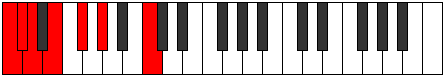 |
| [343](https://ianring.com/musictheory/scales/343) | [Ionorimic](ModeFSharpIonorimic.md) | F# | F#, G, Ab, Bb, C, D, F# |  |
| [343](https://ianring.com/musictheory/scales/343) | [Ionorimic](ModeGFlatIonorimic.md) | Gb | Gb, Abb, Bbbb, Cbb, Dbb, Ebb, Gb |  |
| [343](https://ianring.com/musictheory/scales/343) | [Ionorimic](ModeASharpIonorimic.md) | A# | A#, B, C, D, E, F#, A# |  |
| [343](https://ianring.com/musictheory/scales/343) | [Ionorimic](ModeBFlatIonorimic.md) | Bb | Bb, Cb, Dbb, Ebb, Fb, Gb, Bb |  |
| [345](https://ianring.com/musictheory/scales/345) | [Gylitonic](ModeFSharpGylitonic.md) | F# | F#, A, A#, C, D, F# |  |
| [345](https://ianring.com/musictheory/scales/345) | [Gylitonic](ModeGFlatGylitonic.md) | Gb | Gb, A, Bb, C, D, Gb |  |
| [347](https://ianring.com/musictheory/scales/347) | [Barimic](ModeFSharpBarimic.md) | F# | F#, G, A, Bb, C, D, F# |  |
| [347](https://ianring.com/musictheory/scales/347) | [Barimic](ModeGFlatBarimic.md) | Gb | Gb, Abb, Bbb, Cbb, Dbb, Ebb, Gb |  |
| [349](https://ianring.com/musictheory/scales/349) | [Borimic](ModeCNaturalBorimic.md) | C | C, D, Eb, Fb, Gb, Ab, C |  |
| [349](https://ianring.com/musictheory/scales/349) | [Borimic](ModeASharpBorimic.md) | A# | A#, B#, C#, D, E, F#, A# |  |
| [349](https://ianring.com/musictheory/scales/349) | [Borimic](ModeBFlatBorimic.md) | Bb | Bb, C, Db, Ebb, Fb, Gb, Bb |  |
| [349](https://ianring.com/musictheory/scales/349) | [Borimic](ModeFSharpBorimic.md) | F# | F#, G#, A, Bb, C, D, F# |  |
| [349](https://ianring.com/musictheory/scales/349) | [Borimic](ModeGFlatBorimic.md) | Gb | Gb, Ab, Bbb, Cbb, Dbb, Ebb, Gb |  |
| [351](https://ianring.com/musictheory/scales/351) | [Epanian](ModeCNaturalEpanian.md) | C | C, Db, Ebb, Fbb, Gbbb, Abbb, Bbbb, C | 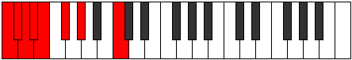 |
| [351](https://ianring.com/musictheory/scales/351) | [Epanian](ModeFSharpEpanian.md) | F# | F#, G, Ab, Bbb, Cbb, Dbb, Ebb, F# |  |
| [351](https://ianring.com/musictheory/scales/351) | [Epanian](ModeGFlatEpanian.md) | Gb | Gb, Abb, Bbbb, Cbbb, Cbb, Dbb, Ebb, Gb |  |
| [351](https://ianring.com/musictheory/scales/351) | [Epanian](ModeASharpEpanian.md) | A# | A#, B, C, Db, Ebb, Fb, Gb, A# |  |
| [351](https://ianring.com/musictheory/scales/351) | [Epanian](ModeBFlatEpanian.md) | Bb | Bb, Cb, Dbb, Ebbb, Fbbb, Gbbb, Abbb, Bb |  |
| [355](https://ianring.com/musictheory/scales/355) | [Aeoloritonic](ModeFSharpAeoloritonic.md) | F# | F#, G, B, C, D, F# |  |
| [355](https://ianring.com/musictheory/scales/355) | [Aeoloritonic](ModeGFlatAeoloritonic.md) | Gb | Gb, G, B, C, D, Gb |  |
| [357](https://ianring.com/musictheory/scales/357) | [Banitonic](ModeCNaturalBanitonic.md) | C | C, D, F, F#, G#, C |  |
| [357](https://ianring.com/musictheory/scales/357) | [Banitonic](ModeFSharpBanitonic.md) | F# | F#, G#, B, C, D, F# |  |
| [357](https://ianring.com/musictheory/scales/357) | [Banitonic](ModeGFlatBanitonic.md) | Gb | Gb, Ab, B, C, D, Gb | 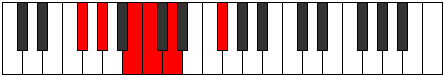 |
| [359](https://ianring.com/musictheory/scales/359) | [Bothimic](ModeCNaturalBothimic.md) | C | C, Db, Ebb, F, Gb, Ab, C |  |
| [359](https://ianring.com/musictheory/scales/359) | [Bothimic](ModeFSharpBothimic.md) | F# | F#, G, Ab, B, C, D, F# |  |
| [359](https://ianring.com/musictheory/scales/359) | [Bothimic](ModeGFlatBothimic.md) | Gb | Gb, Abb, Bbbb, Cb, Dbb, Ebb, Gb |  |
| [361](https://ianring.com/musictheory/scales/361) | [Bocritonic](ModeFSharpBocritonic.md) | F# | F#, A, B, C, D, F# |  |
| [361](https://ianring.com/musictheory/scales/361) | [Bocritonic](ModeGFlatBocritonic.md) | Gb | Gb, A, B, C, D, Gb |  |
| [363](https://ianring.com/musictheory/scales/363) | [Soptimic](ModeFSharpSoptimic.md) | F# | F#, G, A, B, C, D, F# |  |
| [363](https://ianring.com/musictheory/scales/363) | [Soptimic](ModeGFlatSoptimic.md) | Gb | Gb, Abb, Bbb, Cb, Dbb, Ebb, Gb |  |
| [365](https://ianring.com/musictheory/scales/365) | [Marimic](ModeCNaturalMarimic.md) | C | C, D, Eb, F, Gb, Ab, C |  |
| [365](https://ianring.com/musictheory/scales/365) | [Marimic](ModeFSharpMarimic.md) | F# | F#, G#, A, B, C, D, F# |  |
| [365](https://ianring.com/musictheory/scales/365) | [Marimic](ModeGFlatMarimic.md) | Gb | Gb, Ab, Bbb, Cb, Dbb, Ebb, Gb |  |
| [367](https://ianring.com/musictheory/scales/367) | [Aerodian](ModeCNaturalAerodian.md) | C | C, Db, Ebb, Fbb, Gbb, Abbb, Bbbb, C |  |
| [367](https://ianring.com/musictheory/scales/367) | [Aerodian](ModeFSharpAerodian.md) | F# | F#, G, Ab, Bbb, Cb, Dbb, Ebb, F# |  |
| [367](https://ianring.com/musictheory/scales/367) | [Aerodian](ModeGFlatAerodian.md) | Gb | Gb, Abb, Bbbb, Cbbb, Dbbb, Dbb, Ebb, Gb |  |
| [369](https://ianring.com/musictheory/scales/369) | [Laditonic](ModeFSharpLaditonic.md) | F# | F#, A#, B, C, D, F# |  |
| [369](https://ianring.com/musictheory/scales/369) | [Laditonic](ModeGFlatLaditonic.md) | Gb | Gb, Bb, B, C, D, Gb |  |
| [371](https://ianring.com/musictheory/scales/371) | [Rythimic](ModeFSharpRythimic.md) | F# | F#, G, A#, B, C, D, F# |  |
| [371](https://ianring.com/musictheory/scales/371) | [Rythimic](ModeGFlatRythimic.md) | Gb | Gb, Abb, Bb, Cb, Dbb, Ebb, Gb |  |
| [373](https://ianring.com/musictheory/scales/373) | [Epagimic](ModeCNaturalEpagimic.md) | C | C, D, E, F, Gb, Ab, C | 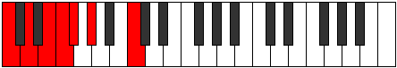 |
| [373](https://ianring.com/musictheory/scales/373) | [Epagimic](ModeASharpEpagimic.md) | A# | A#, B#, C##, D#, E, F#, A# |  |
| [373](https://ianring.com/musictheory/scales/373) | [Epagimic](ModeBFlatEpagimic.md) | Bb | Bb, C, D, Eb, Fb, Gb, Bb |  |
| [373](https://ianring.com/musictheory/scales/373) | [Epagimic](ModeFSharpEpagimic.md) | F# | F#, G#, A#, B, C, D, F# |  |
| [373](https://ianring.com/musictheory/scales/373) | [Epagimic](ModeGFlatEpagimic.md) | Gb | Gb, Ab, Bb, Cb, Dbb, Ebb, Gb |  |
| [375](https://ianring.com/musictheory/scales/375) | [Sodian](ModeCNaturalSodian.md) | C | C, Db, Ebb, Fb, Gbb, Abbb, Bbbb, C |  |
| [375](https://ianring.com/musictheory/scales/375) | [Sodian](ModeASharpSodian.md) | A# | A#, B, C, D, Eb, Fb, Gb, A# |  |
| [375](https://ianring.com/musictheory/scales/375) | [Sodian](ModeBFlatSodian.md) | Bb | Bb, Cb, Dbb, Ebb, Fbb, Gbbb, Abbb, Bb |  |
| [375](https://ianring.com/musictheory/scales/375) | [Sodian](ModeFSharpSodian.md) | F# | F#, G, Ab, Bb, Cb, Dbb, Ebb, F# |  |
| [375](https://ianring.com/musictheory/scales/375) | [Sodian](ModeGFlatSodian.md) | Gb | Gb, Abb, Bbbb, Cbb, Dbbb, Dbb, Ebb, Gb |  |
| [377](https://ianring.com/musictheory/scales/377) | [Kathimic](ModeFSharpKathimic.md) | F# | F#, G##, A#, B, C, D, F# |  |
| [377](https://ianring.com/musictheory/scales/377) | [Kathimic](ModeGFlatKathimic.md) | Gb | Gb, A, Bb, Cb, Dbb, Ebb, Gb |  |
| [379](https://ianring.com/musictheory/scales/379) | [Aeragian](ModeFSharpAeragian.md) | F# | F#, G, A, Bb, Cb, Dbb, Ebb, F# |  |
| [379](https://ianring.com/musictheory/scales/379) | [Aeragian](ModeGFlatAeragian.md) | Gb | Gb, Abb, Bbb, Cbb, Dbbb, Dbb, Ebb, Gb |  |
| [381](https://ianring.com/musictheory/scales/381) | [Kogian](ModeCNaturalKogian.md) | C | C, D, Eb, Fb, Gbb, Abbb, Bbbb, C |  |
| [381](https://ianring.com/musictheory/scales/381) | [Kogian](ModeASharpKogian.md) | A# | A#, B#, C#, D, Eb, Fb, Gb, A# | 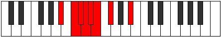 |
| [381](https://ianring.com/musictheory/scales/381) | [Kogian](ModeBFlatKogian.md) | Bb | Bb, C, Db, Ebb, Fbb, Gbbb, Abbb, Bb |  |
| [381](https://ianring.com/musictheory/scales/381) | [Kogian](ModeFSharpKogian.md) | F# | F#, G#, A, Bb, Cb, Dbb, Ebb, F# |  |
| [381](https://ianring.com/musictheory/scales/381) | [Kogian](ModeGFlatKogian.md) | Gb | Gb, Ab, Bbb, Cbb, Dbbb, Dbb, Ebb, Gb |  |
| [383](https://ianring.com/musictheory/scales/383) | [Logyllic](ModeCNaturalLogyllic.md) | C | C, C#, D, D#, E, F, F#, G#, C |  |
| [383](https://ianring.com/musictheory/scales/383) | [Logyllic](ModeASharpLogyllic.md) | A# | A#, B, C, C#, D, D#, E, F#, A# |  |
| [383](https://ianring.com/musictheory/scales/383) | [Logyllic](ModeBFlatLogyllic.md) | Bb | Bb, B, C, Db, D, Eb, E, Gb, Bb |  |
| [383](https://ianring.com/musictheory/scales/383) | [Logyllic](ModeFSharpLogyllic.md) | F# | F#, G, G#, A, A#, B, C, D, F# |  |
| [383](https://ianring.com/musictheory/scales/383) | [Logyllic](ModeGFlatLogyllic.md) | Gb | Gb, G, Ab, A, Bb, B, C, D, Gb |  |
| [395](https://ianring.com/musictheory/scales/395) | [Dalitonic](ModeBNaturalDalitonic.md) | B | B, C, D, F#, G, B |  |
| [399](https://ianring.com/musictheory/scales/399) | [Zynimic](ModeBNaturalZynimic.md) | B | B, C, Db, Ebb, F#, G, B |  |
| [405](https://ianring.com/musictheory/scales/405) | [Danitonic](ModeASharpDanitonic.md) | A# | A#, C, D, F, F#, A# |  |
| [405](https://ianring.com/musictheory/scales/405) | [Danitonic](ModeBFlatDanitonic.md) | Bb | Bb, C, D, F, Gb, Bb |  |
| [407](https://ianring.com/musictheory/scales/407) | [Zylimic](ModeASharpZylimic.md) | A# | A#, B, C, D, E#, F#, A# | 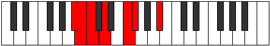 |
| [407](https://ianring.com/musictheory/scales/407) | [Zylimic](ModeBFlatZylimic.md) | Bb | Bb, Cb, Dbb, Ebb, F, Gb, Bb |  |
| [411](https://ianring.com/musictheory/scales/411) | [Lygimic](ModeBNaturalLygimic.md) | B | B, C, D, Eb, F#, G, B |  |
| [413](https://ianring.com/musictheory/scales/413) | [Ganimic](ModeASharpGanimic.md) | A# | A#, B#, C#, D, E#, F#, A# |  |
| [413](https://ianring.com/musictheory/scales/413) | [Ganimic](ModeBFlatGanimic.md) | Bb | Bb, C, Db, Ebb, F, Gb, Bb |  |
| [415](https://ianring.com/musictheory/scales/415) | [Aeoladian](ModeBNaturalAeoladian.md) | B | B, C, Db, Ebb, Fbb, Gb, Abb, B |  |
| [415](https://ianring.com/musictheory/scales/415) | [Aeoladian](ModeASharpAeoladian.md) | A# | A#, B, C, Db, Ebb, F, Gb, A# |  |
| [415](https://ianring.com/musictheory/scales/415) | [Aeoladian](ModeBFlatAeoladian.md) | Bb | Bb, Cb, Dbb, Ebbb, Fbbb, Gbb, Abbb, Bb |  |
| [427](https://ianring.com/musictheory/scales/427) | [Zothimic](ModeBNaturalZothimic.md) | B | B, C, D, E, F#, G, B |  |
| [431](https://ianring.com/musictheory/scales/431) | [Epyrian](ModeBNaturalEpyrian.md) | B | B, C, Db, Ebb, Fb, Gb, Abb, B |  |
| [437](https://ianring.com/musictheory/scales/437) | [Ronimic](ModeASharpRonimic.md) | A# | A#, B#, C##, D#, E#, F#, A# |  |
| [437](https://ianring.com/musictheory/scales/437) | [Ronimic](ModeBFlatRonimic.md) | Bb | Bb, C, D, Eb, F, Gb, Bb |  |
| [439](https://ianring.com/musictheory/scales/439) | [Bythian](ModeASharpBythian.md) | A# | A#, B, C, D, Eb, F, Gb, A# |  |
| [439](https://ianring.com/musictheory/scales/439) | [Bythian](ModeBFlatBythian.md) | Bb | Bb, Cb, Dbb, Ebb, Fbb, Gbb, Abbb, Bb | 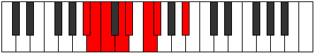 |
| [443](https://ianring.com/musictheory/scales/443) | [Kothian](ModeBNaturalKothian.md) | B | B, C, D, Eb, Fb, Gb, Abb, B |  |
| [445](https://ianring.com/musictheory/scales/445) | [Gocrian](ModeASharpGocrian.md) | A# | A#, B#, C#, D, Eb, F, Gb, A# |  |
| [445](https://ianring.com/musictheory/scales/445) | [Gocrian](ModeBFlatGocrian.md) | Bb | Bb, C, Db, Ebb, Fbb, Gbb, Abbb, Bb |  |
| [447](https://ianring.com/musictheory/scales/447) | [Thyphyllic](ModeBNaturalThyphyllic.md) | B | B, C, C#, D, D#, E, F#, G, B |  |
| [447](https://ianring.com/musictheory/scales/447) | [Thyphyllic](ModeASharpThyphyllic.md) | A# | A#, B, C, C#, D, D#, F, F#, A# |  |
| [447](https://ianring.com/musictheory/scales/447) | [Thyphyllic](ModeBFlatThyphyllic.md) | Bb | Bb, B, C, Db, D, Eb, F, Gb, Bb |  |
| [453](https://ianring.com/musictheory/scales/453) | [Raditonic](ModeFSharpRaditonic.md) | F# | F#, G#, C, C#, D, F# |  |
| [453](https://ianring.com/musictheory/scales/453) | [Raditonic](ModeGFlatRaditonic.md) | Gb | Gb, Ab, C, Db, D, Gb |  |
| [453](https://ianring.com/musictheory/scales/453) | [Raditonic](ModeCNaturalRaditonic.md) | C | C, D, F#, G, G#, C |  |
| [455](https://ianring.com/musictheory/scales/455) | [Stadimic](ModeCNaturalStadimic.md) | C | C, Db, Ebb, F#, G, Ab, C |  |
| [455](https://ianring.com/musictheory/scales/455) | [Stadimic](ModeFSharpStadimic.md) | F# | F#, G, Ab, B#, C#, D, F# |  |
| [455](https://ianring.com/musictheory/scales/455) | [Stadimic](ModeGFlatStadimic.md) | Gb | Gb, Abb, Bbbb, C, Db, Ebb, Gb |  |
| [457](https://ianring.com/musictheory/scales/457) | [Staptitonic](ModeFSharpStaptitonic.md) | F# | F#, A, C, C#, D, F# |  |
| [457](https://ianring.com/musictheory/scales/457) | [Staptitonic](ModeGFlatStaptitonic.md) | Gb | Gb, A, C, Db, D, Gb |  |
| [459](https://ianring.com/musictheory/scales/459) | [Zaptimic](ModeFSharpZaptimic.md) | F# | F#, G, A, B#, C#, D, F# |  |
| [459](https://ianring.com/musictheory/scales/459) | [Zaptimic](ModeGFlatZaptimic.md) | Gb | Gb, Abb, Bbb, C, Db, Ebb, Gb |  |
| [459](https://ianring.com/musictheory/scales/459) | [Zaptimic](ModeBNaturalZaptimic.md) | B | B, C, D, E#, F#, G, B |  |
| [461](https://ianring.com/musictheory/scales/461) | [Madimic](ModeCNaturalMadimic.md) | C | C, D, Eb, F#, G, Ab, C |  |
| [461](https://ianring.com/musictheory/scales/461) | [Madimic](ModeFSharpMadimic.md) | F# | F#, G#, A, B#, C#, D, F# |  |
| [461](https://ianring.com/musictheory/scales/461) | [Madimic](ModeGFlatMadimic.md) | Gb | Gb, Ab, Bbb, C, Db, Ebb, Gb |  |
| [463](https://ianring.com/musictheory/scales/463) | [Zythian](ModeCNaturalZythian.md) | C | C, Db, Ebb, Fbb, Gb, Abb, Bbbb, C | 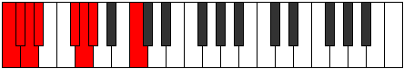 |
| [463](https://ianring.com/musictheory/scales/463) | [Zythian](ModeFSharpZythian.md) | F# | F#, G, Ab, Bbb, C, Db, Ebb, F# |  |
| [463](https://ianring.com/musictheory/scales/463) | [Zythian](ModeGFlatZythian.md) | Gb | Gb, Abb, Bbbb, Cbbb, Dbb, Ebbb, Fbbb, Gb |  |
| [463](https://ianring.com/musictheory/scales/463) | [Zythian](ModeBNaturalZythian.md) | B | B, C, Db, Ebb, F, Gb, Abb, B |  |
| [465](https://ianring.com/musictheory/scales/465) | [Zoditonic](ModeFSharpZoditonic.md) | F# | F#, A#, C, C#, D, F# |  |
| [465](https://ianring.com/musictheory/scales/465) | [Zoditonic](ModeGFlatZoditonic.md) | Gb | Gb, Bb, C, Db, D, Gb |  |
| [467](https://ianring.com/musictheory/scales/467) | [Phrogimic](ModeFSharpPhrogimic.md) | F# | F#, G, A#, B#, C#, D, F# |  |
| [467](https://ianring.com/musictheory/scales/467) | [Phrogimic](ModeGFlatPhrogimic.md) | Gb | Gb, Abb, Bb, C, Db, Ebb, Gb |  |
| [469](https://ianring.com/musictheory/scales/469) | [Katyrimic](ModeCNaturalKatyrimic.md) | C | C, D, E, F#, G, Ab, C |  |
| [469](https://ianring.com/musictheory/scales/469) | [Katyrimic](ModeASharpKatyrimic.md) | A# | A#, B#, C##, D##, E#, F#, A# |  |
| [469](https://ianring.com/musictheory/scales/469) | [Katyrimic](ModeBFlatKatyrimic.md) | Bb | Bb, C, D, E, F, Gb, Bb |  |
| [469](https://ianring.com/musictheory/scales/469) | [Katyrimic](ModeFSharpKatyrimic.md) | F# | F#, G#, A#, B#, C#, D, F# |  |
| [469](https://ianring.com/musictheory/scales/469) | [Katyrimic](ModeGFlatKatyrimic.md) | Gb | Gb, Ab, Bb, C, Db, Ebb, Gb |  |
| [471](https://ianring.com/musictheory/scales/471) | [Dodian](ModeCNaturalDodian.md) | C | C, Db, Ebb, Fb, Gb, Abb, Bbbb, C |  |
| [471](https://ianring.com/musictheory/scales/471) | [Dodian](ModeFSharpDodian.md) | F# | F#, G, Ab, Bb, C, Db, Ebb, F# |  |
| [471](https://ianring.com/musictheory/scales/471) | [Dodian](ModeGFlatDodian.md) | Gb | Gb, Abb, Bbbb, Cbb, Dbb, Ebbb, Fbbb, Gb |  |
| [471](https://ianring.com/musictheory/scales/471) | [Dodian](ModeASharpDodian.md) | A# | A#, B, C, D, E, F, Gb, A# |  |
| [471](https://ianring.com/musictheory/scales/471) | [Dodian](ModeBFlatDodian.md) | Bb | Bb, Cb, Dbb, Ebb, Fb, Gbb, Abbb, Bb |  |
| [473](https://ianring.com/musictheory/scales/473) | [Aeralimic](ModeFSharpAeralimic.md) | F# | F#, G##, A#, B#, C#, D, F# |  |
| [473](https://ianring.com/musictheory/scales/473) | [Aeralimic](ModeGFlatAeralimic.md) | Gb | Gb, A, Bb, C, Db, Ebb, Gb |  |
| [475](https://ianring.com/musictheory/scales/475) | [Aeolygian](ModeFSharpAeolygian.md) | F# | F#, G, A, Bb, C, Db, Ebb, F# |  |
| [475](https://ianring.com/musictheory/scales/475) | [Aeolygian](ModeGFlatAeolygian.md) | Gb | Gb, Abb, Bbb, Cbb, Dbb, Ebbb, Fbbb, Gb |  |
| [475](https://ianring.com/musictheory/scales/475) | [Aeolygian](ModeBNaturalAeolygian.md) | B | B, C, D, Eb, F, Gb, Abb, B |  |
| [477](https://ianring.com/musictheory/scales/477) | [Stacrian](ModeCNaturalStacrian.md) | C | C, D, Eb, Fb, Gb, Abb, Bbbb, C |  |
| [477](https://ianring.com/musictheory/scales/477) | [Stacrian](ModeASharpStacrian.md) | A# | A#, B#, C#, D, E, F, Gb, A# |  |
| [477](https://ianring.com/musictheory/scales/477) | [Stacrian](ModeBFlatStacrian.md) | Bb | Bb, C, Db, Ebb, Fb, Gbb, Abbb, Bb |  |
| [477](https://ianring.com/musictheory/scales/477) | [Stacrian](ModeFSharpStacrian.md) | F# | F#, G#, A, Bb, C, Db, Ebb, F# |  |
| [477](https://ianring.com/musictheory/scales/477) | [Stacrian](ModeGFlatStacrian.md) | Gb | Gb, Ab, Bbb, Cbb, Dbb, Ebbb, Fbbb, Gb |  |
| [479](https://ianring.com/musictheory/scales/479) | [Kocryllic](ModeCNaturalKocryllic.md) | C | C, C#, D, D#, E, F#, G, G#, C |  |
| [479](https://ianring.com/musictheory/scales/479) | [Kocryllic](ModeFSharpKocryllic.md) | F# | F#, G, G#, A, A#, C, C#, D, F# |  |
| [479](https://ianring.com/musictheory/scales/479) | [Kocryllic](ModeGFlatKocryllic.md) | Gb | Gb, G, Ab, A, Bb, C, Db, D, Gb |  |
| [479](https://ianring.com/musictheory/scales/479) | [Kocryllic](ModeBNaturalKocryllic.md) | B | B, C, C#, D, D#, F, F#, G, B |  |
| [479](https://ianring.com/musictheory/scales/479) | [Kocryllic](ModeASharpKocryllic.md) | A# | A#, B, C, C#, D, E, F, F#, A# |  |
| [479](https://ianring.com/musictheory/scales/479) | [Kocryllic](ModeBFlatKocryllic.md) | Bb | Bb, B, C, Db, D, E, F, Gb, Bb |  |
| [483](https://ianring.com/musictheory/scales/483) | [Kygimic](ModeFSharpKygimic.md) | F# | F#, G, A##, B#, C#, D, F# |  |
| [483](https://ianring.com/musictheory/scales/483) | [Kygimic](ModeGFlatKygimic.md) | Gb | Gb, Abb, B, C, Db, Ebb, Gb |  |
| [485](https://ianring.com/musictheory/scales/485) | [Stoptimic](ModeCNaturalStoptimic.md) | C | C, D, E#, F#, G, Ab, C |  |
| [485](https://ianring.com/musictheory/scales/485) | [Stoptimic](ModeFSharpStoptimic.md) | F# | F#, G#, A##, B#, C#, D, F# |  |
| [485](https://ianring.com/musictheory/scales/485) | [Stoptimic](ModeGFlatStoptimic.md) | Gb | Gb, Ab, B, C, Db, Ebb, Gb |  |
| [487](https://ianring.com/musictheory/scales/487) | [Dynian](ModeCNaturalDynian.md) | C | C, Db, Ebb, F, Gb, Abb, Bbbb, C |  |
| [487](https://ianring.com/musictheory/scales/487) | [Dynian](ModeFSharpDynian.md) | F# | F#, G, Ab, B, C, Db, Ebb, F# |  |
| [487](https://ianring.com/musictheory/scales/487) | [Dynian](ModeGFlatDynian.md) | Gb | Gb, Abb, Bbbb, Cb, Dbb, Ebbb, Fbbb, Gb |  |
| [489](https://ianring.com/musictheory/scales/489) | [Phrathimic](ModeFSharpPhrathimic.md) | F# | F#, G##, A##, B#, C#, D, F# | 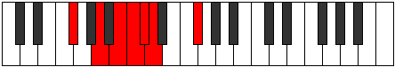 |
| [489](https://ianring.com/musictheory/scales/489) | [Phrathimic](ModeGFlatPhrathimic.md) | Gb | Gb, A, B, C, Db, Ebb, Gb |  |
| [491](https://ianring.com/musictheory/scales/491) | [Aeolyrian](ModeBNaturalAeolyrian.md) | B | B, C, D, E, F, Gb, Abb, B |  |
| [491](https://ianring.com/musictheory/scales/491) | [Aeolyrian](ModeFSharpAeolyrian.md) | F# | F#, G, A, B, C, Db, Ebb, F# |  |
| [491](https://ianring.com/musictheory/scales/491) | [Aeolyrian](ModeGFlatAeolyrian.md) | Gb | Gb, Abb, Bbb, Cb, Dbb, Ebbb, Fbbb, Gb |  |
| [493](https://ianring.com/musictheory/scales/493) | [Rygian](ModeCNaturalRygian.md) | C | C, D, Eb, F, Gb, Abb, Bbbb, C |  |
| [493](https://ianring.com/musictheory/scales/493) | [Rygian](ModeFSharpRygian.md) | F# | F#, G#, A, B, C, Db, Ebb, F# |  |
| [493](https://ianring.com/musictheory/scales/493) | [Rygian](ModeGFlatRygian.md) | Gb | Gb, Ab, Bbb, Cb, Dbb, Ebbb, Fbbb, Gb |  |
| [495](https://ianring.com/musictheory/scales/495) | [Bocryllic](ModeCNaturalBocryllic.md) | C | C, C#, D, D#, F, F#, G, G#, C |  |
| [495](https://ianring.com/musictheory/scales/495) | [Bocryllic](ModeBNaturalBocryllic.md) | B | B, C, C#, D, E, F, F#, G, B |  |
| [495](https://ianring.com/musictheory/scales/495) | [Bocryllic](ModeFSharpBocryllic.md) | F# | F#, G, G#, A, B, C, C#, D, F# |  |
| [495](https://ianring.com/musictheory/scales/495) | [Bocryllic](ModeGFlatBocryllic.md) | Gb | Gb, G, Ab, A, B, C, Db, D, Gb |  |
| [497](https://ianring.com/musictheory/scales/497) | [Kadimic](ModeFSharpKadimic.md) | F# | F#, G###, A##, B#, C#, D, F# |  |
| [497](https://ianring.com/musictheory/scales/497) | [Kadimic](ModeGFlatKadimic.md) | Gb | Gb, A#, B, C, Db, Ebb, Gb |  |
| [499](https://ianring.com/musictheory/scales/499) | [Ionaptian](ModeFSharpIonaptian.md) | F# | F#, G, A#, B, C, Db, Ebb, F# |  |
| [499](https://ianring.com/musictheory/scales/499) | [Ionaptian](ModeGFlatIonaptian.md) | Gb | Gb, Abb, Bb, Cb, Dbb, Ebbb, Fbbb, Gb |  |
| [501](https://ianring.com/musictheory/scales/501) | [Katylian](ModeCNaturalKatylian.md) | C | C, D, E, F, Gb, Abb, Bbbb, C |  |
| [501](https://ianring.com/musictheory/scales/501) | [Katylian](ModeASharpKatylian.md) | A# | A#, B#, C##, D#, E, F, Gb, A# |  |
| [501](https://ianring.com/musictheory/scales/501) | [Katylian](ModeBFlatKatylian.md) | Bb | Bb, C, D, Eb, Fb, Gbb, Abbb, Bb |  |
| [501](https://ianring.com/musictheory/scales/501) | [Katylian](ModeFSharpKatylian.md) | F# | F#, G#, A#, B, C, Db, Ebb, F# |  |
| [501](https://ianring.com/musictheory/scales/501) | [Katylian](ModeGFlatKatylian.md) | Gb | Gb, Ab, Bb, Cb, Dbb, Ebbb, Fbbb, Gb |  |
| [503](https://ianring.com/musictheory/scales/503) | [Thoptyllic](ModeCNaturalThoptyllic.md) | C | C, C#, D, E, F, F#, G, G#, C |  |
| [503](https://ianring.com/musictheory/scales/503) | [Thoptyllic](ModeASharpThoptyllic.md) | A# | A#, B, C, D, D#, E, F, F#, A# |  |
| [503](https://ianring.com/musictheory/scales/503) | [Thoptyllic](ModeBFlatThoptyllic.md) | Bb | Bb, B, C, D, Eb, E, F, Gb, Bb |  |
| [503](https://ianring.com/musictheory/scales/503) | [Thoptyllic](ModeFSharpThoptyllic.md) | F# | F#, G, G#, A#, B, C, C#, D, F# |  |
| [503](https://ianring.com/musictheory/scales/503) | [Thoptyllic](ModeGFlatThoptyllic.md) | Gb | Gb, G, Ab, Bb, B, C, Db, D, Gb |  |
| [505](https://ianring.com/musictheory/scales/505) | [Sanian](ModeFSharpSanian.md) | F# | F#, G##, A#, B, C, Db, Ebb, F# |  |
| [505](https://ianring.com/musictheory/scales/505) | [Sanian](ModeGFlatSanian.md) | Gb | Gb, A, Bb, Cb, Dbb, Ebbb, Fbbb, Gb |  |
| [507](https://ianring.com/musictheory/scales/507) | [Moryllic](ModeBNaturalMoryllic.md) | B | B, C, D, D#, E, F, F#, G, B |  |
| [507](https://ianring.com/musictheory/scales/507) | [Moryllic](ModeFSharpMoryllic.md) | F# | F#, G, A, A#, B, C, C#, D, F# |  |
| [507](https://ianring.com/musictheory/scales/507) | [Moryllic](ModeGFlatMoryllic.md) | Gb | Gb, G, A, Bb, B, C, Db, D, Gb |  |
| [509](https://ianring.com/musictheory/scales/509) | [Ionothyllic](ModeCNaturalIonothyllic.md) | C | C, D, D#, E, F, F#, G, G#, C |  |
| [509](https://ianring.com/musictheory/scales/509) | [Ionothyllic](ModeASharpIonothyllic.md) | A# | A#, C, C#, D, D#, E, F, F#, A# |  |
| [509](https://ianring.com/musictheory/scales/509) | [Ionothyllic](ModeBFlatIonothyllic.md) | Bb | Bb, C, Db, D, Eb, E, F, Gb, Bb |  |
| [509](https://ianring.com/musictheory/scales/509) | [Ionothyllic](ModeFSharpIonothyllic.md) | F# | F#, G#, A, A#, B, C, C#, D, F# |  |
| [509](https://ianring.com/musictheory/scales/509) | [Ionothyllic](ModeGFlatIonothyllic.md) | Gb | Gb, Ab, A, Bb, B, C, Db, D, Gb |  |
| [511](https://ianring.com/musictheory/scales/511) | [Polygic](ModeCNaturalPolygic.md) | C | C, C#, D, D#, E, F, F#, G, G#, C |  |
| [511](https://ianring.com/musictheory/scales/511) | [Polygic](ModeBNaturalPolygic.md) | B | B, C, C#, D, D#, E, F, F#, G, B |  |
| [511](https://ianring.com/musictheory/scales/511) | [Polygic](ModeASharpPolygic.md) | A# | A#, B, C, C#, D, D#, E, F, F#, A# |  |
| [511](https://ianring.com/musictheory/scales/511) | [Polygic](ModeBFlatPolygic.md) | Bb | Bb, B, C, Db, D, Eb, E, F, Gb, Bb |  |
| [511](https://ianring.com/musictheory/scales/511) | [Polygic](ModeFSharpPolygic.md) | F# | F#, G, G#, A, A#, B, C, C#, D, F# |  |
| [511](https://ianring.com/musictheory/scales/511) | [Polygic](ModeGFlatPolygic.md) | Gb | Gb, G, Ab, A, Bb, B, C, Db, D, Gb |  |
| [553](https://ianring.com/musictheory/scales/553) | [Phradic](ModeANaturalPhradic.md) | A | A, C, D, F#, A |  |
| [555](https://ianring.com/musictheory/scales/555) | [Aeolycritonic](ModeANaturalAeolycritonic.md) | A | A, A#, C, D, F#, A |  |
| [557](https://ianring.com/musictheory/scales/557) | [Gythitonic](ModeANaturalGythitonic.md) | A | A, B, C, D, F#, A |  |
| [559](https://ianring.com/musictheory/scales/559) | [Lylimic](ModeANaturalLylimic.md) | A | A, Bb, Cb, Dbb, Ebb, F#, A |  |
| [569](https://ianring.com/musictheory/scales/569) | [Mothitonic](ModeANaturalMothitonic.md) | A | A, C, C#, D, F#, A |  |
| [571](https://ianring.com/musictheory/scales/571) | [Kynimic](ModeANaturalKynimic.md) | A | A, Bb, C, Db, Ebb, F#, A |  |
| [573](https://ianring.com/musictheory/scales/573) | [Saptimic](ModeANaturalSaptimic.md) | A | A, B, C, Db, Ebb, F#, A |  |
| [575](https://ianring.com/musictheory/scales/575) | [Ionydian](ModeANaturalIonydian.md) | A | A, Bb, Cb, Dbb, Ebbb, Fbbb, Gb, A |  |
| [581](https://ianring.com/musictheory/scales/581) | [Bolic](ModeCNaturalBolic.md) | C | C, D, F#, A, C | 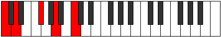 |
| [583](https://ianring.com/musictheory/scales/583) | [Aeritonic](ModeCNaturalAeritonic.md) | C | C, C#, D, F#, A, C |  |
| [589](https://ianring.com/musictheory/scales/589) | [Ionalitonic](ModeCNaturalIonalitonic.md) | C | C, D, D#, F#, A, C |  |
| [591](https://ianring.com/musictheory/scales/591) | [Gaptimic](ModeCNaturalGaptimic.md) | C | C, Db, Ebb, Fbb, Gb, A, C |  |
| [597](https://ianring.com/musictheory/scales/597) | [Thonitonic](ModeCNaturalThonitonic.md) | C | C, D, E, F#, A, C |  |
| [599](https://ianring.com/musictheory/scales/599) | [Thyrimic](ModeCNaturalThyrimic.md) | C | C, Db, Ebb, Fb, Gb, A, C |  |
| [605](https://ianring.com/musictheory/scales/605) | [Dycrimic](ModeCNaturalDycrimic.md) | C | C, D, Eb, Fb, Gb, A, C |  |
| [607](https://ianring.com/musictheory/scales/607) | [Kadian](ModeCNaturalKadian.md) | C | C, Db, Ebb, Fbb, Gbbb, Abbb, Bbb, C |  |
| [613](https://ianring.com/musictheory/scales/613) | [Phralitonic](ModeCNaturalPhralitonic.md) | C | C, D, F, F#, A, C |  |
| [615](https://ianring.com/musictheory/scales/615) | [Phrothimic](ModeCNaturalPhrothimic.md) | C | C, Db, Ebb, F, Gb, A, C |  |
| [617](https://ianring.com/musictheory/scales/617) | [Katycritonic](ModeANaturalKatycritonic.md) | A | A, C, D, D#, F#, A |  |
| [619](https://ianring.com/musictheory/scales/619) | [Parimic](ModeANaturalParimic.md) | A | A, Bb, C, D, Eb, F#, A |  |
| [621](https://ianring.com/musictheory/scales/621) | [Kyrimic](ModeCNaturalKyrimic.md) | C | C, D, Eb, F, Gb, A, C |  |
| [621](https://ianring.com/musictheory/scales/621) | [Kyrimic](ModeANaturalKyrimic.md) | A | A, B, C, D, Eb, F#, A |  |
| [623](https://ianring.com/musictheory/scales/623) | [Sycrian](ModeCNaturalSycrian.md) | C | C, Db, Ebb, Fbb, Gbb, Abbb, Bbb, C |  |
| [623](https://ianring.com/musictheory/scales/623) | [Sycrian](ModeANaturalSycrian.md) | A | A, Bb, Cb, Dbb, Ebb, Fbb, Gb, A |  |
| [629](https://ianring.com/musictheory/scales/629) | [Aeronimic](ModeCNaturalAeronimic.md) | C | C, D, E, F, Gb, A, C |  |
| [631](https://ianring.com/musictheory/scales/631) | [Zygian](ModeCNaturalZygian.md) | C | C, Db, Ebb, Fb, Gbb, Abbb, Bbb, C |  |
| [633](https://ianring.com/musictheory/scales/633) | [Kydimic](ModeANaturalKydimic.md) | A | A, B#, C#, D, Eb, F#, A |  |
| [635](https://ianring.com/musictheory/scales/635) | [Epolian](ModeANaturalEpolian.md) | A | A, Bb, C, Db, Ebb, Fbb, Gb, A |  |
| [637](https://ianring.com/musictheory/scales/637) | [Katodian](ModeCNaturalKatodian.md) | C | C, D, Eb, Fb, Gbb, Abbb, Bbb, C |  |
| [637](https://ianring.com/musictheory/scales/637) | [Katodian](ModeANaturalKatodian.md) | A | A, B, C, Db, Ebb, Fbb, Gb, A |  |
| [639](https://ianring.com/musictheory/scales/639) | [Ionaryllic](ModeCNaturalIonaryllic.md) | C | C, C#, D, D#, E, F, F#, A, C |  |
| [639](https://ianring.com/musictheory/scales/639) | [Ionaryllic](ModeANaturalIonaryllic.md) | A | A, A#, B, C, C#, D, D#, F#, A |  |
| [651](https://ianring.com/musictheory/scales/651) | [Golitonic](ModeFNaturalGolitonic.md) | F | F, F#, G#, C, D, F |  |
| [651](https://ianring.com/musictheory/scales/651) | [Golitonic](ModeBNaturalGolitonic.md) | B | B, C, D, F#, G#, B |  |
| [655](https://ianring.com/musictheory/scales/655) | [Kataptimic](ModeFNaturalKataptimic.md) | F | F, Gb, Abb, Bbbb, C, D, F |  |
| [655](https://ianring.com/musictheory/scales/655) | [Kataptimic](ModeBNaturalKataptimic.md) | B | B, C, Db, Ebb, F#, G#, B |  |
| [659](https://ianring.com/musictheory/scales/659) | [Soptitonic](ModeFNaturalSoptitonic.md) | F | F, F#, A, C, D, F |  |
| [663](https://ianring.com/musictheory/scales/663) | [Phrynimic](ModeFNaturalPhrynimic.md) | F | F, Gb, Abb, Bbb, C, D, F | 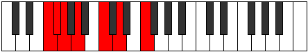 |
| [667](https://ianring.com/musictheory/scales/667) | [Rodimic](ModeFNaturalRodimic.md) | F | F, Gb, Ab, Bbb, C, D, F |  |
| [667](https://ianring.com/musictheory/scales/667) | [Rodimic](ModeBNaturalRodimic.md) | B | B, C, D, Eb, F#, G#, B |  |
| [671](https://ianring.com/musictheory/scales/671) | [Stycrian](ModeFNaturalStycrian.md) | F | F, Gb, Abb, Bbbb, Cbbb, Dbb, Ebb, F |  |
| [671](https://ianring.com/musictheory/scales/671) | [Stycrian](ModeBNaturalStycrian.md) | B | B, C, Db, Ebb, Fbb, Gb, Ab, B |  |
| [675](https://ianring.com/musictheory/scales/675) | [Zyditonic](ModeFNaturalZyditonic.md) | F | F, F#, A#, C, D, F |  |
| [679](https://ianring.com/musictheory/scales/679) | [Lanimic](ModeFNaturalLanimic.md) | F | F, Gb, Abb, Bb, C, D, F |  |
| [681](https://ianring.com/musictheory/scales/681) | [Sylitonic](ModeANaturalSylitonic.md) | A | A, C, D, E, F#, A |  |
| [683](https://ianring.com/musictheory/scales/683) | [Stogimic](ModeFNaturalStogimic.md) | F | F, Gb, Ab, Bb, C, D, F |  |
| [683](https://ianring.com/musictheory/scales/683) | [Stogimic](ModeANaturalStogimic.md) | A | A, Bb, C, D, E, F#, A |  |
| [683](https://ianring.com/musictheory/scales/683) | [Stogimic](ModeBNaturalStogimic.md) | B | B, C, D, E, F#, G#, B |  |
| [685](https://ianring.com/musictheory/scales/685) | [Aerathimic](ModeANaturalAerathimic.md) | A | A, B, C, D, E, F#, A |  |
| [687](https://ianring.com/musictheory/scales/687) | [Aeolythian](ModeFNaturalAeolythian.md) | F | F, Gb, Abb, Bbbb, Cbb, Dbb, Ebb, F |  |
| [687](https://ianring.com/musictheory/scales/687) | [Aeolythian](ModeBNaturalAeolythian.md) | B | B, C, Db, Ebb, Fb, Gb, Ab, B |  |
| [687](https://ianring.com/musictheory/scales/687) | [Aeolythian](ModeANaturalAeolythian.md) | A | A, Bb, Cb, Dbb, Ebb, Fb, Gb, A |  |
| [691](https://ianring.com/musictheory/scales/691) | [Zydimic](ModeFNaturalZydimic.md) | F | F, Gb, A, Bb, C, D, F |  |
| [695](https://ianring.com/musictheory/scales/695) | [Sarian](ModeFNaturalSarian.md) | F | F, Gb, Abb, Bbb, Cbb, Dbb, Ebb, F |  |
| [697](https://ianring.com/musictheory/scales/697) | [Lagimic](ModeANaturalLagimic.md) | A | A, B#, C#, D, E, F#, A |  |
| [699](https://ianring.com/musictheory/scales/699) | [Aerothian](ModeANaturalAerothian.md) | A | A, Bb, C, Db, Ebb, Fb, Gb, A |  |
| [699](https://ianring.com/musictheory/scales/699) | [Aerothian](ModeFNaturalAerothian.md) | F | F, Gb, Ab, Bbb, Cbb, Dbb, Ebb, F |  |
| [699](https://ianring.com/musictheory/scales/699) | [Aerothian](ModeBNaturalAerothian.md) | B | B, C, D, Eb, Fb, Gb, Ab, B |  |
| [701](https://ianring.com/musictheory/scales/701) | [Mixonyphian](ModeANaturalMixonyphian.md) | A | A, B, C, Db, Ebb, Fb, Gb, A |  |
| [703](https://ianring.com/musictheory/scales/703) | [Aerocryllic](ModeFNaturalAerocryllic.md) | F | F, F#, G, G#, A, A#, C, D, F |  |
| [703](https://ianring.com/musictheory/scales/703) | [Aerocryllic](ModeBNaturalAerocryllic.md) | B | B, C, C#, D, D#, E, F#, G#, B |  |
| [703](https://ianring.com/musictheory/scales/703) | [Aerocryllic](ModeANaturalAerocryllic.md) | A | A, A#, B, C, C#, D, E, F#, A |  |
| [709](https://ianring.com/musictheory/scales/709) | [Ionycritonic](ModeCNaturalIonycritonic.md) | C | C, D, F#, G, A, C |  |
| [711](https://ianring.com/musictheory/scales/711) | [Epyrimic](ModeCNaturalEpyrimic.md) | C | C, Db, Ebb, F#, G, A, C |  |
| [711](https://ianring.com/musictheory/scales/711) | [Epyrimic](ModeFNaturalEpyrimic.md) | F | F, Gb, Abb, B, C, D, F |  |
| [715](https://ianring.com/musictheory/scales/715) | [Dodimic](ModeFNaturalDodimic.md) | F | F, Gb, Ab, B, C, D, F |  |
| [715](https://ianring.com/musictheory/scales/715) | [Dodimic](ModeBNaturalDodimic.md) | B | B, C, D, E#, F#, G#, B |  |
| [717](https://ianring.com/musictheory/scales/717) | [Gythimic](ModeCNaturalGythimic.md) | C | C, D, Eb, F#, G, A, C |  |
| [719](https://ianring.com/musictheory/scales/719) | [Kanian](ModeCNaturalKanian.md) | C | C, Db, Ebb, Fbb, Gb, Abb, Bbb, C |  |
| [719](https://ianring.com/musictheory/scales/719) | [Kanian](ModeBNaturalKanian.md) | B | B, C, Db, Ebb, F, Gb, Ab, B | 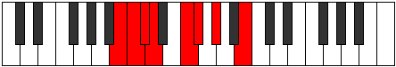 |
| [719](https://ianring.com/musictheory/scales/719) | [Kanian](ModeFNaturalKanian.md) | F | F, Gb, Abb, Bbbb, Cb, Dbb, Ebb, F |  |
| [723](https://ianring.com/musictheory/scales/723) | [Ionadimic](ModeFNaturalIonadimic.md) | F | F, Gb, A, B, C, D, F |  |
| [725](https://ianring.com/musictheory/scales/725) | [Lonimic](ModeCNaturalLonimic.md) | C | C, D, E, F#, G, A, C |  |
| [727](https://ianring.com/musictheory/scales/727) | [Phradian](ModeCNaturalPhradian.md) | C | C, Db, Ebb, Fb, Gb, Abb, Bbb, C |  |
| [727](https://ianring.com/musictheory/scales/727) | [Phradian](ModeFNaturalPhradian.md) | F | F, Gb, Abb, Bbb, Cb, Dbb, Ebb, F |  |
| [731](https://ianring.com/musictheory/scales/731) | [Ionorian](ModeBNaturalIonorian.md) | B | B, C, D, Eb, F, Gb, Ab, B |  |
| [731](https://ianring.com/musictheory/scales/731) | [Ionorian](ModeFNaturalIonorian.md) | F | F, Gb, Ab, Bbb, Cb, Dbb, Ebb, F |  |
| [733](https://ianring.com/musictheory/scales/733) | [Donian](ModeCNaturalDonian.md) | C | C, D, Eb, Fb, Gb, Abb, Bbb, C |  |
| [735](https://ianring.com/musictheory/scales/735) | [Sylyllic](ModeCNaturalSylyllic.md) | C | C, C#, D, D#, E, F#, G, A, C |  |
| [735](https://ianring.com/musictheory/scales/735) | [Sylyllic](ModeBNaturalSylyllic.md) | B | B, C, C#, D, D#, F, F#, G#, B |  |
| [735](https://ianring.com/musictheory/scales/735) | [Sylyllic](ModeFNaturalSylyllic.md) | F | F, F#, G, G#, A, B, C, D, F |  |
| [739](https://ianring.com/musictheory/scales/739) | [Rorimic](ModeFNaturalRorimic.md) | F | F, Gb, A#, B, C, D, F |  |
| [741](https://ianring.com/musictheory/scales/741) | [Gathimic](ModeCNaturalGathimic.md) | C | C, D, E#, F#, G, A, C |  |
| [743](https://ianring.com/musictheory/scales/743) | [Lanian](ModeCNaturalLanian.md) | C | C, Db, Ebb, F, Gb, Abb, Bbb, C |  |
| [743](https://ianring.com/musictheory/scales/743) | [Lanian](ModeFNaturalLanian.md) | F | F, Gb, Abb, Bb, Cb, Dbb, Ebb, F |  |
| [745](https://ianring.com/musictheory/scales/745) | [Kolimic](ModeANaturalKolimic.md) | A | A, B#, C##, D#, E, F#, A |  |
| [747](https://ianring.com/musictheory/scales/747) | [Lynian](ModeANaturalLynian.md) | A | A, Bb, C, D, Eb, Fb, Gb, A |  |
| [747](https://ianring.com/musictheory/scales/747) | [Lynian](ModeBNaturalLynian.md) | B | B, C, D, E, F, Gb, Ab, B |  |
| [747](https://ianring.com/musictheory/scales/747) | [Lynian](ModeFNaturalLynian.md) | F | F, Gb, Ab, Bb, Cb, Dbb, Ebb, F |  |
| [749](https://ianring.com/musictheory/scales/749) | [Aeologian](ModeCNaturalAeologian.md) | C | C, D, Eb, F, Gb, Abb, Bbb, C |  |
| [749](https://ianring.com/musictheory/scales/749) | [Aeologian](ModeANaturalAeologian.md) | A | A, B, C, D, Eb, Fb, Gb, A |  |
| [751](https://ianring.com/musictheory/scales/751) | [Epacryllic](ModeCNaturalEpacryllic.md) | C | C, C#, D, D#, F, F#, G, A, C |  |
| [751](https://ianring.com/musictheory/scales/751) | [Epacryllic](ModeBNaturalEpacryllic.md) | B | B, C, C#, D, E, F, F#, G#, B |  |
| [751](https://ianring.com/musictheory/scales/751) | [Epacryllic](ModeFNaturalEpacryllic.md) | F | F, F#, G, G#, A#, B, C, D, F |  |
| [751](https://ianring.com/musictheory/scales/751) | [Epacryllic](ModeANaturalEpacryllic.md) | A | A, A#, B, C, D, D#, E, F#, A |  |
| [755](https://ianring.com/musictheory/scales/755) | [Phrythian](ModeFNaturalPhrythian.md) | F | F, Gb, A, Bb, Cb, Dbb, Ebb, F |  |
| [757](https://ianring.com/musictheory/scales/757) | [Ionyptian](ModeCNaturalIonyptian.md) | C | C, D, E, F, Gb, Abb, Bbb, C |  |
| [759](https://ianring.com/musictheory/scales/759) | [Katalyllic](ModeCNaturalKatalyllic.md) | C | C, C#, D, E, F, F#, G, A, C |  |
| [759](https://ianring.com/musictheory/scales/759) | [Katalyllic](ModeFNaturalKatalyllic.md) | F | F, F#, G, A, A#, B, C, D, F |  |
| [761](https://ianring.com/musictheory/scales/761) | [Ponian](ModeANaturalPonian.md) | A | A, B#, C#, D, Eb, Fb, Gb, A |  |
| [763](https://ianring.com/musictheory/scales/763) | [Doryllic](ModeANaturalDoryllic.md) | A | A, A#, C, C#, D, D#, E, F#, A |  |
| [763](https://ianring.com/musictheory/scales/763) | [Doryllic](ModeBNaturalDoryllic.md) | B | B, C, D, D#, E, F, F#, G#, B |  |
| [763](https://ianring.com/musictheory/scales/763) | [Doryllic](ModeFNaturalDoryllic.md) | F | F, F#, G#, A, A#, B, C, D, F |  |
| [765](https://ianring.com/musictheory/scales/765) | [Mixonyphyllic](ModeCNaturalMixonyphyllic.md) | C | C, D, D#, E, F, F#, G, A, C |  |
| [765](https://ianring.com/musictheory/scales/765) | [Mixonyphyllic](ModeANaturalMixonyphyllic.md) | A | A, B, C, C#, D, D#, E, F#, A |  |
| [767](https://ianring.com/musictheory/scales/767) | [Raptygic](ModeCNaturalRaptygic.md) | C | C, C#, D, D#, E, F, F#, G, A, C |  |
| [767](https://ianring.com/musictheory/scales/767) | [Raptygic](ModeBNaturalRaptygic.md) | B | B, C, C#, D, D#, E, F, F#, G#, B | 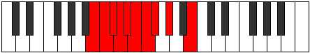 |
| [767](https://ianring.com/musictheory/scales/767) | [Raptygic](ModeANaturalRaptygic.md) | A | A, A#, B, C, C#, D, D#, E, F#, A |  |
| [767](https://ianring.com/musictheory/scales/767) | [Raptygic](ModeFNaturalRaptygic.md) | F | F, F#, G, G#, A, A#, B, C, D, F |  |
| [789](https://ianring.com/musictheory/scales/789) | [Zogitonic](ModeASharpZogitonic.md) | A# | A#, C, D, F#, G, A# |  |
| [789](https://ianring.com/musictheory/scales/789) | [Zogitonic](ModeBFlatZogitonic.md) | Bb | Bb, C, D, Gb, G, Bb |  |
| [791](https://ianring.com/musictheory/scales/791) | [Aeoloptimic](ModeASharpAeoloptimic.md) | A# | A#, B, C, D, E##, F##, A# |  |
| [791](https://ianring.com/musictheory/scales/791) | [Aeoloptimic](ModeBFlatAeoloptimic.md) | Bb | Bb, Cb, Dbb, Ebb, F#, G, Bb |  |
| [797](https://ianring.com/musictheory/scales/797) | [Katocrimic](ModeASharpKatocrimic.md) | A# | A#, B#, C#, D, E##, F##, A# |  |
| [797](https://ianring.com/musictheory/scales/797) | [Katocrimic](ModeBFlatKatocrimic.md) | Bb | Bb, C, Db, Ebb, F#, G, Bb |  |
| [799](https://ianring.com/musictheory/scales/799) | [Lolian](ModeASharpLolian.md) | A# | A#, B, C, Db, Ebb, F#, G, A# |  |
| [799](https://ianring.com/musictheory/scales/799) | [Lolian](ModeBFlatLolian.md) | Bb | Bb, Cb, Dbb, Ebbb, Fbbb, Gb, Abb, Bb |  |
| [809](https://ianring.com/musictheory/scales/809) | [Dogitonic](ModeANaturalDogitonic.md) | A | A, C, D, F, F#, A |  |
| [811](https://ianring.com/musictheory/scales/811) | [Radimic](ModeANaturalRadimic.md) | A | A, Bb, C, D, E#, F#, A |  |
| [813](https://ianring.com/musictheory/scales/813) | [Larimic](ModeANaturalLarimic.md) | A | A, B, C, D, E#, F#, A |  |
| [815](https://ianring.com/musictheory/scales/815) | [Bolian](ModeANaturalBolian.md) | A | A, Bb, Cb, Dbb, Ebb, F, Gb, A |  |
| [821](https://ianring.com/musictheory/scales/821) | [Aeranimic](ModeASharpAeranimic.md) | A# | A#, B#, C##, D#, E##, F##, A# |  |
| [821](https://ianring.com/musictheory/scales/821) | [Aeranimic](ModeBFlatAeranimic.md) | Bb | Bb, C, D, Eb, F#, G, Bb |  |
| [823](https://ianring.com/musictheory/scales/823) | [Stodian](ModeASharpStodian.md) | A# | A#, B, C, D, Eb, F#, G, A# |  |
| [823](https://ianring.com/musictheory/scales/823) | [Stodian](ModeBFlatStodian.md) | Bb | Bb, Cb, Dbb, Ebb, Fbb, Gb, Abb, Bb | 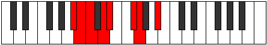 |
| [825](https://ianring.com/musictheory/scales/825) | [Thyptimic](ModeANaturalThyptimic.md) | A | A, B#, C#, D, E#, F#, A |  |
| [827](https://ianring.com/musictheory/scales/827) | [Mixolocrian](ModeANaturalMixolocrian.md) | A | A, Bb, C, Db, Ebb, F, Gb, A |  |
| [829](https://ianring.com/musictheory/scales/829) | [Lygian](ModeASharpLygian.md) | A# | A#, B#, C#, D, Eb, F#, G, A# |  |
| [829](https://ianring.com/musictheory/scales/829) | [Lygian](ModeBFlatLygian.md) | Bb | Bb, C, Db, Ebb, Fbb, Gb, Abb, Bb |  |
| [829](https://ianring.com/musictheory/scales/829) | [Lygian](ModeANaturalLygian.md) | A | A, B, C, Db, Ebb, F, Gb, A |  |
| [831](https://ianring.com/musictheory/scales/831) | [Rodyllic](ModeASharpRodyllic.md) | A# | A#, B, C, C#, D, D#, F#, G, A# |  |
| [831](https://ianring.com/musictheory/scales/831) | [Rodyllic](ModeBFlatRodyllic.md) | Bb | Bb, B, C, Db, D, Eb, Gb, G, Bb |  |
| [831](https://ianring.com/musictheory/scales/831) | [Rodyllic](ModeANaturalRodyllic.md) | A | A, A#, B, C, C#, D, F, F#, A |  |
| [837](https://ianring.com/musictheory/scales/837) | [Epaditonic](ModeFSharpEpaditonic.md) | F# | F#, G#, C, D, D#, F# |  |
| [837](https://ianring.com/musictheory/scales/837) | [Epaditonic](ModeGFlatEpaditonic.md) | Gb | Gb, Ab, C, D, Eb, Gb |  |
| [837](https://ianring.com/musictheory/scales/837) | [Epaditonic](ModeCNaturalEpaditonic.md) | C | C, D, F#, G#, A, C |  |
| [839](https://ianring.com/musictheory/scales/839) | [Ionathimic](ModeFSharpIonathimic.md) | F# | F#, G, Ab, B#, C##, D#, F# |  |
| [839](https://ianring.com/musictheory/scales/839) | [Ionathimic](ModeGFlatIonathimic.md) | Gb | Gb, Abb, Bbbb, C, D, Eb, Gb | 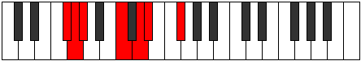 |
| [839](https://ianring.com/musictheory/scales/839) | [Ionathimic](ModeCNaturalIonathimic.md) | C | C, Db, Ebb, F#, G#, A, C |  |
| [841](https://ianring.com/musictheory/scales/841) | [Phrothitonic](ModeFSharpPhrothitonic.md) | F# | F#, A, C, D, D#, F# |  |
| [841](https://ianring.com/musictheory/scales/841) | [Phrothitonic](ModeGFlatPhrothitonic.md) | Gb | Gb, A, C, D, Eb, Gb |  |
| [843](https://ianring.com/musictheory/scales/843) | [Molimic](ModeFSharpMolimic.md) | F# | F#, G, A, B#, C##, D#, F# |  |
| [843](https://ianring.com/musictheory/scales/843) | [Molimic](ModeGFlatMolimic.md) | Gb | Gb, Abb, Bbb, C, D, Eb, Gb |  |
| [845](https://ianring.com/musictheory/scales/845) | [Zyrimic](ModeCNaturalZyrimic.md) | C | C, D, Eb, F#, G#, A, C |  |
| [845](https://ianring.com/musictheory/scales/845) | [Zyrimic](ModeFSharpZyrimic.md) | F# | F#, G#, A, B#, C##, D#, F# |  |
| [845](https://ianring.com/musictheory/scales/845) | [Zyrimic](ModeGFlatZyrimic.md) | Gb | Gb, Ab, Bbb, C, D, Eb, Gb |  |
| [847](https://ianring.com/musictheory/scales/847) | [Ganian](ModeCNaturalGanian.md) | C | C, Db, Ebb, Fbb, Gb, Ab, Bbb, C |  |
| [847](https://ianring.com/musictheory/scales/847) | [Ganian](ModeFSharpGanian.md) | F# | F#, G, Ab, Bbb, C, D, Eb, F# |  |
| [847](https://ianring.com/musictheory/scales/847) | [Ganian](ModeGFlatGanian.md) | Gb | Gb, Abb, Bbbb, Cbbb, Dbb, Ebb, Fbb, Gb |  |
| [849](https://ianring.com/musictheory/scales/849) | [Aerynitonic](ModeFSharpAerynitonic.md) | F# | F#, A#, C, D, D#, F# |  |
| [849](https://ianring.com/musictheory/scales/849) | [Aerynitonic](ModeGFlatAerynitonic.md) | Gb | Gb, Bb, C, D, Eb, Gb |  |
| [851](https://ianring.com/musictheory/scales/851) | [Aerylimic](ModeFSharpAerylimic.md) | F# | F#, G, A#, B#, C##, D#, F# |  |
| [851](https://ianring.com/musictheory/scales/851) | [Aerylimic](ModeGFlatAerylimic.md) | Gb | Gb, Abb, Bb, C, D, Eb, Gb |  |
| [853](https://ianring.com/musictheory/scales/853) | [Epothimic](ModeCNaturalEpothimic.md) | C | C, D, E, F#, G#, A, C |  |
| [853](https://ianring.com/musictheory/scales/853) | [Epothimic](ModeASharpEpothimic.md) | A# | A#, B#, C##, D##, E##, F##, A# |  |
| [853](https://ianring.com/musictheory/scales/853) | [Epothimic](ModeBFlatEpothimic.md) | Bb | Bb, C, D, E, F#, G, Bb |  |
| [853](https://ianring.com/musictheory/scales/853) | [Epothimic](ModeFSharpEpothimic.md) | F# | F#, G#, A#, B#, C##, D#, F# |  |
| [853](https://ianring.com/musictheory/scales/853) | [Epothimic](ModeGFlatEpothimic.md) | Gb | Gb, Ab, Bb, C, D, Eb, Gb |  |
| [855](https://ianring.com/musictheory/scales/855) | [Porian](ModeCNaturalPorian.md) | C | C, Db, Ebb, Fb, Gb, Ab, Bbb, C |  |
| [855](https://ianring.com/musictheory/scales/855) | [Porian](ModeFSharpPorian.md) | F# | F#, G, Ab, Bb, C, D, Eb, F# |  |
| [855](https://ianring.com/musictheory/scales/855) | [Porian](ModeGFlatPorian.md) | Gb | Gb, Abb, Bbbb, Cbb, Dbb, Ebb, Fbb, Gb |  |
| [855](https://ianring.com/musictheory/scales/855) | [Porian](ModeASharpPorian.md) | A# | A#, B, C, D, E, F#, G, A# |  |
| [855](https://ianring.com/musictheory/scales/855) | [Porian](ModeBFlatPorian.md) | Bb | Bb, Cb, Dbb, Ebb, Fb, Gb, Abb, Bb |  |
| [857](https://ianring.com/musictheory/scales/857) | [Aeolydimic](ModeFSharpAeolydimic.md) | F# | F#, G##, A#, B#, C##, D#, F# |  |
| [857](https://ianring.com/musictheory/scales/857) | [Aeolydimic](ModeGFlatAeolydimic.md) | Gb | Gb, A, Bb, C, D, Eb, Gb |  |
| [859](https://ianring.com/musictheory/scales/859) | [Pathian](ModeFSharpPathian.md) | F# | F#, G, A, Bb, C, D, Eb, F# |  |
| [859](https://ianring.com/musictheory/scales/859) | [Pathian](ModeGFlatPathian.md) | Gb | Gb, Abb, Bbb, Cbb, Dbb, Ebb, Fbb, Gb |  |
| [861](https://ianring.com/musictheory/scales/861) | [Rylian](ModeCNaturalRylian.md) | C | C, D, Eb, Fb, Gb, Ab, Bbb, C |  |
| [861](https://ianring.com/musictheory/scales/861) | [Rylian](ModeASharpRylian.md) | A# | A#, B#, C#, D, E, F#, G, A# |  |
| [861](https://ianring.com/musictheory/scales/861) | [Rylian](ModeBFlatRylian.md) | Bb | Bb, C, Db, Ebb, Fb, Gb, Abb, Bb |  |
| [861](https://ianring.com/musictheory/scales/861) | [Rylian](ModeFSharpRylian.md) | F# | F#, G#, A, Bb, C, D, Eb, F# |  |
| [861](https://ianring.com/musictheory/scales/861) | [Rylian](ModeGFlatRylian.md) | Gb | Gb, Ab, Bbb, Cbb, Dbb, Ebb, Fbb, Gb |  |
| [863](https://ianring.com/musictheory/scales/863) | [Pyryllic](ModeCNaturalPyryllic.md) | C | C, C#, D, D#, E, F#, G#, A, C |  |
| [863](https://ianring.com/musictheory/scales/863) | [Pyryllic](ModeFSharpPyryllic.md) | F# | F#, G, G#, A, A#, C, D, D#, F# |  |
| [863](https://ianring.com/musictheory/scales/863) | [Pyryllic](ModeGFlatPyryllic.md) | Gb | Gb, G, Ab, A, Bb, C, D, Eb, Gb |  |
| [863](https://ianring.com/musictheory/scales/863) | [Pyryllic](ModeASharpPyryllic.md) | A# | A#, B, C, C#, D, E, F#, G, A# |  |
| [863](https://ianring.com/musictheory/scales/863) | [Pyryllic](ModeBFlatPyryllic.md) | Bb | Bb, B, C, Db, D, E, Gb, G, Bb |  |
| [867](https://ianring.com/musictheory/scales/867) | [Phrocrimic](ModeFSharpPhrocrimic.md) | F# | F#, G, A##, B#, C##, D#, F# |  |
| [867](https://ianring.com/musictheory/scales/867) | [Phrocrimic](ModeGFlatPhrocrimic.md) | Gb | Gb, Abb, B, C, D, Eb, Gb |  |
| [869](https://ianring.com/musictheory/scales/869) | [Kothimic](ModeCNaturalKothimic.md) | C | C, D, E#, F#, G#, A, C |  |
| [869](https://ianring.com/musictheory/scales/869) | [Kothimic](ModeFSharpKothimic.md) | F# | F#, G#, A##, B#, C##, D#, F# |  |
| [869](https://ianring.com/musictheory/scales/869) | [Kothimic](ModeGFlatKothimic.md) | Gb | Gb, Ab, B, C, D, Eb, Gb |  |
| [871](https://ianring.com/musictheory/scales/871) | [Epadian](ModeCNaturalEpadian.md) | C | C, Db, Ebb, F, Gb, Ab, Bbb, C |  |
| [871](https://ianring.com/musictheory/scales/871) | [Epadian](ModeFSharpEpadian.md) | F# | F#, G, Ab, B, C, D, Eb, F# |  |
| [871](https://ianring.com/musictheory/scales/871) | [Epadian](ModeGFlatEpadian.md) | Gb | Gb, Abb, Bbbb, Cb, Dbb, Ebb, Fbb, Gb |  |
| [873](https://ianring.com/musictheory/scales/873) | [Bagimic](ModeANaturalBagimic.md) | A | A, B#, C##, D#, E#, F#, A |  |
| [873](https://ianring.com/musictheory/scales/873) | [Bagimic](ModeFSharpBagimic.md) | F# | F#, G##, A##, B#, C##, D#, F# |  |
| [873](https://ianring.com/musictheory/scales/873) | [Bagimic](ModeGFlatBagimic.md) | Gb | Gb, A, B, C, D, Eb, Gb |  |
| [875](https://ianring.com/musictheory/scales/875) | [Stothian](ModeANaturalStothian.md) | A | A, Bb, C, D, Eb, F, Gb, A |  |
| [875](https://ianring.com/musictheory/scales/875) | [Stothian](ModeFSharpStothian.md) | F# | F#, G, A, B, C, D, Eb, F# |  |
| [875](https://ianring.com/musictheory/scales/875) | [Stothian](ModeGFlatStothian.md) | Gb | Gb, Abb, Bbb, Cb, Dbb, Ebb, Fbb, Gb |  |
| [877](https://ianring.com/musictheory/scales/877) | [Aeraptian](ModeCNaturalAeraptian.md) | C | C, D, Eb, F, Gb, Ab, Bbb, C |  |
| [877](https://ianring.com/musictheory/scales/877) | [Aeraptian](ModeANaturalAeraptian.md) | A | A, B, C, D, Eb, F, Gb, A |  |
| [877](https://ianring.com/musictheory/scales/877) | [Aeraptian](ModeFSharpAeraptian.md) | F# | F#, G#, A, B, C, D, Eb, F# |  |
| [877](https://ianring.com/musictheory/scales/877) | [Aeraptian](ModeGFlatAeraptian.md) | Gb | Gb, Ab, Bbb, Cb, Dbb, Ebb, Fbb, Gb |  |
| [879](https://ianring.com/musictheory/scales/879) | [Aeolocryllic](ModeCNaturalAeolocryllic.md) | C | C, C#, D, D#, F, F#, G#, A, C |  |
| [879](https://ianring.com/musictheory/scales/879) | [Aeolocryllic](ModeFSharpAeolocryllic.md) | F# | F#, G, G#, A, B, C, D, D#, F# |  |
| [879](https://ianring.com/musictheory/scales/879) | [Aeolocryllic](ModeGFlatAeolocryllic.md) | Gb | Gb, G, Ab, A, B, C, D, Eb, Gb |  |
| [879](https://ianring.com/musictheory/scales/879) | [Aeolocryllic](ModeANaturalAeolocryllic.md) | A | A, A#, B, C, D, D#, F, F#, A |  |
| [881](https://ianring.com/musictheory/scales/881) | [Aerothimic](ModeFSharpAerothimic.md) | F# | F#, G###, A##, B#, C##, D#, F# |  |
| [881](https://ianring.com/musictheory/scales/881) | [Aerothimic](ModeGFlatAerothimic.md) | Gb | Gb, A#, B, C, D, Eb, Gb |  |
| [883](https://ianring.com/musictheory/scales/883) | [Ralian](ModeFSharpRalian.md) | F# | F#, G, A#, B, C, D, Eb, F# |  |
| [883](https://ianring.com/musictheory/scales/883) | [Ralian](ModeGFlatRalian.md) | Gb | Gb, Abb, Bb, Cb, Dbb, Ebb, Fbb, Gb |  |
| [885](https://ianring.com/musictheory/scales/885) | [Sathian](ModeCNaturalSathian.md) | C | C, D, E, F, Gb, Ab, Bbb, C |  |
| [885](https://ianring.com/musictheory/scales/885) | [Sathian](ModeASharpSathian.md) | A# | A#, B#, C##, D#, E, F#, G, A# |  |
| [885](https://ianring.com/musictheory/scales/885) | [Sathian](ModeBFlatSathian.md) | Bb | Bb, C, D, Eb, Fb, Gb, Abb, Bb |  |
| [885](https://ianring.com/musictheory/scales/885) | [Sathian](ModeFSharpSathian.md) | F# | F#, G#, A#, B, C, D, Eb, F# |  |
| [885](https://ianring.com/musictheory/scales/885) | [Sathian](ModeGFlatSathian.md) | Gb | Gb, Ab, Bb, Cb, Dbb, Ebb, Fbb, Gb |  |
| [887](https://ianring.com/musictheory/scales/887) | [Sathyllic](ModeCNaturalSathyllic.md) | C | C, C#, D, E, F, F#, G#, A, C |  |
| [887](https://ianring.com/musictheory/scales/887) | [Sathyllic](ModeASharpSathyllic.md) | A# | A#, B, C, D, D#, E, F#, G, A# |  |
| [887](https://ianring.com/musictheory/scales/887) | [Sathyllic](ModeBFlatSathyllic.md) | Bb | Bb, B, C, D, Eb, E, Gb, G, Bb |  |
| [887](https://ianring.com/musictheory/scales/887) | [Sathyllic](ModeFSharpSathyllic.md) | F# | F#, G, G#, A#, B, C, D, D#, F# |  |
| [887](https://ianring.com/musictheory/scales/887) | [Sathyllic](ModeGFlatSathyllic.md) | Gb | Gb, G, Ab, Bb, B, C, D, Eb, Gb |  |
| [889](https://ianring.com/musictheory/scales/889) | [Borian](ModeANaturalBorian.md) | A | A, B#, C#, D, Eb, F, Gb, A |  |
| [889](https://ianring.com/musictheory/scales/889) | [Borian](ModeFSharpBorian.md) | F# | F#, G##, A#, B, C, D, Eb, F# |  |
| [889](https://ianring.com/musictheory/scales/889) | [Borian](ModeGFlatBorian.md) | Gb | Gb, A, Bb, Cb, Dbb, Ebb, Fbb, Gb |  |
| [891](https://ianring.com/musictheory/scales/891) | [Ionilyllic](ModeANaturalIonilyllic.md) | A | A, A#, C, C#, D, D#, F, F#, A |  |
| [891](https://ianring.com/musictheory/scales/891) | [Ionilyllic](ModeFSharpIonilyllic.md) | F# | F#, G, A, A#, B, C, D, D#, F# |  |
| [891](https://ianring.com/musictheory/scales/891) | [Ionilyllic](ModeGFlatIonilyllic.md) | Gb | Gb, G, A, Bb, B, C, D, Eb, Gb |  |
| [893](https://ianring.com/musictheory/scales/893) | [Pycryllic](ModeCNaturalPycryllic.md) | C | C, D, D#, E, F, F#, G#, A, C |  |
| [893](https://ianring.com/musictheory/scales/893) | [Pycryllic](ModeASharpPycryllic.md) | A# | A#, C, C#, D, D#, E, F#, G, A# |  |
| [893](https://ianring.com/musictheory/scales/893) | [Pycryllic](ModeBFlatPycryllic.md) | Bb | Bb, C, Db, D, Eb, E, Gb, G, Bb |  |
| [893](https://ianring.com/musictheory/scales/893) | [Pycryllic](ModeANaturalPycryllic.md) | A | A, B, C, C#, D, D#, F, F#, A |  |
| [893](https://ianring.com/musictheory/scales/893) | [Pycryllic](ModeFSharpPycryllic.md) | F# | F#, G#, A, A#, B, C, D, D#, F# |  |
| [893](https://ianring.com/musictheory/scales/893) | [Pycryllic](ModeGFlatPycryllic.md) | Gb | Gb, Ab, A, Bb, B, C, D, Eb, Gb |  |
| [895](https://ianring.com/musictheory/scales/895) | [Aeolathygic](ModeCNaturalAeolathygic.md) | C | C, C#, D, D#, E, F, F#, G#, A, C |  |
| [895](https://ianring.com/musictheory/scales/895) | [Aeolathygic](ModeASharpAeolathygic.md) | A# | A#, B, C, C#, D, D#, E, F#, G, A# |  |
| [895](https://ianring.com/musictheory/scales/895) | [Aeolathygic](ModeBFlatAeolathygic.md) | Bb | Bb, B, C, Db, D, Eb, E, Gb, G, Bb |  |
| [895](https://ianring.com/musictheory/scales/895) | [Aeolathygic](ModeANaturalAeolathygic.md) | A | A, A#, B, C, C#, D, D#, F, F#, A |  |
| [895](https://ianring.com/musictheory/scales/895) | [Aeolathygic](ModeFSharpAeolathygic.md) | F# | F#, G, G#, A, A#, B, C, D, D#, F# |  |
| [895](https://ianring.com/musictheory/scales/895) | [Aeolathygic](ModeGFlatAeolathygic.md) | Gb | Gb, G, Ab, A, Bb, B, C, D, Eb, Gb |  |
| [907](https://ianring.com/musictheory/scales/907) | [Tholimic](ModeFNaturalTholimic.md) | F | F, Gb, Ab, B#, C#, D, F |  |
| [907](https://ianring.com/musictheory/scales/907) | [Tholimic](ModeBNaturalTholimic.md) | B | B, C, D, E##, F##, G#, B |  |
| [911](https://ianring.com/musictheory/scales/911) | [Radian](ModeFNaturalRadian.md) | F | F, Gb, Abb, Bbbb, C, Db, Ebb, F |  |
| [911](https://ianring.com/musictheory/scales/911) | [Radian](ModeBNaturalRadian.md) | B | B, C, Db, Ebb, F#, G, Ab, B |  |
| [915](https://ianring.com/musictheory/scales/915) | [Loptimic](ModeFNaturalLoptimic.md) | F | F, Gb, A, B#, C#, D, F |  |
| [917](https://ianring.com/musictheory/scales/917) | [Dygimic](ModeASharpDygimic.md) | A# | A#, B#, C##, D###, E##, F##, A# |  |
| [917](https://ianring.com/musictheory/scales/917) | [Dygimic](ModeBFlatDygimic.md) | Bb | Bb, C, D, E#, F#, G, Bb |  |
| [919](https://ianring.com/musictheory/scales/919) | [Gathian](ModeFNaturalGathian.md) | F | F, Gb, Abb, Bbb, C, Db, Ebb, F |  |
| [919](https://ianring.com/musictheory/scales/919) | [Gathian](ModeASharpGathian.md) | A# | A#, B, C, D, E#, F#, G, A# |  |
| [919](https://ianring.com/musictheory/scales/919) | [Gathian](ModeBFlatGathian.md) | Bb | Bb, Cb, Dbb, Ebb, F, Gb, Abb, Bb |  |
| [923](https://ianring.com/musictheory/scales/923) | [Ionodian](ModeFNaturalIonodian.md) | F | F, Gb, Ab, Bbb, C, Db, Ebb, F |  |
| [923](https://ianring.com/musictheory/scales/923) | [Ionodian](ModeBNaturalIonodian.md) | B | B, C, D, Eb, F#, G, Ab, B |  |
| [925](https://ianring.com/musictheory/scales/925) | [Mythian](ModeASharpMythian.md) | A# | A#, B#, C#, D, E#, F#, G, A# |  |
| [925](https://ianring.com/musictheory/scales/925) | [Mythian](ModeBFlatMythian.md) | Bb | Bb, C, Db, Ebb, F, Gb, Abb, Bb |  |
| [927](https://ianring.com/musictheory/scales/927) | [Koptyllic](ModeFNaturalKoptyllic.md) | F | F, F#, G, G#, A, C, C#, D, F |  |
| [927](https://ianring.com/musictheory/scales/927) | [Koptyllic](ModeBNaturalKoptyllic.md) | B | B, C, C#, D, D#, F#, G, G#, B |  |
| [927](https://ianring.com/musictheory/scales/927) | [Koptyllic](ModeASharpKoptyllic.md) | A# | A#, B, C, C#, D, F, F#, G, A# |  |
| [927](https://ianring.com/musictheory/scales/927) | [Koptyllic](ModeBFlatKoptyllic.md) | Bb | Bb, B, C, Db, D, F, Gb, G, Bb |  |
| [931](https://ianring.com/musictheory/scales/931) | [Bacrimic](ModeFNaturalBacrimic.md) | F | F, Gb, A#, B#, C#, D, F |  |
| [935](https://ianring.com/musictheory/scales/935) | [Katarian](ModeFNaturalKatarian.md) | F | F, Gb, Abb, Bb, C, Db, Ebb, F |  |
| [937](https://ianring.com/musictheory/scales/937) | [Stothimic](ModeANaturalStothimic.md) | A | A, B#, C##, D##, E#, F#, A | 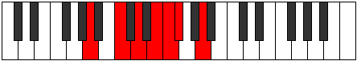 |
| [939](https://ianring.com/musictheory/scales/939) | [Dyptian](ModeFNaturalDyptian.md) | F | F, Gb, Ab, Bb, C, Db, Ebb, F |  |
| [939](https://ianring.com/musictheory/scales/939) | [Dyptian](ModeANaturalDyptian.md) | A | A, Bb, C, D, E, F, Gb, A |  |
| [939](https://ianring.com/musictheory/scales/939) | [Dyptian](ModeBNaturalDyptian.md) | B | B, C, D, E, F#, G, Ab, B |  |
| [941](https://ianring.com/musictheory/scales/941) | [Phrorian](ModeANaturalPhrorian.md) | A | A, B, C, D, E, F, Gb, A | 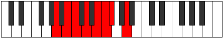 |
| [943](https://ianring.com/musictheory/scales/943) | [Aerygyllic](ModeFNaturalAerygyllic.md) | F | F, F#, G, G#, A#, C, C#, D, F |  |
| [943](https://ianring.com/musictheory/scales/943) | [Aerygyllic](ModeBNaturalAerygyllic.md) | B | B, C, C#, D, E, F#, G, G#, B |  |
| [943](https://ianring.com/musictheory/scales/943) | [Aerygyllic](ModeANaturalAerygyllic.md) | A | A, A#, B, C, D, E, F, F#, A |  |
| [947](https://ianring.com/musictheory/scales/947) | [Modian](ModeFNaturalModian.md) | F | F, Gb, A, Bb, C, Db, Ebb, F |  |
| [949](https://ianring.com/musictheory/scales/949) | [Ionagian](ModeASharpIonagian.md) | A# | A#, B#, C##, D#, E#, F#, G, A# |  |
| [949](https://ianring.com/musictheory/scales/949) | [Ionagian](ModeBFlatIonagian.md) | Bb | Bb, C, D, Eb, F, Gb, Abb, Bb |  |
| [951](https://ianring.com/musictheory/scales/951) | [Thogyllic](ModeFNaturalThogyllic.md) | F | F, F#, G, A, A#, C, C#, D, F |  |
| [951](https://ianring.com/musictheory/scales/951) | [Thogyllic](ModeASharpThogyllic.md) | A# | A#, B, C, D, D#, F, F#, G, A# |  |
| [951](https://ianring.com/musictheory/scales/951) | [Thogyllic](ModeBFlatThogyllic.md) | Bb | Bb, B, C, D, Eb, F, Gb, G, Bb |  |
| [953](https://ianring.com/musictheory/scales/953) | [Stoptian](ModeANaturalStoptian.md) | A | A, B#, C#, D, E, F, Gb, A |  |
| [955](https://ianring.com/musictheory/scales/955) | [Ionogyllic](ModeANaturalIonogyllic.md) | A | A, A#, C, C#, D, E, F, F#, A |  |
| [955](https://ianring.com/musictheory/scales/955) | [Ionogyllic](ModeFNaturalIonogyllic.md) | F | F, F#, G#, A, A#, C, C#, D, F |  |
| [955](https://ianring.com/musictheory/scales/955) | [Ionogyllic](ModeBNaturalIonogyllic.md) | B | B, C, D, D#, E, F#, G, G#, B |  |
| [957](https://ianring.com/musictheory/scales/957) | [Phronyllic](ModeASharpPhronyllic.md) | A# | A#, C, C#, D, D#, F, F#, G, A# |  |
| [957](https://ianring.com/musictheory/scales/957) | [Phronyllic](ModeBFlatPhronyllic.md) | Bb | Bb, C, Db, D, Eb, F, Gb, G, Bb |  |
| [957](https://ianring.com/musictheory/scales/957) | [Phronyllic](ModeANaturalPhronyllic.md) | A | A, B, C, C#, D, E, F, F#, A |  |
| [959](https://ianring.com/musictheory/scales/959) | [Katylygic](ModeFNaturalKatylygic.md) | F | F, F#, G, G#, A, A#, C, C#, D, F |  |
| [959](https://ianring.com/musictheory/scales/959) | [Katylygic](ModeBNaturalKatylygic.md) | B | B, C, C#, D, D#, E, F#, G, G#, B |  |
| [959](https://ianring.com/musictheory/scales/959) | [Katylygic](ModeASharpKatylygic.md) | A# | A#, B, C, C#, D, D#, F, F#, G, A# |  |
| [959](https://ianring.com/musictheory/scales/959) | [Katylygic](ModeBFlatKatylygic.md) | Bb | Bb, B, C, Db, D, Eb, F, Gb, G, Bb |  |
| [959](https://ianring.com/musictheory/scales/959) | [Katylygic](ModeANaturalKatylygic.md) | A | A, A#, B, C, C#, D, E, F, F#, A |  |
| [965](https://ianring.com/musictheory/scales/965) | [Ionothimic](ModeFSharpIonothimic.md) | F# | F#, G#, A###, B##, C##, D#, F# |  |
| [965](https://ianring.com/musictheory/scales/965) | [Ionothimic](ModeGFlatIonothimic.md) | Gb | Gb, Ab, B#, C#, D, Eb, Gb |  |
| [965](https://ianring.com/musictheory/scales/965) | [Ionothimic](ModeCNaturalIonothimic.md) | C | C, D, E##, F##, G#, A, C |  |
| [967](https://ianring.com/musictheory/scales/967) | [Aeolanian](ModeFSharpAeolanian.md) | F# | F#, G, Ab, B#, C#, D, Eb, F# |  |
| [967](https://ianring.com/musictheory/scales/967) | [Aeolanian](ModeGFlatAeolanian.md) | Gb | Gb, Abb, Bbbb, C, Db, Ebb, Fbb, Gb |  |
| [967](https://ianring.com/musictheory/scales/967) | [Aeolanian](ModeCNaturalAeolanian.md) | C | C, Db, Ebb, F#, G, Ab, Bbb, C |  |
| [967](https://ianring.com/musictheory/scales/967) | [Aeolanian](ModeFNaturalAeolanian.md) | F | F, Gb, Abb, B, C, Db, Ebb, F |  |
| [969](https://ianring.com/musictheory/scales/969) | [Ionogimic](ModeFSharpIonogimic.md) | F# | F#, G##, A###, B##, C##, D#, F# |  |
| [969](https://ianring.com/musictheory/scales/969) | [Ionogimic](ModeGFlatIonogimic.md) | Gb | Gb, A, B#, C#, D, Eb, Gb | 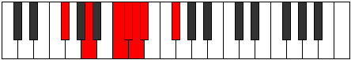 |
| [971](https://ianring.com/musictheory/scales/971) | [Ladian](ModeFSharpLadian.md) | F# | F#, G, A, B#, C#, D, Eb, F# |  |
| [971](https://ianring.com/musictheory/scales/971) | [Ladian](ModeGFlatLadian.md) | Gb | Gb, Abb, Bbb, C, Db, Ebb, Fbb, Gb |  |
| [971](https://ianring.com/musictheory/scales/971) | [Ladian](ModeFNaturalLadian.md) | F | F, Gb, Ab, B, C, Db, Ebb, F |  |
| [971](https://ianring.com/musictheory/scales/971) | [Ladian](ModeBNaturalLadian.md) | B | B, C, D, E#, F#, G, Ab, B |  |
| [973](https://ianring.com/musictheory/scales/973) | [Phryptian](ModeFSharpPhryptian.md) | F# | F#, G#, A, B#, C#, D, Eb, F# |  |
| [973](https://ianring.com/musictheory/scales/973) | [Phryptian](ModeGFlatPhryptian.md) | Gb | Gb, Ab, Bbb, C, Db, Ebb, Fbb, Gb |  |
| [973](https://ianring.com/musictheory/scales/973) | [Phryptian](ModeCNaturalPhryptian.md) | C | C, D, Eb, F#, G, Ab, Bbb, C |  |
| [975](https://ianring.com/musictheory/scales/975) | [Katogyllic](ModeCNaturalKatogyllic.md) | C | C, C#, D, D#, F#, G, G#, A, C |  |
| [975](https://ianring.com/musictheory/scales/975) | [Katogyllic](ModeFSharpKatogyllic.md) | F# | F#, G, G#, A, C, C#, D, D#, F# |  |
| [975](https://ianring.com/musictheory/scales/975) | [Katogyllic](ModeGFlatKatogyllic.md) | Gb | Gb, G, Ab, A, C, Db, D, Eb, Gb |  |
| [975](https://ianring.com/musictheory/scales/975) | [Katogyllic](ModeFNaturalKatogyllic.md) | F | F, F#, G, G#, B, C, C#, D, F |  |
| [975](https://ianring.com/musictheory/scales/975) | [Katogyllic](ModeBNaturalKatogyllic.md) | B | B, C, C#, D, F, F#, G, G#, B |  |
| [977](https://ianring.com/musictheory/scales/977) | [Kocrimic](ModeFSharpKocrimic.md) | F# | F#, G###, A###, B##, C##, D#, F# |  |
| [977](https://ianring.com/musictheory/scales/977) | [Kocrimic](ModeGFlatKocrimic.md) | Gb | Gb, A#, B#, C#, D, Eb, Gb |  |
| [979](https://ianring.com/musictheory/scales/979) | [Thogian](ModeFSharpThogian.md) | F# | F#, G, A#, B#, C#, D, Eb, F# |  |
| [979](https://ianring.com/musictheory/scales/979) | [Thogian](ModeGFlatThogian.md) | Gb | Gb, Abb, Bb, C, Db, Ebb, Fbb, Gb |  |
| [979](https://ianring.com/musictheory/scales/979) | [Thogian](ModeFNaturalThogian.md) | F | F, Gb, A, B, C, Db, Ebb, F |  |
| [981](https://ianring.com/musictheory/scales/981) | [Bacrian](ModeCNaturalBacrian.md) | C | C, D, E, F#, G, Ab, Bbb, C |  |
| [981](https://ianring.com/musictheory/scales/981) | [Bacrian](ModeASharpBacrian.md) | A# | A#, B#, C##, D##, E#, F#, G, A# |  |
| [981](https://ianring.com/musictheory/scales/981) | [Bacrian](ModeBFlatBacrian.md) | Bb | Bb, C, D, E, F, Gb, Abb, Bb |  |
| [981](https://ianring.com/musictheory/scales/981) | [Bacrian](ModeFSharpBacrian.md) | F# | F#, G#, A#, B#, C#, D, Eb, F# | 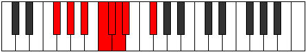 |
| [981](https://ianring.com/musictheory/scales/981) | [Bacrian](ModeGFlatBacrian.md) | Gb | Gb, Ab, Bb, C, Db, Ebb, Fbb, Gb |  |
| [983](https://ianring.com/musictheory/scales/983) | [Epygyllic](ModeCNaturalEpygyllic.md) | C | C, C#, D, E, F#, G, G#, A, C | 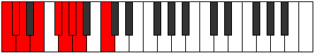 |
| [983](https://ianring.com/musictheory/scales/983) | [Epygyllic](ModeFSharpEpygyllic.md) | F# | F#, G, G#, A#, C, C#, D, D#, F# |  |
| [983](https://ianring.com/musictheory/scales/983) | [Epygyllic](ModeGFlatEpygyllic.md) | Gb | Gb, G, Ab, Bb, C, Db, D, Eb, Gb |  |
| [983](https://ianring.com/musictheory/scales/983) | [Epygyllic](ModeFNaturalEpygyllic.md) | F | F, F#, G, A, B, C, C#, D, F |  |
| [983](https://ianring.com/musictheory/scales/983) | [Epygyllic](ModeASharpEpygyllic.md) | A# | A#, B, C, D, E, F, F#, G, A# |  |
| [983](https://ianring.com/musictheory/scales/983) | [Epygyllic](ModeBFlatEpygyllic.md) | Bb | Bb, B, C, D, E, F, Gb, G, Bb |  |
| [985](https://ianring.com/musictheory/scales/985) | [Raptian](ModeFSharpRaptian.md) | F# | F#, G##, A#, B#, C#, D, Eb, F# | 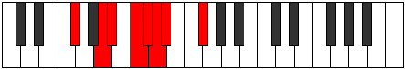 |
| [985](https://ianring.com/musictheory/scales/985) | [Raptian](ModeGFlatRaptian.md) | Gb | Gb, A, Bb, C, Db, Ebb, Fbb, Gb |  |
| [987](https://ianring.com/musictheory/scales/987) | [Aeraptyllic](ModeFSharpAeraptyllic.md) | F# | F#, G, A, A#, C, C#, D, D#, F# |  |
| [987](https://ianring.com/musictheory/scales/987) | [Aeraptyllic](ModeGFlatAeraptyllic.md) | Gb | Gb, G, A, Bb, C, Db, D, Eb, Gb |  |
| [987](https://ianring.com/musictheory/scales/987) | [Aeraptyllic](ModeBNaturalAeraptyllic.md) | B | B, C, D, D#, F, F#, G, G#, B |  |
| [987](https://ianring.com/musictheory/scales/987) | [Aeraptyllic](ModeFNaturalAeraptyllic.md) | F | F, F#, G#, A, B, C, C#, D, F |  |
| [989](https://ianring.com/musictheory/scales/989) | [Phrolyllic](ModeCNaturalPhrolyllic.md) | C | C, D, D#, E, F#, G, G#, A, C |  |
| [989](https://ianring.com/musictheory/scales/989) | [Phrolyllic](ModeASharpPhrolyllic.md) | A# | A#, C, C#, D, E, F, F#, G, A# |  |
| [989](https://ianring.com/musictheory/scales/989) | [Phrolyllic](ModeBFlatPhrolyllic.md) | Bb | Bb, C, Db, D, E, F, Gb, G, Bb |  |
| [989](https://ianring.com/musictheory/scales/989) | [Phrolyllic](ModeFSharpPhrolyllic.md) | F# | F#, G#, A, A#, C, C#, D, D#, F# |  |
| [989](https://ianring.com/musictheory/scales/989) | [Phrolyllic](ModeGFlatPhrolyllic.md) | Gb | Gb, Ab, A, Bb, C, Db, D, Eb, Gb |  |
| [991](https://ianring.com/musictheory/scales/991) | [Aeolygic](ModeCNaturalAeolygic.md) | C | C, C#, D, D#, E, F#, G, G#, A, C |  |
| [991](https://ianring.com/musictheory/scales/991) | [Aeolygic](ModeFSharpAeolygic.md) | F# | F#, G, G#, A, A#, C, C#, D, D#, F# |  |
| [991](https://ianring.com/musictheory/scales/991) | [Aeolygic](ModeGFlatAeolygic.md) | Gb | Gb, G, Ab, A, Bb, C, Db, D, Eb, Gb |  |
| [991](https://ianring.com/musictheory/scales/991) | [Aeolygic](ModeBNaturalAeolygic.md) | B | B, C, C#, D, D#, F, F#, G, G#, B |  |
| [991](https://ianring.com/musictheory/scales/991) | [Aeolygic](ModeFNaturalAeolygic.md) | F | F, F#, G, G#, A, B, C, C#, D, F |  |
| [991](https://ianring.com/musictheory/scales/991) | [Aeolygic](ModeASharpAeolygic.md) | A# | A#, B, C, C#, D, E, F, F#, G, A# |  |
| [991](https://ianring.com/musictheory/scales/991) | [Aeolygic](ModeBFlatAeolygic.md) | Bb | Bb, B, C, Db, D, E, F, Gb, G, Bb |  |
| [995](https://ianring.com/musictheory/scales/995) | [Phrathian](ModeFSharpPhrathian.md) | F# | F#, G, A##, B#, C#, D, Eb, F# |  |
| [995](https://ianring.com/musictheory/scales/995) | [Phrathian](ModeGFlatPhrathian.md) | Gb | Gb, Abb, B, C, Db, Ebb, Fbb, Gb |  |
| [995](https://ianring.com/musictheory/scales/995) | [Phrathian](ModeFNaturalPhrathian.md) | F | F, Gb, A#, B, C, Db, Ebb, F |  |
| [997](https://ianring.com/musictheory/scales/997) | [Rycrian](ModeCNaturalRycrian.md) | C | C, D, E#, F#, G, Ab, Bbb, C |  |
| [997](https://ianring.com/musictheory/scales/997) | [Rycrian](ModeFSharpRycrian.md) | F# | F#, G#, A##, B#, C#, D, Eb, F# |  |
| [997](https://ianring.com/musictheory/scales/997) | [Rycrian](ModeGFlatRycrian.md) | Gb | Gb, Ab, B, C, Db, Ebb, Fbb, Gb |  |
| [999](https://ianring.com/musictheory/scales/999) | [Bylyllic](ModeCNaturalBylyllic.md) | C | C, C#, D, F, F#, G, G#, A, C |  |
| [999](https://ianring.com/musictheory/scales/999) | [Bylyllic](ModeFSharpBylyllic.md) | F# | F#, G, G#, B, C, C#, D, D#, F# |  |
| [999](https://ianring.com/musictheory/scales/999) | [Bylyllic](ModeGFlatBylyllic.md) | Gb | Gb, G, Ab, B, C, Db, D, Eb, Gb |  |
| [999](https://ianring.com/musictheory/scales/999) | [Bylyllic](ModeFNaturalBylyllic.md) | F | F, F#, G, A#, B, C, C#, D, F |  |
| [1001](https://ianring.com/musictheory/scales/1001) | [Badian](ModeANaturalBadian.md) | A | A, B#, C##, D#, E, F, Gb, A |  |
| [1001](https://ianring.com/musictheory/scales/1001) | [Badian](ModeFSharpBadian.md) | F# | F#, G##, A##, B#, C#, D, Eb, F# |  |
| [1001](https://ianring.com/musictheory/scales/1001) | [Badian](ModeGFlatBadian.md) | Gb | Gb, A, B, C, Db, Ebb, Fbb, Gb |  |
| [1003](https://ianring.com/musictheory/scales/1003) | [Ionyryllic](ModeANaturalIonyryllic.md) | A | A, A#, C, D, D#, E, F, F#, A |  |
| [1003](https://ianring.com/musictheory/scales/1003) | [Ionyryllic](ModeBNaturalIonyryllic.md) | B | B, C, D, E, F, F#, G, G#, B |  |
| [1003](https://ianring.com/musictheory/scales/1003) | [Ionyryllic](ModeFSharpIonyryllic.md) | F# | F#, G, A, B, C, C#, D, D#, F# |  |
| [1003](https://ianring.com/musictheory/scales/1003) | [Ionyryllic](ModeGFlatIonyryllic.md) | Gb | Gb, G, A, B, C, Db, D, Eb, Gb |  |
| [1003](https://ianring.com/musictheory/scales/1003) | [Ionyryllic](ModeFNaturalIonyryllic.md) | F | F, F#, G#, A#, B, C, C#, D, F |  |
| [1005](https://ianring.com/musictheory/scales/1005) | [Radyllic](ModeCNaturalRadyllic.md) | C | C, D, D#, F, F#, G, G#, A, C |  |
| [1005](https://ianring.com/musictheory/scales/1005) | [Radyllic](ModeANaturalRadyllic.md) | A | A, B, C, D, D#, E, F, F#, A |  |
| [1005](https://ianring.com/musictheory/scales/1005) | [Radyllic](ModeFSharpRadyllic.md) | F# | F#, G#, A, B, C, C#, D, D#, F# |  |
| [1005](https://ianring.com/musictheory/scales/1005) | [Radyllic](ModeGFlatRadyllic.md) | Gb | Gb, Ab, A, B, C, Db, D, Eb, Gb |  |
| [1007](https://ianring.com/musictheory/scales/1007) | [Ionycrygic](ModeCNaturalIonycrygic.md) | C | C, C#, D, D#, F, F#, G, G#, A, C |  |
| [1007](https://ianring.com/musictheory/scales/1007) | [Ionycrygic](ModeBNaturalIonycrygic.md) | B | B, C, C#, D, E, F, F#, G, G#, B |  |
| [1007](https://ianring.com/musictheory/scales/1007) | [Ionycrygic](ModeFSharpIonycrygic.md) | F# | F#, G, G#, A, B, C, C#, D, D#, F# |  |
| [1007](https://ianring.com/musictheory/scales/1007) | [Ionycrygic](ModeGFlatIonycrygic.md) | Gb | Gb, G, Ab, A, B, C, Db, D, Eb, Gb |  |
| [1007](https://ianring.com/musictheory/scales/1007) | [Ionycrygic](ModeFNaturalIonycrygic.md) | F | F, F#, G, G#, A#, B, C, C#, D, F |  |
| [1007](https://ianring.com/musictheory/scales/1007) | [Ionycrygic](ModeANaturalIonycrygic.md) | A | A, A#, B, C, D, D#, E, F, F#, A |  |
| [1009](https://ianring.com/musictheory/scales/1009) | [Katyptian](ModeFSharpKatyptian.md) | F# | F#, G###, A##, B#, C#, D, Eb, F# |  |
| [1009](https://ianring.com/musictheory/scales/1009) | [Katyptian](ModeGFlatKatyptian.md) | Gb | Gb, A#, B, C, Db, Ebb, Fbb, Gb |  |
| [1011](https://ianring.com/musictheory/scales/1011) | [Kycryllic](ModeFSharpKycryllic.md) | F# | F#, G, A#, B, C, C#, D, D#, F# |  |
| [1011](https://ianring.com/musictheory/scales/1011) | [Kycryllic](ModeGFlatKycryllic.md) | Gb | Gb, G, Bb, B, C, Db, D, Eb, Gb |  |
| [1011](https://ianring.com/musictheory/scales/1011) | [Kycryllic](ModeFNaturalKycryllic.md) | F | F, F#, A, A#, B, C, C#, D, F |  |
| [1013](https://ianring.com/musictheory/scales/1013) | [Stydyllic](ModeCNaturalStydyllic.md) | C | C, D, E, F, F#, G, G#, A, C |  |
| [1013](https://ianring.com/musictheory/scales/1013) | [Stydyllic](ModeASharpStydyllic.md) | A# | A#, C, D, D#, E, F, F#, G, A# |  |
| [1013](https://ianring.com/musictheory/scales/1013) | [Stydyllic](ModeBFlatStydyllic.md) | Bb | Bb, C, D, Eb, E, F, Gb, G, Bb |  |
| [1013](https://ianring.com/musictheory/scales/1013) | [Stydyllic](ModeFSharpStydyllic.md) | F# | F#, G#, A#, B, C, C#, D, D#, F# |  |
| [1013](https://ianring.com/musictheory/scales/1013) | [Stydyllic](ModeGFlatStydyllic.md) | Gb | Gb, Ab, Bb, B, C, Db, D, Eb, Gb |  |
| [1015](https://ianring.com/musictheory/scales/1015) | [Ionodygic](ModeCNaturalIonodygic.md) | C | C, C#, D, E, F, F#, G, G#, A, C |  |
| [1015](https://ianring.com/musictheory/scales/1015) | [Ionodygic](ModeASharpIonodygic.md) | A# | A#, B, C, D, D#, E, F, F#, G, A# |  |
| [1015](https://ianring.com/musictheory/scales/1015) | [Ionodygic](ModeBFlatIonodygic.md) | Bb | Bb, B, C, D, Eb, E, F, Gb, G, Bb |  |
| [1015](https://ianring.com/musictheory/scales/1015) | [Ionodygic](ModeFSharpIonodygic.md) | F# | F#, G, G#, A#, B, C, C#, D, D#, F# |  |
| [1015](https://ianring.com/musictheory/scales/1015) | [Ionodygic](ModeGFlatIonodygic.md) | Gb | Gb, G, Ab, Bb, B, C, Db, D, Eb, Gb |  |
| [1015](https://ianring.com/musictheory/scales/1015) | [Ionodygic](ModeFNaturalIonodygic.md) | F | F, F#, G, A, A#, B, C, C#, D, F |  |
| [1017](https://ianring.com/musictheory/scales/1017) | [Dythyllic](ModeANaturalDythyllic.md) | A | A, C, C#, D, D#, E, F, F#, A |  |
| [1017](https://ianring.com/musictheory/scales/1017) | [Dythyllic](ModeFSharpDythyllic.md) | F# | F#, A, A#, B, C, C#, D, D#, F# |  |
| [1017](https://ianring.com/musictheory/scales/1017) | [Dythyllic](ModeGFlatDythyllic.md) | Gb | Gb, A, Bb, B, C, Db, D, Eb, Gb |  |
| [1019](https://ianring.com/musictheory/scales/1019) | [Aeranygic](ModeANaturalAeranygic.md) | A | A, A#, C, C#, D, D#, E, F, F#, A |  |
| [1019](https://ianring.com/musictheory/scales/1019) | [Aeranygic](ModeBNaturalAeranygic.md) | B | B, C, D, D#, E, F, F#, G, G#, B |  |
| [1019](https://ianring.com/musictheory/scales/1019) | [Aeranygic](ModeFSharpAeranygic.md) | F# | F#, G, A, A#, B, C, C#, D, D#, F# |  |
| [1019](https://ianring.com/musictheory/scales/1019) | [Aeranygic](ModeGFlatAeranygic.md) | Gb | Gb, G, A, Bb, B, C, Db, D, Eb, Gb |  |
| [1019](https://ianring.com/musictheory/scales/1019) | [Aeranygic](ModeFNaturalAeranygic.md) | F | F, F#, G#, A, A#, B, C, C#, D, F |  |
| [1021](https://ianring.com/musictheory/scales/1021) | [Ladygic](ModeCNaturalLadygic.md) | C | C, D, D#, E, F, F#, G, G#, A, C |  |
| [1021](https://ianring.com/musictheory/scales/1021) | [Ladygic](ModeASharpLadygic.md) | A# | A#, C, C#, D, D#, E, F, F#, G, A# |  |
| [1021](https://ianring.com/musictheory/scales/1021) | [Ladygic](ModeBFlatLadygic.md) | Bb | Bb, C, Db, D, Eb, E, F, Gb, G, Bb |  |
| [1021](https://ianring.com/musictheory/scales/1021) | [Ladygic](ModeANaturalLadygic.md) | A | A, B, C, C#, D, D#, E, F, F#, A |  |
| [1021](https://ianring.com/musictheory/scales/1021) | [Ladygic](ModeFSharpLadygic.md) | F# | F#, G#, A, A#, B, C, C#, D, D#, F# |  |
| [1021](https://ianring.com/musictheory/scales/1021) | [Ladygic](ModeGFlatLadygic.md) | Gb | Gb, Ab, A, Bb, B, C, Db, D, Eb, Gb |  |
| [1023](https://ianring.com/musictheory/scales/1023) | [Dodyllian](ModeCNaturalDodyllian.md) | C | C, C#, D, D#, E, F, F#, G, G#, A, C |  |
| [1023](https://ianring.com/musictheory/scales/1023) | [Dodyllian](ModeBNaturalDodyllian.md) | B | B, C, C#, D, D#, E, F, F#, G, G#, B |  |
| [1023](https://ianring.com/musictheory/scales/1023) | [Dodyllian](ModeASharpDodyllian.md) | A# | A#, B, C, C#, D, D#, E, F, F#, G, A# |  |
| [1023](https://ianring.com/musictheory/scales/1023) | [Dodyllian](ModeBFlatDodyllian.md) | Bb | Bb, B, C, Db, D, Eb, E, F, Gb, G, Bb |  |
| [1023](https://ianring.com/musictheory/scales/1023) | [Dodyllian](ModeANaturalDodyllian.md) | A | A, A#, B, C, C#, D, D#, E, F, F#, A |  |
| [1023](https://ianring.com/musictheory/scales/1023) | [Dodyllian](ModeFSharpDodyllian.md) | F# | F#, G, G#, A, A#, B, C, C#, D, D#, F# |  |
| [1023](https://ianring.com/musictheory/scales/1023) | [Dodyllian](ModeGFlatDodyllian.md) | Gb | Gb, G, Ab, A, Bb, B, C, Db, D, Eb, Gb |  |
| [1023](https://ianring.com/musictheory/scales/1023) | [Dodyllian](ModeFNaturalDodyllian.md) | F | F, F#, G, G#, A, A#, B, C, C#, D, F |  |
| [1093](https://ianring.com/musictheory/scales/1093) | [Lydic](ModeCNaturalLydic.md) | C | C, D, F#, A#, C |  |
| [1095](https://ianring.com/musictheory/scales/1095) | [Phrythitonic](ModeCNaturalPhrythitonic.md) | C | C, C#, D, F#, A#, C |  |
| [1101](https://ianring.com/musictheory/scales/1101) | [Stothitonic](ModeCNaturalStothitonic.md) | C | C, D, D#, F#, A#, C |  |
| [1103](https://ianring.com/musictheory/scales/1103) | [Lynimic](ModeCNaturalLynimic.md) | C | C, Db, Ebb, Fbb, Gb, A#, C |  |
| [1105](https://ianring.com/musictheory/scales/1105) | [Stathic](ModeDNaturalStathic.md) | D | D, F#, G#, C, D |  |
| [1105](https://ianring.com/musictheory/scales/1105) | [Stathic](ModeGSharpStathic.md) | G# | G#, C, D, F#, G# |  |
| [1105](https://ianring.com/musictheory/scales/1105) | [Stathic](ModeAFlatStathic.md) | Ab | Ab, C, D, Gb, Ab |  |
| [1107](https://ianring.com/musictheory/scales/1107) | [Mogitonic](ModeDNaturalMogitonic.md) | D | D, D#, F#, G#, C, D |  |
| [1107](https://ianring.com/musictheory/scales/1107) | [Mogitonic](ModeGSharpMogitonic.md) | G# | G#, A, C, D, F#, G# |  |
| [1107](https://ianring.com/musictheory/scales/1107) | [Mogitonic](ModeAFlatMogitonic.md) | Ab | Ab, A, C, D, Gb, Ab |  |
| [1109](https://ianring.com/musictheory/scales/1109) | [Kataditonic](ModeDNaturalKataditonic.md) | D | D, E, F#, G#, C, D |  |
| [1109](https://ianring.com/musictheory/scales/1109) | [Kataditonic](ModeCNaturalKataditonic.md) | C | C, D, E, F#, A#, C |  |
| [1109](https://ianring.com/musictheory/scales/1109) | [Kataditonic](ModeGSharpKataditonic.md) | G# | G#, A#, C, D, F#, G# |  |
| [1109](https://ianring.com/musictheory/scales/1109) | [Kataditonic](ModeAFlatKataditonic.md) | Ab | Ab, Bb, C, D, Gb, Ab |  |
| [1111](https://ianring.com/musictheory/scales/1111) | [Sycrimic](ModeDNaturalSycrimic.md) | D | D, Eb, Fb, Gb, Ab, B#, D |  |
| [1111](https://ianring.com/musictheory/scales/1111) | [Sycrimic](ModeCNaturalSycrimic.md) | C | C, Db, Ebb, Fb, Gb, A#, C |  |
| [1111](https://ianring.com/musictheory/scales/1111) | [Sycrimic](ModeGSharpSycrimic.md) | G# | G#, A, Bb, C, D, E##, G# |  |
| [1111](https://ianring.com/musictheory/scales/1111) | [Sycrimic](ModeAFlatSycrimic.md) | Ab | Ab, Bbb, Cbb, Dbb, Ebb, F#, Ab |  |
| [1113](https://ianring.com/musictheory/scales/1113) | [Aeronitonic](ModeDNaturalAeronitonic.md) | D | D, F, F#, G#, C, D | 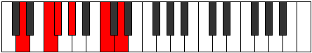 |
| [1113](https://ianring.com/musictheory/scales/1113) | [Aeronitonic](ModeGSharpAeronitonic.md) | G# | G#, B, C, D, F#, G# |  |
| [1113](https://ianring.com/musictheory/scales/1113) | [Aeronitonic](ModeAFlatAeronitonic.md) | Ab | Ab, B, C, D, Gb, Ab |  |
| [1115](https://ianring.com/musictheory/scales/1115) | [Locrimic](ModeDNaturalLocrimic.md) | D | D, Eb, F, Gb, Ab, B#, D |  |
| [1115](https://ianring.com/musictheory/scales/1115) | [Locrimic](ModeGSharpLocrimic.md) | G# | G#, A, B, C, D, E##, G# |  |
| [1115](https://ianring.com/musictheory/scales/1115) | [Locrimic](ModeAFlatLocrimic.md) | Ab | Ab, Bbb, Cb, Dbb, Ebb, F#, Ab |  |
| [1117](https://ianring.com/musictheory/scales/1117) | [Raptimic](ModeDNaturalRaptimic.md) | D | D, E, F, Gb, Ab, B#, D |  |
| [1117](https://ianring.com/musictheory/scales/1117) | [Raptimic](ModeCNaturalRaptimic.md) | C | C, D, Eb, Fb, Gb, A#, C |  |
| [1117](https://ianring.com/musictheory/scales/1117) | [Raptimic](ModeGSharpRaptimic.md) | G# | G#, A#, B, C, D, E##, G# |  |
| [1117](https://ianring.com/musictheory/scales/1117) | [Raptimic](ModeAFlatRaptimic.md) | Ab | Ab, Bb, Cb, Dbb, Ebb, F#, Ab |  |
| [1119](https://ianring.com/musictheory/scales/1119) | [Rarian](ModeDNaturalRarian.md) | D | D, Eb, Fb, Gbb, Abbb, Bbbb, C, D |  |
| [1119](https://ianring.com/musictheory/scales/1119) | [Rarian](ModeCNaturalRarian.md) | C | C, Db, Ebb, Fbb, Gbbb, Abbb, Bb, C |  |
| [1119](https://ianring.com/musictheory/scales/1119) | [Rarian](ModeGSharpRarian.md) | G# | G#, A, Bb, Cb, Dbb, Ebb, F#, G# |  |
| [1119](https://ianring.com/musictheory/scales/1119) | [Rarian](ModeAFlatRarian.md) | Ab | Ab, Bbb, Cbb, Dbbb, Dbb, Ebb, F#, Ab |  |
| [1125](https://ianring.com/musictheory/scales/1125) | [Ionaritonic](ModeCNaturalIonaritonic.md) | C | C, D, F, F#, A#, C |  |
| [1127](https://ianring.com/musictheory/scales/1127) | [Eparimic](ModeCNaturalEparimic.md) | C | C, Db, Ebb, F, Gb, A#, C |  |
| [1133](https://ianring.com/musictheory/scales/1133) | [Stycrimic](ModeCNaturalStycrimic.md) | C | C, D, Eb, F, Gb, A#, C |  |
| [1135](https://ianring.com/musictheory/scales/1135) | [Katolian](ModeCNaturalKatolian.md) | C | C, Db, Ebb, Fbb, Gbb, Abbb, Bb, C |  |
| [1137](https://ianring.com/musictheory/scales/1137) | [Stonitonic](ModeGSharpStonitonic.md) | G# | G#, C, C#, D, F#, G# |  |
| [1137](https://ianring.com/musictheory/scales/1137) | [Stonitonic](ModeAFlatStonitonic.md) | Ab | Ab, C, Db, D, Gb, Ab |  |
| [1137](https://ianring.com/musictheory/scales/1137) | [Stonitonic](ModeDNaturalStonitonic.md) | D | D, F#, G, G#, C, D |  |
| [1139](https://ianring.com/musictheory/scales/1139) | [Aerygimic](ModeDNaturalAerygimic.md) | D | D, Eb, F#, G, Ab, B#, D |  |
| [1139](https://ianring.com/musictheory/scales/1139) | [Aerygimic](ModeGSharpAerygimic.md) | G# | G#, A, B#, C#, D, E##, G# |  |
| [1139](https://ianring.com/musictheory/scales/1139) | [Aerygimic](ModeAFlatAerygimic.md) | Ab | Ab, Bbb, C, Db, Ebb, F#, Ab |  |
| [1141](https://ianring.com/musictheory/scales/1141) | [Rynimic](ModeDNaturalRynimic.md) | D | D, E, F#, G, Ab, B#, D |  |
| [1141](https://ianring.com/musictheory/scales/1141) | [Rynimic](ModeCNaturalRynimic.md) | C | C, D, E, F, Gb, A#, C |  |
| [1141](https://ianring.com/musictheory/scales/1141) | [Rynimic](ModeGSharpRynimic.md) | G# | G#, A#, B#, C#, D, E##, G# |  |
| [1141](https://ianring.com/musictheory/scales/1141) | [Rynimic](ModeAFlatRynimic.md) | Ab | Ab, Bb, C, Db, Ebb, F#, Ab |  |
| [1143](https://ianring.com/musictheory/scales/1143) | [Styrian](ModeDNaturalStyrian.md) | D | D, Eb, Fb, Gb, Abb, Bbbb, C, D |  |
| [1143](https://ianring.com/musictheory/scales/1143) | [Styrian](ModeCNaturalStyrian.md) | C | C, Db, Ebb, Fb, Gbb, Abbb, Bb, C |  |
| [1143](https://ianring.com/musictheory/scales/1143) | [Styrian](ModeGSharpStyrian.md) | G# | G#, A, Bb, C, Db, Ebb, F#, G# |  |
| [1143](https://ianring.com/musictheory/scales/1143) | [Styrian](ModeAFlatStyrian.md) | Ab | Ab, Bbb, Cbb, Dbb, Ebbb, Fbbb, Gb, Ab |  |
| [1145](https://ianring.com/musictheory/scales/1145) | [Zygimic](ModeDNaturalZygimic.md) | D | D, E#, F#, G, Ab, B#, D |  |
| [1145](https://ianring.com/musictheory/scales/1145) | [Zygimic](ModeGSharpZygimic.md) | G# | G#, A##, B#, C#, D, E##, G# |  |
| [1145](https://ianring.com/musictheory/scales/1145) | [Zygimic](ModeAFlatZygimic.md) | Ab | Ab, B, C, Db, Ebb, F#, Ab |  |
| [1147](https://ianring.com/musictheory/scales/1147) | [Epynian](ModeDNaturalEpynian.md) | D | D, Eb, F, Gb, Abb, Bbbb, C, D |  |
| [1147](https://ianring.com/musictheory/scales/1147) | [Epynian](ModeGSharpEpynian.md) | G# | G#, A, B, C, Db, Ebb, F#, G# |  |
| [1147](https://ianring.com/musictheory/scales/1147) | [Epynian](ModeAFlatEpynian.md) | Ab | Ab, Bbb, Cb, Dbb, Ebbb, Fbbb, Gb, Ab |  |
| [1149](https://ianring.com/musictheory/scales/1149) | [Bydian](ModeDNaturalBydian.md) | D | D, E, F, Gb, Abb, Bbbb, C, D |  |
| [1149](https://ianring.com/musictheory/scales/1149) | [Bydian](ModeCNaturalBydian.md) | C | C, D, Eb, Fb, Gbb, Abbb, Bb, C |  |
| [1149](https://ianring.com/musictheory/scales/1149) | [Bydian](ModeGSharpBydian.md) | G# | G#, A#, B, C, Db, Ebb, F#, G# |  |
| [1149](https://ianring.com/musictheory/scales/1149) | [Bydian](ModeAFlatBydian.md) | Ab | Ab, Bb, Cb, Dbb, Ebbb, Fbbb, Gb, Ab |  |
| [1151](https://ianring.com/musictheory/scales/1151) | [Mythyllic](ModeDNaturalMythyllic.md) | D | D, D#, E, F, F#, G, G#, C, D |  |
| [1151](https://ianring.com/musictheory/scales/1151) | [Mythyllic](ModeCNaturalMythyllic.md) | C | C, C#, D, D#, E, F, F#, A#, C |  |
| [1151](https://ianring.com/musictheory/scales/1151) | [Mythyllic](ModeGSharpMythyllic.md) | G# | G#, A, A#, B, C, C#, D, F#, G# |  |
| [1151](https://ianring.com/musictheory/scales/1151) | [Mythyllic](ModeAFlatMythyllic.md) | Ab | Ab, A, Bb, B, C, Db, D, Gb, Ab |  |
| [1163](https://ianring.com/musictheory/scales/1163) | [Pagitonic](ModeBNaturalPagitonic.md) | B | B, C, D, F#, A, B |  |
| [1167](https://ianring.com/musictheory/scales/1167) | [Aerodimic](ModeBNaturalAerodimic.md) | B | B, C, Db, Ebb, F#, G##, B |  |
| [1169](https://ianring.com/musictheory/scales/1169) | [Daric](ModeDNaturalDaric.md) | D | D, F#, A, C, D |  |
| [1171](https://ianring.com/musictheory/scales/1171) | [Loptitonic](ModeDNaturalLoptitonic.md) | D | D, D#, F#, A, C, D |  |
| [1173](https://ianring.com/musictheory/scales/1173) | [Phropitonic](ModeDNaturalPhropitonic.md) | D | D, E, F#, A, C, D | 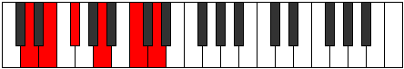 |
| [1175](https://ianring.com/musictheory/scales/1175) | [Epycrimic](ModeDNaturalEpycrimic.md) | D | D, Eb, Fb, Gb, A, B#, D |  |
| [1177](https://ianring.com/musictheory/scales/1177) | [Garitonic](ModeDNaturalGaritonic.md) | D | D, F, F#, A, C, D |  |
| [1179](https://ianring.com/musictheory/scales/1179) | [Sonimic](ModeDNaturalSonimic.md) | D | D, Eb, F, Gb, A, B#, D |  |
| [1179](https://ianring.com/musictheory/scales/1179) | [Sonimic](ModeBNaturalSonimic.md) | B | B, C, D, Eb, F#, G##, B |  |
| [1181](https://ianring.com/musictheory/scales/1181) | [Katagimic](ModeDNaturalKatagimic.md) | D | D, E, F, Gb, A, B#, D |  |
| [1183](https://ianring.com/musictheory/scales/1183) | [Sadian](ModeDNaturalSadian.md) | D | D, Eb, Fb, Gbb, Abbb, Bbb, C, D |  |
| [1183](https://ianring.com/musictheory/scales/1183) | [Sadian](ModeBNaturalSadian.md) | B | B, C, Db, Ebb, Fbb, Gb, A, B |  |
| [1195](https://ianring.com/musictheory/scales/1195) | [Sarimic](ModeBNaturalSarimic.md) | B | B, C, D, E, F#, G##, B |  |
| [1199](https://ianring.com/musictheory/scales/1199) | [Magian](ModeBNaturalMagian.md) | B | B, C, Db, Ebb, Fb, Gb, A, B |  |
| [1201](https://ianring.com/musictheory/scales/1201) | [Aeracritonic](ModeDNaturalAeracritonic.md) | D | D, F#, G, A, C, D |  |
| [1203](https://ianring.com/musictheory/scales/1203) | [Pagimic](ModeDNaturalPagimic.md) | D | D, Eb, F#, G, A, B#, D |  |
| [1205](https://ianring.com/musictheory/scales/1205) | [Ionycrimic](ModeDNaturalIonycrimic.md) | D | D, E, F#, G, A, B#, D |  |
| [1207](https://ianring.com/musictheory/scales/1207) | [Aeoloptian](ModeDNaturalAeoloptian.md) | D | D, Eb, Fb, Gb, Abb, Bbb, C, D |  |
| [1209](https://ianring.com/musictheory/scales/1209) | [Ionynimic](ModeDNaturalIonynimic.md) | D | D, E#, F#, G, A, B#, D | 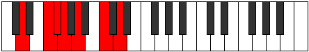 |
| [1211](https://ianring.com/musictheory/scales/1211) | [Zadian](ModeDNaturalZadian.md) | D | D, Eb, F, Gb, Abb, Bbb, C, D |  |
| [1211](https://ianring.com/musictheory/scales/1211) | [Zadian](ModeBNaturalZadian.md) | B | B, C, D, Eb, Fb, Gb, A, B |  |
| [1213](https://ianring.com/musictheory/scales/1213) | [Gyrian](ModeDNaturalGyrian.md) | D | D, E, F, Gb, Abb, Bbb, C, D |  |
| [1215](https://ianring.com/musictheory/scales/1215) | [Aeolanyllic](ModeDNaturalAeolanyllic.md) | D | D, D#, E, F, F#, G, A, C, D |  |
| [1215](https://ianring.com/musictheory/scales/1215) | [Aeolanyllic](ModeBNaturalAeolanyllic.md) | B | B, C, C#, D, D#, E, F#, A, B |  |
| [1221](https://ianring.com/musictheory/scales/1221) | [Epyritonic](ModeCNaturalEpyritonic.md) | C | C, D, F#, G, A#, C |  |
| [1223](https://ianring.com/musictheory/scales/1223) | [Phryptimic](ModeCNaturalPhryptimic.md) | C | C, Db, Ebb, F#, G, A#, C |  |
| [1227](https://ianring.com/musictheory/scales/1227) | [Thacrimic](ModeBNaturalThacrimic.md) | B | B, C, D, E#, F#, G##, B |  |
| [1229](https://ianring.com/musictheory/scales/1229) | [Ragimic](ModeCNaturalRagimic.md) | C | C, D, Eb, F#, G, A#, C |  |
| [1231](https://ianring.com/musictheory/scales/1231) | [Logian](ModeCNaturalLogian.md) | C | C, Db, Ebb, Fbb, Gb, Abb, Bb, C |  |
| [1231](https://ianring.com/musictheory/scales/1231) | [Logian](ModeBNaturalLogian.md) | B | B, C, Db, Ebb, F, Gb, A, B |  |
| [1233](https://ianring.com/musictheory/scales/1233) | [Ionoditonic](ModeGSharpIonoditonic.md) | G# | G#, C, D, D#, F#, G# |  |
| [1233](https://ianring.com/musictheory/scales/1233) | [Ionoditonic](ModeAFlatIonoditonic.md) | Ab | Ab, C, D, Eb, Gb, Ab |  |
| [1233](https://ianring.com/musictheory/scales/1233) | [Ionoditonic](ModeDNaturalIonoditonic.md) | D | D, F#, G#, A, C, D |  |
| [1235](https://ianring.com/musictheory/scales/1235) | [Stylimic](ModeDNaturalStylimic.md) | D | D, Eb, F#, G#, A, B#, D |  |
| [1235](https://ianring.com/musictheory/scales/1235) | [Stylimic](ModeGSharpStylimic.md) | G# | G#, A, B#, C##, D#, E##, G# |  |
| [1235](https://ianring.com/musictheory/scales/1235) | [Stylimic](ModeAFlatStylimic.md) | Ab | Ab, Bbb, C, D, Eb, F#, Ab |  |
| [1237](https://ianring.com/musictheory/scales/1237) | [Salimic](ModeDNaturalSalimic.md) | D | D, E, F#, G#, A, B#, D |  |
| [1237](https://ianring.com/musictheory/scales/1237) | [Salimic](ModeCNaturalSalimic.md) | C | C, D, E, F#, G, A#, C |  |
| [1237](https://ianring.com/musictheory/scales/1237) | [Salimic](ModeGSharpSalimic.md) | G# | G#, A#, B#, C##, D#, E##, G# |  |
| [1237](https://ianring.com/musictheory/scales/1237) | [Salimic](ModeAFlatSalimic.md) | Ab | Ab, Bb, C, D, Eb, F#, Ab |  |
| [1239](https://ianring.com/musictheory/scales/1239) | [Epaptian](ModeDNaturalEpaptian.md) | D | D, Eb, Fb, Gb, Ab, Bbb, C, D |  |
| [1239](https://ianring.com/musictheory/scales/1239) | [Epaptian](ModeCNaturalEpaptian.md) | C | C, Db, Ebb, Fb, Gb, Abb, Bb, C |  |
| [1239](https://ianring.com/musictheory/scales/1239) | [Epaptian](ModeGSharpEpaptian.md) | G# | G#, A, Bb, C, D, Eb, F#, G# |  |
| [1239](https://ianring.com/musictheory/scales/1239) | [Epaptian](ModeAFlatEpaptian.md) | Ab | Ab, Bbb, Cbb, Dbb, Ebb, Fbb, Gb, Ab |  |
| [1241](https://ianring.com/musictheory/scales/1241) | [Pygimic](ModeDNaturalPygimic.md) | D | D, E#, F#, G#, A, B#, D |  |
| [1241](https://ianring.com/musictheory/scales/1241) | [Pygimic](ModeGSharpPygimic.md) | G# | G#, A##, B#, C##, D#, E##, G# |  |
| [1241](https://ianring.com/musictheory/scales/1241) | [Pygimic](ModeAFlatPygimic.md) | Ab | Ab, B, C, D, Eb, F#, Ab |  |
| [1243](https://ianring.com/musictheory/scales/1243) | [Epylian](ModeDNaturalEpylian.md) | D | D, Eb, F, Gb, Ab, Bbb, C, D |  |
| [1243](https://ianring.com/musictheory/scales/1243) | [Epylian](ModeBNaturalEpylian.md) | B | B, C, D, Eb, F, Gb, A, B |  |
| [1243](https://ianring.com/musictheory/scales/1243) | [Epylian](ModeGSharpEpylian.md) | G# | G#, A, B, C, D, Eb, F#, G# |  |
| [1243](https://ianring.com/musictheory/scales/1243) | [Epylian](ModeAFlatEpylian.md) | Ab | Ab, Bbb, Cb, Dbb, Ebb, Fbb, Gb, Ab |  |
| [1245](https://ianring.com/musictheory/scales/1245) | [Lathian](ModeDNaturalLathian.md) | D | D, E, F, Gb, Ab, Bbb, C, D |  |
| [1245](https://ianring.com/musictheory/scales/1245) | [Lathian](ModeCNaturalLathian.md) | C | C, D, Eb, Fb, Gb, Abb, Bb, C |  |
| [1245](https://ianring.com/musictheory/scales/1245) | [Lathian](ModeGSharpLathian.md) | G# | G#, A#, B, C, D, Eb, F#, G# |  |
| [1245](https://ianring.com/musictheory/scales/1245) | [Lathian](ModeAFlatLathian.md) | Ab | Ab, Bb, Cb, Dbb, Ebb, Fbb, Gb, Ab |  |
| [1247](https://ianring.com/musictheory/scales/1247) | [Mygyllic](ModeDNaturalMygyllic.md) | D | D, D#, E, F, F#, G#, A, C, D |  |
| [1247](https://ianring.com/musictheory/scales/1247) | [Mygyllic](ModeCNaturalMygyllic.md) | C | C, C#, D, D#, E, F#, G, A#, C |  |
| [1247](https://ianring.com/musictheory/scales/1247) | [Mygyllic](ModeBNaturalMygyllic.md) | B | B, C, C#, D, D#, F, F#, A, B |  |
| [1247](https://ianring.com/musictheory/scales/1247) | [Mygyllic](ModeGSharpMygyllic.md) | G# | G#, A, A#, B, C, D, D#, F#, G# |  |
| [1247](https://ianring.com/musictheory/scales/1247) | [Mygyllic](ModeAFlatMygyllic.md) | Ab | Ab, A, Bb, B, C, D, Eb, Gb, Ab | 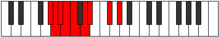 |
| [1253](https://ianring.com/musictheory/scales/1253) | [Zolimic](ModeCNaturalZolimic.md) | C | C, D, E#, F#, G, A#, C |  |
| [1255](https://ianring.com/musictheory/scales/1255) | [Sogian](ModeCNaturalSogian.md) | C | C, Db, Ebb, F, Gb, Abb, Bb, C |  |
| [1259](https://ianring.com/musictheory/scales/1259) | [Stadian](ModeBNaturalStadian.md) | B | B, C, D, E, F, Gb, A, B |  |
| [1261](https://ianring.com/musictheory/scales/1261) | [Aeodian](ModeCNaturalAeodian.md) | C | C, D, Eb, F, Gb, Abb, Bb, C |  |
| [1263](https://ianring.com/musictheory/scales/1263) | [Stynyllic](ModeCNaturalStynyllic.md) | C | C, C#, D, D#, F, F#, G, A#, C |  |
| [1263](https://ianring.com/musictheory/scales/1263) | [Stynyllic](ModeBNaturalStynyllic.md) | B | B, C, C#, D, E, F, F#, A, B |  |
| [1265](https://ianring.com/musictheory/scales/1265) | [Pynimic](ModeGSharpPynimic.md) | G# | G#, A###, B##, C##, D#, E##, G# |  |
| [1265](https://ianring.com/musictheory/scales/1265) | [Pynimic](ModeAFlatPynimic.md) | Ab | Ab, B#, C#, D, Eb, F#, Ab |  |
| [1265](https://ianring.com/musictheory/scales/1265) | [Pynimic](ModeDNaturalPynimic.md) | D | D, E##, F##, G#, A, B#, D |  |
| [1267](https://ianring.com/musictheory/scales/1267) | [Katynian](ModeGSharpKatynian.md) | G# | G#, A, B#, C#, D, Eb, F#, G# |  |
| [1267](https://ianring.com/musictheory/scales/1267) | [Katynian](ModeAFlatKatynian.md) | Ab | Ab, Bbb, C, Db, Ebb, Fbb, Gb, Ab |  |
| [1267](https://ianring.com/musictheory/scales/1267) | [Katynian](ModeDNaturalKatynian.md) | D | D, Eb, F#, G, Ab, Bbb, C, D |  |
| [1269](https://ianring.com/musictheory/scales/1269) | [Katythian](ModeDNaturalKatythian.md) | D | D, E, F#, G, Ab, Bbb, C, D |  |
| [1269](https://ianring.com/musictheory/scales/1269) | [Katythian](ModeCNaturalKatythian.md) | C | C, D, E, F, Gb, Abb, Bb, C |  |
| [1269](https://ianring.com/musictheory/scales/1269) | [Katythian](ModeGSharpKatythian.md) | G# | G#, A#, B#, C#, D, Eb, F#, G# |  |
| [1269](https://ianring.com/musictheory/scales/1269) | [Katythian](ModeAFlatKatythian.md) | Ab | Ab, Bb, C, Db, Ebb, Fbb, Gb, Ab |  |
| [1271](https://ianring.com/musictheory/scales/1271) | [Kolyllic](ModeDNaturalKolyllic.md) | D | D, D#, E, F#, G, G#, A, C, D |  |
| [1271](https://ianring.com/musictheory/scales/1271) | [Kolyllic](ModeCNaturalKolyllic.md) | C | C, C#, D, E, F, F#, G, A#, C |  |
| [1271](https://ianring.com/musictheory/scales/1271) | [Kolyllic](ModeGSharpKolyllic.md) | G# | G#, A, A#, C, C#, D, D#, F#, G# |  |
| [1271](https://ianring.com/musictheory/scales/1271) | [Kolyllic](ModeAFlatKolyllic.md) | Ab | Ab, A, Bb, C, Db, D, Eb, Gb, Ab |  |
| [1273](https://ianring.com/musictheory/scales/1273) | [Ronian](ModeDNaturalRonian.md) | D | D, E#, F#, G, Ab, Bbb, C, D |  |
| [1273](https://ianring.com/musictheory/scales/1273) | [Ronian](ModeGSharpRonian.md) | G# | G#, A##, B#, C#, D, Eb, F#, G# |  |
| [1273](https://ianring.com/musictheory/scales/1273) | [Ronian](ModeAFlatRonian.md) | Ab | Ab, B, C, Db, Ebb, Fbb, Gb, Ab |  |
| [1275](https://ianring.com/musictheory/scales/1275) | [Stagyllic](ModeDNaturalStagyllic.md) | D | D, D#, F, F#, G, G#, A, C, D |  |
| [1275](https://ianring.com/musictheory/scales/1275) | [Stagyllic](ModeBNaturalStagyllic.md) | B | B, C, D, D#, E, F, F#, A, B |  |
| [1275](https://ianring.com/musictheory/scales/1275) | [Stagyllic](ModeGSharpStagyllic.md) | G# | G#, A, B, C, C#, D, D#, F#, G# |  |
| [1275](https://ianring.com/musictheory/scales/1275) | [Stagyllic](ModeAFlatStagyllic.md) | Ab | Ab, A, B, C, Db, D, Eb, Gb, Ab |  |
| [1277](https://ianring.com/musictheory/scales/1277) | [Zadyllic](ModeDNaturalZadyllic.md) | D | D, E, F, F#, G, G#, A, C, D |  |
| [1277](https://ianring.com/musictheory/scales/1277) | [Zadyllic](ModeCNaturalZadyllic.md) | C | C, D, D#, E, F, F#, G, A#, C |  |
| [1277](https://ianring.com/musictheory/scales/1277) | [Zadyllic](ModeGSharpZadyllic.md) | G# | G#, A#, B, C, C#, D, D#, F#, G# |  |
| [1277](https://ianring.com/musictheory/scales/1277) | [Zadyllic](ModeAFlatZadyllic.md) | Ab | Ab, Bb, B, C, Db, D, Eb, Gb, Ab |  |
| [1279](https://ianring.com/musictheory/scales/1279) | [Sarygic](ModeDNaturalSarygic.md) | D | D, D#, E, F, F#, G, G#, A, C, D |  |
| [1279](https://ianring.com/musictheory/scales/1279) | [Sarygic](ModeCNaturalSarygic.md) | C | C, C#, D, D#, E, F, F#, G, A#, C |  |
| [1279](https://ianring.com/musictheory/scales/1279) | [Sarygic](ModeBNaturalSarygic.md) | B | B, C, C#, D, D#, E, F, F#, A, B |  |
| [1279](https://ianring.com/musictheory/scales/1279) | [Sarygic](ModeGSharpSarygic.md) | G# | G#, A, A#, B, C, C#, D, D#, F#, G# |  |
| [1279](https://ianring.com/musictheory/scales/1279) | [Sarygic](ModeAFlatSarygic.md) | Ab | Ab, A, Bb, B, C, Db, D, Eb, Gb, Ab |  |
| [1297](https://ianring.com/musictheory/scales/1297) | [Aeolic](ModeDNaturalAeolic.md) | D | D, F#, A#, C, D |  |
| [1299](https://ianring.com/musictheory/scales/1299) | [Aerophitonic](ModeDNaturalAerophitonic.md) | D | D, D#, F#, A#, C, D |  |
| [1301](https://ianring.com/musictheory/scales/1301) | [Koditonic](ModeENaturalKoditonic.md) | E | E, F#, G#, C, D, E |  |
| [1301](https://ianring.com/musictheory/scales/1301) | [Koditonic](ModeDNaturalKoditonic.md) | D | D, E, F#, A#, C, D |  |
| [1301](https://ianring.com/musictheory/scales/1301) | [Koditonic](ModeASharpKoditonic.md) | A# | A#, C, D, F#, G#, A# |  |
| [1301](https://ianring.com/musictheory/scales/1301) | [Koditonic](ModeBFlatKoditonic.md) | Bb | Bb, C, D, Gb, Ab, Bb |  |
| [1303](https://ianring.com/musictheory/scales/1303) | [Epolimic](ModeENaturalEpolimic.md) | E | E, F, Gb, Ab, B#, C##, E |  |
| [1303](https://ianring.com/musictheory/scales/1303) | [Epolimic](ModeDNaturalEpolimic.md) | D | D, Eb, Fb, Gb, A#, B#, D |  |
| [1303](https://ianring.com/musictheory/scales/1303) | [Epolimic](ModeASharpEpolimic.md) | A# | A#, B, C, D, E##, F###, A# |  |
| [1303](https://ianring.com/musictheory/scales/1303) | [Epolimic](ModeBFlatEpolimic.md) | Bb | Bb, Cb, Dbb, Ebb, F#, G#, Bb |  |
| [1305](https://ianring.com/musictheory/scales/1305) | [Dynitonic](ModeDNaturalDynitonic.md) | D | D, F, F#, A#, C, D |  |
| [1307](https://ianring.com/musictheory/scales/1307) | [Katorimic](ModeDNaturalKatorimic.md) | D | D, Eb, F, Gb, A#, B#, D |  |
| [1309](https://ianring.com/musictheory/scales/1309) | [Pogimic](ModeENaturalPogimic.md) | E | E, F#, G, Ab, B#, C##, E |  |
| [1309](https://ianring.com/musictheory/scales/1309) | [Pogimic](ModeDNaturalPogimic.md) | D | D, E, F, Gb, A#, B#, D | 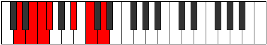 |
| [1309](https://ianring.com/musictheory/scales/1309) | [Pogimic](ModeASharpPogimic.md) | A# | A#, B#, C#, D, E##, F###, A# |  |
| [1309](https://ianring.com/musictheory/scales/1309) | [Pogimic](ModeBFlatPogimic.md) | Bb | Bb, C, Db, Ebb, F#, G#, Bb |  |
| [1311](https://ianring.com/musictheory/scales/1311) | [Bynian](ModeENaturalBynian.md) | E | E, F, Gb, Abb, Bbbb, C, D, E |  |
| [1311](https://ianring.com/musictheory/scales/1311) | [Bynian](ModeDNaturalBynian.md) | D | D, Eb, Fb, Gbb, Abbb, Bb, C, D |  |
| [1311](https://ianring.com/musictheory/scales/1311) | [Bynian](ModeASharpBynian.md) | A# | A#, B, C, Db, Ebb, F#, G#, A# |  |
| [1311](https://ianring.com/musictheory/scales/1311) | [Bynian](ModeBFlatBynian.md) | Bb | Bb, Cb, Dbb, Ebbb, Fbbb, Gb, Ab, Bb |  |
| [1317](https://ianring.com/musictheory/scales/1317) | [Staditonic](ModeENaturalStaditonic.md) | E | E, F#, A, C, D, E |  |
| [1319](https://ianring.com/musictheory/scales/1319) | [Phronimic](ModeENaturalPhronimic.md) | E | E, F, Gb, A, B#, C##, E |  |
| [1325](https://ianring.com/musictheory/scales/1325) | [Phradimic](ModeENaturalPhradimic.md) | E | E, F#, G, A, B#, C##, E |  |
| [1327](https://ianring.com/musictheory/scales/1327) | [Zalian](ModeENaturalZalian.md) | E | E, F, Gb, Abb, Bbb, C, D, E |  |
| [1329](https://ianring.com/musictheory/scales/1329) | [Epygitonic](ModeDNaturalEpygitonic.md) | D | D, F#, G, A#, C, D |  |
| [1331](https://ianring.com/musictheory/scales/1331) | [Dolimic](ModeDNaturalDolimic.md) | D | D, Eb, F#, G, A#, B#, D |  |
| [1333](https://ianring.com/musictheory/scales/1333) | [Lyptimic](ModeENaturalLyptimic.md) | E | E, F#, G#, A, B#, C##, E | 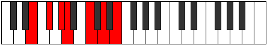 |
| [1333](https://ianring.com/musictheory/scales/1333) | [Lyptimic](ModeDNaturalLyptimic.md) | D | D, E, F#, G, A#, B#, D |  |
| [1333](https://ianring.com/musictheory/scales/1333) | [Lyptimic](ModeASharpLyptimic.md) | A# | A#, B#, C##, D#, E##, F###, A# |  |
| [1333](https://ianring.com/musictheory/scales/1333) | [Lyptimic](ModeBFlatLyptimic.md) | Bb | Bb, C, D, Eb, F#, G#, Bb |  |
| [1335](https://ianring.com/musictheory/scales/1335) | [Aeralian](ModeENaturalAeralian.md) | E | E, F, Gb, Ab, Bbb, C, D, E | 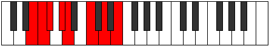 |
| [1335](https://ianring.com/musictheory/scales/1335) | [Aeralian](ModeDNaturalAeralian.md) | D | D, Eb, Fb, Gb, Abb, Bb, C, D |  |
| [1335](https://ianring.com/musictheory/scales/1335) | [Aeralian](ModeASharpAeralian.md) | A# | A#, B, C, D, Eb, F#, G#, A# |  |
| [1335](https://ianring.com/musictheory/scales/1335) | [Aeralian](ModeBFlatAeralian.md) | Bb | Bb, Cb, Dbb, Ebb, Fbb, Gb, Ab, Bb |  |
| [1337](https://ianring.com/musictheory/scales/1337) | [Epogimic](ModeDNaturalEpogimic.md) | D | D, E#, F#, G, A#, B#, D |  |
| [1339](https://ianring.com/musictheory/scales/1339) | [Kycrian](ModeDNaturalKycrian.md) | D | D, Eb, F, Gb, Abb, Bb, C, D |  |
| [1341](https://ianring.com/musictheory/scales/1341) | [Madian](ModeENaturalMadian.md) | E | E, F#, G, Ab, Bbb, C, D, E |  |
| [1341](https://ianring.com/musictheory/scales/1341) | [Madian](ModeDNaturalMadian.md) | D | D, E, F, Gb, Abb, Bb, C, D |  |
| [1341](https://ianring.com/musictheory/scales/1341) | [Madian](ModeASharpMadian.md) | A# | A#, B#, C#, D, Eb, F#, G#, A# |  |
| [1341](https://ianring.com/musictheory/scales/1341) | [Madian](ModeBFlatMadian.md) | Bb | Bb, C, Db, Ebb, Fbb, Gb, Ab, Bb |  |
| [1343](https://ianring.com/musictheory/scales/1343) | [Zalyllic](ModeENaturalZalyllic.md) | E | E, F, F#, G, G#, A, C, D, E |  |
| [1343](https://ianring.com/musictheory/scales/1343) | [Zalyllic](ModeDNaturalZalyllic.md) | D | D, D#, E, F, F#, G, A#, C, D |  |
| [1343](https://ianring.com/musictheory/scales/1343) | [Zalyllic](ModeASharpZalyllic.md) | A# | A#, B, C, C#, D, D#, F#, G#, A# |  |
| [1343](https://ianring.com/musictheory/scales/1343) | [Zalyllic](ModeBFlatZalyllic.md) | Bb | Bb, B, C, Db, D, Eb, Gb, Ab, Bb |  |
| [1349](https://ianring.com/musictheory/scales/1349) | [Tholitonic](ModeFSharpTholitonic.md) | F# | F#, G#, C, D, E, F# |  |
| [1349](https://ianring.com/musictheory/scales/1349) | [Tholitonic](ModeGFlatTholitonic.md) | Gb | Gb, Ab, C, D, E, Gb |  |
| [1349](https://ianring.com/musictheory/scales/1349) | [Tholitonic](ModeENaturalTholitonic.md) | E | E, F#, A#, C, D, E | 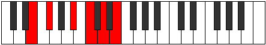 |
| [1349](https://ianring.com/musictheory/scales/1349) | [Tholitonic](ModeCNaturalTholitonic.md) | C | C, D, F#, G#, A#, C |  |
| [1351](https://ianring.com/musictheory/scales/1351) | [Aeraptimic](ModeFSharpAeraptimic.md) | F# | F#, G, Ab, B#, C##, D##, F# |  |
| [1351](https://ianring.com/musictheory/scales/1351) | [Aeraptimic](ModeGFlatAeraptimic.md) | Gb | Gb, Abb, Bbbb, C, D, E, Gb |  |
| [1351](https://ianring.com/musictheory/scales/1351) | [Aeraptimic](ModeENaturalAeraptimic.md) | E | E, F, Gb, A#, B#, C##, E |  |
| [1351](https://ianring.com/musictheory/scales/1351) | [Aeraptimic](ModeCNaturalAeraptimic.md) | C | C, Db, Ebb, F#, G#, A#, C |  |
| [1353](https://ianring.com/musictheory/scales/1353) | [Kataritonic](ModeFSharpKataritonic.md) | F# | F#, A, C, D, E, F# |  |
| [1353](https://ianring.com/musictheory/scales/1353) | [Kataritonic](ModeGFlatKataritonic.md) | Gb | Gb, A, C, D, E, Gb | 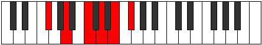 |
| [1355](https://ianring.com/musictheory/scales/1355) | [Aeolorimic](ModeFSharpAeolorimic.md) | F# | F#, G, A, B#, C##, D##, F# |  |
| [1355](https://ianring.com/musictheory/scales/1355) | [Aeolorimic](ModeGFlatAeolorimic.md) | Gb | Gb, Abb, Bbb, C, D, E, Gb |  |
| [1357](https://ianring.com/musictheory/scales/1357) | [Katonimic](ModeFSharpKatonimic.md) | F# | F#, G#, A, B#, C##, D##, F# |  |
| [1357](https://ianring.com/musictheory/scales/1357) | [Katonimic](ModeGFlatKatonimic.md) | Gb | Gb, Ab, Bbb, C, D, E, Gb |  |
| [1357](https://ianring.com/musictheory/scales/1357) | [Katonimic](ModeENaturalKatonimic.md) | E | E, F#, G, A#, B#, C##, E |  |
| [1357](https://ianring.com/musictheory/scales/1357) | [Katonimic](ModeCNaturalKatonimic.md) | C | C, D, Eb, F#, G#, A#, C |  |
| [1359](https://ianring.com/musictheory/scales/1359) | [Aerygian](ModeFSharpAerygian.md) | F# | F#, G, Ab, Bbb, C, D, E, F# |  |
| [1359](https://ianring.com/musictheory/scales/1359) | [Aerygian](ModeGFlatAerygian.md) | Gb | Gb, Abb, Bbbb, Cbbb, Dbb, Ebb, Fb, Gb |  |
| [1359](https://ianring.com/musictheory/scales/1359) | [Aerygian](ModeENaturalAerygian.md) | E | E, F, Gb, Abb, Bb, C, D, E |  |
| [1359](https://ianring.com/musictheory/scales/1359) | [Aerygian](ModeCNaturalAerygian.md) | C | C, Db, Ebb, Fbb, Gb, Ab, Bb, C |  |
| [1361](https://ianring.com/musictheory/scales/1361) | [Bolitonic](ModeGSharpBolitonic.md) | G# | G#, C, D, E, F#, G# |  |
| [1361](https://ianring.com/musictheory/scales/1361) | [Bolitonic](ModeAFlatBolitonic.md) | Ab | Ab, C, D, E, Gb, Ab |  |
| [1361](https://ianring.com/musictheory/scales/1361) | [Bolitonic](ModeFSharpBolitonic.md) | F# | F#, A#, C, D, E, F# |  |
| [1361](https://ianring.com/musictheory/scales/1361) | [Bolitonic](ModeGFlatBolitonic.md) | Gb | Gb, Bb, C, D, E, Gb |  |
| [1361](https://ianring.com/musictheory/scales/1361) | [Bolitonic](ModeDNaturalBolitonic.md) | D | D, F#, G#, A#, C, D |  |
| [1363](https://ianring.com/musictheory/scales/1363) | [Gygimic](ModeGSharpGygimic.md) | G# | G#, A, B#, C##, D##, E##, G# |  |
| [1363](https://ianring.com/musictheory/scales/1363) | [Gygimic](ModeAFlatGygimic.md) | Ab | Ab, Bbb, C, D, E, F#, Ab | 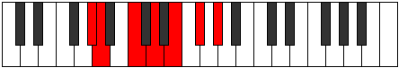 |
| [1363](https://ianring.com/musictheory/scales/1363) | [Gygimic](ModeFSharpGygimic.md) | F# | F#, G, A#, B#, C##, D##, F# |  |
| [1363](https://ianring.com/musictheory/scales/1363) | [Gygimic](ModeGFlatGygimic.md) | Gb | Gb, Abb, Bb, C, D, E, Gb |  |
| [1363](https://ianring.com/musictheory/scales/1363) | [Gygimic](ModeDNaturalGygimic.md) | D | D, Eb, F#, G#, A#, B#, D |  |
| [1365](https://ianring.com/musictheory/scales/1365) | [WholeTone](ModeCNaturalWholeTone.md) | C | C, D, E, F#, G#, A#, C |  |
| [1365](https://ianring.com/musictheory/scales/1365) | [WholeTone](ModeDNaturalWholeTone.md) | D | D, E, F#, G#, A#, B#, D |  |
| [1365](https://ianring.com/musictheory/scales/1365) | [WholeTone](ModeENaturalWholeTone.md) | E | E, F#, G#, A#, B#, C##, E |  |
| [1365](https://ianring.com/musictheory/scales/1365) | [WholeTone](ModeFSharpWholeTone.md) | F# | F#, G#, A#, B#, C##, D##, F# |  |
| [1365](https://ianring.com/musictheory/scales/1365) | [WholeTone](ModeGFlatWholeTone.md) | Gb | Gb, Ab, Bb, C, D, E, Gb |  |
| [1365](https://ianring.com/musictheory/scales/1365) | [WholeTone](ModeGSharpWholeTone.md) | G# | G#, A#, B#, C##, D##, E##, G# |  |
| [1365](https://ianring.com/musictheory/scales/1365) | [WholeTone](ModeAFlatWholeTone.md) | Ab | Ab, Bb, C, D, E, F#, Ab |  |
| [1365](https://ianring.com/musictheory/scales/1365) | [WholeTone](ModeASharpWholeTone.md) | A# | A#, B#, C##, D##, E##, F###, A# |  |
| [1365](https://ianring.com/musictheory/scales/1365) | [WholeTone](ModeBFlatWholeTone.md) | Bb | Bb, C, D, E, F#, G#, Bb |  |
| [1367](https://ianring.com/musictheory/scales/1367) | [Pyptian](ModeCNaturalPyptian.md) | C | C, Db, Ebb, Fb, Gb, Ab, Bb, C |  |
| [1367](https://ianring.com/musictheory/scales/1367) | [Pyptian](ModeDNaturalPyptian.md) | D | D, Eb, Fb, Gb, Ab, Bb, C, D |  |
| [1367](https://ianring.com/musictheory/scales/1367) | [Pyptian](ModeENaturalPyptian.md) | E | E, F, Gb, Ab, Bb, C, D, E |  |
| [1367](https://ianring.com/musictheory/scales/1367) | [Pyptian](ModeFSharpPyptian.md) | F# | F#, G, Ab, Bb, C, D, E, F# |  |
| [1367](https://ianring.com/musictheory/scales/1367) | [Pyptian](ModeGFlatPyptian.md) | Gb | Gb, Abb, Bbbb, Cbb, Dbb, Ebb, Fb, Gb |  |
| [1367](https://ianring.com/musictheory/scales/1367) | [Pyptian](ModeGSharpPyptian.md) | G# | G#, A, Bb, C, D, E, F#, G# |  |
| [1367](https://ianring.com/musictheory/scales/1367) | [Pyptian](ModeAFlatPyptian.md) | Ab | Ab, Bbb, Cbb, Dbb, Ebb, Fb, Gb, Ab | 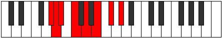 |
| [1367](https://ianring.com/musictheory/scales/1367) | [Pyptian](ModeASharpPyptian.md) | A# | A#, B, C, D, E, F#, G#, A# |  |
| [1367](https://ianring.com/musictheory/scales/1367) | [Pyptian](ModeBFlatPyptian.md) | Bb | Bb, Cb, Dbb, Ebb, Fb, Gb, Ab, Bb |  |
| [1369](https://ianring.com/musictheory/scales/1369) | [Boptimic](ModeDNaturalBoptimic.md) | D | D, E#, F#, G#, A#, B#, D |  |
| [1369](https://ianring.com/musictheory/scales/1369) | [Boptimic](ModeFSharpBoptimic.md) | F# | F#, G##, A#, B#, C##, D##, F# |  |
| [1369](https://ianring.com/musictheory/scales/1369) | [Boptimic](ModeGFlatBoptimic.md) | Gb | Gb, A, Bb, C, D, E, Gb |  |
| [1369](https://ianring.com/musictheory/scales/1369) | [Boptimic](ModeGSharpBoptimic.md) | G# | G#, A##, B#, C##, D##, E##, G# | 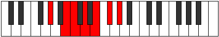 |
| [1369](https://ianring.com/musictheory/scales/1369) | [Boptimic](ModeAFlatBoptimic.md) | Ab | Ab, B, C, D, E, F#, Ab |  |
| [1371](https://ianring.com/musictheory/scales/1371) | [Ionadian](ModeDNaturalIonadian.md) | D | D, Eb, F, Gb, Ab, Bb, C, D |  |
| [1371](https://ianring.com/musictheory/scales/1371) | [Ionadian](ModeFSharpIonadian.md) | F# | F#, G, A, Bb, C, D, E, F# |  |
| [1371](https://ianring.com/musictheory/scales/1371) | [Ionadian](ModeGFlatIonadian.md) | Gb | Gb, Abb, Bbb, Cbb, Dbb, Ebb, Fb, Gb |  |
| [1371](https://ianring.com/musictheory/scales/1371) | [Ionadian](ModeGSharpIonadian.md) | G# | G#, A, B, C, D, E, F#, G# |  |
| [1371](https://ianring.com/musictheory/scales/1371) | [Ionadian](ModeAFlatIonadian.md) | Ab | Ab, Bbb, Cb, Dbb, Ebb, Fb, Gb, Ab |  |
| [1373](https://ianring.com/musictheory/scales/1373) | [Storian](ModeASharpStorian.md) | A# | A#, B#, C#, D, E, F#, G#, A# |  |
| [1373](https://ianring.com/musictheory/scales/1373) | [Storian](ModeBFlatStorian.md) | Bb | Bb, C, Db, Ebb, Fb, Gb, Ab, Bb |  |
| [1373](https://ianring.com/musictheory/scales/1373) | [Storian](ModeCNaturalStorian.md) | C | C, D, Eb, Fb, Gb, Ab, Bb, C |  |
| [1373](https://ianring.com/musictheory/scales/1373) | [Storian](ModeDNaturalStorian.md) | D | D, E, F, Gb, Ab, Bb, C, D |  |
| [1373](https://ianring.com/musictheory/scales/1373) | [Storian](ModeENaturalStorian.md) | E | E, F#, G, Ab, Bb, C, D, E |  |
| [1373](https://ianring.com/musictheory/scales/1373) | [Storian](ModeFSharpStorian.md) | F# | F#, G#, A, Bb, C, D, E, F# |  |
| [1373](https://ianring.com/musictheory/scales/1373) | [Storian](ModeGFlatStorian.md) | Gb | Gb, Ab, Bbb, Cbb, Dbb, Ebb, Fb, Gb |  |
| [1373](https://ianring.com/musictheory/scales/1373) | [Storian](ModeGSharpStorian.md) | G# | G#, A#, B, C, D, E, F#, G# |  |
| [1373](https://ianring.com/musictheory/scales/1373) | [Storian](ModeAFlatStorian.md) | Ab | Ab, Bb, Cb, Dbb, Ebb, Fb, Gb, Ab |  |
| [1375](https://ianring.com/musictheory/scales/1375) | [Bothyllic](ModeCNaturalBothyllic.md) | C | C, C#, D, D#, E, F#, G#, A#, C |  |
| [1375](https://ianring.com/musictheory/scales/1375) | [Bothyllic](ModeDNaturalBothyllic.md) | D | D, D#, E, F, F#, G#, A#, C, D |  |
| [1375](https://ianring.com/musictheory/scales/1375) | [Bothyllic](ModeENaturalBothyllic.md) | E | E, F, F#, G, G#, A#, C, D, E |  |
| [1375](https://ianring.com/musictheory/scales/1375) | [Bothyllic](ModeFSharpBothyllic.md) | F# | F#, G, G#, A, A#, C, D, E, F# |  |
| [1375](https://ianring.com/musictheory/scales/1375) | [Bothyllic](ModeGFlatBothyllic.md) | Gb | Gb, G, Ab, A, Bb, C, D, E, Gb |  |
| [1375](https://ianring.com/musictheory/scales/1375) | [Bothyllic](ModeASharpBothyllic.md) | A# | A#, B, C, C#, D, E, F#, G#, A# |  |
| [1375](https://ianring.com/musictheory/scales/1375) | [Bothyllic](ModeBFlatBothyllic.md) | Bb | Bb, B, C, Db, D, E, Gb, Ab, Bb |  |
| [1375](https://ianring.com/musictheory/scales/1375) | [Bothyllic](ModeGSharpBothyllic.md) | G# | G#, A, A#, B, C, D, E, F#, G# |  |
| [1375](https://ianring.com/musictheory/scales/1375) | [Bothyllic](ModeAFlatBothyllic.md) | Ab | Ab, A, Bb, B, C, D, E, Gb, Ab |  |
| [1379](https://ianring.com/musictheory/scales/1379) | [Kycrimic](ModeFSharpKycrimic.md) | F# | F#, G, A##, B#, C##, D##, F# |  |
| [1379](https://ianring.com/musictheory/scales/1379) | [Kycrimic](ModeGFlatKycrimic.md) | Gb | Gb, Abb, B, C, D, E, Gb |  |
| [1381](https://ianring.com/musictheory/scales/1381) | [Padimic](ModeCNaturalPadimic.md) | C | C, D, E#, F#, G#, A#, C |  |
| [1381](https://ianring.com/musictheory/scales/1381) | [Padimic](ModeENaturalPadimic.md) | E | E, F#, G##, A#, B#, C##, E |  |
| [1381](https://ianring.com/musictheory/scales/1381) | [Padimic](ModeFSharpPadimic.md) | F# | F#, G#, A##, B#, C##, D##, F# |  |
| [1381](https://ianring.com/musictheory/scales/1381) | [Padimic](ModeGFlatPadimic.md) | Gb | Gb, Ab, B, C, D, E, Gb |  |
| [1383](https://ianring.com/musictheory/scales/1383) | [Pynian](ModeCNaturalPynian.md) | C | C, Db, Ebb, F, Gb, Ab, Bb, C |  |
| [1383](https://ianring.com/musictheory/scales/1383) | [Pynian](ModeENaturalPynian.md) | E | E, F, Gb, A, Bb, C, D, E |  |
| [1383](https://ianring.com/musictheory/scales/1383) | [Pynian](ModeFSharpPynian.md) | F# | F#, G, Ab, B, C, D, E, F# |  |
| [1383](https://ianring.com/musictheory/scales/1383) | [Pynian](ModeGFlatPynian.md) | Gb | Gb, Abb, Bbbb, Cb, Dbb, Ebb, Fb, Gb |  |
| [1385](https://ianring.com/musictheory/scales/1385) | [Phracrimic](ModeFSharpPhracrimic.md) | F# | F#, G##, A##, B#, C##, D##, F# |  |
| [1385](https://ianring.com/musictheory/scales/1385) | [Phracrimic](ModeGFlatPhracrimic.md) | Gb | Gb, A, B, C, D, E, Gb |  |
| [1387](https://ianring.com/musictheory/scales/1387) | [Locrian](ModeFSharpLocrian.md) | F# | F#, G, A, B, C, D, E, F# |  |
| [1387](https://ianring.com/musictheory/scales/1387) | [Locrian](ModeGFlatLocrian.md) | Gb | Gb, Abb, Bbb, Cb, Dbb, Ebb, Fb, Gb |  |
| [1389](https://ianring.com/musictheory/scales/1389) | [Lorian](ModeCNaturalLorian.md) | C | C, D, Eb, F, Gb, Ab, Bb, C |  |
| [1389](https://ianring.com/musictheory/scales/1389) | [Lorian](ModeENaturalLorian.md) | E | E, F#, G, A, Bb, C, D, E |  |
| [1389](https://ianring.com/musictheory/scales/1389) | [Lorian](ModeFSharpLorian.md) | F# | F#, G#, A, B, C, D, E, F# |  |
| [1389](https://ianring.com/musictheory/scales/1389) | [Lorian](ModeGFlatLorian.md) | Gb | Gb, Ab, Bbb, Cb, Dbb, Ebb, Fb, Gb |  |
| [1391](https://ianring.com/musictheory/scales/1391) | [Aeradyllic](ModeCNaturalAeradyllic.md) | C | C, C#, D, D#, F, F#, G#, A#, C |  |
| [1391](https://ianring.com/musictheory/scales/1391) | [Aeradyllic](ModeENaturalAeradyllic.md) | E | E, F, F#, G, A, A#, C, D, E |  |
| [1391](https://ianring.com/musictheory/scales/1391) | [Aeradyllic](ModeFSharpAeradyllic.md) | F# | F#, G, G#, A, B, C, D, E, F# |  |
| [1391](https://ianring.com/musictheory/scales/1391) | [Aeradyllic](ModeGFlatAeradyllic.md) | Gb | Gb, G, Ab, A, B, C, D, E, Gb |  |
| [1393](https://ianring.com/musictheory/scales/1393) | [Mycrimic](ModeGSharpMycrimic.md) | G# | G#, A###, B##, C##, D##, E##, G# |  |
| [1393](https://ianring.com/musictheory/scales/1393) | [Mycrimic](ModeAFlatMycrimic.md) | Ab | Ab, B#, C#, D, E, F#, Ab |  |
| [1393](https://ianring.com/musictheory/scales/1393) | [Mycrimic](ModeDNaturalMycrimic.md) | D | D, E##, F##, G#, A#, B#, D |  |
| [1393](https://ianring.com/musictheory/scales/1393) | [Mycrimic](ModeFSharpMycrimic.md) | F# | F#, G###, A##, B#, C##, D##, F# |  |
| [1393](https://ianring.com/musictheory/scales/1393) | [Mycrimic](ModeGFlatMycrimic.md) | Gb | Gb, A#, B, C, D, E, Gb |  |
| [1395](https://ianring.com/musictheory/scales/1395) | [Mixonorian](ModeGSharpMixonorian.md) | G# | G#, A, B#, C#, D, E, F#, G# |  |
| [1395](https://ianring.com/musictheory/scales/1395) | [Mixonorian](ModeAFlatMixonorian.md) | Ab | Ab, Bbb, C, Db, Ebb, Fb, Gb, Ab |  |
| [1395](https://ianring.com/musictheory/scales/1395) | [Mixonorian](ModeDNaturalMixonorian.md) | D | D, Eb, F#, G, Ab, Bb, C, D |  |
| [1395](https://ianring.com/musictheory/scales/1395) | [Mixonorian](ModeFSharpMixonorian.md) | F# | F#, G, A#, B, C, D, E, F# |  |
| [1395](https://ianring.com/musictheory/scales/1395) | [Mixonorian](ModeGFlatMixonorian.md) | Gb | Gb, Abb, Bb, Cb, Dbb, Ebb, Fb, Gb |  |
| [1397](https://ianring.com/musictheory/scales/1397) | [Gothian](ModeGSharpGothian.md) | G# | G#, A#, B#, C#, D, E, F#, G# |  |
| [1397](https://ianring.com/musictheory/scales/1397) | [Gothian](ModeAFlatGothian.md) | Ab | Ab, Bb, C, Db, Ebb, Fb, Gb, Ab |  |
| [1397](https://ianring.com/musictheory/scales/1397) | [Gothian](ModeASharpGothian.md) | A# | A#, B#, C##, D#, E, F#, G#, A# |  |
| [1397](https://ianring.com/musictheory/scales/1397) | [Gothian](ModeBFlatGothian.md) | Bb | Bb, C, D, Eb, Fb, Gb, Ab, Bb |  |
| [1397](https://ianring.com/musictheory/scales/1397) | [Gothian](ModeCNaturalGothian.md) | C | C, D, E, F, Gb, Ab, Bb, C |  |
| [1397](https://ianring.com/musictheory/scales/1397) | [Gothian](ModeDNaturalGothian.md) | D | D, E, F#, G, Ab, Bb, C, D |  |
| [1397](https://ianring.com/musictheory/scales/1397) | [Gothian](ModeENaturalGothian.md) | E | E, F#, G#, A, Bb, C, D, E |  |
| [1397](https://ianring.com/musictheory/scales/1397) | [Gothian](ModeFSharpGothian.md) | F# | F#, G#, A#, B, C, D, E, F# |  |
| [1397](https://ianring.com/musictheory/scales/1397) | [Gothian](ModeGFlatGothian.md) | Gb | Gb, Ab, Bb, Cb, Dbb, Ebb, Fb, Gb |  |
| [1399](https://ianring.com/musictheory/scales/1399) | [Syryllic](ModeCNaturalSyryllic.md) | C | C, C#, D, E, F, F#, G#, A#, C |  |
| [1399](https://ianring.com/musictheory/scales/1399) | [Syryllic](ModeDNaturalSyryllic.md) | D | D, D#, E, F#, G, G#, A#, C, D |  |
| [1399](https://ianring.com/musictheory/scales/1399) | [Syryllic](ModeGSharpSyryllic.md) | G# | G#, A, A#, C, C#, D, E, F#, G# |  |
| [1399](https://ianring.com/musictheory/scales/1399) | [Syryllic](ModeAFlatSyryllic.md) | Ab | Ab, A, Bb, C, Db, D, E, Gb, Ab |  |
| [1399](https://ianring.com/musictheory/scales/1399) | [Syryllic](ModeENaturalSyryllic.md) | E | E, F, F#, G#, A, A#, C, D, E |  |
| [1399](https://ianring.com/musictheory/scales/1399) | [Syryllic](ModeASharpSyryllic.md) | A# | A#, B, C, D, D#, E, F#, G#, A# |  |
| [1399](https://ianring.com/musictheory/scales/1399) | [Syryllic](ModeBFlatSyryllic.md) | Bb | Bb, B, C, D, Eb, E, Gb, Ab, Bb |  |
| [1399](https://ianring.com/musictheory/scales/1399) | [Syryllic](ModeFSharpSyryllic.md) | F# | F#, G, G#, A#, B, C, D, E, F# |  |
| [1399](https://ianring.com/musictheory/scales/1399) | [Syryllic](ModeGFlatSyryllic.md) | Gb | Gb, G, Ab, Bb, B, C, D, E, Gb |  |
| [1401](https://ianring.com/musictheory/scales/1401) | [Pagian](ModeDNaturalPagian.md) | D | D, E#, F#, G, Ab, Bb, C, D |  |
| [1401](https://ianring.com/musictheory/scales/1401) | [Pagian](ModeGSharpPagian.md) | G# | G#, A##, B#, C#, D, E, F#, G# |  |
| [1401](https://ianring.com/musictheory/scales/1401) | [Pagian](ModeAFlatPagian.md) | Ab | Ab, B, C, Db, Ebb, Fb, Gb, Ab |  |
| [1401](https://ianring.com/musictheory/scales/1401) | [Pagian](ModeFSharpPagian.md) | F# | F#, G##, A#, B, C, D, E, F# |  |
| [1401](https://ianring.com/musictheory/scales/1401) | [Pagian](ModeGFlatPagian.md) | Gb | Gb, A, Bb, Cb, Dbb, Ebb, Fb, Gb |  |
| [1403](https://ianring.com/musictheory/scales/1403) | [Epinyllic](ModeDNaturalEpinyllic.md) | D | D, D#, F, F#, G, G#, A#, C, D |  |
| [1403](https://ianring.com/musictheory/scales/1403) | [Epinyllic](ModeGSharpEpinyllic.md) | G# | G#, A, B, C, C#, D, E, F#, G# |  |
| [1403](https://ianring.com/musictheory/scales/1403) | [Epinyllic](ModeAFlatEpinyllic.md) | Ab | Ab, A, B, C, Db, D, E, Gb, Ab |  |
| [1403](https://ianring.com/musictheory/scales/1403) | [Epinyllic](ModeFSharpEpinyllic.md) | F# | F#, G, A, A#, B, C, D, E, F# |  |
| [1403](https://ianring.com/musictheory/scales/1403) | [Epinyllic](ModeGFlatEpinyllic.md) | Gb | Gb, G, A, Bb, B, C, D, E, Gb |  |
| [1405](https://ianring.com/musictheory/scales/1405) | [Goryllic](ModeASharpGoryllic.md) | A# | A#, C, C#, D, D#, E, F#, G#, A# |  |
| [1405](https://ianring.com/musictheory/scales/1405) | [Goryllic](ModeBFlatGoryllic.md) | Bb | Bb, C, Db, D, Eb, E, Gb, Ab, Bb |  |
| [1405](https://ianring.com/musictheory/scales/1405) | [Goryllic](ModeCNaturalGoryllic.md) | C | C, D, D#, E, F, F#, G#, A#, C |  |
| [1405](https://ianring.com/musictheory/scales/1405) | [Goryllic](ModeDNaturalGoryllic.md) | D | D, E, F, F#, G, G#, A#, C, D |  |
| [1405](https://ianring.com/musictheory/scales/1405) | [Goryllic](ModeENaturalGoryllic.md) | E | E, F#, G, G#, A, A#, C, D, E |  |
| [1405](https://ianring.com/musictheory/scales/1405) | [Goryllic](ModeGSharpGoryllic.md) | G# | G#, A#, B, C, C#, D, E, F#, G# |  |
| [1405](https://ianring.com/musictheory/scales/1405) | [Goryllic](ModeAFlatGoryllic.md) | Ab | Ab, Bb, B, C, Db, D, E, Gb, Ab |  |
| [1405](https://ianring.com/musictheory/scales/1405) | [Goryllic](ModeFSharpGoryllic.md) | F# | F#, G#, A, A#, B, C, D, E, F# |  |
| [1405](https://ianring.com/musictheory/scales/1405) | [Goryllic](ModeGFlatGoryllic.md) | Gb | Gb, Ab, A, Bb, B, C, D, E, Gb |  |
| [1407](https://ianring.com/musictheory/scales/1407) | [Tharygic](ModeCNaturalTharygic.md) | C | C, C#, D, D#, E, F, F#, G#, A#, C |  |
| [1407](https://ianring.com/musictheory/scales/1407) | [Tharygic](ModeDNaturalTharygic.md) | D | D, D#, E, F, F#, G, G#, A#, C, D |  |
| [1407](https://ianring.com/musictheory/scales/1407) | [Tharygic](ModeENaturalTharygic.md) | E | E, F, F#, G, G#, A, A#, C, D, E |  |
| [1407](https://ianring.com/musictheory/scales/1407) | [Tharygic](ModeASharpTharygic.md) | A# | A#, B, C, C#, D, D#, E, F#, G#, A# |  |
| [1407](https://ianring.com/musictheory/scales/1407) | [Tharygic](ModeBFlatTharygic.md) | Bb | Bb, B, C, Db, D, Eb, E, Gb, Ab, Bb |  |
| [1407](https://ianring.com/musictheory/scales/1407) | [Tharygic](ModeGSharpTharygic.md) | G# | G#, A, A#, B, C, C#, D, E, F#, G# |  |
| [1407](https://ianring.com/musictheory/scales/1407) | [Tharygic](ModeAFlatTharygic.md) | Ab | Ab, A, Bb, B, C, Db, D, E, Gb, Ab |  |
| [1407](https://ianring.com/musictheory/scales/1407) | [Tharygic](ModeFSharpTharygic.md) | F# | F#, G, G#, A, A#, B, C, D, E, F# |  |
| [1407](https://ianring.com/musictheory/scales/1407) | [Tharygic](ModeGFlatTharygic.md) | Gb | Gb, G, Ab, A, Bb, B, C, D, E, Gb |  |
| [1419](https://ianring.com/musictheory/scales/1419) | [Zalimic](ModeBNaturalZalimic.md) | B | B, C, D, E##, F##, G##, B |  |
| [1421](https://ianring.com/musictheory/scales/1421) | [Aeolaphimic](ModeENaturalAeolaphimic.md) | E | E, F#, G, A##, B#, C##, E |  |
| [1423](https://ianring.com/musictheory/scales/1423) | [Doptian](ModeENaturalDoptian.md) | E | E, F, Gb, Abb, B, C, D, E |  |
| [1423](https://ianring.com/musictheory/scales/1423) | [Doptian](ModeBNaturalDoptian.md) | B | B, C, Db, Ebb, F#, G, A, B | 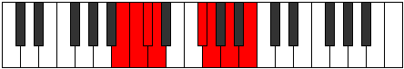 |
| [1425](https://ianring.com/musictheory/scales/1425) | [Ryphitonic](ModeDNaturalRyphitonic.md) | D | D, F#, A, A#, C, D | 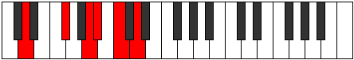 |
| [1427](https://ianring.com/musictheory/scales/1427) | [Lolimic](ModeDNaturalLolimic.md) | D | D, Eb, F#, G##, A#, B#, D | 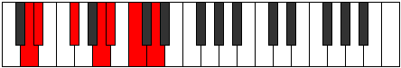 |
| [1429](https://ianring.com/musictheory/scales/1429) | [Bythimic](ModeASharpBythimic.md) | A# | A#, B#, C##, D###, E##, F###, A# |  |
| [1429](https://ianring.com/musictheory/scales/1429) | [Bythimic](ModeBFlatBythimic.md) | Bb | Bb, C, D, E#, F#, G#, Bb |  |
| [1429](https://ianring.com/musictheory/scales/1429) | [Bythimic](ModeDNaturalBythimic.md) | D | D, E, F#, G##, A#, B#, D |  |
| [1429](https://ianring.com/musictheory/scales/1429) | [Bythimic](ModeENaturalBythimic.md) | E | E, F#, G#, A##, B#, C##, E |  |
| [1431](https://ianring.com/musictheory/scales/1431) | [Phragian](ModeDNaturalPhragian.md) | D | D, Eb, Fb, Gb, A, Bb, C, D |  |
| [1431](https://ianring.com/musictheory/scales/1431) | [Phragian](ModeENaturalPhragian.md) | E | E, F, Gb, Ab, B, C, D, E |  |
| [1431](https://ianring.com/musictheory/scales/1431) | [Phragian](ModeASharpPhragian.md) | A# | A#, B, C, D, E#, F#, G#, A# |  |
| [1431](https://ianring.com/musictheory/scales/1431) | [Phragian](ModeBFlatPhragian.md) | Bb | Bb, Cb, Dbb, Ebb, F, Gb, Ab, Bb |  |
| [1433](https://ianring.com/musictheory/scales/1433) | [Dynimic](ModeDNaturalDynimic.md) | D | D, E#, F#, G##, A#, B#, D |  |
| [1435](https://ianring.com/musictheory/scales/1435) | [Phronian](ModeDNaturalPhronian.md) | D | D, Eb, F, Gb, A, Bb, C, D |  |
| [1435](https://ianring.com/musictheory/scales/1435) | [Phronian](ModeBNaturalPhronian.md) | B | B, C, D, Eb, F#, G, A, B |  |
| [1437](https://ianring.com/musictheory/scales/1437) | [Aeolycrian](ModeASharpAeolycrian.md) | A# | A#, B#, C#, D, E#, F#, G#, A# |  |
| [1437](https://ianring.com/musictheory/scales/1437) | [Aeolycrian](ModeBFlatAeolycrian.md) | Bb | Bb, C, Db, Ebb, F, Gb, Ab, Bb |  |
| [1437](https://ianring.com/musictheory/scales/1437) | [Aeolycrian](ModeDNaturalAeolycrian.md) | D | D, E, F, Gb, A, Bb, C, D | 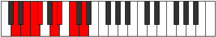 |
| [1437](https://ianring.com/musictheory/scales/1437) | [Aeolycrian](ModeENaturalAeolycrian.md) | E | E, F#, G, Ab, B, C, D, E | 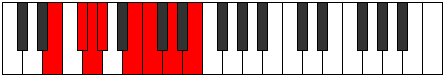 |
| [1439](https://ianring.com/musictheory/scales/1439) | [Rolyllic](ModeDNaturalRolyllic.md) | D | D, D#, E, F, F#, A, A#, C, D |  |
| [1439](https://ianring.com/musictheory/scales/1439) | [Rolyllic](ModeENaturalRolyllic.md) | E | E, F, F#, G, G#, B, C, D, E |  |
| [1439](https://ianring.com/musictheory/scales/1439) | [Rolyllic](ModeBNaturalRolyllic.md) | B | B, C, C#, D, D#, F#, G, A, B |  |
| [1439](https://ianring.com/musictheory/scales/1439) | [Rolyllic](ModeASharpRolyllic.md) | A# | A#, B, C, C#, D, F, F#, G#, A# |  |
| [1439](https://ianring.com/musictheory/scales/1439) | [Rolyllic](ModeBFlatRolyllic.md) | Bb | Bb, B, C, Db, D, F, Gb, Ab, Bb |  |
| [1445](https://ianring.com/musictheory/scales/1445) | [Byptimic](ModeENaturalByptimic.md) | E | E, F#, G##, A##, B#, C##, E |  |
| [1447](https://ianring.com/musictheory/scales/1447) | [Mixopyrian](ModeENaturalMixopyrian.md) | E | E, F, Gb, A, B, C, D, E |  |
| [1451](https://ianring.com/musictheory/scales/1451) | [Phrygian](ModeBNaturalPhrygian.md) | B | B, C, D, E, F#, G, A, B |  |
| [1453](https://ianring.com/musictheory/scales/1453) | [Aeolian](ModeENaturalAeolian.md) | E | E, F#, G, A, B, C, D, E |  |
| [1455](https://ianring.com/musictheory/scales/1455) | [Soryllic](ModeBNaturalSoryllic.md) | B | B, C, C#, D, E, F#, G, A, B |  |
| [1455](https://ianring.com/musictheory/scales/1455) | [Soryllic](ModeENaturalSoryllic.md) | E | E, F, F#, G, A, B, C, D, E |  |
| [1457](https://ianring.com/musictheory/scales/1457) | [Modimic](ModeDNaturalModimic.md) | D | D, E##, F##, G##, A#, B#, D |  |
| [1459](https://ianring.com/musictheory/scales/1459) | [Ionalian](ModeDNaturalIonalian.md) | D | D, Eb, F#, G, A, Bb, C, D |  |
| [1461](https://ianring.com/musictheory/scales/1461) | [Stydian](ModeASharpStydian.md) | A# | A#, B#, C##, D#, E#, F#, G#, A# |  |
| [1461](https://ianring.com/musictheory/scales/1461) | [Stydian](ModeBFlatStydian.md) | Bb | Bb, C, D, Eb, F, Gb, Ab, Bb |  |
| [1461](https://ianring.com/musictheory/scales/1461) | [Stydian](ModeDNaturalStydian.md) | D | D, E, F#, G, A, Bb, C, D |  |
| [1461](https://ianring.com/musictheory/scales/1461) | [Stydian](ModeENaturalStydian.md) | E | E, F#, G#, A, B, C, D, E |  |
| [1463](https://ianring.com/musictheory/scales/1463) | [Zaptyllic](ModeDNaturalZaptyllic.md) | D | D, D#, E, F#, G, A, A#, C, D |  |
| [1463](https://ianring.com/musictheory/scales/1463) | [Zaptyllic](ModeENaturalZaptyllic.md) | E | E, F, F#, G#, A, B, C, D, E |  |
| [1463](https://ianring.com/musictheory/scales/1463) | [Zaptyllic](ModeASharpZaptyllic.md) | A# | A#, B, C, D, D#, F, F#, G#, A# |  |
| [1463](https://ianring.com/musictheory/scales/1463) | [Zaptyllic](ModeBFlatZaptyllic.md) | Bb | Bb, B, C, D, Eb, F, Gb, Ab, Bb |  |
| [1465](https://ianring.com/musictheory/scales/1465) | [Aerathian](ModeDNaturalAerathian.md) | D | D, E#, F#, G, A, Bb, C, D | 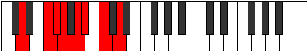 |
| [1467](https://ianring.com/musictheory/scales/1467) | [Thydyllic](ModeDNaturalThydyllic.md) | D | D, D#, F, F#, G, A, A#, C, D |  |
| [1467](https://ianring.com/musictheory/scales/1467) | [Thydyllic](ModeBNaturalThydyllic.md) | B | B, C, D, D#, E, F#, G, A, B |  |
| [1469](https://ianring.com/musictheory/scales/1469) | [Epiryllic](ModeASharpEpiryllic.md) | A# | A#, C, C#, D, D#, F, F#, G#, A# |  |
| [1469](https://ianring.com/musictheory/scales/1469) | [Epiryllic](ModeBFlatEpiryllic.md) | Bb | Bb, C, Db, D, Eb, F, Gb, Ab, Bb |  |
| [1469](https://ianring.com/musictheory/scales/1469) | [Epiryllic](ModeDNaturalEpiryllic.md) | D | D, E, F, F#, G, A, A#, C, D |  |
| [1469](https://ianring.com/musictheory/scales/1469) | [Epiryllic](ModeENaturalEpiryllic.md) | E | E, F#, G, G#, A, B, C, D, E |  |
| [1471](https://ianring.com/musictheory/scales/1471) | [Radygic](ModeDNaturalRadygic.md) | D | D, D#, E, F, F#, G, A, A#, C, D |  |
| [1471](https://ianring.com/musictheory/scales/1471) | [Radygic](ModeBNaturalRadygic.md) | B | B, C, C#, D, D#, E, F#, G, A, B |  |
| [1471](https://ianring.com/musictheory/scales/1471) | [Radygic](ModeENaturalRadygic.md) | E | E, F, F#, G, G#, A, B, C, D, E |  |
| [1471](https://ianring.com/musictheory/scales/1471) | [Radygic](ModeASharpRadygic.md) | A# | A#, B, C, C#, D, D#, F, F#, G#, A# |  |
| [1471](https://ianring.com/musictheory/scales/1471) | [Radygic](ModeBFlatRadygic.md) | Bb | Bb, B, C, Db, D, Eb, F, Gb, Ab, Bb |  |
| [1477](https://ianring.com/musictheory/scales/1477) | [Phrylimic](ModeFSharpPhrylimic.md) | F# | F#, G#, A###, B##, C##, D##, F# |  |
| [1477](https://ianring.com/musictheory/scales/1477) | [Phrylimic](ModeGFlatPhrylimic.md) | Gb | Gb, Ab, B#, C#, D, E, Gb |  |
| [1477](https://ianring.com/musictheory/scales/1477) | [Phrylimic](ModeCNaturalPhrylimic.md) | C | C, D, E##, F##, G#, A#, C |  |
| [1477](https://ianring.com/musictheory/scales/1477) | [Phrylimic](ModeENaturalPhrylimic.md) | E | E, F#, G###, A##, B#, C##, E |  |
| [1479](https://ianring.com/musictheory/scales/1479) | [Aeolagian](ModeFSharpAeolagian.md) | F# | F#, G, Ab, B#, C#, D, E, F# |  |
| [1479](https://ianring.com/musictheory/scales/1479) | [Aeolagian](ModeGFlatAeolagian.md) | Gb | Gb, Abb, Bbbb, C, Db, Ebb, Fb, Gb |  |
| [1479](https://ianring.com/musictheory/scales/1479) | [Aeolagian](ModeCNaturalAeolagian.md) | C | C, Db, Ebb, F#, G, Ab, Bb, C |  |
| [1479](https://ianring.com/musictheory/scales/1479) | [Aeolagian](ModeENaturalAeolagian.md) | E | E, F, Gb, A#, B, C, D, E | 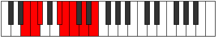 |
| [1481](https://ianring.com/musictheory/scales/1481) | [Zagimic](ModeFSharpZagimic.md) | F# | F#, G##, A###, B##, C##, D##, F# |  |
| [1481](https://ianring.com/musictheory/scales/1481) | [Zagimic](ModeGFlatZagimic.md) | Gb | Gb, A, B#, C#, D, E, Gb |  |
| [1483](https://ianring.com/musictheory/scales/1483) | [Dygian](ModeFSharpDygian.md) | F# | F#, G, A, B#, C#, D, E, F# |  |
| [1483](https://ianring.com/musictheory/scales/1483) | [Dygian](ModeGFlatDygian.md) | Gb | Gb, Abb, Bbb, C, Db, Ebb, Fb, Gb |  |
| [1483](https://ianring.com/musictheory/scales/1483) | [Dygian](ModeBNaturalDygian.md) | B | B, C, D, E#, F#, G, A, B |  |
| [1485](https://ianring.com/musictheory/scales/1485) | [Tyrian](ModeFSharpTyrian.md) | F# | F#, G#, A, B#, C#, D, E, F# |  |
| [1485](https://ianring.com/musictheory/scales/1485) | [Tyrian](ModeGFlatTyrian.md) | Gb | Gb, Ab, Bbb, C, Db, Ebb, Fb, Gb |  |
| [1485](https://ianring.com/musictheory/scales/1485) | [Tyrian](ModeCNaturalTyrian.md) | C | C, D, Eb, F#, G, Ab, Bb, C |  |
| [1485](https://ianring.com/musictheory/scales/1485) | [Tyrian](ModeENaturalTyrian.md) | E | E, F#, G, A#, B, C, D, E |  |
| [1487](https://ianring.com/musictheory/scales/1487) | [Lycryllic](ModeFSharpLycryllic.md) | F# | F#, G, G#, A, C, C#, D, E, F# |  |
| [1487](https://ianring.com/musictheory/scales/1487) | [Lycryllic](ModeGFlatLycryllic.md) | Gb | Gb, G, Ab, A, C, Db, D, E, Gb |  |
| [1487](https://ianring.com/musictheory/scales/1487) | [Lycryllic](ModeCNaturalLycryllic.md) | C | C, C#, D, D#, F#, G, G#, A#, C |  |
| [1487](https://ianring.com/musictheory/scales/1487) | [Lycryllic](ModeBNaturalLycryllic.md) | B | B, C, C#, D, F, F#, G, A, B |  |
| [1487](https://ianring.com/musictheory/scales/1487) | [Lycryllic](ModeENaturalLycryllic.md) | E | E, F, F#, G, A#, B, C, D, E |  |
| [1489](https://ianring.com/musictheory/scales/1489) | [Gacrimic](ModeGSharpGacrimic.md) | G# | G#, A###, B###, C###, D##, E##, G# |  |
| [1489](https://ianring.com/musictheory/scales/1489) | [Gacrimic](ModeAFlatGacrimic.md) | Ab | Ab, B#, C##, D#, E, F#, Ab |  |
| [1489](https://ianring.com/musictheory/scales/1489) | [Gacrimic](ModeFSharpGacrimic.md) | F# | F#, G###, A###, B##, C##, D##, F# |  |
| [1489](https://ianring.com/musictheory/scales/1489) | [Gacrimic](ModeGFlatGacrimic.md) | Gb | Gb, A#, B#, C#, D, E, Gb |  |
| [1489](https://ianring.com/musictheory/scales/1489) | [Gacrimic](ModeDNaturalGacrimic.md) | D | D, E##, F###, G##, A#, B#, D |  |
| [1491](https://ianring.com/musictheory/scales/1491) | [Rynian](ModeGSharpRynian.md) | G# | G#, A, B#, C##, D#, E, F#, G# |  |
| [1491](https://ianring.com/musictheory/scales/1491) | [Rynian](ModeAFlatRynian.md) | Ab | Ab, Bbb, C, D, Eb, Fb, Gb, Ab |  |
| [1491](https://ianring.com/musictheory/scales/1491) | [Rynian](ModeFSharpRynian.md) | F# | F#, G, A#, B#, C#, D, E, F# |  |
| [1491](https://ianring.com/musictheory/scales/1491) | [Rynian](ModeGFlatRynian.md) | Gb | Gb, Abb, Bb, C, Db, Ebb, Fb, Gb |  |
| [1491](https://ianring.com/musictheory/scales/1491) | [Rynian](ModeDNaturalRynian.md) | D | D, Eb, F#, G#, A, Bb, C, D |  |
| [1493](https://ianring.com/musictheory/scales/1493) | [Phryrian](ModeFSharpPhryrian.md) | F# | F#, G#, A#, B#, C#, D, E, F# |  |
| [1493](https://ianring.com/musictheory/scales/1493) | [Phryrian](ModeGFlatPhryrian.md) | Gb | Gb, Ab, Bb, C, Db, Ebb, Fb, Gb |  |
| [1493](https://ianring.com/musictheory/scales/1493) | [Phryrian](ModeGSharpPhryrian.md) | G# | G#, A#, B#, C##, D#, E, F#, G# |  |
| [1493](https://ianring.com/musictheory/scales/1493) | [Phryrian](ModeAFlatPhryrian.md) | Ab | Ab, Bb, C, D, Eb, Fb, Gb, Ab |  |
| [1493](https://ianring.com/musictheory/scales/1493) | [Phryrian](ModeASharpPhryrian.md) | A# | A#, B#, C##, D##, E#, F#, G#, A# | 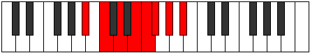 |
| [1493](https://ianring.com/musictheory/scales/1493) | [Phryrian](ModeBFlatPhryrian.md) | Bb | Bb, C, D, E, F, Gb, Ab, Bb |  |
| [1493](https://ianring.com/musictheory/scales/1493) | [Phryrian](ModeCNaturalPhryrian.md) | C | C, D, E, F#, G, Ab, Bb, C |  |
| [1493](https://ianring.com/musictheory/scales/1493) | [Phryrian](ModeDNaturalPhryrian.md) | D | D, E, F#, G#, A, Bb, C, D |  |
| [1493](https://ianring.com/musictheory/scales/1493) | [Phryrian](ModeENaturalPhryrian.md) | E | E, F#, G#, A#, B, C, D, E |  |
| [1495](https://ianring.com/musictheory/scales/1495) | [Kaptyllic](ModeCNaturalKaptyllic.md) | C | C, C#, D, E, F#, G, G#, A#, C |  |
| [1495](https://ianring.com/musictheory/scales/1495) | [Kaptyllic](ModeFSharpKaptyllic.md) | F# | F#, G, G#, A#, C, C#, D, E, F# |  |
| [1495](https://ianring.com/musictheory/scales/1495) | [Kaptyllic](ModeGFlatKaptyllic.md) | Gb | Gb, G, Ab, Bb, C, Db, D, E, Gb |  |
| [1495](https://ianring.com/musictheory/scales/1495) | [Kaptyllic](ModeDNaturalKaptyllic.md) | D | D, D#, E, F#, G#, A, A#, C, D |  |
| [1495](https://ianring.com/musictheory/scales/1495) | [Kaptyllic](ModeGSharpKaptyllic.md) | G# | G#, A, A#, C, D, D#, E, F#, G# |  |
| [1495](https://ianring.com/musictheory/scales/1495) | [Kaptyllic](ModeAFlatKaptyllic.md) | Ab | Ab, A, Bb, C, D, Eb, E, Gb, Ab |  |
| [1495](https://ianring.com/musictheory/scales/1495) | [Kaptyllic](ModeENaturalKaptyllic.md) | E | E, F, F#, G#, A#, B, C, D, E |  |
| [1495](https://ianring.com/musictheory/scales/1495) | [Kaptyllic](ModeASharpKaptyllic.md) | A# | A#, B, C, D, E, F, F#, G#, A# |  |
| [1495](https://ianring.com/musictheory/scales/1495) | [Kaptyllic](ModeBFlatKaptyllic.md) | Bb | Bb, B, C, D, E, F, Gb, Ab, Bb |  |
| [1497](https://ianring.com/musictheory/scales/1497) | [Ionanian](ModeFSharpIonanian.md) | F# | F#, G##, A#, B#, C#, D, E, F# |  |
| [1497](https://ianring.com/musictheory/scales/1497) | [Ionanian](ModeGFlatIonanian.md) | Gb | Gb, A, Bb, C, Db, Ebb, Fb, Gb |  |
| [1497](https://ianring.com/musictheory/scales/1497) | [Ionanian](ModeDNaturalIonanian.md) | D | D, E#, F#, G#, A, Bb, C, D |  |
| [1497](https://ianring.com/musictheory/scales/1497) | [Ionanian](ModeGSharpIonanian.md) | G# | G#, A##, B#, C##, D#, E, F#, G# |  |
| [1497](https://ianring.com/musictheory/scales/1497) | [Ionanian](ModeAFlatIonanian.md) | Ab | Ab, B, C, D, Eb, Fb, Gb, Ab |  |
| [1499](https://ianring.com/musictheory/scales/1499) | [Stonyllic](ModeFSharpStonyllic.md) | F# | F#, G, A, A#, C, C#, D, E, F# |  |
| [1499](https://ianring.com/musictheory/scales/1499) | [Stonyllic](ModeGFlatStonyllic.md) | Gb | Gb, G, A, Bb, C, Db, D, E, Gb |  |
| [1499](https://ianring.com/musictheory/scales/1499) | [Stonyllic](ModeDNaturalStonyllic.md) | D | D, D#, F, F#, G#, A, A#, C, D |  |
| [1499](https://ianring.com/musictheory/scales/1499) | [Stonyllic](ModeBNaturalStonyllic.md) | B | B, C, D, D#, F, F#, G, A, B |  |
| [1499](https://ianring.com/musictheory/scales/1499) | [Stonyllic](ModeGSharpStonyllic.md) | G# | G#, A, B, C, D, D#, E, F#, G# |  |
| [1499](https://ianring.com/musictheory/scales/1499) | [Stonyllic](ModeAFlatStonyllic.md) | Ab | Ab, A, B, C, D, Eb, E, Gb, Ab |  |
| [1501](https://ianring.com/musictheory/scales/1501) | [Stygyllic](ModeASharpStygyllic.md) | A# | A#, C, C#, D, E, F, F#, G#, A# |  |
| [1501](https://ianring.com/musictheory/scales/1501) | [Stygyllic](ModeBFlatStygyllic.md) | Bb | Bb, C, Db, D, E, F, Gb, Ab, Bb |  |
| [1501](https://ianring.com/musictheory/scales/1501) | [Stygyllic](ModeCNaturalStygyllic.md) | C | C, D, D#, E, F#, G, G#, A#, C |  |
| [1501](https://ianring.com/musictheory/scales/1501) | [Stygyllic](ModeFSharpStygyllic.md) | F# | F#, G#, A, A#, C, C#, D, E, F# |  |
| [1501](https://ianring.com/musictheory/scales/1501) | [Stygyllic](ModeGFlatStygyllic.md) | Gb | Gb, Ab, A, Bb, C, Db, D, E, Gb |  |
| [1501](https://ianring.com/musictheory/scales/1501) | [Stygyllic](ModeDNaturalStygyllic.md) | D | D, E, F, F#, G#, A, A#, C, D |  |
| [1501](https://ianring.com/musictheory/scales/1501) | [Stygyllic](ModeGSharpStygyllic.md) | G# | G#, A#, B, C, D, D#, E, F#, G# |  |
| [1501](https://ianring.com/musictheory/scales/1501) | [Stygyllic](ModeAFlatStygyllic.md) | Ab | Ab, Bb, B, C, D, Eb, E, Gb, Ab |  |
| [1501](https://ianring.com/musictheory/scales/1501) | [Stygyllic](ModeENaturalStygyllic.md) | E | E, F#, G, G#, A#, B, C, D, E |  |
| [1503](https://ianring.com/musictheory/scales/1503) | [Padygic](ModeCNaturalPadygic.md) | C | C, C#, D, D#, E, F#, G, G#, A#, C |  |
| [1503](https://ianring.com/musictheory/scales/1503) | [Padygic](ModeDNaturalPadygic.md) | D | D, D#, E, F, F#, G#, A, A#, C, D |  |
| [1503](https://ianring.com/musictheory/scales/1503) | [Padygic](ModeFSharpPadygic.md) | F# | F#, G, G#, A, A#, C, C#, D, E, F# |  |
| [1503](https://ianring.com/musictheory/scales/1503) | [Padygic](ModeGFlatPadygic.md) | Gb | Gb, G, Ab, A, Bb, C, Db, D, E, Gb |  |
| [1503](https://ianring.com/musictheory/scales/1503) | [Padygic](ModeBNaturalPadygic.md) | B | B, C, C#, D, D#, F, F#, G, A, B |  |
| [1503](https://ianring.com/musictheory/scales/1503) | [Padygic](ModeASharpPadygic.md) | A# | A#, B, C, C#, D, E, F, F#, G#, A# |  |
| [1503](https://ianring.com/musictheory/scales/1503) | [Padygic](ModeBFlatPadygic.md) | Bb | Bb, B, C, Db, D, E, F, Gb, Ab, Bb |  |
| [1503](https://ianring.com/musictheory/scales/1503) | [Padygic](ModeENaturalPadygic.md) | E | E, F, F#, G, G#, A#, B, C, D, E |  |
| [1503](https://ianring.com/musictheory/scales/1503) | [Padygic](ModeGSharpPadygic.md) | G# | G#, A, A#, B, C, D, D#, E, F#, G# |  |
| [1503](https://ianring.com/musictheory/scales/1503) | [Padygic](ModeAFlatPadygic.md) | Ab | Ab, A, Bb, B, C, D, Eb, E, Gb, Ab |  |
| [1507](https://ianring.com/musictheory/scales/1507) | [Zynian](ModeFSharpZynian.md) | F# | F#, G, A##, B#, C#, D, E, F# |  |
| [1507](https://ianring.com/musictheory/scales/1507) | [Zynian](ModeGFlatZynian.md) | Gb | Gb, Abb, B, C, Db, Ebb, Fb, Gb |  |
| [1509](https://ianring.com/musictheory/scales/1509) | [Ragian](ModeCNaturalRagian.md) | C | C, D, E#, F#, G, Ab, Bb, C |  |
| [1509](https://ianring.com/musictheory/scales/1509) | [Ragian](ModeFSharpRagian.md) | F# | F#, G#, A##, B#, C#, D, E, F# |  |
| [1509](https://ianring.com/musictheory/scales/1509) | [Ragian](ModeGFlatRagian.md) | Gb | Gb, Ab, B, C, Db, Ebb, Fb, Gb |  |
| [1509](https://ianring.com/musictheory/scales/1509) | [Ragian](ModeENaturalRagian.md) | E | E, F#, G##, A#, B, C, D, E |  |
| [1511](https://ianring.com/musictheory/scales/1511) | [Styptyllic](ModeCNaturalStyptyllic.md) | C | C, C#, D, F, F#, G, G#, A#, C |  |
| [1511](https://ianring.com/musictheory/scales/1511) | [Styptyllic](ModeFSharpStyptyllic.md) | F# | F#, G, G#, B, C, C#, D, E, F# |  |
| [1511](https://ianring.com/musictheory/scales/1511) | [Styptyllic](ModeGFlatStyptyllic.md) | Gb | Gb, G, Ab, B, C, Db, D, E, Gb |  |
| [1511](https://ianring.com/musictheory/scales/1511) | [Styptyllic](ModeENaturalStyptyllic.md) | E | E, F, F#, A, A#, B, C, D, E |  |
| [1513](https://ianring.com/musictheory/scales/1513) | [Stathian](ModeFSharpStathian.md) | F# | F#, G##, A##, B#, C#, D, E, F# |  |
| [1513](https://ianring.com/musictheory/scales/1513) | [Stathian](ModeGFlatStathian.md) | Gb | Gb, A, B, C, Db, Ebb, Fb, Gb |  |
| [1515](https://ianring.com/musictheory/scales/1515) | [Solyllic](ModeFSharpSolyllic.md) | F# | F#, G, A, B, C, C#, D, E, F# | 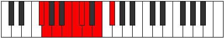 |
| [1515](https://ianring.com/musictheory/scales/1515) | [Solyllic](ModeGFlatSolyllic.md) | Gb | Gb, G, A, B, C, Db, D, E, Gb |  |
| [1515](https://ianring.com/musictheory/scales/1515) | [Solyllic](ModeBNaturalSolyllic.md) | B | B, C, D, E, F, F#, G, A, B |  |
| [1517](https://ianring.com/musictheory/scales/1517) | [Sagyllic](ModeCNaturalSagyllic.md) | C | C, D, D#, F, F#, G, G#, A#, C |  |
| [1517](https://ianring.com/musictheory/scales/1517) | [Sagyllic](ModeFSharpSagyllic.md) | F# | F#, G#, A, B, C, C#, D, E, F# |  |
| [1517](https://ianring.com/musictheory/scales/1517) | [Sagyllic](ModeGFlatSagyllic.md) | Gb | Gb, Ab, A, B, C, Db, D, E, Gb |  |
| [1517](https://ianring.com/musictheory/scales/1517) | [Sagyllic](ModeENaturalSagyllic.md) | E | E, F#, G, A, A#, B, C, D, E |  |
| [1519](https://ianring.com/musictheory/scales/1519) | [Solygic](ModeCNaturalSolygic.md) | C | C, C#, D, D#, F, F#, G, G#, A#, C |  |
| [1519](https://ianring.com/musictheory/scales/1519) | [Solygic](ModeBNaturalSolygic.md) | B | B, C, C#, D, E, F, F#, G, A, B |  |
| [1519](https://ianring.com/musictheory/scales/1519) | [Solygic](ModeFSharpSolygic.md) | F# | F#, G, G#, A, B, C, C#, D, E, F# |  |
| [1519](https://ianring.com/musictheory/scales/1519) | [Solygic](ModeGFlatSolygic.md) | Gb | Gb, G, Ab, A, B, C, Db, D, E, Gb |  |
| [1519](https://ianring.com/musictheory/scales/1519) | [Solygic](ModeENaturalSolygic.md) | E | E, F, F#, G, A, A#, B, C, D, E |  |
| [1521](https://ianring.com/musictheory/scales/1521) | [Stanian](ModeGSharpStanian.md) | G# | G#, A###, B##, C##, D#, E, F#, G# |  |
| [1521](https://ianring.com/musictheory/scales/1521) | [Stanian](ModeAFlatStanian.md) | Ab | Ab, B#, C#, D, Eb, Fb, Gb, Ab |  |
| [1521](https://ianring.com/musictheory/scales/1521) | [Stanian](ModeDNaturalStanian.md) | D | D, E##, F##, G#, A, Bb, C, D |  |
| [1521](https://ianring.com/musictheory/scales/1521) | [Stanian](ModeFSharpStanian.md) | F# | F#, G###, A##, B#, C#, D, E, F# |  |
| [1521](https://ianring.com/musictheory/scales/1521) | [Stanian](ModeGFlatStanian.md) | Gb | Gb, A#, B, C, Db, Ebb, Fb, Gb |  |
| [1523](https://ianring.com/musictheory/scales/1523) | [Zothyllic](ModeGSharpZothyllic.md) | G# | G#, A, C, C#, D, D#, E, F#, G# |  |
| [1523](https://ianring.com/musictheory/scales/1523) | [Zothyllic](ModeAFlatZothyllic.md) | Ab | Ab, A, C, Db, D, Eb, E, Gb, Ab |  |
| [1523](https://ianring.com/musictheory/scales/1523) | [Zothyllic](ModeDNaturalZothyllic.md) | D | D, D#, F#, G, G#, A, A#, C, D |  |
| [1523](https://ianring.com/musictheory/scales/1523) | [Zothyllic](ModeFSharpZothyllic.md) | F# | F#, G, A#, B, C, C#, D, E, F# |  |
| [1523](https://ianring.com/musictheory/scales/1523) | [Zothyllic](ModeGFlatZothyllic.md) | Gb | Gb, G, Bb, B, C, Db, D, E, Gb |  |
| [1525](https://ianring.com/musictheory/scales/1525) | [Sodyllic](ModeGSharpSodyllic.md) | G# | G#, A#, C, C#, D, D#, E, F#, G# |  |
| [1525](https://ianring.com/musictheory/scales/1525) | [Sodyllic](ModeAFlatSodyllic.md) | Ab | Ab, Bb, C, Db, D, Eb, E, Gb, Ab |  |
| [1525](https://ianring.com/musictheory/scales/1525) | [Sodyllic](ModeASharpSodyllic.md) | A# | A#, C, D, D#, E, F, F#, G#, A# |  |
| [1525](https://ianring.com/musictheory/scales/1525) | [Sodyllic](ModeBFlatSodyllic.md) | Bb | Bb, C, D, Eb, E, F, Gb, Ab, Bb |  |
| [1525](https://ianring.com/musictheory/scales/1525) | [Sodyllic](ModeCNaturalSodyllic.md) | C | C, D, E, F, F#, G, G#, A#, C |  |
| [1525](https://ianring.com/musictheory/scales/1525) | [Sodyllic](ModeDNaturalSodyllic.md) | D | D, E, F#, G, G#, A, A#, C, D |  |
| [1525](https://ianring.com/musictheory/scales/1525) | [Sodyllic](ModeFSharpSodyllic.md) | F# | F#, G#, A#, B, C, C#, D, E, F# |  |
| [1525](https://ianring.com/musictheory/scales/1525) | [Sodyllic](ModeGFlatSodyllic.md) | Gb | Gb, Ab, Bb, B, C, Db, D, E, Gb | 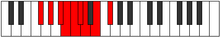 |
| [1525](https://ianring.com/musictheory/scales/1525) | [Sodyllic](ModeENaturalSodyllic.md) | E | E, F#, G#, A, A#, B, C, D, E |  |
| [1527](https://ianring.com/musictheory/scales/1527) | [Aeolyrygic](ModeCNaturalAeolyrygic.md) | C | C, C#, D, E, F, F#, G, G#, A#, C |  |
| [1527](https://ianring.com/musictheory/scales/1527) | [Aeolyrygic](ModeGSharpAeolyrygic.md) | G# | G#, A, A#, C, C#, D, D#, E, F#, G# |  |
| [1527](https://ianring.com/musictheory/scales/1527) | [Aeolyrygic](ModeAFlatAeolyrygic.md) | Ab | Ab, A, Bb, C, Db, D, Eb, E, Gb, Ab |  |
| [1527](https://ianring.com/musictheory/scales/1527) | [Aeolyrygic](ModeDNaturalAeolyrygic.md) | D | D, D#, E, F#, G, G#, A, A#, C, D |  |
| [1527](https://ianring.com/musictheory/scales/1527) | [Aeolyrygic](ModeASharpAeolyrygic.md) | A# | A#, B, C, D, D#, E, F, F#, G#, A# |  |
| [1527](https://ianring.com/musictheory/scales/1527) | [Aeolyrygic](ModeBFlatAeolyrygic.md) | Bb | Bb, B, C, D, Eb, E, F, Gb, Ab, Bb |  |
| [1527](https://ianring.com/musictheory/scales/1527) | [Aeolyrygic](ModeFSharpAeolyrygic.md) | F# | F#, G, G#, A#, B, C, C#, D, E, F# |  |
| [1527](https://ianring.com/musictheory/scales/1527) | [Aeolyrygic](ModeGFlatAeolyrygic.md) | Gb | Gb, G, Ab, Bb, B, C, Db, D, E, Gb |  |
| [1527](https://ianring.com/musictheory/scales/1527) | [Aeolyrygic](ModeENaturalAeolyrygic.md) | E | E, F, F#, G#, A, A#, B, C, D, E |  |
| [1529](https://ianring.com/musictheory/scales/1529) | [Kataryllic](ModeDNaturalKataryllic.md) | D | D, F, F#, G, G#, A, A#, C, D |  |
| [1529](https://ianring.com/musictheory/scales/1529) | [Kataryllic](ModeGSharpKataryllic.md) | G# | G#, B, C, C#, D, D#, E, F#, G# |  |
| [1529](https://ianring.com/musictheory/scales/1529) | [Kataryllic](ModeAFlatKataryllic.md) | Ab | Ab, B, C, Db, D, Eb, E, Gb, Ab |  |
| [1529](https://ianring.com/musictheory/scales/1529) | [Kataryllic](ModeFSharpKataryllic.md) | F# | F#, A, A#, B, C, C#, D, E, F# |  |
| [1529](https://ianring.com/musictheory/scales/1529) | [Kataryllic](ModeGFlatKataryllic.md) | Gb | Gb, A, Bb, B, C, Db, D, E, Gb |  |
| [1531](https://ianring.com/musictheory/scales/1531) | [Styptygic](ModeDNaturalStyptygic.md) | D | D, D#, F, F#, G, G#, A, A#, C, D |  |
| [1531](https://ianring.com/musictheory/scales/1531) | [Styptygic](ModeBNaturalStyptygic.md) | B | B, C, D, D#, E, F, F#, G, A, B |  |
| [1531](https://ianring.com/musictheory/scales/1531) | [Styptygic](ModeGSharpStyptygic.md) | G# | G#, A, B, C, C#, D, D#, E, F#, G# |  |
| [1531](https://ianring.com/musictheory/scales/1531) | [Styptygic](ModeAFlatStyptygic.md) | Ab | Ab, A, B, C, Db, D, Eb, E, Gb, Ab |  |
| [1531](https://ianring.com/musictheory/scales/1531) | [Styptygic](ModeFSharpStyptygic.md) | F# | F#, G, A, A#, B, C, C#, D, E, F# |  |
| [1531](https://ianring.com/musictheory/scales/1531) | [Styptygic](ModeGFlatStyptygic.md) | Gb | Gb, G, A, Bb, B, C, Db, D, E, Gb |  |
| [1533](https://ianring.com/musictheory/scales/1533) | [Katycrygic](ModeASharpKatycrygic.md) | A# | A#, C, C#, D, D#, E, F, F#, G#, A# |  |
| [1533](https://ianring.com/musictheory/scales/1533) | [Katycrygic](ModeBFlatKatycrygic.md) | Bb | Bb, C, Db, D, Eb, E, F, Gb, Ab, Bb |  |
| [1533](https://ianring.com/musictheory/scales/1533) | [Katycrygic](ModeCNaturalKatycrygic.md) | C | C, D, D#, E, F, F#, G, G#, A#, C |  |
| [1533](https://ianring.com/musictheory/scales/1533) | [Katycrygic](ModeDNaturalKatycrygic.md) | D | D, E, F, F#, G, G#, A, A#, C, D |  |
| [1533](https://ianring.com/musictheory/scales/1533) | [Katycrygic](ModeGSharpKatycrygic.md) | G# | G#, A#, B, C, C#, D, D#, E, F#, G# |  |
| [1533](https://ianring.com/musictheory/scales/1533) | [Katycrygic](ModeAFlatKatycrygic.md) | Ab | Ab, Bb, B, C, Db, D, Eb, E, Gb, Ab |  |
| [1533](https://ianring.com/musictheory/scales/1533) | [Katycrygic](ModeFSharpKatycrygic.md) | F# | F#, G#, A, A#, B, C, C#, D, E, F# |  |
| [1533](https://ianring.com/musictheory/scales/1533) | [Katycrygic](ModeGFlatKatycrygic.md) | Gb | Gb, Ab, A, Bb, B, C, Db, D, E, Gb |  |
| [1533](https://ianring.com/musictheory/scales/1533) | [Katycrygic](ModeENaturalKatycrygic.md) | E | E, F#, G, G#, A, A#, B, C, D, E |  |
| [1535](https://ianring.com/musictheory/scales/1535) | [Mixodyllian](ModeCNaturalMixodyllian.md) | C | C, C#, D, D#, E, F, F#, G, G#, A#, C |  |
| [1535](https://ianring.com/musictheory/scales/1535) | [Mixodyllian](ModeDNaturalMixodyllian.md) | D | D, D#, E, F, F#, G, G#, A, A#, C, D |  |
| [1535](https://ianring.com/musictheory/scales/1535) | [Mixodyllian](ModeBNaturalMixodyllian.md) | B | B, C, C#, D, D#, E, F, F#, G, A, B |  |
| [1535](https://ianring.com/musictheory/scales/1535) | [Mixodyllian](ModeASharpMixodyllian.md) | A# | A#, B, C, C#, D, D#, E, F, F#, G#, A# |  |
| [1535](https://ianring.com/musictheory/scales/1535) | [Mixodyllian](ModeBFlatMixodyllian.md) | Bb | Bb, B, C, Db, D, Eb, E, F, Gb, Ab, Bb |  |
| [1535](https://ianring.com/musictheory/scales/1535) | [Mixodyllian](ModeGSharpMixodyllian.md) | G# | G#, A, A#, B, C, C#, D, D#, E, F#, G# |  |
| [1535](https://ianring.com/musictheory/scales/1535) | [Mixodyllian](ModeAFlatMixodyllian.md) | Ab | Ab, A, Bb, B, C, Db, D, Eb, E, Gb, Ab |  |
| [1535](https://ianring.com/musictheory/scales/1535) | [Mixodyllian](ModeFSharpMixodyllian.md) | F# | F#, G, G#, A, A#, B, C, C#, D, E, F# |  |
| [1535](https://ianring.com/musictheory/scales/1535) | [Mixodyllian](ModeGFlatMixodyllian.md) | Gb | Gb, G, Ab, A, Bb, B, C, Db, D, E, Gb |  |
| [1535](https://ianring.com/musictheory/scales/1535) | [Mixodyllian](ModeENaturalMixodyllian.md) | E | E, F, F#, G, G#, A, A#, B, C, D, E |  |
| [1577](https://ianring.com/musictheory/scales/1577) | [Lonitonic](ModeANaturalLonitonic.md) | A | A, C, D, F#, G, A |  |
| [1579](https://ianring.com/musictheory/scales/1579) | [Sagimic](ModeANaturalSagimic.md) | A | A, Bb, C, D, E##, F##, A |  |
| [1581](https://ianring.com/musictheory/scales/1581) | [Gyrimic](ModeANaturalGyrimic.md) | A | A, B, C, D, E##, F##, A | 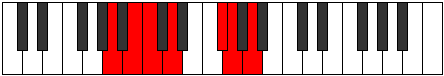 |
| [1583](https://ianring.com/musictheory/scales/1583) | [Salian](ModeANaturalSalian.md) | A | A, Bb, Cb, Dbb, Ebb, F#, G, A |  |
| [1585](https://ianring.com/musictheory/scales/1585) | [Phraditonic](ModeDNaturalPhraditonic.md) | D | D, F#, G, B, C, D |  |
| [1587](https://ianring.com/musictheory/scales/1587) | [Lalimic](ModeDNaturalLalimic.md) | D | D, Eb, F#, G, A##, B#, D |  |
| [1589](https://ianring.com/musictheory/scales/1589) | [Ionagimic](ModeDNaturalIonagimic.md) | D | D, E, F#, G, A##, B#, D | 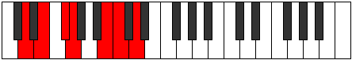 |
| [1591](https://ianring.com/musictheory/scales/1591) | [Rodian](ModeDNaturalRodian.md) | D | D, Eb, Fb, Gb, Abb, B, C, D |  |
| [1593](https://ianring.com/musictheory/scales/1593) | [Zogimic](ModeANaturalZogimic.md) | A | A, B#, C#, D, E##, F##, A |  |
| [1593](https://ianring.com/musictheory/scales/1593) | [Zogimic](ModeDNaturalZogimic.md) | D | D, E#, F#, G, A##, B#, D |  |
| [1595](https://ianring.com/musictheory/scales/1595) | [Dacrian](ModeANaturalDacrian.md) | A | A, Bb, C, Db, Ebb, F#, G, A |  |
| [1595](https://ianring.com/musictheory/scales/1595) | [Dacrian](ModeDNaturalDacrian.md) | D | D, Eb, F, Gb, Abb, B, C, D |  |
| [1597](https://ianring.com/musictheory/scales/1597) | [Aeolodian](ModeDNaturalAeolodian.md) | D | D, E, F, Gb, Abb, B, C, D |  |
| [1597](https://ianring.com/musictheory/scales/1597) | [Aeolodian](ModeANaturalAeolodian.md) | A | A, B, C, Db, Ebb, F#, G, A |  |
| [1599](https://ianring.com/musictheory/scales/1599) | [Pocryllic](ModeDNaturalPocryllic.md) | D | D, D#, E, F, F#, G, B, C, D | 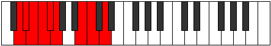 |
| [1599](https://ianring.com/musictheory/scales/1599) | [Pocryllic](ModeANaturalPocryllic.md) | A | A, A#, B, C, C#, D, F#, G, A |  |
| [1605](https://ianring.com/musictheory/scales/1605) | [Zanitonic](ModeCNaturalZanitonic.md) | C | C, D, F#, A, A#, C |  |
| [1607](https://ianring.com/musictheory/scales/1607) | [Epytimic](ModeCNaturalEpytimic.md) | C | C, Db, Ebb, F#, G##, A#, C |  |
| [1613](https://ianring.com/musictheory/scales/1613) | [Thylimic](ModeCNaturalThylimic.md) | C | C, D, Eb, F#, G##, A#, C |  |
| [1615](https://ianring.com/musictheory/scales/1615) | [Sydian](ModeCNaturalSydian.md) | C | C, Db, Ebb, Fbb, Gb, A, Bb, C | 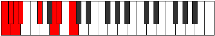 |
| [1617](https://ianring.com/musictheory/scales/1617) | [Phronitonic](ModeGSharpPhronitonic.md) | G# | G#, C, D, F, F#, G# |  |
| [1617](https://ianring.com/musictheory/scales/1617) | [Phronitonic](ModeAFlatPhronitonic.md) | Ab | Ab, C, D, F, Gb, Ab |  |
| [1617](https://ianring.com/musictheory/scales/1617) | [Phronitonic](ModeDNaturalPhronitonic.md) | D | D, F#, G#, B, C, D |  |
| [1619](https://ianring.com/musictheory/scales/1619) | [Monimic](ModeGSharpMonimic.md) | G# | G#, A, B#, C##, D###, E##, G# |  |
| [1619](https://ianring.com/musictheory/scales/1619) | [Monimic](ModeAFlatMonimic.md) | Ab | Ab, Bbb, C, D, E#, F#, Ab |  |
| [1619](https://ianring.com/musictheory/scales/1619) | [Monimic](ModeDNaturalMonimic.md) | D | D, Eb, F#, G#, A##, B#, D |  |
| [1621](https://ianring.com/musictheory/scales/1621) | [Aeolathimic](ModeGSharpAeolathimic.md) | G# | G#, A#, B#, C##, D###, E##, G# |  |
| [1621](https://ianring.com/musictheory/scales/1621) | [Aeolathimic](ModeAFlatAeolathimic.md) | Ab | Ab, Bb, C, D, E#, F#, Ab |  |
| [1621](https://ianring.com/musictheory/scales/1621) | [Aeolathimic](ModeCNaturalAeolathimic.md) | C | C, D, E, F#, G##, A#, C |  |
| [1621](https://ianring.com/musictheory/scales/1621) | [Aeolathimic](ModeDNaturalAeolathimic.md) | D | D, E, F#, G#, A##, B#, D |  |
| [1623](https://ianring.com/musictheory/scales/1623) | [Lothian](ModeCNaturalLothian.md) | C | C, Db, Ebb, Fb, Gb, A, Bb, C | 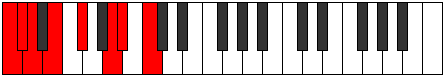 |
| [1623](https://ianring.com/musictheory/scales/1623) | [Lothian](ModeGSharpLothian.md) | G# | G#, A, Bb, C, D, E#, F#, G# |  |
| [1623](https://ianring.com/musictheory/scales/1623) | [Lothian](ModeAFlatLothian.md) | Ab | Ab, Bbb, Cbb, Dbb, Ebb, F, Gb, Ab |  |
| [1623](https://ianring.com/musictheory/scales/1623) | [Lothian](ModeDNaturalLothian.md) | D | D, Eb, Fb, Gb, Ab, B, C, D |  |
| [1625](https://ianring.com/musictheory/scales/1625) | [Lythimic](ModeDNaturalLythimic.md) | D | D, E#, F#, G#, A##, B#, D |  |
| [1625](https://ianring.com/musictheory/scales/1625) | [Lythimic](ModeGSharpLythimic.md) | G# | G#, A##, B#, C##, D###, E##, G# |  |
| [1625](https://ianring.com/musictheory/scales/1625) | [Lythimic](ModeAFlatLythimic.md) | Ab | Ab, B, C, D, E#, F#, Ab |  |
| [1627](https://ianring.com/musictheory/scales/1627) | [Zyptian](ModeDNaturalZyptian.md) | D | D, Eb, F, Gb, Ab, B, C, D |  |
| [1627](https://ianring.com/musictheory/scales/1627) | [Zyptian](ModeGSharpZyptian.md) | G# | G#, A, B, C, D, E#, F#, G# |  |
| [1627](https://ianring.com/musictheory/scales/1627) | [Zyptian](ModeAFlatZyptian.md) | Ab | Ab, Bbb, Cb, Dbb, Ebb, F, Gb, Ab |  |
| [1629](https://ianring.com/musictheory/scales/1629) | [Synian](ModeCNaturalSynian.md) | C | C, D, Eb, Fb, Gb, A, Bb, C |  |
| [1629](https://ianring.com/musictheory/scales/1629) | [Synian](ModeDNaturalSynian.md) | D | D, E, F, Gb, Ab, B, C, D |  |
| [1629](https://ianring.com/musictheory/scales/1629) | [Synian](ModeGSharpSynian.md) | G# | G#, A#, B, C, D, E#, F#, G# |  |
| [1629](https://ianring.com/musictheory/scales/1629) | [Synian](ModeAFlatSynian.md) | Ab | Ab, Bb, Cb, Dbb, Ebb, F, Gb, Ab |  |
| [1631](https://ianring.com/musictheory/scales/1631) | [Rynyllic](ModeCNaturalRynyllic.md) | C | C, C#, D, D#, E, F#, A, A#, C |  |
| [1631](https://ianring.com/musictheory/scales/1631) | [Rynyllic](ModeDNaturalRynyllic.md) | D | D, D#, E, F, F#, G#, B, C, D |  |
| [1631](https://ianring.com/musictheory/scales/1631) | [Rynyllic](ModeGSharpRynyllic.md) | G# | G#, A, A#, B, C, D, F, F#, G# |  |
| [1631](https://ianring.com/musictheory/scales/1631) | [Rynyllic](ModeAFlatRynyllic.md) | Ab | Ab, A, Bb, B, C, D, F, Gb, Ab |  |
| [1637](https://ianring.com/musictheory/scales/1637) | [Syptimic](ModeCNaturalSyptimic.md) | C | C, D, E#, F#, G##, A#, C |  |
| [1639](https://ianring.com/musictheory/scales/1639) | [Aeolothian](ModeCNaturalAeolothian.md) | C | C, Db, Ebb, F, Gb, A, Bb, C |  |
| [1641](https://ianring.com/musictheory/scales/1641) | [Bocrimic](ModeANaturalBocrimic.md) | A | A, B#, C##, D#, E##, F##, A |  |
| [1643](https://ianring.com/musictheory/scales/1643) | [Thyptian](ModeANaturalThyptian.md) | A | A, Bb, C, D, Eb, F#, G, A |  |
| [1645](https://ianring.com/musictheory/scales/1645) | [Katagian](ModeCNaturalKatagian.md) | C | C, D, Eb, F, Gb, A, Bb, C |  |
| [1645](https://ianring.com/musictheory/scales/1645) | [Katagian](ModeANaturalKatagian.md) | A | A, B, C, D, Eb, F#, G, A |  |
| [1647](https://ianring.com/musictheory/scales/1647) | [Polyllic](ModeCNaturalPolyllic.md) | C | C, C#, D, D#, F, F#, A, A#, C |  |
| [1647](https://ianring.com/musictheory/scales/1647) | [Polyllic](ModeANaturalPolyllic.md) | A | A, A#, B, C, D, D#, F#, G, A |  |
| [1649](https://ianring.com/musictheory/scales/1649) | [Bolimic](ModeGSharpBolimic.md) | G# | G#, A###, B##, C##, D###, E##, G# |  |
| [1649](https://ianring.com/musictheory/scales/1649) | [Bolimic](ModeAFlatBolimic.md) | Ab | Ab, B#, C#, D, E#, F#, Ab |  |
| [1649](https://ianring.com/musictheory/scales/1649) | [Bolimic](ModeDNaturalBolimic.md) | D | D, E##, F##, G#, A##, B#, D |  |
| [1651](https://ianring.com/musictheory/scales/1651) | [Mogian](ModeGSharpMogian.md) | G# | G#, A, B#, C#, D, E#, F#, G# |  |
| [1651](https://ianring.com/musictheory/scales/1651) | [Mogian](ModeAFlatMogian.md) | Ab | Ab, Bbb, C, Db, Ebb, F, Gb, Ab |  |
| [1651](https://ianring.com/musictheory/scales/1651) | [Mogian](ModeDNaturalMogian.md) | D | D, Eb, F#, G, Ab, B, C, D |  |
| [1653](https://ianring.com/musictheory/scales/1653) | [Gylian](ModeGSharpGylian.md) | G# | G#, A#, B#, C#, D, E#, F#, G# |  |
| [1653](https://ianring.com/musictheory/scales/1653) | [Gylian](ModeAFlatGylian.md) | Ab | Ab, Bb, C, Db, Ebb, F, Gb, Ab |  |
| [1653](https://ianring.com/musictheory/scales/1653) | [Gylian](ModeCNaturalGylian.md) | C | C, D, E, F, Gb, A, Bb, C |  |
| [1653](https://ianring.com/musictheory/scales/1653) | [Gylian](ModeDNaturalGylian.md) | D | D, E, F#, G, Ab, B, C, D |  |
| [1655](https://ianring.com/musictheory/scales/1655) | [Katygyllic](ModeCNaturalKatygyllic.md) | C | C, C#, D, E, F, F#, A, A#, C |  |
| [1655](https://ianring.com/musictheory/scales/1655) | [Katygyllic](ModeGSharpKatygyllic.md) | G# | G#, A, A#, C, C#, D, F, F#, G# |  |
| [1655](https://ianring.com/musictheory/scales/1655) | [Katygyllic](ModeAFlatKatygyllic.md) | Ab | Ab, A, Bb, C, Db, D, F, Gb, Ab |  |
| [1655](https://ianring.com/musictheory/scales/1655) | [Katygyllic](ModeDNaturalKatygyllic.md) | D | D, D#, E, F#, G, G#, B, C, D |  |
| [1657](https://ianring.com/musictheory/scales/1657) | [Ionothian](ModeANaturalIonothian.md) | A | A, B#, C#, D, Eb, F#, G, A |  |
| [1657](https://ianring.com/musictheory/scales/1657) | [Ionothian](ModeGSharpIonothian.md) | G# | G#, A##, B#, C#, D, E#, F#, G# |  |
| [1657](https://ianring.com/musictheory/scales/1657) | [Ionothian](ModeAFlatIonothian.md) | Ab | Ab, B, C, Db, Ebb, F, Gb, Ab |  |
| [1657](https://ianring.com/musictheory/scales/1657) | [Ionothian](ModeDNaturalIonothian.md) | D | D, E#, F#, G, Ab, B, C, D |  |
| [1659](https://ianring.com/musictheory/scales/1659) | [Magyllic](ModeANaturalMagyllic.md) | A | A, A#, C, C#, D, D#, F#, G, A |  |
| [1659](https://ianring.com/musictheory/scales/1659) | [Magyllic](ModeDNaturalMagyllic.md) | D | D, D#, F, F#, G, G#, B, C, D |  |
| [1659](https://ianring.com/musictheory/scales/1659) | [Magyllic](ModeGSharpMagyllic.md) | G# | G#, A, B, C, C#, D, F, F#, G# |  |
| [1659](https://ianring.com/musictheory/scales/1659) | [Magyllic](ModeAFlatMagyllic.md) | Ab | Ab, A, B, C, Db, D, F, Gb, Ab |  |
| [1661](https://ianring.com/musictheory/scales/1661) | [Gonyllic](ModeCNaturalGonyllic.md) | C | C, D, D#, E, F, F#, A, A#, C |  |
| [1661](https://ianring.com/musictheory/scales/1661) | [Gonyllic](ModeDNaturalGonyllic.md) | D | D, E, F, F#, G, G#, B, C, D |  |
| [1661](https://ianring.com/musictheory/scales/1661) | [Gonyllic](ModeANaturalGonyllic.md) | A | A, B, C, C#, D, D#, F#, G, A |  |
| [1661](https://ianring.com/musictheory/scales/1661) | [Gonyllic](ModeGSharpGonyllic.md) | G# | G#, A#, B, C, C#, D, F, F#, G# |  |
| [1661](https://ianring.com/musictheory/scales/1661) | [Gonyllic](ModeAFlatGonyllic.md) | Ab | Ab, Bb, B, C, Db, D, F, Gb, Ab |  |
| [1663](https://ianring.com/musictheory/scales/1663) | [Lydygic](ModeCNaturalLydygic.md) | C | C, C#, D, D#, E, F, F#, A, A#, C |  |
| [1663](https://ianring.com/musictheory/scales/1663) | [Lydygic](ModeDNaturalLydygic.md) | D | D, D#, E, F, F#, G, G#, B, C, D |  |
| [1663](https://ianring.com/musictheory/scales/1663) | [Lydygic](ModeANaturalLydygic.md) | A | A, A#, B, C, C#, D, D#, F#, G, A |  |
| [1663](https://ianring.com/musictheory/scales/1663) | [Lydygic](ModeGSharpLydygic.md) | G# | G#, A, A#, B, C, C#, D, F, F#, G# |  |
| [1663](https://ianring.com/musictheory/scales/1663) | [Lydygic](ModeAFlatLydygic.md) | Ab | Ab, A, Bb, B, C, Db, D, F, Gb, Ab |  |
| [1675](https://ianring.com/musictheory/scales/1675) | [Epatimic](ModeFNaturalEpatimic.md) | F | F, Gb, Ab, B#, C##, D#, F |  |
| [1675](https://ianring.com/musictheory/scales/1675) | [Epatimic](ModeBNaturalEpatimic.md) | B | B, C, D, E##, F###, G##, B |  |
| [1679](https://ianring.com/musictheory/scales/1679) | [Kydian](ModeFNaturalKydian.md) | F | F, Gb, Abb, Bbbb, C, D, Eb, F |  |
| [1679](https://ianring.com/musictheory/scales/1679) | [Kydian](ModeBNaturalKydian.md) | B | B, C, Db, Ebb, F#, G#, A, B | 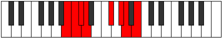 |
| [1681](https://ianring.com/musictheory/scales/1681) | [Ionaditonic](ModeDNaturalIonaditonic.md) | D | D, F#, A, B, C, D |  |
| [1683](https://ianring.com/musictheory/scales/1683) | [Rygimic](ModeFNaturalRygimic.md) | F | F, Gb, A, B#, C##, D#, F |  |
| [1683](https://ianring.com/musictheory/scales/1683) | [Rygimic](ModeDNaturalRygimic.md) | D | D, Eb, F#, G##, A##, B#, D |  |
| [1685](https://ianring.com/musictheory/scales/1685) | [Zeracrimic](ModeDNaturalZeracrimic.md) | D | D, E, F#, G##, A##, B#, D |  |
| [1687](https://ianring.com/musictheory/scales/1687) | [Phralian](ModeFNaturalPhralian.md) | F | F, Gb, Abb, Bbb, C, D, Eb, F |  |
| [1687](https://ianring.com/musictheory/scales/1687) | [Phralian](ModeDNaturalPhralian.md) | D | D, Eb, Fb, Gb, A, B, C, D |  |
| [1689](https://ianring.com/musictheory/scales/1689) | [Lorimic](ModeDNaturalLorimic.md) | D | D, E#, F#, G##, A##, B#, D |  |
| [1691](https://ianring.com/musictheory/scales/1691) | [Kathian](ModeFNaturalKathian.md) | F | F, Gb, Ab, Bbb, C, D, Eb, F | 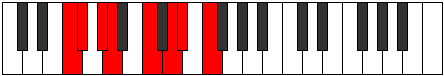 |
| [1691](https://ianring.com/musictheory/scales/1691) | [Kathian](ModeDNaturalKathian.md) | D | D, Eb, F, Gb, A, B, C, D |  |
| [1691](https://ianring.com/musictheory/scales/1691) | [Kathian](ModeBNaturalKathian.md) | B | B, C, D, Eb, F#, G#, A, B |  |
| [1693](https://ianring.com/musictheory/scales/1693) | [Dogian](ModeDNaturalDogian.md) | D | D, E, F, Gb, A, B, C, D |  |
| [1695](https://ianring.com/musictheory/scales/1695) | [Phrodyllic](ModeFNaturalPhrodyllic.md) | F | F, F#, G, G#, A, C, D, D#, F |  |
| [1695](https://ianring.com/musictheory/scales/1695) | [Phrodyllic](ModeDNaturalPhrodyllic.md) | D | D, D#, E, F, F#, A, B, C, D |  |
| [1695](https://ianring.com/musictheory/scales/1695) | [Phrodyllic](ModeBNaturalPhrodyllic.md) | B | B, C, C#, D, D#, F#, G#, A, B |  |
| [1699](https://ianring.com/musictheory/scales/1699) | [Kaptimic](ModeFNaturalKaptimic.md) | F | F, Gb, A#, B#, C##, D#, F |  |
| [1703](https://ianring.com/musictheory/scales/1703) | [Zaptian](ModeFNaturalZaptian.md) | F | F, Gb, Abb, Bb, C, D, Eb, F |  |
| [1705](https://ianring.com/musictheory/scales/1705) | [Darmic](ModeANaturalDarmic.md) | A | A, B#, C##, D##, E##, F##, A |  |
| [1707](https://ianring.com/musictheory/scales/1707) | [Mixolythian](ModeFNaturalMixolythian.md) | F | F, Gb, Ab, Bb, C, D, Eb, F |  |
| [1707](https://ianring.com/musictheory/scales/1707) | [Mixolythian](ModeANaturalMixolythian.md) | A | A, Bb, C, D, E, F#, G, A |  |
| [1707](https://ianring.com/musictheory/scales/1707) | [Mixolythian](ModeBNaturalMixolythian.md) | B | B, C, D, E, F#, G#, A, B |  |
| [1709](https://ianring.com/musictheory/scales/1709) | [Dorian](ModeANaturalDorian.md) | A | A, B, C, D, E, F#, G, A |  |
| [1711](https://ianring.com/musictheory/scales/1711) | [Ragyllic](ModeFNaturalRagyllic.md) | F | F, F#, G, G#, A#, C, D, D#, F |  |
| [1711](https://ianring.com/musictheory/scales/1711) | [Ragyllic](ModeBNaturalRagyllic.md) | B | B, C, C#, D, E, F#, G#, A, B |  |
| [1711](https://ianring.com/musictheory/scales/1711) | [Ragyllic](ModeANaturalRagyllic.md) | A | A, A#, B, C, D, E, F#, G, A |  |
| [1713](https://ianring.com/musictheory/scales/1713) | [Garimic](ModeDNaturalGarimic.md) | D | D, E##, F##, G##, A##, B#, D |  |
| [1715](https://ianring.com/musictheory/scales/1715) | [Aeronian](ModeFNaturalAeronian.md) | F | F, Gb, A, Bb, C, D, Eb, F |  |
| [1715](https://ianring.com/musictheory/scales/1715) | [Aeronian](ModeDNaturalAeronian.md) | D | D, Eb, F#, G, A, B, C, D |  |
| [1717](https://ianring.com/musictheory/scales/1717) | [Mixolydian](ModeDNaturalMixolydian.md) | D | D, E, F#, G, A, B, C, D |  |
| [1719](https://ianring.com/musictheory/scales/1719) | [Lyryllic](ModeFNaturalLyryllic.md) | F | F, F#, G, A, A#, C, D, D#, F |  |
| [1719](https://ianring.com/musictheory/scales/1719) | [Lyryllic](ModeDNaturalLyryllic.md) | D | D, D#, E, F#, G, A, B, C, D |  |
| [1721](https://ianring.com/musictheory/scales/1721) | [Ionycrian](ModeANaturalIonycrian.md) | A | A, B#, C#, D, E, F#, G, A |  |
| [1721](https://ianring.com/musictheory/scales/1721) | [Ionycrian](ModeDNaturalIonycrian.md) | D | D, E#, F#, G, A, B, C, D |  |
| [1723](https://ianring.com/musictheory/scales/1723) | [Poryllic](ModeANaturalPoryllic.md) | A | A, A#, C, C#, D, E, F#, G, A |  |
| [1723](https://ianring.com/musictheory/scales/1723) | [Poryllic](ModeFNaturalPoryllic.md) | F | F, F#, G#, A, A#, C, D, D#, F |  |
| [1723](https://ianring.com/musictheory/scales/1723) | [Poryllic](ModeDNaturalPoryllic.md) | D | D, D#, F, F#, G, A, B, C, D |  |
| [1723](https://ianring.com/musictheory/scales/1723) | [Poryllic](ModeBNaturalPoryllic.md) | B | B, C, D, D#, E, F#, G#, A, B |  |
| [1725](https://ianring.com/musictheory/scales/1725) | [Mixodyllic](ModeANaturalMixodyllic.md) | A | A, B, C, C#, D, E, F#, G, A |  |
| [1725](https://ianring.com/musictheory/scales/1725) | [Mixodyllic](ModeDNaturalMixodyllic.md) | D | D, E, F, F#, G, A, B, C, D |  |
| [1727](https://ianring.com/musictheory/scales/1727) | [Sydygic](ModeFNaturalSydygic.md) | F | F, F#, G, G#, A, A#, C, D, D#, F |  |
| [1727](https://ianring.com/musictheory/scales/1727) | [Sydygic](ModeDNaturalSydygic.md) | D | D, D#, E, F, F#, G, A, B, C, D |  |
| [1727](https://ianring.com/musictheory/scales/1727) | [Sydygic](ModeBNaturalSydygic.md) | B | B, C, C#, D, D#, E, F#, G#, A, B |  |
| [1727](https://ianring.com/musictheory/scales/1727) | [Sydygic](ModeANaturalSydygic.md) | A | A, A#, B, C, C#, D, E, F#, G, A |  |
| [1733](https://ianring.com/musictheory/scales/1733) | [Socrimic](ModeCNaturalSocrimic.md) | C | C, D, E##, F##, G##, A#, C |  |
| [1735](https://ianring.com/musictheory/scales/1735) | [Dagian](ModeCNaturalDagian.md) | C | C, Db, Ebb, F#, G, A, Bb, C |  |
| [1735](https://ianring.com/musictheory/scales/1735) | [Dagian](ModeFNaturalDagian.md) | F | F, Gb, Abb, B, C, D, Eb, F |  |
| [1739](https://ianring.com/musictheory/scales/1739) | [Phrylian](ModeFNaturalPhrylian.md) | F | F, Gb, Ab, B, C, D, Eb, F |  |
| [1739](https://ianring.com/musictheory/scales/1739) | [Phrylian](ModeBNaturalPhrylian.md) | B | B, C, D, E#, F#, G#, A, B |  |
| [1741](https://ianring.com/musictheory/scales/1741) | [Katycrian](ModeCNaturalKatycrian.md) | C | C, D, Eb, F#, G, A, Bb, C |  |
| [1743](https://ianring.com/musictheory/scales/1743) | [Epigyllic](ModeCNaturalEpigyllic.md) | C | C, C#, D, D#, F#, G, A, A#, C |  |
| [1743](https://ianring.com/musictheory/scales/1743) | [Epigyllic](ModeFNaturalEpigyllic.md) | F | F, F#, G, G#, B, C, D, D#, F |  |
| [1743](https://ianring.com/musictheory/scales/1743) | [Epigyllic](ModeBNaturalEpigyllic.md) | B | B, C, C#, D, F, F#, G#, A, B |  |
| [1745](https://ianring.com/musictheory/scales/1745) | [Manimic](ModeGSharpManimic.md) | G# | G#, A###, B###, C###, D###, E##, G# |  |
| [1745](https://ianring.com/musictheory/scales/1745) | [Manimic](ModeAFlatManimic.md) | Ab | Ab, B#, C##, D#, E#, F#, Ab |  |
| [1745](https://ianring.com/musictheory/scales/1745) | [Manimic](ModeDNaturalManimic.md) | D | D, E##, F###, G##, A##, B#, D |  |
| [1747](https://ianring.com/musictheory/scales/1747) | [Epalian](ModeGSharpEpalian.md) | G# | G#, A, B#, C##, D#, E#, F#, G# |  |
| [1747](https://ianring.com/musictheory/scales/1747) | [Epalian](ModeAFlatEpalian.md) | Ab | Ab, Bbb, C, D, Eb, F, Gb, Ab |  |
| [1747](https://ianring.com/musictheory/scales/1747) | [Epalian](ModeFNaturalEpalian.md) | F | F, Gb, A, B, C, D, Eb, F |  |
| [1747](https://ianring.com/musictheory/scales/1747) | [Epalian](ModeDNaturalEpalian.md) | D | D, Eb, F#, G#, A, B, C, D |  |
| [1749](https://ianring.com/musictheory/scales/1749) | [Lythian](ModeGSharpLythian.md) | G# | G#, A#, B#, C##, D#, E#, F#, G# |  |
| [1749](https://ianring.com/musictheory/scales/1749) | [Lythian](ModeAFlatLythian.md) | Ab | Ab, Bb, C, D, Eb, F, Gb, Ab |  |
| [1749](https://ianring.com/musictheory/scales/1749) | [Lythian](ModeCNaturalLythian.md) | C | C, D, E, F#, G, A, Bb, C |  |
| [1749](https://ianring.com/musictheory/scales/1749) | [Lythian](ModeDNaturalLythian.md) | D | D, E, F#, G#, A, B, C, D |  |
| [1751](https://ianring.com/musictheory/scales/1751) | [Aeolyryllic](ModeCNaturalAeolyryllic.md) | C | C, C#, D, E, F#, G, A, A#, C |  |
| [1751](https://ianring.com/musictheory/scales/1751) | [Aeolyryllic](ModeGSharpAeolyryllic.md) | G# | G#, A, A#, C, D, D#, F, F#, G# |  |
| [1751](https://ianring.com/musictheory/scales/1751) | [Aeolyryllic](ModeAFlatAeolyryllic.md) | Ab | Ab, A, Bb, C, D, Eb, F, Gb, Ab |  |
| [1751](https://ianring.com/musictheory/scales/1751) | [Aeolyryllic](ModeFNaturalAeolyryllic.md) | F | F, F#, G, A, B, C, D, D#, F |  |
| [1751](https://ianring.com/musictheory/scales/1751) | [Aeolyryllic](ModeDNaturalAeolyryllic.md) | D | D, D#, E, F#, G#, A, B, C, D |  |
| [1753](https://ianring.com/musictheory/scales/1753) | [Mycrian](ModeGSharpMycrian.md) | G# | G#, A##, B#, C##, D#, E#, F#, G# |  |
| [1753](https://ianring.com/musictheory/scales/1753) | [Mycrian](ModeAFlatMycrian.md) | Ab | Ab, B, C, D, Eb, F, Gb, Ab |  |
| [1753](https://ianring.com/musictheory/scales/1753) | [Mycrian](ModeDNaturalMycrian.md) | D | D, E#, F#, G#, A, B, C, D |  |
| [1755](https://ianring.com/musictheory/scales/1755) | [MinorDiminished](ModeDNaturalMinorDiminished.md) | D | D, D#, F, F#, G#, A, B, C, D |  |
| [1755](https://ianring.com/musictheory/scales/1755) | [MinorDiminished](ModeFNaturalMinorDiminished.md) | F | F, F#, G#, A, B, C, D, D#, F |  |
| [1755](https://ianring.com/musictheory/scales/1755) | [MinorDiminished](ModeGSharpMinorDiminished.md) | G# | G#, A, B, C, D, D#, F, F#, G# |  |
| [1755](https://ianring.com/musictheory/scales/1755) | [MinorDiminished](ModeAFlatMinorDiminished.md) | Ab | Ab, A, B, C, D, Eb, F, Gb, Ab |  |
| [1755](https://ianring.com/musictheory/scales/1755) | [MinorDiminished](ModeBNaturalMinorDiminished.md) | B | B, C, D, D#, F, F#, G#, A, B |  |
| [1757](https://ianring.com/musictheory/scales/1757) | [Ionyphyllic](ModeCNaturalIonyphyllic.md) | C | C, D, D#, E, F#, G, A, A#, C |  |
| [1757](https://ianring.com/musictheory/scales/1757) | [Ionyphyllic](ModeDNaturalIonyphyllic.md) | D | D, E, F, F#, G#, A, B, C, D |  |
| [1757](https://ianring.com/musictheory/scales/1757) | [Ionyphyllic](ModeGSharpIonyphyllic.md) | G# | G#, A#, B, C, D, D#, F, F#, G# |  |
| [1757](https://ianring.com/musictheory/scales/1757) | [Ionyphyllic](ModeAFlatIonyphyllic.md) | Ab | Ab, Bb, B, C, D, Eb, F, Gb, Ab |  |
| [1759](https://ianring.com/musictheory/scales/1759) | [Pylygic](ModeCNaturalPylygic.md) | C | C, C#, D, D#, E, F#, G, A, A#, C |  |
| [1759](https://ianring.com/musictheory/scales/1759) | [Pylygic](ModeBNaturalPylygic.md) | B | B, C, C#, D, D#, F, F#, G#, A, B |  |
| [1759](https://ianring.com/musictheory/scales/1759) | [Pylygic](ModeDNaturalPylygic.md) | D | D, D#, E, F, F#, G#, A, B, C, D |  |
| [1759](https://ianring.com/musictheory/scales/1759) | [Pylygic](ModeFNaturalPylygic.md) | F | F, F#, G, G#, A, B, C, D, D#, F |  |
| [1759](https://ianring.com/musictheory/scales/1759) | [Pylygic](ModeGSharpPylygic.md) | G# | G#, A, A#, B, C, D, D#, F, F#, G# |  |
| [1759](https://ianring.com/musictheory/scales/1759) | [Pylygic](ModeAFlatPylygic.md) | Ab | Ab, A, Bb, B, C, D, Eb, F, Gb, Ab |  |
| [1763](https://ianring.com/musictheory/scales/1763) | [Katalian](ModeFNaturalKatalian.md) | F | F, Gb, A#, B, C, D, Eb, F |  |
| [1765](https://ianring.com/musictheory/scales/1765) | [Lonian](ModeCNaturalLonian.md) | C | C, D, E#, F#, G, A, Bb, C |  |
| [1767](https://ianring.com/musictheory/scales/1767) | [Dyryllic](ModeCNaturalDyryllic.md) | C | C, C#, D, F, F#, G, A, A#, C |  |
| [1767](https://ianring.com/musictheory/scales/1767) | [Dyryllic](ModeFNaturalDyryllic.md) | F | F, F#, G, A#, B, C, D, D#, F |  |
| [1769](https://ianring.com/musictheory/scales/1769) | [Rythian](ModeANaturalRythian.md) | A | A, B#, C##, D#, E, F#, G, A |  |
| [1771](https://ianring.com/musictheory/scales/1771) | [Stylyllic](ModeANaturalStylyllic.md) | A | A, A#, C, D, D#, E, F#, G, A |  |
| [1771](https://ianring.com/musictheory/scales/1771) | [Stylyllic](ModeBNaturalStylyllic.md) | B | B, C, D, E, F, F#, G#, A, B |  |
| [1771](https://ianring.com/musictheory/scales/1771) | [Stylyllic](ModeFNaturalStylyllic.md) | F | F, F#, G#, A#, B, C, D, D#, F |  |
| [1773](https://ianring.com/musictheory/scales/1773) | [Aeoloryllic](ModeCNaturalAeoloryllic.md) | C | C, D, D#, F, F#, G, A, A#, C |  |
| [1773](https://ianring.com/musictheory/scales/1773) | [Aeoloryllic](ModeANaturalAeoloryllic.md) | A | A, B, C, D, D#, E, F#, G, A |  |
| [1775](https://ianring.com/musictheory/scales/1775) | [Lyrygic](ModeCNaturalLyrygic.md) | C | C, C#, D, D#, F, F#, G, A, A#, C |  |
| [1775](https://ianring.com/musictheory/scales/1775) | [Lyrygic](ModeBNaturalLyrygic.md) | B | B, C, C#, D, E, F, F#, G#, A, B |  |
| [1775](https://ianring.com/musictheory/scales/1775) | [Lyrygic](ModeFNaturalLyrygic.md) | F | F, F#, G, G#, A#, B, C, D, D#, F |  |
| [1775](https://ianring.com/musictheory/scales/1775) | [Lyrygic](ModeANaturalLyrygic.md) | A | A, A#, B, C, D, D#, E, F#, G, A |  |
| [1777](https://ianring.com/musictheory/scales/1777) | [Saptian](ModeGSharpSaptian.md) | G# | G#, A###, B##, C##, D#, E#, F#, G# |  |
| [1777](https://ianring.com/musictheory/scales/1777) | [Saptian](ModeAFlatSaptian.md) | Ab | Ab, B#, C#, D, Eb, F, Gb, Ab |  |
| [1777](https://ianring.com/musictheory/scales/1777) | [Saptian](ModeDNaturalSaptian.md) | D | D, E##, F##, G#, A, B, C, D |  |
| [1779](https://ianring.com/musictheory/scales/1779) | [Aerythyllic](ModeGSharpAerythyllic.md) | G# | G#, A, C, C#, D, D#, F, F#, G# |  |
| [1779](https://ianring.com/musictheory/scales/1779) | [Aerythyllic](ModeAFlatAerythyllic.md) | Ab | Ab, A, C, Db, D, Eb, F, Gb, Ab |  |
| [1779](https://ianring.com/musictheory/scales/1779) | [Aerythyllic](ModeDNaturalAerythyllic.md) | D | D, D#, F#, G, G#, A, B, C, D |  |
| [1779](https://ianring.com/musictheory/scales/1779) | [Aerythyllic](ModeFNaturalAerythyllic.md) | F | F, F#, A, A#, B, C, D, D#, F |  |
| [1781](https://ianring.com/musictheory/scales/1781) | [Gocryllic](ModeGSharpGocryllic.md) | G# | G#, A#, C, C#, D, D#, F, F#, G# |  |
| [1781](https://ianring.com/musictheory/scales/1781) | [Gocryllic](ModeAFlatGocryllic.md) | Ab | Ab, Bb, C, Db, D, Eb, F, Gb, Ab |  |
| [1781](https://ianring.com/musictheory/scales/1781) | [Gocryllic](ModeCNaturalGocryllic.md) | C | C, D, E, F, F#, G, A, A#, C |  |
| [1781](https://ianring.com/musictheory/scales/1781) | [Gocryllic](ModeDNaturalGocryllic.md) | D | D, E, F#, G, G#, A, B, C, D |  |
| [1783](https://ianring.com/musictheory/scales/1783) | [Danygic](ModeCNaturalDanygic.md) | C | C, C#, D, E, F, F#, G, A, A#, C |  |
| [1783](https://ianring.com/musictheory/scales/1783) | [Danygic](ModeGSharpDanygic.md) | G# | G#, A, A#, C, C#, D, D#, F, F#, G# |  |
| [1783](https://ianring.com/musictheory/scales/1783) | [Danygic](ModeAFlatDanygic.md) | Ab | Ab, A, Bb, C, Db, D, Eb, F, Gb, Ab |  |
| [1783](https://ianring.com/musictheory/scales/1783) | [Danygic](ModeDNaturalDanygic.md) | D | D, D#, E, F#, G, G#, A, B, C, D |  |
| [1783](https://ianring.com/musictheory/scales/1783) | [Danygic](ModeFNaturalDanygic.md) | F | F, F#, G, A, A#, B, C, D, D#, F |  |
| [1785](https://ianring.com/musictheory/scales/1785) | [Tharyllic](ModeANaturalTharyllic.md) | A | A, C, C#, D, D#, E, F#, G, A |  |
| [1785](https://ianring.com/musictheory/scales/1785) | [Tharyllic](ModeGSharpTharyllic.md) | G# | G#, B, C, C#, D, D#, F, F#, G# |  |
| [1785](https://ianring.com/musictheory/scales/1785) | [Tharyllic](ModeAFlatTharyllic.md) | Ab | Ab, B, C, Db, D, Eb, F, Gb, Ab |  |
| [1785](https://ianring.com/musictheory/scales/1785) | [Tharyllic](ModeDNaturalTharyllic.md) | D | D, F, F#, G, G#, A, B, C, D |  |
| [1787](https://ianring.com/musictheory/scales/1787) | [Mycrygic](ModeANaturalMycrygic.md) | A | A, A#, C, C#, D, D#, E, F#, G, A |  |
| [1787](https://ianring.com/musictheory/scales/1787) | [Mycrygic](ModeGSharpMycrygic.md) | G# | G#, A, B, C, C#, D, D#, F, F#, G# |  |
| [1787](https://ianring.com/musictheory/scales/1787) | [Mycrygic](ModeAFlatMycrygic.md) | Ab | Ab, A, B, C, Db, D, Eb, F, Gb, Ab |  |
| [1787](https://ianring.com/musictheory/scales/1787) | [Mycrygic](ModeBNaturalMycrygic.md) | B | B, C, D, D#, E, F, F#, G#, A, B |  |
| [1787](https://ianring.com/musictheory/scales/1787) | [Mycrygic](ModeDNaturalMycrygic.md) | D | D, D#, F, F#, G, G#, A, B, C, D |  |
| [1787](https://ianring.com/musictheory/scales/1787) | [Mycrygic](ModeFNaturalMycrygic.md) | F | F, F#, G#, A, A#, B, C, D, D#, F |  |
| [1789](https://ianring.com/musictheory/scales/1789) | [Katagygic](ModeCNaturalKatagygic.md) | C | C, D, D#, E, F, F#, G, A, A#, C |  |
| [1789](https://ianring.com/musictheory/scales/1789) | [Katagygic](ModeANaturalKatagygic.md) | A | A, B, C, C#, D, D#, E, F#, G, A |  |
| [1789](https://ianring.com/musictheory/scales/1789) | [Katagygic](ModeDNaturalKatagygic.md) | D | D, E, F, F#, G, G#, A, B, C, D |  |
| [1789](https://ianring.com/musictheory/scales/1789) | [Katagygic](ModeGSharpKatagygic.md) | G# | G#, A#, B, C, C#, D, D#, F, F#, G# |  |
| [1789](https://ianring.com/musictheory/scales/1789) | [Katagygic](ModeAFlatKatagygic.md) | Ab | Ab, Bb, B, C, Db, D, Eb, F, Gb, Ab |  |
| [1791](https://ianring.com/musictheory/scales/1791) | [Aerygyllian](ModeCNaturalAerygyllian.md) | C | C, C#, D, D#, E, F, F#, G, A, A#, C |  |
| [1791](https://ianring.com/musictheory/scales/1791) | [Aerygyllian](ModeBNaturalAerygyllian.md) | B | B, C, C#, D, D#, E, F, F#, G#, A, B |  |
| [1791](https://ianring.com/musictheory/scales/1791) | [Aerygyllian](ModeDNaturalAerygyllian.md) | D | D, D#, E, F, F#, G, G#, A, B, C, D |  |
| [1791](https://ianring.com/musictheory/scales/1791) | [Aerygyllian](ModeANaturalAerygyllian.md) | A | A, A#, B, C, C#, D, D#, E, F#, G, A |  |
| [1791](https://ianring.com/musictheory/scales/1791) | [Aerygyllian](ModeGSharpAerygyllian.md) | G# | G#, A, A#, B, C, C#, D, D#, F, F#, G# |  |
| [1791](https://ianring.com/musictheory/scales/1791) | [Aerygyllian](ModeAFlatAerygyllian.md) | Ab | Ab, A, Bb, B, C, Db, D, Eb, F, Gb, Ab |  |
| [1791](https://ianring.com/musictheory/scales/1791) | [Aerygyllian](ModeFNaturalAerygyllian.md) | F | F, F#, G, G#, A, A#, B, C, D, D#, F |  |
| [1809](https://ianring.com/musictheory/scales/1809) | [Ranitonic](ModeDNaturalRanitonic.md) | D | D, F#, A#, B, C, D |  |
| [1811](https://ianring.com/musictheory/scales/1811) | [Kyptimic](ModeDNaturalKyptimic.md) | D | D, Eb, F#, G###, A##, B#, D |  |
| [1813](https://ianring.com/musictheory/scales/1813) | [Katothimic](ModeENaturalKatothimic.md) | E | E, F#, G#, A###, B##, C##, E |  |
| [1813](https://ianring.com/musictheory/scales/1813) | [Katothimic](ModeASharpKatothimic.md) | A# | A#, B#, C##, E##, F##, G#, A# |  |
| [1813](https://ianring.com/musictheory/scales/1813) | [Katothimic](ModeBFlatKatothimic.md) | Bb | Bb, C, D, E##, F##, G#, Bb |  |
| [1813](https://ianring.com/musictheory/scales/1813) | [Katothimic](ModeDNaturalKatothimic.md) | D | D, E, F#, G###, A##, B#, D |  |
| [1815](https://ianring.com/musictheory/scales/1815) | [Godian](ModeENaturalGodian.md) | E | E, F, Gb, Ab, B#, C#, D, E |  |
| [1815](https://ianring.com/musictheory/scales/1815) | [Godian](ModeDNaturalGodian.md) | D | D, Eb, Fb, Gb, A#, B, C, D |  |
| [1815](https://ianring.com/musictheory/scales/1815) | [Godian](ModeASharpGodian.md) | A# | A#, B, C, D, E##, F##, G#, A# |  |
| [1815](https://ianring.com/musictheory/scales/1815) | [Godian](ModeBFlatGodian.md) | Bb | Bb, Cb, Dbb, Ebb, F#, G, Ab, Bb |  |
| [1817](https://ianring.com/musictheory/scales/1817) | [Phrythimic](ModeDNaturalPhrythimic.md) | D | D, E#, F#, G###, A##, B#, D |  |
| [1819](https://ianring.com/musictheory/scales/1819) | [Pydian](ModeDNaturalPydian.md) | D | D, Eb, F, Gb, A#, B, C, D |  |
| [1821](https://ianring.com/musictheory/scales/1821) | [Aeradian](ModeENaturalAeradian.md) | E | E, F#, G, Ab, B#, C#, D, E |  |
| [1821](https://ianring.com/musictheory/scales/1821) | [Aeradian](ModeASharpAeradian.md) | A# | A#, B#, C#, D, E##, F##, G#, A# |  |
| [1821](https://ianring.com/musictheory/scales/1821) | [Aeradian](ModeBFlatAeradian.md) | Bb | Bb, C, Db, Ebb, F#, G, Ab, Bb |  |
| [1821](https://ianring.com/musictheory/scales/1821) | [Aeradian](ModeDNaturalAeradian.md) | D | D, E, F, Gb, A#, B, C, D |  |
| [1823](https://ianring.com/musictheory/scales/1823) | [Phralyllic](ModeENaturalPhralyllic.md) | E | E, F, F#, G, G#, C, C#, D, E |  |
| [1823](https://ianring.com/musictheory/scales/1823) | [Phralyllic](ModeDNaturalPhralyllic.md) | D | D, D#, E, F, F#, A#, B, C, D |  |
| [1823](https://ianring.com/musictheory/scales/1823) | [Phralyllic](ModeASharpPhralyllic.md) | A# | A#, B, C, C#, D, F#, G, G#, A# |  |
| [1823](https://ianring.com/musictheory/scales/1823) | [Phralyllic](ModeBFlatPhralyllic.md) | Bb | Bb, B, C, Db, D, Gb, G, Ab, Bb |  |
| [1829](https://ianring.com/musictheory/scales/1829) | [Pathimic](ModeENaturalPathimic.md) | E | E, F#, G##, A###, B##, C##, E |  |
| [1831](https://ianring.com/musictheory/scales/1831) | [Pothian](ModeENaturalPothian.md) | E | E, F, Gb, A, B#, C#, D, E |  |
| [1833](https://ianring.com/musictheory/scales/1833) | [Ionacrimic](ModeANaturalIonacrimic.md) | A | A, B#, C##, D###, E##, F##, A |  |
| [1835](https://ianring.com/musictheory/scales/1835) | [Byptian](ModeANaturalByptian.md) | A | A, Bb, C, D, E#, F#, G, A |  |
| [1837](https://ianring.com/musictheory/scales/1837) | [Dalian](ModeENaturalDalian.md) | E | E, F#, G, A, B#, C#, D, E |  |
| [1837](https://ianring.com/musictheory/scales/1837) | [Dalian](ModeANaturalDalian.md) | A | A, B, C, D, E#, F#, G, A |  |
| [1839](https://ianring.com/musictheory/scales/1839) | [Zogyllic](ModeENaturalZogyllic.md) | E | E, F, F#, G, A, C, C#, D, E |  |
| [1839](https://ianring.com/musictheory/scales/1839) | [Zogyllic](ModeANaturalZogyllic.md) | A | A, A#, B, C, D, F, F#, G, A |  |
| [1841](https://ianring.com/musictheory/scales/1841) | [Thogimic](ModeDNaturalThogimic.md) | D | D, E##, F##, G###, A##, B#, D |  |
| [1843](https://ianring.com/musictheory/scales/1843) | [Ionygian](ModeDNaturalIonygian.md) | D | D, Eb, F#, G, A#, B, C, D |  |
| [1845](https://ianring.com/musictheory/scales/1845) | [Lagian](ModeENaturalLagian.md) | E | E, F#, G#, A, B#, C#, D, E |  |
| [1845](https://ianring.com/musictheory/scales/1845) | [Lagian](ModeASharpLagian.md) | A# | A#, B#, C##, D#, E##, F##, G#, A# |  |
| [1845](https://ianring.com/musictheory/scales/1845) | [Lagian](ModeBFlatLagian.md) | Bb | Bb, C, D, Eb, F#, G, Ab, Bb |  |
| [1845](https://ianring.com/musictheory/scales/1845) | [Lagian](ModeDNaturalLagian.md) | D | D, E, F#, G, A#, B, C, D |  |
| [1847](https://ianring.com/musictheory/scales/1847) | [Thacryllic](ModeENaturalThacryllic.md) | E | E, F, F#, G#, A, C, C#, D, E |  |
| [1847](https://ianring.com/musictheory/scales/1847) | [Thacryllic](ModeDNaturalThacryllic.md) | D | D, D#, E, F#, G, A#, B, C, D |  |
| [1847](https://ianring.com/musictheory/scales/1847) | [Thacryllic](ModeASharpThacryllic.md) | A# | A#, B, C, D, D#, F#, G, G#, A# |  |
| [1847](https://ianring.com/musictheory/scales/1847) | [Thacryllic](ModeBFlatThacryllic.md) | Bb | Bb, B, C, D, Eb, Gb, G, Ab, Bb |  |
| [1849](https://ianring.com/musictheory/scales/1849) | [Epogian](ModeANaturalEpogian.md) | A | A, B#, C#, D, E#, F#, G, A |  |
| [1849](https://ianring.com/musictheory/scales/1849) | [Epogian](ModeDNaturalEpogian.md) | D | D, E#, F#, G, A#, B, C, D |  |
| [1851](https://ianring.com/musictheory/scales/1851) | [Zacryllic](ModeANaturalZacryllic.md) | A | A, A#, C, C#, D, F, F#, G, A |  |
| [1851](https://ianring.com/musictheory/scales/1851) | [Zacryllic](ModeDNaturalZacryllic.md) | D | D, D#, F, F#, G, A#, B, C, D |  |
| [1853](https://ianring.com/musictheory/scales/1853) | [Phrynyllic](ModeENaturalPhrynyllic.md) | E | E, F#, G, G#, A, C, C#, D, E |  |
| [1853](https://ianring.com/musictheory/scales/1853) | [Phrynyllic](ModeASharpPhrynyllic.md) | A# | A#, C, C#, D, D#, F#, G, G#, A# |  |
| [1853](https://ianring.com/musictheory/scales/1853) | [Phrynyllic](ModeBFlatPhrynyllic.md) | Bb | Bb, C, Db, D, Eb, Gb, G, Ab, Bb |  |
| [1853](https://ianring.com/musictheory/scales/1853) | [Phrynyllic](ModeANaturalPhrynyllic.md) | A | A, B, C, C#, D, F, F#, G, A |  |
| [1853](https://ianring.com/musictheory/scales/1853) | [Phrynyllic](ModeDNaturalPhrynyllic.md) | D | D, E, F, F#, G, A#, B, C, D |  |
| [1855](https://ianring.com/musictheory/scales/1855) | [Marygic](ModeENaturalMarygic.md) | E | E, F, F#, G, G#, A, C, C#, D, E |  |
| [1855](https://ianring.com/musictheory/scales/1855) | [Marygic](ModeDNaturalMarygic.md) | D | D, D#, E, F, F#, G, A#, B, C, D |  |
| [1855](https://ianring.com/musictheory/scales/1855) | [Marygic](ModeASharpMarygic.md) | A# | A#, B, C, C#, D, D#, F#, G, G#, A# |  |
| [1855](https://ianring.com/musictheory/scales/1855) | [Marygic](ModeBFlatMarygic.md) | Bb | Bb, B, C, Db, D, Eb, Gb, G, Ab, Bb |  |
| [1855](https://ianring.com/musictheory/scales/1855) | [Marygic](ModeANaturalMarygic.md) | A | A, A#, B, C, C#, D, F, F#, G, A |  |
| [1861](https://ianring.com/musictheory/scales/1861) | [Phrygimic](ModeFSharpPhrygimic.md) | F# | F#, G#, A###, B###, C###, D##, F# |  |
| [1861](https://ianring.com/musictheory/scales/1861) | [Phrygimic](ModeGFlatPhrygimic.md) | Gb | Gb, Ab, B#, C##, D#, E, Gb |  |
| [1861](https://ianring.com/musictheory/scales/1861) | [Phrygimic](ModeENaturalPhrygimic.md) | E | E, F#, G###, A###, B##, C##, E |  |
| [1861](https://ianring.com/musictheory/scales/1861) | [Phrygimic](ModeCNaturalPhrygimic.md) | C | C, D, E##, F###, G##, A#, C |  |
| [1863](https://ianring.com/musictheory/scales/1863) | [Pycrian](ModeFSharpPycrian.md) | F# | F#, G, Ab, B#, C##, D#, E, F# |  |
| [1863](https://ianring.com/musictheory/scales/1863) | [Pycrian](ModeGFlatPycrian.md) | Gb | Gb, Abb, Bbbb, C, D, Eb, Fb, Gb |  |
| [1863](https://ianring.com/musictheory/scales/1863) | [Pycrian](ModeENaturalPycrian.md) | E | E, F, Gb, A#, B#, C#, D, E |  |
| [1863](https://ianring.com/musictheory/scales/1863) | [Pycrian](ModeCNaturalPycrian.md) | C | C, Db, Ebb, F#, G#, A, Bb, C |  |
| [1865](https://ianring.com/musictheory/scales/1865) | [Thagimic](ModeFSharpThagimic.md) | F# | F#, G##, A###, B###, C###, D##, F# |  |
| [1865](https://ianring.com/musictheory/scales/1865) | [Thagimic](ModeGFlatThagimic.md) | Gb | Gb, A, B#, C##, D#, E, Gb |  |
| [1867](https://ianring.com/musictheory/scales/1867) | [Solian](ModeFSharpSolian.md) | F# | F#, G, A, B#, C##, D#, E, F# |  |
| [1867](https://ianring.com/musictheory/scales/1867) | [Solian](ModeGFlatSolian.md) | Gb | Gb, Abb, Bbb, C, D, Eb, Fb, Gb |  |
| [1869](https://ianring.com/musictheory/scales/1869) | [Katyrian](ModeFSharpKatyrian.md) | F# | F#, G#, A, B#, C##, D#, E, F# |  |
| [1869](https://ianring.com/musictheory/scales/1869) | [Katyrian](ModeGFlatKatyrian.md) | Gb | Gb, Ab, Bbb, C, D, Eb, Fb, Gb |  |
| [1869](https://ianring.com/musictheory/scales/1869) | [Katyrian](ModeENaturalKatyrian.md) | E | E, F#, G, A#, B#, C#, D, E |  |
| [1869](https://ianring.com/musictheory/scales/1869) | [Katyrian](ModeCNaturalKatyrian.md) | C | C, D, Eb, F#, G#, A, Bb, C |  |
| [1871](https://ianring.com/musictheory/scales/1871) | [Aeolyllic](ModeFSharpAeolyllic.md) | F# | F#, G, G#, A, C, D, D#, E, F# |  |
| [1871](https://ianring.com/musictheory/scales/1871) | [Aeolyllic](ModeGFlatAeolyllic.md) | Gb | Gb, G, Ab, A, C, D, Eb, E, Gb |  |
| [1871](https://ianring.com/musictheory/scales/1871) | [Aeolyllic](ModeENaturalAeolyllic.md) | E | E, F, F#, G, A#, C, C#, D, E |  |
| [1871](https://ianring.com/musictheory/scales/1871) | [Aeolyllic](ModeCNaturalAeolyllic.md) | C | C, C#, D, D#, F#, G#, A, A#, C |  |
| [1873](https://ianring.com/musictheory/scales/1873) | [Dathimic](ModeGSharpDathimic.md) | G# | G#, A###, B###, D##, E#, F#, G# |  |
| [1873](https://ianring.com/musictheory/scales/1873) | [Dathimic](ModeAFlatDathimic.md) | Ab | Ab, B#, C##, D##, E#, F#, Ab |  |
| [1873](https://ianring.com/musictheory/scales/1873) | [Dathimic](ModeFSharpDathimic.md) | F# | F#, G###, A###, B###, C###, D##, F# |  |
| [1873](https://ianring.com/musictheory/scales/1873) | [Dathimic](ModeGFlatDathimic.md) | Gb | Gb, A#, B#, C##, D#, E, Gb |  |
| [1873](https://ianring.com/musictheory/scales/1873) | [Dathimic](ModeDNaturalDathimic.md) | D | D, E##, F###, G###, A##, B#, D |  |
| [1875](https://ianring.com/musictheory/scales/1875) | [Epyphian](ModeGSharpEpyphian.md) | G# | G#, A, B#, C##, D##, E#, F#, G# |  |
| [1875](https://ianring.com/musictheory/scales/1875) | [Epyphian](ModeAFlatEpyphian.md) | Ab | Ab, Bbb, C, D, E, F, Gb, Ab |  |
| [1875](https://ianring.com/musictheory/scales/1875) | [Epyphian](ModeFSharpEpyphian.md) | F# | F#, G, A#, B#, C##, D#, E, F# |  |
| [1875](https://ianring.com/musictheory/scales/1875) | [Epyphian](ModeGFlatEpyphian.md) | Gb | Gb, Abb, Bb, C, D, Eb, Fb, Gb |  |
| [1875](https://ianring.com/musictheory/scales/1875) | [Epyphian](ModeDNaturalEpyphian.md) | D | D, Eb, F#, G#, A#, B, C, D |  |
| [1877](https://ianring.com/musictheory/scales/1877) | [Aeroptian](ModeENaturalAeroptian.md) | E | E, F#, G#, A#, B#, C#, D, E |  |
| [1877](https://ianring.com/musictheory/scales/1877) | [Aeroptian](ModeFSharpAeroptian.md) | F# | F#, G#, A#, B#, C##, D#, E, F# |  |
| [1877](https://ianring.com/musictheory/scales/1877) | [Aeroptian](ModeGFlatAeroptian.md) | Gb | Gb, Ab, Bb, C, D, Eb, Fb, Gb |  |
| [1877](https://ianring.com/musictheory/scales/1877) | [Aeroptian](ModeGSharpAeroptian.md) | G# | G#, A#, B#, C##, D##, E#, F#, G# |  |
| [1877](https://ianring.com/musictheory/scales/1877) | [Aeroptian](ModeAFlatAeroptian.md) | Ab | Ab, Bb, C, D, E, F, Gb, Ab |  |
| [1877](https://ianring.com/musictheory/scales/1877) | [Aeroptian](ModeASharpAeroptian.md) | A# | A#, B#, C##, D##, E##, F##, G#, A# |  |
| [1877](https://ianring.com/musictheory/scales/1877) | [Aeroptian](ModeBFlatAeroptian.md) | Bb | Bb, C, D, E, F#, G, Ab, Bb |  |
| [1877](https://ianring.com/musictheory/scales/1877) | [Aeroptian](ModeCNaturalAeroptian.md) | C | C, D, E, F#, G#, A, Bb, C |  |
| [1877](https://ianring.com/musictheory/scales/1877) | [Aeroptian](ModeDNaturalAeroptian.md) | D | D, E, F#, G#, A#, B, C, D |  |
| [1879](https://ianring.com/musictheory/scales/1879) | [Mixoryllic](ModeENaturalMixoryllic.md) | E | E, F, F#, G#, A#, C, C#, D, E |  |
| [1879](https://ianring.com/musictheory/scales/1879) | [Mixoryllic](ModeFSharpMixoryllic.md) | F# | F#, G, G#, A#, C, D, D#, E, F# |  |
| [1879](https://ianring.com/musictheory/scales/1879) | [Mixoryllic](ModeGFlatMixoryllic.md) | Gb | Gb, G, Ab, Bb, C, D, Eb, E, Gb |  |
| [1879](https://ianring.com/musictheory/scales/1879) | [Mixoryllic](ModeCNaturalMixoryllic.md) | C | C, C#, D, E, F#, G#, A, A#, C |  |
| [1879](https://ianring.com/musictheory/scales/1879) | [Mixoryllic](ModeGSharpMixoryllic.md) | G# | G#, A, A#, C, D, E, F, F#, G# |  |
| [1879](https://ianring.com/musictheory/scales/1879) | [Mixoryllic](ModeAFlatMixoryllic.md) | Ab | Ab, A, Bb, C, D, E, F, Gb, Ab |  |
| [1879](https://ianring.com/musictheory/scales/1879) | [Mixoryllic](ModeDNaturalMixoryllic.md) | D | D, D#, E, F#, G#, A#, B, C, D |  |
| [1879](https://ianring.com/musictheory/scales/1879) | [Mixoryllic](ModeASharpMixoryllic.md) | A# | A#, B, C, D, E, F#, G, G#, A# |  |
| [1879](https://ianring.com/musictheory/scales/1879) | [Mixoryllic](ModeBFlatMixoryllic.md) | Bb | Bb, B, C, D, E, Gb, G, Ab, Bb |  |
| [1881](https://ianring.com/musictheory/scales/1881) | [Korian](ModeFSharpKorian.md) | F# | F#, G##, A#, B#, C##, D#, E, F# |  |
| [1881](https://ianring.com/musictheory/scales/1881) | [Korian](ModeGFlatKorian.md) | Gb | Gb, A, Bb, C, D, Eb, Fb, Gb |  |
| [1881](https://ianring.com/musictheory/scales/1881) | [Korian](ModeGSharpKorian.md) | G# | G#, A##, B#, C##, D##, E#, F#, G# |  |
| [1881](https://ianring.com/musictheory/scales/1881) | [Korian](ModeAFlatKorian.md) | Ab | Ab, B, C, D, E, F, Gb, Ab |  |
| [1881](https://ianring.com/musictheory/scales/1881) | [Korian](ModeDNaturalKorian.md) | D | D, E#, F#, G#, A#, B, C, D |  |
| [1883](https://ianring.com/musictheory/scales/1883) | [Mixopyryllic](ModeFSharpMixopyryllic.md) | F# | F#, G, A, A#, C, D, D#, E, F# |  |
| [1883](https://ianring.com/musictheory/scales/1883) | [Mixopyryllic](ModeGFlatMixopyryllic.md) | Gb | Gb, G, A, Bb, C, D, Eb, E, Gb |  |
| [1883](https://ianring.com/musictheory/scales/1883) | [Mixopyryllic](ModeGSharpMixopyryllic.md) | G# | G#, A, B, C, D, E, F, F#, G# |  |
| [1883](https://ianring.com/musictheory/scales/1883) | [Mixopyryllic](ModeAFlatMixopyryllic.md) | Ab | Ab, A, B, C, D, E, F, Gb, Ab |  |
| [1883](https://ianring.com/musictheory/scales/1883) | [Mixopyryllic](ModeDNaturalMixopyryllic.md) | D | D, D#, F, F#, G#, A#, B, C, D |  |
| [1885](https://ianring.com/musictheory/scales/1885) | [Epidyllic](ModeENaturalEpidyllic.md) | E | E, F#, G, G#, A#, C, C#, D, E |  |
| [1885](https://ianring.com/musictheory/scales/1885) | [Epidyllic](ModeASharpEpidyllic.md) | A# | A#, C, C#, D, E, F#, G, G#, A# |  |
| [1885](https://ianring.com/musictheory/scales/1885) | [Epidyllic](ModeBFlatEpidyllic.md) | Bb | Bb, C, Db, D, E, Gb, G, Ab, Bb |  |
| [1885](https://ianring.com/musictheory/scales/1885) | [Epidyllic](ModeCNaturalEpidyllic.md) | C | C, D, D#, E, F#, G#, A, A#, C |  |
| [1885](https://ianring.com/musictheory/scales/1885) | [Epidyllic](ModeFSharpEpidyllic.md) | F# | F#, G#, A, A#, C, D, D#, E, F# |  |
| [1885](https://ianring.com/musictheory/scales/1885) | [Epidyllic](ModeGFlatEpidyllic.md) | Gb | Gb, Ab, A, Bb, C, D, Eb, E, Gb |  |
| [1885](https://ianring.com/musictheory/scales/1885) | [Epidyllic](ModeDNaturalEpidyllic.md) | D | D, E, F, F#, G#, A#, B, C, D |  |
| [1885](https://ianring.com/musictheory/scales/1885) | [Epidyllic](ModeGSharpEpidyllic.md) | G# | G#, A#, B, C, D, E, F, F#, G# |  |
| [1885](https://ianring.com/musictheory/scales/1885) | [Epidyllic](ModeAFlatEpidyllic.md) | Ab | Ab, Bb, B, C, D, E, F, Gb, Ab |  |
| [1887](https://ianring.com/musictheory/scales/1887) | [Aerocrygic](ModeENaturalAerocrygic.md) | E | E, F, F#, G, G#, A#, C, C#, D, E |  |
| [1887](https://ianring.com/musictheory/scales/1887) | [Aerocrygic](ModeCNaturalAerocrygic.md) | C | C, C#, D, D#, E, F#, G#, A, A#, C |  |
| [1887](https://ianring.com/musictheory/scales/1887) | [Aerocrygic](ModeFSharpAerocrygic.md) | F# | F#, G, G#, A, A#, C, D, D#, E, F# |  |
| [1887](https://ianring.com/musictheory/scales/1887) | [Aerocrygic](ModeGFlatAerocrygic.md) | Gb | Gb, G, Ab, A, Bb, C, D, Eb, E, Gb |  |
| [1887](https://ianring.com/musictheory/scales/1887) | [Aerocrygic](ModeDNaturalAerocrygic.md) | D | D, D#, E, F, F#, G#, A#, B, C, D |  |
| [1887](https://ianring.com/musictheory/scales/1887) | [Aerocrygic](ModeASharpAerocrygic.md) | A# | A#, B, C, C#, D, E, F#, G, G#, A# |  |
| [1887](https://ianring.com/musictheory/scales/1887) | [Aerocrygic](ModeBFlatAerocrygic.md) | Bb | Bb, B, C, Db, D, E, Gb, G, Ab, Bb |  |
| [1887](https://ianring.com/musictheory/scales/1887) | [Aerocrygic](ModeGSharpAerocrygic.md) | G# | G#, A, A#, B, C, D, E, F, F#, G# |  |
| [1887](https://ianring.com/musictheory/scales/1887) | [Aerocrygic](ModeAFlatAerocrygic.md) | Ab | Ab, A, Bb, B, C, D, E, F, Gb, Ab |  |
| [1891](https://ianring.com/musictheory/scales/1891) | [Thalian](ModeFSharpThalian.md) | F# | F#, G, A##, B#, C##, D#, E, F# |  |
| [1891](https://ianring.com/musictheory/scales/1891) | [Thalian](ModeGFlatThalian.md) | Gb | Gb, Abb, B, C, D, Eb, Fb, Gb |  |
| [1893](https://ianring.com/musictheory/scales/1893) | [Ionylian](ModeENaturalIonylian.md) | E | E, F#, G##, A#, B#, C#, D, E |  |
| [1893](https://ianring.com/musictheory/scales/1893) | [Ionylian](ModeCNaturalIonylian.md) | C | C, D, E#, F#, G#, A, Bb, C |  |
| [1893](https://ianring.com/musictheory/scales/1893) | [Ionylian](ModeFSharpIonylian.md) | F# | F#, G#, A##, B#, C##, D#, E, F# |  |
| [1893](https://ianring.com/musictheory/scales/1893) | [Ionylian](ModeGFlatIonylian.md) | Gb | Gb, Ab, B, C, D, Eb, Fb, Gb |  |
| [1895](https://ianring.com/musictheory/scales/1895) | [Salyllic](ModeENaturalSalyllic.md) | E | E, F, F#, A, A#, C, C#, D, E |  |
| [1895](https://ianring.com/musictheory/scales/1895) | [Salyllic](ModeCNaturalSalyllic.md) | C | C, C#, D, F, F#, G#, A, A#, C |  |
| [1895](https://ianring.com/musictheory/scales/1895) | [Salyllic](ModeFSharpSalyllic.md) | F# | F#, G, G#, B, C, D, D#, E, F# |  |
| [1895](https://ianring.com/musictheory/scales/1895) | [Salyllic](ModeGFlatSalyllic.md) | Gb | Gb, G, Ab, B, C, D, Eb, E, Gb |  |
| [1897](https://ianring.com/musictheory/scales/1897) | [Ionopian](ModeANaturalIonopian.md) | A | A, B#, C##, D#, E#, F#, G, A |  |
| [1897](https://ianring.com/musictheory/scales/1897) | [Ionopian](ModeFSharpIonopian.md) | F# | F#, G##, A##, B#, C##, D#, E, F# |  |
| [1897](https://ianring.com/musictheory/scales/1897) | [Ionopian](ModeGFlatIonopian.md) | Gb | Gb, A, B, C, D, Eb, Fb, Gb |  |
| [1899](https://ianring.com/musictheory/scales/1899) | [Moptyllic](ModeANaturalMoptyllic.md) | A | A, A#, C, D, D#, F, F#, G, A |  |
| [1899](https://ianring.com/musictheory/scales/1899) | [Moptyllic](ModeFSharpMoptyllic.md) | F# | F#, G, A, B, C, D, D#, E, F# |  |
| [1899](https://ianring.com/musictheory/scales/1899) | [Moptyllic](ModeGFlatMoptyllic.md) | Gb | Gb, G, A, B, C, D, Eb, E, Gb |  |
| [1901](https://ianring.com/musictheory/scales/1901) | [Ionidyllic](ModeENaturalIonidyllic.md) | E | E, F#, G, A, A#, C, C#, D, E |  |
| [1901](https://ianring.com/musictheory/scales/1901) | [Ionidyllic](ModeCNaturalIonidyllic.md) | C | C, D, D#, F, F#, G#, A, A#, C |  |
| [1901](https://ianring.com/musictheory/scales/1901) | [Ionidyllic](ModeANaturalIonidyllic.md) | A | A, B, C, D, D#, F, F#, G, A |  |
| [1901](https://ianring.com/musictheory/scales/1901) | [Ionidyllic](ModeFSharpIonidyllic.md) | F# | F#, G#, A, B, C, D, D#, E, F# |  |
| [1901](https://ianring.com/musictheory/scales/1901) | [Ionidyllic](ModeGFlatIonidyllic.md) | Gb | Gb, Ab, A, B, C, D, Eb, E, Gb |  |
| [1903](https://ianring.com/musictheory/scales/1903) | [Rocrygic](ModeENaturalRocrygic.md) | E | E, F, F#, G, A, A#, C, C#, D, E |  |
| [1903](https://ianring.com/musictheory/scales/1903) | [Rocrygic](ModeCNaturalRocrygic.md) | C | C, C#, D, D#, F, F#, G#, A, A#, C |  |
| [1903](https://ianring.com/musictheory/scales/1903) | [Rocrygic](ModeFSharpRocrygic.md) | F# | F#, G, G#, A, B, C, D, D#, E, F# |  |
| [1903](https://ianring.com/musictheory/scales/1903) | [Rocrygic](ModeGFlatRocrygic.md) | Gb | Gb, G, Ab, A, B, C, D, Eb, E, Gb |  |
| [1903](https://ianring.com/musictheory/scales/1903) | [Rocrygic](ModeANaturalRocrygic.md) | A | A, A#, B, C, D, D#, F, F#, G, A |  |
| [1905](https://ianring.com/musictheory/scales/1905) | [Katacrian](ModeGSharpKatacrian.md) | G# | G#, A###, B##, C##, D##, E#, F#, G# |  |
| [1905](https://ianring.com/musictheory/scales/1905) | [Katacrian](ModeAFlatKatacrian.md) | Ab | Ab, B#, C#, D, E, F, Gb, Ab |  |
| [1905](https://ianring.com/musictheory/scales/1905) | [Katacrian](ModeFSharpKatacrian.md) | F# | F#, G###, A##, B#, C##, D#, E, F# |  |
| [1905](https://ianring.com/musictheory/scales/1905) | [Katacrian](ModeGFlatKatacrian.md) | Gb | Gb, A#, B, C, D, Eb, Fb, Gb |  |
| [1905](https://ianring.com/musictheory/scales/1905) | [Katacrian](ModeDNaturalKatacrian.md) | D | D, E##, F##, G#, A#, B, C, D |  |
| [1907](https://ianring.com/musictheory/scales/1907) | [Lynyllic](ModeGSharpLynyllic.md) | G# | G#, A, C, C#, D, E, F, F#, G# |  |
| [1907](https://ianring.com/musictheory/scales/1907) | [Lynyllic](ModeAFlatLynyllic.md) | Ab | Ab, A, C, Db, D, E, F, Gb, Ab |  |
| [1907](https://ianring.com/musictheory/scales/1907) | [Lynyllic](ModeFSharpLynyllic.md) | F# | F#, G, A#, B, C, D, D#, E, F# |  |
| [1907](https://ianring.com/musictheory/scales/1907) | [Lynyllic](ModeGFlatLynyllic.md) | Gb | Gb, G, Bb, B, C, D, Eb, E, Gb |  |
| [1907](https://ianring.com/musictheory/scales/1907) | [Lynyllic](ModeDNaturalLynyllic.md) | D | D, D#, F#, G, G#, A#, B, C, D |  |
| [1909](https://ianring.com/musictheory/scales/1909) | [Epicryllic](ModeGSharpEpicryllic.md) | G# | G#, A#, C, C#, D, E, F, F#, G# |  |
| [1909](https://ianring.com/musictheory/scales/1909) | [Epicryllic](ModeAFlatEpicryllic.md) | Ab | Ab, Bb, C, Db, D, E, F, Gb, Ab |  |
| [1909](https://ianring.com/musictheory/scales/1909) | [Epicryllic](ModeASharpEpicryllic.md) | A# | A#, C, D, D#, E, F#, G, G#, A# |  |
| [1909](https://ianring.com/musictheory/scales/1909) | [Epicryllic](ModeBFlatEpicryllic.md) | Bb | Bb, C, D, Eb, E, Gb, G, Ab, Bb |  |
| [1909](https://ianring.com/musictheory/scales/1909) | [Epicryllic](ModeENaturalEpicryllic.md) | E | E, F#, G#, A, A#, C, C#, D, E |  |
| [1909](https://ianring.com/musictheory/scales/1909) | [Epicryllic](ModeCNaturalEpicryllic.md) | C | C, D, E, F, F#, G#, A, A#, C |  |
| [1909](https://ianring.com/musictheory/scales/1909) | [Epicryllic](ModeFSharpEpicryllic.md) | F# | F#, G#, A#, B, C, D, D#, E, F# |  |
| [1909](https://ianring.com/musictheory/scales/1909) | [Epicryllic](ModeGFlatEpicryllic.md) | Gb | Gb, Ab, Bb, B, C, D, Eb, E, Gb |  |
| [1909](https://ianring.com/musictheory/scales/1909) | [Epicryllic](ModeDNaturalEpicryllic.md) | D | D, E, F#, G, G#, A#, B, C, D |  |
| [1911](https://ianring.com/musictheory/scales/1911) | [Stynygic](ModeCNaturalStynygic.md) | C | C, C#, D, E, F, F#, G#, A, A#, C |  |
| [1911](https://ianring.com/musictheory/scales/1911) | [Stynygic](ModeENaturalStynygic.md) | E | E, F, F#, G#, A, A#, C, C#, D, E |  |
| [1911](https://ianring.com/musictheory/scales/1911) | [Stynygic](ModeGSharpStynygic.md) | G# | G#, A, A#, C, C#, D, E, F, F#, G# |  |
| [1911](https://ianring.com/musictheory/scales/1911) | [Stynygic](ModeAFlatStynygic.md) | Ab | Ab, A, Bb, C, Db, D, E, F, Gb, Ab |  |
| [1911](https://ianring.com/musictheory/scales/1911) | [Stynygic](ModeDNaturalStynygic.md) | D | D, D#, E, F#, G, G#, A#, B, C, D |  |
| [1911](https://ianring.com/musictheory/scales/1911) | [Stynygic](ModeFSharpStynygic.md) | F# | F#, G, G#, A#, B, C, D, D#, E, F# |  |
| [1911](https://ianring.com/musictheory/scales/1911) | [Stynygic](ModeGFlatStynygic.md) | Gb | Gb, G, Ab, Bb, B, C, D, Eb, E, Gb |  |
| [1911](https://ianring.com/musictheory/scales/1911) | [Stynygic](ModeASharpStynygic.md) | A# | A#, B, C, D, D#, E, F#, G, G#, A# |  |
| [1911](https://ianring.com/musictheory/scales/1911) | [Stynygic](ModeBFlatStynygic.md) | Bb | Bb, B, C, D, Eb, E, Gb, G, Ab, Bb |  |
| [1913](https://ianring.com/musictheory/scales/1913) | [Zagyllic](ModeANaturalZagyllic.md) | A | A, C, C#, D, D#, F, F#, G, A |  |
| [1913](https://ianring.com/musictheory/scales/1913) | [Zagyllic](ModeGSharpZagyllic.md) | G# | G#, B, C, C#, D, E, F, F#, G# |  |
| [1913](https://ianring.com/musictheory/scales/1913) | [Zagyllic](ModeAFlatZagyllic.md) | Ab | Ab, B, C, Db, D, E, F, Gb, Ab |  |
| [1913](https://ianring.com/musictheory/scales/1913) | [Zagyllic](ModeDNaturalZagyllic.md) | D | D, F, F#, G, G#, A#, B, C, D |  |
| [1913](https://ianring.com/musictheory/scales/1913) | [Zagyllic](ModeFSharpZagyllic.md) | F# | F#, A, A#, B, C, D, D#, E, F# |  |
| [1913](https://ianring.com/musictheory/scales/1913) | [Zagyllic](ModeGFlatZagyllic.md) | Gb | Gb, A, Bb, B, C, D, Eb, E, Gb |  |
| [1915](https://ianring.com/musictheory/scales/1915) | [Thydygic](ModeANaturalThydygic.md) | A | A, A#, C, C#, D, D#, F, F#, G, A |  |
| [1915](https://ianring.com/musictheory/scales/1915) | [Thydygic](ModeGSharpThydygic.md) | G# | G#, A, B, C, C#, D, E, F, F#, G# |  |
| [1915](https://ianring.com/musictheory/scales/1915) | [Thydygic](ModeAFlatThydygic.md) | Ab | Ab, A, B, C, Db, D, E, F, Gb, Ab |  |
| [1915](https://ianring.com/musictheory/scales/1915) | [Thydygic](ModeDNaturalThydygic.md) | D | D, D#, F, F#, G, G#, A#, B, C, D |  |
| [1915](https://ianring.com/musictheory/scales/1915) | [Thydygic](ModeFSharpThydygic.md) | F# | F#, G, A, A#, B, C, D, D#, E, F# |  |
| [1915](https://ianring.com/musictheory/scales/1915) | [Thydygic](ModeGFlatThydygic.md) | Gb | Gb, G, A, Bb, B, C, D, Eb, E, Gb |  |
| [1917](https://ianring.com/musictheory/scales/1917) | [Sacrygic](ModeASharpSacrygic.md) | A# | A#, C, C#, D, D#, E, F#, G, G#, A# |  |
| [1917](https://ianring.com/musictheory/scales/1917) | [Sacrygic](ModeBFlatSacrygic.md) | Bb | Bb, C, Db, D, Eb, E, Gb, G, Ab, Bb |  |
| [1917](https://ianring.com/musictheory/scales/1917) | [Sacrygic](ModeCNaturalSacrygic.md) | C | C, D, D#, E, F, F#, G#, A, A#, C |  |
| [1917](https://ianring.com/musictheory/scales/1917) | [Sacrygic](ModeENaturalSacrygic.md) | E | E, F#, G, G#, A, A#, C, C#, D, E |  |
| [1917](https://ianring.com/musictheory/scales/1917) | [Sacrygic](ModeANaturalSacrygic.md) | A | A, B, C, C#, D, D#, F, F#, G, A |  |
| [1917](https://ianring.com/musictheory/scales/1917) | [Sacrygic](ModeGSharpSacrygic.md) | G# | G#, A#, B, C, C#, D, E, F, F#, G# |  |
| [1917](https://ianring.com/musictheory/scales/1917) | [Sacrygic](ModeAFlatSacrygic.md) | Ab | Ab, Bb, B, C, Db, D, E, F, Gb, Ab |  |
| [1917](https://ianring.com/musictheory/scales/1917) | [Sacrygic](ModeDNaturalSacrygic.md) | D | D, E, F, F#, G, G#, A#, B, C, D |  |
| [1917](https://ianring.com/musictheory/scales/1917) | [Sacrygic](ModeFSharpSacrygic.md) | F# | F#, G#, A, A#, B, C, D, D#, E, F# |  |
| [1917](https://ianring.com/musictheory/scales/1917) | [Sacrygic](ModeGFlatSacrygic.md) | Gb | Gb, Ab, A, Bb, B, C, D, Eb, E, Gb |  |
| [1919](https://ianring.com/musictheory/scales/1919) | [Rocryllian](ModeCNaturalRocryllian.md) | C | C, C#, D, D#, E, F, F#, G#, A, A#, C |  |
| [1919](https://ianring.com/musictheory/scales/1919) | [Rocryllian](ModeENaturalRocryllian.md) | E | E, F, F#, G, G#, A, A#, C, C#, D, E |  |
| [1919](https://ianring.com/musictheory/scales/1919) | [Rocryllian](ModeASharpRocryllian.md) | A# | A#, B, C, C#, D, D#, E, F#, G, G#, A# |  |
| [1919](https://ianring.com/musictheory/scales/1919) | [Rocryllian](ModeBFlatRocryllian.md) | Bb | Bb, B, C, Db, D, Eb, E, Gb, G, Ab, Bb |  |
| [1919](https://ianring.com/musictheory/scales/1919) | [Rocryllian](ModeDNaturalRocryllian.md) | D | D, D#, E, F, F#, G, G#, A#, B, C, D |  |
| [1919](https://ianring.com/musictheory/scales/1919) | [Rocryllian](ModeANaturalRocryllian.md) | A | A, A#, B, C, C#, D, D#, F, F#, G, A |  |
| [1919](https://ianring.com/musictheory/scales/1919) | [Rocryllian](ModeGSharpRocryllian.md) | G# | G#, A, A#, B, C, C#, D, E, F, F#, G# |  |
| [1919](https://ianring.com/musictheory/scales/1919) | [Rocryllian](ModeAFlatRocryllian.md) | Ab | Ab, A, Bb, B, C, Db, D, E, F, Gb, Ab |  |
| [1919](https://ianring.com/musictheory/scales/1919) | [Rocryllian](ModeFSharpRocryllian.md) | F# | F#, G, G#, A, A#, B, C, D, D#, E, F# |  |
| [1919](https://ianring.com/musictheory/scales/1919) | [Rocryllian](ModeGFlatRocryllian.md) | Gb | Gb, G, Ab, A, Bb, B, C, D, Eb, E, Gb |  |
| [1931](https://ianring.com/musictheory/scales/1931) | [Stogian](ModeFNaturalStogian.md) | F | F, Gb, Ab, B#, C#, D, Eb, F |  |
| [1931](https://ianring.com/musictheory/scales/1931) | [Stogian](ModeBNaturalStogian.md) | B | B, C, D, E##, F##, G#, A, B |  |
| [1933](https://ianring.com/musictheory/scales/1933) | [Mocrian](ModeENaturalMocrian.md) | E | E, F#, G, A##, B#, C#, D, E |  |
| [1935](https://ianring.com/musictheory/scales/1935) | [Mycryllic](ModeFNaturalMycryllic.md) | F | F, F#, G, G#, C, C#, D, D#, F |  |
| [1935](https://ianring.com/musictheory/scales/1935) | [Mycryllic](ModeENaturalMycryllic.md) | E | E, F, F#, G, B, C, C#, D, E |  |
| [1935](https://ianring.com/musictheory/scales/1935) | [Mycryllic](ModeBNaturalMycryllic.md) | B | B, C, C#, D, F#, G, G#, A, B |  |
| [1937](https://ianring.com/musictheory/scales/1937) | [Galimic](ModeDNaturalGalimic.md) | D | D, E##, Cbbb, Cbb, Dbbb, Dbb, D |  |
| [1939](https://ianring.com/musictheory/scales/1939) | [Dathian](ModeFNaturalDathian.md) | F | F, Gb, A, B#, C#, D, Eb, F |  |
| [1939](https://ianring.com/musictheory/scales/1939) | [Dathian](ModeDNaturalDathian.md) | D | D, Eb, F#, G##, A#, B, C, D |  |
| [1941](https://ianring.com/musictheory/scales/1941) | [Aeranian](ModeASharpAeranian.md) | A# | A#, B#, C##, D###, E##, F##, G#, A# |  |
| [1941](https://ianring.com/musictheory/scales/1941) | [Aeranian](ModeBFlatAeranian.md) | Bb | Bb, C, D, E#, F#, G, Ab, Bb |  |
| [1941](https://ianring.com/musictheory/scales/1941) | [Aeranian](ModeENaturalAeranian.md) | E | E, F#, G#, A##, B#, C#, D, E |  |
| [1941](https://ianring.com/musictheory/scales/1941) | [Aeranian](ModeDNaturalAeranian.md) | D | D, E, F#, G##, A#, B, C, D |  |
| [1943](https://ianring.com/musictheory/scales/1943) | [Malyllic](ModeFNaturalMalyllic.md) | F | F, F#, G, A, C, C#, D, D#, F |  |
| [1943](https://ianring.com/musictheory/scales/1943) | [Malyllic](ModeENaturalMalyllic.md) | E | E, F, F#, G#, B, C, C#, D, E |  |
| [1943](https://ianring.com/musictheory/scales/1943) | [Malyllic](ModeASharpMalyllic.md) | A# | A#, B, C, D, F, F#, G, G#, A# |  |
| [1943](https://ianring.com/musictheory/scales/1943) | [Malyllic](ModeBFlatMalyllic.md) | Bb | Bb, B, C, D, F, Gb, G, Ab, Bb |  |
| [1943](https://ianring.com/musictheory/scales/1943) | [Malyllic](ModeDNaturalMalyllic.md) | D | D, D#, E, F#, A, A#, B, C, D |  |
| [1945](https://ianring.com/musictheory/scales/1945) | [Zarian](ModeDNaturalZarian.md) | D | D, E#, F#, G##, A#, B, C, D |  |
| [1947](https://ianring.com/musictheory/scales/1947) | [Ionoyllic](ModeFNaturalIonoyllic.md) | F | F, F#, G#, A, C, C#, D, D#, F |  |
| [1947](https://ianring.com/musictheory/scales/1947) | [Ionoyllic](ModeBNaturalIonoyllic.md) | B | B, C, D, D#, F#, G, G#, A, B |  |
| [1947](https://ianring.com/musictheory/scales/1947) | [Ionoyllic](ModeDNaturalIonoyllic.md) | D | D, D#, F, F#, A, A#, B, C, D |  |
| [1949](https://ianring.com/musictheory/scales/1949) | [Mathyllic](ModeASharpMathyllic.md) | A# | A#, C, C#, D, F, F#, G, G#, A# |  |
| [1949](https://ianring.com/musictheory/scales/1949) | [Mathyllic](ModeBFlatMathyllic.md) | Bb | Bb, C, Db, D, F, Gb, G, Ab, Bb |  |
| [1949](https://ianring.com/musictheory/scales/1949) | [Mathyllic](ModeENaturalMathyllic.md) | E | E, F#, G, G#, B, C, C#, D, E |  |
| [1949](https://ianring.com/musictheory/scales/1949) | [Mathyllic](ModeDNaturalMathyllic.md) | D | D, E, F, F#, A, A#, B, C, D |  |
| [1951](https://ianring.com/musictheory/scales/1951) | [Gonygic](ModeFNaturalGonygic.md) | F | F, F#, G, G#, A, C, C#, D, D#, F |  |
| [1951](https://ianring.com/musictheory/scales/1951) | [Gonygic](ModeENaturalGonygic.md) | E | E, F, F#, G, G#, B, C, C#, D, E |  |
| [1951](https://ianring.com/musictheory/scales/1951) | [Gonygic](ModeBNaturalGonygic.md) | B | B, C, C#, D, D#, F#, G, G#, A, B |  |
| [1951](https://ianring.com/musictheory/scales/1951) | [Gonygic](ModeASharpGonygic.md) | A# | A#, B, C, C#, D, F, F#, G, G#, A# |  |
| [1951](https://ianring.com/musictheory/scales/1951) | [Gonygic](ModeBFlatGonygic.md) | Bb | Bb, B, C, Db, D, F, Gb, G, Ab, Bb |  |
| [1951](https://ianring.com/musictheory/scales/1951) | [Gonygic](ModeDNaturalGonygic.md) | D | D, D#, E, F, F#, A, A#, B, C, D |  |
| [1955](https://ianring.com/musictheory/scales/1955) | [Sonian](ModeFNaturalSonian.md) | F | F, Gb, A#, B#, C#, D, Eb, F |  |
| [1957](https://ianring.com/musictheory/scales/1957) | [Pyrian](ModeENaturalPyrian.md) | E | E, F#, G##, A##, B#, C#, D, E |  |
| [1959](https://ianring.com/musictheory/scales/1959) | [Katolyllic](ModeFNaturalKatolyllic.md) | F | F, F#, G, A#, C, C#, D, D#, F |  |
| [1959](https://ianring.com/musictheory/scales/1959) | [Katolyllic](ModeENaturalKatolyllic.md) | E | E, F, F#, A, B, C, C#, D, E |  |
| [1961](https://ianring.com/musictheory/scales/1961) | [Soptian](ModeANaturalSoptian.md) | A | A, B#, C##, D##, E#, F#, G, A |  |
| [1963](https://ianring.com/musictheory/scales/1963) | [Epocryllic](ModeFNaturalEpocryllic.md) | F | F, F#, G#, A#, C, C#, D, D#, F |  |
| [1963](https://ianring.com/musictheory/scales/1963) | [Epocryllic](ModeANaturalEpocryllic.md) | A | A, A#, C, D, E, F, F#, G, A |  |
| [1963](https://ianring.com/musictheory/scales/1963) | [Epocryllic](ModeBNaturalEpocryllic.md) | B | B, C, D, E, F#, G, G#, A, B |  |
| [1965](https://ianring.com/musictheory/scales/1965) | [Gadyllic](ModeENaturalGadyllic.md) | E | E, F#, G, A, B, C, C#, D, E |  |
| [1965](https://ianring.com/musictheory/scales/1965) | [Gadyllic](ModeANaturalGadyllic.md) | A | A, B, C, D, E, F, F#, G, A |  |
| [1967](https://ianring.com/musictheory/scales/1967) | [Godygic](ModeFNaturalGodygic.md) | F | F, F#, G, G#, A#, C, C#, D, D#, F |  |
| [1967](https://ianring.com/musictheory/scales/1967) | [Godygic](ModeENaturalGodygic.md) | E | E, F, F#, G, A, B, C, C#, D, E |  |
| [1967](https://ianring.com/musictheory/scales/1967) | [Godygic](ModeBNaturalGodygic.md) | B | B, C, C#, D, E, F#, G, G#, A, B |  |
| [1967](https://ianring.com/musictheory/scales/1967) | [Godygic](ModeANaturalGodygic.md) | A | A, A#, B, C, D, E, F, F#, G, A |  |
| [1969](https://ianring.com/musictheory/scales/1969) | [Zorian](ModeDNaturalZorian.md) | D | D, E##, F##, G##, A#, B, C, D |  |
| [1971](https://ianring.com/musictheory/scales/1971) | [Aerynyllic](ModeFNaturalAerynyllic.md) | F | F, F#, A, A#, C, C#, D, D#, F |  |
| [1971](https://ianring.com/musictheory/scales/1971) | [Aerynyllic](ModeDNaturalAerynyllic.md) | D | D, D#, F#, G, A, A#, B, C, D |  |
| [1973](https://ianring.com/musictheory/scales/1973) | [Zyryllic](ModeASharpZyryllic.md) | A# | A#, C, D, D#, F, F#, G, G#, A# |  |
| [1973](https://ianring.com/musictheory/scales/1973) | [Zyryllic](ModeBFlatZyryllic.md) | Bb | Bb, C, D, Eb, F, Gb, G, Ab, Bb |  |
| [1973](https://ianring.com/musictheory/scales/1973) | [Zyryllic](ModeENaturalZyryllic.md) | E | E, F#, G#, A, B, C, C#, D, E |  |
| [1973](https://ianring.com/musictheory/scales/1973) | [Zyryllic](ModeDNaturalZyryllic.md) | D | D, E, F#, G, A, A#, B, C, D |  |
| [1975](https://ianring.com/musictheory/scales/1975) | [Ionocrygic](ModeFNaturalIonocrygic.md) | F | F, F#, G, A, A#, C, C#, D, D#, F |  |
| [1975](https://ianring.com/musictheory/scales/1975) | [Ionocrygic](ModeENaturalIonocrygic.md) | E | E, F, F#, G#, A, B, C, C#, D, E |  |
| [1975](https://ianring.com/musictheory/scales/1975) | [Ionocrygic](ModeASharpIonocrygic.md) | A# | A#, B, C, D, D#, F, F#, G, G#, A# |  |
| [1975](https://ianring.com/musictheory/scales/1975) | [Ionocrygic](ModeBFlatIonocrygic.md) | Bb | Bb, B, C, D, Eb, F, Gb, G, Ab, Bb |  |
| [1975](https://ianring.com/musictheory/scales/1975) | [Ionocrygic](ModeDNaturalIonocrygic.md) | D | D, D#, E, F#, G, A, A#, B, C, D |  |
| [1977](https://ianring.com/musictheory/scales/1977) | [Dagyllic](ModeANaturalDagyllic.md) | A | A, C, C#, D, E, F, F#, G, A |  |
| [1977](https://ianring.com/musictheory/scales/1977) | [Dagyllic](ModeDNaturalDagyllic.md) | D | D, F, F#, G, A, A#, B, C, D |  |
| [1979](https://ianring.com/musictheory/scales/1979) | [Aeradygic](ModeANaturalAeradygic.md) | A | A, A#, C, C#, D, E, F, F#, G, A |  |
| [1979](https://ianring.com/musictheory/scales/1979) | [Aeradygic](ModeFNaturalAeradygic.md) | F | F, F#, G#, A, A#, C, C#, D, D#, F |  |
| [1979](https://ianring.com/musictheory/scales/1979) | [Aeradygic](ModeBNaturalAeradygic.md) | B | B, C, D, D#, E, F#, G, G#, A, B |  |
| [1979](https://ianring.com/musictheory/scales/1979) | [Aeradygic](ModeDNaturalAeradygic.md) | D | D, D#, F, F#, G, A, A#, B, C, D |  |
| [1981](https://ianring.com/musictheory/scales/1981) | [Gadygic](ModeASharpGadygic.md) | A# | A#, C, C#, D, D#, F, F#, G, G#, A# |  |
| [1981](https://ianring.com/musictheory/scales/1981) | [Gadygic](ModeBFlatGadygic.md) | Bb | Bb, C, Db, D, Eb, F, Gb, G, Ab, Bb |  |
| [1981](https://ianring.com/musictheory/scales/1981) | [Gadygic](ModeANaturalGadygic.md) | A | A, B, C, C#, D, E, F, F#, G, A |  |
| [1981](https://ianring.com/musictheory/scales/1981) | [Gadygic](ModeENaturalGadygic.md) | E | E, F#, G, G#, A, B, C, C#, D, E |  |
| [1981](https://ianring.com/musictheory/scales/1981) | [Gadygic](ModeDNaturalGadygic.md) | D | D, E, F, F#, G, A, A#, B, C, D |  |
| [1983](https://ianring.com/musictheory/scales/1983) | [Soryllian](ModeFNaturalSoryllian.md) | F | F, F#, G, G#, A, A#, C, C#, D, D#, F |  |
| [1983](https://ianring.com/musictheory/scales/1983) | [Soryllian](ModeBNaturalSoryllian.md) | B | B, C, C#, D, D#, E, F#, G, G#, A, B |  |
| [1983](https://ianring.com/musictheory/scales/1983) | [Soryllian](ModeENaturalSoryllian.md) | E | E, F, F#, G, G#, A, B, C, C#, D, E |  |
| [1983](https://ianring.com/musictheory/scales/1983) | [Soryllian](ModeASharpSoryllian.md) | A# | A#, B, C, C#, D, D#, F, F#, G, G#, A# |  |
| [1983](https://ianring.com/musictheory/scales/1983) | [Soryllian](ModeBFlatSoryllian.md) | Bb | Bb, B, C, Db, D, Eb, F, Gb, G, Ab, Bb |  |
| [1983](https://ianring.com/musictheory/scales/1983) | [Soryllian](ModeANaturalSoryllian.md) | A | A, A#, B, C, C#, D, E, F, F#, G, A |  |
| [1983](https://ianring.com/musictheory/scales/1983) | [Soryllian](ModeDNaturalSoryllian.md) | D | D, D#, E, F, F#, G, A, A#, B, C, D |  |
| [1989](https://ianring.com/musictheory/scales/1989) | [Dydian](ModeFSharpDydian.md) | F# | F#, G#, A###, B##, C##, D#, E, F# |  |
| [1989](https://ianring.com/musictheory/scales/1989) | [Dydian](ModeGFlatDydian.md) | Gb | Gb, Ab, B#, C#, D, Eb, Fb, Gb |  |
| [1989](https://ianring.com/musictheory/scales/1989) | [Dydian](ModeCNaturalDydian.md) | C | C, D, E##, F##, G#, A, Bb, C |  |
| [1989](https://ianring.com/musictheory/scales/1989) | [Dydian](ModeENaturalDydian.md) | E | E, F#, G###, A##, B#, C#, D, E |  |
| [1991](https://ianring.com/musictheory/scales/1991) | [Phryptyllic](ModeFSharpPhryptyllic.md) | F# | F#, G, G#, C, C#, D, D#, E, F# |  |
| [1991](https://ianring.com/musictheory/scales/1991) | [Phryptyllic](ModeGFlatPhryptyllic.md) | Gb | Gb, G, Ab, C, Db, D, Eb, E, Gb |  |
| [1991](https://ianring.com/musictheory/scales/1991) | [Phryptyllic](ModeCNaturalPhryptyllic.md) | C | C, C#, D, F#, G, G#, A, A#, C |  |
| [1991](https://ianring.com/musictheory/scales/1991) | [Phryptyllic](ModeFNaturalPhryptyllic.md) | F | F, F#, G, B, C, C#, D, D#, F |  |
| [1991](https://ianring.com/musictheory/scales/1991) | [Phryptyllic](ModeENaturalPhryptyllic.md) | E | E, F, F#, A#, B, C, C#, D, E |  |
| [1993](https://ianring.com/musictheory/scales/1993) | [Katoptian](ModeFSharpKatoptian.md) | F# | F#, G##, A###, B##, C##, D#, E, F# |  |
| [1993](https://ianring.com/musictheory/scales/1993) | [Katoptian](ModeGFlatKatoptian.md) | Gb | Gb, A, B#, C#, D, Eb, Fb, Gb |  |
| [1995](https://ianring.com/musictheory/scales/1995) | [Aeolacryllic](ModeFSharpAeolacryllic.md) | F# | F#, G, A, C, C#, D, D#, E, F# |  |
| [1995](https://ianring.com/musictheory/scales/1995) | [Aeolacryllic](ModeGFlatAeolacryllic.md) | Gb | Gb, G, A, C, Db, D, Eb, E, Gb |  |
| [1995](https://ianring.com/musictheory/scales/1995) | [Aeolacryllic](ModeFNaturalAeolacryllic.md) | F | F, F#, G#, B, C, C#, D, D#, F |  |
| [1995](https://ianring.com/musictheory/scales/1995) | [Aeolacryllic](ModeBNaturalAeolacryllic.md) | B | B, C, D, F, F#, G, G#, A, B |  |
| [1997](https://ianring.com/musictheory/scales/1997) | [Staryllic](ModeFSharpStaryllic.md) | F# | F#, G#, A, C, C#, D, D#, E, F# |  |
| [1997](https://ianring.com/musictheory/scales/1997) | [Staryllic](ModeGFlatStaryllic.md) | Gb | Gb, Ab, A, C, Db, D, Eb, E, Gb |  |
| [1997](https://ianring.com/musictheory/scales/1997) | [Staryllic](ModeCNaturalStaryllic.md) | C | C, D, D#, F#, G, G#, A, A#, C |  |
| [1997](https://ianring.com/musictheory/scales/1997) | [Staryllic](ModeENaturalStaryllic.md) | E | E, F#, G, A#, B, C, C#, D, E |  |
| [1999](https://ianring.com/musictheory/scales/1999) | [Zacrygic](ModeFSharpZacrygic.md) | F# | F#, G, G#, A, C, C#, D, D#, E, F# |  |
| [1999](https://ianring.com/musictheory/scales/1999) | [Zacrygic](ModeGFlatZacrygic.md) | Gb | Gb, G, Ab, A, C, Db, D, Eb, E, Gb |  |
| [1999](https://ianring.com/musictheory/scales/1999) | [Zacrygic](ModeCNaturalZacrygic.md) | C | C, C#, D, D#, F#, G, G#, A, A#, C |  |
| [1999](https://ianring.com/musictheory/scales/1999) | [Zacrygic](ModeFNaturalZacrygic.md) | F | F, F#, G, G#, B, C, C#, D, D#, F |  |
| [1999](https://ianring.com/musictheory/scales/1999) | [Zacrygic](ModeBNaturalZacrygic.md) | B | B, C, C#, D, F, F#, G, G#, A, B |  |
| [1999](https://ianring.com/musictheory/scales/1999) | [Zacrygic](ModeENaturalZacrygic.md) | E | E, F, F#, G, A#, B, C, C#, D, E |  |
| [2001](https://ianring.com/musictheory/scales/2001) | [Gydian](ModeGSharpGydian.md) | G# | G#, A###, B###, C###, D##, E#, F#, G# |  |
| [2001](https://ianring.com/musictheory/scales/2001) | [Gydian](ModeAFlatGydian.md) | Ab | Ab, B#, C##, D#, E, F, Gb, Ab |  |
| [2001](https://ianring.com/musictheory/scales/2001) | [Gydian](ModeFSharpGydian.md) | F# | F#, G###, A###, B##, C##, D#, E, F# |  |
| [2001](https://ianring.com/musictheory/scales/2001) | [Gydian](ModeGFlatGydian.md) | Gb | Gb, A#, B#, C#, D, Eb, Fb, Gb |  |
| [2001](https://ianring.com/musictheory/scales/2001) | [Gydian](ModeDNaturalGydian.md) | D | D, E##, F###, G##, A#, B, C, D |  |
| [2003](https://ianring.com/musictheory/scales/2003) | [Lolyllic](ModeGSharpLolyllic.md) | G# | G#, A, C, D, D#, E, F, F#, G# |  |
| [2003](https://ianring.com/musictheory/scales/2003) | [Lolyllic](ModeAFlatLolyllic.md) | Ab | Ab, A, C, D, Eb, E, F, Gb, Ab |  |
| [2003](https://ianring.com/musictheory/scales/2003) | [Lolyllic](ModeFSharpLolyllic.md) | F# | F#, G, A#, C, C#, D, D#, E, F# |  |
| [2003](https://ianring.com/musictheory/scales/2003) | [Lolyllic](ModeGFlatLolyllic.md) | Gb | Gb, G, Bb, C, Db, D, Eb, E, Gb |  |
| [2003](https://ianring.com/musictheory/scales/2003) | [Lolyllic](ModeFNaturalLolyllic.md) | F | F, F#, A, B, C, C#, D, D#, F |  |
| [2003](https://ianring.com/musictheory/scales/2003) | [Lolyllic](ModeDNaturalLolyllic.md) | D | D, D#, F#, G#, A, A#, B, C, D |  |
| [2005](https://ianring.com/musictheory/scales/2005) | [Gygyllic](ModeFSharpGygyllic.md) | F# | F#, G#, A#, C, C#, D, D#, E, F# |  |
| [2005](https://ianring.com/musictheory/scales/2005) | [Gygyllic](ModeGFlatGygyllic.md) | Gb | Gb, Ab, Bb, C, Db, D, Eb, E, Gb |  |
| [2005](https://ianring.com/musictheory/scales/2005) | [Gygyllic](ModeGSharpGygyllic.md) | G# | G#, A#, C, D, D#, E, F, F#, G# |  |
| [2005](https://ianring.com/musictheory/scales/2005) | [Gygyllic](ModeAFlatGygyllic.md) | Ab | Ab, Bb, C, D, Eb, E, F, Gb, Ab |  |
| [2005](https://ianring.com/musictheory/scales/2005) | [Gygyllic](ModeASharpGygyllic.md) | A# | A#, C, D, E, F, F#, G, G#, A# |  |
| [2005](https://ianring.com/musictheory/scales/2005) | [Gygyllic](ModeBFlatGygyllic.md) | Bb | Bb, C, D, E, F, Gb, G, Ab, Bb |  |
| [2005](https://ianring.com/musictheory/scales/2005) | [Gygyllic](ModeCNaturalGygyllic.md) | C | C, D, E, F#, G, G#, A, A#, C |  |
| [2005](https://ianring.com/musictheory/scales/2005) | [Gygyllic](ModeENaturalGygyllic.md) | E | E, F#, G#, A#, B, C, C#, D, E |  |
| [2005](https://ianring.com/musictheory/scales/2005) | [Gygyllic](ModeDNaturalGygyllic.md) | D | D, E, F#, G#, A, A#, B, C, D |  |
| [2007](https://ianring.com/musictheory/scales/2007) | [Stonygic](ModeFSharpStonygic.md) | F# | F#, G, G#, A#, C, C#, D, D#, E, F# |  |
| [2007](https://ianring.com/musictheory/scales/2007) | [Stonygic](ModeGFlatStonygic.md) | Gb | Gb, G, Ab, Bb, C, Db, D, Eb, E, Gb |  |
| [2007](https://ianring.com/musictheory/scales/2007) | [Stonygic](ModeGSharpStonygic.md) | G# | G#, A, A#, C, D, D#, E, F, F#, G# |  |
| [2007](https://ianring.com/musictheory/scales/2007) | [Stonygic](ModeAFlatStonygic.md) | Ab | Ab, A, Bb, C, D, Eb, E, F, Gb, Ab |  |
| [2007](https://ianring.com/musictheory/scales/2007) | [Stonygic](ModeCNaturalStonygic.md) | C | C, C#, D, E, F#, G, G#, A, A#, C |  |
| [2007](https://ianring.com/musictheory/scales/2007) | [Stonygic](ModeFNaturalStonygic.md) | F | F, F#, G, A, B, C, C#, D, D#, F |  |
| [2007](https://ianring.com/musictheory/scales/2007) | [Stonygic](ModeENaturalStonygic.md) | E | E, F, F#, G#, A#, B, C, C#, D, E |  |
| [2007](https://ianring.com/musictheory/scales/2007) | [Stonygic](ModeASharpStonygic.md) | A# | A#, B, C, D, E, F, F#, G, G#, A# |  |
| [2007](https://ianring.com/musictheory/scales/2007) | [Stonygic](ModeBFlatStonygic.md) | Bb | Bb, B, C, D, E, F, Gb, G, Ab, Bb |  |
| [2007](https://ianring.com/musictheory/scales/2007) | [Stonygic](ModeDNaturalStonygic.md) | D | D, D#, E, F#, G#, A, A#, B, C, D |  |
| [2009](https://ianring.com/musictheory/scales/2009) | [Stacryllic](ModeFSharpStacryllic.md) | F# | F#, A, A#, C, C#, D, D#, E, F# |  |
| [2009](https://ianring.com/musictheory/scales/2009) | [Stacryllic](ModeGFlatStacryllic.md) | Gb | Gb, A, Bb, C, Db, D, Eb, E, Gb |  |
| [2009](https://ianring.com/musictheory/scales/2009) | [Stacryllic](ModeGSharpStacryllic.md) | G# | G#, B, C, D, D#, E, F, F#, G# |  |
| [2009](https://ianring.com/musictheory/scales/2009) | [Stacryllic](ModeAFlatStacryllic.md) | Ab | Ab, B, C, D, Eb, E, F, Gb, Ab |  |
| [2009](https://ianring.com/musictheory/scales/2009) | [Stacryllic](ModeDNaturalStacryllic.md) | D | D, F, F#, G#, A, A#, B, C, D |  |
| [2011](https://ianring.com/musictheory/scales/2011) | [Raphygic](ModeFSharpRaphygic.md) | F# | F#, G, A, A#, C, C#, D, D#, E, F# |  |
| [2011](https://ianring.com/musictheory/scales/2011) | [Raphygic](ModeGFlatRaphygic.md) | Gb | Gb, G, A, Bb, C, Db, D, Eb, E, Gb |  |
| [2011](https://ianring.com/musictheory/scales/2011) | [Raphygic](ModeFNaturalRaphygic.md) | F | F, F#, G#, A, B, C, C#, D, D#, F |  |
| [2011](https://ianring.com/musictheory/scales/2011) | [Raphygic](ModeGSharpRaphygic.md) | G# | G#, A, B, C, D, D#, E, F, F#, G# |  |
| [2011](https://ianring.com/musictheory/scales/2011) | [Raphygic](ModeAFlatRaphygic.md) | Ab | Ab, A, B, C, D, Eb, E, F, Gb, Ab |  |
| [2011](https://ianring.com/musictheory/scales/2011) | [Raphygic](ModeBNaturalRaphygic.md) | B | B, C, D, D#, F, F#, G, G#, A, B |  |
| [2011](https://ianring.com/musictheory/scales/2011) | [Raphygic](ModeDNaturalRaphygic.md) | D | D, D#, F, F#, G#, A, A#, B, C, D |  |
| [2013](https://ianring.com/musictheory/scales/2013) | [Mocrygic](ModeASharpMocrygic.md) | A# | A#, C, C#, D, E, F, F#, G, G#, A# |  |
| [2013](https://ianring.com/musictheory/scales/2013) | [Mocrygic](ModeBFlatMocrygic.md) | Bb | Bb, C, Db, D, E, F, Gb, G, Ab, Bb |  |
| [2013](https://ianring.com/musictheory/scales/2013) | [Mocrygic](ModeFSharpMocrygic.md) | F# | F#, G#, A, A#, C, C#, D, D#, E, F# |  |
| [2013](https://ianring.com/musictheory/scales/2013) | [Mocrygic](ModeGFlatMocrygic.md) | Gb | Gb, Ab, A, Bb, C, Db, D, Eb, E, Gb |  |
| [2013](https://ianring.com/musictheory/scales/2013) | [Mocrygic](ModeCNaturalMocrygic.md) | C | C, D, D#, E, F#, G, G#, A, A#, C |  |
| [2013](https://ianring.com/musictheory/scales/2013) | [Mocrygic](ModeGSharpMocrygic.md) | G# | G#, A#, B, C, D, D#, E, F, F#, G# |  |
| [2013](https://ianring.com/musictheory/scales/2013) | [Mocrygic](ModeAFlatMocrygic.md) | Ab | Ab, Bb, B, C, D, Eb, E, F, Gb, Ab |  |
| [2013](https://ianring.com/musictheory/scales/2013) | [Mocrygic](ModeENaturalMocrygic.md) | E | E, F#, G, G#, A#, B, C, C#, D, E |  |
| [2013](https://ianring.com/musictheory/scales/2013) | [Mocrygic](ModeDNaturalMocrygic.md) | D | D, E, F, F#, G#, A, A#, B, C, D |  |
| [2015](https://ianring.com/musictheory/scales/2015) | [Epiryllian](ModeCNaturalEpiryllian.md) | C | C, C#, D, D#, E, F#, G, G#, A, A#, C |  |
| [2015](https://ianring.com/musictheory/scales/2015) | [Epiryllian](ModeFSharpEpiryllian.md) | F# | F#, G, G#, A, A#, C, C#, D, D#, E, F# |  |
| [2015](https://ianring.com/musictheory/scales/2015) | [Epiryllian](ModeGFlatEpiryllian.md) | Gb | Gb, G, Ab, A, Bb, C, Db, D, Eb, E, Gb |  |
| [2015](https://ianring.com/musictheory/scales/2015) | [Epiryllian](ModeFNaturalEpiryllian.md) | F | F, F#, G, G#, A, B, C, C#, D, D#, F |  |
| [2015](https://ianring.com/musictheory/scales/2015) | [Epiryllian](ModeBNaturalEpiryllian.md) | B | B, C, C#, D, D#, F, F#, G, G#, A, B |  |
| [2015](https://ianring.com/musictheory/scales/2015) | [Epiryllian](ModeENaturalEpiryllian.md) | E | E, F, F#, G, G#, A#, B, C, C#, D, E |  |
| [2015](https://ianring.com/musictheory/scales/2015) | [Epiryllian](ModeASharpEpiryllian.md) | A# | A#, B, C, C#, D, E, F, F#, G, G#, A# |  |
| [2015](https://ianring.com/musictheory/scales/2015) | [Epiryllian](ModeBFlatEpiryllian.md) | Bb | Bb, B, C, Db, D, E, F, Gb, G, Ab, Bb |  |
| [2015](https://ianring.com/musictheory/scales/2015) | [Epiryllian](ModeDNaturalEpiryllian.md) | D | D, D#, E, F, F#, G#, A, A#, B, C, D |  |
| [2015](https://ianring.com/musictheory/scales/2015) | [Epiryllian](ModeGSharpEpiryllian.md) | G# | G#, A, A#, B, C, D, D#, E, F, F#, G# |  |
| [2015](https://ianring.com/musictheory/scales/2015) | [Epiryllian](ModeAFlatEpiryllian.md) | Ab | Ab, A, Bb, B, C, D, Eb, E, F, Gb, Ab |  |
| [2019](https://ianring.com/musictheory/scales/2019) | [Palyllic](ModeFSharpPalyllic.md) | F# | F#, G, B, C, C#, D, D#, E, F# |  |
| [2019](https://ianring.com/musictheory/scales/2019) | [Palyllic](ModeGFlatPalyllic.md) | Gb | Gb, G, B, C, Db, D, Eb, E, Gb |  |
| [2019](https://ianring.com/musictheory/scales/2019) | [Palyllic](ModeFNaturalPalyllic.md) | F | F, F#, A#, B, C, C#, D, D#, F |  |
| [2021](https://ianring.com/musictheory/scales/2021) | [Katycryllic](ModeCNaturalKatycryllic.md) | C | C, D, F, F#, G, G#, A, A#, C |  |
| [2021](https://ianring.com/musictheory/scales/2021) | [Katycryllic](ModeFSharpKatycryllic.md) | F# | F#, G#, B, C, C#, D, D#, E, F# |  |
| [2021](https://ianring.com/musictheory/scales/2021) | [Katycryllic](ModeGFlatKatycryllic.md) | Gb | Gb, Ab, B, C, Db, D, Eb, E, Gb |  |
| [2021](https://ianring.com/musictheory/scales/2021) | [Katycryllic](ModeENaturalKatycryllic.md) | E | E, F#, A, A#, B, C, C#, D, E |  |
| [2023](https://ianring.com/musictheory/scales/2023) | [Zodygic](ModeCNaturalZodygic.md) | C | C, C#, D, F, F#, G, G#, A, A#, C |  |
| [2023](https://ianring.com/musictheory/scales/2023) | [Zodygic](ModeFSharpZodygic.md) | F# | F#, G, G#, B, C, C#, D, D#, E, F# |  |
| [2023](https://ianring.com/musictheory/scales/2023) | [Zodygic](ModeGFlatZodygic.md) | Gb | Gb, G, Ab, B, C, Db, D, Eb, E, Gb |  |
| [2023](https://ianring.com/musictheory/scales/2023) | [Zodygic](ModeFNaturalZodygic.md) | F | F, F#, G, A#, B, C, C#, D, D#, F |  |
| [2023](https://ianring.com/musictheory/scales/2023) | [Zodygic](ModeENaturalZodygic.md) | E | E, F, F#, A, A#, B, C, C#, D, E |  |
| [2025](https://ianring.com/musictheory/scales/2025) | [Mixolydyllic](ModeANaturalMixolydyllic.md) | A | A, C, D, D#, E, F, F#, G, A |  |
| [2025](https://ianring.com/musictheory/scales/2025) | [Mixolydyllic](ModeFSharpMixolydyllic.md) | F# | F#, A, B, C, C#, D, D#, E, F# |  |
| [2025](https://ianring.com/musictheory/scales/2025) | [Mixolydyllic](ModeGFlatMixolydyllic.md) | Gb | Gb, A, B, C, Db, D, Eb, E, Gb |  |
| [2027](https://ianring.com/musictheory/scales/2027) | [Boptygic](ModeANaturalBoptygic.md) | A | A, A#, C, D, D#, E, F, F#, G, A |  |
| [2027](https://ianring.com/musictheory/scales/2027) | [Boptygic](ModeFSharpBoptygic.md) | F# | F#, G, A, B, C, C#, D, D#, E, F# |  |
| [2027](https://ianring.com/musictheory/scales/2027) | [Boptygic](ModeGFlatBoptygic.md) | Gb | Gb, G, A, B, C, Db, D, Eb, E, Gb |  |
| [2027](https://ianring.com/musictheory/scales/2027) | [Boptygic](ModeBNaturalBoptygic.md) | B | B, C, D, E, F, F#, G, G#, A, B |  |
| [2027](https://ianring.com/musictheory/scales/2027) | [Boptygic](ModeFNaturalBoptygic.md) | F | F, F#, G#, A#, B, C, C#, D, D#, F |  |
| [2029](https://ianring.com/musictheory/scales/2029) | [Mathygic](ModeCNaturalMathygic.md) | C | C, D, D#, F, F#, G, G#, A, A#, C |  |
| [2029](https://ianring.com/musictheory/scales/2029) | [Mathygic](ModeANaturalMathygic.md) | A | A, B, C, D, D#, E, F, F#, G, A |  |
| [2029](https://ianring.com/musictheory/scales/2029) | [Mathygic](ModeFSharpMathygic.md) | F# | F#, G#, A, B, C, C#, D, D#, E, F# |  |
| [2029](https://ianring.com/musictheory/scales/2029) | [Mathygic](ModeGFlatMathygic.md) | Gb | Gb, Ab, A, B, C, Db, D, Eb, E, Gb |  |
| [2029](https://ianring.com/musictheory/scales/2029) | [Mathygic](ModeENaturalMathygic.md) | E | E, F#, G, A, A#, B, C, C#, D, E |  |
| [2031](https://ianring.com/musictheory/scales/2031) | [Gadyllian](ModeCNaturalGadyllian.md) | C | C, C#, D, D#, F, F#, G, G#, A, A#, C |  |
| [2031](https://ianring.com/musictheory/scales/2031) | [Gadyllian](ModeFSharpGadyllian.md) | F# | F#, G, G#, A, B, C, C#, D, D#, E, F# |  |
| [2031](https://ianring.com/musictheory/scales/2031) | [Gadyllian](ModeGFlatGadyllian.md) | Gb | Gb, G, Ab, A, B, C, Db, D, Eb, E, Gb |  |
| [2031](https://ianring.com/musictheory/scales/2031) | [Gadyllian](ModeBNaturalGadyllian.md) | B | B, C, C#, D, E, F, F#, G, G#, A, B |  |
| [2031](https://ianring.com/musictheory/scales/2031) | [Gadyllian](ModeFNaturalGadyllian.md) | F | F, F#, G, G#, A#, B, C, C#, D, D#, F |  |
| [2031](https://ianring.com/musictheory/scales/2031) | [Gadyllian](ModeENaturalGadyllian.md) | E | E, F, F#, G, A, A#, B, C, C#, D, E |  |
| [2031](https://ianring.com/musictheory/scales/2031) | [Gadyllian](ModeANaturalGadyllian.md) | A | A, A#, B, C, D, D#, E, F, F#, G, A |  |
| [2033](https://ianring.com/musictheory/scales/2033) | [Stolyllic](ModeGSharpStolyllic.md) | G# | G#, C, C#, D, D#, E, F, F#, G# |  |
| [2033](https://ianring.com/musictheory/scales/2033) | [Stolyllic](ModeAFlatStolyllic.md) | Ab | Ab, C, Db, D, Eb, E, F, Gb, Ab |  |
| [2033](https://ianring.com/musictheory/scales/2033) | [Stolyllic](ModeFSharpStolyllic.md) | F# | F#, A#, B, C, C#, D, D#, E, F# |  |
| [2033](https://ianring.com/musictheory/scales/2033) | [Stolyllic](ModeGFlatStolyllic.md) | Gb | Gb, Bb, B, C, Db, D, Eb, E, Gb |  |
| [2033](https://ianring.com/musictheory/scales/2033) | [Stolyllic](ModeDNaturalStolyllic.md) | D | D, F#, G, G#, A, A#, B, C, D |  |
| [2035](https://ianring.com/musictheory/scales/2035) | [Aerythygic](ModeGSharpAerythygic.md) | G# | G#, A, C, C#, D, D#, E, F, F#, G# |  |
| [2035](https://ianring.com/musictheory/scales/2035) | [Aerythygic](ModeAFlatAerythygic.md) | Ab | Ab, A, C, Db, D, Eb, E, F, Gb, Ab |  |
| [2035](https://ianring.com/musictheory/scales/2035) | [Aerythygic](ModeFSharpAerythygic.md) | F# | F#, G, A#, B, C, C#, D, D#, E, F# |  |
| [2035](https://ianring.com/musictheory/scales/2035) | [Aerythygic](ModeGFlatAerythygic.md) | Gb | Gb, G, Bb, B, C, Db, D, Eb, E, Gb |  |
| [2035](https://ianring.com/musictheory/scales/2035) | [Aerythygic](ModeFNaturalAerythygic.md) | F | F, F#, A, A#, B, C, C#, D, D#, F |  |
| [2035](https://ianring.com/musictheory/scales/2035) | [Aerythygic](ModeDNaturalAerythygic.md) | D | D, D#, F#, G, G#, A, A#, B, C, D |  |
| [2037](https://ianring.com/musictheory/scales/2037) | [Sythygic](ModeGSharpSythygic.md) | G# | G#, A#, C, C#, D, D#, E, F, F#, G# |  |
| [2037](https://ianring.com/musictheory/scales/2037) | [Sythygic](ModeAFlatSythygic.md) | Ab | Ab, Bb, C, Db, D, Eb, E, F, Gb, Ab |  |
| [2037](https://ianring.com/musictheory/scales/2037) | [Sythygic](ModeASharpSythygic.md) | A# | A#, C, D, D#, E, F, F#, G, G#, A# |  |
| [2037](https://ianring.com/musictheory/scales/2037) | [Sythygic](ModeBFlatSythygic.md) | Bb | Bb, C, D, Eb, E, F, Gb, G, Ab, Bb |  |
| [2037](https://ianring.com/musictheory/scales/2037) | [Sythygic](ModeCNaturalSythygic.md) | C | C, D, E, F, F#, G, G#, A, A#, C |  |
| [2037](https://ianring.com/musictheory/scales/2037) | [Sythygic](ModeFSharpSythygic.md) | F# | F#, G#, A#, B, C, C#, D, D#, E, F# |  |
| [2037](https://ianring.com/musictheory/scales/2037) | [Sythygic](ModeGFlatSythygic.md) | Gb | Gb, Ab, Bb, B, C, Db, D, Eb, E, Gb |  |
| [2037](https://ianring.com/musictheory/scales/2037) | [Sythygic](ModeENaturalSythygic.md) | E | E, F#, G#, A, A#, B, C, C#, D, E |  |
| [2037](https://ianring.com/musictheory/scales/2037) | [Sythygic](ModeDNaturalSythygic.md) | D | D, E, F#, G, G#, A, A#, B, C, D |  |
| [2039](https://ianring.com/musictheory/scales/2039) | [Danyllian](ModeGSharpDanyllian.md) | G# | G#, A, A#, C, C#, D, D#, E, F, F#, G# |  |
| [2039](https://ianring.com/musictheory/scales/2039) | [Danyllian](ModeAFlatDanyllian.md) | Ab | Ab, A, Bb, C, Db, D, Eb, E, F, Gb, Ab |  |
| [2039](https://ianring.com/musictheory/scales/2039) | [Danyllian](ModeCNaturalDanyllian.md) | C | C, C#, D, E, F, F#, G, G#, A, A#, C |  |
| [2039](https://ianring.com/musictheory/scales/2039) | [Danyllian](ModeFSharpDanyllian.md) | F# | F#, G, G#, A#, B, C, C#, D, D#, E, F# |  |
| [2039](https://ianring.com/musictheory/scales/2039) | [Danyllian](ModeGFlatDanyllian.md) | Gb | Gb, G, Ab, Bb, B, C, Db, D, Eb, E, Gb |  |
| [2039](https://ianring.com/musictheory/scales/2039) | [Danyllian](ModeASharpDanyllian.md) | A# | A#, B, C, D, D#, E, F, F#, G, G#, A# |  |
| [2039](https://ianring.com/musictheory/scales/2039) | [Danyllian](ModeBFlatDanyllian.md) | Bb | Bb, B, C, D, Eb, E, F, Gb, G, Ab, Bb |  |
| [2039](https://ianring.com/musictheory/scales/2039) | [Danyllian](ModeFNaturalDanyllian.md) | F | F, F#, G, A, A#, B, C, C#, D, D#, F |  |
| [2039](https://ianring.com/musictheory/scales/2039) | [Danyllian](ModeENaturalDanyllian.md) | E | E, F, F#, G#, A, A#, B, C, C#, D, E |  |
| [2039](https://ianring.com/musictheory/scales/2039) | [Danyllian](ModeDNaturalDanyllian.md) | D | D, D#, E, F#, G, G#, A, A#, B, C, D |  |
| [2041](https://ianring.com/musictheory/scales/2041) | [Aeolacrygic](ModeANaturalAeolacrygic.md) | A | A, C, C#, D, D#, E, F, F#, G, A |  |
| [2041](https://ianring.com/musictheory/scales/2041) | [Aeolacrygic](ModeGSharpAeolacrygic.md) | G# | G#, B, C, C#, D, D#, E, F, F#, G# |  |
| [2041](https://ianring.com/musictheory/scales/2041) | [Aeolacrygic](ModeAFlatAeolacrygic.md) | Ab | Ab, B, C, Db, D, Eb, E, F, Gb, Ab |  |
| [2041](https://ianring.com/musictheory/scales/2041) | [Aeolacrygic](ModeFSharpAeolacrygic.md) | F# | F#, A, A#, B, C, C#, D, D#, E, F# |  |
| [2041](https://ianring.com/musictheory/scales/2041) | [Aeolacrygic](ModeGFlatAeolacrygic.md) | Gb | Gb, A, Bb, B, C, Db, D, Eb, E, Gb |  |
| [2041](https://ianring.com/musictheory/scales/2041) | [Aeolacrygic](ModeDNaturalAeolacrygic.md) | D | D, F, F#, G, G#, A, A#, B, C, D |  |
| [2043](https://ianring.com/musictheory/scales/2043) | [Lythyllian](ModeANaturalLythyllian.md) | A | A, A#, C, C#, D, D#, E, F, F#, G, A |  |
| [2043](https://ianring.com/musictheory/scales/2043) | [Lythyllian](ModeGSharpLythyllian.md) | G# | G#, A, B, C, C#, D, D#, E, F, F#, G# |  |
| [2043](https://ianring.com/musictheory/scales/2043) | [Lythyllian](ModeAFlatLythyllian.md) | Ab | Ab, A, B, C, Db, D, Eb, E, F, Gb, Ab |  |
| [2043](https://ianring.com/musictheory/scales/2043) | [Lythyllian](ModeBNaturalLythyllian.md) | B | B, C, D, D#, E, F, F#, G, G#, A, B |  |
| [2043](https://ianring.com/musictheory/scales/2043) | [Lythyllian](ModeFSharpLythyllian.md) | F# | F#, G, A, A#, B, C, C#, D, D#, E, F# |  |
| [2043](https://ianring.com/musictheory/scales/2043) | [Lythyllian](ModeGFlatLythyllian.md) | Gb | Gb, G, A, Bb, B, C, Db, D, Eb, E, Gb |  |
| [2043](https://ianring.com/musictheory/scales/2043) | [Lythyllian](ModeFNaturalLythyllian.md) | F | F, F#, G#, A, A#, B, C, C#, D, D#, F |  |
| [2043](https://ianring.com/musictheory/scales/2043) | [Lythyllian](ModeDNaturalLythyllian.md) | D | D, D#, F, F#, G, G#, A, A#, B, C, D |  |
| [2045](https://ianring.com/musictheory/scales/2045) | [Katogyllian](ModeASharpKatogyllian.md) | A# | A#, C, C#, D, D#, E, F, F#, G, G#, A# |  |
| [2045](https://ianring.com/musictheory/scales/2045) | [Katogyllian](ModeBFlatKatogyllian.md) | Bb | Bb, C, Db, D, Eb, E, F, Gb, G, Ab, Bb |  |
| [2045](https://ianring.com/musictheory/scales/2045) | [Katogyllian](ModeCNaturalKatogyllian.md) | C | C, D, D#, E, F, F#, G, G#, A, A#, C |  |
| [2045](https://ianring.com/musictheory/scales/2045) | [Katogyllian](ModeANaturalKatogyllian.md) | A | A, B, C, C#, D, D#, E, F, F#, G, A |  |
| [2045](https://ianring.com/musictheory/scales/2045) | [Katogyllian](ModeGSharpKatogyllian.md) | G# | G#, A#, B, C, C#, D, D#, E, F, F#, G# |  |
| [2045](https://ianring.com/musictheory/scales/2045) | [Katogyllian](ModeAFlatKatogyllian.md) | Ab | Ab, Bb, B, C, Db, D, Eb, E, F, Gb, Ab |  |
| [2045](https://ianring.com/musictheory/scales/2045) | [Katogyllian](ModeFSharpKatogyllian.md) | F# | F#, G#, A, A#, B, C, C#, D, D#, E, F# |  |
| [2045](https://ianring.com/musictheory/scales/2045) | [Katogyllian](ModeGFlatKatogyllian.md) | Gb | Gb, Ab, A, Bb, B, C, Db, D, Eb, E, Gb |  |
| [2045](https://ianring.com/musictheory/scales/2045) | [Katogyllian](ModeENaturalKatogyllian.md) | E | E, F#, G, G#, A, A#, B, C, C#, D, E |  |
| [2045](https://ianring.com/musictheory/scales/2045) | [Katogyllian](ModeDNaturalKatogyllian.md) | D | D, E, F, F#, G, G#, A, A#, B, C, D |  |
| [2047](https://ianring.com/musictheory/scales/2047) | [Monatic](ModeCNaturalMonatic.md) | C | C, C#, D, D#, E, F, F#, G, G#, A, A#, C |  |
| [2047](https://ianring.com/musictheory/scales/2047) | [Monatic](ModeBNaturalMonatic.md) | B | B, C, C#, D, D#, E, F, F#, G, G#, A, B |  |
| [2047](https://ianring.com/musictheory/scales/2047) | [Monatic](ModeASharpMonatic.md) | A# | A#, B, C, C#, D, D#, E, F, F#, G, G#, A# |  |
| [2047](https://ianring.com/musictheory/scales/2047) | [Monatic](ModeBFlatMonatic.md) | Bb | Bb, B, C, Db, D, Eb, E, F, Gb, G, Ab, Bb |  |
| [2047](https://ianring.com/musictheory/scales/2047) | [Monatic](ModeANaturalMonatic.md) | A | A, A#, B, C, C#, D, D#, E, F, F#, G, A |  |
| [2047](https://ianring.com/musictheory/scales/2047) | [Monatic](ModeGSharpMonatic.md) | G# | G#, A, A#, B, C, C#, D, D#, E, F, F#, G# |  |
| [2047](https://ianring.com/musictheory/scales/2047) | [Monatic](ModeAFlatMonatic.md) | Ab | Ab, A, Bb, B, C, Db, D, Eb, E, F, Gb, Ab |  |
| [2047](https://ianring.com/musictheory/scales/2047) | [Monatic](ModeFSharpMonatic.md) | F# | F#, G, G#, A, A#, B, C, C#, D, D#, E, F# |  |
| [2047](https://ianring.com/musictheory/scales/2047) | [Monatic](ModeGFlatMonatic.md) | Gb | Gb, G, Ab, A, Bb, B, C, Db, D, Eb, E, Gb |  |
| [2047](https://ianring.com/musictheory/scales/2047) | [Monatic](ModeFNaturalMonatic.md) | F | F, F#, G, G#, A, A#, B, C, C#, D, D#, F |  |
| [2047](https://ianring.com/musictheory/scales/2047) | [Monatic](ModeENaturalMonatic.md) | E | E, F, F#, G, G#, A, A#, B, C, C#, D, E |  |
| [2047](https://ianring.com/musictheory/scales/2047) | [Monatic](ModeDNaturalMonatic.md) | D | D, D#, E, F, F#, G, G#, A, A#, B, C, D |  |
| [2187](https://ianring.com/musictheory/scales/2187) | [Ionothitonic](ModeBNaturalIonothitonic.md) | B | B, C, D, F#, A#, B |  |
| [2191](https://ianring.com/musictheory/scales/2191) | [Thydimic](ModeBNaturalThydimic.md) | B | B, C, Db, Ebb, F#, G###, B |  |
| [2203](https://ianring.com/musictheory/scales/2203) | [Dorimic](ModeBNaturalDorimic.md) | B | B, C, D, Eb, F#, G###, B |  |
| [2207](https://ianring.com/musictheory/scales/2207) | [Mygian](ModeBNaturalMygian.md) | B | B, C, Db, Ebb, Fbb, Gb, A#, B |  |
| [2211](https://ianring.com/musictheory/scales/2211) | [Ionythitonic](ModeCSharpIonythitonic.md) | C# | C#, D, F#, G#, C, C# |  |
| [2211](https://ianring.com/musictheory/scales/2211) | [Ionythitonic](ModeDFlatIonythitonic.md) | Db | Db, D, Gb, Ab, C, Db |  |
| [2211](https://ianring.com/musictheory/scales/2211) | [Ionythitonic](ModeGNaturalIonythitonic.md) | G | G, G#, C, D, F#, G |  |
| [2213](https://ianring.com/musictheory/scales/2213) | [Daritonic](ModeGNaturalDaritonic.md) | G | G, A, C, D, F#, G |  |
| [2215](https://ianring.com/musictheory/scales/2215) | [Ranimic](ModeCSharpRanimic.md) | C# | C#, D, Eb, F#, G#, A###, C# |  |
| [2215](https://ianring.com/musictheory/scales/2215) | [Ranimic](ModeDFlatRanimic.md) | Db | Db, Ebb, Fbb, Gb, Ab, B#, Db |  |
| [2215](https://ianring.com/musictheory/scales/2215) | [Ranimic](ModeGNaturalRanimic.md) | G | G, Ab, Bbb, C, D, E##, G |  |
| [2217](https://ianring.com/musictheory/scales/2217) | [Kagitonic](ModeGNaturalKagitonic.md) | G | G, A#, C, D, F#, G |  |
| [2219](https://ianring.com/musictheory/scales/2219) | [Phrydimic](ModeCSharpPhrydimic.md) | C# | C#, D, E, F#, G#, A###, C# |  |
| [2219](https://ianring.com/musictheory/scales/2219) | [Phrydimic](ModeDFlatPhrydimic.md) | Db | Db, Ebb, Fb, Gb, Ab, B#, Db |  |
| [2219](https://ianring.com/musictheory/scales/2219) | [Phrydimic](ModeGNaturalPhrydimic.md) | G | G, Ab, Bb, C, D, E##, G |  |
| [2219](https://ianring.com/musictheory/scales/2219) | [Phrydimic](ModeBNaturalPhrydimic.md) | B | B, C, D, E, F#, G###, B |  |
| [2221](https://ianring.com/musictheory/scales/2221) | [Poptimic](ModeGNaturalPoptimic.md) | G | G, A, Bb, C, D, E##, G |  |
| [2223](https://ianring.com/musictheory/scales/2223) | [Konian](ModeCSharpKonian.md) | C# | C#, D, Eb, Fb, Gb, Ab, B#, C# |  |
| [2223](https://ianring.com/musictheory/scales/2223) | [Konian](ModeDFlatKonian.md) | Db | Db, Ebb, Fbb, Gbbb, Abbb, Bbbb, C, Db |  |
| [2223](https://ianring.com/musictheory/scales/2223) | [Konian](ModeGNaturalKonian.md) | G | G, Ab, Bbb, Cbb, Dbb, Ebb, F#, G |  |
| [2223](https://ianring.com/musictheory/scales/2223) | [Konian](ModeBNaturalKonian.md) | B | B, C, Db, Ebb, Fb, Gb, A#, B |  |
| [2225](https://ianring.com/musictheory/scales/2225) | [Gonitonic](ModeGNaturalGonitonic.md) | G | G, B, C, D, F#, G |  |
| [2227](https://ianring.com/musictheory/scales/2227) | [Katadimic](ModeCSharpKatadimic.md) | C# | C#, D, E#, F#, G#, A###, C# |  |
| [2227](https://ianring.com/musictheory/scales/2227) | [Katadimic](ModeDFlatKatadimic.md) | Db | Db, Ebb, F, Gb, Ab, B#, Db |  |
| [2227](https://ianring.com/musictheory/scales/2227) | [Katadimic](ModeGNaturalKatadimic.md) | G | G, Ab, B, C, D, E##, G |  |
| [2229](https://ianring.com/musictheory/scales/2229) | [Ionyptimic](ModeGNaturalIonyptimic.md) | G | G, A, B, C, D, E##, G |  |
| [2231](https://ianring.com/musictheory/scales/2231) | [Macrian](ModeCSharpMacrian.md) | C# | C#, D, Eb, F, Gb, Ab, B#, C# |  |
| [2231](https://ianring.com/musictheory/scales/2231) | [Macrian](ModeDFlatMacrian.md) | Db | Db, Ebb, Fbb, Gbb, Abbb, Bbbb, C, Db |  |
| [2231](https://ianring.com/musictheory/scales/2231) | [Macrian](ModeGNaturalMacrian.md) | G | G, Ab, Bbb, Cb, Dbb, Ebb, F#, G |  |
| [2233](https://ianring.com/musictheory/scales/2233) | [Donimic](ModeGNaturalDonimic.md) | G | G, A#, B, C, D, E##, G |  |
| [2235](https://ianring.com/musictheory/scales/2235) | [Bathian](ModeCSharpBathian.md) | C# | C#, D, E, F, Gb, Ab, B#, C# |  |
| [2235](https://ianring.com/musictheory/scales/2235) | [Bathian](ModeDFlatBathian.md) | Db | Db, Ebb, Fb, Gbb, Abbb, Bbbb, C, Db |  |
| [2235](https://ianring.com/musictheory/scales/2235) | [Bathian](ModeBNaturalBathian.md) | B | B, C, D, Eb, Fb, Gb, A#, B |  |
| [2235](https://ianring.com/musictheory/scales/2235) | [Bathian](ModeGNaturalBathian.md) | G | G, Ab, Bb, Cb, Dbb, Ebb, F#, G |  |
| [2237](https://ianring.com/musictheory/scales/2237) | [Epothian](ModeGNaturalEpothian.md) | G | G, A, Bb, Cb, Dbb, Ebb, F#, G |  |
| [2239](https://ianring.com/musictheory/scales/2239) | [Dacryllic](ModeCSharpDacryllic.md) | C# | C#, D, D#, E, F, F#, G#, C, C# |  |
| [2239](https://ianring.com/musictheory/scales/2239) | [Dacryllic](ModeDFlatDacryllic.md) | Db | Db, D, Eb, E, F, Gb, Ab, C, Db |  |
| [2239](https://ianring.com/musictheory/scales/2239) | [Dacryllic](ModeBNaturalDacryllic.md) | B | B, C, C#, D, D#, E, F#, A#, B |  |
| [2239](https://ianring.com/musictheory/scales/2239) | [Dacryllic](ModeGNaturalDacryllic.md) | G | G, G#, A, A#, B, C, D, F#, G |  |
| [2245](https://ianring.com/musictheory/scales/2245) | [Dygitonic](ModeCNaturalDygitonic.md) | C | C, D, F#, G, B, C |  |
| [2247](https://ianring.com/musictheory/scales/2247) | [Aeolimic](ModeCNaturalAeolimic.md) | C | C, Db, Ebb, F#, G, A##, C |  |
| [2251](https://ianring.com/musictheory/scales/2251) | [Zodimic](ModeBNaturalZodimic.md) | B | B, C, D, E#, F#, G###, B |  |
| [2253](https://ianring.com/musictheory/scales/2253) | [Logimic](ModeCNaturalLogimic.md) | C | C, D, Eb, F#, G, A##, C |  |
| [2255](https://ianring.com/musictheory/scales/2255) | [Dylian](ModeCNaturalDylian.md) | C | C, Db, Ebb, Fbb, Gb, Abb, B, C |  |
| [2255](https://ianring.com/musictheory/scales/2255) | [Dylian](ModeBNaturalDylian.md) | B | B, C, Db, Ebb, F, Gb, A#, B |  |
| [2261](https://ianring.com/musictheory/scales/2261) | [Phrolimic](ModeCNaturalPhrolimic.md) | C | C, D, E, F#, G, A##, C |  |
| [2263](https://ianring.com/musictheory/scales/2263) | [Lycrian](ModeCNaturalLycrian.md) | C | C, Db, Ebb, Fb, Gb, Abb, B, C |  |
| [2267](https://ianring.com/musictheory/scales/2267) | [Padian](ModeBNaturalPadian.md) | B | B, C, D, Eb, F, Gb, A#, B |  |
| [2269](https://ianring.com/musictheory/scales/2269) | [Pygian](ModeCNaturalPygian.md) | C | C, D, Eb, Fb, Gb, Abb, B, C |  |
| [2271](https://ianring.com/musictheory/scales/2271) | [Poptyllic](ModeCNaturalPoptyllic.md) | C | C, C#, D, D#, E, F#, G, B, C |  |
| [2271](https://ianring.com/musictheory/scales/2271) | [Poptyllic](ModeBNaturalPoptyllic.md) | B | B, C, C#, D, D#, F, F#, A#, B |  |
| [2275](https://ianring.com/musictheory/scales/2275) | [Thodimic](ModeCSharpThodimic.md) | C# | C#, D, E##, F##, G#, A###, C# |  |
| [2275](https://ianring.com/musictheory/scales/2275) | [Thodimic](ModeDFlatThodimic.md) | Db | Db, Ebb, F#, G, Ab, B#, Db |  |
| [2275](https://ianring.com/musictheory/scales/2275) | [Thodimic](ModeGNaturalThodimic.md) | G | G, Ab, B#, C#, D, E##, G |  |
| [2277](https://ianring.com/musictheory/scales/2277) | [Kagimic](ModeGNaturalKagimic.md) | G | G, A, B#, C#, D, E##, G |  |
| [2277](https://ianring.com/musictheory/scales/2277) | [Kagimic](ModeCNaturalKagimic.md) | C | C, D, E#, F#, G, A##, C |  |
| [2279](https://ianring.com/musictheory/scales/2279) | [Dyrian](ModeCSharpDyrian.md) | C# | C#, D, Eb, F#, G, Ab, B#, C# |  |
| [2279](https://ianring.com/musictheory/scales/2279) | [Dyrian](ModeDFlatDyrian.md) | Db | Db, Ebb, Fbb, Gb, Abb, Bbbb, C, Db |  |
| [2279](https://ianring.com/musictheory/scales/2279) | [Dyrian](ModeGNaturalDyrian.md) | G | G, Ab, Bbb, C, Db, Ebb, F#, G |  |
| [2279](https://ianring.com/musictheory/scales/2279) | [Dyrian](ModeCNaturalDyrian.md) | C | C, Db, Ebb, F, Gb, Abb, B, C |  |
| [2281](https://ianring.com/musictheory/scales/2281) | [Rathimic](ModeGNaturalRathimic.md) | G | G, A#, B#, C#, D, E##, G |  |
| [2283](https://ianring.com/musictheory/scales/2283) | [Aeolyptian](ModeCSharpAeolyptian.md) | C# | C#, D, E, F#, G, Ab, B#, C# |  |
| [2283](https://ianring.com/musictheory/scales/2283) | [Aeolyptian](ModeDFlatAeolyptian.md) | Db | Db, Ebb, Fb, Gb, Abb, Bbbb, C, Db |  |
| [2283](https://ianring.com/musictheory/scales/2283) | [Aeolyptian](ModeGNaturalAeolyptian.md) | G | G, Ab, Bb, C, Db, Ebb, F#, G |  |
| [2283](https://ianring.com/musictheory/scales/2283) | [Aeolyptian](ModeBNaturalAeolyptian.md) | B | B, C, D, E, F, Gb, A#, B |  |
| [2285](https://ianring.com/musictheory/scales/2285) | [Aerogian](ModeGNaturalAerogian.md) | G | G, A, Bb, C, Db, Ebb, F#, G |  |
| [2285](https://ianring.com/musictheory/scales/2285) | [Aerogian](ModeCNaturalAerogian.md) | C | C, D, Eb, F, Gb, Abb, B, C |  |
| [2287](https://ianring.com/musictheory/scales/2287) | [Lodyllic](ModeCSharpLodyllic.md) | C# | C#, D, D#, E, F#, G, G#, C, C# |  |
| [2287](https://ianring.com/musictheory/scales/2287) | [Lodyllic](ModeDFlatLodyllic.md) | Db | Db, D, Eb, E, Gb, G, Ab, C, Db |  |
| [2287](https://ianring.com/musictheory/scales/2287) | [Lodyllic](ModeGNaturalLodyllic.md) | G | G, G#, A, A#, C, C#, D, F#, G |  |
| [2287](https://ianring.com/musictheory/scales/2287) | [Lodyllic](ModeCNaturalLodyllic.md) | C | C, C#, D, D#, F, F#, G, B, C |  |
| [2287](https://ianring.com/musictheory/scales/2287) | [Lodyllic](ModeBNaturalLodyllic.md) | B | B, C, C#, D, E, F, F#, A#, B |  |
| [2289](https://ianring.com/musictheory/scales/2289) | [Mocrimic](ModeGNaturalMocrimic.md) | G | G, A##, B#, C#, D, E##, G |  |
| [2291](https://ianring.com/musictheory/scales/2291) | [Zydian](ModeCSharpZydian.md) | C# | C#, D, E#, F#, G, Ab, B#, C# |  |
| [2291](https://ianring.com/musictheory/scales/2291) | [Zydian](ModeDFlatZydian.md) | Db | Db, Ebb, F, Gb, Abb, Bbbb, C, Db |  |
| [2291](https://ianring.com/musictheory/scales/2291) | [Zydian](ModeGNaturalZydian.md) | G | G, Ab, B, C, Db, Ebb, F#, G |  |
| [2293](https://ianring.com/musictheory/scales/2293) | [Gorian](ModeCNaturalGorian.md) | C | C, D, E, F, Gb, Abb, B, C |  |
| [2293](https://ianring.com/musictheory/scales/2293) | [Gorian](ModeGNaturalGorian.md) | G | G, A, B, C, Db, Ebb, F#, G |  |
| [2295](https://ianring.com/musictheory/scales/2295) | [Kogyllic](ModeCSharpKogyllic.md) | C# | C#, D, D#, F, F#, G, G#, C, C# |  |
| [2295](https://ianring.com/musictheory/scales/2295) | [Kogyllic](ModeDFlatKogyllic.md) | Db | Db, D, Eb, F, Gb, G, Ab, C, Db |  |
| [2295](https://ianring.com/musictheory/scales/2295) | [Kogyllic](ModeCNaturalKogyllic.md) | C | C, C#, D, E, F, F#, G, B, C |  |
| [2295](https://ianring.com/musictheory/scales/2295) | [Kogyllic](ModeGNaturalKogyllic.md) | G | G, G#, A, B, C, C#, D, F#, G |  |
| [2297](https://ianring.com/musictheory/scales/2297) | [Thylian](ModeGNaturalThylian.md) | G | G, A#, B, C, Db, Ebb, F#, G |  |
| [2299](https://ianring.com/musictheory/scales/2299) | [Phraptyllic](ModeCSharpPhraptyllic.md) | C# | C#, D, E, F, F#, G, G#, C, C# |  |
| [2299](https://ianring.com/musictheory/scales/2299) | [Phraptyllic](ModeDFlatPhraptyllic.md) | Db | Db, D, E, F, Gb, G, Ab, C, Db |  |
| [2299](https://ianring.com/musictheory/scales/2299) | [Phraptyllic](ModeBNaturalPhraptyllic.md) | B | B, C, D, D#, E, F, F#, A#, B |  |
| [2299](https://ianring.com/musictheory/scales/2299) | [Phraptyllic](ModeGNaturalPhraptyllic.md) | G | G, G#, A#, B, C, C#, D, F#, G |  |
| [2301](https://ianring.com/musictheory/scales/2301) | [Bydyllic](ModeCNaturalBydyllic.md) | C | C, D, D#, E, F, F#, G, B, C |  |
| [2301](https://ianring.com/musictheory/scales/2301) | [Bydyllic](ModeGNaturalBydyllic.md) | G | G, A, A#, B, C, C#, D, F#, G |  |
| [2303](https://ianring.com/musictheory/scales/2303) | [Stanygic](ModeCSharpStanygic.md) | C# | C#, D, D#, E, F, F#, G, G#, C, C# |  |
| [2303](https://ianring.com/musictheory/scales/2303) | [Stanygic](ModeDFlatStanygic.md) | Db | Db, D, Eb, E, F, Gb, G, Ab, C, Db |  |
| [2303](https://ianring.com/musictheory/scales/2303) | [Stanygic](ModeCNaturalStanygic.md) | C | C, C#, D, D#, E, F, F#, G, B, C |  |
| [2303](https://ianring.com/musictheory/scales/2303) | [Stanygic](ModeBNaturalStanygic.md) | B | B, C, C#, D, D#, E, F, F#, A#, B |  |
| [2303](https://ianring.com/musictheory/scales/2303) | [Stanygic](ModeGNaturalStanygic.md) | G | G, G#, A, A#, B, C, C#, D, F#, G |  |
| [2325](https://ianring.com/musictheory/scales/2325) | [Pynitonic](ModeASharpPynitonic.md) | A# | A#, C, D, F#, A, A# |  |
| [2325](https://ianring.com/musictheory/scales/2325) | [Pynitonic](ModeBFlatPynitonic.md) | Bb | Bb, C, D, Gb, A, Bb |  |
| [2327](https://ianring.com/musictheory/scales/2327) | [Epalimic](ModeASharpEpalimic.md) | A# | A#, B, C, D, E##, Cbbb, A# |  |
| [2327](https://ianring.com/musictheory/scales/2327) | [Epalimic](ModeBFlatEpalimic.md) | Bb | Bb, Cb, Dbb, Ebb, F#, G##, Bb |  |
| [2333](https://ianring.com/musictheory/scales/2333) | [Stynimic](ModeASharpStynimic.md) | A# | A#, B#, C#, D, E##, Cbbb, A# |  |
| [2333](https://ianring.com/musictheory/scales/2333) | [Stynimic](ModeBFlatStynimic.md) | Bb | Bb, C, Db, Ebb, F#, G##, Bb |  |
| [2335](https://ianring.com/musictheory/scales/2335) | [Epydian](ModeASharpEpydian.md) | A# | A#, B, C, Db, Ebb, F#, G##, A# |  |
| [2335](https://ianring.com/musictheory/scales/2335) | [Epydian](ModeBFlatEpydian.md) | Bb | Bb, Cb, Dbb, Ebbb, Fbbb, Gb, A, Bb |  |
| [2339](https://ianring.com/musictheory/scales/2339) | [Ragitonic](ModeCSharpRagitonic.md) | C# | C#, D, F#, A, C, C# |  |
| [2339](https://ianring.com/musictheory/scales/2339) | [Ragitonic](ModeDFlatRagitonic.md) | Db | Db, D, Gb, A, C, Db |  |
| [2343](https://ianring.com/musictheory/scales/2343) | [Tharimic](ModeCSharpTharimic.md) | C# | C#, D, Eb, F#, G##, A###, C# |  |
| [2343](https://ianring.com/musictheory/scales/2343) | [Tharimic](ModeDFlatTharimic.md) | Db | Db, Ebb, Fbb, Gb, A, B#, Db |  |
| [2347](https://ianring.com/musictheory/scales/2347) | [Thothimic](ModeCSharpThothimic.md) | C# | C#, D, E, F#, G##, A###, C# |  |
| [2347](https://ianring.com/musictheory/scales/2347) | [Thothimic](ModeDFlatThothimic.md) | Db | Db, Ebb, Fb, Gb, A, B#, Db |  |
| [2351](https://ianring.com/musictheory/scales/2351) | [Gynian](ModeCSharpGynian.md) | C# | C#, D, Eb, Fb, Gb, A, B#, C# |  |
| [2351](https://ianring.com/musictheory/scales/2351) | [Gynian](ModeDFlatGynian.md) | Db | Db, Ebb, Fbb, Gbbb, Abbb, Bbb, C, Db |  |
| [2355](https://ianring.com/musictheory/scales/2355) | [Katycrimic](ModeCSharpKatycrimic.md) | C# | C#, D, E#, F#, G##, A###, C# |  |
| [2355](https://ianring.com/musictheory/scales/2355) | [Katycrimic](ModeDFlatKatycrimic.md) | Db | Db, Ebb, F, Gb, A, B#, Db |  |
| [2357](https://ianring.com/musictheory/scales/2357) | [Ionaptimic](ModeASharpIonaptimic.md) | A# | A#, B#, C##, D#, E##, Cbbb, A# |  |
| [2357](https://ianring.com/musictheory/scales/2357) | [Ionaptimic](ModeBFlatIonaptimic.md) | Bb | Bb, C, D, Eb, F#, G##, Bb |  |
| [2359](https://ianring.com/musictheory/scales/2359) | [Gadian](ModeCSharpGadian.md) | C# | C#, D, Eb, F, Gb, A, B#, C# |  |
| [2359](https://ianring.com/musictheory/scales/2359) | [Gadian](ModeDFlatGadian.md) | Db | Db, Ebb, Fbb, Gbb, Abbb, Bbb, C, Db |  |
| [2359](https://ianring.com/musictheory/scales/2359) | [Gadian](ModeASharpGadian.md) | A# | A#, B, C, D, Eb, F#, G##, A# |  |
| [2359](https://ianring.com/musictheory/scales/2359) | [Gadian](ModeBFlatGadian.md) | Bb | Bb, Cb, Dbb, Ebb, Fbb, Gb, A, Bb |  |
| [2363](https://ianring.com/musictheory/scales/2363) | [Kataptian](ModeCSharpKataptian.md) | C# | C#, D, E, F, Gb, A, B#, C# |  |
| [2363](https://ianring.com/musictheory/scales/2363) | [Kataptian](ModeDFlatKataptian.md) | Db | Db, Ebb, Fb, Gbb, Abbb, Bbb, C, Db |  |
| [2365](https://ianring.com/musictheory/scales/2365) | [Sythian](ModeASharpSythian.md) | A# | A#, B#, C#, D, Eb, F#, G##, A# |  |
| [2365](https://ianring.com/musictheory/scales/2365) | [Sythian](ModeBFlatSythian.md) | Bb | Bb, C, Db, Ebb, Fbb, Gb, A, Bb |  |
| [2367](https://ianring.com/musictheory/scales/2367) | [Laryllic](ModeCSharpLaryllic.md) | C# | C#, D, D#, E, F, F#, A, C, C# |  |
| [2367](https://ianring.com/musictheory/scales/2367) | [Laryllic](ModeDFlatLaryllic.md) | Db | Db, D, Eb, E, F, Gb, A, C, Db |  |
| [2367](https://ianring.com/musictheory/scales/2367) | [Laryllic](ModeASharpLaryllic.md) | A# | A#, B, C, C#, D, D#, F#, A, A# |  |
| [2367](https://ianring.com/musictheory/scales/2367) | [Laryllic](ModeBFlatLaryllic.md) | Bb | Bb, B, C, Db, D, Eb, Gb, A, Bb |  |
| [2373](https://ianring.com/musictheory/scales/2373) | [Dyptitonic](ModeFSharpDyptitonic.md) | F# | F#, G#, C, D, F, F# |  |
| [2373](https://ianring.com/musictheory/scales/2373) | [Dyptitonic](ModeGFlatDyptitonic.md) | Gb | Gb, Ab, C, D, F, Gb |  |
| [2373](https://ianring.com/musictheory/scales/2373) | [Dyptitonic](ModeCNaturalDyptitonic.md) | C | C, D, F#, G#, B, C |  |
| [2375](https://ianring.com/musictheory/scales/2375) | [Aeolaptimic](ModeFSharpAeolaptimic.md) | F# | F#, G, Ab, B#, C##, D###, F# |  |
| [2375](https://ianring.com/musictheory/scales/2375) | [Aeolaptimic](ModeGFlatAeolaptimic.md) | Gb | Gb, Abb, Bbbb, C, D, E#, Gb |  |
| [2375](https://ianring.com/musictheory/scales/2375) | [Aeolaptimic](ModeCNaturalAeolaptimic.md) | C | C, Db, Ebb, F#, G#, A##, C |  |
| [2377](https://ianring.com/musictheory/scales/2377) | [Thoditonic](ModeFSharpThoditonic.md) | F# | F#, A, C, D, F, F# |  |
| [2377](https://ianring.com/musictheory/scales/2377) | [Thoditonic](ModeGFlatThoditonic.md) | Gb | Gb, A, C, D, F, Gb |  |
| [2379](https://ianring.com/musictheory/scales/2379) | [Stathimic](ModeFSharpStathimic.md) | F# | F#, G, A, B#, C##, D###, F# |  |
| [2379](https://ianring.com/musictheory/scales/2379) | [Stathimic](ModeGFlatStathimic.md) | Gb | Gb, Abb, Bbb, C, D, E#, Gb |  |
| [2381](https://ianring.com/musictheory/scales/2381) | [Sorimic](ModeFSharpSorimic.md) | F# | F#, G#, A, B#, C##, D###, F# |  |
| [2381](https://ianring.com/musictheory/scales/2381) | [Sorimic](ModeGFlatSorimic.md) | Gb | Gb, Ab, Bbb, C, D, E#, Gb |  |
| [2381](https://ianring.com/musictheory/scales/2381) | [Sorimic](ModeCNaturalSorimic.md) | C | C, D, Eb, F#, G#, A##, C |  |
| [2383](https://ianring.com/musictheory/scales/2383) | [Katorian](ModeFSharpKatorian.md) | F# | F#, G, Ab, Bbb, C, D, E#, F# |  |
| [2383](https://ianring.com/musictheory/scales/2383) | [Katorian](ModeGFlatKatorian.md) | Gb | Gb, Abb, Bbbb, Cbbb, Dbb, Ebb, F, Gb |  |
| [2383](https://ianring.com/musictheory/scales/2383) | [Katorian](ModeCNaturalKatorian.md) | C | C, Db, Ebb, Fbb, Gb, Ab, B, C |  |
| [2385](https://ianring.com/musictheory/scales/2385) | [Aeolanitonic](ModeFSharpAeolanitonic.md) | F# | F#, A#, C, D, F, F# |  |
| [2385](https://ianring.com/musictheory/scales/2385) | [Aeolanitonic](ModeGFlatAeolanitonic.md) | Gb | Gb, Bb, C, D, F, Gb |  |
| [2387](https://ianring.com/musictheory/scales/2387) | [Paptimic](ModeFSharpPaptimic.md) | F# | F#, G, A#, B#, C##, D###, F# |  |
| [2387](https://ianring.com/musictheory/scales/2387) | [Paptimic](ModeGFlatPaptimic.md) | Gb | Gb, Abb, Bb, C, D, E#, Gb |  |
| [2389](https://ianring.com/musictheory/scales/2389) | [Thynimic](ModeFSharpThynimic.md) | F# | F#, G#, A#, B#, C##, D###, F# |  |
| [2389](https://ianring.com/musictheory/scales/2389) | [Thynimic](ModeGFlatThynimic.md) | Gb | Gb, Ab, Bb, C, D, E#, Gb |  |
| [2389](https://ianring.com/musictheory/scales/2389) | [Thynimic](ModeASharpThynimic.md) | A# | A#, B#, C##, D##, E##, Cbbb, A# |  |
| [2389](https://ianring.com/musictheory/scales/2389) | [Thynimic](ModeBFlatThynimic.md) | Bb | Bb, C, D, E, F#, G##, Bb |  |
| [2389](https://ianring.com/musictheory/scales/2389) | [Thynimic](ModeCNaturalThynimic.md) | C | C, D, E, F#, G#, A##, C |  |
| [2391](https://ianring.com/musictheory/scales/2391) | [Molian](ModeFSharpMolian.md) | F# | F#, G, Ab, Bb, C, D, E#, F# |  |
| [2391](https://ianring.com/musictheory/scales/2391) | [Molian](ModeGFlatMolian.md) | Gb | Gb, Abb, Bbbb, Cbb, Dbb, Ebb, F, Gb |  |
| [2391](https://ianring.com/musictheory/scales/2391) | [Molian](ModeCNaturalMolian.md) | C | C, Db, Ebb, Fb, Gb, Ab, B, C |  |
| [2391](https://ianring.com/musictheory/scales/2391) | [Molian](ModeASharpMolian.md) | A# | A#, B, C, D, E, F#, G##, A# |  |
| [2391](https://ianring.com/musictheory/scales/2391) | [Molian](ModeBFlatMolian.md) | Bb | Bb, Cb, Dbb, Ebb, Fb, Gb, A, Bb |  |
| [2393](https://ianring.com/musictheory/scales/2393) | [Zathimic](ModeFSharpZathimic.md) | F# | F#, G##, A#, B#, C##, D###, F# |  |
| [2393](https://ianring.com/musictheory/scales/2393) | [Zathimic](ModeGFlatZathimic.md) | Gb | Gb, A, Bb, C, D, E#, Gb |  |
| [2395](https://ianring.com/musictheory/scales/2395) | [Zoptian](ModeFSharpZoptian.md) | F# | F#, G, A, Bb, C, D, E#, F# |  |
| [2395](https://ianring.com/musictheory/scales/2395) | [Zoptian](ModeGFlatZoptian.md) | Gb | Gb, Abb, Bbb, Cbb, Dbb, Ebb, F, Gb |  |
| [2397](https://ianring.com/musictheory/scales/2397) | [Stagian](ModeASharpStagian.md) | A# | A#, B#, C#, D, E, F#, G##, A# |  |
| [2397](https://ianring.com/musictheory/scales/2397) | [Stagian](ModeBFlatStagian.md) | Bb | Bb, C, Db, Ebb, Fb, Gb, A, Bb |  |
| [2397](https://ianring.com/musictheory/scales/2397) | [Stagian](ModeFSharpStagian.md) | F# | F#, G#, A, Bb, C, D, E#, F# |  |
| [2397](https://ianring.com/musictheory/scales/2397) | [Stagian](ModeGFlatStagian.md) | Gb | Gb, Ab, Bbb, Cbb, Dbb, Ebb, F, Gb |  |
| [2397](https://ianring.com/musictheory/scales/2397) | [Stagian](ModeCNaturalStagian.md) | C | C, D, Eb, Fb, Gb, Ab, B, C |  |
| [2399](https://ianring.com/musictheory/scales/2399) | [Zanyllic](ModeFSharpZanyllic.md) | F# | F#, G, G#, A, A#, C, D, F, F# |  |
| [2399](https://ianring.com/musictheory/scales/2399) | [Zanyllic](ModeGFlatZanyllic.md) | Gb | Gb, G, Ab, A, Bb, C, D, F, Gb |  |
| [2399](https://ianring.com/musictheory/scales/2399) | [Zanyllic](ModeCNaturalZanyllic.md) | C | C, C#, D, D#, E, F#, G#, B, C |  |
| [2399](https://ianring.com/musictheory/scales/2399) | [Zanyllic](ModeASharpZanyllic.md) | A# | A#, B, C, C#, D, E, F#, A, A# |  |
| [2399](https://ianring.com/musictheory/scales/2399) | [Zanyllic](ModeBFlatZanyllic.md) | Bb | Bb, B, C, Db, D, E, Gb, A, Bb |  |
| [2403](https://ianring.com/musictheory/scales/2403) | [Lycrimic](ModeCSharpLycrimic.md) | C# | C#, D, E##, F##, G##, A###, C# |  |
| [2403](https://ianring.com/musictheory/scales/2403) | [Lycrimic](ModeDFlatLycrimic.md) | Db | Db, Ebb, F#, G, A, B#, Db |  |
| [2403](https://ianring.com/musictheory/scales/2403) | [Lycrimic](ModeFSharpLycrimic.md) | F# | F#, G, A##, B#, C##, D###, F# |  |
| [2403](https://ianring.com/musictheory/scales/2403) | [Lycrimic](ModeGFlatLycrimic.md) | Gb | Gb, Abb, B, C, D, E#, Gb |  |
| [2405](https://ianring.com/musictheory/scales/2405) | [Katalimic](ModeCNaturalKatalimic.md) | C | C, D, E#, F#, G#, A##, C |  |
| [2405](https://ianring.com/musictheory/scales/2405) | [Katalimic](ModeFSharpKatalimic.md) | F# | F#, G#, A##, B#, C##, D###, F# |  |
| [2405](https://ianring.com/musictheory/scales/2405) | [Katalimic](ModeGFlatKatalimic.md) | Gb | Gb, Ab, B, C, D, E#, Gb |  |
| [2407](https://ianring.com/musictheory/scales/2407) | [Zylian](ModeCSharpZylian.md) | C# | C#, D, Eb, F#, G, A, B#, C# |  |
| [2407](https://ianring.com/musictheory/scales/2407) | [Zylian](ModeDFlatZylian.md) | Db | Db, Ebb, Fbb, Gb, Abb, Bbb, C, Db |  |
| [2407](https://ianring.com/musictheory/scales/2407) | [Zylian](ModeCNaturalZylian.md) | C | C, Db, Ebb, F, Gb, Ab, B, C |  |
| [2407](https://ianring.com/musictheory/scales/2407) | [Zylian](ModeFSharpZylian.md) | F# | F#, G, Ab, B, C, D, E#, F# |  |
| [2407](https://ianring.com/musictheory/scales/2407) | [Zylian](ModeGFlatZylian.md) | Gb | Gb, Abb, Bbbb, Cb, Dbb, Ebb, F, Gb |  |
| [2409](https://ianring.com/musictheory/scales/2409) | [Zacrimic](ModeFSharpZacrimic.md) | F# | F#, G##, A##, B#, C##, D###, F# |  |
| [2409](https://ianring.com/musictheory/scales/2409) | [Zacrimic](ModeGFlatZacrimic.md) | Gb | Gb, A, B, C, D, E#, Gb |  |
| [2411](https://ianring.com/musictheory/scales/2411) | [Aeolorian](ModeCSharpAeolorian.md) | C# | C#, D, E, F#, G, A, B#, C# |  |
| [2411](https://ianring.com/musictheory/scales/2411) | [Aeolorian](ModeDFlatAeolorian.md) | Db | Db, Ebb, Fb, Gb, Abb, Bbb, C, Db |  |
| [2411](https://ianring.com/musictheory/scales/2411) | [Aeolorian](ModeFSharpAeolorian.md) | F# | F#, G, A, B, C, D, E#, F# |  |
| [2411](https://ianring.com/musictheory/scales/2411) | [Aeolorian](ModeGFlatAeolorian.md) | Gb | Gb, Abb, Bbb, Cb, Dbb, Ebb, F, Gb |  |
| [2413](https://ianring.com/musictheory/scales/2413) | [Phrydian](ModeCNaturalPhrydian.md) | C | C, D, Eb, F, Gb, Ab, B, C |  |
| [2413](https://ianring.com/musictheory/scales/2413) | [Phrydian](ModeFSharpPhrydian.md) | F# | F#, G#, A, B, C, D, E#, F# |  |
| [2413](https://ianring.com/musictheory/scales/2413) | [Phrydian](ModeGFlatPhrydian.md) | Gb | Gb, Ab, Bbb, Cb, Dbb, Ebb, F, Gb |  |
| [2415](https://ianring.com/musictheory/scales/2415) | [Lothyllic](ModeCSharpLothyllic.md) | C# | C#, D, D#, E, F#, G, A, C, C# |  |
| [2415](https://ianring.com/musictheory/scales/2415) | [Lothyllic](ModeDFlatLothyllic.md) | Db | Db, D, Eb, E, Gb, G, A, C, Db |  |
| [2415](https://ianring.com/musictheory/scales/2415) | [Lothyllic](ModeCNaturalLothyllic.md) | C | C, C#, D, D#, F, F#, G#, B, C |  |
| [2415](https://ianring.com/musictheory/scales/2415) | [Lothyllic](ModeFSharpLothyllic.md) | F# | F#, G, G#, A, B, C, D, F, F# |  |
| [2415](https://ianring.com/musictheory/scales/2415) | [Lothyllic](ModeGFlatLothyllic.md) | Gb | Gb, G, Ab, A, B, C, D, F, Gb |  |
| [2417](https://ianring.com/musictheory/scales/2417) | [Kanimic](ModeFSharpKanimic.md) | F# | F#, G###, A##, B#, C##, D###, F# |  |
| [2417](https://ianring.com/musictheory/scales/2417) | [Kanimic](ModeGFlatKanimic.md) | Gb | Gb, A#, B, C, D, E#, Gb |  |
| [2419](https://ianring.com/musictheory/scales/2419) | [Paptian](ModeCSharpPaptian.md) | C# | C#, D, E#, F#, G, A, B#, C# |  |
| [2419](https://ianring.com/musictheory/scales/2419) | [Paptian](ModeDFlatPaptian.md) | Db | Db, Ebb, F, Gb, Abb, Bbb, C, Db |  |
| [2419](https://ianring.com/musictheory/scales/2419) | [Paptian](ModeFSharpPaptian.md) | F# | F#, G, A#, B, C, D, E#, F# |  |
| [2419](https://ianring.com/musictheory/scales/2419) | [Paptian](ModeGFlatPaptian.md) | Gb | Gb, Abb, Bb, Cb, Dbb, Ebb, F, Gb |  |
| [2421](https://ianring.com/musictheory/scales/2421) | [Malian](ModeASharpMalian.md) | A# | A#, B#, C##, D#, E, F#, G##, A# |  |
| [2421](https://ianring.com/musictheory/scales/2421) | [Malian](ModeBFlatMalian.md) | Bb | Bb, C, D, Eb, Fb, Gb, A, Bb |  |
| [2421](https://ianring.com/musictheory/scales/2421) | [Malian](ModeCNaturalMalian.md) | C | C, D, E, F, Gb, Ab, B, C |  |
| [2421](https://ianring.com/musictheory/scales/2421) | [Malian](ModeFSharpMalian.md) | F# | F#, G#, A#, B, C, D, E#, F# |  |
| [2421](https://ianring.com/musictheory/scales/2421) | [Malian](ModeGFlatMalian.md) | Gb | Gb, Ab, Bb, Cb, Dbb, Ebb, F, Gb |  |
| [2423](https://ianring.com/musictheory/scales/2423) | [Thorcryllic](ModeCSharpThorcryllic.md) | C# | C#, D, D#, F, F#, G, A, C, C# |  |
| [2423](https://ianring.com/musictheory/scales/2423) | [Thorcryllic](ModeDFlatThorcryllic.md) | Db | Db, D, Eb, F, Gb, G, A, C, Db |  |
| [2423](https://ianring.com/musictheory/scales/2423) | [Thorcryllic](ModeCNaturalThorcryllic.md) | C | C, C#, D, E, F, F#, G#, B, C |  |
| [2423](https://ianring.com/musictheory/scales/2423) | [Thorcryllic](ModeFSharpThorcryllic.md) | F# | F#, G, G#, A#, B, C, D, F, F# |  |
| [2423](https://ianring.com/musictheory/scales/2423) | [Thorcryllic](ModeGFlatThorcryllic.md) | Gb | Gb, G, Ab, Bb, B, C, D, F, Gb |  |
| [2423](https://ianring.com/musictheory/scales/2423) | [Thorcryllic](ModeASharpThorcryllic.md) | A# | A#, B, C, D, D#, E, F#, A, A# |  |
| [2423](https://ianring.com/musictheory/scales/2423) | [Thorcryllic](ModeBFlatThorcryllic.md) | Bb | Bb, B, C, D, Eb, E, Gb, A, Bb |  |
| [2425](https://ianring.com/musictheory/scales/2425) | [Rorian](ModeFSharpRorian.md) | F# | F#, G##, A#, B, C, D, E#, F# |  |
| [2425](https://ianring.com/musictheory/scales/2425) | [Rorian](ModeGFlatRorian.md) | Gb | Gb, A, Bb, Cb, Dbb, Ebb, F, Gb |  |
| [2427](https://ianring.com/musictheory/scales/2427) | [Katoryllic](ModeCSharpKatoryllic.md) | C# | C#, D, E, F, F#, G, A, C, C# |  |
| [2427](https://ianring.com/musictheory/scales/2427) | [Katoryllic](ModeDFlatKatoryllic.md) | Db | Db, D, E, F, Gb, G, A, C, Db |  |
| [2427](https://ianring.com/musictheory/scales/2427) | [Katoryllic](ModeFSharpKatoryllic.md) | F# | F#, G, A, A#, B, C, D, F, F# |  |
| [2427](https://ianring.com/musictheory/scales/2427) | [Katoryllic](ModeGFlatKatoryllic.md) | Gb | Gb, G, A, Bb, B, C, D, F, Gb |  |
| [2429](https://ianring.com/musictheory/scales/2429) | [Kadyllic](ModeASharpKadyllic.md) | A# | A#, C, C#, D, D#, E, F#, A, A# |  |
| [2429](https://ianring.com/musictheory/scales/2429) | [Kadyllic](ModeBFlatKadyllic.md) | Bb | Bb, C, Db, D, Eb, E, Gb, A, Bb |  |
| [2429](https://ianring.com/musictheory/scales/2429) | [Kadyllic](ModeCNaturalKadyllic.md) | C | C, D, D#, E, F, F#, G#, B, C |  |
| [2429](https://ianring.com/musictheory/scales/2429) | [Kadyllic](ModeFSharpKadyllic.md) | F# | F#, G#, A, A#, B, C, D, F, F# |  |
| [2429](https://ianring.com/musictheory/scales/2429) | [Kadyllic](ModeGFlatKadyllic.md) | Gb | Gb, Ab, A, Bb, B, C, D, F, Gb |  |
| [2431](https://ianring.com/musictheory/scales/2431) | [Gythygic](ModeCSharpGythygic.md) | C# | C#, D, D#, E, F, F#, G, A, C, C# |  |
| [2431](https://ianring.com/musictheory/scales/2431) | [Gythygic](ModeDFlatGythygic.md) | Db | Db, D, Eb, E, F, Gb, G, A, C, Db |  |
| [2431](https://ianring.com/musictheory/scales/2431) | [Gythygic](ModeCNaturalGythygic.md) | C | C, C#, D, D#, E, F, F#, G#, B, C |  |
| [2431](https://ianring.com/musictheory/scales/2431) | [Gythygic](ModeASharpGythygic.md) | A# | A#, B, C, C#, D, D#, E, F#, A, A# |  |
| [2431](https://ianring.com/musictheory/scales/2431) | [Gythygic](ModeBFlatGythygic.md) | Bb | Bb, B, C, Db, D, Eb, E, Gb, A, Bb |  |
| [2431](https://ianring.com/musictheory/scales/2431) | [Gythygic](ModeFSharpGythygic.md) | F# | F#, G, G#, A, A#, B, C, D, F, F# |  |
| [2431](https://ianring.com/musictheory/scales/2431) | [Gythygic](ModeGFlatGythygic.md) | Gb | Gb, G, Ab, A, Bb, B, C, D, F, Gb |  |
| [2443](https://ianring.com/musictheory/scales/2443) | [Panimic](ModeBNaturalPanimic.md) | B | B, C, D, E##, F##, G###, B |  |
| [2447](https://ianring.com/musictheory/scales/2447) | [Thagian](ModeBNaturalThagian.md) | B | B, C, Db, Ebb, F#, G, A#, B |  |
| [2453](https://ianring.com/musictheory/scales/2453) | [Stonimic](ModeASharpStonimic.md) | A# | A#, B#, C##, D###, E##, Cbbb, A# |  |
| [2453](https://ianring.com/musictheory/scales/2453) | [Stonimic](ModeBFlatStonimic.md) | Bb | Bb, C, D, E#, F#, G##, Bb |  |
| [2455](https://ianring.com/musictheory/scales/2455) | [Bothian](ModeASharpBothian.md) | A# | A#, B, C, D, E#, F#, G##, A# |  |
| [2455](https://ianring.com/musictheory/scales/2455) | [Bothian](ModeBFlatBothian.md) | Bb | Bb, Cb, Dbb, Ebb, F, Gb, A, Bb |  |
| [2459](https://ianring.com/musictheory/scales/2459) | [Ionocrian](ModeBNaturalIonocrian.md) | B | B, C, D, Eb, F#, G, A#, B |  |
| [2461](https://ianring.com/musictheory/scales/2461) | [Sagian](ModeASharpSagian.md) | A# | A#, B#, C#, D, E#, F#, G##, A# |  |
| [2461](https://ianring.com/musictheory/scales/2461) | [Sagian](ModeBFlatSagian.md) | Bb | Bb, C, Db, Ebb, F, Gb, A, Bb |  |
| [2463](https://ianring.com/musictheory/scales/2463) | [Ionathyllic](ModeBNaturalIonathyllic.md) | B | B, C, C#, D, D#, F#, G, A#, B |  |
| [2463](https://ianring.com/musictheory/scales/2463) | [Ionathyllic](ModeASharpIonathyllic.md) | A# | A#, B, C, C#, D, F, F#, A, A# |  |
| [2463](https://ianring.com/musictheory/scales/2463) | [Ionathyllic](ModeBFlatIonathyllic.md) | Bb | Bb, B, C, Db, D, F, Gb, A, Bb |  |
| [2467](https://ianring.com/musictheory/scales/2467) | [Morimic](ModeGNaturalMorimic.md) | G | G, Ab, B#, C##, D#, E##, G |  |
| [2467](https://ianring.com/musictheory/scales/2467) | [Morimic](ModeCSharpMorimic.md) | C# | C#, D, E##, F###, G##, A###, C# |  |
| [2467](https://ianring.com/musictheory/scales/2467) | [Morimic](ModeDFlatMorimic.md) | Db | Db, Ebb, F#, G#, A, B#, Db |  |
| [2469](https://ianring.com/musictheory/scales/2469) | [Staptimic](ModeGNaturalStaptimic.md) | G | G, A, B#, C##, D#, E##, G |  |
| [2471](https://ianring.com/musictheory/scales/2471) | [Eparian](ModeCSharpEparian.md) | C# | C#, D, Eb, F#, G#, A, B#, C# |  |
| [2471](https://ianring.com/musictheory/scales/2471) | [Eparian](ModeDFlatEparian.md) | Db | Db, Ebb, Fbb, Gb, Ab, Bbb, C, Db |  |
| [2471](https://ianring.com/musictheory/scales/2471) | [Eparian](ModeGNaturalEparian.md) | G | G, Ab, Bbb, C, D, Eb, F#, G |  |
| [2473](https://ianring.com/musictheory/scales/2473) | [Mothimic](ModeGNaturalMothimic.md) | G | G, A#, B#, C##, D#, E##, G |  |
| [2475](https://ianring.com/musictheory/scales/2475) | [Aerylian](ModeCSharpAerylian.md) | C# | C#, D, E, F#, G#, A, B#, C# |  |
| [2475](https://ianring.com/musictheory/scales/2475) | [Aerylian](ModeDFlatAerylian.md) | Db | Db, Ebb, Fb, Gb, Ab, Bbb, C, Db |  |
| [2475](https://ianring.com/musictheory/scales/2475) | [Aerylian](ModeGNaturalAerylian.md) | G | G, Ab, Bb, C, D, Eb, F#, G |  |
| [2475](https://ianring.com/musictheory/scales/2475) | [Aerylian](ModeBNaturalAerylian.md) | B | B, C, D, E, F#, G, A#, B |  |
| [2477](https://ianring.com/musictheory/scales/2477) | [Mydian](ModeGNaturalMydian.md) | G | G, A, Bb, C, D, Eb, F#, G |  |
| [2479](https://ianring.com/musictheory/scales/2479) | [Rycryllic](ModeCSharpRycryllic.md) | C# | C#, D, D#, E, F#, G#, A, C, C# |  |
| [2479](https://ianring.com/musictheory/scales/2479) | [Rycryllic](ModeDFlatRycryllic.md) | Db | Db, D, Eb, E, Gb, Ab, A, C, Db |  |
| [2479](https://ianring.com/musictheory/scales/2479) | [Rycryllic](ModeGNaturalRycryllic.md) | G | G, G#, A, A#, C, D, D#, F#, G |  |
| [2479](https://ianring.com/musictheory/scales/2479) | [Rycryllic](ModeBNaturalRycryllic.md) | B | B, C, C#, D, E, F#, G, A#, B |  |
| [2481](https://ianring.com/musictheory/scales/2481) | [Laptimic](ModeGNaturalLaptimic.md) | G | G, A##, B#, C##, D#, E##, G |  |
| [2483](https://ianring.com/musictheory/scales/2483) | [Aerynian](ModeCSharpAerynian.md) | C# | C#, D, E#, F#, G#, A, B#, C# |  |
| [2483](https://ianring.com/musictheory/scales/2483) | [Aerynian](ModeDFlatAerynian.md) | Db | Db, Ebb, F, Gb, Ab, Bbb, C, Db |  |
| [2483](https://ianring.com/musictheory/scales/2483) | [Aerynian](ModeGNaturalAerynian.md) | G | G, Ab, B, C, D, Eb, F#, G |  |
| [2485](https://ianring.com/musictheory/scales/2485) | [Aerorian](ModeASharpAerorian.md) | A# | A#, B#, C##, D#, E#, F#, G##, A# |  |
| [2485](https://ianring.com/musictheory/scales/2485) | [Aerorian](ModeBFlatAerorian.md) | Bb | Bb, C, D, Eb, F, Gb, A, Bb |  |
| [2485](https://ianring.com/musictheory/scales/2485) | [Aerorian](ModeGNaturalAerorian.md) | G | G, A, B, C, D, Eb, F#, G |  |
| [2487](https://ianring.com/musictheory/scales/2487) | [Phroptyllic](ModeCSharpPhroptyllic.md) | C# | C#, D, D#, F, F#, G#, A, C, C# |  |
| [2487](https://ianring.com/musictheory/scales/2487) | [Phroptyllic](ModeDFlatPhroptyllic.md) | Db | Db, D, Eb, F, Gb, Ab, A, C, Db |  |
| [2487](https://ianring.com/musictheory/scales/2487) | [Phroptyllic](ModeGNaturalPhroptyllic.md) | G | G, G#, A, B, C, D, D#, F#, G |  |
| [2487](https://ianring.com/musictheory/scales/2487) | [Phroptyllic](ModeASharpPhroptyllic.md) | A# | A#, B, C, D, D#, F, F#, A, A# |  |
| [2487](https://ianring.com/musictheory/scales/2487) | [Phroptyllic](ModeBFlatPhroptyllic.md) | Bb | Bb, B, C, D, Eb, F, Gb, A, Bb |  |
| [2489](https://ianring.com/musictheory/scales/2489) | [Syrian](ModeGNaturalSyrian.md) | G | G, A#, B, C, D, Eb, F#, G |  |
| [2491](https://ianring.com/musictheory/scales/2491) | [Layllic](ModeCSharpLayllic.md) | C# | C#, D, E, F, F#, G#, A, C, C# |  |
| [2491](https://ianring.com/musictheory/scales/2491) | [Layllic](ModeDFlatLayllic.md) | Db | Db, D, E, F, Gb, Ab, A, C, Db |  |
| [2491](https://ianring.com/musictheory/scales/2491) | [Layllic](ModeBNaturalLayllic.md) | B | B, C, D, D#, E, F#, G, A#, B |  |
| [2491](https://ianring.com/musictheory/scales/2491) | [Layllic](ModeGNaturalLayllic.md) | G | G, G#, A#, B, C, D, D#, F#, G |  |
| [2493](https://ianring.com/musictheory/scales/2493) | [Manyllic](ModeASharpManyllic.md) | A# | A#, C, C#, D, D#, F, F#, A, A# |  |
| [2493](https://ianring.com/musictheory/scales/2493) | [Manyllic](ModeBFlatManyllic.md) | Bb | Bb, C, Db, D, Eb, F, Gb, A, Bb |  |
| [2493](https://ianring.com/musictheory/scales/2493) | [Manyllic](ModeGNaturalManyllic.md) | G | G, A, A#, B, C, D, D#, F#, G |  |
| [2495](https://ianring.com/musictheory/scales/2495) | [Aeolocrygic](ModeCSharpAeolocrygic.md) | C# | C#, D, D#, E, F, F#, G#, A, C, C# |  |
| [2495](https://ianring.com/musictheory/scales/2495) | [Aeolocrygic](ModeDFlatAeolocrygic.md) | Db | Db, D, Eb, E, F, Gb, Ab, A, C, Db |  |
| [2495](https://ianring.com/musictheory/scales/2495) | [Aeolocrygic](ModeBNaturalAeolocrygic.md) | B | B, C, C#, D, D#, E, F#, G, A#, B |  |
| [2495](https://ianring.com/musictheory/scales/2495) | [Aeolocrygic](ModeASharpAeolocrygic.md) | A# | A#, B, C, C#, D, D#, F, F#, A, A# |  |
| [2495](https://ianring.com/musictheory/scales/2495) | [Aeolocrygic](ModeBFlatAeolocrygic.md) | Bb | Bb, B, C, Db, D, Eb, F, Gb, A, Bb |  |
| [2495](https://ianring.com/musictheory/scales/2495) | [Aeolocrygic](ModeGNaturalAeolocrygic.md) | G | G, G#, A, A#, B, C, D, D#, F#, G |  |
| [2501](https://ianring.com/musictheory/scales/2501) | [Ralimic](ModeFSharpRalimic.md) | F# | F#, G#, A###, B##, C##, D###, F# |  |
| [2501](https://ianring.com/musictheory/scales/2501) | [Ralimic](ModeGFlatRalimic.md) | Gb | Gb, Ab, B#, C#, D, E#, Gb |  |
| [2501](https://ianring.com/musictheory/scales/2501) | [Ralimic](ModeCNaturalRalimic.md) | C | C, D, E##, F##, G#, A##, C |  |
| [2503](https://ianring.com/musictheory/scales/2503) | [Stonian](ModeFSharpStonian.md) | F# | F#, G, Ab, B#, C#, D, E#, F# |  |
| [2503](https://ianring.com/musictheory/scales/2503) | [Stonian](ModeGFlatStonian.md) | Gb | Gb, Abb, Bbbb, C, Db, Ebb, F, Gb |  |
| [2503](https://ianring.com/musictheory/scales/2503) | [Stonian](ModeCNaturalStonian.md) | C | C, Db, Ebb, F#, G, Ab, B, C |  |
| [2505](https://ianring.com/musictheory/scales/2505) | [Mydimic](ModeFSharpMydimic.md) | F# | F#, G##, A###, B##, C##, D###, F# |  |
| [2505](https://ianring.com/musictheory/scales/2505) | [Mydimic](ModeGFlatMydimic.md) | Gb | Gb, A, B#, C#, D, E#, Gb |  |
| [2507](https://ianring.com/musictheory/scales/2507) | [Ionyphian](ModeFSharpIonyphian.md) | F# | F#, G, A, B#, C#, D, E#, F# |  |
| [2507](https://ianring.com/musictheory/scales/2507) | [Ionyphian](ModeGFlatIonyphian.md) | Gb | Gb, Abb, Bbb, C, Db, Ebb, F, Gb |  |
| [2507](https://ianring.com/musictheory/scales/2507) | [Ionyphian](ModeBNaturalIonyphian.md) | B | B, C, D, E#, F#, G, A#, B |  |
| [2509](https://ianring.com/musictheory/scales/2509) | [Bogian](ModeFSharpBogian.md) | F# | F#, G#, A, B#, C#, D, E#, F# |  |
| [2509](https://ianring.com/musictheory/scales/2509) | [Bogian](ModeGFlatBogian.md) | Gb | Gb, Ab, Bbb, C, Db, Ebb, F, Gb |  |
| [2509](https://ianring.com/musictheory/scales/2509) | [Bogian](ModeCNaturalBogian.md) | C | C, D, Eb, F#, G, Ab, B, C |  |
| [2511](https://ianring.com/musictheory/scales/2511) | [Epyryllic](ModeFSharpEpyryllic.md) | F# | F#, G, G#, A, C, C#, D, F, F# |  |
| [2511](https://ianring.com/musictheory/scales/2511) | [Epyryllic](ModeGFlatEpyryllic.md) | Gb | Gb, G, Ab, A, C, Db, D, F, Gb |  |
| [2511](https://ianring.com/musictheory/scales/2511) | [Epyryllic](ModeCNaturalEpyryllic.md) | C | C, C#, D, D#, F#, G, G#, B, C |  |
| [2511](https://ianring.com/musictheory/scales/2511) | [Epyryllic](ModeBNaturalEpyryllic.md) | B | B, C, C#, D, F, F#, G, A#, B |  |
| [2513](https://ianring.com/musictheory/scales/2513) | [Aerycrimic](ModeFSharpAerycrimic.md) | F# | F#, G###, A###, B##, C##, D###, F# |  |
| [2513](https://ianring.com/musictheory/scales/2513) | [Aerycrimic](ModeGFlatAerycrimic.md) | Gb | Gb, A#, B#, C#, D, E#, Gb |  |
| [2515](https://ianring.com/musictheory/scales/2515) | [Stylian](ModeFSharpStylian.md) | F# | F#, G, A#, B#, C#, D, E#, F# |  |
| [2515](https://ianring.com/musictheory/scales/2515) | [Stylian](ModeGFlatStylian.md) | Gb | Gb, Abb, Bb, C, Db, Ebb, F, Gb |  |
| [2517](https://ianring.com/musictheory/scales/2517) | [Ryphian](ModeFSharpRyphian.md) | F# | F#, G#, A#, B#, C#, D, E#, F# |  |
| [2517](https://ianring.com/musictheory/scales/2517) | [Ryphian](ModeGFlatRyphian.md) | Gb | Gb, Ab, Bb, C, Db, Ebb, F, Gb |  |
| [2517](https://ianring.com/musictheory/scales/2517) | [Ryphian](ModeASharpRyphian.md) | A# | A#, B#, C##, D##, E#, F#, G##, A# |  |
| [2517](https://ianring.com/musictheory/scales/2517) | [Ryphian](ModeBFlatRyphian.md) | Bb | Bb, C, D, E, F, Gb, A, Bb |  |
| [2517](https://ianring.com/musictheory/scales/2517) | [Ryphian](ModeCNaturalRyphian.md) | C | C, D, E, F#, G, Ab, B, C |  |
| [2519](https://ianring.com/musictheory/scales/2519) | [Dathyllic](ModeFSharpDathyllic.md) | F# | F#, G, G#, A#, C, C#, D, F, F# |  |
| [2519](https://ianring.com/musictheory/scales/2519) | [Dathyllic](ModeGFlatDathyllic.md) | Gb | Gb, G, Ab, Bb, C, Db, D, F, Gb |  |
| [2519](https://ianring.com/musictheory/scales/2519) | [Dathyllic](ModeCNaturalDathyllic.md) | C | C, C#, D, E, F#, G, G#, B, C |  |
| [2519](https://ianring.com/musictheory/scales/2519) | [Dathyllic](ModeASharpDathyllic.md) | A# | A#, B, C, D, E, F, F#, A, A# |  |
| [2519](https://ianring.com/musictheory/scales/2519) | [Dathyllic](ModeBFlatDathyllic.md) | Bb | Bb, B, C, D, E, F, Gb, A, Bb |  |
| [2521](https://ianring.com/musictheory/scales/2521) | [Barian](ModeFSharpBarian.md) | F# | F#, G##, A#, B#, C#, D, E#, F# |  |
| [2521](https://ianring.com/musictheory/scales/2521) | [Barian](ModeGFlatBarian.md) | Gb | Gb, A, Bb, C, Db, Ebb, F, Gb |  |
| [2523](https://ianring.com/musictheory/scales/2523) | [Rygyllic](ModeFSharpRygyllic.md) | F# | F#, G, A, A#, C, C#, D, F, F# |  |
| [2523](https://ianring.com/musictheory/scales/2523) | [Rygyllic](ModeGFlatRygyllic.md) | Gb | Gb, G, A, Bb, C, Db, D, F, Gb |  |
| [2523](https://ianring.com/musictheory/scales/2523) | [Rygyllic](ModeBNaturalRygyllic.md) | B | B, C, D, D#, F, F#, G, A#, B |  |
| [2525](https://ianring.com/musictheory/scales/2525) | [Aeolaryllic](ModeASharpAeolaryllic.md) | A# | A#, C, C#, D, E, F, F#, A, A# |  |
| [2525](https://ianring.com/musictheory/scales/2525) | [Aeolaryllic](ModeBFlatAeolaryllic.md) | Bb | Bb, C, Db, D, E, F, Gb, A, Bb |  |
| [2525](https://ianring.com/musictheory/scales/2525) | [Aeolaryllic](ModeFSharpAeolaryllic.md) | F# | F#, G#, A, A#, C, C#, D, F, F# |  |
| [2525](https://ianring.com/musictheory/scales/2525) | [Aeolaryllic](ModeGFlatAeolaryllic.md) | Gb | Gb, Ab, A, Bb, C, Db, D, F, Gb |  |
| [2525](https://ianring.com/musictheory/scales/2525) | [Aeolaryllic](ModeCNaturalAeolaryllic.md) | C | C, D, D#, E, F#, G, G#, B, C |  |
| [2527](https://ianring.com/musictheory/scales/2527) | [Phradygic](ModeFSharpPhradygic.md) | F# | F#, G, G#, A, A#, C, C#, D, F, F# |  |
| [2527](https://ianring.com/musictheory/scales/2527) | [Phradygic](ModeGFlatPhradygic.md) | Gb | Gb, G, Ab, A, Bb, C, Db, D, F, Gb |  |
| [2527](https://ianring.com/musictheory/scales/2527) | [Phradygic](ModeCNaturalPhradygic.md) | C | C, C#, D, D#, E, F#, G, G#, B, C |  |
| [2527](https://ianring.com/musictheory/scales/2527) | [Phradygic](ModeBNaturalPhradygic.md) | B | B, C, C#, D, D#, F, F#, G, A#, B |  |
| [2527](https://ianring.com/musictheory/scales/2527) | [Phradygic](ModeASharpPhradygic.md) | A# | A#, B, C, C#, D, E, F, F#, A, A# |  |
| [2527](https://ianring.com/musictheory/scales/2527) | [Phradygic](ModeBFlatPhradygic.md) | Bb | Bb, B, C, Db, D, E, F, Gb, A, Bb |  |
| [2531](https://ianring.com/musictheory/scales/2531) | [Danian](ModeGNaturalDanian.md) | G | G, Ab, B#, C#, D, Eb, F#, G |  |
| [2531](https://ianring.com/musictheory/scales/2531) | [Danian](ModeCSharpDanian.md) | C# | C#, D, E##, F##, G#, A, B#, C# |  |
| [2531](https://ianring.com/musictheory/scales/2531) | [Danian](ModeDFlatDanian.md) | Db | Db, Ebb, F#, G, Ab, Bbb, C, Db |  |
| [2531](https://ianring.com/musictheory/scales/2531) | [Danian](ModeFSharpDanian.md) | F# | F#, G, A##, B#, C#, D, E#, F# |  |
| [2531](https://ianring.com/musictheory/scales/2531) | [Danian](ModeGFlatDanian.md) | Gb | Gb, Abb, B, C, Db, Ebb, F, Gb |  |
| [2533](https://ianring.com/musictheory/scales/2533) | [Podian](ModeGNaturalPodian.md) | G | G, A, B#, C#, D, Eb, F#, G |  |
| [2533](https://ianring.com/musictheory/scales/2533) | [Podian](ModeFSharpPodian.md) | F# | F#, G#, A##, B#, C#, D, E#, F# |  |
| [2533](https://ianring.com/musictheory/scales/2533) | [Podian](ModeGFlatPodian.md) | Gb | Gb, Ab, B, C, Db, Ebb, F, Gb |  |
| [2533](https://ianring.com/musictheory/scales/2533) | [Podian](ModeCNaturalPodian.md) | C | C, D, E#, F#, G, Ab, B, C |  |
| [2535](https://ianring.com/musictheory/scales/2535) | [Zygyllic](ModeCSharpZygyllic.md) | C# | C#, D, D#, F#, G, G#, A, C, C# |  |
| [2535](https://ianring.com/musictheory/scales/2535) | [Zygyllic](ModeDFlatZygyllic.md) | Db | Db, D, Eb, Gb, G, Ab, A, C, Db |  |
| [2535](https://ianring.com/musictheory/scales/2535) | [Zygyllic](ModeGNaturalZygyllic.md) | G | G, G#, A, C, C#, D, D#, F#, G |  |
| [2535](https://ianring.com/musictheory/scales/2535) | [Zygyllic](ModeCNaturalZygyllic.md) | C | C, C#, D, F, F#, G, G#, B, C |  |
| [2535](https://ianring.com/musictheory/scales/2535) | [Zygyllic](ModeFSharpZygyllic.md) | F# | F#, G, G#, B, C, C#, D, F, F# |  |
| [2535](https://ianring.com/musictheory/scales/2535) | [Zygyllic](ModeGFlatZygyllic.md) | Gb | Gb, G, Ab, B, C, Db, D, F, Gb |  |
| [2537](https://ianring.com/musictheory/scales/2537) | [Laptian](ModeGNaturalLaptian.md) | G | G, A#, B#, C#, D, Eb, F#, G |  |
| [2537](https://ianring.com/musictheory/scales/2537) | [Laptian](ModeFSharpLaptian.md) | F# | F#, G##, A##, B#, C#, D, E#, F# |  |
| [2537](https://ianring.com/musictheory/scales/2537) | [Laptian](ModeGFlatLaptian.md) | Gb | Gb, A, B, C, Db, Ebb, F, Gb |  |
| [2539](https://ianring.com/musictheory/scales/2539) | [Thonyllic](ModeCSharpThonyllic.md) | C# | C#, D, E, F#, G, G#, A, C, C# |  |
| [2539](https://ianring.com/musictheory/scales/2539) | [Thonyllic](ModeDFlatThonyllic.md) | Db | Db, D, E, Gb, G, Ab, A, C, Db |  |
| [2539](https://ianring.com/musictheory/scales/2539) | [Thonyllic](ModeGNaturalThonyllic.md) | G | G, G#, A#, C, C#, D, D#, F#, G |  |
| [2539](https://ianring.com/musictheory/scales/2539) | [Thonyllic](ModeFSharpThonyllic.md) | F# | F#, G, A, B, C, C#, D, F, F# |  |
| [2539](https://ianring.com/musictheory/scales/2539) | [Thonyllic](ModeGFlatThonyllic.md) | Gb | Gb, G, A, B, C, Db, D, F, Gb |  |
| [2539](https://ianring.com/musictheory/scales/2539) | [Thonyllic](ModeBNaturalThonyllic.md) | B | B, C, D, E, F, F#, G, A#, B |  |
| [2541](https://ianring.com/musictheory/scales/2541) | [Katadyllic](ModeGNaturalKatadyllic.md) | G | G, A, A#, C, C#, D, D#, F#, G |  |
| [2541](https://ianring.com/musictheory/scales/2541) | [Katadyllic](ModeCNaturalKatadyllic.md) | C | C, D, D#, F, F#, G, G#, B, C |  |
| [2541](https://ianring.com/musictheory/scales/2541) | [Katadyllic](ModeFSharpKatadyllic.md) | F# | F#, G#, A, B, C, C#, D, F, F# |  |
| [2541](https://ianring.com/musictheory/scales/2541) | [Katadyllic](ModeGFlatKatadyllic.md) | Gb | Gb, Ab, A, B, C, Db, D, F, Gb |  |
| [2543](https://ianring.com/musictheory/scales/2543) | [Dydygic](ModeCSharpDydygic.md) | C# | C#, D, D#, E, F#, G, G#, A, C, C# |  |
| [2543](https://ianring.com/musictheory/scales/2543) | [Dydygic](ModeDFlatDydygic.md) | Db | Db, D, Eb, E, Gb, G, Ab, A, C, Db |  |
| [2543](https://ianring.com/musictheory/scales/2543) | [Dydygic](ModeGNaturalDydygic.md) | G | G, G#, A, A#, C, C#, D, D#, F#, G |  |
| [2543](https://ianring.com/musictheory/scales/2543) | [Dydygic](ModeCNaturalDydygic.md) | C | C, C#, D, D#, F, F#, G, G#, B, C |  |
| [2543](https://ianring.com/musictheory/scales/2543) | [Dydygic](ModeFSharpDydygic.md) | F# | F#, G, G#, A, B, C, C#, D, F, F# |  |
| [2543](https://ianring.com/musictheory/scales/2543) | [Dydygic](ModeGFlatDydygic.md) | Gb | Gb, G, Ab, A, B, C, Db, D, F, Gb |  |
| [2543](https://ianring.com/musictheory/scales/2543) | [Dydygic](ModeBNaturalDydygic.md) | B | B, C, C#, D, E, F, F#, G, A#, B |  |
| [2545](https://ianring.com/musictheory/scales/2545) | [Thycrian](ModeGNaturalThycrian.md) | G | G, A##, B#, C#, D, Eb, F#, G |  |
| [2545](https://ianring.com/musictheory/scales/2545) | [Thycrian](ModeFSharpThycrian.md) | F# | F#, G###, A##, B#, C#, D, E#, F# |  |
| [2545](https://ianring.com/musictheory/scales/2545) | [Thycrian](ModeGFlatThycrian.md) | Gb | Gb, A#, B, C, Db, Ebb, F, Gb |  |
| [2547](https://ianring.com/musictheory/scales/2547) | [Sogyllic](ModeCSharpSogyllic.md) | C# | C#, D, F, F#, G, G#, A, C, C# |  |
| [2547](https://ianring.com/musictheory/scales/2547) | [Sogyllic](ModeDFlatSogyllic.md) | Db | Db, D, F, Gb, G, Ab, A, C, Db |  |
| [2547](https://ianring.com/musictheory/scales/2547) | [Sogyllic](ModeGNaturalSogyllic.md) | G | G, G#, B, C, C#, D, D#, F#, G |  |
| [2547](https://ianring.com/musictheory/scales/2547) | [Sogyllic](ModeFSharpSogyllic.md) | F# | F#, G, A#, B, C, C#, D, F, F# |  |
| [2547](https://ianring.com/musictheory/scales/2547) | [Sogyllic](ModeGFlatSogyllic.md) | Gb | Gb, G, Bb, B, C, Db, D, F, Gb |  |
| [2549](https://ianring.com/musictheory/scales/2549) | [Rydyllic](ModeASharpRydyllic.md) | A# | A#, C, D, D#, E, F, F#, A, A# |  |
| [2549](https://ianring.com/musictheory/scales/2549) | [Rydyllic](ModeBFlatRydyllic.md) | Bb | Bb, C, D, Eb, E, F, Gb, A, Bb |  |
| [2549](https://ianring.com/musictheory/scales/2549) | [Rydyllic](ModeCNaturalRydyllic.md) | C | C, D, E, F, F#, G, G#, B, C |  |
| [2549](https://ianring.com/musictheory/scales/2549) | [Rydyllic](ModeGNaturalRydyllic.md) | G | G, A, B, C, C#, D, D#, F#, G |  |
| [2549](https://ianring.com/musictheory/scales/2549) | [Rydyllic](ModeFSharpRydyllic.md) | F# | F#, G#, A#, B, C, C#, D, F, F# |  |
| [2549](https://ianring.com/musictheory/scales/2549) | [Rydyllic](ModeGFlatRydyllic.md) | Gb | Gb, Ab, Bb, B, C, Db, D, F, Gb |  |
| [2551](https://ianring.com/musictheory/scales/2551) | [Zoptygic](ModeCSharpZoptygic.md) | C# | C#, D, D#, F, F#, G, G#, A, C, C# |  |
| [2551](https://ianring.com/musictheory/scales/2551) | [Zoptygic](ModeDFlatZoptygic.md) | Db | Db, D, Eb, F, Gb, G, Ab, A, C, Db |  |
| [2551](https://ianring.com/musictheory/scales/2551) | [Zoptygic](ModeCNaturalZoptygic.md) | C | C, C#, D, E, F, F#, G, G#, B, C |  |
| [2551](https://ianring.com/musictheory/scales/2551) | [Zoptygic](ModeGNaturalZoptygic.md) | G | G, G#, A, B, C, C#, D, D#, F#, G |  |
| [2551](https://ianring.com/musictheory/scales/2551) | [Zoptygic](ModeFSharpZoptygic.md) | F# | F#, G, G#, A#, B, C, C#, D, F, F# |  |
| [2551](https://ianring.com/musictheory/scales/2551) | [Zoptygic](ModeGFlatZoptygic.md) | Gb | Gb, G, Ab, Bb, B, C, Db, D, F, Gb |  |
| [2551](https://ianring.com/musictheory/scales/2551) | [Zoptygic](ModeASharpZoptygic.md) | A# | A#, B, C, D, D#, E, F, F#, A, A# |  |
| [2551](https://ianring.com/musictheory/scales/2551) | [Zoptygic](ModeBFlatZoptygic.md) | Bb | Bb, B, C, D, Eb, E, F, Gb, A, Bb |  |
| [2553](https://ianring.com/musictheory/scales/2553) | [Aeolaptyllic](ModeGNaturalAeolaptyllic.md) | G | G, A#, B, C, C#, D, D#, F#, G |  |
| [2553](https://ianring.com/musictheory/scales/2553) | [Aeolaptyllic](ModeFSharpAeolaptyllic.md) | F# | F#, A, A#, B, C, C#, D, F, F# |  |
| [2553](https://ianring.com/musictheory/scales/2553) | [Aeolaptyllic](ModeGFlatAeolaptyllic.md) | Gb | Gb, A, Bb, B, C, Db, D, F, Gb |  |
| [2555](https://ianring.com/musictheory/scales/2555) | [Bythygic](ModeCSharpBythygic.md) | C# | C#, D, E, F, F#, G, G#, A, C, C# |  |
| [2555](https://ianring.com/musictheory/scales/2555) | [Bythygic](ModeDFlatBythygic.md) | Db | Db, D, E, F, Gb, G, Ab, A, C, Db |  |
| [2555](https://ianring.com/musictheory/scales/2555) | [Bythygic](ModeBNaturalBythygic.md) | B | B, C, D, D#, E, F, F#, G, A#, B |  |
| [2555](https://ianring.com/musictheory/scales/2555) | [Bythygic](ModeGNaturalBythygic.md) | G | G, G#, A#, B, C, C#, D, D#, F#, G |  |
| [2555](https://ianring.com/musictheory/scales/2555) | [Bythygic](ModeFSharpBythygic.md) | F# | F#, G, A, A#, B, C, C#, D, F, F# |  |
| [2555](https://ianring.com/musictheory/scales/2555) | [Bythygic](ModeGFlatBythygic.md) | Gb | Gb, G, A, Bb, B, C, Db, D, F, Gb |  |
| [2557](https://ianring.com/musictheory/scales/2557) | [Dothygic](ModeASharpDothygic.md) | A# | A#, C, C#, D, D#, E, F, F#, A, A# |  |
| [2557](https://ianring.com/musictheory/scales/2557) | [Dothygic](ModeBFlatDothygic.md) | Bb | Bb, C, Db, D, Eb, E, F, Gb, A, Bb |  |
| [2557](https://ianring.com/musictheory/scales/2557) | [Dothygic](ModeCNaturalDothygic.md) | C | C, D, D#, E, F, F#, G, G#, B, C |  |
| [2557](https://ianring.com/musictheory/scales/2557) | [Dothygic](ModeGNaturalDothygic.md) | G | G, A, A#, B, C, C#, D, D#, F#, G |  |
| [2557](https://ianring.com/musictheory/scales/2557) | [Dothygic](ModeFSharpDothygic.md) | F# | F#, G#, A, A#, B, C, C#, D, F, F# |  |
| [2557](https://ianring.com/musictheory/scales/2557) | [Dothygic](ModeGFlatDothygic.md) | Gb | Gb, Ab, A, Bb, B, C, Db, D, F, Gb |  |
| [2559](https://ianring.com/musictheory/scales/2559) | [Zogyllian](ModeCSharpZogyllian.md) | C# | C#, D, D#, E, F, F#, G, G#, A, C, C# |  |
| [2559](https://ianring.com/musictheory/scales/2559) | [Zogyllian](ModeDFlatZogyllian.md) | Db | Db, D, Eb, E, F, Gb, G, Ab, A, C, Db |  |
| [2559](https://ianring.com/musictheory/scales/2559) | [Zogyllian](ModeCNaturalZogyllian.md) | C | C, C#, D, D#, E, F, F#, G, G#, B, C |  |
| [2559](https://ianring.com/musictheory/scales/2559) | [Zogyllian](ModeBNaturalZogyllian.md) | B | B, C, C#, D, D#, E, F, F#, G, A#, B |  |
| [2559](https://ianring.com/musictheory/scales/2559) | [Zogyllian](ModeASharpZogyllian.md) | A# | A#, B, C, C#, D, D#, E, F, F#, A, A# |  |
| [2559](https://ianring.com/musictheory/scales/2559) | [Zogyllian](ModeBFlatZogyllian.md) | Bb | Bb, B, C, Db, D, Eb, E, F, Gb, A, Bb |  |
| [2559](https://ianring.com/musictheory/scales/2559) | [Zogyllian](ModeGNaturalZogyllian.md) | G | G, G#, A, A#, B, C, C#, D, D#, F#, G |  |
| [2559](https://ianring.com/musictheory/scales/2559) | [Zogyllian](ModeFSharpZogyllian.md) | F# | F#, G, G#, A, A#, B, C, C#, D, F, F# |  |
| [2559](https://ianring.com/musictheory/scales/2559) | [Zogyllian](ModeGFlatZogyllian.md) | Gb | Gb, G, Ab, A, Bb, B, C, Db, D, F, Gb |  |
| [2595](https://ianring.com/musictheory/scales/2595) | [Rolitonic](ModeCSharpRolitonic.md) | C# | C#, D, F#, A#, C, C# |  |
| [2595](https://ianring.com/musictheory/scales/2595) | [Rolitonic](ModeDFlatRolitonic.md) | Db | Db, D, Gb, Bb, C, Db |  |
| [2599](https://ianring.com/musictheory/scales/2599) | [Malimic](ModeCSharpMalimic.md) | C# | C#, D, Eb, F#, G###, A###, C# |  |
| [2599](https://ianring.com/musictheory/scales/2599) | [Malimic](ModeDFlatMalimic.md) | Db | Db, Ebb, Fbb, Gb, A#, B#, Db |  |
| [2601](https://ianring.com/musictheory/scales/2601) | [Docritonic](ModeDSharpDocritonic.md) | D# | D#, F#, G#, C, D, D# |  |
| [2601](https://ianring.com/musictheory/scales/2601) | [Docritonic](ModeEFlatDocritonic.md) | Eb | Eb, Gb, Ab, C, D, Eb |  |
| [2601](https://ianring.com/musictheory/scales/2601) | [Docritonic](ModeANaturalDocritonic.md) | A | A, C, D, F#, G#, A |  |
| [2603](https://ianring.com/musictheory/scales/2603) | [Gadimic](ModeDSharpGadimic.md) | D# | D#, E, F#, G#, A###, B###, D# |  |
| [2603](https://ianring.com/musictheory/scales/2603) | [Gadimic](ModeEFlatGadimic.md) | Eb | Eb, Fb, Gb, Ab, B#, C##, Eb |  |
| [2603](https://ianring.com/musictheory/scales/2603) | [Gadimic](ModeCSharpGadimic.md) | C# | C#, D, E, F#, G###, A###, C# |  |
| [2603](https://ianring.com/musictheory/scales/2603) | [Gadimic](ModeDFlatGadimic.md) | Db | Db, Ebb, Fb, Gb, A#, B#, Db |  |
| [2603](https://ianring.com/musictheory/scales/2603) | [Gadimic](ModeANaturalGadimic.md) | A | A, Bb, C, D, E##, F###, A |  |
| [2605](https://ianring.com/musictheory/scales/2605) | [Rylimic](ModeDSharpRylimic.md) | D# | D#, E#, F#, G#, A###, B###, D# |  |
| [2605](https://ianring.com/musictheory/scales/2605) | [Rylimic](ModeEFlatRylimic.md) | Eb | Eb, F, Gb, Ab, B#, C##, Eb |  |
| [2605](https://ianring.com/musictheory/scales/2605) | [Rylimic](ModeANaturalRylimic.md) | A | A, B, C, D, E##, F###, A |  |
| [2607](https://ianring.com/musictheory/scales/2607) | [Aerolian](ModeDSharpAerolian.md) | D# | D#, E, F, Gb, Ab, B#, C##, D# |  |
| [2607](https://ianring.com/musictheory/scales/2607) | [Aerolian](ModeEFlatAerolian.md) | Eb | Eb, Fb, Gbb, Abbb, Bbbb, C, D, Eb |  |
| [2607](https://ianring.com/musictheory/scales/2607) | [Aerolian](ModeCSharpAerolian.md) | C# | C#, D, Eb, Fb, Gb, A#, B#, C# |  |
| [2607](https://ianring.com/musictheory/scales/2607) | [Aerolian](ModeDFlatAerolian.md) | Db | Db, Ebb, Fbb, Gbbb, Abbb, Bb, C, Db |  |
| [2607](https://ianring.com/musictheory/scales/2607) | [Aerolian](ModeANaturalAerolian.md) | A | A, Bb, Cb, Dbb, Ebb, F#, G#, A |  |
| [2611](https://ianring.com/musictheory/scales/2611) | [Lyrimic](ModeCSharpLyrimic.md) | C# | C#, D, E#, F#, G###, A###, C# |  |
| [2611](https://ianring.com/musictheory/scales/2611) | [Lyrimic](ModeDFlatLyrimic.md) | Db | Db, Ebb, F, Gb, A#, B#, Db |  |
| [2615](https://ianring.com/musictheory/scales/2615) | [Thoptian](ModeCSharpThoptian.md) | C# | C#, D, Eb, F, Gb, A#, B#, C# |  |
| [2615](https://ianring.com/musictheory/scales/2615) | [Thoptian](ModeDFlatThoptian.md) | Db | Db, Ebb, Fbb, Gbb, Abbb, Bb, C, Db |  |
| [2617](https://ianring.com/musictheory/scales/2617) | [Pylimic](ModeDSharpPylimic.md) | D# | D#, E##, F##, G#, A###, B###, D# |  |
| [2617](https://ianring.com/musictheory/scales/2617) | [Pylimic](ModeEFlatPylimic.md) | Eb | Eb, F#, G, Ab, B#, C##, Eb |  |
| [2617](https://ianring.com/musictheory/scales/2617) | [Pylimic](ModeANaturalPylimic.md) | A | A, B#, C#, D, E##, F###, A |  |
| [2619](https://ianring.com/musictheory/scales/2619) | [Ionyrian](ModeDSharpIonyrian.md) | D# | D#, E, F#, G, Ab, B#, C##, D# |  |
| [2619](https://ianring.com/musictheory/scales/2619) | [Ionyrian](ModeEFlatIonyrian.md) | Eb | Eb, Fb, Gb, Abb, Bbbb, C, D, Eb |  |
| [2619](https://ianring.com/musictheory/scales/2619) | [Ionyrian](ModeCSharpIonyrian.md) | C# | C#, D, E, F, Gb, A#, B#, C# |  |
| [2619](https://ianring.com/musictheory/scales/2619) | [Ionyrian](ModeDFlatIonyrian.md) | Db | Db, Ebb, Fb, Gbb, Abbb, Bb, C, Db |  |
| [2619](https://ianring.com/musictheory/scales/2619) | [Ionyrian](ModeANaturalIonyrian.md) | A | A, Bb, C, Db, Ebb, F#, G#, A |  |
| [2621](https://ianring.com/musictheory/scales/2621) | [Ionogian](ModeDSharpIonogian.md) | D# | D#, E#, F#, G, Ab, B#, C##, D# |  |
| [2621](https://ianring.com/musictheory/scales/2621) | [Ionogian](ModeEFlatIonogian.md) | Eb | Eb, F, Gb, Abb, Bbbb, C, D, Eb |  |
| [2621](https://ianring.com/musictheory/scales/2621) | [Ionogian](ModeANaturalIonogian.md) | A | A, B, C, Db, Ebb, F#, G#, A |  |
| [2623](https://ianring.com/musictheory/scales/2623) | [Aerylyllic](ModeDSharpAerylyllic.md) | D# | D#, E, F, F#, G, G#, C, D, D# |  |
| [2623](https://ianring.com/musictheory/scales/2623) | [Aerylyllic](ModeEFlatAerylyllic.md) | Eb | Eb, E, F, Gb, G, Ab, C, D, Eb |  |
| [2623](https://ianring.com/musictheory/scales/2623) | [Aerylyllic](ModeCSharpAerylyllic.md) | C# | C#, D, D#, E, F, F#, A#, C, C# |  |
| [2623](https://ianring.com/musictheory/scales/2623) | [Aerylyllic](ModeDFlatAerylyllic.md) | Db | Db, D, Eb, E, F, Gb, Bb, C, Db |  |
| [2623](https://ianring.com/musictheory/scales/2623) | [Aerylyllic](ModeANaturalAerylyllic.md) | A | A, A#, B, C, C#, D, F#, G#, A |  |
| [2629](https://ianring.com/musictheory/scales/2629) | [Aeolythitonic](ModeCNaturalAeolythitonic.md) | C | C, D, F#, A, B, C |  |
| [2631](https://ianring.com/musictheory/scales/2631) | [Macrimic](ModeCNaturalMacrimic.md) | C | C, Db, Ebb, F#, G##, A##, C |  |
| [2633](https://ianring.com/musictheory/scales/2633) | [Mixitonic](ModeDSharpMixitonic.md) | D# | D#, F#, A, C, D, D# |  |
| [2633](https://ianring.com/musictheory/scales/2633) | [Mixitonic](ModeEFlatMixitonic.md) | Eb | Eb, Gb, A, C, D, Eb |  |
| [2635](https://ianring.com/musictheory/scales/2635) | [Gocrimic](ModeDSharpGocrimic.md) | D# | D#, E, F#, G##, A###, B###, D# |  |
| [2635](https://ianring.com/musictheory/scales/2635) | [Gocrimic](ModeEFlatGocrimic.md) | Eb | Eb, Fb, Gb, A, B#, C##, Eb |  |
| [2637](https://ianring.com/musictheory/scales/2637) | [Aeolonimic](ModeDSharpAeolonimic.md) | D# | D#, E#, F#, G##, A###, B###, D# |  |
| [2637](https://ianring.com/musictheory/scales/2637) | [Aeolonimic](ModeEFlatAeolonimic.md) | Eb | Eb, F, Gb, A, B#, C##, Eb |  |
| [2637](https://ianring.com/musictheory/scales/2637) | [Aeolonimic](ModeCNaturalAeolonimic.md) | C | C, D, Eb, F#, G##, A##, C |  |
| [2639](https://ianring.com/musictheory/scales/2639) | [Dothian](ModeDSharpDothian.md) | D# | D#, E, F, Gb, A, B#, C##, D# |  |
| [2639](https://ianring.com/musictheory/scales/2639) | [Dothian](ModeEFlatDothian.md) | Eb | Eb, Fb, Gbb, Abbb, Bbb, C, D, Eb |  |
| [2639](https://ianring.com/musictheory/scales/2639) | [Dothian](ModeCNaturalDothian.md) | C | C, Db, Ebb, Fbb, Gb, A, B, C |  |
| [2645](https://ianring.com/musictheory/scales/2645) | [Zoptimic](ModeCNaturalZoptimic.md) | C | C, D, E, F#, G##, A##, C |  |
| [2647](https://ianring.com/musictheory/scales/2647) | [Dadian](ModeCNaturalDadian.md) | C | C, Db, Ebb, Fb, Gb, A, B, C |  |
| [2649](https://ianring.com/musictheory/scales/2649) | [Aeolythimic](ModeDSharpAeolythimic.md) | D# | D#, E##, F##, G##, A###, B###, D# |  |
| [2649](https://ianring.com/musictheory/scales/2649) | [Aeolythimic](ModeEFlatAeolythimic.md) | Eb | Eb, F#, G, A, B#, C##, Eb |  |
| [2651](https://ianring.com/musictheory/scales/2651) | [Panian](ModeDSharpPanian.md) | D# | D#, E, F#, G, A, B#, C##, D# |  |
| [2651](https://ianring.com/musictheory/scales/2651) | [Panian](ModeEFlatPanian.md) | Eb | Eb, Fb, Gb, Abb, Bbb, C, D, Eb |  |
| [2653](https://ianring.com/musictheory/scales/2653) | [Sygian](ModeDSharpSygian.md) | D# | D#, E#, F#, G, A, B#, C##, D# |  |
| [2653](https://ianring.com/musictheory/scales/2653) | [Sygian](ModeEFlatSygian.md) | Eb | Eb, F, Gb, Abb, Bbb, C, D, Eb |  |
| [2653](https://ianring.com/musictheory/scales/2653) | [Sygian](ModeCNaturalSygian.md) | C | C, D, Eb, Fb, Gb, A, B, C |  |
| [2655](https://ianring.com/musictheory/scales/2655) | [Thocryllic](ModeDSharpThocryllic.md) | D# | D#, E, F, F#, G, A, C, D, D# |  |
| [2655](https://ianring.com/musictheory/scales/2655) | [Thocryllic](ModeEFlatThocryllic.md) | Eb | Eb, E, F, Gb, G, A, C, D, Eb |  |
| [2655](https://ianring.com/musictheory/scales/2655) | [Thocryllic](ModeCNaturalThocryllic.md) | C | C, C#, D, D#, E, F#, A, B, C |  |
| [2659](https://ianring.com/musictheory/scales/2659) | [Katynimic](ModeCSharpKatynimic.md) | C# | C#, D, E##, F##, G###, A###, C# |  |
| [2659](https://ianring.com/musictheory/scales/2659) | [Katynimic](ModeDFlatKatynimic.md) | Db | Db, Ebb, F#, G, A#, B#, Db |  |
| [2661](https://ianring.com/musictheory/scales/2661) | [Stydimic](ModeCNaturalStydimic.md) | C | C, D, E#, F#, G##, A##, C |  |
| [2663](https://ianring.com/musictheory/scales/2663) | [Lalian](ModeCSharpLalian.md) | C# | C#, D, Eb, F#, G, A#, B#, C# |  |
| [2663](https://ianring.com/musictheory/scales/2663) | [Lalian](ModeDFlatLalian.md) | Db | Db, Ebb, Fbb, Gb, Abb, Bb, C, Db |  |
| [2663](https://ianring.com/musictheory/scales/2663) | [Lalian](ModeCNaturalLalian.md) | C | C, Db, Ebb, F, Gb, A, B, C |  |
| [2665](https://ianring.com/musictheory/scales/2665) | [Aeradimic](ModeDSharpAeradimic.md) | D# | D#, E##, F###, G##, A###, B###, D# |  |
| [2665](https://ianring.com/musictheory/scales/2665) | [Aeradimic](ModeEFlatAeradimic.md) | Eb | Eb, F#, G#, A, B#, C##, Eb |  |
| [2665](https://ianring.com/musictheory/scales/2665) | [Aeradimic](ModeANaturalAeradimic.md) | A | A, B#, C##, D#, E##, F###, A |  |
| [2667](https://ianring.com/musictheory/scales/2667) | [Byrian](ModeDSharpByrian.md) | D# | D#, E, F#, G#, A, B#, C##, D# |  |
| [2667](https://ianring.com/musictheory/scales/2667) | [Byrian](ModeEFlatByrian.md) | Eb | Eb, Fb, Gb, Ab, Bbb, C, D, Eb |  |
| [2667](https://ianring.com/musictheory/scales/2667) | [Byrian](ModeCSharpByrian.md) | C# | C#, D, E, F#, G, A#, B#, C# |  |
| [2667](https://ianring.com/musictheory/scales/2667) | [Byrian](ModeDFlatByrian.md) | Db | Db, Ebb, Fb, Gb, Abb, Bb, C, Db |  |
| [2667](https://ianring.com/musictheory/scales/2667) | [Byrian](ModeANaturalByrian.md) | A | A, Bb, C, D, Eb, F#, G#, A |  |
| [2669](https://ianring.com/musictheory/scales/2669) | [Gamian](ModeDSharpGamian.md) | D# | D#, E#, F#, G#, A, B#, C##, D# |  |
| [2669](https://ianring.com/musictheory/scales/2669) | [Gamian](ModeEFlatGamian.md) | Eb | Eb, F, Gb, Ab, Bbb, C, D, Eb |  |
| [2669](https://ianring.com/musictheory/scales/2669) | [Gamian](ModeCNaturalGamian.md) | C | C, D, Eb, F, Gb, A, B, C |  |
| [2669](https://ianring.com/musictheory/scales/2669) | [Gamian](ModeANaturalGamian.md) | A | A, B, C, D, Eb, F#, G#, A |  |
| [2671](https://ianring.com/musictheory/scales/2671) | [Lylyllic](ModeDSharpLylyllic.md) | D# | D#, E, F, F#, G#, A, C, D, D# |  |
| [2671](https://ianring.com/musictheory/scales/2671) | [Lylyllic](ModeEFlatLylyllic.md) | Eb | Eb, E, F, Gb, Ab, A, C, D, Eb |  |
| [2671](https://ianring.com/musictheory/scales/2671) | [Lylyllic](ModeCSharpLylyllic.md) | C# | C#, D, D#, E, F#, G, A#, C, C# |  |
| [2671](https://ianring.com/musictheory/scales/2671) | [Lylyllic](ModeDFlatLylyllic.md) | Db | Db, D, Eb, E, Gb, G, Bb, C, Db |  |
| [2671](https://ianring.com/musictheory/scales/2671) | [Lylyllic](ModeCNaturalLylyllic.md) | C | C, C#, D, D#, F, F#, A, B, C |  |
| [2671](https://ianring.com/musictheory/scales/2671) | [Lylyllic](ModeANaturalLylyllic.md) | A | A, A#, B, C, D, D#, F#, G#, A |  |
| [2675](https://ianring.com/musictheory/scales/2675) | [Gogian](ModeCSharpGogian.md) | C# | C#, D, E#, F#, G, A#, B#, C# |  |
| [2675](https://ianring.com/musictheory/scales/2675) | [Gogian](ModeDFlatGogian.md) | Db | Db, Ebb, F, Gb, Abb, Bb, C, Db |  |
| [2677](https://ianring.com/musictheory/scales/2677) | [Thodian](ModeCNaturalThodian.md) | C | C, D, E, F, Gb, A, B, C |  |
| [2679](https://ianring.com/musictheory/scales/2679) | [Rathyllic](ModeCSharpRathyllic.md) | C# | C#, D, D#, F, F#, G, A#, C, C# |  |
| [2679](https://ianring.com/musictheory/scales/2679) | [Rathyllic](ModeDFlatRathyllic.md) | Db | Db, D, Eb, F, Gb, G, Bb, C, Db |  |
| [2679](https://ianring.com/musictheory/scales/2679) | [Rathyllic](ModeCNaturalRathyllic.md) | C | C, C#, D, E, F, F#, A, B, C |  |
| [2681](https://ianring.com/musictheory/scales/2681) | [Aerycrian](ModeANaturalAerycrian.md) | A | A, B#, C#, D, Eb, F#, G#, A |  |
| [2681](https://ianring.com/musictheory/scales/2681) | [Aerycrian](ModeDSharpAerycrian.md) | D# | D#, E##, F##, G#, A, B#, C##, D# |  |
| [2681](https://ianring.com/musictheory/scales/2681) | [Aerycrian](ModeEFlatAerycrian.md) | Eb | Eb, F#, G, Ab, Bbb, C, D, Eb |  |
| [2683](https://ianring.com/musictheory/scales/2683) | [Thodyllic](ModeDSharpThodyllic.md) | D# | D#, E, F#, G, G#, A, C, D, D# |  |
| [2683](https://ianring.com/musictheory/scales/2683) | [Thodyllic](ModeEFlatThodyllic.md) | Eb | Eb, E, Gb, G, Ab, A, C, D, Eb |  |
| [2683](https://ianring.com/musictheory/scales/2683) | [Thodyllic](ModeCSharpThodyllic.md) | C# | C#, D, E, F, F#, G, A#, C, C# |  |
| [2683](https://ianring.com/musictheory/scales/2683) | [Thodyllic](ModeDFlatThodyllic.md) | Db | Db, D, E, F, Gb, G, Bb, C, Db |  |
| [2683](https://ianring.com/musictheory/scales/2683) | [Thodyllic](ModeANaturalThodyllic.md) | A | A, A#, C, C#, D, D#, F#, G#, A |  |
| [2685](https://ianring.com/musictheory/scales/2685) | [Ionoryllic](ModeDSharpIonoryllic.md) | D# | D#, F, F#, G, G#, A, C, D, D# |  |
| [2685](https://ianring.com/musictheory/scales/2685) | [Ionoryllic](ModeEFlatIonoryllic.md) | Eb | Eb, F, Gb, G, Ab, A, C, D, Eb |  |
| [2685](https://ianring.com/musictheory/scales/2685) | [Ionoryllic](ModeCNaturalIonoryllic.md) | C | C, D, D#, E, F, F#, A, B, C |  |
| [2685](https://ianring.com/musictheory/scales/2685) | [Ionoryllic](ModeANaturalIonoryllic.md) | A | A, B, C, C#, D, D#, F#, G#, A |  |
| [2687](https://ianring.com/musictheory/scales/2687) | [Thacrygic](ModeDSharpThacrygic.md) | D# | D#, E, F, F#, G, G#, A, C, D, D# |  |
| [2687](https://ianring.com/musictheory/scales/2687) | [Thacrygic](ModeEFlatThacrygic.md) | Eb | Eb, E, F, Gb, G, Ab, A, C, D, Eb |  |
| [2687](https://ianring.com/musictheory/scales/2687) | [Thacrygic](ModeCSharpThacrygic.md) | C# | C#, D, D#, E, F, F#, G, A#, C, C# |  |
| [2687](https://ianring.com/musictheory/scales/2687) | [Thacrygic](ModeDFlatThacrygic.md) | Db | Db, D, Eb, E, F, Gb, G, Bb, C, Db |  |
| [2687](https://ianring.com/musictheory/scales/2687) | [Thacrygic](ModeCNaturalThacrygic.md) | C | C, C#, D, D#, E, F, F#, A, B, C |  |
| [2687](https://ianring.com/musictheory/scales/2687) | [Thacrygic](ModeANaturalThacrygic.md) | A | A, A#, B, C, C#, D, D#, F#, G#, A |  |
| [2697](https://ianring.com/musictheory/scales/2697) | [Katagitonic](ModeDSharpKatagitonic.md) | D# | D#, F#, A#, C, D, D# |  |
| [2697](https://ianring.com/musictheory/scales/2697) | [Katagitonic](ModeEFlatKatagitonic.md) | Eb | Eb, Gb, Bb, C, D, Eb |  |
| [2699](https://ianring.com/musictheory/scales/2699) | [Sythimic](ModeFNaturalSythimic.md) | F | F, Gb, Ab, B#, C##, D##, F |  |
| [2699](https://ianring.com/musictheory/scales/2699) | [Sythimic](ModeDSharpSythimic.md) | D# | D#, E, F#, G###, A###, B###, D# |  |
| [2699](https://ianring.com/musictheory/scales/2699) | [Sythimic](ModeEFlatSythimic.md) | Eb | Eb, Fb, Gb, A#, B#, C##, Eb |  |
| [2699](https://ianring.com/musictheory/scales/2699) | [Sythimic](ModeBNaturalSythimic.md) | B | B, C, D, E##, F###, G###, B |  |
| [2701](https://ianring.com/musictheory/scales/2701) | [Epythimic](ModeDSharpEpythimic.md) | D# | D#, E#, F#, G###, A###, B###, D# |  |
| [2701](https://ianring.com/musictheory/scales/2701) | [Epythimic](ModeEFlatEpythimic.md) | Eb | Eb, F, Gb, A#, B#, C##, Eb |  |
| [2703](https://ianring.com/musictheory/scales/2703) | [Galian](ModeFNaturalGalian.md) | F | F, Gb, Abb, Bbbb, C, D, E, F |  |
| [2703](https://ianring.com/musictheory/scales/2703) | [Galian](ModeDSharpGalian.md) | D# | D#, E, F, Gb, A#, B#, C##, D# |  |
| [2703](https://ianring.com/musictheory/scales/2703) | [Galian](ModeEFlatGalian.md) | Eb | Eb, Fb, Gbb, Abbb, Bb, C, D, Eb |  |
| [2703](https://ianring.com/musictheory/scales/2703) | [Galian](ModeBNaturalGalian.md) | B | B, C, Db, Ebb, F#, G#, A#, B |  |
| [2707](https://ianring.com/musictheory/scales/2707) | [Banimic](ModeFNaturalBanimic.md) | F | F, Gb, A, B#, C##, D##, F |  |
| [2711](https://ianring.com/musictheory/scales/2711) | [Stolian](ModeFNaturalStolian.md) | F | F, Gb, Abb, Bbb, C, D, E, F |  |
| [2713](https://ianring.com/musictheory/scales/2713) | [Porimic](ModeDSharpPorimic.md) | D# | D#, E##, F##, G###, A###, B###, D# |  |
| [2713](https://ianring.com/musictheory/scales/2713) | [Porimic](ModeEFlatPorimic.md) | Eb | Eb, F#, G, A#, B#, C##, Eb |  |
| [2715](https://ianring.com/musictheory/scales/2715) | [Kynian](ModeFNaturalKynian.md) | F | F, Gb, Ab, Bbb, C, D, E, F |  |
| [2715](https://ianring.com/musictheory/scales/2715) | [Kynian](ModeDSharpKynian.md) | D# | D#, E, F#, G, A#, B#, C##, D# |  |
| [2715](https://ianring.com/musictheory/scales/2715) | [Kynian](ModeEFlatKynian.md) | Eb | Eb, Fb, Gb, Abb, Bb, C, D, Eb |  |
| [2715](https://ianring.com/musictheory/scales/2715) | [Kynian](ModeBNaturalKynian.md) | B | B, C, D, Eb, F#, G#, A#, B |  |
| [2717](https://ianring.com/musictheory/scales/2717) | [Epygian](ModeDSharpEpygian.md) | D# | D#, E#, F#, G, A#, B#, C##, D# |  |
| [2717](https://ianring.com/musictheory/scales/2717) | [Epygian](ModeEFlatEpygian.md) | Eb | Eb, F, Gb, Abb, Bb, C, D, Eb |  |
| [2719](https://ianring.com/musictheory/scales/2719) | [Zocryllic](ModeFNaturalZocryllic.md) | F | F, F#, G, G#, A, C, D, E, F |  |
| [2719](https://ianring.com/musictheory/scales/2719) | [Zocryllic](ModeDSharpZocryllic.md) | D# | D#, E, F, F#, G, A#, C, D, D# |  |
| [2719](https://ianring.com/musictheory/scales/2719) | [Zocryllic](ModeEFlatZocryllic.md) | Eb | Eb, E, F, Gb, G, Bb, C, D, Eb |  |
| [2719](https://ianring.com/musictheory/scales/2719) | [Zocryllic](ModeBNaturalZocryllic.md) | B | B, C, C#, D, D#, F#, G#, A#, B |  |
| [2723](https://ianring.com/musictheory/scales/2723) | [Epylimic](ModeGNaturalEpylimic.md) | G | G, Ab, B#, C##, D##, E##, G |  |
| [2723](https://ianring.com/musictheory/scales/2723) | [Epylimic](ModeFNaturalEpylimic.md) | F | F, Gb, A#, B#, C##, D##, F |  |
| [2723](https://ianring.com/musictheory/scales/2723) | [Epylimic](ModeCSharpEpylimic.md) | C# | C#, D, E##, F###, G###, A###, C# |  |
| [2723](https://ianring.com/musictheory/scales/2723) | [Epylimic](ModeDFlatEpylimic.md) | Db | Db, Ebb, F#, G#, A#, B#, Db |  |
| [2725](https://ianring.com/musictheory/scales/2725) | [Gonimic](ModeGNaturalGonimic.md) | G | G, A, B#, C##, D##, E##, G |  |
| [2727](https://ianring.com/musictheory/scales/2727) | [Pylian](ModeGNaturalPylian.md) | G | G, Ab, Bbb, C, D, E, F#, G |  |
| [2727](https://ianring.com/musictheory/scales/2727) | [Pylian](ModeFNaturalPylian.md) | F | F, Gb, Abb, Bb, C, D, E, F |  |
| [2727](https://ianring.com/musictheory/scales/2727) | [Pylian](ModeCSharpPylian.md) | C# | C#, D, Eb, F#, G#, A#, B#, C# |  |
| [2727](https://ianring.com/musictheory/scales/2727) | [Pylian](ModeDFlatPylian.md) | Db | Db, Ebb, Fbb, Gb, Ab, Bb, C, Db |  |
| [2729](https://ianring.com/musictheory/scales/2729) | [Aeragimic](ModeANaturalAeragimic.md) | A | A, B#, C##, D##, E##, F###, A |  |
| [2729](https://ianring.com/musictheory/scales/2729) | [Aeragimic](ModeGNaturalAeragimic.md) | G | G, A#, B#, C##, D##, E##, G |  |
| [2729](https://ianring.com/musictheory/scales/2729) | [Aeragimic](ModeDSharpAeragimic.md) | D# | D#, E##, F###, G###, A###, B###, D# |  |
| [2729](https://ianring.com/musictheory/scales/2729) | [Aeragimic](ModeEFlatAeragimic.md) | Eb | Eb, F#, G#, A#, B#, C##, Eb |  |
| [2731](https://ianring.com/musictheory/scales/2731) | [Thydian](ModeCSharpThydian.md) | C# | C#, D, E, F#, G#, A#, B#, C# |  |
| [2731](https://ianring.com/musictheory/scales/2731) | [Thydian](ModeDFlatThydian.md) | Db | Db, Ebb, Fb, Gb, Ab, Bb, C, Db |  |
| [2731](https://ianring.com/musictheory/scales/2731) | [Thydian](ModeDSharpThydian.md) | D# | D#, E, F#, G#, A#, B#, C##, D# |  |
| [2731](https://ianring.com/musictheory/scales/2731) | [Thydian](ModeEFlatThydian.md) | Eb | Eb, Fb, Gb, Ab, Bb, C, D, Eb |  |
| [2731](https://ianring.com/musictheory/scales/2731) | [Thydian](ModeFNaturalThydian.md) | F | F, Gb, Ab, Bb, C, D, E, F |  |
| [2731](https://ianring.com/musictheory/scales/2731) | [Thydian](ModeGNaturalThydian.md) | G | G, Ab, Bb, C, D, E, F#, G |  |
| [2731](https://ianring.com/musictheory/scales/2731) | [Thydian](ModeANaturalThydian.md) | A | A, Bb, C, D, E, F#, G#, A |  |
| [2731](https://ianring.com/musictheory/scales/2731) | [Thydian](ModeBNaturalThydian.md) | B | B, C, D, E, F#, G#, A#, B |  |
| [2733](https://ianring.com/musictheory/scales/2733) | [Bocrian](ModeDSharpBocrian.md) | D# | D#, E#, F#, G#, A#, B#, C##, D# |  |
| [2733](https://ianring.com/musictheory/scales/2733) | [Bocrian](ModeEFlatBocrian.md) | Eb | Eb, F, Gb, Ab, Bb, C, D, Eb |  |
| [2733](https://ianring.com/musictheory/scales/2733) | [Bocrian](ModeGNaturalBocrian.md) | G | G, A, Bb, C, D, E, F#, G |  |
| [2733](https://ianring.com/musictheory/scales/2733) | [Bocrian](ModeANaturalBocrian.md) | A | A, B, C, D, E, F#, G#, A |  |
| [2735](https://ianring.com/musictheory/scales/2735) | [Gynyllic](ModeCSharpGynyllic.md) | C# | C#, D, D#, E, F#, G#, A#, C, C# |  |
| [2735](https://ianring.com/musictheory/scales/2735) | [Gynyllic](ModeDFlatGynyllic.md) | Db | Db, D, Eb, E, Gb, Ab, Bb, C, Db |  |
| [2735](https://ianring.com/musictheory/scales/2735) | [Gynyllic](ModeDSharpGynyllic.md) | D# | D#, E, F, F#, G#, A#, C, D, D# |  |
| [2735](https://ianring.com/musictheory/scales/2735) | [Gynyllic](ModeEFlatGynyllic.md) | Eb | Eb, E, F, Gb, Ab, Bb, C, D, Eb |  |
| [2735](https://ianring.com/musictheory/scales/2735) | [Gynyllic](ModeFNaturalGynyllic.md) | F | F, F#, G, G#, A#, C, D, E, F |  |
| [2735](https://ianring.com/musictheory/scales/2735) | [Gynyllic](ModeGNaturalGynyllic.md) | G | G, G#, A, A#, C, D, E, F#, G |  |
| [2735](https://ianring.com/musictheory/scales/2735) | [Gynyllic](ModeBNaturalGynyllic.md) | B | B, C, C#, D, E, F#, G#, A#, B |  |
| [2735](https://ianring.com/musictheory/scales/2735) | [Gynyllic](ModeANaturalGynyllic.md) | A | A, A#, B, C, D, E, F#, G#, A |  |
| [2737](https://ianring.com/musictheory/scales/2737) | [Bylimic](ModeGNaturalBylimic.md) | G | G, A##, B#, C##, D##, E##, G |  |
| [2739](https://ianring.com/musictheory/scales/2739) | [Zanian](ModeCSharpZanian.md) | C# | C#, D, E#, F#, G#, A#, B#, C# |  |
| [2739](https://ianring.com/musictheory/scales/2739) | [Zanian](ModeDFlatZanian.md) | Db | Db, Ebb, F, Gb, Ab, Bb, C, Db |  |
| [2739](https://ianring.com/musictheory/scales/2739) | [Zanian](ModeFNaturalZanian.md) | F | F, Gb, A, Bb, C, D, E, F |  |
| [2739](https://ianring.com/musictheory/scales/2739) | [Zanian](ModeGNaturalZanian.md) | G | G, Ab, B, C, D, E, F#, G |  |
| [2741](https://ianring.com/musictheory/scales/2741) | [Ionian](ModeGNaturalIonian.md) | G | G, A, B, C, D, E, F#, G |  |
| [2743](https://ianring.com/musictheory/scales/2743) | [Staptyllic](ModeCSharpStaptyllic.md) | C# | C#, D, D#, F, F#, G#, A#, C, C# |  |
| [2743](https://ianring.com/musictheory/scales/2743) | [Staptyllic](ModeDFlatStaptyllic.md) | Db | Db, D, Eb, F, Gb, Ab, Bb, C, Db |  |
| [2743](https://ianring.com/musictheory/scales/2743) | [Staptyllic](ModeFNaturalStaptyllic.md) | F | F, F#, G, A, A#, C, D, E, F |  |
| [2743](https://ianring.com/musictheory/scales/2743) | [Staptyllic](ModeGNaturalStaptyllic.md) | G | G, G#, A, B, C, D, E, F#, G |  |
| [2745](https://ianring.com/musictheory/scales/2745) | [Dolian](ModeANaturalDolian.md) | A | A, B#, C#, D, E, F#, G#, A |  |
| [2745](https://ianring.com/musictheory/scales/2745) | [Dolian](ModeDSharpDolian.md) | D# | D#, E##, F##, G#, A#, B#, C##, D# |  |
| [2745](https://ianring.com/musictheory/scales/2745) | [Dolian](ModeEFlatDolian.md) | Eb | Eb, F#, G, Ab, Bb, C, D, Eb |  |
| [2745](https://ianring.com/musictheory/scales/2745) | [Dolian](ModeGNaturalDolian.md) | G | G, A#, B, C, D, E, F#, G |  |
| [2747](https://ianring.com/musictheory/scales/2747) | [Stythyllic](ModeCSharpStythyllic.md) | C# | C#, D, E, F, F#, G#, A#, C, C# |  |
| [2747](https://ianring.com/musictheory/scales/2747) | [Stythyllic](ModeDFlatStythyllic.md) | Db | Db, D, E, F, Gb, Ab, Bb, C, Db |  |
| [2747](https://ianring.com/musictheory/scales/2747) | [Stythyllic](ModeDSharpStythyllic.md) | D# | D#, E, F#, G, G#, A#, C, D, D# |  |
| [2747](https://ianring.com/musictheory/scales/2747) | [Stythyllic](ModeEFlatStythyllic.md) | Eb | Eb, E, Gb, G, Ab, Bb, C, D, Eb |  |
| [2747](https://ianring.com/musictheory/scales/2747) | [Stythyllic](ModeANaturalStythyllic.md) | A | A, A#, C, C#, D, E, F#, G#, A |  |
| [2747](https://ianring.com/musictheory/scales/2747) | [Stythyllic](ModeFNaturalStythyllic.md) | F | F, F#, G#, A, A#, C, D, E, F |  |
| [2747](https://ianring.com/musictheory/scales/2747) | [Stythyllic](ModeBNaturalStythyllic.md) | B | B, C, D, D#, E, F#, G#, A#, B |  |
| [2747](https://ianring.com/musictheory/scales/2747) | [Stythyllic](ModeGNaturalStythyllic.md) | G | G, G#, A#, B, C, D, E, F#, G |  |
| [2749](https://ianring.com/musictheory/scales/2749) | [Katagyllic](ModeDSharpKatagyllic.md) | D# | D#, F, F#, G, G#, A#, C, D, D# |  |
| [2749](https://ianring.com/musictheory/scales/2749) | [Katagyllic](ModeEFlatKatagyllic.md) | Eb | Eb, F, Gb, G, Ab, Bb, C, D, Eb |  |
| [2749](https://ianring.com/musictheory/scales/2749) | [Katagyllic](ModeANaturalKatagyllic.md) | A | A, B, C, C#, D, E, F#, G#, A |  |
| [2749](https://ianring.com/musictheory/scales/2749) | [Katagyllic](ModeGNaturalKatagyllic.md) | G | G, A, A#, B, C, D, E, F#, G |  |
| [2751](https://ianring.com/musictheory/scales/2751) | [Sylygic](ModeCSharpSylygic.md) | C# | C#, D, D#, E, F, F#, G#, A#, C, C# |  |
| [2751](https://ianring.com/musictheory/scales/2751) | [Sylygic](ModeDFlatSylygic.md) | Db | Db, D, Eb, E, F, Gb, Ab, Bb, C, Db |  |
| [2751](https://ianring.com/musictheory/scales/2751) | [Sylygic](ModeDSharpSylygic.md) | D# | D#, E, F, F#, G, G#, A#, C, D, D# |  |
| [2751](https://ianring.com/musictheory/scales/2751) | [Sylygic](ModeEFlatSylygic.md) | Eb | Eb, E, F, Gb, G, Ab, Bb, C, D, Eb |  |
| [2751](https://ianring.com/musictheory/scales/2751) | [Sylygic](ModeFNaturalSylygic.md) | F | F, F#, G, G#, A, A#, C, D, E, F |  |
| [2751](https://ianring.com/musictheory/scales/2751) | [Sylygic](ModeBNaturalSylygic.md) | B | B, C, C#, D, D#, E, F#, G#, A#, B |  |
| [2751](https://ianring.com/musictheory/scales/2751) | [Sylygic](ModeANaturalSylygic.md) | A | A, A#, B, C, C#, D, E, F#, G#, A |  |
| [2751](https://ianring.com/musictheory/scales/2751) | [Sylygic](ModeGNaturalSylygic.md) | G | G, G#, A, A#, B, C, D, E, F#, G |  |
| [2757](https://ianring.com/musictheory/scales/2757) | [Stolimic](ModeCNaturalStolimic.md) | C | C, D, E##, F##, G##, A##, C |  |
| [2759](https://ianring.com/musictheory/scales/2759) | [Aeraphian](ModeFNaturalAeraphian.md) | F | F, Gb, Abb, B, C, D, E, F |  |
| [2759](https://ianring.com/musictheory/scales/2759) | [Aeraphian](ModeCNaturalAeraphian.md) | C | C, Db, Ebb, F#, G, A, B, C |  |
| [2761](https://ianring.com/musictheory/scales/2761) | [Dagimic](ModeDSharpDagimic.md) | D# | D#, E##, Cbbb, Cbb, Dbb, Ebb, D# |  |
| [2761](https://ianring.com/musictheory/scales/2761) | [Dagimic](ModeEFlatDagimic.md) | Eb | Eb, F#, G##, A#, B#, C##, Eb |  |
| [2763](https://ianring.com/musictheory/scales/2763) | [Manian](ModeDSharpManian.md) | D# | D#, E, F#, G##, A#, B#, C##, D# |  |
| [2763](https://ianring.com/musictheory/scales/2763) | [Manian](ModeEFlatManian.md) | Eb | Eb, Fb, Gb, A, Bb, C, D, Eb |  |
| [2763](https://ianring.com/musictheory/scales/2763) | [Manian](ModeFNaturalManian.md) | F | F, Gb, Ab, B, C, D, E, F |  |
| [2763](https://ianring.com/musictheory/scales/2763) | [Manian](ModeBNaturalManian.md) | B | B, C, D, E#, F#, G#, A#, B |  |
| [2765](https://ianring.com/musictheory/scales/2765) | [Banian](ModeDSharpBanian.md) | D# | D#, E#, F#, G##, A#, B#, C##, D# |  |
| [2765](https://ianring.com/musictheory/scales/2765) | [Banian](ModeEFlatBanian.md) | Eb | Eb, F, Gb, A, Bb, C, D, Eb |  |
| [2765](https://ianring.com/musictheory/scales/2765) | [Banian](ModeCNaturalBanian.md) | C | C, D, Eb, F#, G, A, B, C |  |
| [2767](https://ianring.com/musictheory/scales/2767) | [Katydyllic](ModeDSharpKatydyllic.md) | D# | D#, E, F, F#, A, A#, C, D, D# |  |
| [2767](https://ianring.com/musictheory/scales/2767) | [Katydyllic](ModeEFlatKatydyllic.md) | Eb | Eb, E, F, Gb, A, Bb, C, D, Eb |  |
| [2767](https://ianring.com/musictheory/scales/2767) | [Katydyllic](ModeFNaturalKatydyllic.md) | F | F, F#, G, G#, B, C, D, E, F |  |
| [2767](https://ianring.com/musictheory/scales/2767) | [Katydyllic](ModeCNaturalKatydyllic.md) | C | C, C#, D, D#, F#, G, A, B, C |  |
| [2767](https://ianring.com/musictheory/scales/2767) | [Katydyllic](ModeBNaturalKatydyllic.md) | B | B, C, C#, D, F, F#, G#, A#, B |  |
| [2771](https://ianring.com/musictheory/scales/2771) | [Garian](ModeFNaturalGarian.md) | F | F, Gb, A, B, C, D, E, F |  |
| [2773](https://ianring.com/musictheory/scales/2773) | [Lydian](ModeCNaturalLydian.md) | C | C, D, E, F#, G, A, B, C |  |
| [2775](https://ianring.com/musictheory/scales/2775) | [Godyllic](ModeCNaturalGodyllic.md) | C | C, C#, D, E, F#, G, A, B, C |  |
| [2775](https://ianring.com/musictheory/scales/2775) | [Godyllic](ModeFNaturalGodyllic.md) | F | F, F#, G, A, B, C, D, E, F |  |
| [2777](https://ianring.com/musictheory/scales/2777) | [Bycrian](ModeDSharpBycrian.md) | D# | D#, E##, F##, G##, A#, B#, C##, D# |  |
| [2777](https://ianring.com/musictheory/scales/2777) | [Bycrian](ModeEFlatBycrian.md) | Eb | Eb, F#, G, A, Bb, C, D, Eb |  |
| [2779](https://ianring.com/musictheory/scales/2779) | [Garyllic](ModeDSharpGaryllic.md) | D# | D#, E, F#, G, A, A#, C, D, D# |  |
| [2779](https://ianring.com/musictheory/scales/2779) | [Garyllic](ModeEFlatGaryllic.md) | Eb | Eb, E, Gb, G, A, Bb, C, D, Eb |  |
| [2779](https://ianring.com/musictheory/scales/2779) | [Garyllic](ModeFNaturalGaryllic.md) | F | F, F#, G#, A, B, C, D, E, F |  |
| [2779](https://ianring.com/musictheory/scales/2779) | [Garyllic](ModeBNaturalGaryllic.md) | B | B, C, D, D#, F, F#, G#, A#, B |  |
| [2781](https://ianring.com/musictheory/scales/2781) | [Gycryllic](ModeDSharpGycryllic.md) | D# | D#, F, F#, G, A, A#, C, D, D# |  |
| [2781](https://ianring.com/musictheory/scales/2781) | [Gycryllic](ModeEFlatGycryllic.md) | Eb | Eb, F, Gb, G, A, Bb, C, D, Eb |  |
| [2781](https://ianring.com/musictheory/scales/2781) | [Gycryllic](ModeCNaturalGycryllic.md) | C | C, D, D#, E, F#, G, A, B, C |  |
| [2783](https://ianring.com/musictheory/scales/2783) | [Gothygic](ModeDSharpGothygic.md) | D# | D#, E, F, F#, G, A, A#, C, D, D# |  |
| [2783](https://ianring.com/musictheory/scales/2783) | [Gothygic](ModeEFlatGothygic.md) | Eb | Eb, E, F, Gb, G, A, Bb, C, D, Eb |  |
| [2783](https://ianring.com/musictheory/scales/2783) | [Gothygic](ModeCNaturalGothygic.md) | C | C, C#, D, D#, E, F#, G, A, B, C |  |
| [2783](https://ianring.com/musictheory/scales/2783) | [Gothygic](ModeFNaturalGothygic.md) | F | F, F#, G, G#, A, B, C, D, E, F |  |
| [2783](https://ianring.com/musictheory/scales/2783) | [Gothygic](ModeBNaturalGothygic.md) | B | B, C, C#, D, D#, F, F#, G#, A#, B |  |
| [2787](https://ianring.com/musictheory/scales/2787) | [Zyrian](ModeGNaturalZyrian.md) | G | G, Ab, B#, C#, D, E, F#, G |  |
| [2787](https://ianring.com/musictheory/scales/2787) | [Zyrian](ModeCSharpZyrian.md) | C# | C#, D, E##, F##, G#, A#, B#, C# |  |
| [2787](https://ianring.com/musictheory/scales/2787) | [Zyrian](ModeDFlatZyrian.md) | Db | Db, Ebb, F#, G, Ab, Bb, C, Db |  |
| [2787](https://ianring.com/musictheory/scales/2787) | [Zyrian](ModeFNaturalZyrian.md) | F | F, Gb, A#, B, C, D, E, F |  |
| [2789](https://ianring.com/musictheory/scales/2789) | [Zolian](ModeGNaturalZolian.md) | G | G, A, B#, C#, D, E, F#, G |  |
| [2789](https://ianring.com/musictheory/scales/2789) | [Zolian](ModeCNaturalZolian.md) | C | C, D, E#, F#, G, A, B, C |  |
| [2791](https://ianring.com/musictheory/scales/2791) | [Ionyptyllic](ModeGNaturalIonyptyllic.md) | G | G, G#, A, C, C#, D, E, F#, G |  |
| [2791](https://ianring.com/musictheory/scales/2791) | [Ionyptyllic](ModeCSharpIonyptyllic.md) | C# | C#, D, D#, F#, G, G#, A#, C, C# |  |
| [2791](https://ianring.com/musictheory/scales/2791) | [Ionyptyllic](ModeDFlatIonyptyllic.md) | Db | Db, D, Eb, Gb, G, Ab, Bb, C, Db |  |
| [2791](https://ianring.com/musictheory/scales/2791) | [Ionyptyllic](ModeCNaturalIonyptyllic.md) | C | C, C#, D, F, F#, G, A, B, C |  |
| [2791](https://ianring.com/musictheory/scales/2791) | [Ionyptyllic](ModeFNaturalIonyptyllic.md) | F | F, F#, G, A#, B, C, D, E, F |  |
| [2793](https://ianring.com/musictheory/scales/2793) | [Eporian](ModeANaturalEporian.md) | A | A, B#, C##, D#, E, F#, G#, A |  |
| [2793](https://ianring.com/musictheory/scales/2793) | [Eporian](ModeGNaturalEporian.md) | G | G, A#, B#, C#, D, E, F#, G |  |
| [2793](https://ianring.com/musictheory/scales/2793) | [Eporian](ModeDSharpEporian.md) | D# | D#, E##, F###, G##, A#, B#, C##, D# |  |
| [2793](https://ianring.com/musictheory/scales/2793) | [Eporian](ModeEFlatEporian.md) | Eb | Eb, F#, G#, A, Bb, C, D, Eb |  |
| [2797](https://ianring.com/musictheory/scales/2797) | [Stalyllic](ModeGNaturalStalyllic.md) | G | G, A, A#, C, C#, D, E, F#, G |  |
| [2797](https://ianring.com/musictheory/scales/2797) | [Stalyllic](ModeDSharpStalyllic.md) | D# | D#, F, F#, G#, A, A#, C, D, D# |  |
| [2797](https://ianring.com/musictheory/scales/2797) | [Stalyllic](ModeEFlatStalyllic.md) | Eb | Eb, F, Gb, Ab, A, Bb, C, D, Eb |  |
| [2797](https://ianring.com/musictheory/scales/2797) | [Stalyllic](ModeCNaturalStalyllic.md) | C | C, D, D#, F, F#, G, A, B, C |  |
| [2797](https://ianring.com/musictheory/scales/2797) | [Stalyllic](ModeANaturalStalyllic.md) | A | A, B, C, D, D#, E, F#, G#, A |  |
| [2799](https://ianring.com/musictheory/scales/2799) | [Epilygic](ModeCSharpEpilygic.md) | C# | C#, D, D#, E, F#, G, G#, A#, C, C# |  |
| [2799](https://ianring.com/musictheory/scales/2799) | [Epilygic](ModeDFlatEpilygic.md) | Db | Db, D, Eb, E, Gb, G, Ab, Bb, C, Db |  |
| [2799](https://ianring.com/musictheory/scales/2799) | [Epilygic](ModeDSharpEpilygic.md) | D# | D#, E, F, F#, G#, A, A#, C, D, D# |  |
| [2799](https://ianring.com/musictheory/scales/2799) | [Epilygic](ModeEFlatEpilygic.md) | Eb | Eb, E, F, Gb, Ab, A, Bb, C, D, Eb |  |
| [2799](https://ianring.com/musictheory/scales/2799) | [Epilygic](ModeGNaturalEpilygic.md) | G | G, G#, A, A#, C, C#, D, E, F#, G |  |
| [2799](https://ianring.com/musictheory/scales/2799) | [Epilygic](ModeCNaturalEpilygic.md) | C | C, C#, D, D#, F, F#, G, A, B, C |  |
| [2799](https://ianring.com/musictheory/scales/2799) | [Epilygic](ModeBNaturalEpilygic.md) | B | B, C, C#, D, E, F, F#, G#, A#, B |  |
| [2799](https://ianring.com/musictheory/scales/2799) | [Epilygic](ModeFNaturalEpilygic.md) | F | F, F#, G, G#, A#, B, C, D, E, F |  |
| [2799](https://ianring.com/musictheory/scales/2799) | [Epilygic](ModeANaturalEpilygic.md) | A | A, A#, B, C, D, D#, E, F#, G#, A |  |
| [2801](https://ianring.com/musictheory/scales/2801) | [Zogian](ModeGNaturalZogian.md) | G | G, A##, B#, C#, D, E, F#, G |  |
| [2803](https://ianring.com/musictheory/scales/2803) | [Zolyllic](ModeCSharpZolyllic.md) | C# | C#, D, F, F#, G, G#, A#, C, C# |  |
| [2803](https://ianring.com/musictheory/scales/2803) | [Zolyllic](ModeDFlatZolyllic.md) | Db | Db, D, F, Gb, G, Ab, Bb, C, Db |  |
| [2803](https://ianring.com/musictheory/scales/2803) | [Zolyllic](ModeGNaturalZolyllic.md) | G | G, G#, B, C, C#, D, E, F#, G |  |
| [2803](https://ianring.com/musictheory/scales/2803) | [Zolyllic](ModeFNaturalZolyllic.md) | F | F, F#, A, A#, B, C, D, E, F |  |
| [2805](https://ianring.com/musictheory/scales/2805) | [Zylyllic](ModeGNaturalZylyllic.md) | G | G, A, B, C, C#, D, E, F#, G |  |
| [2805](https://ianring.com/musictheory/scales/2805) | [Zylyllic](ModeCNaturalZylyllic.md) | C | C, D, E, F, F#, G, A, B, C |  |
| [2807](https://ianring.com/musictheory/scales/2807) | [Zylygic](ModeCSharpZylygic.md) | C# | C#, D, D#, F, F#, G, G#, A#, C, C# |  |
| [2807](https://ianring.com/musictheory/scales/2807) | [Zylygic](ModeDFlatZylygic.md) | Db | Db, D, Eb, F, Gb, G, Ab, Bb, C, Db |  |
| [2807](https://ianring.com/musictheory/scales/2807) | [Zylygic](ModeCNaturalZylygic.md) | C | C, C#, D, E, F, F#, G, A, B, C |  |
| [2807](https://ianring.com/musictheory/scales/2807) | [Zylygic](ModeGNaturalZylygic.md) | G | G, G#, A, B, C, C#, D, E, F#, G |  |
| [2807](https://ianring.com/musictheory/scales/2807) | [Zylygic](ModeFNaturalZylygic.md) | F | F, F#, G, A, A#, B, C, D, E, F |  |
| [2809](https://ianring.com/musictheory/scales/2809) | [Gythyllic](ModeANaturalGythyllic.md) | A | A, C, C#, D, D#, E, F#, G#, A |  |
| [2809](https://ianring.com/musictheory/scales/2809) | [Gythyllic](ModeDSharpGythyllic.md) | D# | D#, F#, G, G#, A, A#, C, D, D# |  |
| [2809](https://ianring.com/musictheory/scales/2809) | [Gythyllic](ModeEFlatGythyllic.md) | Eb | Eb, Gb, G, Ab, A, Bb, C, D, Eb |  |
| [2809](https://ianring.com/musictheory/scales/2809) | [Gythyllic](ModeGNaturalGythyllic.md) | G | G, A#, B, C, C#, D, E, F#, G |  |
| [2811](https://ianring.com/musictheory/scales/2811) | [Barygic](ModeCSharpBarygic.md) | C# | C#, D, E, F, F#, G, G#, A#, C, C# |  |
| [2811](https://ianring.com/musictheory/scales/2811) | [Barygic](ModeDFlatBarygic.md) | Db | Db, D, E, F, Gb, G, Ab, Bb, C, Db |  |
| [2811](https://ianring.com/musictheory/scales/2811) | [Barygic](ModeANaturalBarygic.md) | A | A, A#, C, C#, D, D#, E, F#, G#, A |  |
| [2811](https://ianring.com/musictheory/scales/2811) | [Barygic](ModeDSharpBarygic.md) | D# | D#, E, F#, G, G#, A, A#, C, D, D# |  |
| [2811](https://ianring.com/musictheory/scales/2811) | [Barygic](ModeEFlatBarygic.md) | Eb | Eb, E, Gb, G, Ab, A, Bb, C, D, Eb |  |
| [2811](https://ianring.com/musictheory/scales/2811) | [Barygic](ModeBNaturalBarygic.md) | B | B, C, D, D#, E, F, F#, G#, A#, B |  |
| [2811](https://ianring.com/musictheory/scales/2811) | [Barygic](ModeGNaturalBarygic.md) | G | G, G#, A#, B, C, C#, D, E, F#, G |  |
| [2811](https://ianring.com/musictheory/scales/2811) | [Barygic](ModeFNaturalBarygic.md) | F | F, F#, G#, A, A#, B, C, D, E, F |  |
| [2813](https://ianring.com/musictheory/scales/2813) | [Zolygic](ModeDSharpZolygic.md) | D# | D#, F, F#, G, G#, A, A#, C, D, D# |  |
| [2813](https://ianring.com/musictheory/scales/2813) | [Zolygic](ModeEFlatZolygic.md) | Eb | Eb, F, Gb, G, Ab, A, Bb, C, D, Eb |  |
| [2813](https://ianring.com/musictheory/scales/2813) | [Zolygic](ModeCNaturalZolygic.md) | C | C, D, D#, E, F, F#, G, A, B, C |  |
| [2813](https://ianring.com/musictheory/scales/2813) | [Zolygic](ModeANaturalZolygic.md) | A | A, B, C, C#, D, D#, E, F#, G#, A |  |
| [2813](https://ianring.com/musictheory/scales/2813) | [Zolygic](ModeGNaturalZolygic.md) | G | G, A, A#, B, C, C#, D, E, F#, G |  |
| [2815](https://ianring.com/musictheory/scales/2815) | [Aeradyllian](ModeCSharpAeradyllian.md) | C# | C#, D, D#, E, F, F#, G, G#, A#, C, C# |  |
| [2815](https://ianring.com/musictheory/scales/2815) | [Aeradyllian](ModeDFlatAeradyllian.md) | Db | Db, D, Eb, E, F, Gb, G, Ab, Bb, C, Db |  |
| [2815](https://ianring.com/musictheory/scales/2815) | [Aeradyllian](ModeDSharpAeradyllian.md) | D# | D#, E, F, F#, G, G#, A, A#, C, D, D# |  |
| [2815](https://ianring.com/musictheory/scales/2815) | [Aeradyllian](ModeEFlatAeradyllian.md) | Eb | Eb, E, F, Gb, G, Ab, A, Bb, C, D, Eb |  |
| [2815](https://ianring.com/musictheory/scales/2815) | [Aeradyllian](ModeCNaturalAeradyllian.md) | C | C, C#, D, D#, E, F, F#, G, A, B, C |  |
| [2815](https://ianring.com/musictheory/scales/2815) | [Aeradyllian](ModeBNaturalAeradyllian.md) | B | B, C, C#, D, D#, E, F, F#, G#, A#, B |  |
| [2815](https://ianring.com/musictheory/scales/2815) | [Aeradyllian](ModeANaturalAeradyllian.md) | A | A, A#, B, C, C#, D, D#, E, F#, G#, A |  |
| [2815](https://ianring.com/musictheory/scales/2815) | [Aeradyllian](ModeGNaturalAeradyllian.md) | G | G, G#, A, A#, B, C, C#, D, E, F#, G |  |
| [2815](https://ianring.com/musictheory/scales/2815) | [Aeradyllian](ModeFNaturalAeradyllian.md) | F | F, F#, G, G#, A, A#, B, C, D, E, F |  |
| [2837](https://ianring.com/musictheory/scales/2837) | [Aelothimic](ModeASharpAelothimic.md) | A# | A#, B#, C##, E##, F##, G##, A# |  |
| [2837](https://ianring.com/musictheory/scales/2837) | [Aelothimic](ModeBFlatAelothimic.md) | Bb | Bb, C, D, E##, F##, G##, Bb |  |
| [2839](https://ianring.com/musictheory/scales/2839) | [Lyptian](ModeASharpLyptian.md) | A# | A#, B, C, D, E##, F##, G##, A# |  |
| [2839](https://ianring.com/musictheory/scales/2839) | [Lyptian](ModeBFlatLyptian.md) | Bb | Bb, Cb, Dbb, Ebb, F#, G, A, Bb |  |
| [2841](https://ianring.com/musictheory/scales/2841) | [Sothimic](ModeDSharpSothimic.md) | D# | D#, E##, F##, Cb, Dbb, Ebb, D# |  |
| [2841](https://ianring.com/musictheory/scales/2841) | [Sothimic](ModeEFlatSothimic.md) | Eb | Eb, F#, G, A##, B#, C##, Eb |  |
| [2843](https://ianring.com/musictheory/scales/2843) | [Sorian](ModeDSharpSorian.md) | D# | D#, E, F#, G, A##, B#, C##, D# |  |
| [2843](https://ianring.com/musictheory/scales/2843) | [Sorian](ModeEFlatSorian.md) | Eb | Eb, Fb, Gb, Abb, B, C, D, Eb |  |
| [2845](https://ianring.com/musictheory/scales/2845) | [Baptian](ModeASharpBaptian.md) | A# | A#, B#, C#, D, E##, F##, G##, A# |  |
| [2845](https://ianring.com/musictheory/scales/2845) | [Baptian](ModeBFlatBaptian.md) | Bb | Bb, C, Db, Ebb, F#, G, A, Bb |  |
| [2845](https://ianring.com/musictheory/scales/2845) | [Baptian](ModeDSharpBaptian.md) | D# | D#, E#, F#, G, A##, B#, C##, D# |  |
| [2845](https://ianring.com/musictheory/scales/2845) | [Baptian](ModeEFlatBaptian.md) | Eb | Eb, F, Gb, Abb, B, C, D, Eb |  |
| [2847](https://ianring.com/musictheory/scales/2847) | [Phracryllic](ModeDSharpPhracryllic.md) | D# | D#, E, F, F#, G, B, C, D, D# |  |
| [2847](https://ianring.com/musictheory/scales/2847) | [Phracryllic](ModeEFlatPhracryllic.md) | Eb | Eb, E, F, Gb, G, B, C, D, Eb |  |
| [2847](https://ianring.com/musictheory/scales/2847) | [Phracryllic](ModeASharpPhracryllic.md) | A# | A#, B, C, C#, D, F#, G, A, A# |  |
| [2847](https://ianring.com/musictheory/scales/2847) | [Phracryllic](ModeBFlatPhracryllic.md) | Bb | Bb, B, C, Db, D, Gb, G, A, Bb |  |
| [2851](https://ianring.com/musictheory/scales/2851) | [Katoptimic](ModeCSharpKatoptimic.md) | C# | C#, D, E##, Cbbb, Cbb, Dbb, C# |  |
| [2851](https://ianring.com/musictheory/scales/2851) | [Katoptimic](ModeDFlatKatoptimic.md) | Db | Db, Ebb, F#, G##, A#, B#, Db |  |
| [2855](https://ianring.com/musictheory/scales/2855) | [Epocrian](ModeCSharpEpocrian.md) | C# | C#, D, Eb, F#, G##, A#, B#, C# |  |
| [2855](https://ianring.com/musictheory/scales/2855) | [Epocrian](ModeDFlatEpocrian.md) | Db | Db, Ebb, Fbb, Gb, A, Bb, C, Db |  |
| [2857](https://ianring.com/musictheory/scales/2857) | [Stythimic](ModeANaturalStythimic.md) | A | A, B#, C##, D###, E##, F###, A |  |
| [2857](https://ianring.com/musictheory/scales/2857) | [Stythimic](ModeDSharpStythimic.md) | D# | D#, E##, F###, Cb, Dbb, Ebb, D# |  |
| [2857](https://ianring.com/musictheory/scales/2857) | [Stythimic](ModeEFlatStythimic.md) | Eb | Eb, F#, G#, A##, B#, C##, Eb |  |
| [2859](https://ianring.com/musictheory/scales/2859) | [Phrycrian](ModeCSharpPhrycrian.md) | C# | C#, D, E, F#, G##, A#, B#, C# |  |
| [2859](https://ianring.com/musictheory/scales/2859) | [Phrycrian](ModeDFlatPhrycrian.md) | Db | Db, Ebb, Fb, Gb, A, Bb, C, Db |  |
| [2859](https://ianring.com/musictheory/scales/2859) | [Phrycrian](ModeANaturalPhrycrian.md) | A | A, Bb, C, D, E#, F#, G#, A |  |
| [2859](https://ianring.com/musictheory/scales/2859) | [Phrycrian](ModeDSharpPhrycrian.md) | D# | D#, E, F#, G#, A##, B#, C##, D# |  |
| [2859](https://ianring.com/musictheory/scales/2859) | [Phrycrian](ModeEFlatPhrycrian.md) | Eb | Eb, Fb, Gb, Ab, B, C, D, Eb |  |
| [2861](https://ianring.com/musictheory/scales/2861) | [Katothian](ModeDSharpKatothian.md) | D# | D#, E#, F#, G#, A##, B#, C##, D# |  |
| [2861](https://ianring.com/musictheory/scales/2861) | [Katothian](ModeEFlatKatothian.md) | Eb | Eb, F, Gb, Ab, B, C, D, Eb |  |
| [2861](https://ianring.com/musictheory/scales/2861) | [Katothian](ModeANaturalKatothian.md) | A | A, B, C, D, E#, F#, G#, A |  |
| [2863](https://ianring.com/musictheory/scales/2863) | [Aerogyllic](ModeCSharpAerogyllic.md) | C# | C#, D, D#, E, F#, A, A#, C, C# |  |
| [2863](https://ianring.com/musictheory/scales/2863) | [Aerogyllic](ModeDFlatAerogyllic.md) | Db | Db, D, Eb, E, Gb, A, Bb, C, Db |  |
| [2863](https://ianring.com/musictheory/scales/2863) | [Aerogyllic](ModeDSharpAerogyllic.md) | D# | D#, E, F, F#, G#, B, C, D, D# |  |
| [2863](https://ianring.com/musictheory/scales/2863) | [Aerogyllic](ModeEFlatAerogyllic.md) | Eb | Eb, E, F, Gb, Ab, B, C, D, Eb |  |
| [2863](https://ianring.com/musictheory/scales/2863) | [Aerogyllic](ModeANaturalAerogyllic.md) | A | A, A#, B, C, D, F, F#, G#, A |  |
| [2867](https://ianring.com/musictheory/scales/2867) | [Socrian](ModeCSharpSocrian.md) | C# | C#, D, E#, F#, G##, A#, B#, C# |  |
| [2867](https://ianring.com/musictheory/scales/2867) | [Socrian](ModeDFlatSocrian.md) | Db | Db, Ebb, F, Gb, A, Bb, C, Db |  |
| [2869](https://ianring.com/musictheory/scales/2869) | [Phrothian](ModeASharpPhrothian.md) | A# | A#, B#, C##, D#, E##, F##, G##, A# |  |
| [2869](https://ianring.com/musictheory/scales/2869) | [Phrothian](ModeBFlatPhrothian.md) | Bb | Bb, C, D, Eb, F#, G, A, Bb |  |
| [2871](https://ianring.com/musictheory/scales/2871) | [Stanyllic](ModeCSharpStanyllic.md) | C# | C#, D, D#, F, F#, A, A#, C, C# |  |
| [2871](https://ianring.com/musictheory/scales/2871) | [Stanyllic](ModeDFlatStanyllic.md) | Db | Db, D, Eb, F, Gb, A, Bb, C, Db |  |
| [2871](https://ianring.com/musictheory/scales/2871) | [Stanyllic](ModeASharpStanyllic.md) | A# | A#, B, C, D, D#, F#, G, A, A# |  |
| [2871](https://ianring.com/musictheory/scales/2871) | [Stanyllic](ModeBFlatStanyllic.md) | Bb | Bb, B, C, D, Eb, Gb, G, A, Bb |  |
| [2873](https://ianring.com/musictheory/scales/2873) | [Docrian](ModeANaturalDocrian.md) | A | A, B#, C#, D, E#, F#, G#, A |  |
| [2873](https://ianring.com/musictheory/scales/2873) | [Docrian](ModeDSharpDocrian.md) | D# | D#, E##, F##, G#, A##, B#, C##, D# |  |
| [2873](https://ianring.com/musictheory/scales/2873) | [Docrian](ModeEFlatDocrian.md) | Eb | Eb, F#, G, Ab, B, C, D, Eb |  |
| [2875](https://ianring.com/musictheory/scales/2875) | [Ganyllic](ModeCSharpGanyllic.md) | C# | C#, D, E, F, F#, A, A#, C, C# |  |
| [2875](https://ianring.com/musictheory/scales/2875) | [Ganyllic](ModeDFlatGanyllic.md) | Db | Db, D, E, F, Gb, A, Bb, C, Db |  |
| [2875](https://ianring.com/musictheory/scales/2875) | [Ganyllic](ModeANaturalGanyllic.md) | A | A, A#, C, C#, D, F, F#, G#, A |  |
| [2875](https://ianring.com/musictheory/scales/2875) | [Ganyllic](ModeDSharpGanyllic.md) | D# | D#, E, F#, G, G#, B, C, D, D# |  |
| [2875](https://ianring.com/musictheory/scales/2875) | [Ganyllic](ModeEFlatGanyllic.md) | Eb | Eb, E, Gb, G, Ab, B, C, D, Eb |  |
| [2877](https://ianring.com/musictheory/scales/2877) | [Phrylyllic](ModeASharpPhrylyllic.md) | A# | A#, C, C#, D, D#, F#, G, A, A# |  |
| [2877](https://ianring.com/musictheory/scales/2877) | [Phrylyllic](ModeBFlatPhrylyllic.md) | Bb | Bb, C, Db, D, Eb, Gb, G, A, Bb |  |
| [2877](https://ianring.com/musictheory/scales/2877) | [Phrylyllic](ModeDSharpPhrylyllic.md) | D# | D#, F, F#, G, G#, B, C, D, D# |  |
| [2877](https://ianring.com/musictheory/scales/2877) | [Phrylyllic](ModeEFlatPhrylyllic.md) | Eb | Eb, F, Gb, G, Ab, B, C, D, Eb |  |
| [2877](https://ianring.com/musictheory/scales/2877) | [Phrylyllic](ModeANaturalPhrylyllic.md) | A | A, B, C, C#, D, F, F#, G#, A |  |
| [2879](https://ianring.com/musictheory/scales/2879) | [Stadygic](ModeCSharpStadygic.md) | C# | C#, D, D#, E, F, F#, A, A#, C, C# |  |
| [2879](https://ianring.com/musictheory/scales/2879) | [Stadygic](ModeDFlatStadygic.md) | Db | Db, D, Eb, E, F, Gb, A, Bb, C, Db |  |
| [2879](https://ianring.com/musictheory/scales/2879) | [Stadygic](ModeDSharpStadygic.md) | D# | D#, E, F, F#, G, G#, B, C, D, D# |  |
| [2879](https://ianring.com/musictheory/scales/2879) | [Stadygic](ModeEFlatStadygic.md) | Eb | Eb, E, F, Gb, G, Ab, B, C, D, Eb |  |
| [2879](https://ianring.com/musictheory/scales/2879) | [Stadygic](ModeASharpStadygic.md) | A# | A#, B, C, C#, D, D#, F#, G, A, A# |  |
| [2879](https://ianring.com/musictheory/scales/2879) | [Stadygic](ModeBFlatStadygic.md) | Bb | Bb, B, C, Db, D, Eb, Gb, G, A, Bb |  |
| [2879](https://ianring.com/musictheory/scales/2879) | [Stadygic](ModeANaturalStadygic.md) | A | A, A#, B, C, C#, D, F, F#, G#, A |  |
| [2885](https://ianring.com/musictheory/scales/2885) | [Byrimic](ModeFSharpByrimic.md) | F# | F#, G#, A###, B###, C###, D###, F# |  |
| [2885](https://ianring.com/musictheory/scales/2885) | [Byrimic](ModeGFlatByrimic.md) | Gb | Gb, Ab, B#, C##, D#, E#, Gb |  |
| [2885](https://ianring.com/musictheory/scales/2885) | [Byrimic](ModeCNaturalByrimic.md) | C | C, D, E##, F###, G##, A##, C |  |
| [2887](https://ianring.com/musictheory/scales/2887) | [Gaptian](ModeFSharpGaptian.md) | F# | F#, G, Ab, B#, C##, D#, E#, F# |  |
| [2887](https://ianring.com/musictheory/scales/2887) | [Gaptian](ModeGFlatGaptian.md) | Gb | Gb, Abb, Bbbb, C, D, Eb, F, Gb |  |
| [2887](https://ianring.com/musictheory/scales/2887) | [Gaptian](ModeCNaturalGaptian.md) | C | C, Db, Ebb, F#, G#, A, B, C |  |
| [2889](https://ianring.com/musictheory/scales/2889) | [Thoptimic](ModeFSharpThoptimic.md) | F# | F#, G##, A###, B###, C###, D###, F# |  |
| [2889](https://ianring.com/musictheory/scales/2889) | [Thoptimic](ModeGFlatThoptimic.md) | Gb | Gb, A, B#, C##, D#, E#, Gb |  |
| [2889](https://ianring.com/musictheory/scales/2889) | [Thoptimic](ModeDSharpThoptimic.md) | D# | D#, E##, Cbbb, Dbbb, Dbb, Ebb, D# |  |
| [2889](https://ianring.com/musictheory/scales/2889) | [Thoptimic](ModeEFlatThoptimic.md) | Eb | Eb, F#, G##, A##, B#, C##, Eb |  |
| [2891](https://ianring.com/musictheory/scales/2891) | [Phrogian](ModeFSharpPhrogian.md) | F# | F#, G, A, B#, C##, D#, E#, F# |  |
| [2891](https://ianring.com/musictheory/scales/2891) | [Phrogian](ModeGFlatPhrogian.md) | Gb | Gb, Abb, Bbb, C, D, Eb, F, Gb |  |
| [2891](https://ianring.com/musictheory/scales/2891) | [Phrogian](ModeDSharpPhrogian.md) | D# | D#, E, F#, G##, A##, B#, C##, D# |  |
| [2891](https://ianring.com/musictheory/scales/2891) | [Phrogian](ModeEFlatPhrogian.md) | Eb | Eb, Fb, Gb, A, B, C, D, Eb |  |
| [2893](https://ianring.com/musictheory/scales/2893) | [Lylian](ModeFSharpLylian.md) | F# | F#, G#, A, B#, C##, D#, E#, F# |  |
| [2893](https://ianring.com/musictheory/scales/2893) | [Lylian](ModeGFlatLylian.md) | Gb | Gb, Ab, Bbb, C, D, Eb, F, Gb |  |
| [2893](https://ianring.com/musictheory/scales/2893) | [Lylian](ModeDSharpLylian.md) | D# | D#, E#, F#, G##, A##, B#, C##, D# |  |
| [2893](https://ianring.com/musictheory/scales/2893) | [Lylian](ModeEFlatLylian.md) | Eb | Eb, F, Gb, A, B, C, D, Eb |  |
| [2893](https://ianring.com/musictheory/scales/2893) | [Lylian](ModeCNaturalLylian.md) | C | C, D, Eb, F#, G#, A, B, C |  |
| [2895](https://ianring.com/musictheory/scales/2895) | [Aeragyllic](ModeFSharpAeragyllic.md) | F# | F#, G, G#, A, C, D, D#, F, F# |  |
| [2895](https://ianring.com/musictheory/scales/2895) | [Aeragyllic](ModeGFlatAeragyllic.md) | Gb | Gb, G, Ab, A, C, D, Eb, F, Gb |  |
| [2895](https://ianring.com/musictheory/scales/2895) | [Aeragyllic](ModeDSharpAeragyllic.md) | D# | D#, E, F, F#, A, B, C, D, D# |  |
| [2895](https://ianring.com/musictheory/scales/2895) | [Aeragyllic](ModeEFlatAeragyllic.md) | Eb | Eb, E, F, Gb, A, B, C, D, Eb |  |
| [2895](https://ianring.com/musictheory/scales/2895) | [Aeragyllic](ModeCNaturalAeragyllic.md) | C | C, C#, D, D#, F#, G#, A, B, C |  |
| [2897](https://ianring.com/musictheory/scales/2897) | [Rycrimic](ModeFSharpRycrimic.md) | F# | F#, G###, A###, B###, C###, D###, F# |  |
| [2897](https://ianring.com/musictheory/scales/2897) | [Rycrimic](ModeGFlatRycrimic.md) | Gb | Gb, A#, B#, C##, D#, E#, Gb |  |
| [2899](https://ianring.com/musictheory/scales/2899) | [Kagian](ModeFSharpKagian.md) | F# | F#, G, A#, B#, C##, D#, E#, F# |  |
| [2899](https://ianring.com/musictheory/scales/2899) | [Kagian](ModeGFlatKagian.md) | Gb | Gb, Abb, Bb, C, D, Eb, F, Gb |  |
| [2901](https://ianring.com/musictheory/scales/2901) | [Larian](ModeFSharpLarian.md) | F# | F#, G#, A#, B#, C##, D#, E#, F# |  |
| [2901](https://ianring.com/musictheory/scales/2901) | [Larian](ModeGFlatLarian.md) | Gb | Gb, Ab, Bb, C, D, Eb, F, Gb |  |
| [2901](https://ianring.com/musictheory/scales/2901) | [Larian](ModeASharpLarian.md) | A# | A#, B#, C##, D##, E##, F##, G##, A# |  |
| [2901](https://ianring.com/musictheory/scales/2901) | [Larian](ModeBFlatLarian.md) | Bb | Bb, C, D, E, F#, G, A, Bb |  |
| [2901](https://ianring.com/musictheory/scales/2901) | [Larian](ModeCNaturalLarian.md) | C | C, D, E, F#, G#, A, B, C |  |
| [2903](https://ianring.com/musictheory/scales/2903) | [Gothyllic](ModeFSharpGothyllic.md) | F# | F#, G, G#, A#, C, D, D#, F, F# |  |
| [2903](https://ianring.com/musictheory/scales/2903) | [Gothyllic](ModeGFlatGothyllic.md) | Gb | Gb, G, Ab, Bb, C, D, Eb, F, Gb |  |
| [2903](https://ianring.com/musictheory/scales/2903) | [Gothyllic](ModeCNaturalGothyllic.md) | C | C, C#, D, E, F#, G#, A, B, C |  |
| [2903](https://ianring.com/musictheory/scales/2903) | [Gothyllic](ModeASharpGothyllic.md) | A# | A#, B, C, D, E, F#, G, A, A# |  |
| [2903](https://ianring.com/musictheory/scales/2903) | [Gothyllic](ModeBFlatGothyllic.md) | Bb | Bb, B, C, D, E, Gb, G, A, Bb |  |
| [2905](https://ianring.com/musictheory/scales/2905) | [Palian](ModeFSharpPalian.md) | F# | F#, G##, A#, B#, C##, D#, E#, F# |  |
| [2905](https://ianring.com/musictheory/scales/2905) | [Palian](ModeGFlatPalian.md) | Gb | Gb, A, Bb, C, D, Eb, F, Gb |  |
| [2905](https://ianring.com/musictheory/scales/2905) | [Palian](ModeDSharpPalian.md) | D# | D#, E##, F##, G##, A##, B#, C##, D# |  |
| [2905](https://ianring.com/musictheory/scales/2905) | [Palian](ModeEFlatPalian.md) | Eb | Eb, F#, G, A, B, C, D, Eb |  |
| [2907](https://ianring.com/musictheory/scales/2907) | [Mogyllic](ModeFSharpMogyllic.md) | F# | F#, G, A, A#, C, D, D#, F, F# |  |
| [2907](https://ianring.com/musictheory/scales/2907) | [Mogyllic](ModeGFlatMogyllic.md) | Gb | Gb, G, A, Bb, C, D, Eb, F, Gb |  |
| [2907](https://ianring.com/musictheory/scales/2907) | [Mogyllic](ModeDSharpMogyllic.md) | D# | D#, E, F#, G, A, B, C, D, D# |  |
| [2907](https://ianring.com/musictheory/scales/2907) | [Mogyllic](ModeEFlatMogyllic.md) | Eb | Eb, E, Gb, G, A, B, C, D, Eb |  |
| [2909](https://ianring.com/musictheory/scales/2909) | [Mocryllic](ModeASharpMocryllic.md) | A# | A#, C, C#, D, E, F#, G, A, A# |  |
| [2909](https://ianring.com/musictheory/scales/2909) | [Mocryllic](ModeBFlatMocryllic.md) | Bb | Bb, C, Db, D, E, Gb, G, A, Bb |  |
| [2909](https://ianring.com/musictheory/scales/2909) | [Mocryllic](ModeFSharpMocryllic.md) | F# | F#, G#, A, A#, C, D, D#, F, F# |  |
| [2909](https://ianring.com/musictheory/scales/2909) | [Mocryllic](ModeGFlatMocryllic.md) | Gb | Gb, Ab, A, Bb, C, D, Eb, F, Gb |  |
| [2909](https://ianring.com/musictheory/scales/2909) | [Mocryllic](ModeDSharpMocryllic.md) | D# | D#, F, F#, G, A, B, C, D, D# |  |
| [2909](https://ianring.com/musictheory/scales/2909) | [Mocryllic](ModeEFlatMocryllic.md) | Eb | Eb, F, Gb, G, A, B, C, D, Eb |  |
| [2909](https://ianring.com/musictheory/scales/2909) | [Mocryllic](ModeCNaturalMocryllic.md) | C | C, D, D#, E, F#, G#, A, B, C |  |
| [2911](https://ianring.com/musictheory/scales/2911) | [Katygic](ModeFSharpKatygic.md) | F# | F#, G, G#, A, A#, C, D, D#, F, F# |  |
| [2911](https://ianring.com/musictheory/scales/2911) | [Katygic](ModeGFlatKatygic.md) | Gb | Gb, G, Ab, A, Bb, C, D, Eb, F, Gb |  |
| [2911](https://ianring.com/musictheory/scales/2911) | [Katygic](ModeDSharpKatygic.md) | D# | D#, E, F, F#, G, A, B, C, D, D# |  |
| [2911](https://ianring.com/musictheory/scales/2911) | [Katygic](ModeEFlatKatygic.md) | Eb | Eb, E, F, Gb, G, A, B, C, D, Eb |  |
| [2911](https://ianring.com/musictheory/scales/2911) | [Katygic](ModeCNaturalKatygic.md) | C | C, C#, D, D#, E, F#, G#, A, B, C |  |
| [2911](https://ianring.com/musictheory/scales/2911) | [Katygic](ModeASharpKatygic.md) | A# | A#, B, C, C#, D, E, F#, G, A, A# |  |
| [2911](https://ianring.com/musictheory/scales/2911) | [Katygic](ModeBFlatKatygic.md) | Bb | Bb, B, C, Db, D, E, Gb, G, A, Bb |  |
| [2915](https://ianring.com/musictheory/scales/2915) | [Aeolydian](ModeCSharpAeolydian.md) | C# | C#, D, E##, F##, G##, A#, B#, C# |  |
| [2915](https://ianring.com/musictheory/scales/2915) | [Aeolydian](ModeDFlatAeolydian.md) | Db | Db, Ebb, F#, G, A, Bb, C, Db |  |
| [2915](https://ianring.com/musictheory/scales/2915) | [Aeolydian](ModeFSharpAeolydian.md) | F# | F#, G, A##, B#, C##, D#, E#, F# |  |
| [2915](https://ianring.com/musictheory/scales/2915) | [Aeolydian](ModeGFlatAeolydian.md) | Gb | Gb, Abb, B, C, D, Eb, F, Gb |  |
| [2917](https://ianring.com/musictheory/scales/2917) | [Kocrian](ModeFSharpKocrian.md) | F# | F#, G#, A##, B#, C##, D#, E#, F# |  |
| [2917](https://ianring.com/musictheory/scales/2917) | [Kocrian](ModeGFlatKocrian.md) | Gb | Gb, Ab, B, C, D, Eb, F, Gb |  |
| [2917](https://ianring.com/musictheory/scales/2917) | [Kocrian](ModeCNaturalKocrian.md) | C | C, D, E#, F#, G#, A, B, C |  |
| [2919](https://ianring.com/musictheory/scales/2919) | [Molyllic](ModeCSharpMolyllic.md) | C# | C#, D, D#, F#, G, A, A#, C, C# |  |
| [2919](https://ianring.com/musictheory/scales/2919) | [Molyllic](ModeDFlatMolyllic.md) | Db | Db, D, Eb, Gb, G, A, Bb, C, Db |  |
| [2919](https://ianring.com/musictheory/scales/2919) | [Molyllic](ModeFSharpMolyllic.md) | F# | F#, G, G#, B, C, D, D#, F, F# |  |
| [2919](https://ianring.com/musictheory/scales/2919) | [Molyllic](ModeGFlatMolyllic.md) | Gb | Gb, G, Ab, B, C, D, Eb, F, Gb |  |
| [2919](https://ianring.com/musictheory/scales/2919) | [Molyllic](ModeCNaturalMolyllic.md) | C | C, C#, D, F, F#, G#, A, B, C |  |
| [2921](https://ianring.com/musictheory/scales/2921) | [Pogian](ModeANaturalPogian.md) | A | A, B#, C##, D#, E#, F#, G#, A |  |
| [2921](https://ianring.com/musictheory/scales/2921) | [Pogian](ModeFSharpPogian.md) | F# | F#, G##, A##, B#, C##, D#, E#, F# |  |
| [2921](https://ianring.com/musictheory/scales/2921) | [Pogian](ModeGFlatPogian.md) | Gb | Gb, A, B, C, D, Eb, F, Gb |  |
| [2921](https://ianring.com/musictheory/scales/2921) | [Pogian](ModeDSharpPogian.md) | D# | D#, E##, F###, G##, A##, B#, C##, D# |  |
| [2921](https://ianring.com/musictheory/scales/2921) | [Pogian](ModeEFlatPogian.md) | Eb | Eb, F#, G#, A, B, C, D, Eb |  |
| [2923](https://ianring.com/musictheory/scales/2923) | [Baryllic](ModeCSharpBaryllic.md) | C# | C#, D, E, F#, G, A, A#, C, C# |  |
| [2923](https://ianring.com/musictheory/scales/2923) | [Baryllic](ModeDFlatBaryllic.md) | Db | Db, D, E, Gb, G, A, Bb, C, Db |  |
| [2923](https://ianring.com/musictheory/scales/2923) | [Baryllic](ModeANaturalBaryllic.md) | A | A, A#, C, D, D#, F, F#, G#, A |  |
| [2923](https://ianring.com/musictheory/scales/2923) | [Baryllic](ModeFSharpBaryllic.md) | F# | F#, G, A, B, C, D, D#, F, F# |  |
| [2923](https://ianring.com/musictheory/scales/2923) | [Baryllic](ModeGFlatBaryllic.md) | Gb | Gb, G, A, B, C, D, Eb, F, Gb |  |
| [2923](https://ianring.com/musictheory/scales/2923) | [Baryllic](ModeDSharpBaryllic.md) | D# | D#, E, F#, G#, A, B, C, D, D# |  |
| [2923](https://ianring.com/musictheory/scales/2923) | [Baryllic](ModeEFlatBaryllic.md) | Eb | Eb, E, Gb, Ab, A, B, C, D, Eb |  |
| [2925](https://ianring.com/musictheory/scales/2925) | [MajorDiminished](ModeCNaturalMajorDiminished.md) | C | C, D, D#, F, F#, G#, A, B, C |  |
| [2925](https://ianring.com/musictheory/scales/2925) | [MajorDiminished](ModeDSharpMajorDiminished.md) | D# | D#, F, F#, G#, A, B, C, D, D# |  |
| [2925](https://ianring.com/musictheory/scales/2925) | [MajorDiminished](ModeEFlatMajorDiminished.md) | Eb | Eb, F, Gb, Ab, A, B, C, D, Eb |  |
| [2925](https://ianring.com/musictheory/scales/2925) | [MajorDiminished](ModeFSharpMajorDiminished.md) | F# | F#, G#, A, B, C, D, D#, F, F# |  |
| [2925](https://ianring.com/musictheory/scales/2925) | [MajorDiminished](ModeGFlatMajorDiminished.md) | Gb | Gb, Ab, A, B, C, D, Eb, F, Gb |  |
| [2925](https://ianring.com/musictheory/scales/2925) | [MajorDiminished](ModeANaturalMajorDiminished.md) | A | A, B, C, D, D#, F, F#, G#, A |  |
| [2927](https://ianring.com/musictheory/scales/2927) | [Rodygic](ModeCSharpRodygic.md) | C# | C#, D, D#, E, F#, G, A, A#, C, C# |  |
| [2927](https://ianring.com/musictheory/scales/2927) | [Rodygic](ModeDFlatRodygic.md) | Db | Db, D, Eb, E, Gb, G, A, Bb, C, Db |  |
| [2927](https://ianring.com/musictheory/scales/2927) | [Rodygic](ModeCNaturalRodygic.md) | C | C, C#, D, D#, F, F#, G#, A, B, C |  |
| [2927](https://ianring.com/musictheory/scales/2927) | [Rodygic](ModeDSharpRodygic.md) | D# | D#, E, F, F#, G#, A, B, C, D, D# |  |
| [2927](https://ianring.com/musictheory/scales/2927) | [Rodygic](ModeEFlatRodygic.md) | Eb | Eb, E, F, Gb, Ab, A, B, C, D, Eb |  |
| [2927](https://ianring.com/musictheory/scales/2927) | [Rodygic](ModeFSharpRodygic.md) | F# | F#, G, G#, A, B, C, D, D#, F, F# |  |
| [2927](https://ianring.com/musictheory/scales/2927) | [Rodygic](ModeGFlatRodygic.md) | Gb | Gb, G, Ab, A, B, C, D, Eb, F, Gb |  |
| [2927](https://ianring.com/musictheory/scales/2927) | [Rodygic](ModeANaturalRodygic.md) | A | A, A#, B, C, D, D#, F, F#, G#, A |  |
| [2929](https://ianring.com/musictheory/scales/2929) | [Aeolathian](ModeFSharpAeolathian.md) | F# | F#, G###, A##, B#, C##, D#, E#, F# |  |
| [2929](https://ianring.com/musictheory/scales/2929) | [Aeolathian](ModeGFlatAeolathian.md) | Gb | Gb, A#, B, C, D, Eb, F, Gb |  |
| [2931](https://ianring.com/musictheory/scales/2931) | [Zathyllic](ModeCSharpZathyllic.md) | C# | C#, D, F, F#, G, A, A#, C, C# |  |
| [2931](https://ianring.com/musictheory/scales/2931) | [Zathyllic](ModeDFlatZathyllic.md) | Db | Db, D, F, Gb, G, A, Bb, C, Db |  |
| [2931](https://ianring.com/musictheory/scales/2931) | [Zathyllic](ModeFSharpZathyllic.md) | F# | F#, G, A#, B, C, D, D#, F, F# |  |
| [2931](https://ianring.com/musictheory/scales/2931) | [Zathyllic](ModeGFlatZathyllic.md) | Gb | Gb, G, Bb, B, C, D, Eb, F, Gb |  |
| [2933](https://ianring.com/musictheory/scales/2933) | [Dalyllic](ModeASharpDalyllic.md) | A# | A#, C, D, D#, E, F#, G, A, A# |  |
| [2933](https://ianring.com/musictheory/scales/2933) | [Dalyllic](ModeBFlatDalyllic.md) | Bb | Bb, C, D, Eb, E, Gb, G, A, Bb |  |
| [2933](https://ianring.com/musictheory/scales/2933) | [Dalyllic](ModeCNaturalDalyllic.md) | C | C, D, E, F, F#, G#, A, B, C |  |
| [2933](https://ianring.com/musictheory/scales/2933) | [Dalyllic](ModeFSharpDalyllic.md) | F# | F#, G#, A#, B, C, D, D#, F, F# |  |
| [2933](https://ianring.com/musictheory/scales/2933) | [Dalyllic](ModeGFlatDalyllic.md) | Gb | Gb, Ab, Bb, B, C, D, Eb, F, Gb |  |
| [2935](https://ianring.com/musictheory/scales/2935) | [Modygic](ModeCSharpModygic.md) | C# | C#, D, D#, F, F#, G, A, A#, C, C# |  |
| [2935](https://ianring.com/musictheory/scales/2935) | [Modygic](ModeDFlatModygic.md) | Db | Db, D, Eb, F, Gb, G, A, Bb, C, Db |  |
| [2935](https://ianring.com/musictheory/scales/2935) | [Modygic](ModeCNaturalModygic.md) | C | C, C#, D, E, F, F#, G#, A, B, C |  |
| [2935](https://ianring.com/musictheory/scales/2935) | [Modygic](ModeFSharpModygic.md) | F# | F#, G, G#, A#, B, C, D, D#, F, F# |  |
| [2935](https://ianring.com/musictheory/scales/2935) | [Modygic](ModeGFlatModygic.md) | Gb | Gb, G, Ab, Bb, B, C, D, Eb, F, Gb |  |
| [2935](https://ianring.com/musictheory/scales/2935) | [Modygic](ModeASharpModygic.md) | A# | A#, B, C, D, D#, E, F#, G, A, A# |  |
| [2935](https://ianring.com/musictheory/scales/2935) | [Modygic](ModeBFlatModygic.md) | Bb | Bb, B, C, D, Eb, E, Gb, G, A, Bb |  |
| [2937](https://ianring.com/musictheory/scales/2937) | [Aeolathyllic](ModeANaturalAeolathyllic.md) | A | A, C, C#, D, D#, F, F#, G#, A |  |
| [2937](https://ianring.com/musictheory/scales/2937) | [Aeolathyllic](ModeDSharpAeolathyllic.md) | D# | D#, F#, G, G#, A, B, C, D, D# |  |
| [2937](https://ianring.com/musictheory/scales/2937) | [Aeolathyllic](ModeEFlatAeolathyllic.md) | Eb | Eb, Gb, G, Ab, A, B, C, D, Eb |  |
| [2937](https://ianring.com/musictheory/scales/2937) | [Aeolathyllic](ModeFSharpAeolathyllic.md) | F# | F#, A, A#, B, C, D, D#, F, F# |  |
| [2937](https://ianring.com/musictheory/scales/2937) | [Aeolathyllic](ModeGFlatAeolathyllic.md) | Gb | Gb, A, Bb, B, C, D, Eb, F, Gb |  |
| [2939](https://ianring.com/musictheory/scales/2939) | [Goptygic](ModeCSharpGoptygic.md) | C# | C#, D, E, F, F#, G, A, A#, C, C# |  |
| [2939](https://ianring.com/musictheory/scales/2939) | [Goptygic](ModeDFlatGoptygic.md) | Db | Db, D, E, F, Gb, G, A, Bb, C, Db |  |
| [2939](https://ianring.com/musictheory/scales/2939) | [Goptygic](ModeANaturalGoptygic.md) | A | A, A#, C, C#, D, D#, F, F#, G#, A |  |
| [2939](https://ianring.com/musictheory/scales/2939) | [Goptygic](ModeDSharpGoptygic.md) | D# | D#, E, F#, G, G#, A, B, C, D, D# |  |
| [2939](https://ianring.com/musictheory/scales/2939) | [Goptygic](ModeEFlatGoptygic.md) | Eb | Eb, E, Gb, G, Ab, A, B, C, D, Eb |  |
| [2939](https://ianring.com/musictheory/scales/2939) | [Goptygic](ModeFSharpGoptygic.md) | F# | F#, G, A, A#, B, C, D, D#, F, F# |  |
| [2939](https://ianring.com/musictheory/scales/2939) | [Goptygic](ModeGFlatGoptygic.md) | Gb | Gb, G, A, Bb, B, C, D, Eb, F, Gb |  |
| [2941](https://ianring.com/musictheory/scales/2941) | [Laptygic](ModeASharpLaptygic.md) | A# | A#, C, C#, D, D#, E, F#, G, A, A# |  |
| [2941](https://ianring.com/musictheory/scales/2941) | [Laptygic](ModeBFlatLaptygic.md) | Bb | Bb, C, Db, D, Eb, E, Gb, G, A, Bb |  |
| [2941](https://ianring.com/musictheory/scales/2941) | [Laptygic](ModeANaturalLaptygic.md) | A | A, B, C, C#, D, D#, F, F#, G#, A |  |
| [2941](https://ianring.com/musictheory/scales/2941) | [Laptygic](ModeCNaturalLaptygic.md) | C | C, D, D#, E, F, F#, G#, A, B, C |  |
| [2941](https://ianring.com/musictheory/scales/2941) | [Laptygic](ModeDSharpLaptygic.md) | D# | D#, F, F#, G, G#, A, B, C, D, D# |  |
| [2941](https://ianring.com/musictheory/scales/2941) | [Laptygic](ModeEFlatLaptygic.md) | Eb | Eb, F, Gb, G, Ab, A, B, C, D, Eb |  |
| [2941](https://ianring.com/musictheory/scales/2941) | [Laptygic](ModeFSharpLaptygic.md) | F# | F#, G#, A, A#, B, C, D, D#, F, F# |  |
| [2941](https://ianring.com/musictheory/scales/2941) | [Laptygic](ModeGFlatLaptygic.md) | Gb | Gb, Ab, A, Bb, B, C, D, Eb, F, Gb |  |
| [2943](https://ianring.com/musictheory/scales/2943) | [Dathyllian](ModeCSharpDathyllian.md) | C# | C#, D, D#, E, F, F#, G, A, A#, C, C# |  |
| [2943](https://ianring.com/musictheory/scales/2943) | [Dathyllian](ModeDFlatDathyllian.md) | Db | Db, D, Eb, E, F, Gb, G, A, Bb, C, Db |  |
| [2943](https://ianring.com/musictheory/scales/2943) | [Dathyllian](ModeCNaturalDathyllian.md) | C | C, C#, D, D#, E, F, F#, G#, A, B, C |  |
| [2943](https://ianring.com/musictheory/scales/2943) | [Dathyllian](ModeDSharpDathyllian.md) | D# | D#, E, F, F#, G, G#, A, B, C, D, D# |  |
| [2943](https://ianring.com/musictheory/scales/2943) | [Dathyllian](ModeEFlatDathyllian.md) | Eb | Eb, E, F, Gb, G, Ab, A, B, C, D, Eb |  |
| [2943](https://ianring.com/musictheory/scales/2943) | [Dathyllian](ModeASharpDathyllian.md) | A# | A#, B, C, C#, D, D#, E, F#, G, A, A# |  |
| [2943](https://ianring.com/musictheory/scales/2943) | [Dathyllian](ModeBFlatDathyllian.md) | Bb | Bb, B, C, Db, D, Eb, E, Gb, G, A, Bb |  |
| [2943](https://ianring.com/musictheory/scales/2943) | [Dathyllian](ModeANaturalDathyllian.md) | A | A, A#, B, C, C#, D, D#, F, F#, G#, A |  |
| [2943](https://ianring.com/musictheory/scales/2943) | [Dathyllian](ModeFSharpDathyllian.md) | F# | F#, G, G#, A, A#, B, C, D, D#, F, F# |  |
| [2943](https://ianring.com/musictheory/scales/2943) | [Dathyllian](ModeGFlatDathyllian.md) | Gb | Gb, G, Ab, A, Bb, B, C, D, Eb, F, Gb |  |
| [2953](https://ianring.com/musictheory/scales/2953) | [Ionylimic](ModeDSharpIonylimic.md) | D# | D#, E##, Cbb, Dbbb, Dbb, Ebb, D# |  |
| [2953](https://ianring.com/musictheory/scales/2953) | [Ionylimic](ModeEFlatIonylimic.md) | Eb | Eb, F#, G###, A##, B#, C##, Eb |  |
| [2955](https://ianring.com/musictheory/scales/2955) | [Thorian](ModeFNaturalThorian.md) | F | F, Gb, Ab, B#, C#, D, E, F |  |
| [2955](https://ianring.com/musictheory/scales/2955) | [Thorian](ModeDSharpThorian.md) | D# | D#, E, F#, G###, A##, B#, C##, D# |  |
| [2955](https://ianring.com/musictheory/scales/2955) | [Thorian](ModeEFlatThorian.md) | Eb | Eb, Fb, Gb, A#, B, C, D, Eb |  |
| [2955](https://ianring.com/musictheory/scales/2955) | [Thorian](ModeBNaturalThorian.md) | B | B, C, D, E##, F##, G#, A#, B |  |
| [2957](https://ianring.com/musictheory/scales/2957) | [Thygian](ModeDSharpThygian.md) | D# | D#, E#, F#, G###, A##, B#, C##, D# |  |
| [2957](https://ianring.com/musictheory/scales/2957) | [Thygian](ModeEFlatThygian.md) | Eb | Eb, F, Gb, A#, B, C, D, Eb |  |
| [2959](https://ianring.com/musictheory/scales/2959) | [Dygyllic](ModeFNaturalDygyllic.md) | F | F, F#, G, G#, C, C#, D, E, F |  |
| [2959](https://ianring.com/musictheory/scales/2959) | [Dygyllic](ModeDSharpDygyllic.md) | D# | D#, E, F, F#, A#, B, C, D, D# |  |
| [2959](https://ianring.com/musictheory/scales/2959) | [Dygyllic](ModeEFlatDygyllic.md) | Eb | Eb, E, F, Gb, Bb, B, C, D, Eb |  |
| [2959](https://ianring.com/musictheory/scales/2959) | [Dygyllic](ModeBNaturalDygyllic.md) | B | B, C, C#, D, F#, G, G#, A#, B |  |
| [2963](https://ianring.com/musictheory/scales/2963) | [Bygian](ModeFNaturalBygian.md) | F | F, Gb, A, B#, C#, D, E, F |  |
| [2965](https://ianring.com/musictheory/scales/2965) | [Darian](ModeASharpDarian.md) | A# | A#, B#, C##, D###, E##, F##, G##, A# |  |
| [2965](https://ianring.com/musictheory/scales/2965) | [Darian](ModeBFlatDarian.md) | Bb | Bb, C, D, E#, F#, G, A, Bb |  |
| [2967](https://ianring.com/musictheory/scales/2967) | [Madyllic](ModeFNaturalMadyllic.md) | F | F, F#, G, A, C, C#, D, E, F |  |
| [2967](https://ianring.com/musictheory/scales/2967) | [Madyllic](ModeASharpMadyllic.md) | A# | A#, B, C, D, F, F#, G, A, A# |  |
| [2967](https://ianring.com/musictheory/scales/2967) | [Madyllic](ModeBFlatMadyllic.md) | Bb | Bb, B, C, D, F, Gb, G, A, Bb |  |
| [2969](https://ianring.com/musictheory/scales/2969) | [Tholian](ModeDSharpTholian.md) | D# | D#, E##, F##, G###, A##, B#, C##, D# |  |
| [2969](https://ianring.com/musictheory/scales/2969) | [Tholian](ModeEFlatTholian.md) | Eb | Eb, F#, G, A#, B, C, D, Eb |  |
| [2971](https://ianring.com/musictheory/scales/2971) | [Aeolynyllic](ModeFNaturalAeolynyllic.md) | F | F, F#, G#, A, C, C#, D, E, F |  |
| [2971](https://ianring.com/musictheory/scales/2971) | [Aeolynyllic](ModeDSharpAeolynyllic.md) | D# | D#, E, F#, G, A#, B, C, D, D# |  |
| [2971](https://ianring.com/musictheory/scales/2971) | [Aeolynyllic](ModeEFlatAeolynyllic.md) | Eb | Eb, E, Gb, G, Bb, B, C, D, Eb |  |
| [2971](https://ianring.com/musictheory/scales/2971) | [Aeolynyllic](ModeBNaturalAeolynyllic.md) | B | B, C, D, D#, F#, G, G#, A#, B |  |
| [2973](https://ianring.com/musictheory/scales/2973) | [Panyllic](ModeASharpPanyllic.md) | A# | A#, C, C#, D, F, F#, G, A, A# |  |
| [2973](https://ianring.com/musictheory/scales/2973) | [Panyllic](ModeBFlatPanyllic.md) | Bb | Bb, C, Db, D, F, Gb, G, A, Bb |  |
| [2973](https://ianring.com/musictheory/scales/2973) | [Panyllic](ModeDSharpPanyllic.md) | D# | D#, F, F#, G, A#, B, C, D, D# |  |
| [2973](https://ianring.com/musictheory/scales/2973) | [Panyllic](ModeEFlatPanyllic.md) | Eb | Eb, F, Gb, G, Bb, B, C, D, Eb |  |
| [2975](https://ianring.com/musictheory/scales/2975) | [Gaptygic](ModeFNaturalGaptygic.md) | F | F, F#, G, G#, A, C, C#, D, E, F |  |
| [2975](https://ianring.com/musictheory/scales/2975) | [Gaptygic](ModeDSharpGaptygic.md) | D# | D#, E, F, F#, G, A#, B, C, D, D# |  |
| [2975](https://ianring.com/musictheory/scales/2975) | [Gaptygic](ModeEFlatGaptygic.md) | Eb | Eb, E, F, Gb, G, Bb, B, C, D, Eb |  |
| [2975](https://ianring.com/musictheory/scales/2975) | [Gaptygic](ModeBNaturalGaptygic.md) | B | B, C, C#, D, D#, F#, G, G#, A#, B |  |
| [2975](https://ianring.com/musictheory/scales/2975) | [Gaptygic](ModeASharpGaptygic.md) | A# | A#, B, C, C#, D, F, F#, G, A, A# |  |
| [2975](https://ianring.com/musictheory/scales/2975) | [Gaptygic](ModeBFlatGaptygic.md) | Bb | Bb, B, C, Db, D, F, Gb, G, A, Bb |  |
| [2979](https://ianring.com/musictheory/scales/2979) | [Gyptian](ModeGNaturalGyptian.md) | G | G, Ab, B#, C##, D#, E, F#, G |  |
| [2979](https://ianring.com/musictheory/scales/2979) | [Gyptian](ModeFNaturalGyptian.md) | F | F, Gb, A#, B#, C#, D, E, F |  |
| [2979](https://ianring.com/musictheory/scales/2979) | [Gyptian](ModeCSharpGyptian.md) | C# | C#, D, E##, F###, G##, A#, B#, C# |  |
| [2979](https://ianring.com/musictheory/scales/2979) | [Gyptian](ModeDFlatGyptian.md) | Db | Db, Ebb, F#, G#, A, Bb, C, Db |  |
| [2981](https://ianring.com/musictheory/scales/2981) | [Ionolian](ModeGNaturalIonolian.md) | G | G, A, B#, C##, D#, E, F#, G |  |
| [2983](https://ianring.com/musictheory/scales/2983) | [Zythyllic](ModeGNaturalZythyllic.md) | G | G, G#, A, C, D, D#, E, F#, G |  |
| [2983](https://ianring.com/musictheory/scales/2983) | [Zythyllic](ModeFNaturalZythyllic.md) | F | F, F#, G, A#, C, C#, D, E, F |  |
| [2983](https://ianring.com/musictheory/scales/2983) | [Zythyllic](ModeCSharpZythyllic.md) | C# | C#, D, D#, F#, G#, A, A#, C, C# |  |
| [2983](https://ianring.com/musictheory/scales/2983) | [Zythyllic](ModeDFlatZythyllic.md) | Db | Db, D, Eb, Gb, Ab, A, Bb, C, Db |  |
| [2985](https://ianring.com/musictheory/scales/2985) | [Epacrian](ModeANaturalEpacrian.md) | A | A, B#, C##, D##, E#, F#, G#, A |  |
| [2985](https://ianring.com/musictheory/scales/2985) | [Epacrian](ModeGNaturalEpacrian.md) | G | G, A#, B#, C##, D#, E, F#, G |  |
| [2985](https://ianring.com/musictheory/scales/2985) | [Epacrian](ModeDSharpEpacrian.md) | D# | D#, E##, F###, G###, A##, B#, C##, D# |  |
| [2985](https://ianring.com/musictheory/scales/2985) | [Epacrian](ModeEFlatEpacrian.md) | Eb | Eb, F#, G#, A#, B, C, D, Eb |  |
| [2987](https://ianring.com/musictheory/scales/2987) | [Thanyllic](ModeFNaturalThanyllic.md) | F | F, F#, G#, A#, C, C#, D, E, F |  |
| [2987](https://ianring.com/musictheory/scales/2987) | [Thanyllic](ModeGNaturalThanyllic.md) | G | G, G#, A#, C, D, D#, E, F#, G |  |
| [2987](https://ianring.com/musictheory/scales/2987) | [Thanyllic](ModeCSharpThanyllic.md) | C# | C#, D, E, F#, G#, A, A#, C, C# |  |
| [2987](https://ianring.com/musictheory/scales/2987) | [Thanyllic](ModeDFlatThanyllic.md) | Db | Db, D, E, Gb, Ab, A, Bb, C, Db |  |
| [2987](https://ianring.com/musictheory/scales/2987) | [Thanyllic](ModeANaturalThanyllic.md) | A | A, A#, C, D, E, F, F#, G#, A |  |
| [2987](https://ianring.com/musictheory/scales/2987) | [Thanyllic](ModeDSharpThanyllic.md) | D# | D#, E, F#, G#, A#, B, C, D, D# |  |
| [2987](https://ianring.com/musictheory/scales/2987) | [Thanyllic](ModeEFlatThanyllic.md) | Eb | Eb, E, Gb, Ab, Bb, B, C, D, Eb |  |
| [2987](https://ianring.com/musictheory/scales/2987) | [Thanyllic](ModeBNaturalThanyllic.md) | B | B, C, D, E, F#, G, G#, A#, B |  |
| [2989](https://ianring.com/musictheory/scales/2989) | [Ionacryllic](ModeGNaturalIonacryllic.md) | G | G, A, A#, C, D, D#, E, F#, G |  |
| [2989](https://ianring.com/musictheory/scales/2989) | [Ionacryllic](ModeANaturalIonacryllic.md) | A | A, B, C, D, E, F, F#, G#, A |  |
| [2989](https://ianring.com/musictheory/scales/2989) | [Ionacryllic](ModeDSharpIonacryllic.md) | D# | D#, F, F#, G#, A#, B, C, D, D# |  |
| [2989](https://ianring.com/musictheory/scales/2989) | [Ionacryllic](ModeEFlatIonacryllic.md) | Eb | Eb, F, Gb, Ab, Bb, B, C, D, Eb |  |
| [2991](https://ianring.com/musictheory/scales/2991) | [Zanygic](ModeFNaturalZanygic.md) | F | F, F#, G, G#, A#, C, C#, D, E, F |  |
| [2991](https://ianring.com/musictheory/scales/2991) | [Zanygic](ModeCSharpZanygic.md) | C# | C#, D, D#, E, F#, G#, A, A#, C, C# |  |
| [2991](https://ianring.com/musictheory/scales/2991) | [Zanygic](ModeDFlatZanygic.md) | Db | Db, D, Eb, E, Gb, Ab, A, Bb, C, Db |  |
| [2991](https://ianring.com/musictheory/scales/2991) | [Zanygic](ModeGNaturalZanygic.md) | G | G, G#, A, A#, C, D, D#, E, F#, G |  |
| [2991](https://ianring.com/musictheory/scales/2991) | [Zanygic](ModeDSharpZanygic.md) | D# | D#, E, F, F#, G#, A#, B, C, D, D# |  |
| [2991](https://ianring.com/musictheory/scales/2991) | [Zanygic](ModeEFlatZanygic.md) | Eb | Eb, E, F, Gb, Ab, Bb, B, C, D, Eb |  |
| [2991](https://ianring.com/musictheory/scales/2991) | [Zanygic](ModeBNaturalZanygic.md) | B | B, C, C#, D, E, F#, G, G#, A#, B |  |
| [2991](https://ianring.com/musictheory/scales/2991) | [Zanygic](ModeANaturalZanygic.md) | A | A, A#, B, C, D, E, F, F#, G#, A |  |
| [2993](https://ianring.com/musictheory/scales/2993) | [Stythian](ModeGNaturalStythian.md) | G | G, A##, B#, C##, D#, E, F#, G |  |
| [2995](https://ianring.com/musictheory/scales/2995) | [Sanyllic](ModeFNaturalSanyllic.md) | F | F, F#, A, A#, C, C#, D, E, F |  |
| [2995](https://ianring.com/musictheory/scales/2995) | [Sanyllic](ModeCSharpSanyllic.md) | C# | C#, D, F, F#, G#, A, A#, C, C# |  |
| [2995](https://ianring.com/musictheory/scales/2995) | [Sanyllic](ModeDFlatSanyllic.md) | Db | Db, D, F, Gb, Ab, A, Bb, C, Db |  |
| [2995](https://ianring.com/musictheory/scales/2995) | [Sanyllic](ModeGNaturalSanyllic.md) | G | G, G#, B, C, D, D#, E, F#, G |  |
| [2997](https://ianring.com/musictheory/scales/2997) | [Ionoptyllic](ModeASharpIonoptyllic.md) | A# | A#, C, D, D#, F, F#, G, A, A# |  |
| [2997](https://ianring.com/musictheory/scales/2997) | [Ionoptyllic](ModeBFlatIonoptyllic.md) | Bb | Bb, C, D, Eb, F, Gb, G, A, Bb |  |
| [2997](https://ianring.com/musictheory/scales/2997) | [Ionoptyllic](ModeGNaturalIonoptyllic.md) | G | G, A, B, C, D, D#, E, F#, G |  |
| [2999](https://ianring.com/musictheory/scales/2999) | [Zyrygic](ModeFNaturalZyrygic.md) | F | F, F#, G, A, A#, C, C#, D, E, F |  |
| [2999](https://ianring.com/musictheory/scales/2999) | [Zyrygic](ModeCSharpZyrygic.md) | C# | C#, D, D#, F, F#, G#, A, A#, C, C# |  |
| [2999](https://ianring.com/musictheory/scales/2999) | [Zyrygic](ModeDFlatZyrygic.md) | Db | Db, D, Eb, F, Gb, Ab, A, Bb, C, Db |  |
| [2999](https://ianring.com/musictheory/scales/2999) | [Zyrygic](ModeGNaturalZyrygic.md) | G | G, G#, A, B, C, D, D#, E, F#, G |  |
| [2999](https://ianring.com/musictheory/scales/2999) | [Zyrygic](ModeASharpZyrygic.md) | A# | A#, B, C, D, D#, F, F#, G, A, A# |  |
| [2999](https://ianring.com/musictheory/scales/2999) | [Zyrygic](ModeBFlatZyrygic.md) | Bb | Bb, B, C, D, Eb, F, Gb, G, A, Bb |  |
| [3001](https://ianring.com/musictheory/scales/3001) | [Lonyllic](ModeANaturalLonyllic.md) | A | A, C, C#, D, E, F, F#, G#, A |  |
| [3001](https://ianring.com/musictheory/scales/3001) | [Lonyllic](ModeGNaturalLonyllic.md) | G | G, A#, B, C, D, D#, E, F#, G |  |
| [3001](https://ianring.com/musictheory/scales/3001) | [Lonyllic](ModeDSharpLonyllic.md) | D# | D#, F#, G, G#, A#, B, C, D, D# |  |
| [3001](https://ianring.com/musictheory/scales/3001) | [Lonyllic](ModeEFlatLonyllic.md) | Eb | Eb, Gb, G, Ab, Bb, B, C, D, Eb |  |
| [3003](https://ianring.com/musictheory/scales/3003) | [Zydygic](ModeCSharpZydygic.md) | C# | C#, D, E, F, F#, G#, A, A#, C, C# |  |
| [3003](https://ianring.com/musictheory/scales/3003) | [Zydygic](ModeDFlatZydygic.md) | Db | Db, D, E, F, Gb, Ab, A, Bb, C, Db |  |
| [3003](https://ianring.com/musictheory/scales/3003) | [Zydygic](ModeFNaturalZydygic.md) | F | F, F#, G#, A, A#, C, C#, D, E, F |  |
| [3003](https://ianring.com/musictheory/scales/3003) | [Zydygic](ModeANaturalZydygic.md) | A | A, A#, C, C#, D, E, F, F#, G#, A |  |
| [3003](https://ianring.com/musictheory/scales/3003) | [Zydygic](ModeDSharpZydygic.md) | D# | D#, E, F#, G, G#, A#, B, C, D, D# |  |
| [3003](https://ianring.com/musictheory/scales/3003) | [Zydygic](ModeEFlatZydygic.md) | Eb | Eb, E, Gb, G, Ab, Bb, B, C, D, Eb |  |
| [3003](https://ianring.com/musictheory/scales/3003) | [Zydygic](ModeGNaturalZydygic.md) | G | G, G#, A#, B, C, D, D#, E, F#, G |  |
| [3003](https://ianring.com/musictheory/scales/3003) | [Zydygic](ModeBNaturalZydygic.md) | B | B, C, D, D#, E, F#, G, G#, A#, B |  |
| [3005](https://ianring.com/musictheory/scales/3005) | [Gycrygic](ModeASharpGycrygic.md) | A# | A#, C, C#, D, D#, F, F#, G, A, A# |  |
| [3005](https://ianring.com/musictheory/scales/3005) | [Gycrygic](ModeBFlatGycrygic.md) | Bb | Bb, C, Db, D, Eb, F, Gb, G, A, Bb |  |
| [3005](https://ianring.com/musictheory/scales/3005) | [Gycrygic](ModeANaturalGycrygic.md) | A | A, B, C, C#, D, E, F, F#, G#, A |  |
| [3005](https://ianring.com/musictheory/scales/3005) | [Gycrygic](ModeDSharpGycrygic.md) | D# | D#, F, F#, G, G#, A#, B, C, D, D# |  |
| [3005](https://ianring.com/musictheory/scales/3005) | [Gycrygic](ModeEFlatGycrygic.md) | Eb | Eb, F, Gb, G, Ab, Bb, B, C, D, Eb |  |
| [3005](https://ianring.com/musictheory/scales/3005) | [Gycrygic](ModeGNaturalGycrygic.md) | G | G, A, A#, B, C, D, D#, E, F#, G |  |
| [3007](https://ianring.com/musictheory/scales/3007) | [Zyryllian](ModeCSharpZyryllian.md) | C# | C#, D, D#, E, F, F#, G#, A, A#, C, C# |  |
| [3007](https://ianring.com/musictheory/scales/3007) | [Zyryllian](ModeDFlatZyryllian.md) | Db | Db, D, Eb, E, F, Gb, Ab, A, Bb, C, Db |  |
| [3007](https://ianring.com/musictheory/scales/3007) | [Zyryllian](ModeFNaturalZyryllian.md) | F | F, F#, G, G#, A, A#, C, C#, D, E, F |  |
| [3007](https://ianring.com/musictheory/scales/3007) | [Zyryllian](ModeBNaturalZyryllian.md) | B | B, C, C#, D, D#, E, F#, G, G#, A#, B |  |
| [3007](https://ianring.com/musictheory/scales/3007) | [Zyryllian](ModeDSharpZyryllian.md) | D# | D#, E, F, F#, G, G#, A#, B, C, D, D# |  |
| [3007](https://ianring.com/musictheory/scales/3007) | [Zyryllian](ModeEFlatZyryllian.md) | Eb | Eb, E, F, Gb, G, Ab, Bb, B, C, D, Eb |  |
| [3007](https://ianring.com/musictheory/scales/3007) | [Zyryllian](ModeASharpZyryllian.md) | A# | A#, B, C, C#, D, D#, F, F#, G, A, A# |  |
| [3007](https://ianring.com/musictheory/scales/3007) | [Zyryllian](ModeBFlatZyryllian.md) | Bb | Bb, B, C, Db, D, Eb, F, Gb, G, A, Bb |  |
| [3007](https://ianring.com/musictheory/scales/3007) | [Zyryllian](ModeANaturalZyryllian.md) | A | A, A#, B, C, C#, D, E, F, F#, G#, A |  |
| [3007](https://ianring.com/musictheory/scales/3007) | [Zyryllian](ModeGNaturalZyryllian.md) | G | G, G#, A, A#, B, C, D, D#, E, F#, G |  |
| [3013](https://ianring.com/musictheory/scales/3013) | [Thynian](ModeFSharpThynian.md) | F# | F#, G#, A###, B##, C##, D#, E#, F# |  |
| [3013](https://ianring.com/musictheory/scales/3013) | [Thynian](ModeGFlatThynian.md) | Gb | Gb, Ab, B#, C#, D, Eb, F, Gb |  |
| [3013](https://ianring.com/musictheory/scales/3013) | [Thynian](ModeCNaturalThynian.md) | C | C, D, E##, F##, G#, A, B, C |  |
| [3015](https://ianring.com/musictheory/scales/3015) | [Laptyllic](ModeFSharpLaptyllic.md) | F# | F#, G, G#, C, C#, D, D#, F, F# |  |
| [3015](https://ianring.com/musictheory/scales/3015) | [Laptyllic](ModeGFlatLaptyllic.md) | Gb | Gb, G, Ab, C, Db, D, Eb, F, Gb |  |
| [3015](https://ianring.com/musictheory/scales/3015) | [Laptyllic](ModeFNaturalLaptyllic.md) | F | F, F#, G, B, C, C#, D, E, F |  |
| [3015](https://ianring.com/musictheory/scales/3015) | [Laptyllic](ModeCNaturalLaptyllic.md) | C | C, C#, D, F#, G, G#, A, B, C |  |
| [3017](https://ianring.com/musictheory/scales/3017) | [Gacrian](ModeFSharpGacrian.md) | F# | F#, G##, A###, B##, C##, D#, E#, F# |  |
| [3017](https://ianring.com/musictheory/scales/3017) | [Gacrian](ModeGFlatGacrian.md) | Gb | Gb, A, B#, C#, D, Eb, F, Gb |  |
| [3017](https://ianring.com/musictheory/scales/3017) | [Gacrian](ModeDSharpGacrian.md) | D# | D#, E##, Cbbb, Cbb, Dbbb, Dbb, Ebb, D# |  |
| [3017](https://ianring.com/musictheory/scales/3017) | [Gacrian](ModeEFlatGacrian.md) | Eb | Eb, F#, G##, A#, B, C, D, Eb |  |
| [3019](https://ianring.com/musictheory/scales/3019) | [Mydyllic](ModeFSharpMydyllic.md) | F# | F#, G, A, C, C#, D, D#, F, F# |  |
| [3019](https://ianring.com/musictheory/scales/3019) | [Mydyllic](ModeGFlatMydyllic.md) | Gb | Gb, G, A, C, Db, D, Eb, F, Gb |  |
| [3019](https://ianring.com/musictheory/scales/3019) | [Mydyllic](ModeFNaturalMydyllic.md) | F | F, F#, G#, B, C, C#, D, E, F |  |
| [3019](https://ianring.com/musictheory/scales/3019) | [Mydyllic](ModeBNaturalMydyllic.md) | B | B, C, D, F, F#, G, G#, A#, B |  |
| [3019](https://ianring.com/musictheory/scales/3019) | [Mydyllic](ModeDSharpMydyllic.md) | D# | D#, E, F#, A, A#, B, C, D, D# |  |
| [3019](https://ianring.com/musictheory/scales/3019) | [Mydyllic](ModeEFlatMydyllic.md) | Eb | Eb, E, Gb, A, Bb, B, C, D, Eb |  |
| [3021](https://ianring.com/musictheory/scales/3021) | [Gyptyllic](ModeFSharpGyptyllic.md) | F# | F#, G#, A, C, C#, D, D#, F, F# |  |
| [3021](https://ianring.com/musictheory/scales/3021) | [Gyptyllic](ModeGFlatGyptyllic.md) | Gb | Gb, Ab, A, C, Db, D, Eb, F, Gb |  |
| [3021](https://ianring.com/musictheory/scales/3021) | [Gyptyllic](ModeCNaturalGyptyllic.md) | C | C, D, D#, F#, G, G#, A, B, C |  |
| [3021](https://ianring.com/musictheory/scales/3021) | [Gyptyllic](ModeDSharpGyptyllic.md) | D# | D#, F, F#, A, A#, B, C, D, D# |  |
| [3021](https://ianring.com/musictheory/scales/3021) | [Gyptyllic](ModeEFlatGyptyllic.md) | Eb | Eb, F, Gb, A, Bb, B, C, D, Eb |  |
| [3023](https://ianring.com/musictheory/scales/3023) | [Aeracrygic](ModeFSharpAeracrygic.md) | F# | F#, G, G#, A, C, C#, D, D#, F, F# |  |
| [3023](https://ianring.com/musictheory/scales/3023) | [Aeracrygic](ModeGFlatAeracrygic.md) | Gb | Gb, G, Ab, A, C, Db, D, Eb, F, Gb |  |
| [3023](https://ianring.com/musictheory/scales/3023) | [Aeracrygic](ModeFNaturalAeracrygic.md) | F | F, F#, G, G#, B, C, C#, D, E, F |  |
| [3023](https://ianring.com/musictheory/scales/3023) | [Aeracrygic](ModeCNaturalAeracrygic.md) | C | C, C#, D, D#, F#, G, G#, A, B, C |  |
| [3023](https://ianring.com/musictheory/scales/3023) | [Aeracrygic](ModeBNaturalAeracrygic.md) | B | B, C, C#, D, F, F#, G, G#, A#, B |  |
| [3023](https://ianring.com/musictheory/scales/3023) | [Aeracrygic](ModeDSharpAeracrygic.md) | D# | D#, E, F, F#, A, A#, B, C, D, D# |  |
| [3023](https://ianring.com/musictheory/scales/3023) | [Aeracrygic](ModeEFlatAeracrygic.md) | Eb | Eb, E, F, Gb, A, Bb, B, C, D, Eb |  |
| [3025](https://ianring.com/musictheory/scales/3025) | [Epycrian](ModeFSharpEpycrian.md) | F# | F#, G###, A###, B##, C##, D#, E#, F# |  |
| [3025](https://ianring.com/musictheory/scales/3025) | [Epycrian](ModeGFlatEpycrian.md) | Gb | Gb, A#, B#, C#, D, Eb, F, Gb |  |
| [3027](https://ianring.com/musictheory/scales/3027) | [Rythyllic](ModeFSharpRythyllic.md) | F# | F#, G, A#, C, C#, D, D#, F, F# |  |
| [3027](https://ianring.com/musictheory/scales/3027) | [Rythyllic](ModeGFlatRythyllic.md) | Gb | Gb, G, Bb, C, Db, D, Eb, F, Gb |  |
| [3027](https://ianring.com/musictheory/scales/3027) | [Rythyllic](ModeFNaturalRythyllic.md) | F | F, F#, A, B, C, C#, D, E, F |  |
| [3029](https://ianring.com/musictheory/scales/3029) | [Ionocryllic](ModeFSharpIonocryllic.md) | F# | F#, G#, A#, C, C#, D, D#, F, F# |  |
| [3029](https://ianring.com/musictheory/scales/3029) | [Ionocryllic](ModeGFlatIonocryllic.md) | Gb | Gb, Ab, Bb, C, Db, D, Eb, F, Gb |  |
| [3029](https://ianring.com/musictheory/scales/3029) | [Ionocryllic](ModeASharpIonocryllic.md) | A# | A#, C, D, E, F, F#, G, A, A# |  |
| [3029](https://ianring.com/musictheory/scales/3029) | [Ionocryllic](ModeBFlatIonocryllic.md) | Bb | Bb, C, D, E, F, Gb, G, A, Bb |  |
| [3029](https://ianring.com/musictheory/scales/3029) | [Ionocryllic](ModeCNaturalIonocryllic.md) | C | C, D, E, F#, G, G#, A, B, C |  |
| [3031](https://ianring.com/musictheory/scales/3031) | [Epithygic](ModeFSharpEpithygic.md) | F# | F#, G, G#, A#, C, C#, D, D#, F, F# |  |
| [3031](https://ianring.com/musictheory/scales/3031) | [Epithygic](ModeGFlatEpithygic.md) | Gb | Gb, G, Ab, Bb, C, Db, D, Eb, F, Gb |  |
| [3031](https://ianring.com/musictheory/scales/3031) | [Epithygic](ModeFNaturalEpithygic.md) | F | F, F#, G, A, B, C, C#, D, E, F |  |
| [3031](https://ianring.com/musictheory/scales/3031) | [Epithygic](ModeCNaturalEpithygic.md) | C | C, C#, D, E, F#, G, G#, A, B, C |  |
| [3031](https://ianring.com/musictheory/scales/3031) | [Epithygic](ModeASharpEpithygic.md) | A# | A#, B, C, D, E, F, F#, G, A, A# |  |
| [3031](https://ianring.com/musictheory/scales/3031) | [Epithygic](ModeBFlatEpithygic.md) | Bb | Bb, B, C, D, E, F, Gb, G, A, Bb |  |
| [3033](https://ianring.com/musictheory/scales/3033) | [Doptyllic](ModeFSharpDoptyllic.md) | F# | F#, A, A#, C, C#, D, D#, F, F# |  |
| [3033](https://ianring.com/musictheory/scales/3033) | [Doptyllic](ModeGFlatDoptyllic.md) | Gb | Gb, A, Bb, C, Db, D, Eb, F, Gb |  |
| [3033](https://ianring.com/musictheory/scales/3033) | [Doptyllic](ModeDSharpDoptyllic.md) | D# | D#, F#, G, A, A#, B, C, D, D# |  |
| [3033](https://ianring.com/musictheory/scales/3033) | [Doptyllic](ModeEFlatDoptyllic.md) | Eb | Eb, Gb, G, A, Bb, B, C, D, Eb |  |
| [3035](https://ianring.com/musictheory/scales/3035) | [Gocrygic](ModeFSharpGocrygic.md) | F# | F#, G, A, A#, C, C#, D, D#, F, F# |  |
| [3035](https://ianring.com/musictheory/scales/3035) | [Gocrygic](ModeGFlatGocrygic.md) | Gb | Gb, G, A, Bb, C, Db, D, Eb, F, Gb |  |
| [3035](https://ianring.com/musictheory/scales/3035) | [Gocrygic](ModeFNaturalGocrygic.md) | F | F, F#, G#, A, B, C, C#, D, E, F |  |
| [3035](https://ianring.com/musictheory/scales/3035) | [Gocrygic](ModeBNaturalGocrygic.md) | B | B, C, D, D#, F, F#, G, G#, A#, B |  |
| [3035](https://ianring.com/musictheory/scales/3035) | [Gocrygic](ModeDSharpGocrygic.md) | D# | D#, E, F#, G, A, A#, B, C, D, D# |  |
| [3035](https://ianring.com/musictheory/scales/3035) | [Gocrygic](ModeEFlatGocrygic.md) | Eb | Eb, E, Gb, G, A, Bb, B, C, D, Eb |  |
| [3037](https://ianring.com/musictheory/scales/3037) | [Staptygic](ModeASharpStaptygic.md) | A# | A#, C, C#, D, E, F, F#, G, A, A# |  |
| [3037](https://ianring.com/musictheory/scales/3037) | [Staptygic](ModeBFlatStaptygic.md) | Bb | Bb, C, Db, D, E, F, Gb, G, A, Bb |  |
| [3037](https://ianring.com/musictheory/scales/3037) | [Staptygic](ModeFSharpStaptygic.md) | F# | F#, G#, A, A#, C, C#, D, D#, F, F# |  |
| [3037](https://ianring.com/musictheory/scales/3037) | [Staptygic](ModeGFlatStaptygic.md) | Gb | Gb, Ab, A, Bb, C, Db, D, Eb, F, Gb |  |
| [3037](https://ianring.com/musictheory/scales/3037) | [Staptygic](ModeCNaturalStaptygic.md) | C | C, D, D#, E, F#, G, G#, A, B, C |  |
| [3037](https://ianring.com/musictheory/scales/3037) | [Staptygic](ModeDSharpStaptygic.md) | D# | D#, F, F#, G, A, A#, B, C, D, D# |  |
| [3037](https://ianring.com/musictheory/scales/3037) | [Staptygic](ModeEFlatStaptygic.md) | Eb | Eb, F, Gb, G, A, Bb, B, C, D, Eb |  |
| [3039](https://ianring.com/musictheory/scales/3039) | [Godyllian](ModeFSharpGodyllian.md) | F# | F#, G, G#, A, A#, C, C#, D, D#, F, F# |  |
| [3039](https://ianring.com/musictheory/scales/3039) | [Godyllian](ModeGFlatGodyllian.md) | Gb | Gb, G, Ab, A, Bb, C, Db, D, Eb, F, Gb |  |
| [3039](https://ianring.com/musictheory/scales/3039) | [Godyllian](ModeCNaturalGodyllian.md) | C | C, C#, D, D#, E, F#, G, G#, A, B, C |  |
| [3039](https://ianring.com/musictheory/scales/3039) | [Godyllian](ModeFNaturalGodyllian.md) | F | F, F#, G, G#, A, B, C, C#, D, E, F |  |
| [3039](https://ianring.com/musictheory/scales/3039) | [Godyllian](ModeBNaturalGodyllian.md) | B | B, C, C#, D, D#, F, F#, G, G#, A#, B |  |
| [3039](https://ianring.com/musictheory/scales/3039) | [Godyllian](ModeASharpGodyllian.md) | A# | A#, B, C, C#, D, E, F, F#, G, A, A# |  |
| [3039](https://ianring.com/musictheory/scales/3039) | [Godyllian](ModeBFlatGodyllian.md) | Bb | Bb, B, C, Db, D, E, F, Gb, G, A, Bb |  |
| [3039](https://ianring.com/musictheory/scales/3039) | [Godyllian](ModeDSharpGodyllian.md) | D# | D#, E, F, F#, G, A, A#, B, C, D, D# |  |
| [3039](https://ianring.com/musictheory/scales/3039) | [Godyllian](ModeEFlatGodyllian.md) | Eb | Eb, E, F, Gb, G, A, Bb, B, C, D, Eb |  |
| [3043](https://ianring.com/musictheory/scales/3043) | [Ionayllic](ModeGNaturalIonayllic.md) | G | G, G#, C, C#, D, D#, E, F#, G |  |
| [3043](https://ianring.com/musictheory/scales/3043) | [Ionayllic](ModeCSharpIonayllic.md) | C# | C#, D, F#, G, G#, A, A#, C, C# |  |
| [3043](https://ianring.com/musictheory/scales/3043) | [Ionayllic](ModeDFlatIonayllic.md) | Db | Db, D, Gb, G, Ab, A, Bb, C, Db |  |
| [3043](https://ianring.com/musictheory/scales/3043) | [Ionayllic](ModeFSharpIonayllic.md) | F# | F#, G, B, C, C#, D, D#, F, F# |  |
| [3043](https://ianring.com/musictheory/scales/3043) | [Ionayllic](ModeGFlatIonayllic.md) | Gb | Gb, G, B, C, Db, D, Eb, F, Gb |  |
| [3043](https://ianring.com/musictheory/scales/3043) | [Ionayllic](ModeFNaturalIonayllic.md) | F | F, F#, A#, B, C, C#, D, E, F |  |
| [3045](https://ianring.com/musictheory/scales/3045) | [Raptyllic](ModeGNaturalRaptyllic.md) | G | G, A, C, C#, D, D#, E, F#, G |  |
| [3045](https://ianring.com/musictheory/scales/3045) | [Raptyllic](ModeFSharpRaptyllic.md) | F# | F#, G#, B, C, C#, D, D#, F, F# |  |
| [3045](https://ianring.com/musictheory/scales/3045) | [Raptyllic](ModeGFlatRaptyllic.md) | Gb | Gb, Ab, B, C, Db, D, Eb, F, Gb |  |
| [3045](https://ianring.com/musictheory/scales/3045) | [Raptyllic](ModeCNaturalRaptyllic.md) | C | C, D, F, F#, G, G#, A, B, C |  |
| [3047](https://ianring.com/musictheory/scales/3047) | [Panygic](ModeGNaturalPanygic.md) | G | G, G#, A, C, C#, D, D#, E, F#, G |  |
| [3047](https://ianring.com/musictheory/scales/3047) | [Panygic](ModeCSharpPanygic.md) | C# | C#, D, D#, F#, G, G#, A, A#, C, C# |  |
| [3047](https://ianring.com/musictheory/scales/3047) | [Panygic](ModeDFlatPanygic.md) | Db | Db, D, Eb, Gb, G, Ab, A, Bb, C, Db |  |
| [3047](https://ianring.com/musictheory/scales/3047) | [Panygic](ModeFSharpPanygic.md) | F# | F#, G, G#, B, C, C#, D, D#, F, F# |  |
| [3047](https://ianring.com/musictheory/scales/3047) | [Panygic](ModeGFlatPanygic.md) | Gb | Gb, G, Ab, B, C, Db, D, Eb, F, Gb |  |
| [3047](https://ianring.com/musictheory/scales/3047) | [Panygic](ModeCNaturalPanygic.md) | C | C, C#, D, F, F#, G, G#, A, B, C |  |
| [3047](https://ianring.com/musictheory/scales/3047) | [Panygic](ModeFNaturalPanygic.md) | F | F, F#, G, A#, B, C, C#, D, E, F |  |
| [3049](https://ianring.com/musictheory/scales/3049) | [Aeronyllic](ModeANaturalAeronyllic.md) | A | A, C, D, D#, E, F, F#, G#, A |  |
| [3049](https://ianring.com/musictheory/scales/3049) | [Aeronyllic](ModeGNaturalAeronyllic.md) | G | G, A#, C, C#, D, D#, E, F#, G |  |
| [3049](https://ianring.com/musictheory/scales/3049) | [Aeronyllic](ModeFSharpAeronyllic.md) | F# | F#, A, B, C, C#, D, D#, F, F# |  |
| [3049](https://ianring.com/musictheory/scales/3049) | [Aeronyllic](ModeGFlatAeronyllic.md) | Gb | Gb, A, B, C, Db, D, Eb, F, Gb |  |
| [3049](https://ianring.com/musictheory/scales/3049) | [Aeronyllic](ModeDSharpAeronyllic.md) | D# | D#, F#, G#, A, A#, B, C, D, D# |  |
| [3049](https://ianring.com/musictheory/scales/3049) | [Aeronyllic](ModeEFlatAeronyllic.md) | Eb | Eb, Gb, Ab, A, Bb, B, C, D, Eb |  |
| [3051](https://ianring.com/musictheory/scales/3051) | [Stalygic](ModeGNaturalStalygic.md) | G | G, G#, A#, C, C#, D, D#, E, F#, G |  |
| [3051](https://ianring.com/musictheory/scales/3051) | [Stalygic](ModeANaturalStalygic.md) | A | A, A#, C, D, D#, E, F, F#, G#, A |  |
| [3051](https://ianring.com/musictheory/scales/3051) | [Stalygic](ModeCSharpStalygic.md) | C# | C#, D, E, F#, G, G#, A, A#, C, C# |  |
| [3051](https://ianring.com/musictheory/scales/3051) | [Stalygic](ModeDFlatStalygic.md) | Db | Db, D, E, Gb, G, Ab, A, Bb, C, Db |  |
| [3051](https://ianring.com/musictheory/scales/3051) | [Stalygic](ModeFSharpStalygic.md) | F# | F#, G, A, B, C, C#, D, D#, F, F# |  |
| [3051](https://ianring.com/musictheory/scales/3051) | [Stalygic](ModeGFlatStalygic.md) | Gb | Gb, G, A, B, C, Db, D, Eb, F, Gb |  |
| [3051](https://ianring.com/musictheory/scales/3051) | [Stalygic](ModeFNaturalStalygic.md) | F | F, F#, G#, A#, B, C, C#, D, E, F |  |
| [3051](https://ianring.com/musictheory/scales/3051) | [Stalygic](ModeBNaturalStalygic.md) | B | B, C, D, E, F, F#, G, G#, A#, B |  |
| [3051](https://ianring.com/musictheory/scales/3051) | [Stalygic](ModeDSharpStalygic.md) | D# | D#, E, F#, G#, A, A#, B, C, D, D# |  |
| [3051](https://ianring.com/musictheory/scales/3051) | [Stalygic](ModeEFlatStalygic.md) | Eb | Eb, E, Gb, Ab, A, Bb, B, C, D, Eb |  |
| [3053](https://ianring.com/musictheory/scales/3053) | [Zycrygic](ModeGNaturalZycrygic.md) | G | G, A, A#, C, C#, D, D#, E, F#, G |  |
| [3053](https://ianring.com/musictheory/scales/3053) | [Zycrygic](ModeFSharpZycrygic.md) | F# | F#, G#, A, B, C, C#, D, D#, F, F# |  |
| [3053](https://ianring.com/musictheory/scales/3053) | [Zycrygic](ModeGFlatZycrygic.md) | Gb | Gb, Ab, A, B, C, Db, D, Eb, F, Gb |  |
| [3053](https://ianring.com/musictheory/scales/3053) | [Zycrygic](ModeANaturalZycrygic.md) | A | A, B, C, D, D#, E, F, F#, G#, A |  |
| [3053](https://ianring.com/musictheory/scales/3053) | [Zycrygic](ModeCNaturalZycrygic.md) | C | C, D, D#, F, F#, G, G#, A, B, C |  |
| [3053](https://ianring.com/musictheory/scales/3053) | [Zycrygic](ModeDSharpZycrygic.md) | D# | D#, F, F#, G#, A, A#, B, C, D, D# |  |
| [3053](https://ianring.com/musictheory/scales/3053) | [Zycrygic](ModeEFlatZycrygic.md) | Eb | Eb, F, Gb, Ab, A, Bb, B, C, D, Eb |  |
| [3055](https://ianring.com/musictheory/scales/3055) | [Lyryllian](ModeCSharpLyryllian.md) | C# | C#, D, D#, E, F#, G, G#, A, A#, C, C# |  |
| [3055](https://ianring.com/musictheory/scales/3055) | [Lyryllian](ModeDFlatLyryllian.md) | Db | Db, D, Eb, E, Gb, G, Ab, A, Bb, C, Db |  |
| [3055](https://ianring.com/musictheory/scales/3055) | [Lyryllian](ModeGNaturalLyryllian.md) | G | G, G#, A, A#, C, C#, D, D#, E, F#, G |  |
| [3055](https://ianring.com/musictheory/scales/3055) | [Lyryllian](ModeCNaturalLyryllian.md) | C | C, C#, D, D#, F, F#, G, G#, A, B, C |  |
| [3055](https://ianring.com/musictheory/scales/3055) | [Lyryllian](ModeFSharpLyryllian.md) | F# | F#, G, G#, A, B, C, C#, D, D#, F, F# |  |
| [3055](https://ianring.com/musictheory/scales/3055) | [Lyryllian](ModeGFlatLyryllian.md) | Gb | Gb, G, Ab, A, B, C, Db, D, Eb, F, Gb |  |
| [3055](https://ianring.com/musictheory/scales/3055) | [Lyryllian](ModeFNaturalLyryllian.md) | F | F, F#, G, G#, A#, B, C, C#, D, E, F |  |
| [3055](https://ianring.com/musictheory/scales/3055) | [Lyryllian](ModeBNaturalLyryllian.md) | B | B, C, C#, D, E, F, F#, G, G#, A#, B |  |
| [3055](https://ianring.com/musictheory/scales/3055) | [Lyryllian](ModeDSharpLyryllian.md) | D# | D#, E, F, F#, G#, A, A#, B, C, D, D# |  |
| [3055](https://ianring.com/musictheory/scales/3055) | [Lyryllian](ModeEFlatLyryllian.md) | Eb | Eb, E, F, Gb, Ab, A, Bb, B, C, D, Eb |  |
| [3055](https://ianring.com/musictheory/scales/3055) | [Lyryllian](ModeANaturalLyryllian.md) | A | A, A#, B, C, D, D#, E, F, F#, G#, A |  |
| [3057](https://ianring.com/musictheory/scales/3057) | [Phroryllic](ModeGNaturalPhroryllic.md) | G | G, B, C, C#, D, D#, E, F#, G |  |
| [3057](https://ianring.com/musictheory/scales/3057) | [Phroryllic](ModeFSharpPhroryllic.md) | F# | F#, A#, B, C, C#, D, D#, F, F# |  |
| [3057](https://ianring.com/musictheory/scales/3057) | [Phroryllic](ModeGFlatPhroryllic.md) | Gb | Gb, Bb, B, C, Db, D, Eb, F, Gb |  |
| [3059](https://ianring.com/musictheory/scales/3059) | [Madygic](ModeCSharpMadygic.md) | C# | C#, D, F, F#, G, G#, A, A#, C, C# |  |
| [3059](https://ianring.com/musictheory/scales/3059) | [Madygic](ModeDFlatMadygic.md) | Db | Db, D, F, Gb, G, Ab, A, Bb, C, Db |  |
| [3059](https://ianring.com/musictheory/scales/3059) | [Madygic](ModeGNaturalMadygic.md) | G | G, G#, B, C, C#, D, D#, E, F#, G |  |
| [3059](https://ianring.com/musictheory/scales/3059) | [Madygic](ModeFSharpMadygic.md) | F# | F#, G, A#, B, C, C#, D, D#, F, F# |  |
| [3059](https://ianring.com/musictheory/scales/3059) | [Madygic](ModeGFlatMadygic.md) | Gb | Gb, G, Bb, B, C, Db, D, Eb, F, Gb |  |
| [3059](https://ianring.com/musictheory/scales/3059) | [Madygic](ModeFNaturalMadygic.md) | F | F, F#, A, A#, B, C, C#, D, E, F |  |
| [3061](https://ianring.com/musictheory/scales/3061) | [Apinygic](ModeASharpApinygic.md) | A# | A#, C, D, D#, E, F, F#, G, A, A# |  |
| [3061](https://ianring.com/musictheory/scales/3061) | [Apinygic](ModeBFlatApinygic.md) | Bb | Bb, C, D, Eb, E, F, Gb, G, A, Bb |  |
| [3061](https://ianring.com/musictheory/scales/3061) | [Apinygic](ModeGNaturalApinygic.md) | G | G, A, B, C, C#, D, D#, E, F#, G |  |
| [3061](https://ianring.com/musictheory/scales/3061) | [Apinygic](ModeCNaturalApinygic.md) | C | C, D, E, F, F#, G, G#, A, B, C |  |
| [3061](https://ianring.com/musictheory/scales/3061) | [Apinygic](ModeFSharpApinygic.md) | F# | F#, G#, A#, B, C, C#, D, D#, F, F# |  |
| [3061](https://ianring.com/musictheory/scales/3061) | [Apinygic](ModeGFlatApinygic.md) | Gb | Gb, Ab, Bb, B, C, Db, D, Eb, F, Gb |  |
| [3063](https://ianring.com/musictheory/scales/3063) | [Solyllian](ModeCSharpSolyllian.md) | C# | C#, D, D#, F, F#, G, G#, A, A#, C, C# |  |
| [3063](https://ianring.com/musictheory/scales/3063) | [Solyllian](ModeDFlatSolyllian.md) | Db | Db, D, Eb, F, Gb, G, Ab, A, Bb, C, Db |  |
| [3063](https://ianring.com/musictheory/scales/3063) | [Solyllian](ModeGNaturalSolyllian.md) | G | G, G#, A, B, C, C#, D, D#, E, F#, G |  |
| [3063](https://ianring.com/musictheory/scales/3063) | [Solyllian](ModeCNaturalSolyllian.md) | C | C, C#, D, E, F, F#, G, G#, A, B, C |  |
| [3063](https://ianring.com/musictheory/scales/3063) | [Solyllian](ModeFSharpSolyllian.md) | F# | F#, G, G#, A#, B, C, C#, D, D#, F, F# |  |
| [3063](https://ianring.com/musictheory/scales/3063) | [Solyllian](ModeGFlatSolyllian.md) | Gb | Gb, G, Ab, Bb, B, C, Db, D, Eb, F, Gb |  |
| [3063](https://ianring.com/musictheory/scales/3063) | [Solyllian](ModeFNaturalSolyllian.md) | F | F, F#, G, A, A#, B, C, C#, D, E, F |  |
| [3063](https://ianring.com/musictheory/scales/3063) | [Solyllian](ModeASharpSolyllian.md) | A# | A#, B, C, D, D#, E, F, F#, G, A, A# |  |
| [3063](https://ianring.com/musictheory/scales/3063) | [Solyllian](ModeBFlatSolyllian.md) | Bb | Bb, B, C, D, Eb, E, F, Gb, G, A, Bb |  |
| [3065](https://ianring.com/musictheory/scales/3065) | [Zothygic](ModeANaturalZothygic.md) | A | A, C, C#, D, D#, E, F, F#, G#, A |  |
| [3065](https://ianring.com/musictheory/scales/3065) | [Zothygic](ModeGNaturalZothygic.md) | G | G, A#, B, C, C#, D, D#, E, F#, G |  |
| [3065](https://ianring.com/musictheory/scales/3065) | [Zothygic](ModeFSharpZothygic.md) | F# | F#, A, A#, B, C, C#, D, D#, F, F# |  |
| [3065](https://ianring.com/musictheory/scales/3065) | [Zothygic](ModeGFlatZothygic.md) | Gb | Gb, A, Bb, B, C, Db, D, Eb, F, Gb |  |
| [3065](https://ianring.com/musictheory/scales/3065) | [Zothygic](ModeDSharpZothygic.md) | D# | D#, F#, G, G#, A, A#, B, C, D, D# |  |
| [3065](https://ianring.com/musictheory/scales/3065) | [Zothygic](ModeEFlatZothygic.md) | Eb | Eb, Gb, G, Ab, A, Bb, B, C, D, Eb |  |
| [3067](https://ianring.com/musictheory/scales/3067) | [Goptyllian](ModeANaturalGoptyllian.md) | A | A, A#, C, C#, D, D#, E, F, F#, G#, A |  |
| [3067](https://ianring.com/musictheory/scales/3067) | [Goptyllian](ModeCSharpGoptyllian.md) | C# | C#, D, E, F, F#, G, G#, A, A#, C, C# |  |
| [3067](https://ianring.com/musictheory/scales/3067) | [Goptyllian](ModeDFlatGoptyllian.md) | Db | Db, D, E, F, Gb, G, Ab, A, Bb, C, Db |  |
| [3067](https://ianring.com/musictheory/scales/3067) | [Goptyllian](ModeGNaturalGoptyllian.md) | G | G, G#, A#, B, C, C#, D, D#, E, F#, G |  |
| [3067](https://ianring.com/musictheory/scales/3067) | [Goptyllian](ModeBNaturalGoptyllian.md) | B | B, C, D, D#, E, F, F#, G, G#, A#, B |  |
| [3067](https://ianring.com/musictheory/scales/3067) | [Goptyllian](ModeFSharpGoptyllian.md) | F# | F#, G, A, A#, B, C, C#, D, D#, F, F# |  |
| [3067](https://ianring.com/musictheory/scales/3067) | [Goptyllian](ModeGFlatGoptyllian.md) | Gb | Gb, G, A, Bb, B, C, Db, D, Eb, F, Gb |  |
| [3067](https://ianring.com/musictheory/scales/3067) | [Goptyllian](ModeFNaturalGoptyllian.md) | F | F, F#, G#, A, A#, B, C, C#, D, E, F |  |
| [3067](https://ianring.com/musictheory/scales/3067) | [Goptyllian](ModeDSharpGoptyllian.md) | D# | D#, E, F#, G, G#, A, A#, B, C, D, D# |  |
| [3067](https://ianring.com/musictheory/scales/3067) | [Goptyllian](ModeEFlatGoptyllian.md) | Eb | Eb, E, Gb, G, Ab, A, Bb, B, C, D, Eb |  |
| [3069](https://ianring.com/musictheory/scales/3069) | [Bacryllian](ModeASharpBacryllian.md) | A# | A#, C, C#, D, D#, E, F, F#, G, A, A# |  |
| [3069](https://ianring.com/musictheory/scales/3069) | [Bacryllian](ModeBFlatBacryllian.md) | Bb | Bb, C, Db, D, Eb, E, F, Gb, G, A, Bb |  |
| [3069](https://ianring.com/musictheory/scales/3069) | [Bacryllian](ModeANaturalBacryllian.md) | A | A, B, C, C#, D, D#, E, F, F#, G#, A |  |
| [3069](https://ianring.com/musictheory/scales/3069) | [Bacryllian](ModeCNaturalBacryllian.md) | C | C, D, D#, E, F, F#, G, G#, A, B, C |  |
| [3069](https://ianring.com/musictheory/scales/3069) | [Bacryllian](ModeGNaturalBacryllian.md) | G | G, A, A#, B, C, C#, D, D#, E, F#, G |  |
| [3069](https://ianring.com/musictheory/scales/3069) | [Bacryllian](ModeFSharpBacryllian.md) | F# | F#, G#, A, A#, B, C, C#, D, D#, F, F# |  |
| [3069](https://ianring.com/musictheory/scales/3069) | [Bacryllian](ModeGFlatBacryllian.md) | Gb | Gb, Ab, A, Bb, B, C, Db, D, Eb, F, Gb |  |
| [3069](https://ianring.com/musictheory/scales/3069) | [Bacryllian](ModeDSharpBacryllian.md) | D# | D#, F, F#, G, G#, A, A#, B, C, D, D# |  |
| [3069](https://ianring.com/musictheory/scales/3069) | [Bacryllian](ModeEFlatBacryllian.md) | Eb | Eb, F, Gb, G, Ab, A, Bb, B, C, D, Eb |  |
| [3071](https://ianring.com/musictheory/scales/3071) | [Solatic](ModeCSharpSolatic.md) | C# | C#, D, D#, E, F, F#, G, G#, A, A#, C, C# |  |
| [3071](https://ianring.com/musictheory/scales/3071) | [Solatic](ModeDFlatSolatic.md) | Db | Db, D, Eb, E, F, Gb, G, Ab, A, Bb, C, Db |  |
| [3071](https://ianring.com/musictheory/scales/3071) | [Solatic](ModeCNaturalSolatic.md) | C | C, C#, D, D#, E, F, F#, G, G#, A, B, C |  |
| [3071](https://ianring.com/musictheory/scales/3071) | [Solatic](ModeBNaturalSolatic.md) | B | B, C, C#, D, D#, E, F, F#, G, G#, A#, B |  |
| [3071](https://ianring.com/musictheory/scales/3071) | [Solatic](ModeASharpSolatic.md) | A# | A#, B, C, C#, D, D#, E, F, F#, G, A, A# |  |
| [3071](https://ianring.com/musictheory/scales/3071) | [Solatic](ModeBFlatSolatic.md) | Bb | Bb, B, C, Db, D, Eb, E, F, Gb, G, A, Bb |  |
| [3071](https://ianring.com/musictheory/scales/3071) | [Solatic](ModeANaturalSolatic.md) | A | A, A#, B, C, C#, D, D#, E, F, F#, G#, A |  |
| [3071](https://ianring.com/musictheory/scales/3071) | [Solatic](ModeGNaturalSolatic.md) | G | G, G#, A, A#, B, C, C#, D, D#, E, F#, G |  |
| [3071](https://ianring.com/musictheory/scales/3071) | [Solatic](ModeFSharpSolatic.md) | F# | F#, G, G#, A, A#, B, C, C#, D, D#, F, F# |  |
| [3071](https://ianring.com/musictheory/scales/3071) | [Solatic](ModeGFlatSolatic.md) | Gb | Gb, G, Ab, A, Bb, B, C, Db, D, Eb, F, Gb |  |
| [3071](https://ianring.com/musictheory/scales/3071) | [Solatic](ModeFNaturalSolatic.md) | F | F, F#, G, G#, A, A#, B, C, C#, D, E, F |  |
| [3071](https://ianring.com/musictheory/scales/3071) | [Solatic](ModeDSharpSolatic.md) | D# | D#, E, F, F#, G, G#, A, A#, B, C, D, D# |  |
| [3071](https://ianring.com/musictheory/scales/3071) | [Solatic](ModeEFlatSolatic.md) | Eb | Eb, E, F, Gb, G, Ab, A, Bb, B, C, D, Eb |  |
| [3141](https://ianring.com/musictheory/scales/3141) | [Kanitonic](ModeCNaturalKanitonic.md) | C | C, D, F#, A#, B, C |  |
| [3143](https://ianring.com/musictheory/scales/3143) | [Polimic](ModeCNaturalPolimic.md) | C | C, Db, Ebb, F#, G###, A##, C |  |
| [3149](https://ianring.com/musictheory/scales/3149) | [Phrycrimic](ModeCNaturalPhrycrimic.md) | C | C, D, Eb, F#, G###, A##, C |  |
| [3151](https://ianring.com/musictheory/scales/3151) | [Pacrian](ModeCNaturalPacrian.md) | C | C, Db, Ebb, Fbb, Gb, A#, B, C |  |
| [3153](https://ianring.com/musictheory/scales/3153) | [Zathitonic](ModeDNaturalZathitonic.md) | D | D, F#, G#, C, C#, D |  |
| [3153](https://ianring.com/musictheory/scales/3153) | [Zathitonic](ModeGSharpZathitonic.md) | G# | G#, C, D, F#, G, G# |  |
| [3153](https://ianring.com/musictheory/scales/3153) | [Zathitonic](ModeAFlatZathitonic.md) | Ab | Ab, C, D, Gb, G, Ab |  |
| [3155](https://ianring.com/musictheory/scales/3155) | [Ladimic](ModeDNaturalLadimic.md) | D | D, Eb, F#, G#, A###, B##, D |  |
| [3155](https://ianring.com/musictheory/scales/3155) | [Ladimic](ModeGSharpLadimic.md) | G# | G#, A, B#, C##, E##, F##, G# |  |
| [3155](https://ianring.com/musictheory/scales/3155) | [Ladimic](ModeAFlatLadimic.md) | Ab | Ab, Bbb, C, D, E##, F##, Ab |  |
| [3157](https://ianring.com/musictheory/scales/3157) | [Zyptimic](ModeDNaturalZyptimic.md) | D | D, E, F#, G#, A###, B##, D |  |
| [3157](https://ianring.com/musictheory/scales/3157) | [Zyptimic](ModeGSharpZyptimic.md) | G# | G#, A#, B#, C##, E##, F##, G# |  |
| [3157](https://ianring.com/musictheory/scales/3157) | [Zyptimic](ModeAFlatZyptimic.md) | Ab | Ab, Bb, C, D, E##, F##, Ab |  |
| [3157](https://ianring.com/musictheory/scales/3157) | [Zyptimic](ModeCNaturalZyptimic.md) | C | C, D, E, F#, G###, A##, C |  |
| [3159](https://ianring.com/musictheory/scales/3159) | [Stocrian](ModeDNaturalStocrian.md) | D | D, Eb, Fb, Gb, Ab, B#, C#, D |  |
| [3159](https://ianring.com/musictheory/scales/3159) | [Stocrian](ModeGSharpStocrian.md) | G# | G#, A, Bb, C, D, E##, F##, G# |  |
| [3159](https://ianring.com/musictheory/scales/3159) | [Stocrian](ModeAFlatStocrian.md) | Ab | Ab, Bbb, Cbb, Dbb, Ebb, F#, G, Ab |  |
| [3159](https://ianring.com/musictheory/scales/3159) | [Stocrian](ModeCNaturalStocrian.md) | C | C, Db, Ebb, Fb, Gb, A#, B, C |  |
| [3161](https://ianring.com/musictheory/scales/3161) | [Kodimic](ModeDNaturalKodimic.md) | D | D, E#, F#, G#, A###, B##, D |  |
| [3161](https://ianring.com/musictheory/scales/3161) | [Kodimic](ModeGSharpKodimic.md) | G# | G#, A##, B#, C##, E##, F##, G# |  |
| [3161](https://ianring.com/musictheory/scales/3161) | [Kodimic](ModeAFlatKodimic.md) | Ab | Ab, B, C, D, E##, F##, Ab |  |
| [3163](https://ianring.com/musictheory/scales/3163) | [Rogian](ModeDNaturalRogian.md) | D | D, Eb, F, Gb, Ab, B#, C#, D |  |
| [3163](https://ianring.com/musictheory/scales/3163) | [Rogian](ModeGSharpRogian.md) | G# | G#, A, B, C, D, E##, F##, G# |  |
| [3163](https://ianring.com/musictheory/scales/3163) | [Rogian](ModeAFlatRogian.md) | Ab | Ab, Bbb, Cb, Dbb, Ebb, F#, G, Ab |  |
| [3165](https://ianring.com/musictheory/scales/3165) | [Mylian](ModeDNaturalMylian.md) | D | D, E, F, Gb, Ab, B#, C#, D |  |
| [3165](https://ianring.com/musictheory/scales/3165) | [Mylian](ModeCNaturalMylian.md) | C | C, D, Eb, Fb, Gb, A#, B, C |  |
| [3165](https://ianring.com/musictheory/scales/3165) | [Mylian](ModeGSharpMylian.md) | G# | G#, A#, B, C, D, E##, F##, G# |  |
| [3165](https://ianring.com/musictheory/scales/3165) | [Mylian](ModeAFlatMylian.md) | Ab | Ab, Bb, Cb, Dbb, Ebb, F#, G, Ab |  |
| [3167](https://ianring.com/musictheory/scales/3167) | [Thynyllic](ModeDNaturalThynyllic.md) | D | D, D#, E, F, F#, G#, C, C#, D |  |
| [3167](https://ianring.com/musictheory/scales/3167) | [Thynyllic](ModeCNaturalThynyllic.md) | C | C, C#, D, D#, E, F#, A#, B, C |  |
| [3167](https://ianring.com/musictheory/scales/3167) | [Thynyllic](ModeGSharpThynyllic.md) | G# | G#, A, A#, B, C, D, F#, G, G# |  |
| [3167](https://ianring.com/musictheory/scales/3167) | [Thynyllic](ModeAFlatThynyllic.md) | Ab | Ab, A, Bb, B, C, D, Gb, G, Ab |  |
| [3171](https://ianring.com/musictheory/scales/3171) | [Zythimic](ModeCSharpZythimic.md) | C# | C#, D, E##, F##, Cb, Dbb, C# |  |
| [3171](https://ianring.com/musictheory/scales/3171) | [Zythimic](ModeDFlatZythimic.md) | Db | Db, Ebb, F#, G, A##, B#, Db |  |
| [3173](https://ianring.com/musictheory/scales/3173) | [Zarimic](ModeCNaturalZarimic.md) | C | C, D, E#, F#, G###, A##, C |  |
| [3175](https://ianring.com/musictheory/scales/3175) | [Eponian](ModeCSharpEponian.md) | C# | C#, D, Eb, F#, G, A##, B#, C# |  |
| [3175](https://ianring.com/musictheory/scales/3175) | [Eponian](ModeDFlatEponian.md) | Db | Db, Ebb, Fbb, Gb, Abb, B, C, Db |  |
| [3175](https://ianring.com/musictheory/scales/3175) | [Eponian](ModeCNaturalEponian.md) | C | C, Db, Ebb, F, Gb, A#, B, C |  |
| [3179](https://ianring.com/musictheory/scales/3179) | [Daptian](ModeCSharpDaptian.md) | C# | C#, D, E, F#, G, A##, B#, C# |  |
| [3179](https://ianring.com/musictheory/scales/3179) | [Daptian](ModeDFlatDaptian.md) | Db | Db, Ebb, Fb, Gb, Abb, B, C, Db |  |
| [3181](https://ianring.com/musictheory/scales/3181) | [Rolian](ModeCNaturalRolian.md) | C | C, D, Eb, F, Gb, A#, B, C |  |
| [3183](https://ianring.com/musictheory/scales/3183) | [Mixonyllic](ModeCSharpMixonyllic.md) | C# | C#, D, D#, E, F#, G, B, C, C# |  |
| [3183](https://ianring.com/musictheory/scales/3183) | [Mixonyllic](ModeDFlatMixonyllic.md) | Db | Db, D, Eb, E, Gb, G, B, C, Db |  |
| [3183](https://ianring.com/musictheory/scales/3183) | [Mixonyllic](ModeCNaturalMixonyllic.md) | C | C, C#, D, D#, F, F#, A#, B, C |  |
| [3185](https://ianring.com/musictheory/scales/3185) | [Thonimic](ModeDNaturalThonimic.md) | D | D, E##, F##, G#, A###, B##, D |  |
| [3185](https://ianring.com/musictheory/scales/3185) | [Thonimic](ModeGSharpThonimic.md) | G# | G#, A###, B##, C##, E##, F##, G# |  |
| [3185](https://ianring.com/musictheory/scales/3185) | [Thonimic](ModeAFlatThonimic.md) | Ab | Ab, B#, C#, D, E##, F##, Ab |  |
| [3187](https://ianring.com/musictheory/scales/3187) | [Koptian](ModeDNaturalKoptian.md) | D | D, Eb, F#, G, Ab, B#, C#, D |  |
| [3187](https://ianring.com/musictheory/scales/3187) | [Koptian](ModeGSharpKoptian.md) | G# | G#, A, B#, C#, D, E##, F##, G# |  |
| [3187](https://ianring.com/musictheory/scales/3187) | [Koptian](ModeAFlatKoptian.md) | Ab | Ab, Bbb, C, Db, Ebb, F#, G, Ab |  |
| [3187](https://ianring.com/musictheory/scales/3187) | [Koptian](ModeCSharpKoptian.md) | C# | C#, D, E#, F#, G, A##, B#, C# |  |
| [3187](https://ianring.com/musictheory/scales/3187) | [Koptian](ModeDFlatKoptian.md) | Db | Db, Ebb, F, Gb, Abb, B, C, Db |  |
| [3189](https://ianring.com/musictheory/scales/3189) | [Aeolonian](ModeDNaturalAeolonian.md) | D | D, E, F#, G, Ab, B#, C#, D |  |
| [3189](https://ianring.com/musictheory/scales/3189) | [Aeolonian](ModeGSharpAeolonian.md) | G# | G#, A#, B#, C#, D, E##, F##, G# |  |
| [3189](https://ianring.com/musictheory/scales/3189) | [Aeolonian](ModeAFlatAeolonian.md) | Ab | Ab, Bb, C, Db, Ebb, F#, G, Ab |  |
| [3189](https://ianring.com/musictheory/scales/3189) | [Aeolonian](ModeCNaturalAeolonian.md) | C | C, D, E, F, Gb, A#, B, C |  |
| [3191](https://ianring.com/musictheory/scales/3191) | [Bynyllic](ModeDNaturalBynyllic.md) | D | D, D#, E, F#, G, G#, C, C#, D |  |
| [3191](https://ianring.com/musictheory/scales/3191) | [Bynyllic](ModeGSharpBynyllic.md) | G# | G#, A, A#, C, C#, D, F#, G, G# |  |
| [3191](https://ianring.com/musictheory/scales/3191) | [Bynyllic](ModeAFlatBynyllic.md) | Ab | Ab, A, Bb, C, Db, D, Gb, G, Ab |  |
| [3191](https://ianring.com/musictheory/scales/3191) | [Bynyllic](ModeCSharpBynyllic.md) | C# | C#, D, D#, F, F#, G, B, C, C# |  |
| [3191](https://ianring.com/musictheory/scales/3191) | [Bynyllic](ModeDFlatBynyllic.md) | Db | Db, D, Eb, F, Gb, G, B, C, Db |  |
| [3191](https://ianring.com/musictheory/scales/3191) | [Bynyllic](ModeCNaturalBynyllic.md) | C | C, C#, D, E, F, F#, A#, B, C |  |
| [3193](https://ianring.com/musictheory/scales/3193) | [Zathian](ModeDNaturalZathian.md) | D | D, E#, F#, G, Ab, B#, C#, D |  |
| [3193](https://ianring.com/musictheory/scales/3193) | [Zathian](ModeGSharpZathian.md) | G# | G#, A##, B#, C#, D, E##, F##, G# |  |
| [3193](https://ianring.com/musictheory/scales/3193) | [Zathian](ModeAFlatZathian.md) | Ab | Ab, B, C, Db, Ebb, F#, G, Ab |  |
| [3195](https://ianring.com/musictheory/scales/3195) | [Raryllic](ModeDNaturalRaryllic.md) | D | D, D#, F, F#, G, G#, C, C#, D |  |
| [3195](https://ianring.com/musictheory/scales/3195) | [Raryllic](ModeCSharpRaryllic.md) | C# | C#, D, E, F, F#, G, B, C, C# |  |
| [3195](https://ianring.com/musictheory/scales/3195) | [Raryllic](ModeDFlatRaryllic.md) | Db | Db, D, E, F, Gb, G, B, C, Db |  |
| [3195](https://ianring.com/musictheory/scales/3195) | [Raryllic](ModeGSharpRaryllic.md) | G# | G#, A, B, C, C#, D, F#, G, G# |  |
| [3195](https://ianring.com/musictheory/scales/3195) | [Raryllic](ModeAFlatRaryllic.md) | Ab | Ab, A, B, C, Db, D, Gb, G, Ab |  |
| [3197](https://ianring.com/musictheory/scales/3197) | [Gylyllic](ModeDNaturalGylyllic.md) | D | D, E, F, F#, G, G#, C, C#, D |  |
| [3197](https://ianring.com/musictheory/scales/3197) | [Gylyllic](ModeCNaturalGylyllic.md) | C | C, D, D#, E, F, F#, A#, B, C |  |
| [3197](https://ianring.com/musictheory/scales/3197) | [Gylyllic](ModeGSharpGylyllic.md) | G# | G#, A#, B, C, C#, D, F#, G, G# |  |
| [3197](https://ianring.com/musictheory/scales/3197) | [Gylyllic](ModeAFlatGylyllic.md) | Ab | Ab, Bb, B, C, Db, D, Gb, G, Ab |  |
| [3199](https://ianring.com/musictheory/scales/3199) | [Thaptygic](ModeDNaturalThaptygic.md) | D | D, D#, E, F, F#, G, G#, C, C#, D |  |
| [3199](https://ianring.com/musictheory/scales/3199) | [Thaptygic](ModeCSharpThaptygic.md) | C# | C#, D, D#, E, F, F#, G, B, C, C# |  |
| [3199](https://ianring.com/musictheory/scales/3199) | [Thaptygic](ModeDFlatThaptygic.md) | Db | Db, D, Eb, E, F, Gb, G, B, C, Db |  |
| [3199](https://ianring.com/musictheory/scales/3199) | [Thaptygic](ModeCNaturalThaptygic.md) | C | C, C#, D, D#, E, F, F#, A#, B, C |  |
| [3199](https://ianring.com/musictheory/scales/3199) | [Thaptygic](ModeGSharpThaptygic.md) | G# | G#, A, A#, B, C, C#, D, F#, G, G# |  |
| [3199](https://ianring.com/musictheory/scales/3199) | [Thaptygic](ModeAFlatThaptygic.md) | Ab | Ab, A, Bb, B, C, Db, D, Gb, G, Ab |  |
| [3211](https://ianring.com/musictheory/scales/3211) | [Epacrimic](ModeBNaturalEpacrimic.md) | B | B, C, D, E##, Cbbb, Cbb, B |  |
| [3215](https://ianring.com/musictheory/scales/3215) | [Katydian](ModeBNaturalKatydian.md) | B | B, C, Db, Ebb, F#, G##, A#, B |  |
| [3217](https://ianring.com/musictheory/scales/3217) | [Molitonic](ModeDNaturalMolitonic.md) | D | D, F#, A, C, C#, D |  |
| [3219](https://ianring.com/musictheory/scales/3219) | [Ionaphimic](ModeDNaturalIonaphimic.md) | D | D, Eb, F#, G##, A###, B##, D |  |
| [3221](https://ianring.com/musictheory/scales/3221) | [Bycrimic](ModeDNaturalBycrimic.md) | D | D, E, F#, G##, A###, B##, D |  |
| [3223](https://ianring.com/musictheory/scales/3223) | [Thyphian](ModeDNaturalThyphian.md) | D | D, Eb, Fb, Gb, A, B#, C#, D |  |
| [3225](https://ianring.com/musictheory/scales/3225) | [Ionalimic](ModeDNaturalIonalimic.md) | D | D, E#, F#, G##, A###, B##, D |  |
| [3227](https://ianring.com/musictheory/scales/3227) | [Aeolocrian](ModeDNaturalAeolocrian.md) | D | D, Eb, F, Gb, A, B#, C#, D |  |
| [3227](https://ianring.com/musictheory/scales/3227) | [Aeolocrian](ModeBNaturalAeolocrian.md) | B | B, C, D, Eb, F#, G##, A#, B |  |
| [3229](https://ianring.com/musictheory/scales/3229) | [Aeolaptian](ModeDNaturalAeolaptian.md) | D | D, E, F, Gb, A, B#, C#, D |  |
| [3231](https://ianring.com/musictheory/scales/3231) | [Kataptyllic](ModeDNaturalKataptyllic.md) | D | D, D#, E, F, F#, A, C, C#, D |  |
| [3231](https://ianring.com/musictheory/scales/3231) | [Kataptyllic](ModeBNaturalKataptyllic.md) | B | B, C, C#, D, D#, F#, A, A#, B |  |
| [3235](https://ianring.com/musictheory/scales/3235) | [Pothimic](ModeGNaturalPothimic.md) | G | G, Ab, B#, C##, D###, E##, G |  |
| [3235](https://ianring.com/musictheory/scales/3235) | [Pothimic](ModeCSharpPothimic.md) | C# | C#, D, E##, F###, Cb, Dbb, C# |  |
| [3235](https://ianring.com/musictheory/scales/3235) | [Pothimic](ModeDFlatPothimic.md) | Db | Db, Ebb, F#, G#, A##, B#, Db |  |
| [3237](https://ianring.com/musictheory/scales/3237) | [Thatimic](ModeGNaturalThatimic.md) | G | G, A, B#, C##, D###, E##, G |  |
| [3239](https://ianring.com/musictheory/scales/3239) | [Epythian](ModeGNaturalEpythian.md) | G | G, Ab, Bbb, C, D, E#, F#, G |  |
| [3239](https://ianring.com/musictheory/scales/3239) | [Epythian](ModeCSharpEpythian.md) | C# | C#, D, Eb, F#, G#, A##, B#, C# |  |
| [3239](https://ianring.com/musictheory/scales/3239) | [Epythian](ModeDFlatEpythian.md) | Db | Db, Ebb, Fbb, Gb, Ab, B, C, Db |  |
| [3241](https://ianring.com/musictheory/scales/3241) | [Dalimic](ModeGNaturalDalimic.md) | G | G, A#, B#, C##, D###, E##, G |  |
| [3243](https://ianring.com/musictheory/scales/3243) | [Staptian](ModeGNaturalStaptian.md) | G | G, Ab, Bb, C, D, E#, F#, G |  |
| [3243](https://ianring.com/musictheory/scales/3243) | [Staptian](ModeCSharpStaptian.md) | C# | C#, D, E, F#, G#, A##, B#, C# |  |
| [3243](https://ianring.com/musictheory/scales/3243) | [Staptian](ModeDFlatStaptian.md) | Db | Db, Ebb, Fb, Gb, Ab, B, C, Db |  |
| [3243](https://ianring.com/musictheory/scales/3243) | [Staptian](ModeBNaturalStaptian.md) | B | B, C, D, E, F#, G##, A#, B |  |
| [3245](https://ianring.com/musictheory/scales/3245) | [Aeracrian](ModeGNaturalAeracrian.md) | G | G, A, Bb, C, D, E#, F#, G |  |
| [3247](https://ianring.com/musictheory/scales/3247) | [Aeolonyllic](ModeGNaturalAeolonyllic.md) | G | G, G#, A, A#, C, D, F, F#, G |  |
| [3247](https://ianring.com/musictheory/scales/3247) | [Aeolonyllic](ModeCSharpAeolonyllic.md) | C# | C#, D, D#, E, F#, G#, B, C, C# |  |
| [3247](https://ianring.com/musictheory/scales/3247) | [Aeolonyllic](ModeDFlatAeolonyllic.md) | Db | Db, D, Eb, E, Gb, Ab, B, C, Db |  |
| [3247](https://ianring.com/musictheory/scales/3247) | [Aeolonyllic](ModeBNaturalAeolonyllic.md) | B | B, C, C#, D, E, F#, A, A#, B |  |
| [3249](https://ianring.com/musictheory/scales/3249) | [Epygimic](ModeDNaturalEpygimic.md) | D | D, E##, F##, G##, A###, B##, D |  |
| [3249](https://ianring.com/musictheory/scales/3249) | [Epygimic](ModeGNaturalEpygimic.md) | G | G, A##, B#, C##, D###, E##, G |  |
| [3251](https://ianring.com/musictheory/scales/3251) | [Zodian](ModeDNaturalZodian.md) | D | D, Eb, F#, G, A, B#, C#, D |  |
| [3251](https://ianring.com/musictheory/scales/3251) | [Zodian](ModeCSharpZodian.md) | C# | C#, D, E#, F#, G#, A##, B#, C# |  |
| [3251](https://ianring.com/musictheory/scales/3251) | [Zodian](ModeDFlatZodian.md) | Db | Db, Ebb, F, Gb, Ab, B, C, Db |  |
| [3251](https://ianring.com/musictheory/scales/3251) | [Zodian](ModeGNaturalZodian.md) | G | G, Ab, B, C, D, E#, F#, G |  |
| [3253](https://ianring.com/musictheory/scales/3253) | [Gonian](ModeDNaturalGonian.md) | D | D, E, F#, G, A, B#, C#, D |  |
| [3253](https://ianring.com/musictheory/scales/3253) | [Gonian](ModeGNaturalGonian.md) | G | G, A, B, C, D, E#, F#, G |  |
| [3255](https://ianring.com/musictheory/scales/3255) | [Daryllic](ModeDNaturalDaryllic.md) | D | D, D#, E, F#, G, A, C, C#, D |  |
| [3255](https://ianring.com/musictheory/scales/3255) | [Daryllic](ModeCSharpDaryllic.md) | C# | C#, D, D#, F, F#, G#, B, C, C# |  |
| [3255](https://ianring.com/musictheory/scales/3255) | [Daryllic](ModeDFlatDaryllic.md) | Db | Db, D, Eb, F, Gb, Ab, B, C, Db |  |
| [3255](https://ianring.com/musictheory/scales/3255) | [Daryllic](ModeGNaturalDaryllic.md) | G | G, G#, A, B, C, D, F, F#, G |  |
| [3257](https://ianring.com/musictheory/scales/3257) | [Ionacrian](ModeDNaturalIonacrian.md) | D | D, E#, F#, G, A, B#, C#, D |  |
| [3257](https://ianring.com/musictheory/scales/3257) | [Ionacrian](ModeGNaturalIonacrian.md) | G | G, A#, B, C, D, E#, F#, G |  |
| [3259](https://ianring.com/musictheory/scales/3259) | [Loptyllic](ModeDNaturalLoptyllic.md) | D | D, D#, F, F#, G, A, C, C#, D |  |
| [3259](https://ianring.com/musictheory/scales/3259) | [Loptyllic](ModeCSharpLoptyllic.md) | C# | C#, D, E, F, F#, G#, B, C, C# |  |
| [3259](https://ianring.com/musictheory/scales/3259) | [Loptyllic](ModeDFlatLoptyllic.md) | Db | Db, D, E, F, Gb, Ab, B, C, Db |  |
| [3259](https://ianring.com/musictheory/scales/3259) | [Loptyllic](ModeGNaturalLoptyllic.md) | G | G, G#, A#, B, C, D, F, F#, G |  |
| [3259](https://ianring.com/musictheory/scales/3259) | [Loptyllic](ModeBNaturalLoptyllic.md) | B | B, C, D, D#, E, F#, A, A#, B |  |
| [3261](https://ianring.com/musictheory/scales/3261) | [Dodyllic](ModeDNaturalDodyllic.md) | D | D, E, F, F#, G, A, C, C#, D |  |
| [3261](https://ianring.com/musictheory/scales/3261) | [Dodyllic](ModeGNaturalDodyllic.md) | G | G, A, A#, B, C, D, F, F#, G |  |
| [3263](https://ianring.com/musictheory/scales/3263) | [Pyrygic](ModeDNaturalPyrygic.md) | D | D, D#, E, F, F#, G, A, C, C#, D |  |
| [3263](https://ianring.com/musictheory/scales/3263) | [Pyrygic](ModeCSharpPyrygic.md) | C# | C#, D, D#, E, F, F#, G#, B, C, C# |  |
| [3263](https://ianring.com/musictheory/scales/3263) | [Pyrygic](ModeDFlatPyrygic.md) | Db | Db, D, Eb, E, F, Gb, Ab, B, C, Db |  |
| [3263](https://ianring.com/musictheory/scales/3263) | [Pyrygic](ModeBNaturalPyrygic.md) | B | B, C, C#, D, D#, E, F#, A, A#, B |  |
| [3263](https://ianring.com/musictheory/scales/3263) | [Pyrygic](ModeGNaturalPyrygic.md) | G | G, G#, A, A#, B, C, D, F, F#, G |  |
| [3269](https://ianring.com/musictheory/scales/3269) | [Lodimic](ModeCNaturalLodimic.md) | C | C, D, E##, F##, G###, A##, C |  |
| [3271](https://ianring.com/musictheory/scales/3271) | [Kolian](ModeCNaturalKolian.md) | C | C, Db, Ebb, F#, G, A#, B, C |  |
| [3275](https://ianring.com/musictheory/scales/3275) | [Katadian](ModeBNaturalKatadian.md) | B | B, C, D, E#, F#, G##, A#, B |  |
| [3277](https://ianring.com/musictheory/scales/3277) | [Zycrian](ModeCNaturalZycrian.md) | C | C, D, Eb, F#, G, A#, B, C |  |
| [3279](https://ianring.com/musictheory/scales/3279) | [Pythyllic](ModeCNaturalPythyllic.md) | C | C, C#, D, D#, F#, G, A#, B, C |  |
| [3279](https://ianring.com/musictheory/scales/3279) | [Pythyllic](ModeBNaturalPythyllic.md) | B | B, C, C#, D, F, F#, A, A#, B |  |
| [3281](https://ianring.com/musictheory/scales/3281) | [Katythimic](ModeGSharpKatythimic.md) | G# | G#, A###, B###, C###, E##, F##, G# |  |
| [3281](https://ianring.com/musictheory/scales/3281) | [Katythimic](ModeAFlatKatythimic.md) | Ab | Ab, B#, C##, D#, E##, F##, Ab |  |
| [3281](https://ianring.com/musictheory/scales/3281) | [Katythimic](ModeDNaturalKatythimic.md) | D | D, E##, F###, G##, A###, B##, D |  |
| [3283](https://ianring.com/musictheory/scales/3283) | [Lyrian](ModeDNaturalLyrian.md) | D | D, Eb, F#, G#, A, B#, C#, D |  |
| [3283](https://ianring.com/musictheory/scales/3283) | [Lyrian](ModeGSharpLyrian.md) | G# | G#, A, B#, C##, D#, E##, F##, G# |  |
| [3283](https://ianring.com/musictheory/scales/3283) | [Lyrian](ModeAFlatLyrian.md) | Ab | Ab, Bbb, C, D, Eb, F#, G, Ab |  |
| [3285](https://ianring.com/musictheory/scales/3285) | [Zagian](ModeDNaturalZagian.md) | D | D, E, F#, G#, A, B#, C#, D |  |
| [3285](https://ianring.com/musictheory/scales/3285) | [Zagian](ModeGSharpZagian.md) | G# | G#, A#, B#, C##, D#, E##, F##, G# |  |
| [3285](https://ianring.com/musictheory/scales/3285) | [Zagian](ModeAFlatZagian.md) | Ab | Ab, Bb, C, D, Eb, F#, G, Ab |  |
| [3285](https://ianring.com/musictheory/scales/3285) | [Zagian](ModeCNaturalZagian.md) | C | C, D, E, F#, G, A#, B, C |  |
| [3287](https://ianring.com/musictheory/scales/3287) | [Phrathyllic](ModeDNaturalPhrathyllic.md) | D | D, D#, E, F#, G#, A, C, C#, D |  |
| [3287](https://ianring.com/musictheory/scales/3287) | [Phrathyllic](ModeGSharpPhrathyllic.md) | G# | G#, A, A#, C, D, D#, F#, G, G# |  |
| [3287](https://ianring.com/musictheory/scales/3287) | [Phrathyllic](ModeAFlatPhrathyllic.md) | Ab | Ab, A, Bb, C, D, Eb, Gb, G, Ab |  |
| [3287](https://ianring.com/musictheory/scales/3287) | [Phrathyllic](ModeCNaturalPhrathyllic.md) | C | C, C#, D, E, F#, G, A#, B, C |  |
| [3289](https://ianring.com/musictheory/scales/3289) | [Loptian](ModeDNaturalLoptian.md) | D | D, E#, F#, G#, A, B#, C#, D |  |
| [3289](https://ianring.com/musictheory/scales/3289) | [Loptian](ModeGSharpLoptian.md) | G# | G#, A##, B#, C##, D#, E##, F##, G# |  |
| [3289](https://ianring.com/musictheory/scales/3289) | [Loptian](ModeAFlatLoptian.md) | Ab | Ab, B, C, D, Eb, F#, G, Ab |  |
| [3291](https://ianring.com/musictheory/scales/3291) | [Kodyllic](ModeDNaturalKodyllic.md) | D | D, D#, F, F#, G#, A, C, C#, D |  |
| [3291](https://ianring.com/musictheory/scales/3291) | [Kodyllic](ModeGSharpKodyllic.md) | G# | G#, A, B, C, D, D#, F#, G, G# |  |
| [3291](https://ianring.com/musictheory/scales/3291) | [Kodyllic](ModeAFlatKodyllic.md) | Ab | Ab, A, B, C, D, Eb, Gb, G, Ab |  |
| [3291](https://ianring.com/musictheory/scales/3291) | [Kodyllic](ModeBNaturalKodyllic.md) | B | B, C, D, D#, F, F#, A, A#, B |  |
| [3293](https://ianring.com/musictheory/scales/3293) | [Saryllic](ModeDNaturalSaryllic.md) | D | D, E, F, F#, G#, A, C, C#, D |  |
| [3293](https://ianring.com/musictheory/scales/3293) | [Saryllic](ModeCNaturalSaryllic.md) | C | C, D, D#, E, F#, G, A#, B, C |  |
| [3293](https://ianring.com/musictheory/scales/3293) | [Saryllic](ModeGSharpSaryllic.md) | G# | G#, A#, B, C, D, D#, F#, G, G# |  |
| [3293](https://ianring.com/musictheory/scales/3293) | [Saryllic](ModeAFlatSaryllic.md) | Ab | Ab, Bb, B, C, D, Eb, Gb, G, Ab |  |
| [3295](https://ianring.com/musictheory/scales/3295) | [Phroptygic](ModeDNaturalPhroptygic.md) | D | D, D#, E, F, F#, G#, A, C, C#, D |  |
| [3295](https://ianring.com/musictheory/scales/3295) | [Phroptygic](ModeCNaturalPhroptygic.md) | C | C, C#, D, D#, E, F#, G, A#, B, C |  |
| [3295](https://ianring.com/musictheory/scales/3295) | [Phroptygic](ModeBNaturalPhroptygic.md) | B | B, C, C#, D, D#, F, F#, A, A#, B |  |
| [3295](https://ianring.com/musictheory/scales/3295) | [Phroptygic](ModeGSharpPhroptygic.md) | G# | G#, A, A#, B, C, D, D#, F#, G, G# |  |
| [3295](https://ianring.com/musictheory/scales/3295) | [Phroptygic](ModeAFlatPhroptygic.md) | Ab | Ab, A, Bb, B, C, D, Eb, Gb, G, Ab |  |
| [3299](https://ianring.com/musictheory/scales/3299) | [Syptian](ModeGNaturalSyptian.md) | G | G, Ab, B#, C#, D, E#, F#, G |  |
| [3299](https://ianring.com/musictheory/scales/3299) | [Syptian](ModeCSharpSyptian.md) | C# | C#, D, E##, F##, G#, A##, B#, C# |  |
| [3299](https://ianring.com/musictheory/scales/3299) | [Syptian](ModeDFlatSyptian.md) | Db | Db, Ebb, F#, G, Ab, B, C, Db |  |
| [3301](https://ianring.com/musictheory/scales/3301) | [Phrynian](ModeGNaturalPhrynian.md) | G | G, A, B#, C#, D, E#, F#, G |  |
| [3301](https://ianring.com/musictheory/scales/3301) | [Phrynian](ModeCNaturalPhrynian.md) | C | C, D, E#, F#, G, A#, B, C |  |
| [3303](https://ianring.com/musictheory/scales/3303) | [Soptyllic](ModeGNaturalSoptyllic.md) | G | G, G#, A, C, C#, D, F, F#, G |  |
| [3303](https://ianring.com/musictheory/scales/3303) | [Soptyllic](ModeCSharpSoptyllic.md) | C# | C#, D, D#, F#, G, G#, B, C, C# |  |
| [3303](https://ianring.com/musictheory/scales/3303) | [Soptyllic](ModeDFlatSoptyllic.md) | Db | Db, D, Eb, Gb, G, Ab, B, C, Db |  |
| [3303](https://ianring.com/musictheory/scales/3303) | [Soptyllic](ModeCNaturalSoptyllic.md) | C | C, C#, D, F, F#, G, A#, B, C |  |
| [3305](https://ianring.com/musictheory/scales/3305) | [Epathian](ModeGNaturalEpathian.md) | G | G, A#, B#, C#, D, E#, F#, G |  |
| [3307](https://ianring.com/musictheory/scales/3307) | [Boptyllic](ModeGNaturalBoptyllic.md) | G | G, G#, A#, C, C#, D, F, F#, G |  |
| [3307](https://ianring.com/musictheory/scales/3307) | [Boptyllic](ModeCSharpBoptyllic.md) | C# | C#, D, E, F#, G, G#, B, C, C# |  |
| [3307](https://ianring.com/musictheory/scales/3307) | [Boptyllic](ModeDFlatBoptyllic.md) | Db | Db, D, E, Gb, G, Ab, B, C, Db |  |
| [3307](https://ianring.com/musictheory/scales/3307) | [Boptyllic](ModeBNaturalBoptyllic.md) | B | B, C, D, E, F, F#, A, A#, B |  |
| [3309](https://ianring.com/musictheory/scales/3309) | [Bycryllic](ModeGNaturalBycryllic.md) | G | G, A, A#, C, C#, D, F, F#, G |  |
| [3309](https://ianring.com/musictheory/scales/3309) | [Bycryllic](ModeCNaturalBycryllic.md) | C | C, D, D#, F, F#, G, A#, B, C |  |
| [3311](https://ianring.com/musictheory/scales/3311) | [Mixodygic](ModeGNaturalMixodygic.md) | G | G, G#, A, A#, C, C#, D, F, F#, G |  |
| [3311](https://ianring.com/musictheory/scales/3311) | [Mixodygic](ModeCSharpMixodygic.md) | C# | C#, D, D#, E, F#, G, G#, B, C, C# |  |
| [3311](https://ianring.com/musictheory/scales/3311) | [Mixodygic](ModeDFlatMixodygic.md) | Db | Db, D, Eb, E, Gb, G, Ab, B, C, Db |  |
| [3311](https://ianring.com/musictheory/scales/3311) | [Mixodygic](ModeCNaturalMixodygic.md) | C | C, C#, D, D#, F, F#, G, A#, B, C |  |
| [3311](https://ianring.com/musictheory/scales/3311) | [Mixodygic](ModeBNaturalMixodygic.md) | B | B, C, C#, D, E, F, F#, A, A#, B |  |
| [3313](https://ianring.com/musictheory/scales/3313) | [Aeolacrian](ModeGSharpAeolacrian.md) | G# | G#, A###, B##, C##, D#, E##, F##, G# |  |
| [3313](https://ianring.com/musictheory/scales/3313) | [Aeolacrian](ModeAFlatAeolacrian.md) | Ab | Ab, B#, C#, D, Eb, F#, G, Ab |  |
| [3313](https://ianring.com/musictheory/scales/3313) | [Aeolacrian](ModeDNaturalAeolacrian.md) | D | D, E##, F##, G#, A, B#, C#, D |  |
| [3313](https://ianring.com/musictheory/scales/3313) | [Aeolacrian](ModeGNaturalAeolacrian.md) | G | G, A##, B#, C#, D, E#, F#, G |  |
| [3315](https://ianring.com/musictheory/scales/3315) | [Aeralyllic](ModeDNaturalAeralyllic.md) | D | D, D#, F#, G, G#, A, C, C#, D |  |
| [3315](https://ianring.com/musictheory/scales/3315) | [Aeralyllic](ModeGSharpAeralyllic.md) | G# | G#, A, C, C#, D, D#, F#, G, G# |  |
| [3315](https://ianring.com/musictheory/scales/3315) | [Aeralyllic](ModeAFlatAeralyllic.md) | Ab | Ab, A, C, Db, D, Eb, Gb, G, Ab |  |
| [3315](https://ianring.com/musictheory/scales/3315) | [Aeralyllic](ModeCSharpAeralyllic.md) | C# | C#, D, F, F#, G, G#, B, C, C# |  |
| [3315](https://ianring.com/musictheory/scales/3315) | [Aeralyllic](ModeDFlatAeralyllic.md) | Db | Db, D, F, Gb, G, Ab, B, C, Db |  |
| [3315](https://ianring.com/musictheory/scales/3315) | [Aeralyllic](ModeGNaturalAeralyllic.md) | G | G, G#, B, C, C#, D, F, F#, G |  |
| [3317](https://ianring.com/musictheory/scales/3317) | [Lanyllic](ModeDNaturalLanyllic.md) | D | D, E, F#, G, G#, A, C, C#, D |  |
| [3317](https://ianring.com/musictheory/scales/3317) | [Lanyllic](ModeGSharpLanyllic.md) | G# | G#, A#, C, C#, D, D#, F#, G, G# |  |
| [3317](https://ianring.com/musictheory/scales/3317) | [Lanyllic](ModeAFlatLanyllic.md) | Ab | Ab, Bb, C, Db, D, Eb, Gb, G, Ab |  |
| [3317](https://ianring.com/musictheory/scales/3317) | [Lanyllic](ModeGNaturalLanyllic.md) | G | G, A, B, C, C#, D, F, F#, G |  |
| [3317](https://ianring.com/musictheory/scales/3317) | [Lanyllic](ModeCNaturalLanyllic.md) | C | C, D, E, F, F#, G, A#, B, C |  |
| [3319](https://ianring.com/musictheory/scales/3319) | [Tholygic](ModeDNaturalTholygic.md) | D | D, D#, E, F#, G, G#, A, C, C#, D |  |
| [3319](https://ianring.com/musictheory/scales/3319) | [Tholygic](ModeGSharpTholygic.md) | G# | G#, A, A#, C, C#, D, D#, F#, G, G# |  |
| [3319](https://ianring.com/musictheory/scales/3319) | [Tholygic](ModeAFlatTholygic.md) | Ab | Ab, A, Bb, C, Db, D, Eb, Gb, G, Ab |  |
| [3319](https://ianring.com/musictheory/scales/3319) | [Tholygic](ModeCSharpTholygic.md) | C# | C#, D, D#, F, F#, G, G#, B, C, C# |  |
| [3319](https://ianring.com/musictheory/scales/3319) | [Tholygic](ModeDFlatTholygic.md) | Db | Db, D, Eb, F, Gb, G, Ab, B, C, Db |  |
| [3319](https://ianring.com/musictheory/scales/3319) | [Tholygic](ModeGNaturalTholygic.md) | G | G, G#, A, B, C, C#, D, F, F#, G |  |
| [3319](https://ianring.com/musictheory/scales/3319) | [Tholygic](ModeCNaturalTholygic.md) | C | C, C#, D, E, F, F#, G, A#, B, C |  |
| [3321](https://ianring.com/musictheory/scales/3321) | [Ionycryllic](ModeDNaturalIonycryllic.md) | D | D, F, F#, G, G#, A, C, C#, D |  |
| [3321](https://ianring.com/musictheory/scales/3321) | [Ionycryllic](ModeGSharpIonycryllic.md) | G# | G#, B, C, C#, D, D#, F#, G, G# |  |
| [3321](https://ianring.com/musictheory/scales/3321) | [Ionycryllic](ModeAFlatIonycryllic.md) | Ab | Ab, B, C, Db, D, Eb, Gb, G, Ab |  |
| [3321](https://ianring.com/musictheory/scales/3321) | [Ionycryllic](ModeGNaturalIonycryllic.md) | G | G, A#, B, C, C#, D, F, F#, G |  |
| [3323](https://ianring.com/musictheory/scales/3323) | [Phrygygic](ModeDNaturalPhrygygic.md) | D | D, D#, F, F#, G, G#, A, C, C#, D |  |
| [3323](https://ianring.com/musictheory/scales/3323) | [Phrygygic](ModeCSharpPhrygygic.md) | C# | C#, D, E, F, F#, G, G#, B, C, C# |  |
| [3323](https://ianring.com/musictheory/scales/3323) | [Phrygygic](ModeDFlatPhrygygic.md) | Db | Db, D, E, F, Gb, G, Ab, B, C, Db |  |
| [3323](https://ianring.com/musictheory/scales/3323) | [Phrygygic](ModeGSharpPhrygygic.md) | G# | G#, A, B, C, C#, D, D#, F#, G, G# |  |
| [3323](https://ianring.com/musictheory/scales/3323) | [Phrygygic](ModeAFlatPhrygygic.md) | Ab | Ab, A, B, C, Db, D, Eb, Gb, G, Ab |  |
| [3323](https://ianring.com/musictheory/scales/3323) | [Phrygygic](ModeGNaturalPhrygygic.md) | G | G, G#, A#, B, C, C#, D, F, F#, G |  |
| [3323](https://ianring.com/musictheory/scales/3323) | [Phrygygic](ModeBNaturalPhrygygic.md) | B | B, C, D, D#, E, F, F#, A, A#, B |  |
| [3325](https://ianring.com/musictheory/scales/3325) | [Epygic](ModeDNaturalEpygic.md) | D | D, E, F, F#, G, G#, A, C, C#, D |  |
| [3325](https://ianring.com/musictheory/scales/3325) | [Epygic](ModeCNaturalEpygic.md) | C | C, D, D#, E, F, F#, G, A#, B, C |  |
| [3325](https://ianring.com/musictheory/scales/3325) | [Epygic](ModeGSharpEpygic.md) | G# | G#, A#, B, C, C#, D, D#, F#, G, G# |  |
| [3325](https://ianring.com/musictheory/scales/3325) | [Epygic](ModeAFlatEpygic.md) | Ab | Ab, Bb, B, C, Db, D, Eb, Gb, G, Ab |  |
| [3325](https://ianring.com/musictheory/scales/3325) | [Epygic](ModeGNaturalEpygic.md) | G | G, A, A#, B, C, C#, D, F, F#, G |  |
| [3327](https://ianring.com/musictheory/scales/3327) | [Madyllian](ModeDNaturalMadyllian.md) | D | D, D#, E, F, F#, G, G#, A, C, C#, D |  |
| [3327](https://ianring.com/musictheory/scales/3327) | [Madyllian](ModeCSharpMadyllian.md) | C# | C#, D, D#, E, F, F#, G, G#, B, C, C# |  |
| [3327](https://ianring.com/musictheory/scales/3327) | [Madyllian](ModeDFlatMadyllian.md) | Db | Db, D, Eb, E, F, Gb, G, Ab, B, C, Db |  |
| [3327](https://ianring.com/musictheory/scales/3327) | [Madyllian](ModeCNaturalMadyllian.md) | C | C, C#, D, D#, E, F, F#, G, A#, B, C |  |
| [3327](https://ianring.com/musictheory/scales/3327) | [Madyllian](ModeBNaturalMadyllian.md) | B | B, C, C#, D, D#, E, F, F#, A, A#, B |  |
| [3327](https://ianring.com/musictheory/scales/3327) | [Madyllian](ModeGSharpMadyllian.md) | G# | G#, A, A#, B, C, C#, D, D#, F#, G, G# |  |
| [3327](https://ianring.com/musictheory/scales/3327) | [Madyllian](ModeAFlatMadyllian.md) | Ab | Ab, A, Bb, B, C, Db, D, Eb, Gb, G, Ab |  |
| [3327](https://ianring.com/musictheory/scales/3327) | [Madyllian](ModeGNaturalMadyllian.md) | G | G, G#, A, A#, B, C, C#, D, F, F#, G |  |
| [3345](https://ianring.com/musictheory/scales/3345) | [Zylitonic](ModeDNaturalZylitonic.md) | D | D, F#, A#, C, C#, D |  |
| [3347](https://ianring.com/musictheory/scales/3347) | [Synimic](ModeDNaturalSynimic.md) | D | D, Eb, F#, G###, A###, B##, D |  |
| [3349](https://ianring.com/musictheory/scales/3349) | [Aeolocrimic](ModeENaturalAeolocrimic.md) | E | E, F#, G#, A###, B###, C###, E |  |
| [3349](https://ianring.com/musictheory/scales/3349) | [Aeolocrimic](ModeDNaturalAeolocrimic.md) | D | D, E, F#, G###, A###, B##, D |  |
| [3349](https://ianring.com/musictheory/scales/3349) | [Aeolocrimic](ModeASharpAeolocrimic.md) | A# | A#, B#, C##, E##, F###, G##, A# |  |
| [3349](https://ianring.com/musictheory/scales/3349) | [Aeolocrimic](ModeBFlatAeolocrimic.md) | Bb | Bb, C, D, E##, F###, G##, Bb |  |
| [3351](https://ianring.com/musictheory/scales/3351) | [Karian](ModeENaturalKarian.md) | E | E, F, Gb, Ab, B#, C##, D#, E |  |
| [3351](https://ianring.com/musictheory/scales/3351) | [Karian](ModeDNaturalKarian.md) | D | D, Eb, Fb, Gb, A#, B#, C#, D |  |
| [3351](https://ianring.com/musictheory/scales/3351) | [Karian](ModeASharpKarian.md) | A# | A#, B, C, D, E##, F###, G##, A# |  |
| [3351](https://ianring.com/musictheory/scales/3351) | [Karian](ModeBFlatKarian.md) | Bb | Bb, Cb, Dbb, Ebb, F#, G#, A, Bb |  |
| [3353](https://ianring.com/musictheory/scales/3353) | [Phraptimic](ModeDNaturalPhraptimic.md) | D | D, E#, F#, G###, A###, B##, D |  |
| [3355](https://ianring.com/musictheory/scales/3355) | [Bagian](ModeDNaturalBagian.md) | D | D, Eb, F, Gb, A#, B#, C#, D |  |
| [3357](https://ianring.com/musictheory/scales/3357) | [Phrodian](ModeENaturalPhrodian.md) | E | E, F#, G, Ab, B#, C##, D#, E |  |
| [3357](https://ianring.com/musictheory/scales/3357) | [Phrodian](ModeDNaturalPhrodian.md) | D | D, E, F, Gb, A#, B#, C#, D |  |
| [3357](https://ianring.com/musictheory/scales/3357) | [Phrodian](ModeASharpPhrodian.md) | A# | A#, B#, C#, D, E##, F###, G##, A# |  |
| [3357](https://ianring.com/musictheory/scales/3357) | [Phrodian](ModeBFlatPhrodian.md) | Bb | Bb, C, Db, Ebb, F#, G#, A, Bb |  |
| [3359](https://ianring.com/musictheory/scales/3359) | [Bonyllic](ModeENaturalBonyllic.md) | E | E, F, F#, G, G#, C, D, D#, E |  |
| [3359](https://ianring.com/musictheory/scales/3359) | [Bonyllic](ModeDNaturalBonyllic.md) | D | D, D#, E, F, F#, A#, C, C#, D |  |
| [3359](https://ianring.com/musictheory/scales/3359) | [Bonyllic](ModeASharpBonyllic.md) | A# | A#, B, C, C#, D, F#, G#, A, A# |  |
| [3359](https://ianring.com/musictheory/scales/3359) | [Bonyllic](ModeBFlatBonyllic.md) | Bb | Bb, B, C, Db, D, Gb, Ab, A, Bb |  |
| [3363](https://ianring.com/musictheory/scales/3363) | [Rogimic](ModeCSharpRogimic.md) | C# | C#, D, E##, Cbbb, Dbbb, Dbb, C# |  |
| [3363](https://ianring.com/musictheory/scales/3363) | [Rogimic](ModeDFlatRogimic.md) | Db | Db, Ebb, F#, G##, A##, B#, Db |  |
| [3365](https://ianring.com/musictheory/scales/3365) | [Katolimic](ModeENaturalKatolimic.md) | E | E, F#, G##, A###, B###, C###, E |  |
| [3367](https://ianring.com/musictheory/scales/3367) | [Moptian](ModeENaturalMoptian.md) | E | E, F, Gb, A, B#, C##, D#, E |  |
| [3367](https://ianring.com/musictheory/scales/3367) | [Moptian](ModeCSharpMoptian.md) | C# | C#, D, Eb, F#, G##, A##, B#, C# |  |
| [3367](https://ianring.com/musictheory/scales/3367) | [Moptian](ModeDFlatMoptian.md) | Db | Db, Ebb, Fbb, Gb, A, B, C, Db |  |
| [3371](https://ianring.com/musictheory/scales/3371) | [Aeolylian](ModeCSharpAeolylian.md) | C# | C#, D, E, F#, G##, A##, B#, C# |  |
| [3371](https://ianring.com/musictheory/scales/3371) | [Aeolylian](ModeDFlatAeolylian.md) | Db | Db, Ebb, Fb, Gb, A, B, C, Db |  |
| [3373](https://ianring.com/musictheory/scales/3373) | [Lodian](ModeENaturalLodian.md) | E | E, F#, G, A, B#, C##, D#, E |  |
| [3375](https://ianring.com/musictheory/scales/3375) | [Kygyllic](ModeENaturalKygyllic.md) | E | E, F, F#, G, A, C, D, D#, E |  |
| [3375](https://ianring.com/musictheory/scales/3375) | [Kygyllic](ModeCSharpKygyllic.md) | C# | C#, D, D#, E, F#, A, B, C, C# |  |
| [3375](https://ianring.com/musictheory/scales/3375) | [Kygyllic](ModeDFlatKygyllic.md) | Db | Db, D, Eb, E, Gb, A, B, C, Db |  |
| [3377](https://ianring.com/musictheory/scales/3377) | [Phralimic](ModeDNaturalPhralimic.md) | D | D, E##, F##, G###, A###, B##, D |  |
| [3379](https://ianring.com/musictheory/scales/3379) | [Sothian](ModeDNaturalSothian.md) | D | D, Eb, F#, G, A#, B#, C#, D |  |
| [3379](https://ianring.com/musictheory/scales/3379) | [Sothian](ModeCSharpSothian.md) | C# | C#, D, E#, F#, G##, A##, B#, C# |  |
| [3379](https://ianring.com/musictheory/scales/3379) | [Sothian](ModeDFlatSothian.md) | Db | Db, Ebb, F, Gb, A, B, C, Db |  |
| [3381](https://ianring.com/musictheory/scales/3381) | [Katanian](ModeENaturalKatanian.md) | E | E, F#, G#, A, B#, C##, D#, E |  |
| [3381](https://ianring.com/musictheory/scales/3381) | [Katanian](ModeDNaturalKatanian.md) | D | D, E, F#, G, A#, B#, C#, D |  |
| [3381](https://ianring.com/musictheory/scales/3381) | [Katanian](ModeASharpKatanian.md) | A# | A#, B#, C##, D#, E##, F###, G##, A# |  |
| [3381](https://ianring.com/musictheory/scales/3381) | [Katanian](ModeBFlatKatanian.md) | Bb | Bb, C, D, Eb, F#, G#, A, Bb |  |
| [3383](https://ianring.com/musictheory/scales/3383) | [Daptyllic](ModeENaturalDaptyllic.md) | E | E, F, F#, G#, A, C, D, D#, E |  |
| [3383](https://ianring.com/musictheory/scales/3383) | [Daptyllic](ModeDNaturalDaptyllic.md) | D | D, D#, E, F#, G, A#, C, C#, D |  |
| [3383](https://ianring.com/musictheory/scales/3383) | [Daptyllic](ModeCSharpDaptyllic.md) | C# | C#, D, D#, F, F#, A, B, C, C# |  |
| [3383](https://ianring.com/musictheory/scales/3383) | [Daptyllic](ModeDFlatDaptyllic.md) | Db | Db, D, Eb, F, Gb, A, B, C, Db |  |
| [3383](https://ianring.com/musictheory/scales/3383) | [Daptyllic](ModeASharpDaptyllic.md) | A# | A#, B, C, D, D#, F#, G#, A, A# |  |
| [3383](https://ianring.com/musictheory/scales/3383) | [Daptyllic](ModeBFlatDaptyllic.md) | Bb | Bb, B, C, D, Eb, Gb, Ab, A, Bb |  |
| [3385](https://ianring.com/musictheory/scales/3385) | [Rothian](ModeDNaturalRothian.md) | D | D, E#, F#, G, A#, B#, C#, D |  |
| [3387](https://ianring.com/musictheory/scales/3387) | [Aeryptyllic](ModeDNaturalAeryptyllic.md) | D | D, D#, F, F#, G, A#, C, C#, D |  |
| [3387](https://ianring.com/musictheory/scales/3387) | [Aeryptyllic](ModeCSharpAeryptyllic.md) | C# | C#, D, E, F, F#, A, B, C, C# |  |
| [3387](https://ianring.com/musictheory/scales/3387) | [Aeryptyllic](ModeDFlatAeryptyllic.md) | Db | Db, D, E, F, Gb, A, B, C, Db |  |
| [3389](https://ianring.com/musictheory/scales/3389) | [Socryllic](ModeENaturalSocryllic.md) | E | E, F#, G, G#, A, C, D, D#, E |  |
| [3389](https://ianring.com/musictheory/scales/3389) | [Socryllic](ModeDNaturalSocryllic.md) | D | D, E, F, F#, G, A#, C, C#, D |  |
| [3389](https://ianring.com/musictheory/scales/3389) | [Socryllic](ModeASharpSocryllic.md) | A# | A#, C, C#, D, D#, F#, G#, A, A# |  |
| [3389](https://ianring.com/musictheory/scales/3389) | [Socryllic](ModeBFlatSocryllic.md) | Bb | Bb, C, Db, D, Eb, Gb, Ab, A, Bb |  |
| [3391](https://ianring.com/musictheory/scales/3391) | [Aeolynygic](ModeENaturalAeolynygic.md) | E | E, F, F#, G, G#, A, C, D, D#, E |  |
| [3391](https://ianring.com/musictheory/scales/3391) | [Aeolynygic](ModeDNaturalAeolynygic.md) | D | D, D#, E, F, F#, G, A#, C, C#, D |  |
| [3391](https://ianring.com/musictheory/scales/3391) | [Aeolynygic](ModeCSharpAeolynygic.md) | C# | C#, D, D#, E, F, F#, A, B, C, C# |  |
| [3391](https://ianring.com/musictheory/scales/3391) | [Aeolynygic](ModeDFlatAeolynygic.md) | Db | Db, D, Eb, E, F, Gb, A, B, C, Db |  |
| [3391](https://ianring.com/musictheory/scales/3391) | [Aeolynygic](ModeASharpAeolynygic.md) | A# | A#, B, C, C#, D, D#, F#, G#, A, A# |  |
| [3391](https://ianring.com/musictheory/scales/3391) | [Aeolynygic](ModeBFlatAeolynygic.md) | Bb | Bb, B, C, Db, D, Eb, Gb, Ab, A, Bb |  |
| [3397](https://ianring.com/musictheory/scales/3397) | [Sydimic](ModeFSharpSydimic.md) | F# | F#, G#, A###, B###, D##, E#, F# |  |
| [3397](https://ianring.com/musictheory/scales/3397) | [Sydimic](ModeGFlatSydimic.md) | Gb | Gb, Ab, B#, C##, D##, E#, Gb |  |
| [3397](https://ianring.com/musictheory/scales/3397) | [Sydimic](ModeENaturalSydimic.md) | E | E, F#, G###, A###, B###, C###, E |  |
| [3397](https://ianring.com/musictheory/scales/3397) | [Sydimic](ModeCNaturalSydimic.md) | C | C, D, E##, F###, G###, A##, C |  |
| [3399](https://ianring.com/musictheory/scales/3399) | [Zonian](ModeFSharpZonian.md) | F# | F#, G, Ab, B#, C##, D##, E#, F# |  |
| [3399](https://ianring.com/musictheory/scales/3399) | [Zonian](ModeGFlatZonian.md) | Gb | Gb, Abb, Bbbb, C, D, E, F, Gb |  |
| [3399](https://ianring.com/musictheory/scales/3399) | [Zonian](ModeENaturalZonian.md) | E | E, F, Gb, A#, B#, C##, D#, E |  |
| [3399](https://ianring.com/musictheory/scales/3399) | [Zonian](ModeCNaturalZonian.md) | C | C, Db, Ebb, F#, G#, A#, B, C |  |
| [3401](https://ianring.com/musictheory/scales/3401) | [Palimic](ModeFSharpPalimic.md) | F# | F#, G##, A###, B###, D##, E#, F# |  |
| [3401](https://ianring.com/musictheory/scales/3401) | [Palimic](ModeGFlatPalimic.md) | Gb | Gb, A, B#, C##, D##, E#, Gb |  |
| [3403](https://ianring.com/musictheory/scales/3403) | [Bylian](ModeFSharpBylian.md) | F# | F#, G, A, B#, C##, D##, E#, F# |  |
| [3403](https://ianring.com/musictheory/scales/3403) | [Bylian](ModeGFlatBylian.md) | Gb | Gb, Abb, Bbb, C, D, E, F, Gb |  |
| [3405](https://ianring.com/musictheory/scales/3405) | [Stynian](ModeFSharpStynian.md) | F# | F#, G#, A, B#, C##, D##, E#, F# |  |
| [3405](https://ianring.com/musictheory/scales/3405) | [Stynian](ModeGFlatStynian.md) | Gb | Gb, Ab, Bbb, C, D, E, F, Gb |  |
| [3405](https://ianring.com/musictheory/scales/3405) | [Stynian](ModeENaturalStynian.md) | E | E, F#, G, A#, B#, C##, D#, E |  |
| [3405](https://ianring.com/musictheory/scales/3405) | [Stynian](ModeCNaturalStynian.md) | C | C, D, Eb, F#, G#, A#, B, C |  |
| [3407](https://ianring.com/musictheory/scales/3407) | [Katocryllic](ModeFSharpKatocryllic.md) | F# | F#, G, G#, A, C, D, E, F, F# |  |
| [3407](https://ianring.com/musictheory/scales/3407) | [Katocryllic](ModeGFlatKatocryllic.md) | Gb | Gb, G, Ab, A, C, D, E, F, Gb |  |
| [3407](https://ianring.com/musictheory/scales/3407) | [Katocryllic](ModeENaturalKatocryllic.md) | E | E, F, F#, G, A#, C, D, D#, E |  |
| [3407](https://ianring.com/musictheory/scales/3407) | [Katocryllic](ModeCNaturalKatocryllic.md) | C | C, C#, D, D#, F#, G#, A#, B, C |  |
| [3409](https://ianring.com/musictheory/scales/3409) | [Katanimic](ModeGSharpKatanimic.md) | G# | G#, A###, B###, D##, E##, F##, G# |  |
| [3409](https://ianring.com/musictheory/scales/3409) | [Katanimic](ModeAFlatKatanimic.md) | Ab | Ab, B#, C##, D##, E##, F##, Ab |  |
| [3409](https://ianring.com/musictheory/scales/3409) | [Katanimic](ModeFSharpKatanimic.md) | F# | F#, G###, A###, B###, D##, E#, F# |  |
| [3409](https://ianring.com/musictheory/scales/3409) | [Katanimic](ModeGFlatKatanimic.md) | Gb | Gb, A#, B#, C##, D##, E#, Gb |  |
| [3409](https://ianring.com/musictheory/scales/3409) | [Katanimic](ModeDNaturalKatanimic.md) | D | D, E##, F###, G###, A###, B##, D |  |
| [3411](https://ianring.com/musictheory/scales/3411) | [Ionathian](ModeGSharpIonathian.md) | G# | G#, A, B#, C##, D##, E##, F##, G# |  |
| [3411](https://ianring.com/musictheory/scales/3411) | [Ionathian](ModeAFlatIonathian.md) | Ab | Ab, Bbb, C, D, E, F#, G, Ab |  |
| [3411](https://ianring.com/musictheory/scales/3411) | [Ionathian](ModeFSharpIonathian.md) | F# | F#, G, A#, B#, C##, D##, E#, F# |  |
| [3411](https://ianring.com/musictheory/scales/3411) | [Ionathian](ModeGFlatIonathian.md) | Gb | Gb, Abb, Bb, C, D, E, F, Gb |  |
| [3411](https://ianring.com/musictheory/scales/3411) | [Ionathian](ModeDNaturalIonathian.md) | D | D, Eb, F#, G#, A#, B#, C#, D |  |
| [3413](https://ianring.com/musictheory/scales/3413) | [Aeolynian](ModeDNaturalAeolynian.md) | D | D, E, F#, G#, A#, B#, C#, D |  |
| [3413](https://ianring.com/musictheory/scales/3413) | [Aeolynian](ModeENaturalAeolynian.md) | E | E, F#, G#, A#, B#, C##, D#, E |  |
| [3413](https://ianring.com/musictheory/scales/3413) | [Aeolynian](ModeFSharpAeolynian.md) | F# | F#, G#, A#, B#, C##, D##, E#, F# |  |
| [3413](https://ianring.com/musictheory/scales/3413) | [Aeolynian](ModeGFlatAeolynian.md) | Gb | Gb, Ab, Bb, C, D, E, F, Gb |  |
| [3413](https://ianring.com/musictheory/scales/3413) | [Aeolynian](ModeGSharpAeolynian.md) | G# | G#, A#, B#, C##, D##, E##, F##, G# |  |
| [3413](https://ianring.com/musictheory/scales/3413) | [Aeolynian](ModeAFlatAeolynian.md) | Ab | Ab, Bb, C, D, E, F#, G, Ab |  |
| [3413](https://ianring.com/musictheory/scales/3413) | [Aeolynian](ModeASharpAeolynian.md) | A# | A#, B#, C##, D##, E##, F###, G##, A# |  |
| [3413](https://ianring.com/musictheory/scales/3413) | [Aeolynian](ModeBFlatAeolynian.md) | Bb | Bb, C, D, E, F#, G#, A, Bb |  |
| [3413](https://ianring.com/musictheory/scales/3413) | [Aeolynian](ModeCNaturalAeolynian.md) | C | C, D, E, F#, G#, A#, B, C |  |
| [3415](https://ianring.com/musictheory/scales/3415) | [Ionaptyllic](ModeDNaturalIonaptyllic.md) | D | D, D#, E, F#, G#, A#, C, C#, D |  |
| [3415](https://ianring.com/musictheory/scales/3415) | [Ionaptyllic](ModeENaturalIonaptyllic.md) | E | E, F, F#, G#, A#, C, D, D#, E |  |
| [3415](https://ianring.com/musictheory/scales/3415) | [Ionaptyllic](ModeFSharpIonaptyllic.md) | F# | F#, G, G#, A#, C, D, E, F, F# |  |
| [3415](https://ianring.com/musictheory/scales/3415) | [Ionaptyllic](ModeGFlatIonaptyllic.md) | Gb | Gb, G, Ab, Bb, C, D, E, F, Gb |  |
| [3415](https://ianring.com/musictheory/scales/3415) | [Ionaptyllic](ModeGSharpIonaptyllic.md) | G# | G#, A, A#, C, D, E, F#, G, G# |  |
| [3415](https://ianring.com/musictheory/scales/3415) | [Ionaptyllic](ModeAFlatIonaptyllic.md) | Ab | Ab, A, Bb, C, D, E, Gb, G, Ab |  |
| [3415](https://ianring.com/musictheory/scales/3415) | [Ionaptyllic](ModeCNaturalIonaptyllic.md) | C | C, C#, D, E, F#, G#, A#, B, C |  |
| [3415](https://ianring.com/musictheory/scales/3415) | [Ionaptyllic](ModeASharpIonaptyllic.md) | A# | A#, B, C, D, E, F#, G#, A, A# |  |
| [3415](https://ianring.com/musictheory/scales/3415) | [Ionaptyllic](ModeBFlatIonaptyllic.md) | Bb | Bb, B, C, D, E, Gb, Ab, A, Bb |  |
| [3417](https://ianring.com/musictheory/scales/3417) | [Golian](ModeDNaturalGolian.md) | D | D, E#, F#, G#, A#, B#, C#, D |  |
| [3417](https://ianring.com/musictheory/scales/3417) | [Golian](ModeFSharpGolian.md) | F# | F#, G##, A#, B#, C##, D##, E#, F# |  |
| [3417](https://ianring.com/musictheory/scales/3417) | [Golian](ModeGFlatGolian.md) | Gb | Gb, A, Bb, C, D, E, F, Gb |  |
| [3417](https://ianring.com/musictheory/scales/3417) | [Golian](ModeGSharpGolian.md) | G# | G#, A##, B#, C##, D##, E##, F##, G# |  |
| [3417](https://ianring.com/musictheory/scales/3417) | [Golian](ModeAFlatGolian.md) | Ab | Ab, B, C, D, E, F#, G, Ab |  |
| [3419](https://ianring.com/musictheory/scales/3419) | [Danyllic](ModeDNaturalDanyllic.md) | D | D, D#, F, F#, G#, A#, C, C#, D |  |
| [3419](https://ianring.com/musictheory/scales/3419) | [Danyllic](ModeFSharpDanyllic.md) | F# | F#, G, A, A#, C, D, E, F, F# |  |
| [3419](https://ianring.com/musictheory/scales/3419) | [Danyllic](ModeGFlatDanyllic.md) | Gb | Gb, G, A, Bb, C, D, E, F, Gb |  |
| [3419](https://ianring.com/musictheory/scales/3419) | [Danyllic](ModeGSharpDanyllic.md) | G# | G#, A, B, C, D, E, F#, G, G# |  |
| [3419](https://ianring.com/musictheory/scales/3419) | [Danyllic](ModeAFlatDanyllic.md) | Ab | Ab, A, B, C, D, E, Gb, G, Ab |  |
| [3421](https://ianring.com/musictheory/scales/3421) | [Aerothyllic](ModeDNaturalAerothyllic.md) | D | D, E, F, F#, G#, A#, C, C#, D |  |
| [3421](https://ianring.com/musictheory/scales/3421) | [Aerothyllic](ModeENaturalAerothyllic.md) | E | E, F#, G, G#, A#, C, D, D#, E |  |
| [3421](https://ianring.com/musictheory/scales/3421) | [Aerothyllic](ModeASharpAerothyllic.md) | A# | A#, C, C#, D, E, F#, G#, A, A# |  |
| [3421](https://ianring.com/musictheory/scales/3421) | [Aerothyllic](ModeBFlatAerothyllic.md) | Bb | Bb, C, Db, D, E, Gb, Ab, A, Bb |  |
| [3421](https://ianring.com/musictheory/scales/3421) | [Aerothyllic](ModeFSharpAerothyllic.md) | F# | F#, G#, A, A#, C, D, E, F, F# |  |
| [3421](https://ianring.com/musictheory/scales/3421) | [Aerothyllic](ModeGFlatAerothyllic.md) | Gb | Gb, Ab, A, Bb, C, D, E, F, Gb |  |
| [3421](https://ianring.com/musictheory/scales/3421) | [Aerothyllic](ModeCNaturalAerothyllic.md) | C | C, D, D#, E, F#, G#, A#, B, C |  |
| [3421](https://ianring.com/musictheory/scales/3421) | [Aerothyllic](ModeGSharpAerothyllic.md) | G# | G#, A#, B, C, D, E, F#, G, G# |  |
| [3421](https://ianring.com/musictheory/scales/3421) | [Aerothyllic](ModeAFlatAerothyllic.md) | Ab | Ab, Bb, B, C, D, E, Gb, G, Ab |  |
| [3423](https://ianring.com/musictheory/scales/3423) | [Lothygic](ModeDNaturalLothygic.md) | D | D, D#, E, F, F#, G#, A#, C, C#, D |  |
| [3423](https://ianring.com/musictheory/scales/3423) | [Lothygic](ModeENaturalLothygic.md) | E | E, F, F#, G, G#, A#, C, D, D#, E |  |
| [3423](https://ianring.com/musictheory/scales/3423) | [Lothygic](ModeFSharpLothygic.md) | F# | F#, G, G#, A, A#, C, D, E, F, F# |  |
| [3423](https://ianring.com/musictheory/scales/3423) | [Lothygic](ModeGFlatLothygic.md) | Gb | Gb, G, Ab, A, Bb, C, D, E, F, Gb |  |
| [3423](https://ianring.com/musictheory/scales/3423) | [Lothygic](ModeCNaturalLothygic.md) | C | C, C#, D, D#, E, F#, G#, A#, B, C |  |
| [3423](https://ianring.com/musictheory/scales/3423) | [Lothygic](ModeASharpLothygic.md) | A# | A#, B, C, C#, D, E, F#, G#, A, A# |  |
| [3423](https://ianring.com/musictheory/scales/3423) | [Lothygic](ModeBFlatLothygic.md) | Bb | Bb, B, C, Db, D, E, Gb, Ab, A, Bb |  |
| [3423](https://ianring.com/musictheory/scales/3423) | [Lothygic](ModeGSharpLothygic.md) | G# | G#, A, A#, B, C, D, E, F#, G, G# |  |
| [3423](https://ianring.com/musictheory/scales/3423) | [Lothygic](ModeAFlatLothygic.md) | Ab | Ab, A, Bb, B, C, D, E, Gb, G, Ab |  |
| [3427](https://ianring.com/musictheory/scales/3427) | [Zacrian](ModeFSharpZacrian.md) | F# | F#, G, A##, B#, C##, D##, E#, F# |  |
| [3427](https://ianring.com/musictheory/scales/3427) | [Zacrian](ModeGFlatZacrian.md) | Gb | Gb, Abb, B, C, D, E, F, Gb |  |
| [3427](https://ianring.com/musictheory/scales/3427) | [Zacrian](ModeCSharpZacrian.md) | C# | C#, D, E##, F##, G##, A##, B#, C# |  |
| [3427](https://ianring.com/musictheory/scales/3427) | [Zacrian](ModeDFlatZacrian.md) | Db | Db, Ebb, F#, G, A, B, C, Db |  |
| [3429](https://ianring.com/musictheory/scales/3429) | [Marian](ModeENaturalMarian.md) | E | E, F#, G##, A#, B#, C##, D#, E |  |
| [3429](https://ianring.com/musictheory/scales/3429) | [Marian](ModeFSharpMarian.md) | F# | F#, G#, A##, B#, C##, D##, E#, F# |  |
| [3429](https://ianring.com/musictheory/scales/3429) | [Marian](ModeGFlatMarian.md) | Gb | Gb, Ab, B, C, D, E, F, Gb |  |
| [3429](https://ianring.com/musictheory/scales/3429) | [Marian](ModeCNaturalMarian.md) | C | C, D, E#, F#, G#, A#, B, C |  |
| [3431](https://ianring.com/musictheory/scales/3431) | [Zyptyllic](ModeENaturalZyptyllic.md) | E | E, F, F#, A, A#, C, D, D#, E |  |
| [3431](https://ianring.com/musictheory/scales/3431) | [Zyptyllic](ModeFSharpZyptyllic.md) | F# | F#, G, G#, B, C, D, E, F, F# |  |
| [3431](https://ianring.com/musictheory/scales/3431) | [Zyptyllic](ModeGFlatZyptyllic.md) | Gb | Gb, G, Ab, B, C, D, E, F, Gb |  |
| [3431](https://ianring.com/musictheory/scales/3431) | [Zyptyllic](ModeCSharpZyptyllic.md) | C# | C#, D, D#, F#, G, A, B, C, C# |  |
| [3431](https://ianring.com/musictheory/scales/3431) | [Zyptyllic](ModeDFlatZyptyllic.md) | Db | Db, D, Eb, Gb, G, A, B, C, Db |  |
| [3431](https://ianring.com/musictheory/scales/3431) | [Zyptyllic](ModeCNaturalZyptyllic.md) | C | C, C#, D, F, F#, G#, A#, B, C |  |
| [3433](https://ianring.com/musictheory/scales/3433) | [Thonian](ModeFSharpThonian.md) | F# | F#, G##, A##, B#, C##, D##, E#, F# |  |
| [3433](https://ianring.com/musictheory/scales/3433) | [Thonian](ModeGFlatThonian.md) | Gb | Gb, A, B, C, D, E, F, Gb |  |
| [3435](https://ianring.com/musictheory/scales/3435) | [Epiphyllic](ModeCSharpEpiphyllic.md) | C# | C#, D, E, F#, G, A, B, C, C# |  |
| [3435](https://ianring.com/musictheory/scales/3435) | [Epiphyllic](ModeDFlatEpiphyllic.md) | Db | Db, D, E, Gb, G, A, B, C, Db |  |
| [3435](https://ianring.com/musictheory/scales/3435) | [Epiphyllic](ModeFSharpEpiphyllic.md) | F# | F#, G, A, B, C, D, E, F, F# |  |
| [3435](https://ianring.com/musictheory/scales/3435) | [Epiphyllic](ModeGFlatEpiphyllic.md) | Gb | Gb, G, A, B, C, D, E, F, Gb |  |
| [3437](https://ianring.com/musictheory/scales/3437) | [Gathyllic](ModeENaturalGathyllic.md) | E | E, F#, G, A, A#, C, D, D#, E |  |
| [3437](https://ianring.com/musictheory/scales/3437) | [Gathyllic](ModeFSharpGathyllic.md) | F# | F#, G#, A, B, C, D, E, F, F# |  |
| [3437](https://ianring.com/musictheory/scales/3437) | [Gathyllic](ModeGFlatGathyllic.md) | Gb | Gb, Ab, A, B, C, D, E, F, Gb |  |
| [3437](https://ianring.com/musictheory/scales/3437) | [Gathyllic](ModeCNaturalGathyllic.md) | C | C, D, D#, F, F#, G#, A#, B, C |  |
| [3439](https://ianring.com/musictheory/scales/3439) | [Lythygic](ModeENaturalLythygic.md) | E | E, F, F#, G, A, A#, C, D, D#, E |  |
| [3439](https://ianring.com/musictheory/scales/3439) | [Lythygic](ModeCSharpLythygic.md) | C# | C#, D, D#, E, F#, G, A, B, C, C# |  |
| [3439](https://ianring.com/musictheory/scales/3439) | [Lythygic](ModeDFlatLythygic.md) | Db | Db, D, Eb, E, Gb, G, A, B, C, Db |  |
| [3439](https://ianring.com/musictheory/scales/3439) | [Lythygic](ModeFSharpLythygic.md) | F# | F#, G, G#, A, B, C, D, E, F, F# |  |
| [3439](https://ianring.com/musictheory/scales/3439) | [Lythygic](ModeGFlatLythygic.md) | Gb | Gb, G, Ab, A, B, C, D, E, F, Gb |  |
| [3439](https://ianring.com/musictheory/scales/3439) | [Lythygic](ModeCNaturalLythygic.md) | C | C, C#, D, D#, F, F#, G#, A#, B, C |  |
| [3441](https://ianring.com/musictheory/scales/3441) | [Thacrian](ModeGSharpThacrian.md) | G# | G#, A###, B##, C##, D##, E##, F##, G# |  |
| [3441](https://ianring.com/musictheory/scales/3441) | [Thacrian](ModeAFlatThacrian.md) | Ab | Ab, B#, C#, D, E, F#, G, Ab |  |
| [3441](https://ianring.com/musictheory/scales/3441) | [Thacrian](ModeDNaturalThacrian.md) | D | D, E##, F##, G#, A#, B#, C#, D |  |
| [3441](https://ianring.com/musictheory/scales/3441) | [Thacrian](ModeFSharpThacrian.md) | F# | F#, G###, A##, B#, C##, D##, E#, F# |  |
| [3441](https://ianring.com/musictheory/scales/3441) | [Thacrian](ModeGFlatThacrian.md) | Gb | Gb, A#, B, C, D, E, F, Gb |  |
| [3443](https://ianring.com/musictheory/scales/3443) | [Epathyllic](ModeGSharpEpathyllic.md) | G# | G#, A, C, C#, D, E, F#, G, G# |  |
| [3443](https://ianring.com/musictheory/scales/3443) | [Epathyllic](ModeAFlatEpathyllic.md) | Ab | Ab, A, C, Db, D, E, Gb, G, Ab |  |
| [3443](https://ianring.com/musictheory/scales/3443) | [Epathyllic](ModeDNaturalEpathyllic.md) | D | D, D#, F#, G, G#, A#, C, C#, D |  |
| [3443](https://ianring.com/musictheory/scales/3443) | [Epathyllic](ModeCSharpEpathyllic.md) | C# | C#, D, F, F#, G, A, B, C, C# |  |
| [3443](https://ianring.com/musictheory/scales/3443) | [Epathyllic](ModeDFlatEpathyllic.md) | Db | Db, D, F, Gb, G, A, B, C, Db |  |
| [3443](https://ianring.com/musictheory/scales/3443) | [Epathyllic](ModeFSharpEpathyllic.md) | F# | F#, G, A#, B, C, D, E, F, F# |  |
| [3443](https://ianring.com/musictheory/scales/3443) | [Epathyllic](ModeGFlatEpathyllic.md) | Gb | Gb, G, Bb, B, C, D, E, F, Gb |  |
| [3445](https://ianring.com/musictheory/scales/3445) | [Epotyllic](ModeDNaturalEpotyllic.md) | D | D, E, F#, G, G#, A#, C, C#, D |  |
| [3445](https://ianring.com/musictheory/scales/3445) | [Epotyllic](ModeGSharpEpotyllic.md) | G# | G#, A#, C, C#, D, E, F#, G, G# |  |
| [3445](https://ianring.com/musictheory/scales/3445) | [Epotyllic](ModeAFlatEpotyllic.md) | Ab | Ab, Bb, C, Db, D, E, Gb, G, Ab |  |
| [3445](https://ianring.com/musictheory/scales/3445) | [Epotyllic](ModeENaturalEpotyllic.md) | E | E, F#, G#, A, A#, C, D, D#, E |  |
| [3445](https://ianring.com/musictheory/scales/3445) | [Epotyllic](ModeASharpEpotyllic.md) | A# | A#, C, D, D#, E, F#, G#, A, A# |  |
| [3445](https://ianring.com/musictheory/scales/3445) | [Epotyllic](ModeBFlatEpotyllic.md) | Bb | Bb, C, D, Eb, E, Gb, Ab, A, Bb |  |
| [3445](https://ianring.com/musictheory/scales/3445) | [Epotyllic](ModeCNaturalEpotyllic.md) | C | C, D, E, F, F#, G#, A#, B, C |  |
| [3445](https://ianring.com/musictheory/scales/3445) | [Epotyllic](ModeFSharpEpotyllic.md) | F# | F#, G#, A#, B, C, D, E, F, F# |  |
| [3445](https://ianring.com/musictheory/scales/3445) | [Epotyllic](ModeGFlatEpotyllic.md) | Gb | Gb, Ab, Bb, B, C, D, E, F, Gb |  |
| [3447](https://ianring.com/musictheory/scales/3447) | [Kynygic](ModeDNaturalKynygic.md) | D | D, D#, E, F#, G, G#, A#, C, C#, D |  |
| [3447](https://ianring.com/musictheory/scales/3447) | [Kynygic](ModeENaturalKynygic.md) | E | E, F, F#, G#, A, A#, C, D, D#, E |  |
| [3447](https://ianring.com/musictheory/scales/3447) | [Kynygic](ModeGSharpKynygic.md) | G# | G#, A, A#, C, C#, D, E, F#, G, G# |  |
| [3447](https://ianring.com/musictheory/scales/3447) | [Kynygic](ModeAFlatKynygic.md) | Ab | Ab, A, Bb, C, Db, D, E, Gb, G, Ab |  |
| [3447](https://ianring.com/musictheory/scales/3447) | [Kynygic](ModeCSharpKynygic.md) | C# | C#, D, D#, F, F#, G, A, B, C, C# |  |
| [3447](https://ianring.com/musictheory/scales/3447) | [Kynygic](ModeDFlatKynygic.md) | Db | Db, D, Eb, F, Gb, G, A, B, C, Db |  |
| [3447](https://ianring.com/musictheory/scales/3447) | [Kynygic](ModeCNaturalKynygic.md) | C | C, C#, D, E, F, F#, G#, A#, B, C |  |
| [3447](https://ianring.com/musictheory/scales/3447) | [Kynygic](ModeFSharpKynygic.md) | F# | F#, G, G#, A#, B, C, D, E, F, F# |  |
| [3447](https://ianring.com/musictheory/scales/3447) | [Kynygic](ModeGFlatKynygic.md) | Gb | Gb, G, Ab, Bb, B, C, D, E, F, Gb |  |
| [3447](https://ianring.com/musictheory/scales/3447) | [Kynygic](ModeASharpKynygic.md) | A# | A#, B, C, D, D#, E, F#, G#, A, A# |  |
| [3447](https://ianring.com/musictheory/scales/3447) | [Kynygic](ModeBFlatKynygic.md) | Bb | Bb, B, C, D, Eb, E, Gb, Ab, A, Bb |  |
| [3449](https://ianring.com/musictheory/scales/3449) | [Bacryllic](ModeDNaturalBacryllic.md) | D | D, F, F#, G, G#, A#, C, C#, D |  |
| [3449](https://ianring.com/musictheory/scales/3449) | [Bacryllic](ModeGSharpBacryllic.md) | G# | G#, B, C, C#, D, E, F#, G, G# |  |
| [3449](https://ianring.com/musictheory/scales/3449) | [Bacryllic](ModeAFlatBacryllic.md) | Ab | Ab, B, C, Db, D, E, Gb, G, Ab |  |
| [3449](https://ianring.com/musictheory/scales/3449) | [Bacryllic](ModeFSharpBacryllic.md) | F# | F#, A, A#, B, C, D, E, F, F# |  |
| [3449](https://ianring.com/musictheory/scales/3449) | [Bacryllic](ModeGFlatBacryllic.md) | Gb | Gb, A, Bb, B, C, D, E, F, Gb |  |
| [3451](https://ianring.com/musictheory/scales/3451) | [Garygic](ModeDNaturalGarygic.md) | D | D, D#, F, F#, G, G#, A#, C, C#, D |  |
| [3451](https://ianring.com/musictheory/scales/3451) | [Garygic](ModeCSharpGarygic.md) | C# | C#, D, E, F, F#, G, A, B, C, C# |  |
| [3451](https://ianring.com/musictheory/scales/3451) | [Garygic](ModeDFlatGarygic.md) | Db | Db, D, E, F, Gb, G, A, B, C, Db |  |
| [3451](https://ianring.com/musictheory/scales/3451) | [Garygic](ModeGSharpGarygic.md) | G# | G#, A, B, C, C#, D, E, F#, G, G# |  |
| [3451](https://ianring.com/musictheory/scales/3451) | [Garygic](ModeAFlatGarygic.md) | Ab | Ab, A, B, C, Db, D, E, Gb, G, Ab |  |
| [3451](https://ianring.com/musictheory/scales/3451) | [Garygic](ModeFSharpGarygic.md) | F# | F#, G, A, A#, B, C, D, E, F, F# |  |
| [3451](https://ianring.com/musictheory/scales/3451) | [Garygic](ModeGFlatGarygic.md) | Gb | Gb, G, A, Bb, B, C, D, E, F, Gb |  |
| [3453](https://ianring.com/musictheory/scales/3453) | [Katarygic](ModeDNaturalKatarygic.md) | D | D, E, F, F#, G, G#, A#, C, C#, D |  |
| [3453](https://ianring.com/musictheory/scales/3453) | [Katarygic](ModeASharpKatarygic.md) | A# | A#, C, C#, D, D#, E, F#, G#, A, A# |  |
| [3453](https://ianring.com/musictheory/scales/3453) | [Katarygic](ModeBFlatKatarygic.md) | Bb | Bb, C, Db, D, Eb, E, Gb, Ab, A, Bb |  |
| [3453](https://ianring.com/musictheory/scales/3453) | [Katarygic](ModeENaturalKatarygic.md) | E | E, F#, G, G#, A, A#, C, D, D#, E |  |
| [3453](https://ianring.com/musictheory/scales/3453) | [Katarygic](ModeCNaturalKatarygic.md) | C | C, D, D#, E, F, F#, G#, A#, B, C |  |
| [3453](https://ianring.com/musictheory/scales/3453) | [Katarygic](ModeGSharpKatarygic.md) | G# | G#, A#, B, C, C#, D, E, F#, G, G# |  |
| [3453](https://ianring.com/musictheory/scales/3453) | [Katarygic](ModeAFlatKatarygic.md) | Ab | Ab, Bb, B, C, Db, D, E, Gb, G, Ab |  |
| [3453](https://ianring.com/musictheory/scales/3453) | [Katarygic](ModeFSharpKatarygic.md) | F# | F#, G#, A, A#, B, C, D, E, F, F# |  |
| [3453](https://ianring.com/musictheory/scales/3453) | [Katarygic](ModeGFlatKatarygic.md) | Gb | Gb, Ab, A, Bb, B, C, D, E, F, Gb |  |
| [3455](https://ianring.com/musictheory/scales/3455) | [Ryptyllian](ModeDNaturalRyptyllian.md) | D | D, D#, E, F, F#, G, G#, A#, C, C#, D |  |
| [3455](https://ianring.com/musictheory/scales/3455) | [Ryptyllian](ModeENaturalRyptyllian.md) | E | E, F, F#, G, G#, A, A#, C, D, D#, E |  |
| [3455](https://ianring.com/musictheory/scales/3455) | [Ryptyllian](ModeCSharpRyptyllian.md) | C# | C#, D, D#, E, F, F#, G, A, B, C, C# |  |
| [3455](https://ianring.com/musictheory/scales/3455) | [Ryptyllian](ModeDFlatRyptyllian.md) | Db | Db, D, Eb, E, F, Gb, G, A, B, C, Db |  |
| [3455](https://ianring.com/musictheory/scales/3455) | [Ryptyllian](ModeCNaturalRyptyllian.md) | C | C, C#, D, D#, E, F, F#, G#, A#, B, C |  |
| [3455](https://ianring.com/musictheory/scales/3455) | [Ryptyllian](ModeASharpRyptyllian.md) | A# | A#, B, C, C#, D, D#, E, F#, G#, A, A# |  |
| [3455](https://ianring.com/musictheory/scales/3455) | [Ryptyllian](ModeBFlatRyptyllian.md) | Bb | Bb, B, C, Db, D, Eb, E, Gb, Ab, A, Bb |  |
| [3455](https://ianring.com/musictheory/scales/3455) | [Ryptyllian](ModeGSharpRyptyllian.md) | G# | G#, A, A#, B, C, C#, D, E, F#, G, G# |  |
| [3455](https://ianring.com/musictheory/scales/3455) | [Ryptyllian](ModeAFlatRyptyllian.md) | Ab | Ab, A, Bb, B, C, Db, D, E, Gb, G, Ab |  |
| [3455](https://ianring.com/musictheory/scales/3455) | [Ryptyllian](ModeFSharpRyptyllian.md) | F# | F#, G, G#, A, A#, B, C, D, E, F, F# |  |
| [3455](https://ianring.com/musictheory/scales/3455) | [Ryptyllian](ModeGFlatRyptyllian.md) | Gb | Gb, G, Ab, A, Bb, B, C, D, E, F, Gb |  |
| [3467](https://ianring.com/musictheory/scales/3467) | [Katonian](ModeBNaturalKatonian.md) | B | B, C, D, E##, F##, G##, A#, B |  |
| [3469](https://ianring.com/musictheory/scales/3469) | [Monian](ModeENaturalMonian.md) | E | E, F#, G, A##, B#, C##, D#, E |  |
| [3471](https://ianring.com/musictheory/scales/3471) | [Gyryllic](ModeENaturalGyryllic.md) | E | E, F, F#, G, B, C, D, D#, E |  |
| [3471](https://ianring.com/musictheory/scales/3471) | [Gyryllic](ModeBNaturalGyryllic.md) | B | B, C, C#, D, F#, G, A, A#, B |  |
| [3473](https://ianring.com/musictheory/scales/3473) | [Lathimic](ModeDNaturalLathimic.md) | D | D, E##, Cbbb, Cbb, Dbb, Ebbb, D |  |
| [3475](https://ianring.com/musictheory/scales/3475) | [Kylian](ModeDNaturalKylian.md) | D | D, Eb, F#, G##, A#, B#, C#, D |  |
| [3477](https://ianring.com/musictheory/scales/3477) | [Kyptian](ModeDNaturalKyptian.md) | D | D, E, F#, G##, A#, B#, C#, D |  |
| [3477](https://ianring.com/musictheory/scales/3477) | [Kyptian](ModeASharpKyptian.md) | A# | A#, B#, C##, D###, E##, F###, G##, A# |  |
| [3477](https://ianring.com/musictheory/scales/3477) | [Kyptian](ModeBFlatKyptian.md) | Bb | Bb, C, D, E#, F#, G#, A, Bb |  |
| [3477](https://ianring.com/musictheory/scales/3477) | [Kyptian](ModeENaturalKyptian.md) | E | E, F#, G#, A##, B#, C##, D#, E |  |
| [3479](https://ianring.com/musictheory/scales/3479) | [Rothyllic](ModeDNaturalRothyllic.md) | D | D, D#, E, F#, A, A#, C, C#, D |  |
| [3479](https://ianring.com/musictheory/scales/3479) | [Rothyllic](ModeENaturalRothyllic.md) | E | E, F, F#, G#, B, C, D, D#, E |  |
| [3479](https://ianring.com/musictheory/scales/3479) | [Rothyllic](ModeASharpRothyllic.md) | A# | A#, B, C, D, F, F#, G#, A, A# |  |
| [3479](https://ianring.com/musictheory/scales/3479) | [Rothyllic](ModeBFlatRothyllic.md) | Bb | Bb, B, C, D, F, Gb, Ab, A, Bb |  |
| [3481](https://ianring.com/musictheory/scales/3481) | [Katathian](ModeDNaturalKatathian.md) | D | D, E#, F#, G##, A#, B#, C#, D |  |
| [3483](https://ianring.com/musictheory/scales/3483) | [Mixotharyllic](ModeDNaturalMixotharyllic.md) | D | D, D#, F, F#, A, A#, C, C#, D |  |
| [3483](https://ianring.com/musictheory/scales/3483) | [Mixotharyllic](ModeBNaturalMixotharyllic.md) | B | B, C, D, D#, F#, G, A, A#, B |  |
| [3485](https://ianring.com/musictheory/scales/3485) | [Kyptyllic](ModeDNaturalKyptyllic.md) | D | D, E, F, F#, A, A#, C, C#, D |  |
| [3485](https://ianring.com/musictheory/scales/3485) | [Kyptyllic](ModeASharpKyptyllic.md) | A# | A#, C, C#, D, F, F#, G#, A, A# |  |
| [3485](https://ianring.com/musictheory/scales/3485) | [Kyptyllic](ModeBFlatKyptyllic.md) | Bb | Bb, C, Db, D, F, Gb, Ab, A, Bb |  |
| [3485](https://ianring.com/musictheory/scales/3485) | [Kyptyllic](ModeENaturalKyptyllic.md) | E | E, F#, G, G#, B, C, D, D#, E |  |
| [3487](https://ianring.com/musictheory/scales/3487) | [Byptygic](ModeDNaturalByptygic.md) | D | D, D#, E, F, F#, A, A#, C, C#, D |  |
| [3487](https://ianring.com/musictheory/scales/3487) | [Byptygic](ModeENaturalByptygic.md) | E | E, F, F#, G, G#, B, C, D, D#, E |  |
| [3487](https://ianring.com/musictheory/scales/3487) | [Byptygic](ModeBNaturalByptygic.md) | B | B, C, C#, D, D#, F#, G, A, A#, B |  |
| [3487](https://ianring.com/musictheory/scales/3487) | [Byptygic](ModeASharpByptygic.md) | A# | A#, B, C, C#, D, F, F#, G#, A, A# |  |
| [3487](https://ianring.com/musictheory/scales/3487) | [Byptygic](ModeBFlatByptygic.md) | Bb | Bb, B, C, Db, D, F, Gb, Ab, A, Bb |  |
| [3491](https://ianring.com/musictheory/scales/3491) | [Tharian](ModeGNaturalTharian.md) | G | G, Ab, B#, C##, D#, E#, F#, G |  |
| [3491](https://ianring.com/musictheory/scales/3491) | [Tharian](ModeCSharpTharian.md) | C# | C#, D, E##, F###, G##, A##, B#, C# |  |
| [3491](https://ianring.com/musictheory/scales/3491) | [Tharian](ModeDFlatTharian.md) | Db | Db, Ebb, F#, G#, A, B, C, Db |  |
| [3493](https://ianring.com/musictheory/scales/3493) | [Rathian](ModeGNaturalRathian.md) | G | G, A, B#, C##, D#, E#, F#, G |  |
| [3493](https://ianring.com/musictheory/scales/3493) | [Rathian](ModeENaturalRathian.md) | E | E, F#, G##, A##, B#, C##, D#, E |  |
| [3495](https://ianring.com/musictheory/scales/3495) | [Banyllic](ModeGNaturalBanyllic.md) | G | G, G#, A, C, D, D#, F, F#, G |  |
| [3495](https://ianring.com/musictheory/scales/3495) | [Banyllic](ModeENaturalBanyllic.md) | E | E, F, F#, A, B, C, D, D#, E |  |
| [3495](https://ianring.com/musictheory/scales/3495) | [Banyllic](ModeCSharpBanyllic.md) | C# | C#, D, D#, F#, G#, A, B, C, C# |  |
| [3495](https://ianring.com/musictheory/scales/3495) | [Banyllic](ModeDFlatBanyllic.md) | Db | Db, D, Eb, Gb, Ab, A, B, C, Db |  |
| [3497](https://ianring.com/musictheory/scales/3497) | [Phrolian](ModeGNaturalPhrolian.md) | G | G, A#, B#, C##, D#, E#, F#, G |  |
| [3499](https://ianring.com/musictheory/scales/3499) | [Lythyllic](ModeGNaturalLythyllic.md) | G | G, G#, A#, C, D, D#, F, F#, G |  |
| [3499](https://ianring.com/musictheory/scales/3499) | [Lythyllic](ModeCSharpLythyllic.md) | C# | C#, D, E, F#, G#, A, B, C, C# |  |
| [3499](https://ianring.com/musictheory/scales/3499) | [Lythyllic](ModeDFlatLythyllic.md) | Db | Db, D, E, Gb, Ab, A, B, C, Db |  |
| [3499](https://ianring.com/musictheory/scales/3499) | [Lythyllic](ModeBNaturalLythyllic.md) | B | B, C, D, E, F#, G, A, A#, B |  |
| [3501](https://ianring.com/musictheory/scales/3501) | [Katodyllic](ModeGNaturalKatodyllic.md) | G | G, A, A#, C, D, D#, F, F#, G |  |
| [3501](https://ianring.com/musictheory/scales/3501) | [Katodyllic](ModeENaturalKatodyllic.md) | E | E, F#, G, A, B, C, D, D#, E |  |
| [3503](https://ianring.com/musictheory/scales/3503) | [Zyphygic](ModeGNaturalZyphygic.md) | G | G, G#, A, A#, C, D, D#, F, F#, G |  |
| [3503](https://ianring.com/musictheory/scales/3503) | [Zyphygic](ModeENaturalZyphygic.md) | E | E, F, F#, G, A, B, C, D, D#, E |  |
| [3503](https://ianring.com/musictheory/scales/3503) | [Zyphygic](ModeCSharpZyphygic.md) | C# | C#, D, D#, E, F#, G#, A, B, C, C# |  |
| [3503](https://ianring.com/musictheory/scales/3503) | [Zyphygic](ModeDFlatZyphygic.md) | Db | Db, D, Eb, E, Gb, Ab, A, B, C, Db |  |
| [3503](https://ianring.com/musictheory/scales/3503) | [Zyphygic](ModeBNaturalZyphygic.md) | B | B, C, C#, D, E, F#, G, A, A#, B |  |
| [3505](https://ianring.com/musictheory/scales/3505) | [Stygian](ModeDNaturalStygian.md) | D | D, E##, F##, G##, A#, B#, C#, D |  |
| [3505](https://ianring.com/musictheory/scales/3505) | [Stygian](ModeGNaturalStygian.md) | G | G, A##, B#, C##, D#, E#, F#, G |  |
| [3507](https://ianring.com/musictheory/scales/3507) | [Ponyllic](ModeDNaturalPonyllic.md) | D | D, D#, F#, G, A, A#, C, C#, D |  |
| [3507](https://ianring.com/musictheory/scales/3507) | [Ponyllic](ModeGNaturalPonyllic.md) | G | G, G#, B, C, D, D#, F, F#, G |  |
| [3507](https://ianring.com/musictheory/scales/3507) | [Ponyllic](ModeCSharpPonyllic.md) | C# | C#, D, F, F#, G#, A, B, C, C# |  |
| [3507](https://ianring.com/musictheory/scales/3507) | [Ponyllic](ModeDFlatPonyllic.md) | Db | Db, D, F, Gb, Ab, A, B, C, Db |  |
| [3509](https://ianring.com/musictheory/scales/3509) | [Stogyllic](ModeDNaturalStogyllic.md) | D | D, E, F#, G, A, A#, C, C#, D |  |
| [3509](https://ianring.com/musictheory/scales/3509) | [Stogyllic](ModeASharpStogyllic.md) | A# | A#, C, D, D#, F, F#, G#, A, A# |  |
| [3509](https://ianring.com/musictheory/scales/3509) | [Stogyllic](ModeBFlatStogyllic.md) | Bb | Bb, C, D, Eb, F, Gb, Ab, A, Bb |  |
| [3509](https://ianring.com/musictheory/scales/3509) | [Stogyllic](ModeGNaturalStogyllic.md) | G | G, A, B, C, D, D#, F, F#, G |  |
| [3509](https://ianring.com/musictheory/scales/3509) | [Stogyllic](ModeENaturalStogyllic.md) | E | E, F#, G#, A, B, C, D, D#, E |  |
| [3511](https://ianring.com/musictheory/scales/3511) | [Epolygic](ModeDNaturalEpolygic.md) | D | D, D#, E, F#, G, A, A#, C, C#, D |  |
| [3511](https://ianring.com/musictheory/scales/3511) | [Epolygic](ModeCSharpEpolygic.md) | C# | C#, D, D#, F, F#, G#, A, B, C, C# |  |
| [3511](https://ianring.com/musictheory/scales/3511) | [Epolygic](ModeDFlatEpolygic.md) | Db | Db, D, Eb, F, Gb, Ab, A, B, C, Db |  |
| [3511](https://ianring.com/musictheory/scales/3511) | [Epolygic](ModeENaturalEpolygic.md) | E | E, F, F#, G#, A, B, C, D, D#, E |  |
| [3511](https://ianring.com/musictheory/scales/3511) | [Epolygic](ModeGNaturalEpolygic.md) | G | G, G#, A, B, C, D, D#, F, F#, G |  |
| [3511](https://ianring.com/musictheory/scales/3511) | [Epolygic](ModeASharpEpolygic.md) | A# | A#, B, C, D, D#, F, F#, G#, A, A# |  |
| [3511](https://ianring.com/musictheory/scales/3511) | [Epolygic](ModeBFlatEpolygic.md) | Bb | Bb, B, C, D, Eb, F, Gb, Ab, A, Bb |  |
| [3513](https://ianring.com/musictheory/scales/3513) | [Dydyllic](ModeDNaturalDydyllic.md) | D | D, F, F#, G, A, A#, C, C#, D |  |
| [3513](https://ianring.com/musictheory/scales/3513) | [Dydyllic](ModeGNaturalDydyllic.md) | G | G, A#, B, C, D, D#, F, F#, G |  |
| [3515](https://ianring.com/musictheory/scales/3515) | [Katodygic](ModeDNaturalKatodygic.md) | D | D, D#, F, F#, G, A, A#, C, C#, D |  |
| [3515](https://ianring.com/musictheory/scales/3515) | [Katodygic](ModeCSharpKatodygic.md) | C# | C#, D, E, F, F#, G#, A, B, C, C# |  |
| [3515](https://ianring.com/musictheory/scales/3515) | [Katodygic](ModeDFlatKatodygic.md) | Db | Db, D, E, F, Gb, Ab, A, B, C, Db |  |
| [3515](https://ianring.com/musictheory/scales/3515) | [Katodygic](ModeGNaturalKatodygic.md) | G | G, G#, A#, B, C, D, D#, F, F#, G |  |
| [3515](https://ianring.com/musictheory/scales/3515) | [Katodygic](ModeBNaturalKatodygic.md) | B | B, C, D, D#, E, F#, G, A, A#, B |  |
| [3517](https://ianring.com/musictheory/scales/3517) | [Epocrygic](ModeDNaturalEpocrygic.md) | D | D, E, F, F#, G, A, A#, C, C#, D |  |
| [3517](https://ianring.com/musictheory/scales/3517) | [Epocrygic](ModeASharpEpocrygic.md) | A# | A#, C, C#, D, D#, F, F#, G#, A, A# |  |
| [3517](https://ianring.com/musictheory/scales/3517) | [Epocrygic](ModeBFlatEpocrygic.md) | Bb | Bb, C, Db, D, Eb, F, Gb, Ab, A, Bb |  |
| [3517](https://ianring.com/musictheory/scales/3517) | [Epocrygic](ModeENaturalEpocrygic.md) | E | E, F#, G, G#, A, B, C, D, D#, E |  |
| [3517](https://ianring.com/musictheory/scales/3517) | [Epocrygic](ModeGNaturalEpocrygic.md) | G | G, A, A#, B, C, D, D#, F, F#, G |  |
| [3519](https://ianring.com/musictheory/scales/3519) | [Boptyllian](ModeDNaturalBoptyllian.md) | D | D, D#, E, F, F#, G, A, A#, C, C#, D |  |
| [3519](https://ianring.com/musictheory/scales/3519) | [Boptyllian](ModeCSharpBoptyllian.md) | C# | C#, D, D#, E, F, F#, G#, A, B, C, C# |  |
| [3519](https://ianring.com/musictheory/scales/3519) | [Boptyllian](ModeDFlatBoptyllian.md) | Db | Db, D, Eb, E, F, Gb, Ab, A, B, C, Db |  |
| [3519](https://ianring.com/musictheory/scales/3519) | [Boptyllian](ModeENaturalBoptyllian.md) | E | E, F, F#, G, G#, A, B, C, D, D#, E |  |
| [3519](https://ianring.com/musictheory/scales/3519) | [Boptyllian](ModeBNaturalBoptyllian.md) | B | B, C, C#, D, D#, E, F#, G, A, A#, B |  |
| [3519](https://ianring.com/musictheory/scales/3519) | [Boptyllian](ModeASharpBoptyllian.md) | A# | A#, B, C, C#, D, D#, F, F#, G#, A, A# |  |
| [3519](https://ianring.com/musictheory/scales/3519) | [Boptyllian](ModeBFlatBoptyllian.md) | Bb | Bb, B, C, Db, D, Eb, F, Gb, Ab, A, Bb |  |
| [3519](https://ianring.com/musictheory/scales/3519) | [Boptyllian](ModeGNaturalBoptyllian.md) | G | G, G#, A, A#, B, C, D, D#, F, F#, G |  |
| [3525](https://ianring.com/musictheory/scales/3525) | [Zocrian](ModeFSharpZocrian.md) | F# | F#, G#, A###, B##, C##, D##, E#, F# |  |
| [3525](https://ianring.com/musictheory/scales/3525) | [Zocrian](ModeGFlatZocrian.md) | Gb | Gb, Ab, B#, C#, D, E, F, Gb |  |
| [3525](https://ianring.com/musictheory/scales/3525) | [Zocrian](ModeENaturalZocrian.md) | E | E, F#, G###, A##, B#, C##, D#, E |  |
| [3525](https://ianring.com/musictheory/scales/3525) | [Zocrian](ModeCNaturalZocrian.md) | C | C, D, E##, F##, G#, A#, B, C |  |
| [3527](https://ianring.com/musictheory/scales/3527) | [Ronyllic](ModeFSharpRonyllic.md) | F# | F#, G, G#, C, C#, D, E, F, F# |  |
| [3527](https://ianring.com/musictheory/scales/3527) | [Ronyllic](ModeGFlatRonyllic.md) | Gb | Gb, G, Ab, C, Db, D, E, F, Gb |  |
| [3527](https://ianring.com/musictheory/scales/3527) | [Ronyllic](ModeENaturalRonyllic.md) | E | E, F, F#, A#, B, C, D, D#, E |  |
| [3527](https://ianring.com/musictheory/scales/3527) | [Ronyllic](ModeCNaturalRonyllic.md) | C | C, C#, D, F#, G, G#, A#, B, C |  |
| [3529](https://ianring.com/musictheory/scales/3529) | [Stalian](ModeFSharpStalian.md) | F# | F#, G##, A###, B##, C##, D##, E#, F# |  |
| [3529](https://ianring.com/musictheory/scales/3529) | [Stalian](ModeGFlatStalian.md) | Gb | Gb, A, B#, C#, D, E, F, Gb |  |
| [3531](https://ianring.com/musictheory/scales/3531) | [Dycryllic](ModeFSharpDycryllic.md) | F# | F#, G, A, C, C#, D, E, F, F# |  |
| [3531](https://ianring.com/musictheory/scales/3531) | [Dycryllic](ModeGFlatDycryllic.md) | Gb | Gb, G, A, C, Db, D, E, F, Gb |  |
| [3531](https://ianring.com/musictheory/scales/3531) | [Dycryllic](ModeBNaturalDycryllic.md) | B | B, C, D, F, F#, G, A, A#, B |  |
| [3533](https://ianring.com/musictheory/scales/3533) | [Thadyllic](ModeFSharpThadyllic.md) | F# | F#, G#, A, C, C#, D, E, F, F# |  |
| [3533](https://ianring.com/musictheory/scales/3533) | [Thadyllic](ModeGFlatThadyllic.md) | Gb | Gb, Ab, A, C, Db, D, E, F, Gb |  |
| [3533](https://ianring.com/musictheory/scales/3533) | [Thadyllic](ModeENaturalThadyllic.md) | E | E, F#, G, A#, B, C, D, D#, E |  |
| [3533](https://ianring.com/musictheory/scales/3533) | [Thadyllic](ModeCNaturalThadyllic.md) | C | C, D, D#, F#, G, G#, A#, B, C |  |
| [3535](https://ianring.com/musictheory/scales/3535) | [Aeroptygic](ModeFSharpAeroptygic.md) | F# | F#, G, G#, A, C, C#, D, E, F, F# |  |
| [3535](https://ianring.com/musictheory/scales/3535) | [Aeroptygic](ModeGFlatAeroptygic.md) | Gb | Gb, G, Ab, A, C, Db, D, E, F, Gb |  |
| [3535](https://ianring.com/musictheory/scales/3535) | [Aeroptygic](ModeENaturalAeroptygic.md) | E | E, F, F#, G, A#, B, C, D, D#, E |  |
| [3535](https://ianring.com/musictheory/scales/3535) | [Aeroptygic](ModeCNaturalAeroptygic.md) | C | C, C#, D, D#, F#, G, G#, A#, B, C |  |
| [3535](https://ianring.com/musictheory/scales/3535) | [Aeroptygic](ModeBNaturalAeroptygic.md) | B | B, C, C#, D, F, F#, G, A, A#, B |  |
| [3537](https://ianring.com/musictheory/scales/3537) | [Katogian](ModeGSharpKatogian.md) | G# | G#, A###, B###, C###, D##, E##, F##, G# |  |
| [3537](https://ianring.com/musictheory/scales/3537) | [Katogian](ModeAFlatKatogian.md) | Ab | Ab, B#, C##, D#, E, F#, G, Ab |  |
| [3537](https://ianring.com/musictheory/scales/3537) | [Katogian](ModeFSharpKatogian.md) | F# | F#, G###, A###, B##, C##, D##, E#, F# |  |
| [3537](https://ianring.com/musictheory/scales/3537) | [Katogian](ModeGFlatKatogian.md) | Gb | Gb, A#, B#, C#, D, E, F, Gb |  |
| [3537](https://ianring.com/musictheory/scales/3537) | [Katogian](ModeDNaturalKatogian.md) | D | D, E##, F###, G##, A#, B#, C#, D |  |
| [3539](https://ianring.com/musictheory/scales/3539) | [Aeoryllic](ModeGSharpAeoryllic.md) | G# | G#, A, C, D, D#, E, F#, G, G# |  |
| [3539](https://ianring.com/musictheory/scales/3539) | [Aeoryllic](ModeAFlatAeoryllic.md) | Ab | Ab, A, C, D, Eb, E, Gb, G, Ab |  |
| [3539](https://ianring.com/musictheory/scales/3539) | [Aeoryllic](ModeFSharpAeoryllic.md) | F# | F#, G, A#, C, C#, D, E, F, F# |  |
| [3539](https://ianring.com/musictheory/scales/3539) | [Aeoryllic](ModeGFlatAeoryllic.md) | Gb | Gb, G, Bb, C, Db, D, E, F, Gb |  |
| [3539](https://ianring.com/musictheory/scales/3539) | [Aeoryllic](ModeDNaturalAeoryllic.md) | D | D, D#, F#, G#, A, A#, C, C#, D |  |
| [3541](https://ianring.com/musictheory/scales/3541) | [Racryllic](ModeFSharpRacryllic.md) | F# | F#, G#, A#, C, C#, D, E, F, F# |  |
| [3541](https://ianring.com/musictheory/scales/3541) | [Racryllic](ModeGFlatRacryllic.md) | Gb | Gb, Ab, Bb, C, Db, D, E, F, Gb |  |
| [3541](https://ianring.com/musictheory/scales/3541) | [Racryllic](ModeGSharpRacryllic.md) | G# | G#, A#, C, D, D#, E, F#, G, G# |  |
| [3541](https://ianring.com/musictheory/scales/3541) | [Racryllic](ModeAFlatRacryllic.md) | Ab | Ab, Bb, C, D, Eb, E, Gb, G, Ab |  |
| [3541](https://ianring.com/musictheory/scales/3541) | [Racryllic](ModeDNaturalRacryllic.md) | D | D, E, F#, G#, A, A#, C, C#, D |  |
| [3541](https://ianring.com/musictheory/scales/3541) | [Racryllic](ModeASharpRacryllic.md) | A# | A#, C, D, E, F, F#, G#, A, A# |  |
| [3541](https://ianring.com/musictheory/scales/3541) | [Racryllic](ModeBFlatRacryllic.md) | Bb | Bb, C, D, E, F, Gb, Ab, A, Bb |  |
| [3541](https://ianring.com/musictheory/scales/3541) | [Racryllic](ModeENaturalRacryllic.md) | E | E, F#, G#, A#, B, C, D, D#, E |  |
| [3541](https://ianring.com/musictheory/scales/3541) | [Racryllic](ModeCNaturalRacryllic.md) | C | C, D, E, F#, G, G#, A#, B, C |  |
| [3543](https://ianring.com/musictheory/scales/3543) | [Aeolonygic](ModeFSharpAeolonygic.md) | F# | F#, G, G#, A#, C, C#, D, E, F, F# |  |
| [3543](https://ianring.com/musictheory/scales/3543) | [Aeolonygic](ModeGFlatAeolonygic.md) | Gb | Gb, G, Ab, Bb, C, Db, D, E, F, Gb |  |
| [3543](https://ianring.com/musictheory/scales/3543) | [Aeolonygic](ModeDNaturalAeolonygic.md) | D | D, D#, E, F#, G#, A, A#, C, C#, D |  |
| [3543](https://ianring.com/musictheory/scales/3543) | [Aeolonygic](ModeGSharpAeolonygic.md) | G# | G#, A, A#, C, D, D#, E, F#, G, G# |  |
| [3543](https://ianring.com/musictheory/scales/3543) | [Aeolonygic](ModeAFlatAeolonygic.md) | Ab | Ab, A, Bb, C, D, Eb, E, Gb, G, Ab |  |
| [3543](https://ianring.com/musictheory/scales/3543) | [Aeolonygic](ModeENaturalAeolonygic.md) | E | E, F, F#, G#, A#, B, C, D, D#, E |  |
| [3543](https://ianring.com/musictheory/scales/3543) | [Aeolonygic](ModeCNaturalAeolonygic.md) | C | C, C#, D, E, F#, G, G#, A#, B, C |  |
| [3543](https://ianring.com/musictheory/scales/3543) | [Aeolonygic](ModeASharpAeolonygic.md) | A# | A#, B, C, D, E, F, F#, G#, A, A# |  |
| [3543](https://ianring.com/musictheory/scales/3543) | [Aeolonygic](ModeBFlatAeolonygic.md) | Bb | Bb, B, C, D, E, F, Gb, Ab, A, Bb |  |
| [3545](https://ianring.com/musictheory/scales/3545) | [Thyptyllic](ModeFSharpThyptyllic.md) | F# | F#, A, A#, C, C#, D, E, F, F# |  |
| [3545](https://ianring.com/musictheory/scales/3545) | [Thyptyllic](ModeGFlatThyptyllic.md) | Gb | Gb, A, Bb, C, Db, D, E, F, Gb |  |
| [3545](https://ianring.com/musictheory/scales/3545) | [Thyptyllic](ModeDNaturalThyptyllic.md) | D | D, F, F#, G#, A, A#, C, C#, D |  |
| [3545](https://ianring.com/musictheory/scales/3545) | [Thyptyllic](ModeGSharpThyptyllic.md) | G# | G#, B, C, D, D#, E, F#, G, G# |  |
| [3545](https://ianring.com/musictheory/scales/3545) | [Thyptyllic](ModeAFlatThyptyllic.md) | Ab | Ab, B, C, D, Eb, E, Gb, G, Ab |  |
| [3547](https://ianring.com/musictheory/scales/3547) | [Sadygic](ModeFSharpSadygic.md) | F# | F#, G, A, A#, C, C#, D, E, F, F# |  |
| [3547](https://ianring.com/musictheory/scales/3547) | [Sadygic](ModeGFlatSadygic.md) | Gb | Gb, G, A, Bb, C, Db, D, E, F, Gb |  |
| [3547](https://ianring.com/musictheory/scales/3547) | [Sadygic](ModeDNaturalSadygic.md) | D | D, D#, F, F#, G#, A, A#, C, C#, D |  |
| [3547](https://ianring.com/musictheory/scales/3547) | [Sadygic](ModeGSharpSadygic.md) | G# | G#, A, B, C, D, D#, E, F#, G, G# |  |
| [3547](https://ianring.com/musictheory/scales/3547) | [Sadygic](ModeAFlatSadygic.md) | Ab | Ab, A, B, C, D, Eb, E, Gb, G, Ab |  |
| [3547](https://ianring.com/musictheory/scales/3547) | [Sadygic](ModeBNaturalSadygic.md) | B | B, C, D, D#, F, F#, G, A, A#, B |  |
| [3549](https://ianring.com/musictheory/scales/3549) | [Phronygic](ModeDNaturalPhronygic.md) | D | D, E, F, F#, G#, A, A#, C, C#, D |  |
| [3549](https://ianring.com/musictheory/scales/3549) | [Phronygic](ModeFSharpPhronygic.md) | F# | F#, G#, A, A#, C, C#, D, E, F, F# |  |
| [3549](https://ianring.com/musictheory/scales/3549) | [Phronygic](ModeGFlatPhronygic.md) | Gb | Gb, Ab, A, Bb, C, Db, D, E, F, Gb |  |
| [3549](https://ianring.com/musictheory/scales/3549) | [Phronygic](ModeASharpPhronygic.md) | A# | A#, C, C#, D, E, F, F#, G#, A, A# |  |
| [3549](https://ianring.com/musictheory/scales/3549) | [Phronygic](ModeBFlatPhronygic.md) | Bb | Bb, C, Db, D, E, F, Gb, Ab, A, Bb |  |
| [3549](https://ianring.com/musictheory/scales/3549) | [Phronygic](ModeCNaturalPhronygic.md) | C | C, D, D#, E, F#, G, G#, A#, B, C |  |
| [3549](https://ianring.com/musictheory/scales/3549) | [Phronygic](ModeENaturalPhronygic.md) | E | E, F#, G, G#, A#, B, C, D, D#, E |  |
| [3549](https://ianring.com/musictheory/scales/3549) | [Phronygic](ModeGSharpPhronygic.md) | G# | G#, A#, B, C, D, D#, E, F#, G, G# |  |
| [3549](https://ianring.com/musictheory/scales/3549) | [Phronygic](ModeAFlatPhronygic.md) | Ab | Ab, Bb, B, C, D, Eb, E, Gb, G, Ab |  |
| [3551](https://ianring.com/musictheory/scales/3551) | [Sagyllian](ModeDNaturalSagyllian.md) | D | D, D#, E, F, F#, G#, A, A#, C, C#, D |  |
| [3551](https://ianring.com/musictheory/scales/3551) | [Sagyllian](ModeFSharpSagyllian.md) | F# | F#, G, G#, A, A#, C, C#, D, E, F, F# |  |
| [3551](https://ianring.com/musictheory/scales/3551) | [Sagyllian](ModeGFlatSagyllian.md) | Gb | Gb, G, Ab, A, Bb, C, Db, D, E, F, Gb |  |
| [3551](https://ianring.com/musictheory/scales/3551) | [Sagyllian](ModeCNaturalSagyllian.md) | C | C, C#, D, D#, E, F#, G, G#, A#, B, C |  |
| [3551](https://ianring.com/musictheory/scales/3551) | [Sagyllian](ModeENaturalSagyllian.md) | E | E, F, F#, G, G#, A#, B, C, D, D#, E |  |
| [3551](https://ianring.com/musictheory/scales/3551) | [Sagyllian](ModeBNaturalSagyllian.md) | B | B, C, C#, D, D#, F, F#, G, A, A#, B |  |
| [3551](https://ianring.com/musictheory/scales/3551) | [Sagyllian](ModeASharpSagyllian.md) | A# | A#, B, C, C#, D, E, F, F#, G#, A, A# |  |
| [3551](https://ianring.com/musictheory/scales/3551) | [Sagyllian](ModeBFlatSagyllian.md) | Bb | Bb, B, C, Db, D, E, F, Gb, Ab, A, Bb |  |
| [3551](https://ianring.com/musictheory/scales/3551) | [Sagyllian](ModeGSharpSagyllian.md) | G# | G#, A, A#, B, C, D, D#, E, F#, G, G# |  |
| [3551](https://ianring.com/musictheory/scales/3551) | [Sagyllian](ModeAFlatSagyllian.md) | Ab | Ab, A, Bb, B, C, D, Eb, E, Gb, G, Ab |  |
| [3555](https://ianring.com/musictheory/scales/3555) | [Pylyllic](ModeGNaturalPylyllic.md) | G | G, G#, C, C#, D, D#, F, F#, G |  |
| [3555](https://ianring.com/musictheory/scales/3555) | [Pylyllic](ModeFSharpPylyllic.md) | F# | F#, G, B, C, C#, D, E, F, F# |  |
| [3555](https://ianring.com/musictheory/scales/3555) | [Pylyllic](ModeGFlatPylyllic.md) | Gb | Gb, G, B, C, Db, D, E, F, Gb |  |
| [3555](https://ianring.com/musictheory/scales/3555) | [Pylyllic](ModeCSharpPylyllic.md) | C# | C#, D, F#, G, G#, A, B, C, C# |  |
| [3555](https://ianring.com/musictheory/scales/3555) | [Pylyllic](ModeDFlatPylyllic.md) | Db | Db, D, Gb, G, Ab, A, B, C, Db |  |
| [3557](https://ianring.com/musictheory/scales/3557) | [Thycryllic](ModeGNaturalThycryllic.md) | G | G, A, C, C#, D, D#, F, F#, G |  |
| [3557](https://ianring.com/musictheory/scales/3557) | [Thycryllic](ModeFSharpThycryllic.md) | F# | F#, G#, B, C, C#, D, E, F, F# |  |
| [3557](https://ianring.com/musictheory/scales/3557) | [Thycryllic](ModeGFlatThycryllic.md) | Gb | Gb, Ab, B, C, Db, D, E, F, Gb |  |
| [3557](https://ianring.com/musictheory/scales/3557) | [Thycryllic](ModeCNaturalThycryllic.md) | C | C, D, F, F#, G, G#, A#, B, C |  |
| [3557](https://ianring.com/musictheory/scales/3557) | [Thycryllic](ModeENaturalThycryllic.md) | E | E, F#, A, A#, B, C, D, D#, E |  |
| [3559](https://ianring.com/musictheory/scales/3559) | [Aerathygic](ModeGNaturalAerathygic.md) | G | G, G#, A, C, C#, D, D#, F, F#, G |  |
| [3559](https://ianring.com/musictheory/scales/3559) | [Aerathygic](ModeFSharpAerathygic.md) | F# | F#, G, G#, B, C, C#, D, E, F, F# |  |
| [3559](https://ianring.com/musictheory/scales/3559) | [Aerathygic](ModeGFlatAerathygic.md) | Gb | Gb, G, Ab, B, C, Db, D, E, F, Gb |  |
| [3559](https://ianring.com/musictheory/scales/3559) | [Aerathygic](ModeCSharpAerathygic.md) | C# | C#, D, D#, F#, G, G#, A, B, C, C# |  |
| [3559](https://ianring.com/musictheory/scales/3559) | [Aerathygic](ModeDFlatAerathygic.md) | Db | Db, D, Eb, Gb, G, Ab, A, B, C, Db |  |
| [3559](https://ianring.com/musictheory/scales/3559) | [Aerathygic](ModeCNaturalAerathygic.md) | C | C, C#, D, F, F#, G, G#, A#, B, C |  |
| [3559](https://ianring.com/musictheory/scales/3559) | [Aerathygic](ModeENaturalAerathygic.md) | E | E, F, F#, A, A#, B, C, D, D#, E |  |
| [3561](https://ianring.com/musictheory/scales/3561) | [Pothyllic](ModeGNaturalPothyllic.md) | G | G, A#, C, C#, D, D#, F, F#, G |  |
| [3561](https://ianring.com/musictheory/scales/3561) | [Pothyllic](ModeFSharpPothyllic.md) | F# | F#, A, B, C, C#, D, E, F, F# |  |
| [3561](https://ianring.com/musictheory/scales/3561) | [Pothyllic](ModeGFlatPothyllic.md) | Gb | Gb, A, B, C, Db, D, E, F, Gb |  |
| [3563](https://ianring.com/musictheory/scales/3563) | [Ionoptygic](ModeGNaturalIonoptygic.md) | G | G, G#, A#, C, C#, D, D#, F, F#, G |  |
| [3563](https://ianring.com/musictheory/scales/3563) | [Ionoptygic](ModeFSharpIonoptygic.md) | F# | F#, G, A, B, C, C#, D, E, F, F# |  |
| [3563](https://ianring.com/musictheory/scales/3563) | [Ionoptygic](ModeGFlatIonoptygic.md) | Gb | Gb, G, A, B, C, Db, D, E, F, Gb |  |
| [3563](https://ianring.com/musictheory/scales/3563) | [Ionoptygic](ModeCSharpIonoptygic.md) | C# | C#, D, E, F#, G, G#, A, B, C, C# |  |
| [3563](https://ianring.com/musictheory/scales/3563) | [Ionoptygic](ModeDFlatIonoptygic.md) | Db | Db, D, E, Gb, G, Ab, A, B, C, Db |  |
| [3563](https://ianring.com/musictheory/scales/3563) | [Ionoptygic](ModeBNaturalIonoptygic.md) | B | B, C, D, E, F, F#, G, A, A#, B |  |
| [3565](https://ianring.com/musictheory/scales/3565) | [Aeolorygic](ModeGNaturalAeolorygic.md) | G | G, A, A#, C, C#, D, D#, F, F#, G |  |
| [3565](https://ianring.com/musictheory/scales/3565) | [Aeolorygic](ModeFSharpAeolorygic.md) | F# | F#, G#, A, B, C, C#, D, E, F, F# |  |
| [3565](https://ianring.com/musictheory/scales/3565) | [Aeolorygic](ModeGFlatAeolorygic.md) | Gb | Gb, Ab, A, B, C, Db, D, E, F, Gb |  |
| [3565](https://ianring.com/musictheory/scales/3565) | [Aeolorygic](ModeCNaturalAeolorygic.md) | C | C, D, D#, F, F#, G, G#, A#, B, C |  |
| [3565](https://ianring.com/musictheory/scales/3565) | [Aeolorygic](ModeENaturalAeolorygic.md) | E | E, F#, G, A, A#, B, C, D, D#, E |  |
| [3567](https://ianring.com/musictheory/scales/3567) | [Epityllian](ModeGNaturalEpityllian.md) | G | G, G#, A, A#, C, C#, D, D#, F, F#, G |  |
| [3567](https://ianring.com/musictheory/scales/3567) | [Epityllian](ModeCSharpEpityllian.md) | C# | C#, D, D#, E, F#, G, G#, A, B, C, C# |  |
| [3567](https://ianring.com/musictheory/scales/3567) | [Epityllian](ModeDFlatEpityllian.md) | Db | Db, D, Eb, E, Gb, G, Ab, A, B, C, Db |  |
| [3567](https://ianring.com/musictheory/scales/3567) | [Epityllian](ModeFSharpEpityllian.md) | F# | F#, G, G#, A, B, C, C#, D, E, F, F# |  |
| [3567](https://ianring.com/musictheory/scales/3567) | [Epityllian](ModeGFlatEpityllian.md) | Gb | Gb, G, Ab, A, B, C, Db, D, E, F, Gb |  |
| [3567](https://ianring.com/musictheory/scales/3567) | [Epityllian](ModeCNaturalEpityllian.md) | C | C, C#, D, D#, F, F#, G, G#, A#, B, C |  |
| [3567](https://ianring.com/musictheory/scales/3567) | [Epityllian](ModeBNaturalEpityllian.md) | B | B, C, C#, D, E, F, F#, G, A, A#, B |  |
| [3567](https://ianring.com/musictheory/scales/3567) | [Epityllian](ModeENaturalEpityllian.md) | E | E, F, F#, G, A, A#, B, C, D, D#, E |  |
| [3569](https://ianring.com/musictheory/scales/3569) | [Aeoladyllic](ModeGSharpAeoladyllic.md) | G# | G#, C, C#, D, D#, E, F#, G, G# |  |
| [3569](https://ianring.com/musictheory/scales/3569) | [Aeoladyllic](ModeAFlatAeoladyllic.md) | Ab | Ab, C, Db, D, Eb, E, Gb, G, Ab |  |
| [3569](https://ianring.com/musictheory/scales/3569) | [Aeoladyllic](ModeDNaturalAeoladyllic.md) | D | D, F#, G, G#, A, A#, C, C#, D |  |
| [3569](https://ianring.com/musictheory/scales/3569) | [Aeoladyllic](ModeGNaturalAeoladyllic.md) | G | G, B, C, C#, D, D#, F, F#, G |  |
| [3569](https://ianring.com/musictheory/scales/3569) | [Aeoladyllic](ModeFSharpAeoladyllic.md) | F# | F#, A#, B, C, C#, D, E, F, F# |  |
| [3569](https://ianring.com/musictheory/scales/3569) | [Aeoladyllic](ModeGFlatAeoladyllic.md) | Gb | Gb, Bb, B, C, Db, D, E, F, Gb |  |
| [3571](https://ianring.com/musictheory/scales/3571) | [Dyrygic](ModeGSharpDyrygic.md) | G# | G#, A, C, C#, D, D#, E, F#, G, G# |  |
| [3571](https://ianring.com/musictheory/scales/3571) | [Dyrygic](ModeAFlatDyrygic.md) | Ab | Ab, A, C, Db, D, Eb, E, Gb, G, Ab |  |
| [3571](https://ianring.com/musictheory/scales/3571) | [Dyrygic](ModeDNaturalDyrygic.md) | D | D, D#, F#, G, G#, A, A#, C, C#, D |  |
| [3571](https://ianring.com/musictheory/scales/3571) | [Dyrygic](ModeGNaturalDyrygic.md) | G | G, G#, B, C, C#, D, D#, F, F#, G |  |
| [3571](https://ianring.com/musictheory/scales/3571) | [Dyrygic](ModeCSharpDyrygic.md) | C# | C#, D, F, F#, G, G#, A, B, C, C# |  |
| [3571](https://ianring.com/musictheory/scales/3571) | [Dyrygic](ModeDFlatDyrygic.md) | Db | Db, D, F, Gb, G, Ab, A, B, C, Db |  |
| [3571](https://ianring.com/musictheory/scales/3571) | [Dyrygic](ModeFSharpDyrygic.md) | F# | F#, G, A#, B, C, C#, D, E, F, F# |  |
| [3571](https://ianring.com/musictheory/scales/3571) | [Dyrygic](ModeGFlatDyrygic.md) | Gb | Gb, G, Bb, B, C, Db, D, E, F, Gb |  |
| [3573](https://ianring.com/musictheory/scales/3573) | [Kaptygic](ModeGSharpKaptygic.md) | G# | G#, A#, C, C#, D, D#, E, F#, G, G# |  |
| [3573](https://ianring.com/musictheory/scales/3573) | [Kaptygic](ModeAFlatKaptygic.md) | Ab | Ab, Bb, C, Db, D, Eb, E, Gb, G, Ab |  |
| [3573](https://ianring.com/musictheory/scales/3573) | [Kaptygic](ModeASharpKaptygic.md) | A# | A#, C, D, D#, E, F, F#, G#, A, A# |  |
| [3573](https://ianring.com/musictheory/scales/3573) | [Kaptygic](ModeBFlatKaptygic.md) | Bb | Bb, C, D, Eb, E, F, Gb, Ab, A, Bb |  |
| [3573](https://ianring.com/musictheory/scales/3573) | [Kaptygic](ModeDNaturalKaptygic.md) | D | D, E, F#, G, G#, A, A#, C, C#, D |  |
| [3573](https://ianring.com/musictheory/scales/3573) | [Kaptygic](ModeGNaturalKaptygic.md) | G | G, A, B, C, C#, D, D#, F, F#, G |  |
| [3573](https://ianring.com/musictheory/scales/3573) | [Kaptygic](ModeFSharpKaptygic.md) | F# | F#, G#, A#, B, C, C#, D, E, F, F# |  |
| [3573](https://ianring.com/musictheory/scales/3573) | [Kaptygic](ModeGFlatKaptygic.md) | Gb | Gb, Ab, Bb, B, C, Db, D, E, F, Gb |  |
| [3573](https://ianring.com/musictheory/scales/3573) | [Kaptygic](ModeCNaturalKaptygic.md) | C | C, D, E, F, F#, G, G#, A#, B, C |  |
| [3573](https://ianring.com/musictheory/scales/3573) | [Kaptygic](ModeENaturalKaptygic.md) | E | E, F#, G#, A, A#, B, C, D, D#, E |  |
| [3575](https://ianring.com/musictheory/scales/3575) | [Mogyllian](ModeDNaturalMogyllian.md) | D | D, D#, E, F#, G, G#, A, A#, C, C#, D |  |
| [3575](https://ianring.com/musictheory/scales/3575) | [Mogyllian](ModeGSharpMogyllian.md) | G# | G#, A, A#, C, C#, D, D#, E, F#, G, G# |  |
| [3575](https://ianring.com/musictheory/scales/3575) | [Mogyllian](ModeAFlatMogyllian.md) | Ab | Ab, A, Bb, C, Db, D, Eb, E, Gb, G, Ab |  |
| [3575](https://ianring.com/musictheory/scales/3575) | [Mogyllian](ModeCSharpMogyllian.md) | C# | C#, D, D#, F, F#, G, G#, A, B, C, C# |  |
| [3575](https://ianring.com/musictheory/scales/3575) | [Mogyllian](ModeDFlatMogyllian.md) | Db | Db, D, Eb, F, Gb, G, Ab, A, B, C, Db |  |
| [3575](https://ianring.com/musictheory/scales/3575) | [Mogyllian](ModeGNaturalMogyllian.md) | G | G, G#, A, B, C, C#, D, D#, F, F#, G |  |
| [3575](https://ianring.com/musictheory/scales/3575) | [Mogyllian](ModeCNaturalMogyllian.md) | C | C, C#, D, E, F, F#, G, G#, A#, B, C |  |
| [3575](https://ianring.com/musictheory/scales/3575) | [Mogyllian](ModeFSharpMogyllian.md) | F# | F#, G, G#, A#, B, C, C#, D, E, F, F# |  |
| [3575](https://ianring.com/musictheory/scales/3575) | [Mogyllian](ModeGFlatMogyllian.md) | Gb | Gb, G, Ab, Bb, B, C, Db, D, E, F, Gb |  |
| [3575](https://ianring.com/musictheory/scales/3575) | [Mogyllian](ModeENaturalMogyllian.md) | E | E, F, F#, G#, A, A#, B, C, D, D#, E |  |
| [3575](https://ianring.com/musictheory/scales/3575) | [Mogyllian](ModeASharpMogyllian.md) | A# | A#, B, C, D, D#, E, F, F#, G#, A, A# |  |
| [3575](https://ianring.com/musictheory/scales/3575) | [Mogyllian](ModeBFlatMogyllian.md) | Bb | Bb, B, C, D, Eb, E, F, Gb, Ab, A, Bb |  |
| [3577](https://ianring.com/musictheory/scales/3577) | [Loptygic](ModeDNaturalLoptygic.md) | D | D, F, F#, G, G#, A, A#, C, C#, D |  |
| [3577](https://ianring.com/musictheory/scales/3577) | [Loptygic](ModeGSharpLoptygic.md) | G# | G#, B, C, C#, D, D#, E, F#, G, G# |  |
| [3577](https://ianring.com/musictheory/scales/3577) | [Loptygic](ModeAFlatLoptygic.md) | Ab | Ab, B, C, Db, D, Eb, E, Gb, G, Ab |  |
| [3577](https://ianring.com/musictheory/scales/3577) | [Loptygic](ModeGNaturalLoptygic.md) | G | G, A#, B, C, C#, D, D#, F, F#, G |  |
| [3577](https://ianring.com/musictheory/scales/3577) | [Loptygic](ModeFSharpLoptygic.md) | F# | F#, A, A#, B, C, C#, D, E, F, F# |  |
| [3577](https://ianring.com/musictheory/scales/3577) | [Loptygic](ModeGFlatLoptygic.md) | Gb | Gb, A, Bb, B, C, Db, D, E, F, Gb |  |
| [3579](https://ianring.com/musictheory/scales/3579) | [Zyphyllian](ModeDNaturalZyphyllian.md) | D | D, D#, F, F#, G, G#, A, A#, C, C#, D |  |
| [3579](https://ianring.com/musictheory/scales/3579) | [Zyphyllian](ModeGSharpZyphyllian.md) | G# | G#, A, B, C, C#, D, D#, E, F#, G, G# |  |
| [3579](https://ianring.com/musictheory/scales/3579) | [Zyphyllian](ModeAFlatZyphyllian.md) | Ab | Ab, A, B, C, Db, D, Eb, E, Gb, G, Ab |  |
| [3579](https://ianring.com/musictheory/scales/3579) | [Zyphyllian](ModeCSharpZyphyllian.md) | C# | C#, D, E, F, F#, G, G#, A, B, C, C# |  |
| [3579](https://ianring.com/musictheory/scales/3579) | [Zyphyllian](ModeDFlatZyphyllian.md) | Db | Db, D, E, F, Gb, G, Ab, A, B, C, Db |  |
| [3579](https://ianring.com/musictheory/scales/3579) | [Zyphyllian](ModeGNaturalZyphyllian.md) | G | G, G#, A#, B, C, C#, D, D#, F, F#, G |  |
| [3579](https://ianring.com/musictheory/scales/3579) | [Zyphyllian](ModeFSharpZyphyllian.md) | F# | F#, G, A, A#, B, C, C#, D, E, F, F# |  |
| [3579](https://ianring.com/musictheory/scales/3579) | [Zyphyllian](ModeGFlatZyphyllian.md) | Gb | Gb, G, A, Bb, B, C, Db, D, E, F, Gb |  |
| [3579](https://ianring.com/musictheory/scales/3579) | [Zyphyllian](ModeBNaturalZyphyllian.md) | B | B, C, D, D#, E, F, F#, G, A, A#, B |  |
| [3581](https://ianring.com/musictheory/scales/3581) | [Epocryllian](ModeASharpEpocryllian.md) | A# | A#, C, C#, D, D#, E, F, F#, G#, A, A# |  |
| [3581](https://ianring.com/musictheory/scales/3581) | [Epocryllian](ModeBFlatEpocryllian.md) | Bb | Bb, C, Db, D, Eb, E, F, Gb, Ab, A, Bb |  |
| [3581](https://ianring.com/musictheory/scales/3581) | [Epocryllian](ModeDNaturalEpocryllian.md) | D | D, E, F, F#, G, G#, A, A#, C, C#, D |  |
| [3581](https://ianring.com/musictheory/scales/3581) | [Epocryllian](ModeGSharpEpocryllian.md) | G# | G#, A#, B, C, C#, D, D#, E, F#, G, G# |  |
| [3581](https://ianring.com/musictheory/scales/3581) | [Epocryllian](ModeAFlatEpocryllian.md) | Ab | Ab, Bb, B, C, Db, D, Eb, E, Gb, G, Ab |  |
| [3581](https://ianring.com/musictheory/scales/3581) | [Epocryllian](ModeCNaturalEpocryllian.md) | C | C, D, D#, E, F, F#, G, G#, A#, B, C |  |
| [3581](https://ianring.com/musictheory/scales/3581) | [Epocryllian](ModeGNaturalEpocryllian.md) | G | G, A, A#, B, C, C#, D, D#, F, F#, G |  |
| [3581](https://ianring.com/musictheory/scales/3581) | [Epocryllian](ModeFSharpEpocryllian.md) | F# | F#, G#, A, A#, B, C, C#, D, E, F, F# |  |
| [3581](https://ianring.com/musictheory/scales/3581) | [Epocryllian](ModeGFlatEpocryllian.md) | Gb | Gb, Ab, A, Bb, B, C, Db, D, E, F, Gb |  |
| [3581](https://ianring.com/musictheory/scales/3581) | [Epocryllian](ModeENaturalEpocryllian.md) | E | E, F#, G, G#, A, A#, B, C, D, D#, E |  |
| [3583](https://ianring.com/musictheory/scales/3583) | [Zylatic](ModeDNaturalZylatic.md) | D | D, D#, E, F, F#, G, G#, A, A#, C, C#, D |  |
| [3583](https://ianring.com/musictheory/scales/3583) | [Zylatic](ModeCSharpZylatic.md) | C# | C#, D, D#, E, F, F#, G, G#, A, B, C, C# |  |
| [3583](https://ianring.com/musictheory/scales/3583) | [Zylatic](ModeDFlatZylatic.md) | Db | Db, D, Eb, E, F, Gb, G, Ab, A, B, C, Db |  |
| [3583](https://ianring.com/musictheory/scales/3583) | [Zylatic](ModeCNaturalZylatic.md) | C | C, C#, D, D#, E, F, F#, G, G#, A#, B, C |  |
| [3583](https://ianring.com/musictheory/scales/3583) | [Zylatic](ModeBNaturalZylatic.md) | B | B, C, C#, D, D#, E, F, F#, G, A, A#, B |  |
| [3583](https://ianring.com/musictheory/scales/3583) | [Zylatic](ModeASharpZylatic.md) | A# | A#, B, C, C#, D, D#, E, F, F#, G#, A, A# |  |
| [3583](https://ianring.com/musictheory/scales/3583) | [Zylatic](ModeBFlatZylatic.md) | Bb | Bb, B, C, Db, D, Eb, E, F, Gb, Ab, A, Bb |  |
| [3583](https://ianring.com/musictheory/scales/3583) | [Zylatic](ModeGSharpZylatic.md) | G# | G#, A, A#, B, C, C#, D, D#, E, F#, G, G# |  |
| [3583](https://ianring.com/musictheory/scales/3583) | [Zylatic](ModeAFlatZylatic.md) | Ab | Ab, A, Bb, B, C, Db, D, Eb, E, Gb, G, Ab |  |
| [3583](https://ianring.com/musictheory/scales/3583) | [Zylatic](ModeGNaturalZylatic.md) | G | G, G#, A, A#, B, C, C#, D, D#, F, F#, G |  |
| [3583](https://ianring.com/musictheory/scales/3583) | [Zylatic](ModeFSharpZylatic.md) | F# | F#, G, G#, A, A#, B, C, C#, D, E, F, F# |  |
| [3583](https://ianring.com/musictheory/scales/3583) | [Zylatic](ModeGFlatZylatic.md) | Gb | Gb, G, Ab, A, Bb, B, C, Db, D, E, F, Gb |  |
| [3583](https://ianring.com/musictheory/scales/3583) | [Zylatic](ModeENaturalZylatic.md) | E | E, F, F#, G, G#, A, A#, B, C, D, D#, E |  |
| [3619](https://ianring.com/musictheory/scales/3619) | [Thanimic](ModeCSharpThanimic.md) | C# | C#, D, E##, Cbb, Dbbb, Dbb, C# |  |
| [3619](https://ianring.com/musictheory/scales/3619) | [Thanimic](ModeDFlatThanimic.md) | Db | Db, Ebb, F#, G###, A##, B#, Db |  |
| [3623](https://ianring.com/musictheory/scales/3623) | [Aerocrian](ModeCSharpAerocrian.md) | C# | C#, D, Eb, F#, G###, A##, B#, C# |  |
| [3623](https://ianring.com/musictheory/scales/3623) | [Aerocrian](ModeDFlatAerocrian.md) | Db | Db, Ebb, Fbb, Gb, A#, B, C, Db |  |
| [3625](https://ianring.com/musictheory/scales/3625) | [Podimic](ModeDSharpPodimic.md) | D# | D#, E##, F###, Dbb, Ebbb, Fbbb, D# |  |
| [3625](https://ianring.com/musictheory/scales/3625) | [Podimic](ModeEFlatPodimic.md) | Eb | Eb, F#, G#, A###, B##, C##, Eb |  |
| [3625](https://ianring.com/musictheory/scales/3625) | [Podimic](ModeANaturalPodimic.md) | A | A, B#, C##, E##, F##, G#, A |  |
| [3627](https://ianring.com/musictheory/scales/3627) | [Kalian](ModeDSharpKalian.md) | D# | D#, E, F#, G#, A###, B##, C##, D# |  |
| [3627](https://ianring.com/musictheory/scales/3627) | [Kalian](ModeEFlatKalian.md) | Eb | Eb, Fb, Gb, Ab, B#, C#, D, Eb |  |
| [3627](https://ianring.com/musictheory/scales/3627) | [Kalian](ModeANaturalKalian.md) | A | A, Bb, C, D, E##, F##, G#, A |  |
| [3627](https://ianring.com/musictheory/scales/3627) | [Kalian](ModeCSharpKalian.md) | C# | C#, D, E, F#, G###, A##, B#, C# |  |
| [3627](https://ianring.com/musictheory/scales/3627) | [Kalian](ModeDFlatKalian.md) | Db | Db, Ebb, Fb, Gb, A#, B, C, Db |  |
| [3629](https://ianring.com/musictheory/scales/3629) | [Boptian](ModeDSharpBoptian.md) | D# | D#, E#, F#, G#, A###, B##, C##, D# |  |
| [3629](https://ianring.com/musictheory/scales/3629) | [Boptian](ModeEFlatBoptian.md) | Eb | Eb, F, Gb, Ab, B#, C#, D, Eb |  |
| [3629](https://ianring.com/musictheory/scales/3629) | [Boptian](ModeANaturalBoptian.md) | A | A, B, C, D, E##, F##, G#, A |  |
| [3631](https://ianring.com/musictheory/scales/3631) | [Gydyllic](ModeDSharpGydyllic.md) | D# | D#, E, F, F#, G#, C, C#, D, D# |  |
| [3631](https://ianring.com/musictheory/scales/3631) | [Gydyllic](ModeEFlatGydyllic.md) | Eb | Eb, E, F, Gb, Ab, C, Db, D, Eb |  |
| [3631](https://ianring.com/musictheory/scales/3631) | [Gydyllic](ModeCSharpGydyllic.md) | C# | C#, D, D#, E, F#, A#, B, C, C# |  |
| [3631](https://ianring.com/musictheory/scales/3631) | [Gydyllic](ModeDFlatGydyllic.md) | Db | Db, D, Eb, E, Gb, Bb, B, C, Db |  |
| [3631](https://ianring.com/musictheory/scales/3631) | [Gydyllic](ModeANaturalGydyllic.md) | A | A, A#, B, C, D, F#, G, G#, A |  |
| [3633](https://ianring.com/musictheory/scales/3633) | [Daptimic](ModeDNaturalDaptimic.md) | D | D, E##, F##, Cb, Dbb, Ebbb, D |  |
| [3635](https://ianring.com/musictheory/scales/3635) | [Katygian](ModeDNaturalKatygian.md) | D | D, Eb, F#, G, A##, B#, C#, D |  |
| [3635](https://ianring.com/musictheory/scales/3635) | [Katygian](ModeCSharpKatygian.md) | C# | C#, D, E#, F#, G###, A##, B#, C# |  |
| [3635](https://ianring.com/musictheory/scales/3635) | [Katygian](ModeDFlatKatygian.md) | Db | Db, Ebb, F, Gb, A#, B, C, Db |  |
| [3637](https://ianring.com/musictheory/scales/3637) | [Kygian](ModeDNaturalKygian.md) | D | D, E, F#, G, A##, B#, C#, D |  |
| [3639](https://ianring.com/musictheory/scales/3639) | [Paptyllic](ModeDNaturalPaptyllic.md) | D | D, D#, E, F#, G, B, C, C#, D |  |
| [3639](https://ianring.com/musictheory/scales/3639) | [Paptyllic](ModeCSharpPaptyllic.md) | C# | C#, D, D#, F, F#, A#, B, C, C# |  |
| [3639](https://ianring.com/musictheory/scales/3639) | [Paptyllic](ModeDFlatPaptyllic.md) | Db | Db, D, Eb, F, Gb, Bb, B, C, Db |  |
| [3641](https://ianring.com/musictheory/scales/3641) | [Thocrian](ModeDSharpThocrian.md) | D# | D#, E##, F##, G#, A###, B##, C##, D# |  |
| [3641](https://ianring.com/musictheory/scales/3641) | [Thocrian](ModeEFlatThocrian.md) | Eb | Eb, F#, G, Ab, B#, C#, D, Eb |  |
| [3641](https://ianring.com/musictheory/scales/3641) | [Thocrian](ModeANaturalThocrian.md) | A | A, B#, C#, D, E##, F##, G#, A |  |
| [3641](https://ianring.com/musictheory/scales/3641) | [Thocrian](ModeDNaturalThocrian.md) | D | D, E#, F#, G, A##, B#, C#, D |  |
| [3643](https://ianring.com/musictheory/scales/3643) | [Kydyllic](ModeDSharpKydyllic.md) | D# | D#, E, F#, G, G#, C, C#, D, D# |  |
| [3643](https://ianring.com/musictheory/scales/3643) | [Kydyllic](ModeEFlatKydyllic.md) | Eb | Eb, E, Gb, G, Ab, C, Db, D, Eb |  |
| [3643](https://ianring.com/musictheory/scales/3643) | [Kydyllic](ModeANaturalKydyllic.md) | A | A, A#, C, C#, D, F#, G, G#, A |  |
| [3643](https://ianring.com/musictheory/scales/3643) | [Kydyllic](ModeDNaturalKydyllic.md) | D | D, D#, F, F#, G, B, C, C#, D |  |
| [3643](https://ianring.com/musictheory/scales/3643) | [Kydyllic](ModeCSharpKydyllic.md) | C# | C#, D, E, F, F#, A#, B, C, C# |  |
| [3643](https://ianring.com/musictheory/scales/3643) | [Kydyllic](ModeDFlatKydyllic.md) | Db | Db, D, E, F, Gb, Bb, B, C, Db |  |
| [3645](https://ianring.com/musictheory/scales/3645) | [Zycryllic](ModeDSharpZycryllic.md) | D# | D#, F, F#, G, G#, C, C#, D, D# |  |
| [3645](https://ianring.com/musictheory/scales/3645) | [Zycryllic](ModeEFlatZycryllic.md) | Eb | Eb, F, Gb, G, Ab, C, Db, D, Eb |  |
| [3645](https://ianring.com/musictheory/scales/3645) | [Zycryllic](ModeDNaturalZycryllic.md) | D | D, E, F, F#, G, B, C, C#, D |  |
| [3645](https://ianring.com/musictheory/scales/3645) | [Zycryllic](ModeANaturalZycryllic.md) | A | A, B, C, C#, D, F#, G, G#, A |  |
| [3647](https://ianring.com/musictheory/scales/3647) | [Eporygic](ModeDSharpEporygic.md) | D# | D#, E, F, F#, G, G#, C, C#, D, D# |  |
| [3647](https://ianring.com/musictheory/scales/3647) | [Eporygic](ModeEFlatEporygic.md) | Eb | Eb, E, F, Gb, G, Ab, C, Db, D, Eb |  |
| [3647](https://ianring.com/musictheory/scales/3647) | [Eporygic](ModeDNaturalEporygic.md) | D | D, D#, E, F, F#, G, B, C, C#, D |  |
| [3647](https://ianring.com/musictheory/scales/3647) | [Eporygic](ModeCSharpEporygic.md) | C# | C#, D, D#, E, F, F#, A#, B, C, C# |  |
| [3647](https://ianring.com/musictheory/scales/3647) | [Eporygic](ModeDFlatEporygic.md) | Db | Db, D, Eb, E, F, Gb, Bb, B, C, Db |  |
| [3647](https://ianring.com/musictheory/scales/3647) | [Eporygic](ModeANaturalEporygic.md) | A | A, A#, B, C, C#, D, F#, G, G#, A |  |
| [3653](https://ianring.com/musictheory/scales/3653) | [Sathimic](ModeCNaturalSathimic.md) | C | C, D, E##, Cbbb, Cbb, Dbbb, C |  |
| [3655](https://ianring.com/musictheory/scales/3655) | [Mathian](ModeCNaturalMathian.md) | C | C, Db, Ebb, F#, G##, A#, B, C |  |
| [3657](https://ianring.com/musictheory/scales/3657) | [Epynimic](ModeDSharpEpynimic.md) | D# | D#, E##, Cbbb, Dbb, Ebbb, Fbbb, D# |  |
| [3657](https://ianring.com/musictheory/scales/3657) | [Epynimic](ModeEFlatEpynimic.md) | Eb | Eb, F#, G##, A###, B##, C##, Eb |  |
| [3659](https://ianring.com/musictheory/scales/3659) | [Polian](ModeDSharpPolian.md) | D# | D#, E, F#, G##, A###, B##, C##, D# |  |
| [3659](https://ianring.com/musictheory/scales/3659) | [Polian](ModeEFlatPolian.md) | Eb | Eb, Fb, Gb, A, B#, C#, D, Eb |  |
| [3661](https://ianring.com/musictheory/scales/3661) | [Mixodorian](ModeDSharpMixodorian.md) | D# | D#, E#, F#, G##, A###, B##, C##, D# |  |
| [3661](https://ianring.com/musictheory/scales/3661) | [Mixodorian](ModeEFlatMixodorian.md) | Eb | Eb, F, Gb, A, B#, C#, D, Eb |  |
| [3661](https://ianring.com/musictheory/scales/3661) | [Mixodorian](ModeCNaturalMixodorian.md) | C | C, D, Eb, F#, G##, A#, B, C |  |
| [3663](https://ianring.com/musictheory/scales/3663) | [Sonyllic](ModeDSharpSonyllic.md) | D# | D#, E, F, F#, A, C, C#, D, D# |  |
| [3663](https://ianring.com/musictheory/scales/3663) | [Sonyllic](ModeEFlatSonyllic.md) | Eb | Eb, E, F, Gb, A, C, Db, D, Eb |  |
| [3663](https://ianring.com/musictheory/scales/3663) | [Sonyllic](ModeCNaturalSonyllic.md) | C | C, C#, D, D#, F#, A, A#, B, C |  |
| [3665](https://ianring.com/musictheory/scales/3665) | [Stalimic](ModeGSharpStalimic.md) | G# | G#, A###, B###, D###, E##, F##, G# |  |
| [3665](https://ianring.com/musictheory/scales/3665) | [Stalimic](ModeAFlatStalimic.md) | Ab | Ab, B#, C##, D###, E##, F##, Ab |  |
| [3665](https://ianring.com/musictheory/scales/3665) | [Stalimic](ModeDNaturalStalimic.md) | D | D, E##, F###, Cb, Dbb, Ebbb, D |  |
| [3667](https://ianring.com/musictheory/scales/3667) | [Kaptian](ModeGSharpKaptian.md) | G# | G#, A, B#, C##, D###, E##, F##, G# |  |
| [3667](https://ianring.com/musictheory/scales/3667) | [Kaptian](ModeAFlatKaptian.md) | Ab | Ab, Bbb, C, D, E#, F#, G, Ab |  |
| [3667](https://ianring.com/musictheory/scales/3667) | [Kaptian](ModeDNaturalKaptian.md) | D | D, Eb, F#, G#, A##, B#, C#, D |  |
| [3669](https://ianring.com/musictheory/scales/3669) | [Mothian](ModeGSharpMothian.md) | G# | G#, A#, B#, C##, D###, E##, F##, G# |  |
| [3669](https://ianring.com/musictheory/scales/3669) | [Mothian](ModeAFlatMothian.md) | Ab | Ab, Bb, C, D, E#, F#, G, Ab |  |
| [3669](https://ianring.com/musictheory/scales/3669) | [Mothian](ModeDNaturalMothian.md) | D | D, E, F#, G#, A##, B#, C#, D |  |
| [3669](https://ianring.com/musictheory/scales/3669) | [Mothian](ModeCNaturalMothian.md) | C | C, D, E, F#, G##, A#, B, C |  |
| [3671](https://ianring.com/musictheory/scales/3671) | [Aeonyllic](ModeGSharpAeonyllic.md) | G# | G#, A, A#, C, D, F, F#, G, G# |  |
| [3671](https://ianring.com/musictheory/scales/3671) | [Aeonyllic](ModeAFlatAeonyllic.md) | Ab | Ab, A, Bb, C, D, F, Gb, G, Ab |  |
| [3671](https://ianring.com/musictheory/scales/3671) | [Aeonyllic](ModeDNaturalAeonyllic.md) | D | D, D#, E, F#, G#, B, C, C#, D |  |
| [3671](https://ianring.com/musictheory/scales/3671) | [Aeonyllic](ModeCNaturalAeonyllic.md) | C | C, C#, D, E, F#, A, A#, B, C |  |
| [3673](https://ianring.com/musictheory/scales/3673) | [Ranian](ModeDSharpRanian.md) | D# | D#, E##, F##, G##, A###, B##, C##, D# |  |
| [3673](https://ianring.com/musictheory/scales/3673) | [Ranian](ModeEFlatRanian.md) | Eb | Eb, F#, G, A, B#, C#, D, Eb |  |
| [3673](https://ianring.com/musictheory/scales/3673) | [Ranian](ModeDNaturalRanian.md) | D | D, E#, F#, G#, A##, B#, C#, D |  |
| [3673](https://ianring.com/musictheory/scales/3673) | [Ranian](ModeGSharpRanian.md) | G# | G#, A##, B#, C##, D###, E##, F##, G# |  |
| [3673](https://ianring.com/musictheory/scales/3673) | [Ranian](ModeAFlatRanian.md) | Ab | Ab, B, C, D, E#, F#, G, Ab |  |
| [3675](https://ianring.com/musictheory/scales/3675) | [Monyllic](ModeDSharpMonyllic.md) | D# | D#, E, F#, G, A, C, C#, D, D# |  |
| [3675](https://ianring.com/musictheory/scales/3675) | [Monyllic](ModeEFlatMonyllic.md) | Eb | Eb, E, Gb, G, A, C, Db, D, Eb |  |
| [3675](https://ianring.com/musictheory/scales/3675) | [Monyllic](ModeDNaturalMonyllic.md) | D | D, D#, F, F#, G#, B, C, C#, D |  |
| [3675](https://ianring.com/musictheory/scales/3675) | [Monyllic](ModeGSharpMonyllic.md) | G# | G#, A, B, C, D, F, F#, G, G# |  |
| [3675](https://ianring.com/musictheory/scales/3675) | [Monyllic](ModeAFlatMonyllic.md) | Ab | Ab, A, B, C, D, F, Gb, G, Ab |  |
| [3677](https://ianring.com/musictheory/scales/3677) | [Katylyllic](ModeDSharpKatylyllic.md) | D# | D#, F, F#, G, A, C, C#, D, D# |  |
| [3677](https://ianring.com/musictheory/scales/3677) | [Katylyllic](ModeEFlatKatylyllic.md) | Eb | Eb, F, Gb, G, A, C, Db, D, Eb |  |
| [3677](https://ianring.com/musictheory/scales/3677) | [Katylyllic](ModeDNaturalKatylyllic.md) | D | D, E, F, F#, G#, B, C, C#, D |  |
| [3677](https://ianring.com/musictheory/scales/3677) | [Katylyllic](ModeGSharpKatylyllic.md) | G# | G#, A#, B, C, D, F, F#, G, G# |  |
| [3677](https://ianring.com/musictheory/scales/3677) | [Katylyllic](ModeAFlatKatylyllic.md) | Ab | Ab, Bb, B, C, D, F, Gb, G, Ab |  |
| [3677](https://ianring.com/musictheory/scales/3677) | [Katylyllic](ModeCNaturalKatylyllic.md) | C | C, D, D#, E, F#, A, A#, B, C |  |
| [3679](https://ianring.com/musictheory/scales/3679) | [Rycrygic](ModeDSharpRycrygic.md) | D# | D#, E, F, F#, G, A, C, C#, D, D# |  |
| [3679](https://ianring.com/musictheory/scales/3679) | [Rycrygic](ModeEFlatRycrygic.md) | Eb | Eb, E, F, Gb, G, A, C, Db, D, Eb |  |
| [3679](https://ianring.com/musictheory/scales/3679) | [Rycrygic](ModeDNaturalRycrygic.md) | D | D, D#, E, F, F#, G#, B, C, C#, D |  |
| [3679](https://ianring.com/musictheory/scales/3679) | [Rycrygic](ModeCNaturalRycrygic.md) | C | C, C#, D, D#, E, F#, A, A#, B, C |  |
| [3679](https://ianring.com/musictheory/scales/3679) | [Rycrygic](ModeGSharpRycrygic.md) | G# | G#, A, A#, B, C, D, F, F#, G, G# |  |
| [3679](https://ianring.com/musictheory/scales/3679) | [Rycrygic](ModeAFlatRycrygic.md) | Ab | Ab, A, Bb, B, C, D, F, Gb, G, Ab |  |
| [3683](https://ianring.com/musictheory/scales/3683) | [Dycrian](ModeCSharpDycrian.md) | C# | C#, D, E##, F##, G###, A##, B#, C# |  |
| [3683](https://ianring.com/musictheory/scales/3683) | [Dycrian](ModeDFlatDycrian.md) | Db | Db, Ebb, F#, G, A#, B, C, Db |  |
| [3685](https://ianring.com/musictheory/scales/3685) | [Kodian](ModeCNaturalKodian.md) | C | C, D, E#, F#, G##, A#, B, C |  |
| [3687](https://ianring.com/musictheory/scales/3687) | [Zonyllic](ModeCSharpZonyllic.md) | C# | C#, D, D#, F#, G, A#, B, C, C# |  |
| [3687](https://ianring.com/musictheory/scales/3687) | [Zonyllic](ModeDFlatZonyllic.md) | Db | Db, D, Eb, Gb, G, Bb, B, C, Db |  |
| [3687](https://ianring.com/musictheory/scales/3687) | [Zonyllic](ModeCNaturalZonyllic.md) | C | C, C#, D, F, F#, A, A#, B, C |  |
| [3689](https://ianring.com/musictheory/scales/3689) | [Katocrian](ModeDSharpKatocrian.md) | D# | D#, E##, F###, G##, A###, B##, C##, D# |  |
| [3689](https://ianring.com/musictheory/scales/3689) | [Katocrian](ModeEFlatKatocrian.md) | Eb | Eb, F#, G#, A, B#, C#, D, Eb |  |
| [3689](https://ianring.com/musictheory/scales/3689) | [Katocrian](ModeANaturalKatocrian.md) | A | A, B#, C##, D#, E##, F##, G#, A |  |
| [3691](https://ianring.com/musictheory/scales/3691) | [Badyllic](ModeDSharpBadyllic.md) | D# | D#, E, F#, G#, A, C, C#, D, D# |  |
| [3691](https://ianring.com/musictheory/scales/3691) | [Badyllic](ModeEFlatBadyllic.md) | Eb | Eb, E, Gb, Ab, A, C, Db, D, Eb |  |
| [3691](https://ianring.com/musictheory/scales/3691) | [Badyllic](ModeANaturalBadyllic.md) | A | A, A#, C, D, D#, F#, G, G#, A |  |
| [3691](https://ianring.com/musictheory/scales/3691) | [Badyllic](ModeCSharpBadyllic.md) | C# | C#, D, E, F#, G, A#, B, C, C# |  |
| [3691](https://ianring.com/musictheory/scales/3691) | [Badyllic](ModeDFlatBadyllic.md) | Db | Db, D, E, Gb, G, Bb, B, C, Db |  |
| [3693](https://ianring.com/musictheory/scales/3693) | [Epaptyllic](ModeDSharpEpaptyllic.md) | D# | D#, F, F#, G#, A, C, C#, D, D# |  |
| [3693](https://ianring.com/musictheory/scales/3693) | [Epaptyllic](ModeEFlatEpaptyllic.md) | Eb | Eb, F, Gb, Ab, A, C, Db, D, Eb |  |
| [3693](https://ianring.com/musictheory/scales/3693) | [Epaptyllic](ModeANaturalEpaptyllic.md) | A | A, B, C, D, D#, F#, G, G#, A |  |
| [3693](https://ianring.com/musictheory/scales/3693) | [Epaptyllic](ModeCNaturalEpaptyllic.md) | C | C, D, D#, F, F#, A, A#, B, C |  |
| [3695](https://ianring.com/musictheory/scales/3695) | [Kodygic](ModeDSharpKodygic.md) | D# | D#, E, F, F#, G#, A, C, C#, D, D# |  |
| [3695](https://ianring.com/musictheory/scales/3695) | [Kodygic](ModeEFlatKodygic.md) | Eb | Eb, E, F, Gb, Ab, A, C, Db, D, Eb |  |
| [3695](https://ianring.com/musictheory/scales/3695) | [Kodygic](ModeCSharpKodygic.md) | C# | C#, D, D#, E, F#, G, A#, B, C, C# |  |
| [3695](https://ianring.com/musictheory/scales/3695) | [Kodygic](ModeDFlatKodygic.md) | Db | Db, D, Eb, E, Gb, G, Bb, B, C, Db |  |
| [3695](https://ianring.com/musictheory/scales/3695) | [Kodygic](ModeCNaturalKodygic.md) | C | C, C#, D, D#, F, F#, A, A#, B, C |  |
| [3695](https://ianring.com/musictheory/scales/3695) | [Kodygic](ModeANaturalKodygic.md) | A | A, A#, B, C, D, D#, F#, G, G#, A |  |
| [3697](https://ianring.com/musictheory/scales/3697) | [Ionarian](ModeGSharpIonarian.md) | G# | G#, A###, B##, C##, D###, E##, F##, G# |  |
| [3697](https://ianring.com/musictheory/scales/3697) | [Ionarian](ModeAFlatIonarian.md) | Ab | Ab, B#, C#, D, E#, F#, G, Ab |  |
| [3697](https://ianring.com/musictheory/scales/3697) | [Ionarian](ModeDNaturalIonarian.md) | D | D, E##, F##, G#, A##, B#, C#, D |  |
| [3699](https://ianring.com/musictheory/scales/3699) | [Aeolylyllic](ModeGSharpAeolylyllic.md) | G# | G#, A, C, C#, D, F, F#, G, G# |  |
| [3699](https://ianring.com/musictheory/scales/3699) | [Aeolylyllic](ModeAFlatAeolylyllic.md) | Ab | Ab, A, C, Db, D, F, Gb, G, Ab |  |
| [3699](https://ianring.com/musictheory/scales/3699) | [Aeolylyllic](ModeDNaturalAeolylyllic.md) | D | D, D#, F#, G, G#, B, C, C#, D |  |
| [3699](https://ianring.com/musictheory/scales/3699) | [Aeolylyllic](ModeCSharpAeolylyllic.md) | C# | C#, D, F, F#, G, A#, B, C, C# |  |
| [3699](https://ianring.com/musictheory/scales/3699) | [Aeolylyllic](ModeDFlatAeolylyllic.md) | Db | Db, D, F, Gb, G, Bb, B, C, Db |  |
| [3701](https://ianring.com/musictheory/scales/3701) | [Bagyllic](ModeGSharpBagyllic.md) | G# | G#, A#, C, C#, D, F, F#, G, G# |  |
| [3701](https://ianring.com/musictheory/scales/3701) | [Bagyllic](ModeAFlatBagyllic.md) | Ab | Ab, Bb, C, Db, D, F, Gb, G, Ab |  |
| [3701](https://ianring.com/musictheory/scales/3701) | [Bagyllic](ModeDNaturalBagyllic.md) | D | D, E, F#, G, G#, B, C, C#, D |  |
| [3701](https://ianring.com/musictheory/scales/3701) | [Bagyllic](ModeCNaturalBagyllic.md) | C | C, D, E, F, F#, A, A#, B, C |  |
| [3703](https://ianring.com/musictheory/scales/3703) | [Katalygic](ModeGSharpKatalygic.md) | G# | G#, A, A#, C, C#, D, F, F#, G, G# |  |
| [3703](https://ianring.com/musictheory/scales/3703) | [Katalygic](ModeAFlatKatalygic.md) | Ab | Ab, A, Bb, C, Db, D, F, Gb, G, Ab |  |
| [3703](https://ianring.com/musictheory/scales/3703) | [Katalygic](ModeDNaturalKatalygic.md) | D | D, D#, E, F#, G, G#, B, C, C#, D |  |
| [3703](https://ianring.com/musictheory/scales/3703) | [Katalygic](ModeCSharpKatalygic.md) | C# | C#, D, D#, F, F#, G, A#, B, C, C# |  |
| [3703](https://ianring.com/musictheory/scales/3703) | [Katalygic](ModeDFlatKatalygic.md) | Db | Db, D, Eb, F, Gb, G, Bb, B, C, Db |  |
| [3703](https://ianring.com/musictheory/scales/3703) | [Katalygic](ModeCNaturalKatalygic.md) | C | C, C#, D, E, F, F#, A, A#, B, C |  |
| [3705](https://ianring.com/musictheory/scales/3705) | [Sydyllic](ModeDSharpSydyllic.md) | D# | D#, F#, G, G#, A, C, C#, D, D# |  |
| [3705](https://ianring.com/musictheory/scales/3705) | [Sydyllic](ModeEFlatSydyllic.md) | Eb | Eb, Gb, G, Ab, A, C, Db, D, Eb |  |
| [3705](https://ianring.com/musictheory/scales/3705) | [Sydyllic](ModeANaturalSydyllic.md) | A | A, C, C#, D, D#, F#, G, G#, A |  |
| [3705](https://ianring.com/musictheory/scales/3705) | [Sydyllic](ModeDNaturalSydyllic.md) | D | D, F, F#, G, G#, B, C, C#, D |  |
| [3705](https://ianring.com/musictheory/scales/3705) | [Sydyllic](ModeGSharpSydyllic.md) | G# | G#, B, C, C#, D, F, F#, G, G# |  |
| [3705](https://ianring.com/musictheory/scales/3705) | [Sydyllic](ModeAFlatSydyllic.md) | Ab | Ab, B, C, Db, D, F, Gb, G, Ab |  |
| [3707](https://ianring.com/musictheory/scales/3707) | [Rynygic](ModeDSharpRynygic.md) | D# | D#, E, F#, G, G#, A, C, C#, D, D# |  |
| [3707](https://ianring.com/musictheory/scales/3707) | [Rynygic](ModeEFlatRynygic.md) | Eb | Eb, E, Gb, G, Ab, A, C, Db, D, Eb |  |
| [3707](https://ianring.com/musictheory/scales/3707) | [Rynygic](ModeANaturalRynygic.md) | A | A, A#, C, C#, D, D#, F#, G, G#, A |  |
| [3707](https://ianring.com/musictheory/scales/3707) | [Rynygic](ModeDNaturalRynygic.md) | D | D, D#, F, F#, G, G#, B, C, C#, D |  |
| [3707](https://ianring.com/musictheory/scales/3707) | [Rynygic](ModeGSharpRynygic.md) | G# | G#, A, B, C, C#, D, F, F#, G, G# |  |
| [3707](https://ianring.com/musictheory/scales/3707) | [Rynygic](ModeAFlatRynygic.md) | Ab | Ab, A, B, C, Db, D, F, Gb, G, Ab |  |
| [3707](https://ianring.com/musictheory/scales/3707) | [Rynygic](ModeCSharpRynygic.md) | C# | C#, D, E, F, F#, G, A#, B, C, C# |  |
| [3707](https://ianring.com/musictheory/scales/3707) | [Rynygic](ModeDFlatRynygic.md) | Db | Db, D, E, F, Gb, G, Bb, B, C, Db |  |
| [3709](https://ianring.com/musictheory/scales/3709) | [Locrygic](ModeDSharpLocrygic.md) | D# | D#, F, F#, G, G#, A, C, C#, D, D# |  |
| [3709](https://ianring.com/musictheory/scales/3709) | [Locrygic](ModeEFlatLocrygic.md) | Eb | Eb, F, Gb, G, Ab, A, C, Db, D, Eb |  |
| [3709](https://ianring.com/musictheory/scales/3709) | [Locrygic](ModeDNaturalLocrygic.md) | D | D, E, F, F#, G, G#, B, C, C#, D |  |
| [3709](https://ianring.com/musictheory/scales/3709) | [Locrygic](ModeANaturalLocrygic.md) | A | A, B, C, C#, D, D#, F#, G, G#, A |  |
| [3709](https://ianring.com/musictheory/scales/3709) | [Locrygic](ModeGSharpLocrygic.md) | G# | G#, A#, B, C, C#, D, F, F#, G, G# |  |
| [3709](https://ianring.com/musictheory/scales/3709) | [Locrygic](ModeAFlatLocrygic.md) | Ab | Ab, Bb, B, C, Db, D, F, Gb, G, Ab |  |
| [3709](https://ianring.com/musictheory/scales/3709) | [Locrygic](ModeCNaturalLocrygic.md) | C | C, D, D#, E, F, F#, A, A#, B, C |  |
| [3711](https://ianring.com/musictheory/scales/3711) | [Dycryllian](ModeDSharpDycryllian.md) | D# | D#, E, F, F#, G, G#, A, C, C#, D, D# |  |
| [3711](https://ianring.com/musictheory/scales/3711) | [Dycryllian](ModeEFlatDycryllian.md) | Eb | Eb, E, F, Gb, G, Ab, A, C, Db, D, Eb |  |
| [3711](https://ianring.com/musictheory/scales/3711) | [Dycryllian](ModeDNaturalDycryllian.md) | D | D, D#, E, F, F#, G, G#, B, C, C#, D |  |
| [3711](https://ianring.com/musictheory/scales/3711) | [Dycryllian](ModeCSharpDycryllian.md) | C# | C#, D, D#, E, F, F#, G, A#, B, C, C# |  |
| [3711](https://ianring.com/musictheory/scales/3711) | [Dycryllian](ModeDFlatDycryllian.md) | Db | Db, D, Eb, E, F, Gb, G, Bb, B, C, Db |  |
| [3711](https://ianring.com/musictheory/scales/3711) | [Dycryllian](ModeCNaturalDycryllian.md) | C | C, C#, D, D#, E, F, F#, A, A#, B, C |  |
| [3711](https://ianring.com/musictheory/scales/3711) | [Dycryllian](ModeANaturalDycryllian.md) | A | A, A#, B, C, C#, D, D#, F#, G, G#, A |  |
| [3711](https://ianring.com/musictheory/scales/3711) | [Dycryllian](ModeGSharpDycryllian.md) | G# | G#, A, A#, B, C, C#, D, F, F#, G, G# |  |
| [3711](https://ianring.com/musictheory/scales/3711) | [Dycryllian](ModeAFlatDycryllian.md) | Ab | Ab, A, Bb, B, C, Db, D, F, Gb, G, Ab |  |
| [3721](https://ianring.com/musictheory/scales/3721) | [Phragimic](ModeDSharpPhragimic.md) | D# | D#, E##, Cbb, Dbb, Ebbb, Fbbb, D# |  |
| [3721](https://ianring.com/musictheory/scales/3721) | [Phragimic](ModeEFlatPhragimic.md) | Eb | Eb, F#, G###, A###, B##, C##, Eb |  |
| [3723](https://ianring.com/musictheory/scales/3723) | [Myptian](ModeFNaturalMyptian.md) | F | F, Gb, Ab, B#, C##, D#, E, F |  |
| [3723](https://ianring.com/musictheory/scales/3723) | [Myptian](ModeDSharpMyptian.md) | D# | D#, E, F#, G###, A###, B##, C##, D# |  |
| [3723](https://ianring.com/musictheory/scales/3723) | [Myptian](ModeEFlatMyptian.md) | Eb | Eb, Fb, Gb, A#, B#, C#, D, Eb |  |
| [3723](https://ianring.com/musictheory/scales/3723) | [Myptian](ModeBNaturalMyptian.md) | B | B, C, D, E##, F###, G##, A#, B |  |
| [3725](https://ianring.com/musictheory/scales/3725) | [Kyrian](ModeDSharpKyrian.md) | D# | D#, E#, F#, G###, A###, B##, C##, D# |  |
| [3725](https://ianring.com/musictheory/scales/3725) | [Kyrian](ModeEFlatKyrian.md) | Eb | Eb, F, Gb, A#, B#, C#, D, Eb |  |
| [3727](https://ianring.com/musictheory/scales/3727) | [Tholyllic](ModeFNaturalTholyllic.md) | F | F, F#, G, G#, C, D, D#, E, F |  |
| [3727](https://ianring.com/musictheory/scales/3727) | [Tholyllic](ModeDSharpTholyllic.md) | D# | D#, E, F, F#, A#, C, C#, D, D# |  |
| [3727](https://ianring.com/musictheory/scales/3727) | [Tholyllic](ModeEFlatTholyllic.md) | Eb | Eb, E, F, Gb, Bb, C, Db, D, Eb |  |
| [3727](https://ianring.com/musictheory/scales/3727) | [Tholyllic](ModeBNaturalTholyllic.md) | B | B, C, C#, D, F#, G#, A, A#, B |  |
| [3729](https://ianring.com/musictheory/scales/3729) | [Starimic](ModeDNaturalStarimic.md) | D | D, E##, Cbbb, Dbbb, Dbb, Ebbb, D |  |
| [3731](https://ianring.com/musictheory/scales/3731) | [Aeryrian](ModeFNaturalAeryrian.md) | F | F, Gb, A, B#, C##, D#, E, F |  |
| [3731](https://ianring.com/musictheory/scales/3731) | [Aeryrian](ModeDNaturalAeryrian.md) | D | D, Eb, F#, G##, A##, B#, C#, D |  |
| [3733](https://ianring.com/musictheory/scales/3733) | [Gycrian](ModeDNaturalGycrian.md) | D | D, E, F#, G##, A##, B#, C#, D |  |
| [3735](https://ianring.com/musictheory/scales/3735) | [Ionagyllic](ModeFNaturalIonagyllic.md) | F | F, F#, G, A, C, D, D#, E, F |  |
| [3735](https://ianring.com/musictheory/scales/3735) | [Ionagyllic](ModeDNaturalIonagyllic.md) | D | D, D#, E, F#, A, B, C, C#, D |  |
| [3737](https://ianring.com/musictheory/scales/3737) | [Phrocrian](ModeDSharpPhrocrian.md) | D# | D#, E##, F##, G###, A###, B##, C##, D# |  |
| [3737](https://ianring.com/musictheory/scales/3737) | [Phrocrian](ModeEFlatPhrocrian.md) | Eb | Eb, F#, G, A#, B#, C#, D, Eb |  |
| [3737](https://ianring.com/musictheory/scales/3737) | [Phrocrian](ModeDNaturalPhrocrian.md) | D | D, E#, F#, G##, A##, B#, C#, D |  |
| [3739](https://ianring.com/musictheory/scales/3739) | [Ioninyllic](ModeFNaturalIoninyllic.md) | F | F, F#, G#, A, C, D, D#, E, F |  |
| [3739](https://ianring.com/musictheory/scales/3739) | [Ioninyllic](ModeDSharpIoninyllic.md) | D# | D#, E, F#, G, A#, C, C#, D, D# |  |
| [3739](https://ianring.com/musictheory/scales/3739) | [Ioninyllic](ModeEFlatIoninyllic.md) | Eb | Eb, E, Gb, G, Bb, C, Db, D, Eb |  |
| [3739](https://ianring.com/musictheory/scales/3739) | [Ioninyllic](ModeDNaturalIoninyllic.md) | D | D, D#, F, F#, A, B, C, C#, D |  |
| [3739](https://ianring.com/musictheory/scales/3739) | [Ioninyllic](ModeBNaturalIoninyllic.md) | B | B, C, D, D#, F#, G#, A, A#, B |  |
| [3741](https://ianring.com/musictheory/scales/3741) | [Zydyllic](ModeDSharpZydyllic.md) | D# | D#, F, F#, G, A#, C, C#, D, D# |  |
| [3741](https://ianring.com/musictheory/scales/3741) | [Zydyllic](ModeEFlatZydyllic.md) | Eb | Eb, F, Gb, G, Bb, C, Db, D, Eb |  |
| [3741](https://ianring.com/musictheory/scales/3741) | [Zydyllic](ModeDNaturalZydyllic.md) | D | D, E, F, F#, A, B, C, C#, D |  |
| [3743](https://ianring.com/musictheory/scales/3743) | [Thadygic](ModeFNaturalThadygic.md) | F | F, F#, G, G#, A, C, D, D#, E, F |  |
| [3743](https://ianring.com/musictheory/scales/3743) | [Thadygic](ModeDSharpThadygic.md) | D# | D#, E, F, F#, G, A#, C, C#, D, D# |  |
| [3743](https://ianring.com/musictheory/scales/3743) | [Thadygic](ModeEFlatThadygic.md) | Eb | Eb, E, F, Gb, G, Bb, C, Db, D, Eb |  |
| [3743](https://ianring.com/musictheory/scales/3743) | [Thadygic](ModeDNaturalThadygic.md) | D | D, D#, E, F, F#, A, B, C, C#, D |  |
| [3743](https://ianring.com/musictheory/scales/3743) | [Thadygic](ModeBNaturalThadygic.md) | B | B, C, C#, D, D#, F#, G#, A, A#, B |  |
| [3747](https://ianring.com/musictheory/scales/3747) | [Myrian](ModeGNaturalMyrian.md) | G | G, Ab, B#, C##, D##, E#, F#, G |  |
| [3747](https://ianring.com/musictheory/scales/3747) | [Myrian](ModeFNaturalMyrian.md) | F | F, Gb, A#, B#, C##, D#, E, F |  |
| [3747](https://ianring.com/musictheory/scales/3747) | [Myrian](ModeCSharpMyrian.md) | C# | C#, D, E##, F###, G###, A##, B#, C# |  |
| [3747](https://ianring.com/musictheory/scales/3747) | [Myrian](ModeDFlatMyrian.md) | Db | Db, Ebb, F#, G#, A#, B, C, Db |  |
| [3749](https://ianring.com/musictheory/scales/3749) | [Zothian](ModeGNaturalZothian.md) | G | G, A, B#, C##, D##, E#, F#, G |  |
| [3751](https://ianring.com/musictheory/scales/3751) | [Aerathyllic](ModeGNaturalAerathyllic.md) | G | G, G#, A, C, D, E, F, F#, G |  |
| [3751](https://ianring.com/musictheory/scales/3751) | [Aerathyllic](ModeFNaturalAerathyllic.md) | F | F, F#, G, A#, C, D, D#, E, F |  |
| [3751](https://ianring.com/musictheory/scales/3751) | [Aerathyllic](ModeCSharpAerathyllic.md) | C# | C#, D, D#, F#, G#, A#, B, C, C# |  |
| [3751](https://ianring.com/musictheory/scales/3751) | [Aerathyllic](ModeDFlatAerathyllic.md) | Db | Db, D, Eb, Gb, Ab, Bb, B, C, Db |  |
| [3753](https://ianring.com/musictheory/scales/3753) | [Phraptian](ModeANaturalPhraptian.md) | A | A, B#, C##, D##, E##, F##, G#, A |  |
| [3753](https://ianring.com/musictheory/scales/3753) | [Phraptian](ModeGNaturalPhraptian.md) | G | G, A#, B#, C##, D##, E#, F#, G |  |
| [3753](https://ianring.com/musictheory/scales/3753) | [Phraptian](ModeDSharpPhraptian.md) | D# | D#, E##, F###, G###, A###, B##, C##, D# |  |
| [3753](https://ianring.com/musictheory/scales/3753) | [Phraptian](ModeEFlatPhraptian.md) | Eb | Eb, F#, G#, A#, B#, C#, D, Eb |  |
| [3755](https://ianring.com/musictheory/scales/3755) | [Phryryllic](ModeDSharpPhryryllic.md) | D# | D#, E, F#, G#, A#, C, C#, D, D# |  |
| [3755](https://ianring.com/musictheory/scales/3755) | [Phryryllic](ModeEFlatPhryryllic.md) | Eb | Eb, E, Gb, Ab, Bb, C, Db, D, Eb |  |
| [3755](https://ianring.com/musictheory/scales/3755) | [Phryryllic](ModeFNaturalPhryryllic.md) | F | F, F#, G#, A#, C, D, D#, E, F |  |
| [3755](https://ianring.com/musictheory/scales/3755) | [Phryryllic](ModeGNaturalPhryryllic.md) | G | G, G#, A#, C, D, E, F, F#, G |  |
| [3755](https://ianring.com/musictheory/scales/3755) | [Phryryllic](ModeANaturalPhryryllic.md) | A | A, A#, C, D, E, F#, G, G#, A |  |
| [3755](https://ianring.com/musictheory/scales/3755) | [Phryryllic](ModeCSharpPhryryllic.md) | C# | C#, D, E, F#, G#, A#, B, C, C# |  |
| [3755](https://ianring.com/musictheory/scales/3755) | [Phryryllic](ModeDFlatPhryryllic.md) | Db | Db, D, E, Gb, Ab, Bb, B, C, Db |  |
| [3755](https://ianring.com/musictheory/scales/3755) | [Phryryllic](ModeBNaturalPhryryllic.md) | B | B, C, D, E, F#, G#, A, A#, B |  |
| [3757](https://ianring.com/musictheory/scales/3757) | [Goptyllic](ModeDSharpGoptyllic.md) | D# | D#, F, F#, G#, A#, C, C#, D, D# |  |
| [3757](https://ianring.com/musictheory/scales/3757) | [Goptyllic](ModeEFlatGoptyllic.md) | Eb | Eb, F, Gb, Ab, Bb, C, Db, D, Eb |  |
| [3757](https://ianring.com/musictheory/scales/3757) | [Goptyllic](ModeGNaturalGoptyllic.md) | G | G, A, A#, C, D, E, F, F#, G |  |
| [3757](https://ianring.com/musictheory/scales/3757) | [Goptyllic](ModeANaturalGoptyllic.md) | A | A, B, C, D, E, F#, G, G#, A |  |
| [3759](https://ianring.com/musictheory/scales/3759) | [Darygic](ModeDSharpDarygic.md) | D# | D#, E, F, F#, G#, A#, C, C#, D, D# |  |
| [3759](https://ianring.com/musictheory/scales/3759) | [Darygic](ModeEFlatDarygic.md) | Eb | Eb, E, F, Gb, Ab, Bb, C, Db, D, Eb |  |
| [3759](https://ianring.com/musictheory/scales/3759) | [Darygic](ModeFNaturalDarygic.md) | F | F, F#, G, G#, A#, C, D, D#, E, F |  |
| [3759](https://ianring.com/musictheory/scales/3759) | [Darygic](ModeGNaturalDarygic.md) | G | G, G#, A, A#, C, D, E, F, F#, G |  |
| [3759](https://ianring.com/musictheory/scales/3759) | [Darygic](ModeCSharpDarygic.md) | C# | C#, D, D#, E, F#, G#, A#, B, C, C# |  |
| [3759](https://ianring.com/musictheory/scales/3759) | [Darygic](ModeDFlatDarygic.md) | Db | Db, D, Eb, E, Gb, Ab, Bb, B, C, Db |  |
| [3759](https://ianring.com/musictheory/scales/3759) | [Darygic](ModeBNaturalDarygic.md) | B | B, C, C#, D, E, F#, G#, A, A#, B |  |
| [3759](https://ianring.com/musictheory/scales/3759) | [Darygic](ModeANaturalDarygic.md) | A | A, A#, B, C, D, E, F#, G, G#, A |  |
| [3761](https://ianring.com/musictheory/scales/3761) | [Ionythian](ModeGNaturalIonythian.md) | G | G, A##, B#, C##, D##, E#, F#, G |  |
| [3761](https://ianring.com/musictheory/scales/3761) | [Ionythian](ModeDNaturalIonythian.md) | D | D, E##, F##, G##, A##, B#, C#, D |  |
| [3763](https://ianring.com/musictheory/scales/3763) | [Modyllic](ModeFNaturalModyllic.md) | F | F, F#, A, A#, C, D, D#, E, F |  |
| [3763](https://ianring.com/musictheory/scales/3763) | [Modyllic](ModeGNaturalModyllic.md) | G | G, G#, B, C, D, E, F, F#, G |  |
| [3763](https://ianring.com/musictheory/scales/3763) | [Modyllic](ModeDNaturalModyllic.md) | D | D, D#, F#, G, A, B, C, C#, D |  |
| [3763](https://ianring.com/musictheory/scales/3763) | [Modyllic](ModeCSharpModyllic.md) | C# | C#, D, F, F#, G#, A#, B, C, C# |  |
| [3763](https://ianring.com/musictheory/scales/3763) | [Modyllic](ModeDFlatModyllic.md) | Db | Db, D, F, Gb, Ab, Bb, B, C, Db |  |
| [3765](https://ianring.com/musictheory/scales/3765) | [Aerycryllic](ModeDNaturalAerycryllic.md) | D | D, E, F#, G, A, B, C, C#, D |  |
| [3765](https://ianring.com/musictheory/scales/3765) | [Aerycryllic](ModeGNaturalAerycryllic.md) | G | G, A, B, C, D, E, F, F#, G |  |
| [3767](https://ianring.com/musictheory/scales/3767) | [Bacrygic](ModeFNaturalBacrygic.md) | F | F, F#, G, A, A#, C, D, D#, E, F |  |
| [3767](https://ianring.com/musictheory/scales/3767) | [Bacrygic](ModeDNaturalBacrygic.md) | D | D, D#, E, F#, G, A, B, C, C#, D |  |
| [3767](https://ianring.com/musictheory/scales/3767) | [Bacrygic](ModeGNaturalBacrygic.md) | G | G, G#, A, B, C, D, E, F, F#, G |  |
| [3767](https://ianring.com/musictheory/scales/3767) | [Bacrygic](ModeCSharpBacrygic.md) | C# | C#, D, D#, F, F#, G#, A#, B, C, C# |  |
| [3767](https://ianring.com/musictheory/scales/3767) | [Bacrygic](ModeDFlatBacrygic.md) | Db | Db, D, Eb, F, Gb, Ab, Bb, B, C, Db |  |
| [3769](https://ianring.com/musictheory/scales/3769) | [Aeracryllic](ModeANaturalAeracryllic.md) | A | A, C, C#, D, E, F#, G, G#, A |  |
| [3769](https://ianring.com/musictheory/scales/3769) | [Aeracryllic](ModeDSharpAeracryllic.md) | D# | D#, F#, G, G#, A#, C, C#, D, D# |  |
| [3769](https://ianring.com/musictheory/scales/3769) | [Aeracryllic](ModeEFlatAeracryllic.md) | Eb | Eb, Gb, G, Ab, Bb, C, Db, D, Eb |  |
| [3769](https://ianring.com/musictheory/scales/3769) | [Aeracryllic](ModeDNaturalAeracryllic.md) | D | D, F, F#, G, A, B, C, C#, D |  |
| [3769](https://ianring.com/musictheory/scales/3769) | [Aeracryllic](ModeGNaturalAeracryllic.md) | G | G, A#, B, C, D, E, F, F#, G |  |
| [3771](https://ianring.com/musictheory/scales/3771) | [Stophygic](ModeDSharpStophygic.md) | D# | D#, E, F#, G, G#, A#, C, C#, D, D# |  |
| [3771](https://ianring.com/musictheory/scales/3771) | [Stophygic](ModeEFlatStophygic.md) | Eb | Eb, E, Gb, G, Ab, Bb, C, Db, D, Eb |  |
| [3771](https://ianring.com/musictheory/scales/3771) | [Stophygic](ModeFNaturalStophygic.md) | F | F, F#, G#, A, A#, C, D, D#, E, F |  |
| [3771](https://ianring.com/musictheory/scales/3771) | [Stophygic](ModeANaturalStophygic.md) | A | A, A#, C, C#, D, E, F#, G, G#, A |  |
| [3771](https://ianring.com/musictheory/scales/3771) | [Stophygic](ModeDNaturalStophygic.md) | D | D, D#, F, F#, G, A, B, C, C#, D |  |
| [3771](https://ianring.com/musictheory/scales/3771) | [Stophygic](ModeCSharpStophygic.md) | C# | C#, D, E, F, F#, G#, A#, B, C, C# |  |
| [3771](https://ianring.com/musictheory/scales/3771) | [Stophygic](ModeDFlatStophygic.md) | Db | Db, D, E, F, Gb, Ab, Bb, B, C, Db |  |
| [3771](https://ianring.com/musictheory/scales/3771) | [Stophygic](ModeGNaturalStophygic.md) | G | G, G#, A#, B, C, D, E, F, F#, G |  |
| [3771](https://ianring.com/musictheory/scales/3771) | [Stophygic](ModeBNaturalStophygic.md) | B | B, C, D, D#, E, F#, G#, A, A#, B |  |
| [3773](https://ianring.com/musictheory/scales/3773) | [Sorygic](ModeDSharpSorygic.md) | D# | D#, F, F#, G, G#, A#, C, C#, D, D# |  |
| [3773](https://ianring.com/musictheory/scales/3773) | [Sorygic](ModeEFlatSorygic.md) | Eb | Eb, F, Gb, G, Ab, Bb, C, Db, D, Eb |  |
| [3773](https://ianring.com/musictheory/scales/3773) | [Sorygic](ModeDNaturalSorygic.md) | D | D, E, F, F#, G, A, B, C, C#, D |  |
| [3773](https://ianring.com/musictheory/scales/3773) | [Sorygic](ModeANaturalSorygic.md) | A | A, B, C, C#, D, E, F#, G, G#, A |  |
| [3773](https://ianring.com/musictheory/scales/3773) | [Sorygic](ModeGNaturalSorygic.md) | G | G, A, A#, B, C, D, E, F, F#, G |  |
| [3775](https://ianring.com/musictheory/scales/3775) | [Loptyllian](ModeDSharpLoptyllian.md) | D# | D#, E, F, F#, G, G#, A#, C, C#, D, D# |  |
| [3775](https://ianring.com/musictheory/scales/3775) | [Loptyllian](ModeEFlatLoptyllian.md) | Eb | Eb, E, F, Gb, G, Ab, Bb, C, Db, D, Eb |  |
| [3775](https://ianring.com/musictheory/scales/3775) | [Loptyllian](ModeFNaturalLoptyllian.md) | F | F, F#, G, G#, A, A#, C, D, D#, E, F |  |
| [3775](https://ianring.com/musictheory/scales/3775) | [Loptyllian](ModeDNaturalLoptyllian.md) | D | D, D#, E, F, F#, G, A, B, C, C#, D |  |
| [3775](https://ianring.com/musictheory/scales/3775) | [Loptyllian](ModeCSharpLoptyllian.md) | C# | C#, D, D#, E, F, F#, G#, A#, B, C, C# |  |
| [3775](https://ianring.com/musictheory/scales/3775) | [Loptyllian](ModeDFlatLoptyllian.md) | Db | Db, D, Eb, E, F, Gb, Ab, Bb, B, C, Db |  |
| [3775](https://ianring.com/musictheory/scales/3775) | [Loptyllian](ModeBNaturalLoptyllian.md) | B | B, C, C#, D, D#, E, F#, G#, A, A#, B |  |
| [3775](https://ianring.com/musictheory/scales/3775) | [Loptyllian](ModeANaturalLoptyllian.md) | A | A, A#, B, C, C#, D, E, F#, G, G#, A |  |
| [3775](https://ianring.com/musictheory/scales/3775) | [Loptyllian](ModeGNaturalLoptyllian.md) | G | G, G#, A, A#, B, C, D, E, F, F#, G |  |
| [3781](https://ianring.com/musictheory/scales/3781) | [Gyphian](ModeCNaturalGyphian.md) | C | C, D, E##, F##, G##, A#, B, C |  |
| [3783](https://ianring.com/musictheory/scales/3783) | [Phrygyllic](ModeFNaturalPhrygyllic.md) | F | F, F#, G, B, C, D, D#, E, F |  |
| [3783](https://ianring.com/musictheory/scales/3783) | [Phrygyllic](ModeCNaturalPhrygyllic.md) | C | C, C#, D, F#, G, A, A#, B, C |  |
| [3785](https://ianring.com/musictheory/scales/3785) | [Epagian](ModeDSharpEpagian.md) | D# | D#, E##, Cbbb, Cbb, Dbb, Ebbb, Fbbb, D# |  |
| [3785](https://ianring.com/musictheory/scales/3785) | [Epagian](ModeEFlatEpagian.md) | Eb | Eb, F#, G##, A#, B#, C#, D, Eb |  |
| [3787](https://ianring.com/musictheory/scales/3787) | [Kagyllic](ModeDSharpKagyllic.md) | D# | D#, E, F#, A, A#, C, C#, D, D# |  |
| [3787](https://ianring.com/musictheory/scales/3787) | [Kagyllic](ModeEFlatKagyllic.md) | Eb | Eb, E, Gb, A, Bb, C, Db, D, Eb |  |
| [3787](https://ianring.com/musictheory/scales/3787) | [Kagyllic](ModeFNaturalKagyllic.md) | F | F, F#, G#, B, C, D, D#, E, F |  |
| [3787](https://ianring.com/musictheory/scales/3787) | [Kagyllic](ModeBNaturalKagyllic.md) | B | B, C, D, F, F#, G#, A, A#, B |  |
| [3789](https://ianring.com/musictheory/scales/3789) | [Eporyllic](ModeDSharpEporyllic.md) | D# | D#, F, F#, A, A#, C, C#, D, D# |  |
| [3789](https://ianring.com/musictheory/scales/3789) | [Eporyllic](ModeEFlatEporyllic.md) | Eb | Eb, F, Gb, A, Bb, C, Db, D, Eb |  |
| [3789](https://ianring.com/musictheory/scales/3789) | [Eporyllic](ModeCNaturalEporyllic.md) | C | C, D, D#, F#, G, A, A#, B, C |  |
| [3791](https://ianring.com/musictheory/scales/3791) | [Stodygic](ModeDSharpStodygic.md) | D# | D#, E, F, F#, A, A#, C, C#, D, D# |  |
| [3791](https://ianring.com/musictheory/scales/3791) | [Stodygic](ModeEFlatStodygic.md) | Eb | Eb, E, F, Gb, A, Bb, C, Db, D, Eb |  |
| [3791](https://ianring.com/musictheory/scales/3791) | [Stodygic](ModeFNaturalStodygic.md) | F | F, F#, G, G#, B, C, D, D#, E, F |  |
| [3791](https://ianring.com/musictheory/scales/3791) | [Stodygic](ModeCNaturalStodygic.md) | C | C, C#, D, D#, F#, G, A, A#, B, C |  |
| [3791](https://ianring.com/musictheory/scales/3791) | [Stodygic](ModeBNaturalStodygic.md) | B | B, C, C#, D, F, F#, G#, A, A#, B |  |
| [3793](https://ianring.com/musictheory/scales/3793) | [Aeopian](ModeGSharpAeopian.md) | G# | G#, A###, B###, C###, D###, E##, F##, G# |  |
| [3793](https://ianring.com/musictheory/scales/3793) | [Aeopian](ModeAFlatAeopian.md) | Ab | Ab, B#, C##, D#, E#, F#, G, Ab |  |
| [3793](https://ianring.com/musictheory/scales/3793) | [Aeopian](ModeDNaturalAeopian.md) | D | D, E##, F###, G##, A##, B#, C#, D |  |
| [3795](https://ianring.com/musictheory/scales/3795) | [Epothyllic](ModeGSharpEpothyllic.md) | G# | G#, A, C, D, D#, F, F#, G, G# |  |
| [3795](https://ianring.com/musictheory/scales/3795) | [Epothyllic](ModeAFlatEpothyllic.md) | Ab | Ab, A, C, D, Eb, F, Gb, G, Ab |  |
| [3795](https://ianring.com/musictheory/scales/3795) | [Epothyllic](ModeFNaturalEpothyllic.md) | F | F, F#, A, B, C, D, D#, E, F |  |
| [3795](https://ianring.com/musictheory/scales/3795) | [Epothyllic](ModeDNaturalEpothyllic.md) | D | D, D#, F#, G#, A, B, C, C#, D |  |
| [3797](https://ianring.com/musictheory/scales/3797) | [Rocryllic](ModeGSharpRocryllic.md) | G# | G#, A#, C, D, D#, F, F#, G, G# |  |
| [3797](https://ianring.com/musictheory/scales/3797) | [Rocryllic](ModeAFlatRocryllic.md) | Ab | Ab, Bb, C, D, Eb, F, Gb, G, Ab |  |
| [3797](https://ianring.com/musictheory/scales/3797) | [Rocryllic](ModeDNaturalRocryllic.md) | D | D, E, F#, G#, A, B, C, C#, D |  |
| [3797](https://ianring.com/musictheory/scales/3797) | [Rocryllic](ModeCNaturalRocryllic.md) | C | C, D, E, F#, G, A, A#, B, C |  |
| [3799](https://ianring.com/musictheory/scales/3799) | [Aeralygic](ModeGSharpAeralygic.md) | G# | G#, A, A#, C, D, D#, F, F#, G, G# |  |
| [3799](https://ianring.com/musictheory/scales/3799) | [Aeralygic](ModeAFlatAeralygic.md) | Ab | Ab, A, Bb, C, D, Eb, F, Gb, G, Ab |  |
| [3799](https://ianring.com/musictheory/scales/3799) | [Aeralygic](ModeFNaturalAeralygic.md) | F | F, F#, G, A, B, C, D, D#, E, F |  |
| [3799](https://ianring.com/musictheory/scales/3799) | [Aeralygic](ModeDNaturalAeralygic.md) | D | D, D#, E, F#, G#, A, B, C, C#, D |  |
| [3799](https://ianring.com/musictheory/scales/3799) | [Aeralygic](ModeCNaturalAeralygic.md) | C | C, C#, D, E, F#, G, A, A#, B, C |  |
| [3801](https://ianring.com/musictheory/scales/3801) | [Maptyllic](ModeDSharpMaptyllic.md) | D# | D#, F#, G, A, A#, C, C#, D, D# |  |
| [3801](https://ianring.com/musictheory/scales/3801) | [Maptyllic](ModeEFlatMaptyllic.md) | Eb | Eb, Gb, G, A, Bb, C, Db, D, Eb |  |
| [3801](https://ianring.com/musictheory/scales/3801) | [Maptyllic](ModeGSharpMaptyllic.md) | G# | G#, B, C, D, D#, F, F#, G, G# |  |
| [3801](https://ianring.com/musictheory/scales/3801) | [Maptyllic](ModeAFlatMaptyllic.md) | Ab | Ab, B, C, D, Eb, F, Gb, G, Ab |  |
| [3801](https://ianring.com/musictheory/scales/3801) | [Maptyllic](ModeDNaturalMaptyllic.md) | D | D, F, F#, G#, A, B, C, C#, D |  |
| [3803](https://ianring.com/musictheory/scales/3803) | [Epidygic](ModeDSharpEpidygic.md) | D# | D#, E, F#, G, A, A#, C, C#, D, D# |  |
| [3803](https://ianring.com/musictheory/scales/3803) | [Epidygic](ModeEFlatEpidygic.md) | Eb | Eb, E, Gb, G, A, Bb, C, Db, D, Eb |  |
| [3803](https://ianring.com/musictheory/scales/3803) | [Epidygic](ModeDNaturalEpidygic.md) | D | D, D#, F, F#, G#, A, B, C, C#, D |  |
| [3803](https://ianring.com/musictheory/scales/3803) | [Epidygic](ModeFNaturalEpidygic.md) | F | F, F#, G#, A, B, C, D, D#, E, F |  |
| [3803](https://ianring.com/musictheory/scales/3803) | [Epidygic](ModeGSharpEpidygic.md) | G# | G#, A, B, C, D, D#, F, F#, G, G# |  |
| [3803](https://ianring.com/musictheory/scales/3803) | [Epidygic](ModeAFlatEpidygic.md) | Ab | Ab, A, B, C, D, Eb, F, Gb, G, Ab |  |
| [3803](https://ianring.com/musictheory/scales/3803) | [Epidygic](ModeBNaturalEpidygic.md) | B | B, C, D, D#, F, F#, G#, A, A#, B |  |
| [3805](https://ianring.com/musictheory/scales/3805) | [Moptygic](ModeDSharpMoptygic.md) | D# | D#, F, F#, G, A, A#, C, C#, D, D# |  |
| [3805](https://ianring.com/musictheory/scales/3805) | [Moptygic](ModeEFlatMoptygic.md) | Eb | Eb, F, Gb, G, A, Bb, C, Db, D, Eb |  |
| [3805](https://ianring.com/musictheory/scales/3805) | [Moptygic](ModeDNaturalMoptygic.md) | D | D, E, F, F#, G#, A, B, C, C#, D |  |
| [3805](https://ianring.com/musictheory/scales/3805) | [Moptygic](ModeGSharpMoptygic.md) | G# | G#, A#, B, C, D, D#, F, F#, G, G# |  |
| [3805](https://ianring.com/musictheory/scales/3805) | [Moptygic](ModeAFlatMoptygic.md) | Ab | Ab, Bb, B, C, D, Eb, F, Gb, G, Ab |  |
| [3805](https://ianring.com/musictheory/scales/3805) | [Moptygic](ModeCNaturalMoptygic.md) | C | C, D, D#, E, F#, G, A, A#, B, C |  |
| [3807](https://ianring.com/musictheory/scales/3807) | [Bagyllian](ModeDSharpBagyllian.md) | D# | D#, E, F, F#, G, A, A#, C, C#, D, D# |  |
| [3807](https://ianring.com/musictheory/scales/3807) | [Bagyllian](ModeEFlatBagyllian.md) | Eb | Eb, E, F, Gb, G, A, Bb, C, Db, D, Eb |  |
| [3807](https://ianring.com/musictheory/scales/3807) | [Bagyllian](ModeDNaturalBagyllian.md) | D | D, D#, E, F, F#, G#, A, B, C, C#, D |  |
| [3807](https://ianring.com/musictheory/scales/3807) | [Bagyllian](ModeFNaturalBagyllian.md) | F | F, F#, G, G#, A, B, C, D, D#, E, F |  |
| [3807](https://ianring.com/musictheory/scales/3807) | [Bagyllian](ModeCNaturalBagyllian.md) | C | C, C#, D, D#, E, F#, G, A, A#, B, C |  |
| [3807](https://ianring.com/musictheory/scales/3807) | [Bagyllian](ModeBNaturalBagyllian.md) | B | B, C, C#, D, D#, F, F#, G#, A, A#, B |  |
| [3807](https://ianring.com/musictheory/scales/3807) | [Bagyllian](ModeGSharpBagyllian.md) | G# | G#, A, A#, B, C, D, D#, F, F#, G, G# |  |
| [3807](https://ianring.com/musictheory/scales/3807) | [Bagyllian](ModeAFlatBagyllian.md) | Ab | Ab, A, Bb, B, C, D, Eb, F, Gb, G, Ab |  |
| [3811](https://ianring.com/musictheory/scales/3811) | [Epogyllic](ModeGNaturalEpogyllic.md) | G | G, G#, C, C#, D, E, F, F#, G |  |
| [3811](https://ianring.com/musictheory/scales/3811) | [Epogyllic](ModeFNaturalEpogyllic.md) | F | F, F#, A#, B, C, D, D#, E, F |  |
| [3811](https://ianring.com/musictheory/scales/3811) | [Epogyllic](ModeCSharpEpogyllic.md) | C# | C#, D, F#, G, G#, A#, B, C, C# |  |
| [3811](https://ianring.com/musictheory/scales/3811) | [Epogyllic](ModeDFlatEpogyllic.md) | Db | Db, D, Gb, G, Ab, Bb, B, C, Db |  |
| [3813](https://ianring.com/musictheory/scales/3813) | [Aeologyllic](ModeGNaturalAeologyllic.md) | G | G, A, C, C#, D, E, F, F#, G |  |
| [3813](https://ianring.com/musictheory/scales/3813) | [Aeologyllic](ModeCNaturalAeologyllic.md) | C | C, D, F, F#, G, A, A#, B, C |  |
| [3815](https://ianring.com/musictheory/scales/3815) | [Mylygic](ModeGNaturalMylygic.md) | G | G, G#, A, C, C#, D, E, F, F#, G |  |
| [3815](https://ianring.com/musictheory/scales/3815) | [Mylygic](ModeFNaturalMylygic.md) | F | F, F#, G, A#, B, C, D, D#, E, F |  |
| [3815](https://ianring.com/musictheory/scales/3815) | [Mylygic](ModeCSharpMylygic.md) | C# | C#, D, D#, F#, G, G#, A#, B, C, C# |  |
| [3815](https://ianring.com/musictheory/scales/3815) | [Mylygic](ModeDFlatMylygic.md) | Db | Db, D, Eb, Gb, G, Ab, Bb, B, C, Db |  |
| [3815](https://ianring.com/musictheory/scales/3815) | [Mylygic](ModeCNaturalMylygic.md) | C | C, C#, D, F, F#, G, A, A#, B, C |  |
| [3817](https://ianring.com/musictheory/scales/3817) | [Zoryllic](ModeANaturalZoryllic.md) | A | A, C, D, D#, E, F#, G, G#, A |  |
| [3817](https://ianring.com/musictheory/scales/3817) | [Zoryllic](ModeGNaturalZoryllic.md) | G | G, A#, C, C#, D, E, F, F#, G |  |
| [3817](https://ianring.com/musictheory/scales/3817) | [Zoryllic](ModeDSharpZoryllic.md) | D# | D#, F#, G#, A, A#, C, C#, D, D# |  |
| [3817](https://ianring.com/musictheory/scales/3817) | [Zoryllic](ModeEFlatZoryllic.md) | Eb | Eb, Gb, Ab, A, Bb, C, Db, D, Eb |  |
| [3819](https://ianring.com/musictheory/scales/3819) | [Aeolanygic](ModeGNaturalAeolanygic.md) | G | G, G#, A#, C, C#, D, E, F, F#, G |  |
| [3819](https://ianring.com/musictheory/scales/3819) | [Aeolanygic](ModeDSharpAeolanygic.md) | D# | D#, E, F#, G#, A, A#, C, C#, D, D# |  |
| [3819](https://ianring.com/musictheory/scales/3819) | [Aeolanygic](ModeEFlatAeolanygic.md) | Eb | Eb, E, Gb, Ab, A, Bb, C, Db, D, Eb |  |
| [3819](https://ianring.com/musictheory/scales/3819) | [Aeolanygic](ModeANaturalAeolanygic.md) | A | A, A#, C, D, D#, E, F#, G, G#, A |  |
| [3819](https://ianring.com/musictheory/scales/3819) | [Aeolanygic](ModeFNaturalAeolanygic.md) | F | F, F#, G#, A#, B, C, D, D#, E, F |  |
| [3819](https://ianring.com/musictheory/scales/3819) | [Aeolanygic](ModeCSharpAeolanygic.md) | C# | C#, D, E, F#, G, G#, A#, B, C, C# |  |
| [3819](https://ianring.com/musictheory/scales/3819) | [Aeolanygic](ModeDFlatAeolanygic.md) | Db | Db, D, E, Gb, G, Ab, Bb, B, C, Db |  |
| [3819](https://ianring.com/musictheory/scales/3819) | [Aeolanygic](ModeBNaturalAeolanygic.md) | B | B, C, D, E, F, F#, G#, A, A#, B |  |
| [3821](https://ianring.com/musictheory/scales/3821) | [Epyrygic](ModeGNaturalEpyrygic.md) | G | G, A, A#, C, C#, D, E, F, F#, G |  |
| [3821](https://ianring.com/musictheory/scales/3821) | [Epyrygic](ModeDSharpEpyrygic.md) | D# | D#, F, F#, G#, A, A#, C, C#, D, D# |  |
| [3821](https://ianring.com/musictheory/scales/3821) | [Epyrygic](ModeEFlatEpyrygic.md) | Eb | Eb, F, Gb, Ab, A, Bb, C, Db, D, Eb |  |
| [3821](https://ianring.com/musictheory/scales/3821) | [Epyrygic](ModeANaturalEpyrygic.md) | A | A, B, C, D, D#, E, F#, G, G#, A |  |
| [3821](https://ianring.com/musictheory/scales/3821) | [Epyrygic](ModeCNaturalEpyrygic.md) | C | C, D, D#, F, F#, G, A, A#, B, C |  |
| [3823](https://ianring.com/musictheory/scales/3823) | [Epinyllian](ModeDSharpEpinyllian.md) | D# | D#, E, F, F#, G#, A, A#, C, C#, D, D# |  |
| [3823](https://ianring.com/musictheory/scales/3823) | [Epinyllian](ModeEFlatEpinyllian.md) | Eb | Eb, E, F, Gb, Ab, A, Bb, C, Db, D, Eb |  |
| [3823](https://ianring.com/musictheory/scales/3823) | [Epinyllian](ModeGNaturalEpinyllian.md) | G | G, G#, A, A#, C, C#, D, E, F, F#, G |  |
| [3823](https://ianring.com/musictheory/scales/3823) | [Epinyllian](ModeCSharpEpinyllian.md) | C# | C#, D, D#, E, F#, G, G#, A#, B, C, C# |  |
| [3823](https://ianring.com/musictheory/scales/3823) | [Epinyllian](ModeDFlatEpinyllian.md) | Db | Db, D, Eb, E, Gb, G, Ab, Bb, B, C, Db |  |
| [3823](https://ianring.com/musictheory/scales/3823) | [Epinyllian](ModeFNaturalEpinyllian.md) | F | F, F#, G, G#, A#, B, C, D, D#, E, F |  |
| [3823](https://ianring.com/musictheory/scales/3823) | [Epinyllian](ModeCNaturalEpinyllian.md) | C | C, C#, D, D#, F, F#, G, A, A#, B, C |  |
| [3823](https://ianring.com/musictheory/scales/3823) | [Epinyllian](ModeBNaturalEpinyllian.md) | B | B, C, C#, D, E, F, F#, G#, A, A#, B |  |
| [3823](https://ianring.com/musictheory/scales/3823) | [Epinyllian](ModeANaturalEpinyllian.md) | A | A, A#, B, C, D, D#, E, F#, G, G#, A |  |
| [3825](https://ianring.com/musictheory/scales/3825) | [Pynyllic](ModeGSharpPynyllic.md) | G# | G#, C, C#, D, D#, F, F#, G, G# |  |
| [3825](https://ianring.com/musictheory/scales/3825) | [Pynyllic](ModeAFlatPynyllic.md) | Ab | Ab, C, Db, D, Eb, F, Gb, G, Ab |  |
| [3825](https://ianring.com/musictheory/scales/3825) | [Pynyllic](ModeGNaturalPynyllic.md) | G | G, B, C, C#, D, E, F, F#, G |  |
| [3825](https://ianring.com/musictheory/scales/3825) | [Pynyllic](ModeDNaturalPynyllic.md) | D | D, F#, G, G#, A, B, C, C#, D |  |
| [3827](https://ianring.com/musictheory/scales/3827) | [Dorygic](ModeGSharpDorygic.md) | G# | G#, A, C, C#, D, D#, F, F#, G, G# |  |
| [3827](https://ianring.com/musictheory/scales/3827) | [Dorygic](ModeAFlatDorygic.md) | Ab | Ab, A, C, Db, D, Eb, F, Gb, G, Ab |  |
| [3827](https://ianring.com/musictheory/scales/3827) | [Dorygic](ModeGNaturalDorygic.md) | G | G, G#, B, C, C#, D, E, F, F#, G |  |
| [3827](https://ianring.com/musictheory/scales/3827) | [Dorygic](ModeDNaturalDorygic.md) | D | D, D#, F#, G, G#, A, B, C, C#, D |  |
| [3827](https://ianring.com/musictheory/scales/3827) | [Dorygic](ModeCSharpDorygic.md) | C# | C#, D, F, F#, G, G#, A#, B, C, C# |  |
| [3827](https://ianring.com/musictheory/scales/3827) | [Dorygic](ModeDFlatDorygic.md) | Db | Db, D, F, Gb, G, Ab, Bb, B, C, Db |  |
| [3827](https://ianring.com/musictheory/scales/3827) | [Dorygic](ModeFNaturalDorygic.md) | F | F, F#, A, A#, B, C, D, D#, E, F |  |
| [3829](https://ianring.com/musictheory/scales/3829) | [Aerycrygic](ModeGSharpAerycrygic.md) | G# | G#, A#, C, C#, D, D#, F, F#, G, G# |  |
| [3829](https://ianring.com/musictheory/scales/3829) | [Aerycrygic](ModeAFlatAerycrygic.md) | Ab | Ab, Bb, C, Db, D, Eb, F, Gb, G, Ab |  |
| [3829](https://ianring.com/musictheory/scales/3829) | [Aerycrygic](ModeGNaturalAerycrygic.md) | G | G, A, B, C, C#, D, E, F, F#, G |  |
| [3829](https://ianring.com/musictheory/scales/3829) | [Aerycrygic](ModeDNaturalAerycrygic.md) | D | D, E, F#, G, G#, A, B, C, C#, D |  |
| [3829](https://ianring.com/musictheory/scales/3829) | [Aerycrygic](ModeCNaturalAerycrygic.md) | C | C, D, E, F, F#, G, A, A#, B, C |  |
| [3831](https://ianring.com/musictheory/scales/3831) | [Ionyllian](ModeGSharpIonyllian.md) | G# | G#, A, A#, C, C#, D, D#, F, F#, G, G# |  |
| [3831](https://ianring.com/musictheory/scales/3831) | [Ionyllian](ModeAFlatIonyllian.md) | Ab | Ab, A, Bb, C, Db, D, Eb, F, Gb, G, Ab |  |
| [3831](https://ianring.com/musictheory/scales/3831) | [Ionyllian](ModeDNaturalIonyllian.md) | D | D, D#, E, F#, G, G#, A, B, C, C#, D |  |
| [3831](https://ianring.com/musictheory/scales/3831) | [Ionyllian](ModeGNaturalIonyllian.md) | G | G, G#, A, B, C, C#, D, E, F, F#, G |  |
| [3831](https://ianring.com/musictheory/scales/3831) | [Ionyllian](ModeCSharpIonyllian.md) | C# | C#, D, D#, F, F#, G, G#, A#, B, C, C# |  |
| [3831](https://ianring.com/musictheory/scales/3831) | [Ionyllian](ModeDFlatIonyllian.md) | Db | Db, D, Eb, F, Gb, G, Ab, Bb, B, C, Db |  |
| [3831](https://ianring.com/musictheory/scales/3831) | [Ionyllian](ModeCNaturalIonyllian.md) | C | C, C#, D, E, F, F#, G, A, A#, B, C |  |
| [3831](https://ianring.com/musictheory/scales/3831) | [Ionyllian](ModeFNaturalIonyllian.md) | F | F, F#, G, A, A#, B, C, D, D#, E, F |  |
| [3833](https://ianring.com/musictheory/scales/3833) | [Dycrygic](ModeANaturalDycrygic.md) | A | A, C, C#, D, D#, E, F#, G, G#, A |  |
| [3833](https://ianring.com/musictheory/scales/3833) | [Dycrygic](ModeDSharpDycrygic.md) | D# | D#, F#, G, G#, A, A#, C, C#, D, D# |  |
| [3833](https://ianring.com/musictheory/scales/3833) | [Dycrygic](ModeEFlatDycrygic.md) | Eb | Eb, Gb, G, Ab, A, Bb, C, Db, D, Eb |  |
| [3833](https://ianring.com/musictheory/scales/3833) | [Dycrygic](ModeGSharpDycrygic.md) | G# | G#, B, C, C#, D, D#, F, F#, G, G# |  |
| [3833](https://ianring.com/musictheory/scales/3833) | [Dycrygic](ModeAFlatDycrygic.md) | Ab | Ab, B, C, Db, D, Eb, F, Gb, G, Ab |  |
| [3833](https://ianring.com/musictheory/scales/3833) | [Dycrygic](ModeDNaturalDycrygic.md) | D | D, F, F#, G, G#, A, B, C, C#, D |  |
| [3833](https://ianring.com/musictheory/scales/3833) | [Dycrygic](ModeGNaturalDycrygic.md) | G | G, A#, B, C, C#, D, E, F, F#, G |  |
| [3835](https://ianring.com/musictheory/scales/3835) | [Katodyllian](ModeDSharpKatodyllian.md) | D# | D#, E, F#, G, G#, A, A#, C, C#, D, D# |  |
| [3835](https://ianring.com/musictheory/scales/3835) | [Katodyllian](ModeEFlatKatodyllian.md) | Eb | Eb, E, Gb, G, Ab, A, Bb, C, Db, D, Eb |  |
| [3835](https://ianring.com/musictheory/scales/3835) | [Katodyllian](ModeANaturalKatodyllian.md) | A | A, A#, C, C#, D, D#, E, F#, G, G#, A |  |
| [3835](https://ianring.com/musictheory/scales/3835) | [Katodyllian](ModeDNaturalKatodyllian.md) | D | D, D#, F, F#, G, G#, A, B, C, C#, D |  |
| [3835](https://ianring.com/musictheory/scales/3835) | [Katodyllian](ModeGSharpKatodyllian.md) | G# | G#, A, B, C, C#, D, D#, F, F#, G, G# |  |
| [3835](https://ianring.com/musictheory/scales/3835) | [Katodyllian](ModeAFlatKatodyllian.md) | Ab | Ab, A, B, C, Db, D, Eb, F, Gb, G, Ab |  |
| [3835](https://ianring.com/musictheory/scales/3835) | [Katodyllian](ModeCSharpKatodyllian.md) | C# | C#, D, E, F, F#, G, G#, A#, B, C, C# |  |
| [3835](https://ianring.com/musictheory/scales/3835) | [Katodyllian](ModeDFlatKatodyllian.md) | Db | Db, D, E, F, Gb, G, Ab, Bb, B, C, Db |  |
| [3835](https://ianring.com/musictheory/scales/3835) | [Katodyllian](ModeGNaturalKatodyllian.md) | G | G, G#, A#, B, C, C#, D, E, F, F#, G |  |
| [3835](https://ianring.com/musictheory/scales/3835) | [Katodyllian](ModeFNaturalKatodyllian.md) | F | F, F#, G#, A, A#, B, C, D, D#, E, F |  |
| [3835](https://ianring.com/musictheory/scales/3835) | [Katodyllian](ModeBNaturalKatodyllian.md) | B | B, C, D, D#, E, F, F#, G#, A, A#, B |  |
| [3837](https://ianring.com/musictheory/scales/3837) | [Garyllian](ModeDSharpGaryllian.md) | D# | D#, F, F#, G, G#, A, A#, C, C#, D, D# |  |
| [3837](https://ianring.com/musictheory/scales/3837) | [Garyllian](ModeEFlatGaryllian.md) | Eb | Eb, F, Gb, G, Ab, A, Bb, C, Db, D, Eb |  |
| [3837](https://ianring.com/musictheory/scales/3837) | [Garyllian](ModeANaturalGaryllian.md) | A | A, B, C, C#, D, D#, E, F#, G, G#, A |  |
| [3837](https://ianring.com/musictheory/scales/3837) | [Garyllian](ModeDNaturalGaryllian.md) | D | D, E, F, F#, G, G#, A, B, C, C#, D |  |
| [3837](https://ianring.com/musictheory/scales/3837) | [Garyllian](ModeGSharpGaryllian.md) | G# | G#, A#, B, C, C#, D, D#, F, F#, G, G# |  |
| [3837](https://ianring.com/musictheory/scales/3837) | [Garyllian](ModeAFlatGaryllian.md) | Ab | Ab, Bb, B, C, Db, D, Eb, F, Gb, G, Ab |  |
| [3837](https://ianring.com/musictheory/scales/3837) | [Garyllian](ModeGNaturalGaryllian.md) | G | G, A, A#, B, C, C#, D, E, F, F#, G |  |
| [3837](https://ianring.com/musictheory/scales/3837) | [Garyllian](ModeCNaturalGaryllian.md) | C | C, D, D#, E, F, F#, G, A, A#, B, C |  |
| [3839](https://ianring.com/musictheory/scales/3839) | [Mixolatic](ModeDSharpMixolatic.md) | D# | D#, E, F, F#, G, G#, A, A#, C, C#, D, D# |  |
| [3839](https://ianring.com/musictheory/scales/3839) | [Mixolatic](ModeEFlatMixolatic.md) | Eb | Eb, E, F, Gb, G, Ab, A, Bb, C, Db, D, Eb |  |
| [3839](https://ianring.com/musictheory/scales/3839) | [Mixolatic](ModeDNaturalMixolatic.md) | D | D, D#, E, F, F#, G, G#, A, B, C, C#, D |  |
| [3839](https://ianring.com/musictheory/scales/3839) | [Mixolatic](ModeCSharpMixolatic.md) | C# | C#, D, D#, E, F, F#, G, G#, A#, B, C, C# |  |
| [3839](https://ianring.com/musictheory/scales/3839) | [Mixolatic](ModeDFlatMixolatic.md) | Db | Db, D, Eb, E, F, Gb, G, Ab, Bb, B, C, Db |  |
| [3839](https://ianring.com/musictheory/scales/3839) | [Mixolatic](ModeCNaturalMixolatic.md) | C | C, C#, D, D#, E, F, F#, G, A, A#, B, C |  |
| [3839](https://ianring.com/musictheory/scales/3839) | [Mixolatic](ModeBNaturalMixolatic.md) | B | B, C, C#, D, D#, E, F, F#, G#, A, A#, B |  |
| [3839](https://ianring.com/musictheory/scales/3839) | [Mixolatic](ModeANaturalMixolatic.md) | A | A, A#, B, C, C#, D, D#, E, F#, G, G#, A |  |
| [3839](https://ianring.com/musictheory/scales/3839) | [Mixolatic](ModeGSharpMixolatic.md) | G# | G#, A, A#, B, C, C#, D, D#, F, F#, G, G# |  |
| [3839](https://ianring.com/musictheory/scales/3839) | [Mixolatic](ModeAFlatMixolatic.md) | Ab | Ab, A, Bb, B, C, Db, D, Eb, F, Gb, G, Ab |  |
| [3839](https://ianring.com/musictheory/scales/3839) | [Mixolatic](ModeGNaturalMixolatic.md) | G | G, G#, A, A#, B, C, C#, D, E, F, F#, G |  |
| [3839](https://ianring.com/musictheory/scales/3839) | [Mixolatic](ModeFNaturalMixolatic.md) | F | F, F#, G, G#, A, A#, B, C, D, D#, E, F |  |
| [3857](https://ianring.com/musictheory/scales/3857) | [Ponimic](ModeDNaturalPonimic.md) | D | D, E##, Cbb, Dbbb, Dbb, Ebbb, D |  |
| [3859](https://ianring.com/musictheory/scales/3859) | [Aeolarian](ModeDNaturalAeolarian.md) | D | D, Eb, F#, G###, A##, B#, C#, D |  |
| [3861](https://ianring.com/musictheory/scales/3861) | [Phroptian](ModeENaturalPhroptian.md) | E | E, F#, G#, A###, B##, C##, D#, E |  |
| [3861](https://ianring.com/musictheory/scales/3861) | [Phroptian](ModeASharpPhroptian.md) | A# | A#, B#, C##, E##, F##, G#, A, A# |  |
| [3861](https://ianring.com/musictheory/scales/3861) | [Phroptian](ModeBFlatPhroptian.md) | Bb | Bb, C, D, E##, F##, G#, A, Bb |  |
| [3861](https://ianring.com/musictheory/scales/3861) | [Phroptian](ModeDNaturalPhroptian.md) | D | D, E, F#, G###, A##, B#, C#, D |  |
| [3863](https://ianring.com/musictheory/scales/3863) | [Eparyllic](ModeENaturalEparyllic.md) | E | E, F, F#, G#, C, C#, D, D#, E |  |
| [3863](https://ianring.com/musictheory/scales/3863) | [Eparyllic](ModeDNaturalEparyllic.md) | D | D, D#, E, F#, A#, B, C, C#, D |  |
| [3863](https://ianring.com/musictheory/scales/3863) | [Eparyllic](ModeASharpEparyllic.md) | A# | A#, B, C, D, F#, G, G#, A, A# |  |
| [3863](https://ianring.com/musictheory/scales/3863) | [Eparyllic](ModeBFlatEparyllic.md) | Bb | Bb, B, C, D, Gb, G, Ab, A, Bb |  |
| [3865](https://ianring.com/musictheory/scales/3865) | [Starian](ModeDSharpStarian.md) | D# | D#, E##, F##, Cb, Dbb, Ebbb, Fbbb, D# |  |
| [3865](https://ianring.com/musictheory/scales/3865) | [Starian](ModeEFlatStarian.md) | Eb | Eb, F#, G, A##, B#, C#, D, Eb |  |
| [3865](https://ianring.com/musictheory/scales/3865) | [Starian](ModeDNaturalStarian.md) | D | D, E#, F#, G###, A##, B#, C#, D |  |
| [3867](https://ianring.com/musictheory/scales/3867) | [Storyllic](ModeDSharpStoryllic.md) | D# | D#, E, F#, G, B, C, C#, D, D# |  |
| [3867](https://ianring.com/musictheory/scales/3867) | [Storyllic](ModeEFlatStoryllic.md) | Eb | Eb, E, Gb, G, B, C, Db, D, Eb |  |
| [3867](https://ianring.com/musictheory/scales/3867) | [Storyllic](ModeDNaturalStoryllic.md) | D | D, D#, F, F#, A#, B, C, C#, D |  |
| [3869](https://ianring.com/musictheory/scales/3869) | [Bygyllic](ModeENaturalBygyllic.md) | E | E, F#, G, G#, C, C#, D, D#, E |  |
| [3869](https://ianring.com/musictheory/scales/3869) | [Bygyllic](ModeASharpBygyllic.md) | A# | A#, C, C#, D, F#, G, G#, A, A# |  |
| [3869](https://ianring.com/musictheory/scales/3869) | [Bygyllic](ModeBFlatBygyllic.md) | Bb | Bb, C, Db, D, Gb, G, Ab, A, Bb |  |
| [3869](https://ianring.com/musictheory/scales/3869) | [Bygyllic](ModeDSharpBygyllic.md) | D# | D#, F, F#, G, B, C, C#, D, D# |  |
| [3869](https://ianring.com/musictheory/scales/3869) | [Bygyllic](ModeEFlatBygyllic.md) | Eb | Eb, F, Gb, G, B, C, Db, D, Eb |  |
| [3869](https://ianring.com/musictheory/scales/3869) | [Bygyllic](ModeDNaturalBygyllic.md) | D | D, E, F, F#, A#, B, C, C#, D |  |
| [3871](https://ianring.com/musictheory/scales/3871) | [Aerynygic](ModeENaturalAerynygic.md) | E | E, F, F#, G, G#, C, C#, D, D#, E |  |
| [3871](https://ianring.com/musictheory/scales/3871) | [Aerynygic](ModeDSharpAerynygic.md) | D# | D#, E, F, F#, G, B, C, C#, D, D# |  |
| [3871](https://ianring.com/musictheory/scales/3871) | [Aerynygic](ModeEFlatAerynygic.md) | Eb | Eb, E, F, Gb, G, B, C, Db, D, Eb |  |
| [3871](https://ianring.com/musictheory/scales/3871) | [Aerynygic](ModeDNaturalAerynygic.md) | D | D, D#, E, F, F#, A#, B, C, C#, D |  |
| [3871](https://ianring.com/musictheory/scales/3871) | [Aerynygic](ModeASharpAerynygic.md) | A# | A#, B, C, C#, D, F#, G, G#, A, A# |  |
| [3871](https://ianring.com/musictheory/scales/3871) | [Aerynygic](ModeBFlatAerynygic.md) | Bb | Bb, B, C, Db, D, Gb, G, Ab, A, Bb |  |
| [3875](https://ianring.com/musictheory/scales/3875) | [Aeryptian](ModeCSharpAeryptian.md) | C# | C#, D, E##, Cbbb, Cbb, Dbbb, Dbb, C# |  |
| [3875](https://ianring.com/musictheory/scales/3875) | [Aeryptian](ModeDFlatAeryptian.md) | Db | Db, Ebb, F#, G##, A#, B, C, Db |  |
| [3877](https://ianring.com/musictheory/scales/3877) | [Thanian](ModeENaturalThanian.md) | E | E, F#, G##, A###, B##, C##, D#, E |  |
| [3879](https://ianring.com/musictheory/scales/3879) | [Pathyllic](ModeENaturalPathyllic.md) | E | E, F, F#, A, C, C#, D, D#, E |  |
| [3879](https://ianring.com/musictheory/scales/3879) | [Pathyllic](ModeCSharpPathyllic.md) | C# | C#, D, D#, F#, A, A#, B, C, C# |  |
| [3879](https://ianring.com/musictheory/scales/3879) | [Pathyllic](ModeDFlatPathyllic.md) | Db | Db, D, Eb, Gb, A, Bb, B, C, Db |  |
| [3881](https://ianring.com/musictheory/scales/3881) | [Morian](ModeANaturalMorian.md) | A | A, B#, C##, D###, E##, F##, G#, A |  |
| [3881](https://ianring.com/musictheory/scales/3881) | [Morian](ModeDSharpMorian.md) | D# | D#, E##, F###, Cb, Dbb, Ebbb, Fbbb, D# |  |
| [3881](https://ianring.com/musictheory/scales/3881) | [Morian](ModeEFlatMorian.md) | Eb | Eb, F#, G#, A##, B#, C#, D, Eb |  |
| [3883](https://ianring.com/musictheory/scales/3883) | [Kyryllic](ModeANaturalKyryllic.md) | A | A, A#, C, D, F, F#, G, G#, A |  |
| [3883](https://ianring.com/musictheory/scales/3883) | [Kyryllic](ModeDSharpKyryllic.md) | D# | D#, E, F#, G#, B, C, C#, D, D# |  |
| [3883](https://ianring.com/musictheory/scales/3883) | [Kyryllic](ModeEFlatKyryllic.md) | Eb | Eb, E, Gb, Ab, B, C, Db, D, Eb |  |
| [3883](https://ianring.com/musictheory/scales/3883) | [Kyryllic](ModeCSharpKyryllic.md) | C# | C#, D, E, F#, A, A#, B, C, C# |  |
| [3883](https://ianring.com/musictheory/scales/3883) | [Kyryllic](ModeDFlatKyryllic.md) | Db | Db, D, E, Gb, A, Bb, B, C, Db |  |
| [3885](https://ianring.com/musictheory/scales/3885) | [Styryllic](ModeENaturalStyryllic.md) | E | E, F#, G, A, C, C#, D, D#, E |  |
| [3885](https://ianring.com/musictheory/scales/3885) | [Styryllic](ModeDSharpStyryllic.md) | D# | D#, F, F#, G#, B, C, C#, D, D# |  |
| [3885](https://ianring.com/musictheory/scales/3885) | [Styryllic](ModeEFlatStyryllic.md) | Eb | Eb, F, Gb, Ab, B, C, Db, D, Eb |  |
| [3885](https://ianring.com/musictheory/scales/3885) | [Styryllic](ModeANaturalStyryllic.md) | A | A, B, C, D, F, F#, G, G#, A |  |
| [3887](https://ianring.com/musictheory/scales/3887) | [Phrathygic](ModeENaturalPhrathygic.md) | E | E, F, F#, G, A, C, C#, D, D#, E |  |
| [3887](https://ianring.com/musictheory/scales/3887) | [Phrathygic](ModeDSharpPhrathygic.md) | D# | D#, E, F, F#, G#, B, C, C#, D, D# |  |
| [3887](https://ianring.com/musictheory/scales/3887) | [Phrathygic](ModeEFlatPhrathygic.md) | Eb | Eb, E, F, Gb, Ab, B, C, Db, D, Eb |  |
| [3887](https://ianring.com/musictheory/scales/3887) | [Phrathygic](ModeCSharpPhrathygic.md) | C# | C#, D, D#, E, F#, A, A#, B, C, C# |  |
| [3887](https://ianring.com/musictheory/scales/3887) | [Phrathygic](ModeDFlatPhrathygic.md) | Db | Db, D, Eb, E, Gb, A, Bb, B, C, Db |  |
| [3887](https://ianring.com/musictheory/scales/3887) | [Phrathygic](ModeANaturalPhrathygic.md) | A | A, A#, B, C, D, F, F#, G, G#, A |  |
| [3889](https://ianring.com/musictheory/scales/3889) | [Parian](ModeDNaturalParian.md) | D | D, E##, F##, G###, A##, B#, C#, D |  |
| [3891](https://ianring.com/musictheory/scales/3891) | [Ryryllic](ModeDNaturalRyryllic.md) | D | D, D#, F#, G, A#, B, C, C#, D |  |
| [3891](https://ianring.com/musictheory/scales/3891) | [Ryryllic](ModeCSharpRyryllic.md) | C# | C#, D, F, F#, A, A#, B, C, C# |  |
| [3891](https://ianring.com/musictheory/scales/3891) | [Ryryllic](ModeDFlatRyryllic.md) | Db | Db, D, F, Gb, A, Bb, B, C, Db |  |
| [3893](https://ianring.com/musictheory/scales/3893) | [Phrocryllic](ModeENaturalPhrocryllic.md) | E | E, F#, G#, A, C, C#, D, D#, E |  |
| [3893](https://ianring.com/musictheory/scales/3893) | [Phrocryllic](ModeASharpPhrocryllic.md) | A# | A#, C, D, D#, F#, G, G#, A, A# |  |
| [3893](https://ianring.com/musictheory/scales/3893) | [Phrocryllic](ModeBFlatPhrocryllic.md) | Bb | Bb, C, D, Eb, Gb, G, Ab, A, Bb |  |
| [3893](https://ianring.com/musictheory/scales/3893) | [Phrocryllic](ModeDNaturalPhrocryllic.md) | D | D, E, F#, G, A#, B, C, C#, D |  |
| [3895](https://ianring.com/musictheory/scales/3895) | [Eparygic](ModeENaturalEparygic.md) | E | E, F, F#, G#, A, C, C#, D, D#, E |  |
| [3895](https://ianring.com/musictheory/scales/3895) | [Eparygic](ModeDNaturalEparygic.md) | D | D, D#, E, F#, G, A#, B, C, C#, D |  |
| [3895](https://ianring.com/musictheory/scales/3895) | [Eparygic](ModeCSharpEparygic.md) | C# | C#, D, D#, F, F#, A, A#, B, C, C# |  |
| [3895](https://ianring.com/musictheory/scales/3895) | [Eparygic](ModeDFlatEparygic.md) | Db | Db, D, Eb, F, Gb, A, Bb, B, C, Db |  |
| [3895](https://ianring.com/musictheory/scales/3895) | [Eparygic](ModeASharpEparygic.md) | A# | A#, B, C, D, D#, F#, G, G#, A, A# |  |
| [3895](https://ianring.com/musictheory/scales/3895) | [Eparygic](ModeBFlatEparygic.md) | Bb | Bb, B, C, D, Eb, Gb, G, Ab, A, Bb |  |
| [3897](https://ianring.com/musictheory/scales/3897) | [Locryllic](ModeANaturalLocryllic.md) | A | A, C, C#, D, F, F#, G, G#, A |  |
| [3897](https://ianring.com/musictheory/scales/3897) | [Locryllic](ModeDSharpLocryllic.md) | D# | D#, F#, G, G#, B, C, C#, D, D# |  |
| [3897](https://ianring.com/musictheory/scales/3897) | [Locryllic](ModeEFlatLocryllic.md) | Eb | Eb, Gb, G, Ab, B, C, Db, D, Eb |  |
| [3897](https://ianring.com/musictheory/scales/3897) | [Locryllic](ModeDNaturalLocryllic.md) | D | D, F, F#, G, A#, B, C, C#, D |  |
| [3899](https://ianring.com/musictheory/scales/3899) | [Katorygic](ModeANaturalKatorygic.md) | A | A, A#, C, C#, D, F, F#, G, G#, A |  |
| [3899](https://ianring.com/musictheory/scales/3899) | [Katorygic](ModeDSharpKatorygic.md) | D# | D#, E, F#, G, G#, B, C, C#, D, D# |  |
| [3899](https://ianring.com/musictheory/scales/3899) | [Katorygic](ModeEFlatKatorygic.md) | Eb | Eb, E, Gb, G, Ab, B, C, Db, D, Eb |  |
| [3899](https://ianring.com/musictheory/scales/3899) | [Katorygic](ModeDNaturalKatorygic.md) | D | D, D#, F, F#, G, A#, B, C, C#, D |  |
| [3899](https://ianring.com/musictheory/scales/3899) | [Katorygic](ModeCSharpKatorygic.md) | C# | C#, D, E, F, F#, A, A#, B, C, C# |  |
| [3899](https://ianring.com/musictheory/scales/3899) | [Katorygic](ModeDFlatKatorygic.md) | Db | Db, D, E, F, Gb, A, Bb, B, C, Db |  |
| [3901](https://ianring.com/musictheory/scales/3901) | [Bycrygic](ModeENaturalBycrygic.md) | E | E, F#, G, G#, A, C, C#, D, D#, E |  |
| [3901](https://ianring.com/musictheory/scales/3901) | [Bycrygic](ModeASharpBycrygic.md) | A# | A#, C, C#, D, D#, F#, G, G#, A, A# |  |
| [3901](https://ianring.com/musictheory/scales/3901) | [Bycrygic](ModeBFlatBycrygic.md) | Bb | Bb, C, Db, D, Eb, Gb, G, Ab, A, Bb |  |
| [3901](https://ianring.com/musictheory/scales/3901) | [Bycrygic](ModeDSharpBycrygic.md) | D# | D#, F, F#, G, G#, B, C, C#, D, D# |  |
| [3901](https://ianring.com/musictheory/scales/3901) | [Bycrygic](ModeEFlatBycrygic.md) | Eb | Eb, F, Gb, G, Ab, B, C, Db, D, Eb |  |
| [3901](https://ianring.com/musictheory/scales/3901) | [Bycrygic](ModeANaturalBycrygic.md) | A | A, B, C, C#, D, F, F#, G, G#, A |  |
| [3901](https://ianring.com/musictheory/scales/3901) | [Bycrygic](ModeDNaturalBycrygic.md) | D | D, E, F, F#, G, A#, B, C, C#, D |  |
| [3903](https://ianring.com/musictheory/scales/3903) | [Aeogyllian](ModeENaturalAeogyllian.md) | E | E, F, F#, G, G#, A, C, C#, D, D#, E |  |
| [3903](https://ianring.com/musictheory/scales/3903) | [Aeogyllian](ModeDSharpAeogyllian.md) | D# | D#, E, F, F#, G, G#, B, C, C#, D, D# |  |
| [3903](https://ianring.com/musictheory/scales/3903) | [Aeogyllian](ModeEFlatAeogyllian.md) | Eb | Eb, E, F, Gb, G, Ab, B, C, Db, D, Eb |  |
| [3903](https://ianring.com/musictheory/scales/3903) | [Aeogyllian](ModeDNaturalAeogyllian.md) | D | D, D#, E, F, F#, G, A#, B, C, C#, D |  |
| [3903](https://ianring.com/musictheory/scales/3903) | [Aeogyllian](ModeCSharpAeogyllian.md) | C# | C#, D, D#, E, F, F#, A, A#, B, C, C# |  |
| [3903](https://ianring.com/musictheory/scales/3903) | [Aeogyllian](ModeDFlatAeogyllian.md) | Db | Db, D, Eb, E, F, Gb, A, Bb, B, C, Db |  |
| [3903](https://ianring.com/musictheory/scales/3903) | [Aeogyllian](ModeASharpAeogyllian.md) | A# | A#, B, C, C#, D, D#, F#, G, G#, A, A# |  |
| [3903](https://ianring.com/musictheory/scales/3903) | [Aeogyllian](ModeBFlatAeogyllian.md) | Bb | Bb, B, C, Db, D, Eb, Gb, G, Ab, A, Bb |  |
| [3903](https://ianring.com/musictheory/scales/3903) | [Aeogyllian](ModeANaturalAeogyllian.md) | A | A, A#, B, C, C#, D, F, F#, G, G#, A |  |
| [3909](https://ianring.com/musictheory/scales/3909) | [Rydian](ModeFSharpRydian.md) | F# | F#, G#, A###, B###, C###, D##, E#, F# |  |
| [3909](https://ianring.com/musictheory/scales/3909) | [Rydian](ModeGFlatRydian.md) | Gb | Gb, Ab, B#, C##, D#, E, F, Gb |  |
| [3909](https://ianring.com/musictheory/scales/3909) | [Rydian](ModeENaturalRydian.md) | E | E, F#, G###, A###, B##, C##, D#, E |  |
| [3909](https://ianring.com/musictheory/scales/3909) | [Rydian](ModeCNaturalRydian.md) | C | C, D, E##, F###, G##, A#, B, C |  |
| [3911](https://ianring.com/musictheory/scales/3911) | [Katyryllic](ModeFSharpKatyryllic.md) | F# | F#, G, G#, C, D, D#, E, F, F# |  |
| [3911](https://ianring.com/musictheory/scales/3911) | [Katyryllic](ModeGFlatKatyryllic.md) | Gb | Gb, G, Ab, C, D, Eb, E, F, Gb |  |
| [3911](https://ianring.com/musictheory/scales/3911) | [Katyryllic](ModeENaturalKatyryllic.md) | E | E, F, F#, A#, C, C#, D, D#, E |  |
| [3911](https://ianring.com/musictheory/scales/3911) | [Katyryllic](ModeCNaturalKatyryllic.md) | C | C, C#, D, F#, G#, A, A#, B, C |  |
| [3913](https://ianring.com/musictheory/scales/3913) | [Bonian](ModeFSharpBonian.md) | F# | F#, G##, A###, B###, C###, D##, E#, F# |  |
| [3913](https://ianring.com/musictheory/scales/3913) | [Bonian](ModeGFlatBonian.md) | Gb | Gb, A, B#, C##, D#, E, F, Gb |  |
| [3913](https://ianring.com/musictheory/scales/3913) | [Bonian](ModeDSharpBonian.md) | D# | D#, E##, Cbbb, Dbbb, Dbb, Ebbb, Fbbb, D# |  |
| [3913](https://ianring.com/musictheory/scales/3913) | [Bonian](ModeEFlatBonian.md) | Eb | Eb, F#, G##, A##, B#, C#, D, Eb |  |
| [3915](https://ianring.com/musictheory/scales/3915) | [Gogyllic](ModeFSharpGogyllic.md) | F# | F#, G, A, C, D, D#, E, F, F# |  |
| [3915](https://ianring.com/musictheory/scales/3915) | [Gogyllic](ModeGFlatGogyllic.md) | Gb | Gb, G, A, C, D, Eb, E, F, Gb |  |
| [3915](https://ianring.com/musictheory/scales/3915) | [Gogyllic](ModeDSharpGogyllic.md) | D# | D#, E, F#, A, B, C, C#, D, D# |  |
| [3915](https://ianring.com/musictheory/scales/3915) | [Gogyllic](ModeEFlatGogyllic.md) | Eb | Eb, E, Gb, A, B, C, Db, D, Eb |  |
| [3917](https://ianring.com/musictheory/scales/3917) | [Epaphyllic](ModeFSharpEpaphyllic.md) | F# | F#, G#, A, C, D, D#, E, F, F# |  |
| [3917](https://ianring.com/musictheory/scales/3917) | [Epaphyllic](ModeGFlatEpaphyllic.md) | Gb | Gb, Ab, A, C, D, Eb, E, F, Gb |  |
| [3917](https://ianring.com/musictheory/scales/3917) | [Epaphyllic](ModeENaturalEpaphyllic.md) | E | E, F#, G, A#, C, C#, D, D#, E |  |
| [3917](https://ianring.com/musictheory/scales/3917) | [Epaphyllic](ModeDSharpEpaphyllic.md) | D# | D#, F, F#, A, B, C, C#, D, D# |  |
| [3917](https://ianring.com/musictheory/scales/3917) | [Epaphyllic](ModeEFlatEpaphyllic.md) | Eb | Eb, F, Gb, A, B, C, Db, D, Eb |  |
| [3917](https://ianring.com/musictheory/scales/3917) | [Epaphyllic](ModeCNaturalEpaphyllic.md) | C | C, D, D#, F#, G#, A, A#, B, C |  |
| [3919](https://ianring.com/musictheory/scales/3919) | [Lynygic](ModeFSharpLynygic.md) | F# | F#, G, G#, A, C, D, D#, E, F, F# |  |
| [3919](https://ianring.com/musictheory/scales/3919) | [Lynygic](ModeGFlatLynygic.md) | Gb | Gb, G, Ab, A, C, D, Eb, E, F, Gb |  |
| [3919](https://ianring.com/musictheory/scales/3919) | [Lynygic](ModeENaturalLynygic.md) | E | E, F, F#, G, A#, C, C#, D, D#, E |  |
| [3919](https://ianring.com/musictheory/scales/3919) | [Lynygic](ModeDSharpLynygic.md) | D# | D#, E, F, F#, A, B, C, C#, D, D# |  |
| [3919](https://ianring.com/musictheory/scales/3919) | [Lynygic](ModeEFlatLynygic.md) | Eb | Eb, E, F, Gb, A, B, C, Db, D, Eb |  |
| [3919](https://ianring.com/musictheory/scales/3919) | [Lynygic](ModeCNaturalLynygic.md) | C | C, C#, D, D#, F#, G#, A, A#, B, C |  |
| [3921](https://ianring.com/musictheory/scales/3921) | [Pythian](ModeGSharpPythian.md) | G# | G#, A###, B###, D##, E#, F#, G, G# |  |
| [3921](https://ianring.com/musictheory/scales/3921) | [Pythian](ModeAFlatPythian.md) | Ab | Ab, B#, C##, D##, E#, F#, G, Ab |  |
| [3921](https://ianring.com/musictheory/scales/3921) | [Pythian](ModeFSharpPythian.md) | F# | F#, G###, A###, B###, C###, D##, E#, F# |  |
| [3921](https://ianring.com/musictheory/scales/3921) | [Pythian](ModeGFlatPythian.md) | Gb | Gb, A#, B#, C##, D#, E, F, Gb |  |
| [3921](https://ianring.com/musictheory/scales/3921) | [Pythian](ModeDNaturalPythian.md) | D | D, E##, F###, G###, A##, B#, C#, D |  |
| [3923](https://ianring.com/musictheory/scales/3923) | [Stoptyllic](ModeGSharpStoptyllic.md) | G# | G#, A, C, D, E, F, F#, G, G# |  |
| [3923](https://ianring.com/musictheory/scales/3923) | [Stoptyllic](ModeAFlatStoptyllic.md) | Ab | Ab, A, C, D, E, F, Gb, G, Ab |  |
| [3923](https://ianring.com/musictheory/scales/3923) | [Stoptyllic](ModeFSharpStoptyllic.md) | F# | F#, G, A#, C, D, D#, E, F, F# |  |
| [3923](https://ianring.com/musictheory/scales/3923) | [Stoptyllic](ModeGFlatStoptyllic.md) | Gb | Gb, G, Bb, C, D, Eb, E, F, Gb |  |
| [3923](https://ianring.com/musictheory/scales/3923) | [Stoptyllic](ModeDNaturalStoptyllic.md) | D | D, D#, F#, G#, A#, B, C, C#, D |  |
| [3925](https://ianring.com/musictheory/scales/3925) | [Thyryllic](ModeENaturalThyryllic.md) | E | E, F#, G#, A#, C, C#, D, D#, E |  |
| [3925](https://ianring.com/musictheory/scales/3925) | [Thyryllic](ModeFSharpThyryllic.md) | F# | F#, G#, A#, C, D, D#, E, F, F# |  |
| [3925](https://ianring.com/musictheory/scales/3925) | [Thyryllic](ModeGFlatThyryllic.md) | Gb | Gb, Ab, Bb, C, D, Eb, E, F, Gb |  |
| [3925](https://ianring.com/musictheory/scales/3925) | [Thyryllic](ModeGSharpThyryllic.md) | G# | G#, A#, C, D, E, F, F#, G, G# |  |
| [3925](https://ianring.com/musictheory/scales/3925) | [Thyryllic](ModeAFlatThyryllic.md) | Ab | Ab, Bb, C, D, E, F, Gb, G, Ab |  |
| [3925](https://ianring.com/musictheory/scales/3925) | [Thyryllic](ModeASharpThyryllic.md) | A# | A#, C, D, E, F#, G, G#, A, A# |  |
| [3925](https://ianring.com/musictheory/scales/3925) | [Thyryllic](ModeBFlatThyryllic.md) | Bb | Bb, C, D, E, Gb, G, Ab, A, Bb |  |
| [3925](https://ianring.com/musictheory/scales/3925) | [Thyryllic](ModeDNaturalThyryllic.md) | D | D, E, F#, G#, A#, B, C, C#, D |  |
| [3925](https://ianring.com/musictheory/scales/3925) | [Thyryllic](ModeCNaturalThyryllic.md) | C | C, D, E, F#, G#, A, A#, B, C |  |
| [3927](https://ianring.com/musictheory/scales/3927) | [Monygic](ModeENaturalMonygic.md) | E | E, F, F#, G#, A#, C, C#, D, D#, E |  |
| [3927](https://ianring.com/musictheory/scales/3927) | [Monygic](ModeFSharpMonygic.md) | F# | F#, G, G#, A#, C, D, D#, E, F, F# |  |
| [3927](https://ianring.com/musictheory/scales/3927) | [Monygic](ModeGFlatMonygic.md) | Gb | Gb, G, Ab, Bb, C, D, Eb, E, F, Gb |  |
| [3927](https://ianring.com/musictheory/scales/3927) | [Monygic](ModeGSharpMonygic.md) | G# | G#, A, A#, C, D, E, F, F#, G, G# |  |
| [3927](https://ianring.com/musictheory/scales/3927) | [Monygic](ModeAFlatMonygic.md) | Ab | Ab, A, Bb, C, D, E, F, Gb, G, Ab |  |
| [3927](https://ianring.com/musictheory/scales/3927) | [Monygic](ModeDNaturalMonygic.md) | D | D, D#, E, F#, G#, A#, B, C, C#, D |  |
| [3927](https://ianring.com/musictheory/scales/3927) | [Monygic](ModeCNaturalMonygic.md) | C | C, C#, D, E, F#, G#, A, A#, B, C |  |
| [3927](https://ianring.com/musictheory/scales/3927) | [Monygic](ModeASharpMonygic.md) | A# | A#, B, C, D, E, F#, G, G#, A, A# |  |
| [3927](https://ianring.com/musictheory/scales/3927) | [Monygic](ModeBFlatMonygic.md) | Bb | Bb, B, C, D, E, Gb, G, Ab, A, Bb |  |
| [3929](https://ianring.com/musictheory/scales/3929) | [Aeolothyllic](ModeFSharpAeolothyllic.md) | F# | F#, A, A#, C, D, D#, E, F, F# |  |
| [3929](https://ianring.com/musictheory/scales/3929) | [Aeolothyllic](ModeGFlatAeolothyllic.md) | Gb | Gb, A, Bb, C, D, Eb, E, F, Gb |  |
| [3929](https://ianring.com/musictheory/scales/3929) | [Aeolothyllic](ModeGSharpAeolothyllic.md) | G# | G#, B, C, D, E, F, F#, G, G# |  |
| [3929](https://ianring.com/musictheory/scales/3929) | [Aeolothyllic](ModeAFlatAeolothyllic.md) | Ab | Ab, B, C, D, E, F, Gb, G, Ab |  |
| [3929](https://ianring.com/musictheory/scales/3929) | [Aeolothyllic](ModeDSharpAeolothyllic.md) | D# | D#, F#, G, A, B, C, C#, D, D# |  |
| [3929](https://ianring.com/musictheory/scales/3929) | [Aeolothyllic](ModeEFlatAeolothyllic.md) | Eb | Eb, Gb, G, A, B, C, Db, D, Eb |  |
| [3929](https://ianring.com/musictheory/scales/3929) | [Aeolothyllic](ModeDNaturalAeolothyllic.md) | D | D, F, F#, G#, A#, B, C, C#, D |  |
| [3931](https://ianring.com/musictheory/scales/3931) | [Aerygic](ModeFSharpAerygic.md) | F# | F#, G, A, A#, C, D, D#, E, F, F# |  |
| [3931](https://ianring.com/musictheory/scales/3931) | [Aerygic](ModeGFlatAerygic.md) | Gb | Gb, G, A, Bb, C, D, Eb, E, F, Gb |  |
| [3931](https://ianring.com/musictheory/scales/3931) | [Aerygic](ModeDSharpAerygic.md) | D# | D#, E, F#, G, A, B, C, C#, D, D# |  |
| [3931](https://ianring.com/musictheory/scales/3931) | [Aerygic](ModeEFlatAerygic.md) | Eb | Eb, E, Gb, G, A, B, C, Db, D, Eb |  |
| [3931](https://ianring.com/musictheory/scales/3931) | [Aerygic](ModeGSharpAerygic.md) | G# | G#, A, B, C, D, E, F, F#, G, G# |  |
| [3931](https://ianring.com/musictheory/scales/3931) | [Aerygic](ModeAFlatAerygic.md) | Ab | Ab, A, B, C, D, E, F, Gb, G, Ab |  |
| [3931](https://ianring.com/musictheory/scales/3931) | [Aerygic](ModeDNaturalAerygic.md) | D | D, D#, F, F#, G#, A#, B, C, C#, D |  |
| [3933](https://ianring.com/musictheory/scales/3933) | [Ionidygic](ModeENaturalIonidygic.md) | E | E, F#, G, G#, A#, C, C#, D, D#, E |  |
| [3933](https://ianring.com/musictheory/scales/3933) | [Ionidygic](ModeFSharpIonidygic.md) | F# | F#, G#, A, A#, C, D, D#, E, F, F# |  |
| [3933](https://ianring.com/musictheory/scales/3933) | [Ionidygic](ModeGFlatIonidygic.md) | Gb | Gb, Ab, A, Bb, C, D, Eb, E, F, Gb |  |
| [3933](https://ianring.com/musictheory/scales/3933) | [Ionidygic](ModeASharpIonidygic.md) | A# | A#, C, C#, D, E, F#, G, G#, A, A# |  |
| [3933](https://ianring.com/musictheory/scales/3933) | [Ionidygic](ModeBFlatIonidygic.md) | Bb | Bb, C, Db, D, E, Gb, G, Ab, A, Bb |  |
| [3933](https://ianring.com/musictheory/scales/3933) | [Ionidygic](ModeDSharpIonidygic.md) | D# | D#, F, F#, G, A, B, C, C#, D, D# |  |
| [3933](https://ianring.com/musictheory/scales/3933) | [Ionidygic](ModeEFlatIonidygic.md) | Eb | Eb, F, Gb, G, A, B, C, Db, D, Eb |  |
| [3933](https://ianring.com/musictheory/scales/3933) | [Ionidygic](ModeDNaturalIonidygic.md) | D | D, E, F, F#, G#, A#, B, C, C#, D |  |
| [3933](https://ianring.com/musictheory/scales/3933) | [Ionidygic](ModeGSharpIonidygic.md) | G# | G#, A#, B, C, D, E, F, F#, G, G# |  |
| [3933](https://ianring.com/musictheory/scales/3933) | [Ionidygic](ModeAFlatIonidygic.md) | Ab | Ab, Bb, B, C, D, E, F, Gb, G, Ab |  |
| [3933](https://ianring.com/musictheory/scales/3933) | [Ionidygic](ModeCNaturalIonidygic.md) | C | C, D, D#, E, F#, G#, A, A#, B, C |  |
| [3935](https://ianring.com/musictheory/scales/3935) | [Kataphyllian](ModeENaturalKataphyllian.md) | E | E, F, F#, G, G#, A#, C, C#, D, D#, E |  |
| [3935](https://ianring.com/musictheory/scales/3935) | [Kataphyllian](ModeFSharpKataphyllian.md) | F# | F#, G, G#, A, A#, C, D, D#, E, F, F# |  |
| [3935](https://ianring.com/musictheory/scales/3935) | [Kataphyllian](ModeGFlatKataphyllian.md) | Gb | Gb, G, Ab, A, Bb, C, D, Eb, E, F, Gb |  |
| [3935](https://ianring.com/musictheory/scales/3935) | [Kataphyllian](ModeDSharpKataphyllian.md) | D# | D#, E, F, F#, G, A, B, C, C#, D, D# |  |
| [3935](https://ianring.com/musictheory/scales/3935) | [Kataphyllian](ModeEFlatKataphyllian.md) | Eb | Eb, E, F, Gb, G, A, B, C, Db, D, Eb |  |
| [3935](https://ianring.com/musictheory/scales/3935) | [Kataphyllian](ModeDNaturalKataphyllian.md) | D | D, D#, E, F, F#, G#, A#, B, C, C#, D |  |
| [3935](https://ianring.com/musictheory/scales/3935) | [Kataphyllian](ModeCNaturalKataphyllian.md) | C | C, C#, D, D#, E, F#, G#, A, A#, B, C |  |
| [3935](https://ianring.com/musictheory/scales/3935) | [Kataphyllian](ModeASharpKataphyllian.md) | A# | A#, B, C, C#, D, E, F#, G, G#, A, A# |  |
| [3935](https://ianring.com/musictheory/scales/3935) | [Kataphyllian](ModeBFlatKataphyllian.md) | Bb | Bb, B, C, Db, D, E, Gb, G, Ab, A, Bb |  |
| [3935](https://ianring.com/musictheory/scales/3935) | [Kataphyllian](ModeGSharpKataphyllian.md) | G# | G#, A, A#, B, C, D, E, F, F#, G, G# |  |
| [3935](https://ianring.com/musictheory/scales/3935) | [Kataphyllian](ModeAFlatKataphyllian.md) | Ab | Ab, A, Bb, B, C, D, E, F, Gb, G, Ab |  |
| [3939](https://ianring.com/musictheory/scales/3939) | [Dogyllic](ModeFSharpDogyllic.md) | F# | F#, G, B, C, D, D#, E, F, F# |  |
| [3939](https://ianring.com/musictheory/scales/3939) | [Dogyllic](ModeGFlatDogyllic.md) | Gb | Gb, G, B, C, D, Eb, E, F, Gb |  |
| [3939](https://ianring.com/musictheory/scales/3939) | [Dogyllic](ModeCSharpDogyllic.md) | C# | C#, D, F#, G, A, A#, B, C, C# |  |
| [3939](https://ianring.com/musictheory/scales/3939) | [Dogyllic](ModeDFlatDogyllic.md) | Db | Db, D, Gb, G, A, Bb, B, C, Db |  |
| [3941](https://ianring.com/musictheory/scales/3941) | [Stathyllic](ModeENaturalStathyllic.md) | E | E, F#, A, A#, C, C#, D, D#, E |  |
| [3941](https://ianring.com/musictheory/scales/3941) | [Stathyllic](ModeFSharpStathyllic.md) | F# | F#, G#, B, C, D, D#, E, F, F# |  |
| [3941](https://ianring.com/musictheory/scales/3941) | [Stathyllic](ModeGFlatStathyllic.md) | Gb | Gb, Ab, B, C, D, Eb, E, F, Gb |  |
| [3941](https://ianring.com/musictheory/scales/3941) | [Stathyllic](ModeCNaturalStathyllic.md) | C | C, D, F, F#, G#, A, A#, B, C |  |
| [3943](https://ianring.com/musictheory/scales/3943) | [Zynygic](ModeENaturalZynygic.md) | E | E, F, F#, A, A#, C, C#, D, D#, E |  |
| [3943](https://ianring.com/musictheory/scales/3943) | [Zynygic](ModeFSharpZynygic.md) | F# | F#, G, G#, B, C, D, D#, E, F, F# |  |
| [3943](https://ianring.com/musictheory/scales/3943) | [Zynygic](ModeGFlatZynygic.md) | Gb | Gb, G, Ab, B, C, D, Eb, E, F, Gb |  |
| [3943](https://ianring.com/musictheory/scales/3943) | [Zynygic](ModeCSharpZynygic.md) | C# | C#, D, D#, F#, G, A, A#, B, C, C# |  |
| [3943](https://ianring.com/musictheory/scales/3943) | [Zynygic](ModeDFlatZynygic.md) | Db | Db, D, Eb, Gb, G, A, Bb, B, C, Db |  |
| [3943](https://ianring.com/musictheory/scales/3943) | [Zynygic](ModeCNaturalZynygic.md) | C | C, C#, D, F, F#, G#, A, A#, B, C |  |
| [3945](https://ianring.com/musictheory/scales/3945) | [Lydyllic](ModeANaturalLydyllic.md) | A | A, C, D, D#, F, F#, G, G#, A |  |
| [3945](https://ianring.com/musictheory/scales/3945) | [Lydyllic](ModeFSharpLydyllic.md) | F# | F#, A, B, C, D, D#, E, F, F# |  |
| [3945](https://ianring.com/musictheory/scales/3945) | [Lydyllic](ModeGFlatLydyllic.md) | Gb | Gb, A, B, C, D, Eb, E, F, Gb |  |
| [3945](https://ianring.com/musictheory/scales/3945) | [Lydyllic](ModeDSharpLydyllic.md) | D# | D#, F#, G#, A, B, C, C#, D, D# |  |
| [3945](https://ianring.com/musictheory/scales/3945) | [Lydyllic](ModeEFlatLydyllic.md) | Eb | Eb, Gb, Ab, A, B, C, Db, D, Eb |  |
| [3947](https://ianring.com/musictheory/scales/3947) | [Ryptygic](ModeANaturalRyptygic.md) | A | A, A#, C, D, D#, F, F#, G, G#, A |  |
| [3947](https://ianring.com/musictheory/scales/3947) | [Ryptygic](ModeFSharpRyptygic.md) | F# | F#, G, A, B, C, D, D#, E, F, F# |  |
| [3947](https://ianring.com/musictheory/scales/3947) | [Ryptygic](ModeGFlatRyptygic.md) | Gb | Gb, G, A, B, C, D, Eb, E, F, Gb |  |
| [3947](https://ianring.com/musictheory/scales/3947) | [Ryptygic](ModeDSharpRyptygic.md) | D# | D#, E, F#, G#, A, B, C, C#, D, D# |  |
| [3947](https://ianring.com/musictheory/scales/3947) | [Ryptygic](ModeEFlatRyptygic.md) | Eb | Eb, E, Gb, Ab, A, B, C, Db, D, Eb |  |
| [3947](https://ianring.com/musictheory/scales/3947) | [Ryptygic](ModeCSharpRyptygic.md) | C# | C#, D, E, F#, G, A, A#, B, C, C# |  |
| [3947](https://ianring.com/musictheory/scales/3947) | [Ryptygic](ModeDFlatRyptygic.md) | Db | Db, D, E, Gb, G, A, Bb, B, C, Db |  |
| [3949](https://ianring.com/musictheory/scales/3949) | [Koptygic](ModeENaturalKoptygic.md) | E | E, F#, G, A, A#, C, C#, D, D#, E |  |
| [3949](https://ianring.com/musictheory/scales/3949) | [Koptygic](ModeDSharpKoptygic.md) | D# | D#, F, F#, G#, A, B, C, C#, D, D# |  |
| [3949](https://ianring.com/musictheory/scales/3949) | [Koptygic](ModeEFlatKoptygic.md) | Eb | Eb, F, Gb, Ab, A, B, C, Db, D, Eb |  |
| [3949](https://ianring.com/musictheory/scales/3949) | [Koptygic](ModeFSharpKoptygic.md) | F# | F#, G#, A, B, C, D, D#, E, F, F# |  |
| [3949](https://ianring.com/musictheory/scales/3949) | [Koptygic](ModeGFlatKoptygic.md) | Gb | Gb, Ab, A, B, C, D, Eb, E, F, Gb |  |
| [3949](https://ianring.com/musictheory/scales/3949) | [Koptygic](ModeANaturalKoptygic.md) | A | A, B, C, D, D#, F, F#, G, G#, A |  |
| [3949](https://ianring.com/musictheory/scales/3949) | [Koptygic](ModeCNaturalKoptygic.md) | C | C, D, D#, F, F#, G#, A, A#, B, C |  |
| [3951](https://ianring.com/musictheory/scales/3951) | [Mathyllian](ModeENaturalMathyllian.md) | E | E, F, F#, G, A, A#, C, C#, D, D#, E |  |
| [3951](https://ianring.com/musictheory/scales/3951) | [Mathyllian](ModeDSharpMathyllian.md) | D# | D#, E, F, F#, G#, A, B, C, C#, D, D# |  |
| [3951](https://ianring.com/musictheory/scales/3951) | [Mathyllian](ModeEFlatMathyllian.md) | Eb | Eb, E, F, Gb, Ab, A, B, C, Db, D, Eb |  |
| [3951](https://ianring.com/musictheory/scales/3951) | [Mathyllian](ModeFSharpMathyllian.md) | F# | F#, G, G#, A, B, C, D, D#, E, F, F# |  |
| [3951](https://ianring.com/musictheory/scales/3951) | [Mathyllian](ModeGFlatMathyllian.md) | Gb | Gb, G, Ab, A, B, C, D, Eb, E, F, Gb |  |
| [3951](https://ianring.com/musictheory/scales/3951) | [Mathyllian](ModeCSharpMathyllian.md) | C# | C#, D, D#, E, F#, G, A, A#, B, C, C# |  |
| [3951](https://ianring.com/musictheory/scales/3951) | [Mathyllian](ModeDFlatMathyllian.md) | Db | Db, D, Eb, E, Gb, G, A, Bb, B, C, Db |  |
| [3951](https://ianring.com/musictheory/scales/3951) | [Mathyllian](ModeCNaturalMathyllian.md) | C | C, C#, D, D#, F, F#, G#, A, A#, B, C |  |
| [3951](https://ianring.com/musictheory/scales/3951) | [Mathyllian](ModeANaturalMathyllian.md) | A | A, A#, B, C, D, D#, F, F#, G, G#, A |  |
| [3953](https://ianring.com/musictheory/scales/3953) | [Thagyllic](ModeGSharpThagyllic.md) | G# | G#, C, C#, D, E, F, F#, G, G# |  |
| [3953](https://ianring.com/musictheory/scales/3953) | [Thagyllic](ModeAFlatThagyllic.md) | Ab | Ab, C, Db, D, E, F, Gb, G, Ab |  |
| [3953](https://ianring.com/musictheory/scales/3953) | [Thagyllic](ModeFSharpThagyllic.md) | F# | F#, A#, B, C, D, D#, E, F, F# |  |
| [3953](https://ianring.com/musictheory/scales/3953) | [Thagyllic](ModeGFlatThagyllic.md) | Gb | Gb, Bb, B, C, D, Eb, E, F, Gb |  |
| [3953](https://ianring.com/musictheory/scales/3953) | [Thagyllic](ModeDNaturalThagyllic.md) | D | D, F#, G, G#, A#, B, C, C#, D |  |
| [3955](https://ianring.com/musictheory/scales/3955) | [Galygic](ModeGSharpGalygic.md) | G# | G#, A, C, C#, D, E, F, F#, G, G# |  |
| [3955](https://ianring.com/musictheory/scales/3955) | [Galygic](ModeAFlatGalygic.md) | Ab | Ab, A, C, Db, D, E, F, Gb, G, Ab |  |
| [3955](https://ianring.com/musictheory/scales/3955) | [Galygic](ModeFSharpGalygic.md) | F# | F#, G, A#, B, C, D, D#, E, F, F# |  |
| [3955](https://ianring.com/musictheory/scales/3955) | [Galygic](ModeGFlatGalygic.md) | Gb | Gb, G, Bb, B, C, D, Eb, E, F, Gb |  |
| [3955](https://ianring.com/musictheory/scales/3955) | [Galygic](ModeDNaturalGalygic.md) | D | D, D#, F#, G, G#, A#, B, C, C#, D |  |
| [3955](https://ianring.com/musictheory/scales/3955) | [Galygic](ModeCSharpGalygic.md) | C# | C#, D, F, F#, G, A, A#, B, C, C# |  |
| [3955](https://ianring.com/musictheory/scales/3955) | [Galygic](ModeDFlatGalygic.md) | Db | Db, D, F, Gb, G, A, Bb, B, C, Db |  |
| [3957](https://ianring.com/musictheory/scales/3957) | [Porygic](ModeGSharpPorygic.md) | G# | G#, A#, C, C#, D, E, F, F#, G, G# |  |
| [3957](https://ianring.com/musictheory/scales/3957) | [Porygic](ModeAFlatPorygic.md) | Ab | Ab, Bb, C, Db, D, E, F, Gb, G, Ab |  |
| [3957](https://ianring.com/musictheory/scales/3957) | [Porygic](ModeENaturalPorygic.md) | E | E, F#, G#, A, A#, C, C#, D, D#, E |  |
| [3957](https://ianring.com/musictheory/scales/3957) | [Porygic](ModeASharpPorygic.md) | A# | A#, C, D, D#, E, F#, G, G#, A, A# |  |
| [3957](https://ianring.com/musictheory/scales/3957) | [Porygic](ModeBFlatPorygic.md) | Bb | Bb, C, D, Eb, E, Gb, G, Ab, A, Bb |  |
| [3957](https://ianring.com/musictheory/scales/3957) | [Porygic](ModeFSharpPorygic.md) | F# | F#, G#, A#, B, C, D, D#, E, F, F# |  |
| [3957](https://ianring.com/musictheory/scales/3957) | [Porygic](ModeGFlatPorygic.md) | Gb | Gb, Ab, Bb, B, C, D, Eb, E, F, Gb |  |
| [3957](https://ianring.com/musictheory/scales/3957) | [Porygic](ModeDNaturalPorygic.md) | D | D, E, F#, G, G#, A#, B, C, C#, D |  |
| [3957](https://ianring.com/musictheory/scales/3957) | [Porygic](ModeCNaturalPorygic.md) | C | C, D, E, F, F#, G#, A, A#, B, C |  |
| [3959](https://ianring.com/musictheory/scales/3959) | [Katagyllian](ModeENaturalKatagyllian.md) | E | E, F, F#, G#, A, A#, C, C#, D, D#, E |  |
| [3959](https://ianring.com/musictheory/scales/3959) | [Katagyllian](ModeGSharpKatagyllian.md) | G# | G#, A, A#, C, C#, D, E, F, F#, G, G# |  |
| [3959](https://ianring.com/musictheory/scales/3959) | [Katagyllian](ModeAFlatKatagyllian.md) | Ab | Ab, A, Bb, C, Db, D, E, F, Gb, G, Ab |  |
| [3959](https://ianring.com/musictheory/scales/3959) | [Katagyllian](ModeDNaturalKatagyllian.md) | D | D, D#, E, F#, G, G#, A#, B, C, C#, D |  |
| [3959](https://ianring.com/musictheory/scales/3959) | [Katagyllian](ModeFSharpKatagyllian.md) | F# | F#, G, G#, A#, B, C, D, D#, E, F, F# |  |
| [3959](https://ianring.com/musictheory/scales/3959) | [Katagyllian](ModeGFlatKatagyllian.md) | Gb | Gb, G, Ab, Bb, B, C, D, Eb, E, F, Gb |  |
| [3959](https://ianring.com/musictheory/scales/3959) | [Katagyllian](ModeCSharpKatagyllian.md) | C# | C#, D, D#, F, F#, G, A, A#, B, C, C# |  |
| [3959](https://ianring.com/musictheory/scales/3959) | [Katagyllian](ModeDFlatKatagyllian.md) | Db | Db, D, Eb, F, Gb, G, A, Bb, B, C, Db |  |
| [3959](https://ianring.com/musictheory/scales/3959) | [Katagyllian](ModeCNaturalKatagyllian.md) | C | C, C#, D, E, F, F#, G#, A, A#, B, C |  |
| [3959](https://ianring.com/musictheory/scales/3959) | [Katagyllian](ModeASharpKatagyllian.md) | A# | A#, B, C, D, D#, E, F#, G, G#, A, A# |  |
| [3959](https://ianring.com/musictheory/scales/3959) | [Katagyllian](ModeBFlatKatagyllian.md) | Bb | Bb, B, C, D, Eb, E, Gb, G, Ab, A, Bb |  |
| [3961](https://ianring.com/musictheory/scales/3961) | [Mixolydygic](ModeANaturalMixolydygic.md) | A | A, C, C#, D, D#, F, F#, G, G#, A |  |
| [3961](https://ianring.com/musictheory/scales/3961) | [Mixolydygic](ModeGSharpMixolydygic.md) | G# | G#, B, C, C#, D, E, F, F#, G, G# |  |
| [3961](https://ianring.com/musictheory/scales/3961) | [Mixolydygic](ModeAFlatMixolydygic.md) | Ab | Ab, B, C, Db, D, E, F, Gb, G, Ab |  |
| [3961](https://ianring.com/musictheory/scales/3961) | [Mixolydygic](ModeDSharpMixolydygic.md) | D# | D#, F#, G, G#, A, B, C, C#, D, D# |  |
| [3961](https://ianring.com/musictheory/scales/3961) | [Mixolydygic](ModeEFlatMixolydygic.md) | Eb | Eb, Gb, G, Ab, A, B, C, Db, D, Eb |  |
| [3961](https://ianring.com/musictheory/scales/3961) | [Mixolydygic](ModeDNaturalMixolydygic.md) | D | D, F, F#, G, G#, A#, B, C, C#, D |  |
| [3961](https://ianring.com/musictheory/scales/3961) | [Mixolydygic](ModeFSharpMixolydygic.md) | F# | F#, A, A#, B, C, D, D#, E, F, F# |  |
| [3961](https://ianring.com/musictheory/scales/3961) | [Mixolydygic](ModeGFlatMixolydygic.md) | Gb | Gb, A, Bb, B, C, D, Eb, E, F, Gb |  |
| [3963](https://ianring.com/musictheory/scales/3963) | [Aeoryllian](ModeANaturalAeoryllian.md) | A | A, A#, C, C#, D, D#, F, F#, G, G#, A |  |
| [3963](https://ianring.com/musictheory/scales/3963) | [Aeoryllian](ModeDSharpAeoryllian.md) | D# | D#, E, F#, G, G#, A, B, C, C#, D, D# |  |
| [3963](https://ianring.com/musictheory/scales/3963) | [Aeoryllian](ModeEFlatAeoryllian.md) | Eb | Eb, E, Gb, G, Ab, A, B, C, Db, D, Eb |  |
| [3963](https://ianring.com/musictheory/scales/3963) | [Aeoryllian](ModeGSharpAeoryllian.md) | G# | G#, A, B, C, C#, D, E, F, F#, G, G# |  |
| [3963](https://ianring.com/musictheory/scales/3963) | [Aeoryllian](ModeAFlatAeoryllian.md) | Ab | Ab, A, B, C, Db, D, E, F, Gb, G, Ab |  |
| [3963](https://ianring.com/musictheory/scales/3963) | [Aeoryllian](ModeDNaturalAeoryllian.md) | D | D, D#, F, F#, G, G#, A#, B, C, C#, D |  |
| [3963](https://ianring.com/musictheory/scales/3963) | [Aeoryllian](ModeCSharpAeoryllian.md) | C# | C#, D, E, F, F#, G, A, A#, B, C, C# |  |
| [3963](https://ianring.com/musictheory/scales/3963) | [Aeoryllian](ModeDFlatAeoryllian.md) | Db | Db, D, E, F, Gb, G, A, Bb, B, C, Db |  |
| [3963](https://ianring.com/musictheory/scales/3963) | [Aeoryllian](ModeFSharpAeoryllian.md) | F# | F#, G, A, A#, B, C, D, D#, E, F, F# |  |
| [3963](https://ianring.com/musictheory/scales/3963) | [Aeoryllian](ModeGFlatAeoryllian.md) | Gb | Gb, G, A, Bb, B, C, D, Eb, E, F, Gb |  |
| [3965](https://ianring.com/musictheory/scales/3965) | [Thydyllian](ModeENaturalThydyllian.md) | E | E, F#, G, G#, A, A#, C, C#, D, D#, E |  |
| [3965](https://ianring.com/musictheory/scales/3965) | [Thydyllian](ModeASharpThydyllian.md) | A# | A#, C, C#, D, D#, E, F#, G, G#, A, A# |  |
| [3965](https://ianring.com/musictheory/scales/3965) | [Thydyllian](ModeBFlatThydyllian.md) | Bb | Bb, C, Db, D, Eb, E, Gb, G, Ab, A, Bb |  |
| [3965](https://ianring.com/musictheory/scales/3965) | [Thydyllian](ModeDSharpThydyllian.md) | D# | D#, F, F#, G, G#, A, B, C, C#, D, D# |  |
| [3965](https://ianring.com/musictheory/scales/3965) | [Thydyllian](ModeEFlatThydyllian.md) | Eb | Eb, F, Gb, G, Ab, A, B, C, Db, D, Eb |  |
| [3965](https://ianring.com/musictheory/scales/3965) | [Thydyllian](ModeANaturalThydyllian.md) | A | A, B, C, C#, D, D#, F, F#, G, G#, A |  |
| [3965](https://ianring.com/musictheory/scales/3965) | [Thydyllian](ModeDNaturalThydyllian.md) | D | D, E, F, F#, G, G#, A#, B, C, C#, D |  |
| [3965](https://ianring.com/musictheory/scales/3965) | [Thydyllian](ModeGSharpThydyllian.md) | G# | G#, A#, B, C, C#, D, E, F, F#, G, G# |  |
| [3965](https://ianring.com/musictheory/scales/3965) | [Thydyllian](ModeAFlatThydyllian.md) | Ab | Ab, Bb, B, C, Db, D, E, F, Gb, G, Ab |  |
| [3965](https://ianring.com/musictheory/scales/3965) | [Thydyllian](ModeCNaturalThydyllian.md) | C | C, D, D#, E, F, F#, G#, A, A#, B, C |  |
| [3965](https://ianring.com/musictheory/scales/3965) | [Thydyllian](ModeFSharpThydyllian.md) | F# | F#, G#, A, A#, B, C, D, D#, E, F, F# |  |
| [3965](https://ianring.com/musictheory/scales/3965) | [Thydyllian](ModeGFlatThydyllian.md) | Gb | Gb, Ab, A, Bb, B, C, D, Eb, E, F, Gb |  |
| [3967](https://ianring.com/musictheory/scales/3967) | [Soratic](ModeENaturalSoratic.md) | E | E, F, F#, G, G#, A, A#, C, C#, D, D#, E |  |
| [3967](https://ianring.com/musictheory/scales/3967) | [Soratic](ModeDSharpSoratic.md) | D# | D#, E, F, F#, G, G#, A, B, C, C#, D, D# |  |
| [3967](https://ianring.com/musictheory/scales/3967) | [Soratic](ModeEFlatSoratic.md) | Eb | Eb, E, F, Gb, G, Ab, A, B, C, Db, D, Eb |  |
| [3967](https://ianring.com/musictheory/scales/3967) | [Soratic](ModeDNaturalSoratic.md) | D | D, D#, E, F, F#, G, G#, A#, B, C, C#, D |  |
| [3967](https://ianring.com/musictheory/scales/3967) | [Soratic](ModeCSharpSoratic.md) | C# | C#, D, D#, E, F, F#, G, A, A#, B, C, C# |  |
| [3967](https://ianring.com/musictheory/scales/3967) | [Soratic](ModeDFlatSoratic.md) | Db | Db, D, Eb, E, F, Gb, G, A, Bb, B, C, Db |  |
| [3967](https://ianring.com/musictheory/scales/3967) | [Soratic](ModeCNaturalSoratic.md) | C | C, C#, D, D#, E, F, F#, G#, A, A#, B, C |  |
| [3967](https://ianring.com/musictheory/scales/3967) | [Soratic](ModeASharpSoratic.md) | A# | A#, B, C, C#, D, D#, E, F#, G, G#, A, A# |  |
| [3967](https://ianring.com/musictheory/scales/3967) | [Soratic](ModeBFlatSoratic.md) | Bb | Bb, B, C, Db, D, Eb, E, Gb, G, Ab, A, Bb |  |
| [3967](https://ianring.com/musictheory/scales/3967) | [Soratic](ModeANaturalSoratic.md) | A | A, A#, B, C, C#, D, D#, F, F#, G, G#, A |  |
| [3967](https://ianring.com/musictheory/scales/3967) | [Soratic](ModeGSharpSoratic.md) | G# | G#, A, A#, B, C, C#, D, E, F, F#, G, G# |  |
| [3967](https://ianring.com/musictheory/scales/3967) | [Soratic](ModeAFlatSoratic.md) | Ab | Ab, A, Bb, B, C, Db, D, E, F, Gb, G, Ab |  |
| [3967](https://ianring.com/musictheory/scales/3967) | [Soratic](ModeFSharpSoratic.md) | F# | F#, G, G#, A, A#, B, C, D, D#, E, F, F# |  |
| [3967](https://ianring.com/musictheory/scales/3967) | [Soratic](ModeGFlatSoratic.md) | Gb | Gb, G, Ab, A, Bb, B, C, D, Eb, E, F, Gb |  |
| [3977](https://ianring.com/musictheory/scales/3977) | [Kythian](ModeDSharpKythian.md) | D# | D#, E##, Cbb, Dbbb, Dbb, Ebbb, Fbbb, D# |  |
| [3977](https://ianring.com/musictheory/scales/3977) | [Kythian](ModeEFlatKythian.md) | Eb | Eb, F#, G###, A##, B#, C#, D, Eb |  |
| [3979](https://ianring.com/musictheory/scales/3979) | [Dynyllic](ModeFNaturalDynyllic.md) | F | F, F#, G#, C, C#, D, D#, E, F |  |
| [3979](https://ianring.com/musictheory/scales/3979) | [Dynyllic](ModeDSharpDynyllic.md) | D# | D#, E, F#, A#, B, C, C#, D, D# |  |
| [3979](https://ianring.com/musictheory/scales/3979) | [Dynyllic](ModeEFlatDynyllic.md) | Eb | Eb, E, Gb, Bb, B, C, Db, D, Eb |  |
| [3979](https://ianring.com/musictheory/scales/3979) | [Dynyllic](ModeBNaturalDynyllic.md) | B | B, C, D, F#, G, G#, A, A#, B |  |
| [3981](https://ianring.com/musictheory/scales/3981) | [Phrycryllic](ModeENaturalPhrycryllic.md) | E | E, F#, G, B, C, C#, D, D#, E |  |
| [3981](https://ianring.com/musictheory/scales/3981) | [Phrycryllic](ModeDSharpPhrycryllic.md) | D# | D#, F, F#, A#, B, C, C#, D, D# |  |
| [3981](https://ianring.com/musictheory/scales/3981) | [Phrycryllic](ModeEFlatPhrycryllic.md) | Eb | Eb, F, Gb, Bb, B, C, Db, D, Eb |  |
| [3983](https://ianring.com/musictheory/scales/3983) | [Thyptygic](ModeFNaturalThyptygic.md) | F | F, F#, G, G#, C, C#, D, D#, E, F |  |
| [3983](https://ianring.com/musictheory/scales/3983) | [Thyptygic](ModeENaturalThyptygic.md) | E | E, F, F#, G, B, C, C#, D, D#, E |  |
| [3983](https://ianring.com/musictheory/scales/3983) | [Thyptygic](ModeDSharpThyptygic.md) | D# | D#, E, F, F#, A#, B, C, C#, D, D# |  |
| [3983](https://ianring.com/musictheory/scales/3983) | [Thyptygic](ModeEFlatThyptygic.md) | Eb | Eb, E, F, Gb, Bb, B, C, Db, D, Eb |  |
| [3983](https://ianring.com/musictheory/scales/3983) | [Thyptygic](ModeBNaturalThyptygic.md) | B | B, C, C#, D, F#, G, G#, A, A#, B |  |
| [3985](https://ianring.com/musictheory/scales/3985) | [Thadian](ModeDNaturalThadian.md) | D | D, E##, Cbbb, Cbb, Dbbb, Dbb, Ebbb, D |  |
| [3987](https://ianring.com/musictheory/scales/3987) | [Loryllic](ModeFNaturalLoryllic.md) | F | F, F#, A, C, C#, D, D#, E, F |  |
| [3987](https://ianring.com/musictheory/scales/3987) | [Loryllic](ModeDNaturalLoryllic.md) | D | D, D#, F#, A, A#, B, C, C#, D |  |
| [3989](https://ianring.com/musictheory/scales/3989) | [Sythyllic](ModeASharpSythyllic.md) | A# | A#, C, D, F, F#, G, G#, A, A# |  |
| [3989](https://ianring.com/musictheory/scales/3989) | [Sythyllic](ModeBFlatSythyllic.md) | Bb | Bb, C, D, F, Gb, G, Ab, A, Bb |  |
| [3989](https://ianring.com/musictheory/scales/3989) | [Sythyllic](ModeENaturalSythyllic.md) | E | E, F#, G#, B, C, C#, D, D#, E |  |
| [3989](https://ianring.com/musictheory/scales/3989) | [Sythyllic](ModeDNaturalSythyllic.md) | D | D, E, F#, A, A#, B, C, C#, D |  |
| [3991](https://ianring.com/musictheory/scales/3991) | [Badygic](ModeFNaturalBadygic.md) | F | F, F#, G, A, C, C#, D, D#, E, F |  |
| [3991](https://ianring.com/musictheory/scales/3991) | [Badygic](ModeENaturalBadygic.md) | E | E, F, F#, G#, B, C, C#, D, D#, E |  |
| [3991](https://ianring.com/musictheory/scales/3991) | [Badygic](ModeDNaturalBadygic.md) | D | D, D#, E, F#, A, A#, B, C, C#, D |  |
| [3991](https://ianring.com/musictheory/scales/3991) | [Badygic](ModeASharpBadygic.md) | A# | A#, B, C, D, F, F#, G, G#, A, A# |  |
| [3991](https://ianring.com/musictheory/scales/3991) | [Badygic](ModeBFlatBadygic.md) | Bb | Bb, B, C, D, F, Gb, G, Ab, A, Bb |  |
| [3993](https://ianring.com/musictheory/scales/3993) | [Ioniptyllic](ModeDSharpIoniptyllic.md) | D# | D#, F#, G, A#, B, C, C#, D, D# |  |
| [3993](https://ianring.com/musictheory/scales/3993) | [Ioniptyllic](ModeEFlatIoniptyllic.md) | Eb | Eb, Gb, G, Bb, B, C, Db, D, Eb |  |
| [3993](https://ianring.com/musictheory/scales/3993) | [Ioniptyllic](ModeDNaturalIoniptyllic.md) | D | D, F, F#, A, A#, B, C, C#, D |  |
| [3995](https://ianring.com/musictheory/scales/3995) | [Ionygic](ModeFNaturalIonygic.md) | F | F, F#, G#, A, C, C#, D, D#, E, F |  |
| [3995](https://ianring.com/musictheory/scales/3995) | [Ionygic](ModeDSharpIonygic.md) | D# | D#, E, F#, G, A#, B, C, C#, D, D# |  |
| [3995](https://ianring.com/musictheory/scales/3995) | [Ionygic](ModeEFlatIonygic.md) | Eb | Eb, E, Gb, G, Bb, B, C, Db, D, Eb |  |
| [3995](https://ianring.com/musictheory/scales/3995) | [Ionygic](ModeDNaturalIonygic.md) | D | D, D#, F, F#, A, A#, B, C, C#, D |  |
| [3995](https://ianring.com/musictheory/scales/3995) | [Ionygic](ModeBNaturalIonygic.md) | B | B, C, D, D#, F#, G, G#, A, A#, B |  |
| [3997](https://ianring.com/musictheory/scales/3997) | [Dogygic](ModeASharpDogygic.md) | A# | A#, C, C#, D, F, F#, G, G#, A, A# |  |
| [3997](https://ianring.com/musictheory/scales/3997) | [Dogygic](ModeBFlatDogygic.md) | Bb | Bb, C, Db, D, F, Gb, G, Ab, A, Bb |  |
| [3997](https://ianring.com/musictheory/scales/3997) | [Dogygic](ModeENaturalDogygic.md) | E | E, F#, G, G#, B, C, C#, D, D#, E |  |
| [3997](https://ianring.com/musictheory/scales/3997) | [Dogygic](ModeDSharpDogygic.md) | D# | D#, F, F#, G, A#, B, C, C#, D, D# |  |
| [3997](https://ianring.com/musictheory/scales/3997) | [Dogygic](ModeEFlatDogygic.md) | Eb | Eb, F, Gb, G, Bb, B, C, Db, D, Eb |  |
| [3997](https://ianring.com/musictheory/scales/3997) | [Dogygic](ModeDNaturalDogygic.md) | D | D, E, F, F#, A, A#, B, C, C#, D |  |
| [3999](https://ianring.com/musictheory/scales/3999) | [Dydyllian](ModeFNaturalDydyllian.md) | F | F, F#, G, G#, A, C, C#, D, D#, E, F |  |
| [3999](https://ianring.com/musictheory/scales/3999) | [Dydyllian](ModeENaturalDydyllian.md) | E | E, F, F#, G, G#, B, C, C#, D, D#, E |  |
| [3999](https://ianring.com/musictheory/scales/3999) | [Dydyllian](ModeDSharpDydyllian.md) | D# | D#, E, F, F#, G, A#, B, C, C#, D, D# |  |
| [3999](https://ianring.com/musictheory/scales/3999) | [Dydyllian](ModeEFlatDydyllian.md) | Eb | Eb, E, F, Gb, G, Bb, B, C, Db, D, Eb |  |
| [3999](https://ianring.com/musictheory/scales/3999) | [Dydyllian](ModeDNaturalDydyllian.md) | D | D, D#, E, F, F#, A, A#, B, C, C#, D |  |
| [3999](https://ianring.com/musictheory/scales/3999) | [Dydyllian](ModeBNaturalDydyllian.md) | B | B, C, C#, D, D#, F#, G, G#, A, A#, B |  |
| [3999](https://ianring.com/musictheory/scales/3999) | [Dydyllian](ModeASharpDydyllian.md) | A# | A#, B, C, C#, D, F, F#, G, G#, A, A# |  |
| [3999](https://ianring.com/musictheory/scales/3999) | [Dydyllian](ModeBFlatDydyllian.md) | Bb | Bb, B, C, Db, D, F, Gb, G, Ab, A, Bb |  |
| [4003](https://ianring.com/musictheory/scales/4003) | [Sadyllic](ModeGNaturalSadyllic.md) | G | G, G#, C, D, D#, E, F, F#, G |  |
| [4003](https://ianring.com/musictheory/scales/4003) | [Sadyllic](ModeFNaturalSadyllic.md) | F | F, F#, A#, C, C#, D, D#, E, F |  |
| [4003](https://ianring.com/musictheory/scales/4003) | [Sadyllic](ModeCSharpSadyllic.md) | C# | C#, D, F#, G#, A, A#, B, C, C# |  |
| [4003](https://ianring.com/musictheory/scales/4003) | [Sadyllic](ModeDFlatSadyllic.md) | Db | Db, D, Gb, Ab, A, Bb, B, C, Db |  |
| [4005](https://ianring.com/musictheory/scales/4005) | [Phradyllic](ModeGNaturalPhradyllic.md) | G | G, A, C, D, D#, E, F, F#, G |  |
| [4005](https://ianring.com/musictheory/scales/4005) | [Phradyllic](ModeENaturalPhradyllic.md) | E | E, F#, A, B, C, C#, D, D#, E |  |
| [4007](https://ianring.com/musictheory/scales/4007) | [Doptygic](ModeGNaturalDoptygic.md) | G | G, G#, A, C, D, D#, E, F, F#, G |  |
| [4007](https://ianring.com/musictheory/scales/4007) | [Doptygic](ModeFNaturalDoptygic.md) | F | F, F#, G, A#, C, C#, D, D#, E, F |  |
| [4007](https://ianring.com/musictheory/scales/4007) | [Doptygic](ModeENaturalDoptygic.md) | E | E, F, F#, A, B, C, C#, D, D#, E |  |
| [4007](https://ianring.com/musictheory/scales/4007) | [Doptygic](ModeCSharpDoptygic.md) | C# | C#, D, D#, F#, G#, A, A#, B, C, C# |  |
| [4007](https://ianring.com/musictheory/scales/4007) | [Doptygic](ModeDFlatDoptygic.md) | Db | Db, D, Eb, Gb, Ab, A, Bb, B, C, Db |  |
| [4009](https://ianring.com/musictheory/scales/4009) | [Phranyllic](ModeANaturalPhranyllic.md) | A | A, C, D, E, F, F#, G, G#, A |  |
| [4009](https://ianring.com/musictheory/scales/4009) | [Phranyllic](ModeGNaturalPhranyllic.md) | G | G, A#, C, D, D#, E, F, F#, G |  |
| [4009](https://ianring.com/musictheory/scales/4009) | [Phranyllic](ModeDSharpPhranyllic.md) | D# | D#, F#, G#, A#, B, C, C#, D, D# |  |
| [4009](https://ianring.com/musictheory/scales/4009) | [Phranyllic](ModeEFlatPhranyllic.md) | Eb | Eb, Gb, Ab, Bb, B, C, Db, D, Eb |  |
| [4011](https://ianring.com/musictheory/scales/4011) | [Styrygic](ModeFNaturalStyrygic.md) | F | F, F#, G#, A#, C, C#, D, D#, E, F |  |
| [4011](https://ianring.com/musictheory/scales/4011) | [Styrygic](ModeGNaturalStyrygic.md) | G | G, G#, A#, C, D, D#, E, F, F#, G |  |
| [4011](https://ianring.com/musictheory/scales/4011) | [Styrygic](ModeANaturalStyrygic.md) | A | A, A#, C, D, E, F, F#, G, G#, A |  |
| [4011](https://ianring.com/musictheory/scales/4011) | [Styrygic](ModeDSharpStyrygic.md) | D# | D#, E, F#, G#, A#, B, C, C#, D, D# |  |
| [4011](https://ianring.com/musictheory/scales/4011) | [Styrygic](ModeEFlatStyrygic.md) | Eb | Eb, E, Gb, Ab, Bb, B, C, Db, D, Eb |  |
| [4011](https://ianring.com/musictheory/scales/4011) | [Styrygic](ModeCSharpStyrygic.md) | C# | C#, D, E, F#, G#, A, A#, B, C, C# |  |
| [4011](https://ianring.com/musictheory/scales/4011) | [Styrygic](ModeDFlatStyrygic.md) | Db | Db, D, E, Gb, Ab, A, Bb, B, C, Db |  |
| [4011](https://ianring.com/musictheory/scales/4011) | [Styrygic](ModeBNaturalStyrygic.md) | B | B, C, D, E, F#, G, G#, A, A#, B |  |
| [4013](https://ianring.com/musictheory/scales/4013) | [Dathygic](ModeGNaturalDathygic.md) | G | G, A, A#, C, D, D#, E, F, F#, G |  |
| [4013](https://ianring.com/musictheory/scales/4013) | [Dathygic](ModeENaturalDathygic.md) | E | E, F#, G, A, B, C, C#, D, D#, E |  |
| [4013](https://ianring.com/musictheory/scales/4013) | [Dathygic](ModeANaturalDathygic.md) | A | A, B, C, D, E, F, F#, G, G#, A |  |
| [4013](https://ianring.com/musictheory/scales/4013) | [Dathygic](ModeDSharpDathygic.md) | D# | D#, F, F#, G#, A#, B, C, C#, D, D# |  |
| [4013](https://ianring.com/musictheory/scales/4013) | [Dathygic](ModeEFlatDathygic.md) | Eb | Eb, F, Gb, Ab, Bb, B, C, Db, D, Eb |  |
| [4015](https://ianring.com/musictheory/scales/4015) | [Phradyllian](ModeFNaturalPhradyllian.md) | F | F, F#, G, G#, A#, C, C#, D, D#, E, F |  |
| [4015](https://ianring.com/musictheory/scales/4015) | [Phradyllian](ModeGNaturalPhradyllian.md) | G | G, G#, A, A#, C, D, D#, E, F, F#, G |  |
| [4015](https://ianring.com/musictheory/scales/4015) | [Phradyllian](ModeENaturalPhradyllian.md) | E | E, F, F#, G, A, B, C, C#, D, D#, E |  |
| [4015](https://ianring.com/musictheory/scales/4015) | [Phradyllian](ModeDSharpPhradyllian.md) | D# | D#, E, F, F#, G#, A#, B, C, C#, D, D# |  |
| [4015](https://ianring.com/musictheory/scales/4015) | [Phradyllian](ModeEFlatPhradyllian.md) | Eb | Eb, E, F, Gb, Ab, Bb, B, C, Db, D, Eb |  |
| [4015](https://ianring.com/musictheory/scales/4015) | [Phradyllian](ModeCSharpPhradyllian.md) | C# | C#, D, D#, E, F#, G#, A, A#, B, C, C# |  |
| [4015](https://ianring.com/musictheory/scales/4015) | [Phradyllian](ModeDFlatPhradyllian.md) | Db | Db, D, Eb, E, Gb, Ab, A, Bb, B, C, Db |  |
| [4015](https://ianring.com/musictheory/scales/4015) | [Phradyllian](ModeBNaturalPhradyllian.md) | B | B, C, C#, D, E, F#, G, G#, A, A#, B |  |
| [4015](https://ianring.com/musictheory/scales/4015) | [Phradyllian](ModeANaturalPhradyllian.md) | A | A, A#, B, C, D, E, F, F#, G, G#, A |  |
| [4017](https://ianring.com/musictheory/scales/4017) | [Dolyllic](ModeGNaturalDolyllic.md) | G | G, B, C, D, D#, E, F, F#, G |  |
| [4017](https://ianring.com/musictheory/scales/4017) | [Dolyllic](ModeDNaturalDolyllic.md) | D | D, F#, G, A, A#, B, C, C#, D |  |
| [4019](https://ianring.com/musictheory/scales/4019) | [Lonygic](ModeFNaturalLonygic.md) | F | F, F#, A, A#, C, C#, D, D#, E, F |  |
| [4019](https://ianring.com/musictheory/scales/4019) | [Lonygic](ModeGNaturalLonygic.md) | G | G, G#, B, C, D, D#, E, F, F#, G |  |
| [4019](https://ianring.com/musictheory/scales/4019) | [Lonygic](ModeDNaturalLonygic.md) | D | D, D#, F#, G, A, A#, B, C, C#, D |  |
| [4019](https://ianring.com/musictheory/scales/4019) | [Lonygic](ModeCSharpLonygic.md) | C# | C#, D, F, F#, G#, A, A#, B, C, C# |  |
| [4019](https://ianring.com/musictheory/scales/4019) | [Lonygic](ModeDFlatLonygic.md) | Db | Db, D, F, Gb, Ab, A, Bb, B, C, Db |  |
| [4021](https://ianring.com/musictheory/scales/4021) | [Bagygic](ModeASharpBagygic.md) | A# | A#, C, D, D#, F, F#, G, G#, A, A# |  |
| [4021](https://ianring.com/musictheory/scales/4021) | [Bagygic](ModeBFlatBagygic.md) | Bb | Bb, C, D, Eb, F, Gb, G, Ab, A, Bb |  |
| [4021](https://ianring.com/musictheory/scales/4021) | [Bagygic](ModeGNaturalBagygic.md) | G | G, A, B, C, D, D#, E, F, F#, G |  |
| [4021](https://ianring.com/musictheory/scales/4021) | [Bagygic](ModeENaturalBagygic.md) | E | E, F#, G#, A, B, C, C#, D, D#, E |  |
| [4021](https://ianring.com/musictheory/scales/4021) | [Bagygic](ModeDNaturalBagygic.md) | D | D, E, F#, G, A, A#, B, C, C#, D |  |
| [4023](https://ianring.com/musictheory/scales/4023) | [Styptyllian](ModeFNaturalStyptyllian.md) | F | F, F#, G, A, A#, C, C#, D, D#, E, F |  |
| [4023](https://ianring.com/musictheory/scales/4023) | [Styptyllian](ModeENaturalStyptyllian.md) | E | E, F, F#, G#, A, B, C, C#, D, D#, E |  |
| [4023](https://ianring.com/musictheory/scales/4023) | [Styptyllian](ModeGNaturalStyptyllian.md) | G | G, G#, A, B, C, D, D#, E, F, F#, G |  |
| [4023](https://ianring.com/musictheory/scales/4023) | [Styptyllian](ModeDNaturalStyptyllian.md) | D | D, D#, E, F#, G, A, A#, B, C, C#, D |  |
| [4023](https://ianring.com/musictheory/scales/4023) | [Styptyllian](ModeCSharpStyptyllian.md) | C# | C#, D, D#, F, F#, G#, A, A#, B, C, C# |  |
| [4023](https://ianring.com/musictheory/scales/4023) | [Styptyllian](ModeDFlatStyptyllian.md) | Db | Db, D, Eb, F, Gb, Ab, A, Bb, B, C, Db |  |
| [4023](https://ianring.com/musictheory/scales/4023) | [Styptyllian](ModeASharpStyptyllian.md) | A# | A#, B, C, D, D#, F, F#, G, G#, A, A# |  |
| [4023](https://ianring.com/musictheory/scales/4023) | [Styptyllian](ModeBFlatStyptyllian.md) | Bb | Bb, B, C, D, Eb, F, Gb, G, Ab, A, Bb |  |
| [4025](https://ianring.com/musictheory/scales/4025) | [Kalygic](ModeANaturalKalygic.md) | A | A, C, C#, D, E, F, F#, G, G#, A |  |
| [4025](https://ianring.com/musictheory/scales/4025) | [Kalygic](ModeGNaturalKalygic.md) | G | G, A#, B, C, D, D#, E, F, F#, G |  |
| [4025](https://ianring.com/musictheory/scales/4025) | [Kalygic](ModeDSharpKalygic.md) | D# | D#, F#, G, G#, A#, B, C, C#, D, D# |  |
| [4025](https://ianring.com/musictheory/scales/4025) | [Kalygic](ModeEFlatKalygic.md) | Eb | Eb, Gb, G, Ab, Bb, B, C, Db, D, Eb |  |
| [4025](https://ianring.com/musictheory/scales/4025) | [Kalygic](ModeDNaturalKalygic.md) | D | D, F, F#, G, A, A#, B, C, C#, D |  |
| [4027](https://ianring.com/musictheory/scales/4027) | [Ragyllian](ModeFNaturalRagyllian.md) | F | F, F#, G#, A, A#, C, C#, D, D#, E, F |  |
| [4027](https://ianring.com/musictheory/scales/4027) | [Ragyllian](ModeANaturalRagyllian.md) | A | A, A#, C, C#, D, E, F, F#, G, G#, A |  |
| [4027](https://ianring.com/musictheory/scales/4027) | [Ragyllian](ModeDSharpRagyllian.md) | D# | D#, E, F#, G, G#, A#, B, C, C#, D, D# |  |
| [4027](https://ianring.com/musictheory/scales/4027) | [Ragyllian](ModeEFlatRagyllian.md) | Eb | Eb, E, Gb, G, Ab, Bb, B, C, Db, D, Eb |  |
| [4027](https://ianring.com/musictheory/scales/4027) | [Ragyllian](ModeGNaturalRagyllian.md) | G | G, G#, A#, B, C, D, D#, E, F, F#, G |  |
| [4027](https://ianring.com/musictheory/scales/4027) | [Ragyllian](ModeDNaturalRagyllian.md) | D | D, D#, F, F#, G, A, A#, B, C, C#, D |  |
| [4027](https://ianring.com/musictheory/scales/4027) | [Ragyllian](ModeCSharpRagyllian.md) | C# | C#, D, E, F, F#, G#, A, A#, B, C, C# |  |
| [4027](https://ianring.com/musictheory/scales/4027) | [Ragyllian](ModeDFlatRagyllian.md) | Db | Db, D, E, F, Gb, Ab, A, Bb, B, C, Db |  |
| [4027](https://ianring.com/musictheory/scales/4027) | [Ragyllian](ModeBNaturalRagyllian.md) | B | B, C, D, D#, E, F#, G, G#, A, A#, B |  |
| [4029](https://ianring.com/musictheory/scales/4029) | [Aerycryllian](ModeASharpAerycryllian.md) | A# | A#, C, C#, D, D#, F, F#, G, G#, A, A# |  |
| [4029](https://ianring.com/musictheory/scales/4029) | [Aerycryllian](ModeBFlatAerycryllian.md) | Bb | Bb, C, Db, D, Eb, F, Gb, G, Ab, A, Bb |  |
| [4029](https://ianring.com/musictheory/scales/4029) | [Aerycryllian](ModeENaturalAerycryllian.md) | E | E, F#, G, G#, A, B, C, C#, D, D#, E |  |
| [4029](https://ianring.com/musictheory/scales/4029) | [Aerycryllian](ModeANaturalAerycryllian.md) | A | A, B, C, C#, D, E, F, F#, G, G#, A |  |
| [4029](https://ianring.com/musictheory/scales/4029) | [Aerycryllian](ModeDSharpAerycryllian.md) | D# | D#, F, F#, G, G#, A#, B, C, C#, D, D# |  |
| [4029](https://ianring.com/musictheory/scales/4029) | [Aerycryllian](ModeEFlatAerycryllian.md) | Eb | Eb, F, Gb, G, Ab, Bb, B, C, Db, D, Eb |  |
| [4029](https://ianring.com/musictheory/scales/4029) | [Aerycryllian](ModeDNaturalAerycryllian.md) | D | D, E, F, F#, G, A, A#, B, C, C#, D |  |
| [4029](https://ianring.com/musictheory/scales/4029) | [Aerycryllian](ModeGNaturalAerycryllian.md) | G | G, A, A#, B, C, D, D#, E, F, F#, G |  |
| [4031](https://ianring.com/musictheory/scales/4031) | [Godatic](ModeFNaturalGodatic.md) | F | F, F#, G, G#, A, A#, C, C#, D, D#, E, F |  |
| [4031](https://ianring.com/musictheory/scales/4031) | [Godatic](ModeENaturalGodatic.md) | E | E, F, F#, G, G#, A, B, C, C#, D, D#, E |  |
| [4031](https://ianring.com/musictheory/scales/4031) | [Godatic](ModeDSharpGodatic.md) | D# | D#, E, F, F#, G, G#, A#, B, C, C#, D, D# |  |
| [4031](https://ianring.com/musictheory/scales/4031) | [Godatic](ModeEFlatGodatic.md) | Eb | Eb, E, F, Gb, G, Ab, Bb, B, C, Db, D, Eb |  |
| [4031](https://ianring.com/musictheory/scales/4031) | [Godatic](ModeDNaturalGodatic.md) | D | D, D#, E, F, F#, G, A, A#, B, C, C#, D |  |
| [4031](https://ianring.com/musictheory/scales/4031) | [Godatic](ModeCSharpGodatic.md) | C# | C#, D, D#, E, F, F#, G#, A, A#, B, C, C# |  |
| [4031](https://ianring.com/musictheory/scales/4031) | [Godatic](ModeDFlatGodatic.md) | Db | Db, D, Eb, E, F, Gb, Ab, A, Bb, B, C, Db |  |
| [4031](https://ianring.com/musictheory/scales/4031) | [Godatic](ModeBNaturalGodatic.md) | B | B, C, C#, D, D#, E, F#, G, G#, A, A#, B |  |
| [4031](https://ianring.com/musictheory/scales/4031) | [Godatic](ModeASharpGodatic.md) | A# | A#, B, C, C#, D, D#, F, F#, G, G#, A, A# |  |
| [4031](https://ianring.com/musictheory/scales/4031) | [Godatic](ModeBFlatGodatic.md) | Bb | Bb, B, C, Db, D, Eb, F, Gb, G, Ab, A, Bb |  |
| [4031](https://ianring.com/musictheory/scales/4031) | [Godatic](ModeANaturalGodatic.md) | A | A, A#, B, C, C#, D, E, F, F#, G, G#, A |  |
| [4031](https://ianring.com/musictheory/scales/4031) | [Godatic](ModeGNaturalGodatic.md) | G | G, G#, A, A#, B, C, D, D#, E, F, F#, G |  |
| [4037](https://ianring.com/musictheory/scales/4037) | [Ionyllic](ModeFSharpIonyllic.md) | F# | F#, G#, C, C#, D, D#, E, F, F# |  |
| [4037](https://ianring.com/musictheory/scales/4037) | [Ionyllic](ModeGFlatIonyllic.md) | Gb | Gb, Ab, C, Db, D, Eb, E, F, Gb |  |
| [4037](https://ianring.com/musictheory/scales/4037) | [Ionyllic](ModeENaturalIonyllic.md) | E | E, F#, A#, B, C, C#, D, D#, E |  |
| [4037](https://ianring.com/musictheory/scales/4037) | [Ionyllic](ModeCNaturalIonyllic.md) | C | C, D, F#, G, G#, A, A#, B, C |  |
| [4039](https://ianring.com/musictheory/scales/4039) | [Ionogygic](ModeFSharpIonogygic.md) | F# | F#, G, G#, C, C#, D, D#, E, F, F# |  |
| [4039](https://ianring.com/musictheory/scales/4039) | [Ionogygic](ModeGFlatIonogygic.md) | Gb | Gb, G, Ab, C, Db, D, Eb, E, F, Gb |  |
| [4039](https://ianring.com/musictheory/scales/4039) | [Ionogygic](ModeFNaturalIonogygic.md) | F | F, F#, G, B, C, C#, D, D#, E, F |  |
| [4039](https://ianring.com/musictheory/scales/4039) | [Ionogygic](ModeENaturalIonogygic.md) | E | E, F, F#, A#, B, C, C#, D, D#, E |  |
| [4039](https://ianring.com/musictheory/scales/4039) | [Ionogygic](ModeCNaturalIonogygic.md) | C | C, C#, D, F#, G, G#, A, A#, B, C |  |
| [4041](https://ianring.com/musictheory/scales/4041) | [Zaryllic](ModeFSharpZaryllic.md) | F# | F#, A, C, C#, D, D#, E, F, F# |  |
| [4041](https://ianring.com/musictheory/scales/4041) | [Zaryllic](ModeGFlatZaryllic.md) | Gb | Gb, A, C, Db, D, Eb, E, F, Gb |  |
| [4041](https://ianring.com/musictheory/scales/4041) | [Zaryllic](ModeDSharpZaryllic.md) | D# | D#, F#, A, A#, B, C, C#, D, D# |  |
| [4041](https://ianring.com/musictheory/scales/4041) | [Zaryllic](ModeEFlatZaryllic.md) | Eb | Eb, Gb, A, Bb, B, C, Db, D, Eb |  |
| [4043](https://ianring.com/musictheory/scales/4043) | [Phrocrygic](ModeFSharpPhrocrygic.md) | F# | F#, G, A, C, C#, D, D#, E, F, F# |  |
| [4043](https://ianring.com/musictheory/scales/4043) | [Phrocrygic](ModeGFlatPhrocrygic.md) | Gb | Gb, G, A, C, Db, D, Eb, E, F, Gb |  |
| [4043](https://ianring.com/musictheory/scales/4043) | [Phrocrygic](ModeFNaturalPhrocrygic.md) | F | F, F#, G#, B, C, C#, D, D#, E, F |  |
| [4043](https://ianring.com/musictheory/scales/4043) | [Phrocrygic](ModeDSharpPhrocrygic.md) | D# | D#, E, F#, A, A#, B, C, C#, D, D# |  |
| [4043](https://ianring.com/musictheory/scales/4043) | [Phrocrygic](ModeEFlatPhrocrygic.md) | Eb | Eb, E, Gb, A, Bb, B, C, Db, D, Eb |  |
| [4043](https://ianring.com/musictheory/scales/4043) | [Phrocrygic](ModeBNaturalPhrocrygic.md) | B | B, C, D, F, F#, G, G#, A, A#, B |  |
| [4045](https://ianring.com/musictheory/scales/4045) | [Gyptygic](ModeFSharpGyptygic.md) | F# | F#, G#, A, C, C#, D, D#, E, F, F# |  |
| [4045](https://ianring.com/musictheory/scales/4045) | [Gyptygic](ModeGFlatGyptygic.md) | Gb | Gb, Ab, A, C, Db, D, Eb, E, F, Gb |  |
| [4045](https://ianring.com/musictheory/scales/4045) | [Gyptygic](ModeENaturalGyptygic.md) | E | E, F#, G, A#, B, C, C#, D, D#, E |  |
| [4045](https://ianring.com/musictheory/scales/4045) | [Gyptygic](ModeDSharpGyptygic.md) | D# | D#, F, F#, A, A#, B, C, C#, D, D# |  |
| [4045](https://ianring.com/musictheory/scales/4045) | [Gyptygic](ModeEFlatGyptygic.md) | Eb | Eb, F, Gb, A, Bb, B, C, Db, D, Eb |  |
| [4045](https://ianring.com/musictheory/scales/4045) | [Gyptygic](ModeCNaturalGyptygic.md) | C | C, D, D#, F#, G, G#, A, A#, B, C |  |
| [4047](https://ianring.com/musictheory/scales/4047) | [Thogyllian](ModeFSharpThogyllian.md) | F# | F#, G, G#, A, C, C#, D, D#, E, F, F# |  |
| [4047](https://ianring.com/musictheory/scales/4047) | [Thogyllian](ModeGFlatThogyllian.md) | Gb | Gb, G, Ab, A, C, Db, D, Eb, E, F, Gb |  |
| [4047](https://ianring.com/musictheory/scales/4047) | [Thogyllian](ModeFNaturalThogyllian.md) | F | F, F#, G, G#, B, C, C#, D, D#, E, F |  |
| [4047](https://ianring.com/musictheory/scales/4047) | [Thogyllian](ModeENaturalThogyllian.md) | E | E, F, F#, G, A#, B, C, C#, D, D#, E |  |
| [4047](https://ianring.com/musictheory/scales/4047) | [Thogyllian](ModeDSharpThogyllian.md) | D# | D#, E, F, F#, A, A#, B, C, C#, D, D# |  |
| [4047](https://ianring.com/musictheory/scales/4047) | [Thogyllian](ModeEFlatThogyllian.md) | Eb | Eb, E, F, Gb, A, Bb, B, C, Db, D, Eb |  |
| [4047](https://ianring.com/musictheory/scales/4047) | [Thogyllian](ModeCNaturalThogyllian.md) | C | C, C#, D, D#, F#, G, G#, A, A#, B, C |  |
| [4047](https://ianring.com/musictheory/scales/4047) | [Thogyllian](ModeBNaturalThogyllian.md) | B | B, C, C#, D, F, F#, G, G#, A, A#, B |  |
| [4049](https://ianring.com/musictheory/scales/4049) | [Stycryllic](ModeGSharpStycryllic.md) | G# | G#, C, D, D#, E, F, F#, G, G# |  |
| [4049](https://ianring.com/musictheory/scales/4049) | [Stycryllic](ModeAFlatStycryllic.md) | Ab | Ab, C, D, Eb, E, F, Gb, G, Ab |  |
| [4049](https://ianring.com/musictheory/scales/4049) | [Stycryllic](ModeFSharpStycryllic.md) | F# | F#, A#, C, C#, D, D#, E, F, F# |  |
| [4049](https://ianring.com/musictheory/scales/4049) | [Stycryllic](ModeGFlatStycryllic.md) | Gb | Gb, Bb, C, Db, D, Eb, E, F, Gb |  |
| [4049](https://ianring.com/musictheory/scales/4049) | [Stycryllic](ModeDNaturalStycryllic.md) | D | D, F#, G#, A, A#, B, C, C#, D |  |
| [4051](https://ianring.com/musictheory/scales/4051) | [Ionilygic](ModeGSharpIonilygic.md) | G# | G#, A, C, D, D#, E, F, F#, G, G# |  |
| [4051](https://ianring.com/musictheory/scales/4051) | [Ionilygic](ModeAFlatIonilygic.md) | Ab | Ab, A, C, D, Eb, E, F, Gb, G, Ab |  |
| [4051](https://ianring.com/musictheory/scales/4051) | [Ionilygic](ModeFSharpIonilygic.md) | F# | F#, G, A#, C, C#, D, D#, E, F, F# |  |
| [4051](https://ianring.com/musictheory/scales/4051) | [Ionilygic](ModeGFlatIonilygic.md) | Gb | Gb, G, Bb, C, Db, D, Eb, E, F, Gb |  |
| [4051](https://ianring.com/musictheory/scales/4051) | [Ionilygic](ModeFNaturalIonilygic.md) | F | F, F#, A, B, C, C#, D, D#, E, F |  |
| [4051](https://ianring.com/musictheory/scales/4051) | [Ionilygic](ModeDNaturalIonilygic.md) | D | D, D#, F#, G#, A, A#, B, C, C#, D |  |
| [4053](https://ianring.com/musictheory/scales/4053) | [Kyrygic](ModeFSharpKyrygic.md) | F# | F#, G#, A#, C, C#, D, D#, E, F, F# |  |
| [4053](https://ianring.com/musictheory/scales/4053) | [Kyrygic](ModeGFlatKyrygic.md) | Gb | Gb, Ab, Bb, C, Db, D, Eb, E, F, Gb |  |
| [4053](https://ianring.com/musictheory/scales/4053) | [Kyrygic](ModeGSharpKyrygic.md) | G# | G#, A#, C, D, D#, E, F, F#, G, G# |  |
| [4053](https://ianring.com/musictheory/scales/4053) | [Kyrygic](ModeAFlatKyrygic.md) | Ab | Ab, Bb, C, D, Eb, E, F, Gb, G, Ab |  |
| [4053](https://ianring.com/musictheory/scales/4053) | [Kyrygic](ModeASharpKyrygic.md) | A# | A#, C, D, E, F, F#, G, G#, A, A# |  |
| [4053](https://ianring.com/musictheory/scales/4053) | [Kyrygic](ModeBFlatKyrygic.md) | Bb | Bb, C, D, E, F, Gb, G, Ab, A, Bb |  |
| [4053](https://ianring.com/musictheory/scales/4053) | [Kyrygic](ModeENaturalKyrygic.md) | E | E, F#, G#, A#, B, C, C#, D, D#, E |  |
| [4053](https://ianring.com/musictheory/scales/4053) | [Kyrygic](ModeDNaturalKyrygic.md) | D | D, E, F#, G#, A, A#, B, C, C#, D |  |
| [4053](https://ianring.com/musictheory/scales/4053) | [Kyrygic](ModeCNaturalKyrygic.md) | C | C, D, E, F#, G, G#, A, A#, B, C |  |
| [4055](https://ianring.com/musictheory/scales/4055) | [Dagyllian](ModeFSharpDagyllian.md) | F# | F#, G, G#, A#, C, C#, D, D#, E, F, F# |  |
| [4055](https://ianring.com/musictheory/scales/4055) | [Dagyllian](ModeGFlatDagyllian.md) | Gb | Gb, G, Ab, Bb, C, Db, D, Eb, E, F, Gb |  |
| [4055](https://ianring.com/musictheory/scales/4055) | [Dagyllian](ModeGSharpDagyllian.md) | G# | G#, A, A#, C, D, D#, E, F, F#, G, G# |  |
| [4055](https://ianring.com/musictheory/scales/4055) | [Dagyllian](ModeAFlatDagyllian.md) | Ab | Ab, A, Bb, C, D, Eb, E, F, Gb, G, Ab |  |
| [4055](https://ianring.com/musictheory/scales/4055) | [Dagyllian](ModeFNaturalDagyllian.md) | F | F, F#, G, A, B, C, C#, D, D#, E, F |  |
| [4055](https://ianring.com/musictheory/scales/4055) | [Dagyllian](ModeENaturalDagyllian.md) | E | E, F, F#, G#, A#, B, C, C#, D, D#, E |  |
| [4055](https://ianring.com/musictheory/scales/4055) | [Dagyllian](ModeDNaturalDagyllian.md) | D | D, D#, E, F#, G#, A, A#, B, C, C#, D |  |
| [4055](https://ianring.com/musictheory/scales/4055) | [Dagyllian](ModeCNaturalDagyllian.md) | C | C, C#, D, E, F#, G, G#, A, A#, B, C |  |
| [4055](https://ianring.com/musictheory/scales/4055) | [Dagyllian](ModeASharpDagyllian.md) | A# | A#, B, C, D, E, F, F#, G, G#, A, A# |  |
| [4055](https://ianring.com/musictheory/scales/4055) | [Dagyllian](ModeBFlatDagyllian.md) | Bb | Bb, B, C, D, E, F, Gb, G, Ab, A, Bb |  |
| [4057](https://ianring.com/musictheory/scales/4057) | [Phrygic](ModeFSharpPhrygic.md) | F# | F#, A, A#, C, C#, D, D#, E, F, F# |  |
| [4057](https://ianring.com/musictheory/scales/4057) | [Phrygic](ModeGFlatPhrygic.md) | Gb | Gb, A, Bb, C, Db, D, Eb, E, F, Gb |  |
| [4057](https://ianring.com/musictheory/scales/4057) | [Phrygic](ModeGSharpPhrygic.md) | G# | G#, B, C, D, D#, E, F, F#, G, G# |  |
| [4057](https://ianring.com/musictheory/scales/4057) | [Phrygic](ModeAFlatPhrygic.md) | Ab | Ab, B, C, D, Eb, E, F, Gb, G, Ab |  |
| [4057](https://ianring.com/musictheory/scales/4057) | [Phrygic](ModeDSharpPhrygic.md) | D# | D#, F#, G, A, A#, B, C, C#, D, D# |  |
| [4057](https://ianring.com/musictheory/scales/4057) | [Phrygic](ModeEFlatPhrygic.md) | Eb | Eb, Gb, G, A, Bb, B, C, Db, D, Eb |  |
| [4057](https://ianring.com/musictheory/scales/4057) | [Phrygic](ModeDNaturalPhrygic.md) | D | D, F, F#, G#, A, A#, B, C, C#, D |  |
| [4059](https://ianring.com/musictheory/scales/4059) | [Zolyllian](ModeFSharpZolyllian.md) | F# | F#, G, A, A#, C, C#, D, D#, E, F, F# |  |
| [4059](https://ianring.com/musictheory/scales/4059) | [Zolyllian](ModeGFlatZolyllian.md) | Gb | Gb, G, A, Bb, C, Db, D, Eb, E, F, Gb |  |
| [4059](https://ianring.com/musictheory/scales/4059) | [Zolyllian](ModeFNaturalZolyllian.md) | F | F, F#, G#, A, B, C, C#, D, D#, E, F |  |
| [4059](https://ianring.com/musictheory/scales/4059) | [Zolyllian](ModeGSharpZolyllian.md) | G# | G#, A, B, C, D, D#, E, F, F#, G, G# |  |
| [4059](https://ianring.com/musictheory/scales/4059) | [Zolyllian](ModeAFlatZolyllian.md) | Ab | Ab, A, B, C, D, Eb, E, F, Gb, G, Ab |  |
| [4059](https://ianring.com/musictheory/scales/4059) | [Zolyllian](ModeDSharpZolyllian.md) | D# | D#, E, F#, G, A, A#, B, C, C#, D, D# |  |
| [4059](https://ianring.com/musictheory/scales/4059) | [Zolyllian](ModeEFlatZolyllian.md) | Eb | Eb, E, Gb, G, A, Bb, B, C, Db, D, Eb |  |
| [4059](https://ianring.com/musictheory/scales/4059) | [Zolyllian](ModeDNaturalZolyllian.md) | D | D, D#, F, F#, G#, A, A#, B, C, C#, D |  |
| [4059](https://ianring.com/musictheory/scales/4059) | [Zolyllian](ModeBNaturalZolyllian.md) | B | B, C, D, D#, F, F#, G, G#, A, A#, B |  |
| [4061](https://ianring.com/musictheory/scales/4061) | [Staptyllian](ModeFSharpStaptyllian.md) | F# | F#, G#, A, A#, C, C#, D, D#, E, F, F# |  |
| [4061](https://ianring.com/musictheory/scales/4061) | [Staptyllian](ModeGFlatStaptyllian.md) | Gb | Gb, Ab, A, Bb, C, Db, D, Eb, E, F, Gb |  |
| [4061](https://ianring.com/musictheory/scales/4061) | [Staptyllian](ModeASharpStaptyllian.md) | A# | A#, C, C#, D, E, F, F#, G, G#, A, A# |  |
| [4061](https://ianring.com/musictheory/scales/4061) | [Staptyllian](ModeBFlatStaptyllian.md) | Bb | Bb, C, Db, D, E, F, Gb, G, Ab, A, Bb |  |
| [4061](https://ianring.com/musictheory/scales/4061) | [Staptyllian](ModeENaturalStaptyllian.md) | E | E, F#, G, G#, A#, B, C, C#, D, D#, E |  |
| [4061](https://ianring.com/musictheory/scales/4061) | [Staptyllian](ModeGSharpStaptyllian.md) | G# | G#, A#, B, C, D, D#, E, F, F#, G, G# |  |
| [4061](https://ianring.com/musictheory/scales/4061) | [Staptyllian](ModeAFlatStaptyllian.md) | Ab | Ab, Bb, B, C, D, Eb, E, F, Gb, G, Ab |  |
| [4061](https://ianring.com/musictheory/scales/4061) | [Staptyllian](ModeDSharpStaptyllian.md) | D# | D#, F, F#, G, A, A#, B, C, C#, D, D# |  |
| [4061](https://ianring.com/musictheory/scales/4061) | [Staptyllian](ModeEFlatStaptyllian.md) | Eb | Eb, F, Gb, G, A, Bb, B, C, Db, D, Eb |  |
| [4061](https://ianring.com/musictheory/scales/4061) | [Staptyllian](ModeDNaturalStaptyllian.md) | D | D, E, F, F#, G#, A, A#, B, C, C#, D |  |
| [4061](https://ianring.com/musictheory/scales/4061) | [Staptyllian](ModeCNaturalStaptyllian.md) | C | C, D, D#, E, F#, G, G#, A, A#, B, C |  |
| [4063](https://ianring.com/musictheory/scales/4063) | [Eptatic](ModeFSharpEptatic.md) | F# | F#, G, G#, A, A#, C, C#, D, D#, E, F, F# |  |
| [4063](https://ianring.com/musictheory/scales/4063) | [Eptatic](ModeGFlatEptatic.md) | Gb | Gb, G, Ab, A, Bb, C, Db, D, Eb, E, F, Gb |  |
| [4063](https://ianring.com/musictheory/scales/4063) | [Eptatic](ModeFNaturalEptatic.md) | F | F, F#, G, G#, A, B, C, C#, D, D#, E, F |  |
| [4063](https://ianring.com/musictheory/scales/4063) | [Eptatic](ModeENaturalEptatic.md) | E | E, F, F#, G, G#, A#, B, C, C#, D, D#, E |  |
| [4063](https://ianring.com/musictheory/scales/4063) | [Eptatic](ModeDSharpEptatic.md) | D# | D#, E, F, F#, G, A, A#, B, C, C#, D, D# |  |
| [4063](https://ianring.com/musictheory/scales/4063) | [Eptatic](ModeEFlatEptatic.md) | Eb | Eb, E, F, Gb, G, A, Bb, B, C, Db, D, Eb |  |
| [4063](https://ianring.com/musictheory/scales/4063) | [Eptatic](ModeDNaturalEptatic.md) | D | D, D#, E, F, F#, G#, A, A#, B, C, C#, D |  |
| [4063](https://ianring.com/musictheory/scales/4063) | [Eptatic](ModeCNaturalEptatic.md) | C | C, C#, D, D#, E, F#, G, G#, A, A#, B, C |  |
| [4063](https://ianring.com/musictheory/scales/4063) | [Eptatic](ModeBNaturalEptatic.md) | B | B, C, C#, D, D#, F, F#, G, G#, A, A#, B |  |
| [4063](https://ianring.com/musictheory/scales/4063) | [Eptatic](ModeASharpEptatic.md) | A# | A#, B, C, C#, D, E, F, F#, G, G#, A, A# |  |
| [4063](https://ianring.com/musictheory/scales/4063) | [Eptatic](ModeBFlatEptatic.md) | Bb | Bb, B, C, Db, D, E, F, Gb, G, Ab, A, Bb |  |
| [4063](https://ianring.com/musictheory/scales/4063) | [Eptatic](ModeGSharpEptatic.md) | G# | G#, A, A#, B, C, D, D#, E, F, F#, G, G# |  |
| [4063](https://ianring.com/musictheory/scales/4063) | [Eptatic](ModeAFlatEptatic.md) | Ab | Ab, A, Bb, B, C, D, Eb, E, F, Gb, G, Ab |  |
| [4067](https://ianring.com/musictheory/scales/4067) | [Aeolarygic](ModeGNaturalAeolarygic.md) | G | G, G#, C, C#, D, D#, E, F, F#, G |  |
| [4067](https://ianring.com/musictheory/scales/4067) | [Aeolarygic](ModeFSharpAeolarygic.md) | F# | F#, G, B, C, C#, D, D#, E, F, F# |  |
| [4067](https://ianring.com/musictheory/scales/4067) | [Aeolarygic](ModeGFlatAeolarygic.md) | Gb | Gb, G, B, C, Db, D, Eb, E, F, Gb |  |
| [4067](https://ianring.com/musictheory/scales/4067) | [Aeolarygic](ModeFNaturalAeolarygic.md) | F | F, F#, A#, B, C, C#, D, D#, E, F |  |
| [4067](https://ianring.com/musictheory/scales/4067) | [Aeolarygic](ModeCSharpAeolarygic.md) | C# | C#, D, F#, G, G#, A, A#, B, C, C# |  |
| [4067](https://ianring.com/musictheory/scales/4067) | [Aeolarygic](ModeDFlatAeolarygic.md) | Db | Db, D, Gb, G, Ab, A, Bb, B, C, Db |  |
| [4069](https://ianring.com/musictheory/scales/4069) | [Starygic](ModeGNaturalStarygic.md) | G | G, A, C, C#, D, D#, E, F, F#, G |  |
| [4069](https://ianring.com/musictheory/scales/4069) | [Starygic](ModeFSharpStarygic.md) | F# | F#, G#, B, C, C#, D, D#, E, F, F# |  |
| [4069](https://ianring.com/musictheory/scales/4069) | [Starygic](ModeGFlatStarygic.md) | Gb | Gb, Ab, B, C, Db, D, Eb, E, F, Gb |  |
| [4069](https://ianring.com/musictheory/scales/4069) | [Starygic](ModeENaturalStarygic.md) | E | E, F#, A, A#, B, C, C#, D, D#, E |  |
| [4069](https://ianring.com/musictheory/scales/4069) | [Starygic](ModeCNaturalStarygic.md) | C | C, D, F, F#, G, G#, A, A#, B, C |  |
| [4071](https://ianring.com/musictheory/scales/4071) | [Rygyllian](ModeGNaturalRygyllian.md) | G | G, G#, A, C, C#, D, D#, E, F, F#, G |  |
| [4071](https://ianring.com/musictheory/scales/4071) | [Rygyllian](ModeFSharpRygyllian.md) | F# | F#, G, G#, B, C, C#, D, D#, E, F, F# |  |
| [4071](https://ianring.com/musictheory/scales/4071) | [Rygyllian](ModeGFlatRygyllian.md) | Gb | Gb, G, Ab, B, C, Db, D, Eb, E, F, Gb |  |
| [4071](https://ianring.com/musictheory/scales/4071) | [Rygyllian](ModeFNaturalRygyllian.md) | F | F, F#, G, A#, B, C, C#, D, D#, E, F |  |
| [4071](https://ianring.com/musictheory/scales/4071) | [Rygyllian](ModeENaturalRygyllian.md) | E | E, F, F#, A, A#, B, C, C#, D, D#, E |  |
| [4071](https://ianring.com/musictheory/scales/4071) | [Rygyllian](ModeCSharpRygyllian.md) | C# | C#, D, D#, F#, G, G#, A, A#, B, C, C# |  |
| [4071](https://ianring.com/musictheory/scales/4071) | [Rygyllian](ModeDFlatRygyllian.md) | Db | Db, D, Eb, Gb, G, Ab, A, Bb, B, C, Db |  |
| [4071](https://ianring.com/musictheory/scales/4071) | [Rygyllian](ModeCNaturalRygyllian.md) | C | C, C#, D, F, F#, G, G#, A, A#, B, C |  |
| [4073](https://ianring.com/musictheory/scales/4073) | [Sathygic](ModeANaturalSathygic.md) | A | A, C, D, D#, E, F, F#, G, G#, A |  |
| [4073](https://ianring.com/musictheory/scales/4073) | [Sathygic](ModeGNaturalSathygic.md) | G | G, A#, C, C#, D, D#, E, F, F#, G |  |
| [4073](https://ianring.com/musictheory/scales/4073) | [Sathygic](ModeFSharpSathygic.md) | F# | F#, A, B, C, C#, D, D#, E, F, F# |  |
| [4073](https://ianring.com/musictheory/scales/4073) | [Sathygic](ModeGFlatSathygic.md) | Gb | Gb, A, B, C, Db, D, Eb, E, F, Gb |  |
| [4073](https://ianring.com/musictheory/scales/4073) | [Sathygic](ModeDSharpSathygic.md) | D# | D#, F#, G#, A, A#, B, C, C#, D, D# |  |
| [4073](https://ianring.com/musictheory/scales/4073) | [Sathygic](ModeEFlatSathygic.md) | Eb | Eb, Gb, Ab, A, Bb, B, C, Db, D, Eb |  |
| [4075](https://ianring.com/musictheory/scales/4075) | [Katyllian](ModeGNaturalKatyllian.md) | G | G, G#, A#, C, C#, D, D#, E, F, F#, G |  |
| [4075](https://ianring.com/musictheory/scales/4075) | [Katyllian](ModeANaturalKatyllian.md) | A | A, A#, C, D, D#, E, F, F#, G, G#, A |  |
| [4075](https://ianring.com/musictheory/scales/4075) | [Katyllian](ModeFSharpKatyllian.md) | F# | F#, G, A, B, C, C#, D, D#, E, F, F# |  |
| [4075](https://ianring.com/musictheory/scales/4075) | [Katyllian](ModeGFlatKatyllian.md) | Gb | Gb, G, A, B, C, Db, D, Eb, E, F, Gb |  |
| [4075](https://ianring.com/musictheory/scales/4075) | [Katyllian](ModeFNaturalKatyllian.md) | F | F, F#, G#, A#, B, C, C#, D, D#, E, F |  |
| [4075](https://ianring.com/musictheory/scales/4075) | [Katyllian](ModeDSharpKatyllian.md) | D# | D#, E, F#, G#, A, A#, B, C, C#, D, D# |  |
| [4075](https://ianring.com/musictheory/scales/4075) | [Katyllian](ModeEFlatKatyllian.md) | Eb | Eb, E, Gb, Ab, A, Bb, B, C, Db, D, Eb |  |
| [4075](https://ianring.com/musictheory/scales/4075) | [Katyllian](ModeCSharpKatyllian.md) | C# | C#, D, E, F#, G, G#, A, A#, B, C, C# |  |
| [4075](https://ianring.com/musictheory/scales/4075) | [Katyllian](ModeDFlatKatyllian.md) | Db | Db, D, E, Gb, G, Ab, A, Bb, B, C, Db |  |
| [4075](https://ianring.com/musictheory/scales/4075) | [Katyllian](ModeBNaturalKatyllian.md) | B | B, C, D, E, F, F#, G, G#, A, A#, B |  |
| [4077](https://ianring.com/musictheory/scales/4077) | [Gothyllian](ModeGNaturalGothyllian.md) | G | G, A, A#, C, C#, D, D#, E, F, F#, G |  |
| [4077](https://ianring.com/musictheory/scales/4077) | [Gothyllian](ModeFSharpGothyllian.md) | F# | F#, G#, A, B, C, C#, D, D#, E, F, F# |  |
| [4077](https://ianring.com/musictheory/scales/4077) | [Gothyllian](ModeGFlatGothyllian.md) | Gb | Gb, Ab, A, B, C, Db, D, Eb, E, F, Gb |  |
| [4077](https://ianring.com/musictheory/scales/4077) | [Gothyllian](ModeANaturalGothyllian.md) | A | A, B, C, D, D#, E, F, F#, G, G#, A |  |
| [4077](https://ianring.com/musictheory/scales/4077) | [Gothyllian](ModeENaturalGothyllian.md) | E | E, F#, G, A, A#, B, C, C#, D, D#, E |  |
| [4077](https://ianring.com/musictheory/scales/4077) | [Gothyllian](ModeDSharpGothyllian.md) | D# | D#, F, F#, G#, A, A#, B, C, C#, D, D# |  |
| [4077](https://ianring.com/musictheory/scales/4077) | [Gothyllian](ModeEFlatGothyllian.md) | Eb | Eb, F, Gb, Ab, A, Bb, B, C, Db, D, Eb |  |
| [4077](https://ianring.com/musictheory/scales/4077) | [Gothyllian](ModeCNaturalGothyllian.md) | C | C, D, D#, F, F#, G, G#, A, A#, B, C |  |
| [4079](https://ianring.com/musictheory/scales/4079) | [Ionatic](ModeGNaturalIonatic.md) | G | G, G#, A, A#, C, C#, D, D#, E, F, F#, G |  |
| [4079](https://ianring.com/musictheory/scales/4079) | [Ionatic](ModeFSharpIonatic.md) | F# | F#, G, G#, A, B, C, C#, D, D#, E, F, F# |  |
| [4079](https://ianring.com/musictheory/scales/4079) | [Ionatic](ModeGFlatIonatic.md) | Gb | Gb, G, Ab, A, B, C, Db, D, Eb, E, F, Gb |  |
| [4079](https://ianring.com/musictheory/scales/4079) | [Ionatic](ModeFNaturalIonatic.md) | F | F, F#, G, G#, A#, B, C, C#, D, D#, E, F |  |
| [4079](https://ianring.com/musictheory/scales/4079) | [Ionatic](ModeENaturalIonatic.md) | E | E, F, F#, G, A, A#, B, C, C#, D, D#, E |  |
| [4079](https://ianring.com/musictheory/scales/4079) | [Ionatic](ModeDSharpIonatic.md) | D# | D#, E, F, F#, G#, A, A#, B, C, C#, D, D# |  |
| [4079](https://ianring.com/musictheory/scales/4079) | [Ionatic](ModeEFlatIonatic.md) | Eb | Eb, E, F, Gb, Ab, A, Bb, B, C, Db, D, Eb |  |
| [4079](https://ianring.com/musictheory/scales/4079) | [Ionatic](ModeCSharpIonatic.md) | C# | C#, D, D#, E, F#, G, G#, A, A#, B, C, C# |  |
| [4079](https://ianring.com/musictheory/scales/4079) | [Ionatic](ModeDFlatIonatic.md) | Db | Db, D, Eb, E, Gb, G, Ab, A, Bb, B, C, Db |  |
| [4079](https://ianring.com/musictheory/scales/4079) | [Ionatic](ModeCNaturalIonatic.md) | C | C, C#, D, D#, F, F#, G, G#, A, A#, B, C |  |
| [4079](https://ianring.com/musictheory/scales/4079) | [Ionatic](ModeBNaturalIonatic.md) | B | B, C, C#, D, E, F, F#, G, G#, A, A#, B |  |
| [4079](https://ianring.com/musictheory/scales/4079) | [Ionatic](ModeANaturalIonatic.md) | A | A, A#, B, C, D, D#, E, F, F#, G, G#, A |  |
| [4081](https://ianring.com/musictheory/scales/4081) | [Manygic](ModeGSharpManygic.md) | G# | G#, C, C#, D, D#, E, F, F#, G, G# |  |
| [4081](https://ianring.com/musictheory/scales/4081) | [Manygic](ModeAFlatManygic.md) | Ab | Ab, C, Db, D, Eb, E, F, Gb, G, Ab |  |
| [4081](https://ianring.com/musictheory/scales/4081) | [Manygic](ModeGNaturalManygic.md) | G | G, B, C, C#, D, D#, E, F, F#, G |  |
| [4081](https://ianring.com/musictheory/scales/4081) | [Manygic](ModeFSharpManygic.md) | F# | F#, A#, B, C, C#, D, D#, E, F, F# |  |
| [4081](https://ianring.com/musictheory/scales/4081) | [Manygic](ModeGFlatManygic.md) | Gb | Gb, Bb, B, C, Db, D, Eb, E, F, Gb |  |
| [4081](https://ianring.com/musictheory/scales/4081) | [Manygic](ModeDNaturalManygic.md) | D | D, F#, G, G#, A, A#, B, C, C#, D |  |
| [4083](https://ianring.com/musictheory/scales/4083) | [Bathyllian](ModeGSharpBathyllian.md) | G# | G#, A, C, C#, D, D#, E, F, F#, G, G# |  |
| [4083](https://ianring.com/musictheory/scales/4083) | [Bathyllian](ModeAFlatBathyllian.md) | Ab | Ab, A, C, Db, D, Eb, E, F, Gb, G, Ab |  |
| [4083](https://ianring.com/musictheory/scales/4083) | [Bathyllian](ModeGNaturalBathyllian.md) | G | G, G#, B, C, C#, D, D#, E, F, F#, G |  |
| [4083](https://ianring.com/musictheory/scales/4083) | [Bathyllian](ModeFSharpBathyllian.md) | F# | F#, G, A#, B, C, C#, D, D#, E, F, F# |  |
| [4083](https://ianring.com/musictheory/scales/4083) | [Bathyllian](ModeGFlatBathyllian.md) | Gb | Gb, G, Bb, B, C, Db, D, Eb, E, F, Gb |  |
| [4083](https://ianring.com/musictheory/scales/4083) | [Bathyllian](ModeFNaturalBathyllian.md) | F | F, F#, A, A#, B, C, C#, D, D#, E, F |  |
| [4083](https://ianring.com/musictheory/scales/4083) | [Bathyllian](ModeDNaturalBathyllian.md) | D | D, D#, F#, G, G#, A, A#, B, C, C#, D |  |
| [4083](https://ianring.com/musictheory/scales/4083) | [Bathyllian](ModeCSharpBathyllian.md) | C# | C#, D, F, F#, G, G#, A, A#, B, C, C# |  |
| [4083](https://ianring.com/musictheory/scales/4083) | [Bathyllian](ModeDFlatBathyllian.md) | Db | Db, D, F, Gb, G, Ab, A, Bb, B, C, Db |  |
| [4085](https://ianring.com/musictheory/scales/4085) | [Sydyllian](ModeGSharpSydyllian.md) | G# | G#, A#, C, C#, D, D#, E, F, F#, G, G# |  |
| [4085](https://ianring.com/musictheory/scales/4085) | [Sydyllian](ModeAFlatSydyllian.md) | Ab | Ab, Bb, C, Db, D, Eb, E, F, Gb, G, Ab |  |
| [4085](https://ianring.com/musictheory/scales/4085) | [Sydyllian](ModeASharpSydyllian.md) | A# | A#, C, D, D#, E, F, F#, G, G#, A, A# |  |
| [4085](https://ianring.com/musictheory/scales/4085) | [Sydyllian](ModeBFlatSydyllian.md) | Bb | Bb, C, D, Eb, E, F, Gb, G, Ab, A, Bb |  |
| [4085](https://ianring.com/musictheory/scales/4085) | [Sydyllian](ModeGNaturalSydyllian.md) | G | G, A, B, C, C#, D, D#, E, F, F#, G |  |
| [4085](https://ianring.com/musictheory/scales/4085) | [Sydyllian](ModeFSharpSydyllian.md) | F# | F#, G#, A#, B, C, C#, D, D#, E, F, F# |  |
| [4085](https://ianring.com/musictheory/scales/4085) | [Sydyllian](ModeGFlatSydyllian.md) | Gb | Gb, Ab, Bb, B, C, Db, D, Eb, E, F, Gb |  |
| [4085](https://ianring.com/musictheory/scales/4085) | [Sydyllian](ModeENaturalSydyllian.md) | E | E, F#, G#, A, A#, B, C, C#, D, D#, E |  |
| [4085](https://ianring.com/musictheory/scales/4085) | [Sydyllian](ModeDNaturalSydyllian.md) | D | D, E, F#, G, G#, A, A#, B, C, C#, D |  |
| [4085](https://ianring.com/musictheory/scales/4085) | [Sydyllian](ModeCNaturalSydyllian.md) | C | C, D, E, F, F#, G, G#, A, A#, B, C |  |
| [4087](https://ianring.com/musictheory/scales/4087) | [Aeolatic](ModeGSharpAeolatic.md) | G# | G#, A, A#, C, C#, D, D#, E, F, F#, G, G# |  |
| [4087](https://ianring.com/musictheory/scales/4087) | [Aeolatic](ModeAFlatAeolatic.md) | Ab | Ab, A, Bb, C, Db, D, Eb, E, F, Gb, G, Ab |  |
| [4087](https://ianring.com/musictheory/scales/4087) | [Aeolatic](ModeGNaturalAeolatic.md) | G | G, G#, A, B, C, C#, D, D#, E, F, F#, G |  |
| [4087](https://ianring.com/musictheory/scales/4087) | [Aeolatic](ModeFSharpAeolatic.md) | F# | F#, G, G#, A#, B, C, C#, D, D#, E, F, F# |  |
| [4087](https://ianring.com/musictheory/scales/4087) | [Aeolatic](ModeGFlatAeolatic.md) | Gb | Gb, G, Ab, Bb, B, C, Db, D, Eb, E, F, Gb |  |
| [4087](https://ianring.com/musictheory/scales/4087) | [Aeolatic](ModeFNaturalAeolatic.md) | F | F, F#, G, A, A#, B, C, C#, D, D#, E, F |  |
| [4087](https://ianring.com/musictheory/scales/4087) | [Aeolatic](ModeENaturalAeolatic.md) | E | E, F, F#, G#, A, A#, B, C, C#, D, D#, E |  |
| [4087](https://ianring.com/musictheory/scales/4087) | [Aeolatic](ModeDNaturalAeolatic.md) | D | D, D#, E, F#, G, G#, A, A#, B, C, C#, D |  |
| [4087](https://ianring.com/musictheory/scales/4087) | [Aeolatic](ModeCSharpAeolatic.md) | C# | C#, D, D#, F, F#, G, G#, A, A#, B, C, C# |  |
| [4087](https://ianring.com/musictheory/scales/4087) | [Aeolatic](ModeDFlatAeolatic.md) | Db | Db, D, Eb, F, Gb, G, Ab, A, Bb, B, C, Db |  |
| [4087](https://ianring.com/musictheory/scales/4087) | [Aeolatic](ModeCNaturalAeolatic.md) | C | C, C#, D, E, F, F#, G, G#, A, A#, B, C |  |
| [4087](https://ianring.com/musictheory/scales/4087) | [Aeolatic](ModeASharpAeolatic.md) | A# | A#, B, C, D, D#, E, F, F#, G, G#, A, A# |  |
| [4087](https://ianring.com/musictheory/scales/4087) | [Aeolatic](ModeBFlatAeolatic.md) | Bb | Bb, B, C, D, Eb, E, F, Gb, G, Ab, A, Bb |  |
| [4089](https://ianring.com/musictheory/scales/4089) | [Katoryllian](ModeANaturalKatoryllian.md) | A | A, C, C#, D, D#, E, F, F#, G, G#, A |  |
| [4089](https://ianring.com/musictheory/scales/4089) | [Katoryllian](ModeGSharpKatoryllian.md) | G# | G#, B, C, C#, D, D#, E, F, F#, G, G# |  |
| [4089](https://ianring.com/musictheory/scales/4089) | [Katoryllian](ModeAFlatKatoryllian.md) | Ab | Ab, B, C, Db, D, Eb, E, F, Gb, G, Ab |  |
| [4089](https://ianring.com/musictheory/scales/4089) | [Katoryllian](ModeGNaturalKatoryllian.md) | G | G, A#, B, C, C#, D, D#, E, F, F#, G |  |
| [4089](https://ianring.com/musictheory/scales/4089) | [Katoryllian](ModeFSharpKatoryllian.md) | F# | F#, A, A#, B, C, C#, D, D#, E, F, F# |  |
| [4089](https://ianring.com/musictheory/scales/4089) | [Katoryllian](ModeGFlatKatoryllian.md) | Gb | Gb, A, Bb, B, C, Db, D, Eb, E, F, Gb |  |
| [4089](https://ianring.com/musictheory/scales/4089) | [Katoryllian](ModeDSharpKatoryllian.md) | D# | D#, F#, G, G#, A, A#, B, C, C#, D, D# |  |
| [4089](https://ianring.com/musictheory/scales/4089) | [Katoryllian](ModeEFlatKatoryllian.md) | Eb | Eb, Gb, G, Ab, A, Bb, B, C, Db, D, Eb |  |
| [4089](https://ianring.com/musictheory/scales/4089) | [Katoryllian](ModeDNaturalKatoryllian.md) | D | D, F, F#, G, G#, A, A#, B, C, C#, D |  |
| [4091](https://ianring.com/musictheory/scales/4091) | [Thydatic](ModeANaturalThydatic.md) | A | A, A#, C, C#, D, D#, E, F, F#, G, G#, A |  |
| [4091](https://ianring.com/musictheory/scales/4091) | [Thydatic](ModeGSharpThydatic.md) | G# | G#, A, B, C, C#, D, D#, E, F, F#, G, G# |  |
| [4091](https://ianring.com/musictheory/scales/4091) | [Thydatic](ModeAFlatThydatic.md) | Ab | Ab, A, B, C, Db, D, Eb, E, F, Gb, G, Ab |  |
| [4091](https://ianring.com/musictheory/scales/4091) | [Thydatic](ModeGNaturalThydatic.md) | G | G, G#, A#, B, C, C#, D, D#, E, F, F#, G |  |
| [4091](https://ianring.com/musictheory/scales/4091) | [Thydatic](ModeFSharpThydatic.md) | F# | F#, G, A, A#, B, C, C#, D, D#, E, F, F# |  |
| [4091](https://ianring.com/musictheory/scales/4091) | [Thydatic](ModeGFlatThydatic.md) | Gb | Gb, G, A, Bb, B, C, Db, D, Eb, E, F, Gb |  |
| [4091](https://ianring.com/musictheory/scales/4091) | [Thydatic](ModeFNaturalThydatic.md) | F | F, F#, G#, A, A#, B, C, C#, D, D#, E, F |  |
| [4091](https://ianring.com/musictheory/scales/4091) | [Thydatic](ModeDSharpThydatic.md) | D# | D#, E, F#, G, G#, A, A#, B, C, C#, D, D# |  |
| [4091](https://ianring.com/musictheory/scales/4091) | [Thydatic](ModeEFlatThydatic.md) | Eb | Eb, E, Gb, G, Ab, A, Bb, B, C, Db, D, Eb |  |
| [4091](https://ianring.com/musictheory/scales/4091) | [Thydatic](ModeDNaturalThydatic.md) | D | D, D#, F, F#, G, G#, A, A#, B, C, C#, D |  |
| [4091](https://ianring.com/musictheory/scales/4091) | [Thydatic](ModeCSharpThydatic.md) | C# | C#, D, E, F, F#, G, G#, A, A#, B, C, C# |  |
| [4091](https://ianring.com/musictheory/scales/4091) | [Thydatic](ModeDFlatThydatic.md) | Db | Db, D, E, F, Gb, G, Ab, A, Bb, B, C, Db |  |
| [4091](https://ianring.com/musictheory/scales/4091) | [Thydatic](ModeBNaturalThydatic.md) | B | B, C, D, D#, E, F, F#, G, G#, A, A#, B |  |
| [4093](https://ianring.com/musictheory/scales/4093) | [Aerycratic](ModeASharpAerycratic.md) | A# | A#, C, C#, D, D#, E, F, F#, G, G#, A, A# |  |
| [4093](https://ianring.com/musictheory/scales/4093) | [Aerycratic](ModeBFlatAerycratic.md) | Bb | Bb, C, Db, D, Eb, E, F, Gb, G, Ab, A, Bb |  |
| [4093](https://ianring.com/musictheory/scales/4093) | [Aerycratic](ModeANaturalAerycratic.md) | A | A, B, C, C#, D, D#, E, F, F#, G, G#, A |  |
| [4093](https://ianring.com/musictheory/scales/4093) | [Aerycratic](ModeGSharpAerycratic.md) | G# | G#, A#, B, C, C#, D, D#, E, F, F#, G, G# |  |
| [4093](https://ianring.com/musictheory/scales/4093) | [Aerycratic](ModeAFlatAerycratic.md) | Ab | Ab, Bb, B, C, Db, D, Eb, E, F, Gb, G, Ab |  |
| [4093](https://ianring.com/musictheory/scales/4093) | [Aerycratic](ModeGNaturalAerycratic.md) | G | G, A, A#, B, C, C#, D, D#, E, F, F#, G |  |
| [4093](https://ianring.com/musictheory/scales/4093) | [Aerycratic](ModeFSharpAerycratic.md) | F# | F#, G#, A, A#, B, C, C#, D, D#, E, F, F# |  |
| [4093](https://ianring.com/musictheory/scales/4093) | [Aerycratic](ModeGFlatAerycratic.md) | Gb | Gb, Ab, A, Bb, B, C, Db, D, Eb, E, F, Gb |  |
| [4093](https://ianring.com/musictheory/scales/4093) | [Aerycratic](ModeENaturalAerycratic.md) | E | E, F#, G, G#, A, A#, B, C, C#, D, D#, E |  |
| [4093](https://ianring.com/musictheory/scales/4093) | [Aerycratic](ModeDSharpAerycratic.md) | D# | D#, F, F#, G, G#, A, A#, B, C, C#, D, D# |  |
| [4093](https://ianring.com/musictheory/scales/4093) | [Aerycratic](ModeEFlatAerycratic.md) | Eb | Eb, F, Gb, G, Ab, A, Bb, B, C, Db, D, Eb |  |
| [4093](https://ianring.com/musictheory/scales/4093) | [Aerycratic](ModeDNaturalAerycratic.md) | D | D, E, F, F#, G, G#, A, A#, B, C, C#, D |  |
| [4093](https://ianring.com/musictheory/scales/4093) | [Aerycratic](ModeCNaturalAerycratic.md) | C | C, D, D#, E, F, F#, G, G#, A, A#, B, C |  |
| [4095](https://ianring.com/musictheory/scales/4095) | [Chromatic](ModeCNaturalChromatic.md) | C | C, C#, D, D#, E, F, F#, G, G#, A, A#, B, C |  |
| [4095](https://ianring.com/musictheory/scales/4095) | [Chromatic](ModeCSharpChromatic.md) | C# | C#, D, D#, E, F, F#, G, G#, A, A#, B, C, C# |  |
| [4095](https://ianring.com/musictheory/scales/4095) | [Chromatic](ModeDFlatChromatic.md) | Db | Db, D, Eb, E, F, Gb, G, Ab, A, Bb, B, C, Db |  |
| [4095](https://ianring.com/musictheory/scales/4095) | [Chromatic](ModeDNaturalChromatic.md) | D | D, D#, E, F, F#, G, G#, A, A#, B, C, C#, D |  |
| [4095](https://ianring.com/musictheory/scales/4095) | [Chromatic](ModeDSharpChromatic.md) | D# | D#, E, F, F#, G, G#, A, A#, B, C, C#, D, D# |  |
| [4095](https://ianring.com/musictheory/scales/4095) | [Chromatic](ModeEFlatChromatic.md) | Eb | Eb, E, F, Gb, G, Ab, A, Bb, B, C, Db, D, Eb |  |
| [4095](https://ianring.com/musictheory/scales/4095) | [Chromatic](ModeENaturalChromatic.md) | E | E, F, F#, G, G#, A, A#, B, C, C#, D, D#, E |  |
| [4095](https://ianring.com/musictheory/scales/4095) | [Chromatic](ModeFNaturalChromatic.md) | F | F, F#, G, G#, A, A#, B, C, C#, D, D#, E, F |  |
| [4095](https://ianring.com/musictheory/scales/4095) | [Chromatic](ModeFSharpChromatic.md) | F# | F#, G, G#, A, A#, B, C, C#, D, D#, E, F, F# |  |
| [4095](https://ianring.com/musictheory/scales/4095) | [Chromatic](ModeGFlatChromatic.md) | Gb | Gb, G, Ab, A, Bb, B, C, Db, D, Eb, E, F, Gb |  |
| [4095](https://ianring.com/musictheory/scales/4095) | [Chromatic](ModeGNaturalChromatic.md) | G | G, G#, A, A#, B, C, C#, D, D#, E, F, F#, G |  |
| [4095](https://ianring.com/musictheory/scales/4095) | [Chromatic](ModeGSharpChromatic.md) | G# | G#, A, A#, B, C, C#, D, D#, E, F, F#, G, G# |  |
| [4095](https://ianring.com/musictheory/scales/4095) | [Chromatic](ModeAFlatChromatic.md) | Ab | Ab, A, Bb, B, C, Db, D, Eb, E, F, Gb, G, Ab |  |
| [4095](https://ianring.com/musictheory/scales/4095) | [Chromatic](ModeANaturalChromatic.md) | A | A, A#, B, C, C#, D, D#, E, F, F#, G, G#, A |  |
| [4095](https://ianring.com/musictheory/scales/4095) | [Chromatic](ModeASharpChromatic.md) | A# | A#, B, C, C#, D, D#, E, F, F#, G, G#, A, A# |  |
| [4095](https://ianring.com/musictheory/scales/4095) | [Chromatic](ModeBFlatChromatic.md) | Bb | Bb, B, C, Db, D, Eb, E, F, Gb, G, Ab, A, Bb |  |
| [4095](https://ianring.com/musictheory/scales/4095) | [Chromatic](ModeBNaturalChromatic.md) | B | B, C, C#, D, D#, E, F, F#, G, G#, A, A#, B |  |
