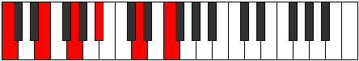

# Chords

## Links

- [Documentation](README.md)
- [Scales Index](Scales.md)
- [Modes Index](Modes.md)
- [Chords Index](Chords.md)

## Chord Index

| Number | Name | Notes | Illustration | Audio |
|--------|------|-------|--------------|-------|
| 37 | [sus2bb5](ChordCNaturalSuspendedSecondDoubleFlatFifth.md) | C,D,F |  | [midi](ChordCNaturalSuspendedSecondDoubleFlatFifthRootPosition.mid) | 
| 41 | [mbb5](ChordCNaturalMinorDoubleFlatFifth.md) | C,Eb,F |  | [midi](ChordCNaturalMinorDoubleFlatFifthRootPosition.mid) | 
| 67 | [loc](ChordCNaturalLocrian.md) | C,Db,Gb |  | [midi](ChordCNaturalLocrianRootPosition.mid) | 
| 69 |  | C,Ebb,Gb |  | [midi](ChordCNaturalDiminishedFlatThirdRootPosition.mid) | 
| 69 | [sus2b5](ChordCNaturalSuspendedSecondFlatFifth.md) | C,D,Gb |  | [midi](ChordCNaturalSuspendedSecondFlatFifthRootPosition.mid) | 
| 73 | [o](ChordCNaturalDiminished.md) | C,Eb,Gb |  | [midi](ChordCNaturalDiminishedRootPosition.mid) | 
| 81 | [Mb5](ChordCNaturalMajorFlatFifth.md) | C,E,Gb |  | [midi](ChordCNaturalMajorFlatFifthRootPosition.mid) | 
| 97 | [sus4b5](ChordCNaturalSuspendedFourthFlatFifth.md) | C,F,Gb |  | [midi](ChordCNaturalSuspendedFourthFlatFifthRootPosition.mid) | 
| 129 | [5](ChordCNaturalPowerChord.md) | C,G |  | [midi](ChordCNaturalPowerChordRootPosition.mid) | 
| 131 | [phryg](ChordCNaturalPhrygian.md) | C,Db,G |  | [midi](ChordCNaturalPhrygianRootPosition.mid) | 
| 133 | [sus2](ChordCNaturalSuspendedSecond.md) | C,D,G |  | [midi](ChordCNaturalSuspendedSecondRootPosition.mid) | 
| 137 | [m](ChordCNaturalMinor.md) | C,Eb,G |  | [midi](ChordCNaturalMinorRootPosition.mid) | 
| 137 | [m(add(#9))](ChordCNaturalMinorAddSharpNinth.md) | C,Eb,G,D# |  | [midi](ChordCNaturalMinorAddSharpNinthRootPosition.mid) | 
| 141 | [m(add9)](ChordCNaturalMinorAddNinth.md) | C,Eb,G,D |  | [midi](ChordCNaturalMinorAddNinthRootPosition.mid) | 
| 145 | [M](ChordCNaturalMajor.md) | C,E,G |  | [midi](ChordCNaturalMajorRootPosition.mid) | 
| 149 | [M(add9)](ChordCNaturalMajorAddNinth.md) | C,E,G,D |  | [midi](ChordCNaturalMajorAddNinthRootPosition.mid) | 
| 153 | [M(add(#9))](ChordCNaturalMajorAddSharpNinth.md) | C,E,G,D# |  | [midi](ChordCNaturalMajorAddSharpNinthRootPosition.mid) | 
| 161 | [sus4](ChordCNaturalSuspendedFourth.md) | C,F,G |  | [midi](ChordCNaturalSuspendedFourthRootPosition.mid) | 
| 169 | [m(add11)](ChordCNaturalMinorAddEleventh.md) | C,Eb,G,F |  | [midi](ChordCNaturalMinorAddEleventhRootPosition.mid) | 
| 169 | [m(add4)](ChordCNaturalMinorAddFourth.md) | C,Eb,F,G |  | [midi](ChordCNaturalMinorAddFourthRootPosition.mid) | 
| 177 | [M(add11)](ChordCNaturalMajorAddEleventh.md) | C,E,G,F |  | [midi](ChordCNaturalMajorAddEleventhRootPosition.mid) | 
| 177 | [M(add4)](ChordCNaturalMajorAddFourth.md) | C,E,F,G |  | [midi](ChordCNaturalMajorAddFourthRootPosition.mid) | 
| 193 | [lyd](ChordCNaturalLydian.md) | C,F#,G |  | [midi](ChordCNaturalLydianRootPosition.mid) | 
| 201 | [m(add(#4))](ChordCNaturalMinorAddSharpFourth.md) | C,Eb,F#,G |  | [midi](ChordCNaturalMinorAddSharpFourthRootPosition.mid) | 
| 209 | [M(add(#4))](ChordCNaturalMajorAddSharpFourth.md) | C,E,F#,G |  | [midi](ChordCNaturalMajorAddSharpFourthRootPosition.mid) | 
| 261 | [sus2#5](ChordCNaturalSuspendedSecondSharpFifth.md) | C,D,G# |  | [midi](ChordCNaturalSuspendedSecondSharpFifthRootPosition.mid) | 
| 265 | [m#5](ChordCNaturalMinorSharpFifth.md) | C,Eb,Ab |  | [midi](ChordCNaturalMinorSharpFifthRootPosition.mid) | 
| 273 | [+](ChordCNaturalAugmented.md) | C,E,G# |  | [midi](ChordCNaturalAugmentedRootPosition.mid) | 
| 273 | [+7](ChordCNaturalAugmentedAugmentedSeventh.md) | C,E,G#,B# |  | [midi](ChordCNaturalAugmentedAugmentedSeventhRootPosition.mid) | 
| 289 | [sus4#5](ChordCNaturalSuspendedFourthSharpFifth.md) | C,F,G# |  | [midi](ChordCNaturalSuspendedFourthSharpFifthRootPosition.mid) | 
| 325 | [sus2b5add(#5)](ChordCNaturalSuspendedSecondFlatFifthAddSharpFifth.md) | C,D,Gb,G# |  | [midi](ChordCNaturalSuspendedSecondFlatFifthAddSharpFifthRootPosition.mid) | 
| 529 | [M##5](ChordCNaturalMajorDoubleSharpFifth.md) | C,E,A |  | [midi](ChordCNaturalMajorDoubleSharpFifthRootPosition.mid) | 
| 545 | [sus4##5](ChordCNaturalSuspendedFourthDoubleSharpFifth.md) | C,F,A |  | [midi](ChordCNaturalSuspendedFourthDoubleSharpFifthRootPosition.mid) | 
| 549 | [M6sus2bb5](ChordCNaturalMajorSixthSuspendedSecondDoubleFlatFifth.md) | C,D,F,A |  | [midi](ChordCNaturalMajorSixthSuspendedSecondDoubleFlatFifthRootPosition.mid) | 
| 581 | [M6sus2b5](ChordCNaturalMajorSixthSuspendedSecondFlatFifth.md) | C,D,Gb,A |  | [midi](ChordCNaturalMajorSixthSuspendedSecondFlatFifthRootPosition.mid) | 
| 585 | [o7](ChordCNaturalFullDiminishedSeventh.md) | C,Eb,Gb,Bbb |  | [midi](ChordCNaturalFullDiminishedSeventhRootPosition.mid) | 
| 593 | [M6b5](ChordCNaturalMajorSixthFlatFifth.md) | C,E,Gb,A |  | [midi](ChordCNaturalMajorSixthFlatFifthRootPosition.mid) | 
| 645 | [M6sus2](ChordCNaturalMajorSixthSuspendedSecond.md) | C,D,G,A |  | [midi](ChordCNaturalMajorSixthSuspendedSecondRootPosition.mid) | 
| 645 | [7sus2b5](ChordCNaturalDominantSeventhSuspendedSecondFlatFifth.md) | C,D,G,Bbb |  | [midi](ChordCNaturalDominantSeventhSuspendedSecondFlatFifthRootPosition.mid) | 
| 649 | [m6](ChordCNaturalMinorSixth.md) | C,Eb,G,A |  | [midi](ChordCNaturalMinorSixthRootPosition.mid) | 
| 651 | [m6(addb9)](ChordCNaturalMinorSixthAddFlatNinth.md) | C,Eb,G,A,Db |  | [midi](ChordCNaturalMinorSixthAddFlatNinthRootPosition.mid) | 
| 653 | [m6(add9)](ChordCNaturalMinorSixthAddNinth.md) | C,Eb,G,A,D |  | [midi](ChordCNaturalMinorSixthAddNinthRootPosition.mid) | 
| 657 | [M6](ChordCNaturalMajorSixth.md) | C,E,G,A |  | [midi](ChordCNaturalMajorSixthRootPosition.mid) | 
| 659 | [M6(addb9)](ChordCNaturalMajorSixthAddFlatNinth.md) | C,E,G,A,Db |  | [midi](ChordCNaturalMajorSixthAddFlatNinthRootPosition.mid) | 
| 661 | [M6(add9)](ChordCNaturalMajorSixthAddNinth.md) | C,E,G,A,D |  | [midi](ChordCNaturalMajorSixthAddNinthRootPosition.mid) | 
| 673 | [M6sus4](ChordCNaturalMajorSixthSuspendedFourth.md) | C,F,G,A |  | [midi](ChordCNaturalMajorSixthSuspendedFourthRootPosition.mid) | 
| 1057 | [Q](ChordCNaturalQuartal.md) | C,F,Bb |  | [midi](ChordCNaturalQuartalRootPosition.mid) | 
| 1065 | [m7bb5](ChordCNaturalMinorSeventhDoubleFlatFifth.md) | C,Eb,F,Bb |  | [midi](ChordCNaturalMinorSeventhDoubleFlatFifthRootPosition.mid) | 
| 1097 | [ø7](ChordCNaturalHalfDiminishedSeventh.md) | C,Eb,Gb,Bb |  | [midi](ChordCNaturalHalfDiminishedSeventhRootPosition.mid) | 
| 1105 | [7b5](ChordCNaturalDominantSeventhFlatFifth.md) | C,E,Gb,Bb |  | [midi](ChordCNaturalDominantSeventhFlatFifthRootPosition.mid) | 
| 1107 | [7b5b9](ChordCNaturalDominantSeventhFlatFifthFlatNinth.md) | C,E,Gb,Bb,Db |  | [midi](ChordCNaturalDominantSeventhFlatFifthFlatNinthRootPosition.mid) | 
| 1157 | [7sus2](ChordCNaturalDominantSeventhSuspendedSecond.md) | C,D,G,Bb |  | [midi](ChordCNaturalDominantSeventhSuspendedSecondRootPosition.mid) | 
| 1157 | [9sus2](ChordCNaturalDominantNinthSuspendedSecond.md) | C,D,G,Bb,D |  | [midi](ChordCNaturalDominantNinthSuspendedSecondRootPosition.mid) | 
| 1161 | [m7](ChordCNaturalMinorSeventh.md) | C,Eb,G,Bb |  | [midi](ChordCNaturalMinorSeventhRootPosition.mid) | 
| 1163 | [m7b9](ChordCNaturalMinorSeventhFlatNinth.md) | C,Eb,G,Bb,Db |  | [midi](ChordCNaturalMinorSeventhFlatNinthRootPosition.mid) | 
| 1165 | [m9](ChordCNaturalMinorNinth.md) | C,Eb,G,Bb,D |  | [midi](ChordCNaturalMinorNinthRootPosition.mid) | 
| 1169 | [7](ChordCNaturalDominantSeventh.md) | C,E,G,Bb |  | [midi](ChordCNaturalDominantSeventhRootPosition.mid) | 
| 1171 | [7b9](ChordCNaturalDominantSeventhFlatNinth.md) | C,E,G,Bb,Db |  | [midi](ChordCNaturalDominantSeventhFlatNinthRootPosition.mid) | 
| 1173 | [9](ChordCNaturalDominantNinth.md) | C,E,G,Bb,D |  | [midi](ChordCNaturalDominantNinthRootPosition.mid) | 
| 1177 | [7#9](ChordCNaturalDominantSeventhSharpNinth.md) | C,E,G,Bb,D# |  | [midi](ChordCNaturalDominantSeventhSharpNinthRootPosition.mid) | 
| 1185 | [7sus4](ChordCNaturalDominantSeventhSuspendedFourth.md) | C,F,G,Bb |  | [midi](ChordCNaturalDominantSeventhSuspendedFourthRootPosition.mid) | 
| 1189 | [9sus4](ChordCNaturalDominantNinthSuspendedFourth.md) | C,F,G,Bb,D |  | [midi](ChordCNaturalDominantNinthSuspendedFourthRootPosition.mid) | 
| 1193 | [m7add11](ChordCNaturalMinorSeventhAddEleventh.md) | C,Eb,G,Bb,F |  | [midi](ChordCNaturalMinorSeventhAddEleventhRootPosition.mid) | 
| 1197 | [m11](ChordCNaturalMinorEleventh.md) | C,Eb,G,Bb,D,F |  | [midi](ChordCNaturalMinorEleventhRootPosition.mid) | 
| 1201 | [7add4](ChordCNaturalDominantSeventhAddFourth.md) | C,E,F,G,Bb |  | [midi](ChordCNaturalDominantSeventhAddFourthRootPosition.mid) | 
| 1201 | [7add11](ChordCNaturalDominantSeventhAddEleventh.md) | C,E,G,Bb,F |  | [midi](ChordCNaturalDominantSeventhAddEleventhRootPosition.mid) | 
| 1205 | [11](ChordCNaturalDominantEleventh.md) | C,E,G,Bb,D,F |  | [midi](ChordCNaturalDominantEleventhRootPosition.mid) | 
| 1225 | [m7add(#11)](ChordCNaturalMinorSeventhAddSharpEleventh.md) | C,Eb,G,Bb,F# |  | [midi](ChordCNaturalMinorSeventhAddSharpEleventhRootPosition.mid) | 
| 1233 | [7add(#4)](ChordCNaturalDominantSeventhAddSharpFourth.md) | C,E,F#,G,Bb |  | [midi](ChordCNaturalDominantSeventhAddSharpFourthRootPosition.mid) | 
| 1233 | [7#11](ChordCNaturalDominantSeventhSharpEleventh.md) | C,E,G,Bb,F# |  | [midi](ChordCNaturalDominantSeventhSharpEleventhRootPosition.mid) | 
| 1237 | [9#11](ChordCNaturalDominantNinthSharpEleventh.md) | C,E,G,Bb,D,F# |  | [midi](ChordCNaturalDominantNinthSharpEleventhRootPosition.mid) | 
| 1241 | [7#9#11](ChordCNaturalDominantSeventhSharpNinthSharpEleventh.md) | C,E,G,Bb,D#,F# |  | [midi](ChordCNaturalDominantSeventhSharpNinthSharpEleventhRootPosition.mid) | 
| 1289 | [m7#5](ChordCNaturalMinorSeventhSharpFifth.md) | C,Eb,G#,Bb |  | [midi](ChordCNaturalMinorSeventhSharpFifthRootPosition.mid) | 
| 1299 | [7#5b9](ChordCNaturalDominantSeventhSharpFifthFlatNinth.md) | C,E,G#,Bb,Db |  | [midi](ChordCNaturalDominantSeventhSharpFifthFlatNinthRootPosition.mid) | 
| 1427 | [7b9b13](ChordCNaturalDominantSeventhFlatNinthFlatThirteenth.md) | C,E,G,Bb,Db,Ab |  | [midi](ChordCNaturalDominantSeventhFlatNinthFlatThirteenthRootPosition.mid) | 
| 1429 | [9b13](ChordCNaturalDominantNinthFlatThirteenth.md) | C,E,G,Bb,D,Ab |  | [midi](ChordCNaturalDominantNinthFlatThirteenthRootPosition.mid) | 
| 1673 | [m7add13](ChordCNaturalMinorSeventhAddThirteenth.md) | C,Eb,G,Bb,A |  | [midi](ChordCNaturalMinorSeventhAddThirteenthRootPosition.mid) | 
| 1681 | [7add13](ChordCNaturalDominantSeventhAddThirteenth.md) | C,E,G,Bb,A |  | [midi](ChordCNaturalDominantSeventhAddThirteenthRootPosition.mid) | 
| 1709 | [m13](ChordCNaturalMinorThirteenth.md) | C,Eb,G,Bb,D,F,A |  | [midi](ChordCNaturalMinorThirteenthRootPosition.mid) | 
| 1715 | [13b9](ChordCNaturalDominantThirteenthFlatNinth.md) | C,E,G,Bb,Db,F,A |  | [midi](ChordCNaturalDominantThirteenthFlatNinthRootPosition.mid) | 
| 1717 | [13](ChordCNaturalDominantThirteenth.md) | C,E,G,Bb,D,F,A |  | [midi](ChordCNaturalDominantThirteenthRootPosition.mid) | 
| 2081 | [Q+](ChordCNaturalQuartalAugmented.md) | C,F,B |  | [midi](ChordCNaturalQuartalAugmentedRootPosition.mid) | 
| 2121 | [oM7](ChordCNaturalDiminishedMajorSeventh.md) | C,Eb,Gb,B |  | [midi](ChordCNaturalDiminishedMajorSeventhRootPosition.mid) | 
| 2129 | [M7b5](ChordCNaturalMajorSeventhFlatFifth.md) | C,E,Gb,B |  | [midi](ChordCNaturalMajorSeventhFlatFifthRootPosition.mid) | 
| 2179 | [phryg+7](ChordCNaturalPhrygianAddSeventh.md) | C,Db,G,B |  | [midi](ChordCNaturalPhrygianAddSeventhRootPosition.mid) | 
| 2181 | [M7(sus2)](ChordCNaturalMajorSeventhSuspendedSecond.md) | C,D,G,B |  | [midi](ChordCNaturalMajorSeventhSuspendedSecondRootPosition.mid) | 
| 2181 | [M9sus2](ChordCNaturalMajorNinthSuspendedSecond.md) | C,D,G,B,D |  | [midi](ChordCNaturalMajorNinthSuspendedSecondRootPosition.mid) | 
| 2185 | [m(M7)](ChordCNaturalMinorMajorSeventh.md) | C,Eb,G,B |  | [midi](ChordCNaturalMinorMajorSeventhRootPosition.mid) | 
| 2189 | [m(M9)](ChordCNaturalMinorMajorNinth.md) | C,Eb,G,B,D |  | [midi](ChordCNaturalMinorMajorNinthRootPosition.mid) | 
| 2193 | [M7](ChordCNaturalMajorSeventh.md) | C,E,G,B |  | [midi](ChordCNaturalMajorSeventhRootPosition.mid) | 
| 2197 | [M9](ChordCNaturalMajorNinth.md) | C,E,G,B,D |  | [midi](ChordCNaturalMajorNinthRootPosition.mid) | 
| 2209 | [M7(sus4)](ChordCNaturalMajorSeventhSuspendedFourth.md) | C,F,G,B |  | [midi](ChordCNaturalMajorSeventhSuspendedFourthRootPosition.mid) | 
| 2213 | [M9sus4](ChordCNaturalMajorNinthSuspendedFourth.md) | C,F,G,B,D |  | [midi](ChordCNaturalMajorNinthSuspendedFourthRootPosition.mid) | 
| 2217 | [m(M7)add11](ChordCNaturalMinorMajorSeventhAddEleventh.md) | C,Eb,G,B,F |  | [midi](ChordCNaturalMinorMajorSeventhAddEleventhRootPosition.mid) | 
| 2221 | [m(M11)](ChordCNaturalMinorMajorEleventh.md) | C,Eb,G,B,D,F |  | [midi](ChordCNaturalMinorMajorEleventhRootPosition.mid) | 
| 2225 | [M7add4](ChordCNaturalMajorSeventhAddFourth.md) | C,E,F,G,B |  | [midi](ChordCNaturalMajorSeventhAddFourthRootPosition.mid) | 
| 2225 | [M7add11](ChordCNaturalMajorSeventhAddEleventh.md) | C,E,G,B,F |  | [midi](ChordCNaturalMajorSeventhAddEleventhRootPosition.mid) | 
| 2229 | [M11](ChordCNaturalMajorEleventh.md) | C,E,G,B,D,F |  | [midi](ChordCNaturalMajorEleventhRootPosition.mid) | 
| 2241 | [lyd(M7)](ChordCNaturalLydianMajorSeventh.md) | C,F#,G,B |  | [midi](ChordCNaturalLydianMajorSeventhRootPosition.mid) | 
| 2257 | [M7add(#11)](ChordCNaturalMajorSeventhAddSharpEleventh.md) | C,E,G,B,F# |  | [midi](ChordCNaturalMajorSeventhAddSharpEleventhRootPosition.mid) | 
| 2257 | [M7add(#4)](ChordCNaturalMajorSeventhAddSharpFourth.md) | C,E,F#,G,B |  | [midi](ChordCNaturalMajorSeventhAddSharpFourthRootPosition.mid) | 
| 2321 | [+(M7)](ChordCNaturalAugmentedMajorSeventh.md) | C,E,G#,B |  | [midi](ChordCNaturalAugmentedMajorSeventhRootPosition.mid) | 
| 2337 | [M7(sus4)#5](ChordCNaturalMajorSeventhSuspendedFourthSharpFifth.md) | C,F,G#,B |  | [midi](ChordCNaturalMajorSeventhSuspendedFourthSharpFifthRootPosition.mid) | 
| 2577 | [M7##5](ChordCNaturalMajorSeventhDoubleSharpFifth.md) | C,E,A,B |  | [midi](ChordCNaturalMajorSeventhDoubleSharpFifthRootPosition.mid) | 
| 2593 | [M7(sus4)##5](ChordCNaturalMajorSeventhSuspendedFourthDoubleSharpFifth.md) | C,F,A,B |  | [midi](ChordCNaturalMajorSeventhSuspendedFourthDoubleSharpFifthRootPosition.mid) | 
| 2697 | [m(M7)add13](ChordCNaturalMinorMajorSeventhAddThirteenth.md) | C,Eb,G,B,A |  | [midi](ChordCNaturalMinorMajorSeventhAddThirteenthRootPosition.mid) | 
| 2705 | [M7add13](ChordCNaturalMajorSeventhAddThirteenth.md) | C,E,G,B,A |  | [midi](ChordCNaturalMajorSeventhAddThirteenthRootPosition.mid) | 
| 2733 | [m(M13)](ChordCNaturalMinorMajorThirteenth.md) | C,Eb,G,B,D,F,A |  | [midi](ChordCNaturalMinorMajorThirteenthRootPosition.mid) | 
| 2741 | [M13](ChordCNaturalMajorThirteenth.md) | C,E,G,B,D,F,A |  | [midi](ChordCNaturalMajorThirteenthRootPosition.mid) | 
