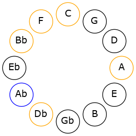
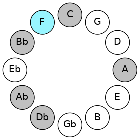

# Mode AFlatAeoladimic

## Links

- [Documentation](README.md)
- [Scales Index](Scales.md)
- [Modes Index](Modes.md)
- [Chords Index](Chords.md)

## Scale

[Bygimic](ScaleBygimic.md)

## Mode

[AFlatAeoladimic](ModeAFlatAeoladimic.md)

## Tonic

Ab

## Signature

[CNaturalMajor]

## Transposition

1, 1, 2, 1, 4, 3

## Chord Pattern

VI

## Perfection

 - 3 Perfect Notes

 - 3 Imperfect Notes

## Notes

- Ab (Imperfect)
- Bbb (Imperfect)
- Cbb
- Dbb (Imperfect)
- Ebbb
- F
- Ab (Imperfect)

## Illustration

## Diagram

## Relative Modes

| Number | Mode | Tonic | Notes | Illustration |
|--------|------|-------|-------|--------------|
| [567](https://ianring.com/musictheory/scales/567) | [Aeoladimic](ModeAeoladimic.md) | Ab | Ab, Bbb, Cbb, Dbb, Ebbb, F, Ab |  |
| [441](https://ianring.com/musictheory/scales/441) | [Thycrimic](ModeThycrimic.md) | F | F, G#, A, Bb, C, Db, F |  |
## Relative Brightness

| Number | Mode | Tonic | Notes | Illustration |
|--------|------|-------|-------|--------------|
| [567](https://ianring.com/musictheory/scales/567) | [Aeoladimic](ModeAeoladimic.md) | Ab | Ab, Bbb, Cbb, Dbb, Ebbb, F, Ab |  |
| [441](https://ianring.com/musictheory/scales/441) | [Thycrimic](ModeThycrimic.md) | F | F, G#, A, Bb, C, Db, F |  |

## Chords

### Ab

| Number | Root | Name | Notes | Illustration | Audio |
|--------|------|------|-------|--------------|-------|
| 1282 | Ab | [Absus2bb5](ChordAFlatSuspendedSecondDoubleFlatFifth.md) | Ab, Bb, Db |  | [midi](ChordAFlatSuspendedSecondDoubleFlatFifthRootPosition.mid) |
| 289 | Ab | [AbM##5](ChordAFlatMajorDoubleSharpFifth.md) | Ab, C, F |  | [midi](ChordAFlatMajorDoubleSharpFifthRootPosition.mid) |
| 290 | Ab | [Absus4##5](ChordAFlatSuspendedFourthDoubleSharpFifth.md) | Ab, Db, F |  | [midi](ChordAFlatSuspendedFourthDoubleSharpFifthRootPosition.mid) |
| 1314 | Ab | [AbM6sus2bb5](ChordAFlatMajorSixthSuspendedSecondDoubleFlatFifth.md) | Ab, Bb, Db, F |  | [midi](ChordAFlatMajorSixthSuspendedSecondDoubleFlatFifthRootPosition.mid) |

### Bbb

| Number | Root | Name | Notes | Illustration | Audio |
|--------|------|------|-------|--------------|-------|

### Cbb

| Number | Root | Name | Notes | Illustration | Audio |
|--------|------|------|-------|--------------|-------|

### Dbb

| Number | Root | Name | Notes | Illustration | Audio |
|--------|------|------|-------|--------------|-------|

### Ebbb

| Number | Root | Name | Notes | Illustration | Audio |
|--------|------|------|-------|--------------|-------|

### F

| Number | Root | Name | Notes | Illustration | Audio |
|--------|------|------|-------|--------------|-------|
| 1312 | F | [Fmbb5](ChordFNaturalMinorDoubleFlatFifth.md) | F, Ab, Bb |  | [midi](ChordFNaturalMinorDoubleFlatFifthRootPosition.mid) |
| 33 | F | [F5](ChordFNaturalPowerChord.md) | F, C |  | [midi](ChordFNaturalPowerChordRootPosition.mid) |
| 289 | F | [Fm](ChordFNaturalMinor.md) | F, Ab, C |  | [midi](ChordFNaturalMinorRootPosition.mid) |
| 289 | F | [Fm(add(#9))](ChordFNaturalMinorAddSharpNinth.md) | F, Ab, C, G# |  | [midi](ChordFNaturalMinorAddSharpNinthRootPosition.mid) |
| 545 | F | [FM](ChordFNaturalMajor.md) | F, A, C |  | [midi](ChordFNaturalMajorRootPosition.mid) |
| 801 | F | [FM(add(#9))](ChordFNaturalMajorAddSharpNinth.md) | F, A, C, G# |  | [midi](ChordFNaturalMajorAddSharpNinthRootPosition.mid) |
| 1057 | F | [Fsus4](ChordFNaturalSuspendedFourth.md) | F, Bb, C |  | [midi](ChordFNaturalSuspendedFourthRootPosition.mid) |
| 1313 | F | [Fm(add11)](ChordFNaturalMinorAddEleventh.md) | F, Ab, C, Bb |  | [midi](ChordFNaturalMinorAddEleventhRootPosition.mid) |
| 1313 | F | [Fm(add4)](ChordFNaturalMinorAddFourth.md) | F, Ab, Bb, C |  | [midi](ChordFNaturalMinorAddFourthRootPosition.mid) |
| 1569 | F | [FM(add11)](ChordFNaturalMajorAddEleventh.md) | F, A, C, Bb |  | [midi](ChordFNaturalMajorAddEleventhRootPosition.mid) |
| 1569 | F | [FM(add4)](ChordFNaturalMajorAddFourth.md) | F, A, Bb, C |  | [midi](ChordFNaturalMajorAddFourthRootPosition.mid) |
| 290 | F | [Fm#5](ChordFNaturalMinorSharpFifth.md) | F, Ab, Db |  | [midi](ChordFNaturalMinorSharpFifthRootPosition.mid) |
| 546 | F | [F+](ChordFNaturalAugmented.md) | F, A, C# |  | [midi](ChordFNaturalAugmentedRootPosition.mid) |
| 546 | F | [F+7](ChordFNaturalAugmentedAugmentedSeventh.md) | F, A, C#, E# |  | [midi](ChordFNaturalAugmentedAugmentedSeventhRootPosition.mid) |
| 1058 | F | [Fsus4#5](ChordFNaturalSuspendedFourthSharpFifth.md) | F, Bb, C# |  | [midi](ChordFNaturalSuspendedFourthSharpFifthRootPosition.mid) |

