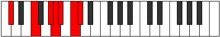

# Mode AFlatAeoladimic

## Links

- [Documentation](index.md)
- [Scales Index](Scales.md)
- [Modes Index](Modes.md)
- [Chords Index](Chords.md)

## Scale

[Bygimic](ScaleBygimic.md)

## Mode

[AFlatAeoladimic](ModeAFlatAeoladimic.md)

## Tonic

Ab

## Signature

[CNaturalMajor]

## Perfection

 - 3 Perfect Notes

 - 3 Imperfect Notes

## Notes

- Ab (Imperfect)
- Bbb (Imperfect)
- Cbb
- Dbb (Imperfect)
- Ebbb
- F
- Ab (Imperfect)

## Illustration

## Relative Modes

| Number | Mode | Tonic | Notes | Illustration |
|--------|------|-------|-------|--------------|
| [441](https://ianring.com/musictheory/scales/441) | [Thycrimic](ModeThycrimic.md) | F | F, G#, A, Bb, C, Db, F |  |
| [567](https://ianring.com/musictheory/scales/567) | [Aeoladimic](ModeAeoladimic.md) | G# | G#, A, Bb, C, Db, E#, G# |  |
| [567](https://ianring.com/musictheory/scales/567) | [Aeoladimic](ModeAeoladimic.md) | Ab | Ab, Bbb, Cbb, Dbb, Ebbb, F, Ab |  |
| [1827](https://ianring.com/musictheory/scales/1827) | [Katygimic](ModeKatygimic.md) | C | C, Db, E#, F###, G##, A#, C |  |
| [2331](https://ianring.com/musictheory/scales/2331) | [Dylimic](ModeDylimic.md) | A | A, Bb, C, Db, E#, F###, A |  |
| [2961](https://ianring.com/musictheory/scales/2961) | [Bygimic](ModeBygimic.md) | C# | C#, D###, F###, G##, A#, B#, C# |  |
| [2961](https://ianring.com/musictheory/scales/2961) | [Bygimic](ModeBygimic.md) | Db | Db, E#, F###, G##, A#, B#, Db |  |
| [3213](https://ianring.com/musictheory/scales/3213) | [Eponimic](ModeEponimic.md) | A# | A#, B#, C#, D###, F###, G##, A# |  |
| [3213](https://ianring.com/musictheory/scales/3213) | [Eponimic](ModeEponimic.md) | Bb | Bb, C, Db, E#, F###, G##, Bb |  |

## Chords

### Ab

| Number | Root | Name | Notes | Illustration | Audio |
|--------|------|------|-------|--------------|-------|

### Bbb

| Number | Root | Name | Notes | Illustration | Audio |
|--------|------|------|-------|--------------|-------|

### Cbb

| Number | Root | Name | Notes | Illustration | Audio |
|--------|------|------|-------|--------------|-------|

### Dbb

| Number | Root | Name | Notes | Illustration | Audio |
|--------|------|------|-------|--------------|-------|

### Ebbb

| Number | Root | Name | Notes | Illustration | Audio |
|--------|------|------|-------|--------------|-------|

### F

| Number | Root | Name | Notes | Illustration | Audio |
|--------|------|------|-------|--------------|-------|

