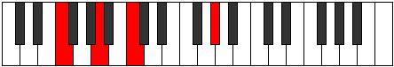

# Mode AFlatAeoladimic

## Links

- [Documentation](README.md)
- [Scales Index](Scales.md)
- [Modes Index](Modes.md)
- [Chords Index](Chords.md)

## Scale

[Bygimic](ScaleBygimic.md)

## Mode

[AFlatAeoladimic](ModeAFlatAeoladimic.md)

## Tonic

Ab

## Signature

[CNaturalMajor]

## Transposition

1, 1, 2, 1, 4, 3

## Chord Pattern

VI

## Perfection

 - 3 Perfect Notes

 - 3 Imperfect Notes

## Notes

- Ab (Imperfect)
- Bbb (Imperfect)
- Cbb
- Dbb (Imperfect)
- Ebbb
- F
- Ab (Imperfect)

## Illustration

## Diagram

| Circle of Fifth | Chromatic Circle |
|-----------------|------------------|
|  |  |
## Relative Modes

| Number | Mode | Tonic | Notes | Illustration |
|--------|------|-------|-------|--------------|
| [567](https://ianring.com/musictheory/scales/567) | [Aeoladimic](ModeAeoladimic.md) | G# | G#, A, Bb, C, Db, E#, G# |  |
| [567](https://ianring.com/musictheory/scales/567) | [Aeoladimic](ModeAeoladimic.md) | Ab | Ab, Bbb, Cbb, Dbb, Ebbb, F, Ab |  |
| [2331](https://ianring.com/musictheory/scales/2331) | [Dylimic](ModeDylimic.md) | A | A, Bb, C, Db, E#, F###, A |  |
| [3213](https://ianring.com/musictheory/scales/3213) | [Eponimic](ModeEponimic.md) | A# | A#, B#, C#, D###, F###, G##, A# |  |
| [3213](https://ianring.com/musictheory/scales/3213) | [Eponimic](ModeEponimic.md) | Bb | Bb, C, Db, E#, F###, G##, Bb |  |
| [1827](https://ianring.com/musictheory/scales/1827) | [Katygimic](ModeKatygimic.md) | C | C, Db, E#, F###, G##, A#, C |  |
| [2961](https://ianring.com/musictheory/scales/2961) | [Bygimic](ModeBygimic.md) | C# | C#, D###, F###, G##, A#, B#, C# |  |
| [2961](https://ianring.com/musictheory/scales/2961) | [Bygimic](ModeBygimic.md) | Db | Db, E#, F###, G##, A#, B#, Db |  |
| [441](https://ianring.com/musictheory/scales/441) | [Thycrimic](ModeThycrimic.md) | F | F, G#, A, Bb, C, Db, F |  |
## Relative Brightness

| Number | Mode | Tonic | Notes | Circle Of Fifth | Chromatic Circle |
|--------|------|-------|-------|-----------------|------------------|
| [567](https://ianring.com/musictheory/scales/567) | [Aeoladimic](ModeAeoladimic.md) | G# | G#, A, Bb, C, Db, E#, G# |  |  |
| [567](https://ianring.com/musictheory/scales/567) | [Aeoladimic](ModeAeoladimic.md) | Ab | Ab, Bbb, Cbb, Dbb, Ebbb, F, Ab |  |  |
| [2331](https://ianring.com/musictheory/scales/2331) | [Dylimic](ModeDylimic.md) | A | A, Bb, C, Db, E#, F###, A |  |  |
| [3213](https://ianring.com/musictheory/scales/3213) | [Eponimic](ModeEponimic.md) | A# | A#, B#, C#, D###, F###, G##, A# |  |  |
| [3213](https://ianring.com/musictheory/scales/3213) | [Eponimic](ModeEponimic.md) | Bb | Bb, C, Db, E#, F###, G##, Bb |  |  |
| [1827](https://ianring.com/musictheory/scales/1827) | [Katygimic](ModeKatygimic.md) | C | C, Db, E#, F###, G##, A#, C |  |  |
| [2961](https://ianring.com/musictheory/scales/2961) | [Bygimic](ModeBygimic.md) | C# | C#, D###, F###, G##, A#, B#, C# |  |  |
| [2961](https://ianring.com/musictheory/scales/2961) | [Bygimic](ModeBygimic.md) | Db | Db, E#, F###, G##, A#, B#, Db |  |  |
| [441](https://ianring.com/musictheory/scales/441) | [Thycrimic](ModeThycrimic.md) | F | F, G#, A, Bb, C, Db, F |  |  |

## Chords

### Ab

| Number | Root | Name | Notes | Illustration | Audio |
|--------|------|------|-------|--------------|-------|
| 1282 | Ab | [G#sus2bb5](ChordGSharpSuspendedSecondDoubleFlatFifth.md) | G#, A#, C# |  | [midi](ChordGSharpSuspendedSecondDoubleFlatFifthRootPosition.mid) |
| 1282 | Ab | [Absus2bb5](ChordAFlatSuspendedSecondDoubleFlatFifth.md) | Ab, Bb, Db |  | [midi](ChordAFlatSuspendedSecondDoubleFlatFifthRootPosition.mid) |
| 289 | Ab | [G#M##5](ChordGSharpMajorDoubleSharpFifth.md) | G#, B#, E# |  | [midi](ChordGSharpMajorDoubleSharpFifthRootPosition.mid) |
| 289 | Ab | [AbM##5](ChordAFlatMajorDoubleSharpFifth.md) | Ab, C, F |  | [midi](ChordAFlatMajorDoubleSharpFifthRootPosition.mid) |
| 290 | Ab | [G#sus4##5](ChordGSharpSuspendedFourthDoubleSharpFifth.md) | G#, C#, E# |  | [midi](ChordGSharpSuspendedFourthDoubleSharpFifthRootPosition.mid) |
| 290 | Ab | [Absus4##5](ChordAFlatSuspendedFourthDoubleSharpFifth.md) | Ab, Db, F |  | [midi](ChordAFlatSuspendedFourthDoubleSharpFifthRootPosition.mid) |
| 1314 | Ab | [G#M6sus2bb5](ChordGSharpMajorSixthSuspendedSecondDoubleFlatFifth.md) | G#, A#, C#, E# |  | [midi](ChordGSharpMajorSixthSuspendedSecondDoubleFlatFifthRootPosition.mid) |
| 1314 | Ab | [AbM6sus2bb5](ChordAFlatMajorSixthSuspendedSecondDoubleFlatFifth.md) | Ab, Bb, Db, F |  | [midi](ChordAFlatMajorSixthSuspendedSecondDoubleFlatFifthRootPosition.mid) |

### Bbb

| Number | Root | Name | Notes | Illustration | Audio |
|--------|------|------|-------|--------------|-------|
| 545 | Bbb | [Am#5](ChordANaturalMinorSharpFifth.md) | A, C, F |  | [midi](ChordANaturalMinorSharpFifthRootPosition.mid) |
| 546 | Bbb | [A+](ChordANaturalAugmented.md) | A, C#, E# |  | [midi](ChordANaturalAugmentedRootPosition.mid) |
| 546 | Bbb | [A+7](ChordANaturalAugmentedAugmentedSeventh.md) | A, C#, E#, G## |  | [midi](ChordANaturalAugmentedAugmentedSeventhRootPosition.mid) |
| 802 | Bbb | [A+(M7)](ChordANaturalAugmentedMajorSeventh.md) | A, C#, E#, G# |  | [midi](ChordANaturalAugmentedMajorSeventhRootPosition.mid) |

### Cbb

| Number | Root | Name | Notes | Illustration | Audio |
|--------|------|------|-------|--------------|-------|
| 1056 | Cbb | [A#5](ChordASharpPowerChord.md) | A#, E# |  | [midi](ChordASharpPowerChordRootPosition.mid) |
| 1056 | Cbb | [Bb5](ChordBFlatPowerChord.md) | Bb, F |  | [midi](ChordBFlatPowerChordRootPosition.mid) |
| 1057 | Cbb | [A#sus2](ChordASharpSuspendedSecond.md) | A#, B#, E# |  | [midi](ChordASharpSuspendedSecondRootPosition.mid) |
| 1057 | Cbb | [Bbsus2](ChordBFlatSuspendedSecond.md) | Bb, C, F |  | [midi](ChordBFlatSuspendedSecondRootPosition.mid) |
| 1058 | Cbb | [A#m](ChordASharpMinor.md) | A#, C#, E# |  | [midi](ChordASharpMinorRootPosition.mid) |
| 1058 | Cbb | [A#m(add(#9))](ChordASharpMinorAddSharpNinth.md) | A#, C#, E#, B## |  | [midi](ChordASharpMinorAddSharpNinthRootPosition.mid) |
| 1058 | Cbb | [Bbm](ChordBFlatMinor.md) | Bb, Db, F |  | [midi](ChordBFlatMinorRootPosition.mid) |
| 1058 | Cbb | [Bbm(add(#9))](ChordBFlatMinorAddSharpNinth.md) | Bb, Db, F, C# |  | [midi](ChordBFlatMinorAddSharpNinthRootPosition.mid) |
| 1059 | Cbb | [A#m(add9)](ChordASharpMinorAddNinth.md) | A#, C#, E#, B# |  | [midi](ChordASharpMinorAddNinthRootPosition.mid) |
| 1059 | Cbb | [Bbm(add9)](ChordBFlatMinorAddNinth.md) | Bb, Db, F, C |  | [midi](ChordBFlatMinorAddNinthRootPosition.mid) |
| 1313 | Cbb | [A#7sus2](ChordASharpDominantSeventhSuspendedSecond.md) | A#, B#, E#, G# |  | [midi](ChordASharpDominantSeventhSuspendedSecondRootPosition.mid) |
| 1313 | Cbb | [A#9sus2](ChordASharpDominantNinthSuspendedSecond.md) | A#, B#, E#, G#, B# |  | [midi](ChordASharpDominantNinthSuspendedSecondRootPosition.mid) |
| 1313 | Cbb | [Bb7sus2](ChordBFlatDominantSeventhSuspendedSecond.md) | Bb, C, F, Ab |  | [midi](ChordBFlatDominantSeventhSuspendedSecondRootPosition.mid) |
| 1313 | Cbb | [Bb9sus2](ChordBFlatDominantNinthSuspendedSecond.md) | Bb, C, F, Ab, C |  | [midi](ChordBFlatDominantNinthSuspendedSecondRootPosition.mid) |
| 1314 | Cbb | [A#m7](ChordASharpMinorSeventh.md) | A#, C#, E#, G# |  | [midi](ChordASharpMinorSeventhRootPosition.mid) |
| 1314 | Cbb | [Bbm7](ChordBFlatMinorSeventh.md) | Bb, Db, F, Ab |  | [midi](ChordBFlatMinorSeventhRootPosition.mid) |
| 1315 | Cbb | [A#m9](ChordASharpMinorNinth.md) | A#, C#, E#, G#, B# |  | [midi](ChordASharpMinorNinthRootPosition.mid) |
| 1315 | Cbb | [Bbm9](ChordBFlatMinorNinth.md) | Bb, Db, F, Ab, C |  | [midi](ChordBFlatMinorNinthRootPosition.mid) |
| 1569 | Cbb | [A#M7(sus2)](ChordASharpMajorSeventhSuspendedSecond.md) | A#, B#, E#, G## |  | [midi](ChordASharpMajorSeventhSuspendedSecondRootPosition.mid) |
| 1569 | Cbb | [A#M9sus2](ChordASharpMajorNinthSuspendedSecond.md) | A#, B#, E#, G##, B# |  | [midi](ChordASharpMajorNinthSuspendedSecondRootPosition.mid) |
| 1569 | Cbb | [BbM7(sus2)](ChordBFlatMajorSeventhSuspendedSecond.md) | Bb, C, F, A |  | [midi](ChordBFlatMajorSeventhSuspendedSecondRootPosition.mid) |
| 1569 | Cbb | [BbM9sus2](ChordBFlatMajorNinthSuspendedSecond.md) | Bb, C, F, A, C |  | [midi](ChordBFlatMajorNinthSuspendedSecondRootPosition.mid) |
| 1570 | Cbb | [A#m(M7)](ChordASharpMinorMajorSeventh.md) | A#, C#, E#, G## |  | [midi](ChordASharpMinorMajorSeventhRootPosition.mid) |
| 1570 | Cbb | [Bbm(M7)](ChordBFlatMinorMajorSeventh.md) | Bb, Db, F, A |  | [midi](ChordBFlatMinorMajorSeventhRootPosition.mid) |
| 1571 | Cbb | [A#m(M9)](ChordASharpMinorMajorNinth.md) | A#, C#, E#, G##, B# |  | [midi](ChordASharpMinorMajorNinthRootPosition.mid) |
| 1571 | Cbb | [Bbm(M9)](ChordBFlatMinorMajorNinth.md) | Bb, Db, F, A, C |  | [midi](ChordBFlatMinorMajorNinthRootPosition.mid) |

### Dbb

| Number | Root | Name | Notes | Illustration | Audio |
|--------|------|------|-------|--------------|-------|
| 289 | Dbb | [Csus4#5](ChordCNaturalSuspendedFourthSharpFifth.md) | C, F, G# |  | [midi](ChordCNaturalSuspendedFourthSharpFifthRootPosition.mid) |
| 545 | Dbb | [Csus4##5](ChordCNaturalSuspendedFourthDoubleSharpFifth.md) | C, F, A |  | [midi](ChordCNaturalSuspendedFourthDoubleSharpFifthRootPosition.mid) |
| 1057 | Dbb | [CQ](ChordCNaturalQuartal.md) | C, F, Bb |  | [midi](ChordCNaturalQuartalRootPosition.mid) |

### Ebbb

| Number | Root | Name | Notes | Illustration | Audio |
|--------|------|------|-------|--------------|-------|
| 258 | Ebbb | [C#5](ChordCSharpPowerChord.md) | C#, G# |  | [midi](ChordCSharpPowerChordRootPosition.mid) |
| 258 | Ebbb | [Db5](ChordDFlatPowerChord.md) | Db, Ab |  | [midi](ChordDFlatPowerChordRootPosition.mid) |
| 290 | Ebbb | [C#M](ChordCSharpMajor.md) | C#, E#, G# |  | [midi](ChordCSharpMajorRootPosition.mid) |
| 290 | Ebbb | [DbM](ChordDFlatMajor.md) | Db, F, Ab |  | [midi](ChordDFlatMajorRootPosition.mid) |
| 546 | Ebbb | [C#+](ChordCSharpAugmented.md) | C#, E#, G## |  | [midi](ChordCSharpAugmentedRootPosition.mid) |
| 546 | Ebbb | [C#+7](ChordCSharpAugmentedAugmentedSeventh.md) | C#, E#, G##, B## |  | [midi](ChordCSharpAugmentedAugmentedSeventhRootPosition.mid) |
| 546 | Ebbb | [Db+](ChordDFlatAugmented.md) | Db, F, A |  | [midi](ChordDFlatAugmentedRootPosition.mid) |
| 546 | Ebbb | [Db+7](ChordDFlatAugmentedAugmentedSeventh.md) | Db, F, A, C# |  | [midi](ChordDFlatAugmentedAugmentedSeventhRootPosition.mid) |
| 1058 | Ebbb | [C#M##5](ChordCSharpMajorDoubleSharpFifth.md) | C#, E#, A# |  | [midi](ChordCSharpMajorDoubleSharpFifthRootPosition.mid) |
| 1058 | Ebbb | [DbM##5](ChordDFlatMajorDoubleSharpFifth.md) | Db, F, Bb |  | [midi](ChordDFlatMajorDoubleSharpFifthRootPosition.mid) |
| 1314 | Ebbb | [C#M6](ChordCSharpMajorSixth.md) | C#, E#, G#, A# |  | [midi](ChordCSharpMajorSixthRootPosition.mid) |
| 1314 | Ebbb | [DbM6](ChordDFlatMajorSixth.md) | Db, F, Ab, Bb |  | [midi](ChordDFlatMajorSixthRootPosition.mid) |
| 291 | Ebbb | [C#M7](ChordCSharpMajorSeventh.md) | C#, E#, G#, B# |  | [midi](ChordCSharpMajorSeventhRootPosition.mid) |
| 291 | Ebbb | [DbM7](ChordDFlatMajorSeventh.md) | Db, F, Ab, C |  | [midi](ChordDFlatMajorSeventhRootPosition.mid) |
| 547 | Ebbb | [C#+(M7)](ChordCSharpAugmentedMajorSeventh.md) | C#, E#, G##, B# |  | [midi](ChordCSharpAugmentedMajorSeventhRootPosition.mid) |
| 547 | Ebbb | [Db+(M7)](ChordDFlatAugmentedMajorSeventh.md) | Db, F, A, C |  | [midi](ChordDFlatAugmentedMajorSeventhRootPosition.mid) |
| 1059 | Ebbb | [C#M7##5](ChordCSharpMajorSeventhDoubleSharpFifth.md) | C#, E#, A#, B# |  | [midi](ChordCSharpMajorSeventhDoubleSharpFifthRootPosition.mid) |
| 1059 | Ebbb | [DbM7##5](ChordDFlatMajorSeventhDoubleSharpFifth.md) | Db, F, Bb, C |  | [midi](ChordDFlatMajorSeventhDoubleSharpFifthRootPosition.mid) |
| 1315 | Ebbb | [C#M7add13](ChordCSharpMajorSeventhAddThirteenth.md) | C#, E#, G#, B#, A# |  | [midi](ChordCSharpMajorSeventhAddThirteenthRootPosition.mid) |
| 1315 | Ebbb | [DbM7add13](ChordDFlatMajorSeventhAddThirteenth.md) | Db, F, Ab, C, Bb |  | [midi](ChordDFlatMajorSeventhAddThirteenthRootPosition.mid) |

### F

| Number | Root | Name | Notes | Illustration | Audio |
|--------|------|------|-------|--------------|-------|
| 1312 | F | [Fmbb5](ChordFNaturalMinorDoubleFlatFifth.md) | F, Ab, Bb |  | [midi](ChordFNaturalMinorDoubleFlatFifthRootPosition.mid) |
| 33 | F | [F5](ChordFNaturalPowerChord.md) | F, C |  | [midi](ChordFNaturalPowerChordRootPosition.mid) |
| 289 | F | [Fm](ChordFNaturalMinor.md) | F, Ab, C |  | [midi](ChordFNaturalMinorRootPosition.mid) |
| 289 | F | [Fm(add(#9))](ChordFNaturalMinorAddSharpNinth.md) | F, Ab, C, G# |  | [midi](ChordFNaturalMinorAddSharpNinthRootPosition.mid) |
| 545 | F | [FM](ChordFNaturalMajor.md) | F, A, C |  | [midi](ChordFNaturalMajorRootPosition.mid) |
| 801 | F | [FM(add(#9))](ChordFNaturalMajorAddSharpNinth.md) | F, A, C, G# |  | [midi](ChordFNaturalMajorAddSharpNinthRootPosition.mid) |
| 1057 | F | [Fsus4](ChordFNaturalSuspendedFourth.md) | F, Bb, C |  | [midi](ChordFNaturalSuspendedFourthRootPosition.mid) |
| 1313 | F | [Fm(add11)](ChordFNaturalMinorAddEleventh.md) | F, Ab, C, Bb |  | [midi](ChordFNaturalMinorAddEleventhRootPosition.mid) |
| 1313 | F | [Fm(add4)](ChordFNaturalMinorAddFourth.md) | F, Ab, Bb, C |  | [midi](ChordFNaturalMinorAddFourthRootPosition.mid) |
| 1569 | F | [FM(add11)](ChordFNaturalMajorAddEleventh.md) | F, A, C, Bb |  | [midi](ChordFNaturalMajorAddEleventhRootPosition.mid) |
| 1569 | F | [FM(add4)](ChordFNaturalMajorAddFourth.md) | F, A, Bb, C |  | [midi](ChordFNaturalMajorAddFourthRootPosition.mid) |
| 290 | F | [Fm#5](ChordFNaturalMinorSharpFifth.md) | F, Ab, Db |  | [midi](ChordFNaturalMinorSharpFifthRootPosition.mid) |
| 546 | F | [F+](ChordFNaturalAugmented.md) | F, A, C# |  | [midi](ChordFNaturalAugmentedRootPosition.mid) |
| 546 | F | [F+7](ChordFNaturalAugmentedAugmentedSeventh.md) | F, A, C#, E# |  | [midi](ChordFNaturalAugmentedAugmentedSeventhRootPosition.mid) |
| 1058 | F | [Fsus4#5](ChordFNaturalSuspendedFourthSharpFifth.md) | F, Bb, C# |  | [midi](ChordFNaturalSuspendedFourthSharpFifthRootPosition.mid) |

