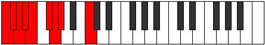

# Mode AFlatAeoladyllic

## Links

- [Documentation](index.md)
- [Scales Index](Scales.md)
- [Modes Index](Modes.md)
- [Chords Index](Chords.md)

## Scale

[Aeoladyllic](ScaleAeoladyllic.md)

## Mode

[AFlatAeoladyllic](ModeAFlatAeoladyllic.md)

## Tonic

Ab

## Signature

[CNaturalMajor]

## Perfection

 - 5 Perfect Notes

 - 3 Imperfect Notes

## Notes

- Ab
- C
- Db
- D (Imperfect)
- Eb (Imperfect)
- E (Imperfect)
- Gb
- G
- Ab

## Illustration

## Relative Modes

| Number | Mode | Tonic | Notes | Illustration |
|--------|------|-------|-------|--------------|
| [479](https://ianring.com/musictheory/scales/479) | [Kocryllic](ModeKocryllic.md) | C | C, C#, D, D#, E, F#, G, G#, C |  |
| [1991](https://ianring.com/musictheory/scales/1991) | [Phryptyllic](ModePhryptyllic.md) | F# | F#, G, G#, C, C#, D, D#, E, F# |  |
| [1991](https://ianring.com/musictheory/scales/1991) | [Phryptyllic](ModePhryptyllic.md) | Gb | Gb, G, Ab, C, Db, D, Eb, E, Gb |  |
| [2287](https://ianring.com/musictheory/scales/2287) | [Lodyllic](ModeLodyllic.md) | C# | C#, D, D#, E, F#, G, G#, C, C# |  |
| [2287](https://ianring.com/musictheory/scales/2287) | [Lodyllic](ModeLodyllic.md) | Db | Db, D, Eb, E, Gb, G, Ab, C, Db |  |
| [3043](https://ianring.com/musictheory/scales/3043) | [Ionayllic](ModeIonayllic.md) | G | G, G#, C, C#, D, D#, E, F#, G |  |
| [3191](https://ianring.com/musictheory/scales/3191) | [Bynyllic](ModeBynyllic.md) | D | D, D#, E, F#, G, G#, C, C#, D |  |
| [3569](https://ianring.com/musictheory/scales/3569) | [Aeoladyllic](ModeAeoladyllic.md) | G# | G#, C, C#, D, D#, E, F#, G, G# |  |
| [3569](https://ianring.com/musictheory/scales/3569) | [Aeoladyllic](ModeAeoladyllic.md) | Ab | Ab, C, Db, D, Eb, E, Gb, G, Ab |  |
| [3643](https://ianring.com/musictheory/scales/3643) | [Kydyllic](ModeKydyllic.md) | D# | D#, E, F#, G, G#, C, C#, D, D# |  |
| [3643](https://ianring.com/musictheory/scales/3643) | [Kydyllic](ModeKydyllic.md) | Eb | Eb, E, Gb, G, Ab, C, Db, D, Eb |  |
| [3869](https://ianring.com/musictheory/scales/3869) | [Bygyllic](ModeBygyllic.md) | E | E, F#, G, G#, C, C#, D, D#, E |  |

## Chords

### Ab

| Number | Root | Name | Notes | Illustration | Audio |
|--------|------|------|-------|--------------|-------|
| 261 | Ab | [AbMb5](ChordAFlatMajorFlatFifth.md) | Ab, C, Ebb |  | [midi](ChordAFlatMajorFlatFifthRootPosition.mid) [ogg](ChordAFlatMajorFlatFifthRootPosition.ogg) |
| 262 | Ab | [Absus4b5](ChordAFlatSuspendedFourthFlatFifth.md) | Ab, Db, Ebb |  | [midi](ChordAFlatSuspendedFourthFlatFifthRootPosition.mid) [ogg](ChordAFlatSuspendedFourthFlatFifthRootPosition.ogg) |
| 264 | Ab | [Ab5](ChordAFlatPowerChord.md) | Ab, Eb |  | [midi](ChordAFlatPowerChordRootPosition.mid) [ogg](ChordAFlatPowerChordRootPosition.ogg) |
| 265 | Ab | [AbM](ChordAFlatMajor.md) | Ab, C, Eb |  | [midi](ChordAFlatMajorRootPosition.mid) [ogg](ChordAFlatMajorRootPosition.ogg) |
| 266 | Ab | [Absus4](ChordAFlatSuspendedFourth.md) | Ab, Db, Eb |  | [midi](ChordAFlatSuspendedFourthRootPosition.mid) [ogg](ChordAFlatSuspendedFourthRootPosition.ogg) |
| 267 | Ab | [AbM(add11)](ChordAFlatMajorAddEleventh.md) | Ab, C, Eb, Db |  | [midi](ChordAFlatMajorAddEleventhRootPosition.mid) [ogg](ChordAFlatMajorAddEleventhRootPosition.ogg) |
| 267 | Ab | [AbM(add4)](ChordAFlatMajorAddFourth.md) | Ab, C, Db, Eb |  | [midi](ChordAFlatMajorAddFourthRootPosition.mid) [ogg](ChordAFlatMajorAddFourthRootPosition.ogg) |
| 268 | Ab | [Ablyd](ChordAFlatLydian.md) | Ab, D, Eb |  | [midi](ChordAFlatLydianRootPosition.mid) [ogg](ChordAFlatLydianRootPosition.ogg) |
| 269 | Ab | [AbM(add(#4))](ChordAFlatMajorAddSharpFourth.md) | Ab, C, D, Eb |  | [midi](ChordAFlatMajorAddSharpFourthRootPosition.mid) [ogg](ChordAFlatMajorAddSharpFourthRootPosition.ogg) |
| 273 | Ab | [Ab+](ChordAFlatAugmented.md) | Ab, C, E |  | [midi](ChordAFlatAugmentedRootPosition.mid) [ogg](ChordAFlatAugmentedRootPosition.ogg) |
| 273 | Ab | [Ab+7](ChordAFlatAugmentedAugmentedSeventh.md) | Ab, C, E, G# |  | [midi](ChordAFlatAugmentedAugmentedSeventhRootPosition.mid) [ogg](ChordAFlatAugmentedAugmentedSeventhRootPosition.ogg) |
| 274 | Ab | [Absus4#5](ChordAFlatSuspendedFourthSharpFifth.md) | Ab, Db, E |  | [midi](ChordAFlatSuspendedFourthSharpFifthRootPosition.mid) [ogg](ChordAFlatSuspendedFourthSharpFifthRootPosition.ogg) |
| 322 | Ab | [AbQ](ChordAFlatQuartal.md) | Ab, Db, Gb |  | [midi](ChordAFlatQuartalRootPosition.mid) [ogg](ChordAFlatQuartalRootPosition.ogg) |
| 325 | Ab | [Ab7b5](ChordAFlatDominantSeventhFlatFifth.md) | Ab, C, Ebb, Gb |  | [midi](ChordAFlatDominantSeventhFlatFifthRootPosition.mid) [ogg](ChordAFlatDominantSeventhFlatFifthRootPosition.ogg) |
| 329 | Ab | [Ab7](ChordAFlatDominantSeventh.md) | Ab, C, Eb, Gb |  | [midi](ChordAFlatDominantSeventhRootPosition.mid) [ogg](ChordAFlatDominantSeventhRootPosition.ogg) |
| 330 | Ab | [Ab7sus4](ChordAFlatDominantSeventhSuspendedFourth.md) | Ab, Db, Eb, Gb |  | [midi](ChordAFlatDominantSeventhSuspendedFourthRootPosition.mid) [ogg](ChordAFlatDominantSeventhSuspendedFourthRootPosition.ogg) |
| 331 | Ab | [Ab7add4](ChordAFlatDominantSeventhAddFourth.md) | Ab, C, Db, Eb, Gb |  | [midi](ChordAFlatDominantSeventhAddFourthRootPosition.mid) [ogg](ChordAFlatDominantSeventhAddFourthRootPosition.ogg) |
| 331 | Ab | [Ab7add11](ChordAFlatDominantSeventhAddEleventh.md) | Ab, C, Eb, Gb, Db |  | [midi](ChordAFlatDominantSeventhAddEleventhRootPosition.mid) [ogg](ChordAFlatDominantSeventhAddEleventhRootPosition.ogg) |
| 333 | Ab | [Ab7add(#4)](ChordAFlatDominantSeventhAddSharpFourth.md) | Ab, C, D, Eb, Gb |  | [midi](ChordAFlatDominantSeventhAddSharpFourthRootPosition.mid) [ogg](ChordAFlatDominantSeventhAddSharpFourthRootPosition.ogg) |
| 333 | Ab | [Ab7#11](ChordAFlatDominantSeventhSharpEleventh.md) | Ab, C, Eb, Gb, D |  | [midi](ChordAFlatDominantSeventhSharpEleventhRootPosition.mid) [ogg](ChordAFlatDominantSeventhSharpEleventhRootPosition.ogg) |
| 386 | Ab | [AbQ+](ChordAFlatQuartalAugmented.md) | Ab, Db, G |  | [midi](ChordAFlatQuartalAugmentedRootPosition.mid) [ogg](ChordAFlatQuartalAugmentedRootPosition.ogg) |
| 389 | Ab | [AbM7b5](ChordAFlatMajorSeventhFlatFifth.md) | Ab, C, Ebb, G |  | [midi](ChordAFlatMajorSeventhFlatFifthRootPosition.mid) [ogg](ChordAFlatMajorSeventhFlatFifthRootPosition.ogg) |
| 393 | Ab | [AbM7](ChordAFlatMajorSeventh.md) | Ab, C, Eb, G |  | [midi](ChordAFlatMajorSeventhRootPosition.mid) [ogg](ChordAFlatMajorSeventhRootPosition.ogg) |
| 394 | Ab | [AbM7(sus4)](ChordAFlatMajorSeventhSuspendedFourth.md) | Ab, Db, Eb, G |  | [midi](ChordAFlatMajorSeventhSuspendedFourthRootPosition.mid) [ogg](ChordAFlatMajorSeventhSuspendedFourthRootPosition.ogg) |
| 395 | Ab | [AbM7add4](ChordAFlatMajorSeventhAddFourth.md) | Ab, C, Db, Eb, G |  | [midi](ChordAFlatMajorSeventhAddFourthRootPosition.mid) [ogg](ChordAFlatMajorSeventhAddFourthRootPosition.ogg) |
| 395 | Ab | [AbM7add11](ChordAFlatMajorSeventhAddEleventh.md) | Ab, C, Eb, G, Db |  | [midi](ChordAFlatMajorSeventhAddEleventhRootPosition.mid) [ogg](ChordAFlatMajorSeventhAddEleventhRootPosition.ogg) |
| 396 | Ab | [Ablyd(M7)](ChordAFlatLydianMajorSeventh.md) | Ab, D, Eb, G |  | [midi](ChordAFlatLydianMajorSeventhRootPosition.mid) [ogg](ChordAFlatLydianMajorSeventhRootPosition.ogg) |
| 397 | Ab | [AbM7add(#11)](ChordAFlatMajorSeventhAddSharpEleventh.md) | Ab, C, Eb, G, D |  | [midi](ChordAFlatMajorSeventhAddSharpEleventhRootPosition.mid) [ogg](ChordAFlatMajorSeventhAddSharpEleventhRootPosition.ogg) |
| 397 | Ab | [AbM7add(#4)](ChordAFlatMajorSeventhAddSharpFourth.md) | Ab, C, D, Eb, G |  | [midi](ChordAFlatMajorSeventhAddSharpFourthRootPosition.mid) [ogg](ChordAFlatMajorSeventhAddSharpFourthRootPosition.ogg) |
| 401 | Ab | [Ab+(M7)](ChordAFlatAugmentedMajorSeventh.md) | Ab, C, E, G |  | [midi](ChordAFlatAugmentedMajorSeventhRootPosition.mid) [ogg](ChordAFlatAugmentedMajorSeventhRootPosition.ogg) |
| 402 | Ab | [AbM7(sus4)#5](ChordAFlatMajorSeventhSuspendedFourthSharpFifth.md) | Ab, Db, E, G |  | [midi](ChordAFlatMajorSeventhSuspendedFourthSharpFifthRootPosition.mid) [ogg](ChordAFlatMajorSeventhSuspendedFourthSharpFifthRootPosition.ogg) |

### C

| Number | Root | Name | Notes | Illustration | Audio |
|--------|------|------|-------|--------------|-------|
| 67 | C | [Cloc](ChordCNaturalLocrian.md) | C, Db, Gb |  | [midi](ChordCNaturalLocrianRootPosition.mid) [ogg](ChordCNaturalLocrianRootPosition.ogg) |
| 69 | C | [Csus2b5](ChordCNaturalSuspendedSecondFlatFifth.md) | C, D, Gb |  | [midi](ChordCNaturalSuspendedSecondFlatFifthRootPosition.mid) [ogg](ChordCNaturalSuspendedSecondFlatFifthRootPosition.ogg) |
| 73 | C | [Co](ChordCNaturalDiminished.md) | C, Eb, Gb |  | [midi](ChordCNaturalDiminishedRootPosition.mid) [ogg](ChordCNaturalDiminishedRootPosition.ogg) |
| 81 | C | [CMb5](ChordCNaturalMajorFlatFifth.md) | C, E, Gb |  | [midi](ChordCNaturalMajorFlatFifthRootPosition.mid) [ogg](ChordCNaturalMajorFlatFifthRootPosition.ogg) |
| 129 | C | [C5](ChordCNaturalPowerChord.md) | C, G |  | [midi](ChordCNaturalPowerChordRootPosition.mid) [ogg](ChordCNaturalPowerChordRootPosition.ogg) |
| 131 | C | [Cphryg](ChordCNaturalPhrygian.md) | C, Db, G |  | [midi](ChordCNaturalPhrygianRootPosition.mid) [ogg](ChordCNaturalPhrygianRootPosition.ogg) |
| 133 | C | [Csus2](ChordCNaturalSuspendedSecond.md) | C, D, G |  | [midi](ChordCNaturalSuspendedSecondRootPosition.mid) [ogg](ChordCNaturalSuspendedSecondRootPosition.ogg) |
| 137 | C | [Cm](ChordCNaturalMinor.md) | C, Eb, G |  | [midi](ChordCNaturalMinorRootPosition.mid) [ogg](ChordCNaturalMinorRootPosition.ogg) |
| 137 | C | [Cm(add(#9))](ChordCNaturalMinorAddSharpNinth.md) | C, Eb, G, D# |  | [midi](ChordCNaturalMinorAddSharpNinthRootPosition.mid) [ogg](ChordCNaturalMinorAddSharpNinthRootPosition.ogg) |
| 141 | C | [Cm(add9)](ChordCNaturalMinorAddNinth.md) | C, Eb, G, D |  | [midi](ChordCNaturalMinorAddNinthRootPosition.mid) [ogg](ChordCNaturalMinorAddNinthRootPosition.ogg) |
| 145 | C | [CM](ChordCNaturalMajor.md) | C, E, G |  | [midi](ChordCNaturalMajorRootPosition.mid) [ogg](ChordCNaturalMajorRootPosition.ogg) |
| 149 | C | [CM(add9)](ChordCNaturalMajorAddNinth.md) | C, E, G, D |  | [midi](ChordCNaturalMajorAddNinthRootPosition.mid) [ogg](ChordCNaturalMajorAddNinthRootPosition.ogg) |
| 153 | C | [CM(add(#9))](ChordCNaturalMajorAddSharpNinth.md) | C, E, G, D# |  | [midi](ChordCNaturalMajorAddSharpNinthRootPosition.mid) [ogg](ChordCNaturalMajorAddSharpNinthRootPosition.ogg) |
| 193 | C | [Clyd](ChordCNaturalLydian.md) | C, F#, G |  | [midi](ChordCNaturalLydianRootPosition.mid) [ogg](ChordCNaturalLydianRootPosition.ogg) |
| 201 | C | [Cm(add(#4))](ChordCNaturalMinorAddSharpFourth.md) | C, Eb, F#, G |  | [midi](ChordCNaturalMinorAddSharpFourthRootPosition.mid) [ogg](ChordCNaturalMinorAddSharpFourthRootPosition.ogg) |
| 209 | C | [CM(add(#4))](ChordCNaturalMajorAddSharpFourth.md) | C, E, F#, G |  | [midi](ChordCNaturalMajorAddSharpFourthRootPosition.mid) [ogg](ChordCNaturalMajorAddSharpFourthRootPosition.ogg) |
| 261 | C | [Csus2#5](ChordCNaturalSuspendedSecondSharpFifth.md) | C, D, G# |  | [midi](ChordCNaturalSuspendedSecondSharpFifthRootPosition.mid) [ogg](ChordCNaturalSuspendedSecondSharpFifthRootPosition.ogg) |
| 265 | C | [Cm#5](ChordCNaturalMinorSharpFifth.md) | C, Eb, Ab |  | [midi](ChordCNaturalMinorSharpFifthRootPosition.mid) [ogg](ChordCNaturalMinorSharpFifthRootPosition.ogg) |
| 273 | C | [C+](ChordCNaturalAugmented.md) | C, E, G# |  | [midi](ChordCNaturalAugmentedRootPosition.mid) [ogg](ChordCNaturalAugmentedRootPosition.ogg) |
| 273 | C | [C+7](ChordCNaturalAugmentedAugmentedSeventh.md) | C, E, G#, B# |  | [midi](ChordCNaturalAugmentedAugmentedSeventhRootPosition.mid) [ogg](ChordCNaturalAugmentedAugmentedSeventhRootPosition.ogg) |
| 325 | C | [Csus2b5add(#5)](ChordCNaturalSuspendedSecondFlatFifthAddSharpFifth.md) | C, D, Gb, G# |  | [midi](ChordCNaturalSuspendedSecondFlatFifthAddSharpFifthRootPosition.mid) [ogg](ChordCNaturalSuspendedSecondFlatFifthAddSharpFifthRootPosition.ogg) |

### Db

| Number | Root | Name | Notes | Illustration | Audio |
|--------|------|------|-------|--------------|-------|
| 74 | Db | [Dbsus2bb5](ChordDFlatSuspendedSecondDoubleFlatFifth.md) | Db, Eb, Gb |  | [midi](ChordDFlatSuspendedSecondDoubleFlatFifthRootPosition.mid) [ogg](ChordDFlatSuspendedSecondDoubleFlatFifthRootPosition.ogg) |
| 82 | Db | [Dbmbb5](ChordDFlatMinorDoubleFlatFifth.md) | Db, Fb, Gb |  | [midi](ChordDFlatMinorDoubleFlatFifthRootPosition.mid) [ogg](ChordDFlatMinorDoubleFlatFifthRootPosition.ogg) |
| 134 | Db | [Dbloc](ChordDFlatLocrian.md) | Db, Ebb, Abb |  | [midi](ChordDFlatLocrianRootPosition.mid) [ogg](ChordDFlatLocrianRootPosition.ogg) |
| 138 | Db | [Dbsus2b5](ChordDFlatSuspendedSecondFlatFifth.md) | Db, Eb, Abb |  | [midi](ChordDFlatSuspendedSecondFlatFifthRootPosition.mid) [ogg](ChordDFlatSuspendedSecondFlatFifthRootPosition.ogg) |
| 146 | Db | [Dbo](ChordDFlatDiminished.md) | Db, Fb, Abb |  | [midi](ChordDFlatDiminishedRootPosition.mid) [ogg](ChordDFlatDiminishedRootPosition.ogg) |
| 194 | Db | [Dbsus4b5](ChordDFlatSuspendedFourthFlatFifth.md) | Db, Gb, Abb |  | [midi](ChordDFlatSuspendedFourthFlatFifthRootPosition.mid) [ogg](ChordDFlatSuspendedFourthFlatFifthRootPosition.ogg) |
| 258 | Db | [Db5](ChordDFlatPowerChord.md) | Db, Ab |  | [midi](ChordDFlatPowerChordRootPosition.mid) [ogg](ChordDFlatPowerChordRootPosition.ogg) |
| 262 | Db | [Dbphryg](ChordDFlatPhrygian.md) | Db, Ebb, Ab |  | [midi](ChordDFlatPhrygianRootPosition.mid) [ogg](ChordDFlatPhrygianRootPosition.ogg) |
| 266 | Db | [Dbsus2](ChordDFlatSuspendedSecond.md) | Db, Eb, Ab |  | [midi](ChordDFlatSuspendedSecondRootPosition.mid) [ogg](ChordDFlatSuspendedSecondRootPosition.ogg) |
| 274 | Db | [Dbm](ChordDFlatMinor.md) | Db, Fb, Ab |  | [midi](ChordDFlatMinorRootPosition.mid) [ogg](ChordDFlatMinorRootPosition.ogg) |
| 274 | Db | [Dbm(add(#9))](ChordDFlatMinorAddSharpNinth.md) | Db, Fb, Ab, E |  | [midi](ChordDFlatMinorAddSharpNinthRootPosition.mid) [ogg](ChordDFlatMinorAddSharpNinthRootPosition.ogg) |
| 282 | Db | [Dbm(add9)](ChordDFlatMinorAddNinth.md) | Db, Fb, Ab, Eb |  | [midi](ChordDFlatMinorAddNinthRootPosition.mid) [ogg](ChordDFlatMinorAddNinthRootPosition.ogg) |
| 322 | Db | [Dbsus4](ChordDFlatSuspendedFourth.md) | Db, Gb, Ab |  | [midi](ChordDFlatSuspendedFourthRootPosition.mid) [ogg](ChordDFlatSuspendedFourthRootPosition.ogg) |
| 338 | Db | [Dbm(add11)](ChordDFlatMinorAddEleventh.md) | Db, Fb, Ab, Gb |  | [midi](ChordDFlatMinorAddEleventhRootPosition.mid) [ogg](ChordDFlatMinorAddEleventhRootPosition.ogg) |
| 338 | Db | [Dbm(add4)](ChordDFlatMinorAddFourth.md) | Db, Fb, Gb, Ab |  | [midi](ChordDFlatMinorAddFourthRootPosition.mid) [ogg](ChordDFlatMinorAddFourthRootPosition.ogg) |
| 386 | Db | [Dblyd](ChordDFlatLydian.md) | Db, G, Ab |  | [midi](ChordDFlatLydianRootPosition.mid) [ogg](ChordDFlatLydianRootPosition.ogg) |
| 402 | Db | [Dbm(add(#4))](ChordDFlatMinorAddSharpFourth.md) | Db, Fb, G, Ab |  | [midi](ChordDFlatMinorAddSharpFourthRootPosition.mid) [ogg](ChordDFlatMinorAddSharpFourthRootPosition.ogg) |
| 67 | Db | [DbQ+](ChordDFlatQuartalAugmented.md) | Db, Gb, C |  | [midi](ChordDFlatQuartalAugmentedRootPosition.mid) [ogg](ChordDFlatQuartalAugmentedRootPosition.ogg) |
| 147 | Db | [DboM7](ChordDFlatDiminishedMajorSeventh.md) | Db, Fb, Abb, C |  | [midi](ChordDFlatDiminishedMajorSeventhRootPosition.mid) [ogg](ChordDFlatDiminishedMajorSeventhRootPosition.ogg) |
| 263 | Db | [Dbphryg+7](ChordDFlatPhrygianAddSeventh.md) | Db, Ebb, Ab, C |  | [midi](ChordDFlatPhrygianAddSeventhRootPosition.mid) [ogg](ChordDFlatPhrygianAddSeventhRootPosition.ogg) |
| 267 | Db | [DbM7(sus2)](ChordDFlatMajorSeventhSuspendedSecond.md) | Db, Eb, Ab, C |  | [midi](ChordDFlatMajorSeventhSuspendedSecondRootPosition.mid) [ogg](ChordDFlatMajorSeventhSuspendedSecondRootPosition.ogg) |
| 267 | Db | [DbM9sus2](ChordDFlatMajorNinthSuspendedSecond.md) | Db, Eb, Ab, C, Eb |  | [midi](ChordDFlatMajorNinthSuspendedSecondRootPosition.mid) [ogg](ChordDFlatMajorNinthSuspendedSecondRootPosition.ogg) |
| 275 | Db | [Dbm(M7)](ChordDFlatMinorMajorSeventh.md) | Db, Fb, Ab, C |  | [midi](ChordDFlatMinorMajorSeventhRootPosition.mid) [ogg](ChordDFlatMinorMajorSeventhRootPosition.ogg) |
| 283 | Db | [Dbm(M9)](ChordDFlatMinorMajorNinth.md) | Db, Fb, Ab, C, Eb |  | [midi](ChordDFlatMinorMajorNinthRootPosition.mid) [ogg](ChordDFlatMinorMajorNinthRootPosition.ogg) |
| 323 | Db | [DbM7(sus4)](ChordDFlatMajorSeventhSuspendedFourth.md) | Db, Gb, Ab, C |  | [midi](ChordDFlatMajorSeventhSuspendedFourthRootPosition.mid) [ogg](ChordDFlatMajorSeventhSuspendedFourthRootPosition.ogg) |
| 331 | Db | [DbM9sus4](ChordDFlatMajorNinthSuspendedFourth.md) | Db, Gb, Ab, C, Eb |  | [midi](ChordDFlatMajorNinthSuspendedFourthRootPosition.mid) [ogg](ChordDFlatMajorNinthSuspendedFourthRootPosition.ogg) |
| 339 | Db | [Dbm(M7)add11](ChordDFlatMinorMajorSeventhAddEleventh.md) | Db, Fb, Ab, C, Gb |  | [midi](ChordDFlatMinorMajorSeventhAddEleventhRootPosition.mid) [ogg](ChordDFlatMinorMajorSeventhAddEleventhRootPosition.ogg) |
| 347 | Db | [Dbm(M11)](ChordDFlatMinorMajorEleventh.md) | Db, Fb, Ab, C, Eb, Gb |  | [midi](ChordDFlatMinorMajorEleventhRootPosition.mid) [ogg](ChordDFlatMinorMajorEleventhRootPosition.ogg) |
| 387 | Db | [Dblyd(M7)](ChordDFlatLydianMajorSeventh.md) | Db, G, Ab, C |  | [midi](ChordDFlatLydianMajorSeventhRootPosition.mid) [ogg](ChordDFlatLydianMajorSeventhRootPosition.ogg) |

### D

| Number | Root | Name | Notes | Illustration | Audio |
|--------|------|------|-------|--------------|-------|
| 148 | D | [Dsus2bb5](ChordDNaturalSuspendedSecondDoubleFlatFifth.md) | D, E, G |  | [midi](ChordDNaturalSuspendedSecondDoubleFlatFifthRootPosition.mid) [ogg](ChordDNaturalSuspendedSecondDoubleFlatFifthRootPosition.ogg) |
| 268 | D | [Dloc](ChordDNaturalLocrian.md) | D, Eb, Ab |  | [midi](ChordDNaturalLocrianRootPosition.mid) [ogg](ChordDNaturalLocrianRootPosition.ogg) |
| 276 | D | [Dsus2b5](ChordDNaturalSuspendedSecondFlatFifth.md) | D, E, Ab |  | [midi](ChordDNaturalSuspendedSecondFlatFifthRootPosition.mid) [ogg](ChordDNaturalSuspendedSecondFlatFifthRootPosition.ogg) |
| 324 | D | [DMb5](ChordDNaturalMajorFlatFifth.md) | D, F#, Ab |  | [midi](ChordDNaturalMajorFlatFifthRootPosition.mid) [ogg](ChordDNaturalMajorFlatFifthRootPosition.ogg) |
| 388 | D | [Dsus4b5](ChordDNaturalSuspendedFourthFlatFifth.md) | D, G, Ab |  | [midi](ChordDNaturalSuspendedFourthFlatFifthRootPosition.mid) [ogg](ChordDNaturalSuspendedFourthFlatFifthRootPosition.ogg) |
| 133 | D | [DQ](ChordDNaturalQuartal.md) | D, G, C |  | [midi](ChordDNaturalQuartalRootPosition.mid) [ogg](ChordDNaturalQuartalRootPosition.ogg) |
| 325 | D | [D7b5](ChordDNaturalDominantSeventhFlatFifth.md) | D, F#, Ab, C |  | [midi](ChordDNaturalDominantSeventhFlatFifthRootPosition.mid) [ogg](ChordDNaturalDominantSeventhFlatFifthRootPosition.ogg) |
| 333 | D | [D7b5b9](ChordDNaturalDominantSeventhFlatFifthFlatNinth.md) | D, F#, Ab, C, Eb |  | [midi](ChordDNaturalDominantSeventhFlatFifthFlatNinthRootPosition.mid) [ogg](ChordDNaturalDominantSeventhFlatFifthFlatNinthRootPosition.ogg) |
| 134 | D | [DQ+](ChordDNaturalQuartalAugmented.md) | D, G, C# |  | [midi](ChordDNaturalQuartalAugmentedRootPosition.mid) [ogg](ChordDNaturalQuartalAugmentedRootPosition.ogg) |
| 326 | D | [DM7b5](ChordDNaturalMajorSeventhFlatFifth.md) | D, F#, Ab, C# |  | [midi](ChordDNaturalMajorSeventhFlatFifthRootPosition.mid) [ogg](ChordDNaturalMajorSeventhFlatFifthRootPosition.ogg) |

### Eb

| Number | Root | Name | Notes | Illustration | Audio |
|--------|------|------|-------|--------------|-------|
| 328 | Eb | [Ebmbb5](ChordEFlatMinorDoubleFlatFifth.md) | Eb, Gb, Ab |  | [midi](ChordEFlatMinorDoubleFlatFifthRootPosition.mid) [ogg](ChordEFlatMinorDoubleFlatFifthRootPosition.ogg) |
| 137 | Eb | [EbM##5](ChordEFlatMajorDoubleSharpFifth.md) | Eb, G, C |  | [midi](ChordEFlatMajorDoubleSharpFifthRootPosition.mid) [ogg](ChordEFlatMajorDoubleSharpFifthRootPosition.ogg) |
| 265 | Eb | [Ebsus4##5](ChordEFlatSuspendedFourthDoubleSharpFifth.md) | Eb, Ab, C |  | [midi](ChordEFlatSuspendedFourthDoubleSharpFifthRootPosition.mid) [ogg](ChordEFlatSuspendedFourthDoubleSharpFifthRootPosition.ogg) |
| 266 | Eb | [EbQ](ChordEFlatQuartal.md) | Eb, Ab, Db |  | [midi](ChordEFlatQuartalRootPosition.mid) [ogg](ChordEFlatQuartalRootPosition.ogg) |
| 330 | Eb | [Ebm7bb5](ChordEFlatMinorSeventhDoubleFlatFifth.md) | Eb, Gb, Ab, Db |  | [midi](ChordEFlatMinorSeventhDoubleFlatFifthRootPosition.mid) [ogg](ChordEFlatMinorSeventhDoubleFlatFifthRootPosition.ogg) |
| 268 | Eb | [EbQ+](ChordEFlatQuartalAugmented.md) | Eb, Ab, D |  | [midi](ChordEFlatQuartalAugmentedRootPosition.mid) [ogg](ChordEFlatQuartalAugmentedRootPosition.ogg) |
| 141 | Eb | [EbM7##5](ChordEFlatMajorSeventhDoubleSharpFifth.md) | Eb, G, C, D |  | [midi](ChordEFlatMajorSeventhDoubleSharpFifthRootPosition.mid) [ogg](ChordEFlatMajorSeventhDoubleSharpFifthRootPosition.ogg) |
| 269 | Eb | [EbM7(sus4)##5](ChordEFlatMajorSeventhSuspendedFourthDoubleSharpFifth.md) | Eb, Ab, C, D |  | [midi](ChordEFlatMajorSeventhSuspendedFourthDoubleSharpFifthRootPosition.mid) [ogg](ChordEFlatMajorSeventhSuspendedFourthDoubleSharpFifthRootPosition.ogg) |

### E

| Number | Root | Name | Notes | Illustration | Audio |
|--------|------|------|-------|--------------|-------|
| 81 | E | [Esus2#5](ChordENaturalSuspendedSecondSharpFifth.md) | E, F#, B# |  | [midi](ChordENaturalSuspendedSecondSharpFifthRootPosition.mid) [ogg](ChordENaturalSuspendedSecondSharpFifthRootPosition.ogg) |
| 145 | E | [Em#5](ChordENaturalMinorSharpFifth.md) | E, G, C |  | [midi](ChordENaturalMinorSharpFifthRootPosition.mid) [ogg](ChordENaturalMinorSharpFifthRootPosition.ogg) |
| 273 | E | [E+](ChordENaturalAugmented.md) | E, G#, B# |  | [midi](ChordENaturalAugmentedRootPosition.mid) [ogg](ChordENaturalAugmentedRootPosition.ogg) |
| 273 | E | [E+7](ChordENaturalAugmentedAugmentedSeventh.md) | E, G#, B#, D## |  | [midi](ChordENaturalAugmentedAugmentedSeventhRootPosition.mid) [ogg](ChordENaturalAugmentedAugmentedSeventhRootPosition.ogg) |
| 274 | E | [EM##5](ChordENaturalMajorDoubleSharpFifth.md) | E, G#, C# |  | [midi](ChordENaturalMajorDoubleSharpFifthRootPosition.mid) [ogg](ChordENaturalMajorDoubleSharpFifthRootPosition.ogg) |
| 149 | E | [Em7#5](ChordENaturalMinorSeventhSharpFifth.md) | E, G, B#, D |  | [midi](ChordENaturalMinorSeventhSharpFifthRootPosition.mid) [ogg](ChordENaturalMinorSeventhSharpFifthRootPosition.ogg) |
| 281 | E | [E+(M7)](ChordENaturalAugmentedMajorSeventh.md) | E, G#, B#, D# |  | [midi](ChordENaturalAugmentedMajorSeventhRootPosition.mid) [ogg](ChordENaturalAugmentedMajorSeventhRootPosition.ogg) |
| 282 | E | [EM7##5](ChordENaturalMajorSeventhDoubleSharpFifth.md) | E, G#, C#, D# |  | [midi](ChordENaturalMajorSeventhDoubleSharpFifthRootPosition.mid) [ogg](ChordENaturalMajorSeventhDoubleSharpFifthRootPosition.ogg) |

### Gb

| Number | Root | Name | Notes | Illustration | Audio |
|--------|------|------|-------|--------------|-------|
| 193 | Gb | [Gbloc](ChordGFlatLocrian.md) | Gb, Abb, Dbb |  | [midi](ChordGFlatLocrianRootPosition.mid) [ogg](ChordGFlatLocrianRootPosition.ogg) |
| 321 | Gb | [Gbsus2b5](ChordGFlatSuspendedSecondFlatFifth.md) | Gb, Ab, Dbb |  | [midi](ChordGFlatSuspendedSecondFlatFifthRootPosition.mid) [ogg](ChordGFlatSuspendedSecondFlatFifthRootPosition.ogg) |
| 66 | Gb | [Gb5](ChordGFlatPowerChord.md) | Gb, Db |  | [midi](ChordGFlatPowerChordRootPosition.mid) [ogg](ChordGFlatPowerChordRootPosition.ogg) |
| 194 | Gb | [Gbphryg](ChordGFlatPhrygian.md) | Gb, Abb, Db |  | [midi](ChordGFlatPhrygianRootPosition.mid) [ogg](ChordGFlatPhrygianRootPosition.ogg) |
| 322 | Gb | [Gbsus2](ChordGFlatSuspendedSecond.md) | Gb, Ab, Db |  | [midi](ChordGFlatSuspendedSecondRootPosition.mid) [ogg](ChordGFlatSuspendedSecondRootPosition.ogg) |
| 67 | Gb | [Gblyd](ChordGFlatLydian.md) | Gb, C, Db |  | [midi](ChordGFlatLydianRootPosition.mid) [ogg](ChordGFlatLydianRootPosition.ogg) |
| 324 | Gb | [Gbsus2#5](ChordGFlatSuspendedSecondSharpFifth.md) | Gb, Ab, D |  | [midi](ChordGFlatSuspendedSecondSharpFifthRootPosition.mid) [ogg](ChordGFlatSuspendedSecondSharpFifthRootPosition.ogg) |
| 325 | Gb | [Gbsus2b5add(#5)](ChordGFlatSuspendedSecondFlatFifthAddSharpFifth.md) | Gb, Ab, Dbb, D |  | [midi](ChordGFlatSuspendedSecondFlatFifthAddSharpFifthRootPosition.mid) [ogg](ChordGFlatSuspendedSecondFlatFifthAddSharpFifthRootPosition.ogg) |
| 329 | Gb | [GbM6sus2b5](ChordGFlatMajorSixthSuspendedSecondFlatFifth.md) | Gb, Ab, Dbb, Eb |  | [midi](ChordGFlatMajorSixthSuspendedSecondFlatFifthRootPosition.mid) [ogg](ChordGFlatMajorSixthSuspendedSecondFlatFifthRootPosition.ogg) |
| 330 | Gb | [GbM6sus2](ChordGFlatMajorSixthSuspendedSecond.md) | Gb, Ab, Db, Eb |  | [midi](ChordGFlatMajorSixthSuspendedSecondRootPosition.mid) [ogg](ChordGFlatMajorSixthSuspendedSecondRootPosition.ogg) |
| 330 | Gb | [Gb7sus2b5](ChordGFlatDominantSeventhSuspendedSecondFlatFifth.md) | Gb, Ab, Db, Fbb |  | [midi](ChordGFlatDominantSeventhSuspendedSecondFlatFifthRootPosition.mid) [ogg](ChordGFlatDominantSeventhSuspendedSecondFlatFifthRootPosition.ogg) |
| 338 | Gb | [Gb7sus2](ChordGFlatDominantSeventhSuspendedSecond.md) | Gb, Ab, Db, Fb |  | [midi](ChordGFlatDominantSeventhSuspendedSecondRootPosition.mid) [ogg](ChordGFlatDominantSeventhSuspendedSecondRootPosition.ogg) |
| 338 | Gb | [Gb9sus2](ChordGFlatDominantNinthSuspendedSecond.md) | Gb, Ab, Db, Fb, Ab |  | [midi](ChordGFlatDominantNinthSuspendedSecondRootPosition.mid) [ogg](ChordGFlatDominantNinthSuspendedSecondRootPosition.ogg) |

### G

| Number | Root | Name | Notes | Illustration | Audio |
|--------|------|------|-------|--------------|-------|
| 386 | G | [Gloc](ChordGNaturalLocrian.md) | G, Ab, Db |  | [midi](ChordGNaturalLocrianRootPosition.mid) [ogg](ChordGNaturalLocrianRootPosition.ogg) |
| 131 | G | [Gsus4b5](ChordGNaturalSuspendedFourthFlatFifth.md) | G, C, Db |  | [midi](ChordGNaturalSuspendedFourthFlatFifthRootPosition.mid) [ogg](ChordGNaturalSuspendedFourthFlatFifthRootPosition.ogg) |
| 132 | G | [G5](ChordGNaturalPowerChord.md) | G, D |  | [midi](ChordGNaturalPowerChordRootPosition.mid) [ogg](ChordGNaturalPowerChordRootPosition.ogg) |
| 388 | G | [Gphryg](ChordGNaturalPhrygian.md) | G, Ab, D |  | [midi](ChordGNaturalPhrygianRootPosition.mid) [ogg](ChordGNaturalPhrygianRootPosition.ogg) |
| 133 | G | [Gsus4](ChordGNaturalSuspendedFourth.md) | G, C, D |  | [midi](ChordGNaturalSuspendedFourthRootPosition.mid) [ogg](ChordGNaturalSuspendedFourthRootPosition.ogg) |
| 134 | G | [Glyd](ChordGNaturalLydian.md) | G, C#, D |  | [midi](ChordGNaturalLydianRootPosition.mid) [ogg](ChordGNaturalLydianRootPosition.ogg) |
| 137 | G | [Gsus4#5](ChordGNaturalSuspendedFourthSharpFifth.md) | G, C, D# |  | [midi](ChordGNaturalSuspendedFourthSharpFifthRootPosition.mid) [ogg](ChordGNaturalSuspendedFourthSharpFifthRootPosition.ogg) |
| 145 | G | [Gsus4##5](ChordGNaturalSuspendedFourthDoubleSharpFifth.md) | G, C, E |  | [midi](ChordGNaturalSuspendedFourthDoubleSharpFifthRootPosition.mid) [ogg](ChordGNaturalSuspendedFourthDoubleSharpFifthRootPosition.ogg) |
| 149 | G | [GM6sus4](ChordGNaturalMajorSixthSuspendedFourth.md) | G, C, D, E |  | [midi](ChordGNaturalMajorSixthSuspendedFourthRootPosition.mid) [ogg](ChordGNaturalMajorSixthSuspendedFourthRootPosition.ogg) |
| 193 | G | [GQ+](ChordGNaturalQuartalAugmented.md) | G, C, F# |  | [midi](ChordGNaturalQuartalAugmentedRootPosition.mid) [ogg](ChordGNaturalQuartalAugmentedRootPosition.ogg) |
| 452 | G | [Gphryg+7](ChordGNaturalPhrygianAddSeventh.md) | G, Ab, D, F# |  | [midi](ChordGNaturalPhrygianAddSeventhRootPosition.mid) [ogg](ChordGNaturalPhrygianAddSeventhRootPosition.ogg) |
| 197 | G | [GM7(sus4)](ChordGNaturalMajorSeventhSuspendedFourth.md) | G, C, D, F# |  | [midi](ChordGNaturalMajorSeventhSuspendedFourthRootPosition.mid) [ogg](ChordGNaturalMajorSeventhSuspendedFourthRootPosition.ogg) |
| 198 | G | [Glyd(M7)](ChordGNaturalLydianMajorSeventh.md) | G, C#, D, F# |  | [midi](ChordGNaturalLydianMajorSeventhRootPosition.mid) [ogg](ChordGNaturalLydianMajorSeventhRootPosition.ogg) |
| 201 | G | [GM7(sus4)#5](ChordGNaturalMajorSeventhSuspendedFourthSharpFifth.md) | G, C, D#, F# |  | [midi](ChordGNaturalMajorSeventhSuspendedFourthSharpFifthRootPosition.mid) [ogg](ChordGNaturalMajorSeventhSuspendedFourthSharpFifthRootPosition.ogg) |
| 209 | G | [GM7(sus4)##5](ChordGNaturalMajorSeventhSuspendedFourthDoubleSharpFifth.md) | G, C, E, F# |  | [midi](ChordGNaturalMajorSeventhSuspendedFourthDoubleSharpFifthRootPosition.mid) [ogg](ChordGNaturalMajorSeventhSuspendedFourthDoubleSharpFifthRootPosition.ogg) |

