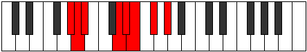

# Mode AFlatAeolagian

## Links

- [Documentation](README.md)
- [Scales Index](Scales.md)
- [Modes Index](Modes.md)
- [Chords Index](Chords.md)

## Scale

[Thacrian](ScaleThacrian.md)

## Mode

[AFlatAeolagian](ModeAFlatAeolagian.md)

## Tonic

Ab

## Signature

[CNaturalMajor]

## Transposition

1, 1, 4, 1, 1, 2, 2

## Chord Pattern

iv⁰b3, v⁰, v⁰, VIb5

## Perfection

 - 4 Perfect Notes

 - 3 Imperfect Notes

## Notes

- Ab
- Bbb
- Cbb (Imperfect)
- D
- Eb
- Fb (Imperfect)
- Gb (Imperfect)
- Ab

## Illustration

## Diagram

| Circle of Fifth | Chromatic Circle |
|-----------------|------------------|
|  |  |
## Relative Modes

| Number | Mode | Tonic | Notes | Illustration |
|--------|------|-------|-------|--------------|
| [1479](https://ianring.com/musictheory/scales/1479) | [Aeolagian](ModeAeolagian.md) | G# | G#, A, Bb, C##, D#, E, F#, G# |  |
| [1479](https://ianring.com/musictheory/scales/1479) | [Aeolagian](ModeAeolagian.md) | Ab | Ab, Bbb, Cbb, D, Eb, Fb, Gb, Ab |  |
| [2787](https://ianring.com/musictheory/scales/2787) | [Zyrian](ModeZyrian.md) | A | A, Bb, C##, D#, E, F#, G#, A |  |
| [3441](https://ianring.com/musictheory/scales/3441) | [Thacrian](ModeThacrian.md) | A# | A#, B###, C###, D##, E##, F###, G##, A# |  |
| [3441](https://ianring.com/musictheory/scales/3441) | [Thacrian](ModeThacrian.md) | Bb | Bb, C##, D#, E, F#, G#, A, Bb |  |
| [471](https://ianring.com/musictheory/scales/471) | [Dodian](ModeDodian.md) | D | D, Eb, Fb, Gb, Ab, Bbb, Cbb, D |  |
| [2283](https://ianring.com/musictheory/scales/2283) | [Aeolyptian](ModeAeolyptian.md) | D# | D#, E, F#, G#, A, Bb, C##, D# |  |
| [2283](https://ianring.com/musictheory/scales/2283) | [Aeolyptian](ModeAeolyptian.md) | Eb | Eb, Fb, Gb, Ab, Bbb, Cbb, D, Eb |  |
| [3189](https://ianring.com/musictheory/scales/3189) | [Aeolonian](ModeAeolonian.md) | E | E, F#, G#, A, Bb, C##, D#, E |  |
| [1821](https://ianring.com/musictheory/scales/1821) | [Aeradian](ModeAeradian.md) | F# | F#, G#, A, Bb, C##, D#, E, F# |  |
| [1821](https://ianring.com/musictheory/scales/1821) | [Aeradian](ModeAeradian.md) | Gb | Gb, Ab, Bbb, Cbb, D, Eb, Fb, Gb |  |
## Relative Brightness

| Number | Mode | Tonic | Notes | Circle Of Fifth | Chromatic Circle |
|--------|------|-------|-------|-----------------|------------------|
| [1479](https://ianring.com/musictheory/scales/1479) | [Aeolagian](ModeAeolagian.md) | G# | G#, A, Bb, C##, D#, E, F#, G# |  |  |
| [1479](https://ianring.com/musictheory/scales/1479) | [Aeolagian](ModeAeolagian.md) | Ab | Ab, Bbb, Cbb, D, Eb, Fb, Gb, Ab |  |  |
| [2787](https://ianring.com/musictheory/scales/2787) | [Zyrian](ModeZyrian.md) | A | A, Bb, C##, D#, E, F#, G#, A |  |  |
| [3441](https://ianring.com/musictheory/scales/3441) | [Thacrian](ModeThacrian.md) | A# | A#, B###, C###, D##, E##, F###, G##, A# |  |  |
| [3441](https://ianring.com/musictheory/scales/3441) | [Thacrian](ModeThacrian.md) | Bb | Bb, C##, D#, E, F#, G#, A, Bb |  |  |
| [471](https://ianring.com/musictheory/scales/471) | [Dodian](ModeDodian.md) | D | D, Eb, Fb, Gb, Ab, Bbb, Cbb, D |  |  |
| [2283](https://ianring.com/musictheory/scales/2283) | [Aeolyptian](ModeAeolyptian.md) | D# | D#, E, F#, G#, A, Bb, C##, D# |  |  |
| [2283](https://ianring.com/musictheory/scales/2283) | [Aeolyptian](ModeAeolyptian.md) | Eb | Eb, Fb, Gb, Ab, Bbb, Cbb, D, Eb |  |  |
| [3189](https://ianring.com/musictheory/scales/3189) | [Aeolonian](ModeAeolonian.md) | E | E, F#, G#, A, Bb, C##, D#, E |  |  |
| [1821](https://ianring.com/musictheory/scales/1821) | [Aeradian](ModeAeradian.md) | F# | F#, G#, A, Bb, C##, D#, E, F# |  |  |
| [1821](https://ianring.com/musictheory/scales/1821) | [Aeradian](ModeAeradian.md) | Gb | Gb, Ab, Bbb, Cbb, D, Eb, Fb, Gb |  |  |

## Chords

### Ab

| Number | Root | Name | Notes | Illustration | Audio |
|--------|------|------|-------|--------------|-------|
| 772 | Ab | [G#loc](ChordGSharpLocrian.md) | G#, A, D |  | [midi](ChordGSharpLocrianRootPosition.mid) |
| 772 | Ab | [Abloc](ChordAFlatLocrian.md) | Ab, Bbb, Ebb |  | [midi](ChordAFlatLocrianRootPosition.mid) |
| 1284 | Ab | [G#](ChordGSharpDiminishedFlatThird.md) | G#, Bb, D |  | [midi](ChordGSharpDiminishedFlatThirdRootPosition.mid) |
| 1284 | Ab | [G#sus2b5](ChordGSharpSuspendedSecondFlatFifth.md) | G#, A#, D |  | [midi](ChordGSharpSuspendedSecondFlatFifthRootPosition.mid) |
| 1284 | Ab | [Ab](ChordAFlatDiminishedFlatThird.md) | Ab, Cbb, Ebb |  | [midi](ChordAFlatDiminishedFlatThirdRootPosition.mid) |
| 1284 | Ab | [Absus2b5](ChordAFlatSuspendedSecondFlatFifth.md) | Ab, Bb, Ebb |  | [midi](ChordAFlatSuspendedSecondFlatFifthRootPosition.mid) |
| 264 | Ab | [G#5](ChordGSharpPowerChord.md) | G#, D# |  | [midi](ChordGSharpPowerChordRootPosition.mid) |
| 264 | Ab | [Ab5](ChordAFlatPowerChord.md) | Ab, Eb |  | [midi](ChordAFlatPowerChordRootPosition.mid) |
| 776 | Ab | [G#phryg](ChordGSharpPhrygian.md) | G#, A, D# |  | [midi](ChordGSharpPhrygianRootPosition.mid) |
| 776 | Ab | [Abphryg](ChordAFlatPhrygian.md) | Ab, Bbb, Eb |  | [midi](ChordAFlatPhrygianRootPosition.mid) |
| 1288 | Ab | [G#sus2](ChordGSharpSuspendedSecond.md) | G#, A#, D# |  | [midi](ChordGSharpSuspendedSecondRootPosition.mid) |
| 1288 | Ab | [Absus2](ChordAFlatSuspendedSecond.md) | Ab, Bb, Eb |  | [midi](ChordAFlatSuspendedSecondRootPosition.mid) |
| 268 | Ab | [G#lyd](ChordGSharpLydian.md) | G#, C##, D# |  | [midi](ChordGSharpLydianRootPosition.mid) |
| 268 | Ab | [Ablyd](ChordAFlatLydian.md) | Ab, D, Eb |  | [midi](ChordAFlatLydianRootPosition.mid) |
| 1296 | Ab | [G#sus2#5](ChordGSharpSuspendedSecondSharpFifth.md) | G#, A#, D## |  | [midi](ChordGSharpSuspendedSecondSharpFifthRootPosition.mid) |
| 1296 | Ab | [Absus2#5](ChordAFlatSuspendedSecondSharpFifth.md) | Ab, Bb, E |  | [midi](ChordAFlatSuspendedSecondSharpFifthRootPosition.mid) |
| 1300 | Ab | [G#sus2b5add(#5)](ChordGSharpSuspendedSecondFlatFifthAddSharpFifth.md) | G#, A#, D, D## |  | [midi](ChordGSharpSuspendedSecondFlatFifthAddSharpFifthRootPosition.mid) |
| 1300 | Ab | [Absus2b5add(#5)](ChordAFlatSuspendedSecondFlatFifthAddSharpFifth.md) | Ab, Bb, Ebb, E |  | [midi](ChordAFlatSuspendedSecondFlatFifthAddSharpFifthRootPosition.mid) |
| 1352 | Ab | [G#7sus2](ChordGSharpDominantSeventhSuspendedSecond.md) | G#, A#, D#, F# |  | [midi](ChordGSharpDominantSeventhSuspendedSecondRootPosition.mid) |
| 1352 | Ab | [G#9sus2](ChordGSharpDominantNinthSuspendedSecond.md) | G#, A#, D#, F#, A# |  | [midi](ChordGSharpDominantNinthSuspendedSecondRootPosition.mid) |
| 1352 | Ab | [Ab7sus2](ChordAFlatDominantSeventhSuspendedSecond.md) | Ab, Bb, Eb, Gb |  | [midi](ChordAFlatDominantSeventhSuspendedSecondRootPosition.mid) |
| 1352 | Ab | [Ab9sus2](ChordAFlatDominantNinthSuspendedSecond.md) | Ab, Bb, Eb, Gb, Bb |  | [midi](ChordAFlatDominantNinthSuspendedSecondRootPosition.mid) |

### Bbb

| Number | Root | Name | Notes | Illustration | Audio |
|--------|------|------|-------|--------------|-------|
| 1544 | Bbb | [Aloc](ChordANaturalLocrian.md) | A, Bb, Eb |  | [midi](ChordANaturalLocrianRootPosition.mid) |
| 524 | Bbb | [Asus4b5](ChordANaturalSuspendedFourthFlatFifth.md) | A, D, Eb |  | [midi](ChordANaturalSuspendedFourthFlatFifthRootPosition.mid) |
| 528 | Bbb | [A5](ChordANaturalPowerChord.md) | A, E |  | [midi](ChordANaturalPowerChordRootPosition.mid) |
| 1552 | Bbb | [Aphryg](ChordANaturalPhrygian.md) | A, Bb, E |  | [midi](ChordANaturalPhrygianRootPosition.mid) |
| 532 | Bbb | [Asus4](ChordANaturalSuspendedFourth.md) | A, D, E |  | [midi](ChordANaturalSuspendedFourthRootPosition.mid) |
| 536 | Bbb | [Alyd](ChordANaturalLydian.md) | A, D#, E |  | [midi](ChordANaturalLydianRootPosition.mid) |
| 580 | Bbb | [Asus4##5](ChordANaturalSuspendedFourthDoubleSharpFifth.md) | A, D, F# |  | [midi](ChordANaturalSuspendedFourthDoubleSharpFifthRootPosition.mid) |
| 596 | Bbb | [AM6sus4](ChordANaturalMajorSixthSuspendedFourth.md) | A, D, E, F# |  | [midi](ChordANaturalMajorSixthSuspendedFourthRootPosition.mid) |
| 772 | Bbb | [AQ+](ChordANaturalQuartalAugmented.md) | A, D, G# |  | [midi](ChordANaturalQuartalAugmentedRootPosition.mid) |
| 1808 | Bbb | [Aphryg+7](ChordANaturalPhrygianAddSeventh.md) | A, Bb, E, G# |  | [midi](ChordANaturalPhrygianAddSeventhRootPosition.mid) |
| 788 | Bbb | [AM7(sus4)](ChordANaturalMajorSeventhSuspendedFourth.md) | A, D, E, G# |  | [midi](ChordANaturalMajorSeventhSuspendedFourthRootPosition.mid) |
| 792 | Bbb | [Alyd(M7)](ChordANaturalLydianMajorSeventh.md) | A, D#, E, G# |  | [midi](ChordANaturalLydianMajorSeventhRootPosition.mid) |
| 836 | Bbb | [AM7(sus4)##5](ChordANaturalMajorSeventhSuspendedFourthDoubleSharpFifth.md) | A, D, F#, G# |  | [midi](ChordANaturalMajorSeventhSuspendedFourthDoubleSharpFifthRootPosition.mid) |

### Cbb

| Number | Root | Name | Notes | Illustration | Audio |
|--------|------|------|-------|--------------|-------|
| 1044 | Cbb | [A#Mb5](ChordASharpMajorFlatFifth.md) | A#, C##, E |  | [midi](ChordASharpMajorFlatFifthRootPosition.mid) |
| 1044 | Cbb | [BbMb5](ChordBFlatMajorFlatFifth.md) | Bb, D, Fb |  | [midi](ChordBFlatMajorFlatFifthRootPosition.mid) |
| 1048 | Cbb | [A#sus4b5](ChordASharpSuspendedFourthFlatFifth.md) | A#, D#, E |  | [midi](ChordASharpSuspendedFourthFlatFifthRootPosition.mid) |
| 1048 | Cbb | [Bbsus4b5](ChordBFlatSuspendedFourthFlatFifth.md) | Bb, Eb, Fb |  | [midi](ChordBFlatSuspendedFourthFlatFifthRootPosition.mid) |
| 1092 | Cbb | [A#+](ChordASharpAugmented.md) | A#, C##, E## |  | [midi](ChordASharpAugmentedRootPosition.mid) |
| 1092 | Cbb | [A#+7](ChordASharpAugmentedAugmentedSeventh.md) | A#, C##, E##, G### |  | [midi](ChordASharpAugmentedAugmentedSeventhRootPosition.mid) |
| 1092 | Cbb | [Bb+](ChordBFlatAugmented.md) | Bb, D, F# |  | [midi](ChordBFlatAugmentedRootPosition.mid) |
| 1092 | Cbb | [Bb+7](ChordBFlatAugmentedAugmentedSeventh.md) | Bb, D, F#, A# |  | [midi](ChordBFlatAugmentedAugmentedSeventhRootPosition.mid) |
| 1096 | Cbb | [A#sus4#5](ChordASharpSuspendedFourthSharpFifth.md) | A#, D#, E## |  | [midi](ChordASharpSuspendedFourthSharpFifthRootPosition.mid) |
| 1096 | Cbb | [Bbsus4#5](ChordBFlatSuspendedFourthSharpFifth.md) | Bb, Eb, F# |  | [midi](ChordBFlatSuspendedFourthSharpFifthRootPosition.mid) |
| 1288 | Cbb | [A#Q](ChordASharpQuartal.md) | A#, D#, G# |  | [midi](ChordASharpQuartalRootPosition.mid) |
| 1288 | Cbb | [BbQ](ChordBFlatQuartal.md) | Bb, Eb, Ab |  | [midi](ChordBFlatQuartalRootPosition.mid) |
| 1300 | Cbb | [A#7b5](ChordASharpDominantSeventhFlatFifth.md) | A#, C##, E, G# |  | [midi](ChordASharpDominantSeventhFlatFifthRootPosition.mid) |
| 1300 | Cbb | [Bb7b5](ChordBFlatDominantSeventhFlatFifth.md) | Bb, D, Fb, Ab |  | [midi](ChordBFlatDominantSeventhFlatFifthRootPosition.mid) |
| 1544 | Cbb | [A#Q+](ChordASharpQuartalAugmented.md) | A#, D#, G## |  | [midi](ChordASharpQuartalAugmentedRootPosition.mid) |
| 1544 | Cbb | [BbQ+](ChordBFlatQuartalAugmented.md) | Bb, Eb, A |  | [midi](ChordBFlatQuartalAugmentedRootPosition.mid) |
| 1556 | Cbb | [A#M7b5](ChordASharpMajorSeventhFlatFifth.md) | A#, C##, E, G## |  | [midi](ChordASharpMajorSeventhFlatFifthRootPosition.mid) |
| 1556 | Cbb | [BbM7b5](ChordBFlatMajorSeventhFlatFifth.md) | Bb, D, Fb, A |  | [midi](ChordBFlatMajorSeventhFlatFifthRootPosition.mid) |
| 1604 | Cbb | [A#+(M7)](ChordASharpAugmentedMajorSeventh.md) | A#, C##, E##, G## |  | [midi](ChordASharpAugmentedMajorSeventhRootPosition.mid) |
| 1604 | Cbb | [Bb+(M7)](ChordBFlatAugmentedMajorSeventh.md) | Bb, D, F#, A |  | [midi](ChordBFlatAugmentedMajorSeventhRootPosition.mid) |
| 1608 | Cbb | [A#M7(sus4)#5](ChordASharpMajorSeventhSuspendedFourthSharpFifth.md) | A#, D#, E##, G## |  | [midi](ChordASharpMajorSeventhSuspendedFourthSharpFifthRootPosition.mid) |
| 1608 | Cbb | [BbM7(sus4)#5](ChordBFlatMajorSeventhSuspendedFourthSharpFifth.md) | Bb, Eb, F#, A |  | [midi](ChordBFlatMajorSeventhSuspendedFourthSharpFifthRootPosition.mid) |

### D

| Number | Root | Name | Notes | Illustration | Audio |
|--------|------|------|-------|--------------|-------|
| 268 | D | [Dloc](ChordDNaturalLocrian.md) | D, Eb, Ab |  | [midi](ChordDNaturalLocrianRootPosition.mid) |
| 276 | D | [D](ChordDNaturalDiminishedFlatThird.md) | D, Fb, Ab |  | [midi](ChordDNaturalDiminishedFlatThirdRootPosition.mid) |
| 276 | D | [Dsus2b5](ChordDNaturalSuspendedSecondFlatFifth.md) | D, E, Ab |  | [midi](ChordDNaturalSuspendedSecondFlatFifthRootPosition.mid) |
| 324 | D | [DMb5](ChordDNaturalMajorFlatFifth.md) | D, F#, Ab |  | [midi](ChordDNaturalMajorFlatFifthRootPosition.mid) |
| 516 | D | [D5](ChordDNaturalPowerChord.md) | D, A |  | [midi](ChordDNaturalPowerChordRootPosition.mid) |
| 524 | D | [Dphryg](ChordDNaturalPhrygian.md) | D, Eb, A |  | [midi](ChordDNaturalPhrygianRootPosition.mid) |
| 532 | D | [Dsus2](ChordDNaturalSuspendedSecond.md) | D, E, A |  | [midi](ChordDNaturalSuspendedSecondRootPosition.mid) |
| 580 | D | [DM](ChordDNaturalMajor.md) | D, F#, A |  | [midi](ChordDNaturalMajorRootPosition.mid) |
| 596 | D | [DM(add9)](ChordDNaturalMajorAddNinth.md) | D, F#, A, E |  | [midi](ChordDNaturalMajorAddNinthRootPosition.mid) |
| 772 | D | [Dlyd](ChordDNaturalLydian.md) | D, G#, A |  | [midi](ChordDNaturalLydianRootPosition.mid) |
| 836 | D | [DM(add(#4))](ChordDNaturalMajorAddSharpFourth.md) | D, F#, G#, A |  | [midi](ChordDNaturalMajorAddSharpFourthRootPosition.mid) |
| 1044 | D | [Dsus2#5](ChordDNaturalSuspendedSecondSharpFifth.md) | D, E, A# |  | [midi](ChordDNaturalSuspendedSecondSharpFifthRootPosition.mid) |
| 1092 | D | [D+](ChordDNaturalAugmented.md) | D, F#, A# |  | [midi](ChordDNaturalAugmentedRootPosition.mid) |
| 1092 | D | [D+7](ChordDNaturalAugmentedAugmentedSeventh.md) | D, F#, A#, C## |  | [midi](ChordDNaturalAugmentedAugmentedSeventhRootPosition.mid) |
| 1300 | D | [Dsus2b5add(#5)](ChordDNaturalSuspendedSecondFlatFifthAddSharpFifth.md) | D, E, Ab, A# |  | [midi](ChordDNaturalSuspendedSecondFlatFifthAddSharpFifthRootPosition.mid) |

### Eb

| Number | Root | Name | Notes | Illustration | Audio |
|--------|------|------|-------|--------------|-------|
| 328 | Eb | [D#mbb5](ChordDSharpMinorDoubleFlatFifth.md) | D#, F#, G# |  | [midi](ChordDSharpMinorDoubleFlatFifthRootPosition.mid) |
| 328 | Eb | [Ebmbb5](ChordEFlatMinorDoubleFlatFifth.md) | Eb, Gb, Ab |  | [midi](ChordEFlatMinorDoubleFlatFifthRootPosition.mid) |
| 536 | Eb | [D#loc](ChordDSharpLocrian.md) | D#, E, A |  | [midi](ChordDSharpLocrianRootPosition.mid) |
| 536 | Eb | [Ebloc](ChordEFlatLocrian.md) | Eb, Fb, Bbb |  | [midi](ChordEFlatLocrianRootPosition.mid) |
| 584 | Eb | [D#o](ChordDSharpDiminished.md) | D#, F#, A |  | [midi](ChordDSharpDiminishedRootPosition.mid) |
| 584 | Eb | [Ebo](ChordEFlatDiminished.md) | Eb, Gb, Bbb |  | [midi](ChordEFlatDiminishedRootPosition.mid) |
| 776 | Eb | [D#sus4b5](ChordDSharpSuspendedFourthFlatFifth.md) | D#, G#, A |  | [midi](ChordDSharpSuspendedFourthFlatFifthRootPosition.mid) |
| 776 | Eb | [Ebsus4b5](ChordEFlatSuspendedFourthFlatFifth.md) | Eb, Ab, Bbb |  | [midi](ChordEFlatSuspendedFourthFlatFifthRootPosition.mid) |
| 1032 | Eb | [D#5](ChordDSharpPowerChord.md) | D#, A# |  | [midi](ChordDSharpPowerChordRootPosition.mid) |
| 1032 | Eb | [Eb5](ChordEFlatPowerChord.md) | Eb, Bb |  | [midi](ChordEFlatPowerChordRootPosition.mid) |
| 1048 | Eb | [D#phryg](ChordDSharpPhrygian.md) | D#, E, A# |  | [midi](ChordDSharpPhrygianRootPosition.mid) |
| 1048 | Eb | [Ebphryg](ChordEFlatPhrygian.md) | Eb, Fb, Bb |  | [midi](ChordEFlatPhrygianRootPosition.mid) |
| 1096 | Eb | [D#m](ChordDSharpMinor.md) | D#, F#, A# |  | [midi](ChordDSharpMinorRootPosition.mid) |
| 1096 | Eb | [D#m(add(#9))](ChordDSharpMinorAddSharpNinth.md) | D#, F#, A#, E## |  | [midi](ChordDSharpMinorAddSharpNinthRootPosition.mid) |
| 1096 | Eb | [Ebm](ChordEFlatMinor.md) | Eb, Gb, Bb |  | [midi](ChordEFlatMinorRootPosition.mid) |
| 1096 | Eb | [Ebm(add(#9))](ChordEFlatMinorAddSharpNinth.md) | Eb, Gb, Bb, F# |  | [midi](ChordEFlatMinorAddSharpNinthRootPosition.mid) |
| 1288 | Eb | [D#sus4](ChordDSharpSuspendedFourth.md) | D#, G#, A# |  | [midi](ChordDSharpSuspendedFourthRootPosition.mid) |
| 1288 | Eb | [Ebsus4](ChordEFlatSuspendedFourth.md) | Eb, Ab, Bb |  | [midi](ChordEFlatSuspendedFourthRootPosition.mid) |
| 1352 | Eb | [D#m(add11)](ChordDSharpMinorAddEleventh.md) | D#, F#, A#, G# |  | [midi](ChordDSharpMinorAddEleventhRootPosition.mid) |
| 1352 | Eb | [D#m(add4)](ChordDSharpMinorAddFourth.md) | D#, F#, G#, A# |  | [midi](ChordDSharpMinorAddFourthRootPosition.mid) |
| 1352 | Eb | [Ebm(add11)](ChordEFlatMinorAddEleventh.md) | Eb, Gb, Bb, Ab |  | [midi](ChordEFlatMinorAddEleventhRootPosition.mid) |
| 1352 | Eb | [Ebm(add4)](ChordEFlatMinorAddFourth.md) | Eb, Gb, Ab, Bb |  | [midi](ChordEFlatMinorAddFourthRootPosition.mid) |
| 1544 | Eb | [D#lyd](ChordDSharpLydian.md) | D#, G##, A# |  | [midi](ChordDSharpLydianRootPosition.mid) |
| 1544 | Eb | [Eblyd](ChordEFlatLydian.md) | Eb, A, Bb |  | [midi](ChordEFlatLydianRootPosition.mid) |
| 1608 | Eb | [D#m(add(#4))](ChordDSharpMinorAddSharpFourth.md) | D#, F#, G##, A# |  | [midi](ChordDSharpMinorAddSharpFourthRootPosition.mid) |
| 1608 | Eb | [Ebm(add(#4))](ChordEFlatMinorAddSharpFourth.md) | Eb, Gb, A, Bb |  | [midi](ChordEFlatMinorAddSharpFourthRootPosition.mid) |
| 268 | Eb | [D#Q+](ChordDSharpQuartalAugmented.md) | D#, G#, C## |  | [midi](ChordDSharpQuartalAugmentedRootPosition.mid) |
| 268 | Eb | [EbQ+](ChordEFlatQuartalAugmented.md) | Eb, Ab, D |  | [midi](ChordEFlatQuartalAugmentedRootPosition.mid) |
| 588 | Eb | [D#oM7](ChordDSharpDiminishedMajorSeventh.md) | D#, F#, A, C## |  | [midi](ChordDSharpDiminishedMajorSeventhRootPosition.mid) |
| 588 | Eb | [EboM7](ChordEFlatDiminishedMajorSeventh.md) | Eb, Gb, Bbb, D |  | [midi](ChordEFlatDiminishedMajorSeventhRootPosition.mid) |
| 1052 | Eb | [D#phryg+7](ChordDSharpPhrygianAddSeventh.md) | D#, E, A#, C## |  | [midi](ChordDSharpPhrygianAddSeventhRootPosition.mid) |
| 1052 | Eb | [Ebphryg+7](ChordEFlatPhrygianAddSeventh.md) | Eb, Fb, Bb, D |  | [midi](ChordEFlatPhrygianAddSeventhRootPosition.mid) |
| 1100 | Eb | [D#m(M7)](ChordDSharpMinorMajorSeventh.md) | D#, F#, A#, C## |  | [midi](ChordDSharpMinorMajorSeventhRootPosition.mid) |
| 1100 | Eb | [Ebm(M7)](ChordEFlatMinorMajorSeventh.md) | Eb, Gb, Bb, D |  | [midi](ChordEFlatMinorMajorSeventhRootPosition.mid) |
| 1292 | Eb | [D#M7(sus4)](ChordDSharpMajorSeventhSuspendedFourth.md) | D#, G#, A#, C## |  | [midi](ChordDSharpMajorSeventhSuspendedFourthRootPosition.mid) |
| 1292 | Eb | [EbM7(sus4)](ChordEFlatMajorSeventhSuspendedFourth.md) | Eb, Ab, Bb, D |  | [midi](ChordEFlatMajorSeventhSuspendedFourthRootPosition.mid) |
| 1356 | Eb | [D#m(M7)add11](ChordDSharpMinorMajorSeventhAddEleventh.md) | D#, F#, A#, C##, G# |  | [midi](ChordDSharpMinorMajorSeventhAddEleventhRootPosition.mid) |
| 1356 | Eb | [Ebm(M7)add11](ChordEFlatMinorMajorSeventhAddEleventh.md) | Eb, Gb, Bb, D, Ab |  | [midi](ChordEFlatMinorMajorSeventhAddEleventhRootPosition.mid) |
| 1548 | Eb | [D#lyd(M7)](ChordDSharpLydianMajorSeventh.md) | D#, G##, A#, C## |  | [midi](ChordDSharpLydianMajorSeventhRootPosition.mid) |
| 1548 | Eb | [Eblyd(M7)](ChordEFlatLydianMajorSeventh.md) | Eb, A, Bb, D |  | [midi](ChordEFlatLydianMajorSeventhRootPosition.mid) |

### Fb

| Number | Root | Name | Notes | Illustration | Audio |
|--------|------|------|-------|--------------|-------|
| 592 | Fb | [Esus2bb5](ChordENaturalSuspendedSecondDoubleFlatFifth.md) | E, F#, A |  | [midi](ChordENaturalSuspendedSecondDoubleFlatFifthRootPosition.mid) |
| 1104 | Fb | [E](ChordENaturalDiminishedFlatThird.md) | E, Gb, Bb |  | [midi](ChordENaturalDiminishedFlatThirdRootPosition.mid) |
| 1104 | Fb | [Esus2b5](ChordENaturalSuspendedSecondFlatFifth.md) | E, F#, Bb |  | [midi](ChordENaturalSuspendedSecondFlatFifthRootPosition.mid) |
| 1296 | Fb | [EMb5](ChordENaturalMajorFlatFifth.md) | E, G#, Bb |  | [midi](ChordENaturalMajorFlatFifthRootPosition.mid) |
| 1552 | Fb | [Esus4b5](ChordENaturalSuspendedFourthFlatFifth.md) | E, A, Bb |  | [midi](ChordENaturalSuspendedFourthFlatFifthRootPosition.mid) |
| 532 | Fb | [EQ](ChordENaturalQuartal.md) | E, A, D |  | [midi](ChordENaturalQuartalRootPosition.mid) |
| 1300 | Fb | [E7b5](ChordENaturalDominantSeventhFlatFifth.md) | E, G#, Bb, D |  | [midi](ChordENaturalDominantSeventhFlatFifthRootPosition.mid) |
| 536 | Fb | [EQ+](ChordENaturalQuartalAugmented.md) | E, A, D# |  | [midi](ChordENaturalQuartalAugmentedRootPosition.mid) |
| 1304 | Fb | [EM7b5](ChordENaturalMajorSeventhFlatFifth.md) | E, G#, Bb, D# |  | [midi](ChordENaturalMajorSeventhFlatFifthRootPosition.mid) |

### Gb

| Number | Root | Name | Notes | Illustration | Audio |
|--------|------|------|-------|--------------|-------|
| 324 | Gb | [F#sus2#5](ChordFSharpSuspendedSecondSharpFifth.md) | F#, G#, C## |  | [midi](ChordFSharpSuspendedSecondSharpFifthRootPosition.mid) |
| 324 | Gb | [Gbsus2#5](ChordGFlatSuspendedSecondSharpFifth.md) | Gb, Ab, D |  | [midi](ChordGFlatSuspendedSecondSharpFifthRootPosition.mid) |
| 580 | Gb | [F#m#5](ChordFSharpMinorSharpFifth.md) | F#, A, D |  | [midi](ChordFSharpMinorSharpFifthRootPosition.mid) |
| 580 | Gb | [Gbm#5](ChordGFlatMinorSharpFifth.md) | Gb, Bbb, Ebb |  | [midi](ChordGFlatMinorSharpFifthRootPosition.mid) |
| 1092 | Gb | [F#+](ChordFSharpAugmented.md) | F#, A#, C## |  | [midi](ChordFSharpAugmentedRootPosition.mid) |
| 1092 | Gb | [F#+7](ChordFSharpAugmentedAugmentedSeventh.md) | F#, A#, C##, E## |  | [midi](ChordFSharpAugmentedAugmentedSeventhRootPosition.mid) |
| 1092 | Gb | [Gb+](ChordGFlatAugmented.md) | Gb, Bb, D |  | [midi](ChordGFlatAugmentedRootPosition.mid) |
| 1092 | Gb | [Gb+7](ChordGFlatAugmentedAugmentedSeventh.md) | Gb, Bb, D, F# |  | [midi](ChordGFlatAugmentedAugmentedSeventhRootPosition.mid) |
| 1096 | Gb | [F#M##5](ChordFSharpMajorDoubleSharpFifth.md) | F#, A#, D# |  | [midi](ChordFSharpMajorDoubleSharpFifthRootPosition.mid) |
| 1096 | Gb | [GbM##5](ChordGFlatMajorDoubleSharpFifth.md) | Gb, Bb, Eb |  | [midi](ChordGFlatMajorDoubleSharpFifthRootPosition.mid) |
| 596 | Gb | [F#m7#5](ChordFSharpMinorSeventhSharpFifth.md) | F#, A, C##, E |  | [midi](ChordFSharpMinorSeventhSharpFifthRootPosition.mid) |
| 596 | Gb | [Gbm7#5](ChordGFlatMinorSeventhSharpFifth.md) | Gb, Bbb, D, Fb |  | [midi](ChordGFlatMinorSeventhSharpFifthRootPosition.mid) |

