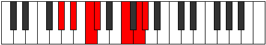

# Mode AFlatAeolanimic

## Links

- [Documentation](README.md)
- [Scales Index](Scales.md)
- [Modes Index](Modes.md)
- [Chords Index](Chords.md)

## Parent Scale

[Dyrimic](ScaleDyrimic.md)

## Mode

[AFlatAeolanimic](ModeAFlatAeolanimic.md)

## Number

2613

## Luminosity

5

## Tonic

Ab

## Signature

C

## Transposition

2, 2, 1, 4, 2, 1

## Chord Pattern

v, vi⁰

## Perfection

 - 4 Perfect Notes

 - 2 Imperfect Notes

 - Perfection Profile - false, true, true, true, true, false

## Notes

- Ab (Imperfect)
- Bb
- C
- Db
- E#
- F## (Imperfect)
- Ab (Imperfect)

## Illustration

## Diagram

| Circle of Fifth | Chromatic Circle |
|-----------------|------------------|
|  |  |
## Relative Modes

| Number | Mode | Luminosity | Tonic | Notes | Illustration |
|--------|------|------------|-------|-------|--------------|
| [2613](https://ianring.com/musictheory/scales/2613) | [Aeolanimic](ModeAeolanimic.md) | 5 | G# | G#, A#, B#, C#, D###, E###, G# |  |
| [2613](https://ianring.com/musictheory/scales/2613) | [Aeolanimic](ModeAeolanimic.md) | 5 | Ab | Ab, Bb, C, Db, E#, F##, Ab |  |
| [1677](https://ianring.com/musictheory/scales/1677) | [Danimic](ModeDanimic.md) | -1 | A# | A#, B#, C#, D###, E###, F###, A# |  |
| [1677](https://ianring.com/musictheory/scales/1677) | [Danimic](ModeDanimic.md) | 6 | Bb | Bb, C, Db, E#, F##, G#, Bb |  |
| [1443](https://ianring.com/musictheory/scales/1443) | [Ionarimic](ModeIonarimic.md) | -1 | C | C, Db, E#, F##, G#, A#, C |  |
| [2769](https://ianring.com/musictheory/scales/2769) | [Dyrimic](ModeDyrimic.md) | -1 | C# | C#, D###, E###, F###, G###, A###, C# |  |
| [2769](https://ianring.com/musictheory/scales/2769) | [Dyrimic](ModeDyrimic.md) | -1 | Db | Db, E#, F##, G#, A#, B#, Db |  |
| [429](https://ianring.com/musictheory/scales/429) | [Koptimic](ModeKoptimic.md) | 5 | F | F, G, Ab, Bb, C, Db, F |  |
| [1131](https://ianring.com/musictheory/scales/1131) | [Thocrimic](ModeThocrimic.md) | 3 | G | G, Ab, Bb, C, Db, E#, G |  |
## Relative Brightness

| Number | Mode | Luminosity | Tonic | Notes | Circle Of Fifth | Chromatic Circle |
|--------|------|------------|-------|-------|-----------------|------------------|
| [2613](https://ianring.com/musictheory/scales/2613) | [Aeolanimic](ModeAeolanimic.md) | -1 | G# | G#, A#, B#, C#, D###, E###, G# |  |  |
| [2613](https://ianring.com/musictheory/scales/2613) | [Aeolanimic](ModeAeolanimic.md) | 5 | Ab | Ab, Bb, C, Db, E#, F##, Ab |  |  |
| [1677](https://ianring.com/musictheory/scales/1677) | [Danimic](ModeDanimic.md) | -1 | A# | A#, B#, C#, D###, E###, F###, A# |  |  |
| [1677](https://ianring.com/musictheory/scales/1677) | [Danimic](ModeDanimic.md) | 6 | Bb | Bb, C, Db, E#, F##, G#, Bb |  |  |
| [1443](https://ianring.com/musictheory/scales/1443) | [Ionarimic](ModeIonarimic.md) | 4 | C | C, Db, E#, F##, G#, A#, C |  |  |
| [2769](https://ianring.com/musictheory/scales/2769) | [Dyrimic](ModeDyrimic.md) | -1 | C# | C#, D###, E###, F###, G###, A###, C# |  |  |
| [2769](https://ianring.com/musictheory/scales/2769) | [Dyrimic](ModeDyrimic.md) | -1 | Db | Db, E#, F##, G#, A#, B#, Db |  |  |
| [429](https://ianring.com/musictheory/scales/429) | [Koptimic](ModeKoptimic.md) | -1 | F | F, G, Ab, Bb, C, Db, F |  |  |
| [1131](https://ianring.com/musictheory/scales/1131) | [Thocrimic](ModeThocrimic.md) | -1 | G | G, Ab, Bb, C, Db, E#, G |  |  |

## Chords

### Ab

| Number | Root | Name | Notes | Illustration | Audio |
|--------|------|------|-------|--------------|-------|
| 1282 | Ab | [G#sus2bb5](ChordGSharpSuspendedSecondDoubleFlatFifth.md) | G#, A#, C# |  | [midi](ChordGSharpSuspendedSecondDoubleFlatFifthRootPosition.mid) |
| 1282 | Ab | [Absus2bb5](ChordAFlatSuspendedSecondDoubleFlatFifth.md) | Ab, Bb, Db |  | [midi](ChordAFlatSuspendedSecondDoubleFlatFifthRootPosition.mid) |
| 289 | Ab | [G#M##5](ChordGSharpMajorDoubleSharpFifth.md) | G#, B#, E# |  | [midi](ChordGSharpMajorDoubleSharpFifthRootPosition.mid) |
| 289 | Ab | [AbM##5](ChordAFlatMajorDoubleSharpFifth.md) | Ab, C, F |  | [midi](ChordAFlatMajorDoubleSharpFifthRootPosition.mid) |
| 290 | Ab | [G#sus4##5](ChordGSharpSuspendedFourthDoubleSharpFifth.md) | G#, C#, E# |  | [midi](ChordGSharpSuspendedFourthDoubleSharpFifthRootPosition.mid) |
| 290 | Ab | [Absus4##5](ChordAFlatSuspendedFourthDoubleSharpFifth.md) | Ab, Db, F |  | [midi](ChordAFlatSuspendedFourthDoubleSharpFifthRootPosition.mid) |
| 1314 | Ab | [G#M6sus2bb5](ChordGSharpMajorSixthSuspendedSecondDoubleFlatFifth.md) | G#, A#, C#, E# |  | [midi](ChordGSharpMajorSixthSuspendedSecondDoubleFlatFifthRootPosition.mid) |
| 1314 | Ab | [AbM6sus2bb5](ChordAFlatMajorSixthSuspendedSecondDoubleFlatFifth.md) | Ab, Bb, Db, F |  | [midi](ChordAFlatMajorSixthSuspendedSecondDoubleFlatFifthRootPosition.mid) |
| 386 | Ab | [G#Q+](ChordGSharpQuartalAugmented.md) | G#, C#, F## |  | [midi](ChordGSharpQuartalAugmentedRootPosition.mid) |
| 386 | Ab | [AbQ+](ChordAFlatQuartalAugmented.md) | Ab, Db, G |  | [midi](ChordAFlatQuartalAugmentedRootPosition.mid) |
| 417 | Ab | [G#M7##5](ChordGSharpMajorSeventhDoubleSharpFifth.md) | G#, B#, E#, F## |  | [midi](ChordGSharpMajorSeventhDoubleSharpFifthRootPosition.mid) |
| 417 | Ab | [AbM7##5](ChordAFlatMajorSeventhDoubleSharpFifth.md) | Ab, C, F, G |  | [midi](ChordAFlatMajorSeventhDoubleSharpFifthRootPosition.mid) |
| 418 | Ab | [G#M7(sus4)##5](ChordGSharpMajorSeventhSuspendedFourthDoubleSharpFifth.md) | G#, C#, E#, F## |  | [midi](ChordGSharpMajorSeventhSuspendedFourthDoubleSharpFifthRootPosition.mid) |
| 418 | Ab | [AbM7(sus4)##5](ChordAFlatMajorSeventhSuspendedFourthDoubleSharpFifth.md) | Ab, Db, F, G |  | [midi](ChordAFlatMajorSeventhSuspendedFourthDoubleSharpFifthRootPosition.mid) |

### Bb

| Number | Root | Name | Notes | Illustration | Audio |
|--------|------|------|-------|--------------|-------|
| 1056 | Bb | [A#5](ChordASharpPowerChord.md) | A#, E# |  | [midi](ChordASharpPowerChordRootPosition.mid) |
| 1056 | Bb | [Bb5](ChordBFlatPowerChord.md) | Bb, F |  | [midi](ChordBFlatPowerChordRootPosition.mid) |
| 1057 | Bb | [A#sus2](ChordASharpSuspendedSecond.md) | A#, B#, E# |  | [midi](ChordASharpSuspendedSecondRootPosition.mid) |
| 1057 | Bb | [Bbsus2](ChordBFlatSuspendedSecond.md) | Bb, C, F |  | [midi](ChordBFlatSuspendedSecondRootPosition.mid) |
| 1058 | Bb | [A#m](ChordASharpMinor.md) | A#, C#, E# |  | [midi](ChordASharpMinorRootPosition.mid) |
| 1058 | Bb | [A#m(add(#9))](ChordASharpMinorAddSharpNinth.md) | A#, C#, E#, B## |  | [midi](ChordASharpMinorAddSharpNinthRootPosition.mid) |
| 1058 | Bb | [Bbm](ChordBFlatMinor.md) | Bb, Db, F |  | [midi](ChordBFlatMinorRootPosition.mid) |
| 1058 | Bb | [Bbm(add(#9))](ChordBFlatMinorAddSharpNinth.md) | Bb, Db, F, C# |  | [midi](ChordBFlatMinorAddSharpNinthRootPosition.mid) |
| 1059 | Bb | [A#m(add9)](ChordASharpMinorAddNinth.md) | A#, C#, E#, B# |  | [midi](ChordASharpMinorAddNinthRootPosition.mid) |
| 1059 | Bb | [Bbm(add9)](ChordBFlatMinorAddNinth.md) | Bb, Db, F, C |  | [midi](ChordBFlatMinorAddNinthRootPosition.mid) |
| 1185 | Bb | [A#M6sus2](ChordASharpMajorSixthSuspendedSecond.md) | A#, B#, E#, F## |  | [midi](ChordASharpMajorSixthSuspendedSecondRootPosition.mid) |
| 1185 | Bb | [A#7sus2b5](ChordASharpDominantSeventhSuspendedSecondFlatFifth.md) | A#, B#, E#, G |  | [midi](ChordASharpDominantSeventhSuspendedSecondFlatFifthRootPosition.mid) |
| 1185 | Bb | [BbM6sus2](ChordBFlatMajorSixthSuspendedSecond.md) | Bb, C, F, G |  | [midi](ChordBFlatMajorSixthSuspendedSecondRootPosition.mid) |
| 1185 | Bb | [Bb7sus2b5](ChordBFlatDominantSeventhSuspendedSecondFlatFifth.md) | Bb, C, F, Abb |  | [midi](ChordBFlatDominantSeventhSuspendedSecondFlatFifthRootPosition.mid) |
| 1186 | Bb | [A#m6](ChordASharpMinorSixth.md) | A#, C#, E#, F## |  | [midi](ChordASharpMinorSixthRootPosition.mid) |
| 1186 | Bb | [Bbm6](ChordBFlatMinorSixth.md) | Bb, Db, F, G |  | [midi](ChordBFlatMinorSixthRootPosition.mid) |
| 1187 | Bb | [A#m6(add9)](ChordASharpMinorSixthAddNinth.md) | A#, C#, E#, F##, B# |  | [midi](ChordASharpMinorSixthAddNinthRootPosition.mid) |
| 1187 | Bb | [Bbm6(add9)](ChordBFlatMinorSixthAddNinth.md) | Bb, Db, F, G, C |  | [midi](ChordBFlatMinorSixthAddNinthRootPosition.mid) |
| 1313 | Bb | [A#7sus2](ChordASharpDominantSeventhSuspendedSecond.md) | A#, B#, E#, G# |  | [midi](ChordASharpDominantSeventhSuspendedSecondRootPosition.mid) |
| 1313 | Bb | [A#9sus2](ChordASharpDominantNinthSuspendedSecond.md) | A#, B#, E#, G#, B# |  | [midi](ChordASharpDominantNinthSuspendedSecondRootPosition.mid) |
| 1313 | Bb | [Bb7sus2](ChordBFlatDominantSeventhSuspendedSecond.md) | Bb, C, F, Ab |  | [midi](ChordBFlatDominantSeventhSuspendedSecondRootPosition.mid) |
| 1313 | Bb | [Bb9sus2](ChordBFlatDominantNinthSuspendedSecond.md) | Bb, C, F, Ab, C |  | [midi](ChordBFlatDominantNinthSuspendedSecondRootPosition.mid) |
| 1314 | Bb | [A#m7](ChordASharpMinorSeventh.md) | A#, C#, E#, G# |  | [midi](ChordASharpMinorSeventhRootPosition.mid) |
| 1314 | Bb | [Bbm7](ChordBFlatMinorSeventh.md) | Bb, Db, F, Ab |  | [midi](ChordBFlatMinorSeventhRootPosition.mid) |
| 1315 | Bb | [A#m9](ChordASharpMinorNinth.md) | A#, C#, E#, G#, B# |  | [midi](ChordASharpMinorNinthRootPosition.mid) |
| 1315 | Bb | [Bbm9](ChordBFlatMinorNinth.md) | Bb, Db, F, Ab, C |  | [midi](ChordBFlatMinorNinthRootPosition.mid) |
| 1442 | Bb | [A#m7add13](ChordASharpMinorSeventhAddThirteenth.md) | A#, C#, E#, G#, F## |  | [midi](ChordASharpMinorSeventhAddThirteenthRootPosition.mid) |
| 1442 | Bb | [Bbm7add13](ChordBFlatMinorSeventhAddThirteenth.md) | Bb, Db, F, Ab, G |  | [midi](ChordBFlatMinorSeventhAddThirteenthRootPosition.mid) |

### C

| Number | Root | Name | Notes | Illustration | Audio |
|--------|------|------|-------|--------------|-------|
| 129 | C | [C5](ChordCNaturalPowerChord.md) | C, G |  | [midi](ChordCNaturalPowerChordRootPosition.mid) |
| 131 | C | [Cphryg](ChordCNaturalPhrygian.md) | C, Db, G |  | [midi](ChordCNaturalPhrygianRootPosition.mid) |
| 161 | C | [Csus4](ChordCNaturalSuspendedFourth.md) | C, F, G |  | [midi](ChordCNaturalSuspendedFourthRootPosition.mid) |
| 289 | C | [Csus4#5](ChordCNaturalSuspendedFourthSharpFifth.md) | C, F, G# |  | [midi](ChordCNaturalSuspendedFourthSharpFifthRootPosition.mid) |
| 1057 | C | [CQ](ChordCNaturalQuartal.md) | C, F, Bb |  | [midi](ChordCNaturalQuartalRootPosition.mid) |
| 1185 | C | [C7sus4](ChordCNaturalDominantSeventhSuspendedFourth.md) | C, F, G, Bb |  | [midi](ChordCNaturalDominantSeventhSuspendedFourthRootPosition.mid) |

### Db

| Number | Root | Name | Notes | Illustration | Audio |
|--------|------|------|-------|--------------|-------|
| 162 | Db | [C#Mb5](ChordCSharpMajorFlatFifth.md) | C#, E#, G |  | [midi](ChordCSharpMajorFlatFifthRootPosition.mid) |
| 162 | Db | [DbMb5](ChordDFlatMajorFlatFifth.md) | Db, F, Abb |  | [midi](ChordDFlatMajorFlatFifthRootPosition.mid) |
| 258 | Db | [C#5](ChordCSharpPowerChord.md) | C#, G# |  | [midi](ChordCSharpPowerChordRootPosition.mid) |
| 258 | Db | [Db5](ChordDFlatPowerChord.md) | Db, Ab |  | [midi](ChordDFlatPowerChordRootPosition.mid) |
| 290 | Db | [C#M](ChordCSharpMajor.md) | C#, E#, G# |  | [midi](ChordCSharpMajorRootPosition.mid) |
| 290 | Db | [DbM](ChordDFlatMajor.md) | Db, F, Ab |  | [midi](ChordDFlatMajorRootPosition.mid) |
| 386 | Db | [C#lyd](ChordCSharpLydian.md) | C#, F##, G# |  | [midi](ChordCSharpLydianRootPosition.mid) |
| 386 | Db | [Dblyd](ChordDFlatLydian.md) | Db, G, Ab |  | [midi](ChordDFlatLydianRootPosition.mid) |
| 418 | Db | [C#M(add(#4))](ChordCSharpMajorAddSharpFourth.md) | C#, E#, F##, G# |  | [midi](ChordCSharpMajorAddSharpFourthRootPosition.mid) |
| 418 | Db | [DbM(add(#4))](ChordDFlatMajorAddSharpFourth.md) | Db, F, G, Ab |  | [midi](ChordDFlatMajorAddSharpFourthRootPosition.mid) |
| 1058 | Db | [C#M##5](ChordCSharpMajorDoubleSharpFifth.md) | C#, E#, A# |  | [midi](ChordCSharpMajorDoubleSharpFifthRootPosition.mid) |
| 1058 | Db | [DbM##5](ChordDFlatMajorDoubleSharpFifth.md) | Db, F, Bb |  | [midi](ChordDFlatMajorDoubleSharpFifthRootPosition.mid) |
| 1186 | Db | [C#M6b5](ChordCSharpMajorSixthFlatFifth.md) | C#, E#, G, A# |  | [midi](ChordCSharpMajorSixthFlatFifthRootPosition.mid) |
| 1186 | Db | [DbM6b5](ChordDFlatMajorSixthFlatFifth.md) | Db, F, Abb, Bb |  | [midi](ChordDFlatMajorSixthFlatFifthRootPosition.mid) |
| 1314 | Db | [C#M6](ChordCSharpMajorSixth.md) | C#, E#, G#, A# |  | [midi](ChordCSharpMajorSixthRootPosition.mid) |
| 1314 | Db | [DbM6](ChordDFlatMajorSixth.md) | Db, F, Ab, Bb |  | [midi](ChordDFlatMajorSixthRootPosition.mid) |
| 163 | Db | [C#M7b5](ChordCSharpMajorSeventhFlatFifth.md) | C#, E#, G, B# |  | [midi](ChordCSharpMajorSeventhFlatFifthRootPosition.mid) |
| 163 | Db | [DbM7b5](ChordDFlatMajorSeventhFlatFifth.md) | Db, F, Abb, C |  | [midi](ChordDFlatMajorSeventhFlatFifthRootPosition.mid) |
| 291 | Db | [C#M7](ChordCSharpMajorSeventh.md) | C#, E#, G#, B# |  | [midi](ChordCSharpMajorSeventhRootPosition.mid) |
| 291 | Db | [DbM7](ChordDFlatMajorSeventh.md) | Db, F, Ab, C |  | [midi](ChordDFlatMajorSeventhRootPosition.mid) |
| 387 | Db | [C#lyd(M7)](ChordCSharpLydianMajorSeventh.md) | C#, F##, G#, B# |  | [midi](ChordCSharpLydianMajorSeventhRootPosition.mid) |
| 387 | Db | [Dblyd(M7)](ChordDFlatLydianMajorSeventh.md) | Db, G, Ab, C |  | [midi](ChordDFlatLydianMajorSeventhRootPosition.mid) |
| 419 | Db | [C#M7add(#11)](ChordCSharpMajorSeventhAddSharpEleventh.md) | C#, E#, G#, B#, F## |  | [midi](ChordCSharpMajorSeventhAddSharpEleventhRootPosition.mid) |
| 419 | Db | [C#M7add(#4)](ChordCSharpMajorSeventhAddSharpFourth.md) | C#, E#, F##, G#, B# |  | [midi](ChordCSharpMajorSeventhAddSharpFourthRootPosition.mid) |
| 419 | Db | [DbM7add(#11)](ChordDFlatMajorSeventhAddSharpEleventh.md) | Db, F, Ab, C, G |  | [midi](ChordDFlatMajorSeventhAddSharpEleventhRootPosition.mid) |
| 419 | Db | [DbM7add(#4)](ChordDFlatMajorSeventhAddSharpFourth.md) | Db, F, G, Ab, C |  | [midi](ChordDFlatMajorSeventhAddSharpFourthRootPosition.mid) |
| 1059 | Db | [C#M7##5](ChordCSharpMajorSeventhDoubleSharpFifth.md) | C#, E#, A#, B# |  | [midi](ChordCSharpMajorSeventhDoubleSharpFifthRootPosition.mid) |
| 1059 | Db | [DbM7##5](ChordDFlatMajorSeventhDoubleSharpFifth.md) | Db, F, Bb, C |  | [midi](ChordDFlatMajorSeventhDoubleSharpFifthRootPosition.mid) |
| 1315 | Db | [C#M7add13](ChordCSharpMajorSeventhAddThirteenth.md) | C#, E#, G#, B#, A# |  | [midi](ChordCSharpMajorSeventhAddThirteenthRootPosition.mid) |
| 1315 | Db | [DbM7add13](ChordDFlatMajorSeventhAddThirteenth.md) | Db, F, Ab, C, Bb |  | [midi](ChordDFlatMajorSeventhAddThirteenthRootPosition.mid) |

### E#

| Number | Root | Name | Notes | Illustration | Audio |
|--------|------|------|-------|--------------|-------|
| 1184 | E# | [Fsus2bb5](ChordFNaturalSuspendedSecondDoubleFlatFifth.md) | F, G, Bb |  | [midi](ChordFNaturalSuspendedSecondDoubleFlatFifthRootPosition.mid) |
| 1312 | E# | [Fmbb5](ChordFNaturalMinorDoubleFlatFifth.md) | F, Ab, Bb |  | [midi](ChordFNaturalMinorDoubleFlatFifthRootPosition.mid) |
| 33 | E# | [F5](ChordFNaturalPowerChord.md) | F, C |  | [midi](ChordFNaturalPowerChordRootPosition.mid) |
| 161 | E# | [Fsus2](ChordFNaturalSuspendedSecond.md) | F, G, C |  | [midi](ChordFNaturalSuspendedSecondRootPosition.mid) |
| 289 | E# | [Fm](ChordFNaturalMinor.md) | F, Ab, C |  | [midi](ChordFNaturalMinorRootPosition.mid) |
| 289 | E# | [Fm(add(#9))](ChordFNaturalMinorAddSharpNinth.md) | F, Ab, C, G# |  | [midi](ChordFNaturalMinorAddSharpNinthRootPosition.mid) |
| 417 | E# | [Fm(add9)](ChordFNaturalMinorAddNinth.md) | F, Ab, C, G |  | [midi](ChordFNaturalMinorAddNinthRootPosition.mid) |
| 1057 | E# | [Fsus4](ChordFNaturalSuspendedFourth.md) | F, Bb, C |  | [midi](ChordFNaturalSuspendedFourthRootPosition.mid) |
| 1313 | E# | [Fm(add11)](ChordFNaturalMinorAddEleventh.md) | F, Ab, C, Bb |  | [midi](ChordFNaturalMinorAddEleventhRootPosition.mid) |
| 1313 | E# | [Fm(add4)](ChordFNaturalMinorAddFourth.md) | F, Ab, Bb, C |  | [midi](ChordFNaturalMinorAddFourthRootPosition.mid) |
| 162 | E# | [Fsus2#5](ChordFNaturalSuspendedSecondSharpFifth.md) | F, G, C# |  | [midi](ChordFNaturalSuspendedSecondSharpFifthRootPosition.mid) |
| 290 | E# | [Fm#5](ChordFNaturalMinorSharpFifth.md) | F, Ab, Db |  | [midi](ChordFNaturalMinorSharpFifthRootPosition.mid) |
| 1058 | E# | [Fsus4#5](ChordFNaturalSuspendedFourthSharpFifth.md) | F, Bb, C# |  | [midi](ChordFNaturalSuspendedFourthSharpFifthRootPosition.mid) |

### F##

| Number | Root | Name | Notes | Illustration | Audio |
|--------|------|------|-------|--------------|-------|
| 1153 | F## | [Gmbb5](ChordGNaturalMinorDoubleFlatFifth.md) | G, Bb, C |  | [midi](ChordGNaturalMinorDoubleFlatFifthRootPosition.mid) |
| 386 | F## | [Gloc](ChordGNaturalLocrian.md) | G, Ab, Db |  | [midi](ChordGNaturalLocrianRootPosition.mid) |
| 1154 | F## | [Go](ChordGNaturalDiminished.md) | G, Bb, Db |  | [midi](ChordGNaturalDiminishedRootPosition.mid) |
| 131 | F## | [Gsus4b5](ChordGNaturalSuspendedFourthFlatFifth.md) | G, C, Db |  | [midi](ChordGNaturalSuspendedFourthFlatFifthRootPosition.mid) |
| 161 | F## | [GQ](ChordGNaturalQuartal.md) | G, C, F |  | [midi](ChordGNaturalQuartalRootPosition.mid) |
| 1185 | F## | [Gm7bb5](ChordGNaturalMinorSeventhDoubleFlatFifth.md) | G, Bb, C, F |  | [midi](ChordGNaturalMinorSeventhDoubleFlatFifthRootPosition.mid) |
| 1186 | F## | [Gø7](ChordGNaturalHalfDiminishedSeventh.md) | G, Bb, Db, F |  | [midi](ChordGNaturalHalfDiminishedSeventhRootPosition.mid) |

