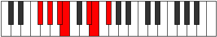

# Mode AFlatAeolaphimic

## Links

- [Documentation](index.md)
- [Scales Index](Scales.md)
- [Modes Index](Modes.md)
- [Chords Index](Chords.md)

## Scale

[Bylimic](ScaleBylimic.md)

## Mode

[AFlatAeolaphimic](ModeAFlatAeolaphimic.md)

## Tonic

Ab

## Signature

[CNaturalMajor]

## Interval Pattern

2, 1, 4, 1, 2, 2

## Perfection

 - 4 Perfect Notes

 - 2 Imperfect Notes

## Notes

- Ab
- Bb (Imperfect)
- Cb
- D#
- E
- F# (Imperfect)
- Ab

## Illustration

## Relative Modes

| Number | Mode | Tonic | Notes | Illustration |
|--------|------|-------|-------|--------------|
| [1421](https://ianring.com/musictheory/scales/1421) | [Aeolaphimic](ModeAeolaphimic.md) | Ab | Ab, Bb, Cb, D#, E, F#, Ab |  |
| [1379](https://ianring.com/musictheory/scales/1379) | [Kycrimic](ModeKycrimic.md) | Bb | Bb, Cb, D#, E, F#, G#, Bb |  |
| [427](https://ianring.com/musictheory/scales/427) | [Zothimic](ModeZothimic.md) | D# | D#, E, F#, G#, A#, B, D# |  |
| [2261](https://ianring.com/musictheory/scales/2261) | [Phrolimic](ModePhrolimic.md) | E | E, F#, G#, A#, B, C###, E |  |
| [1589](https://ianring.com/musictheory/scales/1589) | [Ionagimic](ModeIonagimic.md) | F# | F#, G#, A#, B, C###, D##, F# |  |

## Chords

### Ab

| Number | Root | Name | Notes | Illustration | Audio |
|--------|------|------|-------|--------------|-------|
| 264 | Ab | [Ab5](ChordAFlatPowerChord.md) | Ab, Eb |  | [midi](ChordAFlatPowerChordRootPosition.mid) |
| 1288 | Ab | [Absus2](ChordAFlatSuspendedSecond.md) | Ab, Bb, Eb |  | [midi](ChordAFlatSuspendedSecondRootPosition.mid) |
| 2312 | Ab | [Abm](ChordAFlatMinor.md) | Ab, Cb, Eb |  | [midi](ChordAFlatMinorRootPosition.mid) |
| 2312 | Ab | [Abm(add(#9))](ChordAFlatMinorAddSharpNinth.md) | Ab, Cb, Eb, B |  | [midi](ChordAFlatMinorAddSharpNinthRootPosition.mid) |
| 3336 | Ab | [Abm(add9)](ChordAFlatMinorAddNinth.md) | Ab, Cb, Eb, Bb |  | [midi](ChordAFlatMinorAddNinthRootPosition.mid) |
| 1296 | Ab | [Absus2#5](ChordAFlatSuspendedSecondSharpFifth.md) | Ab, Bb, E |  | [midi](ChordAFlatSuspendedSecondSharpFifthRootPosition.mid) |
| 2320 | Ab | [Abm#5](ChordAFlatMinorSharpFifth.md) | Ab, Cb, Fb |  | [midi](ChordAFlatMinorSharpFifthRootPosition.mid) |
| 1352 | Ab | [Ab7sus2](ChordAFlatDominantSeventhSuspendedSecond.md) | Ab, Bb, Eb, Gb |  | [midi](ChordAFlatDominantSeventhSuspendedSecondRootPosition.mid) |
| 1352 | Ab | [Ab9sus2](ChordAFlatDominantNinthSuspendedSecond.md) | Ab, Bb, Eb, Gb, Bb |  | [midi](ChordAFlatDominantNinthSuspendedSecondRootPosition.mid) |
| 2376 | Ab | [Abm7](ChordAFlatMinorSeventh.md) | Ab, Cb, Eb, Gb |  | [midi](ChordAFlatMinorSeventhRootPosition.mid) |
| 3400 | Ab | [Abm9](ChordAFlatMinorNinth.md) | Ab, Cb, Eb, Gb, Bb |  | [midi](ChordAFlatMinorNinthRootPosition.mid) |
| 2384 | Ab | [Abm7#5](ChordAFlatMinorSeventhSharpFifth.md) | Ab, Cb, E, Gb |  | [midi](ChordAFlatMinorSeventhSharpFifthRootPosition.mid) |

### Bb

| Number | Root | Name | Notes | Illustration | Audio |
|--------|------|------|-------|--------------|-------|
| 3088 | Bb | [Bbloc](ChordBFlatLocrian.md) | Bb, Cb, Fb |  | [midi](ChordBFlatLocrianRootPosition.mid) |
| 1048 | Bb | [Bbsus4b5](ChordBFlatSuspendedFourthFlatFifth.md) | Bb, Eb, Fb |  | [midi](ChordBFlatSuspendedFourthFlatFifthRootPosition.mid) |
| 1096 | Bb | [Bbsus4#5](ChordBFlatSuspendedFourthSharpFifth.md) | Bb, Eb, F# |  | [midi](ChordBFlatSuspendedFourthSharpFifthRootPosition.mid) |
| 1288 | Bb | [BbQ](ChordBFlatQuartal.md) | Bb, Eb, Ab |  | [midi](ChordBFlatQuartalRootPosition.mid) |

### Cb

| Number | Root | Name | Notes | Illustration | Audio |
|--------|------|------|-------|--------------|-------|

### D#

| Number | Root | Name | Notes | Illustration | Audio |
|--------|------|------|-------|--------------|-------|
| 328 | D# | [D#mbb5](ChordDSharpMinorDoubleFlatFifth.md) | D#, F#, G# |  | [midi](ChordDSharpMinorDoubleFlatFifthRootPosition.mid) |
| 1032 | D# | [D#5](ChordDSharpPowerChord.md) | D#, A# |  | [midi](ChordDSharpPowerChordRootPosition.mid) |
| 1048 | D# | [D#phryg](ChordDSharpPhrygian.md) | D#, E, A# |  | [midi](ChordDSharpPhrygianRootPosition.mid) |
| 1096 | D# | [D#m](ChordDSharpMinor.md) | D#, F#, A# |  | [midi](ChordDSharpMinorRootPosition.mid) |
| 1096 | D# | [D#m(add(#9))](ChordDSharpMinorAddSharpNinth.md) | D#, F#, A#, E## |  | [midi](ChordDSharpMinorAddSharpNinthRootPosition.mid) |
| 1288 | D# | [D#sus4](ChordDSharpSuspendedFourth.md) | D#, G#, A# |  | [midi](ChordDSharpSuspendedFourthRootPosition.mid) |
| 1352 | D# | [D#m(add11)](ChordDSharpMinorAddEleventh.md) | D#, F#, A#, G# |  | [midi](ChordDSharpMinorAddEleventhRootPosition.mid) |
| 1352 | D# | [D#m(add4)](ChordDSharpMinorAddFourth.md) | D#, F#, G#, A# |  | [midi](ChordDSharpMinorAddFourthRootPosition.mid) |
| 2120 | D# | [D#m#5](ChordDSharpMinorSharpFifth.md) | D#, F#, B |  | [midi](ChordDSharpMinorSharpFifthRootPosition.mid) |
| 2312 | D# | [D#sus4#5](ChordDSharpSuspendedFourthSharpFifth.md) | D#, G#, A## |  | [midi](ChordDSharpSuspendedFourthSharpFifthRootPosition.mid) |

### E

| Number | Root | Name | Notes | Illustration | Audio |
|--------|------|------|-------|--------------|-------|
| 1104 | E | [Esus2b5](ChordENaturalSuspendedSecondFlatFifth.md) | E, F#, Bb |  | [midi](ChordENaturalSuspendedSecondFlatFifthRootPosition.mid) |
| 1296 | E | [EMb5](ChordENaturalMajorFlatFifth.md) | E, G#, Bb |  | [midi](ChordENaturalMajorFlatFifthRootPosition.mid) |
| 2064 | E | [E5](ChordENaturalPowerChord.md) | E, B |  | [midi](ChordENaturalPowerChordRootPosition.mid) |
| 2128 | E | [Esus2](ChordENaturalSuspendedSecond.md) | E, F#, B |  | [midi](ChordENaturalSuspendedSecondRootPosition.mid) |
| 2320 | E | [EM](ChordENaturalMajor.md) | E, G#, B |  | [midi](ChordENaturalMajorRootPosition.mid) |
| 2384 | E | [EM(add9)](ChordENaturalMajorAddNinth.md) | E, G#, B, F# |  | [midi](ChordENaturalMajorAddNinthRootPosition.mid) |
| 3088 | E | [Elyd](ChordENaturalLydian.md) | E, A#, B |  | [midi](ChordENaturalLydianRootPosition.mid) |
| 3344 | E | [EM(add(#4))](ChordENaturalMajorAddSharpFourth.md) | E, G#, A#, B |  | [midi](ChordENaturalMajorAddSharpFourthRootPosition.mid) |
| 1304 | E | [EM7b5](ChordENaturalMajorSeventhFlatFifth.md) | E, G#, Bb, D# |  | [midi](ChordENaturalMajorSeventhFlatFifthRootPosition.mid) |
| 2136 | E | [EM7(sus2)](ChordENaturalMajorSeventhSuspendedSecond.md) | E, F#, B, D# |  | [midi](ChordENaturalMajorSeventhSuspendedSecondRootPosition.mid) |
| 2136 | E | [EM9sus2](ChordENaturalMajorNinthSuspendedSecond.md) | E, F#, B, D#, F# |  | [midi](ChordENaturalMajorNinthSuspendedSecondRootPosition.mid) |
| 2328 | E | [EM7](ChordENaturalMajorSeventh.md) | E, G#, B, D# |  | [midi](ChordENaturalMajorSeventhRootPosition.mid) |
| 2392 | E | [EM9](ChordENaturalMajorNinth.md) | E, G#, B, D#, F# |  | [midi](ChordENaturalMajorNinthRootPosition.mid) |
| 3096 | E | [Elyd(M7)](ChordENaturalLydianMajorSeventh.md) | E, A#, B, D# |  | [midi](ChordENaturalLydianMajorSeventhRootPosition.mid) |
| 3352 | E | [EM7add(#11)](ChordENaturalMajorSeventhAddSharpEleventh.md) | E, G#, B, D#, A# |  | [midi](ChordENaturalMajorSeventhAddSharpEleventhRootPosition.mid) |
| 3352 | E | [EM7add(#4)](ChordENaturalMajorSeventhAddSharpFourth.md) | E, G#, A#, B, D# |  | [midi](ChordENaturalMajorSeventhAddSharpFourthRootPosition.mid) |

### F#

| Number | Root | Name | Notes | Illustration | Audio |
|--------|------|------|-------|--------------|-------|
| 2368 | F# | [F#sus2bb5](ChordFSharpSuspendedSecondDoubleFlatFifth.md) | F#, G#, B |  | [midi](ChordFSharpSuspendedSecondDoubleFlatFifthRootPosition.mid) |
| 1096 | F# | [F#M##5](ChordFSharpMajorDoubleSharpFifth.md) | F#, A#, D# |  | [midi](ChordFSharpMajorDoubleSharpFifthRootPosition.mid) |
| 2120 | F# | [F#sus4##5](ChordFSharpSuspendedFourthDoubleSharpFifth.md) | F#, B, D# |  | [midi](ChordFSharpSuspendedFourthDoubleSharpFifthRootPosition.mid) |
| 2376 | F# | [F#M6sus2bb5](ChordFSharpMajorSixthSuspendedSecondDoubleFlatFifth.md) | F#, G#, B, D# |  | [midi](ChordFSharpMajorSixthSuspendedSecondDoubleFlatFifthRootPosition.mid) |
| 2128 | F# | [F#Q](ChordFSharpQuartal.md) | F#, B, E |  | [midi](ChordFSharpQuartalRootPosition.mid) |

