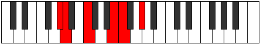
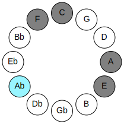
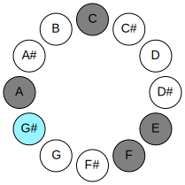
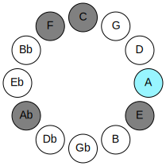
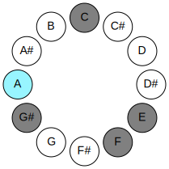
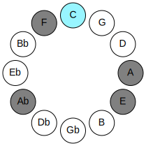
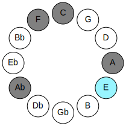
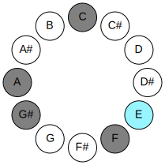
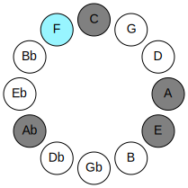

# Mode AFlatAeolapritonic

## Links

- [Documentation](README.md)
- [Scales Index](Scales.md)
- [Modes Index](Modes.md)
- [Chords Index](Chords.md)

## Scale

[Zothitonic](ScaleZothitonic.md)

## Mode

[AFlatAeolapritonic](ModeAFlatAeolapritonic.md)

## Tonic

Ab

## Signature

[CNaturalMajor]

## Transposition

1, 3, 4, 1, 3

## Chord Pattern

IV⁺

## Perfection

 - 2 Perfect Notes

 - 3 Imperfect Notes

## Notes

- Ab (Imperfect)
- A
- C (Imperfect)
- E (Imperfect)
- F
- Ab (Imperfect)

## Illustration

## Diagram

| Circle of Fifth | Chromatic Circle |
|-----------------|------------------|
|  |  |
## Relative Modes

| Number | Mode | Tonic | Notes | Illustration |
|--------|------|-------|-------|--------------|
| [787](https://ianring.com/musictheory/scales/787) | [Aeolapritonic](ModeAeolapritonic.md) | G# | G#, A, C, E, F, G# |  |
| [787](https://ianring.com/musictheory/scales/787) | [Aeolapritonic](ModeAeolapritonic.md) | Ab | Ab, A, C, E, F, Ab |  |
| [2441](https://ianring.com/musictheory/scales/2441) | [Kyritonic](ModeKyritonic.md) | A | A, C, E, F, G#, A |  |
| [817](https://ianring.com/musictheory/scales/817) | [Zothitonic](ModeZothitonic.md) | C | C, E, F, G#, A, C |  |
| [307](https://ianring.com/musictheory/scales/307) | [Phrolitonic](ModePhrolitonic.md) | E | E, F, G#, A, C, E |  |
| [2201](https://ianring.com/musictheory/scales/2201) | [Ionagitonic](ModeIonagitonic.md) | F | F, G#, A, C, E, F |  |
## Relative Brightness

| Number | Mode | Tonic | Notes | Circle Of Fifth | Chromatic Circle |
|--------|------|-------|-------|-----------------|------------------|
| [787](https://ianring.com/musictheory/scales/787) | [Aeolapritonic](ModeAeolapritonic.md) | G# | G#, A, C, E, F, G# |  |  |
| [787](https://ianring.com/musictheory/scales/787) | [Aeolapritonic](ModeAeolapritonic.md) | Ab | Ab, A, C, E, F, Ab |  |  |
| [2441](https://ianring.com/musictheory/scales/2441) | [Kyritonic](ModeKyritonic.md) | A | A, C, E, F, G#, A |  |  |
| [817](https://ianring.com/musictheory/scales/817) | [Zothitonic](ModeZothitonic.md) | C | C, E, F, G#, A, C |  |  |
| [307](https://ianring.com/musictheory/scales/307) | [Phrolitonic](ModePhrolitonic.md) | E | E, F, G#, A, C, E |  |  |
| [2201](https://ianring.com/musictheory/scales/2201) | [Ionagitonic](ModeIonagitonic.md) | F | F, G#, A, C, E, F |  |  |

## Chords

### Ab

| Number | Root | Name | Notes | Illustration | Audio |
|--------|------|------|-------|--------------|-------|
| 273 | Ab | [G#+](ChordGSharpAugmented.md) | G#, B#, D## |  | [midi](ChordGSharpAugmentedRootPosition.mid) |
| 273 | Ab | [G#+7](ChordGSharpAugmentedAugmentedSeventh.md) | G#, B#, D##, F### |  | [midi](ChordGSharpAugmentedAugmentedSeventhRootPosition.mid) |
| 273 | Ab | [Ab+](ChordAFlatAugmented.md) | Ab, C, E |  | [midi](ChordAFlatAugmentedRootPosition.mid) |
| 273 | Ab | [Ab+7](ChordAFlatAugmentedAugmentedSeventh.md) | Ab, C, E, G# |  | [midi](ChordAFlatAugmentedAugmentedSeventhRootPosition.mid) |
| 289 | Ab | [G#M##5](ChordGSharpMajorDoubleSharpFifth.md) | G#, B#, E# |  | [midi](ChordGSharpMajorDoubleSharpFifthRootPosition.mid) |
| 289 | Ab | [AbM##5](ChordAFlatMajorDoubleSharpFifth.md) | Ab, C, F |  | [midi](ChordAFlatMajorDoubleSharpFifthRootPosition.mid) |

### A

| Number | Root | Name | Notes | Illustration | Audio |
|--------|------|------|-------|--------------|-------|
| 528 | A | [A5](ChordANaturalPowerChord.md) | A, E |  | [midi](ChordANaturalPowerChordRootPosition.mid) |
| 529 | A | [Am](ChordANaturalMinor.md) | A, C, E |  | [midi](ChordANaturalMinorRootPosition.mid) |
| 529 | A | [Am(add(#9))](ChordANaturalMinorAddSharpNinth.md) | A, C, E, B# |  | [midi](ChordANaturalMinorAddSharpNinthRootPosition.mid) |
| 545 | A | [Am#5](ChordANaturalMinorSharpFifth.md) | A, C, F |  | [midi](ChordANaturalMinorSharpFifthRootPosition.mid) |
| 785 | A | [Am(M7)](ChordANaturalMinorMajorSeventh.md) | A, C, E, G# |  | [midi](ChordANaturalMinorMajorSeventhRootPosition.mid) |

### C

| Number | Root | Name | Notes | Illustration | Audio |
|--------|------|------|-------|--------------|-------|
| 273 | C | [C+](ChordCNaturalAugmented.md) | C, E, G# |  | [midi](ChordCNaturalAugmentedRootPosition.mid) |
| 273 | C | [C+7](ChordCNaturalAugmentedAugmentedSeventh.md) | C, E, G#, B# |  | [midi](ChordCNaturalAugmentedAugmentedSeventhRootPosition.mid) |
| 289 | C | [Csus4#5](ChordCNaturalSuspendedFourthSharpFifth.md) | C, F, G# |  | [midi](ChordCNaturalSuspendedFourthSharpFifthRootPosition.mid) |
| 529 | C | [CM##5](ChordCNaturalMajorDoubleSharpFifth.md) | C, E, A |  | [midi](ChordCNaturalMajorDoubleSharpFifthRootPosition.mid) |
| 545 | C | [Csus4##5](ChordCNaturalSuspendedFourthDoubleSharpFifth.md) | C, F, A |  | [midi](ChordCNaturalSuspendedFourthDoubleSharpFifthRootPosition.mid) |

### E

| Number | Root | Name | Notes | Illustration | Audio |
|--------|------|------|-------|--------------|-------|
| 273 | E | [E+](ChordENaturalAugmented.md) | E, G#, B# |  | [midi](ChordENaturalAugmentedRootPosition.mid) |
| 273 | E | [E+7](ChordENaturalAugmentedAugmentedSeventh.md) | E, G#, B#, D## |  | [midi](ChordENaturalAugmentedAugmentedSeventhRootPosition.mid) |
| 529 | E | [Esus4#5](ChordENaturalSuspendedFourthSharpFifth.md) | E, A, B# |  | [midi](ChordENaturalSuspendedFourthSharpFifthRootPosition.mid) |

### F

| Number | Root | Name | Notes | Illustration | Audio |
|--------|------|------|-------|--------------|-------|
| 33 | F | [F5](ChordFNaturalPowerChord.md) | F, C |  | [midi](ChordFNaturalPowerChordRootPosition.mid) |
| 289 | F | [Fm](ChordFNaturalMinor.md) | F, Ab, C |  | [midi](ChordFNaturalMinorRootPosition.mid) |
| 289 | F | [Fm(add(#9))](ChordFNaturalMinorAddSharpNinth.md) | F, Ab, C, G# |  | [midi](ChordFNaturalMinorAddSharpNinthRootPosition.mid) |
| 545 | F | [FM](ChordFNaturalMajor.md) | F, A, C |  | [midi](ChordFNaturalMajorRootPosition.mid) |
| 801 | F | [FM(add(#9))](ChordFNaturalMajorAddSharpNinth.md) | F, A, C, G# |  | [midi](ChordFNaturalMajorAddSharpNinthRootPosition.mid) |
| 305 | F | [Fm(M7)](ChordFNaturalMinorMajorSeventh.md) | F, Ab, C, E |  | [midi](ChordFNaturalMinorMajorSeventhRootPosition.mid) |
| 561 | F | [FM7](ChordFNaturalMajorSeventh.md) | F, A, C, E |  | [midi](ChordFNaturalMajorSeventhRootPosition.mid) |

