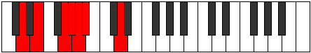

# Mode AFlatAeolaptimic

## Links

- [Documentation](index.md)
- [Scales Index](Scales.md)
- [Modes Index](Modes.md)
- [Chords Index](Chords.md)

## Scale

[Stalimic](ScaleStalimic.md)

## Mode

[AFlatAeolaptimic](ModeAFlatAeolaptimic.md)

## Tonic

Ab

## Signature

[CNaturalMajor]

## Perfection

 - 3 Perfect Notes

 - 3 Imperfect Notes

## Notes

- Ab (Imperfect)
- Bbb
- Cbb (Imperfect)
- D
- E (Imperfect)
- F##
- Ab (Imperfect)

## Illustration

## Relative Modes

| Number | Mode | Tonic | Notes | Illustration |
|--------|------|-------|-------|--------------|
| [2375](https://ianring.com/musictheory/scales/2375) | [Aeolaptimic](ModeAeolaptimic.md) | Ab | Ab, Bbb, Cbb, D, E, F##, Ab |  |
| [485](https://ianring.com/musictheory/scales/485) | [Stoptimic](ModeStoptimic.md) | D | D, E, F##, G#, A, Bb, D |  |
| [1145](https://ianring.com/musictheory/scales/1145) | [Zygimic](ModeZygimic.md) | E | E, F##, G#, A, Bb, C##, E |  |

## Chords

### Ab

| Number | Root | Name | Notes | Illustration | Audio |
|--------|------|------|-------|--------------|-------|

### Bbb

| Number | Root | Name | Notes | Illustration | Audio |
|--------|------|------|-------|--------------|-------|

### Cbb

| Number | Root | Name | Notes | Illustration | Audio |
|--------|------|------|-------|--------------|-------|

### D

| Number | Root | Name | Notes | Illustration | Audio |
|--------|------|------|-------|--------------|-------|

### E

| Number | Root | Name | Notes | Illustration | Audio |
|--------|------|------|-------|--------------|-------|

### F##

| Number | Root | Name | Notes | Illustration | Audio |
|--------|------|------|-------|--------------|-------|

