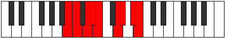

# Mode AFlatAeolaryllic

## Links

- [Documentation](index.md)
- [Scales Index](Scales.md)
- [Modes Index](Modes.md)
- [Chords Index](Chords.md)

## Scale

[Thyptyllic](ScaleThyptyllic.md)

## Mode

[AFlatAeolaryllic](ModeAFlatAeolaryllic.md)

## Tonic

Ab

## Signature

[CNaturalMajor]

## Perfection

 - 5 Perfect Notes

 - 3 Imperfect Notes

## Notes

- Ab
- Bb (Imperfect)
- B (Imperfect)
- C
- D (Imperfect)
- Eb
- E
- G
- Ab

## Illustration

## Relative Modes

| Number | Mode | Tonic | Notes | Illustration |
|--------|------|-------|-------|--------------|
| [2525](https://ianring.com/musictheory/scales/2525) | [Aeolaryllic](ModeAeolaryllic.md) | Ab | Ab, Bb, B, C, D, Eb, E, G, Ab |  |
| [1655](https://ianring.com/musictheory/scales/1655) | [Katygyllic](ModeKatygyllic.md) | Bb | Bb, B, C, D, Eb, E, G, Ab, Bb |  |
| [2875](https://ianring.com/musictheory/scales/2875) | [Ganyllic](ModeGanyllic.md) | B | B, C, D, D#, E, G, G#, A#, B |  |
| [3485](https://ianring.com/musictheory/scales/3485) | [Kyptyllic](ModeKyptyllic.md) | C | C, D, D#, E, G, G#, A#, B, C |  |
| [1895](https://ianring.com/musictheory/scales/1895) | [Salyllic](ModeSalyllic.md) | D | D, D#, E, G, G#, A#, B, C, D |  |
| [2995](https://ianring.com/musictheory/scales/2995) | [Sanyllic](ModeSanyllic.md) | Eb | Eb, E, G, Ab, Bb, B, C, D, Eb |  |
| [3545](https://ianring.com/musictheory/scales/3545) | [Thyptyllic](ModeThyptyllic.md) | E | E, G, G#, A#, B, C, D, D#, E |  |
| [955](https://ianring.com/musictheory/scales/955) | [Ionogyllic](ModeIonogyllic.md) | G | G, G#, A#, B, C, D, D#, E, G |  |

## Chords

### Ab

| Number | Root | Name | Notes | Illustration | Audio |
|--------|------|------|-------|--------------|-------|

### Bb

| Number | Root | Name | Notes | Illustration | Audio |
|--------|------|------|-------|--------------|-------|

### B

| Number | Root | Name | Notes | Illustration | Audio |
|--------|------|------|-------|--------------|-------|
| 2068 | B | [Bmbb5](ChordBNaturalMinorDoubleFlatFifth.md) | B, D, E |  | [midi](ChordBNaturalMinorDoubleFlatFifthRootPosition.mid) |
| 2180 | B | [Bm#5](ChordBNaturalMinorSharpFifth.md) | B, D, G |  | [midi](ChordBNaturalMinorSharpFifthRootPosition.mid) |
| 2184 | B | [B+](ChordBNaturalAugmented.md) | B, D#, F## |  | [midi](ChordBNaturalAugmentedRootPosition.mid) |
| 2184 | B | [B+7](ChordBNaturalAugmentedAugmentedSeventh.md) | B, D#, F##, A## |  | [midi](ChordBNaturalAugmentedAugmentedSeventhRootPosition.mid) |
| 2192 | B | [Bsus4#5](ChordBNaturalSuspendedFourthSharpFifth.md) | B, E, F## |  | [midi](ChordBNaturalSuspendedFourthSharpFifthRootPosition.mid) |
| 2312 | B | [BM##5](ChordBNaturalMajorDoubleSharpFifth.md) | B, D#, G# |  | [midi](ChordBNaturalMajorDoubleSharpFifthRootPosition.mid) |
| 2320 | B | [Bsus4##5](ChordBNaturalSuspendedFourthDoubleSharpFifth.md) | B, E, G# |  | [midi](ChordBNaturalSuspendedFourthDoubleSharpFifthRootPosition.mid) |
| 3088 | B | [BQ+](ChordBNaturalQuartalAugmented.md) | B, E, A# |  | [midi](ChordBNaturalQuartalAugmentedRootPosition.mid) |
| 3208 | B | [B+(M7)](ChordBNaturalAugmentedMajorSeventh.md) | B, D#, F##, A# |  | [midi](ChordBNaturalAugmentedMajorSeventhRootPosition.mid) |
| 3216 | B | [BM7(sus4)#5](ChordBNaturalMajorSeventhSuspendedFourthSharpFifth.md) | B, E, F##, A# |  | [midi](ChordBNaturalMajorSeventhSuspendedFourthSharpFifthRootPosition.mid) |
| 3336 | B | [BM7##5](ChordBNaturalMajorSeventhDoubleSharpFifth.md) | B, D#, G#, A# |  | [midi](ChordBNaturalMajorSeventhDoubleSharpFifthRootPosition.mid) |
| 3344 | B | [BM7(sus4)##5](ChordBNaturalMajorSeventhSuspendedFourthDoubleSharpFifth.md) | B, E, G#, A# |  | [midi](ChordBNaturalMajorSeventhSuspendedFourthDoubleSharpFifthRootPosition.mid) |

### C

| Number | Root | Name | Notes | Illustration | Audio |
|--------|------|------|-------|--------------|-------|
| 129 | C | [C5](ChordCNaturalPowerChord.md) | C, G |  | [midi](ChordCNaturalPowerChordRootPosition.mid) |
| 133 | C | [Csus2](ChordCNaturalSuspendedSecond.md) | C, D, G |  | [midi](ChordCNaturalSuspendedSecondRootPosition.mid) |
| 137 | C | [Cm](ChordCNaturalMinor.md) | C, Eb, G |  | [midi](ChordCNaturalMinorRootPosition.mid) |
| 137 | C | [Cm(add(#9))](ChordCNaturalMinorAddSharpNinth.md) | C, Eb, G, D# |  | [midi](ChordCNaturalMinorAddSharpNinthRootPosition.mid) |
| 141 | C | [Cm(add9)](ChordCNaturalMinorAddNinth.md) | C, Eb, G, D |  | [midi](ChordCNaturalMinorAddNinthRootPosition.mid) |
| 145 | C | [CM](ChordCNaturalMajor.md) | C, E, G |  | [midi](ChordCNaturalMajorRootPosition.mid) |
| 149 | C | [CM(add9)](ChordCNaturalMajorAddNinth.md) | C, E, G, D |  | [midi](ChordCNaturalMajorAddNinthRootPosition.mid) |
| 153 | C | [CM(add(#9))](ChordCNaturalMajorAddSharpNinth.md) | C, E, G, D# |  | [midi](ChordCNaturalMajorAddSharpNinthRootPosition.mid) |
| 261 | C | [Csus2#5](ChordCNaturalSuspendedSecondSharpFifth.md) | C, D, G# |  | [midi](ChordCNaturalSuspendedSecondSharpFifthRootPosition.mid) |
| 265 | C | [Cm#5](ChordCNaturalMinorSharpFifth.md) | C, Eb, Ab |  | [midi](ChordCNaturalMinorSharpFifthRootPosition.mid) |
| 273 | C | [C+](ChordCNaturalAugmented.md) | C, E, G# |  | [midi](ChordCNaturalAugmentedRootPosition.mid) |
| 273 | C | [C+7](ChordCNaturalAugmentedAugmentedSeventh.md) | C, E, G#, B# |  | [midi](ChordCNaturalAugmentedAugmentedSeventhRootPosition.mid) |
| 1157 | C | [C7sus2](ChordCNaturalDominantSeventhSuspendedSecond.md) | C, D, G, Bb |  | [midi](ChordCNaturalDominantSeventhSuspendedSecondRootPosition.mid) |
| 1157 | C | [C9sus2](ChordCNaturalDominantNinthSuspendedSecond.md) | C, D, G, Bb, D |  | [midi](ChordCNaturalDominantNinthSuspendedSecondRootPosition.mid) |
| 1161 | C | [Cm7](ChordCNaturalMinorSeventh.md) | C, Eb, G, Bb |  | [midi](ChordCNaturalMinorSeventhRootPosition.mid) |
| 1165 | C | [Cm9](ChordCNaturalMinorNinth.md) | C, Eb, G, Bb, D |  | [midi](ChordCNaturalMinorNinthRootPosition.mid) |
| 1169 | C | [C7](ChordCNaturalDominantSeventh.md) | C, E, G, Bb |  | [midi](ChordCNaturalDominantSeventhRootPosition.mid) |
| 1173 | C | [C9](ChordCNaturalDominantNinth.md) | C, E, G, Bb, D |  | [midi](ChordCNaturalDominantNinthRootPosition.mid) |
| 1177 | C | [C7#9](ChordCNaturalDominantSeventhSharpNinth.md) | C, E, G, Bb, D# |  | [midi](ChordCNaturalDominantSeventhSharpNinthRootPosition.mid) |
| 1289 | C | [Cm7#5](ChordCNaturalMinorSeventhSharpFifth.md) | C, Eb, G#, Bb |  | [midi](ChordCNaturalMinorSeventhSharpFifthRootPosition.mid) |
| 1429 | C | [C9b13](ChordCNaturalDominantNinthFlatThirteenth.md) | C, E, G, Bb, D, Ab |  | [midi](ChordCNaturalDominantNinthFlatThirteenthRootPosition.mid) |
| 2181 | C | [CM7(sus2)](ChordCNaturalMajorSeventhSuspendedSecond.md) | C, D, G, B |  | [midi](ChordCNaturalMajorSeventhSuspendedSecondRootPosition.mid) |
| 2181 | C | [CM9sus2](ChordCNaturalMajorNinthSuspendedSecond.md) | C, D, G, B, D |  | [midi](ChordCNaturalMajorNinthSuspendedSecondRootPosition.mid) |
| 2185 | C | [Cm(M7)](ChordCNaturalMinorMajorSeventh.md) | C, Eb, G, B |  | [midi](ChordCNaturalMinorMajorSeventhRootPosition.mid) |
| 2189 | C | [Cm(M9)](ChordCNaturalMinorMajorNinth.md) | C, Eb, G, B, D |  | [midi](ChordCNaturalMinorMajorNinthRootPosition.mid) |
| 2193 | C | [CM7](ChordCNaturalMajorSeventh.md) | C, E, G, B |  | [midi](ChordCNaturalMajorSeventhRootPosition.mid) |
| 2197 | C | [CM9](ChordCNaturalMajorNinth.md) | C, E, G, B, D |  | [midi](ChordCNaturalMajorNinthRootPosition.mid) |
| 2321 | C | [C+(M7)](ChordCNaturalAugmentedMajorSeventh.md) | C, E, G#, B |  | [midi](ChordCNaturalAugmentedMajorSeventhRootPosition.mid) |

### D

| Number | Root | Name | Notes | Illustration | Audio |
|--------|------|------|-------|--------------|-------|
| 148 | D | [Dsus2bb5](ChordDNaturalSuspendedSecondDoubleFlatFifth.md) | D, E, G |  | [midi](ChordDNaturalSuspendedSecondDoubleFlatFifthRootPosition.mid) |
| 268 | D | [Dloc](ChordDNaturalLocrian.md) | D, Eb, Ab |  | [midi](ChordDNaturalLocrianRootPosition.mid) |
| 276 | D | [Dsus2b5](ChordDNaturalSuspendedSecondFlatFifth.md) | D, E, Ab |  | [midi](ChordDNaturalSuspendedSecondFlatFifthRootPosition.mid) |
| 388 | D | [Dsus4b5](ChordDNaturalSuspendedFourthFlatFifth.md) | D, G, Ab |  | [midi](ChordDNaturalSuspendedFourthFlatFifthRootPosition.mid) |
| 1044 | D | [Dsus2#5](ChordDNaturalSuspendedSecondSharpFifth.md) | D, E, A# |  | [midi](ChordDNaturalSuspendedSecondSharpFifthRootPosition.mid) |
| 1156 | D | [Dsus4#5](ChordDNaturalSuspendedFourthSharpFifth.md) | D, G, A# |  | [midi](ChordDNaturalSuspendedFourthSharpFifthRootPosition.mid) |
| 1300 | D | [Dsus2b5add(#5)](ChordDNaturalSuspendedSecondFlatFifthAddSharpFifth.md) | D, E, Ab, A# |  | [midi](ChordDNaturalSuspendedSecondFlatFifthAddSharpFifthRootPosition.mid) |
| 2180 | D | [Dsus4##5](ChordDNaturalSuspendedFourthDoubleSharpFifth.md) | D, G, B |  | [midi](ChordDNaturalSuspendedFourthDoubleSharpFifthRootPosition.mid) |
| 2196 | D | [DM6sus2bb5](ChordDNaturalMajorSixthSuspendedSecondDoubleFlatFifth.md) | D, E, G, B |  | [midi](ChordDNaturalMajorSixthSuspendedSecondDoubleFlatFifthRootPosition.mid) |
| 2324 | D | [DM6sus2b5](ChordDNaturalMajorSixthSuspendedSecondFlatFifth.md) | D, E, Ab, B |  | [midi](ChordDNaturalMajorSixthSuspendedSecondFlatFifthRootPosition.mid) |
| 133 | D | [DQ](ChordDNaturalQuartal.md) | D, G, C |  | [midi](ChordDNaturalQuartalRootPosition.mid) |

### Eb

| Number | Root | Name | Notes | Illustration | Audio |
|--------|------|------|-------|--------------|-------|

### E

| Number | Root | Name | Notes | Illustration | Audio |
|--------|------|------|-------|--------------|-------|
| 1168 | E | [Eo](ChordENaturalDiminished.md) | E, G, Bb |  | [midi](ChordENaturalDiminishedRootPosition.mid) |
| 1296 | E | [EMb5](ChordENaturalMajorFlatFifth.md) | E, G#, Bb |  | [midi](ChordENaturalMajorFlatFifthRootPosition.mid) |
| 2064 | E | [E5](ChordENaturalPowerChord.md) | E, B |  | [midi](ChordENaturalPowerChordRootPosition.mid) |
| 2192 | E | [Em](ChordENaturalMinor.md) | E, G, B |  | [midi](ChordENaturalMinorRootPosition.mid) |
| 2192 | E | [Em(add(#9))](ChordENaturalMinorAddSharpNinth.md) | E, G, B, F## |  | [midi](ChordENaturalMinorAddSharpNinthRootPosition.mid) |
| 2320 | E | [EM](ChordENaturalMajor.md) | E, G#, B |  | [midi](ChordENaturalMajorRootPosition.mid) |
| 2448 | E | [EM(add(#9))](ChordENaturalMajorAddSharpNinth.md) | E, G#, B, F## |  | [midi](ChordENaturalMajorAddSharpNinthRootPosition.mid) |
| 3088 | E | [Elyd](ChordENaturalLydian.md) | E, A#, B |  | [midi](ChordENaturalLydianRootPosition.mid) |
| 3216 | E | [Em(add(#4))](ChordENaturalMinorAddSharpFourth.md) | E, G, A#, B |  | [midi](ChordENaturalMinorAddSharpFourthRootPosition.mid) |
| 3344 | E | [EM(add(#4))](ChordENaturalMajorAddSharpFourth.md) | E, G#, A#, B |  | [midi](ChordENaturalMajorAddSharpFourthRootPosition.mid) |
| 145 | E | [Em#5](ChordENaturalMinorSharpFifth.md) | E, G, C |  | [midi](ChordENaturalMinorSharpFifthRootPosition.mid) |
| 273 | E | [E+](ChordENaturalAugmented.md) | E, G#, B# |  | [midi](ChordENaturalAugmentedRootPosition.mid) |
| 273 | E | [E+7](ChordENaturalAugmentedAugmentedSeventh.md) | E, G#, B#, D## |  | [midi](ChordENaturalAugmentedAugmentedSeventhRootPosition.mid) |
| 1172 | E | [Eø7](ChordENaturalHalfDiminishedSeventh.md) | E, G, Bb, D |  | [midi](ChordENaturalHalfDiminishedSeventhRootPosition.mid) |
| 1300 | E | [E7b5](ChordENaturalDominantSeventhFlatFifth.md) | E, G#, Bb, D |  | [midi](ChordENaturalDominantSeventhFlatFifthRootPosition.mid) |
| 2196 | E | [Em7](ChordENaturalMinorSeventh.md) | E, G, B, D |  | [midi](ChordENaturalMinorSeventhRootPosition.mid) |
| 2324 | E | [E7](ChordENaturalDominantSeventh.md) | E, G#, B, D |  | [midi](ChordENaturalDominantSeventhRootPosition.mid) |
| 2452 | E | [E7#9](ChordENaturalDominantSeventhSharpNinth.md) | E, G#, B, D, F## |  | [midi](ChordENaturalDominantSeventhSharpNinthRootPosition.mid) |
| 3220 | E | [Em7add(#11)](ChordENaturalMinorSeventhAddSharpEleventh.md) | E, G, B, D, A# |  | [midi](ChordENaturalMinorSeventhAddSharpEleventhRootPosition.mid) |
| 3348 | E | [E7add(#4)](ChordENaturalDominantSeventhAddSharpFourth.md) | E, G#, A#, B, D |  | [midi](ChordENaturalDominantSeventhAddSharpFourthRootPosition.mid) |
| 3348 | E | [E7#11](ChordENaturalDominantSeventhSharpEleventh.md) | E, G#, B, D, A# |  | [midi](ChordENaturalDominantSeventhSharpEleventhRootPosition.mid) |
| 3476 | E | [E7#9#11](ChordENaturalDominantSeventhSharpNinthSharpEleventh.md) | E, G#, B, D, F##, A# |  | [midi](ChordENaturalDominantSeventhSharpNinthSharpEleventhRootPosition.mid) |
| 149 | E | [Em7#5](ChordENaturalMinorSeventhSharpFifth.md) | E, G, B#, D |  | [midi](ChordENaturalMinorSeventhSharpFifthRootPosition.mid) |
| 1176 | E | [EoM7](ChordENaturalDiminishedMajorSeventh.md) | E, G, Bb, D# |  | [midi](ChordENaturalDiminishedMajorSeventhRootPosition.mid) |
| 1304 | E | [EM7b5](ChordENaturalMajorSeventhFlatFifth.md) | E, G#, Bb, D# |  | [midi](ChordENaturalMajorSeventhFlatFifthRootPosition.mid) |
| 2200 | E | [Em(M7)](ChordENaturalMinorMajorSeventh.md) | E, G, B, D# |  | [midi](ChordENaturalMinorMajorSeventhRootPosition.mid) |
| 2328 | E | [EM7](ChordENaturalMajorSeventh.md) | E, G#, B, D# |  | [midi](ChordENaturalMajorSeventhRootPosition.mid) |
| 3096 | E | [Elyd(M7)](ChordENaturalLydianMajorSeventh.md) | E, A#, B, D# |  | [midi](ChordENaturalLydianMajorSeventhRootPosition.mid) |
| 3352 | E | [EM7add(#11)](ChordENaturalMajorSeventhAddSharpEleventh.md) | E, G#, B, D#, A# |  | [midi](ChordENaturalMajorSeventhAddSharpEleventhRootPosition.mid) |
| 3352 | E | [EM7add(#4)](ChordENaturalMajorSeventhAddSharpFourth.md) | E, G#, A#, B, D# |  | [midi](ChordENaturalMajorSeventhAddSharpFourthRootPosition.mid) |
| 281 | E | [E+(M7)](ChordENaturalAugmentedMajorSeventh.md) | E, G#, B#, D# |  | [midi](ChordENaturalAugmentedMajorSeventhRootPosition.mid) |

### G

| Number | Root | Name | Notes | Illustration | Audio |
|--------|------|------|-------|--------------|-------|
| 1153 | G | [Gmbb5](ChordGNaturalMinorDoubleFlatFifth.md) | G, Bb, C |  | [midi](ChordGNaturalMinorDoubleFlatFifthRootPosition.mid) |
| 132 | G | [G5](ChordGNaturalPowerChord.md) | G, D |  | [midi](ChordGNaturalPowerChordRootPosition.mid) |
| 388 | G | [Gphryg](ChordGNaturalPhrygian.md) | G, Ab, D |  | [midi](ChordGNaturalPhrygianRootPosition.mid) |
| 1156 | G | [Gm](ChordGNaturalMinor.md) | G, Bb, D |  | [midi](ChordGNaturalMinorRootPosition.mid) |
| 1156 | G | [Gm(add(#9))](ChordGNaturalMinorAddSharpNinth.md) | G, Bb, D, A# |  | [midi](ChordGNaturalMinorAddSharpNinthRootPosition.mid) |
| 2180 | G | [GM](ChordGNaturalMajor.md) | G, B, D |  | [midi](ChordGNaturalMajorRootPosition.mid) |
| 3204 | G | [GM(add(#9))](ChordGNaturalMajorAddSharpNinth.md) | G, B, D, A# |  | [midi](ChordGNaturalMajorAddSharpNinthRootPosition.mid) |
| 133 | G | [Gsus4](ChordGNaturalSuspendedFourth.md) | G, C, D |  | [midi](ChordGNaturalSuspendedFourthRootPosition.mid) |
| 1157 | G | [Gm(add11)](ChordGNaturalMinorAddEleventh.md) | G, Bb, D, C |  | [midi](ChordGNaturalMinorAddEleventhRootPosition.mid) |
| 1157 | G | [Gm(add4)](ChordGNaturalMinorAddFourth.md) | G, Bb, C, D |  | [midi](ChordGNaturalMinorAddFourthRootPosition.mid) |
| 2181 | G | [GM(add11)](ChordGNaturalMajorAddEleventh.md) | G, B, D, C |  | [midi](ChordGNaturalMajorAddEleventhRootPosition.mid) |
| 2181 | G | [GM(add4)](ChordGNaturalMajorAddFourth.md) | G, B, C, D |  | [midi](ChordGNaturalMajorAddFourthRootPosition.mid) |
| 1160 | G | [Gm#5](ChordGNaturalMinorSharpFifth.md) | G, Bb, Eb |  | [midi](ChordGNaturalMinorSharpFifthRootPosition.mid) |
| 2184 | G | [G+](ChordGNaturalAugmented.md) | G, B, D# |  | [midi](ChordGNaturalAugmentedRootPosition.mid) |
| 2184 | G | [G+7](ChordGNaturalAugmentedAugmentedSeventh.md) | G, B, D#, F## |  | [midi](ChordGNaturalAugmentedAugmentedSeventhRootPosition.mid) |
| 137 | G | [Gsus4#5](ChordGNaturalSuspendedFourthSharpFifth.md) | G, C, D# |  | [midi](ChordGNaturalSuspendedFourthSharpFifthRootPosition.mid) |
| 2192 | G | [GM##5](ChordGNaturalMajorDoubleSharpFifth.md) | G, B, E |  | [midi](ChordGNaturalMajorDoubleSharpFifthRootPosition.mid) |
| 145 | G | [Gsus4##5](ChordGNaturalSuspendedFourthDoubleSharpFifth.md) | G, C, E |  | [midi](ChordGNaturalSuspendedFourthDoubleSharpFifthRootPosition.mid) |
| 1172 | G | [Gm6](ChordGNaturalMinorSixth.md) | G, Bb, D, E |  | [midi](ChordGNaturalMinorSixthRootPosition.mid) |
| 1428 | G | [Gm6(addb9)](ChordGNaturalMinorSixthAddFlatNinth.md) | G, Bb, D, E, Ab |  | [midi](ChordGNaturalMinorSixthAddFlatNinthRootPosition.mid) |
| 2196 | G | [GM6](ChordGNaturalMajorSixth.md) | G, B, D, E |  | [midi](ChordGNaturalMajorSixthRootPosition.mid) |
| 2452 | G | [GM6(addb9)](ChordGNaturalMajorSixthAddFlatNinth.md) | G, B, D, E, Ab |  | [midi](ChordGNaturalMajorSixthAddFlatNinthRootPosition.mid) |
| 149 | G | [GM6sus4](ChordGNaturalMajorSixthSuspendedFourth.md) | G, C, D, E |  | [midi](ChordGNaturalMajorSixthSuspendedFourthRootPosition.mid) |

