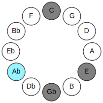
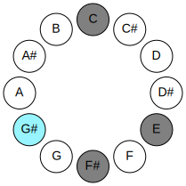
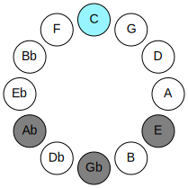
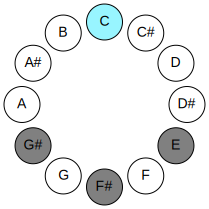
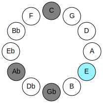
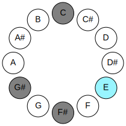
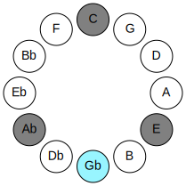
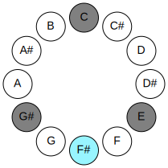

# Mode AFlatAeolic

## Links

- [Documentation](README.md)
- [Scales Index](Scales.md)
- [Modes Index](Modes.md)
- [Chords Index](Chords.md)

## Parent Scale

[Aeolic](ScaleAeolic.md)

## Mode

[AFlatAeolic](ModeAFlatAeolic.md)

## Number

1297

## Luminosity

-1

## Tonic

Ab

## Signature

C

## Transposition

4, 4, 2, 2

## Chord Pattern

## Perfection

 - 0 Perfect Notes

 - 4 Imperfect Notes

 - Perfection Profile - false, false, false, false

## Notes

- Ab (Imperfect)
- C (Imperfect)
- E (Imperfect)
- Gb (Imperfect)
- Ab (Imperfect)

## Illustration

## Diagram

| Circle of Fifth | Chromatic Circle |
|-----------------|------------------|
|  |  |
## Relative Modes

| Number | Mode | Luminosity | Tonic | Notes | Illustration |
|--------|------|------------|-------|-------|--------------|
| [1297](https://ianring.com/musictheory/scales/1297) | [Aeolic](ModeAeolic.md) | -1 | G# | G#, C, E, F#, G# |  |
| [337](https://ianring.com/musictheory/scales/337) | [Koptic](ModeKoptic.md) | -1 | C | C, E, F#, G#, C |  |
| [277](https://ianring.com/musictheory/scales/277) | [Mixolyric](ModeMixolyric.md) | -1 | E | E, F#, G#, C, E |  |
| [1093](https://ianring.com/musictheory/scales/1093) | [Lydic](ModeLydic.md) | -1 | F# | F#, G#, C, E, F# |  |
## Relative Brightness

| Number | Mode | Luminosity | Tonic | Notes | Circle Of Fifth | Chromatic Circle |
|--------|------|------------|-------|-------|-----------------|------------------|
| [1297](https://ianring.com/musictheory/scales/1297) | [Aeolic](ModeAeolic.md) | -1 | G# | G#, C, E, F#, G# |  |  |
| [1297](https://ianring.com/musictheory/scales/1297) | [Aeolic](ModeAeolic.md) | -1 | Ab | Ab, C, E, Gb, Ab |  |  |
| [337](https://ianring.com/musictheory/scales/337) | [Koptic](ModeKoptic.md) | -1 | C | C, E, F#, G#, C |  |  |
| [277](https://ianring.com/musictheory/scales/277) | [Mixolyric](ModeMixolyric.md) | -1 | E | E, F#, G#, C, E |  |  |
| [1093](https://ianring.com/musictheory/scales/1093) | [Lydic](ModeLydic.md) | -1 | F# | F#, G#, C, E, F# |  |  |
| [1093](https://ianring.com/musictheory/scales/1093) | [Lydic](ModeLydic.md) | -1 | Gb | Gb, Ab, C, E, Gb |  |  |

## Chords

### Ab

| Number | Root | Name | Notes | Illustration | Audio |
|--------|------|------|-------|--------------|-------|
| 273 | Ab | [G#+](ChordGSharpAugmented.md) | G#, B#, D## |  | [midi](ChordGSharpAugmentedRootPosition.mid) |
| 273 | Ab | [G#+7](ChordGSharpAugmentedAugmentedSeventh.md) | G#, B#, D##, F### |  | [midi](ChordGSharpAugmentedAugmentedSeventhRootPosition.mid) |
| 273 | Ab | [Ab+](ChordAFlatAugmented.md) | Ab, C, E |  | [midi](ChordAFlatAugmentedRootPosition.mid) |
| 273 | Ab | [Ab+7](ChordAFlatAugmentedAugmentedSeventh.md) | Ab, C, E, G# |  | [midi](ChordAFlatAugmentedAugmentedSeventhRootPosition.mid) |

### C

| Number | Root | Name | Notes | Illustration | Audio |
|--------|------|------|-------|--------------|-------|
| 81 | C | [CMb5](ChordCNaturalMajorFlatFifth.md) | C, E, Gb |  | [midi](ChordCNaturalMajorFlatFifthRootPosition.mid) |
| 273 | C | [C+](ChordCNaturalAugmented.md) | C, E, G# |  | [midi](ChordCNaturalAugmentedRootPosition.mid) |
| 273 | C | [C+7](ChordCNaturalAugmentedAugmentedSeventh.md) | C, E, G#, B# |  | [midi](ChordCNaturalAugmentedAugmentedSeventhRootPosition.mid) |

### E

| Number | Root | Name | Notes | Illustration | Audio |
|--------|------|------|-------|--------------|-------|
| 81 | E | [Esus2#5](ChordENaturalSuspendedSecondSharpFifth.md) | E, F#, B# |  | [midi](ChordENaturalSuspendedSecondSharpFifthRootPosition.mid) |
| 273 | E | [E+](ChordENaturalAugmented.md) | E, G#, B# |  | [midi](ChordENaturalAugmentedRootPosition.mid) |
| 273 | E | [E+7](ChordENaturalAugmentedAugmentedSeventh.md) | E, G#, B#, D## |  | [midi](ChordENaturalAugmentedAugmentedSeventhRootPosition.mid) |

### Gb

| Number | Root | Name | Notes | Illustration | Audio |
|--------|------|------|-------|--------------|-------|
| 321 | Gb | [F#](ChordFSharpDiminishedFlatThird.md) | F#, Ab, C |  | [midi](ChordFSharpDiminishedFlatThirdRootPosition.mid) |
| 321 | Gb | [F#sus2b5](ChordFSharpSuspendedSecondFlatFifth.md) | F#, G#, C |  | [midi](ChordFSharpSuspendedSecondFlatFifthRootPosition.mid) |
| 321 | Gb | [Gb](ChordGFlatDiminishedFlatThird.md) | Gb, Bbbb, Dbb |  | [midi](ChordGFlatDiminishedFlatThirdRootPosition.mid) |
| 321 | Gb | [Gbsus2b5](ChordGFlatSuspendedSecondFlatFifth.md) | Gb, Ab, Dbb |  | [midi](ChordGFlatSuspendedSecondFlatFifthRootPosition.mid) |

