# Mode AFlatAeolocrian

## Links

- [Documentation](README.md)
- [Scales Index](Scales.md)
- [Modes Index](Modes.md)
- [Chords Index](Chords.md)

## Scale

[Gacrian](ScaleGacrian.md)

## Mode

[AFlatAeolocrian](ModeAFlatAeolocrian.md)

## Tonic

Ab

## Signature

[CNaturalMajor]

## Transposition

1, 2, 1, 3, 3, 1, 1

## Chord Pattern

i, i, III⁺, Vb5, Vb5

## Perfection

 - 3 Perfect Notes

 - 4 Imperfect Notes

## Notes

- Ab
- Bbb (Imperfect)
- Cb
- Dbb
- Eb (Imperfect)
- F# (Imperfect)
- G (Imperfect)
- Ab

## Illustration

## Diagram

| Circle of Fifth | Chromatic Circle |
|-----------------|------------------|
| 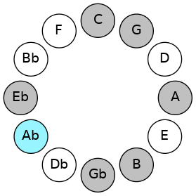 |  |
## Relative Modes

| Number | Mode | Tonic | Notes | Illustration |
|--------|------|-------|-------|--------------|
| [3227](https://ianring.com/musictheory/scales/3227) | [Aeolocrian](ModeAeolocrian.md) | G# | G#, A, B, C, D#, E##, F##, G# |  |
| [3227](https://ianring.com/musictheory/scales/3227) | [Aeolocrian](ModeAeolocrian.md) | Ab | Ab, Bbb, Cb, Dbb, Eb, F#, G, Ab |  |
| [3661](https://ianring.com/musictheory/scales/3661) | [Mixodorian](ModeMixodorian.md) | A | A, B, C, D#, E##, F##, G#, A |  |
| [1939](https://ianring.com/musictheory/scales/1939) | [Dathian](ModeDathian.md) | B | B, C, D#, E##, F##, G#, A, B |  |
| [3017](https://ianring.com/musictheory/scales/3017) | [Gacrian](ModeGacrian.md) | C | C, D#, E##, F##, G#, A, B, C |  |
| [889](https://ianring.com/musictheory/scales/889) | [Borian](ModeBorian.md) | D# | D#, E##, F##, G#, A, B, C, D# |  |
| [889](https://ianring.com/musictheory/scales/889) | [Borian](ModeBorian.md) | Eb | Eb, F#, G, Ab, Bbb, Cb, Dbb, Eb |  |
| [623](https://ianring.com/musictheory/scales/623) | [Sycrian](ModeSycrian.md) | F# | F#, G, Ab, Bbb, Cb, Dbb, Eb, F# |  |
| [623](https://ianring.com/musictheory/scales/623) | [Sycrian](ModeSycrian.md) | Gb | Gb, Abb, Bbbb, Cbbb, Dbbb, Dbb, Eb, Gb |  |
| [2359](https://ianring.com/musictheory/scales/2359) | [Gadian](ModeGadian.md) | G | G, Ab, Bbb, Cb, Dbb, Eb, F#, G |  |
## Relative Brightness

| Number | Mode | Tonic | Notes | Circle Of Fifth | Chromatic Circle |
|--------|------|-------|-------|-----------------|------------------|
| [3227](https://ianring.com/musictheory/scales/3227) | [Aeolocrian](ModeAeolocrian.md) | G# | G#, A, B, C, D#, E##, F##, G# |  | 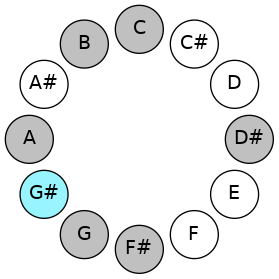 |
| [3227](https://ianring.com/musictheory/scales/3227) | [Aeolocrian](ModeAeolocrian.md) | Ab | Ab, Bbb, Cb, Dbb, Eb, F#, G, Ab |  |  |
| [3661](https://ianring.com/musictheory/scales/3661) | [Mixodorian](ModeMixodorian.md) | A | A, B, C, D#, E##, F##, G#, A |  | 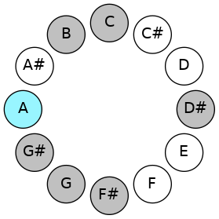 |
| [1939](https://ianring.com/musictheory/scales/1939) | [Dathian](ModeDathian.md) | B | B, C, D#, E##, F##, G#, A, B | 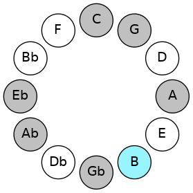 | 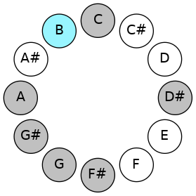 |
| [3017](https://ianring.com/musictheory/scales/3017) | [Gacrian](ModeGacrian.md) | C | C, D#, E##, F##, G#, A, B, C | 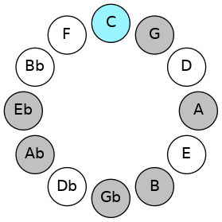 | 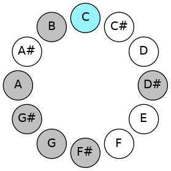 |
| [889](https://ianring.com/musictheory/scales/889) | [Borian](ModeBorian.md) | D# | D#, E##, F##, G#, A, B, C, D# |  | 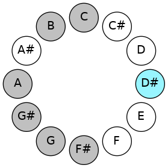 |
| [889](https://ianring.com/musictheory/scales/889) | [Borian](ModeBorian.md) | Eb | Eb, F#, G, Ab, Bbb, Cb, Dbb, Eb | 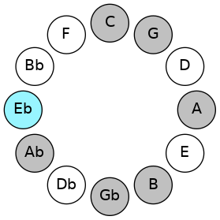 |  |
| [623](https://ianring.com/musictheory/scales/623) | [Sycrian](ModeSycrian.md) | F# | F#, G, Ab, Bbb, Cb, Dbb, Eb, F# | 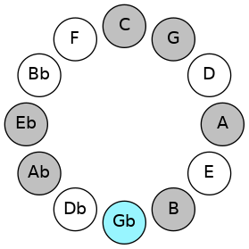 |  |
| [623](https://ianring.com/musictheory/scales/623) | [Sycrian](ModeSycrian.md) | Gb | Gb, Abb, Bbbb, Cbbb, Dbbb, Dbb, Eb, Gb |  | 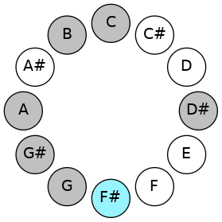 |
| [2359](https://ianring.com/musictheory/scales/2359) | [Gadian](ModeGadian.md) | G | G, Ab, Bbb, Cb, Dbb, Eb, F#, G | 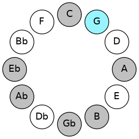 | 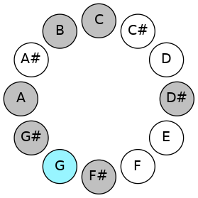 |

## Chords

### Ab

| Number | Root | Name | Notes | Illustration | Audio |
|--------|------|------|-------|--------------|-------|
| 264 | Ab | [G#5](ChordGSharpPowerChord.md) | G#, D# |  | [midi](ChordGSharpPowerChordRootPosition.mid) |
| 264 | Ab | [Ab5](ChordAFlatPowerChord.md) | Ab, Eb |  | [midi](ChordAFlatPowerChordRootPosition.mid) |
| 776 | Ab | [G#phryg](ChordGSharpPhrygian.md) | G#, A, D# |  | [midi](ChordGSharpPhrygianRootPosition.mid) |
| 776 | Ab | [Abphryg](ChordAFlatPhrygian.md) | Ab, Bbb, Eb |  | [midi](ChordAFlatPhrygianRootPosition.mid) |
| 2312 | Ab | [G#m](ChordGSharpMinor.md) | G#, B, D# |  | [midi](ChordGSharpMinorRootPosition.mid) |
| 2312 | Ab | [G#m(add(#9))](ChordGSharpMinorAddSharpNinth.md) | G#, B, D#, A## |  | [midi](ChordGSharpMinorAddSharpNinthRootPosition.mid) |
| 2312 | Ab | [Abm](ChordAFlatMinor.md) | Ab, Cb, Eb |  | [midi](ChordAFlatMinorRootPosition.mid) |
| 2312 | Ab | [Abm(add(#9))](ChordAFlatMinorAddSharpNinth.md) | Ab, Cb, Eb, B |  | [midi](ChordAFlatMinorAddSharpNinthRootPosition.mid) |
| 265 | Ab | [G#M](ChordGSharpMajor.md) | G#, B#, D# |  | [midi](ChordGSharpMajorRootPosition.mid) |
| 265 | Ab | [AbM](ChordAFlatMajor.md) | Ab, C, Eb |  | [midi](ChordAFlatMajorRootPosition.mid) |
| 2313 | Ab | [G#M(add(#9))](ChordGSharpMajorAddSharpNinth.md) | G#, B#, D#, A## |  | [midi](ChordGSharpMajorAddSharpNinthRootPosition.mid) |
| 2313 | Ab | [AbM(add(#9))](ChordAFlatMajorAddSharpNinth.md) | Ab, C, Eb, B |  | [midi](ChordAFlatMajorAddSharpNinthRootPosition.mid) |
| 2376 | Ab | [G#m7](ChordGSharpMinorSeventh.md) | G#, B, D#, F# |  | [midi](ChordGSharpMinorSeventhRootPosition.mid) |
| 2376 | Ab | [Abm7](ChordAFlatMinorSeventh.md) | Ab, Cb, Eb, Gb |  | [midi](ChordAFlatMinorSeventhRootPosition.mid) |
| 2888 | Ab | [G#m7b9](ChordGSharpMinorSeventhFlatNinth.md) | G#, B, D#, F#, A |  | [midi](ChordGSharpMinorSeventhFlatNinthRootPosition.mid) |
| 2888 | Ab | [Abm7b9](ChordAFlatMinorSeventhFlatNinth.md) | Ab, Cb, Eb, Gb, Bbb |  | [midi](ChordAFlatMinorSeventhFlatNinthRootPosition.mid) |
| 329 | Ab | [G#7](ChordGSharpDominantSeventh.md) | G#, B#, D#, F# |  | [midi](ChordGSharpDominantSeventhRootPosition.mid) |
| 329 | Ab | [Ab7](ChordAFlatDominantSeventh.md) | Ab, C, Eb, Gb |  | [midi](ChordAFlatDominantSeventhRootPosition.mid) |
| 841 | Ab | [G#7b9](ChordGSharpDominantSeventhFlatNinth.md) | G#, B#, D#, F#, A |  | [midi](ChordGSharpDominantSeventhFlatNinthRootPosition.mid) |
| 841 | Ab | [Ab7b9](ChordAFlatDominantSeventhFlatNinth.md) | Ab, C, Eb, Gb, Bbb |  | [midi](ChordAFlatDominantSeventhFlatNinthRootPosition.mid) |
| 2377 | Ab | [G#7#9](ChordGSharpDominantSeventhSharpNinth.md) | G#, B#, D#, F#, A## |  | [midi](ChordGSharpDominantSeventhSharpNinthRootPosition.mid) |
| 2377 | Ab | [Ab7#9](ChordAFlatDominantSeventhSharpNinth.md) | Ab, C, Eb, Gb, B |  | [midi](ChordAFlatDominantSeventhSharpNinthRootPosition.mid) |
| 904 | Ab | [G#phryg+7](ChordGSharpPhrygianAddSeventh.md) | G#, A, D#, F## |  | [midi](ChordGSharpPhrygianAddSeventhRootPosition.mid) |
| 904 | Ab | [Abphryg+7](ChordAFlatPhrygianAddSeventh.md) | Ab, Bbb, Eb, G |  | [midi](ChordAFlatPhrygianAddSeventhRootPosition.mid) |
| 2440 | Ab | [G#m(M7)](ChordGSharpMinorMajorSeventh.md) | G#, B, D#, F## |  | [midi](ChordGSharpMinorMajorSeventhRootPosition.mid) |
| 2440 | Ab | [Abm(M7)](ChordAFlatMinorMajorSeventh.md) | Ab, Cb, Eb, G |  | [midi](ChordAFlatMinorMajorSeventhRootPosition.mid) |
| 393 | Ab | [G#M7](ChordGSharpMajorSeventh.md) | G#, B#, D#, F## |  | [midi](ChordGSharpMajorSeventhRootPosition.mid) |
| 393 | Ab | [AbM7](ChordAFlatMajorSeventh.md) | Ab, C, Eb, G |  | [midi](ChordAFlatMajorSeventhRootPosition.mid) |

### Bbb

| Number | Root | Name | Notes | Illustration | Audio |
|--------|------|------|-------|--------------|-------|
| 2568 | Bbb | [A](ChordANaturalDiminishedFlatThird.md) | A, Cb, Eb |  | [midi](ChordANaturalDiminishedFlatThirdRootPosition.mid) |
| 2568 | Bbb | [Asus2b5](ChordANaturalSuspendedSecondFlatFifth.md) | A, B, Eb |  | [midi](ChordANaturalSuspendedSecondFlatFifthRootPosition.mid) |
| 521 | Bbb | [Ao](ChordANaturalDiminished.md) | A, C, Eb |  | [midi](ChordANaturalDiminishedRootPosition.mid) |
| 2632 | Bbb | [AM6sus2b5](ChordANaturalMajorSixthSuspendedSecondFlatFifth.md) | A, B, Eb, F# |  | [midi](ChordANaturalMajorSixthSuspendedSecondFlatFifthRootPosition.mid) |
| 585 | Bbb | [Ao7](ChordANaturalFullDiminishedSeventh.md) | A, C, Eb, Gb |  | [midi](ChordANaturalFullDiminishedSeventhRootPosition.mid) |
| 649 | Bbb | [Aø7](ChordANaturalHalfDiminishedSeventh.md) | A, C, Eb, G |  | [midi](ChordANaturalHalfDiminishedSeventhRootPosition.mid) |
| 777 | Bbb | [AoM7](ChordANaturalDiminishedMajorSeventh.md) | A, C, Eb, G# |  | [midi](ChordANaturalDiminishedMajorSeventhRootPosition.mid) |

### Cb

| Number | Root | Name | Notes | Illustration | Audio |
|--------|------|------|-------|--------------|-------|
| 2112 | Cb | [B5](ChordBNaturalPowerChord.md) | B, F# |  | [midi](ChordBNaturalPowerChordRootPosition.mid) |
| 2113 | Cb | [Bphryg](ChordBNaturalPhrygian.md) | B, C, F# |  | [midi](ChordBNaturalPhrygianRootPosition.mid) |
| 2120 | Cb | [BM](ChordBNaturalMajor.md) | B, D#, F# |  | [midi](ChordBNaturalMajorRootPosition.mid) |
| 2184 | Cb | [B+](ChordBNaturalAugmented.md) | B, D#, F## |  | [midi](ChordBNaturalAugmentedRootPosition.mid) |
| 2184 | Cb | [B+7](ChordBNaturalAugmentedAugmentedSeventh.md) | B, D#, F##, A## |  | [midi](ChordBNaturalAugmentedAugmentedSeventhRootPosition.mid) |
| 2312 | Cb | [BM##5](ChordBNaturalMajorDoubleSharpFifth.md) | B, D#, G# |  | [midi](ChordBNaturalMajorDoubleSharpFifthRootPosition.mid) |
| 2376 | Cb | [BM6](ChordBNaturalMajorSixth.md) | B, D#, F#, G# |  | [midi](ChordBNaturalMajorSixthRootPosition.mid) |
| 2377 | Cb | [BM6(addb9)](ChordBNaturalMajorSixthAddFlatNinth.md) | B, D#, F#, G#, C |  | [midi](ChordBNaturalMajorSixthAddFlatNinthRootPosition.mid) |
| 2632 | Cb | [B7](ChordBNaturalDominantSeventh.md) | B, D#, F#, A |  | [midi](ChordBNaturalDominantSeventhRootPosition.mid) |
| 2633 | Cb | [B7b9](ChordBNaturalDominantSeventhFlatNinth.md) | B, D#, F#, A, C |  | [midi](ChordBNaturalDominantSeventhFlatNinthRootPosition.mid) |
| 2697 | Cb | [B7#5b9](ChordBNaturalDominantSeventhSharpFifthFlatNinth.md) | B, D#, F##, A, C |  | [midi](ChordBNaturalDominantSeventhSharpFifthFlatNinthRootPosition.mid) |
| 2761 | Cb | [B7b9b13](ChordBNaturalDominantSeventhFlatNinthFlatThirteenth.md) | B, D#, F#, A, C, G |  | [midi](ChordBNaturalDominantSeventhFlatNinthFlatThirteenthRootPosition.mid) |
| 2888 | Cb | [B7add13](ChordBNaturalDominantSeventhAddThirteenth.md) | B, D#, F#, A, G# |  | [midi](ChordBNaturalDominantSeventhAddThirteenthRootPosition.mid) |

### Dbb

| Number | Root | Name | Notes | Illustration | Audio |
|--------|------|------|-------|--------------|-------|
| 73 | Dbb | [Co](ChordCNaturalDiminished.md) | C, Eb, Gb |  | [midi](ChordCNaturalDiminishedRootPosition.mid) |
| 129 | Dbb | [C5](ChordCNaturalPowerChord.md) | C, G |  | [midi](ChordCNaturalPowerChordRootPosition.mid) |
| 137 | Dbb | [Cm](ChordCNaturalMinor.md) | C, Eb, G |  | [midi](ChordCNaturalMinorRootPosition.mid) |
| 137 | Dbb | [Cm(add(#9))](ChordCNaturalMinorAddSharpNinth.md) | C, Eb, G, D# |  | [midi](ChordCNaturalMinorAddSharpNinthRootPosition.mid) |
| 193 | Dbb | [Clyd](ChordCNaturalLydian.md) | C, F#, G |  | [midi](ChordCNaturalLydianRootPosition.mid) |
| 201 | Dbb | [Cm(add(#4))](ChordCNaturalMinorAddSharpFourth.md) | C, Eb, F#, G |  | [midi](ChordCNaturalMinorAddSharpFourthRootPosition.mid) |
| 265 | Dbb | [Cm#5](ChordCNaturalMinorSharpFifth.md) | C, Eb, Ab |  | [midi](ChordCNaturalMinorSharpFifthRootPosition.mid) |
| 585 | Dbb | [Co7](ChordCNaturalFullDiminishedSeventh.md) | C, Eb, Gb, Bbb |  | [midi](ChordCNaturalFullDiminishedSeventhRootPosition.mid) |
| 649 | Dbb | [Cm6](ChordCNaturalMinorSixth.md) | C, Eb, G, A |  | [midi](ChordCNaturalMinorSixthRootPosition.mid) |
| 2121 | Dbb | [CoM7](ChordCNaturalDiminishedMajorSeventh.md) | C, Eb, Gb, B |  | [midi](ChordCNaturalDiminishedMajorSeventhRootPosition.mid) |
| 2185 | Dbb | [Cm(M7)](ChordCNaturalMinorMajorSeventh.md) | C, Eb, G, B |  | [midi](ChordCNaturalMinorMajorSeventhRootPosition.mid) |
| 2241 | Dbb | [Clyd(M7)](ChordCNaturalLydianMajorSeventh.md) | C, F#, G, B |  | [midi](ChordCNaturalLydianMajorSeventhRootPosition.mid) |
| 2697 | Dbb | [Cm(M7)add13](ChordCNaturalMinorMajorSeventhAddThirteenth.md) | C, Eb, G, B, A |  | [midi](ChordCNaturalMinorMajorSeventhAddThirteenthRootPosition.mid) |

### Eb

| Number | Root | Name | Notes | Illustration | Audio |
|--------|------|------|-------|--------------|-------|
| 328 | Eb | [D#mbb5](ChordDSharpMinorDoubleFlatFifth.md) | D#, F#, G# |  | [midi](ChordDSharpMinorDoubleFlatFifthRootPosition.mid) |
| 328 | Eb | [Ebmbb5](ChordEFlatMinorDoubleFlatFifth.md) | Eb, Gb, Ab |  | [midi](ChordEFlatMinorDoubleFlatFifthRootPosition.mid) |
| 584 | Eb | [D#o](ChordDSharpDiminished.md) | D#, F#, A |  | [midi](ChordDSharpDiminishedRootPosition.mid) |
| 584 | Eb | [Ebo](ChordEFlatDiminished.md) | Eb, Gb, Bbb |  | [midi](ChordEFlatDiminishedRootPosition.mid) |
| 648 | Eb | [D#Mb5](ChordDSharpMajorFlatFifth.md) | D#, F##, A |  | [midi](ChordDSharpMajorFlatFifthRootPosition.mid) |
| 648 | Eb | [EbMb5](ChordEFlatMajorFlatFifth.md) | Eb, G, Bbb |  | [midi](ChordEFlatMajorFlatFifthRootPosition.mid) |
| 776 | Eb | [D#sus4b5](ChordDSharpSuspendedFourthFlatFifth.md) | D#, G#, A |  | [midi](ChordDSharpSuspendedFourthFlatFifthRootPosition.mid) |
| 776 | Eb | [Ebsus4b5](ChordEFlatSuspendedFourthFlatFifth.md) | Eb, Ab, Bbb |  | [midi](ChordEFlatSuspendedFourthFlatFifthRootPosition.mid) |
| 2120 | Eb | [D#m#5](ChordDSharpMinorSharpFifth.md) | D#, F#, B |  | [midi](ChordDSharpMinorSharpFifthRootPosition.mid) |
| 2120 | Eb | [Ebm#5](ChordEFlatMinorSharpFifth.md) | Eb, Gb, Cb |  | [midi](ChordEFlatMinorSharpFifthRootPosition.mid) |
| 2184 | Eb | [D#+](ChordDSharpAugmented.md) | D#, F##, A## |  | [midi](ChordDSharpAugmentedRootPosition.mid) |
| 2184 | Eb | [D#+7](ChordDSharpAugmentedAugmentedSeventh.md) | D#, F##, A##, C### |  | [midi](ChordDSharpAugmentedAugmentedSeventhRootPosition.mid) |
| 2184 | Eb | [Eb+](ChordEFlatAugmented.md) | Eb, G, B |  | [midi](ChordEFlatAugmentedRootPosition.mid) |
| 2184 | Eb | [Eb+7](ChordEFlatAugmentedAugmentedSeventh.md) | Eb, G, B, D# |  | [midi](ChordEFlatAugmentedAugmentedSeventhRootPosition.mid) |
| 2312 | Eb | [D#sus4#5](ChordDSharpSuspendedFourthSharpFifth.md) | D#, G#, A## |  | [midi](ChordDSharpSuspendedFourthSharpFifthRootPosition.mid) |
| 2312 | Eb | [Ebsus4#5](ChordEFlatSuspendedFourthSharpFifth.md) | Eb, Ab, B |  | [midi](ChordEFlatSuspendedFourthSharpFifthRootPosition.mid) |
| 137 | Eb | [D#M##5](ChordDSharpMajorDoubleSharpFifth.md) | D#, F##, B# |  | [midi](ChordDSharpMajorDoubleSharpFifthRootPosition.mid) |
| 137 | Eb | [EbM##5](ChordEFlatMajorDoubleSharpFifth.md) | Eb, G, C |  | [midi](ChordEFlatMajorDoubleSharpFifthRootPosition.mid) |
| 265 | Eb | [D#sus4##5](ChordDSharpSuspendedFourthDoubleSharpFifth.md) | D#, G#, B# |  | [midi](ChordDSharpSuspendedFourthDoubleSharpFifthRootPosition.mid) |
| 265 | Eb | [Ebsus4##5](ChordEFlatSuspendedFourthDoubleSharpFifth.md) | Eb, Ab, C |  | [midi](ChordEFlatSuspendedFourthDoubleSharpFifthRootPosition.mid) |
| 585 | Eb | [D#o7](ChordDSharpFullDiminishedSeventh.md) | D#, F#, A, C |  | [midi](ChordDSharpFullDiminishedSeventhRootPosition.mid) |
| 585 | Eb | [Ebo7](ChordEFlatFullDiminishedSeventh.md) | Eb, Gb, Bbb, Dbb |  | [midi](ChordEFlatFullDiminishedSeventhRootPosition.mid) |
| 649 | Eb | [D#M6b5](ChordDSharpMajorSixthFlatFifth.md) | D#, F##, A, B# |  | [midi](ChordDSharpMajorSixthFlatFifthRootPosition.mid) |
| 649 | Eb | [EbM6b5](ChordEFlatMajorSixthFlatFifth.md) | Eb, G, Bbb, C |  | [midi](ChordEFlatMajorSixthFlatFifthRootPosition.mid) |

### F#

| Number | Root | Name | Notes | Illustration | Audio |
|--------|------|------|-------|--------------|-------|
| 2368 | F# | [F#sus2bb5](ChordFSharpSuspendedSecondDoubleFlatFifth.md) | F#, G#, B |  | [midi](ChordFSharpSuspendedSecondDoubleFlatFifthRootPosition.mid) |
| 2368 | F# | [Gbsus2bb5](ChordGFlatSuspendedSecondDoubleFlatFifth.md) | Gb, Ab, Cb |  | [midi](ChordGFlatSuspendedSecondDoubleFlatFifthRootPosition.mid) |
| 2624 | F# | [F#mbb5](ChordFSharpMinorDoubleFlatFifth.md) | F#, A, B |  | [midi](ChordFSharpMinorDoubleFlatFifthRootPosition.mid) |
| 2624 | F# | [Gbmbb5](ChordGFlatMinorDoubleFlatFifth.md) | Gb, Bbb, Cb |  | [midi](ChordGFlatMinorDoubleFlatFifthRootPosition.mid) |
| 193 | F# | [F#loc](ChordFSharpLocrian.md) | F#, G, C |  | [midi](ChordFSharpLocrianRootPosition.mid) |
| 193 | F# | [Gbloc](ChordGFlatLocrian.md) | Gb, Abb, Dbb |  | [midi](ChordGFlatLocrianRootPosition.mid) |
| 321 | F# | [F#](ChordFSharpDiminishedFlatThird.md) | F#, Ab, C |  | [midi](ChordFSharpDiminishedFlatThirdRootPosition.mid) |
| 321 | F# | [F#sus2b5](ChordFSharpSuspendedSecondFlatFifth.md) | F#, G#, C |  | [midi](ChordFSharpSuspendedSecondFlatFifthRootPosition.mid) |
| 321 | F# | [Gb](ChordGFlatDiminishedFlatThird.md) | Gb, Bbbb, Dbb |  | [midi](ChordGFlatDiminishedFlatThirdRootPosition.mid) |
| 321 | F# | [Gbsus2b5](ChordGFlatSuspendedSecondFlatFifth.md) | Gb, Ab, Dbb |  | [midi](ChordGFlatSuspendedSecondFlatFifthRootPosition.mid) |
| 577 | F# | [F#o](ChordFSharpDiminished.md) | F#, A, C |  | [midi](ChordFSharpDiminishedRootPosition.mid) |
| 577 | F# | [Gbo](ChordGFlatDiminished.md) | Gb, Bbb, Dbb |  | [midi](ChordGFlatDiminishedRootPosition.mid) |
| 2113 | F# | [F#sus4b5](ChordFSharpSuspendedFourthFlatFifth.md) | F#, B, C |  | [midi](ChordFSharpSuspendedFourthFlatFifthRootPosition.mid) |
| 2113 | F# | [Gbsus4b5](ChordGFlatSuspendedFourthFlatFifth.md) | Gb, Cb, Dbb |  | [midi](ChordGFlatSuspendedFourthFlatFifthRootPosition.mid) |
| 2120 | F# | [F#sus4##5](ChordFSharpSuspendedFourthDoubleSharpFifth.md) | F#, B, D# |  | [midi](ChordFSharpSuspendedFourthDoubleSharpFifthRootPosition.mid) |
| 2120 | F# | [Gbsus4##5](ChordGFlatSuspendedFourthDoubleSharpFifth.md) | Gb, Cb, Eb |  | [midi](ChordGFlatSuspendedFourthDoubleSharpFifthRootPosition.mid) |
| 2376 | F# | [F#M6sus2bb5](ChordFSharpMajorSixthSuspendedSecondDoubleFlatFifth.md) | F#, G#, B, D# |  | [midi](ChordFSharpMajorSixthSuspendedSecondDoubleFlatFifthRootPosition.mid) |
| 2376 | F# | [GbM6sus2bb5](ChordGFlatMajorSixthSuspendedSecondDoubleFlatFifth.md) | Gb, Ab, Cb, Eb |  | [midi](ChordGFlatMajorSixthSuspendedSecondDoubleFlatFifthRootPosition.mid) |
| 329 | F# | [F#M6sus2b5](ChordFSharpMajorSixthSuspendedSecondFlatFifth.md) | F#, G#, C, D# |  | [midi](ChordFSharpMajorSixthSuspendedSecondFlatFifthRootPosition.mid) |
| 329 | F# | [GbM6sus2b5](ChordGFlatMajorSixthSuspendedSecondFlatFifth.md) | Gb, Ab, Dbb, Eb |  | [midi](ChordGFlatMajorSixthSuspendedSecondFlatFifthRootPosition.mid) |
| 585 | F# | [F#o7](ChordFSharpFullDiminishedSeventh.md) | F#, A, C, Eb |  | [midi](ChordFSharpFullDiminishedSeventhRootPosition.mid) |
| 585 | F# | [Gbo7](ChordGFlatFullDiminishedSeventh.md) | Gb, Bbb, Dbb, Fbb |  | [midi](ChordGFlatFullDiminishedSeventhRootPosition.mid) |

### G

| Number | Root | Name | Notes | Illustration | Audio |
|--------|------|------|-------|--------------|-------|
| 641 | G | [Gsus2bb5](ChordGNaturalSuspendedSecondDoubleFlatFifth.md) | G, A, C |  | [midi](ChordGNaturalSuspendedSecondDoubleFlatFifthRootPosition.mid) |
| 648 | G | [Gsus2#5](ChordGNaturalSuspendedSecondSharpFifth.md) | G, A, D# |  | [midi](ChordGNaturalSuspendedSecondSharpFifthRootPosition.mid) |
| 2184 | G | [G+](ChordGNaturalAugmented.md) | G, B, D# |  | [midi](ChordGNaturalAugmentedRootPosition.mid) |
| 2184 | G | [G+7](ChordGNaturalAugmentedAugmentedSeventh.md) | G, B, D#, F## |  | [midi](ChordGNaturalAugmentedAugmentedSeventhRootPosition.mid) |
| 137 | G | [Gsus4#5](ChordGNaturalSuspendedFourthSharpFifth.md) | G, C, D# |  | [midi](ChordGNaturalSuspendedFourthSharpFifthRootPosition.mid) |
| 193 | G | [GQ+](ChordGNaturalQuartalAugmented.md) | G, C, F# |  | [midi](ChordGNaturalQuartalAugmentedRootPosition.mid) |
| 2248 | G | [G+(M7)](ChordGNaturalAugmentedMajorSeventh.md) | G, B, D#, F# |  | [midi](ChordGNaturalAugmentedMajorSeventhRootPosition.mid) |
| 201 | G | [GM7(sus4)#5](ChordGNaturalMajorSeventhSuspendedFourthSharpFifth.md) | G, C, D#, F# |  | [midi](ChordGNaturalMajorSeventhSuspendedFourthSharpFifthRootPosition.mid) |

