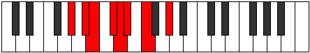
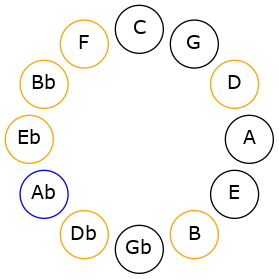
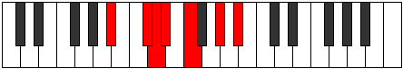
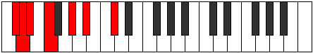
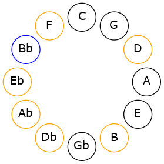

# Mode AFlatAeologian

## Links

- [Documentation](README.md)
- [Scales Index](Scales.md)
- [Modes Index](Modes.md)
- [Chords Index](Chords.md)

## Scale

[Ionopian](ScaleIonopian.md)

## Mode

[AFlatAeologian](ModeAFlatAeologian.md)

## Tonic

Ab

## Signature

[CNaturalMajor]

## Transposition

2, 1, 2, 1, 1, 2, 3

## Chord Pattern

i⁰, iii⁰

## Perfection

 - 4 Perfect Notes

 - 3 Imperfect Notes

## Notes

- Ab
- Bb
- Cb (Imperfect)
- Db
- Ebb (Imperfect)
- Fbb
- Gbb (Imperfect)
- Ab

## Illustration

## Diagram

## Relative Modes

| Number | Mode | Tonic | Notes | Illustration |
|--------|------|-------|-------|--------------|
| [749](https://ianring.com/musictheory/scales/749) | [Aeologian](ModeAeologian.md) | Ab | Ab, Bb, Cb, Db, Ebb, Fbb, Gbb, Ab |  |
| [1211](https://ianring.com/musictheory/scales/1211) | [Zadian](ModeZadian.md) | Bb | Bb, Cb, Db, Ebb, Fbb, Gbb, Ab, Bb |  |
| [1687](https://ianring.com/musictheory/scales/1687) | [Phralian](ModePhralian.md) | Db | Db, Ebb, Fbb, Gbb, Ab, Bb, Cb, Db |  |
## Relative Brightness

| Number | Mode | Tonic | Notes | Illustration |
|--------|------|-------|-------|--------------|
| [749](https://ianring.com/musictheory/scales/749) | [Aeologian](ModeAeologian.md) | Ab | Ab, Bb, Cb, Db, Ebb, Fbb, Gbb, Ab |  |
| [1211](https://ianring.com/musictheory/scales/1211) | [Zadian](ModeZadian.md) | Bb | Bb, Cb, Db, Ebb, Fbb, Gbb, Ab, Bb |  |
| [1687](https://ianring.com/musictheory/scales/1687) | [Phralian](ModePhralian.md) | Db | Db, Ebb, Fbb, Gbb, Ab, Bb, Cb, Db |  |

## Chords

### Ab

| Number | Root | Name | Notes | Illustration | Audio |
|--------|------|------|-------|--------------|-------|
| 1282 | Ab | [Absus2bb5](ChordAFlatSuspendedSecondDoubleFlatFifth.md) | Ab, Bb, Db |  | [midi](ChordAFlatSuspendedSecondDoubleFlatFifthRootPosition.mid) |
| 2306 | Ab | [Abmbb5](ChordAFlatMinorDoubleFlatFifth.md) | Ab, Cb, Db |  | [midi](ChordAFlatMinorDoubleFlatFifthRootPosition.mid) |
| 1284 | Ab | [Ab](ChordAFlatDiminishedFlatThird.md) | Ab, Cbb, Ebb |  | [midi](ChordAFlatDiminishedFlatThirdRootPosition.mid) |
| 1284 | Ab | [Absus2b5](ChordAFlatSuspendedSecondFlatFifth.md) | Ab, Bb, Ebb |  | [midi](ChordAFlatSuspendedSecondFlatFifthRootPosition.mid) |
| 2308 | Ab | [Abo](ChordAFlatDiminished.md) | Ab, Cb, Ebb |  | [midi](ChordAFlatDiminishedRootPosition.mid) |
| 262 | Ab | [Absus4b5](ChordAFlatSuspendedFourthFlatFifth.md) | Ab, Db, Ebb |  | [midi](ChordAFlatSuspendedFourthFlatFifthRootPosition.mid) |
| 264 | Ab | [Ab5](ChordAFlatPowerChord.md) | Ab, Eb |  | [midi](ChordAFlatPowerChordRootPosition.mid) |
| 1288 | Ab | [Absus2](ChordAFlatSuspendedSecond.md) | Ab, Bb, Eb |  | [midi](ChordAFlatSuspendedSecondRootPosition.mid) |
| 2312 | Ab | [Abm](ChordAFlatMinor.md) | Ab, Cb, Eb |  | [midi](ChordAFlatMinorRootPosition.mid) |
| 2312 | Ab | [Abm(add(#9))](ChordAFlatMinorAddSharpNinth.md) | Ab, Cb, Eb, B |  | [midi](ChordAFlatMinorAddSharpNinthRootPosition.mid) |
| 3336 | Ab | [Abm(add9)](ChordAFlatMinorAddNinth.md) | Ab, Cb, Eb, Bb |  | [midi](ChordAFlatMinorAddNinthRootPosition.mid) |
| 266 | Ab | [Absus4](ChordAFlatSuspendedFourth.md) | Ab, Db, Eb |  | [midi](ChordAFlatSuspendedFourthRootPosition.mid) |
| 2314 | Ab | [Abm(add11)](ChordAFlatMinorAddEleventh.md) | Ab, Cb, Eb, Db |  | [midi](ChordAFlatMinorAddEleventhRootPosition.mid) |
| 2314 | Ab | [Abm(add4)](ChordAFlatMinorAddFourth.md) | Ab, Cb, Db, Eb |  | [midi](ChordAFlatMinorAddFourthRootPosition.mid) |
| 268 | Ab | [Ablyd](ChordAFlatLydian.md) | Ab, D, Eb |  | [midi](ChordAFlatLydianRootPosition.mid) |
| 2316 | Ab | [Abm(add(#4))](ChordAFlatMinorAddSharpFourth.md) | Ab, Cb, D, Eb |  | [midi](ChordAFlatMinorAddSharpFourthRootPosition.mid) |
| 290 | Ab | [Absus4##5](ChordAFlatSuspendedFourthDoubleSharpFifth.md) | Ab, Db, F |  | [midi](ChordAFlatSuspendedFourthDoubleSharpFifthRootPosition.mid) |
| 1314 | Ab | [AbM6sus2bb5](ChordAFlatMajorSixthSuspendedSecondDoubleFlatFifth.md) | Ab, Bb, Db, F |  | [midi](ChordAFlatMajorSixthSuspendedSecondDoubleFlatFifthRootPosition.mid) |
| 1316 | Ab | [AbM6sus2b5](ChordAFlatMajorSixthSuspendedSecondFlatFifth.md) | Ab, Bb, Ebb, F |  | [midi](ChordAFlatMajorSixthSuspendedSecondFlatFifthRootPosition.mid) |
| 2340 | Ab | [Abo7](ChordAFlatFullDiminishedSeventh.md) | Ab, Cb, Ebb, Gbb |  | [midi](ChordAFlatFullDiminishedSeventhRootPosition.mid) |
| 1320 | Ab | [AbM6sus2](ChordAFlatMajorSixthSuspendedSecond.md) | Ab, Bb, Eb, F |  | [midi](ChordAFlatMajorSixthSuspendedSecondRootPosition.mid) |
| 1320 | Ab | [Ab7sus2b5](ChordAFlatDominantSeventhSuspendedSecondFlatFifth.md) | Ab, Bb, Eb, Gbb |  | [midi](ChordAFlatDominantSeventhSuspendedSecondFlatFifthRootPosition.mid) |
| 2344 | Ab | [Abm6](ChordAFlatMinorSixth.md) | Ab, Cb, Eb, F |  | [midi](ChordAFlatMinorSixthRootPosition.mid) |
| 3368 | Ab | [Abm6(add9)](ChordAFlatMinorSixthAddNinth.md) | Ab, Cb, Eb, F, Bb |  | [midi](ChordAFlatMinorSixthAddNinthRootPosition.mid) |
| 298 | Ab | [AbM6sus4](ChordAFlatMajorSixthSuspendedFourth.md) | Ab, Db, Eb, F |  | [midi](ChordAFlatMajorSixthSuspendedFourthRootPosition.mid) |

### Bb

| Number | Root | Name | Notes | Illustration | Audio |
|--------|------|------|-------|--------------|-------|
| 1034 | Bb | [Bbmbb5](ChordBFlatMinorDoubleFlatFifth.md) | Bb, Db, Eb |  | [midi](ChordBFlatMinorDoubleFlatFifthRootPosition.mid) |
| 1056 | Bb | [Bb5](ChordBFlatPowerChord.md) | Bb, F |  | [midi](ChordBFlatPowerChordRootPosition.mid) |
| 3104 | Bb | [Bbphryg](ChordBFlatPhrygian.md) | Bb, Cb, F |  | [midi](ChordBFlatPhrygianRootPosition.mid) |
| 1058 | Bb | [Bbm](ChordBFlatMinor.md) | Bb, Db, F |  | [midi](ChordBFlatMinorRootPosition.mid) |
| 1058 | Bb | [Bbm(add(#9))](ChordBFlatMinorAddSharpNinth.md) | Bb, Db, F, C# |  | [midi](ChordBFlatMinorAddSharpNinthRootPosition.mid) |
| 1060 | Bb | [BbM](ChordBFlatMajor.md) | Bb, D, F |  | [midi](ChordBFlatMajorRootPosition.mid) |
| 1062 | Bb | [BbM(add(#9))](ChordBFlatMajorAddSharpNinth.md) | Bb, D, F, C# |  | [midi](ChordBFlatMajorAddSharpNinthRootPosition.mid) |
| 1064 | Bb | [Bbsus4](ChordBFlatSuspendedFourth.md) | Bb, Eb, F |  | [midi](ChordBFlatSuspendedFourthRootPosition.mid) |
| 1066 | Bb | [Bbm(add11)](ChordBFlatMinorAddEleventh.md) | Bb, Db, F, Eb |  | [midi](ChordBFlatMinorAddEleventhRootPosition.mid) |
| 1066 | Bb | [Bbm(add4)](ChordBFlatMinorAddFourth.md) | Bb, Db, Eb, F |  | [midi](ChordBFlatMinorAddFourthRootPosition.mid) |
| 1068 | Bb | [BbM(add11)](ChordBFlatMajorAddEleventh.md) | Bb, D, F, Eb |  | [midi](ChordBFlatMajorAddEleventhRootPosition.mid) |
| 1068 | Bb | [BbM(add4)](ChordBFlatMajorAddFourth.md) | Bb, D, Eb, F |  | [midi](ChordBFlatMajorAddFourthRootPosition.mid) |
| 1288 | Bb | [BbQ](ChordBFlatQuartal.md) | Bb, Eb, Ab |  | [midi](ChordBFlatQuartalRootPosition.mid) |
| 1290 | Bb | [Bbm7bb5](ChordBFlatMinorSeventhDoubleFlatFifth.md) | Bb, Db, Eb, Ab |  | [midi](ChordBFlatMinorSeventhDoubleFlatFifthRootPosition.mid) |
| 1314 | Bb | [Bbm7](ChordBFlatMinorSeventh.md) | Bb, Db, F, Ab |  | [midi](ChordBFlatMinorSeventhRootPosition.mid) |
| 3362 | Bb | [Bbm7b9](ChordBFlatMinorSeventhFlatNinth.md) | Bb, Db, F, Ab, Cb |  | [midi](ChordBFlatMinorSeventhFlatNinthRootPosition.mid) |
| 1316 | Bb | [Bb7](ChordBFlatDominantSeventh.md) | Bb, D, F, Ab |  | [midi](ChordBFlatDominantSeventhRootPosition.mid) |
| 3364 | Bb | [Bb7b9](ChordBFlatDominantSeventhFlatNinth.md) | Bb, D, F, Ab, Cb |  | [midi](ChordBFlatDominantSeventhFlatNinthRootPosition.mid) |
| 1318 | Bb | [Bb7#9](ChordBFlatDominantSeventhSharpNinth.md) | Bb, D, F, Ab, C# |  | [midi](ChordBFlatDominantSeventhSharpNinthRootPosition.mid) |
| 1320 | Bb | [Bb7sus4](ChordBFlatDominantSeventhSuspendedFourth.md) | Bb, Eb, F, Ab |  | [midi](ChordBFlatDominantSeventhSuspendedFourthRootPosition.mid) |
| 1322 | Bb | [Bbm7add11](ChordBFlatMinorSeventhAddEleventh.md) | Bb, Db, F, Ab, Eb |  | [midi](ChordBFlatMinorSeventhAddEleventhRootPosition.mid) |
| 1324 | Bb | [Bb7add4](ChordBFlatDominantSeventhAddFourth.md) | Bb, D, Eb, F, Ab |  | [midi](ChordBFlatDominantSeventhAddFourthRootPosition.mid) |
| 1324 | Bb | [Bb7add11](ChordBFlatDominantSeventhAddEleventh.md) | Bb, D, F, Ab, Eb |  | [midi](ChordBFlatDominantSeventhAddEleventhRootPosition.mid) |

### Cb

| Number | Root | Name | Notes | Illustration | Audio |
|--------|------|------|-------|--------------|-------|

### Db

| Number | Root | Name | Notes | Illustration | Audio |
|--------|------|------|-------|--------------|-------|
| 258 | Db | [Db5](ChordDFlatPowerChord.md) | Db, Ab |  | [midi](ChordDFlatPowerChordRootPosition.mid) |
| 262 | Db | [Dbphryg](ChordDFlatPhrygian.md) | Db, Ebb, Ab |  | [midi](ChordDFlatPhrygianRootPosition.mid) |
| 266 | Db | [Dbsus2](ChordDFlatSuspendedSecond.md) | Db, Eb, Ab |  | [midi](ChordDFlatSuspendedSecondRootPosition.mid) |
| 290 | Db | [DbM](ChordDFlatMajor.md) | Db, F, Ab |  | [midi](ChordDFlatMajorRootPosition.mid) |
| 298 | Db | [DbM(add9)](ChordDFlatMajorAddNinth.md) | Db, F, Ab, Eb |  | [midi](ChordDFlatMajorAddNinthRootPosition.mid) |
| 1058 | Db | [DbM##5](ChordDFlatMajorDoubleSharpFifth.md) | Db, F, Bb |  | [midi](ChordDFlatMajorDoubleSharpFifthRootPosition.mid) |
| 1290 | Db | [DbM6sus2](ChordDFlatMajorSixthSuspendedSecond.md) | Db, Eb, Ab, Bb |  | [midi](ChordDFlatMajorSixthSuspendedSecondRootPosition.mid) |
| 1290 | Db | [Db7sus2b5](ChordDFlatDominantSeventhSuspendedSecondFlatFifth.md) | Db, Eb, Ab, Cbb |  | [midi](ChordDFlatDominantSeventhSuspendedSecondFlatFifthRootPosition.mid) |
| 1314 | Db | [DbM6](ChordDFlatMajorSixth.md) | Db, F, Ab, Bb |  | [midi](ChordDFlatMajorSixthRootPosition.mid) |
| 1318 | Db | [DbM6(addb9)](ChordDFlatMajorSixthAddFlatNinth.md) | Db, F, Ab, Bb, Ebb |  | [midi](ChordDFlatMajorSixthAddFlatNinthRootPosition.mid) |
| 1322 | Db | [DbM6(add9)](ChordDFlatMajorSixthAddNinth.md) | Db, F, Ab, Bb, Eb |  | [midi](ChordDFlatMajorSixthAddNinthRootPosition.mid) |
| 2314 | Db | [Db7sus2](ChordDFlatDominantSeventhSuspendedSecond.md) | Db, Eb, Ab, Cb |  | [midi](ChordDFlatDominantSeventhSuspendedSecondRootPosition.mid) |
| 2314 | Db | [Db9sus2](ChordDFlatDominantNinthSuspendedSecond.md) | Db, Eb, Ab, Cb, Eb |  | [midi](ChordDFlatDominantNinthSuspendedSecondRootPosition.mid) |
| 2338 | Db | [Db7](ChordDFlatDominantSeventh.md) | Db, F, Ab, Cb |  | [midi](ChordDFlatDominantSeventhRootPosition.mid) |
| 2342 | Db | [Db7b9](ChordDFlatDominantSeventhFlatNinth.md) | Db, F, Ab, Cb, Ebb |  | [midi](ChordDFlatDominantSeventhFlatNinthRootPosition.mid) |
| 2346 | Db | [Db9](ChordDFlatDominantNinth.md) | Db, F, Ab, Cb, Eb |  | [midi](ChordDFlatDominantNinthRootPosition.mid) |
| 3362 | Db | [Db7add13](ChordDFlatDominantSeventhAddThirteenth.md) | Db, F, Ab, Cb, Bb |  | [midi](ChordDFlatDominantSeventhAddThirteenthRootPosition.mid) |

### Ebb

| Number | Root | Name | Notes | Illustration | Audio |
|--------|------|------|-------|--------------|-------|

### Fbb

| Number | Root | Name | Notes | Illustration | Audio |
|--------|------|------|-------|--------------|-------|

### Gbb

| Number | Root | Name | Notes | Illustration | Audio |
|--------|------|------|-------|--------------|-------|

