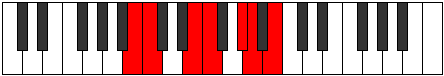

# Mode AFlatAeologimic

## Links

- [Documentation](index.md)
- [Scales Index](Scales.md)
- [Modes Index](Modes.md)
- [Chords Index](Chords.md)

## Scale

[Solimic](ScaleSolimic.md)

## Mode

[AFlatAeologimic](ModeAFlatAeologimic.md)

## Tonic

Ab

## Signature

[CNaturalMajor]

## Perfection

 - 3 Perfect Notes

 - 3 Imperfect Notes

## Notes

- Ab (Imperfect)
- Bbb
- Cb (Imperfect)
- Dbb (Imperfect)
- E
- F
- Ab (Imperfect)

## Illustration

## Relative Modes

| Number | Mode | Tonic | Notes | Illustration |
|--------|------|-------|-------|--------------|
| [435](https://ianring.com/musictheory/scales/435) | [Ionolimic](ModeIonolimic.md) | E | E, F, G#, A, B, C, E |  |
| [795](https://ianring.com/musictheory/scales/795) | [Aeologimic](ModeAeologimic.md) | G# | G#, A, B, C, D##, E#, G# |  |
| [795](https://ianring.com/musictheory/scales/795) | [Aeologimic](ModeAeologimic.md) | Ab | Ab, Bbb, Cb, Dbb, E, F, Ab |  |
| [1635](https://ianring.com/musictheory/scales/1635) | [Sygimic](ModeSygimic.md) | B | B, C, D##, E#, F###, G##, B |  |
| [2265](https://ianring.com/musictheory/scales/2265) | [Ionophimic](ModeIonophimic.md) | F | F, G#, A, B, C, D##, F |  |
| [2445](https://ianring.com/musictheory/scales/2445) | [Zadimic](ModeZadimic.md) | A | A, B, C, D##, E#, F###, A |  |
| [2865](https://ianring.com/musictheory/scales/2865) | [Solimic](ModeSolimic.md) | C | C, D##, E#, F###, G##, A##, C |  |

## Chords

### Ab

| Number | Root | Name | Notes | Illustration | Audio |
|--------|------|------|-------|--------------|-------|

### Bbb

| Number | Root | Name | Notes | Illustration | Audio |
|--------|------|------|-------|--------------|-------|

### Cb

| Number | Root | Name | Notes | Illustration | Audio |
|--------|------|------|-------|--------------|-------|

### Dbb

| Number | Root | Name | Notes | Illustration | Audio |
|--------|------|------|-------|--------------|-------|

### E

| Number | Root | Name | Notes | Illustration | Audio |
|--------|------|------|-------|--------------|-------|

### F

| Number | Root | Name | Notes | Illustration | Audio |
|--------|------|------|-------|--------------|-------|

