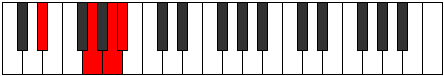
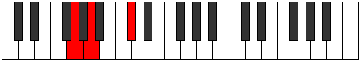

# Mode AFlatAeolonyllic

## Links

- [Documentation](README.md)
- [Scales Index](Scales.md)
- [Modes Index](Modes.md)
- [Chords Index](Chords.md)

## Scale

[Kataryllic](ScaleKataryllic.md)

## Mode

[AFlatAeolonyllic](ModeAFlatAeolonyllic.md)

## Tonic

Ab

## Signature

[CNaturalMajor]

## Transposition

1, 1, 1, 2, 2, 3, 1, 1

## Chord Pattern

ii⁰b3, IV⁺, VIb5

## Perfection

 - 5 Perfect Notes

 - 3 Imperfect Notes

## Notes

- Ab
- A (Imperfect)
- Bb (Imperfect)
- B
- Db
- Eb
- Gb
- G (Imperfect)
- Ab

## Illustration

## Diagram

## Relative Modes

| Number | Mode | Tonic | Notes | Illustration |
|--------|------|-------|-------|--------------|
| [3247](https://ianring.com/musictheory/scales/3247) | [Aeolonyllic](ModeAeolonyllic.md) | Ab | Ab, A, Bb, B, Db, Eb, Gb, G, Ab |  |
| [3671](https://ianring.com/musictheory/scales/3671) | [Aeonyllic](ModeAeonyllic.md) | A | A, A#, B, C#, D#, F#, G, G#, A |  |
| [3883](https://ianring.com/musictheory/scales/3883) | [Kyryllic](ModeKyryllic.md) | Bb | Bb, B, Db, Eb, Gb, G, Ab, A, Bb |  |
| [3989](https://ianring.com/musictheory/scales/3989) | [Sythyllic](ModeSythyllic.md) | B | B, C#, D#, F#, G, G#, A, A#, B |  |
| [2021](https://ianring.com/musictheory/scales/2021) | [Katycryllic](ModeKatycryllic.md) | Db | Db, Eb, Gb, G, Ab, A, Bb, B, Db |  |
| [1529](https://ianring.com/musictheory/scales/1529) | [Kataryllic](ModeKataryllic.md) | Eb | Eb, Gb, G, Ab, A, Bb, B, Db, Eb |  |
| [703](https://ianring.com/musictheory/scales/703) | [Aerocryllic](ModeAerocryllic.md) | Gb | Gb, G, Ab, A, Bb, B, Db, Eb, Gb |  |
| [2399](https://ianring.com/musictheory/scales/2399) | [Zanyllic](ModeZanyllic.md) | G | G, G#, A, A#, B, C#, D#, F#, G |  |
## Relative Brightness

| Number | Mode | Tonic | Notes | Illustration |
|--------|------|-------|-------|--------------|
| [3247](https://ianring.com/musictheory/scales/3247) | [Aeolonyllic](ModeAeolonyllic.md) | Ab | Ab, A, Bb, B, Db, Eb, Gb, G, Ab |  |
| [3671](https://ianring.com/musictheory/scales/3671) | [Aeonyllic](ModeAeonyllic.md) | A | A, A#, B, C#, D#, F#, G, G#, A |  |
| [3883](https://ianring.com/musictheory/scales/3883) | [Kyryllic](ModeKyryllic.md) | Bb | Bb, B, Db, Eb, Gb, G, Ab, A, Bb |  |
| [3989](https://ianring.com/musictheory/scales/3989) | [Sythyllic](ModeSythyllic.md) | B | B, C#, D#, F#, G, G#, A, A#, B |  |
| [2021](https://ianring.com/musictheory/scales/2021) | [Katycryllic](ModeKatycryllic.md) | Db | Db, Eb, Gb, G, Ab, A, Bb, B, Db |  |
| [1529](https://ianring.com/musictheory/scales/1529) | [Kataryllic](ModeKataryllic.md) | Eb | Eb, Gb, G, Ab, A, Bb, B, Db, Eb |  |
| [703](https://ianring.com/musictheory/scales/703) | [Aerocryllic](ModeAerocryllic.md) | Gb | Gb, G, Ab, A, Bb, B, Db, Eb, Gb |  |
| [2399](https://ianring.com/musictheory/scales/2399) | [Zanyllic](ModeZanyllic.md) | G | G, G#, A, A#, B, C#, D#, F#, G |  |

## Chords

### Ab

| Number | Root | Name | Notes | Illustration | Audio |
|--------|------|------|-------|--------------|-------|
| 1282 | Ab | [Absus2bb5](ChordAFlatSuspendedSecondDoubleFlatFifth.md) | Ab, Bb, Db |  | [midi](ChordAFlatSuspendedSecondDoubleFlatFifthRootPosition.mid) |
| 2306 | Ab | [Abmbb5](ChordAFlatMinorDoubleFlatFifth.md) | Ab, Cb, Db |  | [midi](ChordAFlatMinorDoubleFlatFifthRootPosition.mid) |
| 264 | Ab | [Ab5](ChordAFlatPowerChord.md) | Ab, Eb |  | [midi](ChordAFlatPowerChordRootPosition.mid) |
| 776 | Ab | [Abphryg](ChordAFlatPhrygian.md) | Ab, Bbb, Eb |  | [midi](ChordAFlatPhrygianRootPosition.mid) |
| 1288 | Ab | [Absus2](ChordAFlatSuspendedSecond.md) | Ab, Bb, Eb |  | [midi](ChordAFlatSuspendedSecondRootPosition.mid) |
| 2312 | Ab | [Abm](ChordAFlatMinor.md) | Ab, Cb, Eb |  | [midi](ChordAFlatMinorRootPosition.mid) |
| 2312 | Ab | [Abm(add(#9))](ChordAFlatMinorAddSharpNinth.md) | Ab, Cb, Eb, B |  | [midi](ChordAFlatMinorAddSharpNinthRootPosition.mid) |
| 3336 | Ab | [Abm(add9)](ChordAFlatMinorAddNinth.md) | Ab, Cb, Eb, Bb |  | [midi](ChordAFlatMinorAddNinthRootPosition.mid) |
| 266 | Ab | [Absus4](ChordAFlatSuspendedFourth.md) | Ab, Db, Eb |  | [midi](ChordAFlatSuspendedFourthRootPosition.mid) |
| 2314 | Ab | [Abm(add11)](ChordAFlatMinorAddEleventh.md) | Ab, Cb, Eb, Db |  | [midi](ChordAFlatMinorAddEleventhRootPosition.mid) |
| 2314 | Ab | [Abm(add4)](ChordAFlatMinorAddFourth.md) | Ab, Cb, Db, Eb |  | [midi](ChordAFlatMinorAddFourthRootPosition.mid) |
| 322 | Ab | [AbQ](ChordAFlatQuartal.md) | Ab, Db, Gb |  | [midi](ChordAFlatQuartalRootPosition.mid) |
| 2370 | Ab | [Abm7bb5](ChordAFlatMinorSeventhDoubleFlatFifth.md) | Ab, Cb, Db, Gb |  | [midi](ChordAFlatMinorSeventhDoubleFlatFifthRootPosition.mid) |
| 1352 | Ab | [Ab7sus2](ChordAFlatDominantSeventhSuspendedSecond.md) | Ab, Bb, Eb, Gb |  | [midi](ChordAFlatDominantSeventhSuspendedSecondRootPosition.mid) |
| 1352 | Ab | [Ab9sus2](ChordAFlatDominantNinthSuspendedSecond.md) | Ab, Bb, Eb, Gb, Bb |  | [midi](ChordAFlatDominantNinthSuspendedSecondRootPosition.mid) |
| 2376 | Ab | [Abm7](ChordAFlatMinorSeventh.md) | Ab, Cb, Eb, Gb |  | [midi](ChordAFlatMinorSeventhRootPosition.mid) |
| 2888 | Ab | [Abm7b9](ChordAFlatMinorSeventhFlatNinth.md) | Ab, Cb, Eb, Gb, Bbb |  | [midi](ChordAFlatMinorSeventhFlatNinthRootPosition.mid) |
| 3400 | Ab | [Abm9](ChordAFlatMinorNinth.md) | Ab, Cb, Eb, Gb, Bb |  | [midi](ChordAFlatMinorNinthRootPosition.mid) |
| 330 | Ab | [Ab7sus4](ChordAFlatDominantSeventhSuspendedFourth.md) | Ab, Db, Eb, Gb |  | [midi](ChordAFlatDominantSeventhSuspendedFourthRootPosition.mid) |
| 1354 | Ab | [Ab9sus4](ChordAFlatDominantNinthSuspendedFourth.md) | Ab, Db, Eb, Gb, Bb |  | [midi](ChordAFlatDominantNinthSuspendedFourthRootPosition.mid) |
| 2378 | Ab | [Abm7add11](ChordAFlatMinorSeventhAddEleventh.md) | Ab, Cb, Eb, Gb, Db |  | [midi](ChordAFlatMinorSeventhAddEleventhRootPosition.mid) |
| 3402 | Ab | [Abm11](ChordAFlatMinorEleventh.md) | Ab, Cb, Eb, Gb, Bb, Db |  | [midi](ChordAFlatMinorEleventhRootPosition.mid) |
| 386 | Ab | [AbQ+](ChordAFlatQuartalAugmented.md) | Ab, Db, G |  | [midi](ChordAFlatQuartalAugmentedRootPosition.mid) |
| 904 | Ab | [Abphryg+7](ChordAFlatPhrygianAddSeventh.md) | Ab, Bbb, Eb, G |  | [midi](ChordAFlatPhrygianAddSeventhRootPosition.mid) |
| 1416 | Ab | [AbM7(sus2)](ChordAFlatMajorSeventhSuspendedSecond.md) | Ab, Bb, Eb, G |  | [midi](ChordAFlatMajorSeventhSuspendedSecondRootPosition.mid) |
| 1416 | Ab | [AbM9sus2](ChordAFlatMajorNinthSuspendedSecond.md) | Ab, Bb, Eb, G, Bb |  | [midi](ChordAFlatMajorNinthSuspendedSecondRootPosition.mid) |
| 2440 | Ab | [Abm(M7)](ChordAFlatMinorMajorSeventh.md) | Ab, Cb, Eb, G |  | [midi](ChordAFlatMinorMajorSeventhRootPosition.mid) |
| 3464 | Ab | [Abm(M9)](ChordAFlatMinorMajorNinth.md) | Ab, Cb, Eb, G, Bb |  | [midi](ChordAFlatMinorMajorNinthRootPosition.mid) |
| 394 | Ab | [AbM7(sus4)](ChordAFlatMajorSeventhSuspendedFourth.md) | Ab, Db, Eb, G |  | [midi](ChordAFlatMajorSeventhSuspendedFourthRootPosition.mid) |
| 1418 | Ab | [AbM9sus4](ChordAFlatMajorNinthSuspendedFourth.md) | Ab, Db, Eb, G, Bb |  | [midi](ChordAFlatMajorNinthSuspendedFourthRootPosition.mid) |
| 2442 | Ab | [Abm(M7)add11](ChordAFlatMinorMajorSeventhAddEleventh.md) | Ab, Cb, Eb, G, Db |  | [midi](ChordAFlatMinorMajorSeventhAddEleventhRootPosition.mid) |
| 3466 | Ab | [Abm(M11)](ChordAFlatMinorMajorEleventh.md) | Ab, Cb, Eb, G, Bb, Db |  | [midi](ChordAFlatMinorMajorEleventhRootPosition.mid) |

### A

| Number | Root | Name | Notes | Illustration | Audio |
|--------|------|------|-------|--------------|-------|
| 1544 | A | [Aloc](ChordANaturalLocrian.md) | A, Bb, Eb |  | [midi](ChordANaturalLocrianRootPosition.mid) |
| 2568 | A | [A](ChordANaturalDiminishedFlatThird.md) | A, Cb, Eb |  | [midi](ChordANaturalDiminishedFlatThirdRootPosition.mid) |
| 2568 | A | [Asus2b5](ChordANaturalSuspendedSecondFlatFifth.md) | A, B, Eb |  | [midi](ChordANaturalSuspendedSecondFlatFifthRootPosition.mid) |
| 522 | A | [AMb5](ChordANaturalMajorFlatFifth.md) | A, C#, Eb |  | [midi](ChordANaturalMajorFlatFifthRootPosition.mid) |
| 578 | A | [AM##5](ChordANaturalMajorDoubleSharpFifth.md) | A, C#, F# |  | [midi](ChordANaturalMajorDoubleSharpFifthRootPosition.mid) |
| 2632 | A | [AM6sus2b5](ChordANaturalMajorSixthSuspendedSecondFlatFifth.md) | A, B, Eb, F# |  | [midi](ChordANaturalMajorSixthSuspendedSecondFlatFifthRootPosition.mid) |
| 586 | A | [AM6b5](ChordANaturalMajorSixthFlatFifth.md) | A, C#, Eb, F# |  | [midi](ChordANaturalMajorSixthFlatFifthRootPosition.mid) |
| 650 | A | [A7b5](ChordANaturalDominantSeventhFlatFifth.md) | A, C#, Eb, G |  | [midi](ChordANaturalDominantSeventhFlatFifthRootPosition.mid) |
| 1674 | A | [A7b5b9](ChordANaturalDominantSeventhFlatFifthFlatNinth.md) | A, C#, Eb, G, Bb |  | [midi](ChordANaturalDominantSeventhFlatFifthFlatNinthRootPosition.mid) |
| 778 | A | [AM7b5](ChordANaturalMajorSeventhFlatFifth.md) | A, C#, Eb, G# |  | [midi](ChordANaturalMajorSeventhFlatFifthRootPosition.mid) |
| 834 | A | [AM7##5](ChordANaturalMajorSeventhDoubleSharpFifth.md) | A, C#, F#, G# |  | [midi](ChordANaturalMajorSeventhDoubleSharpFifthRootPosition.mid) |

### Bb

| Number | Root | Name | Notes | Illustration | Audio |
|--------|------|------|-------|--------------|-------|
| 1034 | Bb | [Bbmbb5](ChordBFlatMinorDoubleFlatFifth.md) | Bb, Db, Eb |  | [midi](ChordBFlatMinorDoubleFlatFifthRootPosition.mid) |
| 1090 | Bb | [Bbm#5](ChordBFlatMinorSharpFifth.md) | Bb, Db, Gb |  | [midi](ChordBFlatMinorSharpFifthRootPosition.mid) |
| 1096 | Bb | [Bbsus4#5](ChordBFlatSuspendedFourthSharpFifth.md) | Bb, Eb, F# |  | [midi](ChordBFlatSuspendedFourthSharpFifthRootPosition.mid) |
| 1160 | Bb | [Bbsus4##5](ChordBFlatSuspendedFourthDoubleSharpFifth.md) | Bb, Eb, G |  | [midi](ChordBFlatSuspendedFourthDoubleSharpFifthRootPosition.mid) |
| 1288 | Bb | [BbQ](ChordBFlatQuartal.md) | Bb, Eb, Ab |  | [midi](ChordBFlatQuartalRootPosition.mid) |
| 1290 | Bb | [Bbm7bb5](ChordBFlatMinorSeventhDoubleFlatFifth.md) | Bb, Db, Eb, Ab |  | [midi](ChordBFlatMinorSeventhDoubleFlatFifthRootPosition.mid) |
| 1346 | Bb | [Bbm7#5](ChordBFlatMinorSeventhSharpFifth.md) | Bb, Db, F#, Ab |  | [midi](ChordBFlatMinorSeventhSharpFifthRootPosition.mid) |
| 1544 | Bb | [BbQ+](ChordBFlatQuartalAugmented.md) | Bb, Eb, A |  | [midi](ChordBFlatQuartalAugmentedRootPosition.mid) |
| 1608 | Bb | [BbM7(sus4)#5](ChordBFlatMajorSeventhSuspendedFourthSharpFifth.md) | Bb, Eb, F#, A |  | [midi](ChordBFlatMajorSeventhSuspendedFourthSharpFifthRootPosition.mid) |
| 1672 | Bb | [BbM7(sus4)##5](ChordBFlatMajorSeventhSuspendedFourthDoubleSharpFifth.md) | Bb, Eb, G, A |  | [midi](ChordBFlatMajorSeventhSuspendedFourthDoubleSharpFifthRootPosition.mid) |

### B

| Number | Root | Name | Notes | Illustration | Audio |
|--------|------|------|-------|--------------|-------|
| 2112 | B | [B5](ChordBNaturalPowerChord.md) | B, F# |  | [midi](ChordBNaturalPowerChordRootPosition.mid) |
| 2114 | B | [Bsus2](ChordBNaturalSuspendedSecond.md) | B, C#, F# |  | [midi](ChordBNaturalSuspendedSecondRootPosition.mid) |
| 2120 | B | [BM](ChordBNaturalMajor.md) | B, D#, F# |  | [midi](ChordBNaturalMajorRootPosition.mid) |
| 2122 | B | [BM(add9)](ChordBNaturalMajorAddNinth.md) | B, D#, F#, C# |  | [midi](ChordBNaturalMajorAddNinthRootPosition.mid) |
| 2178 | B | [Bsus2#5](ChordBNaturalSuspendedSecondSharpFifth.md) | B, C#, F## |  | [midi](ChordBNaturalSuspendedSecondSharpFifthRootPosition.mid) |
| 2184 | B | [B+](ChordBNaturalAugmented.md) | B, D#, F## |  | [midi](ChordBNaturalAugmentedRootPosition.mid) |
| 2184 | B | [B+7](ChordBNaturalAugmentedAugmentedSeventh.md) | B, D#, F##, A## |  | [midi](ChordBNaturalAugmentedAugmentedSeventhRootPosition.mid) |
| 2312 | B | [BM##5](ChordBNaturalMajorDoubleSharpFifth.md) | B, D#, G# |  | [midi](ChordBNaturalMajorDoubleSharpFifthRootPosition.mid) |
| 2370 | B | [BM6sus2](ChordBNaturalMajorSixthSuspendedSecond.md) | B, C#, F#, G# |  | [midi](ChordBNaturalMajorSixthSuspendedSecondRootPosition.mid) |
| 2370 | B | [B7sus2b5](ChordBNaturalDominantSeventhSuspendedSecondFlatFifth.md) | B, C#, F#, Ab |  | [midi](ChordBNaturalDominantSeventhSuspendedSecondFlatFifthRootPosition.mid) |
| 2376 | B | [BM6](ChordBNaturalMajorSixth.md) | B, D#, F#, G# |  | [midi](ChordBNaturalMajorSixthRootPosition.mid) |
| 2378 | B | [BM6(add9)](ChordBNaturalMajorSixthAddNinth.md) | B, D#, F#, G#, C# |  | [midi](ChordBNaturalMajorSixthAddNinthRootPosition.mid) |
| 2626 | B | [B7sus2](ChordBNaturalDominantSeventhSuspendedSecond.md) | B, C#, F#, A |  | [midi](ChordBNaturalDominantSeventhSuspendedSecondRootPosition.mid) |
| 2626 | B | [B9sus2](ChordBNaturalDominantNinthSuspendedSecond.md) | B, C#, F#, A, C# |  | [midi](ChordBNaturalDominantNinthSuspendedSecondRootPosition.mid) |
| 2632 | B | [B7](ChordBNaturalDominantSeventh.md) | B, D#, F#, A |  | [midi](ChordBNaturalDominantSeventhRootPosition.mid) |
| 2634 | B | [B9](ChordBNaturalDominantNinth.md) | B, D#, F#, A, C# |  | [midi](ChordBNaturalDominantNinthRootPosition.mid) |
| 2762 | B | [B9b13](ChordBNaturalDominantNinthFlatThirteenth.md) | B, D#, F#, A, C#, G |  | [midi](ChordBNaturalDominantNinthFlatThirteenthRootPosition.mid) |
| 2888 | B | [B7add13](ChordBNaturalDominantSeventhAddThirteenth.md) | B, D#, F#, A, G# |  | [midi](ChordBNaturalDominantSeventhAddThirteenthRootPosition.mid) |
| 3138 | B | [BM7(sus2)](ChordBNaturalMajorSeventhSuspendedSecond.md) | B, C#, F#, A# |  | [midi](ChordBNaturalMajorSeventhSuspendedSecondRootPosition.mid) |
| 3138 | B | [BM9sus2](ChordBNaturalMajorNinthSuspendedSecond.md) | B, C#, F#, A#, C# |  | [midi](ChordBNaturalMajorNinthSuspendedSecondRootPosition.mid) |
| 3144 | B | [BM7](ChordBNaturalMajorSeventh.md) | B, D#, F#, A# |  | [midi](ChordBNaturalMajorSeventhRootPosition.mid) |
| 3146 | B | [BM9](ChordBNaturalMajorNinth.md) | B, D#, F#, A#, C# |  | [midi](ChordBNaturalMajorNinthRootPosition.mid) |
| 3208 | B | [B+(M7)](ChordBNaturalAugmentedMajorSeventh.md) | B, D#, F##, A# |  | [midi](ChordBNaturalAugmentedMajorSeventhRootPosition.mid) |
| 3336 | B | [BM7##5](ChordBNaturalMajorSeventhDoubleSharpFifth.md) | B, D#, G#, A# |  | [midi](ChordBNaturalMajorSeventhDoubleSharpFifthRootPosition.mid) |
| 3400 | B | [BM7add13](ChordBNaturalMajorSeventhAddThirteenth.md) | B, D#, F#, A#, G# |  | [midi](ChordBNaturalMajorSeventhAddThirteenthRootPosition.mid) |

### Db

| Number | Root | Name | Notes | Illustration | Audio |
|--------|------|------|-------|--------------|-------|
| 74 | Db | [Dbsus2bb5](ChordDFlatSuspendedSecondDoubleFlatFifth.md) | Db, Eb, Gb |  | [midi](ChordDFlatSuspendedSecondDoubleFlatFifthRootPosition.mid) |
| 138 | Db | [Db](ChordDFlatDiminishedFlatThird.md) | Db, Fbb, Abb |  | [midi](ChordDFlatDiminishedFlatThirdRootPosition.mid) |
| 138 | Db | [Dbsus2b5](ChordDFlatSuspendedSecondFlatFifth.md) | Db, Eb, Abb |  | [midi](ChordDFlatSuspendedSecondFlatFifthRootPosition.mid) |
| 194 | Db | [Dbsus4b5](ChordDFlatSuspendedFourthFlatFifth.md) | Db, Gb, Abb |  | [midi](ChordDFlatSuspendedFourthFlatFifthRootPosition.mid) |
| 258 | Db | [Db5](ChordDFlatPowerChord.md) | Db, Ab |  | [midi](ChordDFlatPowerChordRootPosition.mid) |
| 266 | Db | [Dbsus2](ChordDFlatSuspendedSecond.md) | Db, Eb, Ab |  | [midi](ChordDFlatSuspendedSecondRootPosition.mid) |
| 322 | Db | [Dbsus4](ChordDFlatSuspendedFourth.md) | Db, Gb, Ab |  | [midi](ChordDFlatSuspendedFourthRootPosition.mid) |
| 386 | Db | [Dblyd](ChordDFlatLydian.md) | Db, G, Ab |  | [midi](ChordDFlatLydianRootPosition.mid) |
| 522 | Db | [Dbsus2#5](ChordDFlatSuspendedSecondSharpFifth.md) | Db, Eb, A |  | [midi](ChordDFlatSuspendedSecondSharpFifthRootPosition.mid) |
| 578 | Db | [Dbsus4#5](ChordDFlatSuspendedFourthSharpFifth.md) | Db, Gb, A |  | [midi](ChordDFlatSuspendedFourthSharpFifthRootPosition.mid) |
| 650 | Db | [Dbsus2b5add(#5)](ChordDFlatSuspendedSecondFlatFifthAddSharpFifth.md) | Db, Eb, Abb, A |  | [midi](ChordDFlatSuspendedSecondFlatFifthAddSharpFifthRootPosition.mid) |
| 1090 | Db | [Dbsus4##5](ChordDFlatSuspendedFourthDoubleSharpFifth.md) | Db, Gb, Bb |  | [midi](ChordDFlatSuspendedFourthDoubleSharpFifthRootPosition.mid) |
| 1098 | Db | [DbM6sus2bb5](ChordDFlatMajorSixthSuspendedSecondDoubleFlatFifth.md) | Db, Eb, Gb, Bb |  | [midi](ChordDFlatMajorSixthSuspendedSecondDoubleFlatFifthRootPosition.mid) |
| 1162 | Db | [DbM6sus2b5](ChordDFlatMajorSixthSuspendedSecondFlatFifth.md) | Db, Eb, Abb, Bb |  | [midi](ChordDFlatMajorSixthSuspendedSecondFlatFifthRootPosition.mid) |
| 1290 | Db | [DbM6sus2](ChordDFlatMajorSixthSuspendedSecond.md) | Db, Eb, Ab, Bb |  | [midi](ChordDFlatMajorSixthSuspendedSecondRootPosition.mid) |
| 1290 | Db | [Db7sus2b5](ChordDFlatDominantSeventhSuspendedSecondFlatFifth.md) | Db, Eb, Ab, Cbb |  | [midi](ChordDFlatDominantSeventhSuspendedSecondFlatFifthRootPosition.mid) |
| 1346 | Db | [DbM6sus4](ChordDFlatMajorSixthSuspendedFourth.md) | Db, Gb, Ab, Bb |  | [midi](ChordDFlatMajorSixthSuspendedFourthRootPosition.mid) |
| 2114 | Db | [DbQ](ChordDFlatQuartal.md) | Db, Gb, Cb |  | [midi](ChordDFlatQuartalRootPosition.mid) |
| 2314 | Db | [Db7sus2](ChordDFlatDominantSeventhSuspendedSecond.md) | Db, Eb, Ab, Cb |  | [midi](ChordDFlatDominantSeventhSuspendedSecondRootPosition.mid) |
| 2314 | Db | [Db9sus2](ChordDFlatDominantNinthSuspendedSecond.md) | Db, Eb, Ab, Cb, Eb |  | [midi](ChordDFlatDominantNinthSuspendedSecondRootPosition.mid) |
| 2370 | Db | [Db7sus4](ChordDFlatDominantSeventhSuspendedFourth.md) | Db, Gb, Ab, Cb |  | [midi](ChordDFlatDominantSeventhSuspendedFourthRootPosition.mid) |
| 2378 | Db | [Db9sus4](ChordDFlatDominantNinthSuspendedFourth.md) | Db, Gb, Ab, Cb, Eb |  | [midi](ChordDFlatDominantNinthSuspendedFourthRootPosition.mid) |

### Eb

| Number | Root | Name | Notes | Illustration | Audio |
|--------|------|------|-------|--------------|-------|
| 328 | Eb | [Ebmbb5](ChordEFlatMinorDoubleFlatFifth.md) | Eb, Gb, Ab |  | [midi](ChordEFlatMinorDoubleFlatFifthRootPosition.mid) |
| 584 | Eb | [Ebo](ChordEFlatDiminished.md) | Eb, Gb, Bbb |  | [midi](ChordEFlatDiminishedRootPosition.mid) |
| 648 | Eb | [EbMb5](ChordEFlatMajorFlatFifth.md) | Eb, G, Bbb |  | [midi](ChordEFlatMajorFlatFifthRootPosition.mid) |
| 776 | Eb | [Ebsus4b5](ChordEFlatSuspendedFourthFlatFifth.md) | Eb, Ab, Bbb |  | [midi](ChordEFlatSuspendedFourthFlatFifthRootPosition.mid) |
| 1032 | Eb | [Eb5](ChordEFlatPowerChord.md) | Eb, Bb |  | [midi](ChordEFlatPowerChordRootPosition.mid) |
| 1096 | Eb | [Ebm](ChordEFlatMinor.md) | Eb, Gb, Bb |  | [midi](ChordEFlatMinorRootPosition.mid) |
| 1096 | Eb | [Ebm(add(#9))](ChordEFlatMinorAddSharpNinth.md) | Eb, Gb, Bb, F# |  | [midi](ChordEFlatMinorAddSharpNinthRootPosition.mid) |
| 1160 | Eb | [EbM](ChordEFlatMajor.md) | Eb, G, Bb |  | [midi](ChordEFlatMajorRootPosition.mid) |
| 1224 | Eb | [EbM(add(#9))](ChordEFlatMajorAddSharpNinth.md) | Eb, G, Bb, F# |  | [midi](ChordEFlatMajorAddSharpNinthRootPosition.mid) |
| 1288 | Eb | [Ebsus4](ChordEFlatSuspendedFourth.md) | Eb, Ab, Bb |  | [midi](ChordEFlatSuspendedFourthRootPosition.mid) |
| 1352 | Eb | [Ebm(add11)](ChordEFlatMinorAddEleventh.md) | Eb, Gb, Bb, Ab |  | [midi](ChordEFlatMinorAddEleventhRootPosition.mid) |
| 1352 | Eb | [Ebm(add4)](ChordEFlatMinorAddFourth.md) | Eb, Gb, Ab, Bb |  | [midi](ChordEFlatMinorAddFourthRootPosition.mid) |
| 1416 | Eb | [EbM(add11)](ChordEFlatMajorAddEleventh.md) | Eb, G, Bb, Ab |  | [midi](ChordEFlatMajorAddEleventhRootPosition.mid) |
| 1416 | Eb | [EbM(add4)](ChordEFlatMajorAddFourth.md) | Eb, G, Ab, Bb |  | [midi](ChordEFlatMajorAddFourthRootPosition.mid) |
| 1544 | Eb | [Eblyd](ChordEFlatLydian.md) | Eb, A, Bb |  | [midi](ChordEFlatLydianRootPosition.mid) |
| 1608 | Eb | [Ebm(add(#4))](ChordEFlatMinorAddSharpFourth.md) | Eb, Gb, A, Bb |  | [midi](ChordEFlatMinorAddSharpFourthRootPosition.mid) |
| 1672 | Eb | [EbM(add(#4))](ChordEFlatMajorAddSharpFourth.md) | Eb, G, A, Bb |  | [midi](ChordEFlatMajorAddSharpFourthRootPosition.mid) |
| 2120 | Eb | [Ebm#5](ChordEFlatMinorSharpFifth.md) | Eb, Gb, Cb |  | [midi](ChordEFlatMinorSharpFifthRootPosition.mid) |
| 2184 | Eb | [Eb+](ChordEFlatAugmented.md) | Eb, G, B |  | [midi](ChordEFlatAugmentedRootPosition.mid) |
| 2184 | Eb | [Eb+7](ChordEFlatAugmentedAugmentedSeventh.md) | Eb, G, B, D# |  | [midi](ChordEFlatAugmentedAugmentedSeventhRootPosition.mid) |
| 2312 | Eb | [Ebsus4#5](ChordEFlatSuspendedFourthSharpFifth.md) | Eb, Ab, B |  | [midi](ChordEFlatSuspendedFourthSharpFifthRootPosition.mid) |
| 266 | Eb | [EbQ](ChordEFlatQuartal.md) | Eb, Ab, Db |  | [midi](ChordEFlatQuartalRootPosition.mid) |
| 330 | Eb | [Ebm7bb5](ChordEFlatMinorSeventhDoubleFlatFifth.md) | Eb, Gb, Ab, Db |  | [midi](ChordEFlatMinorSeventhDoubleFlatFifthRootPosition.mid) |
| 586 | Eb | [Ebø7](ChordEFlatHalfDiminishedSeventh.md) | Eb, Gb, Bbb, Db |  | [midi](ChordEFlatHalfDiminishedSeventhRootPosition.mid) |
| 650 | Eb | [Eb7b5](ChordEFlatDominantSeventhFlatFifth.md) | Eb, G, Bbb, Db |  | [midi](ChordEFlatDominantSeventhFlatFifthRootPosition.mid) |
| 1098 | Eb | [Ebm7](ChordEFlatMinorSeventh.md) | Eb, Gb, Bb, Db |  | [midi](ChordEFlatMinorSeventhRootPosition.mid) |
| 1162 | Eb | [Eb7](ChordEFlatDominantSeventh.md) | Eb, G, Bb, Db |  | [midi](ChordEFlatDominantSeventhRootPosition.mid) |
| 1226 | Eb | [Eb7#9](ChordEFlatDominantSeventhSharpNinth.md) | Eb, G, Bb, Db, F# |  | [midi](ChordEFlatDominantSeventhSharpNinthRootPosition.mid) |
| 1290 | Eb | [Eb7sus4](ChordEFlatDominantSeventhSuspendedFourth.md) | Eb, Ab, Bb, Db |  | [midi](ChordEFlatDominantSeventhSuspendedFourthRootPosition.mid) |
| 1354 | Eb | [Ebm7add11](ChordEFlatMinorSeventhAddEleventh.md) | Eb, Gb, Bb, Db, Ab |  | [midi](ChordEFlatMinorSeventhAddEleventhRootPosition.mid) |
| 1418 | Eb | [Eb7add4](ChordEFlatDominantSeventhAddFourth.md) | Eb, G, Ab, Bb, Db |  | [midi](ChordEFlatDominantSeventhAddFourthRootPosition.mid) |
| 1418 | Eb | [Eb7add11](ChordEFlatDominantSeventhAddEleventh.md) | Eb, G, Bb, Db, Ab |  | [midi](ChordEFlatDominantSeventhAddEleventhRootPosition.mid) |
| 1610 | Eb | [Ebm7add(#11)](ChordEFlatMinorSeventhAddSharpEleventh.md) | Eb, Gb, Bb, Db, A |  | [midi](ChordEFlatMinorSeventhAddSharpEleventhRootPosition.mid) |
| 1674 | Eb | [Eb7add(#4)](ChordEFlatDominantSeventhAddSharpFourth.md) | Eb, G, A, Bb, Db |  | [midi](ChordEFlatDominantSeventhAddSharpFourthRootPosition.mid) |
| 1674 | Eb | [Eb7#11](ChordEFlatDominantSeventhSharpEleventh.md) | Eb, G, Bb, Db, A |  | [midi](ChordEFlatDominantSeventhSharpEleventhRootPosition.mid) |
| 1738 | Eb | [Eb7#9#11](ChordEFlatDominantSeventhSharpNinthSharpEleventh.md) | Eb, G, Bb, Db, F#, A |  | [midi](ChordEFlatDominantSeventhSharpNinthSharpEleventhRootPosition.mid) |
| 2122 | Eb | [Ebm7#5](ChordEFlatMinorSeventhSharpFifth.md) | Eb, Gb, B, Db |  | [midi](ChordEFlatMinorSeventhSharpFifthRootPosition.mid) |

### Gb

| Number | Root | Name | Notes | Illustration | Audio |
|--------|------|------|-------|--------------|-------|
| 2368 | Gb | [Gbsus2bb5](ChordGFlatSuspendedSecondDoubleFlatFifth.md) | Gb, Ab, Cb |  | [midi](ChordGFlatSuspendedSecondDoubleFlatFifthRootPosition.mid) |
| 2624 | Gb | [Gbmbb5](ChordGFlatMinorDoubleFlatFifth.md) | Gb, Bbb, Cb |  | [midi](ChordGFlatMinorDoubleFlatFifthRootPosition.mid) |
| 66 | Gb | [Gb5](ChordGFlatPowerChord.md) | Gb, Db |  | [midi](ChordGFlatPowerChordRootPosition.mid) |
| 194 | Gb | [Gbphryg](ChordGFlatPhrygian.md) | Gb, Abb, Db |  | [midi](ChordGFlatPhrygianRootPosition.mid) |
| 322 | Gb | [Gbsus2](ChordGFlatSuspendedSecond.md) | Gb, Ab, Db |  | [midi](ChordGFlatSuspendedSecondRootPosition.mid) |
| 578 | Gb | [Gbm](ChordGFlatMinor.md) | Gb, Bbb, Db |  | [midi](ChordGFlatMinorRootPosition.mid) |
| 578 | Gb | [Gbm(add(#9))](ChordGFlatMinorAddSharpNinth.md) | Gb, Bbb, Db, A |  | [midi](ChordGFlatMinorAddSharpNinthRootPosition.mid) |
| 834 | Gb | [Gbm(add9)](ChordGFlatMinorAddNinth.md) | Gb, Bbb, Db, Ab |  | [midi](ChordGFlatMinorAddNinthRootPosition.mid) |
| 1090 | Gb | [GbM](ChordGFlatMajor.md) | Gb, Bb, Db |  | [midi](ChordGFlatMajorRootPosition.mid) |
| 1346 | Gb | [GbM(add9)](ChordGFlatMajorAddNinth.md) | Gb, Bb, Db, Ab |  | [midi](ChordGFlatMajorAddNinthRootPosition.mid) |
| 1602 | Gb | [GbM(add(#9))](ChordGFlatMajorAddSharpNinth.md) | Gb, Bb, Db, A |  | [midi](ChordGFlatMajorAddSharpNinthRootPosition.mid) |
| 2114 | Gb | [Gbsus4](ChordGFlatSuspendedFourth.md) | Gb, Cb, Db |  | [midi](ChordGFlatSuspendedFourthRootPosition.mid) |
| 2626 | Gb | [Gbm(add11)](ChordGFlatMinorAddEleventh.md) | Gb, Bbb, Db, Cb |  | [midi](ChordGFlatMinorAddEleventhRootPosition.mid) |
| 2626 | Gb | [Gbm(add4)](ChordGFlatMinorAddFourth.md) | Gb, Bbb, Cb, Db |  | [midi](ChordGFlatMinorAddFourthRootPosition.mid) |
| 3138 | Gb | [GbM(add11)](ChordGFlatMajorAddEleventh.md) | Gb, Bb, Db, Cb |  | [midi](ChordGFlatMajorAddEleventhRootPosition.mid) |
| 3138 | Gb | [GbM(add4)](ChordGFlatMajorAddFourth.md) | Gb, Bb, Cb, Db |  | [midi](ChordGFlatMajorAddFourthRootPosition.mid) |
| 1096 | Gb | [GbM##5](ChordGFlatMajorDoubleSharpFifth.md) | Gb, Bb, Eb |  | [midi](ChordGFlatMajorDoubleSharpFifthRootPosition.mid) |
| 2120 | Gb | [Gbsus4##5](ChordGFlatSuspendedFourthDoubleSharpFifth.md) | Gb, Cb, Eb |  | [midi](ChordGFlatSuspendedFourthDoubleSharpFifthRootPosition.mid) |
| 2376 | Gb | [GbM6sus2bb5](ChordGFlatMajorSixthSuspendedSecondDoubleFlatFifth.md) | Gb, Ab, Cb, Eb |  | [midi](ChordGFlatMajorSixthSuspendedSecondDoubleFlatFifthRootPosition.mid) |
| 330 | Gb | [GbM6sus2](ChordGFlatMajorSixthSuspendedSecond.md) | Gb, Ab, Db, Eb |  | [midi](ChordGFlatMajorSixthSuspendedSecondRootPosition.mid) |
| 330 | Gb | [Gb7sus2b5](ChordGFlatDominantSeventhSuspendedSecondFlatFifth.md) | Gb, Ab, Db, Fbb |  | [midi](ChordGFlatDominantSeventhSuspendedSecondFlatFifthRootPosition.mid) |
| 586 | Gb | [Gbm6](ChordGFlatMinorSixth.md) | Gb, Bbb, Db, Eb |  | [midi](ChordGFlatMinorSixthRootPosition.mid) |
| 714 | Gb | [Gbm6(addb9)](ChordGFlatMinorSixthAddFlatNinth.md) | Gb, Bbb, Db, Eb, Abb |  | [midi](ChordGFlatMinorSixthAddFlatNinthRootPosition.mid) |
| 842 | Gb | [Gbm6(add9)](ChordGFlatMinorSixthAddNinth.md) | Gb, Bbb, Db, Eb, Ab |  | [midi](ChordGFlatMinorSixthAddNinthRootPosition.mid) |
| 1098 | Gb | [GbM6](ChordGFlatMajorSixth.md) | Gb, Bb, Db, Eb |  | [midi](ChordGFlatMajorSixthRootPosition.mid) |
| 1226 | Gb | [GbM6(addb9)](ChordGFlatMajorSixthAddFlatNinth.md) | Gb, Bb, Db, Eb, Abb |  | [midi](ChordGFlatMajorSixthAddFlatNinthRootPosition.mid) |
| 1354 | Gb | [GbM6(add9)](ChordGFlatMajorSixthAddNinth.md) | Gb, Bb, Db, Eb, Ab |  | [midi](ChordGFlatMajorSixthAddNinthRootPosition.mid) |
| 2122 | Gb | [GbM6sus4](ChordGFlatMajorSixthSuspendedFourth.md) | Gb, Cb, Db, Eb |  | [midi](ChordGFlatMajorSixthSuspendedFourthRootPosition.mid) |

### G

| Number | Root | Name | Notes | Illustration | Audio |
|--------|------|------|-------|--------------|-------|
| 386 | G | [Gloc](ChordGNaturalLocrian.md) | G, Ab, Db |  | [midi](ChordGNaturalLocrianRootPosition.mid) |
| 642 | G | [G](ChordGNaturalDiminishedFlatThird.md) | G, Bbb, Db |  | [midi](ChordGNaturalDiminishedFlatThirdRootPosition.mid) |
| 642 | G | [Gsus2b5](ChordGNaturalSuspendedSecondFlatFifth.md) | G, A, Db |  | [midi](ChordGNaturalSuspendedSecondFlatFifthRootPosition.mid) |
| 1154 | G | [Go](ChordGNaturalDiminished.md) | G, Bb, Db |  | [midi](ChordGNaturalDiminishedRootPosition.mid) |
| 2178 | G | [GMb5](ChordGNaturalMajorFlatFifth.md) | G, B, Db |  | [midi](ChordGNaturalMajorFlatFifthRootPosition.mid) |
| 648 | G | [Gsus2#5](ChordGNaturalSuspendedSecondSharpFifth.md) | G, A, D# |  | [midi](ChordGNaturalSuspendedSecondSharpFifthRootPosition.mid) |
| 1160 | G | [Gm#5](ChordGNaturalMinorSharpFifth.md) | G, Bb, Eb |  | [midi](ChordGNaturalMinorSharpFifthRootPosition.mid) |
| 2184 | G | [G+](ChordGNaturalAugmented.md) | G, B, D# |  | [midi](ChordGNaturalAugmentedRootPosition.mid) |
| 2184 | G | [G+7](ChordGNaturalAugmentedAugmentedSeventh.md) | G, B, D#, F## |  | [midi](ChordGNaturalAugmentedAugmentedSeventhRootPosition.mid) |
| 650 | G | [Gsus2b5add(#5)](ChordGNaturalSuspendedSecondFlatFifthAddSharpFifth.md) | G, A, Db, D# |  | [midi](ChordGNaturalSuspendedSecondFlatFifthAddSharpFifthRootPosition.mid) |
| 1218 | G | [GoM7](ChordGNaturalDiminishedMajorSeventh.md) | G, Bb, Db, F# |  | [midi](ChordGNaturalDiminishedMajorSeventhRootPosition.mid) |
| 2242 | G | [GM7b5](ChordGNaturalMajorSeventhFlatFifth.md) | G, B, Db, F# |  | [midi](ChordGNaturalMajorSeventhFlatFifthRootPosition.mid) |
| 2248 | G | [G+(M7)](ChordGNaturalAugmentedMajorSeventh.md) | G, B, D#, F# |  | [midi](ChordGNaturalAugmentedMajorSeventhRootPosition.mid) |

