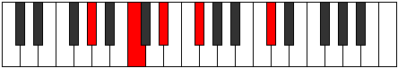

# Mode AFlatAeoloptian

## Links

- [Documentation](README.md)
- [Scales Index](Scales.md)
- [Modes Index](Modes.md)
- [Chords Index](Chords.md)

## Scale

[Rythian](ScaleRythian.md)

## Mode

[AFlatAeoloptian](ModeAFlatAeoloptian.md)

## Tonic

Ab

## Signature

[CNaturalMajor]

## Transposition

1, 1, 2, 1, 2, 3, 2

## Chord Pattern

ii⁰, vii⁰

## Perfection

 - 4 Perfect Notes

 - 3 Imperfect Notes

## Notes

- Ab
- Bbb (Imperfect)
- Cbb (Imperfect)
- Dbb (Imperfect)
- Ebbb
- Fbb
- Gb
- Ab

## Illustration

## Diagram

| Circle of Fifth | Chromatic Circle |
|-----------------|------------------|
|  |  |
## Relative Modes

| Number | Mode | Tonic | Notes | Illustration |
|--------|------|-------|-------|--------------|
| [1207](https://ianring.com/musictheory/scales/1207) | [Aeoloptian](ModeAeoloptian.md) | G# | G#, A, Bb, C, Db, Eb, F#, G# |  |
| [1207](https://ianring.com/musictheory/scales/1207) | [Aeoloptian](ModeAeoloptian.md) | Ab | Ab, Bbb, Cbb, Dbb, Ebbb, Fbb, Gb, Ab |  |
| [2651](https://ianring.com/musictheory/scales/2651) | [Panian](ModePanian.md) | A | A, Bb, C, Db, Eb, F#, G#, A |  |
| [3373](https://ianring.com/musictheory/scales/3373) | [Lodian](ModeLodian.md) | A# | A#, B#, C#, D#, E##, F###, G##, A# |  |
| [3373](https://ianring.com/musictheory/scales/3373) | [Lodian](ModeLodian.md) | Bb | Bb, C, Db, Eb, F#, G#, A, Bb |  |
| [1867](https://ianring.com/musictheory/scales/1867) | [Solian](ModeSolian.md) | C | C, Db, Eb, F#, G#, A, Bb, C |  |
| [2981](https://ianring.com/musictheory/scales/2981) | [Ionolian](ModeIonolian.md) | C# | C#, D#, E##, F###, G##, A#, B#, C# |  |
| [2981](https://ianring.com/musictheory/scales/2981) | [Ionolian](ModeIonolian.md) | Db | Db, Eb, F#, G#, A, Bb, C, Db |  |
| [1769](https://ianring.com/musictheory/scales/1769) | [Rythian](ModeRythian.md) | D# | D#, E##, F###, G##, A#, B#, C#, D# |  |
| [1769](https://ianring.com/musictheory/scales/1769) | [Rythian](ModeRythian.md) | Eb | Eb, F#, G#, A, Bb, C, Db, Eb |  |
| [733](https://ianring.com/musictheory/scales/733) | [Donian](ModeDonian.md) | F# | F#, G#, A, Bb, C, Db, Eb, F# |  |
| [733](https://ianring.com/musictheory/scales/733) | [Donian](ModeDonian.md) | Gb | Gb, Ab, Bbb, Cbb, Dbb, Ebbb, Fbb, Gb |  |
## Relative Brightness

| Number | Mode | Tonic | Notes | Circle Of Fifth | Chromatic Circle |
|--------|------|-------|-------|-----------------|------------------|
| [1207](https://ianring.com/musictheory/scales/1207) | [Aeoloptian](ModeAeoloptian.md) | G# | G#, A, Bb, C, Db, Eb, F#, G# |  |  |
| [1207](https://ianring.com/musictheory/scales/1207) | [Aeoloptian](ModeAeoloptian.md) | Ab | Ab, Bbb, Cbb, Dbb, Ebbb, Fbb, Gb, Ab |  |  |
| [2651](https://ianring.com/musictheory/scales/2651) | [Panian](ModePanian.md) | A | A, Bb, C, Db, Eb, F#, G#, A |  |  |
| [3373](https://ianring.com/musictheory/scales/3373) | [Lodian](ModeLodian.md) | A# | A#, B#, C#, D#, E##, F###, G##, A# |  |  |
| [3373](https://ianring.com/musictheory/scales/3373) | [Lodian](ModeLodian.md) | Bb | Bb, C, Db, Eb, F#, G#, A, Bb |  |  |
| [1867](https://ianring.com/musictheory/scales/1867) | [Solian](ModeSolian.md) | C | C, Db, Eb, F#, G#, A, Bb, C |  |  |
| [2981](https://ianring.com/musictheory/scales/2981) | [Ionolian](ModeIonolian.md) | C# | C#, D#, E##, F###, G##, A#, B#, C# |  |  |
| [2981](https://ianring.com/musictheory/scales/2981) | [Ionolian](ModeIonolian.md) | Db | Db, Eb, F#, G#, A, Bb, C, Db |  |  |
| [1769](https://ianring.com/musictheory/scales/1769) | [Rythian](ModeRythian.md) | D# | D#, E##, F###, G##, A#, B#, C#, D# |  |  |
| [1769](https://ianring.com/musictheory/scales/1769) | [Rythian](ModeRythian.md) | Eb | Eb, F#, G#, A, Bb, C, Db, Eb |  |  |
| [733](https://ianring.com/musictheory/scales/733) | [Donian](ModeDonian.md) | F# | F#, G#, A, Bb, C, Db, Eb, F# |  |  |
| [733](https://ianring.com/musictheory/scales/733) | [Donian](ModeDonian.md) | Gb | Gb, Ab, Bbb, Cbb, Dbb, Ebbb, Fbb, Gb |  |  |

## Chords

### Ab

| Number | Root | Name | Notes | Illustration | Audio |
|--------|------|------|-------|--------------|-------|
| 1282 | Ab | [G#sus2bb5](ChordGSharpSuspendedSecondDoubleFlatFifth.md) | G#, A#, C# |  | [midi](ChordGSharpSuspendedSecondDoubleFlatFifthRootPosition.mid) |
| 1282 | Ab | [Absus2bb5](ChordAFlatSuspendedSecondDoubleFlatFifth.md) | Ab, Bb, Db |  | [midi](ChordAFlatSuspendedSecondDoubleFlatFifthRootPosition.mid) |
| 264 | Ab | [G#5](ChordGSharpPowerChord.md) | G#, D# |  | [midi](ChordGSharpPowerChordRootPosition.mid) |
| 264 | Ab | [Ab5](ChordAFlatPowerChord.md) | Ab, Eb |  | [midi](ChordAFlatPowerChordRootPosition.mid) |
| 776 | Ab | [G#phryg](ChordGSharpPhrygian.md) | G#, A, D# |  | [midi](ChordGSharpPhrygianRootPosition.mid) |
| 776 | Ab | [Abphryg](ChordAFlatPhrygian.md) | Ab, Bbb, Eb |  | [midi](ChordAFlatPhrygianRootPosition.mid) |
| 1288 | Ab | [G#sus2](ChordGSharpSuspendedSecond.md) | G#, A#, D# |  | [midi](ChordGSharpSuspendedSecondRootPosition.mid) |
| 1288 | Ab | [Absus2](ChordAFlatSuspendedSecond.md) | Ab, Bb, Eb |  | [midi](ChordAFlatSuspendedSecondRootPosition.mid) |
| 265 | Ab | [G#M](ChordGSharpMajor.md) | G#, B#, D# |  | [midi](ChordGSharpMajorRootPosition.mid) |
| 265 | Ab | [AbM](ChordAFlatMajor.md) | Ab, C, Eb |  | [midi](ChordAFlatMajorRootPosition.mid) |
| 1289 | Ab | [G#M(add9)](ChordGSharpMajorAddNinth.md) | G#, B#, D#, A# |  | [midi](ChordGSharpMajorAddNinthRootPosition.mid) |
| 1289 | Ab | [AbM(add9)](ChordAFlatMajorAddNinth.md) | Ab, C, Eb, Bb |  | [midi](ChordAFlatMajorAddNinthRootPosition.mid) |
| 266 | Ab | [G#sus4](ChordGSharpSuspendedFourth.md) | G#, C#, D# |  | [midi](ChordGSharpSuspendedFourthRootPosition.mid) |
| 266 | Ab | [Absus4](ChordAFlatSuspendedFourth.md) | Ab, Db, Eb |  | [midi](ChordAFlatSuspendedFourthRootPosition.mid) |
| 267 | Ab | [G#M(add11)](ChordGSharpMajorAddEleventh.md) | G#, B#, D#, C# |  | [midi](ChordGSharpMajorAddEleventhRootPosition.mid) |
| 267 | Ab | [G#M(add4)](ChordGSharpMajorAddFourth.md) | G#, B#, C#, D# |  | [midi](ChordGSharpMajorAddFourthRootPosition.mid) |
| 267 | Ab | [AbM(add11)](ChordAFlatMajorAddEleventh.md) | Ab, C, Eb, Db |  | [midi](ChordAFlatMajorAddEleventhRootPosition.mid) |
| 267 | Ab | [AbM(add4)](ChordAFlatMajorAddFourth.md) | Ab, C, Db, Eb |  | [midi](ChordAFlatMajorAddFourthRootPosition.mid) |
| 322 | Ab | [G#Q](ChordGSharpQuartal.md) | G#, C#, F# |  | [midi](ChordGSharpQuartalRootPosition.mid) |
| 322 | Ab | [AbQ](ChordAFlatQuartal.md) | Ab, Db, Gb |  | [midi](ChordAFlatQuartalRootPosition.mid) |
| 1352 | Ab | [G#7sus2](ChordGSharpDominantSeventhSuspendedSecond.md) | G#, A#, D#, F# |  | [midi](ChordGSharpDominantSeventhSuspendedSecondRootPosition.mid) |
| 1352 | Ab | [G#9sus2](ChordGSharpDominantNinthSuspendedSecond.md) | G#, A#, D#, F#, A# |  | [midi](ChordGSharpDominantNinthSuspendedSecondRootPosition.mid) |
| 1352 | Ab | [Ab7sus2](ChordAFlatDominantSeventhSuspendedSecond.md) | Ab, Bb, Eb, Gb |  | [midi](ChordAFlatDominantSeventhSuspendedSecondRootPosition.mid) |
| 1352 | Ab | [Ab9sus2](ChordAFlatDominantNinthSuspendedSecond.md) | Ab, Bb, Eb, Gb, Bb |  | [midi](ChordAFlatDominantNinthSuspendedSecondRootPosition.mid) |
| 329 | Ab | [G#7](ChordGSharpDominantSeventh.md) | G#, B#, D#, F# |  | [midi](ChordGSharpDominantSeventhRootPosition.mid) |
| 329 | Ab | [Ab7](ChordAFlatDominantSeventh.md) | Ab, C, Eb, Gb |  | [midi](ChordAFlatDominantSeventhRootPosition.mid) |
| 841 | Ab | [G#7b9](ChordGSharpDominantSeventhFlatNinth.md) | G#, B#, D#, F#, A |  | [midi](ChordGSharpDominantSeventhFlatNinthRootPosition.mid) |
| 841 | Ab | [Ab7b9](ChordAFlatDominantSeventhFlatNinth.md) | Ab, C, Eb, Gb, Bbb |  | [midi](ChordAFlatDominantSeventhFlatNinthRootPosition.mid) |
| 1353 | Ab | [G#9](ChordGSharpDominantNinth.md) | G#, B#, D#, F#, A# |  | [midi](ChordGSharpDominantNinthRootPosition.mid) |
| 1353 | Ab | [Ab9](ChordAFlatDominantNinth.md) | Ab, C, Eb, Gb, Bb |  | [midi](ChordAFlatDominantNinthRootPosition.mid) |
| 330 | Ab | [G#7sus4](ChordGSharpDominantSeventhSuspendedFourth.md) | G#, C#, D#, F# |  | [midi](ChordGSharpDominantSeventhSuspendedFourthRootPosition.mid) |
| 330 | Ab | [Ab7sus4](ChordAFlatDominantSeventhSuspendedFourth.md) | Ab, Db, Eb, Gb |  | [midi](ChordAFlatDominantSeventhSuspendedFourthRootPosition.mid) |
| 1354 | Ab | [G#9sus4](ChordGSharpDominantNinthSuspendedFourth.md) | G#, C#, D#, F#, A# |  | [midi](ChordGSharpDominantNinthSuspendedFourthRootPosition.mid) |
| 1354 | Ab | [Ab9sus4](ChordAFlatDominantNinthSuspendedFourth.md) | Ab, Db, Eb, Gb, Bb |  | [midi](ChordAFlatDominantNinthSuspendedFourthRootPosition.mid) |
| 331 | Ab | [G#7add4](ChordGSharpDominantSeventhAddFourth.md) | G#, B#, C#, D#, F# |  | [midi](ChordGSharpDominantSeventhAddFourthRootPosition.mid) |
| 331 | Ab | [G#7add11](ChordGSharpDominantSeventhAddEleventh.md) | G#, B#, D#, F#, C# |  | [midi](ChordGSharpDominantSeventhAddEleventhRootPosition.mid) |
| 331 | Ab | [Ab7add4](ChordAFlatDominantSeventhAddFourth.md) | Ab, C, Db, Eb, Gb |  | [midi](ChordAFlatDominantSeventhAddFourthRootPosition.mid) |
| 331 | Ab | [Ab7add11](ChordAFlatDominantSeventhAddEleventh.md) | Ab, C, Eb, Gb, Db |  | [midi](ChordAFlatDominantSeventhAddEleventhRootPosition.mid) |
| 1355 | Ab | [G#11](ChordGSharpDominantEleventh.md) | G#, B#, D#, F#, A#, C# |  | [midi](ChordGSharpDominantEleventhRootPosition.mid) |
| 1355 | Ab | [Ab11](ChordAFlatDominantEleventh.md) | Ab, C, Eb, Gb, Bb, Db |  | [midi](ChordAFlatDominantEleventhRootPosition.mid) |

### Bbb

| Number | Root | Name | Notes | Illustration | Audio |
|--------|------|------|-------|--------------|-------|
| 1544 | Bbb | [Aloc](ChordANaturalLocrian.md) | A, Bb, Eb |  | [midi](ChordANaturalLocrianRootPosition.mid) |
| 521 | Bbb | [Ao](ChordANaturalDiminished.md) | A, C, Eb |  | [midi](ChordANaturalDiminishedRootPosition.mid) |
| 522 | Bbb | [AMb5](ChordANaturalMajorFlatFifth.md) | A, C#, Eb |  | [midi](ChordANaturalMajorFlatFifthRootPosition.mid) |
| 578 | Bbb | [AM##5](ChordANaturalMajorDoubleSharpFifth.md) | A, C#, F# |  | [midi](ChordANaturalMajorDoubleSharpFifthRootPosition.mid) |
| 585 | Bbb | [Ao7](ChordANaturalFullDiminishedSeventh.md) | A, C, Eb, Gb |  | [midi](ChordANaturalFullDiminishedSeventhRootPosition.mid) |
| 586 | Bbb | [AM6b5](ChordANaturalMajorSixthFlatFifth.md) | A, C#, Eb, F# |  | [midi](ChordANaturalMajorSixthFlatFifthRootPosition.mid) |
| 777 | Bbb | [AoM7](ChordANaturalDiminishedMajorSeventh.md) | A, C, Eb, G# |  | [midi](ChordANaturalDiminishedMajorSeventhRootPosition.mid) |
| 778 | Bbb | [AM7b5](ChordANaturalMajorSeventhFlatFifth.md) | A, C#, Eb, G# |  | [midi](ChordANaturalMajorSeventhFlatFifthRootPosition.mid) |
| 834 | Bbb | [AM7##5](ChordANaturalMajorSeventhDoubleSharpFifth.md) | A, C#, F#, G# |  | [midi](ChordANaturalMajorSeventhDoubleSharpFifthRootPosition.mid) |

### Cbb

| Number | Root | Name | Notes | Illustration | Audio |
|--------|------|------|-------|--------------|-------|
| 1033 | Cbb | [A#sus2bb5](ChordASharpSuspendedSecondDoubleFlatFifth.md) | A#, B#, D# |  | [midi](ChordASharpSuspendedSecondDoubleFlatFifthRootPosition.mid) |
| 1033 | Cbb | [Bbsus2bb5](ChordBFlatSuspendedSecondDoubleFlatFifth.md) | Bb, C, Eb |  | [midi](ChordBFlatSuspendedSecondDoubleFlatFifthRootPosition.mid) |
| 1034 | Cbb | [A#mbb5](ChordASharpMinorDoubleFlatFifth.md) | A#, C#, D# |  | [midi](ChordASharpMinorDoubleFlatFifthRootPosition.mid) |
| 1034 | Cbb | [Bbmbb5](ChordBFlatMinorDoubleFlatFifth.md) | Bb, Db, Eb |  | [midi](ChordBFlatMinorDoubleFlatFifthRootPosition.mid) |
| 1089 | Cbb | [A#sus2#5](ChordASharpSuspendedSecondSharpFifth.md) | A#, B#, E## |  | [midi](ChordASharpSuspendedSecondSharpFifthRootPosition.mid) |
| 1089 | Cbb | [Bbsus2#5](ChordBFlatSuspendedSecondSharpFifth.md) | Bb, C, F# |  | [midi](ChordBFlatSuspendedSecondSharpFifthRootPosition.mid) |
| 1090 | Cbb | [A#m#5](ChordASharpMinorSharpFifth.md) | A#, C#, F# |  | [midi](ChordASharpMinorSharpFifthRootPosition.mid) |
| 1090 | Cbb | [Bbm#5](ChordBFlatMinorSharpFifth.md) | Bb, Db, Gb |  | [midi](ChordBFlatMinorSharpFifthRootPosition.mid) |
| 1096 | Cbb | [A#sus4#5](ChordASharpSuspendedFourthSharpFifth.md) | A#, D#, E## |  | [midi](ChordASharpSuspendedFourthSharpFifthRootPosition.mid) |
| 1096 | Cbb | [Bbsus4#5](ChordBFlatSuspendedFourthSharpFifth.md) | Bb, Eb, F# |  | [midi](ChordBFlatSuspendedFourthSharpFifthRootPosition.mid) |
| 1288 | Cbb | [A#Q](ChordASharpQuartal.md) | A#, D#, G# |  | [midi](ChordASharpQuartalRootPosition.mid) |
| 1288 | Cbb | [BbQ](ChordBFlatQuartal.md) | Bb, Eb, Ab |  | [midi](ChordBFlatQuartalRootPosition.mid) |
| 1290 | Cbb | [A#m7bb5](ChordASharpMinorSeventhDoubleFlatFifth.md) | A#, C#, D#, G# |  | [midi](ChordASharpMinorSeventhDoubleFlatFifthRootPosition.mid) |
| 1290 | Cbb | [Bbm7bb5](ChordBFlatMinorSeventhDoubleFlatFifth.md) | Bb, Db, Eb, Ab |  | [midi](ChordBFlatMinorSeventhDoubleFlatFifthRootPosition.mid) |
| 1346 | Cbb | [A#m7#5](ChordASharpMinorSeventhSharpFifth.md) | A#, C#, E##, G# |  | [midi](ChordASharpMinorSeventhSharpFifthRootPosition.mid) |
| 1346 | Cbb | [Bbm7#5](ChordBFlatMinorSeventhSharpFifth.md) | Bb, Db, F#, Ab |  | [midi](ChordBFlatMinorSeventhSharpFifthRootPosition.mid) |
| 1544 | Cbb | [A#Q+](ChordASharpQuartalAugmented.md) | A#, D#, G## |  | [midi](ChordASharpQuartalAugmentedRootPosition.mid) |
| 1544 | Cbb | [BbQ+](ChordBFlatQuartalAugmented.md) | Bb, Eb, A |  | [midi](ChordBFlatQuartalAugmentedRootPosition.mid) |
| 1608 | Cbb | [A#M7(sus4)#5](ChordASharpMajorSeventhSuspendedFourthSharpFifth.md) | A#, D#, E##, G## |  | [midi](ChordASharpMajorSeventhSuspendedFourthSharpFifthRootPosition.mid) |
| 1608 | Cbb | [BbM7(sus4)#5](ChordBFlatMajorSeventhSuspendedFourthSharpFifth.md) | Bb, Eb, F#, A |  | [midi](ChordBFlatMajorSeventhSuspendedFourthSharpFifthRootPosition.mid) |

### Dbb

| Number | Root | Name | Notes | Illustration | Audio |
|--------|------|------|-------|--------------|-------|
| 67 | Dbb | [Cloc](ChordCNaturalLocrian.md) | C, Db, Gb |  | [midi](ChordCNaturalLocrianRootPosition.mid) |
| 73 | Dbb | [Co](ChordCNaturalDiminished.md) | C, Eb, Gb |  | [midi](ChordCNaturalDiminishedRootPosition.mid) |
| 265 | Dbb | [Cm#5](ChordCNaturalMinorSharpFifth.md) | C, Eb, Ab |  | [midi](ChordCNaturalMinorSharpFifthRootPosition.mid) |
| 585 | Dbb | [Co7](ChordCNaturalFullDiminishedSeventh.md) | C, Eb, Gb, Bbb |  | [midi](ChordCNaturalFullDiminishedSeventhRootPosition.mid) |
| 1097 | Dbb | [Cø7](ChordCNaturalHalfDiminishedSeventh.md) | C, Eb, Gb, Bb |  | [midi](ChordCNaturalHalfDiminishedSeventhRootPosition.mid) |
| 1289 | Dbb | [Cm7#5](ChordCNaturalMinorSeventhSharpFifth.md) | C, Eb, G#, Bb |  | [midi](ChordCNaturalMinorSeventhSharpFifthRootPosition.mid) |

### Ebbb

| Number | Root | Name | Notes | Illustration | Audio |
|--------|------|------|-------|--------------|-------|
| 74 | Ebbb | [C#sus2bb5](ChordCSharpSuspendedSecondDoubleFlatFifth.md) | C#, D#, F# |  | [midi](ChordCSharpSuspendedSecondDoubleFlatFifthRootPosition.mid) |
| 74 | Ebbb | [Dbsus2bb5](ChordDFlatSuspendedSecondDoubleFlatFifth.md) | Db, Eb, Gb |  | [midi](ChordDFlatSuspendedSecondDoubleFlatFifthRootPosition.mid) |
| 258 | Ebbb | [C#5](ChordCSharpPowerChord.md) | C#, G# |  | [midi](ChordCSharpPowerChordRootPosition.mid) |
| 258 | Ebbb | [Db5](ChordDFlatPowerChord.md) | Db, Ab |  | [midi](ChordDFlatPowerChordRootPosition.mid) |
| 266 | Ebbb | [C#sus2](ChordCSharpSuspendedSecond.md) | C#, D#, G# |  | [midi](ChordCSharpSuspendedSecondRootPosition.mid) |
| 266 | Ebbb | [Dbsus2](ChordDFlatSuspendedSecond.md) | Db, Eb, Ab |  | [midi](ChordDFlatSuspendedSecondRootPosition.mid) |
| 322 | Ebbb | [C#sus4](ChordCSharpSuspendedFourth.md) | C#, F#, G# |  | [midi](ChordCSharpSuspendedFourthRootPosition.mid) |
| 322 | Ebbb | [Dbsus4](ChordDFlatSuspendedFourth.md) | Db, Gb, Ab |  | [midi](ChordDFlatSuspendedFourthRootPosition.mid) |
| 522 | Ebbb | [C#sus2#5](ChordCSharpSuspendedSecondSharpFifth.md) | C#, D#, G## |  | [midi](ChordCSharpSuspendedSecondSharpFifthRootPosition.mid) |
| 522 | Ebbb | [Dbsus2#5](ChordDFlatSuspendedSecondSharpFifth.md) | Db, Eb, A |  | [midi](ChordDFlatSuspendedSecondSharpFifthRootPosition.mid) |
| 578 | Ebbb | [C#sus4#5](ChordCSharpSuspendedFourthSharpFifth.md) | C#, F#, G## |  | [midi](ChordCSharpSuspendedFourthSharpFifthRootPosition.mid) |
| 578 | Ebbb | [Dbsus4#5](ChordDFlatSuspendedFourthSharpFifth.md) | Db, Gb, A |  | [midi](ChordDFlatSuspendedFourthSharpFifthRootPosition.mid) |
| 1090 | Ebbb | [C#sus4##5](ChordCSharpSuspendedFourthDoubleSharpFifth.md) | C#, F#, A# |  | [midi](ChordCSharpSuspendedFourthDoubleSharpFifthRootPosition.mid) |
| 1090 | Ebbb | [Dbsus4##5](ChordDFlatSuspendedFourthDoubleSharpFifth.md) | Db, Gb, Bb |  | [midi](ChordDFlatSuspendedFourthDoubleSharpFifthRootPosition.mid) |
| 1098 | Ebbb | [C#M6sus2bb5](ChordCSharpMajorSixthSuspendedSecondDoubleFlatFifth.md) | C#, D#, F#, A# |  | [midi](ChordCSharpMajorSixthSuspendedSecondDoubleFlatFifthRootPosition.mid) |
| 1098 | Ebbb | [DbM6sus2bb5](ChordDFlatMajorSixthSuspendedSecondDoubleFlatFifth.md) | Db, Eb, Gb, Bb |  | [midi](ChordDFlatMajorSixthSuspendedSecondDoubleFlatFifthRootPosition.mid) |
| 1290 | Ebbb | [C#M6sus2](ChordCSharpMajorSixthSuspendedSecond.md) | C#, D#, G#, A# |  | [midi](ChordCSharpMajorSixthSuspendedSecondRootPosition.mid) |
| 1290 | Ebbb | [C#7sus2b5](ChordCSharpDominantSeventhSuspendedSecondFlatFifth.md) | C#, D#, G#, Bb |  | [midi](ChordCSharpDominantSeventhSuspendedSecondFlatFifthRootPosition.mid) |
| 1290 | Ebbb | [DbM6sus2](ChordDFlatMajorSixthSuspendedSecond.md) | Db, Eb, Ab, Bb |  | [midi](ChordDFlatMajorSixthSuspendedSecondRootPosition.mid) |
| 1290 | Ebbb | [Db7sus2b5](ChordDFlatDominantSeventhSuspendedSecondFlatFifth.md) | Db, Eb, Ab, Cbb |  | [midi](ChordDFlatDominantSeventhSuspendedSecondFlatFifthRootPosition.mid) |
| 1346 | Ebbb | [C#M6sus4](ChordCSharpMajorSixthSuspendedFourth.md) | C#, F#, G#, A# |  | [midi](ChordCSharpMajorSixthSuspendedFourthRootPosition.mid) |
| 1346 | Ebbb | [DbM6sus4](ChordDFlatMajorSixthSuspendedFourth.md) | Db, Gb, Ab, Bb |  | [midi](ChordDFlatMajorSixthSuspendedFourthRootPosition.mid) |
| 67 | Ebbb | [C#Q+](ChordCSharpQuartalAugmented.md) | C#, F#, B# |  | [midi](ChordCSharpQuartalAugmentedRootPosition.mid) |
| 67 | Ebbb | [DbQ+](ChordDFlatQuartalAugmented.md) | Db, Gb, C |  | [midi](ChordDFlatQuartalAugmentedRootPosition.mid) |
| 267 | Ebbb | [C#M7(sus2)](ChordCSharpMajorSeventhSuspendedSecond.md) | C#, D#, G#, B# |  | [midi](ChordCSharpMajorSeventhSuspendedSecondRootPosition.mid) |
| 267 | Ebbb | [C#M9sus2](ChordCSharpMajorNinthSuspendedSecond.md) | C#, D#, G#, B#, D# |  | [midi](ChordCSharpMajorNinthSuspendedSecondRootPosition.mid) |
| 267 | Ebbb | [DbM7(sus2)](ChordDFlatMajorSeventhSuspendedSecond.md) | Db, Eb, Ab, C |  | [midi](ChordDFlatMajorSeventhSuspendedSecondRootPosition.mid) |
| 267 | Ebbb | [DbM9sus2](ChordDFlatMajorNinthSuspendedSecond.md) | Db, Eb, Ab, C, Eb |  | [midi](ChordDFlatMajorNinthSuspendedSecondRootPosition.mid) |
| 323 | Ebbb | [C#M7(sus4)](ChordCSharpMajorSeventhSuspendedFourth.md) | C#, F#, G#, B# |  | [midi](ChordCSharpMajorSeventhSuspendedFourthRootPosition.mid) |
| 323 | Ebbb | [DbM7(sus4)](ChordDFlatMajorSeventhSuspendedFourth.md) | Db, Gb, Ab, C |  | [midi](ChordDFlatMajorSeventhSuspendedFourthRootPosition.mid) |
| 331 | Ebbb | [C#M9sus4](ChordCSharpMajorNinthSuspendedFourth.md) | C#, F#, G#, B#, D# |  | [midi](ChordCSharpMajorNinthSuspendedFourthRootPosition.mid) |
| 331 | Ebbb | [DbM9sus4](ChordDFlatMajorNinthSuspendedFourth.md) | Db, Gb, Ab, C, Eb |  | [midi](ChordDFlatMajorNinthSuspendedFourthRootPosition.mid) |
| 579 | Ebbb | [C#M7(sus4)#5](ChordCSharpMajorSeventhSuspendedFourthSharpFifth.md) | C#, F#, G##, B# |  | [midi](ChordCSharpMajorSeventhSuspendedFourthSharpFifthRootPosition.mid) |
| 579 | Ebbb | [DbM7(sus4)#5](ChordDFlatMajorSeventhSuspendedFourthSharpFifth.md) | Db, Gb, A, C |  | [midi](ChordDFlatMajorSeventhSuspendedFourthSharpFifthRootPosition.mid) |
| 1091 | Ebbb | [C#M7(sus4)##5](ChordCSharpMajorSeventhSuspendedFourthDoubleSharpFifth.md) | C#, F#, A#, B# |  | [midi](ChordCSharpMajorSeventhSuspendedFourthDoubleSharpFifthRootPosition.mid) |
| 1091 | Ebbb | [DbM7(sus4)##5](ChordDFlatMajorSeventhSuspendedFourthDoubleSharpFifth.md) | Db, Gb, Bb, C |  | [midi](ChordDFlatMajorSeventhSuspendedFourthDoubleSharpFifthRootPosition.mid) |

### Fbb

| Number | Root | Name | Notes | Illustration | Audio |
|--------|------|------|-------|--------------|-------|
| 328 | Fbb | [D#mbb5](ChordDSharpMinorDoubleFlatFifth.md) | D#, F#, G# |  | [midi](ChordDSharpMinorDoubleFlatFifthRootPosition.mid) |
| 328 | Fbb | [Ebmbb5](ChordEFlatMinorDoubleFlatFifth.md) | Eb, Gb, Ab |  | [midi](ChordEFlatMinorDoubleFlatFifthRootPosition.mid) |
| 584 | Fbb | [D#o](ChordDSharpDiminished.md) | D#, F#, A |  | [midi](ChordDSharpDiminishedRootPosition.mid) |
| 584 | Fbb | [Ebo](ChordEFlatDiminished.md) | Eb, Gb, Bbb |  | [midi](ChordEFlatDiminishedRootPosition.mid) |
| 776 | Fbb | [D#sus4b5](ChordDSharpSuspendedFourthFlatFifth.md) | D#, G#, A |  | [midi](ChordDSharpSuspendedFourthFlatFifthRootPosition.mid) |
| 776 | Fbb | [Ebsus4b5](ChordEFlatSuspendedFourthFlatFifth.md) | Eb, Ab, Bbb |  | [midi](ChordEFlatSuspendedFourthFlatFifthRootPosition.mid) |
| 1032 | Fbb | [D#5](ChordDSharpPowerChord.md) | D#, A# |  | [midi](ChordDSharpPowerChordRootPosition.mid) |
| 1032 | Fbb | [Eb5](ChordEFlatPowerChord.md) | Eb, Bb |  | [midi](ChordEFlatPowerChordRootPosition.mid) |
| 1096 | Fbb | [D#m](ChordDSharpMinor.md) | D#, F#, A# |  | [midi](ChordDSharpMinorRootPosition.mid) |
| 1096 | Fbb | [D#m(add(#9))](ChordDSharpMinorAddSharpNinth.md) | D#, F#, A#, E## |  | [midi](ChordDSharpMinorAddSharpNinthRootPosition.mid) |
| 1096 | Fbb | [Ebm](ChordEFlatMinor.md) | Eb, Gb, Bb |  | [midi](ChordEFlatMinorRootPosition.mid) |
| 1096 | Fbb | [Ebm(add(#9))](ChordEFlatMinorAddSharpNinth.md) | Eb, Gb, Bb, F# |  | [midi](ChordEFlatMinorAddSharpNinthRootPosition.mid) |
| 1288 | Fbb | [D#sus4](ChordDSharpSuspendedFourth.md) | D#, G#, A# |  | [midi](ChordDSharpSuspendedFourthRootPosition.mid) |
| 1288 | Fbb | [Ebsus4](ChordEFlatSuspendedFourth.md) | Eb, Ab, Bb |  | [midi](ChordEFlatSuspendedFourthRootPosition.mid) |
| 1352 | Fbb | [D#m(add11)](ChordDSharpMinorAddEleventh.md) | D#, F#, A#, G# |  | [midi](ChordDSharpMinorAddEleventhRootPosition.mid) |
| 1352 | Fbb | [D#m(add4)](ChordDSharpMinorAddFourth.md) | D#, F#, G#, A# |  | [midi](ChordDSharpMinorAddFourthRootPosition.mid) |
| 1352 | Fbb | [Ebm(add11)](ChordEFlatMinorAddEleventh.md) | Eb, Gb, Bb, Ab |  | [midi](ChordEFlatMinorAddEleventhRootPosition.mid) |
| 1352 | Fbb | [Ebm(add4)](ChordEFlatMinorAddFourth.md) | Eb, Gb, Ab, Bb |  | [midi](ChordEFlatMinorAddFourthRootPosition.mid) |
| 1544 | Fbb | [D#lyd](ChordDSharpLydian.md) | D#, G##, A# |  | [midi](ChordDSharpLydianRootPosition.mid) |
| 1544 | Fbb | [Eblyd](ChordEFlatLydian.md) | Eb, A, Bb |  | [midi](ChordEFlatLydianRootPosition.mid) |
| 1608 | Fbb | [D#m(add(#4))](ChordDSharpMinorAddSharpFourth.md) | D#, F#, G##, A# |  | [midi](ChordDSharpMinorAddSharpFourthRootPosition.mid) |
| 1608 | Fbb | [Ebm(add(#4))](ChordEFlatMinorAddSharpFourth.md) | Eb, Gb, A, Bb |  | [midi](ChordEFlatMinorAddSharpFourthRootPosition.mid) |
| 265 | Fbb | [D#sus4##5](ChordDSharpSuspendedFourthDoubleSharpFifth.md) | D#, G#, B# |  | [midi](ChordDSharpSuspendedFourthDoubleSharpFifthRootPosition.mid) |
| 265 | Fbb | [Ebsus4##5](ChordEFlatSuspendedFourthDoubleSharpFifth.md) | Eb, Ab, C |  | [midi](ChordEFlatSuspendedFourthDoubleSharpFifthRootPosition.mid) |
| 585 | Fbb | [D#o7](ChordDSharpFullDiminishedSeventh.md) | D#, F#, A, C |  | [midi](ChordDSharpFullDiminishedSeventhRootPosition.mid) |
| 585 | Fbb | [Ebo7](ChordEFlatFullDiminishedSeventh.md) | Eb, Gb, Bbb, Dbb |  | [midi](ChordEFlatFullDiminishedSeventhRootPosition.mid) |
| 1097 | Fbb | [D#m6](ChordDSharpMinorSixth.md) | D#, F#, A#, B# |  | [midi](ChordDSharpMinorSixthRootPosition.mid) |
| 1097 | Fbb | [Ebm6](ChordEFlatMinorSixth.md) | Eb, Gb, Bb, C |  | [midi](ChordEFlatMinorSixthRootPosition.mid) |
| 1289 | Fbb | [D#M6sus4](ChordDSharpMajorSixthSuspendedFourth.md) | D#, G#, A#, B# |  | [midi](ChordDSharpMajorSixthSuspendedFourthRootPosition.mid) |
| 1289 | Fbb | [EbM6sus4](ChordEFlatMajorSixthSuspendedFourth.md) | Eb, Ab, Bb, C |  | [midi](ChordEFlatMajorSixthSuspendedFourthRootPosition.mid) |
| 266 | Fbb | [D#Q](ChordDSharpQuartal.md) | D#, G#, C# |  | [midi](ChordDSharpQuartalRootPosition.mid) |
| 266 | Fbb | [EbQ](ChordEFlatQuartal.md) | Eb, Ab, Db |  | [midi](ChordEFlatQuartalRootPosition.mid) |
| 330 | Fbb | [D#m7bb5](ChordDSharpMinorSeventhDoubleFlatFifth.md) | D#, F#, G#, C# |  | [midi](ChordDSharpMinorSeventhDoubleFlatFifthRootPosition.mid) |
| 330 | Fbb | [Ebm7bb5](ChordEFlatMinorSeventhDoubleFlatFifth.md) | Eb, Gb, Ab, Db |  | [midi](ChordEFlatMinorSeventhDoubleFlatFifthRootPosition.mid) |
| 586 | Fbb | [D#ø7](ChordDSharpHalfDiminishedSeventh.md) | D#, F#, A, C# |  | [midi](ChordDSharpHalfDiminishedSeventhRootPosition.mid) |
| 586 | Fbb | [Ebø7](ChordEFlatHalfDiminishedSeventh.md) | Eb, Gb, Bbb, Db |  | [midi](ChordEFlatHalfDiminishedSeventhRootPosition.mid) |
| 1098 | Fbb | [D#m7](ChordDSharpMinorSeventh.md) | D#, F#, A#, C# |  | [midi](ChordDSharpMinorSeventhRootPosition.mid) |
| 1098 | Fbb | [Ebm7](ChordEFlatMinorSeventh.md) | Eb, Gb, Bb, Db |  | [midi](ChordEFlatMinorSeventhRootPosition.mid) |
| 1290 | Fbb | [D#7sus4](ChordDSharpDominantSeventhSuspendedFourth.md) | D#, G#, A#, C# |  | [midi](ChordDSharpDominantSeventhSuspendedFourthRootPosition.mid) |
| 1290 | Fbb | [Eb7sus4](ChordEFlatDominantSeventhSuspendedFourth.md) | Eb, Ab, Bb, Db |  | [midi](ChordEFlatDominantSeventhSuspendedFourthRootPosition.mid) |
| 1354 | Fbb | [D#m7add11](ChordDSharpMinorSeventhAddEleventh.md) | D#, F#, A#, C#, G# |  | [midi](ChordDSharpMinorSeventhAddEleventhRootPosition.mid) |
| 1354 | Fbb | [Ebm7add11](ChordEFlatMinorSeventhAddEleventh.md) | Eb, Gb, Bb, Db, Ab |  | [midi](ChordEFlatMinorSeventhAddEleventhRootPosition.mid) |
| 1610 | Fbb | [D#m7add(#11)](ChordDSharpMinorSeventhAddSharpEleventh.md) | D#, F#, A#, C#, G## |  | [midi](ChordDSharpMinorSeventhAddSharpEleventhRootPosition.mid) |
| 1610 | Fbb | [Ebm7add(#11)](ChordEFlatMinorSeventhAddSharpEleventh.md) | Eb, Gb, Bb, Db, A |  | [midi](ChordEFlatMinorSeventhAddSharpEleventhRootPosition.mid) |
| 1099 | Fbb | [D#m7add13](ChordDSharpMinorSeventhAddThirteenth.md) | D#, F#, A#, C#, B# |  | [midi](ChordDSharpMinorSeventhAddThirteenthRootPosition.mid) |
| 1099 | Fbb | [Ebm7add13](ChordEFlatMinorSeventhAddThirteenth.md) | Eb, Gb, Bb, Db, C |  | [midi](ChordEFlatMinorSeventhAddThirteenthRootPosition.mid) |

### Gb

| Number | Root | Name | Notes | Illustration | Audio |
|--------|------|------|-------|--------------|-------|
| 321 | Gb | [F#](ChordFSharpDiminishedFlatThird.md) | F#, Ab, C |  | [midi](ChordFSharpDiminishedFlatThirdRootPosition.mid) |
| 321 | Gb | [F#sus2b5](ChordFSharpSuspendedSecondFlatFifth.md) | F#, G#, C |  | [midi](ChordFSharpSuspendedSecondFlatFifthRootPosition.mid) |
| 321 | Gb | [Gb](ChordGFlatDiminishedFlatThird.md) | Gb, Bbbb, Dbb |  | [midi](ChordGFlatDiminishedFlatThirdRootPosition.mid) |
| 321 | Gb | [Gbsus2b5](ChordGFlatSuspendedSecondFlatFifth.md) | Gb, Ab, Dbb |  | [midi](ChordGFlatSuspendedSecondFlatFifthRootPosition.mid) |
| 577 | Gb | [F#o](ChordFSharpDiminished.md) | F#, A, C |  | [midi](ChordFSharpDiminishedRootPosition.mid) |
| 577 | Gb | [Gbo](ChordGFlatDiminished.md) | Gb, Bbb, Dbb |  | [midi](ChordGFlatDiminishedRootPosition.mid) |
| 1089 | Gb | [F#Mb5](ChordFSharpMajorFlatFifth.md) | F#, A#, C |  | [midi](ChordFSharpMajorFlatFifthRootPosition.mid) |
| 1089 | Gb | [GbMb5](ChordGFlatMajorFlatFifth.md) | Gb, Bb, Dbb |  | [midi](ChordGFlatMajorFlatFifthRootPosition.mid) |
| 66 | Gb | [F#5](ChordFSharpPowerChord.md) | F#, C# |  | [midi](ChordFSharpPowerChordRootPosition.mid) |
| 66 | Gb | [Gb5](ChordGFlatPowerChord.md) | Gb, Db |  | [midi](ChordGFlatPowerChordRootPosition.mid) |
| 322 | Gb | [F#sus2](ChordFSharpSuspendedSecond.md) | F#, G#, C# |  | [midi](ChordFSharpSuspendedSecondRootPosition.mid) |
| 322 | Gb | [Gbsus2](ChordGFlatSuspendedSecond.md) | Gb, Ab, Db |  | [midi](ChordGFlatSuspendedSecondRootPosition.mid) |
| 578 | Gb | [F#m](ChordFSharpMinor.md) | F#, A, C# |  | [midi](ChordFSharpMinorRootPosition.mid) |
| 578 | Gb | [F#m(add(#9))](ChordFSharpMinorAddSharpNinth.md) | F#, A, C#, G## |  | [midi](ChordFSharpMinorAddSharpNinthRootPosition.mid) |
| 578 | Gb | [Gbm](ChordGFlatMinor.md) | Gb, Bbb, Db |  | [midi](ChordGFlatMinorRootPosition.mid) |
| 578 | Gb | [Gbm(add(#9))](ChordGFlatMinorAddSharpNinth.md) | Gb, Bbb, Db, A |  | [midi](ChordGFlatMinorAddSharpNinthRootPosition.mid) |
| 834 | Gb | [F#m(add9)](ChordFSharpMinorAddNinth.md) | F#, A, C#, G# |  | [midi](ChordFSharpMinorAddNinthRootPosition.mid) |
| 834 | Gb | [Gbm(add9)](ChordGFlatMinorAddNinth.md) | Gb, Bbb, Db, Ab |  | [midi](ChordGFlatMinorAddNinthRootPosition.mid) |
| 1090 | Gb | [F#M](ChordFSharpMajor.md) | F#, A#, C# |  | [midi](ChordFSharpMajorRootPosition.mid) |
| 1090 | Gb | [GbM](ChordGFlatMajor.md) | Gb, Bb, Db |  | [midi](ChordGFlatMajorRootPosition.mid) |
| 1346 | Gb | [F#M(add9)](ChordFSharpMajorAddNinth.md) | F#, A#, C#, G# |  | [midi](ChordFSharpMajorAddNinthRootPosition.mid) |
| 1346 | Gb | [GbM(add9)](ChordGFlatMajorAddNinth.md) | Gb, Bb, Db, Ab |  | [midi](ChordGFlatMajorAddNinthRootPosition.mid) |
| 1602 | Gb | [F#M(add(#9))](ChordFSharpMajorAddSharpNinth.md) | F#, A#, C#, G## |  | [midi](ChordFSharpMajorAddSharpNinthRootPosition.mid) |
| 1602 | Gb | [GbM(add(#9))](ChordGFlatMajorAddSharpNinth.md) | Gb, Bb, Db, A |  | [midi](ChordGFlatMajorAddSharpNinthRootPosition.mid) |
| 67 | Gb | [F#lyd](ChordFSharpLydian.md) | F#, B#, C# |  | [midi](ChordFSharpLydianRootPosition.mid) |
| 67 | Gb | [Gblyd](ChordGFlatLydian.md) | Gb, C, Db |  | [midi](ChordGFlatLydianRootPosition.mid) |
| 579 | Gb | [F#m(add(#4))](ChordFSharpMinorAddSharpFourth.md) | F#, A, B#, C# |  | [midi](ChordFSharpMinorAddSharpFourthRootPosition.mid) |
| 579 | Gb | [Gbm(add(#4))](ChordGFlatMinorAddSharpFourth.md) | Gb, Bbb, C, Db |  | [midi](ChordGFlatMinorAddSharpFourthRootPosition.mid) |
| 1091 | Gb | [F#M(add(#4))](ChordFSharpMajorAddSharpFourth.md) | F#, A#, B#, C# |  | [midi](ChordFSharpMajorAddSharpFourthRootPosition.mid) |
| 1091 | Gb | [GbM(add(#4))](ChordGFlatMajorAddSharpFourth.md) | Gb, Bb, C, Db |  | [midi](ChordGFlatMajorAddSharpFourthRootPosition.mid) |
| 1096 | Gb | [F#M##5](ChordFSharpMajorDoubleSharpFifth.md) | F#, A#, D# |  | [midi](ChordFSharpMajorDoubleSharpFifthRootPosition.mid) |
| 1096 | Gb | [GbM##5](ChordGFlatMajorDoubleSharpFifth.md) | Gb, Bb, Eb |  | [midi](ChordGFlatMajorDoubleSharpFifthRootPosition.mid) |
| 329 | Gb | [F#M6sus2b5](ChordFSharpMajorSixthSuspendedSecondFlatFifth.md) | F#, G#, C, D# |  | [midi](ChordFSharpMajorSixthSuspendedSecondFlatFifthRootPosition.mid) |
| 329 | Gb | [GbM6sus2b5](ChordGFlatMajorSixthSuspendedSecondFlatFifth.md) | Gb, Ab, Dbb, Eb |  | [midi](ChordGFlatMajorSixthSuspendedSecondFlatFifthRootPosition.mid) |
| 585 | Gb | [F#o7](ChordFSharpFullDiminishedSeventh.md) | F#, A, C, Eb |  | [midi](ChordFSharpFullDiminishedSeventhRootPosition.mid) |
| 585 | Gb | [Gbo7](ChordGFlatFullDiminishedSeventh.md) | Gb, Bbb, Dbb, Fbb |  | [midi](ChordGFlatFullDiminishedSeventhRootPosition.mid) |
| 1097 | Gb | [F#M6b5](ChordFSharpMajorSixthFlatFifth.md) | F#, A#, C, D# |  | [midi](ChordFSharpMajorSixthFlatFifthRootPosition.mid) |
| 1097 | Gb | [GbM6b5](ChordGFlatMajorSixthFlatFifth.md) | Gb, Bb, Dbb, Eb |  | [midi](ChordGFlatMajorSixthFlatFifthRootPosition.mid) |
| 330 | Gb | [F#M6sus2](ChordFSharpMajorSixthSuspendedSecond.md) | F#, G#, C#, D# |  | [midi](ChordFSharpMajorSixthSuspendedSecondRootPosition.mid) |
| 330 | Gb | [F#7sus2b5](ChordFSharpDominantSeventhSuspendedSecondFlatFifth.md) | F#, G#, C#, Eb |  | [midi](ChordFSharpDominantSeventhSuspendedSecondFlatFifthRootPosition.mid) |
| 330 | Gb | [GbM6sus2](ChordGFlatMajorSixthSuspendedSecond.md) | Gb, Ab, Db, Eb |  | [midi](ChordGFlatMajorSixthSuspendedSecondRootPosition.mid) |
| 330 | Gb | [Gb7sus2b5](ChordGFlatDominantSeventhSuspendedSecondFlatFifth.md) | Gb, Ab, Db, Fbb |  | [midi](ChordGFlatDominantSeventhSuspendedSecondFlatFifthRootPosition.mid) |
| 586 | Gb | [F#m6](ChordFSharpMinorSixth.md) | F#, A, C#, D# |  | [midi](ChordFSharpMinorSixthRootPosition.mid) |
| 586 | Gb | [Gbm6](ChordGFlatMinorSixth.md) | Gb, Bbb, Db, Eb |  | [midi](ChordGFlatMinorSixthRootPosition.mid) |
| 842 | Gb | [F#m6(add9)](ChordFSharpMinorSixthAddNinth.md) | F#, A, C#, D#, G# |  | [midi](ChordFSharpMinorSixthAddNinthRootPosition.mid) |
| 842 | Gb | [Gbm6(add9)](ChordGFlatMinorSixthAddNinth.md) | Gb, Bbb, Db, Eb, Ab |  | [midi](ChordGFlatMinorSixthAddNinthRootPosition.mid) |
| 1098 | Gb | [F#M6](ChordFSharpMajorSixth.md) | F#, A#, C#, D# |  | [midi](ChordFSharpMajorSixthRootPosition.mid) |
| 1098 | Gb | [GbM6](ChordGFlatMajorSixth.md) | Gb, Bb, Db, Eb |  | [midi](ChordGFlatMajorSixthRootPosition.mid) |
| 1354 | Gb | [F#M6(add9)](ChordFSharpMajorSixthAddNinth.md) | F#, A#, C#, D#, G# |  | [midi](ChordFSharpMajorSixthAddNinthRootPosition.mid) |
| 1354 | Gb | [GbM6(add9)](ChordGFlatMajorSixthAddNinth.md) | Gb, Bb, Db, Eb, Ab |  | [midi](ChordGFlatMajorSixthAddNinthRootPosition.mid) |

