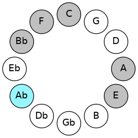

# Mode AFlatAeoloptimic

## Links

- [Documentation](README.md)
- [Scales Index](Scales.md)
- [Modes Index](Modes.md)
- [Chords Index](Chords.md)

## Scale

[Thogimic](ScaleThogimic.md)

## Mode

[AFlatAeoloptimic](ModeAFlatAeoloptimic.md)

## Tonic

Ab

## Signature

[CNaturalMajor]

## Transposition

1, 1, 2, 4, 1, 3

## Chord Pattern

Vb5, VI

## Perfection

 - 3 Perfect Notes

 - 3 Imperfect Notes

## Notes

- Ab (Imperfect)
- Bbb
- Cbb
- Dbb (Imperfect)
- E (Imperfect)
- F
- Ab (Imperfect)

## Illustration

## Diagram

## Relative Modes

| Number | Mode | Tonic | Notes | Illustration |
|--------|------|-------|-------|--------------|
| [791](https://ianring.com/musictheory/scales/791) | [Aeoloptimic](ModeAeoloptimic.md) | Ab | Ab, Bbb, Cbb, Dbb, E, F, Ab |  |
| [371](https://ianring.com/musictheory/scales/371) | [Rythimic](ModeRythimic.md) | E | E, F, G#, A, Bb, C, E |  |
| [2233](https://ianring.com/musictheory/scales/2233) | [Donimic](ModeDonimic.md) | F | F, G#, A, Bb, C, D##, F |  |
## Relative Brightness

| Number | Mode | Tonic | Notes | Illustration |
|--------|------|-------|-------|--------------|
| [791](https://ianring.com/musictheory/scales/791) | [Aeoloptimic](ModeAeoloptimic.md) | Ab | Ab, Bbb, Cbb, Dbb, E, F, Ab |  |
| [371](https://ianring.com/musictheory/scales/371) | [Rythimic](ModeRythimic.md) | E | E, F, G#, A, Bb, C, E |  |
| [2233](https://ianring.com/musictheory/scales/2233) | [Donimic](ModeDonimic.md) | F | F, G#, A, Bb, C, D##, F |  |

## Chords

### Ab

| Number | Root | Name | Notes | Illustration | Audio |
|--------|------|------|-------|--------------|-------|
| 1296 | Ab | [Absus2#5](ChordAFlatSuspendedSecondSharpFifth.md) | Ab, Bb, E |  | [midi](ChordAFlatSuspendedSecondSharpFifthRootPosition.mid) |
| 273 | Ab | [Ab+](ChordAFlatAugmented.md) | Ab, C, E |  | [midi](ChordAFlatAugmentedRootPosition.mid) |
| 273 | Ab | [Ab+7](ChordAFlatAugmentedAugmentedSeventh.md) | Ab, C, E, G# |  | [midi](ChordAFlatAugmentedAugmentedSeventhRootPosition.mid) |
| 289 | Ab | [AbM##5](ChordAFlatMajorDoubleSharpFifth.md) | Ab, C, F |  | [midi](ChordAFlatMajorDoubleSharpFifthRootPosition.mid) |

### Bbb

| Number | Root | Name | Notes | Illustration | Audio |
|--------|------|------|-------|--------------|-------|

### Cbb

| Number | Root | Name | Notes | Illustration | Audio |
|--------|------|------|-------|--------------|-------|

### Dbb

| Number | Root | Name | Notes | Illustration | Audio |
|--------|------|------|-------|--------------|-------|

### E

| Number | Root | Name | Notes | Illustration | Audio |
|--------|------|------|-------|--------------|-------|
| 1072 | E | [Eloc](ChordENaturalLocrian.md) | E, F, Bb |  | [midi](ChordENaturalLocrianRootPosition.mid) |
| 1296 | E | [EMb5](ChordENaturalMajorFlatFifth.md) | E, G#, Bb |  | [midi](ChordENaturalMajorFlatFifthRootPosition.mid) |
| 1552 | E | [Esus4b5](ChordENaturalSuspendedFourthFlatFifth.md) | E, A, Bb |  | [midi](ChordENaturalSuspendedFourthFlatFifthRootPosition.mid) |
| 273 | E | [E+](ChordENaturalAugmented.md) | E, G#, B# |  | [midi](ChordENaturalAugmentedRootPosition.mid) |
| 273 | E | [E+7](ChordENaturalAugmentedAugmentedSeventh.md) | E, G#, B#, D## |  | [midi](ChordENaturalAugmentedAugmentedSeventhRootPosition.mid) |
| 529 | E | [Esus4#5](ChordENaturalSuspendedFourthSharpFifth.md) | E, A, B# |  | [midi](ChordENaturalSuspendedFourthSharpFifthRootPosition.mid) |

### F

| Number | Root | Name | Notes | Illustration | Audio |
|--------|------|------|-------|--------------|-------|
| 1312 | F | [Fmbb5](ChordFNaturalMinorDoubleFlatFifth.md) | F, Ab, Bb |  | [midi](ChordFNaturalMinorDoubleFlatFifthRootPosition.mid) |
| 33 | F | [F5](ChordFNaturalPowerChord.md) | F, C |  | [midi](ChordFNaturalPowerChordRootPosition.mid) |
| 289 | F | [Fm](ChordFNaturalMinor.md) | F, Ab, C |  | [midi](ChordFNaturalMinorRootPosition.mid) |
| 289 | F | [Fm(add(#9))](ChordFNaturalMinorAddSharpNinth.md) | F, Ab, C, G# |  | [midi](ChordFNaturalMinorAddSharpNinthRootPosition.mid) |
| 545 | F | [FM](ChordFNaturalMajor.md) | F, A, C |  | [midi](ChordFNaturalMajorRootPosition.mid) |
| 801 | F | [FM(add(#9))](ChordFNaturalMajorAddSharpNinth.md) | F, A, C, G# |  | [midi](ChordFNaturalMajorAddSharpNinthRootPosition.mid) |
| 1057 | F | [Fsus4](ChordFNaturalSuspendedFourth.md) | F, Bb, C |  | [midi](ChordFNaturalSuspendedFourthRootPosition.mid) |
| 1313 | F | [Fm(add11)](ChordFNaturalMinorAddEleventh.md) | F, Ab, C, Bb |  | [midi](ChordFNaturalMinorAddEleventhRootPosition.mid) |
| 1313 | F | [Fm(add4)](ChordFNaturalMinorAddFourth.md) | F, Ab, Bb, C |  | [midi](ChordFNaturalMinorAddFourthRootPosition.mid) |
| 1569 | F | [FM(add11)](ChordFNaturalMajorAddEleventh.md) | F, A, C, Bb |  | [midi](ChordFNaturalMajorAddEleventhRootPosition.mid) |
| 1569 | F | [FM(add4)](ChordFNaturalMajorAddFourth.md) | F, A, Bb, C |  | [midi](ChordFNaturalMajorAddFourthRootPosition.mid) |
| 1072 | F | [FQ+](ChordFNaturalQuartalAugmented.md) | F, Bb, E |  | [midi](ChordFNaturalQuartalAugmentedRootPosition.mid) |
| 305 | F | [Fm(M7)](ChordFNaturalMinorMajorSeventh.md) | F, Ab, C, E |  | [midi](ChordFNaturalMinorMajorSeventhRootPosition.mid) |
| 561 | F | [FM7](ChordFNaturalMajorSeventh.md) | F, A, C, E |  | [midi](ChordFNaturalMajorSeventhRootPosition.mid) |
| 1073 | F | [FM7(sus4)](ChordFNaturalMajorSeventhSuspendedFourth.md) | F, Bb, C, E |  | [midi](ChordFNaturalMajorSeventhSuspendedFourthRootPosition.mid) |
| 1329 | F | [Fm(M7)add11](ChordFNaturalMinorMajorSeventhAddEleventh.md) | F, Ab, C, E, Bb |  | [midi](ChordFNaturalMinorMajorSeventhAddEleventhRootPosition.mid) |
| 1585 | F | [FM7add4](ChordFNaturalMajorSeventhAddFourth.md) | F, A, Bb, C, E |  | [midi](ChordFNaturalMajorSeventhAddFourthRootPosition.mid) |
| 1585 | F | [FM7add11](ChordFNaturalMajorSeventhAddEleventh.md) | F, A, C, E, Bb |  | [midi](ChordFNaturalMajorSeventhAddEleventhRootPosition.mid) |

