# Mode AFlatAeoloptimic

## Links

- [Documentation](README.md)
- [Scales Index](Scales.md)
- [Modes Index](Modes.md)
- [Chords Index](Chords.md)

## Parent Scale

[Thogimic](ScaleThogimic.md)

## Mode

[AFlatAeoloptimic](ModeAFlatAeoloptimic.md)

## Number

791

## Luminosity

-1

## Tonic

Ab

## Signature

C

## Transposition

1, 1, 2, 4, 1, 3

## Chord Pattern

Vb5, VI

## Perfection

 - 3 Perfect Notes

 - 3 Imperfect Notes

 - Perfection Profile - false, true, true, false, false, true

## Notes

- Ab (Imperfect)
- Bbb
- Cbb
- Dbb (Imperfect)
- E (Imperfect)
- F
- Ab (Imperfect)

## Illustration

## Diagram

| Circle of Fifth | Chromatic Circle |
|-----------------|------------------|
| 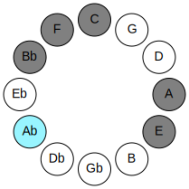 | 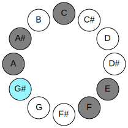 |
## Relative Modes

| Number | Mode | Luminosity | Tonic | Notes | Illustration |
|--------|------|------------|-------|-------|--------------|
| [791](https://ianring.com/musictheory/scales/791) | [Aeoloptimic](ModeAeoloptimic.md) | -1 | G# | G#, A, Bb, C, D##, E#, G# |  |
| [2443](https://ianring.com/musictheory/scales/2443) | [Panimic](ModePanimic.md) | 6 | A | A, Bb, C, D##, E#, F###, A |  |
| [3269](https://ianring.com/musictheory/scales/3269) | [Lodimic](ModeLodimic.md) | 6 | A# | A#, B#, D##, E#, F###, G##, A# |  |
| [1841](https://ianring.com/musictheory/scales/1841) | [Thogimic](ModeThogimic.md) | 4 | C | C, D##, E#, F###, G##, A#, C |  |
| [371](https://ianring.com/musictheory/scales/371) | [Rythimic](ModeRythimic.md) | -1 | E | E, F, G#, A, Bb, C, E |  |
| [2233](https://ianring.com/musictheory/scales/2233) | [Donimic](ModeDonimic.md) | -1 | F | F, G#, A, Bb, C, D##, F |  |
## Relative Brightness

| Number | Mode | Luminosity | Tonic | Notes | Circle Of Fifth | Chromatic Circle |
|--------|------|------------|-------|-------|-----------------|------------------|
| [791](https://ianring.com/musictheory/scales/791) | [Aeoloptimic](ModeAeoloptimic.md) | -1 | G# | G#, A, Bb, C, D##, E#, G# |  |  |
| [791](https://ianring.com/musictheory/scales/791) | [Aeoloptimic](ModeAeoloptimic.md) | -1 | Ab | Ab, Bbb, Cbb, Dbb, E, F, Ab |  |  |
| [2443](https://ianring.com/musictheory/scales/2443) | [Panimic](ModePanimic.md) | -1 | A | A, Bb, C, D##, E#, F###, A | 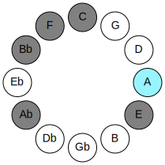 | 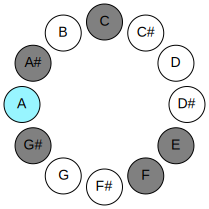 |
| [3269](https://ianring.com/musictheory/scales/3269) | [Lodimic](ModeLodimic.md) | -1 | A# | A#, B#, D##, E#, F###, G##, A# | 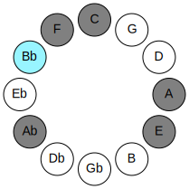 | 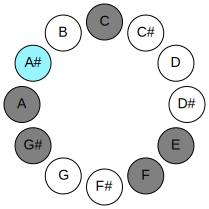 |
| [3269](https://ianring.com/musictheory/scales/3269) | [Lodimic](ModeLodimic.md) | -1 | Bb | Bb, C, D##, E#, F###, G##, Bb |  |  |
| [1841](https://ianring.com/musictheory/scales/1841) | [Thogimic](ModeThogimic.md) | 4 | C | C, D##, E#, F###, G##, A#, C | 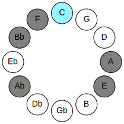 | 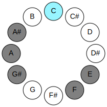 |
| [371](https://ianring.com/musictheory/scales/371) | [Rythimic](ModeRythimic.md) | -1 | E | E, F, G#, A, Bb, C, E | 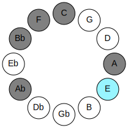 | 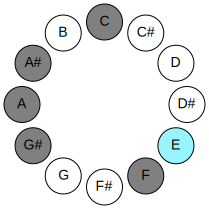 |
| [2233](https://ianring.com/musictheory/scales/2233) | [Donimic](ModeDonimic.md) | -1 | F | F, G#, A, Bb, C, D##, F | 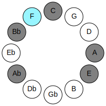 | 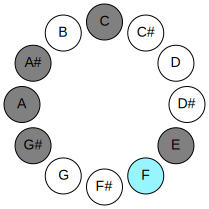 |

## Chords

### Ab

| Number | Root | Name | Notes | Illustration | Audio |
|--------|------|------|-------|--------------|-------|
| 1296 | Ab | [G#sus2#5](ChordGSharpSuspendedSecondSharpFifth.md) | G#, A#, D## |  | [midi](ChordGSharpSuspendedSecondSharpFifthRootPosition.mid) |
| 1296 | Ab | [Absus2#5](ChordAFlatSuspendedSecondSharpFifth.md) | Ab, Bb, E |  | [midi](ChordAFlatSuspendedSecondSharpFifthRootPosition.mid) |
| 273 | Ab | [G#+](ChordGSharpAugmented.md) | G#, B#, D## |  | [midi](ChordGSharpAugmentedRootPosition.mid) |
| 273 | Ab | [G#+7](ChordGSharpAugmentedAugmentedSeventh.md) | G#, B#, D##, F### |  | [midi](ChordGSharpAugmentedAugmentedSeventhRootPosition.mid) |
| 273 | Ab | [Ab+](ChordAFlatAugmented.md) | Ab, C, E |  | [midi](ChordAFlatAugmentedRootPosition.mid) |
| 273 | Ab | [Ab+7](ChordAFlatAugmentedAugmentedSeventh.md) | Ab, C, E, G# |  | [midi](ChordAFlatAugmentedAugmentedSeventhRootPosition.mid) |
| 289 | Ab | [G#M##5](ChordGSharpMajorDoubleSharpFifth.md) | G#, B#, E# |  | [midi](ChordGSharpMajorDoubleSharpFifthRootPosition.mid) |
| 289 | Ab | [AbM##5](ChordAFlatMajorDoubleSharpFifth.md) | Ab, C, F |  | [midi](ChordAFlatMajorDoubleSharpFifthRootPosition.mid) |

### Bbb

| Number | Root | Name | Notes | Illustration | Audio |
|--------|------|------|-------|--------------|-------|
| 528 | Bbb | [A5](ChordANaturalPowerChord.md) | A, E |  | [midi](ChordANaturalPowerChordRootPosition.mid) |
| 1552 | Bbb | [Aphryg](ChordANaturalPhrygian.md) | A, Bb, E |  | [midi](ChordANaturalPhrygianRootPosition.mid) |
| 529 | Bbb | [Am](ChordANaturalMinor.md) | A, C, E |  | [midi](ChordANaturalMinorRootPosition.mid) |
| 529 | Bbb | [Am(add(#9))](ChordANaturalMinorAddSharpNinth.md) | A, C, E, B# |  | [midi](ChordANaturalMinorAddSharpNinthRootPosition.mid) |
| 545 | Bbb | [Am#5](ChordANaturalMinorSharpFifth.md) | A, C, F |  | [midi](ChordANaturalMinorSharpFifthRootPosition.mid) |
| 1808 | Bbb | [Aphryg+7](ChordANaturalPhrygianAddSeventh.md) | A, Bb, E, G# |  | [midi](ChordANaturalPhrygianAddSeventhRootPosition.mid) |
| 785 | Bbb | [Am(M7)](ChordANaturalMinorMajorSeventh.md) | A, C, E, G# |  | [midi](ChordANaturalMinorMajorSeventhRootPosition.mid) |

### Cbb

| Number | Root | Name | Notes | Illustration | Audio |
|--------|------|------|-------|--------------|-------|
| 1041 | Cbb | [A#](ChordASharpDiminishedFlatThird.md) | A#, C, E |  | [midi](ChordASharpDiminishedFlatThirdRootPosition.mid) |
| 1041 | Cbb | [A#sus2b5](ChordASharpSuspendedSecondFlatFifth.md) | A#, B#, E |  | [midi](ChordASharpSuspendedSecondFlatFifthRootPosition.mid) |
| 1041 | Cbb | [Bb](ChordBFlatDiminishedFlatThird.md) | Bb, Dbb, Fb |  | [midi](ChordBFlatDiminishedFlatThirdRootPosition.mid) |
| 1041 | Cbb | [Bbsus2b5](ChordBFlatSuspendedSecondFlatFifth.md) | Bb, C, Fb |  | [midi](ChordBFlatSuspendedSecondFlatFifthRootPosition.mid) |
| 1056 | Cbb | [A#5](ChordASharpPowerChord.md) | A#, E# |  | [midi](ChordASharpPowerChordRootPosition.mid) |
| 1056 | Cbb | [Bb5](ChordBFlatPowerChord.md) | Bb, F |  | [midi](ChordBFlatPowerChordRootPosition.mid) |
| 1057 | Cbb | [A#sus2](ChordASharpSuspendedSecond.md) | A#, B#, E# |  | [midi](ChordASharpSuspendedSecondRootPosition.mid) |
| 1057 | Cbb | [Bbsus2](ChordBFlatSuspendedSecond.md) | Bb, C, F |  | [midi](ChordBFlatSuspendedSecondRootPosition.mid) |
| 1072 | Cbb | [A#lyd](ChordASharpLydian.md) | A#, D##, E# |  | [midi](ChordASharpLydianRootPosition.mid) |
| 1072 | Cbb | [Bblyd](ChordBFlatLydian.md) | Bb, E, F |  | [midi](ChordBFlatLydianRootPosition.mid) |
| 1313 | Cbb | [A#7sus2](ChordASharpDominantSeventhSuspendedSecond.md) | A#, B#, E#, G# |  | [midi](ChordASharpDominantSeventhSuspendedSecondRootPosition.mid) |
| 1313 | Cbb | [A#9sus2](ChordASharpDominantNinthSuspendedSecond.md) | A#, B#, E#, G#, B# |  | [midi](ChordASharpDominantNinthSuspendedSecondRootPosition.mid) |
| 1313 | Cbb | [Bb7sus2](ChordBFlatDominantSeventhSuspendedSecond.md) | Bb, C, F, Ab |  | [midi](ChordBFlatDominantSeventhSuspendedSecondRootPosition.mid) |
| 1313 | Cbb | [Bb9sus2](ChordBFlatDominantNinthSuspendedSecond.md) | Bb, C, F, Ab, C |  | [midi](ChordBFlatDominantNinthSuspendedSecondRootPosition.mid) |
| 1569 | Cbb | [A#M7(sus2)](ChordASharpMajorSeventhSuspendedSecond.md) | A#, B#, E#, G## |  | [midi](ChordASharpMajorSeventhSuspendedSecondRootPosition.mid) |
| 1569 | Cbb | [A#M9sus2](ChordASharpMajorNinthSuspendedSecond.md) | A#, B#, E#, G##, B# |  | [midi](ChordASharpMajorNinthSuspendedSecondRootPosition.mid) |
| 1569 | Cbb | [BbM7(sus2)](ChordBFlatMajorSeventhSuspendedSecond.md) | Bb, C, F, A |  | [midi](ChordBFlatMajorSeventhSuspendedSecondRootPosition.mid) |
| 1569 | Cbb | [BbM9sus2](ChordBFlatMajorNinthSuspendedSecond.md) | Bb, C, F, A, C |  | [midi](ChordBFlatMajorNinthSuspendedSecondRootPosition.mid) |
| 1584 | Cbb | [A#lyd(M7)](ChordASharpLydianMajorSeventh.md) | A#, D##, E#, G## |  | [midi](ChordASharpLydianMajorSeventhRootPosition.mid) |
| 1584 | Cbb | [Bblyd(M7)](ChordBFlatLydianMajorSeventh.md) | Bb, E, F, A |  | [midi](ChordBFlatLydianMajorSeventhRootPosition.mid) |

### Dbb

| Number | Root | Name | Notes | Illustration | Audio |
|--------|------|------|-------|--------------|-------|
| 273 | Dbb | [C+](ChordCNaturalAugmented.md) | C, E, G# |  | [midi](ChordCNaturalAugmentedRootPosition.mid) |
| 273 | Dbb | [C+7](ChordCNaturalAugmentedAugmentedSeventh.md) | C, E, G#, B# |  | [midi](ChordCNaturalAugmentedAugmentedSeventhRootPosition.mid) |
| 289 | Dbb | [Csus4#5](ChordCNaturalSuspendedFourthSharpFifth.md) | C, F, G# |  | [midi](ChordCNaturalSuspendedFourthSharpFifthRootPosition.mid) |
| 529 | Dbb | [CM##5](ChordCNaturalMajorDoubleSharpFifth.md) | C, E, A |  | [midi](ChordCNaturalMajorDoubleSharpFifthRootPosition.mid) |
| 545 | Dbb | [Csus4##5](ChordCNaturalSuspendedFourthDoubleSharpFifth.md) | C, F, A |  | [midi](ChordCNaturalSuspendedFourthDoubleSharpFifthRootPosition.mid) |
| 1057 | Dbb | [CQ](ChordCNaturalQuartal.md) | C, F, Bb |  | [midi](ChordCNaturalQuartalRootPosition.mid) |

### E

| Number | Root | Name | Notes | Illustration | Audio |
|--------|------|------|-------|--------------|-------|
| 1072 | E | [Eloc](ChordENaturalLocrian.md) | E, F, Bb |  | [midi](ChordENaturalLocrianRootPosition.mid) |
| 1296 | E | [EMb5](ChordENaturalMajorFlatFifth.md) | E, G#, Bb |  | [midi](ChordENaturalMajorFlatFifthRootPosition.mid) |
| 1552 | E | [Esus4b5](ChordENaturalSuspendedFourthFlatFifth.md) | E, A, Bb |  | [midi](ChordENaturalSuspendedFourthFlatFifthRootPosition.mid) |
| 273 | E | [E+](ChordENaturalAugmented.md) | E, G#, B# |  | [midi](ChordENaturalAugmentedRootPosition.mid) |
| 273 | E | [E+7](ChordENaturalAugmentedAugmentedSeventh.md) | E, G#, B#, D## |  | [midi](ChordENaturalAugmentedAugmentedSeventhRootPosition.mid) |
| 529 | E | [Esus4#5](ChordENaturalSuspendedFourthSharpFifth.md) | E, A, B# |  | [midi](ChordENaturalSuspendedFourthSharpFifthRootPosition.mid) |

### F

| Number | Root | Name | Notes | Illustration | Audio |
|--------|------|------|-------|--------------|-------|
| 1312 | F | [Fmbb5](ChordFNaturalMinorDoubleFlatFifth.md) | F, Ab, Bb |  | [midi](ChordFNaturalMinorDoubleFlatFifthRootPosition.mid) |
| 33 | F | [F5](ChordFNaturalPowerChord.md) | F, C |  | [midi](ChordFNaturalPowerChordRootPosition.mid) |
| 289 | F | [Fm](ChordFNaturalMinor.md) | F, Ab, C |  | [midi](ChordFNaturalMinorRootPosition.mid) |
| 289 | F | [Fm(add(#9))](ChordFNaturalMinorAddSharpNinth.md) | F, Ab, C, G# |  | [midi](ChordFNaturalMinorAddSharpNinthRootPosition.mid) |
| 545 | F | [FM](ChordFNaturalMajor.md) | F, A, C |  | [midi](ChordFNaturalMajorRootPosition.mid) |
| 801 | F | [FM(add(#9))](ChordFNaturalMajorAddSharpNinth.md) | F, A, C, G# |  | [midi](ChordFNaturalMajorAddSharpNinthRootPosition.mid) |
| 1057 | F | [Fsus4](ChordFNaturalSuspendedFourth.md) | F, Bb, C |  | [midi](ChordFNaturalSuspendedFourthRootPosition.mid) |
| 1313 | F | [Fm(add11)](ChordFNaturalMinorAddEleventh.md) | F, Ab, C, Bb |  | [midi](ChordFNaturalMinorAddEleventhRootPosition.mid) |
| 1313 | F | [Fm(add4)](ChordFNaturalMinorAddFourth.md) | F, Ab, Bb, C |  | [midi](ChordFNaturalMinorAddFourthRootPosition.mid) |
| 1569 | F | [FM(add11)](ChordFNaturalMajorAddEleventh.md) | F, A, C, Bb |  | [midi](ChordFNaturalMajorAddEleventhRootPosition.mid) |
| 1569 | F | [FM(add4)](ChordFNaturalMajorAddFourth.md) | F, A, Bb, C |  | [midi](ChordFNaturalMajorAddFourthRootPosition.mid) |
| 1072 | F | [FQ+](ChordFNaturalQuartalAugmented.md) | F, Bb, E |  | [midi](ChordFNaturalQuartalAugmentedRootPosition.mid) |
| 305 | F | [Fm(M7)](ChordFNaturalMinorMajorSeventh.md) | F, Ab, C, E |  | [midi](ChordFNaturalMinorMajorSeventhRootPosition.mid) |
| 561 | F | [FM7](ChordFNaturalMajorSeventh.md) | F, A, C, E |  | [midi](ChordFNaturalMajorSeventhRootPosition.mid) |
| 1073 | F | [FM7(sus4)](ChordFNaturalMajorSeventhSuspendedFourth.md) | F, Bb, C, E |  | [midi](ChordFNaturalMajorSeventhSuspendedFourthRootPosition.mid) |
| 1329 | F | [Fm(M7)add11](ChordFNaturalMinorMajorSeventhAddEleventh.md) | F, Ab, C, E, Bb |  | [midi](ChordFNaturalMinorMajorSeventhAddEleventhRootPosition.mid) |
| 1585 | F | [FM7add4](ChordFNaturalMajorSeventhAddFourth.md) | F, A, Bb, C, E |  | [midi](ChordFNaturalMajorSeventhAddFourthRootPosition.mid) |
| 1585 | F | [FM7add11](ChordFNaturalMajorSeventhAddEleventh.md) | F, A, C, E, Bb |  | [midi](ChordFNaturalMajorSeventhAddEleventhRootPosition.mid) |

