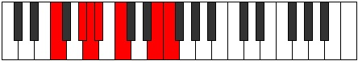

# Mode AFlatAeoloptimic

## Links

- [Documentation](index.md)
- [Scales Index](Scales.md)
- [Modes Index](Modes.md)
- [Chords Index](Chords.md)

## Scale

[Thogimic](ScaleThogimic.md)

## Mode

[AFlatAeoloptimic](ModeAFlatAeoloptimic.md)

## Tonic

Ab

## Signature

[CNaturalMajor]

## Perfection

 - 3 Perfect Notes

 - 3 Imperfect Notes

## Notes

- Ab (Imperfect)
- Bbb
- Cbb
- Dbb (Imperfect)
- E (Imperfect)
- F
- Ab (Imperfect)

## Illustration

## Relative Modes

| Number | Mode | Tonic | Notes | Illustration |
|--------|------|-------|-------|--------------|
| [791](https://ianring.com/musictheory/scales/791) | [Aeoloptimic](ModeAeoloptimic.md) | Ab | Ab, Bbb, Cbb, Dbb, E, F, Ab |  |
| [371](https://ianring.com/musictheory/scales/371) | [Rythimic](ModeRythimic.md) | E | E, F, G#, A, Bb, C, E |  |
| [2233](https://ianring.com/musictheory/scales/2233) | [Donimic](ModeDonimic.md) | F | F, G#, A, Bb, C, D##, F |  |

## Chords

### Ab

| Number | Root | Name | Notes | Illustration | Audio |
|--------|------|------|-------|--------------|-------|

### Bbb

| Number | Root | Name | Notes | Illustration | Audio |
|--------|------|------|-------|--------------|-------|

### Cbb

| Number | Root | Name | Notes | Illustration | Audio |
|--------|------|------|-------|--------------|-------|

### Dbb

| Number | Root | Name | Notes | Illustration | Audio |
|--------|------|------|-------|--------------|-------|

### E

| Number | Root | Name | Notes | Illustration | Audio |
|--------|------|------|-------|--------------|-------|

### F

| Number | Root | Name | Notes | Illustration | Audio |
|--------|------|------|-------|--------------|-------|

