# Mode AFlatAeolorian

## Links

- [Documentation](README.md)
- [Scales Index](Scales.md)
- [Modes Index](Modes.md)
- [Chords Index](Chords.md)

## Scale

[Ionycrian](ScaleIonycrian.md)

## Mode

[AFlatAeolorian](ModeAFlatAeolorian.md)

## Tonic

Ab

## Signature

[CNaturalMajor]

## Transposition

1, 2, 2, 1, 2, 3, 1

## Chord Pattern

i⁰, II, iv, VI, vii⁰b3

## Perfection

 - 5 Perfect Notes

 - 2 Imperfect Notes

## Notes

- Ab (Imperfect)
- Bbb
- Cb (Imperfect)
- Db
- Ebb
- Fb
- G
- Ab (Imperfect)

## Illustration

## Diagram

| Circle of Fifth | Chromatic Circle |
|-----------------|------------------|
| 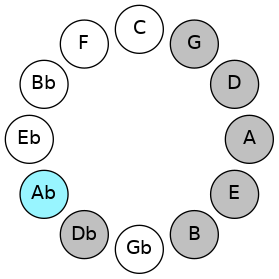 | 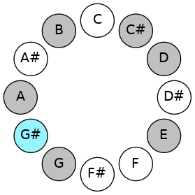 |
## Relative Modes

| Number | Mode | Tonic | Notes | Illustration |
|--------|------|-------|-------|--------------|
| [2411](https://ianring.com/musictheory/scales/2411) | [Aeolorian](ModeAeolorian.md) | G# | G#, A, B, C#, D, E, F##, G# |  |
| [2411](https://ianring.com/musictheory/scales/2411) | [Aeolorian](ModeAeolorian.md) | Ab | Ab, Bbb, Cb, Db, Ebb, Fb, G, Ab |  |
| [3253](https://ianring.com/musictheory/scales/3253) | [Gonian](ModeGonian.md) | A | A, B, C#, D, E, F##, G#, A |  |
| [1837](https://ianring.com/musictheory/scales/1837) | [Dalian](ModeDalian.md) | B | B, C#, D, E, F##, G#, A, B |  |
| [1483](https://ianring.com/musictheory/scales/1483) | [Dygian](ModeDygian.md) | C# | C#, D, E, F##, G#, A, B, C# |  |
| [1483](https://ianring.com/musictheory/scales/1483) | [Dygian](ModeDygian.md) | Db | Db, Ebb, Fb, G, Ab, Bbb, Cb, Db |  |
| [2789](https://ianring.com/musictheory/scales/2789) | [Zolian](ModeZolian.md) | D | D, E, F##, G#, A, B, C#, D |  |
| [1721](https://ianring.com/musictheory/scales/1721) | [Ionycrian](ModeIonycrian.md) | E | E, F##, G#, A, B, C#, D, E |  |
| [727](https://ianring.com/musictheory/scales/727) | [Phradian](ModePhradian.md) | G | G, Ab, Bbb, Cb, Db, Ebb, Fb, G |  |
## Relative Brightness

| Number | Mode | Tonic | Notes | Circle Of Fifth | Chromatic Circle |
|--------|------|-------|-------|-----------------|------------------|
| [2411](https://ianring.com/musictheory/scales/2411) | [Aeolorian](ModeAeolorian.md) | G# | G#, A, B, C#, D, E, F##, G# |  |  |
| [2411](https://ianring.com/musictheory/scales/2411) | [Aeolorian](ModeAeolorian.md) | Ab | Ab, Bbb, Cb, Db, Ebb, Fb, G, Ab |  |  |
| [3253](https://ianring.com/musictheory/scales/3253) | [Gonian](ModeGonian.md) | A | A, B, C#, D, E, F##, G#, A | 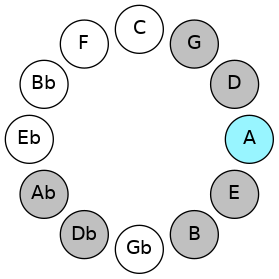 | 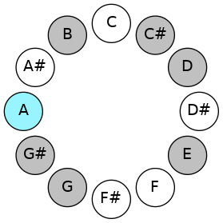 |
| [1837](https://ianring.com/musictheory/scales/1837) | [Dalian](ModeDalian.md) | B | B, C#, D, E, F##, G#, A, B | 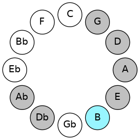 | 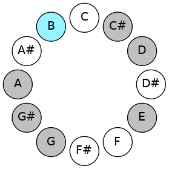 |
| [1483](https://ianring.com/musictheory/scales/1483) | [Dygian](ModeDygian.md) | C# | C#, D, E, F##, G#, A, B, C# | 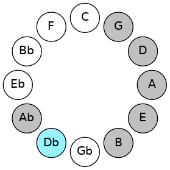 | 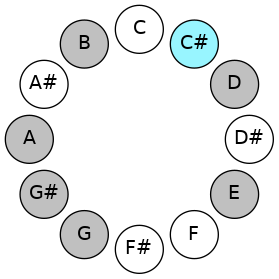 |
| [1483](https://ianring.com/musictheory/scales/1483) | [Dygian](ModeDygian.md) | Db | Db, Ebb, Fb, G, Ab, Bbb, Cb, Db |  |  |
| [2789](https://ianring.com/musictheory/scales/2789) | [Zolian](ModeZolian.md) | D | D, E, F##, G#, A, B, C#, D | 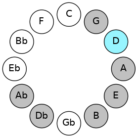 | 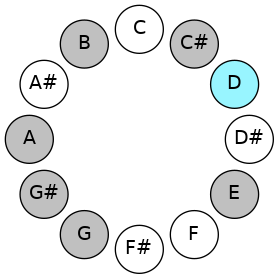 |
| [1721](https://ianring.com/musictheory/scales/1721) | [Ionycrian](ModeIonycrian.md) | E | E, F##, G#, A, B, C#, D, E | 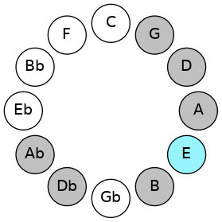 |  |
| [727](https://ianring.com/musictheory/scales/727) | [Phradian](ModePhradian.md) | G | G, Ab, Bbb, Cb, Db, Ebb, Fb, G | 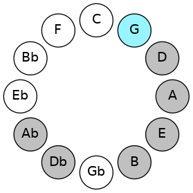 | 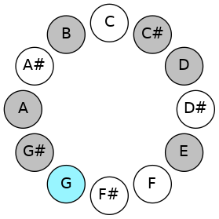 |

## Chords

### Ab

| Number | Root | Name | Notes | Illustration | Audio |
|--------|------|------|-------|--------------|-------|
| 2306 | Ab | [G#mbb5](ChordGSharpMinorDoubleFlatFifth.md) | G#, B, C# |  | [midi](ChordGSharpMinorDoubleFlatFifthRootPosition.mid) |
| 2306 | Ab | [Abmbb5](ChordAFlatMinorDoubleFlatFifth.md) | Ab, Cb, Db |  | [midi](ChordAFlatMinorDoubleFlatFifthRootPosition.mid) |
| 772 | Ab | [G#loc](ChordGSharpLocrian.md) | G#, A, D |  | [midi](ChordGSharpLocrianRootPosition.mid) |
| 772 | Ab | [Abloc](ChordAFlatLocrian.md) | Ab, Bbb, Ebb |  | [midi](ChordAFlatLocrianRootPosition.mid) |
| 2308 | Ab | [G#o](ChordGSharpDiminished.md) | G#, B, D |  | [midi](ChordGSharpDiminishedRootPosition.mid) |
| 2308 | Ab | [Abo](ChordAFlatDiminished.md) | Ab, Cb, Ebb |  | [midi](ChordAFlatDiminishedRootPosition.mid) |
| 262 | Ab | [G#sus4b5](ChordGSharpSuspendedFourthFlatFifth.md) | G#, C#, D |  | [midi](ChordGSharpSuspendedFourthFlatFifthRootPosition.mid) |
| 262 | Ab | [Absus4b5](ChordAFlatSuspendedFourthFlatFifth.md) | Ab, Db, Ebb |  | [midi](ChordAFlatSuspendedFourthFlatFifthRootPosition.mid) |
| 2320 | Ab | [G#m#5](ChordGSharpMinorSharpFifth.md) | G#, B, E |  | [midi](ChordGSharpMinorSharpFifthRootPosition.mid) |
| 2320 | Ab | [Abm#5](ChordAFlatMinorSharpFifth.md) | Ab, Cb, Fb |  | [midi](ChordAFlatMinorSharpFifthRootPosition.mid) |
| 274 | Ab | [G#sus4#5](ChordGSharpSuspendedFourthSharpFifth.md) | G#, C#, D## |  | [midi](ChordGSharpSuspendedFourthSharpFifthRootPosition.mid) |
| 274 | Ab | [Absus4#5](ChordAFlatSuspendedFourthSharpFifth.md) | Ab, Db, E |  | [midi](ChordAFlatSuspendedFourthSharpFifthRootPosition.mid) |
| 386 | Ab | [G#Q+](ChordGSharpQuartalAugmented.md) | G#, C#, F## |  | [midi](ChordGSharpQuartalAugmentedRootPosition.mid) |
| 386 | Ab | [AbQ+](ChordAFlatQuartalAugmented.md) | Ab, Db, G |  | [midi](ChordAFlatQuartalAugmentedRootPosition.mid) |
| 2436 | Ab | [G#oM7](ChordGSharpDiminishedMajorSeventh.md) | G#, B, D, F## |  | [midi](ChordGSharpDiminishedMajorSeventhRootPosition.mid) |
| 2436 | Ab | [AboM7](ChordAFlatDiminishedMajorSeventh.md) | Ab, Cb, Ebb, G |  | [midi](ChordAFlatDiminishedMajorSeventhRootPosition.mid) |
| 402 | Ab | [G#M7(sus4)#5](ChordGSharpMajorSeventhSuspendedFourthSharpFifth.md) | G#, C#, D##, F## |  | [midi](ChordGSharpMajorSeventhSuspendedFourthSharpFifthRootPosition.mid) |
| 402 | Ab | [AbM7(sus4)#5](ChordAFlatMajorSeventhSuspendedFourthSharpFifth.md) | Ab, Db, E, G |  | [midi](ChordAFlatMajorSeventhSuspendedFourthSharpFifthRootPosition.mid) |

### Bbb

| Number | Root | Name | Notes | Illustration | Audio |
|--------|------|------|-------|--------------|-------|
| 2564 | Bbb | [Asus2bb5](ChordANaturalSuspendedSecondDoubleFlatFifth.md) | A, B, D |  | [midi](ChordANaturalSuspendedSecondDoubleFlatFifthRootPosition.mid) |
| 528 | Bbb | [A5](ChordANaturalPowerChord.md) | A, E |  | [midi](ChordANaturalPowerChordRootPosition.mid) |
| 2576 | Bbb | [Asus2](ChordANaturalSuspendedSecond.md) | A, B, E |  | [midi](ChordANaturalSuspendedSecondRootPosition.mid) |
| 530 | Bbb | [AM](ChordANaturalMajor.md) | A, C#, E |  | [midi](ChordANaturalMajorRootPosition.mid) |
| 2578 | Bbb | [AM(add9)](ChordANaturalMajorAddNinth.md) | A, C#, E, B |  | [midi](ChordANaturalMajorAddNinthRootPosition.mid) |
| 532 | Bbb | [Asus4](ChordANaturalSuspendedFourth.md) | A, D, E |  | [midi](ChordANaturalSuspendedFourthRootPosition.mid) |
| 534 | Bbb | [AM(add11)](ChordANaturalMajorAddEleventh.md) | A, C#, E, D |  | [midi](ChordANaturalMajorAddEleventhRootPosition.mid) |
| 534 | Bbb | [AM(add4)](ChordANaturalMajorAddFourth.md) | A, C#, D, E |  | [midi](ChordANaturalMajorAddFourthRootPosition.mid) |
| 644 | Bbb | [AQ](ChordANaturalQuartal.md) | A, D, G |  | [midi](ChordANaturalQuartalRootPosition.mid) |
| 2704 | Bbb | [A7sus2](ChordANaturalDominantSeventhSuspendedSecond.md) | A, B, E, G |  | [midi](ChordANaturalDominantSeventhSuspendedSecondRootPosition.mid) |
| 2704 | Bbb | [A9sus2](ChordANaturalDominantNinthSuspendedSecond.md) | A, B, E, G, B |  | [midi](ChordANaturalDominantNinthSuspendedSecondRootPosition.mid) |
| 658 | Bbb | [A7](ChordANaturalDominantSeventh.md) | A, C#, E, G |  | [midi](ChordANaturalDominantSeventhRootPosition.mid) |
| 2706 | Bbb | [A9](ChordANaturalDominantNinth.md) | A, C#, E, G, B |  | [midi](ChordANaturalDominantNinthRootPosition.mid) |
| 660 | Bbb | [A7sus4](ChordANaturalDominantSeventhSuspendedFourth.md) | A, D, E, G |  | [midi](ChordANaturalDominantSeventhSuspendedFourthRootPosition.mid) |
| 2708 | Bbb | [A9sus4](ChordANaturalDominantNinthSuspendedFourth.md) | A, D, E, G, B |  | [midi](ChordANaturalDominantNinthSuspendedFourthRootPosition.mid) |
| 662 | Bbb | [A7add4](ChordANaturalDominantSeventhAddFourth.md) | A, C#, D, E, G |  | [midi](ChordANaturalDominantSeventhAddFourthRootPosition.mid) |
| 662 | Bbb | [A7add11](ChordANaturalDominantSeventhAddEleventh.md) | A, C#, E, G, D |  | [midi](ChordANaturalDominantSeventhAddEleventhRootPosition.mid) |
| 2710 | Bbb | [A11](ChordANaturalDominantEleventh.md) | A, C#, E, G, B, D |  | [midi](ChordANaturalDominantEleventhRootPosition.mid) |
| 772 | Bbb | [AQ+](ChordANaturalQuartalAugmented.md) | A, D, G# |  | [midi](ChordANaturalQuartalAugmentedRootPosition.mid) |
| 2832 | Bbb | [AM7(sus2)](ChordANaturalMajorSeventhSuspendedSecond.md) | A, B, E, G# |  | [midi](ChordANaturalMajorSeventhSuspendedSecondRootPosition.mid) |
| 2832 | Bbb | [AM9sus2](ChordANaturalMajorNinthSuspendedSecond.md) | A, B, E, G#, B |  | [midi](ChordANaturalMajorNinthSuspendedSecondRootPosition.mid) |
| 786 | Bbb | [AM7](ChordANaturalMajorSeventh.md) | A, C#, E, G# |  | [midi](ChordANaturalMajorSeventhRootPosition.mid) |
| 2834 | Bbb | [AM9](ChordANaturalMajorNinth.md) | A, C#, E, G#, B |  | [midi](ChordANaturalMajorNinthRootPosition.mid) |
| 788 | Bbb | [AM7(sus4)](ChordANaturalMajorSeventhSuspendedFourth.md) | A, D, E, G# |  | [midi](ChordANaturalMajorSeventhSuspendedFourthRootPosition.mid) |
| 2836 | Bbb | [AM9sus4](ChordANaturalMajorNinthSuspendedFourth.md) | A, D, E, G#, B |  | [midi](ChordANaturalMajorNinthSuspendedFourthRootPosition.mid) |
| 790 | Bbb | [AM7add4](ChordANaturalMajorSeventhAddFourth.md) | A, C#, D, E, G# |  | [midi](ChordANaturalMajorSeventhAddFourthRootPosition.mid) |
| 790 | Bbb | [AM7add11](ChordANaturalMajorSeventhAddEleventh.md) | A, C#, E, G#, D |  | [midi](ChordANaturalMajorSeventhAddEleventhRootPosition.mid) |
| 2838 | Bbb | [AM11](ChordANaturalMajorEleventh.md) | A, C#, E, G#, B, D |  | [midi](ChordANaturalMajorEleventhRootPosition.mid) |

### Cb

| Number | Root | Name | Notes | Illustration | Audio |
|--------|------|------|-------|--------------|-------|
| 2066 | Cb | [Bsus2bb5](ChordBNaturalSuspendedSecondDoubleFlatFifth.md) | B, C#, E |  | [midi](ChordBNaturalSuspendedSecondDoubleFlatFifthRootPosition.mid) |
| 2068 | Cb | [Bmbb5](ChordBNaturalMinorDoubleFlatFifth.md) | B, D, E |  | [midi](ChordBNaturalMinorDoubleFlatFifthRootPosition.mid) |
| 2178 | Cb | [Bsus2#5](ChordBNaturalSuspendedSecondSharpFifth.md) | B, C#, F## |  | [midi](ChordBNaturalSuspendedSecondSharpFifthRootPosition.mid) |
| 2180 | Cb | [Bm#5](ChordBNaturalMinorSharpFifth.md) | B, D, G |  | [midi](ChordBNaturalMinorSharpFifthRootPosition.mid) |
| 2192 | Cb | [Bsus4#5](ChordBNaturalSuspendedFourthSharpFifth.md) | B, E, F## |  | [midi](ChordBNaturalSuspendedFourthSharpFifthRootPosition.mid) |
| 2320 | Cb | [Bsus4##5](ChordBNaturalSuspendedFourthDoubleSharpFifth.md) | B, E, G# |  | [midi](ChordBNaturalSuspendedFourthDoubleSharpFifthRootPosition.mid) |
| 2322 | Cb | [BM6sus2bb5](ChordBNaturalMajorSixthSuspendedSecondDoubleFlatFifth.md) | B, C#, E, G# |  | [midi](ChordBNaturalMajorSixthSuspendedSecondDoubleFlatFifthRootPosition.mid) |
| 2576 | Cb | [BQ](ChordBNaturalQuartal.md) | B, E, A |  | [midi](ChordBNaturalQuartalRootPosition.mid) |
| 2580 | Cb | [Bm7bb5](ChordBNaturalMinorSeventhDoubleFlatFifth.md) | B, D, E, A |  | [midi](ChordBNaturalMinorSeventhDoubleFlatFifthRootPosition.mid) |
| 2692 | Cb | [Bm7#5](ChordBNaturalMinorSeventhSharpFifth.md) | B, D, F##, A |  | [midi](ChordBNaturalMinorSeventhSharpFifthRootPosition.mid) |

### Db

| Number | Root | Name | Notes | Illustration | Audio |
|--------|------|------|-------|--------------|-------|
| 134 | Db | [C#loc](ChordCSharpLocrian.md) | C#, D, G |  | [midi](ChordCSharpLocrianRootPosition.mid) |
| 134 | Db | [Dbloc](ChordDFlatLocrian.md) | Db, Ebb, Abb |  | [midi](ChordDFlatLocrianRootPosition.mid) |
| 146 | Db | [C#o](ChordCSharpDiminished.md) | C#, E, G |  | [midi](ChordCSharpDiminishedRootPosition.mid) |
| 146 | Db | [Dbo](ChordDFlatDiminished.md) | Db, Fb, Abb |  | [midi](ChordDFlatDiminishedRootPosition.mid) |
| 258 | Db | [C#5](ChordCSharpPowerChord.md) | C#, G# |  | [midi](ChordCSharpPowerChordRootPosition.mid) |
| 258 | Db | [Db5](ChordDFlatPowerChord.md) | Db, Ab |  | [midi](ChordDFlatPowerChordRootPosition.mid) |
| 262 | Db | [C#phryg](ChordCSharpPhrygian.md) | C#, D, G# |  | [midi](ChordCSharpPhrygianRootPosition.mid) |
| 262 | Db | [Dbphryg](ChordDFlatPhrygian.md) | Db, Ebb, Ab |  | [midi](ChordDFlatPhrygianRootPosition.mid) |
| 274 | Db | [C#m](ChordCSharpMinor.md) | C#, E, G# |  | [midi](ChordCSharpMinorRootPosition.mid) |
| 274 | Db | [C#m(add(#9))](ChordCSharpMinorAddSharpNinth.md) | C#, E, G#, D## |  | [midi](ChordCSharpMinorAddSharpNinthRootPosition.mid) |
| 274 | Db | [Dbm](ChordDFlatMinor.md) | Db, Fb, Ab |  | [midi](ChordDFlatMinorRootPosition.mid) |
| 274 | Db | [Dbm(add(#9))](ChordDFlatMinorAddSharpNinth.md) | Db, Fb, Ab, E |  | [midi](ChordDFlatMinorAddSharpNinthRootPosition.mid) |
| 386 | Db | [C#lyd](ChordCSharpLydian.md) | C#, F##, G# |  | [midi](ChordCSharpLydianRootPosition.mid) |
| 386 | Db | [Dblyd](ChordDFlatLydian.md) | Db, G, Ab |  | [midi](ChordDFlatLydianRootPosition.mid) |
| 402 | Db | [C#m(add(#4))](ChordCSharpMinorAddSharpFourth.md) | C#, E, F##, G# |  | [midi](ChordCSharpMinorAddSharpFourthRootPosition.mid) |
| 402 | Db | [Dbm(add(#4))](ChordDFlatMinorAddSharpFourth.md) | Db, Fb, G, Ab |  | [midi](ChordDFlatMinorAddSharpFourthRootPosition.mid) |
| 530 | Db | [C#m#5](ChordCSharpMinorSharpFifth.md) | C#, E, A |  | [midi](ChordCSharpMinorSharpFifthRootPosition.mid) |
| 530 | Db | [Dbm#5](ChordDFlatMinorSharpFifth.md) | Db, Fb, Bbb |  | [midi](ChordDFlatMinorSharpFifthRootPosition.mid) |
| 2194 | Db | [C#ø7](ChordCSharpHalfDiminishedSeventh.md) | C#, E, G, B |  | [midi](ChordCSharpHalfDiminishedSeventhRootPosition.mid) |
| 2194 | Db | [Dbø7](ChordDFlatHalfDiminishedSeventh.md) | Db, Fb, Abb, Cb |  | [midi](ChordDFlatHalfDiminishedSeventhRootPosition.mid) |
| 2322 | Db | [C#m7](ChordCSharpMinorSeventh.md) | C#, E, G#, B |  | [midi](ChordCSharpMinorSeventhRootPosition.mid) |
| 2322 | Db | [Dbm7](ChordDFlatMinorSeventh.md) | Db, Fb, Ab, Cb |  | [midi](ChordDFlatMinorSeventhRootPosition.mid) |
| 2326 | Db | [C#m7b9](ChordCSharpMinorSeventhFlatNinth.md) | C#, E, G#, B, D |  | [midi](ChordCSharpMinorSeventhFlatNinthRootPosition.mid) |
| 2326 | Db | [Dbm7b9](ChordDFlatMinorSeventhFlatNinth.md) | Db, Fb, Ab, Cb, Ebb |  | [midi](ChordDFlatMinorSeventhFlatNinthRootPosition.mid) |
| 2450 | Db | [C#m7add(#11)](ChordCSharpMinorSeventhAddSharpEleventh.md) | C#, E, G#, B, F## |  | [midi](ChordCSharpMinorSeventhAddSharpEleventhRootPosition.mid) |
| 2450 | Db | [Dbm7add(#11)](ChordDFlatMinorSeventhAddSharpEleventh.md) | Db, Fb, Ab, Cb, G |  | [midi](ChordDFlatMinorSeventhAddSharpEleventhRootPosition.mid) |
| 2578 | Db | [C#m7#5](ChordCSharpMinorSeventhSharpFifth.md) | C#, E, G##, B |  | [midi](ChordCSharpMinorSeventhSharpFifthRootPosition.mid) |
| 2578 | Db | [Dbm7#5](ChordDFlatMinorSeventhSharpFifth.md) | Db, Fb, A, Cb |  | [midi](ChordDFlatMinorSeventhSharpFifthRootPosition.mid) |

### Ebb

| Number | Root | Name | Notes | Illustration | Audio |
|--------|------|------|-------|--------------|-------|
| 148 | Ebb | [Dsus2bb5](ChordDNaturalSuspendedSecondDoubleFlatFifth.md) | D, E, G |  | [midi](ChordDNaturalSuspendedSecondDoubleFlatFifthRootPosition.mid) |
| 276 | Ebb | [D](ChordDNaturalDiminishedFlatThird.md) | D, Fb, Ab |  | [midi](ChordDNaturalDiminishedFlatThirdRootPosition.mid) |
| 276 | Ebb | [Dsus2b5](ChordDNaturalSuspendedSecondFlatFifth.md) | D, E, Ab |  | [midi](ChordDNaturalSuspendedSecondFlatFifthRootPosition.mid) |
| 388 | Ebb | [Dsus4b5](ChordDNaturalSuspendedFourthFlatFifth.md) | D, G, Ab |  | [midi](ChordDNaturalSuspendedFourthFlatFifthRootPosition.mid) |
| 516 | Ebb | [D5](ChordDNaturalPowerChord.md) | D, A |  | [midi](ChordDNaturalPowerChordRootPosition.mid) |
| 532 | Ebb | [Dsus2](ChordDNaturalSuspendedSecond.md) | D, E, A |  | [midi](ChordDNaturalSuspendedSecondRootPosition.mid) |
| 644 | Ebb | [Dsus4](ChordDNaturalSuspendedFourth.md) | D, G, A |  | [midi](ChordDNaturalSuspendedFourthRootPosition.mid) |
| 772 | Ebb | [Dlyd](ChordDNaturalLydian.md) | D, G#, A |  | [midi](ChordDNaturalLydianRootPosition.mid) |
| 2180 | Ebb | [Dsus4##5](ChordDNaturalSuspendedFourthDoubleSharpFifth.md) | D, G, B |  | [midi](ChordDNaturalSuspendedFourthDoubleSharpFifthRootPosition.mid) |
| 2196 | Ebb | [DM6sus2bb5](ChordDNaturalMajorSixthSuspendedSecondDoubleFlatFifth.md) | D, E, G, B |  | [midi](ChordDNaturalMajorSixthSuspendedSecondDoubleFlatFifthRootPosition.mid) |
| 2324 | Ebb | [DM6sus2b5](ChordDNaturalMajorSixthSuspendedSecondFlatFifth.md) | D, E, Ab, B |  | [midi](ChordDNaturalMajorSixthSuspendedSecondFlatFifthRootPosition.mid) |
| 2580 | Ebb | [DM6sus2](ChordDNaturalMajorSixthSuspendedSecond.md) | D, E, A, B |  | [midi](ChordDNaturalMajorSixthSuspendedSecondRootPosition.mid) |
| 2580 | Ebb | [D7sus2b5](ChordDNaturalDominantSeventhSuspendedSecondFlatFifth.md) | D, E, A, Cb |  | [midi](ChordDNaturalDominantSeventhSuspendedSecondFlatFifthRootPosition.mid) |
| 2692 | Ebb | [DM6sus4](ChordDNaturalMajorSixthSuspendedFourth.md) | D, G, A, B |  | [midi](ChordDNaturalMajorSixthSuspendedFourthRootPosition.mid) |
| 134 | Ebb | [DQ+](ChordDNaturalQuartalAugmented.md) | D, G, C# |  | [midi](ChordDNaturalQuartalAugmentedRootPosition.mid) |
| 534 | Ebb | [DM7(sus2)](ChordDNaturalMajorSeventhSuspendedSecond.md) | D, E, A, C# |  | [midi](ChordDNaturalMajorSeventhSuspendedSecondRootPosition.mid) |
| 534 | Ebb | [DM9sus2](ChordDNaturalMajorNinthSuspendedSecond.md) | D, E, A, C#, E |  | [midi](ChordDNaturalMajorNinthSuspendedSecondRootPosition.mid) |
| 646 | Ebb | [DM7(sus4)](ChordDNaturalMajorSeventhSuspendedFourth.md) | D, G, A, C# |  | [midi](ChordDNaturalMajorSeventhSuspendedFourthRootPosition.mid) |
| 662 | Ebb | [DM9sus4](ChordDNaturalMajorNinthSuspendedFourth.md) | D, G, A, C#, E |  | [midi](ChordDNaturalMajorNinthSuspendedFourthRootPosition.mid) |
| 774 | Ebb | [Dlyd(M7)](ChordDNaturalLydianMajorSeventh.md) | D, G#, A, C# |  | [midi](ChordDNaturalLydianMajorSeventhRootPosition.mid) |
| 2182 | Ebb | [DM7(sus4)##5](ChordDNaturalMajorSeventhSuspendedFourthDoubleSharpFifth.md) | D, G, B, C# |  | [midi](ChordDNaturalMajorSeventhSuspendedFourthDoubleSharpFifthRootPosition.mid) |

### Fb

| Number | Root | Name | Notes | Illustration | Audio |
|--------|------|------|-------|--------------|-------|
| 656 | Fb | [Embb5](ChordENaturalMinorDoubleFlatFifth.md) | E, G, A |  | [midi](ChordENaturalMinorDoubleFlatFifthRootPosition.mid) |
| 2064 | Fb | [E5](ChordENaturalPowerChord.md) | E, B |  | [midi](ChordENaturalPowerChordRootPosition.mid) |
| 2192 | Fb | [Em](ChordENaturalMinor.md) | E, G, B |  | [midi](ChordENaturalMinorRootPosition.mid) |
| 2192 | Fb | [Em(add(#9))](ChordENaturalMinorAddSharpNinth.md) | E, G, B, F## |  | [midi](ChordENaturalMinorAddSharpNinthRootPosition.mid) |
| 2320 | Fb | [EM](ChordENaturalMajor.md) | E, G#, B |  | [midi](ChordENaturalMajorRootPosition.mid) |
| 2448 | Fb | [EM(add(#9))](ChordENaturalMajorAddSharpNinth.md) | E, G#, B, F## |  | [midi](ChordENaturalMajorAddSharpNinthRootPosition.mid) |
| 2576 | Fb | [Esus4](ChordENaturalSuspendedFourth.md) | E, A, B |  | [midi](ChordENaturalSuspendedFourthRootPosition.mid) |
| 2704 | Fb | [Em(add11)](ChordENaturalMinorAddEleventh.md) | E, G, B, A |  | [midi](ChordENaturalMinorAddEleventhRootPosition.mid) |
| 2704 | Fb | [Em(add4)](ChordENaturalMinorAddFourth.md) | E, G, A, B |  | [midi](ChordENaturalMinorAddFourthRootPosition.mid) |
| 2832 | Fb | [EM(add11)](ChordENaturalMajorAddEleventh.md) | E, G#, B, A |  | [midi](ChordENaturalMajorAddEleventhRootPosition.mid) |
| 2832 | Fb | [EM(add4)](ChordENaturalMajorAddFourth.md) | E, G#, A, B |  | [midi](ChordENaturalMajorAddFourthRootPosition.mid) |
| 274 | Fb | [EM##5](ChordENaturalMajorDoubleSharpFifth.md) | E, G#, C# |  | [midi](ChordENaturalMajorDoubleSharpFifthRootPosition.mid) |
| 530 | Fb | [Esus4##5](ChordENaturalSuspendedFourthDoubleSharpFifth.md) | E, A, C# |  | [midi](ChordENaturalSuspendedFourthDoubleSharpFifthRootPosition.mid) |
| 2194 | Fb | [Em6](ChordENaturalMinorSixth.md) | E, G, B, C# |  | [midi](ChordENaturalMinorSixthRootPosition.mid) |
| 2322 | Fb | [EM6](ChordENaturalMajorSixth.md) | E, G#, B, C# |  | [midi](ChordENaturalMajorSixthRootPosition.mid) |
| 2578 | Fb | [EM6sus4](ChordENaturalMajorSixthSuspendedFourth.md) | E, A, B, C# |  | [midi](ChordENaturalMajorSixthSuspendedFourthRootPosition.mid) |
| 532 | Fb | [EQ](ChordENaturalQuartal.md) | E, A, D |  | [midi](ChordENaturalQuartalRootPosition.mid) |
| 660 | Fb | [Em7bb5](ChordENaturalMinorSeventhDoubleFlatFifth.md) | E, G, A, D |  | [midi](ChordENaturalMinorSeventhDoubleFlatFifthRootPosition.mid) |
| 2196 | Fb | [Em7](ChordENaturalMinorSeventh.md) | E, G, B, D |  | [midi](ChordENaturalMinorSeventhRootPosition.mid) |
| 2324 | Fb | [E7](ChordENaturalDominantSeventh.md) | E, G#, B, D |  | [midi](ChordENaturalDominantSeventhRootPosition.mid) |
| 2452 | Fb | [E7#9](ChordENaturalDominantSeventhSharpNinth.md) | E, G#, B, D, F## |  | [midi](ChordENaturalDominantSeventhSharpNinthRootPosition.mid) |
| 2580 | Fb | [E7sus4](ChordENaturalDominantSeventhSuspendedFourth.md) | E, A, B, D |  | [midi](ChordENaturalDominantSeventhSuspendedFourthRootPosition.mid) |
| 2708 | Fb | [Em7add11](ChordENaturalMinorSeventhAddEleventh.md) | E, G, B, D, A |  | [midi](ChordENaturalMinorSeventhAddEleventhRootPosition.mid) |
| 2836 | Fb | [E7add4](ChordENaturalDominantSeventhAddFourth.md) | E, G#, A, B, D |  | [midi](ChordENaturalDominantSeventhAddFourthRootPosition.mid) |
| 2836 | Fb | [E7add11](ChordENaturalDominantSeventhAddEleventh.md) | E, G#, B, D, A |  | [midi](ChordENaturalDominantSeventhAddEleventhRootPosition.mid) |
| 2198 | Fb | [Em7add13](ChordENaturalMinorSeventhAddThirteenth.md) | E, G, B, D, C# |  | [midi](ChordENaturalMinorSeventhAddThirteenthRootPosition.mid) |
| 2326 | Fb | [E7add13](ChordENaturalDominantSeventhAddThirteenth.md) | E, G#, B, D, C# |  | [midi](ChordENaturalDominantSeventhAddThirteenthRootPosition.mid) |

### G

| Number | Root | Name | Notes | Illustration | Audio |
|--------|------|------|-------|--------------|-------|
| 386 | G | [Gloc](ChordGNaturalLocrian.md) | G, Ab, Db |  | [midi](ChordGNaturalLocrianRootPosition.mid) |
| 642 | G | [G](ChordGNaturalDiminishedFlatThird.md) | G, Bbb, Db |  | [midi](ChordGNaturalDiminishedFlatThirdRootPosition.mid) |
| 642 | G | [Gsus2b5](ChordGNaturalSuspendedSecondFlatFifth.md) | G, A, Db |  | [midi](ChordGNaturalSuspendedSecondFlatFifthRootPosition.mid) |
| 2178 | G | [GMb5](ChordGNaturalMajorFlatFifth.md) | G, B, Db |  | [midi](ChordGNaturalMajorFlatFifthRootPosition.mid) |
| 132 | G | [G5](ChordGNaturalPowerChord.md) | G, D |  | [midi](ChordGNaturalPowerChordRootPosition.mid) |
| 388 | G | [Gphryg](ChordGNaturalPhrygian.md) | G, Ab, D |  | [midi](ChordGNaturalPhrygianRootPosition.mid) |
| 644 | G | [Gsus2](ChordGNaturalSuspendedSecond.md) | G, A, D |  | [midi](ChordGNaturalSuspendedSecondRootPosition.mid) |
| 2180 | G | [GM](ChordGNaturalMajor.md) | G, B, D |  | [midi](ChordGNaturalMajorRootPosition.mid) |
| 2692 | G | [GM(add9)](ChordGNaturalMajorAddNinth.md) | G, B, D, A |  | [midi](ChordGNaturalMajorAddNinthRootPosition.mid) |
| 134 | G | [Glyd](ChordGNaturalLydian.md) | G, C#, D |  | [midi](ChordGNaturalLydianRootPosition.mid) |
| 2182 | G | [GM(add(#4))](ChordGNaturalMajorAddSharpFourth.md) | G, B, C#, D |  | [midi](ChordGNaturalMajorAddSharpFourthRootPosition.mid) |
| 2192 | G | [GM##5](ChordGNaturalMajorDoubleSharpFifth.md) | G, B, E |  | [midi](ChordGNaturalMajorDoubleSharpFifthRootPosition.mid) |
| 658 | G | [GM6sus2b5](ChordGNaturalMajorSixthSuspendedSecondFlatFifth.md) | G, A, Db, E |  | [midi](ChordGNaturalMajorSixthSuspendedSecondFlatFifthRootPosition.mid) |
| 2194 | G | [GM6b5](ChordGNaturalMajorSixthFlatFifth.md) | G, B, Db, E |  | [midi](ChordGNaturalMajorSixthFlatFifthRootPosition.mid) |
| 660 | G | [GM6sus2](ChordGNaturalMajorSixthSuspendedSecond.md) | G, A, D, E |  | [midi](ChordGNaturalMajorSixthSuspendedSecondRootPosition.mid) |
| 660 | G | [G7sus2b5](ChordGNaturalDominantSeventhSuspendedSecondFlatFifth.md) | G, A, D, Fb |  | [midi](ChordGNaturalDominantSeventhSuspendedSecondFlatFifthRootPosition.mid) |
| 2196 | G | [GM6](ChordGNaturalMajorSixth.md) | G, B, D, E |  | [midi](ChordGNaturalMajorSixthRootPosition.mid) |
| 2452 | G | [GM6(addb9)](ChordGNaturalMajorSixthAddFlatNinth.md) | G, B, D, E, Ab |  | [midi](ChordGNaturalMajorSixthAddFlatNinthRootPosition.mid) |
| 2708 | G | [GM6(add9)](ChordGNaturalMajorSixthAddNinth.md) | G, B, D, E, A |  | [midi](ChordGNaturalMajorSixthAddNinthRootPosition.mid) |

