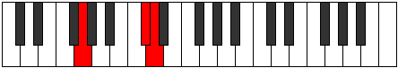

# Mode AFlatAeolorian

## Links

- [Documentation](README.md)
- [Scales Index](Scales.md)
- [Modes Index](Modes.md)
- [Chords Index](Chords.md)

## Scale

[Ionycrian](ScaleIonycrian.md)

## Mode

[AFlatAeolorian](ModeAFlatAeolorian.md)

## Tonic

Ab

## Signature

[CNaturalMajor]

## Interval Pattern

1, 2, 2, 1, 2, 3, 1

## Chord Pattern

i⁰, II, iv, VI

## Perfection

 - 5 Perfect Notes

 - 2 Imperfect Notes

## Notes

- Ab (Imperfect)
- Bbb
- Cb (Imperfect)
- Db
- Ebb
- Fb
- G
- Ab (Imperfect)

## Illustration

## Diagram

## Relative Modes

| Number | Mode | Tonic | Notes | Illustration |
|--------|------|-------|-------|--------------|
| [2411](https://ianring.com/musictheory/scales/2411) | [Aeolorian](ModeAeolorian.md) | Ab | Ab, Bbb, Cb, Db, Ebb, Fb, G, Ab |  |
| [1483](https://ianring.com/musictheory/scales/1483) | [Dygian](ModeDygian.md) | Db | Db, Ebb, Fb, G, Ab, Bbb, Cb, Db |  |
| [727](https://ianring.com/musictheory/scales/727) | [Phradian](ModePhradian.md) | G | G, Ab, Bbb, Cb, Db, Ebb, Fb, G |  |
## Relative Brightness

| Number | Mode | Tonic | Notes | Illustration |
|--------|------|-------|-------|--------------|
| [2411](https://ianring.com/musictheory/scales/2411) | [Aeolorian](ModeAeolorian.md) | Ab | Ab, Bbb, Cb, Db, Ebb, Fb, G, Ab |  |
| [1483](https://ianring.com/musictheory/scales/1483) | [Dygian](ModeDygian.md) | Db | Db, Ebb, Fb, G, Ab, Bbb, Cb, Db |  |
| [727](https://ianring.com/musictheory/scales/727) | [Phradian](ModePhradian.md) | G | G, Ab, Bbb, Cb, Db, Ebb, Fb, G |  |

## Chords

### Ab

| Number | Root | Name | Notes | Illustration | Audio |
|--------|------|------|-------|--------------|-------|
| 2306 | Ab | [Abmbb5](ChordAFlatMinorDoubleFlatFifth.md) | Ab, Cb, Db |  | [midi](ChordAFlatMinorDoubleFlatFifthRootPosition.mid) |
| 772 | Ab | [Abloc](ChordAFlatLocrian.md) | Ab, Bbb, Ebb |  | [midi](ChordAFlatLocrianRootPosition.mid) |
| 2308 | Ab | [Abo](ChordAFlatDiminished.md) | Ab, Cb, Ebb |  | [midi](ChordAFlatDiminishedRootPosition.mid) |
| 262 | Ab | [Absus4b5](ChordAFlatSuspendedFourthFlatFifth.md) | Ab, Db, Ebb |  | [midi](ChordAFlatSuspendedFourthFlatFifthRootPosition.mid) |
| 2320 | Ab | [Abm#5](ChordAFlatMinorSharpFifth.md) | Ab, Cb, Fb |  | [midi](ChordAFlatMinorSharpFifthRootPosition.mid) |
| 274 | Ab | [Absus4#5](ChordAFlatSuspendedFourthSharpFifth.md) | Ab, Db, E |  | [midi](ChordAFlatSuspendedFourthSharpFifthRootPosition.mid) |
| 386 | Ab | [AbQ+](ChordAFlatQuartalAugmented.md) | Ab, Db, G |  | [midi](ChordAFlatQuartalAugmentedRootPosition.mid) |
| 2436 | Ab | [AboM7](ChordAFlatDiminishedMajorSeventh.md) | Ab, Cb, Ebb, G |  | [midi](ChordAFlatDiminishedMajorSeventhRootPosition.mid) |
| 402 | Ab | [AbM7(sus4)#5](ChordAFlatMajorSeventhSuspendedFourthSharpFifth.md) | Ab, Db, E, G |  | [midi](ChordAFlatMajorSeventhSuspendedFourthSharpFifthRootPosition.mid) |

### Bbb

| Number | Root | Name | Notes | Illustration | Audio |
|--------|------|------|-------|--------------|-------|

### Cb

| Number | Root | Name | Notes | Illustration | Audio |
|--------|------|------|-------|--------------|-------|

### Db

| Number | Root | Name | Notes | Illustration | Audio |
|--------|------|------|-------|--------------|-------|
| 134 | Db | [Dbloc](ChordDFlatLocrian.md) | Db, Ebb, Abb |  | [midi](ChordDFlatLocrianRootPosition.mid) |
| 146 | Db | [Dbo](ChordDFlatDiminished.md) | Db, Fb, Abb |  | [midi](ChordDFlatDiminishedRootPosition.mid) |
| 258 | Db | [Db5](ChordDFlatPowerChord.md) | Db, Ab |  | [midi](ChordDFlatPowerChordRootPosition.mid) |
| 262 | Db | [Dbphryg](ChordDFlatPhrygian.md) | Db, Ebb, Ab |  | [midi](ChordDFlatPhrygianRootPosition.mid) |
| 274 | Db | [Dbm](ChordDFlatMinor.md) | Db, Fb, Ab |  | [midi](ChordDFlatMinorRootPosition.mid) |
| 274 | Db | [Dbm(add(#9))](ChordDFlatMinorAddSharpNinth.md) | Db, Fb, Ab, E |  | [midi](ChordDFlatMinorAddSharpNinthRootPosition.mid) |
| 386 | Db | [Dblyd](ChordDFlatLydian.md) | Db, G, Ab |  | [midi](ChordDFlatLydianRootPosition.mid) |
| 402 | Db | [Dbm(add(#4))](ChordDFlatMinorAddSharpFourth.md) | Db, Fb, G, Ab |  | [midi](ChordDFlatMinorAddSharpFourthRootPosition.mid) |
| 530 | Db | [Dbm#5](ChordDFlatMinorSharpFifth.md) | Db, Fb, Bbb |  | [midi](ChordDFlatMinorSharpFifthRootPosition.mid) |
| 2194 | Db | [Dbø7](ChordDFlatHalfDiminishedSeventh.md) | Db, Fb, Abb, Cb |  | [midi](ChordDFlatHalfDiminishedSeventhRootPosition.mid) |
| 2322 | Db | [Dbm7](ChordDFlatMinorSeventh.md) | Db, Fb, Ab, Cb |  | [midi](ChordDFlatMinorSeventhRootPosition.mid) |
| 2326 | Db | [Dbm7b9](ChordDFlatMinorSeventhFlatNinth.md) | Db, Fb, Ab, Cb, Ebb |  | [midi](ChordDFlatMinorSeventhFlatNinthRootPosition.mid) |
| 2450 | Db | [Dbm7add(#11)](ChordDFlatMinorSeventhAddSharpEleventh.md) | Db, Fb, Ab, Cb, G |  | [midi](ChordDFlatMinorSeventhAddSharpEleventhRootPosition.mid) |
| 2578 | Db | [Dbm7#5](ChordDFlatMinorSeventhSharpFifth.md) | Db, Fb, A, Cb |  | [midi](ChordDFlatMinorSeventhSharpFifthRootPosition.mid) |

### Ebb

| Number | Root | Name | Notes | Illustration | Audio |
|--------|------|------|-------|--------------|-------|

### Fb

| Number | Root | Name | Notes | Illustration | Audio |
|--------|------|------|-------|--------------|-------|

### G

| Number | Root | Name | Notes | Illustration | Audio |
|--------|------|------|-------|--------------|-------|
| 386 | G | [Gloc](ChordGNaturalLocrian.md) | G, Ab, Db |  | [midi](ChordGNaturalLocrianRootPosition.mid) |
| 642 | G | [Gsus2b5](ChordGNaturalSuspendedSecondFlatFifth.md) | G, A, Db |  | [midi](ChordGNaturalSuspendedSecondFlatFifthRootPosition.mid) |
| 2178 | G | [GMb5](ChordGNaturalMajorFlatFifth.md) | G, B, Db |  | [midi](ChordGNaturalMajorFlatFifthRootPosition.mid) |
| 132 | G | [G5](ChordGNaturalPowerChord.md) | G, D |  | [midi](ChordGNaturalPowerChordRootPosition.mid) |
| 388 | G | [Gphryg](ChordGNaturalPhrygian.md) | G, Ab, D |  | [midi](ChordGNaturalPhrygianRootPosition.mid) |
| 644 | G | [Gsus2](ChordGNaturalSuspendedSecond.md) | G, A, D |  | [midi](ChordGNaturalSuspendedSecondRootPosition.mid) |
| 2180 | G | [GM](ChordGNaturalMajor.md) | G, B, D |  | [midi](ChordGNaturalMajorRootPosition.mid) |
| 2692 | G | [GM(add9)](ChordGNaturalMajorAddNinth.md) | G, B, D, A |  | [midi](ChordGNaturalMajorAddNinthRootPosition.mid) |
| 134 | G | [Glyd](ChordGNaturalLydian.md) | G, C#, D |  | [midi](ChordGNaturalLydianRootPosition.mid) |
| 2182 | G | [GM(add(#4))](ChordGNaturalMajorAddSharpFourth.md) | G, B, C#, D |  | [midi](ChordGNaturalMajorAddSharpFourthRootPosition.mid) |
| 2192 | G | [GM##5](ChordGNaturalMajorDoubleSharpFifth.md) | G, B, E |  | [midi](ChordGNaturalMajorDoubleSharpFifthRootPosition.mid) |
| 658 | G | [GM6sus2b5](ChordGNaturalMajorSixthSuspendedSecondFlatFifth.md) | G, A, Db, E |  | [midi](ChordGNaturalMajorSixthSuspendedSecondFlatFifthRootPosition.mid) |
| 2194 | G | [GM6b5](ChordGNaturalMajorSixthFlatFifth.md) | G, B, Db, E |  | [midi](ChordGNaturalMajorSixthFlatFifthRootPosition.mid) |
| 660 | G | [GM6sus2](ChordGNaturalMajorSixthSuspendedSecond.md) | G, A, D, E |  | [midi](ChordGNaturalMajorSixthSuspendedSecondRootPosition.mid) |
| 660 | G | [G7sus2b5](ChordGNaturalDominantSeventhSuspendedSecondFlatFifth.md) | G, A, D, Fb |  | [midi](ChordGNaturalDominantSeventhSuspendedSecondFlatFifthRootPosition.mid) |
| 2196 | G | [GM6](ChordGNaturalMajorSixth.md) | G, B, D, E |  | [midi](ChordGNaturalMajorSixthRootPosition.mid) |
| 2452 | G | [GM6(addb9)](ChordGNaturalMajorSixthAddFlatNinth.md) | G, B, D, E, Ab |  | [midi](ChordGNaturalMajorSixthAddFlatNinthRootPosition.mid) |
| 2708 | G | [GM6(add9)](ChordGNaturalMajorSixthAddNinth.md) | G, B, D, E, A |  | [midi](ChordGNaturalMajorSixthAddNinthRootPosition.mid) |

