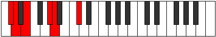
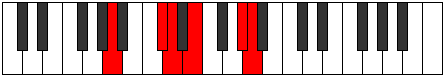
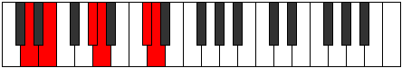

# Mode AFlatAeoloritonic

## Links

- [Documentation](index.md)
- [Scales Index](Scales.md)
- [Modes Index](Modes.md)
- [Chords Index](Chords.md)

## Scale

[Phraditonic](ScalePhraditonic.md)

## Mode

[AFlatAeoloritonic](ModeAFlatAeoloritonic.md)

## Tonic

Ab

## Signature

[CNaturalMajor]

## Perfection

 - 3 Perfect Notes

 - 2 Imperfect Notes

## Notes

- Ab (Imperfect)
- A
- Db
- D
- E (Imperfect)
- Ab (Imperfect)

## Illustration

## Relative Modes

| Number | Mode | Tonic | Notes | Illustration |
|--------|------|-------|-------|--------------|
| [355](https://ianring.com/musictheory/scales/355) | [Aeoloritonic](ModeAeoloritonic.md) | G# | G#, A, C#, D, E, G# |  |
| [355](https://ianring.com/musictheory/scales/355) | [Aeoloritonic](ModeAeoloritonic.md) | Ab | Ab, A, Db, D, E, Ab |  |
| [395](https://ianring.com/musictheory/scales/395) | [Dalitonic](ModeDalitonic.md) | C# | C#, D, E, G#, A, C# |  |
| [395](https://ianring.com/musictheory/scales/395) | [Dalitonic](ModeDalitonic.md) | Db | Db, D, E, Ab, A, Db |  |
| [1585](https://ianring.com/musictheory/scales/1585) | [Phraditonic](ModePhraditonic.md) | E | E, G#, A, C#, D, E |  |
| [2225](https://ianring.com/musictheory/scales/2225) | [Gonitonic](ModeGonitonic.md) | A | A, C#, D, E, G#, A |  |
| [2245](https://ianring.com/musictheory/scales/2245) | [Dygitonic](ModeDygitonic.md) | D | D, E, G#, A, C#, D |  |

## Chords

### Ab

| Number | Root | Name | Notes | Illustration | Audio |
|--------|------|------|-------|--------------|-------|

### A

| Number | Root | Name | Notes | Illustration | Audio |
|--------|------|------|-------|--------------|-------|
| 528 | A | [A5](ChordANaturalPowerChord.md) | A, E |  | [midi](ChordANaturalPowerChordRootPosition.mid) |
| 530 | A | [AM](ChordANaturalMajor.md) | A, C#, E |  | [midi](ChordANaturalMajorRootPosition.mid) |
| 532 | A | [Asus4](ChordANaturalSuspendedFourth.md) | A, D, E |  | [midi](ChordANaturalSuspendedFourthRootPosition.mid) |
| 534 | A | [AM(add11)](ChordANaturalMajorAddEleventh.md) | A, C#, E, D |  | [midi](ChordANaturalMajorAddEleventhRootPosition.mid) |
| 534 | A | [AM(add4)](ChordANaturalMajorAddFourth.md) | A, C#, D, E |  | [midi](ChordANaturalMajorAddFourthRootPosition.mid) |
| 772 | A | [AQ+](ChordANaturalQuartalAugmented.md) | A, D, G# |  | [midi](ChordANaturalQuartalAugmentedRootPosition.mid) |
| 786 | A | [AM7](ChordANaturalMajorSeventh.md) | A, C#, E, G# |  | [midi](ChordANaturalMajorSeventhRootPosition.mid) |
| 788 | A | [AM7(sus4)](ChordANaturalMajorSeventhSuspendedFourth.md) | A, D, E, G# |  | [midi](ChordANaturalMajorSeventhSuspendedFourthRootPosition.mid) |
| 790 | A | [AM7add4](ChordANaturalMajorSeventhAddFourth.md) | A, C#, D, E, G# |  | [midi](ChordANaturalMajorSeventhAddFourthRootPosition.mid) |
| 790 | A | [AM7add11](ChordANaturalMajorSeventhAddEleventh.md) | A, C#, E, G#, D |  | [midi](ChordANaturalMajorSeventhAddEleventhRootPosition.mid) |

### Db

| Number | Root | Name | Notes | Illustration | Audio |
|--------|------|------|-------|--------------|-------|

### D

| Number | Root | Name | Notes | Illustration | Audio |
|--------|------|------|-------|--------------|-------|
| 276 | D | [Dsus2b5](ChordDNaturalSuspendedSecondFlatFifth.md) | D, E, Ab |  | [midi](ChordDNaturalSuspendedSecondFlatFifthRootPosition.mid) |
| 516 | D | [D5](ChordDNaturalPowerChord.md) | D, A |  | [midi](ChordDNaturalPowerChordRootPosition.mid) |
| 532 | D | [Dsus2](ChordDNaturalSuspendedSecond.md) | D, E, A |  | [midi](ChordDNaturalSuspendedSecondRootPosition.mid) |
| 772 | D | [Dlyd](ChordDNaturalLydian.md) | D, G#, A |  | [midi](ChordDNaturalLydianRootPosition.mid) |
| 534 | D | [DM7(sus2)](ChordDNaturalMajorSeventhSuspendedSecond.md) | D, E, A, C# |  | [midi](ChordDNaturalMajorSeventhSuspendedSecondRootPosition.mid) |
| 534 | D | [DM9sus2](ChordDNaturalMajorNinthSuspendedSecond.md) | D, E, A, C#, E |  | [midi](ChordDNaturalMajorNinthSuspendedSecondRootPosition.mid) |
| 774 | D | [Dlyd(M7)](ChordDNaturalLydianMajorSeventh.md) | D, G#, A, C# |  | [midi](ChordDNaturalLydianMajorSeventhRootPosition.mid) |

### E

| Number | Root | Name | Notes | Illustration | Audio |
|--------|------|------|-------|--------------|-------|
| 274 | E | [EM##5](ChordENaturalMajorDoubleSharpFifth.md) | E, G#, C# |  | [midi](ChordENaturalMajorDoubleSharpFifthRootPosition.mid) |
| 530 | E | [Esus4##5](ChordENaturalSuspendedFourthDoubleSharpFifth.md) | E, A, C# |  | [midi](ChordENaturalSuspendedFourthDoubleSharpFifthRootPosition.mid) |
| 532 | E | [EQ](ChordENaturalQuartal.md) | E, A, D |  | [midi](ChordENaturalQuartalRootPosition.mid) |

