# Mode AFlatAeolothian

## Links

- [Documentation](README.md)
- [Scales Index](Scales.md)
- [Modes Index](Modes.md)
- [Chords Index](Chords.md)

## Scale

[Katathian](ScaleKatathian.md)

## Mode

[AFlatAeolothian](ModeAFlatAeolothian.md)

## Tonic

Ab

## Signature

[CNaturalMajor]

## Transposition

1, 1, 3, 1, 3, 1, 2

## Chord Pattern

i⁰b3, II⁺, III⁺, IV, V, vii

## Perfection

 - 4 Perfect Notes

 - 3 Imperfect Notes

## Notes

- Ab (Imperfect)
- Bbb (Imperfect)
- Cbb
- Db
- Ebb
- F (Imperfect)
- Gb
- Ab (Imperfect)

## Illustration

## Diagram

| Circle of Fifth | Chromatic Circle |
|-----------------|------------------|
| 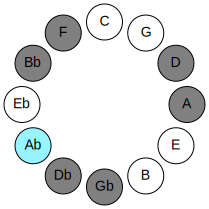 | 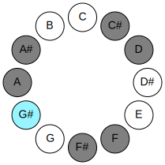 |
## Relative Modes

| Number | Mode | Tonic | Notes | Illustration |
|--------|------|-------|-------|--------------|
| [1639](https://ianring.com/musictheory/scales/1639) | [Aeolothian](ModeAeolothian.md) | G# | G#, A, Bb, C#, D, E#, F#, G# |  |
| [1639](https://ianring.com/musictheory/scales/1639) | [Aeolothian](ModeAeolothian.md) | Ab | Ab, Bbb, Cbb, Db, Ebb, F, Gb, Ab |  |
| [2867](https://ianring.com/musictheory/scales/2867) | [Socrian](ModeSocrian.md) | A | A, Bb, C#, D, E#, F#, G#, A |  |
| [3481](https://ianring.com/musictheory/scales/3481) | [Katathian](ModeKatathian.md) | A# | A#, B##, C##, D###, E##, F###, G##, A# |  |
| [3481](https://ianring.com/musictheory/scales/3481) | [Katathian](ModeKatathian.md) | Bb | Bb, C#, D, E#, F#, G#, A, Bb |  |
| [947](https://ianring.com/musictheory/scales/947) | [Modian](ModeModian.md) | C# | C#, D, E#, F#, G#, A, Bb, C# |  |
| [947](https://ianring.com/musictheory/scales/947) | [Modian](ModeModian.md) | Db | Db, Ebb, F, Gb, Ab, Bbb, Cbb, Db |  |
| [2521](https://ianring.com/musictheory/scales/2521) | [Barian](ModeBarian.md) | D | D, E#, F#, G#, A, Bb, C#, D |  |
| [827](https://ianring.com/musictheory/scales/827) | [Mixolocrian](ModeMixolocrian.md) | F | F, Gb, Ab, Bbb, Cbb, Db, Ebb, F |  |
| [2461](https://ianring.com/musictheory/scales/2461) | [Sagian](ModeSagian.md) | F# | F#, G#, A, Bb, C#, D, E#, F# |  |
| [2461](https://ianring.com/musictheory/scales/2461) | [Sagian](ModeSagian.md) | Gb | Gb, Ab, Bbb, Cbb, Db, Ebb, F, Gb |  |
## Relative Brightness

| Number | Mode | Tonic | Notes | Circle Of Fifth | Chromatic Circle |
|--------|------|-------|-------|-----------------|------------------|
| [1639](https://ianring.com/musictheory/scales/1639) | [Aeolothian](ModeAeolothian.md) | G# | G#, A, Bb, C#, D, E#, F#, G# |  |  |
| [1639](https://ianring.com/musictheory/scales/1639) | [Aeolothian](ModeAeolothian.md) | Ab | Ab, Bbb, Cbb, Db, Ebb, F, Gb, Ab |  |  |
| [2867](https://ianring.com/musictheory/scales/2867) | [Socrian](ModeSocrian.md) | A | A, Bb, C#, D, E#, F#, G#, A |  | 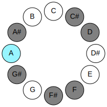 |
| [3481](https://ianring.com/musictheory/scales/3481) | [Katathian](ModeKatathian.md) | A# | A#, B##, C##, D###, E##, F###, G##, A# | 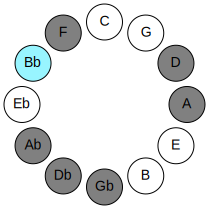 | 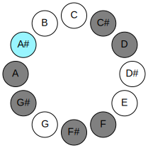 |
| [3481](https://ianring.com/musictheory/scales/3481) | [Katathian](ModeKatathian.md) | Bb | Bb, C#, D, E#, F#, G#, A, Bb |  |  |
| [947](https://ianring.com/musictheory/scales/947) | [Modian](ModeModian.md) | C# | C#, D, E#, F#, G#, A, Bb, C# | 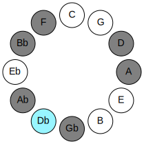 | 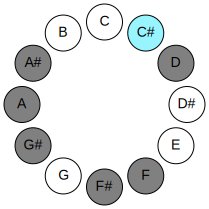 |
| [947](https://ianring.com/musictheory/scales/947) | [Modian](ModeModian.md) | Db | Db, Ebb, F, Gb, Ab, Bbb, Cbb, Db |  |  |
| [2521](https://ianring.com/musictheory/scales/2521) | [Barian](ModeBarian.md) | D | D, E#, F#, G#, A, Bb, C#, D | 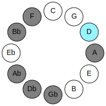 |  |
| [827](https://ianring.com/musictheory/scales/827) | [Mixolocrian](ModeMixolocrian.md) | F | F, Gb, Ab, Bbb, Cbb, Db, Ebb, F | 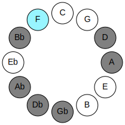 | 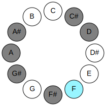 |
| [2461](https://ianring.com/musictheory/scales/2461) | [Sagian](ModeSagian.md) | F# | F#, G#, A, Bb, C#, D, E#, F# | 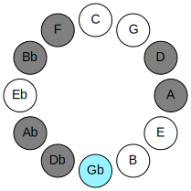 | 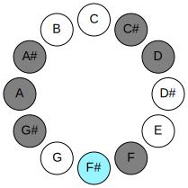 |
| [2461](https://ianring.com/musictheory/scales/2461) | [Sagian](ModeSagian.md) | Gb | Gb, Ab, Bbb, Cbb, Db, Ebb, F, Gb |  |  |

## Chords

### Ab

| Number | Root | Name | Notes | Illustration | Audio |
|--------|------|------|-------|--------------|-------|
| 1282 | Ab | [G#sus2bb5](ChordGSharpSuspendedSecondDoubleFlatFifth.md) | G#, A#, C# |  | [midi](ChordGSharpSuspendedSecondDoubleFlatFifthRootPosition.mid) |
| 1282 | Ab | [Absus2bb5](ChordAFlatSuspendedSecondDoubleFlatFifth.md) | Ab, Bb, Db |  | [midi](ChordAFlatSuspendedSecondDoubleFlatFifthRootPosition.mid) |
| 772 | Ab | [G#loc](ChordGSharpLocrian.md) | G#, A, D |  | [midi](ChordGSharpLocrianRootPosition.mid) |
| 772 | Ab | [Abloc](ChordAFlatLocrian.md) | Ab, Bbb, Ebb |  | [midi](ChordAFlatLocrianRootPosition.mid) |
| 1284 | Ab | [G#](ChordGSharpDiminishedFlatThird.md) | G#, Bb, D |  | [midi](ChordGSharpDiminishedFlatThirdRootPosition.mid) |
| 1284 | Ab | [G#sus2b5](ChordGSharpSuspendedSecondFlatFifth.md) | G#, A#, D |  | [midi](ChordGSharpSuspendedSecondFlatFifthRootPosition.mid) |
| 1284 | Ab | [Ab](ChordAFlatDiminishedFlatThird.md) | Ab, Cbb, Ebb |  | [midi](ChordAFlatDiminishedFlatThirdRootPosition.mid) |
| 1284 | Ab | [Absus2b5](ChordAFlatSuspendedSecondFlatFifth.md) | Ab, Bb, Ebb |  | [midi](ChordAFlatSuspendedSecondFlatFifthRootPosition.mid) |
| 262 | Ab | [G#sus4b5](ChordGSharpSuspendedFourthFlatFifth.md) | G#, C#, D |  | [midi](ChordGSharpSuspendedFourthFlatFifthRootPosition.mid) |
| 262 | Ab | [Absus4b5](ChordAFlatSuspendedFourthFlatFifth.md) | Ab, Db, Ebb |  | [midi](ChordAFlatSuspendedFourthFlatFifthRootPosition.mid) |
| 290 | Ab | [G#sus4##5](ChordGSharpSuspendedFourthDoubleSharpFifth.md) | G#, C#, E# |  | [midi](ChordGSharpSuspendedFourthDoubleSharpFifthRootPosition.mid) |
| 290 | Ab | [Absus4##5](ChordAFlatSuspendedFourthDoubleSharpFifth.md) | Ab, Db, F |  | [midi](ChordAFlatSuspendedFourthDoubleSharpFifthRootPosition.mid) |
| 1314 | Ab | [G#M6sus2bb5](ChordGSharpMajorSixthSuspendedSecondDoubleFlatFifth.md) | G#, A#, C#, E# |  | [midi](ChordGSharpMajorSixthSuspendedSecondDoubleFlatFifthRootPosition.mid) |
| 1314 | Ab | [AbM6sus2bb5](ChordAFlatMajorSixthSuspendedSecondDoubleFlatFifth.md) | Ab, Bb, Db, F |  | [midi](ChordAFlatMajorSixthSuspendedSecondDoubleFlatFifthRootPosition.mid) |
| 1316 | Ab | [G#M6sus2b5](ChordGSharpMajorSixthSuspendedSecondFlatFifth.md) | G#, A#, D, E# |  | [midi](ChordGSharpMajorSixthSuspendedSecondFlatFifthRootPosition.mid) |
| 1316 | Ab | [AbM6sus2b5](ChordAFlatMajorSixthSuspendedSecondFlatFifth.md) | Ab, Bb, Ebb, F |  | [midi](ChordAFlatMajorSixthSuspendedSecondFlatFifthRootPosition.mid) |
| 322 | Ab | [G#Q](ChordGSharpQuartal.md) | G#, C#, F# |  | [midi](ChordGSharpQuartalRootPosition.mid) |
| 322 | Ab | [AbQ](ChordAFlatQuartal.md) | Ab, Db, Gb |  | [midi](ChordAFlatQuartalRootPosition.mid) |

### Bbb

| Number | Root | Name | Notes | Illustration | Audio |
|--------|------|------|-------|--------------|-------|
| 546 | Bbb | [A+](ChordANaturalAugmented.md) | A, C#, E# |  | [midi](ChordANaturalAugmentedRootPosition.mid) |
| 546 | Bbb | [A+7](ChordANaturalAugmentedAugmentedSeventh.md) | A, C#, E#, G## |  | [midi](ChordANaturalAugmentedAugmentedSeventhRootPosition.mid) |
| 548 | Bbb | [Asus4#5](ChordANaturalSuspendedFourthSharpFifth.md) | A, D, E# |  | [midi](ChordANaturalSuspendedFourthSharpFifthRootPosition.mid) |
| 578 | Bbb | [AM##5](ChordANaturalMajorDoubleSharpFifth.md) | A, C#, F# |  | [midi](ChordANaturalMajorDoubleSharpFifthRootPosition.mid) |
| 580 | Bbb | [Asus4##5](ChordANaturalSuspendedFourthDoubleSharpFifth.md) | A, D, F# |  | [midi](ChordANaturalSuspendedFourthDoubleSharpFifthRootPosition.mid) |
| 772 | Bbb | [AQ+](ChordANaturalQuartalAugmented.md) | A, D, G# |  | [midi](ChordANaturalQuartalAugmentedRootPosition.mid) |
| 802 | Bbb | [A+(M7)](ChordANaturalAugmentedMajorSeventh.md) | A, C#, E#, G# |  | [midi](ChordANaturalAugmentedMajorSeventhRootPosition.mid) |
| 804 | Bbb | [AM7(sus4)#5](ChordANaturalMajorSeventhSuspendedFourthSharpFifth.md) | A, D, E#, G# |  | [midi](ChordANaturalMajorSeventhSuspendedFourthSharpFifthRootPosition.mid) |
| 834 | Bbb | [AM7##5](ChordANaturalMajorSeventhDoubleSharpFifth.md) | A, C#, F#, G# |  | [midi](ChordANaturalMajorSeventhDoubleSharpFifthRootPosition.mid) |
| 836 | Bbb | [AM7(sus4)##5](ChordANaturalMajorSeventhSuspendedFourthDoubleSharpFifth.md) | A, D, F#, G# |  | [midi](ChordANaturalMajorSeventhSuspendedFourthDoubleSharpFifthRootPosition.mid) |

### Cbb

| Number | Root | Name | Notes | Illustration | Audio |
|--------|------|------|-------|--------------|-------|
| 1056 | Cbb | [A#5](ChordASharpPowerChord.md) | A#, E# |  | [midi](ChordASharpPowerChordRootPosition.mid) |
| 1056 | Cbb | [Bb5](ChordBFlatPowerChord.md) | Bb, F |  | [midi](ChordBFlatPowerChordRootPosition.mid) |
| 1058 | Cbb | [A#m](ChordASharpMinor.md) | A#, C#, E# |  | [midi](ChordASharpMinorRootPosition.mid) |
| 1058 | Cbb | [A#m(add(#9))](ChordASharpMinorAddSharpNinth.md) | A#, C#, E#, B## |  | [midi](ChordASharpMinorAddSharpNinthRootPosition.mid) |
| 1058 | Cbb | [Bbm](ChordBFlatMinor.md) | Bb, Db, F |  | [midi](ChordBFlatMinorRootPosition.mid) |
| 1058 | Cbb | [Bbm(add(#9))](ChordBFlatMinorAddSharpNinth.md) | Bb, Db, F, C# |  | [midi](ChordBFlatMinorAddSharpNinthRootPosition.mid) |
| 1060 | Cbb | [A#M](ChordASharpMajor.md) | A#, C##, E# |  | [midi](ChordASharpMajorRootPosition.mid) |
| 1060 | Cbb | [BbM](ChordBFlatMajor.md) | Bb, D, F |  | [midi](ChordBFlatMajorRootPosition.mid) |
| 1062 | Cbb | [A#M(add(#9))](ChordASharpMajorAddSharpNinth.md) | A#, C##, E#, B## |  | [midi](ChordASharpMajorAddSharpNinthRootPosition.mid) |
| 1062 | Cbb | [BbM(add(#9))](ChordBFlatMajorAddSharpNinth.md) | Bb, D, F, C# |  | [midi](ChordBFlatMajorAddSharpNinthRootPosition.mid) |
| 1090 | Cbb | [A#m#5](ChordASharpMinorSharpFifth.md) | A#, C#, F# |  | [midi](ChordASharpMinorSharpFifthRootPosition.mid) |
| 1090 | Cbb | [Bbm#5](ChordBFlatMinorSharpFifth.md) | Bb, Db, Gb |  | [midi](ChordBFlatMinorSharpFifthRootPosition.mid) |
| 1092 | Cbb | [A#+](ChordASharpAugmented.md) | A#, C##, E## |  | [midi](ChordASharpAugmentedRootPosition.mid) |
| 1092 | Cbb | [A#+7](ChordASharpAugmentedAugmentedSeventh.md) | A#, C##, E##, G### |  | [midi](ChordASharpAugmentedAugmentedSeventhRootPosition.mid) |
| 1092 | Cbb | [Bb+](ChordBFlatAugmented.md) | Bb, D, F# |  | [midi](ChordBFlatAugmentedRootPosition.mid) |
| 1092 | Cbb | [Bb+7](ChordBFlatAugmentedAugmentedSeventh.md) | Bb, D, F#, A# |  | [midi](ChordBFlatAugmentedAugmentedSeventhRootPosition.mid) |
| 1314 | Cbb | [A#m7](ChordASharpMinorSeventh.md) | A#, C#, E#, G# |  | [midi](ChordASharpMinorSeventhRootPosition.mid) |
| 1314 | Cbb | [Bbm7](ChordBFlatMinorSeventh.md) | Bb, Db, F, Ab |  | [midi](ChordBFlatMinorSeventhRootPosition.mid) |
| 1316 | Cbb | [A#7](ChordASharpDominantSeventh.md) | A#, C##, E#, G# |  | [midi](ChordASharpDominantSeventhRootPosition.mid) |
| 1316 | Cbb | [Bb7](ChordBFlatDominantSeventh.md) | Bb, D, F, Ab |  | [midi](ChordBFlatDominantSeventhRootPosition.mid) |
| 1318 | Cbb | [A#7#9](ChordASharpDominantSeventhSharpNinth.md) | A#, C##, E#, G#, B## |  | [midi](ChordASharpDominantSeventhSharpNinthRootPosition.mid) |
| 1318 | Cbb | [Bb7#9](ChordBFlatDominantSeventhSharpNinth.md) | Bb, D, F, Ab, C# |  | [midi](ChordBFlatDominantSeventhSharpNinthRootPosition.mid) |
| 1346 | Cbb | [A#m7#5](ChordASharpMinorSeventhSharpFifth.md) | A#, C#, E##, G# |  | [midi](ChordASharpMinorSeventhSharpFifthRootPosition.mid) |
| 1346 | Cbb | [Bbm7#5](ChordBFlatMinorSeventhSharpFifth.md) | Bb, Db, F#, Ab |  | [midi](ChordBFlatMinorSeventhSharpFifthRootPosition.mid) |
| 1570 | Cbb | [A#m(M7)](ChordASharpMinorMajorSeventh.md) | A#, C#, E#, G## |  | [midi](ChordASharpMinorMajorSeventhRootPosition.mid) |
| 1570 | Cbb | [Bbm(M7)](ChordBFlatMinorMajorSeventh.md) | Bb, Db, F, A |  | [midi](ChordBFlatMinorMajorSeventhRootPosition.mid) |
| 1572 | Cbb | [A#M7](ChordASharpMajorSeventh.md) | A#, C##, E#, G## |  | [midi](ChordASharpMajorSeventhRootPosition.mid) |
| 1572 | Cbb | [BbM7](ChordBFlatMajorSeventh.md) | Bb, D, F, A |  | [midi](ChordBFlatMajorSeventhRootPosition.mid) |
| 1604 | Cbb | [A#+(M7)](ChordASharpAugmentedMajorSeventh.md) | A#, C##, E##, G## |  | [midi](ChordASharpAugmentedMajorSeventhRootPosition.mid) |
| 1604 | Cbb | [Bb+(M7)](ChordBFlatAugmentedMajorSeventh.md) | Bb, D, F#, A |  | [midi](ChordBFlatAugmentedMajorSeventhRootPosition.mid) |

### Db

| Number | Root | Name | Notes | Illustration | Audio |
|--------|------|------|-------|--------------|-------|
| 258 | Db | [C#5](ChordCSharpPowerChord.md) | C#, G# |  | [midi](ChordCSharpPowerChordRootPosition.mid) |
| 258 | Db | [Db5](ChordDFlatPowerChord.md) | Db, Ab |  | [midi](ChordDFlatPowerChordRootPosition.mid) |
| 262 | Db | [C#phryg](ChordCSharpPhrygian.md) | C#, D, G# |  | [midi](ChordCSharpPhrygianRootPosition.mid) |
| 262 | Db | [Dbphryg](ChordDFlatPhrygian.md) | Db, Ebb, Ab |  | [midi](ChordDFlatPhrygianRootPosition.mid) |
| 290 | Db | [C#M](ChordCSharpMajor.md) | C#, E#, G# |  | [midi](ChordCSharpMajorRootPosition.mid) |
| 290 | Db | [DbM](ChordDFlatMajor.md) | Db, F, Ab |  | [midi](ChordDFlatMajorRootPosition.mid) |
| 322 | Db | [C#sus4](ChordCSharpSuspendedFourth.md) | C#, F#, G# |  | [midi](ChordCSharpSuspendedFourthRootPosition.mid) |
| 322 | Db | [Dbsus4](ChordDFlatSuspendedFourth.md) | Db, Gb, Ab |  | [midi](ChordDFlatSuspendedFourthRootPosition.mid) |
| 354 | Db | [C#M(add11)](ChordCSharpMajorAddEleventh.md) | C#, E#, G#, F# |  | [midi](ChordCSharpMajorAddEleventhRootPosition.mid) |
| 354 | Db | [C#M(add4)](ChordCSharpMajorAddFourth.md) | C#, E#, F#, G# |  | [midi](ChordCSharpMajorAddFourthRootPosition.mid) |
| 354 | Db | [DbM(add11)](ChordDFlatMajorAddEleventh.md) | Db, F, Ab, Gb |  | [midi](ChordDFlatMajorAddEleventhRootPosition.mid) |
| 354 | Db | [DbM(add4)](ChordDFlatMajorAddFourth.md) | Db, F, Gb, Ab |  | [midi](ChordDFlatMajorAddFourthRootPosition.mid) |
| 546 | Db | [C#+](ChordCSharpAugmented.md) | C#, E#, G## |  | [midi](ChordCSharpAugmentedRootPosition.mid) |
| 546 | Db | [C#+7](ChordCSharpAugmentedAugmentedSeventh.md) | C#, E#, G##, B## |  | [midi](ChordCSharpAugmentedAugmentedSeventhRootPosition.mid) |
| 546 | Db | [Db+](ChordDFlatAugmented.md) | Db, F, A |  | [midi](ChordDFlatAugmentedRootPosition.mid) |
| 546 | Db | [Db+7](ChordDFlatAugmentedAugmentedSeventh.md) | Db, F, A, C# |  | [midi](ChordDFlatAugmentedAugmentedSeventhRootPosition.mid) |
| 578 | Db | [C#sus4#5](ChordCSharpSuspendedFourthSharpFifth.md) | C#, F#, G## |  | [midi](ChordCSharpSuspendedFourthSharpFifthRootPosition.mid) |
| 578 | Db | [Dbsus4#5](ChordDFlatSuspendedFourthSharpFifth.md) | Db, Gb, A |  | [midi](ChordDFlatSuspendedFourthSharpFifthRootPosition.mid) |
| 1058 | Db | [C#M##5](ChordCSharpMajorDoubleSharpFifth.md) | C#, E#, A# |  | [midi](ChordCSharpMajorDoubleSharpFifthRootPosition.mid) |
| 1058 | Db | [DbM##5](ChordDFlatMajorDoubleSharpFifth.md) | Db, F, Bb |  | [midi](ChordDFlatMajorDoubleSharpFifthRootPosition.mid) |
| 1090 | Db | [C#sus4##5](ChordCSharpSuspendedFourthDoubleSharpFifth.md) | C#, F#, A# |  | [midi](ChordCSharpSuspendedFourthDoubleSharpFifthRootPosition.mid) |
| 1090 | Db | [Dbsus4##5](ChordDFlatSuspendedFourthDoubleSharpFifth.md) | Db, Gb, Bb |  | [midi](ChordDFlatSuspendedFourthDoubleSharpFifthRootPosition.mid) |
| 1314 | Db | [C#M6](ChordCSharpMajorSixth.md) | C#, E#, G#, A# |  | [midi](ChordCSharpMajorSixthRootPosition.mid) |
| 1314 | Db | [DbM6](ChordDFlatMajorSixth.md) | Db, F, Ab, Bb |  | [midi](ChordDFlatMajorSixthRootPosition.mid) |
| 1318 | Db | [C#M6(addb9)](ChordCSharpMajorSixthAddFlatNinth.md) | C#, E#, G#, A#, D |  | [midi](ChordCSharpMajorSixthAddFlatNinthRootPosition.mid) |
| 1318 | Db | [DbM6(addb9)](ChordDFlatMajorSixthAddFlatNinth.md) | Db, F, Ab, Bb, Ebb |  | [midi](ChordDFlatMajorSixthAddFlatNinthRootPosition.mid) |
| 1346 | Db | [C#M6sus4](ChordCSharpMajorSixthSuspendedFourth.md) | C#, F#, G#, A# |  | [midi](ChordCSharpMajorSixthSuspendedFourthRootPosition.mid) |
| 1346 | Db | [DbM6sus4](ChordDFlatMajorSixthSuspendedFourth.md) | Db, Gb, Ab, Bb |  | [midi](ChordDFlatMajorSixthSuspendedFourthRootPosition.mid) |

### Ebb

| Number | Root | Name | Notes | Illustration | Audio |
|--------|------|------|-------|--------------|-------|
| 292 | Ebb | [Do](ChordDNaturalDiminished.md) | D, F, Ab |  | [midi](ChordDNaturalDiminishedRootPosition.mid) |
| 324 | Ebb | [DMb5](ChordDNaturalMajorFlatFifth.md) | D, F#, Ab |  | [midi](ChordDNaturalMajorFlatFifthRootPosition.mid) |
| 516 | Ebb | [D5](ChordDNaturalPowerChord.md) | D, A |  | [midi](ChordDNaturalPowerChordRootPosition.mid) |
| 548 | Ebb | [Dm](ChordDNaturalMinor.md) | D, F, A |  | [midi](ChordDNaturalMinorRootPosition.mid) |
| 548 | Ebb | [Dm(add(#9))](ChordDNaturalMinorAddSharpNinth.md) | D, F, A, E# |  | [midi](ChordDNaturalMinorAddSharpNinthRootPosition.mid) |
| 580 | Ebb | [DM](ChordDNaturalMajor.md) | D, F#, A |  | [midi](ChordDNaturalMajorRootPosition.mid) |
| 612 | Ebb | [DM(add(#9))](ChordDNaturalMajorAddSharpNinth.md) | D, F#, A, E# |  | [midi](ChordDNaturalMajorAddSharpNinthRootPosition.mid) |
| 772 | Ebb | [Dlyd](ChordDNaturalLydian.md) | D, G#, A |  | [midi](ChordDNaturalLydianRootPosition.mid) |
| 804 | Ebb | [Dm(add(#4))](ChordDNaturalMinorAddSharpFourth.md) | D, F, G#, A |  | [midi](ChordDNaturalMinorAddSharpFourthRootPosition.mid) |
| 836 | Ebb | [DM(add(#4))](ChordDNaturalMajorAddSharpFourth.md) | D, F#, G#, A |  | [midi](ChordDNaturalMajorAddSharpFourthRootPosition.mid) |
| 1060 | Ebb | [Dm#5](ChordDNaturalMinorSharpFifth.md) | D, F, Bb |  | [midi](ChordDNaturalMinorSharpFifthRootPosition.mid) |
| 1092 | Ebb | [D+](ChordDNaturalAugmented.md) | D, F#, A# |  | [midi](ChordDNaturalAugmentedRootPosition.mid) |
| 1092 | Ebb | [D+7](ChordDNaturalAugmentedAugmentedSeventh.md) | D, F#, A#, C## |  | [midi](ChordDNaturalAugmentedAugmentedSeventhRootPosition.mid) |
| 294 | Ebb | [DoM7](ChordDNaturalDiminishedMajorSeventh.md) | D, F, Ab, C# |  | [midi](ChordDNaturalDiminishedMajorSeventhRootPosition.mid) |
| 326 | Ebb | [DM7b5](ChordDNaturalMajorSeventhFlatFifth.md) | D, F#, Ab, C# |  | [midi](ChordDNaturalMajorSeventhFlatFifthRootPosition.mid) |
| 550 | Ebb | [Dm(M7)](ChordDNaturalMinorMajorSeventh.md) | D, F, A, C# |  | [midi](ChordDNaturalMinorMajorSeventhRootPosition.mid) |
| 582 | Ebb | [DM7](ChordDNaturalMajorSeventh.md) | D, F#, A, C# |  | [midi](ChordDNaturalMajorSeventhRootPosition.mid) |
| 774 | Ebb | [Dlyd(M7)](ChordDNaturalLydianMajorSeventh.md) | D, G#, A, C# |  | [midi](ChordDNaturalLydianMajorSeventhRootPosition.mid) |
| 838 | Ebb | [DM7add(#11)](ChordDNaturalMajorSeventhAddSharpEleventh.md) | D, F#, A, C#, G# |  | [midi](ChordDNaturalMajorSeventhAddSharpEleventhRootPosition.mid) |
| 838 | Ebb | [DM7add(#4)](ChordDNaturalMajorSeventhAddSharpFourth.md) | D, F#, G#, A, C# |  | [midi](ChordDNaturalMajorSeventhAddSharpFourthRootPosition.mid) |
| 1094 | Ebb | [D+(M7)](ChordDNaturalAugmentedMajorSeventh.md) | D, F#, A#, C# |  | [midi](ChordDNaturalAugmentedMajorSeventhRootPosition.mid) |

### F

| Number | Root | Name | Notes | Illustration | Audio |
|--------|------|------|-------|--------------|-------|
| 1312 | F | [Fmbb5](ChordFNaturalMinorDoubleFlatFifth.md) | F, Ab, Bb |  | [midi](ChordFNaturalMinorDoubleFlatFifthRootPosition.mid) |
| 290 | F | [Fm#5](ChordFNaturalMinorSharpFifth.md) | F, Ab, Db |  | [midi](ChordFNaturalMinorSharpFifthRootPosition.mid) |
| 546 | F | [F+](ChordFNaturalAugmented.md) | F, A, C# |  | [midi](ChordFNaturalAugmentedRootPosition.mid) |
| 546 | F | [F+7](ChordFNaturalAugmentedAugmentedSeventh.md) | F, A, C#, E# |  | [midi](ChordFNaturalAugmentedAugmentedSeventhRootPosition.mid) |
| 1058 | F | [Fsus4#5](ChordFNaturalSuspendedFourthSharpFifth.md) | F, Bb, C# |  | [midi](ChordFNaturalSuspendedFourthSharpFifthRootPosition.mid) |
| 548 | F | [FM##5](ChordFNaturalMajorDoubleSharpFifth.md) | F, A, D |  | [midi](ChordFNaturalMajorDoubleSharpFifthRootPosition.mid) |
| 1060 | F | [Fsus4##5](ChordFNaturalSuspendedFourthDoubleSharpFifth.md) | F, Bb, D |  | [midi](ChordFNaturalSuspendedFourthDoubleSharpFifthRootPosition.mid) |

### Gb

| Number | Root | Name | Notes | Illustration | Audio |
|--------|------|------|-------|--------------|-------|
| 66 | Gb | [F#5](ChordFSharpPowerChord.md) | F#, C# |  | [midi](ChordFSharpPowerChordRootPosition.mid) |
| 66 | Gb | [Gb5](ChordGFlatPowerChord.md) | Gb, Db |  | [midi](ChordGFlatPowerChordRootPosition.mid) |
| 322 | Gb | [F#sus2](ChordFSharpSuspendedSecond.md) | F#, G#, C# |  | [midi](ChordFSharpSuspendedSecondRootPosition.mid) |
| 322 | Gb | [Gbsus2](ChordGFlatSuspendedSecond.md) | Gb, Ab, Db |  | [midi](ChordGFlatSuspendedSecondRootPosition.mid) |
| 578 | Gb | [F#m](ChordFSharpMinor.md) | F#, A, C# |  | [midi](ChordFSharpMinorRootPosition.mid) |
| 578 | Gb | [F#m(add(#9))](ChordFSharpMinorAddSharpNinth.md) | F#, A, C#, G## |  | [midi](ChordFSharpMinorAddSharpNinthRootPosition.mid) |
| 578 | Gb | [Gbm](ChordGFlatMinor.md) | Gb, Bbb, Db |  | [midi](ChordGFlatMinorRootPosition.mid) |
| 578 | Gb | [Gbm(add(#9))](ChordGFlatMinorAddSharpNinth.md) | Gb, Bbb, Db, A |  | [midi](ChordGFlatMinorAddSharpNinthRootPosition.mid) |
| 834 | Gb | [F#m(add9)](ChordFSharpMinorAddNinth.md) | F#, A, C#, G# |  | [midi](ChordFSharpMinorAddNinthRootPosition.mid) |
| 834 | Gb | [Gbm(add9)](ChordGFlatMinorAddNinth.md) | Gb, Bbb, Db, Ab |  | [midi](ChordGFlatMinorAddNinthRootPosition.mid) |
| 1090 | Gb | [F#M](ChordFSharpMajor.md) | F#, A#, C# |  | [midi](ChordFSharpMajorRootPosition.mid) |
| 1090 | Gb | [GbM](ChordGFlatMajor.md) | Gb, Bb, Db |  | [midi](ChordGFlatMajorRootPosition.mid) |
| 1346 | Gb | [F#M(add9)](ChordFSharpMajorAddNinth.md) | F#, A#, C#, G# |  | [midi](ChordFSharpMajorAddNinthRootPosition.mid) |
| 1346 | Gb | [GbM(add9)](ChordGFlatMajorAddNinth.md) | Gb, Bb, Db, Ab |  | [midi](ChordGFlatMajorAddNinthRootPosition.mid) |
| 1602 | Gb | [F#M(add(#9))](ChordFSharpMajorAddSharpNinth.md) | F#, A#, C#, G## |  | [midi](ChordFSharpMajorAddSharpNinthRootPosition.mid) |
| 1602 | Gb | [GbM(add(#9))](ChordGFlatMajorAddSharpNinth.md) | Gb, Bb, Db, A |  | [midi](ChordGFlatMajorAddSharpNinthRootPosition.mid) |
| 324 | Gb | [F#sus2#5](ChordFSharpSuspendedSecondSharpFifth.md) | F#, G#, C## |  | [midi](ChordFSharpSuspendedSecondSharpFifthRootPosition.mid) |
| 324 | Gb | [Gbsus2#5](ChordGFlatSuspendedSecondSharpFifth.md) | Gb, Ab, D |  | [midi](ChordGFlatSuspendedSecondSharpFifthRootPosition.mid) |
| 580 | Gb | [F#m#5](ChordFSharpMinorSharpFifth.md) | F#, A, D |  | [midi](ChordFSharpMinorSharpFifthRootPosition.mid) |
| 580 | Gb | [Gbm#5](ChordGFlatMinorSharpFifth.md) | Gb, Bbb, Ebb |  | [midi](ChordGFlatMinorSharpFifthRootPosition.mid) |
| 1092 | Gb | [F#+](ChordFSharpAugmented.md) | F#, A#, C## |  | [midi](ChordFSharpAugmentedRootPosition.mid) |
| 1092 | Gb | [F#+7](ChordFSharpAugmentedAugmentedSeventh.md) | F#, A#, C##, E## |  | [midi](ChordFSharpAugmentedAugmentedSeventhRootPosition.mid) |
| 1092 | Gb | [Gb+](ChordGFlatAugmented.md) | Gb, Bb, D |  | [midi](ChordGFlatAugmentedRootPosition.mid) |
| 1092 | Gb | [Gb+7](ChordGFlatAugmentedAugmentedSeventh.md) | Gb, Bb, D, F# |  | [midi](ChordGFlatAugmentedAugmentedSeventhRootPosition.mid) |
| 354 | Gb | [F#M7(sus2)](ChordFSharpMajorSeventhSuspendedSecond.md) | F#, G#, C#, E# |  | [midi](ChordFSharpMajorSeventhSuspendedSecondRootPosition.mid) |
| 354 | Gb | [F#M9sus2](ChordFSharpMajorNinthSuspendedSecond.md) | F#, G#, C#, E#, G# |  | [midi](ChordFSharpMajorNinthSuspendedSecondRootPosition.mid) |
| 354 | Gb | [GbM7(sus2)](ChordGFlatMajorSeventhSuspendedSecond.md) | Gb, Ab, Db, F |  | [midi](ChordGFlatMajorSeventhSuspendedSecondRootPosition.mid) |
| 354 | Gb | [GbM9sus2](ChordGFlatMajorNinthSuspendedSecond.md) | Gb, Ab, Db, F, Ab |  | [midi](ChordGFlatMajorNinthSuspendedSecondRootPosition.mid) |
| 610 | Gb | [F#m(M7)](ChordFSharpMinorMajorSeventh.md) | F#, A, C#, E# |  | [midi](ChordFSharpMinorMajorSeventhRootPosition.mid) |
| 610 | Gb | [Gbm(M7)](ChordGFlatMinorMajorSeventh.md) | Gb, Bbb, Db, F |  | [midi](ChordGFlatMinorMajorSeventhRootPosition.mid) |
| 866 | Gb | [F#m(M9)](ChordFSharpMinorMajorNinth.md) | F#, A, C#, E#, G# |  | [midi](ChordFSharpMinorMajorNinthRootPosition.mid) |
| 866 | Gb | [Gbm(M9)](ChordGFlatMinorMajorNinth.md) | Gb, Bbb, Db, F, Ab |  | [midi](ChordGFlatMinorMajorNinthRootPosition.mid) |
| 1122 | Gb | [F#M7](ChordFSharpMajorSeventh.md) | F#, A#, C#, E# |  | [midi](ChordFSharpMajorSeventhRootPosition.mid) |
| 1122 | Gb | [GbM7](ChordGFlatMajorSeventh.md) | Gb, Bb, Db, F |  | [midi](ChordGFlatMajorSeventhRootPosition.mid) |
| 1378 | Gb | [F#M9](ChordFSharpMajorNinth.md) | F#, A#, C#, E#, G# |  | [midi](ChordFSharpMajorNinthRootPosition.mid) |
| 1378 | Gb | [GbM9](ChordGFlatMajorNinth.md) | Gb, Bb, Db, F, Ab |  | [midi](ChordGFlatMajorNinthRootPosition.mid) |
| 1124 | Gb | [F#+(M7)](ChordFSharpAugmentedMajorSeventh.md) | F#, A#, C##, E# |  | [midi](ChordFSharpAugmentedMajorSeventhRootPosition.mid) |
| 1124 | Gb | [Gb+(M7)](ChordGFlatAugmentedMajorSeventh.md) | Gb, Bb, D, F |  | [midi](ChordGFlatAugmentedMajorSeventhRootPosition.mid) |

