# Mode AFlatAeolycrian

## Links

- [Documentation](README.md)
- [Scales Index](Scales.md)
- [Modes Index](Modes.md)
- [Chords Index](Chords.md)

## Scale

[Golian](ScaleGolian.md)

## Mode

[AFlatAeolycrian](ModeAFlatAeolycrian.md)

## Tonic

Ab

## Signature

[CNaturalMajor]

## Transposition

2, 1, 1, 3, 1, 2, 2

## Chord Pattern

i, ii⁰b3, III, IV⁺, v, VI, VIIb5

## Perfection

 - 4 Perfect Notes

 - 3 Imperfect Notes

## Notes

- Ab
- Bb (Imperfect)
- Cb
- Dbb (Imperfect)
- Eb
- Fb
- Gb (Imperfect)
- Ab

## Illustration

## Diagram

| Circle of Fifth | Chromatic Circle |
|-----------------|------------------|
| 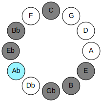 | 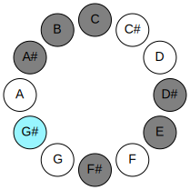 |
## Relative Modes

| Number | Mode | Tonic | Notes | Illustration |
|--------|------|-------|-------|--------------|
| [1437](https://ianring.com/musictheory/scales/1437) | [Aeolycrian](ModeAeolycrian.md) | G# | G#, A#, B, C, D#, E, F#, G# |  |
| [1437](https://ianring.com/musictheory/scales/1437) | [Aeolycrian](ModeAeolycrian.md) | Ab | Ab, Bb, Cb, Dbb, Eb, Fb, Gb, Ab |  |
| [1383](https://ianring.com/musictheory/scales/1383) | [Pynian](ModePynian.md) | A# | A#, B, C, D#, E, F#, G#, A# |  |
| [1383](https://ianring.com/musictheory/scales/1383) | [Pynian](ModePynian.md) | Bb | Bb, Cb, Dbb, Eb, Fb, Gb, Ab, Bb |  |
| [2739](https://ianring.com/musictheory/scales/2739) | [Zanian](ModeZanian.md) | B | B, C, D#, E, F#, G#, A#, B |  |
| [3417](https://ianring.com/musictheory/scales/3417) | [Golian](ModeGolian.md) | C | C, D#, E, F#, G#, A#, B, C |  |
| [939](https://ianring.com/musictheory/scales/939) | [Dyptian](ModeDyptian.md) | D# | D#, E, F#, G#, A#, B, C, D# |  |
| [939](https://ianring.com/musictheory/scales/939) | [Dyptian](ModeDyptian.md) | Eb | Eb, Fb, Gb, Ab, Bb, Cb, Dbb, Eb |  |
| [2517](https://ianring.com/musictheory/scales/2517) | [Ryphian](ModeRyphian.md) | E | E, F#, G#, A#, B, C, D#, E |  |
| [1653](https://ianring.com/musictheory/scales/1653) | [Gylian](ModeGylian.md) | F# | F#, G#, A#, B, C, D#, E, F# |  |
| [1653](https://ianring.com/musictheory/scales/1653) | [Gylian](ModeGylian.md) | Gb | Gb, Ab, Bb, Cb, Dbb, Eb, Fb, Gb |  |
## Relative Brightness

| Number | Mode | Tonic | Notes | Circle Of Fifth | Chromatic Circle |
|--------|------|-------|-------|-----------------|------------------|
| [1437](https://ianring.com/musictheory/scales/1437) | [Aeolycrian](ModeAeolycrian.md) | G# | G#, A#, B, C, D#, E, F#, G# |  |  |
| [1437](https://ianring.com/musictheory/scales/1437) | [Aeolycrian](ModeAeolycrian.md) | Ab | Ab, Bb, Cb, Dbb, Eb, Fb, Gb, Ab |  |  |
| [1383](https://ianring.com/musictheory/scales/1383) | [Pynian](ModePynian.md) | A# | A#, B, C, D#, E, F#, G#, A# | 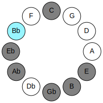 | 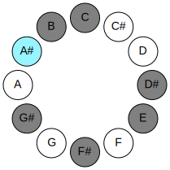 |
| [1383](https://ianring.com/musictheory/scales/1383) | [Pynian](ModePynian.md) | Bb | Bb, Cb, Dbb, Eb, Fb, Gb, Ab, Bb |  |  |
| [2739](https://ianring.com/musictheory/scales/2739) | [Zanian](ModeZanian.md) | B | B, C, D#, E, F#, G#, A#, B | 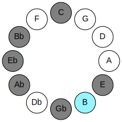 | 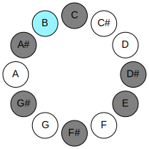 |
| [3417](https://ianring.com/musictheory/scales/3417) | [Golian](ModeGolian.md) | C | C, D#, E, F#, G#, A#, B, C | 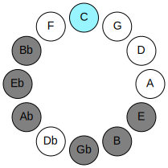 | 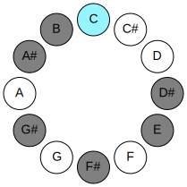 |
| [939](https://ianring.com/musictheory/scales/939) | [Dyptian](ModeDyptian.md) | D# | D#, E, F#, G#, A#, B, C, D# | 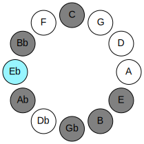 | 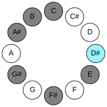 |
| [939](https://ianring.com/musictheory/scales/939) | [Dyptian](ModeDyptian.md) | Eb | Eb, Fb, Gb, Ab, Bb, Cb, Dbb, Eb |  |  |
| [2517](https://ianring.com/musictheory/scales/2517) | [Ryphian](ModeRyphian.md) | E | E, F#, G#, A#, B, C, D#, E | 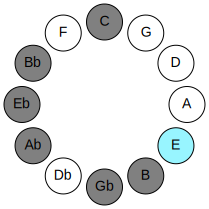 | 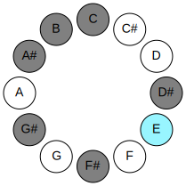 |
| [1653](https://ianring.com/musictheory/scales/1653) | [Gylian](ModeGylian.md) | F# | F#, G#, A#, B, C, D#, E, F# | 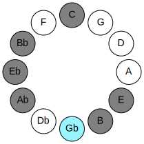 | 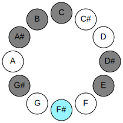 |
| [1653](https://ianring.com/musictheory/scales/1653) | [Gylian](ModeGylian.md) | Gb | Gb, Ab, Bb, Cb, Dbb, Eb, Fb, Gb |  |  |

## Chords

### Ab

| Number | Root | Name | Notes | Illustration | Audio |
|--------|------|------|-------|--------------|-------|
| 264 | Ab | [G#5](ChordGSharpPowerChord.md) | G#, D# |  | [midi](ChordGSharpPowerChordRootPosition.mid) |
| 264 | Ab | [Ab5](ChordAFlatPowerChord.md) | Ab, Eb |  | [midi](ChordAFlatPowerChordRootPosition.mid) |
| 1288 | Ab | [G#sus2](ChordGSharpSuspendedSecond.md) | G#, A#, D# |  | [midi](ChordGSharpSuspendedSecondRootPosition.mid) |
| 1288 | Ab | [Absus2](ChordAFlatSuspendedSecond.md) | Ab, Bb, Eb |  | [midi](ChordAFlatSuspendedSecondRootPosition.mid) |
| 2312 | Ab | [G#m](ChordGSharpMinor.md) | G#, B, D# |  | [midi](ChordGSharpMinorRootPosition.mid) |
| 2312 | Ab | [G#m(add(#9))](ChordGSharpMinorAddSharpNinth.md) | G#, B, D#, A## |  | [midi](ChordGSharpMinorAddSharpNinthRootPosition.mid) |
| 2312 | Ab | [Abm](ChordAFlatMinor.md) | Ab, Cb, Eb |  | [midi](ChordAFlatMinorRootPosition.mid) |
| 2312 | Ab | [Abm(add(#9))](ChordAFlatMinorAddSharpNinth.md) | Ab, Cb, Eb, B |  | [midi](ChordAFlatMinorAddSharpNinthRootPosition.mid) |
| 3336 | Ab | [G#m(add9)](ChordGSharpMinorAddNinth.md) | G#, B, D#, A# |  | [midi](ChordGSharpMinorAddNinthRootPosition.mid) |
| 3336 | Ab | [Abm(add9)](ChordAFlatMinorAddNinth.md) | Ab, Cb, Eb, Bb |  | [midi](ChordAFlatMinorAddNinthRootPosition.mid) |
| 265 | Ab | [G#M](ChordGSharpMajor.md) | G#, B#, D# |  | [midi](ChordGSharpMajorRootPosition.mid) |
| 265 | Ab | [AbM](ChordAFlatMajor.md) | Ab, C, Eb |  | [midi](ChordAFlatMajorRootPosition.mid) |
| 1289 | Ab | [G#M(add9)](ChordGSharpMajorAddNinth.md) | G#, B#, D#, A# |  | [midi](ChordGSharpMajorAddNinthRootPosition.mid) |
| 1289 | Ab | [AbM(add9)](ChordAFlatMajorAddNinth.md) | Ab, C, Eb, Bb |  | [midi](ChordAFlatMajorAddNinthRootPosition.mid) |
| 2313 | Ab | [G#M(add(#9))](ChordGSharpMajorAddSharpNinth.md) | G#, B#, D#, A## |  | [midi](ChordGSharpMajorAddSharpNinthRootPosition.mid) |
| 2313 | Ab | [AbM(add(#9))](ChordAFlatMajorAddSharpNinth.md) | Ab, C, Eb, B |  | [midi](ChordAFlatMajorAddSharpNinthRootPosition.mid) |
| 1296 | Ab | [G#sus2#5](ChordGSharpSuspendedSecondSharpFifth.md) | G#, A#, D## |  | [midi](ChordGSharpSuspendedSecondSharpFifthRootPosition.mid) |
| 1296 | Ab | [Absus2#5](ChordAFlatSuspendedSecondSharpFifth.md) | Ab, Bb, E |  | [midi](ChordAFlatSuspendedSecondSharpFifthRootPosition.mid) |
| 2320 | Ab | [G#m#5](ChordGSharpMinorSharpFifth.md) | G#, B, E |  | [midi](ChordGSharpMinorSharpFifthRootPosition.mid) |
| 2320 | Ab | [Abm#5](ChordAFlatMinorSharpFifth.md) | Ab, Cb, Fb |  | [midi](ChordAFlatMinorSharpFifthRootPosition.mid) |
| 273 | Ab | [G#+](ChordGSharpAugmented.md) | G#, B#, D## |  | [midi](ChordGSharpAugmentedRootPosition.mid) |
| 273 | Ab | [G#+7](ChordGSharpAugmentedAugmentedSeventh.md) | G#, B#, D##, F### |  | [midi](ChordGSharpAugmentedAugmentedSeventhRootPosition.mid) |
| 273 | Ab | [Ab+](ChordAFlatAugmented.md) | Ab, C, E |  | [midi](ChordAFlatAugmentedRootPosition.mid) |
| 273 | Ab | [Ab+7](ChordAFlatAugmentedAugmentedSeventh.md) | Ab, C, E, G# |  | [midi](ChordAFlatAugmentedAugmentedSeventhRootPosition.mid) |
| 1352 | Ab | [G#7sus2](ChordGSharpDominantSeventhSuspendedSecond.md) | G#, A#, D#, F# |  | [midi](ChordGSharpDominantSeventhSuspendedSecondRootPosition.mid) |
| 1352 | Ab | [G#9sus2](ChordGSharpDominantNinthSuspendedSecond.md) | G#, A#, D#, F#, A# |  | [midi](ChordGSharpDominantNinthSuspendedSecondRootPosition.mid) |
| 1352 | Ab | [Ab7sus2](ChordAFlatDominantSeventhSuspendedSecond.md) | Ab, Bb, Eb, Gb |  | [midi](ChordAFlatDominantSeventhSuspendedSecondRootPosition.mid) |
| 1352 | Ab | [Ab9sus2](ChordAFlatDominantNinthSuspendedSecond.md) | Ab, Bb, Eb, Gb, Bb |  | [midi](ChordAFlatDominantNinthSuspendedSecondRootPosition.mid) |
| 2376 | Ab | [G#m7](ChordGSharpMinorSeventh.md) | G#, B, D#, F# |  | [midi](ChordGSharpMinorSeventhRootPosition.mid) |
| 2376 | Ab | [Abm7](ChordAFlatMinorSeventh.md) | Ab, Cb, Eb, Gb |  | [midi](ChordAFlatMinorSeventhRootPosition.mid) |
| 3400 | Ab | [G#m9](ChordGSharpMinorNinth.md) | G#, B, D#, F#, A# |  | [midi](ChordGSharpMinorNinthRootPosition.mid) |
| 3400 | Ab | [Abm9](ChordAFlatMinorNinth.md) | Ab, Cb, Eb, Gb, Bb |  | [midi](ChordAFlatMinorNinthRootPosition.mid) |
| 329 | Ab | [G#7](ChordGSharpDominantSeventh.md) | G#, B#, D#, F# |  | [midi](ChordGSharpDominantSeventhRootPosition.mid) |
| 329 | Ab | [Ab7](ChordAFlatDominantSeventh.md) | Ab, C, Eb, Gb |  | [midi](ChordAFlatDominantSeventhRootPosition.mid) |
| 1353 | Ab | [G#9](ChordGSharpDominantNinth.md) | G#, B#, D#, F#, A# |  | [midi](ChordGSharpDominantNinthRootPosition.mid) |
| 1353 | Ab | [Ab9](ChordAFlatDominantNinth.md) | Ab, C, Eb, Gb, Bb |  | [midi](ChordAFlatDominantNinthRootPosition.mid) |
| 2377 | Ab | [G#7#9](ChordGSharpDominantSeventhSharpNinth.md) | G#, B#, D#, F#, A## |  | [midi](ChordGSharpDominantSeventhSharpNinthRootPosition.mid) |
| 2377 | Ab | [Ab7#9](ChordAFlatDominantSeventhSharpNinth.md) | Ab, C, Eb, Gb, B |  | [midi](ChordAFlatDominantSeventhSharpNinthRootPosition.mid) |
| 2384 | Ab | [G#m7#5](ChordGSharpMinorSeventhSharpFifth.md) | G#, B, D##, F# |  | [midi](ChordGSharpMinorSeventhSharpFifthRootPosition.mid) |
| 2384 | Ab | [Abm7#5](ChordAFlatMinorSeventhSharpFifth.md) | Ab, Cb, E, Gb |  | [midi](ChordAFlatMinorSeventhSharpFifthRootPosition.mid) |
| 1369 | Ab | [G#9b13](ChordGSharpDominantNinthFlatThirteenth.md) | G#, B#, D#, F#, A#, E |  | [midi](ChordGSharpDominantNinthFlatThirteenthRootPosition.mid) |
| 1369 | Ab | [Ab9b13](ChordAFlatDominantNinthFlatThirteenth.md) | Ab, C, Eb, Gb, Bb, Fb |  | [midi](ChordAFlatDominantNinthFlatThirteenthRootPosition.mid) |

### Bb

| Number | Root | Name | Notes | Illustration | Audio |
|--------|------|------|-------|--------------|-------|
| 1033 | Bb | [A#sus2bb5](ChordASharpSuspendedSecondDoubleFlatFifth.md) | A#, B#, D# |  | [midi](ChordASharpSuspendedSecondDoubleFlatFifthRootPosition.mid) |
| 1033 | Bb | [Bbsus2bb5](ChordBFlatSuspendedSecondDoubleFlatFifth.md) | Bb, C, Eb |  | [midi](ChordBFlatSuspendedSecondDoubleFlatFifthRootPosition.mid) |
| 3088 | Bb | [A#loc](ChordASharpLocrian.md) | A#, B, E |  | [midi](ChordASharpLocrianRootPosition.mid) |
| 3088 | Bb | [Bbloc](ChordBFlatLocrian.md) | Bb, Cb, Fb |  | [midi](ChordBFlatLocrianRootPosition.mid) |
| 1041 | Bb | [A#](ChordASharpDiminishedFlatThird.md) | A#, C, E |  | [midi](ChordASharpDiminishedFlatThirdRootPosition.mid) |
| 1041 | Bb | [A#sus2b5](ChordASharpSuspendedSecondFlatFifth.md) | A#, B#, E |  | [midi](ChordASharpSuspendedSecondFlatFifthRootPosition.mid) |
| 1041 | Bb | [Bb](ChordBFlatDiminishedFlatThird.md) | Bb, Dbb, Fb |  | [midi](ChordBFlatDiminishedFlatThirdRootPosition.mid) |
| 1041 | Bb | [Bbsus2b5](ChordBFlatSuspendedSecondFlatFifth.md) | Bb, C, Fb |  | [midi](ChordBFlatSuspendedSecondFlatFifthRootPosition.mid) |
| 1048 | Bb | [A#sus4b5](ChordASharpSuspendedFourthFlatFifth.md) | A#, D#, E |  | [midi](ChordASharpSuspendedFourthFlatFifthRootPosition.mid) |
| 1048 | Bb | [Bbsus4b5](ChordBFlatSuspendedFourthFlatFifth.md) | Bb, Eb, Fb |  | [midi](ChordBFlatSuspendedFourthFlatFifthRootPosition.mid) |
| 1089 | Bb | [A#sus2#5](ChordASharpSuspendedSecondSharpFifth.md) | A#, B#, E## |  | [midi](ChordASharpSuspendedSecondSharpFifthRootPosition.mid) |
| 1089 | Bb | [Bbsus2#5](ChordBFlatSuspendedSecondSharpFifth.md) | Bb, C, F# |  | [midi](ChordBFlatSuspendedSecondSharpFifthRootPosition.mid) |
| 1096 | Bb | [A#sus4#5](ChordASharpSuspendedFourthSharpFifth.md) | A#, D#, E## |  | [midi](ChordASharpSuspendedFourthSharpFifthRootPosition.mid) |
| 1096 | Bb | [Bbsus4#5](ChordBFlatSuspendedFourthSharpFifth.md) | Bb, Eb, F# |  | [midi](ChordBFlatSuspendedFourthSharpFifthRootPosition.mid) |
| 1105 | Bb | [A#sus2b5add(#5)](ChordASharpSuspendedSecondFlatFifthAddSharpFifth.md) | A#, B#, E, E## |  | [midi](ChordASharpSuspendedSecondFlatFifthAddSharpFifthRootPosition.mid) |
| 1105 | Bb | [Bbsus2b5add(#5)](ChordBFlatSuspendedSecondFlatFifthAddSharpFifth.md) | Bb, C, Fb, F# |  | [midi](ChordBFlatSuspendedSecondFlatFifthAddSharpFifthRootPosition.mid) |
| 1288 | Bb | [A#Q](ChordASharpQuartal.md) | A#, D#, G# |  | [midi](ChordASharpQuartalRootPosition.mid) |
| 1288 | Bb | [BbQ](ChordBFlatQuartal.md) | Bb, Eb, Ab |  | [midi](ChordBFlatQuartalRootPosition.mid) |

### Cb

| Number | Root | Name | Notes | Illustration | Audio |
|--------|------|------|-------|--------------|-------|
| 2112 | Cb | [B5](ChordBNaturalPowerChord.md) | B, F# |  | [midi](ChordBNaturalPowerChordRootPosition.mid) |
| 2113 | Cb | [Bphryg](ChordBNaturalPhrygian.md) | B, C, F# |  | [midi](ChordBNaturalPhrygianRootPosition.mid) |
| 2120 | Cb | [BM](ChordBNaturalMajor.md) | B, D#, F# |  | [midi](ChordBNaturalMajorRootPosition.mid) |
| 2128 | Cb | [Bsus4](ChordBNaturalSuspendedFourth.md) | B, E, F# |  | [midi](ChordBNaturalSuspendedFourthRootPosition.mid) |
| 2136 | Cb | [BM(add11)](ChordBNaturalMajorAddEleventh.md) | B, D#, F#, E |  | [midi](ChordBNaturalMajorAddEleventhRootPosition.mid) |
| 2136 | Cb | [BM(add4)](ChordBNaturalMajorAddFourth.md) | B, D#, E, F# |  | [midi](ChordBNaturalMajorAddFourthRootPosition.mid) |
| 2312 | Cb | [BM##5](ChordBNaturalMajorDoubleSharpFifth.md) | B, D#, G# |  | [midi](ChordBNaturalMajorDoubleSharpFifthRootPosition.mid) |
| 2320 | Cb | [Bsus4##5](ChordBNaturalSuspendedFourthDoubleSharpFifth.md) | B, E, G# |  | [midi](ChordBNaturalSuspendedFourthDoubleSharpFifthRootPosition.mid) |
| 2376 | Cb | [BM6](ChordBNaturalMajorSixth.md) | B, D#, F#, G# |  | [midi](ChordBNaturalMajorSixthRootPosition.mid) |
| 2377 | Cb | [BM6(addb9)](ChordBNaturalMajorSixthAddFlatNinth.md) | B, D#, F#, G#, C |  | [midi](ChordBNaturalMajorSixthAddFlatNinthRootPosition.mid) |
| 2384 | Cb | [BM6sus4](ChordBNaturalMajorSixthSuspendedFourth.md) | B, E, F#, G# |  | [midi](ChordBNaturalMajorSixthSuspendedFourthRootPosition.mid) |
| 3088 | Cb | [BQ+](ChordBNaturalQuartalAugmented.md) | B, E, A# |  | [midi](ChordBNaturalQuartalAugmentedRootPosition.mid) |
| 3137 | Cb | [Bphryg+7](ChordBNaturalPhrygianAddSeventh.md) | B, C, F#, A# |  | [midi](ChordBNaturalPhrygianAddSeventhRootPosition.mid) |
| 3144 | Cb | [BM7](ChordBNaturalMajorSeventh.md) | B, D#, F#, A# |  | [midi](ChordBNaturalMajorSeventhRootPosition.mid) |
| 3152 | Cb | [BM7(sus4)](ChordBNaturalMajorSeventhSuspendedFourth.md) | B, E, F#, A# |  | [midi](ChordBNaturalMajorSeventhSuspendedFourthRootPosition.mid) |
| 3160 | Cb | [BM7add4](ChordBNaturalMajorSeventhAddFourth.md) | B, D#, E, F#, A# |  | [midi](ChordBNaturalMajorSeventhAddFourthRootPosition.mid) |
| 3160 | Cb | [BM7add11](ChordBNaturalMajorSeventhAddEleventh.md) | B, D#, F#, A#, E |  | [midi](ChordBNaturalMajorSeventhAddEleventhRootPosition.mid) |
| 3336 | Cb | [BM7##5](ChordBNaturalMajorSeventhDoubleSharpFifth.md) | B, D#, G#, A# |  | [midi](ChordBNaturalMajorSeventhDoubleSharpFifthRootPosition.mid) |
| 3344 | Cb | [BM7(sus4)##5](ChordBNaturalMajorSeventhSuspendedFourthDoubleSharpFifth.md) | B, E, G#, A# |  | [midi](ChordBNaturalMajorSeventhSuspendedFourthDoubleSharpFifthRootPosition.mid) |
| 3400 | Cb | [BM7add13](ChordBNaturalMajorSeventhAddThirteenth.md) | B, D#, F#, A#, G# |  | [midi](ChordBNaturalMajorSeventhAddThirteenthRootPosition.mid) |

### Dbb

| Number | Root | Name | Notes | Illustration | Audio |
|--------|------|------|-------|--------------|-------|
| 73 | Dbb | [Co](ChordCNaturalDiminished.md) | C, Eb, Gb |  | [midi](ChordCNaturalDiminishedRootPosition.mid) |
| 81 | Dbb | [CMb5](ChordCNaturalMajorFlatFifth.md) | C, E, Gb |  | [midi](ChordCNaturalMajorFlatFifthRootPosition.mid) |
| 265 | Dbb | [Cm#5](ChordCNaturalMinorSharpFifth.md) | C, Eb, Ab |  | [midi](ChordCNaturalMinorSharpFifthRootPosition.mid) |
| 273 | Dbb | [C+](ChordCNaturalAugmented.md) | C, E, G# |  | [midi](ChordCNaturalAugmentedRootPosition.mid) |
| 273 | Dbb | [C+7](ChordCNaturalAugmentedAugmentedSeventh.md) | C, E, G#, B# |  | [midi](ChordCNaturalAugmentedAugmentedSeventhRootPosition.mid) |
| 1097 | Dbb | [Cø7](ChordCNaturalHalfDiminishedSeventh.md) | C, Eb, Gb, Bb |  | [midi](ChordCNaturalHalfDiminishedSeventhRootPosition.mid) |
| 1105 | Dbb | [C7b5](ChordCNaturalDominantSeventhFlatFifth.md) | C, E, Gb, Bb |  | [midi](ChordCNaturalDominantSeventhFlatFifthRootPosition.mid) |
| 1289 | Dbb | [Cm7#5](ChordCNaturalMinorSeventhSharpFifth.md) | C, Eb, G#, Bb |  | [midi](ChordCNaturalMinorSeventhSharpFifthRootPosition.mid) |
| 2121 | Dbb | [CoM7](ChordCNaturalDiminishedMajorSeventh.md) | C, Eb, Gb, B |  | [midi](ChordCNaturalDiminishedMajorSeventhRootPosition.mid) |
| 2129 | Dbb | [CM7b5](ChordCNaturalMajorSeventhFlatFifth.md) | C, E, Gb, B |  | [midi](ChordCNaturalMajorSeventhFlatFifthRootPosition.mid) |
| 2321 | Dbb | [C+(M7)](ChordCNaturalAugmentedMajorSeventh.md) | C, E, G#, B |  | [midi](ChordCNaturalAugmentedMajorSeventhRootPosition.mid) |

### Eb

| Number | Root | Name | Notes | Illustration | Audio |
|--------|------|------|-------|--------------|-------|
| 328 | Eb | [D#mbb5](ChordDSharpMinorDoubleFlatFifth.md) | D#, F#, G# |  | [midi](ChordDSharpMinorDoubleFlatFifthRootPosition.mid) |
| 328 | Eb | [Ebmbb5](ChordEFlatMinorDoubleFlatFifth.md) | Eb, Gb, Ab |  | [midi](ChordEFlatMinorDoubleFlatFifthRootPosition.mid) |
| 1032 | Eb | [D#5](ChordDSharpPowerChord.md) | D#, A# |  | [midi](ChordDSharpPowerChordRootPosition.mid) |
| 1032 | Eb | [Eb5](ChordEFlatPowerChord.md) | Eb, Bb |  | [midi](ChordEFlatPowerChordRootPosition.mid) |
| 1048 | Eb | [D#phryg](ChordDSharpPhrygian.md) | D#, E, A# |  | [midi](ChordDSharpPhrygianRootPosition.mid) |
| 1048 | Eb | [Ebphryg](ChordEFlatPhrygian.md) | Eb, Fb, Bb |  | [midi](ChordEFlatPhrygianRootPosition.mid) |
| 1096 | Eb | [D#m](ChordDSharpMinor.md) | D#, F#, A# |  | [midi](ChordDSharpMinorRootPosition.mid) |
| 1096 | Eb | [D#m(add(#9))](ChordDSharpMinorAddSharpNinth.md) | D#, F#, A#, E## |  | [midi](ChordDSharpMinorAddSharpNinthRootPosition.mid) |
| 1096 | Eb | [Ebm](ChordEFlatMinor.md) | Eb, Gb, Bb |  | [midi](ChordEFlatMinorRootPosition.mid) |
| 1096 | Eb | [Ebm(add(#9))](ChordEFlatMinorAddSharpNinth.md) | Eb, Gb, Bb, F# |  | [midi](ChordEFlatMinorAddSharpNinthRootPosition.mid) |
| 1288 | Eb | [D#sus4](ChordDSharpSuspendedFourth.md) | D#, G#, A# |  | [midi](ChordDSharpSuspendedFourthRootPosition.mid) |
| 1288 | Eb | [Ebsus4](ChordEFlatSuspendedFourth.md) | Eb, Ab, Bb |  | [midi](ChordEFlatSuspendedFourthRootPosition.mid) |
| 1352 | Eb | [D#m(add11)](ChordDSharpMinorAddEleventh.md) | D#, F#, A#, G# |  | [midi](ChordDSharpMinorAddEleventhRootPosition.mid) |
| 1352 | Eb | [D#m(add4)](ChordDSharpMinorAddFourth.md) | D#, F#, G#, A# |  | [midi](ChordDSharpMinorAddFourthRootPosition.mid) |
| 1352 | Eb | [Ebm(add11)](ChordEFlatMinorAddEleventh.md) | Eb, Gb, Bb, Ab |  | [midi](ChordEFlatMinorAddEleventhRootPosition.mid) |
| 1352 | Eb | [Ebm(add4)](ChordEFlatMinorAddFourth.md) | Eb, Gb, Ab, Bb |  | [midi](ChordEFlatMinorAddFourthRootPosition.mid) |
| 2120 | Eb | [D#m#5](ChordDSharpMinorSharpFifth.md) | D#, F#, B |  | [midi](ChordDSharpMinorSharpFifthRootPosition.mid) |
| 2120 | Eb | [Ebm#5](ChordEFlatMinorSharpFifth.md) | Eb, Gb, Cb |  | [midi](ChordEFlatMinorSharpFifthRootPosition.mid) |
| 2312 | Eb | [D#sus4#5](ChordDSharpSuspendedFourthSharpFifth.md) | D#, G#, A## |  | [midi](ChordDSharpSuspendedFourthSharpFifthRootPosition.mid) |
| 2312 | Eb | [Ebsus4#5](ChordEFlatSuspendedFourthSharpFifth.md) | Eb, Ab, B |  | [midi](ChordEFlatSuspendedFourthSharpFifthRootPosition.mid) |
| 265 | Eb | [D#sus4##5](ChordDSharpSuspendedFourthDoubleSharpFifth.md) | D#, G#, B# |  | [midi](ChordDSharpSuspendedFourthDoubleSharpFifthRootPosition.mid) |
| 265 | Eb | [Ebsus4##5](ChordEFlatSuspendedFourthDoubleSharpFifth.md) | Eb, Ab, C |  | [midi](ChordEFlatSuspendedFourthDoubleSharpFifthRootPosition.mid) |
| 1097 | Eb | [D#m6](ChordDSharpMinorSixth.md) | D#, F#, A#, B# |  | [midi](ChordDSharpMinorSixthRootPosition.mid) |
| 1097 | Eb | [Ebm6](ChordEFlatMinorSixth.md) | Eb, Gb, Bb, C |  | [midi](ChordEFlatMinorSixthRootPosition.mid) |
| 1113 | Eb | [D#m6(addb9)](ChordDSharpMinorSixthAddFlatNinth.md) | D#, F#, A#, B#, E |  | [midi](ChordDSharpMinorSixthAddFlatNinthRootPosition.mid) |
| 1113 | Eb | [Ebm6(addb9)](ChordEFlatMinorSixthAddFlatNinth.md) | Eb, Gb, Bb, C, Fb |  | [midi](ChordEFlatMinorSixthAddFlatNinthRootPosition.mid) |
| 1289 | Eb | [D#M6sus4](ChordDSharpMajorSixthSuspendedFourth.md) | D#, G#, A#, B# |  | [midi](ChordDSharpMajorSixthSuspendedFourthRootPosition.mid) |
| 1289 | Eb | [EbM6sus4](ChordEFlatMajorSixthSuspendedFourth.md) | Eb, Ab, Bb, C |  | [midi](ChordEFlatMajorSixthSuspendedFourthRootPosition.mid) |

### Fb

| Number | Root | Name | Notes | Illustration | Audio |
|--------|------|------|-------|--------------|-------|
| 1104 | Fb | [E](ChordENaturalDiminishedFlatThird.md) | E, Gb, Bb |  | [midi](ChordENaturalDiminishedFlatThirdRootPosition.mid) |
| 1104 | Fb | [Esus2b5](ChordENaturalSuspendedSecondFlatFifth.md) | E, F#, Bb |  | [midi](ChordENaturalSuspendedSecondFlatFifthRootPosition.mid) |
| 1296 | Fb | [EMb5](ChordENaturalMajorFlatFifth.md) | E, G#, Bb |  | [midi](ChordENaturalMajorFlatFifthRootPosition.mid) |
| 2064 | Fb | [E5](ChordENaturalPowerChord.md) | E, B |  | [midi](ChordENaturalPowerChordRootPosition.mid) |
| 2128 | Fb | [Esus2](ChordENaturalSuspendedSecond.md) | E, F#, B |  | [midi](ChordENaturalSuspendedSecondRootPosition.mid) |
| 2320 | Fb | [EM](ChordENaturalMajor.md) | E, G#, B |  | [midi](ChordENaturalMajorRootPosition.mid) |
| 2384 | Fb | [EM(add9)](ChordENaturalMajorAddNinth.md) | E, G#, B, F# |  | [midi](ChordENaturalMajorAddNinthRootPosition.mid) |
| 3088 | Fb | [Elyd](ChordENaturalLydian.md) | E, A#, B |  | [midi](ChordENaturalLydianRootPosition.mid) |
| 3344 | Fb | [EM(add(#4))](ChordENaturalMajorAddSharpFourth.md) | E, G#, A#, B |  | [midi](ChordENaturalMajorAddSharpFourthRootPosition.mid) |
| 81 | Fb | [Esus2#5](ChordENaturalSuspendedSecondSharpFifth.md) | E, F#, B# |  | [midi](ChordENaturalSuspendedSecondSharpFifthRootPosition.mid) |
| 273 | Fb | [E+](ChordENaturalAugmented.md) | E, G#, B# |  | [midi](ChordENaturalAugmentedRootPosition.mid) |
| 273 | Fb | [E+7](ChordENaturalAugmentedAugmentedSeventh.md) | E, G#, B#, D## |  | [midi](ChordENaturalAugmentedAugmentedSeventhRootPosition.mid) |
| 1105 | Fb | [Esus2b5add(#5)](ChordENaturalSuspendedSecondFlatFifthAddSharpFifth.md) | E, F#, Bb, B# |  | [midi](ChordENaturalSuspendedSecondFlatFifthAddSharpFifthRootPosition.mid) |
| 1304 | Fb | [EM7b5](ChordENaturalMajorSeventhFlatFifth.md) | E, G#, Bb, D# |  | [midi](ChordENaturalMajorSeventhFlatFifthRootPosition.mid) |
| 2136 | Fb | [EM7(sus2)](ChordENaturalMajorSeventhSuspendedSecond.md) | E, F#, B, D# |  | [midi](ChordENaturalMajorSeventhSuspendedSecondRootPosition.mid) |
| 2136 | Fb | [EM9sus2](ChordENaturalMajorNinthSuspendedSecond.md) | E, F#, B, D#, F# |  | [midi](ChordENaturalMajorNinthSuspendedSecondRootPosition.mid) |
| 2328 | Fb | [EM7](ChordENaturalMajorSeventh.md) | E, G#, B, D# |  | [midi](ChordENaturalMajorSeventhRootPosition.mid) |
| 2392 | Fb | [EM9](ChordENaturalMajorNinth.md) | E, G#, B, D#, F# |  | [midi](ChordENaturalMajorNinthRootPosition.mid) |
| 3096 | Fb | [Elyd(M7)](ChordENaturalLydianMajorSeventh.md) | E, A#, B, D# |  | [midi](ChordENaturalLydianMajorSeventhRootPosition.mid) |
| 3352 | Fb | [EM7add(#11)](ChordENaturalMajorSeventhAddSharpEleventh.md) | E, G#, B, D#, A# |  | [midi](ChordENaturalMajorSeventhAddSharpEleventhRootPosition.mid) |
| 3352 | Fb | [EM7add(#4)](ChordENaturalMajorSeventhAddSharpFourth.md) | E, G#, A#, B, D# |  | [midi](ChordENaturalMajorSeventhAddSharpFourthRootPosition.mid) |
| 281 | Fb | [E+(M7)](ChordENaturalAugmentedMajorSeventh.md) | E, G#, B#, D# |  | [midi](ChordENaturalAugmentedMajorSeventhRootPosition.mid) |

### Gb

| Number | Root | Name | Notes | Illustration | Audio |
|--------|------|------|-------|--------------|-------|
| 2368 | Gb | [F#sus2bb5](ChordFSharpSuspendedSecondDoubleFlatFifth.md) | F#, G#, B |  | [midi](ChordFSharpSuspendedSecondDoubleFlatFifthRootPosition.mid) |
| 2368 | Gb | [Gbsus2bb5](ChordGFlatSuspendedSecondDoubleFlatFifth.md) | Gb, Ab, Cb |  | [midi](ChordGFlatSuspendedSecondDoubleFlatFifthRootPosition.mid) |
| 321 | Gb | [F#](ChordFSharpDiminishedFlatThird.md) | F#, Ab, C |  | [midi](ChordFSharpDiminishedFlatThirdRootPosition.mid) |
| 321 | Gb | [F#sus2b5](ChordFSharpSuspendedSecondFlatFifth.md) | F#, G#, C |  | [midi](ChordFSharpSuspendedSecondFlatFifthRootPosition.mid) |
| 321 | Gb | [Gb](ChordGFlatDiminishedFlatThird.md) | Gb, Bbbb, Dbb |  | [midi](ChordGFlatDiminishedFlatThirdRootPosition.mid) |
| 321 | Gb | [Gbsus2b5](ChordGFlatSuspendedSecondFlatFifth.md) | Gb, Ab, Dbb |  | [midi](ChordGFlatSuspendedSecondFlatFifthRootPosition.mid) |
| 1089 | Gb | [F#Mb5](ChordFSharpMajorFlatFifth.md) | F#, A#, C |  | [midi](ChordFSharpMajorFlatFifthRootPosition.mid) |
| 1089 | Gb | [GbMb5](ChordGFlatMajorFlatFifth.md) | Gb, Bb, Dbb |  | [midi](ChordGFlatMajorFlatFifthRootPosition.mid) |
| 2113 | Gb | [F#sus4b5](ChordFSharpSuspendedFourthFlatFifth.md) | F#, B, C |  | [midi](ChordFSharpSuspendedFourthFlatFifthRootPosition.mid) |
| 2113 | Gb | [Gbsus4b5](ChordGFlatSuspendedFourthFlatFifth.md) | Gb, Cb, Dbb |  | [midi](ChordGFlatSuspendedFourthFlatFifthRootPosition.mid) |
| 1096 | Gb | [F#M##5](ChordFSharpMajorDoubleSharpFifth.md) | F#, A#, D# |  | [midi](ChordFSharpMajorDoubleSharpFifthRootPosition.mid) |
| 1096 | Gb | [GbM##5](ChordGFlatMajorDoubleSharpFifth.md) | Gb, Bb, Eb |  | [midi](ChordGFlatMajorDoubleSharpFifthRootPosition.mid) |
| 2120 | Gb | [F#sus4##5](ChordFSharpSuspendedFourthDoubleSharpFifth.md) | F#, B, D# |  | [midi](ChordFSharpSuspendedFourthDoubleSharpFifthRootPosition.mid) |
| 2120 | Gb | [Gbsus4##5](ChordGFlatSuspendedFourthDoubleSharpFifth.md) | Gb, Cb, Eb |  | [midi](ChordGFlatSuspendedFourthDoubleSharpFifthRootPosition.mid) |
| 2376 | Gb | [F#M6sus2bb5](ChordFSharpMajorSixthSuspendedSecondDoubleFlatFifth.md) | F#, G#, B, D# |  | [midi](ChordFSharpMajorSixthSuspendedSecondDoubleFlatFifthRootPosition.mid) |
| 2376 | Gb | [GbM6sus2bb5](ChordGFlatMajorSixthSuspendedSecondDoubleFlatFifth.md) | Gb, Ab, Cb, Eb |  | [midi](ChordGFlatMajorSixthSuspendedSecondDoubleFlatFifthRootPosition.mid) |
| 329 | Gb | [F#M6sus2b5](ChordFSharpMajorSixthSuspendedSecondFlatFifth.md) | F#, G#, C, D# |  | [midi](ChordFSharpMajorSixthSuspendedSecondFlatFifthRootPosition.mid) |
| 329 | Gb | [GbM6sus2b5](ChordGFlatMajorSixthSuspendedSecondFlatFifth.md) | Gb, Ab, Dbb, Eb |  | [midi](ChordGFlatMajorSixthSuspendedSecondFlatFifthRootPosition.mid) |
| 1097 | Gb | [F#M6b5](ChordFSharpMajorSixthFlatFifth.md) | F#, A#, C, D# |  | [midi](ChordFSharpMajorSixthFlatFifthRootPosition.mid) |
| 1097 | Gb | [GbM6b5](ChordGFlatMajorSixthFlatFifth.md) | Gb, Bb, Dbb, Eb |  | [midi](ChordGFlatMajorSixthFlatFifthRootPosition.mid) |
| 2128 | Gb | [F#Q](ChordFSharpQuartal.md) | F#, B, E |  | [midi](ChordFSharpQuartalRootPosition.mid) |
| 2128 | Gb | [GbQ](ChordGFlatQuartal.md) | Gb, Cb, Fb |  | [midi](ChordGFlatQuartalRootPosition.mid) |
| 1105 | Gb | [F#7b5](ChordFSharpDominantSeventhFlatFifth.md) | F#, A#, C, E |  | [midi](ChordFSharpDominantSeventhFlatFifthRootPosition.mid) |
| 1105 | Gb | [Gb7b5](ChordGFlatDominantSeventhFlatFifth.md) | Gb, Bb, Dbb, Fb |  | [midi](ChordGFlatDominantSeventhFlatFifthRootPosition.mid) |

