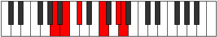

# Mode AFlatAeolycritonic

## Links

- [Documentation](index.md)
- [Scales Index](Scales.md)
- [Modes Index](Modes.md)
- [Chords Index](Chords.md)

## Scale

[Ryphitonic](ScaleRyphitonic.md)

## Mode

[AFlatAeolycritonic](ModeAFlatAeolycritonic.md)

## Tonic

Ab

## Signature

[CNaturalMajor]

## Perfection

 - 1 Perfect Notes

 - 4 Imperfect Notes

## Notes

- Ab (Imperfect)
- A (Imperfect)
- B (Imperfect)
- Db
- F (Imperfect)
- Ab (Imperfect)

## Illustration

## Relative Modes

| Number | Mode | Tonic | Notes | Illustration |
|--------|------|-------|-------|--------------|
| [345](https://ianring.com/musictheory/scales/345) | [Gylitonic](ModeGylitonic.md) | F | F, G#, A, B, C#, F |  |
| [555](https://ianring.com/musictheory/scales/555) | [Aeolycritonic](ModeAeolycritonic.md) | G# | G#, A, B, C#, F, G# |  |
| [555](https://ianring.com/musictheory/scales/555) | [Aeolycritonic](ModeAeolycritonic.md) | Ab | Ab, A, B, Db, F, Ab |  |
| [1425](https://ianring.com/musictheory/scales/1425) | [Ryphitonic](ModeRyphitonic.md) | C# | C#, F, G#, A, B, C# |  |
| [1425](https://ianring.com/musictheory/scales/1425) | [Ryphitonic](ModeRyphitonic.md) | Db | Db, F, Ab, A, B, Db |  |
| [1605](https://ianring.com/musictheory/scales/1605) | [Zanitonic](ModeZanitonic.md) | B | B, C#, F, G#, A, B |  |
| [2325](https://ianring.com/musictheory/scales/2325) | [Pynitonic](ModePynitonic.md) | A | A, B, C#, F, G#, A |  |

## Chords

### Ab

| Number | Root | Name | Notes | Illustration | Audio |
|--------|------|------|-------|--------------|-------|

### A

| Number | Root | Name | Notes | Illustration | Audio |
|--------|------|------|-------|--------------|-------|
| 2592 | A | [Asus2#5](ChordANaturalSuspendedSecondSharpFifth.md) | A, B, E# |  | [midi](ChordANaturalSuspendedSecondSharpFifthRootPosition.mid) [ogg](ChordANaturalSuspendedSecondSharpFifthRootPosition.ogg) |
| 546 | A | [A+](ChordANaturalAugmented.md) | A, C#, E# |  | [midi](ChordANaturalAugmentedRootPosition.mid) [ogg](ChordANaturalAugmentedRootPosition.ogg) |
| 546 | A | [A+7](ChordANaturalAugmentedAugmentedSeventh.md) | A, C#, E#, G## |  | [midi](ChordANaturalAugmentedAugmentedSeventhRootPosition.mid) [ogg](ChordANaturalAugmentedAugmentedSeventhRootPosition.ogg) |
| 802 | A | [A+(M7)](ChordANaturalAugmentedMajorSeventh.md) | A, C#, E#, G# |  | [midi](ChordANaturalAugmentedMajorSeventhRootPosition.mid) [ogg](ChordANaturalAugmentedMajorSeventhRootPosition.ogg) |

### B

| Number | Root | Name | Notes | Illustration | Audio |
|--------|------|------|-------|--------------|-------|
| 2082 | B | [Bsus2b5](ChordBNaturalSuspendedSecondFlatFifth.md) | B, C#, F |  | [midi](ChordBNaturalSuspendedSecondFlatFifthRootPosition.mid) [ogg](ChordBNaturalSuspendedSecondFlatFifthRootPosition.ogg) |
| 2338 | B | [BM6sus2b5](ChordBNaturalMajorSixthSuspendedSecondFlatFifth.md) | B, C#, F, G# |  | [midi](ChordBNaturalMajorSixthSuspendedSecondFlatFifthRootPosition.mid) [ogg](ChordBNaturalMajorSixthSuspendedSecondFlatFifthRootPosition.ogg) |

### Db

| Number | Root | Name | Notes | Illustration | Audio |
|--------|------|------|-------|--------------|-------|

### F

| Number | Root | Name | Notes | Illustration | Audio |
|--------|------|------|-------|--------------|-------|
| 2336 | F | [Fo](ChordFNaturalDiminished.md) | F, Ab, Cb |  | [midi](ChordFNaturalDiminishedRootPosition.mid) [ogg](ChordFNaturalDiminishedRootPosition.ogg) |
| 2592 | F | [FMb5](ChordFNaturalMajorFlatFifth.md) | F, A, Cb |  | [midi](ChordFNaturalMajorFlatFifthRootPosition.mid) [ogg](ChordFNaturalMajorFlatFifthRootPosition.ogg) |
| 290 | F | [Fm#5](ChordFNaturalMinorSharpFifth.md) | F, Ab, Db |  | [midi](ChordFNaturalMinorSharpFifthRootPosition.mid) [ogg](ChordFNaturalMinorSharpFifthRootPosition.ogg) |
| 546 | F | [F+](ChordFNaturalAugmented.md) | F, A, C# |  | [midi](ChordFNaturalAugmentedRootPosition.mid) [ogg](ChordFNaturalAugmentedRootPosition.ogg) |
| 546 | F | [F+7](ChordFNaturalAugmentedAugmentedSeventh.md) | F, A, C#, E# |  | [midi](ChordFNaturalAugmentedAugmentedSeventhRootPosition.mid) [ogg](ChordFNaturalAugmentedAugmentedSeventhRootPosition.ogg) |

