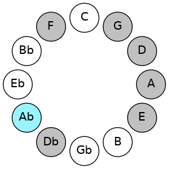
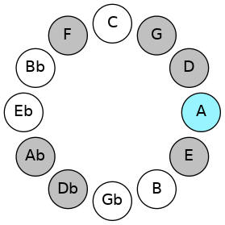
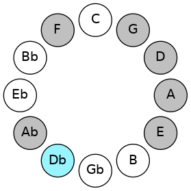
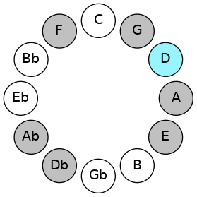
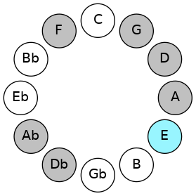
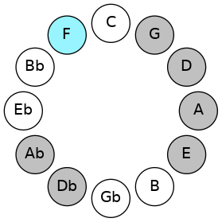
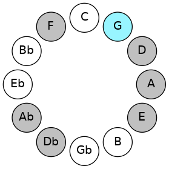

# Mode AFlatAeolydian

## Links

- [Documentation](README.md)
- [Scales Index](Scales.md)
- [Modes Index](Modes.md)
- [Chords Index](Chords.md)

## Scale

[Stygian](ScaleStygian.md)

## Mode

[AFlatAeolydian](ModeAFlatAeolydian.md)

## Tonic

Ab

## Signature

[CNaturalMajor]

## Transposition

1, 4, 1, 2, 1, 2, 1

## Chord Pattern

iii⁰, iii⁰, iv⁰

## Perfection

 - 4 Perfect Notes

 - 3 Imperfect Notes

## Notes

- Ab (Imperfect)
- Bbb
- C#
- D
- E (Imperfect)
- F (Imperfect)
- G
- Ab (Imperfect)

## Illustration

## Diagram

## Relative Modes

| Number | Mode | Tonic | Notes | Illustration |
|--------|------|-------|-------|--------------|
| [2915](https://ianring.com/musictheory/scales/2915) | [Aeolydian](ModeAeolydian.md) | G# | G#, A, B##, C##, D##, E#, F##, G# |  |
| [2915](https://ianring.com/musictheory/scales/2915) | [Aeolydian](ModeAeolydian.md) | Ab | Ab, Bbb, C#, D, E, F, G, Ab |  |
| [3505](https://ianring.com/musictheory/scales/3505) | [Stygian](ModeStygian.md) | A | A, B##, C##, D##, E#, F##, G#, A |  |
| [475](https://ianring.com/musictheory/scales/475) | [Aeolygian](ModeAeolygian.md) | C# | C#, D, E, F, G, Ab, Bbb, C# |  |
| [475](https://ianring.com/musictheory/scales/475) | [Aeolygian](ModeAeolygian.md) | Db | Db, Ebb, Fb, Gbb, Abb, Bbbb, Cbbb, Db |  |
| [2285](https://ianring.com/musictheory/scales/2285) | [Aerogian](ModeAerogian.md) | D | D, E, F, G, Ab, Bbb, C#, D |  |
| [1595](https://ianring.com/musictheory/scales/1595) | [Dacrian](ModeDacrian.md) | E | E, F, G, Ab, Bbb, C#, D, E |  |
| [2845](https://ianring.com/musictheory/scales/2845) | [Baptian](ModeBaptian.md) | F | F, G, Ab, Bbb, C#, D, E, F |  |
| [1735](https://ianring.com/musictheory/scales/1735) | [Dagian](ModeDagian.md) | G | G, Ab, Bbb, C#, D, E, F, G |  |
## Relative Brightness

| Number | Mode | Tonic | Notes | Illustration |
|--------|------|-------|-------|--------------|
| [2915](https://ianring.com/musictheory/scales/2915) | [Aeolydian](ModeAeolydian.md) | G# | G#, A, B##, C##, D##, E#, F##, G# |  |
| [2915](https://ianring.com/musictheory/scales/2915) | [Aeolydian](ModeAeolydian.md) | Ab | Ab, Bbb, C#, D, E, F, G, Ab |  |
| [3505](https://ianring.com/musictheory/scales/3505) | [Stygian](ModeStygian.md) | A | A, B##, C##, D##, E#, F##, G#, A |  |
| [475](https://ianring.com/musictheory/scales/475) | [Aeolygian](ModeAeolygian.md) | C# | C#, D, E, F, G, Ab, Bbb, C# |  |
| [475](https://ianring.com/musictheory/scales/475) | [Aeolygian](ModeAeolygian.md) | Db | Db, Ebb, Fb, Gbb, Abb, Bbbb, Cbbb, Db |  |
| [2285](https://ianring.com/musictheory/scales/2285) | [Aerogian](ModeAerogian.md) | D | D, E, F, G, Ab, Bbb, C#, D |  |
| [1595](https://ianring.com/musictheory/scales/1595) | [Dacrian](ModeDacrian.md) | E | E, F, G, Ab, Bbb, C#, D, E |  |
| [2845](https://ianring.com/musictheory/scales/2845) | [Baptian](ModeBaptian.md) | F | F, G, Ab, Bbb, C#, D, E, F |  |
| [1735](https://ianring.com/musictheory/scales/1735) | [Dagian](ModeDagian.md) | G | G, Ab, Bbb, C#, D, E, F, G |  |

## Chords

### Ab

| Number | Root | Name | Notes | Illustration | Audio |
|--------|------|------|-------|--------------|-------|
| 772 | Ab | [G#loc](ChordGSharpLocrian.md) | G#, A, D |  | [midi](ChordGSharpLocrianRootPosition.mid) |
| 772 | Ab | [Abloc](ChordAFlatLocrian.md) | Ab, Bbb, Ebb |  | [midi](ChordAFlatLocrianRootPosition.mid) |
| 262 | Ab | [G#sus4b5](ChordGSharpSuspendedFourthFlatFifth.md) | G#, C#, D |  | [midi](ChordGSharpSuspendedFourthFlatFifthRootPosition.mid) |
| 262 | Ab | [Absus4b5](ChordAFlatSuspendedFourthFlatFifth.md) | Ab, Db, Ebb |  | [midi](ChordAFlatSuspendedFourthFlatFifthRootPosition.mid) |
| 274 | Ab | [G#sus4#5](ChordGSharpSuspendedFourthSharpFifth.md) | G#, C#, D## |  | [midi](ChordGSharpSuspendedFourthSharpFifthRootPosition.mid) |
| 274 | Ab | [Absus4#5](ChordAFlatSuspendedFourthSharpFifth.md) | Ab, Db, E |  | [midi](ChordAFlatSuspendedFourthSharpFifthRootPosition.mid) |
| 290 | Ab | [G#sus4##5](ChordGSharpSuspendedFourthDoubleSharpFifth.md) | G#, C#, E# |  | [midi](ChordGSharpSuspendedFourthDoubleSharpFifthRootPosition.mid) |
| 290 | Ab | [Absus4##5](ChordAFlatSuspendedFourthDoubleSharpFifth.md) | Ab, Db, F |  | [midi](ChordAFlatSuspendedFourthDoubleSharpFifthRootPosition.mid) |
| 386 | Ab | [G#Q+](ChordGSharpQuartalAugmented.md) | G#, C#, F## |  | [midi](ChordGSharpQuartalAugmentedRootPosition.mid) |
| 386 | Ab | [AbQ+](ChordAFlatQuartalAugmented.md) | Ab, Db, G |  | [midi](ChordAFlatQuartalAugmentedRootPosition.mid) |
| 402 | Ab | [G#M7(sus4)#5](ChordGSharpMajorSeventhSuspendedFourthSharpFifth.md) | G#, C#, D##, F## |  | [midi](ChordGSharpMajorSeventhSuspendedFourthSharpFifthRootPosition.mid) |
| 402 | Ab | [AbM7(sus4)#5](ChordAFlatMajorSeventhSuspendedFourthSharpFifth.md) | Ab, Db, E, G |  | [midi](ChordAFlatMajorSeventhSuspendedFourthSharpFifthRootPosition.mid) |
| 418 | Ab | [G#M7(sus4)##5](ChordGSharpMajorSeventhSuspendedFourthDoubleSharpFifth.md) | G#, C#, E#, F## |  | [midi](ChordGSharpMajorSeventhSuspendedFourthDoubleSharpFifthRootPosition.mid) |
| 418 | Ab | [AbM7(sus4)##5](ChordAFlatMajorSeventhSuspendedFourthDoubleSharpFifth.md) | Ab, Db, F, G |  | [midi](ChordAFlatMajorSeventhSuspendedFourthDoubleSharpFifthRootPosition.mid) |

### Bbb

| Number | Root | Name | Notes | Illustration | Audio |
|--------|------|------|-------|--------------|-------|
| 528 | Bbb | [A5](ChordANaturalPowerChord.md) | A, E |  | [midi](ChordANaturalPowerChordRootPosition.mid) |
| 530 | Bbb | [AM](ChordANaturalMajor.md) | A, C#, E |  | [midi](ChordANaturalMajorRootPosition.mid) |
| 532 | Bbb | [Asus4](ChordANaturalSuspendedFourth.md) | A, D, E |  | [midi](ChordANaturalSuspendedFourthRootPosition.mid) |
| 534 | Bbb | [AM(add11)](ChordANaturalMajorAddEleventh.md) | A, C#, E, D |  | [midi](ChordANaturalMajorAddEleventhRootPosition.mid) |
| 534 | Bbb | [AM(add4)](ChordANaturalMajorAddFourth.md) | A, C#, D, E |  | [midi](ChordANaturalMajorAddFourthRootPosition.mid) |
| 546 | Bbb | [A+](ChordANaturalAugmented.md) | A, C#, E# |  | [midi](ChordANaturalAugmentedRootPosition.mid) |
| 546 | Bbb | [A+7](ChordANaturalAugmentedAugmentedSeventh.md) | A, C#, E#, G## |  | [midi](ChordANaturalAugmentedAugmentedSeventhRootPosition.mid) |
| 548 | Bbb | [Asus4#5](ChordANaturalSuspendedFourthSharpFifth.md) | A, D, E# |  | [midi](ChordANaturalSuspendedFourthSharpFifthRootPosition.mid) |
| 644 | Bbb | [AQ](ChordANaturalQuartal.md) | A, D, G |  | [midi](ChordANaturalQuartalRootPosition.mid) |
| 658 | Bbb | [A7](ChordANaturalDominantSeventh.md) | A, C#, E, G |  | [midi](ChordANaturalDominantSeventhRootPosition.mid) |
| 660 | Bbb | [A7sus4](ChordANaturalDominantSeventhSuspendedFourth.md) | A, D, E, G |  | [midi](ChordANaturalDominantSeventhSuspendedFourthRootPosition.mid) |
| 662 | Bbb | [A7add4](ChordANaturalDominantSeventhAddFourth.md) | A, C#, D, E, G |  | [midi](ChordANaturalDominantSeventhAddFourthRootPosition.mid) |
| 662 | Bbb | [A7add11](ChordANaturalDominantSeventhAddEleventh.md) | A, C#, E, G, D |  | [midi](ChordANaturalDominantSeventhAddEleventhRootPosition.mid) |
| 772 | Bbb | [AQ+](ChordANaturalQuartalAugmented.md) | A, D, G# |  | [midi](ChordANaturalQuartalAugmentedRootPosition.mid) |
| 786 | Bbb | [AM7](ChordANaturalMajorSeventh.md) | A, C#, E, G# |  | [midi](ChordANaturalMajorSeventhRootPosition.mid) |
| 788 | Bbb | [AM7(sus4)](ChordANaturalMajorSeventhSuspendedFourth.md) | A, D, E, G# |  | [midi](ChordANaturalMajorSeventhSuspendedFourthRootPosition.mid) |
| 790 | Bbb | [AM7add4](ChordANaturalMajorSeventhAddFourth.md) | A, C#, D, E, G# |  | [midi](ChordANaturalMajorSeventhAddFourthRootPosition.mid) |
| 790 | Bbb | [AM7add11](ChordANaturalMajorSeventhAddEleventh.md) | A, C#, E, G#, D |  | [midi](ChordANaturalMajorSeventhAddEleventhRootPosition.mid) |
| 802 | Bbb | [A+(M7)](ChordANaturalAugmentedMajorSeventh.md) | A, C#, E#, G# |  | [midi](ChordANaturalAugmentedMajorSeventhRootPosition.mid) |
| 804 | Bbb | [AM7(sus4)#5](ChordANaturalMajorSeventhSuspendedFourthSharpFifth.md) | A, D, E#, G# |  | [midi](ChordANaturalMajorSeventhSuspendedFourthSharpFifthRootPosition.mid) |

### C#

| Number | Root | Name | Notes | Illustration | Audio |
|--------|------|------|-------|--------------|-------|
| 134 | C# | [C#loc](ChordCSharpLocrian.md) | C#, D, G |  | [midi](ChordCSharpLocrianRootPosition.mid) |
| 134 | C# | [Dbloc](ChordDFlatLocrian.md) | Db, Ebb, Abb |  | [midi](ChordDFlatLocrianRootPosition.mid) |
| 146 | C# | [C#o](ChordCSharpDiminished.md) | C#, E, G |  | [midi](ChordCSharpDiminishedRootPosition.mid) |
| 146 | C# | [Dbo](ChordDFlatDiminished.md) | Db, Fb, Abb |  | [midi](ChordDFlatDiminishedRootPosition.mid) |
| 162 | C# | [C#Mb5](ChordCSharpMajorFlatFifth.md) | C#, E#, G |  | [midi](ChordCSharpMajorFlatFifthRootPosition.mid) |
| 162 | C# | [DbMb5](ChordDFlatMajorFlatFifth.md) | Db, F, Abb |  | [midi](ChordDFlatMajorFlatFifthRootPosition.mid) |
| 258 | C# | [C#5](ChordCSharpPowerChord.md) | C#, G# |  | [midi](ChordCSharpPowerChordRootPosition.mid) |
| 258 | C# | [Db5](ChordDFlatPowerChord.md) | Db, Ab |  | [midi](ChordDFlatPowerChordRootPosition.mid) |
| 262 | C# | [C#phryg](ChordCSharpPhrygian.md) | C#, D, G# |  | [midi](ChordCSharpPhrygianRootPosition.mid) |
| 262 | C# | [Dbphryg](ChordDFlatPhrygian.md) | Db, Ebb, Ab |  | [midi](ChordDFlatPhrygianRootPosition.mid) |
| 274 | C# | [C#m](ChordCSharpMinor.md) | C#, E, G# |  | [midi](ChordCSharpMinorRootPosition.mid) |
| 274 | C# | [C#m(add(#9))](ChordCSharpMinorAddSharpNinth.md) | C#, E, G#, D## |  | [midi](ChordCSharpMinorAddSharpNinthRootPosition.mid) |
| 274 | C# | [Dbm](ChordDFlatMinor.md) | Db, Fb, Ab |  | [midi](ChordDFlatMinorRootPosition.mid) |
| 274 | C# | [Dbm(add(#9))](ChordDFlatMinorAddSharpNinth.md) | Db, Fb, Ab, E |  | [midi](ChordDFlatMinorAddSharpNinthRootPosition.mid) |
| 290 | C# | [C#M](ChordCSharpMajor.md) | C#, E#, G# |  | [midi](ChordCSharpMajorRootPosition.mid) |
| 290 | C# | [DbM](ChordDFlatMajor.md) | Db, F, Ab |  | [midi](ChordDFlatMajorRootPosition.mid) |
| 306 | C# | [C#M(add(#9))](ChordCSharpMajorAddSharpNinth.md) | C#, E#, G#, D## |  | [midi](ChordCSharpMajorAddSharpNinthRootPosition.mid) |
| 306 | C# | [DbM(add(#9))](ChordDFlatMajorAddSharpNinth.md) | Db, F, Ab, E |  | [midi](ChordDFlatMajorAddSharpNinthRootPosition.mid) |
| 386 | C# | [C#lyd](ChordCSharpLydian.md) | C#, F##, G# |  | [midi](ChordCSharpLydianRootPosition.mid) |
| 386 | C# | [Dblyd](ChordDFlatLydian.md) | Db, G, Ab |  | [midi](ChordDFlatLydianRootPosition.mid) |
| 402 | C# | [C#m(add(#4))](ChordCSharpMinorAddSharpFourth.md) | C#, E, F##, G# |  | [midi](ChordCSharpMinorAddSharpFourthRootPosition.mid) |
| 402 | C# | [Dbm(add(#4))](ChordDFlatMinorAddSharpFourth.md) | Db, Fb, G, Ab |  | [midi](ChordDFlatMinorAddSharpFourthRootPosition.mid) |
| 418 | C# | [C#M(add(#4))](ChordCSharpMajorAddSharpFourth.md) | C#, E#, F##, G# |  | [midi](ChordCSharpMajorAddSharpFourthRootPosition.mid) |
| 418 | C# | [DbM(add(#4))](ChordDFlatMajorAddSharpFourth.md) | Db, F, G, Ab |  | [midi](ChordDFlatMajorAddSharpFourthRootPosition.mid) |
| 530 | C# | [C#m#5](ChordCSharpMinorSharpFifth.md) | C#, E, A |  | [midi](ChordCSharpMinorSharpFifthRootPosition.mid) |
| 530 | C# | [Dbm#5](ChordDFlatMinorSharpFifth.md) | Db, Fb, Bbb |  | [midi](ChordDFlatMinorSharpFifthRootPosition.mid) |
| 546 | C# | [C#+](ChordCSharpAugmented.md) | C#, E#, G## |  | [midi](ChordCSharpAugmentedRootPosition.mid) |
| 546 | C# | [C#+7](ChordCSharpAugmentedAugmentedSeventh.md) | C#, E#, G##, B## |  | [midi](ChordCSharpAugmentedAugmentedSeventhRootPosition.mid) |
| 546 | C# | [Db+](ChordDFlatAugmented.md) | Db, F, A |  | [midi](ChordDFlatAugmentedRootPosition.mid) |
| 546 | C# | [Db+7](ChordDFlatAugmentedAugmentedSeventh.md) | Db, F, A, C# |  | [midi](ChordDFlatAugmentedAugmentedSeventhRootPosition.mid) |

### D

| Number | Root | Name | Notes | Illustration | Audio |
|--------|------|------|-------|--------------|-------|
| 148 | D | [Dsus2bb5](ChordDNaturalSuspendedSecondDoubleFlatFifth.md) | D, E, G |  | [midi](ChordDNaturalSuspendedSecondDoubleFlatFifthRootPosition.mid) |
| 164 | D | [Dmbb5](ChordDNaturalMinorDoubleFlatFifth.md) | D, F, G |  | [midi](ChordDNaturalMinorDoubleFlatFifthRootPosition.mid) |
| 276 | D | [D](ChordDNaturalDiminishedFlatThird.md) | D, Fb, Ab |  | [midi](ChordDNaturalDiminishedFlatThirdRootPosition.mid) |
| 276 | D | [Dsus2b5](ChordDNaturalSuspendedSecondFlatFifth.md) | D, E, Ab |  | [midi](ChordDNaturalSuspendedSecondFlatFifthRootPosition.mid) |
| 292 | D | [Do](ChordDNaturalDiminished.md) | D, F, Ab |  | [midi](ChordDNaturalDiminishedRootPosition.mid) |
| 388 | D | [Dsus4b5](ChordDNaturalSuspendedFourthFlatFifth.md) | D, G, Ab |  | [midi](ChordDNaturalSuspendedFourthFlatFifthRootPosition.mid) |
| 516 | D | [D5](ChordDNaturalPowerChord.md) | D, A |  | [midi](ChordDNaturalPowerChordRootPosition.mid) |
| 532 | D | [Dsus2](ChordDNaturalSuspendedSecond.md) | D, E, A |  | [midi](ChordDNaturalSuspendedSecondRootPosition.mid) |
| 548 | D | [Dm](ChordDNaturalMinor.md) | D, F, A |  | [midi](ChordDNaturalMinorRootPosition.mid) |
| 548 | D | [Dm(add(#9))](ChordDNaturalMinorAddSharpNinth.md) | D, F, A, E# |  | [midi](ChordDNaturalMinorAddSharpNinthRootPosition.mid) |
| 564 | D | [Dm(add9)](ChordDNaturalMinorAddNinth.md) | D, F, A, E |  | [midi](ChordDNaturalMinorAddNinthRootPosition.mid) |
| 644 | D | [Dsus4](ChordDNaturalSuspendedFourth.md) | D, G, A |  | [midi](ChordDNaturalSuspendedFourthRootPosition.mid) |
| 676 | D | [Dm(add11)](ChordDNaturalMinorAddEleventh.md) | D, F, A, G |  | [midi](ChordDNaturalMinorAddEleventhRootPosition.mid) |
| 676 | D | [Dm(add4)](ChordDNaturalMinorAddFourth.md) | D, F, G, A |  | [midi](ChordDNaturalMinorAddFourthRootPosition.mid) |
| 772 | D | [Dlyd](ChordDNaturalLydian.md) | D, G#, A |  | [midi](ChordDNaturalLydianRootPosition.mid) |
| 804 | D | [Dm(add(#4))](ChordDNaturalMinorAddSharpFourth.md) | D, F, G#, A |  | [midi](ChordDNaturalMinorAddSharpFourthRootPosition.mid) |
| 134 | D | [DQ+](ChordDNaturalQuartalAugmented.md) | D, G, C# |  | [midi](ChordDNaturalQuartalAugmentedRootPosition.mid) |
| 294 | D | [DoM7](ChordDNaturalDiminishedMajorSeventh.md) | D, F, Ab, C# |  | [midi](ChordDNaturalDiminishedMajorSeventhRootPosition.mid) |
| 534 | D | [DM7(sus2)](ChordDNaturalMajorSeventhSuspendedSecond.md) | D, E, A, C# |  | [midi](ChordDNaturalMajorSeventhSuspendedSecondRootPosition.mid) |
| 534 | D | [DM9sus2](ChordDNaturalMajorNinthSuspendedSecond.md) | D, E, A, C#, E |  | [midi](ChordDNaturalMajorNinthSuspendedSecondRootPosition.mid) |
| 550 | D | [Dm(M7)](ChordDNaturalMinorMajorSeventh.md) | D, F, A, C# |  | [midi](ChordDNaturalMinorMajorSeventhRootPosition.mid) |
| 566 | D | [Dm(M9)](ChordDNaturalMinorMajorNinth.md) | D, F, A, C#, E |  | [midi](ChordDNaturalMinorMajorNinthRootPosition.mid) |
| 646 | D | [DM7(sus4)](ChordDNaturalMajorSeventhSuspendedFourth.md) | D, G, A, C# |  | [midi](ChordDNaturalMajorSeventhSuspendedFourthRootPosition.mid) |
| 662 | D | [DM9sus4](ChordDNaturalMajorNinthSuspendedFourth.md) | D, G, A, C#, E |  | [midi](ChordDNaturalMajorNinthSuspendedFourthRootPosition.mid) |
| 678 | D | [Dm(M7)add11](ChordDNaturalMinorMajorSeventhAddEleventh.md) | D, F, A, C#, G |  | [midi](ChordDNaturalMinorMajorSeventhAddEleventhRootPosition.mid) |
| 694 | D | [Dm(M11)](ChordDNaturalMinorMajorEleventh.md) | D, F, A, C#, E, G |  | [midi](ChordDNaturalMinorMajorEleventhRootPosition.mid) |
| 774 | D | [Dlyd(M7)](ChordDNaturalLydianMajorSeventh.md) | D, G#, A, C# |  | [midi](ChordDNaturalLydianMajorSeventhRootPosition.mid) |

### E

| Number | Root | Name | Notes | Illustration | Audio |
|--------|------|------|-------|--------------|-------|
| 656 | E | [Embb5](ChordENaturalMinorDoubleFlatFifth.md) | E, G, A |  | [midi](ChordENaturalMinorDoubleFlatFifthRootPosition.mid) |
| 274 | E | [EM##5](ChordENaturalMajorDoubleSharpFifth.md) | E, G#, C# |  | [midi](ChordENaturalMajorDoubleSharpFifthRootPosition.mid) |
| 530 | E | [Esus4##5](ChordENaturalSuspendedFourthDoubleSharpFifth.md) | E, A, C# |  | [midi](ChordENaturalSuspendedFourthDoubleSharpFifthRootPosition.mid) |
| 532 | E | [EQ](ChordENaturalQuartal.md) | E, A, D |  | [midi](ChordENaturalQuartalRootPosition.mid) |
| 660 | E | [Em7bb5](ChordENaturalMinorSeventhDoubleFlatFifth.md) | E, G, A, D |  | [midi](ChordENaturalMinorSeventhDoubleFlatFifthRootPosition.mid) |

### F

| Number | Root | Name | Notes | Illustration | Audio |
|--------|------|------|-------|--------------|-------|
| 162 | F | [Fsus2#5](ChordFNaturalSuspendedSecondSharpFifth.md) | F, G, C# |  | [midi](ChordFNaturalSuspendedSecondSharpFifthRootPosition.mid) |
| 290 | F | [Fm#5](ChordFNaturalMinorSharpFifth.md) | F, Ab, Db |  | [midi](ChordFNaturalMinorSharpFifthRootPosition.mid) |
| 546 | F | [F+](ChordFNaturalAugmented.md) | F, A, C# |  | [midi](ChordFNaturalAugmentedRootPosition.mid) |
| 546 | F | [F+7](ChordFNaturalAugmentedAugmentedSeventh.md) | F, A, C#, E# |  | [midi](ChordFNaturalAugmentedAugmentedSeventhRootPosition.mid) |
| 548 | F | [FM##5](ChordFNaturalMajorDoubleSharpFifth.md) | F, A, D |  | [midi](ChordFNaturalMajorDoubleSharpFifthRootPosition.mid) |
| 562 | F | [F+(M7)](ChordFNaturalAugmentedMajorSeventh.md) | F, A, C#, E |  | [midi](ChordFNaturalAugmentedMajorSeventhRootPosition.mid) |
| 564 | F | [FM7##5](ChordFNaturalMajorSeventhDoubleSharpFifth.md) | F, A, D, E |  | [midi](ChordFNaturalMajorSeventhDoubleSharpFifthRootPosition.mid) |

### G

| Number | Root | Name | Notes | Illustration | Audio |
|--------|------|------|-------|--------------|-------|
| 386 | G | [Gloc](ChordGNaturalLocrian.md) | G, Ab, Db |  | [midi](ChordGNaturalLocrianRootPosition.mid) |
| 642 | G | [G](ChordGNaturalDiminishedFlatThird.md) | G, Bbb, Db |  | [midi](ChordGNaturalDiminishedFlatThirdRootPosition.mid) |
| 642 | G | [Gsus2b5](ChordGNaturalSuspendedSecondFlatFifth.md) | G, A, Db |  | [midi](ChordGNaturalSuspendedSecondFlatFifthRootPosition.mid) |
| 132 | G | [G5](ChordGNaturalPowerChord.md) | G, D |  | [midi](ChordGNaturalPowerChordRootPosition.mid) |
| 388 | G | [Gphryg](ChordGNaturalPhrygian.md) | G, Ab, D |  | [midi](ChordGNaturalPhrygianRootPosition.mid) |
| 644 | G | [Gsus2](ChordGNaturalSuspendedSecond.md) | G, A, D |  | [midi](ChordGNaturalSuspendedSecondRootPosition.mid) |
| 134 | G | [Glyd](ChordGNaturalLydian.md) | G, C#, D |  | [midi](ChordGNaturalLydianRootPosition.mid) |
| 658 | G | [GM6sus2b5](ChordGNaturalMajorSixthSuspendedSecondFlatFifth.md) | G, A, Db, E |  | [midi](ChordGNaturalMajorSixthSuspendedSecondFlatFifthRootPosition.mid) |
| 660 | G | [GM6sus2](ChordGNaturalMajorSixthSuspendedSecond.md) | G, A, D, E |  | [midi](ChordGNaturalMajorSixthSuspendedSecondRootPosition.mid) |
| 660 | G | [G7sus2b5](ChordGNaturalDominantSeventhSuspendedSecondFlatFifth.md) | G, A, D, Fb |  | [midi](ChordGNaturalDominantSeventhSuspendedSecondFlatFifthRootPosition.mid) |
| 676 | G | [G7sus2](ChordGNaturalDominantSeventhSuspendedSecond.md) | G, A, D, F |  | [midi](ChordGNaturalDominantSeventhSuspendedSecondRootPosition.mid) |
| 676 | G | [G9sus2](ChordGNaturalDominantNinthSuspendedSecond.md) | G, A, D, F, A |  | [midi](ChordGNaturalDominantNinthSuspendedSecondRootPosition.mid) |

