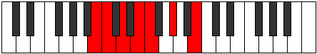

# Mode AFlatAeolydimic

## Links

- [Documentation](index.md)
- [Scales Index](Scales.md)
- [Modes Index](Modes.md)
- [Chords Index](Chords.md)

## Scale

[Dagimic](ScaleDagimic.md)

## Mode

[AFlatAeolydimic](ModeAFlatAeolydimic.md)

## Tonic

Ab

## Signature

[CNaturalMajor]

## Interval Pattern

3, 1, 2, 2, 1, 3

## Chord Pattern

I⁺, ii⁰, III⁺, V⁺

## Perfection

 - 2 Perfect Notes

 - 4 Imperfect Notes

## Notes

- Ab (Imperfect)
- B (Imperfect)
- C (Imperfect)
- D (Imperfect)
- E
- F
- Ab (Imperfect)

## Illustration

## Relative Modes

| Number | Mode | Tonic | Notes | Illustration |
|--------|------|-------|-------|--------------|
| [857](https://ianring.com/musictheory/scales/857) | [Aeolydimic](ModeAeolydimic.md) | Ab | Ab, B, C, D, E, F, Ab |  |
| [619](https://ianring.com/musictheory/scales/619) | [Parimic](ModeParimic.md) | B | B, C, D, E, F, G#, B |  |
| [2357](https://ianring.com/musictheory/scales/2357) | [Ionaptimic](ModeIonaptimic.md) | C | C, D, E, F, G#, A##, C |  |
| [1613](https://ianring.com/musictheory/scales/1613) | [Thylimic](ModeThylimic.md) | D | D, E, F, G#, A##, B#, D |  |
| [1427](https://ianring.com/musictheory/scales/1427) | [Lolimic](ModeLolimic.md) | E | E, F, G#, A##, B#, C##, E |  |
| [2761](https://ianring.com/musictheory/scales/2761) | [Dagimic](ModeDagimic.md) | F | F, G#, A##, B#, C##, D##, F |  |

## Chords

### Ab

| Number | Root | Name | Notes | Illustration | Audio |
|--------|------|------|-------|--------------|-------|
| 2308 | Ab | [Abo](ChordAFlatDiminished.md) | Ab, Cb, Ebb |  | [midi](ChordAFlatDiminishedRootPosition.mid) |
| 261 | Ab | [AbMb5](ChordAFlatMajorFlatFifth.md) | Ab, C, Ebb |  | [midi](ChordAFlatMajorFlatFifthRootPosition.mid) |
| 2320 | Ab | [Abm#5](ChordAFlatMinorSharpFifth.md) | Ab, Cb, Fb |  | [midi](ChordAFlatMinorSharpFifthRootPosition.mid) |
| 273 | Ab | [Ab+](ChordAFlatAugmented.md) | Ab, C, E |  | [midi](ChordAFlatAugmentedRootPosition.mid) |
| 273 | Ab | [Ab+7](ChordAFlatAugmentedAugmentedSeventh.md) | Ab, C, E, G# |  | [midi](ChordAFlatAugmentedAugmentedSeventhRootPosition.mid) |
| 289 | Ab | [AbM##5](ChordAFlatMajorDoubleSharpFifth.md) | Ab, C, F |  | [midi](ChordAFlatMajorDoubleSharpFifthRootPosition.mid) |
| 2340 | Ab | [Abo7](ChordAFlatFullDiminishedSeventh.md) | Ab, Cb, Ebb, Gbb |  | [midi](ChordAFlatFullDiminishedSeventhRootPosition.mid) |
| 293 | Ab | [AbM6b5](ChordAFlatMajorSixthFlatFifth.md) | Ab, C, Ebb, F |  | [midi](ChordAFlatMajorSixthFlatFifthRootPosition.mid) |

### B

| Number | Root | Name | Notes | Illustration | Audio |
|--------|------|------|-------|--------------|-------|
| 2068 | B | [Bmbb5](ChordBNaturalMinorDoubleFlatFifth.md) | B, D, E |  | [midi](ChordBNaturalMinorDoubleFlatFifthRootPosition.mid) |
| 2081 | B | [Bloc](ChordBNaturalLocrian.md) | B, C, F |  | [midi](ChordBNaturalLocrianRootPosition.mid) |
| 2084 | B | [Bo](ChordBNaturalDiminished.md) | B, D, F |  | [midi](ChordBNaturalDiminishedRootPosition.mid) |
| 2096 | B | [Bsus4b5](ChordBNaturalSuspendedFourthFlatFifth.md) | B, E, F |  | [midi](ChordBNaturalSuspendedFourthFlatFifthRootPosition.mid) |
| 2320 | B | [Bsus4##5](ChordBNaturalSuspendedFourthDoubleSharpFifth.md) | B, E, G# |  | [midi](ChordBNaturalSuspendedFourthDoubleSharpFifthRootPosition.mid) |
| 2340 | B | [Bo7](ChordBNaturalFullDiminishedSeventh.md) | B, D, F, Ab |  | [midi](ChordBNaturalFullDiminishedSeventhRootPosition.mid) |

### C

| Number | Root | Name | Notes | Illustration | Audio |
|--------|------|------|-------|--------------|-------|
| 37 | C | [Csus2bb5](ChordCNaturalSuspendedSecondDoubleFlatFifth.md) | C, D, F |  | [midi](ChordCNaturalSuspendedSecondDoubleFlatFifthRootPosition.mid) |
| 261 | C | [Csus2#5](ChordCNaturalSuspendedSecondSharpFifth.md) | C, D, G# |  | [midi](ChordCNaturalSuspendedSecondSharpFifthRootPosition.mid) |
| 273 | C | [C+](ChordCNaturalAugmented.md) | C, E, G# |  | [midi](ChordCNaturalAugmentedRootPosition.mid) |
| 273 | C | [C+7](ChordCNaturalAugmentedAugmentedSeventh.md) | C, E, G#, B# |  | [midi](ChordCNaturalAugmentedAugmentedSeventhRootPosition.mid) |
| 289 | C | [Csus4#5](ChordCNaturalSuspendedFourthSharpFifth.md) | C, F, G# |  | [midi](ChordCNaturalSuspendedFourthSharpFifthRootPosition.mid) |
| 2081 | C | [CQ+](ChordCNaturalQuartalAugmented.md) | C, F, B |  | [midi](ChordCNaturalQuartalAugmentedRootPosition.mid) |
| 2321 | C | [C+(M7)](ChordCNaturalAugmentedMajorSeventh.md) | C, E, G#, B |  | [midi](ChordCNaturalAugmentedMajorSeventhRootPosition.mid) |
| 2337 | C | [CM7(sus4)#5](ChordCNaturalMajorSeventhSuspendedFourthSharpFifth.md) | C, F, G#, B |  | [midi](ChordCNaturalMajorSeventhSuspendedFourthSharpFifthRootPosition.mid) |

### D

| Number | Root | Name | Notes | Illustration | Audio |
|--------|------|------|-------|--------------|-------|
| 276 | D | [Dsus2b5](ChordDNaturalSuspendedSecondFlatFifth.md) | D, E, Ab |  | [midi](ChordDNaturalSuspendedSecondFlatFifthRootPosition.mid) |
| 292 | D | [Do](ChordDNaturalDiminished.md) | D, F, Ab |  | [midi](ChordDNaturalDiminishedRootPosition.mid) |
| 2324 | D | [DM6sus2b5](ChordDNaturalMajorSixthSuspendedSecondFlatFifth.md) | D, E, Ab, B |  | [midi](ChordDNaturalMajorSixthSuspendedSecondFlatFifthRootPosition.mid) |
| 2340 | D | [Do7](ChordDNaturalFullDiminishedSeventh.md) | D, F, Ab, Cb |  | [midi](ChordDNaturalFullDiminishedSeventhRootPosition.mid) |
| 293 | D | [Dø7](ChordDNaturalHalfDiminishedSeventh.md) | D, F, Ab, C |  | [midi](ChordDNaturalHalfDiminishedSeventhRootPosition.mid) |

### E

| Number | Root | Name | Notes | Illustration | Audio |
|--------|------|------|-------|--------------|-------|
| 2064 | E | [E5](ChordENaturalPowerChord.md) | E, B |  | [midi](ChordENaturalPowerChordRootPosition.mid) |
| 2096 | E | [Ephryg](ChordENaturalPhrygian.md) | E, F, B |  | [midi](ChordENaturalPhrygianRootPosition.mid) |
| 2320 | E | [EM](ChordENaturalMajor.md) | E, G#, B |  | [midi](ChordENaturalMajorRootPosition.mid) |
| 273 | E | [E+](ChordENaturalAugmented.md) | E, G#, B# |  | [midi](ChordENaturalAugmentedRootPosition.mid) |
| 273 | E | [E+7](ChordENaturalAugmentedAugmentedSeventh.md) | E, G#, B#, D## |  | [midi](ChordENaturalAugmentedAugmentedSeventhRootPosition.mid) |
| 2324 | E | [E7](ChordENaturalDominantSeventh.md) | E, G#, B, D |  | [midi](ChordENaturalDominantSeventhRootPosition.mid) |
| 2356 | E | [E7b9](ChordENaturalDominantSeventhFlatNinth.md) | E, G#, B, D, F |  | [midi](ChordENaturalDominantSeventhFlatNinthRootPosition.mid) |
| 309 | E | [E7#5b9](ChordENaturalDominantSeventhSharpFifthFlatNinth.md) | E, G#, B#, D, F |  | [midi](ChordENaturalDominantSeventhSharpFifthFlatNinthRootPosition.mid) |
| 2357 | E | [E7b9b13](ChordENaturalDominantSeventhFlatNinthFlatThirteenth.md) | E, G#, B, D, F, C |  | [midi](ChordENaturalDominantSeventhFlatNinthFlatThirteenthRootPosition.mid) |

### F

| Number | Root | Name | Notes | Illustration | Audio |
|--------|------|------|-------|--------------|-------|
| 2336 | F | [Fo](ChordFNaturalDiminished.md) | F, Ab, Cb |  | [midi](ChordFNaturalDiminishedRootPosition.mid) |
| 33 | F | [F5](ChordFNaturalPowerChord.md) | F, C |  | [midi](ChordFNaturalPowerChordRootPosition.mid) |
| 289 | F | [Fm](ChordFNaturalMinor.md) | F, Ab, C |  | [midi](ChordFNaturalMinorRootPosition.mid) |
| 289 | F | [Fm(add(#9))](ChordFNaturalMinorAddSharpNinth.md) | F, Ab, C, G# |  | [midi](ChordFNaturalMinorAddSharpNinthRootPosition.mid) |
| 2081 | F | [Flyd](ChordFNaturalLydian.md) | F, B, C |  | [midi](ChordFNaturalLydianRootPosition.mid) |
| 2337 | F | [Fm(add(#4))](ChordFNaturalMinorAddSharpFourth.md) | F, Ab, B, C |  | [midi](ChordFNaturalMinorAddSharpFourthRootPosition.mid) |
| 2340 | F | [Fo7](ChordFNaturalFullDiminishedSeventh.md) | F, Ab, Cb, Ebb |  | [midi](ChordFNaturalFullDiminishedSeventhRootPosition.mid) |
| 293 | F | [Fm6](ChordFNaturalMinorSixth.md) | F, Ab, C, D |  | [midi](ChordFNaturalMinorSixthRootPosition.mid) |
| 2352 | F | [FoM7](ChordFNaturalDiminishedMajorSeventh.md) | F, Ab, Cb, E |  | [midi](ChordFNaturalDiminishedMajorSeventhRootPosition.mid) |
| 305 | F | [Fm(M7)](ChordFNaturalMinorMajorSeventh.md) | F, Ab, C, E |  | [midi](ChordFNaturalMinorMajorSeventhRootPosition.mid) |
| 2097 | F | [Flyd(M7)](ChordFNaturalLydianMajorSeventh.md) | F, B, C, E |  | [midi](ChordFNaturalLydianMajorSeventhRootPosition.mid) |
| 309 | F | [Fm(M7)add13](ChordFNaturalMinorMajorSeventhAddThirteenth.md) | F, Ab, C, E, D |  | [midi](ChordFNaturalMinorMajorSeventhAddThirteenthRootPosition.mid) |

