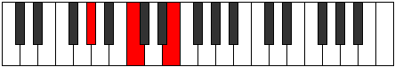

# Mode AFlatAeolygian

## Links

- [Documentation](README.md)
- [Scales Index](Scales.md)
- [Modes Index](Modes.md)
- [Chords Index](Chords.md)

## Parent Scale

[Stygian](ScaleStygian.md)

## Mode

[AFlatAeolygian](ModeAFlatAeolygian.md)

## Number

475

## Luminosity

-1

## Tonic

Ab

## Signature

C

## Transposition

1, 2, 1, 2, 1, 1, 4

## Chord Pattern

i⁰, ii⁰

## Perfection

 - 4 Perfect Notes

 - 3 Imperfect Notes

 - Perfection Profile - true, true, false, false, true, false, true

## Notes

- Ab
- Bbb
- Cb (Imperfect)
- Dbb (Imperfect)
- Ebb
- Fbb (Imperfect)
- Gbbb
- Ab

## Illustration

## Diagram

| Circle of Fifth | Chromatic Circle |
|-----------------|------------------|
|  |  |
## Relative Modes

| Number | Mode | Luminosity | Tonic | Notes | Illustration |
|--------|------|------------|-------|-------|--------------|
| [475](https://ianring.com/musictheory/scales/475) | [Aeolygian](ModeAeolygian.md) | 7 | G# | G#, A, B, C, D, Eb, Fb, G# |  |
| [475](https://ianring.com/musictheory/scales/475) | [Aeolygian](ModeAeolygian.md) | 7 | Ab | Ab, Bbb, Cb, Dbb, Ebb, Fbb, Gbbb, Ab |  |
| [2285](https://ianring.com/musictheory/scales/2285) | [Aerogian](ModeAerogian.md) | -1 | A | A, B, C, D, Eb, Fb, G#, A |  |
| [1595](https://ianring.com/musictheory/scales/1595) | [Dacrian](ModeDacrian.md) | -1 | B | B, C, D, Eb, Fb, G#, A, B |  |
| [2845](https://ianring.com/musictheory/scales/2845) | [Baptian](ModeBaptian.md) | -1 | C | C, D, Eb, Fb, G#, A, B, C |  |
| [1735](https://ianring.com/musictheory/scales/1735) | [Dagian](ModeDagian.md) | -1 | D | D, Eb, Fb, G#, A, B, C, D |  |
| [2915](https://ianring.com/musictheory/scales/2915) | [Aeolydian](ModeAeolydian.md) | 6 | D# | D#, E, F###, G##, A##, B#, C##, D# |  |
| [2915](https://ianring.com/musictheory/scales/2915) | [Aeolydian](ModeAeolydian.md) | 6 | Eb | Eb, Fb, G#, A, B, C, D, Eb |  |
| [3505](https://ianring.com/musictheory/scales/3505) | [Stygian](ModeStygian.md) | 5 | E | E, F###, G##, A##, B#, C##, D#, E |  |
## Relative Brightness

| Number | Mode | Luminosity | Tonic | Notes | Circle Of Fifth | Chromatic Circle |
|--------|------|------------|-------|-------|-----------------|------------------|
| [475](https://ianring.com/musictheory/scales/475) | [Aeolygian](ModeAeolygian.md) | 7 | G# | G#, A, B, C, D, Eb, Fb, G# |  |  |
| [475](https://ianring.com/musictheory/scales/475) | [Aeolygian](ModeAeolygian.md) | 7 | Ab | Ab, Bbb, Cb, Dbb, Ebb, Fbb, Gbbb, Ab |  |  |
| [2285](https://ianring.com/musictheory/scales/2285) | [Aerogian](ModeAerogian.md) | -1 | A | A, B, C, D, Eb, Fb, G#, A |  |  |
| [1595](https://ianring.com/musictheory/scales/1595) | [Dacrian](ModeDacrian.md) | -1 | B | B, C, D, Eb, Fb, G#, A, B |  |  |
| [2845](https://ianring.com/musictheory/scales/2845) | [Baptian](ModeBaptian.md) | -1 | C | C, D, Eb, Fb, G#, A, B, C |  |  |
| [1735](https://ianring.com/musictheory/scales/1735) | [Dagian](ModeDagian.md) | 7 | D | D, Eb, Fb, G#, A, B, C, D |  |  |
| [2915](https://ianring.com/musictheory/scales/2915) | [Aeolydian](ModeAeolydian.md) | 6 | D# | D#, E, F###, G##, A##, B#, C##, D# |  |  |
| [2915](https://ianring.com/musictheory/scales/2915) | [Aeolydian](ModeAeolydian.md) | 6 | Eb | Eb, Fb, G#, A, B, C, D, Eb |  |  |
| [3505](https://ianring.com/musictheory/scales/3505) | [Stygian](ModeStygian.md) | 5 | E | E, F###, G##, A##, B#, C##, D#, E |  |  |

## Chords

### Ab

| Number | Root | Name | Notes | Illustration | Audio |
|--------|------|------|-------|--------------|-------|
| 772 | Ab | [G#loc](ChordGSharpLocrian.md) | G#, A, D |  | [midi](ChordGSharpLocrianRootPosition.mid) |
| 772 | Ab | [Abloc](ChordAFlatLocrian.md) | Ab, Bbb, Ebb |  | [midi](ChordAFlatLocrianRootPosition.mid) |
| 2308 | Ab | [G#o](ChordGSharpDiminished.md) | G#, B, D |  | [midi](ChordGSharpDiminishedRootPosition.mid) |
| 2308 | Ab | [Abo](ChordAFlatDiminished.md) | Ab, Cb, Ebb |  | [midi](ChordAFlatDiminishedRootPosition.mid) |
| 261 | Ab | [G#Mb5](ChordGSharpMajorFlatFifth.md) | G#, B#, D |  | [midi](ChordGSharpMajorFlatFifthRootPosition.mid) |
| 261 | Ab | [AbMb5](ChordAFlatMajorFlatFifth.md) | Ab, C, Ebb |  | [midi](ChordAFlatMajorFlatFifthRootPosition.mid) |
| 264 | Ab | [G#5](ChordGSharpPowerChord.md) | G#, D# |  | [midi](ChordGSharpPowerChordRootPosition.mid) |
| 264 | Ab | [Ab5](ChordAFlatPowerChord.md) | Ab, Eb |  | [midi](ChordAFlatPowerChordRootPosition.mid) |
| 776 | Ab | [G#phryg](ChordGSharpPhrygian.md) | G#, A, D# |  | [midi](ChordGSharpPhrygianRootPosition.mid) |
| 776 | Ab | [Abphryg](ChordAFlatPhrygian.md) | Ab, Bbb, Eb |  | [midi](ChordAFlatPhrygianRootPosition.mid) |
| 2312 | Ab | [G#m](ChordGSharpMinor.md) | G#, B, D# |  | [midi](ChordGSharpMinorRootPosition.mid) |
| 2312 | Ab | [G#m(add(#9))](ChordGSharpMinorAddSharpNinth.md) | G#, B, D#, A## |  | [midi](ChordGSharpMinorAddSharpNinthRootPosition.mid) |
| 2312 | Ab | [Abm](ChordAFlatMinor.md) | Ab, Cb, Eb |  | [midi](ChordAFlatMinorRootPosition.mid) |
| 2312 | Ab | [Abm(add(#9))](ChordAFlatMinorAddSharpNinth.md) | Ab, Cb, Eb, B |  | [midi](ChordAFlatMinorAddSharpNinthRootPosition.mid) |
| 265 | Ab | [G#M](ChordGSharpMajor.md) | G#, B#, D# |  | [midi](ChordGSharpMajorRootPosition.mid) |
| 265 | Ab | [AbM](ChordAFlatMajor.md) | Ab, C, Eb |  | [midi](ChordAFlatMajorRootPosition.mid) |
| 2313 | Ab | [G#M(add(#9))](ChordGSharpMajorAddSharpNinth.md) | G#, B#, D#, A## |  | [midi](ChordGSharpMajorAddSharpNinthRootPosition.mid) |
| 2313 | Ab | [AbM(add(#9))](ChordAFlatMajorAddSharpNinth.md) | Ab, C, Eb, B |  | [midi](ChordAFlatMajorAddSharpNinthRootPosition.mid) |
| 268 | Ab | [G#lyd](ChordGSharpLydian.md) | G#, C##, D# |  | [midi](ChordGSharpLydianRootPosition.mid) |
| 268 | Ab | [Ablyd](ChordAFlatLydian.md) | Ab, D, Eb |  | [midi](ChordAFlatLydianRootPosition.mid) |
| 2316 | Ab | [G#m(add(#4))](ChordGSharpMinorAddSharpFourth.md) | G#, B, C##, D# |  | [midi](ChordGSharpMinorAddSharpFourthRootPosition.mid) |
| 2316 | Ab | [Abm(add(#4))](ChordAFlatMinorAddSharpFourth.md) | Ab, Cb, D, Eb |  | [midi](ChordAFlatMinorAddSharpFourthRootPosition.mid) |
| 269 | Ab | [G#M(add(#4))](ChordGSharpMajorAddSharpFourth.md) | G#, B#, C##, D# |  | [midi](ChordGSharpMajorAddSharpFourthRootPosition.mid) |
| 269 | Ab | [AbM(add(#4))](ChordAFlatMajorAddSharpFourth.md) | Ab, C, D, Eb |  | [midi](ChordAFlatMajorAddSharpFourthRootPosition.mid) |
| 2320 | Ab | [G#m#5](ChordGSharpMinorSharpFifth.md) | G#, B, E |  | [midi](ChordGSharpMinorSharpFifthRootPosition.mid) |
| 2320 | Ab | [Abm#5](ChordAFlatMinorSharpFifth.md) | Ab, Cb, Fb |  | [midi](ChordAFlatMinorSharpFifthRootPosition.mid) |
| 273 | Ab | [G#+](ChordGSharpAugmented.md) | G#, B#, D## |  | [midi](ChordGSharpAugmentedRootPosition.mid) |
| 273 | Ab | [G#+7](ChordGSharpAugmentedAugmentedSeventh.md) | G#, B#, D##, F### |  | [midi](ChordGSharpAugmentedAugmentedSeventhRootPosition.mid) |
| 273 | Ab | [Ab+](ChordAFlatAugmented.md) | Ab, C, E |  | [midi](ChordAFlatAugmentedRootPosition.mid) |
| 273 | Ab | [Ab+7](ChordAFlatAugmentedAugmentedSeventh.md) | Ab, C, E, G# |  | [midi](ChordAFlatAugmentedAugmentedSeventhRootPosition.mid) |

### Bbb

| Number | Root | Name | Notes | Illustration | Audio |
|--------|------|------|-------|--------------|-------|
| 2564 | Bbb | [Asus2bb5](ChordANaturalSuspendedSecondDoubleFlatFifth.md) | A, B, D |  | [midi](ChordANaturalSuspendedSecondDoubleFlatFifthRootPosition.mid) |
| 517 | Bbb | [Ambb5](ChordANaturalMinorDoubleFlatFifth.md) | A, C, D |  | [midi](ChordANaturalMinorDoubleFlatFifthRootPosition.mid) |
| 2568 | Bbb | [A](ChordANaturalDiminishedFlatThird.md) | A, Cb, Eb |  | [midi](ChordANaturalDiminishedFlatThirdRootPosition.mid) |
| 2568 | Bbb | [Asus2b5](ChordANaturalSuspendedSecondFlatFifth.md) | A, B, Eb |  | [midi](ChordANaturalSuspendedSecondFlatFifthRootPosition.mid) |
| 521 | Bbb | [Ao](ChordANaturalDiminished.md) | A, C, Eb |  | [midi](ChordANaturalDiminishedRootPosition.mid) |
| 524 | Bbb | [Asus4b5](ChordANaturalSuspendedFourthFlatFifth.md) | A, D, Eb |  | [midi](ChordANaturalSuspendedFourthFlatFifthRootPosition.mid) |
| 528 | Bbb | [A5](ChordANaturalPowerChord.md) | A, E |  | [midi](ChordANaturalPowerChordRootPosition.mid) |
| 2576 | Bbb | [Asus2](ChordANaturalSuspendedSecond.md) | A, B, E |  | [midi](ChordANaturalSuspendedSecondRootPosition.mid) |
| 529 | Bbb | [Am](ChordANaturalMinor.md) | A, C, E |  | [midi](ChordANaturalMinorRootPosition.mid) |
| 529 | Bbb | [Am(add(#9))](ChordANaturalMinorAddSharpNinth.md) | A, C, E, B# |  | [midi](ChordANaturalMinorAddSharpNinthRootPosition.mid) |
| 2577 | Bbb | [Am(add9)](ChordANaturalMinorAddNinth.md) | A, C, E, B |  | [midi](ChordANaturalMinorAddNinthRootPosition.mid) |
| 532 | Bbb | [Asus4](ChordANaturalSuspendedFourth.md) | A, D, E |  | [midi](ChordANaturalSuspendedFourthRootPosition.mid) |
| 533 | Bbb | [Am(add11)](ChordANaturalMinorAddEleventh.md) | A, C, E, D |  | [midi](ChordANaturalMinorAddEleventhRootPosition.mid) |
| 533 | Bbb | [Am(add4)](ChordANaturalMinorAddFourth.md) | A, C, D, E |  | [midi](ChordANaturalMinorAddFourthRootPosition.mid) |
| 536 | Bbb | [Alyd](ChordANaturalLydian.md) | A, D#, E |  | [midi](ChordANaturalLydianRootPosition.mid) |
| 537 | Bbb | [Am(add(#4))](ChordANaturalMinorAddSharpFourth.md) | A, C, D#, E |  | [midi](ChordANaturalMinorAddSharpFourthRootPosition.mid) |
| 772 | Bbb | [AQ+](ChordANaturalQuartalAugmented.md) | A, D, G# |  | [midi](ChordANaturalQuartalAugmentedRootPosition.mid) |
| 777 | Bbb | [AoM7](ChordANaturalDiminishedMajorSeventh.md) | A, C, Eb, G# |  | [midi](ChordANaturalDiminishedMajorSeventhRootPosition.mid) |
| 2832 | Bbb | [AM7(sus2)](ChordANaturalMajorSeventhSuspendedSecond.md) | A, B, E, G# |  | [midi](ChordANaturalMajorSeventhSuspendedSecondRootPosition.mid) |
| 2832 | Bbb | [AM9sus2](ChordANaturalMajorNinthSuspendedSecond.md) | A, B, E, G#, B |  | [midi](ChordANaturalMajorNinthSuspendedSecondRootPosition.mid) |
| 785 | Bbb | [Am(M7)](ChordANaturalMinorMajorSeventh.md) | A, C, E, G# |  | [midi](ChordANaturalMinorMajorSeventhRootPosition.mid) |
| 2833 | Bbb | [Am(M9)](ChordANaturalMinorMajorNinth.md) | A, C, E, G#, B |  | [midi](ChordANaturalMinorMajorNinthRootPosition.mid) |
| 788 | Bbb | [AM7(sus4)](ChordANaturalMajorSeventhSuspendedFourth.md) | A, D, E, G# |  | [midi](ChordANaturalMajorSeventhSuspendedFourthRootPosition.mid) |
| 2836 | Bbb | [AM9sus4](ChordANaturalMajorNinthSuspendedFourth.md) | A, D, E, G#, B |  | [midi](ChordANaturalMajorNinthSuspendedFourthRootPosition.mid) |
| 789 | Bbb | [Am(M7)add11](ChordANaturalMinorMajorSeventhAddEleventh.md) | A, C, E, G#, D |  | [midi](ChordANaturalMinorMajorSeventhAddEleventhRootPosition.mid) |
| 2837 | Bbb | [Am(M11)](ChordANaturalMinorMajorEleventh.md) | A, C, E, G#, B, D |  | [midi](ChordANaturalMinorMajorEleventhRootPosition.mid) |
| 792 | Bbb | [Alyd(M7)](ChordANaturalLydianMajorSeventh.md) | A, D#, E, G# |  | [midi](ChordANaturalLydianMajorSeventhRootPosition.mid) |

### Cb

| Number | Root | Name | Notes | Illustration | Audio |
|--------|------|------|-------|--------------|-------|
| 2068 | Cb | [Bmbb5](ChordBNaturalMinorDoubleFlatFifth.md) | B, D, E |  | [midi](ChordBNaturalMinorDoubleFlatFifthRootPosition.mid) |
| 2312 | Cb | [BM##5](ChordBNaturalMajorDoubleSharpFifth.md) | B, D#, G# |  | [midi](ChordBNaturalMajorDoubleSharpFifthRootPosition.mid) |
| 2320 | Cb | [Bsus4##5](ChordBNaturalSuspendedFourthDoubleSharpFifth.md) | B, E, G# |  | [midi](ChordBNaturalSuspendedFourthDoubleSharpFifthRootPosition.mid) |
| 2576 | Cb | [BQ](ChordBNaturalQuartal.md) | B, E, A |  | [midi](ChordBNaturalQuartalRootPosition.mid) |
| 2580 | Cb | [Bm7bb5](ChordBNaturalMinorSeventhDoubleFlatFifth.md) | B, D, E, A |  | [midi](ChordBNaturalMinorSeventhDoubleFlatFifthRootPosition.mid) |

### Dbb

| Number | Root | Name | Notes | Illustration | Audio |
|--------|------|------|-------|--------------|-------|
| 261 | Dbb | [Csus2#5](ChordCNaturalSuspendedSecondSharpFifth.md) | C, D, G# |  | [midi](ChordCNaturalSuspendedSecondSharpFifthRootPosition.mid) |
| 265 | Dbb | [Cm#5](ChordCNaturalMinorSharpFifth.md) | C, Eb, Ab |  | [midi](ChordCNaturalMinorSharpFifthRootPosition.mid) |
| 273 | Dbb | [C+](ChordCNaturalAugmented.md) | C, E, G# |  | [midi](ChordCNaturalAugmentedRootPosition.mid) |
| 273 | Dbb | [C+7](ChordCNaturalAugmentedAugmentedSeventh.md) | C, E, G#, B# |  | [midi](ChordCNaturalAugmentedAugmentedSeventhRootPosition.mid) |
| 529 | Dbb | [CM##5](ChordCNaturalMajorDoubleSharpFifth.md) | C, E, A |  | [midi](ChordCNaturalMajorDoubleSharpFifthRootPosition.mid) |
| 2321 | Dbb | [C+(M7)](ChordCNaturalAugmentedMajorSeventh.md) | C, E, G#, B |  | [midi](ChordCNaturalAugmentedMajorSeventhRootPosition.mid) |
| 2577 | Dbb | [CM7##5](ChordCNaturalMajorSeventhDoubleSharpFifth.md) | C, E, A, B |  | [midi](ChordCNaturalMajorSeventhDoubleSharpFifthRootPosition.mid) |

### Ebb

| Number | Root | Name | Notes | Illustration | Audio |
|--------|------|------|-------|--------------|-------|
| 268 | Ebb | [Dloc](ChordDNaturalLocrian.md) | D, Eb, Ab |  | [midi](ChordDNaturalLocrianRootPosition.mid) |
| 276 | Ebb | [D](ChordDNaturalDiminishedFlatThird.md) | D, Fb, Ab |  | [midi](ChordDNaturalDiminishedFlatThirdRootPosition.mid) |
| 276 | Ebb | [Dsus2b5](ChordDNaturalSuspendedSecondFlatFifth.md) | D, E, Ab |  | [midi](ChordDNaturalSuspendedSecondFlatFifthRootPosition.mid) |
| 516 | Ebb | [D5](ChordDNaturalPowerChord.md) | D, A |  | [midi](ChordDNaturalPowerChordRootPosition.mid) |
| 524 | Ebb | [Dphryg](ChordDNaturalPhrygian.md) | D, Eb, A |  | [midi](ChordDNaturalPhrygianRootPosition.mid) |
| 532 | Ebb | [Dsus2](ChordDNaturalSuspendedSecond.md) | D, E, A |  | [midi](ChordDNaturalSuspendedSecondRootPosition.mid) |
| 772 | Ebb | [Dlyd](ChordDNaturalLydian.md) | D, G#, A |  | [midi](ChordDNaturalLydianRootPosition.mid) |
| 2324 | Ebb | [DM6sus2b5](ChordDNaturalMajorSixthSuspendedSecondFlatFifth.md) | D, E, Ab, B |  | [midi](ChordDNaturalMajorSixthSuspendedSecondFlatFifthRootPosition.mid) |
| 2580 | Ebb | [DM6sus2](ChordDNaturalMajorSixthSuspendedSecond.md) | D, E, A, B |  | [midi](ChordDNaturalMajorSixthSuspendedSecondRootPosition.mid) |
| 2580 | Ebb | [D7sus2b5](ChordDNaturalDominantSeventhSuspendedSecondFlatFifth.md) | D, E, A, Cb |  | [midi](ChordDNaturalDominantSeventhSuspendedSecondFlatFifthRootPosition.mid) |
| 533 | Ebb | [D7sus2](ChordDNaturalDominantSeventhSuspendedSecond.md) | D, E, A, C |  | [midi](ChordDNaturalDominantSeventhSuspendedSecondRootPosition.mid) |
| 533 | Ebb | [D9sus2](ChordDNaturalDominantNinthSuspendedSecond.md) | D, E, A, C, E |  | [midi](ChordDNaturalDominantNinthSuspendedSecondRootPosition.mid) |

### Fbb

| Number | Root | Name | Notes | Illustration | Audio |
|--------|------|------|-------|--------------|-------|
| 536 | Fbb | [D#loc](ChordDSharpLocrian.md) | D#, E, A |  | [midi](ChordDSharpLocrianRootPosition.mid) |
| 536 | Fbb | [Ebloc](ChordEFlatLocrian.md) | Eb, Fb, Bbb |  | [midi](ChordEFlatLocrianRootPosition.mid) |
| 776 | Fbb | [D#sus4b5](ChordDSharpSuspendedFourthFlatFifth.md) | D#, G#, A |  | [midi](ChordDSharpSuspendedFourthFlatFifthRootPosition.mid) |
| 776 | Fbb | [Ebsus4b5](ChordEFlatSuspendedFourthFlatFifth.md) | Eb, Ab, Bbb |  | [midi](ChordEFlatSuspendedFourthFlatFifthRootPosition.mid) |
| 2312 | Fbb | [D#sus4#5](ChordDSharpSuspendedFourthSharpFifth.md) | D#, G#, A## |  | [midi](ChordDSharpSuspendedFourthSharpFifthRootPosition.mid) |
| 2312 | Fbb | [Ebsus4#5](ChordEFlatSuspendedFourthSharpFifth.md) | Eb, Ab, B |  | [midi](ChordEFlatSuspendedFourthSharpFifthRootPosition.mid) |
| 265 | Fbb | [D#sus4##5](ChordDSharpSuspendedFourthDoubleSharpFifth.md) | D#, G#, B# |  | [midi](ChordDSharpSuspendedFourthDoubleSharpFifthRootPosition.mid) |
| 265 | Fbb | [Ebsus4##5](ChordEFlatSuspendedFourthDoubleSharpFifth.md) | Eb, Ab, C |  | [midi](ChordEFlatSuspendedFourthDoubleSharpFifthRootPosition.mid) |
| 268 | Fbb | [D#Q+](ChordDSharpQuartalAugmented.md) | D#, G#, C## |  | [midi](ChordDSharpQuartalAugmentedRootPosition.mid) |
| 268 | Fbb | [EbQ+](ChordEFlatQuartalAugmented.md) | Eb, Ab, D |  | [midi](ChordEFlatQuartalAugmentedRootPosition.mid) |
| 2316 | Fbb | [D#M7(sus4)#5](ChordDSharpMajorSeventhSuspendedFourthSharpFifth.md) | D#, G#, A##, C## |  | [midi](ChordDSharpMajorSeventhSuspendedFourthSharpFifthRootPosition.mid) |
| 2316 | Fbb | [EbM7(sus4)#5](ChordEFlatMajorSeventhSuspendedFourthSharpFifth.md) | Eb, Ab, B, D |  | [midi](ChordEFlatMajorSeventhSuspendedFourthSharpFifthRootPosition.mid) |
| 269 | Fbb | [D#M7(sus4)##5](ChordDSharpMajorSeventhSuspendedFourthDoubleSharpFifth.md) | D#, G#, B#, C## |  | [midi](ChordDSharpMajorSeventhSuspendedFourthDoubleSharpFifthRootPosition.mid) |
| 269 | Fbb | [EbM7(sus4)##5](ChordEFlatMajorSeventhSuspendedFourthDoubleSharpFifth.md) | Eb, Ab, C, D |  | [midi](ChordEFlatMajorSeventhSuspendedFourthDoubleSharpFifthRootPosition.mid) |

### Gbbb

| Number | Root | Name | Notes | Illustration | Audio |
|--------|------|------|-------|--------------|-------|
| 2064 | Gbbb | [E5](ChordENaturalPowerChord.md) | E, B |  | [midi](ChordENaturalPowerChordRootPosition.mid) |
| 2320 | Gbbb | [EM](ChordENaturalMajor.md) | E, G#, B |  | [midi](ChordENaturalMajorRootPosition.mid) |
| 2576 | Gbbb | [Esus4](ChordENaturalSuspendedFourth.md) | E, A, B |  | [midi](ChordENaturalSuspendedFourthRootPosition.mid) |
| 2832 | Gbbb | [EM(add11)](ChordENaturalMajorAddEleventh.md) | E, G#, B, A |  | [midi](ChordENaturalMajorAddEleventhRootPosition.mid) |
| 2832 | Gbbb | [EM(add4)](ChordENaturalMajorAddFourth.md) | E, G#, A, B |  | [midi](ChordENaturalMajorAddFourthRootPosition.mid) |
| 273 | Gbbb | [E+](ChordENaturalAugmented.md) | E, G#, B# |  | [midi](ChordENaturalAugmentedRootPosition.mid) |
| 273 | Gbbb | [E+7](ChordENaturalAugmentedAugmentedSeventh.md) | E, G#, B#, D## |  | [midi](ChordENaturalAugmentedAugmentedSeventhRootPosition.mid) |
| 529 | Gbbb | [Esus4#5](ChordENaturalSuspendedFourthSharpFifth.md) | E, A, B# |  | [midi](ChordENaturalSuspendedFourthSharpFifthRootPosition.mid) |
| 532 | Gbbb | [EQ](ChordENaturalQuartal.md) | E, A, D |  | [midi](ChordENaturalQuartalRootPosition.mid) |
| 2324 | Gbbb | [E7](ChordENaturalDominantSeventh.md) | E, G#, B, D |  | [midi](ChordENaturalDominantSeventhRootPosition.mid) |
| 2580 | Gbbb | [E7sus4](ChordENaturalDominantSeventhSuspendedFourth.md) | E, A, B, D |  | [midi](ChordENaturalDominantSeventhSuspendedFourthRootPosition.mid) |
| 2836 | Gbbb | [E7add4](ChordENaturalDominantSeventhAddFourth.md) | E, G#, A, B, D |  | [midi](ChordENaturalDominantSeventhAddFourthRootPosition.mid) |
| 2836 | Gbbb | [E7add11](ChordENaturalDominantSeventhAddEleventh.md) | E, G#, B, D, A |  | [midi](ChordENaturalDominantSeventhAddEleventhRootPosition.mid) |
| 536 | Gbbb | [EQ+](ChordENaturalQuartalAugmented.md) | E, A, D# |  | [midi](ChordENaturalQuartalAugmentedRootPosition.mid) |
| 2328 | Gbbb | [EM7](ChordENaturalMajorSeventh.md) | E, G#, B, D# |  | [midi](ChordENaturalMajorSeventhRootPosition.mid) |
| 2584 | Gbbb | [EM7(sus4)](ChordENaturalMajorSeventhSuspendedFourth.md) | E, A, B, D# |  | [midi](ChordENaturalMajorSeventhSuspendedFourthRootPosition.mid) |
| 2840 | Gbbb | [EM7add4](ChordENaturalMajorSeventhAddFourth.md) | E, G#, A, B, D# |  | [midi](ChordENaturalMajorSeventhAddFourthRootPosition.mid) |
| 2840 | Gbbb | [EM7add11](ChordENaturalMajorSeventhAddEleventh.md) | E, G#, B, D#, A |  | [midi](ChordENaturalMajorSeventhAddEleventhRootPosition.mid) |
| 281 | Gbbb | [E+(M7)](ChordENaturalAugmentedMajorSeventh.md) | E, G#, B#, D# |  | [midi](ChordENaturalAugmentedMajorSeventhRootPosition.mid) |
| 537 | Gbbb | [EM7(sus4)#5](ChordENaturalMajorSeventhSuspendedFourthSharpFifth.md) | E, A, B#, D# |  | [midi](ChordENaturalMajorSeventhSuspendedFourthSharpFifthRootPosition.mid) |

