# Mode AFlatAeolygimic

## Links

- [Documentation](README.md)
- [Scales Index](Scales.md)
- [Modes Index](Modes.md)
- [Chords Index](Chords.md)

## Scale

[Thalimic](ScaleThalimic.md)

## Mode

[AFlatAeolygimic](ModeAFlatAeolygimic.md)

## Tonic

Ab

## Signature

[CNaturalMajor]

## Transposition

1, 2, 1, 2, 3, 3

## Chord Pattern

i⁰, i⁰, VI

## Perfection

 - 2 Perfect Notes

 - 4 Imperfect Notes

## Notes

- Ab (Imperfect)
- Bbb (Imperfect)
- Cb (Imperfect)
- Dbb (Imperfect)
- Ebb
- F
- Ab (Imperfect)

## Illustration

## Diagram

| Circle of Fifth | Chromatic Circle |
|-----------------|------------------|
| 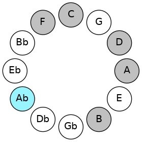 |  |
## Relative Modes

| Number | Mode | Tonic | Notes | Illustration |
|--------|------|-------|-------|--------------|
| [603](https://ianring.com/musictheory/scales/603) | [Aeolygimic](ModeAeolygimic.md) | G# | G#, A, B, C, D, E#, G# |  |
| [603](https://ianring.com/musictheory/scales/603) | [Aeolygimic](ModeAeolygimic.md) | Ab | Ab, Bbb, Cb, Dbb, Ebb, F, Ab |  |
| [2349](https://ianring.com/musictheory/scales/2349) | [Aerogimic](ModeAerogimic.md) | A | A, B, C, D, E#, F###, A |  |
| [1611](https://ianring.com/musictheory/scales/1611) | [Dacrimic](ModeDacrimic.md) | B | B, C, D, E#, F###, G##, B |  |
| [2853](https://ianring.com/musictheory/scales/2853) | [Baptimic](ModeBaptimic.md) | C | C, D, E#, F###, G##, A##, C |  |
| [1737](https://ianring.com/musictheory/scales/1737) | [Thalimic](ModeThalimic.md) | D | D, E#, F###, G##, A##, B#, D |  |
| [729](https://ianring.com/musictheory/scales/729) | [Stygimic](ModeStygimic.md) | F | F, G#, A, B, C, D, F |  |
## Relative Brightness

| Number | Mode | Tonic | Notes | Circle Of Fifth | Chromatic Circle |
|--------|------|-------|-------|-----------------|------------------|
| [603](https://ianring.com/musictheory/scales/603) | [Aeolygimic](ModeAeolygimic.md) | G# | G#, A, B, C, D, E#, G# |  | 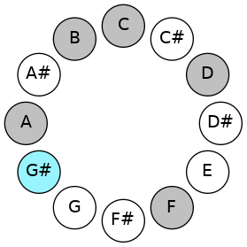 |
| [603](https://ianring.com/musictheory/scales/603) | [Aeolygimic](ModeAeolygimic.md) | Ab | Ab, Bbb, Cb, Dbb, Ebb, F, Ab |  |  |
| [2349](https://ianring.com/musictheory/scales/2349) | [Aerogimic](ModeAerogimic.md) | A | A, B, C, D, E#, F###, A | 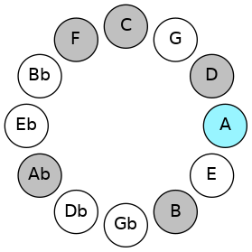 | 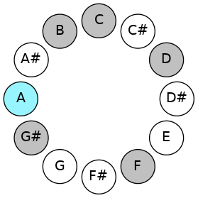 |
| [1611](https://ianring.com/musictheory/scales/1611) | [Dacrimic](ModeDacrimic.md) | B | B, C, D, E#, F###, G##, B | 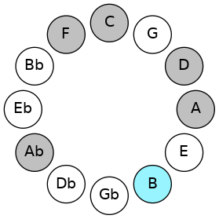 | 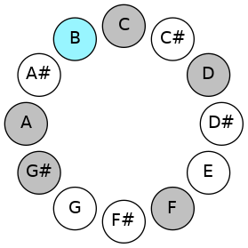 |
| [2853](https://ianring.com/musictheory/scales/2853) | [Baptimic](ModeBaptimic.md) | C | C, D, E#, F###, G##, A##, C | 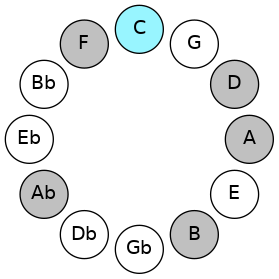 | 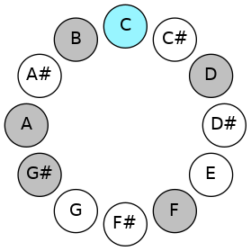 |
| [1737](https://ianring.com/musictheory/scales/1737) | [Thalimic](ModeThalimic.md) | D | D, E#, F###, G##, A##, B#, D | 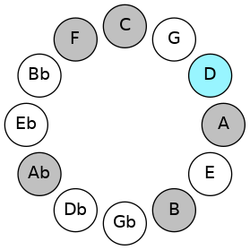 | 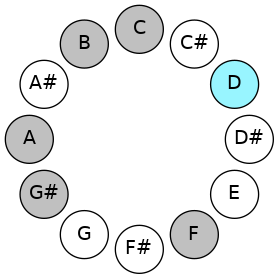 |
| [729](https://ianring.com/musictheory/scales/729) | [Stygimic](ModeStygimic.md) | F | F, G#, A, B, C, D, F | 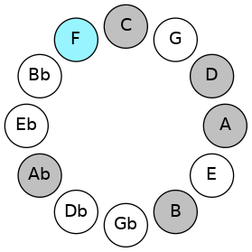 | 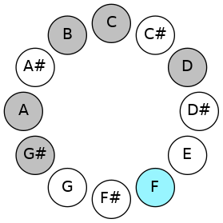 |

## Chords

### Ab

| Number | Root | Name | Notes | Illustration | Audio |
|--------|------|------|-------|--------------|-------|
| 772 | Ab | [G#loc](ChordGSharpLocrian.md) | G#, A, D |  | [midi](ChordGSharpLocrianRootPosition.mid) |
| 772 | Ab | [Abloc](ChordAFlatLocrian.md) | Ab, Bbb, Ebb |  | [midi](ChordAFlatLocrianRootPosition.mid) |
| 2308 | Ab | [G#o](ChordGSharpDiminished.md) | G#, B, D |  | [midi](ChordGSharpDiminishedRootPosition.mid) |
| 2308 | Ab | [Abo](ChordAFlatDiminished.md) | Ab, Cb, Ebb |  | [midi](ChordAFlatDiminishedRootPosition.mid) |
| 261 | Ab | [G#Mb5](ChordGSharpMajorFlatFifth.md) | G#, B#, D |  | [midi](ChordGSharpMajorFlatFifthRootPosition.mid) |
| 261 | Ab | [AbMb5](ChordAFlatMajorFlatFifth.md) | Ab, C, Ebb |  | [midi](ChordAFlatMajorFlatFifthRootPosition.mid) |
| 289 | Ab | [G#M##5](ChordGSharpMajorDoubleSharpFifth.md) | G#, B#, E# |  | [midi](ChordGSharpMajorDoubleSharpFifthRootPosition.mid) |
| 289 | Ab | [AbM##5](ChordAFlatMajorDoubleSharpFifth.md) | Ab, C, F |  | [midi](ChordAFlatMajorDoubleSharpFifthRootPosition.mid) |
| 2340 | Ab | [G#o7](ChordGSharpFullDiminishedSeventh.md) | G#, B, D, F |  | [midi](ChordGSharpFullDiminishedSeventhRootPosition.mid) |
| 2340 | Ab | [Abo7](ChordAFlatFullDiminishedSeventh.md) | Ab, Cb, Ebb, Gbb |  | [midi](ChordAFlatFullDiminishedSeventhRootPosition.mid) |
| 293 | Ab | [G#M6b5](ChordGSharpMajorSixthFlatFifth.md) | G#, B#, D, E# |  | [midi](ChordGSharpMajorSixthFlatFifthRootPosition.mid) |
| 293 | Ab | [AbM6b5](ChordAFlatMajorSixthFlatFifth.md) | Ab, C, Ebb, F |  | [midi](ChordAFlatMajorSixthFlatFifthRootPosition.mid) |

### Bbb

| Number | Root | Name | Notes | Illustration | Audio |
|--------|------|------|-------|--------------|-------|
| 2564 | Bbb | [Asus2bb5](ChordANaturalSuspendedSecondDoubleFlatFifth.md) | A, B, D |  | [midi](ChordANaturalSuspendedSecondDoubleFlatFifthRootPosition.mid) |
| 517 | Bbb | [Ambb5](ChordANaturalMinorDoubleFlatFifth.md) | A, C, D |  | [midi](ChordANaturalMinorDoubleFlatFifthRootPosition.mid) |
| 2592 | Bbb | [Asus2#5](ChordANaturalSuspendedSecondSharpFifth.md) | A, B, E# |  | [midi](ChordANaturalSuspendedSecondSharpFifthRootPosition.mid) |
| 545 | Bbb | [Am#5](ChordANaturalMinorSharpFifth.md) | A, C, F |  | [midi](ChordANaturalMinorSharpFifthRootPosition.mid) |
| 548 | Bbb | [Asus4#5](ChordANaturalSuspendedFourthSharpFifth.md) | A, D, E# |  | [midi](ChordANaturalSuspendedFourthSharpFifthRootPosition.mid) |
| 772 | Bbb | [AQ+](ChordANaturalQuartalAugmented.md) | A, D, G# |  | [midi](ChordANaturalQuartalAugmentedRootPosition.mid) |
| 804 | Bbb | [AM7(sus4)#5](ChordANaturalMajorSeventhSuspendedFourthSharpFifth.md) | A, D, E#, G# |  | [midi](ChordANaturalMajorSeventhSuspendedFourthSharpFifthRootPosition.mid) |

### Cb

| Number | Root | Name | Notes | Illustration | Audio |
|--------|------|------|-------|--------------|-------|
| 2081 | Cb | [Bloc](ChordBNaturalLocrian.md) | B, C, F |  | [midi](ChordBNaturalLocrianRootPosition.mid) |
| 2084 | Cb | [Bo](ChordBNaturalDiminished.md) | B, D, F |  | [midi](ChordBNaturalDiminishedRootPosition.mid) |
| 2340 | Cb | [Bo7](ChordBNaturalFullDiminishedSeventh.md) | B, D, F, Ab |  | [midi](ChordBNaturalFullDiminishedSeventhRootPosition.mid) |
| 2596 | Cb | [Bø7](ChordBNaturalHalfDiminishedSeventh.md) | B, D, F, A |  | [midi](ChordBNaturalHalfDiminishedSeventhRootPosition.mid) |

### Dbb

| Number | Root | Name | Notes | Illustration | Audio |
|--------|------|------|-------|--------------|-------|
| 37 | Dbb | [Csus2bb5](ChordCNaturalSuspendedSecondDoubleFlatFifth.md) | C, D, F |  | [midi](ChordCNaturalSuspendedSecondDoubleFlatFifthRootPosition.mid) |
| 261 | Dbb | [Csus2#5](ChordCNaturalSuspendedSecondSharpFifth.md) | C, D, G# |  | [midi](ChordCNaturalSuspendedSecondSharpFifthRootPosition.mid) |
| 289 | Dbb | [Csus4#5](ChordCNaturalSuspendedFourthSharpFifth.md) | C, F, G# |  | [midi](ChordCNaturalSuspendedFourthSharpFifthRootPosition.mid) |
| 545 | Dbb | [Csus4##5](ChordCNaturalSuspendedFourthDoubleSharpFifth.md) | C, F, A |  | [midi](ChordCNaturalSuspendedFourthDoubleSharpFifthRootPosition.mid) |
| 549 | Dbb | [CM6sus2bb5](ChordCNaturalMajorSixthSuspendedSecondDoubleFlatFifth.md) | C, D, F, A |  | [midi](ChordCNaturalMajorSixthSuspendedSecondDoubleFlatFifthRootPosition.mid) |
| 2081 | Dbb | [CQ+](ChordCNaturalQuartalAugmented.md) | C, F, B |  | [midi](ChordCNaturalQuartalAugmentedRootPosition.mid) |
| 2337 | Dbb | [CM7(sus4)#5](ChordCNaturalMajorSeventhSuspendedFourthSharpFifth.md) | C, F, G#, B |  | [midi](ChordCNaturalMajorSeventhSuspendedFourthSharpFifthRootPosition.mid) |
| 2593 | Dbb | [CM7(sus4)##5](ChordCNaturalMajorSeventhSuspendedFourthDoubleSharpFifth.md) | C, F, A, B |  | [midi](ChordCNaturalMajorSeventhSuspendedFourthDoubleSharpFifthRootPosition.mid) |

### Ebb

| Number | Root | Name | Notes | Illustration | Audio |
|--------|------|------|-------|--------------|-------|
| 292 | Ebb | [Do](ChordDNaturalDiminished.md) | D, F, Ab |  | [midi](ChordDNaturalDiminishedRootPosition.mid) |
| 516 | Ebb | [D5](ChordDNaturalPowerChord.md) | D, A |  | [midi](ChordDNaturalPowerChordRootPosition.mid) |
| 548 | Ebb | [Dm](ChordDNaturalMinor.md) | D, F, A |  | [midi](ChordDNaturalMinorRootPosition.mid) |
| 548 | Ebb | [Dm(add(#9))](ChordDNaturalMinorAddSharpNinth.md) | D, F, A, E# |  | [midi](ChordDNaturalMinorAddSharpNinthRootPosition.mid) |
| 772 | Ebb | [Dlyd](ChordDNaturalLydian.md) | D, G#, A |  | [midi](ChordDNaturalLydianRootPosition.mid) |
| 804 | Ebb | [Dm(add(#4))](ChordDNaturalMinorAddSharpFourth.md) | D, F, G#, A |  | [midi](ChordDNaturalMinorAddSharpFourthRootPosition.mid) |
| 2340 | Ebb | [Do7](ChordDNaturalFullDiminishedSeventh.md) | D, F, Ab, Cb |  | [midi](ChordDNaturalFullDiminishedSeventhRootPosition.mid) |
| 2596 | Ebb | [Dm6](ChordDNaturalMinorSixth.md) | D, F, A, B |  | [midi](ChordDNaturalMinorSixthRootPosition.mid) |
| 293 | Ebb | [Dø7](ChordDNaturalHalfDiminishedSeventh.md) | D, F, Ab, C |  | [midi](ChordDNaturalHalfDiminishedSeventhRootPosition.mid) |
| 549 | Ebb | [Dm7](ChordDNaturalMinorSeventh.md) | D, F, A, C |  | [midi](ChordDNaturalMinorSeventhRootPosition.mid) |
| 805 | Ebb | [Dm7add(#11)](ChordDNaturalMinorSeventhAddSharpEleventh.md) | D, F, A, C, G# |  | [midi](ChordDNaturalMinorSeventhAddSharpEleventhRootPosition.mid) |
| 2597 | Ebb | [Dm7add13](ChordDNaturalMinorSeventhAddThirteenth.md) | D, F, A, C, B |  | [midi](ChordDNaturalMinorSeventhAddThirteenthRootPosition.mid) |

### F

| Number | Root | Name | Notes | Illustration | Audio |
|--------|------|------|-------|--------------|-------|
| 2336 | F | [Fo](ChordFNaturalDiminished.md) | F, Ab, Cb |  | [midi](ChordFNaturalDiminishedRootPosition.mid) |
| 2592 | F | [FMb5](ChordFNaturalMajorFlatFifth.md) | F, A, Cb |  | [midi](ChordFNaturalMajorFlatFifthRootPosition.mid) |
| 33 | F | [F5](ChordFNaturalPowerChord.md) | F, C |  | [midi](ChordFNaturalPowerChordRootPosition.mid) |
| 289 | F | [Fm](ChordFNaturalMinor.md) | F, Ab, C |  | [midi](ChordFNaturalMinorRootPosition.mid) |
| 289 | F | [Fm(add(#9))](ChordFNaturalMinorAddSharpNinth.md) | F, Ab, C, G# |  | [midi](ChordFNaturalMinorAddSharpNinthRootPosition.mid) |
| 545 | F | [FM](ChordFNaturalMajor.md) | F, A, C |  | [midi](ChordFNaturalMajorRootPosition.mid) |
| 801 | F | [FM(add(#9))](ChordFNaturalMajorAddSharpNinth.md) | F, A, C, G# |  | [midi](ChordFNaturalMajorAddSharpNinthRootPosition.mid) |
| 2081 | F | [Flyd](ChordFNaturalLydian.md) | F, B, C |  | [midi](ChordFNaturalLydianRootPosition.mid) |
| 2337 | F | [Fm(add(#4))](ChordFNaturalMinorAddSharpFourth.md) | F, Ab, B, C |  | [midi](ChordFNaturalMinorAddSharpFourthRootPosition.mid) |
| 2593 | F | [FM(add(#4))](ChordFNaturalMajorAddSharpFourth.md) | F, A, B, C |  | [midi](ChordFNaturalMajorAddSharpFourthRootPosition.mid) |
| 548 | F | [FM##5](ChordFNaturalMajorDoubleSharpFifth.md) | F, A, D |  | [midi](ChordFNaturalMajorDoubleSharpFifthRootPosition.mid) |
| 2340 | F | [Fo7](ChordFNaturalFullDiminishedSeventh.md) | F, Ab, Cb, Ebb |  | [midi](ChordFNaturalFullDiminishedSeventhRootPosition.mid) |
| 2596 | F | [FM6b5](ChordFNaturalMajorSixthFlatFifth.md) | F, A, Cb, D |  | [midi](ChordFNaturalMajorSixthFlatFifthRootPosition.mid) |
| 293 | F | [Fm6](ChordFNaturalMinorSixth.md) | F, Ab, C, D |  | [midi](ChordFNaturalMinorSixthRootPosition.mid) |
| 549 | F | [FM6](ChordFNaturalMajorSixth.md) | F, A, C, D |  | [midi](ChordFNaturalMajorSixthRootPosition.mid) |

