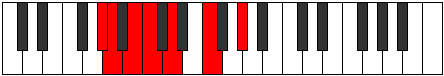
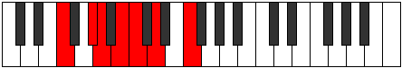

# Mode AFlatAeolygimic

## Links

- [Documentation](index.md)
- [Scales Index](Scales.md)
- [Modes Index](Modes.md)
- [Chords Index](Chords.md)

## Scale

[Thalimic](ScaleThalimic.md)

## Mode

[AFlatAeolygimic](ModeAFlatAeolygimic.md)

## Tonic

Ab

## Signature

[CNaturalMajor]

## Interval Pattern

1, 2, 1, 2, 3, 3

## Perfection

 - 2 Perfect Notes

 - 4 Imperfect Notes

## Notes

- Ab (Imperfect)
- Bbb (Imperfect)
- Cb (Imperfect)
- Dbb (Imperfect)
- Ebb
- F
- Ab (Imperfect)

## Illustration

## Relative Modes

| Number | Mode | Tonic | Notes | Illustration |
|--------|------|-------|-------|--------------|
| [603](https://ianring.com/musictheory/scales/603) | [Aeolygimic](ModeAeolygimic.md) | Ab | Ab, Bbb, Cb, Dbb, Ebb, F, Ab |  |
| [729](https://ianring.com/musictheory/scales/729) | [Stygimic](ModeStygimic.md) | F | F, G#, A, B, C, D, F |  |

## Chords

### Ab

| Number | Root | Name | Notes | Illustration | Audio |
|--------|------|------|-------|--------------|-------|
| 772 | Ab | [Abloc](ChordAFlatLocrian.md) | Ab, Bbb, Ebb |  | [midi](ChordAFlatLocrianRootPosition.mid) |
| 2308 | Ab | [Abo](ChordAFlatDiminished.md) | Ab, Cb, Ebb |  | [midi](ChordAFlatDiminishedRootPosition.mid) |
| 261 | Ab | [AbMb5](ChordAFlatMajorFlatFifth.md) | Ab, C, Ebb |  | [midi](ChordAFlatMajorFlatFifthRootPosition.mid) |
| 289 | Ab | [AbM##5](ChordAFlatMajorDoubleSharpFifth.md) | Ab, C, F |  | [midi](ChordAFlatMajorDoubleSharpFifthRootPosition.mid) |
| 2340 | Ab | [Abo7](ChordAFlatFullDiminishedSeventh.md) | Ab, Cb, Ebb, Gbb |  | [midi](ChordAFlatFullDiminishedSeventhRootPosition.mid) |
| 293 | Ab | [AbM6b5](ChordAFlatMajorSixthFlatFifth.md) | Ab, C, Ebb, F |  | [midi](ChordAFlatMajorSixthFlatFifthRootPosition.mid) |

### Bbb

| Number | Root | Name | Notes | Illustration | Audio |
|--------|------|------|-------|--------------|-------|

### Cb

| Number | Root | Name | Notes | Illustration | Audio |
|--------|------|------|-------|--------------|-------|

### Dbb

| Number | Root | Name | Notes | Illustration | Audio |
|--------|------|------|-------|--------------|-------|

### Ebb

| Number | Root | Name | Notes | Illustration | Audio |
|--------|------|------|-------|--------------|-------|

### F

| Number | Root | Name | Notes | Illustration | Audio |
|--------|------|------|-------|--------------|-------|
| 2336 | F | [Fo](ChordFNaturalDiminished.md) | F, Ab, Cb |  | [midi](ChordFNaturalDiminishedRootPosition.mid) |
| 2592 | F | [FMb5](ChordFNaturalMajorFlatFifth.md) | F, A, Cb |  | [midi](ChordFNaturalMajorFlatFifthRootPosition.mid) |
| 33 | F | [F5](ChordFNaturalPowerChord.md) | F, C |  | [midi](ChordFNaturalPowerChordRootPosition.mid) |
| 289 | F | [Fm](ChordFNaturalMinor.md) | F, Ab, C |  | [midi](ChordFNaturalMinorRootPosition.mid) |
| 289 | F | [Fm(add(#9))](ChordFNaturalMinorAddSharpNinth.md) | F, Ab, C, G# |  | [midi](ChordFNaturalMinorAddSharpNinthRootPosition.mid) |
| 545 | F | [FM](ChordFNaturalMajor.md) | F, A, C |  | [midi](ChordFNaturalMajorRootPosition.mid) |
| 801 | F | [FM(add(#9))](ChordFNaturalMajorAddSharpNinth.md) | F, A, C, G# |  | [midi](ChordFNaturalMajorAddSharpNinthRootPosition.mid) |
| 2081 | F | [Flyd](ChordFNaturalLydian.md) | F, B, C |  | [midi](ChordFNaturalLydianRootPosition.mid) |
| 2337 | F | [Fm(add(#4))](ChordFNaturalMinorAddSharpFourth.md) | F, Ab, B, C |  | [midi](ChordFNaturalMinorAddSharpFourthRootPosition.mid) |
| 2593 | F | [FM(add(#4))](ChordFNaturalMajorAddSharpFourth.md) | F, A, B, C |  | [midi](ChordFNaturalMajorAddSharpFourthRootPosition.mid) |
| 548 | F | [FM##5](ChordFNaturalMajorDoubleSharpFifth.md) | F, A, D |  | [midi](ChordFNaturalMajorDoubleSharpFifthRootPosition.mid) |
| 2340 | F | [Fo7](ChordFNaturalFullDiminishedSeventh.md) | F, Ab, Cb, Ebb |  | [midi](ChordFNaturalFullDiminishedSeventhRootPosition.mid) |
| 2596 | F | [FM6b5](ChordFNaturalMajorSixthFlatFifth.md) | F, A, Cb, D |  | [midi](ChordFNaturalMajorSixthFlatFifthRootPosition.mid) |
| 293 | F | [Fm6](ChordFNaturalMinorSixth.md) | F, Ab, C, D |  | [midi](ChordFNaturalMinorSixthRootPosition.mid) |
| 549 | F | [FM6](ChordFNaturalMajorSixth.md) | F, A, C, D |  | [midi](ChordFNaturalMajorSixthRootPosition.mid) |

