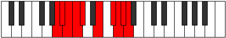

# Mode AFlatAeolynygic

## Links

- [Documentation](index.md)
- [Scales Index](Scales.md)
- [Modes Index](Modes.md)
- [Chords Index](Chords.md)

## Scale

[Sathygic](ScaleSathygic.md)

## Mode

[AFlatAeolynygic](ModeAFlatAeolynygic.md)

## Tonic

Ab

## Signature

[CNaturalMajor]

## Perfection

 - 6 Perfect Notes

 - 3 Imperfect Notes

## Notes

- Ab (Imperfect)
- A
- Bb (Imperfect)
- B
- C
- Db
- E
- Gb
- G (Imperfect)
- Ab (Imperfect)

## Illustration

## Relative Modes

| Number | Mode | Tonic | Notes | Illustration |
|--------|------|-------|-------|--------------|
| [1021](https://ianring.com/musictheory/scales/1021) | [Ladygic](ModeLadygic.md) | E | E, F#, G, G#, A, A#, B, C, C#, E |  |
| [1279](https://ianring.com/musictheory/scales/1279) | [Sarygic](ModeSarygic.md) | F# | F#, G, G#, A, A#, B, C, C#, E, F# |  |
| [1279](https://ianring.com/musictheory/scales/1279) | [Sarygic](ModeSarygic.md) | Gb | Gb, G, Ab, A, Bb, B, C, Db, E, Gb |  |
| [2687](https://ianring.com/musictheory/scales/2687) | [Thacrygic](ModeThacrygic.md) | G | G, G#, A, A#, B, C, C#, E, F#, G |  |
| [3391](https://ianring.com/musictheory/scales/3391) | [Aeolynygic](ModeAeolynygic.md) | G# | G#, A, A#, B, C, C#, E, F#, G, G# |  |
| [3391](https://ianring.com/musictheory/scales/3391) | [Aeolynygic](ModeAeolynygic.md) | Ab | Ab, A, Bb, B, C, Db, E, Gb, G, Ab |  |
| [3743](https://ianring.com/musictheory/scales/3743) | [Thadygic](ModeThadygic.md) | A | A, A#, B, C, C#, E, F#, G, G#, A |  |
| [3919](https://ianring.com/musictheory/scales/3919) | [Lynygic](ModeLynygic.md) | A# | A#, B, C, C#, E, F#, G, G#, A, A# |  |
| [3919](https://ianring.com/musictheory/scales/3919) | [Lynygic](ModeLynygic.md) | Bb | Bb, B, C, Db, E, Gb, G, Ab, A, Bb |  |
| [4007](https://ianring.com/musictheory/scales/4007) | [Doptygic](ModeDoptygic.md) | B | B, C, C#, E, F#, G, G#, A, A#, B |  |
| [4051](https://ianring.com/musictheory/scales/4051) | [Ionilygic](ModeIonilygic.md) | C | C, C#, E, F#, G, G#, A, A#, B, C |  |
| [4073](https://ianring.com/musictheory/scales/4073) | [Sathygic](ModeSathygic.md) | C# | C#, E, F#, G, G#, A, A#, B, C, C# |  |
| [4073](https://ianring.com/musictheory/scales/4073) | [Sathygic](ModeSathygic.md) | Db | Db, E, Gb, G, Ab, A, Bb, B, C, Db |  |

## Chords

### Ab

| Number | Root | Name | Notes | Illustration | Audio |
|--------|------|------|-------|--------------|-------|

### A

| Number | Root | Name | Notes | Illustration | Audio |
|--------|------|------|-------|--------------|-------|
| 528 | A | [A5](ChordANaturalPowerChord.md) | A, E |  | [midi](ChordANaturalPowerChordRootPosition.mid) [ogg](ChordANaturalPowerChordRootPosition.ogg) |
| 1552 | A | [Aphryg](ChordANaturalPhrygian.md) | A, Bb, E |  | [midi](ChordANaturalPhrygianRootPosition.mid) [ogg](ChordANaturalPhrygianRootPosition.ogg) |
| 2576 | A | [Asus2](ChordANaturalSuspendedSecond.md) | A, B, E |  | [midi](ChordANaturalSuspendedSecondRootPosition.mid) [ogg](ChordANaturalSuspendedSecondRootPosition.ogg) |
| 529 | A | [Am](ChordANaturalMinor.md) | A, C, E |  | [midi](ChordANaturalMinorRootPosition.mid) [ogg](ChordANaturalMinorRootPosition.ogg) |
| 529 | A | [Am(add(#9))](ChordANaturalMinorAddSharpNinth.md) | A, C, E, B# |  | [midi](ChordANaturalMinorAddSharpNinthRootPosition.mid) [ogg](ChordANaturalMinorAddSharpNinthRootPosition.ogg) |
| 2577 | A | [Am(add9)](ChordANaturalMinorAddNinth.md) | A, C, E, B |  | [midi](ChordANaturalMinorAddNinthRootPosition.mid) [ogg](ChordANaturalMinorAddNinthRootPosition.ogg) |
| 530 | A | [AM](ChordANaturalMajor.md) | A, C#, E |  | [midi](ChordANaturalMajorRootPosition.mid) [ogg](ChordANaturalMajorRootPosition.ogg) |
| 2578 | A | [AM(add9)](ChordANaturalMajorAddNinth.md) | A, C#, E, B |  | [midi](ChordANaturalMajorAddNinthRootPosition.mid) [ogg](ChordANaturalMajorAddNinthRootPosition.ogg) |
| 531 | A | [AM(add(#9))](ChordANaturalMajorAddSharpNinth.md) | A, C#, E, B# |  | [midi](ChordANaturalMajorAddSharpNinthRootPosition.mid) [ogg](ChordANaturalMajorAddSharpNinthRootPosition.ogg) |
| 578 | A | [AM##5](ChordANaturalMajorDoubleSharpFifth.md) | A, C#, F# |  | [midi](ChordANaturalMajorDoubleSharpFifthRootPosition.mid) [ogg](ChordANaturalMajorDoubleSharpFifthRootPosition.ogg) |
| 2640 | A | [AM6sus2](ChordANaturalMajorSixthSuspendedSecond.md) | A, B, E, F# |  | [midi](ChordANaturalMajorSixthSuspendedSecondRootPosition.mid) [ogg](ChordANaturalMajorSixthSuspendedSecondRootPosition.ogg) |
| 2640 | A | [A7sus2b5](ChordANaturalDominantSeventhSuspendedSecondFlatFifth.md) | A, B, E, Gb |  | [midi](ChordANaturalDominantSeventhSuspendedSecondFlatFifthRootPosition.mid) [ogg](ChordANaturalDominantSeventhSuspendedSecondFlatFifthRootPosition.ogg) |
| 593 | A | [Am6](ChordANaturalMinorSixth.md) | A, C, E, F# |  | [midi](ChordANaturalMinorSixthRootPosition.mid) [ogg](ChordANaturalMinorSixthRootPosition.ogg) |
| 1617 | A | [Am6(addb9)](ChordANaturalMinorSixthAddFlatNinth.md) | A, C, E, F#, Bb |  | [midi](ChordANaturalMinorSixthAddFlatNinthRootPosition.mid) [ogg](ChordANaturalMinorSixthAddFlatNinthRootPosition.ogg) |
| 2641 | A | [Am6(add9)](ChordANaturalMinorSixthAddNinth.md) | A, C, E, F#, B |  | [midi](ChordANaturalMinorSixthAddNinthRootPosition.mid) [ogg](ChordANaturalMinorSixthAddNinthRootPosition.ogg) |
| 594 | A | [AM6](ChordANaturalMajorSixth.md) | A, C#, E, F# |  | [midi](ChordANaturalMajorSixthRootPosition.mid) [ogg](ChordANaturalMajorSixthRootPosition.ogg) |
| 1618 | A | [AM6(addb9)](ChordANaturalMajorSixthAddFlatNinth.md) | A, C#, E, F#, Bb |  | [midi](ChordANaturalMajorSixthAddFlatNinthRootPosition.mid) [ogg](ChordANaturalMajorSixthAddFlatNinthRootPosition.ogg) |
| 2642 | A | [AM6(add9)](ChordANaturalMajorSixthAddNinth.md) | A, C#, E, F#, B |  | [midi](ChordANaturalMajorSixthAddNinthRootPosition.mid) [ogg](ChordANaturalMajorSixthAddNinthRootPosition.ogg) |
| 2704 | A | [A7sus2](ChordANaturalDominantSeventhSuspendedSecond.md) | A, B, E, G |  | [midi](ChordANaturalDominantSeventhSuspendedSecondRootPosition.mid) [ogg](ChordANaturalDominantSeventhSuspendedSecondRootPosition.ogg) |
| 2704 | A | [A9sus2](ChordANaturalDominantNinthSuspendedSecond.md) | A, B, E, G, B |  | [midi](ChordANaturalDominantNinthSuspendedSecondRootPosition.mid) [ogg](ChordANaturalDominantNinthSuspendedSecondRootPosition.ogg) |
| 657 | A | [Am7](ChordANaturalMinorSeventh.md) | A, C, E, G |  | [midi](ChordANaturalMinorSeventhRootPosition.mid) [ogg](ChordANaturalMinorSeventhRootPosition.ogg) |
| 1681 | A | [Am7b9](ChordANaturalMinorSeventhFlatNinth.md) | A, C, E, G, Bb |  | [midi](ChordANaturalMinorSeventhFlatNinthRootPosition.mid) [ogg](ChordANaturalMinorSeventhFlatNinthRootPosition.ogg) |
| 2705 | A | [Am9](ChordANaturalMinorNinth.md) | A, C, E, G, B |  | [midi](ChordANaturalMinorNinthRootPosition.mid) [ogg](ChordANaturalMinorNinthRootPosition.ogg) |
| 658 | A | [A7](ChordANaturalDominantSeventh.md) | A, C#, E, G |  | [midi](ChordANaturalDominantSeventhRootPosition.mid) [ogg](ChordANaturalDominantSeventhRootPosition.ogg) |
| 1682 | A | [A7b9](ChordANaturalDominantSeventhFlatNinth.md) | A, C#, E, G, Bb |  | [midi](ChordANaturalDominantSeventhFlatNinthRootPosition.mid) [ogg](ChordANaturalDominantSeventhFlatNinthRootPosition.ogg) |
| 2706 | A | [A9](ChordANaturalDominantNinth.md) | A, C#, E, G, B |  | [midi](ChordANaturalDominantNinthRootPosition.mid) [ogg](ChordANaturalDominantNinthRootPosition.ogg) |
| 659 | A | [A7#9](ChordANaturalDominantSeventhSharpNinth.md) | A, C#, E, G, B# |  | [midi](ChordANaturalDominantSeventhSharpNinthRootPosition.mid) [ogg](ChordANaturalDominantSeventhSharpNinthRootPosition.ogg) |
| 721 | A | [Am7add13](ChordANaturalMinorSeventhAddThirteenth.md) | A, C, E, G, F# |  | [midi](ChordANaturalMinorSeventhAddThirteenthRootPosition.mid) [ogg](ChordANaturalMinorSeventhAddThirteenthRootPosition.ogg) |
| 722 | A | [A7add13](ChordANaturalDominantSeventhAddThirteenth.md) | A, C#, E, G, F# |  | [midi](ChordANaturalDominantSeventhAddThirteenthRootPosition.mid) [ogg](ChordANaturalDominantSeventhAddThirteenthRootPosition.ogg) |
| 1808 | A | [Aphryg+7](ChordANaturalPhrygianAddSeventh.md) | A, Bb, E, G# |  | [midi](ChordANaturalPhrygianAddSeventhRootPosition.mid) [ogg](ChordANaturalPhrygianAddSeventhRootPosition.ogg) |
| 2832 | A | [AM7(sus2)](ChordANaturalMajorSeventhSuspendedSecond.md) | A, B, E, G# |  | [midi](ChordANaturalMajorSeventhSuspendedSecondRootPosition.mid) [ogg](ChordANaturalMajorSeventhSuspendedSecondRootPosition.ogg) |
| 2832 | A | [AM9sus2](ChordANaturalMajorNinthSuspendedSecond.md) | A, B, E, G#, B |  | [midi](ChordANaturalMajorNinthSuspendedSecondRootPosition.mid) [ogg](ChordANaturalMajorNinthSuspendedSecondRootPosition.ogg) |
| 785 | A | [Am(M7)](ChordANaturalMinorMajorSeventh.md) | A, C, E, G# |  | [midi](ChordANaturalMinorMajorSeventhRootPosition.mid) [ogg](ChordANaturalMinorMajorSeventhRootPosition.ogg) |
| 2833 | A | [Am(M9)](ChordANaturalMinorMajorNinth.md) | A, C, E, G#, B |  | [midi](ChordANaturalMinorMajorNinthRootPosition.mid) [ogg](ChordANaturalMinorMajorNinthRootPosition.ogg) |
| 786 | A | [AM7](ChordANaturalMajorSeventh.md) | A, C#, E, G# |  | [midi](ChordANaturalMajorSeventhRootPosition.mid) [ogg](ChordANaturalMajorSeventhRootPosition.ogg) |
| 2834 | A | [AM9](ChordANaturalMajorNinth.md) | A, C#, E, G#, B |  | [midi](ChordANaturalMajorNinthRootPosition.mid) [ogg](ChordANaturalMajorNinthRootPosition.ogg) |
| 834 | A | [AM7##5](ChordANaturalMajorSeventhDoubleSharpFifth.md) | A, C#, F#, G# |  | [midi](ChordANaturalMajorSeventhDoubleSharpFifthRootPosition.mid) [ogg](ChordANaturalMajorSeventhDoubleSharpFifthRootPosition.ogg) |
| 849 | A | [Am(M7)add13](ChordANaturalMinorMajorSeventhAddThirteenth.md) | A, C, E, G#, F# |  | [midi](ChordANaturalMinorMajorSeventhAddThirteenthRootPosition.mid) [ogg](ChordANaturalMinorMajorSeventhAddThirteenthRootPosition.ogg) |
| 850 | A | [AM7add13](ChordANaturalMajorSeventhAddThirteenth.md) | A, C#, E, G#, F# |  | [midi](ChordANaturalMajorSeventhAddThirteenthRootPosition.mid) [ogg](ChordANaturalMajorSeventhAddThirteenthRootPosition.ogg) |

### Bb

| Number | Root | Name | Notes | Illustration | Audio |
|--------|------|------|-------|--------------|-------|

### B

| Number | Root | Name | Notes | Illustration | Audio |
|--------|------|------|-------|--------------|-------|
| 2066 | B | [Bsus2bb5](ChordBNaturalSuspendedSecondDoubleFlatFifth.md) | B, C#, E |  | [midi](ChordBNaturalSuspendedSecondDoubleFlatFifthRootPosition.mid) [ogg](ChordBNaturalSuspendedSecondDoubleFlatFifthRootPosition.ogg) |
| 2112 | B | [B5](ChordBNaturalPowerChord.md) | B, F# |  | [midi](ChordBNaturalPowerChordRootPosition.mid) [ogg](ChordBNaturalPowerChordRootPosition.ogg) |
| 2113 | B | [Bphryg](ChordBNaturalPhrygian.md) | B, C, F# |  | [midi](ChordBNaturalPhrygianRootPosition.mid) [ogg](ChordBNaturalPhrygianRootPosition.ogg) |
| 2114 | B | [Bsus2](ChordBNaturalSuspendedSecond.md) | B, C#, F# |  | [midi](ChordBNaturalSuspendedSecondRootPosition.mid) [ogg](ChordBNaturalSuspendedSecondRootPosition.ogg) |
| 2128 | B | [Bsus4](ChordBNaturalSuspendedFourth.md) | B, E, F# |  | [midi](ChordBNaturalSuspendedFourthRootPosition.mid) [ogg](ChordBNaturalSuspendedFourthRootPosition.ogg) |
| 2178 | B | [Bsus2#5](ChordBNaturalSuspendedSecondSharpFifth.md) | B, C#, F## |  | [midi](ChordBNaturalSuspendedSecondSharpFifthRootPosition.mid) [ogg](ChordBNaturalSuspendedSecondSharpFifthRootPosition.ogg) |
| 2192 | B | [Bsus4#5](ChordBNaturalSuspendedFourthSharpFifth.md) | B, E, F## |  | [midi](ChordBNaturalSuspendedFourthSharpFifthRootPosition.mid) [ogg](ChordBNaturalSuspendedFourthSharpFifthRootPosition.ogg) |
| 2320 | B | [Bsus4##5](ChordBNaturalSuspendedFourthDoubleSharpFifth.md) | B, E, G# |  | [midi](ChordBNaturalSuspendedFourthDoubleSharpFifthRootPosition.mid) [ogg](ChordBNaturalSuspendedFourthDoubleSharpFifthRootPosition.ogg) |
| 2322 | B | [BM6sus2bb5](ChordBNaturalMajorSixthSuspendedSecondDoubleFlatFifth.md) | B, C#, E, G# |  | [midi](ChordBNaturalMajorSixthSuspendedSecondDoubleFlatFifthRootPosition.mid) [ogg](ChordBNaturalMajorSixthSuspendedSecondDoubleFlatFifthRootPosition.ogg) |
| 2370 | B | [BM6sus2](ChordBNaturalMajorSixthSuspendedSecond.md) | B, C#, F#, G# |  | [midi](ChordBNaturalMajorSixthSuspendedSecondRootPosition.mid) [ogg](ChordBNaturalMajorSixthSuspendedSecondRootPosition.ogg) |
| 2370 | B | [B7sus2b5](ChordBNaturalDominantSeventhSuspendedSecondFlatFifth.md) | B, C#, F#, Ab |  | [midi](ChordBNaturalDominantSeventhSuspendedSecondFlatFifthRootPosition.mid) [ogg](ChordBNaturalDominantSeventhSuspendedSecondFlatFifthRootPosition.ogg) |
| 2384 | B | [BM6sus4](ChordBNaturalMajorSixthSuspendedFourth.md) | B, E, F#, G# |  | [midi](ChordBNaturalMajorSixthSuspendedFourthRootPosition.mid) [ogg](ChordBNaturalMajorSixthSuspendedFourthRootPosition.ogg) |
| 2576 | B | [BQ](ChordBNaturalQuartal.md) | B, E, A |  | [midi](ChordBNaturalQuartalRootPosition.mid) [ogg](ChordBNaturalQuartalRootPosition.ogg) |
| 2626 | B | [B7sus2](ChordBNaturalDominantSeventhSuspendedSecond.md) | B, C#, F#, A |  | [midi](ChordBNaturalDominantSeventhSuspendedSecondRootPosition.mid) [ogg](ChordBNaturalDominantSeventhSuspendedSecondRootPosition.ogg) |
| 2626 | B | [B9sus2](ChordBNaturalDominantNinthSuspendedSecond.md) | B, C#, F#, A, C# |  | [midi](ChordBNaturalDominantNinthSuspendedSecondRootPosition.mid) [ogg](ChordBNaturalDominantNinthSuspendedSecondRootPosition.ogg) |
| 2640 | B | [B7sus4](ChordBNaturalDominantSeventhSuspendedFourth.md) | B, E, F#, A |  | [midi](ChordBNaturalDominantSeventhSuspendedFourthRootPosition.mid) [ogg](ChordBNaturalDominantSeventhSuspendedFourthRootPosition.ogg) |
| 2642 | B | [B9sus4](ChordBNaturalDominantNinthSuspendedFourth.md) | B, E, F#, A, C# |  | [midi](ChordBNaturalDominantNinthSuspendedFourthRootPosition.mid) [ogg](ChordBNaturalDominantNinthSuspendedFourthRootPosition.ogg) |
| 3088 | B | [BQ+](ChordBNaturalQuartalAugmented.md) | B, E, A# |  | [midi](ChordBNaturalQuartalAugmentedRootPosition.mid) [ogg](ChordBNaturalQuartalAugmentedRootPosition.ogg) |
| 3137 | B | [Bphryg+7](ChordBNaturalPhrygianAddSeventh.md) | B, C, F#, A# |  | [midi](ChordBNaturalPhrygianAddSeventhRootPosition.mid) [ogg](ChordBNaturalPhrygianAddSeventhRootPosition.ogg) |
| 3138 | B | [BM7(sus2)](ChordBNaturalMajorSeventhSuspendedSecond.md) | B, C#, F#, A# |  | [midi](ChordBNaturalMajorSeventhSuspendedSecondRootPosition.mid) [ogg](ChordBNaturalMajorSeventhSuspendedSecondRootPosition.ogg) |
| 3138 | B | [BM9sus2](ChordBNaturalMajorNinthSuspendedSecond.md) | B, C#, F#, A#, C# |  | [midi](ChordBNaturalMajorNinthSuspendedSecondRootPosition.mid) [ogg](ChordBNaturalMajorNinthSuspendedSecondRootPosition.ogg) |
| 3152 | B | [BM7(sus4)](ChordBNaturalMajorSeventhSuspendedFourth.md) | B, E, F#, A# |  | [midi](ChordBNaturalMajorSeventhSuspendedFourthRootPosition.mid) [ogg](ChordBNaturalMajorSeventhSuspendedFourthRootPosition.ogg) |
| 3154 | B | [BM9sus4](ChordBNaturalMajorNinthSuspendedFourth.md) | B, E, F#, A#, C# |  | [midi](ChordBNaturalMajorNinthSuspendedFourthRootPosition.mid) [ogg](ChordBNaturalMajorNinthSuspendedFourthRootPosition.ogg) |
| 3216 | B | [BM7(sus4)#5](ChordBNaturalMajorSeventhSuspendedFourthSharpFifth.md) | B, E, F##, A# |  | [midi](ChordBNaturalMajorSeventhSuspendedFourthSharpFifthRootPosition.mid) [ogg](ChordBNaturalMajorSeventhSuspendedFourthSharpFifthRootPosition.ogg) |
| 3344 | B | [BM7(sus4)##5](ChordBNaturalMajorSeventhSuspendedFourthDoubleSharpFifth.md) | B, E, G#, A# |  | [midi](ChordBNaturalMajorSeventhSuspendedFourthDoubleSharpFifthRootPosition.mid) [ogg](ChordBNaturalMajorSeventhSuspendedFourthDoubleSharpFifthRootPosition.ogg) |

### C

| Number | Root | Name | Notes | Illustration | Audio |
|--------|------|------|-------|--------------|-------|
| 67 | C | [Cloc](ChordCNaturalLocrian.md) | C, Db, Gb |  | [midi](ChordCNaturalLocrianRootPosition.mid) [ogg](ChordCNaturalLocrianRootPosition.ogg) |
| 81 | C | [CMb5](ChordCNaturalMajorFlatFifth.md) | C, E, Gb |  | [midi](ChordCNaturalMajorFlatFifthRootPosition.mid) [ogg](ChordCNaturalMajorFlatFifthRootPosition.ogg) |
| 129 | C | [C5](ChordCNaturalPowerChord.md) | C, G |  | [midi](ChordCNaturalPowerChordRootPosition.mid) [ogg](ChordCNaturalPowerChordRootPosition.ogg) |
| 131 | C | [Cphryg](ChordCNaturalPhrygian.md) | C, Db, G |  | [midi](ChordCNaturalPhrygianRootPosition.mid) [ogg](ChordCNaturalPhrygianRootPosition.ogg) |
| 145 | C | [CM](ChordCNaturalMajor.md) | C, E, G |  | [midi](ChordCNaturalMajorRootPosition.mid) [ogg](ChordCNaturalMajorRootPosition.ogg) |
| 193 | C | [Clyd](ChordCNaturalLydian.md) | C, F#, G |  | [midi](ChordCNaturalLydianRootPosition.mid) [ogg](ChordCNaturalLydianRootPosition.ogg) |
| 209 | C | [CM(add(#4))](ChordCNaturalMajorAddSharpFourth.md) | C, E, F#, G |  | [midi](ChordCNaturalMajorAddSharpFourthRootPosition.mid) [ogg](ChordCNaturalMajorAddSharpFourthRootPosition.ogg) |
| 273 | C | [C+](ChordCNaturalAugmented.md) | C, E, G# |  | [midi](ChordCNaturalAugmentedRootPosition.mid) [ogg](ChordCNaturalAugmentedRootPosition.ogg) |
| 273 | C | [C+7](ChordCNaturalAugmentedAugmentedSeventh.md) | C, E, G#, B# |  | [midi](ChordCNaturalAugmentedAugmentedSeventhRootPosition.mid) [ogg](ChordCNaturalAugmentedAugmentedSeventhRootPosition.ogg) |
| 529 | C | [CM##5](ChordCNaturalMajorDoubleSharpFifth.md) | C, E, A |  | [midi](ChordCNaturalMajorDoubleSharpFifthRootPosition.mid) [ogg](ChordCNaturalMajorDoubleSharpFifthRootPosition.ogg) |
| 593 | C | [CM6b5](ChordCNaturalMajorSixthFlatFifth.md) | C, E, Gb, A |  | [midi](ChordCNaturalMajorSixthFlatFifthRootPosition.mid) [ogg](ChordCNaturalMajorSixthFlatFifthRootPosition.ogg) |
| 657 | C | [CM6](ChordCNaturalMajorSixth.md) | C, E, G, A |  | [midi](ChordCNaturalMajorSixthRootPosition.mid) [ogg](ChordCNaturalMajorSixthRootPosition.ogg) |
| 659 | C | [CM6(addb9)](ChordCNaturalMajorSixthAddFlatNinth.md) | C, E, G, A, Db |  | [midi](ChordCNaturalMajorSixthAddFlatNinthRootPosition.mid) [ogg](ChordCNaturalMajorSixthAddFlatNinthRootPosition.ogg) |
| 1105 | C | [C7b5](ChordCNaturalDominantSeventhFlatFifth.md) | C, E, Gb, Bb |  | [midi](ChordCNaturalDominantSeventhFlatFifthRootPosition.mid) [ogg](ChordCNaturalDominantSeventhFlatFifthRootPosition.ogg) |
| 1107 | C | [C7b5b9](ChordCNaturalDominantSeventhFlatFifthFlatNinth.md) | C, E, Gb, Bb, Db |  | [midi](ChordCNaturalDominantSeventhFlatFifthFlatNinthRootPosition.mid) [ogg](ChordCNaturalDominantSeventhFlatFifthFlatNinthRootPosition.ogg) |
| 1169 | C | [C7](ChordCNaturalDominantSeventh.md) | C, E, G, Bb |  | [midi](ChordCNaturalDominantSeventhRootPosition.mid) [ogg](ChordCNaturalDominantSeventhRootPosition.ogg) |
| 1171 | C | [C7b9](ChordCNaturalDominantSeventhFlatNinth.md) | C, E, G, Bb, Db |  | [midi](ChordCNaturalDominantSeventhFlatNinthRootPosition.mid) [ogg](ChordCNaturalDominantSeventhFlatNinthRootPosition.ogg) |
| 1233 | C | [C7add(#4)](ChordCNaturalDominantSeventhAddSharpFourth.md) | C, E, F#, G, Bb |  | [midi](ChordCNaturalDominantSeventhAddSharpFourthRootPosition.mid) [ogg](ChordCNaturalDominantSeventhAddSharpFourthRootPosition.ogg) |
| 1233 | C | [C7#11](ChordCNaturalDominantSeventhSharpEleventh.md) | C, E, G, Bb, F# |  | [midi](ChordCNaturalDominantSeventhSharpEleventhRootPosition.mid) [ogg](ChordCNaturalDominantSeventhSharpEleventhRootPosition.ogg) |
| 1299 | C | [C7#5b9](ChordCNaturalDominantSeventhSharpFifthFlatNinth.md) | C, E, G#, Bb, Db |  | [midi](ChordCNaturalDominantSeventhSharpFifthFlatNinthRootPosition.mid) [ogg](ChordCNaturalDominantSeventhSharpFifthFlatNinthRootPosition.ogg) |
| 1427 | C | [C7b9b13](ChordCNaturalDominantSeventhFlatNinthFlatThirteenth.md) | C, E, G, Bb, Db, Ab |  | [midi](ChordCNaturalDominantSeventhFlatNinthFlatThirteenthRootPosition.mid) [ogg](ChordCNaturalDominantSeventhFlatNinthFlatThirteenthRootPosition.ogg) |
| 1681 | C | [C7add13](ChordCNaturalDominantSeventhAddThirteenth.md) | C, E, G, Bb, A |  | [midi](ChordCNaturalDominantSeventhAddThirteenthRootPosition.mid) [ogg](ChordCNaturalDominantSeventhAddThirteenthRootPosition.ogg) |
| 2129 | C | [CM7b5](ChordCNaturalMajorSeventhFlatFifth.md) | C, E, Gb, B |  | [midi](ChordCNaturalMajorSeventhFlatFifthRootPosition.mid) [ogg](ChordCNaturalMajorSeventhFlatFifthRootPosition.ogg) |
| 2179 | C | [Cphryg+7](ChordCNaturalPhrygianAddSeventh.md) | C, Db, G, B |  | [midi](ChordCNaturalPhrygianAddSeventhRootPosition.mid) [ogg](ChordCNaturalPhrygianAddSeventhRootPosition.ogg) |
| 2193 | C | [CM7](ChordCNaturalMajorSeventh.md) | C, E, G, B |  | [midi](ChordCNaturalMajorSeventhRootPosition.mid) [ogg](ChordCNaturalMajorSeventhRootPosition.ogg) |
| 2241 | C | [Clyd(M7)](ChordCNaturalLydianMajorSeventh.md) | C, F#, G, B |  | [midi](ChordCNaturalLydianMajorSeventhRootPosition.mid) [ogg](ChordCNaturalLydianMajorSeventhRootPosition.ogg) |
| 2257 | C | [CM7add(#11)](ChordCNaturalMajorSeventhAddSharpEleventh.md) | C, E, G, B, F# |  | [midi](ChordCNaturalMajorSeventhAddSharpEleventhRootPosition.mid) [ogg](ChordCNaturalMajorSeventhAddSharpEleventhRootPosition.ogg) |
| 2257 | C | [CM7add(#4)](ChordCNaturalMajorSeventhAddSharpFourth.md) | C, E, F#, G, B |  | [midi](ChordCNaturalMajorSeventhAddSharpFourthRootPosition.mid) [ogg](ChordCNaturalMajorSeventhAddSharpFourthRootPosition.ogg) |
| 2321 | C | [C+(M7)](ChordCNaturalAugmentedMajorSeventh.md) | C, E, G#, B |  | [midi](ChordCNaturalAugmentedMajorSeventhRootPosition.mid) [ogg](ChordCNaturalAugmentedMajorSeventhRootPosition.ogg) |
| 2577 | C | [CM7##5](ChordCNaturalMajorSeventhDoubleSharpFifth.md) | C, E, A, B |  | [midi](ChordCNaturalMajorSeventhDoubleSharpFifthRootPosition.mid) [ogg](ChordCNaturalMajorSeventhDoubleSharpFifthRootPosition.ogg) |
| 2705 | C | [CM7add13](ChordCNaturalMajorSeventhAddThirteenth.md) | C, E, G, B, A |  | [midi](ChordCNaturalMajorSeventhAddThirteenthRootPosition.mid) [ogg](ChordCNaturalMajorSeventhAddThirteenthRootPosition.ogg) |

### Db

| Number | Root | Name | Notes | Illustration | Audio |
|--------|------|------|-------|--------------|-------|

### E

| Number | Root | Name | Notes | Illustration | Audio |
|--------|------|------|-------|--------------|-------|
| 592 | E | [Esus2bb5](ChordENaturalSuspendedSecondDoubleFlatFifth.md) | E, F#, A |  | [midi](ChordENaturalSuspendedSecondDoubleFlatFifthRootPosition.mid) [ogg](ChordENaturalSuspendedSecondDoubleFlatFifthRootPosition.ogg) |
| 656 | E | [Embb5](ChordENaturalMinorDoubleFlatFifth.md) | E, G, A |  | [midi](ChordENaturalMinorDoubleFlatFifthRootPosition.mid) [ogg](ChordENaturalMinorDoubleFlatFifthRootPosition.ogg) |
| 1104 | E | [Esus2b5](ChordENaturalSuspendedSecondFlatFifth.md) | E, F#, Bb |  | [midi](ChordENaturalSuspendedSecondFlatFifthRootPosition.mid) [ogg](ChordENaturalSuspendedSecondFlatFifthRootPosition.ogg) |
| 1168 | E | [Eo](ChordENaturalDiminished.md) | E, G, Bb |  | [midi](ChordENaturalDiminishedRootPosition.mid) [ogg](ChordENaturalDiminishedRootPosition.ogg) |
| 1296 | E | [EMb5](ChordENaturalMajorFlatFifth.md) | E, G#, Bb |  | [midi](ChordENaturalMajorFlatFifthRootPosition.mid) [ogg](ChordENaturalMajorFlatFifthRootPosition.ogg) |
| 1552 | E | [Esus4b5](ChordENaturalSuspendedFourthFlatFifth.md) | E, A, Bb |  | [midi](ChordENaturalSuspendedFourthFlatFifthRootPosition.mid) [ogg](ChordENaturalSuspendedFourthFlatFifthRootPosition.ogg) |
| 2064 | E | [E5](ChordENaturalPowerChord.md) | E, B |  | [midi](ChordENaturalPowerChordRootPosition.mid) [ogg](ChordENaturalPowerChordRootPosition.ogg) |
| 2128 | E | [Esus2](ChordENaturalSuspendedSecond.md) | E, F#, B |  | [midi](ChordENaturalSuspendedSecondRootPosition.mid) [ogg](ChordENaturalSuspendedSecondRootPosition.ogg) |
| 2192 | E | [Em](ChordENaturalMinor.md) | E, G, B |  | [midi](ChordENaturalMinorRootPosition.mid) [ogg](ChordENaturalMinorRootPosition.ogg) |
| 2192 | E | [Em(add(#9))](ChordENaturalMinorAddSharpNinth.md) | E, G, B, F## |  | [midi](ChordENaturalMinorAddSharpNinthRootPosition.mid) [ogg](ChordENaturalMinorAddSharpNinthRootPosition.ogg) |
| 2256 | E | [Em(add9)](ChordENaturalMinorAddNinth.md) | E, G, B, F# |  | [midi](ChordENaturalMinorAddNinthRootPosition.mid) [ogg](ChordENaturalMinorAddNinthRootPosition.ogg) |
| 2320 | E | [EM](ChordENaturalMajor.md) | E, G#, B |  | [midi](ChordENaturalMajorRootPosition.mid) [ogg](ChordENaturalMajorRootPosition.ogg) |
| 2384 | E | [EM(add9)](ChordENaturalMajorAddNinth.md) | E, G#, B, F# |  | [midi](ChordENaturalMajorAddNinthRootPosition.mid) [ogg](ChordENaturalMajorAddNinthRootPosition.ogg) |
| 2448 | E | [EM(add(#9))](ChordENaturalMajorAddSharpNinth.md) | E, G#, B, F## |  | [midi](ChordENaturalMajorAddSharpNinthRootPosition.mid) [ogg](ChordENaturalMajorAddSharpNinthRootPosition.ogg) |
| 2576 | E | [Esus4](ChordENaturalSuspendedFourth.md) | E, A, B |  | [midi](ChordENaturalSuspendedFourthRootPosition.mid) [ogg](ChordENaturalSuspendedFourthRootPosition.ogg) |
| 2704 | E | [Em(add11)](ChordENaturalMinorAddEleventh.md) | E, G, B, A |  | [midi](ChordENaturalMinorAddEleventhRootPosition.mid) [ogg](ChordENaturalMinorAddEleventhRootPosition.ogg) |
| 2704 | E | [Em(add4)](ChordENaturalMinorAddFourth.md) | E, G, A, B |  | [midi](ChordENaturalMinorAddFourthRootPosition.mid) [ogg](ChordENaturalMinorAddFourthRootPosition.ogg) |
| 2832 | E | [EM(add11)](ChordENaturalMajorAddEleventh.md) | E, G#, B, A |  | [midi](ChordENaturalMajorAddEleventhRootPosition.mid) [ogg](ChordENaturalMajorAddEleventhRootPosition.ogg) |
| 2832 | E | [EM(add4)](ChordENaturalMajorAddFourth.md) | E, G#, A, B |  | [midi](ChordENaturalMajorAddFourthRootPosition.mid) [ogg](ChordENaturalMajorAddFourthRootPosition.ogg) |
| 3088 | E | [Elyd](ChordENaturalLydian.md) | E, A#, B |  | [midi](ChordENaturalLydianRootPosition.mid) [ogg](ChordENaturalLydianRootPosition.ogg) |
| 3216 | E | [Em(add(#4))](ChordENaturalMinorAddSharpFourth.md) | E, G, A#, B |  | [midi](ChordENaturalMinorAddSharpFourthRootPosition.mid) [ogg](ChordENaturalMinorAddSharpFourthRootPosition.ogg) |
| 3344 | E | [EM(add(#4))](ChordENaturalMajorAddSharpFourth.md) | E, G#, A#, B |  | [midi](ChordENaturalMajorAddSharpFourthRootPosition.mid) [ogg](ChordENaturalMajorAddSharpFourthRootPosition.ogg) |
| 81 | E | [Esus2#5](ChordENaturalSuspendedSecondSharpFifth.md) | E, F#, B# |  | [midi](ChordENaturalSuspendedSecondSharpFifthRootPosition.mid) [ogg](ChordENaturalSuspendedSecondSharpFifthRootPosition.ogg) |
| 145 | E | [Em#5](ChordENaturalMinorSharpFifth.md) | E, G, C |  | [midi](ChordENaturalMinorSharpFifthRootPosition.mid) [ogg](ChordENaturalMinorSharpFifthRootPosition.ogg) |
| 273 | E | [E+](ChordENaturalAugmented.md) | E, G#, B# |  | [midi](ChordENaturalAugmentedRootPosition.mid) [ogg](ChordENaturalAugmentedRootPosition.ogg) |
| 273 | E | [E+7](ChordENaturalAugmentedAugmentedSeventh.md) | E, G#, B#, D## |  | [midi](ChordENaturalAugmentedAugmentedSeventhRootPosition.mid) [ogg](ChordENaturalAugmentedAugmentedSeventhRootPosition.ogg) |
| 529 | E | [Esus4#5](ChordENaturalSuspendedFourthSharpFifth.md) | E, A, B# |  | [midi](ChordENaturalSuspendedFourthSharpFifthRootPosition.mid) [ogg](ChordENaturalSuspendedFourthSharpFifthRootPosition.ogg) |
| 1105 | E | [Esus2b5add(#5)](ChordENaturalSuspendedSecondFlatFifthAddSharpFifth.md) | E, F#, Bb, B# |  | [midi](ChordENaturalSuspendedSecondFlatFifthAddSharpFifthRootPosition.mid) [ogg](ChordENaturalSuspendedSecondFlatFifthAddSharpFifthRootPosition.ogg) |
| 274 | E | [EM##5](ChordENaturalMajorDoubleSharpFifth.md) | E, G#, C# |  | [midi](ChordENaturalMajorDoubleSharpFifthRootPosition.mid) [ogg](ChordENaturalMajorDoubleSharpFifthRootPosition.ogg) |
| 530 | E | [Esus4##5](ChordENaturalSuspendedFourthDoubleSharpFifth.md) | E, A, C# |  | [midi](ChordENaturalSuspendedFourthDoubleSharpFifthRootPosition.mid) [ogg](ChordENaturalSuspendedFourthDoubleSharpFifthRootPosition.ogg) |
| 594 | E | [EM6sus2bb5](ChordENaturalMajorSixthSuspendedSecondDoubleFlatFifth.md) | E, F#, A, C# |  | [midi](ChordENaturalMajorSixthSuspendedSecondDoubleFlatFifthRootPosition.mid) [ogg](ChordENaturalMajorSixthSuspendedSecondDoubleFlatFifthRootPosition.ogg) |
| 1106 | E | [EM6sus2b5](ChordENaturalMajorSixthSuspendedSecondFlatFifth.md) | E, F#, Bb, C# |  | [midi](ChordENaturalMajorSixthSuspendedSecondFlatFifthRootPosition.mid) [ogg](ChordENaturalMajorSixthSuspendedSecondFlatFifthRootPosition.ogg) |
| 1170 | E | [Eo7](ChordENaturalFullDiminishedSeventh.md) | E, G, Bb, Db |  | [midi](ChordENaturalFullDiminishedSeventhRootPosition.mid) [ogg](ChordENaturalFullDiminishedSeventhRootPosition.ogg) |
| 1298 | E | [EM6b5](ChordENaturalMajorSixthFlatFifth.md) | E, G#, Bb, C# |  | [midi](ChordENaturalMajorSixthFlatFifthRootPosition.mid) [ogg](ChordENaturalMajorSixthFlatFifthRootPosition.ogg) |
| 2130 | E | [EM6sus2](ChordENaturalMajorSixthSuspendedSecond.md) | E, F#, B, C# |  | [midi](ChordENaturalMajorSixthSuspendedSecondRootPosition.mid) [ogg](ChordENaturalMajorSixthSuspendedSecondRootPosition.ogg) |
| 2130 | E | [E7sus2b5](ChordENaturalDominantSeventhSuspendedSecondFlatFifth.md) | E, F#, B, Db |  | [midi](ChordENaturalDominantSeventhSuspendedSecondFlatFifthRootPosition.mid) [ogg](ChordENaturalDominantSeventhSuspendedSecondFlatFifthRootPosition.ogg) |
| 2194 | E | [Em6](ChordENaturalMinorSixth.md) | E, G, B, C# |  | [midi](ChordENaturalMinorSixthRootPosition.mid) [ogg](ChordENaturalMinorSixthRootPosition.ogg) |
| 2258 | E | [Em6(add9)](ChordENaturalMinorSixthAddNinth.md) | E, G, B, C#, F# |  | [midi](ChordENaturalMinorSixthAddNinthRootPosition.mid) [ogg](ChordENaturalMinorSixthAddNinthRootPosition.ogg) |
| 2322 | E | [EM6](ChordENaturalMajorSixth.md) | E, G#, B, C# |  | [midi](ChordENaturalMajorSixthRootPosition.mid) [ogg](ChordENaturalMajorSixthRootPosition.ogg) |
| 2386 | E | [EM6(add9)](ChordENaturalMajorSixthAddNinth.md) | E, G#, B, C#, F# |  | [midi](ChordENaturalMajorSixthAddNinthRootPosition.mid) [ogg](ChordENaturalMajorSixthAddNinthRootPosition.ogg) |
| 2578 | E | [EM6sus4](ChordENaturalMajorSixthSuspendedFourth.md) | E, A, B, C# |  | [midi](ChordENaturalMajorSixthSuspendedFourthRootPosition.mid) [ogg](ChordENaturalMajorSixthSuspendedFourthRootPosition.ogg) |

### Gb

| Number | Root | Name | Notes | Illustration | Audio |
|--------|------|------|-------|--------------|-------|

### G

| Number | Root | Name | Notes | Illustration | Audio |
|--------|------|------|-------|--------------|-------|
| 641 | G | [Gsus2bb5](ChordGNaturalSuspendedSecondDoubleFlatFifth.md) | G, A, C |  | [midi](ChordGNaturalSuspendedSecondDoubleFlatFifthRootPosition.mid) [ogg](ChordGNaturalSuspendedSecondDoubleFlatFifthRootPosition.ogg) |
| 1153 | G | [Gmbb5](ChordGNaturalMinorDoubleFlatFifth.md) | G, Bb, C |  | [midi](ChordGNaturalMinorDoubleFlatFifthRootPosition.mid) [ogg](ChordGNaturalMinorDoubleFlatFifthRootPosition.ogg) |
| 386 | G | [Gloc](ChordGNaturalLocrian.md) | G, Ab, Db |  | [midi](ChordGNaturalLocrianRootPosition.mid) [ogg](ChordGNaturalLocrianRootPosition.ogg) |
| 642 | G | [Gsus2b5](ChordGNaturalSuspendedSecondFlatFifth.md) | G, A, Db |  | [midi](ChordGNaturalSuspendedSecondFlatFifthRootPosition.mid) [ogg](ChordGNaturalSuspendedSecondFlatFifthRootPosition.ogg) |
| 1154 | G | [Go](ChordGNaturalDiminished.md) | G, Bb, Db |  | [midi](ChordGNaturalDiminishedRootPosition.mid) [ogg](ChordGNaturalDiminishedRootPosition.ogg) |
| 2178 | G | [GMb5](ChordGNaturalMajorFlatFifth.md) | G, B, Db |  | [midi](ChordGNaturalMajorFlatFifthRootPosition.mid) [ogg](ChordGNaturalMajorFlatFifthRootPosition.ogg) |
| 131 | G | [Gsus4b5](ChordGNaturalSuspendedFourthFlatFifth.md) | G, C, Db |  | [midi](ChordGNaturalSuspendedFourthFlatFifthRootPosition.mid) [ogg](ChordGNaturalSuspendedFourthFlatFifthRootPosition.ogg) |
| 2192 | G | [GM##5](ChordGNaturalMajorDoubleSharpFifth.md) | G, B, E |  | [midi](ChordGNaturalMajorDoubleSharpFifthRootPosition.mid) [ogg](ChordGNaturalMajorDoubleSharpFifthRootPosition.ogg) |
| 145 | G | [Gsus4##5](ChordGNaturalSuspendedFourthDoubleSharpFifth.md) | G, C, E |  | [midi](ChordGNaturalSuspendedFourthDoubleSharpFifthRootPosition.mid) [ogg](ChordGNaturalSuspendedFourthDoubleSharpFifthRootPosition.ogg) |
| 657 | G | [GM6sus2bb5](ChordGNaturalMajorSixthSuspendedSecondDoubleFlatFifth.md) | G, A, C, E |  | [midi](ChordGNaturalMajorSixthSuspendedSecondDoubleFlatFifthRootPosition.mid) [ogg](ChordGNaturalMajorSixthSuspendedSecondDoubleFlatFifthRootPosition.ogg) |
| 658 | G | [GM6sus2b5](ChordGNaturalMajorSixthSuspendedSecondFlatFifth.md) | G, A, Db, E |  | [midi](ChordGNaturalMajorSixthSuspendedSecondFlatFifthRootPosition.mid) [ogg](ChordGNaturalMajorSixthSuspendedSecondFlatFifthRootPosition.ogg) |
| 1170 | G | [Go7](ChordGNaturalFullDiminishedSeventh.md) | G, Bb, Db, Fb |  | [midi](ChordGNaturalFullDiminishedSeventhRootPosition.mid) [ogg](ChordGNaturalFullDiminishedSeventhRootPosition.ogg) |
| 2194 | G | [GM6b5](ChordGNaturalMajorSixthFlatFifth.md) | G, B, Db, E |  | [midi](ChordGNaturalMajorSixthFlatFifthRootPosition.mid) [ogg](ChordGNaturalMajorSixthFlatFifthRootPosition.ogg) |
| 193 | G | [GQ+](ChordGNaturalQuartalAugmented.md) | G, C, F# |  | [midi](ChordGNaturalQuartalAugmentedRootPosition.mid) [ogg](ChordGNaturalQuartalAugmentedRootPosition.ogg) |
| 1218 | G | [GoM7](ChordGNaturalDiminishedMajorSeventh.md) | G, Bb, Db, F# |  | [midi](ChordGNaturalDiminishedMajorSeventhRootPosition.mid) [ogg](ChordGNaturalDiminishedMajorSeventhRootPosition.ogg) |
| 2242 | G | [GM7b5](ChordGNaturalMajorSeventhFlatFifth.md) | G, B, Db, F# |  | [midi](ChordGNaturalMajorSeventhFlatFifthRootPosition.mid) [ogg](ChordGNaturalMajorSeventhFlatFifthRootPosition.ogg) |
| 2256 | G | [GM7##5](ChordGNaturalMajorSeventhDoubleSharpFifth.md) | G, B, E, F# |  | [midi](ChordGNaturalMajorSeventhDoubleSharpFifthRootPosition.mid) [ogg](ChordGNaturalMajorSeventhDoubleSharpFifthRootPosition.ogg) |
| 209 | G | [GM7(sus4)##5](ChordGNaturalMajorSeventhSuspendedFourthDoubleSharpFifth.md) | G, C, E, F# |  | [midi](ChordGNaturalMajorSeventhSuspendedFourthDoubleSharpFifthRootPosition.mid) [ogg](ChordGNaturalMajorSeventhSuspendedFourthDoubleSharpFifthRootPosition.ogg) |

