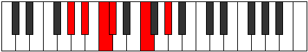
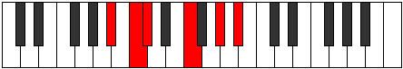

# Mode AFlatAeolyphritonic

## Links

- [Documentation](index.md)
- [Scales Index](Scales.md)
- [Modes Index](Modes.md)
- [Chords Index](Chords.md)

## Scale

[Magitonic](ScaleMagitonic.md)

## Mode

[AFlatAeolyphritonic](ModeAFlatAeolyphritonic.md)

## Tonic

Ab

## Signature

[CNaturalMajor]

## Perfection

 - 3 Perfect Notes

 - 2 Imperfect Notes

## Notes

- Ab (Imperfect)
- Bb
- C (Imperfect)
- Db
- F
- Ab (Imperfect)

## Illustration

## Relative Modes

| Number | Mode | Tonic | Notes | Illustration |
|--------|------|-------|-------|--------------|
| [425](https://ianring.com/musictheory/scales/425) | [Daditonic](ModeDaditonic.md) | F | F, G#, A#, C, C#, F |  |
| [565](https://ianring.com/musictheory/scales/565) | [Aeolyphritonic](ModeAeolyphritonic.md) | G# | G#, A#, C, C#, F, G# |  |
| [565](https://ianring.com/musictheory/scales/565) | [Aeolyphritonic](ModeAeolyphritonic.md) | Ab | Ab, Bb, C, Db, F, Ab |  |
| [1165](https://ianring.com/musictheory/scales/1165) | [Gycritonic](ModeGycritonic.md) | A# | A#, C, C#, F, G#, A# |  |
| [1165](https://ianring.com/musictheory/scales/1165) | [Gycritonic](ModeGycritonic.md) | Bb | Bb, C, Db, F, Ab, Bb |  |
| [1315](https://ianring.com/musictheory/scales/1315) | [Pyritonic](ModePyritonic.md) | C | C, C#, F, G#, A#, C |  |
| [2705](https://ianring.com/musictheory/scales/2705) | [Magitonic](ModeMagitonic.md) | C# | C#, F, G#, A#, C, C# |  |
| [2705](https://ianring.com/musictheory/scales/2705) | [Magitonic](ModeMagitonic.md) | Db | Db, F, Ab, Bb, C, Db |  |

## Chords

### Ab

| Number | Root | Name | Notes | Illustration | Audio |
|--------|------|------|-------|--------------|-------|
| 1282 | Ab | [Absus2bb5](ChordAFlatSuspendedSecondDoubleFlatFifth.md) | Ab, Bb, Db |  | [midi](ChordAFlatSuspendedSecondDoubleFlatFifthRootPosition.mid) [ogg](ChordAFlatSuspendedSecondDoubleFlatFifthRootPosition.ogg) |
| 289 | Ab | [AbM##5](ChordAFlatMajorDoubleSharpFifth.md) | Ab, C, F |  | [midi](ChordAFlatMajorDoubleSharpFifthRootPosition.mid) [ogg](ChordAFlatMajorDoubleSharpFifthRootPosition.ogg) |
| 290 | Ab | [Absus4##5](ChordAFlatSuspendedFourthDoubleSharpFifth.md) | Ab, Db, F |  | [midi](ChordAFlatSuspendedFourthDoubleSharpFifthRootPosition.mid) [ogg](ChordAFlatSuspendedFourthDoubleSharpFifthRootPosition.ogg) |
| 1314 | Ab | [AbM6sus2bb5](ChordAFlatMajorSixthSuspendedSecondDoubleFlatFifth.md) | Ab, Bb, Db, F |  | [midi](ChordAFlatMajorSixthSuspendedSecondDoubleFlatFifthRootPosition.mid) [ogg](ChordAFlatMajorSixthSuspendedSecondDoubleFlatFifthRootPosition.ogg) |

### Bb

| Number | Root | Name | Notes | Illustration | Audio |
|--------|------|------|-------|--------------|-------|
| 1056 | Bb | [Bb5](ChordBFlatPowerChord.md) | Bb, F |  | [midi](ChordBFlatPowerChordRootPosition.mid) [ogg](ChordBFlatPowerChordRootPosition.ogg) |
| 1057 | Bb | [Bbsus2](ChordBFlatSuspendedSecond.md) | Bb, C, F |  | [midi](ChordBFlatSuspendedSecondRootPosition.mid) [ogg](ChordBFlatSuspendedSecondRootPosition.ogg) |
| 1058 | Bb | [Bbm](ChordBFlatMinor.md) | Bb, Db, F |  | [midi](ChordBFlatMinorRootPosition.mid) [ogg](ChordBFlatMinorRootPosition.ogg) |
| 1058 | Bb | [Bbm(add(#9))](ChordBFlatMinorAddSharpNinth.md) | Bb, Db, F, C# |  | [midi](ChordBFlatMinorAddSharpNinthRootPosition.mid) [ogg](ChordBFlatMinorAddSharpNinthRootPosition.ogg) |
| 1059 | Bb | [Bbm(add9)](ChordBFlatMinorAddNinth.md) | Bb, Db, F, C |  | [midi](ChordBFlatMinorAddNinthRootPosition.mid) [ogg](ChordBFlatMinorAddNinthRootPosition.ogg) |
| 1313 | Bb | [Bb7sus2](ChordBFlatDominantSeventhSuspendedSecond.md) | Bb, C, F, Ab |  | [midi](ChordBFlatDominantSeventhSuspendedSecondRootPosition.mid) [ogg](ChordBFlatDominantSeventhSuspendedSecondRootPosition.ogg) |
| 1313 | Bb | [Bb9sus2](ChordBFlatDominantNinthSuspendedSecond.md) | Bb, C, F, Ab, C |  | [midi](ChordBFlatDominantNinthSuspendedSecondRootPosition.mid) [ogg](ChordBFlatDominantNinthSuspendedSecondRootPosition.ogg) |
| 1314 | Bb | [Bbm7](ChordBFlatMinorSeventh.md) | Bb, Db, F, Ab |  | [midi](ChordBFlatMinorSeventhRootPosition.mid) [ogg](ChordBFlatMinorSeventhRootPosition.ogg) |
| 1315 | Bb | [Bbm9](ChordBFlatMinorNinth.md) | Bb, Db, F, Ab, C |  | [midi](ChordBFlatMinorNinthRootPosition.mid) [ogg](ChordBFlatMinorNinthRootPosition.ogg) |

### C

| Number | Root | Name | Notes | Illustration | Audio |
|--------|------|------|-------|--------------|-------|
| 289 | C | [Csus4#5](ChordCNaturalSuspendedFourthSharpFifth.md) | C, F, G# |  | [midi](ChordCNaturalSuspendedFourthSharpFifthRootPosition.mid) [ogg](ChordCNaturalSuspendedFourthSharpFifthRootPosition.ogg) |
| 1057 | C | [CQ](ChordCNaturalQuartal.md) | C, F, Bb |  | [midi](ChordCNaturalQuartalRootPosition.mid) [ogg](ChordCNaturalQuartalRootPosition.ogg) |

### Db

| Number | Root | Name | Notes | Illustration | Audio |
|--------|------|------|-------|--------------|-------|
| 258 | Db | [Db5](ChordDFlatPowerChord.md) | Db, Ab |  | [midi](ChordDFlatPowerChordRootPosition.mid) [ogg](ChordDFlatPowerChordRootPosition.ogg) |
| 290 | Db | [DbM](ChordDFlatMajor.md) | Db, F, Ab |  | [midi](ChordDFlatMajorRootPosition.mid) [ogg](ChordDFlatMajorRootPosition.ogg) |
| 1058 | Db | [DbM##5](ChordDFlatMajorDoubleSharpFifth.md) | Db, F, Bb |  | [midi](ChordDFlatMajorDoubleSharpFifthRootPosition.mid) [ogg](ChordDFlatMajorDoubleSharpFifthRootPosition.ogg) |
| 1314 | Db | [DbM6](ChordDFlatMajorSixth.md) | Db, F, Ab, Bb |  | [midi](ChordDFlatMajorSixthRootPosition.mid) [ogg](ChordDFlatMajorSixthRootPosition.ogg) |
| 291 | Db | [DbM7](ChordDFlatMajorSeventh.md) | Db, F, Ab, C |  | [midi](ChordDFlatMajorSeventhRootPosition.mid) [ogg](ChordDFlatMajorSeventhRootPosition.ogg) |
| 1059 | Db | [DbM7##5](ChordDFlatMajorSeventhDoubleSharpFifth.md) | Db, F, Bb, C |  | [midi](ChordDFlatMajorSeventhDoubleSharpFifthRootPosition.mid) [ogg](ChordDFlatMajorSeventhDoubleSharpFifthRootPosition.ogg) |
| 1315 | Db | [DbM7add13](ChordDFlatMajorSeventhAddThirteenth.md) | Db, F, Ab, C, Bb |  | [midi](ChordDFlatMajorSeventhAddThirteenthRootPosition.mid) [ogg](ChordDFlatMajorSeventhAddThirteenthRootPosition.ogg) |

### F

| Number | Root | Name | Notes | Illustration | Audio |
|--------|------|------|-------|--------------|-------|
| 1312 | F | [Fmbb5](ChordFNaturalMinorDoubleFlatFifth.md) | F, Ab, Bb |  | [midi](ChordFNaturalMinorDoubleFlatFifthRootPosition.mid) [ogg](ChordFNaturalMinorDoubleFlatFifthRootPosition.ogg) |
| 33 | F | [F5](ChordFNaturalPowerChord.md) | F, C |  | [midi](ChordFNaturalPowerChordRootPosition.mid) [ogg](ChordFNaturalPowerChordRootPosition.ogg) |
| 289 | F | [Fm](ChordFNaturalMinor.md) | F, Ab, C |  | [midi](ChordFNaturalMinorRootPosition.mid) [ogg](ChordFNaturalMinorRootPosition.ogg) |
| 289 | F | [Fm(add(#9))](ChordFNaturalMinorAddSharpNinth.md) | F, Ab, C, G# |  | [midi](ChordFNaturalMinorAddSharpNinthRootPosition.mid) [ogg](ChordFNaturalMinorAddSharpNinthRootPosition.ogg) |
| 1057 | F | [Fsus4](ChordFNaturalSuspendedFourth.md) | F, Bb, C |  | [midi](ChordFNaturalSuspendedFourthRootPosition.mid) [ogg](ChordFNaturalSuspendedFourthRootPosition.ogg) |
| 1313 | F | [Fm(add11)](ChordFNaturalMinorAddEleventh.md) | F, Ab, C, Bb |  | [midi](ChordFNaturalMinorAddEleventhRootPosition.mid) [ogg](ChordFNaturalMinorAddEleventhRootPosition.ogg) |
| 1313 | F | [Fm(add4)](ChordFNaturalMinorAddFourth.md) | F, Ab, Bb, C |  | [midi](ChordFNaturalMinorAddFourthRootPosition.mid) [ogg](ChordFNaturalMinorAddFourthRootPosition.ogg) |
| 290 | F | [Fm#5](ChordFNaturalMinorSharpFifth.md) | F, Ab, Db |  | [midi](ChordFNaturalMinorSharpFifthRootPosition.mid) [ogg](ChordFNaturalMinorSharpFifthRootPosition.ogg) |
| 1058 | F | [Fsus4#5](ChordFNaturalSuspendedFourthSharpFifth.md) | F, Bb, C# |  | [midi](ChordFNaturalSuspendedFourthSharpFifthRootPosition.mid) [ogg](ChordFNaturalSuspendedFourthSharpFifthRootPosition.ogg) |

