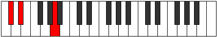

# Mode AFlatAeolyptian

## Links

- [Documentation](README.md)
- [Scales Index](Scales.md)
- [Modes Index](Modes.md)
- [Chords Index](Chords.md)

## Parent Scale

[Thacrian](ScaleThacrian.md)

## Mode

[Aeolyptian](ModeAeolyptian.md)

## Number

2283

## Luminosity

-1

## Tonic

Ab

## Signature

C

## Transposition

1, 2, 2, 1, 1, 4, 1

## Chord Pattern

i⁰, IIb5, vii⁰b3

## Perfection

 - 4 Perfect Notes

 - 3 Imperfect Notes

 - Perfection Profile - true, false, false, true, true, false, true

## Notes

- Ab
- Bbb (Imperfect)
- Cb (Imperfect)
- Db
- Ebb
- Fbb (Imperfect)
- G
- Ab

## Illustration

## Diagram

| Circle of Fifth | Chromatic Circle |
|-----------------|------------------|
|  |  |
## Relative Modes

| Number | Mode | Luminosity | Tonic | Notes | Illustration |
|--------|------|------------|-------|-------|--------------|
| [2283](https://ianring.com/musictheory/scales/2283) | [Aeolyptian](ModeAeolyptian.md) | 6 | G# | G#, A, B, C#, D, Eb, F##, G# |  |
| [3189](https://ianring.com/musictheory/scales/3189) | [Aeolonian](ModeAeolonian.md) | 5 | A | A, B, C#, D, Eb, F##, G#, A |  |
| [1821](https://ianring.com/musictheory/scales/1821) | [Aeradian](ModeAeradian.md) | -1 | B | B, C#, D, Eb, F##, G#, A, B |  |
| [1479](https://ianring.com/musictheory/scales/1479) | [Aeolagian](ModeAeolagian.md) | -1 | C# | C#, D, Eb, F##, G#, A, B, C# |  |
| [2787](https://ianring.com/musictheory/scales/2787) | [Zyrian](ModeZyrian.md) | 6 | D | D, Eb, F##, G#, A, B, C#, D |  |
| [3441](https://ianring.com/musictheory/scales/3441) | [Thacrian](ModeThacrian.md) | -1 | D# | D#, E###, F###, G##, A##, B##, C##, D# |  |
| [471](https://ianring.com/musictheory/scales/471) | [Dodian](ModeDodian.md) | 7 | G | G, Ab, Bbb, Cb, Db, Ebb, Fbb, G |  |
## Relative Brightness

| Number | Mode | Luminosity | Tonic | Notes | Circle Of Fifth | Chromatic Circle |
|--------|------|------------|-------|-------|-----------------|------------------|
| [2283](https://ianring.com/musictheory/scales/2283) | [Aeolyptian](ModeAeolyptian.md) | -1 | G# | G#, A, B, C#, D, Eb, F##, G# |  |  |
| [3189](https://ianring.com/musictheory/scales/3189) | [Aeolonian](ModeAeolonian.md) | -1 | A | A, B, C#, D, Eb, F##, G#, A |  |  |
| [1821](https://ianring.com/musictheory/scales/1821) | [Aeradian](ModeAeradian.md) | -1 | B | B, C#, D, Eb, F##, G#, A, B |  |  |
| [1479](https://ianring.com/musictheory/scales/1479) | [Aeolagian](ModeAeolagian.md) | -1 | C# | C#, D, Eb, F##, G#, A, B, C# |  |  |
| [2787](https://ianring.com/musictheory/scales/2787) | [Zyrian](ModeZyrian.md) | -1 | D | D, Eb, F##, G#, A, B, C#, D |  |  |
| [3441](https://ianring.com/musictheory/scales/3441) | [Thacrian](ModeThacrian.md) | 5 | D# | D#, E###, F###, G##, A##, B##, C##, D# |  |  |
| [471](https://ianring.com/musictheory/scales/471) | [Dodian](ModeDodian.md) | 7 | G | G, Ab, Bbb, Cb, Db, Ebb, Fbb, G |  |  |

## Chords

### Ab

| Number | Root | Name | Notes | Illustration | Audio |
|--------|------|------|-------|--------------|-------|
| 2306 | Ab | [G#mbb5](ChordGSharpMinorDoubleFlatFifth.md) | G#, B, C# |  | [midi](ChordGSharpMinorDoubleFlatFifthRootPosition.mid) |
| 2306 | Ab | [Abmbb5](ChordAFlatMinorDoubleFlatFifth.md) | Ab, Cb, Db |  | [midi](ChordAFlatMinorDoubleFlatFifthRootPosition.mid) |
| 772 | Ab | [G#loc](ChordGSharpLocrian.md) | G#, A, D |  | [midi](ChordGSharpLocrianRootPosition.mid) |
| 772 | Ab | [Abloc](ChordAFlatLocrian.md) | Ab, Bbb, Ebb |  | [midi](ChordAFlatLocrianRootPosition.mid) |
| 2308 | Ab | [G#o](ChordGSharpDiminished.md) | G#, B, D |  | [midi](ChordGSharpDiminishedRootPosition.mid) |
| 2308 | Ab | [Abo](ChordAFlatDiminished.md) | Ab, Cb, Ebb |  | [midi](ChordAFlatDiminishedRootPosition.mid) |
| 262 | Ab | [G#sus4b5](ChordGSharpSuspendedFourthFlatFifth.md) | G#, C#, D |  | [midi](ChordGSharpSuspendedFourthFlatFifthRootPosition.mid) |
| 262 | Ab | [Absus4b5](ChordAFlatSuspendedFourthFlatFifth.md) | Ab, Db, Ebb |  | [midi](ChordAFlatSuspendedFourthFlatFifthRootPosition.mid) |
| 264 | Ab | [G#5](ChordGSharpPowerChord.md) | G#, D# |  | [midi](ChordGSharpPowerChordRootPosition.mid) |
| 264 | Ab | [Ab5](ChordAFlatPowerChord.md) | Ab, Eb |  | [midi](ChordAFlatPowerChordRootPosition.mid) |
| 776 | Ab | [G#phryg](ChordGSharpPhrygian.md) | G#, A, D# |  | [midi](ChordGSharpPhrygianRootPosition.mid) |
| 776 | Ab | [Abphryg](ChordAFlatPhrygian.md) | Ab, Bbb, Eb |  | [midi](ChordAFlatPhrygianRootPosition.mid) |
| 2312 | Ab | [G#m](ChordGSharpMinor.md) | G#, B, D# |  | [midi](ChordGSharpMinorRootPosition.mid) |
| 2312 | Ab | [G#m(add(#9))](ChordGSharpMinorAddSharpNinth.md) | G#, B, D#, A## |  | [midi](ChordGSharpMinorAddSharpNinthRootPosition.mid) |
| 2312 | Ab | [Abm](ChordAFlatMinor.md) | Ab, Cb, Eb |  | [midi](ChordAFlatMinorRootPosition.mid) |
| 2312 | Ab | [Abm(add(#9))](ChordAFlatMinorAddSharpNinth.md) | Ab, Cb, Eb, B |  | [midi](ChordAFlatMinorAddSharpNinthRootPosition.mid) |
| 266 | Ab | [G#sus4](ChordGSharpSuspendedFourth.md) | G#, C#, D# |  | [midi](ChordGSharpSuspendedFourthRootPosition.mid) |
| 266 | Ab | [Absus4](ChordAFlatSuspendedFourth.md) | Ab, Db, Eb |  | [midi](ChordAFlatSuspendedFourthRootPosition.mid) |
| 2314 | Ab | [G#m(add11)](ChordGSharpMinorAddEleventh.md) | G#, B, D#, C# |  | [midi](ChordGSharpMinorAddEleventhRootPosition.mid) |
| 2314 | Ab | [G#m(add4)](ChordGSharpMinorAddFourth.md) | G#, B, C#, D# |  | [midi](ChordGSharpMinorAddFourthRootPosition.mid) |
| 2314 | Ab | [Abm(add11)](ChordAFlatMinorAddEleventh.md) | Ab, Cb, Eb, Db |  | [midi](ChordAFlatMinorAddEleventhRootPosition.mid) |
| 2314 | Ab | [Abm(add4)](ChordAFlatMinorAddFourth.md) | Ab, Cb, Db, Eb |  | [midi](ChordAFlatMinorAddFourthRootPosition.mid) |
| 268 | Ab | [G#lyd](ChordGSharpLydian.md) | G#, C##, D# |  | [midi](ChordGSharpLydianRootPosition.mid) |
| 268 | Ab | [Ablyd](ChordAFlatLydian.md) | Ab, D, Eb |  | [midi](ChordAFlatLydianRootPosition.mid) |
| 2316 | Ab | [G#m(add(#4))](ChordGSharpMinorAddSharpFourth.md) | G#, B, C##, D# |  | [midi](ChordGSharpMinorAddSharpFourthRootPosition.mid) |
| 2316 | Ab | [Abm(add(#4))](ChordAFlatMinorAddSharpFourth.md) | Ab, Cb, D, Eb |  | [midi](ChordAFlatMinorAddSharpFourthRootPosition.mid) |
| 386 | Ab | [G#Q+](ChordGSharpQuartalAugmented.md) | G#, C#, F## |  | [midi](ChordGSharpQuartalAugmentedRootPosition.mid) |
| 386 | Ab | [AbQ+](ChordAFlatQuartalAugmented.md) | Ab, Db, G |  | [midi](ChordAFlatQuartalAugmentedRootPosition.mid) |
| 2436 | Ab | [G#oM7](ChordGSharpDiminishedMajorSeventh.md) | G#, B, D, F## |  | [midi](ChordGSharpDiminishedMajorSeventhRootPosition.mid) |
| 2436 | Ab | [AboM7](ChordAFlatDiminishedMajorSeventh.md) | Ab, Cb, Ebb, G |  | [midi](ChordAFlatDiminishedMajorSeventhRootPosition.mid) |
| 904 | Ab | [G#phryg+7](ChordGSharpPhrygianAddSeventh.md) | G#, A, D#, F## |  | [midi](ChordGSharpPhrygianAddSeventhRootPosition.mid) |
| 904 | Ab | [Abphryg+7](ChordAFlatPhrygianAddSeventh.md) | Ab, Bbb, Eb, G |  | [midi](ChordAFlatPhrygianAddSeventhRootPosition.mid) |
| 2440 | Ab | [G#m(M7)](ChordGSharpMinorMajorSeventh.md) | G#, B, D#, F## |  | [midi](ChordGSharpMinorMajorSeventhRootPosition.mid) |
| 2440 | Ab | [Abm(M7)](ChordAFlatMinorMajorSeventh.md) | Ab, Cb, Eb, G |  | [midi](ChordAFlatMinorMajorSeventhRootPosition.mid) |
| 394 | Ab | [G#M7(sus4)](ChordGSharpMajorSeventhSuspendedFourth.md) | G#, C#, D#, F## |  | [midi](ChordGSharpMajorSeventhSuspendedFourthRootPosition.mid) |
| 394 | Ab | [AbM7(sus4)](ChordAFlatMajorSeventhSuspendedFourth.md) | Ab, Db, Eb, G |  | [midi](ChordAFlatMajorSeventhSuspendedFourthRootPosition.mid) |
| 2442 | Ab | [G#m(M7)add11](ChordGSharpMinorMajorSeventhAddEleventh.md) | G#, B, D#, F##, C# |  | [midi](ChordGSharpMinorMajorSeventhAddEleventhRootPosition.mid) |
| 2442 | Ab | [Abm(M7)add11](ChordAFlatMinorMajorSeventhAddEleventh.md) | Ab, Cb, Eb, G, Db |  | [midi](ChordAFlatMinorMajorSeventhAddEleventhRootPosition.mid) |
| 396 | Ab | [G#lyd(M7)](ChordGSharpLydianMajorSeventh.md) | G#, C##, D#, F## |  | [midi](ChordGSharpLydianMajorSeventhRootPosition.mid) |
| 396 | Ab | [Ablyd(M7)](ChordAFlatLydianMajorSeventh.md) | Ab, D, Eb, G |  | [midi](ChordAFlatLydianMajorSeventhRootPosition.mid) |

### Bbb

| Number | Root | Name | Notes | Illustration | Audio |
|--------|------|------|-------|--------------|-------|
| 2564 | Bbb | [Asus2bb5](ChordANaturalSuspendedSecondDoubleFlatFifth.md) | A, B, D |  | [midi](ChordANaturalSuspendedSecondDoubleFlatFifthRootPosition.mid) |
| 2568 | Bbb | [A](ChordANaturalDiminishedFlatThird.md) | A, Cb, Eb |  | [midi](ChordANaturalDiminishedFlatThirdRootPosition.mid) |
| 2568 | Bbb | [Asus2b5](ChordANaturalSuspendedSecondFlatFifth.md) | A, B, Eb |  | [midi](ChordANaturalSuspendedSecondFlatFifthRootPosition.mid) |
| 522 | Bbb | [AMb5](ChordANaturalMajorFlatFifth.md) | A, C#, Eb |  | [midi](ChordANaturalMajorFlatFifthRootPosition.mid) |
| 524 | Bbb | [Asus4b5](ChordANaturalSuspendedFourthFlatFifth.md) | A, D, Eb |  | [midi](ChordANaturalSuspendedFourthFlatFifthRootPosition.mid) |
| 644 | Bbb | [AQ](ChordANaturalQuartal.md) | A, D, G |  | [midi](ChordANaturalQuartalRootPosition.mid) |
| 650 | Bbb | [A7b5](ChordANaturalDominantSeventhFlatFifth.md) | A, C#, Eb, G |  | [midi](ChordANaturalDominantSeventhFlatFifthRootPosition.mid) |
| 772 | Bbb | [AQ+](ChordANaturalQuartalAugmented.md) | A, D, G# |  | [midi](ChordANaturalQuartalAugmentedRootPosition.mid) |
| 778 | Bbb | [AM7b5](ChordANaturalMajorSeventhFlatFifth.md) | A, C#, Eb, G# |  | [midi](ChordANaturalMajorSeventhFlatFifthRootPosition.mid) |

### Cb

| Number | Root | Name | Notes | Illustration | Audio |
|--------|------|------|-------|--------------|-------|
| 2178 | Cb | [Bsus2#5](ChordBNaturalSuspendedSecondSharpFifth.md) | B, C#, F## |  | [midi](ChordBNaturalSuspendedSecondSharpFifthRootPosition.mid) |
| 2180 | Cb | [Bm#5](ChordBNaturalMinorSharpFifth.md) | B, D, G |  | [midi](ChordBNaturalMinorSharpFifthRootPosition.mid) |
| 2184 | Cb | [B+](ChordBNaturalAugmented.md) | B, D#, F## |  | [midi](ChordBNaturalAugmentedRootPosition.mid) |
| 2184 | Cb | [B+7](ChordBNaturalAugmentedAugmentedSeventh.md) | B, D#, F##, A## |  | [midi](ChordBNaturalAugmentedAugmentedSeventhRootPosition.mid) |
| 2312 | Cb | [BM##5](ChordBNaturalMajorDoubleSharpFifth.md) | B, D#, G# |  | [midi](ChordBNaturalMajorDoubleSharpFifthRootPosition.mid) |
| 2692 | Cb | [Bm7#5](ChordBNaturalMinorSeventhSharpFifth.md) | B, D, F##, A |  | [midi](ChordBNaturalMinorSeventhSharpFifthRootPosition.mid) |

### Db

| Number | Root | Name | Notes | Illustration | Audio |
|--------|------|------|-------|--------------|-------|
| 134 | Db | [C#loc](ChordCSharpLocrian.md) | C#, D, G |  | [midi](ChordCSharpLocrianRootPosition.mid) |
| 134 | Db | [Dbloc](ChordDFlatLocrian.md) | Db, Ebb, Abb |  | [midi](ChordDFlatLocrianRootPosition.mid) |
| 138 | Db | [C#](ChordCSharpDiminishedFlatThird.md) | C#, Eb, G |  | [midi](ChordCSharpDiminishedFlatThirdRootPosition.mid) |
| 138 | Db | [C#sus2b5](ChordCSharpSuspendedSecondFlatFifth.md) | C#, D#, G |  | [midi](ChordCSharpSuspendedSecondFlatFifthRootPosition.mid) |
| 138 | Db | [Db](ChordDFlatDiminishedFlatThird.md) | Db, Fbb, Abb |  | [midi](ChordDFlatDiminishedFlatThirdRootPosition.mid) |
| 138 | Db | [Dbsus2b5](ChordDFlatSuspendedSecondFlatFifth.md) | Db, Eb, Abb |  | [midi](ChordDFlatSuspendedSecondFlatFifthRootPosition.mid) |
| 258 | Db | [C#5](ChordCSharpPowerChord.md) | C#, G# |  | [midi](ChordCSharpPowerChordRootPosition.mid) |
| 258 | Db | [Db5](ChordDFlatPowerChord.md) | Db, Ab |  | [midi](ChordDFlatPowerChordRootPosition.mid) |
| 262 | Db | [C#phryg](ChordCSharpPhrygian.md) | C#, D, G# |  | [midi](ChordCSharpPhrygianRootPosition.mid) |
| 262 | Db | [Dbphryg](ChordDFlatPhrygian.md) | Db, Ebb, Ab |  | [midi](ChordDFlatPhrygianRootPosition.mid) |
| 266 | Db | [C#sus2](ChordCSharpSuspendedSecond.md) | C#, D#, G# |  | [midi](ChordCSharpSuspendedSecondRootPosition.mid) |
| 266 | Db | [Dbsus2](ChordDFlatSuspendedSecond.md) | Db, Eb, Ab |  | [midi](ChordDFlatSuspendedSecondRootPosition.mid) |
| 386 | Db | [C#lyd](ChordCSharpLydian.md) | C#, F##, G# |  | [midi](ChordCSharpLydianRootPosition.mid) |
| 386 | Db | [Dblyd](ChordDFlatLydian.md) | Db, G, Ab |  | [midi](ChordDFlatLydianRootPosition.mid) |
| 522 | Db | [C#sus2#5](ChordCSharpSuspendedSecondSharpFifth.md) | C#, D#, G## |  | [midi](ChordCSharpSuspendedSecondSharpFifthRootPosition.mid) |
| 522 | Db | [Dbsus2#5](ChordDFlatSuspendedSecondSharpFifth.md) | Db, Eb, A |  | [midi](ChordDFlatSuspendedSecondSharpFifthRootPosition.mid) |
| 650 | Db | [C#sus2b5add(#5)](ChordCSharpSuspendedSecondFlatFifthAddSharpFifth.md) | C#, D#, G, G## |  | [midi](ChordCSharpSuspendedSecondFlatFifthAddSharpFifthRootPosition.mid) |
| 650 | Db | [Dbsus2b5add(#5)](ChordDFlatSuspendedSecondFlatFifthAddSharpFifth.md) | Db, Eb, Abb, A |  | [midi](ChordDFlatSuspendedSecondFlatFifthAddSharpFifthRootPosition.mid) |
| 2314 | Db | [C#7sus2](ChordCSharpDominantSeventhSuspendedSecond.md) | C#, D#, G#, B |  | [midi](ChordCSharpDominantSeventhSuspendedSecondRootPosition.mid) |
| 2314 | Db | [C#9sus2](ChordCSharpDominantNinthSuspendedSecond.md) | C#, D#, G#, B, D# |  | [midi](ChordCSharpDominantNinthSuspendedSecondRootPosition.mid) |
| 2314 | Db | [Db7sus2](ChordDFlatDominantSeventhSuspendedSecond.md) | Db, Eb, Ab, Cb |  | [midi](ChordDFlatDominantSeventhSuspendedSecondRootPosition.mid) |
| 2314 | Db | [Db9sus2](ChordDFlatDominantNinthSuspendedSecond.md) | Db, Eb, Ab, Cb, Eb |  | [midi](ChordDFlatDominantNinthSuspendedSecondRootPosition.mid) |

### Ebb

| Number | Root | Name | Notes | Illustration | Audio |
|--------|------|------|-------|--------------|-------|
| 268 | Ebb | [Dloc](ChordDNaturalLocrian.md) | D, Eb, Ab |  | [midi](ChordDNaturalLocrianRootPosition.mid) |
| 388 | Ebb | [Dsus4b5](ChordDNaturalSuspendedFourthFlatFifth.md) | D, G, Ab |  | [midi](ChordDNaturalSuspendedFourthFlatFifthRootPosition.mid) |
| 516 | Ebb | [D5](ChordDNaturalPowerChord.md) | D, A |  | [midi](ChordDNaturalPowerChordRootPosition.mid) |
| 524 | Ebb | [Dphryg](ChordDNaturalPhrygian.md) | D, Eb, A |  | [midi](ChordDNaturalPhrygianRootPosition.mid) |
| 644 | Ebb | [Dsus4](ChordDNaturalSuspendedFourth.md) | D, G, A |  | [midi](ChordDNaturalSuspendedFourthRootPosition.mid) |
| 772 | Ebb | [Dlyd](ChordDNaturalLydian.md) | D, G#, A |  | [midi](ChordDNaturalLydianRootPosition.mid) |
| 2180 | Ebb | [Dsus4##5](ChordDNaturalSuspendedFourthDoubleSharpFifth.md) | D, G, B |  | [midi](ChordDNaturalSuspendedFourthDoubleSharpFifthRootPosition.mid) |
| 2692 | Ebb | [DM6sus4](ChordDNaturalMajorSixthSuspendedFourth.md) | D, G, A, B |  | [midi](ChordDNaturalMajorSixthSuspendedFourthRootPosition.mid) |
| 134 | Ebb | [DQ+](ChordDNaturalQuartalAugmented.md) | D, G, C# |  | [midi](ChordDNaturalQuartalAugmentedRootPosition.mid) |
| 526 | Ebb | [Dphryg+7](ChordDNaturalPhrygianAddSeventh.md) | D, Eb, A, C# |  | [midi](ChordDNaturalPhrygianAddSeventhRootPosition.mid) |
| 646 | Ebb | [DM7(sus4)](ChordDNaturalMajorSeventhSuspendedFourth.md) | D, G, A, C# |  | [midi](ChordDNaturalMajorSeventhSuspendedFourthRootPosition.mid) |
| 774 | Ebb | [Dlyd(M7)](ChordDNaturalLydianMajorSeventh.md) | D, G#, A, C# |  | [midi](ChordDNaturalLydianMajorSeventhRootPosition.mid) |
| 2182 | Ebb | [DM7(sus4)##5](ChordDNaturalMajorSeventhSuspendedFourthDoubleSharpFifth.md) | D, G, B, C# |  | [midi](ChordDNaturalMajorSeventhSuspendedFourthDoubleSharpFifthRootPosition.mid) |

### Fbb

| Number | Root | Name | Notes | Illustration | Audio |
|--------|------|------|-------|--------------|-------|
| 648 | Fbb | [D#Mb5](ChordDSharpMajorFlatFifth.md) | D#, F##, A |  | [midi](ChordDSharpMajorFlatFifthRootPosition.mid) |
| 648 | Fbb | [EbMb5](ChordEFlatMajorFlatFifth.md) | Eb, G, Bbb |  | [midi](ChordEFlatMajorFlatFifthRootPosition.mid) |
| 776 | Fbb | [D#sus4b5](ChordDSharpSuspendedFourthFlatFifth.md) | D#, G#, A |  | [midi](ChordDSharpSuspendedFourthFlatFifthRootPosition.mid) |
| 776 | Fbb | [Ebsus4b5](ChordEFlatSuspendedFourthFlatFifth.md) | Eb, Ab, Bbb |  | [midi](ChordEFlatSuspendedFourthFlatFifthRootPosition.mid) |
| 2184 | Fbb | [D#+](ChordDSharpAugmented.md) | D#, F##, A## |  | [midi](ChordDSharpAugmentedRootPosition.mid) |
| 2184 | Fbb | [D#+7](ChordDSharpAugmentedAugmentedSeventh.md) | D#, F##, A##, C### |  | [midi](ChordDSharpAugmentedAugmentedSeventhRootPosition.mid) |
| 2184 | Fbb | [Eb+](ChordEFlatAugmented.md) | Eb, G, B |  | [midi](ChordEFlatAugmentedRootPosition.mid) |
| 2184 | Fbb | [Eb+7](ChordEFlatAugmentedAugmentedSeventh.md) | Eb, G, B, D# |  | [midi](ChordEFlatAugmentedAugmentedSeventhRootPosition.mid) |
| 2312 | Fbb | [D#sus4#5](ChordDSharpSuspendedFourthSharpFifth.md) | D#, G#, A## |  | [midi](ChordDSharpSuspendedFourthSharpFifthRootPosition.mid) |
| 2312 | Fbb | [Ebsus4#5](ChordEFlatSuspendedFourthSharpFifth.md) | Eb, Ab, B |  | [midi](ChordEFlatSuspendedFourthSharpFifthRootPosition.mid) |
| 266 | Fbb | [D#Q](ChordDSharpQuartal.md) | D#, G#, C# |  | [midi](ChordDSharpQuartalRootPosition.mid) |
| 266 | Fbb | [EbQ](ChordEFlatQuartal.md) | Eb, Ab, Db |  | [midi](ChordEFlatQuartalRootPosition.mid) |
| 650 | Fbb | [D#7b5](ChordDSharpDominantSeventhFlatFifth.md) | D#, F##, A, C# |  | [midi](ChordDSharpDominantSeventhFlatFifthRootPosition.mid) |
| 650 | Fbb | [Eb7b5](ChordEFlatDominantSeventhFlatFifth.md) | Eb, G, Bbb, Db |  | [midi](ChordEFlatDominantSeventhFlatFifthRootPosition.mid) |
| 268 | Fbb | [D#Q+](ChordDSharpQuartalAugmented.md) | D#, G#, C## |  | [midi](ChordDSharpQuartalAugmentedRootPosition.mid) |
| 268 | Fbb | [EbQ+](ChordEFlatQuartalAugmented.md) | Eb, Ab, D |  | [midi](ChordEFlatQuartalAugmentedRootPosition.mid) |
| 652 | Fbb | [D#M7b5](ChordDSharpMajorSeventhFlatFifth.md) | D#, F##, A, C## |  | [midi](ChordDSharpMajorSeventhFlatFifthRootPosition.mid) |
| 652 | Fbb | [EbM7b5](ChordEFlatMajorSeventhFlatFifth.md) | Eb, G, Bbb, D |  | [midi](ChordEFlatMajorSeventhFlatFifthRootPosition.mid) |
| 2188 | Fbb | [D#+(M7)](ChordDSharpAugmentedMajorSeventh.md) | D#, F##, A##, C## |  | [midi](ChordDSharpAugmentedMajorSeventhRootPosition.mid) |
| 2188 | Fbb | [Eb+(M7)](ChordEFlatAugmentedMajorSeventh.md) | Eb, G, B, D |  | [midi](ChordEFlatAugmentedMajorSeventhRootPosition.mid) |
| 2316 | Fbb | [D#M7(sus4)#5](ChordDSharpMajorSeventhSuspendedFourthSharpFifth.md) | D#, G#, A##, C## |  | [midi](ChordDSharpMajorSeventhSuspendedFourthSharpFifthRootPosition.mid) |
| 2316 | Fbb | [EbM7(sus4)#5](ChordEFlatMajorSeventhSuspendedFourthSharpFifth.md) | Eb, Ab, B, D |  | [midi](ChordEFlatMajorSeventhSuspendedFourthSharpFifthRootPosition.mid) |

### G

| Number | Root | Name | Notes | Illustration | Audio |
|--------|------|------|-------|--------------|-------|
| 386 | G | [Gloc](ChordGNaturalLocrian.md) | G, Ab, Db |  | [midi](ChordGNaturalLocrianRootPosition.mid) |
| 642 | G | [G](ChordGNaturalDiminishedFlatThird.md) | G, Bbb, Db |  | [midi](ChordGNaturalDiminishedFlatThirdRootPosition.mid) |
| 642 | G | [Gsus2b5](ChordGNaturalSuspendedSecondFlatFifth.md) | G, A, Db |  | [midi](ChordGNaturalSuspendedSecondFlatFifthRootPosition.mid) |
| 2178 | G | [GMb5](ChordGNaturalMajorFlatFifth.md) | G, B, Db |  | [midi](ChordGNaturalMajorFlatFifthRootPosition.mid) |
| 132 | G | [G5](ChordGNaturalPowerChord.md) | G, D |  | [midi](ChordGNaturalPowerChordRootPosition.mid) |
| 388 | G | [Gphryg](ChordGNaturalPhrygian.md) | G, Ab, D |  | [midi](ChordGNaturalPhrygianRootPosition.mid) |
| 644 | G | [Gsus2](ChordGNaturalSuspendedSecond.md) | G, A, D |  | [midi](ChordGNaturalSuspendedSecondRootPosition.mid) |
| 2180 | G | [GM](ChordGNaturalMajor.md) | G, B, D |  | [midi](ChordGNaturalMajorRootPosition.mid) |
| 2692 | G | [GM(add9)](ChordGNaturalMajorAddNinth.md) | G, B, D, A |  | [midi](ChordGNaturalMajorAddNinthRootPosition.mid) |
| 134 | G | [Glyd](ChordGNaturalLydian.md) | G, C#, D |  | [midi](ChordGNaturalLydianRootPosition.mid) |
| 2182 | G | [GM(add(#4))](ChordGNaturalMajorAddSharpFourth.md) | G, B, C#, D |  | [midi](ChordGNaturalMajorAddSharpFourthRootPosition.mid) |
| 648 | G | [Gsus2#5](ChordGNaturalSuspendedSecondSharpFifth.md) | G, A, D# |  | [midi](ChordGNaturalSuspendedSecondSharpFifthRootPosition.mid) |
| 2184 | G | [G+](ChordGNaturalAugmented.md) | G, B, D# |  | [midi](ChordGNaturalAugmentedRootPosition.mid) |
| 2184 | G | [G+7](ChordGNaturalAugmentedAugmentedSeventh.md) | G, B, D#, F## |  | [midi](ChordGNaturalAugmentedAugmentedSeventhRootPosition.mid) |
| 650 | G | [Gsus2b5add(#5)](ChordGNaturalSuspendedSecondFlatFifthAddSharpFifth.md) | G, A, Db, D# |  | [midi](ChordGNaturalSuspendedSecondFlatFifthAddSharpFifthRootPosition.mid) |

