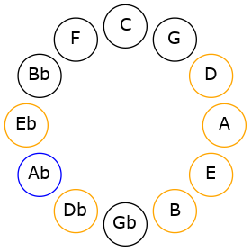
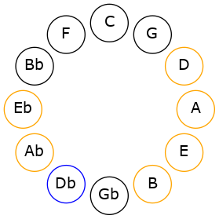

# Mode AFlatAeolyrian

## Links

- [Documentation](README.md)
- [Scales Index](Scales.md)
- [Modes Index](Modes.md)
- [Chords Index](Chords.md)

## Scale

[Ionythian](ScaleIonythian.md)

## Mode

[AFlatAeolyrian](ModeAFlatAeolyrian.md)

## Tonic

Ab

## Signature

[CNaturalMajor]

## Transposition

1, 2, 2, 1, 1, 1, 4

## Chord Pattern

i⁰, IIb5

## Perfection

 - 5 Perfect Notes

 - 2 Imperfect Notes

## Notes

- Ab
- Bbb
- Cb (Imperfect)
- Db
- Ebb
- Fbb (Imperfect)
- Gbbb
- Ab

## Illustration

## Diagram

## Relative Modes

| Number | Mode | Tonic | Notes | Illustration |
|--------|------|-------|-------|--------------|
| [491](https://ianring.com/musictheory/scales/491) | [Aeolyrian](ModeAeolyrian.md) | Ab | Ab, Bbb, Cb, Db, Ebb, Fbb, Gbbb, Ab |  |
| [1423](https://ianring.com/musictheory/scales/1423) | [Doptian](ModeDoptian.md) | Db | Db, Ebb, Fbb, Gbbb, Ab, Bbb, Cb, Db |  |
## Relative Brightness

| Number | Mode | Tonic | Notes | Illustration |
|--------|------|-------|-------|--------------|
| [491](https://ianring.com/musictheory/scales/491) | [Aeolyrian](ModeAeolyrian.md) | Ab | Ab, Bbb, Cb, Db, Ebb, Fbb, Gbbb, Ab |  |
| [1423](https://ianring.com/musictheory/scales/1423) | [Doptian](ModeDoptian.md) | Db | Db, Ebb, Fbb, Gbbb, Ab, Bbb, Cb, Db |  |

## Chords

### Ab

| Number | Root | Name | Notes | Illustration | Audio |
|--------|------|------|-------|--------------|-------|
| 2306 | Ab | [Abmbb5](ChordAFlatMinorDoubleFlatFifth.md) | Ab, Cb, Db |  | [midi](ChordAFlatMinorDoubleFlatFifthRootPosition.mid) |
| 772 | Ab | [Abloc](ChordAFlatLocrian.md) | Ab, Bbb, Ebb |  | [midi](ChordAFlatLocrianRootPosition.mid) |
| 2308 | Ab | [Abo](ChordAFlatDiminished.md) | Ab, Cb, Ebb |  | [midi](ChordAFlatDiminishedRootPosition.mid) |
| 262 | Ab | [Absus4b5](ChordAFlatSuspendedFourthFlatFifth.md) | Ab, Db, Ebb |  | [midi](ChordAFlatSuspendedFourthFlatFifthRootPosition.mid) |
| 264 | Ab | [Ab5](ChordAFlatPowerChord.md) | Ab, Eb |  | [midi](ChordAFlatPowerChordRootPosition.mid) |
| 776 | Ab | [Abphryg](ChordAFlatPhrygian.md) | Ab, Bbb, Eb |  | [midi](ChordAFlatPhrygianRootPosition.mid) |
| 2312 | Ab | [Abm](ChordAFlatMinor.md) | Ab, Cb, Eb |  | [midi](ChordAFlatMinorRootPosition.mid) |
| 2312 | Ab | [Abm(add(#9))](ChordAFlatMinorAddSharpNinth.md) | Ab, Cb, Eb, B |  | [midi](ChordAFlatMinorAddSharpNinthRootPosition.mid) |
| 266 | Ab | [Absus4](ChordAFlatSuspendedFourth.md) | Ab, Db, Eb |  | [midi](ChordAFlatSuspendedFourthRootPosition.mid) |
| 2314 | Ab | [Abm(add11)](ChordAFlatMinorAddEleventh.md) | Ab, Cb, Eb, Db |  | [midi](ChordAFlatMinorAddEleventhRootPosition.mid) |
| 2314 | Ab | [Abm(add4)](ChordAFlatMinorAddFourth.md) | Ab, Cb, Db, Eb |  | [midi](ChordAFlatMinorAddFourthRootPosition.mid) |
| 268 | Ab | [Ablyd](ChordAFlatLydian.md) | Ab, D, Eb |  | [midi](ChordAFlatLydianRootPosition.mid) |
| 2316 | Ab | [Abm(add(#4))](ChordAFlatMinorAddSharpFourth.md) | Ab, Cb, D, Eb |  | [midi](ChordAFlatMinorAddSharpFourthRootPosition.mid) |
| 2320 | Ab | [Abm#5](ChordAFlatMinorSharpFifth.md) | Ab, Cb, Fb |  | [midi](ChordAFlatMinorSharpFifthRootPosition.mid) |
| 274 | Ab | [Absus4#5](ChordAFlatSuspendedFourthSharpFifth.md) | Ab, Db, E |  | [midi](ChordAFlatSuspendedFourthSharpFifthRootPosition.mid) |

### Bbb

| Number | Root | Name | Notes | Illustration | Audio |
|--------|------|------|-------|--------------|-------|

### Cb

| Number | Root | Name | Notes | Illustration | Audio |
|--------|------|------|-------|--------------|-------|

### Db

| Number | Root | Name | Notes | Illustration | Audio |
|--------|------|------|-------|--------------|-------|
| 258 | Db | [Db5](ChordDFlatPowerChord.md) | Db, Ab |  | [midi](ChordDFlatPowerChordRootPosition.mid) |
| 262 | Db | [Dbphryg](ChordDFlatPhrygian.md) | Db, Ebb, Ab |  | [midi](ChordDFlatPhrygianRootPosition.mid) |
| 266 | Db | [Dbsus2](ChordDFlatSuspendedSecond.md) | Db, Eb, Ab |  | [midi](ChordDFlatSuspendedSecondRootPosition.mid) |
| 274 | Db | [Dbm](ChordDFlatMinor.md) | Db, Fb, Ab |  | [midi](ChordDFlatMinorRootPosition.mid) |
| 274 | Db | [Dbm(add(#9))](ChordDFlatMinorAddSharpNinth.md) | Db, Fb, Ab, E |  | [midi](ChordDFlatMinorAddSharpNinthRootPosition.mid) |
| 282 | Db | [Dbm(add9)](ChordDFlatMinorAddNinth.md) | Db, Fb, Ab, Eb |  | [midi](ChordDFlatMinorAddNinthRootPosition.mid) |
| 522 | Db | [Dbsus2#5](ChordDFlatSuspendedSecondSharpFifth.md) | Db, Eb, A |  | [midi](ChordDFlatSuspendedSecondSharpFifthRootPosition.mid) |
| 530 | Db | [Dbm#5](ChordDFlatMinorSharpFifth.md) | Db, Fb, Bbb |  | [midi](ChordDFlatMinorSharpFifthRootPosition.mid) |
| 2314 | Db | [Db7sus2](ChordDFlatDominantSeventhSuspendedSecond.md) | Db, Eb, Ab, Cb |  | [midi](ChordDFlatDominantSeventhSuspendedSecondRootPosition.mid) |
| 2314 | Db | [Db9sus2](ChordDFlatDominantNinthSuspendedSecond.md) | Db, Eb, Ab, Cb, Eb |  | [midi](ChordDFlatDominantNinthSuspendedSecondRootPosition.mid) |
| 2322 | Db | [Dbm7](ChordDFlatMinorSeventh.md) | Db, Fb, Ab, Cb |  | [midi](ChordDFlatMinorSeventhRootPosition.mid) |
| 2326 | Db | [Dbm7b9](ChordDFlatMinorSeventhFlatNinth.md) | Db, Fb, Ab, Cb, Ebb |  | [midi](ChordDFlatMinorSeventhFlatNinthRootPosition.mid) |
| 2330 | Db | [Dbm9](ChordDFlatMinorNinth.md) | Db, Fb, Ab, Cb, Eb |  | [midi](ChordDFlatMinorNinthRootPosition.mid) |
| 2578 | Db | [Dbm7#5](ChordDFlatMinorSeventhSharpFifth.md) | Db, Fb, A, Cb |  | [midi](ChordDFlatMinorSeventhSharpFifthRootPosition.mid) |

### Ebb

| Number | Root | Name | Notes | Illustration | Audio |
|--------|------|------|-------|--------------|-------|

### Fbb

| Number | Root | Name | Notes | Illustration | Audio |
|--------|------|------|-------|--------------|-------|

### Gbbb

| Number | Root | Name | Notes | Illustration | Audio |
|--------|------|------|-------|--------------|-------|

