# Mode AFlatAeolyritonic

## Links

- [Documentation](README.md)
- [Scales Index](Scales.md)
- [Modes Index](Modes.md)
- [Chords Index](Chords.md)

## Scale

[Aeolyritonic](ScaleAeolyritonic.md)

## Mode

[AFlatAeolyritonic](ModeAFlatAeolyritonic.md)

## Tonic

Ab

## Signature

[CNaturalMajor]

## Transposition

4, 3, 1, 1, 3

## Chord Pattern

II⁺

## Perfection

 - 2 Perfect Notes

 - 3 Imperfect Notes

## Notes

- Ab
- C (Imperfect)
- Eb (Imperfect)
- E (Imperfect)
- F
- Ab

## Illustration

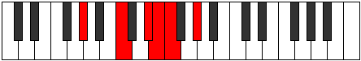

## Diagram

| Circle of Fifth | Chromatic Circle |
|-----------------|------------------|
|  | 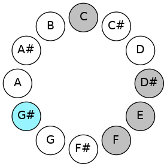 |
## Relative Modes

| Number | Mode | Tonic | Notes | Illustration |
|--------|------|-------|-------|--------------|
| [913](https://ianring.com/musictheory/scales/913) | [Aeolyritonic](ModeAeolyritonic.md) | G# | G#, C, D#, E, F, G# |  |
| [913](https://ianring.com/musictheory/scales/913) | [Aeolyritonic](ModeAeolyritonic.md) | Ab | Ab, C, Eb, E, F, Ab |  |
| [313](https://ianring.com/musictheory/scales/313) | [Goritonic](ModeGoritonic.md) | C | C, D#, E, F, G#, C | 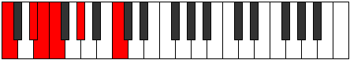 |
| [551](https://ianring.com/musictheory/scales/551) | [Aeoloditonic](ModeAeoloditonic.md) | D# | D#, E, F, G#, C, D# | 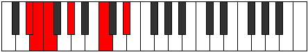 |
| [551](https://ianring.com/musictheory/scales/551) | [Aeoloditonic](ModeAeoloditonic.md) | Eb | Eb, E, F, Ab, C, Eb |  |
| [2323](https://ianring.com/musictheory/scales/2323) | [Doptitonic](ModeDoptitonic.md) | E | E, F, G#, C, D#, E | 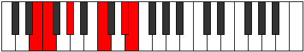 |
| [3209](https://ianring.com/musictheory/scales/3209) | [Aeraphitonic](ModeAeraphitonic.md) | F | F, G#, C, D#, E, F | 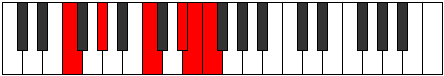 |
## Relative Brightness

| Number | Mode | Tonic | Notes | Circle Of Fifth | Chromatic Circle |
|--------|------|-------|-------|-----------------|------------------|
| [913](https://ianring.com/musictheory/scales/913) | [Aeolyritonic](ModeAeolyritonic.md) | G# | G#, C, D#, E, F, G# | 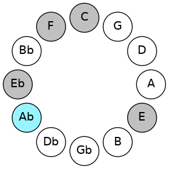 |  
| [913](https://ianring.com/musictheory/scales/913) | [Aeolyritonic](ModeAeolyritonic.md) | Ab | Ab, C, Eb, E, F, Ab |  |  
| [313](https://ianring.com/musictheory/scales/313) | [Goritonic](ModeGoritonic.md) | C | C, D#, E, F, G#, C | 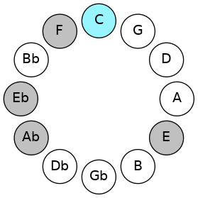 | 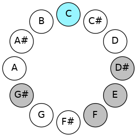 
| [551](https://ianring.com/musictheory/scales/551) | [Aeoloditonic](ModeAeoloditonic.md) | D# | D#, E, F, G#, C, D# | 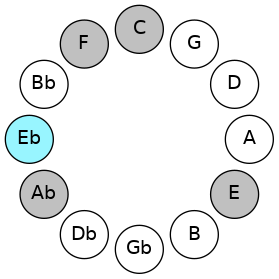 |  
| [551](https://ianring.com/musictheory/scales/551) | [Aeoloditonic](ModeAeoloditonic.md) | Eb | Eb, E, F, Ab, C, Eb |  | 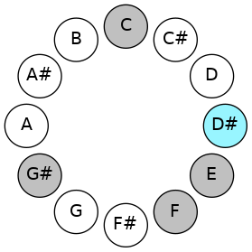 
| [2323](https://ianring.com/musictheory/scales/2323) | [Doptitonic](ModeDoptitonic.md) | E | E, F, G#, C, D#, E | 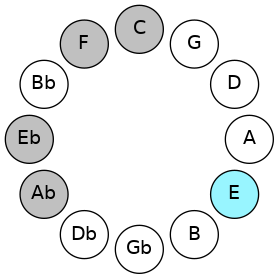 | 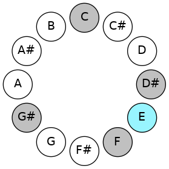 
| [3209](https://ianring.com/musictheory/scales/3209) | [Aeraphitonic](ModeAeraphitonic.md) | F | F, G#, C, D#, E, F | 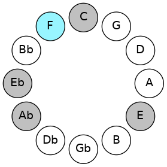 | 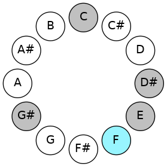 

## Chords

### Ab

| Number | Root | Name | Notes | Illustration | Audio |
|--------|------|------|-------|--------------|-------|
| 264 | Ab | [G#5](ChordGSharpPowerChord.md) | G#, D# |  | [midi](ChordGSharpPowerChordRootPosition.mid) |
| 264 | Ab | [Ab5](ChordAFlatPowerChord.md) | Ab, Eb |  | [midi](ChordAFlatPowerChordRootPosition.mid) |
| 265 | Ab | [G#M](ChordGSharpMajor.md) | G#, B#, D# |  | [midi](ChordGSharpMajorRootPosition.mid) |
| 265 | Ab | [AbM](ChordAFlatMajor.md) | Ab, C, Eb |  | [midi](ChordAFlatMajorRootPosition.mid) |
| 273 | Ab | [G#+](ChordGSharpAugmented.md) | G#, B#, D## |  | [midi](ChordGSharpAugmentedRootPosition.mid) |
| 273 | Ab | [G#+7](ChordGSharpAugmentedAugmentedSeventh.md) | G#, B#, D##, F### |  | [midi](ChordGSharpAugmentedAugmentedSeventhRootPosition.mid) |
| 273 | Ab | [Ab+](ChordAFlatAugmented.md) | Ab, C, E |  | [midi](ChordAFlatAugmentedRootPosition.mid) |
| 273 | Ab | [Ab+7](ChordAFlatAugmentedAugmentedSeventh.md) | Ab, C, E, G# |  | [midi](ChordAFlatAugmentedAugmentedSeventhRootPosition.mid) |
| 289 | Ab | [G#M##5](ChordGSharpMajorDoubleSharpFifth.md) | G#, B#, E# |  | [midi](ChordGSharpMajorDoubleSharpFifthRootPosition.mid) |
| 289 | Ab | [AbM##5](ChordAFlatMajorDoubleSharpFifth.md) | Ab, C, F |  | [midi](ChordAFlatMajorDoubleSharpFifthRootPosition.mid) |
| 297 | Ab | [G#M6](ChordGSharpMajorSixth.md) | G#, B#, D#, E# |  | [midi](ChordGSharpMajorSixthRootPosition.mid) |
| 297 | Ab | [AbM6](ChordAFlatMajorSixth.md) | Ab, C, Eb, F |  | [midi](ChordAFlatMajorSixthRootPosition.mid) |

### C

| Number | Root | Name | Notes | Illustration | Audio |
|--------|------|------|-------|--------------|-------|
| 41 | C | [Cmbb5](ChordCNaturalMinorDoubleFlatFifth.md) | C, Eb, F |  | [midi](ChordCNaturalMinorDoubleFlatFifthRootPosition.mid) |
| 265 | C | [Cm#5](ChordCNaturalMinorSharpFifth.md) | C, Eb, Ab |  | [midi](ChordCNaturalMinorSharpFifthRootPosition.mid) |
| 273 | C | [C+](ChordCNaturalAugmented.md) | C, E, G# |  | [midi](ChordCNaturalAugmentedRootPosition.mid) |
| 273 | C | [C+7](ChordCNaturalAugmentedAugmentedSeventh.md) | C, E, G#, B# |  | [midi](ChordCNaturalAugmentedAugmentedSeventhRootPosition.mid) |
| 289 | C | [Csus4#5](ChordCNaturalSuspendedFourthSharpFifth.md) | C, F, G# |  | [midi](ChordCNaturalSuspendedFourthSharpFifthRootPosition.mid) |

### Eb

| Number | Root | Name | Notes | Illustration | Audio |
|--------|------|------|-------|--------------|-------|
| 296 | Eb | [D#sus2bb5](ChordDSharpSuspendedSecondDoubleFlatFifth.md) | D#, E#, G# |  | [midi](ChordDSharpSuspendedSecondDoubleFlatFifthRootPosition.mid) |
| 296 | Eb | [Ebsus2bb5](ChordEFlatSuspendedSecondDoubleFlatFifth.md) | Eb, F, Ab |  | [midi](ChordEFlatSuspendedSecondDoubleFlatFifthRootPosition.mid) |
| 265 | Eb | [D#sus4##5](ChordDSharpSuspendedFourthDoubleSharpFifth.md) | D#, G#, B# |  | [midi](ChordDSharpSuspendedFourthDoubleSharpFifthRootPosition.mid) |
| 265 | Eb | [Ebsus4##5](ChordEFlatSuspendedFourthDoubleSharpFifth.md) | Eb, Ab, C |  | [midi](ChordEFlatSuspendedFourthDoubleSharpFifthRootPosition.mid) |
| 297 | Eb | [D#M6sus2bb5](ChordDSharpMajorSixthSuspendedSecondDoubleFlatFifth.md) | D#, E#, G#, B# |  | [midi](ChordDSharpMajorSixthSuspendedSecondDoubleFlatFifthRootPosition.mid) |
| 297 | Eb | [EbM6sus2bb5](ChordEFlatMajorSixthSuspendedSecondDoubleFlatFifth.md) | Eb, F, Ab, C |  | [midi](ChordEFlatMajorSixthSuspendedSecondDoubleFlatFifthRootPosition.mid) |

### E

| Number | Root | Name | Notes | Illustration | Audio |
|--------|------|------|-------|--------------|-------|
| 273 | E | [E+](ChordENaturalAugmented.md) | E, G#, B# |  | [midi](ChordENaturalAugmentedRootPosition.mid) |
| 273 | E | [E+7](ChordENaturalAugmentedAugmentedSeventh.md) | E, G#, B#, D## |  | [midi](ChordENaturalAugmentedAugmentedSeventhRootPosition.mid) |
| 281 | E | [E+(M7)](ChordENaturalAugmentedMajorSeventh.md) | E, G#, B#, D# |  | [midi](ChordENaturalAugmentedMajorSeventhRootPosition.mid) |

### F

| Number | Root | Name | Notes | Illustration | Audio |
|--------|------|------|-------|--------------|-------|
| 33 | F | [F5](ChordFNaturalPowerChord.md) | F, C |  | [midi](ChordFNaturalPowerChordRootPosition.mid) |
| 289 | F | [Fm](ChordFNaturalMinor.md) | F, Ab, C |  | [midi](ChordFNaturalMinorRootPosition.mid) |
| 289 | F | [Fm(add(#9))](ChordFNaturalMinorAddSharpNinth.md) | F, Ab, C, G# |  | [midi](ChordFNaturalMinorAddSharpNinthRootPosition.mid) |
| 297 | F | [Fm7](ChordFNaturalMinorSeventh.md) | F, Ab, C, Eb |  | [midi](ChordFNaturalMinorSeventhRootPosition.mid) |
| 305 | F | [Fm(M7)](ChordFNaturalMinorMajorSeventh.md) | F, Ab, C, E |  | [midi](ChordFNaturalMinorMajorSeventhRootPosition.mid) |

