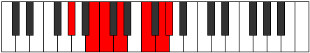
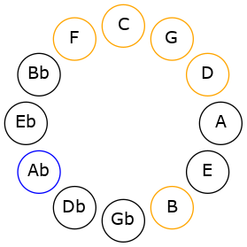
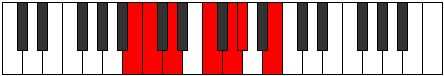
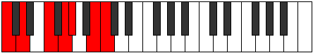
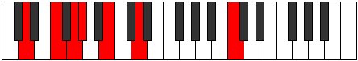
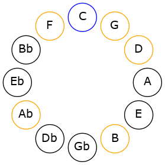
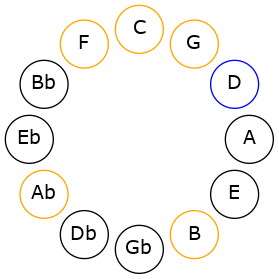

# Mode AFlatAeolythimic

## Links

- [Documentation](README.md)
- [Scales Index](Scales.md)
- [Modes Index](Modes.md)
- [Chords Index](Chords.md)

## Scale

[Bocrimic](ScaleBocrimic.md)

## Mode

[AFlatAeolythimic](ModeAFlatAeolythimic.md)

## Tonic

Ab

## Signature

[CNaturalMajor]

## Transposition

3, 1, 2, 3, 2, 1

## Chord Pattern

v, VI

## Perfection

 - 3 Perfect Notes

 - 3 Imperfect Notes

## Notes

- Ab (Imperfect)
- B (Imperfect)
- C
- D (Imperfect)
- E#
- F##
- Ab (Imperfect)

## Illustration

## Diagram

## Relative Modes

| Number | Mode | Tonic | Notes | Illustration |
|--------|------|-------|-------|--------------|
| [2649](https://ianring.com/musictheory/scales/2649) | [Aeolythimic](ModeAeolythimic.md) | Ab | Ab, B, C, D, E#, F##, Ab |  |
| [843](https://ianring.com/musictheory/scales/843) | [Molimic](ModeMolimic.md) | B | B, C, D, E#, F##, G#, B |  |
| [2469](https://ianring.com/musictheory/scales/2469) | [Staptimic](ModeStaptimic.md) | C | C, D, E#, F##, G#, A##, C |  |
| [1641](https://ianring.com/musictheory/scales/1641) | [Bocrimic](ModeBocrimic.md) | D | D, E#, F##, G#, A##, B#, D |  |
## Relative Brightness

| Number | Mode | Tonic | Notes | Illustration |
|--------|------|-------|-------|--------------|
| [2649](https://ianring.com/musictheory/scales/2649) | [Aeolythimic](ModeAeolythimic.md) | Ab | Ab, B, C, D, E#, F##, Ab |  |
| [843](https://ianring.com/musictheory/scales/843) | [Molimic](ModeMolimic.md) | B | B, C, D, E#, F##, G#, B |  |
| [2469](https://ianring.com/musictheory/scales/2469) | [Staptimic](ModeStaptimic.md) | C | C, D, E#, F##, G#, A##, C |  |
| [1641](https://ianring.com/musictheory/scales/1641) | [Bocrimic](ModeBocrimic.md) | D | D, E#, F##, G#, A##, B#, D |  |

## Chords

### Ab

| Number | Root | Name | Notes | Illustration | Audio |
|--------|------|------|-------|--------------|-------|
| 2308 | Ab | [Abo](ChordAFlatDiminished.md) | Ab, Cb, Ebb |  | [midi](ChordAFlatDiminishedRootPosition.mid) |
| 261 | Ab | [AbMb5](ChordAFlatMajorFlatFifth.md) | Ab, C, Ebb |  | [midi](ChordAFlatMajorFlatFifthRootPosition.mid) |
| 289 | Ab | [AbM##5](ChordAFlatMajorDoubleSharpFifth.md) | Ab, C, F |  | [midi](ChordAFlatMajorDoubleSharpFifthRootPosition.mid) |
| 2340 | Ab | [Abo7](ChordAFlatFullDiminishedSeventh.md) | Ab, Cb, Ebb, Gbb |  | [midi](ChordAFlatFullDiminishedSeventhRootPosition.mid) |
| 293 | Ab | [AbM6b5](ChordAFlatMajorSixthFlatFifth.md) | Ab, C, Ebb, F |  | [midi](ChordAFlatMajorSixthFlatFifthRootPosition.mid) |
| 2436 | Ab | [AboM7](ChordAFlatDiminishedMajorSeventh.md) | Ab, Cb, Ebb, G |  | [midi](ChordAFlatDiminishedMajorSeventhRootPosition.mid) |
| 389 | Ab | [AbM7b5](ChordAFlatMajorSeventhFlatFifth.md) | Ab, C, Ebb, G |  | [midi](ChordAFlatMajorSeventhFlatFifthRootPosition.mid) |
| 417 | Ab | [AbM7##5](ChordAFlatMajorSeventhDoubleSharpFifth.md) | Ab, C, F, G |  | [midi](ChordAFlatMajorSeventhDoubleSharpFifthRootPosition.mid) |

### B

| Number | Root | Name | Notes | Illustration | Audio |
|--------|------|------|-------|--------------|-------|
| 2081 | B | [Bloc](ChordBNaturalLocrian.md) | B, C, F |  | [midi](ChordBNaturalLocrianRootPosition.mid) |
| 2084 | B | [Bo](ChordBNaturalDiminished.md) | B, D, F |  | [midi](ChordBNaturalDiminishedRootPosition.mid) |
| 2180 | B | [Bm#5](ChordBNaturalMinorSharpFifth.md) | B, D, G |  | [midi](ChordBNaturalMinorSharpFifthRootPosition.mid) |
| 2340 | B | [Bo7](ChordBNaturalFullDiminishedSeventh.md) | B, D, F, Ab |  | [midi](ChordBNaturalFullDiminishedSeventhRootPosition.mid) |

### C

| Number | Root | Name | Notes | Illustration | Audio |
|--------|------|------|-------|--------------|-------|
| 37 | C | [Csus2bb5](ChordCNaturalSuspendedSecondDoubleFlatFifth.md) | C, D, F |  | [midi](ChordCNaturalSuspendedSecondDoubleFlatFifthRootPosition.mid) |
| 129 | C | [C5](ChordCNaturalPowerChord.md) | C, G |  | [midi](ChordCNaturalPowerChordRootPosition.mid) |
| 133 | C | [Csus2](ChordCNaturalSuspendedSecond.md) | C, D, G |  | [midi](ChordCNaturalSuspendedSecondRootPosition.mid) |
| 161 | C | [Csus4](ChordCNaturalSuspendedFourth.md) | C, F, G |  | [midi](ChordCNaturalSuspendedFourthRootPosition.mid) |
| 261 | C | [Csus2#5](ChordCNaturalSuspendedSecondSharpFifth.md) | C, D, G# |  | [midi](ChordCNaturalSuspendedSecondSharpFifthRootPosition.mid) |
| 289 | C | [Csus4#5](ChordCNaturalSuspendedFourthSharpFifth.md) | C, F, G# |  | [midi](ChordCNaturalSuspendedFourthSharpFifthRootPosition.mid) |
| 2081 | C | [CQ+](ChordCNaturalQuartalAugmented.md) | C, F, B |  | [midi](ChordCNaturalQuartalAugmentedRootPosition.mid) |
| 2181 | C | [CM7(sus2)](ChordCNaturalMajorSeventhSuspendedSecond.md) | C, D, G, B |  | [midi](ChordCNaturalMajorSeventhSuspendedSecondRootPosition.mid) |
| 2181 | C | [CM9sus2](ChordCNaturalMajorNinthSuspendedSecond.md) | C, D, G, B, D |  | [midi](ChordCNaturalMajorNinthSuspendedSecondRootPosition.mid) |
| 2209 | C | [CM7(sus4)](ChordCNaturalMajorSeventhSuspendedFourth.md) | C, F, G, B |  | [midi](ChordCNaturalMajorSeventhSuspendedFourthRootPosition.mid) |
| 2213 | C | [CM9sus4](ChordCNaturalMajorNinthSuspendedFourth.md) | C, F, G, B, D |  | [midi](ChordCNaturalMajorNinthSuspendedFourthRootPosition.mid) |
| 2337 | C | [CM7(sus4)#5](ChordCNaturalMajorSeventhSuspendedFourthSharpFifth.md) | C, F, G#, B |  | [midi](ChordCNaturalMajorSeventhSuspendedFourthSharpFifthRootPosition.mid) |

### D

| Number | Root | Name | Notes | Illustration | Audio |
|--------|------|------|-------|--------------|-------|
| 164 | D | [Dmbb5](ChordDNaturalMinorDoubleFlatFifth.md) | D, F, G |  | [midi](ChordDNaturalMinorDoubleFlatFifthRootPosition.mid) |
| 292 | D | [Do](ChordDNaturalDiminished.md) | D, F, Ab |  | [midi](ChordDNaturalDiminishedRootPosition.mid) |
| 388 | D | [Dsus4b5](ChordDNaturalSuspendedFourthFlatFifth.md) | D, G, Ab |  | [midi](ChordDNaturalSuspendedFourthFlatFifthRootPosition.mid) |
| 2180 | D | [Dsus4##5](ChordDNaturalSuspendedFourthDoubleSharpFifth.md) | D, G, B |  | [midi](ChordDNaturalSuspendedFourthDoubleSharpFifthRootPosition.mid) |
| 2340 | D | [Do7](ChordDNaturalFullDiminishedSeventh.md) | D, F, Ab, Cb |  | [midi](ChordDNaturalFullDiminishedSeventhRootPosition.mid) |
| 133 | D | [DQ](ChordDNaturalQuartal.md) | D, G, C |  | [midi](ChordDNaturalQuartalRootPosition.mid) |
| 165 | D | [Dm7bb5](ChordDNaturalMinorSeventhDoubleFlatFifth.md) | D, F, G, C |  | [midi](ChordDNaturalMinorSeventhDoubleFlatFifthRootPosition.mid) |
| 293 | D | [Dø7](ChordDNaturalHalfDiminishedSeventh.md) | D, F, Ab, C |  | [midi](ChordDNaturalHalfDiminishedSeventhRootPosition.mid) |

### E#

| Number | Root | Name | Notes | Illustration | Audio |
|--------|------|------|-------|--------------|-------|

### F##

| Number | Root | Name | Notes | Illustration | Audio |
|--------|------|------|-------|--------------|-------|

