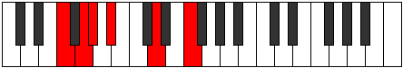
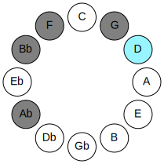

# Mode AFlatAeolythitonic

## Links

- [Documentation](README.md)
- [Scales Index](Scales.md)
- [Modes Index](Modes.md)
- [Chords Index](Chords.md)

## Parent Scale

[Ionaditonic](ScaleIonaditonic.md)

## Mode

[AFlatAeolythitonic](ModeAFlatAeolythitonic.md)

## Number

2629

## Luminosity

-1

## Tonic

Ab

## Signature

C

## Transposition

2, 4, 3, 2, 1

## Chord Pattern

## Perfection

 - 2 Perfect Notes

 - 3 Imperfect Notes

 - Perfection Profile - false, true, false, false, true

## Notes

- Ab (Imperfect)
- Bb
- D (Imperfect)
- F (Imperfect)
- G
- Ab (Imperfect)

## Illustration

## Diagram

| Circle of Fifth | Chromatic Circle |
|-----------------|------------------|
|  |  |
## Relative Modes

| Number | Mode | Luminosity | Tonic | Notes | Illustration |
|--------|------|------------|-------|-------|--------------|
| [2629](https://ianring.com/musictheory/scales/2629) | [Aeolythitonic](ModeAeolythitonic.md) | -1 | G# | G#, A#, D, F, G, G# |  |
| [2629](https://ianring.com/musictheory/scales/2629) | [Aeolythitonic](ModeAeolythitonic.md) | -1 | Ab | Ab, Bb, D, F, G, Ab |  |
| [1681](https://ianring.com/musictheory/scales/1681) | [Ionaditonic](ModeIonaditonic.md) | 5 | A# | A#, D, F, G, G#, A# |  |
| [1681](https://ianring.com/musictheory/scales/1681) | [Ionaditonic](ModeIonaditonic.md) | 5 | Bb | Bb, D, F, G, Ab, Bb |  |
| [361](https://ianring.com/musictheory/scales/361) | [Bocritonic](ModeBocritonic.md) | 4 | D | D, F, G, G#, A#, D |  |
| [557](https://ianring.com/musictheory/scales/557) | [Gythitonic](ModeGythitonic.md) | -1 | F | F, G, G#, A#, D, F |  |
| [1163](https://ianring.com/musictheory/scales/1163) | [Pagitonic](ModePagitonic.md) | -1 | G | G, G#, A#, D, F, G |  |
## Relative Brightness

| Number | Mode | Luminosity | Tonic | Notes | Circle Of Fifth | Chromatic Circle |
|--------|------|------------|-------|-------|-----------------|------------------|
| [2629](https://ianring.com/musictheory/scales/2629) | [Aeolythitonic](ModeAeolythitonic.md) | -1 | G# | G#, A#, D, F, G, G# |  |  |
| [2629](https://ianring.com/musictheory/scales/2629) | [Aeolythitonic](ModeAeolythitonic.md) | -1 | Ab | Ab, Bb, D, F, G, Ab |  |  |
| [1681](https://ianring.com/musictheory/scales/1681) | [Ionaditonic](ModeIonaditonic.md) | 5 | A# | A#, D, F, G, G#, A# |  |  |
| [1681](https://ianring.com/musictheory/scales/1681) | [Ionaditonic](ModeIonaditonic.md) | 5 | Bb | Bb, D, F, G, Ab, Bb |  |  |
| [361](https://ianring.com/musictheory/scales/361) | [Bocritonic](ModeBocritonic.md) | -1 | D | D, F, G, G#, A#, D |  |  |
| [557](https://ianring.com/musictheory/scales/557) | [Gythitonic](ModeGythitonic.md) | 4 | F | F, G, G#, A#, D, F |  |  |
| [1163](https://ianring.com/musictheory/scales/1163) | [Pagitonic](ModePagitonic.md) | 5 | G | G, G#, A#, D, F, G |  |  |

## Chords

### Ab

| Number | Root | Name | Notes | Illustration | Audio |
|--------|------|------|-------|--------------|-------|
| 1284 | Ab | [G#](ChordGSharpDiminishedFlatThird.md) | G#, Bb, D |  | [midi](ChordGSharpDiminishedFlatThirdRootPosition.mid) |
| 1284 | Ab | [G#sus2b5](ChordGSharpSuspendedSecondFlatFifth.md) | G#, A#, D |  | [midi](ChordGSharpSuspendedSecondFlatFifthRootPosition.mid) |
| 1284 | Ab | [Ab](ChordAFlatDiminishedFlatThird.md) | Ab, Cbb, Ebb |  | [midi](ChordAFlatDiminishedFlatThirdRootPosition.mid) |
| 1284 | Ab | [Absus2b5](ChordAFlatSuspendedSecondFlatFifth.md) | Ab, Bb, Ebb |  | [midi](ChordAFlatSuspendedSecondFlatFifthRootPosition.mid) |
| 1316 | Ab | [G#M6sus2b5](ChordGSharpMajorSixthSuspendedSecondFlatFifth.md) | G#, A#, D, E# |  | [midi](ChordGSharpMajorSixthSuspendedSecondFlatFifthRootPosition.mid) |
| 1316 | Ab | [AbM6sus2b5](ChordAFlatMajorSixthSuspendedSecondFlatFifth.md) | Ab, Bb, Ebb, F |  | [midi](ChordAFlatMajorSixthSuspendedSecondFlatFifthRootPosition.mid) |

### Bb

| Number | Root | Name | Notes | Illustration | Audio |
|--------|------|------|-------|--------------|-------|
| 1056 | Bb | [A#5](ChordASharpPowerChord.md) | A#, E# |  | [midi](ChordASharpPowerChordRootPosition.mid) |
| 1056 | Bb | [Bb5](ChordBFlatPowerChord.md) | Bb, F |  | [midi](ChordBFlatPowerChordRootPosition.mid) |
| 1060 | Bb | [A#M](ChordASharpMajor.md) | A#, C##, E# |  | [midi](ChordASharpMajorRootPosition.mid) |
| 1060 | Bb | [BbM](ChordBFlatMajor.md) | Bb, D, F |  | [midi](ChordBFlatMajorRootPosition.mid) |
| 1156 | Bb | [A#M##5](ChordASharpMajorDoubleSharpFifth.md) | A#, C##, F## |  | [midi](ChordASharpMajorDoubleSharpFifthRootPosition.mid) |
| 1156 | Bb | [BbM##5](ChordBFlatMajorDoubleSharpFifth.md) | Bb, D, G |  | [midi](ChordBFlatMajorDoubleSharpFifthRootPosition.mid) |
| 1188 | Bb | [A#M6](ChordASharpMajorSixth.md) | A#, C##, E#, F## |  | [midi](ChordASharpMajorSixthRootPosition.mid) |
| 1188 | Bb | [BbM6](ChordBFlatMajorSixth.md) | Bb, D, F, G |  | [midi](ChordBFlatMajorSixthRootPosition.mid) |
| 1316 | Bb | [A#7](ChordASharpDominantSeventh.md) | A#, C##, E#, G# |  | [midi](ChordASharpDominantSeventhRootPosition.mid) |
| 1316 | Bb | [Bb7](ChordBFlatDominantSeventh.md) | Bb, D, F, Ab |  | [midi](ChordBFlatDominantSeventhRootPosition.mid) |
| 1444 | Bb | [A#7add13](ChordASharpDominantSeventhAddThirteenth.md) | A#, C##, E#, G#, F## |  | [midi](ChordASharpDominantSeventhAddThirteenthRootPosition.mid) |
| 1444 | Bb | [Bb7add13](ChordBFlatDominantSeventhAddThirteenth.md) | Bb, D, F, Ab, G |  | [midi](ChordBFlatDominantSeventhAddThirteenthRootPosition.mid) |

### D

| Number | Root | Name | Notes | Illustration | Audio |
|--------|------|------|-------|--------------|-------|
| 164 | D | [Dmbb5](ChordDNaturalMinorDoubleFlatFifth.md) | D, F, G |  | [midi](ChordDNaturalMinorDoubleFlatFifthRootPosition.mid) |
| 292 | D | [Do](ChordDNaturalDiminished.md) | D, F, Ab |  | [midi](ChordDNaturalDiminishedRootPosition.mid) |
| 388 | D | [Dsus4b5](ChordDNaturalSuspendedFourthFlatFifth.md) | D, G, Ab |  | [midi](ChordDNaturalSuspendedFourthFlatFifthRootPosition.mid) |
| 1060 | D | [Dm#5](ChordDNaturalMinorSharpFifth.md) | D, F, Bb |  | [midi](ChordDNaturalMinorSharpFifthRootPosition.mid) |
| 1156 | D | [Dsus4#5](ChordDNaturalSuspendedFourthSharpFifth.md) | D, G, A# |  | [midi](ChordDNaturalSuspendedFourthSharpFifthRootPosition.mid) |

### F

| Number | Root | Name | Notes | Illustration | Audio |
|--------|------|------|-------|--------------|-------|
| 1184 | F | [Fsus2bb5](ChordFNaturalSuspendedSecondDoubleFlatFifth.md) | F, G, Bb |  | [midi](ChordFNaturalSuspendedSecondDoubleFlatFifthRootPosition.mid) |
| 1312 | F | [Fmbb5](ChordFNaturalMinorDoubleFlatFifth.md) | F, Ab, Bb |  | [midi](ChordFNaturalMinorDoubleFlatFifthRootPosition.mid) |
| 1060 | F | [Fsus4##5](ChordFNaturalSuspendedFourthDoubleSharpFifth.md) | F, Bb, D |  | [midi](ChordFNaturalSuspendedFourthDoubleSharpFifthRootPosition.mid) |
| 1188 | F | [FM6sus2bb5](ChordFNaturalMajorSixthSuspendedSecondDoubleFlatFifth.md) | F, G, Bb, D |  | [midi](ChordFNaturalMajorSixthSuspendedSecondDoubleFlatFifthRootPosition.mid) |

### G

| Number | Root | Name | Notes | Illustration | Audio |
|--------|------|------|-------|--------------|-------|
| 132 | G | [G5](ChordGNaturalPowerChord.md) | G, D |  | [midi](ChordGNaturalPowerChordRootPosition.mid) |
| 388 | G | [Gphryg](ChordGNaturalPhrygian.md) | G, Ab, D |  | [midi](ChordGNaturalPhrygianRootPosition.mid) |
| 1156 | G | [Gm](ChordGNaturalMinor.md) | G, Bb, D |  | [midi](ChordGNaturalMinorRootPosition.mid) |
| 1156 | G | [Gm(add(#9))](ChordGNaturalMinorAddSharpNinth.md) | G, Bb, D, A# |  | [midi](ChordGNaturalMinorAddSharpNinthRootPosition.mid) |
| 1188 | G | [Gm7](ChordGNaturalMinorSeventh.md) | G, Bb, D, F |  | [midi](ChordGNaturalMinorSeventhRootPosition.mid) |
| 1444 | G | [Gm7b9](ChordGNaturalMinorSeventhFlatNinth.md) | G, Bb, D, F, Ab |  | [midi](ChordGNaturalMinorSeventhFlatNinthRootPosition.mid) |

