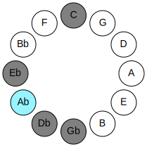
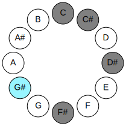
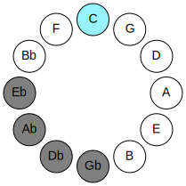
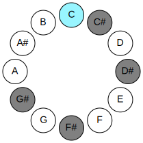
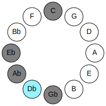
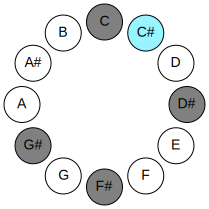
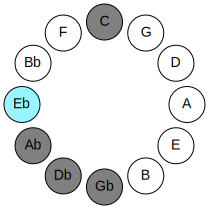
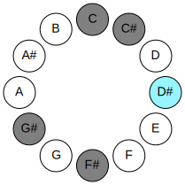
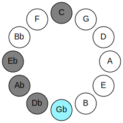
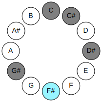

# Mode AFlatAeracritonic

## Links

- [Documentation](README.md)
- [Scales Index](Scales.md)
- [Modes Index](Modes.md)
- [Chords Index](Chords.md)

## Parent Scale

[Aeracritonic](ScaleAeracritonic.md)

## Mode

[AFlatAeracritonic](ModeAFlatAeracritonic.md)

## Number

1201

## Luminosity

3

## Tonic

Ab

## Signature

C

## Transposition

4, 1, 2, 3, 2

## Chord Pattern

## Perfection

 - 3 Perfect Notes

 - 2 Imperfect Notes

 - Perfection Profile - true, false, true, false, true

## Notes

- Ab
- C (Imperfect)
- Db
- Eb (Imperfect)
- Gb
- Ab

## Illustration

## Diagram

| Circle of Fifth | Chromatic Circle |
|-----------------|------------------|
|  |  |
## Relative Modes

| Number | Mode | Luminosity | Tonic | Notes | Illustration |
|--------|------|------------|-------|-------|--------------|
| [1201](https://ianring.com/musictheory/scales/1201) | [Aeracritonic](ModeAeracritonic.md) | 3 | G# | G#, C, C#, D#, F#, G# |  |
| [1201](https://ianring.com/musictheory/scales/1201) | [Aeracritonic](ModeAeracritonic.md) | 3 | Ab | Ab, C, Db, Eb, Gb, Ab |  |
| [331](https://ianring.com/musictheory/scales/331) | [Byptitonic](ModeByptitonic.md) | -1 | C | C, C#, D#, F#, G#, C |  |
| [2213](https://ianring.com/musictheory/scales/2213) | [Daritonic](ModeDaritonic.md) | 4 | C# | C#, D#, F#, G#, C, C# |  |
| [2213](https://ianring.com/musictheory/scales/2213) | [Daritonic](ModeDaritonic.md) | 4 | Db | Db, Eb, Gb, Ab, C, Db |  |
| [1577](https://ianring.com/musictheory/scales/1577) | [Lonitonic](ModeLonitonic.md) | 2 | D# | D#, F#, G#, C, C#, D# |  |
| [1577](https://ianring.com/musictheory/scales/1577) | [Lonitonic](ModeLonitonic.md) | 2 | Eb | Eb, Gb, Ab, C, Db, Eb |  |
| [709](https://ianring.com/musictheory/scales/709) | [Ionycritonic](ModeIonycritonic.md) | 5 | F# | F#, G#, C, C#, D#, F# |  |
| [709](https://ianring.com/musictheory/scales/709) | [Ionycritonic](ModeIonycritonic.md) | 5 | Gb | Gb, Ab, C, Db, Eb, Gb |  |
## Relative Brightness

| Number | Mode | Luminosity | Tonic | Notes | Circle Of Fifth | Chromatic Circle |
|--------|------|------------|-------|-------|-----------------|------------------|
| [1201](https://ianring.com/musictheory/scales/1201) | [Aeracritonic](ModeAeracritonic.md) | 3 | G# | G#, C, C#, D#, F#, G# |  |  |
| [1201](https://ianring.com/musictheory/scales/1201) | [Aeracritonic](ModeAeracritonic.md) | 3 | Ab | Ab, C, Db, Eb, Gb, Ab |  |  |
| [331](https://ianring.com/musictheory/scales/331) | [Byptitonic](ModeByptitonic.md) | -1 | C | C, C#, D#, F#, G#, C |  |  |
| [2213](https://ianring.com/musictheory/scales/2213) | [Daritonic](ModeDaritonic.md) | 4 | C# | C#, D#, F#, G#, C, C# |  |  |
| [2213](https://ianring.com/musictheory/scales/2213) | [Daritonic](ModeDaritonic.md) | 4 | Db | Db, Eb, Gb, Ab, C, Db |  |  |
| [1577](https://ianring.com/musictheory/scales/1577) | [Lonitonic](ModeLonitonic.md) | 2 | D# | D#, F#, G#, C, C#, D# |  |  |
| [1577](https://ianring.com/musictheory/scales/1577) | [Lonitonic](ModeLonitonic.md) | 2 | Eb | Eb, Gb, Ab, C, Db, Eb |  |  |
| [709](https://ianring.com/musictheory/scales/709) | [Ionycritonic](ModeIonycritonic.md) | 5 | F# | F#, G#, C, C#, D#, F# |  |  |
| [709](https://ianring.com/musictheory/scales/709) | [Ionycritonic](ModeIonycritonic.md) | 5 | Gb | Gb, Ab, C, Db, Eb, Gb |  |  |

## Chords

### Ab

| Number | Root | Name | Notes | Illustration | Audio |
|--------|------|------|-------|--------------|-------|
| 264 | Ab | [G#5](ChordGSharpPowerChord.md) | G#, D# |  | [midi](ChordGSharpPowerChordRootPosition.mid) |
| 264 | Ab | [Ab5](ChordAFlatPowerChord.md) | Ab, Eb |  | [midi](ChordAFlatPowerChordRootPosition.mid) |
| 265 | Ab | [G#M](ChordGSharpMajor.md) | G#, B#, D# |  | [midi](ChordGSharpMajorRootPosition.mid) |
| 265 | Ab | [AbM](ChordAFlatMajor.md) | Ab, C, Eb |  | [midi](ChordAFlatMajorRootPosition.mid) |
| 266 | Ab | [G#sus4](ChordGSharpSuspendedFourth.md) | G#, C#, D# |  | [midi](ChordGSharpSuspendedFourthRootPosition.mid) |
| 266 | Ab | [Absus4](ChordAFlatSuspendedFourth.md) | Ab, Db, Eb |  | [midi](ChordAFlatSuspendedFourthRootPosition.mid) |
| 267 | Ab | [G#M(add11)](ChordGSharpMajorAddEleventh.md) | G#, B#, D#, C# |  | [midi](ChordGSharpMajorAddEleventhRootPosition.mid) |
| 267 | Ab | [G#M(add4)](ChordGSharpMajorAddFourth.md) | G#, B#, C#, D# |  | [midi](ChordGSharpMajorAddFourthRootPosition.mid) |
| 267 | Ab | [AbM(add11)](ChordAFlatMajorAddEleventh.md) | Ab, C, Eb, Db |  | [midi](ChordAFlatMajorAddEleventhRootPosition.mid) |
| 267 | Ab | [AbM(add4)](ChordAFlatMajorAddFourth.md) | Ab, C, Db, Eb |  | [midi](ChordAFlatMajorAddFourthRootPosition.mid) |
| 322 | Ab | [G#Q](ChordGSharpQuartal.md) | G#, C#, F# |  | [midi](ChordGSharpQuartalRootPosition.mid) |
| 322 | Ab | [AbQ](ChordAFlatQuartal.md) | Ab, Db, Gb |  | [midi](ChordAFlatQuartalRootPosition.mid) |
| 329 | Ab | [G#7](ChordGSharpDominantSeventh.md) | G#, B#, D#, F# |  | [midi](ChordGSharpDominantSeventhRootPosition.mid) |
| 329 | Ab | [Ab7](ChordAFlatDominantSeventh.md) | Ab, C, Eb, Gb |  | [midi](ChordAFlatDominantSeventhRootPosition.mid) |
| 330 | Ab | [G#7sus4](ChordGSharpDominantSeventhSuspendedFourth.md) | G#, C#, D#, F# |  | [midi](ChordGSharpDominantSeventhSuspendedFourthRootPosition.mid) |
| 330 | Ab | [Ab7sus4](ChordAFlatDominantSeventhSuspendedFourth.md) | Ab, Db, Eb, Gb |  | [midi](ChordAFlatDominantSeventhSuspendedFourthRootPosition.mid) |
| 331 | Ab | [G#7add4](ChordGSharpDominantSeventhAddFourth.md) | G#, B#, C#, D#, F# |  | [midi](ChordGSharpDominantSeventhAddFourthRootPosition.mid) |
| 331 | Ab | [G#7add11](ChordGSharpDominantSeventhAddEleventh.md) | G#, B#, D#, F#, C# |  | [midi](ChordGSharpDominantSeventhAddEleventhRootPosition.mid) |
| 331 | Ab | [Ab7add4](ChordAFlatDominantSeventhAddFourth.md) | Ab, C, Db, Eb, Gb |  | [midi](ChordAFlatDominantSeventhAddFourthRootPosition.mid) |
| 331 | Ab | [Ab7add11](ChordAFlatDominantSeventhAddEleventh.md) | Ab, C, Eb, Gb, Db |  | [midi](ChordAFlatDominantSeventhAddEleventhRootPosition.mid) |

### C

| Number | Root | Name | Notes | Illustration | Audio |
|--------|------|------|-------|--------------|-------|
| 67 | C | [Cloc](ChordCNaturalLocrian.md) | C, Db, Gb |  | [midi](ChordCNaturalLocrianRootPosition.mid) |
| 73 | C | [Co](ChordCNaturalDiminished.md) | C, Eb, Gb |  | [midi](ChordCNaturalDiminishedRootPosition.mid) |
| 265 | C | [Cm#5](ChordCNaturalMinorSharpFifth.md) | C, Eb, Ab |  | [midi](ChordCNaturalMinorSharpFifthRootPosition.mid) |

### Db

| Number | Root | Name | Notes | Illustration | Audio |
|--------|------|------|-------|--------------|-------|
| 74 | Db | [C#sus2bb5](ChordCSharpSuspendedSecondDoubleFlatFifth.md) | C#, D#, F# |  | [midi](ChordCSharpSuspendedSecondDoubleFlatFifthRootPosition.mid) |
| 74 | Db | [Dbsus2bb5](ChordDFlatSuspendedSecondDoubleFlatFifth.md) | Db, Eb, Gb |  | [midi](ChordDFlatSuspendedSecondDoubleFlatFifthRootPosition.mid) |
| 258 | Db | [C#5](ChordCSharpPowerChord.md) | C#, G# |  | [midi](ChordCSharpPowerChordRootPosition.mid) |
| 258 | Db | [Db5](ChordDFlatPowerChord.md) | Db, Ab |  | [midi](ChordDFlatPowerChordRootPosition.mid) |
| 266 | Db | [C#sus2](ChordCSharpSuspendedSecond.md) | C#, D#, G# |  | [midi](ChordCSharpSuspendedSecondRootPosition.mid) |
| 266 | Db | [Dbsus2](ChordDFlatSuspendedSecond.md) | Db, Eb, Ab |  | [midi](ChordDFlatSuspendedSecondRootPosition.mid) |
| 322 | Db | [C#sus4](ChordCSharpSuspendedFourth.md) | C#, F#, G# |  | [midi](ChordCSharpSuspendedFourthRootPosition.mid) |
| 322 | Db | [Dbsus4](ChordDFlatSuspendedFourth.md) | Db, Gb, Ab |  | [midi](ChordDFlatSuspendedFourthRootPosition.mid) |
| 67 | Db | [C#Q+](ChordCSharpQuartalAugmented.md) | C#, F#, B# |  | [midi](ChordCSharpQuartalAugmentedRootPosition.mid) |
| 67 | Db | [DbQ+](ChordDFlatQuartalAugmented.md) | Db, Gb, C |  | [midi](ChordDFlatQuartalAugmentedRootPosition.mid) |
| 267 | Db | [C#M7(sus2)](ChordCSharpMajorSeventhSuspendedSecond.md) | C#, D#, G#, B# |  | [midi](ChordCSharpMajorSeventhSuspendedSecondRootPosition.mid) |
| 267 | Db | [C#M9sus2](ChordCSharpMajorNinthSuspendedSecond.md) | C#, D#, G#, B#, D# |  | [midi](ChordCSharpMajorNinthSuspendedSecondRootPosition.mid) |
| 267 | Db | [DbM7(sus2)](ChordDFlatMajorSeventhSuspendedSecond.md) | Db, Eb, Ab, C |  | [midi](ChordDFlatMajorSeventhSuspendedSecondRootPosition.mid) |
| 267 | Db | [DbM9sus2](ChordDFlatMajorNinthSuspendedSecond.md) | Db, Eb, Ab, C, Eb |  | [midi](ChordDFlatMajorNinthSuspendedSecondRootPosition.mid) |
| 323 | Db | [C#M7(sus4)](ChordCSharpMajorSeventhSuspendedFourth.md) | C#, F#, G#, B# |  | [midi](ChordCSharpMajorSeventhSuspendedFourthRootPosition.mid) |
| 323 | Db | [DbM7(sus4)](ChordDFlatMajorSeventhSuspendedFourth.md) | Db, Gb, Ab, C |  | [midi](ChordDFlatMajorSeventhSuspendedFourthRootPosition.mid) |
| 331 | Db | [C#M9sus4](ChordCSharpMajorNinthSuspendedFourth.md) | C#, F#, G#, B#, D# |  | [midi](ChordCSharpMajorNinthSuspendedFourthRootPosition.mid) |
| 331 | Db | [DbM9sus4](ChordDFlatMajorNinthSuspendedFourth.md) | Db, Gb, Ab, C, Eb |  | [midi](ChordDFlatMajorNinthSuspendedFourthRootPosition.mid) |

### Eb

| Number | Root | Name | Notes | Illustration | Audio |
|--------|------|------|-------|--------------|-------|
| 328 | Eb | [D#mbb5](ChordDSharpMinorDoubleFlatFifth.md) | D#, F#, G# |  | [midi](ChordDSharpMinorDoubleFlatFifthRootPosition.mid) |
| 328 | Eb | [Ebmbb5](ChordEFlatMinorDoubleFlatFifth.md) | Eb, Gb, Ab |  | [midi](ChordEFlatMinorDoubleFlatFifthRootPosition.mid) |
| 265 | Eb | [D#sus4##5](ChordDSharpSuspendedFourthDoubleSharpFifth.md) | D#, G#, B# |  | [midi](ChordDSharpSuspendedFourthDoubleSharpFifthRootPosition.mid) |
| 265 | Eb | [Ebsus4##5](ChordEFlatSuspendedFourthDoubleSharpFifth.md) | Eb, Ab, C |  | [midi](ChordEFlatSuspendedFourthDoubleSharpFifthRootPosition.mid) |
| 266 | Eb | [D#Q](ChordDSharpQuartal.md) | D#, G#, C# |  | [midi](ChordDSharpQuartalRootPosition.mid) |
| 266 | Eb | [EbQ](ChordEFlatQuartal.md) | Eb, Ab, Db |  | [midi](ChordEFlatQuartalRootPosition.mid) |
| 330 | Eb | [D#m7bb5](ChordDSharpMinorSeventhDoubleFlatFifth.md) | D#, F#, G#, C# |  | [midi](ChordDSharpMinorSeventhDoubleFlatFifthRootPosition.mid) |
| 330 | Eb | [Ebm7bb5](ChordEFlatMinorSeventhDoubleFlatFifth.md) | Eb, Gb, Ab, Db |  | [midi](ChordEFlatMinorSeventhDoubleFlatFifthRootPosition.mid) |

### Gb

| Number | Root | Name | Notes | Illustration | Audio |
|--------|------|------|-------|--------------|-------|
| 321 | Gb | [F#](ChordFSharpDiminishedFlatThird.md) | F#, Ab, C |  | [midi](ChordFSharpDiminishedFlatThirdRootPosition.mid) |
| 321 | Gb | [F#sus2b5](ChordFSharpSuspendedSecondFlatFifth.md) | F#, G#, C |  | [midi](ChordFSharpSuspendedSecondFlatFifthRootPosition.mid) |
| 321 | Gb | [Gb](ChordGFlatDiminishedFlatThird.md) | Gb, Bbbb, Dbb |  | [midi](ChordGFlatDiminishedFlatThirdRootPosition.mid) |
| 321 | Gb | [Gbsus2b5](ChordGFlatSuspendedSecondFlatFifth.md) | Gb, Ab, Dbb |  | [midi](ChordGFlatSuspendedSecondFlatFifthRootPosition.mid) |
| 66 | Gb | [F#5](ChordFSharpPowerChord.md) | F#, C# |  | [midi](ChordFSharpPowerChordRootPosition.mid) |
| 66 | Gb | [Gb5](ChordGFlatPowerChord.md) | Gb, Db |  | [midi](ChordGFlatPowerChordRootPosition.mid) |
| 322 | Gb | [F#sus2](ChordFSharpSuspendedSecond.md) | F#, G#, C# |  | [midi](ChordFSharpSuspendedSecondRootPosition.mid) |
| 322 | Gb | [Gbsus2](ChordGFlatSuspendedSecond.md) | Gb, Ab, Db |  | [midi](ChordGFlatSuspendedSecondRootPosition.mid) |
| 67 | Gb | [F#lyd](ChordFSharpLydian.md) | F#, B#, C# |  | [midi](ChordFSharpLydianRootPosition.mid) |
| 67 | Gb | [Gblyd](ChordGFlatLydian.md) | Gb, C, Db |  | [midi](ChordGFlatLydianRootPosition.mid) |
| 329 | Gb | [F#M6sus2b5](ChordFSharpMajorSixthSuspendedSecondFlatFifth.md) | F#, G#, C, D# |  | [midi](ChordFSharpMajorSixthSuspendedSecondFlatFifthRootPosition.mid) |
| 329 | Gb | [GbM6sus2b5](ChordGFlatMajorSixthSuspendedSecondFlatFifth.md) | Gb, Ab, Dbb, Eb |  | [midi](ChordGFlatMajorSixthSuspendedSecondFlatFifthRootPosition.mid) |
| 330 | Gb | [F#M6sus2](ChordFSharpMajorSixthSuspendedSecond.md) | F#, G#, C#, D# |  | [midi](ChordFSharpMajorSixthSuspendedSecondRootPosition.mid) |
| 330 | Gb | [F#7sus2b5](ChordFSharpDominantSeventhSuspendedSecondFlatFifth.md) | F#, G#, C#, Eb |  | [midi](ChordFSharpDominantSeventhSuspendedSecondFlatFifthRootPosition.mid) |
| 330 | Gb | [GbM6sus2](ChordGFlatMajorSixthSuspendedSecond.md) | Gb, Ab, Db, Eb |  | [midi](ChordGFlatMajorSixthSuspendedSecondRootPosition.mid) |
| 330 | Gb | [Gb7sus2b5](ChordGFlatDominantSeventhSuspendedSecondFlatFifth.md) | Gb, Ab, Db, Fbb |  | [midi](ChordGFlatDominantSeventhSuspendedSecondFlatFifthRootPosition.mid) |

