# Mode AFlatAeracrygic

## Links

- [Documentation](README.md)
- [Scales Index](Scales.md)
- [Modes Index](Modes.md)
- [Chords Index](Chords.md)

## Scale

[Mixolydygic](ScaleMixolydygic.md)

## Mode

[AFlatAeracrygic](ModeAFlatAeracrygic.md)

## Tonic

Ab

## Signature

[CNaturalMajor]

## Transposition

1, 1, 1, 3, 1, 1, 1, 2, 1

## Chord Pattern

i⁰b3, ii⁰b3, IIIb5, IVb5

## Perfection

 - 7 Perfect Notes

 - 2 Imperfect Notes

## Notes

- Ab
- A
- Bb
- B (Imperfect)
- D
- Eb
- E
- F (Imperfect)
- G
- Ab

## Illustration

## Diagram

| Circle of Fifth | Chromatic Circle |
|-----------------|------------------|
| 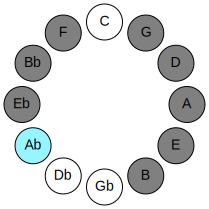 | 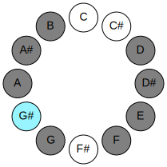 |
## Relative Modes

| Number | Mode | Tonic | Notes | Illustration |
|--------|------|-------|-------|--------------|
| [3023](https://ianring.com/musictheory/scales/3023) | [Aeracrygic](ModeAeracrygic.md) | G# | G#, A, A#, B, D, D#, E, F, G, G# |  |
| [3023](https://ianring.com/musictheory/scales/3023) | [Aeracrygic](ModeAeracrygic.md) | Ab | Ab, A, Bb, B, D, Eb, E, F, G, Ab |  |
| [3559](https://ianring.com/musictheory/scales/3559) | [Aerathygic](ModeAerathygic.md) | A | A, A#, B, D, D#, E, F, G, G#, A |  |
| [3827](https://ianring.com/musictheory/scales/3827) | [Dorygic](ModeDorygic.md) | A# | A#, B, D, D#, E, F, G, G#, A, A# |  |
| [3827](https://ianring.com/musictheory/scales/3827) | [Dorygic](ModeDorygic.md) | Bb | Bb, B, D, Eb, E, F, G, Ab, A, Bb |  |
| [3961](https://ianring.com/musictheory/scales/3961) | [Mixolydygic](ModeMixolydygic.md) | B | B, D, D#, E, F, G, G#, A, A#, B |  |
| [1007](https://ianring.com/musictheory/scales/1007) | [Ionycrygic](ModeIonycrygic.md) | D | D, D#, E, F, G, G#, A, A#, B, D |  |
| [2551](https://ianring.com/musictheory/scales/2551) | [Zoptygic](ModeZoptygic.md) | D# | D#, E, F, G, G#, A, A#, B, D, D# |  |
| [2551](https://ianring.com/musictheory/scales/2551) | [Zoptygic](ModeZoptygic.md) | Eb | Eb, E, F, G, Ab, A, Bb, B, D, Eb |  |
| [3323](https://ianring.com/musictheory/scales/3323) | [Phrygygic](ModePhrygygic.md) | E | E, F, G, G#, A, A#, B, D, D#, E |  |
| [3709](https://ianring.com/musictheory/scales/3709) | [Locrygic](ModeLocrygic.md) | F | F, G, G#, A, A#, B, D, D#, E, F |  |
| [1951](https://ianring.com/musictheory/scales/1951) | [Gonygic](ModeGonygic.md) | G | G, G#, A, A#, B, D, D#, E, F, G |  |
## Relative Brightness

| Number | Mode | Tonic | Notes | Circle Of Fifth | Chromatic Circle |
|--------|------|-------|-------|-----------------|------------------|
| [3023](https://ianring.com/musictheory/scales/3023) | [Aeracrygic](ModeAeracrygic.md) | G# | G#, A, A#, B, D, D#, E, F, G, G# |  |  |
| [3023](https://ianring.com/musictheory/scales/3023) | [Aeracrygic](ModeAeracrygic.md) | Ab | Ab, A, Bb, B, D, Eb, E, F, G, Ab |  |  |
| [3559](https://ianring.com/musictheory/scales/3559) | [Aerathygic](ModeAerathygic.md) | A | A, A#, B, D, D#, E, F, G, G#, A |  | 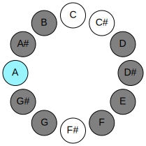 |
| [3827](https://ianring.com/musictheory/scales/3827) | [Dorygic](ModeDorygic.md) | A# | A#, B, D, D#, E, F, G, G#, A, A# | 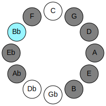 | 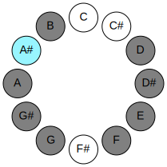 |
| [3827](https://ianring.com/musictheory/scales/3827) | [Dorygic](ModeDorygic.md) | Bb | Bb, B, D, Eb, E, F, G, Ab, A, Bb |  |  |
| [3961](https://ianring.com/musictheory/scales/3961) | [Mixolydygic](ModeMixolydygic.md) | B | B, D, D#, E, F, G, G#, A, A#, B | 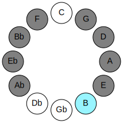 | 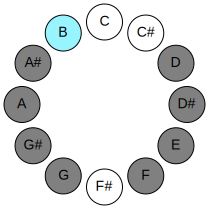 |
| [1007](https://ianring.com/musictheory/scales/1007) | [Ionycrygic](ModeIonycrygic.md) | D | D, D#, E, F, G, G#, A, A#, B, D | 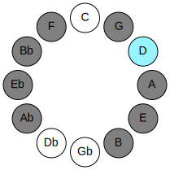 | 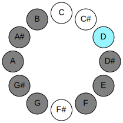 |
| [2551](https://ianring.com/musictheory/scales/2551) | [Zoptygic](ModeZoptygic.md) | D# | D#, E, F, G, G#, A, A#, B, D, D# | 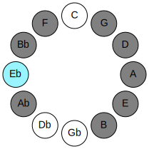 | 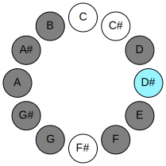 |
| [2551](https://ianring.com/musictheory/scales/2551) | [Zoptygic](ModeZoptygic.md) | Eb | Eb, E, F, G, Ab, A, Bb, B, D, Eb |  |  |
| [3323](https://ianring.com/musictheory/scales/3323) | [Phrygygic](ModePhrygygic.md) | E | E, F, G, G#, A, A#, B, D, D#, E | 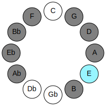 |  |
| [3709](https://ianring.com/musictheory/scales/3709) | [Locrygic](ModeLocrygic.md) | F | F, G, G#, A, A#, B, D, D#, E, F | 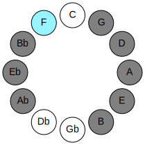 | 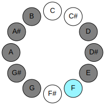 |
| [1951](https://ianring.com/musictheory/scales/1951) | [Gonygic](ModeGonygic.md) | G | G, G#, A, A#, B, D, D#, E, F, G | 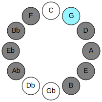 | 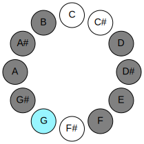 |

## Chords

### Ab

| Number | Root | Name | Notes | Illustration | Audio |
|--------|------|------|-------|--------------|-------|
| 772 | Ab | [G#loc](ChordGSharpLocrian.md) | G#, A, D |  | [midi](ChordGSharpLocrianRootPosition.mid) |
| 772 | Ab | [Abloc](ChordAFlatLocrian.md) | Ab, Bbb, Ebb |  | [midi](ChordAFlatLocrianRootPosition.mid) |
| 1284 | Ab | [G#](ChordGSharpDiminishedFlatThird.md) | G#, Bb, D |  | [midi](ChordGSharpDiminishedFlatThirdRootPosition.mid) |
| 1284 | Ab | [G#sus2b5](ChordGSharpSuspendedSecondFlatFifth.md) | G#, A#, D |  | [midi](ChordGSharpSuspendedSecondFlatFifthRootPosition.mid) |
| 1284 | Ab | [Ab](ChordAFlatDiminishedFlatThird.md) | Ab, Cbb, Ebb |  | [midi](ChordAFlatDiminishedFlatThirdRootPosition.mid) |
| 1284 | Ab | [Absus2b5](ChordAFlatSuspendedSecondFlatFifth.md) | Ab, Bb, Ebb |  | [midi](ChordAFlatSuspendedSecondFlatFifthRootPosition.mid) |
| 2308 | Ab | [G#o](ChordGSharpDiminished.md) | G#, B, D |  | [midi](ChordGSharpDiminishedRootPosition.mid) |
| 2308 | Ab | [Abo](ChordAFlatDiminished.md) | Ab, Cb, Ebb |  | [midi](ChordAFlatDiminishedRootPosition.mid) |
| 264 | Ab | [G#5](ChordGSharpPowerChord.md) | G#, D# |  | [midi](ChordGSharpPowerChordRootPosition.mid) |
| 264 | Ab | [Ab5](ChordAFlatPowerChord.md) | Ab, Eb |  | [midi](ChordAFlatPowerChordRootPosition.mid) |
| 776 | Ab | [G#phryg](ChordGSharpPhrygian.md) | G#, A, D# |  | [midi](ChordGSharpPhrygianRootPosition.mid) |
| 776 | Ab | [Abphryg](ChordAFlatPhrygian.md) | Ab, Bbb, Eb |  | [midi](ChordAFlatPhrygianRootPosition.mid) |
| 1288 | Ab | [G#sus2](ChordGSharpSuspendedSecond.md) | G#, A#, D# |  | [midi](ChordGSharpSuspendedSecondRootPosition.mid) |
| 1288 | Ab | [Absus2](ChordAFlatSuspendedSecond.md) | Ab, Bb, Eb |  | [midi](ChordAFlatSuspendedSecondRootPosition.mid) |
| 2312 | Ab | [G#m](ChordGSharpMinor.md) | G#, B, D# |  | [midi](ChordGSharpMinorRootPosition.mid) |
| 2312 | Ab | [G#m(add(#9))](ChordGSharpMinorAddSharpNinth.md) | G#, B, D#, A## |  | [midi](ChordGSharpMinorAddSharpNinthRootPosition.mid) |
| 2312 | Ab | [Abm](ChordAFlatMinor.md) | Ab, Cb, Eb |  | [midi](ChordAFlatMinorRootPosition.mid) |
| 2312 | Ab | [Abm(add(#9))](ChordAFlatMinorAddSharpNinth.md) | Ab, Cb, Eb, B |  | [midi](ChordAFlatMinorAddSharpNinthRootPosition.mid) |
| 3336 | Ab | [G#m(add9)](ChordGSharpMinorAddNinth.md) | G#, B, D#, A# |  | [midi](ChordGSharpMinorAddNinthRootPosition.mid) |
| 3336 | Ab | [Abm(add9)](ChordAFlatMinorAddNinth.md) | Ab, Cb, Eb, Bb |  | [midi](ChordAFlatMinorAddNinthRootPosition.mid) |
| 268 | Ab | [G#lyd](ChordGSharpLydian.md) | G#, C##, D# |  | [midi](ChordGSharpLydianRootPosition.mid) |
| 268 | Ab | [Ablyd](ChordAFlatLydian.md) | Ab, D, Eb |  | [midi](ChordAFlatLydianRootPosition.mid) |
| 2316 | Ab | [G#m(add(#4))](ChordGSharpMinorAddSharpFourth.md) | G#, B, C##, D# |  | [midi](ChordGSharpMinorAddSharpFourthRootPosition.mid) |
| 2316 | Ab | [Abm(add(#4))](ChordAFlatMinorAddSharpFourth.md) | Ab, Cb, D, Eb |  | [midi](ChordAFlatMinorAddSharpFourthRootPosition.mid) |
| 1296 | Ab | [G#sus2#5](ChordGSharpSuspendedSecondSharpFifth.md) | G#, A#, D## |  | [midi](ChordGSharpSuspendedSecondSharpFifthRootPosition.mid) |
| 1296 | Ab | [Absus2#5](ChordAFlatSuspendedSecondSharpFifth.md) | Ab, Bb, E |  | [midi](ChordAFlatSuspendedSecondSharpFifthRootPosition.mid) |
| 2320 | Ab | [G#m#5](ChordGSharpMinorSharpFifth.md) | G#, B, E |  | [midi](ChordGSharpMinorSharpFifthRootPosition.mid) |
| 2320 | Ab | [Abm#5](ChordAFlatMinorSharpFifth.md) | Ab, Cb, Fb |  | [midi](ChordAFlatMinorSharpFifthRootPosition.mid) |
| 1300 | Ab | [G#sus2b5add(#5)](ChordGSharpSuspendedSecondFlatFifthAddSharpFifth.md) | G#, A#, D, D## |  | [midi](ChordGSharpSuspendedSecondFlatFifthAddSharpFifthRootPosition.mid) |
| 1300 | Ab | [Absus2b5add(#5)](ChordAFlatSuspendedSecondFlatFifthAddSharpFifth.md) | Ab, Bb, Ebb, E |  | [midi](ChordAFlatSuspendedSecondFlatFifthAddSharpFifthRootPosition.mid) |
| 1316 | Ab | [G#M6sus2b5](ChordGSharpMajorSixthSuspendedSecondFlatFifth.md) | G#, A#, D, E# |  | [midi](ChordGSharpMajorSixthSuspendedSecondFlatFifthRootPosition.mid) |
| 1316 | Ab | [AbM6sus2b5](ChordAFlatMajorSixthSuspendedSecondFlatFifth.md) | Ab, Bb, Ebb, F |  | [midi](ChordAFlatMajorSixthSuspendedSecondFlatFifthRootPosition.mid) |
| 2340 | Ab | [G#o7](ChordGSharpFullDiminishedSeventh.md) | G#, B, D, F |  | [midi](ChordGSharpFullDiminishedSeventhRootPosition.mid) |
| 2340 | Ab | [Abo7](ChordAFlatFullDiminishedSeventh.md) | Ab, Cb, Ebb, Gbb |  | [midi](ChordAFlatFullDiminishedSeventhRootPosition.mid) |
| 1320 | Ab | [G#M6sus2](ChordGSharpMajorSixthSuspendedSecond.md) | G#, A#, D#, E# |  | [midi](ChordGSharpMajorSixthSuspendedSecondRootPosition.mid) |
| 1320 | Ab | [G#7sus2b5](ChordGSharpDominantSeventhSuspendedSecondFlatFifth.md) | G#, A#, D#, F |  | [midi](ChordGSharpDominantSeventhSuspendedSecondFlatFifthRootPosition.mid) |
| 1320 | Ab | [AbM6sus2](ChordAFlatMajorSixthSuspendedSecond.md) | Ab, Bb, Eb, F |  | [midi](ChordAFlatMajorSixthSuspendedSecondRootPosition.mid) |
| 1320 | Ab | [Ab7sus2b5](ChordAFlatDominantSeventhSuspendedSecondFlatFifth.md) | Ab, Bb, Eb, Gbb |  | [midi](ChordAFlatDominantSeventhSuspendedSecondFlatFifthRootPosition.mid) |
| 2344 | Ab | [G#m6](ChordGSharpMinorSixth.md) | G#, B, D#, E# |  | [midi](ChordGSharpMinorSixthRootPosition.mid) |
| 2344 | Ab | [Abm6](ChordAFlatMinorSixth.md) | Ab, Cb, Eb, F |  | [midi](ChordAFlatMinorSixthRootPosition.mid) |
| 2856 | Ab | [G#m6(addb9)](ChordGSharpMinorSixthAddFlatNinth.md) | G#, B, D#, E#, A |  | [midi](ChordGSharpMinorSixthAddFlatNinthRootPosition.mid) |
| 2856 | Ab | [Abm6(addb9)](ChordAFlatMinorSixthAddFlatNinth.md) | Ab, Cb, Eb, F, Bbb |  | [midi](ChordAFlatMinorSixthAddFlatNinthRootPosition.mid) |
| 3368 | Ab | [G#m6(add9)](ChordGSharpMinorSixthAddNinth.md) | G#, B, D#, E#, A# |  | [midi](ChordGSharpMinorSixthAddNinthRootPosition.mid) |
| 3368 | Ab | [Abm6(add9)](ChordAFlatMinorSixthAddNinth.md) | Ab, Cb, Eb, F, Bb |  | [midi](ChordAFlatMinorSixthAddNinthRootPosition.mid) |
| 2436 | Ab | [G#oM7](ChordGSharpDiminishedMajorSeventh.md) | G#, B, D, F## |  | [midi](ChordGSharpDiminishedMajorSeventhRootPosition.mid) |
| 2436 | Ab | [AboM7](ChordAFlatDiminishedMajorSeventh.md) | Ab, Cb, Ebb, G |  | [midi](ChordAFlatDiminishedMajorSeventhRootPosition.mid) |
| 904 | Ab | [G#phryg+7](ChordGSharpPhrygianAddSeventh.md) | G#, A, D#, F## |  | [midi](ChordGSharpPhrygianAddSeventhRootPosition.mid) |
| 904 | Ab | [Abphryg+7](ChordAFlatPhrygianAddSeventh.md) | Ab, Bbb, Eb, G |  | [midi](ChordAFlatPhrygianAddSeventhRootPosition.mid) |
| 1416 | Ab | [G#M7(sus2)](ChordGSharpMajorSeventhSuspendedSecond.md) | G#, A#, D#, F## |  | [midi](ChordGSharpMajorSeventhSuspendedSecondRootPosition.mid) |
| 1416 | Ab | [G#M9sus2](ChordGSharpMajorNinthSuspendedSecond.md) | G#, A#, D#, F##, A# |  | [midi](ChordGSharpMajorNinthSuspendedSecondRootPosition.mid) |
| 1416 | Ab | [AbM7(sus2)](ChordAFlatMajorSeventhSuspendedSecond.md) | Ab, Bb, Eb, G |  | [midi](ChordAFlatMajorSeventhSuspendedSecondRootPosition.mid) |
| 1416 | Ab | [AbM9sus2](ChordAFlatMajorNinthSuspendedSecond.md) | Ab, Bb, Eb, G, Bb |  | [midi](ChordAFlatMajorNinthSuspendedSecondRootPosition.mid) |
| 2440 | Ab | [G#m(M7)](ChordGSharpMinorMajorSeventh.md) | G#, B, D#, F## |  | [midi](ChordGSharpMinorMajorSeventhRootPosition.mid) |
| 2440 | Ab | [Abm(M7)](ChordAFlatMinorMajorSeventh.md) | Ab, Cb, Eb, G |  | [midi](ChordAFlatMinorMajorSeventhRootPosition.mid) |
| 3464 | Ab | [G#m(M9)](ChordGSharpMinorMajorNinth.md) | G#, B, D#, F##, A# |  | [midi](ChordGSharpMinorMajorNinthRootPosition.mid) |
| 3464 | Ab | [Abm(M9)](ChordAFlatMinorMajorNinth.md) | Ab, Cb, Eb, G, Bb |  | [midi](ChordAFlatMinorMajorNinthRootPosition.mid) |
| 396 | Ab | [G#lyd(M7)](ChordGSharpLydianMajorSeventh.md) | G#, C##, D#, F## |  | [midi](ChordGSharpLydianMajorSeventhRootPosition.mid) |
| 396 | Ab | [Ablyd(M7)](ChordAFlatLydianMajorSeventh.md) | Ab, D, Eb, G |  | [midi](ChordAFlatLydianMajorSeventhRootPosition.mid) |
| 2472 | Ab | [G#m(M7)add13](ChordGSharpMinorMajorSeventhAddThirteenth.md) | G#, B, D#, F##, E# |  | [midi](ChordGSharpMinorMajorSeventhAddThirteenthRootPosition.mid) |
| 2472 | Ab | [Abm(M7)add13](ChordAFlatMinorMajorSeventhAddThirteenth.md) | Ab, Cb, Eb, G, F |  | [midi](ChordAFlatMinorMajorSeventhAddThirteenthRootPosition.mid) |

### A

| Number | Root | Name | Notes | Illustration | Audio |
|--------|------|------|-------|--------------|-------|
| 2564 | A | [Asus2bb5](ChordANaturalSuspendedSecondDoubleFlatFifth.md) | A, B, D |  | [midi](ChordANaturalSuspendedSecondDoubleFlatFifthRootPosition.mid) |
| 1544 | A | [Aloc](ChordANaturalLocrian.md) | A, Bb, Eb |  | [midi](ChordANaturalLocrianRootPosition.mid) |
| 2568 | A | [A](ChordANaturalDiminishedFlatThird.md) | A, Cb, Eb |  | [midi](ChordANaturalDiminishedFlatThirdRootPosition.mid) |
| 2568 | A | [Asus2b5](ChordANaturalSuspendedSecondFlatFifth.md) | A, B, Eb |  | [midi](ChordANaturalSuspendedSecondFlatFifthRootPosition.mid) |
| 524 | A | [Asus4b5](ChordANaturalSuspendedFourthFlatFifth.md) | A, D, Eb |  | [midi](ChordANaturalSuspendedFourthFlatFifthRootPosition.mid) |
| 528 | A | [A5](ChordANaturalPowerChord.md) | A, E |  | [midi](ChordANaturalPowerChordRootPosition.mid) |
| 1552 | A | [Aphryg](ChordANaturalPhrygian.md) | A, Bb, E |  | [midi](ChordANaturalPhrygianRootPosition.mid) |
| 2576 | A | [Asus2](ChordANaturalSuspendedSecond.md) | A, B, E |  | [midi](ChordANaturalSuspendedSecondRootPosition.mid) |
| 532 | A | [Asus4](ChordANaturalSuspendedFourth.md) | A, D, E |  | [midi](ChordANaturalSuspendedFourthRootPosition.mid) |
| 536 | A | [Alyd](ChordANaturalLydian.md) | A, D#, E |  | [midi](ChordANaturalLydianRootPosition.mid) |
| 2592 | A | [Asus2#5](ChordANaturalSuspendedSecondSharpFifth.md) | A, B, E# |  | [midi](ChordANaturalSuspendedSecondSharpFifthRootPosition.mid) |
| 548 | A | [Asus4#5](ChordANaturalSuspendedFourthSharpFifth.md) | A, D, E# |  | [midi](ChordANaturalSuspendedFourthSharpFifthRootPosition.mid) |
| 2600 | A | [Asus2b5add(#5)](ChordANaturalSuspendedSecondFlatFifthAddSharpFifth.md) | A, B, Eb, E# |  | [midi](ChordANaturalSuspendedSecondFlatFifthAddSharpFifthRootPosition.mid) |
| 644 | A | [AQ](ChordANaturalQuartal.md) | A, D, G |  | [midi](ChordANaturalQuartalRootPosition.mid) |
| 2704 | A | [A7sus2](ChordANaturalDominantSeventhSuspendedSecond.md) | A, B, E, G |  | [midi](ChordANaturalDominantSeventhSuspendedSecondRootPosition.mid) |
| 2704 | A | [A9sus2](ChordANaturalDominantNinthSuspendedSecond.md) | A, B, E, G, B |  | [midi](ChordANaturalDominantNinthSuspendedSecondRootPosition.mid) |
| 660 | A | [A7sus4](ChordANaturalDominantSeventhSuspendedFourth.md) | A, D, E, G |  | [midi](ChordANaturalDominantSeventhSuspendedFourthRootPosition.mid) |
| 2708 | A | [A9sus4](ChordANaturalDominantNinthSuspendedFourth.md) | A, D, E, G, B |  | [midi](ChordANaturalDominantNinthSuspendedFourthRootPosition.mid) |
| 772 | A | [AQ+](ChordANaturalQuartalAugmented.md) | A, D, G# |  | [midi](ChordANaturalQuartalAugmentedRootPosition.mid) |
| 1808 | A | [Aphryg+7](ChordANaturalPhrygianAddSeventh.md) | A, Bb, E, G# |  | [midi](ChordANaturalPhrygianAddSeventhRootPosition.mid) |
| 2832 | A | [AM7(sus2)](ChordANaturalMajorSeventhSuspendedSecond.md) | A, B, E, G# |  | [midi](ChordANaturalMajorSeventhSuspendedSecondRootPosition.mid) |
| 2832 | A | [AM9sus2](ChordANaturalMajorNinthSuspendedSecond.md) | A, B, E, G#, B |  | [midi](ChordANaturalMajorNinthSuspendedSecondRootPosition.mid) |
| 788 | A | [AM7(sus4)](ChordANaturalMajorSeventhSuspendedFourth.md) | A, D, E, G# |  | [midi](ChordANaturalMajorSeventhSuspendedFourthRootPosition.mid) |
| 2836 | A | [AM9sus4](ChordANaturalMajorNinthSuspendedFourth.md) | A, D, E, G#, B |  | [midi](ChordANaturalMajorNinthSuspendedFourthRootPosition.mid) |
| 792 | A | [Alyd(M7)](ChordANaturalLydianMajorSeventh.md) | A, D#, E, G# |  | [midi](ChordANaturalLydianMajorSeventhRootPosition.mid) |
| 804 | A | [AM7(sus4)#5](ChordANaturalMajorSeventhSuspendedFourthSharpFifth.md) | A, D, E#, G# |  | [midi](ChordANaturalMajorSeventhSuspendedFourthSharpFifthRootPosition.mid) |

### Bb

| Number | Root | Name | Notes | Illustration | Audio |
|--------|------|------|-------|--------------|-------|
| 3088 | Bb | [A#loc](ChordASharpLocrian.md) | A#, B, E |  | [midi](ChordASharpLocrianRootPosition.mid) |
| 3088 | Bb | [Bbloc](ChordBFlatLocrian.md) | Bb, Cb, Fb |  | [midi](ChordBFlatLocrianRootPosition.mid) |
| 1044 | Bb | [A#Mb5](ChordASharpMajorFlatFifth.md) | A#, C##, E |  | [midi](ChordASharpMajorFlatFifthRootPosition.mid) |
| 1044 | Bb | [BbMb5](ChordBFlatMajorFlatFifth.md) | Bb, D, Fb |  | [midi](ChordBFlatMajorFlatFifthRootPosition.mid) |
| 1048 | Bb | [A#sus4b5](ChordASharpSuspendedFourthFlatFifth.md) | A#, D#, E |  | [midi](ChordASharpSuspendedFourthFlatFifthRootPosition.mid) |
| 1048 | Bb | [Bbsus4b5](ChordBFlatSuspendedFourthFlatFifth.md) | Bb, Eb, Fb |  | [midi](ChordBFlatSuspendedFourthFlatFifthRootPosition.mid) |
| 1056 | Bb | [A#5](ChordASharpPowerChord.md) | A#, E# |  | [midi](ChordASharpPowerChordRootPosition.mid) |
| 1056 | Bb | [Bb5](ChordBFlatPowerChord.md) | Bb, F |  | [midi](ChordBFlatPowerChordRootPosition.mid) |
| 3104 | Bb | [A#phryg](ChordASharpPhrygian.md) | A#, B, E# |  | [midi](ChordASharpPhrygianRootPosition.mid) |
| 3104 | Bb | [Bbphryg](ChordBFlatPhrygian.md) | Bb, Cb, F |  | [midi](ChordBFlatPhrygianRootPosition.mid) |
| 1060 | Bb | [A#M](ChordASharpMajor.md) | A#, C##, E# |  | [midi](ChordASharpMajorRootPosition.mid) |
| 1060 | Bb | [BbM](ChordBFlatMajor.md) | Bb, D, F |  | [midi](ChordBFlatMajorRootPosition.mid) |
| 1064 | Bb | [A#sus4](ChordASharpSuspendedFourth.md) | A#, D#, E# |  | [midi](ChordASharpSuspendedFourthRootPosition.mid) |
| 1064 | Bb | [Bbsus4](ChordBFlatSuspendedFourth.md) | Bb, Eb, F |  | [midi](ChordBFlatSuspendedFourthRootPosition.mid) |
| 1068 | Bb | [A#M(add11)](ChordASharpMajorAddEleventh.md) | A#, C##, E#, D# |  | [midi](ChordASharpMajorAddEleventhRootPosition.mid) |
| 1068 | Bb | [A#M(add4)](ChordASharpMajorAddFourth.md) | A#, C##, D#, E# |  | [midi](ChordASharpMajorAddFourthRootPosition.mid) |
| 1068 | Bb | [BbM(add11)](ChordBFlatMajorAddEleventh.md) | Bb, D, F, Eb |  | [midi](ChordBFlatMajorAddEleventhRootPosition.mid) |
| 1068 | Bb | [BbM(add4)](ChordBFlatMajorAddFourth.md) | Bb, D, Eb, F |  | [midi](ChordBFlatMajorAddFourthRootPosition.mid) |
| 1072 | Bb | [A#lyd](ChordASharpLydian.md) | A#, D##, E# |  | [midi](ChordASharpLydianRootPosition.mid) |
| 1072 | Bb | [Bblyd](ChordBFlatLydian.md) | Bb, E, F |  | [midi](ChordBFlatLydianRootPosition.mid) |
| 1076 | Bb | [A#M(add(#4))](ChordASharpMajorAddSharpFourth.md) | A#, C##, D##, E# |  | [midi](ChordASharpMajorAddSharpFourthRootPosition.mid) |
| 1076 | Bb | [BbM(add(#4))](ChordBFlatMajorAddSharpFourth.md) | Bb, D, E, F |  | [midi](ChordBFlatMajorAddSharpFourthRootPosition.mid) |
| 1156 | Bb | [A#M##5](ChordASharpMajorDoubleSharpFifth.md) | A#, C##, F## |  | [midi](ChordASharpMajorDoubleSharpFifthRootPosition.mid) |
| 1156 | Bb | [BbM##5](ChordBFlatMajorDoubleSharpFifth.md) | Bb, D, G |  | [midi](ChordBFlatMajorDoubleSharpFifthRootPosition.mid) |
| 1160 | Bb | [A#sus4##5](ChordASharpSuspendedFourthDoubleSharpFifth.md) | A#, D#, F## |  | [midi](ChordASharpSuspendedFourthDoubleSharpFifthRootPosition.mid) |
| 1160 | Bb | [Bbsus4##5](ChordBFlatSuspendedFourthDoubleSharpFifth.md) | Bb, Eb, G |  | [midi](ChordBFlatSuspendedFourthDoubleSharpFifthRootPosition.mid) |
| 1172 | Bb | [A#M6b5](ChordASharpMajorSixthFlatFifth.md) | A#, C##, E, F## |  | [midi](ChordASharpMajorSixthFlatFifthRootPosition.mid) |
| 1172 | Bb | [BbM6b5](ChordBFlatMajorSixthFlatFifth.md) | Bb, D, Fb, G |  | [midi](ChordBFlatMajorSixthFlatFifthRootPosition.mid) |
| 1188 | Bb | [A#M6](ChordASharpMajorSixth.md) | A#, C##, E#, F## |  | [midi](ChordASharpMajorSixthRootPosition.mid) |
| 1188 | Bb | [BbM6](ChordBFlatMajorSixth.md) | Bb, D, F, G |  | [midi](ChordBFlatMajorSixthRootPosition.mid) |
| 3236 | Bb | [A#M6(addb9)](ChordASharpMajorSixthAddFlatNinth.md) | A#, C##, E#, F##, B |  | [midi](ChordASharpMajorSixthAddFlatNinthRootPosition.mid) |
| 3236 | Bb | [BbM6(addb9)](ChordBFlatMajorSixthAddFlatNinth.md) | Bb, D, F, G, Cb |  | [midi](ChordBFlatMajorSixthAddFlatNinthRootPosition.mid) |
| 1192 | Bb | [A#M6sus4](ChordASharpMajorSixthSuspendedFourth.md) | A#, D#, E#, F## |  | [midi](ChordASharpMajorSixthSuspendedFourthRootPosition.mid) |
| 1192 | Bb | [BbM6sus4](ChordBFlatMajorSixthSuspendedFourth.md) | Bb, Eb, F, G |  | [midi](ChordBFlatMajorSixthSuspendedFourthRootPosition.mid) |
| 1288 | Bb | [A#Q](ChordASharpQuartal.md) | A#, D#, G# |  | [midi](ChordASharpQuartalRootPosition.mid) |
| 1288 | Bb | [BbQ](ChordBFlatQuartal.md) | Bb, Eb, Ab |  | [midi](ChordBFlatQuartalRootPosition.mid) |
| 1300 | Bb | [A#7b5](ChordASharpDominantSeventhFlatFifth.md) | A#, C##, E, G# |  | [midi](ChordASharpDominantSeventhFlatFifthRootPosition.mid) |
| 1300 | Bb | [Bb7b5](ChordBFlatDominantSeventhFlatFifth.md) | Bb, D, Fb, Ab |  | [midi](ChordBFlatDominantSeventhFlatFifthRootPosition.mid) |
| 3348 | Bb | [A#7b5b9](ChordASharpDominantSeventhFlatFifthFlatNinth.md) | A#, C##, E, G#, B |  | [midi](ChordASharpDominantSeventhFlatFifthFlatNinthRootPosition.mid) |
| 3348 | Bb | [Bb7b5b9](ChordBFlatDominantSeventhFlatFifthFlatNinth.md) | Bb, D, Fb, Ab, Cb |  | [midi](ChordBFlatDominantSeventhFlatFifthFlatNinthRootPosition.mid) |
| 1316 | Bb | [A#7](ChordASharpDominantSeventh.md) | A#, C##, E#, G# |  | [midi](ChordASharpDominantSeventhRootPosition.mid) |
| 1316 | Bb | [Bb7](ChordBFlatDominantSeventh.md) | Bb, D, F, Ab |  | [midi](ChordBFlatDominantSeventhRootPosition.mid) |
| 3364 | Bb | [A#7b9](ChordASharpDominantSeventhFlatNinth.md) | A#, C##, E#, G#, B |  | [midi](ChordASharpDominantSeventhFlatNinthRootPosition.mid) |
| 3364 | Bb | [Bb7b9](ChordBFlatDominantSeventhFlatNinth.md) | Bb, D, F, Ab, Cb |  | [midi](ChordBFlatDominantSeventhFlatNinthRootPosition.mid) |
| 1320 | Bb | [A#7sus4](ChordASharpDominantSeventhSuspendedFourth.md) | A#, D#, E#, G# |  | [midi](ChordASharpDominantSeventhSuspendedFourthRootPosition.mid) |
| 1320 | Bb | [Bb7sus4](ChordBFlatDominantSeventhSuspendedFourth.md) | Bb, Eb, F, Ab |  | [midi](ChordBFlatDominantSeventhSuspendedFourthRootPosition.mid) |
| 1324 | Bb | [A#7add4](ChordASharpDominantSeventhAddFourth.md) | A#, C##, D#, E#, G# |  | [midi](ChordASharpDominantSeventhAddFourthRootPosition.mid) |
| 1324 | Bb | [A#7add11](ChordASharpDominantSeventhAddEleventh.md) | A#, C##, E#, G#, D# |  | [midi](ChordASharpDominantSeventhAddEleventhRootPosition.mid) |
| 1324 | Bb | [Bb7add4](ChordBFlatDominantSeventhAddFourth.md) | Bb, D, Eb, F, Ab |  | [midi](ChordBFlatDominantSeventhAddFourthRootPosition.mid) |
| 1324 | Bb | [Bb7add11](ChordBFlatDominantSeventhAddEleventh.md) | Bb, D, F, Ab, Eb |  | [midi](ChordBFlatDominantSeventhAddEleventhRootPosition.mid) |
| 1332 | Bb | [A#7add(#4)](ChordASharpDominantSeventhAddSharpFourth.md) | A#, C##, D##, E#, G# |  | [midi](ChordASharpDominantSeventhAddSharpFourthRootPosition.mid) |
| 1332 | Bb | [A#7#11](ChordASharpDominantSeventhSharpEleventh.md) | A#, C##, E#, G#, D## |  | [midi](ChordASharpDominantSeventhSharpEleventhRootPosition.mid) |
| 1332 | Bb | [Bb7add(#4)](ChordBFlatDominantSeventhAddSharpFourth.md) | Bb, D, E, F, Ab |  | [midi](ChordBFlatDominantSeventhAddSharpFourthRootPosition.mid) |
| 1332 | Bb | [Bb7#11](ChordBFlatDominantSeventhSharpEleventh.md) | Bb, D, F, Ab, E |  | [midi](ChordBFlatDominantSeventhSharpEleventhRootPosition.mid) |
| 1444 | Bb | [A#7add13](ChordASharpDominantSeventhAddThirteenth.md) | A#, C##, E#, G#, F## |  | [midi](ChordASharpDominantSeventhAddThirteenthRootPosition.mid) |
| 1444 | Bb | [Bb7add13](ChordBFlatDominantSeventhAddThirteenth.md) | Bb, D, F, Ab, G |  | [midi](ChordBFlatDominantSeventhAddThirteenthRootPosition.mid) |
| 3500 | Bb | [A#13b9](ChordASharpDominantThirteenthFlatNinth.md) | A#, C##, E#, G#, B, D#, F## |  | [midi](ChordASharpDominantThirteenthFlatNinthRootPosition.mid) |
| 3500 | Bb | [Bb13b9](ChordBFlatDominantThirteenthFlatNinth.md) | Bb, D, F, Ab, Cb, Eb, G |  | [midi](ChordBFlatDominantThirteenthFlatNinthRootPosition.mid) |
| 1544 | Bb | [A#Q+](ChordASharpQuartalAugmented.md) | A#, D#, G## |  | [midi](ChordASharpQuartalAugmentedRootPosition.mid) |
| 1544 | Bb | [BbQ+](ChordBFlatQuartalAugmented.md) | Bb, Eb, A |  | [midi](ChordBFlatQuartalAugmentedRootPosition.mid) |
| 1556 | Bb | [A#M7b5](ChordASharpMajorSeventhFlatFifth.md) | A#, C##, E, G## |  | [midi](ChordASharpMajorSeventhFlatFifthRootPosition.mid) |
| 1556 | Bb | [BbM7b5](ChordBFlatMajorSeventhFlatFifth.md) | Bb, D, Fb, A |  | [midi](ChordBFlatMajorSeventhFlatFifthRootPosition.mid) |
| 3616 | Bb | [A#phryg+7](ChordASharpPhrygianAddSeventh.md) | A#, B, E#, G## |  | [midi](ChordASharpPhrygianAddSeventhRootPosition.mid) |
| 3616 | Bb | [Bbphryg+7](ChordBFlatPhrygianAddSeventh.md) | Bb, Cb, F, A |  | [midi](ChordBFlatPhrygianAddSeventhRootPosition.mid) |
| 1572 | Bb | [A#M7](ChordASharpMajorSeventh.md) | A#, C##, E#, G## |  | [midi](ChordASharpMajorSeventhRootPosition.mid) |
| 1572 | Bb | [BbM7](ChordBFlatMajorSeventh.md) | Bb, D, F, A |  | [midi](ChordBFlatMajorSeventhRootPosition.mid) |
| 1576 | Bb | [A#M7(sus4)](ChordASharpMajorSeventhSuspendedFourth.md) | A#, D#, E#, G## |  | [midi](ChordASharpMajorSeventhSuspendedFourthRootPosition.mid) |
| 1576 | Bb | [BbM7(sus4)](ChordBFlatMajorSeventhSuspendedFourth.md) | Bb, Eb, F, A |  | [midi](ChordBFlatMajorSeventhSuspendedFourthRootPosition.mid) |
| 1580 | Bb | [A#M7add4](ChordASharpMajorSeventhAddFourth.md) | A#, C##, D#, E#, G## |  | [midi](ChordASharpMajorSeventhAddFourthRootPosition.mid) |
| 1580 | Bb | [A#M7add11](ChordASharpMajorSeventhAddEleventh.md) | A#, C##, E#, G##, D# |  | [midi](ChordASharpMajorSeventhAddEleventhRootPosition.mid) |
| 1580 | Bb | [BbM7add4](ChordBFlatMajorSeventhAddFourth.md) | Bb, D, Eb, F, A |  | [midi](ChordBFlatMajorSeventhAddFourthRootPosition.mid) |
| 1580 | Bb | [BbM7add11](ChordBFlatMajorSeventhAddEleventh.md) | Bb, D, F, A, Eb |  | [midi](ChordBFlatMajorSeventhAddEleventhRootPosition.mid) |
| 1584 | Bb | [A#lyd(M7)](ChordASharpLydianMajorSeventh.md) | A#, D##, E#, G## |  | [midi](ChordASharpLydianMajorSeventhRootPosition.mid) |
| 1584 | Bb | [Bblyd(M7)](ChordBFlatLydianMajorSeventh.md) | Bb, E, F, A |  | [midi](ChordBFlatLydianMajorSeventhRootPosition.mid) |
| 1588 | Bb | [A#M7add(#11)](ChordASharpMajorSeventhAddSharpEleventh.md) | A#, C##, E#, G##, D## |  | [midi](ChordASharpMajorSeventhAddSharpEleventhRootPosition.mid) |
| 1588 | Bb | [A#M7add(#4)](ChordASharpMajorSeventhAddSharpFourth.md) | A#, C##, D##, E#, G## |  | [midi](ChordASharpMajorSeventhAddSharpFourthRootPosition.mid) |
| 1588 | Bb | [BbM7add(#11)](ChordBFlatMajorSeventhAddSharpEleventh.md) | Bb, D, F, A, E |  | [midi](ChordBFlatMajorSeventhAddSharpEleventhRootPosition.mid) |
| 1588 | Bb | [BbM7add(#4)](ChordBFlatMajorSeventhAddSharpFourth.md) | Bb, D, E, F, A |  | [midi](ChordBFlatMajorSeventhAddSharpFourthRootPosition.mid) |
| 1668 | Bb | [A#M7##5](ChordASharpMajorSeventhDoubleSharpFifth.md) | A#, C##, F##, G## |  | [midi](ChordASharpMajorSeventhDoubleSharpFifthRootPosition.mid) |
| 1668 | Bb | [BbM7##5](ChordBFlatMajorSeventhDoubleSharpFifth.md) | Bb, D, G, A |  | [midi](ChordBFlatMajorSeventhDoubleSharpFifthRootPosition.mid) |
| 1672 | Bb | [A#M7(sus4)##5](ChordASharpMajorSeventhSuspendedFourthDoubleSharpFifth.md) | A#, D#, F##, G## |  | [midi](ChordASharpMajorSeventhSuspendedFourthDoubleSharpFifthRootPosition.mid) |
| 1672 | Bb | [BbM7(sus4)##5](ChordBFlatMajorSeventhSuspendedFourthDoubleSharpFifth.md) | Bb, Eb, G, A |  | [midi](ChordBFlatMajorSeventhSuspendedFourthDoubleSharpFifthRootPosition.mid) |
| 1700 | Bb | [A#M7add13](ChordASharpMajorSeventhAddThirteenth.md) | A#, C##, E#, G##, F## |  | [midi](ChordASharpMajorSeventhAddThirteenthRootPosition.mid) |
| 1700 | Bb | [BbM7add13](ChordBFlatMajorSeventhAddThirteenth.md) | Bb, D, F, A, G |  | [midi](ChordBFlatMajorSeventhAddThirteenthRootPosition.mid) |

### B

| Number | Root | Name | Notes | Illustration | Audio |
|--------|------|------|-------|--------------|-------|
| 2068 | B | [Bmbb5](ChordBNaturalMinorDoubleFlatFifth.md) | B, D, E |  | [midi](ChordBNaturalMinorDoubleFlatFifthRootPosition.mid) |
| 2084 | B | [Bo](ChordBNaturalDiminished.md) | B, D, F |  | [midi](ChordBNaturalDiminishedRootPosition.mid) |
| 2088 | B | [BMb5](ChordBNaturalMajorFlatFifth.md) | B, D#, F |  | [midi](ChordBNaturalMajorFlatFifthRootPosition.mid) |
| 2096 | B | [Bsus4b5](ChordBNaturalSuspendedFourthFlatFifth.md) | B, E, F |  | [midi](ChordBNaturalSuspendedFourthFlatFifthRootPosition.mid) |
| 2180 | B | [Bm#5](ChordBNaturalMinorSharpFifth.md) | B, D, G |  | [midi](ChordBNaturalMinorSharpFifthRootPosition.mid) |
| 2184 | B | [B+](ChordBNaturalAugmented.md) | B, D#, F## |  | [midi](ChordBNaturalAugmentedRootPosition.mid) |
| 2184 | B | [B+7](ChordBNaturalAugmentedAugmentedSeventh.md) | B, D#, F##, A## |  | [midi](ChordBNaturalAugmentedAugmentedSeventhRootPosition.mid) |
| 2192 | B | [Bsus4#5](ChordBNaturalSuspendedFourthSharpFifth.md) | B, E, F## |  | [midi](ChordBNaturalSuspendedFourthSharpFifthRootPosition.mid) |
| 2312 | B | [BM##5](ChordBNaturalMajorDoubleSharpFifth.md) | B, D#, G# |  | [midi](ChordBNaturalMajorDoubleSharpFifthRootPosition.mid) |
| 2320 | B | [Bsus4##5](ChordBNaturalSuspendedFourthDoubleSharpFifth.md) | B, E, G# |  | [midi](ChordBNaturalSuspendedFourthDoubleSharpFifthRootPosition.mid) |
| 2340 | B | [Bo7](ChordBNaturalFullDiminishedSeventh.md) | B, D, F, Ab |  | [midi](ChordBNaturalFullDiminishedSeventhRootPosition.mid) |
| 2344 | B | [BM6b5](ChordBNaturalMajorSixthFlatFifth.md) | B, D#, F, G# |  | [midi](ChordBNaturalMajorSixthFlatFifthRootPosition.mid) |
| 2576 | B | [BQ](ChordBNaturalQuartal.md) | B, E, A |  | [midi](ChordBNaturalQuartalRootPosition.mid) |
| 2580 | B | [Bm7bb5](ChordBNaturalMinorSeventhDoubleFlatFifth.md) | B, D, E, A |  | [midi](ChordBNaturalMinorSeventhDoubleFlatFifthRootPosition.mid) |
| 2596 | B | [Bø7](ChordBNaturalHalfDiminishedSeventh.md) | B, D, F, A |  | [midi](ChordBNaturalHalfDiminishedSeventhRootPosition.mid) |
| 2600 | B | [B7b5](ChordBNaturalDominantSeventhFlatFifth.md) | B, D#, F, A |  | [midi](ChordBNaturalDominantSeventhFlatFifthRootPosition.mid) |
| 2692 | B | [Bm7#5](ChordBNaturalMinorSeventhSharpFifth.md) | B, D, F##, A |  | [midi](ChordBNaturalMinorSeventhSharpFifthRootPosition.mid) |
| 3088 | B | [BQ+](ChordBNaturalQuartalAugmented.md) | B, E, A# |  | [midi](ChordBNaturalQuartalAugmentedRootPosition.mid) |
| 3108 | B | [BoM7](ChordBNaturalDiminishedMajorSeventh.md) | B, D, F, A# |  | [midi](ChordBNaturalDiminishedMajorSeventhRootPosition.mid) |
| 3112 | B | [BM7b5](ChordBNaturalMajorSeventhFlatFifth.md) | B, D#, F, A# |  | [midi](ChordBNaturalMajorSeventhFlatFifthRootPosition.mid) |
| 3208 | B | [B+(M7)](ChordBNaturalAugmentedMajorSeventh.md) | B, D#, F##, A# |  | [midi](ChordBNaturalAugmentedMajorSeventhRootPosition.mid) |
| 3216 | B | [BM7(sus4)#5](ChordBNaturalMajorSeventhSuspendedFourthSharpFifth.md) | B, E, F##, A# |  | [midi](ChordBNaturalMajorSeventhSuspendedFourthSharpFifthRootPosition.mid) |
| 3336 | B | [BM7##5](ChordBNaturalMajorSeventhDoubleSharpFifth.md) | B, D#, G#, A# |  | [midi](ChordBNaturalMajorSeventhDoubleSharpFifthRootPosition.mid) |
| 3344 | B | [BM7(sus4)##5](ChordBNaturalMajorSeventhSuspendedFourthDoubleSharpFifth.md) | B, E, G#, A# |  | [midi](ChordBNaturalMajorSeventhSuspendedFourthDoubleSharpFifthRootPosition.mid) |

### D

| Number | Root | Name | Notes | Illustration | Audio |
|--------|------|------|-------|--------------|-------|
| 148 | D | [Dsus2bb5](ChordDNaturalSuspendedSecondDoubleFlatFifth.md) | D, E, G |  | [midi](ChordDNaturalSuspendedSecondDoubleFlatFifthRootPosition.mid) |
| 164 | D | [Dmbb5](ChordDNaturalMinorDoubleFlatFifth.md) | D, F, G |  | [midi](ChordDNaturalMinorDoubleFlatFifthRootPosition.mid) |
| 268 | D | [Dloc](ChordDNaturalLocrian.md) | D, Eb, Ab |  | [midi](ChordDNaturalLocrianRootPosition.mid) |
| 276 | D | [D](ChordDNaturalDiminishedFlatThird.md) | D, Fb, Ab |  | [midi](ChordDNaturalDiminishedFlatThirdRootPosition.mid) |
| 276 | D | [Dsus2b5](ChordDNaturalSuspendedSecondFlatFifth.md) | D, E, Ab |  | [midi](ChordDNaturalSuspendedSecondFlatFifthRootPosition.mid) |
| 292 | D | [Do](ChordDNaturalDiminished.md) | D, F, Ab |  | [midi](ChordDNaturalDiminishedRootPosition.mid) |
| 388 | D | [Dsus4b5](ChordDNaturalSuspendedFourthFlatFifth.md) | D, G, Ab |  | [midi](ChordDNaturalSuspendedFourthFlatFifthRootPosition.mid) |
| 516 | D | [D5](ChordDNaturalPowerChord.md) | D, A |  | [midi](ChordDNaturalPowerChordRootPosition.mid) |
| 524 | D | [Dphryg](ChordDNaturalPhrygian.md) | D, Eb, A |  | [midi](ChordDNaturalPhrygianRootPosition.mid) |
| 532 | D | [Dsus2](ChordDNaturalSuspendedSecond.md) | D, E, A |  | [midi](ChordDNaturalSuspendedSecondRootPosition.mid) |
| 548 | D | [Dm](ChordDNaturalMinor.md) | D, F, A |  | [midi](ChordDNaturalMinorRootPosition.mid) |
| 548 | D | [Dm(add(#9))](ChordDNaturalMinorAddSharpNinth.md) | D, F, A, E# |  | [midi](ChordDNaturalMinorAddSharpNinthRootPosition.mid) |
| 564 | D | [Dm(add9)](ChordDNaturalMinorAddNinth.md) | D, F, A, E |  | [midi](ChordDNaturalMinorAddNinthRootPosition.mid) |
| 644 | D | [Dsus4](ChordDNaturalSuspendedFourth.md) | D, G, A |  | [midi](ChordDNaturalSuspendedFourthRootPosition.mid) |
| 676 | D | [Dm(add11)](ChordDNaturalMinorAddEleventh.md) | D, F, A, G |  | [midi](ChordDNaturalMinorAddEleventhRootPosition.mid) |
| 676 | D | [Dm(add4)](ChordDNaturalMinorAddFourth.md) | D, F, G, A |  | [midi](ChordDNaturalMinorAddFourthRootPosition.mid) |
| 772 | D | [Dlyd](ChordDNaturalLydian.md) | D, G#, A |  | [midi](ChordDNaturalLydianRootPosition.mid) |
| 804 | D | [Dm(add(#4))](ChordDNaturalMinorAddSharpFourth.md) | D, F, G#, A |  | [midi](ChordDNaturalMinorAddSharpFourthRootPosition.mid) |
| 1044 | D | [Dsus2#5](ChordDNaturalSuspendedSecondSharpFifth.md) | D, E, A# |  | [midi](ChordDNaturalSuspendedSecondSharpFifthRootPosition.mid) |
| 1060 | D | [Dm#5](ChordDNaturalMinorSharpFifth.md) | D, F, Bb |  | [midi](ChordDNaturalMinorSharpFifthRootPosition.mid) |
| 1156 | D | [Dsus4#5](ChordDNaturalSuspendedFourthSharpFifth.md) | D, G, A# |  | [midi](ChordDNaturalSuspendedFourthSharpFifthRootPosition.mid) |
| 1300 | D | [Dsus2b5add(#5)](ChordDNaturalSuspendedSecondFlatFifthAddSharpFifth.md) | D, E, Ab, A# |  | [midi](ChordDNaturalSuspendedSecondFlatFifthAddSharpFifthRootPosition.mid) |
| 2180 | D | [Dsus4##5](ChordDNaturalSuspendedFourthDoubleSharpFifth.md) | D, G, B |  | [midi](ChordDNaturalSuspendedFourthDoubleSharpFifthRootPosition.mid) |
| 2196 | D | [DM6sus2bb5](ChordDNaturalMajorSixthSuspendedSecondDoubleFlatFifth.md) | D, E, G, B |  | [midi](ChordDNaturalMajorSixthSuspendedSecondDoubleFlatFifthRootPosition.mid) |
| 2324 | D | [DM6sus2b5](ChordDNaturalMajorSixthSuspendedSecondFlatFifth.md) | D, E, Ab, B |  | [midi](ChordDNaturalMajorSixthSuspendedSecondFlatFifthRootPosition.mid) |
| 2340 | D | [Do7](ChordDNaturalFullDiminishedSeventh.md) | D, F, Ab, Cb |  | [midi](ChordDNaturalFullDiminishedSeventhRootPosition.mid) |
| 2580 | D | [DM6sus2](ChordDNaturalMajorSixthSuspendedSecond.md) | D, E, A, B |  | [midi](ChordDNaturalMajorSixthSuspendedSecondRootPosition.mid) |
| 2580 | D | [D7sus2b5](ChordDNaturalDominantSeventhSuspendedSecondFlatFifth.md) | D, E, A, Cb |  | [midi](ChordDNaturalDominantSeventhSuspendedSecondFlatFifthRootPosition.mid) |
| 2596 | D | [Dm6](ChordDNaturalMinorSixth.md) | D, F, A, B |  | [midi](ChordDNaturalMinorSixthRootPosition.mid) |
| 2604 | D | [Dm6(addb9)](ChordDNaturalMinorSixthAddFlatNinth.md) | D, F, A, B, Eb |  | [midi](ChordDNaturalMinorSixthAddFlatNinthRootPosition.mid) |
| 2612 | D | [Dm6(add9)](ChordDNaturalMinorSixthAddNinth.md) | D, F, A, B, E |  | [midi](ChordDNaturalMinorSixthAddNinthRootPosition.mid) |
| 2692 | D | [DM6sus4](ChordDNaturalMajorSixthSuspendedFourth.md) | D, G, A, B |  | [midi](ChordDNaturalMajorSixthSuspendedFourthRootPosition.mid) |

### Eb

| Number | Root | Name | Notes | Illustration | Audio |
|--------|------|------|-------|--------------|-------|
| 296 | Eb | [D#sus2bb5](ChordDSharpSuspendedSecondDoubleFlatFifth.md) | D#, E#, G# |  | [midi](ChordDSharpSuspendedSecondDoubleFlatFifthRootPosition.mid) |
| 296 | Eb | [Ebsus2bb5](ChordEFlatSuspendedSecondDoubleFlatFifth.md) | Eb, F, Ab |  | [midi](ChordEFlatSuspendedSecondDoubleFlatFifthRootPosition.mid) |
| 536 | Eb | [D#loc](ChordDSharpLocrian.md) | D#, E, A |  | [midi](ChordDSharpLocrianRootPosition.mid) |
| 536 | Eb | [Ebloc](ChordEFlatLocrian.md) | Eb, Fb, Bbb |  | [midi](ChordEFlatLocrianRootPosition.mid) |
| 552 | Eb | [D#](ChordDSharpDiminishedFlatThird.md) | D#, F, A |  | [midi](ChordDSharpDiminishedFlatThirdRootPosition.mid) |
| 552 | Eb | [D#sus2b5](ChordDSharpSuspendedSecondFlatFifth.md) | D#, E#, A |  | [midi](ChordDSharpSuspendedSecondFlatFifthRootPosition.mid) |
| 552 | Eb | [Eb](ChordEFlatDiminishedFlatThird.md) | Eb, Gbb, Bbb |  | [midi](ChordEFlatDiminishedFlatThirdRootPosition.mid) |
| 552 | Eb | [Ebsus2b5](ChordEFlatSuspendedSecondFlatFifth.md) | Eb, F, Bbb |  | [midi](ChordEFlatSuspendedSecondFlatFifthRootPosition.mid) |
| 648 | Eb | [D#Mb5](ChordDSharpMajorFlatFifth.md) | D#, F##, A |  | [midi](ChordDSharpMajorFlatFifthRootPosition.mid) |
| 648 | Eb | [EbMb5](ChordEFlatMajorFlatFifth.md) | Eb, G, Bbb |  | [midi](ChordEFlatMajorFlatFifthRootPosition.mid) |
| 776 | Eb | [D#sus4b5](ChordDSharpSuspendedFourthFlatFifth.md) | D#, G#, A |  | [midi](ChordDSharpSuspendedFourthFlatFifthRootPosition.mid) |
| 776 | Eb | [Ebsus4b5](ChordEFlatSuspendedFourthFlatFifth.md) | Eb, Ab, Bbb |  | [midi](ChordEFlatSuspendedFourthFlatFifthRootPosition.mid) |
| 1032 | Eb | [D#5](ChordDSharpPowerChord.md) | D#, A# |  | [midi](ChordDSharpPowerChordRootPosition.mid) |
| 1032 | Eb | [Eb5](ChordEFlatPowerChord.md) | Eb, Bb |  | [midi](ChordEFlatPowerChordRootPosition.mid) |
| 1048 | Eb | [D#phryg](ChordDSharpPhrygian.md) | D#, E, A# |  | [midi](ChordDSharpPhrygianRootPosition.mid) |
| 1048 | Eb | [Ebphryg](ChordEFlatPhrygian.md) | Eb, Fb, Bb |  | [midi](ChordEFlatPhrygianRootPosition.mid) |
| 1064 | Eb | [D#sus2](ChordDSharpSuspendedSecond.md) | D#, E#, A# |  | [midi](ChordDSharpSuspendedSecondRootPosition.mid) |
| 1064 | Eb | [Ebsus2](ChordEFlatSuspendedSecond.md) | Eb, F, Bb |  | [midi](ChordEFlatSuspendedSecondRootPosition.mid) |
| 1160 | Eb | [D#M](ChordDSharpMajor.md) | D#, F##, A# |  | [midi](ChordDSharpMajorRootPosition.mid) |
| 1160 | Eb | [EbM](ChordEFlatMajor.md) | Eb, G, Bb |  | [midi](ChordEFlatMajorRootPosition.mid) |
| 1192 | Eb | [D#M(add9)](ChordDSharpMajorAddNinth.md) | D#, F##, A#, E# |  | [midi](ChordDSharpMajorAddNinthRootPosition.mid) |
| 1192 | Eb | [EbM(add9)](ChordEFlatMajorAddNinth.md) | Eb, G, Bb, F |  | [midi](ChordEFlatMajorAddNinthRootPosition.mid) |
| 1288 | Eb | [D#sus4](ChordDSharpSuspendedFourth.md) | D#, G#, A# |  | [midi](ChordDSharpSuspendedFourthRootPosition.mid) |
| 1288 | Eb | [Ebsus4](ChordEFlatSuspendedFourth.md) | Eb, Ab, Bb |  | [midi](ChordEFlatSuspendedFourthRootPosition.mid) |
| 1416 | Eb | [D#M(add11)](ChordDSharpMajorAddEleventh.md) | D#, F##, A#, G# |  | [midi](ChordDSharpMajorAddEleventhRootPosition.mid) |
| 1416 | Eb | [D#M(add4)](ChordDSharpMajorAddFourth.md) | D#, F##, G#, A# |  | [midi](ChordDSharpMajorAddFourthRootPosition.mid) |
| 1416 | Eb | [EbM(add11)](ChordEFlatMajorAddEleventh.md) | Eb, G, Bb, Ab |  | [midi](ChordEFlatMajorAddEleventhRootPosition.mid) |
| 1416 | Eb | [EbM(add4)](ChordEFlatMajorAddFourth.md) | Eb, G, Ab, Bb |  | [midi](ChordEFlatMajorAddFourthRootPosition.mid) |
| 1544 | Eb | [D#lyd](ChordDSharpLydian.md) | D#, G##, A# |  | [midi](ChordDSharpLydianRootPosition.mid) |
| 1544 | Eb | [Eblyd](ChordEFlatLydian.md) | Eb, A, Bb |  | [midi](ChordEFlatLydianRootPosition.mid) |
| 1672 | Eb | [D#M(add(#4))](ChordDSharpMajorAddSharpFourth.md) | D#, F##, G##, A# |  | [midi](ChordDSharpMajorAddSharpFourthRootPosition.mid) |
| 1672 | Eb | [EbM(add(#4))](ChordEFlatMajorAddSharpFourth.md) | Eb, G, A, Bb |  | [midi](ChordEFlatMajorAddSharpFourthRootPosition.mid) |
| 2088 | Eb | [D#sus2#5](ChordDSharpSuspendedSecondSharpFifth.md) | D#, E#, A## |  | [midi](ChordDSharpSuspendedSecondSharpFifthRootPosition.mid) |
| 2088 | Eb | [Ebsus2#5](ChordEFlatSuspendedSecondSharpFifth.md) | Eb, F, B |  | [midi](ChordEFlatSuspendedSecondSharpFifthRootPosition.mid) |
| 2184 | Eb | [D#+](ChordDSharpAugmented.md) | D#, F##, A## |  | [midi](ChordDSharpAugmentedRootPosition.mid) |
| 2184 | Eb | [D#+7](ChordDSharpAugmentedAugmentedSeventh.md) | D#, F##, A##, C### |  | [midi](ChordDSharpAugmentedAugmentedSeventhRootPosition.mid) |
| 2184 | Eb | [Eb+](ChordEFlatAugmented.md) | Eb, G, B |  | [midi](ChordEFlatAugmentedRootPosition.mid) |
| 2184 | Eb | [Eb+7](ChordEFlatAugmentedAugmentedSeventh.md) | Eb, G, B, D# |  | [midi](ChordEFlatAugmentedAugmentedSeventhRootPosition.mid) |
| 2312 | Eb | [D#sus4#5](ChordDSharpSuspendedFourthSharpFifth.md) | D#, G#, A## |  | [midi](ChordDSharpSuspendedFourthSharpFifthRootPosition.mid) |
| 2312 | Eb | [Ebsus4#5](ChordEFlatSuspendedFourthSharpFifth.md) | Eb, Ab, B |  | [midi](ChordEFlatSuspendedFourthSharpFifthRootPosition.mid) |
| 2600 | Eb | [D#sus2b5add(#5)](ChordDSharpSuspendedSecondFlatFifthAddSharpFifth.md) | D#, E#, A, A## |  | [midi](ChordDSharpSuspendedSecondFlatFifthAddSharpFifthRootPosition.mid) |
| 2600 | Eb | [Ebsus2b5add(#5)](ChordEFlatSuspendedSecondFlatFifthAddSharpFifth.md) | Eb, F, Bbb, B |  | [midi](ChordEFlatSuspendedSecondFlatFifthAddSharpFifthRootPosition.mid) |
| 268 | Eb | [D#Q+](ChordDSharpQuartalAugmented.md) | D#, G#, C## |  | [midi](ChordDSharpQuartalAugmentedRootPosition.mid) |
| 268 | Eb | [EbQ+](ChordEFlatQuartalAugmented.md) | Eb, Ab, D |  | [midi](ChordEFlatQuartalAugmentedRootPosition.mid) |
| 652 | Eb | [D#M7b5](ChordDSharpMajorSeventhFlatFifth.md) | D#, F##, A, C## |  | [midi](ChordDSharpMajorSeventhFlatFifthRootPosition.mid) |
| 652 | Eb | [EbM7b5](ChordEFlatMajorSeventhFlatFifth.md) | Eb, G, Bbb, D |  | [midi](ChordEFlatMajorSeventhFlatFifthRootPosition.mid) |
| 1052 | Eb | [D#phryg+7](ChordDSharpPhrygianAddSeventh.md) | D#, E, A#, C## |  | [midi](ChordDSharpPhrygianAddSeventhRootPosition.mid) |
| 1052 | Eb | [Ebphryg+7](ChordEFlatPhrygianAddSeventh.md) | Eb, Fb, Bb, D |  | [midi](ChordEFlatPhrygianAddSeventhRootPosition.mid) |
| 1068 | Eb | [D#M7(sus2)](ChordDSharpMajorSeventhSuspendedSecond.md) | D#, E#, A#, C## |  | [midi](ChordDSharpMajorSeventhSuspendedSecondRootPosition.mid) |
| 1068 | Eb | [D#M9sus2](ChordDSharpMajorNinthSuspendedSecond.md) | D#, E#, A#, C##, E# |  | [midi](ChordDSharpMajorNinthSuspendedSecondRootPosition.mid) |
| 1068 | Eb | [EbM7(sus2)](ChordEFlatMajorSeventhSuspendedSecond.md) | Eb, F, Bb, D |  | [midi](ChordEFlatMajorSeventhSuspendedSecondRootPosition.mid) |
| 1068 | Eb | [EbM9sus2](ChordEFlatMajorNinthSuspendedSecond.md) | Eb, F, Bb, D, F |  | [midi](ChordEFlatMajorNinthSuspendedSecondRootPosition.mid) |
| 1164 | Eb | [D#M7](ChordDSharpMajorSeventh.md) | D#, F##, A#, C## |  | [midi](ChordDSharpMajorSeventhRootPosition.mid) |
| 1164 | Eb | [EbM7](ChordEFlatMajorSeventh.md) | Eb, G, Bb, D |  | [midi](ChordEFlatMajorSeventhRootPosition.mid) |
| 1196 | Eb | [D#M9](ChordDSharpMajorNinth.md) | D#, F##, A#, C##, E# |  | [midi](ChordDSharpMajorNinthRootPosition.mid) |
| 1196 | Eb | [EbM9](ChordEFlatMajorNinth.md) | Eb, G, Bb, D, F |  | [midi](ChordEFlatMajorNinthRootPosition.mid) |
| 1292 | Eb | [D#M7(sus4)](ChordDSharpMajorSeventhSuspendedFourth.md) | D#, G#, A#, C## |  | [midi](ChordDSharpMajorSeventhSuspendedFourthRootPosition.mid) |
| 1292 | Eb | [EbM7(sus4)](ChordEFlatMajorSeventhSuspendedFourth.md) | Eb, Ab, Bb, D |  | [midi](ChordEFlatMajorSeventhSuspendedFourthRootPosition.mid) |
| 1324 | Eb | [D#M9sus4](ChordDSharpMajorNinthSuspendedFourth.md) | D#, G#, A#, C##, E# |  | [midi](ChordDSharpMajorNinthSuspendedFourthRootPosition.mid) |
| 1324 | Eb | [EbM9sus4](ChordEFlatMajorNinthSuspendedFourth.md) | Eb, Ab, Bb, D, F |  | [midi](ChordEFlatMajorNinthSuspendedFourthRootPosition.mid) |
| 1420 | Eb | [D#M7add4](ChordDSharpMajorSeventhAddFourth.md) | D#, F##, G#, A#, C## |  | [midi](ChordDSharpMajorSeventhAddFourthRootPosition.mid) |
| 1420 | Eb | [D#M7add11](ChordDSharpMajorSeventhAddEleventh.md) | D#, F##, A#, C##, G# |  | [midi](ChordDSharpMajorSeventhAddEleventhRootPosition.mid) |
| 1420 | Eb | [EbM7add4](ChordEFlatMajorSeventhAddFourth.md) | Eb, G, Ab, Bb, D |  | [midi](ChordEFlatMajorSeventhAddFourthRootPosition.mid) |
| 1420 | Eb | [EbM7add11](ChordEFlatMajorSeventhAddEleventh.md) | Eb, G, Bb, D, Ab |  | [midi](ChordEFlatMajorSeventhAddEleventhRootPosition.mid) |
| 1452 | Eb | [D#M11](ChordDSharpMajorEleventh.md) | D#, F##, A#, C##, E#, G# |  | [midi](ChordDSharpMajorEleventhRootPosition.mid) |
| 1452 | Eb | [EbM11](ChordEFlatMajorEleventh.md) | Eb, G, Bb, D, F, Ab |  | [midi](ChordEFlatMajorEleventhRootPosition.mid) |
| 1548 | Eb | [D#lyd(M7)](ChordDSharpLydianMajorSeventh.md) | D#, G##, A#, C## |  | [midi](ChordDSharpLydianMajorSeventhRootPosition.mid) |
| 1548 | Eb | [Eblyd(M7)](ChordEFlatLydianMajorSeventh.md) | Eb, A, Bb, D |  | [midi](ChordEFlatLydianMajorSeventhRootPosition.mid) |
| 1676 | Eb | [D#M7add(#11)](ChordDSharpMajorSeventhAddSharpEleventh.md) | D#, F##, A#, C##, G## |  | [midi](ChordDSharpMajorSeventhAddSharpEleventhRootPosition.mid) |
| 1676 | Eb | [D#M7add(#4)](ChordDSharpMajorSeventhAddSharpFourth.md) | D#, F##, G##, A#, C## |  | [midi](ChordDSharpMajorSeventhAddSharpFourthRootPosition.mid) |
| 1676 | Eb | [EbM7add(#11)](ChordEFlatMajorSeventhAddSharpEleventh.md) | Eb, G, Bb, D, A |  | [midi](ChordEFlatMajorSeventhAddSharpEleventhRootPosition.mid) |
| 1676 | Eb | [EbM7add(#4)](ChordEFlatMajorSeventhAddSharpFourth.md) | Eb, G, A, Bb, D |  | [midi](ChordEFlatMajorSeventhAddSharpFourthRootPosition.mid) |
| 2188 | Eb | [D#+(M7)](ChordDSharpAugmentedMajorSeventh.md) | D#, F##, A##, C## |  | [midi](ChordDSharpAugmentedMajorSeventhRootPosition.mid) |
| 2188 | Eb | [Eb+(M7)](ChordEFlatAugmentedMajorSeventh.md) | Eb, G, B, D |  | [midi](ChordEFlatAugmentedMajorSeventhRootPosition.mid) |
| 2316 | Eb | [D#M7(sus4)#5](ChordDSharpMajorSeventhSuspendedFourthSharpFifth.md) | D#, G#, A##, C## |  | [midi](ChordDSharpMajorSeventhSuspendedFourthSharpFifthRootPosition.mid) |
| 2316 | Eb | [EbM7(sus4)#5](ChordEFlatMajorSeventhSuspendedFourthSharpFifth.md) | Eb, Ab, B, D |  | [midi](ChordEFlatMajorSeventhSuspendedFourthSharpFifthRootPosition.mid) |

### E

| Number | Root | Name | Notes | Illustration | Audio |
|--------|------|------|-------|--------------|-------|
| 656 | E | [Embb5](ChordENaturalMinorDoubleFlatFifth.md) | E, G, A |  | [midi](ChordENaturalMinorDoubleFlatFifthRootPosition.mid) |
| 1072 | E | [Eloc](ChordENaturalLocrian.md) | E, F, Bb |  | [midi](ChordENaturalLocrianRootPosition.mid) |
| 1168 | E | [Eo](ChordENaturalDiminished.md) | E, G, Bb |  | [midi](ChordENaturalDiminishedRootPosition.mid) |
| 1296 | E | [EMb5](ChordENaturalMajorFlatFifth.md) | E, G#, Bb |  | [midi](ChordENaturalMajorFlatFifthRootPosition.mid) |
| 1552 | E | [Esus4b5](ChordENaturalSuspendedFourthFlatFifth.md) | E, A, Bb |  | [midi](ChordENaturalSuspendedFourthFlatFifthRootPosition.mid) |
| 2064 | E | [E5](ChordENaturalPowerChord.md) | E, B |  | [midi](ChordENaturalPowerChordRootPosition.mid) |
| 2096 | E | [Ephryg](ChordENaturalPhrygian.md) | E, F, B |  | [midi](ChordENaturalPhrygianRootPosition.mid) |
| 2192 | E | [Em](ChordENaturalMinor.md) | E, G, B |  | [midi](ChordENaturalMinorRootPosition.mid) |
| 2192 | E | [Em(add(#9))](ChordENaturalMinorAddSharpNinth.md) | E, G, B, F## |  | [midi](ChordENaturalMinorAddSharpNinthRootPosition.mid) |
| 2320 | E | [EM](ChordENaturalMajor.md) | E, G#, B |  | [midi](ChordENaturalMajorRootPosition.mid) |
| 2448 | E | [EM(add(#9))](ChordENaturalMajorAddSharpNinth.md) | E, G#, B, F## |  | [midi](ChordENaturalMajorAddSharpNinthRootPosition.mid) |
| 2576 | E | [Esus4](ChordENaturalSuspendedFourth.md) | E, A, B |  | [midi](ChordENaturalSuspendedFourthRootPosition.mid) |
| 2704 | E | [Em(add11)](ChordENaturalMinorAddEleventh.md) | E, G, B, A |  | [midi](ChordENaturalMinorAddEleventhRootPosition.mid) |
| 2704 | E | [Em(add4)](ChordENaturalMinorAddFourth.md) | E, G, A, B |  | [midi](ChordENaturalMinorAddFourthRootPosition.mid) |
| 2832 | E | [EM(add11)](ChordENaturalMajorAddEleventh.md) | E, G#, B, A |  | [midi](ChordENaturalMajorAddEleventhRootPosition.mid) |
| 2832 | E | [EM(add4)](ChordENaturalMajorAddFourth.md) | E, G#, A, B |  | [midi](ChordENaturalMajorAddFourthRootPosition.mid) |
| 3088 | E | [Elyd](ChordENaturalLydian.md) | E, A#, B |  | [midi](ChordENaturalLydianRootPosition.mid) |
| 3216 | E | [Em(add(#4))](ChordENaturalMinorAddSharpFourth.md) | E, G, A#, B |  | [midi](ChordENaturalMinorAddSharpFourthRootPosition.mid) |
| 3344 | E | [EM(add(#4))](ChordENaturalMajorAddSharpFourth.md) | E, G#, A#, B |  | [midi](ChordENaturalMajorAddSharpFourthRootPosition.mid) |
| 532 | E | [EQ](ChordENaturalQuartal.md) | E, A, D |  | [midi](ChordENaturalQuartalRootPosition.mid) |
| 660 | E | [Em7bb5](ChordENaturalMinorSeventhDoubleFlatFifth.md) | E, G, A, D |  | [midi](ChordENaturalMinorSeventhDoubleFlatFifthRootPosition.mid) |
| 1172 | E | [Eø7](ChordENaturalHalfDiminishedSeventh.md) | E, G, Bb, D |  | [midi](ChordENaturalHalfDiminishedSeventhRootPosition.mid) |
| 1300 | E | [E7b5](ChordENaturalDominantSeventhFlatFifth.md) | E, G#, Bb, D |  | [midi](ChordENaturalDominantSeventhFlatFifthRootPosition.mid) |
| 1332 | E | [E7b5b9](ChordENaturalDominantSeventhFlatFifthFlatNinth.md) | E, G#, Bb, D, F |  | [midi](ChordENaturalDominantSeventhFlatFifthFlatNinthRootPosition.mid) |
| 2196 | E | [Em7](ChordENaturalMinorSeventh.md) | E, G, B, D |  | [midi](ChordENaturalMinorSeventhRootPosition.mid) |
| 2228 | E | [Em7b9](ChordENaturalMinorSeventhFlatNinth.md) | E, G, B, D, F |  | [midi](ChordENaturalMinorSeventhFlatNinthRootPosition.mid) |
| 2324 | E | [E7](ChordENaturalDominantSeventh.md) | E, G#, B, D |  | [midi](ChordENaturalDominantSeventhRootPosition.mid) |
| 2356 | E | [E7b9](ChordENaturalDominantSeventhFlatNinth.md) | E, G#, B, D, F |  | [midi](ChordENaturalDominantSeventhFlatNinthRootPosition.mid) |
| 2452 | E | [E7#9](ChordENaturalDominantSeventhSharpNinth.md) | E, G#, B, D, F## |  | [midi](ChordENaturalDominantSeventhSharpNinthRootPosition.mid) |
| 2580 | E | [E7sus4](ChordENaturalDominantSeventhSuspendedFourth.md) | E, A, B, D |  | [midi](ChordENaturalDominantSeventhSuspendedFourthRootPosition.mid) |
| 2708 | E | [Em7add11](ChordENaturalMinorSeventhAddEleventh.md) | E, G, B, D, A |  | [midi](ChordENaturalMinorSeventhAddEleventhRootPosition.mid) |
| 2836 | E | [E7add4](ChordENaturalDominantSeventhAddFourth.md) | E, G#, A, B, D |  | [midi](ChordENaturalDominantSeventhAddFourthRootPosition.mid) |
| 2836 | E | [E7add11](ChordENaturalDominantSeventhAddEleventh.md) | E, G#, B, D, A |  | [midi](ChordENaturalDominantSeventhAddEleventhRootPosition.mid) |
| 3220 | E | [Em7add(#11)](ChordENaturalMinorSeventhAddSharpEleventh.md) | E, G, B, D, A# |  | [midi](ChordENaturalMinorSeventhAddSharpEleventhRootPosition.mid) |
| 3348 | E | [E7add(#4)](ChordENaturalDominantSeventhAddSharpFourth.md) | E, G#, A#, B, D |  | [midi](ChordENaturalDominantSeventhAddSharpFourthRootPosition.mid) |
| 3348 | E | [E7#11](ChordENaturalDominantSeventhSharpEleventh.md) | E, G#, B, D, A# |  | [midi](ChordENaturalDominantSeventhSharpEleventhRootPosition.mid) |
| 3476 | E | [E7#9#11](ChordENaturalDominantSeventhSharpNinthSharpEleventh.md) | E, G#, B, D, F##, A# |  | [midi](ChordENaturalDominantSeventhSharpNinthSharpEleventhRootPosition.mid) |
| 536 | E | [EQ+](ChordENaturalQuartalAugmented.md) | E, A, D# |  | [midi](ChordENaturalQuartalAugmentedRootPosition.mid) |
| 1176 | E | [EoM7](ChordENaturalDiminishedMajorSeventh.md) | E, G, Bb, D# |  | [midi](ChordENaturalDiminishedMajorSeventhRootPosition.mid) |
| 1304 | E | [EM7b5](ChordENaturalMajorSeventhFlatFifth.md) | E, G#, Bb, D# |  | [midi](ChordENaturalMajorSeventhFlatFifthRootPosition.mid) |
| 2104 | E | [Ephryg+7](ChordENaturalPhrygianAddSeventh.md) | E, F, B, D# |  | [midi](ChordENaturalPhrygianAddSeventhRootPosition.mid) |
| 2200 | E | [Em(M7)](ChordENaturalMinorMajorSeventh.md) | E, G, B, D# |  | [midi](ChordENaturalMinorMajorSeventhRootPosition.mid) |
| 2328 | E | [EM7](ChordENaturalMajorSeventh.md) | E, G#, B, D# |  | [midi](ChordENaturalMajorSeventhRootPosition.mid) |
| 2584 | E | [EM7(sus4)](ChordENaturalMajorSeventhSuspendedFourth.md) | E, A, B, D# |  | [midi](ChordENaturalMajorSeventhSuspendedFourthRootPosition.mid) |
| 2712 | E | [Em(M7)add11](ChordENaturalMinorMajorSeventhAddEleventh.md) | E, G, B, D#, A |  | [midi](ChordENaturalMinorMajorSeventhAddEleventhRootPosition.mid) |
| 2840 | E | [EM7add4](ChordENaturalMajorSeventhAddFourth.md) | E, G#, A, B, D# |  | [midi](ChordENaturalMajorSeventhAddFourthRootPosition.mid) |
| 2840 | E | [EM7add11](ChordENaturalMajorSeventhAddEleventh.md) | E, G#, B, D#, A |  | [midi](ChordENaturalMajorSeventhAddEleventhRootPosition.mid) |
| 3096 | E | [Elyd(M7)](ChordENaturalLydianMajorSeventh.md) | E, A#, B, D# |  | [midi](ChordENaturalLydianMajorSeventhRootPosition.mid) |
| 3352 | E | [EM7add(#11)](ChordENaturalMajorSeventhAddSharpEleventh.md) | E, G#, B, D#, A# |  | [midi](ChordENaturalMajorSeventhAddSharpEleventhRootPosition.mid) |
| 3352 | E | [EM7add(#4)](ChordENaturalMajorSeventhAddSharpFourth.md) | E, G#, A#, B, D# |  | [midi](ChordENaturalMajorSeventhAddSharpFourthRootPosition.mid) |

### F

| Number | Root | Name | Notes | Illustration | Audio |
|--------|------|------|-------|--------------|-------|
| 1184 | F | [Fsus2bb5](ChordFNaturalSuspendedSecondDoubleFlatFifth.md) | F, G, Bb |  | [midi](ChordFNaturalSuspendedSecondDoubleFlatFifthRootPosition.mid) |
| 1312 | F | [Fmbb5](ChordFNaturalMinorDoubleFlatFifth.md) | F, Ab, Bb |  | [midi](ChordFNaturalMinorDoubleFlatFifthRootPosition.mid) |
| 2208 | F | [F](ChordFNaturalDiminishedFlatThird.md) | F, Abb, Cb |  | [midi](ChordFNaturalDiminishedFlatThirdRootPosition.mid) |
| 2208 | F | [Fsus2b5](ChordFNaturalSuspendedSecondFlatFifth.md) | F, G, Cb |  | [midi](ChordFNaturalSuspendedSecondFlatFifthRootPosition.mid) |
| 2336 | F | [Fo](ChordFNaturalDiminished.md) | F, Ab, Cb |  | [midi](ChordFNaturalDiminishedRootPosition.mid) |
| 2592 | F | [FMb5](ChordFNaturalMajorFlatFifth.md) | F, A, Cb |  | [midi](ChordFNaturalMajorFlatFifthRootPosition.mid) |
| 3104 | F | [Fsus4b5](ChordFNaturalSuspendedFourthFlatFifth.md) | F, Bb, Cb |  | [midi](ChordFNaturalSuspendedFourthFlatFifthRootPosition.mid) |
| 548 | F | [FM##5](ChordFNaturalMajorDoubleSharpFifth.md) | F, A, D |  | [midi](ChordFNaturalMajorDoubleSharpFifthRootPosition.mid) |
| 1060 | F | [Fsus4##5](ChordFNaturalSuspendedFourthDoubleSharpFifth.md) | F, Bb, D |  | [midi](ChordFNaturalSuspendedFourthDoubleSharpFifthRootPosition.mid) |
| 1188 | F | [FM6sus2bb5](ChordFNaturalMajorSixthSuspendedSecondDoubleFlatFifth.md) | F, G, Bb, D |  | [midi](ChordFNaturalMajorSixthSuspendedSecondDoubleFlatFifthRootPosition.mid) |
| 2212 | F | [FM6sus2b5](ChordFNaturalMajorSixthSuspendedSecondFlatFifth.md) | F, G, Cb, D |  | [midi](ChordFNaturalMajorSixthSuspendedSecondFlatFifthRootPosition.mid) |
| 2340 | F | [Fo7](ChordFNaturalFullDiminishedSeventh.md) | F, Ab, Cb, Ebb |  | [midi](ChordFNaturalFullDiminishedSeventhRootPosition.mid) |
| 2596 | F | [FM6b5](ChordFNaturalMajorSixthFlatFifth.md) | F, A, Cb, D |  | [midi](ChordFNaturalMajorSixthFlatFifthRootPosition.mid) |
| 1064 | F | [FQ](ChordFNaturalQuartal.md) | F, Bb, Eb |  | [midi](ChordFNaturalQuartalRootPosition.mid) |
| 1320 | F | [Fm7bb5](ChordFNaturalMinorSeventhDoubleFlatFifth.md) | F, Ab, Bb, Eb |  | [midi](ChordFNaturalMinorSeventhDoubleFlatFifthRootPosition.mid) |
| 2344 | F | [Fø7](ChordFNaturalHalfDiminishedSeventh.md) | F, Ab, Cb, Eb |  | [midi](ChordFNaturalHalfDiminishedSeventhRootPosition.mid) |
| 2600 | F | [F7b5](ChordFNaturalDominantSeventhFlatFifth.md) | F, A, Cb, Eb |  | [midi](ChordFNaturalDominantSeventhFlatFifthRootPosition.mid) |
| 1072 | F | [FQ+](ChordFNaturalQuartalAugmented.md) | F, Bb, E |  | [midi](ChordFNaturalQuartalAugmentedRootPosition.mid) |
| 2352 | F | [FoM7](ChordFNaturalDiminishedMajorSeventh.md) | F, Ab, Cb, E |  | [midi](ChordFNaturalDiminishedMajorSeventhRootPosition.mid) |
| 2608 | F | [FM7b5](ChordFNaturalMajorSeventhFlatFifth.md) | F, A, Cb, E |  | [midi](ChordFNaturalMajorSeventhFlatFifthRootPosition.mid) |
| 564 | F | [FM7##5](ChordFNaturalMajorSeventhDoubleSharpFifth.md) | F, A, D, E |  | [midi](ChordFNaturalMajorSeventhDoubleSharpFifthRootPosition.mid) |
| 1076 | F | [FM7(sus4)##5](ChordFNaturalMajorSeventhSuspendedFourthDoubleSharpFifth.md) | F, Bb, D, E |  | [midi](ChordFNaturalMajorSeventhSuspendedFourthDoubleSharpFifthRootPosition.mid) |

### G

| Number | Root | Name | Notes | Illustration | Audio |
|--------|------|------|-------|--------------|-------|
| 132 | G | [G5](ChordGNaturalPowerChord.md) | G, D |  | [midi](ChordGNaturalPowerChordRootPosition.mid) |
| 388 | G | [Gphryg](ChordGNaturalPhrygian.md) | G, Ab, D |  | [midi](ChordGNaturalPhrygianRootPosition.mid) |
| 644 | G | [Gsus2](ChordGNaturalSuspendedSecond.md) | G, A, D |  | [midi](ChordGNaturalSuspendedSecondRootPosition.mid) |
| 1156 | G | [Gm](ChordGNaturalMinor.md) | G, Bb, D |  | [midi](ChordGNaturalMinorRootPosition.mid) |
| 1156 | G | [Gm(add(#9))](ChordGNaturalMinorAddSharpNinth.md) | G, Bb, D, A# |  | [midi](ChordGNaturalMinorAddSharpNinthRootPosition.mid) |
| 1668 | G | [Gm(add9)](ChordGNaturalMinorAddNinth.md) | G, Bb, D, A |  | [midi](ChordGNaturalMinorAddNinthRootPosition.mid) |
| 2180 | G | [GM](ChordGNaturalMajor.md) | G, B, D |  | [midi](ChordGNaturalMajorRootPosition.mid) |
| 2692 | G | [GM(add9)](ChordGNaturalMajorAddNinth.md) | G, B, D, A |  | [midi](ChordGNaturalMajorAddNinthRootPosition.mid) |
| 3204 | G | [GM(add(#9))](ChordGNaturalMajorAddSharpNinth.md) | G, B, D, A# |  | [midi](ChordGNaturalMajorAddSharpNinthRootPosition.mid) |
| 648 | G | [Gsus2#5](ChordGNaturalSuspendedSecondSharpFifth.md) | G, A, D# |  | [midi](ChordGNaturalSuspendedSecondSharpFifthRootPosition.mid) |
| 1160 | G | [Gm#5](ChordGNaturalMinorSharpFifth.md) | G, Bb, Eb |  | [midi](ChordGNaturalMinorSharpFifthRootPosition.mid) |
| 2184 | G | [G+](ChordGNaturalAugmented.md) | G, B, D# |  | [midi](ChordGNaturalAugmentedRootPosition.mid) |
| 2184 | G | [G+7](ChordGNaturalAugmentedAugmentedSeventh.md) | G, B, D#, F## |  | [midi](ChordGNaturalAugmentedAugmentedSeventhRootPosition.mid) |
| 2192 | G | [GM##5](ChordGNaturalMajorDoubleSharpFifth.md) | G, B, E |  | [midi](ChordGNaturalMajorDoubleSharpFifthRootPosition.mid) |
| 660 | G | [GM6sus2](ChordGNaturalMajorSixthSuspendedSecond.md) | G, A, D, E |  | [midi](ChordGNaturalMajorSixthSuspendedSecondRootPosition.mid) |
| 660 | G | [G7sus2b5](ChordGNaturalDominantSeventhSuspendedSecondFlatFifth.md) | G, A, D, Fb |  | [midi](ChordGNaturalDominantSeventhSuspendedSecondFlatFifthRootPosition.mid) |
| 1172 | G | [Gm6](ChordGNaturalMinorSixth.md) | G, Bb, D, E |  | [midi](ChordGNaturalMinorSixthRootPosition.mid) |
| 1428 | G | [Gm6(addb9)](ChordGNaturalMinorSixthAddFlatNinth.md) | G, Bb, D, E, Ab |  | [midi](ChordGNaturalMinorSixthAddFlatNinthRootPosition.mid) |
| 1684 | G | [Gm6(add9)](ChordGNaturalMinorSixthAddNinth.md) | G, Bb, D, E, A |  | [midi](ChordGNaturalMinorSixthAddNinthRootPosition.mid) |
| 2196 | G | [GM6](ChordGNaturalMajorSixth.md) | G, B, D, E |  | [midi](ChordGNaturalMajorSixthRootPosition.mid) |
| 2452 | G | [GM6(addb9)](ChordGNaturalMajorSixthAddFlatNinth.md) | G, B, D, E, Ab |  | [midi](ChordGNaturalMajorSixthAddFlatNinthRootPosition.mid) |
| 2708 | G | [GM6(add9)](ChordGNaturalMajorSixthAddNinth.md) | G, B, D, E, A |  | [midi](ChordGNaturalMajorSixthAddNinthRootPosition.mid) |
| 676 | G | [G7sus2](ChordGNaturalDominantSeventhSuspendedSecond.md) | G, A, D, F |  | [midi](ChordGNaturalDominantSeventhSuspendedSecondRootPosition.mid) |
| 676 | G | [G9sus2](ChordGNaturalDominantNinthSuspendedSecond.md) | G, A, D, F, A |  | [midi](ChordGNaturalDominantNinthSuspendedSecondRootPosition.mid) |
| 1188 | G | [Gm7](ChordGNaturalMinorSeventh.md) | G, Bb, D, F |  | [midi](ChordGNaturalMinorSeventhRootPosition.mid) |
| 1444 | G | [Gm7b9](ChordGNaturalMinorSeventhFlatNinth.md) | G, Bb, D, F, Ab |  | [midi](ChordGNaturalMinorSeventhFlatNinthRootPosition.mid) |
| 1700 | G | [Gm9](ChordGNaturalMinorNinth.md) | G, Bb, D, F, A |  | [midi](ChordGNaturalMinorNinthRootPosition.mid) |
| 2212 | G | [G7](ChordGNaturalDominantSeventh.md) | G, B, D, F |  | [midi](ChordGNaturalDominantSeventhRootPosition.mid) |
| 2468 | G | [G7b9](ChordGNaturalDominantSeventhFlatNinth.md) | G, B, D, F, Ab |  | [midi](ChordGNaturalDominantSeventhFlatNinthRootPosition.mid) |
| 2724 | G | [G9](ChordGNaturalDominantNinth.md) | G, B, D, F, A |  | [midi](ChordGNaturalDominantNinthRootPosition.mid) |
| 3236 | G | [G7#9](ChordGNaturalDominantSeventhSharpNinth.md) | G, B, D, F, A# |  | [midi](ChordGNaturalDominantSeventhSharpNinthRootPosition.mid) |
| 1192 | G | [Gm7#5](ChordGNaturalMinorSeventhSharpFifth.md) | G, Bb, D#, F |  | [midi](ChordGNaturalMinorSeventhSharpFifthRootPosition.mid) |
| 2472 | G | [G7#5b9](ChordGNaturalDominantSeventhSharpFifthFlatNinth.md) | G, B, D#, F, Ab |  | [midi](ChordGNaturalDominantSeventhSharpFifthFlatNinthRootPosition.mid) |
| 2476 | G | [G7b9b13](ChordGNaturalDominantSeventhFlatNinthFlatThirteenth.md) | G, B, D, F, Ab, Eb |  | [midi](ChordGNaturalDominantSeventhFlatNinthFlatThirteenthRootPosition.mid) |
| 2732 | G | [G9b13](ChordGNaturalDominantNinthFlatThirteenth.md) | G, B, D, F, A, Eb |  | [midi](ChordGNaturalDominantNinthFlatThirteenthRootPosition.mid) |
| 1204 | G | [Gm7add13](ChordGNaturalMinorSeventhAddThirteenth.md) | G, Bb, D, F, E |  | [midi](ChordGNaturalMinorSeventhAddThirteenthRootPosition.mid) |
| 2228 | G | [G7add13](ChordGNaturalDominantSeventhAddThirteenth.md) | G, B, D, F, E |  | [midi](ChordGNaturalDominantSeventhAddThirteenthRootPosition.mid) |

