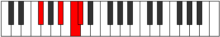

# Mode AFlatAeralian

## Links

- [Documentation](README.md)
- [Scales Index](Scales.md)
- [Modes Index](Modes.md)
- [Chords Index](Chords.md)

## Parent Scale

[Epacrian](ScaleEpacrian.md)

## Mode

[AFlatAeralian](ModeAFlatAeralian.md)

## Number

1335

## Luminosity

-1

## Tonic

Ab

## Signature

C

## Transposition

1, 1, 2, 1, 3, 2, 2

## Chord Pattern

ii, IV⁺, VIb5, vii⁰

## Perfection

 - 3 Perfect Notes

 - 4 Imperfect Notes

 - Perfection Profile - false, true, false, false, true, false, true

## Notes

- Ab (Imperfect)
- Bbb
- Cbb (Imperfect)
- Dbb (Imperfect)
- Ebbb
- Fb (Imperfect)
- Gb
- Ab (Imperfect)

## Illustration

## Diagram

| Circle of Fifth | Chromatic Circle |
|-----------------|------------------|
|  |  |
## Relative Modes

| Number | Mode | Luminosity | Tonic | Notes | Illustration |
|--------|------|------------|-------|-------|--------------|
| [1335](https://ianring.com/musictheory/scales/1335) | [Aeralian](ModeAeralian.md) | -1 | G# | G#, A, Bb, C, Db, E, F#, G# |  |
| [2715](https://ianring.com/musictheory/scales/2715) | [Kynian](ModeKynian.md) | 7 | A | A, Bb, C, Db, E, F#, G#, A |  |
| [3405](https://ianring.com/musictheory/scales/3405) | [Stynian](ModeStynian.md) | -1 | A# | A#, B#, C#, D##, E##, F###, G##, A# |  |
| [1875](https://ianring.com/musictheory/scales/1875) | [Epyphian](ModeEpyphian.md) | -1 | C | C, Db, E, F#, G#, A, Bb, C |  |
| [2985](https://ianring.com/musictheory/scales/2985) | [Epacrian](ModeEpacrian.md) | 6 | C# | C#, D##, E##, F###, G##, A#, B#, C# |  |
| [885](https://ianring.com/musictheory/scales/885) | [Sathian](ModeSathian.md) | 6 | E | E, F#, G#, A, Bb, C, Db, E |  |
| [1245](https://ianring.com/musictheory/scales/1245) | [Lathian](ModeLathian.md) | -1 | F# | F#, G#, A, Bb, C, Db, E, F# |  |
## Relative Brightness

| Number | Mode | Luminosity | Tonic | Notes | Circle Of Fifth | Chromatic Circle |
|--------|------|------------|-------|-------|-----------------|------------------|
| [1335](https://ianring.com/musictheory/scales/1335) | [Aeralian](ModeAeralian.md) | -1 | G# | G#, A, Bb, C, Db, E, F#, G# |  |  |
| [1335](https://ianring.com/musictheory/scales/1335) | [Aeralian](ModeAeralian.md) | -1 | Ab | Ab, Bbb, Cbb, Dbb, Ebbb, Fb, Gb, Ab |  |  |
| [2715](https://ianring.com/musictheory/scales/2715) | [Kynian](ModeKynian.md) | 7 | A | A, Bb, C, Db, E, F#, G#, A |  |  |
| [3405](https://ianring.com/musictheory/scales/3405) | [Stynian](ModeStynian.md) | -1 | A# | A#, B#, C#, D##, E##, F###, G##, A# |  |  |
| [3405](https://ianring.com/musictheory/scales/3405) | [Stynian](ModeStynian.md) | -1 | Bb | Bb, C, Db, E, F#, G#, A, Bb |  |  |
| [1875](https://ianring.com/musictheory/scales/1875) | [Epyphian](ModeEpyphian.md) | -1 | C | C, Db, E, F#, G#, A, Bb, C |  |  |
| [2985](https://ianring.com/musictheory/scales/2985) | [Epacrian](ModeEpacrian.md) | -1 | C# | C#, D##, E##, F###, G##, A#, B#, C# |  |  |
| [2985](https://ianring.com/musictheory/scales/2985) | [Epacrian](ModeEpacrian.md) | -1 | Db | Db, E, F#, G#, A, Bb, C, Db |  |  |
| [885](https://ianring.com/musictheory/scales/885) | [Sathian](ModeSathian.md) | 6 | E | E, F#, G#, A, Bb, C, Db, E |  |  |
| [1245](https://ianring.com/musictheory/scales/1245) | [Lathian](ModeLathian.md) | -1 | F# | F#, G#, A, Bb, C, Db, E, F# |  |  |
| [1245](https://ianring.com/musictheory/scales/1245) | [Lathian](ModeLathian.md) | 7 | Gb | Gb, Ab, Bbb, Cbb, Dbb, Ebbb, Fb, Gb |  |  |

## Chords

### Ab

| Number | Root | Name | Notes | Illustration | Audio |
|--------|------|------|-------|--------------|-------|
| 1282 | Ab | [G#sus2bb5](ChordGSharpSuspendedSecondDoubleFlatFifth.md) | G#, A#, C# |  | [midi](ChordGSharpSuspendedSecondDoubleFlatFifthRootPosition.mid) |
| 1282 | Ab | [Absus2bb5](ChordAFlatSuspendedSecondDoubleFlatFifth.md) | Ab, Bb, Db |  | [midi](ChordAFlatSuspendedSecondDoubleFlatFifthRootPosition.mid) |
| 1296 | Ab | [G#sus2#5](ChordGSharpSuspendedSecondSharpFifth.md) | G#, A#, D## |  | [midi](ChordGSharpSuspendedSecondSharpFifthRootPosition.mid) |
| 1296 | Ab | [Absus2#5](ChordAFlatSuspendedSecondSharpFifth.md) | Ab, Bb, E |  | [midi](ChordAFlatSuspendedSecondSharpFifthRootPosition.mid) |
| 273 | Ab | [G#+](ChordGSharpAugmented.md) | G#, B#, D## |  | [midi](ChordGSharpAugmentedRootPosition.mid) |
| 273 | Ab | [G#+7](ChordGSharpAugmentedAugmentedSeventh.md) | G#, B#, D##, F### |  | [midi](ChordGSharpAugmentedAugmentedSeventhRootPosition.mid) |
| 273 | Ab | [Ab+](ChordAFlatAugmented.md) | Ab, C, E |  | [midi](ChordAFlatAugmentedRootPosition.mid) |
| 273 | Ab | [Ab+7](ChordAFlatAugmentedAugmentedSeventh.md) | Ab, C, E, G# |  | [midi](ChordAFlatAugmentedAugmentedSeventhRootPosition.mid) |
| 274 | Ab | [G#sus4#5](ChordGSharpSuspendedFourthSharpFifth.md) | G#, C#, D## |  | [midi](ChordGSharpSuspendedFourthSharpFifthRootPosition.mid) |
| 274 | Ab | [Absus4#5](ChordAFlatSuspendedFourthSharpFifth.md) | Ab, Db, E |  | [midi](ChordAFlatSuspendedFourthSharpFifthRootPosition.mid) |
| 322 | Ab | [G#Q](ChordGSharpQuartal.md) | G#, C#, F# |  | [midi](ChordGSharpQuartalRootPosition.mid) |
| 322 | Ab | [AbQ](ChordAFlatQuartal.md) | Ab, Db, Gb |  | [midi](ChordAFlatQuartalRootPosition.mid) |
| 849 | Ab | [G#7#5b9](ChordGSharpDominantSeventhSharpFifthFlatNinth.md) | G#, B#, D##, F#, A |  | [midi](ChordGSharpDominantSeventhSharpFifthFlatNinthRootPosition.mid) |
| 849 | Ab | [Ab7#5b9](ChordAFlatDominantSeventhSharpFifthFlatNinth.md) | Ab, C, E, Gb, Bbb |  | [midi](ChordAFlatDominantSeventhSharpFifthFlatNinthRootPosition.mid) |

### Bbb

| Number | Root | Name | Notes | Illustration | Audio |
|--------|------|------|-------|--------------|-------|
| 528 | Bbb | [A5](ChordANaturalPowerChord.md) | A, E |  | [midi](ChordANaturalPowerChordRootPosition.mid) |
| 1552 | Bbb | [Aphryg](ChordANaturalPhrygian.md) | A, Bb, E |  | [midi](ChordANaturalPhrygianRootPosition.mid) |
| 529 | Bbb | [Am](ChordANaturalMinor.md) | A, C, E |  | [midi](ChordANaturalMinorRootPosition.mid) |
| 529 | Bbb | [Am(add(#9))](ChordANaturalMinorAddSharpNinth.md) | A, C, E, B# |  | [midi](ChordANaturalMinorAddSharpNinthRootPosition.mid) |
| 530 | Bbb | [AM](ChordANaturalMajor.md) | A, C#, E |  | [midi](ChordANaturalMajorRootPosition.mid) |
| 531 | Bbb | [AM(add(#9))](ChordANaturalMajorAddSharpNinth.md) | A, C#, E, B# |  | [midi](ChordANaturalMajorAddSharpNinthRootPosition.mid) |
| 578 | Bbb | [AM##5](ChordANaturalMajorDoubleSharpFifth.md) | A, C#, F# |  | [midi](ChordANaturalMajorDoubleSharpFifthRootPosition.mid) |
| 593 | Bbb | [Am6](ChordANaturalMinorSixth.md) | A, C, E, F# |  | [midi](ChordANaturalMinorSixthRootPosition.mid) |
| 1617 | Bbb | [Am6(addb9)](ChordANaturalMinorSixthAddFlatNinth.md) | A, C, E, F#, Bb |  | [midi](ChordANaturalMinorSixthAddFlatNinthRootPosition.mid) |
| 594 | Bbb | [AM6](ChordANaturalMajorSixth.md) | A, C#, E, F# |  | [midi](ChordANaturalMajorSixthRootPosition.mid) |
| 1618 | Bbb | [AM6(addb9)](ChordANaturalMajorSixthAddFlatNinth.md) | A, C#, E, F#, Bb |  | [midi](ChordANaturalMajorSixthAddFlatNinthRootPosition.mid) |
| 1808 | Bbb | [Aphryg+7](ChordANaturalPhrygianAddSeventh.md) | A, Bb, E, G# |  | [midi](ChordANaturalPhrygianAddSeventhRootPosition.mid) |
| 785 | Bbb | [Am(M7)](ChordANaturalMinorMajorSeventh.md) | A, C, E, G# |  | [midi](ChordANaturalMinorMajorSeventhRootPosition.mid) |
| 786 | Bbb | [AM7](ChordANaturalMajorSeventh.md) | A, C#, E, G# |  | [midi](ChordANaturalMajorSeventhRootPosition.mid) |
| 834 | Bbb | [AM7##5](ChordANaturalMajorSeventhDoubleSharpFifth.md) | A, C#, F#, G# |  | [midi](ChordANaturalMajorSeventhDoubleSharpFifthRootPosition.mid) |
| 849 | Bbb | [Am(M7)add13](ChordANaturalMinorMajorSeventhAddThirteenth.md) | A, C, E, G#, F# |  | [midi](ChordANaturalMinorMajorSeventhAddThirteenthRootPosition.mid) |
| 850 | Bbb | [AM7add13](ChordANaturalMajorSeventhAddThirteenth.md) | A, C#, E, G#, F# |  | [midi](ChordANaturalMajorSeventhAddThirteenthRootPosition.mid) |

### Cbb

| Number | Root | Name | Notes | Illustration | Audio |
|--------|------|------|-------|--------------|-------|
| 1041 | Cbb | [A#](ChordASharpDiminishedFlatThird.md) | A#, C, E |  | [midi](ChordASharpDiminishedFlatThirdRootPosition.mid) |
| 1041 | Cbb | [A#sus2b5](ChordASharpSuspendedSecondFlatFifth.md) | A#, B#, E |  | [midi](ChordASharpSuspendedSecondFlatFifthRootPosition.mid) |
| 1041 | Cbb | [Bb](ChordBFlatDiminishedFlatThird.md) | Bb, Dbb, Fb |  | [midi](ChordBFlatDiminishedFlatThirdRootPosition.mid) |
| 1041 | Cbb | [Bbsus2b5](ChordBFlatSuspendedSecondFlatFifth.md) | Bb, C, Fb |  | [midi](ChordBFlatSuspendedSecondFlatFifthRootPosition.mid) |
| 1042 | Cbb | [A#o](ChordASharpDiminished.md) | A#, C#, E |  | [midi](ChordASharpDiminishedRootPosition.mid) |
| 1042 | Cbb | [Bbo](ChordBFlatDiminished.md) | Bb, Db, Fb |  | [midi](ChordBFlatDiminishedRootPosition.mid) |
| 1089 | Cbb | [A#sus2#5](ChordASharpSuspendedSecondSharpFifth.md) | A#, B#, E## |  | [midi](ChordASharpSuspendedSecondSharpFifthRootPosition.mid) |
| 1089 | Cbb | [Bbsus2#5](ChordBFlatSuspendedSecondSharpFifth.md) | Bb, C, F# |  | [midi](ChordBFlatSuspendedSecondSharpFifthRootPosition.mid) |
| 1090 | Cbb | [A#m#5](ChordASharpMinorSharpFifth.md) | A#, C#, F# |  | [midi](ChordASharpMinorSharpFifthRootPosition.mid) |
| 1090 | Cbb | [Bbm#5](ChordBFlatMinorSharpFifth.md) | Bb, Db, Gb |  | [midi](ChordBFlatMinorSharpFifthRootPosition.mid) |
| 1105 | Cbb | [A#sus2b5add(#5)](ChordASharpSuspendedSecondFlatFifthAddSharpFifth.md) | A#, B#, E, E## |  | [midi](ChordASharpSuspendedSecondFlatFifthAddSharpFifthRootPosition.mid) |
| 1105 | Cbb | [Bbsus2b5add(#5)](ChordBFlatSuspendedSecondFlatFifthAddSharpFifth.md) | Bb, C, Fb, F# |  | [midi](ChordBFlatSuspendedSecondFlatFifthAddSharpFifthRootPosition.mid) |
| 1298 | Cbb | [A#ø7](ChordASharpHalfDiminishedSeventh.md) | A#, C#, E, G# |  | [midi](ChordASharpHalfDiminishedSeventhRootPosition.mid) |
| 1298 | Cbb | [Bbø7](ChordBFlatHalfDiminishedSeventh.md) | Bb, Db, Fb, Ab |  | [midi](ChordBFlatHalfDiminishedSeventhRootPosition.mid) |
| 1346 | Cbb | [A#m7#5](ChordASharpMinorSeventhSharpFifth.md) | A#, C#, E##, G# |  | [midi](ChordASharpMinorSeventhSharpFifthRootPosition.mid) |
| 1346 | Cbb | [Bbm7#5](ChordBFlatMinorSeventhSharpFifth.md) | Bb, Db, F#, Ab |  | [midi](ChordBFlatMinorSeventhSharpFifthRootPosition.mid) |
| 1554 | Cbb | [A#oM7](ChordASharpDiminishedMajorSeventh.md) | A#, C#, E, G## |  | [midi](ChordASharpDiminishedMajorSeventhRootPosition.mid) |
| 1554 | Cbb | [BboM7](ChordBFlatDiminishedMajorSeventh.md) | Bb, Db, Fb, A |  | [midi](ChordBFlatDiminishedMajorSeventhRootPosition.mid) |

### Dbb

| Number | Root | Name | Notes | Illustration | Audio |
|--------|------|------|-------|--------------|-------|
| 67 | Dbb | [Cloc](ChordCNaturalLocrian.md) | C, Db, Gb |  | [midi](ChordCNaturalLocrianRootPosition.mid) |
| 81 | Dbb | [CMb5](ChordCNaturalMajorFlatFifth.md) | C, E, Gb |  | [midi](ChordCNaturalMajorFlatFifthRootPosition.mid) |
| 273 | Dbb | [C+](ChordCNaturalAugmented.md) | C, E, G# |  | [midi](ChordCNaturalAugmentedRootPosition.mid) |
| 273 | Dbb | [C+7](ChordCNaturalAugmentedAugmentedSeventh.md) | C, E, G#, B# |  | [midi](ChordCNaturalAugmentedAugmentedSeventhRootPosition.mid) |
| 529 | Dbb | [CM##5](ChordCNaturalMajorDoubleSharpFifth.md) | C, E, A |  | [midi](ChordCNaturalMajorDoubleSharpFifthRootPosition.mid) |
| 593 | Dbb | [CM6b5](ChordCNaturalMajorSixthFlatFifth.md) | C, E, Gb, A |  | [midi](ChordCNaturalMajorSixthFlatFifthRootPosition.mid) |
| 1105 | Dbb | [C7b5](ChordCNaturalDominantSeventhFlatFifth.md) | C, E, Gb, Bb |  | [midi](ChordCNaturalDominantSeventhFlatFifthRootPosition.mid) |
| 1107 | Dbb | [C7b5b9](ChordCNaturalDominantSeventhFlatFifthFlatNinth.md) | C, E, Gb, Bb, Db |  | [midi](ChordCNaturalDominantSeventhFlatFifthFlatNinthRootPosition.mid) |
| 1299 | Dbb | [C7#5b9](ChordCNaturalDominantSeventhSharpFifthFlatNinth.md) | C, E, G#, Bb, Db |  | [midi](ChordCNaturalDominantSeventhSharpFifthFlatNinthRootPosition.mid) |

### Ebbb

| Number | Root | Name | Notes | Illustration | Audio |
|--------|------|------|-------|--------------|-------|
| 82 | Ebbb | [C#mbb5](ChordCSharpMinorDoubleFlatFifth.md) | C#, E, F# |  | [midi](ChordCSharpMinorDoubleFlatFifthRootPosition.mid) |
| 82 | Ebbb | [Dbmbb5](ChordDFlatMinorDoubleFlatFifth.md) | Db, Fb, Gb |  | [midi](ChordDFlatMinorDoubleFlatFifthRootPosition.mid) |
| 258 | Ebbb | [C#5](ChordCSharpPowerChord.md) | C#, G# |  | [midi](ChordCSharpPowerChordRootPosition.mid) |
| 258 | Ebbb | [Db5](ChordDFlatPowerChord.md) | Db, Ab |  | [midi](ChordDFlatPowerChordRootPosition.mid) |
| 274 | Ebbb | [C#m](ChordCSharpMinor.md) | C#, E, G# |  | [midi](ChordCSharpMinorRootPosition.mid) |
| 274 | Ebbb | [C#m(add(#9))](ChordCSharpMinorAddSharpNinth.md) | C#, E, G#, D## |  | [midi](ChordCSharpMinorAddSharpNinthRootPosition.mid) |
| 274 | Ebbb | [Dbm](ChordDFlatMinor.md) | Db, Fb, Ab |  | [midi](ChordDFlatMinorRootPosition.mid) |
| 274 | Ebbb | [Dbm(add(#9))](ChordDFlatMinorAddSharpNinth.md) | Db, Fb, Ab, E |  | [midi](ChordDFlatMinorAddSharpNinthRootPosition.mid) |
| 322 | Ebbb | [C#sus4](ChordCSharpSuspendedFourth.md) | C#, F#, G# |  | [midi](ChordCSharpSuspendedFourthRootPosition.mid) |
| 322 | Ebbb | [Dbsus4](ChordDFlatSuspendedFourth.md) | Db, Gb, Ab |  | [midi](ChordDFlatSuspendedFourthRootPosition.mid) |
| 338 | Ebbb | [C#m(add11)](ChordCSharpMinorAddEleventh.md) | C#, E, G#, F# |  | [midi](ChordCSharpMinorAddEleventhRootPosition.mid) |
| 338 | Ebbb | [C#m(add4)](ChordCSharpMinorAddFourth.md) | C#, E, F#, G# |  | [midi](ChordCSharpMinorAddFourthRootPosition.mid) |
| 338 | Ebbb | [Dbm(add11)](ChordDFlatMinorAddEleventh.md) | Db, Fb, Ab, Gb |  | [midi](ChordDFlatMinorAddEleventhRootPosition.mid) |
| 338 | Ebbb | [Dbm(add4)](ChordDFlatMinorAddFourth.md) | Db, Fb, Gb, Ab |  | [midi](ChordDFlatMinorAddFourthRootPosition.mid) |
| 530 | Ebbb | [C#m#5](ChordCSharpMinorSharpFifth.md) | C#, E, A |  | [midi](ChordCSharpMinorSharpFifthRootPosition.mid) |
| 530 | Ebbb | [Dbm#5](ChordDFlatMinorSharpFifth.md) | Db, Fb, Bbb |  | [midi](ChordDFlatMinorSharpFifthRootPosition.mid) |
| 578 | Ebbb | [C#sus4#5](ChordCSharpSuspendedFourthSharpFifth.md) | C#, F#, G## |  | [midi](ChordCSharpSuspendedFourthSharpFifthRootPosition.mid) |
| 578 | Ebbb | [Dbsus4#5](ChordDFlatSuspendedFourthSharpFifth.md) | Db, Gb, A |  | [midi](ChordDFlatSuspendedFourthSharpFifthRootPosition.mid) |
| 1090 | Ebbb | [C#sus4##5](ChordCSharpSuspendedFourthDoubleSharpFifth.md) | C#, F#, A# |  | [midi](ChordCSharpSuspendedFourthDoubleSharpFifthRootPosition.mid) |
| 1090 | Ebbb | [Dbsus4##5](ChordDFlatSuspendedFourthDoubleSharpFifth.md) | Db, Gb, Bb |  | [midi](ChordDFlatSuspendedFourthDoubleSharpFifthRootPosition.mid) |
| 1298 | Ebbb | [C#m6](ChordCSharpMinorSixth.md) | C#, E, G#, A# |  | [midi](ChordCSharpMinorSixthRootPosition.mid) |
| 1298 | Ebbb | [Dbm6](ChordDFlatMinorSixth.md) | Db, Fb, Ab, Bb |  | [midi](ChordDFlatMinorSixthRootPosition.mid) |
| 1346 | Ebbb | [C#M6sus4](ChordCSharpMajorSixthSuspendedFourth.md) | C#, F#, G#, A# |  | [midi](ChordCSharpMajorSixthSuspendedFourthRootPosition.mid) |
| 1346 | Ebbb | [DbM6sus4](ChordDFlatMajorSixthSuspendedFourth.md) | Db, Gb, Ab, Bb |  | [midi](ChordDFlatMajorSixthSuspendedFourthRootPosition.mid) |
| 67 | Ebbb | [C#Q+](ChordCSharpQuartalAugmented.md) | C#, F#, B# |  | [midi](ChordCSharpQuartalAugmentedRootPosition.mid) |
| 67 | Ebbb | [DbQ+](ChordDFlatQuartalAugmented.md) | Db, Gb, C |  | [midi](ChordDFlatQuartalAugmentedRootPosition.mid) |
| 275 | Ebbb | [C#m(M7)](ChordCSharpMinorMajorSeventh.md) | C#, E, G#, B# |  | [midi](ChordCSharpMinorMajorSeventhRootPosition.mid) |
| 275 | Ebbb | [Dbm(M7)](ChordDFlatMinorMajorSeventh.md) | Db, Fb, Ab, C |  | [midi](ChordDFlatMinorMajorSeventhRootPosition.mid) |
| 323 | Ebbb | [C#M7(sus4)](ChordCSharpMajorSeventhSuspendedFourth.md) | C#, F#, G#, B# |  | [midi](ChordCSharpMajorSeventhSuspendedFourthRootPosition.mid) |
| 323 | Ebbb | [DbM7(sus4)](ChordDFlatMajorSeventhSuspendedFourth.md) | Db, Gb, Ab, C |  | [midi](ChordDFlatMajorSeventhSuspendedFourthRootPosition.mid) |
| 339 | Ebbb | [C#m(M7)add11](ChordCSharpMinorMajorSeventhAddEleventh.md) | C#, E, G#, B#, F# |  | [midi](ChordCSharpMinorMajorSeventhAddEleventhRootPosition.mid) |
| 339 | Ebbb | [Dbm(M7)add11](ChordDFlatMinorMajorSeventhAddEleventh.md) | Db, Fb, Ab, C, Gb |  | [midi](ChordDFlatMinorMajorSeventhAddEleventhRootPosition.mid) |
| 579 | Ebbb | [C#M7(sus4)#5](ChordCSharpMajorSeventhSuspendedFourthSharpFifth.md) | C#, F#, G##, B# |  | [midi](ChordCSharpMajorSeventhSuspendedFourthSharpFifthRootPosition.mid) |
| 579 | Ebbb | [DbM7(sus4)#5](ChordDFlatMajorSeventhSuspendedFourthSharpFifth.md) | Db, Gb, A, C |  | [midi](ChordDFlatMajorSeventhSuspendedFourthSharpFifthRootPosition.mid) |
| 1091 | Ebbb | [C#M7(sus4)##5](ChordCSharpMajorSeventhSuspendedFourthDoubleSharpFifth.md) | C#, F#, A#, B# |  | [midi](ChordCSharpMajorSeventhSuspendedFourthDoubleSharpFifthRootPosition.mid) |
| 1091 | Ebbb | [DbM7(sus4)##5](ChordDFlatMajorSeventhSuspendedFourthDoubleSharpFifth.md) | Db, Gb, Bb, C |  | [midi](ChordDFlatMajorSeventhSuspendedFourthDoubleSharpFifthRootPosition.mid) |
| 1299 | Ebbb | [C#m(M7)add13](ChordCSharpMinorMajorSeventhAddThirteenth.md) | C#, E, G#, B#, A# |  | [midi](ChordCSharpMinorMajorSeventhAddThirteenthRootPosition.mid) |
| 1299 | Ebbb | [Dbm(M7)add13](ChordDFlatMinorMajorSeventhAddThirteenth.md) | Db, Fb, Ab, C, Bb |  | [midi](ChordDFlatMinorMajorSeventhAddThirteenthRootPosition.mid) |

### Fb

| Number | Root | Name | Notes | Illustration | Audio |
|--------|------|------|-------|--------------|-------|
| 592 | Fb | [Esus2bb5](ChordENaturalSuspendedSecondDoubleFlatFifth.md) | E, F#, A |  | [midi](ChordENaturalSuspendedSecondDoubleFlatFifthRootPosition.mid) |
| 1104 | Fb | [E](ChordENaturalDiminishedFlatThird.md) | E, Gb, Bb |  | [midi](ChordENaturalDiminishedFlatThirdRootPosition.mid) |
| 1104 | Fb | [Esus2b5](ChordENaturalSuspendedSecondFlatFifth.md) | E, F#, Bb |  | [midi](ChordENaturalSuspendedSecondFlatFifthRootPosition.mid) |
| 1296 | Fb | [EMb5](ChordENaturalMajorFlatFifth.md) | E, G#, Bb |  | [midi](ChordENaturalMajorFlatFifthRootPosition.mid) |
| 1552 | Fb | [Esus4b5](ChordENaturalSuspendedFourthFlatFifth.md) | E, A, Bb |  | [midi](ChordENaturalSuspendedFourthFlatFifthRootPosition.mid) |
| 81 | Fb | [Esus2#5](ChordENaturalSuspendedSecondSharpFifth.md) | E, F#, B# |  | [midi](ChordENaturalSuspendedSecondSharpFifthRootPosition.mid) |
| 273 | Fb | [E+](ChordENaturalAugmented.md) | E, G#, B# |  | [midi](ChordENaturalAugmentedRootPosition.mid) |
| 273 | Fb | [E+7](ChordENaturalAugmentedAugmentedSeventh.md) | E, G#, B#, D## |  | [midi](ChordENaturalAugmentedAugmentedSeventhRootPosition.mid) |
| 529 | Fb | [Esus4#5](ChordENaturalSuspendedFourthSharpFifth.md) | E, A, B# |  | [midi](ChordENaturalSuspendedFourthSharpFifthRootPosition.mid) |
| 1105 | Fb | [Esus2b5add(#5)](ChordENaturalSuspendedSecondFlatFifthAddSharpFifth.md) | E, F#, Bb, B# |  | [midi](ChordENaturalSuspendedSecondFlatFifthAddSharpFifthRootPosition.mid) |
| 274 | Fb | [EM##5](ChordENaturalMajorDoubleSharpFifth.md) | E, G#, C# |  | [midi](ChordENaturalMajorDoubleSharpFifthRootPosition.mid) |
| 530 | Fb | [Esus4##5](ChordENaturalSuspendedFourthDoubleSharpFifth.md) | E, A, C# |  | [midi](ChordENaturalSuspendedFourthDoubleSharpFifthRootPosition.mid) |
| 594 | Fb | [EM6sus2bb5](ChordENaturalMajorSixthSuspendedSecondDoubleFlatFifth.md) | E, F#, A, C# |  | [midi](ChordENaturalMajorSixthSuspendedSecondDoubleFlatFifthRootPosition.mid) |
| 1106 | Fb | [EM6sus2b5](ChordENaturalMajorSixthSuspendedSecondFlatFifth.md) | E, F#, Bb, C# |  | [midi](ChordENaturalMajorSixthSuspendedSecondFlatFifthRootPosition.mid) |
| 1298 | Fb | [EM6b5](ChordENaturalMajorSixthFlatFifth.md) | E, G#, Bb, C# |  | [midi](ChordENaturalMajorSixthFlatFifthRootPosition.mid) |

### Gb

| Number | Root | Name | Notes | Illustration | Audio |
|--------|------|------|-------|--------------|-------|
| 321 | Gb | [F#](ChordFSharpDiminishedFlatThird.md) | F#, Ab, C |  | [midi](ChordFSharpDiminishedFlatThirdRootPosition.mid) |
| 321 | Gb | [F#sus2b5](ChordFSharpSuspendedSecondFlatFifth.md) | F#, G#, C |  | [midi](ChordFSharpSuspendedSecondFlatFifthRootPosition.mid) |
| 321 | Gb | [Gb](ChordGFlatDiminishedFlatThird.md) | Gb, Bbbb, Dbb |  | [midi](ChordGFlatDiminishedFlatThirdRootPosition.mid) |
| 321 | Gb | [Gbsus2b5](ChordGFlatSuspendedSecondFlatFifth.md) | Gb, Ab, Dbb |  | [midi](ChordGFlatSuspendedSecondFlatFifthRootPosition.mid) |
| 577 | Gb | [F#o](ChordFSharpDiminished.md) | F#, A, C |  | [midi](ChordFSharpDiminishedRootPosition.mid) |
| 577 | Gb | [Gbo](ChordGFlatDiminished.md) | Gb, Bbb, Dbb |  | [midi](ChordGFlatDiminishedRootPosition.mid) |
| 1089 | Gb | [F#Mb5](ChordFSharpMajorFlatFifth.md) | F#, A#, C |  | [midi](ChordFSharpMajorFlatFifthRootPosition.mid) |
| 1089 | Gb | [GbMb5](ChordGFlatMajorFlatFifth.md) | Gb, Bb, Dbb |  | [midi](ChordGFlatMajorFlatFifthRootPosition.mid) |
| 66 | Gb | [F#5](ChordFSharpPowerChord.md) | F#, C# |  | [midi](ChordFSharpPowerChordRootPosition.mid) |
| 66 | Gb | [Gb5](ChordGFlatPowerChord.md) | Gb, Db |  | [midi](ChordGFlatPowerChordRootPosition.mid) |
| 322 | Gb | [F#sus2](ChordFSharpSuspendedSecond.md) | F#, G#, C# |  | [midi](ChordFSharpSuspendedSecondRootPosition.mid) |
| 322 | Gb | [Gbsus2](ChordGFlatSuspendedSecond.md) | Gb, Ab, Db |  | [midi](ChordGFlatSuspendedSecondRootPosition.mid) |
| 578 | Gb | [F#m](ChordFSharpMinor.md) | F#, A, C# |  | [midi](ChordFSharpMinorRootPosition.mid) |
| 578 | Gb | [F#m(add(#9))](ChordFSharpMinorAddSharpNinth.md) | F#, A, C#, G## |  | [midi](ChordFSharpMinorAddSharpNinthRootPosition.mid) |
| 578 | Gb | [Gbm](ChordGFlatMinor.md) | Gb, Bbb, Db |  | [midi](ChordGFlatMinorRootPosition.mid) |
| 578 | Gb | [Gbm(add(#9))](ChordGFlatMinorAddSharpNinth.md) | Gb, Bbb, Db, A |  | [midi](ChordGFlatMinorAddSharpNinthRootPosition.mid) |
| 834 | Gb | [F#m(add9)](ChordFSharpMinorAddNinth.md) | F#, A, C#, G# |  | [midi](ChordFSharpMinorAddNinthRootPosition.mid) |
| 834 | Gb | [Gbm(add9)](ChordGFlatMinorAddNinth.md) | Gb, Bbb, Db, Ab |  | [midi](ChordGFlatMinorAddNinthRootPosition.mid) |
| 1090 | Gb | [F#M](ChordFSharpMajor.md) | F#, A#, C# |  | [midi](ChordFSharpMajorRootPosition.mid) |
| 1090 | Gb | [GbM](ChordGFlatMajor.md) | Gb, Bb, Db |  | [midi](ChordGFlatMajorRootPosition.mid) |
| 1346 | Gb | [F#M(add9)](ChordFSharpMajorAddNinth.md) | F#, A#, C#, G# |  | [midi](ChordFSharpMajorAddNinthRootPosition.mid) |
| 1346 | Gb | [GbM(add9)](ChordGFlatMajorAddNinth.md) | Gb, Bb, Db, Ab |  | [midi](ChordGFlatMajorAddNinthRootPosition.mid) |
| 1602 | Gb | [F#M(add(#9))](ChordFSharpMajorAddSharpNinth.md) | F#, A#, C#, G## |  | [midi](ChordFSharpMajorAddSharpNinthRootPosition.mid) |
| 1602 | Gb | [GbM(add(#9))](ChordGFlatMajorAddSharpNinth.md) | Gb, Bb, Db, A |  | [midi](ChordGFlatMajorAddSharpNinthRootPosition.mid) |
| 67 | Gb | [F#lyd](ChordFSharpLydian.md) | F#, B#, C# |  | [midi](ChordFSharpLydianRootPosition.mid) |
| 67 | Gb | [Gblyd](ChordGFlatLydian.md) | Gb, C, Db |  | [midi](ChordGFlatLydianRootPosition.mid) |
| 579 | Gb | [F#m(add(#4))](ChordFSharpMinorAddSharpFourth.md) | F#, A, B#, C# |  | [midi](ChordFSharpMinorAddSharpFourthRootPosition.mid) |
| 579 | Gb | [Gbm(add(#4))](ChordGFlatMinorAddSharpFourth.md) | Gb, Bbb, C, Db |  | [midi](ChordGFlatMinorAddSharpFourthRootPosition.mid) |
| 1091 | Gb | [F#M(add(#4))](ChordFSharpMajorAddSharpFourth.md) | F#, A#, B#, C# |  | [midi](ChordFSharpMajorAddSharpFourthRootPosition.mid) |
| 1091 | Gb | [GbM(add(#4))](ChordGFlatMajorAddSharpFourth.md) | Gb, Bb, C, Db |  | [midi](ChordGFlatMajorAddSharpFourthRootPosition.mid) |
| 593 | Gb | [F#ø7](ChordFSharpHalfDiminishedSeventh.md) | F#, A, C, E |  | [midi](ChordFSharpHalfDiminishedSeventhRootPosition.mid) |
| 593 | Gb | [Gbø7](ChordGFlatHalfDiminishedSeventh.md) | Gb, Bbb, Dbb, Fb |  | [midi](ChordGFlatHalfDiminishedSeventhRootPosition.mid) |
| 1105 | Gb | [F#7b5](ChordFSharpDominantSeventhFlatFifth.md) | F#, A#, C, E |  | [midi](ChordFSharpDominantSeventhFlatFifthRootPosition.mid) |
| 1105 | Gb | [Gb7b5](ChordGFlatDominantSeventhFlatFifth.md) | Gb, Bb, Dbb, Fb |  | [midi](ChordGFlatDominantSeventhFlatFifthRootPosition.mid) |
| 338 | Gb | [F#7sus2](ChordFSharpDominantSeventhSuspendedSecond.md) | F#, G#, C#, E |  | [midi](ChordFSharpDominantSeventhSuspendedSecondRootPosition.mid) |
| 338 | Gb | [F#9sus2](ChordFSharpDominantNinthSuspendedSecond.md) | F#, G#, C#, E, G# |  | [midi](ChordFSharpDominantNinthSuspendedSecondRootPosition.mid) |
| 338 | Gb | [Gb7sus2](ChordGFlatDominantSeventhSuspendedSecond.md) | Gb, Ab, Db, Fb |  | [midi](ChordGFlatDominantSeventhSuspendedSecondRootPosition.mid) |
| 338 | Gb | [Gb9sus2](ChordGFlatDominantNinthSuspendedSecond.md) | Gb, Ab, Db, Fb, Ab |  | [midi](ChordGFlatDominantNinthSuspendedSecondRootPosition.mid) |
| 594 | Gb | [F#m7](ChordFSharpMinorSeventh.md) | F#, A, C#, E |  | [midi](ChordFSharpMinorSeventhRootPosition.mid) |
| 594 | Gb | [Gbm7](ChordGFlatMinorSeventh.md) | Gb, Bbb, Db, Fb |  | [midi](ChordGFlatMinorSeventhRootPosition.mid) |
| 850 | Gb | [F#m9](ChordFSharpMinorNinth.md) | F#, A, C#, E, G# |  | [midi](ChordFSharpMinorNinthRootPosition.mid) |
| 850 | Gb | [Gbm9](ChordGFlatMinorNinth.md) | Gb, Bbb, Db, Fb, Ab |  | [midi](ChordGFlatMinorNinthRootPosition.mid) |
| 1106 | Gb | [F#7](ChordFSharpDominantSeventh.md) | F#, A#, C#, E |  | [midi](ChordFSharpDominantSeventhRootPosition.mid) |
| 1106 | Gb | [Gb7](ChordGFlatDominantSeventh.md) | Gb, Bb, Db, Fb |  | [midi](ChordGFlatDominantSeventhRootPosition.mid) |
| 1362 | Gb | [F#9](ChordFSharpDominantNinth.md) | F#, A#, C#, E, G# |  | [midi](ChordFSharpDominantNinthRootPosition.mid) |
| 1362 | Gb | [Gb9](ChordGFlatDominantNinth.md) | Gb, Bb, Db, Fb, Ab |  | [midi](ChordGFlatDominantNinthRootPosition.mid) |
| 1618 | Gb | [F#7#9](ChordFSharpDominantSeventhSharpNinth.md) | F#, A#, C#, E, G## |  | [midi](ChordFSharpDominantSeventhSharpNinthRootPosition.mid) |
| 1618 | Gb | [Gb7#9](ChordGFlatDominantSeventhSharpNinth.md) | Gb, Bb, Db, Fb, A |  | [midi](ChordGFlatDominantSeventhSharpNinthRootPosition.mid) |
| 595 | Gb | [F#m7add(#11)](ChordFSharpMinorSeventhAddSharpEleventh.md) | F#, A, C#, E, B# |  | [midi](ChordFSharpMinorSeventhAddSharpEleventhRootPosition.mid) |
| 595 | Gb | [Gbm7add(#11)](ChordGFlatMinorSeventhAddSharpEleventh.md) | Gb, Bbb, Db, Fb, C |  | [midi](ChordGFlatMinorSeventhAddSharpEleventhRootPosition.mid) |
| 1107 | Gb | [F#7add(#4)](ChordFSharpDominantSeventhAddSharpFourth.md) | F#, A#, B#, C#, E |  | [midi](ChordFSharpDominantSeventhAddSharpFourthRootPosition.mid) |
| 1107 | Gb | [F#7#11](ChordFSharpDominantSeventhSharpEleventh.md) | F#, A#, C#, E, B# |  | [midi](ChordFSharpDominantSeventhSharpEleventhRootPosition.mid) |
| 1107 | Gb | [Gb7add(#4)](ChordGFlatDominantSeventhAddSharpFourth.md) | Gb, Bb, C, Db, Fb |  | [midi](ChordGFlatDominantSeventhAddSharpFourthRootPosition.mid) |
| 1107 | Gb | [Gb7#11](ChordGFlatDominantSeventhSharpEleventh.md) | Gb, Bb, Db, Fb, C |  | [midi](ChordGFlatDominantSeventhSharpEleventhRootPosition.mid) |
| 1363 | Gb | [F#9#11](ChordFSharpDominantNinthSharpEleventh.md) | F#, A#, C#, E, G#, B# |  | [midi](ChordFSharpDominantNinthSharpEleventhRootPosition.mid) |
| 1363 | Gb | [Gb9#11](ChordGFlatDominantNinthSharpEleventh.md) | Gb, Bb, Db, Fb, Ab, C |  | [midi](ChordGFlatDominantNinthSharpEleventhRootPosition.mid) |
| 1619 | Gb | [F#7#9#11](ChordFSharpDominantSeventhSharpNinthSharpEleventh.md) | F#, A#, C#, E, G##, B# |  | [midi](ChordFSharpDominantSeventhSharpNinthSharpEleventhRootPosition.mid) |
| 1619 | Gb | [Gb7#9#11](ChordGFlatDominantSeventhSharpNinthSharpEleventh.md) | Gb, Bb, Db, Fb, A, C |  | [midi](ChordGFlatDominantSeventhSharpNinthSharpEleventhRootPosition.mid) |

