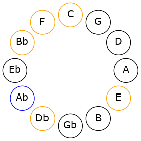
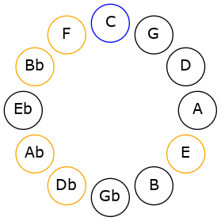

# Mode AFlatAeranimic

## Links

- [Documentation](README.md)
- [Scales Index](Scales.md)
- [Modes Index](Modes.md)
- [Chords Index](Chords.md)

## Scale

[Mothimic](ScaleMothimic.md)

## Mode

[AFlatAeranimic](ModeAFlatAeranimic.md)

## Tonic

Ab

## Signature

[CNaturalMajor]

## Transposition

2, 2, 1, 3, 1, 3

## Chord Pattern

I⁺, ii, III⁺, V⁺

## Perfection

 - 3 Perfect Notes

 - 3 Imperfect Notes

## Notes

- Ab (Imperfect)
- Bb
- C (Imperfect)
- Db
- E (Imperfect)
- F
- Ab (Imperfect)

## Illustration

## Diagram

## Relative Modes

| Number | Mode | Tonic | Notes | Illustration |
|--------|------|-------|-------|--------------|
| [821](https://ianring.com/musictheory/scales/821) | [Aeranimic](ModeAeranimic.md) | Ab | Ab, Bb, C, Db, E, F, Ab |  |
| [1229](https://ianring.com/musictheory/scales/1229) | [Ragimic](ModeRagimic.md) | Bb | Bb, C, Db, E, F, G#, Bb |  |
| [1331](https://ianring.com/musictheory/scales/1331) | [Dolimic](ModeDolimic.md) | C | C, Db, E, F, G#, A#, C |  |
| [2713](https://ianring.com/musictheory/scales/2713) | [Porimic](ModePorimic.md) | Db | Db, E, F, G#, A#, B#, Db |  |
| [851](https://ianring.com/musictheory/scales/851) | [Aerylimic](ModeAerylimic.md) | E | E, F, G#, A#, B#, C#, E |  |
| [2473](https://ianring.com/musictheory/scales/2473) | [Mothimic](ModeMothimic.md) | F | F, G#, A#, B#, C#, D##, F |  |
## Relative Brightness

| Number | Mode | Tonic | Notes | Illustration |
|--------|------|-------|-------|--------------|
| [821](https://ianring.com/musictheory/scales/821) | [Aeranimic](ModeAeranimic.md) | Ab | Ab, Bb, C, Db, E, F, Ab |  |
| [1229](https://ianring.com/musictheory/scales/1229) | [Ragimic](ModeRagimic.md) | Bb | Bb, C, Db, E, F, G#, Bb |  |
| [1331](https://ianring.com/musictheory/scales/1331) | [Dolimic](ModeDolimic.md) | C | C, Db, E, F, G#, A#, C |  |
| [2713](https://ianring.com/musictheory/scales/2713) | [Porimic](ModePorimic.md) | Db | Db, E, F, G#, A#, B#, Db |  |
| [851](https://ianring.com/musictheory/scales/851) | [Aerylimic](ModeAerylimic.md) | E | E, F, G#, A#, B#, C#, E |  |
| [2473](https://ianring.com/musictheory/scales/2473) | [Mothimic](ModeMothimic.md) | F | F, G#, A#, B#, C#, D##, F |  |

## Chords

### Ab

| Number | Root | Name | Notes | Illustration | Audio |
|--------|------|------|-------|--------------|-------|
| 1282 | Ab | [Absus2bb5](ChordAFlatSuspendedSecondDoubleFlatFifth.md) | Ab, Bb, Db |  | [midi](ChordAFlatSuspendedSecondDoubleFlatFifthRootPosition.mid) |
| 1296 | Ab | [Absus2#5](ChordAFlatSuspendedSecondSharpFifth.md) | Ab, Bb, E |  | [midi](ChordAFlatSuspendedSecondSharpFifthRootPosition.mid) |
| 273 | Ab | [Ab+](ChordAFlatAugmented.md) | Ab, C, E |  | [midi](ChordAFlatAugmentedRootPosition.mid) |
| 273 | Ab | [Ab+7](ChordAFlatAugmentedAugmentedSeventh.md) | Ab, C, E, G# |  | [midi](ChordAFlatAugmentedAugmentedSeventhRootPosition.mid) |
| 274 | Ab | [Absus4#5](ChordAFlatSuspendedFourthSharpFifth.md) | Ab, Db, E |  | [midi](ChordAFlatSuspendedFourthSharpFifthRootPosition.mid) |
| 289 | Ab | [AbM##5](ChordAFlatMajorDoubleSharpFifth.md) | Ab, C, F |  | [midi](ChordAFlatMajorDoubleSharpFifthRootPosition.mid) |
| 290 | Ab | [Absus4##5](ChordAFlatSuspendedFourthDoubleSharpFifth.md) | Ab, Db, F |  | [midi](ChordAFlatSuspendedFourthDoubleSharpFifthRootPosition.mid) |
| 1314 | Ab | [AbM6sus2bb5](ChordAFlatMajorSixthSuspendedSecondDoubleFlatFifth.md) | Ab, Bb, Db, F |  | [midi](ChordAFlatMajorSixthSuspendedSecondDoubleFlatFifthRootPosition.mid) |

### Bb

| Number | Root | Name | Notes | Illustration | Audio |
|--------|------|------|-------|--------------|-------|
| 1041 | Bb | [Bb](ChordBFlatDiminishedFlatThird.md) | Bb, Dbb, Fb |  | [midi](ChordBFlatDiminishedFlatThirdRootPosition.mid) |
| 1041 | Bb | [Bbsus2b5](ChordBFlatSuspendedSecondFlatFifth.md) | Bb, C, Fb |  | [midi](ChordBFlatSuspendedSecondFlatFifthRootPosition.mid) |
| 1042 | Bb | [Bbo](ChordBFlatDiminished.md) | Bb, Db, Fb |  | [midi](ChordBFlatDiminishedRootPosition.mid) |
| 1056 | Bb | [Bb5](ChordBFlatPowerChord.md) | Bb, F |  | [midi](ChordBFlatPowerChordRootPosition.mid) |
| 1057 | Bb | [Bbsus2](ChordBFlatSuspendedSecond.md) | Bb, C, F |  | [midi](ChordBFlatSuspendedSecondRootPosition.mid) |
| 1058 | Bb | [Bbm](ChordBFlatMinor.md) | Bb, Db, F |  | [midi](ChordBFlatMinorRootPosition.mid) |
| 1058 | Bb | [Bbm(add(#9))](ChordBFlatMinorAddSharpNinth.md) | Bb, Db, F, C# |  | [midi](ChordBFlatMinorAddSharpNinthRootPosition.mid) |
| 1059 | Bb | [Bbm(add9)](ChordBFlatMinorAddNinth.md) | Bb, Db, F, C |  | [midi](ChordBFlatMinorAddNinthRootPosition.mid) |
| 1072 | Bb | [Bblyd](ChordBFlatLydian.md) | Bb, E, F |  | [midi](ChordBFlatLydianRootPosition.mid) |
| 1074 | Bb | [Bbm(add(#4))](ChordBFlatMinorAddSharpFourth.md) | Bb, Db, E, F |  | [midi](ChordBFlatMinorAddSharpFourthRootPosition.mid) |
| 1298 | Bb | [Bbø7](ChordBFlatHalfDiminishedSeventh.md) | Bb, Db, Fb, Ab |  | [midi](ChordBFlatHalfDiminishedSeventhRootPosition.mid) |
| 1313 | Bb | [Bb7sus2](ChordBFlatDominantSeventhSuspendedSecond.md) | Bb, C, F, Ab |  | [midi](ChordBFlatDominantSeventhSuspendedSecondRootPosition.mid) |
| 1313 | Bb | [Bb9sus2](ChordBFlatDominantNinthSuspendedSecond.md) | Bb, C, F, Ab, C |  | [midi](ChordBFlatDominantNinthSuspendedSecondRootPosition.mid) |
| 1314 | Bb | [Bbm7](ChordBFlatMinorSeventh.md) | Bb, Db, F, Ab |  | [midi](ChordBFlatMinorSeventhRootPosition.mid) |
| 1315 | Bb | [Bbm9](ChordBFlatMinorNinth.md) | Bb, Db, F, Ab, C |  | [midi](ChordBFlatMinorNinthRootPosition.mid) |
| 1330 | Bb | [Bbm7add(#11)](ChordBFlatMinorSeventhAddSharpEleventh.md) | Bb, Db, F, Ab, E |  | [midi](ChordBFlatMinorSeventhAddSharpEleventhRootPosition.mid) |

### C

| Number | Root | Name | Notes | Illustration | Audio |
|--------|------|------|-------|--------------|-------|
| 273 | C | [C+](ChordCNaturalAugmented.md) | C, E, G# |  | [midi](ChordCNaturalAugmentedRootPosition.mid) |
| 273 | C | [C+7](ChordCNaturalAugmentedAugmentedSeventh.md) | C, E, G#, B# |  | [midi](ChordCNaturalAugmentedAugmentedSeventhRootPosition.mid) |
| 289 | C | [Csus4#5](ChordCNaturalSuspendedFourthSharpFifth.md) | C, F, G# |  | [midi](ChordCNaturalSuspendedFourthSharpFifthRootPosition.mid) |
| 1057 | C | [CQ](ChordCNaturalQuartal.md) | C, F, Bb |  | [midi](ChordCNaturalQuartalRootPosition.mid) |
| 1299 | C | [C7#5b9](ChordCNaturalDominantSeventhSharpFifthFlatNinth.md) | C, E, G#, Bb, Db |  | [midi](ChordCNaturalDominantSeventhSharpFifthFlatNinthRootPosition.mid) |

### Db

| Number | Root | Name | Notes | Illustration | Audio |
|--------|------|------|-------|--------------|-------|
| 258 | Db | [Db5](ChordDFlatPowerChord.md) | Db, Ab |  | [midi](ChordDFlatPowerChordRootPosition.mid) |
| 274 | Db | [Dbm](ChordDFlatMinor.md) | Db, Fb, Ab |  | [midi](ChordDFlatMinorRootPosition.mid) |
| 274 | Db | [Dbm(add(#9))](ChordDFlatMinorAddSharpNinth.md) | Db, Fb, Ab, E |  | [midi](ChordDFlatMinorAddSharpNinthRootPosition.mid) |
| 290 | Db | [DbM](ChordDFlatMajor.md) | Db, F, Ab |  | [midi](ChordDFlatMajorRootPosition.mid) |
| 306 | Db | [DbM(add(#9))](ChordDFlatMajorAddSharpNinth.md) | Db, F, Ab, E |  | [midi](ChordDFlatMajorAddSharpNinthRootPosition.mid) |
| 1058 | Db | [DbM##5](ChordDFlatMajorDoubleSharpFifth.md) | Db, F, Bb |  | [midi](ChordDFlatMajorDoubleSharpFifthRootPosition.mid) |
| 1298 | Db | [Dbm6](ChordDFlatMinorSixth.md) | Db, Fb, Ab, Bb |  | [midi](ChordDFlatMinorSixthRootPosition.mid) |
| 1314 | Db | [DbM6](ChordDFlatMajorSixth.md) | Db, F, Ab, Bb |  | [midi](ChordDFlatMajorSixthRootPosition.mid) |
| 275 | Db | [Dbm(M7)](ChordDFlatMinorMajorSeventh.md) | Db, Fb, Ab, C |  | [midi](ChordDFlatMinorMajorSeventhRootPosition.mid) |
| 291 | Db | [DbM7](ChordDFlatMajorSeventh.md) | Db, F, Ab, C |  | [midi](ChordDFlatMajorSeventhRootPosition.mid) |
| 1059 | Db | [DbM7##5](ChordDFlatMajorSeventhDoubleSharpFifth.md) | Db, F, Bb, C |  | [midi](ChordDFlatMajorSeventhDoubleSharpFifthRootPosition.mid) |
| 1299 | Db | [Dbm(M7)add13](ChordDFlatMinorMajorSeventhAddThirteenth.md) | Db, Fb, Ab, C, Bb |  | [midi](ChordDFlatMinorMajorSeventhAddThirteenthRootPosition.mid) |
| 1315 | Db | [DbM7add13](ChordDFlatMajorSeventhAddThirteenth.md) | Db, F, Ab, C, Bb |  | [midi](ChordDFlatMajorSeventhAddThirteenthRootPosition.mid) |

### E

| Number | Root | Name | Notes | Illustration | Audio |
|--------|------|------|-------|--------------|-------|
| 1072 | E | [Eloc](ChordENaturalLocrian.md) | E, F, Bb |  | [midi](ChordENaturalLocrianRootPosition.mid) |
| 1296 | E | [EMb5](ChordENaturalMajorFlatFifth.md) | E, G#, Bb |  | [midi](ChordENaturalMajorFlatFifthRootPosition.mid) |
| 273 | E | [E+](ChordENaturalAugmented.md) | E, G#, B# |  | [midi](ChordENaturalAugmentedRootPosition.mid) |
| 273 | E | [E+7](ChordENaturalAugmentedAugmentedSeventh.md) | E, G#, B#, D## |  | [midi](ChordENaturalAugmentedAugmentedSeventhRootPosition.mid) |
| 274 | E | [EM##5](ChordENaturalMajorDoubleSharpFifth.md) | E, G#, C# |  | [midi](ChordENaturalMajorDoubleSharpFifthRootPosition.mid) |
| 1298 | E | [EM6b5](ChordENaturalMajorSixthFlatFifth.md) | E, G#, Bb, C# |  | [midi](ChordENaturalMajorSixthFlatFifthRootPosition.mid) |

### F

| Number | Root | Name | Notes | Illustration | Audio |
|--------|------|------|-------|--------------|-------|
| 1312 | F | [Fmbb5](ChordFNaturalMinorDoubleFlatFifth.md) | F, Ab, Bb |  | [midi](ChordFNaturalMinorDoubleFlatFifthRootPosition.mid) |
| 33 | F | [F5](ChordFNaturalPowerChord.md) | F, C |  | [midi](ChordFNaturalPowerChordRootPosition.mid) |
| 289 | F | [Fm](ChordFNaturalMinor.md) | F, Ab, C |  | [midi](ChordFNaturalMinorRootPosition.mid) |
| 289 | F | [Fm(add(#9))](ChordFNaturalMinorAddSharpNinth.md) | F, Ab, C, G# |  | [midi](ChordFNaturalMinorAddSharpNinthRootPosition.mid) |
| 1057 | F | [Fsus4](ChordFNaturalSuspendedFourth.md) | F, Bb, C |  | [midi](ChordFNaturalSuspendedFourthRootPosition.mid) |
| 1313 | F | [Fm(add11)](ChordFNaturalMinorAddEleventh.md) | F, Ab, C, Bb |  | [midi](ChordFNaturalMinorAddEleventhRootPosition.mid) |
| 1313 | F | [Fm(add4)](ChordFNaturalMinorAddFourth.md) | F, Ab, Bb, C |  | [midi](ChordFNaturalMinorAddFourthRootPosition.mid) |
| 290 | F | [Fm#5](ChordFNaturalMinorSharpFifth.md) | F, Ab, Db |  | [midi](ChordFNaturalMinorSharpFifthRootPosition.mid) |
| 1058 | F | [Fsus4#5](ChordFNaturalSuspendedFourthSharpFifth.md) | F, Bb, C# |  | [midi](ChordFNaturalSuspendedFourthSharpFifthRootPosition.mid) |
| 1072 | F | [FQ+](ChordFNaturalQuartalAugmented.md) | F, Bb, E |  | [midi](ChordFNaturalQuartalAugmentedRootPosition.mid) |
| 305 | F | [Fm(M7)](ChordFNaturalMinorMajorSeventh.md) | F, Ab, C, E |  | [midi](ChordFNaturalMinorMajorSeventhRootPosition.mid) |
| 1073 | F | [FM7(sus4)](ChordFNaturalMajorSeventhSuspendedFourth.md) | F, Bb, C, E |  | [midi](ChordFNaturalMajorSeventhSuspendedFourthRootPosition.mid) |
| 1329 | F | [Fm(M7)add11](ChordFNaturalMinorMajorSeventhAddEleventh.md) | F, Ab, C, E, Bb |  | [midi](ChordFNaturalMinorMajorSeventhAddEleventhRootPosition.mid) |
| 1074 | F | [FM7(sus4)#5](ChordFNaturalMajorSeventhSuspendedFourthSharpFifth.md) | F, Bb, C#, E |  | [midi](ChordFNaturalMajorSeventhSuspendedFourthSharpFifthRootPosition.mid) |

