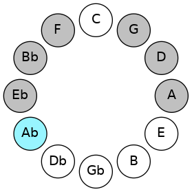
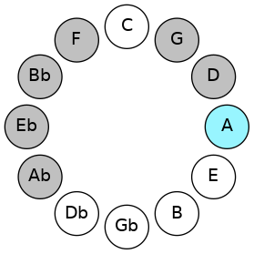
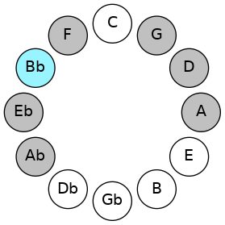
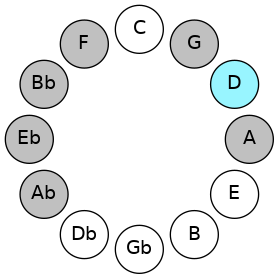
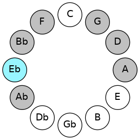
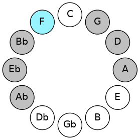
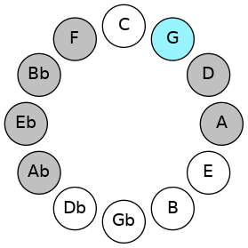

# Mode AFlatAeraphian

## Links

- [Documentation](README.md)
- [Scales Index](Scales.md)
- [Modes Index](Modes.md)
- [Chords Index](Chords.md)

## Scale

[Ionythian](ScaleIonythian.md)

## Mode

[AFlatAeraphian](ModeAFlatAeraphian.md)

## Tonic

Ab

## Signature

[CNaturalMajor]

## Transposition

1, 1, 4, 1, 2, 2, 1

## Chord Pattern

iv⁰, Vb5, Vb5

## Perfection

 - 5 Perfect Notes

 - 2 Imperfect Notes

## Notes

- Ab
- Bbb (Imperfect)
- Cbb
- D
- Eb
- F (Imperfect)
- G
- Ab

## Illustration

## Diagram

## Relative Modes

| Number | Mode | Tonic | Notes | Illustration |
|--------|------|-------|-------|--------------|
| [2759](https://ianring.com/musictheory/scales/2759) | [Aeraphian](ModeAeraphian.md) | G# | G#, A, Bb, C##, D#, E#, F##, G# |  |
| [2759](https://ianring.com/musictheory/scales/2759) | [Aeraphian](ModeAeraphian.md) | Ab | Ab, Bbb, Cbb, D, Eb, F, G, Ab |  |
| [3427](https://ianring.com/musictheory/scales/3427) | [Zacrian](ModeZacrian.md) | A | A, Bb, C##, D#, E#, F##, G#, A |  |
| [3761](https://ianring.com/musictheory/scales/3761) | [Ionythian](ModeIonythian.md) | A# | A#, B###, C###, D###, E###, F###, G##, A# |  |
| [3761](https://ianring.com/musictheory/scales/3761) | [Ionythian](ModeIonythian.md) | Bb | Bb, C##, D#, E#, F##, G#, A, Bb |  |
| [491](https://ianring.com/musictheory/scales/491) | [Aeolyrian](ModeAeolyrian.md) | D | D, Eb, F, G, Ab, Bbb, Cbb, D |  |
| [2293](https://ianring.com/musictheory/scales/2293) | [Gorian](ModeGorian.md) | D# | D#, E#, F##, G#, A, Bb, C##, D# |  |
| [2293](https://ianring.com/musictheory/scales/2293) | [Gorian](ModeGorian.md) | Eb | Eb, F, G, Ab, Bbb, Cbb, D, Eb |  |
| [1597](https://ianring.com/musictheory/scales/1597) | [Aeolodian](ModeAeolodian.md) | F | F, G, Ab, Bbb, Cbb, D, Eb, F |  |
| [1423](https://ianring.com/musictheory/scales/1423) | [Doptian](ModeDoptian.md) | G | G, Ab, Bbb, Cbb, D, Eb, F, G |  |
## Relative Brightness

| Number | Mode | Tonic | Notes | Illustration |
|--------|------|-------|-------|--------------|
| [2759](https://ianring.com/musictheory/scales/2759) | [Aeraphian](ModeAeraphian.md) | G# | G#, A, Bb, C##, D#, E#, F##, G# |  |
| [2759](https://ianring.com/musictheory/scales/2759) | [Aeraphian](ModeAeraphian.md) | Ab | Ab, Bbb, Cbb, D, Eb, F, G, Ab |  |
| [3427](https://ianring.com/musictheory/scales/3427) | [Zacrian](ModeZacrian.md) | A | A, Bb, C##, D#, E#, F##, G#, A |  |
| [3761](https://ianring.com/musictheory/scales/3761) | [Ionythian](ModeIonythian.md) | A# | A#, B###, C###, D###, E###, F###, G##, A# |  |
| [3761](https://ianring.com/musictheory/scales/3761) | [Ionythian](ModeIonythian.md) | Bb | Bb, C##, D#, E#, F##, G#, A, Bb |  |
| [491](https://ianring.com/musictheory/scales/491) | [Aeolyrian](ModeAeolyrian.md) | D | D, Eb, F, G, Ab, Bbb, Cbb, D |  |
| [2293](https://ianring.com/musictheory/scales/2293) | [Gorian](ModeGorian.md) | D# | D#, E#, F##, G#, A, Bb, C##, D# |  |
| [2293](https://ianring.com/musictheory/scales/2293) | [Gorian](ModeGorian.md) | Eb | Eb, F, G, Ab, Bbb, Cbb, D, Eb |  |
| [1597](https://ianring.com/musictheory/scales/1597) | [Aeolodian](ModeAeolodian.md) | F | F, G, Ab, Bbb, Cbb, D, Eb, F |  |
| [1423](https://ianring.com/musictheory/scales/1423) | [Doptian](ModeDoptian.md) | G | G, Ab, Bbb, Cbb, D, Eb, F, G |  |

## Chords

### Ab

| Number | Root | Name | Notes | Illustration | Audio |
|--------|------|------|-------|--------------|-------|
| 772 | Ab | [G#loc](ChordGSharpLocrian.md) | G#, A, D |  | [midi](ChordGSharpLocrianRootPosition.mid) |
| 772 | Ab | [Abloc](ChordAFlatLocrian.md) | Ab, Bbb, Ebb |  | [midi](ChordAFlatLocrianRootPosition.mid) |
| 1284 | Ab | [G#](ChordGSharpDiminishedFlatThird.md) | G#, Bb, D |  | [midi](ChordGSharpDiminishedFlatThirdRootPosition.mid) |
| 1284 | Ab | [G#sus2b5](ChordGSharpSuspendedSecondFlatFifth.md) | G#, A#, D |  | [midi](ChordGSharpSuspendedSecondFlatFifthRootPosition.mid) |
| 1284 | Ab | [Ab](ChordAFlatDiminishedFlatThird.md) | Ab, Cbb, Ebb |  | [midi](ChordAFlatDiminishedFlatThirdRootPosition.mid) |
| 1284 | Ab | [Absus2b5](ChordAFlatSuspendedSecondFlatFifth.md) | Ab, Bb, Ebb |  | [midi](ChordAFlatSuspendedSecondFlatFifthRootPosition.mid) |
| 264 | Ab | [G#5](ChordGSharpPowerChord.md) | G#, D# |  | [midi](ChordGSharpPowerChordRootPosition.mid) |
| 264 | Ab | [Ab5](ChordAFlatPowerChord.md) | Ab, Eb |  | [midi](ChordAFlatPowerChordRootPosition.mid) |
| 776 | Ab | [G#phryg](ChordGSharpPhrygian.md) | G#, A, D# |  | [midi](ChordGSharpPhrygianRootPosition.mid) |
| 776 | Ab | [Abphryg](ChordAFlatPhrygian.md) | Ab, Bbb, Eb |  | [midi](ChordAFlatPhrygianRootPosition.mid) |
| 1288 | Ab | [G#sus2](ChordGSharpSuspendedSecond.md) | G#, A#, D# |  | [midi](ChordGSharpSuspendedSecondRootPosition.mid) |
| 1288 | Ab | [Absus2](ChordAFlatSuspendedSecond.md) | Ab, Bb, Eb |  | [midi](ChordAFlatSuspendedSecondRootPosition.mid) |
| 268 | Ab | [G#lyd](ChordGSharpLydian.md) | G#, C##, D# |  | [midi](ChordGSharpLydianRootPosition.mid) |
| 268 | Ab | [Ablyd](ChordAFlatLydian.md) | Ab, D, Eb |  | [midi](ChordAFlatLydianRootPosition.mid) |
| 1316 | Ab | [G#M6sus2b5](ChordGSharpMajorSixthSuspendedSecondFlatFifth.md) | G#, A#, D, E# |  | [midi](ChordGSharpMajorSixthSuspendedSecondFlatFifthRootPosition.mid) |
| 1316 | Ab | [AbM6sus2b5](ChordAFlatMajorSixthSuspendedSecondFlatFifth.md) | Ab, Bb, Ebb, F |  | [midi](ChordAFlatMajorSixthSuspendedSecondFlatFifthRootPosition.mid) |
| 1320 | Ab | [G#M6sus2](ChordGSharpMajorSixthSuspendedSecond.md) | G#, A#, D#, E# |  | [midi](ChordGSharpMajorSixthSuspendedSecondRootPosition.mid) |
| 1320 | Ab | [G#7sus2b5](ChordGSharpDominantSeventhSuspendedSecondFlatFifth.md) | G#, A#, D#, F |  | [midi](ChordGSharpDominantSeventhSuspendedSecondFlatFifthRootPosition.mid) |
| 1320 | Ab | [AbM6sus2](ChordAFlatMajorSixthSuspendedSecond.md) | Ab, Bb, Eb, F |  | [midi](ChordAFlatMajorSixthSuspendedSecondRootPosition.mid) |
| 1320 | Ab | [Ab7sus2b5](ChordAFlatDominantSeventhSuspendedSecondFlatFifth.md) | Ab, Bb, Eb, Gbb |  | [midi](ChordAFlatDominantSeventhSuspendedSecondFlatFifthRootPosition.mid) |
| 904 | Ab | [G#phryg+7](ChordGSharpPhrygianAddSeventh.md) | G#, A, D#, F## |  | [midi](ChordGSharpPhrygianAddSeventhRootPosition.mid) |
| 904 | Ab | [Abphryg+7](ChordAFlatPhrygianAddSeventh.md) | Ab, Bbb, Eb, G |  | [midi](ChordAFlatPhrygianAddSeventhRootPosition.mid) |
| 1416 | Ab | [G#M7(sus2)](ChordGSharpMajorSeventhSuspendedSecond.md) | G#, A#, D#, F## |  | [midi](ChordGSharpMajorSeventhSuspendedSecondRootPosition.mid) |
| 1416 | Ab | [G#M9sus2](ChordGSharpMajorNinthSuspendedSecond.md) | G#, A#, D#, F##, A# |  | [midi](ChordGSharpMajorNinthSuspendedSecondRootPosition.mid) |
| 1416 | Ab | [AbM7(sus2)](ChordAFlatMajorSeventhSuspendedSecond.md) | Ab, Bb, Eb, G |  | [midi](ChordAFlatMajorSeventhSuspendedSecondRootPosition.mid) |
| 1416 | Ab | [AbM9sus2](ChordAFlatMajorNinthSuspendedSecond.md) | Ab, Bb, Eb, G, Bb |  | [midi](ChordAFlatMajorNinthSuspendedSecondRootPosition.mid) |
| 396 | Ab | [G#lyd(M7)](ChordGSharpLydianMajorSeventh.md) | G#, C##, D#, F## |  | [midi](ChordGSharpLydianMajorSeventhRootPosition.mid) |
| 396 | Ab | [Ablyd(M7)](ChordAFlatLydianMajorSeventh.md) | Ab, D, Eb, G |  | [midi](ChordAFlatLydianMajorSeventhRootPosition.mid) |

### Bbb

| Number | Root | Name | Notes | Illustration | Audio |
|--------|------|------|-------|--------------|-------|
| 1544 | Bbb | [Aloc](ChordANaturalLocrian.md) | A, Bb, Eb |  | [midi](ChordANaturalLocrianRootPosition.mid) |
| 524 | Bbb | [Asus4b5](ChordANaturalSuspendedFourthFlatFifth.md) | A, D, Eb |  | [midi](ChordANaturalSuspendedFourthFlatFifthRootPosition.mid) |
| 548 | Bbb | [Asus4#5](ChordANaturalSuspendedFourthSharpFifth.md) | A, D, E# |  | [midi](ChordANaturalSuspendedFourthSharpFifthRootPosition.mid) |
| 644 | Bbb | [AQ](ChordANaturalQuartal.md) | A, D, G |  | [midi](ChordANaturalQuartalRootPosition.mid) |
| 772 | Bbb | [AQ+](ChordANaturalQuartalAugmented.md) | A, D, G# |  | [midi](ChordANaturalQuartalAugmentedRootPosition.mid) |
| 804 | Bbb | [AM7(sus4)#5](ChordANaturalMajorSeventhSuspendedFourthSharpFifth.md) | A, D, E#, G# |  | [midi](ChordANaturalMajorSeventhSuspendedFourthSharpFifthRootPosition.mid) |

### Cbb

| Number | Root | Name | Notes | Illustration | Audio |
|--------|------|------|-------|--------------|-------|
| 1056 | Cbb | [A#5](ChordASharpPowerChord.md) | A#, E# |  | [midi](ChordASharpPowerChordRootPosition.mid) |
| 1056 | Cbb | [Bb5](ChordBFlatPowerChord.md) | Bb, F |  | [midi](ChordBFlatPowerChordRootPosition.mid) |
| 1060 | Cbb | [A#M](ChordASharpMajor.md) | A#, C##, E# |  | [midi](ChordASharpMajorRootPosition.mid) |
| 1060 | Cbb | [BbM](ChordBFlatMajor.md) | Bb, D, F |  | [midi](ChordBFlatMajorRootPosition.mid) |
| 1064 | Cbb | [A#sus4](ChordASharpSuspendedFourth.md) | A#, D#, E# |  | [midi](ChordASharpSuspendedFourthRootPosition.mid) |
| 1064 | Cbb | [Bbsus4](ChordBFlatSuspendedFourth.md) | Bb, Eb, F |  | [midi](ChordBFlatSuspendedFourthRootPosition.mid) |
| 1068 | Cbb | [A#M(add11)](ChordASharpMajorAddEleventh.md) | A#, C##, E#, D# |  | [midi](ChordASharpMajorAddEleventhRootPosition.mid) |
| 1068 | Cbb | [A#M(add4)](ChordASharpMajorAddFourth.md) | A#, C##, D#, E# |  | [midi](ChordASharpMajorAddFourthRootPosition.mid) |
| 1068 | Cbb | [BbM(add11)](ChordBFlatMajorAddEleventh.md) | Bb, D, F, Eb |  | [midi](ChordBFlatMajorAddEleventhRootPosition.mid) |
| 1068 | Cbb | [BbM(add4)](ChordBFlatMajorAddFourth.md) | Bb, D, Eb, F |  | [midi](ChordBFlatMajorAddFourthRootPosition.mid) |
| 1156 | Cbb | [A#M##5](ChordASharpMajorDoubleSharpFifth.md) | A#, C##, F## |  | [midi](ChordASharpMajorDoubleSharpFifthRootPosition.mid) |
| 1156 | Cbb | [BbM##5](ChordBFlatMajorDoubleSharpFifth.md) | Bb, D, G |  | [midi](ChordBFlatMajorDoubleSharpFifthRootPosition.mid) |
| 1160 | Cbb | [A#sus4##5](ChordASharpSuspendedFourthDoubleSharpFifth.md) | A#, D#, F## |  | [midi](ChordASharpSuspendedFourthDoubleSharpFifthRootPosition.mid) |
| 1160 | Cbb | [Bbsus4##5](ChordBFlatSuspendedFourthDoubleSharpFifth.md) | Bb, Eb, G |  | [midi](ChordBFlatSuspendedFourthDoubleSharpFifthRootPosition.mid) |
| 1188 | Cbb | [A#M6](ChordASharpMajorSixth.md) | A#, C##, E#, F## |  | [midi](ChordASharpMajorSixthRootPosition.mid) |
| 1188 | Cbb | [BbM6](ChordBFlatMajorSixth.md) | Bb, D, F, G |  | [midi](ChordBFlatMajorSixthRootPosition.mid) |
| 1192 | Cbb | [A#M6sus4](ChordASharpMajorSixthSuspendedFourth.md) | A#, D#, E#, F## |  | [midi](ChordASharpMajorSixthSuspendedFourthRootPosition.mid) |
| 1192 | Cbb | [BbM6sus4](ChordBFlatMajorSixthSuspendedFourth.md) | Bb, Eb, F, G |  | [midi](ChordBFlatMajorSixthSuspendedFourthRootPosition.mid) |
| 1288 | Cbb | [A#Q](ChordASharpQuartal.md) | A#, D#, G# |  | [midi](ChordASharpQuartalRootPosition.mid) |
| 1288 | Cbb | [BbQ](ChordBFlatQuartal.md) | Bb, Eb, Ab |  | [midi](ChordBFlatQuartalRootPosition.mid) |
| 1316 | Cbb | [A#7](ChordASharpDominantSeventh.md) | A#, C##, E#, G# |  | [midi](ChordASharpDominantSeventhRootPosition.mid) |
| 1316 | Cbb | [Bb7](ChordBFlatDominantSeventh.md) | Bb, D, F, Ab |  | [midi](ChordBFlatDominantSeventhRootPosition.mid) |
| 1320 | Cbb | [A#7sus4](ChordASharpDominantSeventhSuspendedFourth.md) | A#, D#, E#, G# |  | [midi](ChordASharpDominantSeventhSuspendedFourthRootPosition.mid) |
| 1320 | Cbb | [Bb7sus4](ChordBFlatDominantSeventhSuspendedFourth.md) | Bb, Eb, F, Ab |  | [midi](ChordBFlatDominantSeventhSuspendedFourthRootPosition.mid) |
| 1324 | Cbb | [A#7add4](ChordASharpDominantSeventhAddFourth.md) | A#, C##, D#, E#, G# |  | [midi](ChordASharpDominantSeventhAddFourthRootPosition.mid) |
| 1324 | Cbb | [A#7add11](ChordASharpDominantSeventhAddEleventh.md) | A#, C##, E#, G#, D# |  | [midi](ChordASharpDominantSeventhAddEleventhRootPosition.mid) |
| 1324 | Cbb | [Bb7add4](ChordBFlatDominantSeventhAddFourth.md) | Bb, D, Eb, F, Ab |  | [midi](ChordBFlatDominantSeventhAddFourthRootPosition.mid) |
| 1324 | Cbb | [Bb7add11](ChordBFlatDominantSeventhAddEleventh.md) | Bb, D, F, Ab, Eb |  | [midi](ChordBFlatDominantSeventhAddEleventhRootPosition.mid) |
| 1444 | Cbb | [A#7add13](ChordASharpDominantSeventhAddThirteenth.md) | A#, C##, E#, G#, F## |  | [midi](ChordASharpDominantSeventhAddThirteenthRootPosition.mid) |
| 1444 | Cbb | [Bb7add13](ChordBFlatDominantSeventhAddThirteenth.md) | Bb, D, F, Ab, G |  | [midi](ChordBFlatDominantSeventhAddThirteenthRootPosition.mid) |
| 1544 | Cbb | [A#Q+](ChordASharpQuartalAugmented.md) | A#, D#, G## |  | [midi](ChordASharpQuartalAugmentedRootPosition.mid) |
| 1544 | Cbb | [BbQ+](ChordBFlatQuartalAugmented.md) | Bb, Eb, A |  | [midi](ChordBFlatQuartalAugmentedRootPosition.mid) |
| 1572 | Cbb | [A#M7](ChordASharpMajorSeventh.md) | A#, C##, E#, G## |  | [midi](ChordASharpMajorSeventhRootPosition.mid) |
| 1572 | Cbb | [BbM7](ChordBFlatMajorSeventh.md) | Bb, D, F, A |  | [midi](ChordBFlatMajorSeventhRootPosition.mid) |
| 1576 | Cbb | [A#M7(sus4)](ChordASharpMajorSeventhSuspendedFourth.md) | A#, D#, E#, G## |  | [midi](ChordASharpMajorSeventhSuspendedFourthRootPosition.mid) |
| 1576 | Cbb | [BbM7(sus4)](ChordBFlatMajorSeventhSuspendedFourth.md) | Bb, Eb, F, A |  | [midi](ChordBFlatMajorSeventhSuspendedFourthRootPosition.mid) |
| 1580 | Cbb | [A#M7add4](ChordASharpMajorSeventhAddFourth.md) | A#, C##, D#, E#, G## |  | [midi](ChordASharpMajorSeventhAddFourthRootPosition.mid) |
| 1580 | Cbb | [A#M7add11](ChordASharpMajorSeventhAddEleventh.md) | A#, C##, E#, G##, D# |  | [midi](ChordASharpMajorSeventhAddEleventhRootPosition.mid) |
| 1580 | Cbb | [BbM7add4](ChordBFlatMajorSeventhAddFourth.md) | Bb, D, Eb, F, A |  | [midi](ChordBFlatMajorSeventhAddFourthRootPosition.mid) |
| 1580 | Cbb | [BbM7add11](ChordBFlatMajorSeventhAddEleventh.md) | Bb, D, F, A, Eb |  | [midi](ChordBFlatMajorSeventhAddEleventhRootPosition.mid) |
| 1668 | Cbb | [A#M7##5](ChordASharpMajorSeventhDoubleSharpFifth.md) | A#, C##, F##, G## |  | [midi](ChordASharpMajorSeventhDoubleSharpFifthRootPosition.mid) |
| 1668 | Cbb | [BbM7##5](ChordBFlatMajorSeventhDoubleSharpFifth.md) | Bb, D, G, A |  | [midi](ChordBFlatMajorSeventhDoubleSharpFifthRootPosition.mid) |
| 1672 | Cbb | [A#M7(sus4)##5](ChordASharpMajorSeventhSuspendedFourthDoubleSharpFifth.md) | A#, D#, F##, G## |  | [midi](ChordASharpMajorSeventhSuspendedFourthDoubleSharpFifthRootPosition.mid) |
| 1672 | Cbb | [BbM7(sus4)##5](ChordBFlatMajorSeventhSuspendedFourthDoubleSharpFifth.md) | Bb, Eb, G, A |  | [midi](ChordBFlatMajorSeventhSuspendedFourthDoubleSharpFifthRootPosition.mid) |
| 1700 | Cbb | [A#M7add13](ChordASharpMajorSeventhAddThirteenth.md) | A#, C##, E#, G##, F## |  | [midi](ChordASharpMajorSeventhAddThirteenthRootPosition.mid) |
| 1700 | Cbb | [BbM7add13](ChordBFlatMajorSeventhAddThirteenth.md) | Bb, D, F, A, G |  | [midi](ChordBFlatMajorSeventhAddThirteenthRootPosition.mid) |

### D

| Number | Root | Name | Notes | Illustration | Audio |
|--------|------|------|-------|--------------|-------|
| 164 | D | [Dmbb5](ChordDNaturalMinorDoubleFlatFifth.md) | D, F, G |  | [midi](ChordDNaturalMinorDoubleFlatFifthRootPosition.mid) |
| 268 | D | [Dloc](ChordDNaturalLocrian.md) | D, Eb, Ab |  | [midi](ChordDNaturalLocrianRootPosition.mid) |
| 292 | D | [Do](ChordDNaturalDiminished.md) | D, F, Ab |  | [midi](ChordDNaturalDiminishedRootPosition.mid) |
| 388 | D | [Dsus4b5](ChordDNaturalSuspendedFourthFlatFifth.md) | D, G, Ab |  | [midi](ChordDNaturalSuspendedFourthFlatFifthRootPosition.mid) |
| 516 | D | [D5](ChordDNaturalPowerChord.md) | D, A |  | [midi](ChordDNaturalPowerChordRootPosition.mid) |
| 524 | D | [Dphryg](ChordDNaturalPhrygian.md) | D, Eb, A |  | [midi](ChordDNaturalPhrygianRootPosition.mid) |
| 548 | D | [Dm](ChordDNaturalMinor.md) | D, F, A |  | [midi](ChordDNaturalMinorRootPosition.mid) |
| 548 | D | [Dm(add(#9))](ChordDNaturalMinorAddSharpNinth.md) | D, F, A, E# |  | [midi](ChordDNaturalMinorAddSharpNinthRootPosition.mid) |
| 644 | D | [Dsus4](ChordDNaturalSuspendedFourth.md) | D, G, A |  | [midi](ChordDNaturalSuspendedFourthRootPosition.mid) |
| 676 | D | [Dm(add11)](ChordDNaturalMinorAddEleventh.md) | D, F, A, G |  | [midi](ChordDNaturalMinorAddEleventhRootPosition.mid) |
| 676 | D | [Dm(add4)](ChordDNaturalMinorAddFourth.md) | D, F, G, A |  | [midi](ChordDNaturalMinorAddFourthRootPosition.mid) |
| 772 | D | [Dlyd](ChordDNaturalLydian.md) | D, G#, A |  | [midi](ChordDNaturalLydianRootPosition.mid) |
| 804 | D | [Dm(add(#4))](ChordDNaturalMinorAddSharpFourth.md) | D, F, G#, A |  | [midi](ChordDNaturalMinorAddSharpFourthRootPosition.mid) |
| 1060 | D | [Dm#5](ChordDNaturalMinorSharpFifth.md) | D, F, Bb |  | [midi](ChordDNaturalMinorSharpFifthRootPosition.mid) |
| 1156 | D | [Dsus4#5](ChordDNaturalSuspendedFourthSharpFifth.md) | D, G, A# |  | [midi](ChordDNaturalSuspendedFourthSharpFifthRootPosition.mid) |

### Eb

| Number | Root | Name | Notes | Illustration | Audio |
|--------|------|------|-------|--------------|-------|
| 296 | Eb | [D#sus2bb5](ChordDSharpSuspendedSecondDoubleFlatFifth.md) | D#, E#, G# |  | [midi](ChordDSharpSuspendedSecondDoubleFlatFifthRootPosition.mid) |
| 296 | Eb | [Ebsus2bb5](ChordEFlatSuspendedSecondDoubleFlatFifth.md) | Eb, F, Ab |  | [midi](ChordEFlatSuspendedSecondDoubleFlatFifthRootPosition.mid) |
| 552 | Eb | [D#](ChordDSharpDiminishedFlatThird.md) | D#, F, A |  | [midi](ChordDSharpDiminishedFlatThirdRootPosition.mid) |
| 552 | Eb | [D#sus2b5](ChordDSharpSuspendedSecondFlatFifth.md) | D#, E#, A |  | [midi](ChordDSharpSuspendedSecondFlatFifthRootPosition.mid) |
| 552 | Eb | [Eb](ChordEFlatDiminishedFlatThird.md) | Eb, Gbb, Bbb |  | [midi](ChordEFlatDiminishedFlatThirdRootPosition.mid) |
| 552 | Eb | [Ebsus2b5](ChordEFlatSuspendedSecondFlatFifth.md) | Eb, F, Bbb |  | [midi](ChordEFlatSuspendedSecondFlatFifthRootPosition.mid) |
| 648 | Eb | [D#Mb5](ChordDSharpMajorFlatFifth.md) | D#, F##, A |  | [midi](ChordDSharpMajorFlatFifthRootPosition.mid) |
| 648 | Eb | [EbMb5](ChordEFlatMajorFlatFifth.md) | Eb, G, Bbb |  | [midi](ChordEFlatMajorFlatFifthRootPosition.mid) |
| 776 | Eb | [D#sus4b5](ChordDSharpSuspendedFourthFlatFifth.md) | D#, G#, A |  | [midi](ChordDSharpSuspendedFourthFlatFifthRootPosition.mid) |
| 776 | Eb | [Ebsus4b5](ChordEFlatSuspendedFourthFlatFifth.md) | Eb, Ab, Bbb |  | [midi](ChordEFlatSuspendedFourthFlatFifthRootPosition.mid) |
| 1032 | Eb | [D#5](ChordDSharpPowerChord.md) | D#, A# |  | [midi](ChordDSharpPowerChordRootPosition.mid) |
| 1032 | Eb | [Eb5](ChordEFlatPowerChord.md) | Eb, Bb |  | [midi](ChordEFlatPowerChordRootPosition.mid) |
| 1064 | Eb | [D#sus2](ChordDSharpSuspendedSecond.md) | D#, E#, A# |  | [midi](ChordDSharpSuspendedSecondRootPosition.mid) |
| 1064 | Eb | [Ebsus2](ChordEFlatSuspendedSecond.md) | Eb, F, Bb |  | [midi](ChordEFlatSuspendedSecondRootPosition.mid) |
| 1160 | Eb | [D#M](ChordDSharpMajor.md) | D#, F##, A# |  | [midi](ChordDSharpMajorRootPosition.mid) |
| 1160 | Eb | [EbM](ChordEFlatMajor.md) | Eb, G, Bb |  | [midi](ChordEFlatMajorRootPosition.mid) |
| 1192 | Eb | [D#M(add9)](ChordDSharpMajorAddNinth.md) | D#, F##, A#, E# |  | [midi](ChordDSharpMajorAddNinthRootPosition.mid) |
| 1192 | Eb | [EbM(add9)](ChordEFlatMajorAddNinth.md) | Eb, G, Bb, F |  | [midi](ChordEFlatMajorAddNinthRootPosition.mid) |
| 1288 | Eb | [D#sus4](ChordDSharpSuspendedFourth.md) | D#, G#, A# |  | [midi](ChordDSharpSuspendedFourthRootPosition.mid) |
| 1288 | Eb | [Ebsus4](ChordEFlatSuspendedFourth.md) | Eb, Ab, Bb |  | [midi](ChordEFlatSuspendedFourthRootPosition.mid) |
| 1416 | Eb | [D#M(add11)](ChordDSharpMajorAddEleventh.md) | D#, F##, A#, G# |  | [midi](ChordDSharpMajorAddEleventhRootPosition.mid) |
| 1416 | Eb | [D#M(add4)](ChordDSharpMajorAddFourth.md) | D#, F##, G#, A# |  | [midi](ChordDSharpMajorAddFourthRootPosition.mid) |
| 1416 | Eb | [EbM(add11)](ChordEFlatMajorAddEleventh.md) | Eb, G, Bb, Ab |  | [midi](ChordEFlatMajorAddEleventhRootPosition.mid) |
| 1416 | Eb | [EbM(add4)](ChordEFlatMajorAddFourth.md) | Eb, G, Ab, Bb |  | [midi](ChordEFlatMajorAddFourthRootPosition.mid) |
| 1544 | Eb | [D#lyd](ChordDSharpLydian.md) | D#, G##, A# |  | [midi](ChordDSharpLydianRootPosition.mid) |
| 1544 | Eb | [Eblyd](ChordEFlatLydian.md) | Eb, A, Bb |  | [midi](ChordEFlatLydianRootPosition.mid) |
| 1672 | Eb | [D#M(add(#4))](ChordDSharpMajorAddSharpFourth.md) | D#, F##, G##, A# |  | [midi](ChordDSharpMajorAddSharpFourthRootPosition.mid) |
| 1672 | Eb | [EbM(add(#4))](ChordEFlatMajorAddSharpFourth.md) | Eb, G, A, Bb |  | [midi](ChordEFlatMajorAddSharpFourthRootPosition.mid) |
| 268 | Eb | [D#Q+](ChordDSharpQuartalAugmented.md) | D#, G#, C## |  | [midi](ChordDSharpQuartalAugmentedRootPosition.mid) |
| 268 | Eb | [EbQ+](ChordEFlatQuartalAugmented.md) | Eb, Ab, D |  | [midi](ChordEFlatQuartalAugmentedRootPosition.mid) |
| 652 | Eb | [D#M7b5](ChordDSharpMajorSeventhFlatFifth.md) | D#, F##, A, C## |  | [midi](ChordDSharpMajorSeventhFlatFifthRootPosition.mid) |
| 652 | Eb | [EbM7b5](ChordEFlatMajorSeventhFlatFifth.md) | Eb, G, Bbb, D |  | [midi](ChordEFlatMajorSeventhFlatFifthRootPosition.mid) |
| 1068 | Eb | [D#M7(sus2)](ChordDSharpMajorSeventhSuspendedSecond.md) | D#, E#, A#, C## |  | [midi](ChordDSharpMajorSeventhSuspendedSecondRootPosition.mid) |
| 1068 | Eb | [D#M9sus2](ChordDSharpMajorNinthSuspendedSecond.md) | D#, E#, A#, C##, E# |  | [midi](ChordDSharpMajorNinthSuspendedSecondRootPosition.mid) |
| 1068 | Eb | [EbM7(sus2)](ChordEFlatMajorSeventhSuspendedSecond.md) | Eb, F, Bb, D |  | [midi](ChordEFlatMajorSeventhSuspendedSecondRootPosition.mid) |
| 1068 | Eb | [EbM9sus2](ChordEFlatMajorNinthSuspendedSecond.md) | Eb, F, Bb, D, F |  | [midi](ChordEFlatMajorNinthSuspendedSecondRootPosition.mid) |
| 1164 | Eb | [D#M7](ChordDSharpMajorSeventh.md) | D#, F##, A#, C## |  | [midi](ChordDSharpMajorSeventhRootPosition.mid) |
| 1164 | Eb | [EbM7](ChordEFlatMajorSeventh.md) | Eb, G, Bb, D |  | [midi](ChordEFlatMajorSeventhRootPosition.mid) |
| 1196 | Eb | [D#M9](ChordDSharpMajorNinth.md) | D#, F##, A#, C##, E# |  | [midi](ChordDSharpMajorNinthRootPosition.mid) |
| 1196 | Eb | [EbM9](ChordEFlatMajorNinth.md) | Eb, G, Bb, D, F |  | [midi](ChordEFlatMajorNinthRootPosition.mid) |
| 1292 | Eb | [D#M7(sus4)](ChordDSharpMajorSeventhSuspendedFourth.md) | D#, G#, A#, C## |  | [midi](ChordDSharpMajorSeventhSuspendedFourthRootPosition.mid) |
| 1292 | Eb | [EbM7(sus4)](ChordEFlatMajorSeventhSuspendedFourth.md) | Eb, Ab, Bb, D |  | [midi](ChordEFlatMajorSeventhSuspendedFourthRootPosition.mid) |
| 1324 | Eb | [D#M9sus4](ChordDSharpMajorNinthSuspendedFourth.md) | D#, G#, A#, C##, E# |  | [midi](ChordDSharpMajorNinthSuspendedFourthRootPosition.mid) |
| 1324 | Eb | [EbM9sus4](ChordEFlatMajorNinthSuspendedFourth.md) | Eb, Ab, Bb, D, F |  | [midi](ChordEFlatMajorNinthSuspendedFourthRootPosition.mid) |
| 1420 | Eb | [D#M7add4](ChordDSharpMajorSeventhAddFourth.md) | D#, F##, G#, A#, C## |  | [midi](ChordDSharpMajorSeventhAddFourthRootPosition.mid) |
| 1420 | Eb | [D#M7add11](ChordDSharpMajorSeventhAddEleventh.md) | D#, F##, A#, C##, G# |  | [midi](ChordDSharpMajorSeventhAddEleventhRootPosition.mid) |
| 1420 | Eb | [EbM7add4](ChordEFlatMajorSeventhAddFourth.md) | Eb, G, Ab, Bb, D |  | [midi](ChordEFlatMajorSeventhAddFourthRootPosition.mid) |
| 1420 | Eb | [EbM7add11](ChordEFlatMajorSeventhAddEleventh.md) | Eb, G, Bb, D, Ab |  | [midi](ChordEFlatMajorSeventhAddEleventhRootPosition.mid) |
| 1452 | Eb | [D#M11](ChordDSharpMajorEleventh.md) | D#, F##, A#, C##, E#, G# |  | [midi](ChordDSharpMajorEleventhRootPosition.mid) |
| 1452 | Eb | [EbM11](ChordEFlatMajorEleventh.md) | Eb, G, Bb, D, F, Ab |  | [midi](ChordEFlatMajorEleventhRootPosition.mid) |
| 1548 | Eb | [D#lyd(M7)](ChordDSharpLydianMajorSeventh.md) | D#, G##, A#, C## |  | [midi](ChordDSharpLydianMajorSeventhRootPosition.mid) |
| 1548 | Eb | [Eblyd(M7)](ChordEFlatLydianMajorSeventh.md) | Eb, A, Bb, D |  | [midi](ChordEFlatLydianMajorSeventhRootPosition.mid) |
| 1676 | Eb | [D#M7add(#11)](ChordDSharpMajorSeventhAddSharpEleventh.md) | D#, F##, A#, C##, G## |  | [midi](ChordDSharpMajorSeventhAddSharpEleventhRootPosition.mid) |
| 1676 | Eb | [D#M7add(#4)](ChordDSharpMajorSeventhAddSharpFourth.md) | D#, F##, G##, A#, C## |  | [midi](ChordDSharpMajorSeventhAddSharpFourthRootPosition.mid) |
| 1676 | Eb | [EbM7add(#11)](ChordEFlatMajorSeventhAddSharpEleventh.md) | Eb, G, Bb, D, A |  | [midi](ChordEFlatMajorSeventhAddSharpEleventhRootPosition.mid) |
| 1676 | Eb | [EbM7add(#4)](ChordEFlatMajorSeventhAddSharpFourth.md) | Eb, G, A, Bb, D |  | [midi](ChordEFlatMajorSeventhAddSharpFourthRootPosition.mid) |

### F

| Number | Root | Name | Notes | Illustration | Audio |
|--------|------|------|-------|--------------|-------|
| 1184 | F | [Fsus2bb5](ChordFNaturalSuspendedSecondDoubleFlatFifth.md) | F, G, Bb |  | [midi](ChordFNaturalSuspendedSecondDoubleFlatFifthRootPosition.mid) |
| 1312 | F | [Fmbb5](ChordFNaturalMinorDoubleFlatFifth.md) | F, Ab, Bb |  | [midi](ChordFNaturalMinorDoubleFlatFifthRootPosition.mid) |
| 548 | F | [FM##5](ChordFNaturalMajorDoubleSharpFifth.md) | F, A, D |  | [midi](ChordFNaturalMajorDoubleSharpFifthRootPosition.mid) |
| 1060 | F | [Fsus4##5](ChordFNaturalSuspendedFourthDoubleSharpFifth.md) | F, Bb, D |  | [midi](ChordFNaturalSuspendedFourthDoubleSharpFifthRootPosition.mid) |
| 1188 | F | [FM6sus2bb5](ChordFNaturalMajorSixthSuspendedSecondDoubleFlatFifth.md) | F, G, Bb, D |  | [midi](ChordFNaturalMajorSixthSuspendedSecondDoubleFlatFifthRootPosition.mid) |
| 1064 | F | [FQ](ChordFNaturalQuartal.md) | F, Bb, Eb |  | [midi](ChordFNaturalQuartalRootPosition.mid) |
| 1320 | F | [Fm7bb5](ChordFNaturalMinorSeventhDoubleFlatFifth.md) | F, Ab, Bb, Eb |  | [midi](ChordFNaturalMinorSeventhDoubleFlatFifthRootPosition.mid) |

### G

| Number | Root | Name | Notes | Illustration | Audio |
|--------|------|------|-------|--------------|-------|
| 132 | G | [G5](ChordGNaturalPowerChord.md) | G, D |  | [midi](ChordGNaturalPowerChordRootPosition.mid) |
| 388 | G | [Gphryg](ChordGNaturalPhrygian.md) | G, Ab, D |  | [midi](ChordGNaturalPhrygianRootPosition.mid) |
| 644 | G | [Gsus2](ChordGNaturalSuspendedSecond.md) | G, A, D |  | [midi](ChordGNaturalSuspendedSecondRootPosition.mid) |
| 1156 | G | [Gm](ChordGNaturalMinor.md) | G, Bb, D |  | [midi](ChordGNaturalMinorRootPosition.mid) |
| 1156 | G | [Gm(add(#9))](ChordGNaturalMinorAddSharpNinth.md) | G, Bb, D, A# |  | [midi](ChordGNaturalMinorAddSharpNinthRootPosition.mid) |
| 1668 | G | [Gm(add9)](ChordGNaturalMinorAddNinth.md) | G, Bb, D, A |  | [midi](ChordGNaturalMinorAddNinthRootPosition.mid) |
| 648 | G | [Gsus2#5](ChordGNaturalSuspendedSecondSharpFifth.md) | G, A, D# |  | [midi](ChordGNaturalSuspendedSecondSharpFifthRootPosition.mid) |
| 1160 | G | [Gm#5](ChordGNaturalMinorSharpFifth.md) | G, Bb, Eb |  | [midi](ChordGNaturalMinorSharpFifthRootPosition.mid) |
| 676 | G | [G7sus2](ChordGNaturalDominantSeventhSuspendedSecond.md) | G, A, D, F |  | [midi](ChordGNaturalDominantSeventhSuspendedSecondRootPosition.mid) |
| 676 | G | [G9sus2](ChordGNaturalDominantNinthSuspendedSecond.md) | G, A, D, F, A |  | [midi](ChordGNaturalDominantNinthSuspendedSecondRootPosition.mid) |
| 1188 | G | [Gm7](ChordGNaturalMinorSeventh.md) | G, Bb, D, F |  | [midi](ChordGNaturalMinorSeventhRootPosition.mid) |
| 1444 | G | [Gm7b9](ChordGNaturalMinorSeventhFlatNinth.md) | G, Bb, D, F, Ab |  | [midi](ChordGNaturalMinorSeventhFlatNinthRootPosition.mid) |
| 1700 | G | [Gm9](ChordGNaturalMinorNinth.md) | G, Bb, D, F, A |  | [midi](ChordGNaturalMinorNinthRootPosition.mid) |
| 1192 | G | [Gm7#5](ChordGNaturalMinorSeventhSharpFifth.md) | G, Bb, D#, F |  | [midi](ChordGNaturalMinorSeventhSharpFifthRootPosition.mid) |

