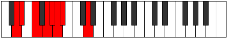

# Mode AFlatAeraphian

## Links

- [Documentation](README.md)
- [Scales Index](Scales.md)
- [Modes Index](Modes.md)
- [Chords Index](Chords.md)

## Scale

[Ionythian](ScaleIonythian.md)

## Mode

[AFlatAeraphian](ModeAFlatAeraphian.md)

## Tonic

Ab

## Signature

[CNaturalMajor]

## Interval Pattern

1, 1, 4, 1, 2, 2, 1

## Chord Pattern

iv⁰

## Perfection

 - 5 Perfect Notes

 - 2 Imperfect Notes

## Notes

- Ab
- Bbb (Imperfect)
- Cbb
- D
- Eb
- F (Imperfect)
- G
- Ab

## Illustration

## Diagram

## Relative Modes

| Number | Mode | Tonic | Notes | Illustration |
|--------|------|-------|-------|--------------|
| [2759](https://ianring.com/musictheory/scales/2759) | [Aeraphian](ModeAeraphian.md) | Ab | Ab, Bbb, Cbb, D, Eb, F, G, Ab |  |
| [491](https://ianring.com/musictheory/scales/491) | [Aeolyrian](ModeAeolyrian.md) | D | D, Eb, F, G, Ab, Bbb, Cbb, D |  |
| [2293](https://ianring.com/musictheory/scales/2293) | [Gorian](ModeGorian.md) | Eb | Eb, F, G, Ab, Bbb, Cbb, D, Eb |  |
| [1597](https://ianring.com/musictheory/scales/1597) | [Aeolodian](ModeAeolodian.md) | F | F, G, Ab, Bbb, Cbb, D, Eb, F |  |
| [1423](https://ianring.com/musictheory/scales/1423) | [Doptian](ModeDoptian.md) | G | G, Ab, Bbb, Cbb, D, Eb, F, G |  |
## Relative Brightness

| Number | Mode | Tonic | Notes | Illustration |
|--------|------|-------|-------|--------------|
| [2759](https://ianring.com/musictheory/scales/2759) | [Aeraphian](ModeAeraphian.md) | Ab | Ab, Bbb, Cbb, D, Eb, F, G, Ab |  |
| [491](https://ianring.com/musictheory/scales/491) | [Aeolyrian](ModeAeolyrian.md) | D | D, Eb, F, G, Ab, Bbb, Cbb, D |  |
| [2293](https://ianring.com/musictheory/scales/2293) | [Gorian](ModeGorian.md) | Eb | Eb, F, G, Ab, Bbb, Cbb, D, Eb |  |
| [1597](https://ianring.com/musictheory/scales/1597) | [Aeolodian](ModeAeolodian.md) | F | F, G, Ab, Bbb, Cbb, D, Eb, F |  |
| [1423](https://ianring.com/musictheory/scales/1423) | [Doptian](ModeDoptian.md) | G | G, Ab, Bbb, Cbb, D, Eb, F, G |  |

## Chords

### Ab

| Number | Root | Name | Notes | Illustration | Audio |
|--------|------|------|-------|--------------|-------|
| 772 | Ab | [Abloc](ChordAFlatLocrian.md) | Ab, Bbb, Ebb |  | [midi](ChordAFlatLocrianRootPosition.mid) |
| 1284 | Ab | [Absus2b5](ChordAFlatSuspendedSecondFlatFifth.md) | Ab, Bb, Ebb |  | [midi](ChordAFlatSuspendedSecondFlatFifthRootPosition.mid) |
| 264 | Ab | [Ab5](ChordAFlatPowerChord.md) | Ab, Eb |  | [midi](ChordAFlatPowerChordRootPosition.mid) |
| 776 | Ab | [Abphryg](ChordAFlatPhrygian.md) | Ab, Bbb, Eb |  | [midi](ChordAFlatPhrygianRootPosition.mid) |
| 1288 | Ab | [Absus2](ChordAFlatSuspendedSecond.md) | Ab, Bb, Eb |  | [midi](ChordAFlatSuspendedSecondRootPosition.mid) |
| 268 | Ab | [Ablyd](ChordAFlatLydian.md) | Ab, D, Eb |  | [midi](ChordAFlatLydianRootPosition.mid) |
| 1316 | Ab | [AbM6sus2b5](ChordAFlatMajorSixthSuspendedSecondFlatFifth.md) | Ab, Bb, Ebb, F |  | [midi](ChordAFlatMajorSixthSuspendedSecondFlatFifthRootPosition.mid) |
| 1320 | Ab | [AbM6sus2](ChordAFlatMajorSixthSuspendedSecond.md) | Ab, Bb, Eb, F |  | [midi](ChordAFlatMajorSixthSuspendedSecondRootPosition.mid) |
| 1320 | Ab | [Ab7sus2b5](ChordAFlatDominantSeventhSuspendedSecondFlatFifth.md) | Ab, Bb, Eb, Gbb |  | [midi](ChordAFlatDominantSeventhSuspendedSecondFlatFifthRootPosition.mid) |
| 904 | Ab | [Abphryg+7](ChordAFlatPhrygianAddSeventh.md) | Ab, Bbb, Eb, G |  | [midi](ChordAFlatPhrygianAddSeventhRootPosition.mid) |
| 1416 | Ab | [AbM7(sus2)](ChordAFlatMajorSeventhSuspendedSecond.md) | Ab, Bb, Eb, G |  | [midi](ChordAFlatMajorSeventhSuspendedSecondRootPosition.mid) |
| 1416 | Ab | [AbM9sus2](ChordAFlatMajorNinthSuspendedSecond.md) | Ab, Bb, Eb, G, Bb |  | [midi](ChordAFlatMajorNinthSuspendedSecondRootPosition.mid) |
| 396 | Ab | [Ablyd(M7)](ChordAFlatLydianMajorSeventh.md) | Ab, D, Eb, G |  | [midi](ChordAFlatLydianMajorSeventhRootPosition.mid) |

### Bbb

| Number | Root | Name | Notes | Illustration | Audio |
|--------|------|------|-------|--------------|-------|

### Cbb

| Number | Root | Name | Notes | Illustration | Audio |
|--------|------|------|-------|--------------|-------|

### D

| Number | Root | Name | Notes | Illustration | Audio |
|--------|------|------|-------|--------------|-------|
| 164 | D | [Dmbb5](ChordDNaturalMinorDoubleFlatFifth.md) | D, F, G |  | [midi](ChordDNaturalMinorDoubleFlatFifthRootPosition.mid) |
| 268 | D | [Dloc](ChordDNaturalLocrian.md) | D, Eb, Ab |  | [midi](ChordDNaturalLocrianRootPosition.mid) |
| 292 | D | [Do](ChordDNaturalDiminished.md) | D, F, Ab |  | [midi](ChordDNaturalDiminishedRootPosition.mid) |
| 388 | D | [Dsus4b5](ChordDNaturalSuspendedFourthFlatFifth.md) | D, G, Ab |  | [midi](ChordDNaturalSuspendedFourthFlatFifthRootPosition.mid) |
| 516 | D | [D5](ChordDNaturalPowerChord.md) | D, A |  | [midi](ChordDNaturalPowerChordRootPosition.mid) |
| 524 | D | [Dphryg](ChordDNaturalPhrygian.md) | D, Eb, A |  | [midi](ChordDNaturalPhrygianRootPosition.mid) |
| 548 | D | [Dm](ChordDNaturalMinor.md) | D, F, A |  | [midi](ChordDNaturalMinorRootPosition.mid) |
| 548 | D | [Dm(add(#9))](ChordDNaturalMinorAddSharpNinth.md) | D, F, A, E# |  | [midi](ChordDNaturalMinorAddSharpNinthRootPosition.mid) |
| 644 | D | [Dsus4](ChordDNaturalSuspendedFourth.md) | D, G, A |  | [midi](ChordDNaturalSuspendedFourthRootPosition.mid) |
| 676 | D | [Dm(add11)](ChordDNaturalMinorAddEleventh.md) | D, F, A, G |  | [midi](ChordDNaturalMinorAddEleventhRootPosition.mid) |
| 676 | D | [Dm(add4)](ChordDNaturalMinorAddFourth.md) | D, F, G, A |  | [midi](ChordDNaturalMinorAddFourthRootPosition.mid) |
| 772 | D | [Dlyd](ChordDNaturalLydian.md) | D, G#, A |  | [midi](ChordDNaturalLydianRootPosition.mid) |
| 804 | D | [Dm(add(#4))](ChordDNaturalMinorAddSharpFourth.md) | D, F, G#, A |  | [midi](ChordDNaturalMinorAddSharpFourthRootPosition.mid) |
| 1060 | D | [Dm#5](ChordDNaturalMinorSharpFifth.md) | D, F, Bb |  | [midi](ChordDNaturalMinorSharpFifthRootPosition.mid) |
| 1156 | D | [Dsus4#5](ChordDNaturalSuspendedFourthSharpFifth.md) | D, G, A# |  | [midi](ChordDNaturalSuspendedFourthSharpFifthRootPosition.mid) |

### Eb

| Number | Root | Name | Notes | Illustration | Audio |
|--------|------|------|-------|--------------|-------|
| 296 | Eb | [Ebsus2bb5](ChordEFlatSuspendedSecondDoubleFlatFifth.md) | Eb, F, Ab |  | [midi](ChordEFlatSuspendedSecondDoubleFlatFifthRootPosition.mid) |
| 552 | Eb | [Ebsus2b5](ChordEFlatSuspendedSecondFlatFifth.md) | Eb, F, Bbb |  | [midi](ChordEFlatSuspendedSecondFlatFifthRootPosition.mid) |
| 648 | Eb | [EbMb5](ChordEFlatMajorFlatFifth.md) | Eb, G, Bbb |  | [midi](ChordEFlatMajorFlatFifthRootPosition.mid) |
| 776 | Eb | [Ebsus4b5](ChordEFlatSuspendedFourthFlatFifth.md) | Eb, Ab, Bbb |  | [midi](ChordEFlatSuspendedFourthFlatFifthRootPosition.mid) |
| 1032 | Eb | [Eb5](ChordEFlatPowerChord.md) | Eb, Bb |  | [midi](ChordEFlatPowerChordRootPosition.mid) |
| 1064 | Eb | [Ebsus2](ChordEFlatSuspendedSecond.md) | Eb, F, Bb |  | [midi](ChordEFlatSuspendedSecondRootPosition.mid) |
| 1160 | Eb | [EbM](ChordEFlatMajor.md) | Eb, G, Bb |  | [midi](ChordEFlatMajorRootPosition.mid) |
| 1192 | Eb | [EbM(add9)](ChordEFlatMajorAddNinth.md) | Eb, G, Bb, F |  | [midi](ChordEFlatMajorAddNinthRootPosition.mid) |
| 1288 | Eb | [Ebsus4](ChordEFlatSuspendedFourth.md) | Eb, Ab, Bb |  | [midi](ChordEFlatSuspendedFourthRootPosition.mid) |
| 1416 | Eb | [EbM(add11)](ChordEFlatMajorAddEleventh.md) | Eb, G, Bb, Ab |  | [midi](ChordEFlatMajorAddEleventhRootPosition.mid) |
| 1416 | Eb | [EbM(add4)](ChordEFlatMajorAddFourth.md) | Eb, G, Ab, Bb |  | [midi](ChordEFlatMajorAddFourthRootPosition.mid) |
| 1544 | Eb | [Eblyd](ChordEFlatLydian.md) | Eb, A, Bb |  | [midi](ChordEFlatLydianRootPosition.mid) |
| 1672 | Eb | [EbM(add(#4))](ChordEFlatMajorAddSharpFourth.md) | Eb, G, A, Bb |  | [midi](ChordEFlatMajorAddSharpFourthRootPosition.mid) |
| 268 | Eb | [EbQ+](ChordEFlatQuartalAugmented.md) | Eb, Ab, D |  | [midi](ChordEFlatQuartalAugmentedRootPosition.mid) |
| 652 | Eb | [EbM7b5](ChordEFlatMajorSeventhFlatFifth.md) | Eb, G, Bbb, D |  | [midi](ChordEFlatMajorSeventhFlatFifthRootPosition.mid) |
| 1068 | Eb | [EbM7(sus2)](ChordEFlatMajorSeventhSuspendedSecond.md) | Eb, F, Bb, D |  | [midi](ChordEFlatMajorSeventhSuspendedSecondRootPosition.mid) |
| 1068 | Eb | [EbM9sus2](ChordEFlatMajorNinthSuspendedSecond.md) | Eb, F, Bb, D, F |  | [midi](ChordEFlatMajorNinthSuspendedSecondRootPosition.mid) |
| 1164 | Eb | [EbM7](ChordEFlatMajorSeventh.md) | Eb, G, Bb, D |  | [midi](ChordEFlatMajorSeventhRootPosition.mid) |
| 1196 | Eb | [EbM9](ChordEFlatMajorNinth.md) | Eb, G, Bb, D, F |  | [midi](ChordEFlatMajorNinthRootPosition.mid) |
| 1292 | Eb | [EbM7(sus4)](ChordEFlatMajorSeventhSuspendedFourth.md) | Eb, Ab, Bb, D |  | [midi](ChordEFlatMajorSeventhSuspendedFourthRootPosition.mid) |
| 1324 | Eb | [EbM9sus4](ChordEFlatMajorNinthSuspendedFourth.md) | Eb, Ab, Bb, D, F |  | [midi](ChordEFlatMajorNinthSuspendedFourthRootPosition.mid) |
| 1420 | Eb | [EbM7add4](ChordEFlatMajorSeventhAddFourth.md) | Eb, G, Ab, Bb, D |  | [midi](ChordEFlatMajorSeventhAddFourthRootPosition.mid) |
| 1420 | Eb | [EbM7add11](ChordEFlatMajorSeventhAddEleventh.md) | Eb, G, Bb, D, Ab |  | [midi](ChordEFlatMajorSeventhAddEleventhRootPosition.mid) |
| 1452 | Eb | [EbM11](ChordEFlatMajorEleventh.md) | Eb, G, Bb, D, F, Ab |  | [midi](ChordEFlatMajorEleventhRootPosition.mid) |
| 1548 | Eb | [Eblyd(M7)](ChordEFlatLydianMajorSeventh.md) | Eb, A, Bb, D |  | [midi](ChordEFlatLydianMajorSeventhRootPosition.mid) |
| 1676 | Eb | [EbM7add(#11)](ChordEFlatMajorSeventhAddSharpEleventh.md) | Eb, G, Bb, D, A |  | [midi](ChordEFlatMajorSeventhAddSharpEleventhRootPosition.mid) |
| 1676 | Eb | [EbM7add(#4)](ChordEFlatMajorSeventhAddSharpFourth.md) | Eb, G, A, Bb, D |  | [midi](ChordEFlatMajorSeventhAddSharpFourthRootPosition.mid) |

### F

| Number | Root | Name | Notes | Illustration | Audio |
|--------|------|------|-------|--------------|-------|
| 1184 | F | [Fsus2bb5](ChordFNaturalSuspendedSecondDoubleFlatFifth.md) | F, G, Bb |  | [midi](ChordFNaturalSuspendedSecondDoubleFlatFifthRootPosition.mid) |
| 1312 | F | [Fmbb5](ChordFNaturalMinorDoubleFlatFifth.md) | F, Ab, Bb |  | [midi](ChordFNaturalMinorDoubleFlatFifthRootPosition.mid) |
| 548 | F | [FM##5](ChordFNaturalMajorDoubleSharpFifth.md) | F, A, D |  | [midi](ChordFNaturalMajorDoubleSharpFifthRootPosition.mid) |
| 1060 | F | [Fsus4##5](ChordFNaturalSuspendedFourthDoubleSharpFifth.md) | F, Bb, D |  | [midi](ChordFNaturalSuspendedFourthDoubleSharpFifthRootPosition.mid) |
| 1188 | F | [FM6sus2bb5](ChordFNaturalMajorSixthSuspendedSecondDoubleFlatFifth.md) | F, G, Bb, D |  | [midi](ChordFNaturalMajorSixthSuspendedSecondDoubleFlatFifthRootPosition.mid) |
| 1064 | F | [FQ](ChordFNaturalQuartal.md) | F, Bb, Eb |  | [midi](ChordFNaturalQuartalRootPosition.mid) |
| 1320 | F | [Fm7bb5](ChordFNaturalMinorSeventhDoubleFlatFifth.md) | F, Ab, Bb, Eb |  | [midi](ChordFNaturalMinorSeventhDoubleFlatFifthRootPosition.mid) |

### G

| Number | Root | Name | Notes | Illustration | Audio |
|--------|------|------|-------|--------------|-------|
| 132 | G | [G5](ChordGNaturalPowerChord.md) | G, D |  | [midi](ChordGNaturalPowerChordRootPosition.mid) |
| 388 | G | [Gphryg](ChordGNaturalPhrygian.md) | G, Ab, D |  | [midi](ChordGNaturalPhrygianRootPosition.mid) |
| 644 | G | [Gsus2](ChordGNaturalSuspendedSecond.md) | G, A, D |  | [midi](ChordGNaturalSuspendedSecondRootPosition.mid) |
| 1156 | G | [Gm](ChordGNaturalMinor.md) | G, Bb, D |  | [midi](ChordGNaturalMinorRootPosition.mid) |
| 1156 | G | [Gm(add(#9))](ChordGNaturalMinorAddSharpNinth.md) | G, Bb, D, A# |  | [midi](ChordGNaturalMinorAddSharpNinthRootPosition.mid) |
| 1668 | G | [Gm(add9)](ChordGNaturalMinorAddNinth.md) | G, Bb, D, A |  | [midi](ChordGNaturalMinorAddNinthRootPosition.mid) |
| 648 | G | [Gsus2#5](ChordGNaturalSuspendedSecondSharpFifth.md) | G, A, D# |  | [midi](ChordGNaturalSuspendedSecondSharpFifthRootPosition.mid) |
| 1160 | G | [Gm#5](ChordGNaturalMinorSharpFifth.md) | G, Bb, Eb |  | [midi](ChordGNaturalMinorSharpFifthRootPosition.mid) |
| 676 | G | [G7sus2](ChordGNaturalDominantSeventhSuspendedSecond.md) | G, A, D, F |  | [midi](ChordGNaturalDominantSeventhSuspendedSecondRootPosition.mid) |
| 676 | G | [G9sus2](ChordGNaturalDominantNinthSuspendedSecond.md) | G, A, D, F, A |  | [midi](ChordGNaturalDominantNinthSuspendedSecondRootPosition.mid) |
| 1188 | G | [Gm7](ChordGNaturalMinorSeventh.md) | G, Bb, D, F |  | [midi](ChordGNaturalMinorSeventhRootPosition.mid) |
| 1444 | G | [Gm7b9](ChordGNaturalMinorSeventhFlatNinth.md) | G, Bb, D, F, Ab |  | [midi](ChordGNaturalMinorSeventhFlatNinthRootPosition.mid) |
| 1700 | G | [Gm9](ChordGNaturalMinorNinth.md) | G, Bb, D, F, A |  | [midi](ChordGNaturalMinorNinthRootPosition.mid) |
| 1192 | G | [Gm7#5](ChordGNaturalMinorSeventhSharpFifth.md) | G, Bb, D#, F |  | [midi](ChordGNaturalMinorSeventhSharpFifthRootPosition.mid) |

