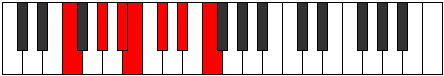

# Mode AFlatAerathimic

## Links

- [Documentation](index.md)
- [Scales Index](Scales.md)
- [Modes Index](Modes.md)
- [Chords Index](Chords.md)

## Scale

[Phracrimic](ScalePhracrimic.md)

## Mode

[AFlatAerathimic](ModeAFlatAerathimic.md)

## Tonic

Ab

## Signature

[CNaturalMajor]

## Interval Pattern

2, 1, 2, 2, 2, 3

## Perfection

 - 4 Perfect Notes

 - 2 Imperfect Notes

## Notes

- Ab
- Bb
- Cb (Imperfect)
- Db
- Eb
- F (Imperfect)
- Ab

## Illustration

## Relative Modes

| Number | Mode | Tonic | Notes | Illustration |
|--------|------|-------|-------|--------------|
| [685](https://ianring.com/musictheory/scales/685) | [Aerathimic](ModeAerathimic.md) | Ab | Ab, Bb, Cb, Db, Eb, F, Ab |  |
| [1195](https://ianring.com/musictheory/scales/1195) | [Sarimic](ModeSarimic.md) | Bb | Bb, Cb, Db, Eb, F, G#, Bb |  |
| [1685](https://ianring.com/musictheory/scales/1685) | [Zeracrimic](ModeZeracrimic.md) | Db | Db, Eb, F, G#, A#, B, Db |  |
| [1445](https://ianring.com/musictheory/scales/1445) | [Byptimic](ModeByptimic.md) | Eb | Eb, F, G#, A#, B, C#, Eb |  |
| [1385](https://ianring.com/musictheory/scales/1385) | [Phracrimic](ModePhracrimic.md) | F | F, G#, A#, B, C#, D#, F |  |

## Chords

### Ab

| Number | Root | Name | Notes | Illustration | Audio |
|--------|------|------|-------|--------------|-------|
| 1282 | Ab | [Absus2bb5](ChordAFlatSuspendedSecondDoubleFlatFifth.md) | Ab, Bb, Db |  | [midi](ChordAFlatSuspendedSecondDoubleFlatFifthRootPosition.mid) |
| 2306 | Ab | [Abmbb5](ChordAFlatMinorDoubleFlatFifth.md) | Ab, Cb, Db |  | [midi](ChordAFlatMinorDoubleFlatFifthRootPosition.mid) |
| 264 | Ab | [Ab5](ChordAFlatPowerChord.md) | Ab, Eb |  | [midi](ChordAFlatPowerChordRootPosition.mid) |
| 1288 | Ab | [Absus2](ChordAFlatSuspendedSecond.md) | Ab, Bb, Eb |  | [midi](ChordAFlatSuspendedSecondRootPosition.mid) |
| 2312 | Ab | [Abm](ChordAFlatMinor.md) | Ab, Cb, Eb |  | [midi](ChordAFlatMinorRootPosition.mid) |
| 2312 | Ab | [Abm(add(#9))](ChordAFlatMinorAddSharpNinth.md) | Ab, Cb, Eb, B |  | [midi](ChordAFlatMinorAddSharpNinthRootPosition.mid) |
| 3336 | Ab | [Abm(add9)](ChordAFlatMinorAddNinth.md) | Ab, Cb, Eb, Bb |  | [midi](ChordAFlatMinorAddNinthRootPosition.mid) |
| 266 | Ab | [Absus4](ChordAFlatSuspendedFourth.md) | Ab, Db, Eb |  | [midi](ChordAFlatSuspendedFourthRootPosition.mid) |
| 2314 | Ab | [Abm(add11)](ChordAFlatMinorAddEleventh.md) | Ab, Cb, Eb, Db |  | [midi](ChordAFlatMinorAddEleventhRootPosition.mid) |
| 2314 | Ab | [Abm(add4)](ChordAFlatMinorAddFourth.md) | Ab, Cb, Db, Eb |  | [midi](ChordAFlatMinorAddFourthRootPosition.mid) |
| 290 | Ab | [Absus4##5](ChordAFlatSuspendedFourthDoubleSharpFifth.md) | Ab, Db, F |  | [midi](ChordAFlatSuspendedFourthDoubleSharpFifthRootPosition.mid) |
| 1314 | Ab | [AbM6sus2bb5](ChordAFlatMajorSixthSuspendedSecondDoubleFlatFifth.md) | Ab, Bb, Db, F |  | [midi](ChordAFlatMajorSixthSuspendedSecondDoubleFlatFifthRootPosition.mid) |
| 1320 | Ab | [AbM6sus2](ChordAFlatMajorSixthSuspendedSecond.md) | Ab, Bb, Eb, F |  | [midi](ChordAFlatMajorSixthSuspendedSecondRootPosition.mid) |
| 1320 | Ab | [Ab7sus2b5](ChordAFlatDominantSeventhSuspendedSecondFlatFifth.md) | Ab, Bb, Eb, Gbb |  | [midi](ChordAFlatDominantSeventhSuspendedSecondFlatFifthRootPosition.mid) |
| 2344 | Ab | [Abm6](ChordAFlatMinorSixth.md) | Ab, Cb, Eb, F |  | [midi](ChordAFlatMinorSixthRootPosition.mid) |
| 3368 | Ab | [Abm6(add9)](ChordAFlatMinorSixthAddNinth.md) | Ab, Cb, Eb, F, Bb |  | [midi](ChordAFlatMinorSixthAddNinthRootPosition.mid) |
| 298 | Ab | [AbM6sus4](ChordAFlatMajorSixthSuspendedFourth.md) | Ab, Db, Eb, F |  | [midi](ChordAFlatMajorSixthSuspendedFourthRootPosition.mid) |

### Bb

| Number | Root | Name | Notes | Illustration | Audio |
|--------|------|------|-------|--------------|-------|
| 1034 | Bb | [Bbmbb5](ChordBFlatMinorDoubleFlatFifth.md) | Bb, Db, Eb |  | [midi](ChordBFlatMinorDoubleFlatFifthRootPosition.mid) |
| 1056 | Bb | [Bb5](ChordBFlatPowerChord.md) | Bb, F |  | [midi](ChordBFlatPowerChordRootPosition.mid) |
| 3104 | Bb | [Bbphryg](ChordBFlatPhrygian.md) | Bb, Cb, F |  | [midi](ChordBFlatPhrygianRootPosition.mid) |
| 1058 | Bb | [Bbm](ChordBFlatMinor.md) | Bb, Db, F |  | [midi](ChordBFlatMinorRootPosition.mid) |
| 1058 | Bb | [Bbm(add(#9))](ChordBFlatMinorAddSharpNinth.md) | Bb, Db, F, C# |  | [midi](ChordBFlatMinorAddSharpNinthRootPosition.mid) |
| 1064 | Bb | [Bbsus4](ChordBFlatSuspendedFourth.md) | Bb, Eb, F |  | [midi](ChordBFlatSuspendedFourthRootPosition.mid) |
| 1066 | Bb | [Bbm(add11)](ChordBFlatMinorAddEleventh.md) | Bb, Db, F, Eb |  | [midi](ChordBFlatMinorAddEleventhRootPosition.mid) |
| 1066 | Bb | [Bbm(add4)](ChordBFlatMinorAddFourth.md) | Bb, Db, Eb, F |  | [midi](ChordBFlatMinorAddFourthRootPosition.mid) |
| 1288 | Bb | [BbQ](ChordBFlatQuartal.md) | Bb, Eb, Ab |  | [midi](ChordBFlatQuartalRootPosition.mid) |
| 1290 | Bb | [Bbm7bb5](ChordBFlatMinorSeventhDoubleFlatFifth.md) | Bb, Db, Eb, Ab |  | [midi](ChordBFlatMinorSeventhDoubleFlatFifthRootPosition.mid) |
| 1314 | Bb | [Bbm7](ChordBFlatMinorSeventh.md) | Bb, Db, F, Ab |  | [midi](ChordBFlatMinorSeventhRootPosition.mid) |
| 3362 | Bb | [Bbm7b9](ChordBFlatMinorSeventhFlatNinth.md) | Bb, Db, F, Ab, Cb |  | [midi](ChordBFlatMinorSeventhFlatNinthRootPosition.mid) |
| 1320 | Bb | [Bb7sus4](ChordBFlatDominantSeventhSuspendedFourth.md) | Bb, Eb, F, Ab |  | [midi](ChordBFlatDominantSeventhSuspendedFourthRootPosition.mid) |
| 1322 | Bb | [Bbm7add11](ChordBFlatMinorSeventhAddEleventh.md) | Bb, Db, F, Ab, Eb |  | [midi](ChordBFlatMinorSeventhAddEleventhRootPosition.mid) |

### Cb

| Number | Root | Name | Notes | Illustration | Audio |
|--------|------|------|-------|--------------|-------|

### Db

| Number | Root | Name | Notes | Illustration | Audio |
|--------|------|------|-------|--------------|-------|
| 258 | Db | [Db5](ChordDFlatPowerChord.md) | Db, Ab |  | [midi](ChordDFlatPowerChordRootPosition.mid) |
| 266 | Db | [Dbsus2](ChordDFlatSuspendedSecond.md) | Db, Eb, Ab |  | [midi](ChordDFlatSuspendedSecondRootPosition.mid) |
| 290 | Db | [DbM](ChordDFlatMajor.md) | Db, F, Ab |  | [midi](ChordDFlatMajorRootPosition.mid) |
| 298 | Db | [DbM(add9)](ChordDFlatMajorAddNinth.md) | Db, F, Ab, Eb |  | [midi](ChordDFlatMajorAddNinthRootPosition.mid) |
| 1058 | Db | [DbM##5](ChordDFlatMajorDoubleSharpFifth.md) | Db, F, Bb |  | [midi](ChordDFlatMajorDoubleSharpFifthRootPosition.mid) |
| 1290 | Db | [DbM6sus2](ChordDFlatMajorSixthSuspendedSecond.md) | Db, Eb, Ab, Bb |  | [midi](ChordDFlatMajorSixthSuspendedSecondRootPosition.mid) |
| 1290 | Db | [Db7sus2b5](ChordDFlatDominantSeventhSuspendedSecondFlatFifth.md) | Db, Eb, Ab, Cbb |  | [midi](ChordDFlatDominantSeventhSuspendedSecondFlatFifthRootPosition.mid) |
| 1314 | Db | [DbM6](ChordDFlatMajorSixth.md) | Db, F, Ab, Bb |  | [midi](ChordDFlatMajorSixthRootPosition.mid) |
| 1322 | Db | [DbM6(add9)](ChordDFlatMajorSixthAddNinth.md) | Db, F, Ab, Bb, Eb |  | [midi](ChordDFlatMajorSixthAddNinthRootPosition.mid) |
| 2314 | Db | [Db7sus2](ChordDFlatDominantSeventhSuspendedSecond.md) | Db, Eb, Ab, Cb |  | [midi](ChordDFlatDominantSeventhSuspendedSecondRootPosition.mid) |
| 2314 | Db | [Db9sus2](ChordDFlatDominantNinthSuspendedSecond.md) | Db, Eb, Ab, Cb, Eb |  | [midi](ChordDFlatDominantNinthSuspendedSecondRootPosition.mid) |
| 2338 | Db | [Db7](ChordDFlatDominantSeventh.md) | Db, F, Ab, Cb |  | [midi](ChordDFlatDominantSeventhRootPosition.mid) |
| 2346 | Db | [Db9](ChordDFlatDominantNinth.md) | Db, F, Ab, Cb, Eb |  | [midi](ChordDFlatDominantNinthRootPosition.mid) |
| 3362 | Db | [Db7add13](ChordDFlatDominantSeventhAddThirteenth.md) | Db, F, Ab, Cb, Bb |  | [midi](ChordDFlatDominantSeventhAddThirteenthRootPosition.mid) |

### Eb

| Number | Root | Name | Notes | Illustration | Audio |
|--------|------|------|-------|--------------|-------|
| 296 | Eb | [Ebsus2bb5](ChordEFlatSuspendedSecondDoubleFlatFifth.md) | Eb, F, Ab |  | [midi](ChordEFlatSuspendedSecondDoubleFlatFifthRootPosition.mid) |
| 1032 | Eb | [Eb5](ChordEFlatPowerChord.md) | Eb, Bb |  | [midi](ChordEFlatPowerChordRootPosition.mid) |
| 1064 | Eb | [Ebsus2](ChordEFlatSuspendedSecond.md) | Eb, F, Bb |  | [midi](ChordEFlatSuspendedSecondRootPosition.mid) |
| 1288 | Eb | [Ebsus4](ChordEFlatSuspendedFourth.md) | Eb, Ab, Bb |  | [midi](ChordEFlatSuspendedFourthRootPosition.mid) |
| 2088 | Eb | [Ebsus2#5](ChordEFlatSuspendedSecondSharpFifth.md) | Eb, F, B |  | [midi](ChordEFlatSuspendedSecondSharpFifthRootPosition.mid) |
| 2312 | Eb | [Ebsus4#5](ChordEFlatSuspendedFourthSharpFifth.md) | Eb, Ab, B |  | [midi](ChordEFlatSuspendedFourthSharpFifthRootPosition.mid) |
| 266 | Eb | [EbQ](ChordEFlatQuartal.md) | Eb, Ab, Db |  | [midi](ChordEFlatQuartalRootPosition.mid) |
| 1066 | Eb | [Eb7sus2](ChordEFlatDominantSeventhSuspendedSecond.md) | Eb, F, Bb, Db |  | [midi](ChordEFlatDominantSeventhSuspendedSecondRootPosition.mid) |
| 1066 | Eb | [Eb9sus2](ChordEFlatDominantNinthSuspendedSecond.md) | Eb, F, Bb, Db, F |  | [midi](ChordEFlatDominantNinthSuspendedSecondRootPosition.mid) |
| 1290 | Eb | [Eb7sus4](ChordEFlatDominantSeventhSuspendedFourth.md) | Eb, Ab, Bb, Db |  | [midi](ChordEFlatDominantSeventhSuspendedFourthRootPosition.mid) |
| 1322 | Eb | [Eb9sus4](ChordEFlatDominantNinthSuspendedFourth.md) | Eb, Ab, Bb, Db, F |  | [midi](ChordEFlatDominantNinthSuspendedFourthRootPosition.mid) |

### F

| Number | Root | Name | Notes | Illustration | Audio |
|--------|------|------|-------|--------------|-------|
| 1312 | F | [Fmbb5](ChordFNaturalMinorDoubleFlatFifth.md) | F, Ab, Bb |  | [midi](ChordFNaturalMinorDoubleFlatFifthRootPosition.mid) |
| 2336 | F | [Fo](ChordFNaturalDiminished.md) | F, Ab, Cb |  | [midi](ChordFNaturalDiminishedRootPosition.mid) |
| 3104 | F | [Fsus4b5](ChordFNaturalSuspendedFourthFlatFifth.md) | F, Bb, Cb |  | [midi](ChordFNaturalSuspendedFourthFlatFifthRootPosition.mid) |
| 290 | F | [Fm#5](ChordFNaturalMinorSharpFifth.md) | F, Ab, Db |  | [midi](ChordFNaturalMinorSharpFifthRootPosition.mid) |
| 1058 | F | [Fsus4#5](ChordFNaturalSuspendedFourthSharpFifth.md) | F, Bb, C# |  | [midi](ChordFNaturalSuspendedFourthSharpFifthRootPosition.mid) |
| 1064 | F | [FQ](ChordFNaturalQuartal.md) | F, Bb, Eb |  | [midi](ChordFNaturalQuartalRootPosition.mid) |
| 1320 | F | [Fm7bb5](ChordFNaturalMinorSeventhDoubleFlatFifth.md) | F, Ab, Bb, Eb |  | [midi](ChordFNaturalMinorSeventhDoubleFlatFifthRootPosition.mid) |
| 2344 | F | [Fø7](ChordFNaturalHalfDiminishedSeventh.md) | F, Ab, Cb, Eb |  | [midi](ChordFNaturalHalfDiminishedSeventhRootPosition.mid) |
| 298 | F | [Fm7#5](ChordFNaturalMinorSeventhSharpFifth.md) | F, Ab, C#, Eb |  | [midi](ChordFNaturalMinorSeventhSharpFifthRootPosition.mid) |

