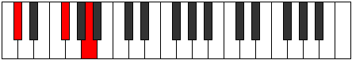

# Mode AFlatAerathygic

## Links

- [Documentation](index.md)
- [Scales Index](Scales.md)
- [Modes Index](Modes.md)
- [Chords Index](Chords.md)

## Scale

[Mixolydygic](ScaleMixolydygic.md)

## Mode

[AFlatAerathygic](ModeAFlatAerathygic.md)

## Tonic

Ab

## Signature

[CNaturalMajor]

## Perfection

 - 7 Perfect Notes

 - 2 Imperfect Notes

## Notes

- Ab
- A
- Bb (Imperfect)
- Db
- D
- Eb
- E (Imperfect)
- Gb
- G
- Ab

## Illustration

## Relative Modes

| Number | Mode | Tonic | Notes | Illustration |
|--------|------|-------|-------|--------------|
| [1007](https://ianring.com/musictheory/scales/1007) | [Ionycrygic](ModeIonycrygic.md) | C# | C#, D, D#, E, F#, G, G#, A, A#, C# |  |
| [1007](https://ianring.com/musictheory/scales/1007) | [Ionycrygic](ModeIonycrygic.md) | Db | Db, D, Eb, E, Gb, G, Ab, A, Bb, Db |  |
| [1951](https://ianring.com/musictheory/scales/1951) | [Gonygic](ModeGonygic.md) | F# | F#, G, G#, A, A#, C#, D, D#, E, F# |  |
| [1951](https://ianring.com/musictheory/scales/1951) | [Gonygic](ModeGonygic.md) | Gb | Gb, G, Ab, A, Bb, Db, D, Eb, E, Gb |  |
| [2551](https://ianring.com/musictheory/scales/2551) | [Zoptygic](ModeZoptygic.md) | D | D, D#, E, F#, G, G#, A, A#, C#, D |  |
| [3023](https://ianring.com/musictheory/scales/3023) | [Aeracrygic](ModeAeracrygic.md) | G | G, G#, A, A#, C#, D, D#, E, F#, G |  |
| [3323](https://ianring.com/musictheory/scales/3323) | [Phrygygic](ModePhrygygic.md) | D# | D#, E, F#, G, G#, A, A#, C#, D, D# |  |
| [3323](https://ianring.com/musictheory/scales/3323) | [Phrygygic](ModePhrygygic.md) | Eb | Eb, E, Gb, G, Ab, A, Bb, Db, D, Eb |  |
| [3559](https://ianring.com/musictheory/scales/3559) | [Aerathygic](ModeAerathygic.md) | G# | G#, A, A#, C#, D, D#, E, F#, G, G# |  |
| [3559](https://ianring.com/musictheory/scales/3559) | [Aerathygic](ModeAerathygic.md) | Ab | Ab, A, Bb, Db, D, Eb, E, Gb, G, Ab |  |
| [3709](https://ianring.com/musictheory/scales/3709) | [Locrygic](ModeLocrygic.md) | E | E, F#, G, G#, A, A#, C#, D, D#, E |  |
| [3827](https://ianring.com/musictheory/scales/3827) | [Dorygic](ModeDorygic.md) | A | A, A#, C#, D, D#, E, F#, G, G#, A |  |
| [3961](https://ianring.com/musictheory/scales/3961) | [Mixolydygic](ModeMixolydygic.md) | A# | A#, C#, D, D#, E, F#, G, G#, A, A# |  |
| [3961](https://ianring.com/musictheory/scales/3961) | [Mixolydygic](ModeMixolydygic.md) | Bb | Bb, Db, D, Eb, E, Gb, G, Ab, A, Bb |  |

## Chords

### Ab

| Number | Root | Name | Notes | Illustration | Audio |
|--------|------|------|-------|--------------|-------|
| 1282 | Ab | [Absus2bb5](ChordAFlatSuspendedSecondDoubleFlatFifth.md) | Ab, Bb, Db |  | [midi](ChordAFlatSuspendedSecondDoubleFlatFifthRootPosition.mid) [ogg](ChordAFlatSuspendedSecondDoubleFlatFifthRootPosition.ogg) |
| 772 | Ab | [Abloc](ChordAFlatLocrian.md) | Ab, Bbb, Ebb |  | [midi](ChordAFlatLocrianRootPosition.mid) [ogg](ChordAFlatLocrianRootPosition.ogg) |
| 1284 | Ab | [Absus2b5](ChordAFlatSuspendedSecondFlatFifth.md) | Ab, Bb, Ebb |  | [midi](ChordAFlatSuspendedSecondFlatFifthRootPosition.mid) [ogg](ChordAFlatSuspendedSecondFlatFifthRootPosition.ogg) |
| 262 | Ab | [Absus4b5](ChordAFlatSuspendedFourthFlatFifth.md) | Ab, Db, Ebb |  | [midi](ChordAFlatSuspendedFourthFlatFifthRootPosition.mid) [ogg](ChordAFlatSuspendedFourthFlatFifthRootPosition.ogg) |
| 264 | Ab | [Ab5](ChordAFlatPowerChord.md) | Ab, Eb |  | [midi](ChordAFlatPowerChordRootPosition.mid) [ogg](ChordAFlatPowerChordRootPosition.ogg) |
| 776 | Ab | [Abphryg](ChordAFlatPhrygian.md) | Ab, Bbb, Eb |  | [midi](ChordAFlatPhrygianRootPosition.mid) [ogg](ChordAFlatPhrygianRootPosition.ogg) |
| 1288 | Ab | [Absus2](ChordAFlatSuspendedSecond.md) | Ab, Bb, Eb |  | [midi](ChordAFlatSuspendedSecondRootPosition.mid) [ogg](ChordAFlatSuspendedSecondRootPosition.ogg) |
| 266 | Ab | [Absus4](ChordAFlatSuspendedFourth.md) | Ab, Db, Eb |  | [midi](ChordAFlatSuspendedFourthRootPosition.mid) [ogg](ChordAFlatSuspendedFourthRootPosition.ogg) |
| 268 | Ab | [Ablyd](ChordAFlatLydian.md) | Ab, D, Eb |  | [midi](ChordAFlatLydianRootPosition.mid) [ogg](ChordAFlatLydianRootPosition.ogg) |
| 1296 | Ab | [Absus2#5](ChordAFlatSuspendedSecondSharpFifth.md) | Ab, Bb, E |  | [midi](ChordAFlatSuspendedSecondSharpFifthRootPosition.mid) [ogg](ChordAFlatSuspendedSecondSharpFifthRootPosition.ogg) |
| 274 | Ab | [Absus4#5](ChordAFlatSuspendedFourthSharpFifth.md) | Ab, Db, E |  | [midi](ChordAFlatSuspendedFourthSharpFifthRootPosition.mid) [ogg](ChordAFlatSuspendedFourthSharpFifthRootPosition.ogg) |
| 1300 | Ab | [Absus2b5add(#5)](ChordAFlatSuspendedSecondFlatFifthAddSharpFifth.md) | Ab, Bb, Ebb, E |  | [midi](ChordAFlatSuspendedSecondFlatFifthAddSharpFifthRootPosition.mid) [ogg](ChordAFlatSuspendedSecondFlatFifthAddSharpFifthRootPosition.ogg) |
| 322 | Ab | [AbQ](ChordAFlatQuartal.md) | Ab, Db, Gb |  | [midi](ChordAFlatQuartalRootPosition.mid) [ogg](ChordAFlatQuartalRootPosition.ogg) |
| 1352 | Ab | [Ab7sus2](ChordAFlatDominantSeventhSuspendedSecond.md) | Ab, Bb, Eb, Gb |  | [midi](ChordAFlatDominantSeventhSuspendedSecondRootPosition.mid) [ogg](ChordAFlatDominantSeventhSuspendedSecondRootPosition.ogg) |
| 1352 | Ab | [Ab9sus2](ChordAFlatDominantNinthSuspendedSecond.md) | Ab, Bb, Eb, Gb, Bb |  | [midi](ChordAFlatDominantNinthSuspendedSecondRootPosition.mid) [ogg](ChordAFlatDominantNinthSuspendedSecondRootPosition.ogg) |
| 330 | Ab | [Ab7sus4](ChordAFlatDominantSeventhSuspendedFourth.md) | Ab, Db, Eb, Gb |  | [midi](ChordAFlatDominantSeventhSuspendedFourthRootPosition.mid) [ogg](ChordAFlatDominantSeventhSuspendedFourthRootPosition.ogg) |
| 1354 | Ab | [Ab9sus4](ChordAFlatDominantNinthSuspendedFourth.md) | Ab, Db, Eb, Gb, Bb |  | [midi](ChordAFlatDominantNinthSuspendedFourthRootPosition.mid) [ogg](ChordAFlatDominantNinthSuspendedFourthRootPosition.ogg) |
| 386 | Ab | [AbQ+](ChordAFlatQuartalAugmented.md) | Ab, Db, G |  | [midi](ChordAFlatQuartalAugmentedRootPosition.mid) [ogg](ChordAFlatQuartalAugmentedRootPosition.ogg) |
| 904 | Ab | [Abphryg+7](ChordAFlatPhrygianAddSeventh.md) | Ab, Bbb, Eb, G |  | [midi](ChordAFlatPhrygianAddSeventhRootPosition.mid) [ogg](ChordAFlatPhrygianAddSeventhRootPosition.ogg) |
| 1416 | Ab | [AbM7(sus2)](ChordAFlatMajorSeventhSuspendedSecond.md) | Ab, Bb, Eb, G |  | [midi](ChordAFlatMajorSeventhSuspendedSecondRootPosition.mid) [ogg](ChordAFlatMajorSeventhSuspendedSecondRootPosition.ogg) |
| 1416 | Ab | [AbM9sus2](ChordAFlatMajorNinthSuspendedSecond.md) | Ab, Bb, Eb, G, Bb |  | [midi](ChordAFlatMajorNinthSuspendedSecondRootPosition.mid) [ogg](ChordAFlatMajorNinthSuspendedSecondRootPosition.ogg) |
| 394 | Ab | [AbM7(sus4)](ChordAFlatMajorSeventhSuspendedFourth.md) | Ab, Db, Eb, G |  | [midi](ChordAFlatMajorSeventhSuspendedFourthRootPosition.mid) [ogg](ChordAFlatMajorSeventhSuspendedFourthRootPosition.ogg) |
| 1418 | Ab | [AbM9sus4](ChordAFlatMajorNinthSuspendedFourth.md) | Ab, Db, Eb, G, Bb |  | [midi](ChordAFlatMajorNinthSuspendedFourthRootPosition.mid) [ogg](ChordAFlatMajorNinthSuspendedFourthRootPosition.ogg) |
| 396 | Ab | [Ablyd(M7)](ChordAFlatLydianMajorSeventh.md) | Ab, D, Eb, G |  | [midi](ChordAFlatLydianMajorSeventhRootPosition.mid) [ogg](ChordAFlatLydianMajorSeventhRootPosition.ogg) |
| 402 | Ab | [AbM7(sus4)#5](ChordAFlatMajorSeventhSuspendedFourthSharpFifth.md) | Ab, Db, E, G |  | [midi](ChordAFlatMajorSeventhSuspendedFourthSharpFifthRootPosition.mid) [ogg](ChordAFlatMajorSeventhSuspendedFourthSharpFifthRootPosition.ogg) |

### A

| Number | Root | Name | Notes | Illustration | Audio |
|--------|------|------|-------|--------------|-------|
| 1544 | A | [Aloc](ChordANaturalLocrian.md) | A, Bb, Eb |  | [midi](ChordANaturalLocrianRootPosition.mid) [ogg](ChordANaturalLocrianRootPosition.ogg) |
| 522 | A | [AMb5](ChordANaturalMajorFlatFifth.md) | A, C#, Eb |  | [midi](ChordANaturalMajorFlatFifthRootPosition.mid) [ogg](ChordANaturalMajorFlatFifthRootPosition.ogg) |
| 524 | A | [Asus4b5](ChordANaturalSuspendedFourthFlatFifth.md) | A, D, Eb |  | [midi](ChordANaturalSuspendedFourthFlatFifthRootPosition.mid) [ogg](ChordANaturalSuspendedFourthFlatFifthRootPosition.ogg) |
| 528 | A | [A5](ChordANaturalPowerChord.md) | A, E |  | [midi](ChordANaturalPowerChordRootPosition.mid) [ogg](ChordANaturalPowerChordRootPosition.ogg) |
| 1552 | A | [Aphryg](ChordANaturalPhrygian.md) | A, Bb, E |  | [midi](ChordANaturalPhrygianRootPosition.mid) [ogg](ChordANaturalPhrygianRootPosition.ogg) |
| 530 | A | [AM](ChordANaturalMajor.md) | A, C#, E |  | [midi](ChordANaturalMajorRootPosition.mid) [ogg](ChordANaturalMajorRootPosition.ogg) |
| 532 | A | [Asus4](ChordANaturalSuspendedFourth.md) | A, D, E |  | [midi](ChordANaturalSuspendedFourthRootPosition.mid) [ogg](ChordANaturalSuspendedFourthRootPosition.ogg) |
| 534 | A | [AM(add11)](ChordANaturalMajorAddEleventh.md) | A, C#, E, D |  | [midi](ChordANaturalMajorAddEleventhRootPosition.mid) [ogg](ChordANaturalMajorAddEleventhRootPosition.ogg) |
| 534 | A | [AM(add4)](ChordANaturalMajorAddFourth.md) | A, C#, D, E |  | [midi](ChordANaturalMajorAddFourthRootPosition.mid) [ogg](ChordANaturalMajorAddFourthRootPosition.ogg) |
| 536 | A | [Alyd](ChordANaturalLydian.md) | A, D#, E |  | [midi](ChordANaturalLydianRootPosition.mid) [ogg](ChordANaturalLydianRootPosition.ogg) |
| 538 | A | [AM(add(#4))](ChordANaturalMajorAddSharpFourth.md) | A, C#, D#, E |  | [midi](ChordANaturalMajorAddSharpFourthRootPosition.mid) [ogg](ChordANaturalMajorAddSharpFourthRootPosition.ogg) |
| 578 | A | [AM##5](ChordANaturalMajorDoubleSharpFifth.md) | A, C#, F# |  | [midi](ChordANaturalMajorDoubleSharpFifthRootPosition.mid) [ogg](ChordANaturalMajorDoubleSharpFifthRootPosition.ogg) |
| 580 | A | [Asus4##5](ChordANaturalSuspendedFourthDoubleSharpFifth.md) | A, D, F# |  | [midi](ChordANaturalSuspendedFourthDoubleSharpFifthRootPosition.mid) [ogg](ChordANaturalSuspendedFourthDoubleSharpFifthRootPosition.ogg) |
| 586 | A | [AM6b5](ChordANaturalMajorSixthFlatFifth.md) | A, C#, Eb, F# |  | [midi](ChordANaturalMajorSixthFlatFifthRootPosition.mid) [ogg](ChordANaturalMajorSixthFlatFifthRootPosition.ogg) |
| 594 | A | [AM6](ChordANaturalMajorSixth.md) | A, C#, E, F# |  | [midi](ChordANaturalMajorSixthRootPosition.mid) [ogg](ChordANaturalMajorSixthRootPosition.ogg) |
| 1618 | A | [AM6(addb9)](ChordANaturalMajorSixthAddFlatNinth.md) | A, C#, E, F#, Bb |  | [midi](ChordANaturalMajorSixthAddFlatNinthRootPosition.mid) [ogg](ChordANaturalMajorSixthAddFlatNinthRootPosition.ogg) |
| 596 | A | [AM6sus4](ChordANaturalMajorSixthSuspendedFourth.md) | A, D, E, F# |  | [midi](ChordANaturalMajorSixthSuspendedFourthRootPosition.mid) [ogg](ChordANaturalMajorSixthSuspendedFourthRootPosition.ogg) |
| 644 | A | [AQ](ChordANaturalQuartal.md) | A, D, G |  | [midi](ChordANaturalQuartalRootPosition.mid) [ogg](ChordANaturalQuartalRootPosition.ogg) |
| 650 | A | [A7b5](ChordANaturalDominantSeventhFlatFifth.md) | A, C#, Eb, G |  | [midi](ChordANaturalDominantSeventhFlatFifthRootPosition.mid) [ogg](ChordANaturalDominantSeventhFlatFifthRootPosition.ogg) |
| 1674 | A | [A7b5b9](ChordANaturalDominantSeventhFlatFifthFlatNinth.md) | A, C#, Eb, G, Bb |  | [midi](ChordANaturalDominantSeventhFlatFifthFlatNinthRootPosition.mid) [ogg](ChordANaturalDominantSeventhFlatFifthFlatNinthRootPosition.ogg) |
| 658 | A | [A7](ChordANaturalDominantSeventh.md) | A, C#, E, G |  | [midi](ChordANaturalDominantSeventhRootPosition.mid) [ogg](ChordANaturalDominantSeventhRootPosition.ogg) |
| 1682 | A | [A7b9](ChordANaturalDominantSeventhFlatNinth.md) | A, C#, E, G, Bb |  | [midi](ChordANaturalDominantSeventhFlatNinthRootPosition.mid) [ogg](ChordANaturalDominantSeventhFlatNinthRootPosition.ogg) |
| 660 | A | [A7sus4](ChordANaturalDominantSeventhSuspendedFourth.md) | A, D, E, G |  | [midi](ChordANaturalDominantSeventhSuspendedFourthRootPosition.mid) [ogg](ChordANaturalDominantSeventhSuspendedFourthRootPosition.ogg) |
| 662 | A | [A7add4](ChordANaturalDominantSeventhAddFourth.md) | A, C#, D, E, G |  | [midi](ChordANaturalDominantSeventhAddFourthRootPosition.mid) [ogg](ChordANaturalDominantSeventhAddFourthRootPosition.ogg) |
| 662 | A | [A7add11](ChordANaturalDominantSeventhAddEleventh.md) | A, C#, E, G, D |  | [midi](ChordANaturalDominantSeventhAddEleventhRootPosition.mid) [ogg](ChordANaturalDominantSeventhAddEleventhRootPosition.ogg) |
| 666 | A | [A7add(#4)](ChordANaturalDominantSeventhAddSharpFourth.md) | A, C#, D#, E, G |  | [midi](ChordANaturalDominantSeventhAddSharpFourthRootPosition.mid) [ogg](ChordANaturalDominantSeventhAddSharpFourthRootPosition.ogg) |
| 666 | A | [A7#11](ChordANaturalDominantSeventhSharpEleventh.md) | A, C#, E, G, D# |  | [midi](ChordANaturalDominantSeventhSharpEleventhRootPosition.mid) [ogg](ChordANaturalDominantSeventhSharpEleventhRootPosition.ogg) |
| 722 | A | [A7add13](ChordANaturalDominantSeventhAddThirteenth.md) | A, C#, E, G, F# |  | [midi](ChordANaturalDominantSeventhAddThirteenthRootPosition.mid) [ogg](ChordANaturalDominantSeventhAddThirteenthRootPosition.ogg) |
| 1750 | A | [A13b9](ChordANaturalDominantThirteenthFlatNinth.md) | A, C#, E, G, Bb, D, F# |  | [midi](ChordANaturalDominantThirteenthFlatNinthRootPosition.mid) [ogg](ChordANaturalDominantThirteenthFlatNinthRootPosition.ogg) |
| 772 | A | [AQ+](ChordANaturalQuartalAugmented.md) | A, D, G# |  | [midi](ChordANaturalQuartalAugmentedRootPosition.mid) [ogg](ChordANaturalQuartalAugmentedRootPosition.ogg) |
| 778 | A | [AM7b5](ChordANaturalMajorSeventhFlatFifth.md) | A, C#, Eb, G# |  | [midi](ChordANaturalMajorSeventhFlatFifthRootPosition.mid) [ogg](ChordANaturalMajorSeventhFlatFifthRootPosition.ogg) |
| 1808 | A | [Aphryg+7](ChordANaturalPhrygianAddSeventh.md) | A, Bb, E, G# |  | [midi](ChordANaturalPhrygianAddSeventhRootPosition.mid) [ogg](ChordANaturalPhrygianAddSeventhRootPosition.ogg) |
| 786 | A | [AM7](ChordANaturalMajorSeventh.md) | A, C#, E, G# |  | [midi](ChordANaturalMajorSeventhRootPosition.mid) [ogg](ChordANaturalMajorSeventhRootPosition.ogg) |
| 788 | A | [AM7(sus4)](ChordANaturalMajorSeventhSuspendedFourth.md) | A, D, E, G# |  | [midi](ChordANaturalMajorSeventhSuspendedFourthRootPosition.mid) [ogg](ChordANaturalMajorSeventhSuspendedFourthRootPosition.ogg) |
| 790 | A | [AM7add4](ChordANaturalMajorSeventhAddFourth.md) | A, C#, D, E, G# |  | [midi](ChordANaturalMajorSeventhAddFourthRootPosition.mid) [ogg](ChordANaturalMajorSeventhAddFourthRootPosition.ogg) |
| 790 | A | [AM7add11](ChordANaturalMajorSeventhAddEleventh.md) | A, C#, E, G#, D |  | [midi](ChordANaturalMajorSeventhAddEleventhRootPosition.mid) [ogg](ChordANaturalMajorSeventhAddEleventhRootPosition.ogg) |
| 792 | A | [Alyd(M7)](ChordANaturalLydianMajorSeventh.md) | A, D#, E, G# |  | [midi](ChordANaturalLydianMajorSeventhRootPosition.mid) [ogg](ChordANaturalLydianMajorSeventhRootPosition.ogg) |
| 794 | A | [AM7add(#11)](ChordANaturalMajorSeventhAddSharpEleventh.md) | A, C#, E, G#, D# |  | [midi](ChordANaturalMajorSeventhAddSharpEleventhRootPosition.mid) [ogg](ChordANaturalMajorSeventhAddSharpEleventhRootPosition.ogg) |
| 794 | A | [AM7add(#4)](ChordANaturalMajorSeventhAddSharpFourth.md) | A, C#, D#, E, G# |  | [midi](ChordANaturalMajorSeventhAddSharpFourthRootPosition.mid) [ogg](ChordANaturalMajorSeventhAddSharpFourthRootPosition.ogg) |
| 834 | A | [AM7##5](ChordANaturalMajorSeventhDoubleSharpFifth.md) | A, C#, F#, G# |  | [midi](ChordANaturalMajorSeventhDoubleSharpFifthRootPosition.mid) [ogg](ChordANaturalMajorSeventhDoubleSharpFifthRootPosition.ogg) |
| 836 | A | [AM7(sus4)##5](ChordANaturalMajorSeventhSuspendedFourthDoubleSharpFifth.md) | A, D, F#, G# |  | [midi](ChordANaturalMajorSeventhSuspendedFourthDoubleSharpFifthRootPosition.mid) [ogg](ChordANaturalMajorSeventhSuspendedFourthDoubleSharpFifthRootPosition.ogg) |
| 850 | A | [AM7add13](ChordANaturalMajorSeventhAddThirteenth.md) | A, C#, E, G#, F# |  | [midi](ChordANaturalMajorSeventhAddThirteenthRootPosition.mid) [ogg](ChordANaturalMajorSeventhAddThirteenthRootPosition.ogg) |

### Bb

| Number | Root | Name | Notes | Illustration | Audio |
|--------|------|------|-------|--------------|-------|
| 1034 | Bb | [Bbmbb5](ChordBFlatMinorDoubleFlatFifth.md) | Bb, Db, Eb |  | [midi](ChordBFlatMinorDoubleFlatFifthRootPosition.mid) [ogg](ChordBFlatMinorDoubleFlatFifthRootPosition.ogg) |
| 1042 | Bb | [Bbo](ChordBFlatDiminished.md) | Bb, Db, Fb |  | [midi](ChordBFlatDiminishedRootPosition.mid) [ogg](ChordBFlatDiminishedRootPosition.ogg) |
| 1044 | Bb | [BbMb5](ChordBFlatMajorFlatFifth.md) | Bb, D, Fb |  | [midi](ChordBFlatMajorFlatFifthRootPosition.mid) [ogg](ChordBFlatMajorFlatFifthRootPosition.ogg) |
| 1048 | Bb | [Bbsus4b5](ChordBFlatSuspendedFourthFlatFifth.md) | Bb, Eb, Fb |  | [midi](ChordBFlatSuspendedFourthFlatFifthRootPosition.mid) [ogg](ChordBFlatSuspendedFourthFlatFifthRootPosition.ogg) |
| 1090 | Bb | [Bbm#5](ChordBFlatMinorSharpFifth.md) | Bb, Db, Gb |  | [midi](ChordBFlatMinorSharpFifthRootPosition.mid) [ogg](ChordBFlatMinorSharpFifthRootPosition.ogg) |
| 1092 | Bb | [Bb+](ChordBFlatAugmented.md) | Bb, D, F# |  | [midi](ChordBFlatAugmentedRootPosition.mid) [ogg](ChordBFlatAugmentedRootPosition.ogg) |
| 1092 | Bb | [Bb+7](ChordBFlatAugmentedAugmentedSeventh.md) | Bb, D, F#, A# |  | [midi](ChordBFlatAugmentedAugmentedSeventhRootPosition.mid) [ogg](ChordBFlatAugmentedAugmentedSeventhRootPosition.ogg) |
| 1096 | Bb | [Bbsus4#5](ChordBFlatSuspendedFourthSharpFifth.md) | Bb, Eb, F# |  | [midi](ChordBFlatSuspendedFourthSharpFifthRootPosition.mid) [ogg](ChordBFlatSuspendedFourthSharpFifthRootPosition.ogg) |
| 1156 | Bb | [BbM##5](ChordBFlatMajorDoubleSharpFifth.md) | Bb, D, G |  | [midi](ChordBFlatMajorDoubleSharpFifthRootPosition.mid) [ogg](ChordBFlatMajorDoubleSharpFifthRootPosition.ogg) |
| 1160 | Bb | [Bbsus4##5](ChordBFlatSuspendedFourthDoubleSharpFifth.md) | Bb, Eb, G |  | [midi](ChordBFlatSuspendedFourthDoubleSharpFifthRootPosition.mid) [ogg](ChordBFlatSuspendedFourthDoubleSharpFifthRootPosition.ogg) |
| 1170 | Bb | [Bbo7](ChordBFlatFullDiminishedSeventh.md) | Bb, Db, Fb, Abb |  | [midi](ChordBFlatFullDiminishedSeventhRootPosition.mid) [ogg](ChordBFlatFullDiminishedSeventhRootPosition.ogg) |
| 1172 | Bb | [BbM6b5](ChordBFlatMajorSixthFlatFifth.md) | Bb, D, Fb, G |  | [midi](ChordBFlatMajorSixthFlatFifthRootPosition.mid) [ogg](ChordBFlatMajorSixthFlatFifthRootPosition.ogg) |
| 1288 | Bb | [BbQ](ChordBFlatQuartal.md) | Bb, Eb, Ab |  | [midi](ChordBFlatQuartalRootPosition.mid) [ogg](ChordBFlatQuartalRootPosition.ogg) |
| 1290 | Bb | [Bbm7bb5](ChordBFlatMinorSeventhDoubleFlatFifth.md) | Bb, Db, Eb, Ab |  | [midi](ChordBFlatMinorSeventhDoubleFlatFifthRootPosition.mid) [ogg](ChordBFlatMinorSeventhDoubleFlatFifthRootPosition.ogg) |
| 1298 | Bb | [Bbø7](ChordBFlatHalfDiminishedSeventh.md) | Bb, Db, Fb, Ab |  | [midi](ChordBFlatHalfDiminishedSeventhRootPosition.mid) [ogg](ChordBFlatHalfDiminishedSeventhRootPosition.ogg) |
| 1300 | Bb | [Bb7b5](ChordBFlatDominantSeventhFlatFifth.md) | Bb, D, Fb, Ab |  | [midi](ChordBFlatDominantSeventhFlatFifthRootPosition.mid) [ogg](ChordBFlatDominantSeventhFlatFifthRootPosition.ogg) |
| 1346 | Bb | [Bbm7#5](ChordBFlatMinorSeventhSharpFifth.md) | Bb, Db, F#, Ab |  | [midi](ChordBFlatMinorSeventhSharpFifthRootPosition.mid) [ogg](ChordBFlatMinorSeventhSharpFifthRootPosition.ogg) |
| 1544 | Bb | [BbQ+](ChordBFlatQuartalAugmented.md) | Bb, Eb, A |  | [midi](ChordBFlatQuartalAugmentedRootPosition.mid) [ogg](ChordBFlatQuartalAugmentedRootPosition.ogg) |
| 1554 | Bb | [BboM7](ChordBFlatDiminishedMajorSeventh.md) | Bb, Db, Fb, A |  | [midi](ChordBFlatDiminishedMajorSeventhRootPosition.mid) [ogg](ChordBFlatDiminishedMajorSeventhRootPosition.ogg) |
| 1556 | Bb | [BbM7b5](ChordBFlatMajorSeventhFlatFifth.md) | Bb, D, Fb, A |  | [midi](ChordBFlatMajorSeventhFlatFifthRootPosition.mid) [ogg](ChordBFlatMajorSeventhFlatFifthRootPosition.ogg) |
| 1604 | Bb | [Bb+(M7)](ChordBFlatAugmentedMajorSeventh.md) | Bb, D, F#, A |  | [midi](ChordBFlatAugmentedMajorSeventhRootPosition.mid) [ogg](ChordBFlatAugmentedMajorSeventhRootPosition.ogg) |
| 1608 | Bb | [BbM7(sus4)#5](ChordBFlatMajorSeventhSuspendedFourthSharpFifth.md) | Bb, Eb, F#, A |  | [midi](ChordBFlatMajorSeventhSuspendedFourthSharpFifthRootPosition.mid) [ogg](ChordBFlatMajorSeventhSuspendedFourthSharpFifthRootPosition.ogg) |
| 1668 | Bb | [BbM7##5](ChordBFlatMajorSeventhDoubleSharpFifth.md) | Bb, D, G, A |  | [midi](ChordBFlatMajorSeventhDoubleSharpFifthRootPosition.mid) [ogg](ChordBFlatMajorSeventhDoubleSharpFifthRootPosition.ogg) |
| 1672 | Bb | [BbM7(sus4)##5](ChordBFlatMajorSeventhSuspendedFourthDoubleSharpFifth.md) | Bb, Eb, G, A |  | [midi](ChordBFlatMajorSeventhSuspendedFourthDoubleSharpFifthRootPosition.mid) [ogg](ChordBFlatMajorSeventhSuspendedFourthDoubleSharpFifthRootPosition.ogg) |

### Db

| Number | Root | Name | Notes | Illustration | Audio |
|--------|------|------|-------|--------------|-------|
| 74 | Db | [Dbsus2bb5](ChordDFlatSuspendedSecondDoubleFlatFifth.md) | Db, Eb, Gb |  | [midi](ChordDFlatSuspendedSecondDoubleFlatFifthRootPosition.mid) [ogg](ChordDFlatSuspendedSecondDoubleFlatFifthRootPosition.ogg) |
| 82 | Db | [Dbmbb5](ChordDFlatMinorDoubleFlatFifth.md) | Db, Fb, Gb |  | [midi](ChordDFlatMinorDoubleFlatFifthRootPosition.mid) [ogg](ChordDFlatMinorDoubleFlatFifthRootPosition.ogg) |
| 134 | Db | [Dbloc](ChordDFlatLocrian.md) | Db, Ebb, Abb |  | [midi](ChordDFlatLocrianRootPosition.mid) [ogg](ChordDFlatLocrianRootPosition.ogg) |
| 138 | Db | [Dbsus2b5](ChordDFlatSuspendedSecondFlatFifth.md) | Db, Eb, Abb |  | [midi](ChordDFlatSuspendedSecondFlatFifthRootPosition.mid) [ogg](ChordDFlatSuspendedSecondFlatFifthRootPosition.ogg) |
| 146 | Db | [Dbo](ChordDFlatDiminished.md) | Db, Fb, Abb |  | [midi](ChordDFlatDiminishedRootPosition.mid) [ogg](ChordDFlatDiminishedRootPosition.ogg) |
| 194 | Db | [Dbsus4b5](ChordDFlatSuspendedFourthFlatFifth.md) | Db, Gb, Abb |  | [midi](ChordDFlatSuspendedFourthFlatFifthRootPosition.mid) [ogg](ChordDFlatSuspendedFourthFlatFifthRootPosition.ogg) |
| 258 | Db | [Db5](ChordDFlatPowerChord.md) | Db, Ab |  | [midi](ChordDFlatPowerChordRootPosition.mid) [ogg](ChordDFlatPowerChordRootPosition.ogg) |
| 262 | Db | [Dbphryg](ChordDFlatPhrygian.md) | Db, Ebb, Ab |  | [midi](ChordDFlatPhrygianRootPosition.mid) [ogg](ChordDFlatPhrygianRootPosition.ogg) |
| 266 | Db | [Dbsus2](ChordDFlatSuspendedSecond.md) | Db, Eb, Ab |  | [midi](ChordDFlatSuspendedSecondRootPosition.mid) [ogg](ChordDFlatSuspendedSecondRootPosition.ogg) |
| 274 | Db | [Dbm](ChordDFlatMinor.md) | Db, Fb, Ab |  | [midi](ChordDFlatMinorRootPosition.mid) [ogg](ChordDFlatMinorRootPosition.ogg) |
| 274 | Db | [Dbm(add(#9))](ChordDFlatMinorAddSharpNinth.md) | Db, Fb, Ab, E |  | [midi](ChordDFlatMinorAddSharpNinthRootPosition.mid) [ogg](ChordDFlatMinorAddSharpNinthRootPosition.ogg) |
| 282 | Db | [Dbm(add9)](ChordDFlatMinorAddNinth.md) | Db, Fb, Ab, Eb |  | [midi](ChordDFlatMinorAddNinthRootPosition.mid) [ogg](ChordDFlatMinorAddNinthRootPosition.ogg) |
| 322 | Db | [Dbsus4](ChordDFlatSuspendedFourth.md) | Db, Gb, Ab |  | [midi](ChordDFlatSuspendedFourthRootPosition.mid) [ogg](ChordDFlatSuspendedFourthRootPosition.ogg) |
| 338 | Db | [Dbm(add11)](ChordDFlatMinorAddEleventh.md) | Db, Fb, Ab, Gb |  | [midi](ChordDFlatMinorAddEleventhRootPosition.mid) [ogg](ChordDFlatMinorAddEleventhRootPosition.ogg) |
| 338 | Db | [Dbm(add4)](ChordDFlatMinorAddFourth.md) | Db, Fb, Gb, Ab |  | [midi](ChordDFlatMinorAddFourthRootPosition.mid) [ogg](ChordDFlatMinorAddFourthRootPosition.ogg) |
| 386 | Db | [Dblyd](ChordDFlatLydian.md) | Db, G, Ab |  | [midi](ChordDFlatLydianRootPosition.mid) [ogg](ChordDFlatLydianRootPosition.ogg) |
| 402 | Db | [Dbm(add(#4))](ChordDFlatMinorAddSharpFourth.md) | Db, Fb, G, Ab |  | [midi](ChordDFlatMinorAddSharpFourthRootPosition.mid) [ogg](ChordDFlatMinorAddSharpFourthRootPosition.ogg) |
| 522 | Db | [Dbsus2#5](ChordDFlatSuspendedSecondSharpFifth.md) | Db, Eb, A |  | [midi](ChordDFlatSuspendedSecondSharpFifthRootPosition.mid) [ogg](ChordDFlatSuspendedSecondSharpFifthRootPosition.ogg) |
| 530 | Db | [Dbm#5](ChordDFlatMinorSharpFifth.md) | Db, Fb, Bbb |  | [midi](ChordDFlatMinorSharpFifthRootPosition.mid) [ogg](ChordDFlatMinorSharpFifthRootPosition.ogg) |
| 578 | Db | [Dbsus4#5](ChordDFlatSuspendedFourthSharpFifth.md) | Db, Gb, A |  | [midi](ChordDFlatSuspendedFourthSharpFifthRootPosition.mid) [ogg](ChordDFlatSuspendedFourthSharpFifthRootPosition.ogg) |
| 650 | Db | [Dbsus2b5add(#5)](ChordDFlatSuspendedSecondFlatFifthAddSharpFifth.md) | Db, Eb, Abb, A |  | [midi](ChordDFlatSuspendedSecondFlatFifthAddSharpFifthRootPosition.mid) [ogg](ChordDFlatSuspendedSecondFlatFifthAddSharpFifthRootPosition.ogg) |
| 1090 | Db | [Dbsus4##5](ChordDFlatSuspendedFourthDoubleSharpFifth.md) | Db, Gb, Bb |  | [midi](ChordDFlatSuspendedFourthDoubleSharpFifthRootPosition.mid) [ogg](ChordDFlatSuspendedFourthDoubleSharpFifthRootPosition.ogg) |
| 1098 | Db | [DbM6sus2bb5](ChordDFlatMajorSixthSuspendedSecondDoubleFlatFifth.md) | Db, Eb, Gb, Bb |  | [midi](ChordDFlatMajorSixthSuspendedSecondDoubleFlatFifthRootPosition.mid) [ogg](ChordDFlatMajorSixthSuspendedSecondDoubleFlatFifthRootPosition.ogg) |
| 1162 | Db | [DbM6sus2b5](ChordDFlatMajorSixthSuspendedSecondFlatFifth.md) | Db, Eb, Abb, Bb |  | [midi](ChordDFlatMajorSixthSuspendedSecondFlatFifthRootPosition.mid) [ogg](ChordDFlatMajorSixthSuspendedSecondFlatFifthRootPosition.ogg) |
| 1170 | Db | [Dbo7](ChordDFlatFullDiminishedSeventh.md) | Db, Fb, Abb, Cbb |  | [midi](ChordDFlatFullDiminishedSeventhRootPosition.mid) [ogg](ChordDFlatFullDiminishedSeventhRootPosition.ogg) |
| 1290 | Db | [DbM6sus2](ChordDFlatMajorSixthSuspendedSecond.md) | Db, Eb, Ab, Bb |  | [midi](ChordDFlatMajorSixthSuspendedSecondRootPosition.mid) [ogg](ChordDFlatMajorSixthSuspendedSecondRootPosition.ogg) |
| 1290 | Db | [Db7sus2b5](ChordDFlatDominantSeventhSuspendedSecondFlatFifth.md) | Db, Eb, Ab, Cbb |  | [midi](ChordDFlatDominantSeventhSuspendedSecondFlatFifthRootPosition.mid) [ogg](ChordDFlatDominantSeventhSuspendedSecondFlatFifthRootPosition.ogg) |
| 1298 | Db | [Dbm6](ChordDFlatMinorSixth.md) | Db, Fb, Ab, Bb |  | [midi](ChordDFlatMinorSixthRootPosition.mid) [ogg](ChordDFlatMinorSixthRootPosition.ogg) |
| 1302 | Db | [Dbm6(addb9)](ChordDFlatMinorSixthAddFlatNinth.md) | Db, Fb, Ab, Bb, Ebb |  | [midi](ChordDFlatMinorSixthAddFlatNinthRootPosition.mid) [ogg](ChordDFlatMinorSixthAddFlatNinthRootPosition.ogg) |
| 1306 | Db | [Dbm6(add9)](ChordDFlatMinorSixthAddNinth.md) | Db, Fb, Ab, Bb, Eb |  | [midi](ChordDFlatMinorSixthAddNinthRootPosition.mid) [ogg](ChordDFlatMinorSixthAddNinthRootPosition.ogg) |
| 1346 | Db | [DbM6sus4](ChordDFlatMajorSixthSuspendedFourth.md) | Db, Gb, Ab, Bb |  | [midi](ChordDFlatMajorSixthSuspendedFourthRootPosition.mid) [ogg](ChordDFlatMajorSixthSuspendedFourthRootPosition.ogg) |

### D

| Number | Root | Name | Notes | Illustration | Audio |
|--------|------|------|-------|--------------|-------|
| 148 | D | [Dsus2bb5](ChordDNaturalSuspendedSecondDoubleFlatFifth.md) | D, E, G |  | [midi](ChordDNaturalSuspendedSecondDoubleFlatFifthRootPosition.mid) [ogg](ChordDNaturalSuspendedSecondDoubleFlatFifthRootPosition.ogg) |
| 268 | D | [Dloc](ChordDNaturalLocrian.md) | D, Eb, Ab |  | [midi](ChordDNaturalLocrianRootPosition.mid) [ogg](ChordDNaturalLocrianRootPosition.ogg) |
| 276 | D | [Dsus2b5](ChordDNaturalSuspendedSecondFlatFifth.md) | D, E, Ab |  | [midi](ChordDNaturalSuspendedSecondFlatFifthRootPosition.mid) [ogg](ChordDNaturalSuspendedSecondFlatFifthRootPosition.ogg) |
| 324 | D | [DMb5](ChordDNaturalMajorFlatFifth.md) | D, F#, Ab |  | [midi](ChordDNaturalMajorFlatFifthRootPosition.mid) [ogg](ChordDNaturalMajorFlatFifthRootPosition.ogg) |
| 388 | D | [Dsus4b5](ChordDNaturalSuspendedFourthFlatFifth.md) | D, G, Ab |  | [midi](ChordDNaturalSuspendedFourthFlatFifthRootPosition.mid) [ogg](ChordDNaturalSuspendedFourthFlatFifthRootPosition.ogg) |
| 516 | D | [D5](ChordDNaturalPowerChord.md) | D, A |  | [midi](ChordDNaturalPowerChordRootPosition.mid) [ogg](ChordDNaturalPowerChordRootPosition.ogg) |
| 524 | D | [Dphryg](ChordDNaturalPhrygian.md) | D, Eb, A |  | [midi](ChordDNaturalPhrygianRootPosition.mid) [ogg](ChordDNaturalPhrygianRootPosition.ogg) |
| 532 | D | [Dsus2](ChordDNaturalSuspendedSecond.md) | D, E, A |  | [midi](ChordDNaturalSuspendedSecondRootPosition.mid) [ogg](ChordDNaturalSuspendedSecondRootPosition.ogg) |
| 580 | D | [DM](ChordDNaturalMajor.md) | D, F#, A |  | [midi](ChordDNaturalMajorRootPosition.mid) [ogg](ChordDNaturalMajorRootPosition.ogg) |
| 596 | D | [DM(add9)](ChordDNaturalMajorAddNinth.md) | D, F#, A, E |  | [midi](ChordDNaturalMajorAddNinthRootPosition.mid) [ogg](ChordDNaturalMajorAddNinthRootPosition.ogg) |
| 644 | D | [Dsus4](ChordDNaturalSuspendedFourth.md) | D, G, A |  | [midi](ChordDNaturalSuspendedFourthRootPosition.mid) [ogg](ChordDNaturalSuspendedFourthRootPosition.ogg) |
| 708 | D | [DM(add11)](ChordDNaturalMajorAddEleventh.md) | D, F#, A, G |  | [midi](ChordDNaturalMajorAddEleventhRootPosition.mid) [ogg](ChordDNaturalMajorAddEleventhRootPosition.ogg) |
| 708 | D | [DM(add4)](ChordDNaturalMajorAddFourth.md) | D, F#, G, A |  | [midi](ChordDNaturalMajorAddFourthRootPosition.mid) [ogg](ChordDNaturalMajorAddFourthRootPosition.ogg) |
| 772 | D | [Dlyd](ChordDNaturalLydian.md) | D, G#, A |  | [midi](ChordDNaturalLydianRootPosition.mid) [ogg](ChordDNaturalLydianRootPosition.ogg) |
| 836 | D | [DM(add(#4))](ChordDNaturalMajorAddSharpFourth.md) | D, F#, G#, A |  | [midi](ChordDNaturalMajorAddSharpFourthRootPosition.mid) [ogg](ChordDNaturalMajorAddSharpFourthRootPosition.ogg) |
| 1044 | D | [Dsus2#5](ChordDNaturalSuspendedSecondSharpFifth.md) | D, E, A# |  | [midi](ChordDNaturalSuspendedSecondSharpFifthRootPosition.mid) [ogg](ChordDNaturalSuspendedSecondSharpFifthRootPosition.ogg) |
| 1092 | D | [D+](ChordDNaturalAugmented.md) | D, F#, A# |  | [midi](ChordDNaturalAugmentedRootPosition.mid) [ogg](ChordDNaturalAugmentedRootPosition.ogg) |
| 1092 | D | [D+7](ChordDNaturalAugmentedAugmentedSeventh.md) | D, F#, A#, C## |  | [midi](ChordDNaturalAugmentedAugmentedSeventhRootPosition.mid) [ogg](ChordDNaturalAugmentedAugmentedSeventhRootPosition.ogg) |
| 1156 | D | [Dsus4#5](ChordDNaturalSuspendedFourthSharpFifth.md) | D, G, A# |  | [midi](ChordDNaturalSuspendedFourthSharpFifthRootPosition.mid) [ogg](ChordDNaturalSuspendedFourthSharpFifthRootPosition.ogg) |
| 1300 | D | [Dsus2b5add(#5)](ChordDNaturalSuspendedSecondFlatFifthAddSharpFifth.md) | D, E, Ab, A# |  | [midi](ChordDNaturalSuspendedSecondFlatFifthAddSharpFifthRootPosition.mid) [ogg](ChordDNaturalSuspendedSecondFlatFifthAddSharpFifthRootPosition.ogg) |
| 134 | D | [DQ+](ChordDNaturalQuartalAugmented.md) | D, G, C# |  | [midi](ChordDNaturalQuartalAugmentedRootPosition.mid) [ogg](ChordDNaturalQuartalAugmentedRootPosition.ogg) |
| 326 | D | [DM7b5](ChordDNaturalMajorSeventhFlatFifth.md) | D, F#, Ab, C# |  | [midi](ChordDNaturalMajorSeventhFlatFifthRootPosition.mid) [ogg](ChordDNaturalMajorSeventhFlatFifthRootPosition.ogg) |
| 526 | D | [Dphryg+7](ChordDNaturalPhrygianAddSeventh.md) | D, Eb, A, C# |  | [midi](ChordDNaturalPhrygianAddSeventhRootPosition.mid) [ogg](ChordDNaturalPhrygianAddSeventhRootPosition.ogg) |
| 534 | D | [DM7(sus2)](ChordDNaturalMajorSeventhSuspendedSecond.md) | D, E, A, C# |  | [midi](ChordDNaturalMajorSeventhSuspendedSecondRootPosition.mid) [ogg](ChordDNaturalMajorSeventhSuspendedSecondRootPosition.ogg) |
| 534 | D | [DM9sus2](ChordDNaturalMajorNinthSuspendedSecond.md) | D, E, A, C#, E |  | [midi](ChordDNaturalMajorNinthSuspendedSecondRootPosition.mid) [ogg](ChordDNaturalMajorNinthSuspendedSecondRootPosition.ogg) |
| 582 | D | [DM7](ChordDNaturalMajorSeventh.md) | D, F#, A, C# |  | [midi](ChordDNaturalMajorSeventhRootPosition.mid) [ogg](ChordDNaturalMajorSeventhRootPosition.ogg) |
| 598 | D | [DM9](ChordDNaturalMajorNinth.md) | D, F#, A, C#, E |  | [midi](ChordDNaturalMajorNinthRootPosition.mid) [ogg](ChordDNaturalMajorNinthRootPosition.ogg) |
| 646 | D | [DM7(sus4)](ChordDNaturalMajorSeventhSuspendedFourth.md) | D, G, A, C# |  | [midi](ChordDNaturalMajorSeventhSuspendedFourthRootPosition.mid) [ogg](ChordDNaturalMajorSeventhSuspendedFourthRootPosition.ogg) |
| 662 | D | [DM9sus4](ChordDNaturalMajorNinthSuspendedFourth.md) | D, G, A, C#, E |  | [midi](ChordDNaturalMajorNinthSuspendedFourthRootPosition.mid) [ogg](ChordDNaturalMajorNinthSuspendedFourthRootPosition.ogg) |
| 710 | D | [DM7add4](ChordDNaturalMajorSeventhAddFourth.md) | D, F#, G, A, C# |  | [midi](ChordDNaturalMajorSeventhAddFourthRootPosition.mid) [ogg](ChordDNaturalMajorSeventhAddFourthRootPosition.ogg) |
| 710 | D | [DM7add11](ChordDNaturalMajorSeventhAddEleventh.md) | D, F#, A, C#, G |  | [midi](ChordDNaturalMajorSeventhAddEleventhRootPosition.mid) [ogg](ChordDNaturalMajorSeventhAddEleventhRootPosition.ogg) |
| 726 | D | [DM11](ChordDNaturalMajorEleventh.md) | D, F#, A, C#, E, G |  | [midi](ChordDNaturalMajorEleventhRootPosition.mid) [ogg](ChordDNaturalMajorEleventhRootPosition.ogg) |
| 774 | D | [Dlyd(M7)](ChordDNaturalLydianMajorSeventh.md) | D, G#, A, C# |  | [midi](ChordDNaturalLydianMajorSeventhRootPosition.mid) [ogg](ChordDNaturalLydianMajorSeventhRootPosition.ogg) |
| 838 | D | [DM7add(#11)](ChordDNaturalMajorSeventhAddSharpEleventh.md) | D, F#, A, C#, G# |  | [midi](ChordDNaturalMajorSeventhAddSharpEleventhRootPosition.mid) [ogg](ChordDNaturalMajorSeventhAddSharpEleventhRootPosition.ogg) |
| 838 | D | [DM7add(#4)](ChordDNaturalMajorSeventhAddSharpFourth.md) | D, F#, G#, A, C# |  | [midi](ChordDNaturalMajorSeventhAddSharpFourthRootPosition.mid) [ogg](ChordDNaturalMajorSeventhAddSharpFourthRootPosition.ogg) |
| 1094 | D | [D+(M7)](ChordDNaturalAugmentedMajorSeventh.md) | D, F#, A#, C# |  | [midi](ChordDNaturalAugmentedMajorSeventhRootPosition.mid) [ogg](ChordDNaturalAugmentedMajorSeventhRootPosition.ogg) |
| 1158 | D | [DM7(sus4)#5](ChordDNaturalMajorSeventhSuspendedFourthSharpFifth.md) | D, G, A#, C# |  | [midi](ChordDNaturalMajorSeventhSuspendedFourthSharpFifthRootPosition.mid) [ogg](ChordDNaturalMajorSeventhSuspendedFourthSharpFifthRootPosition.ogg) |

### Eb

| Number | Root | Name | Notes | Illustration | Audio |
|--------|------|------|-------|--------------|-------|
| 328 | Eb | [Ebmbb5](ChordEFlatMinorDoubleFlatFifth.md) | Eb, Gb, Ab |  | [midi](ChordEFlatMinorDoubleFlatFifthRootPosition.mid) [ogg](ChordEFlatMinorDoubleFlatFifthRootPosition.ogg) |
| 536 | Eb | [Ebloc](ChordEFlatLocrian.md) | Eb, Fb, Bbb |  | [midi](ChordEFlatLocrianRootPosition.mid) [ogg](ChordEFlatLocrianRootPosition.ogg) |
| 584 | Eb | [Ebo](ChordEFlatDiminished.md) | Eb, Gb, Bbb |  | [midi](ChordEFlatDiminishedRootPosition.mid) [ogg](ChordEFlatDiminishedRootPosition.ogg) |
| 648 | Eb | [EbMb5](ChordEFlatMajorFlatFifth.md) | Eb, G, Bbb |  | [midi](ChordEFlatMajorFlatFifthRootPosition.mid) [ogg](ChordEFlatMajorFlatFifthRootPosition.ogg) |
| 776 | Eb | [Ebsus4b5](ChordEFlatSuspendedFourthFlatFifth.md) | Eb, Ab, Bbb |  | [midi](ChordEFlatSuspendedFourthFlatFifthRootPosition.mid) [ogg](ChordEFlatSuspendedFourthFlatFifthRootPosition.ogg) |
| 1032 | Eb | [Eb5](ChordEFlatPowerChord.md) | Eb, Bb |  | [midi](ChordEFlatPowerChordRootPosition.mid) [ogg](ChordEFlatPowerChordRootPosition.ogg) |
| 1048 | Eb | [Ebphryg](ChordEFlatPhrygian.md) | Eb, Fb, Bb |  | [midi](ChordEFlatPhrygianRootPosition.mid) [ogg](ChordEFlatPhrygianRootPosition.ogg) |
| 1096 | Eb | [Ebm](ChordEFlatMinor.md) | Eb, Gb, Bb |  | [midi](ChordEFlatMinorRootPosition.mid) [ogg](ChordEFlatMinorRootPosition.ogg) |
| 1096 | Eb | [Ebm(add(#9))](ChordEFlatMinorAddSharpNinth.md) | Eb, Gb, Bb, F# |  | [midi](ChordEFlatMinorAddSharpNinthRootPosition.mid) [ogg](ChordEFlatMinorAddSharpNinthRootPosition.ogg) |
| 1160 | Eb | [EbM](ChordEFlatMajor.md) | Eb, G, Bb |  | [midi](ChordEFlatMajorRootPosition.mid) [ogg](ChordEFlatMajorRootPosition.ogg) |
| 1224 | Eb | [EbM(add(#9))](ChordEFlatMajorAddSharpNinth.md) | Eb, G, Bb, F# |  | [midi](ChordEFlatMajorAddSharpNinthRootPosition.mid) [ogg](ChordEFlatMajorAddSharpNinthRootPosition.ogg) |
| 1288 | Eb | [Ebsus4](ChordEFlatSuspendedFourth.md) | Eb, Ab, Bb |  | [midi](ChordEFlatSuspendedFourthRootPosition.mid) [ogg](ChordEFlatSuspendedFourthRootPosition.ogg) |
| 1352 | Eb | [Ebm(add11)](ChordEFlatMinorAddEleventh.md) | Eb, Gb, Bb, Ab |  | [midi](ChordEFlatMinorAddEleventhRootPosition.mid) [ogg](ChordEFlatMinorAddEleventhRootPosition.ogg) |
| 1352 | Eb | [Ebm(add4)](ChordEFlatMinorAddFourth.md) | Eb, Gb, Ab, Bb |  | [midi](ChordEFlatMinorAddFourthRootPosition.mid) [ogg](ChordEFlatMinorAddFourthRootPosition.ogg) |
| 1416 | Eb | [EbM(add11)](ChordEFlatMajorAddEleventh.md) | Eb, G, Bb, Ab |  | [midi](ChordEFlatMajorAddEleventhRootPosition.mid) [ogg](ChordEFlatMajorAddEleventhRootPosition.ogg) |
| 1416 | Eb | [EbM(add4)](ChordEFlatMajorAddFourth.md) | Eb, G, Ab, Bb |  | [midi](ChordEFlatMajorAddFourthRootPosition.mid) [ogg](ChordEFlatMajorAddFourthRootPosition.ogg) |
| 1544 | Eb | [Eblyd](ChordEFlatLydian.md) | Eb, A, Bb |  | [midi](ChordEFlatLydianRootPosition.mid) [ogg](ChordEFlatLydianRootPosition.ogg) |
| 1608 | Eb | [Ebm(add(#4))](ChordEFlatMinorAddSharpFourth.md) | Eb, Gb, A, Bb |  | [midi](ChordEFlatMinorAddSharpFourthRootPosition.mid) [ogg](ChordEFlatMinorAddSharpFourthRootPosition.ogg) |
| 1672 | Eb | [EbM(add(#4))](ChordEFlatMajorAddSharpFourth.md) | Eb, G, A, Bb |  | [midi](ChordEFlatMajorAddSharpFourthRootPosition.mid) [ogg](ChordEFlatMajorAddSharpFourthRootPosition.ogg) |
| 266 | Eb | [EbQ](ChordEFlatQuartal.md) | Eb, Ab, Db |  | [midi](ChordEFlatQuartalRootPosition.mid) [ogg](ChordEFlatQuartalRootPosition.ogg) |
| 330 | Eb | [Ebm7bb5](ChordEFlatMinorSeventhDoubleFlatFifth.md) | Eb, Gb, Ab, Db |  | [midi](ChordEFlatMinorSeventhDoubleFlatFifthRootPosition.mid) [ogg](ChordEFlatMinorSeventhDoubleFlatFifthRootPosition.ogg) |
| 586 | Eb | [Ebø7](ChordEFlatHalfDiminishedSeventh.md) | Eb, Gb, Bbb, Db |  | [midi](ChordEFlatHalfDiminishedSeventhRootPosition.mid) [ogg](ChordEFlatHalfDiminishedSeventhRootPosition.ogg) |
| 650 | Eb | [Eb7b5](ChordEFlatDominantSeventhFlatFifth.md) | Eb, G, Bbb, Db |  | [midi](ChordEFlatDominantSeventhFlatFifthRootPosition.mid) [ogg](ChordEFlatDominantSeventhFlatFifthRootPosition.ogg) |
| 666 | Eb | [Eb7b5b9](ChordEFlatDominantSeventhFlatFifthFlatNinth.md) | Eb, G, Bbb, Db, Fb |  | [midi](ChordEFlatDominantSeventhFlatFifthFlatNinthRootPosition.mid) [ogg](ChordEFlatDominantSeventhFlatFifthFlatNinthRootPosition.ogg) |
| 1098 | Eb | [Ebm7](ChordEFlatMinorSeventh.md) | Eb, Gb, Bb, Db |  | [midi](ChordEFlatMinorSeventhRootPosition.mid) [ogg](ChordEFlatMinorSeventhRootPosition.ogg) |
| 1114 | Eb | [Ebm7b9](ChordEFlatMinorSeventhFlatNinth.md) | Eb, Gb, Bb, Db, Fb |  | [midi](ChordEFlatMinorSeventhFlatNinthRootPosition.mid) [ogg](ChordEFlatMinorSeventhFlatNinthRootPosition.ogg) |
| 1162 | Eb | [Eb7](ChordEFlatDominantSeventh.md) | Eb, G, Bb, Db |  | [midi](ChordEFlatDominantSeventhRootPosition.mid) [ogg](ChordEFlatDominantSeventhRootPosition.ogg) |
| 1178 | Eb | [Eb7b9](ChordEFlatDominantSeventhFlatNinth.md) | Eb, G, Bb, Db, Fb |  | [midi](ChordEFlatDominantSeventhFlatNinthRootPosition.mid) [ogg](ChordEFlatDominantSeventhFlatNinthRootPosition.ogg) |
| 1226 | Eb | [Eb7#9](ChordEFlatDominantSeventhSharpNinth.md) | Eb, G, Bb, Db, F# |  | [midi](ChordEFlatDominantSeventhSharpNinthRootPosition.mid) [ogg](ChordEFlatDominantSeventhSharpNinthRootPosition.ogg) |
| 1290 | Eb | [Eb7sus4](ChordEFlatDominantSeventhSuspendedFourth.md) | Eb, Ab, Bb, Db |  | [midi](ChordEFlatDominantSeventhSuspendedFourthRootPosition.mid) [ogg](ChordEFlatDominantSeventhSuspendedFourthRootPosition.ogg) |
| 1354 | Eb | [Ebm7add11](ChordEFlatMinorSeventhAddEleventh.md) | Eb, Gb, Bb, Db, Ab |  | [midi](ChordEFlatMinorSeventhAddEleventhRootPosition.mid) [ogg](ChordEFlatMinorSeventhAddEleventhRootPosition.ogg) |
| 1418 | Eb | [Eb7add4](ChordEFlatDominantSeventhAddFourth.md) | Eb, G, Ab, Bb, Db |  | [midi](ChordEFlatDominantSeventhAddFourthRootPosition.mid) [ogg](ChordEFlatDominantSeventhAddFourthRootPosition.ogg) |
| 1418 | Eb | [Eb7add11](ChordEFlatDominantSeventhAddEleventh.md) | Eb, G, Bb, Db, Ab |  | [midi](ChordEFlatDominantSeventhAddEleventhRootPosition.mid) [ogg](ChordEFlatDominantSeventhAddEleventhRootPosition.ogg) |
| 1610 | Eb | [Ebm7add(#11)](ChordEFlatMinorSeventhAddSharpEleventh.md) | Eb, Gb, Bb, Db, A |  | [midi](ChordEFlatMinorSeventhAddSharpEleventhRootPosition.mid) [ogg](ChordEFlatMinorSeventhAddSharpEleventhRootPosition.ogg) |
| 1674 | Eb | [Eb7add(#4)](ChordEFlatDominantSeventhAddSharpFourth.md) | Eb, G, A, Bb, Db |  | [midi](ChordEFlatDominantSeventhAddSharpFourthRootPosition.mid) [ogg](ChordEFlatDominantSeventhAddSharpFourthRootPosition.ogg) |
| 1674 | Eb | [Eb7#11](ChordEFlatDominantSeventhSharpEleventh.md) | Eb, G, Bb, Db, A |  | [midi](ChordEFlatDominantSeventhSharpEleventhRootPosition.mid) [ogg](ChordEFlatDominantSeventhSharpEleventhRootPosition.ogg) |
| 1738 | Eb | [Eb7#9#11](ChordEFlatDominantSeventhSharpNinthSharpEleventh.md) | Eb, G, Bb, Db, F#, A |  | [midi](ChordEFlatDominantSeventhSharpNinthSharpEleventhRootPosition.mid) [ogg](ChordEFlatDominantSeventhSharpNinthSharpEleventhRootPosition.ogg) |
| 268 | Eb | [EbQ+](ChordEFlatQuartalAugmented.md) | Eb, Ab, D |  | [midi](ChordEFlatQuartalAugmentedRootPosition.mid) [ogg](ChordEFlatQuartalAugmentedRootPosition.ogg) |
| 588 | Eb | [EboM7](ChordEFlatDiminishedMajorSeventh.md) | Eb, Gb, Bbb, D |  | [midi](ChordEFlatDiminishedMajorSeventhRootPosition.mid) [ogg](ChordEFlatDiminishedMajorSeventhRootPosition.ogg) |
| 652 | Eb | [EbM7b5](ChordEFlatMajorSeventhFlatFifth.md) | Eb, G, Bbb, D |  | [midi](ChordEFlatMajorSeventhFlatFifthRootPosition.mid) [ogg](ChordEFlatMajorSeventhFlatFifthRootPosition.ogg) |
| 1052 | Eb | [Ebphryg+7](ChordEFlatPhrygianAddSeventh.md) | Eb, Fb, Bb, D |  | [midi](ChordEFlatPhrygianAddSeventhRootPosition.mid) [ogg](ChordEFlatPhrygianAddSeventhRootPosition.ogg) |
| 1100 | Eb | [Ebm(M7)](ChordEFlatMinorMajorSeventh.md) | Eb, Gb, Bb, D |  | [midi](ChordEFlatMinorMajorSeventhRootPosition.mid) [ogg](ChordEFlatMinorMajorSeventhRootPosition.ogg) |
| 1164 | Eb | [EbM7](ChordEFlatMajorSeventh.md) | Eb, G, Bb, D |  | [midi](ChordEFlatMajorSeventhRootPosition.mid) [ogg](ChordEFlatMajorSeventhRootPosition.ogg) |
| 1292 | Eb | [EbM7(sus4)](ChordEFlatMajorSeventhSuspendedFourth.md) | Eb, Ab, Bb, D |  | [midi](ChordEFlatMajorSeventhSuspendedFourthRootPosition.mid) [ogg](ChordEFlatMajorSeventhSuspendedFourthRootPosition.ogg) |
| 1356 | Eb | [Ebm(M7)add11](ChordEFlatMinorMajorSeventhAddEleventh.md) | Eb, Gb, Bb, D, Ab |  | [midi](ChordEFlatMinorMajorSeventhAddEleventhRootPosition.mid) [ogg](ChordEFlatMinorMajorSeventhAddEleventhRootPosition.ogg) |
| 1420 | Eb | [EbM7add4](ChordEFlatMajorSeventhAddFourth.md) | Eb, G, Ab, Bb, D |  | [midi](ChordEFlatMajorSeventhAddFourthRootPosition.mid) [ogg](ChordEFlatMajorSeventhAddFourthRootPosition.ogg) |
| 1420 | Eb | [EbM7add11](ChordEFlatMajorSeventhAddEleventh.md) | Eb, G, Bb, D, Ab |  | [midi](ChordEFlatMajorSeventhAddEleventhRootPosition.mid) [ogg](ChordEFlatMajorSeventhAddEleventhRootPosition.ogg) |
| 1548 | Eb | [Eblyd(M7)](ChordEFlatLydianMajorSeventh.md) | Eb, A, Bb, D |  | [midi](ChordEFlatLydianMajorSeventhRootPosition.mid) [ogg](ChordEFlatLydianMajorSeventhRootPosition.ogg) |
| 1676 | Eb | [EbM7add(#11)](ChordEFlatMajorSeventhAddSharpEleventh.md) | Eb, G, Bb, D, A |  | [midi](ChordEFlatMajorSeventhAddSharpEleventhRootPosition.mid) [ogg](ChordEFlatMajorSeventhAddSharpEleventhRootPosition.ogg) |
| 1676 | Eb | [EbM7add(#4)](ChordEFlatMajorSeventhAddSharpFourth.md) | Eb, G, A, Bb, D |  | [midi](ChordEFlatMajorSeventhAddSharpFourthRootPosition.mid) [ogg](ChordEFlatMajorSeventhAddSharpFourthRootPosition.ogg) |

### E

| Number | Root | Name | Notes | Illustration | Audio |
|--------|------|------|-------|--------------|-------|
| 592 | E | [Esus2bb5](ChordENaturalSuspendedSecondDoubleFlatFifth.md) | E, F#, A |  | [midi](ChordENaturalSuspendedSecondDoubleFlatFifthRootPosition.mid) [ogg](ChordENaturalSuspendedSecondDoubleFlatFifthRootPosition.ogg) |
| 656 | E | [Embb5](ChordENaturalMinorDoubleFlatFifth.md) | E, G, A |  | [midi](ChordENaturalMinorDoubleFlatFifthRootPosition.mid) [ogg](ChordENaturalMinorDoubleFlatFifthRootPosition.ogg) |
| 1104 | E | [Esus2b5](ChordENaturalSuspendedSecondFlatFifth.md) | E, F#, Bb |  | [midi](ChordENaturalSuspendedSecondFlatFifthRootPosition.mid) [ogg](ChordENaturalSuspendedSecondFlatFifthRootPosition.ogg) |
| 1168 | E | [Eo](ChordENaturalDiminished.md) | E, G, Bb |  | [midi](ChordENaturalDiminishedRootPosition.mid) [ogg](ChordENaturalDiminishedRootPosition.ogg) |
| 1296 | E | [EMb5](ChordENaturalMajorFlatFifth.md) | E, G#, Bb |  | [midi](ChordENaturalMajorFlatFifthRootPosition.mid) [ogg](ChordENaturalMajorFlatFifthRootPosition.ogg) |
| 1552 | E | [Esus4b5](ChordENaturalSuspendedFourthFlatFifth.md) | E, A, Bb |  | [midi](ChordENaturalSuspendedFourthFlatFifthRootPosition.mid) [ogg](ChordENaturalSuspendedFourthFlatFifthRootPosition.ogg) |
| 274 | E | [EM##5](ChordENaturalMajorDoubleSharpFifth.md) | E, G#, C# |  | [midi](ChordENaturalMajorDoubleSharpFifthRootPosition.mid) [ogg](ChordENaturalMajorDoubleSharpFifthRootPosition.ogg) |
| 530 | E | [Esus4##5](ChordENaturalSuspendedFourthDoubleSharpFifth.md) | E, A, C# |  | [midi](ChordENaturalSuspendedFourthDoubleSharpFifthRootPosition.mid) [ogg](ChordENaturalSuspendedFourthDoubleSharpFifthRootPosition.ogg) |
| 594 | E | [EM6sus2bb5](ChordENaturalMajorSixthSuspendedSecondDoubleFlatFifth.md) | E, F#, A, C# |  | [midi](ChordENaturalMajorSixthSuspendedSecondDoubleFlatFifthRootPosition.mid) [ogg](ChordENaturalMajorSixthSuspendedSecondDoubleFlatFifthRootPosition.ogg) |
| 1106 | E | [EM6sus2b5](ChordENaturalMajorSixthSuspendedSecondFlatFifth.md) | E, F#, Bb, C# |  | [midi](ChordENaturalMajorSixthSuspendedSecondFlatFifthRootPosition.mid) [ogg](ChordENaturalMajorSixthSuspendedSecondFlatFifthRootPosition.ogg) |
| 1170 | E | [Eo7](ChordENaturalFullDiminishedSeventh.md) | E, G, Bb, Db |  | [midi](ChordENaturalFullDiminishedSeventhRootPosition.mid) [ogg](ChordENaturalFullDiminishedSeventhRootPosition.ogg) |
| 1298 | E | [EM6b5](ChordENaturalMajorSixthFlatFifth.md) | E, G#, Bb, C# |  | [midi](ChordENaturalMajorSixthFlatFifthRootPosition.mid) [ogg](ChordENaturalMajorSixthFlatFifthRootPosition.ogg) |
| 532 | E | [EQ](ChordENaturalQuartal.md) | E, A, D |  | [midi](ChordENaturalQuartalRootPosition.mid) [ogg](ChordENaturalQuartalRootPosition.ogg) |
| 660 | E | [Em7bb5](ChordENaturalMinorSeventhDoubleFlatFifth.md) | E, G, A, D |  | [midi](ChordENaturalMinorSeventhDoubleFlatFifthRootPosition.mid) [ogg](ChordENaturalMinorSeventhDoubleFlatFifthRootPosition.ogg) |
| 1172 | E | [Eø7](ChordENaturalHalfDiminishedSeventh.md) | E, G, Bb, D |  | [midi](ChordENaturalHalfDiminishedSeventhRootPosition.mid) [ogg](ChordENaturalHalfDiminishedSeventhRootPosition.ogg) |
| 1300 | E | [E7b5](ChordENaturalDominantSeventhFlatFifth.md) | E, G#, Bb, D |  | [midi](ChordENaturalDominantSeventhFlatFifthRootPosition.mid) [ogg](ChordENaturalDominantSeventhFlatFifthRootPosition.ogg) |
| 536 | E | [EQ+](ChordENaturalQuartalAugmented.md) | E, A, D# |  | [midi](ChordENaturalQuartalAugmentedRootPosition.mid) [ogg](ChordENaturalQuartalAugmentedRootPosition.ogg) |
| 1176 | E | [EoM7](ChordENaturalDiminishedMajorSeventh.md) | E, G, Bb, D# |  | [midi](ChordENaturalDiminishedMajorSeventhRootPosition.mid) [ogg](ChordENaturalDiminishedMajorSeventhRootPosition.ogg) |
| 1304 | E | [EM7b5](ChordENaturalMajorSeventhFlatFifth.md) | E, G#, Bb, D# |  | [midi](ChordENaturalMajorSeventhFlatFifthRootPosition.mid) [ogg](ChordENaturalMajorSeventhFlatFifthRootPosition.ogg) |
| 282 | E | [EM7##5](ChordENaturalMajorSeventhDoubleSharpFifth.md) | E, G#, C#, D# |  | [midi](ChordENaturalMajorSeventhDoubleSharpFifthRootPosition.mid) [ogg](ChordENaturalMajorSeventhDoubleSharpFifthRootPosition.ogg) |
| 538 | E | [EM7(sus4)##5](ChordENaturalMajorSeventhSuspendedFourthDoubleSharpFifth.md) | E, A, C#, D# |  | [midi](ChordENaturalMajorSeventhSuspendedFourthDoubleSharpFifthRootPosition.mid) [ogg](ChordENaturalMajorSeventhSuspendedFourthDoubleSharpFifthRootPosition.ogg) |

### Gb

| Number | Root | Name | Notes | Illustration | Audio |
|--------|------|------|-------|--------------|-------|
| 66 | Gb | [Gb5](ChordGFlatPowerChord.md) | Gb, Db |  | [midi](ChordGFlatPowerChordRootPosition.mid) [ogg](ChordGFlatPowerChordRootPosition.ogg) |
| 194 | Gb | [Gbphryg](ChordGFlatPhrygian.md) | Gb, Abb, Db |  | [midi](ChordGFlatPhrygianRootPosition.mid) [ogg](ChordGFlatPhrygianRootPosition.ogg) |
| 322 | Gb | [Gbsus2](ChordGFlatSuspendedSecond.md) | Gb, Ab, Db |  | [midi](ChordGFlatSuspendedSecondRootPosition.mid) [ogg](ChordGFlatSuspendedSecondRootPosition.ogg) |
| 578 | Gb | [Gbm](ChordGFlatMinor.md) | Gb, Bbb, Db |  | [midi](ChordGFlatMinorRootPosition.mid) [ogg](ChordGFlatMinorRootPosition.ogg) |
| 578 | Gb | [Gbm(add(#9))](ChordGFlatMinorAddSharpNinth.md) | Gb, Bbb, Db, A |  | [midi](ChordGFlatMinorAddSharpNinthRootPosition.mid) [ogg](ChordGFlatMinorAddSharpNinthRootPosition.ogg) |
| 834 | Gb | [Gbm(add9)](ChordGFlatMinorAddNinth.md) | Gb, Bbb, Db, Ab |  | [midi](ChordGFlatMinorAddNinthRootPosition.mid) [ogg](ChordGFlatMinorAddNinthRootPosition.ogg) |
| 1090 | Gb | [GbM](ChordGFlatMajor.md) | Gb, Bb, Db |  | [midi](ChordGFlatMajorRootPosition.mid) [ogg](ChordGFlatMajorRootPosition.ogg) |
| 1346 | Gb | [GbM(add9)](ChordGFlatMajorAddNinth.md) | Gb, Bb, Db, Ab |  | [midi](ChordGFlatMajorAddNinthRootPosition.mid) [ogg](ChordGFlatMajorAddNinthRootPosition.ogg) |
| 1602 | Gb | [GbM(add(#9))](ChordGFlatMajorAddSharpNinth.md) | Gb, Bb, Db, A |  | [midi](ChordGFlatMajorAddSharpNinthRootPosition.mid) [ogg](ChordGFlatMajorAddSharpNinthRootPosition.ogg) |
| 324 | Gb | [Gbsus2#5](ChordGFlatSuspendedSecondSharpFifth.md) | Gb, Ab, D |  | [midi](ChordGFlatSuspendedSecondSharpFifthRootPosition.mid) [ogg](ChordGFlatSuspendedSecondSharpFifthRootPosition.ogg) |
| 580 | Gb | [Gbm#5](ChordGFlatMinorSharpFifth.md) | Gb, Bbb, Ebb |  | [midi](ChordGFlatMinorSharpFifthRootPosition.mid) [ogg](ChordGFlatMinorSharpFifthRootPosition.ogg) |
| 1092 | Gb | [Gb+](ChordGFlatAugmented.md) | Gb, Bb, D |  | [midi](ChordGFlatAugmentedRootPosition.mid) [ogg](ChordGFlatAugmentedRootPosition.ogg) |
| 1092 | Gb | [Gb+7](ChordGFlatAugmentedAugmentedSeventh.md) | Gb, Bb, D, F# |  | [midi](ChordGFlatAugmentedAugmentedSeventhRootPosition.mid) [ogg](ChordGFlatAugmentedAugmentedSeventhRootPosition.ogg) |
| 1096 | Gb | [GbM##5](ChordGFlatMajorDoubleSharpFifth.md) | Gb, Bb, Eb |  | [midi](ChordGFlatMajorDoubleSharpFifthRootPosition.mid) [ogg](ChordGFlatMajorDoubleSharpFifthRootPosition.ogg) |
| 330 | Gb | [GbM6sus2](ChordGFlatMajorSixthSuspendedSecond.md) | Gb, Ab, Db, Eb |  | [midi](ChordGFlatMajorSixthSuspendedSecondRootPosition.mid) [ogg](ChordGFlatMajorSixthSuspendedSecondRootPosition.ogg) |
| 330 | Gb | [Gb7sus2b5](ChordGFlatDominantSeventhSuspendedSecondFlatFifth.md) | Gb, Ab, Db, Fbb |  | [midi](ChordGFlatDominantSeventhSuspendedSecondFlatFifthRootPosition.mid) [ogg](ChordGFlatDominantSeventhSuspendedSecondFlatFifthRootPosition.ogg) |
| 586 | Gb | [Gbm6](ChordGFlatMinorSixth.md) | Gb, Bbb, Db, Eb |  | [midi](ChordGFlatMinorSixthRootPosition.mid) [ogg](ChordGFlatMinorSixthRootPosition.ogg) |
| 714 | Gb | [Gbm6(addb9)](ChordGFlatMinorSixthAddFlatNinth.md) | Gb, Bbb, Db, Eb, Abb |  | [midi](ChordGFlatMinorSixthAddFlatNinthRootPosition.mid) [ogg](ChordGFlatMinorSixthAddFlatNinthRootPosition.ogg) |
| 842 | Gb | [Gbm6(add9)](ChordGFlatMinorSixthAddNinth.md) | Gb, Bbb, Db, Eb, Ab |  | [midi](ChordGFlatMinorSixthAddNinthRootPosition.mid) [ogg](ChordGFlatMinorSixthAddNinthRootPosition.ogg) |
| 1098 | Gb | [GbM6](ChordGFlatMajorSixth.md) | Gb, Bb, Db, Eb |  | [midi](ChordGFlatMajorSixthRootPosition.mid) [ogg](ChordGFlatMajorSixthRootPosition.ogg) |
| 1226 | Gb | [GbM6(addb9)](ChordGFlatMajorSixthAddFlatNinth.md) | Gb, Bb, Db, Eb, Abb |  | [midi](ChordGFlatMajorSixthAddFlatNinthRootPosition.mid) [ogg](ChordGFlatMajorSixthAddFlatNinthRootPosition.ogg) |
| 1354 | Gb | [GbM6(add9)](ChordGFlatMajorSixthAddNinth.md) | Gb, Bb, Db, Eb, Ab |  | [midi](ChordGFlatMajorSixthAddNinthRootPosition.mid) [ogg](ChordGFlatMajorSixthAddNinthRootPosition.ogg) |
| 338 | Gb | [Gb7sus2](ChordGFlatDominantSeventhSuspendedSecond.md) | Gb, Ab, Db, Fb |  | [midi](ChordGFlatDominantSeventhSuspendedSecondRootPosition.mid) [ogg](ChordGFlatDominantSeventhSuspendedSecondRootPosition.ogg) |
| 338 | Gb | [Gb9sus2](ChordGFlatDominantNinthSuspendedSecond.md) | Gb, Ab, Db, Fb, Ab |  | [midi](ChordGFlatDominantNinthSuspendedSecondRootPosition.mid) [ogg](ChordGFlatDominantNinthSuspendedSecondRootPosition.ogg) |
| 594 | Gb | [Gbm7](ChordGFlatMinorSeventh.md) | Gb, Bbb, Db, Fb |  | [midi](ChordGFlatMinorSeventhRootPosition.mid) [ogg](ChordGFlatMinorSeventhRootPosition.ogg) |
| 722 | Gb | [Gbm7b9](ChordGFlatMinorSeventhFlatNinth.md) | Gb, Bbb, Db, Fb, Abb |  | [midi](ChordGFlatMinorSeventhFlatNinthRootPosition.mid) [ogg](ChordGFlatMinorSeventhFlatNinthRootPosition.ogg) |
| 850 | Gb | [Gbm9](ChordGFlatMinorNinth.md) | Gb, Bbb, Db, Fb, Ab |  | [midi](ChordGFlatMinorNinthRootPosition.mid) [ogg](ChordGFlatMinorNinthRootPosition.ogg) |
| 1106 | Gb | [Gb7](ChordGFlatDominantSeventh.md) | Gb, Bb, Db, Fb |  | [midi](ChordGFlatDominantSeventhRootPosition.mid) [ogg](ChordGFlatDominantSeventhRootPosition.ogg) |
| 1234 | Gb | [Gb7b9](ChordGFlatDominantSeventhFlatNinth.md) | Gb, Bb, Db, Fb, Abb |  | [midi](ChordGFlatDominantSeventhFlatNinthRootPosition.mid) [ogg](ChordGFlatDominantSeventhFlatNinthRootPosition.ogg) |
| 1362 | Gb | [Gb9](ChordGFlatDominantNinth.md) | Gb, Bb, Db, Fb, Ab |  | [midi](ChordGFlatDominantNinthRootPosition.mid) [ogg](ChordGFlatDominantNinthRootPosition.ogg) |
| 1618 | Gb | [Gb7#9](ChordGFlatDominantSeventhSharpNinth.md) | Gb, Bb, Db, Fb, A |  | [midi](ChordGFlatDominantSeventhSharpNinthRootPosition.mid) [ogg](ChordGFlatDominantSeventhSharpNinthRootPosition.ogg) |
| 596 | Gb | [Gbm7#5](ChordGFlatMinorSeventhSharpFifth.md) | Gb, Bbb, D, Fb |  | [midi](ChordGFlatMinorSeventhSharpFifthRootPosition.mid) [ogg](ChordGFlatMinorSeventhSharpFifthRootPosition.ogg) |
| 1236 | Gb | [Gb7#5b9](ChordGFlatDominantSeventhSharpFifthFlatNinth.md) | Gb, Bb, D, Fb, Abb |  | [midi](ChordGFlatDominantSeventhSharpFifthFlatNinthRootPosition.mid) [ogg](ChordGFlatDominantSeventhSharpFifthFlatNinthRootPosition.ogg) |
| 1238 | Gb | [Gb7b9b13](ChordGFlatDominantSeventhFlatNinthFlatThirteenth.md) | Gb, Bb, Db, Fb, Abb, Ebb |  | [midi](ChordGFlatDominantSeventhFlatNinthFlatThirteenthRootPosition.mid) [ogg](ChordGFlatDominantSeventhFlatNinthFlatThirteenthRootPosition.ogg) |
| 1366 | Gb | [Gb9b13](ChordGFlatDominantNinthFlatThirteenth.md) | Gb, Bb, Db, Fb, Ab, Ebb |  | [midi](ChordGFlatDominantNinthFlatThirteenthRootPosition.mid) [ogg](ChordGFlatDominantNinthFlatThirteenthRootPosition.ogg) |
| 602 | Gb | [Gbm7add13](ChordGFlatMinorSeventhAddThirteenth.md) | Gb, Bbb, Db, Fb, Eb |  | [midi](ChordGFlatMinorSeventhAddThirteenthRootPosition.mid) [ogg](ChordGFlatMinorSeventhAddThirteenthRootPosition.ogg) |
| 1114 | Gb | [Gb7add13](ChordGFlatDominantSeventhAddThirteenth.md) | Gb, Bb, Db, Fb, Eb |  | [midi](ChordGFlatDominantSeventhAddThirteenthRootPosition.mid) [ogg](ChordGFlatDominantSeventhAddThirteenthRootPosition.ogg) |

### G

| Number | Root | Name | Notes | Illustration | Audio |
|--------|------|------|-------|--------------|-------|
| 386 | G | [Gloc](ChordGNaturalLocrian.md) | G, Ab, Db |  | [midi](ChordGNaturalLocrianRootPosition.mid) [ogg](ChordGNaturalLocrianRootPosition.ogg) |
| 642 | G | [Gsus2b5](ChordGNaturalSuspendedSecondFlatFifth.md) | G, A, Db |  | [midi](ChordGNaturalSuspendedSecondFlatFifthRootPosition.mid) [ogg](ChordGNaturalSuspendedSecondFlatFifthRootPosition.ogg) |
| 1154 | G | [Go](ChordGNaturalDiminished.md) | G, Bb, Db |  | [midi](ChordGNaturalDiminishedRootPosition.mid) [ogg](ChordGNaturalDiminishedRootPosition.ogg) |
| 132 | G | [G5](ChordGNaturalPowerChord.md) | G, D |  | [midi](ChordGNaturalPowerChordRootPosition.mid) [ogg](ChordGNaturalPowerChordRootPosition.ogg) |
| 388 | G | [Gphryg](ChordGNaturalPhrygian.md) | G, Ab, D |  | [midi](ChordGNaturalPhrygianRootPosition.mid) [ogg](ChordGNaturalPhrygianRootPosition.ogg) |
| 644 | G | [Gsus2](ChordGNaturalSuspendedSecond.md) | G, A, D |  | [midi](ChordGNaturalSuspendedSecondRootPosition.mid) [ogg](ChordGNaturalSuspendedSecondRootPosition.ogg) |
| 1156 | G | [Gm](ChordGNaturalMinor.md) | G, Bb, D |  | [midi](ChordGNaturalMinorRootPosition.mid) [ogg](ChordGNaturalMinorRootPosition.ogg) |
| 1156 | G | [Gm(add(#9))](ChordGNaturalMinorAddSharpNinth.md) | G, Bb, D, A# |  | [midi](ChordGNaturalMinorAddSharpNinthRootPosition.mid) [ogg](ChordGNaturalMinorAddSharpNinthRootPosition.ogg) |
| 1668 | G | [Gm(add9)](ChordGNaturalMinorAddNinth.md) | G, Bb, D, A |  | [midi](ChordGNaturalMinorAddNinthRootPosition.mid) [ogg](ChordGNaturalMinorAddNinthRootPosition.ogg) |
| 134 | G | [Glyd](ChordGNaturalLydian.md) | G, C#, D |  | [midi](ChordGNaturalLydianRootPosition.mid) [ogg](ChordGNaturalLydianRootPosition.ogg) |
| 1158 | G | [Gm(add(#4))](ChordGNaturalMinorAddSharpFourth.md) | G, Bb, C#, D |  | [midi](ChordGNaturalMinorAddSharpFourthRootPosition.mid) [ogg](ChordGNaturalMinorAddSharpFourthRootPosition.ogg) |
| 648 | G | [Gsus2#5](ChordGNaturalSuspendedSecondSharpFifth.md) | G, A, D# |  | [midi](ChordGNaturalSuspendedSecondSharpFifthRootPosition.mid) [ogg](ChordGNaturalSuspendedSecondSharpFifthRootPosition.ogg) |
| 1160 | G | [Gm#5](ChordGNaturalMinorSharpFifth.md) | G, Bb, Eb |  | [midi](ChordGNaturalMinorSharpFifthRootPosition.mid) [ogg](ChordGNaturalMinorSharpFifthRootPosition.ogg) |
| 650 | G | [Gsus2b5add(#5)](ChordGNaturalSuspendedSecondFlatFifthAddSharpFifth.md) | G, A, Db, D# |  | [midi](ChordGNaturalSuspendedSecondFlatFifthAddSharpFifthRootPosition.mid) [ogg](ChordGNaturalSuspendedSecondFlatFifthAddSharpFifthRootPosition.ogg) |
| 658 | G | [GM6sus2b5](ChordGNaturalMajorSixthSuspendedSecondFlatFifth.md) | G, A, Db, E |  | [midi](ChordGNaturalMajorSixthSuspendedSecondFlatFifthRootPosition.mid) [ogg](ChordGNaturalMajorSixthSuspendedSecondFlatFifthRootPosition.ogg) |
| 1170 | G | [Go7](ChordGNaturalFullDiminishedSeventh.md) | G, Bb, Db, Fb |  | [midi](ChordGNaturalFullDiminishedSeventhRootPosition.mid) [ogg](ChordGNaturalFullDiminishedSeventhRootPosition.ogg) |
| 660 | G | [GM6sus2](ChordGNaturalMajorSixthSuspendedSecond.md) | G, A, D, E |  | [midi](ChordGNaturalMajorSixthSuspendedSecondRootPosition.mid) [ogg](ChordGNaturalMajorSixthSuspendedSecondRootPosition.ogg) |
| 660 | G | [G7sus2b5](ChordGNaturalDominantSeventhSuspendedSecondFlatFifth.md) | G, A, D, Fb |  | [midi](ChordGNaturalDominantSeventhSuspendedSecondFlatFifthRootPosition.mid) [ogg](ChordGNaturalDominantSeventhSuspendedSecondFlatFifthRootPosition.ogg) |
| 1172 | G | [Gm6](ChordGNaturalMinorSixth.md) | G, Bb, D, E |  | [midi](ChordGNaturalMinorSixthRootPosition.mid) [ogg](ChordGNaturalMinorSixthRootPosition.ogg) |
| 1428 | G | [Gm6(addb9)](ChordGNaturalMinorSixthAddFlatNinth.md) | G, Bb, D, E, Ab |  | [midi](ChordGNaturalMinorSixthAddFlatNinthRootPosition.mid) [ogg](ChordGNaturalMinorSixthAddFlatNinthRootPosition.ogg) |
| 1684 | G | [Gm6(add9)](ChordGNaturalMinorSixthAddNinth.md) | G, Bb, D, E, A |  | [midi](ChordGNaturalMinorSixthAddNinthRootPosition.mid) [ogg](ChordGNaturalMinorSixthAddNinthRootPosition.ogg) |
| 1218 | G | [GoM7](ChordGNaturalDiminishedMajorSeventh.md) | G, Bb, Db, F# |  | [midi](ChordGNaturalDiminishedMajorSeventhRootPosition.mid) [ogg](ChordGNaturalDiminishedMajorSeventhRootPosition.ogg) |
| 452 | G | [Gphryg+7](ChordGNaturalPhrygianAddSeventh.md) | G, Ab, D, F# |  | [midi](ChordGNaturalPhrygianAddSeventhRootPosition.mid) [ogg](ChordGNaturalPhrygianAddSeventhRootPosition.ogg) |
| 708 | G | [GM7(sus2)](ChordGNaturalMajorSeventhSuspendedSecond.md) | G, A, D, F# |  | [midi](ChordGNaturalMajorSeventhSuspendedSecondRootPosition.mid) [ogg](ChordGNaturalMajorSeventhSuspendedSecondRootPosition.ogg) |
| 708 | G | [GM9sus2](ChordGNaturalMajorNinthSuspendedSecond.md) | G, A, D, F#, A |  | [midi](ChordGNaturalMajorNinthSuspendedSecondRootPosition.mid) [ogg](ChordGNaturalMajorNinthSuspendedSecondRootPosition.ogg) |
| 1220 | G | [Gm(M7)](ChordGNaturalMinorMajorSeventh.md) | G, Bb, D, F# |  | [midi](ChordGNaturalMinorMajorSeventhRootPosition.mid) [ogg](ChordGNaturalMinorMajorSeventhRootPosition.ogg) |
| 1732 | G | [Gm(M9)](ChordGNaturalMinorMajorNinth.md) | G, Bb, D, F#, A |  | [midi](ChordGNaturalMinorMajorNinthRootPosition.mid) [ogg](ChordGNaturalMinorMajorNinthRootPosition.ogg) |
| 198 | G | [Glyd(M7)](ChordGNaturalLydianMajorSeventh.md) | G, C#, D, F# |  | [midi](ChordGNaturalLydianMajorSeventhRootPosition.mid) [ogg](ChordGNaturalLydianMajorSeventhRootPosition.ogg) |
| 1236 | G | [Gm(M7)add13](ChordGNaturalMinorMajorSeventhAddThirteenth.md) | G, Bb, D, F#, E |  | [midi](ChordGNaturalMinorMajorSeventhAddThirteenthRootPosition.mid) [ogg](ChordGNaturalMinorMajorSeventhAddThirteenthRootPosition.ogg) |

